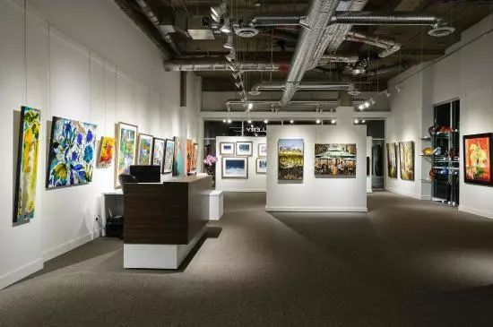
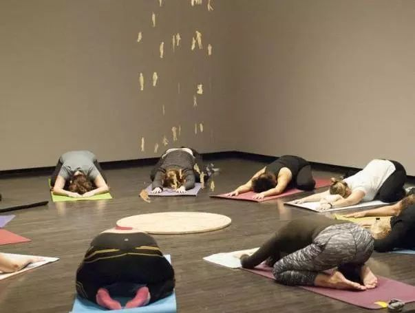
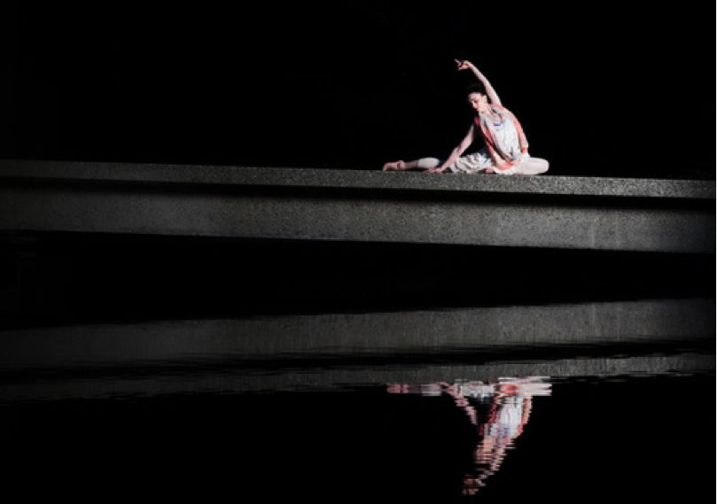
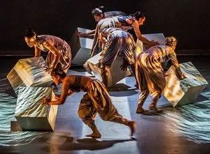
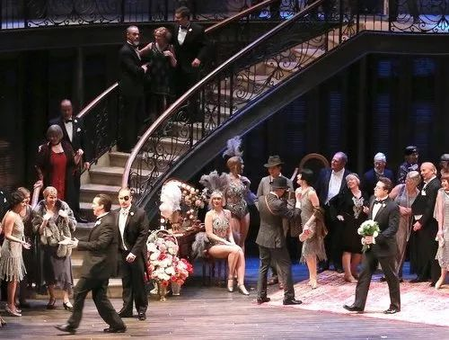
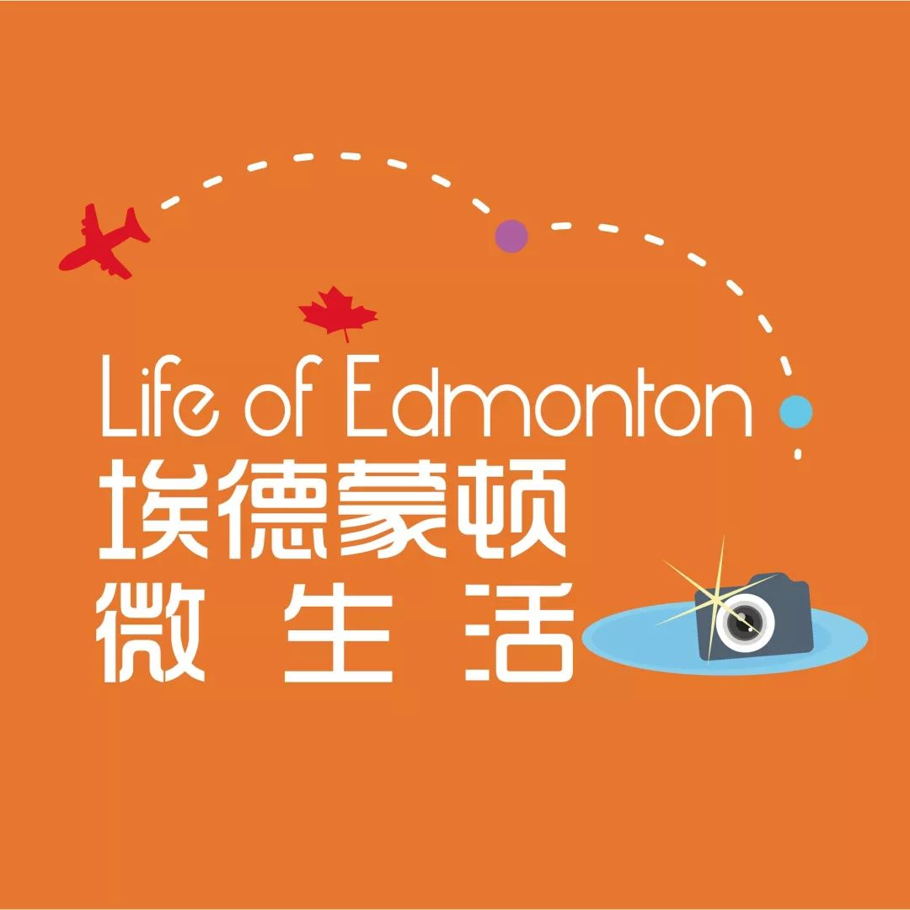

# 无标题

**链接地址:** http://mp.weixin.qq.com/s?__biz=MzI2NTE1ODgwOQ==&mid=2649605103&idx=1&sn=787d1dbf1f944e636b0a67b64d17502a&chksm=f2b8ca19c5cf430f2694486dab75e4e3a63e35cf08dcb64b05733ab1e457aa183f497554cf82&mpshare=1&scene=2&srcid=1005A3vRWc300ZKzB4HUyXxf#rd
**作者:** 雪糊
**获取时间:** 2025/8/28 21:23:45
**图片数量:** 26

---

## 原始HTML内容

<section style="box-sizing: border-box;"><section class="V5" style="box-sizing: border-box;" powered-by="xiumi.us"><section style="margin-right: 0%;margin-left: 0%;box-sizing: border-box;"><section style="display: inline-block;vertical-align: middle;width: 80%;box-sizing: border-box;"><section class="V5" style="box-sizing: border-box;" powered-by="xiumi.us"><section style="margin-top: 10px;margin-bottom: 10px;text-align: center;box-sizing: border-box;"><section style="display: inline-block;box-sizing: border-box;"><section style="max-width: 100%;font-size: 0px;padding-bottom: 3px;box-sizing: border-box;"><section style="display: inline-block;vertical-align: middle;box-sizing: border-box;"><section style="width: 5px;height: 1px;background-color: rgb(217, 217, 217);box-sizing: border-box;"></section><section style="width: 1px;height: 5px;margin-top: -3px;margin-right: auto;margin-left: auto;background-color: rgb(217, 217, 217);box-sizing: border-box;"></section></section><section style="margin-top: -1px;margin-right: -5px;margin-left: -5px;width: 100%;display: inline-block;vertical-align: middle;padding-right: 8px;padding-left: 8px;box-sizing: border-box;"><section style="width: 100%;height: 1px;background-color: rgb(217, 217, 217);box-sizing: border-box;"></section></section><section style="display: inline-block;vertical-align: middle;box-sizing: border-box;"><section style="width: 5px;height: 1px;background-color: rgb(217, 217, 217);box-sizing: border-box;"></section><section style="width: 1px;height: 5px;margin-top: -3px;margin-right: auto;margin-left: auto;background-color: rgb(217, 217, 217);box-sizing: border-box;"></section></section></section><section style="padding-left: 15px;padding-right: 15px;color: rgb(161, 161, 161);font-size: 14px;box-sizing: border-box;">
点击上方<strong style="box-sizing: border-box;">蓝字</strong>关注我们哟~
</section><section style="max-width: 100%;font-size: 0px;box-sizing: border-box;"><section style="display: inline-block;vertical-align: middle;box-sizing: border-box;"><section style="width: 5px;height: 1px;background-color: rgb(217, 217, 217);box-sizing: border-box;"></section><section style="width: 1px;height: 5px;margin-top: -3px;margin-right: auto;margin-left: auto;background-color: rgb(217, 217, 217);box-sizing: border-box;"></section></section><section style="margin-top: -1px;margin-right: -5px;margin-left: -5px;width: 100%;display: inline-block;vertical-align: middle;padding-right: 8px;padding-left: 8px;box-sizing: border-box;"><section style="width: 100%;height: 1px;background-color: rgb(217, 217, 217);box-sizing: border-box;"></section></section><section style="display: inline-block;vertical-align: middle;box-sizing: border-box;"><section style="width: 5px;height: 1px;background-color: rgb(217, 217, 217);box-sizing: border-box;"></section><section style="width: 1px;height: 5px;margin-top: -3px;margin-right: auto;margin-left: auto;background-color: rgb(217, 217, 217);box-sizing: border-box;"></section></section></section></section></section></section></section><section style="display: inline-block;vertical-align: middle;width: 20%;box-sizing: border-box;"><section class="V5" style="box-sizing: border-box;" powered-by="xiumi.us"><section style="text-align: center;margin: -10px 0% 10px;box-sizing: border-box;"><section style="max-width: 100%;vertical-align: middle;display: inline-block;width: 100%;box-sizing: border-box;"></section></section></section></section></section></section><section class="V5" style="box-sizing: border-box;" powered-by="xiumi.us"><section style="margin: 10px 0%;box-sizing: border-box;"><section style="display: inline-block;width: 100%;vertical-align: top;box-sizing: border-box;"><section class="V5" style="box-sizing: border-box;" powered-by="xiumi.us"><section style="box-sizing: border-box;"><section style="display: inline-block;vertical-align: bottom;width: 75%;padding-right: 10px;box-sizing: border-box;"><section class="V5" style="box-sizing: border-box;" powered-by="xiumi.us"><section style="margin: 10px 0% 3px;box-sizing: border-box;"><section style="display: inline-block;vertical-align: middle;box-sizing: border-box;"><section style="display: inline-block;vertical-align: bottom;padding-left: 5px;padding-right: 5px;line-height: 1.2em;margin-bottom: 2px;color: rgba(80, 182, 201, 0.72);box-sizing: border-box;">
<strong style="box-sizing: border-box;">仔细看下图，有惊喜！</strong>
</section><section style="max-width: 100%;display: inline-block;vertical-align: bottom;width: 1.6em;box-sizing: border-box;"></section></section></section></section></section><section style="display: inline-block;vertical-align: bottom;width: 25%;box-sizing: border-box;"><section class="V5" style="box-sizing: border-box;" powered-by="xiumi.us"><section style="margin-right: 0%;margin-bottom: 3px;margin-left: 0%;text-align: right;box-sizing: border-box;"><section style="display: inline-block;border-bottom: 0.15em solid rgba(80, 182, 201, 0.72);padding-bottom: 3px;box-sizing: border-box;"><section style="display: inline-block;padding: 3px;border-bottom: 0.15em solid rgba(80, 182, 201, 0.72);font-size: 12px;line-height: 1.4;color: rgb(255, 143, 47);box-sizing: border-box;">
<strong style="box-sizing: border-box;">金主大大</strong>
</section></section></section></section></section></section></section><section class="V5" style="box-sizing: border-box;" powered-by="xiumi.us"><section style="margin-right: 0%;margin-left: 0%;box-sizing: border-box;"><section style="background-color: rgba(80, 182, 201, 0.72);height: 2px;box-sizing: border-box;"></section></section></section></section></section></section><section class="V5" style="box-sizing: border-box;" powered-by="xiumi.us"><section style="box-sizing: border-box;"><section style="box-sizing: border-box;">

</section></section></section><section class="V5" style="box-sizing: border-box;" powered-by="xiumi.us"><section style="text-align: center;margin-top: 10px;margin-bottom: 10px;box-sizing: border-box;"><section style="max-width: 100%;vertical-align: middle;display: inline-block;box-sizing: border-box;"><svg xmlns="http://www.w3.org/2000/svg" x="0px" y="0px" viewBox="0 0 902.1 38.2" style="vertical-align: middle;max-width: 100%;box-sizing: border-box;" width="902.1"><g style="box-sizing: border-box;"><path style="box-sizing: border-box;" d="M18.4,1.4c0.9-1.9,2.4-1.9,3.4,0l3.4,6.9c0.9,1.9,3.4,3.7,5.4,4l7.6,1.1c2.1,0.3,2.5,1.7,1,3.2   l-5.5,5.4c-1.5,1.5-2.4,4.3-2.1,6.4l1.3,7.6c0.4,2.1-0.9,2.9-2.7,2l-6.8-3.6c-1.8-1-4.9-1-6.7,0l-6.8,3.6c-1.9,1-3.1,0.1-2.7-2   l1.3-7.6c0.4-2.1-0.6-4.9-2.1-6.4l-5.5-5.4c-1.5-1.5-1-2.9,1-3.2l7.6-1.1c2.1-0.3,4.5-2.1,5.4-4L18.4,1.4z" fill="rgb(178, 243, 230)"></path><path style="box-sizing: border-box;" d="M90.6,5.4c0.7-1.4,1.9-1.4,2.6,0l2.6,5.3c0.7,1.4,2.6,2.8,4.2,3.1l5.9,0.9c1.6,0.2,2,1.3,0.8,2.5   l-4.2,4.1c-1.2,1.1-1.9,3.3-1.6,4.9l1,5.8c0.3,1.6-0.7,2.3-2.1,1.5l-5.2-2.8c-1.4-0.8-3.8-0.8-5.2,0L84,33.6   c-1.4,0.8-2.4,0.1-2.1-1.5l1-5.8c0.3-1.6-0.5-3.8-1.6-4.9l-4.2-4.1c-1.2-1.1-0.8-2.2,0.8-2.5l5.9-0.9c1.6-0.2,3.5-1.6,4.2-3.1   L90.6,5.4z" fill="rgb(190, 204, 246)"></path><path style="box-sizing: border-box;" d="M162.6,7.5c0.6-1.2,1.6-1.2,2.2,0l2.2,4.5c0.6,1.2,2.2,2.4,3.6,2.6l5,0.7c1.4,0.2,1.7,1.1,0.7,2.1   l-3.6,3.5c-1,1-1.6,2.9-1.4,4.2l0.9,5c0.2,1.4-0.6,1.9-1.8,1.3l-4.5-2.4c-1.2-0.6-3.2-0.6-4.4,0l-4.5,2.4c-1.2,0.6-2,0.1-1.8-1.3   l0.9-5c0.2-1.4-0.4-3.3-1.4-4.2l-3.6-3.5c-1-1-0.7-1.9,0.7-2.1l5-0.7c1.4-0.2,3-1.4,3.6-2.6L162.6,7.5z" fill="rgb(150, 208, 240)"></path><path style="box-sizing: border-box;" d="M60.1,19.1c0,2.3-1.9,4.2-4.2,4.2c-2.3,0-4.2-1.9-4.2-4.2s1.9-4.2,4.2-4.2   C58.3,14.9,60.1,16.8,60.1,19.1z" fill="rgb(218, 240, 224)"></path><path style="box-sizing: border-box;" d="M203.8,19.1c0,2.3-1.9,4.2-4.2,4.2c-2.3,0-4.2-1.9-4.2-4.2s1.9-4.2,4.2-4.2   C201.9,14.9,203.8,16.8,203.8,19.1z" fill="rgb(218, 240, 224)"></path><path style="box-sizing: border-box;" d="M130.9,19.1c0,1.7-1.4,3.1-3.1,3.1c-1.7,0-3.1-1.4-3.1-3.1c0-1.7,1.4-3.1,3.1-3.1   C129.5,16.1,130.9,17.4,130.9,19.1z" fill="rgb(218, 240, 224)"></path><path style="box-sizing: border-box;" d="M233.9,1.4c0.9-1.9,2.4-1.9,3.4,0l3.4,6.9c0.9,1.9,3.4,3.7,5.4,4l7.6,1.1c2.1,0.3,2.5,1.7,1,3.2   l-5.5,5.4c-1.5,1.5-2.4,4.3-2.1,6.4l1.3,7.6c0.4,2.1-0.9,2.9-2.7,2l-6.8-3.6c-1.8-1-4.9-1-6.7,0l-6.8,3.6c-1.9,1-3.1,0.1-2.7-2   l1.3-7.6c0.4-2.1-0.6-4.9-2.1-6.4l-5.5-5.4c-1.5-1.5-1-2.9,1-3.2l7.6-1.1c2.1-0.3,4.5-2.1,5.4-4L233.9,1.4z" fill="rgb(178, 243, 230)"></path><path style="box-sizing: border-box;" d="M306.1,5.4c0.7-1.4,1.9-1.4,2.6,0l2.6,5.3c0.7,1.4,2.6,2.8,4.2,3.1l5.9,0.9c1.6,0.2,2,1.3,0.8,2.5   l-4.2,4.1c-1.2,1.1-1.9,3.3-1.6,4.9l1,5.8c0.3,1.6-0.7,2.3-2.1,1.5l-5.2-2.8c-1.4-0.8-3.8-0.8-5.2,0l-5.2,2.8   c-1.4,0.8-2.4,0.1-2.1-1.5l1-5.8c0.3-1.6-0.4-3.8-1.6-4.9l-4.2-4.1c-1.2-1.1-0.8-2.2,0.8-2.5l5.9-0.9c1.6-0.2,3.5-1.6,4.2-3.1   L306.1,5.4z" fill="rgb(190, 204, 246)"></path><path style="box-sizing: border-box;" d="M378.1,7.5c0.6-1.2,1.6-1.2,2.2,0l2.2,4.5c0.6,1.2,2.2,2.4,3.6,2.6l5,0.7c1.4,0.2,1.7,1.1,0.7,2.1   l-3.6,3.5c-1,1-1.6,2.9-1.4,4.2l0.9,5c0.2,1.4-0.6,1.9-1.8,1.3l-4.5-2.4c-1.2-0.6-3.2-0.6-4.4,0l-4.5,2.4c-1.2,0.6-2,0.1-1.8-1.3   l0.9-5c0.2-1.4-0.4-3.3-1.4-4.2l-3.6-3.5c-1-1-0.7-1.9,0.7-2.1l5-0.7c1.4-0.2,3-1.4,3.6-2.6L378.1,7.5z" fill="rgb(150, 208, 240)"></path><path style="box-sizing: border-box;" d="M275.7,19.1c0,2.3-1.9,4.2-4.2,4.2c-2.3,0-4.2-1.9-4.2-4.2s1.9-4.2,4.2-4.2   C273.8,14.9,275.7,16.8,275.7,19.1z" fill="rgb(218, 240, 224)"></path><path style="box-sizing: border-box;" d="M419.3,19.1c0,2.3-1.9,4.2-4.2,4.2c-2.3,0-4.2-1.9-4.2-4.2s1.9-4.2,4.2-4.2   C417.5,14.9,419.3,16.8,419.3,19.1z" fill="rgb(218, 240, 224)"></path><path style="box-sizing: border-box;" d="M346.4,19.1c0,1.7-1.4,3.1-3.1,3.1c-1.7,0-3.1-1.4-3.1-3.1c0-1.7,1.4-3.1,3.1-3.1   C345,16.1,346.4,17.4,346.4,19.1z" fill="rgb(218, 240, 224)"></path><path style="box-sizing: border-box;" d="M449.4,1.4c0.9-1.9,2.4-1.9,3.4,0l3.4,6.9c0.9,1.9,3.4,3.7,5.4,4l7.6,1.1c2.1,0.3,2.5,1.7,1,3.2   l-5.5,5.4c-1.5,1.5-2.4,4.3-2.1,6.4l1.3,7.6c0.4,2.1-0.9,2.9-2.7,2l-6.8-3.6c-1.8-1-4.9-1-6.7,0l-6.8,3.6c-1.9,1-3.1,0.1-2.7-2   l1.3-7.6c0.4-2.1-0.6-4.9-2.1-6.4l-5.5-5.4c-1.5-1.5-1-2.9,1-3.2l7.6-1.1c2.1-0.3,4.5-2.1,5.4-4L449.4,1.4z" fill="rgb(178, 243, 230)"></path><path style="box-sizing: border-box;" d="M521.6,5.4c0.7-1.4,1.9-1.4,2.6,0l2.6,5.3c0.7,1.4,2.6,2.8,4.2,3.1l5.9,0.9c1.6,0.2,2,1.3,0.8,2.5   l-4.2,4.1c-1.2,1.1-1.9,3.3-1.6,4.9l1,5.8c0.3,1.6-0.7,2.3-2.1,1.5l-5.2-2.8c-1.4-0.8-3.8-0.8-5.2,0l-5.2,2.8   c-1.4,0.8-2.4,0.1-2.1-1.5l1-5.8c0.3-1.6-0.5-3.8-1.6-4.9l-4.2-4.1c-1.2-1.1-0.8-2.2,0.8-2.5l5.9-0.9c1.6-0.2,3.5-1.6,4.2-3.1   L521.6,5.4z" fill="rgb(190, 204, 246)"></path><path style="box-sizing: border-box;" d="M593.6,7.5c0.6-1.2,1.6-1.2,2.2,0l2.2,4.5c0.6,1.2,2.2,2.4,3.6,2.6l5,0.7c1.4,0.2,1.7,1.1,0.7,2.1   l-3.6,3.5c-1,1-1.6,2.9-1.4,4.2l0.9,5c0.2,1.4-0.6,1.9-1.8,1.3l-4.5-2.4c-1.2-0.6-3.2-0.6-4.4,0l-4.5,2.4c-1.2,0.6-2,0.1-1.8-1.3   l0.9-5c0.2-1.4-0.4-3.3-1.4-4.2l-3.6-3.5c-1-1-0.7-1.9,0.7-2.1l5-0.7c1.4-0.2,3-1.4,3.6-2.6L593.6,7.5z" fill="rgb(150, 208, 240)"></path><path style="box-sizing: border-box;" d="M491.2,19.1c0,2.3-1.9,4.2-4.2,4.2c-2.3,0-4.2-1.9-4.2-4.2s1.9-4.2,4.2-4.2   C489.3,14.9,491.2,16.8,491.2,19.1z" fill="rgb(218, 240, 224)"></path><path style="box-sizing: border-box;" d="M634.9,19.1c0,2.3-1.9,4.2-4.2,4.2c-2.3,0-4.2-1.9-4.2-4.2s1.9-4.2,4.2-4.2   C633,14.9,634.9,16.8,634.9,19.1z" fill="rgb(218, 240, 224)"></path><path style="box-sizing: border-box;" d="M561.9,19.1c0,1.7-1.4,3.1-3.1,3.1c-1.7,0-3.1-1.4-3.1-3.1c0-1.7,1.4-3.1,3.1-3.1   C560.5,16.1,561.9,17.4,561.9,19.1z" fill="rgb(218, 240, 224)"></path><path style="box-sizing: border-box;" d="M664.9,1.4c0.9-1.9,2.4-1.9,3.4,0l3.4,6.9c0.9,1.9,3.4,3.7,5.4,4l7.6,1.1c2.1,0.3,2.5,1.7,1,3.2   l-5.5,5.4c-1.5,1.5-2.4,4.3-2.1,6.4l1.3,7.6c0.4,2.1-0.9,2.9-2.7,2l-6.8-3.6c-1.8-1-4.9-1-6.7,0l-6.8,3.6c-1.9,1-3.1,0.1-2.7-2   l1.3-7.6c0.4-2.1-0.6-4.9-2.1-6.4l-5.5-5.4c-1.5-1.5-1-2.9,1-3.2l7.6-1.1c2.1-0.3,4.5-2.1,5.4-4L664.9,1.4z" fill="rgb(178, 243, 230)"></path><path style="box-sizing: border-box;" d="M737.1,5.4c0.7-1.4,1.9-1.4,2.6,0l2.6,5.3c0.7,1.4,2.6,2.8,4.2,3.1l5.9,0.9c1.6,0.2,2,1.3,0.8,2.5   l-4.2,4.1c-1.2,1.1-1.9,3.3-1.6,4.9l1,5.8c0.3,1.6-0.7,2.3-2.1,1.5l-5.2-2.8c-1.4-0.8-3.8-0.8-5.2,0l-5.2,2.8   c-1.4,0.8-2.4,0.1-2.1-1.5l1-5.8c0.3-1.6-0.5-3.8-1.6-4.9l-4.2-4.1c-1.2-1.1-0.8-2.2,0.8-2.5l5.9-0.9c1.6-0.2,3.5-1.6,4.2-3.1   L737.1,5.4z" fill="rgb(190, 204, 246)"></path><path style="box-sizing: border-box;" d="M809.2,7.5c0.6-1.2,1.6-1.2,2.2,0l2.2,4.5c0.6,1.2,2.2,2.4,3.6,2.6l5,0.7c1.4,0.2,1.7,1.1,0.7,2.1   l-3.6,3.5c-1,1-1.6,2.9-1.4,4.2l0.9,5c0.2,1.4-0.6,1.9-1.8,1.3l-4.5-2.4c-1.2-0.6-3.2-0.6-4.4,0l-4.5,2.4c-1.2,0.6-2,0.1-1.8-1.3   l0.9-5c0.2-1.4-0.4-3.3-1.4-4.2l-3.6-3.5c-1-1-0.7-1.9,0.7-2.1l5-0.7c1.4-0.2,3-1.4,3.6-2.6L809.2,7.5z" fill="rgb(150, 208, 240)"></path><path style="box-sizing: border-box;" d="M706.7,19.1c0,2.3-1.9,4.2-4.2,4.2c-2.3,0-4.2-1.9-4.2-4.2s1.9-4.2,4.2-4.2   C704.8,14.9,706.7,16.8,706.7,19.1z" fill="rgb(218, 240, 224)"></path><path style="box-sizing: border-box;" d="M850.4,19.1c0,2.3-1.9,4.2-4.2,4.2c-2.3,0-4.2-1.9-4.2-4.2s1.9-4.2,4.2-4.2   C848.5,14.9,850.4,16.8,850.4,19.1z" fill="rgb(218, 240, 224)"></path><path style="box-sizing: border-box;" d="M777.4,19.1c0,1.7-1.4,3.1-3.1,3.1c-1.7,0-3.1-1.4-3.1-3.1c0-1.7,1.4-3.1,3.1-3.1   C776,16.1,777.4,17.4,777.4,19.1z" fill="rgb(218, 240, 224)"></path><path style="box-sizing: border-box;" d="M880.4,1.4c0.9-1.9,2.4-1.9,3.4,0l3.4,6.9c0.9,1.9,3.4,3.7,5.4,4l7.6,1.1c2.1,0.3,2.5,1.7,1,3.2   l-5.5,5.4c-1.5,1.5-2.4,4.3-2.1,6.4l1.3,7.6c0.4,2.1-0.9,2.9-2.7,2l-6.8-3.6c-1.8-1-4.9-1-6.7,0l-6.8,3.6c-1.8,1-3.1,0.1-2.7-2   l1.3-7.6c0.4-2.1-0.6-4.9-2.1-6.4l-5.5-5.4c-1.5-1.5-1-2.9,1-3.2l7.6-1.1c2.1-0.3,4.5-2.1,5.4-4L880.4,1.4z" fill="rgb(178, 243, 230)"></path></g></svg></section></section></section><section class="V5" style="box-sizing: border-box;" powered-by="xiumi.us"><section style="box-sizing: border-box;"><section style="text-align: center;box-sizing: border-box;"><section style="box-sizing: border-box;"><section class="V5" style="box-sizing: border-box;" powered-by="xiumi.us"><section style="margin-top: 10px;margin-bottom: 10px;text-align: center;box-sizing: border-box;"><section style="display: inline-block;vertical-align: top;box-sizing: border-box;"><section style="background-color: rgb(255, 255, 255);padding-right: 18px;padding-left: 18px;color: rgb(33, 150, 243);box-sizing: border-box;">
<strong style="box-sizing: border-box;"><em style="box-sizing: border-box;">爱屯周末去哪儿</em></strong>
</section><section style="width: 6px;height: 6px;border-radius: 100%;float: left;margin-top: -14px;background-color: rgb(26, 35, 126);box-sizing: border-box;"></section><section style="width: 6px;height: 6px;border-radius: 100%;float: right;margin-top: -14px;background-color: rgb(26, 35, 126);box-sizing: border-box;"></section><section style="clear: both;box-sizing: border-box;"></section></section><section style="border-width: 2px;border-style: solid;border-color: rgb(26, 35, 126);margin-top: -12px;padding: 18px 10px 10px;border-radius: 0px;box-sizing: border-box;"><section class="V5" style="box-sizing: border-box;" powered-by="xiumi.us"><section style="margin-right: 0%;margin-left: 0%;box-sizing: border-box;"><section style="max-width: 100%;vertical-align: middle;display: inline-block;width: 100%;border-bottom: 0px solid rgb(62, 62, 62);border-bottom-right-radius: 0px;box-sizing: border-box;"></section></section></section><section class="V5" style="box-sizing: border-box;" powered-by="xiumi.us"><section style="margin-right: 0%;margin-bottom: 10px;margin-left: 0%;box-sizing: border-box;"><section style="width: 100%;height: 5px;background-color: rgb(33, 150, 243);box-sizing: border-box;"></section></section></section><section class="V5" style="box-sizing: border-box;" powered-by="xiumi.us"><section style="margin: 20px 0%;box-sizing: border-box;"><section style="text-align: justify;font-size: 14px;line-height: 1.8;color: rgba(62, 62, 62, 0.72);letter-spacing: 2px;box-sizing: border-box;">
埃德蒙顿今年的冬天可不是<strong style="box-sizing: border-box;">闹着玩</strong>的。九月初的时候加拿大最权威的<strong style="box-sizing: border-box;">农夫年历</strong>就预测过今年的冬天将会<strong style="box-sizing: border-box;">格外寒冷</strong>，而且入冬早入春迟。看来今年屯民们可得早点做好抗冻防寒的准备啦！
</section></section></section><section class="V5" style="box-sizing: border-box;" powered-by="xiumi.us"><section style="margin-right: 0%;margin-left: 0%;box-sizing: border-box;"><section style="max-width: 100%;vertical-align: middle;display: inline-block;width: 100%;border-bottom: 0px solid rgb(62, 62, 62);border-bottom-right-radius: 0px;box-sizing: border-box;"></section></section></section><section class="V5" style="box-sizing: border-box;" powered-by="xiumi.us"><section style="margin-right: 0%;margin-bottom: 10px;margin-left: 0%;box-sizing: border-box;"><section style="width: 100%;height: 5px;background-color: rgb(33, 150, 243);box-sizing: border-box;"></section></section></section><section class="V5" style="box-sizing: border-box;" powered-by="xiumi.us"><section style="margin: 20px 0%;box-sizing: border-box;"><section style="text-align: justify;font-size: 14px;line-height: 1.8;color: rgba(62, 62, 62, 0.72);letter-spacing: 2px;box-sizing: border-box;">
不过对于抗冻指数<strong style="box-sizing: border-box;">Maximum</strong>的埃德蒙顿人来说，白雪皑皑的冬天可并非只能闷在家里<strong style="box-sizing: border-box;">无聊</strong>。就算是寒冷的冬天，社区组织和政府依然为广大屯民准备了丰富多彩的<strong style="box-sizing: border-box;">活动</strong>在等着各位参与。
</section></section></section><section class="V5" style="box-sizing: border-box;" powered-by="xiumi.us"><section style="margin-right: 0%;margin-left: 0%;box-sizing: border-box;"><section style="max-width: 100%;vertical-align: middle;display: inline-block;width: 100%;border-bottom: 0px solid rgb(62, 62, 62);border-bottom-right-radius: 0px;box-sizing: border-box;"></section></section></section><section class="V5" style="box-sizing: border-box;" powered-by="xiumi.us"><section style="margin-right: 0%;margin-bottom: 10px;margin-left: 0%;box-sizing: border-box;"><section style="width: 100%;height: 5px;background-color: rgb(33, 150, 243);box-sizing: border-box;"></section></section></section><section class="V5" style="box-sizing: border-box;" powered-by="xiumi.us"><section style="margin: 20px 0%;box-sizing: border-box;"><section style="text-align: justify;font-size: 14px;line-height: 1.8;color: rgba(62, 62, 62, 0.72);letter-spacing: 2px;box-sizing: border-box;">
不过要说参与真正的冬季雪场活动，还<strong style="box-sizing: border-box;">为时过早</strong>。好在在这个雪还没下成气候的日子里，我们还是可以参加很多<strong style="box-sizing: border-box;">逼格up up</strong>的高端室内活动嘛！这周末又有什么发到朋友圈<strong style="box-sizing: border-box;">倍有面子儿</strong>的活动呢？快跟着雪糊一起来看看吧！
</section></section></section></section></section></section><section class="V5" style="box-sizing: border-box;" powered-by="xiumi.us"><section style="text-align: center;margin: 10px 0%;box-sizing: border-box;"><section style="display: inline-block;width: 300px;height: 240px;vertical-align: top;overflow: hidden;background-position: 50% 50%;background-repeat: no-repeat;background-size: contain;background-attachment: scroll;padding: 10px;background-image: url(&quot;https://mmbiz.qpic.cn/mmbiz_png/D1nJqnhkPyJxAadyAaxAdbPiaZLKBiaq47nYqUrt7xK9sZ2FcFdmqO2AoEvK00VYydJjIsYPb9iaiau3hsQdxzkdMw/640?wx_fmt=png&quot;);box-sizing: border-box;"><section class="V5" style="box-sizing: border-box;" powered-by="xiumi.us"><section style="box-sizing: border-box;"><section style="text-align: left;box-sizing: border-box;">
 
</section></section></section><section class="V5" style="box-sizing: border-box;" powered-by="xiumi.us"><section style="margin-top: 5px;margin-right: 0%;margin-left: 0%;box-sizing: border-box;"><section style="display: inline-block;vertical-align: top;width: 22%;box-sizing: border-box;"><section class="V5" style="box-sizing: border-box;" powered-by="xiumi.us"><section style="box-sizing: border-box;"><section style="font-size: 42px;color: rgb(255, 255, 255);box-sizing: border-box;">
<strong style="box-sizing: border-box;">下</strong>
</section></section></section><section class="V5" style="box-sizing: border-box;" powered-by="xiumi.us"><section style="margin: -13px 0% 10px;transform: translate3d(-10px, 0px, 0px);-webkit-transform: translate3d(-10px, 0px, 0px);-moz-transform: translate3d(-10px, 0px, 0px);-o-transform: translate3d(-10px, 0px, 0px);box-sizing: border-box;"><section style="max-width: 100%;vertical-align: middle;display: inline-block;width: 100%;box-sizing: border-box;"></section></section></section></section><section style="display: inline-block;vertical-align: top;width: 22%;box-sizing: border-box;"><section class="V5" style="box-sizing: border-box;" powered-by="xiumi.us"><section style="box-sizing: border-box;"><section style="text-align: left;box-sizing: border-box;">
 
</section></section></section><section class="V5" style="box-sizing: border-box;" powered-by="xiumi.us"><section style="box-sizing: border-box;"><section style="text-align: left;box-sizing: border-box;">
 
</section></section></section><section class="V5" style="box-sizing: border-box;" powered-by="xiumi.us"><section style="transform: translate3d(-18px, 0px, 0px);margin-top: -10px;margin-right: 0%;margin-left: 0%;box-sizing: border-box;"><section style="text-align: left;font-size: 42px;color: rgb(255, 255, 255);box-sizing: border-box;">
<strong style="box-sizing: border-box;">雪</strong>
</section></section></section></section><section style="display: inline-block;vertical-align: top;width: 56%;box-sizing: border-box;"><section class="V5" style="box-sizing: border-box;" powered-by="xiumi.us"><section style="box-sizing: border-box;"><section style="text-align: left;box-sizing: border-box;">
 
</section></section></section><section class="V5" style="box-sizing: border-box;" powered-by="xiumi.us"><section style="box-sizing: border-box;"><section style="text-align: left;box-sizing: border-box;">
 
</section></section></section><section class="V5" style="box-sizing: border-box;" powered-by="xiumi.us"><section style="text-align: left;transform: translate3d(-10px, 0px, 0px);-webkit-transform: translate3d(-10px, 0px, 0px);-moz-transform: translate3d(-10px, 0px, 0px);-o-transform: translate3d(-10px, 0px, 0px);box-sizing: border-box;"><section style="text-align: justify;font-size: 15px;color: rgb(105, 106, 147);box-sizing: border-box;">
<strong style="box-sizing: border-box;">下初雪的时候，</strong>

<strong style="box-sizing: border-box;">要吃炸鸡和啤酒。</strong>
</section></section></section></section></section></section></section></section></section><section class="V5" style="box-sizing: border-box;" powered-by="xiumi.us"><section style="box-sizing: border-box;"><section style="display: inline-block;width: 100%;vertical-align: top;box-shadow: rgb(67, 103, 117) 0px 0px 10px inset;background-image: url(&quot;https://mmbiz.qpic.cn/mmbiz_png/D1nJqnhkPyJxAadyAaxAdbPiaZLKBiaq47xSTem1YJGFAWmUr5ibQmhLqP2pQCSZcWC9z2WDtHNbKPQ6cUrBuLMMg/640?wx_fmt=png&quot;);background-position: 42.7805% 56.4516%;background-repeat: repeat;background-size: 87.8999%;background-attachment: scroll;background-color: rgb(229, 241, 246);box-sizing: border-box;"><section class="V5" style="box-sizing: border-box;" powered-by="xiumi.us"><section style="box-sizing: border-box;"><section style="display: inline-block;width: 100%;vertical-align: top;box-shadow: rgb(0, 0, 0) 0px 0px 0px;padding: 10px;box-sizing: border-box;"><section class="V5" style="box-sizing: border-box;" powered-by="xiumi.us"><section style="text-align: center;margin: 10px 0%;box-sizing: border-box;"><section style="display: inline-block;min-width: 10%;max-width: 100%;vertical-align: top;padding-right: 10px;padding-left: 10px;box-sizing: border-box;"><section class="V5" style="box-sizing: border-box;" powered-by="xiumi.us"><section style="box-sizing: border-box;"><section style="text-align: left;font-size: 18px;color: rgba(62, 62, 62, 0.72);box-sizing: border-box;">
01
</section></section></section><section class="V5" style="box-sizing: border-box;" powered-by="xiumi.us"><section style="box-sizing: border-box;"><section style="display: inline-block;min-width: 10%;max-width: 100%;vertical-align: top;box-shadow: rgba(62, 62, 62, 0.72) 0px 0px 0px;border-top: 1px solid rgba(62, 62, 62, 0.72);border-top-left-radius: 0px;padding-right: 10px;padding-left: 10px;box-sizing: border-box;"><section class="V5" style="box-sizing: border-box;" powered-by="xiumi.us"></section></section></section></section></section></section></section><section class="V5" style="box-sizing: border-box;" powered-by="xiumi.us"><section style="margin-top: 10px;margin-bottom: 10px;box-sizing: border-box;"><section style="box-shadow: rgb(170, 170, 170) 0px 0px 10px inset;border-color: rgb(192, 200, 209);padding: 10px;border-width: 1px;border-style: solid;background-color: rgb(250, 250, 239);box-sizing: border-box;"><section class="V5" style="box-sizing: border-box;" powered-by="xiumi.us"><section style="text-align: center;margin-right: 0%;margin-left: 0%;box-sizing: border-box;"><section style="max-width: 100%;vertical-align: middle;display: inline-block;width: 100%;box-sizing: border-box;"></section></section></section></section></section></section><section class="V5" style="box-sizing: border-box;" powered-by="xiumi.us"><section style="margin: 20px 0%;box-sizing: border-box;"><section style="text-align: justify;color: rgba(62, 62, 62, 0.72);font-size: 14px;letter-spacing: 2px;padding-right: 10px;padding-left: 10px;box-sizing: border-box;">
著名画家<strong style="box-sizing: border-box;">Rod Charlesworth</strong>将加拿大西北地区和安大略北部绚丽多彩的风景注入了<strong style="box-sizing: border-box;">West End 画廊</strong>。该油画展被命名为<strong style="box-sizing: border-box;">“五彩缤纷的地平线”</strong>。该展览将只展出到10月11日，所以一定要尽早参观这些从加拿大的独特地形地貌中汲取灵感的伟大又华丽的作品，在严寒冬日足不出户地去感受加拿大壮阔瑰丽的自然景色。
</section></section></section><section class="V5" style="box-sizing: border-box;" powered-by="xiumi.us"><section style="margin-top: 10px;margin-bottom: 10px;box-sizing: border-box;"><section style="box-shadow: rgb(170, 170, 170) 0px 0px 10px inset;border-color: rgb(192, 200, 209);padding: 10px;border-width: 1px;border-style: solid;background-color: rgb(250, 250, 239);box-sizing: border-box;"><section class="V5" style="box-sizing: border-box;" powered-by="xiumi.us"><section style="text-align: center;margin-right: 0%;margin-left: 0%;box-sizing: border-box;"><section style="max-width: 100%;vertical-align: middle;display: inline-block;box-sizing: border-box;"></section></section></section></section></section></section><section class="V5" style="box-sizing: border-box;" powered-by="xiumi.us"><section style="margin-top: 10px;margin-bottom: 10px;box-sizing: border-box;"><section style="display: inline-block;width: 100%;border-width: 0px;border-style: none;border-color: rgb(192, 200, 209);padding: 10px;box-shadow: rgb(0, 0, 0) 0px 0px 0px;border-radius: 0px;box-sizing: border-box;"><section class="V5" style="box-sizing: border-box;" powered-by="xiumi.us"><section style="box-sizing: border-box;"><section style="color: rgba(62, 62, 62, 0.72);font-size: 14px;letter-spacing: 2px;box-sizing: border-box;">
<strong style="box-sizing: border-box;">Colourful Horizons</strong>

📍 West End Gallery，10337 124 St.

⏰ 09.29 - 10.11

☎&nbsp;780-488-4892

🌐 https://www.westendgalleryltd.com/
</section></section></section></section></section></section><section class="V5" style="box-sizing: border-box;" powered-by="xiumi.us"><section style="box-sizing: border-box;"><section style="box-sizing: border-box;">
 
</section></section></section><section class="V5" style="box-sizing: border-box;" powered-by="xiumi.us"><section style="text-align: center;margin: 10px 0%;box-sizing: border-box;"><section style="display: inline-block;min-width: 10%;max-width: 100%;vertical-align: top;padding-right: 10px;padding-left: 10px;box-sizing: border-box;"><section class="V5" style="box-sizing: border-box;" powered-by="xiumi.us"><section style="box-sizing: border-box;"><section style="text-align: left;font-size: 18px;color: rgba(62, 62, 62, 0.72);box-sizing: border-box;">
02
</section></section></section><section class="V5" style="box-sizing: border-box;" powered-by="xiumi.us"><section style="box-sizing: border-box;"><section style="display: inline-block;min-width: 10%;max-width: 100%;vertical-align: top;box-shadow: rgba(62, 62, 62, 0.72) 0px 0px 0px;border-top: 1px solid rgba(62, 62, 62, 0.72);border-top-left-radius: 0px;padding-right: 10px;padding-left: 10px;box-sizing: border-box;"><section class="V5" style="box-sizing: border-box;" powered-by="xiumi.us"></section></section></section></section></section></section></section><section class="V5" style="box-sizing: border-box;" powered-by="xiumi.us"><section style="margin-top: 10px;margin-bottom: 10px;box-sizing: border-box;"><section style="box-shadow: rgb(170, 170, 170) 0px 0px 10px inset;border-color: rgb(192, 200, 209);padding: 10px;border-width: 1px;border-style: solid;background-color: rgb(250, 250, 239);box-sizing: border-box;"><section class="V5" style="box-sizing: border-box;" powered-by="xiumi.us"><section style="text-align: center;margin-right: 0%;margin-left: 0%;box-sizing: border-box;"><section style="max-width: 100%;vertical-align: middle;display: inline-block;box-sizing: border-box;"></section></section></section></section></section></section><section class="V5" style="box-sizing: border-box;" powered-by="xiumi.us"><section style="margin: 20px 0%;box-sizing: border-box;"><section style="text-align: justify;color: rgba(62, 62, 62, 0.72);font-size: 14px;letter-spacing: 2px;padding-right: 10px;padding-left: 10px;box-sizing: border-box;">
如果你想在一个足够特别的地方进行<strong style="box-sizing: border-box;">瑜伽练习</strong>，请在本周四晚上前往<strong style="box-sizing: border-box;">阿尔伯塔艺术画廊</strong>。这项定期举办的艺术活动颇受当地热爱瑜伽的女性喜爱。任课老师<strong style="box-sizing: border-box;">Kristine</strong>将会带领学员完成一套愉悦身心的瑜伽课程。而瑜伽的主题也将从展览中汲取灵感。从而带来真正<strong style="box-sizing: border-box;">独特的体验</strong>，融合运动和视觉灵感，将艺术和运动巧妙融合。
</section></section></section><section class="V5" style="box-sizing: border-box;" powered-by="xiumi.us"><section style="margin-top: 10px;margin-bottom: 10px;box-sizing: border-box;"><section style="box-shadow: rgb(170, 170, 170) 0px 0px 10px inset;border-color: rgb(192, 200, 209);padding: 10px;border-width: 1px;border-style: solid;background-color: rgb(250, 250, 239);box-sizing: border-box;"><section class="V5" style="box-sizing: border-box;" powered-by="xiumi.us"><section style="text-align: center;margin-right: 0%;margin-left: 0%;box-sizing: border-box;"><section style="max-width: 100%;vertical-align: middle;display: inline-block;box-sizing: border-box;"></section></section></section></section></section></section><section class="V5" style="box-sizing: border-box;" powered-by="xiumi.us"><section style="margin-top: 10px;margin-bottom: 10px;box-sizing: border-box;"><section style="display: inline-block;width: 100%;border-width: 0px;border-style: none;border-color: rgb(192, 200, 209);padding: 10px;box-shadow: rgb(0, 0, 0) 0px 0px 0px;border-radius: 0px;box-sizing: border-box;"><section class="V5" style="box-sizing: border-box;" powered-by="xiumi.us"><section style="box-sizing: border-box;"><section style="color: rgba(62, 62, 62, 0.72);font-size: 14px;letter-spacing: 2px;box-sizing: border-box;">
<strong style="box-sizing: border-box;">Yoga in the Gallery</strong>

📍 Art Gallery of Alberta, 2 Sir Winston Churchill Square.

⏰ 5:30-6:30pm, Oct 4&nbsp;

☎&nbsp;780-425-5379

🌐 https://www.youraga.ca/whats-happening/calendar/yoga-gallery-thursday-evenings-0
</section></section></section></section></section></section><section class="V5" style="box-sizing: border-box;" powered-by="xiumi.us"><section style="box-sizing: border-box;"><section style="box-sizing: border-box;">
 
</section></section></section><section class="V5" style="box-sizing: border-box;" powered-by="xiumi.us"><section style="text-align: center;margin: 10px 0%;box-sizing: border-box;"><section style="display: inline-block;min-width: 10%;max-width: 100%;vertical-align: top;padding-right: 10px;padding-left: 10px;box-sizing: border-box;"><section class="V5" style="box-sizing: border-box;" powered-by="xiumi.us"><section style="box-sizing: border-box;"><section style="text-align: left;font-size: 18px;color: rgba(62, 62, 62, 0.72);box-sizing: border-box;">
03
</section></section></section><section class="V5" style="box-sizing: border-box;" powered-by="xiumi.us"><section style="box-sizing: border-box;"><section style="display: inline-block;min-width: 10%;max-width: 100%;vertical-align: top;box-shadow: rgba(62, 62, 62, 0.72) 0px 0px 0px;border-top: 1px solid rgba(62, 62, 62, 0.72);border-top-left-radius: 0px;padding-right: 10px;padding-left: 10px;box-sizing: border-box;"><section class="V5" style="box-sizing: border-box;" powered-by="xiumi.us"></section></section></section></section></section></section></section><section class="V5" style="box-sizing: border-box;" powered-by="xiumi.us"><section style="margin-top: 10px;margin-bottom: 10px;box-sizing: border-box;"><section style="box-shadow: rgb(170, 170, 170) 0px 0px 10px inset;border-color: rgb(192, 200, 209);padding: 10px;border-width: 1px;border-style: solid;background-color: rgb(250, 250, 239);box-sizing: border-box;"><section class="V5" style="box-sizing: border-box;" powered-by="xiumi.us"><section style="text-align: center;margin-right: 0%;margin-left: 0%;box-sizing: border-box;"><section style="max-width: 100%;vertical-align: middle;display: inline-block;box-sizing: border-box;"></section></section></section></section></section></section><section class="V5" style="box-sizing: border-box;" powered-by="xiumi.us"><section style="margin: 20px 0%;box-sizing: border-box;"><section style="text-align: justify;color: rgba(62, 62, 62, 0.72);font-size: 14px;letter-spacing: 2px;padding-right: 10px;padding-left: 10px;box-sizing: border-box;">
10月5日和6日，Brian Webb舞蹈公司将推出第<strong style="box-sizing: border-box;">40</strong>个舞蹈表演季的重磅演出<strong style="box-sizing: border-box;">Attakkalari</strong>。这场艺术盛宴汇集了来自印度，德国和意大利的创意非凡的<strong style="box-sizing: border-box;">现代先锋舞蹈大师</strong>！他们将用曼妙的舞姿和灵感迸发的舞蹈内容让你领略到现代舞文化的震撼之美！该表演只有本周五和周六<strong style="box-sizing: border-box;">两场</strong>，喜欢的朋友们请千万不要错过。
</section></section></section><section class="V5" style="box-sizing: border-box;" powered-by="xiumi.us"><section style="margin-top: 10px;margin-bottom: 10px;box-sizing: border-box;"><section style="box-shadow: rgb(170, 170, 170) 0px 0px 10px inset;border-color: rgb(192, 200, 209);padding: 10px;border-width: 1px;border-style: solid;background-color: rgb(250, 250, 239);box-sizing: border-box;"><section class="V5" style="box-sizing: border-box;" powered-by="xiumi.us"><section style="text-align: center;margin-right: 0%;margin-left: 0%;box-sizing: border-box;"><section style="max-width: 100%;vertical-align: middle;display: inline-block;width: 100%;box-sizing: border-box;"></section></section></section></section></section></section><section class="V5" style="box-sizing: border-box;" powered-by="xiumi.us"><section style="margin-top: 10px;margin-bottom: 10px;box-sizing: border-box;"><section style="display: inline-block;width: 100%;border-width: 0px;border-style: none;border-color: rgb(192, 200, 209);padding: 10px;box-shadow: rgb(0, 0, 0) 0px 0px 0px;border-radius: 0px;box-sizing: border-box;"><section class="V5" style="box-sizing: border-box;" powered-by="xiumi.us"><section style="box-sizing: border-box;"><section style="color: rgba(62, 62, 62, 0.72);font-size: 14px;letter-spacing: 2px;box-sizing: border-box;">
<strong style="box-sizing: border-box;">Attakkalari</strong>

📍 Triffo Theatre — Allard Hall, 11110 104 Ave.

⏰ October 5,6&nbsp;

☎&nbsp;780-420-1757

🌐 https://www.bwdc.ca/
</section></section></section></section></section></section><section class="V5" style="box-sizing: border-box;" powered-by="xiumi.us"><section style="box-sizing: border-box;"><section style="box-sizing: border-box;">
 
</section></section></section><section class="V5" style="box-sizing: border-box;" powered-by="xiumi.us"><section style="text-align: center;margin: 10px 0%;box-sizing: border-box;"><section style="display: inline-block;min-width: 10%;max-width: 100%;vertical-align: top;padding-right: 10px;padding-left: 10px;box-sizing: border-box;"><section class="V5" style="box-sizing: border-box;" powered-by="xiumi.us"><section style="box-sizing: border-box;"><section style="text-align: left;font-size: 18px;color: rgba(62, 62, 62, 0.72);box-sizing: border-box;">
04
</section></section></section><section class="V5" style="box-sizing: border-box;" powered-by="xiumi.us"><section style="box-sizing: border-box;"><section style="display: inline-block;min-width: 10%;max-width: 100%;vertical-align: top;box-shadow: rgba(62, 62, 62, 0.72) 0px 0px 0px;border-top: 1px solid rgba(62, 62, 62, 0.72);border-top-left-radius: 0px;padding-right: 10px;padding-left: 10px;box-sizing: border-box;"><section class="V5" style="box-sizing: border-box;" powered-by="xiumi.us"></section></section></section></section></section></section></section><section class="V5" style="box-sizing: border-box;" powered-by="xiumi.us"><section style="margin-top: 10px;margin-bottom: 10px;box-sizing: border-box;"><section style="box-shadow: rgb(170, 170, 170) 0px 0px 10px inset;border-color: rgb(192, 200, 209);padding: 10px;border-width: 1px;border-style: solid;background-color: rgb(250, 250, 239);box-sizing: border-box;"><section class="V5" style="box-sizing: border-box;" powered-by="xiumi.us"><section style="text-align: center;margin-right: 0%;margin-left: 0%;box-sizing: border-box;"><section style="max-width: 100%;vertical-align: middle;display: inline-block;box-sizing: border-box;"></section></section></section></section></section></section><section class="V5" style="box-sizing: border-box;" powered-by="xiumi.us"><section style="margin: 20px 0%;box-sizing: border-box;"><section style="text-align: justify;color: rgba(62, 62, 62, 0.72);font-size: 14px;letter-spacing: 2px;padding-right: 10px;padding-left: 10px;box-sizing: border-box;">
伟大的浪漫主义悲剧<strong style="box-sizing: border-box;">《茶花女》</strong>是由朱塞佩·威尔第作曲的三幕歌剧，改编自<strong style="box-sizing: border-box;">小仲马</strong>于1848年出版的小说《茶花女》。自10月3日起，埃德蒙顿歌剧院将隆重推出广为流传的Opera 101系列，特别加场经典中的经典歌剧《茶花女》，将观众带回上世纪的<strong style="box-sizing: border-box;">法国巴黎</strong>街头，去感受人物命运的悲怆，爱情的伟大和世道轮回的惨烈。热爱歌剧艺术的你请千万不要错过。
</section></section></section><section class="V5" style="box-sizing: border-box;" powered-by="xiumi.us"><section style="margin-top: 10px;margin-bottom: 10px;box-sizing: border-box;"><section style="box-shadow: rgb(170, 170, 170) 0px 0px 10px inset;border-color: rgb(192, 200, 209);padding: 10px;border-width: 1px;border-style: solid;background-color: rgb(250, 250, 239);box-sizing: border-box;"><section class="V5" style="box-sizing: border-box;" powered-by="xiumi.us"><section style="text-align: center;margin-right: 0%;margin-left: 0%;box-sizing: border-box;"><section style="max-width: 100%;vertical-align: middle;display: inline-block;box-sizing: border-box;"></section></section></section></section></section></section><section class="V5" style="box-sizing: border-box;" powered-by="xiumi.us"><section style="margin-top: 10px;margin-bottom: 10px;box-sizing: border-box;"><section style="display: inline-block;width: 100%;border-width: 0px;border-style: none;border-color: rgb(192, 200, 209);padding: 10px;box-shadow: rgb(0, 0, 0) 0px 0px 0px;border-radius: 0px;box-sizing: border-box;"><section class="V5" style="box-sizing: border-box;" powered-by="xiumi.us"><section style="box-sizing: border-box;"><section style="color: rgba(62, 62, 62, 0.72);font-size: 14px;letter-spacing: 2px;box-sizing: border-box;">
<strong style="box-sizing: border-box;">La Traviata</strong>

📍 CKUA Radio，9804 Jasper Ave.

⏰ Oct 3 之后

☎&nbsp;780-429-1000

🌐 https://www.edmontonopera.com/
</section></section></section></section></section></section><section class="V5" style="box-sizing: border-box;" powered-by="xiumi.us"><section style="box-sizing: border-box;"><section style="font-size: 14px;color: rgba(62, 62, 62, 0.72);box-sizing: border-box;">
<strong style="box-sizing: border-box;">- END -&nbsp; </strong>

<strong style="box-sizing: border-box;">下期文章更加精彩，敬请关注我们的公众号哦！ </strong>
</section></section></section></section></section></section><section class="V5" style="box-sizing: border-box;" powered-by="xiumi.us"><section style="text-align: center;margin-right: 0%;margin-left: 0%;box-sizing: border-box;"><section style="max-width: 100%;vertical-align: middle;display: inline-block;box-shadow: rgb(0, 0, 0) 0px 0px 0px;border-width: 0px;border-radius: 0px;border-style: none;border-color: rgb(62, 62, 62);box-sizing: border-box;"></section></section></section></section></section></section></section>
 
</section></section></section><section class="V5" style="box-sizing: border-box;" powered-by="xiumi.us"><section style="margin: 10px 0%;box-sizing: border-box;"><section style="display: inline-block;vertical-align: top;width: 50%;box-sizing: border-box;"><section class="V5" style="box-sizing: border-box;" powered-by="xiumi.us"><section style="text-align: right;margin-right: 0%;margin-bottom: -10px;margin-left: 0%;box-sizing: border-box;"><section style="display: inline-block;min-width: 10%;max-width: 100%;vertical-align: top;padding-right: 20px;box-sizing: border-box;"><section class="V5" style="box-sizing: border-box;" powered-by="xiumi.us"><section style="margin-right: 0%;margin-left: 0%;box-sizing: border-box;"><section style="text-align: center;color: rgb(138, 206, 191);box-sizing: border-box;">
<strong style="box-sizing: border-box;">特约</strong> 
</section></section></section></section></section></section><section class="V5" style="box-sizing: border-box;" powered-by="xiumi.us"><section style="margin-top: -10px;margin-right: 0%;margin-left: 0%;text-align: right;transform: translate3d(9px, 0px, 0px);box-sizing: border-box;"><section style="display: inline-block;vertical-align: top;background-color: rgb(255, 255, 255);box-sizing: border-box;"><section style="display: inline-block;vertical-align: bottom;margin-bottom: 11px;width: 5px;border-right: 1px solid rgb(79, 118, 120);border-left: 1px solid rgb(79, 118, 120);height: 8px;transform-origin: center bottom 0px;-webkit-transform-origin: center bottom 0px;-moz-transform-origin: center bottom 0px;-o-transform-origin: center bottom 0px;transform: skew(-30deg);-webkit-transform: skew(-30deg);-moz-transform: skew(-30deg);-o-transform: skew(-30deg);border-top-color: rgb(79, 118, 120);border-bottom-color: rgb(79, 118, 120);box-sizing: border-box;"></section><section style="display: inline-block;vertical-align: top;padding-left: 10px;box-sizing: border-box;">
 
</section></section><section style="height: 12px;margin-top: -12px;border-top: 1px solid rgb(79, 118, 120);box-sizing: border-box;"></section></section></section></section><section style="display: inline-block;vertical-align: top;width: 50%;box-sizing: border-box;"><section class="V5" style="box-sizing: border-box;" powered-by="xiumi.us"><section style="margin-right: 0%;margin-left: 0%;box-sizing: border-box;"><section style="display: inline-block;vertical-align: top;background-color: rgb(255, 255, 255);box-sizing: border-box;"><section style="display: inline-block;vertical-align: top;padding-right: 5px;box-sizing: border-box;">
 
</section><section style="margin-right: 4px;margin-bottom: 4px;display: inline-block;vertical-align: bottom;width: 5px;border-right: 1px solid rgb(79, 118, 120);border-left: 1px solid rgb(79, 118, 120);height: 8px;transform-origin: center bottom 0px;-webkit-transform-origin: center bottom 0px;-moz-transform-origin: center bottom 0px;-o-transform-origin: center bottom 0px;transform: skew(-30deg);-webkit-transform: skew(-30deg);-moz-transform: skew(-30deg);-o-transform: skew(-30deg);border-top-color: rgb(79, 118, 120);border-bottom-color: rgb(79, 118, 120);box-sizing: border-box;"></section></section><section style="height: 12px;margin-top: -12px;border-top: 1px solid rgb(79, 118, 120);box-sizing: border-box;"></section></section></section><section class="V5" style="box-sizing: border-box;" powered-by="xiumi.us"><section style="margin-top: -10px;margin-right: 0%;margin-left: 0%;box-sizing: border-box;"><section style="display: inline-block;min-width: 10%;max-width: 100%;vertical-align: top;padding-left: 20px;box-sizing: border-box;"><section class="V5" style="box-sizing: border-box;" powered-by="xiumi.us"><section style="box-sizing: border-box;"><section style="color: rgb(138, 206, 191);box-sizing: border-box;">
<strong style="box-sizing: border-box;">赞助</strong>
</section></section></section></section></section></section></section></section></section><section class="V5" style="box-sizing: border-box;" powered-by="xiumi.us"><section style="box-sizing: border-box;"><section style="box-sizing: border-box;">

</section></section></section><section class="V5" style="box-sizing: border-box;" powered-by="xiumi.us"><section style="margin-top: 0.5em;margin-bottom: 0.5em;box-sizing: border-box;"> <section style="display: inline-block;height: 1px;width: 75%;margin-top: 15px;vertical-align: top;background: url(&quot;https://mmbiz.qpic.cn/mmbiz_png/D1nJqnhkPyJxAadyAaxAdbPiaZLKBiaq472FTf10exh6dnGrsNRACH4bwac8rDNGKmymkhwZF2GLXHQVH4HfhOPA/640?wx_fmt=png&quot;) repeat-x rgba(80, 182, 201, 0.72);box-sizing: border-box;"></section></section></section><section class="V5" style="box-sizing: border-box;" powered-by="xiumi.us"><section style="box-sizing: border-box;"><section style="box-sizing: border-box;">
 
</section></section></section><section class="V5" style="box-sizing: border-box;" powered-by="xiumi.us"><section style="text-align: center;box-sizing: border-box;"><section style="max-width: 100%;display: inline-block;width: 100%;box-shadow: rgb(0, 0, 0) 0px 0px 0px;box-sizing: border-box;"></section></section></section><section class="V5" style="box-sizing: border-box;" powered-by="xiumi.us"><section style="margin-top: 8px;margin-right: 0%;margin-left: 0%;box-sizing: border-box;"><section style="display: inline-block;vertical-align: middle;width: 36%;padding-right: 10px;border-right: 0px solid rgb(62, 62, 62);border-top-right-radius: 0px;box-shadow: rgb(0, 0, 0) 0px 0px 0px;box-sizing: border-box;"><section class="V5" style="box-sizing: border-box;" powered-by="xiumi.us"><section style="text-align: right;font-size: 24px;box-sizing: border-box;"><section style="box-sizing: border-box;display: inline-block;vertical-align: bottom;margin-right: auto;margin-bottom: 0.2em;margin-left: auto;width: 3em;height: 3em;border-radius: 100%;background-position: 0% 0%;background-repeat: no-repeat;background-size: 115.517%;box-shadow: rgb(102, 102, 102) 3.53553px 3.53553px 5px;background-image: url(&quot;https://mmbiz.qpic.cn/mmbiz_jpg/D1nJqnhkPyJxAadyAaxAdbPiaZLKBiaq473iciayptC6Q99HgTM6QMpgQgaADZOtL55oBqKR0FajnoOcY8hsgN0rew/640?wx_fmt=jpeg&quot;);"><section style="width: 100%;height: 100%;overflow: hidden;box-sizing: border-box;"></section></section></section></section></section><section style="display: inline-block;vertical-align: middle;width: 50%;padding-left: 10px;border-left: 1px solid rgb(100, 124, 107);border-bottom-left-radius: 0px;box-sizing: border-box;"><section class="V5" style="box-sizing: border-box;" powered-by="xiumi.us"><section style="box-sizing: border-box;"><section style="font-size: 14px;color: rgba(62, 62, 62, 0.72);box-sizing: border-box;">
<strong style="box-sizing: border-box;">作者：Nina Chen</strong>

商业合作/广告投放

微信号: haoxue_nina
</section></section></section></section></section></section><section class="V5" style="box-sizing: border-box;" powered-by="xiumi.us"><section style="text-align: center;box-sizing: border-box;"><section style="max-width: 100%;display: inline-block;width: 100%;box-sizing: border-box;"></section></section></section><section class="V5" style="box-sizing: border-box;" powered-by="xiumi.us"><section style="box-sizing: border-box;"><section style="box-sizing: border-box;">
 
</section></section></section><section class="V5" style="box-sizing: border-box;" powered-by="xiumi.us"><section style="box-sizing: border-box;"><section style="box-sizing: border-box;">
 
</section></section></section><section class="V5" style="box-sizing: border-box;" powered-by="xiumi.us"><section style="margin: 40px 0% 10px;text-align: center;box-sizing: border-box;"><section style="display: inline-block;width: 90%;border-width: 1px;border-style: dotted;border-color: rgba(80, 182, 201, 0.72);padding: 10px;border-radius: 0px;box-sizing: border-box;"><section class="V5" style="box-sizing: border-box;" powered-by="xiumi.us"><section style="transform: translate3d(20px, 0px, 0px);text-align: left;font-size: 11px;margin-top: -55px;margin-right: 0%;margin-left: 0%;box-sizing: border-box;"><section style="box-sizing: border-box;width: 7em;height: 7em;display: inline-block;vertical-align: bottom;border-radius: 100%;border-width: 5px;border-style: none;border-color: rgba(80, 182, 201, 0.72);background-position: center center;background-repeat: no-repeat;background-size: cover;background-image: url(&quot;https://mmbiz.qpic.cn/mmbiz_jpg/D1nJqnhkPyJxAadyAaxAdbPiaZLKBiaq47pwwVKDkGHpAJPdOJ3lNTLBzBjo93S4ANQYL2570GseDM2hib4mveMxQ/640?wx_fmt=jpeg&quot;);"><section style="width: 100%;height: 100%;overflow: hidden;box-sizing: border-box;"></section></section></section></section><section class="V5" style="box-sizing: border-box;" powered-by="xiumi.us"><section style="box-sizing: border-box;"><section class="group-empty" style="display: inline-block;vertical-align: top;width: 38.2%;box-sizing: border-box;"></section><section style="display: inline-block;vertical-align: top;width: 61.8%;box-sizing: border-box;"><section class="V5" style="box-sizing: border-box;" powered-by="xiumi.us"><section style="margin-right: 0%;margin-left: 0%;box-sizing: border-box;"><section style="font-size: 18px;color: rgb(67, 103, 117);line-height: 1.6;letter-spacing: 1px;box-sizing: border-box;">
<strong style="box-sizing: border-box;">埃德蒙顿微生活</strong>
</section></section></section><section class="V5" style="box-sizing: border-box;" powered-by="xiumi.us"><section style="margin-top: 0.5em;margin-bottom: 0.5em;box-sizing: border-box;"><section style="background-color: rgba(80, 182, 201, 0.72);height: 1px;box-sizing: border-box;"></section></section></section></section></section></section><section class="V5" style="box-sizing: border-box;" powered-by="xiumi.us"><section style="box-sizing: border-box;"><section style="text-align: justify;font-size: 14px;color: rgba(62, 62, 62, 0.72);letter-spacing: 2px;box-sizing: border-box;">
<strong style="box-sizing: border-box;">关心埃德蒙顿民生，</strong>

<strong style="box-sizing: border-box;">关注埃德蒙顿的发展。</strong>

 

埃德蒙顿微生活是“吃喝玩乐埃德蒙顿”旗下，为埃德蒙顿地区的居民提供每日最新的吃喝玩乐、工作学习、商业投资的媒体平台 。
</section></section></section><section class="V5" style="box-sizing: border-box;" powered-by="xiumi.us"><section style="box-sizing: border-box;"><section style="text-align: left;box-sizing: border-box;">
 
</section></section></section><section class="V5" style="box-sizing: border-box;" powered-by="xiumi.us"><section style="box-sizing: border-box;"><section style="display: inline-block;vertical-align: middle;width: 61.8%;box-sizing: border-box;"><section class="V5" style="box-sizing: border-box;" powered-by="xiumi.us"><section style="box-sizing: border-box;"><section style="text-align: justify;font-size: 12px;color: rgba(62, 62, 62, 0.37);line-height: 1.9;letter-spacing: 0px;box-sizing: border-box;">
我们的目标是以最新、最快、最及时的方式 报道埃德蒙顿的新鲜事 。 
</section></section></section></section><section style="display: inline-block;vertical-align: middle;width: 38.2%;box-sizing: border-box;"><section class="V5" style="box-sizing: border-box;" powered-by="xiumi.us"><section style="margin-right: 0%;margin-left: 0%;box-sizing: border-box;"><section style="max-width: 100%;vertical-align: middle;display: inline-block;width: 70%;box-sizing: border-box;"></section></section></section></section></section></section></section></section></section></section>
 

---

## 纯文本内容

点击上方蓝字关注我们哟~仔细看下图，有惊喜！金主大大爱屯周末去哪儿埃德蒙顿今年的冬天可不是闹着玩的。九月初的时候加拿大最权威的农夫年历就预测过今年的冬天将会格外寒冷，而且入冬早入春迟。看来今年屯民们可得早点做好抗冻防寒的准备啦！不过对于抗冻指数Maximum的埃德蒙顿人来说，白雪皑皑的冬天可并非只能闷在家里无聊。就算是寒冷的冬天，社区组织和政府依然为广大屯民准备了丰富多彩的活动在等着各位参与。不过要说参与真正的冬季雪场活动，还为时过早。好在在这个雪还没下成气候的日子里，我们还是可以参加很多逼格up up的高端室内活动嘛！这周末又有什么发到朋友圈倍有面子儿的活动呢？快跟着雪糊一起来看看吧！下雪下初雪的时候，要吃炸鸡和啤酒。01著名画家Rod Charlesworth将加拿大西北地区和安大略北部绚丽多彩的风景注入了West End 画廊。该油画展被命名为“五彩缤纷的地平线”。该展览将只展出到10月11日，所以一定要尽早参观这些从加拿大的独特地形地貌中汲取灵感的伟大又华丽的作品，在严寒冬日足不出户地去感受加拿大壮阔瑰丽的自然景色。Colourful Horizons📍 West End Gallery，10337 124 St.⏰ 09.29 - 10.11☎ 780-488-4892🌐 https://www.westendgalleryltd.com/02如果你想在一个足够特别的地方进行瑜伽练习，请在本周四晚上前往阿尔伯塔艺术画廊。这项定期举办的艺术活动颇受当地热爱瑜伽的女性喜爱。任课老师Kristine将会带领学员完成一套愉悦身心的瑜伽课程。而瑜伽的主题也将从展览中汲取灵感。从而带来真正独特的体验，融合运动和视觉灵感，将艺术和运动巧妙融合。Yoga in the Gallery📍 Art Gallery of Alberta, 2 Sir Winston Churchill Square.⏰ 5:30-6:30pm, Oct 4 ☎ 780-425-5379🌐 https://www.youraga.ca/whats-happening/calendar/yoga-gallery-thursday-evenings-00310月5日和6日，Brian Webb舞蹈公司将推出第40个舞蹈表演季的重磅演出Attakkalari。这场艺术盛宴汇集了来自印度，德国和意大利的创意非凡的现代先锋舞蹈大师！他们将用曼妙的舞姿和灵感迸发的舞蹈内容让你领略到现代舞文化的震撼之美！该表演只有本周五和周六两场，喜欢的朋友们请千万不要错过。Attakkalari📍 Triffo Theatre — Allard Hall, 11110 104 Ave.⏰ October 5,6 ☎ 780-420-1757🌐 https://www.bwdc.ca/04伟大的浪漫主义悲剧《茶花女》是由朱塞佩·威尔第作曲的三幕歌剧，改编自小仲马于1848年出版的小说《茶花女》。自10月3日起，埃德蒙顿歌剧院将隆重推出广为流传的Opera 101系列，特别加场经典中的经典歌剧《茶花女》，将观众带回上世纪的法国巴黎街头，去感受人物命运的悲怆，爱情的伟大和世道轮回的惨烈。热爱歌剧艺术的你请千万不要错过。La Traviata📍 CKUA Radio，9804 Jasper Ave.⏰ Oct 3 之后☎ 780-429-1000🌐 https://www.edmontonopera.com/- END - 下期文章更加精彩，敬请关注我们的公众号哦！特约赞助 作者：Nina Chen商业合作/广告投放微信号: haoxue_nina埃德蒙顿微生活关心埃德蒙顿民生，关注埃德蒙顿的发展。埃德蒙顿微生活是“吃喝玩乐埃德蒙顿”旗下，为埃德蒙顿地区的居民提供每日最新的吃喝玩乐、工作学习、商业投资的媒体平台 。我们的目标是以最新、最快、最及时的方式 报道埃德蒙顿的新鲜事 。

---

## 图片列表

-  (原始链接: https://mmbiz.qpic.cn/mmbiz_gif/D1nJqnhkPyJxAadyAaxAdbPiaZLKBiaq47yB8YxniaYW6KYDf5tBBN2QIeibPAq6ka85cjAibRVbmpYib53AKbhBamQA/640?wx_fmt=gif)
-  (原始链接: https://mmbiz.qpic.cn/mmbiz_gif/D1nJqnhkPyJxAadyAaxAdbPiaZLKBiaq47DxRkZibxSBbSvJOMasD6lQqibYicBGjbOfRxL2P66EaTIxGNVicd1vo6lw/640?wx_fmt=gif)
-  (原始链接: https://mmbiz.qpic.cn/mmbiz_jpg/mZIpZ2dRo6ZVoJhUecmkegkWqzRmL9rPG0o5dC4A2b2rmKExo9cF7qY7zZ8iapWicrE102u46qXAgBN661mHscUQ/640?wx_fmt=jpeg)
-  (原始链接: https://mmbiz.qpic.cn/mmbiz_jpg/D1nJqnhkPyJT4U32Y548Hw5aBlviccaDpkfNVYF9uRyc8DkjQYVxHibVjQqeC0eFuWFl7ndQqvSrQu6yx3XXefhg/640?wx_fmt=jpeg)
-  (原始链接: https://mmbiz.qpic.cn/mmbiz_jpg/D1nJqnhkPyJMnbYWl1jibuWOJhwEH9ALftJic1p4AOTYRM288ia0RibgNzECAWsU2VghE4oe7ibX1P86O43YhlJ9BZg/640?wx_fmt=jpeg)
-  (原始链接: https://mmbiz.qpic.cn/mmbiz_jpg/mZIpZ2dRo6bEGJj3ZeL7Xib1XedXSCvicUVee9QebibGnDy0Y1boHullFBNgiav980nlGWyCuuaZ6lSlcxQEnuXm5A/640?wx_fmt=jpeg)
-  (原始链接: https://mmbiz.qpic.cn/mmbiz_jpg/D1nJqnhkPyJxAadyAaxAdbPiaZLKBiaq47jqvjl8tzc6vrIQ7dficlP7xWEkkicrnqib6oiblZrkhQSJp4qic21jYDCRQ/640?wx_fmt=jpeg)
-  (原始链接: https://mmbiz.qpic.cn/mmbiz_jpg/D1nJqnhkPyJxAadyAaxAdbPiaZLKBiaq47MwuYxuAfx8hW02Z40uNr7esvW1RNq9HNicuicTOe4c5o1icvvVWvOogDQ/640?wx_fmt=jpeg)
-  (原始链接: https://mmbiz.qpic.cn/mmbiz_jpg/D1nJqnhkPyJxAadyAaxAdbPiaZLKBiaq47kriaxf4EwCqTIpemZEwajaW4yL5c5Tqjib3uSMKeHeyQ8xlMFJytQFyg/640?wx_fmt=jpeg)
-  (原始链接: https://mmbiz.qpic.cn/mmbiz_gif/D1nJqnhkPyJxAadyAaxAdbPiaZLKBiaq47RXmnhibRQe6cgg64NmDicy2RWwOzbhiao76l96Wl82yjB8yCaAt3XpuQA/640?wx_fmt=gif)
-  (原始链接: https://mmbiz.qpic.cn/mmbiz_jpg/D1nJqnhkPyJxAadyAaxAdbPiaZLKBiaq47TpNv9sNZibBKC01l5YvPNiaMGvlC3BENUqmoGVib1UzdDmBtLdMSZUAZw/640?wx_fmt=jpeg)
-  (原始链接: https://mmbiz.qpic.cn/mmbiz_jpg/D1nJqnhkPyJxAadyAaxAdbPiaZLKBiaq475jzxotpcaCztNXibiba0G2vlpv6ScYKYKse9heUZGg70AUSPUaCy4EQA/640?wx_fmt=jpeg)
-  (原始链接: https://mmbiz.qpic.cn/mmbiz_jpg/D1nJqnhkPyJxAadyAaxAdbPiaZLKBiaq47GjyhP3WCxVCDibcKaf1iaico0lOJibxNheLLiag1hDHKJoaXsyCTmfsb92w/640?wx_fmt=jpeg)
-  (原始链接: https://mmbiz.qpic.cn/mmbiz_png/D1nJqnhkPyJxAadyAaxAdbPiaZLKBiaq47LusKXpLrDhKWxe1B3icUzGVbZWk8yEE2Wiax8Wuqwf1BO8IkwO272cVw/640?wx_fmt=png)
-  (原始链接: https://mmbiz.qpic.cn/mmbiz_jpg/D1nJqnhkPyJxAadyAaxAdbPiaZLKBiaq47VtNGBdbXchP6AZ4aRxxFpmlOs25dB9FUvH7zpQC3IySTNHYwyhTtMg/640?wx_fmt=jpeg)
-  (原始链接: https://mmbiz.qpic.cn/mmbiz_jpg/D1nJqnhkPyJxAadyAaxAdbPiaZLKBiaq47vChE2U6HXsOp5PtxnrdVFCTicVsWMSDO7SggP9kYbJNrzUOibtnsJ5EQ/640?wx_fmt=jpeg)
-  (原始链接: https://mmbiz.qpic.cn/mmbiz_jpg/D1nJqnhkPyJxAadyAaxAdbPiaZLKBiaq47Nx7cgibWx2RQBibKUzshyJgIEVWbcP0icWiaicdeDvnScib1R0bbXxRJXrhQ/640?wx_fmt=jpeg)
-  (原始链接: https://mmbiz.qpic.cn/mmbiz_jpg/D1nJqnhkPyJxAadyAaxAdbPiaZLKBiaq474yV6mhqLZHtmfRNDJjP3JhRg6SwRWfnxWib4MGr87qomnNVbMHK8VeA/640?wx_fmt=jpeg)
-  (原始链接: https://mmbiz.qpic.cn/mmbiz_png/D1nJqnhkPyJxAadyAaxAdbPiaZLKBiaq47ibGQKIt7lSjKWL2H2j4cHicn1K94QraMZ6VcjsSNorrtX0e3ffzlkjiaQ/640?wx_fmt=png)
-  (原始链接: https://mmbiz.qpic.cn/mmbiz_jpg/D1nJqnhkPyLo3L0iawegpPefdoialIOMJsLYAWDKWZibActHTInqxOYIqm69LVFG0zLVDT3SI3PON4Sz2gvhHH80g/640?wx_fmt=jpeg)
-  (原始链接: https://mmbiz.qpic.cn/mmbiz_png/D1nJqnhkPyJxAadyAaxAdbPiaZLKBiaq47dic0r6zYh08uaKn8v2IriboJZfiaUeouznExSVE852iaf3EqDoVdgJQufA/640?wx_fmt=png)
-  (原始链接: https://mmbiz.qpic.cn/mmbiz_jpg/D1nJqnhkPyJxAadyAaxAdbPiaZLKBiaq479gD7Np9sqn6OuIPb80oSuvYZ0VJpsFmzdwlcBgoMVCVy4HdHPGibhBw/640?wx_fmt=jpeg)
-  (原始链接: https://mmbiz.qpic.cn/mmbiz_jpg/D1nJqnhkPyJxAadyAaxAdbPiaZLKBiaq473iciayptC6Q99HgTM6QMpgQgaADZOtL55oBqKR0FajnoOcY8hsgN0rew/640?wx_fmt=jpeg)
-  (原始链接: https://mmbiz.qpic.cn/mmbiz_jpg/D1nJqnhkPyJxAadyAaxAdbPiaZLKBiaq479gD7Np9sqn6OuIPb80oSuvYZ0VJpsFmzdwlcBgoMVCVy4HdHPGibhBw/640?wx_fmt=jpeg)
-  (原始链接: https://mmbiz.qpic.cn/mmbiz_jpg/D1nJqnhkPyJxAadyAaxAdbPiaZLKBiaq47pwwVKDkGHpAJPdOJ3lNTLBzBjo93S4ANQYL2570GseDM2hib4mveMxQ/640?wx_fmt=jpeg)
-  (原始链接: https://mmbiz.qpic.cn/mmbiz_jpg/D1nJqnhkPyJxAadyAaxAdbPiaZLKBiaq47dEklmNzqGLWpXLpon8gKh5ZMja5vA8ate1ZzeH02bxNKcqY28q37EA/640?wx_fmt=jpeg)
