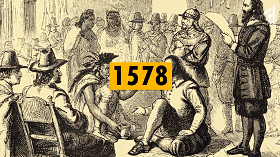
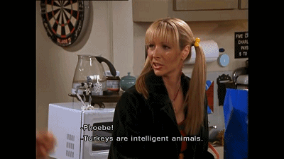
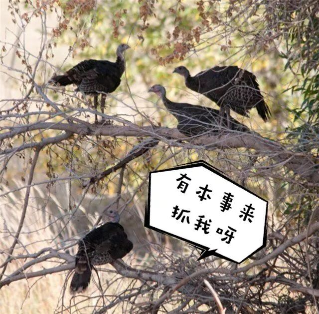

# 无标题

**链接地址:** http://mp.weixin.qq.com/s?__biz=MzI2NTE1ODgwOQ==&mid=2649605119&idx=1&sn=aa0514d0967878dd7f4e4cd769f34f43&chksm=f2b8ca09c5cf431f91ea8000f9e48a051a907d5b4795b7c207a47cdc77282e46075eb7131cae&mpshare=1&scene=2&srcid=1008k7E4icngeIlmAod7olSL#rd
**作者:** 
**获取时间:** 2025/8/28 21:22:15
**图片数量:** 18

---

## 原始HTML内容

<section style="box-sizing: border-box;"><section class="V5" style="box-sizing: border-box;" powered-by="xiumi.us"><section style="margin-right: 0%;margin-left: 0%;box-sizing: border-box;"><section style="display: inline-block;vertical-align: middle;width: 80%;box-sizing: border-box;"><section class="V5" style="box-sizing: border-box;" powered-by="xiumi.us"><section style="margin-top: 10px;margin-bottom: 10px;text-align: center;box-sizing: border-box;"><section style="display: inline-block;box-sizing: border-box;"><section style="max-width: 100%;font-size: 0px;padding-bottom: 3px;box-sizing: border-box;"><section style="display: inline-block;vertical-align: middle;box-sizing: border-box;"><section style="width: 5px;height: 1px;background-color: rgb(217, 217, 217);box-sizing: border-box;"></section><section style="width: 1px;height: 5px;margin-top: -3px;margin-right: auto;margin-left: auto;background-color: rgb(217, 217, 217);box-sizing: border-box;"></section></section><section style="margin-top: -1px;margin-right: -5px;margin-left: -5px;width: 100%;display: inline-block;vertical-align: middle;padding-right: 8px;padding-left: 8px;box-sizing: border-box;"><section style="width: 100%;height: 1px;background-color: rgb(217, 217, 217);box-sizing: border-box;"></section></section><section style="display: inline-block;vertical-align: middle;box-sizing: border-box;"><section style="width: 5px;height: 1px;background-color: rgb(217, 217, 217);box-sizing: border-box;"></section><section style="width: 1px;height: 5px;margin-top: -3px;margin-right: auto;margin-left: auto;background-color: rgb(217, 217, 217);box-sizing: border-box;"></section></section></section><section style="padding-left: 15px;padding-right: 15px;color: rgb(161, 161, 161);font-size: 14px;box-sizing: border-box;">
点击上方<strong style="box-sizing: border-box;">蓝字</strong>关注我们哟~
</section><section style="max-width: 100%;font-size: 0px;box-sizing: border-box;"><section style="display: inline-block;vertical-align: middle;box-sizing: border-box;"><section style="width: 5px;height: 1px;background-color: rgb(217, 217, 217);box-sizing: border-box;"></section><section style="width: 1px;height: 5px;margin-top: -3px;margin-right: auto;margin-left: auto;background-color: rgb(217, 217, 217);box-sizing: border-box;"></section></section><section style="margin-top: -1px;margin-right: -5px;margin-left: -5px;width: 100%;display: inline-block;vertical-align: middle;padding-right: 8px;padding-left: 8px;box-sizing: border-box;"><section style="width: 100%;height: 1px;background-color: rgb(217, 217, 217);box-sizing: border-box;"></section></section><section style="display: inline-block;vertical-align: middle;box-sizing: border-box;"><section style="width: 5px;height: 1px;background-color: rgb(217, 217, 217);box-sizing: border-box;"></section><section style="width: 1px;height: 5px;margin-top: -3px;margin-right: auto;margin-left: auto;background-color: rgb(217, 217, 217);box-sizing: border-box;"></section></section></section></section></section></section></section><section style="display: inline-block;vertical-align: middle;width: 20%;box-sizing: border-box;"><section class="V5" style="box-sizing: border-box;" powered-by="xiumi.us"><section style="text-align: center;margin: -10px 0% 10px;box-sizing: border-box;"><section style="max-width: 100%;vertical-align: middle;display: inline-block;width: 100%;box-sizing: border-box;"></section></section></section></section></section></section><section class="V5" style="box-sizing: border-box;" powered-by="xiumi.us"><section style="margin: 10px 0%;box-sizing: border-box;"><section style="display: inline-block;width: 100%;vertical-align: top;box-sizing: border-box;"><section class="V5" style="box-sizing: border-box;" powered-by="xiumi.us"><section style="box-sizing: border-box;"><section style="display: inline-block;vertical-align: bottom;width: 75%;padding-right: 10px;box-sizing: border-box;"><section class="V5" style="box-sizing: border-box;" powered-by="xiumi.us"><section style="margin: 10px 0% 3px;box-sizing: border-box;"><section style="display: inline-block;vertical-align: middle;box-sizing: border-box;"><section style="display: inline-block;vertical-align: bottom;padding-left: 5px;padding-right: 5px;line-height: 1.2em;margin-bottom: 2px;color: rgba(80, 182, 201, 0.72);box-sizing: border-box;">
<strong style="box-sizing: border-box;">仔细看下图，有惊喜！</strong>
</section><section style="max-width: 100%;display: inline-block;vertical-align: bottom;width: 1.6em;box-sizing: border-box;"></section></section></section></section></section><section style="display: inline-block;vertical-align: bottom;width: 25%;box-sizing: border-box;"><section class="V5" style="box-sizing: border-box;" powered-by="xiumi.us"><section style="margin-right: 0%;margin-bottom: 3px;margin-left: 0%;text-align: right;box-sizing: border-box;"><section style="display: inline-block;border-bottom: 0.15em solid rgba(80, 182, 201, 0.72);padding-bottom: 3px;box-sizing: border-box;"><section style="display: inline-block;padding: 3px;border-bottom: 0.15em solid rgba(80, 182, 201, 0.72);font-size: 12px;line-height: 1.4;color: rgb(255, 143, 47);box-sizing: border-box;">
<strong style="box-sizing: border-box;">金主大大</strong>
</section></section></section></section></section></section></section><section class="V5" style="box-sizing: border-box;" powered-by="xiumi.us"><section style="margin-right: 0%;margin-left: 0%;box-sizing: border-box;"><section style="background-color: rgba(80, 182, 201, 0.72);height: 2px;box-sizing: border-box;"></section></section></section></section></section></section><section class="V5" style="box-sizing: border-box;" powered-by="xiumi.us"><section style="box-sizing: border-box;"><section style="box-sizing: border-box;">

</section></section></section><section class="V5" style="box-sizing: border-box;" powered-by="xiumi.us"><section style="text-align: center;margin-top: 10px;margin-bottom: 10px;box-sizing: border-box;"><section style="max-width: 100%;vertical-align: middle;display: inline-block;box-sizing: border-box;"><svg xmlns="http://www.w3.org/2000/svg" x="0px" y="0px" viewBox="0 0 902.1 38.2" style="vertical-align: middle;max-width: 100%;box-sizing: border-box;" width="902.1"><g style="box-sizing: border-box;"><path style="box-sizing: border-box;" d="M18.4,1.4c0.9-1.9,2.4-1.9,3.4,0l3.4,6.9c0.9,1.9,3.4,3.7,5.4,4l7.6,1.1c2.1,0.3,2.5,1.7,1,3.2   l-5.5,5.4c-1.5,1.5-2.4,4.3-2.1,6.4l1.3,7.6c0.4,2.1-0.9,2.9-2.7,2l-6.8-3.6c-1.8-1-4.9-1-6.7,0l-6.8,3.6c-1.9,1-3.1,0.1-2.7-2   l1.3-7.6c0.4-2.1-0.6-4.9-2.1-6.4l-5.5-5.4c-1.5-1.5-1-2.9,1-3.2l7.6-1.1c2.1-0.3,4.5-2.1,5.4-4L18.4,1.4z" fill="rgb(178, 243, 230)"></path><path style="box-sizing: border-box;" d="M90.6,5.4c0.7-1.4,1.9-1.4,2.6,0l2.6,5.3c0.7,1.4,2.6,2.8,4.2,3.1l5.9,0.9c1.6,0.2,2,1.3,0.8,2.5   l-4.2,4.1c-1.2,1.1-1.9,3.3-1.6,4.9l1,5.8c0.3,1.6-0.7,2.3-2.1,1.5l-5.2-2.8c-1.4-0.8-3.8-0.8-5.2,0L84,33.6   c-1.4,0.8-2.4,0.1-2.1-1.5l1-5.8c0.3-1.6-0.5-3.8-1.6-4.9l-4.2-4.1c-1.2-1.1-0.8-2.2,0.8-2.5l5.9-0.9c1.6-0.2,3.5-1.6,4.2-3.1   L90.6,5.4z" fill="rgb(190, 204, 246)"></path><path style="box-sizing: border-box;" d="M162.6,7.5c0.6-1.2,1.6-1.2,2.2,0l2.2,4.5c0.6,1.2,2.2,2.4,3.6,2.6l5,0.7c1.4,0.2,1.7,1.1,0.7,2.1   l-3.6,3.5c-1,1-1.6,2.9-1.4,4.2l0.9,5c0.2,1.4-0.6,1.9-1.8,1.3l-4.5-2.4c-1.2-0.6-3.2-0.6-4.4,0l-4.5,2.4c-1.2,0.6-2,0.1-1.8-1.3   l0.9-5c0.2-1.4-0.4-3.3-1.4-4.2l-3.6-3.5c-1-1-0.7-1.9,0.7-2.1l5-0.7c1.4-0.2,3-1.4,3.6-2.6L162.6,7.5z" fill="rgb(150, 208, 240)"></path><path style="box-sizing: border-box;" d="M60.1,19.1c0,2.3-1.9,4.2-4.2,4.2c-2.3,0-4.2-1.9-4.2-4.2s1.9-4.2,4.2-4.2   C58.3,14.9,60.1,16.8,60.1,19.1z" fill="rgb(218, 240, 224)"></path><path style="box-sizing: border-box;" d="M203.8,19.1c0,2.3-1.9,4.2-4.2,4.2c-2.3,0-4.2-1.9-4.2-4.2s1.9-4.2,4.2-4.2   C201.9,14.9,203.8,16.8,203.8,19.1z" fill="rgb(218, 240, 224)"></path><path style="box-sizing: border-box;" d="M130.9,19.1c0,1.7-1.4,3.1-3.1,3.1c-1.7,0-3.1-1.4-3.1-3.1c0-1.7,1.4-3.1,3.1-3.1   C129.5,16.1,130.9,17.4,130.9,19.1z" fill="rgb(218, 240, 224)"></path><path style="box-sizing: border-box;" d="M233.9,1.4c0.9-1.9,2.4-1.9,3.4,0l3.4,6.9c0.9,1.9,3.4,3.7,5.4,4l7.6,1.1c2.1,0.3,2.5,1.7,1,3.2   l-5.5,5.4c-1.5,1.5-2.4,4.3-2.1,6.4l1.3,7.6c0.4,2.1-0.9,2.9-2.7,2l-6.8-3.6c-1.8-1-4.9-1-6.7,0l-6.8,3.6c-1.9,1-3.1,0.1-2.7-2   l1.3-7.6c0.4-2.1-0.6-4.9-2.1-6.4l-5.5-5.4c-1.5-1.5-1-2.9,1-3.2l7.6-1.1c2.1-0.3,4.5-2.1,5.4-4L233.9,1.4z" fill="rgb(178, 243, 230)"></path><path style="box-sizing: border-box;" d="M306.1,5.4c0.7-1.4,1.9-1.4,2.6,0l2.6,5.3c0.7,1.4,2.6,2.8,4.2,3.1l5.9,0.9c1.6,0.2,2,1.3,0.8,2.5   l-4.2,4.1c-1.2,1.1-1.9,3.3-1.6,4.9l1,5.8c0.3,1.6-0.7,2.3-2.1,1.5l-5.2-2.8c-1.4-0.8-3.8-0.8-5.2,0l-5.2,2.8   c-1.4,0.8-2.4,0.1-2.1-1.5l1-5.8c0.3-1.6-0.4-3.8-1.6-4.9l-4.2-4.1c-1.2-1.1-0.8-2.2,0.8-2.5l5.9-0.9c1.6-0.2,3.5-1.6,4.2-3.1   L306.1,5.4z" fill="rgb(190, 204, 246)"></path><path style="box-sizing: border-box;" d="M378.1,7.5c0.6-1.2,1.6-1.2,2.2,0l2.2,4.5c0.6,1.2,2.2,2.4,3.6,2.6l5,0.7c1.4,0.2,1.7,1.1,0.7,2.1   l-3.6,3.5c-1,1-1.6,2.9-1.4,4.2l0.9,5c0.2,1.4-0.6,1.9-1.8,1.3l-4.5-2.4c-1.2-0.6-3.2-0.6-4.4,0l-4.5,2.4c-1.2,0.6-2,0.1-1.8-1.3   l0.9-5c0.2-1.4-0.4-3.3-1.4-4.2l-3.6-3.5c-1-1-0.7-1.9,0.7-2.1l5-0.7c1.4-0.2,3-1.4,3.6-2.6L378.1,7.5z" fill="rgb(150, 208, 240)"></path><path style="box-sizing: border-box;" d="M275.7,19.1c0,2.3-1.9,4.2-4.2,4.2c-2.3,0-4.2-1.9-4.2-4.2s1.9-4.2,4.2-4.2   C273.8,14.9,275.7,16.8,275.7,19.1z" fill="rgb(218, 240, 224)"></path><path style="box-sizing: border-box;" d="M419.3,19.1c0,2.3-1.9,4.2-4.2,4.2c-2.3,0-4.2-1.9-4.2-4.2s1.9-4.2,4.2-4.2   C417.5,14.9,419.3,16.8,419.3,19.1z" fill="rgb(218, 240, 224)"></path><path style="box-sizing: border-box;" d="M346.4,19.1c0,1.7-1.4,3.1-3.1,3.1c-1.7,0-3.1-1.4-3.1-3.1c0-1.7,1.4-3.1,3.1-3.1   C345,16.1,346.4,17.4,346.4,19.1z" fill="rgb(218, 240, 224)"></path><path style="box-sizing: border-box;" d="M449.4,1.4c0.9-1.9,2.4-1.9,3.4,0l3.4,6.9c0.9,1.9,3.4,3.7,5.4,4l7.6,1.1c2.1,0.3,2.5,1.7,1,3.2   l-5.5,5.4c-1.5,1.5-2.4,4.3-2.1,6.4l1.3,7.6c0.4,2.1-0.9,2.9-2.7,2l-6.8-3.6c-1.8-1-4.9-1-6.7,0l-6.8,3.6c-1.9,1-3.1,0.1-2.7-2   l1.3-7.6c0.4-2.1-0.6-4.9-2.1-6.4l-5.5-5.4c-1.5-1.5-1-2.9,1-3.2l7.6-1.1c2.1-0.3,4.5-2.1,5.4-4L449.4,1.4z" fill="rgb(178, 243, 230)"></path><path style="box-sizing: border-box;" d="M521.6,5.4c0.7-1.4,1.9-1.4,2.6,0l2.6,5.3c0.7,1.4,2.6,2.8,4.2,3.1l5.9,0.9c1.6,0.2,2,1.3,0.8,2.5   l-4.2,4.1c-1.2,1.1-1.9,3.3-1.6,4.9l1,5.8c0.3,1.6-0.7,2.3-2.1,1.5l-5.2-2.8c-1.4-0.8-3.8-0.8-5.2,0l-5.2,2.8   c-1.4,0.8-2.4,0.1-2.1-1.5l1-5.8c0.3-1.6-0.5-3.8-1.6-4.9l-4.2-4.1c-1.2-1.1-0.8-2.2,0.8-2.5l5.9-0.9c1.6-0.2,3.5-1.6,4.2-3.1   L521.6,5.4z" fill="rgb(190, 204, 246)"></path><path style="box-sizing: border-box;" d="M593.6,7.5c0.6-1.2,1.6-1.2,2.2,0l2.2,4.5c0.6,1.2,2.2,2.4,3.6,2.6l5,0.7c1.4,0.2,1.7,1.1,0.7,2.1   l-3.6,3.5c-1,1-1.6,2.9-1.4,4.2l0.9,5c0.2,1.4-0.6,1.9-1.8,1.3l-4.5-2.4c-1.2-0.6-3.2-0.6-4.4,0l-4.5,2.4c-1.2,0.6-2,0.1-1.8-1.3   l0.9-5c0.2-1.4-0.4-3.3-1.4-4.2l-3.6-3.5c-1-1-0.7-1.9,0.7-2.1l5-0.7c1.4-0.2,3-1.4,3.6-2.6L593.6,7.5z" fill="rgb(150, 208, 240)"></path><path style="box-sizing: border-box;" d="M491.2,19.1c0,2.3-1.9,4.2-4.2,4.2c-2.3,0-4.2-1.9-4.2-4.2s1.9-4.2,4.2-4.2   C489.3,14.9,491.2,16.8,491.2,19.1z" fill="rgb(218, 240, 224)"></path><path style="box-sizing: border-box;" d="M634.9,19.1c0,2.3-1.9,4.2-4.2,4.2c-2.3,0-4.2-1.9-4.2-4.2s1.9-4.2,4.2-4.2   C633,14.9,634.9,16.8,634.9,19.1z" fill="rgb(218, 240, 224)"></path><path style="box-sizing: border-box;" d="M561.9,19.1c0,1.7-1.4,3.1-3.1,3.1c-1.7,0-3.1-1.4-3.1-3.1c0-1.7,1.4-3.1,3.1-3.1   C560.5,16.1,561.9,17.4,561.9,19.1z" fill="rgb(218, 240, 224)"></path><path style="box-sizing: border-box;" d="M664.9,1.4c0.9-1.9,2.4-1.9,3.4,0l3.4,6.9c0.9,1.9,3.4,3.7,5.4,4l7.6,1.1c2.1,0.3,2.5,1.7,1,3.2   l-5.5,5.4c-1.5,1.5-2.4,4.3-2.1,6.4l1.3,7.6c0.4,2.1-0.9,2.9-2.7,2l-6.8-3.6c-1.8-1-4.9-1-6.7,0l-6.8,3.6c-1.9,1-3.1,0.1-2.7-2   l1.3-7.6c0.4-2.1-0.6-4.9-2.1-6.4l-5.5-5.4c-1.5-1.5-1-2.9,1-3.2l7.6-1.1c2.1-0.3,4.5-2.1,5.4-4L664.9,1.4z" fill="rgb(178, 243, 230)"></path><path style="box-sizing: border-box;" d="M737.1,5.4c0.7-1.4,1.9-1.4,2.6,0l2.6,5.3c0.7,1.4,2.6,2.8,4.2,3.1l5.9,0.9c1.6,0.2,2,1.3,0.8,2.5   l-4.2,4.1c-1.2,1.1-1.9,3.3-1.6,4.9l1,5.8c0.3,1.6-0.7,2.3-2.1,1.5l-5.2-2.8c-1.4-0.8-3.8-0.8-5.2,0l-5.2,2.8   c-1.4,0.8-2.4,0.1-2.1-1.5l1-5.8c0.3-1.6-0.5-3.8-1.6-4.9l-4.2-4.1c-1.2-1.1-0.8-2.2,0.8-2.5l5.9-0.9c1.6-0.2,3.5-1.6,4.2-3.1   L737.1,5.4z" fill="rgb(190, 204, 246)"></path><path style="box-sizing: border-box;" d="M809.2,7.5c0.6-1.2,1.6-1.2,2.2,0l2.2,4.5c0.6,1.2,2.2,2.4,3.6,2.6l5,0.7c1.4,0.2,1.7,1.1,0.7,2.1   l-3.6,3.5c-1,1-1.6,2.9-1.4,4.2l0.9,5c0.2,1.4-0.6,1.9-1.8,1.3l-4.5-2.4c-1.2-0.6-3.2-0.6-4.4,0l-4.5,2.4c-1.2,0.6-2,0.1-1.8-1.3   l0.9-5c0.2-1.4-0.4-3.3-1.4-4.2l-3.6-3.5c-1-1-0.7-1.9,0.7-2.1l5-0.7c1.4-0.2,3-1.4,3.6-2.6L809.2,7.5z" fill="rgb(150, 208, 240)"></path><path style="box-sizing: border-box;" d="M706.7,19.1c0,2.3-1.9,4.2-4.2,4.2c-2.3,0-4.2-1.9-4.2-4.2s1.9-4.2,4.2-4.2   C704.8,14.9,706.7,16.8,706.7,19.1z" fill="rgb(218, 240, 224)"></path><path style="box-sizing: border-box;" d="M850.4,19.1c0,2.3-1.9,4.2-4.2,4.2c-2.3,0-4.2-1.9-4.2-4.2s1.9-4.2,4.2-4.2   C848.5,14.9,850.4,16.8,850.4,19.1z" fill="rgb(218, 240, 224)"></path><path style="box-sizing: border-box;" d="M777.4,19.1c0,1.7-1.4,3.1-3.1,3.1c-1.7,0-3.1-1.4-3.1-3.1c0-1.7,1.4-3.1,3.1-3.1   C776,16.1,777.4,17.4,777.4,19.1z" fill="rgb(218, 240, 224)"></path><path style="box-sizing: border-box;" d="M880.4,1.4c0.9-1.9,2.4-1.9,3.4,0l3.4,6.9c0.9,1.9,3.4,3.7,5.4,4l7.6,1.1c2.1,0.3,2.5,1.7,1,3.2   l-5.5,5.4c-1.5,1.5-2.4,4.3-2.1,6.4l1.3,7.6c0.4,2.1-0.9,2.9-2.7,2l-6.8-3.6c-1.8-1-4.9-1-6.7,0l-6.8,3.6c-1.8,1-3.1,0.1-2.7-2   l1.3-7.6c0.4-2.1-0.6-4.9-2.1-6.4l-5.5-5.4c-1.5-1.5-1-2.9,1-3.2l7.6-1.1c2.1-0.3,4.5-2.1,5.4-4L880.4,1.4z" fill="rgb(178, 243, 230)"></path></g></svg></section></section></section><section class="V5" style="box-sizing: border-box;" powered-by="xiumi.us"><section style="box-sizing: border-box;"><section style="text-align: center;box-sizing: border-box;">
即将迎来今年最后一个长周末啦！

下周一（十月八日）就是加拿大的感恩节，欢乐过节的同时来涨涨知识吧！

 
<section style="max-width: 100%;box-sizing: border-box;color: rgb(51, 51, 51);font-family: -apple-system-font, BlinkMacSystemFont, &quot;Helvetica Neue&quot;, &quot;PingFang SC&quot;, &quot;Hiragino Sans GB&quot;, &quot;Microsoft YaHei UI&quot;, &quot;Microsoft YaHei&quot;, Arial, sans-serif;font-size: 17px;letter-spacing: 0.544px;text-align: justify;white-space: normal;background-color: rgb(255, 255, 255);word-wrap: break-word !important;"><section class="" style="max-width: 100%;box-sizing: border-box;word-wrap: break-word !important;"><section style="max-width: 100%;box-sizing: border-box;display: inline-block;width: 677px;vertical-align: top;background-color: rgb(226, 240, 251);word-wrap: break-word !important;"><section class="" style="max-width: 100%;box-sizing: border-box;word-wrap: break-word !important;"><section style="max-width: 100%;box-sizing: border-box;text-align: center;word-wrap: break-word !important;"><section style="max-width: 100%;box-sizing: border-box;display: inline-block;vertical-align: middle;width: 148.938px;word-wrap: break-word !important;"><section class="" style="max-width: 100%;box-sizing: border-box;word-wrap: break-word !important;"><section style="margin-top: -10px;margin-bottom: -10px;max-width: 100%;box-sizing: border-box;word-wrap: break-word !important;"><section style="padding: 4px;max-width: 100%;box-sizing: border-box;display: inline-block;border-radius: 100%;background-color: rgb(200, 182, 216);word-wrap: break-word !important;"><section style="max-width: 100%;box-sizing: border-box;border-radius: 100%;border-color: white;width: 1.6em;height: 1.6em;border-style: dotted;border-width: 2px;font-size: 24px;line-height: 1.5em;color: rgb(255, 255, 255);word-wrap: break-word !important;">
01
</section></section></section></section></section><section style="padding-right: 5px;max-width: 100%;box-sizing: border-box;display: inline-block;vertical-align: middle;width: 528.047px;word-wrap: break-word !important;"><section class="" style="max-width: 100%;box-sizing: border-box;word-wrap: break-word !important;"><section style="max-width: 100%;box-sizing: border-box;text-align: left;word-wrap: break-word !important;"><section style="max-width: 100%;box-sizing: border-box;color: rgb(62, 62, 62);letter-spacing: 0px;line-height: 1.8;word-wrap: break-word !important;">
<strong style="max-width: 100%;box-sizing: border-box !important;word-wrap: break-word !important;">北美感恩节起源加拿大，美国是“翻版”</strong>
</section></section></section></section></section></section></section>
 
</section><section class="" style="max-width: 100%;box-sizing: border-box;word-wrap: break-word !important;"><section style="max-width: 100%;box-sizing: border-box;word-wrap: break-word !important;"><section style="max-width: 100%;box-sizing: border-box;font-size: 14px;word-wrap: break-word !important;">
1578年，英国探险家法贝瑟试图探索一条从大西洋前往东方的航线，但是没有成功。最终，他在今天加拿大的纽芬兰省建立了一个定居点，并举行了一个庆祝生存和收获的宴餐。

这一次被认为是北美的第一个感恩节，比清教徒“五月花号”首次抵达美国早了大约40年。

 

 
</section></section></section><section class="" style="max-width: 100%;box-sizing: border-box;word-wrap: break-word !important;">
 
<section style="max-width: 100%;box-sizing: border-box;display: inline-block;width: 677px;vertical-align: top;background-color: rgb(226, 240, 251);word-wrap: break-word !important;"><section class="" style="max-width: 100%;box-sizing: border-box;word-wrap: break-word !important;"><section style="max-width: 100%;box-sizing: border-box;text-align: center;word-wrap: break-word !important;"><section style="max-width: 100%;box-sizing: border-box;display: inline-block;vertical-align: middle;width: 148.938px;word-wrap: break-word !important;"><section class="" style="max-width: 100%;box-sizing: border-box;word-wrap: break-word !important;"><section style="margin-top: -10px;margin-bottom: -10px;max-width: 100%;box-sizing: border-box;word-wrap: break-word !important;"><section style="padding: 4px;max-width: 100%;box-sizing: border-box;display: inline-block;border-radius: 100%;background-color: rgb(200, 182, 216);word-wrap: break-word !important;"><section style="max-width: 100%;box-sizing: border-box;border-radius: 100%;border-color: white;width: 1.6em;height: 1.6em;border-style: dotted;border-width: 2px;font-size: 24px;line-height: 1.5em;color: rgb(255, 255, 255);word-wrap: break-word !important;">
02
</section></section></section></section></section><section style="padding-right: 5px;max-width: 100%;box-sizing: border-box;display: inline-block;vertical-align: middle;width: 528.047px;word-wrap: break-word !important;"><section class="" style="max-width: 100%;box-sizing: border-box;word-wrap: break-word !important;"><section style="max-width: 100%;box-sizing: border-box;text-align: left;word-wrap: break-word !important;"><section style="max-width: 100%;box-sizing: border-box;color: rgb(62, 62, 62);letter-spacing: 0px;line-height: 1.8;word-wrap: break-word !important;">
<strong style="max-width: 100%;box-sizing: border-box !important;word-wrap: break-word !important;">北美感恩节时间大不同&nbsp;</strong>
</section></section></section></section></section></section></section>
 
</section><section class="" style="max-width: 100%;box-sizing: border-box;word-wrap: break-word !important;"><section style="max-width: 100%;box-sizing: border-box;word-wrap: break-word !important;"><section style="max-width: 100%;box-sizing: border-box;font-size: 14px;word-wrap: break-word !important;">
由于加拿大较早进入冬天，收获的日期较早，因此早期加拿大的感恩节日期也较早。

 

加拿大的感恩节为每年10月的第二个星期一。

美国的感恩节则为每年11月的第四个星期四。

（紧接着就是Black Friday啦！）

 

 
</section></section></section><section class="" style="max-width: 100%;box-sizing: border-box;word-wrap: break-word !important;">
 
<section style="max-width: 100%;box-sizing: border-box;display: inline-block;width: 677px;vertical-align: top;background-color: rgb(226, 240, 251);word-wrap: break-word !important;"><section class="" style="max-width: 100%;box-sizing: border-box;word-wrap: break-word !important;"><section style="max-width: 100%;box-sizing: border-box;text-align: center;word-wrap: break-word !important;"><section style="max-width: 100%;box-sizing: border-box;display: inline-block;vertical-align: middle;width: 148.938px;word-wrap: break-word !important;"><section class="" style="max-width: 100%;box-sizing: border-box;word-wrap: break-word !important;"><section style="margin-top: -10px;margin-bottom: -10px;max-width: 100%;box-sizing: border-box;word-wrap: break-word !important;"><section style="padding: 4px;max-width: 100%;box-sizing: border-box;display: inline-block;border-radius: 100%;background-color: rgb(200, 182, 216);word-wrap: break-word !important;"><section style="max-width: 100%;box-sizing: border-box;border-radius: 100%;border-color: white;width: 1.6em;height: 1.6em;border-style: dotted;border-width: 2px;font-size: 24px;line-height: 1.5em;color: rgb(255, 255, 255);word-wrap: break-word !important;">
03
</section></section></section></section></section><section style="padding-right: 5px;max-width: 100%;box-sizing: border-box;display: inline-block;vertical-align: middle;width: 528.047px;word-wrap: break-word !important;"><section class="" style="max-width: 100%;box-sizing: border-box;word-wrap: break-word !important;"><section style="max-width: 100%;box-sizing: border-box;text-align: left;word-wrap: break-word !important;"><section style="max-width: 100%;box-sizing: border-box;color: rgb(62, 62, 62);letter-spacing: 0px;line-height: 1.8;word-wrap: break-word !important;">
<strong style="max-width: 100%;box-sizing: border-box !important;word-wrap: break-word !important;">感恩节的别名</strong>
</section></section></section></section></section></section></section>
 
</section><section class="" style="max-width: 100%;box-sizing: border-box;word-wrap: break-word !important;"><section style="max-width: 100%;box-sizing: border-box;word-wrap: break-word !important;"><section style="max-width: 100%;box-sizing: border-box;font-size: 14px;word-wrap: break-word !important;">
感恩节的别名有：“Yanksgiving”

（加拿大人为了区分于美国人的感恩节的叫法）

“Turkey Day”（火鸡日）、

“T-Day”（感恩节缩写）、

“Macy’s Day”（纽约人的用法）

 
</section></section></section><section class="" style="max-width: 100%;box-sizing: border-box;word-wrap: break-word !important;">

<section style="max-width: 100%;box-sizing: border-box;display: inline-block;width: 677px;vertical-align: top;background-color: rgb(226, 240, 251);word-wrap: break-word !important;"><section class="" style="max-width: 100%;box-sizing: border-box;word-wrap: break-word !important;"><section style="max-width: 100%;box-sizing: border-box;text-align: center;word-wrap: break-word !important;"><section style="max-width: 100%;box-sizing: border-box;display: inline-block;vertical-align: middle;width: 148.938px;word-wrap: break-word !important;"><section class="" style="max-width: 100%;box-sizing: border-box;word-wrap: break-word !important;"><section style="margin-top: -10px;margin-bottom: -10px;max-width: 100%;box-sizing: border-box;word-wrap: break-word !important;"><section style="padding: 4px;max-width: 100%;box-sizing: border-box;display: inline-block;border-radius: 100%;background-color: rgb(200, 182, 216);word-wrap: break-word !important;"><section style="max-width: 100%;box-sizing: border-box;border-radius: 100%;border-color: white;width: 1.6em;height: 1.6em;border-style: dotted;border-width: 2px;font-size: 24px;line-height: 1.5em;color: rgb(255, 255, 255);word-wrap: break-word !important;">
04
</section></section></section></section></section><section style="padding-right: 5px;max-width: 100%;box-sizing: border-box;display: inline-block;vertical-align: middle;width: 528.047px;word-wrap: break-word !important;"><section class="" style="max-width: 100%;box-sizing: border-box;word-wrap: break-word !important;"><section style="max-width: 100%;box-sizing: border-box;text-align: left;word-wrap: break-word !important;"><section style="max-width: 100%;box-sizing: border-box;color: rgb(62, 62, 62);letter-spacing: 0px;line-height: 1.8;word-wrap: break-word !important;">
<strong style="max-width: 100%;box-sizing: border-box !important;word-wrap: break-word !important;">火鸡跟土耳其重名（Turkey），不是没有原因的</strong>
</section></section></section></section></section></section></section>
 
</section><section class="" style="max-width: 100%;box-sizing: border-box;word-wrap: break-word !important;"><section style="max-width: 100%;box-sizing: border-box;word-wrap: break-word !important;"><section style="max-width: 100%;box-sizing: border-box;font-size: 14px;word-wrap: break-word !important;">
传说，在中世纪，有一种外形和火鸡十分相似的家禽被从土耳其引进到了欧洲，当时被叫做“Turkey bird”。

等到欧洲人在美洲大陆上第一次发现火鸡时，他们懒得去一个新名字，就直接叫它们“Turkey”了。

 

 
</section></section></section><section class="" style="max-width: 100%;box-sizing: border-box;word-wrap: break-word !important;">
 
<section style="max-width: 100%;box-sizing: border-box;display: inline-block;width: 677px;vertical-align: top;background-color: rgb(226, 240, 251);word-wrap: break-word !important;"><section class="" style="max-width: 100%;box-sizing: border-box;word-wrap: break-word !important;"><section style="max-width: 100%;box-sizing: border-box;text-align: center;word-wrap: break-word !important;"><section style="max-width: 100%;box-sizing: border-box;display: inline-block;vertical-align: middle;width: 148.938px;word-wrap: break-word !important;"><section class="" style="max-width: 100%;box-sizing: border-box;word-wrap: break-word !important;"><section style="margin-top: -10px;margin-bottom: -10px;max-width: 100%;box-sizing: border-box;word-wrap: break-word !important;"><section style="padding: 4px;max-width: 100%;box-sizing: border-box;display: inline-block;border-radius: 100%;background-color: rgb(200, 182, 216);word-wrap: break-word !important;"><section style="max-width: 100%;box-sizing: border-box;border-radius: 100%;border-color: white;width: 1.6em;height: 1.6em;border-style: dotted;border-width: 2px;font-size: 24px;line-height: 1.5em;color: rgb(255, 255, 255);word-wrap: break-word !important;">
05
</section></section></section></section></section><section style="padding-right: 5px;max-width: 100%;box-sizing: border-box;display: inline-block;vertical-align: middle;width: 528.047px;word-wrap: break-word !important;"><section class="" style="max-width: 100%;box-sizing: border-box;word-wrap: break-word !important;"><section style="max-width: 100%;box-sizing: border-box;text-align: left;word-wrap: break-word !important;"><section style="max-width: 100%;box-sizing: border-box;color: rgb(62, 62, 62);letter-spacing: 0px;line-height: 1.8;word-wrap: break-word !important;">
<strong style="max-width: 100%;box-sizing: border-box !important;word-wrap: break-word !important;">火鸡上天入水无所不能</strong>
</section></section></section></section></section></section></section>
 
</section><section class="" style="max-width: 100%;box-sizing: border-box;word-wrap: break-word !important;"><section style="max-width: 100%;box-sizing: border-box;word-wrap: break-word !important;"><section style="max-width: 100%;box-sizing: border-box;font-size: 14px;word-wrap: break-word !important;">
野生火鸡奔跑的速度能达到每小时25英里，飞行速度更是高达每小时40英里。它们还会像老鹰一样长着翅膀在空中滑翔，甚至还会游泳。

而且野生火鸡还会成群结队地在树上睡觉，避开陆地上各种天敌，尤其是万恶的人类。

 

 
</section></section></section><section class="" style="max-width: 100%;box-sizing: border-box;word-wrap: break-word !important;">
 
<section style="max-width: 100%;box-sizing: border-box;display: inline-block;width: 677px;vertical-align: top;background-color: rgb(226, 240, 251);word-wrap: break-word !important;"><section class="" style="max-width: 100%;box-sizing: border-box;word-wrap: break-word !important;"><section style="max-width: 100%;box-sizing: border-box;text-align: center;word-wrap: break-word !important;"><section style="max-width: 100%;box-sizing: border-box;display: inline-block;vertical-align: middle;width: 148.938px;word-wrap: break-word !important;"><section class="" style="max-width: 100%;box-sizing: border-box;word-wrap: break-word !important;"><section style="margin-top: -10px;margin-bottom: -10px;max-width: 100%;box-sizing: border-box;word-wrap: break-word !important;"><section style="padding: 4px;max-width: 100%;box-sizing: border-box;display: inline-block;border-radius: 100%;background-color: rgb(200, 182, 216);word-wrap: break-word !important;"><section style="max-width: 100%;box-sizing: border-box;border-radius: 100%;border-color: white;width: 1.6em;height: 1.6em;border-style: dotted;border-width: 2px;font-size: 24px;line-height: 1.5em;color: rgb(255, 255, 255);word-wrap: break-word !important;">
06
</section></section></section></section></section><section style="padding-right: 5px;max-width: 100%;box-sizing: border-box;display: inline-block;vertical-align: middle;width: 528.047px;word-wrap: break-word !important;"><section class="" style="max-width: 100%;box-sizing: border-box;word-wrap: break-word !important;"><section style="max-width: 100%;box-sizing: border-box;text-align: left;word-wrap: break-word !important;"><section style="max-width: 100%;box-sizing: border-box;color: rgb(62, 62, 62);letter-spacing: 0px;line-height: 1.8;word-wrap: break-word !important;">
<strong style="max-width: 100%;box-sizing: border-box !important;word-wrap: break-word !important;">火鸡肉比鸡肉更健康</strong>
</section></section></section></section></section></section></section>
 
</section><section class="" style="max-width: 100%;box-sizing: border-box;word-wrap: break-word !important;"><section style="max-width: 100%;box-sizing: border-box;word-wrap: break-word !important;"><section style="max-width: 100%;box-sizing: border-box;font-size: 14px;word-wrap: break-word !important;">
3盎司（约85克）的鸡肉含有240卡路里，而同样重量的火鸡只有190卡路里。

而且火鸡肉在营养上具有高蛋白、低脂肪和低胆固醇的优点，备受崇尚健康生活人士推崇。

</section></section></section><section class="" style="max-width: 100%;box-sizing: border-box;word-wrap: break-word !important;">
 
<section style="max-width: 100%;box-sizing: border-box;display: inline-block;width: 677px;vertical-align: top;background-color: rgb(226, 240, 251);word-wrap: break-word !important;"><section class="" style="max-width: 100%;box-sizing: border-box;word-wrap: break-word !important;"><section style="max-width: 100%;box-sizing: border-box;text-align: center;word-wrap: break-word !important;"><section style="max-width: 100%;box-sizing: border-box;display: inline-block;vertical-align: middle;width: 148.938px;word-wrap: break-word !important;"><section class="" style="max-width: 100%;box-sizing: border-box;word-wrap: break-word !important;"><section style="margin-top: -10px;margin-bottom: -10px;max-width: 100%;box-sizing: border-box;word-wrap: break-word !important;"><section style="padding: 4px;max-width: 100%;box-sizing: border-box;display: inline-block;border-radius: 100%;background-color: rgb(200, 182, 216);word-wrap: break-word !important;"><section style="max-width: 100%;box-sizing: border-box;border-radius: 100%;border-color: white;width: 1.6em;height: 1.6em;border-style: dotted;border-width: 2px;font-size: 24px;line-height: 1.5em;color: rgb(255, 255, 255);word-wrap: break-word !important;">
07
</section></section></section></section></section><section style="padding-right: 5px;max-width: 100%;box-sizing: border-box;display: inline-block;vertical-align: middle;width: 528.047px;word-wrap: break-word !important;"><section class="" style="max-width: 100%;box-sizing: border-box;word-wrap: break-word !important;"><section style="max-width: 100%;box-sizing: border-box;text-align: left;word-wrap: break-word !important;"><section style="max-width: 100%;box-sizing: border-box;color: rgb(62, 62, 62);letter-spacing: 0px;line-height: 1.8;word-wrap: break-word !important;">
<strong style="max-width: 100%;box-sizing: border-box !important;word-wrap: break-word !important;">感恩节歌曲</strong>
</section></section></section></section></section></section></section>
 
</section><section class="" style="max-width: 100%;box-sizing: border-box;word-wrap: break-word !important;"><section style="max-width: 100%;box-sizing: border-box;word-wrap: break-word !important;"><section style="max-width: 100%;box-sizing: border-box;font-size: 14px;word-wrap: break-word !important;">
&nbsp;“Jingle Bells”（铃儿响叮当）并不是圣诞节的歌曲，是感恩节的专属歌曲。 

 
</section></section></section><section class="" style="max-width: 100%;box-sizing: border-box;word-wrap: break-word !important;">
 
<section style="max-width: 100%;box-sizing: border-box;display: inline-block;width: 677px;vertical-align: top;background-color: rgb(226, 240, 251);word-wrap: break-word !important;"><section class="" style="max-width: 100%;box-sizing: border-box;word-wrap: break-word !important;"><section style="max-width: 100%;box-sizing: border-box;text-align: center;word-wrap: break-word !important;"><section style="max-width: 100%;box-sizing: border-box;display: inline-block;vertical-align: middle;width: 148.938px;word-wrap: break-word !important;"><section class="" style="max-width: 100%;box-sizing: border-box;word-wrap: break-word !important;"><section style="margin-top: -10px;margin-bottom: -10px;max-width: 100%;box-sizing: border-box;word-wrap: break-word !important;"><section style="padding: 4px;max-width: 100%;box-sizing: border-box;display: inline-block;border-radius: 100%;background-color: rgb(200, 182, 216);word-wrap: break-word !important;"><section style="max-width: 100%;box-sizing: border-box;border-radius: 100%;border-color: white;width: 1.6em;height: 1.6em;border-style: dotted;border-width: 2px;font-size: 24px;line-height: 1.5em;color: rgb(255, 255, 255);word-wrap: break-word !important;">
08
</section></section></section></section></section><section style="padding-right: 5px;max-width: 100%;box-sizing: border-box;display: inline-block;vertical-align: middle;width: 528.047px;word-wrap: break-word !important;"><section class="" style="max-width: 100%;box-sizing: border-box;word-wrap: break-word !important;"><section style="max-width: 100%;box-sizing: border-box;text-align: left;word-wrap: break-word !important;"><section style="max-width: 100%;box-sizing: border-box;color: rgb(62, 62, 62);letter-spacing: 0px;line-height: 1.8;word-wrap: break-word !important;">
<strong style="max-width: 100%;box-sizing: border-box !important;word-wrap: break-word !important;">美国总统「特赦」火鸡</strong>
</section></section></section></section></section></section></section>
 
</section><section class="" style="max-width: 100%;box-sizing: border-box;word-wrap: break-word !important;"><section style="max-width: 100%;box-sizing: border-box;word-wrap: break-word !important;"><section style="max-width: 100%;box-sizing: border-box;font-size: 14px;word-wrap: break-word !important;">
在美国，美国总统每年都会在感恩节这天「赦免」一到兩隻火鸡，這些火雞將被飼養到老死，而永不宰殺。

前任奥巴马任期内特赦的8只火鸡中，有7只在被特赦后就迅速“归天”，甚至没能活到感恩节。

 

</section></section></section></section>
 

文章来源：TCNNews
</section></section></section><section class="V5" style="box-sizing: border-box;" powered-by="xiumi.us"><section style="margin: 10px 0%;box-sizing: border-box;"><section style="display: inline-block;vertical-align: top;width: 50%;box-sizing: border-box;"><section class="V5" style="box-sizing: border-box;" powered-by="xiumi.us"><section style="text-align: right;margin-right: 0%;margin-bottom: -10px;margin-left: 0%;box-sizing: border-box;"><section style="display: inline-block;min-width: 10%;max-width: 100%;vertical-align: top;padding-right: 20px;box-sizing: border-box;"><section class="V5" style="box-sizing: border-box;" powered-by="xiumi.us"><section style="margin-right: 0%;margin-left: 0%;box-sizing: border-box;"><section style="text-align: center;color: rgb(138, 206, 191);box-sizing: border-box;">
<strong style="box-sizing: border-box;">特约</strong> 
</section></section></section></section></section></section><section class="V5" style="box-sizing: border-box;" powered-by="xiumi.us"><section style="margin-top: -10px;margin-right: 0%;margin-left: 0%;text-align: right;transform: translate3d(9px, 0px, 0px);box-sizing: border-box;"><section style="display: inline-block;vertical-align: top;background-color: rgb(255, 255, 255);box-sizing: border-box;"><section style="display: inline-block;vertical-align: bottom;margin-bottom: 11px;width: 5px;border-right: 1px solid rgb(79, 118, 120);border-left: 1px solid rgb(79, 118, 120);height: 8px;transform-origin: center bottom 0px;-webkit-transform-origin: center bottom 0px;-moz-transform-origin: center bottom 0px;-o-transform-origin: center bottom 0px;transform: skew(-30deg);-webkit-transform: skew(-30deg);-moz-transform: skew(-30deg);-o-transform: skew(-30deg);border-top-color: rgb(79, 118, 120);border-bottom-color: rgb(79, 118, 120);box-sizing: border-box;"></section><section style="display: inline-block;vertical-align: top;padding-left: 10px;box-sizing: border-box;">
 
</section></section><section style="height: 12px;margin-top: -12px;border-top: 1px solid rgb(79, 118, 120);box-sizing: border-box;"></section></section></section></section><section style="display: inline-block;vertical-align: top;width: 50%;box-sizing: border-box;"><section class="V5" style="box-sizing: border-box;" powered-by="xiumi.us"><section style="margin-right: 0%;margin-left: 0%;box-sizing: border-box;"><section style="display: inline-block;vertical-align: top;background-color: rgb(255, 255, 255);box-sizing: border-box;"><section style="display: inline-block;vertical-align: top;padding-right: 5px;box-sizing: border-box;">
 
</section><section style="margin-right: 4px;margin-bottom: 4px;display: inline-block;vertical-align: bottom;width: 5px;border-right: 1px solid rgb(79, 118, 120);border-left: 1px solid rgb(79, 118, 120);height: 8px;transform-origin: center bottom 0px;-webkit-transform-origin: center bottom 0px;-moz-transform-origin: center bottom 0px;-o-transform-origin: center bottom 0px;transform: skew(-30deg);-webkit-transform: skew(-30deg);-moz-transform: skew(-30deg);-o-transform: skew(-30deg);border-top-color: rgb(79, 118, 120);border-bottom-color: rgb(79, 118, 120);box-sizing: border-box;"></section></section><section style="height: 12px;margin-top: -12px;border-top: 1px solid rgb(79, 118, 120);box-sizing: border-box;"></section></section></section><section class="V5" style="box-sizing: border-box;" powered-by="xiumi.us"><section style="margin-top: -10px;margin-right: 0%;margin-left: 0%;box-sizing: border-box;"><section style="display: inline-block;min-width: 10%;max-width: 100%;vertical-align: top;padding-left: 20px;box-sizing: border-box;"><section class="V5" style="box-sizing: border-box;" powered-by="xiumi.us"><section style="box-sizing: border-box;"><section style="color: rgb(138, 206, 191);box-sizing: border-box;">
<strong style="box-sizing: border-box;">赞助</strong>
</section></section></section></section></section></section></section></section></section><section class="V5" style="box-sizing: border-box;" powered-by="xiumi.us"><section style="box-sizing: border-box;"><section style="box-sizing: border-box;">

</section></section></section><section class="V5" style="box-sizing: border-box;" powered-by="xiumi.us"><section style="margin-top: 0.5em;margin-bottom: 0.5em;box-sizing: border-box;"> <section style="display: inline-block;height: 1px;width: 75%;margin-top: 15px;vertical-align: top;background: url(&quot;https://mmbiz.qpic.cn/mmbiz_png/D1nJqnhkPyLEsKyNJT1ibS0A5hqfuaYKgwxG917rILtDvFzfianddnQcsvSm6I4vsMdIHia7s7KMkhMyHEkFlAicbQ/640?wx_fmt=png&quot;) repeat-x rgba(80, 182, 201, 0.72);box-sizing: border-box;"></section></section></section><section class="V5" style="box-sizing: border-box;" powered-by="xiumi.us"><section style="box-sizing: border-box;"><section style="box-sizing: border-box;">
 
</section></section></section><section class="V5" style="box-sizing: border-box;" powered-by="xiumi.us"><section style="margin: 40px 0% 10px;text-align: center;box-sizing: border-box;"><section style="display: inline-block;width: 90%;border-width: 1px;border-style: dotted;border-color: rgba(80, 182, 201, 0.72);padding: 10px;border-radius: 0px;box-sizing: border-box;"><section class="V5" style="box-sizing: border-box;" powered-by="xiumi.us"><section style="transform: translate3d(20px, 0px, 0px);text-align: left;font-size: 11px;margin-top: -55px;margin-right: 0%;margin-left: 0%;box-sizing: border-box;"><section style="box-sizing: border-box;width: 7em;height: 7em;display: inline-block;vertical-align: bottom;border-radius: 100%;border-width: 5px;border-style: none;border-color: rgba(80, 182, 201, 0.72);background-position: center center;background-repeat: no-repeat;background-size: cover;background-image: url(&quot;https://mmbiz.qpic.cn/mmbiz_jpg/D1nJqnhkPyLEsKyNJT1ibS0A5hqfuaYKg2dgK81vXAykicgocsLDCtqYSKTr0rvG4xnB674gtwKD9PgUtVSROv0Q/640?wx_fmt=jpeg&quot;);"><section style="width: 100%;height: 100%;overflow: hidden;box-sizing: border-box;"></section></section></section></section><section class="V5" style="box-sizing: border-box;" powered-by="xiumi.us"><section style="box-sizing: border-box;"><section class="group-empty" style="display: inline-block;vertical-align: top;width: 38.2%;box-sizing: border-box;"></section><section style="display: inline-block;vertical-align: top;width: 61.8%;box-sizing: border-box;"><section class="V5" style="box-sizing: border-box;" powered-by="xiumi.us"><section style="margin-right: 0%;margin-left: 0%;box-sizing: border-box;"><section style="font-size: 18px;color: rgb(67, 103, 117);line-height: 1.6;letter-spacing: 1px;box-sizing: border-box;">
<strong style="box-sizing: border-box;">埃德蒙顿微生活</strong>
</section></section></section><section class="V5" style="box-sizing: border-box;" powered-by="xiumi.us"><section style="margin-top: 0.5em;margin-bottom: 0.5em;box-sizing: border-box;"><section style="background-color: rgba(80, 182, 201, 0.72);height: 1px;box-sizing: border-box;"></section></section></section></section></section></section><section class="V5" style="box-sizing: border-box;" powered-by="xiumi.us"><section style="box-sizing: border-box;"><section style="text-align: justify;font-size: 14px;color: rgba(62, 62, 62, 0.72);letter-spacing: 2px;box-sizing: border-box;">
<strong style="box-sizing: border-box;">关心埃德蒙顿民生，</strong>

<strong style="box-sizing: border-box;">关注埃德蒙顿的发展。</strong>

 

埃德蒙顿微生活是“吃喝玩乐埃德蒙顿”旗下，为埃德蒙顿地区的居民提供每日最新的吃喝玩乐、工作学习、商业投资的媒体平台 。
</section></section></section><section class="V5" style="box-sizing: border-box;" powered-by="xiumi.us"><section style="box-sizing: border-box;"><section style="text-align: left;box-sizing: border-box;">
 
</section></section></section><section class="V5" style="box-sizing: border-box;" powered-by="xiumi.us"><section style="box-sizing: border-box;"><section style="display: inline-block;vertical-align: middle;width: 61.8%;box-sizing: border-box;"><section class="V5" style="box-sizing: border-box;" powered-by="xiumi.us"><section style="box-sizing: border-box;"><section style="text-align: justify;font-size: 12px;color: rgba(62, 62, 62, 0.37);line-height: 1.9;letter-spacing: 0px;box-sizing: border-box;">
我们的目标是以最新、最快、最及时的方式 报道埃德蒙顿的新鲜事 。 
</section></section></section></section><section style="display: inline-block;vertical-align: middle;width: 38.2%;box-sizing: border-box;"><section class="V5" style="box-sizing: border-box;" powered-by="xiumi.us"><section style="margin-right: 0%;margin-left: 0%;box-sizing: border-box;"><section style="max-width: 100%;vertical-align: middle;display: inline-block;width: 70%;box-sizing: border-box;"></section></section></section></section></section></section></section></section></section></section>
 

---

## 纯文本内容

点击上方蓝字关注我们哟~仔细看下图，有惊喜！金主大大即将迎来今年最后一个长周末啦！下周一（十月八日）就是加拿大的感恩节，欢乐过节的同时来涨涨知识吧！01北美感恩节起源加拿大，美国是“翻版”1578年，英国探险家法贝瑟试图探索一条从大西洋前往东方的航线，但是没有成功。最终，他在今天加拿大的纽芬兰省建立了一个定居点，并举行了一个庆祝生存和收获的宴餐。这一次被认为是北美的第一个感恩节，比清教徒“五月花号”首次抵达美国早了大约40年。02北美感恩节时间大不同 由于加拿大较早进入冬天，收获的日期较早，因此早期加拿大的感恩节日期也较早。加拿大的感恩节为每年10月的第二个星期一。美国的感恩节则为每年11月的第四个星期四。（紧接着就是Black Friday啦！）03感恩节的别名感恩节的别名有：“Yanksgiving”（加拿大人为了区分于美国人的感恩节的叫法）“Turkey Day”（火鸡日）、“T-Day”（感恩节缩写）、“Macy’s Day”（纽约人的用法）04火鸡跟土耳其重名（Turkey），不是没有原因的传说，在中世纪，有一种外形和火鸡十分相似的家禽被从土耳其引进到了欧洲，当时被叫做“Turkey bird”。等到欧洲人在美洲大陆上第一次发现火鸡时，他们懒得去一个新名字，就直接叫它们“Turkey”了。05火鸡上天入水无所不能野生火鸡奔跑的速度能达到每小时25英里，飞行速度更是高达每小时40英里。它们还会像老鹰一样长着翅膀在空中滑翔，甚至还会游泳。而且野生火鸡还会成群结队地在树上睡觉，避开陆地上各种天敌，尤其是万恶的人类。06火鸡肉比鸡肉更健康3盎司（约85克）的鸡肉含有240卡路里，而同样重量的火鸡只有190卡路里。而且火鸡肉在营养上具有高蛋白、低脂肪和低胆固醇的优点，备受崇尚健康生活人士推崇。07感恩节歌曲 “Jingle Bells”（铃儿响叮当）并不是圣诞节的歌曲，是感恩节的专属歌曲。08美国总统「特赦」火鸡在美国，美国总统每年都会在感恩节这天「赦免」一到兩隻火鸡，這些火雞將被飼養到老死，而永不宰殺。前任奥巴马任期内特赦的8只火鸡中，有7只在被特赦后就迅速“归天”，甚至没能活到感恩节。文章来源：TCNNews特约赞助 埃德蒙顿微生活关心埃德蒙顿民生，关注埃德蒙顿的发展。埃德蒙顿微生活是“吃喝玩乐埃德蒙顿”旗下，为埃德蒙顿地区的居民提供每日最新的吃喝玩乐、工作学习、商业投资的媒体平台 。我们的目标是以最新、最快、最及时的方式 报道埃德蒙顿的新鲜事 。

---

## 图片列表

-  (原始链接: https://mmbiz.qpic.cn/mmbiz_gif/D1nJqnhkPyLEsKyNJT1ibS0A5hqfuaYKgJ3z15J0m7GJQL5vQLic89cKMktjexjvVhkTOWoMibtykiaFxb2kF4vqEA/640?wx_fmt=gif)
-  (原始链接: https://mmbiz.qpic.cn/mmbiz_gif/D1nJqnhkPyLEsKyNJT1ibS0A5hqfuaYKgwEccTJOymeoP4qibEbZKiauEzt8fIdeWSIwNHnpLXdJPyPb7sVaL5W2w/640?wx_fmt=gif)
-  (原始链接: https://mmbiz.qpic.cn/mmbiz_jpg/mZIpZ2dRo6ZVoJhUecmkegkWqzRmL9rPG0o5dC4A2b2rmKExo9cF7qY7zZ8iapWicrE102u46qXAgBN661mHscUQ/640?wx_fmt=jpeg)
-  (原始链接: https://mmbiz.qpic.cn/mmbiz_jpg/D1nJqnhkPyJT4U32Y548Hw5aBlviccaDpkfNVYF9uRyc8DkjQYVxHibVjQqeC0eFuWFl7ndQqvSrQu6yx3XXefhg/640?wx_fmt=jpeg)
-  (原始链接: https://mmbiz.qpic.cn/mmbiz_jpg/D1nJqnhkPyJMnbYWl1jibuWOJhwEH9ALftJic1p4AOTYRM288ia0RibgNzECAWsU2VghE4oe7ibX1P86O43YhlJ9BZg/640?wx_fmt=jpeg)
-  (原始链接: https://mmbiz.qpic.cn/mmbiz_jpg/mZIpZ2dRo6bEGJj3ZeL7Xib1XedXSCvicUVee9QebibGnDy0Y1boHullFBNgiav980nlGWyCuuaZ6lSlcxQEnuXm5A/640?wx_fmt=jpeg)
-  (原始链接: https://mmbiz.qpic.cn/mmbiz_gif/fVBAHB8E25Yr9PvLGqic7zLm7nJ8Hp3AGOWGBCgGb56u9GhhqiaYRa5tOvbhRyU3RcGtSlVibqG2K5NH5RrgTrw2g/640?wx_fmt=gif)
-  (原始链接: https://mmbiz.qpic.cn/mmbiz_jpg/fVBAHB8E25Yr9PvLGqic7zLm7nJ8Hp3AGhWuCFTjqrAVfk8rl0zwxrvcCYNqqe3owVQlqNGOzDIcPW6Svwu0y7w/640?wx_fmt=jpeg)
-  (原始链接: https://mmbiz.qpic.cn/mmbiz_jpg/fVBAHB8E25Yr9PvLGqic7zLm7nJ8Hp3AGnPFdA5JYtibtH3c7dMlIpZc5wzXleTia9UfkqCQKP50Y1U8vVakPh3Bg/640?wx_fmt=jpeg)
-  (原始链接: https://mmbiz.qpic.cn/mmbiz_gif/fVBAHB8E25Yr9PvLGqic7zLm7nJ8Hp3AG6xCfHM7sjWxpmTe5q4zmfiaaaastialE0F43ibGj8TBxU10lmEvPGCLZg/640?wx_fmt=gif)
-  (原始链接: https://mmbiz.qpic.cn/mmbiz_jpg/fVBAHB8E25Yr9PvLGqic7zLm7nJ8Hp3AGfvY72nWG0ZxGaqgJozTI7svr0aasTDTBtWGtCZ8Nic70e0nuImSP7hA/640?wx_fmt=jpeg)
-  (原始链接: https://mmbiz.qpic.cn/mmbiz_gif/fVBAHB8E25Yr9PvLGqic7zLm7nJ8Hp3AGGxbwNCqu9Z00ZbgxyWCUZxvItRFeV6xEvPE2z8Ik0VicrLuYDzxclTA/640?wx_fmt=gif)
-  (原始链接: https://mmbiz.qpic.cn/mmbiz_jpg/fVBAHB8E25Yr9PvLGqic7zLm7nJ8Hp3AGVJiadXiaT7iaVD14ms6Ykia8fcF56DHgAFuFRwxsCI2pM0RVGQyXR2PUjg/640?wx_fmt=jpeg)
-  (原始链接: https://mmbiz.qpic.cn/mmbiz_jpg/fVBAHB8E25Yr9PvLGqic7zLm7nJ8Hp3AGGMgzfkyNIuhJuETvM328z1thTOTFcjFyzoqeVyoLDvAS4hCQib1AGRw/640?wx_fmt=jpeg)
-  (原始链接: https://mmbiz.qpic.cn/mmbiz_jpg/D1nJqnhkPyLo3L0iawegpPefdoialIOMJsLYAWDKWZibActHTInqxOYIqm69LVFG0zLVDT3SI3PON4Sz2gvhHH80g/640?wx_fmt=jpeg)
-  (原始链接: https://mmbiz.qpic.cn/mmbiz_png/D1nJqnhkPyLEsKyNJT1ibS0A5hqfuaYKgvgI8T0U5ca3X3Lsw300iaBE5TjdADOuXZoHCcbZXIsUia9HUZ1fAPaibA/640?wx_fmt=png)
-  (原始链接: https://mmbiz.qpic.cn/mmbiz_jpg/D1nJqnhkPyLEsKyNJT1ibS0A5hqfuaYKg2dgK81vXAykicgocsLDCtqYSKTr0rvG4xnB674gtwKD9PgUtVSROv0Q/640?wx_fmt=jpeg)
-  (原始链接: https://mmbiz.qpic.cn/mmbiz_jpg/D1nJqnhkPyLEsKyNJT1ibS0A5hqfuaYKgAKUOiaiaxQW9hsibUibn4YdunkSP1UPvDjqdoI0ZoAXOOnWwyWELYiaaiaqA/640?wx_fmt=jpeg)
