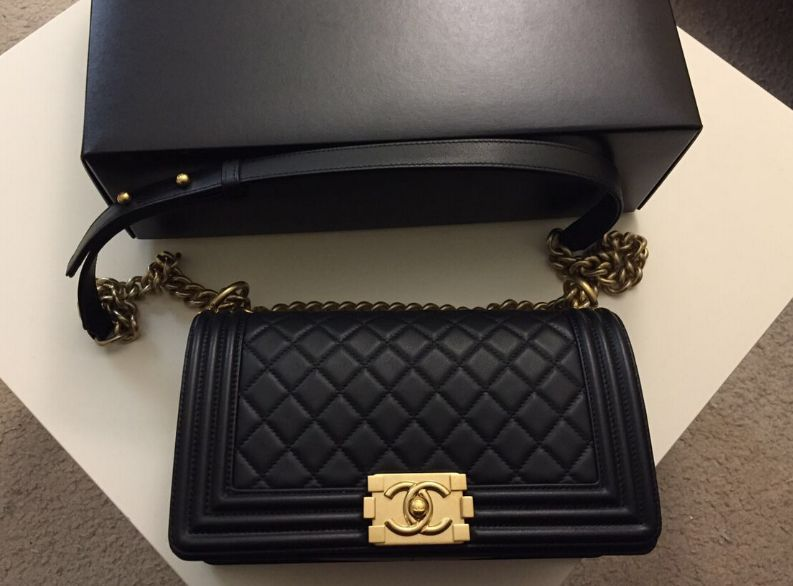
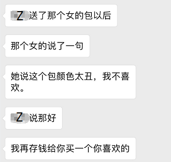
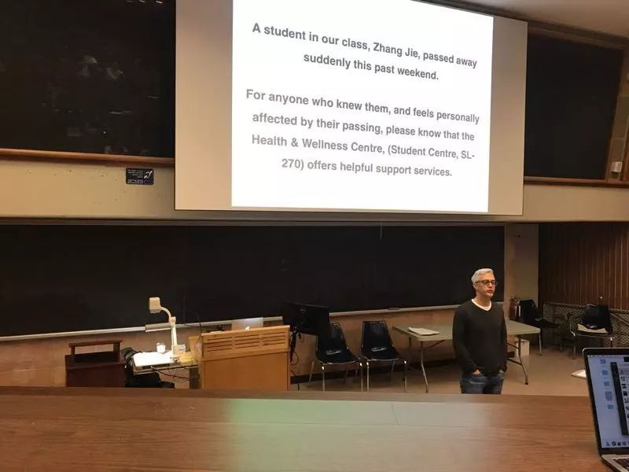
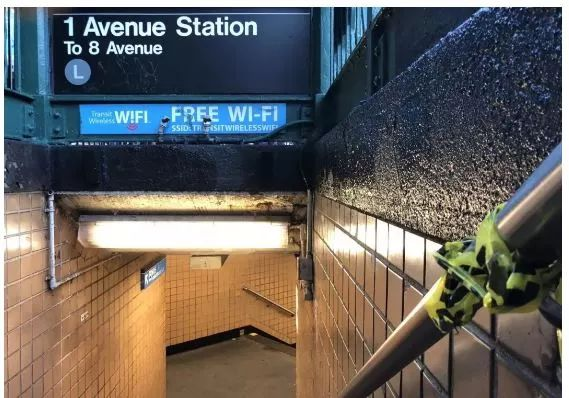
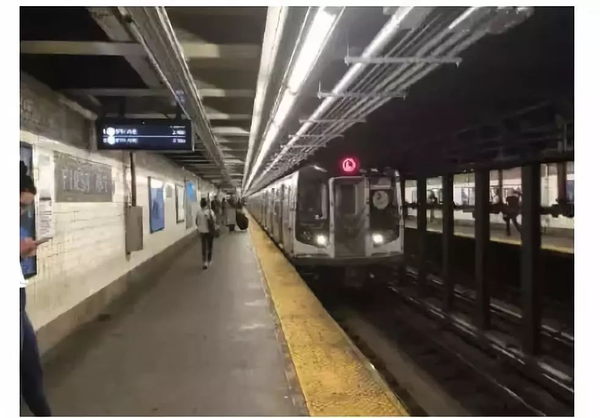

# 无标题

**链接地址:** http://mp.weixin.qq.com/s?__biz=MzI5NDMzNzM3OQ==&mid=2247488308&idx=2&sn=3c98a75ac7a10e514f67ea8768c09201&chksm=ec653d38db12b42e05864030dffe9f3efafeb67e6ce5a70bb468569c170be2e23e26199ee571&mpshare=1&scene=2&srcid=1012mZMelOFF1l4sPszNUaov#rd
**作者:** 
**获取时间:** 2025/8/28 21:19:57
**图片数量:** 30

---

## 原始HTML内容

<section class="" style="max-width: 100%;color: rgb(51, 51, 51);font-family: -apple-system-font, BlinkMacSystemFont, &quot;Helvetica Neue&quot;, &quot;PingFang SC&quot;, &quot;Hiragino Sans GB&quot;, &quot;Microsoft YaHei UI&quot;, &quot;Microsoft YaHei&quot;, Arial, sans-serif;font-size: 17px;letter-spacing: 0.544px;text-align: justify;white-space: normal;background-color: rgb(255, 255, 255);box-sizing: border-box !important;word-wrap: break-word !important;overflow-wrap: break-word !important;">&nbsp;<section class="" ng-click="onClick($event)" ng-model="eo.text" ng-style=" {
  'font-size'   : eo.fontSize,
  'font-family' : eo.fontFamily,
  'font-style'  : eo.fontStyle,
  'color'       : (eo.color || theme.majorColor),
} " placeholder="{ 点击编辑 }" stop-propagation="click mousedown mouseup" tn-edit-content="true" tn-page-editable="text0" tn-page-editable-type="ed-type-text" ui-on-drop="block($event)" style="margin-top: 0.7em;margin-left: -0.4em;padding: 1em;max-width: 100%;border-radius: 1em;width: 510.25px;color: inherit;font-family: inherit;font-size: 1em;display: inline-block;background-color: rgb(250, 200, 255);box-sizing: border-box !important;word-wrap: break-word !important;overflow-wrap: break-word !important;">&nbsp;&nbsp;&nbsp;吃喝玩乐卡尔加里YYC&nbsp;最近要大送豪礼，包括苹果 iPhone X！</section></section>
 
<section class="" style="max-width: 100%;color: rgb(51, 51, 51);font-family: -apple-system-font, BlinkMacSystemFont, &quot;Helvetica Neue&quot;, &quot;PingFang SC&quot;, &quot;Hiragino Sans GB&quot;, &quot;Microsoft YaHei UI&quot;, &quot;Microsoft YaHei&quot;, Arial, sans-serif;font-size: 17px;letter-spacing: 0.544px;text-align: justify;white-space: normal;background-color: rgb(255, 255, 255);box-sizing: border-box !important;word-wrap: break-word !important;overflow-wrap: break-word !important;"><section class="" ng-click="onClick($event)" ng-model="eo.text" ng-style=" {
  'font-size'   : eo.fontSize,
  'font-family' : eo.fontFamily,
  'font-style'  : eo.fontStyle,
  'color'       : (eo.color || theme.majorColor),
} " placeholder="{ 点击编辑 }" stop-propagation="click mousedown mouseup" tn-edit-content="true" tn-page-editable="text0" tn-page-editable-type="ed-type-text" ui-on-drop="block($event)" style="margin-top: 0.7em;margin-right: -0.4em;padding: 1em;max-width: 100%;border-radius: 1em;width: 510.25px;color: inherit;font-family: inherit;font-size: 1em;display: inline-block;background-color: rgb(188, 227, 249);box-sizing: border-box !important;word-wrap: break-word !important;overflow-wrap: break-word !important;">没错没错，记得『点击蓝字加关注』哟！机会随时到来！</section>&nbsp;&nbsp;</section><section class="" style="margin-top: 0.8em;margin-bottom: 0.5em;max-width: 100%;color: rgb(51, 51, 51);font-family: -apple-system-font, BlinkMacSystemFont, &quot;Helvetica Neue&quot;, &quot;PingFang SC&quot;, &quot;Hiragino Sans GB&quot;, &quot;Microsoft YaHei UI&quot;, &quot;Microsoft YaHei&quot;, Arial, sans-serif;font-size: 17px;letter-spacing: 0.544px;text-align: justify;white-space: normal;background-color: rgb(255, 255, 255);box-sizing: border-box !important;word-wrap: break-word !important;overflow-wrap: break-word !important;">
 
</section><section style="max-width: 100%;color: rgb(51, 51, 51);font-family: -apple-system-font, BlinkMacSystemFont, &quot;Helvetica Neue&quot;, &quot;PingFang SC&quot;, &quot;Hiragino Sans GB&quot;, &quot;Microsoft YaHei UI&quot;, &quot;Microsoft YaHei&quot;, Arial, sans-serif;font-size: 17px;letter-spacing: 0.544px;white-space: normal;text-align: center;background-color: rgb(255, 255, 255);box-sizing: border-box !important;word-wrap: break-word !important;overflow-wrap: break-word !important;"><strong style="max-width: 100%;box-sizing: border-box !important;word-wrap: break-word !important;overflow-wrap: break-word !important;">真心实意，为您推荐！</strong></section>
 

 

又是一场悲剧。。。两周前，多伦多大学士嘉堡分校UTSC一名中国留学生，因为情感问题，被朋友发现在家中上吊自杀身亡.....

 

昨天，这名年仅20岁留学生的自杀原因在网上被曝光，引来一片叹息。

 

 

死者名叫张杰（Zhang Jie），仅20岁。来自中国。

 

原本谁也不清楚好好的读着书，怎么就会自杀了？是学业压力太大？

 

近日，父母从国内赶来处理孩子的后事，才发现，儿子原来为情不能自拔，节衣缩食5000多加元，只为买个香奈儿包送另一名女留学生（小S）。

 

 

然而，小S收到了包后表示，颜色太丑，自己不喜欢。但包还是被拿走了。。。

 

 

满心以为送了这么贵的礼物可以好好的谈个恋爱，和“女友”在一起了？！

 

可是，小S最后还是选择和另一个男生在一起。

 

 

张杰在百般苦救，但依然无法挽留失去的感情，最后选择结束年轻的生命。

 

9月27日，不管是朋友找他，还是家人微信联系他，张杰再也没有回应了。直到朋友去了他家中，才发现张杰已经在家里上吊自杀了。

 

 

<strong style="max-width: 100%;box-sizing: border-box !important;word-wrap: break-word !important;">留学=高危？无独有偶，又一名中国留学生卧轨自杀身亡！</strong>

 
<section class="" powered-by="xiumi.us" style="max-width: 100%;box-sizing: border-box;color: rgb(51, 51, 51);font-family: -apple-system-font, BlinkMacSystemFont, &quot;Helvetica Neue&quot;, &quot;PingFang SC&quot;, &quot;Hiragino Sans GB&quot;, &quot;Microsoft YaHei UI&quot;, &quot;Microsoft YaHei&quot;, Arial, sans-serif;font-size: 17px;font-variant-numeric: normal;font-variant-east-asian: normal;letter-spacing: 0.544px;text-align: justify;white-space: normal;line-height: 27.2px;widows: 1;background-color: rgb(255, 255, 255);word-wrap: break-word !important;"><section style="max-width: 100%;box-sizing: border-box;word-wrap: break-word !important;"><section style="max-width: 100%;box-sizing: border-box;word-wrap: break-word !important;">
纽约大学一名留学生在曼哈顿地铁站忽然跳下站台，自杀身亡。警方随后确定了他的身份：今年18岁，纽约大学一年级新生，中国人。

 

10月2日中午12点左右，他在曼哈顿东村地铁L线第一大道（First Ave）站跳下站台身亡。

 

 

在列车驶往站台的时候，他突然跳轨，被迎面而来的列车撞倒当场身亡。

 

警方目前还在查找这名留学生自杀的原因。据悉，在他跳下站台之前，正在和别人通电话。

 

 

这已经是纽约大学目前发生的第二起中国留学生自杀事件了。

 

在今年的5月1日，还有一名大四女生在宿舍悬梁自尽。

 

纽约大学的心理健康研究中心主任西蒙娜（Simona C. Kwon）表示，亚裔、华裔家长对孩子的期望要求通常很高。

 

这容易造成学生压力大，再加上身处异国，文化差异、环境陌生产生消极情绪，若没有及时排解，可能造成心理疾病。

 

 

自1990年以来，纽约大学有17名本科生或研究生被证实自杀。在2003年和2004年之间，就有五名学生先后自杀。

 

被自杀阴云笼罩的并非纽约大学一所，加拿大的滑铁卢大学早就因为频繁有学生自杀被推上过风口浪尖，<strong style="max-width: 100%;font-size: 17px;letter-spacing: 0.544px;line-height: 27.2px;box-sizing: border-box !important;word-wrap: break-word !important;">网友戏称滑铁卢大学是“自杀大学”。</strong>

<strong style="max-width: 100%;font-size: 17px;letter-spacing: 0.544px;line-height: 27.2px;box-sizing: border-box !important;word-wrap: break-word !important;"> </strong>

搜索“自杀大学”，跳出滑铁卢大学的地址：

 

英文搜索也是同样的结果：

2017年1月12日，滑铁卢大学一名18岁女大学生在宿舍内结束了自己的生命。

2017年3月，滑铁卢大学19岁的学生Chase Graham在宿舍内自杀身亡。

2017年7月，一位学生被发现在滑铁卢大学宿舍里死亡，被认为是自杀。

2018年2月，华人女生金心怡因病死亡。

2018年3月，大四男生从宿舍楼跳楼身亡。 

 

根据校方发言人称，自2012年起滑铁卢大学一共有10起学生自杀案件。

 

连续自杀事件的发生，震惊社会的同时也促使滑铁卢大学成立了校心理健康咨询委员会，协助学生们处理有关心理方面的问题。

 

 

滑铁卢大学心理学二年级学生Kaitlyn Chorowiec说，考虑到期中期末考试的巨大压力，对于自杀她并不感到惊讶。

 

她说：“现在几乎每个学期都有自杀，我们处在非常悲伤的环境中。“

 

 

 

对此学校表示，已经对需要帮助的学生提供心理辅导。

 

滑铁卢大学目前有<strong style="max-width: 100%;box-sizing: border-box !important;word-wrap: break-word !important;">22位</strong>心理咨询人员，两名全职精神科专家和一名精神保健护士。

 

他们为全校31380名本科生和5290名研究生服务。

 

对于学校将大力提高心理辅导培训的承诺，学生们在Reddit上的反馈并不尽如人意。

 

 

有学生留言说，心理咨询的排队等待期目前<strong style="max-width: 100%;box-sizing: border-box !important;word-wrap: break-word !important;">长达6个月</strong>。即使是之前只用等待6周的时候，每个学期最多也只轮得上2-3次。

 

这样的频率对于那些每天都要因为心理问题挣扎的人来说是远远不够的。

<strong style="max-width: 100%;box-sizing: border-box !important;word-wrap: break-word !important;">知乎上有这样的问题：</strong>

滑铁卢大学的中国留学生分享了自己在学校的经历： 

 

根据不同专业的不同要求，滑铁卢大学coop的学生必须完成4-6个“工作实习”才能顺利毕业。

 

因此学生完成学业通常需要5-6年的时间。同时滑铁卢大学也对学生有着严格的要求，成绩不达标就要被踢出专业院系，前功尽弃。

 

比如滑铁卢大学的工程系，除了紧张的课业和考试以外还必须完成几个实习项目。

 

而这几个实习中如果有任何一个雇主给了你“fail”的差评，那么你会被<strong style="max-width: 100%;box-sizing: border-box !important;word-wrap: break-word !important;">踢出工程系，前几年的努力付诸东流。</strong>

 

曾在滑铁卢大学就读电子计算机工程专业的一位华人留学生表示，自己非常努力地实习、完成了雇主提出的所有要求，可是却得到了一个差评。

 

当时他疯狂给实习公司老板发邮件也和学校相关部门联系，却都渺无音讯。

 

他回忆当时的情况说：“真的有种天要亡我的感觉。我把自己锁在家中，课也不去上。整个人越来越悲观，甚至想到了自杀。在自责痛苦和绝望中，这是唯一的出路。”

 

可能在旁人看来，留学生活是光鲜亮丽的，除了学习什么都不用担心。

 

 

然而，大部分留学生都是在外边打工边学习，而且学习的压力已经够大的了。

 

在国外上学的华人留学生由于语言、文化环境，面临的压力比国内大得多。

 

国内大学严进宽出，普通学生通过高考后就可以享受大学生活了，谈谈恋爱打打游戏一晃就是四年。

 

国外大学宽进严出，成功申请后留学生们面临巨大的课业压力，根本不是媒体报道的<strong style="max-width: 100%;box-sizing: border-box !important;word-wrap: break-word !important;">“泡夜店、开豪车”</strong>纸醉金迷的景象。

 

 

学习压力、环境差异、人际关系让一些留学生的负面情绪越来越多，最终导致不归路。

 

原本的生活节奏已经太快，学业压力加上其他不幸（感情挫败、家庭变故、经济状况改变）很容易把人逼上绝境。

 

可能你多倾听一会儿对方的诉说，多问候一声，就有可能把他们从悬崖边缘拉回来。

 

而是希望能大家都能关注身边的亲朋好友，关注笑容背后可能隐藏的悲伤。希望有一天，我们再也不用报道“留学生自杀”这样的新闻。
</section></section></section>
 

文章来源：加拿大家园

 
<section style="max-width: 100%;color: rgb(51, 51, 51);font-family: -apple-system-font, BlinkMacSystemFont, &quot;Helvetica Neue&quot;, &quot;PingFang SC&quot;, &quot;Hiragino Sans GB&quot;, &quot;Microsoft YaHei UI&quot;, &quot;Microsoft YaHei&quot;, Arial, sans-serif;font-size: 17px;letter-spacing: 0.544px;white-space: normal;background-color: rgb(255, 255, 255);text-align: center;box-sizing: border-box !important;word-wrap: break-word !important;overflow-wrap: break-word !important;">真诚为您推荐！</section><section class="" data-style="white-space: normal; text-align: left;font-size: 14px;line-height: 1.5em; color: rgb(12, 12, 12);" style="max-width: 100%;color: rgb(51, 51, 51);font-family: -apple-system-font, BlinkMacSystemFont, &quot;Helvetica Neue&quot;, &quot;PingFang SC&quot;, &quot;Hiragino Sans GB&quot;, &quot;Microsoft YaHei UI&quot;, &quot;Microsoft YaHei&quot;, Arial, sans-serif;font-size: 17px;letter-spacing: 0.544px;text-align: justify;white-space: normal;background-color: rgb(255, 255, 255);box-sizing: border-box !important;word-wrap: break-word !important;overflow-wrap: break-word !important;"><section style="margin-top: -1.2em;max-width: 100%;box-sizing: border-box;color: rgb(166, 166, 166);text-align: center;border-width: initial;border-style: none;border-color: initial;line-height: 1.4;word-wrap: break-word !important;overflow-wrap: break-word !important;"> </section><section class="" data-style="white-space: normal; text-align: left;font-size: 14px;line-height: 1.5em; color: rgb(12, 12, 12);" style="padding: 16px 16px 10px;max-width: 100%;box-sizing: border-box;font-size: 1em;line-height: 1.4;word-wrap: break-word !important;overflow-wrap: break-word !important;">
<strong style="max-width: 100%;letter-spacing: 0.544px;color: rgb(62, 62, 62);font-size: 18px;text-align: justify;box-sizing: border-box !important;word-wrap: break-word !important;overflow-wrap: break-word !important;"><strong style="max-width: 100%;box-sizing: border-box !important;word-wrap: break-word !important;overflow-wrap: break-word !important;"><strong style="max-width: 100%;box-sizing: border-box !important;word-wrap: break-word !important;overflow-wrap: break-word !important;"><strong style="max-width: 100%;box-sizing: border-box !important;word-wrap: break-word !important;overflow-wrap: break-word !important;"></strong></strong></strong></strong>

<strong style="max-width: 100%;letter-spacing: 0.544px;color: rgb(62, 62, 62);font-size: 18px;text-align: justify;box-sizing: border-box !important;word-wrap: break-word !important;overflow-wrap: break-word !important;"><strong style="max-width: 100%;box-sizing: border-box !important;word-wrap: break-word !important;overflow-wrap: break-word !important;"><strong style="max-width: 100%;box-sizing: border-box !important;word-wrap: break-word !important;overflow-wrap: break-word !important;"><strong style="max-width: 100%;box-sizing: border-box !important;word-wrap: break-word !important;overflow-wrap: break-word !important;"></strong></strong></strong></strong>
</section></section>
 

 

  

 

<a href="http://mp.weixin.qq.com/s?__biz=MzI5NDMzNzM3OQ==&amp;mid=2247487979&amp;idx=1&amp;sn=1fe190fe32bb6bdc1857deeaa83d430e&amp;chksm=ec653fe7db12b6f14aed3e9e9b01c486638108bc08e0590953767630141596e2ed0c338243b7&amp;scene=21#wechat_redirect" target="_blank" style="color: rgb(87, 107, 149);-webkit-tap-highlight-color: rgba(0, 0, 0, 0);max-width: 100%;box-sizing: border-box !important;word-wrap: break-word !important;">【突发】抓住了！震惊华人圈的 加拿大 13岁中国少女被杀害案侦破！嫌疑凶手是叙难民！刚登陆三个月！！！！</a> 

 

<a href="http://mp.weixin.qq.com/s?__biz=MzI5NDMzNzM3OQ==&amp;mid=2247488274&amp;idx=1&amp;sn=7fb550a3450a730431703ef33e4d51f7&amp;chksm=ec653d1edb12b40883d3aa405a67fb5ca168af7150ddf49511f0123f86d4a82b79c1036f8324&amp;scene=21#wechat_redirect" target="_blank" style="color: rgb(87, 107, 149);-webkit-tap-highlight-color: rgba(0, 0, 0, 0);max-width: 100%;box-sizing: border-box !important;word-wrap: break-word !important;">【突发】婚车撞向行人，20人死亡！美国发生最严重交通事故，车主穆斯林，曾被控谋杀...</a> 

 

<a href="http://mp.weixin.qq.com/s?__biz=MzI5NDMzNzM3OQ==&amp;mid=2247488263&amp;idx=7&amp;sn=c49622a22acdf10565c2cd26cfe111d3&amp;chksm=ec653d0bdb12b41d9ff1739a3ee91363df8ba97e2cb4f4bb3f111a40494b6b82af67e12204b0&amp;scene=21#wechat_redirect" target="_blank" style="color: rgb(87, 107, 149);text-decoration: underline;-webkit-tap-highlight-color: rgba(0, 0, 0, 0);max-width: 100%;font-size: 14px;box-sizing: border-box !important;word-wrap: break-word !important;overflow-wrap: break-word !important;">【惊爆】加拿大重大新发现：10年间竟有27万人非法入境！其中大部分是罪犯！</a> 

 

<a href="http://mp.weixin.qq.com/s?__biz=MzI5NDMzNzM3OQ==&amp;mid=2247488240&amp;idx=1&amp;sn=4b8a7c8b2b43773e01b55eca7d75f85d&amp;chksm=ec653cfcdb12b5ea789f9e2cabd84e4c6d0a66655014aeb851d0b451ac22ec6291bba3186c9e&amp;scene=21#wechat_redirect" target="_blank" style="color: rgb(87, 107, 149);text-decoration: underline;-webkit-tap-highlight-color: rgba(0, 0, 0, 0);max-width: 100%;font-size: 14px;box-sizing: border-box !important;word-wrap: break-word !important;overflow-wrap: break-word !important;">【重磅】＂我们不生产泳衣＂！当加拿大鹅想把店开到中国，然后发现了大麻烦...</a> 

 

<a href="http://mp.weixin.qq.com/s?__biz=MzI5NDMzNzM3OQ==&amp;mid=2247488115&amp;idx=3&amp;sn=bbebdc61dff30da23c9c0e80cfe42cf0&amp;chksm=ec653c7fdb12b56958c01081037b707c2ad3146f46d3cf28ee0eec43a4effa51e88c4829934a&amp;scene=21#wechat_redirect" target="_blank" style="color: rgb(87, 107, 149);text-decoration: underline;-webkit-tap-highlight-color: rgba(0, 0, 0, 0);max-width: 100%;font-size: 14px;box-sizing: border-box !important;word-wrap: break-word !important;overflow-wrap: break-word !important;">【逆天】Shoppers可以卖大麻了！已获得加拿大卫生部许可证！这是要全民吸麻的节奏？</a> 

 

<a href="http://mp.weixin.qq.com/s?__biz=MzI5NDMzNzM3OQ==&amp;mid=2247488115&amp;idx=5&amp;sn=1f490645634cbe4367c931dafe4d66c0&amp;chksm=ec653c7fdb12b569904d29580051d763fa00e96a9dbe0e55812aff05e3519a41ab4dc1588f4e&amp;scene=21#wechat_redirect" target="_blank" style="color: rgb(87, 107, 149);text-decoration: underline;-webkit-tap-highlight-color: rgba(0, 0, 0, 0);max-width: 100%;font-size: 14px;box-sizing: border-box !important;word-wrap: break-word !important;overflow-wrap: break-word !important;">【泪奔】加拿大小费已涨到20%了！不给遭白眼，全给要花我2年收入！</a> 

 

<a href="http://mp.weixin.qq.com/s?__biz=MzI5NDMzNzM3OQ==&amp;mid=2247488105&amp;idx=2&amp;sn=b86b05ad7bfd3b7b015789e7c2931940&amp;chksm=ec653c65db12b573512acd0c837ce38174a47be1da8cc0e7204a001a62a42356159ca772178e&amp;scene=21#wechat_redirect" target="_blank" style="color: rgb(87, 107, 149);text-decoration: underline;-webkit-tap-highlight-color: rgba(0, 0, 0, 0);max-width: 100%;font-size: 14px;box-sizing: border-box !important;word-wrap: break-word !important;overflow-wrap: break-word !important;">【震惊】阿尔伯塔平均每天有两人因阿片类药物过量死亡，吸毒过量正在残害这个省…</a> 

 

<a href="http://mp.weixin.qq.com/s?__biz=MzI5NDMzNzM3OQ==&amp;mid=2247488054&amp;idx=1&amp;sn=2bbb5298379c213f8998d4f7fb44fa0b&amp;chksm=ec653c3adb12b52c0d6829125cc4c0b600342d8f919b6745f9eac5b8bb03207440f619ba8d2b&amp;scene=21#wechat_redirect" target="_blank" style="color: rgb(87, 107, 149);text-decoration: underline;-webkit-tap-highlight-color: rgba(0, 0, 0, 0);max-width: 100%;font-size: 14px;box-sizing: border-box !important;word-wrap: break-word !important;overflow-wrap: break-word !important;">【举国震怒】杜鲁多回应难民杀害申小雨案！全程打官腔竟还笑出声！加国华人众怒：“滚下台！”（内附道歉请愿书地址）</a> 

 

<a href="http://mp.weixin.qq.com/s?__biz=MzI5NDMzNzM3OQ==&amp;mid=2247488034&amp;idx=2&amp;sn=038b8555f4a9ce45be0b52cfa8085836&amp;chksm=ec653c2edb12b5387f52116d50a3711600ed40f3d48a8205fc1a316bb03b10881ff0e771b6bd&amp;scene=21#wechat_redirect" target="_blank" style="color: rgb(87, 107, 149);text-decoration: underline;-webkit-tap-highlight-color: rgba(0, 0, 0, 0);max-width: 100%;font-size: 14px;box-sizing: border-box !important;word-wrap: break-word !important;overflow-wrap: break-word !important;">【震惊】加拿大房价跌至九年新低，政府仍在酝酿全面禁止外国人买房？</a> 

 

<a href="http://mp.weixin.qq.com/s?__biz=MzI5NDMzNzM3OQ==&amp;mid=2247487976&amp;idx=1&amp;sn=7c95e0df0fec8e46850b71a50a4fc4da&amp;chksm=ec653fe4db12b6f20829d052dc4b35b6061cbdc1cb427d636c1e07962c2e5e3ce26ba69064e9&amp;scene=21#wechat_redirect" target="_blank" style="color: rgb(87, 107, 149);text-decoration: underline;-webkit-tap-highlight-color: rgba(0, 0, 0, 0);max-width: 100%;font-size: 14px;box-sizing: border-box !important;word-wrap: break-word !important;">【重磅】加拿大找到预测癌症新方法，准确率高达70%，且仅需$20！最大功臣竟然是它~</a> 

 

<a href="http://mp.weixin.qq.com/s?__biz=MzI5NDMzNzM3OQ==&amp;mid=2247487959&amp;idx=2&amp;sn=0fb4b23f6dbbc7393cb4dbdc5f33c039&amp;chksm=ec653fdbdb12b6cdec996edbfc4ecfc539557d2eccae40709e4431992d9710c885b33a8dcda7&amp;scene=21#wechat_redirect" target="_blank" style="color: rgb(87, 107, 149);text-decoration: underline;-webkit-tap-highlight-color: rgba(0, 0, 0, 0);max-width: 100%;font-size: 14px;box-sizing: border-box !important;word-wrap: break-word !important;overflow-wrap: break-word !important;">【突发】沃尔玛爆发非典型肺炎！紧急关闭！已有7人确诊！致死率极高！华人当心！！</a>

 

<a href="http://mp.weixin.qq.com/s?__biz=MzI5NDMzNzM3OQ==&amp;mid=2247487951&amp;idx=1&amp;sn=1455d6fe77dbbd4643f7d92af9d87a46&amp;chksm=ec653fc3db12b6d5e44c642c0eec7e34861db9702547045d5101430b395aa6c6dc2ec8e026fe&amp;scene=21#wechat_redirect" target="_blank" style="color: rgb(87, 107, 149);-webkit-tap-highlight-color: rgba(0, 0, 0, 0);max-width: 100%;box-sizing: border-box !important;word-wrap: break-word !important;overflow-wrap: break-word !important;">【突发】加拿大痛下杀手！签证中心急发警告！看完后众人暴跳如雷，气愤不已！！</a>

 

<a href="http://mp.weixin.qq.com/s?__biz=MzI5NDMzNzM3OQ==&amp;mid=2247487930&amp;idx=1&amp;sn=fd4bf262c47d5985bae445443783339a&amp;chksm=ec653fb6db12b6a07b8f47b1d2ac058b9a5ab85eab94e2822ebc6550fe1372f3a2ce398b2fa2&amp;scene=21#wechat_redirect" target="_blank" style="color: rgb(87, 107, 149);-webkit-tap-highlight-color: rgba(0, 0, 0, 0);max-width: 100%;box-sizing: border-box !important;word-wrap: break-word !important;overflow-wrap: break-word !important;">【突发】加拿大重磅通过！＂加英澳新＂移民1国等于获得3国身份？！中国土豪狂欢！这4国护照值钱了！全球移民潮即将来临！</a> 

 

<a href="http://mp.weixin.qq.com/s?__biz=MzI5NDMzNzM3OQ==&amp;mid=2247487930&amp;idx=3&amp;sn=21b6f48ca64a0022d3189579f83792a7&amp;chksm=ec653fb6db12b6a03d812045b32e80e88c5d987fe9368654b6af00558ffc9a1050d8c84a1b05&amp;scene=21#wechat_redirect" target="_blank" style="color: rgb(87, 107, 149);text-decoration: underline;-webkit-tap-highlight-color: rgba(0, 0, 0, 0);max-width: 100%;font-size: 14px;box-sizing: border-box !important;word-wrap: break-word !important;overflow-wrap: break-word !important;">【重磅福利】加拿大留学生居然有这么多福利！拿着学生卡，疯狂折扣随你拿！太赞了！</a> 

 

<a href="http://mp.weixin.qq.com/s?__biz=MzI5NDMzNzM3OQ==&amp;mid=2247487919&amp;idx=1&amp;sn=e4c8113767dba1d01e47f23a8d0bce84&amp;chksm=ec653fa3db12b6b50b15412b14b4284845946e2ad2c52031b541975ea5a7cfdfed52ad8ee40a&amp;scene=21#wechat_redirect" target="_blank" style="color: rgb(87, 107, 149);-webkit-tap-highlight-color: rgba(0, 0, 0, 0);max-width: 100%;box-sizing: border-box !important;word-wrap: break-word !important;overflow-wrap: break-word !important;">【突发】加国经济危机号角吹响！美加关系彻底闹掰！贸易战争将给加拿大带来毁灭性的灾难！</a>

 

 

欢迎大家添加&nbsp;神通广大&nbsp;吃喝玩乐&nbsp;服务微信&nbsp;为好友！

相互照应，十分必要！

扫码即可！

 

<section class="" data-style="white-space: normal; text-align: left;font-size: 14px;line-height: 1.5em; color: rgb(12, 12, 12);" style="max-width: 100%;color: rgb(51, 51, 51);font-family: -apple-system-font, BlinkMacSystemFont, &quot;Helvetica Neue&quot;, &quot;PingFang SC&quot;, &quot;Hiragino Sans GB&quot;, &quot;Microsoft YaHei UI&quot;, &quot;Microsoft YaHei&quot;, Arial, sans-serif;font-size: 17px;letter-spacing: 0.544px;text-align: justify;white-space: normal;background-color: rgb(255, 255, 255);box-sizing: border-box !important;word-wrap: break-word !important;overflow-wrap: break-word !important;"><section class="" data-style="white-space: normal; text-align: left;font-size: 14px;line-height: 1.5em; color: rgb(12, 12, 12);" style="padding: 16px 16px 10px;max-width: 100%;box-sizing: border-box;font-size: 1em;line-height: 1.4;word-wrap: break-word !important;overflow-wrap: break-word !important;">
 

</section></section>
 

---

## 纯文本内容

吃喝玩乐卡尔加里YYC 最近要大送豪礼，包括苹果 iPhone X！没错没错，记得『点击蓝字加关注』哟！机会随时到来！  真心实意，为您推荐！又是一场悲剧。。。两周前，多伦多大学士嘉堡分校UTSC一名中国留学生，因为情感问题，被朋友发现在家中上吊自杀身亡.....昨天，这名年仅20岁留学生的自杀原因在网上被曝光，引来一片叹息。死者名叫张杰（Zhang Jie），仅20岁。来自中国。原本谁也不清楚好好的读着书，怎么就会自杀了？是学业压力太大？近日，父母从国内赶来处理孩子的后事，才发现，儿子原来为情不能自拔，节衣缩食5000多加元，只为买个香奈儿包送另一名女留学生（小S）。然而，小S收到了包后表示，颜色太丑，自己不喜欢。但包还是被拿走了。。。满心以为送了这么贵的礼物可以好好的谈个恋爱，和“女友”在一起了？！可是，小S最后还是选择和另一个男生在一起。张杰在百般苦救，但依然无法挽留失去的感情，最后选择结束年轻的生命。9月27日，不管是朋友找他，还是家人微信联系他，张杰再也没有回应了。直到朋友去了他家中，才发现张杰已经在家里上吊自杀了。留学=高危？无独有偶，又一名中国留学生卧轨自杀身亡！纽约大学一名留学生在曼哈顿地铁站忽然跳下站台，自杀身亡。警方随后确定了他的身份：今年18岁，纽约大学一年级新生，中国人。10月2日中午12点左右，他在曼哈顿东村地铁L线第一大道（First Ave）站跳下站台身亡。在列车驶往站台的时候，他突然跳轨，被迎面而来的列车撞倒当场身亡。警方目前还在查找这名留学生自杀的原因。据悉，在他跳下站台之前，正在和别人通电话。这已经是纽约大学目前发生的第二起中国留学生自杀事件了。在今年的5月1日，还有一名大四女生在宿舍悬梁自尽。纽约大学的心理健康研究中心主任西蒙娜（Simona C. Kwon）表示，亚裔、华裔家长对孩子的期望要求通常很高。这容易造成学生压力大，再加上身处异国，文化差异、环境陌生产生消极情绪，若没有及时排解，可能造成心理疾病。自1990年以来，纽约大学有17名本科生或研究生被证实自杀。在2003年和2004年之间，就有五名学生先后自杀。被自杀阴云笼罩的并非纽约大学一所，加拿大的滑铁卢大学早就因为频繁有学生自杀被推上过风口浪尖，网友戏称滑铁卢大学是“自杀大学”。搜索“自杀大学”，跳出滑铁卢大学的地址：英文搜索也是同样的结果：2017年1月12日，滑铁卢大学一名18岁女大学生在宿舍内结束了自己的生命。2017年3月，滑铁卢大学19岁的学生Chase Graham在宿舍内自杀身亡。2017年7月，一位学生被发现在滑铁卢大学宿舍里死亡，被认为是自杀。2018年2月，华人女生金心怡因病死亡。2018年3月，大四男生从宿舍楼跳楼身亡。根据校方发言人称，自2012年起滑铁卢大学一共有10起学生自杀案件。连续自杀事件的发生，震惊社会的同时也促使滑铁卢大学成立了校心理健康咨询委员会，协助学生们处理有关心理方面的问题。滑铁卢大学心理学二年级学生Kaitlyn Chorowiec说，考虑到期中期末考试的巨大压力，对于自杀她并不感到惊讶。她说：“现在几乎每个学期都有自杀，我们处在非常悲伤的环境中。“对此学校表示，已经对需要帮助的学生提供心理辅导。滑铁卢大学目前有22位心理咨询人员，两名全职精神科专家和一名精神保健护士。他们为全校31380名本科生和5290名研究生服务。对于学校将大力提高心理辅导培训的承诺，学生们在Reddit上的反馈并不尽如人意。有学生留言说，心理咨询的排队等待期目前长达6个月。即使是之前只用等待6周的时候，每个学期最多也只轮得上2-3次。这样的频率对于那些每天都要因为心理问题挣扎的人来说是远远不够的。知乎上有这样的问题：滑铁卢大学的中国留学生分享了自己在学校的经历：根据不同专业的不同要求，滑铁卢大学coop的学生必须完成4-6个“工作实习”才能顺利毕业。因此学生完成学业通常需要5-6年的时间。同时滑铁卢大学也对学生有着严格的要求，成绩不达标就要被踢出专业院系，前功尽弃。比如滑铁卢大学的工程系，除了紧张的课业和考试以外还必须完成几个实习项目。而这几个实习中如果有任何一个雇主给了你“fail”的差评，那么你会被踢出工程系，前几年的努力付诸东流。曾在滑铁卢大学就读电子计算机工程专业的一位华人留学生表示，自己非常努力地实习、完成了雇主提出的所有要求，可是却得到了一个差评。当时他疯狂给实习公司老板发邮件也和学校相关部门联系，却都渺无音讯。他回忆当时的情况说：“真的有种天要亡我的感觉。我把自己锁在家中，课也不去上。整个人越来越悲观，甚至想到了自杀。在自责痛苦和绝望中，这是唯一的出路。”可能在旁人看来，留学生活是光鲜亮丽的，除了学习什么都不用担心。然而，大部分留学生都是在外边打工边学习，而且学习的压力已经够大的了。在国外上学的华人留学生由于语言、文化环境，面临的压力比国内大得多。国内大学严进宽出，普通学生通过高考后就可以享受大学生活了，谈谈恋爱打打游戏一晃就是四年。国外大学宽进严出，成功申请后留学生们面临巨大的课业压力，根本不是媒体报道的“泡夜店、开豪车”纸醉金迷的景象。学习压力、环境差异、人际关系让一些留学生的负面情绪越来越多，最终导致不归路。原本的生活节奏已经太快，学业压力加上其他不幸（感情挫败、家庭变故、经济状况改变）很容易把人逼上绝境。可能你多倾听一会儿对方的诉说，多问候一声，就有可能把他们从悬崖边缘拉回来。而是希望能大家都能关注身边的亲朋好友，关注笑容背后可能隐藏的悲伤。希望有一天，我们再也不用报道“留学生自杀”这样的新闻。文章来源：加拿大家园真诚为您推荐！【突发】抓住了！震惊华人圈的 加拿大 13岁中国少女被杀害案侦破！嫌疑凶手是叙难民！刚登陆三个月！！！！【突发】婚车撞向行人，20人死亡！美国发生最严重交通事故，车主穆斯林，曾被控谋杀...【惊爆】加拿大重大新发现：10年间竟有27万人非法入境！其中大部分是罪犯！【重磅】＂我们不生产泳衣＂！当加拿大鹅想把店开到中国，然后发现了大麻烦...【逆天】Shoppers可以卖大麻了！已获得加拿大卫生部许可证！这是要全民吸麻的节奏？【泪奔】加拿大小费已涨到20%了！不给遭白眼，全给要花我2年收入！【震惊】阿尔伯塔平均每天有两人因阿片类药物过量死亡，吸毒过量正在残害这个省…【举国震怒】杜鲁多回应难民杀害申小雨案！全程打官腔竟还笑出声！加国华人众怒：“滚下台！”（内附道歉请愿书地址）【震惊】加拿大房价跌至九年新低，政府仍在酝酿全面禁止外国人买房？【重磅】加拿大找到预测癌症新方法，准确率高达70%，且仅需$20！最大功臣竟然是它~【突发】沃尔玛爆发非典型肺炎！紧急关闭！已有7人确诊！致死率极高！华人当心！！【突发】加拿大痛下杀手！签证中心急发警告！看完后众人暴跳如雷，气愤不已！！【突发】加拿大重磅通过！＂加英澳新＂移民1国等于获得3国身份？！中国土豪狂欢！这4国护照值钱了！全球移民潮即将来临！【重磅福利】加拿大留学生居然有这么多福利！拿着学生卡，疯狂折扣随你拿！太赞了！【突发】加国经济危机号角吹响！美加关系彻底闹掰！贸易战争将给加拿大带来毁灭性的灾难！欢迎大家添加 神通广大 吃喝玩乐 服务微信 为好友！相互照应，十分必要！扫码即可！

---

## 图片列表

-  (原始链接: https://mmbiz.qpic.cn/mmbiz/MVPvEL7Qg0EXNGDDXjhn7BQlLVZfE4a72NDhuKJZheaZoX3JcYZ8wicrltbzurnAx8Urww68iaiaaC541u0miaUGqg/640?)
-  (原始链接: https://mmbiz.qpic.cn/mmbiz/MVPvEL7Qg0EXNGDDXjhn7BQlLVZfE4a7eyibPmHcP5XBsBl0KZPM0LQibDWticwHV1SSxz8Ha4rjtk93ZD4sTPSsg/640?)
-  (原始链接: https://mmbiz.qpic.cn/mmbiz_jpg/E5oZzDjj1krUQpM9bj5FdOK0iarqXud4mIKoW6C1kXSpOayiaq1XfqH0dOt23X9s4d8FkYtGk0OqCrx3URk3zXiaQ/640?wx_fmt=jpeg)
-  (原始链接: https://mmbiz.qpic.cn/mmbiz_jpg/E5oZzDjj1krg70S5dqqia8wpBmp0u7ibWvurxxBrwHU6YUHpdrKOPJ2thhiaQAWncywSIyP6RaAFxH9WzMUvUFkbA/640?wx_fmt=jpeg)
-  (原始链接: https://mmbiz.qpic.cn/mmbiz_jpg/E5oZzDjj1koIN1Y38icljFMX6zwK8pw7b53PvUZlk9gXsIh45VRRWgBJXibBqiaeeJJv68NkFKuicodbcqOWCXUHicw/640?wx_fmt=jpeg)
-  (原始链接: https://mmbiz.qpic.cn/mmbiz_jpg/icDcCacWsN1VNFqMKxiazcgRAQvOuJicxOk8I7QIDFiblgI9UShFAnicicibYIAclC3Fkrgw4zAicC75SKIqy5MHhS4XDw/640?wx_fmt=jpeg)
-  (原始链接: https://mmbiz.qpic.cn/mmbiz_png/pSThXxDOdw8WaO3wwnHj5aSkobaweDc5hwLOiccEPiafgr30gAQMjfZCaGgWM80rpw2a9LjIF0ic7u3rEOuFJU3Bw/640?wx_fmt=png)
-  (原始链接: https://mmbiz.qpic.cn/mmbiz_png/pSThXxDOdw8WaO3wwnHj5aSkobaweDc5xP4m2xwicYGPeDAeOflT8QmSu0UI1dSNlQRgXiaXpRI7ib9S7QC67OdSA/640?wx_fmt=png)
-  (原始链接: https://mmbiz.qpic.cn/mmbiz_png/pSThXxDOdw8WaO3wwnHj5aSkobaweDc5HLo4EWUZN6uA5dPpCet7MFsicZ7Ezfgyg5B88R3rXUJJa3WHmROxtqg/640?wx_fmt=png)
-  (原始链接: https://mmbiz.qpic.cn/mmbiz_png/pSThXxDOdw8WaO3wwnHj5aSkobaweDc5HYLNmyIZqjlz7BPBuEdq5XASyKIoBccia6hNU29va2SnMibFbzpSGbqg/640?wx_fmt=png)
-  (原始链接: https://mmbiz.qpic.cn/mmbiz_jpg/icDcCacWsN1VNFqMKxiazcgRAQvOuJicxOkpHjssFTErFDBibCnU39yQ3EEGUAZjjEKR8LZ4MZzCHLFWPv65yuicg7Q/640?wx_fmt=jpeg)
-  (原始链接: https://mmbiz.qpic.cn/mmbiz_png/wbBfrFqAYvs4tPvicEuD553HgiaStqLMNhIkZNJK1zKwAgvnp391K8icjkoUwYIcbmvShNKOfKbs5tF5p0KV4YMNw/640?wx_fmt=png)
-  (原始链接: https://mmbiz.qpic.cn/mmbiz_jpg/3LxMQLD9XuKgTy1nMA3LvrgIndjTIjT8m7LVaAhTSl1NmCNFtTWGPgWSUhBZMTNNvpBvdiaeh45VHWnOHjH1YTw/640?wx_fmt=jpeg)
-  (原始链接: https://mmbiz.qpic.cn/mmbiz_jpg/3LxMQLD9XuKgTy1nMA3LvrgIndjTIjT8DhcTMMQMdUgPXicrZTh5T5HlOoX5FCtWgSACcb9ZUbvCNbnEd0B8VTg/640?wx_fmt=jpeg)
-  (原始链接: https://mmbiz.qpic.cn/mmbiz_jpg/3LxMQLD9XuKgTy1nMA3LvrgIndjTIjT8Vo43SPJxObf585PicB2Mpvriauznc2oce6KgXGbqkk5yHlgt4BYJofJg/640?wx_fmt=jpeg)
-  (原始链接: https://mmbiz.qpic.cn/mmbiz_jpg/3LxMQLD9XuIUkQuZ0TIByCsIb7e9U4gaJrdQFuhZ9ibufVPLeEbfXiaFqCkcCJc4pG80BacENuiajhajFgUmhjW2Q/640?wx_fmt=jpeg)
-  (原始链接: https://mmbiz.qpic.cn/mmbiz_jpg/3LxMQLD9XuIUkQuZ0TIByCsIb7e9U4gaw0se4WePWs4vMAz4icqZAIBicY8awlQnX1xTTpxSrUkWSoS9bZOqz9Og/640?wx_fmt=jpeg)
-  (原始链接: https://mmbiz.qpic.cn/mmbiz_jpg/3LxMQLD9XuIUkQuZ0TIByCsIb7e9U4gal7e7A9icQy4OTYUtFt4j5ctOGeB88DsZ36Xf3uktrApKNBPUd3K4uow/640?wx_fmt=jpeg)
-  (原始链接: https://mmbiz.qpic.cn/mmbiz_jpg/3LxMQLD9XuIUkQuZ0TIByCsIb7e9U4gaKpMyicPoF21Bic7fVqjXDpzRMM7Lx5PqlML1jUqHNTAGhXHIIia92mqzQ/640?wx_fmt=jpeg)
-  (原始链接: https://mmbiz.qpic.cn/mmbiz_jpg/3LxMQLD9XuIUkQuZ0TIByCsIb7e9U4garOdibTFdtgcLDKtOcHBg4rzFEBSqrajPyFruE3YPBbuvuZfYgCL1RJA/640?wx_fmt=jpeg)
-  (原始链接: https://mmbiz.qpic.cn/mmbiz_jpg/3LxMQLD9XuIUkQuZ0TIByCsIb7e9U4gaKI407M9U5xvuMIfcrVVcwHLuoLs1xAib5PUWsSyrBfVD829RDViajUUA/640?wx_fmt=jpeg)
-  (原始链接: https://mmbiz.qpic.cn/mmbiz_jpg/3LxMQLD9XuKgTy1nMA3LvrgIndjTIjT80icmp6NJ4LAn6cHiamRmDFE74TRRHnApr24ZnJx0ibp6CragE9VK61CpA/640?wx_fmt=jpeg)
-  (原始链接: http://mmbiz.qpic.cn/mmbiz_jpg/3LxMQLD9XuLC4PtJxDvqO4lBo8Av8K4xYGBvvMVibiaa1jxicrNsYa0XMoFe1ETHKfdeCMrQjk2Dnw4UQwnZfrFkQ/640?wx_fmt=jpeg)
-  (原始链接: http://mmbiz.qpic.cn/mmbiz_jpg/E5oZzDjj1kqcmzibGGbOTonJ7caYsjiaSTtMq1U3Kw5VOLtUgTSNvWXFuQqic1rM7AwibhPM0ZM41RO6DtAmU1WM3w/640?wx_fmt=jpeg)
-  (原始链接: https://mmbiz.qpic.cn/mmbiz_jpg/E5oZzDjj1kqmyBd2wXyJpdlTKRQv5yEo8q6MibdN8KaEpc8HasuicnnICaTm5SyBmFzYHh7Ypj7IianbCxEfHk2lg/640?wx_fmt=jpeg)
-  (原始链接: https://mmbiz.qpic.cn/mmbiz_jpg/E5oZzDjj1koNJW9uUHaESKwdYBXwmKW1N0JZ1iaAG5IJ84TC3KQzv1rNHdaiaic9ZibfOCBUL1yhIWnK0ScaWEibQ4A/640?wx_fmt=jpeg)
-  (原始链接: https://mmbiz.qpic.cn/mmbiz_jpg/E5oZzDjj1krFNNmqiaVW3RVdTIANicfJ6BibMoyEmfm5Bscqn3NFAArz5lafNH1OTexHamNNp51ibcpFJqJKHjhiahw/640?wx_fmt=jpeg)
-  (原始链接: https://mmbiz.qpic.cn/mmbiz_jpg/x0ccYC4cialEibxCT1YzGLaDtQjvicaY5qDKcdMic1icnDfVPyFrBq3hPRvota5lrI733ET0DNZRYLpsV5FjGcKlSHg/640?wx_fmt=jpeg)
-  (原始链接: https://mmbiz.qpic.cn/mmbiz_jpg/mZIpZ2dRo6Z5Lg6L4yBuvZf7QibxfKVYiaibWZ0TgYUSaib6Kt9bF0BhOS7r5v3zCAdNJ6PubAKsoohqPxVjIFWX9w/640?wx_fmt=jpeg)
-  (原始链接: http://mmbiz.qpic.cn/mmbiz/E5oZzDjj1kqdHwQ2zpsHXPvFpF81yEia17OibFaAfyBwQYD1iakM7T1PlagpPx6bCbw4qeARbPEgmqPsmYtLv46cQ/640?wx_fmt=jpeg)
