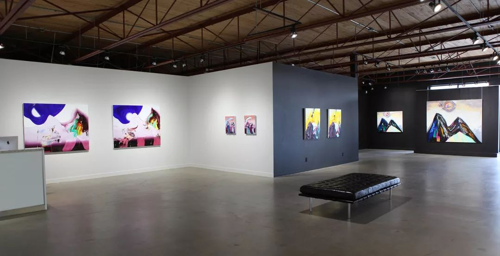

# 无标题

**链接地址:** http://mp.weixin.qq.com/s?__biz=MzI2NTE1ODgwOQ==&mid=2649605163&idx=1&sn=b06da7919c001343f53e9e1de28d86e0&chksm=f2b8cdddc5cf44cb9a6583b7cd5c418ae36d3de7825d1ce8b5e39ebbf85820e465daa6999915&mpshare=1&scene=2&srcid=1012AbjopiXjRPSfYWxrVL9a#rd
**作者:** 雪糊
**获取时间:** 2025/8/28 21:20:30
**图片数量:** 23

---

## 原始HTML内容

<section style="box-sizing: border-box;"><section class="V5" style="box-sizing: border-box;" powered-by="xiumi.us"><section style="margin-right: 0%;margin-left: 0%;box-sizing: border-box;"><section style="display: inline-block;vertical-align: middle;width: 80%;box-sizing: border-box;"><section class="V5" style="box-sizing: border-box;" powered-by="xiumi.us"><section style="margin-top: 10px;margin-bottom: 10px;text-align: center;box-sizing: border-box;"><section style="display: inline-block;box-sizing: border-box;"><section style="max-width: 100%;font-size: 0px;padding-bottom: 3px;box-sizing: border-box;"><section style="display: inline-block;vertical-align: middle;box-sizing: border-box;"><section style="width: 5px;height: 1px;background-color: rgb(217, 217, 217);box-sizing: border-box;"></section><section style="width: 1px;height: 5px;margin-top: -3px;margin-right: auto;margin-left: auto;background-color: rgb(217, 217, 217);box-sizing: border-box;"></section></section><section style="margin-top: -1px;margin-right: -5px;margin-left: -5px;width: 100%;display: inline-block;vertical-align: middle;padding-right: 8px;padding-left: 8px;box-sizing: border-box;"><section style="width: 100%;height: 1px;background-color: rgb(217, 217, 217);box-sizing: border-box;"></section></section><section style="display: inline-block;vertical-align: middle;box-sizing: border-box;"><section style="width: 5px;height: 1px;background-color: rgb(217, 217, 217);box-sizing: border-box;"></section><section style="width: 1px;height: 5px;margin-top: -3px;margin-right: auto;margin-left: auto;background-color: rgb(217, 217, 217);box-sizing: border-box;"></section></section></section><section style="padding-left: 15px;padding-right: 15px;color: rgb(161, 161, 161);font-size: 14px;box-sizing: border-box;">
点击上方<strong style="box-sizing: border-box;">蓝字</strong>关注我们哟~
</section><section style="max-width: 100%;font-size: 0px;box-sizing: border-box;"><section style="display: inline-block;vertical-align: middle;box-sizing: border-box;"><section style="width: 5px;height: 1px;background-color: rgb(217, 217, 217);box-sizing: border-box;"></section><section style="width: 1px;height: 5px;margin-top: -3px;margin-right: auto;margin-left: auto;background-color: rgb(217, 217, 217);box-sizing: border-box;"></section></section><section style="margin-top: -1px;margin-right: -5px;margin-left: -5px;width: 100%;display: inline-block;vertical-align: middle;padding-right: 8px;padding-left: 8px;box-sizing: border-box;"><section style="width: 100%;height: 1px;background-color: rgb(217, 217, 217);box-sizing: border-box;"></section></section><section style="display: inline-block;vertical-align: middle;box-sizing: border-box;"><section style="width: 5px;height: 1px;background-color: rgb(217, 217, 217);box-sizing: border-box;"></section><section style="width: 1px;height: 5px;margin-top: -3px;margin-right: auto;margin-left: auto;background-color: rgb(217, 217, 217);box-sizing: border-box;"></section></section></section></section></section></section></section><section style="display: inline-block;vertical-align: middle;width: 20%;box-sizing: border-box;"><section class="V5" style="box-sizing: border-box;" powered-by="xiumi.us"><section style="text-align: center;margin: -10px 0% 10px;box-sizing: border-box;"><section style="max-width: 100%;vertical-align: middle;display: inline-block;width: 100%;box-sizing: border-box;"></section></section></section></section></section></section><section class="V5" style="box-sizing: border-box;" powered-by="xiumi.us"><section style="margin: 10px 0%;box-sizing: border-box;"><section style="display: inline-block;width: 100%;vertical-align: top;box-sizing: border-box;"><section class="V5" style="box-sizing: border-box;" powered-by="xiumi.us"><section style="box-sizing: border-box;"><section style="display: inline-block;vertical-align: bottom;width: 75%;padding-right: 10px;box-sizing: border-box;"><section class="V5" style="box-sizing: border-box;" powered-by="xiumi.us"><section style="margin: 10px 0% 3px;box-sizing: border-box;"><section style="display: inline-block;vertical-align: middle;box-sizing: border-box;"><section style="display: inline-block;vertical-align: bottom;padding-left: 5px;padding-right: 5px;line-height: 1.2em;margin-bottom: 2px;color: rgba(80, 182, 201, 0.72);box-sizing: border-box;">
<strong style="box-sizing: border-box;">仔细看下图，有惊喜！</strong>
</section><section style="max-width: 100%;display: inline-block;vertical-align: bottom;width: 1.6em;box-sizing: border-box;"></section></section></section></section></section><section style="display: inline-block;vertical-align: bottom;width: 25%;box-sizing: border-box;"><section class="V5" style="box-sizing: border-box;" powered-by="xiumi.us"><section style="margin-right: 0%;margin-bottom: 3px;margin-left: 0%;text-align: right;box-sizing: border-box;"><section style="display: inline-block;border-bottom: 0.15em solid rgba(80, 182, 201, 0.72);padding-bottom: 3px;box-sizing: border-box;"><section style="display: inline-block;padding: 3px;border-bottom: 0.15em solid rgba(80, 182, 201, 0.72);font-size: 12px;line-height: 1.4;color: rgb(255, 143, 47);box-sizing: border-box;">
<strong style="box-sizing: border-box;">金主大大</strong>
</section></section></section></section></section></section></section><section class="V5" style="box-sizing: border-box;" powered-by="xiumi.us"><section style="margin-right: 0%;margin-left: 0%;box-sizing: border-box;"><section style="background-color: rgba(80, 182, 201, 0.72);height: 2px;box-sizing: border-box;"></section></section></section></section></section></section><section class="V5" style="box-sizing: border-box;" powered-by="xiumi.us"><section style="box-sizing: border-box;"><section style="box-sizing: border-box;">

</section></section></section><section class="V5" style="box-sizing: border-box;" powered-by="xiumi.us"><section style="text-align: center;margin-top: 10px;margin-bottom: 10px;box-sizing: border-box;"><section style="max-width: 100%;vertical-align: middle;display: inline-block;box-sizing: border-box;"><svg xmlns="http://www.w3.org/2000/svg" x="0px" y="0px" viewBox="0 0 902.1 38.2" style="vertical-align: middle;max-width: 100%;box-sizing: border-box;" width="902.1"><g style="box-sizing: border-box;"><path style="box-sizing: border-box;" d="M18.4,1.4c0.9-1.9,2.4-1.9,3.4,0l3.4,6.9c0.9,1.9,3.4,3.7,5.4,4l7.6,1.1c2.1,0.3,2.5,1.7,1,3.2   l-5.5,5.4c-1.5,1.5-2.4,4.3-2.1,6.4l1.3,7.6c0.4,2.1-0.9,2.9-2.7,2l-6.8-3.6c-1.8-1-4.9-1-6.7,0l-6.8,3.6c-1.9,1-3.1,0.1-2.7-2   l1.3-7.6c0.4-2.1-0.6-4.9-2.1-6.4l-5.5-5.4c-1.5-1.5-1-2.9,1-3.2l7.6-1.1c2.1-0.3,4.5-2.1,5.4-4L18.4,1.4z" fill="rgb(178, 243, 230)"></path><path style="box-sizing: border-box;" d="M90.6,5.4c0.7-1.4,1.9-1.4,2.6,0l2.6,5.3c0.7,1.4,2.6,2.8,4.2,3.1l5.9,0.9c1.6,0.2,2,1.3,0.8,2.5   l-4.2,4.1c-1.2,1.1-1.9,3.3-1.6,4.9l1,5.8c0.3,1.6-0.7,2.3-2.1,1.5l-5.2-2.8c-1.4-0.8-3.8-0.8-5.2,0L84,33.6   c-1.4,0.8-2.4,0.1-2.1-1.5l1-5.8c0.3-1.6-0.5-3.8-1.6-4.9l-4.2-4.1c-1.2-1.1-0.8-2.2,0.8-2.5l5.9-0.9c1.6-0.2,3.5-1.6,4.2-3.1   L90.6,5.4z" fill="rgb(190, 204, 246)"></path><path style="box-sizing: border-box;" d="M162.6,7.5c0.6-1.2,1.6-1.2,2.2,0l2.2,4.5c0.6,1.2,2.2,2.4,3.6,2.6l5,0.7c1.4,0.2,1.7,1.1,0.7,2.1   l-3.6,3.5c-1,1-1.6,2.9-1.4,4.2l0.9,5c0.2,1.4-0.6,1.9-1.8,1.3l-4.5-2.4c-1.2-0.6-3.2-0.6-4.4,0l-4.5,2.4c-1.2,0.6-2,0.1-1.8-1.3   l0.9-5c0.2-1.4-0.4-3.3-1.4-4.2l-3.6-3.5c-1-1-0.7-1.9,0.7-2.1l5-0.7c1.4-0.2,3-1.4,3.6-2.6L162.6,7.5z" fill="rgb(150, 208, 240)"></path><path style="box-sizing: border-box;" d="M60.1,19.1c0,2.3-1.9,4.2-4.2,4.2c-2.3,0-4.2-1.9-4.2-4.2s1.9-4.2,4.2-4.2   C58.3,14.9,60.1,16.8,60.1,19.1z" fill="rgb(218, 240, 224)"></path><path style="box-sizing: border-box;" d="M203.8,19.1c0,2.3-1.9,4.2-4.2,4.2c-2.3,0-4.2-1.9-4.2-4.2s1.9-4.2,4.2-4.2   C201.9,14.9,203.8,16.8,203.8,19.1z" fill="rgb(218, 240, 224)"></path><path style="box-sizing: border-box;" d="M130.9,19.1c0,1.7-1.4,3.1-3.1,3.1c-1.7,0-3.1-1.4-3.1-3.1c0-1.7,1.4-3.1,3.1-3.1   C129.5,16.1,130.9,17.4,130.9,19.1z" fill="rgb(218, 240, 224)"></path><path style="box-sizing: border-box;" d="M233.9,1.4c0.9-1.9,2.4-1.9,3.4,0l3.4,6.9c0.9,1.9,3.4,3.7,5.4,4l7.6,1.1c2.1,0.3,2.5,1.7,1,3.2   l-5.5,5.4c-1.5,1.5-2.4,4.3-2.1,6.4l1.3,7.6c0.4,2.1-0.9,2.9-2.7,2l-6.8-3.6c-1.8-1-4.9-1-6.7,0l-6.8,3.6c-1.9,1-3.1,0.1-2.7-2   l1.3-7.6c0.4-2.1-0.6-4.9-2.1-6.4l-5.5-5.4c-1.5-1.5-1-2.9,1-3.2l7.6-1.1c2.1-0.3,4.5-2.1,5.4-4L233.9,1.4z" fill="rgb(178, 243, 230)"></path><path style="box-sizing: border-box;" d="M306.1,5.4c0.7-1.4,1.9-1.4,2.6,0l2.6,5.3c0.7,1.4,2.6,2.8,4.2,3.1l5.9,0.9c1.6,0.2,2,1.3,0.8,2.5   l-4.2,4.1c-1.2,1.1-1.9,3.3-1.6,4.9l1,5.8c0.3,1.6-0.7,2.3-2.1,1.5l-5.2-2.8c-1.4-0.8-3.8-0.8-5.2,0l-5.2,2.8   c-1.4,0.8-2.4,0.1-2.1-1.5l1-5.8c0.3-1.6-0.4-3.8-1.6-4.9l-4.2-4.1c-1.2-1.1-0.8-2.2,0.8-2.5l5.9-0.9c1.6-0.2,3.5-1.6,4.2-3.1   L306.1,5.4z" fill="rgb(190, 204, 246)"></path><path style="box-sizing: border-box;" d="M378.1,7.5c0.6-1.2,1.6-1.2,2.2,0l2.2,4.5c0.6,1.2,2.2,2.4,3.6,2.6l5,0.7c1.4,0.2,1.7,1.1,0.7,2.1   l-3.6,3.5c-1,1-1.6,2.9-1.4,4.2l0.9,5c0.2,1.4-0.6,1.9-1.8,1.3l-4.5-2.4c-1.2-0.6-3.2-0.6-4.4,0l-4.5,2.4c-1.2,0.6-2,0.1-1.8-1.3   l0.9-5c0.2-1.4-0.4-3.3-1.4-4.2l-3.6-3.5c-1-1-0.7-1.9,0.7-2.1l5-0.7c1.4-0.2,3-1.4,3.6-2.6L378.1,7.5z" fill="rgb(150, 208, 240)"></path><path style="box-sizing: border-box;" d="M275.7,19.1c0,2.3-1.9,4.2-4.2,4.2c-2.3,0-4.2-1.9-4.2-4.2s1.9-4.2,4.2-4.2   C273.8,14.9,275.7,16.8,275.7,19.1z" fill="rgb(218, 240, 224)"></path><path style="box-sizing: border-box;" d="M419.3,19.1c0,2.3-1.9,4.2-4.2,4.2c-2.3,0-4.2-1.9-4.2-4.2s1.9-4.2,4.2-4.2   C417.5,14.9,419.3,16.8,419.3,19.1z" fill="rgb(218, 240, 224)"></path><path style="box-sizing: border-box;" d="M346.4,19.1c0,1.7-1.4,3.1-3.1,3.1c-1.7,0-3.1-1.4-3.1-3.1c0-1.7,1.4-3.1,3.1-3.1   C345,16.1,346.4,17.4,346.4,19.1z" fill="rgb(218, 240, 224)"></path><path style="box-sizing: border-box;" d="M449.4,1.4c0.9-1.9,2.4-1.9,3.4,0l3.4,6.9c0.9,1.9,3.4,3.7,5.4,4l7.6,1.1c2.1,0.3,2.5,1.7,1,3.2   l-5.5,5.4c-1.5,1.5-2.4,4.3-2.1,6.4l1.3,7.6c0.4,2.1-0.9,2.9-2.7,2l-6.8-3.6c-1.8-1-4.9-1-6.7,0l-6.8,3.6c-1.9,1-3.1,0.1-2.7-2   l1.3-7.6c0.4-2.1-0.6-4.9-2.1-6.4l-5.5-5.4c-1.5-1.5-1-2.9,1-3.2l7.6-1.1c2.1-0.3,4.5-2.1,5.4-4L449.4,1.4z" fill="rgb(178, 243, 230)"></path><path style="box-sizing: border-box;" d="M521.6,5.4c0.7-1.4,1.9-1.4,2.6,0l2.6,5.3c0.7,1.4,2.6,2.8,4.2,3.1l5.9,0.9c1.6,0.2,2,1.3,0.8,2.5   l-4.2,4.1c-1.2,1.1-1.9,3.3-1.6,4.9l1,5.8c0.3,1.6-0.7,2.3-2.1,1.5l-5.2-2.8c-1.4-0.8-3.8-0.8-5.2,0l-5.2,2.8   c-1.4,0.8-2.4,0.1-2.1-1.5l1-5.8c0.3-1.6-0.5-3.8-1.6-4.9l-4.2-4.1c-1.2-1.1-0.8-2.2,0.8-2.5l5.9-0.9c1.6-0.2,3.5-1.6,4.2-3.1   L521.6,5.4z" fill="rgb(190, 204, 246)"></path><path style="box-sizing: border-box;" d="M593.6,7.5c0.6-1.2,1.6-1.2,2.2,0l2.2,4.5c0.6,1.2,2.2,2.4,3.6,2.6l5,0.7c1.4,0.2,1.7,1.1,0.7,2.1   l-3.6,3.5c-1,1-1.6,2.9-1.4,4.2l0.9,5c0.2,1.4-0.6,1.9-1.8,1.3l-4.5-2.4c-1.2-0.6-3.2-0.6-4.4,0l-4.5,2.4c-1.2,0.6-2,0.1-1.8-1.3   l0.9-5c0.2-1.4-0.4-3.3-1.4-4.2l-3.6-3.5c-1-1-0.7-1.9,0.7-2.1l5-0.7c1.4-0.2,3-1.4,3.6-2.6L593.6,7.5z" fill="rgb(150, 208, 240)"></path><path style="box-sizing: border-box;" d="M491.2,19.1c0,2.3-1.9,4.2-4.2,4.2c-2.3,0-4.2-1.9-4.2-4.2s1.9-4.2,4.2-4.2   C489.3,14.9,491.2,16.8,491.2,19.1z" fill="rgb(218, 240, 224)"></path><path style="box-sizing: border-box;" d="M634.9,19.1c0,2.3-1.9,4.2-4.2,4.2c-2.3,0-4.2-1.9-4.2-4.2s1.9-4.2,4.2-4.2   C633,14.9,634.9,16.8,634.9,19.1z" fill="rgb(218, 240, 224)"></path><path style="box-sizing: border-box;" d="M561.9,19.1c0,1.7-1.4,3.1-3.1,3.1c-1.7,0-3.1-1.4-3.1-3.1c0-1.7,1.4-3.1,3.1-3.1   C560.5,16.1,561.9,17.4,561.9,19.1z" fill="rgb(218, 240, 224)"></path><path style="box-sizing: border-box;" d="M664.9,1.4c0.9-1.9,2.4-1.9,3.4,0l3.4,6.9c0.9,1.9,3.4,3.7,5.4,4l7.6,1.1c2.1,0.3,2.5,1.7,1,3.2   l-5.5,5.4c-1.5,1.5-2.4,4.3-2.1,6.4l1.3,7.6c0.4,2.1-0.9,2.9-2.7,2l-6.8-3.6c-1.8-1-4.9-1-6.7,0l-6.8,3.6c-1.9,1-3.1,0.1-2.7-2   l1.3-7.6c0.4-2.1-0.6-4.9-2.1-6.4l-5.5-5.4c-1.5-1.5-1-2.9,1-3.2l7.6-1.1c2.1-0.3,4.5-2.1,5.4-4L664.9,1.4z" fill="rgb(178, 243, 230)"></path><path style="box-sizing: border-box;" d="M737.1,5.4c0.7-1.4,1.9-1.4,2.6,0l2.6,5.3c0.7,1.4,2.6,2.8,4.2,3.1l5.9,0.9c1.6,0.2,2,1.3,0.8,2.5   l-4.2,4.1c-1.2,1.1-1.9,3.3-1.6,4.9l1,5.8c0.3,1.6-0.7,2.3-2.1,1.5l-5.2-2.8c-1.4-0.8-3.8-0.8-5.2,0l-5.2,2.8   c-1.4,0.8-2.4,0.1-2.1-1.5l1-5.8c0.3-1.6-0.5-3.8-1.6-4.9l-4.2-4.1c-1.2-1.1-0.8-2.2,0.8-2.5l5.9-0.9c1.6-0.2,3.5-1.6,4.2-3.1   L737.1,5.4z" fill="rgb(190, 204, 246)"></path><path style="box-sizing: border-box;" d="M809.2,7.5c0.6-1.2,1.6-1.2,2.2,0l2.2,4.5c0.6,1.2,2.2,2.4,3.6,2.6l5,0.7c1.4,0.2,1.7,1.1,0.7,2.1   l-3.6,3.5c-1,1-1.6,2.9-1.4,4.2l0.9,5c0.2,1.4-0.6,1.9-1.8,1.3l-4.5-2.4c-1.2-0.6-3.2-0.6-4.4,0l-4.5,2.4c-1.2,0.6-2,0.1-1.8-1.3   l0.9-5c0.2-1.4-0.4-3.3-1.4-4.2l-3.6-3.5c-1-1-0.7-1.9,0.7-2.1l5-0.7c1.4-0.2,3-1.4,3.6-2.6L809.2,7.5z" fill="rgb(150, 208, 240)"></path><path style="box-sizing: border-box;" d="M706.7,19.1c0,2.3-1.9,4.2-4.2,4.2c-2.3,0-4.2-1.9-4.2-4.2s1.9-4.2,4.2-4.2   C704.8,14.9,706.7,16.8,706.7,19.1z" fill="rgb(218, 240, 224)"></path><path style="box-sizing: border-box;" d="M850.4,19.1c0,2.3-1.9,4.2-4.2,4.2c-2.3,0-4.2-1.9-4.2-4.2s1.9-4.2,4.2-4.2   C848.5,14.9,850.4,16.8,850.4,19.1z" fill="rgb(218, 240, 224)"></path><path style="box-sizing: border-box;" d="M777.4,19.1c0,1.7-1.4,3.1-3.1,3.1c-1.7,0-3.1-1.4-3.1-3.1c0-1.7,1.4-3.1,3.1-3.1   C776,16.1,777.4,17.4,777.4,19.1z" fill="rgb(218, 240, 224)"></path><path style="box-sizing: border-box;" d="M880.4,1.4c0.9-1.9,2.4-1.9,3.4,0l3.4,6.9c0.9,1.9,3.4,3.7,5.4,4l7.6,1.1c2.1,0.3,2.5,1.7,1,3.2   l-5.5,5.4c-1.5,1.5-2.4,4.3-2.1,6.4l1.3,7.6c0.4,2.1-0.9,2.9-2.7,2l-6.8-3.6c-1.8-1-4.9-1-6.7,0l-6.8,3.6c-1.8,1-3.1,0.1-2.7-2   l1.3-7.6c0.4-2.1-0.6-4.9-2.1-6.4l-5.5-5.4c-1.5-1.5-1-2.9,1-3.2l7.6-1.1c2.1-0.3,4.5-2.1,5.4-4L880.4,1.4z" fill="rgb(178, 243, 230)"></path></g></svg></section></section></section><section class="V5" style="box-sizing: border-box;" powered-by="xiumi.us"><section style="box-sizing: border-box;"><section style="text-align: center;box-sizing: border-box;"><section style="box-sizing: border-box;"><section class="V5" style="box-sizing: border-box;" powered-by="xiumi.us"><section style="text-align: center;margin: 10px 0%;box-sizing: border-box;"><section style="display: inline-block;width: 270px;height: 90px;vertical-align: top;overflow: hidden;background-position: 50% 50%;background-repeat: no-repeat;background-size: cover;background-attachment: scroll;background-image: url(&quot;https://mmbiz.qpic.cn/mmbiz_gif/D1nJqnhkPyIr0qxm5VOTYq1tl3VYwsJqJXDiaFBNJsUVLAsMhDXs1ojEbHJKyh0wbe1SdFziczlcqfAraIudSh9g/640?wx_fmt=gif&quot;);box-sizing: border-box;"><section class="V5" style="box-sizing: border-box;" powered-by="xiumi.us"><section style="margin-top: 45px;margin-right: 0%;margin-left: 0%;box-sizing: border-box;"><section style="font-size: 18px;color: rgb(98, 82, 63);box-sizing: border-box;">
<strong style="box-sizing: border-box;">感恩有你</strong>
</section></section></section></section></section></section><section class="V5" style="box-sizing: border-box;" powered-by="xiumi.us"><section style="margin: 10px 0%;box-sizing: border-box;"><section style="display: inline-block;width: 100%;vertical-align: top;border-color: rgba(255, 255, 255, 0);border-width: 1px;border-radius: 0px;border-style: none;background-image: url(&quot;https://mmbiz.qpic.cn/mmbiz_png/D1nJqnhkPyIr0qxm5VOTYq1tl3VYwsJq7TqrE0xN7ynnmGms209ucr8ksCiauk3ic4Cf1szf2BNY4P7OjMSnbtPw/640?wx_fmt=png&quot;);background-position: 23.2642% 100%;background-repeat: no-repeat;background-size: 129.076%;background-attachment: scroll;box-sizing: border-box;"><section class="V5" style="box-sizing: border-box;" powered-by="xiumi.us"><section style="box-sizing: border-box;"><section style="display: inline-block;vertical-align: top;width: 50%;box-sizing: border-box;"><section class="V5" style="box-sizing: border-box;" powered-by="xiumi.us"><section style="margin-right: 0%;margin-left: 0%;box-sizing: border-box;"><section style="max-width: 100%;vertical-align: middle;display: inline-block;width: 80%;box-sizing: border-box;"></section></section></section></section><section style="display: inline-block;vertical-align: top;width: 50%;box-sizing: border-box;"><section class="V5" style="box-sizing: border-box;" powered-by="xiumi.us"><section style="text-align: right;margin-right: 0%;margin-left: 0%;box-sizing: border-box;"><section style="max-width: 100%;vertical-align: middle;display: inline-block;width: 70%;box-sizing: border-box;"></section></section></section></section></section></section><section class="V5" style="box-sizing: border-box;" powered-by="xiumi.us"><section style="margin-top: 10px;margin-right: 0%;margin-left: 0%;box-sizing: border-box;"><section style="font-size: 14px;color: rgb(161, 112, 48);letter-spacing: 2px;padding-right: 20px;padding-left: 20px;box-sizing: border-box;">
今年埃德蒙的冬天来得格外早，而秋季最重磅的节日“<strong style="box-sizing: border-box;">感恩节</strong>”却在银装素裹的雪景中落下帷幕。

 

不过相信爱屯儿的各位已经习惯了这样不是冬季就是<strong style="box-sizing: border-box;">大约在冬季</strong>的的节奏了吧？

 

雪糊预备好给大家写的秋游计划都因为几场匆匆的大雪而<strong style="box-sizing: border-box;">搁浅</strong>了。 

 

不过感谢关注<strong style="box-sizing: border-box;">埃德蒙顿微生活</strong>公众号的大家长久以来的陪伴呢！要是没有你们，雪糊就连饭都吃不起得说…嘤嘤嘤::&gt;_&lt;::

 

不过埃德蒙顿今年秋冬季节的活动却越发精彩纷呈。各种活动的主办方并没有因为今年寒冬的恶劣天气而偷懒在家抱着暖炉烤火哦！

 

这一期的周末去哪儿又给大家精挑细选了好几个高大上<strong style="box-sizing: border-box;">不接地气儿</strong>的活动呢！

 

没吃过猪肉，也要见过猪跑嘛！快和雪糊一起看看本期<strong style="box-sizing: border-box;">“月工资2000的小编教大家如何过上月工资20000的小资生活吧！”</strong>

 

 

 

 

 

 
</section></section></section><section class="V5" style="box-sizing: border-box;" powered-by="xiumi.us"><section style="box-sizing: border-box;"><section style="box-sizing: border-box;">
 
</section></section></section><section class="V5" style="box-sizing: border-box;" powered-by="xiumi.us"><section style="box-sizing: border-box;"><section style="box-sizing: border-box;">
 
</section></section></section></section></section></section><section class="V5" style="box-sizing: border-box;" powered-by="xiumi.us"><section style="margin: 10px 0%;box-sizing: border-box;"><section style="display: inline-block;width: 100%;vertical-align: top;background-position: 0% 41.8061%;background-repeat: repeat;background-size: 100.299%;background-attachment: scroll;padding: 15px;box-shadow: rgb(0, 0, 0) 0px 0px 0px;background-image: url(&quot;https://mmbiz.qpic.cn/mmbiz_png/D1nJqnhkPyIr0qxm5VOTYq1tl3VYwsJq8OhibZubLK6MCaKbVwka0CsNSuxkopyD6k6SVxz5l0ia5iba9icJIr8MiaA/640?wx_fmt=png&quot;);box-sizing: border-box;"><section class="V5" style="box-sizing: border-box;" powered-by="xiumi.us"><section style="margin-right: 0%;margin-left: 0%;box-sizing: border-box;"><section style="display: inline-block;width: 100%;vertical-align: top;background-color: rgba(255, 255, 255, 0.9);padding: 10px;box-shadow: rgb(161, 161, 161) 0px 0px 10px;box-sizing: border-box;"><section class="V5" style="box-sizing: border-box;" powered-by="xiumi.us"><section style="text-align: center;margin: 10px 0%;box-sizing: border-box;"><section style="display: inline-block;width: 300px;height: 120px;vertical-align: top;overflow: hidden;box-shadow: rgb(0, 0, 0) 0px 0px 0px;background-position: 50% 50%;background-repeat: no-repeat;background-size: contain;background-attachment: scroll;background-image: url(&quot;https://mmbiz.qpic.cn/mmbiz_png/D1nJqnhkPyIr0qxm5VOTYq1tl3VYwsJqWgnBYvhd1MwB52RSiaTicWZjJ0YJpSDdiclhMsBokV4RxyVFpMmZCfZ9w/640?wx_fmt=png&quot;);box-sizing: border-box;"><section class="V5" style="box-sizing: border-box;" powered-by="xiumi.us"><section style="box-sizing: border-box;"><section style="text-align: left;box-sizing: border-box;">
 
</section></section></section><section class="V5" style="box-sizing: border-box;" powered-by="xiumi.us"><section style="box-sizing: border-box;"><section style="text-align: left;box-sizing: border-box;">
 
</section></section></section><section class="V5" style="box-sizing: border-box;" powered-by="xiumi.us"><section style="transform: translate3d(32px, 0px, 0px);-webkit-transform: translate3d(32px, 0px, 0px);-moz-transform: translate3d(32px, 0px, 0px);-o-transform: translate3d(32px, 0px, 0px);box-sizing: border-box;"><section style="font-size: 14px;color: rgb(124, 91, 2);box-sizing: border-box;">
<strong style="box-sizing: border-box;">领略极简艺术的意境</strong>
</section></section></section></section></section></section><section class="V5" style="box-sizing: border-box;" powered-by="xiumi.us"><section style="margin: 10px 0%;box-sizing: border-box;"><section style="height: 16px;box-sizing: border-box;"><section style="height: 100%;width: 24px;float: left;border-top: 6px solid rgb(255, 167, 38);border-left: 6px solid rgb(255, 167, 38);border-right-color: rgb(255, 167, 38);border-bottom-color: rgb(255, 167, 38);box-sizing: border-box;"></section><section style="height: 100%;width: 24px;float: right;border-top: 6px solid rgb(255, 167, 38);border-right: 6px solid rgb(255, 167, 38);border-bottom-color: rgb(255, 167, 38);border-left-color: rgb(255, 167, 38);box-sizing: border-box;"></section><section style="display: inline-block;color: transparent;clear: both;box-sizing: border-box;"></section></section><section style="border-width: 1px;border-style: solid none;border-color: rgb(255, 167, 38);border-radius: 6px;word-wrap: break-word;box-sizing: border-box;margin: -13px 3px;padding: 12px;background-color: rgb(255, 255, 255);"><section class="V5" style="box-sizing: border-box;" powered-by="xiumi.us"><section style="text-align: center;margin-right: 0%;margin-left: 0%;box-sizing: border-box;"><section style="max-width: 100%;vertical-align: middle;display: inline-block;box-sizing: border-box;"></section></section></section></section><section style="height: 16px;box-sizing: border-box;"><section style="height: 100%;width: 24px;float: left;border-bottom: 6px solid rgb(255, 167, 38);border-left: 6px solid rgb(255, 167, 38);border-top-color: rgb(255, 167, 38);border-right-color: rgb(255, 167, 38);box-sizing: border-box;"></section><section style="height: 100%;width: 24px;float: right;border-bottom: 6px solid rgb(255, 167, 38);border-right: 6px solid rgb(255, 167, 38);border-top-color: rgb(255, 167, 38);border-left-color: rgb(255, 167, 38);box-sizing: border-box;"></section></section></section></section><section class="V5" style="box-sizing: border-box;" powered-by="xiumi.us"><section style="margin: 20px 0%;box-sizing: border-box;"><section style="font-size: 14px;letter-spacing: 2px;color: rgb(99, 38, 18);padding-right: 5px;padding-left: 5px;box-sizing: border-box;">
Erin Loree将她的新作品集结成一个名为“Forth and Back / 前与后”的画展带到Peter Robertson画廊作为近期的主要参展活动。展览的特色是同一主题下成对的画作，表现出一种对立又和谐的美感。该展览将由Loree带领各位艺术爱好者探索自由和约束的对立力量。展览将持续到10月20日，欢迎感兴趣的大家前往观看。 
</section></section></section><section class="V5" style="box-sizing: border-box;" powered-by="xiumi.us"><section style="margin: 10px 0%;box-sizing: border-box;"><section style="height: 16px;box-sizing: border-box;"><section style="height: 100%;width: 24px;float: left;border-top: 6px solid rgb(255, 167, 38);border-left: 6px solid rgb(255, 167, 38);border-right-color: rgb(255, 167, 38);border-bottom-color: rgb(255, 167, 38);box-sizing: border-box;"></section><section style="height: 100%;width: 24px;float: right;border-top: 6px solid rgb(255, 167, 38);border-right: 6px solid rgb(255, 167, 38);border-bottom-color: rgb(255, 167, 38);border-left-color: rgb(255, 167, 38);box-sizing: border-box;"></section><section style="display: inline-block;color: transparent;clear: both;box-sizing: border-box;"></section></section><section style="border-width: 1px;border-style: solid none;border-color: rgb(255, 167, 38);border-radius: 6px;word-wrap: break-word;box-sizing: border-box;margin: -13px 3px;padding: 12px;background-color: rgb(255, 255, 255);"><section class="V5" style="box-sizing: border-box;" powered-by="xiumi.us"><section style="text-align: center;margin-right: 0%;margin-left: 0%;box-sizing: border-box;"><section style="max-width: 100%;vertical-align: middle;display: inline-block;box-sizing: border-box;"></section></section></section></section><section style="height: 16px;box-sizing: border-box;"><section style="height: 100%;width: 24px;float: left;border-bottom: 6px solid rgb(255, 167, 38);border-left: 6px solid rgb(255, 167, 38);border-top-color: rgb(255, 167, 38);border-right-color: rgb(255, 167, 38);box-sizing: border-box;"></section><section style="height: 100%;width: 24px;float: right;border-bottom: 6px solid rgb(255, 167, 38);border-right: 6px solid rgb(255, 167, 38);border-top-color: rgb(255, 167, 38);border-left-color: rgb(255, 167, 38);box-sizing: border-box;"></section></section></section></section><section class="V5" style="box-sizing: border-box;" powered-by="xiumi.us"><section style="margin-top: 10px;margin-bottom: 10px;box-sizing: border-box;"><section style="display: inline-block;width: 100%;border-width: 0px;border-style: none;border-color: rgb(192, 200, 209);padding: 10px;box-shadow: rgb(0, 0, 0) 0px 0px 0px;border-radius: 0px;box-sizing: border-box;"><section class="V5" style="box-sizing: border-box;" powered-by="xiumi.us"><section style="box-sizing: border-box;"><section style="color: rgba(62, 62, 62, 0.72);font-size: 14px;letter-spacing: 2px;box-sizing: border-box;">

<strong style="box-sizing: border-box;">Forth and Back</strong>

📍 Peter Robertson Gallery, 12323 104 Ave.

☎&nbsp;780-455-7479

🌐 https://probertsongallery.com/
</section></section></section></section></section></section><section class="V5" style="box-sizing: border-box;" powered-by="xiumi.us"><section style="text-align: center;margin: 5px 0% 10px;box-sizing: border-box;"><section style="max-width: 100%;vertical-align: middle;display: inline-block;width: 100%;box-sizing: border-box;"><svg xmlns="http://www.w3.org/2000/svg" x="0px" y="0px" viewBox="0 0 349.2 35.3" style="vertical-align: middle;max-width: 100%;box-sizing: border-box;" width="100%"><g style="box-sizing: border-box;"><path style="fill-rule: evenodd;clip-rule: evenodd;box-sizing: border-box;" d="M219.5,4.2c3.9,5.9,11.9,5.2,16.1,2.7c7.3-4.2,12-4.4,14.4-2.3   c4.1,3.6,0.5,8.5-3.4,7.9c-3-0.5-4.5-4.8-2.6-6.2c1.9-1.4,3.2,0.8,2,1.5c-1,0.6-1.3-0.5-1.7-0.2c-0.5,0.3-0.6,3,1.9,3.7   c3.3,0.9,5.7-2.6,3.8-5.3c-2.1-3-7.5-1.7-13.7,1.9C230.6,11.1,222.3,11.4,219.5,4.2z" fill="rgb(127, 61, 28)"></path><path style="fill-rule: evenodd;clip-rule: evenodd;box-sizing: border-box;" d="M249.7,4.5c4,3.9,10.4,5.7,12.6,3.6c1.1-1,1.5-2.6,0-3.5   c-1.4-0.9-2.5,0.2-2.4,1c0.1,0.8,1,1.4,1.8,1.1c-0.6,0.8-2.5,0.6-3-1c-0.4-1.6,1.5-2.9,3.6-1.8c2.1,1.1,2.3,3.7,0.7,5   C259.1,12,251.5,7.7,249.7,4.5z" fill="rgb(127, 61, 28)"></path><g style="box-sizing: border-box;"><path style="fill-rule: evenodd;clip-rule: evenodd;box-sizing: border-box;" d="M266.6,11.3c-0.9,1.4-5.9-1.5-7.9,4.8    c0.3,0.2,0.7,0.4,1.1,0.3c0.8,1.1-0.9,3.9,0.4,5.6c0.8-0.6,1-0.5,1.6-0.6c1.9,2.8,4.3,3.3,5.6,5.5c0.7-1.6,3.6-3.2,3.5-5.4    c1.2,0.4,0.8,1.1,2,1.7c0.8-0.6,1.9-1.6,3.7-1c2.4,0.8,5.3-0.3,6.1-0.4c-0.5-1,0.3-3.1-0.9-4.8c-1.5-2.1-1.9-2.4-1.2-4.3    c-1-0.9-1.6-0.3-2.4-1.2c2.2-0.7,2.5-3.9,3.8-5.1c-2.7-0.3-3.8-2.3-7.3-2.9c-0.2-0.5-0.3-0.7,0-1.7c-2.2-0.5-4.3,2-5.7,1.6    c-0.1-0.4-0.5-0.6-0.7-0.9C263.1,6.6,267.5,9.8,266.6,11.3z" fill="rgb(201, 109, 56)"></path><path style="fill-rule: evenodd;clip-rule: evenodd;box-sizing: border-box;" d="M266.9,11.8L266.9,11.8c0.1,0.3,0.1,0.6,0.1,0.9    c-2.3,0.8-4.9,0.8-6.9,2.5c1.9-1.5,4.3-1.3,6.5-1.9c-1.6,2.2-4.5,4.3-5.8,7.4c2.1-3.6,4.9-5.5,6.3-7.4c0.1,1,0.3,2.1,0.4,3.2    c0,1.3-1.3,4.2-2.9,6.6c1.2-1.5,2.4-3.7,3-5.4c0.2,2.3,0.2,4.7-0.1,7.1c0.5-2.8,0.6-5.3,0.5-7.6c0.6,1,1.2,2.9,1.5,4.7    c0-1.7-0.7-4-1.5-5.3c-0.1-1.6-0.3-3.1-0.5-4.5l1.6,1c0.7,0.9,1.4,3.1,1.7,5.1c0-1.6-0.6-3.5-1.3-4.8l1.8,1.1l0,0l0,0l0,0    c0.8,1.1,1.5,4.1,1.7,6.8c0.1-2.1-0.3-4.8-1.1-6.5c0,0,0.1,0,0.1,0.1l0.6,0.4c1.5,1.1,3.9,3.6,5.2,5.7c-0.9-1.8-2.6-3.7-4.2-5.1    l7.1,4.5c-1.3-0.9-4.7-3.1-7.8-5.2c1.9,0.9,5,1.9,7.4,2c-3-0.3-7.2-1.8-8.4-2.7c2,0,4.8-0.6,6.8-1.4c-3,0.9-6.4,1.5-7.6,1l0,0    l-1.6-1.1c1.5,0.1,3.8-0.2,5.3-0.8c-2.2,0.5-4.7,0.8-5.8,0.5l-1.5-1c1.5-0.3,3-0.7,4.5-1.1c1.5,0.2,4.1-0.1,5.8-0.8    c-1.9,0.5-4,0.7-5.3,0.6c2.4-0.8,4.9-1.8,7.5-3.3c-2.4,1.1-4.8,2-7.1,2.7c1.5-1.2,3.2-3,4.2-4.7c-1.7,2.2-3.9,4.5-5.3,5    c-1.1,0.3-2.2,0.6-3.3,0.9c1.3-1.9,2.2-5.1,5.1-8.3c-2.6,2.3-3.6,5.6-5.2,7.8c-0.3-2.1-1.3-4.2-0.5-6.3c-1,2.4,0,4.7,0,7    c-0.3,0.1-0.6,0.1-0.9,0.2l-0.7-0.2L266.9,11.8z" fill="#ffffff"></path></g><path style="fill-rule: evenodd;clip-rule: evenodd;box-sizing: border-box;" d="M189.6,9.7c2,4,0.8,8-1.1,8.9c-1,0.5-2.2,0.3-2.4-0.9   c-0.2-1.2,0.8-1.6,1.3-1.3c0.5,0.3,0.7,1,0.3,1.5c0.8-0.2,1.1-1.6,0.1-2.3c-0.9-0.7-2.4,0.2-2.2,2c0.2,1.7,1.9,2.6,3.2,1.9   C192.1,17.5,191.3,11.9,189.6,9.7z" fill="rgb(127, 61, 28)"></path><g style="box-sizing: border-box;"><path style="fill-rule: evenodd;clip-rule: evenodd;box-sizing: border-box;" d="M204.8,12.7c-0.4,1.5-5.5,0-5.5,6.3c0.3,0.1,0.7,0.2,1,0    c1,0.8,0.3,3.7,1.9,5c0.5-0.8,0.7-0.7,1.3-0.9c2.4,2.1,4.7,2,6.4,3.7c0.2-1.6,2.3-3.7,1.6-5.7c1.1,0.1,1,0.8,2.2,1    c0.6-0.7,1.2-1.9,2.9-1.8c2.3,0.1,4.5-1.5,5.1-1.8c-0.7-0.8-0.6-2.9-2.1-4.1c-1.9-1.5-2.3-1.7-2.2-3.7c-1.1-0.6-1.4,0.1-2.4-0.5    c1.7-1.2,1.1-4.2,1.9-5.6c-2.4,0.3-3.9-1.1-7.1-0.9c-0.3-0.5-0.5-0.6-0.5-1.5c-2,0-3.2,2.9-4.5,2.9c-0.2-0.3-0.6-0.5-0.9-0.6    C200.5,9.3,205.2,11.1,204.8,12.7z" fill="rgb(201, 109, 56)"></path><path style="fill-rule: evenodd;clip-rule: evenodd;box-sizing: border-box;" d="M205.8,13.3l1.6,0.5c0.8,0.6,2,2.5,2.9,4.3    c-0.5-1.4-1.5-3.1-2.4-4.1l1.9,0.6c1.7,1.5,3.1,5.2,3.3,5.8c-0.4-1.9-1.6-4.2-2.7-5.6c0,0,0.1,0,0.1,0l0.6,0.2    c1.6,0.6,4.3,2.4,6,3.9c-1.2-1.4-3.3-2.8-5-3.6l7.4,2.4l-8.1-2.8c1.9,0.4,4.9,0.5,7,0c-2.7,0.4-6.7,0.1-8-0.5    c1.7-0.5,4-1.7,5.5-2.9c-2.3,1.5-5,2.8-6.2,2.8c-0.2,0-1.4-0.5-1.8-0.6c1.4-0.3,3.2-1.1,4.4-2c-1.8,1-3.9,1.9-4.9,1.9l-1.6-0.6    c1.2-0.6,2.4-1.3,3.6-2.1c1.4-0.2,3.5-1.1,4.8-2.1c-1.5,0.9-3.3,1.6-4.4,1.8c1.9-1.3,3.7-2.8,5.6-4.8c-1.7,1.6-3.6,3-5.4,4.2    c1-1.4,2-3.5,2.4-5.3c-0.9,2.4-2.2,5-3.2,5.8c-0.9,0.6-1.8,1.1-2.6,1.6c0.6-2.1,0.5-5.1,2.1-8.8c-1.7,2.7-1.6,5.9-2.4,8.3    c-0.8-1.9-2.2-3.5-2.2-5.6c-0.2,2.4,1.3,4.3,1.9,6.4c-0.2,0.1-0.5,0.3-0.7,0.4l-0.6,0l0.5,0.3c0.1,0.3,0.3,0.5,0.4,0.8    c-1.7,1.3-4,1.9-5.3,4c1.2-1.8,3.3-2.2,5.1-3.3c-0.8,2.4-2.8,5-3,8.1c0.9-3.8,2.7-6.2,3.4-8.3c0.4,0.9,0.8,1.8,1.2,2.8    c0.4,1.2,0,4.1-0.7,6.7c0.7-1.6,1.1-3.9,1.1-5.6c0.8,2,1.4,4.2,1.9,6.5c-0.4-2.6-0.9-4.9-1.7-7c0.8,0.8,1.8,2.4,2.6,4    c-0.5-1.6-1.7-3.5-2.7-4.4C207,15.9,206.4,14.6,205.8,13.3z" fill="#ffffff"></path></g><path style="fill-rule: evenodd;clip-rule: evenodd;box-sizing: border-box;" d="M193,4.1c-3.6,0.6-3,5.1-1.7,7.2c2,3.3,5.3,3.3,8.1,2.1   c1.1-0.5,2.4-2.2,1.7-3.3c-0.7-1.1-1.7-0.8-2.1-0.1c-0.4,0.7-0.1,1.6,0.7,1.9c-1,0.3-2.3-1-1.7-2.5c0.6-1.5,3-1.5,3.8,0.3   c0.8,1.8-0.3,3.2-1.9,4.2c-2.2,1.4-6.8,1.8-9.4-2.1C188.3,8.6,189.2,3.5,193,4.1z" fill="rgb(127, 61, 28)"></path><g style="box-sizing: border-box;"><path style="fill-rule: evenodd;clip-rule: evenodd;box-sizing: border-box;" d="M243.9,14.8c-1-0.6,1-4.1-3.5-5.5c-0.1,0.2-0.3,0.5-0.2,0.8    c-0.8,0.6-2.8-0.6-4,0.3c0.5,0.6,0.4,0.7,0.4,1.2c-2,1.4-2.3,3.1-3.8,4c1.1,0.5,2.3,2.5,3.8,2.5c-0.2,0.8-0.8,0.6-1.1,1.4    c0.4,0.6,1.1,1.3,0.8,2.6c-0.5,1.7,0.3,3.7,0.4,4.3c0.7-0.4,2.2,0.2,3.3-0.7c1.5-1.1,1.6-1.4,3.1-0.9c0.6-0.7,0.2-1.1,0.8-1.7    c0.5,1.5,2.8,1.7,3.7,2.7c0.2-1.9,1.5-2.7,2-5.2c0.4-0.1,0.5-0.2,1.2,0c0.4-1.5-1.5-3-1.2-4c0.3-0.1,0.4-0.3,0.6-0.5    C247.2,12.3,245,15.4,243.9,14.8z" fill="rgb(246, 147, 33)"></path><path style="fill-rule: evenodd;clip-rule: evenodd;box-sizing: border-box;" d="M243.5,15.1L243.5,15.1c-0.2,0-0.4,0.1-0.7,0.1    c-0.6-1.6-0.6-3.5-1.9-4.8c1.1,1.3,1,3,1.4,4.5c-1.6-1.1-3.1-3.2-5.3-4c2.6,1.5,4,3.4,5.3,4.4c-0.7,0.1-1.5,0.2-2.2,0.3    c-0.9,0-3-0.9-4.7-2c1.1,0.9,2.6,1.7,3.9,2c-1.6,0.1-3.3,0.2-5,0c2,0.3,3.7,0.4,5.4,0.3c-0.7,0.4-2.1,0.8-3.3,1.1    c1.2,0,2.8-0.5,3.7-1.1c1.1-0.1,2.2-0.2,3.2-0.4l-0.7,1.1c-0.6,0.5-2.2,1-3.6,1.3c1.1,0,2.5-0.4,3.4-0.9l-0.8,1.3l0,0h0v0    c-0.8,0.6-2.9,1.1-4.8,1.2c1.5,0.1,3.4-0.3,4.6-0.8c0,0,0,0.1,0,0.1l-0.3,0.4c-0.8,1.1-2.5,2.8-3.9,3.7c1.2-0.6,2.6-1.9,3.5-3    l-3.1,5.1l3.5-5.5c-0.6,1.4-1.3,3.6-1.3,5.3c0.2-2.1,1.1-5.1,1.8-5.9c0,1.4,0.5,3.4,1.1,4.8c-0.7-2.1-1.1-4.5-0.8-5.4l0,0l0.7-1.2    c0,1.1,0.2,2.7,0.7,3.8c-0.4-1.6-0.6-3.3-0.4-4.1l0.7-1.1c0.2,1.1,0.5,2.1,0.9,3.2c-0.1,1.1,0.1,2.9,0.6,4.1    c-0.3-1.3-0.6-2.8-0.5-3.7c0.6,1.7,1.4,3.4,2.4,5.2c-0.8-1.7-1.5-3.4-2.1-5c0.8,1.1,2.2,2.3,3.4,2.9c-1.6-1.2-3.2-2.7-3.6-3.7    c-0.2-0.8-0.5-1.6-0.7-2.3c1.4,0.9,3.6,1.5,5.9,3.5c-1.6-1.8-4-2.5-5.6-3.6c1.5-0.2,2.9-0.9,4.5-0.4c-1.7-0.7-3.3,0-5,0    c-0.1-0.2-0.1-0.4-0.2-0.6l0.1-0.5L243.5,15.1z" fill="#ffffff"></path></g><path style="fill-rule: evenodd;clip-rule: evenodd;box-sizing: border-box;" d="M288.7,14.5c7.8-4.4,15.5-0.5,16.9,4.3   c0.8,2.6,0.3,5.5-2.1,5.9c-2.4,0.3-2.9-2.4-2.4-3.6c0.6-1.2,2.1-1.5,3-0.4c-0.3-1.9-2.8-3-4.4-0.7c-1.5,2.3,0.1,6.1,3.4,6   c3.3-0.1,5.2-4.3,4-7.7C304,9.7,293,10.7,288.7,14.5z" fill="rgb(127, 61, 28)"></path><g style="box-sizing: border-box;"><path style="fill-rule: evenodd;clip-rule: evenodd;box-sizing: border-box;" d="M310.8,24c-0.3,1.2-4.3-0.1-4.6,4.8c0.2,0.1,0.6,0.2,0.8,0.1    c0.8,0.7,0.1,3,1.3,4c0.4-0.6,0.6-0.6,1-0.7c1.8,1.8,3.6,1.7,4.9,3.1c0.2-1.3,1.9-2.9,1.5-4.5c0.9,0.1,0.8,0.7,1.7,0.9    c0.5-0.6,1-1.4,2.3-1.3c1.8,0.2,3.6-1.1,4.1-1.3c-0.6-0.6-0.4-2.3-1.5-3.3c-1.4-1.3-1.8-1.4-1.6-3c-0.8-0.5-1.1,0.1-1.8-0.5    c1.4-0.9,1-3.3,1.7-4.3c-1.9,0.2-3.1-1-5.6-0.9c-0.2-0.4-0.4-0.5-0.3-1.2c-1.6,0-2.6,2.2-3.6,2.1c-0.1-0.3-0.4-0.4-0.7-0.5    C307.5,21.2,311.1,22.8,310.8,24z" fill="rgb(246, 147, 33)"></path><path style="fill-rule: evenodd;clip-rule: evenodd;box-sizing: border-box;" d="M311.6,24.5l1.3,0.5c0.7,0.5,1.5,2,2.2,3.5    c-0.3-1.1-1.1-2.5-1.8-3.3l1.5,0.5c1.3,1.2,2.3,4.2,2.4,4.7c-0.3-1.5-1.1-3.4-2-4.5c0,0,0.1,0,0.1,0l0.5,0.2    c1.3,0.6,3.4,2,4.6,3.3c-0.9-1.1-2.5-2.3-3.8-3l5.8,2.1l-6.4-2.5c1.5,0.4,3.8,0.6,5.5,0.2c-2.1,0.2-5.3-0.1-6.3-0.6    c1.4-0.3,3.2-1.2,4.4-2.2c-1.9,1.1-4.1,2.1-5,2c-0.2,0-1.1-0.4-1.4-0.5c1.1-0.2,2.6-0.8,3.6-1.5c-1.4,0.7-3.1,1.4-3.9,1.3    l-1.3-0.5c1-0.5,2-1,2.9-1.6c1.1-0.1,2.8-0.8,3.9-1.5c-1.2,0.6-2.7,1.2-3.5,1.3c1.5-1,3-2.1,4.6-3.6c-1.4,1.2-2.9,2.3-4.4,3.2    c0.8-1.1,1.7-2.7,2-4.1c-0.8,1.9-1.9,3.9-2.7,4.5c-0.7,0.4-1.4,0.8-2.1,1.2c0.6-1.6,0.6-4.1,1.9-6.9c-1.4,2.1-1.5,4.7-2.1,6.5    c-0.6-1.5-1.7-2.8-1.5-4.5c-0.3,1.9,0.9,3.4,1.3,5.1c-0.2,0.1-0.4,0.2-0.6,0.3l-0.5,0l0.4,0.3c0.1,0.2,0.2,0.4,0.3,0.7    c-1.4,1-3.3,1.4-4.3,3c1-1.4,2.7-1.7,4.1-2.4c-0.7,1.8-2.3,3.8-2.6,6.3c0.8-3,2.3-4.8,3-6.4c0.3,0.7,0.6,1.5,0.9,2.3    c0.3,1-0.1,3.3-0.8,5.3c0.6-1.3,1-3.1,1-4.4c0.5,1.6,1,3.4,1.3,5.2c-0.2-2.1-0.6-3.9-1.1-5.6c0.6,0.7,1.4,2,1.9,3.2    c-0.4-1.3-1.2-2.8-2-3.6C312.4,26.6,312,25.5,311.6,24.5z" fill="#ffffff"></path></g><path style="fill-rule: evenodd;clip-rule: evenodd;box-sizing: border-box;" d="M283,10.5c0,3.7,4.6,3.8,6.8,2.9c3.6-1.5,4.1-4.7,3.4-7.6   c-0.3-1.2-1.8-2.7-3-2.2c-1.1,0.5-1,1.6-0.4,2.1c0.6,0.5,1.6,0.4,2-0.4c0.1,1-1.4,2.1-2.7,1.2c-1.4-0.9-1-3.2,0.9-3.7   c1.9-0.5,3.1,0.8,3.8,2.5c1,2.4,0.7,7-3.6,8.9C286.7,15.8,281.8,14.1,283,10.5z" fill="rgb(127, 61, 28)"></path><g style="box-sizing: border-box;"><path style="fill-rule: evenodd;clip-rule: evenodd;box-sizing: border-box;" d="M299.1,8.1c0.5,0.4-1.1,2,1.1,3.3c0.1-0.1,0.2-0.2,0.2-0.4    c0.5-0.2,1.4,0.7,2.2,0.4c-0.2-0.4-0.1-0.4-0.1-0.7c1.3-0.4,1.7-1.3,2.7-1.6c-0.5-0.4-0.9-1.6-1.7-1.8c0.2-0.4,0.5-0.2,0.8-0.6    c-0.2-0.4-0.4-0.8,0-1.4c0.5-0.8,0.4-2,0.4-2.3c-0.4,0.1-1.2-0.4-1.9-0.1c-1,0.4-1.1,0.5-1.8,0c-0.4,0.3-0.3,0.6-0.7,0.8    c-0.1-0.9-1.3-1.3-1.6-1.9c-0.4,0.9-1.2,1.2-1.8,2.4c-0.2,0-0.3,0.1-0.6-0.2c-0.4,0.8,0.4,1.8,0.1,2.2c-0.1,0-0.3,0.1-0.4,0.2    C297,8.9,298.6,7.6,299.1,8.1z" fill="rgb(246, 147, 33)"></path><path style="fill-rule: evenodd;clip-rule: evenodd;box-sizing: border-box;" d="M299.6,7.8l0.5-0.5c0.4-0.2,1.3-0.2,2.2-0.2    c-0.6-0.1-1.4-0.1-2,0l0.6-0.6c0.9-0.3,2.6,0,2.8,0c-0.8-0.2-1.9-0.3-2.6-0.2c0,0,0,0,0,0l0.2-0.2c0.6-0.5,1.8-1.1,2.7-1.4    c-0.8,0.2-1.7,0.6-2.4,1.1l2.4-2.2l-2.7,2.4c0.5-0.6,1.2-1.7,1.5-2.5c-0.4,1.1-1.4,2.5-1.8,2.8c0.2-0.7,0.2-1.8,0.1-2.6    c0.1,1.1,0,2.4-0.3,2.9c-0.1,0.1-0.5,0.4-0.6,0.5c0.2-0.6,0.3-1.4,0.2-2c0,0.9-0.1,1.8-0.3,2.2l-0.5,0.5c0-0.6,0-1.2,0-1.8    c0.2-0.5,0.3-1.5,0.2-2.2c0,0.7-0.1,1.5-0.3,2c-0.1-0.9-0.3-1.9-0.6-3c0.2,1,0.3,1.9,0.4,2.9c-0.3-0.7-0.9-1.5-1.4-2    c0.7,0.8,1.4,1.8,1.5,2.4c0,0.4,0,0.9,0,1.3c-0.6-0.7-1.8-1.3-2.8-2.6c0.6,1.2,1.8,1.8,2.5,2.6c-0.8-0.1-1.7,0.1-2.5-0.4    c0.8,0.6,1.8,0.4,2.7,0.6c0,0.1,0,0.2,0,0.3l-0.1,0.2l0.2-0.1c0.1,0,0.2,0,0.4,0c0.1,0.9-0.2,1.9,0.3,2.8    c-0.4-0.8-0.1-1.7-0.1-2.5c0.7,0.8,1.2,2,2.3,2.8c-1.2-1.1-1.7-2.3-2.3-3c0.4,0,0.8,0.1,1.3,0.2c0.5,0.1,1.5,0.9,2.3,1.6    c-0.5-0.6-1.2-1.2-1.8-1.6c0.9,0.1,1.8,0.4,2.8,0.7c-1-0.4-2-0.7-2.9-0.9c0.5-0.1,1.3-0.2,2-0.1c-0.7-0.1-1.6-0.1-2.2,0.1    C300.7,8,300.1,7.9,299.6,7.8z" fill="#ffffff"></path></g><g style="box-sizing: border-box;"><path style="fill-rule: evenodd;clip-rule: evenodd;box-sizing: border-box;" d="M190.8,24.1c0.7-0.3-0.5-2.8,2.7-3.4c0.1,0.2,0.2,0.3,0.1,0.5    c0.5,0.5,1.9-0.2,2.8,0.5c-0.3,0.3-0.3,0.5-0.4,0.7c1.3,1,1.5,2.2,2.5,2.9c-0.8,0.2-1.7,1.5-2.8,1.4c0.1,0.6,0.5,0.4,0.7,1    c-0.3,0.4-0.8,0.8-0.6,1.7c0.3,1.2-0.3,2.4-0.4,2.8c-0.5-0.3-1.5,0-2.3-0.7c-1-0.8-1.1-1-2.1-0.8c-0.4-0.5-0.1-0.8-0.5-1.2    c-0.4,1-2,1-2.7,1.5c-0.1-1.3-1-1.9-1.2-3.5c-0.3-0.1-0.3-0.2-0.8-0.1c-0.2-1,1.2-1.9,1-2.6c-0.2-0.1-0.3-0.2-0.4-0.4    C188.6,22.2,190,24.4,190.8,24.1z" fill="rgb(246, 147, 33)"></path><path style="fill-rule: evenodd;clip-rule: evenodd;box-sizing: border-box;" d="M191.2,24.5l0.4,0.8c0.4,0.4,1.5,0.8,2.5,1.1    c-0.8-0.1-1.7-0.5-2.3-0.8l0.5,0.9c0.9,0.7,3,1.1,3.3,1.1c-1,0-2.3-0.4-3.1-0.8c0,0,0,0,0,0.1l0.2,0.3c0.5,0.8,1.6,2,2.6,2.7    c-0.8-0.5-1.7-1.4-2.3-2.2l1.9,3.6l-2.3-3.9c0.4,0.9,0.7,2.4,0.7,3.6c-0.1-1.4-0.6-3.5-1-4c-0.1,0.9-0.5,2.2-1,3.1    c0.5-1.3,1-2.9,0.8-3.5c0-0.1-0.4-0.7-0.5-0.8c0,0.7-0.3,1.8-0.6,2.5c0.3-1,0.6-2.2,0.5-2.7l-0.4-0.8c-0.2,0.7-0.5,1.4-0.7,2.1    c0,0.7-0.2,1.9-0.6,2.7c0.3-0.9,0.5-1.8,0.5-2.4c-0.5,1.1-1.1,2.2-1.9,3.3c0.7-1,1.2-2.1,1.6-3.2c-0.6,0.7-1.6,1.4-2.5,1.7    c1.2-0.7,2.3-1.6,2.7-2.2c0.2-0.5,0.4-1,0.6-1.5c-1,0.5-2.6,0.8-4.3,1.9c1.2-1.1,2.9-1.4,4-2c-1-0.2-2-0.8-3.1-0.6    c1.2-0.4,2.3,0.2,3.5,0.3c0-0.1,0.1-0.3,0.1-0.4l-0.1-0.3l0.2,0.2c0.1,0,0.3,0.1,0.5,0.1c0.5-1,0.6-2.3,1.5-3.1    c-0.8,0.8-0.8,1.9-1.2,2.9c1.1-0.6,2.3-1.9,3.9-2.3c-1.9,0.8-2.9,2-3.9,2.6c0.5,0.1,1,0.2,1.6,0.3c0.7,0.1,2.1-0.4,3.4-1    c-0.8,0.5-1.9,0.9-2.8,1.1c1.1,0.2,2.3,0.3,3.5,0.3c-1.4,0.1-2.6,0-3.8-0.2c0.5,0.3,1.4,0.7,2.3,0.9c-0.9-0.1-1.9-0.5-2.5-1    C192.6,24.9,191.9,24.7,191.2,24.5z" fill="#ffffff"></path></g><path style="fill-rule: evenodd;clip-rule: evenodd;box-sizing: border-box;" d="M302.6,13.4c5.4,1.6,11.9,0.1,12.8-2.8c0.4-1.4,0.1-3-1.6-3.1   c-1.7-0.1-2.1,1.4-1.6,2c0.4,0.6,1.5,0.8,2.1,0.1c-0.2,1-2,1.7-3.1,0.5c-1.1-1.2,0-3.3,2.3-3.3c2.4,0,3.8,2.2,3,4.1   C314.4,15.6,305.7,15.4,302.6,13.4z" fill="rgb(127, 61, 28)"></path><path style="fill-rule: evenodd;clip-rule: evenodd;box-sizing: border-box;" d="M129.8,4.2c-3.9,5.9-11.9,5.2-16.1,2.7   c-7.3-4.2-12-4.4-14.4-2.3c-4.1,3.6-0.5,8.5,3.4,7.9c3-0.5,4.5-4.8,2.6-6.2c-1.9-1.4-3.2,0.8-2,1.5c1,0.6,1.3-0.5,1.7-0.2   c0.5,0.3,0.6,3-1.9,3.7c-3.3,0.9-5.7-2.6-3.8-5.3c2.1-3,7.5-1.7,13.7,1.9C118.7,11.1,127,11.4,129.8,4.2z" fill="rgb(127, 61, 28)"></path><path style="fill-rule: evenodd;clip-rule: evenodd;box-sizing: border-box;" d="M99.6,4.5c-4,3.9-10.4,5.7-12.6,3.6c-1.1-1-1.5-2.6,0-3.5   c1.4-0.9,2.5,0.2,2.4,1c-0.1,0.8-1,1.4-1.8,1.1c0.6,0.8,2.5,0.6,3-1c0.4-1.6-1.5-2.9-3.6-1.8c-2.1,1.1-2.3,3.7-0.7,5   C90.2,12,97.8,7.7,99.6,4.5z" fill="rgb(127, 61, 28)"></path><g style="box-sizing: border-box;"><path style="fill-rule: evenodd;clip-rule: evenodd;box-sizing: border-box;" d="M82.7,11.3c0.9,1.4,5.9-1.5,7.9,4.8c-0.3,0.2-0.7,0.4-1.1,0.3    c-0.8,1.1,0.9,3.9-0.4,5.6c-0.8-0.6-1-0.5-1.6-0.6c-1.9,2.8-4.3,3.3-5.6,5.5c-0.7-1.6-3.6-3.2-3.5-5.4c-1.2,0.4-0.8,1.1-2,1.7    c-0.8-0.6-1.9-1.6-3.7-1c-2.4,0.8-5.3-0.3-6.1-0.4c0.5-1-0.3-3.1,0.9-4.8c1.5-2.1,1.9-2.4,1.2-4.3c1-0.9,1.6-0.3,2.4-1.2    c-2.2-0.7-2.5-3.9-3.8-5.1c2.7-0.3,3.8-2.3,7.3-2.9c0.2-0.5,0.3-0.7,0-1.7c2.2-0.5,4.3,2,5.7,1.6c0.1-0.4,0.5-0.6,0.7-0.9    C86.2,6.6,81.8,9.8,82.7,11.3z" fill="rgb(201, 109, 56)"></path><path style="fill-rule: evenodd;clip-rule: evenodd;box-sizing: border-box;" d="M82.4,11.8L82.4,11.8c-0.1,0.3-0.1,0.6-0.1,0.9    c2.3,0.8,4.9,0.8,6.9,2.5c-1.9-1.5-4.3-1.3-6.5-1.9c1.6,2.2,4.5,4.3,5.8,7.4c-2.1-3.6-4.9-5.5-6.3-7.4c-0.1,1-0.3,2.1-0.4,3.2    c0,1.3,1.3,4.2,2.9,6.6c-1.2-1.5-2.4-3.7-3-5.4c-0.2,2.3-0.2,4.7,0.1,7.1c-0.5-2.8-0.6-5.3-0.5-7.6c-0.6,1-1.2,2.9-1.5,4.7    c0-1.7,0.7-4,1.5-5.3c0.1-1.6,0.3-3.1,0.5-4.5l-1.6,1c-0.7,0.9-1.4,3.1-1.7,5.1c0-1.6,0.6-3.5,1.3-4.8L78,14.6l0,0l0,0l0,0    c-0.8,1.1-1.5,4.1-1.7,6.8c-0.1-2.1,0.3-4.8,1.1-6.5c0,0-0.1,0-0.1,0.1l-0.6,0.4c-1.5,1.1-3.9,3.6-5.2,5.7    c0.9-1.8,2.6-3.7,4.2-5.1l-7.1,4.5c1.3-0.9,4.7-3.1,7.8-5.2c-1.9,0.9-5,1.9-7.4,2c3-0.3,7.2-1.8,8.4-2.7c-2,0-4.8-0.6-6.8-1.4    c3,0.9,6.4,1.5,7.6,1l0,0l1.6-1.1c-1.5,0.1-3.8-0.2-5.3-0.8c2.2,0.5,4.7,0.8,5.8,0.5l1.5-1c-1.5-0.3-3-0.7-4.5-1.1    c-1.5,0.2-4.1-0.1-5.8-0.8c1.9,0.5,4,0.7,5.3,0.6c-2.4-0.8-4.9-1.8-7.5-3.3c2.4,1.1,4.8,2,7.1,2.7C74.7,8.8,73,7,72,5.3    c1.7,2.2,3.9,4.5,5.3,5c1.1,0.3,2.2,0.6,3.3,0.9c-1.3-1.9-2.2-5.1-5.1-8.3c2.6,2.3,3.6,5.6,5.2,7.8C81,8.5,82,6.5,81.2,4.3    c1,2.4,0,4.7,0,7c0.3,0.1,0.6,0.1,0.9,0.2l0.7-0.2L82.4,11.8z" fill="#ffffff"></path></g><path style="fill-rule: evenodd;clip-rule: evenodd;box-sizing: border-box;" d="M159.6,9.7c-2,4-0.8,8,1.1,8.9c1,0.5,2.2,0.3,2.4-0.9   c0.2-1.2-0.8-1.6-1.3-1.3c-0.5,0.3-0.7,1-0.3,1.5c-0.8-0.2-1.1-1.6-0.1-2.3c0.9-0.7,2.4,0.2,2.2,2c-0.2,1.7-1.9,2.6-3.2,1.9   C157.2,17.5,158,11.9,159.6,9.7z" fill="rgb(127, 61, 28)"></path><g style="box-sizing: border-box;"><path style="fill-rule: evenodd;clip-rule: evenodd;box-sizing: border-box;" d="M144.5,12.7c0.4,1.5,5.5,0,5.5,6.3c-0.3,0.1-0.7,0.2-1,0    c-1,0.8-0.3,3.7-1.9,5c-0.5-0.8-0.7-0.7-1.3-0.9c-2.4,2.1-4.7,2-6.4,3.7c-0.2-1.6-2.3-3.7-1.6-5.7c-1.1,0.1-1,0.8-2.2,1    c-0.6-0.7-1.2-1.9-2.9-1.8c-2.3,0.1-4.5-1.5-5.1-1.8c0.7-0.8,0.6-2.9,2.1-4.1c1.9-1.5,2.3-1.7,2.2-3.7c1.1-0.6,1.4,0.1,2.4-0.5    c-1.7-1.2-1.1-4.2-1.9-5.6c2.4,0.3,3.9-1.1,7.1-0.9c0.3-0.5,0.5-0.6,0.5-1.5c2,0,3.2,2.9,4.5,2.9c0.2-0.3,0.6-0.5,0.9-0.6    C148.8,9.3,144.1,11.1,144.5,12.7z" fill="rgb(201, 109, 56)"></path><path style="fill-rule: evenodd;clip-rule: evenodd;box-sizing: border-box;" d="M143.5,13.3l-1.6,0.5c-0.8,0.6-2,2.5-2.9,4.3    c0.5-1.4,1.5-3.1,2.4-4.1l-1.9,0.6c-1.7,1.5-3.1,5.2-3.3,5.8c0.4-1.9,1.6-4.2,2.7-5.6c0,0-0.1,0-0.1,0l-0.6,0.2    c-1.6,0.6-4.3,2.4-6,3.9c1.2-1.4,3.3-2.8,5-3.6l-7.4,2.4l8.1-2.8c-1.9,0.4-4.9,0.5-7,0c2.7,0.4,6.7,0.1,8-0.5    c-1.7-0.5-4-1.7-5.5-2.9c2.3,1.5,5,2.8,6.2,2.8c0.2,0,1.5-0.5,1.8-0.6c-1.4-0.3-3.2-1.1-4.4-2c1.8,1,3.9,1.9,4.9,1.9l1.6-0.6    c-1.2-0.6-2.4-1.3-3.6-2.1c-1.4-0.2-3.5-1.1-4.8-2.1c1.5,0.9,3.3,1.6,4.4,1.8c-1.9-1.3-3.7-2.8-5.6-4.8c1.7,1.6,3.6,3,5.4,4.2    c-1-1.4-2-3.5-2.4-5.3c0.9,2.4,2.2,5,3.2,5.8c0.9,0.6,1.8,1.1,2.6,1.6c-0.6-2.1-0.5-5.1-2.1-8.8c1.7,2.7,1.6,5.9,2.4,8.3    c0.8-1.9,2.2-3.5,2.2-5.6c0.2,2.4-1.3,4.3-1.9,6.4c0.2,0.1,0.5,0.3,0.7,0.4l0.6,0l-0.5,0.3c-0.1,0.3-0.3,0.5-0.4,0.8    c1.7,1.3,4,1.9,5.3,4c-1.2-1.8-3.3-2.2-5.1-3.3c0.8,2.4,2.8,5,3,8.1c-0.9-3.8-2.7-6.2-3.4-8.3c-0.4,0.9-0.8,1.8-1.2,2.8    c-0.4,1.2,0,4.1,0.7,6.7c-0.7-1.6-1.1-3.9-1.1-5.6c-0.8,2-1.4,4.2-1.9,6.5c0.4-2.6,0.9-4.9,1.7-7c-0.8,0.8-1.8,2.4-2.6,4    c0.5-1.6,1.7-3.5,2.7-4.4C142.3,15.9,142.9,14.6,143.5,13.3z" fill="#ffffff"></path></g><path style="fill-rule: evenodd;clip-rule: evenodd;box-sizing: border-box;" d="M156.3,4.1c3.6,0.6,3,5.1,1.7,7.2c-2,3.3-5.3,3.3-8.1,2.1   c-1.1-0.5-2.4-2.2-1.7-3.3c0.7-1.1,1.7-0.8,2.1-0.1c0.4,0.7,0.1,1.6-0.7,1.9c1,0.3,2.3-1,1.7-2.5c-0.6-1.5-3-1.5-3.8,0.3   c-0.8,1.8,0.3,3.2,1.9,4.2c2.2,1.4,6.8,1.8,9.4-2.1C161,8.6,160.1,3.5,156.3,4.1z" fill="rgb(127, 61, 28)"></path><g style="box-sizing: border-box;"><path style="fill-rule: evenodd;clip-rule: evenodd;box-sizing: border-box;" d="M105.4,14.8c1-0.6-1-4.1,3.5-5.5c0.1,0.2,0.3,0.5,0.2,0.8    c0.8,0.6,2.8-0.6,4,0.3c-0.5,0.6-0.4,0.7-0.4,1.2c2,1.4,2.3,3.1,3.8,4c-1.1,0.5-2.3,2.5-3.8,2.5c0.2,0.8,0.8,0.6,1.1,1.4    c-0.4,0.6-1.1,1.3-0.8,2.6c0.5,1.7-0.3,3.7-0.4,4.3c-0.7-0.4-2.2,0.2-3.3-0.7c-1.5-1.1-1.6-1.4-3.1-0.9c-0.6-0.7-0.2-1.1-0.8-1.7    c-0.5,1.5-2.8,1.7-3.7,2.7c-0.2-1.9-1.5-2.7-2-5.2c-0.4-0.1-0.5-0.2-1.2,0c-0.4-1.5,1.5-3,1.2-4c-0.3-0.1-0.4-0.3-0.6-0.5    C102.1,12.3,104.3,15.4,105.4,14.8z" fill="rgb(246, 147, 33)"></path><path style="fill-rule: evenodd;clip-rule: evenodd;box-sizing: border-box;" d="M105.8,15.1L105.8,15.1c0.2,0,0.4,0.1,0.7,0.1    c0.6-1.6,0.6-3.5,1.9-4.8c-1.1,1.3-1,3-1.4,4.5c1.6-1.1,3.1-3.2,5.3-4c-2.6,1.5-4,3.4-5.3,4.4c0.7,0.1,1.5,0.2,2.2,0.3    c0.9,0,3-0.9,4.7-2c-1.1,0.9-2.6,1.7-3.9,2c1.6,0.1,3.3,0.2,5,0c-2,0.3-3.7,0.4-5.4,0.3c0.7,0.4,2.1,0.8,3.3,1.1    c-1.2,0-2.8-0.5-3.7-1.1c-1.1-0.1-2.2-0.2-3.2-0.4l0.7,1.1c0.6,0.5,2.2,1,3.6,1.3c-1.1,0-2.5-0.4-3.4-0.9l0.8,1.3l0,0h0v0    c0.8,0.6,2.9,1.1,4.8,1.2c-1.5,0.1-3.4-0.3-4.6-0.8c0,0,0,0.1,0,0.1l0.3,0.4c0.8,1.1,2.5,2.8,3.9,3.7c-1.2-0.6-2.6-1.9-3.5-3    l3.1,5.1l-3.5-5.5c0.6,1.4,1.3,3.6,1.3,5.3c-0.2-2.1-1.1-5.1-1.8-5.9c0,1.4-0.5,3.4-1.1,4.8c0.7-2.1,1.1-4.5,0.8-5.4l0,0l-0.7-1.2    c0,1.1-0.2,2.7-0.7,3.8c0.4-1.6,0.6-3.3,0.4-4.1l-0.7-1.1c-0.2,1.1-0.5,2.1-0.9,3.2c0.1,1.1-0.1,2.9-0.6,4.1    c0.3-1.3,0.6-2.8,0.5-3.7c-0.6,1.7-1.4,3.4-2.4,5.2c0.8-1.7,1.5-3.4,2.1-5c-0.8,1.1-2.2,2.3-3.4,2.9c1.6-1.2,3.2-2.7,3.6-3.7    c0.2-0.8,0.5-1.6,0.7-2.3c-1.4,0.9-3.6,1.5-5.9,3.5c1.6-1.8,4-2.5,5.6-3.6c-1.5-0.2-2.9-0.9-4.5-0.4c1.7-0.7,3.3,0,5,0    c0.1-0.2,0.1-0.4,0.1-0.6l-0.1-0.5L105.8,15.1z" fill="#ffffff"></path></g><path style="fill-rule: evenodd;clip-rule: evenodd;box-sizing: border-box;" d="M60.6,14.5c-7.8-4.4-15.5-0.5-16.9,4.3   c-0.8,2.6-0.3,5.5,2.1,5.9c2.4,0.3,2.9-2.4,2.4-3.6c-0.6-1.2-2.1-1.5-3-0.4c0.3-1.9,2.8-3,4.4-0.7c1.5,2.3-0.1,6.1-3.4,6   c-3.3-0.1-5.2-4.3-4-7.7C45.3,9.7,56.3,10.7,60.6,14.5z" fill="rgb(127, 61, 28)"></path><g style="box-sizing: border-box;"><path style="fill-rule: evenodd;clip-rule: evenodd;box-sizing: border-box;" d="M38.5,24c0.3,1.2,4.3-0.1,4.6,4.8c-0.2,0.1-0.6,0.2-0.8,0.1    c-0.8,0.7-0.1,3-1.3,4c-0.4-0.6-0.6-0.6-1-0.7c-1.8,1.8-3.6,1.7-4.9,3.1c-0.2-1.3-1.9-2.9-1.5-4.5c-0.9,0.1-0.8,0.7-1.7,0.9    c-0.5-0.6-1-1.4-2.3-1.3c-1.8,0.2-3.6-1.1-4.1-1.3c0.6-0.6,0.4-2.3,1.5-3.3c1.4-1.3,1.8-1.4,1.6-3c0.8-0.5,1.1,0.1,1.8-0.5    c-1.4-0.9-1-3.3-1.7-4.3c1.9,0.2,3-1,5.6-0.9c0.2-0.4,0.4-0.5,0.3-1.2c1.6,0,2.6,2.2,3.6,2.1c0.1-0.3,0.4-0.4,0.7-0.5    C41.8,21.2,38.2,22.8,38.5,24z" fill="rgb(246, 147, 33)"></path><path style="fill-rule: evenodd;clip-rule: evenodd;box-sizing: border-box;" d="M37.7,24.5L36.5,25c-0.7,0.5-1.5,2-2.2,3.5    c0.3-1.1,1.1-2.5,1.8-3.3l-1.5,0.5c-1.3,1.2-2.3,4.2-2.4,4.7c0.3-1.5,1.1-3.4,2-4.5c0,0-0.1,0-0.1,0L33.5,26    c-1.3,0.6-3.4,2-4.6,3.3c0.9-1.1,2.5-2.3,3.8-3L27,28.4l6.4-2.5c-1.5,0.4-3.8,0.6-5.5,0.2c2.1,0.2,5.3-0.1,6.3-0.6    c-1.4-0.3-3.2-1.2-4.4-2.2c1.9,1.1,4.1,2.1,5,2c0.2,0,1.1-0.4,1.4-0.5c-1.1-0.2-2.6-0.8-3.6-1.5c1.4,0.7,3.1,1.4,3.9,1.3l1.3-0.5    c-1-0.5-2-1-2.9-1.6c-1.1-0.1-2.8-0.8-3.9-1.5c1.2,0.6,2.7,1.2,3.5,1.3c-1.5-1-3-2.1-4.6-3.6c1.4,1.2,2.9,2.3,4.4,3.2    c-0.8-1.1-1.7-2.7-2-4.1c0.8,1.9,1.9,3.9,2.7,4.5c0.7,0.4,1.4,0.8,2.1,1.2c-0.6-1.6-0.6-4.1-2-6.9c1.4,2.1,1.5,4.7,2.1,6.5    c0.6-1.5,1.7-2.8,1.5-4.5c0.3,1.9-0.9,3.4-1.3,5.1c0.2,0.1,0.4,0.2,0.6,0.3l0.5,0l-0.4,0.3c-0.1,0.2-0.2,0.4-0.3,0.7    c1.4,1,3.3,1.4,4.3,3c-1-1.4-2.7-1.7-4.1-2.4c0.7,1.8,2.3,3.8,2.6,6.3c-0.8-3-2.3-4.8-3-6.4c-0.3,0.7-0.6,1.5-0.9,2.3    c-0.3,1,0.1,3.3,0.8,5.3c-0.6-1.3-1-3.1-1-4.4c-0.5,1.6-1,3.4-1.3,5.2c0.2-2.1,0.6-3.9,1.1-5.6c-0.6,0.7-1.4,2-1.9,3.2    c0.4-1.3,1.2-2.8,2-3.6C36.9,26.6,37.3,25.5,37.7,24.5z" fill="#ffffff"></path></g><path style="fill-rule: evenodd;clip-rule: evenodd;box-sizing: border-box;" d="M66.3,10.5c0,3.7-4.6,3.8-6.8,2.9c-3.6-1.5-4.1-4.7-3.4-7.6   c0.3-1.2,1.8-2.7,3-2.2c1.1,0.5,1,1.6,0.4,2.1c-0.6,0.5-1.6,0.4-2-0.4c-0.1,1,1.4,2.1,2.7,1.2c1.4-0.9,1-3.2-0.9-3.7   c-1.9-0.5-3.1,0.8-3.8,2.5c-1,2.4-0.7,7,3.6,8.9C62.6,15.8,67.5,14.1,66.3,10.5z" fill="rgb(127, 61, 28)"></path><g style="box-sizing: border-box;"><path style="fill-rule: evenodd;clip-rule: evenodd;box-sizing: border-box;" d="M50.2,8.1c-0.5,0.4,1.1,2-1.1,3.3c-0.1-0.1-0.2-0.2-0.2-0.4    c-0.5-0.2-1.4,0.7-2.2,0.4c0.2-0.4,0.1-0.4,0.1-0.7C45.4,10.3,45,9.5,44,9.2c0.5-0.4,0.9-1.6,1.7-1.8c-0.2-0.4-0.5-0.2-0.8-0.6    c0.2-0.4,0.4-0.8,0-1.4c-0.5-0.8-0.4-2-0.4-2.3C45,3.2,45.7,2.8,46.5,3c1,0.4,1.1,0.5,1.8,0c0.4,0.3,0.3,0.6,0.7,0.8    C49,3,50.2,2.5,50.6,2c0.4,0.9,1.2,1.2,1.8,2.4c0.2,0,0.3,0.1,0.6-0.2c0.4,0.8-0.4,1.8-0.1,2.2c0.1,0,0.3,0.1,0.4,0.2    C52.3,8.9,50.7,7.6,50.2,8.1z" fill="rgb(246, 147, 33)"></path><path style="fill-rule: evenodd;clip-rule: evenodd;box-sizing: border-box;" d="M49.7,7.8l-0.5-0.5c-0.4-0.2-1.3-0.2-2.2-0.2    c0.6-0.1,1.4-0.1,2,0l-0.6-0.6c-0.9-0.3-2.6,0-2.8,0c0.8-0.2,1.9-0.3,2.6-0.2c0,0,0,0,0,0L48,6.2c-0.6-0.5-1.8-1.1-2.7-1.4    C46.1,5,47,5.5,47.7,5.9l-2.4-2.2L48,6.1c-0.5-0.6-1.2-1.7-1.5-2.5c0.4,1.1,1.4,2.5,1.8,2.8c-0.2-0.7-0.2-1.8-0.1-2.6    c-0.1,1.1,0,2.4,0.3,2.9c0.1,0.1,0.5,0.4,0.6,0.5c-0.2-0.6-0.3-1.4-0.2-2c0,0.9,0.1,1.8,0.3,2.2l0.5,0.5c0-0.6,0-1.2,0-1.8    c-0.2-0.5-0.3-1.5-0.2-2.2c0,0.7,0.1,1.5,0.3,2c0.1-0.9,0.3-1.9,0.6-3c-0.2,1-0.3,1.9-0.4,2.9c0.3-0.7,0.9-1.5,1.4-2    C50.8,4.5,50.1,5.5,50,6c0,0.4,0,0.9,0,1.3c0.6-0.7,1.8-1.3,2.8-2.6c-0.6,1.2-1.8,1.8-2.5,2.6c0.8-0.1,1.7,0.1,2.5-0.4    c-0.8,0.6-1.8,0.4-2.7,0.6c0,0.1,0,0.2,0,0.3l0.1,0.2L49.9,8c-0.1,0-0.2,0-0.4,0c-0.1,0.9,0.2,1.9-0.3,2.8    c0.4-0.8,0.1-1.7,0.1-2.5c-0.7,0.8-1.2,2-2.3,2.8c1.2-1.1,1.7-2.3,2.3-3c-0.4,0-0.8,0.1-1.3,0.2c-0.5,0.1-1.5,0.9-2.3,1.6    c0.5-0.6,1.2-1.2,1.8-1.6c-0.9,0.1-1.8,0.4-2.8,0.7c1-0.4,2-0.7,2.9-0.9c-0.5-0.1-1.3-0.2-2-0.1c0.7-0.1,1.6-0.1,2.2,0.1    C48.5,8,49.1,7.9,49.7,7.8z" fill="#ffffff"></path></g><g style="box-sizing: border-box;"><path style="fill-rule: evenodd;clip-rule: evenodd;box-sizing: border-box;" d="M158.5,24.1c-0.7-0.3,0.5-2.8-2.7-3.4    c-0.1,0.2-0.2,0.3-0.1,0.5c-0.5,0.5-1.9-0.2-2.8,0.5c0.3,0.3,0.3,0.5,0.4,0.7c-1.3,1-1.5,2.2-2.5,2.9c0.8,0.2,1.7,1.5,2.8,1.4    c-0.1,0.6-0.5,0.4-0.7,1c0.3,0.4,0.8,0.8,0.6,1.7c-0.3,1.2,0.3,2.4,0.4,2.8c0.5-0.3,1.5,0,2.3-0.7c1-0.8,1.1-1,2.1-0.8    c0.4-0.5,0.1-0.8,0.5-1.2c0.4,1,2,1,2.7,1.5c0.1-1.3,1-1.9,1.2-3.5c0.3-0.1,0.3-0.2,0.8-0.1c0.2-1-1.2-1.9-1-2.6    c0.2-0.1,0.3-0.2,0.4-0.4C160.7,22.2,159.3,24.4,158.5,24.1z" fill="rgb(246, 147, 33)"></path><path style="fill-rule: evenodd;clip-rule: evenodd;box-sizing: border-box;" d="M158.1,24.5l-0.4,0.8c-0.4,0.4-1.5,0.8-2.5,1.1    c0.8-0.1,1.7-0.5,2.3-0.8l-0.5,0.9c-0.9,0.7-3,1.1-3.3,1.1c1,0,2.3-0.4,3.1-0.8c0,0,0,0,0,0.1l-0.2,0.3c-0.5,0.8-1.6,2-2.6,2.7    c0.8-0.5,1.7-1.4,2.3-2.2l-1.9,3.6l2.3-3.9c-0.4,0.9-0.7,2.4-0.7,3.6c0.1-1.4,0.6-3.5,1-4c0.1,0.9,0.5,2.2,1,3.1    c-0.5-1.3-1-2.9-0.8-3.5c0-0.1,0.4-0.7,0.5-0.8c0,0.7,0.3,1.8,0.6,2.5c-0.3-1-0.6-2.2-0.5-2.7l0.4-0.8c0.2,0.7,0.4,1.4,0.7,2.1    c0,0.7,0.2,1.9,0.6,2.7c-0.3-0.9-0.5-1.8-0.5-2.4c0.5,1.1,1.1,2.2,1.9,3.3c-0.7-1-1.2-2.1-1.6-3.2c0.6,0.7,1.6,1.4,2.5,1.7    c-1.2-0.7-2.3-1.6-2.7-2.2c-0.2-0.5-0.4-1-0.6-1.5c1,0.5,2.6,0.8,4.3,1.9c-1.2-1.1-2.9-1.4-4-2c1-0.2,2-0.8,3.1-0.6    c-1.2-0.4-2.3,0.2-3.5,0.3c0-0.1-0.1-0.3-0.1-0.4l0.1-0.3l-0.2,0.2c-0.1,0-0.3,0.1-0.5,0.1c-0.5-1-0.6-2.3-1.5-3.1    c0.8,0.8,0.8,1.9,1.2,2.9c-1.1-0.6-2.3-1.9-3.9-2.3c1.9,0.8,2.9,2,3.9,2.6c-0.5,0.1-1,0.2-1.5,0.3c-0.7,0.1-2.1-0.4-3.4-1    c0.8,0.5,1.9,0.9,2.8,1.1c-1.1,0.2-2.3,0.3-3.5,0.3c1.4,0.1,2.6,0,3.8-0.2c-0.5,0.3-1.4,0.7-2.3,0.9c0.9-0.1,1.9-0.5,2.5-1    C156.7,24.9,157.4,24.7,158.1,24.5z" fill="#ffffff"></path></g><path style="fill-rule: evenodd;clip-rule: evenodd;box-sizing: border-box;" d="M46.7,13.4c-5.4,1.6-11.9,0.1-12.8-2.8c-0.4-1.4-0.1-3,1.6-3.1   c1.7-0.1,2.1,1.4,1.6,2c-0.4,0.6-1.5,0.8-2.1,0.1c0.2,1,2,1.7,3.1,0.5c1.1-1.2,0-3.3-2.3-3.3c-2.4,0-3.8,2.2-3,4.1   C34.9,15.6,43.6,15.4,46.7,13.4z" fill="rgb(127, 61, 28)"></path><g style="box-sizing: border-box;"><path style="fill-rule: evenodd;clip-rule: evenodd;box-sizing: border-box;" d="M174.9,10.1c1.2,0.1,1.3-3.9,5.8-2.4c0,0.2,0,0.6-0.2,0.8    c0.3,0.9,2.6,1.1,3.1,2.5c-0.7,0.2-0.7,0.4-1,0.7c0.9,2.2,0.3,3.8,1.1,5.4c-1.2-0.2-3.2,0.7-4.4-0.2c-0.2,0.8,0.4,0.9,0.2,1.8    c-0.7,0.2-1.6,0.4-1.9,1.6c-0.4,1.7-2.1,2.8-2.5,3.2c-0.4-0.7-1.9-1.1-2.4-2.4c-0.7-1.7-0.7-2-2.1-2.4c-0.2-0.9,0.4-1,0.2-1.8    c-1.2,0.9-3.2-0.2-4.4,0.1c0.8-1.6,0.1-3,1-5.2c-0.3-0.3-0.3-0.5-1-0.7c0.5-1.4,2.8-1.6,3.1-2.5c-0.2-0.2-0.2-0.5-0.2-0.8    C173.5,6.3,173.7,10,174.9,10.1z" fill="rgb(201, 109, 56)"></path><path style="fill-rule: evenodd;clip-rule: evenodd;box-sizing: border-box;" d="M175.1,10.9l0,1.3c0.2,0.7,1.3,2,2.3,3.1    c-0.9-0.7-1.8-1.8-2.3-2.7l0,1.5c0.7,1.6,3,3.4,3.4,3.7c-1.2-0.8-2.6-2.1-3.4-3.2c0,0,0,0.1,0,0.1l0,0.5c0.1,1.3,0.7,3.6,1.4,5.2    c-0.7-1.2-1.2-3-1.4-4.4l-0.1,5.8l-0.1-6.4c-0.2,1.5-0.8,3.6-1.6,5c0.9-1.8,1.7-4.7,1.5-5.8c-0.7,1.1-2.1,2.5-3.4,3.2    c1.6-1.3,3.2-2.9,3.4-3.8c0-0.2,0-1.1,0-1.4c-0.5,0.9-1.5,2-2.5,2.7c1.1-1,2.2-2.3,2.5-3l0-1.3c-0.7,0.7-1.5,1.4-2.4,2.1    c-0.5,0.9-1.6,2.2-2.6,2.9c1-0.9,1.9-1.9,2.3-2.7c-1.3,1-2.9,2-4.7,2.8c1.6-0.9,3-1.8,4.3-2.9c-1.2,0.4-3,0.6-4.3,0.4    c1.9,0,4.1-0.4,4.9-0.9c0.6-0.5,1.2-1,1.7-1.5c-1.6,0-3.8-0.8-6.7-0.6c2.3-0.5,4.6,0.2,6.5,0.3c-1.1-1-1.9-2.4-3.5-2.9    c1.8,0.4,2.7,1.9,4.1,2.8c0.2-0.1,0.3-0.3,0.4-0.4l0.2-0.4l0.1,0.4c0.2,0.2,0.3,0.3,0.5,0.5c1.3-0.9,2.3-2.4,4.1-2.8    c-1.6,0.4-2.4,1.8-3.5,2.8c1.9,0,4.2-0.8,6.5-0.2c-2.9-0.3-5.1,0.5-6.7,0.5c0.5,0.5,1.1,1,1.7,1.5c0.8,0.6,2.9,1,4.9,1.1    c-1.3,0.1-3-0.1-4.3-0.6c1.3,1,2.6,2,4.2,2.8c-1.8-0.9-3.3-1.8-4.6-2.8c0.4,0.8,1.3,1.8,2.2,2.7c-1-0.7-2.1-2-2.5-3    C176.6,12.4,175.8,11.7,175.1,10.9z" fill="#ffffff"></path></g><path style="fill-rule: evenodd;clip-rule: evenodd;box-sizing: border-box;" d="M316.3,14.2c8.9,0.3,15.2-5.5,15.2-9.5c0-2.2-1.3-4.2-3.7-3.5   c-2.4,0.6-2.2,2.9-1.3,3.5c0.9,0.7,2.4,0.3,3-0.9c0.3,1.5-1.9,3.3-4,2.2c-2.1-1.1-1.6-4.5,1.6-5.7c3.2-1.2,6.3,1.2,6.1,4.2   C332.5,12,321.5,15.4,316.3,14.2z" fill="rgb(127, 61, 28)"></path><path style="fill-rule: evenodd;clip-rule: evenodd;box-sizing: border-box;" d="M33,14.2c-8.9,0.3-15.2-5.5-15.2-9.5c0-2.2,1.3-4.2,3.7-3.5   c2.4,0.6,2.2,2.9,1.3,3.5c-0.9,0.7-2.4,0.3-3-0.9c-0.3,1.5,1.9,3.3,4,2.2c2.1-1.1,1.6-4.5-1.6-5.7c-3.2-1.2-6.3,1.2-6.1,4.2   C16.8,12,27.7,15.4,33,14.2z" fill="rgb(127, 61, 28)"></path><path style="fill-rule: evenodd;clip-rule: evenodd;box-sizing: border-box;" d="M322.8,16.9c1.7-2.1,5.3-2,7.3-0.8c3,1.8,3.7,5,2.3,7.4   c-0.7,1.2-2.9,2-4,1.4c-1-0.6-0.8-1.6-0.1-2c0.7-0.3,1.6,0,1.9,0.8c0.4-0.9-0.9-2.1-2.4-1.6c-1.5,0.5-1.6,2.7,0.2,3.5   c1.8,0.8,3.6,0.2,4.9-1.5c1.8-2.4,1.6-6.5-2-8.8C327.7,13.3,323.4,14.8,322.8,16.9z" fill="rgb(127, 61, 28)"></path><path style="fill-rule: evenodd;clip-rule: evenodd;box-sizing: border-box;" d="M26.5,16.9c-1.7-2.1-5.3-2-7.3-0.8c-3,1.8-3.7,5-2.3,7.4   c0.7,1.2,2.9,2,4,1.4c1-0.6,0.8-1.6,0.1-2c-0.7-0.3-1.6,0-1.9,0.8c-0.4-0.9,0.9-2.1,2.4-1.6c1.5,0.5,1.6,2.7-0.2,3.5   c-1.8,0.8-3.6,0.2-4.9-1.5c-1.8-2.4-1.6-6.5,2-8.8C21.6,13.3,25.9,14.8,26.5,16.9z" fill="rgb(127, 61, 28)"></path><g style="box-sizing: border-box;"><path style="fill-rule: evenodd;clip-rule: evenodd;box-sizing: border-box;" d="M337.6,14.6c0.5,1-2.9,2.4-0.2,5.8c0.2-0.1,0.5-0.2,0.6-0.4    c0.9,0,1.8,1.9,3.2,1.9c-0.1-0.6,0.1-0.7,0.3-1.1c2.2,0.1,3.4-1,5-0.8c-0.6-0.9-0.4-3-1.7-3.8c0.6-0.5,0.9,0,1.6-0.4    c0-0.6-0.2-1.5,0.8-2.2c1.3-0.9,1.7-2.8,1.9-3.3c-0.7-0.1-1.6-1.3-2.9-1.3c-1.7,0-2,0.1-2.8-1c-0.8,0.2-0.7,0.7-1.5,0.8    c0.4-1.4-1.3-2.7-1.4-3.8c-1.1,1.2-2.6,1.1-4.2,2.6c-0.4-0.1-0.5-0.1-0.9-0.6c-1.1,0.9-0.5,2.9-1.1,3.5c-0.2-0.1-0.5,0-0.7,0.1    C333.8,14.6,337.1,13.6,337.6,14.6z" fill="rgb(201, 109, 56)"></path><path style="fill-rule: evenodd;clip-rule: evenodd;box-sizing: border-box;" d="M338.4,14.4l1.1-0.4c0.7,0,2.2,0.4,3.4,1    c-0.9-0.5-2.1-1-3.1-1.1l1.3-0.5c1.6,0.1,4,1.4,4.3,1.7c-1.1-0.8-2.7-1.6-3.9-1.8c0,0,0,0,0.1,0l0.4-0.2c1.2-0.4,3.4-0.6,4.9-0.5    c-1.3-0.2-3,0-4.3,0.3l5-2l-5.6,2.1c1.2-0.6,2.8-1.9,3.8-3.1c-1.3,1.4-3.5,3-4.5,3.3c0.7-1,1.4-2.7,1.6-4    c-0.6,1.8-1.4,3.7-2.1,4.2c-0.1,0.1-1,0.4-1.2,0.5c0.6-0.8,1.2-2,1.5-3c-0.5,1.3-1.3,2.7-1.8,3.2l-1.1,0.4c0.4-0.9,0.7-1.8,1-2.7    c0.7-0.7,1.4-2.1,1.7-3.2c-0.4,1.1-1,2.3-1.6,2.9c0.4-1.5,0.7-3.1,0.9-5c-0.2,1.6-0.6,3.2-1,4.7c-0.1-1.2-0.5-2.8-1.1-3.9    c0.6,1.7,1,3.6,0.9,4.5c-0.2,0.7-0.5,1.4-0.7,2c-0.6-1.4-2-3-2.7-5.6c0.3,2.2,1.8,3.9,2.4,5.5c-1.2-0.6-2.7-0.9-3.7-2.1    c0.9,1.4,2.6,1.7,3.8,2.6c-0.1,0.2-0.1,0.3-0.2,0.5l-0.3,0.3l0.4,0c0.2,0.1,0.4,0.2,0.6,0.3c-0.3,1.5-1.3,2.8-1.1,4.5    c-0.1-1.5,0.8-2.7,1.3-4c0.6,1.6,0.7,3.9,2,5.7c-1.2-2.4-1.3-4.5-1.8-6c0.6,0.3,1.2,0.6,1.9,1c0.7,0.5,1.8,2.2,2.6,3.9    c-0.4-1.2-1.1-2.6-1.9-3.5c1.3,0.8,2.6,1.6,3.9,2.6c-1.3-1.2-2.7-2.2-4-3c0.8,0.1,2,0.5,3.1,1c-1-0.6-2.4-1.1-3.4-1.2    C340.2,15.3,339.3,14.8,338.4,14.4z" fill="#ffffff"></path></g><g style="box-sizing: border-box;"><path style="fill-rule: evenodd;clip-rule: evenodd;box-sizing: border-box;" d="M11.6,14.6c-0.5,1,2.9,2.4,0.2,5.8c-0.2-0.1-0.5-0.2-0.6-0.4    c-0.9,0-1.8,1.9-3.2,1.9c0.1-0.6-0.1-0.7-0.3-1.1c-2.2,0.1-3.4-1-5-0.8c0.6-0.9,0.4-3,1.7-3.8c-0.6-0.5-0.9,0-1.6-0.4    c0-0.6,0.2-1.5-0.8-2.2c-1.3-0.9-1.7-2.8-1.9-3.3c0.7-0.1,1.6-1.3,2.9-1.3c1.7,0,2,0.1,2.8-1c0.8,0.2,0.7,0.7,1.5,0.8    C6.8,7.3,8.4,6,8.6,4.9c1.1,1.2,2.6,1.1,4.2,2.6c0.4-0.1,0.5-0.1,0.9-0.6c1.1,0.9,0.5,2.9,1.1,3.5c0.2-0.1,0.5,0,0.7,0.1    C15.4,14.6,12.1,13.6,11.6,14.6z" fill="rgb(201, 109, 56)"></path><path style="fill-rule: evenodd;clip-rule: evenodd;box-sizing: border-box;" d="M10.8,14.4L9.7,14c-0.7,0-2.2,0.4-3.4,1    c0.9-0.5,2.1-1,3.1-1.1l-1.3-0.5c-1.6,0.1-4,1.4-4.3,1.7c1.1-0.8,2.7-1.6,3.9-1.8c0,0,0,0-0.1,0L7.1,13c-1.2-0.4-3.4-0.6-4.9-0.5    c1.3-0.2,3,0,4.3,0.3l-5-2l5.6,2.1c-1.2-0.6-2.8-1.9-3.8-3.1c1.3,1.4,3.5,3,4.5,3.3c-0.7-1-1.4-2.7-1.6-4c0.6,1.8,1.4,3.7,2.1,4.2    c0.1,0.1,1,0.4,1.2,0.5c-0.6-0.8-1.2-2-1.5-3c0.5,1.3,1.2,2.7,1.8,3.2l1.1,0.4c-0.4-0.9-0.7-1.8-1-2.7c-0.7-0.7-1.4-2.1-1.7-3.2    c0.4,1.1,1,2.3,1.6,2.9C9.4,9.6,9.1,8,8.9,6.1c0.2,1.6,0.6,3.2,1,4.7c0.1-1.2,0.5-2.8,1.1-3.9c-0.6,1.7-1,3.6-0.9,4.5    c0.2,0.7,0.5,1.4,0.7,2c0.6-1.4,2-3,2.7-5.6c-0.3,2.2-1.8,3.9-2.4,5.5c1.2-0.6,2.7-0.9,3.7-2.1c-0.9,1.4-2.6,1.7-3.8,2.6    c0.1,0.2,0.1,0.3,0.2,0.5l0.3,0.3l-0.4,0c-0.2,0.1-0.4,0.2-0.6,0.3c0.3,1.5,1.3,2.8,1.1,4.5c0.1-1.5-0.8-2.7-1.3-4    c-0.6,1.6-0.7,3.9-2,5.7c1.2-2.4,1.3-4.5,1.8-6c-0.6,0.3-1.2,0.6-1.9,1c-0.7,0.5-1.8,2.2-2.6,3.9c0.4-1.2,1.1-2.6,1.9-3.5    C6.4,17.1,5.1,18,3.8,19c1.4-1.2,2.7-2.2,4-3c-0.8,0.1-2,0.5-3.1,1c1-0.6,2.4-1.1,3.4-1.2C9,15.3,9.9,14.8,10.8,14.4z" fill="#ffffff"></path></g></g></svg></section></section></section><section class="V5" style="box-sizing: border-box;" powered-by="xiumi.us"><section style="text-align: center;margin: 10px 0%;box-sizing: border-box;"><section style="display: inline-block;width: 300px;height: 120px;vertical-align: top;overflow: hidden;box-shadow: rgb(0, 0, 0) 0px 0px 0px;background-position: 50% 50%;background-repeat: no-repeat;background-size: contain;background-attachment: scroll;background-image: url(&quot;https://mmbiz.qpic.cn/mmbiz_png/D1nJqnhkPyIr0qxm5VOTYq1tl3VYwsJqWgnBYvhd1MwB52RSiaTicWZjJ0YJpSDdiclhMsBokV4RxyVFpMmZCfZ9w/640?wx_fmt=png&quot;);box-sizing: border-box;"><section class="V5" style="box-sizing: border-box;" powered-by="xiumi.us"><section style="box-sizing: border-box;"><section style="text-align: left;box-sizing: border-box;">
 
</section></section></section><section class="V5" style="box-sizing: border-box;" powered-by="xiumi.us"><section style="box-sizing: border-box;"><section style="text-align: left;box-sizing: border-box;">
 
</section></section></section><section class="V5" style="box-sizing: border-box;" powered-by="xiumi.us"><section style="transform: translate3d(32px, 0px, 0px);-webkit-transform: translate3d(32px, 0px, 0px);-moz-transform: translate3d(32px, 0px, 0px);-o-transform: translate3d(32px, 0px, 0px);box-sizing: border-box;"><section style="font-size: 14px;color: rgb(124, 91, 2);box-sizing: border-box;">
<strong style="box-sizing: border-box;">观赏科学泰斗史诗剧作</strong>
</section></section></section></section></section></section><section class="V5" style="box-sizing: border-box;" powered-by="xiumi.us"><section style="margin: 10px 0%;box-sizing: border-box;"><section style="height: 16px;box-sizing: border-box;"><section style="height: 100%;width: 24px;float: left;border-top: 6px solid rgb(255, 167, 38);border-left: 6px solid rgb(255, 167, 38);border-right-color: rgb(255, 167, 38);border-bottom-color: rgb(255, 167, 38);box-sizing: border-box;"></section><section style="height: 100%;width: 24px;float: right;border-top: 6px solid rgb(255, 167, 38);border-right: 6px solid rgb(255, 167, 38);border-bottom-color: rgb(255, 167, 38);border-left-color: rgb(255, 167, 38);box-sizing: border-box;"></section><section style="display: inline-block;color: transparent;clear: both;box-sizing: border-box;"></section></section><section style="border-width: 1px;border-style: solid none;border-color: rgb(255, 167, 38);border-radius: 6px;word-wrap: break-word;box-sizing: border-box;margin: -13px 3px;padding: 12px;background-color: rgb(255, 255, 255);"><section class="V5" style="box-sizing: border-box;" powered-by="xiumi.us"><section style="text-align: center;margin-right: 0%;margin-left: 0%;box-sizing: border-box;"><section style="max-width: 100%;vertical-align: middle;display: inline-block;box-sizing: border-box;"></section></section></section></section><section style="height: 16px;box-sizing: border-box;"><section style="height: 100%;width: 24px;float: left;border-bottom: 6px solid rgb(255, 167, 38);border-left: 6px solid rgb(255, 167, 38);border-top-color: rgb(255, 167, 38);border-right-color: rgb(255, 167, 38);box-sizing: border-box;"></section><section style="height: 100%;width: 24px;float: right;border-bottom: 6px solid rgb(255, 167, 38);border-right: 6px solid rgb(255, 167, 38);border-top-color: rgb(255, 167, 38);border-left-color: rgb(255, 167, 38);box-sizing: border-box;"></section></section></section></section><section class="V5" style="box-sizing: border-box;" powered-by="xiumi.us"><section style="margin: 20px 0%;box-sizing: border-box;"><section style="font-size: 14px;letter-spacing: 2px;color: rgb(99, 38, 18);padding-right: 5px;padding-left: 5px;box-sizing: border-box;">
如果你是剧院的粉丝，你必须去看看剧作家Vern Thiessen的著名作品《Lenin’s Embalmers》在埃德蒙顿的首场演出。两名科学家受到恐惧和名望的推动，为前苏联领导人弗拉基米尔·列宁（Vladimir Lenin）作遗体保存技术。这是一部基于欺骗，科学成就和痛苦背叛的真实故事，既是一部欢快的喜剧，也是一部史诗般的悲剧。
</section></section></section><section class="V5" style="box-sizing: border-box;" powered-by="xiumi.us"><section style="margin: 10px 0%;box-sizing: border-box;"><section style="height: 16px;box-sizing: border-box;"><section style="height: 100%;width: 24px;float: left;border-top: 6px solid rgb(255, 167, 38);border-left: 6px solid rgb(255, 167, 38);border-right-color: rgb(255, 167, 38);border-bottom-color: rgb(255, 167, 38);box-sizing: border-box;"></section><section style="height: 100%;width: 24px;float: right;border-top: 6px solid rgb(255, 167, 38);border-right: 6px solid rgb(255, 167, 38);border-bottom-color: rgb(255, 167, 38);border-left-color: rgb(255, 167, 38);box-sizing: border-box;"></section><section style="display: inline-block;color: transparent;clear: both;box-sizing: border-box;"></section></section><section style="border-width: 1px;border-style: solid none;border-color: rgb(255, 167, 38);border-radius: 6px;word-wrap: break-word;box-sizing: border-box;margin: -13px 3px;padding: 12px;background-color: rgb(255, 255, 255);"><section class="V5" style="box-sizing: border-box;" powered-by="xiumi.us"><section style="text-align: center;margin-right: 0%;margin-left: 0%;box-sizing: border-box;"><section style="max-width: 100%;vertical-align: middle;display: inline-block;box-sizing: border-box;"></section></section></section></section><section style="height: 16px;box-sizing: border-box;"><section style="height: 100%;width: 24px;float: left;border-bottom: 6px solid rgb(255, 167, 38);border-left: 6px solid rgb(255, 167, 38);border-top-color: rgb(255, 167, 38);border-right-color: rgb(255, 167, 38);box-sizing: border-box;"></section><section style="height: 100%;width: 24px;float: right;border-bottom: 6px solid rgb(255, 167, 38);border-right: 6px solid rgb(255, 167, 38);border-top-color: rgb(255, 167, 38);border-left-color: rgb(255, 167, 38);box-sizing: border-box;"></section></section></section></section><section class="V5" style="box-sizing: border-box;" powered-by="xiumi.us"><section style="box-sizing: border-box;"><section style="color: rgba(62, 62, 62, 0.72);font-size: 14px;letter-spacing: 2px;box-sizing: border-box;">

<strong style="box-sizing: border-box;">Lenin’s Embalmers</strong>

📍 Timms Centre for the Arts, 87 Ave. and 112 St.

☎&nbsp;780-492-2787

⏰ October 11

🌐 https://www.ualberta.ca/arts/shows/theatre-listings
</section></section></section><section class="V5" style="box-sizing: border-box;" powered-by="xiumi.us"><section style="text-align: center;margin: 5px 0% 10px;box-sizing: border-box;"><section style="max-width: 100%;vertical-align: middle;display: inline-block;width: 100%;box-sizing: border-box;"><svg xmlns="http://www.w3.org/2000/svg" x="0px" y="0px" viewBox="0 0 349.2 35.3" style="vertical-align: middle;max-width: 100%;box-sizing: border-box;" width="100%"><g style="box-sizing: border-box;"><path style="fill-rule: evenodd;clip-rule: evenodd;box-sizing: border-box;" d="M219.5,4.2c3.9,5.9,11.9,5.2,16.1,2.7c7.3-4.2,12-4.4,14.4-2.3   c4.1,3.6,0.5,8.5-3.4,7.9c-3-0.5-4.5-4.8-2.6-6.2c1.9-1.4,3.2,0.8,2,1.5c-1,0.6-1.3-0.5-1.7-0.2c-0.5,0.3-0.6,3,1.9,3.7   c3.3,0.9,5.7-2.6,3.8-5.3c-2.1-3-7.5-1.7-13.7,1.9C230.6,11.1,222.3,11.4,219.5,4.2z" fill="rgb(127, 61, 28)"></path><path style="fill-rule: evenodd;clip-rule: evenodd;box-sizing: border-box;" d="M249.7,4.5c4,3.9,10.4,5.7,12.6,3.6c1.1-1,1.5-2.6,0-3.5   c-1.4-0.9-2.5,0.2-2.4,1c0.1,0.8,1,1.4,1.8,1.1c-0.6,0.8-2.5,0.6-3-1c-0.4-1.6,1.5-2.9,3.6-1.8c2.1,1.1,2.3,3.7,0.7,5   C259.1,12,251.5,7.7,249.7,4.5z" fill="rgb(127, 61, 28)"></path><g style="box-sizing: border-box;"><path style="fill-rule: evenodd;clip-rule: evenodd;box-sizing: border-box;" d="M266.6,11.3c-0.9,1.4-5.9-1.5-7.9,4.8    c0.3,0.2,0.7,0.4,1.1,0.3c0.8,1.1-0.9,3.9,0.4,5.6c0.8-0.6,1-0.5,1.6-0.6c1.9,2.8,4.3,3.3,5.6,5.5c0.7-1.6,3.6-3.2,3.5-5.4    c1.2,0.4,0.8,1.1,2,1.7c0.8-0.6,1.9-1.6,3.7-1c2.4,0.8,5.3-0.3,6.1-0.4c-0.5-1,0.3-3.1-0.9-4.8c-1.5-2.1-1.9-2.4-1.2-4.3    c-1-0.9-1.6-0.3-2.4-1.2c2.2-0.7,2.5-3.9,3.8-5.1c-2.7-0.3-3.8-2.3-7.3-2.9c-0.2-0.5-0.3-0.7,0-1.7c-2.2-0.5-4.3,2-5.7,1.6    c-0.1-0.4-0.5-0.6-0.7-0.9C263.1,6.6,267.5,9.8,266.6,11.3z" fill="rgb(201, 109, 56)"></path><path style="fill-rule: evenodd;clip-rule: evenodd;box-sizing: border-box;" d="M266.9,11.8L266.9,11.8c0.1,0.3,0.1,0.6,0.1,0.9    c-2.3,0.8-4.9,0.8-6.9,2.5c1.9-1.5,4.3-1.3,6.5-1.9c-1.6,2.2-4.5,4.3-5.8,7.4c2.1-3.6,4.9-5.5,6.3-7.4c0.1,1,0.3,2.1,0.4,3.2    c0,1.3-1.3,4.2-2.9,6.6c1.2-1.5,2.4-3.7,3-5.4c0.2,2.3,0.2,4.7-0.1,7.1c0.5-2.8,0.6-5.3,0.5-7.6c0.6,1,1.2,2.9,1.5,4.7    c0-1.7-0.7-4-1.5-5.3c-0.1-1.6-0.3-3.1-0.5-4.5l1.6,1c0.7,0.9,1.4,3.1,1.7,5.1c0-1.6-0.6-3.5-1.3-4.8l1.8,1.1l0,0l0,0l0,0    c0.8,1.1,1.5,4.1,1.7,6.8c0.1-2.1-0.3-4.8-1.1-6.5c0,0,0.1,0,0.1,0.1l0.6,0.4c1.5,1.1,3.9,3.6,5.2,5.7c-0.9-1.8-2.6-3.7-4.2-5.1    l7.1,4.5c-1.3-0.9-4.7-3.1-7.8-5.2c1.9,0.9,5,1.9,7.4,2c-3-0.3-7.2-1.8-8.4-2.7c2,0,4.8-0.6,6.8-1.4c-3,0.9-6.4,1.5-7.6,1l0,0    l-1.6-1.1c1.5,0.1,3.8-0.2,5.3-0.8c-2.2,0.5-4.7,0.8-5.8,0.5l-1.5-1c1.5-0.3,3-0.7,4.5-1.1c1.5,0.2,4.1-0.1,5.8-0.8    c-1.9,0.5-4,0.7-5.3,0.6c2.4-0.8,4.9-1.8,7.5-3.3c-2.4,1.1-4.8,2-7.1,2.7c1.5-1.2,3.2-3,4.2-4.7c-1.7,2.2-3.9,4.5-5.3,5    c-1.1,0.3-2.2,0.6-3.3,0.9c1.3-1.9,2.2-5.1,5.1-8.3c-2.6,2.3-3.6,5.6-5.2,7.8c-0.3-2.1-1.3-4.2-0.5-6.3c-1,2.4,0,4.7,0,7    c-0.3,0.1-0.6,0.1-0.9,0.2l-0.7-0.2L266.9,11.8z" fill="#ffffff"></path></g><path style="fill-rule: evenodd;clip-rule: evenodd;box-sizing: border-box;" d="M189.6,9.7c2,4,0.8,8-1.1,8.9c-1,0.5-2.2,0.3-2.4-0.9   c-0.2-1.2,0.8-1.6,1.3-1.3c0.5,0.3,0.7,1,0.3,1.5c0.8-0.2,1.1-1.6,0.1-2.3c-0.9-0.7-2.4,0.2-2.2,2c0.2,1.7,1.9,2.6,3.2,1.9   C192.1,17.5,191.3,11.9,189.6,9.7z" fill="rgb(127, 61, 28)"></path><g style="box-sizing: border-box;"><path style="fill-rule: evenodd;clip-rule: evenodd;box-sizing: border-box;" d="M204.8,12.7c-0.4,1.5-5.5,0-5.5,6.3c0.3,0.1,0.7,0.2,1,0    c1,0.8,0.3,3.7,1.9,5c0.5-0.8,0.7-0.7,1.3-0.9c2.4,2.1,4.7,2,6.4,3.7c0.2-1.6,2.3-3.7,1.6-5.7c1.1,0.1,1,0.8,2.2,1    c0.6-0.7,1.2-1.9,2.9-1.8c2.3,0.1,4.5-1.5,5.1-1.8c-0.7-0.8-0.6-2.9-2.1-4.1c-1.9-1.5-2.3-1.7-2.2-3.7c-1.1-0.6-1.4,0.1-2.4-0.5    c1.7-1.2,1.1-4.2,1.9-5.6c-2.4,0.3-3.9-1.1-7.1-0.9c-0.3-0.5-0.5-0.6-0.5-1.5c-2,0-3.2,2.9-4.5,2.9c-0.2-0.3-0.6-0.5-0.9-0.6    C200.5,9.3,205.2,11.1,204.8,12.7z" fill="rgb(201, 109, 56)"></path><path style="fill-rule: evenodd;clip-rule: evenodd;box-sizing: border-box;" d="M205.8,13.3l1.6,0.5c0.8,0.6,2,2.5,2.9,4.3    c-0.5-1.4-1.5-3.1-2.4-4.1l1.9,0.6c1.7,1.5,3.1,5.2,3.3,5.8c-0.4-1.9-1.6-4.2-2.7-5.6c0,0,0.1,0,0.1,0l0.6,0.2    c1.6,0.6,4.3,2.4,6,3.9c-1.2-1.4-3.3-2.8-5-3.6l7.4,2.4l-8.1-2.8c1.9,0.4,4.9,0.5,7,0c-2.7,0.4-6.7,0.1-8-0.5    c1.7-0.5,4-1.7,5.5-2.9c-2.3,1.5-5,2.8-6.2,2.8c-0.2,0-1.4-0.5-1.8-0.6c1.4-0.3,3.2-1.1,4.4-2c-1.8,1-3.9,1.9-4.9,1.9l-1.6-0.6    c1.2-0.6,2.4-1.3,3.6-2.1c1.4-0.2,3.5-1.1,4.8-2.1c-1.5,0.9-3.3,1.6-4.4,1.8c1.9-1.3,3.7-2.8,5.6-4.8c-1.7,1.6-3.6,3-5.4,4.2    c1-1.4,2-3.5,2.4-5.3c-0.9,2.4-2.2,5-3.2,5.8c-0.9,0.6-1.8,1.1-2.6,1.6c0.6-2.1,0.5-5.1,2.1-8.8c-1.7,2.7-1.6,5.9-2.4,8.3    c-0.8-1.9-2.2-3.5-2.2-5.6c-0.2,2.4,1.3,4.3,1.9,6.4c-0.2,0.1-0.5,0.3-0.7,0.4l-0.6,0l0.5,0.3c0.1,0.3,0.3,0.5,0.4,0.8    c-1.7,1.3-4,1.9-5.3,4c1.2-1.8,3.3-2.2,5.1-3.3c-0.8,2.4-2.8,5-3,8.1c0.9-3.8,2.7-6.2,3.4-8.3c0.4,0.9,0.8,1.8,1.2,2.8    c0.4,1.2,0,4.1-0.7,6.7c0.7-1.6,1.1-3.9,1.1-5.6c0.8,2,1.4,4.2,1.9,6.5c-0.4-2.6-0.9-4.9-1.7-7c0.8,0.8,1.8,2.4,2.6,4    c-0.5-1.6-1.7-3.5-2.7-4.4C207,15.9,206.4,14.6,205.8,13.3z" fill="#ffffff"></path></g><path style="fill-rule: evenodd;clip-rule: evenodd;box-sizing: border-box;" d="M193,4.1c-3.6,0.6-3,5.1-1.7,7.2c2,3.3,5.3,3.3,8.1,2.1   c1.1-0.5,2.4-2.2,1.7-3.3c-0.7-1.1-1.7-0.8-2.1-0.1c-0.4,0.7-0.1,1.6,0.7,1.9c-1,0.3-2.3-1-1.7-2.5c0.6-1.5,3-1.5,3.8,0.3   c0.8,1.8-0.3,3.2-1.9,4.2c-2.2,1.4-6.8,1.8-9.4-2.1C188.3,8.6,189.2,3.5,193,4.1z" fill="rgb(127, 61, 28)"></path><g style="box-sizing: border-box;"><path style="fill-rule: evenodd;clip-rule: evenodd;box-sizing: border-box;" d="M243.9,14.8c-1-0.6,1-4.1-3.5-5.5c-0.1,0.2-0.3,0.5-0.2,0.8    c-0.8,0.6-2.8-0.6-4,0.3c0.5,0.6,0.4,0.7,0.4,1.2c-2,1.4-2.3,3.1-3.8,4c1.1,0.5,2.3,2.5,3.8,2.5c-0.2,0.8-0.8,0.6-1.1,1.4    c0.4,0.6,1.1,1.3,0.8,2.6c-0.5,1.7,0.3,3.7,0.4,4.3c0.7-0.4,2.2,0.2,3.3-0.7c1.5-1.1,1.6-1.4,3.1-0.9c0.6-0.7,0.2-1.1,0.8-1.7    c0.5,1.5,2.8,1.7,3.7,2.7c0.2-1.9,1.5-2.7,2-5.2c0.4-0.1,0.5-0.2,1.2,0c0.4-1.5-1.5-3-1.2-4c0.3-0.1,0.4-0.3,0.6-0.5    C247.2,12.3,245,15.4,243.9,14.8z" fill="rgb(246, 147, 33)"></path><path style="fill-rule: evenodd;clip-rule: evenodd;box-sizing: border-box;" d="M243.5,15.1L243.5,15.1c-0.2,0-0.4,0.1-0.7,0.1    c-0.6-1.6-0.6-3.5-1.9-4.8c1.1,1.3,1,3,1.4,4.5c-1.6-1.1-3.1-3.2-5.3-4c2.6,1.5,4,3.4,5.3,4.4c-0.7,0.1-1.5,0.2-2.2,0.3    c-0.9,0-3-0.9-4.7-2c1.1,0.9,2.6,1.7,3.9,2c-1.6,0.1-3.3,0.2-5,0c2,0.3,3.7,0.4,5.4,0.3c-0.7,0.4-2.1,0.8-3.3,1.1    c1.2,0,2.8-0.5,3.7-1.1c1.1-0.1,2.2-0.2,3.2-0.4l-0.7,1.1c-0.6,0.5-2.2,1-3.6,1.3c1.1,0,2.5-0.4,3.4-0.9l-0.8,1.3l0,0h0v0    c-0.8,0.6-2.9,1.1-4.8,1.2c1.5,0.1,3.4-0.3,4.6-0.8c0,0,0,0.1,0,0.1l-0.3,0.4c-0.8,1.1-2.5,2.8-3.9,3.7c1.2-0.6,2.6-1.9,3.5-3    l-3.1,5.1l3.5-5.5c-0.6,1.4-1.3,3.6-1.3,5.3c0.2-2.1,1.1-5.1,1.8-5.9c0,1.4,0.5,3.4,1.1,4.8c-0.7-2.1-1.1-4.5-0.8-5.4l0,0l0.7-1.2    c0,1.1,0.2,2.7,0.7,3.8c-0.4-1.6-0.6-3.3-0.4-4.1l0.7-1.1c0.2,1.1,0.5,2.1,0.9,3.2c-0.1,1.1,0.1,2.9,0.6,4.1    c-0.3-1.3-0.6-2.8-0.5-3.7c0.6,1.7,1.4,3.4,2.4,5.2c-0.8-1.7-1.5-3.4-2.1-5c0.8,1.1,2.2,2.3,3.4,2.9c-1.6-1.2-3.2-2.7-3.6-3.7    c-0.2-0.8-0.5-1.6-0.7-2.3c1.4,0.9,3.6,1.5,5.9,3.5c-1.6-1.8-4-2.5-5.6-3.6c1.5-0.2,2.9-0.9,4.5-0.4c-1.7-0.7-3.3,0-5,0    c-0.1-0.2-0.1-0.4-0.2-0.6l0.1-0.5L243.5,15.1z" fill="#ffffff"></path></g><path style="fill-rule: evenodd;clip-rule: evenodd;box-sizing: border-box;" d="M288.7,14.5c7.8-4.4,15.5-0.5,16.9,4.3   c0.8,2.6,0.3,5.5-2.1,5.9c-2.4,0.3-2.9-2.4-2.4-3.6c0.6-1.2,2.1-1.5,3-0.4c-0.3-1.9-2.8-3-4.4-0.7c-1.5,2.3,0.1,6.1,3.4,6   c3.3-0.1,5.2-4.3,4-7.7C304,9.7,293,10.7,288.7,14.5z" fill="rgb(127, 61, 28)"></path><g style="box-sizing: border-box;"><path style="fill-rule: evenodd;clip-rule: evenodd;box-sizing: border-box;" d="M310.8,24c-0.3,1.2-4.3-0.1-4.6,4.8c0.2,0.1,0.6,0.2,0.8,0.1    c0.8,0.7,0.1,3,1.3,4c0.4-0.6,0.6-0.6,1-0.7c1.8,1.8,3.6,1.7,4.9,3.1c0.2-1.3,1.9-2.9,1.5-4.5c0.9,0.1,0.8,0.7,1.7,0.9    c0.5-0.6,1-1.4,2.3-1.3c1.8,0.2,3.6-1.1,4.1-1.3c-0.6-0.6-0.4-2.3-1.5-3.3c-1.4-1.3-1.8-1.4-1.6-3c-0.8-0.5-1.1,0.1-1.8-0.5    c1.4-0.9,1-3.3,1.7-4.3c-1.9,0.2-3.1-1-5.6-0.9c-0.2-0.4-0.4-0.5-0.3-1.2c-1.6,0-2.6,2.2-3.6,2.1c-0.1-0.3-0.4-0.4-0.7-0.5    C307.5,21.2,311.1,22.8,310.8,24z" fill="rgb(246, 147, 33)"></path><path style="fill-rule: evenodd;clip-rule: evenodd;box-sizing: border-box;" d="M311.6,24.5l1.3,0.5c0.7,0.5,1.5,2,2.2,3.5    c-0.3-1.1-1.1-2.5-1.8-3.3l1.5,0.5c1.3,1.2,2.3,4.2,2.4,4.7c-0.3-1.5-1.1-3.4-2-4.5c0,0,0.1,0,0.1,0l0.5,0.2    c1.3,0.6,3.4,2,4.6,3.3c-0.9-1.1-2.5-2.3-3.8-3l5.8,2.1l-6.4-2.5c1.5,0.4,3.8,0.6,5.5,0.2c-2.1,0.2-5.3-0.1-6.3-0.6    c1.4-0.3,3.2-1.2,4.4-2.2c-1.9,1.1-4.1,2.1-5,2c-0.2,0-1.1-0.4-1.4-0.5c1.1-0.2,2.6-0.8,3.6-1.5c-1.4,0.7-3.1,1.4-3.9,1.3    l-1.3-0.5c1-0.5,2-1,2.9-1.6c1.1-0.1,2.8-0.8,3.9-1.5c-1.2,0.6-2.7,1.2-3.5,1.3c1.5-1,3-2.1,4.6-3.6c-1.4,1.2-2.9,2.3-4.4,3.2    c0.8-1.1,1.7-2.7,2-4.1c-0.8,1.9-1.9,3.9-2.7,4.5c-0.7,0.4-1.4,0.8-2.1,1.2c0.6-1.6,0.6-4.1,1.9-6.9c-1.4,2.1-1.5,4.7-2.1,6.5    c-0.6-1.5-1.7-2.8-1.5-4.5c-0.3,1.9,0.9,3.4,1.3,5.1c-0.2,0.1-0.4,0.2-0.6,0.3l-0.5,0l0.4,0.3c0.1,0.2,0.2,0.4,0.3,0.7    c-1.4,1-3.3,1.4-4.3,3c1-1.4,2.7-1.7,4.1-2.4c-0.7,1.8-2.3,3.8-2.6,6.3c0.8-3,2.3-4.8,3-6.4c0.3,0.7,0.6,1.5,0.9,2.3    c0.3,1-0.1,3.3-0.8,5.3c0.6-1.3,1-3.1,1-4.4c0.5,1.6,1,3.4,1.3,5.2c-0.2-2.1-0.6-3.9-1.1-5.6c0.6,0.7,1.4,2,1.9,3.2    c-0.4-1.3-1.2-2.8-2-3.6C312.4,26.6,312,25.5,311.6,24.5z" fill="#ffffff"></path></g><path style="fill-rule: evenodd;clip-rule: evenodd;box-sizing: border-box;" d="M283,10.5c0,3.7,4.6,3.8,6.8,2.9c3.6-1.5,4.1-4.7,3.4-7.6   c-0.3-1.2-1.8-2.7-3-2.2c-1.1,0.5-1,1.6-0.4,2.1c0.6,0.5,1.6,0.4,2-0.4c0.1,1-1.4,2.1-2.7,1.2c-1.4-0.9-1-3.2,0.9-3.7   c1.9-0.5,3.1,0.8,3.8,2.5c1,2.4,0.7,7-3.6,8.9C286.7,15.8,281.8,14.1,283,10.5z" fill="rgb(127, 61, 28)"></path><g style="box-sizing: border-box;"><path style="fill-rule: evenodd;clip-rule: evenodd;box-sizing: border-box;" d="M299.1,8.1c0.5,0.4-1.1,2,1.1,3.3c0.1-0.1,0.2-0.2,0.2-0.4    c0.5-0.2,1.4,0.7,2.2,0.4c-0.2-0.4-0.1-0.4-0.1-0.7c1.3-0.4,1.7-1.3,2.7-1.6c-0.5-0.4-0.9-1.6-1.7-1.8c0.2-0.4,0.5-0.2,0.8-0.6    c-0.2-0.4-0.4-0.8,0-1.4c0.5-0.8,0.4-2,0.4-2.3c-0.4,0.1-1.2-0.4-1.9-0.1c-1,0.4-1.1,0.5-1.8,0c-0.4,0.3-0.3,0.6-0.7,0.8    c-0.1-0.9-1.3-1.3-1.6-1.9c-0.4,0.9-1.2,1.2-1.8,2.4c-0.2,0-0.3,0.1-0.6-0.2c-0.4,0.8,0.4,1.8,0.1,2.2c-0.1,0-0.3,0.1-0.4,0.2    C297,8.9,298.6,7.6,299.1,8.1z" fill="rgb(246, 147, 33)"></path><path style="fill-rule: evenodd;clip-rule: evenodd;box-sizing: border-box;" d="M299.6,7.8l0.5-0.5c0.4-0.2,1.3-0.2,2.2-0.2    c-0.6-0.1-1.4-0.1-2,0l0.6-0.6c0.9-0.3,2.6,0,2.8,0c-0.8-0.2-1.9-0.3-2.6-0.2c0,0,0,0,0,0l0.2-0.2c0.6-0.5,1.8-1.1,2.7-1.4    c-0.8,0.2-1.7,0.6-2.4,1.1l2.4-2.2l-2.7,2.4c0.5-0.6,1.2-1.7,1.5-2.5c-0.4,1.1-1.4,2.5-1.8,2.8c0.2-0.7,0.2-1.8,0.1-2.6    c0.1,1.1,0,2.4-0.3,2.9c-0.1,0.1-0.5,0.4-0.6,0.5c0.2-0.6,0.3-1.4,0.2-2c0,0.9-0.1,1.8-0.3,2.2l-0.5,0.5c0-0.6,0-1.2,0-1.8    c0.2-0.5,0.3-1.5,0.2-2.2c0,0.7-0.1,1.5-0.3,2c-0.1-0.9-0.3-1.9-0.6-3c0.2,1,0.3,1.9,0.4,2.9c-0.3-0.7-0.9-1.5-1.4-2    c0.7,0.8,1.4,1.8,1.5,2.4c0,0.4,0,0.9,0,1.3c-0.6-0.7-1.8-1.3-2.8-2.6c0.6,1.2,1.8,1.8,2.5,2.6c-0.8-0.1-1.7,0.1-2.5-0.4    c0.8,0.6,1.8,0.4,2.7,0.6c0,0.1,0,0.2,0,0.3l-0.1,0.2l0.2-0.1c0.1,0,0.2,0,0.4,0c0.1,0.9-0.2,1.9,0.3,2.8    c-0.4-0.8-0.1-1.7-0.1-2.5c0.7,0.8,1.2,2,2.3,2.8c-1.2-1.1-1.7-2.3-2.3-3c0.4,0,0.8,0.1,1.3,0.2c0.5,0.1,1.5,0.9,2.3,1.6    c-0.5-0.6-1.2-1.2-1.8-1.6c0.9,0.1,1.8,0.4,2.8,0.7c-1-0.4-2-0.7-2.9-0.9c0.5-0.1,1.3-0.2,2-0.1c-0.7-0.1-1.6-0.1-2.2,0.1    C300.7,8,300.1,7.9,299.6,7.8z" fill="#ffffff"></path></g><g style="box-sizing: border-box;"><path style="fill-rule: evenodd;clip-rule: evenodd;box-sizing: border-box;" d="M190.8,24.1c0.7-0.3-0.5-2.8,2.7-3.4c0.1,0.2,0.2,0.3,0.1,0.5    c0.5,0.5,1.9-0.2,2.8,0.5c-0.3,0.3-0.3,0.5-0.4,0.7c1.3,1,1.5,2.2,2.5,2.9c-0.8,0.2-1.7,1.5-2.8,1.4c0.1,0.6,0.5,0.4,0.7,1    c-0.3,0.4-0.8,0.8-0.6,1.7c0.3,1.2-0.3,2.4-0.4,2.8c-0.5-0.3-1.5,0-2.3-0.7c-1-0.8-1.1-1-2.1-0.8c-0.4-0.5-0.1-0.8-0.5-1.2    c-0.4,1-2,1-2.7,1.5c-0.1-1.3-1-1.9-1.2-3.5c-0.3-0.1-0.3-0.2-0.8-0.1c-0.2-1,1.2-1.9,1-2.6c-0.2-0.1-0.3-0.2-0.4-0.4    C188.6,22.2,190,24.4,190.8,24.1z" fill="rgb(246, 147, 33)"></path><path style="fill-rule: evenodd;clip-rule: evenodd;box-sizing: border-box;" d="M191.2,24.5l0.4,0.8c0.4,0.4,1.5,0.8,2.5,1.1    c-0.8-0.1-1.7-0.5-2.3-0.8l0.5,0.9c0.9,0.7,3,1.1,3.3,1.1c-1,0-2.3-0.4-3.1-0.8c0,0,0,0,0,0.1l0.2,0.3c0.5,0.8,1.6,2,2.6,2.7    c-0.8-0.5-1.7-1.4-2.3-2.2l1.9,3.6l-2.3-3.9c0.4,0.9,0.7,2.4,0.7,3.6c-0.1-1.4-0.6-3.5-1-4c-0.1,0.9-0.5,2.2-1,3.1    c0.5-1.3,1-2.9,0.8-3.5c0-0.1-0.4-0.7-0.5-0.8c0,0.7-0.3,1.8-0.6,2.5c0.3-1,0.6-2.2,0.5-2.7l-0.4-0.8c-0.2,0.7-0.5,1.4-0.7,2.1    c0,0.7-0.2,1.9-0.6,2.7c0.3-0.9,0.5-1.8,0.5-2.4c-0.5,1.1-1.1,2.2-1.9,3.3c0.7-1,1.2-2.1,1.6-3.2c-0.6,0.7-1.6,1.4-2.5,1.7    c1.2-0.7,2.3-1.6,2.7-2.2c0.2-0.5,0.4-1,0.6-1.5c-1,0.5-2.6,0.8-4.3,1.9c1.2-1.1,2.9-1.4,4-2c-1-0.2-2-0.8-3.1-0.6    c1.2-0.4,2.3,0.2,3.5,0.3c0-0.1,0.1-0.3,0.1-0.4l-0.1-0.3l0.2,0.2c0.1,0,0.3,0.1,0.5,0.1c0.5-1,0.6-2.3,1.5-3.1    c-0.8,0.8-0.8,1.9-1.2,2.9c1.1-0.6,2.3-1.9,3.9-2.3c-1.9,0.8-2.9,2-3.9,2.6c0.5,0.1,1,0.2,1.6,0.3c0.7,0.1,2.1-0.4,3.4-1    c-0.8,0.5-1.9,0.9-2.8,1.1c1.1,0.2,2.3,0.3,3.5,0.3c-1.4,0.1-2.6,0-3.8-0.2c0.5,0.3,1.4,0.7,2.3,0.9c-0.9-0.1-1.9-0.5-2.5-1    C192.6,24.9,191.9,24.7,191.2,24.5z" fill="#ffffff"></path></g><path style="fill-rule: evenodd;clip-rule: evenodd;box-sizing: border-box;" d="M302.6,13.4c5.4,1.6,11.9,0.1,12.8-2.8c0.4-1.4,0.1-3-1.6-3.1   c-1.7-0.1-2.1,1.4-1.6,2c0.4,0.6,1.5,0.8,2.1,0.1c-0.2,1-2,1.7-3.1,0.5c-1.1-1.2,0-3.3,2.3-3.3c2.4,0,3.8,2.2,3,4.1   C314.4,15.6,305.7,15.4,302.6,13.4z" fill="rgb(127, 61, 28)"></path><path style="fill-rule: evenodd;clip-rule: evenodd;box-sizing: border-box;" d="M129.8,4.2c-3.9,5.9-11.9,5.2-16.1,2.7   c-7.3-4.2-12-4.4-14.4-2.3c-4.1,3.6-0.5,8.5,3.4,7.9c3-0.5,4.5-4.8,2.6-6.2c-1.9-1.4-3.2,0.8-2,1.5c1,0.6,1.3-0.5,1.7-0.2   c0.5,0.3,0.6,3-1.9,3.7c-3.3,0.9-5.7-2.6-3.8-5.3c2.1-3,7.5-1.7,13.7,1.9C118.7,11.1,127,11.4,129.8,4.2z" fill="rgb(127, 61, 28)"></path><path style="fill-rule: evenodd;clip-rule: evenodd;box-sizing: border-box;" d="M99.6,4.5c-4,3.9-10.4,5.7-12.6,3.6c-1.1-1-1.5-2.6,0-3.5   c1.4-0.9,2.5,0.2,2.4,1c-0.1,0.8-1,1.4-1.8,1.1c0.6,0.8,2.5,0.6,3-1c0.4-1.6-1.5-2.9-3.6-1.8c-2.1,1.1-2.3,3.7-0.7,5   C90.2,12,97.8,7.7,99.6,4.5z" fill="rgb(127, 61, 28)"></path><g style="box-sizing: border-box;"><path style="fill-rule: evenodd;clip-rule: evenodd;box-sizing: border-box;" d="M82.7,11.3c0.9,1.4,5.9-1.5,7.9,4.8c-0.3,0.2-0.7,0.4-1.1,0.3    c-0.8,1.1,0.9,3.9-0.4,5.6c-0.8-0.6-1-0.5-1.6-0.6c-1.9,2.8-4.3,3.3-5.6,5.5c-0.7-1.6-3.6-3.2-3.5-5.4c-1.2,0.4-0.8,1.1-2,1.7    c-0.8-0.6-1.9-1.6-3.7-1c-2.4,0.8-5.3-0.3-6.1-0.4c0.5-1-0.3-3.1,0.9-4.8c1.5-2.1,1.9-2.4,1.2-4.3c1-0.9,1.6-0.3,2.4-1.2    c-2.2-0.7-2.5-3.9-3.8-5.1c2.7-0.3,3.8-2.3,7.3-2.9c0.2-0.5,0.3-0.7,0-1.7c2.2-0.5,4.3,2,5.7,1.6c0.1-0.4,0.5-0.6,0.7-0.9    C86.2,6.6,81.8,9.8,82.7,11.3z" fill="rgb(201, 109, 56)"></path><path style="fill-rule: evenodd;clip-rule: evenodd;box-sizing: border-box;" d="M82.4,11.8L82.4,11.8c-0.1,0.3-0.1,0.6-0.1,0.9    c2.3,0.8,4.9,0.8,6.9,2.5c-1.9-1.5-4.3-1.3-6.5-1.9c1.6,2.2,4.5,4.3,5.8,7.4c-2.1-3.6-4.9-5.5-6.3-7.4c-0.1,1-0.3,2.1-0.4,3.2    c0,1.3,1.3,4.2,2.9,6.6c-1.2-1.5-2.4-3.7-3-5.4c-0.2,2.3-0.2,4.7,0.1,7.1c-0.5-2.8-0.6-5.3-0.5-7.6c-0.6,1-1.2,2.9-1.5,4.7    c0-1.7,0.7-4,1.5-5.3c0.1-1.6,0.3-3.1,0.5-4.5l-1.6,1c-0.7,0.9-1.4,3.1-1.7,5.1c0-1.6,0.6-3.5,1.3-4.8L78,14.6l0,0l0,0l0,0    c-0.8,1.1-1.5,4.1-1.7,6.8c-0.1-2.1,0.3-4.8,1.1-6.5c0,0-0.1,0-0.1,0.1l-0.6,0.4c-1.5,1.1-3.9,3.6-5.2,5.7    c0.9-1.8,2.6-3.7,4.2-5.1l-7.1,4.5c1.3-0.9,4.7-3.1,7.8-5.2c-1.9,0.9-5,1.9-7.4,2c3-0.3,7.2-1.8,8.4-2.7c-2,0-4.8-0.6-6.8-1.4    c3,0.9,6.4,1.5,7.6,1l0,0l1.6-1.1c-1.5,0.1-3.8-0.2-5.3-0.8c2.2,0.5,4.7,0.8,5.8,0.5l1.5-1c-1.5-0.3-3-0.7-4.5-1.1    c-1.5,0.2-4.1-0.1-5.8-0.8c1.9,0.5,4,0.7,5.3,0.6c-2.4-0.8-4.9-1.8-7.5-3.3c2.4,1.1,4.8,2,7.1,2.7C74.7,8.8,73,7,72,5.3    c1.7,2.2,3.9,4.5,5.3,5c1.1,0.3,2.2,0.6,3.3,0.9c-1.3-1.9-2.2-5.1-5.1-8.3c2.6,2.3,3.6,5.6,5.2,7.8C81,8.5,82,6.5,81.2,4.3    c1,2.4,0,4.7,0,7c0.3,0.1,0.6,0.1,0.9,0.2l0.7-0.2L82.4,11.8z" fill="#ffffff"></path></g><path style="fill-rule: evenodd;clip-rule: evenodd;box-sizing: border-box;" d="M159.6,9.7c-2,4-0.8,8,1.1,8.9c1,0.5,2.2,0.3,2.4-0.9   c0.2-1.2-0.8-1.6-1.3-1.3c-0.5,0.3-0.7,1-0.3,1.5c-0.8-0.2-1.1-1.6-0.1-2.3c0.9-0.7,2.4,0.2,2.2,2c-0.2,1.7-1.9,2.6-3.2,1.9   C157.2,17.5,158,11.9,159.6,9.7z" fill="rgb(127, 61, 28)"></path><g style="box-sizing: border-box;"><path style="fill-rule: evenodd;clip-rule: evenodd;box-sizing: border-box;" d="M144.5,12.7c0.4,1.5,5.5,0,5.5,6.3c-0.3,0.1-0.7,0.2-1,0    c-1,0.8-0.3,3.7-1.9,5c-0.5-0.8-0.7-0.7-1.3-0.9c-2.4,2.1-4.7,2-6.4,3.7c-0.2-1.6-2.3-3.7-1.6-5.7c-1.1,0.1-1,0.8-2.2,1    c-0.6-0.7-1.2-1.9-2.9-1.8c-2.3,0.1-4.5-1.5-5.1-1.8c0.7-0.8,0.6-2.9,2.1-4.1c1.9-1.5,2.3-1.7,2.2-3.7c1.1-0.6,1.4,0.1,2.4-0.5    c-1.7-1.2-1.1-4.2-1.9-5.6c2.4,0.3,3.9-1.1,7.1-0.9c0.3-0.5,0.5-0.6,0.5-1.5c2,0,3.2,2.9,4.5,2.9c0.2-0.3,0.6-0.5,0.9-0.6    C148.8,9.3,144.1,11.1,144.5,12.7z" fill="rgb(201, 109, 56)"></path><path style="fill-rule: evenodd;clip-rule: evenodd;box-sizing: border-box;" d="M143.5,13.3l-1.6,0.5c-0.8,0.6-2,2.5-2.9,4.3    c0.5-1.4,1.5-3.1,2.4-4.1l-1.9,0.6c-1.7,1.5-3.1,5.2-3.3,5.8c0.4-1.9,1.6-4.2,2.7-5.6c0,0-0.1,0-0.1,0l-0.6,0.2    c-1.6,0.6-4.3,2.4-6,3.9c1.2-1.4,3.3-2.8,5-3.6l-7.4,2.4l8.1-2.8c-1.9,0.4-4.9,0.5-7,0c2.7,0.4,6.7,0.1,8-0.5    c-1.7-0.5-4-1.7-5.5-2.9c2.3,1.5,5,2.8,6.2,2.8c0.2,0,1.5-0.5,1.8-0.6c-1.4-0.3-3.2-1.1-4.4-2c1.8,1,3.9,1.9,4.9,1.9l1.6-0.6    c-1.2-0.6-2.4-1.3-3.6-2.1c-1.4-0.2-3.5-1.1-4.8-2.1c1.5,0.9,3.3,1.6,4.4,1.8c-1.9-1.3-3.7-2.8-5.6-4.8c1.7,1.6,3.6,3,5.4,4.2    c-1-1.4-2-3.5-2.4-5.3c0.9,2.4,2.2,5,3.2,5.8c0.9,0.6,1.8,1.1,2.6,1.6c-0.6-2.1-0.5-5.1-2.1-8.8c1.7,2.7,1.6,5.9,2.4,8.3    c0.8-1.9,2.2-3.5,2.2-5.6c0.2,2.4-1.3,4.3-1.9,6.4c0.2,0.1,0.5,0.3,0.7,0.4l0.6,0l-0.5,0.3c-0.1,0.3-0.3,0.5-0.4,0.8    c1.7,1.3,4,1.9,5.3,4c-1.2-1.8-3.3-2.2-5.1-3.3c0.8,2.4,2.8,5,3,8.1c-0.9-3.8-2.7-6.2-3.4-8.3c-0.4,0.9-0.8,1.8-1.2,2.8    c-0.4,1.2,0,4.1,0.7,6.7c-0.7-1.6-1.1-3.9-1.1-5.6c-0.8,2-1.4,4.2-1.9,6.5c0.4-2.6,0.9-4.9,1.7-7c-0.8,0.8-1.8,2.4-2.6,4    c0.5-1.6,1.7-3.5,2.7-4.4C142.3,15.9,142.9,14.6,143.5,13.3z" fill="#ffffff"></path></g><path style="fill-rule: evenodd;clip-rule: evenodd;box-sizing: border-box;" d="M156.3,4.1c3.6,0.6,3,5.1,1.7,7.2c-2,3.3-5.3,3.3-8.1,2.1   c-1.1-0.5-2.4-2.2-1.7-3.3c0.7-1.1,1.7-0.8,2.1-0.1c0.4,0.7,0.1,1.6-0.7,1.9c1,0.3,2.3-1,1.7-2.5c-0.6-1.5-3-1.5-3.8,0.3   c-0.8,1.8,0.3,3.2,1.9,4.2c2.2,1.4,6.8,1.8,9.4-2.1C161,8.6,160.1,3.5,156.3,4.1z" fill="rgb(127, 61, 28)"></path><g style="box-sizing: border-box;"><path style="fill-rule: evenodd;clip-rule: evenodd;box-sizing: border-box;" d="M105.4,14.8c1-0.6-1-4.1,3.5-5.5c0.1,0.2,0.3,0.5,0.2,0.8    c0.8,0.6,2.8-0.6,4,0.3c-0.5,0.6-0.4,0.7-0.4,1.2c2,1.4,2.3,3.1,3.8,4c-1.1,0.5-2.3,2.5-3.8,2.5c0.2,0.8,0.8,0.6,1.1,1.4    c-0.4,0.6-1.1,1.3-0.8,2.6c0.5,1.7-0.3,3.7-0.4,4.3c-0.7-0.4-2.2,0.2-3.3-0.7c-1.5-1.1-1.6-1.4-3.1-0.9c-0.6-0.7-0.2-1.1-0.8-1.7    c-0.5,1.5-2.8,1.7-3.7,2.7c-0.2-1.9-1.5-2.7-2-5.2c-0.4-0.1-0.5-0.2-1.2,0c-0.4-1.5,1.5-3,1.2-4c-0.3-0.1-0.4-0.3-0.6-0.5    C102.1,12.3,104.3,15.4,105.4,14.8z" fill="rgb(246, 147, 33)"></path><path style="fill-rule: evenodd;clip-rule: evenodd;box-sizing: border-box;" d="M105.8,15.1L105.8,15.1c0.2,0,0.4,0.1,0.7,0.1    c0.6-1.6,0.6-3.5,1.9-4.8c-1.1,1.3-1,3-1.4,4.5c1.6-1.1,3.1-3.2,5.3-4c-2.6,1.5-4,3.4-5.3,4.4c0.7,0.1,1.5,0.2,2.2,0.3    c0.9,0,3-0.9,4.7-2c-1.1,0.9-2.6,1.7-3.9,2c1.6,0.1,3.3,0.2,5,0c-2,0.3-3.7,0.4-5.4,0.3c0.7,0.4,2.1,0.8,3.3,1.1    c-1.2,0-2.8-0.5-3.7-1.1c-1.1-0.1-2.2-0.2-3.2-0.4l0.7,1.1c0.6,0.5,2.2,1,3.6,1.3c-1.1,0-2.5-0.4-3.4-0.9l0.8,1.3l0,0h0v0    c0.8,0.6,2.9,1.1,4.8,1.2c-1.5,0.1-3.4-0.3-4.6-0.8c0,0,0,0.1,0,0.1l0.3,0.4c0.8,1.1,2.5,2.8,3.9,3.7c-1.2-0.6-2.6-1.9-3.5-3    l3.1,5.1l-3.5-5.5c0.6,1.4,1.3,3.6,1.3,5.3c-0.2-2.1-1.1-5.1-1.8-5.9c0,1.4-0.5,3.4-1.1,4.8c0.7-2.1,1.1-4.5,0.8-5.4l0,0l-0.7-1.2    c0,1.1-0.2,2.7-0.7,3.8c0.4-1.6,0.6-3.3,0.4-4.1l-0.7-1.1c-0.2,1.1-0.5,2.1-0.9,3.2c0.1,1.1-0.1,2.9-0.6,4.1    c0.3-1.3,0.6-2.8,0.5-3.7c-0.6,1.7-1.4,3.4-2.4,5.2c0.8-1.7,1.5-3.4,2.1-5c-0.8,1.1-2.2,2.3-3.4,2.9c1.6-1.2,3.2-2.7,3.6-3.7    c0.2-0.8,0.5-1.6,0.7-2.3c-1.4,0.9-3.6,1.5-5.9,3.5c1.6-1.8,4-2.5,5.6-3.6c-1.5-0.2-2.9-0.9-4.5-0.4c1.7-0.7,3.3,0,5,0    c0.1-0.2,0.1-0.4,0.1-0.6l-0.1-0.5L105.8,15.1z" fill="#ffffff"></path></g><path style="fill-rule: evenodd;clip-rule: evenodd;box-sizing: border-box;" d="M60.6,14.5c-7.8-4.4-15.5-0.5-16.9,4.3   c-0.8,2.6-0.3,5.5,2.1,5.9c2.4,0.3,2.9-2.4,2.4-3.6c-0.6-1.2-2.1-1.5-3-0.4c0.3-1.9,2.8-3,4.4-0.7c1.5,2.3-0.1,6.1-3.4,6   c-3.3-0.1-5.2-4.3-4-7.7C45.3,9.7,56.3,10.7,60.6,14.5z" fill="rgb(127, 61, 28)"></path><g style="box-sizing: border-box;"><path style="fill-rule: evenodd;clip-rule: evenodd;box-sizing: border-box;" d="M38.5,24c0.3,1.2,4.3-0.1,4.6,4.8c-0.2,0.1-0.6,0.2-0.8,0.1    c-0.8,0.7-0.1,3-1.3,4c-0.4-0.6-0.6-0.6-1-0.7c-1.8,1.8-3.6,1.7-4.9,3.1c-0.2-1.3-1.9-2.9-1.5-4.5c-0.9,0.1-0.8,0.7-1.7,0.9    c-0.5-0.6-1-1.4-2.3-1.3c-1.8,0.2-3.6-1.1-4.1-1.3c0.6-0.6,0.4-2.3,1.5-3.3c1.4-1.3,1.8-1.4,1.6-3c0.8-0.5,1.1,0.1,1.8-0.5    c-1.4-0.9-1-3.3-1.7-4.3c1.9,0.2,3-1,5.6-0.9c0.2-0.4,0.4-0.5,0.3-1.2c1.6,0,2.6,2.2,3.6,2.1c0.1-0.3,0.4-0.4,0.7-0.5    C41.8,21.2,38.2,22.8,38.5,24z" fill="rgb(246, 147, 33)"></path><path style="fill-rule: evenodd;clip-rule: evenodd;box-sizing: border-box;" d="M37.7,24.5L36.5,25c-0.7,0.5-1.5,2-2.2,3.5    c0.3-1.1,1.1-2.5,1.8-3.3l-1.5,0.5c-1.3,1.2-2.3,4.2-2.4,4.7c0.3-1.5,1.1-3.4,2-4.5c0,0-0.1,0-0.1,0L33.5,26    c-1.3,0.6-3.4,2-4.6,3.3c0.9-1.1,2.5-2.3,3.8-3L27,28.4l6.4-2.5c-1.5,0.4-3.8,0.6-5.5,0.2c2.1,0.2,5.3-0.1,6.3-0.6    c-1.4-0.3-3.2-1.2-4.4-2.2c1.9,1.1,4.1,2.1,5,2c0.2,0,1.1-0.4,1.4-0.5c-1.1-0.2-2.6-0.8-3.6-1.5c1.4,0.7,3.1,1.4,3.9,1.3l1.3-0.5    c-1-0.5-2-1-2.9-1.6c-1.1-0.1-2.8-0.8-3.9-1.5c1.2,0.6,2.7,1.2,3.5,1.3c-1.5-1-3-2.1-4.6-3.6c1.4,1.2,2.9,2.3,4.4,3.2    c-0.8-1.1-1.7-2.7-2-4.1c0.8,1.9,1.9,3.9,2.7,4.5c0.7,0.4,1.4,0.8,2.1,1.2c-0.6-1.6-0.6-4.1-2-6.9c1.4,2.1,1.5,4.7,2.1,6.5    c0.6-1.5,1.7-2.8,1.5-4.5c0.3,1.9-0.9,3.4-1.3,5.1c0.2,0.1,0.4,0.2,0.6,0.3l0.5,0l-0.4,0.3c-0.1,0.2-0.2,0.4-0.3,0.7    c1.4,1,3.3,1.4,4.3,3c-1-1.4-2.7-1.7-4.1-2.4c0.7,1.8,2.3,3.8,2.6,6.3c-0.8-3-2.3-4.8-3-6.4c-0.3,0.7-0.6,1.5-0.9,2.3    c-0.3,1,0.1,3.3,0.8,5.3c-0.6-1.3-1-3.1-1-4.4c-0.5,1.6-1,3.4-1.3,5.2c0.2-2.1,0.6-3.9,1.1-5.6c-0.6,0.7-1.4,2-1.9,3.2    c0.4-1.3,1.2-2.8,2-3.6C36.9,26.6,37.3,25.5,37.7,24.5z" fill="#ffffff"></path></g><path style="fill-rule: evenodd;clip-rule: evenodd;box-sizing: border-box;" d="M66.3,10.5c0,3.7-4.6,3.8-6.8,2.9c-3.6-1.5-4.1-4.7-3.4-7.6   c0.3-1.2,1.8-2.7,3-2.2c1.1,0.5,1,1.6,0.4,2.1c-0.6,0.5-1.6,0.4-2-0.4c-0.1,1,1.4,2.1,2.7,1.2c1.4-0.9,1-3.2-0.9-3.7   c-1.9-0.5-3.1,0.8-3.8,2.5c-1,2.4-0.7,7,3.6,8.9C62.6,15.8,67.5,14.1,66.3,10.5z" fill="rgb(127, 61, 28)"></path><g style="box-sizing: border-box;"><path style="fill-rule: evenodd;clip-rule: evenodd;box-sizing: border-box;" d="M50.2,8.1c-0.5,0.4,1.1,2-1.1,3.3c-0.1-0.1-0.2-0.2-0.2-0.4    c-0.5-0.2-1.4,0.7-2.2,0.4c0.2-0.4,0.1-0.4,0.1-0.7C45.4,10.3,45,9.5,44,9.2c0.5-0.4,0.9-1.6,1.7-1.8c-0.2-0.4-0.5-0.2-0.8-0.6    c0.2-0.4,0.4-0.8,0-1.4c-0.5-0.8-0.4-2-0.4-2.3C45,3.2,45.7,2.8,46.5,3c1,0.4,1.1,0.5,1.8,0c0.4,0.3,0.3,0.6,0.7,0.8    C49,3,50.2,2.5,50.6,2c0.4,0.9,1.2,1.2,1.8,2.4c0.2,0,0.3,0.1,0.6-0.2c0.4,0.8-0.4,1.8-0.1,2.2c0.1,0,0.3,0.1,0.4,0.2    C52.3,8.9,50.7,7.6,50.2,8.1z" fill="rgb(246, 147, 33)"></path><path style="fill-rule: evenodd;clip-rule: evenodd;box-sizing: border-box;" d="M49.7,7.8l-0.5-0.5c-0.4-0.2-1.3-0.2-2.2-0.2    c0.6-0.1,1.4-0.1,2,0l-0.6-0.6c-0.9-0.3-2.6,0-2.8,0c0.8-0.2,1.9-0.3,2.6-0.2c0,0,0,0,0,0L48,6.2c-0.6-0.5-1.8-1.1-2.7-1.4    C46.1,5,47,5.5,47.7,5.9l-2.4-2.2L48,6.1c-0.5-0.6-1.2-1.7-1.5-2.5c0.4,1.1,1.4,2.5,1.8,2.8c-0.2-0.7-0.2-1.8-0.1-2.6    c-0.1,1.1,0,2.4,0.3,2.9c0.1,0.1,0.5,0.4,0.6,0.5c-0.2-0.6-0.3-1.4-0.2-2c0,0.9,0.1,1.8,0.3,2.2l0.5,0.5c0-0.6,0-1.2,0-1.8    c-0.2-0.5-0.3-1.5-0.2-2.2c0,0.7,0.1,1.5,0.3,2c0.1-0.9,0.3-1.9,0.6-3c-0.2,1-0.3,1.9-0.4,2.9c0.3-0.7,0.9-1.5,1.4-2    C50.8,4.5,50.1,5.5,50,6c0,0.4,0,0.9,0,1.3c0.6-0.7,1.8-1.3,2.8-2.6c-0.6,1.2-1.8,1.8-2.5,2.6c0.8-0.1,1.7,0.1,2.5-0.4    c-0.8,0.6-1.8,0.4-2.7,0.6c0,0.1,0,0.2,0,0.3l0.1,0.2L49.9,8c-0.1,0-0.2,0-0.4,0c-0.1,0.9,0.2,1.9-0.3,2.8    c0.4-0.8,0.1-1.7,0.1-2.5c-0.7,0.8-1.2,2-2.3,2.8c1.2-1.1,1.7-2.3,2.3-3c-0.4,0-0.8,0.1-1.3,0.2c-0.5,0.1-1.5,0.9-2.3,1.6    c0.5-0.6,1.2-1.2,1.8-1.6c-0.9,0.1-1.8,0.4-2.8,0.7c1-0.4,2-0.7,2.9-0.9c-0.5-0.1-1.3-0.2-2-0.1c0.7-0.1,1.6-0.1,2.2,0.1    C48.5,8,49.1,7.9,49.7,7.8z" fill="#ffffff"></path></g><g style="box-sizing: border-box;"><path style="fill-rule: evenodd;clip-rule: evenodd;box-sizing: border-box;" d="M158.5,24.1c-0.7-0.3,0.5-2.8-2.7-3.4    c-0.1,0.2-0.2,0.3-0.1,0.5c-0.5,0.5-1.9-0.2-2.8,0.5c0.3,0.3,0.3,0.5,0.4,0.7c-1.3,1-1.5,2.2-2.5,2.9c0.8,0.2,1.7,1.5,2.8,1.4    c-0.1,0.6-0.5,0.4-0.7,1c0.3,0.4,0.8,0.8,0.6,1.7c-0.3,1.2,0.3,2.4,0.4,2.8c0.5-0.3,1.5,0,2.3-0.7c1-0.8,1.1-1,2.1-0.8    c0.4-0.5,0.1-0.8,0.5-1.2c0.4,1,2,1,2.7,1.5c0.1-1.3,1-1.9,1.2-3.5c0.3-0.1,0.3-0.2,0.8-0.1c0.2-1-1.2-1.9-1-2.6    c0.2-0.1,0.3-0.2,0.4-0.4C160.7,22.2,159.3,24.4,158.5,24.1z" fill="rgb(246, 147, 33)"></path><path style="fill-rule: evenodd;clip-rule: evenodd;box-sizing: border-box;" d="M158.1,24.5l-0.4,0.8c-0.4,0.4-1.5,0.8-2.5,1.1    c0.8-0.1,1.7-0.5,2.3-0.8l-0.5,0.9c-0.9,0.7-3,1.1-3.3,1.1c1,0,2.3-0.4,3.1-0.8c0,0,0,0,0,0.1l-0.2,0.3c-0.5,0.8-1.6,2-2.6,2.7    c0.8-0.5,1.7-1.4,2.3-2.2l-1.9,3.6l2.3-3.9c-0.4,0.9-0.7,2.4-0.7,3.6c0.1-1.4,0.6-3.5,1-4c0.1,0.9,0.5,2.2,1,3.1    c-0.5-1.3-1-2.9-0.8-3.5c0-0.1,0.4-0.7,0.5-0.8c0,0.7,0.3,1.8,0.6,2.5c-0.3-1-0.6-2.2-0.5-2.7l0.4-0.8c0.2,0.7,0.4,1.4,0.7,2.1    c0,0.7,0.2,1.9,0.6,2.7c-0.3-0.9-0.5-1.8-0.5-2.4c0.5,1.1,1.1,2.2,1.9,3.3c-0.7-1-1.2-2.1-1.6-3.2c0.6,0.7,1.6,1.4,2.5,1.7    c-1.2-0.7-2.3-1.6-2.7-2.2c-0.2-0.5-0.4-1-0.6-1.5c1,0.5,2.6,0.8,4.3,1.9c-1.2-1.1-2.9-1.4-4-2c1-0.2,2-0.8,3.1-0.6    c-1.2-0.4-2.3,0.2-3.5,0.3c0-0.1-0.1-0.3-0.1-0.4l0.1-0.3l-0.2,0.2c-0.1,0-0.3,0.1-0.5,0.1c-0.5-1-0.6-2.3-1.5-3.1    c0.8,0.8,0.8,1.9,1.2,2.9c-1.1-0.6-2.3-1.9-3.9-2.3c1.9,0.8,2.9,2,3.9,2.6c-0.5,0.1-1,0.2-1.5,0.3c-0.7,0.1-2.1-0.4-3.4-1    c0.8,0.5,1.9,0.9,2.8,1.1c-1.1,0.2-2.3,0.3-3.5,0.3c1.4,0.1,2.6,0,3.8-0.2c-0.5,0.3-1.4,0.7-2.3,0.9c0.9-0.1,1.9-0.5,2.5-1    C156.7,24.9,157.4,24.7,158.1,24.5z" fill="#ffffff"></path></g><path style="fill-rule: evenodd;clip-rule: evenodd;box-sizing: border-box;" d="M46.7,13.4c-5.4,1.6-11.9,0.1-12.8-2.8c-0.4-1.4-0.1-3,1.6-3.1   c1.7-0.1,2.1,1.4,1.6,2c-0.4,0.6-1.5,0.8-2.1,0.1c0.2,1,2,1.7,3.1,0.5c1.1-1.2,0-3.3-2.3-3.3c-2.4,0-3.8,2.2-3,4.1   C34.9,15.6,43.6,15.4,46.7,13.4z" fill="rgb(127, 61, 28)"></path><g style="box-sizing: border-box;"><path style="fill-rule: evenodd;clip-rule: evenodd;box-sizing: border-box;" d="M174.9,10.1c1.2,0.1,1.3-3.9,5.8-2.4c0,0.2,0,0.6-0.2,0.8    c0.3,0.9,2.6,1.1,3.1,2.5c-0.7,0.2-0.7,0.4-1,0.7c0.9,2.2,0.3,3.8,1.1,5.4c-1.2-0.2-3.2,0.7-4.4-0.2c-0.2,0.8,0.4,0.9,0.2,1.8    c-0.7,0.2-1.6,0.4-1.9,1.6c-0.4,1.7-2.1,2.8-2.5,3.2c-0.4-0.7-1.9-1.1-2.4-2.4c-0.7-1.7-0.7-2-2.1-2.4c-0.2-0.9,0.4-1,0.2-1.8    c-1.2,0.9-3.2-0.2-4.4,0.1c0.8-1.6,0.1-3,1-5.2c-0.3-0.3-0.3-0.5-1-0.7c0.5-1.4,2.8-1.6,3.1-2.5c-0.2-0.2-0.2-0.5-0.2-0.8    C173.5,6.3,173.7,10,174.9,10.1z" fill="rgb(201, 109, 56)"></path><path style="fill-rule: evenodd;clip-rule: evenodd;box-sizing: border-box;" d="M175.1,10.9l0,1.3c0.2,0.7,1.3,2,2.3,3.1    c-0.9-0.7-1.8-1.8-2.3-2.7l0,1.5c0.7,1.6,3,3.4,3.4,3.7c-1.2-0.8-2.6-2.1-3.4-3.2c0,0,0,0.1,0,0.1l0,0.5c0.1,1.3,0.7,3.6,1.4,5.2    c-0.7-1.2-1.2-3-1.4-4.4l-0.1,5.8l-0.1-6.4c-0.2,1.5-0.8,3.6-1.6,5c0.9-1.8,1.7-4.7,1.5-5.8c-0.7,1.1-2.1,2.5-3.4,3.2    c1.6-1.3,3.2-2.9,3.4-3.8c0-0.2,0-1.1,0-1.4c-0.5,0.9-1.5,2-2.5,2.7c1.1-1,2.2-2.3,2.5-3l0-1.3c-0.7,0.7-1.5,1.4-2.4,2.1    c-0.5,0.9-1.6,2.2-2.6,2.9c1-0.9,1.9-1.9,2.3-2.7c-1.3,1-2.9,2-4.7,2.8c1.6-0.9,3-1.8,4.3-2.9c-1.2,0.4-3,0.6-4.3,0.4    c1.9,0,4.1-0.4,4.9-0.9c0.6-0.5,1.2-1,1.7-1.5c-1.6,0-3.8-0.8-6.7-0.6c2.3-0.5,4.6,0.2,6.5,0.3c-1.1-1-1.9-2.4-3.5-2.9    c1.8,0.4,2.7,1.9,4.1,2.8c0.2-0.1,0.3-0.3,0.4-0.4l0.2-0.4l0.1,0.4c0.2,0.2,0.3,0.3,0.5,0.5c1.3-0.9,2.3-2.4,4.1-2.8    c-1.6,0.4-2.4,1.8-3.5,2.8c1.9,0,4.2-0.8,6.5-0.2c-2.9-0.3-5.1,0.5-6.7,0.5c0.5,0.5,1.1,1,1.7,1.5c0.8,0.6,2.9,1,4.9,1.1    c-1.3,0.1-3-0.1-4.3-0.6c1.3,1,2.6,2,4.2,2.8c-1.8-0.9-3.3-1.8-4.6-2.8c0.4,0.8,1.3,1.8,2.2,2.7c-1-0.7-2.1-2-2.5-3    C176.6,12.4,175.8,11.7,175.1,10.9z" fill="#ffffff"></path></g><path style="fill-rule: evenodd;clip-rule: evenodd;box-sizing: border-box;" d="M316.3,14.2c8.9,0.3,15.2-5.5,15.2-9.5c0-2.2-1.3-4.2-3.7-3.5   c-2.4,0.6-2.2,2.9-1.3,3.5c0.9,0.7,2.4,0.3,3-0.9c0.3,1.5-1.9,3.3-4,2.2c-2.1-1.1-1.6-4.5,1.6-5.7c3.2-1.2,6.3,1.2,6.1,4.2   C332.5,12,321.5,15.4,316.3,14.2z" fill="rgb(127, 61, 28)"></path><path style="fill-rule: evenodd;clip-rule: evenodd;box-sizing: border-box;" d="M33,14.2c-8.9,0.3-15.2-5.5-15.2-9.5c0-2.2,1.3-4.2,3.7-3.5   c2.4,0.6,2.2,2.9,1.3,3.5c-0.9,0.7-2.4,0.3-3-0.9c-0.3,1.5,1.9,3.3,4,2.2c2.1-1.1,1.6-4.5-1.6-5.7c-3.2-1.2-6.3,1.2-6.1,4.2   C16.8,12,27.7,15.4,33,14.2z" fill="rgb(127, 61, 28)"></path><path style="fill-rule: evenodd;clip-rule: evenodd;box-sizing: border-box;" d="M322.8,16.9c1.7-2.1,5.3-2,7.3-0.8c3,1.8,3.7,5,2.3,7.4   c-0.7,1.2-2.9,2-4,1.4c-1-0.6-0.8-1.6-0.1-2c0.7-0.3,1.6,0,1.9,0.8c0.4-0.9-0.9-2.1-2.4-1.6c-1.5,0.5-1.6,2.7,0.2,3.5   c1.8,0.8,3.6,0.2,4.9-1.5c1.8-2.4,1.6-6.5-2-8.8C327.7,13.3,323.4,14.8,322.8,16.9z" fill="rgb(127, 61, 28)"></path><path style="fill-rule: evenodd;clip-rule: evenodd;box-sizing: border-box;" d="M26.5,16.9c-1.7-2.1-5.3-2-7.3-0.8c-3,1.8-3.7,5-2.3,7.4   c0.7,1.2,2.9,2,4,1.4c1-0.6,0.8-1.6,0.1-2c-0.7-0.3-1.6,0-1.9,0.8c-0.4-0.9,0.9-2.1,2.4-1.6c1.5,0.5,1.6,2.7-0.2,3.5   c-1.8,0.8-3.6,0.2-4.9-1.5c-1.8-2.4-1.6-6.5,2-8.8C21.6,13.3,25.9,14.8,26.5,16.9z" fill="rgb(127, 61, 28)"></path><g style="box-sizing: border-box;"><path style="fill-rule: evenodd;clip-rule: evenodd;box-sizing: border-box;" d="M337.6,14.6c0.5,1-2.9,2.4-0.2,5.8c0.2-0.1,0.5-0.2,0.6-0.4    c0.9,0,1.8,1.9,3.2,1.9c-0.1-0.6,0.1-0.7,0.3-1.1c2.2,0.1,3.4-1,5-0.8c-0.6-0.9-0.4-3-1.7-3.8c0.6-0.5,0.9,0,1.6-0.4    c0-0.6-0.2-1.5,0.8-2.2c1.3-0.9,1.7-2.8,1.9-3.3c-0.7-0.1-1.6-1.3-2.9-1.3c-1.7,0-2,0.1-2.8-1c-0.8,0.2-0.7,0.7-1.5,0.8    c0.4-1.4-1.3-2.7-1.4-3.8c-1.1,1.2-2.6,1.1-4.2,2.6c-0.4-0.1-0.5-0.1-0.9-0.6c-1.1,0.9-0.5,2.9-1.1,3.5c-0.2-0.1-0.5,0-0.7,0.1    C333.8,14.6,337.1,13.6,337.6,14.6z" fill="rgb(201, 109, 56)"></path><path style="fill-rule: evenodd;clip-rule: evenodd;box-sizing: border-box;" d="M338.4,14.4l1.1-0.4c0.7,0,2.2,0.4,3.4,1    c-0.9-0.5-2.1-1-3.1-1.1l1.3-0.5c1.6,0.1,4,1.4,4.3,1.7c-1.1-0.8-2.7-1.6-3.9-1.8c0,0,0,0,0.1,0l0.4-0.2c1.2-0.4,3.4-0.6,4.9-0.5    c-1.3-0.2-3,0-4.3,0.3l5-2l-5.6,2.1c1.2-0.6,2.8-1.9,3.8-3.1c-1.3,1.4-3.5,3-4.5,3.3c0.7-1,1.4-2.7,1.6-4    c-0.6,1.8-1.4,3.7-2.1,4.2c-0.1,0.1-1,0.4-1.2,0.5c0.6-0.8,1.2-2,1.5-3c-0.5,1.3-1.3,2.7-1.8,3.2l-1.1,0.4c0.4-0.9,0.7-1.8,1-2.7    c0.7-0.7,1.4-2.1,1.7-3.2c-0.4,1.1-1,2.3-1.6,2.9c0.4-1.5,0.7-3.1,0.9-5c-0.2,1.6-0.6,3.2-1,4.7c-0.1-1.2-0.5-2.8-1.1-3.9    c0.6,1.7,1,3.6,0.9,4.5c-0.2,0.7-0.5,1.4-0.7,2c-0.6-1.4-2-3-2.7-5.6c0.3,2.2,1.8,3.9,2.4,5.5c-1.2-0.6-2.7-0.9-3.7-2.1    c0.9,1.4,2.6,1.7,3.8,2.6c-0.1,0.2-0.1,0.3-0.2,0.5l-0.3,0.3l0.4,0c0.2,0.1,0.4,0.2,0.6,0.3c-0.3,1.5-1.3,2.8-1.1,4.5    c-0.1-1.5,0.8-2.7,1.3-4c0.6,1.6,0.7,3.9,2,5.7c-1.2-2.4-1.3-4.5-1.8-6c0.6,0.3,1.2,0.6,1.9,1c0.7,0.5,1.8,2.2,2.6,3.9    c-0.4-1.2-1.1-2.6-1.9-3.5c1.3,0.8,2.6,1.6,3.9,2.6c-1.3-1.2-2.7-2.2-4-3c0.8,0.1,2,0.5,3.1,1c-1-0.6-2.4-1.1-3.4-1.2    C340.2,15.3,339.3,14.8,338.4,14.4z" fill="#ffffff"></path></g><g style="box-sizing: border-box;"><path style="fill-rule: evenodd;clip-rule: evenodd;box-sizing: border-box;" d="M11.6,14.6c-0.5,1,2.9,2.4,0.2,5.8c-0.2-0.1-0.5-0.2-0.6-0.4    c-0.9,0-1.8,1.9-3.2,1.9c0.1-0.6-0.1-0.7-0.3-1.1c-2.2,0.1-3.4-1-5-0.8c0.6-0.9,0.4-3,1.7-3.8c-0.6-0.5-0.9,0-1.6-0.4    c0-0.6,0.2-1.5-0.8-2.2c-1.3-0.9-1.7-2.8-1.9-3.3c0.7-0.1,1.6-1.3,2.9-1.3c1.7,0,2,0.1,2.8-1c0.8,0.2,0.7,0.7,1.5,0.8    C6.8,7.3,8.4,6,8.6,4.9c1.1,1.2,2.6,1.1,4.2,2.6c0.4-0.1,0.5-0.1,0.9-0.6c1.1,0.9,0.5,2.9,1.1,3.5c0.2-0.1,0.5,0,0.7,0.1    C15.4,14.6,12.1,13.6,11.6,14.6z" fill="rgb(201, 109, 56)"></path><path style="fill-rule: evenodd;clip-rule: evenodd;box-sizing: border-box;" d="M10.8,14.4L9.7,14c-0.7,0-2.2,0.4-3.4,1    c0.9-0.5,2.1-1,3.1-1.1l-1.3-0.5c-1.6,0.1-4,1.4-4.3,1.7c1.1-0.8,2.7-1.6,3.9-1.8c0,0,0,0-0.1,0L7.1,13c-1.2-0.4-3.4-0.6-4.9-0.5    c1.3-0.2,3,0,4.3,0.3l-5-2l5.6,2.1c-1.2-0.6-2.8-1.9-3.8-3.1c1.3,1.4,3.5,3,4.5,3.3c-0.7-1-1.4-2.7-1.6-4c0.6,1.8,1.4,3.7,2.1,4.2    c0.1,0.1,1,0.4,1.2,0.5c-0.6-0.8-1.2-2-1.5-3c0.5,1.3,1.2,2.7,1.8,3.2l1.1,0.4c-0.4-0.9-0.7-1.8-1-2.7c-0.7-0.7-1.4-2.1-1.7-3.2    c0.4,1.1,1,2.3,1.6,2.9C9.4,9.6,9.1,8,8.9,6.1c0.2,1.6,0.6,3.2,1,4.7c0.1-1.2,0.5-2.8,1.1-3.9c-0.6,1.7-1,3.6-0.9,4.5    c0.2,0.7,0.5,1.4,0.7,2c0.6-1.4,2-3,2.7-5.6c-0.3,2.2-1.8,3.9-2.4,5.5c1.2-0.6,2.7-0.9,3.7-2.1c-0.9,1.4-2.6,1.7-3.8,2.6    c0.1,0.2,0.1,0.3,0.2,0.5l0.3,0.3l-0.4,0c-0.2,0.1-0.4,0.2-0.6,0.3c0.3,1.5,1.3,2.8,1.1,4.5c0.1-1.5-0.8-2.7-1.3-4    c-0.6,1.6-0.7,3.9-2,5.7c1.2-2.4,1.3-4.5,1.8-6c-0.6,0.3-1.2,0.6-1.9,1c-0.7,0.5-1.8,2.2-2.6,3.9c0.4-1.2,1.1-2.6,1.9-3.5    C6.4,17.1,5.1,18,3.8,19c1.4-1.2,2.7-2.2,4-3c-0.8,0.1-2,0.5-3.1,1c1-0.6,2.4-1.1,3.4-1.2C9,15.3,9.9,14.8,10.8,14.4z" fill="#ffffff"></path></g></g></svg></section></section></section><section class="V5" style="box-sizing: border-box;" powered-by="xiumi.us"><section style="text-align: center;margin: 10px 0%;box-sizing: border-box;"><section style="display: inline-block;width: 300px;height: 120px;vertical-align: top;overflow: hidden;box-shadow: rgb(0, 0, 0) 0px 0px 0px;background-position: 50% 50%;background-repeat: no-repeat;background-size: contain;background-attachment: scroll;background-image: url(&quot;https://mmbiz.qpic.cn/mmbiz_png/D1nJqnhkPyIr0qxm5VOTYq1tl3VYwsJqWgnBYvhd1MwB52RSiaTicWZjJ0YJpSDdiclhMsBokV4RxyVFpMmZCfZ9w/640?wx_fmt=png&quot;);box-sizing: border-box;"><section class="V5" style="box-sizing: border-box;" powered-by="xiumi.us"><section style="box-sizing: border-box;"><section style="text-align: left;box-sizing: border-box;">
 
</section></section></section><section class="V5" style="box-sizing: border-box;" powered-by="xiumi.us"><section style="box-sizing: border-box;"><section style="text-align: left;box-sizing: border-box;">
 
</section></section></section><section class="V5" style="box-sizing: border-box;" powered-by="xiumi.us"><section style="transform: translate3d(32px, 0px, 0px);-webkit-transform: translate3d(32px, 0px, 0px);-moz-transform: translate3d(32px, 0px, 0px);-o-transform: translate3d(32px, 0px, 0px);box-sizing: border-box;"><section style="font-size: 14px;color: rgb(124, 91, 2);box-sizing: border-box;">
<strong style="box-sizing: border-box;">参加阿尔伯塔小说文学节</strong>
</section></section></section></section></section></section><section class="V5" style="box-sizing: border-box;" powered-by="xiumi.us"><section style="margin: 10px 0%;box-sizing: border-box;"><section style="height: 16px;box-sizing: border-box;"><section style="height: 100%;width: 24px;float: left;border-top: 6px solid rgb(255, 167, 38);border-left: 6px solid rgb(255, 167, 38);border-right-color: rgb(255, 167, 38);border-bottom-color: rgb(255, 167, 38);box-sizing: border-box;"></section><section style="height: 100%;width: 24px;float: right;border-top: 6px solid rgb(255, 167, 38);border-right: 6px solid rgb(255, 167, 38);border-bottom-color: rgb(255, 167, 38);border-left-color: rgb(255, 167, 38);box-sizing: border-box;"></section><section style="display: inline-block;color: transparent;clear: both;box-sizing: border-box;"></section></section><section style="border-width: 1px;border-style: solid none;border-color: rgb(255, 167, 38);border-radius: 6px;word-wrap: break-word;box-sizing: border-box;margin: -13px 3px;padding: 12px;background-color: rgb(255, 255, 255);"><section class="V5" style="box-sizing: border-box;" powered-by="xiumi.us"><section style="text-align: center;margin-right: 0%;margin-left: 0%;box-sizing: border-box;"><section style="max-width: 100%;vertical-align: middle;display: inline-block;box-shadow: rgb(0, 0, 0) 0px 0px 0px;box-sizing: border-box;"></section></section></section></section><section style="height: 16px;box-sizing: border-box;"><section style="height: 100%;width: 24px;float: left;border-bottom: 6px solid rgb(255, 167, 38);border-left: 6px solid rgb(255, 167, 38);border-top-color: rgb(255, 167, 38);border-right-color: rgb(255, 167, 38);box-sizing: border-box;"></section><section style="height: 100%;width: 24px;float: right;border-bottom: 6px solid rgb(255, 167, 38);border-right: 6px solid rgb(255, 167, 38);border-top-color: rgb(255, 167, 38);border-left-color: rgb(255, 167, 38);box-sizing: border-box;"></section></section></section></section><section class="V5" style="box-sizing: border-box;" powered-by="xiumi.us"><section style="margin: 20px 0%;box-sizing: border-box;"><section style="font-size: 14px;letter-spacing: 2px;color: rgb(99, 38, 18);padding-right: 5px;padding-left: 5px;box-sizing: border-box;">
LitFest是加拿大唯一的小说文学节，将于今年10月11日至21日以充满动感的节目形式再度回归埃德蒙顿人的视野。为期11天的节日为与会者提供探索各种形式小说的机会，从舞台表演，到朗诵大赛，到作者见面会再到写作研讨会。在这里你一定能见到大量和你志同道合的朋友，并和他们一起分享阅读的乐趣。说不定在这里还可以交易到已经绝版的二手书珍藏呢！
</section></section></section><section class="V5" style="box-sizing: border-box;" powered-by="xiumi.us"><section style="margin: 10px 0%;box-sizing: border-box;"><section style="height: 16px;box-sizing: border-box;"><section style="height: 100%;width: 24px;float: left;border-top: 6px solid rgb(255, 167, 38);border-left: 6px solid rgb(255, 167, 38);border-right-color: rgb(255, 167, 38);border-bottom-color: rgb(255, 167, 38);box-sizing: border-box;"></section><section style="height: 100%;width: 24px;float: right;border-top: 6px solid rgb(255, 167, 38);border-right: 6px solid rgb(255, 167, 38);border-bottom-color: rgb(255, 167, 38);border-left-color: rgb(255, 167, 38);box-sizing: border-box;"></section><section style="display: inline-block;color: transparent;clear: both;box-sizing: border-box;"></section></section><section style="border-width: 1px;border-style: solid none;border-color: rgb(255, 167, 38);border-radius: 6px;word-wrap: break-word;box-sizing: border-box;margin: -13px 3px;padding: 12px;background-color: rgb(255, 255, 255);"><section class="V5" style="box-sizing: border-box;" powered-by="xiumi.us"><section style="text-align: center;margin-right: 0%;margin-left: 0%;box-sizing: border-box;"><section style="max-width: 100%;vertical-align: middle;display: inline-block;box-shadow: rgb(0, 0, 0) 0px 0px 0px;box-sizing: border-box;"></section></section></section></section><section style="height: 16px;box-sizing: border-box;"><section style="height: 100%;width: 24px;float: left;border-bottom: 6px solid rgb(255, 167, 38);border-left: 6px solid rgb(255, 167, 38);border-top-color: rgb(255, 167, 38);border-right-color: rgb(255, 167, 38);box-sizing: border-box;"></section><section style="height: 100%;width: 24px;float: right;border-bottom: 6px solid rgb(255, 167, 38);border-right: 6px solid rgb(255, 167, 38);border-top-color: rgb(255, 167, 38);border-left-color: rgb(255, 167, 38);box-sizing: border-box;"></section></section></section></section><section class="V5" style="box-sizing: border-box;" powered-by="xiumi.us"><section style="box-sizing: border-box;"><section style="color: rgba(62, 62, 62, 0.72);font-size: 14px;letter-spacing: 2px;box-sizing: border-box;">

<strong style="box-sizing: border-box;">LitFest</strong>

📍 不固定

⏰ Oct 11 - 21

🌐 https://litfestalberta.org/
</section></section></section><section class="V5" style="box-sizing: border-box;" powered-by="xiumi.us"><section style="text-align: center;margin: 5px 0% 10px;box-sizing: border-box;"><section style="max-width: 100%;vertical-align: middle;display: inline-block;width: 100%;box-sizing: border-box;"><svg xmlns="http://www.w3.org/2000/svg" x="0px" y="0px" viewBox="0 0 349.2 35.3" style="vertical-align: middle;max-width: 100%;box-sizing: border-box;" width="100%"><g style="box-sizing: border-box;"><path style="fill-rule: evenodd;clip-rule: evenodd;box-sizing: border-box;" d="M219.5,4.2c3.9,5.9,11.9,5.2,16.1,2.7c7.3-4.2,12-4.4,14.4-2.3   c4.1,3.6,0.5,8.5-3.4,7.9c-3-0.5-4.5-4.8-2.6-6.2c1.9-1.4,3.2,0.8,2,1.5c-1,0.6-1.3-0.5-1.7-0.2c-0.5,0.3-0.6,3,1.9,3.7   c3.3,0.9,5.7-2.6,3.8-5.3c-2.1-3-7.5-1.7-13.7,1.9C230.6,11.1,222.3,11.4,219.5,4.2z" fill="rgb(127, 61, 28)"></path><path style="fill-rule: evenodd;clip-rule: evenodd;box-sizing: border-box;" d="M249.7,4.5c4,3.9,10.4,5.7,12.6,3.6c1.1-1,1.5-2.6,0-3.5   c-1.4-0.9-2.5,0.2-2.4,1c0.1,0.8,1,1.4,1.8,1.1c-0.6,0.8-2.5,0.6-3-1c-0.4-1.6,1.5-2.9,3.6-1.8c2.1,1.1,2.3,3.7,0.7,5   C259.1,12,251.5,7.7,249.7,4.5z" fill="rgb(127, 61, 28)"></path><g style="box-sizing: border-box;"><path style="fill-rule: evenodd;clip-rule: evenodd;box-sizing: border-box;" d="M266.6,11.3c-0.9,1.4-5.9-1.5-7.9,4.8    c0.3,0.2,0.7,0.4,1.1,0.3c0.8,1.1-0.9,3.9,0.4,5.6c0.8-0.6,1-0.5,1.6-0.6c1.9,2.8,4.3,3.3,5.6,5.5c0.7-1.6,3.6-3.2,3.5-5.4    c1.2,0.4,0.8,1.1,2,1.7c0.8-0.6,1.9-1.6,3.7-1c2.4,0.8,5.3-0.3,6.1-0.4c-0.5-1,0.3-3.1-0.9-4.8c-1.5-2.1-1.9-2.4-1.2-4.3    c-1-0.9-1.6-0.3-2.4-1.2c2.2-0.7,2.5-3.9,3.8-5.1c-2.7-0.3-3.8-2.3-7.3-2.9c-0.2-0.5-0.3-0.7,0-1.7c-2.2-0.5-4.3,2-5.7,1.6    c-0.1-0.4-0.5-0.6-0.7-0.9C263.1,6.6,267.5,9.8,266.6,11.3z" fill="rgb(201, 109, 56)"></path><path style="fill-rule: evenodd;clip-rule: evenodd;box-sizing: border-box;" d="M266.9,11.8L266.9,11.8c0.1,0.3,0.1,0.6,0.1,0.9    c-2.3,0.8-4.9,0.8-6.9,2.5c1.9-1.5,4.3-1.3,6.5-1.9c-1.6,2.2-4.5,4.3-5.8,7.4c2.1-3.6,4.9-5.5,6.3-7.4c0.1,1,0.3,2.1,0.4,3.2    c0,1.3-1.3,4.2-2.9,6.6c1.2-1.5,2.4-3.7,3-5.4c0.2,2.3,0.2,4.7-0.1,7.1c0.5-2.8,0.6-5.3,0.5-7.6c0.6,1,1.2,2.9,1.5,4.7    c0-1.7-0.7-4-1.5-5.3c-0.1-1.6-0.3-3.1-0.5-4.5l1.6,1c0.7,0.9,1.4,3.1,1.7,5.1c0-1.6-0.6-3.5-1.3-4.8l1.8,1.1l0,0l0,0l0,0    c0.8,1.1,1.5,4.1,1.7,6.8c0.1-2.1-0.3-4.8-1.1-6.5c0,0,0.1,0,0.1,0.1l0.6,0.4c1.5,1.1,3.9,3.6,5.2,5.7c-0.9-1.8-2.6-3.7-4.2-5.1    l7.1,4.5c-1.3-0.9-4.7-3.1-7.8-5.2c1.9,0.9,5,1.9,7.4,2c-3-0.3-7.2-1.8-8.4-2.7c2,0,4.8-0.6,6.8-1.4c-3,0.9-6.4,1.5-7.6,1l0,0    l-1.6-1.1c1.5,0.1,3.8-0.2,5.3-0.8c-2.2,0.5-4.7,0.8-5.8,0.5l-1.5-1c1.5-0.3,3-0.7,4.5-1.1c1.5,0.2,4.1-0.1,5.8-0.8    c-1.9,0.5-4,0.7-5.3,0.6c2.4-0.8,4.9-1.8,7.5-3.3c-2.4,1.1-4.8,2-7.1,2.7c1.5-1.2,3.2-3,4.2-4.7c-1.7,2.2-3.9,4.5-5.3,5    c-1.1,0.3-2.2,0.6-3.3,0.9c1.3-1.9,2.2-5.1,5.1-8.3c-2.6,2.3-3.6,5.6-5.2,7.8c-0.3-2.1-1.3-4.2-0.5-6.3c-1,2.4,0,4.7,0,7    c-0.3,0.1-0.6,0.1-0.9,0.2l-0.7-0.2L266.9,11.8z" fill="#ffffff"></path></g><path style="fill-rule: evenodd;clip-rule: evenodd;box-sizing: border-box;" d="M189.6,9.7c2,4,0.8,8-1.1,8.9c-1,0.5-2.2,0.3-2.4-0.9   c-0.2-1.2,0.8-1.6,1.3-1.3c0.5,0.3,0.7,1,0.3,1.5c0.8-0.2,1.1-1.6,0.1-2.3c-0.9-0.7-2.4,0.2-2.2,2c0.2,1.7,1.9,2.6,3.2,1.9   C192.1,17.5,191.3,11.9,189.6,9.7z" fill="rgb(127, 61, 28)"></path><g style="box-sizing: border-box;"><path style="fill-rule: evenodd;clip-rule: evenodd;box-sizing: border-box;" d="M204.8,12.7c-0.4,1.5-5.5,0-5.5,6.3c0.3,0.1,0.7,0.2,1,0    c1,0.8,0.3,3.7,1.9,5c0.5-0.8,0.7-0.7,1.3-0.9c2.4,2.1,4.7,2,6.4,3.7c0.2-1.6,2.3-3.7,1.6-5.7c1.1,0.1,1,0.8,2.2,1    c0.6-0.7,1.2-1.9,2.9-1.8c2.3,0.1,4.5-1.5,5.1-1.8c-0.7-0.8-0.6-2.9-2.1-4.1c-1.9-1.5-2.3-1.7-2.2-3.7c-1.1-0.6-1.4,0.1-2.4-0.5    c1.7-1.2,1.1-4.2,1.9-5.6c-2.4,0.3-3.9-1.1-7.1-0.9c-0.3-0.5-0.5-0.6-0.5-1.5c-2,0-3.2,2.9-4.5,2.9c-0.2-0.3-0.6-0.5-0.9-0.6    C200.5,9.3,205.2,11.1,204.8,12.7z" fill="rgb(201, 109, 56)"></path><path style="fill-rule: evenodd;clip-rule: evenodd;box-sizing: border-box;" d="M205.8,13.3l1.6,0.5c0.8,0.6,2,2.5,2.9,4.3    c-0.5-1.4-1.5-3.1-2.4-4.1l1.9,0.6c1.7,1.5,3.1,5.2,3.3,5.8c-0.4-1.9-1.6-4.2-2.7-5.6c0,0,0.1,0,0.1,0l0.6,0.2    c1.6,0.6,4.3,2.4,6,3.9c-1.2-1.4-3.3-2.8-5-3.6l7.4,2.4l-8.1-2.8c1.9,0.4,4.9,0.5,7,0c-2.7,0.4-6.7,0.1-8-0.5    c1.7-0.5,4-1.7,5.5-2.9c-2.3,1.5-5,2.8-6.2,2.8c-0.2,0-1.4-0.5-1.8-0.6c1.4-0.3,3.2-1.1,4.4-2c-1.8,1-3.9,1.9-4.9,1.9l-1.6-0.6    c1.2-0.6,2.4-1.3,3.6-2.1c1.4-0.2,3.5-1.1,4.8-2.1c-1.5,0.9-3.3,1.6-4.4,1.8c1.9-1.3,3.7-2.8,5.6-4.8c-1.7,1.6-3.6,3-5.4,4.2    c1-1.4,2-3.5,2.4-5.3c-0.9,2.4-2.2,5-3.2,5.8c-0.9,0.6-1.8,1.1-2.6,1.6c0.6-2.1,0.5-5.1,2.1-8.8c-1.7,2.7-1.6,5.9-2.4,8.3    c-0.8-1.9-2.2-3.5-2.2-5.6c-0.2,2.4,1.3,4.3,1.9,6.4c-0.2,0.1-0.5,0.3-0.7,0.4l-0.6,0l0.5,0.3c0.1,0.3,0.3,0.5,0.4,0.8    c-1.7,1.3-4,1.9-5.3,4c1.2-1.8,3.3-2.2,5.1-3.3c-0.8,2.4-2.8,5-3,8.1c0.9-3.8,2.7-6.2,3.4-8.3c0.4,0.9,0.8,1.8,1.2,2.8    c0.4,1.2,0,4.1-0.7,6.7c0.7-1.6,1.1-3.9,1.1-5.6c0.8,2,1.4,4.2,1.9,6.5c-0.4-2.6-0.9-4.9-1.7-7c0.8,0.8,1.8,2.4,2.6,4    c-0.5-1.6-1.7-3.5-2.7-4.4C207,15.9,206.4,14.6,205.8,13.3z" fill="#ffffff"></path></g><path style="fill-rule: evenodd;clip-rule: evenodd;box-sizing: border-box;" d="M193,4.1c-3.6,0.6-3,5.1-1.7,7.2c2,3.3,5.3,3.3,8.1,2.1   c1.1-0.5,2.4-2.2,1.7-3.3c-0.7-1.1-1.7-0.8-2.1-0.1c-0.4,0.7-0.1,1.6,0.7,1.9c-1,0.3-2.3-1-1.7-2.5c0.6-1.5,3-1.5,3.8,0.3   c0.8,1.8-0.3,3.2-1.9,4.2c-2.2,1.4-6.8,1.8-9.4-2.1C188.3,8.6,189.2,3.5,193,4.1z" fill="rgb(127, 61, 28)"></path><g style="box-sizing: border-box;"><path style="fill-rule: evenodd;clip-rule: evenodd;box-sizing: border-box;" d="M243.9,14.8c-1-0.6,1-4.1-3.5-5.5c-0.1,0.2-0.3,0.5-0.2,0.8    c-0.8,0.6-2.8-0.6-4,0.3c0.5,0.6,0.4,0.7,0.4,1.2c-2,1.4-2.3,3.1-3.8,4c1.1,0.5,2.3,2.5,3.8,2.5c-0.2,0.8-0.8,0.6-1.1,1.4    c0.4,0.6,1.1,1.3,0.8,2.6c-0.5,1.7,0.3,3.7,0.4,4.3c0.7-0.4,2.2,0.2,3.3-0.7c1.5-1.1,1.6-1.4,3.1-0.9c0.6-0.7,0.2-1.1,0.8-1.7    c0.5,1.5,2.8,1.7,3.7,2.7c0.2-1.9,1.5-2.7,2-5.2c0.4-0.1,0.5-0.2,1.2,0c0.4-1.5-1.5-3-1.2-4c0.3-0.1,0.4-0.3,0.6-0.5    C247.2,12.3,245,15.4,243.9,14.8z" fill="rgb(246, 147, 33)"></path><path style="fill-rule: evenodd;clip-rule: evenodd;box-sizing: border-box;" d="M243.5,15.1L243.5,15.1c-0.2,0-0.4,0.1-0.7,0.1    c-0.6-1.6-0.6-3.5-1.9-4.8c1.1,1.3,1,3,1.4,4.5c-1.6-1.1-3.1-3.2-5.3-4c2.6,1.5,4,3.4,5.3,4.4c-0.7,0.1-1.5,0.2-2.2,0.3    c-0.9,0-3-0.9-4.7-2c1.1,0.9,2.6,1.7,3.9,2c-1.6,0.1-3.3,0.2-5,0c2,0.3,3.7,0.4,5.4,0.3c-0.7,0.4-2.1,0.8-3.3,1.1    c1.2,0,2.8-0.5,3.7-1.1c1.1-0.1,2.2-0.2,3.2-0.4l-0.7,1.1c-0.6,0.5-2.2,1-3.6,1.3c1.1,0,2.5-0.4,3.4-0.9l-0.8,1.3l0,0h0v0    c-0.8,0.6-2.9,1.1-4.8,1.2c1.5,0.1,3.4-0.3,4.6-0.8c0,0,0,0.1,0,0.1l-0.3,0.4c-0.8,1.1-2.5,2.8-3.9,3.7c1.2-0.6,2.6-1.9,3.5-3    l-3.1,5.1l3.5-5.5c-0.6,1.4-1.3,3.6-1.3,5.3c0.2-2.1,1.1-5.1,1.8-5.9c0,1.4,0.5,3.4,1.1,4.8c-0.7-2.1-1.1-4.5-0.8-5.4l0,0l0.7-1.2    c0,1.1,0.2,2.7,0.7,3.8c-0.4-1.6-0.6-3.3-0.4-4.1l0.7-1.1c0.2,1.1,0.5,2.1,0.9,3.2c-0.1,1.1,0.1,2.9,0.6,4.1    c-0.3-1.3-0.6-2.8-0.5-3.7c0.6,1.7,1.4,3.4,2.4,5.2c-0.8-1.7-1.5-3.4-2.1-5c0.8,1.1,2.2,2.3,3.4,2.9c-1.6-1.2-3.2-2.7-3.6-3.7    c-0.2-0.8-0.5-1.6-0.7-2.3c1.4,0.9,3.6,1.5,5.9,3.5c-1.6-1.8-4-2.5-5.6-3.6c1.5-0.2,2.9-0.9,4.5-0.4c-1.7-0.7-3.3,0-5,0    c-0.1-0.2-0.1-0.4-0.2-0.6l0.1-0.5L243.5,15.1z" fill="#ffffff"></path></g><path style="fill-rule: evenodd;clip-rule: evenodd;box-sizing: border-box;" d="M288.7,14.5c7.8-4.4,15.5-0.5,16.9,4.3   c0.8,2.6,0.3,5.5-2.1,5.9c-2.4,0.3-2.9-2.4-2.4-3.6c0.6-1.2,2.1-1.5,3-0.4c-0.3-1.9-2.8-3-4.4-0.7c-1.5,2.3,0.1,6.1,3.4,6   c3.3-0.1,5.2-4.3,4-7.7C304,9.7,293,10.7,288.7,14.5z" fill="rgb(127, 61, 28)"></path><g style="box-sizing: border-box;"><path style="fill-rule: evenodd;clip-rule: evenodd;box-sizing: border-box;" d="M310.8,24c-0.3,1.2-4.3-0.1-4.6,4.8c0.2,0.1,0.6,0.2,0.8,0.1    c0.8,0.7,0.1,3,1.3,4c0.4-0.6,0.6-0.6,1-0.7c1.8,1.8,3.6,1.7,4.9,3.1c0.2-1.3,1.9-2.9,1.5-4.5c0.9,0.1,0.8,0.7,1.7,0.9    c0.5-0.6,1-1.4,2.3-1.3c1.8,0.2,3.6-1.1,4.1-1.3c-0.6-0.6-0.4-2.3-1.5-3.3c-1.4-1.3-1.8-1.4-1.6-3c-0.8-0.5-1.1,0.1-1.8-0.5    c1.4-0.9,1-3.3,1.7-4.3c-1.9,0.2-3.1-1-5.6-0.9c-0.2-0.4-0.4-0.5-0.3-1.2c-1.6,0-2.6,2.2-3.6,2.1c-0.1-0.3-0.4-0.4-0.7-0.5    C307.5,21.2,311.1,22.8,310.8,24z" fill="rgb(246, 147, 33)"></path><path style="fill-rule: evenodd;clip-rule: evenodd;box-sizing: border-box;" d="M311.6,24.5l1.3,0.5c0.7,0.5,1.5,2,2.2,3.5    c-0.3-1.1-1.1-2.5-1.8-3.3l1.5,0.5c1.3,1.2,2.3,4.2,2.4,4.7c-0.3-1.5-1.1-3.4-2-4.5c0,0,0.1,0,0.1,0l0.5,0.2    c1.3,0.6,3.4,2,4.6,3.3c-0.9-1.1-2.5-2.3-3.8-3l5.8,2.1l-6.4-2.5c1.5,0.4,3.8,0.6,5.5,0.2c-2.1,0.2-5.3-0.1-6.3-0.6    c1.4-0.3,3.2-1.2,4.4-2.2c-1.9,1.1-4.1,2.1-5,2c-0.2,0-1.1-0.4-1.4-0.5c1.1-0.2,2.6-0.8,3.6-1.5c-1.4,0.7-3.1,1.4-3.9,1.3    l-1.3-0.5c1-0.5,2-1,2.9-1.6c1.1-0.1,2.8-0.8,3.9-1.5c-1.2,0.6-2.7,1.2-3.5,1.3c1.5-1,3-2.1,4.6-3.6c-1.4,1.2-2.9,2.3-4.4,3.2    c0.8-1.1,1.7-2.7,2-4.1c-0.8,1.9-1.9,3.9-2.7,4.5c-0.7,0.4-1.4,0.8-2.1,1.2c0.6-1.6,0.6-4.1,1.9-6.9c-1.4,2.1-1.5,4.7-2.1,6.5    c-0.6-1.5-1.7-2.8-1.5-4.5c-0.3,1.9,0.9,3.4,1.3,5.1c-0.2,0.1-0.4,0.2-0.6,0.3l-0.5,0l0.4,0.3c0.1,0.2,0.2,0.4,0.3,0.7    c-1.4,1-3.3,1.4-4.3,3c1-1.4,2.7-1.7,4.1-2.4c-0.7,1.8-2.3,3.8-2.6,6.3c0.8-3,2.3-4.8,3-6.4c0.3,0.7,0.6,1.5,0.9,2.3    c0.3,1-0.1,3.3-0.8,5.3c0.6-1.3,1-3.1,1-4.4c0.5,1.6,1,3.4,1.3,5.2c-0.2-2.1-0.6-3.9-1.1-5.6c0.6,0.7,1.4,2,1.9,3.2    c-0.4-1.3-1.2-2.8-2-3.6C312.4,26.6,312,25.5,311.6,24.5z" fill="#ffffff"></path></g><path style="fill-rule: evenodd;clip-rule: evenodd;box-sizing: border-box;" d="M283,10.5c0,3.7,4.6,3.8,6.8,2.9c3.6-1.5,4.1-4.7,3.4-7.6   c-0.3-1.2-1.8-2.7-3-2.2c-1.1,0.5-1,1.6-0.4,2.1c0.6,0.5,1.6,0.4,2-0.4c0.1,1-1.4,2.1-2.7,1.2c-1.4-0.9-1-3.2,0.9-3.7   c1.9-0.5,3.1,0.8,3.8,2.5c1,2.4,0.7,7-3.6,8.9C286.7,15.8,281.8,14.1,283,10.5z" fill="rgb(127, 61, 28)"></path><g style="box-sizing: border-box;"><path style="fill-rule: evenodd;clip-rule: evenodd;box-sizing: border-box;" d="M299.1,8.1c0.5,0.4-1.1,2,1.1,3.3c0.1-0.1,0.2-0.2,0.2-0.4    c0.5-0.2,1.4,0.7,2.2,0.4c-0.2-0.4-0.1-0.4-0.1-0.7c1.3-0.4,1.7-1.3,2.7-1.6c-0.5-0.4-0.9-1.6-1.7-1.8c0.2-0.4,0.5-0.2,0.8-0.6    c-0.2-0.4-0.4-0.8,0-1.4c0.5-0.8,0.4-2,0.4-2.3c-0.4,0.1-1.2-0.4-1.9-0.1c-1,0.4-1.1,0.5-1.8,0c-0.4,0.3-0.3,0.6-0.7,0.8    c-0.1-0.9-1.3-1.3-1.6-1.9c-0.4,0.9-1.2,1.2-1.8,2.4c-0.2,0-0.3,0.1-0.6-0.2c-0.4,0.8,0.4,1.8,0.1,2.2c-0.1,0-0.3,0.1-0.4,0.2    C297,8.9,298.6,7.6,299.1,8.1z" fill="rgb(246, 147, 33)"></path><path style="fill-rule: evenodd;clip-rule: evenodd;box-sizing: border-box;" d="M299.6,7.8l0.5-0.5c0.4-0.2,1.3-0.2,2.2-0.2    c-0.6-0.1-1.4-0.1-2,0l0.6-0.6c0.9-0.3,2.6,0,2.8,0c-0.8-0.2-1.9-0.3-2.6-0.2c0,0,0,0,0,0l0.2-0.2c0.6-0.5,1.8-1.1,2.7-1.4    c-0.8,0.2-1.7,0.6-2.4,1.1l2.4-2.2l-2.7,2.4c0.5-0.6,1.2-1.7,1.5-2.5c-0.4,1.1-1.4,2.5-1.8,2.8c0.2-0.7,0.2-1.8,0.1-2.6    c0.1,1.1,0,2.4-0.3,2.9c-0.1,0.1-0.5,0.4-0.6,0.5c0.2-0.6,0.3-1.4,0.2-2c0,0.9-0.1,1.8-0.3,2.2l-0.5,0.5c0-0.6,0-1.2,0-1.8    c0.2-0.5,0.3-1.5,0.2-2.2c0,0.7-0.1,1.5-0.3,2c-0.1-0.9-0.3-1.9-0.6-3c0.2,1,0.3,1.9,0.4,2.9c-0.3-0.7-0.9-1.5-1.4-2    c0.7,0.8,1.4,1.8,1.5,2.4c0,0.4,0,0.9,0,1.3c-0.6-0.7-1.8-1.3-2.8-2.6c0.6,1.2,1.8,1.8,2.5,2.6c-0.8-0.1-1.7,0.1-2.5-0.4    c0.8,0.6,1.8,0.4,2.7,0.6c0,0.1,0,0.2,0,0.3l-0.1,0.2l0.2-0.1c0.1,0,0.2,0,0.4,0c0.1,0.9-0.2,1.9,0.3,2.8    c-0.4-0.8-0.1-1.7-0.1-2.5c0.7,0.8,1.2,2,2.3,2.8c-1.2-1.1-1.7-2.3-2.3-3c0.4,0,0.8,0.1,1.3,0.2c0.5,0.1,1.5,0.9,2.3,1.6    c-0.5-0.6-1.2-1.2-1.8-1.6c0.9,0.1,1.8,0.4,2.8,0.7c-1-0.4-2-0.7-2.9-0.9c0.5-0.1,1.3-0.2,2-0.1c-0.7-0.1-1.6-0.1-2.2,0.1    C300.7,8,300.1,7.9,299.6,7.8z" fill="#ffffff"></path></g><g style="box-sizing: border-box;"><path style="fill-rule: evenodd;clip-rule: evenodd;box-sizing: border-box;" d="M190.8,24.1c0.7-0.3-0.5-2.8,2.7-3.4c0.1,0.2,0.2,0.3,0.1,0.5    c0.5,0.5,1.9-0.2,2.8,0.5c-0.3,0.3-0.3,0.5-0.4,0.7c1.3,1,1.5,2.2,2.5,2.9c-0.8,0.2-1.7,1.5-2.8,1.4c0.1,0.6,0.5,0.4,0.7,1    c-0.3,0.4-0.8,0.8-0.6,1.7c0.3,1.2-0.3,2.4-0.4,2.8c-0.5-0.3-1.5,0-2.3-0.7c-1-0.8-1.1-1-2.1-0.8c-0.4-0.5-0.1-0.8-0.5-1.2    c-0.4,1-2,1-2.7,1.5c-0.1-1.3-1-1.9-1.2-3.5c-0.3-0.1-0.3-0.2-0.8-0.1c-0.2-1,1.2-1.9,1-2.6c-0.2-0.1-0.3-0.2-0.4-0.4    C188.6,22.2,190,24.4,190.8,24.1z" fill="rgb(246, 147, 33)"></path><path style="fill-rule: evenodd;clip-rule: evenodd;box-sizing: border-box;" d="M191.2,24.5l0.4,0.8c0.4,0.4,1.5,0.8,2.5,1.1    c-0.8-0.1-1.7-0.5-2.3-0.8l0.5,0.9c0.9,0.7,3,1.1,3.3,1.1c-1,0-2.3-0.4-3.1-0.8c0,0,0,0,0,0.1l0.2,0.3c0.5,0.8,1.6,2,2.6,2.7    c-0.8-0.5-1.7-1.4-2.3-2.2l1.9,3.6l-2.3-3.9c0.4,0.9,0.7,2.4,0.7,3.6c-0.1-1.4-0.6-3.5-1-4c-0.1,0.9-0.5,2.2-1,3.1    c0.5-1.3,1-2.9,0.8-3.5c0-0.1-0.4-0.7-0.5-0.8c0,0.7-0.3,1.8-0.6,2.5c0.3-1,0.6-2.2,0.5-2.7l-0.4-0.8c-0.2,0.7-0.5,1.4-0.7,2.1    c0,0.7-0.2,1.9-0.6,2.7c0.3-0.9,0.5-1.8,0.5-2.4c-0.5,1.1-1.1,2.2-1.9,3.3c0.7-1,1.2-2.1,1.6-3.2c-0.6,0.7-1.6,1.4-2.5,1.7    c1.2-0.7,2.3-1.6,2.7-2.2c0.2-0.5,0.4-1,0.6-1.5c-1,0.5-2.6,0.8-4.3,1.9c1.2-1.1,2.9-1.4,4-2c-1-0.2-2-0.8-3.1-0.6    c1.2-0.4,2.3,0.2,3.5,0.3c0-0.1,0.1-0.3,0.1-0.4l-0.1-0.3l0.2,0.2c0.1,0,0.3,0.1,0.5,0.1c0.5-1,0.6-2.3,1.5-3.1    c-0.8,0.8-0.8,1.9-1.2,2.9c1.1-0.6,2.3-1.9,3.9-2.3c-1.9,0.8-2.9,2-3.9,2.6c0.5,0.1,1,0.2,1.6,0.3c0.7,0.1,2.1-0.4,3.4-1    c-0.8,0.5-1.9,0.9-2.8,1.1c1.1,0.2,2.3,0.3,3.5,0.3c-1.4,0.1-2.6,0-3.8-0.2c0.5,0.3,1.4,0.7,2.3,0.9c-0.9-0.1-1.9-0.5-2.5-1    C192.6,24.9,191.9,24.7,191.2,24.5z" fill="#ffffff"></path></g><path style="fill-rule: evenodd;clip-rule: evenodd;box-sizing: border-box;" d="M302.6,13.4c5.4,1.6,11.9,0.1,12.8-2.8c0.4-1.4,0.1-3-1.6-3.1   c-1.7-0.1-2.1,1.4-1.6,2c0.4,0.6,1.5,0.8,2.1,0.1c-0.2,1-2,1.7-3.1,0.5c-1.1-1.2,0-3.3,2.3-3.3c2.4,0,3.8,2.2,3,4.1   C314.4,15.6,305.7,15.4,302.6,13.4z" fill="rgb(127, 61, 28)"></path><path style="fill-rule: evenodd;clip-rule: evenodd;box-sizing: border-box;" d="M129.8,4.2c-3.9,5.9-11.9,5.2-16.1,2.7   c-7.3-4.2-12-4.4-14.4-2.3c-4.1,3.6-0.5,8.5,3.4,7.9c3-0.5,4.5-4.8,2.6-6.2c-1.9-1.4-3.2,0.8-2,1.5c1,0.6,1.3-0.5,1.7-0.2   c0.5,0.3,0.6,3-1.9,3.7c-3.3,0.9-5.7-2.6-3.8-5.3c2.1-3,7.5-1.7,13.7,1.9C118.7,11.1,127,11.4,129.8,4.2z" fill="rgb(127, 61, 28)"></path><path style="fill-rule: evenodd;clip-rule: evenodd;box-sizing: border-box;" d="M99.6,4.5c-4,3.9-10.4,5.7-12.6,3.6c-1.1-1-1.5-2.6,0-3.5   c1.4-0.9,2.5,0.2,2.4,1c-0.1,0.8-1,1.4-1.8,1.1c0.6,0.8,2.5,0.6,3-1c0.4-1.6-1.5-2.9-3.6-1.8c-2.1,1.1-2.3,3.7-0.7,5   C90.2,12,97.8,7.7,99.6,4.5z" fill="rgb(127, 61, 28)"></path><g style="box-sizing: border-box;"><path style="fill-rule: evenodd;clip-rule: evenodd;box-sizing: border-box;" d="M82.7,11.3c0.9,1.4,5.9-1.5,7.9,4.8c-0.3,0.2-0.7,0.4-1.1,0.3    c-0.8,1.1,0.9,3.9-0.4,5.6c-0.8-0.6-1-0.5-1.6-0.6c-1.9,2.8-4.3,3.3-5.6,5.5c-0.7-1.6-3.6-3.2-3.5-5.4c-1.2,0.4-0.8,1.1-2,1.7    c-0.8-0.6-1.9-1.6-3.7-1c-2.4,0.8-5.3-0.3-6.1-0.4c0.5-1-0.3-3.1,0.9-4.8c1.5-2.1,1.9-2.4,1.2-4.3c1-0.9,1.6-0.3,2.4-1.2    c-2.2-0.7-2.5-3.9-3.8-5.1c2.7-0.3,3.8-2.3,7.3-2.9c0.2-0.5,0.3-0.7,0-1.7c2.2-0.5,4.3,2,5.7,1.6c0.1-0.4,0.5-0.6,0.7-0.9    C86.2,6.6,81.8,9.8,82.7,11.3z" fill="rgb(201, 109, 56)"></path><path style="fill-rule: evenodd;clip-rule: evenodd;box-sizing: border-box;" d="M82.4,11.8L82.4,11.8c-0.1,0.3-0.1,0.6-0.1,0.9    c2.3,0.8,4.9,0.8,6.9,2.5c-1.9-1.5-4.3-1.3-6.5-1.9c1.6,2.2,4.5,4.3,5.8,7.4c-2.1-3.6-4.9-5.5-6.3-7.4c-0.1,1-0.3,2.1-0.4,3.2    c0,1.3,1.3,4.2,2.9,6.6c-1.2-1.5-2.4-3.7-3-5.4c-0.2,2.3-0.2,4.7,0.1,7.1c-0.5-2.8-0.6-5.3-0.5-7.6c-0.6,1-1.2,2.9-1.5,4.7    c0-1.7,0.7-4,1.5-5.3c0.1-1.6,0.3-3.1,0.5-4.5l-1.6,1c-0.7,0.9-1.4,3.1-1.7,5.1c0-1.6,0.6-3.5,1.3-4.8L78,14.6l0,0l0,0l0,0    c-0.8,1.1-1.5,4.1-1.7,6.8c-0.1-2.1,0.3-4.8,1.1-6.5c0,0-0.1,0-0.1,0.1l-0.6,0.4c-1.5,1.1-3.9,3.6-5.2,5.7    c0.9-1.8,2.6-3.7,4.2-5.1l-7.1,4.5c1.3-0.9,4.7-3.1,7.8-5.2c-1.9,0.9-5,1.9-7.4,2c3-0.3,7.2-1.8,8.4-2.7c-2,0-4.8-0.6-6.8-1.4    c3,0.9,6.4,1.5,7.6,1l0,0l1.6-1.1c-1.5,0.1-3.8-0.2-5.3-0.8c2.2,0.5,4.7,0.8,5.8,0.5l1.5-1c-1.5-0.3-3-0.7-4.5-1.1    c-1.5,0.2-4.1-0.1-5.8-0.8c1.9,0.5,4,0.7,5.3,0.6c-2.4-0.8-4.9-1.8-7.5-3.3c2.4,1.1,4.8,2,7.1,2.7C74.7,8.8,73,7,72,5.3    c1.7,2.2,3.9,4.5,5.3,5c1.1,0.3,2.2,0.6,3.3,0.9c-1.3-1.9-2.2-5.1-5.1-8.3c2.6,2.3,3.6,5.6,5.2,7.8C81,8.5,82,6.5,81.2,4.3    c1,2.4,0,4.7,0,7c0.3,0.1,0.6,0.1,0.9,0.2l0.7-0.2L82.4,11.8z" fill="#ffffff"></path></g><path style="fill-rule: evenodd;clip-rule: evenodd;box-sizing: border-box;" d="M159.6,9.7c-2,4-0.8,8,1.1,8.9c1,0.5,2.2,0.3,2.4-0.9   c0.2-1.2-0.8-1.6-1.3-1.3c-0.5,0.3-0.7,1-0.3,1.5c-0.8-0.2-1.1-1.6-0.1-2.3c0.9-0.7,2.4,0.2,2.2,2c-0.2,1.7-1.9,2.6-3.2,1.9   C157.2,17.5,158,11.9,159.6,9.7z" fill="rgb(127, 61, 28)"></path><g style="box-sizing: border-box;"><path style="fill-rule: evenodd;clip-rule: evenodd;box-sizing: border-box;" d="M144.5,12.7c0.4,1.5,5.5,0,5.5,6.3c-0.3,0.1-0.7,0.2-1,0    c-1,0.8-0.3,3.7-1.9,5c-0.5-0.8-0.7-0.7-1.3-0.9c-2.4,2.1-4.7,2-6.4,3.7c-0.2-1.6-2.3-3.7-1.6-5.7c-1.1,0.1-1,0.8-2.2,1    c-0.6-0.7-1.2-1.9-2.9-1.8c-2.3,0.1-4.5-1.5-5.1-1.8c0.7-0.8,0.6-2.9,2.1-4.1c1.9-1.5,2.3-1.7,2.2-3.7c1.1-0.6,1.4,0.1,2.4-0.5    c-1.7-1.2-1.1-4.2-1.9-5.6c2.4,0.3,3.9-1.1,7.1-0.9c0.3-0.5,0.5-0.6,0.5-1.5c2,0,3.2,2.9,4.5,2.9c0.2-0.3,0.6-0.5,0.9-0.6    C148.8,9.3,144.1,11.1,144.5,12.7z" fill="rgb(201, 109, 56)"></path><path style="fill-rule: evenodd;clip-rule: evenodd;box-sizing: border-box;" d="M143.5,13.3l-1.6,0.5c-0.8,0.6-2,2.5-2.9,4.3    c0.5-1.4,1.5-3.1,2.4-4.1l-1.9,0.6c-1.7,1.5-3.1,5.2-3.3,5.8c0.4-1.9,1.6-4.2,2.7-5.6c0,0-0.1,0-0.1,0l-0.6,0.2    c-1.6,0.6-4.3,2.4-6,3.9c1.2-1.4,3.3-2.8,5-3.6l-7.4,2.4l8.1-2.8c-1.9,0.4-4.9,0.5-7,0c2.7,0.4,6.7,0.1,8-0.5    c-1.7-0.5-4-1.7-5.5-2.9c2.3,1.5,5,2.8,6.2,2.8c0.2,0,1.5-0.5,1.8-0.6c-1.4-0.3-3.2-1.1-4.4-2c1.8,1,3.9,1.9,4.9,1.9l1.6-0.6    c-1.2-0.6-2.4-1.3-3.6-2.1c-1.4-0.2-3.5-1.1-4.8-2.1c1.5,0.9,3.3,1.6,4.4,1.8c-1.9-1.3-3.7-2.8-5.6-4.8c1.7,1.6,3.6,3,5.4,4.2    c-1-1.4-2-3.5-2.4-5.3c0.9,2.4,2.2,5,3.2,5.8c0.9,0.6,1.8,1.1,2.6,1.6c-0.6-2.1-0.5-5.1-2.1-8.8c1.7,2.7,1.6,5.9,2.4,8.3    c0.8-1.9,2.2-3.5,2.2-5.6c0.2,2.4-1.3,4.3-1.9,6.4c0.2,0.1,0.5,0.3,0.7,0.4l0.6,0l-0.5,0.3c-0.1,0.3-0.3,0.5-0.4,0.8    c1.7,1.3,4,1.9,5.3,4c-1.2-1.8-3.3-2.2-5.1-3.3c0.8,2.4,2.8,5,3,8.1c-0.9-3.8-2.7-6.2-3.4-8.3c-0.4,0.9-0.8,1.8-1.2,2.8    c-0.4,1.2,0,4.1,0.7,6.7c-0.7-1.6-1.1-3.9-1.1-5.6c-0.8,2-1.4,4.2-1.9,6.5c0.4-2.6,0.9-4.9,1.7-7c-0.8,0.8-1.8,2.4-2.6,4    c0.5-1.6,1.7-3.5,2.7-4.4C142.3,15.9,142.9,14.6,143.5,13.3z" fill="#ffffff"></path></g><path style="fill-rule: evenodd;clip-rule: evenodd;box-sizing: border-box;" d="M156.3,4.1c3.6,0.6,3,5.1,1.7,7.2c-2,3.3-5.3,3.3-8.1,2.1   c-1.1-0.5-2.4-2.2-1.7-3.3c0.7-1.1,1.7-0.8,2.1-0.1c0.4,0.7,0.1,1.6-0.7,1.9c1,0.3,2.3-1,1.7-2.5c-0.6-1.5-3-1.5-3.8,0.3   c-0.8,1.8,0.3,3.2,1.9,4.2c2.2,1.4,6.8,1.8,9.4-2.1C161,8.6,160.1,3.5,156.3,4.1z" fill="rgb(127, 61, 28)"></path><g style="box-sizing: border-box;"><path style="fill-rule: evenodd;clip-rule: evenodd;box-sizing: border-box;" d="M105.4,14.8c1-0.6-1-4.1,3.5-5.5c0.1,0.2,0.3,0.5,0.2,0.8    c0.8,0.6,2.8-0.6,4,0.3c-0.5,0.6-0.4,0.7-0.4,1.2c2,1.4,2.3,3.1,3.8,4c-1.1,0.5-2.3,2.5-3.8,2.5c0.2,0.8,0.8,0.6,1.1,1.4    c-0.4,0.6-1.1,1.3-0.8,2.6c0.5,1.7-0.3,3.7-0.4,4.3c-0.7-0.4-2.2,0.2-3.3-0.7c-1.5-1.1-1.6-1.4-3.1-0.9c-0.6-0.7-0.2-1.1-0.8-1.7    c-0.5,1.5-2.8,1.7-3.7,2.7c-0.2-1.9-1.5-2.7-2-5.2c-0.4-0.1-0.5-0.2-1.2,0c-0.4-1.5,1.5-3,1.2-4c-0.3-0.1-0.4-0.3-0.6-0.5    C102.1,12.3,104.3,15.4,105.4,14.8z" fill="rgb(246, 147, 33)"></path><path style="fill-rule: evenodd;clip-rule: evenodd;box-sizing: border-box;" d="M105.8,15.1L105.8,15.1c0.2,0,0.4,0.1,0.7,0.1    c0.6-1.6,0.6-3.5,1.9-4.8c-1.1,1.3-1,3-1.4,4.5c1.6-1.1,3.1-3.2,5.3-4c-2.6,1.5-4,3.4-5.3,4.4c0.7,0.1,1.5,0.2,2.2,0.3    c0.9,0,3-0.9,4.7-2c-1.1,0.9-2.6,1.7-3.9,2c1.6,0.1,3.3,0.2,5,0c-2,0.3-3.7,0.4-5.4,0.3c0.7,0.4,2.1,0.8,3.3,1.1    c-1.2,0-2.8-0.5-3.7-1.1c-1.1-0.1-2.2-0.2-3.2-0.4l0.7,1.1c0.6,0.5,2.2,1,3.6,1.3c-1.1,0-2.5-0.4-3.4-0.9l0.8,1.3l0,0h0v0    c0.8,0.6,2.9,1.1,4.8,1.2c-1.5,0.1-3.4-0.3-4.6-0.8c0,0,0,0.1,0,0.1l0.3,0.4c0.8,1.1,2.5,2.8,3.9,3.7c-1.2-0.6-2.6-1.9-3.5-3    l3.1,5.1l-3.5-5.5c0.6,1.4,1.3,3.6,1.3,5.3c-0.2-2.1-1.1-5.1-1.8-5.9c0,1.4-0.5,3.4-1.1,4.8c0.7-2.1,1.1-4.5,0.8-5.4l0,0l-0.7-1.2    c0,1.1-0.2,2.7-0.7,3.8c0.4-1.6,0.6-3.3,0.4-4.1l-0.7-1.1c-0.2,1.1-0.5,2.1-0.9,3.2c0.1,1.1-0.1,2.9-0.6,4.1    c0.3-1.3,0.6-2.8,0.5-3.7c-0.6,1.7-1.4,3.4-2.4,5.2c0.8-1.7,1.5-3.4,2.1-5c-0.8,1.1-2.2,2.3-3.4,2.9c1.6-1.2,3.2-2.7,3.6-3.7    c0.2-0.8,0.5-1.6,0.7-2.3c-1.4,0.9-3.6,1.5-5.9,3.5c1.6-1.8,4-2.5,5.6-3.6c-1.5-0.2-2.9-0.9-4.5-0.4c1.7-0.7,3.3,0,5,0    c0.1-0.2,0.1-0.4,0.1-0.6l-0.1-0.5L105.8,15.1z" fill="#ffffff"></path></g><path style="fill-rule: evenodd;clip-rule: evenodd;box-sizing: border-box;" d="M60.6,14.5c-7.8-4.4-15.5-0.5-16.9,4.3   c-0.8,2.6-0.3,5.5,2.1,5.9c2.4,0.3,2.9-2.4,2.4-3.6c-0.6-1.2-2.1-1.5-3-0.4c0.3-1.9,2.8-3,4.4-0.7c1.5,2.3-0.1,6.1-3.4,6   c-3.3-0.1-5.2-4.3-4-7.7C45.3,9.7,56.3,10.7,60.6,14.5z" fill="rgb(127, 61, 28)"></path><g style="box-sizing: border-box;"><path style="fill-rule: evenodd;clip-rule: evenodd;box-sizing: border-box;" d="M38.5,24c0.3,1.2,4.3-0.1,4.6,4.8c-0.2,0.1-0.6,0.2-0.8,0.1    c-0.8,0.7-0.1,3-1.3,4c-0.4-0.6-0.6-0.6-1-0.7c-1.8,1.8-3.6,1.7-4.9,3.1c-0.2-1.3-1.9-2.9-1.5-4.5c-0.9,0.1-0.8,0.7-1.7,0.9    c-0.5-0.6-1-1.4-2.3-1.3c-1.8,0.2-3.6-1.1-4.1-1.3c0.6-0.6,0.4-2.3,1.5-3.3c1.4-1.3,1.8-1.4,1.6-3c0.8-0.5,1.1,0.1,1.8-0.5    c-1.4-0.9-1-3.3-1.7-4.3c1.9,0.2,3-1,5.6-0.9c0.2-0.4,0.4-0.5,0.3-1.2c1.6,0,2.6,2.2,3.6,2.1c0.1-0.3,0.4-0.4,0.7-0.5    C41.8,21.2,38.2,22.8,38.5,24z" fill="rgb(246, 147, 33)"></path><path style="fill-rule: evenodd;clip-rule: evenodd;box-sizing: border-box;" d="M37.7,24.5L36.5,25c-0.7,0.5-1.5,2-2.2,3.5    c0.3-1.1,1.1-2.5,1.8-3.3l-1.5,0.5c-1.3,1.2-2.3,4.2-2.4,4.7c0.3-1.5,1.1-3.4,2-4.5c0,0-0.1,0-0.1,0L33.5,26    c-1.3,0.6-3.4,2-4.6,3.3c0.9-1.1,2.5-2.3,3.8-3L27,28.4l6.4-2.5c-1.5,0.4-3.8,0.6-5.5,0.2c2.1,0.2,5.3-0.1,6.3-0.6    c-1.4-0.3-3.2-1.2-4.4-2.2c1.9,1.1,4.1,2.1,5,2c0.2,0,1.1-0.4,1.4-0.5c-1.1-0.2-2.6-0.8-3.6-1.5c1.4,0.7,3.1,1.4,3.9,1.3l1.3-0.5    c-1-0.5-2-1-2.9-1.6c-1.1-0.1-2.8-0.8-3.9-1.5c1.2,0.6,2.7,1.2,3.5,1.3c-1.5-1-3-2.1-4.6-3.6c1.4,1.2,2.9,2.3,4.4,3.2    c-0.8-1.1-1.7-2.7-2-4.1c0.8,1.9,1.9,3.9,2.7,4.5c0.7,0.4,1.4,0.8,2.1,1.2c-0.6-1.6-0.6-4.1-2-6.9c1.4,2.1,1.5,4.7,2.1,6.5    c0.6-1.5,1.7-2.8,1.5-4.5c0.3,1.9-0.9,3.4-1.3,5.1c0.2,0.1,0.4,0.2,0.6,0.3l0.5,0l-0.4,0.3c-0.1,0.2-0.2,0.4-0.3,0.7    c1.4,1,3.3,1.4,4.3,3c-1-1.4-2.7-1.7-4.1-2.4c0.7,1.8,2.3,3.8,2.6,6.3c-0.8-3-2.3-4.8-3-6.4c-0.3,0.7-0.6,1.5-0.9,2.3    c-0.3,1,0.1,3.3,0.8,5.3c-0.6-1.3-1-3.1-1-4.4c-0.5,1.6-1,3.4-1.3,5.2c0.2-2.1,0.6-3.9,1.1-5.6c-0.6,0.7-1.4,2-1.9,3.2    c0.4-1.3,1.2-2.8,2-3.6C36.9,26.6,37.3,25.5,37.7,24.5z" fill="#ffffff"></path></g><path style="fill-rule: evenodd;clip-rule: evenodd;box-sizing: border-box;" d="M66.3,10.5c0,3.7-4.6,3.8-6.8,2.9c-3.6-1.5-4.1-4.7-3.4-7.6   c0.3-1.2,1.8-2.7,3-2.2c1.1,0.5,1,1.6,0.4,2.1c-0.6,0.5-1.6,0.4-2-0.4c-0.1,1,1.4,2.1,2.7,1.2c1.4-0.9,1-3.2-0.9-3.7   c-1.9-0.5-3.1,0.8-3.8,2.5c-1,2.4-0.7,7,3.6,8.9C62.6,15.8,67.5,14.1,66.3,10.5z" fill="rgb(127, 61, 28)"></path><g style="box-sizing: border-box;"><path style="fill-rule: evenodd;clip-rule: evenodd;box-sizing: border-box;" d="M50.2,8.1c-0.5,0.4,1.1,2-1.1,3.3c-0.1-0.1-0.2-0.2-0.2-0.4    c-0.5-0.2-1.4,0.7-2.2,0.4c0.2-0.4,0.1-0.4,0.1-0.7C45.4,10.3,45,9.5,44,9.2c0.5-0.4,0.9-1.6,1.7-1.8c-0.2-0.4-0.5-0.2-0.8-0.6    c0.2-0.4,0.4-0.8,0-1.4c-0.5-0.8-0.4-2-0.4-2.3C45,3.2,45.7,2.8,46.5,3c1,0.4,1.1,0.5,1.8,0c0.4,0.3,0.3,0.6,0.7,0.8    C49,3,50.2,2.5,50.6,2c0.4,0.9,1.2,1.2,1.8,2.4c0.2,0,0.3,0.1,0.6-0.2c0.4,0.8-0.4,1.8-0.1,2.2c0.1,0,0.3,0.1,0.4,0.2    C52.3,8.9,50.7,7.6,50.2,8.1z" fill="rgb(246, 147, 33)"></path><path style="fill-rule: evenodd;clip-rule: evenodd;box-sizing: border-box;" d="M49.7,7.8l-0.5-0.5c-0.4-0.2-1.3-0.2-2.2-0.2    c0.6-0.1,1.4-0.1,2,0l-0.6-0.6c-0.9-0.3-2.6,0-2.8,0c0.8-0.2,1.9-0.3,2.6-0.2c0,0,0,0,0,0L48,6.2c-0.6-0.5-1.8-1.1-2.7-1.4    C46.1,5,47,5.5,47.7,5.9l-2.4-2.2L48,6.1c-0.5-0.6-1.2-1.7-1.5-2.5c0.4,1.1,1.4,2.5,1.8,2.8c-0.2-0.7-0.2-1.8-0.1-2.6    c-0.1,1.1,0,2.4,0.3,2.9c0.1,0.1,0.5,0.4,0.6,0.5c-0.2-0.6-0.3-1.4-0.2-2c0,0.9,0.1,1.8,0.3,2.2l0.5,0.5c0-0.6,0-1.2,0-1.8    c-0.2-0.5-0.3-1.5-0.2-2.2c0,0.7,0.1,1.5,0.3,2c0.1-0.9,0.3-1.9,0.6-3c-0.2,1-0.3,1.9-0.4,2.9c0.3-0.7,0.9-1.5,1.4-2    C50.8,4.5,50.1,5.5,50,6c0,0.4,0,0.9,0,1.3c0.6-0.7,1.8-1.3,2.8-2.6c-0.6,1.2-1.8,1.8-2.5,2.6c0.8-0.1,1.7,0.1,2.5-0.4    c-0.8,0.6-1.8,0.4-2.7,0.6c0,0.1,0,0.2,0,0.3l0.1,0.2L49.9,8c-0.1,0-0.2,0-0.4,0c-0.1,0.9,0.2,1.9-0.3,2.8    c0.4-0.8,0.1-1.7,0.1-2.5c-0.7,0.8-1.2,2-2.3,2.8c1.2-1.1,1.7-2.3,2.3-3c-0.4,0-0.8,0.1-1.3,0.2c-0.5,0.1-1.5,0.9-2.3,1.6    c0.5-0.6,1.2-1.2,1.8-1.6c-0.9,0.1-1.8,0.4-2.8,0.7c1-0.4,2-0.7,2.9-0.9c-0.5-0.1-1.3-0.2-2-0.1c0.7-0.1,1.6-0.1,2.2,0.1    C48.5,8,49.1,7.9,49.7,7.8z" fill="#ffffff"></path></g><g style="box-sizing: border-box;"><path style="fill-rule: evenodd;clip-rule: evenodd;box-sizing: border-box;" d="M158.5,24.1c-0.7-0.3,0.5-2.8-2.7-3.4    c-0.1,0.2-0.2,0.3-0.1,0.5c-0.5,0.5-1.9-0.2-2.8,0.5c0.3,0.3,0.3,0.5,0.4,0.7c-1.3,1-1.5,2.2-2.5,2.9c0.8,0.2,1.7,1.5,2.8,1.4    c-0.1,0.6-0.5,0.4-0.7,1c0.3,0.4,0.8,0.8,0.6,1.7c-0.3,1.2,0.3,2.4,0.4,2.8c0.5-0.3,1.5,0,2.3-0.7c1-0.8,1.1-1,2.1-0.8    c0.4-0.5,0.1-0.8,0.5-1.2c0.4,1,2,1,2.7,1.5c0.1-1.3,1-1.9,1.2-3.5c0.3-0.1,0.3-0.2,0.8-0.1c0.2-1-1.2-1.9-1-2.6    c0.2-0.1,0.3-0.2,0.4-0.4C160.7,22.2,159.3,24.4,158.5,24.1z" fill="rgb(246, 147, 33)"></path><path style="fill-rule: evenodd;clip-rule: evenodd;box-sizing: border-box;" d="M158.1,24.5l-0.4,0.8c-0.4,0.4-1.5,0.8-2.5,1.1    c0.8-0.1,1.7-0.5,2.3-0.8l-0.5,0.9c-0.9,0.7-3,1.1-3.3,1.1c1,0,2.3-0.4,3.1-0.8c0,0,0,0,0,0.1l-0.2,0.3c-0.5,0.8-1.6,2-2.6,2.7    c0.8-0.5,1.7-1.4,2.3-2.2l-1.9,3.6l2.3-3.9c-0.4,0.9-0.7,2.4-0.7,3.6c0.1-1.4,0.6-3.5,1-4c0.1,0.9,0.5,2.2,1,3.1    c-0.5-1.3-1-2.9-0.8-3.5c0-0.1,0.4-0.7,0.5-0.8c0,0.7,0.3,1.8,0.6,2.5c-0.3-1-0.6-2.2-0.5-2.7l0.4-0.8c0.2,0.7,0.4,1.4,0.7,2.1    c0,0.7,0.2,1.9,0.6,2.7c-0.3-0.9-0.5-1.8-0.5-2.4c0.5,1.1,1.1,2.2,1.9,3.3c-0.7-1-1.2-2.1-1.6-3.2c0.6,0.7,1.6,1.4,2.5,1.7    c-1.2-0.7-2.3-1.6-2.7-2.2c-0.2-0.5-0.4-1-0.6-1.5c1,0.5,2.6,0.8,4.3,1.9c-1.2-1.1-2.9-1.4-4-2c1-0.2,2-0.8,3.1-0.6    c-1.2-0.4-2.3,0.2-3.5,0.3c0-0.1-0.1-0.3-0.1-0.4l0.1-0.3l-0.2,0.2c-0.1,0-0.3,0.1-0.5,0.1c-0.5-1-0.6-2.3-1.5-3.1    c0.8,0.8,0.8,1.9,1.2,2.9c-1.1-0.6-2.3-1.9-3.9-2.3c1.9,0.8,2.9,2,3.9,2.6c-0.5,0.1-1,0.2-1.5,0.3c-0.7,0.1-2.1-0.4-3.4-1    c0.8,0.5,1.9,0.9,2.8,1.1c-1.1,0.2-2.3,0.3-3.5,0.3c1.4,0.1,2.6,0,3.8-0.2c-0.5,0.3-1.4,0.7-2.3,0.9c0.9-0.1,1.9-0.5,2.5-1    C156.7,24.9,157.4,24.7,158.1,24.5z" fill="#ffffff"></path></g><path style="fill-rule: evenodd;clip-rule: evenodd;box-sizing: border-box;" d="M46.7,13.4c-5.4,1.6-11.9,0.1-12.8-2.8c-0.4-1.4-0.1-3,1.6-3.1   c1.7-0.1,2.1,1.4,1.6,2c-0.4,0.6-1.5,0.8-2.1,0.1c0.2,1,2,1.7,3.1,0.5c1.1-1.2,0-3.3-2.3-3.3c-2.4,0-3.8,2.2-3,4.1   C34.9,15.6,43.6,15.4,46.7,13.4z" fill="rgb(127, 61, 28)"></path><g style="box-sizing: border-box;"><path style="fill-rule: evenodd;clip-rule: evenodd;box-sizing: border-box;" d="M174.9,10.1c1.2,0.1,1.3-3.9,5.8-2.4c0,0.2,0,0.6-0.2,0.8    c0.3,0.9,2.6,1.1,3.1,2.5c-0.7,0.2-0.7,0.4-1,0.7c0.9,2.2,0.3,3.8,1.1,5.4c-1.2-0.2-3.2,0.7-4.4-0.2c-0.2,0.8,0.4,0.9,0.2,1.8    c-0.7,0.2-1.6,0.4-1.9,1.6c-0.4,1.7-2.1,2.8-2.5,3.2c-0.4-0.7-1.9-1.1-2.4-2.4c-0.7-1.7-0.7-2-2.1-2.4c-0.2-0.9,0.4-1,0.2-1.8    c-1.2,0.9-3.2-0.2-4.4,0.1c0.8-1.6,0.1-3,1-5.2c-0.3-0.3-0.3-0.5-1-0.7c0.5-1.4,2.8-1.6,3.1-2.5c-0.2-0.2-0.2-0.5-0.2-0.8    C173.5,6.3,173.7,10,174.9,10.1z" fill="rgb(201, 109, 56)"></path><path style="fill-rule: evenodd;clip-rule: evenodd;box-sizing: border-box;" d="M175.1,10.9l0,1.3c0.2,0.7,1.3,2,2.3,3.1    c-0.9-0.7-1.8-1.8-2.3-2.7l0,1.5c0.7,1.6,3,3.4,3.4,3.7c-1.2-0.8-2.6-2.1-3.4-3.2c0,0,0,0.1,0,0.1l0,0.5c0.1,1.3,0.7,3.6,1.4,5.2    c-0.7-1.2-1.2-3-1.4-4.4l-0.1,5.8l-0.1-6.4c-0.2,1.5-0.8,3.6-1.6,5c0.9-1.8,1.7-4.7,1.5-5.8c-0.7,1.1-2.1,2.5-3.4,3.2    c1.6-1.3,3.2-2.9,3.4-3.8c0-0.2,0-1.1,0-1.4c-0.5,0.9-1.5,2-2.5,2.7c1.1-1,2.2-2.3,2.5-3l0-1.3c-0.7,0.7-1.5,1.4-2.4,2.1    c-0.5,0.9-1.6,2.2-2.6,2.9c1-0.9,1.9-1.9,2.3-2.7c-1.3,1-2.9,2-4.7,2.8c1.6-0.9,3-1.8,4.3-2.9c-1.2,0.4-3,0.6-4.3,0.4    c1.9,0,4.1-0.4,4.9-0.9c0.6-0.5,1.2-1,1.7-1.5c-1.6,0-3.8-0.8-6.7-0.6c2.3-0.5,4.6,0.2,6.5,0.3c-1.1-1-1.9-2.4-3.5-2.9    c1.8,0.4,2.7,1.9,4.1,2.8c0.2-0.1,0.3-0.3,0.4-0.4l0.2-0.4l0.1,0.4c0.2,0.2,0.3,0.3,0.5,0.5c1.3-0.9,2.3-2.4,4.1-2.8    c-1.6,0.4-2.4,1.8-3.5,2.8c1.9,0,4.2-0.8,6.5-0.2c-2.9-0.3-5.1,0.5-6.7,0.5c0.5,0.5,1.1,1,1.7,1.5c0.8,0.6,2.9,1,4.9,1.1    c-1.3,0.1-3-0.1-4.3-0.6c1.3,1,2.6,2,4.2,2.8c-1.8-0.9-3.3-1.8-4.6-2.8c0.4,0.8,1.3,1.8,2.2,2.7c-1-0.7-2.1-2-2.5-3    C176.6,12.4,175.8,11.7,175.1,10.9z" fill="#ffffff"></path></g><path style="fill-rule: evenodd;clip-rule: evenodd;box-sizing: border-box;" d="M316.3,14.2c8.9,0.3,15.2-5.5,15.2-9.5c0-2.2-1.3-4.2-3.7-3.5   c-2.4,0.6-2.2,2.9-1.3,3.5c0.9,0.7,2.4,0.3,3-0.9c0.3,1.5-1.9,3.3-4,2.2c-2.1-1.1-1.6-4.5,1.6-5.7c3.2-1.2,6.3,1.2,6.1,4.2   C332.5,12,321.5,15.4,316.3,14.2z" fill="rgb(127, 61, 28)"></path><path style="fill-rule: evenodd;clip-rule: evenodd;box-sizing: border-box;" d="M33,14.2c-8.9,0.3-15.2-5.5-15.2-9.5c0-2.2,1.3-4.2,3.7-3.5   c2.4,0.6,2.2,2.9,1.3,3.5c-0.9,0.7-2.4,0.3-3-0.9c-0.3,1.5,1.9,3.3,4,2.2c2.1-1.1,1.6-4.5-1.6-5.7c-3.2-1.2-6.3,1.2-6.1,4.2   C16.8,12,27.7,15.4,33,14.2z" fill="rgb(127, 61, 28)"></path><path style="fill-rule: evenodd;clip-rule: evenodd;box-sizing: border-box;" d="M322.8,16.9c1.7-2.1,5.3-2,7.3-0.8c3,1.8,3.7,5,2.3,7.4   c-0.7,1.2-2.9,2-4,1.4c-1-0.6-0.8-1.6-0.1-2c0.7-0.3,1.6,0,1.9,0.8c0.4-0.9-0.9-2.1-2.4-1.6c-1.5,0.5-1.6,2.7,0.2,3.5   c1.8,0.8,3.6,0.2,4.9-1.5c1.8-2.4,1.6-6.5-2-8.8C327.7,13.3,323.4,14.8,322.8,16.9z" fill="rgb(127, 61, 28)"></path><path style="fill-rule: evenodd;clip-rule: evenodd;box-sizing: border-box;" d="M26.5,16.9c-1.7-2.1-5.3-2-7.3-0.8c-3,1.8-3.7,5-2.3,7.4   c0.7,1.2,2.9,2,4,1.4c1-0.6,0.8-1.6,0.1-2c-0.7-0.3-1.6,0-1.9,0.8c-0.4-0.9,0.9-2.1,2.4-1.6c1.5,0.5,1.6,2.7-0.2,3.5   c-1.8,0.8-3.6,0.2-4.9-1.5c-1.8-2.4-1.6-6.5,2-8.8C21.6,13.3,25.9,14.8,26.5,16.9z" fill="rgb(127, 61, 28)"></path><g style="box-sizing: border-box;"><path style="fill-rule: evenodd;clip-rule: evenodd;box-sizing: border-box;" d="M337.6,14.6c0.5,1-2.9,2.4-0.2,5.8c0.2-0.1,0.5-0.2,0.6-0.4    c0.9,0,1.8,1.9,3.2,1.9c-0.1-0.6,0.1-0.7,0.3-1.1c2.2,0.1,3.4-1,5-0.8c-0.6-0.9-0.4-3-1.7-3.8c0.6-0.5,0.9,0,1.6-0.4    c0-0.6-0.2-1.5,0.8-2.2c1.3-0.9,1.7-2.8,1.9-3.3c-0.7-0.1-1.6-1.3-2.9-1.3c-1.7,0-2,0.1-2.8-1c-0.8,0.2-0.7,0.7-1.5,0.8    c0.4-1.4-1.3-2.7-1.4-3.8c-1.1,1.2-2.6,1.1-4.2,2.6c-0.4-0.1-0.5-0.1-0.9-0.6c-1.1,0.9-0.5,2.9-1.1,3.5c-0.2-0.1-0.5,0-0.7,0.1    C333.8,14.6,337.1,13.6,337.6,14.6z" fill="rgb(201, 109, 56)"></path><path style="fill-rule: evenodd;clip-rule: evenodd;box-sizing: border-box;" d="M338.4,14.4l1.1-0.4c0.7,0,2.2,0.4,3.4,1    c-0.9-0.5-2.1-1-3.1-1.1l1.3-0.5c1.6,0.1,4,1.4,4.3,1.7c-1.1-0.8-2.7-1.6-3.9-1.8c0,0,0,0,0.1,0l0.4-0.2c1.2-0.4,3.4-0.6,4.9-0.5    c-1.3-0.2-3,0-4.3,0.3l5-2l-5.6,2.1c1.2-0.6,2.8-1.9,3.8-3.1c-1.3,1.4-3.5,3-4.5,3.3c0.7-1,1.4-2.7,1.6-4    c-0.6,1.8-1.4,3.7-2.1,4.2c-0.1,0.1-1,0.4-1.2,0.5c0.6-0.8,1.2-2,1.5-3c-0.5,1.3-1.3,2.7-1.8,3.2l-1.1,0.4c0.4-0.9,0.7-1.8,1-2.7    c0.7-0.7,1.4-2.1,1.7-3.2c-0.4,1.1-1,2.3-1.6,2.9c0.4-1.5,0.7-3.1,0.9-5c-0.2,1.6-0.6,3.2-1,4.7c-0.1-1.2-0.5-2.8-1.1-3.9    c0.6,1.7,1,3.6,0.9,4.5c-0.2,0.7-0.5,1.4-0.7,2c-0.6-1.4-2-3-2.7-5.6c0.3,2.2,1.8,3.9,2.4,5.5c-1.2-0.6-2.7-0.9-3.7-2.1    c0.9,1.4,2.6,1.7,3.8,2.6c-0.1,0.2-0.1,0.3-0.2,0.5l-0.3,0.3l0.4,0c0.2,0.1,0.4,0.2,0.6,0.3c-0.3,1.5-1.3,2.8-1.1,4.5    c-0.1-1.5,0.8-2.7,1.3-4c0.6,1.6,0.7,3.9,2,5.7c-1.2-2.4-1.3-4.5-1.8-6c0.6,0.3,1.2,0.6,1.9,1c0.7,0.5,1.8,2.2,2.6,3.9    c-0.4-1.2-1.1-2.6-1.9-3.5c1.3,0.8,2.6,1.6,3.9,2.6c-1.3-1.2-2.7-2.2-4-3c0.8,0.1,2,0.5,3.1,1c-1-0.6-2.4-1.1-3.4-1.2    C340.2,15.3,339.3,14.8,338.4,14.4z" fill="#ffffff"></path></g><g style="box-sizing: border-box;"><path style="fill-rule: evenodd;clip-rule: evenodd;box-sizing: border-box;" d="M11.6,14.6c-0.5,1,2.9,2.4,0.2,5.8c-0.2-0.1-0.5-0.2-0.6-0.4    c-0.9,0-1.8,1.9-3.2,1.9c0.1-0.6-0.1-0.7-0.3-1.1c-2.2,0.1-3.4-1-5-0.8c0.6-0.9,0.4-3,1.7-3.8c-0.6-0.5-0.9,0-1.6-0.4    c0-0.6,0.2-1.5-0.8-2.2c-1.3-0.9-1.7-2.8-1.9-3.3c0.7-0.1,1.6-1.3,2.9-1.3c1.7,0,2,0.1,2.8-1c0.8,0.2,0.7,0.7,1.5,0.8    C6.8,7.3,8.4,6,8.6,4.9c1.1,1.2,2.6,1.1,4.2,2.6c0.4-0.1,0.5-0.1,0.9-0.6c1.1,0.9,0.5,2.9,1.1,3.5c0.2-0.1,0.5,0,0.7,0.1    C15.4,14.6,12.1,13.6,11.6,14.6z" fill="rgb(201, 109, 56)"></path><path style="fill-rule: evenodd;clip-rule: evenodd;box-sizing: border-box;" d="M10.8,14.4L9.7,14c-0.7,0-2.2,0.4-3.4,1    c0.9-0.5,2.1-1,3.1-1.1l-1.3-0.5c-1.6,0.1-4,1.4-4.3,1.7c1.1-0.8,2.7-1.6,3.9-1.8c0,0,0,0-0.1,0L7.1,13c-1.2-0.4-3.4-0.6-4.9-0.5    c1.3-0.2,3,0,4.3,0.3l-5-2l5.6,2.1c-1.2-0.6-2.8-1.9-3.8-3.1c1.3,1.4,3.5,3,4.5,3.3c-0.7-1-1.4-2.7-1.6-4c0.6,1.8,1.4,3.7,2.1,4.2    c0.1,0.1,1,0.4,1.2,0.5c-0.6-0.8-1.2-2-1.5-3c0.5,1.3,1.2,2.7,1.8,3.2l1.1,0.4c-0.4-0.9-0.7-1.8-1-2.7c-0.7-0.7-1.4-2.1-1.7-3.2    c0.4,1.1,1,2.3,1.6,2.9C9.4,9.6,9.1,8,8.9,6.1c0.2,1.6,0.6,3.2,1,4.7c0.1-1.2,0.5-2.8,1.1-3.9c-0.6,1.7-1,3.6-0.9,4.5    c0.2,0.7,0.5,1.4,0.7,2c0.6-1.4,2-3,2.7-5.6c-0.3,2.2-1.8,3.9-2.4,5.5c1.2-0.6,2.7-0.9,3.7-2.1c-0.9,1.4-2.6,1.7-3.8,2.6    c0.1,0.2,0.1,0.3,0.2,0.5l0.3,0.3l-0.4,0c-0.2,0.1-0.4,0.2-0.6,0.3c0.3,1.5,1.3,2.8,1.1,4.5c0.1-1.5-0.8-2.7-1.3-4    c-0.6,1.6-0.7,3.9-2,5.7c1.2-2.4,1.3-4.5,1.8-6c-0.6,0.3-1.2,0.6-1.9,1c-0.7,0.5-1.8,2.2-2.6,3.9c0.4-1.2,1.1-2.6,1.9-3.5    C6.4,17.1,5.1,18,3.8,19c1.4-1.2,2.7-2.2,4-3c-0.8,0.1-2,0.5-3.1,1c1-0.6,2.4-1.1,3.4-1.2C9,15.3,9.9,14.8,10.8,14.4z" fill="#ffffff"></path></g></g></svg></section></section></section><section class="V5" style="box-sizing: border-box;" powered-by="xiumi.us"><section style="text-align: center;margin: 10px 0%;box-sizing: border-box;"><section style="display: inline-block;width: 300px;height: 120px;vertical-align: top;overflow: hidden;box-shadow: rgb(0, 0, 0) 0px 0px 0px;background-position: 50% 50%;background-repeat: no-repeat;background-size: contain;background-attachment: scroll;background-image: url(&quot;https://mmbiz.qpic.cn/mmbiz_png/D1nJqnhkPyIr0qxm5VOTYq1tl3VYwsJqWgnBYvhd1MwB52RSiaTicWZjJ0YJpSDdiclhMsBokV4RxyVFpMmZCfZ9w/640?wx_fmt=png&quot;);box-sizing: border-box;"><section class="V5" style="box-sizing: border-box;" powered-by="xiumi.us"><section style="box-sizing: border-box;"><section style="text-align: left;box-sizing: border-box;">
 
</section></section></section><section class="V5" style="box-sizing: border-box;" powered-by="xiumi.us"><section style="box-sizing: border-box;"><section style="text-align: left;box-sizing: border-box;">
 
</section></section></section><section class="V5" style="box-sizing: border-box;" powered-by="xiumi.us"><section style="transform: translate3d(32px, 0px, 0px);-webkit-transform: translate3d(32px, 0px, 0px);-moz-transform: translate3d(32px, 0px, 0px);-o-transform: translate3d(32px, 0px, 0px);box-sizing: border-box;"><section style="font-size: 14px;color: rgb(124, 91, 2);box-sizing: border-box;">
<strong style="box-sizing: border-box;">泰勒斯恐龙展还没去过吗？</strong>
</section></section></section></section></section></section><section class="V5" style="box-sizing: border-box;" powered-by="xiumi.us"><section style="margin: 10px 0%;box-sizing: border-box;"><section style="height: 16px;box-sizing: border-box;"><section style="height: 100%;width: 24px;float: left;border-top: 6px solid rgb(255, 167, 38);border-left: 6px solid rgb(255, 167, 38);border-right-color: rgb(255, 167, 38);border-bottom-color: rgb(255, 167, 38);box-sizing: border-box;"></section><section style="height: 100%;width: 24px;float: right;border-top: 6px solid rgb(255, 167, 38);border-right: 6px solid rgb(255, 167, 38);border-bottom-color: rgb(255, 167, 38);border-left-color: rgb(255, 167, 38);box-sizing: border-box;"></section><section style="display: inline-block;color: transparent;clear: both;box-sizing: border-box;"></section></section><section style="border-width: 1px;border-style: solid none;border-color: rgb(255, 167, 38);border-radius: 6px;word-wrap: break-word;box-sizing: border-box;margin: -13px 3px;padding: 12px;background-color: rgb(255, 255, 255);"><section class="V5" style="box-sizing: border-box;" powered-by="xiumi.us"><section style="text-align: center;margin-right: 0%;margin-left: 0%;box-sizing: border-box;"><section style="max-width: 100%;vertical-align: middle;display: inline-block;box-sizing: border-box;"></section></section></section></section><section style="height: 16px;box-sizing: border-box;"><section style="height: 100%;width: 24px;float: left;border-bottom: 6px solid rgb(255, 167, 38);border-left: 6px solid rgb(255, 167, 38);border-top-color: rgb(255, 167, 38);border-right-color: rgb(255, 167, 38);box-sizing: border-box;"></section><section style="height: 100%;width: 24px;float: right;border-bottom: 6px solid rgb(255, 167, 38);border-right: 6px solid rgb(255, 167, 38);border-top-color: rgb(255, 167, 38);border-left-color: rgb(255, 167, 38);box-sizing: border-box;"></section></section></section></section><section class="V5" style="box-sizing: border-box;" powered-by="xiumi.us"><section style="margin: 20px 0%;box-sizing: border-box;"><section style="font-size: 14px;letter-spacing: 2px;color: rgb(99, 38, 18);padding-right: 5px;padding-left: 5px;box-sizing: border-box;">
众所周知阿尔伯塔省以丰富的恐龙化石资源而闻名于世，如果你还没有参观过埃德蒙顿恐龙展真就Out啦！赶快进入Telus World开始这趟奇妙的史前旅程吧！一起去了解恐龙时代地球上的生命！本次展览邀请您挑战对于恐龙的了解，探索壮观的史前场景，真人大小的电子动物恐龙，全尺寸骨架，迷人的化石，还有好多引人入胜的互动活动。记得带上全家一起参观哟！
</section></section></section><section class="V5" style="box-sizing: border-box;" powered-by="xiumi.us"><section style="margin: 10px 0%;box-sizing: border-box;"><section style="height: 16px;box-sizing: border-box;"><section style="height: 100%;width: 24px;float: left;border-top: 6px solid rgb(255, 167, 38);border-left: 6px solid rgb(255, 167, 38);border-right-color: rgb(255, 167, 38);border-bottom-color: rgb(255, 167, 38);box-sizing: border-box;"></section><section style="height: 100%;width: 24px;float: right;border-top: 6px solid rgb(255, 167, 38);border-right: 6px solid rgb(255, 167, 38);border-bottom-color: rgb(255, 167, 38);border-left-color: rgb(255, 167, 38);box-sizing: border-box;"></section><section style="display: inline-block;color: transparent;clear: both;box-sizing: border-box;"></section></section><section style="border-width: 1px;border-style: solid none;border-color: rgb(255, 167, 38);border-radius: 6px;word-wrap: break-word;box-sizing: border-box;margin: -13px 3px;padding: 12px;background-color: rgb(255, 255, 255);"><section class="V5" style="box-sizing: border-box;" powered-by="xiumi.us"><section style="text-align: center;margin-right: 0%;margin-left: 0%;box-sizing: border-box;"><section style="max-width: 100%;vertical-align: middle;display: inline-block;box-shadow: rgb(0, 0, 0) 0px 0px 0px;box-sizing: border-box;"></section></section></section></section><section style="height: 16px;box-sizing: border-box;"><section style="height: 100%;width: 24px;float: left;border-bottom: 6px solid rgb(255, 167, 38);border-left: 6px solid rgb(255, 167, 38);border-top-color: rgb(255, 167, 38);border-right-color: rgb(255, 167, 38);box-sizing: border-box;"></section><section style="height: 100%;width: 24px;float: right;border-bottom: 6px solid rgb(255, 167, 38);border-right: 6px solid rgb(255, 167, 38);border-top-color: rgb(255, 167, 38);border-left-color: rgb(255, 167, 38);box-sizing: border-box;"></section></section></section></section><section class="V5" style="box-sizing: border-box;" powered-by="xiumi.us"><section style="box-sizing: border-box;"><section style="color: rgba(62, 62, 62, 0.72);font-size: 14px;letter-spacing: 2px;box-sizing: border-box;">

<strong style="box-sizing: border-box;">Dinosaurs Unearthed: Down to the Bone</strong>

📍TELUS World of Science - Edmonton 11211 142 Street

⏰ Nov 4之前哦~

☎&nbsp;780-451-3344 &nbsp;&nbsp;

🌐 &nbsp; http://telusworldofscienceedmonton.ca/
</section></section></section><section class="V5" style="box-sizing: border-box;" powered-by="xiumi.us"><section style="text-align: center;margin: 5px 0% 10px;box-sizing: border-box;"><section style="max-width: 100%;vertical-align: middle;display: inline-block;width: 100%;box-sizing: border-box;"><svg xmlns="http://www.w3.org/2000/svg" x="0px" y="0px" viewBox="0 0 349.2 35.3" style="vertical-align: middle;max-width: 100%;box-sizing: border-box;" width="100%"><g style="box-sizing: border-box;"><path style="fill-rule: evenodd;clip-rule: evenodd;box-sizing: border-box;" d="M219.5,4.2c3.9,5.9,11.9,5.2,16.1,2.7c7.3-4.2,12-4.4,14.4-2.3   c4.1,3.6,0.5,8.5-3.4,7.9c-3-0.5-4.5-4.8-2.6-6.2c1.9-1.4,3.2,0.8,2,1.5c-1,0.6-1.3-0.5-1.7-0.2c-0.5,0.3-0.6,3,1.9,3.7   c3.3,0.9,5.7-2.6,3.8-5.3c-2.1-3-7.5-1.7-13.7,1.9C230.6,11.1,222.3,11.4,219.5,4.2z" fill="rgb(127, 61, 28)"></path><path style="fill-rule: evenodd;clip-rule: evenodd;box-sizing: border-box;" d="M249.7,4.5c4,3.9,10.4,5.7,12.6,3.6c1.1-1,1.5-2.6,0-3.5   c-1.4-0.9-2.5,0.2-2.4,1c0.1,0.8,1,1.4,1.8,1.1c-0.6,0.8-2.5,0.6-3-1c-0.4-1.6,1.5-2.9,3.6-1.8c2.1,1.1,2.3,3.7,0.7,5   C259.1,12,251.5,7.7,249.7,4.5z" fill="rgb(127, 61, 28)"></path><g style="box-sizing: border-box;"><path style="fill-rule: evenodd;clip-rule: evenodd;box-sizing: border-box;" d="M266.6,11.3c-0.9,1.4-5.9-1.5-7.9,4.8    c0.3,0.2,0.7,0.4,1.1,0.3c0.8,1.1-0.9,3.9,0.4,5.6c0.8-0.6,1-0.5,1.6-0.6c1.9,2.8,4.3,3.3,5.6,5.5c0.7-1.6,3.6-3.2,3.5-5.4    c1.2,0.4,0.8,1.1,2,1.7c0.8-0.6,1.9-1.6,3.7-1c2.4,0.8,5.3-0.3,6.1-0.4c-0.5-1,0.3-3.1-0.9-4.8c-1.5-2.1-1.9-2.4-1.2-4.3    c-1-0.9-1.6-0.3-2.4-1.2c2.2-0.7,2.5-3.9,3.8-5.1c-2.7-0.3-3.8-2.3-7.3-2.9c-0.2-0.5-0.3-0.7,0-1.7c-2.2-0.5-4.3,2-5.7,1.6    c-0.1-0.4-0.5-0.6-0.7-0.9C263.1,6.6,267.5,9.8,266.6,11.3z" fill="rgb(201, 109, 56)"></path><path style="fill-rule: evenodd;clip-rule: evenodd;box-sizing: border-box;" d="M266.9,11.8L266.9,11.8c0.1,0.3,0.1,0.6,0.1,0.9    c-2.3,0.8-4.9,0.8-6.9,2.5c1.9-1.5,4.3-1.3,6.5-1.9c-1.6,2.2-4.5,4.3-5.8,7.4c2.1-3.6,4.9-5.5,6.3-7.4c0.1,1,0.3,2.1,0.4,3.2    c0,1.3-1.3,4.2-2.9,6.6c1.2-1.5,2.4-3.7,3-5.4c0.2,2.3,0.2,4.7-0.1,7.1c0.5-2.8,0.6-5.3,0.5-7.6c0.6,1,1.2,2.9,1.5,4.7    c0-1.7-0.7-4-1.5-5.3c-0.1-1.6-0.3-3.1-0.5-4.5l1.6,1c0.7,0.9,1.4,3.1,1.7,5.1c0-1.6-0.6-3.5-1.3-4.8l1.8,1.1l0,0l0,0l0,0    c0.8,1.1,1.5,4.1,1.7,6.8c0.1-2.1-0.3-4.8-1.1-6.5c0,0,0.1,0,0.1,0.1l0.6,0.4c1.5,1.1,3.9,3.6,5.2,5.7c-0.9-1.8-2.6-3.7-4.2-5.1    l7.1,4.5c-1.3-0.9-4.7-3.1-7.8-5.2c1.9,0.9,5,1.9,7.4,2c-3-0.3-7.2-1.8-8.4-2.7c2,0,4.8-0.6,6.8-1.4c-3,0.9-6.4,1.5-7.6,1l0,0    l-1.6-1.1c1.5,0.1,3.8-0.2,5.3-0.8c-2.2,0.5-4.7,0.8-5.8,0.5l-1.5-1c1.5-0.3,3-0.7,4.5-1.1c1.5,0.2,4.1-0.1,5.8-0.8    c-1.9,0.5-4,0.7-5.3,0.6c2.4-0.8,4.9-1.8,7.5-3.3c-2.4,1.1-4.8,2-7.1,2.7c1.5-1.2,3.2-3,4.2-4.7c-1.7,2.2-3.9,4.5-5.3,5    c-1.1,0.3-2.2,0.6-3.3,0.9c1.3-1.9,2.2-5.1,5.1-8.3c-2.6,2.3-3.6,5.6-5.2,7.8c-0.3-2.1-1.3-4.2-0.5-6.3c-1,2.4,0,4.7,0,7    c-0.3,0.1-0.6,0.1-0.9,0.2l-0.7-0.2L266.9,11.8z" fill="#ffffff"></path></g><path style="fill-rule: evenodd;clip-rule: evenodd;box-sizing: border-box;" d="M189.6,9.7c2,4,0.8,8-1.1,8.9c-1,0.5-2.2,0.3-2.4-0.9   c-0.2-1.2,0.8-1.6,1.3-1.3c0.5,0.3,0.7,1,0.3,1.5c0.8-0.2,1.1-1.6,0.1-2.3c-0.9-0.7-2.4,0.2-2.2,2c0.2,1.7,1.9,2.6,3.2,1.9   C192.1,17.5,191.3,11.9,189.6,9.7z" fill="rgb(127, 61, 28)"></path><g style="box-sizing: border-box;"><path style="fill-rule: evenodd;clip-rule: evenodd;box-sizing: border-box;" d="M204.8,12.7c-0.4,1.5-5.5,0-5.5,6.3c0.3,0.1,0.7,0.2,1,0    c1,0.8,0.3,3.7,1.9,5c0.5-0.8,0.7-0.7,1.3-0.9c2.4,2.1,4.7,2,6.4,3.7c0.2-1.6,2.3-3.7,1.6-5.7c1.1,0.1,1,0.8,2.2,1    c0.6-0.7,1.2-1.9,2.9-1.8c2.3,0.1,4.5-1.5,5.1-1.8c-0.7-0.8-0.6-2.9-2.1-4.1c-1.9-1.5-2.3-1.7-2.2-3.7c-1.1-0.6-1.4,0.1-2.4-0.5    c1.7-1.2,1.1-4.2,1.9-5.6c-2.4,0.3-3.9-1.1-7.1-0.9c-0.3-0.5-0.5-0.6-0.5-1.5c-2,0-3.2,2.9-4.5,2.9c-0.2-0.3-0.6-0.5-0.9-0.6    C200.5,9.3,205.2,11.1,204.8,12.7z" fill="rgb(201, 109, 56)"></path><path style="fill-rule: evenodd;clip-rule: evenodd;box-sizing: border-box;" d="M205.8,13.3l1.6,0.5c0.8,0.6,2,2.5,2.9,4.3    c-0.5-1.4-1.5-3.1-2.4-4.1l1.9,0.6c1.7,1.5,3.1,5.2,3.3,5.8c-0.4-1.9-1.6-4.2-2.7-5.6c0,0,0.1,0,0.1,0l0.6,0.2    c1.6,0.6,4.3,2.4,6,3.9c-1.2-1.4-3.3-2.8-5-3.6l7.4,2.4l-8.1-2.8c1.9,0.4,4.9,0.5,7,0c-2.7,0.4-6.7,0.1-8-0.5    c1.7-0.5,4-1.7,5.5-2.9c-2.3,1.5-5,2.8-6.2,2.8c-0.2,0-1.4-0.5-1.8-0.6c1.4-0.3,3.2-1.1,4.4-2c-1.8,1-3.9,1.9-4.9,1.9l-1.6-0.6    c1.2-0.6,2.4-1.3,3.6-2.1c1.4-0.2,3.5-1.1,4.8-2.1c-1.5,0.9-3.3,1.6-4.4,1.8c1.9-1.3,3.7-2.8,5.6-4.8c-1.7,1.6-3.6,3-5.4,4.2    c1-1.4,2-3.5,2.4-5.3c-0.9,2.4-2.2,5-3.2,5.8c-0.9,0.6-1.8,1.1-2.6,1.6c0.6-2.1,0.5-5.1,2.1-8.8c-1.7,2.7-1.6,5.9-2.4,8.3    c-0.8-1.9-2.2-3.5-2.2-5.6c-0.2,2.4,1.3,4.3,1.9,6.4c-0.2,0.1-0.5,0.3-0.7,0.4l-0.6,0l0.5,0.3c0.1,0.3,0.3,0.5,0.4,0.8    c-1.7,1.3-4,1.9-5.3,4c1.2-1.8,3.3-2.2,5.1-3.3c-0.8,2.4-2.8,5-3,8.1c0.9-3.8,2.7-6.2,3.4-8.3c0.4,0.9,0.8,1.8,1.2,2.8    c0.4,1.2,0,4.1-0.7,6.7c0.7-1.6,1.1-3.9,1.1-5.6c0.8,2,1.4,4.2,1.9,6.5c-0.4-2.6-0.9-4.9-1.7-7c0.8,0.8,1.8,2.4,2.6,4    c-0.5-1.6-1.7-3.5-2.7-4.4C207,15.9,206.4,14.6,205.8,13.3z" fill="#ffffff"></path></g><path style="fill-rule: evenodd;clip-rule: evenodd;box-sizing: border-box;" d="M193,4.1c-3.6,0.6-3,5.1-1.7,7.2c2,3.3,5.3,3.3,8.1,2.1   c1.1-0.5,2.4-2.2,1.7-3.3c-0.7-1.1-1.7-0.8-2.1-0.1c-0.4,0.7-0.1,1.6,0.7,1.9c-1,0.3-2.3-1-1.7-2.5c0.6-1.5,3-1.5,3.8,0.3   c0.8,1.8-0.3,3.2-1.9,4.2c-2.2,1.4-6.8,1.8-9.4-2.1C188.3,8.6,189.2,3.5,193,4.1z" fill="rgb(127, 61, 28)"></path><g style="box-sizing: border-box;"><path style="fill-rule: evenodd;clip-rule: evenodd;box-sizing: border-box;" d="M243.9,14.8c-1-0.6,1-4.1-3.5-5.5c-0.1,0.2-0.3,0.5-0.2,0.8    c-0.8,0.6-2.8-0.6-4,0.3c0.5,0.6,0.4,0.7,0.4,1.2c-2,1.4-2.3,3.1-3.8,4c1.1,0.5,2.3,2.5,3.8,2.5c-0.2,0.8-0.8,0.6-1.1,1.4    c0.4,0.6,1.1,1.3,0.8,2.6c-0.5,1.7,0.3,3.7,0.4,4.3c0.7-0.4,2.2,0.2,3.3-0.7c1.5-1.1,1.6-1.4,3.1-0.9c0.6-0.7,0.2-1.1,0.8-1.7    c0.5,1.5,2.8,1.7,3.7,2.7c0.2-1.9,1.5-2.7,2-5.2c0.4-0.1,0.5-0.2,1.2,0c0.4-1.5-1.5-3-1.2-4c0.3-0.1,0.4-0.3,0.6-0.5    C247.2,12.3,245,15.4,243.9,14.8z" fill="rgb(246, 147, 33)"></path><path style="fill-rule: evenodd;clip-rule: evenodd;box-sizing: border-box;" d="M243.5,15.1L243.5,15.1c-0.2,0-0.4,0.1-0.7,0.1    c-0.6-1.6-0.6-3.5-1.9-4.8c1.1,1.3,1,3,1.4,4.5c-1.6-1.1-3.1-3.2-5.3-4c2.6,1.5,4,3.4,5.3,4.4c-0.7,0.1-1.5,0.2-2.2,0.3    c-0.9,0-3-0.9-4.7-2c1.1,0.9,2.6,1.7,3.9,2c-1.6,0.1-3.3,0.2-5,0c2,0.3,3.7,0.4,5.4,0.3c-0.7,0.4-2.1,0.8-3.3,1.1    c1.2,0,2.8-0.5,3.7-1.1c1.1-0.1,2.2-0.2,3.2-0.4l-0.7,1.1c-0.6,0.5-2.2,1-3.6,1.3c1.1,0,2.5-0.4,3.4-0.9l-0.8,1.3l0,0h0v0    c-0.8,0.6-2.9,1.1-4.8,1.2c1.5,0.1,3.4-0.3,4.6-0.8c0,0,0,0.1,0,0.1l-0.3,0.4c-0.8,1.1-2.5,2.8-3.9,3.7c1.2-0.6,2.6-1.9,3.5-3    l-3.1,5.1l3.5-5.5c-0.6,1.4-1.3,3.6-1.3,5.3c0.2-2.1,1.1-5.1,1.8-5.9c0,1.4,0.5,3.4,1.1,4.8c-0.7-2.1-1.1-4.5-0.8-5.4l0,0l0.7-1.2    c0,1.1,0.2,2.7,0.7,3.8c-0.4-1.6-0.6-3.3-0.4-4.1l0.7-1.1c0.2,1.1,0.5,2.1,0.9,3.2c-0.1,1.1,0.1,2.9,0.6,4.1    c-0.3-1.3-0.6-2.8-0.5-3.7c0.6,1.7,1.4,3.4,2.4,5.2c-0.8-1.7-1.5-3.4-2.1-5c0.8,1.1,2.2,2.3,3.4,2.9c-1.6-1.2-3.2-2.7-3.6-3.7    c-0.2-0.8-0.5-1.6-0.7-2.3c1.4,0.9,3.6,1.5,5.9,3.5c-1.6-1.8-4-2.5-5.6-3.6c1.5-0.2,2.9-0.9,4.5-0.4c-1.7-0.7-3.3,0-5,0    c-0.1-0.2-0.1-0.4-0.2-0.6l0.1-0.5L243.5,15.1z" fill="#ffffff"></path></g><path style="fill-rule: evenodd;clip-rule: evenodd;box-sizing: border-box;" d="M288.7,14.5c7.8-4.4,15.5-0.5,16.9,4.3   c0.8,2.6,0.3,5.5-2.1,5.9c-2.4,0.3-2.9-2.4-2.4-3.6c0.6-1.2,2.1-1.5,3-0.4c-0.3-1.9-2.8-3-4.4-0.7c-1.5,2.3,0.1,6.1,3.4,6   c3.3-0.1,5.2-4.3,4-7.7C304,9.7,293,10.7,288.7,14.5z" fill="rgb(127, 61, 28)"></path><g style="box-sizing: border-box;"><path style="fill-rule: evenodd;clip-rule: evenodd;box-sizing: border-box;" d="M310.8,24c-0.3,1.2-4.3-0.1-4.6,4.8c0.2,0.1,0.6,0.2,0.8,0.1    c0.8,0.7,0.1,3,1.3,4c0.4-0.6,0.6-0.6,1-0.7c1.8,1.8,3.6,1.7,4.9,3.1c0.2-1.3,1.9-2.9,1.5-4.5c0.9,0.1,0.8,0.7,1.7,0.9    c0.5-0.6,1-1.4,2.3-1.3c1.8,0.2,3.6-1.1,4.1-1.3c-0.6-0.6-0.4-2.3-1.5-3.3c-1.4-1.3-1.8-1.4-1.6-3c-0.8-0.5-1.1,0.1-1.8-0.5    c1.4-0.9,1-3.3,1.7-4.3c-1.9,0.2-3.1-1-5.6-0.9c-0.2-0.4-0.4-0.5-0.3-1.2c-1.6,0-2.6,2.2-3.6,2.1c-0.1-0.3-0.4-0.4-0.7-0.5    C307.5,21.2,311.1,22.8,310.8,24z" fill="rgb(246, 147, 33)"></path><path style="fill-rule: evenodd;clip-rule: evenodd;box-sizing: border-box;" d="M311.6,24.5l1.3,0.5c0.7,0.5,1.5,2,2.2,3.5    c-0.3-1.1-1.1-2.5-1.8-3.3l1.5,0.5c1.3,1.2,2.3,4.2,2.4,4.7c-0.3-1.5-1.1-3.4-2-4.5c0,0,0.1,0,0.1,0l0.5,0.2    c1.3,0.6,3.4,2,4.6,3.3c-0.9-1.1-2.5-2.3-3.8-3l5.8,2.1l-6.4-2.5c1.5,0.4,3.8,0.6,5.5,0.2c-2.1,0.2-5.3-0.1-6.3-0.6    c1.4-0.3,3.2-1.2,4.4-2.2c-1.9,1.1-4.1,2.1-5,2c-0.2,0-1.1-0.4-1.4-0.5c1.1-0.2,2.6-0.8,3.6-1.5c-1.4,0.7-3.1,1.4-3.9,1.3    l-1.3-0.5c1-0.5,2-1,2.9-1.6c1.1-0.1,2.8-0.8,3.9-1.5c-1.2,0.6-2.7,1.2-3.5,1.3c1.5-1,3-2.1,4.6-3.6c-1.4,1.2-2.9,2.3-4.4,3.2    c0.8-1.1,1.7-2.7,2-4.1c-0.8,1.9-1.9,3.9-2.7,4.5c-0.7,0.4-1.4,0.8-2.1,1.2c0.6-1.6,0.6-4.1,1.9-6.9c-1.4,2.1-1.5,4.7-2.1,6.5    c-0.6-1.5-1.7-2.8-1.5-4.5c-0.3,1.9,0.9,3.4,1.3,5.1c-0.2,0.1-0.4,0.2-0.6,0.3l-0.5,0l0.4,0.3c0.1,0.2,0.2,0.4,0.3,0.7    c-1.4,1-3.3,1.4-4.3,3c1-1.4,2.7-1.7,4.1-2.4c-0.7,1.8-2.3,3.8-2.6,6.3c0.8-3,2.3-4.8,3-6.4c0.3,0.7,0.6,1.5,0.9,2.3    c0.3,1-0.1,3.3-0.8,5.3c0.6-1.3,1-3.1,1-4.4c0.5,1.6,1,3.4,1.3,5.2c-0.2-2.1-0.6-3.9-1.1-5.6c0.6,0.7,1.4,2,1.9,3.2    c-0.4-1.3-1.2-2.8-2-3.6C312.4,26.6,312,25.5,311.6,24.5z" fill="#ffffff"></path></g><path style="fill-rule: evenodd;clip-rule: evenodd;box-sizing: border-box;" d="M283,10.5c0,3.7,4.6,3.8,6.8,2.9c3.6-1.5,4.1-4.7,3.4-7.6   c-0.3-1.2-1.8-2.7-3-2.2c-1.1,0.5-1,1.6-0.4,2.1c0.6,0.5,1.6,0.4,2-0.4c0.1,1-1.4,2.1-2.7,1.2c-1.4-0.9-1-3.2,0.9-3.7   c1.9-0.5,3.1,0.8,3.8,2.5c1,2.4,0.7,7-3.6,8.9C286.7,15.8,281.8,14.1,283,10.5z" fill="rgb(127, 61, 28)"></path><g style="box-sizing: border-box;"><path style="fill-rule: evenodd;clip-rule: evenodd;box-sizing: border-box;" d="M299.1,8.1c0.5,0.4-1.1,2,1.1,3.3c0.1-0.1,0.2-0.2,0.2-0.4    c0.5-0.2,1.4,0.7,2.2,0.4c-0.2-0.4-0.1-0.4-0.1-0.7c1.3-0.4,1.7-1.3,2.7-1.6c-0.5-0.4-0.9-1.6-1.7-1.8c0.2-0.4,0.5-0.2,0.8-0.6    c-0.2-0.4-0.4-0.8,0-1.4c0.5-0.8,0.4-2,0.4-2.3c-0.4,0.1-1.2-0.4-1.9-0.1c-1,0.4-1.1,0.5-1.8,0c-0.4,0.3-0.3,0.6-0.7,0.8    c-0.1-0.9-1.3-1.3-1.6-1.9c-0.4,0.9-1.2,1.2-1.8,2.4c-0.2,0-0.3,0.1-0.6-0.2c-0.4,0.8,0.4,1.8,0.1,2.2c-0.1,0-0.3,0.1-0.4,0.2    C297,8.9,298.6,7.6,299.1,8.1z" fill="rgb(246, 147, 33)"></path><path style="fill-rule: evenodd;clip-rule: evenodd;box-sizing: border-box;" d="M299.6,7.8l0.5-0.5c0.4-0.2,1.3-0.2,2.2-0.2    c-0.6-0.1-1.4-0.1-2,0l0.6-0.6c0.9-0.3,2.6,0,2.8,0c-0.8-0.2-1.9-0.3-2.6-0.2c0,0,0,0,0,0l0.2-0.2c0.6-0.5,1.8-1.1,2.7-1.4    c-0.8,0.2-1.7,0.6-2.4,1.1l2.4-2.2l-2.7,2.4c0.5-0.6,1.2-1.7,1.5-2.5c-0.4,1.1-1.4,2.5-1.8,2.8c0.2-0.7,0.2-1.8,0.1-2.6    c0.1,1.1,0,2.4-0.3,2.9c-0.1,0.1-0.5,0.4-0.6,0.5c0.2-0.6,0.3-1.4,0.2-2c0,0.9-0.1,1.8-0.3,2.2l-0.5,0.5c0-0.6,0-1.2,0-1.8    c0.2-0.5,0.3-1.5,0.2-2.2c0,0.7-0.1,1.5-0.3,2c-0.1-0.9-0.3-1.9-0.6-3c0.2,1,0.3,1.9,0.4,2.9c-0.3-0.7-0.9-1.5-1.4-2    c0.7,0.8,1.4,1.8,1.5,2.4c0,0.4,0,0.9,0,1.3c-0.6-0.7-1.8-1.3-2.8-2.6c0.6,1.2,1.8,1.8,2.5,2.6c-0.8-0.1-1.7,0.1-2.5-0.4    c0.8,0.6,1.8,0.4,2.7,0.6c0,0.1,0,0.2,0,0.3l-0.1,0.2l0.2-0.1c0.1,0,0.2,0,0.4,0c0.1,0.9-0.2,1.9,0.3,2.8    c-0.4-0.8-0.1-1.7-0.1-2.5c0.7,0.8,1.2,2,2.3,2.8c-1.2-1.1-1.7-2.3-2.3-3c0.4,0,0.8,0.1,1.3,0.2c0.5,0.1,1.5,0.9,2.3,1.6    c-0.5-0.6-1.2-1.2-1.8-1.6c0.9,0.1,1.8,0.4,2.8,0.7c-1-0.4-2-0.7-2.9-0.9c0.5-0.1,1.3-0.2,2-0.1c-0.7-0.1-1.6-0.1-2.2,0.1    C300.7,8,300.1,7.9,299.6,7.8z" fill="#ffffff"></path></g><g style="box-sizing: border-box;"><path style="fill-rule: evenodd;clip-rule: evenodd;box-sizing: border-box;" d="M190.8,24.1c0.7-0.3-0.5-2.8,2.7-3.4c0.1,0.2,0.2,0.3,0.1,0.5    c0.5,0.5,1.9-0.2,2.8,0.5c-0.3,0.3-0.3,0.5-0.4,0.7c1.3,1,1.5,2.2,2.5,2.9c-0.8,0.2-1.7,1.5-2.8,1.4c0.1,0.6,0.5,0.4,0.7,1    c-0.3,0.4-0.8,0.8-0.6,1.7c0.3,1.2-0.3,2.4-0.4,2.8c-0.5-0.3-1.5,0-2.3-0.7c-1-0.8-1.1-1-2.1-0.8c-0.4-0.5-0.1-0.8-0.5-1.2    c-0.4,1-2,1-2.7,1.5c-0.1-1.3-1-1.9-1.2-3.5c-0.3-0.1-0.3-0.2-0.8-0.1c-0.2-1,1.2-1.9,1-2.6c-0.2-0.1-0.3-0.2-0.4-0.4    C188.6,22.2,190,24.4,190.8,24.1z" fill="rgb(246, 147, 33)"></path><path style="fill-rule: evenodd;clip-rule: evenodd;box-sizing: border-box;" d="M191.2,24.5l0.4,0.8c0.4,0.4,1.5,0.8,2.5,1.1    c-0.8-0.1-1.7-0.5-2.3-0.8l0.5,0.9c0.9,0.7,3,1.1,3.3,1.1c-1,0-2.3-0.4-3.1-0.8c0,0,0,0,0,0.1l0.2,0.3c0.5,0.8,1.6,2,2.6,2.7    c-0.8-0.5-1.7-1.4-2.3-2.2l1.9,3.6l-2.3-3.9c0.4,0.9,0.7,2.4,0.7,3.6c-0.1-1.4-0.6-3.5-1-4c-0.1,0.9-0.5,2.2-1,3.1    c0.5-1.3,1-2.9,0.8-3.5c0-0.1-0.4-0.7-0.5-0.8c0,0.7-0.3,1.8-0.6,2.5c0.3-1,0.6-2.2,0.5-2.7l-0.4-0.8c-0.2,0.7-0.5,1.4-0.7,2.1    c0,0.7-0.2,1.9-0.6,2.7c0.3-0.9,0.5-1.8,0.5-2.4c-0.5,1.1-1.1,2.2-1.9,3.3c0.7-1,1.2-2.1,1.6-3.2c-0.6,0.7-1.6,1.4-2.5,1.7    c1.2-0.7,2.3-1.6,2.7-2.2c0.2-0.5,0.4-1,0.6-1.5c-1,0.5-2.6,0.8-4.3,1.9c1.2-1.1,2.9-1.4,4-2c-1-0.2-2-0.8-3.1-0.6    c1.2-0.4,2.3,0.2,3.5,0.3c0-0.1,0.1-0.3,0.1-0.4l-0.1-0.3l0.2,0.2c0.1,0,0.3,0.1,0.5,0.1c0.5-1,0.6-2.3,1.5-3.1    c-0.8,0.8-0.8,1.9-1.2,2.9c1.1-0.6,2.3-1.9,3.9-2.3c-1.9,0.8-2.9,2-3.9,2.6c0.5,0.1,1,0.2,1.6,0.3c0.7,0.1,2.1-0.4,3.4-1    c-0.8,0.5-1.9,0.9-2.8,1.1c1.1,0.2,2.3,0.3,3.5,0.3c-1.4,0.1-2.6,0-3.8-0.2c0.5,0.3,1.4,0.7,2.3,0.9c-0.9-0.1-1.9-0.5-2.5-1    C192.6,24.9,191.9,24.7,191.2,24.5z" fill="#ffffff"></path></g><path style="fill-rule: evenodd;clip-rule: evenodd;box-sizing: border-box;" d="M302.6,13.4c5.4,1.6,11.9,0.1,12.8-2.8c0.4-1.4,0.1-3-1.6-3.1   c-1.7-0.1-2.1,1.4-1.6,2c0.4,0.6,1.5,0.8,2.1,0.1c-0.2,1-2,1.7-3.1,0.5c-1.1-1.2,0-3.3,2.3-3.3c2.4,0,3.8,2.2,3,4.1   C314.4,15.6,305.7,15.4,302.6,13.4z" fill="rgb(127, 61, 28)"></path><path style="fill-rule: evenodd;clip-rule: evenodd;box-sizing: border-box;" d="M129.8,4.2c-3.9,5.9-11.9,5.2-16.1,2.7   c-7.3-4.2-12-4.4-14.4-2.3c-4.1,3.6-0.5,8.5,3.4,7.9c3-0.5,4.5-4.8,2.6-6.2c-1.9-1.4-3.2,0.8-2,1.5c1,0.6,1.3-0.5,1.7-0.2   c0.5,0.3,0.6,3-1.9,3.7c-3.3,0.9-5.7-2.6-3.8-5.3c2.1-3,7.5-1.7,13.7,1.9C118.7,11.1,127,11.4,129.8,4.2z" fill="rgb(127, 61, 28)"></path><path style="fill-rule: evenodd;clip-rule: evenodd;box-sizing: border-box;" d="M99.6,4.5c-4,3.9-10.4,5.7-12.6,3.6c-1.1-1-1.5-2.6,0-3.5   c1.4-0.9,2.5,0.2,2.4,1c-0.1,0.8-1,1.4-1.8,1.1c0.6,0.8,2.5,0.6,3-1c0.4-1.6-1.5-2.9-3.6-1.8c-2.1,1.1-2.3,3.7-0.7,5   C90.2,12,97.8,7.7,99.6,4.5z" fill="rgb(127, 61, 28)"></path><g style="box-sizing: border-box;"><path style="fill-rule: evenodd;clip-rule: evenodd;box-sizing: border-box;" d="M82.7,11.3c0.9,1.4,5.9-1.5,7.9,4.8c-0.3,0.2-0.7,0.4-1.1,0.3    c-0.8,1.1,0.9,3.9-0.4,5.6c-0.8-0.6-1-0.5-1.6-0.6c-1.9,2.8-4.3,3.3-5.6,5.5c-0.7-1.6-3.6-3.2-3.5-5.4c-1.2,0.4-0.8,1.1-2,1.7    c-0.8-0.6-1.9-1.6-3.7-1c-2.4,0.8-5.3-0.3-6.1-0.4c0.5-1-0.3-3.1,0.9-4.8c1.5-2.1,1.9-2.4,1.2-4.3c1-0.9,1.6-0.3,2.4-1.2    c-2.2-0.7-2.5-3.9-3.8-5.1c2.7-0.3,3.8-2.3,7.3-2.9c0.2-0.5,0.3-0.7,0-1.7c2.2-0.5,4.3,2,5.7,1.6c0.1-0.4,0.5-0.6,0.7-0.9    C86.2,6.6,81.8,9.8,82.7,11.3z" fill="rgb(201, 109, 56)"></path><path style="fill-rule: evenodd;clip-rule: evenodd;box-sizing: border-box;" d="M82.4,11.8L82.4,11.8c-0.1,0.3-0.1,0.6-0.1,0.9    c2.3,0.8,4.9,0.8,6.9,2.5c-1.9-1.5-4.3-1.3-6.5-1.9c1.6,2.2,4.5,4.3,5.8,7.4c-2.1-3.6-4.9-5.5-6.3-7.4c-0.1,1-0.3,2.1-0.4,3.2    c0,1.3,1.3,4.2,2.9,6.6c-1.2-1.5-2.4-3.7-3-5.4c-0.2,2.3-0.2,4.7,0.1,7.1c-0.5-2.8-0.6-5.3-0.5-7.6c-0.6,1-1.2,2.9-1.5,4.7    c0-1.7,0.7-4,1.5-5.3c0.1-1.6,0.3-3.1,0.5-4.5l-1.6,1c-0.7,0.9-1.4,3.1-1.7,5.1c0-1.6,0.6-3.5,1.3-4.8L78,14.6l0,0l0,0l0,0    c-0.8,1.1-1.5,4.1-1.7,6.8c-0.1-2.1,0.3-4.8,1.1-6.5c0,0-0.1,0-0.1,0.1l-0.6,0.4c-1.5,1.1-3.9,3.6-5.2,5.7    c0.9-1.8,2.6-3.7,4.2-5.1l-7.1,4.5c1.3-0.9,4.7-3.1,7.8-5.2c-1.9,0.9-5,1.9-7.4,2c3-0.3,7.2-1.8,8.4-2.7c-2,0-4.8-0.6-6.8-1.4    c3,0.9,6.4,1.5,7.6,1l0,0l1.6-1.1c-1.5,0.1-3.8-0.2-5.3-0.8c2.2,0.5,4.7,0.8,5.8,0.5l1.5-1c-1.5-0.3-3-0.7-4.5-1.1    c-1.5,0.2-4.1-0.1-5.8-0.8c1.9,0.5,4,0.7,5.3,0.6c-2.4-0.8-4.9-1.8-7.5-3.3c2.4,1.1,4.8,2,7.1,2.7C74.7,8.8,73,7,72,5.3    c1.7,2.2,3.9,4.5,5.3,5c1.1,0.3,2.2,0.6,3.3,0.9c-1.3-1.9-2.2-5.1-5.1-8.3c2.6,2.3,3.6,5.6,5.2,7.8C81,8.5,82,6.5,81.2,4.3    c1,2.4,0,4.7,0,7c0.3,0.1,0.6,0.1,0.9,0.2l0.7-0.2L82.4,11.8z" fill="#ffffff"></path></g><path style="fill-rule: evenodd;clip-rule: evenodd;box-sizing: border-box;" d="M159.6,9.7c-2,4-0.8,8,1.1,8.9c1,0.5,2.2,0.3,2.4-0.9   c0.2-1.2-0.8-1.6-1.3-1.3c-0.5,0.3-0.7,1-0.3,1.5c-0.8-0.2-1.1-1.6-0.1-2.3c0.9-0.7,2.4,0.2,2.2,2c-0.2,1.7-1.9,2.6-3.2,1.9   C157.2,17.5,158,11.9,159.6,9.7z" fill="rgb(127, 61, 28)"></path><g style="box-sizing: border-box;"><path style="fill-rule: evenodd;clip-rule: evenodd;box-sizing: border-box;" d="M144.5,12.7c0.4,1.5,5.5,0,5.5,6.3c-0.3,0.1-0.7,0.2-1,0    c-1,0.8-0.3,3.7-1.9,5c-0.5-0.8-0.7-0.7-1.3-0.9c-2.4,2.1-4.7,2-6.4,3.7c-0.2-1.6-2.3-3.7-1.6-5.7c-1.1,0.1-1,0.8-2.2,1    c-0.6-0.7-1.2-1.9-2.9-1.8c-2.3,0.1-4.5-1.5-5.1-1.8c0.7-0.8,0.6-2.9,2.1-4.1c1.9-1.5,2.3-1.7,2.2-3.7c1.1-0.6,1.4,0.1,2.4-0.5    c-1.7-1.2-1.1-4.2-1.9-5.6c2.4,0.3,3.9-1.1,7.1-0.9c0.3-0.5,0.5-0.6,0.5-1.5c2,0,3.2,2.9,4.5,2.9c0.2-0.3,0.6-0.5,0.9-0.6    C148.8,9.3,144.1,11.1,144.5,12.7z" fill="rgb(201, 109, 56)"></path><path style="fill-rule: evenodd;clip-rule: evenodd;box-sizing: border-box;" d="M143.5,13.3l-1.6,0.5c-0.8,0.6-2,2.5-2.9,4.3    c0.5-1.4,1.5-3.1,2.4-4.1l-1.9,0.6c-1.7,1.5-3.1,5.2-3.3,5.8c0.4-1.9,1.6-4.2,2.7-5.6c0,0-0.1,0-0.1,0l-0.6,0.2    c-1.6,0.6-4.3,2.4-6,3.9c1.2-1.4,3.3-2.8,5-3.6l-7.4,2.4l8.1-2.8c-1.9,0.4-4.9,0.5-7,0c2.7,0.4,6.7,0.1,8-0.5    c-1.7-0.5-4-1.7-5.5-2.9c2.3,1.5,5,2.8,6.2,2.8c0.2,0,1.5-0.5,1.8-0.6c-1.4-0.3-3.2-1.1-4.4-2c1.8,1,3.9,1.9,4.9,1.9l1.6-0.6    c-1.2-0.6-2.4-1.3-3.6-2.1c-1.4-0.2-3.5-1.1-4.8-2.1c1.5,0.9,3.3,1.6,4.4,1.8c-1.9-1.3-3.7-2.8-5.6-4.8c1.7,1.6,3.6,3,5.4,4.2    c-1-1.4-2-3.5-2.4-5.3c0.9,2.4,2.2,5,3.2,5.8c0.9,0.6,1.8,1.1,2.6,1.6c-0.6-2.1-0.5-5.1-2.1-8.8c1.7,2.7,1.6,5.9,2.4,8.3    c0.8-1.9,2.2-3.5,2.2-5.6c0.2,2.4-1.3,4.3-1.9,6.4c0.2,0.1,0.5,0.3,0.7,0.4l0.6,0l-0.5,0.3c-0.1,0.3-0.3,0.5-0.4,0.8    c1.7,1.3,4,1.9,5.3,4c-1.2-1.8-3.3-2.2-5.1-3.3c0.8,2.4,2.8,5,3,8.1c-0.9-3.8-2.7-6.2-3.4-8.3c-0.4,0.9-0.8,1.8-1.2,2.8    c-0.4,1.2,0,4.1,0.7,6.7c-0.7-1.6-1.1-3.9-1.1-5.6c-0.8,2-1.4,4.2-1.9,6.5c0.4-2.6,0.9-4.9,1.7-7c-0.8,0.8-1.8,2.4-2.6,4    c0.5-1.6,1.7-3.5,2.7-4.4C142.3,15.9,142.9,14.6,143.5,13.3z" fill="#ffffff"></path></g><path style="fill-rule: evenodd;clip-rule: evenodd;box-sizing: border-box;" d="M156.3,4.1c3.6,0.6,3,5.1,1.7,7.2c-2,3.3-5.3,3.3-8.1,2.1   c-1.1-0.5-2.4-2.2-1.7-3.3c0.7-1.1,1.7-0.8,2.1-0.1c0.4,0.7,0.1,1.6-0.7,1.9c1,0.3,2.3-1,1.7-2.5c-0.6-1.5-3-1.5-3.8,0.3   c-0.8,1.8,0.3,3.2,1.9,4.2c2.2,1.4,6.8,1.8,9.4-2.1C161,8.6,160.1,3.5,156.3,4.1z" fill="rgb(127, 61, 28)"></path><g style="box-sizing: border-box;"><path style="fill-rule: evenodd;clip-rule: evenodd;box-sizing: border-box;" d="M105.4,14.8c1-0.6-1-4.1,3.5-5.5c0.1,0.2,0.3,0.5,0.2,0.8    c0.8,0.6,2.8-0.6,4,0.3c-0.5,0.6-0.4,0.7-0.4,1.2c2,1.4,2.3,3.1,3.8,4c-1.1,0.5-2.3,2.5-3.8,2.5c0.2,0.8,0.8,0.6,1.1,1.4    c-0.4,0.6-1.1,1.3-0.8,2.6c0.5,1.7-0.3,3.7-0.4,4.3c-0.7-0.4-2.2,0.2-3.3-0.7c-1.5-1.1-1.6-1.4-3.1-0.9c-0.6-0.7-0.2-1.1-0.8-1.7    c-0.5,1.5-2.8,1.7-3.7,2.7c-0.2-1.9-1.5-2.7-2-5.2c-0.4-0.1-0.5-0.2-1.2,0c-0.4-1.5,1.5-3,1.2-4c-0.3-0.1-0.4-0.3-0.6-0.5    C102.1,12.3,104.3,15.4,105.4,14.8z" fill="rgb(246, 147, 33)"></path><path style="fill-rule: evenodd;clip-rule: evenodd;box-sizing: border-box;" d="M105.8,15.1L105.8,15.1c0.2,0,0.4,0.1,0.7,0.1    c0.6-1.6,0.6-3.5,1.9-4.8c-1.1,1.3-1,3-1.4,4.5c1.6-1.1,3.1-3.2,5.3-4c-2.6,1.5-4,3.4-5.3,4.4c0.7,0.1,1.5,0.2,2.2,0.3    c0.9,0,3-0.9,4.7-2c-1.1,0.9-2.6,1.7-3.9,2c1.6,0.1,3.3,0.2,5,0c-2,0.3-3.7,0.4-5.4,0.3c0.7,0.4,2.1,0.8,3.3,1.1    c-1.2,0-2.8-0.5-3.7-1.1c-1.1-0.1-2.2-0.2-3.2-0.4l0.7,1.1c0.6,0.5,2.2,1,3.6,1.3c-1.1,0-2.5-0.4-3.4-0.9l0.8,1.3l0,0h0v0    c0.8,0.6,2.9,1.1,4.8,1.2c-1.5,0.1-3.4-0.3-4.6-0.8c0,0,0,0.1,0,0.1l0.3,0.4c0.8,1.1,2.5,2.8,3.9,3.7c-1.2-0.6-2.6-1.9-3.5-3    l3.1,5.1l-3.5-5.5c0.6,1.4,1.3,3.6,1.3,5.3c-0.2-2.1-1.1-5.1-1.8-5.9c0,1.4-0.5,3.4-1.1,4.8c0.7-2.1,1.1-4.5,0.8-5.4l0,0l-0.7-1.2    c0,1.1-0.2,2.7-0.7,3.8c0.4-1.6,0.6-3.3,0.4-4.1l-0.7-1.1c-0.2,1.1-0.5,2.1-0.9,3.2c0.1,1.1-0.1,2.9-0.6,4.1    c0.3-1.3,0.6-2.8,0.5-3.7c-0.6,1.7-1.4,3.4-2.4,5.2c0.8-1.7,1.5-3.4,2.1-5c-0.8,1.1-2.2,2.3-3.4,2.9c1.6-1.2,3.2-2.7,3.6-3.7    c0.2-0.8,0.5-1.6,0.7-2.3c-1.4,0.9-3.6,1.5-5.9,3.5c1.6-1.8,4-2.5,5.6-3.6c-1.5-0.2-2.9-0.9-4.5-0.4c1.7-0.7,3.3,0,5,0    c0.1-0.2,0.1-0.4,0.1-0.6l-0.1-0.5L105.8,15.1z" fill="#ffffff"></path></g><path style="fill-rule: evenodd;clip-rule: evenodd;box-sizing: border-box;" d="M60.6,14.5c-7.8-4.4-15.5-0.5-16.9,4.3   c-0.8,2.6-0.3,5.5,2.1,5.9c2.4,0.3,2.9-2.4,2.4-3.6c-0.6-1.2-2.1-1.5-3-0.4c0.3-1.9,2.8-3,4.4-0.7c1.5,2.3-0.1,6.1-3.4,6   c-3.3-0.1-5.2-4.3-4-7.7C45.3,9.7,56.3,10.7,60.6,14.5z" fill="rgb(127, 61, 28)"></path><g style="box-sizing: border-box;"><path style="fill-rule: evenodd;clip-rule: evenodd;box-sizing: border-box;" d="M38.5,24c0.3,1.2,4.3-0.1,4.6,4.8c-0.2,0.1-0.6,0.2-0.8,0.1    c-0.8,0.7-0.1,3-1.3,4c-0.4-0.6-0.6-0.6-1-0.7c-1.8,1.8-3.6,1.7-4.9,3.1c-0.2-1.3-1.9-2.9-1.5-4.5c-0.9,0.1-0.8,0.7-1.7,0.9    c-0.5-0.6-1-1.4-2.3-1.3c-1.8,0.2-3.6-1.1-4.1-1.3c0.6-0.6,0.4-2.3,1.5-3.3c1.4-1.3,1.8-1.4,1.6-3c0.8-0.5,1.1,0.1,1.8-0.5    c-1.4-0.9-1-3.3-1.7-4.3c1.9,0.2,3-1,5.6-0.9c0.2-0.4,0.4-0.5,0.3-1.2c1.6,0,2.6,2.2,3.6,2.1c0.1-0.3,0.4-0.4,0.7-0.5    C41.8,21.2,38.2,22.8,38.5,24z" fill="rgb(246, 147, 33)"></path><path style="fill-rule: evenodd;clip-rule: evenodd;box-sizing: border-box;" d="M37.7,24.5L36.5,25c-0.7,0.5-1.5,2-2.2,3.5    c0.3-1.1,1.1-2.5,1.8-3.3l-1.5,0.5c-1.3,1.2-2.3,4.2-2.4,4.7c0.3-1.5,1.1-3.4,2-4.5c0,0-0.1,0-0.1,0L33.5,26    c-1.3,0.6-3.4,2-4.6,3.3c0.9-1.1,2.5-2.3,3.8-3L27,28.4l6.4-2.5c-1.5,0.4-3.8,0.6-5.5,0.2c2.1,0.2,5.3-0.1,6.3-0.6    c-1.4-0.3-3.2-1.2-4.4-2.2c1.9,1.1,4.1,2.1,5,2c0.2,0,1.1-0.4,1.4-0.5c-1.1-0.2-2.6-0.8-3.6-1.5c1.4,0.7,3.1,1.4,3.9,1.3l1.3-0.5    c-1-0.5-2-1-2.9-1.6c-1.1-0.1-2.8-0.8-3.9-1.5c1.2,0.6,2.7,1.2,3.5,1.3c-1.5-1-3-2.1-4.6-3.6c1.4,1.2,2.9,2.3,4.4,3.2    c-0.8-1.1-1.7-2.7-2-4.1c0.8,1.9,1.9,3.9,2.7,4.5c0.7,0.4,1.4,0.8,2.1,1.2c-0.6-1.6-0.6-4.1-2-6.9c1.4,2.1,1.5,4.7,2.1,6.5    c0.6-1.5,1.7-2.8,1.5-4.5c0.3,1.9-0.9,3.4-1.3,5.1c0.2,0.1,0.4,0.2,0.6,0.3l0.5,0l-0.4,0.3c-0.1,0.2-0.2,0.4-0.3,0.7    c1.4,1,3.3,1.4,4.3,3c-1-1.4-2.7-1.7-4.1-2.4c0.7,1.8,2.3,3.8,2.6,6.3c-0.8-3-2.3-4.8-3-6.4c-0.3,0.7-0.6,1.5-0.9,2.3    c-0.3,1,0.1,3.3,0.8,5.3c-0.6-1.3-1-3.1-1-4.4c-0.5,1.6-1,3.4-1.3,5.2c0.2-2.1,0.6-3.9,1.1-5.6c-0.6,0.7-1.4,2-1.9,3.2    c0.4-1.3,1.2-2.8,2-3.6C36.9,26.6,37.3,25.5,37.7,24.5z" fill="#ffffff"></path></g><path style="fill-rule: evenodd;clip-rule: evenodd;box-sizing: border-box;" d="M66.3,10.5c0,3.7-4.6,3.8-6.8,2.9c-3.6-1.5-4.1-4.7-3.4-7.6   c0.3-1.2,1.8-2.7,3-2.2c1.1,0.5,1,1.6,0.4,2.1c-0.6,0.5-1.6,0.4-2-0.4c-0.1,1,1.4,2.1,2.7,1.2c1.4-0.9,1-3.2-0.9-3.7   c-1.9-0.5-3.1,0.8-3.8,2.5c-1,2.4-0.7,7,3.6,8.9C62.6,15.8,67.5,14.1,66.3,10.5z" fill="rgb(127, 61, 28)"></path><g style="box-sizing: border-box;"><path style="fill-rule: evenodd;clip-rule: evenodd;box-sizing: border-box;" d="M50.2,8.1c-0.5,0.4,1.1,2-1.1,3.3c-0.1-0.1-0.2-0.2-0.2-0.4    c-0.5-0.2-1.4,0.7-2.2,0.4c0.2-0.4,0.1-0.4,0.1-0.7C45.4,10.3,45,9.5,44,9.2c0.5-0.4,0.9-1.6,1.7-1.8c-0.2-0.4-0.5-0.2-0.8-0.6    c0.2-0.4,0.4-0.8,0-1.4c-0.5-0.8-0.4-2-0.4-2.3C45,3.2,45.7,2.8,46.5,3c1,0.4,1.1,0.5,1.8,0c0.4,0.3,0.3,0.6,0.7,0.8    C49,3,50.2,2.5,50.6,2c0.4,0.9,1.2,1.2,1.8,2.4c0.2,0,0.3,0.1,0.6-0.2c0.4,0.8-0.4,1.8-0.1,2.2c0.1,0,0.3,0.1,0.4,0.2    C52.3,8.9,50.7,7.6,50.2,8.1z" fill="rgb(246, 147, 33)"></path><path style="fill-rule: evenodd;clip-rule: evenodd;box-sizing: border-box;" d="M49.7,7.8l-0.5-0.5c-0.4-0.2-1.3-0.2-2.2-0.2    c0.6-0.1,1.4-0.1,2,0l-0.6-0.6c-0.9-0.3-2.6,0-2.8,0c0.8-0.2,1.9-0.3,2.6-0.2c0,0,0,0,0,0L48,6.2c-0.6-0.5-1.8-1.1-2.7-1.4    C46.1,5,47,5.5,47.7,5.9l-2.4-2.2L48,6.1c-0.5-0.6-1.2-1.7-1.5-2.5c0.4,1.1,1.4,2.5,1.8,2.8c-0.2-0.7-0.2-1.8-0.1-2.6    c-0.1,1.1,0,2.4,0.3,2.9c0.1,0.1,0.5,0.4,0.6,0.5c-0.2-0.6-0.3-1.4-0.2-2c0,0.9,0.1,1.8,0.3,2.2l0.5,0.5c0-0.6,0-1.2,0-1.8    c-0.2-0.5-0.3-1.5-0.2-2.2c0,0.7,0.1,1.5,0.3,2c0.1-0.9,0.3-1.9,0.6-3c-0.2,1-0.3,1.9-0.4,2.9c0.3-0.7,0.9-1.5,1.4-2    C50.8,4.5,50.1,5.5,50,6c0,0.4,0,0.9,0,1.3c0.6-0.7,1.8-1.3,2.8-2.6c-0.6,1.2-1.8,1.8-2.5,2.6c0.8-0.1,1.7,0.1,2.5-0.4    c-0.8,0.6-1.8,0.4-2.7,0.6c0,0.1,0,0.2,0,0.3l0.1,0.2L49.9,8c-0.1,0-0.2,0-0.4,0c-0.1,0.9,0.2,1.9-0.3,2.8    c0.4-0.8,0.1-1.7,0.1-2.5c-0.7,0.8-1.2,2-2.3,2.8c1.2-1.1,1.7-2.3,2.3-3c-0.4,0-0.8,0.1-1.3,0.2c-0.5,0.1-1.5,0.9-2.3,1.6    c0.5-0.6,1.2-1.2,1.8-1.6c-0.9,0.1-1.8,0.4-2.8,0.7c1-0.4,2-0.7,2.9-0.9c-0.5-0.1-1.3-0.2-2-0.1c0.7-0.1,1.6-0.1,2.2,0.1    C48.5,8,49.1,7.9,49.7,7.8z" fill="#ffffff"></path></g><g style="box-sizing: border-box;"><path style="fill-rule: evenodd;clip-rule: evenodd;box-sizing: border-box;" d="M158.5,24.1c-0.7-0.3,0.5-2.8-2.7-3.4    c-0.1,0.2-0.2,0.3-0.1,0.5c-0.5,0.5-1.9-0.2-2.8,0.5c0.3,0.3,0.3,0.5,0.4,0.7c-1.3,1-1.5,2.2-2.5,2.9c0.8,0.2,1.7,1.5,2.8,1.4    c-0.1,0.6-0.5,0.4-0.7,1c0.3,0.4,0.8,0.8,0.6,1.7c-0.3,1.2,0.3,2.4,0.4,2.8c0.5-0.3,1.5,0,2.3-0.7c1-0.8,1.1-1,2.1-0.8    c0.4-0.5,0.1-0.8,0.5-1.2c0.4,1,2,1,2.7,1.5c0.1-1.3,1-1.9,1.2-3.5c0.3-0.1,0.3-0.2,0.8-0.1c0.2-1-1.2-1.9-1-2.6    c0.2-0.1,0.3-0.2,0.4-0.4C160.7,22.2,159.3,24.4,158.5,24.1z" fill="rgb(246, 147, 33)"></path><path style="fill-rule: evenodd;clip-rule: evenodd;box-sizing: border-box;" d="M158.1,24.5l-0.4,0.8c-0.4,0.4-1.5,0.8-2.5,1.1    c0.8-0.1,1.7-0.5,2.3-0.8l-0.5,0.9c-0.9,0.7-3,1.1-3.3,1.1c1,0,2.3-0.4,3.1-0.8c0,0,0,0,0,0.1l-0.2,0.3c-0.5,0.8-1.6,2-2.6,2.7    c0.8-0.5,1.7-1.4,2.3-2.2l-1.9,3.6l2.3-3.9c-0.4,0.9-0.7,2.4-0.7,3.6c0.1-1.4,0.6-3.5,1-4c0.1,0.9,0.5,2.2,1,3.1    c-0.5-1.3-1-2.9-0.8-3.5c0-0.1,0.4-0.7,0.5-0.8c0,0.7,0.3,1.8,0.6,2.5c-0.3-1-0.6-2.2-0.5-2.7l0.4-0.8c0.2,0.7,0.4,1.4,0.7,2.1    c0,0.7,0.2,1.9,0.6,2.7c-0.3-0.9-0.5-1.8-0.5-2.4c0.5,1.1,1.1,2.2,1.9,3.3c-0.7-1-1.2-2.1-1.6-3.2c0.6,0.7,1.6,1.4,2.5,1.7    c-1.2-0.7-2.3-1.6-2.7-2.2c-0.2-0.5-0.4-1-0.6-1.5c1,0.5,2.6,0.8,4.3,1.9c-1.2-1.1-2.9-1.4-4-2c1-0.2,2-0.8,3.1-0.6    c-1.2-0.4-2.3,0.2-3.5,0.3c0-0.1-0.1-0.3-0.1-0.4l0.1-0.3l-0.2,0.2c-0.1,0-0.3,0.1-0.5,0.1c-0.5-1-0.6-2.3-1.5-3.1    c0.8,0.8,0.8,1.9,1.2,2.9c-1.1-0.6-2.3-1.9-3.9-2.3c1.9,0.8,2.9,2,3.9,2.6c-0.5,0.1-1,0.2-1.5,0.3c-0.7,0.1-2.1-0.4-3.4-1    c0.8,0.5,1.9,0.9,2.8,1.1c-1.1,0.2-2.3,0.3-3.5,0.3c1.4,0.1,2.6,0,3.8-0.2c-0.5,0.3-1.4,0.7-2.3,0.9c0.9-0.1,1.9-0.5,2.5-1    C156.7,24.9,157.4,24.7,158.1,24.5z" fill="#ffffff"></path></g><path style="fill-rule: evenodd;clip-rule: evenodd;box-sizing: border-box;" d="M46.7,13.4c-5.4,1.6-11.9,0.1-12.8-2.8c-0.4-1.4-0.1-3,1.6-3.1   c1.7-0.1,2.1,1.4,1.6,2c-0.4,0.6-1.5,0.8-2.1,0.1c0.2,1,2,1.7,3.1,0.5c1.1-1.2,0-3.3-2.3-3.3c-2.4,0-3.8,2.2-3,4.1   C34.9,15.6,43.6,15.4,46.7,13.4z" fill="rgb(127, 61, 28)"></path><g style="box-sizing: border-box;"><path style="fill-rule: evenodd;clip-rule: evenodd;box-sizing: border-box;" d="M174.9,10.1c1.2,0.1,1.3-3.9,5.8-2.4c0,0.2,0,0.6-0.2,0.8    c0.3,0.9,2.6,1.1,3.1,2.5c-0.7,0.2-0.7,0.4-1,0.7c0.9,2.2,0.3,3.8,1.1,5.4c-1.2-0.2-3.2,0.7-4.4-0.2c-0.2,0.8,0.4,0.9,0.2,1.8    c-0.7,0.2-1.6,0.4-1.9,1.6c-0.4,1.7-2.1,2.8-2.5,3.2c-0.4-0.7-1.9-1.1-2.4-2.4c-0.7-1.7-0.7-2-2.1-2.4c-0.2-0.9,0.4-1,0.2-1.8    c-1.2,0.9-3.2-0.2-4.4,0.1c0.8-1.6,0.1-3,1-5.2c-0.3-0.3-0.3-0.5-1-0.7c0.5-1.4,2.8-1.6,3.1-2.5c-0.2-0.2-0.2-0.5-0.2-0.8    C173.5,6.3,173.7,10,174.9,10.1z" fill="rgb(201, 109, 56)"></path><path style="fill-rule: evenodd;clip-rule: evenodd;box-sizing: border-box;" d="M175.1,10.9l0,1.3c0.2,0.7,1.3,2,2.3,3.1    c-0.9-0.7-1.8-1.8-2.3-2.7l0,1.5c0.7,1.6,3,3.4,3.4,3.7c-1.2-0.8-2.6-2.1-3.4-3.2c0,0,0,0.1,0,0.1l0,0.5c0.1,1.3,0.7,3.6,1.4,5.2    c-0.7-1.2-1.2-3-1.4-4.4l-0.1,5.8l-0.1-6.4c-0.2,1.5-0.8,3.6-1.6,5c0.9-1.8,1.7-4.7,1.5-5.8c-0.7,1.1-2.1,2.5-3.4,3.2    c1.6-1.3,3.2-2.9,3.4-3.8c0-0.2,0-1.1,0-1.4c-0.5,0.9-1.5,2-2.5,2.7c1.1-1,2.2-2.3,2.5-3l0-1.3c-0.7,0.7-1.5,1.4-2.4,2.1    c-0.5,0.9-1.6,2.2-2.6,2.9c1-0.9,1.9-1.9,2.3-2.7c-1.3,1-2.9,2-4.7,2.8c1.6-0.9,3-1.8,4.3-2.9c-1.2,0.4-3,0.6-4.3,0.4    c1.9,0,4.1-0.4,4.9-0.9c0.6-0.5,1.2-1,1.7-1.5c-1.6,0-3.8-0.8-6.7-0.6c2.3-0.5,4.6,0.2,6.5,0.3c-1.1-1-1.9-2.4-3.5-2.9    c1.8,0.4,2.7,1.9,4.1,2.8c0.2-0.1,0.3-0.3,0.4-0.4l0.2-0.4l0.1,0.4c0.2,0.2,0.3,0.3,0.5,0.5c1.3-0.9,2.3-2.4,4.1-2.8    c-1.6,0.4-2.4,1.8-3.5,2.8c1.9,0,4.2-0.8,6.5-0.2c-2.9-0.3-5.1,0.5-6.7,0.5c0.5,0.5,1.1,1,1.7,1.5c0.8,0.6,2.9,1,4.9,1.1    c-1.3,0.1-3-0.1-4.3-0.6c1.3,1,2.6,2,4.2,2.8c-1.8-0.9-3.3-1.8-4.6-2.8c0.4,0.8,1.3,1.8,2.2,2.7c-1-0.7-2.1-2-2.5-3    C176.6,12.4,175.8,11.7,175.1,10.9z" fill="#ffffff"></path></g><path style="fill-rule: evenodd;clip-rule: evenodd;box-sizing: border-box;" d="M316.3,14.2c8.9,0.3,15.2-5.5,15.2-9.5c0-2.2-1.3-4.2-3.7-3.5   c-2.4,0.6-2.2,2.9-1.3,3.5c0.9,0.7,2.4,0.3,3-0.9c0.3,1.5-1.9,3.3-4,2.2c-2.1-1.1-1.6-4.5,1.6-5.7c3.2-1.2,6.3,1.2,6.1,4.2   C332.5,12,321.5,15.4,316.3,14.2z" fill="rgb(127, 61, 28)"></path><path style="fill-rule: evenodd;clip-rule: evenodd;box-sizing: border-box;" d="M33,14.2c-8.9,0.3-15.2-5.5-15.2-9.5c0-2.2,1.3-4.2,3.7-3.5   c2.4,0.6,2.2,2.9,1.3,3.5c-0.9,0.7-2.4,0.3-3-0.9c-0.3,1.5,1.9,3.3,4,2.2c2.1-1.1,1.6-4.5-1.6-5.7c-3.2-1.2-6.3,1.2-6.1,4.2   C16.8,12,27.7,15.4,33,14.2z" fill="rgb(127, 61, 28)"></path><path style="fill-rule: evenodd;clip-rule: evenodd;box-sizing: border-box;" d="M322.8,16.9c1.7-2.1,5.3-2,7.3-0.8c3,1.8,3.7,5,2.3,7.4   c-0.7,1.2-2.9,2-4,1.4c-1-0.6-0.8-1.6-0.1-2c0.7-0.3,1.6,0,1.9,0.8c0.4-0.9-0.9-2.1-2.4-1.6c-1.5,0.5-1.6,2.7,0.2,3.5   c1.8,0.8,3.6,0.2,4.9-1.5c1.8-2.4,1.6-6.5-2-8.8C327.7,13.3,323.4,14.8,322.8,16.9z" fill="rgb(127, 61, 28)"></path><path style="fill-rule: evenodd;clip-rule: evenodd;box-sizing: border-box;" d="M26.5,16.9c-1.7-2.1-5.3-2-7.3-0.8c-3,1.8-3.7,5-2.3,7.4   c0.7,1.2,2.9,2,4,1.4c1-0.6,0.8-1.6,0.1-2c-0.7-0.3-1.6,0-1.9,0.8c-0.4-0.9,0.9-2.1,2.4-1.6c1.5,0.5,1.6,2.7-0.2,3.5   c-1.8,0.8-3.6,0.2-4.9-1.5c-1.8-2.4-1.6-6.5,2-8.8C21.6,13.3,25.9,14.8,26.5,16.9z" fill="rgb(127, 61, 28)"></path><g style="box-sizing: border-box;"><path style="fill-rule: evenodd;clip-rule: evenodd;box-sizing: border-box;" d="M337.6,14.6c0.5,1-2.9,2.4-0.2,5.8c0.2-0.1,0.5-0.2,0.6-0.4    c0.9,0,1.8,1.9,3.2,1.9c-0.1-0.6,0.1-0.7,0.3-1.1c2.2,0.1,3.4-1,5-0.8c-0.6-0.9-0.4-3-1.7-3.8c0.6-0.5,0.9,0,1.6-0.4    c0-0.6-0.2-1.5,0.8-2.2c1.3-0.9,1.7-2.8,1.9-3.3c-0.7-0.1-1.6-1.3-2.9-1.3c-1.7,0-2,0.1-2.8-1c-0.8,0.2-0.7,0.7-1.5,0.8    c0.4-1.4-1.3-2.7-1.4-3.8c-1.1,1.2-2.6,1.1-4.2,2.6c-0.4-0.1-0.5-0.1-0.9-0.6c-1.1,0.9-0.5,2.9-1.1,3.5c-0.2-0.1-0.5,0-0.7,0.1    C333.8,14.6,337.1,13.6,337.6,14.6z" fill="rgb(201, 109, 56)"></path><path style="fill-rule: evenodd;clip-rule: evenodd;box-sizing: border-box;" d="M338.4,14.4l1.1-0.4c0.7,0,2.2,0.4,3.4,1    c-0.9-0.5-2.1-1-3.1-1.1l1.3-0.5c1.6,0.1,4,1.4,4.3,1.7c-1.1-0.8-2.7-1.6-3.9-1.8c0,0,0,0,0.1,0l0.4-0.2c1.2-0.4,3.4-0.6,4.9-0.5    c-1.3-0.2-3,0-4.3,0.3l5-2l-5.6,2.1c1.2-0.6,2.8-1.9,3.8-3.1c-1.3,1.4-3.5,3-4.5,3.3c0.7-1,1.4-2.7,1.6-4    c-0.6,1.8-1.4,3.7-2.1,4.2c-0.1,0.1-1,0.4-1.2,0.5c0.6-0.8,1.2-2,1.5-3c-0.5,1.3-1.3,2.7-1.8,3.2l-1.1,0.4c0.4-0.9,0.7-1.8,1-2.7    c0.7-0.7,1.4-2.1,1.7-3.2c-0.4,1.1-1,2.3-1.6,2.9c0.4-1.5,0.7-3.1,0.9-5c-0.2,1.6-0.6,3.2-1,4.7c-0.1-1.2-0.5-2.8-1.1-3.9    c0.6,1.7,1,3.6,0.9,4.5c-0.2,0.7-0.5,1.4-0.7,2c-0.6-1.4-2-3-2.7-5.6c0.3,2.2,1.8,3.9,2.4,5.5c-1.2-0.6-2.7-0.9-3.7-2.1    c0.9,1.4,2.6,1.7,3.8,2.6c-0.1,0.2-0.1,0.3-0.2,0.5l-0.3,0.3l0.4,0c0.2,0.1,0.4,0.2,0.6,0.3c-0.3,1.5-1.3,2.8-1.1,4.5    c-0.1-1.5,0.8-2.7,1.3-4c0.6,1.6,0.7,3.9,2,5.7c-1.2-2.4-1.3-4.5-1.8-6c0.6,0.3,1.2,0.6,1.9,1c0.7,0.5,1.8,2.2,2.6,3.9    c-0.4-1.2-1.1-2.6-1.9-3.5c1.3,0.8,2.6,1.6,3.9,2.6c-1.3-1.2-2.7-2.2-4-3c0.8,0.1,2,0.5,3.1,1c-1-0.6-2.4-1.1-3.4-1.2    C340.2,15.3,339.3,14.8,338.4,14.4z" fill="#ffffff"></path></g><g style="box-sizing: border-box;"><path style="fill-rule: evenodd;clip-rule: evenodd;box-sizing: border-box;" d="M11.6,14.6c-0.5,1,2.9,2.4,0.2,5.8c-0.2-0.1-0.5-0.2-0.6-0.4    c-0.9,0-1.8,1.9-3.2,1.9c0.1-0.6-0.1-0.7-0.3-1.1c-2.2,0.1-3.4-1-5-0.8c0.6-0.9,0.4-3,1.7-3.8c-0.6-0.5-0.9,0-1.6-0.4    c0-0.6,0.2-1.5-0.8-2.2c-1.3-0.9-1.7-2.8-1.9-3.3c0.7-0.1,1.6-1.3,2.9-1.3c1.7,0,2,0.1,2.8-1c0.8,0.2,0.7,0.7,1.5,0.8    C6.8,7.3,8.4,6,8.6,4.9c1.1,1.2,2.6,1.1,4.2,2.6c0.4-0.1,0.5-0.1,0.9-0.6c1.1,0.9,0.5,2.9,1.1,3.5c0.2-0.1,0.5,0,0.7,0.1    C15.4,14.6,12.1,13.6,11.6,14.6z" fill="rgb(201, 109, 56)"></path><path style="fill-rule: evenodd;clip-rule: evenodd;box-sizing: border-box;" d="M10.8,14.4L9.7,14c-0.7,0-2.2,0.4-3.4,1    c0.9-0.5,2.1-1,3.1-1.1l-1.3-0.5c-1.6,0.1-4,1.4-4.3,1.7c1.1-0.8,2.7-1.6,3.9-1.8c0,0,0,0-0.1,0L7.1,13c-1.2-0.4-3.4-0.6-4.9-0.5    c1.3-0.2,3,0,4.3,0.3l-5-2l5.6,2.1c-1.2-0.6-2.8-1.9-3.8-3.1c1.3,1.4,3.5,3,4.5,3.3c-0.7-1-1.4-2.7-1.6-4c0.6,1.8,1.4,3.7,2.1,4.2    c0.1,0.1,1,0.4,1.2,0.5c-0.6-0.8-1.2-2-1.5-3c0.5,1.3,1.2,2.7,1.8,3.2l1.1,0.4c-0.4-0.9-0.7-1.8-1-2.7c-0.7-0.7-1.4-2.1-1.7-3.2    c0.4,1.1,1,2.3,1.6,2.9C9.4,9.6,9.1,8,8.9,6.1c0.2,1.6,0.6,3.2,1,4.7c0.1-1.2,0.5-2.8,1.1-3.9c-0.6,1.7-1,3.6-0.9,4.5    c0.2,0.7,0.5,1.4,0.7,2c0.6-1.4,2-3,2.7-5.6c-0.3,2.2-1.8,3.9-2.4,5.5c1.2-0.6,2.7-0.9,3.7-2.1c-0.9,1.4-2.6,1.7-3.8,2.6    c0.1,0.2,0.1,0.3,0.2,0.5l0.3,0.3l-0.4,0c-0.2,0.1-0.4,0.2-0.6,0.3c0.3,1.5,1.3,2.8,1.1,4.5c0.1-1.5-0.8-2.7-1.3-4    c-0.6,1.6-0.7,3.9-2,5.7c1.2-2.4,1.3-4.5,1.8-6c-0.6,0.3-1.2,0.6-1.9,1c-0.7,0.5-1.8,2.2-2.6,3.9c0.4-1.2,1.1-2.6,1.9-3.5    C6.4,17.1,5.1,18,3.8,19c1.4-1.2,2.7-2.2,4-3c-0.8,0.1-2,0.5-3.1,1c1-0.6,2.4-1.1,3.4-1.2C9,15.3,9.9,14.8,10.8,14.4z" fill="#ffffff"></path></g></g></svg></section></section></section><section class="V5" style="box-sizing: border-box;" powered-by="xiumi.us"><section style="box-sizing: border-box;"><section style="box-sizing: border-box;">
 
</section></section></section><section class="V5" style="box-sizing: border-box;" powered-by="xiumi.us"><section style="box-sizing: border-box;"><section style="font-size: 12px;color: rgb(161, 112, 48);text-align: center;box-sizing: border-box;">
<strong style="box-sizing: border-box;">- END - </strong>

<strong style="box-sizing: border-box;">更多精彩内容，敬请关注我们！</strong>
</section></section></section></section></section></section></section></section></section></section></section></section></section><section class="V5" style="box-sizing: border-box;" powered-by="xiumi.us"><section style="margin: 10px 0%;box-sizing: border-box;"><section style="display: inline-block;vertical-align: top;width: 50%;box-sizing: border-box;"><section class="V5" style="box-sizing: border-box;" powered-by="xiumi.us"><section style="text-align: right;margin-right: 0%;margin-bottom: -10px;margin-left: 0%;box-sizing: border-box;"><section style="display: inline-block;min-width: 10%;max-width: 100%;vertical-align: top;padding-right: 20px;box-sizing: border-box;"><section class="V5" style="box-sizing: border-box;" powered-by="xiumi.us"><section style="margin-right: 0%;margin-left: 0%;box-sizing: border-box;"><section style="text-align: center;color: rgb(138, 206, 191);box-sizing: border-box;">
<strong style="box-sizing: border-box;">特约</strong> 
</section></section></section></section></section></section><section class="V5" style="box-sizing: border-box;" powered-by="xiumi.us"><section style="margin-top: -10px;margin-right: 0%;margin-left: 0%;text-align: right;transform: translate3d(9px, 0px, 0px);box-sizing: border-box;"><section style="display: inline-block;vertical-align: top;background-color: rgb(255, 255, 255);box-sizing: border-box;"><section style="display: inline-block;vertical-align: bottom;margin-bottom: 11px;width: 5px;border-right: 1px solid rgb(79, 118, 120);border-left: 1px solid rgb(79, 118, 120);height: 8px;transform-origin: center bottom 0px;-webkit-transform-origin: center bottom 0px;-moz-transform-origin: center bottom 0px;-o-transform-origin: center bottom 0px;transform: skew(-30deg);-webkit-transform: skew(-30deg);-moz-transform: skew(-30deg);-o-transform: skew(-30deg);border-top-color: rgb(79, 118, 120);border-bottom-color: rgb(79, 118, 120);box-sizing: border-box;"></section><section style="display: inline-block;vertical-align: top;padding-left: 10px;box-sizing: border-box;">
 
</section></section><section style="height: 12px;margin-top: -12px;border-top: 1px solid rgb(79, 118, 120);box-sizing: border-box;"></section></section></section></section><section style="display: inline-block;vertical-align: top;width: 50%;box-sizing: border-box;"><section class="V5" style="box-sizing: border-box;" powered-by="xiumi.us"><section style="margin-right: 0%;margin-left: 0%;box-sizing: border-box;"><section style="display: inline-block;vertical-align: top;background-color: rgb(255, 255, 255);box-sizing: border-box;"><section style="display: inline-block;vertical-align: top;padding-right: 5px;box-sizing: border-box;">
 
</section><section style="margin-right: 4px;margin-bottom: 4px;display: inline-block;vertical-align: bottom;width: 5px;border-right: 1px solid rgb(79, 118, 120);border-left: 1px solid rgb(79, 118, 120);height: 8px;transform-origin: center bottom 0px;-webkit-transform-origin: center bottom 0px;-moz-transform-origin: center bottom 0px;-o-transform-origin: center bottom 0px;transform: skew(-30deg);-webkit-transform: skew(-30deg);-moz-transform: skew(-30deg);-o-transform: skew(-30deg);border-top-color: rgb(79, 118, 120);border-bottom-color: rgb(79, 118, 120);box-sizing: border-box;"></section></section><section style="height: 12px;margin-top: -12px;border-top: 1px solid rgb(79, 118, 120);box-sizing: border-box;"></section></section></section><section class="V5" style="box-sizing: border-box;" powered-by="xiumi.us"><section style="margin-top: -10px;margin-right: 0%;margin-left: 0%;box-sizing: border-box;"><section style="display: inline-block;min-width: 10%;max-width: 100%;vertical-align: top;padding-left: 20px;box-sizing: border-box;"><section class="V5" style="box-sizing: border-box;" powered-by="xiumi.us"><section style="box-sizing: border-box;"><section style="color: rgb(138, 206, 191);box-sizing: border-box;">
<strong style="box-sizing: border-box;">赞助</strong>
</section></section></section></section></section></section></section></section></section><section class="V5" style="box-sizing: border-box;" powered-by="xiumi.us"><section style="box-sizing: border-box;"><section style="box-sizing: border-box;">

</section></section></section><section class="V5" style="box-sizing: border-box;" powered-by="xiumi.us"><section style="margin-top: 0.5em;margin-bottom: 0.5em;box-sizing: border-box;"> <section style="display: inline-block;height: 1px;width: 75%;margin-top: 15px;vertical-align: top;background: url(&quot;https://mmbiz.qpic.cn/mmbiz_png/D1nJqnhkPyIr0qxm5VOTYq1tl3VYwsJqgwhhH11Wks4RV21cTdERKP0ZlKvmMsww3b0Ku3nmuDS0OQkQAacPbA/640?wx_fmt=png&quot;) repeat-x rgba(80, 182, 201, 0.72);box-sizing: border-box;"></section></section></section><section class="V5" style="box-sizing: border-box;" powered-by="xiumi.us"><section style="box-sizing: border-box;"><section style="box-sizing: border-box;">
 
</section></section></section><section class="V5" style="box-sizing: border-box;" powered-by="xiumi.us"><section style="text-align: center;box-sizing: border-box;"><section style="max-width: 100%;display: inline-block;width: 100%;box-shadow: rgb(0, 0, 0) 0px 0px 0px;box-sizing: border-box;"></section></section></section><section class="V5" style="box-sizing: border-box;" powered-by="xiumi.us"><section style="margin-top: 8px;margin-right: 0%;margin-left: 0%;box-sizing: border-box;"><section style="display: inline-block;vertical-align: middle;width: 36%;padding-right: 10px;border-right: 0px solid rgb(62, 62, 62);border-top-right-radius: 0px;box-shadow: rgb(0, 0, 0) 0px 0px 0px;box-sizing: border-box;"><section class="V5" style="box-sizing: border-box;" powered-by="xiumi.us"><section style="text-align: right;font-size: 24px;box-sizing: border-box;"><section style="box-sizing: border-box;display: inline-block;vertical-align: bottom;margin-right: auto;margin-bottom: 0.2em;margin-left: auto;width: 3em;height: 3em;border-radius: 100%;background-position: 0% 0%;background-repeat: no-repeat;background-size: 115.517%;box-shadow: rgb(102, 102, 102) 3.53553px 3.53553px 5px;background-image: url(&quot;https://mmbiz.qpic.cn/mmbiz_jpg/D1nJqnhkPyIr0qxm5VOTYq1tl3VYwsJqSqDRMOicjbEkfrD3owqEGeV7rp3HO2693Mic9qVibFRc6cTz4XacoJ9icA/640?wx_fmt=jpeg&quot;);"><section style="width: 100%;height: 100%;overflow: hidden;box-sizing: border-box;"></section></section></section></section></section><section style="display: inline-block;vertical-align: middle;width: 50%;padding-left: 10px;border-left: 1px solid rgb(100, 124, 107);border-bottom-left-radius: 0px;box-sizing: border-box;"><section class="V5" style="box-sizing: border-box;" powered-by="xiumi.us"><section style="box-sizing: border-box;"><section style="font-size: 14px;color: rgba(62, 62, 62, 0.72);box-sizing: border-box;">
<strong style="box-sizing: border-box;">作者：Nina Chen</strong>

商业合作/广告投放

微信号: haoxue_nina
</section></section></section></section></section></section><section class="V5" style="box-sizing: border-box;" powered-by="xiumi.us"><section style="text-align: center;box-sizing: border-box;"><section style="max-width: 100%;display: inline-block;width: 100%;box-sizing: border-box;"></section></section></section><section class="V5" style="box-sizing: border-box;" powered-by="xiumi.us"><section style="box-sizing: border-box;"><section style="box-sizing: border-box;">
 
</section></section></section><section class="V5" style="box-sizing: border-box;" powered-by="xiumi.us"><section style="box-sizing: border-box;"><section style="box-sizing: border-box;">
 
</section></section></section><section class="V5" style="box-sizing: border-box;" powered-by="xiumi.us"><section style="margin: 40px 0% 10px;text-align: center;box-sizing: border-box;"><section style="display: inline-block;width: 90%;border-width: 1px;border-style: dotted;border-color: rgba(80, 182, 201, 0.72);padding: 10px;border-radius: 0px;box-sizing: border-box;"><section class="V5" style="box-sizing: border-box;" powered-by="xiumi.us"><section style="transform: translate3d(20px, 0px, 0px);text-align: left;font-size: 11px;margin-top: -55px;margin-right: 0%;margin-left: 0%;box-sizing: border-box;"><section style="box-sizing: border-box;width: 7em;height: 7em;display: inline-block;vertical-align: bottom;border-radius: 100%;border-width: 5px;border-style: none;border-color: rgba(80, 182, 201, 0.72);background-position: center center;background-repeat: no-repeat;background-size: cover;background-image: url(&quot;https://mmbiz.qpic.cn/mmbiz_jpg/D1nJqnhkPyIr0qxm5VOTYq1tl3VYwsJqI98icWo6h9CIIGSVBicUSicA1WjyCj3n6mFBla225ficPOgK8heE7zI5oQ/640?wx_fmt=jpeg&quot;);"><section style="width: 100%;height: 100%;overflow: hidden;box-sizing: border-box;"></section></section></section></section><section class="V5" style="box-sizing: border-box;" powered-by="xiumi.us"><section style="box-sizing: border-box;"><section class="group-empty" style="display: inline-block;vertical-align: top;width: 38.2%;box-sizing: border-box;"></section><section style="display: inline-block;vertical-align: top;width: 61.8%;box-sizing: border-box;"><section class="V5" style="box-sizing: border-box;" powered-by="xiumi.us"><section style="margin-right: 0%;margin-left: 0%;box-sizing: border-box;"><section style="font-size: 18px;color: rgb(67, 103, 117);line-height: 1.6;letter-spacing: 1px;box-sizing: border-box;">
<strong style="box-sizing: border-box;">埃德蒙顿微生活</strong>
</section></section></section><section class="V5" style="box-sizing: border-box;" powered-by="xiumi.us"><section style="margin-top: 0.5em;margin-bottom: 0.5em;box-sizing: border-box;"><section style="background-color: rgba(80, 182, 201, 0.72);height: 1px;box-sizing: border-box;"></section></section></section></section></section></section><section class="V5" style="box-sizing: border-box;" powered-by="xiumi.us"><section style="box-sizing: border-box;"><section style="text-align: justify;font-size: 14px;color: rgba(62, 62, 62, 0.72);letter-spacing: 2px;box-sizing: border-box;">
<strong style="box-sizing: border-box;">关心埃德蒙顿民生，</strong>

<strong style="box-sizing: border-box;">关注埃德蒙顿的发展。</strong>

 

埃德蒙顿微生活是“吃喝玩乐埃德蒙顿”旗下，为埃德蒙顿地区的居民提供每日最新的吃喝玩乐、工作学习、商业投资的媒体平台 。
</section></section></section><section class="V5" style="box-sizing: border-box;" powered-by="xiumi.us"><section style="box-sizing: border-box;"><section style="text-align: left;box-sizing: border-box;">
 
</section></section></section><section class="V5" style="box-sizing: border-box;" powered-by="xiumi.us"><section style="box-sizing: border-box;"><section style="display: inline-block;vertical-align: middle;width: 61.8%;box-sizing: border-box;"><section class="V5" style="box-sizing: border-box;" powered-by="xiumi.us"><section style="box-sizing: border-box;"><section style="text-align: justify;font-size: 12px;color: rgba(62, 62, 62, 0.37);line-height: 1.9;letter-spacing: 0px;box-sizing: border-box;">
我们的目标是以最新、最快、最及时的方式 报道埃德蒙顿的新鲜事 。 
</section></section></section></section><section style="display: inline-block;vertical-align: middle;width: 38.2%;box-sizing: border-box;"><section class="V5" style="box-sizing: border-box;" powered-by="xiumi.us"><section style="margin-right: 0%;margin-left: 0%;box-sizing: border-box;"><section style="max-width: 100%;vertical-align: middle;display: inline-block;width: 70%;box-sizing: border-box;"></section></section></section></section></section></section></section></section></section></section>
 

---

## 纯文本内容

点击上方蓝字关注我们哟~仔细看下图，有惊喜！金主大大感恩有你今年埃德蒙的冬天来得格外早，而秋季最重磅的节日“感恩节”却在银装素裹的雪景中落下帷幕。不过相信爱屯儿的各位已经习惯了这样不是冬季就是大约在冬季的的节奏了吧？雪糊预备好给大家写的秋游计划都因为几场匆匆的大雪而搁浅了。不过感谢关注埃德蒙顿微生活公众号的大家长久以来的陪伴呢！要是没有你们，雪糊就连饭都吃不起得说…嘤嘤嘤::>_<::不过埃德蒙顿今年秋冬季节的活动却越发精彩纷呈。各种活动的主办方并没有因为今年寒冬的恶劣天气而偷懒在家抱着暖炉烤火哦！这一期的周末去哪儿又给大家精挑细选了好几个高大上不接地气儿的活动呢！没吃过猪肉，也要见过猪跑嘛！快和雪糊一起看看本期“月工资2000的小编教大家如何过上月工资20000的小资生活吧！”领略极简艺术的意境Erin Loree将她的新作品集结成一个名为“Forth and Back / 前与后”的画展带到Peter Robertson画廊作为近期的主要参展活动。展览的特色是同一主题下成对的画作，表现出一种对立又和谐的美感。该展览将由Loree带领各位艺术爱好者探索自由和约束的对立力量。展览将持续到10月20日，欢迎感兴趣的大家前往观看。Forth and Back📍 Peter Robertson Gallery, 12323 104 Ave.☎ 780-455-7479🌐 https://probertsongallery.com/观赏科学泰斗史诗剧作如果你是剧院的粉丝，你必须去看看剧作家Vern Thiessen的著名作品《Lenin’s Embalmers》在埃德蒙顿的首场演出。两名科学家受到恐惧和名望的推动，为前苏联领导人弗拉基米尔·列宁（Vladimir Lenin）作遗体保存技术。这是一部基于欺骗，科学成就和痛苦背叛的真实故事，既是一部欢快的喜剧，也是一部史诗般的悲剧。Lenin’s Embalmers📍 Timms Centre for the Arts, 87 Ave. and 112 St.☎ 780-492-2787⏰ October 11🌐 https://www.ualberta.ca/arts/shows/theatre-listings参加阿尔伯塔小说文学节LitFest是加拿大唯一的小说文学节，将于今年10月11日至21日以充满动感的节目形式再度回归埃德蒙顿人的视野。为期11天的节日为与会者提供探索各种形式小说的机会，从舞台表演，到朗诵大赛，到作者见面会再到写作研讨会。在这里你一定能见到大量和你志同道合的朋友，并和他们一起分享阅读的乐趣。说不定在这里还可以交易到已经绝版的二手书珍藏呢！LitFest📍 不固定⏰ Oct 11 - 21🌐 https://litfestalberta.org/泰勒斯恐龙展还没去过吗？众所周知阿尔伯塔省以丰富的恐龙化石资源而闻名于世，如果你还没有参观过埃德蒙顿恐龙展真就Out啦！赶快进入Telus World开始这趟奇妙的史前旅程吧！一起去了解恐龙时代地球上的生命！本次展览邀请您挑战对于恐龙的了解，探索壮观的史前场景，真人大小的电子动物恐龙，全尺寸骨架，迷人的化石，还有好多引人入胜的互动活动。记得带上全家一起参观哟！Dinosaurs Unearthed: Down to the Bone📍TELUS World of Science - Edmonton11211 142 Street⏰ Nov 4之前哦~☎ 780-451-3344   🌐   http://telusworldofscienceedmonton.ca/- END -更多精彩内容，敬请关注我们！特约赞助 作者：Nina Chen商业合作/广告投放微信号: haoxue_nina埃德蒙顿微生活关心埃德蒙顿民生，关注埃德蒙顿的发展。埃德蒙顿微生活是“吃喝玩乐埃德蒙顿”旗下，为埃德蒙顿地区的居民提供每日最新的吃喝玩乐、工作学习、商业投资的媒体平台 。我们的目标是以最新、最快、最及时的方式 报道埃德蒙顿的新鲜事 。

---

## 图片列表

-  (原始链接: https://mmbiz.qpic.cn/mmbiz_gif/D1nJqnhkPyIr0qxm5VOTYq1tl3VYwsJq8AQtAbBiaOKs7YbhXaicoJN3vMQCiaydQluPOcOSkepk9vws6T9SlxE5Q/640?wx_fmt=gif)
-  (原始链接: https://mmbiz.qpic.cn/mmbiz_gif/D1nJqnhkPyIr0qxm5VOTYq1tl3VYwsJqKc66oF7fpnfTbkRq3Ng7Wl1ynahINbPWEH0XtaPv2qsSzvIHeof9aQ/640?wx_fmt=gif)
-  (原始链接: https://mmbiz.qpic.cn/mmbiz_jpg/mZIpZ2dRo6ZVoJhUecmkegkWqzRmL9rPG0o5dC4A2b2rmKExo9cF7qY7zZ8iapWicrE102u46qXAgBN661mHscUQ/640?wx_fmt=jpeg)
-  (原始链接: https://mmbiz.qpic.cn/mmbiz_jpg/D1nJqnhkPyJT4U32Y548Hw5aBlviccaDpkfNVYF9uRyc8DkjQYVxHibVjQqeC0eFuWFl7ndQqvSrQu6yx3XXefhg/640?wx_fmt=jpeg)
-  (原始链接: https://mmbiz.qpic.cn/mmbiz_jpg/D1nJqnhkPyJMnbYWl1jibuWOJhwEH9ALftJic1p4AOTYRM288ia0RibgNzECAWsU2VghE4oe7ibX1P86O43YhlJ9BZg/640?wx_fmt=jpeg)
-  (原始链接: https://mmbiz.qpic.cn/mmbiz_jpg/mZIpZ2dRo6bEGJj3ZeL7Xib1XedXSCvicUVee9QebibGnDy0Y1boHullFBNgiav980nlGWyCuuaZ6lSlcxQEnuXm5A/640?wx_fmt=jpeg)
-  (原始链接: https://mmbiz.qpic.cn/mmbiz_png/D1nJqnhkPyIr0qxm5VOTYq1tl3VYwsJqoj9aHeZdOCYLavmAcgZaezQGDbrNUfecvkXumQ1RZwbsjTYiawBURibw/640?wx_fmt=png)
-  (原始链接: https://mmbiz.qpic.cn/mmbiz_png/D1nJqnhkPyIr0qxm5VOTYq1tl3VYwsJqgFuFGVTnPD7xZPkoWsbBHSeOwASoQVJqQT92xFUjbS7Hg62qTJEDCw/640?wx_fmt=png)
-  (原始链接: https://mmbiz.qpic.cn/mmbiz_jpg/D1nJqnhkPyIr0qxm5VOTYq1tl3VYwsJqtNbbDZpQKC3VEB602MBeuyTz6ZP1h5ibV6PfuIRmoiabpQ8H7YH8Ntww/640?wx_fmt=jpeg)
-  (原始链接: https://mmbiz.qpic.cn/mmbiz_jpg/D1nJqnhkPyIr0qxm5VOTYq1tl3VYwsJqnupMpS1UnU14TViaaXoSYF96byPQu7STA0UU8UnQU5YFegPxZB5mVfw/640?wx_fmt=jpeg)
-  (原始链接: https://mmbiz.qpic.cn/mmbiz_jpg/D1nJqnhkPyIr0qxm5VOTYq1tl3VYwsJqmLUPia4VxoOfuyxGMJ9VZnyMBYoyCllQtRZwIO0GjmA5n4EOvKvIENw/640?wx_fmt=jpeg)
-  (原始链接: https://mmbiz.qpic.cn/mmbiz_png/D1nJqnhkPyIr0qxm5VOTYq1tl3VYwsJqkX9BOnHUC08YgWw5ROOhg0cY4mMqfcV9CXuYvlVopKYb1myWId1jDg/640?wx_fmt=png)
-  (原始链接: https://mmbiz.qpic.cn/mmbiz_jpg/D1nJqnhkPyIr0qxm5VOTYq1tl3VYwsJqe1m6DqnaHGKlicuQQeSN2OJ2omhGor6icg3PyHvtjiazIZExHLrRZZRGg/640?wx_fmt=jpeg)
-  (原始链接: https://mmbiz.qpic.cn/mmbiz_jpg/D1nJqnhkPyIr0qxm5VOTYq1tl3VYwsJqwiaW5xibtcakXRmdgFW5ZibvsA3ibeauKCAcTo3fLKIQOeibN30nuXApkuQ/640?wx_fmt=jpeg)
-  (原始链接: https://mmbiz.qpic.cn/mmbiz_jpg/D1nJqnhkPyIr0qxm5VOTYq1tl3VYwsJqjFHp5nCfm1EF69Hk3Cl5A2yZKwDUA0707Kw7xmBCOMwY1UQgQo024w/640?wx_fmt=jpeg)
-  (原始链接: https://mmbiz.qpic.cn/mmbiz_jpg/D1nJqnhkPyIr0qxm5VOTYq1tl3VYwsJqtcUnpRQ1FSL5bEibMwmqKyyibicrq9XpnibfrSQINSQgXibvF0pzVrXfQLA/640?wx_fmt=jpeg)
-  (原始链接: https://mmbiz.qpic.cn/mmbiz_jpg/D1nJqnhkPyLo3L0iawegpPefdoialIOMJsLYAWDKWZibActHTInqxOYIqm69LVFG0zLVDT3SI3PON4Sz2gvhHH80g/640?wx_fmt=jpeg)
-  (原始链接: https://mmbiz.qpic.cn/mmbiz_png/D1nJqnhkPyIr0qxm5VOTYq1tl3VYwsJqSiaYKQKArQFWpIfCOLJahIuxhhuiaONfWSQ2YWzuPgD4eT3gTFuZllFA/640?wx_fmt=png)
-  (原始链接: https://mmbiz.qpic.cn/mmbiz_jpg/D1nJqnhkPyIr0qxm5VOTYq1tl3VYwsJq1R8V11qQS2Vg7oDd8oDCprGsQ8mCsEHtUrfDUhByPnpteNkQUQWHVw/640?wx_fmt=jpeg)
-  (原始链接: https://mmbiz.qpic.cn/mmbiz_jpg/D1nJqnhkPyIr0qxm5VOTYq1tl3VYwsJqSqDRMOicjbEkfrD3owqEGeV7rp3HO2693Mic9qVibFRc6cTz4XacoJ9icA/640?wx_fmt=jpeg)
-  (原始链接: https://mmbiz.qpic.cn/mmbiz_jpg/D1nJqnhkPyIr0qxm5VOTYq1tl3VYwsJq1R8V11qQS2Vg7oDd8oDCprGsQ8mCsEHtUrfDUhByPnpteNkQUQWHVw/640?wx_fmt=jpeg)
-  (原始链接: https://mmbiz.qpic.cn/mmbiz_jpg/D1nJqnhkPyIr0qxm5VOTYq1tl3VYwsJqI98icWo6h9CIIGSVBicUSicA1WjyCj3n6mFBla225ficPOgK8heE7zI5oQ/640?wx_fmt=jpeg)
-  (原始链接: https://mmbiz.qpic.cn/mmbiz_jpg/D1nJqnhkPyIr0qxm5VOTYq1tl3VYwsJqCkicwlfG5HN3pWvcRA4okMpbtXSVU8aic0aOAlklkec2pibUarhXic7GMQ/640?wx_fmt=jpeg)
