# 无标题

**链接地址:** http://mp.weixin.qq.com/s?__biz=MzI2NTE1ODgwOQ==&mid=2649605169&idx=1&sn=c602cc495daa49f1f515c4a7dbdda3d0&chksm=f2b8cdc7c5cf44d19fe576cbe98c4c0068b33b683428684a7772b203acb288e11d478b8509d9&mpshare=1&scene=2&srcid=1013kSNL1ONx4kqNdkLHo6lF#rd
**作者:** 
**获取时间:** 2025/8/28 21:19:36
**图片数量:** 57

---

## 原始HTML内容

<section style="box-sizing: border-box;"><section class="V5" style="box-sizing: border-box;" powered-by="xiumi.us"><section style="margin-right: 0%;margin-left: 0%;box-sizing: border-box;"><section style="display: inline-block;vertical-align: middle;width: 80%;box-sizing: border-box;"><section class="V5" style="box-sizing: border-box;" powered-by="xiumi.us"><section style="margin-top: 10px;margin-bottom: 10px;text-align: center;box-sizing: border-box;"><section style="display: inline-block;box-sizing: border-box;"><section style="max-width: 100%;font-size: 0px;padding-bottom: 3px;box-sizing: border-box;"><section style="display: inline-block;vertical-align: middle;box-sizing: border-box;"><section style="width: 5px;height: 1px;background-color: rgb(217, 217, 217);box-sizing: border-box;"></section><section style="width: 1px;height: 5px;margin-top: -3px;margin-right: auto;margin-left: auto;background-color: rgb(217, 217, 217);box-sizing: border-box;"></section></section><section style="margin-top: -1px;margin-right: -5px;margin-left: -5px;width: 100%;display: inline-block;vertical-align: middle;padding-right: 8px;padding-left: 8px;box-sizing: border-box;"><section style="width: 100%;height: 1px;background-color: rgb(217, 217, 217);box-sizing: border-box;"></section></section><section style="display: inline-block;vertical-align: middle;box-sizing: border-box;"><section style="width: 5px;height: 1px;background-color: rgb(217, 217, 217);box-sizing: border-box;"></section><section style="width: 1px;height: 5px;margin-top: -3px;margin-right: auto;margin-left: auto;background-color: rgb(217, 217, 217);box-sizing: border-box;"></section></section></section><section style="padding-left: 15px;padding-right: 15px;color: rgb(161, 161, 161);font-size: 14px;box-sizing: border-box;">
点击上方<strong style="box-sizing: border-box;">蓝字</strong>关注我们哟~
</section><section style="max-width: 100%;font-size: 0px;box-sizing: border-box;"><section style="display: inline-block;vertical-align: middle;box-sizing: border-box;"><section style="width: 5px;height: 1px;background-color: rgb(217, 217, 217);box-sizing: border-box;"></section><section style="width: 1px;height: 5px;margin-top: -3px;margin-right: auto;margin-left: auto;background-color: rgb(217, 217, 217);box-sizing: border-box;"></section></section><section style="margin-top: -1px;margin-right: -5px;margin-left: -5px;width: 100%;display: inline-block;vertical-align: middle;padding-right: 8px;padding-left: 8px;box-sizing: border-box;"><section style="width: 100%;height: 1px;background-color: rgb(217, 217, 217);box-sizing: border-box;"></section></section><section style="display: inline-block;vertical-align: middle;box-sizing: border-box;"><section style="width: 5px;height: 1px;background-color: rgb(217, 217, 217);box-sizing: border-box;"></section><section style="width: 1px;height: 5px;margin-top: -3px;margin-right: auto;margin-left: auto;background-color: rgb(217, 217, 217);box-sizing: border-box;"></section></section></section></section></section></section></section><section style="display: inline-block;vertical-align: middle;width: 20%;box-sizing: border-box;"><section class="V5" style="box-sizing: border-box;" powered-by="xiumi.us"><section style="text-align: center;margin: -10px 0% 10px;box-sizing: border-box;"><section style="max-width: 100%;vertical-align: middle;display: inline-block;width: 100%;box-sizing: border-box;"></section></section></section></section></section></section><section class="V5" style="box-sizing: border-box;" powered-by="xiumi.us"><section style="box-sizing: border-box;"><section style="text-align: center;box-sizing: border-box;"><section style="box-sizing: border-box;"><section class="V5" style="box-sizing: border-box;" powered-by="xiumi.us"><section style="text-align: center;margin: 20px 0% 10px;box-sizing: border-box;"><section style="display: inline-block;min-width: 10%;max-width: 100%;vertical-align: top;padding-right: 10px;padding-left: 10px;box-sizing: border-box;"><section class="V5" style="box-sizing: border-box;" powered-by="xiumi.us"><section style="box-sizing: border-box;"><section style="display: inline-block;min-width: 10%;max-width: 100%;vertical-align: top;padding: 3px 10px 6px;border-width: 1px;border-radius: 0px;border-style: solid none;border-color: rgb(62, 62, 62);box-sizing: border-box;"><section class="V5" style="box-sizing: border-box;" powered-by="xiumi.us"><section style="margin: -20px 0% -5px;box-sizing: border-box;"><section style="display: inline-block;width: 30px;height: 30px;vertical-align: top;overflow: hidden;background-color: rgb(255, 255, 255);padding-right: 5px;padding-left: 5px;box-sizing: border-box;"><section class="V5" style="box-sizing: border-box;" powered-by="xiumi.us"><section style="margin-right: 0%;margin-left: 0%;box-sizing: border-box;"><section style="max-width: 100%;vertical-align: middle;display: inline-block;width: 100%;box-sizing: border-box;"><svg xmlns="http://www.w3.org/2000/svg" x="0px" y="0px" viewBox="0 0 168.9 125.4" style="vertical-align: middle;max-width: 100%;box-sizing: border-box;" width="100%"><g style="box-sizing: border-box;"><path style="box-sizing: border-box;" d="M72.2,62.7v53.4c0,5.2-4.3,9.3-9.3,9.3H9.5c-5.2,0-9.5-4.1-9.5-9.3V62.7C0,28.2,28.2,0,62.8,0   c5.1,0,9.3,4.1,9.3,9.3c0,5.2-4.3,9.3-9.3,9.3c-21.1,0-38.8,14.9-43.1,34.7h43.1C67.9,53.4,72.2,57.5,72.2,62.7z" fill="rgb(35, 31, 32)"></path><path style="box-sizing: border-box;" d="M168.9,62.7v53.4c0,5.2-4.3,9.3-9.3,9.3h-53.4c-5.2,0-9.5-4.1-9.5-9.3V62.7   C96.7,28.2,124.9,0,159.6,0c5.1,0,9.3,4.1,9.3,9.3c0,5.2-4.3,9.3-9.3,9.3c-21.1,0-38.8,14.9-43.1,34.7h43.1   C164.7,53.4,168.9,57.5,168.9,62.7z" fill="rgb(35, 31, 32)"></path></g></svg></section></section></section></section></section></section><section class="V5" style="box-sizing: border-box;" powered-by="xiumi.us"><section style="margin-right: 0%;margin-left: 0%;box-sizing: border-box;"><section style="text-align: left;box-sizing: border-box;">
<strong style="box-sizing: border-box;">阿省最低时薪上涨，是一把双刃剑。</strong>
</section></section></section></section></section></section></section></section></section><section class="V5" style="box-sizing: border-box;" powered-by="xiumi.us"><section style="margin: 20px 0%;box-sizing: border-box;"><section style="font-size: 14px;letter-spacing: 2px;padding-right: 10px;padding-left: 10px;box-sizing: border-box;">
<strong style="box-sizing: border-box;">我有一个好消息和一个坏消息，</strong>

<strong style="box-sizing: border-box;">你要先听哪个？</strong>
</section></section></section><section class="V5" style="box-sizing: border-box;" powered-by="xiumi.us"><section style="text-align: center;margin-top: 0.5em;margin-bottom: 0.5em;padding-left: 0.5em;padding-right: 0.5em;box-sizing: border-box;"><section style="box-sizing: border-box;width: 100%;border-width: 4px;border-style: solid;border-color: white;box-shadow: rgb(102, 102, 102) 3.53553px 3.53553px 8px;display: inline-block;height: auto !important;"></section></section></section><section class="V5" style="box-sizing: border-box;" powered-by="xiumi.us"><section style="margin: 20px 0%;box-sizing: border-box;"><section style="text-align: justify;font-size: 14px;letter-spacing: 2px;padding-right: 10px;padding-left: 10px;box-sizing: border-box;">
从今年的<strong style="box-sizing: border-box;">10月1日</strong>开始，超过<strong style="box-sizing: border-box;">30万</strong>名亚伯塔人将直接享受到工资调整的优待：该省将最低工资从每小时13.60加币调升为<strong style="box-sizing: border-box;">15加币每小时</strong>。这是省政府计划在2015年将阿尔伯塔省的最低工资从10.20加币提升到15加币的第三步，也是<strong style="box-sizing: border-box;">最后一步</strong>。 

 

让我们来看看由<strong style="box-sizing: border-box;">吃喝玩乐埃德蒙顿</strong>发布的新闻：
</section></section></section><section class="V5" style="box-sizing: border-box;" powered-by="xiumi.us"><section style="box-sizing: border-box;"><section style="display: inline-block;vertical-align: top;width: 20%;box-sizing: border-box;"><section class="V5" style="box-sizing: border-box;" powered-by="xiumi.us"><section style="font-size: 21px;box-sizing: border-box;"><section style="box-sizing: border-box;margin: auto;width: 3em;height: 3em;vertical-align: top;background-position: 0% 0%;background-repeat: no-repeat;background-size: 100%;display: inline-block;background-image: url(&quot;https://mmbiz.qpic.cn/mmbiz_png/D1nJqnhkPyJBEa3zxEnFiagZicnzLqsIpfl5fTcYF1o9BWTEuUtLrzlTYINkc1T0tkw48MMgtLicjXXm3St8X91MQ/640?wx_fmt=png&quot;);"><section style="width: 100%;height: 100%;overflow: hidden;box-sizing: border-box;"></section></section></section></section></section><section style="display: inline-block;vertical-align: top;width: 80%;padding-right: 10px;padding-left: 10px;line-height: 2;box-sizing: border-box;"><section class="V5" style="box-sizing: border-box;" powered-by="xiumi.us"><section style="box-sizing: border-box;"><section style="color: rgb(94, 126, 163);box-sizing: border-box;">
<strong style="box-sizing: border-box;">吃喝玩乐埃德蒙顿</strong>
</section></section></section><section class="V5" style="box-sizing: border-box;" powered-by="xiumi.us"><section style="box-sizing: border-box;"><section style="text-align: justify;font-size: 14px;line-height: 1.6;box-sizing: border-box;">
2015 年的时候，阿尔伯塔省的最低工资标准仅仅为每小时 10.20 加元， 2016 年10月1日，阿省一下子涨了 2 加元，把最低时薪提高到12.20加元，然后在 2017 年10 月 1日再提到每小时 13.60加元，最后是今年 10月1日正式实施每小时15.00 加元的标准。根据阿省政府2018年的一个报告，这一增长意味着全省约有 30 万员工将从中受益，其中 62% 是妇女…
</section></section></section><section class="V5" style="box-sizing: border-box;" powered-by="xiumi.us"><section style="box-sizing: border-box;"><section style="display: inline-block;vertical-align: top;width: 72%;box-sizing: border-box;"><section class="V5" style="box-sizing: border-box;" powered-by="xiumi.us"><section style="box-sizing: border-box;"><section style="display: inline-block;vertical-align: top;width: 50%;padding-right: 3px;box-sizing: border-box;"><section class="V5" style="box-sizing: border-box;" powered-by="xiumi.us"><section style="text-align: center;margin-right: 0%;margin-left: 0%;box-sizing: border-box;"><section style="max-width: 100%;vertical-align: middle;display: inline-block;box-sizing: border-box;"></section></section></section></section><section style="display: inline-block;vertical-align: top;width: 50%;padding-left: 3px;box-sizing: border-box;"><section class="V5" style="box-sizing: border-box;" powered-by="xiumi.us"><section style="text-align: center;margin-right: 0%;margin-left: 0%;box-sizing: border-box;"><section style="max-width: 100%;vertical-align: middle;display: inline-block;box-sizing: border-box;"></section></section></section></section></section></section></section><section class="group-empty" style="display: inline-block;vertical-align: top;width: 28%;box-sizing: border-box;"></section></section></section><section class="V5" style="box-sizing: border-box;" powered-by="xiumi.us"><section style="box-sizing: border-box;"><section style="display: inline-block;vertical-align: top;width: 89%;box-sizing: border-box;"><section class="V5" style="box-sizing: border-box;" powered-by="xiumi.us"><section style="margin-right: 0%;margin-left: 0%;box-sizing: border-box;"><section style="font-size: 14px;color: rgb(157, 164, 176);box-sizing: border-box;">
26分钟前
</section></section></section></section><section style="display: inline-block;vertical-align: top;width: 11%;box-sizing: border-box;"><section class="V5" style="box-sizing: border-box;" powered-by="xiumi.us"><section style="text-align: right;margin-top: -6px;margin-right: 0%;margin-left: 0%;box-sizing: border-box;"><section style="width: 85%;display: inline-block;vertical-align: middle;box-sizing: border-box;"></section></section></section></section></section></section><section class="V5" style="box-sizing: border-box;" powered-by="xiumi.us"><section style="box-sizing: border-box;"><section style="display: inline-block;width: 100%;vertical-align: top;box-sizing: border-box;"><section class="V5" style="box-sizing: border-box;" powered-by="xiumi.us"><section style="margin-right: 0%;margin-bottom: -2px;margin-left: 0%;line-height: 0.8;transform: translate3d(18px, 0px, 0px);font-size: 14px;box-sizing: border-box;"><section style="width: 0px;display: inline-block;border-bottom: 0.8em solid rgb(239, 239, 247);border-left: 0.7em solid transparent !important;border-right: 0.7em solid transparent !important;box-sizing: border-box;"></section></section></section><section class="V5" style="box-sizing: border-box;" powered-by="xiumi.us"><section style="margin-right: 0%;margin-left: 0%;box-sizing: border-box;"><section style="display: inline-block;width: 100%;border-width: 1px;border-style: solid;border-color: transparent;padding: 2px 5px;background-color: rgb(239, 239, 247);box-sizing: border-box;"><section class="V5" style="box-sizing: border-box;" powered-by="xiumi.us"><section style="margin-top: 0.5em;margin-bottom: 0.5em;box-sizing: border-box;"><section style="float: left;text-align: right;width: 11%;padding-right: 5px;line-height: 1.6;box-sizing: border-box;"><section class="V5" style="box-sizing: border-box;" powered-by="xiumi.us"><section style="margin-top: -6px;margin-right: 0%;margin-left: 0%;text-align: center;box-sizing: border-box;"><section style="width: 69%;display: inline-block;vertical-align: middle;box-sizing: border-box;"></section></section></section></section><section style="box-sizing: border-box;"><section class="V5" style="box-sizing: border-box;" powered-by="xiumi.us"><section style="margin-right: 0%;margin-left: 0%;box-sizing: border-box;"><section style="text-align: justify;line-height: 1.6;font-size: 14px;color: rgb(114, 150, 188);box-sizing: border-box;">
香港加拿大商会，中国加拿大商会，艾伯塔省酒店协会，埃德蒙顿西部商会，Explorer Group Canada，吃喝玩乐埃德蒙顿，艾伯塔大学 NCG，麦科文大学学生会SAMU，麦科文大学中国学生学者联谊会 CSSA……
</section></section></section><section class="V5" style="box-sizing: border-box;" powered-by="xiumi.us"><section style="margin: 5px 0%;box-sizing: border-box;"><section style="text-align: justify;line-height: 1.6;font-size: 14px;color: rgb(114, 150, 188);box-sizing: border-box;">
香港加拿大商会：希望阿省的经济大局势也可以如此蒸蒸日上。
</section></section></section><section class="V5" style="box-sizing: border-box;" powered-by="xiumi.us"><section style="margin: 5px 0%;box-sizing: border-box;"><section style="text-align: justify;line-height: 1.6;font-size: 14px;color: rgb(114, 150, 188);box-sizing: border-box;">
吃喝玩乐埃德蒙顿：真是个振奋人心的好消息啊！人均工资水平也水涨船高啦！
</section></section></section><section class="V5" style="box-sizing: border-box;" powered-by="xiumi.us"><section style="margin: 5px 0%;box-sizing: border-box;"><section style="text-align: justify;line-height: 1.6;font-size: 14px;color: rgb(114, 150, 188);box-sizing: border-box;">
毕业生小杨：但是入门级的工作就更不好找啦！大学毕业生找工作的难度就增加了！
</section></section></section></section><section style="clear: both;box-sizing: border-box;"></section></section></section></section></section></section></section></section></section></section></section></section><section class="V5" style="box-sizing: border-box;" powered-by="xiumi.us"><section style="margin: 20px 0%;box-sizing: border-box;"><section style="font-size: 14px;letter-spacing: 2px;padding-right: 10px;padding-left: 10px;box-sizing: border-box;">
<strong style="box-sizing: border-box;">然而，这对于低收入人群来说，</strong>

<strong style="box-sizing: border-box;">却是一个忧喜参半的消息……</strong>
</section></section></section><section class="V5" style="box-sizing: border-box;" powered-by="xiumi.us"><section style="margin: 20px 0%;box-sizing: border-box;"><section style="text-align: justify;font-size: 14px;letter-spacing: 2px;padding-right: 10px;padding-left: 10px;box-sizing: border-box;">
很多刚<strong style="box-sizing: border-box;">步入事业轨道</strong>，领取着低微工资的小伙伴们是不是不仅要欢<strong style="box-sizing: border-box;">呼雀跃起</strong>来？特别是那些餐饮服务业和基础销售行业的工作者，这每小时增加的<strong style="box-sizing: border-box;">1.4加币</strong>将在每个月让你多出约<strong style="box-sizing: border-box;">200加币的进账</strong>。
</section></section></section><section class="V5" style="box-sizing: border-box;" powered-by="xiumi.us"><section style="text-align: center;margin-top: 0.5em;margin-bottom: 0.5em;padding-left: 0.5em;padding-right: 0.5em;box-sizing: border-box;"><section style="box-sizing: border-box;width: 100%;border-width: 4px;border-style: solid;border-color: white;box-shadow: rgb(102, 102, 102) 0.2em 0.2em 0.5em;display: inline-block;height: auto !important;"></section></section></section><section class="V5" style="box-sizing: border-box;" powered-by="xiumi.us"><section style="margin: 20px 0%;box-sizing: border-box;"><section style="text-align: justify;font-size: 14px;letter-spacing: 2px;padding-right: 10px;padding-left: 10px;box-sizing: border-box;">
然而，这一定是一个好消息吗？大部分的加拿大企业都属于民办<strong style="box-sizing: border-box;">小型企业</strong>。他们在竞争激烈的市场中以极低的利润率运营。这样的提薪调整会迫使企业主必须通过<strong style="box-sizing: border-box;">削减工人的工时</strong>，<strong style="box-sizing: border-box;">福利</strong>和<strong style="box-sizing: border-box;">入门级职位</strong>来收紧公司在人力资源上的预算。 

 

这次时薪暴涨直接导致了约<strong style="box-sizing: border-box;">6万</strong>亚省工作人口的<strong style="box-sizing: border-box;">失业</strong>…
</section></section></section><section class="V5" style="box-sizing: border-box;" powered-by="xiumi.us"><section style="margin: 20px 0%;box-sizing: border-box;"><section style="font-size: 14px;letter-spacing: 2px;padding-right: 10px;padding-left: 10px;box-sizing: border-box;">
<strong style="box-sizing: border-box;">来看看亚省求职者和企业主的烦恼吧…</strong>
</section></section></section><section class="V5" style="box-sizing: border-box;" powered-by="xiumi.us"><section style="margin-top: 0.5em;margin-bottom: 0.5em;box-sizing: border-box;"><section style="display: inline-block;vertical-align: top;width: 20%;box-sizing: border-box;"><section class="V5" style="box-sizing: border-box;" powered-by="xiumi.us"><section style="font-size: 19px;text-align: center;box-sizing: border-box;"><section style="box-sizing: border-box;margin: auto;width: 3em;height: 3em;vertical-align: top;background-position: 12.1112% 62.8571%;background-repeat: no-repeat;background-size: 402.253%;display: inline-block;box-shadow: rgb(0, 0, 0) 0px 0px 0px;background-image: url(&quot;https://mmbiz.qpic.cn/mmbiz_jpg/D1nJqnhkPyJBEa3zxEnFiagZicnzLqsIpfZwicolUU9Fpa3FkrH32jLhKzMOyGSFp1dvV3r786detfb0icjjvR2aVw/640?wx_fmt=jpeg&quot;);"><section style="width: 100%;height: 100%;overflow: hidden;box-sizing: border-box;"></section></section></section></section></section><section style="display: inline-block;vertical-align: top;width: 80%;padding-right: 10px;padding-left: 10px;box-sizing: border-box;"><section class="V5" style="box-sizing: border-box;" powered-by="xiumi.us"><section style="box-sizing: border-box;"><section style="font-size: 14px;box-sizing: border-box;">
米妮（大四学生）
</section></section></section><section class="V5" style="box-sizing: border-box;" powered-by="xiumi.us"><section style="box-sizing: border-box;"><section style="width: 0px;border-right: 10px solid rgba(241, 204, 181, 0.54);display: inline-block;margin-top: 1em;vertical-align: top;border-top: 6px solid transparent !important;border-bottom: 6px solid transparent !important;box-sizing: border-box;"></section><section style="display: inline-block;vertical-align: middle;background-color: rgba(241, 204, 181, 0.54);padding: 8px;border-radius: 0.5em;max-width: 90% !important;box-sizing: border-box;"><section class="V5" style="box-sizing: border-box;" powered-by="xiumi.us"><section style="box-sizing: border-box;"><section style="color: rgb(86, 82, 81);font-size: 14px;box-sizing: border-box;">
今年的应届毕业生工作也太难找了。最低时薪提高了那么多，入门职位的posting是无前列的少，连求职招聘会都找不到几个。运气也太差了吧！毕业即失业的惨状难道要在我身上体现吗？
</section></section></section></section></section></section></section></section></section><section class="V5" style="box-sizing: border-box;" powered-by="xiumi.us"><section style="margin-top: 0.5em;margin-bottom: 0.5em;box-sizing: border-box;"><section style="display: inline-block;vertical-align: top;width: 80%;text-align: right;padding-right: 10px;padding-left: 10px;box-sizing: border-box;"><section class="V5" style="box-sizing: border-box;" powered-by="xiumi.us"><section style="box-sizing: border-box;"><section style="font-size: 14px;box-sizing: border-box;">
小磊（待业者）
</section></section></section><section class="V5" style="box-sizing: border-box;" powered-by="xiumi.us"><section style="box-sizing: border-box;"><section style="display: inline-block;vertical-align: middle;background-color: rgb(249, 110, 87);padding: 8px;border-radius: 0.5em;max-width: 90% !important;box-sizing: border-box;"><section class="V5" style="box-sizing: border-box;" powered-by="xiumi.us"><section style="box-sizing: border-box;"><section style="text-align: left;color: rgb(255, 255, 255);font-size: 14px;box-sizing: border-box;">
毕业以后换过好几份工作都不尽满意，好不容易找了份满意的刚干了没几个月就因为最低时薪上涨被lay了…我这还计划办移民呢，现在找了快一个月工作了就跟石入大海一样。感觉快绝望了。
</section></section></section></section><section style="width: 0px;border-left: 10px solid rgb(249, 110, 87);display: inline-block;margin-top: 1em;vertical-align: top;border-top: 6px solid transparent !important;border-bottom: 6px solid transparent !important;box-sizing: border-box;"></section></section></section></section><section style="display: inline-block;vertical-align: top;width: 20%;box-sizing: border-box;"><section class="V5" style="box-sizing: border-box;" powered-by="xiumi.us"><section style="font-size: 19px;text-align: center;box-sizing: border-box;"><section style="box-sizing: border-box;margin: auto;width: 3em;height: 3em;vertical-align: top;background-position: 84.8234% 58.4158%;background-repeat: no-repeat;background-size: 392.381%;display: inline-block;background-image: url(&quot;https://mmbiz.qpic.cn/mmbiz_jpg/D1nJqnhkPyJBEa3zxEnFiagZicnzLqsIpfZwicolUU9Fpa3FkrH32jLhKzMOyGSFp1dvV3r786detfb0icjjvR2aVw/640?wx_fmt=jpeg&quot;);"><section style="width: 100%;height: 100%;overflow: hidden;box-sizing: border-box;"></section></section></section></section></section></section></section><section class="V5" style="box-sizing: border-box;" powered-by="xiumi.us"><section style="margin-top: 0.5em;margin-bottom: 0.5em;box-sizing: border-box;"><section style="display: inline-block;vertical-align: top;width: 20%;box-sizing: border-box;"><section class="V5" style="box-sizing: border-box;" powered-by="xiumi.us"><section style="font-size: 19px;text-align: center;box-sizing: border-box;"><section style="box-sizing: border-box;margin: auto;width: 3em;height: 3em;vertical-align: top;background-position: 49.0351% 21.8751%;background-repeat: no-repeat;background-size: 459.011%;display: inline-block;box-shadow: rgb(0, 0, 0) 0px 0px 0px;background-image: url(&quot;https://mmbiz.qpic.cn/mmbiz_jpg/D1nJqnhkPyJBEa3zxEnFiagZicnzLqsIpfZwicolUU9Fpa3FkrH32jLhKzMOyGSFp1dvV3r786detfb0icjjvR2aVw/640?wx_fmt=jpeg&quot;);"><section style="width: 100%;height: 100%;overflow: hidden;box-sizing: border-box;"></section></section></section></section></section><section style="display: inline-block;vertical-align: top;width: 80%;padding-right: 10px;padding-left: 10px;box-shadow: rgb(0, 0, 0) 0px 0px 0px;box-sizing: border-box;"><section class="V5" style="box-sizing: border-box;" powered-by="xiumi.us"><section style="box-sizing: border-box;"><section style="font-size: 14px;box-sizing: border-box;">
杰克（客户经理）
</section></section></section><section class="V5" style="box-sizing: border-box;" powered-by="xiumi.us"><section style="box-sizing: border-box;"><section style="width: 0px;border-right: 10px solid rgba(241, 204, 181, 0.54);display: inline-block;margin-top: 1em;vertical-align: top;border-top: 6px solid transparent !important;border-bottom: 6px solid transparent !important;box-sizing: border-box;"></section><section style="display: inline-block;vertical-align: middle;background-color: rgba(241, 204, 181, 0.54);padding: 8px;border-radius: 0.5em;max-width: 90% !important;box-sizing: border-box;"><section class="V5" style="box-sizing: border-box;" powered-by="xiumi.us"><section style="box-sizing: border-box;"><section style="color: rgb(86, 82, 81);font-size: 14px;box-sizing: border-box;">
工作了这么多年，感觉今年的职场危机是最重的。这个月同事被Lay了三分之一，员工福利也被消减了不少。想要换份新工作发现求职市场竞争异常激烈，又不愿意继续在目前岗位上混吃等死…
</section></section></section></section></section></section></section></section></section><section class="V5" style="box-sizing: border-box;" powered-by="xiumi.us"><section style="margin-top: 0.5em;margin-bottom: 0.5em;box-sizing: border-box;"><section style="display: inline-block;vertical-align: top;width: 80%;text-align: right;padding-right: 10px;padding-left: 10px;box-sizing: border-box;"><section class="V5" style="box-sizing: border-box;" powered-by="xiumi.us"><section style="box-sizing: border-box;"><section style="font-size: 14px;box-sizing: border-box;">
老李头（企业主）
</section></section></section><section class="V5" style="box-sizing: border-box;" powered-by="xiumi.us"><section style="box-sizing: border-box;"><section style="display: inline-block;vertical-align: middle;background-color: rgb(249, 110, 87);padding: 8px;border-radius: 0.5em;max-width: 90% !important;box-sizing: border-box;"><section class="V5" style="box-sizing: border-box;" powered-by="xiumi.us"><section style="box-sizing: border-box;"><section style="text-align: left;color: rgb(255, 255, 255);font-size: 14px;box-sizing: border-box;">
你们难？我就不难吗？这么多的税要交，这么多的工资要发！关键我还招不到专业和经验对口的人才！就没有人敢组织一个真正有用高效的职场活动，把我们这些企业主和求职者聚集起来，各取所需，共谋发展吗？！
</section></section></section></section><section style="width: 0px;border-left: 10px solid rgb(249, 110, 87);display: inline-block;margin-top: 1em;vertical-align: top;border-top: 6px solid transparent !important;border-bottom: 6px solid transparent !important;box-sizing: border-box;"></section></section></section></section><section style="display: inline-block;vertical-align: top;width: 20%;box-sizing: border-box;"><section class="V5" style="box-sizing: border-box;" powered-by="xiumi.us"><section style="font-size: 19px;text-align: center;box-sizing: border-box;"><section style="box-sizing: border-box;margin: auto;width: 3em;height: 3em;vertical-align: top;background-position: 50.9022% 6.3291%;background-repeat: no-repeat;background-size: 361.091%;display: inline-block;background-image: url(&quot;https://mmbiz.qpic.cn/mmbiz_jpg/D1nJqnhkPyJBEa3zxEnFiagZicnzLqsIpfCNNs4y6XaoRlFibKp9MicpjdsfSvG1eEqEWENDTpwKhnWqGOmCZtIlJA/640?wx_fmt=jpeg&quot;);"><section style="width: 100%;height: 100%;overflow: hidden;box-sizing: border-box;"></section></section></section></section></section></section></section><section class="V5" style="box-sizing: border-box;" powered-by="xiumi.us"><section style="margin: 10px 0%;box-sizing: border-box;"><section style="display: inline-block;width: 100%;vertical-align: top;background-color: rgb(238, 234, 242);padding-right: 3px;padding-left: 3px;box-sizing: border-box;"><section class="V5" style="box-sizing: border-box;" powered-by="xiumi.us"><section style="box-sizing: border-box;"><section style="display: inline-block;vertical-align: top;width: 10%;padding-right: 3px;padding-left: 3px;box-sizing: border-box;"><section class="V5" style="box-sizing: border-box;" powered-by="xiumi.us"><section style="text-align: center;margin: 13px 0% 10px;box-sizing: border-box;"><section style="max-width: 100%;vertical-align: middle;display: inline-block;box-sizing: border-box;"></section></section></section></section><section style="display: inline-block;vertical-align: top;width: 70%;padding-right: 5px;padding-left: 5px;box-sizing: border-box;"><section class="V5" style="box-sizing: border-box;" powered-by="xiumi.us"><section style="margin-top: 10px;margin-bottom: 10px;box-sizing: border-box;"><section style="display: inline-block;width: 100%;border-width: 1px;border-style: solid;border-color: rgb(255, 255, 255);padding: 5px 10px;background-color: rgb(255, 255, 255);box-shadow: rgb(170, 170, 170) 0px 0px 5px;border-radius: 0.6em;box-sizing: border-box;"><section class="V5" style="box-sizing: border-box;" powered-by="xiumi.us"><section style="box-sizing: border-box;"><section style="color: rgb(51, 51, 51);font-size: 14px;box-sizing: border-box;">
阿省最低时薪上涨，真是一把双刃剑！
</section></section></section></section></section></section></section><section style="display: inline-block;vertical-align: top;width: 20%;box-sizing: border-box;"><section class="V5" style="box-sizing: border-box;" powered-by="xiumi.us"><section style="margin-top: 3px;margin-right: 0%;margin-left: 0%;box-sizing: border-box;"><section style="display: inline-block;vertical-align: top;width: 50%;padding-right: 3px;padding-left: 3px;box-sizing: border-box;"><section class="V5" style="box-sizing: border-box;" powered-by="xiumi.us"><section style="text-align: center;margin-top: 10px;margin-bottom: 10px;box-sizing: border-box;"><section style="max-width: 100%;vertical-align: middle;display: inline-block;box-sizing: border-box;"></section></section></section></section><section style="display: inline-block;vertical-align: top;width: 50%;padding-right: 3px;padding-left: 3px;box-sizing: border-box;"><section class="V5" style="box-sizing: border-box;" powered-by="xiumi.us"><section style="text-align: center;margin-top: 10px;margin-bottom: 10px;box-sizing: border-box;"><section style="max-width: 100%;vertical-align: middle;display: inline-block;box-sizing: border-box;"></section></section></section></section></section></section></section></section></section></section></section></section><section class="V5" style="box-sizing: border-box;" powered-by="xiumi.us"><section style="margin: 20px 0%;box-sizing: border-box;"><section style="font-size: 14px;letter-spacing: 2px;padding-right: 10px;padding-left: 10px;box-sizing: border-box;">
难道在埃德蒙顿找一份新工作真就<strong style="box-sizing: border-box;">这么难</strong>吗？

 

<strong style="box-sizing: border-box;">NO！</strong>

 

在刚刚揭晓的2018加拿大最佳就业城市排名中，埃德蒙顿喜获加拿大最佳就业城市<strong style="box-sizing: border-box;">排名第二</strong>。该城市的排名比前一年<strong style="box-sizing: border-box;">进步了25名</strong>。这是<strong style="box-sizing: border-box;">该省唯一</strong>进入前十名的城市。&nbsp;

 

这说明在埃德蒙顿找到工作的机会，那其实是大大的有哦！

 

<strong style="box-sizing: border-box;">但这好工作，到底哪里去找呢？</strong>
</section></section></section><section class="V5" style="box-sizing: border-box;" powered-by="xiumi.us"><section style="text-align: center;margin: -5px 0% 15px;box-sizing: border-box;"><section style="border-color: transparent;box-shadow: rgba(81, 81, 81, 0.54) 3.53553px 3.53553px 8px;padding: 10px;border-width: 1px;border-style: solid;background-color: rgb(255, 255, 255);width: 98%;box-sizing: border-box;"><section class="V5" style="box-sizing: border-box;" powered-by="xiumi.us"><section style="margin-top: 8px;margin-right: 0%;margin-left: 0%;box-sizing: border-box;"><section style="background-color: rgb(237, 237, 237);height: 1px;box-sizing: border-box;"></section></section></section><section class="V5" style="box-sizing: border-box;" powered-by="xiumi.us"><section style="box-sizing: border-box;"><section style="display: inline-block;vertical-align: top;width: 20%;box-sizing: border-box;"><section class="V5" style="box-sizing: border-box;" powered-by="xiumi.us"><section style="box-sizing: border-box;"><section style="max-width: 100%;vertical-align: middle;display: inline-block;width: 100%;box-sizing: border-box;"></section></section></section></section><section style="display: inline-block;vertical-align: top;width: 80%;box-sizing: border-box;"><section class="V5" style="box-sizing: border-box;" powered-by="xiumi.us"><section style="box-sizing: border-box;"><section style="display: inline-block;vertical-align: top;width: 20%;box-sizing: border-box;"><section class="V5" style="box-sizing: border-box;" powered-by="xiumi.us"><section style="box-sizing: border-box;"><section style="display: inline-block;width: 100%;border-width: 1px;border-style: solid;border-color: rgb(44, 115, 223);padding-top: 10px;padding-bottom: 10px;background-color: rgb(187, 203, 229);box-sizing: border-box;"><section class="V5" style="box-sizing: border-box;" powered-by="xiumi.us"><section style="box-sizing: border-box;"><section style="text-align: left;color: rgb(44, 115, 223);font-size: 12px;line-height: 1;box-sizing: border-box;">
<strong style="box-sizing: border-box;">求职</strong>
</section></section></section></section></section></section></section><section style="display: inline-block;vertical-align: top;width: 20%;padding-right: 1px;padding-left: 1px;box-sizing: border-box;"><section class="V5" style="box-sizing: border-box;" powered-by="xiumi.us"><section style="margin-top: 10px;margin-right: 0%;margin-left: 0%;box-sizing: border-box;"><section style="text-align: left;font-size: 12px;line-height: 1;box-sizing: border-box;">
<strong style="box-sizing: border-box;">地图</strong>
</section></section></section></section><section style="display: inline-block;vertical-align: top;width: 20%;box-sizing: border-box;"><section class="V5" style="box-sizing: border-box;" powered-by="xiumi.us"><section style="margin-top: 10px;margin-right: 0%;margin-left: 0%;box-sizing: border-box;"><section style="font-size: 12px;line-height: 1;box-sizing: border-box;">
<strong style="box-sizing: border-box;">网页</strong>
</section></section></section></section><section style="display: inline-block;vertical-align: top;width: 20%;padding-right: 1px;padding-left: 1px;box-sizing: border-box;"><section class="V5" style="box-sizing: border-box;" powered-by="xiumi.us"><section style="margin-top: 10px;margin-right: 0%;margin-left: 0%;box-sizing: border-box;"><section style="text-align: left;font-size: 12px;line-height: 1;box-sizing: border-box;">
<strong style="box-sizing: border-box;">应用</strong>
</section></section></section></section><section style="display: inline-block;vertical-align: top;width: 20%;box-sizing: border-box;"><section class="V5" style="box-sizing: border-box;" powered-by="xiumi.us"><section style="margin-top: 10px;margin-right: 0%;margin-left: 0%;box-sizing: border-box;"><section style="text-align: left;font-size: 12px;line-height: 1;box-sizing: border-box;">
<strong style="box-sizing: border-box;">更多</strong>
</section></section></section></section></section></section></section></section></section><section class="V5" style="box-sizing: border-box;" powered-by="xiumi.us"><section style="margin: 10px 0%;box-sizing: border-box;"><section style="display: inline-block;width: 100%;border-width: 1px;border-style: solid;border-color: rgb(141, 141, 141);padding-top: 10px;padding-bottom: 10px;padding-left: 10px;box-shadow: rgb(204, 204, 204) 0.2em 0.2em 0.3em;box-sizing: border-box;"><section class="V5" style="box-sizing: border-box;" powered-by="xiumi.us"><section style="margin: -3px 0%;box-sizing: border-box;"><section style="display: inline-block;vertical-align: top;width: 88%;box-sizing: border-box;"><section class="V5" style="box-sizing: border-box;" powered-by="xiumi.us"><section style="margin-right: 0%;margin-left: 0%;box-sizing: border-box;"><section style="text-align: justify;line-height: 1.4;box-sizing: border-box;">
关键词：埃德蒙顿工作哪里找？
</section></section></section></section><section style="display: inline-block;vertical-align: top;width: 12%;box-sizing: border-box;"><section class="V5" style="box-sizing: border-box;" powered-by="xiumi.us"><section style="margin: -3px 0% -5px;box-sizing: border-box;"><section style="max-width: 100%;vertical-align: middle;display: inline-block;box-sizing: border-box;"></section></section></section></section></section></section></section></section></section></section></section></section><section class="V5" style="box-sizing: border-box;" powered-by="xiumi.us"><section style="margin-top: 10px;margin-right: 0%;margin-left: 0%;text-align: center;box-sizing: border-box;"><section style="display: inline-block;width: 96%;border-width: 1px;border-style: solid;border-color: transparent;padding: 10px;background-color: rgb(255, 255, 255);box-shadow: rgb(0, 0, 0) 0px 0px 0px;box-sizing: border-box;"><section class="V5" style="box-sizing: border-box;" powered-by="xiumi.us"><section style="box-sizing: border-box;"><section style="text-align: justify;box-sizing: border-box;">
埃德蒙顿工作哪里找？的搜寻结果
</section></section></section><section class="V5" style="transform: rotateZ(340deg);-webkit-transform: rotateZ(340deg);-moz-transform: rotateZ(340deg);-o-transform: rotateZ(340deg);box-sizing: border-box;" powered-by="xiumi.us"><section style="text-align: right;margin-top: -30px;margin-right: 0%;margin-left: 0%;box-sizing: border-box;"><section style="max-width: 100%;vertical-align: middle;display: inline-block;width: 10%;box-sizing: border-box;"></section></section></section><section class="V5" style="box-sizing: border-box;" powered-by="xiumi.us"><section style="box-sizing: border-box;"><section style="text-align: justify;font-size: 14px;line-height: 1.8;box-sizing: border-box;">
1个回答-
</section></section></section><section class="V5" style="box-sizing: border-box;" powered-by="xiumi.us"><section style="box-sizing: border-box;"><section style="text-align: justify;font-size: 14px;line-height: 1.8;box-sizing: border-box;">
提问时间：2018年10月30日

[最佳回答]&nbsp;亲爱的阿省求职者们，您好。

吃喝玩乐埃德蒙顿将于10月30日下午6：00 - 10：00在Chateau Lacombe Hotel举办的一场<strong style="box-sizing: border-box;">大型求职招聘和商业社交活动</strong>。有近80家大中小型公司参加招聘，并且每个公司都会有高管和HR的人员参加与参与者进行Networking...
</section></section></section><section class="V5" style="box-sizing: border-box;" powered-by="xiumi.us"><section style="margin: 10px 0%;box-sizing: border-box;"><section style="text-align: left;font-size: 12px;line-height: 1.5;box-sizing: border-box;">
google最佳答案&nbsp;&nbsp; &nbsp; &nbsp; &nbsp; &nbsp; &nbsp; &nbsp;&nbsp;&nbsp; &nbsp;9999……999条好评
</section></section></section></section></section></section><section class="V5" style="box-sizing: border-box;" powered-by="xiumi.us"><section style="text-align: center;margin-top: 10px;margin-right: 0%;margin-left: 0%;box-sizing: border-box;"><section style="max-width: 100%;vertical-align: middle;display: inline-block;box-sizing: border-box;"></section></section></section><section class="V5" style="box-sizing: border-box;" powered-by="xiumi.us"><section style="box-sizing: border-box;"><section style="text-align: center;font-size: 14px;color: rgb(152, 152, 152);box-sizing: border-box;">
网页正在载入，重磅消息即将来袭。
</section></section></section><section class="V5" style="box-sizing: border-box;" powered-by="xiumi.us"><section style="box-sizing: border-box;"><section style="box-sizing: border-box;">
 
</section></section></section><section class="V5" style="box-sizing: border-box;" powered-by="xiumi.us"><section style="margin: 10px 0%;box-sizing: border-box;"><section style="display: inline-block;width: 100%;vertical-align: top;box-sizing: border-box;"><section class="V5" style="box-sizing: border-box;" powered-by="xiumi.us"><section style="text-align: center;margin-right: 0%;margin-bottom: -65px;margin-left: 0%;box-sizing: border-box;"><section style="max-width: 100%;vertical-align: middle;display: inline-block;width: 80%;box-sizing: border-box;"></section></section></section><section class="V5" style="box-sizing: border-box;" powered-by="xiumi.us"><section style="box-sizing: border-box;"><section style="text-align: center;font-size: 32px;color: rgb(143, 121, 71);letter-spacing: 2px;line-height: 1;box-sizing: border-box;">
- <strong style="box-sizing: border-box;">For A Better Future</strong> -

<strong style="box-sizing: border-box;">Career Fair &amp; Business Mixer</strong>

隆重开启
</section></section></section></section></section></section><section class="V5" style="box-sizing: border-box;" powered-by="xiumi.us"><section style="text-align: center;margin-top: 10px;margin-bottom: 10px;box-sizing: border-box;"><section style="max-width: 100%;vertical-align: middle;display: inline-block;box-sizing: border-box;"></section></section></section><section class="V5" style="box-sizing: border-box;" powered-by="xiumi.us"><section style="margin: 20px 0%;box-sizing: border-box;"><section style="text-align: justify;font-size: 14px;letter-spacing: 2px;padding-right: 10px;padding-left: 10px;box-sizing: border-box;">
<strong style="box-sizing: border-box;">For A Better Future</strong>是一个由“加拿大亚洲旅游餐饮协会”主办，集合<strong style="box-sizing: border-box;">求职招聘</strong>和<strong style="box-sizing: border-box;">商业社交</strong>的埃德蒙顿超重磅大规模商业活动。对艾伯塔省求职者们来说更是难得一见百里挑一的与招聘企业主面对面，展示自己工作能力和口才的<strong style="box-sizing: border-box;">绝佳机会</strong>！

 

该活动面向加拿大各大企业和社区，和市民；为各个组织以及个人提供展示自己<strong style="box-sizing: border-box;">企业文化</strong>和<strong style="box-sizing: border-box;">求职决心</strong>的<strong style="box-sizing: border-box;">双向交流平台</strong>。80家大中小型公司参加招聘，并且每个公司都会有高管和HR的人员参加与参与者进行面对面的Networking。
</section></section></section><section class="V5" style="box-sizing: border-box;" powered-by="xiumi.us"><section style="text-align: center;margin-top: 0.5em;margin-bottom: 0.5em;padding-left: 0.5em;padding-right: 0.5em;box-sizing: border-box;"><section style="box-sizing: border-box;width: 100%;border-width: 4px;border-style: solid;border-color: white;box-shadow: rgb(102, 102, 102) 3.53553px 3.53553px 8px;display: inline-block;height: auto !important;"></section></section></section><section class="V5" style="box-sizing: border-box;" powered-by="xiumi.us"><section style="margin: 20px 0%;box-sizing: border-box;"><section style="text-align: justify;font-size: 14px;letter-spacing: 2px;padding-right: 10px;padding-left: 10px;box-sizing: border-box;">
两年前，我们就已经在埃德蒙顿市中心的高端酒店<strong style="box-sizing: border-box;">Chateau Lacombe</strong>举办过一场大型的招聘会。有<strong style="box-sizing: border-box;">超过700个</strong>满怀信心的求职者参加了活动。同时更令人激动的是，他们中大<strong style="box-sizing: border-box;">约200人</strong>在此次活动中遇见了心仪的雇主和职位，寻觅到了一份<strong style="box-sizing: border-box;">满意的工作</strong>！&nbsp; 

 

因此，我们这次将举办声势更为<strong style="box-sizing: border-box;">浩大</strong>，阵容更加<strong style="box-sizing: border-box;">隆重</strong>的求职社交活动！<strong style="box-sizing: border-box;">为寻找工作的人们提供希望，帮助和机会！</strong>
</section></section></section><section class="V5" style="box-sizing: border-box;" powered-by="xiumi.us"><section style="text-align: center;margin-top: 0.5em;margin-bottom: 0.5em;padding-left: 0.5em;padding-right: 0.5em;box-sizing: border-box;"><section style="box-sizing: border-box;width: 100%;border-width: 0.3em;border-style: solid;border-color: white;box-shadow: rgb(102, 102, 102) 0.2em 0.2em 0.5em;display: inline-block;height: auto !important;"></section></section></section><section class="V5" style="box-sizing: border-box;" powered-by="xiumi.us"><section style="margin: 20px 0%;box-sizing: border-box;"><section style="text-align: justify;font-size: 14px;letter-spacing: 2px;padding-right: 10px;padding-left: 10px;box-sizing: border-box;">
无论你正在<strong style="box-sizing: border-box;">AB省</strong>的埃德蒙顿或者卡尔加里摩拳擦掌，还是在隔壁<strong style="box-sizing: border-box;">BC省</strong>伺机而动，都希望你能有机会来到现场，一起融入这场<strong style="box-sizing: border-box;">积极向上正能量</strong>氛围的求职盛会！ 

 

届时希望各位正在寻求工作机会，锻炼求职经历和拓展社交范围的<strong style="box-sizing: border-box;">有志之士</strong>们积极报名参加！也欢迎更多招贤纳士的<strong style="box-sizing: border-box;">企业和雇主</strong>参与到这个活动中为自己的企业<strong style="box-sizing: border-box;">宣传交流</strong>，招得<strong style="box-sizing: border-box;">得力干将</strong>！
</section></section></section><section class="V5" style="box-sizing: border-box;" powered-by="xiumi.us"><section style="margin: 10px 0% 30px;box-sizing: border-box;"><section style="padding-left: 1em;padding-right: 1em;display: inline-block;text-align: center;box-sizing: border-box;">
<strong style="box-sizing: border-box;">更多往年活动精彩图片</strong>
 </section><section style="border-width: 1px;border-style: solid;border-color: rgb(192, 200, 209);margin-top: -1em;padding: 20px 10px 10px;background-color: rgb(239, 239, 239);text-align: center;box-sizing: border-box;"><section class="V5" style="box-sizing: border-box;" powered-by="xiumi.us"><section style="margin: 10px 0%;box-sizing: border-box;"><section style="display: inline-block;width: 100%;vertical-align: top;box-sizing: border-box;"><section class="V5" style="box-sizing: border-box;" powered-by="xiumi.us"><section style="box-sizing: border-box;"><section style="display: inline-block;vertical-align: top;width: 50%;padding-right: 5px;border-width: 0px;box-shadow: rgb(0, 0, 0) 0px 0px 0px;box-sizing: border-box;"><section class="V5" style="box-sizing: border-box;" powered-by="xiumi.us"><section style="margin-right: 0%;margin-left: 0%;box-sizing: border-box;"><section style="max-width: 100%;vertical-align: middle;display: inline-block;box-shadow: rgb(0, 0, 0) 0px 0px 0px;box-sizing: border-box;"></section></section></section></section><section style="display: inline-block;vertical-align: top;width: 50%;padding-left: 5px;box-sizing: border-box;"><section class="V5" style="box-sizing: border-box;" powered-by="xiumi.us"><section style="margin-right: 0%;margin-left: 0%;box-sizing: border-box;"><section style="max-width: 100%;vertical-align: middle;display: inline-block;box-sizing: border-box;"></section></section></section></section></section></section><section class="V5" style="box-sizing: border-box;" powered-by="xiumi.us"><section style="margin: -25px 0%;transform: translate3d(1px, 0px, 0px);-webkit-transform: translate3d(1px, 0px, 0px);-moz-transform: translate3d(1px, 0px, 0px);-o-transform: translate3d(1px, 0px, 0px);box-sizing: border-box;"><section class="group-empty" style="display: inline-block;width: 80px;height: 60px;vertical-align: top;overflow: hidden;box-shadow: rgb(0, 0, 0) 0px 0px 0px;background-color: rgba(0, 0, 0, 0);box-sizing: border-box;"></section></section></section><section class="V5" style="box-sizing: border-box;" powered-by="xiumi.us"><section style="box-sizing: border-box;"><section style="display: inline-block;vertical-align: top;width: 50%;padding-right: 5px;box-sizing: border-box;"><section class="V5" style="box-sizing: border-box;" powered-by="xiumi.us"><section style="margin-right: 0%;margin-left: 0%;box-sizing: border-box;"><section style="max-width: 100%;vertical-align: middle;display: inline-block;box-sizing: border-box;"></section></section></section></section><section style="display: inline-block;vertical-align: top;width: 50%;padding-left: 5px;box-sizing: border-box;"><section class="V5" style="box-sizing: border-box;" powered-by="xiumi.us"><section style="margin-right: 0%;margin-left: 0%;box-sizing: border-box;"><section style="max-width: 100%;vertical-align: middle;display: inline-block;box-sizing: border-box;"></section></section></section></section></section></section></section></section></section></section></section></section><section class="V5" style="box-sizing: border-box;" powered-by="xiumi.us"><section style="margin: 20px 0%;box-sizing: border-box;"><section style="text-align: justify;font-size: 14px;letter-spacing: 2px;padding-right: 10px;padding-left: 10px;box-sizing: border-box;">
所有参加招聘的企业，不但即时接收到了许多招聘者的<strong style="box-sizing: border-box;">信息</strong>，部分甚至当场就招到了合格的应聘者；而且这更是一个难得一见的扩大自己公司<strong style="box-sizing: border-box;">影响力</strong>的机会，为自己的企业获取更多的<strong style="box-sizing: border-box;">曝光度</strong>！

 

而对于应聘者来说，不但了解到了自己想要应聘的工作的详情，更获得了与雇主面对面交谈的机会，对公司的品牌，产品，服务有了<strong style="box-sizing: border-box;">更深入的了解</strong>。可以说是一个<strong style="box-sizing: border-box;">双赢的机会</strong>！
</section></section></section><section class="V5" style="box-sizing: border-box;" powered-by="xiumi.us"><section style="box-sizing: border-box;"><section style="box-sizing: border-box;">
 
</section></section></section><section class="V5" style="box-sizing: border-box;" powered-by="xiumi.us"><section style="margin-top: 10px;margin-bottom: 10px;text-align: center;box-sizing: border-box;"><section style="width: 100%;box-sizing: border-box;"><section style="border-bottom: 2px solid rgb(249, 110, 87);display: inline-block;vertical-align: top;padding-left: 5px;padding-right: 5px;margin-bottom: -1px;box-sizing: border-box;">
<strong style="box-sizing: border-box;">活动详情</strong>
</section><section style="border-bottom: 1px solid rgb(160, 160, 160);width: 100%;box-sizing: border-box;"></section></section></section></section><section class="V5" style="box-sizing: border-box;" powered-by="xiumi.us"><section style="margin: 10px 0%;box-sizing: border-box;"><section style="display: inline-block;width: 100%;vertical-align: top;background-color: rgba(241, 204, 181, 0.54);padding: 5px;border-width: 0px;box-sizing: border-box;"><section class="V5" style="box-sizing: border-box;" powered-by="xiumi.us"><section style="box-sizing: border-box;"><section style="display: inline-block;width: 100%;vertical-align: top;padding: 5px;border-style: dashed;border-width: 2px;border-radius: 0px;border-color: rgb(255, 255, 255);box-shadow: rgb(0, 0, 0) 0px 0px 0px;box-sizing: border-box;"><section class="V5" style="box-sizing: border-box;" powered-by="xiumi.us"><section style="box-sizing: border-box;"><section style="display: inline-block;width: 100%;vertical-align: top;background-color: rgb(255, 255, 255);padding: 10px;box-sizing: border-box;"><section class="V5" style="box-sizing: border-box;" powered-by="xiumi.us"><section style="text-align: center;margin-top: 0.5em;margin-bottom: 0.5em;padding-left: 0.5em;padding-right: 0.5em;box-sizing: border-box;"><section style="box-sizing: border-box;width: 100%;border-width: 4px;border-style: solid;border-color: white;box-shadow: rgb(102, 102, 102) 3.53553px 3.53553px 8px;display: inline-block;height: auto !important;"></section></section></section><section class="V5" style="box-sizing: border-box;" powered-by="xiumi.us"><section style="margin: 20px 0%;box-sizing: border-box;"><section style="text-align: justify;font-size: 14px;color: rgb(158, 158, 158);line-height: 1.8;box-sizing: border-box;">
活动名称：

<strong style="box-sizing: border-box;">For A Better Future Career&nbsp;</strong>

<strong style="box-sizing: border-box;">Fair &amp; Business Mixer</strong>

活动组织者：

<strong style="box-sizing: border-box;">Canadian Asian Hospitality Industry Association&nbsp;</strong>

日期：

<strong style="box-sizing: border-box;">2018年10月30日，星期二</strong>

流程安排：

<strong style="box-sizing: border-box;">入场和自由活动:&nbsp;6:00pm - 7:00pm</strong>

<strong style="box-sizing: border-box;">求职招聘和社交酒会:&nbsp;7:00pm&nbsp;- 10:00pm</strong>

地址：

<strong style="box-sizing: border-box;">Chateau Lacombe Hotel Downtown Edmonton</strong>

活动票价：

<strong style="box-sizing: border-box;">学生$20；非学生$25。</strong>

<strong style="box-sizing: border-box;">包美食+饮品+简历修改/建议和Networking机会</strong>

商户展位费用：

<strong style="box-sizing: border-box;">$75&nbsp; - early bird (10月14日之前预定展位)；</strong>

<strong style="box-sizing: border-box;">$150 - regular (10月14日之后预定展位)。</strong>

<strong style="box-sizing: border-box;">包含零食，软饮料，展台，两张椅子，桌布和两支笔。</strong>

活动报名地址 及 商户站台预定

（或点击文章左下角“阅读原文”）：

<strong style="box-sizing: border-box;">https://www.eventbrite.ca/e/for-a-better-future-career-fair-business-mixer-tickets-51113141783</strong>
</section></section></section><section class="V5" style="box-sizing: border-box;" powered-by="xiumi.us"><section style="box-sizing: border-box;"><section style="box-sizing: border-box;">
 
</section></section></section><section class="V5" style="box-sizing: border-box;" powered-by="xiumi.us"><section style="text-align: center;margin: 10px 0%;box-sizing: border-box;"><section style="display: inline-block;vertical-align: middle;width: 8%;box-sizing: border-box;"><section class="V5" style="box-sizing: border-box;" powered-by="xiumi.us"><section style="margin-top: 15px;margin-bottom: 0.5em;box-sizing: border-box;"><section style="background-color: rgb(193, 35, 50);height: 3px;box-sizing: border-box;"></section></section></section></section><section style="display: inline-block;vertical-align: middle;width: 35%;padding-right: 10px;padding-left: 10px;box-sizing: border-box;"><section class="V5" style="box-sizing: border-box;" powered-by="xiumi.us"><section style="margin-right: 0%;margin-bottom: -10px;margin-left: 0%;box-sizing: border-box;"><section style="display: inline-block;width: 30%;vertical-align: top;box-sizing: border-box;"><section class="V5" style="box-sizing: border-box;" powered-by="xiumi.us"></section></section></section></section><section class="V5" style="box-sizing: border-box;" powered-by="xiumi.us"><section style="box-sizing: border-box;"><section style="font-size: 21px;box-sizing: border-box;">
<strong style="box-sizing: border-box;">演讲嘉宾</strong>
</section></section></section></section><section style="display: inline-block;vertical-align: middle;width: 8%;box-sizing: border-box;"><section class="V5" style="box-sizing: border-box;" powered-by="xiumi.us"><section style="margin-top: 0.5em;margin-bottom: 0.5em;box-sizing: border-box;"><section style="background-color: rgb(193, 35, 50);height: 3px;margin-top: 15px;box-sizing: border-box;"></section></section></section></section></section></section><section class="V5" style="box-sizing: border-box;" powered-by="xiumi.us"><section style="box-sizing: border-box;"><section style="box-sizing: border-box;">
 
</section></section></section><section class="V5" style="box-sizing: border-box;" powered-by="xiumi.us"><section style="margin: 8px 0%;box-sizing: border-box;"><section style="display: inline-block;vertical-align: top;width: 50%;box-sizing: border-box;"><section class="V5" style="box-sizing: border-box;" powered-by="xiumi.us"><section style="text-align: center;font-size: 18px;box-sizing: border-box;"><section style="box-sizing: border-box;display: inline-block;margin: auto;width: 7em;height: 7em;border-radius: 100%;background-position: center center;background-repeat: no-repeat;background-size: cover;background-image: url(&quot;https://mmbiz.qpic.cn/mmbiz_jpg/D1nJqnhkPyJBEa3zxEnFiagZicnzLqsIpfNOp7VKfhWAApH3lj74jOZONmVtQbvf1LI2ibGtmmYiaLgEIkBo813c3w/640?wx_fmt=jpeg&quot;);"><section style="width: 100%;height: 100%;overflow: hidden;box-sizing: border-box;"></section></section></section></section></section><section style="display: inline-block;vertical-align: top;width: 50%;padding-top: 10px;border-radius: 0px;box-sizing: border-box;"><section class="V5" style="box-sizing: border-box;" powered-by="xiumi.us"><section style="box-sizing: border-box;"><section style="display: inline-block;max-width: 100%;border-color: rgba(241, 204, 181, 0.54);font-size: 18px;color: rgb(86, 82, 81);border-left-width: 2px;border-left-style: solid;padding: 5px 10px;box-sizing: border-box;">
<strong style="box-sizing: border-box;">Hon.&nbsp;Christina Gray</strong>

艾伯塔省劳工部部长
</section></section></section></section></section></section><section class="V5" style="box-sizing: border-box;" powered-by="xiumi.us"><section style="margin: 8px 0%;box-sizing: border-box;"><section style="display: inline-block;vertical-align: top;width: 50%;box-sizing: border-box;"><section class="V5" style="box-sizing: border-box;" powered-by="xiumi.us"><section style="text-align: center;font-size: 18px;box-sizing: border-box;"><section style="box-sizing: border-box;display: inline-block;margin: auto;width: 7em;height: 7em;border-radius: 100%;background-position: 43.3337% 0%;background-repeat: no-repeat;background-size: 123.257%;background-image: url(&quot;https://mmbiz.qpic.cn/mmbiz_jpg/D1nJqnhkPyJBEa3zxEnFiagZicnzLqsIpfDMHgLQwOoxdbKJj4gAOqQYpel1YNNIb7YMXLtNIgjIBME8JZJuRruQ/640?wx_fmt=jpeg&quot;);"><section style="width: 100%;height: 100%;overflow: hidden;box-sizing: border-box;"></section></section></section></section></section><section style="display: inline-block;vertical-align: top;width: 50%;padding-top: 10px;border-radius: 0px;box-sizing: border-box;"><section class="V5" style="box-sizing: border-box;" powered-by="xiumi.us"><section style="box-sizing: border-box;"><section style="font-size: 10px;box-sizing: border-box;">
 
</section></section></section><section class="V5" style="box-sizing: border-box;" powered-by="xiumi.us"><section style="box-sizing: border-box;"><section style="display: inline-block;max-width: 100%;border-color: rgba(241, 204, 181, 0.54);font-size: 18px;color: rgb(86, 82, 81);border-left-width: 2px;border-left-style: solid;padding: 5px 10px;box-sizing: border-box;">
<strong style="box-sizing: border-box;">Hon.&nbsp;Deron Bilous</strong>

艾伯塔省经济与贸易部部长
</section></section></section></section></section></section><section class="V5" style="box-sizing: border-box;" powered-by="xiumi.us"><section style="margin: 8px 0%;box-sizing: border-box;"><section style="display: inline-block;vertical-align: top;width: 50%;box-sizing: border-box;"><section class="V5" style="box-sizing: border-box;" powered-by="xiumi.us"><section style="text-align: center;font-size: 18px;box-sizing: border-box;"><section style="box-sizing: border-box;display: inline-block;margin: auto;width: 7em;height: 7em;border-radius: 100%;background-position: 0% 7.2325%;background-repeat: no-repeat;background-size: 100%;background-image: url(&quot;https://mmbiz.qpic.cn/mmbiz_jpg/D1nJqnhkPyJBEa3zxEnFiagZicnzLqsIpfox3rX73WlXXIfJWRAZ3xf3TyBzNhfxQY1FY0gA4EYicTuGXDgTbG5icA/640?wx_fmt=jpeg&quot;);"><section style="width: 100%;height: 100%;overflow: hidden;box-sizing: border-box;"></section></section></section></section></section><section style="display: inline-block;vertical-align: top;width: 50%;padding-top: 10px;border-radius: 0px;box-sizing: border-box;"><section class="V5" style="box-sizing: border-box;" powered-by="xiumi.us"><section style="box-sizing: border-box;"><section style="font-size: 10px;box-sizing: border-box;">
 
</section></section></section><section class="V5" style="box-sizing: border-box;" powered-by="xiumi.us"><section style="box-sizing: border-box;"><section style="display: inline-block;max-width: 100%;border-color: rgba(241, 204, 181, 0.54);font-size: 18px;color: rgb(86, 82, 81);border-left-width: 2px;border-left-style: solid;padding: 5px 10px;box-sizing: border-box;">
<strong style="box-sizing: border-box;">Hon.&nbsp;Brian Mason</strong>

艾伯塔省基础建设及交通部部长
</section></section></section></section></section></section><section class="V5" style="box-sizing: border-box;" powered-by="xiumi.us"><section style="margin: 8px 0%;box-sizing: border-box;"><section style="display: inline-block;vertical-align: top;width: 50%;box-sizing: border-box;"><section class="V5" style="box-sizing: border-box;" powered-by="xiumi.us"><section style="text-align: center;font-size: 18px;box-sizing: border-box;"><section style="box-sizing: border-box;display: inline-block;margin: auto;width: 7em;height: 7em;border-radius: 100%;background-position: 56.863% 0%;background-repeat: no-repeat;background-size: 139.535%;background-image: url(&quot;https://mmbiz.qpic.cn/mmbiz_jpg/D1nJqnhkPyJBEa3zxEnFiagZicnzLqsIpfUSNWSAVtfE1icNllUSMXmMYblDytYK3HKaUs0R9kGeia4LufYXia5YOcQ/640?wx_fmt=jpeg&quot;);"><section style="width: 100%;height: 100%;overflow: hidden;box-sizing: border-box;"></section></section></section></section></section><section style="display: inline-block;vertical-align: top;width: 50%;padding-top: 10px;border-radius: 0px;box-sizing: border-box;"><section class="V5" style="box-sizing: border-box;" powered-by="xiumi.us"><section style="box-sizing: border-box;"><section style="box-sizing: border-box;">
 
</section></section></section><section class="V5" style="box-sizing: border-box;" powered-by="xiumi.us"><section style="box-sizing: border-box;"><section style="display: inline-block;max-width: 100%;border-color: rgba(241, 204, 181, 0.54);font-size: 18px;color: rgb(86, 82, 81);border-left-width: 2px;border-left-style: solid;padding: 5px 10px;box-sizing: border-box;">
<strong style="box-sizing: border-box;">David Shepherd</strong>

埃德蒙顿市中心省议员
</section></section></section></section></section></section><section class="V5" style="box-sizing: border-box;" powered-by="xiumi.us"><section style="margin: 8px 0%;box-sizing: border-box;"><section style="display: inline-block;vertical-align: top;width: 50%;box-sizing: border-box;"><section class="V5" style="box-sizing: border-box;" powered-by="xiumi.us"><section style="text-align: center;font-size: 18px;box-sizing: border-box;"><section style="box-sizing: border-box;display: inline-block;margin: auto;width: 7em;height: 7em;border-radius: 100%;background-position: 25.9349% 0%;background-repeat: no-repeat;background-size: 212.079%;background-image: url(&quot;https://mmbiz.qpic.cn/mmbiz_jpg/D1nJqnhkPyJBEa3zxEnFiagZicnzLqsIpfphtnajscD82bN13oibld1dOThIjsQicJaeK2PVAg64gxRaTHeibNMtMMw/640?wx_fmt=jpeg&quot;);"><section style="width: 100%;height: 100%;overflow: hidden;box-sizing: border-box;"></section></section></section></section></section><section style="display: inline-block;vertical-align: top;width: 50%;padding-top: 10px;border-radius: 0px;box-sizing: border-box;"><section class="V5" style="box-sizing: border-box;" powered-by="xiumi.us"><section style="box-sizing: border-box;"><section style="font-size: 10px;box-sizing: border-box;">
 
</section></section></section><section class="V5" style="box-sizing: border-box;" powered-by="xiumi.us"><section style="box-sizing: border-box;"><section style="display: inline-block;max-width: 100%;border-color: rgba(241, 204, 181, 0.54);font-size: 18px;color: rgb(86, 82, 81);border-left-width: 2px;border-left-style: solid;padding: 5px 10px;box-sizing: border-box;">
<strong style="box-sizing: border-box;">Mike Nickel</strong>

埃德蒙顿副市长，第11区市议员
</section></section></section></section></section></section></section></section></section></section></section></section></section></section></section><section class="V5" style="box-sizing: border-box;" powered-by="xiumi.us"><section style="box-sizing: border-box;"><section style="box-sizing: border-box;">
 
</section></section></section><section class="V5" style="box-sizing: border-box;" powered-by="xiumi.us"><section style="text-align: center;margin: 20px 0% 10px;box-sizing: border-box;"><section style="display: inline-block;min-width: 10%;max-width: 100%;vertical-align: top;padding-right: 8px;padding-bottom: 8px;padding-left: 8px;background-color: rgba(241, 204, 181, 0.54);box-sizing: border-box;"><section class="V5" style="box-sizing: border-box;" powered-by="xiumi.us"><section style="margin-top: -10px;margin-right: 0%;margin-left: 0%;box-sizing: border-box;"><section style="padding: 3px;display: inline-block;border-bottom: 1px solid rgb(62, 62, 62);line-height: 1;letter-spacing: 0.8px;color: rgb(99, 38, 18);box-sizing: border-box;">
<strong style="box-sizing: border-box;">活动主办方</strong>
</section></section></section></section></section></section><section class="V5" style="box-sizing: border-box;" powered-by="xiumi.us"><section style="text-align: center;margin-top: 10px;margin-bottom: 10px;box-sizing: border-box;"><section style="max-width: 100%;vertical-align: middle;display: inline-block;box-sizing: border-box;"></section></section></section><section class="V5" style="box-sizing: border-box;" powered-by="xiumi.us"><section style="box-sizing: border-box;"><section style="box-sizing: border-box;">
 
</section></section></section><section class="V5" style="box-sizing: border-box;" powered-by="xiumi.us"><section style="text-align: center;margin: 20px 0% 10px;box-sizing: border-box;"><section style="display: inline-block;min-width: 10%;max-width: 100%;vertical-align: top;padding-right: 8px;padding-bottom: 8px;padding-left: 8px;background-color: rgba(241, 204, 181, 0.54);box-sizing: border-box;"><section class="V5" style="box-sizing: border-box;" powered-by="xiumi.us"><section style="margin-top: -10px;margin-right: 0%;margin-left: 0%;box-sizing: border-box;"><section style="padding: 3px;display: inline-block;border-bottom: 1px solid rgb(62, 62, 62);line-height: 1;letter-spacing: 0.8px;color: rgb(99, 38, 18);box-sizing: border-box;">
<strong style="box-sizing: border-box;">活动协办方</strong>
</section></section></section></section></section></section><section class="V5" style="box-sizing: border-box;" powered-by="xiumi.us"><section style="text-align: center;margin-top: 10px;margin-bottom: 10px;box-sizing: border-box;"><section style="max-width: 100%;vertical-align: middle;display: inline-block;width: 30%;box-sizing: border-box;"></section></section></section><section class="V5" style="box-sizing: border-box;" powered-by="xiumi.us"><section style="text-align: center;margin: 10px 0% 30px;box-sizing: border-box;"><section style="max-width: 100%;vertical-align: middle;display: inline-block;width: 70%;box-sizing: border-box;"></section></section></section><section class="V5" style="box-sizing: border-box;" powered-by="xiumi.us"><section style="text-align: center;margin-top: 10px;margin-bottom: 10px;box-sizing: border-box;"><section style="max-width: 100%;vertical-align: middle;display: inline-block;width: 70%;box-sizing: border-box;"></section></section></section><section class="V5" style="box-sizing: border-box;" powered-by="xiumi.us"><section style="box-sizing: border-box;"><section style="box-sizing: border-box;">
 
</section></section></section><section class="V5" style="box-sizing: border-box;" powered-by="xiumi.us"><section style="text-align: center;margin-top: 10px;margin-bottom: 10px;box-sizing: border-box;"><section style="max-width: 100%;vertical-align: middle;display: inline-block;width: 80%;box-sizing: border-box;"></section></section></section><section class="V5" style="box-sizing: border-box;" powered-by="xiumi.us"><section style="text-align: center;margin: 30px 0% 20px;box-sizing: border-box;"><section style="max-width: 100%;vertical-align: middle;display: inline-block;width: 80%;box-sizing: border-box;"></section></section></section><section class="V5" style="box-sizing: border-box;" powered-by="xiumi.us"><section style="text-align: center;margin-top: 10px;margin-bottom: 10px;box-sizing: border-box;"><section style="max-width: 100%;vertical-align: middle;display: inline-block;width: 30%;box-sizing: border-box;"></section></section></section><section class="V5" style="box-sizing: border-box;" powered-by="xiumi.us"><section style="box-sizing: border-box;"><section style="box-sizing: border-box;">
 
</section></section></section><section class="V5" style="box-sizing: border-box;" powered-by="xiumi.us"><section style="text-align: center;margin: 20px 0% 10px;box-sizing: border-box;"><section style="display: inline-block;min-width: 10%;max-width: 100%;vertical-align: top;padding-right: 8px;padding-bottom: 8px;padding-left: 8px;background-color: rgba(241, 204, 181, 0.54);box-sizing: border-box;"><section class="V5" style="box-sizing: border-box;" powered-by="xiumi.us"><section style="margin-top: -10px;margin-right: 0%;margin-left: 0%;box-sizing: border-box;"><section style="padding: 3px;display: inline-block;border-bottom: 1px solid rgb(62, 62, 62);line-height: 1;letter-spacing: 0.8px;color: rgb(99, 38, 18);box-sizing: border-box;">
<strong style="box-sizing: border-box;">学校联合组织</strong>
</section></section></section></section></section></section><section class="V5" style="box-sizing: border-box;" powered-by="xiumi.us"><section style="text-align: center;margin: 30px 0%;box-sizing: border-box;"><section style="max-width: 100%;vertical-align: middle;display: inline-block;width: 80%;box-shadow: rgb(0, 0, 0) 0px 0px 0px;box-sizing: border-box;"></section></section></section><section class="V5" style="box-sizing: border-box;" powered-by="xiumi.us"><section style="box-sizing: border-box;"><section style="font-size: 14px;color: rgb(158, 158, 158);box-sizing: border-box;">
艾伯塔大学 NCG 
</section></section></section><section class="V5" style="box-sizing: border-box;" powered-by="xiumi.us"><section style="text-align: center;margin: 10px 0%;box-sizing: border-box;"><section style="max-width: 100%;vertical-align: middle;display: inline-block;width: 50%;box-sizing: border-box;"></section></section></section><section class="V5" style="box-sizing: border-box;" powered-by="xiumi.us"><section style="box-sizing: border-box;"><section style="text-align: center;color: rgb(158, 158, 158);font-size: 14px;box-sizing: border-box;">
麦科文大学中国学生学者联谊会 CSSA 
</section></section></section><section class="V5" style="box-sizing: border-box;" powered-by="xiumi.us"><section style="box-sizing: border-box;"><section style="box-sizing: border-box;">
 
</section></section></section><section class="V5" style="box-sizing: border-box;" powered-by="xiumi.us"><section style="text-align: center;margin: 20px 0% 10px;box-sizing: border-box;"><section style="display: inline-block;min-width: 10%;max-width: 100%;vertical-align: top;padding-right: 8px;padding-bottom: 8px;padding-left: 8px;background-color: rgba(241, 204, 181, 0.54);box-sizing: border-box;"><section class="V5" style="box-sizing: border-box;" powered-by="xiumi.us"><section style="margin-top: -10px;margin-right: 0%;margin-left: 0%;box-sizing: border-box;"><section style="padding: 3px;display: inline-block;border-bottom: 1px solid rgb(62, 62, 62);line-height: 1;letter-spacing: 0.8px;color: rgb(99, 38, 18);box-sizing: border-box;">
<strong style="box-sizing: border-box;">部分参展招聘企业列表</strong>
</section></section></section></section></section></section><section class="V5" style="box-sizing: border-box;" powered-by="xiumi.us"><section style="margin: 10px 0%;box-sizing: border-box;"><section style="display: inline-block;width: 100%;vertical-align: top;box-sizing: border-box;"><section class="V5" style="box-sizing: border-box;" powered-by="xiumi.us"><section style="transform: translate3d(0px, 0px, 0px);-webkit-transform: translate3d(0px, 0px, 0px);-moz-transform: translate3d(0px, 0px, 0px);-o-transform: translate3d(0px, 0px, 0px);text-align: center;box-sizing: border-box;"><section style="display: inline-block;width: 100%;height: 240px;vertical-align: top;overflow-y: auto;box-sizing: border-box;-webkit-overflow-scrolling: touch;"><section style="overflow-x: hidden;box-sizing: border-box;"><section class="V5" style="box-sizing: border-box;" powered-by="xiumi.us"><section style="box-sizing: border-box;"><section style="display: inline-block;width: 100%;vertical-align: top;background-color: rgba(255, 255, 255, 0);box-sizing: border-box;"><section class="V5" style="box-sizing: border-box;" powered-by="xiumi.us"><section style="box-sizing: border-box;"><section style="text-align: left;box-sizing: border-box;">
 
</section></section></section><section class="V5" style="box-sizing: border-box;" powered-by="xiumi.us"><section style="box-sizing: border-box;"><section style="display: inline-block;vertical-align: middle;width: 14%;box-sizing: border-box;"><section class="V5" style="box-sizing: border-box;" powered-by="xiumi.us"><section style="margin: 10px 0% 5px;line-height: 0.8;font-size: 11px;box-sizing: border-box;"><section style="width: 0px;display: inline-block;border-bottom: 0.8em solid rgb(107, 160, 172);border-left: 0.7em solid transparent !important;border-right: 0.7em solid transparent !important;box-sizing: border-box;"></section></section></section><section class="V5" style="box-sizing: border-box;" powered-by="xiumi.us"><section style="margin: 5px 0% 10px;line-height: 0.8;font-size: 11px;box-sizing: border-box;"><section style="width: 0px;display: inline-block;border-top: 0.8em solid rgb(107, 160, 172);border-left: 0.7em solid transparent !important;border-right: 0.7em solid transparent !important;box-sizing: border-box;"></section></section></section></section><section style="display: inline-block;vertical-align: middle;width: 78%;box-sizing: border-box;"><section class="V5" style="box-sizing: border-box;" powered-by="xiumi.us"><section style="box-sizing: border-box;"><section style="text-align: left;font-size: 14px;color: rgb(107, 160, 172);box-sizing: border-box;">
向上滑动阅览
</section></section></section></section></section></section><section class="V5" style="box-sizing: border-box;" powered-by="xiumi.us"><section style="margin-top: 10px;margin-bottom: 10px;box-sizing: border-box;"><section style="max-width: 100%;vertical-align: middle;display: inline-block;width: 80%;box-sizing: border-box;"><section style="vertical-align: middle;max-width: 100%;width: 100%;background-image: url(&quot;https://mmbiz.qpic.cn/mmbiz_jpg/D1nJqnhkPyJBEa3zxEnFiagZicnzLqsIpfPTbesBIaQ5eM9rNR68JLtyVy03PjLtTmxlibSG1UdnN7tSo7Qy1PLeA/640?wx_fmt=jpeg&quot;);background-repeat: no-repeat;background-size: 100%;display: inline-block;box-sizing: border-box;"></section></section></section></section><section class="V5" style="box-sizing: border-box;" powered-by="xiumi.us"><section style="margin-top: 10px;margin-bottom: 10px;box-sizing: border-box;"><section style="max-width: 100%;vertical-align: middle;display: inline-block;width: 80%;box-sizing: border-box;"><section style="vertical-align: middle;max-width: 100%;width: 100%;background-image: url(&quot;https://mmbiz.qpic.cn/mmbiz_png/D1nJqnhkPyJBEa3zxEnFiagZicnzLqsIpfNPTSq60BkDVvHCSo86lXfh6TI4IfSwicWYqJdNWmyfA96SMEMb0icKtA/640?wx_fmt=png&quot;);background-repeat: no-repeat;background-size: 100%;display: inline-block;box-sizing: border-box;"></section></section></section></section><section class="V5" style="box-sizing: border-box;" powered-by="xiumi.us"><section style="margin-top: 10px;margin-bottom: 10px;box-sizing: border-box;"><section style="max-width: 100%;vertical-align: middle;display: inline-block;width: 35%;box-sizing: border-box;"><section style="vertical-align: middle;max-width: 100%;width: 100%;background-image: url(&quot;https://mmbiz.qpic.cn/mmbiz_png/D1nJqnhkPyJBEa3zxEnFiagZicnzLqsIpf0QkUVxibNhN1WSujBAOHnXPQ2dKxLvY75zyx3u3TWBKYttK8Zzs9rFg/640?wx_fmt=png&quot;);background-repeat: no-repeat;background-size: 100%;display: inline-block;box-sizing: border-box;"></section></section></section></section><section class="V5" style="box-sizing: border-box;" powered-by="xiumi.us"><section style="margin-top: 10px;margin-bottom: 10px;box-sizing: border-box;"><section style="max-width: 100%;vertical-align: middle;display: inline-block;width: 80%;box-sizing: border-box;"><section style="vertical-align: middle;max-width: 100%;width: 100%;background-image: url(&quot;https://mmbiz.qpic.cn/mmbiz_jpg/D1nJqnhkPyJBEa3zxEnFiagZicnzLqsIpfvzaEO15cFydztxdKdhBQOE8INEMA1G0TMueKicM0yibGFfJGkXz1Tcow/640?wx_fmt=jpeg&quot;);background-repeat: no-repeat;background-size: 100%;display: inline-block;box-sizing: border-box;"></section></section></section></section><section class="V5" style="box-sizing: border-box;" powered-by="xiumi.us"><section style="margin-top: 10px;margin-bottom: 10px;box-sizing: border-box;"><section style="max-width: 100%;vertical-align: middle;display: inline-block;width: 50%;box-sizing: border-box;"><section style="vertical-align: middle;max-width: 100%;width: 100%;background-image: url(&quot;https://mmbiz.qpic.cn/mmbiz_jpg/D1nJqnhkPyJBEa3zxEnFiagZicnzLqsIpfPjm3Qic4Xicm93gA1e7vIDnhTTN3j9KepV2MicmzmLaolrWZSNSicF7Haw/640?wx_fmt=jpeg&quot;);background-repeat: no-repeat;background-size: 100%;display: inline-block;box-sizing: border-box;"></section></section></section></section><section class="V5" style="box-sizing: border-box;" powered-by="xiumi.us"><section style="margin-top: 10px;margin-bottom: 10px;box-sizing: border-box;"><section style="max-width: 100%;vertical-align: middle;display: inline-block;width: 60%;box-sizing: border-box;"><section style="vertical-align: middle;max-width: 100%;width: 100%;background-image: url(&quot;https://mmbiz.qpic.cn/mmbiz_png/D1nJqnhkPyJBEa3zxEnFiagZicnzLqsIpfjRQqKgWRwFJ15X16Xs1NOyV6Qjiauxrr70XnPfRd4PGdNd6XRiaYADsA/640?wx_fmt=png&quot;);background-repeat: no-repeat;background-size: 100%;display: inline-block;box-sizing: border-box;"></section></section></section></section><section class="V5" style="box-sizing: border-box;" powered-by="xiumi.us"><section style="margin-top: 10px;margin-bottom: 10px;box-sizing: border-box;"><section style="max-width: 100%;vertical-align: middle;display: inline-block;width: 80%;box-sizing: border-box;"><section style="vertical-align: middle;max-width: 100%;width: 100%;background-image: url(&quot;https://mmbiz.qpic.cn/mmbiz_png/D1nJqnhkPyJBEa3zxEnFiagZicnzLqsIpfy5NAnfN959A7KUN8xic2ebk8VgdVoVlKrFHw3CD105Ot5S2oBuerjjA/640?wx_fmt=png&quot;);background-repeat: no-repeat;background-size: 100%;display: inline-block;box-sizing: border-box;"></section></section></section></section><section class="V5" style="box-sizing: border-box;" powered-by="xiumi.us"><section style="margin-top: 10px;margin-bottom: 10px;box-sizing: border-box;"><section style="max-width: 100%;vertical-align: middle;display: inline-block;width: 60%;box-sizing: border-box;"><section style="vertical-align: middle;max-width: 100%;width: 100%;background-image: url(&quot;https://mmbiz.qpic.cn/mmbiz_png/D1nJqnhkPyJBEa3zxEnFiagZicnzLqsIpfcDIma7s2knrnmuNequy9jlDQJ1V9nMk8e50Am225Oeo4rttfoSQ43A/640?wx_fmt=png&quot;);background-repeat: no-repeat;background-size: 100%;display: inline-block;box-sizing: border-box;"></section></section></section></section><section class="V5" style="box-sizing: border-box;" powered-by="xiumi.us"><section style="margin-top: 10px;margin-bottom: 10px;box-sizing: border-box;"><section style="max-width: 100%;vertical-align: middle;display: inline-block;width: 60%;box-sizing: border-box;"><section style="vertical-align: middle;max-width: 100%;width: 100%;background-image: url(&quot;https://mmbiz.qpic.cn/mmbiz_png/D1nJqnhkPyJBEa3zxEnFiagZicnzLqsIpfmlbT6FQrzMtN4QWfjUJHhjt6pBTRhIibacSkTicKQwB2oicgqvopHv45Q/640?wx_fmt=gif&quot;);background-repeat: no-repeat;background-size: 100%;display: inline-block;box-sizing: border-box;"></section></section></section></section><section class="V5" style="box-sizing: border-box;" powered-by="xiumi.us"><section style="margin-top: 10px;margin-bottom: 10px;box-sizing: border-box;"><section style="max-width: 100%;vertical-align: middle;display: inline-block;width: 65%;box-sizing: border-box;"><section style="vertical-align: middle;max-width: 100%;width: 100%;background-image: url(&quot;https://mmbiz.qpic.cn/mmbiz_jpg/D1nJqnhkPyJBEa3zxEnFiagZicnzLqsIpfdmvHwFvW3OzZRa4cOz8ErT2dn5p1qnh5owbXNB5YyhxjoCTDOKyhOA/640?wx_fmt=jpeg&quot;);background-repeat: no-repeat;background-size: 100%;display: inline-block;box-sizing: border-box;"></section></section></section></section></section></section></section><section class="V5" style="box-sizing: border-box;" powered-by="xiumi.us"><section style="box-sizing: border-box;"><section style="text-align: left;box-sizing: border-box;">
 
</section></section></section></section></section></section></section></section></section></section><section class="V5" style="box-sizing: border-box;" powered-by="xiumi.us"><section style="text-align: center;margin-top: 10px;margin-bottom: 10px;box-sizing: border-box;"><section style="max-width: 100%;vertical-align: middle;display: inline-block;box-sizing: border-box;"></section></section></section><section class="V5" style="box-sizing: border-box;" powered-by="xiumi.us"><section style="margin: 20px 0%;box-sizing: border-box;"><section style="text-align: justify;font-size: 14px;letter-spacing: 2px;padding-right: 10px;padding-left: 10px;box-sizing: border-box;">
文章长度有限，&nbsp;

欲浏览其余特邀商家，

请留意我们的官方活动海报。

 

更多商家加入中，

敬请期待……
</section></section></section><section class="V5" style="box-sizing: border-box;" powered-by="xiumi.us"><section style="margin-top: 10px;margin-bottom: 10px;text-align: center;box-sizing: border-box;"><section style="border-bottom: 1px solid rgb(249, 110, 87);padding-top: 3px;width: 100%;margin-bottom: -3px;box-sizing: border-box;"></section><section style="height: 5px;line-height: 5px;box-sizing: border-box;"><section style="display: inline-block;vertical-align: top;background-color: rgb(255, 255, 255);box-sizing: border-box;">     </section><section style="clear: both;box-sizing: border-box;"></section></section></section></section><section class="V5" style="box-sizing: border-box;" powered-by="xiumi.us"><section style="text-align: center;margin-top: 0.5em;margin-bottom: 0.5em;padding-left: 0.5em;padding-right: 0.5em;box-sizing: border-box;"><section style="box-sizing: border-box;width: 100%;border-width: 4px;border-style: solid;border-color: white;box-shadow: rgb(102, 102, 102) 0.2em 0.2em 0.5em;display: inline-block;height: auto !important;"></section></section></section><section class="V5" style="box-sizing: border-box;" powered-by="xiumi.us"><section style="margin: 20px 0%;box-sizing: border-box;"><section style="text-align: center;font-size: 14px;color: rgb(204, 1, 1);letter-spacing: 2px;padding-right: 10px;padding-left: 10px;box-sizing: border-box;">
<strong style="box-sizing: border-box;">-&nbsp;For A Better Future&nbsp;-</strong>

<strong style="box-sizing: border-box;">Career Fair &amp; Business Mixer</strong>

<strong style="box-sizing: border-box;"> </strong>

<strong style="box-sizing: border-box;">2018年重磅预定！</strong>

<strong style="box-sizing: border-box;"> </strong>

<strong style="box-sizing: border-box;">如有任何问题，</strong>

<strong style="box-sizing: border-box;">欢迎添加我们的微信服务号:</strong>

<strong style="box-sizing: border-box;">吃喝玩乐埃德蒙顿 （CProOffice）</strong>
</section></section></section><section class="V5" style="box-sizing: border-box;" powered-by="xiumi.us"><section style="text-align: center;margin-top: 10px;margin-bottom: 10px;box-sizing: border-box;"><section style="max-width: 100%;vertical-align: middle;display: inline-block;box-sizing: border-box;"></section></section></section><section class="V5" style="box-sizing: border-box;" powered-by="xiumi.us"><section style="margin: 20px 0%;box-sizing: border-box;"><section style="text-align: center;font-size: 14px;color: rgb(204, 1, 1);letter-spacing: 2px;padding-right: 10px;padding-left: 10px;box-sizing: border-box;">
<strong style="box-sizing: border-box;">记得提前订票来参与我们的活动！</strong> 

<strong style="box-sizing: border-box;">不见不散哦！</strong>
</section></section></section><section class="V5" style="box-sizing: border-box;" powered-by="xiumi.us"><section style="margin: 20px 0%;box-sizing: border-box;"><section style="text-align: center;font-size: 14px;letter-spacing: 2px;padding-right: 10px;padding-left: 10px;box-sizing: border-box;">
<strong style="box-sizing: border-box;">&nbsp;- END -</strong>
</section></section></section></section>
文章来源：吃喝玩乐埃德蒙顿
</section></section></section><section class="V5" style="box-sizing: border-box;" powered-by="xiumi.us"><section style="box-sizing: border-box;"><section style="box-sizing: border-box;">
 
</section></section></section><section class="V5" style="box-sizing: border-box;" powered-by="xiumi.us"><section style="margin: 40px 0% 10px;text-align: center;box-sizing: border-box;"><section style="display: inline-block;width: 90%;border-width: 1px;border-style: dotted;border-color: rgba(80, 182, 201, 0.72);padding: 10px;border-radius: 0px;box-sizing: border-box;"><section class="V5" style="box-sizing: border-box;" powered-by="xiumi.us"><section style="transform: translate3d(20px, 0px, 0px);text-align: left;font-size: 11px;margin-top: -55px;margin-right: 0%;margin-left: 0%;box-sizing: border-box;"><section style="box-sizing: border-box;width: 7em;height: 7em;display: inline-block;vertical-align: bottom;border-radius: 100%;border-width: 5px;border-style: none;border-color: rgba(80, 182, 201, 0.72);background-position: center center;background-repeat: no-repeat;background-size: cover;background-image: url(&quot;https://mmbiz.qpic.cn/mmbiz_jpg/D1nJqnhkPyJBEa3zxEnFiagZicnzLqsIpfeYtWttjdUGA8wj6Pfm8ZM14Zpqyfia8qwbibZxoZDaIZROgh13K4ojBg/640?wx_fmt=jpeg&quot;);"><section style="width: 100%;height: 100%;overflow: hidden;box-sizing: border-box;"></section></section></section></section><section class="V5" style="box-sizing: border-box;" powered-by="xiumi.us"><section style="box-sizing: border-box;"><section class="group-empty" style="display: inline-block;vertical-align: top;width: 38.2%;box-sizing: border-box;"></section><section style="display: inline-block;vertical-align: top;width: 61.8%;box-sizing: border-box;"><section class="V5" style="box-sizing: border-box;" powered-by="xiumi.us"><section style="margin-right: 0%;margin-left: 0%;box-sizing: border-box;"><section style="font-size: 18px;color: rgb(67, 103, 117);line-height: 1.6;letter-spacing: 1px;box-sizing: border-box;">
<strong style="box-sizing: border-box;">埃德蒙顿微生活</strong>
</section></section></section><section class="V5" style="box-sizing: border-box;" powered-by="xiumi.us"><section style="margin-top: 0.5em;margin-bottom: 0.5em;box-sizing: border-box;"><section style="background-color: rgba(80, 182, 201, 0.72);height: 1px;box-sizing: border-box;"></section></section></section></section></section></section><section class="V5" style="box-sizing: border-box;" powered-by="xiumi.us"><section style="box-sizing: border-box;"><section style="text-align: justify;font-size: 14px;color: rgba(62, 62, 62, 0.72);letter-spacing: 2px;box-sizing: border-box;">
<strong style="box-sizing: border-box;">关心埃德蒙顿民生，</strong>

<strong style="box-sizing: border-box;">关注埃德蒙顿的发展。</strong>

 

埃德蒙顿微生活是“吃喝玩乐埃德蒙顿”旗下，为埃德蒙顿地区的居民提供每日最新的吃喝玩乐、工作学习、商业投资的媒体平台 。
</section></section></section><section class="V5" style="box-sizing: border-box;" powered-by="xiumi.us"><section style="box-sizing: border-box;"><section style="text-align: left;box-sizing: border-box;">
 
</section></section></section><section class="V5" style="box-sizing: border-box;" powered-by="xiumi.us"><section style="box-sizing: border-box;"><section style="display: inline-block;vertical-align: middle;width: 61.8%;box-sizing: border-box;"><section class="V5" style="box-sizing: border-box;" powered-by="xiumi.us"><section style="box-sizing: border-box;"><section style="text-align: justify;font-size: 12px;color: rgba(62, 62, 62, 0.37);line-height: 1.9;letter-spacing: 0px;box-sizing: border-box;">
我们的目标是以最新、最快、最及时的方式 报道埃德蒙顿的新鲜事 。 
</section></section></section></section><section style="display: inline-block;vertical-align: middle;width: 38.2%;box-sizing: border-box;"><section class="V5" style="box-sizing: border-box;" powered-by="xiumi.us"><section style="margin-right: 0%;margin-left: 0%;box-sizing: border-box;"><section style="max-width: 100%;vertical-align: middle;display: inline-block;width: 70%;box-sizing: border-box;"></section></section></section></section></section></section></section></section></section></section>
 

---

## 纯文本内容

点击上方蓝字关注我们哟~阿省最低时薪上涨，是一把双刃剑。我有一个好消息和一个坏消息，你要先听哪个？从今年的10月1日开始，超过30万名亚伯塔人将直接享受到工资调整的优待：该省将最低工资从每小时13.60加币调升为15加币每小时。这是省政府计划在2015年将阿尔伯塔省的最低工资从10.20加币提升到15加币的第三步，也是最后一步。让我们来看看由吃喝玩乐埃德蒙顿发布的新闻：吃喝玩乐埃德蒙顿2015 年的时候，阿尔伯塔省的最低工资标准仅仅为每小时 10.20 加元， 2016 年10月1日，阿省一下子涨了 2 加元，把最低时薪提高到12.20加元，然后在 2017 年10 月 1日再提到每小时 13.60加元，最后是今年 10月1日正式实施每小时15.00 加元的标准。根据阿省政府2018年的一个报告，这一增长意味着全省约有 30 万员工将从中受益，其中 62% 是妇女…26分钟前香港加拿大商会，中国加拿大商会，艾伯塔省酒店协会，埃德蒙顿西部商会，Explorer Group Canada，吃喝玩乐埃德蒙顿，艾伯塔大学 NCG，麦科文大学学生会SAMU，麦科文大学中国学生学者联谊会 CSSA……香港加拿大商会：希望阿省的经济大局势也可以如此蒸蒸日上。吃喝玩乐埃德蒙顿：真是个振奋人心的好消息啊！人均工资水平也水涨船高啦！毕业生小杨：但是入门级的工作就更不好找啦！大学毕业生找工作的难度就增加了！然而，这对于低收入人群来说，却是一个忧喜参半的消息……很多刚步入事业轨道，领取着低微工资的小伙伴们是不是不仅要欢呼雀跃起来？特别是那些餐饮服务业和基础销售行业的工作者，这每小时增加的1.4加币将在每个月让你多出约200加币的进账。然而，这一定是一个好消息吗？大部分的加拿大企业都属于民办小型企业。他们在竞争激烈的市场中以极低的利润率运营。这样的提薪调整会迫使企业主必须通过削减工人的工时，福利和入门级职位来收紧公司在人力资源上的预算。这次时薪暴涨直接导致了约6万亚省工作人口的失业…来看看亚省求职者和企业主的烦恼吧…米妮（大四学生）今年的应届毕业生工作也太难找了。最低时薪提高了那么多，入门职位的posting是无前列的少，连求职招聘会都找不到几个。运气也太差了吧！毕业即失业的惨状难道要在我身上体现吗？小磊（待业者）毕业以后换过好几份工作都不尽满意，好不容易找了份满意的刚干了没几个月就因为最低时薪上涨被lay了…我这还计划办移民呢，现在找了快一个月工作了就跟石入大海一样。感觉快绝望了。杰克（客户经理）工作了这么多年，感觉今年的职场危机是最重的。这个月同事被Lay了三分之一，员工福利也被消减了不少。想要换份新工作发现求职市场竞争异常激烈，又不愿意继续在目前岗位上混吃等死…老李头（企业主）你们难？我就不难吗？这么多的税要交，这么多的工资要发！关键我还招不到专业和经验对口的人才！就没有人敢组织一个真正有用高效的职场活动，把我们这些企业主和求职者聚集起来，各取所需，共谋发展吗？！阿省最低时薪上涨，真是一把双刃剑！难道在埃德蒙顿找一份新工作真就这么难吗？NO！在刚刚揭晓的2018加拿大最佳就业城市排名中，埃德蒙顿喜获加拿大最佳就业城市排名第二。该城市的排名比前一年进步了25名。这是该省唯一进入前十名的城市。 这说明在埃德蒙顿找到工作的机会，那其实是大大的有哦！但这好工作，到底哪里去找呢？求职地图网页应用更多关键词：埃德蒙顿工作哪里找？埃德蒙顿工作哪里找？的搜寻结果1个回答-提问时间：2018年10月30日[最佳回答] 亲爱的阿省求职者们，您好。吃喝玩乐埃德蒙顿将于10月30日下午6：00 - 10：00在Chateau Lacombe Hotel举办的一场大型求职招聘和商业社交活动。有近80家大中小型公司参加招聘，并且每个公司都会有高管和HR的人员参加与参与者进行Networking...google最佳答案                  9999……999条好评网页正在载入，重磅消息即将来袭。- For A Better Future -Career Fair & Business Mixer隆重开启For A Better Future是一个由“加拿大亚洲旅游餐饮协会”主办，集合求职招聘和商业社交的埃德蒙顿超重磅大规模商业活动。对艾伯塔省求职者们来说更是难得一见百里挑一的与招聘企业主面对面，展示自己工作能力和口才的绝佳机会！该活动面向加拿大各大企业和社区，和市民；为各个组织以及个人提供展示自己企业文化和求职决心的双向交流平台。80家大中小型公司参加招聘，并且每个公司都会有高管和HR的人员参加与参与者进行面对面的Networking。两年前，我们就已经在埃德蒙顿市中心的高端酒店Chateau Lacombe举办过一场大型的招聘会。有超过700个满怀信心的求职者参加了活动。同时更令人激动的是，他们中大约200人在此次活动中遇见了心仪的雇主和职位，寻觅到了一份满意的工作！ 因此，我们这次将举办声势更为浩大，阵容更加隆重的求职社交活动！为寻找工作的人们提供希望，帮助和机会！无论你正在AB省的埃德蒙顿或者卡尔加里摩拳擦掌，还是在隔壁BC省伺机而动，都希望你能有机会来到现场，一起融入这场积极向上正能量氛围的求职盛会！届时希望各位正在寻求工作机会，锻炼求职经历和拓展社交范围的有志之士们积极报名参加！也欢迎更多招贤纳士的企业和雇主参与到这个活动中为自己的企业宣传交流，招得得力干将！更多往年活动精彩图片 所有参加招聘的企业，不但即时接收到了许多招聘者的信息，部分甚至当场就招到了合格的应聘者；而且这更是一个难得一见的扩大自己公司影响力的机会，为自己的企业获取更多的曝光度！而对于应聘者来说，不但了解到了自己想要应聘的工作的详情，更获得了与雇主面对面交谈的机会，对公司的品牌，产品，服务有了更深入的了解。可以说是一个双赢的机会！活动详情活动名称：For A Better Future Career Fair & Business Mixer活动组织者：Canadian Asian Hospitality Industry Association 日期：2018年10月30日，星期二流程安排：入场和自由活动: 6:00pm - 7:00pm求职招聘和社交酒会: 7:00pm - 10:00pm地址：Chateau Lacombe Hotel Downtown Edmonton活动票价：学生$20；非学生$25。包美食+饮品+简历修改/建议和Networking机会商户展位费用：$75  - early bird (10月14日之前预定展位)；$150 - regular (10月14日之后预定展位)。包含零食，软饮料，展台，两张椅子，桌布和两支笔。活动报名地址 及 商户站台预定（或点击文章左下角“阅读原文”）：https://www.eventbrite.ca/e/for-a-better-future-career-fair-business-mixer-tickets-51113141783演讲嘉宾Hon. Christina Gray艾伯塔省劳工部部长Hon. Deron Bilous艾伯塔省经济与贸易部部长Hon. Brian Mason艾伯塔省基础建设及交通部部长David Shepherd埃德蒙顿市中心省议员Mike Nickel埃德蒙顿副市长，第11区市议员活动主办方活动协办方学校联合组织艾伯塔大学 NCG麦科文大学中国学生学者联谊会 CSSA部分参展招聘企业列表向上滑动阅览文章长度有限， 欲浏览其余特邀商家，请留意我们的官方活动海报。更多商家加入中，敬请期待……     - For A Better Future -Career Fair & Business Mixer2018年重磅预定！如有任何问题，欢迎添加我们的微信服务号:吃喝玩乐埃德蒙顿 （CProOffice）记得提前订票来参与我们的活动！不见不散哦！ - END -文章来源：吃喝玩乐埃德蒙顿埃德蒙顿微生活关心埃德蒙顿民生，关注埃德蒙顿的发展。埃德蒙顿微生活是“吃喝玩乐埃德蒙顿”旗下，为埃德蒙顿地区的居民提供每日最新的吃喝玩乐、工作学习、商业投资的媒体平台 。我们的目标是以最新、最快、最及时的方式 报道埃德蒙顿的新鲜事 。

---

## 图片列表

-  (原始链接: https://mmbiz.qpic.cn/mmbiz_gif/D1nJqnhkPyJBEa3zxEnFiagZicnzLqsIpf3ibp8BaTHmtibwad8vZob4jGYwG5ibxbyd63ian1iboLcsrLD4sOSPIMukQ/640?wx_fmt=gif)
-  (原始链接: https://mmbiz.qpic.cn/mmbiz_jpg/D1nJqnhkPyJBEa3zxEnFiagZicnzLqsIpfTZPDXG8cVbpvjAYNmjTxkFI8fibRI5Ng0KUA6mIzgsOQ4SyJWEsJicpA/640?wx_fmt=jpeg)
-  (原始链接: https://mmbiz.qpic.cn/mmbiz_png/D1nJqnhkPyJBEa3zxEnFiagZicnzLqsIpfl5fTcYF1o9BWTEuUtLrzlTYINkc1T0tkw48MMgtLicjXXm3St8X91MQ/640?wx_fmt=png)
-  (原始链接: https://mmbiz.qpic.cn/mmbiz_jpg/D1nJqnhkPyJBEa3zxEnFiagZicnzLqsIpfTQq4YRzWcibnZrN6dTkB7AR4q6DUEDr46EsTnMiag5TGK9gytETibLrJw/640?wx_fmt=jpeg)
-  (原始链接: https://mmbiz.qpic.cn/mmbiz_jpg/D1nJqnhkPyJBEa3zxEnFiagZicnzLqsIpfGf78icgTCKkvBQdvACuYpYswtiahFPrs0Q9n86pqL5ocvcDFD76PgXww/640?wx_fmt=jpeg)
-  (原始链接: https://mmbiz.qpic.cn/mmbiz_png/D1nJqnhkPyJBEa3zxEnFiagZicnzLqsIpfC6lPxTo1Dm0DmpuNtHHaYOlpKiaFBVSFziciaBSQp07HFCla0hqxhkhfQ/640?wx_fmt=png)
-  (原始链接: https://mmbiz.qpic.cn/mmbiz_png/D1nJqnhkPyJBEa3zxEnFiagZicnzLqsIpficaSqOO1PRJ8M5EqkmAePfo7MoQ0OG1pIDz4Y8swP9NibRnJEzn0tE6Q/640?wx_fmt=png)
- 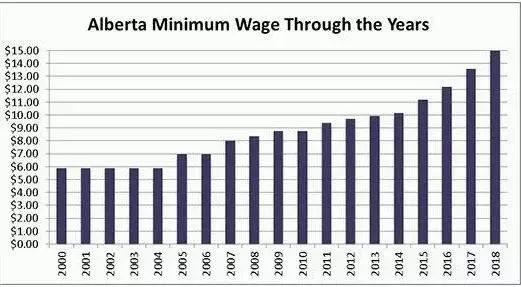 (原始链接: https://mmbiz.qpic.cn/mmbiz_jpg/D1nJqnhkPyJBEa3zxEnFiagZicnzLqsIpfeiaC2hia6aOEnZBy0arMMVPLPdVGS3MqOvzleF2u5fopkabgTUaKx5Wg/640?wx_fmt=jpeg)
-  (原始链接: https://mmbiz.qpic.cn/mmbiz_jpg/D1nJqnhkPyJBEa3zxEnFiagZicnzLqsIpfZwicolUU9Fpa3FkrH32jLhKzMOyGSFp1dvV3r786detfb0icjjvR2aVw/640?wx_fmt=jpeg)
-  (原始链接: https://mmbiz.qpic.cn/mmbiz_jpg/D1nJqnhkPyJBEa3zxEnFiagZicnzLqsIpfZwicolUU9Fpa3FkrH32jLhKzMOyGSFp1dvV3r786detfb0icjjvR2aVw/640?wx_fmt=jpeg)
-  (原始链接: https://mmbiz.qpic.cn/mmbiz_jpg/D1nJqnhkPyJBEa3zxEnFiagZicnzLqsIpfZwicolUU9Fpa3FkrH32jLhKzMOyGSFp1dvV3r786detfb0icjjvR2aVw/640?wx_fmt=jpeg)
-  (原始链接: https://mmbiz.qpic.cn/mmbiz_jpg/D1nJqnhkPyJBEa3zxEnFiagZicnzLqsIpfCNNs4y6XaoRlFibKp9MicpjdsfSvG1eEqEWENDTpwKhnWqGOmCZtIlJA/640?wx_fmt=jpeg)
-  (原始链接: https://mmbiz.qpic.cn/mmbiz_png/D1nJqnhkPyJBEa3zxEnFiagZicnzLqsIpfygIkMHvjSyGlFSVrDtA2QguUIHDB8niaEWWl6Yh3sOgN6ianeShMmlIA/640?wx_fmt=png)
-  (原始链接: https://mmbiz.qpic.cn/mmbiz_png/D1nJqnhkPyJBEa3zxEnFiagZicnzLqsIpfeA6tF1ZbAHxbz10Ge9SfODjBkx1nLdCHiadlqOnXSiaGA76UAPmptEJQ/640?wx_fmt=png)
-  (原始链接: https://mmbiz.qpic.cn/mmbiz_png/D1nJqnhkPyJBEa3zxEnFiagZicnzLqsIpfF0rKhWu4dn1dYMyicJhMp35kfWjhKXCiay7TldeiaL9Bt76lZIdo3ic27Q/640?wx_fmt=png)
-  (原始链接: https://mmbiz.qpic.cn/mmbiz_png/D1nJqnhkPyJBEa3zxEnFiagZicnzLqsIpfGdbX4U2Dw40mcS53nlhtcxRF9QKKekKsfhVu7kyQEbLkHC4ibotveUw/640?wx_fmt=png)
-  (原始链接: https://mmbiz.qpic.cn/mmbiz_png/D1nJqnhkPyJBEa3zxEnFiagZicnzLqsIpfBzBPBovm32rG9WKPqZ74hWt7t3PIQwxpnx9RibbomJBcQBnyGnMLPUg/640?wx_fmt=png)
-  (原始链接: https://mmbiz.qpic.cn/mmbiz_gif/D1nJqnhkPyJBEa3zxEnFiagZicnzLqsIpfJarpmyDLMyDWpWtNApMXTaqpa2Msc6LpYyljFSzXaShproAnaiax5fQ/640?wx_fmt=gif)
-  (原始链接: https://mmbiz.qpic.cn/mmbiz_gif/D1nJqnhkPyJBEa3zxEnFiagZicnzLqsIpfnwPa3MLbc6834e2eSeOU7HZnanfv4iaic7fIxLm8o2h26nGlGAJxA0WA/640?wx_fmt=gif)
-  (原始链接: https://mmbiz.qpic.cn/mmbiz_png/D1nJqnhkPyJBEa3zxEnFiagZicnzLqsIpfVmhicBYtS2AGJwtpX8Q9z35hFmX6Dwic2uMH8iaEP4ludLpfrYp5ibr6BQ/640?wx_fmt=png)
- 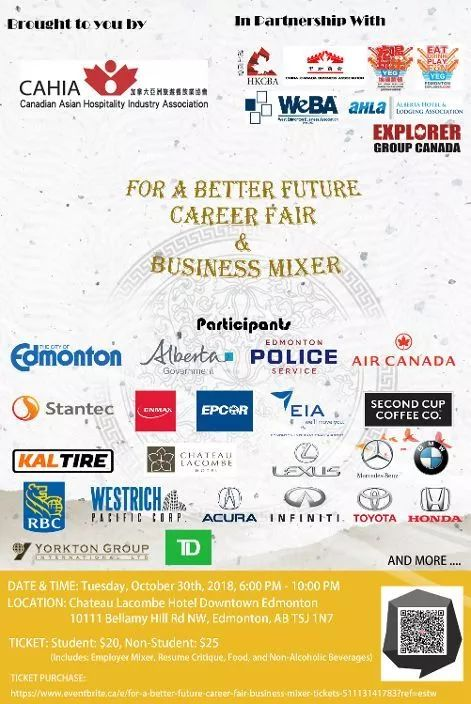 (原始链接: https://mmbiz.qpic.cn/mmbiz_jpg/D1nJqnhkPyJBEa3zxEnFiagZicnzLqsIpfksjiaWNsRJd3ib2HltISvxUyFCDdgEFdy3zVMScwVWC9TRYb2Hiaf3Tnw/640?wx_fmt=jpeg)
- 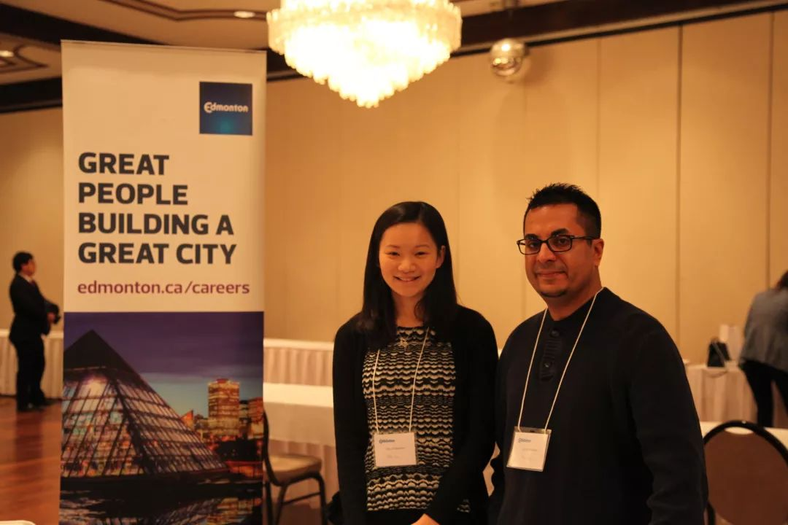 (原始链接: https://mmbiz.qpic.cn/mmbiz_jpg/D1nJqnhkPyJBEa3zxEnFiagZicnzLqsIpf3D0ICIgBU4hKlibGnCSdib9aolAMGwe8C75JZRclBrs0MB8pTs5UxwWQ/640?wx_fmt=jpeg)
- 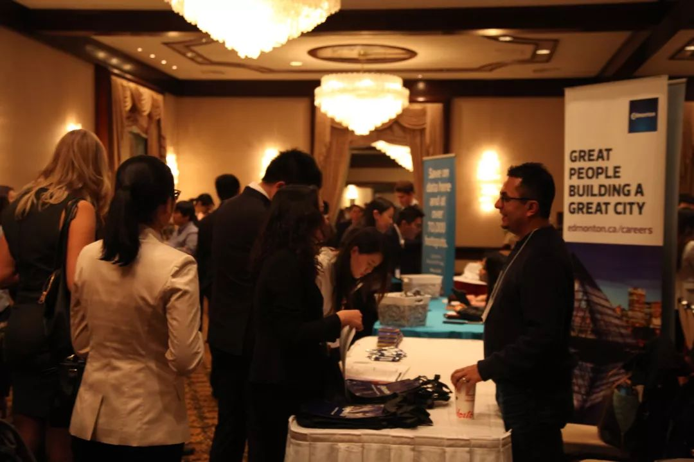 (原始链接: https://mmbiz.qpic.cn/mmbiz_jpg/D1nJqnhkPyJBEa3zxEnFiagZicnzLqsIpf9gJd1MxL4tWxpT0ttbKo29rASq1EAc8ibxQxXpib2IgZc668C9NL5cdQ/640?wx_fmt=jpeg)
-  (原始链接: https://mmbiz.qpic.cn/mmbiz_jpg/D1nJqnhkPyJBEa3zxEnFiagZicnzLqsIpf1TLPVv8FiaJ5VKC2Vibxmm1vuVlzAbRTP8tVrMHQ9D4D4XymrkFaQqiaw/640?wx_fmt=jpeg)
- 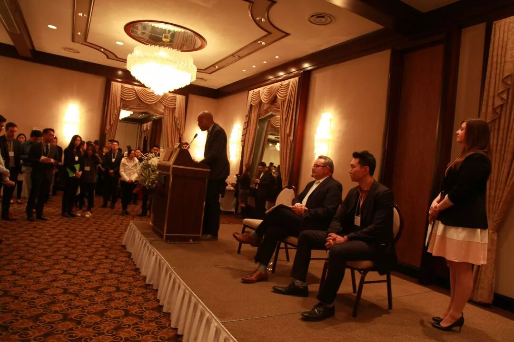 (原始链接: https://mmbiz.qpic.cn/mmbiz_jpg/D1nJqnhkPyJBEa3zxEnFiagZicnzLqsIpfiaK3ib7gAiaM7ZwfQmEwjeiauKkfTdb9d77TSmfcMlHcwKDfBlKKTgoOIQ/640?wx_fmt=jpeg)
-  (原始链接: https://mmbiz.qpic.cn/mmbiz_jpg/D1nJqnhkPyJBEa3zxEnFiagZicnzLqsIpfJdIfy1RJccPqvNUHP8AbYHMYy5mQFqRlyddkcKjkCjPoSD0KucZFzw/640?wx_fmt=jpeg)
- 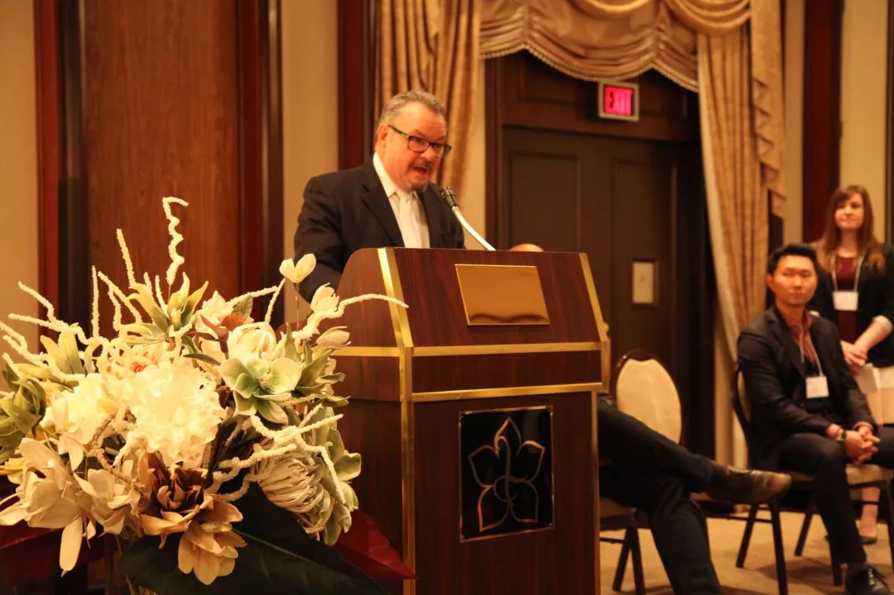 (原始链接: https://mmbiz.qpic.cn/mmbiz_jpg/D1nJqnhkPyJBEa3zxEnFiagZicnzLqsIpfa6DRRlueIZ2AQEsJzqgtR9UhbEwagdvpf23ic2hTEj6UCE2F0nF8xhw/640?wx_fmt=jpeg)
- 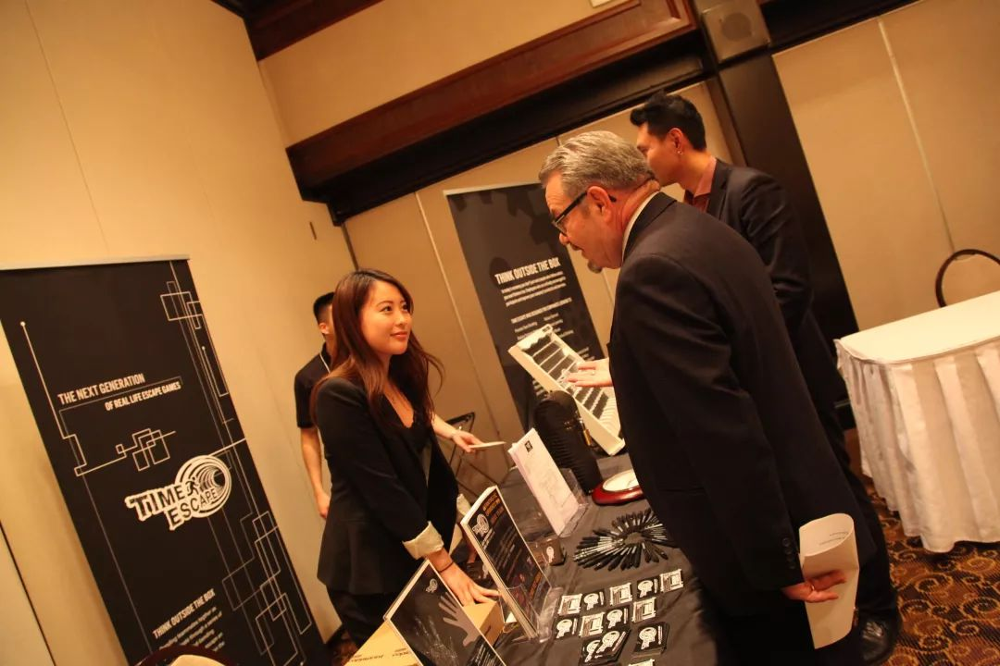 (原始链接: https://mmbiz.qpic.cn/mmbiz_jpg/D1nJqnhkPyJBEa3zxEnFiagZicnzLqsIpfWaeGT6wloUykqLdm0Tia5LvMxv4hZBT1YhyeRnUPO3jsQl1gnMeh71A/640?wx_fmt=jpeg)
-  (原始链接: https://mmbiz.qpic.cn/mmbiz_jpg/D1nJqnhkPyJBEa3zxEnFiagZicnzLqsIpfNOp7VKfhWAApH3lj74jOZONmVtQbvf1LI2ibGtmmYiaLgEIkBo813c3w/640?wx_fmt=jpeg)
-  (原始链接: https://mmbiz.qpic.cn/mmbiz_jpg/D1nJqnhkPyJBEa3zxEnFiagZicnzLqsIpfDMHgLQwOoxdbKJj4gAOqQYpel1YNNIb7YMXLtNIgjIBME8JZJuRruQ/640?wx_fmt=jpeg)
-  (原始链接: https://mmbiz.qpic.cn/mmbiz_jpg/D1nJqnhkPyJBEa3zxEnFiagZicnzLqsIpfox3rX73WlXXIfJWRAZ3xf3TyBzNhfxQY1FY0gA4EYicTuGXDgTbG5icA/640?wx_fmt=jpeg)
-  (原始链接: https://mmbiz.qpic.cn/mmbiz_jpg/D1nJqnhkPyJBEa3zxEnFiagZicnzLqsIpfUSNWSAVtfE1icNllUSMXmMYblDytYK3HKaUs0R9kGeia4LufYXia5YOcQ/640?wx_fmt=jpeg)
-  (原始链接: https://mmbiz.qpic.cn/mmbiz_jpg/D1nJqnhkPyJBEa3zxEnFiagZicnzLqsIpfphtnajscD82bN13oibld1dOThIjsQicJaeK2PVAg64gxRaTHeibNMtMMw/640?wx_fmt=jpeg)
- 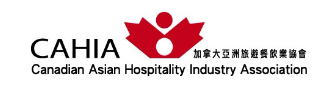 (原始链接: https://mmbiz.qpic.cn/mmbiz_png/D1nJqnhkPyJBEa3zxEnFiagZicnzLqsIpfLO4CC5FotfhVOyqq8czPGVlcVhU1Yu04FW3icfFt5CLj8yshnibmv5xw/640?wx_fmt=png)
- 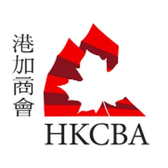 (原始链接: https://mmbiz.qpic.cn/mmbiz_png/D1nJqnhkPyJBEa3zxEnFiagZicnzLqsIpf4gj8PMEsPicpFvMqbWfjfvDzRk4ehPdJyZzmyEl5mhmfZljHlRl8bpQ/640?wx_fmt=png)
-  (原始链接: https://mmbiz.qpic.cn/mmbiz_png/D1nJqnhkPyJBEa3zxEnFiagZicnzLqsIpfr0yEOQibIJ0HT2EQ2hIudpjkmozhvOl5dVjuibMibBkiaszMia9ibK35zMvg/640?wx_fmt=png)
-  (原始链接: https://mmbiz.qpic.cn/mmbiz_jpg/D1nJqnhkPyJBEa3zxEnFiagZicnzLqsIpfGNviaBYibBuoUQNdkz5TrhdSpG2L3trUNw9cwpdW5R2nhvoZIczOQAwA/640?wx_fmt=jpeg)
-  (原始链接: https://mmbiz.qpic.cn/mmbiz_png/D1nJqnhkPyJBEa3zxEnFiagZicnzLqsIpfPLnS67qO7Uno8jKnPleBa57PPuwGZoAFAgo72oRYIPS3Yb6AMQH8Dw/640?wx_fmt=png)
-  (原始链接: https://mmbiz.qpic.cn/mmbiz_png/D1nJqnhkPyJBEa3zxEnFiagZicnzLqsIpfzxKvUkKU1aqeCbsq3JSLxSsibSaBpasgDZvEx2xdUwt2xTaRylGKwRA/640?wx_fmt=png)
-  (原始链接: https://mmbiz.qpic.cn/mmbiz_png/D1nJqnhkPyJBEa3zxEnFiagZicnzLqsIpfl5fTcYF1o9BWTEuUtLrzlTYINkc1T0tkw48MMgtLicjXXm3St8X91MQ/640?wx_fmt=png)
-  (原始链接: https://mmbiz.qpic.cn/mmbiz_png/D1nJqnhkPyJBEa3zxEnFiagZicnzLqsIpfH6urrDp1dn0H7Op5Dl2nVcyzIPlia709JPYzYSVzX7crMFbm3Z6nNyQ/640?wx_fmt=png)
- 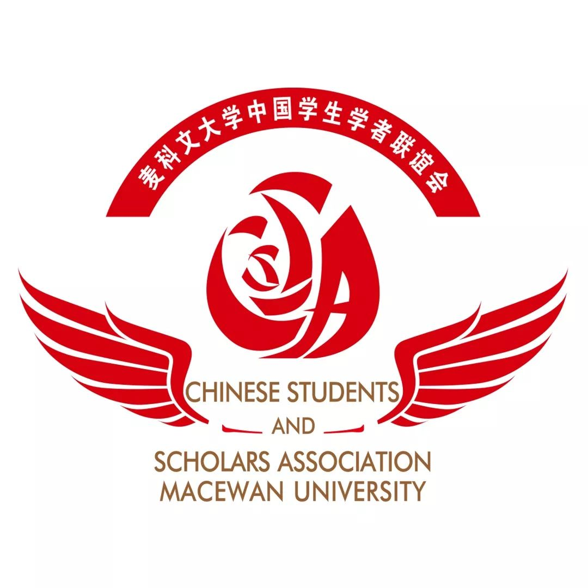 (原始链接: https://mmbiz.qpic.cn/mmbiz_jpg/D1nJqnhkPyJBEa3zxEnFiagZicnzLqsIpfn8vic2JwxJFX6MkrFB51XviaRYxfBR51nMJx64kHRtfAZ6nw1kdSoHhA/640?wx_fmt=jpeg)
-  (原始链接: https://mmbiz.qpic.cn/mmbiz_jpg/D1nJqnhkPyJBEa3zxEnFiagZicnzLqsIpfPTbesBIaQ5eM9rNR68JLtyVy03PjLtTmxlibSG1UdnN7tSo7Qy1PLeA/640?wx_fmt=jpeg)
- 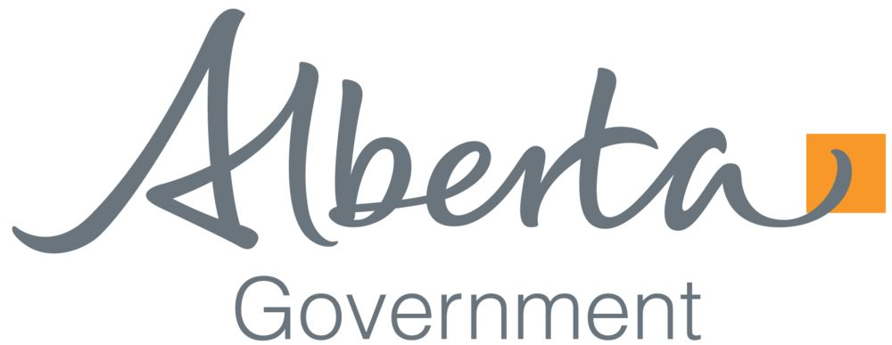 (原始链接: https://mmbiz.qpic.cn/mmbiz_png/D1nJqnhkPyJBEa3zxEnFiagZicnzLqsIpfNPTSq60BkDVvHCSo86lXfh6TI4IfSwicWYqJdNWmyfA96SMEMb0icKtA/640?wx_fmt=png)
-  (原始链接: https://mmbiz.qpic.cn/mmbiz_png/D1nJqnhkPyJBEa3zxEnFiagZicnzLqsIpf0QkUVxibNhN1WSujBAOHnXPQ2dKxLvY75zyx3u3TWBKYttK8Zzs9rFg/640?wx_fmt=png)
- 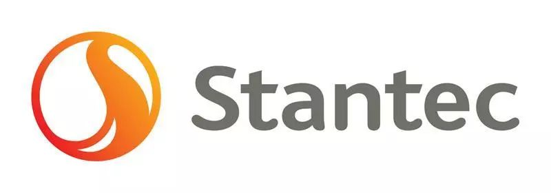 (原始链接: https://mmbiz.qpic.cn/mmbiz_jpg/D1nJqnhkPyJBEa3zxEnFiagZicnzLqsIpfvzaEO15cFydztxdKdhBQOE8INEMA1G0TMueKicM0yibGFfJGkXz1Tcow/640?wx_fmt=jpeg)
-  (原始链接: https://mmbiz.qpic.cn/mmbiz_jpg/D1nJqnhkPyJBEa3zxEnFiagZicnzLqsIpfPjm3Qic4Xicm93gA1e7vIDnhTTN3j9KepV2MicmzmLaolrWZSNSicF7Haw/640?wx_fmt=jpeg)
-  (原始链接: https://mmbiz.qpic.cn/mmbiz_png/D1nJqnhkPyJBEa3zxEnFiagZicnzLqsIpfjRQqKgWRwFJ15X16Xs1NOyV6Qjiauxrr70XnPfRd4PGdNd6XRiaYADsA/640?wx_fmt=png)
-  (原始链接: https://mmbiz.qpic.cn/mmbiz_png/D1nJqnhkPyJBEa3zxEnFiagZicnzLqsIpfy5NAnfN959A7KUN8xic2ebk8VgdVoVlKrFHw3CD105Ot5S2oBuerjjA/640?wx_fmt=png)
-  (原始链接: https://mmbiz.qpic.cn/mmbiz_png/D1nJqnhkPyJBEa3zxEnFiagZicnzLqsIpfcDIma7s2knrnmuNequy9jlDQJ1V9nMk8e50Am225Oeo4rttfoSQ43A/640?wx_fmt=png)
- 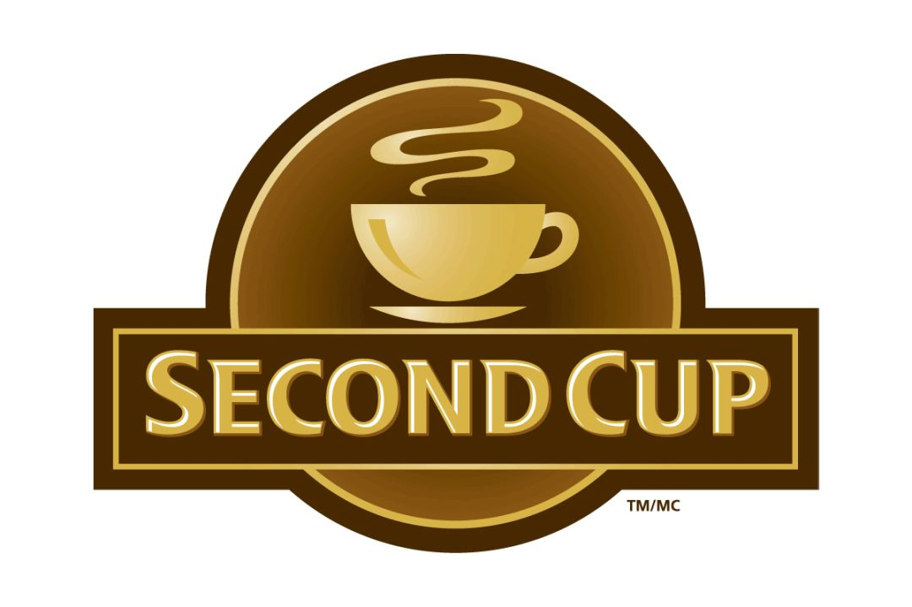 (原始链接: https://mmbiz.qpic.cn/mmbiz_png/D1nJqnhkPyJBEa3zxEnFiagZicnzLqsIpfmlbT6FQrzMtN4QWfjUJHhjt6pBTRhIibacSkTicKQwB2oicgqvopHv45Q/640?wx_fmt=gif)
- 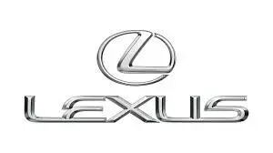 (原始链接: https://mmbiz.qpic.cn/mmbiz_jpg/D1nJqnhkPyJBEa3zxEnFiagZicnzLqsIpfdmvHwFvW3OzZRa4cOz8ErT2dn5p1qnh5owbXNB5YyhxjoCTDOKyhOA/640?wx_fmt=jpeg)
- 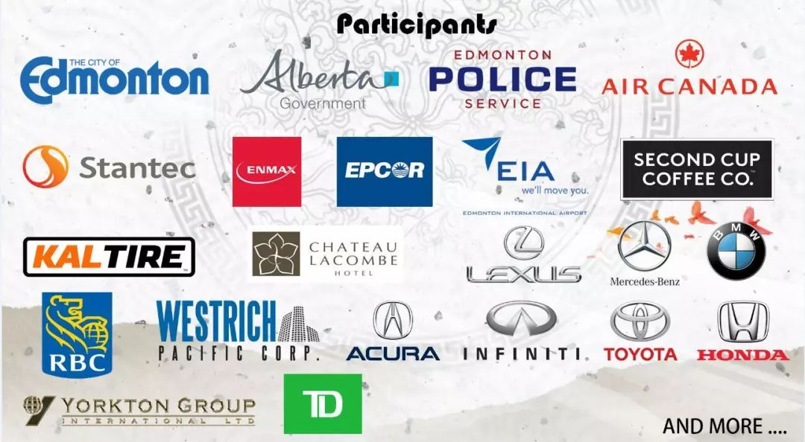 (原始链接: https://mmbiz.qpic.cn/mmbiz_jpg/D1nJqnhkPyJBEa3zxEnFiagZicnzLqsIpfoqPpTsWZ0O3ahtxodRQwfgRGZJSrkicweHlVnwGcCYpe0YLVMRDMJ9Q/640?wx_fmt=jpeg)
-  (原始链接: https://mmbiz.qpic.cn/mmbiz_jpg/D1nJqnhkPyJBEa3zxEnFiagZicnzLqsIpfUmibYqjTQbULajicYXLNqzia7WtOlnvY4xFAAWoBk4KXcvBpIO228pqIg/640?wx_fmt=jpeg)
-  (原始链接: https://mmbiz.qpic.cn/mmbiz_jpg/D1nJqnhkPyJBEa3zxEnFiagZicnzLqsIpfKicMfsicqYd3bPQIO25K3Q4OkC4vZrSu7DC1Yuw4MCpAUzQPHfZlFT2w/640?wx_fmt=jpeg)
-  (原始链接: https://mmbiz.qpic.cn/mmbiz_jpg/D1nJqnhkPyJBEa3zxEnFiagZicnzLqsIpfeYtWttjdUGA8wj6Pfm8ZM14Zpqyfia8qwbibZxoZDaIZROgh13K4ojBg/640?wx_fmt=jpeg)
-  (原始链接: https://mmbiz.qpic.cn/mmbiz_jpg/D1nJqnhkPyJBEa3zxEnFiagZicnzLqsIpfjTbFMnicjyF7zNcibnHKkicNRoqlqFsWoLRZx2Oc5cWsXicSIrjbETdRww/640?wx_fmt=jpeg)
