# 无标题

**链接地址:** http://mp.weixin.qq.com/s?__biz=MzI2NTE1ODgwOQ==&mid=2649605190&idx=1&sn=14b6fe52ede165f82cef36f91481799e&chksm=f2b8cdb0c5cf44a6e572e78c9f4d65699743344a46d89faf0c90aac3bc72535c581b8de63cd3&mpshare=1&scene=2&srcid=#rd
**作者:** 
**获取时间:** 2025/8/28 21:18:32
**图片数量:** 42

---

## 原始HTML内容

<section style="box-sizing: border-box;"><section class="V5" style="box-sizing: border-box;" powered-by="xiumi.us"><section style="margin-right: 0%;margin-left: 0%;box-sizing: border-box;"><section style="display: inline-block;vertical-align: middle;width: 80%;box-sizing: border-box;"><section class="V5" style="box-sizing: border-box;" powered-by="xiumi.us"><section style="margin-top: 10px;margin-bottom: 10px;text-align: center;box-sizing: border-box;"><section style="display: inline-block;box-sizing: border-box;"><section style="max-width: 100%;font-size: 0px;padding-bottom: 3px;box-sizing: border-box;"><section style="display: inline-block;vertical-align: middle;box-sizing: border-box;"><section style="width: 5px;height: 1px;background-color: rgb(217, 217, 217);box-sizing: border-box;"></section><section style="width: 1px;height: 5px;margin-top: -3px;margin-right: auto;margin-left: auto;background-color: rgb(217, 217, 217);box-sizing: border-box;"></section></section><section style="margin-top: -1px;margin-right: -5px;margin-left: -5px;width: 100%;display: inline-block;vertical-align: middle;padding-right: 8px;padding-left: 8px;box-sizing: border-box;"><section style="width: 100%;height: 1px;background-color: rgb(217, 217, 217);box-sizing: border-box;"></section></section><section style="display: inline-block;vertical-align: middle;box-sizing: border-box;"><section style="width: 5px;height: 1px;background-color: rgb(217, 217, 217);box-sizing: border-box;"></section><section style="width: 1px;height: 5px;margin-top: -3px;margin-right: auto;margin-left: auto;background-color: rgb(217, 217, 217);box-sizing: border-box;"></section></section></section><section style="padding-left: 15px;padding-right: 15px;color: rgb(161, 161, 161);font-size: 14px;box-sizing: border-box;">
点击上方<strong style="box-sizing: border-box;">蓝字</strong>关注我们哟~
</section><section style="max-width: 100%;font-size: 0px;box-sizing: border-box;"><section style="display: inline-block;vertical-align: middle;box-sizing: border-box;"><section style="width: 5px;height: 1px;background-color: rgb(217, 217, 217);box-sizing: border-box;"></section><section style="width: 1px;height: 5px;margin-top: -3px;margin-right: auto;margin-left: auto;background-color: rgb(217, 217, 217);box-sizing: border-box;"></section></section><section style="margin-top: -1px;margin-right: -5px;margin-left: -5px;width: 100%;display: inline-block;vertical-align: middle;padding-right: 8px;padding-left: 8px;box-sizing: border-box;"><section style="width: 100%;height: 1px;background-color: rgb(217, 217, 217);box-sizing: border-box;"></section></section><section style="display: inline-block;vertical-align: middle;box-sizing: border-box;"><section style="width: 5px;height: 1px;background-color: rgb(217, 217, 217);box-sizing: border-box;"></section><section style="width: 1px;height: 5px;margin-top: -3px;margin-right: auto;margin-left: auto;background-color: rgb(217, 217, 217);box-sizing: border-box;"></section></section></section></section></section></section></section><section style="display: inline-block;vertical-align: middle;width: 20%;box-sizing: border-box;"><section class="V5" style="box-sizing: border-box;" powered-by="xiumi.us"><section style="text-align: center;margin: -10px 0% 10px;box-sizing: border-box;"><section style="max-width: 100%;vertical-align: middle;display: inline-block;width: 100%;box-sizing: border-box;"></section></section></section></section></section></section><section class="V5" style="box-sizing: border-box;" powered-by="xiumi.us"><section style="box-sizing: border-box;"><section style="box-sizing: border-box;"><section style="box-sizing: border-box;"><section class="V5" style="box-sizing: border-box;" powered-by="xiumi.us"><section style="text-align: center;margin-top: 10px;margin-bottom: 10px;box-sizing: border-box;"><section style="max-width: 100%;vertical-align: middle;display: inline-block;box-sizing: border-box;"></section></section></section><section class="V5" style="box-sizing: border-box;" powered-by="xiumi.us"><section style="margin: 20px 0%;box-sizing: border-box;"><section style="font-size: 14px;letter-spacing: 2px;padding-right: 10px;padding-left: 10px;box-sizing: border-box;">
在刚刚揭晓的2018加拿大最佳就业城市排名中，埃德蒙顿喜获加拿大最佳就业城市<strong style="box-sizing: border-box;">排名第二</strong>。该城市的排名比前一年<strong style="box-sizing: border-box;">进步了25名</strong>。这是<strong style="box-sizing: border-box;">该省唯一</strong>进入前十名的城市。&nbsp;

 

<strong style="box-sizing: border-box;">但这好工作，到底哪里去找呢？</strong>
</section></section></section><section class="V5" style="box-sizing: border-box;" powered-by="xiumi.us"><section style="margin: 10px 0%;box-sizing: border-box;"><section style="display: inline-block;width: 100%;vertical-align: top;box-sizing: border-box;"><section class="V5" style="box-sizing: border-box;" powered-by="xiumi.us"><section style="text-align: center;margin-right: 0%;margin-bottom: -65px;margin-left: 0%;box-sizing: border-box;"><section style="max-width: 100%;vertical-align: middle;display: inline-block;width: 80%;box-sizing: border-box;"></section></section></section><section class="V5" style="box-sizing: border-box;" powered-by="xiumi.us"><section style="box-sizing: border-box;"><section style="text-align: center;font-size: 32px;color: rgb(143, 121, 71);letter-spacing: 2px;line-height: 1;box-sizing: border-box;">
- <strong style="box-sizing: border-box;">For A Better Future</strong> -

<strong style="box-sizing: border-box;">Career Fair &amp; Business Mixer</strong>

隆重开启
</section></section></section></section></section></section><section class="V5" style="box-sizing: border-box;" powered-by="xiumi.us"><section style="text-align: center;margin-top: 10px;margin-bottom: 10px;box-sizing: border-box;"><section style="max-width: 100%;vertical-align: middle;display: inline-block;box-sizing: border-box;"></section></section></section><section class="V5" style="box-sizing: border-box;" powered-by="xiumi.us"><section style="margin: 20px 0%;box-sizing: border-box;"><section style="text-align: justify;font-size: 14px;letter-spacing: 2px;padding-right: 10px;padding-left: 10px;box-sizing: border-box;">
<strong style="box-sizing: border-box;">For A Better Future</strong>是一个由“加拿大亚洲旅游餐饮协会”主办，集合<strong style="box-sizing: border-box;">求职招聘</strong>和<strong style="box-sizing: border-box;">商业社交</strong>的埃德蒙顿超重磅大规模商业活动。对艾伯塔省求职者们来说更是难得一见百里挑一的与招聘企业主面对面，展示自己工作能力和口才的<strong style="box-sizing: border-box;">绝佳机会</strong>！

 

该活动面向加拿大各大企业和社区，和市民；为各个组织以及个人提供展示自己<strong style="box-sizing: border-box;">企业文化</strong>和<strong style="box-sizing: border-box;">求职决心</strong>的<strong style="box-sizing: border-box;">双向交流平台</strong>。80家大中小型公司参加招聘，并且每个公司都会有高管和HR的人员参加与参与者进行面对面的Networking。
</section></section></section><section class="V5" style="box-sizing: border-box;" powered-by="xiumi.us"><section style="text-align: center;margin-top: 0.5em;margin-bottom: 0.5em;padding-left: 0.5em;padding-right: 0.5em;box-sizing: border-box;"><section style="box-sizing: border-box;width: 100%;border-width: 4px;border-style: solid;border-color: white;box-shadow: rgb(102, 102, 102) 3.53553px 3.53553px 8px;display: inline-block;height: auto !important;"></section></section></section><section class="V5" style="box-sizing: border-box;" powered-by="xiumi.us"><section style="margin: 20px 0%;box-sizing: border-box;"><section style="text-align: justify;font-size: 14px;letter-spacing: 2px;padding-right: 10px;padding-left: 10px;box-sizing: border-box;">
两年前，我们就已经在埃德蒙顿市中心的高端酒店<strong style="box-sizing: border-box;">Chateau Lacombe</strong>举办过一场大型的招聘会。有<strong style="box-sizing: border-box;">超过700个</strong>满怀信心的求职者参加了活动。同时更令人激动的是，他们中大<strong style="box-sizing: border-box;">约200人</strong>在此次活动中遇见了心仪的雇主和职位，寻觅到了一份<strong style="box-sizing: border-box;">满意的工作</strong>！&nbsp; 

 

因此，我们这次将举办声势更为<strong style="box-sizing: border-box;">浩大</strong>，阵容更加<strong style="box-sizing: border-box;">隆重</strong>的求职社交活动！<strong style="box-sizing: border-box;">为寻找工作的人们提供希望，帮助和机会！</strong>
</section></section></section><section class="V5" style="box-sizing: border-box;" powered-by="xiumi.us"><section style="text-align: center;margin-top: 0.5em;margin-bottom: 0.5em;padding-left: 0.5em;padding-right: 0.5em;box-sizing: border-box;"><section style="box-sizing: border-box;width: 100%;border-width: 0.3em;border-style: solid;border-color: white;box-shadow: rgb(102, 102, 102) 0.2em 0.2em 0.5em;display: inline-block;height: auto !important;"></section></section></section><section class="V5" style="box-sizing: border-box;" powered-by="xiumi.us"><section style="margin: 20px 0%;box-sizing: border-box;"><section style="text-align: justify;font-size: 14px;letter-spacing: 2px;padding-right: 10px;padding-left: 10px;box-sizing: border-box;">
无论你正在<strong style="box-sizing: border-box;">AB省</strong>的埃德蒙顿或者卡尔加里摩拳擦掌，还是在隔壁<strong style="box-sizing: border-box;">BC省</strong>伺机而动，都希望你能有机会来到现场，一起融入这场<strong style="box-sizing: border-box;">积极向上正能量</strong>氛围的求职盛会！ 

 

届时希望各位正在寻求工作机会，锻炼求职经历和拓展社交范围的<strong style="box-sizing: border-box;">有志之士</strong>们积极报名参加！也欢迎更多招贤纳士的<strong style="box-sizing: border-box;">企业和雇主</strong>参与到这个活动中为自己的企业<strong style="box-sizing: border-box;">宣传交流</strong>，招得<strong style="box-sizing: border-box;">得力干将</strong>！
</section></section></section><section class="V5" style="box-sizing: border-box;" powered-by="xiumi.us"><section style="margin: 10px 0% 30px;box-sizing: border-box;"><section style="padding-left: 1em;padding-right: 1em;display: inline-block;text-align: center;box-sizing: border-box;">
<strong style="box-sizing: border-box;">更多往年活动精彩图片</strong>
 </section><section style="border-width: 1px;border-style: solid;border-color: rgb(192, 200, 209);margin-top: -1em;padding: 20px 10px 10px;background-color: rgb(239, 239, 239);text-align: center;box-sizing: border-box;"><section class="V5" style="box-sizing: border-box;" powered-by="xiumi.us"><section style="margin: 10px 0%;box-sizing: border-box;"><section style="display: inline-block;width: 100%;vertical-align: top;box-sizing: border-box;"><section class="V5" style="box-sizing: border-box;" powered-by="xiumi.us"><section style="box-sizing: border-box;"><section style="display: inline-block;vertical-align: top;width: 50%;padding-right: 5px;border-width: 0px;box-shadow: rgb(0, 0, 0) 0px 0px 0px;box-sizing: border-box;"><section class="V5" style="box-sizing: border-box;" powered-by="xiumi.us"><section style="margin-right: 0%;margin-left: 0%;box-sizing: border-box;"><section style="max-width: 100%;vertical-align: middle;display: inline-block;box-shadow: rgb(0, 0, 0) 0px 0px 0px;box-sizing: border-box;"></section></section></section></section><section style="display: inline-block;vertical-align: top;width: 50%;padding-left: 5px;box-sizing: border-box;"><section class="V5" style="box-sizing: border-box;" powered-by="xiumi.us"><section style="margin-right: 0%;margin-left: 0%;box-sizing: border-box;"><section style="max-width: 100%;vertical-align: middle;display: inline-block;box-sizing: border-box;"></section></section></section></section></section></section><section class="V5" style="box-sizing: border-box;" powered-by="xiumi.us"><section style="margin: -25px 0%;transform: translate3d(1px, 0px, 0px);-webkit-transform: translate3d(1px, 0px, 0px);-moz-transform: translate3d(1px, 0px, 0px);-o-transform: translate3d(1px, 0px, 0px);box-sizing: border-box;"><section class="group-empty" style="display: inline-block;width: 80px;height: 60px;vertical-align: top;overflow: hidden;box-shadow: rgb(0, 0, 0) 0px 0px 0px;background-color: rgba(0, 0, 0, 0);box-sizing: border-box;"></section></section></section><section class="V5" style="box-sizing: border-box;" powered-by="xiumi.us"><section style="box-sizing: border-box;"><section style="display: inline-block;vertical-align: top;width: 50%;padding-right: 5px;box-sizing: border-box;"><section class="V5" style="box-sizing: border-box;" powered-by="xiumi.us"><section style="margin-right: 0%;margin-left: 0%;box-sizing: border-box;"><section style="max-width: 100%;vertical-align: middle;display: inline-block;box-sizing: border-box;"></section></section></section></section><section style="display: inline-block;vertical-align: top;width: 50%;padding-left: 5px;box-sizing: border-box;"><section class="V5" style="box-sizing: border-box;" powered-by="xiumi.us"><section style="margin-right: 0%;margin-left: 0%;box-sizing: border-box;"><section style="max-width: 100%;vertical-align: middle;display: inline-block;box-sizing: border-box;"></section></section></section></section></section></section></section></section></section></section></section></section><section class="V5" style="box-sizing: border-box;" powered-by="xiumi.us"><section style="margin: 20px 0%;box-sizing: border-box;"><section style="text-align: justify;font-size: 14px;letter-spacing: 2px;padding-right: 10px;padding-left: 10px;box-sizing: border-box;">
所有参加招聘的企业，不但即时接收到了许多招聘者的<strong style="box-sizing: border-box;">信息</strong>，部分甚至当场就招到了合格的应聘者；而且这更是一个难得一见的扩大自己公司<strong style="box-sizing: border-box;">影响力</strong>的机会，为自己的企业获取更多的<strong style="box-sizing: border-box;">曝光度</strong>！

 

而对于应聘者来说，不但了解到了自己想要应聘的工作的详情，更获得了与雇主面对面交谈的机会，对公司的品牌，产品，服务有了<strong style="box-sizing: border-box;">更深入的了解</strong>。可以说是一个<strong style="box-sizing: border-box;">双赢的机会</strong>！
</section></section></section><section class="V5" style="box-sizing: border-box;" powered-by="xiumi.us"><section style="box-sizing: border-box;"><section style="box-sizing: border-box;">
 
</section></section></section><section class="V5" style="box-sizing: border-box;" powered-by="xiumi.us"><section style="margin-top: 10px;margin-bottom: 10px;text-align: center;box-sizing: border-box;"><section style="width: 100%;box-sizing: border-box;"><section style="border-bottom: 2px solid rgb(249, 110, 87);display: inline-block;vertical-align: top;padding-left: 5px;padding-right: 5px;margin-bottom: -1px;box-sizing: border-box;">
<strong style="box-sizing: border-box;">活动详情</strong>
</section><section style="border-bottom: 1px solid rgb(160, 160, 160);width: 100%;box-sizing: border-box;"></section></section></section></section><section class="V5" style="box-sizing: border-box;" powered-by="xiumi.us"><section style="margin: 10px 0%;box-sizing: border-box;"><section style="display: inline-block;width: 100%;vertical-align: top;background-color: rgba(241, 204, 181, 0.54);padding: 5px;border-width: 0px;box-sizing: border-box;"><section class="V5" style="box-sizing: border-box;" powered-by="xiumi.us"><section style="box-sizing: border-box;"><section style="display: inline-block;width: 100%;vertical-align: top;padding: 5px;border-style: dashed;border-width: 2px;border-radius: 0px;border-color: rgb(255, 255, 255);box-shadow: rgb(0, 0, 0) 0px 0px 0px;box-sizing: border-box;"><section class="V5" style="box-sizing: border-box;" powered-by="xiumi.us"><section style="box-sizing: border-box;"><section style="display: inline-block;width: 100%;vertical-align: top;background-color: rgb(255, 255, 255);padding: 10px;box-sizing: border-box;"><section class="V5" style="box-sizing: border-box;" powered-by="xiumi.us"><section style="text-align: center;margin-top: 0.5em;margin-bottom: 0.5em;padding-left: 0.5em;padding-right: 0.5em;box-sizing: border-box;"><section style="box-sizing: border-box;width: 100%;border-width: 4px;border-style: solid;border-color: white;box-shadow: rgb(102, 102, 102) 3.53553px 3.53553px 8px;display: inline-block;height: auto !important;"></section></section></section><section class="V5" style="box-sizing: border-box;" powered-by="xiumi.us"><section style="margin: 20px 0%;box-sizing: border-box;"><section style="text-align: justify;font-size: 14px;color: rgb(158, 158, 158);line-height: 1.8;box-sizing: border-box;">
活动名称：

<strong style="box-sizing: border-box;">For A Better Future Career&nbsp;</strong>

<strong style="box-sizing: border-box;">Fair &amp; Business Mixer</strong>

活动组织者：

<strong style="box-sizing: border-box;">Canadian Asian Hospitality Industry Association&nbsp;</strong>

日期：

<strong style="box-sizing: border-box;">2018年10月30日，星期二</strong>

流程安排：

<strong style="box-sizing: border-box;">入场和自由活动:&nbsp;6:00pm - 7:00pm</strong>

<strong style="box-sizing: border-box;">求职招聘和社交酒会:&nbsp;7:00pm&nbsp;- 10:00pm</strong>

地址：

<strong style="box-sizing: border-box;">Chateau Lacombe Hotel Downtown Edmonton</strong>

活动票价：

<strong style="box-sizing: border-box;">学生$20；非学生$25。</strong>

<strong style="box-sizing: border-box;">包美食+饮品+简历修改/建议和Networking机会</strong>

商户展位费用：

<strong style="box-sizing: border-box;">$75&nbsp; - early bird (10月14日之前预定展位)；</strong>

<strong style="box-sizing: border-box;">$150 - regular (10月14日之后预定展位)。</strong>

<strong style="box-sizing: border-box;">包含零食，软饮料，展台，两张椅子，桌布和两支笔。</strong>

活动报名地址 及 商户站台预定

（或点击文章左下角“阅读原文”）：

<strong style="box-sizing: border-box;">https://www.eventbrite.ca/e/for-a-better-future-career-fair-business-mixer-tickets-51113141783</strong>
</section></section></section><section class="V5" style="box-sizing: border-box;" powered-by="xiumi.us"><section style="box-sizing: border-box;"><section style="box-sizing: border-box;">
 
</section></section></section><section class="V5" style="box-sizing: border-box;" powered-by="xiumi.us"><section style="text-align: center;margin: 10px 0%;box-sizing: border-box;"><section style="display: inline-block;vertical-align: middle;width: 8%;box-sizing: border-box;"><section class="V5" style="box-sizing: border-box;" powered-by="xiumi.us"><section style="margin-top: 15px;margin-bottom: 0.5em;box-sizing: border-box;"><section style="background-color: rgb(193, 35, 50);height: 3px;box-sizing: border-box;"></section></section></section></section><section style="display: inline-block;vertical-align: middle;width: 35%;padding-right: 10px;padding-left: 10px;box-sizing: border-box;"><section class="V5" style="box-sizing: border-box;" powered-by="xiumi.us"><section style="margin-right: 0%;margin-bottom: -10px;margin-left: 0%;box-sizing: border-box;"><section style="display: inline-block;width: 30%;vertical-align: top;box-sizing: border-box;"><section class="V5" style="box-sizing: border-box;" powered-by="xiumi.us"><section style="margin-right: 0%;margin-left: 0%;box-sizing: border-box;"><section style="background-color: rgb(193, 35, 50);height: 3px;box-sizing: border-box;"></section></section></section></section></section></section><section class="V5" style="box-sizing: border-box;" powered-by="xiumi.us"><section style="box-sizing: border-box;"><section style="font-size: 21px;box-sizing: border-box;">
<strong style="box-sizing: border-box;">演讲嘉宾</strong>
</section></section></section></section><section style="display: inline-block;vertical-align: middle;width: 8%;box-sizing: border-box;"><section class="V5" style="box-sizing: border-box;" powered-by="xiumi.us"><section style="margin-top: 0.5em;margin-bottom: 0.5em;box-sizing: border-box;"><section style="background-color: rgb(193, 35, 50);height: 3px;margin-top: 15px;box-sizing: border-box;"></section></section></section></section></section></section><section class="V5" style="box-sizing: border-box;" powered-by="xiumi.us"><section style="box-sizing: border-box;"><section style="box-sizing: border-box;">
 
</section></section></section><section class="V5" style="box-sizing: border-box;" powered-by="xiumi.us"><section style="margin: 8px 0%;box-sizing: border-box;"><section style="display: inline-block;vertical-align: top;width: 50%;box-sizing: border-box;"><section class="V5" style="box-sizing: border-box;" powered-by="xiumi.us"><section style="text-align: center;font-size: 18px;box-sizing: border-box;"><section style="box-sizing: border-box;display: inline-block;margin: auto;width: 7em;height: 7em;border-radius: 100%;background-position: center center;background-repeat: no-repeat;background-size: cover;background-image: url(&quot;https://mmbiz.qpic.cn/mmbiz_jpg/D1nJqnhkPyKneMcoTKNIqLb7T7C3hcE8IicDjAbhpWDQ5IKYsFzGdic9rSLJvKpdJPPOx7N5BAhEISetW8NELAmg/640?wx_fmt=jpeg&quot;);"><section style="width: 100%;height: 100%;overflow: hidden;box-sizing: border-box;"></section></section></section></section></section><section style="display: inline-block;vertical-align: top;width: 50%;padding-top: 10px;border-radius: 0px;box-sizing: border-box;"><section class="V5" style="box-sizing: border-box;" powered-by="xiumi.us"><section style="box-sizing: border-box;"><section style="display: inline-block;max-width: 100%;border-color: rgba(241, 204, 181, 0.54);font-size: 18px;color: rgb(86, 82, 81);border-left-width: 2px;border-left-style: solid;padding: 5px 10px;box-sizing: border-box;">
<strong style="box-sizing: border-box;">Hon.&nbsp;Christina Gray</strong>

艾伯塔省劳工部部长
</section></section></section></section></section></section><section class="V5" style="box-sizing: border-box;" powered-by="xiumi.us"><section style="margin: 8px 0%;box-sizing: border-box;"><section style="display: inline-block;vertical-align: top;width: 50%;box-sizing: border-box;"><section class="V5" style="box-sizing: border-box;" powered-by="xiumi.us"><section style="text-align: center;font-size: 18px;box-sizing: border-box;"><section style="box-sizing: border-box;display: inline-block;margin: auto;width: 7em;height: 7em;border-radius: 100%;background-position: 43.3337% 0%;background-repeat: no-repeat;background-size: 123.257%;background-image: url(&quot;https://mmbiz.qpic.cn/mmbiz_jpg/D1nJqnhkPyKneMcoTKNIqLb7T7C3hcE8l1C8OpTInPSKCgYyXX2adxXRCLZo5PjSic2pPzuvVP1oy1WFZmnuqxg/640?wx_fmt=jpeg&quot;);"><section style="width: 100%;height: 100%;overflow: hidden;box-sizing: border-box;"></section></section></section></section></section><section style="display: inline-block;vertical-align: top;width: 50%;padding-top: 10px;border-radius: 0px;box-sizing: border-box;"><section class="V5" style="box-sizing: border-box;" powered-by="xiumi.us"><section style="box-sizing: border-box;"><section style="font-size: 10px;box-sizing: border-box;">
 
</section></section></section><section class="V5" style="box-sizing: border-box;" powered-by="xiumi.us"><section style="box-sizing: border-box;"><section style="display: inline-block;max-width: 100%;border-color: rgba(241, 204, 181, 0.54);font-size: 18px;color: rgb(86, 82, 81);border-left-width: 2px;border-left-style: solid;padding: 5px 10px;box-sizing: border-box;">
<strong style="box-sizing: border-box;">Hon.&nbsp;Deron Bilous</strong>

艾伯塔省经济与贸易部部长
</section></section></section></section></section></section><section class="V5" style="box-sizing: border-box;" powered-by="xiumi.us"><section style="margin: 8px 0%;box-sizing: border-box;"><section style="display: inline-block;vertical-align: top;width: 50%;box-sizing: border-box;"><section class="V5" style="box-sizing: border-box;" powered-by="xiumi.us"><section style="text-align: center;font-size: 18px;box-sizing: border-box;"><section style="box-sizing: border-box;display: inline-block;margin: auto;width: 7em;height: 7em;border-radius: 100%;background-position: 0% 7.2325%;background-repeat: no-repeat;background-size: 100%;background-image: url(&quot;https://mmbiz.qpic.cn/mmbiz_jpg/D1nJqnhkPyKneMcoTKNIqLb7T7C3hcE8g6libXJgTaB3143nUZQcbjeG6ic4Rias8XnXShDMfpzsZvGsNt4efGCog/640?wx_fmt=jpeg&quot;);"><section style="width: 100%;height: 100%;overflow: hidden;box-sizing: border-box;"></section></section></section></section></section><section style="display: inline-block;vertical-align: top;width: 50%;padding-top: 10px;border-radius: 0px;box-sizing: border-box;"><section class="V5" style="box-sizing: border-box;" powered-by="xiumi.us"><section style="box-sizing: border-box;"><section style="font-size: 10px;box-sizing: border-box;">
 
</section></section></section><section class="V5" style="box-sizing: border-box;" powered-by="xiumi.us"><section style="box-sizing: border-box;"><section style="display: inline-block;max-width: 100%;border-color: rgba(241, 204, 181, 0.54);font-size: 18px;color: rgb(86, 82, 81);border-left-width: 2px;border-left-style: solid;padding: 5px 10px;box-sizing: border-box;">
<strong style="box-sizing: border-box;">Hon.&nbsp;Brian Mason</strong>

艾伯塔省基础建设及交通部部长
</section></section></section></section></section></section><section class="V5" style="box-sizing: border-box;" powered-by="xiumi.us"><section style="margin: 8px 0%;box-sizing: border-box;"><section style="display: inline-block;vertical-align: top;width: 50%;box-sizing: border-box;"><section class="V5" style="box-sizing: border-box;" powered-by="xiumi.us"><section style="text-align: center;font-size: 18px;box-sizing: border-box;"><section style="box-sizing: border-box;display: inline-block;margin: auto;width: 7em;height: 7em;border-radius: 100%;background-position: 56.863% 0%;background-repeat: no-repeat;background-size: 139.535%;background-image: url(&quot;https://mmbiz.qpic.cn/mmbiz_jpg/D1nJqnhkPyKneMcoTKNIqLb7T7C3hcE8x226ztYTReK4Q6CKtxPo1h6t5vrGMKT5TEwrx8iaDYMft8ic2pumXBKQ/640?wx_fmt=jpeg&quot;);"><section style="width: 100%;height: 100%;overflow: hidden;box-sizing: border-box;"></section></section></section></section></section><section style="display: inline-block;vertical-align: top;width: 50%;padding-top: 10px;border-radius: 0px;box-sizing: border-box;"><section class="V5" style="box-sizing: border-box;" powered-by="xiumi.us"><section style="box-sizing: border-box;"><section style="box-sizing: border-box;">
 
</section></section></section><section class="V5" style="box-sizing: border-box;" powered-by="xiumi.us"><section style="box-sizing: border-box;"><section style="display: inline-block;max-width: 100%;border-color: rgba(241, 204, 181, 0.54);font-size: 18px;color: rgb(86, 82, 81);border-left-width: 2px;border-left-style: solid;padding: 5px 10px;box-sizing: border-box;">
<strong style="box-sizing: border-box;">David Shepherd</strong>

埃德蒙顿市中心省议员
</section></section></section></section></section></section><section class="V5" style="box-sizing: border-box;" powered-by="xiumi.us"><section style="margin: 8px 0%;box-sizing: border-box;"><section style="display: inline-block;vertical-align: top;width: 50%;box-sizing: border-box;"><section class="V5" style="box-sizing: border-box;" powered-by="xiumi.us"><section style="text-align: center;font-size: 18px;box-sizing: border-box;"><section style="box-sizing: border-box;display: inline-block;margin: auto;width: 7em;height: 7em;border-radius: 100%;background-position: 25.9349% 0%;background-repeat: no-repeat;background-size: 212.079%;background-image: url(&quot;https://mmbiz.qpic.cn/mmbiz_jpg/D1nJqnhkPyKneMcoTKNIqLb7T7C3hcE8fFqriaG6DF7nmjOR2iaRv0zLJdZyUX6QaPAWCVbMRFd9ZVlUCZln0FqQ/640?wx_fmt=jpeg&quot;);"><section style="width: 100%;height: 100%;overflow: hidden;box-sizing: border-box;"></section></section></section></section></section><section style="display: inline-block;vertical-align: top;width: 50%;padding-top: 10px;border-radius: 0px;box-sizing: border-box;"><section class="V5" style="box-sizing: border-box;" powered-by="xiumi.us"><section style="box-sizing: border-box;"><section style="font-size: 10px;box-sizing: border-box;">
 
</section></section></section><section class="V5" style="box-sizing: border-box;" powered-by="xiumi.us"><section style="box-sizing: border-box;"><section style="display: inline-block;max-width: 100%;border-color: rgba(241, 204, 181, 0.54);font-size: 18px;color: rgb(86, 82, 81);border-left-width: 2px;border-left-style: solid;padding: 5px 10px;box-sizing: border-box;">
<strong style="box-sizing: border-box;">Mike Nickel</strong>

埃德蒙顿副市长，第11区市议员
</section></section></section></section></section></section></section></section></section></section></section></section></section></section></section><section class="V5" style="box-sizing: border-box;" powered-by="xiumi.us"><section style="box-sizing: border-box;"><section style="box-sizing: border-box;">
 
</section></section></section><section class="V5" style="box-sizing: border-box;" powered-by="xiumi.us"><section style="text-align: center;margin: 20px 0% 10px;box-sizing: border-box;"><section style="display: inline-block;min-width: 10%;max-width: 100%;vertical-align: top;padding-right: 8px;padding-bottom: 8px;padding-left: 8px;background-color: rgba(241, 204, 181, 0.54);box-sizing: border-box;"><section class="V5" style="box-sizing: border-box;" powered-by="xiumi.us"><section style="margin-top: -10px;margin-right: 0%;margin-left: 0%;box-sizing: border-box;"><section style="padding: 3px;display: inline-block;border-bottom: 1px solid rgb(62, 62, 62);line-height: 1;letter-spacing: 0.8px;color: rgb(99, 38, 18);box-sizing: border-box;">
<strong style="box-sizing: border-box;">活动主办方</strong>
</section></section></section></section></section></section><section class="V5" style="box-sizing: border-box;" powered-by="xiumi.us"><section style="text-align: center;margin-top: 10px;margin-bottom: 10px;box-sizing: border-box;"><section style="max-width: 100%;vertical-align: middle;display: inline-block;box-sizing: border-box;"></section></section></section><section class="V5" style="box-sizing: border-box;" powered-by="xiumi.us"><section style="box-sizing: border-box;"><section style="box-sizing: border-box;">
 
</section></section></section><section class="V5" style="box-sizing: border-box;" powered-by="xiumi.us"><section style="text-align: center;margin: 20px 0% 10px;box-sizing: border-box;"><section style="display: inline-block;min-width: 10%;max-width: 100%;vertical-align: top;padding-right: 8px;padding-bottom: 8px;padding-left: 8px;background-color: rgba(241, 204, 181, 0.54);box-sizing: border-box;"><section class="V5" style="box-sizing: border-box;" powered-by="xiumi.us"><section style="margin-top: -10px;margin-right: 0%;margin-left: 0%;box-sizing: border-box;"><section style="padding: 3px;display: inline-block;border-bottom: 1px solid rgb(62, 62, 62);line-height: 1;letter-spacing: 0.8px;color: rgb(99, 38, 18);box-sizing: border-box;">
<strong style="box-sizing: border-box;">活动协办方</strong>
</section></section></section></section></section></section><section class="V5" style="box-sizing: border-box;" powered-by="xiumi.us"><section style="text-align: center;margin-top: 10px;margin-bottom: 10px;box-sizing: border-box;"><section style="max-width: 100%;vertical-align: middle;display: inline-block;width: 30%;box-sizing: border-box;"></section></section></section><section class="V5" style="box-sizing: border-box;" powered-by="xiumi.us"><section style="text-align: center;margin: 10px 0% 30px;box-sizing: border-box;"><section style="max-width: 100%;vertical-align: middle;display: inline-block;width: 70%;box-sizing: border-box;"></section></section></section><section class="V5" style="box-sizing: border-box;" powered-by="xiumi.us"><section style="text-align: center;margin-top: 10px;margin-bottom: 10px;box-sizing: border-box;"><section style="max-width: 100%;vertical-align: middle;display: inline-block;width: 70%;box-sizing: border-box;"></section></section></section><section class="V5" style="box-sizing: border-box;" powered-by="xiumi.us"><section style="box-sizing: border-box;"><section style="box-sizing: border-box;">
 
</section></section></section><section class="V5" style="box-sizing: border-box;" powered-by="xiumi.us"><section style="text-align: center;margin-top: 10px;margin-bottom: 10px;box-sizing: border-box;"><section style="max-width: 100%;vertical-align: middle;display: inline-block;width: 80%;box-sizing: border-box;"></section></section></section><section class="V5" style="box-sizing: border-box;" powered-by="xiumi.us"><section style="text-align: center;margin: 30px 0% 20px;box-sizing: border-box;"><section style="max-width: 100%;vertical-align: middle;display: inline-block;width: 80%;box-sizing: border-box;"></section></section></section><section class="V5" style="box-sizing: border-box;" powered-by="xiumi.us"><section style="text-align: center;margin-top: 10px;margin-bottom: 10px;box-sizing: border-box;"><section style="max-width: 100%;vertical-align: middle;display: inline-block;width: 30%;box-sizing: border-box;"></section></section></section><section class="V5" style="box-sizing: border-box;" powered-by="xiumi.us"><section style="box-sizing: border-box;"><section style="box-sizing: border-box;">
 
</section></section></section><section class="V5" style="box-sizing: border-box;" powered-by="xiumi.us"><section style="text-align: center;margin: 20px 0% 10px;box-sizing: border-box;"><section style="display: inline-block;min-width: 10%;max-width: 100%;vertical-align: top;padding-right: 8px;padding-bottom: 8px;padding-left: 8px;background-color: rgba(241, 204, 181, 0.54);box-sizing: border-box;"><section class="V5" style="box-sizing: border-box;" powered-by="xiumi.us"><section style="margin-top: -10px;margin-right: 0%;margin-left: 0%;box-sizing: border-box;"><section style="padding: 3px;display: inline-block;border-bottom: 1px solid rgb(62, 62, 62);line-height: 1;letter-spacing: 0.8px;color: rgb(99, 38, 18);box-sizing: border-box;">
<strong style="box-sizing: border-box;">学校联合组织</strong>
</section></section></section></section></section></section><section class="V5" style="box-sizing: border-box;" powered-by="xiumi.us"><section style="text-align: center;margin: 30px 0%;box-sizing: border-box;"><section style="max-width: 100%;vertical-align: middle;display: inline-block;width: 80%;box-shadow: rgb(0, 0, 0) 0px 0px 0px;box-sizing: border-box;"></section></section></section><section class="V5" style="box-sizing: border-box;" powered-by="xiumi.us"><section style="box-sizing: border-box;"><section style="font-size: 14px;color: rgb(158, 158, 158);box-sizing: border-box;">
艾伯塔大学 NCG 
</section></section></section><section class="V5" style="box-sizing: border-box;" powered-by="xiumi.us"><section style="text-align: center;margin: 10px 0%;box-sizing: border-box;"><section style="max-width: 100%;vertical-align: middle;display: inline-block;width: 50%;box-sizing: border-box;"></section></section></section><section class="V5" style="box-sizing: border-box;" powered-by="xiumi.us"><section style="box-sizing: border-box;"><section style="text-align: center;color: rgb(158, 158, 158);font-size: 14px;box-sizing: border-box;">
麦科文大学中国学生学者联谊会 CSSA 

 

 

麦科文大学人力资源学俱乐部

  
</section></section></section><section class="V5" style="box-sizing: border-box;" powered-by="xiumi.us"><section style="box-sizing: border-box;"><section style="box-sizing: border-box;">
 
</section></section></section><section class="V5" style="box-sizing: border-box;" powered-by="xiumi.us"><section style="text-align: center;margin: 20px 0% 10px;box-sizing: border-box;"><section style="display: inline-block;min-width: 10%;max-width: 100%;vertical-align: top;padding-right: 8px;padding-bottom: 8px;padding-left: 8px;background-color: rgba(241, 204, 181, 0.54);box-sizing: border-box;"><section class="V5" style="box-sizing: border-box;" powered-by="xiumi.us"><section style="margin-top: -10px;margin-right: 0%;margin-left: 0%;box-sizing: border-box;"><section style="padding: 3px;display: inline-block;border-bottom: 1px solid rgb(62, 62, 62);line-height: 1;letter-spacing: 0.8px;color: rgb(99, 38, 18);box-sizing: border-box;">
<strong style="box-sizing: border-box;">【重磅更新】</strong>

<strong style="box-sizing: border-box;"> </strong>

<strong style="box-sizing: border-box;">部分参展招聘企业列表</strong>
</section></section></section></section></section></section><section class="V5" style="box-sizing: border-box;" powered-by="xiumi.us"><section style="box-sizing: border-box;"><section style="box-sizing: border-box;">
 
</section></section></section><section class="V5" style="box-sizing: border-box;" powered-by="xiumi.us"><section style="margin: 20px 0% 10px;box-sizing: border-box;"><section style="display: inline-block;width: 100%;vertical-align: top;border-style: solid;border-width: 1px;border-radius: 0px;border-color: rgb(62, 62, 62);padding-top: 10px;padding-right: 10px;padding-left: 10px;box-sizing: border-box;"><section class="V5" style="box-sizing: border-box;" powered-by="xiumi.us"><section style="margin: -26px 0% 8px;text-align: center;box-sizing: border-box;"><section style="display: inline-block;vertical-align: top;box-sizing: border-box;"><section style="margin-right: 10px;height: 2em;border-right: 1em solid rgb(158, 158, 158);border-top: 1em solid transparent !important;border-bottom: 1em solid transparent !important;box-sizing: border-box;"></section><section style="margin-right: 7px;margin-top: -2em;height: 2em;border-right: 1em solid rgb(255, 255, 255);border-top: 1em solid transparent !important;border-bottom: 1em solid transparent !important;box-sizing: border-box;"></section><section style="margin-top: -2em;height: 2em;border-right: 1em solid rgb(158, 158, 158);border-top: 1em solid transparent !important;border-bottom: 1em solid transparent !important;box-sizing: border-box;"></section></section><section style="display: inline-block;vertical-align: top;height: 2em;line-height: 2em;background-color: rgb(158, 158, 158);color: rgb(86, 82, 81);letter-spacing: 1.5px;box-sizing: border-box;">
<strong style="box-sizing: border-box;">The City of Edmonton</strong>
</section><section style="display: inline-block;vertical-align: top;box-sizing: border-box;"><section style="margin-left: 10px;height: 2em;width: 1em;border-left: 1em solid rgb(158, 158, 158);border-top: 1em solid transparent !important;border-bottom: 1em solid transparent !important;box-sizing: border-box;"></section><section style="margin-top: -2em;margin-right: -8px;margin-left: 7px;height: 2em;width: 1em;border-left: 1em solid rgb(255, 255, 255);box-sizing: border-box;border-top: 1em solid transparent !important;border-bottom: 1em solid transparent !important;"></section><section style="margin-top: -2em;height: 2em;width: 1em;border-left: 1em solid rgb(158, 158, 158);border-top: 1em solid transparent !important;border-bottom: 1em solid transparent !important;box-sizing: border-box;"></section></section></section></section><section class="V5" style="box-sizing: border-box;" powered-by="xiumi.us"><section style="text-align: center;margin: 20px 0%;box-sizing: border-box;"><section style="max-width: 100%;vertical-align: middle;display: inline-block;width: 90%;box-sizing: border-box;"></section></section></section><section class="V5" style="box-sizing: border-box;" powered-by="xiumi.us"><section style="margin-right: 0%;margin-bottom: 20px;margin-left: 0%;box-sizing: border-box;"><section style="text-align: center;font-size: 14px;line-height: 1.8;color: rgb(158, 158, 158);padding-right: 10px;padding-left: 10px;letter-spacing: 2px;box-sizing: border-box;">
这是你的城市，你的机会。你拥有我们正在寻找的技能，才能和抱负，你可以在我们的团队中实现自己的想象！为我们的城市建设贡献自己的一份力量！

网站：

https://www.edmonton.ca/
</section></section></section></section></section></section><section class="V5" style="box-sizing: border-box;" powered-by="xiumi.us"><section style="box-sizing: border-box;"><section style="box-sizing: border-box;">
 
</section></section></section><section class="V5" style="box-sizing: border-box;" powered-by="xiumi.us"><section style="margin: 20px 0% 10px;box-sizing: border-box;"><section style="display: inline-block;width: 100%;vertical-align: top;border-style: solid;border-width: 1px;border-radius: 0px;border-color: rgb(62, 62, 62);padding-top: 10px;padding-right: 10px;padding-left: 10px;box-sizing: border-box;"><section class="V5" style="box-sizing: border-box;" powered-by="xiumi.us"><section style="margin: -26px 0% 8px;text-align: center;box-sizing: border-box;"><section style="display: inline-block;vertical-align: top;box-sizing: border-box;"><section style="margin-right: 10px;height: 2em;border-right: 1em solid rgb(158, 158, 158);border-top: 1em solid transparent !important;border-bottom: 1em solid transparent !important;box-sizing: border-box;"></section><section style="margin-right: 7px;margin-top: -2em;height: 2em;border-right: 1em solid rgb(255, 255, 255);border-top: 1em solid transparent !important;border-bottom: 1em solid transparent !important;box-sizing: border-box;"></section><section style="margin-top: -2em;height: 2em;border-right: 1em solid rgb(158, 158, 158);border-top: 1em solid transparent !important;border-bottom: 1em solid transparent !important;box-sizing: border-box;"></section></section><section style="display: inline-block;vertical-align: top;height: 2em;line-height: 2em;background-color: rgb(158, 158, 158);color: rgb(86, 82, 81);letter-spacing: 1.5px;box-sizing: border-box;">
<strong style="box-sizing: border-box;">Alberta Government</strong>
</section><section style="display: inline-block;vertical-align: top;box-sizing: border-box;"><section style="margin-left: 10px;height: 2em;width: 1em;border-left: 1em solid rgb(158, 158, 158);border-top: 1em solid transparent !important;border-bottom: 1em solid transparent !important;box-sizing: border-box;"></section><section style="margin-top: -2em;margin-right: -8px;margin-left: 7px;height: 2em;width: 1em;border-left: 1em solid rgb(255, 255, 255);box-sizing: border-box;border-top: 1em solid transparent !important;border-bottom: 1em solid transparent !important;"></section><section style="margin-top: -2em;height: 2em;width: 1em;border-left: 1em solid rgb(158, 158, 158);border-top: 1em solid transparent !important;border-bottom: 1em solid transparent !important;box-sizing: border-box;"></section></section></section></section><section class="V5" style="box-sizing: border-box;" powered-by="xiumi.us"><section style="text-align: center;margin: 20px 0%;box-sizing: border-box;"><section style="max-width: 100%;vertical-align: middle;display: inline-block;width: 80%;box-sizing: border-box;"></section></section></section><section class="V5" style="box-sizing: border-box;" powered-by="xiumi.us"><section style="margin-right: 0%;margin-bottom: 20px;margin-left: 0%;box-sizing: border-box;"><section style="text-align: center;font-size: 14px;line-height: 1.8;color: rgb(158, 158, 158);padding-right: 10px;padding-left: 10px;letter-spacing: 2px;box-sizing: border-box;">
毕业生票选最优质的雇主机构，传说中最稳当的铁饭碗，让爸妈最有面子，相亲市场最炙手可热的，为人民服务的公务员！还用介绍吗？抢破头都要挤进去！

网站：

https://www.alberta.ca/index
</section></section></section></section></section></section><section class="V5" style="box-sizing: border-box;" powered-by="xiumi.us"><section style="box-sizing: border-box;"><section style="box-sizing: border-box;">
 
</section></section></section><section class="V5" style="box-sizing: border-box;" powered-by="xiumi.us"><section style="margin: 20px 0% 10px;box-sizing: border-box;"><section style="display: inline-block;width: 100%;vertical-align: top;border-style: solid;border-width: 1px;border-radius: 0px;border-color: rgb(62, 62, 62);padding-top: 10px;padding-right: 10px;padding-left: 10px;box-sizing: border-box;"><section class="V5" style="box-sizing: border-box;" powered-by="xiumi.us"><section style="margin: -26px 0% 8px;text-align: center;box-sizing: border-box;"><section style="display: inline-block;vertical-align: top;box-sizing: border-box;"><section style="margin-right: 10px;height: 2em;border-right: 1em solid rgb(158, 158, 158);border-top: 1em solid transparent !important;border-bottom: 1em solid transparent !important;box-sizing: border-box;"></section><section style="margin-right: 7px;margin-top: -2em;height: 2em;border-right: 1em solid rgb(255, 255, 255);border-top: 1em solid transparent !important;border-bottom: 1em solid transparent !important;box-sizing: border-box;"></section><section style="margin-top: -2em;height: 2em;border-right: 1em solid rgb(158, 158, 158);border-top: 1em solid transparent !important;border-bottom: 1em solid transparent !important;box-sizing: border-box;"></section></section><section style="display: inline-block;vertical-align: top;height: 2em;line-height: 2em;background-color: rgb(158, 158, 158);color: rgb(86, 82, 81);letter-spacing: 1.5px;box-sizing: border-box;">
<strong style="box-sizing: border-box;">Edmonton Police Service</strong>
</section><section style="display: inline-block;vertical-align: top;box-sizing: border-box;"><section style="margin-left: 10px;height: 2em;width: 1em;border-left: 1em solid rgb(158, 158, 158);border-top: 1em solid transparent !important;border-bottom: 1em solid transparent !important;box-sizing: border-box;"></section><section style="margin-top: -2em;margin-right: -8px;margin-left: 7px;height: 2em;width: 1em;border-left: 1em solid rgb(255, 255, 255);box-sizing: border-box;border-top: 1em solid transparent !important;border-bottom: 1em solid transparent !important;"></section><section style="margin-top: -2em;height: 2em;width: 1em;border-left: 1em solid rgb(158, 158, 158);border-top: 1em solid transparent !important;border-bottom: 1em solid transparent !important;box-sizing: border-box;"></section></section></section></section><section class="V5" style="box-sizing: border-box;" powered-by="xiumi.us"><section style="text-align: center;margin: 20px 0%;box-sizing: border-box;"><section style="max-width: 100%;vertical-align: middle;display: inline-block;width: 40%;box-sizing: border-box;"></section></section></section><section class="V5" style="box-sizing: border-box;" powered-by="xiumi.us"><section style="margin-right: 0%;margin-bottom: 20px;margin-left: 0%;box-sizing: border-box;"><section style="text-align: center;font-size: 14px;line-height: 1.8;color: rgb(158, 158, 158);padding-right: 10px;padding-left: 10px;letter-spacing: 2px;box-sizing: border-box;">
在埃德蒙顿警察局工作是一份职业生涯的挑战，但同时为你和你的家人提供经济保障。如果你对将个人成就与社区福利相结合的职业感兴趣，埃德蒙顿警察局可能是您正在寻找的雇主。

网站：

http://www.edmontonpolice.ca/
</section></section></section></section></section></section><section class="V5" style="box-sizing: border-box;" powered-by="xiumi.us"><section style="box-sizing: border-box;"><section style="box-sizing: border-box;">
 
</section></section></section><section class="V5" style="box-sizing: border-box;" powered-by="xiumi.us"><section style="margin: 20px 0% 10px;box-sizing: border-box;"><section style="display: inline-block;width: 100%;vertical-align: top;border-style: solid;border-width: 1px;border-radius: 0px;border-color: rgb(62, 62, 62);padding-top: 10px;padding-right: 10px;padding-left: 10px;box-sizing: border-box;"><section class="V5" style="box-sizing: border-box;" powered-by="xiumi.us"><section style="margin: -26px 0% 8px;text-align: center;box-sizing: border-box;"><section style="display: inline-block;vertical-align: top;box-sizing: border-box;"><section style="margin-right: 10px;height: 2em;border-right: 1em solid rgb(158, 158, 158);border-top: 1em solid transparent !important;border-bottom: 1em solid transparent !important;box-sizing: border-box;"></section><section style="margin-right: 7px;margin-top: -2em;height: 2em;border-right: 1em solid rgb(255, 255, 255);border-top: 1em solid transparent !important;border-bottom: 1em solid transparent !important;box-sizing: border-box;"></section><section style="margin-top: -2em;height: 2em;border-right: 1em solid rgb(158, 158, 158);border-top: 1em solid transparent !important;border-bottom: 1em solid transparent !important;box-sizing: border-box;"></section></section><section style="display: inline-block;vertical-align: top;height: 2em;line-height: 2em;background-color: rgb(158, 158, 158);color: rgb(86, 82, 81);letter-spacing: 1.5px;box-sizing: border-box;">
<strong style="box-sizing: border-box;">Air Canada</strong>
</section><section style="display: inline-block;vertical-align: top;box-sizing: border-box;"><section style="margin-left: 10px;height: 2em;width: 1em;border-left: 1em solid rgb(158, 158, 158);border-top: 1em solid transparent !important;border-bottom: 1em solid transparent !important;box-sizing: border-box;"></section><section style="margin-top: -2em;margin-right: -8px;margin-left: 7px;height: 2em;width: 1em;border-left: 1em solid rgb(255, 255, 255);box-sizing: border-box;border-top: 1em solid transparent !important;border-bottom: 1em solid transparent !important;"></section><section style="margin-top: -2em;height: 2em;width: 1em;border-left: 1em solid rgb(158, 158, 158);border-top: 1em solid transparent !important;border-bottom: 1em solid transparent !important;box-sizing: border-box;"></section></section></section></section><section class="V5" style="box-sizing: border-box;" powered-by="xiumi.us"><section style="text-align: center;margin: 20px 0%;box-sizing: border-box;"><section style="max-width: 100%;vertical-align: middle;display: inline-block;width: 60%;box-sizing: border-box;"></section></section></section><section class="V5" style="box-sizing: border-box;" powered-by="xiumi.us"><section style="margin-right: 0%;margin-bottom: 20px;margin-left: 0%;box-sizing: border-box;"><section style="text-align: center;font-size: 14px;line-height: 1.8;color: rgb(158, 158, 158);padding-right: 10px;padding-left: 10px;letter-spacing: 2px;box-sizing: border-box;">
加拿大航空是加拿大的国家航空公司，总部设在加拿大魁北克省蒙特利尔。加拿大航空提供客运及货运定期及包机服务，到超过240个目的地、90个渡假目的地。亦为其他航空公司提供维修、地勤及训练服务。加拿大航空的主要航空枢纽在多伦多国际机场，在蒙特利尔特鲁多国际机场及温哥华国际机场亦设有枢纽。

网站：

https://careers.aircanada.com/
</section></section></section></section></section></section><section class="V5" style="box-sizing: border-box;" powered-by="xiumi.us"><section style="box-sizing: border-box;"><section style="box-sizing: border-box;">
 
</section></section></section><section class="V5" style="box-sizing: border-box;" powered-by="xiumi.us"><section style="margin: 20px 0% 10px;box-sizing: border-box;"><section style="display: inline-block;width: 100%;vertical-align: top;border-style: solid;border-width: 1px;border-radius: 0px;border-color: rgb(62, 62, 62);padding-top: 10px;padding-right: 10px;padding-left: 10px;box-sizing: border-box;"><section class="V5" style="box-sizing: border-box;" powered-by="xiumi.us"><section style="margin: -26px 0% 8px;text-align: center;box-sizing: border-box;"><section style="display: inline-block;vertical-align: top;box-sizing: border-box;"><section style="margin-right: 10px;height: 2em;border-right: 1em solid rgb(158, 158, 158);border-top: 1em solid transparent !important;border-bottom: 1em solid transparent !important;box-sizing: border-box;"></section><section style="margin-right: 7px;margin-top: -2em;height: 2em;border-right: 1em solid rgb(255, 255, 255);border-top: 1em solid transparent !important;border-bottom: 1em solid transparent !important;box-sizing: border-box;"></section><section style="margin-top: -2em;height: 2em;border-right: 1em solid rgb(158, 158, 158);border-top: 1em solid transparent !important;border-bottom: 1em solid transparent !important;box-sizing: border-box;"></section></section><section style="display: inline-block;vertical-align: top;height: 2em;line-height: 2em;background-color: rgb(158, 158, 158);color: rgb(86, 82, 81);letter-spacing: 1.5px;box-sizing: border-box;">
<strong style="box-sizing: border-box;">Stantec</strong>
</section><section style="display: inline-block;vertical-align: top;box-sizing: border-box;"><section style="margin-left: 10px;height: 2em;width: 1em;border-left: 1em solid rgb(158, 158, 158);border-top: 1em solid transparent !important;border-bottom: 1em solid transparent !important;box-sizing: border-box;"></section><section style="margin-top: -2em;margin-right: -8px;margin-left: 7px;height: 2em;width: 1em;border-left: 1em solid rgb(255, 255, 255);box-sizing: border-box;border-top: 1em solid transparent !important;border-bottom: 1em solid transparent !important;"></section><section style="margin-top: -2em;height: 2em;width: 1em;border-left: 1em solid rgb(158, 158, 158);border-top: 1em solid transparent !important;border-bottom: 1em solid transparent !important;box-sizing: border-box;"></section></section></section></section><section class="V5" style="box-sizing: border-box;" powered-by="xiumi.us"><section style="text-align: center;margin: 20px 0%;box-sizing: border-box;"><section style="max-width: 100%;vertical-align: middle;display: inline-block;box-sizing: border-box;"></section></section></section><section class="V5" style="box-sizing: border-box;" powered-by="xiumi.us"><section style="margin-right: 0%;margin-bottom: 20px;margin-left: 0%;box-sizing: border-box;"><section style="text-align: justify;font-size: 14px;line-height: 1.8;color: rgb(158, 158, 158);padding-right: 10px;padding-left: 10px;letter-spacing: 2px;box-sizing: border-box;">
Stantec Inc.是一家设计和咨询行业的国际专业服务公司。成立于1954年，作为艾伯塔省埃德蒙顿的D. R. Stanley Associates。 Stantec为基础设施和设施项目提供规划，工程，建筑，室内设计，景观建筑，测量，环境科学，项目管理和项目经济学方面的专业咨询服务。

网站：

https://stantec.jobs/
</section></section></section></section></section></section><section class="V5" style="box-sizing: border-box;" powered-by="xiumi.us"><section style="box-sizing: border-box;"><section style="box-sizing: border-box;">
 
</section></section></section><section class="V5" style="box-sizing: border-box;" powered-by="xiumi.us"><section style="margin: 20px 0% 10px;box-sizing: border-box;"><section style="display: inline-block;width: 100%;vertical-align: top;border-style: solid;border-width: 1px;border-radius: 0px;border-color: rgb(62, 62, 62);padding-top: 10px;padding-right: 10px;padding-left: 10px;box-sizing: border-box;"><section class="V5" style="box-sizing: border-box;" powered-by="xiumi.us"><section style="margin: -26px 0% 8px;text-align: center;box-sizing: border-box;"><section style="display: inline-block;vertical-align: top;box-sizing: border-box;"><section style="margin-right: 10px;height: 2em;border-right: 1em solid rgb(158, 158, 158);border-top: 1em solid transparent !important;border-bottom: 1em solid transparent !important;box-sizing: border-box;"></section><section style="margin-right: 7px;margin-top: -2em;height: 2em;border-right: 1em solid rgb(255, 255, 255);border-top: 1em solid transparent !important;border-bottom: 1em solid transparent !important;box-sizing: border-box;"></section><section style="margin-top: -2em;height: 2em;border-right: 1em solid rgb(158, 158, 158);border-top: 1em solid transparent !important;border-bottom: 1em solid transparent !important;box-sizing: border-box;"></section></section><section style="display: inline-block;vertical-align: top;height: 2em;line-height: 2em;background-color: rgb(158, 158, 158);color: rgb(86, 82, 81);letter-spacing: 1.5px;box-sizing: border-box;">
<strong style="box-sizing: border-box;">The City of Edmonton</strong>
</section><section style="display: inline-block;vertical-align: top;box-sizing: border-box;"><section style="margin-left: 10px;height: 2em;width: 1em;border-left: 1em solid rgb(158, 158, 158);border-top: 1em solid transparent !important;border-bottom: 1em solid transparent !important;box-sizing: border-box;"></section><section style="margin-top: -2em;margin-right: -8px;margin-left: 7px;height: 2em;width: 1em;border-left: 1em solid rgb(255, 255, 255);box-sizing: border-box;border-top: 1em solid transparent !important;border-bottom: 1em solid transparent !important;"></section><section style="margin-top: -2em;height: 2em;width: 1em;border-left: 1em solid rgb(158, 158, 158);border-top: 1em solid transparent !important;border-bottom: 1em solid transparent !important;box-sizing: border-box;"></section></section></section></section><section class="V5" style="box-sizing: border-box;" powered-by="xiumi.us"><section style="text-align: center;margin: 20px 0%;box-sizing: border-box;"><section style="max-width: 100%;vertical-align: middle;display: inline-block;width: 90%;box-sizing: border-box;"></section></section></section><section class="V5" style="box-sizing: border-box;" powered-by="xiumi.us"><section style="margin-right: 0%;margin-bottom: 20px;margin-left: 0%;box-sizing: border-box;"><section style="text-align: center;font-size: 14px;line-height: 1.8;color: rgb(158, 158, 158);padding-right: 10px;padding-left: 10px;letter-spacing: 2px;box-sizing: border-box;">
ENMAX Corporation是一家垂直整合的公用事业公司，为加拿大阿尔伯塔省的客户生产和分销电力，天然气，可再生能源和增值服务。

网站：

https://www.enmax.com/Careers
</section></section></section></section></section></section><section class="V5" style="box-sizing: border-box;" powered-by="xiumi.us"><section style="box-sizing: border-box;"><section style="box-sizing: border-box;">
 
</section></section></section><section class="V5" style="box-sizing: border-box;" powered-by="xiumi.us"><section style="margin: 20px 0% 10px;box-sizing: border-box;"><section style="display: inline-block;width: 100%;vertical-align: top;border-style: solid;border-width: 1px;border-radius: 0px;border-color: rgb(62, 62, 62);padding-top: 10px;padding-right: 10px;padding-left: 10px;box-sizing: border-box;"><section class="V5" style="box-sizing: border-box;" powered-by="xiumi.us"><section style="margin: -26px 0% 8px;text-align: center;box-sizing: border-box;"><section style="display: inline-block;vertical-align: top;box-sizing: border-box;"><section style="margin-right: 10px;height: 2em;border-right: 1em solid rgb(158, 158, 158);border-top: 1em solid transparent !important;border-bottom: 1em solid transparent !important;box-sizing: border-box;"></section><section style="margin-right: 7px;margin-top: -2em;height: 2em;border-right: 1em solid rgb(255, 255, 255);border-top: 1em solid transparent !important;border-bottom: 1em solid transparent !important;box-sizing: border-box;"></section><section style="margin-top: -2em;height: 2em;border-right: 1em solid rgb(158, 158, 158);border-top: 1em solid transparent !important;border-bottom: 1em solid transparent !important;box-sizing: border-box;"></section></section><section style="display: inline-block;vertical-align: top;height: 2em;line-height: 2em;background-color: rgb(158, 158, 158);color: rgb(86, 82, 81);letter-spacing: 1.5px;box-sizing: border-box;">
<strong style="box-sizing: border-box;">Epcor</strong>
</section><section style="display: inline-block;vertical-align: top;box-sizing: border-box;"><section style="margin-left: 10px;height: 2em;width: 1em;border-left: 1em solid rgb(158, 158, 158);border-top: 1em solid transparent !important;border-bottom: 1em solid transparent !important;box-sizing: border-box;"></section><section style="margin-top: -2em;margin-right: -8px;margin-left: 7px;height: 2em;width: 1em;border-left: 1em solid rgb(255, 255, 255);box-sizing: border-box;border-top: 1em solid transparent !important;border-bottom: 1em solid transparent !important;"></section><section style="margin-top: -2em;height: 2em;width: 1em;border-left: 1em solid rgb(158, 158, 158);border-top: 1em solid transparent !important;border-bottom: 1em solid transparent !important;box-sizing: border-box;"></section></section></section></section><section class="V5" style="box-sizing: border-box;" powered-by="xiumi.us"><section style="text-align: center;margin: 20px 0%;box-sizing: border-box;"><section style="max-width: 100%;vertical-align: middle;display: inline-block;box-sizing: border-box;"></section></section></section><section class="V5" style="box-sizing: border-box;" powered-by="xiumi.us"><section style="margin-right: 0%;margin-bottom: 20px;margin-left: 0%;box-sizing: border-box;"><section style="text-align: center;font-size: 14px;line-height: 1.8;color: rgb(158, 158, 158);padding-right: 10px;padding-left: 10px;letter-spacing: 2px;box-sizing: border-box;">
EPCOR Utilities Inc.，前身为Aqualta和Eltec，是一家总部位于阿尔伯塔省埃德蒙顿的公用事业公司，负责管理整个艾伯塔省和不列颠哥伦比亚省的众多市政供水和污水处理设施。此外，EPCOR公用事业公司还为埃德蒙顿市以及艾伯塔省的其他城市分发电力，安装，维护并为交通信号灯和路灯提供工程支持。

网站： https://www.epcor.com/about/careers/Pages/default.aspx
</section></section></section></section></section></section><section class="V5" style="box-sizing: border-box;" powered-by="xiumi.us"><section style="box-sizing: border-box;"><section style="box-sizing: border-box;">
 
</section></section></section><section class="V5" style="box-sizing: border-box;" powered-by="xiumi.us"><section style="margin: 20px 0% 10px;box-sizing: border-box;"><section style="display: inline-block;width: 100%;vertical-align: top;border-style: solid;border-width: 1px;border-radius: 0px;border-color: rgb(62, 62, 62);padding-top: 10px;padding-right: 10px;padding-left: 10px;box-sizing: border-box;"><section class="V5" style="box-sizing: border-box;" powered-by="xiumi.us"><section style="margin: -26px 0% 8px;text-align: center;box-sizing: border-box;"><section style="display: inline-block;vertical-align: top;box-sizing: border-box;"><section style="margin-right: 10px;height: 2em;border-right: 1em solid rgb(158, 158, 158);border-top: 1em solid transparent !important;border-bottom: 1em solid transparent !important;box-sizing: border-box;"></section><section style="margin-right: 7px;margin-top: -2em;height: 2em;border-right: 1em solid rgb(255, 255, 255);border-top: 1em solid transparent !important;border-bottom: 1em solid transparent !important;box-sizing: border-box;"></section><section style="margin-top: -2em;height: 2em;border-right: 1em solid rgb(158, 158, 158);border-top: 1em solid transparent !important;border-bottom: 1em solid transparent !important;box-sizing: border-box;"></section></section><section style="display: inline-block;vertical-align: top;height: 2em;line-height: 2em;background-color: rgb(158, 158, 158);color: rgb(86, 82, 81);letter-spacing: 1.5px;box-sizing: border-box;">
<strong style="box-sizing: border-box;">EIA</strong>
</section><section style="display: inline-block;vertical-align: top;box-sizing: border-box;"><section style="margin-left: 10px;height: 2em;width: 1em;border-left: 1em solid rgb(158, 158, 158);border-top: 1em solid transparent !important;border-bottom: 1em solid transparent !important;box-sizing: border-box;"></section><section style="margin-top: -2em;margin-right: -8px;margin-left: 7px;height: 2em;width: 1em;border-left: 1em solid rgb(255, 255, 255);box-sizing: border-box;border-top: 1em solid transparent !important;border-bottom: 1em solid transparent !important;"></section><section style="margin-top: -2em;height: 2em;width: 1em;border-left: 1em solid rgb(158, 158, 158);border-top: 1em solid transparent !important;border-bottom: 1em solid transparent !important;box-sizing: border-box;"></section></section></section></section><section class="V5" style="box-sizing: border-box;" powered-by="xiumi.us"><section style="text-align: center;margin: 20px 0%;box-sizing: border-box;"><section style="max-width: 100%;vertical-align: middle;display: inline-block;width: 80%;box-sizing: border-box;"></section></section></section><section class="V5" style="box-sizing: border-box;" powered-by="xiumi.us"><section style="margin-right: 0%;margin-bottom: 20px;margin-left: 0%;box-sizing: border-box;"><section style="text-align: center;font-size: 14px;line-height: 1.8;color: rgb(158, 158, 158);padding-right: 10px;padding-left: 10px;letter-spacing: 2px;box-sizing: border-box;">
埃德蒙顿国际机场是一座服务于加拿大阿尔伯塔省埃德蒙顿市及周边地区的国际机场。它坐落于埃德蒙顿市南，距市中心35公里。按乘客排名，它是加拿大最繁忙的机场之一，2006年约有520万人次；同时，按飞机起降排名，它则是加拿大第十三繁忙的机场。

网站：

https://eteam.flyeia.com/job-opportunities/
</section></section></section></section></section></section><section class="V5" style="box-sizing: border-box;" powered-by="xiumi.us"><section style="box-sizing: border-box;"><section style="box-sizing: border-box;">
 
</section></section></section><section class="V5" style="box-sizing: border-box;" powered-by="xiumi.us"><section style="margin: 20px 0% 10px;box-sizing: border-box;"><section style="display: inline-block;width: 100%;vertical-align: top;border-style: solid;border-width: 1px;border-radius: 0px;border-color: rgb(62, 62, 62);padding-top: 10px;padding-right: 10px;padding-left: 10px;box-sizing: border-box;"><section class="V5" style="box-sizing: border-box;" powered-by="xiumi.us"><section style="margin: -26px 0% 8px;text-align: center;box-sizing: border-box;"><section style="display: inline-block;vertical-align: top;box-sizing: border-box;"><section style="margin-right: 10px;height: 2em;border-right: 1em solid rgb(158, 158, 158);border-top: 1em solid transparent !important;border-bottom: 1em solid transparent !important;box-sizing: border-box;"></section><section style="margin-right: 7px;margin-top: -2em;height: 2em;border-right: 1em solid rgb(255, 255, 255);border-top: 1em solid transparent !important;border-bottom: 1em solid transparent !important;box-sizing: border-box;"></section><section style="margin-top: -2em;height: 2em;border-right: 1em solid rgb(158, 158, 158);border-top: 1em solid transparent !important;border-bottom: 1em solid transparent !important;box-sizing: border-box;"></section></section><section style="display: inline-block;vertical-align: top;height: 2em;line-height: 2em;background-color: rgb(158, 158, 158);color: rgb(86, 82, 81);letter-spacing: 1.5px;box-sizing: border-box;">
<strong style="box-sizing: border-box;">Second Cup</strong>
</section><section style="display: inline-block;vertical-align: top;box-sizing: border-box;"><section style="margin-left: 10px;height: 2em;width: 1em;border-left: 1em solid rgb(158, 158, 158);border-top: 1em solid transparent !important;border-bottom: 1em solid transparent !important;box-sizing: border-box;"></section><section style="margin-top: -2em;margin-right: -8px;margin-left: 7px;height: 2em;width: 1em;border-left: 1em solid rgb(255, 255, 255);box-sizing: border-box;border-top: 1em solid transparent !important;border-bottom: 1em solid transparent !important;"></section><section style="margin-top: -2em;height: 2em;width: 1em;border-left: 1em solid rgb(158, 158, 158);border-top: 1em solid transparent !important;border-bottom: 1em solid transparent !important;box-sizing: border-box;"></section></section></section></section><section class="V5" style="box-sizing: border-box;" powered-by="xiumi.us"><section style="text-align: center;margin: 20px 0%;box-sizing: border-box;"><section style="max-width: 100%;vertical-align: middle;display: inline-block;box-sizing: border-box;"></section></section></section><section class="V5" style="box-sizing: border-box;" powered-by="xiumi.us"><section style="margin-right: 0%;margin-bottom: 20px;margin-left: 0%;box-sizing: border-box;"><section style="text-align: center;font-size: 14px;line-height: 1.8;color: rgb(158, 158, 158);padding-right: 10px;padding-left: 10px;letter-spacing: 2px;box-sizing: border-box;">
Second Cup Coffee Co.是一家加拿大咖啡零售商，在全国各地经营着300多家咖啡馆。其总部位于安大略省的密西沙加市。它的商店出售冷热饮料，糕点，小吃，预包装食品，冷热三明治以及包括马克杯和杯子在内的饮具。第二杯的销售继续与星巴克，蒂姆霍顿和麦当劳竞争，后者也采用浓缩咖啡专业饮料。

网站：

http://www.secondcup.com/careers
</section></section></section></section></section></section><section class="V5" style="box-sizing: border-box;" powered-by="xiumi.us"><section style="box-sizing: border-box;"><section style="box-sizing: border-box;">
 
</section></section></section><section class="V5" style="box-sizing: border-box;" powered-by="xiumi.us"><section style="margin: 20px 0% 10px;box-sizing: border-box;"><section style="display: inline-block;width: 100%;vertical-align: top;border-style: solid;border-width: 1px;border-radius: 0px;border-color: rgb(62, 62, 62);padding-top: 10px;padding-right: 10px;padding-left: 10px;box-sizing: border-box;"><section class="V5" style="box-sizing: border-box;" powered-by="xiumi.us"><section style="margin: -26px 0% 8px;text-align: center;box-sizing: border-box;"><section style="display: inline-block;vertical-align: top;box-sizing: border-box;"><section style="margin-right: 10px;height: 2em;border-right: 1em solid rgb(158, 158, 158);border-top: 1em solid transparent !important;border-bottom: 1em solid transparent !important;box-sizing: border-box;"></section><section style="margin-right: 7px;margin-top: -2em;height: 2em;border-right: 1em solid rgb(255, 255, 255);border-top: 1em solid transparent !important;border-bottom: 1em solid transparent !important;box-sizing: border-box;"></section><section style="margin-top: -2em;height: 2em;border-right: 1em solid rgb(158, 158, 158);border-top: 1em solid transparent !important;border-bottom: 1em solid transparent !important;box-sizing: border-box;"></section></section><section style="display: inline-block;vertical-align: top;height: 2em;line-height: 2em;background-color: rgb(158, 158, 158);color: rgb(86, 82, 81);letter-spacing: 1.5px;box-sizing: border-box;">
<strong style="box-sizing: border-box;">Kal Tire</strong>
</section><section style="display: inline-block;vertical-align: top;box-sizing: border-box;"><section style="margin-left: 10px;height: 2em;width: 1em;border-left: 1em solid rgb(158, 158, 158);border-top: 1em solid transparent !important;border-bottom: 1em solid transparent !important;box-sizing: border-box;"></section><section style="margin-top: -2em;margin-right: -8px;margin-left: 7px;height: 2em;width: 1em;border-left: 1em solid rgb(255, 255, 255);box-sizing: border-box;border-top: 1em solid transparent !important;border-bottom: 1em solid transparent !important;"></section><section style="margin-top: -2em;height: 2em;width: 1em;border-left: 1em solid rgb(158, 158, 158);border-top: 1em solid transparent !important;border-bottom: 1em solid transparent !important;box-sizing: border-box;"></section></section></section></section><section class="V5" style="box-sizing: border-box;" powered-by="xiumi.us"><section style="text-align: center;margin: 20px 0%;box-sizing: border-box;"><section style="max-width: 100%;vertical-align: middle;display: inline-block;box-sizing: border-box;"></section></section></section><section class="V5" style="box-sizing: border-box;" powered-by="xiumi.us"><section style="margin-right: 0%;margin-bottom: 20px;margin-left: 0%;box-sizing: border-box;"><section style="text-align: center;font-size: 14px;line-height: 1.8;color: rgb(158, 158, 158);padding-right: 10px;padding-left: 10px;letter-spacing: 2px;box-sizing: border-box;">
Kal Tire是一家总部位于不列颠哥伦比亚省Vernon的加拿大公司，由Thomas J. Foord OBC和Jim Lochhead于1953年创立。其业务包括客车和轻型卡车的零售轮胎销售，乘用车和轻型卡车的机械服务，商用卡车轮胎，采矿和越野销售和服务以及商用和越野轮胎的翻新。&nbsp;

网站：

https://jobs.jobvite.com/kaltire
</section></section></section></section></section></section><section class="V5" style="box-sizing: border-box;" powered-by="xiumi.us"><section style="margin: 20px 0%;box-sizing: border-box;"><section style="text-align: center;font-size: 14px;color: rgb(204, 1, 1);letter-spacing: 2px;padding-right: 10px;padding-left: 10px;box-sizing: border-box;">
<strong style="box-sizing: border-box;">……</strong>

<strong style="box-sizing: border-box;">……</strong>

<strong style="box-sizing: border-box;">……</strong>

 

<strong style="box-sizing: border-box;">文章篇幅有限，</strong>

<strong style="box-sizing: border-box;">特约参展招聘企业列表如下，</strong>

<strong style="box-sizing: border-box;">欢迎感兴趣的同学到会</strong>

<strong style="box-sizing: border-box;">继续深入了解。</strong>

<strong style="box-sizing: border-box;"> </strong>

City of Edmonton  Government of Alberta  AIR CANADA  Edmonton Police Services  Edmonton Transit Services  EPCOR  Stantec  Enmax  Edmonton International Airport  YMCA  Edmonton BMW MINI  Mercedes-Benz Heritage Valley  Lexus of Edmonton West  Acura  Infiniti  Alberta Honda  Mayfield Toyota  Kal Tire

 

MacEwan University

 

Crystal Glass Canada  APX Hotel Groups  Westrich Pacific Corp.  Yorkton Group International  Royal Bank Canada ( RBC )  TD Canada Trust

 

Shaw Communications

 

Telus  Sterling Homes  Second Cup Coffee Co.  Chateau Lacombe Hotel  Statefarm Insurance  Howlund&nbsp;International Corp.  Generation Z Consulting Inc.  Maple Bridge International Travel Company

 

Visa to China Travel Company  Explorer Group Canada  AlphaPay ( Alipay &amp; Wechat Pay)  Nurse Next Door  Hong Kong Canada Business Association  West Edmonton Business Association

 
</section></section></section><section class="V5" style="box-sizing: border-box;" powered-by="xiumi.us"><section style="text-align: center;margin-top: 10px;margin-bottom: 10px;box-sizing: border-box;"><section style="max-width: 100%;vertical-align: middle;display: inline-block;box-sizing: border-box;"></section></section></section><section class="V5" style="box-sizing: border-box;" powered-by="xiumi.us"><section style="box-sizing: border-box;"><section style="box-sizing: border-box;">
 
</section></section></section><section class="V5" style="box-sizing: border-box;" powered-by="xiumi.us"><section style="margin-top: 10px;margin-bottom: 10px;text-align: center;box-sizing: border-box;"><section style="border-bottom: 1px solid rgb(249, 110, 87);padding-top: 3px;width: 100%;margin-bottom: -3px;box-sizing: border-box;"></section><section style="height: 5px;line-height: 5px;box-sizing: border-box;"><section style="display: inline-block;vertical-align: top;background-color: rgb(255, 255, 255);box-sizing: border-box;">     </section><section style="clear: both;box-sizing: border-box;"></section></section></section></section><section class="V5" style="box-sizing: border-box;" powered-by="xiumi.us"><section style="text-align: center;margin-top: 0.5em;margin-bottom: 0.5em;padding-left: 0.5em;padding-right: 0.5em;box-sizing: border-box;"><section style="box-sizing: border-box;width: 100%;border-width: 4px;border-style: solid;border-color: white;box-shadow: rgb(102, 102, 102) 0.2em 0.2em 0.5em;display: inline-block;height: auto !important;"></section></section></section><section class="V5" style="box-sizing: border-box;" powered-by="xiumi.us"><section style="margin: 20px 0%;box-sizing: border-box;"><section style="text-align: center;font-size: 14px;color: rgb(204, 1, 1);letter-spacing: 2px;padding-right: 10px;padding-left: 10px;box-sizing: border-box;">
<strong style="box-sizing: border-box;">-&nbsp;For A Better Future&nbsp;-</strong>

<strong style="box-sizing: border-box;">Career Fair &amp; Business Mixer</strong>

<strong style="box-sizing: border-box;"> </strong>

<strong style="box-sizing: border-box;">2018年重磅预定！</strong>

<strong style="box-sizing: border-box;"> </strong>
</section></section></section><section class="V5" style="box-sizing: border-box;" powered-by="xiumi.us"><section style="text-align: center;margin-top: 10px;margin-bottom: 10px;box-sizing: border-box;"><section style="max-width: 100%;vertical-align: middle;display: inline-block;box-sizing: border-box;"></section></section></section><section class="V5" style="box-sizing: border-box;" powered-by="xiumi.us"><section style="margin: 20px 0%;box-sizing: border-box;"><section style="text-align: center;font-size: 14px;color: rgb(204, 1, 1);letter-spacing: 2px;padding-right: 10px;padding-left: 10px;box-sizing: border-box;">
<strong style="box-sizing: border-box;">如有任何问题，</strong> 

<strong style="box-sizing: border-box;">欢迎添加我们的微信服务号:</strong>

<strong style="box-sizing: border-box;">吃喝玩乐埃德蒙顿 （CProOffice）</strong>
</section></section></section><section class="V5" style="box-sizing: border-box;" powered-by="xiumi.us"><section style="text-align: center;margin-top: 10px;margin-bottom: 10px;box-sizing: border-box;"><section style="max-width: 100%;vertical-align: middle;display: inline-block;box-sizing: border-box;"></section></section></section><section class="V5" style="box-sizing: border-box;" powered-by="xiumi.us"><section style="margin: 20px 0%;box-sizing: border-box;"><section style="text-align: center;font-size: 14px;color: rgb(204, 1, 1);letter-spacing: 2px;padding-right: 10px;padding-left: 10px;box-sizing: border-box;">
<strong style="box-sizing: border-box;">记得提前订票来参与我们的活动！</strong> 

<strong style="box-sizing: border-box;">不见不散哦！</strong>
</section></section></section><section class="V5" style="box-sizing: border-box;" powered-by="xiumi.us"><section style="margin: 20px 0%;box-sizing: border-box;"><section style="text-align: center;font-size: 14px;letter-spacing: 2px;padding-right: 10px;padding-left: 10px;box-sizing: border-box;">
<strong style="box-sizing: border-box;">&nbsp;- END -</strong>
</section></section></section></section>
 
</section></section></section><section class="V5" style="box-sizing: border-box;" powered-by="xiumi.us"><section style="box-sizing: border-box;"><section style="box-sizing: border-box;">
 
</section></section></section><section class="V5" style="box-sizing: border-box;" powered-by="xiumi.us"><section style="margin: 40px 0% 10px;text-align: center;box-sizing: border-box;"><section style="display: inline-block;width: 90%;border-width: 1px;border-style: dotted;border-color: rgba(80, 182, 201, 0.72);padding: 10px;border-radius: 0px;box-sizing: border-box;"><section class="V5" style="box-sizing: border-box;" powered-by="xiumi.us"><section style="transform: translate3d(20px, 0px, 0px);text-align: left;font-size: 11px;margin-top: -55px;margin-right: 0%;margin-left: 0%;box-sizing: border-box;"><section style="box-sizing: border-box;width: 7em;height: 7em;display: inline-block;vertical-align: bottom;border-radius: 100%;border-width: 5px;border-style: none;border-color: rgba(80, 182, 201, 0.72);background-position: center center;background-repeat: no-repeat;background-size: cover;background-image: url(&quot;https://mmbiz.qpic.cn/mmbiz_jpg/D1nJqnhkPyKneMcoTKNIqLb7T7C3hcE8HxaARKqoa89V2hIEPgSSLmhnrELMnehqhFyUpzlaoxocr1DNEZa76A/640?wx_fmt=jpeg&quot;);"><section style="width: 100%;height: 100%;overflow: hidden;box-sizing: border-box;"></section></section></section></section><section class="V5" style="box-sizing: border-box;" powered-by="xiumi.us"><section style="box-sizing: border-box;"><section class="group-empty" style="display: inline-block;vertical-align: top;width: 38.2%;box-sizing: border-box;"></section><section style="display: inline-block;vertical-align: top;width: 61.8%;box-sizing: border-box;"><section class="V5" style="box-sizing: border-box;" powered-by="xiumi.us"><section style="margin-right: 0%;margin-left: 0%;box-sizing: border-box;"><section style="font-size: 18px;color: rgb(67, 103, 117);line-height: 1.6;letter-spacing: 1px;box-sizing: border-box;">
<strong style="box-sizing: border-box;">埃德蒙顿微生活</strong>
</section></section></section><section class="V5" style="box-sizing: border-box;" powered-by="xiumi.us"><section style="margin-top: 0.5em;margin-bottom: 0.5em;box-sizing: border-box;"><section style="background-color: rgba(80, 182, 201, 0.72);height: 1px;box-sizing: border-box;"></section></section></section></section></section></section><section class="V5" style="box-sizing: border-box;" powered-by="xiumi.us"><section style="box-sizing: border-box;"><section style="text-align: justify;font-size: 14px;color: rgba(62, 62, 62, 0.72);letter-spacing: 2px;box-sizing: border-box;">
<strong style="box-sizing: border-box;">关心埃德蒙顿民生，</strong>

<strong style="box-sizing: border-box;">关注埃德蒙顿的发展。</strong>

 

埃德蒙顿微生活是“吃喝玩乐埃德蒙顿”旗下，为埃德蒙顿地区的居民提供每日最新的吃喝玩乐、工作学习、商业投资的媒体平台 。
</section></section></section><section class="V5" style="box-sizing: border-box;" powered-by="xiumi.us"><section style="box-sizing: border-box;"><section style="text-align: left;box-sizing: border-box;">
 
</section></section></section><section class="V5" style="box-sizing: border-box;" powered-by="xiumi.us"><section style="box-sizing: border-box;"><section style="display: inline-block;vertical-align: middle;width: 61.8%;box-sizing: border-box;"><section class="V5" style="box-sizing: border-box;" powered-by="xiumi.us"><section style="box-sizing: border-box;"><section style="text-align: justify;font-size: 12px;color: rgba(62, 62, 62, 0.37);line-height: 1.9;letter-spacing: 0px;box-sizing: border-box;">
我们的目标是以最新、最快、最及时的方式 报道埃德蒙顿的新鲜事 。 
</section></section></section></section><section style="display: inline-block;vertical-align: middle;width: 38.2%;box-sizing: border-box;"><section class="V5" style="box-sizing: border-box;" powered-by="xiumi.us"><section style="margin-right: 0%;margin-left: 0%;box-sizing: border-box;"><section style="max-width: 100%;vertical-align: middle;display: inline-block;width: 70%;box-sizing: border-box;"></section></section></section></section></section></section></section></section></section></section>
 

---

## 纯文本内容

点击上方蓝字关注我们哟~在刚刚揭晓的2018加拿大最佳就业城市排名中，埃德蒙顿喜获加拿大最佳就业城市排名第二。该城市的排名比前一年进步了25名。这是该省唯一进入前十名的城市。 但这好工作，到底哪里去找呢？- For A Better Future -Career Fair & Business Mixer隆重开启For A Better Future是一个由“加拿大亚洲旅游餐饮协会”主办，集合求职招聘和商业社交的埃德蒙顿超重磅大规模商业活动。对艾伯塔省求职者们来说更是难得一见百里挑一的与招聘企业主面对面，展示自己工作能力和口才的绝佳机会！该活动面向加拿大各大企业和社区，和市民；为各个组织以及个人提供展示自己企业文化和求职决心的双向交流平台。80家大中小型公司参加招聘，并且每个公司都会有高管和HR的人员参加与参与者进行面对面的Networking。两年前，我们就已经在埃德蒙顿市中心的高端酒店Chateau Lacombe举办过一场大型的招聘会。有超过700个满怀信心的求职者参加了活动。同时更令人激动的是，他们中大约200人在此次活动中遇见了心仪的雇主和职位，寻觅到了一份满意的工作！ 因此，我们这次将举办声势更为浩大，阵容更加隆重的求职社交活动！为寻找工作的人们提供希望，帮助和机会！无论你正在AB省的埃德蒙顿或者卡尔加里摩拳擦掌，还是在隔壁BC省伺机而动，都希望你能有机会来到现场，一起融入这场积极向上正能量氛围的求职盛会！届时希望各位正在寻求工作机会，锻炼求职经历和拓展社交范围的有志之士们积极报名参加！也欢迎更多招贤纳士的企业和雇主参与到这个活动中为自己的企业宣传交流，招得得力干将！更多往年活动精彩图片 所有参加招聘的企业，不但即时接收到了许多招聘者的信息，部分甚至当场就招到了合格的应聘者；而且这更是一个难得一见的扩大自己公司影响力的机会，为自己的企业获取更多的曝光度！而对于应聘者来说，不但了解到了自己想要应聘的工作的详情，更获得了与雇主面对面交谈的机会，对公司的品牌，产品，服务有了更深入的了解。可以说是一个双赢的机会！活动详情活动名称：For A Better Future Career Fair & Business Mixer活动组织者：Canadian Asian Hospitality Industry Association 日期：2018年10月30日，星期二流程安排：入场和自由活动: 6:00pm - 7:00pm求职招聘和社交酒会: 7:00pm - 10:00pm地址：Chateau Lacombe Hotel Downtown Edmonton活动票价：学生$20；非学生$25。包美食+饮品+简历修改/建议和Networking机会商户展位费用：$75  - early bird (10月14日之前预定展位)；$150 - regular (10月14日之后预定展位)。包含零食，软饮料，展台，两张椅子，桌布和两支笔。活动报名地址 及 商户站台预定（或点击文章左下角“阅读原文”）：https://www.eventbrite.ca/e/for-a-better-future-career-fair-business-mixer-tickets-51113141783演讲嘉宾Hon. Christina Gray艾伯塔省劳工部部长Hon. Deron Bilous艾伯塔省经济与贸易部部长Hon. Brian Mason艾伯塔省基础建设及交通部部长David Shepherd埃德蒙顿市中心省议员Mike Nickel埃德蒙顿副市长，第11区市议员活动主办方活动协办方学校联合组织艾伯塔大学 NCG麦科文大学中国学生学者联谊会 CSSA麦科文大学人力资源学俱乐部【重磅更新】部分参展招聘企业列表The City of Edmonton这是你的城市，你的机会。你拥有我们正在寻找的技能，才能和抱负，你可以在我们的团队中实现自己的想象！为我们的城市建设贡献自己的一份力量！网站：https://www.edmonton.ca/Alberta Government毕业生票选最优质的雇主机构，传说中最稳当的铁饭碗，让爸妈最有面子，相亲市场最炙手可热的，为人民服务的公务员！还用介绍吗？抢破头都要挤进去！网站：https://www.alberta.ca/indexEdmonton Police Service在埃德蒙顿警察局工作是一份职业生涯的挑战，但同时为你和你的家人提供经济保障。如果你对将个人成就与社区福利相结合的职业感兴趣，埃德蒙顿警察局可能是您正在寻找的雇主。网站：http://www.edmontonpolice.ca/Air Canada加拿大航空是加拿大的国家航空公司，总部设在加拿大魁北克省蒙特利尔。加拿大航空提供客运及货运定期及包机服务，到超过240个目的地、90个渡假目的地。亦为其他航空公司提供维修、地勤及训练服务。加拿大航空的主要航空枢纽在多伦多国际机场，在蒙特利尔特鲁多国际机场及温哥华国际机场亦设有枢纽。网站：https://careers.aircanada.com/StantecStantec Inc.是一家设计和咨询行业的国际专业服务公司。成立于1954年，作为艾伯塔省埃德蒙顿的D. R. Stanley Associates。 Stantec为基础设施和设施项目提供规划，工程，建筑，室内设计，景观建筑，测量，环境科学，项目管理和项目经济学方面的专业咨询服务。网站：https://stantec.jobs/The City of EdmontonENMAX Corporation是一家垂直整合的公用事业公司，为加拿大阿尔伯塔省的客户生产和分销电力，天然气，可再生能源和增值服务。网站：https://www.enmax.com/CareersEpcorEPCOR Utilities Inc.，前身为Aqualta和Eltec，是一家总部位于阿尔伯塔省埃德蒙顿的公用事业公司，负责管理整个艾伯塔省和不列颠哥伦比亚省的众多市政供水和污水处理设施。此外，EPCOR公用事业公司还为埃德蒙顿市以及艾伯塔省的其他城市分发电力，安装，维护并为交通信号灯和路灯提供工程支持。网站：https://www.epcor.com/about/careers/Pages/default.aspxEIA埃德蒙顿国际机场是一座服务于加拿大阿尔伯塔省埃德蒙顿市及周边地区的国际机场。它坐落于埃德蒙顿市南，距市中心35公里。按乘客排名，它是加拿大最繁忙的机场之一，2006年约有520万人次；同时，按飞机起降排名，它则是加拿大第十三繁忙的机场。网站：https://eteam.flyeia.com/job-opportunities/Second CupSecond Cup Coffee Co.是一家加拿大咖啡零售商，在全国各地经营着300多家咖啡馆。其总部位于安大略省的密西沙加市。它的商店出售冷热饮料，糕点，小吃，预包装食品，冷热三明治以及包括马克杯和杯子在内的饮具。第二杯的销售继续与星巴克，蒂姆霍顿和麦当劳竞争，后者也采用浓缩咖啡专业饮料。网站：http://www.secondcup.com/careersKal TireKal Tire是一家总部位于不列颠哥伦比亚省Vernon的加拿大公司，由Thomas J. Foord OBC和Jim Lochhead于1953年创立。其业务包括客车和轻型卡车的零售轮胎销售，乘用车和轻型卡车的机械服务，商用卡车轮胎，采矿和越野销售和服务以及商用和越野轮胎的翻新。 网站：https://jobs.jobvite.com/kaltire………………文章篇幅有限，特约参展招聘企业列表如下，欢迎感兴趣的同学到会继续深入了解。City of EdmontonGovernment of AlbertaAIR CANADAEdmonton Police ServicesEdmonton Transit ServicesEPCORStantecEnmaxEdmonton International AirportYMCAEdmonton BMW MINIMercedes-Benz Heritage ValleyLexus of Edmonton WestAcuraInfinitiAlberta HondaMayfield ToyotaKal TireMacEwan UniversityCrystal Glass CanadaAPX Hotel GroupsWestrich Pacific Corp.Yorkton Group InternationalRoyal Bank Canada ( RBC )TD Canada TrustShaw CommunicationsTelusSterling HomesSecond Cup Coffee Co.Chateau Lacombe HotelStatefarm InsuranceHowlund International Corp.Generation Z Consulting Inc.Maple Bridge International Travel CompanyVisa to China Travel CompanyExplorer Group CanadaAlphaPay ( Alipay & Wechat Pay)Nurse Next DoorHong Kong Canada Business AssociationWest Edmonton Business Association     - For A Better Future -Career Fair & Business Mixer2018年重磅预定！如有任何问题，欢迎添加我们的微信服务号:吃喝玩乐埃德蒙顿 （CProOffice）记得提前订票来参与我们的活动！不见不散哦！ - END -埃德蒙顿微生活关心埃德蒙顿民生，关注埃德蒙顿的发展。埃德蒙顿微生活是“吃喝玩乐埃德蒙顿”旗下，为埃德蒙顿地区的居民提供每日最新的吃喝玩乐、工作学习、商业投资的媒体平台 。我们的目标是以最新、最快、最及时的方式 报道埃德蒙顿的新鲜事 。

---

## 图片列表

-  (原始链接: https://mmbiz.qpic.cn/mmbiz_gif/D1nJqnhkPyKneMcoTKNIqLb7T7C3hcE8H3DukXSBBErURQ8AaNnqxzQ1iadtwVOXxiatB8JGTaf4p32VSxhFnTSA/640?wx_fmt=gif)
-  (原始链接: https://mmbiz.qpic.cn/mmbiz_jpg/D1nJqnhkPyKneMcoTKNIqLb7T7C3hcE8McbCIMLfjM9FDFOHpVqFicSwmyEQcuqlcNDobAOcJO13MagWMILWiaDA/640?wx_fmt=jpeg)
-  (原始链接: https://mmbiz.qpic.cn/mmbiz_png/D1nJqnhkPyKneMcoTKNIqLb7T7C3hcE8YW4MJcYpRhlQOucawseu54ZgrXaP7ru4XJONSuEzQlTtvKggTUMSsg/640?wx_fmt=png)
- 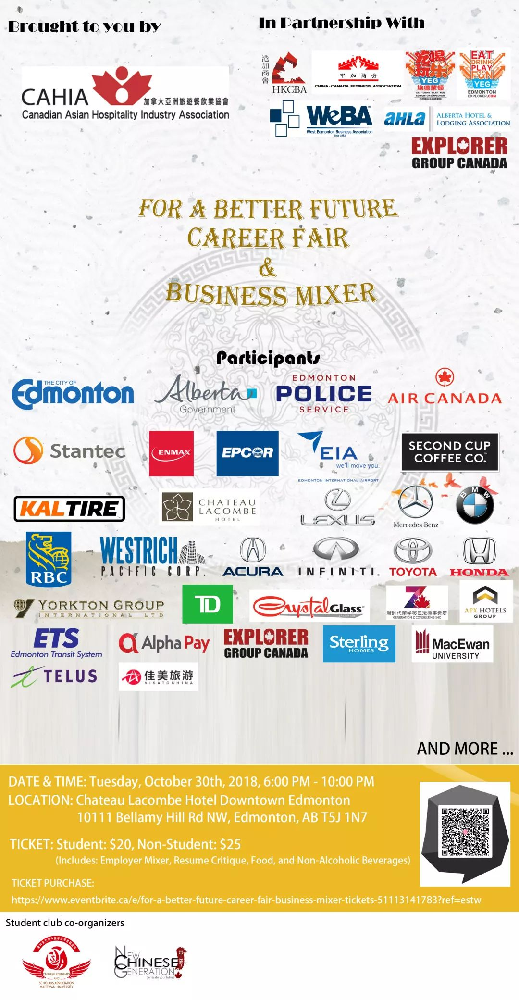 (原始链接: https://mmbiz.qpic.cn/mmbiz_jpg/D1nJqnhkPyKneMcoTKNIqLb7T7C3hcE8RE2wv1pCIZTXXaud1KCkibypKlRuO0j7wjWMmZCAdWNKHXN7iaBSicFcQ/640?wx_fmt=jpeg)
- 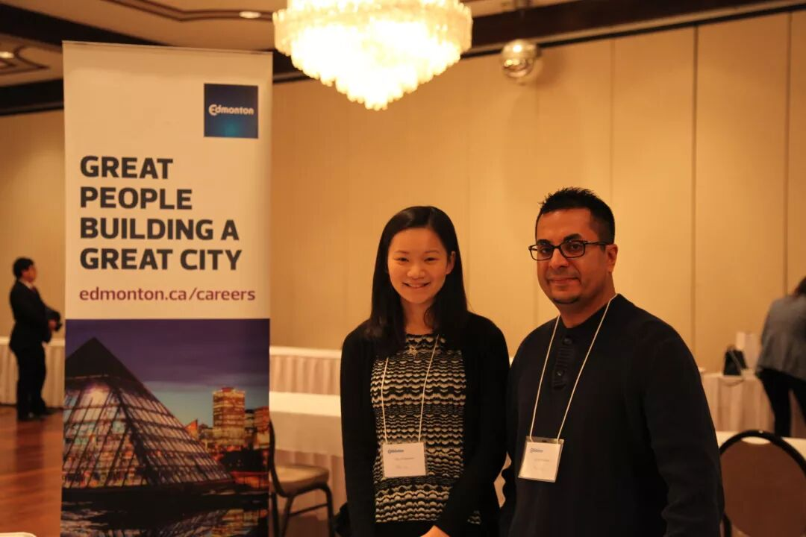 (原始链接: https://mmbiz.qpic.cn/mmbiz_jpg/D1nJqnhkPyKneMcoTKNIqLb7T7C3hcE87bic1I9TOzHak2EwQibfMb0gbGmXTkYJWicCTYficG2icRCdaP1p7on3JGg/640?wx_fmt=jpeg)
- 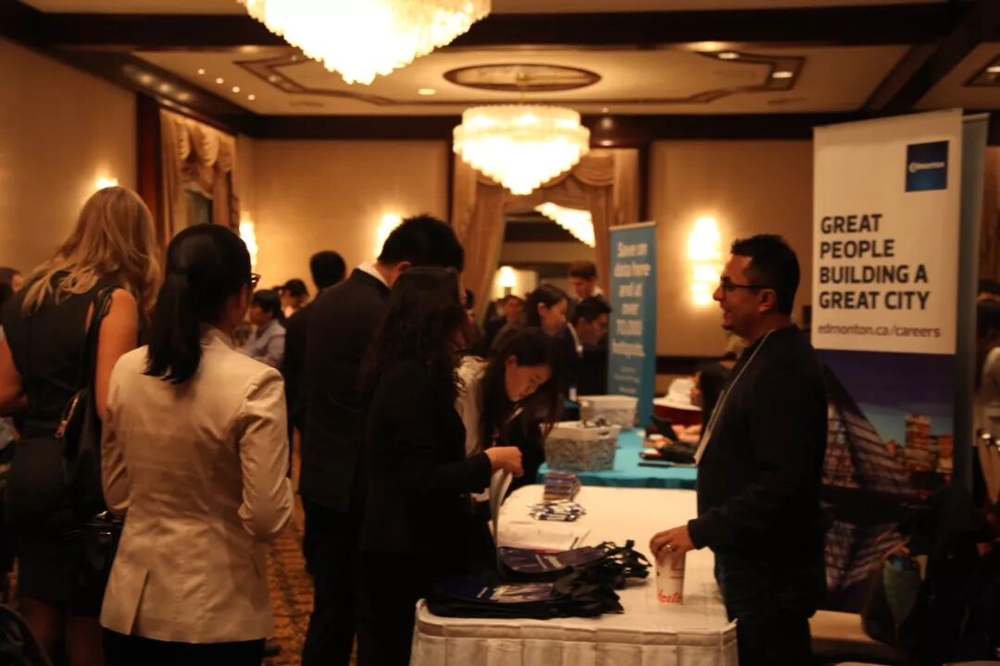 (原始链接: https://mmbiz.qpic.cn/mmbiz_jpg/D1nJqnhkPyKneMcoTKNIqLb7T7C3hcE8yksXWLtGcl4Qz5Dl75qXZukmkoyD2to93EPhQwZtg31CCKgRIjudnw/640?wx_fmt=jpeg)
-  (原始链接: https://mmbiz.qpic.cn/mmbiz_jpg/D1nJqnhkPyKneMcoTKNIqLb7T7C3hcE8NEGVcIwWUvSDGuibpfSO3IUbwkFh0EklnfzCOaGVhGgPc5sWjRdMeHg/640?wx_fmt=jpeg)
- 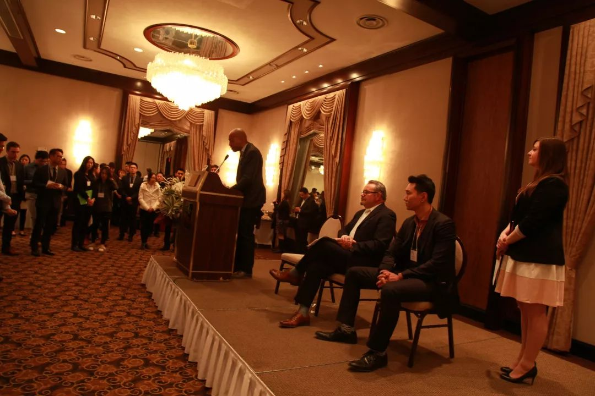 (原始链接: https://mmbiz.qpic.cn/mmbiz_jpg/D1nJqnhkPyKneMcoTKNIqLb7T7C3hcE8Zllsa1n9s0GRFw8YNgU8CCDic7KIJde0ic1lFiaaOmEyNFoHR5dOicjh4Q/640?wx_fmt=jpeg)
- 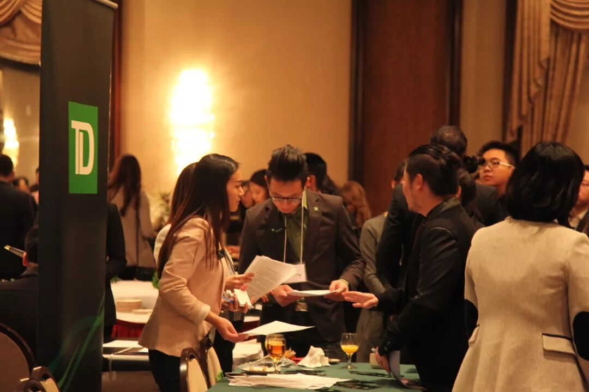 (原始链接: https://mmbiz.qpic.cn/mmbiz_jpg/D1nJqnhkPyKneMcoTKNIqLb7T7C3hcE8iamNYic4uNj7v0jfBZCsTeQCdgQn3TicVAOzuib4V7Y3vfNcSZ6LZDh0iag/640?wx_fmt=jpeg)
- 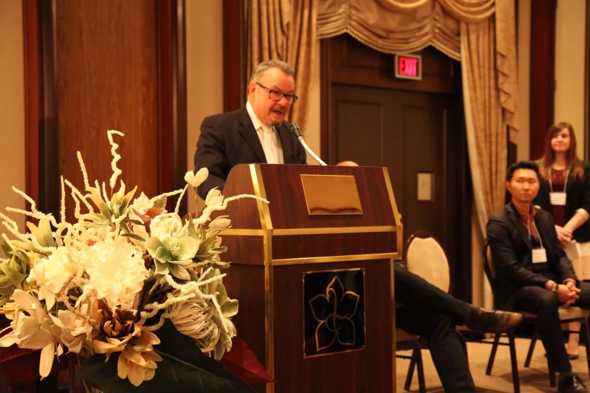 (原始链接: https://mmbiz.qpic.cn/mmbiz_jpg/D1nJqnhkPyKneMcoTKNIqLb7T7C3hcE8hnoXMcnFb5LuDfkz5s44NrJCXPpm2XFNM3z86MyyhVJuVKEibzqDGqg/640?wx_fmt=jpeg)
- 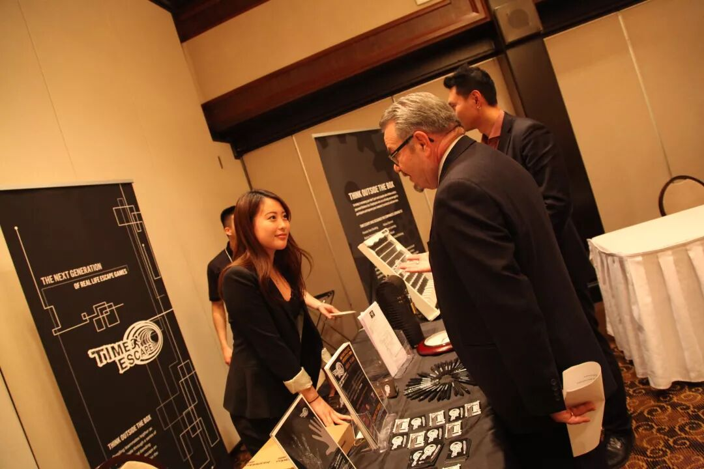 (原始链接: https://mmbiz.qpic.cn/mmbiz_jpg/D1nJqnhkPyKneMcoTKNIqLb7T7C3hcE83LZ2vt7W2jHxsxYPcLzQUcL0lcqdg3IeHqI3BaUW2NpTC9Nk2IOI3g/640?wx_fmt=jpeg)
-  (原始链接: https://mmbiz.qpic.cn/mmbiz_jpg/D1nJqnhkPyKneMcoTKNIqLb7T7C3hcE8IicDjAbhpWDQ5IKYsFzGdic9rSLJvKpdJPPOx7N5BAhEISetW8NELAmg/640?wx_fmt=jpeg)
-  (原始链接: https://mmbiz.qpic.cn/mmbiz_jpg/D1nJqnhkPyKneMcoTKNIqLb7T7C3hcE8l1C8OpTInPSKCgYyXX2adxXRCLZo5PjSic2pPzuvVP1oy1WFZmnuqxg/640?wx_fmt=jpeg)
-  (原始链接: https://mmbiz.qpic.cn/mmbiz_jpg/D1nJqnhkPyKneMcoTKNIqLb7T7C3hcE8g6libXJgTaB3143nUZQcbjeG6ic4Rias8XnXShDMfpzsZvGsNt4efGCog/640?wx_fmt=jpeg)
-  (原始链接: https://mmbiz.qpic.cn/mmbiz_jpg/D1nJqnhkPyKneMcoTKNIqLb7T7C3hcE8x226ztYTReK4Q6CKtxPo1h6t5vrGMKT5TEwrx8iaDYMft8ic2pumXBKQ/640?wx_fmt=jpeg)
-  (原始链接: https://mmbiz.qpic.cn/mmbiz_jpg/D1nJqnhkPyKneMcoTKNIqLb7T7C3hcE8fFqriaG6DF7nmjOR2iaRv0zLJdZyUX6QaPAWCVbMRFd9ZVlUCZln0FqQ/640?wx_fmt=jpeg)
- 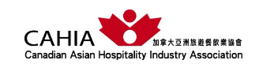 (原始链接: https://mmbiz.qpic.cn/mmbiz_png/D1nJqnhkPyKneMcoTKNIqLb7T7C3hcE8HBrhUIoQAic4U52fOvP1h93ruAHoptTaruBEFSZPYReaic0q9xemCUug/640?wx_fmt=png)
-  (原始链接: https://mmbiz.qpic.cn/mmbiz_png/D1nJqnhkPyKneMcoTKNIqLb7T7C3hcE8F1VUlQSoXtlncdib3VYHUSKWx4bH5M51Or1icUDBFiacUMD5tDNVSbc2Q/640?wx_fmt=png)
- 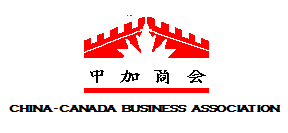 (原始链接: https://mmbiz.qpic.cn/mmbiz_png/D1nJqnhkPyKneMcoTKNIqLb7T7C3hcE8dxFAamqVSHrIMcdWkEnHaX9gtiaHbsdR0gPNoO1nHdGIKmOrjhHd0YQ/640?wx_fmt=png)
- 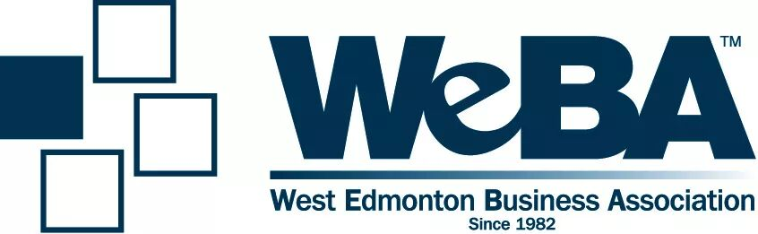 (原始链接: https://mmbiz.qpic.cn/mmbiz_jpg/D1nJqnhkPyKneMcoTKNIqLb7T7C3hcE8URsctkmx7lFZ2eRT481pUuqmKHUfMVmqNibiajdbuyGuc0Ma88IeYSAg/640?wx_fmt=jpeg)
-  (原始链接: https://mmbiz.qpic.cn/mmbiz_png/D1nJqnhkPyKneMcoTKNIqLb7T7C3hcE87Mjt6NyxrQOVMicc0vicJ9th8LFk0wnBBEFRuH0PseYtsZCLUosxIh8Q/640?wx_fmt=png)
-  (原始链接: https://mmbiz.qpic.cn/mmbiz_png/D1nJqnhkPyKneMcoTKNIqLb7T7C3hcE88ia0Rr8ic5lq6ibf5OujZFgpGvgPOATWN0pteXdY6icTQ7jv3VXZCtgPAw/640?wx_fmt=png)
- 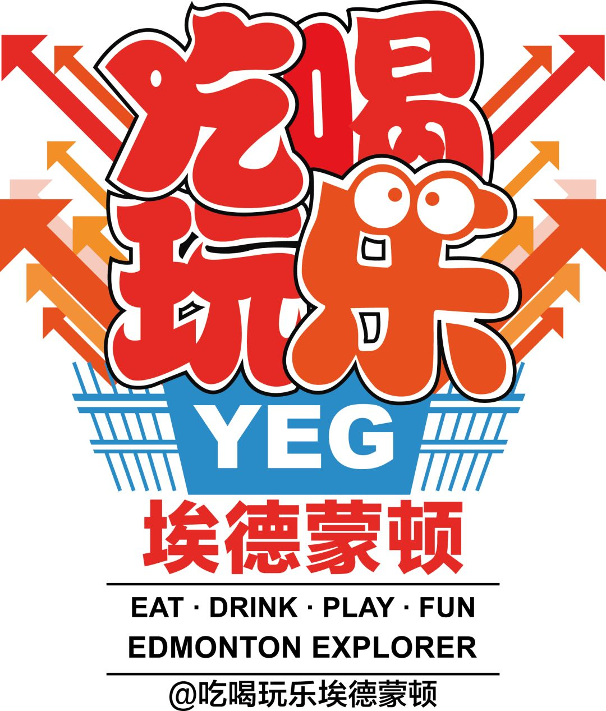 (原始链接: https://mmbiz.qpic.cn/mmbiz_png/D1nJqnhkPyKneMcoTKNIqLb7T7C3hcE8JDbRuro8bUuegEHNM2G8yP1hzicDFCQ2jyMMcGfrpqavHbOyKLWZUqQ/640?wx_fmt=png)
- 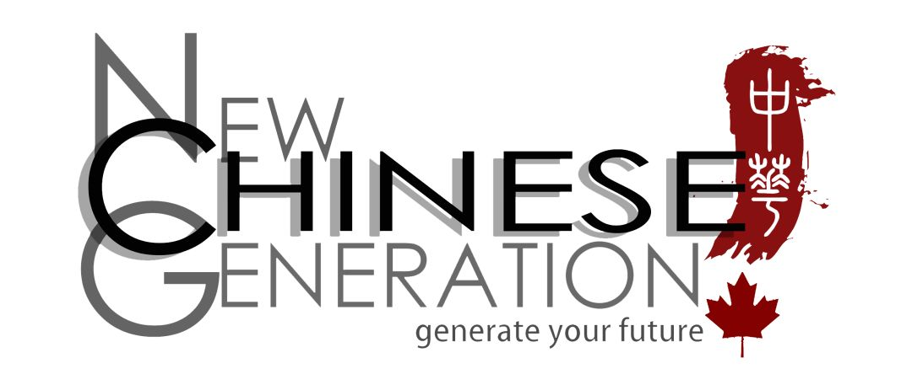 (原始链接: https://mmbiz.qpic.cn/mmbiz_png/D1nJqnhkPyKneMcoTKNIqLb7T7C3hcE8pEPyZXNKay3M1WQIZ4bnicbicwiac8jvq6FpA3DSJ5YlwpAMoQvia4vEibQ/640?wx_fmt=png)
- 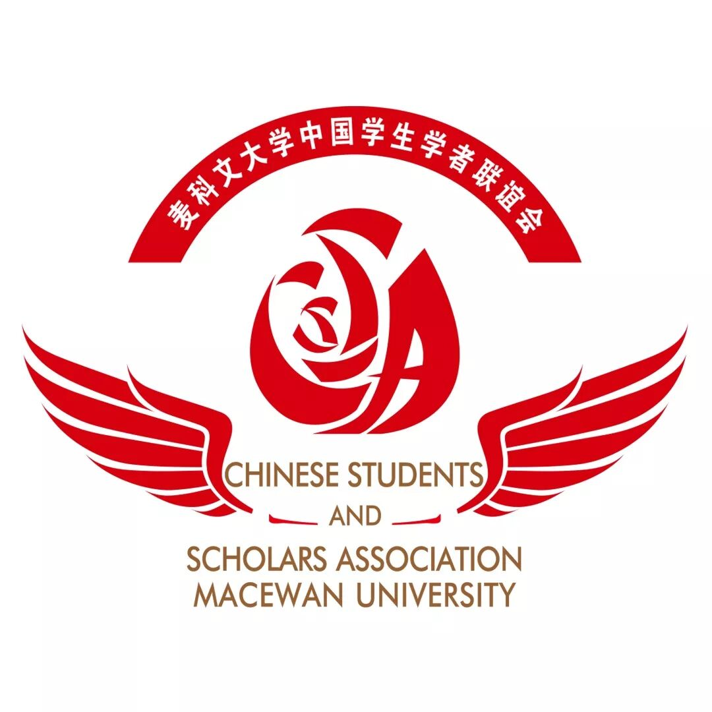 (原始链接: https://mmbiz.qpic.cn/mmbiz_jpg/D1nJqnhkPyKneMcoTKNIqLb7T7C3hcE8jKjZNrkLu9Q5u9AjtiaKYh1p75vFySsekECpUATamP8DYZBMu53qibwQ/640?wx_fmt=jpeg)
- 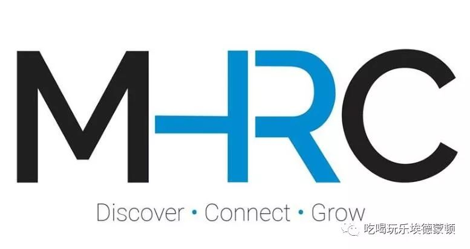 (原始链接: https://mmbiz.qpic.cn/mmbiz_jpg/x0ccYC4cialEX5HCcB90bkK6HuLMwxv7rZME64u0SxVJsrb99TFJUzibS95pkWDGY54QKOYf5qAzGABHmxVfibWvQ/640?wx_fmt=jpeg)
-  (原始链接: https://mmbiz.qpic.cn/mmbiz_jpg/D1nJqnhkPyKneMcoTKNIqLb7T7C3hcE8OQSdibQA0fUcdiclBrqDVBevfeQuHzkuFON0Y8upLVSB0GpQHKH80GlA/640?wx_fmt=jpeg)
- 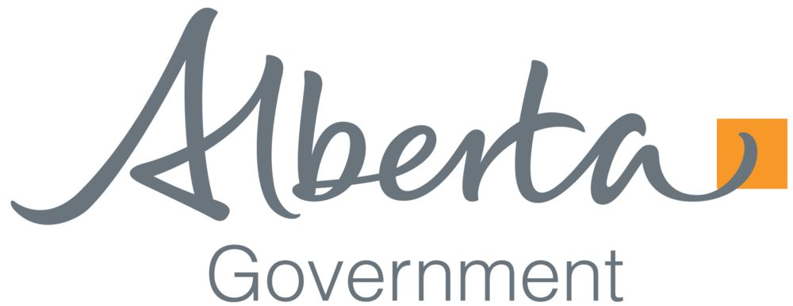 (原始链接: https://mmbiz.qpic.cn/mmbiz_png/D1nJqnhkPyKneMcoTKNIqLb7T7C3hcE8yddRhRu4icFsxH8rYKS3USCXg3cGsS9B4Gib58t2yoSnuzkYUWRe6k8g/640?wx_fmt=png)
-  (原始链接: https://mmbiz.qpic.cn/mmbiz_png/D1nJqnhkPyKneMcoTKNIqLb7T7C3hcE8ia5rFkWE3yanLXfMtaibCCMS0Wf1CXOCqPptTeopz7SItwuH4AEHBbsg/640?wx_fmt=png)
- 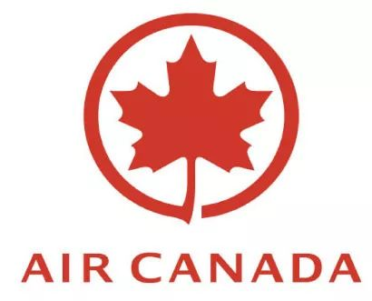 (原始链接: https://mmbiz.qpic.cn/mmbiz_jpg/D1nJqnhkPyKneMcoTKNIqLb7T7C3hcE89QaoicUST3sBMwdpxYHnZaiaWpNWOhPgPyMUSIicPR7Un9vpG5cC2HTJw/640?wx_fmt=jpeg)
-  (原始链接: https://mmbiz.qpic.cn/mmbiz_jpg/D1nJqnhkPyKneMcoTKNIqLb7T7C3hcE8RanjSlmacrABMrTFwK6uQB13yOR7s5b2kNFd168yCDpHceF8VhvyIw/640?wx_fmt=jpeg)
- 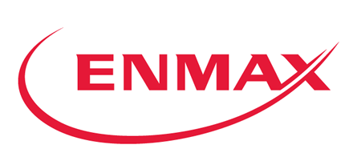 (原始链接: https://mmbiz.qpic.cn/mmbiz_png/D1nJqnhkPyKneMcoTKNIqLb7T7C3hcE8XjXoAGu8pdDSeW58I1klW0suRftO8rWA2kwibteHPR3otQSK25Wr0aw/640?wx_fmt=png)
- 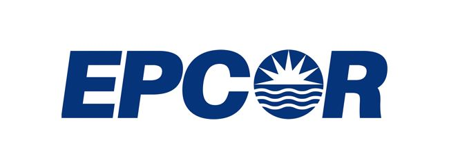 (原始链接: https://mmbiz.qpic.cn/mmbiz_png/D1nJqnhkPyKneMcoTKNIqLb7T7C3hcE8E2hLqJ9EWO2dQic5OU1QDMNhbiamfRrZQ9vlcksm4QiavN3UBYkBc87bw/640?wx_fmt=png)
-  (原始链接: https://mmbiz.qpic.cn/mmbiz_png/D1nJqnhkPyKneMcoTKNIqLb7T7C3hcE8KWC2I01lvu8IibwbiaCW7OYwGVy9TicdTn3JffAMBSAyfo5SuCkkgPxLg/640?wx_fmt=png)
-  (原始链接: https://mmbiz.qpic.cn/mmbiz_png/D1nJqnhkPyKneMcoTKNIqLb7T7C3hcE834xMPUjES4kCbG1icwUvBUMRmmQFEsMEpddVc6ia3TDb6eGbzozoFiaEA/640?wx_fmt=gif)
- 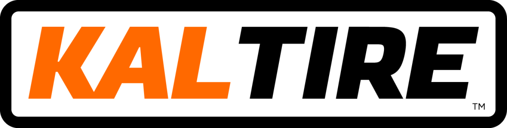 (原始链接: https://mmbiz.qpic.cn/mmbiz_png/D1nJqnhkPyKneMcoTKNIqLb7T7C3hcE8yVCZl7Piaqkt27qfOdJbYrThhibMmia7jQTatBSpw1AyZ4nTgmDTwRrOA/640?wx_fmt=png)
- 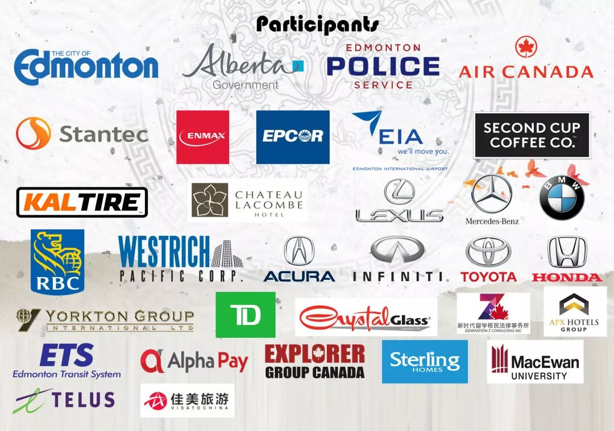 (原始链接: https://mmbiz.qpic.cn/mmbiz_jpg/D1nJqnhkPyKneMcoTKNIqLb7T7C3hcE8DM5Rd2K9lQtGP5GFXcM0Nib8ujnq9ZRFey4nbgqyKraibHMeTBySADvA/640?wx_fmt=jpeg)
- 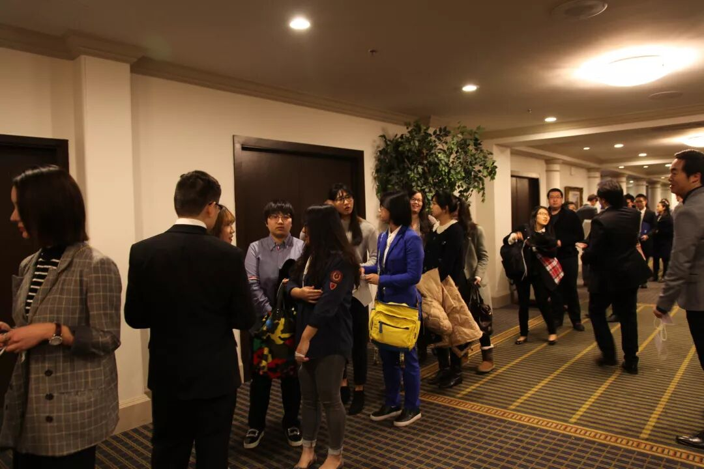 (原始链接: https://mmbiz.qpic.cn/mmbiz_jpg/D1nJqnhkPyKneMcoTKNIqLb7T7C3hcE8cicT48073hYUE41fPPkibibpN6anTSsCNYt6NwUbFk3BFRufamh0tiaQYg/640?wx_fmt=jpeg)
-  (原始链接: https://mmbiz.qpic.cn/mmbiz_jpg/D1nJqnhkPyKneMcoTKNIqLb7T7C3hcE8OTvLuESPyKjv1NFzKFArEh6ia3L2m96IYFbRh5YhPibo31l36vuicO3pw/640?wx_fmt=jpeg)
-  (原始链接: https://mmbiz.qpic.cn/mmbiz_jpg/D1nJqnhkPyKneMcoTKNIqLb7T7C3hcE8jOpCbv4aUR924o15wk9ddvj7iatvFddic4yNc4Lko8Qsib4TNZVaaq1DA/640?wx_fmt=jpeg)
-  (原始链接: https://mmbiz.qpic.cn/mmbiz_jpg/D1nJqnhkPyKneMcoTKNIqLb7T7C3hcE8HxaARKqoa89V2hIEPgSSLmhnrELMnehqhFyUpzlaoxocr1DNEZa76A/640?wx_fmt=jpeg)
-  (原始链接: https://mmbiz.qpic.cn/mmbiz_jpg/D1nJqnhkPyKneMcoTKNIqLb7T7C3hcE87hyEFEpiaiaFibbZN7GQv4xrpfR0zFwe3n4n0KpFsQ6P4nrgW4vv9R0yA/640?wx_fmt=jpeg)
