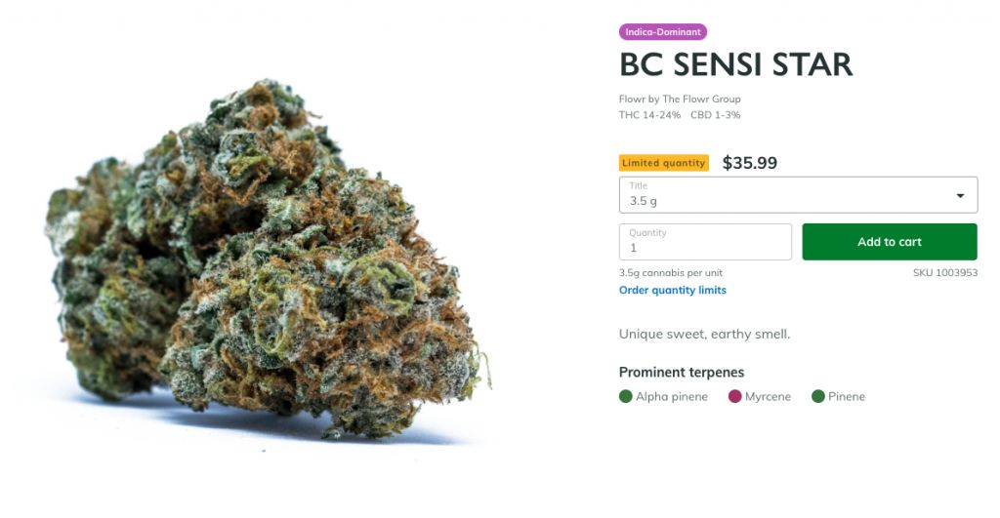
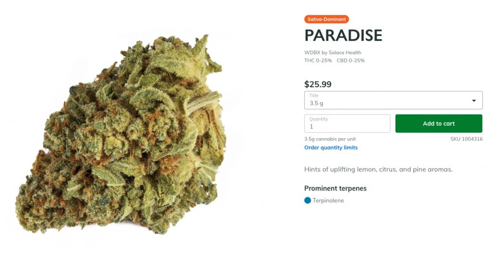
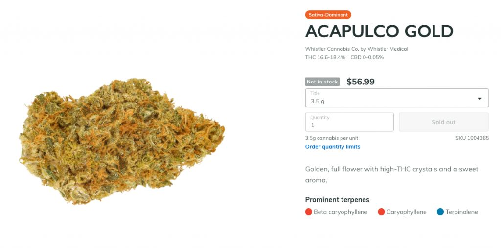

# 无标题

**链接地址:** http://mp.weixin.qq.com/s?__biz=MzI2NTE1ODgwOQ==&mid=2649605194&idx=1&sn=481df8c4125f23ba0d3fc665a2734c1f&chksm=f2b8cdbcc5cf44aa071483abce3c095aa99ae4167bf1632663b4cda02c6b26aa3954717d326a&mpshare=1&scene=2&srcid=#rd
**作者:** 
**获取时间:** 2025/8/28 21:17:49
**图片数量:** 17

---

## 原始HTML内容

<section style="box-sizing: border-box;"><section class="V5" style="box-sizing: border-box;" powered-by="xiumi.us"><section style="margin-right: 0%;margin-left: 0%;box-sizing: border-box;"><section style="display: inline-block;vertical-align: middle;width: 80%;box-sizing: border-box;"><section class="V5" style="box-sizing: border-box;" powered-by="xiumi.us"><section style="margin-top: 10px;margin-bottom: 10px;text-align: center;box-sizing: border-box;"><section style="display: inline-block;box-sizing: border-box;"><section style="max-width: 100%;font-size: 0px;padding-bottom: 3px;box-sizing: border-box;"><section style="display: inline-block;vertical-align: middle;box-sizing: border-box;"><section style="width: 5px;height: 1px;background-color: rgb(217, 217, 217);box-sizing: border-box;"></section><section style="width: 1px;height: 5px;margin-top: -3px;margin-right: auto;margin-left: auto;background-color: rgb(217, 217, 217);box-sizing: border-box;"></section></section><section style="margin-top: -1px;margin-right: -5px;margin-left: -5px;width: 100%;display: inline-block;vertical-align: middle;padding-right: 8px;padding-left: 8px;box-sizing: border-box;"><section style="width: 100%;height: 1px;background-color: rgb(217, 217, 217);box-sizing: border-box;"></section></section><section style="display: inline-block;vertical-align: middle;box-sizing: border-box;"><section style="width: 5px;height: 1px;background-color: rgb(217, 217, 217);box-sizing: border-box;"></section><section style="width: 1px;height: 5px;margin-top: -3px;margin-right: auto;margin-left: auto;background-color: rgb(217, 217, 217);box-sizing: border-box;"></section></section></section><section style="padding-left: 15px;padding-right: 15px;color: rgb(161, 161, 161);font-size: 14px;box-sizing: border-box;">
点击上方<strong style="box-sizing: border-box;">蓝字</strong>关注我们哟~
</section><section style="max-width: 100%;font-size: 0px;box-sizing: border-box;"><section style="display: inline-block;vertical-align: middle;box-sizing: border-box;"><section style="width: 5px;height: 1px;background-color: rgb(217, 217, 217);box-sizing: border-box;"></section><section style="width: 1px;height: 5px;margin-top: -3px;margin-right: auto;margin-left: auto;background-color: rgb(217, 217, 217);box-sizing: border-box;"></section></section><section style="margin-top: -1px;margin-right: -5px;margin-left: -5px;width: 100%;display: inline-block;vertical-align: middle;padding-right: 8px;padding-left: 8px;box-sizing: border-box;"><section style="width: 100%;height: 1px;background-color: rgb(217, 217, 217);box-sizing: border-box;"></section></section><section style="display: inline-block;vertical-align: middle;box-sizing: border-box;"><section style="width: 5px;height: 1px;background-color: rgb(217, 217, 217);box-sizing: border-box;"></section><section style="width: 1px;height: 5px;margin-top: -3px;margin-right: auto;margin-left: auto;background-color: rgb(217, 217, 217);box-sizing: border-box;"></section></section></section></section></section></section></section><section style="display: inline-block;vertical-align: middle;width: 20%;box-sizing: border-box;"><section class="V5" style="box-sizing: border-box;" powered-by="xiumi.us"><section style="text-align: center;margin: -10px 0% 10px;box-sizing: border-box;"><section style="max-width: 100%;vertical-align: middle;display: inline-block;width: 100%;box-sizing: border-box;"></section></section></section></section></section></section><section class="V5" style="box-sizing: border-box;" powered-by="xiumi.us"><section style="margin: 10px 0%;box-sizing: border-box;"><section style="display: inline-block;width: 100%;vertical-align: top;box-sizing: border-box;"><section class="V5" style="box-sizing: border-box;" powered-by="xiumi.us"><section style="box-sizing: border-box;"><section style="display: inline-block;vertical-align: bottom;width: 75%;padding-right: 10px;box-sizing: border-box;"><section class="V5" style="box-sizing: border-box;" powered-by="xiumi.us"><section style="margin: 10px 0% 3px;box-sizing: border-box;"><section style="display: inline-block;vertical-align: middle;box-sizing: border-box;"><section style="display: inline-block;vertical-align: bottom;padding-left: 5px;padding-right: 5px;line-height: 1.2em;margin-bottom: 2px;color: rgba(80, 182, 201, 0.72);box-sizing: border-box;">
<strong style="box-sizing: border-box;">仔细看下图，有惊喜！</strong>
</section><section style="max-width: 100%;display: inline-block;vertical-align: bottom;width: 1.6em;box-sizing: border-box;"></section></section></section></section></section><section style="display: inline-block;vertical-align: bottom;width: 25%;box-sizing: border-box;"><section class="V5" style="box-sizing: border-box;" powered-by="xiumi.us"><section style="margin-right: 0%;margin-bottom: 3px;margin-left: 0%;text-align: right;box-sizing: border-box;"><section style="display: inline-block;border-bottom: 0.15em solid rgba(80, 182, 201, 0.72);padding-bottom: 3px;box-sizing: border-box;"><section style="display: inline-block;padding: 3px;border-bottom: 0.15em solid rgba(80, 182, 201, 0.72);font-size: 12px;line-height: 1.4;color: rgb(255, 143, 47);box-sizing: border-box;">
<strong style="box-sizing: border-box;">金主大大</strong>
</section></section></section></section></section></section></section><section class="V5" style="box-sizing: border-box;" powered-by="xiumi.us"><section style="margin-right: 0%;margin-left: 0%;box-sizing: border-box;"><section style="background-color: rgba(80, 182, 201, 0.72);height: 2px;box-sizing: border-box;"></section></section></section></section></section></section><section class="V5" style="box-sizing: border-box;" powered-by="xiumi.us"><section style="box-sizing: border-box;"><section style="box-sizing: border-box;"><section class="" powered-by="xiumi.us" style="max-width: 100%;box-sizing: border-box;color: rgb(51, 51, 51);font-family: -apple-system-font, BlinkMacSystemFont, &quot;Helvetica Neue&quot;, &quot;PingFang SC&quot;, &quot;Hiragino Sans GB&quot;, &quot;Microsoft YaHei UI&quot;, &quot;Microsoft YaHei&quot;, Arial, sans-serif;font-size: 17px;letter-spacing: 0.544px;text-align: justify;white-space: normal;background-color: rgb(255, 255, 255);word-wrap: break-word !important;"><section style="max-width: 100%;box-sizing: border-box;word-wrap: break-word !important;"><section style="max-width: 100%;box-sizing: border-box;word-wrap: break-word !important;">

</section></section></section></section></section></section><section class="V5" style="box-sizing: border-box;" powered-by="xiumi.us"><section style="text-align: center;margin-top: 10px;margin-bottom: 10px;box-sizing: border-box;"><section style="max-width: 100%;vertical-align: middle;display: inline-block;box-sizing: border-box;"><svg xmlns="http://www.w3.org/2000/svg" x="0px" y="0px" viewBox="0 0 902.1 38.2" style="vertical-align: middle;max-width: 100%;box-sizing: border-box;" width="902.1"><g style="box-sizing: border-box;"><path style="box-sizing: border-box;" d="M18.4,1.4c0.9-1.9,2.4-1.9,3.4,0l3.4,6.9c0.9,1.9,3.4,3.7,5.4,4l7.6,1.1c2.1,0.3,2.5,1.7,1,3.2   l-5.5,5.4c-1.5,1.5-2.4,4.3-2.1,6.4l1.3,7.6c0.4,2.1-0.9,2.9-2.7,2l-6.8-3.6c-1.8-1-4.9-1-6.7,0l-6.8,3.6c-1.9,1-3.1,0.1-2.7-2   l1.3-7.6c0.4-2.1-0.6-4.9-2.1-6.4l-5.5-5.4c-1.5-1.5-1-2.9,1-3.2l7.6-1.1c2.1-0.3,4.5-2.1,5.4-4L18.4,1.4z" fill="rgb(178, 243, 230)"></path><path style="box-sizing: border-box;" d="M90.6,5.4c0.7-1.4,1.9-1.4,2.6,0l2.6,5.3c0.7,1.4,2.6,2.8,4.2,3.1l5.9,0.9c1.6,0.2,2,1.3,0.8,2.5   l-4.2,4.1c-1.2,1.1-1.9,3.3-1.6,4.9l1,5.8c0.3,1.6-0.7,2.3-2.1,1.5l-5.2-2.8c-1.4-0.8-3.8-0.8-5.2,0L84,33.6   c-1.4,0.8-2.4,0.1-2.1-1.5l1-5.8c0.3-1.6-0.5-3.8-1.6-4.9l-4.2-4.1c-1.2-1.1-0.8-2.2,0.8-2.5l5.9-0.9c1.6-0.2,3.5-1.6,4.2-3.1   L90.6,5.4z" fill="rgb(190, 204, 246)"></path><path style="box-sizing: border-box;" d="M162.6,7.5c0.6-1.2,1.6-1.2,2.2,0l2.2,4.5c0.6,1.2,2.2,2.4,3.6,2.6l5,0.7c1.4,0.2,1.7,1.1,0.7,2.1   l-3.6,3.5c-1,1-1.6,2.9-1.4,4.2l0.9,5c0.2,1.4-0.6,1.9-1.8,1.3l-4.5-2.4c-1.2-0.6-3.2-0.6-4.4,0l-4.5,2.4c-1.2,0.6-2,0.1-1.8-1.3   l0.9-5c0.2-1.4-0.4-3.3-1.4-4.2l-3.6-3.5c-1-1-0.7-1.9,0.7-2.1l5-0.7c1.4-0.2,3-1.4,3.6-2.6L162.6,7.5z" fill="rgb(150, 208, 240)"></path><path style="box-sizing: border-box;" d="M60.1,19.1c0,2.3-1.9,4.2-4.2,4.2c-2.3,0-4.2-1.9-4.2-4.2s1.9-4.2,4.2-4.2   C58.3,14.9,60.1,16.8,60.1,19.1z" fill="rgb(218, 240, 224)"></path><path style="box-sizing: border-box;" d="M203.8,19.1c0,2.3-1.9,4.2-4.2,4.2c-2.3,0-4.2-1.9-4.2-4.2s1.9-4.2,4.2-4.2   C201.9,14.9,203.8,16.8,203.8,19.1z" fill="rgb(218, 240, 224)"></path><path style="box-sizing: border-box;" d="M130.9,19.1c0,1.7-1.4,3.1-3.1,3.1c-1.7,0-3.1-1.4-3.1-3.1c0-1.7,1.4-3.1,3.1-3.1   C129.5,16.1,130.9,17.4,130.9,19.1z" fill="rgb(218, 240, 224)"></path><path style="box-sizing: border-box;" d="M233.9,1.4c0.9-1.9,2.4-1.9,3.4,0l3.4,6.9c0.9,1.9,3.4,3.7,5.4,4l7.6,1.1c2.1,0.3,2.5,1.7,1,3.2   l-5.5,5.4c-1.5,1.5-2.4,4.3-2.1,6.4l1.3,7.6c0.4,2.1-0.9,2.9-2.7,2l-6.8-3.6c-1.8-1-4.9-1-6.7,0l-6.8,3.6c-1.9,1-3.1,0.1-2.7-2   l1.3-7.6c0.4-2.1-0.6-4.9-2.1-6.4l-5.5-5.4c-1.5-1.5-1-2.9,1-3.2l7.6-1.1c2.1-0.3,4.5-2.1,5.4-4L233.9,1.4z" fill="rgb(178, 243, 230)"></path><path style="box-sizing: border-box;" d="M306.1,5.4c0.7-1.4,1.9-1.4,2.6,0l2.6,5.3c0.7,1.4,2.6,2.8,4.2,3.1l5.9,0.9c1.6,0.2,2,1.3,0.8,2.5   l-4.2,4.1c-1.2,1.1-1.9,3.3-1.6,4.9l1,5.8c0.3,1.6-0.7,2.3-2.1,1.5l-5.2-2.8c-1.4-0.8-3.8-0.8-5.2,0l-5.2,2.8   c-1.4,0.8-2.4,0.1-2.1-1.5l1-5.8c0.3-1.6-0.4-3.8-1.6-4.9l-4.2-4.1c-1.2-1.1-0.8-2.2,0.8-2.5l5.9-0.9c1.6-0.2,3.5-1.6,4.2-3.1   L306.1,5.4z" fill="rgb(190, 204, 246)"></path><path style="box-sizing: border-box;" d="M378.1,7.5c0.6-1.2,1.6-1.2,2.2,0l2.2,4.5c0.6,1.2,2.2,2.4,3.6,2.6l5,0.7c1.4,0.2,1.7,1.1,0.7,2.1   l-3.6,3.5c-1,1-1.6,2.9-1.4,4.2l0.9,5c0.2,1.4-0.6,1.9-1.8,1.3l-4.5-2.4c-1.2-0.6-3.2-0.6-4.4,0l-4.5,2.4c-1.2,0.6-2,0.1-1.8-1.3   l0.9-5c0.2-1.4-0.4-3.3-1.4-4.2l-3.6-3.5c-1-1-0.7-1.9,0.7-2.1l5-0.7c1.4-0.2,3-1.4,3.6-2.6L378.1,7.5z" fill="rgb(150, 208, 240)"></path><path style="box-sizing: border-box;" d="M275.7,19.1c0,2.3-1.9,4.2-4.2,4.2c-2.3,0-4.2-1.9-4.2-4.2s1.9-4.2,4.2-4.2   C273.8,14.9,275.7,16.8,275.7,19.1z" fill="rgb(218, 240, 224)"></path><path style="box-sizing: border-box;" d="M419.3,19.1c0,2.3-1.9,4.2-4.2,4.2c-2.3,0-4.2-1.9-4.2-4.2s1.9-4.2,4.2-4.2   C417.5,14.9,419.3,16.8,419.3,19.1z" fill="rgb(218, 240, 224)"></path><path style="box-sizing: border-box;" d="M346.4,19.1c0,1.7-1.4,3.1-3.1,3.1c-1.7,0-3.1-1.4-3.1-3.1c0-1.7,1.4-3.1,3.1-3.1   C345,16.1,346.4,17.4,346.4,19.1z" fill="rgb(218, 240, 224)"></path><path style="box-sizing: border-box;" d="M449.4,1.4c0.9-1.9,2.4-1.9,3.4,0l3.4,6.9c0.9,1.9,3.4,3.7,5.4,4l7.6,1.1c2.1,0.3,2.5,1.7,1,3.2   l-5.5,5.4c-1.5,1.5-2.4,4.3-2.1,6.4l1.3,7.6c0.4,2.1-0.9,2.9-2.7,2l-6.8-3.6c-1.8-1-4.9-1-6.7,0l-6.8,3.6c-1.9,1-3.1,0.1-2.7-2   l1.3-7.6c0.4-2.1-0.6-4.9-2.1-6.4l-5.5-5.4c-1.5-1.5-1-2.9,1-3.2l7.6-1.1c2.1-0.3,4.5-2.1,5.4-4L449.4,1.4z" fill="rgb(178, 243, 230)"></path><path style="box-sizing: border-box;" d="M521.6,5.4c0.7-1.4,1.9-1.4,2.6,0l2.6,5.3c0.7,1.4,2.6,2.8,4.2,3.1l5.9,0.9c1.6,0.2,2,1.3,0.8,2.5   l-4.2,4.1c-1.2,1.1-1.9,3.3-1.6,4.9l1,5.8c0.3,1.6-0.7,2.3-2.1,1.5l-5.2-2.8c-1.4-0.8-3.8-0.8-5.2,0l-5.2,2.8   c-1.4,0.8-2.4,0.1-2.1-1.5l1-5.8c0.3-1.6-0.5-3.8-1.6-4.9l-4.2-4.1c-1.2-1.1-0.8-2.2,0.8-2.5l5.9-0.9c1.6-0.2,3.5-1.6,4.2-3.1   L521.6,5.4z" fill="rgb(190, 204, 246)"></path><path style="box-sizing: border-box;" d="M593.6,7.5c0.6-1.2,1.6-1.2,2.2,0l2.2,4.5c0.6,1.2,2.2,2.4,3.6,2.6l5,0.7c1.4,0.2,1.7,1.1,0.7,2.1   l-3.6,3.5c-1,1-1.6,2.9-1.4,4.2l0.9,5c0.2,1.4-0.6,1.9-1.8,1.3l-4.5-2.4c-1.2-0.6-3.2-0.6-4.4,0l-4.5,2.4c-1.2,0.6-2,0.1-1.8-1.3   l0.9-5c0.2-1.4-0.4-3.3-1.4-4.2l-3.6-3.5c-1-1-0.7-1.9,0.7-2.1l5-0.7c1.4-0.2,3-1.4,3.6-2.6L593.6,7.5z" fill="rgb(150, 208, 240)"></path><path style="box-sizing: border-box;" d="M491.2,19.1c0,2.3-1.9,4.2-4.2,4.2c-2.3,0-4.2-1.9-4.2-4.2s1.9-4.2,4.2-4.2   C489.3,14.9,491.2,16.8,491.2,19.1z" fill="rgb(218, 240, 224)"></path><path style="box-sizing: border-box;" d="M634.9,19.1c0,2.3-1.9,4.2-4.2,4.2c-2.3,0-4.2-1.9-4.2-4.2s1.9-4.2,4.2-4.2   C633,14.9,634.9,16.8,634.9,19.1z" fill="rgb(218, 240, 224)"></path><path style="box-sizing: border-box;" d="M561.9,19.1c0,1.7-1.4,3.1-3.1,3.1c-1.7,0-3.1-1.4-3.1-3.1c0-1.7,1.4-3.1,3.1-3.1   C560.5,16.1,561.9,17.4,561.9,19.1z" fill="rgb(218, 240, 224)"></path><path style="box-sizing: border-box;" d="M664.9,1.4c0.9-1.9,2.4-1.9,3.4,0l3.4,6.9c0.9,1.9,3.4,3.7,5.4,4l7.6,1.1c2.1,0.3,2.5,1.7,1,3.2   l-5.5,5.4c-1.5,1.5-2.4,4.3-2.1,6.4l1.3,7.6c0.4,2.1-0.9,2.9-2.7,2l-6.8-3.6c-1.8-1-4.9-1-6.7,0l-6.8,3.6c-1.9,1-3.1,0.1-2.7-2   l1.3-7.6c0.4-2.1-0.6-4.9-2.1-6.4l-5.5-5.4c-1.5-1.5-1-2.9,1-3.2l7.6-1.1c2.1-0.3,4.5-2.1,5.4-4L664.9,1.4z" fill="rgb(178, 243, 230)"></path><path style="box-sizing: border-box;" d="M737.1,5.4c0.7-1.4,1.9-1.4,2.6,0l2.6,5.3c0.7,1.4,2.6,2.8,4.2,3.1l5.9,0.9c1.6,0.2,2,1.3,0.8,2.5   l-4.2,4.1c-1.2,1.1-1.9,3.3-1.6,4.9l1,5.8c0.3,1.6-0.7,2.3-2.1,1.5l-5.2-2.8c-1.4-0.8-3.8-0.8-5.2,0l-5.2,2.8   c-1.4,0.8-2.4,0.1-2.1-1.5l1-5.8c0.3-1.6-0.5-3.8-1.6-4.9l-4.2-4.1c-1.2-1.1-0.8-2.2,0.8-2.5l5.9-0.9c1.6-0.2,3.5-1.6,4.2-3.1   L737.1,5.4z" fill="rgb(190, 204, 246)"></path><path style="box-sizing: border-box;" d="M809.2,7.5c0.6-1.2,1.6-1.2,2.2,0l2.2,4.5c0.6,1.2,2.2,2.4,3.6,2.6l5,0.7c1.4,0.2,1.7,1.1,0.7,2.1   l-3.6,3.5c-1,1-1.6,2.9-1.4,4.2l0.9,5c0.2,1.4-0.6,1.9-1.8,1.3l-4.5-2.4c-1.2-0.6-3.2-0.6-4.4,0l-4.5,2.4c-1.2,0.6-2,0.1-1.8-1.3   l0.9-5c0.2-1.4-0.4-3.3-1.4-4.2l-3.6-3.5c-1-1-0.7-1.9,0.7-2.1l5-0.7c1.4-0.2,3-1.4,3.6-2.6L809.2,7.5z" fill="rgb(150, 208, 240)"></path><path style="box-sizing: border-box;" d="M706.7,19.1c0,2.3-1.9,4.2-4.2,4.2c-2.3,0-4.2-1.9-4.2-4.2s1.9-4.2,4.2-4.2   C704.8,14.9,706.7,16.8,706.7,19.1z" fill="rgb(218, 240, 224)"></path><path style="box-sizing: border-box;" d="M850.4,19.1c0,2.3-1.9,4.2-4.2,4.2c-2.3,0-4.2-1.9-4.2-4.2s1.9-4.2,4.2-4.2   C848.5,14.9,850.4,16.8,850.4,19.1z" fill="rgb(218, 240, 224)"></path><path style="box-sizing: border-box;" d="M777.4,19.1c0,1.7-1.4,3.1-3.1,3.1c-1.7,0-3.1-1.4-3.1-3.1c0-1.7,1.4-3.1,3.1-3.1   C776,16.1,777.4,17.4,777.4,19.1z" fill="rgb(218, 240, 224)"></path><path style="box-sizing: border-box;" d="M880.4,1.4c0.9-1.9,2.4-1.9,3.4,0l3.4,6.9c0.9,1.9,3.4,3.7,5.4,4l7.6,1.1c2.1,0.3,2.5,1.7,1,3.2   l-5.5,5.4c-1.5,1.5-2.4,4.3-2.1,6.4l1.3,7.6c0.4,2.1-0.9,2.9-2.7,2l-6.8-3.6c-1.8-1-4.9-1-6.7,0l-6.8,3.6c-1.8,1-3.1,0.1-2.7-2   l1.3-7.6c0.4-2.1-0.6-4.9-2.1-6.4l-5.5-5.4c-1.5-1.5-1-2.9,1-3.2l7.6-1.1c2.1-0.3,4.5-2.1,5.4-4L880.4,1.4z" fill="rgb(178, 243, 230)"></path></g></svg></section></section></section><section class="V5" style="box-sizing: border-box;" powered-by="xiumi.us"><section style="box-sizing: border-box;"><section style="text-align: center;box-sizing: border-box;">
&nbsp;&nbsp;&nbsp;&nbsp;&nbsp;&nbsp;&nbsp;据加通社报道，今天，Shopify网络平台每分钟收到100多个大麻订单。

Shopify公司副总裁表示，由政府运营的网站以及私人零售商的网络终端，从今天午夜开始已经处理了“成千上万”的大麻订单。从当地时间12:01 am开始，已经有数百万来自加拿大和世界各地的人浏览这些网站。

10月17日，是加拿大大麻合法化的第一天，持有政府许可证的大麻店纷纷开门，根据法律要求，对于看似年轻的顾客，大麻店将要求其出具年龄证明。

<strong style="max-width: 100%;box-sizing: border-box !important;word-wrap: break-word !important;">加拿大邮局在准备邮递大麻</strong>

与此同时，加拿大邮局 （Canada Post）正在准备应对即将增加大麻的包裹交付量，预计合法化后，通过邮局递送的大麻包裹将会大增。

在取货时，加拿大邮局将要求看似过于年轻的提货人出具年龄证明。加拿大邮局表示，他们一直在就大麻合法化问题培训员工。

加拿大邮局的发言人菲尔·勒格（Phil Legault）说，通过培训，我们要确保邮局的员工认真核对提取大麻包裹的人的年龄，保证大麻产品的安全递送。

&nbsp;&nbsp;&nbsp;&nbsp;&nbsp;&nbsp;&nbsp;<strong style="max-width: 100%;text-indent: 2em;box-sizing: border-box !important;word-wrap: break-word !important;">加拿大对用大麻者有最低年龄限制，但各个省份的法定年龄不同。</strong>

<strong style="max-width: 100%;box-sizing: border-box !important;word-wrap: break-word !important;">18岁 &amp; 19 岁</strong>

在 10 个省份和 3 个地区中，只有魁北克省和阿尔伯塔省的吸大麻法定年龄是 18岁，其他省份和地区都是 19岁。

<strong style="max-width: 100%;box-sizing: border-box !important;word-wrap: break-word !important;">魁省将提升法定年龄</strong>

不过，在大麻合法化的第二天，也就是 10 月18日，魁北克省的新当选政府 – CAQ 政府将就职上任，新任省长弗朗索瓦·勒格 François Legault 在竞选中承诺，要把魁省的法定年龄提高到 21 岁，而且他说一定会兑现这个承诺。

<strong style="max-width: 100%;box-sizing: border-box !important;word-wrap: break-word !important;">最多拥有大麻量</strong>

合法化后，加拿大人每人最多可以合法拥有 30 克大麻，但在魁北克省，人们在自己家里可以最多合法拥有 150 克大麻。

<strong style="max-width: 100%;box-sizing: border-box !important;word-wrap: break-word !important;">哪些省份可以在家里种大麻</strong>

加拿大的10 省和 3 个地区中，只有魁北克省和马尼托巴省禁止人们在家里种植大麻，其他省份和地区则允许人们在家里种大麻，但每家最多能种植 4 棵。

<strong style="max-width: 100%;box-sizing: border-box !important;word-wrap: break-word !important;">加拿大各地大麻店售价不同</strong>

<strong style="max-width: 100%;box-sizing: border-box !important;word-wrap: break-word !important;">卑诗省</strong>

干花的价格从6.99元起，种类繁多——目前比其他网店的种类都多。半克大麻烟卷的起价为4.20元。

卑诗省售卖的周边产品齐全——卷纸，过滤器，碾磨器，电子烟，烟枪，烟管，湿度调节器等，选择范围很大。以下图片是一些例子。

&nbsp;&nbsp;&nbsp;&nbsp;&nbsp;&nbsp;&nbsp;<strong style="max-width: 100%;text-indent: 2em;box-sizing: border-box !important;word-wrap: break-word !important;">安省</strong>

安大略大麻商店（OCS）里最便宜的干花是7.50元每克，最高每克13.25元。最便宜的半克大麻烟卷是10.35元。一次最多订购30克。

<strong style="max-width: 100%;box-sizing: border-box !important;word-wrap: break-word !important;">爱德华王子岛</strong>

政府运营的大麻网站上目前最便宜的干花是每克7.83元。半克大麻烟卷每个5.65元。

<strong style="max-width: 100%;box-sizing: border-box !important;word-wrap: break-word !important;">新不伦瑞克省</strong>

干花起价为每克8.99元，最高15.50元。半克大麻烟卷每个7.50元。NB省大麻商店还出售配件，如烟管和蒸发器等。

<strong style="max-width: 100%;box-sizing: border-box !important;word-wrap: break-word !important;">新斯科舍省</strong>

新斯科舍省的大麻质量分为三个级别：“实惠（value）”等级的价格从6.33元到8.49元不等，“核心（core）”等级从9.00元到10.98元，“特优（premium）”等级起价10.99元。

<strong style="max-width: 100%;box-sizing: border-box !important;word-wrap: break-word !important;">纽芬兰</strong>

目前在政府运营的大麻网站上最便宜的干花是每克5.87元，但现在还没货。如果你一次购买3.5克，现在可以买到的最便宜的是每克7.71元。整体价格范围从每克6元到13元不等。

<strong style="max-width: 100%;box-sizing: border-box !important;word-wrap: break-word !important;">魁北克省</strong>

早前政府表示起价是每克略高于5元。截至周三早上，魁省的网店还未启动。

<strong style="max-width: 100%;box-sizing: border-box !important;word-wrap: break-word !important;">曼尼托巴省</strong>

曼省已给六家商店发放营业执照，但Delta 9是该省迄今为止唯一的非医疗零售网店。Delta 9以每克12元的价格销售。值得注意的是：该公司已与Pineapple Express快递服务合作，承诺在温尼伯订购，当日即可送货。

<strong style="max-width: 100%;box-sizing: border-box !important;word-wrap: break-word !important;">萨斯喀彻温省</strong>

大麻将通过在线和私人商店出售，并受萨省酒类和博彩管理局监管。据媒体报道，许多商店预计在合法日当天还无法投入运营。

<strong style="max-width: 100%;box-sizing: border-box !important;word-wrap: break-word !important;">阿尔伯塔省</strong>

该网站半夜宕机了几分钟，然后将数千用户排队。目前网站多种产品已经缺货，现在能买到的最便宜的干花是每克9.24元。半克大麻烟卷为6.64元。统一购买的每克平均价格为8.90元。

<strong style="max-width: 100%;box-sizing: border-box !important;word-wrap: break-word !important;">西北地区</strong>

政府只列出了五种干花，没有其他产品可供购买。所有三种单价最便宜的都标注“即将推出”，所以现在该地区最便宜的大麻价格是每克17.50元。

<strong style="max-width: 100%;box-sizing: border-box !important;word-wrap: break-word !important;">努纳武特（Nunavut）</strong>

大麻只能通过在线零售商Tweed购买，没有实体店。截至发稿时，Tweed上还无法在线订购。

<strong style="max-width: 100%;box-sizing: border-box !important;word-wrap: break-word !important;">哪里能合法的抽大麻？</strong>

你自己家里当然可以。

以此，加拿大公园说露营地可以吸大麻

&nbsp;&nbsp;&nbsp;&nbsp;&nbsp;&nbsp;&nbsp;去加拿大国家公园露营的人，从10月17日开始，就可以在自己的行装中带上大麻了。

加拿大公园管理局 确认，在国家公园的露营地，人们可以用大麻，全国各地所有国家公园都将在这个问题上采取一致政策。

公园管理局的发言人玛丽-伊兰·布里森（Marie-Hélène Brisson） 在一封电子邮件中写道，虽然国家公园的露营地属于公共区域，但管理局把每个游客租住的露营处视为他们的临时住地，也就相当于私人住处，因此，露营地将允许人们吸食大麻。

在一些省份 – 不列颠哥伦比亚省、阿尔伯塔省、安大略省和魁北克省，以及努纳武特地区和西北地区，还允许露营者们在远足的小径上吸食大麻。

但是，露营地的公共场所不行

不过，加拿大国家公园将不允许人们在露营地内的公共区域用大麻，这包括露营地内的儿童游乐场、公共厨房、卫生间、停车场、加拿大公园内的道路、国家历史遗址、国家海洋保护区等等。

公园发言人布里森还在邮件中写道，加拿大公园对大麻的政策将与对酒精的政策类似。

她写道，和酒精一样，在某些需要确保公园运营，或确保所有游客的住宿体验不受干扰的情况下，加拿大公园时不时会在特定的露营地，或一年中的某个特定时间实施特定的大麻禁令。

伤害风险增加

加拿大公园管理局同时表示，在把大麻带入国家公园之前，露营者应该了解公园所在地的省级和市级政府有关大麻的的法规，而且，吸食大麻会增加人们在从事野外活动造成严重伤害或自己受伤的风险。

布里森的邮件说，在加拿大的国家公园进行活动时，人们需要保持环保意识和清醒头脑，这是非常重要的，人们要预防事故或伤害。

加拿大国内航班上可以带大麻

本周三，10月17日，加拿大实施休闲用途大麻合法化，每个省和地区都在制定自己的有关法规，包括吸食大麻的法定年龄，可以购买大麻的场所，以及可以吸大麻的地方等。

联邦政府已经宣布，加拿大人也将被允许在国内航班上携带多达30克的大麻。人们可以用托运行李或随身行李携带大麻。

飞机航班上禁止吸烟，但现在还没有禁止非吸烟形式用大麻的规定。

当被问及有关政策时，加拿大交通部的回答是，要服从有关 “危险行为”&nbsp; 的规定。

交通部的发言人玛丽-安妮克·科特 （Marie-Anyk Côté） 在一封电子邮件中写道：根据航空法（ Aeronautics Act, ），航班上不能容忍任何对乘客或机组人员带来风险的行为。

另外，把大麻带到加拿大境外，仍然是非法的。

 

文章来源：今日加拿大

 
</section></section></section><section class="V5" style="box-sizing: border-box;" powered-by="xiumi.us"><section style="margin: 10px 0%;box-sizing: border-box;"><section style="display: inline-block;vertical-align: top;width: 50%;box-sizing: border-box;"><section class="V5" style="box-sizing: border-box;" powered-by="xiumi.us"><section style="text-align: right;margin-right: 0%;margin-bottom: -10px;margin-left: 0%;box-sizing: border-box;"><section style="display: inline-block;min-width: 10%;max-width: 100%;vertical-align: top;padding-right: 20px;box-sizing: border-box;"><section class="V5" style="box-sizing: border-box;" powered-by="xiumi.us"><section style="margin-right: 0%;margin-left: 0%;box-sizing: border-box;"><section style="text-align: center;color: rgb(138, 206, 191);box-sizing: border-box;">
<strong style="box-sizing: border-box;">特约</strong> 
</section></section></section></section></section></section><section class="V5" style="box-sizing: border-box;" powered-by="xiumi.us"><section style="margin-top: -10px;margin-right: 0%;margin-left: 0%;text-align: right;transform: translate3d(9px, 0px, 0px);box-sizing: border-box;"><section style="display: inline-block;vertical-align: top;background-color: rgb(255, 255, 255);box-sizing: border-box;"><section style="display: inline-block;vertical-align: bottom;margin-bottom: 11px;width: 5px;border-right: 1px solid rgb(79, 118, 120);border-left: 1px solid rgb(79, 118, 120);height: 8px;transform-origin: center bottom 0px;-webkit-transform-origin: center bottom 0px;-moz-transform-origin: center bottom 0px;-o-transform-origin: center bottom 0px;transform: skew(-30deg);-webkit-transform: skew(-30deg);-moz-transform: skew(-30deg);-o-transform: skew(-30deg);border-top-color: rgb(79, 118, 120);border-bottom-color: rgb(79, 118, 120);box-sizing: border-box;"></section><section style="display: inline-block;vertical-align: top;padding-left: 10px;box-sizing: border-box;">
 
</section></section><section style="height: 12px;margin-top: -12px;border-top: 1px solid rgb(79, 118, 120);box-sizing: border-box;"></section></section></section></section><section style="display: inline-block;vertical-align: top;width: 50%;box-sizing: border-box;"><section class="V5" style="box-sizing: border-box;" powered-by="xiumi.us"><section style="margin-right: 0%;margin-left: 0%;box-sizing: border-box;"><section style="display: inline-block;vertical-align: top;background-color: rgb(255, 255, 255);box-sizing: border-box;"><section style="display: inline-block;vertical-align: top;padding-right: 5px;box-sizing: border-box;">
 
</section><section style="margin-right: 4px;margin-bottom: 4px;display: inline-block;vertical-align: bottom;width: 5px;border-right: 1px solid rgb(79, 118, 120);border-left: 1px solid rgb(79, 118, 120);height: 8px;transform-origin: center bottom 0px;-webkit-transform-origin: center bottom 0px;-moz-transform-origin: center bottom 0px;-o-transform-origin: center bottom 0px;transform: skew(-30deg);-webkit-transform: skew(-30deg);-moz-transform: skew(-30deg);-o-transform: skew(-30deg);border-top-color: rgb(79, 118, 120);border-bottom-color: rgb(79, 118, 120);box-sizing: border-box;"></section></section><section style="height: 12px;margin-top: -12px;border-top: 1px solid rgb(79, 118, 120);box-sizing: border-box;"></section></section></section><section class="V5" style="box-sizing: border-box;" powered-by="xiumi.us"><section style="margin-top: -10px;margin-right: 0%;margin-left: 0%;box-sizing: border-box;"><section style="display: inline-block;min-width: 10%;max-width: 100%;vertical-align: top;padding-left: 20px;box-sizing: border-box;"><section class="V5" style="box-sizing: border-box;" powered-by="xiumi.us"><section style="box-sizing: border-box;"><section style="color: rgb(138, 206, 191);box-sizing: border-box;">
<strong style="box-sizing: border-box;">赞助</strong>
</section></section></section></section></section></section></section></section></section><section class="V5" style="box-sizing: border-box;" powered-by="xiumi.us"><section style="box-sizing: border-box;"><section style="box-sizing: border-box;">

</section></section></section><section class="V5" style="box-sizing: border-box;" powered-by="xiumi.us"><section style="margin-top: 0.5em;margin-bottom: 0.5em;box-sizing: border-box;"> <section style="display: inline-block;height: 1px;width: 75%;margin-top: 15px;vertical-align: top;background: url(&quot;https://mmbiz.qpic.cn/mmbiz_png/D1nJqnhkPyKib2vvX11zYZIuq2zRVYxsgzkMrCsQJLB63E6ppflmDnS30L4qEqZPFMV6E76R05O9VM1spl85frg/640?wx_fmt=png&quot;) repeat-x rgba(80, 182, 201, 0.72);box-sizing: border-box;"></section></section></section><section class="V5" style="box-sizing: border-box;" powered-by="xiumi.us"><section style="box-sizing: border-box;"><section style="box-sizing: border-box;">
 
</section></section></section><section class="V5" style="box-sizing: border-box;" powered-by="xiumi.us"><section style="margin: 40px 0% 10px;text-align: center;box-sizing: border-box;"><section style="display: inline-block;width: 90%;border-width: 1px;border-style: dotted;border-color: rgba(80, 182, 201, 0.72);padding: 10px;border-radius: 0px;box-sizing: border-box;"><section class="V5" style="box-sizing: border-box;" powered-by="xiumi.us"><section style="transform: translate3d(20px, 0px, 0px);text-align: left;font-size: 11px;margin-top: -55px;margin-right: 0%;margin-left: 0%;box-sizing: border-box;"><section style="box-sizing: border-box;width: 7em;height: 7em;display: inline-block;vertical-align: bottom;border-radius: 100%;border-width: 5px;border-style: none;border-color: rgba(80, 182, 201, 0.72);background-position: center center;background-repeat: no-repeat;background-size: cover;background-image: url(&quot;https://mmbiz.qpic.cn/mmbiz_jpg/D1nJqnhkPyKib2vvX11zYZIuq2zRVYxsg3uIf5nxjX5eLOFcGkA0ar6fWU6knibar6zBCuThtd4WLdbrqPjXgVdA/640?wx_fmt=jpeg&quot;);"><section style="width: 100%;height: 100%;overflow: hidden;box-sizing: border-box;"></section></section></section></section><section class="V5" style="box-sizing: border-box;" powered-by="xiumi.us"><section style="box-sizing: border-box;"><section class="group-empty" style="display: inline-block;vertical-align: top;width: 38.2%;box-sizing: border-box;"></section><section style="display: inline-block;vertical-align: top;width: 61.8%;box-sizing: border-box;"><section class="V5" style="box-sizing: border-box;" powered-by="xiumi.us"><section style="margin-right: 0%;margin-left: 0%;box-sizing: border-box;"><section style="font-size: 18px;color: rgb(67, 103, 117);line-height: 1.6;letter-spacing: 1px;box-sizing: border-box;">
<strong style="box-sizing: border-box;">埃德蒙顿微生活</strong>
</section></section></section><section class="V5" style="box-sizing: border-box;" powered-by="xiumi.us"><section style="margin-top: 0.5em;margin-bottom: 0.5em;box-sizing: border-box;"><section style="background-color: rgba(80, 182, 201, 0.72);height: 1px;box-sizing: border-box;"></section></section></section></section></section></section><section class="V5" style="box-sizing: border-box;" powered-by="xiumi.us"><section style="box-sizing: border-box;"><section style="text-align: justify;font-size: 14px;color: rgba(62, 62, 62, 0.72);letter-spacing: 2px;box-sizing: border-box;">
<strong style="box-sizing: border-box;">关心埃德蒙顿民生，</strong>

<strong style="box-sizing: border-box;">关注埃德蒙顿的发展。</strong>

 

埃德蒙顿微生活是“吃喝玩乐埃德蒙顿”旗下，为埃德蒙顿地区的居民提供每日最新的吃喝玩乐、工作学习、商业投资的媒体平台 。
</section></section></section><section class="V5" style="box-sizing: border-box;" powered-by="xiumi.us"><section style="box-sizing: border-box;"><section style="text-align: left;box-sizing: border-box;">
 
</section></section></section><section class="V5" style="box-sizing: border-box;" powered-by="xiumi.us"><section style="box-sizing: border-box;"><section style="display: inline-block;vertical-align: middle;width: 61.8%;box-sizing: border-box;"><section class="V5" style="box-sizing: border-box;" powered-by="xiumi.us"><section style="box-sizing: border-box;"><section style="text-align: justify;font-size: 12px;color: rgba(62, 62, 62, 0.37);line-height: 1.9;letter-spacing: 0px;box-sizing: border-box;">
我们的目标是以最新、最快、最及时的方式 报道埃德蒙顿的新鲜事 。 
</section></section></section></section><section style="display: inline-block;vertical-align: middle;width: 38.2%;box-sizing: border-box;"><section class="V5" style="box-sizing: border-box;" powered-by="xiumi.us"><section style="margin-right: 0%;margin-left: 0%;box-sizing: border-box;"><section style="max-width: 100%;vertical-align: middle;display: inline-block;width: 70%;box-sizing: border-box;"></section></section></section></section></section></section></section></section></section></section>
 

---

## 纯文本内容

点击上方蓝字关注我们哟~仔细看下图，有惊喜！金主大大       据加通社报道，今天，Shopify网络平台每分钟收到100多个大麻订单。Shopify公司副总裁表示，由政府运营的网站以及私人零售商的网络终端，从今天午夜开始已经处理了“成千上万”的大麻订单。从当地时间12:01 am开始，已经有数百万来自加拿大和世界各地的人浏览这些网站。10月17日，是加拿大大麻合法化的第一天，持有政府许可证的大麻店纷纷开门，根据法律要求，对于看似年轻的顾客，大麻店将要求其出具年龄证明。加拿大邮局在准备邮递大麻与此同时，加拿大邮局 （Canada Post）正在准备应对即将增加大麻的包裹交付量，预计合法化后，通过邮局递送的大麻包裹将会大增。在取货时，加拿大邮局将要求看似过于年轻的提货人出具年龄证明。加拿大邮局表示，他们一直在就大麻合法化问题培训员工。加拿大邮局的发言人菲尔·勒格（Phil Legault）说，通过培训，我们要确保邮局的员工认真核对提取大麻包裹的人的年龄，保证大麻产品的安全递送。       加拿大对用大麻者有最低年龄限制，但各个省份的法定年龄不同。18岁 & 19 岁在 10 个省份和 3 个地区中，只有魁北克省和阿尔伯塔省的吸大麻法定年龄是 18岁，其他省份和地区都是 19岁。魁省将提升法定年龄不过，在大麻合法化的第二天，也就是 10 月18日，魁北克省的新当选政府 – CAQ 政府将就职上任，新任省长弗朗索瓦·勒格 François Legault 在竞选中承诺，要把魁省的法定年龄提高到 21 岁，而且他说一定会兑现这个承诺。最多拥有大麻量合法化后，加拿大人每人最多可以合法拥有 30 克大麻，但在魁北克省，人们在自己家里可以最多合法拥有 150 克大麻。哪些省份可以在家里种大麻加拿大的10 省和 3 个地区中，只有魁北克省和马尼托巴省禁止人们在家里种植大麻，其他省份和地区则允许人们在家里种大麻，但每家最多能种植 4 棵。加拿大各地大麻店售价不同卑诗省干花的价格从6.99元起，种类繁多——目前比其他网店的种类都多。半克大麻烟卷的起价为4.20元。卑诗省售卖的周边产品齐全——卷纸，过滤器，碾磨器，电子烟，烟枪，烟管，湿度调节器等，选择范围很大。以下图片是一些例子。       安省安大略大麻商店（OCS）里最便宜的干花是7.50元每克，最高每克13.25元。最便宜的半克大麻烟卷是10.35元。一次最多订购30克。爱德华王子岛政府运营的大麻网站上目前最便宜的干花是每克7.83元。半克大麻烟卷每个5.65元。新不伦瑞克省干花起价为每克8.99元，最高15.50元。半克大麻烟卷每个7.50元。NB省大麻商店还出售配件，如烟管和蒸发器等。新斯科舍省新斯科舍省的大麻质量分为三个级别：“实惠（value）”等级的价格从6.33元到8.49元不等，“核心（core）”等级从9.00元到10.98元，“特优（premium）”等级起价10.99元。纽芬兰目前在政府运营的大麻网站上最便宜的干花是每克5.87元，但现在还没货。如果你一次购买3.5克，现在可以买到的最便宜的是每克7.71元。整体价格范围从每克6元到13元不等。魁北克省早前政府表示起价是每克略高于5元。截至周三早上，魁省的网店还未启动。曼尼托巴省曼省已给六家商店发放营业执照，但Delta 9是该省迄今为止唯一的非医疗零售网店。Delta 9以每克12元的价格销售。值得注意的是：该公司已与Pineapple Express快递服务合作，承诺在温尼伯订购，当日即可送货。萨斯喀彻温省大麻将通过在线和私人商店出售，并受萨省酒类和博彩管理局监管。据媒体报道，许多商店预计在合法日当天还无法投入运营。阿尔伯塔省该网站半夜宕机了几分钟，然后将数千用户排队。目前网站多种产品已经缺货，现在能买到的最便宜的干花是每克9.24元。半克大麻烟卷为6.64元。统一购买的每克平均价格为8.90元。西北地区政府只列出了五种干花，没有其他产品可供购买。所有三种单价最便宜的都标注“即将推出”，所以现在该地区最便宜的大麻价格是每克17.50元。努纳武特（Nunavut）大麻只能通过在线零售商Tweed购买，没有实体店。截至发稿时，Tweed上还无法在线订购。哪里能合法的抽大麻？你自己家里当然可以。以此，加拿大公园说露营地可以吸大麻       去加拿大国家公园露营的人，从10月17日开始，就可以在自己的行装中带上大麻了。加拿大公园管理局 确认，在国家公园的露营地，人们可以用大麻，全国各地所有国家公园都将在这个问题上采取一致政策。公园管理局的发言人玛丽-伊兰·布里森（Marie-Hélène Brisson） 在一封电子邮件中写道，虽然国家公园的露营地属于公共区域，但管理局把每个游客租住的露营处视为他们的临时住地，也就相当于私人住处，因此，露营地将允许人们吸食大麻。在一些省份 – 不列颠哥伦比亚省、阿尔伯塔省、安大略省和魁北克省，以及努纳武特地区和西北地区，还允许露营者们在远足的小径上吸食大麻。但是，露营地的公共场所不行不过，加拿大国家公园将不允许人们在露营地内的公共区域用大麻，这包括露营地内的儿童游乐场、公共厨房、卫生间、停车场、加拿大公园内的道路、国家历史遗址、国家海洋保护区等等。公园发言人布里森还在邮件中写道，加拿大公园对大麻的政策将与对酒精的政策类似。她写道，和酒精一样，在某些需要确保公园运营，或确保所有游客的住宿体验不受干扰的情况下，加拿大公园时不时会在特定的露营地，或一年中的某个特定时间实施特定的大麻禁令。伤害风险增加加拿大公园管理局同时表示，在把大麻带入国家公园之前，露营者应该了解公园所在地的省级和市级政府有关大麻的的法规，而且，吸食大麻会增加人们在从事野外活动造成严重伤害或自己受伤的风险。布里森的邮件说，在加拿大的国家公园进行活动时，人们需要保持环保意识和清醒头脑，这是非常重要的，人们要预防事故或伤害。加拿大国内航班上可以带大麻本周三，10月17日，加拿大实施休闲用途大麻合法化，每个省和地区都在制定自己的有关法规，包括吸食大麻的法定年龄，可以购买大麻的场所，以及可以吸大麻的地方等。联邦政府已经宣布，加拿大人也将被允许在国内航班上携带多达30克的大麻。人们可以用托运行李或随身行李携带大麻。飞机航班上禁止吸烟，但现在还没有禁止非吸烟形式用大麻的规定。当被问及有关政策时，加拿大交通部的回答是，要服从有关 “危险行为”  的规定。交通部的发言人玛丽-安妮克·科特 （Marie-Anyk Côté） 在一封电子邮件中写道：根据航空法（ Aeronautics Act, ），航班上不能容忍任何对乘客或机组人员带来风险的行为。另外，把大麻带到加拿大境外，仍然是非法的。文章来源：今日加拿大特约赞助 埃德蒙顿微生活关心埃德蒙顿民生，关注埃德蒙顿的发展。埃德蒙顿微生活是“吃喝玩乐埃德蒙顿”旗下，为埃德蒙顿地区的居民提供每日最新的吃喝玩乐、工作学习、商业投资的媒体平台 。我们的目标是以最新、最快、最及时的方式 报道埃德蒙顿的新鲜事 。

---

## 图片列表

-  (原始链接: https://mmbiz.qpic.cn/mmbiz_gif/D1nJqnhkPyKib2vvX11zYZIuq2zRVYxsgLZwHQ0Ok6LtHsqZHaY9lLbhrg4CichbSPZP5Ne9kD2fEwM3E4TN7QoA/640?wx_fmt=gif)
-  (原始链接: https://mmbiz.qpic.cn/mmbiz_gif/D1nJqnhkPyKib2vvX11zYZIuq2zRVYxsgHFpqBIDhicXoRUunQdw0b5DcByTU6Mn0tTB3qbznXjRFSBqPOlMKjKA/640?wx_fmt=gif)
-  (原始链接: https://mmbiz.qpic.cn/mmbiz_jpg/mZIpZ2dRo6ZVoJhUecmkegkWqzRmL9rPG0o5dC4A2b2rmKExo9cF7qY7zZ8iapWicrE102u46qXAgBN661mHscUQ/640?wx_fmt=jpeg)
-  (原始链接: https://mmbiz.qpic.cn/mmbiz_jpg/D1nJqnhkPyJT4U32Y548Hw5aBlviccaDpkfNVYF9uRyc8DkjQYVxHibVjQqeC0eFuWFl7ndQqvSrQu6yx3XXefhg/640?wx_fmt=jpeg)
-  (原始链接: https://mmbiz.qpic.cn/mmbiz_jpg/D1nJqnhkPyJMnbYWl1jibuWOJhwEH9ALftJic1p4AOTYRM288ia0RibgNzECAWsU2VghE4oe7ibX1P86O43YhlJ9BZg/640?wx_fmt=jpeg)
-  (原始链接: https://mmbiz.qpic.cn/mmbiz_jpg/mZIpZ2dRo6bEGJj3ZeL7Xib1XedXSCvicUVee9QebibGnDy0Y1boHullFBNgiav980nlGWyCuuaZ6lSlcxQEnuXm5A/640?wx_fmt=jpeg)
-  (原始链接: https://mmbiz.qpic.cn/mmbiz_jpg/bDSxNITwETzDRLZqbQicOMnHLApib1h1KDFzFzicJbAMvVPHkxJVqWDZKMHS1tuiaxUB7hEziaFdXbongK76Zba0zVg/640?wx_fmt=jpeg)
-  (原始链接: https://mmbiz.qpic.cn/mmbiz_jpg/bDSxNITwETzDRLZqbQicOMnHLApib1h1KD8tczzwzzsj9UOnurUexs7zfibo60z2EIicWcAnxVx6Z31SwOQdDNGvQQ/640?wx_fmt=jpeg)
-  (原始链接: https://mmbiz.qpic.cn/mmbiz_png/bDSxNITwETzDRLZqbQicOMnHLApib1h1KDeeG4XA4Yribs0NK0QgKn39qflmydh0xRD22SkzojnFmJQhndCNpAC7A/640?wx_fmt=png)
-  (原始链接: https://mmbiz.qpic.cn/mmbiz_png/bDSxNITwETzDRLZqbQicOMnHLApib1h1KDeeG4XA4Yribs0NK0QgKn39qflmydh0xRD22SkzojnFmJQhndCNpAC7A/640?wx_fmt=png)
-  (原始链接: https://mmbiz.qpic.cn/mmbiz_png/bDSxNITwETzDRLZqbQicOMnHLApib1h1KDT4XfdDDPzg6xUqibk5znb3mSHCurwThWlkKUyfTvncAeGrqyx2dB8Wg/640?wx_fmt=png)
-  (原始链接: https://mmbiz.qpic.cn/mmbiz_png/bDSxNITwETzDRLZqbQicOMnHLApib1h1KDh2X5moTD8AE0Oa1Hr04Wj1p5X49HCFaRmouxVMlcFDbZjDYK3FJwgA/640?wx_fmt=png)
-  (原始链接: https://mmbiz.qpic.cn/mmbiz_jpg/bDSxNITwETzDRLZqbQicOMnHLApib1h1KD4rOfoFkOss2l6adpAcodS8DwAXDVkcbLsmEYgf4kibkwKq58pEgAIgg/640?wx_fmt=jpeg)
-  (原始链接: https://mmbiz.qpic.cn/mmbiz_jpg/D1nJqnhkPyLo3L0iawegpPefdoialIOMJsLYAWDKWZibActHTInqxOYIqm69LVFG0zLVDT3SI3PON4Sz2gvhHH80g/640?wx_fmt=jpeg)
-  (原始链接: https://mmbiz.qpic.cn/mmbiz_png/D1nJqnhkPyKib2vvX11zYZIuq2zRVYxsgJ6ZXvaMH2LykeyOF4h2LvlHulEmf74lKQjCLSONa8YkHtnOaHA4Zicg/640?wx_fmt=png)
-  (原始链接: https://mmbiz.qpic.cn/mmbiz_jpg/D1nJqnhkPyKib2vvX11zYZIuq2zRVYxsg3uIf5nxjX5eLOFcGkA0ar6fWU6knibar6zBCuThtd4WLdbrqPjXgVdA/640?wx_fmt=jpeg)
-  (原始链接: https://mmbiz.qpic.cn/mmbiz_jpg/D1nJqnhkPyKib2vvX11zYZIuq2zRVYxsghVtvZjx4XEtWgianSpqjXJgs7GC40g0ib5iaNvYyFqKYtfJ7tCRJ21Aqg/640?wx_fmt=jpeg)
