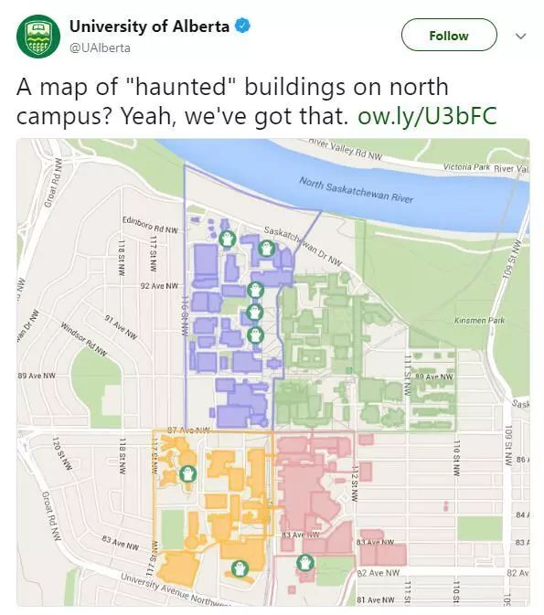
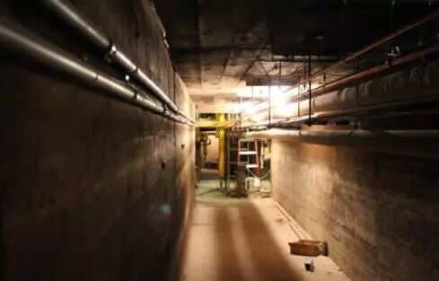
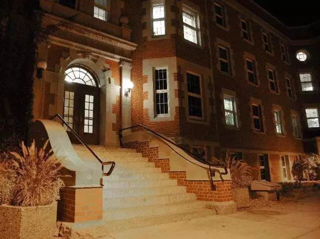
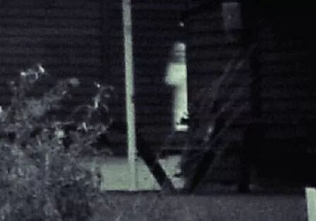
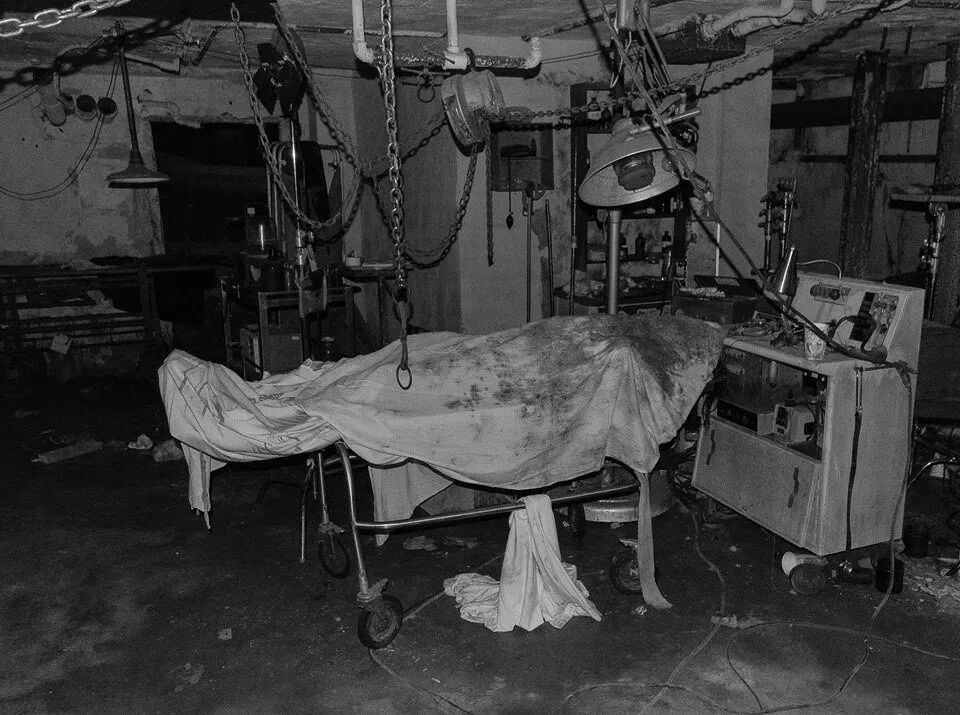

# 无标题

**链接地址:** http://mp.weixin.qq.com/s?__biz=MzI2NTE1ODgwOQ==&mid=2649605292&idx=1&sn=4c5387bba1d2064f1b5036abcae94b64&chksm=f2b8cd5ac5cf444ca40b4545cd874cc4c948845059046110c0c888437fa37ef54fa0833e1afd&mpshare=1&scene=2&srcid=#rd
**作者:** 雪糊
**获取时间:** 2025/8/28 21:13:00
**图片数量:** 36

---

## 原始HTML内容

<section style="box-sizing: border-box;"><section class="V5" style="box-sizing: border-box;" powered-by="xiumi.us"><section style="margin-right: 0%;margin-left: 0%;box-sizing: border-box;"><section style="display: inline-block;vertical-align: middle;width: 80%;box-sizing: border-box;"><section class="V5" style="box-sizing: border-box;" powered-by="xiumi.us"><section style="margin-top: 10px;margin-bottom: 10px;text-align: center;box-sizing: border-box;"><section style="display: inline-block;box-sizing: border-box;"><section style="max-width: 100%;font-size: 0px;padding-bottom: 3px;box-sizing: border-box;"><section style="display: inline-block;vertical-align: middle;box-sizing: border-box;"><section style="width: 5px;height: 1px;background-color: rgb(217, 217, 217);box-sizing: border-box;"></section><section style="width: 1px;height: 5px;margin-top: -3px;margin-right: auto;margin-left: auto;background-color: rgb(217, 217, 217);box-sizing: border-box;"></section></section><section style="margin-top: -1px;margin-right: -5px;margin-left: -5px;width: 100%;display: inline-block;vertical-align: middle;padding-right: 8px;padding-left: 8px;box-sizing: border-box;"><section style="width: 100%;height: 1px;background-color: rgb(217, 217, 217);box-sizing: border-box;"></section></section><section style="display: inline-block;vertical-align: middle;box-sizing: border-box;"><section style="width: 5px;height: 1px;background-color: rgb(217, 217, 217);box-sizing: border-box;"></section><section style="width: 1px;height: 5px;margin-top: -3px;margin-right: auto;margin-left: auto;background-color: rgb(217, 217, 217);box-sizing: border-box;"></section></section></section><section style="padding-left: 15px;padding-right: 15px;color: rgb(161, 161, 161);font-size: 14px;box-sizing: border-box;">
点击上方<strong style="box-sizing: border-box;">蓝字</strong>关注我们哟~
</section><section style="max-width: 100%;font-size: 0px;box-sizing: border-box;"><section style="display: inline-block;vertical-align: middle;box-sizing: border-box;"><section style="width: 5px;height: 1px;background-color: rgb(217, 217, 217);box-sizing: border-box;"></section><section style="width: 1px;height: 5px;margin-top: -3px;margin-right: auto;margin-left: auto;background-color: rgb(217, 217, 217);box-sizing: border-box;"></section></section><section style="margin-top: -1px;margin-right: -5px;margin-left: -5px;width: 100%;display: inline-block;vertical-align: middle;padding-right: 8px;padding-left: 8px;box-sizing: border-box;"><section style="width: 100%;height: 1px;background-color: rgb(217, 217, 217);box-sizing: border-box;"></section></section><section style="display: inline-block;vertical-align: middle;box-sizing: border-box;"><section style="width: 5px;height: 1px;background-color: rgb(217, 217, 217);box-sizing: border-box;"></section><section style="width: 1px;height: 5px;margin-top: -3px;margin-right: auto;margin-left: auto;background-color: rgb(217, 217, 217);box-sizing: border-box;"></section></section></section></section></section></section></section><section style="display: inline-block;vertical-align: middle;width: 20%;box-sizing: border-box;"><section class="V5" style="box-sizing: border-box;" powered-by="xiumi.us"><section style="text-align: center;margin: -10px 0% 10px;box-sizing: border-box;"><section style="max-width: 100%;vertical-align: middle;display: inline-block;width: 100%;box-sizing: border-box;"></section></section></section></section></section></section><section class="V5" style="box-sizing: border-box;" powered-by="xiumi.us"><section style="margin: 10px 0%;box-sizing: border-box;"><section style="display: inline-block;width: 100%;vertical-align: top;box-sizing: border-box;"><section class="V5" style="box-sizing: border-box;" powered-by="xiumi.us"><section style="box-sizing: border-box;"><section style="display: inline-block;vertical-align: bottom;width: 75%;padding-right: 10px;box-sizing: border-box;"><section class="V5" style="box-sizing: border-box;" powered-by="xiumi.us"><section style="margin: 10px 0% 3px;box-sizing: border-box;"><section style="display: inline-block;vertical-align: middle;box-sizing: border-box;"><section style="display: inline-block;vertical-align: bottom;padding-left: 5px;padding-right: 5px;line-height: 1.2em;margin-bottom: 2px;color: rgba(80, 182, 201, 0.72);box-sizing: border-box;">
<strong style="box-sizing: border-box;">仔细看下图，有惊喜！</strong>
</section><section style="max-width: 100%;display: inline-block;vertical-align: bottom;width: 1.6em;box-sizing: border-box;"></section></section></section></section></section><section style="display: inline-block;vertical-align: bottom;width: 25%;box-sizing: border-box;"><section class="V5" style="box-sizing: border-box;" powered-by="xiumi.us"><section style="margin-right: 0%;margin-bottom: 3px;margin-left: 0%;text-align: right;box-sizing: border-box;"><section style="display: inline-block;border-bottom: 0.15em solid rgba(80, 182, 201, 0.72);padding-bottom: 3px;box-sizing: border-box;"><section style="display: inline-block;padding: 3px;border-bottom: 0.15em solid rgba(80, 182, 201, 0.72);font-size: 12px;line-height: 1.4;color: rgb(255, 143, 47);box-sizing: border-box;">
<strong style="box-sizing: border-box;">金主大大</strong>
</section></section></section></section></section></section></section><section class="V5" style="box-sizing: border-box;" powered-by="xiumi.us"><section style="margin-right: 0%;margin-left: 0%;box-sizing: border-box;"><section style="background-color: rgba(80, 182, 201, 0.72);height: 2px;box-sizing: border-box;"></section></section></section></section></section></section><section class="V5" style="box-sizing: border-box;" powered-by="xiumi.us"><section style="text-align: center;margin-top: 10px;margin-bottom: 10px;box-sizing: border-box;"><section style="max-width: 100%;vertical-align: middle;display: inline-block;box-sizing: border-box;"></section></section></section><section class="V5" style="box-sizing: border-box;" powered-by="xiumi.us"><section style="text-align: center;margin-top: 10px;margin-bottom: 10px;box-sizing: border-box;"><section style="max-width: 100%;vertical-align: middle;display: inline-block;box-sizing: border-box;"></section></section></section><section class="V5" style="box-sizing: border-box;" powered-by="xiumi.us"><section style="text-align: center;margin-top: 10px;margin-bottom: 10px;box-sizing: border-box;"><section style="max-width: 100%;vertical-align: middle;display: inline-block;box-sizing: border-box;"></section></section></section><section class="V5" style="box-sizing: border-box;" powered-by="xiumi.us"><section style="text-align: center;margin-top: 10px;margin-bottom: 10px;box-sizing: border-box;"><section style="max-width: 100%;vertical-align: middle;display: inline-block;box-sizing: border-box;"></section></section></section><section class="V5" style="box-sizing: border-box;" powered-by="xiumi.us"><section style="text-align: center;margin-top: 10px;margin-bottom: 10px;box-sizing: border-box;"><section style="max-width: 100%;vertical-align: middle;display: inline-block;box-sizing: border-box;"><svg xmlns="http://www.w3.org/2000/svg" x="0px" y="0px" viewBox="0 0 902.1 38.2" style="vertical-align: middle;max-width: 100%;box-sizing: border-box;" width="902.1"><g style="box-sizing: border-box;"><path style="box-sizing: border-box;" d="M18.4,1.4c0.9-1.9,2.4-1.9,3.4,0l3.4,6.9c0.9,1.9,3.4,3.7,5.4,4l7.6,1.1c2.1,0.3,2.5,1.7,1,3.2   l-5.5,5.4c-1.5,1.5-2.4,4.3-2.1,6.4l1.3,7.6c0.4,2.1-0.9,2.9-2.7,2l-6.8-3.6c-1.8-1-4.9-1-6.7,0l-6.8,3.6c-1.9,1-3.1,0.1-2.7-2   l1.3-7.6c0.4-2.1-0.6-4.9-2.1-6.4l-5.5-5.4c-1.5-1.5-1-2.9,1-3.2l7.6-1.1c2.1-0.3,4.5-2.1,5.4-4L18.4,1.4z" fill="rgb(178, 243, 230)"></path><path style="box-sizing: border-box;" d="M90.6,5.4c0.7-1.4,1.9-1.4,2.6,0l2.6,5.3c0.7,1.4,2.6,2.8,4.2,3.1l5.9,0.9c1.6,0.2,2,1.3,0.8,2.5   l-4.2,4.1c-1.2,1.1-1.9,3.3-1.6,4.9l1,5.8c0.3,1.6-0.7,2.3-2.1,1.5l-5.2-2.8c-1.4-0.8-3.8-0.8-5.2,0L84,33.6   c-1.4,0.8-2.4,0.1-2.1-1.5l1-5.8c0.3-1.6-0.5-3.8-1.6-4.9l-4.2-4.1c-1.2-1.1-0.8-2.2,0.8-2.5l5.9-0.9c1.6-0.2,3.5-1.6,4.2-3.1   L90.6,5.4z" fill="rgb(190, 204, 246)"></path><path style="box-sizing: border-box;" d="M162.6,7.5c0.6-1.2,1.6-1.2,2.2,0l2.2,4.5c0.6,1.2,2.2,2.4,3.6,2.6l5,0.7c1.4,0.2,1.7,1.1,0.7,2.1   l-3.6,3.5c-1,1-1.6,2.9-1.4,4.2l0.9,5c0.2,1.4-0.6,1.9-1.8,1.3l-4.5-2.4c-1.2-0.6-3.2-0.6-4.4,0l-4.5,2.4c-1.2,0.6-2,0.1-1.8-1.3   l0.9-5c0.2-1.4-0.4-3.3-1.4-4.2l-3.6-3.5c-1-1-0.7-1.9,0.7-2.1l5-0.7c1.4-0.2,3-1.4,3.6-2.6L162.6,7.5z" fill="rgb(150, 208, 240)"></path><path style="box-sizing: border-box;" d="M60.1,19.1c0,2.3-1.9,4.2-4.2,4.2c-2.3,0-4.2-1.9-4.2-4.2s1.9-4.2,4.2-4.2   C58.3,14.9,60.1,16.8,60.1,19.1z" fill="rgb(218, 240, 224)"></path><path style="box-sizing: border-box;" d="M203.8,19.1c0,2.3-1.9,4.2-4.2,4.2c-2.3,0-4.2-1.9-4.2-4.2s1.9-4.2,4.2-4.2   C201.9,14.9,203.8,16.8,203.8,19.1z" fill="rgb(218, 240, 224)"></path><path style="box-sizing: border-box;" d="M130.9,19.1c0,1.7-1.4,3.1-3.1,3.1c-1.7,0-3.1-1.4-3.1-3.1c0-1.7,1.4-3.1,3.1-3.1   C129.5,16.1,130.9,17.4,130.9,19.1z" fill="rgb(218, 240, 224)"></path><path style="box-sizing: border-box;" d="M233.9,1.4c0.9-1.9,2.4-1.9,3.4,0l3.4,6.9c0.9,1.9,3.4,3.7,5.4,4l7.6,1.1c2.1,0.3,2.5,1.7,1,3.2   l-5.5,5.4c-1.5,1.5-2.4,4.3-2.1,6.4l1.3,7.6c0.4,2.1-0.9,2.9-2.7,2l-6.8-3.6c-1.8-1-4.9-1-6.7,0l-6.8,3.6c-1.9,1-3.1,0.1-2.7-2   l1.3-7.6c0.4-2.1-0.6-4.9-2.1-6.4l-5.5-5.4c-1.5-1.5-1-2.9,1-3.2l7.6-1.1c2.1-0.3,4.5-2.1,5.4-4L233.9,1.4z" fill="rgb(178, 243, 230)"></path><path style="box-sizing: border-box;" d="M306.1,5.4c0.7-1.4,1.9-1.4,2.6,0l2.6,5.3c0.7,1.4,2.6,2.8,4.2,3.1l5.9,0.9c1.6,0.2,2,1.3,0.8,2.5   l-4.2,4.1c-1.2,1.1-1.9,3.3-1.6,4.9l1,5.8c0.3,1.6-0.7,2.3-2.1,1.5l-5.2-2.8c-1.4-0.8-3.8-0.8-5.2,0l-5.2,2.8   c-1.4,0.8-2.4,0.1-2.1-1.5l1-5.8c0.3-1.6-0.4-3.8-1.6-4.9l-4.2-4.1c-1.2-1.1-0.8-2.2,0.8-2.5l5.9-0.9c1.6-0.2,3.5-1.6,4.2-3.1   L306.1,5.4z" fill="rgb(190, 204, 246)"></path><path style="box-sizing: border-box;" d="M378.1,7.5c0.6-1.2,1.6-1.2,2.2,0l2.2,4.5c0.6,1.2,2.2,2.4,3.6,2.6l5,0.7c1.4,0.2,1.7,1.1,0.7,2.1   l-3.6,3.5c-1,1-1.6,2.9-1.4,4.2l0.9,5c0.2,1.4-0.6,1.9-1.8,1.3l-4.5-2.4c-1.2-0.6-3.2-0.6-4.4,0l-4.5,2.4c-1.2,0.6-2,0.1-1.8-1.3   l0.9-5c0.2-1.4-0.4-3.3-1.4-4.2l-3.6-3.5c-1-1-0.7-1.9,0.7-2.1l5-0.7c1.4-0.2,3-1.4,3.6-2.6L378.1,7.5z" fill="rgb(150, 208, 240)"></path><path style="box-sizing: border-box;" d="M275.7,19.1c0,2.3-1.9,4.2-4.2,4.2c-2.3,0-4.2-1.9-4.2-4.2s1.9-4.2,4.2-4.2   C273.8,14.9,275.7,16.8,275.7,19.1z" fill="rgb(218, 240, 224)"></path><path style="box-sizing: border-box;" d="M419.3,19.1c0,2.3-1.9,4.2-4.2,4.2c-2.3,0-4.2-1.9-4.2-4.2s1.9-4.2,4.2-4.2   C417.5,14.9,419.3,16.8,419.3,19.1z" fill="rgb(218, 240, 224)"></path><path style="box-sizing: border-box;" d="M346.4,19.1c0,1.7-1.4,3.1-3.1,3.1c-1.7,0-3.1-1.4-3.1-3.1c0-1.7,1.4-3.1,3.1-3.1   C345,16.1,346.4,17.4,346.4,19.1z" fill="rgb(218, 240, 224)"></path><path style="box-sizing: border-box;" d="M449.4,1.4c0.9-1.9,2.4-1.9,3.4,0l3.4,6.9c0.9,1.9,3.4,3.7,5.4,4l7.6,1.1c2.1,0.3,2.5,1.7,1,3.2   l-5.5,5.4c-1.5,1.5-2.4,4.3-2.1,6.4l1.3,7.6c0.4,2.1-0.9,2.9-2.7,2l-6.8-3.6c-1.8-1-4.9-1-6.7,0l-6.8,3.6c-1.9,1-3.1,0.1-2.7-2   l1.3-7.6c0.4-2.1-0.6-4.9-2.1-6.4l-5.5-5.4c-1.5-1.5-1-2.9,1-3.2l7.6-1.1c2.1-0.3,4.5-2.1,5.4-4L449.4,1.4z" fill="rgb(178, 243, 230)"></path><path style="box-sizing: border-box;" d="M521.6,5.4c0.7-1.4,1.9-1.4,2.6,0l2.6,5.3c0.7,1.4,2.6,2.8,4.2,3.1l5.9,0.9c1.6,0.2,2,1.3,0.8,2.5   l-4.2,4.1c-1.2,1.1-1.9,3.3-1.6,4.9l1,5.8c0.3,1.6-0.7,2.3-2.1,1.5l-5.2-2.8c-1.4-0.8-3.8-0.8-5.2,0l-5.2,2.8   c-1.4,0.8-2.4,0.1-2.1-1.5l1-5.8c0.3-1.6-0.5-3.8-1.6-4.9l-4.2-4.1c-1.2-1.1-0.8-2.2,0.8-2.5l5.9-0.9c1.6-0.2,3.5-1.6,4.2-3.1   L521.6,5.4z" fill="rgb(190, 204, 246)"></path><path style="box-sizing: border-box;" d="M593.6,7.5c0.6-1.2,1.6-1.2,2.2,0l2.2,4.5c0.6,1.2,2.2,2.4,3.6,2.6l5,0.7c1.4,0.2,1.7,1.1,0.7,2.1   l-3.6,3.5c-1,1-1.6,2.9-1.4,4.2l0.9,5c0.2,1.4-0.6,1.9-1.8,1.3l-4.5-2.4c-1.2-0.6-3.2-0.6-4.4,0l-4.5,2.4c-1.2,0.6-2,0.1-1.8-1.3   l0.9-5c0.2-1.4-0.4-3.3-1.4-4.2l-3.6-3.5c-1-1-0.7-1.9,0.7-2.1l5-0.7c1.4-0.2,3-1.4,3.6-2.6L593.6,7.5z" fill="rgb(150, 208, 240)"></path><path style="box-sizing: border-box;" d="M491.2,19.1c0,2.3-1.9,4.2-4.2,4.2c-2.3,0-4.2-1.9-4.2-4.2s1.9-4.2,4.2-4.2   C489.3,14.9,491.2,16.8,491.2,19.1z" fill="rgb(218, 240, 224)"></path><path style="box-sizing: border-box;" d="M634.9,19.1c0,2.3-1.9,4.2-4.2,4.2c-2.3,0-4.2-1.9-4.2-4.2s1.9-4.2,4.2-4.2   C633,14.9,634.9,16.8,634.9,19.1z" fill="rgb(218, 240, 224)"></path><path style="box-sizing: border-box;" d="M561.9,19.1c0,1.7-1.4,3.1-3.1,3.1c-1.7,0-3.1-1.4-3.1-3.1c0-1.7,1.4-3.1,3.1-3.1   C560.5,16.1,561.9,17.4,561.9,19.1z" fill="rgb(218, 240, 224)"></path><path style="box-sizing: border-box;" d="M664.9,1.4c0.9-1.9,2.4-1.9,3.4,0l3.4,6.9c0.9,1.9,3.4,3.7,5.4,4l7.6,1.1c2.1,0.3,2.5,1.7,1,3.2   l-5.5,5.4c-1.5,1.5-2.4,4.3-2.1,6.4l1.3,7.6c0.4,2.1-0.9,2.9-2.7,2l-6.8-3.6c-1.8-1-4.9-1-6.7,0l-6.8,3.6c-1.9,1-3.1,0.1-2.7-2   l1.3-7.6c0.4-2.1-0.6-4.9-2.1-6.4l-5.5-5.4c-1.5-1.5-1-2.9,1-3.2l7.6-1.1c2.1-0.3,4.5-2.1,5.4-4L664.9,1.4z" fill="rgb(178, 243, 230)"></path><path style="box-sizing: border-box;" d="M737.1,5.4c0.7-1.4,1.9-1.4,2.6,0l2.6,5.3c0.7,1.4,2.6,2.8,4.2,3.1l5.9,0.9c1.6,0.2,2,1.3,0.8,2.5   l-4.2,4.1c-1.2,1.1-1.9,3.3-1.6,4.9l1,5.8c0.3,1.6-0.7,2.3-2.1,1.5l-5.2-2.8c-1.4-0.8-3.8-0.8-5.2,0l-5.2,2.8   c-1.4,0.8-2.4,0.1-2.1-1.5l1-5.8c0.3-1.6-0.5-3.8-1.6-4.9l-4.2-4.1c-1.2-1.1-0.8-2.2,0.8-2.5l5.9-0.9c1.6-0.2,3.5-1.6,4.2-3.1   L737.1,5.4z" fill="rgb(190, 204, 246)"></path><path style="box-sizing: border-box;" d="M809.2,7.5c0.6-1.2,1.6-1.2,2.2,0l2.2,4.5c0.6,1.2,2.2,2.4,3.6,2.6l5,0.7c1.4,0.2,1.7,1.1,0.7,2.1   l-3.6,3.5c-1,1-1.6,2.9-1.4,4.2l0.9,5c0.2,1.4-0.6,1.9-1.8,1.3l-4.5-2.4c-1.2-0.6-3.2-0.6-4.4,0l-4.5,2.4c-1.2,0.6-2,0.1-1.8-1.3   l0.9-5c0.2-1.4-0.4-3.3-1.4-4.2l-3.6-3.5c-1-1-0.7-1.9,0.7-2.1l5-0.7c1.4-0.2,3-1.4,3.6-2.6L809.2,7.5z" fill="rgb(150, 208, 240)"></path><path style="box-sizing: border-box;" d="M706.7,19.1c0,2.3-1.9,4.2-4.2,4.2c-2.3,0-4.2-1.9-4.2-4.2s1.9-4.2,4.2-4.2   C704.8,14.9,706.7,16.8,706.7,19.1z" fill="rgb(218, 240, 224)"></path><path style="box-sizing: border-box;" d="M850.4,19.1c0,2.3-1.9,4.2-4.2,4.2c-2.3,0-4.2-1.9-4.2-4.2s1.9-4.2,4.2-4.2   C848.5,14.9,850.4,16.8,850.4,19.1z" fill="rgb(218, 240, 224)"></path><path style="box-sizing: border-box;" d="M777.4,19.1c0,1.7-1.4,3.1-3.1,3.1c-1.7,0-3.1-1.4-3.1-3.1c0-1.7,1.4-3.1,3.1-3.1   C776,16.1,777.4,17.4,777.4,19.1z" fill="rgb(218, 240, 224)"></path><path style="box-sizing: border-box;" d="M880.4,1.4c0.9-1.9,2.4-1.9,3.4,0l3.4,6.9c0.9,1.9,3.4,3.7,5.4,4l7.6,1.1c2.1,0.3,2.5,1.7,1,3.2   l-5.5,5.4c-1.5,1.5-2.4,4.3-2.1,6.4l1.3,7.6c0.4,2.1-0.9,2.9-2.7,2l-6.8-3.6c-1.8-1-4.9-1-6.7,0l-6.8,3.6c-1.8,1-3.1,0.1-2.7-2   l1.3-7.6c0.4-2.1-0.6-4.9-2.1-6.4l-5.5-5.4c-1.5-1.5-1-2.9,1-3.2l7.6-1.1c2.1-0.3,4.5-2.1,5.4-4L880.4,1.4z" fill="rgb(178, 243, 230)"></path></g></svg></section></section></section><section class="V5" style="box-sizing: border-box;" powered-by="xiumi.us"><section style="box-sizing: border-box;"><section style="text-align: center;box-sizing: border-box;"><section style="box-sizing: border-box;"><section class="V5" style="box-sizing: border-box;" powered-by="xiumi.us"><section style="margin: 10px 0%;box-sizing: border-box;"><section style="display: inline-block;width: 100%;vertical-align: top;background-image: url(&quot;https://mmbiz.qpic.cn/mmbiz_gif/D1nJqnhkPyJxV5HLSETlpgqhP7B7c9VY6icwYPsFR7HxSnXibHcpZf6yng0icCkqGG8HAiaes13AQaTEYcZFRwrg3A/640?wx_fmt=gif&quot;);background-position: 0% 0%;background-repeat: repeat;background-size: 101.176%;background-attachment: scroll;padding: 10px;box-sizing: border-box;"><section class="V5" style="box-sizing: border-box;" powered-by="xiumi.us"><section style="box-sizing: border-box;"><section style="display: inline-block;vertical-align: top;width: 70%;box-sizing: border-box;"><section class="V5" style="box-sizing: border-box;" powered-by="xiumi.us"><section style="box-sizing: border-box;"><section style="text-align: center;color: rgb(255, 255, 255);font-size: 21px;box-sizing: border-box;">
<strong style="box-sizing: border-box;">万圣节特辑</strong>

<strong style="box-sizing: border-box;">之</strong>

<strong style="box-sizing: border-box;">U of A&nbsp;&nbsp;</strong><strong style="font-size: 32px;letter-spacing: 0px;box-sizing: border-box;">闹鬼了</strong>
</section></section></section></section><section style="display: inline-block;vertical-align: top;width: 30%;box-sizing: border-box;"><section class="V5" style="box-sizing: border-box;" powered-by="xiumi.us"><section style="text-align: right;margin-top: 10px;margin-bottom: 10px;box-sizing: border-box;"><section style="max-width: 100%;vertical-align: middle;display: inline-block;width: 100%;box-sizing: border-box;"></section></section></section></section></section></section></section></section></section><section class="V5" style="box-sizing: border-box;" powered-by="xiumi.us"><section style="text-align: center;margin-top: 0.5em;margin-bottom: 0.5em;padding-left: 0.5em;padding-right: 0.5em;box-sizing: border-box;"><section style="box-sizing: border-box;width: 100%;border-width: 1px;border-style: solid;border-color: white;box-shadow: rgb(102, 102, 102) 3.53553px 3.53553px 8px;display: inline-block;height: auto !important;"></section></section></section><section class="V5" style="box-sizing: border-box;" powered-by="xiumi.us"><section style="text-align: right;margin: -60px 0% 10px;box-sizing: border-box;"><section style="max-width: 100%;vertical-align: middle;display: inline-block;width: 50%;box-shadow: rgb(0, 0, 0) 0px 0px 0px;box-sizing: border-box;"></section></section></section><section class="V5" style="box-sizing: border-box;" powered-by="xiumi.us"><section style="margin: 20px 0%;box-sizing: border-box;"><section style="text-align: justify;letter-spacing: 2px;padding-right: 20px;padding-left: 20px;font-size: 14px;color: rgb(86, 82, 81);box-sizing: border-box;">
相信很多人在之前的上学经历中往往都听到过很多难辨真假扑朔迷离的”<strong style="box-sizing: border-box;">校园传说</strong>“，好比：

 

这座学校以前是个<strong style="box-sizing: border-box;">坟场</strong>。

这座学校所有的井盖连起来是个<strong style="box-sizing: border-box;">“死”字</strong>！

这座学校某栋楼二楼的女厕所晚上会出现一个披头散发的<strong style="box-sizing: border-box;">女鬼</strong>！

 

<strong style="box-sizing: border-box;">我们的UA也不例外。</strong>
</section></section></section><section class="V5" style="box-sizing: border-box;" powered-by="xiumi.us"><section style="text-align: center;margin: 20px 0% 10px;box-sizing: border-box;"><section style="max-width: 100%;vertical-align: middle;display: inline-block;width: 30%;box-sizing: border-box;"></section></section></section><section class="V5" style="box-sizing: border-box;" powered-by="xiumi.us"><section style="margin: 20px 0%;box-sizing: border-box;"><section style="text-align: justify;letter-spacing: 2px;padding-right: 20px;padding-left: 20px;font-size: 14px;color: rgb(158, 158, 158);box-sizing: border-box;">
UA的鬼怪传说从不曾将息。作为一个冠冕堂皇的教育机构的官方账号，居然大大方方地承认了学校多项闹鬼传说，还纵容学生团体组织<strong style="box-sizing: border-box;">“寻鬼冒险”</strong>还真是少见。 

 

<strong style="box-sizing: border-box;">官方吐槽，最为致命。</strong>

 

听说：UA自古就流传着一句秘语：”你见过凌晨四点的罗斯福之家吗？你没有见过，科比也没有见过，

 

<strong style="box-sizing: border-box;">但罗斯福之家小男孩的幽灵见过。</strong>

<strong style="box-sizing: border-box;"> </strong>

注：Rutherford House这座坐落在UA中的古老博物馆于每晚天黑前5点准时闭馆。<strong style="box-sizing: border-box;"> </strong>
</section></section></section><section class="V5" style="box-sizing: border-box;" powered-by="xiumi.us"><section style="text-align: center;margin-top: 10px;margin-right: 0%;margin-left: 0%;box-sizing: border-box;"><section style="max-width: 100%;vertical-align: middle;display: inline-block;box-sizing: border-box;"></section></section></section><section class="V5" style="box-sizing: border-box;" powered-by="xiumi.us"><section style="box-sizing: border-box;"><section style="box-sizing: border-box;">
 
</section></section></section><section class="V5" style="box-sizing: border-box;" powered-by="xiumi.us"><section style="box-sizing: border-box;"><section style="display: inline-block;vertical-align: top;width: 15%;padding-right: 5px;box-sizing: border-box;"><section class="V5" style="box-sizing: border-box;" powered-by="xiumi.us"><section style="text-align: center;margin-top: 10px;margin-bottom: 10px;box-sizing: border-box;"><section style="max-width: 100%;vertical-align: middle;display: inline-block;box-sizing: border-box;"></section></section></section></section><section style="display: inline-block;vertical-align: top;width: 70%;box-sizing: border-box;"><section class="V5" style="box-sizing: border-box;" powered-by="xiumi.us"><section style="margin-top: 20px;margin-right: 0%;margin-left: 0%;box-sizing: border-box;"><section style="text-align: center;font-size: 22px;color: rgb(204, 1, 1);box-sizing: border-box;">
<strong style="box-sizing: border-box;">被永久关闭的地下迷宫</strong>
</section></section></section></section><section style="display: inline-block;vertical-align: top;width: 15%;padding-left: 5px;box-shadow: rgb(0, 0, 0) 0px 0px 0px;box-sizing: border-box;"><section class="V5" style="box-sizing: border-box;" powered-by="xiumi.us"><section style="text-align: center;margin: 20px 0% 10px;box-sizing: border-box;"><section style="max-width: 100%;vertical-align: middle;display: inline-block;box-sizing: border-box;"></section></section></section></section></section></section><section class="V5" style="box-sizing: border-box;" powered-by="xiumi.us"><section style="box-sizing: border-box;"><section style="box-sizing: border-box;">
 
</section></section></section><section class="V5" style="box-sizing: border-box;" powered-by="xiumi.us"><section style="box-sizing: border-box;"><section style="display: inline-block;width: 100%;vertical-align: top;background-image: url(&quot;https://mmbiz.qpic.cn/mmbiz_jpg/D1nJqnhkPyJxV5HLSETlpgqhP7B7c9VY2SYtMdGhcphqibGQMibzXT89ucicgFzG3FXONvuZxpHFXsDbqEjAScg6g/640?wx_fmt=jpeg&quot;);background-position: 0% 0%;background-repeat: repeat;background-size: 101.177%;background-attachment: scroll;box-shadow: rgb(0, 0, 0) 0px 0px 0px;box-sizing: border-box;"><section class="V5" style="box-sizing: border-box;" powered-by="xiumi.us"><section style="text-align: center;margin-top: 0.5em;margin-bottom: 0.5em;padding-left: 0.5em;padding-right: 0.5em;box-sizing: border-box;"><section style="box-sizing: border-box;width: 100%;border-width: 4px;border-style: solid;border-color: white;box-shadow: rgb(102, 102, 102) 3.53553px 3.53553px 8px;display: inline-block;height: auto !important;"></section></section></section><section class="V5" style="box-sizing: border-box;" powered-by="xiumi.us"><section style="margin: 20px 0%;box-sizing: border-box;"><section style="text-align: justify;font-size: 14px;color: rgb(86, 82, 81);letter-spacing: 2px;padding-right: 20px;padding-left: 20px;box-sizing: border-box;">
位于阿尔伯塔大学主校区的地面几米深处，从<strong style="box-sizing: border-box;">上世纪20年代</strong>开始挖掘修建了一条绵延21公里的公用地下隧道，供师生们在校内建筑物间自由穿梭，哪怕是到了寒冬腊月也免受冷空气的干扰。

 

然而这条地下通道却在上世纪七十年代被<strong style="box-sizing: border-box;">突然关闭</strong>，所有师生都不得入内！年代久远，我们已难以揣测当年到底发生了什么，从网上可以搜寻到的仅有的一点模糊信息看来，似乎是和一场<strong style="box-sizing: border-box;">强奸案</strong>有关。

 

但一场强奸案为何会使得学校下令关闭全部四通八达的地下交通甬道？这么多的人力物力的投入就随着这段神秘的往事<strong style="box-sizing: border-box;">被一起尘封起来</strong>。

 

后来有学校工作人员进入通道维护作业后在网上写到：这些已经废弃的通道内堆面了年岁长久的杂物纸箱，现在已作为电缆和管道运输作为使用。通道很宽阔，可供人在里面骑行滑板车。

 

但这庞大又神秘的地下网络是如何被突然禁止进入的真正原因，恐怕是要被埋葬在岁月的尘埃中<strong style="box-sizing: border-box;">永不见天日</strong>了。
</section></section></section><section class="V5" style="box-sizing: border-box;" powered-by="xiumi.us"><section style="box-sizing: border-box;"><section style="box-sizing: border-box;">
 
</section></section></section><section class="V5" style="box-sizing: border-box;" powered-by="xiumi.us"><section style="box-sizing: border-box;"><section style="display: inline-block;vertical-align: top;width: 15%;padding-right: 5px;box-sizing: border-box;"><section class="V5" style="box-sizing: border-box;" powered-by="xiumi.us"><section style="text-align: center;margin-top: 10px;margin-bottom: 10px;box-sizing: border-box;"><section style="max-width: 100%;vertical-align: middle;display: inline-block;box-sizing: border-box;"></section></section></section></section><section style="display: inline-block;vertical-align: top;width: 70%;box-sizing: border-box;"><section class="V5" style="box-sizing: border-box;" powered-by="xiumi.us"><section style="margin-top: 20px;margin-right: 0%;margin-left: 0%;box-sizing: border-box;"><section style="text-align: center;font-size: 22px;color: rgb(204, 1, 1);box-sizing: border-box;">
<strong style="box-sizing: border-box;">这栋楼里，曾有72人死去。</strong>
</section></section></section></section><section style="display: inline-block;vertical-align: top;width: 15%;padding-left: 5px;box-shadow: rgb(0, 0, 0) 0px 0px 0px;box-sizing: border-box;"><section class="V5" style="box-sizing: border-box;" powered-by="xiumi.us"><section style="text-align: center;margin: 20px 0% 10px;box-sizing: border-box;"><section style="max-width: 100%;vertical-align: middle;display: inline-block;box-sizing: border-box;"></section></section></section></section></section></section><section class="V5" style="box-sizing: border-box;" powered-by="xiumi.us"><section style="box-sizing: border-box;"><section style="box-sizing: border-box;">
 
</section></section></section><section class="V5" style="box-sizing: border-box;" powered-by="xiumi.us"><section style="text-align: center;margin-top: 0.5em;margin-bottom: 0.5em;padding-left: 0.5em;padding-right: 0.5em;box-sizing: border-box;"><section style="box-sizing: border-box;width: 100%;border-width: 4px;border-style: solid;border-color: white;box-shadow: rgb(102, 102, 102) 3.53553px 3.53553px 8px;display: inline-block;height: auto !important;"></section></section></section><section class="V5" style="box-sizing: border-box;" powered-by="xiumi.us"><section style="margin: 20px 0%;box-sizing: border-box;"><section style="text-align: justify;font-size: 14px;color: rgb(86, 82, 81);letter-spacing: 2px;padding-right: 20px;padding-left: 20px;box-sizing: border-box;">
<strong style="box-sizing: border-box;">Pembina Hall</strong>，这座神秘的建筑就屹立在人来人往嘈杂喧嚣的Quad之上。你或许会好奇，从这栋楼前走过没有上千次也有上百次，但却从不见人进出此楼，而这楼处于这样学校中心的位置，<strong style="box-sizing: border-box;">99.99%的留学生却从不曾踏足其中</strong>？

 

原来，这栋古老神秘近乎于危房的大楼，居然还有这这样一段<strong style="box-sizing: border-box;">悲伤痛楚</strong>的往事：

 

在第一次世界大战之后的1918年西班牙流感大流行期间，这座拥有136间卧室的住宅楼被改建为<strong style="box-sizing: border-box;">临时医院</strong>。
</section></section></section><section class="V5" style="box-sizing: border-box;" powered-by="xiumi.us"><section style="text-align: center;margin-top: 10px;margin-bottom: 10px;box-sizing: border-box;"><section style="max-width: 100%;vertical-align: middle;display: inline-block;width: 12%;box-sizing: border-box;"></section></section></section><section class="V5" style="box-sizing: border-box;" powered-by="xiumi.us"><section style="margin: 20px 0%;box-sizing: border-box;"><section style="text-align: justify;font-size: 14px;color: rgb(86, 82, 81);letter-spacing: 2px;padding-right: 20px;padding-left: 20px;box-sizing: border-box;">
在流感爆发期间，<strong style="box-sizing: border-box;">至少有72人在那里死亡</strong>，其中包括阿尔伯塔大学第一位数学和工程学教授William Muir Edwards。 

 

72位冤魂命陨此地。包括身受重伤的士兵，他忠贞不渝的年轻未婚妻，还有在大流行期间在医院工作时感染流感的护士……

 

而他们中间的爱恨纠葛却成为后世人们<strong style="box-sizing: border-box;">津津乐道茶余饭后的闲话</strong>。

 

直到今日，许多在这里工作的人员还可以看到一位穿着老式护士服的女士和一名穿着士兵制服的男子，互相搀扶走过这大厅的门廊。

 

而他的未婚妻爽朗如银铃般的笑声还回荡在大楼的大厅中<strong style="box-sizing: border-box;">久久不能散去</strong>…
</section></section></section><section class="V5" style="box-sizing: border-box;" powered-by="xiumi.us"><section style="box-sizing: border-box;"><section style="box-sizing: border-box;">
 
</section></section></section><section class="V5" style="box-sizing: border-box;" powered-by="xiumi.us"><section style="box-sizing: border-box;"><section style="display: inline-block;vertical-align: top;width: 15%;padding-right: 5px;box-sizing: border-box;"><section class="V5" style="box-sizing: border-box;" powered-by="xiumi.us"><section style="text-align: center;margin-top: 10px;margin-bottom: 10px;box-sizing: border-box;"><section style="max-width: 100%;vertical-align: middle;display: inline-block;box-sizing: border-box;"></section></section></section></section><section style="display: inline-block;vertical-align: top;width: 70%;box-sizing: border-box;"><section class="V5" style="box-sizing: border-box;" powered-by="xiumi.us"><section style="margin-top: 20px;margin-right: 0%;margin-left: 0%;box-sizing: border-box;"><section style="text-align: center;font-size: 22px;color: rgb(204, 1, 1);box-sizing: border-box;">
<strong style="box-sizing: border-box;">蓝嘴唇</strong><strong style="box-sizing: border-box;">的男孩的亡灵</strong>
</section></section></section></section><section style="display: inline-block;vertical-align: top;width: 15%;padding-left: 5px;box-shadow: rgb(0, 0, 0) 0px 0px 0px;box-sizing: border-box;"><section class="V5" style="box-sizing: border-box;" powered-by="xiumi.us"><section style="text-align: center;margin: 20px 0% 10px;box-sizing: border-box;"><section style="max-width: 100%;vertical-align: middle;display: inline-block;box-sizing: border-box;"></section></section></section></section></section></section><section class="V5" style="box-sizing: border-box;" powered-by="xiumi.us"><section style="box-sizing: border-box;"><section style="box-sizing: border-box;">
 
</section></section></section><section class="V5" style="box-sizing: border-box;" powered-by="xiumi.us"><section style="text-align: center;margin-top: 0.5em;margin-bottom: 0.5em;padding-left: 0.5em;padding-right: 0.5em;box-sizing: border-box;"><section style="box-sizing: border-box;width: 100%;border-width: 4px;border-style: solid;border-color: white;box-shadow: rgb(102, 102, 102) 3.53553px 3.53553px 8px;display: inline-block;height: auto !important;"></section></section></section><section class="V5" style="box-sizing: border-box;" powered-by="xiumi.us"><section style="margin: 20px 0%;box-sizing: border-box;"><section style="text-align: justify;font-size: 14px;color: rgb(86, 82, 81);letter-spacing: 2px;padding-right: 20px;padding-left: 20px;box-sizing: border-box;">
这个一个关于<strong style="box-sizing: border-box;">流浪鬼魂</strong>的催人泪下的故事。

 

1910年，有一个家住北萨斯喀彻温河畔的小男孩，他穿着格子衬衫和羊毛裤在河边玩耍。他的家人是建造阿尔伯大学建造<strong style="box-sizing: border-box;">Athabasca Hall</strong>的劳工。

 

众所周知，在河边玩耍可能很危险，但小男孩并不在乎。经过一天的欢乐的玩耍之后，他回到家中才发现他把自己的夹克遗留在河边了。担心回家受到家人责罚，他不得不在<strong style="box-sizing: border-box;">天色将晚之时重新回到河边寻找他的夹克</strong>。

 

<strong style="box-sizing: border-box;">然而，他再也没有回家。</strong>
</section></section></section><section class="V5" style="box-sizing: border-box;" powered-by="xiumi.us"><section style="text-align: center;margin-top: 10px;margin-bottom: 10px;box-sizing: border-box;"><section style="max-width: 100%;vertical-align: middle;display: inline-block;width: 15%;box-sizing: border-box;"></section></section></section><section class="V5" style="box-sizing: border-box;" powered-by="xiumi.us"><section style="margin: 20px 0%;box-sizing: border-box;"><section style="text-align: justify;font-size: 14px;color: rgb(86, 82, 81);letter-spacing: 2px;padding-right: 20px;padding-left: 20px;box-sizing: border-box;">
第二天早上，他的家人在河边发现了他的身体，<strong style="box-sizing: border-box;">蓝色的嘴唇</strong>显示他或许是被<strong style="box-sizing: border-box;">冻死</strong>的。后来，他父亲伤心欲绝地将他埋葬在河边，然后与妻子一起离开了埃德蒙顿这个伤感的地方。 

 

<strong style="box-sizing: border-box;">没有人知道他是怎么死的，也没有人知道他为何没有回家。</strong>

 

2001年，当我在河边散心时，碰巧遇到一位年迈的女士矗立在河边眺望。她告诉我，她的丈夫在20世纪40年代后期曾看到这位蓝嘴唇的男孩在学校的Athabasca Hall徘徊。

 

“一个大约八岁的男孩，嘴唇发青，嘴角冰冷，眼睛直勾勾地盯着地面涩涩发抖，抽泣，仿佛在焦急地寻找着什么东西。”

 

每年秋天快要结束时的<strong style="box-sizing: border-box;">万圣节前夕</strong>，都会有人看到这个蓝嘴唇小男孩的幽灵，孤独地徘徊在北萨河河谷附近，然后<strong style="box-sizing: border-box;">渐渐消失在雾霭中</strong>……
</section></section></section><section class="V5" style="box-sizing: border-box;" powered-by="xiumi.us"><section style="box-sizing: border-box;"><section style="box-sizing: border-box;">
 
</section></section></section><section class="V5" style="box-sizing: border-box;" powered-by="xiumi.us"><section style="box-sizing: border-box;"><section style="display: inline-block;vertical-align: top;width: 15%;padding-right: 5px;box-sizing: border-box;"><section class="V5" style="box-sizing: border-box;" powered-by="xiumi.us"><section style="text-align: center;margin-top: 10px;margin-bottom: 10px;box-sizing: border-box;"><section style="max-width: 100%;vertical-align: middle;display: inline-block;box-sizing: border-box;"></section></section></section></section><section style="display: inline-block;vertical-align: top;width: 70%;box-sizing: border-box;"><section class="V5" style="box-sizing: border-box;" powered-by="xiumi.us"><section style="margin-top: 20px;margin-right: 0%;margin-left: 0%;box-sizing: border-box;"><section style="text-align: center;font-size: 22px;color: rgb(204, 1, 1);box-sizing: border-box;">
<strong style="box-sizing: border-box;">来自异次元的电波诅咒</strong>
</section></section></section></section><section style="display: inline-block;vertical-align: top;width: 15%;padding-left: 5px;box-shadow: rgb(0, 0, 0) 0px 0px 0px;box-sizing: border-box;"><section class="V5" style="box-sizing: border-box;" powered-by="xiumi.us"><section style="text-align: center;margin: 20px 0% 10px;box-sizing: border-box;"><section style="max-width: 100%;vertical-align: middle;display: inline-block;box-sizing: border-box;"></section></section></section></section></section></section><section class="V5" style="box-sizing: border-box;" powered-by="xiumi.us"><section style="box-sizing: border-box;"><section style="box-sizing: border-box;">
 
</section></section></section><section class="V5" style="box-sizing: border-box;" powered-by="xiumi.us"><section style="text-align: center;margin-top: 0.5em;margin-bottom: 0.5em;padding-left: 0.5em;padding-right: 0.5em;box-sizing: border-box;"><section style="box-sizing: border-box;width: 100%;border-width: 4px;border-style: solid;border-color: white;box-shadow: rgb(102, 102, 102) 3.53553px 3.53553px 8px;display: inline-block;height: auto !important;"></section></section></section><section class="V5" style="box-sizing: border-box;" powered-by="xiumi.us"><section style="margin: 20px 0%;box-sizing: border-box;"><section style="text-align: justify;font-size: 14px;color: rgb(86, 82, 81);letter-spacing: 2px;padding-right: 20px;padding-left: 20px;box-sizing: border-box;">
2004年，阿尔伯塔的一个实验室曾经发现了一组<strong style="box-sizing: border-box;">被奇怪电波扰乱的实验数据</strong>。

 

一个研究生协会的成员当时正在一个实验室内进行对于<strong style="box-sizing: border-box;">电厂课题</strong>的研究。当时的协会主席Alexis&nbsp; Pépin回忆起事发时的情景依然害怕地打起了寒颤。

 

他说：“当一个实验在进行中的时候，房间内的物体突然疯狂地摇晃了起来，不受控制地并从高处台面上摔落在地上。就像被诅咒了一般。”

 

事发时该实验小隔间里并没有人，而且所有的门窗也都被锁上了，所以不存在人为破坏的情况。他坚信这也不是地震或者其他实验事故，因为只有一个小隔间发生了这样<strong style="box-sizing: border-box;">诡异得难以解释的事情</strong>。

 

除此之外，Pépin还回忆起听到有人在建筑物周围匆匆走过的脚步声，灯光也忽明忽暗不停闪烁，就像<strong style="box-sizing: border-box;">有人在恶意操控</strong>一样。

 

<strong style="box-sizing: border-box;">但，这会是谁呢？</strong>
</section></section></section><section class="V5" style="box-sizing: border-box;" powered-by="xiumi.us"><section style="box-sizing: border-box;"><section style="box-sizing: border-box;">
 
</section></section></section><section class="V5" style="box-sizing: border-box;" powered-by="xiumi.us"><section style="box-sizing: border-box;"><section style="display: inline-block;vertical-align: top;width: 15%;padding-right: 5px;box-sizing: border-box;"><section class="V5" style="box-sizing: border-box;" powered-by="xiumi.us"><section style="text-align: center;margin-top: 10px;margin-bottom: 10px;box-sizing: border-box;"><section style="max-width: 100%;vertical-align: middle;display: inline-block;box-sizing: border-box;"></section></section></section></section><section style="display: inline-block;vertical-align: top;width: 70%;box-sizing: border-box;"><section class="V5" style="box-sizing: border-box;" powered-by="xiumi.us"><section style="margin-top: 20px;margin-right: 0%;margin-left: 0%;box-sizing: border-box;"><section style="text-align: center;font-size: 22px;color: rgb(204, 1, 1);box-sizing: border-box;">
<strong style="box-sizing: border-box;">艾玛，永世的风云人物</strong>
</section></section></section></section><section style="display: inline-block;vertical-align: top;width: 15%;padding-left: 5px;box-shadow: rgb(0, 0, 0) 0px 0px 0px;box-sizing: border-box;"><section class="V5" style="box-sizing: border-box;" powered-by="xiumi.us"><section style="text-align: center;margin: 20px 0% 10px;box-sizing: border-box;"><section style="max-width: 100%;vertical-align: middle;display: inline-block;box-sizing: border-box;"></section></section></section></section></section></section><section class="V5" style="box-sizing: border-box;" powered-by="xiumi.us"><section style="box-sizing: border-box;"><section style="box-sizing: border-box;">
 
</section></section></section><section class="V5" style="box-sizing: border-box;" powered-by="xiumi.us"><section style="text-align: center;margin-top: 0.5em;margin-bottom: 0.5em;padding-left: 0.5em;padding-right: 0.5em;box-sizing: border-box;"><section style="box-sizing: border-box;width: 100%;border-width: 4px;border-style: solid;border-color: white;display: inline-block;box-shadow: rgb(102, 102, 102) 3.53553px 3.53553px 8px;height: auto !important;"></section></section></section><section class="V5" style="box-sizing: border-box;" powered-by="xiumi.us"><section style="margin: 20px 0%;box-sizing: border-box;"><section style="text-align: justify;font-size: 14px;color: rgb(86, 82, 81);letter-spacing: 2px;padding-right: 20px;padding-left: 20px;box-sizing: border-box;">
<strong style="box-sizing: border-box;">Emma Read Newton</strong>是1941年至1950年间阿尔伯塔大学校长Robert Newton的妻子，他们曾经住在<strong style="box-sizing: border-box;">Ring House 1</strong>，一座位于阿尔伯塔大学校园西北角的红砖建筑。

 

你或许无数次地经过这座<strong style="box-sizing: border-box;">古老而又神秘的建筑</strong>，但你却从未想过踏入其中一步去感受她<strong style="box-sizing: border-box;">禁忌严肃的氛围</strong>。

 

相传性格活泼开朗的Emma是一位音乐家，也是阿尔伯塔大学中当年的<strong style="box-sizing: border-box;">风云人物</strong>。她曾经活跃在各大社团，为学校的文化建设做出了杰出的贡献。

 

然而Emma也是一位说一不二的强势的女性，她是唯一一个敢于对抗学校制度<strong style="box-sizing: border-box;">在学生餐厅吸烟</strong>的人。毕竟是校长老婆，学校里的人，惹不起她。

 

现在Emma已经去世很多年了，但在Ring House 1的工作的人依然依稀可以听到Emma踏上楼梯的脚步声，以及她为了吸引大家注意而玩弄吱吱扭扭古老拉门的声响。

 

甚至，工作人员还可以在这栋<strong style="box-sizing: border-box;">严禁吸烟</strong>的砖楼里闻到似有若无的香烟味。

 

Emma，或许依然在她的平行时空中，<strong style="box-sizing: border-box;">延续着当年呼风唤雨的辉煌</strong>吧……

 

 

 

本文内容<strong>基本属实</strong>， 

如有雷同，

以你听到的版本为准。

 

<strong style="box-sizing: border-box;">- END -</strong>
</section></section></section><section class="V5" style="box-sizing: border-box;" powered-by="xiumi.us"><section style="text-align: center;margin-top: 10px;margin-right: 0%;margin-left: 0%;box-sizing: border-box;"><section style="max-width: 100%;vertical-align: middle;display: inline-block;box-shadow: rgb(0, 0, 0) 0px 0px 0px;box-sizing: border-box;"></section></section></section></section></section></section></section></section></section></section><section class="V5" style="box-sizing: border-box;" powered-by="xiumi.us"><section style="margin-top: 0.5em;margin-bottom: 0.5em;box-sizing: border-box;"> <section style="display: inline-block;height: 1px;width: 75%;margin-top: 15px;vertical-align: top;background: url(&quot;https://mmbiz.qpic.cn/mmbiz_png/D1nJqnhkPyJxV5HLSETlpgqhP7B7c9VYXxVln6Y9qE1bVoffNj4ibRiaXXOeriaWic5XzR0O4gk9aIRm1CcQ5QNTpA/640?wx_fmt=png&quot;) repeat-x rgba(80, 182, 201, 0.72);box-sizing: border-box;"></section></section><section style="margin-top: 0.5em;margin-bottom: 0.5em;box-sizing: border-box;text-align: center;"><strong>就在今晚！</strong></section></section><section class="V5" style="box-sizing: border-box;" powered-by="xiumi.us"><section style="box-sizing: border-box;"><section style="box-sizing: border-box;">

 
</section></section></section><section class="V5" style="box-sizing: border-box;" powered-by="xiumi.us"><section style="text-align: center;box-sizing: border-box;"><section style="max-width: 100%;display: inline-block;width: 100%;box-shadow: rgb(0, 0, 0) 0px 0px 0px;box-sizing: border-box;"></section></section></section><section class="V5" style="box-sizing: border-box;" powered-by="xiumi.us"><section style="margin-top: 8px;margin-right: 0%;margin-left: 0%;box-sizing: border-box;"><section style="display: inline-block;vertical-align: middle;width: 36%;padding-right: 10px;border-right: 0px solid rgb(62, 62, 62);border-top-right-radius: 0px;box-shadow: rgb(0, 0, 0) 0px 0px 0px;box-sizing: border-box;"><section class="V5" style="box-sizing: border-box;" powered-by="xiumi.us"><section style="text-align: right;font-size: 24px;box-sizing: border-box;"><section style="box-sizing: border-box;display: inline-block;vertical-align: bottom;margin-right: auto;margin-bottom: 0.2em;margin-left: auto;width: 3em;height: 3em;border-radius: 100%;background-position: 0% 0%;background-repeat: no-repeat;background-size: 115.517%;box-shadow: rgb(102, 102, 102) 3.53553px 3.53553px 5px;background-image: url(&quot;https://mmbiz.qpic.cn/mmbiz_jpg/D1nJqnhkPyJxV5HLSETlpgqhP7B7c9VYfNSRH7AGnw6eIGVibJ9mbdsr7Xemxibn4YGZCFRBl0z855dh2K0NoIFA/640?wx_fmt=jpeg&quot;);"><section style="width: 100%;height: 100%;overflow: hidden;box-sizing: border-box;"></section></section></section></section></section><section style="display: inline-block;vertical-align: middle;width: 50%;padding-left: 10px;border-left: 1px solid rgb(100, 124, 107);border-bottom-left-radius: 0px;box-sizing: border-box;"><section class="V5" style="box-sizing: border-box;" powered-by="xiumi.us"><section style="box-sizing: border-box;"><section style="font-size: 14px;color: rgba(62, 62, 62, 0.72);box-sizing: border-box;">
<strong style="box-sizing: border-box;">作者：Nina Chen</strong>

商业合作/广告投放

微信号: haoxue_nina
</section></section></section></section></section></section><section class="V5" style="box-sizing: border-box;" powered-by="xiumi.us"><section style="text-align: center;box-sizing: border-box;"><section style="max-width: 100%;display: inline-block;width: 100%;box-sizing: border-box;"></section></section></section><section class="V5" style="box-sizing: border-box;" powered-by="xiumi.us"><section style="box-sizing: border-box;"><section style="box-sizing: border-box;">
 
</section></section></section><section class="V5" style="box-sizing: border-box;" powered-by="xiumi.us"><section style="box-sizing: border-box;"><section style="box-sizing: border-box;">
 
</section></section></section><section class="V5" style="box-sizing: border-box;" powered-by="xiumi.us"><section style="margin: 40px 0% 10px;text-align: center;box-sizing: border-box;"><section style="display: inline-block;width: 90%;border-width: 1px;border-style: dotted;border-color: rgba(80, 182, 201, 0.72);padding: 10px;border-radius: 0px;box-sizing: border-box;"><section class="V5" style="box-sizing: border-box;" powered-by="xiumi.us"><section style="transform: translate3d(20px, 0px, 0px);text-align: left;font-size: 11px;margin-top: -55px;margin-right: 0%;margin-left: 0%;box-sizing: border-box;"><section style="box-sizing: border-box;width: 7em;height: 7em;display: inline-block;vertical-align: bottom;border-radius: 100%;border-width: 5px;border-style: none;border-color: rgba(80, 182, 201, 0.72);background-position: center center;background-repeat: no-repeat;background-size: cover;background-image: url(&quot;https://mmbiz.qpic.cn/mmbiz_jpg/D1nJqnhkPyJxV5HLSETlpgqhP7B7c9VY85zDgowwMqQ6k2WlzzAJ9BOBgHHriau0lQZ2h4ibe0yZrIbTALRg95Lg/640?wx_fmt=jpeg&quot;);"><section style="width: 100%;height: 100%;overflow: hidden;box-sizing: border-box;"></section></section></section></section><section class="V5" style="box-sizing: border-box;" powered-by="xiumi.us"><section style="box-sizing: border-box;"><section class="group-empty" style="display: inline-block;vertical-align: top;width: 38.2%;box-sizing: border-box;"></section><section style="display: inline-block;vertical-align: top;width: 61.8%;box-sizing: border-box;"><section class="V5" style="box-sizing: border-box;" powered-by="xiumi.us"><section style="margin-right: 0%;margin-left: 0%;box-sizing: border-box;"><section style="font-size: 18px;color: rgb(67, 103, 117);line-height: 1.6;letter-spacing: 1px;box-sizing: border-box;">
<strong style="box-sizing: border-box;">埃德蒙顿微生活</strong>
</section></section></section><section class="V5" style="box-sizing: border-box;" powered-by="xiumi.us"><section style="margin-top: 0.5em;margin-bottom: 0.5em;box-sizing: border-box;"><section style="background-color: rgba(80, 182, 201, 0.72);height: 1px;box-sizing: border-box;"></section></section></section></section></section></section><section class="V5" style="box-sizing: border-box;" powered-by="xiumi.us"><section style="box-sizing: border-box;"><section style="text-align: justify;font-size: 14px;color: rgba(62, 62, 62, 0.72);letter-spacing: 2px;box-sizing: border-box;">
<strong style="box-sizing: border-box;">关心埃德蒙顿民生，</strong>

<strong style="box-sizing: border-box;">关注埃德蒙顿的发展。</strong>

 

埃德蒙顿微生活是“吃喝玩乐埃德蒙顿”旗下，为埃德蒙顿地区的居民提供每日最新的吃喝玩乐、工作学习、商业投资的媒体平台 。
</section></section></section><section class="V5" style="box-sizing: border-box;" powered-by="xiumi.us"><section style="box-sizing: border-box;"><section style="text-align: left;box-sizing: border-box;">
 
</section></section></section><section class="V5" style="box-sizing: border-box;" powered-by="xiumi.us"><section style="box-sizing: border-box;"><section style="display: inline-block;vertical-align: middle;width: 61.8%;box-sizing: border-box;"><section class="V5" style="box-sizing: border-box;" powered-by="xiumi.us"><section style="box-sizing: border-box;"><section style="text-align: justify;font-size: 12px;color: rgba(62, 62, 62, 0.37);line-height: 1.9;letter-spacing: 0px;box-sizing: border-box;">
我们的目标是以最新、最快、最及时的方式 报道埃德蒙顿的新鲜事 。 
</section></section></section></section><section style="display: inline-block;vertical-align: middle;width: 38.2%;box-sizing: border-box;"><section class="V5" style="box-sizing: border-box;" powered-by="xiumi.us"><section style="margin-right: 0%;margin-left: 0%;box-sizing: border-box;"><section style="max-width: 100%;vertical-align: middle;display: inline-block;width: 70%;box-sizing: border-box;"></section></section></section></section></section></section></section></section></section></section>
 

---

## 纯文本内容

点击上方蓝字关注我们哟~仔细看下图，有惊喜！金主大大万圣节特辑之U of A  闹鬼了相信很多人在之前的上学经历中往往都听到过很多难辨真假扑朔迷离的”校园传说“，好比：这座学校以前是个坟场。这座学校所有的井盖连起来是个“死”字！这座学校某栋楼二楼的女厕所晚上会出现一个披头散发的女鬼！我们的UA也不例外。UA的鬼怪传说从不曾将息。作为一个冠冕堂皇的教育机构的官方账号，居然大大方方地承认了学校多项闹鬼传说，还纵容学生团体组织“寻鬼冒险”还真是少见。官方吐槽，最为致命。听说：UA自古就流传着一句秘语：”你见过凌晨四点的罗斯福之家吗？你没有见过，科比也没有见过，但罗斯福之家小男孩的幽灵见过。注：Rutherford House这座坐落在UA中的古老博物馆于每晚天黑前5点准时闭馆。被永久关闭的地下迷宫位于阿尔伯塔大学主校区的地面几米深处，从上世纪20年代开始挖掘修建了一条绵延21公里的公用地下隧道，供师生们在校内建筑物间自由穿梭，哪怕是到了寒冬腊月也免受冷空气的干扰。然而这条地下通道却在上世纪七十年代被突然关闭，所有师生都不得入内！年代久远，我们已难以揣测当年到底发生了什么，从网上可以搜寻到的仅有的一点模糊信息看来，似乎是和一场强奸案有关。但一场强奸案为何会使得学校下令关闭全部四通八达的地下交通甬道？这么多的人力物力的投入就随着这段神秘的往事被一起尘封起来。后来有学校工作人员进入通道维护作业后在网上写到：这些已经废弃的通道内堆面了年岁长久的杂物纸箱，现在已作为电缆和管道运输作为使用。通道很宽阔，可供人在里面骑行滑板车。但这庞大又神秘的地下网络是如何被突然禁止进入的真正原因，恐怕是要被埋葬在岁月的尘埃中永不见天日了。这栋楼里，曾有72人死去。Pembina Hall，这座神秘的建筑就屹立在人来人往嘈杂喧嚣的Quad之上。你或许会好奇，从这栋楼前走过没有上千次也有上百次，但却从不见人进出此楼，而这楼处于这样学校中心的位置，99.99%的留学生却从不曾踏足其中？原来，这栋古老神秘近乎于危房的大楼，居然还有这这样一段悲伤痛楚的往事：在第一次世界大战之后的1918年西班牙流感大流行期间，这座拥有136间卧室的住宅楼被改建为临时医院。在流感爆发期间，至少有72人在那里死亡，其中包括阿尔伯塔大学第一位数学和工程学教授William Muir Edwards。72位冤魂命陨此地。包括身受重伤的士兵，他忠贞不渝的年轻未婚妻，还有在大流行期间在医院工作时感染流感的护士……而他们中间的爱恨纠葛却成为后世人们津津乐道茶余饭后的闲话。直到今日，许多在这里工作的人员还可以看到一位穿着老式护士服的女士和一名穿着士兵制服的男子，互相搀扶走过这大厅的门廊。而他的未婚妻爽朗如银铃般的笑声还回荡在大楼的大厅中久久不能散去…蓝嘴唇的男孩的亡灵这个一个关于流浪鬼魂的催人泪下的故事。1910年，有一个家住北萨斯喀彻温河畔的小男孩，他穿着格子衬衫和羊毛裤在河边玩耍。他的家人是建造阿尔伯大学建造Athabasca Hall的劳工。众所周知，在河边玩耍可能很危险，但小男孩并不在乎。经过一天的欢乐的玩耍之后，他回到家中才发现他把自己的夹克遗留在河边了。担心回家受到家人责罚，他不得不在天色将晚之时重新回到河边寻找他的夹克。然而，他再也没有回家。第二天早上，他的家人在河边发现了他的身体，蓝色的嘴唇显示他或许是被冻死的。后来，他父亲伤心欲绝地将他埋葬在河边，然后与妻子一起离开了埃德蒙顿这个伤感的地方。没有人知道他是怎么死的，也没有人知道他为何没有回家。2001年，当我在河边散心时，碰巧遇到一位年迈的女士矗立在河边眺望。她告诉我，她的丈夫在20世纪40年代后期曾看到这位蓝嘴唇的男孩在学校的Athabasca Hall徘徊。“一个大约八岁的男孩，嘴唇发青，嘴角冰冷，眼睛直勾勾地盯着地面涩涩发抖，抽泣，仿佛在焦急地寻找着什么东西。”每年秋天快要结束时的万圣节前夕，都会有人看到这个蓝嘴唇小男孩的幽灵，孤独地徘徊在北萨河河谷附近，然后渐渐消失在雾霭中……来自异次元的电波诅咒2004年，阿尔伯塔的一个实验室曾经发现了一组被奇怪电波扰乱的实验数据。一个研究生协会的成员当时正在一个实验室内进行对于电厂课题的研究。当时的协会主席Alexis  Pépin回忆起事发时的情景依然害怕地打起了寒颤。他说：“当一个实验在进行中的时候，房间内的物体突然疯狂地摇晃了起来，不受控制地并从高处台面上摔落在地上。就像被诅咒了一般。”事发时该实验小隔间里并没有人，而且所有的门窗也都被锁上了，所以不存在人为破坏的情况。他坚信这也不是地震或者其他实验事故，因为只有一个小隔间发生了这样诡异得难以解释的事情。除此之外，Pépin还回忆起听到有人在建筑物周围匆匆走过的脚步声，灯光也忽明忽暗不停闪烁，就像有人在恶意操控一样。但，这会是谁呢？艾玛，永世的风云人物Emma Read Newton是1941年至1950年间阿尔伯塔大学校长Robert Newton的妻子，他们曾经住在Ring House 1，一座位于阿尔伯塔大学校园西北角的红砖建筑。你或许无数次地经过这座古老而又神秘的建筑，但你却从未想过踏入其中一步去感受她禁忌严肃的氛围。相传性格活泼开朗的Emma是一位音乐家，也是阿尔伯塔大学中当年的风云人物。她曾经活跃在各大社团，为学校的文化建设做出了杰出的贡献。然而Emma也是一位说一不二的强势的女性，她是唯一一个敢于对抗学校制度在学生餐厅吸烟的人。毕竟是校长老婆，学校里的人，惹不起她。现在Emma已经去世很多年了，但在Ring House 1的工作的人依然依稀可以听到Emma踏上楼梯的脚步声，以及她为了吸引大家注意而玩弄吱吱扭扭古老拉门的声响。甚至，工作人员还可以在这栋严禁吸烟的砖楼里闻到似有若无的香烟味。Emma，或许依然在她的平行时空中，延续着当年呼风唤雨的辉煌吧……本文内容基本属实，如有雷同，以你听到的版本为准。- END - 就在今晚！作者：Nina Chen商业合作/广告投放微信号: haoxue_nina埃德蒙顿微生活关心埃德蒙顿民生，关注埃德蒙顿的发展。埃德蒙顿微生活是“吃喝玩乐埃德蒙顿”旗下，为埃德蒙顿地区的居民提供每日最新的吃喝玩乐、工作学习、商业投资的媒体平台 。我们的目标是以最新、最快、最及时的方式 报道埃德蒙顿的新鲜事 。

---

## 图片列表

-  (原始链接: https://mmbiz.qpic.cn/mmbiz_gif/D1nJqnhkPyJxV5HLSETlpgqhP7B7c9VYnoLqgohWyc0rfHVuLgiaWX7tnXKwPiazcsKjIPf7ibejEf2hGCww62WDw/640?wx_fmt=gif)
-  (原始链接: https://mmbiz.qpic.cn/mmbiz_gif/D1nJqnhkPyJxV5HLSETlpgqhP7B7c9VYQMzkCHk1UmUueGFR58uPOBHtRQELG8npFW7FKNw8ruxDE3ljweVTgA/640?wx_fmt=gif)
-  (原始链接: https://mmbiz.qpic.cn/mmbiz_png/D1nJqnhkPyJxV5HLSETlpgqhP7B7c9VYgcVib0MibNH85ibUBYI9QlEnUXA6yrnnvYnYBqjP0McWyRHJTiasIHqACQ/640?wx_fmt=png)
-  (原始链接: https://mmbiz.qpic.cn/mmbiz_jpg/D1nJqnhkPyJxV5HLSETlpgqhP7B7c9VYnRMcra2wTZAjfqlu3ZeLEDll3HrvNlZkLTnGeppNMats3gibX6CiaicpA/640?wx_fmt=jpeg)
-  (原始链接: https://mmbiz.qpic.cn/mmbiz_jpg/D1nJqnhkPyJxV5HLSETlpgqhP7B7c9VYwX6Xwq3INIoMxdS89GwIqteVfHkhyTdOaaa6P7KOL75GN1ia0ha7QBg/640?wx_fmt=jpeg)
-  (原始链接: https://mmbiz.qpic.cn/mmbiz_jpg/D1nJqnhkPyJxV5HLSETlpgqhP7B7c9VYaj1U7tsFVISMejiaaKaRXeBr6pd2kKKtvsuBUhRC7vUeHUkU491JsYw/640?wx_fmt=jpeg)
-  (原始链接: https://mmbiz.qpic.cn/mmbiz_gif/D1nJqnhkPyJxV5HLSETlpgqhP7B7c9VYJ3tUdMIQBeZx0WEBmfzFjicOSNkv6I1cdlb0CNYu05KLbOns9PSRkUw/640?wx_fmt=gif)
-  (原始链接: https://mmbiz.qpic.cn/mmbiz_jpg/D1nJqnhkPyJxV5HLSETlpgqhP7B7c9VY4icKibGLDm6ZPoVfstpvVsePaP8d78eXjuib7PjEicDQGKhlWgaxtmRGJw/640?wx_fmt=jpeg)
-  (原始链接: https://mmbiz.qpic.cn/mmbiz_png/D1nJqnhkPyJxV5HLSETlpgqhP7B7c9VYH1FoSSF1yU9cYyATwhm4Wvdf5Eg0lUghk8zAAwvibLnEK8KTD4aFc5w/640?wx_fmt=png)
-  (原始链接: https://mmbiz.qpic.cn/mmbiz_png/D1nJqnhkPyJxV5HLSETlpgqhP7B7c9VYpITu6TIm2qL0np6HOqJjLfscYDvVVOhfXggbem9PU4rJ6cWS4QpZhw/640?wx_fmt=png)
-  (原始链接: https://mmbiz.qpic.cn/mmbiz_png/D1nJqnhkPyJxV5HLSETlpgqhP7B7c9VYnLkhkAARayMl3ibp3xLQo5eucQXWDFgzoxMJKiaYAjCqj0SHjic76XibMw/640?wx_fmt=png)
-  (原始链接: https://mmbiz.qpic.cn/mmbiz_png/D1nJqnhkPyJxV5HLSETlpgqhP7B7c9VYVkyag4nDuFvljPnENC1YWvtIMvS0G69hgcpH9bDpmsianQ0dYzayKZw/640?wx_fmt=png)
-  (原始链接: https://mmbiz.qpic.cn/mmbiz_png/D1nJqnhkPyJxV5HLSETlpgqhP7B7c9VY27IXOFF5TlFh9yAmQo9n1gA3vHjSZNaD6lfKpldOaAibmiazY4icSXJDQ/640?wx_fmt=png)
-  (原始链接: https://mmbiz.qpic.cn/mmbiz_jpg/D1nJqnhkPyJxV5HLSETlpgqhP7B7c9VYp9oKXUy3PAF5n7rD46S6LJFUVaQ7HEnc5XJmiaka9HNSLJxNwKWic7dg/640?wx_fmt=jpeg)
-  (原始链接: https://mmbiz.qpic.cn/mmbiz_png/D1nJqnhkPyJxV5HLSETlpgqhP7B7c9VYVkyag4nDuFvljPnENC1YWvtIMvS0G69hgcpH9bDpmsianQ0dYzayKZw/640?wx_fmt=png)
-  (原始链接: https://mmbiz.qpic.cn/mmbiz_png/D1nJqnhkPyJxV5HLSETlpgqhP7B7c9VY27IXOFF5TlFh9yAmQo9n1gA3vHjSZNaD6lfKpldOaAibmiazY4icSXJDQ/640?wx_fmt=png)
-  (原始链接: https://mmbiz.qpic.cn/mmbiz_jpg/D1nJqnhkPyJxV5HLSETlpgqhP7B7c9VY223Mlaq24oOoeP7T0FBbsrib3Z5uj4aHaxZiayxnerXypRT5fs5z6icSA/640?wx_fmt=jpeg)
-  (原始链接: https://mmbiz.qpic.cn/mmbiz_png/D1nJqnhkPyJxV5HLSETlpgqhP7B7c9VYqqzeWs6YkdlTPibia8fVSWAIuXwPwicTHq09JWtdkXaVfiaM9liaRVXunHg/640?wx_fmt=png)
-  (原始链接: https://mmbiz.qpic.cn/mmbiz_png/D1nJqnhkPyJxV5HLSETlpgqhP7B7c9VYVkyag4nDuFvljPnENC1YWvtIMvS0G69hgcpH9bDpmsianQ0dYzayKZw/640?wx_fmt=png)
-  (原始链接: https://mmbiz.qpic.cn/mmbiz_png/D1nJqnhkPyJxV5HLSETlpgqhP7B7c9VY27IXOFF5TlFh9yAmQo9n1gA3vHjSZNaD6lfKpldOaAibmiazY4icSXJDQ/640?wx_fmt=png)
-  (原始链接: https://mmbiz.qpic.cn/mmbiz_jpg/D1nJqnhkPyJxV5HLSETlpgqhP7B7c9VY3siaFFuGVFlRRIPzIVyyIS2Dibb1PX4mPPkwBu4uM3BIyiceQ54Jh9glg/640?wx_fmt=jpeg)
-  (原始链接: https://mmbiz.qpic.cn/mmbiz_png/D1nJqnhkPyJxV5HLSETlpgqhP7B7c9VYnicgj3lGWh3CibBkKHKSkTHynjyata5eQXca4r6HQau1okS3Mo3XViaLQ/640?wx_fmt=png)
-  (原始链接: https://mmbiz.qpic.cn/mmbiz_png/D1nJqnhkPyJxV5HLSETlpgqhP7B7c9VYVkyag4nDuFvljPnENC1YWvtIMvS0G69hgcpH9bDpmsianQ0dYzayKZw/640?wx_fmt=png)
-  (原始链接: https://mmbiz.qpic.cn/mmbiz_png/D1nJqnhkPyJxV5HLSETlpgqhP7B7c9VY27IXOFF5TlFh9yAmQo9n1gA3vHjSZNaD6lfKpldOaAibmiazY4icSXJDQ/640?wx_fmt=png)
-  (原始链接: https://mmbiz.qpic.cn/mmbiz_jpg/D1nJqnhkPyJxV5HLSETlpgqhP7B7c9VYmsnpfdTyorN9oSPWL9cfSTswGYhzRhZrqDMknWvImqTj9k67s7W6BQ/640?wx_fmt=jpeg)
-  (原始链接: https://mmbiz.qpic.cn/mmbiz_png/D1nJqnhkPyJxV5HLSETlpgqhP7B7c9VYVkyag4nDuFvljPnENC1YWvtIMvS0G69hgcpH9bDpmsianQ0dYzayKZw/640?wx_fmt=png)
-  (原始链接: https://mmbiz.qpic.cn/mmbiz_png/D1nJqnhkPyJxV5HLSETlpgqhP7B7c9VY27IXOFF5TlFh9yAmQo9n1gA3vHjSZNaD6lfKpldOaAibmiazY4icSXJDQ/640?wx_fmt=png)
-  (原始链接: https://mmbiz.qpic.cn/mmbiz_jpg/D1nJqnhkPyJxV5HLSETlpgqhP7B7c9VYtj2dluvjpoTN78v8Ih2YYFYI7AFg7pf7E4hMsLWUOvQfAY1Hzu1UCQ/640?wx_fmt=jpeg)
-  (原始链接: https://mmbiz.qpic.cn/mmbiz_png/D1nJqnhkPyJxV5HLSETlpgqhP7B7c9VYnLkhkAARayMl3ibp3xLQo5eucQXWDFgzoxMJKiaYAjCqj0SHjic76XibMw/640?wx_fmt=png)
-  (原始链接: https://mmbiz.qpic.cn/mmbiz_png/D1nJqnhkPyJxV5HLSETlpgqhP7B7c9VYHa9J8hspMdJ4MnNIU8n06aJMKMbzhVicxiaQU7vUteIq6tsVUwhY16Hg/640?wx_fmt=png)
-  (原始链接: https://mmbiz.qpic.cn/mmbiz_jpg/D1nJqnhkPyJBRM63YROOUmDAHa9r83KdtlFgUYON8jAicokapuKPtmjRA3L1icsoTVQG7n2dG5JyHAtjXfg6kicpA/640?wx_fmt=jpeg)
-  (原始链接: https://mmbiz.qpic.cn/mmbiz_jpg/D1nJqnhkPyJxV5HLSETlpgqhP7B7c9VYRRZd0AWUyBRx2L7pyfr86HT4LlROantSiagpibOtc3Tulpq6dibBBumTw/640?wx_fmt=jpeg)
-  (原始链接: https://mmbiz.qpic.cn/mmbiz_jpg/D1nJqnhkPyJxV5HLSETlpgqhP7B7c9VYfNSRH7AGnw6eIGVibJ9mbdsr7Xemxibn4YGZCFRBl0z855dh2K0NoIFA/640?wx_fmt=jpeg)
-  (原始链接: https://mmbiz.qpic.cn/mmbiz_jpg/D1nJqnhkPyJxV5HLSETlpgqhP7B7c9VYRRZd0AWUyBRx2L7pyfr86HT4LlROantSiagpibOtc3Tulpq6dibBBumTw/640?wx_fmt=jpeg)
-  (原始链接: https://mmbiz.qpic.cn/mmbiz_jpg/D1nJqnhkPyJxV5HLSETlpgqhP7B7c9VY85zDgowwMqQ6k2WlzzAJ9BOBgHHriau0lQZ2h4ibe0yZrIbTALRg95Lg/640?wx_fmt=jpeg)
-  (原始链接: https://mmbiz.qpic.cn/mmbiz_jpg/D1nJqnhkPyJxV5HLSETlpgqhP7B7c9VYxOf97yGZ70RRicJGeibve5zjtdSWYkZjicZv926Hnq2GX2FxESjh0GFAQ/640?wx_fmt=jpeg)
