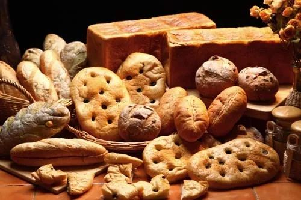

# 无标题

**链接地址:** http://mp.weixin.qq.com/s?__biz=MzI2NTE1ODgwOQ==&mid=2649605300&idx=1&sn=71d1993fcc92153752203d3ad90573db&chksm=f2b8cd42c5cf44547c515feaadc14e1bdc1cdc64d6a944cab49bc4c511fb146c570520b5c8bc&mpshare=1&scene=2&srcid=1102WvXJiOSDkN8Z7gXpd5ww#rd
**作者:** 雪糊
**获取时间:** 2025/8/28 21:12:10
**图片数量:** 31

---

## 原始HTML内容

<section style="box-sizing: border-box;"><section class="V5" style="box-sizing: border-box;" powered-by="xiumi.us"><section style="margin-right: 0%;margin-left: 0%;box-sizing: border-box;"><section style="display: inline-block;vertical-align: middle;width: 80%;box-sizing: border-box;"><section class="V5" style="box-sizing: border-box;" powered-by="xiumi.us"><section style="margin-top: 10px;margin-bottom: 10px;text-align: center;box-sizing: border-box;"><section style="display: inline-block;box-sizing: border-box;"><section style="max-width: 100%;font-size: 0px;padding-bottom: 3px;box-sizing: border-box;"><section style="display: inline-block;vertical-align: middle;box-sizing: border-box;"><section style="width: 5px;height: 1px;background-color: rgb(217, 217, 217);box-sizing: border-box;"></section><section style="width: 1px;height: 5px;margin-top: -3px;margin-right: auto;margin-left: auto;background-color: rgb(217, 217, 217);box-sizing: border-box;"></section></section><section style="margin-top: -1px;margin-right: -5px;margin-left: -5px;width: 100%;display: inline-block;vertical-align: middle;padding-right: 8px;padding-left: 8px;box-sizing: border-box;"><section style="width: 100%;height: 1px;background-color: rgb(217, 217, 217);box-sizing: border-box;"></section></section><section style="display: inline-block;vertical-align: middle;box-sizing: border-box;"><section style="width: 5px;height: 1px;background-color: rgb(217, 217, 217);box-sizing: border-box;"></section><section style="width: 1px;height: 5px;margin-top: -3px;margin-right: auto;margin-left: auto;background-color: rgb(217, 217, 217);box-sizing: border-box;"></section></section></section><section style="padding-left: 15px;padding-right: 15px;color: rgb(161, 161, 161);font-size: 14px;box-sizing: border-box;">
点击上方<strong style="box-sizing: border-box;">蓝字</strong>关注我们哟~
</section><section style="max-width: 100%;font-size: 0px;box-sizing: border-box;"><section style="display: inline-block;vertical-align: middle;box-sizing: border-box;"><section style="width: 5px;height: 1px;background-color: rgb(217, 217, 217);box-sizing: border-box;"></section><section style="width: 1px;height: 5px;margin-top: -3px;margin-right: auto;margin-left: auto;background-color: rgb(217, 217, 217);box-sizing: border-box;"></section></section><section style="margin-top: -1px;margin-right: -5px;margin-left: -5px;width: 100%;display: inline-block;vertical-align: middle;padding-right: 8px;padding-left: 8px;box-sizing: border-box;"><section style="width: 100%;height: 1px;background-color: rgb(217, 217, 217);box-sizing: border-box;"></section></section><section style="display: inline-block;vertical-align: middle;box-sizing: border-box;"><section style="width: 5px;height: 1px;background-color: rgb(217, 217, 217);box-sizing: border-box;"></section><section style="width: 1px;height: 5px;margin-top: -3px;margin-right: auto;margin-left: auto;background-color: rgb(217, 217, 217);box-sizing: border-box;"></section></section></section></section></section></section></section><section style="display: inline-block;vertical-align: middle;width: 20%;box-sizing: border-box;"><section class="V5" style="box-sizing: border-box;" powered-by="xiumi.us"><section style="text-align: center;margin: -10px 0% 10px;box-sizing: border-box;"><section style="max-width: 100%;vertical-align: middle;display: inline-block;width: 100%;box-sizing: border-box;"></section></section></section></section></section></section><section class="V5" style="box-sizing: border-box;" powered-by="xiumi.us"><section style="margin: 10px 0%;box-sizing: border-box;"><section style="display: inline-block;width: 100%;vertical-align: top;box-sizing: border-box;"><section class="V5" style="box-sizing: border-box;" powered-by="xiumi.us"><section style="box-sizing: border-box;"><section style="display: inline-block;vertical-align: bottom;width: 75%;padding-right: 10px;box-sizing: border-box;"><section class="V5" style="box-sizing: border-box;" powered-by="xiumi.us"><section style="margin: 10px 0% 3px;box-sizing: border-box;"><section style="display: inline-block;vertical-align: middle;box-sizing: border-box;"><section style="display: inline-block;vertical-align: bottom;padding-left: 5px;padding-right: 5px;line-height: 1.2em;margin-bottom: 2px;color: rgba(80, 182, 201, 0.72);box-sizing: border-box;">
<strong style="box-sizing: border-box;">仔细看下图，有惊喜！</strong>
</section><section style="max-width: 100%;display: inline-block;vertical-align: bottom;width: 1.6em;box-sizing: border-box;"></section></section></section></section></section><section style="display: inline-block;vertical-align: bottom;width: 25%;box-sizing: border-box;"><section class="V5" style="box-sizing: border-box;" powered-by="xiumi.us"><section style="margin-right: 0%;margin-bottom: 3px;margin-left: 0%;text-align: right;box-sizing: border-box;"><section style="display: inline-block;border-bottom: 0.15em solid rgba(80, 182, 201, 0.72);padding-bottom: 3px;box-sizing: border-box;"><section style="display: inline-block;padding: 3px;border-bottom: 0.15em solid rgba(80, 182, 201, 0.72);font-size: 12px;line-height: 1.4;color: rgb(255, 143, 47);box-sizing: border-box;">
<strong style="box-sizing: border-box;">金主大大</strong>
</section></section></section></section></section></section></section><section class="V5" style="box-sizing: border-box;" powered-by="xiumi.us"><section style="margin-right: 0%;margin-left: 0%;box-sizing: border-box;"><section style="background-color: rgba(80, 182, 201, 0.72);height: 2px;box-sizing: border-box;"></section></section></section></section></section></section><section class="V5" style="box-sizing: border-box;" powered-by="xiumi.us"><section style="text-align: center;margin-top: 10px;margin-bottom: 10px;box-sizing: border-box;"><section style="max-width: 100%;vertical-align: middle;display: inline-block;box-sizing: border-box;"></section></section></section><section class="V5" style="box-sizing: border-box;" powered-by="xiumi.us"><section style="text-align: center;margin-top: 10px;margin-bottom: 10px;box-sizing: border-box;"><section style="max-width: 100%;vertical-align: middle;display: inline-block;box-sizing: border-box;"></section></section></section><section class="V5" style="box-sizing: border-box;" powered-by="xiumi.us"><section style="text-align: center;margin-top: 10px;margin-bottom: 10px;box-sizing: border-box;"><section style="max-width: 100%;vertical-align: middle;display: inline-block;box-sizing: border-box;"></section></section></section><section class="V5" style="box-sizing: border-box;" powered-by="xiumi.us"><section style="text-align: center;margin-top: 10px;margin-bottom: 10px;box-sizing: border-box;"><section style="max-width: 100%;vertical-align: middle;display: inline-block;box-sizing: border-box;"></section></section></section><section class="V5" style="box-sizing: border-box;" powered-by="xiumi.us"><section style="text-align: center;margin-top: 10px;margin-bottom: 10px;box-sizing: border-box;"><section style="max-width: 100%;vertical-align: middle;display: inline-block;box-sizing: border-box;"><svg xmlns="http://www.w3.org/2000/svg" x="0px" y="0px" viewBox="0 0 902.1 38.2" style="vertical-align: middle;max-width: 100%;box-sizing: border-box;" width="902.1"><g style="box-sizing: border-box;"><path style="box-sizing: border-box;" d="M18.4,1.4c0.9-1.9,2.4-1.9,3.4,0l3.4,6.9c0.9,1.9,3.4,3.7,5.4,4l7.6,1.1c2.1,0.3,2.5,1.7,1,3.2   l-5.5,5.4c-1.5,1.5-2.4,4.3-2.1,6.4l1.3,7.6c0.4,2.1-0.9,2.9-2.7,2l-6.8-3.6c-1.8-1-4.9-1-6.7,0l-6.8,3.6c-1.9,1-3.1,0.1-2.7-2   l1.3-7.6c0.4-2.1-0.6-4.9-2.1-6.4l-5.5-5.4c-1.5-1.5-1-2.9,1-3.2l7.6-1.1c2.1-0.3,4.5-2.1,5.4-4L18.4,1.4z" fill="rgb(178, 243, 230)"></path><path style="box-sizing: border-box;" d="M90.6,5.4c0.7-1.4,1.9-1.4,2.6,0l2.6,5.3c0.7,1.4,2.6,2.8,4.2,3.1l5.9,0.9c1.6,0.2,2,1.3,0.8,2.5   l-4.2,4.1c-1.2,1.1-1.9,3.3-1.6,4.9l1,5.8c0.3,1.6-0.7,2.3-2.1,1.5l-5.2-2.8c-1.4-0.8-3.8-0.8-5.2,0L84,33.6   c-1.4,0.8-2.4,0.1-2.1-1.5l1-5.8c0.3-1.6-0.5-3.8-1.6-4.9l-4.2-4.1c-1.2-1.1-0.8-2.2,0.8-2.5l5.9-0.9c1.6-0.2,3.5-1.6,4.2-3.1   L90.6,5.4z" fill="rgb(190, 204, 246)"></path><path style="box-sizing: border-box;" d="M162.6,7.5c0.6-1.2,1.6-1.2,2.2,0l2.2,4.5c0.6,1.2,2.2,2.4,3.6,2.6l5,0.7c1.4,0.2,1.7,1.1,0.7,2.1   l-3.6,3.5c-1,1-1.6,2.9-1.4,4.2l0.9,5c0.2,1.4-0.6,1.9-1.8,1.3l-4.5-2.4c-1.2-0.6-3.2-0.6-4.4,0l-4.5,2.4c-1.2,0.6-2,0.1-1.8-1.3   l0.9-5c0.2-1.4-0.4-3.3-1.4-4.2l-3.6-3.5c-1-1-0.7-1.9,0.7-2.1l5-0.7c1.4-0.2,3-1.4,3.6-2.6L162.6,7.5z" fill="rgb(150, 208, 240)"></path><path style="box-sizing: border-box;" d="M60.1,19.1c0,2.3-1.9,4.2-4.2,4.2c-2.3,0-4.2-1.9-4.2-4.2s1.9-4.2,4.2-4.2   C58.3,14.9,60.1,16.8,60.1,19.1z" fill="rgb(218, 240, 224)"></path><path style="box-sizing: border-box;" d="M203.8,19.1c0,2.3-1.9,4.2-4.2,4.2c-2.3,0-4.2-1.9-4.2-4.2s1.9-4.2,4.2-4.2   C201.9,14.9,203.8,16.8,203.8,19.1z" fill="rgb(218, 240, 224)"></path><path style="box-sizing: border-box;" d="M130.9,19.1c0,1.7-1.4,3.1-3.1,3.1c-1.7,0-3.1-1.4-3.1-3.1c0-1.7,1.4-3.1,3.1-3.1   C129.5,16.1,130.9,17.4,130.9,19.1z" fill="rgb(218, 240, 224)"></path><path style="box-sizing: border-box;" d="M233.9,1.4c0.9-1.9,2.4-1.9,3.4,0l3.4,6.9c0.9,1.9,3.4,3.7,5.4,4l7.6,1.1c2.1,0.3,2.5,1.7,1,3.2   l-5.5,5.4c-1.5,1.5-2.4,4.3-2.1,6.4l1.3,7.6c0.4,2.1-0.9,2.9-2.7,2l-6.8-3.6c-1.8-1-4.9-1-6.7,0l-6.8,3.6c-1.9,1-3.1,0.1-2.7-2   l1.3-7.6c0.4-2.1-0.6-4.9-2.1-6.4l-5.5-5.4c-1.5-1.5-1-2.9,1-3.2l7.6-1.1c2.1-0.3,4.5-2.1,5.4-4L233.9,1.4z" fill="rgb(178, 243, 230)"></path><path style="box-sizing: border-box;" d="M306.1,5.4c0.7-1.4,1.9-1.4,2.6,0l2.6,5.3c0.7,1.4,2.6,2.8,4.2,3.1l5.9,0.9c1.6,0.2,2,1.3,0.8,2.5   l-4.2,4.1c-1.2,1.1-1.9,3.3-1.6,4.9l1,5.8c0.3,1.6-0.7,2.3-2.1,1.5l-5.2-2.8c-1.4-0.8-3.8-0.8-5.2,0l-5.2,2.8   c-1.4,0.8-2.4,0.1-2.1-1.5l1-5.8c0.3-1.6-0.4-3.8-1.6-4.9l-4.2-4.1c-1.2-1.1-0.8-2.2,0.8-2.5l5.9-0.9c1.6-0.2,3.5-1.6,4.2-3.1   L306.1,5.4z" fill="rgb(190, 204, 246)"></path><path style="box-sizing: border-box;" d="M378.1,7.5c0.6-1.2,1.6-1.2,2.2,0l2.2,4.5c0.6,1.2,2.2,2.4,3.6,2.6l5,0.7c1.4,0.2,1.7,1.1,0.7,2.1   l-3.6,3.5c-1,1-1.6,2.9-1.4,4.2l0.9,5c0.2,1.4-0.6,1.9-1.8,1.3l-4.5-2.4c-1.2-0.6-3.2-0.6-4.4,0l-4.5,2.4c-1.2,0.6-2,0.1-1.8-1.3   l0.9-5c0.2-1.4-0.4-3.3-1.4-4.2l-3.6-3.5c-1-1-0.7-1.9,0.7-2.1l5-0.7c1.4-0.2,3-1.4,3.6-2.6L378.1,7.5z" fill="rgb(150, 208, 240)"></path><path style="box-sizing: border-box;" d="M275.7,19.1c0,2.3-1.9,4.2-4.2,4.2c-2.3,0-4.2-1.9-4.2-4.2s1.9-4.2,4.2-4.2   C273.8,14.9,275.7,16.8,275.7,19.1z" fill="rgb(218, 240, 224)"></path><path style="box-sizing: border-box;" d="M419.3,19.1c0,2.3-1.9,4.2-4.2,4.2c-2.3,0-4.2-1.9-4.2-4.2s1.9-4.2,4.2-4.2   C417.5,14.9,419.3,16.8,419.3,19.1z" fill="rgb(218, 240, 224)"></path><path style="box-sizing: border-box;" d="M346.4,19.1c0,1.7-1.4,3.1-3.1,3.1c-1.7,0-3.1-1.4-3.1-3.1c0-1.7,1.4-3.1,3.1-3.1   C345,16.1,346.4,17.4,346.4,19.1z" fill="rgb(218, 240, 224)"></path><path style="box-sizing: border-box;" d="M449.4,1.4c0.9-1.9,2.4-1.9,3.4,0l3.4,6.9c0.9,1.9,3.4,3.7,5.4,4l7.6,1.1c2.1,0.3,2.5,1.7,1,3.2   l-5.5,5.4c-1.5,1.5-2.4,4.3-2.1,6.4l1.3,7.6c0.4,2.1-0.9,2.9-2.7,2l-6.8-3.6c-1.8-1-4.9-1-6.7,0l-6.8,3.6c-1.9,1-3.1,0.1-2.7-2   l1.3-7.6c0.4-2.1-0.6-4.9-2.1-6.4l-5.5-5.4c-1.5-1.5-1-2.9,1-3.2l7.6-1.1c2.1-0.3,4.5-2.1,5.4-4L449.4,1.4z" fill="rgb(178, 243, 230)"></path><path style="box-sizing: border-box;" d="M521.6,5.4c0.7-1.4,1.9-1.4,2.6,0l2.6,5.3c0.7,1.4,2.6,2.8,4.2,3.1l5.9,0.9c1.6,0.2,2,1.3,0.8,2.5   l-4.2,4.1c-1.2,1.1-1.9,3.3-1.6,4.9l1,5.8c0.3,1.6-0.7,2.3-2.1,1.5l-5.2-2.8c-1.4-0.8-3.8-0.8-5.2,0l-5.2,2.8   c-1.4,0.8-2.4,0.1-2.1-1.5l1-5.8c0.3-1.6-0.5-3.8-1.6-4.9l-4.2-4.1c-1.2-1.1-0.8-2.2,0.8-2.5l5.9-0.9c1.6-0.2,3.5-1.6,4.2-3.1   L521.6,5.4z" fill="rgb(190, 204, 246)"></path><path style="box-sizing: border-box;" d="M593.6,7.5c0.6-1.2,1.6-1.2,2.2,0l2.2,4.5c0.6,1.2,2.2,2.4,3.6,2.6l5,0.7c1.4,0.2,1.7,1.1,0.7,2.1   l-3.6,3.5c-1,1-1.6,2.9-1.4,4.2l0.9,5c0.2,1.4-0.6,1.9-1.8,1.3l-4.5-2.4c-1.2-0.6-3.2-0.6-4.4,0l-4.5,2.4c-1.2,0.6-2,0.1-1.8-1.3   l0.9-5c0.2-1.4-0.4-3.3-1.4-4.2l-3.6-3.5c-1-1-0.7-1.9,0.7-2.1l5-0.7c1.4-0.2,3-1.4,3.6-2.6L593.6,7.5z" fill="rgb(150, 208, 240)"></path><path style="box-sizing: border-box;" d="M491.2,19.1c0,2.3-1.9,4.2-4.2,4.2c-2.3,0-4.2-1.9-4.2-4.2s1.9-4.2,4.2-4.2   C489.3,14.9,491.2,16.8,491.2,19.1z" fill="rgb(218, 240, 224)"></path><path style="box-sizing: border-box;" d="M634.9,19.1c0,2.3-1.9,4.2-4.2,4.2c-2.3,0-4.2-1.9-4.2-4.2s1.9-4.2,4.2-4.2   C633,14.9,634.9,16.8,634.9,19.1z" fill="rgb(218, 240, 224)"></path><path style="box-sizing: border-box;" d="M561.9,19.1c0,1.7-1.4,3.1-3.1,3.1c-1.7,0-3.1-1.4-3.1-3.1c0-1.7,1.4-3.1,3.1-3.1   C560.5,16.1,561.9,17.4,561.9,19.1z" fill="rgb(218, 240, 224)"></path><path style="box-sizing: border-box;" d="M664.9,1.4c0.9-1.9,2.4-1.9,3.4,0l3.4,6.9c0.9,1.9,3.4,3.7,5.4,4l7.6,1.1c2.1,0.3,2.5,1.7,1,3.2   l-5.5,5.4c-1.5,1.5-2.4,4.3-2.1,6.4l1.3,7.6c0.4,2.1-0.9,2.9-2.7,2l-6.8-3.6c-1.8-1-4.9-1-6.7,0l-6.8,3.6c-1.9,1-3.1,0.1-2.7-2   l1.3-7.6c0.4-2.1-0.6-4.9-2.1-6.4l-5.5-5.4c-1.5-1.5-1-2.9,1-3.2l7.6-1.1c2.1-0.3,4.5-2.1,5.4-4L664.9,1.4z" fill="rgb(178, 243, 230)"></path><path style="box-sizing: border-box;" d="M737.1,5.4c0.7-1.4,1.9-1.4,2.6,0l2.6,5.3c0.7,1.4,2.6,2.8,4.2,3.1l5.9,0.9c1.6,0.2,2,1.3,0.8,2.5   l-4.2,4.1c-1.2,1.1-1.9,3.3-1.6,4.9l1,5.8c0.3,1.6-0.7,2.3-2.1,1.5l-5.2-2.8c-1.4-0.8-3.8-0.8-5.2,0l-5.2,2.8   c-1.4,0.8-2.4,0.1-2.1-1.5l1-5.8c0.3-1.6-0.5-3.8-1.6-4.9l-4.2-4.1c-1.2-1.1-0.8-2.2,0.8-2.5l5.9-0.9c1.6-0.2,3.5-1.6,4.2-3.1   L737.1,5.4z" fill="rgb(190, 204, 246)"></path><path style="box-sizing: border-box;" d="M809.2,7.5c0.6-1.2,1.6-1.2,2.2,0l2.2,4.5c0.6,1.2,2.2,2.4,3.6,2.6l5,0.7c1.4,0.2,1.7,1.1,0.7,2.1   l-3.6,3.5c-1,1-1.6,2.9-1.4,4.2l0.9,5c0.2,1.4-0.6,1.9-1.8,1.3l-4.5-2.4c-1.2-0.6-3.2-0.6-4.4,0l-4.5,2.4c-1.2,0.6-2,0.1-1.8-1.3   l0.9-5c0.2-1.4-0.4-3.3-1.4-4.2l-3.6-3.5c-1-1-0.7-1.9,0.7-2.1l5-0.7c1.4-0.2,3-1.4,3.6-2.6L809.2,7.5z" fill="rgb(150, 208, 240)"></path><path style="box-sizing: border-box;" d="M706.7,19.1c0,2.3-1.9,4.2-4.2,4.2c-2.3,0-4.2-1.9-4.2-4.2s1.9-4.2,4.2-4.2   C704.8,14.9,706.7,16.8,706.7,19.1z" fill="rgb(218, 240, 224)"></path><path style="box-sizing: border-box;" d="M850.4,19.1c0,2.3-1.9,4.2-4.2,4.2c-2.3,0-4.2-1.9-4.2-4.2s1.9-4.2,4.2-4.2   C848.5,14.9,850.4,16.8,850.4,19.1z" fill="rgb(218, 240, 224)"></path><path style="box-sizing: border-box;" d="M777.4,19.1c0,1.7-1.4,3.1-3.1,3.1c-1.7,0-3.1-1.4-3.1-3.1c0-1.7,1.4-3.1,3.1-3.1   C776,16.1,777.4,17.4,777.4,19.1z" fill="rgb(218, 240, 224)"></path><path style="box-sizing: border-box;" d="M880.4,1.4c0.9-1.9,2.4-1.9,3.4,0l3.4,6.9c0.9,1.9,3.4,3.7,5.4,4l7.6,1.1c2.1,0.3,2.5,1.7,1,3.2   l-5.5,5.4c-1.5,1.5-2.4,4.3-2.1,6.4l1.3,7.6c0.4,2.1-0.9,2.9-2.7,2l-6.8-3.6c-1.8-1-4.9-1-6.7,0l-6.8,3.6c-1.8,1-3.1,0.1-2.7-2   l1.3-7.6c0.4-2.1-0.6-4.9-2.1-6.4l-5.5-5.4c-1.5-1.5-1-2.9,1-3.2l7.6-1.1c2.1-0.3,4.5-2.1,5.4-4L880.4,1.4z" fill="rgb(178, 243, 230)"></path></g></svg></section></section></section><section class="V5" style="box-sizing: border-box;" powered-by="xiumi.us"><section style="box-sizing: border-box;"><section style="text-align: center;box-sizing: border-box;"><section style="box-sizing: border-box;"><section class="V5" style="box-sizing: border-box;" powered-by="xiumi.us"><section style="margin: 30px 0%;box-sizing: border-box;"><section style="width: 15px;height: 15px;box-sizing: border-box;"><section style="box-sizing: border-box;"><section style="width: 5px;height: 5px;float: left;background-color: rgb(255, 255, 255);box-sizing: border-box;"></section><section style="width: 5px;height: 5px;float: left;background-color: rgb(179, 213, 219);box-sizing: border-box;"></section><section style="width: 5px;height: 5px;float: left;background-color: rgb(255, 255, 255);box-sizing: border-box;"></section><section style="clear: both;box-sizing: border-box;"></section></section><section style="box-sizing: border-box;"><section style="width: 5px;height: 5px;float: left;background-color: rgb(179, 213, 219);box-sizing: border-box;"></section><section style="width: 5px;height: 5px;float: left;background-color: rgb(255, 255, 255);box-sizing: border-box;"></section><section style="width: 5px;height: 5px;float: left;background-color: rgb(179, 213, 219);box-sizing: border-box;"></section><section style="clear: both;box-sizing: border-box;"></section></section><section style="box-sizing: border-box;"><section style="width: 5px;height: 5px;float: left;background-color: rgb(255, 255, 255);box-sizing: border-box;"></section><section style="width: 5px;height: 5px;float: left;background-color: rgb(179, 213, 219);box-sizing: border-box;"></section><section style="width: 5px;height: 5px;float: left;background-color: rgb(179, 213, 219);box-sizing: border-box;"></section><section style="clear: both;box-sizing: border-box;"></section></section></section><section style="margin-top: -15px;background-color: rgb(179, 213, 219);padding: 10px;box-sizing: border-box;"><section class="V5" style="box-sizing: border-box;" powered-by="xiumi.us"><section style="text-align: right;margin: -25px 0% 10px;box-sizing: border-box;"><section style="max-width: 100%;vertical-align: middle;display: inline-block;box-sizing: border-box;"><svg xmlns="http://www.w3.org/2000/svg" x="0px" y="0px" viewBox="0 0 36 34.3" style="vertical-align: middle;max-width: 100%;box-sizing: border-box;" width="36"><g style="box-sizing: border-box;"><path style="box-sizing: border-box;" d="M12.5,7.2c0-0.9,2.4-4.3,2.1-4.8C14.4,1.9,10,4.6,9.4,4.3C8.8,4.1,5.6-0.3,5.3,0   C4.6,0.8,5.6,5.5,5.4,6C5.1,6.5,0.2,7.7,0,8.5c-0.2,0.8,5.5,1.2,5.7,1.8c0.2,0.5,0,5.4,0.9,5.6c0.9,0.2,3.2-4.3,3.6-4.6   c0.4-0.3,6.2,1,6.6,0.5C17.3,11.2,12.5,8.1,12.5,7.2z M14.1,10.8c-0.4,0.5-3.6-0.8-4.4-0.5C9,10.6,7.5,14.3,7,14.1   C6.4,13.9,7.2,9.7,6.7,9s-3.3-0.3-3.4-1c-0.1-0.7,3-0.8,3.4-1.6C7.1,5.6,5.8,2.2,6.1,2c0.3-0.2,2.5,2.9,3,3.3   c0.5,0.4,3.5-1.9,3.6-1.2c0.1,0.7-1.7,2.7-1.6,3.3C11.2,8,14.5,10.3,14.1,10.8z" fill="rgb(153, 134, 117)"></path><path style="box-sizing: border-box;" d="M32.7,14.1c0,0,1-3.2,0.6-3.4c-0.4-0.1-2.8,1.8-2.8,1.8s-3.3-2.2-3.6-1.9c-0.3,0.3,1.3,3.8,1.3,3.8   s-2.3,1.6-2.3,2.2c0.2,0.6,3.3-0.1,3.3-0.1s0.8,4.3,1.4,4.3s1.2-3.9,1.2-3.9s4.1-1,4.2-1.3C36.1,15.3,33.3,14.4,32.7,14.1z" fill="rgb(217, 162, 97)"></path><path style="box-sizing: border-box;" d="M11,28.5c0,0-1.6-3.7-2.1-3.7c-0.5-0.1-1.5,3.7-1.5,3.7s-3.5-0.2-3.6,0.4c-0.1,0.6,3.1,1.9,3.1,1.9   s-1.2,2.9-0.9,3.2c0.3,0.3,3.2-1.5,3.4-1.6c0.2-0.1,3.6,2.1,3.9,1.8c0.4-0.3-1.2-2.8-1.5-3.4c0,0,3-1.9,2.9-2.2   C14.4,28.2,11,28.5,11,28.5z" fill="rgb(217, 162, 97)"></path></g></svg></section></section></section><section class="V5" style="box-sizing: border-box;" powered-by="xiumi.us"><section style="margin: 10px 0%;text-align: center;box-sizing: border-box;"><section style="margin-bottom: -2.25em;box-sizing: border-box;"><section style="padding: 5px;background-color: rgb(255, 255, 255);border-style: solid;border-width: 5px;border-radius: 0px;border-color: rgba(132, 236, 232, 0.54);box-sizing: border-box;"><section class="V5" style="box-sizing: border-box;" powered-by="xiumi.us"><section style="margin-right: 0%;margin-left: 0%;box-sizing: border-box;"><section style="max-width: 100%;vertical-align: middle;display: inline-block;width: 100%;border-width: 0px;box-sizing: border-box;"></section></section></section></section></section><section style="width: 2.25em;height: 2.25em;margin-left: auto;border-bottom: 5px solid rgb(255, 255, 255);border-right: 5px solid rgb(255, 255, 255);transform: rotate(0deg);-webkit-transform: rotate(0deg);-moz-transform: rotate(0deg);-o-transform: rotate(0deg);box-sizing: border-box;"></section></section></section><section class="V5" style="box-sizing: border-box;" powered-by="xiumi.us"><section style="text-align: center;margin: 10px 0% -40px;transform: translate3d(-1px, 0px, 0px);-webkit-transform: translate3d(-1px, 0px, 0px);-moz-transform: translate3d(-1px, 0px, 0px);-o-transform: translate3d(-1px, 0px, 0px);box-sizing: border-box;"><section style="max-width: 100%;vertical-align: middle;display: inline-block;width: 100%;box-sizing: border-box;"><svg xmlns="http://www.w3.org/2000/svg" x="0px" y="0px" viewBox="0 0 390 52.4" style="vertical-align: middle;max-width: 100%;box-sizing: border-box;" width="100%"><g style="box-sizing: border-box;"><path style="box-sizing: border-box;" d="M345,19.1c8.1,17.8,8.6-3.2,17.3-2.1c4,0.5,4.8,3.1,5.7,10.6c0.1,0.9,0.1,1.8,0.2,2.7   c0.3,2.9,0.6,1.5,0.8,0.8c0.6-2.1,1.3-8.3,1.4-8.7c0.4-1,1-4.1,2.8-4.8c7.6-2.8-0.8-3,10.3-5.4c9.2-2,10.1-8.4-8.2-10.2   c-55.7-5.5-44.8,4.9-80.3-0.5c-16.7-2.5-39.9,1-46.2,0.6c-4.7-0.3-9.2-1.3-13.9-1.7c-19.7-1.6-41.2,2.3-61.6,1.7   c-10-0.3-19.9-1.6-30-1.8c-24.2-0.6-48.3,5.3-72.4,4C54.7,3.5,40.2,0.6,23.5,2.6C17.1,3.3-0.9,10,0,15.8c0.4,2.8,6.4,3.8,9.4,5.1   c4.9,2.1,10.9,5.3,11.3,11.2c0,0,0.5,7.2,0.5,7.2c0,0.8,0.3-1.1,0.4-2.5c0.1-1.6,0-3.5,0.5-5c0.5,0.1,0.4,1.3,0.5,1.7   c0.1,0.4,0.1,0.9,0.2,1.3c0.1,0.4,0.3,0.8,0.4,1.2c0.2-0.7,0.1-1.5,0.4-2.2c0.6-1.7-0.3-3.5,0-5.2c0.2-1.3,1.4-2.6,2.2-3.8   c2-2.9,4.6-5.3,8.3-5.6c4.8-0.4,10.2,1.1,14.8,2.3c11.2,2.9,10.5,4.1,11.5,8.1c0.3,1.2,0.2,2.4,0.4,3.6c0.1,0.7,0.3,1.3,0.3,2.1   c0,1.7,0.2,1.7,0.6,4.3c0.2,1.5,1,0.1,0.9-2.1c-0.1-0.8,0.3-1.6,0.3-2.5c0-1.8,0.1-0.8,0.3-1.8c0.4-1.4,0.3-3,0.8-4.4   c0.3-0.6,0-1.9,0.6-2.3c0.7,2.6,0,2.8,0.2,3.8c0,0.3,0.5,1.6,1-2.5c0.1-0.5-0.1-0.9,0-1.3c0.9-3.9,10.4-18.8,21,3.2   c0.6,1.2,1.3,3.9,2.5,4.5c1.4,0.6,2.7-1.2,3.4-2.3c0.3,3.7,1.2,7,3.2,15.6c0,0.2,0.1,0.4,0.3,0.5c0.2,0.1,0.5-0.2,0.4-0.3l0.9-3.1   c0.1-2.8,1.1-4.5,1.6-8c0.3-1.8,0.3-3.7,0.9-5.5l0.8,2.3c0.1,0.8,0.9,7.8,1.7,7.6c0.9-5,0.6-2.6,1.1-3.9c2.5-6,0.4-8.3,6.6-12.9   c7.2-5.3,46.1-13.4,56.4-9.7c5.3,1.9,5.9,4.5,17.1,4c20.7-1,21.8,9.7,22.5,13.3c0.3,1.4,0.3,5.7,1.8,6.5c1.1-2.7,1.6-5.6,1.6-8.5   c-0.1-4.2,6.6-12.9,6.6,4.7c0,4.4,2.4,17.5,2.4,17.5c0.1,2.1,0.9-2.8,1-6.5c0.2-3.2,0.1-8.6,0.6-12.8c0,0,0-0.1,0.1-0.1   c0.1-0.2,0.2-1.4,0.7-3.1c1.3,0.5,0.9,3.3,1.1,4.4c0.9,5.9,1,7.1,1.7,9.6c0.5-1.8,0.3-7,1-8.8c0.9-2.3,0.6-4.5,0.3-6.9   c-2.1-16.5,35.5-16,64.1-6.1c4.9,1.7,6.6-7.4,10.5-0.6c1,1.8,4,9.9,5.8,5.9c1.3-2.8,2-8.5,5-10.1c6.7-3.9,5.3,7.1,5.5,9.3   c0.1,0.7-0.1,1.4,0.3,2c0.2-0.7,0.2-1.3,0.4-2c0.2-0.8,0.6-1.5,0.7-2.3c0.1-1,1.2-12.4,3.5,1.4c0.2,1-0.2,2.1,0.3,3.7   c0.4,1.1,0.7,2.2,0.7,3.4c0,0.4-0.1,1.3,0.3,1.7c0.6-0.9,0.8-4.2,0.7-5.2c-0.1-0.5,0.3-1,0.3-1.6c-0.1-2.2-0.3,1-0.2-5.5   c0-1.1-0.5-3.9,0.5-4.6C325.3,16,342.7,14,345,19.1z" fill="rgb(255, 255, 255)"></path><path style="box-sizing: border-box;" d="M384.5,3.6c-3.4,0.9-7.1,0.8-10.6,0.3c-5.9-0.7-10.8-1.1-16.6,0.2   c-6,1.4-12.3,1.9-18.4,2.9c-9,1.4-18,2.8-27,2.3c-7.8-0.5-15.4-2.4-23.2-2.6c-8.3-0.2-16.7,1.5-25,0.9c-6.9-0.5-13.6-2.6-20.4-3.5   C235,3,226.6,3.6,218.4,4.9c-4.1,0.6-8.2,1.7-12.3,2.2c-3.1,0.4-6.4-0.4-9.6-0.5C179.8,6,163,5.9,146.3,6.2   c-34,0.5-67.9,2.2-101.8,4c-10.4,0.5-20.9,1.1-30.9,4.1C11,15.1,8.4,16,5.8,16.1c-2,0-4.1-0.6-5.5-1.8C0,14.8,0,15.3,0,15.8   c0.4,2.8,6.4,3.8,9.4,5.1c4.9,2.1,10.9,5.3,11.3,11.2c0,0,0.5,7.2,0.5,7.2c0,0.8,0.3-1.1,0.4-2.5c0.1-1.6,0-3.5,0.5-5   c0.5,0.1,0.4,1.3,0.5,1.7c0.1,0.4,0.1,0.9,0.2,1.3c0.1,0.4,0.3,0.8,0.4,1.2c0.2-0.7,0.1-1.5,0.4-2.2c0.6-1.7-0.3-3.5,0-5.2   c0.2-1.3,1.4-2.6,2.2-3.8c2-2.9,4.6-5.3,8.3-5.6c4.8-0.4,10.2,1.1,14.8,2.3c11.2,2.9,10.5,4.1,11.5,8.1c0.3,1.2,0.2,2.4,0.4,3.6   c0.1,0.7,0.3,1.3,0.3,2.1c0,1.7,0.2,1.7,0.6,4.3c0.2,1.5,1,0.1,0.9-2.1c-0.1-0.8,0.3-1.6,0.3-2.5c0-1.8,0.1-0.8,0.3-1.8   c0.4-1.4,0.3-3,0.8-4.4c0.3-0.6,0-1.9,0.6-2.3c0.7,2.6,0,2.8,0.2,3.8c0,0.3,0.5,1.6,1-2.5c0.1-0.5-0.1-0.9,0-1.3   c0.9-3.9,10.4-18.8,21,3.2c0.6,1.2,1.3,3.9,2.5,4.5c1.4,0.6,2.7-1.2,3.4-2.3c0.3,3.7,1.2,7,3.2,15.6c0,0.2,0.1,0.4,0.3,0.5   c0.2,0.1,0.5-0.2,0.4-0.3l0.9-3.1c0.1-2.8,1.1-4.5,1.6-8c0.3-1.8,0.3-3.7,0.9-5.5l0.8,2.3c0.1,0.8,0.9,7.8,1.7,7.6   c0.9-5,0.6-2.6,1.1-3.9c2.5-6,0.4-8.3,6.6-12.9c7.2-5.3,46.1-13.4,56.4-9.7c5.3,1.9,5.9,4.5,17.1,4c20.7-1,21.8,9.7,22.5,13.3   c0.3,1.4,0.3,5.7,1.8,6.5c1.1-2.7,1.6-5.6,1.6-8.5c-0.1-4.2,6.6-12.9,6.6,4.7c0,4.4,2.4,17.5,2.4,17.5c0.1,2.1,0.9-2.8,1-6.5   c0.2-3.2,0.1-8.6,0.6-12.8c0,0,0-0.1,0.1-0.1c0.1-0.2,0.2-1.4,0.7-3.1c1.3,0.5,0.9,3.3,1.1,4.4c0.9,5.9,1,7.1,1.7,9.6   c0.5-1.8,0.3-7,1-8.8c0.9-2.3,0.6-4.5,0.3-6.9c-2.1-16.5,35.5-16,64.1-6.1c4.9,1.7,6.6-7.4,10.5-0.6c1,1.8,4,9.9,5.8,5.9   c1.3-2.8,2-8.5,5-10.1c6.7-3.9,5.3,7.1,5.5,9.3c0.1,0.7-0.1,1.4,0.3,2c0.2-0.7,0.2-1.3,0.4-2c0.2-0.8,0.6-1.5,0.7-2.3   c0.1-1,1.2-12.4,3.5,1.4c0.2,1-0.2,2.1,0.3,3.7c0.4,1.1,0.7,2.2,0.7,3.4c0,0.4-0.1,1.3,0.3,1.7c0.6-0.9,0.8-4.2,0.7-5.2   c-0.1-0.5,0.3-1,0.3-1.6c-0.1-2.2-0.3,1-0.2-5.5c0-1.1-0.5-3.9,0.5-4.6c1.8-1.2,19.1-3.1,21.5,1.9c8.1,17.8,8.6-3.2,17.3-2.1   c4,0.5,4.8,3.1,5.7,10.6c0.1,0.9,0.1,1.8,0.2,2.7c0.3,2.9,0.6,1.5,0.8,0.8c0.6-2.1,1.3-8.3,1.4-8.7c0.4-1,1-4.1,2.8-4.8   c7.6-2.8-0.8-3,10.3-5.4C390.9,10.6,392.9,6.3,384.5,3.6z" fill="rgb(224, 239, 250)"></path><path style="box-sizing: border-box;" d="M387.5,4.8c-0.9,1.4-2.2,2.6-3.6,3.4c-3.8,2.1-8,1.4-12,2.4   c-3.9,1-7.8,1.1-11.5,2.8c-1.5,0.7-3,1.6-4.5,2.1c-1.6,0.6-3.3,0.8-4.9,0.2c-2.3-0.9-4-3-6.4-3.7c-2.2-0.7-4.6-0.3-6.8-0.2   c-9.6,0.4-20-0.4-29.1,3.2c-2.2,0.9-4.5,2-6.9,1.4c-2-0.5-3.6-2.1-5.6-2.2c-2.4-0.1-4.4,2-6.8,2.1c-2.9,0.2-5-2.3-7.2-3.8   c-2.8-2-5.8-1.5-9.1-1.6c-8.1-0.2-16.3-0.5-24.4-0.5c-7.7,0-16,0.2-22.5,4.8c-1.2,0.9-2.6,1.9-4.1,1.7c-0.9-0.1-1.8-0.7-2.7-0.9   c-3.3-0.6-5.5,4.1-8.9,4.2c-1.4,0-2.7-0.7-3.7-1.6c-1-0.9-1.9-2-2.9-2.9c-3.1-2.7-7.7-2.6-11.7-2.8c-5.1-0.2-10.1-0.5-15.2-0.7   c-10.2-0.4-20.5-0.7-30.8-0.2c-4.2,0.2-8.9,0.1-13,0.9c-1.2,0.2-2.7,0.4-3.8,1c-1,0.5-1.8,1.4-2.8,1.9c-2.1,1-4.5,1.4-6.8,1.6   c-3.5,0.3-7.1,0.4-10.4,1.7c-2,0.8-3.8,2.1-5.9,2.5c-3.1,0.5-6.1-1-8.7-2.7c-2.6-1.8-5-3.9-7.9-4.9c-4.2-1.4-8.7-0.4-12.9,1.1   c-5,1.8-9.8,3.9-15.2,3.9c-5.7,0-11.3-1.5-17-1.8c-6.4-0.4-12.7,0.8-18.6,3.1c-5,2-13.1,0.5-18.1-1.2c-1.3-0.4-2.5-0.9-3.7-1.5   c2,1.5,5.9,2.4,8.2,3.4c4.9,2.1,10.9,5.3,11.3,11.2c0,0,0.5,7.2,0.5,7.2c0,0.8,0.3-1.1,0.4-2.5c0.1-1.6,0-3.5,0.5-5   c0.5,0.1,0.4,1.3,0.5,1.7c0.1,0.4,0.1,0.9,0.2,1.3c0.1,0.4,0.3,0.8,0.4,1.2c0.2-0.7,0.1-1.5,0.4-2.2c0.6-1.7-0.3-3.5,0-5.2   c0.2-1.3,1.4-2.6,2.2-3.8c2-2.9,4.6-5.3,8.3-5.6c4.8-0.4,10.2,1.1,14.8,2.3c11.2,2.9,10.5,4.1,11.5,8.1c0.3,1.2,0.2,2.4,0.4,3.6   c0.1,0.7,0.3,1.3,0.3,2.1c0,1.7,0.2,1.7,0.6,4.3c0.2,1.5,1,0.1,0.9-2.1c-0.1-0.8,0.3-1.6,0.3-2.5c0-1.8,0.1-0.8,0.3-1.8   c0.4-1.4,0.3-3,0.8-4.4c0.3-0.6,0-1.9,0.6-2.3c0.7,2.6,0,2.8,0.2,3.8c0,0.3,0.5,1.6,1-2.5c0.1-0.5-0.1-0.9,0-1.3   c0.9-3.9,10.4-18.8,21,3.2c0.6,1.2,1.3,3.9,2.5,4.5c1.4,0.6,2.7-1.2,3.4-2.3c0.3,3.7,1.2,7,3.2,15.6c0,0.2,0.1,0.4,0.3,0.5   c0.2,0.1,0.5-0.2,0.4-0.3l0.9-3.1c0.1-2.8,1.1-4.5,1.6-8c0.3-1.8,0.3-3.7,0.9-5.5l0.8,2.3c0.1,0.8,0.9,7.8,1.7,7.6   c0.9-5,0.6-2.6,1.1-3.9c2.5-6,0.4-8.3,6.6-12.9c7.2-5.3,46.1-13.4,56.4-9.7c5.3,1.9,5.9,4.5,17.1,4c20.7-1,21.8,9.7,22.5,13.3   c0.3,1.4,0.3,5.7,1.8,6.5c1.1-2.7,1.6-5.6,1.6-8.5c-0.1-4.2,6.6-12.9,6.6,4.7c0,4.4,2.4,17.5,2.4,17.5c0.1,2.1,0.9-2.8,1-6.5   c0.2-3.2,0.1-8.6,0.6-12.8c0,0,0-0.1,0.1-0.1c0.1-0.2,0.2-1.4,0.7-3.1c1.3,0.5,0.9,3.3,1.1,4.4c0.9,5.9,1,7.1,1.7,9.6   c0.5-1.8,0.3-7,1-8.8c0.9-2.3,0.6-4.5,0.3-6.9c-2.1-16.5,35.5-16,64.1-6.1c4.9,1.7,6.6-7.4,10.5-0.6c1,1.8,4,9.9,5.8,5.9   c1.3-2.8,2-8.5,5-10.1c6.7-3.9,5.3,7.1,5.5,9.3c0.1,0.7-0.1,1.4,0.3,2c0.2-0.7,0.2-1.3,0.4-2c0.2-0.8,0.6-1.5,0.7-2.3   c0.1-1,1.2-12.4,3.5,1.4c0.2,1-0.2,2.1,0.3,3.7c0.4,1.1,0.7,2.2,0.7,3.4c0,0.4-0.1,1.3,0.3,1.7c0.6-0.9,0.8-4.2,0.7-5.2   c-0.1-0.5,0.3-1,0.3-1.6c-0.1-2.2-0.3,1-0.2-5.5c0-1.1-0.5-3.9,0.5-4.6c1.8-1.2,19.1-3.1,21.5,1.9c8.1,17.8,8.6-3.2,17.3-2.1   c4,0.5,4.8,3.1,5.7,10.6c0.1,0.9,0.1,1.8,0.2,2.7c0.3,2.9,0.6,1.5,0.8,0.8c0.6-2.1,1.3-8.3,1.4-8.7c0.4-1,1-4.1,2.8-4.8   c7.6-2.8-0.8-3,10.3-5.4C389.8,10.8,392.2,7.4,387.5,4.8z" fill="rgb(181, 214, 232)"></path></g></svg></section></section></section><section class="V5" style="box-sizing: border-box;" powered-by="xiumi.us"><section style="box-sizing: border-box;"><section style="box-sizing: border-box;">
 
</section></section></section><section class="V5" style="box-sizing: border-box;" powered-by="xiumi.us"><section style="margin-right: 0%;margin-bottom: 20px;margin-left: 0%;box-sizing: border-box;"><section style="text-align: justify;color: rgb(255, 255, 255);font-size: 14px;letter-spacing: 2px;line-height: 1.6;padding-right: 10px;padding-left: 10px;box-sizing: border-box;">
Hello亲爱的朋友们~大家期盼的万圣节终于来临啦！今年有没有<strong style="box-sizing: border-box;">穿着奇装异服出去要糖</strong>呢？希望大家可以享受这个美好的节日，将自己心底<strong style="box-sizing: border-box;">最纯真的童心</strong>在这个节日一并爆发出来吧！

 

同时，我们也会在这周迈入11月，天气也会真正冷下来啦！看天气预报显示从这周末开始埃德蒙顿会迎来<strong style="box-sizing: border-box;">大面积的降温</strong>。从今往后就正式跨入冰霜覆盖白雪皑皑的冬天啦！
</section></section></section><section class="V5" style="box-sizing: border-box;" powered-by="xiumi.us"><section style="text-align: center;margin-top: 10px;margin-bottom: 10px;box-sizing: border-box;"><section style="max-width: 100%;vertical-align: middle;display: inline-block;width: 40%;box-sizing: border-box;"></section></section></section><section class="V5" style="box-sizing: border-box;" powered-by="xiumi.us"><section style="margin: 20px 0%;box-sizing: border-box;"><section style="text-align: justify;color: rgb(255, 255, 255);font-size: 14px;letter-spacing: 2px;line-height: 1.6;padding-right: 10px;padding-left: 10px;box-sizing: border-box;">
小伙伴们请一定注意保暖，及时更换雪胎，<strong style="box-sizing: border-box;">为入冬做好充足的物质和心理准备</strong>。从今天起埃德蒙顿微生活的板块也将进入室内活动为主的<strong style="box-sizing: border-box;">Winter Mode</strong>，希望喜欢室外活动的小伙伴们多担待呀！毕竟天气情况不允许呀…

 

不过就算是冬天，埃德蒙顿的小伙伴们依然有很多丰富多彩的活动可以参与。在家窝着打游戏吃外卖可不是正确的过冬模式哦！到底有什么活动呢？赶快关注我们一起<strong style="box-sizing: border-box;">get起来入冬的新姿势</strong>吧！
</section></section></section><section class="V5" style="box-sizing: border-box;" powered-by="xiumi.us"><section style="text-align: center;margin-top: 10px;margin-bottom: 10px;box-sizing: border-box;"><section style="max-width: 100%;vertical-align: middle;display: inline-block;box-sizing: border-box;"></section></section></section><section class="V5" style="box-sizing: border-box;" powered-by="xiumi.us"><section style="margin-top: 0.5em;margin-bottom: 0.5em;box-sizing: border-box;"><section style="max-width: 100%;vertical-align: middle;display: inline-block;box-sizing: border-box;"></section></section></section><section class="V5" style="box-sizing: border-box;" powered-by="xiumi.us"><section style="margin: 20px 0%;box-sizing: border-box;"><section style="text-align: center;color: rgb(255, 255, 255);line-height: 2;box-sizing: border-box;">
<strong style="box-sizing: border-box;">现代流行碰撞古典优雅 </strong>
</section></section></section><section class="V5" style="box-sizing: border-box;" powered-by="xiumi.us"><section style="margin: 10px 0%;text-align: center;box-sizing: border-box;"><section style="margin-bottom: -2.25em;box-sizing: border-box;"><section style="padding: 5px;background-color: rgb(255, 255, 255);border-style: solid;border-width: 5px;border-radius: 0px;border-color: rgba(132, 236, 232, 0.54);box-sizing: border-box;"><section class="V5" style="box-sizing: border-box;" powered-by="xiumi.us"><section style="margin-right: 0%;margin-left: 0%;box-sizing: border-box;"><section style="max-width: 100%;vertical-align: middle;display: inline-block;width: 100%;border-width: 0px;box-sizing: border-box;"></section></section></section></section></section><section style="width: 2.25em;height: 2.25em;margin-left: auto;border-bottom: 5px solid rgb(255, 255, 255);border-right: 5px solid rgb(255, 255, 255);transform: rotate(0deg);-webkit-transform: rotate(0deg);-moz-transform: rotate(0deg);-o-transform: rotate(0deg);box-sizing: border-box;"></section></section></section><section class="V5" style="box-sizing: border-box;" powered-by="xiumi.us"><section style="margin: 20px 0%;box-sizing: border-box;"><section style="text-align: justify;color: rgb(255, 255, 255);font-size: 14px;letter-spacing: 2px;line-height: 1.6;padding-right: 10px;padding-left: 10px;box-sizing: border-box;">
<strong style="box-sizing: border-box;">埃德蒙顿芭蕾舞团</strong>将为大家在本周带来两场极致艺术的舞蹈表演：<strong style="box-sizing: border-box;">《X-Body》</strong>巧妙运用现代新潮的电子乐谱，以激荡人心的节奏突显舞者们奇妙的身体曲线，并利用强劲节奏以抽象的形式表达这<strong style="box-sizing: border-box;">现代和古典的碰撞</strong>。

 

而另一场<strong style="box-sizing: border-box;">《最后的话语》</strong>是对生活起伏跌宕的美好和痛苦情绪的致敬，以及我们如何面对失落并在悲伤的泥潭中爬起继续前行。这个温柔，复杂的作品是一个关于<strong style="box-sizing: border-box;">离别和寻求安慰的温暖叙述</strong>。&nbsp;
</section></section></section><section class="V5" style="box-sizing: border-box;" powered-by="xiumi.us"><section style="margin: 10px 0%;text-align: center;box-sizing: border-box;"><section style="margin-bottom: -2.25em;box-sizing: border-box;"><section style="padding: 5px;background-color: rgb(255, 255, 255);border-style: solid;border-width: 5px;border-radius: 0px;border-color: rgba(132, 236, 232, 0.54);box-sizing: border-box;"><section class="V5" style="box-sizing: border-box;" powered-by="xiumi.us"><section style="margin-right: 0%;margin-left: 0%;box-sizing: border-box;"><section style="max-width: 100%;vertical-align: middle;display: inline-block;width: 100%;border-width: 0px;box-sizing: border-box;"></section></section></section></section></section><section style="width: 2.25em;height: 2.25em;margin-left: auto;border-bottom: 5px solid rgb(255, 255, 255);border-right: 5px solid rgb(255, 255, 255);transform: rotate(0deg);-webkit-transform: rotate(0deg);-moz-transform: rotate(0deg);-o-transform: rotate(0deg);box-sizing: border-box;"></section></section></section><section class="V5" style="box-sizing: border-box;" powered-by="xiumi.us"><section style="margin-top: 10px;margin-bottom: 10px;box-sizing: border-box;"><section style="display: inline-block;width: 100%;border-width: 0px;border-style: none;border-color: rgb(192, 200, 209);padding: 10px;box-shadow: rgb(0, 0, 0) 0px 0px 0px;border-radius: 0px;box-sizing: border-box;"><section class="V5" style="box-sizing: border-box;" powered-by="xiumi.us"><section style="box-sizing: border-box;"><section style="color: rgba(62, 62, 62, 0.72);font-size: 14px;letter-spacing: 2px;box-sizing: border-box;">
<strong style="box-sizing: border-box;">Ballet Edmonton</strong>

📍 Triffo Theatre — MacEwan University, 11110 104 Ave.

⏰ 11.2 - 11.4&nbsp;

☎&nbsp;780-970-4979

🌐&nbsp;https://balletedmonton.ca/performance/where-we-are/
</section></section></section></section></section></section><section class="V5" style="box-sizing: border-box;" powered-by="xiumi.us"><section style="margin-top: 0.5em;margin-bottom: 0.5em;box-sizing: border-box;"><section style="max-width: 100%;vertical-align: middle;display: inline-block;box-sizing: border-box;"></section></section></section><section class="V5" style="box-sizing: border-box;" powered-by="xiumi.us"><section style="margin: -10px 0%;box-sizing: border-box;"><section style="text-align: justify;color: rgb(86, 82, 81);font-size: 14px;letter-spacing: 2px;line-height: 1.6;padding-right: 10px;padding-left: 10px;box-sizing: border-box;">
 
</section></section></section><section class="V5" style="box-sizing: border-box;" powered-by="xiumi.us"><section style="margin-top: 0.5em;margin-bottom: 0.5em;box-sizing: border-box;"><section style="max-width: 100%;vertical-align: middle;display: inline-block;box-sizing: border-box;"></section></section></section><section class="V5" style="box-sizing: border-box;" powered-by="xiumi.us"><section style="margin: 20px 0%;box-sizing: border-box;"><section style="text-align: center;color: rgb(255, 255, 255);line-height: 2;box-sizing: border-box;">
<strong style="box-sizing: border-box;">刷新你的烘培技能 </strong>
</section></section></section><section class="V5" style="box-sizing: border-box;" powered-by="xiumi.us"><section style="margin: 10px 0%;text-align: center;box-sizing: border-box;"><section style="margin-bottom: -2.25em;box-sizing: border-box;"><section style="padding: 5px;background-color: rgb(255, 255, 255);border-style: solid;border-width: 5px;border-radius: 0px;border-color: rgba(132, 236, 232, 0.54);box-sizing: border-box;"><section class="V5" style="box-sizing: border-box;" powered-by="xiumi.us"><section style="margin-right: 0%;margin-left: 0%;box-sizing: border-box;"><section style="max-width: 100%;vertical-align: middle;display: inline-block;width: 100%;border-width: 0px;box-sizing: border-box;"></section></section></section></section></section><section style="width: 2.25em;height: 2.25em;margin-left: auto;border-bottom: 5px solid rgb(255, 255, 255);border-right: 5px solid rgb(255, 255, 255);transform: rotate(0deg);-webkit-transform: rotate(0deg);-moz-transform: rotate(0deg);-o-transform: rotate(0deg);box-sizing: border-box;"></section></section></section><section class="V5" style="box-sizing: border-box;" powered-by="xiumi.us"><section style="margin: 20px 0%;box-sizing: border-box;"><section style="text-align: justify;color: rgb(255, 255, 255);font-size: 14px;letter-spacing: 2px;line-height: 1.6;padding-right: 10px;padding-left: 10px;box-sizing: border-box;">
您是否一直想成为在假日季节通过自己灵巧的双手为家人和朋友带来美味新鲜的饼干甜品的那个<strong style="box-sizing: border-box;">烘焙达人</strong>呢？然而生活的种种琐事总是让你难以迈出这一步，甚至都<strong style="box-sizing: border-box;">不知道从哪里开始</strong>？

 

别怕！这个周末让<strong style="box-sizing: border-box;">ATCO Blue Flame Kitchen</strong>为你开启这项全新的旅程！

 

11月3日在这个餐厅将举办一场零基础的Make Ahead Holiday Treats研讨会为各位烘焙小白提供<strong style="box-sizing: border-box;">入门级的帮助</strong>，包括如何制作各种节日美食，就是像覆盆子手指饼干和糖果手杖这样<strong style="box-sizing: border-box;">热门品种</strong>哦！
</section></section></section><section class="V5" style="box-sizing: border-box;" powered-by="xiumi.us"><section style="margin: 10px 0%;text-align: center;box-sizing: border-box;"><section style="margin-bottom: -2.25em;box-sizing: border-box;"><section style="padding: 5px;background-color: rgb(255, 255, 255);border-style: solid;border-width: 5px;border-radius: 0px;border-color: rgba(132, 236, 232, 0.54);box-sizing: border-box;"><section class="V5" style="box-sizing: border-box;" powered-by="xiumi.us"><section style="margin-right: 0%;margin-left: 0%;box-sizing: border-box;"><section style="max-width: 100%;vertical-align: middle;display: inline-block;width: 100%;border-width: 0px;box-sizing: border-box;"></section></section></section></section></section><section style="width: 2.25em;height: 2.25em;margin-left: auto;border-bottom: 5px solid rgb(255, 255, 255);border-right: 5px solid rgb(255, 255, 255);transform: rotate(0deg);-webkit-transform: rotate(0deg);-moz-transform: rotate(0deg);-o-transform: rotate(0deg);box-sizing: border-box;"></section></section></section><section class="V5" style="box-sizing: border-box;" powered-by="xiumi.us"><section style="margin-top: 10px;margin-bottom: 10px;box-sizing: border-box;"><section style="display: inline-block;width: 100%;border-width: 0px;border-style: none;border-color: rgb(192, 200, 209);padding: 10px;box-shadow: rgb(0, 0, 0) 0px 0px 0px;border-radius: 0px;box-sizing: border-box;"><section class="V5" style="box-sizing: border-box;" powered-by="xiumi.us"><section style="box-sizing: border-box;"><section style="color: rgba(62, 62, 62, 0.72);font-size: 14px;letter-spacing: 2px;box-sizing: border-box;">
<strong style="box-sizing: border-box;">Make Ahead Holiday Treats workshop</strong>

📍 ATCO Blue Flame Kitchen, 10035 105 St.

⏰ 11.3

☎&nbsp;780-420-7282

🌐&nbsp;http://www.atcoblueflamekitchen.com/
</section></section></section></section></section></section><section class="V5" style="box-sizing: border-box;" powered-by="xiumi.us"><section style="margin-top: 0.5em;margin-bottom: 0.5em;box-sizing: border-box;"><section style="max-width: 100%;vertical-align: middle;display: inline-block;box-sizing: border-box;"></section></section></section><section class="V5" style="box-sizing: border-box;" powered-by="xiumi.us"><section style="margin-top: 0.5em;margin-bottom: 0.5em;box-sizing: border-box;"><section style="max-width: 100%;vertical-align: middle;display: inline-block;box-sizing: border-box;"></section></section></section><section class="V5" style="box-sizing: border-box;" powered-by="xiumi.us"><section style="margin: 20px 0%;box-sizing: border-box;"><section style="text-align: center;color: rgb(255, 255, 255);line-height: 2;box-sizing: border-box;">
<strong style="box-sizing: border-box;">华丽的死亡之日游行 </strong>
</section></section></section><section class="V5" style="box-sizing: border-box;" powered-by="xiumi.us"><section style="margin: 10px 0%;text-align: center;box-sizing: border-box;"><section style="margin-bottom: -2.25em;box-sizing: border-box;"><section style="padding: 5px;background-color: rgb(255, 255, 255);border-style: solid;border-width: 5px;border-radius: 0px;border-color: rgba(132, 236, 232, 0.54);box-sizing: border-box;"><section class="V5" style="box-sizing: border-box;" powered-by="xiumi.us"><section style="margin-right: 0%;margin-left: 0%;box-sizing: border-box;"><section style="max-width: 100%;vertical-align: middle;display: inline-block;width: 100%;border-width: 0px;box-sizing: border-box;"></section></section></section></section></section><section style="width: 2.25em;height: 2.25em;margin-left: auto;border-bottom: 5px solid rgb(255, 255, 255);border-right: 5px solid rgb(255, 255, 255);transform: rotate(0deg);-webkit-transform: rotate(0deg);-moz-transform: rotate(0deg);-o-transform: rotate(0deg);box-sizing: border-box;"></section></section></section><section class="V5" style="box-sizing: border-box;" powered-by="xiumi.us"><section style="margin: 20px 0%;box-sizing: border-box;"><section style="text-align: justify;color: rgb(255, 255, 255);font-size: 14px;letter-spacing: 2px;line-height: 1.6;padding-right: 10px;padding-left: 10px;box-sizing: border-box;">
还记得去年在全球大红的动画片<strong style="box-sizing: border-box;">《Coco》</strong>吗？这个动画片同时带火了墨西哥传统文化的<strong style="box-sizing: border-box;">“死亡之日”祭祀活动</strong>！如果万圣节没有玩爽，请记得画上夸张的油彩妆容于11月2日前往<strong style="box-sizing: border-box;">Muttart植物馆</strong>参加这个活动吧！

 

<strong style="box-sizing: border-box;">仅限成人</strong>参加的这个晚会将会是你感受<strong style="box-sizing: border-box;">体验墨西哥文化之旅</strong>的绝佳机会！穿戴华丽的墨西哥珠宝和服装，品尝热辣的龙舌兰酒并了解龙舌兰的种植。还有激荡人心的墨西哥音乐和当地美食在等你哟！
</section></section></section><section class="V5" style="box-sizing: border-box;" powered-by="xiumi.us"><section style="margin: 10px 0%;text-align: center;box-sizing: border-box;"><section style="margin-bottom: -2.25em;box-sizing: border-box;"><section style="padding: 5px;background-color: rgb(255, 255, 255);border-style: solid;border-width: 5px;border-radius: 0px;border-color: rgba(132, 236, 232, 0.54);box-sizing: border-box;"><section class="V5" style="box-sizing: border-box;" powered-by="xiumi.us"><section style="margin-right: 0%;margin-left: 0%;box-sizing: border-box;"><section style="max-width: 100%;vertical-align: middle;display: inline-block;width: 100%;border-width: 0px;box-sizing: border-box;"></section></section></section></section></section><section style="width: 2.25em;height: 2.25em;margin-left: auto;border-bottom: 5px solid rgb(255, 255, 255);border-right: 5px solid rgb(255, 255, 255);transform: rotate(0deg);-webkit-transform: rotate(0deg);-moz-transform: rotate(0deg);-o-transform: rotate(0deg);box-sizing: border-box;"></section></section></section><section class="V5" style="box-sizing: border-box;" powered-by="xiumi.us"><section style="margin-top: 10px;margin-bottom: 10px;box-sizing: border-box;"><section style="display: inline-block;width: 100%;border-width: 0px;border-style: none;border-color: rgb(192, 200, 209);padding: 10px;box-shadow: rgb(0, 0, 0) 0px 0px 0px;border-radius: 0px;box-sizing: border-box;"><section class="V5" style="box-sizing: border-box;" powered-by="xiumi.us"><section style="box-sizing: border-box;"><section style="color: rgba(62, 62, 62, 0.72);font-size: 14px;letter-spacing: 2px;box-sizing: border-box;">
<strong style="box-sizing: border-box;">Day of the Dead</strong>

📍 Muttart Conservatory, 9626 96A St.

⏰ 11.2

☎&nbsp;780-442-5311

🌐&nbsp;https://www.edmonton.ca/attractions_events/muttart_conservatory/muttart-adults-only-nights.aspx
</section></section></section></section></section></section><section class="V5" style="box-sizing: border-box;" powered-by="xiumi.us"><section style="margin-top: 0.5em;margin-bottom: 0.5em;box-sizing: border-box;"><section style="max-width: 100%;vertical-align: middle;display: inline-block;box-sizing: border-box;"></section></section></section><section class="V5" style="box-sizing: border-box;" powered-by="xiumi.us"><section style="margin-top: 0.5em;margin-bottom: 0.5em;box-sizing: border-box;"><section style="max-width: 100%;vertical-align: middle;display: inline-block;box-sizing: border-box;"></section></section></section><section class="V5" style="box-sizing: border-box;" powered-by="xiumi.us"><section style="margin: 20px 0%;box-sizing: border-box;"><section style="text-align: center;color: rgb(255, 255, 255);line-height: 2;box-sizing: border-box;">
<strong style="box-sizing: border-box;">幻圣的奇妙魔术夜</strong>
</section></section></section><section class="V5" style="box-sizing: border-box;" powered-by="xiumi.us"><section style="margin: 10px 0%;text-align: center;box-sizing: border-box;"><section style="margin-bottom: -2.25em;box-sizing: border-box;"><section style="padding: 5px;background-color: rgb(255, 255, 255);border-style: solid;border-width: 5px;border-radius: 0px;border-color: rgba(132, 236, 232, 0.54);box-sizing: border-box;"><section class="V5" style="box-sizing: border-box;" powered-by="xiumi.us"><section style="margin-right: 0%;margin-left: 0%;box-sizing: border-box;"><section style="max-width: 100%;vertical-align: middle;display: inline-block;width: 100%;border-width: 0px;box-sizing: border-box;"></section></section></section></section></section><section style="width: 2.25em;height: 2.25em;margin-left: auto;border-bottom: 5px solid rgb(255, 255, 255);border-right: 5px solid rgb(255, 255, 255);transform: rotate(0deg);-webkit-transform: rotate(0deg);-moz-transform: rotate(0deg);-o-transform: rotate(0deg);box-sizing: border-box;"></section></section></section><section class="V5" style="box-sizing: border-box;" powered-by="xiumi.us"><section style="margin: 20px 0%;box-sizing: border-box;"><section style="text-align: justify;color: rgb(255, 255, 255);font-size: 14px;letter-spacing: 2px;line-height: 1.6;padding-right: 10px;padding-left: 10px;box-sizing: border-box;">
著名魔术师<strong style="box-sizing: border-box;">Sheldon Casavant</strong>将于这个周末为埃德蒙顿的魔术爱好者们带来一个<strong style="box-sizing: border-box;">神秘而又华丽的魔术之夜</strong>！从节目开始的那一刻起，作为观众的你请准备好成为这个引人入胜的互动体验的一部分。

 

Sheldon凭借高超的技艺和令人着迷的奇思妙想，带来引人入胜的表演。他的每一个扣人心弦的花招定会让你眼花乱，还来不及思考就被带入到下一个奇妙幻境，感受到从<strong style="box-sizing: border-box;">发梢到脚趾的震撼</strong>！
</section></section></section><section class="V5" style="box-sizing: border-box;" powered-by="xiumi.us"><section style="margin: 10px 0%;text-align: center;box-sizing: border-box;"><section style="margin-bottom: -2.25em;box-sizing: border-box;"><section style="padding: 5px;background-color: rgb(255, 255, 255);border-style: solid;border-width: 5px;border-radius: 0px;border-color: rgba(132, 236, 232, 0.54);box-sizing: border-box;"><section class="V5" style="box-sizing: border-box;" powered-by="xiumi.us"><section style="margin-right: 0%;margin-left: 0%;box-sizing: border-box;"><section style="max-width: 100%;vertical-align: middle;display: inline-block;width: 100%;border-width: 0px;box-sizing: border-box;"></section></section></section></section></section><section style="width: 2.25em;height: 2.25em;margin-left: auto;border-bottom: 5px solid rgb(255, 255, 255);border-right: 5px solid rgb(255, 255, 255);transform: rotate(0deg);-webkit-transform: rotate(0deg);-moz-transform: rotate(0deg);-o-transform: rotate(0deg);box-sizing: border-box;"></section></section></section><section class="V5" style="box-sizing: border-box;" powered-by="xiumi.us"><section style="margin-top: 10px;margin-bottom: 10px;box-sizing: border-box;"><section style="display: inline-block;width: 100%;border-width: 0px;border-style: none;border-color: rgb(192, 200, 209);padding: 10px;box-shadow: rgb(0, 0, 0) 0px 0px 0px;border-radius: 0px;box-sizing: border-box;"><section class="V5" style="box-sizing: border-box;" powered-by="xiumi.us"><section style="box-sizing: border-box;"><section style="color: rgba(62, 62, 62, 0.72);font-size: 14px;letter-spacing: 2px;box-sizing: border-box;">
<strong style="box-sizing: border-box;">Before Your Eyes</strong>

📍 Fort Edmonton Park, 7000 143 St.

⏰ 11.3 7:30 - 9:00

☎&nbsp;780-496-7381

🌐&nbsp;https://www.fortedmontonpark.ca/all-events/before-your-eyes/
</section></section></section></section></section></section><section class="V5" style="box-sizing: border-box;" powered-by="xiumi.us"><section style="margin-top: 0.5em;margin-bottom: 0.5em;box-sizing: border-box;"><section style="max-width: 100%;vertical-align: middle;display: inline-block;box-sizing: border-box;"></section></section></section><section class="V5" style="box-sizing: border-box;" powered-by="xiumi.us"><section style="margin: 20px 0%;box-sizing: border-box;"><section style="text-align: center;color: rgb(255, 255, 255);font-size: 14px;letter-spacing: 2px;line-height: 1.6;padding-right: 10px;padding-left: 10px;box-sizing: border-box;">
<strong style="box-sizing: border-box;">&nbsp;- 更多精彩内容 请关注我们哦 -</strong>
</section></section></section><section class="V5" style="box-sizing: border-box;" powered-by="xiumi.us"><section style="margin: 10px 0% -25px;box-sizing: border-box;"><section style="max-width: 100%;vertical-align: middle;display: inline-block;box-sizing: border-box;"><svg xmlns="http://www.w3.org/2000/svg" x="0px" y="0px" viewBox="0 0 36 34.3" style="vertical-align: middle;max-width: 100%;box-sizing: border-box;" width="36"><g style="box-sizing: border-box;"><path style="box-sizing: border-box;" d="M12.5,7.2c0-0.9,2.4-4.3,2.1-4.8C14.4,1.9,10,4.6,9.4,4.3C8.8,4.1,5.6-0.3,5.3,0   C4.6,0.8,5.6,5.5,5.4,6C5.1,6.5,0.2,7.7,0,8.5c-0.2,0.8,5.5,1.2,5.7,1.8c0.2,0.5,0,5.4,0.9,5.6c0.9,0.2,3.2-4.3,3.6-4.6   c0.4-0.3,6.2,1,6.6,0.5C17.3,11.2,12.5,8.1,12.5,7.2z M14.1,10.8c-0.4,0.5-3.6-0.8-4.4-0.5C9,10.6,7.5,14.3,7,14.1   C6.4,13.9,7.2,9.7,6.7,9s-3.3-0.3-3.4-1c-0.1-0.7,3-0.8,3.4-1.6C7.1,5.6,5.8,2.2,6.1,2c0.3-0.2,2.5,2.9,3,3.3   c0.5,0.4,3.5-1.9,3.6-1.2c0.1,0.7-1.7,2.7-1.6,3.3C11.2,8,14.5,10.3,14.1,10.8z" fill="rgb(153, 134, 117)"></path><path style="box-sizing: border-box;" d="M32.7,14.1c0,0,1-3.2,0.6-3.4c-0.4-0.1-2.8,1.8-2.8,1.8s-3.3-2.2-3.6-1.9c-0.3,0.3,1.3,3.8,1.3,3.8   s-2.3,1.6-2.3,2.2c0.2,0.6,3.3-0.1,3.3-0.1s0.8,4.3,1.4,4.3s1.2-3.9,1.2-3.9s4.1-1,4.2-1.3C36.1,15.3,33.3,14.4,32.7,14.1z" fill="rgb(217, 162, 97)"></path><path style="box-sizing: border-box;" d="M11,28.5c0,0-1.6-3.7-2.1-3.7c-0.5-0.1-1.5,3.7-1.5,3.7s-3.5-0.2-3.6,0.4c-0.1,0.6,3.1,1.9,3.1,1.9   s-1.2,2.9-0.9,3.2c0.3,0.3,3.2-1.5,3.4-1.6c0.2-0.1,3.6,2.1,3.9,1.8c0.4-0.3-1.2-2.8-1.5-3.4c0,0,3-1.9,2.9-2.2   C14.4,28.2,11,28.5,11,28.5z" fill="rgb(217, 162, 97)"></path></g></svg></section></section></section></section><section style="width: 15px;height: 15px;margin-top: -15px;margin-left: auto;box-sizing: border-box;"><section style="box-sizing: border-box;"><section style="width: 5px;height: 5px;float: left;background-color: rgb(179, 213, 219);box-sizing: border-box;"></section><section style="width: 5px;height: 5px;float: left;background-color: rgb(179, 213, 219);box-sizing: border-box;"></section><section style="width: 5px;height: 5px;float: left;background-color: rgb(255, 255, 255);box-sizing: border-box;"></section><section style="clear: both;box-sizing: border-box;"></section></section><section style="box-sizing: border-box;"><section style="width: 5px;height: 5px;float: left;background-color: rgb(179, 213, 219);box-sizing: border-box;"></section><section style="width: 5px;height: 5px;float: left;background-color: rgb(255, 255, 255);box-sizing: border-box;"></section><section style="width: 5px;height: 5px;float: left;background-color: rgb(179, 213, 219);box-sizing: border-box;"></section><section style="clear: both;box-sizing: border-box;"></section></section><section style="box-sizing: border-box;"><section style="width: 5px;height: 5px;float: left;background-color: rgb(255, 255, 255);box-sizing: border-box;"></section><section style="width: 5px;height: 5px;float: left;background-color: rgb(179, 213, 219);box-sizing: border-box;"></section></section></section></section></section></section></section></section></section><section class="V5" style="box-sizing: border-box;" powered-by="xiumi.us"><section style="margin-top: 0.5em;margin-bottom: 0.5em;box-sizing: border-box;"> <section style="display: inline-block;height: 1px;width: 75%;margin-top: 15px;vertical-align: top;background: url(&quot;https://mmbiz.qpic.cn/mmbiz_png/D1nJqnhkPyIC1RSXmhiagviamW7KAjv8BBu6EMEJqaZ1hVYhuuslg8EEczibEicZlktQJpEic07m95WZXFv9gto2k2A/640?wx_fmt=png&quot;) repeat-x rgba(80, 182, 201, 0.72);box-sizing: border-box;"></section></section></section><section class="V5" style="box-sizing: border-box;" powered-by="xiumi.us"><section style="box-sizing: border-box;"><section style="box-sizing: border-box;">
 
</section></section></section><section class="V5" style="box-sizing: border-box;" powered-by="xiumi.us"><section style="text-align: center;box-sizing: border-box;"><section style="max-width: 100%;display: inline-block;width: 100%;box-shadow: rgb(0, 0, 0) 0px 0px 0px;box-sizing: border-box;"></section></section></section><section class="V5" style="box-sizing: border-box;" powered-by="xiumi.us"><section style="margin-top: 8px;margin-right: 0%;margin-left: 0%;box-sizing: border-box;"><section style="display: inline-block;vertical-align: middle;width: 36%;padding-right: 10px;border-right: 0px solid rgb(62, 62, 62);border-top-right-radius: 0px;box-shadow: rgb(0, 0, 0) 0px 0px 0px;box-sizing: border-box;"><section class="V5" style="box-sizing: border-box;" powered-by="xiumi.us"><section style="text-align: right;font-size: 24px;box-sizing: border-box;"><section style="box-sizing: border-box;display: inline-block;vertical-align: bottom;margin-right: auto;margin-bottom: 0.2em;margin-left: auto;width: 3em;height: 3em;border-radius: 100%;background-position: 0% 0%;background-repeat: no-repeat;background-size: 115.517%;box-shadow: rgb(102, 102, 102) 3.53553px 3.53553px 5px;background-image: url(&quot;https://mmbiz.qpic.cn/mmbiz_jpg/D1nJqnhkPyIC1RSXmhiagviamW7KAjv8BBThl46tKoFXicMIeWR2ic5yvnjxvvwW9icltZJPMgh06N6MompoliabUlvQ/640?wx_fmt=jpeg&quot;);"><section style="width: 100%;height: 100%;overflow: hidden;box-sizing: border-box;"></section></section></section></section></section><section style="display: inline-block;vertical-align: middle;width: 50%;padding-left: 10px;border-left: 1px solid rgb(100, 124, 107);border-bottom-left-radius: 0px;box-sizing: border-box;"><section class="V5" style="box-sizing: border-box;" powered-by="xiumi.us"><section style="box-sizing: border-box;"><section style="font-size: 14px;color: rgba(62, 62, 62, 0.72);box-sizing: border-box;">
<strong style="box-sizing: border-box;">作者：Nina Chen</strong>

商业合作/广告投放

微信号: haoxue_nina
</section></section></section></section></section></section><section class="V5" style="box-sizing: border-box;" powered-by="xiumi.us"><section style="text-align: center;box-sizing: border-box;"><section style="max-width: 100%;display: inline-block;width: 100%;box-sizing: border-box;"></section></section></section><section class="V5" style="box-sizing: border-box;" powered-by="xiumi.us"><section style="box-sizing: border-box;"><section style="box-sizing: border-box;">
 
</section></section></section><section class="V5" style="box-sizing: border-box;" powered-by="xiumi.us"><section style="box-sizing: border-box;"><section style="box-sizing: border-box;">
 
</section></section></section><section class="V5" style="box-sizing: border-box;" powered-by="xiumi.us"><section style="margin: 40px 0% 10px;text-align: center;box-sizing: border-box;"><section style="display: inline-block;width: 90%;border-width: 1px;border-style: dotted;border-color: rgba(80, 182, 201, 0.72);padding: 10px;border-radius: 0px;box-sizing: border-box;"><section class="V5" style="box-sizing: border-box;" powered-by="xiumi.us"><section style="transform: translate3d(20px, 0px, 0px);text-align: left;font-size: 11px;margin-top: -55px;margin-right: 0%;margin-left: 0%;box-sizing: border-box;"><section style="box-sizing: border-box;width: 7em;height: 7em;display: inline-block;vertical-align: bottom;border-radius: 100%;border-width: 5px;border-style: none;border-color: rgba(80, 182, 201, 0.72);background-position: center center;background-repeat: no-repeat;background-size: cover;background-image: url(&quot;https://mmbiz.qpic.cn/mmbiz_jpg/D1nJqnhkPyIC1RSXmhiagviamW7KAjv8BBNN3SNotFJ4RBMwGL7DbTibhS67wao17qbQXlDqTia13SsagJDULGLicag/640?wx_fmt=jpeg&quot;);"><section style="width: 100%;height: 100%;overflow: hidden;box-sizing: border-box;"></section></section></section></section><section class="V5" style="box-sizing: border-box;" powered-by="xiumi.us"><section style="box-sizing: border-box;"><section class="group-empty" style="display: inline-block;vertical-align: top;width: 38.2%;box-sizing: border-box;"></section><section style="display: inline-block;vertical-align: top;width: 61.8%;box-sizing: border-box;"><section class="V5" style="box-sizing: border-box;" powered-by="xiumi.us"><section style="margin-right: 0%;margin-left: 0%;box-sizing: border-box;"><section style="font-size: 18px;color: rgb(67, 103, 117);line-height: 1.6;letter-spacing: 1px;box-sizing: border-box;">
<strong style="box-sizing: border-box;">埃德蒙顿微生活</strong>
</section></section></section><section class="V5" style="box-sizing: border-box;" powered-by="xiumi.us"><section style="margin-top: 0.5em;margin-bottom: 0.5em;box-sizing: border-box;"><section style="background-color: rgba(80, 182, 201, 0.72);height: 1px;box-sizing: border-box;"></section></section></section></section></section></section><section class="V5" style="box-sizing: border-box;" powered-by="xiumi.us"><section style="box-sizing: border-box;"><section style="text-align: justify;font-size: 14px;color: rgba(62, 62, 62, 0.72);letter-spacing: 2px;box-sizing: border-box;">
<strong style="box-sizing: border-box;">关心埃德蒙顿民生，</strong>

<strong style="box-sizing: border-box;">关注埃德蒙顿的发展。</strong>

 

埃德蒙顿微生活是“吃喝玩乐埃德蒙顿”旗下，为埃德蒙顿地区的居民提供每日最新的吃喝玩乐、工作学习、商业投资的媒体平台 。
</section></section></section><section class="V5" style="box-sizing: border-box;" powered-by="xiumi.us"><section style="box-sizing: border-box;"><section style="text-align: left;box-sizing: border-box;">
 
</section></section></section><section class="V5" style="box-sizing: border-box;" powered-by="xiumi.us"><section style="box-sizing: border-box;"><section style="display: inline-block;vertical-align: middle;width: 61.8%;box-sizing: border-box;"><section class="V5" style="box-sizing: border-box;" powered-by="xiumi.us"><section style="box-sizing: border-box;"><section style="text-align: justify;font-size: 12px;color: rgba(62, 62, 62, 0.37);line-height: 1.9;letter-spacing: 0px;box-sizing: border-box;">
我们的目标是以最新、最快、最及时的方式 报道埃德蒙顿的新鲜事 。 
</section></section></section></section><section style="display: inline-block;vertical-align: middle;width: 38.2%;box-sizing: border-box;"><section class="V5" style="box-sizing: border-box;" powered-by="xiumi.us"><section style="margin-right: 0%;margin-left: 0%;box-sizing: border-box;"><section style="max-width: 100%;vertical-align: middle;display: inline-block;width: 70%;box-sizing: border-box;"></section></section></section></section></section></section></section></section></section></section>
 

---

## 纯文本内容

点击上方蓝字关注我们哟~仔细看下图，有惊喜！金主大大Hello亲爱的朋友们~大家期盼的万圣节终于来临啦！今年有没有穿着奇装异服出去要糖呢？希望大家可以享受这个美好的节日，将自己心底最纯真的童心在这个节日一并爆发出来吧！同时，我们也会在这周迈入11月，天气也会真正冷下来啦！看天气预报显示从这周末开始埃德蒙顿会迎来大面积的降温。从今往后就正式跨入冰霜覆盖白雪皑皑的冬天啦！小伙伴们请一定注意保暖，及时更换雪胎，为入冬做好充足的物质和心理准备。从今天起埃德蒙顿微生活的板块也将进入室内活动为主的Winter Mode，希望喜欢室外活动的小伙伴们多担待呀！毕竟天气情况不允许呀…不过就算是冬天，埃德蒙顿的小伙伴们依然有很多丰富多彩的活动可以参与。在家窝着打游戏吃外卖可不是正确的过冬模式哦！到底有什么活动呢？赶快关注我们一起get起来入冬的新姿势吧！现代流行碰撞古典优雅埃德蒙顿芭蕾舞团将为大家在本周带来两场极致艺术的舞蹈表演：《X-Body》巧妙运用现代新潮的电子乐谱，以激荡人心的节奏突显舞者们奇妙的身体曲线，并利用强劲节奏以抽象的形式表达这现代和古典的碰撞。而另一场《最后的话语》是对生活起伏跌宕的美好和痛苦情绪的致敬，以及我们如何面对失落并在悲伤的泥潭中爬起继续前行。这个温柔，复杂的作品是一个关于离别和寻求安慰的温暖叙述。 Ballet Edmonton📍 Triffo Theatre — MacEwan University, 11110 104 Ave.⏰ 11.2 - 11.4 ☎ 780-970-4979🌐 https://balletedmonton.ca/performance/where-we-are/刷新你的烘培技能您是否一直想成为在假日季节通过自己灵巧的双手为家人和朋友带来美味新鲜的饼干甜品的那个烘焙达人呢？然而生活的种种琐事总是让你难以迈出这一步，甚至都不知道从哪里开始？别怕！这个周末让ATCO Blue Flame Kitchen为你开启这项全新的旅程！11月3日在这个餐厅将举办一场零基础的Make Ahead Holiday Treats研讨会为各位烘焙小白提供入门级的帮助，包括如何制作各种节日美食，就是像覆盆子手指饼干和糖果手杖这样热门品种哦！Make Ahead Holiday Treats workshop📍 ATCO Blue Flame Kitchen, 10035 105 St.⏰ 11.3☎ 780-420-7282🌐 http://www.atcoblueflamekitchen.com/华丽的死亡之日游行还记得去年在全球大红的动画片《Coco》吗？这个动画片同时带火了墨西哥传统文化的“死亡之日”祭祀活动！如果万圣节没有玩爽，请记得画上夸张的油彩妆容于11月2日前往Muttart植物馆参加这个活动吧！仅限成人参加的这个晚会将会是你感受体验墨西哥文化之旅的绝佳机会！穿戴华丽的墨西哥珠宝和服装，品尝热辣的龙舌兰酒并了解龙舌兰的种植。还有激荡人心的墨西哥音乐和当地美食在等你哟！Day of the Dead📍 Muttart Conservatory, 9626 96A St.⏰ 11.2☎ 780-442-5311🌐 https://www.edmonton.ca/attractions_events/muttart_conservatory/muttart-adults-only-nights.aspx幻圣的奇妙魔术夜著名魔术师Sheldon Casavant将于这个周末为埃德蒙顿的魔术爱好者们带来一个神秘而又华丽的魔术之夜！从节目开始的那一刻起，作为观众的你请准备好成为这个引人入胜的互动体验的一部分。Sheldon凭借高超的技艺和令人着迷的奇思妙想，带来引人入胜的表演。他的每一个扣人心弦的花招定会让你眼花乱，还来不及思考就被带入到下一个奇妙幻境，感受到从发梢到脚趾的震撼！Before Your Eyes📍 Fort Edmonton Park, 7000 143 St.⏰ 11.3 7:30 - 9:00☎ 780-496-7381🌐 https://www.fortedmontonpark.ca/all-events/before-your-eyes/ - 更多精彩内容 请关注我们哦 - 作者：Nina Chen商业合作/广告投放微信号: haoxue_nina埃德蒙顿微生活关心埃德蒙顿民生，关注埃德蒙顿的发展。埃德蒙顿微生活是“吃喝玩乐埃德蒙顿”旗下，为埃德蒙顿地区的居民提供每日最新的吃喝玩乐、工作学习、商业投资的媒体平台 。我们的目标是以最新、最快、最及时的方式 报道埃德蒙顿的新鲜事 。

---

## 图片列表

-  (原始链接: https://mmbiz.qpic.cn/mmbiz_gif/D1nJqnhkPyIC1RSXmhiagviamW7KAjv8BB8RU5ibrdAC8eicAyw9hsMHzdamt5OJuR4IicnRR6dJRAHBKGvhoMPic8GA/640?wx_fmt=gif)
-  (原始链接: https://mmbiz.qpic.cn/mmbiz_gif/D1nJqnhkPyIC1RSXmhiagviamW7KAjv8BBEYWEmchcbS0zY7bFoJlGQmEoL4pgajtkMtGsW9ZD7An0LwqM3XickHg/640?wx_fmt=gif)
-  (原始链接: https://mmbiz.qpic.cn/mmbiz_png/D1nJqnhkPyIC1RSXmhiagviamW7KAjv8BBpdgYCicZYwfLGyqbgWxLT9AUd91xnbN2hpia3LQEp4cGdib4O7aoH9fxg/640?wx_fmt=png)
-  (原始链接: https://mmbiz.qpic.cn/mmbiz_jpg/D1nJqnhkPyIC1RSXmhiagviamW7KAjv8BBWp9NR1iaAryjztaAa5SZKGichLPF7VqxzKA36ocX8OPVeBKzmV71mGLg/640?wx_fmt=jpeg)
-  (原始链接: https://mmbiz.qpic.cn/mmbiz_jpg/D1nJqnhkPyIC1RSXmhiagviamW7KAjv8BBsv2jUa4Gx6ibEewEJMAbcJf26lCHXGMIlVJrsswUBkiaSiaBWP3G6oINQ/640?wx_fmt=jpeg)
-  (原始链接: https://mmbiz.qpic.cn/mmbiz_jpg/D1nJqnhkPyIC1RSXmhiagviamW7KAjv8BB2AtwX8xicomukfwKwRrQklt3KDkG73e6S50LnV2MODmsjIH54Mg5Ztg/640?wx_fmt=jpeg)
-  (原始链接: https://mmbiz.qpic.cn/mmbiz_jpg/D1nJqnhkPyIC1RSXmhiagviamW7KAjv8BBNBJFKakwicxFWjMjLRuRGGts9lPggibhclibpg8uaWnuGl5ibiaicNQLj7Yw/640?wx_fmt=jpeg)
-  (原始链接: https://mmbiz.qpic.cn/mmbiz_gif/D1nJqnhkPyIC1RSXmhiagviamW7KAjv8BBduUIpQNt9s2HPruDfx9LQrhgibHnX70EaGiagBCjScroSSGXw3lx2lGg/640?wx_fmt=gif)
-  (原始链接: https://mmbiz.qpic.cn/mmbiz_png/D1nJqnhkPyIC1RSXmhiagviamW7KAjv8BBHaqgg1qzTddrfKce78r6TW9zlmFLia3kTicSN9oU4jAdQtNkIcheAH6Q/640?wx_fmt=png)
-  (原始链接: https://mmbiz.qpic.cn/mmbiz_png/D1nJqnhkPyIC1RSXmhiagviamW7KAjv8BBzHgqzBibTOwl9iapia6ImQA5oDj9AYxuUM5dzWaUoJED6YJIEjJuAFcaw/640?wx_fmt=png)
-  (原始链接: https://mmbiz.qpic.cn/mmbiz_jpg/D1nJqnhkPyIC1RSXmhiagviamW7KAjv8BB95FIgxWe3XVLYB7iagcKfrsJibP9Uf2mV16d91aHweUC2kk1yx5wGV2w/640?wx_fmt=jpeg)
-  (原始链接: https://mmbiz.qpic.cn/mmbiz_jpg/D1nJqnhkPyIC1RSXmhiagviamW7KAjv8BBh25F1875j1XBtnD3j4ePlVkoiawfuyo145jwCicKteUB9lp9GziaAlIlg/640?wx_fmt=jpeg)
-  (原始链接: https://mmbiz.qpic.cn/mmbiz_png/D1nJqnhkPyIC1RSXmhiagviamW7KAjv8BBf50FhObJpvs3JGvuL0Ru2KMwljFP4mLZkRGfgre1brGtjr30HavskA/640?wx_fmt=png)
-  (原始链接: https://mmbiz.qpic.cn/mmbiz_png/D1nJqnhkPyIC1RSXmhiagviamW7KAjv8BBzHgqzBibTOwl9iapia6ImQA5oDj9AYxuUM5dzWaUoJED6YJIEjJuAFcaw/640?wx_fmt=png)
-  (原始链接: https://mmbiz.qpic.cn/mmbiz_jpg/D1nJqnhkPyIC1RSXmhiagviamW7KAjv8BBNwVOTUfyiaa9Oz8iaxcicx7oibMlgMIOe0WcCGNbOUF19U7FURSu59dSvw/640?wx_fmt=jpeg)
-  (原始链接: https://mmbiz.qpic.cn/mmbiz_jpg/D1nJqnhkPyIC1RSXmhiagviamW7KAjv8BB2GfDE27Fib8KZgXj5DuicTPIPDdibTKCNicxGNmHAwnvfVbF1IwtXo9DwA/640?wx_fmt=jpeg)
-  (原始链接: https://mmbiz.qpic.cn/mmbiz_png/D1nJqnhkPyIC1RSXmhiagviamW7KAjv8BBf50FhObJpvs3JGvuL0Ru2KMwljFP4mLZkRGfgre1brGtjr30HavskA/640?wx_fmt=png)
-  (原始链接: https://mmbiz.qpic.cn/mmbiz_png/D1nJqnhkPyIC1RSXmhiagviamW7KAjv8BBzHgqzBibTOwl9iapia6ImQA5oDj9AYxuUM5dzWaUoJED6YJIEjJuAFcaw/640?wx_fmt=png)
-  (原始链接: https://mmbiz.qpic.cn/mmbiz_jpg/D1nJqnhkPyIC1RSXmhiagviamW7KAjv8BBNl3bZJQfWqb2tOnZaQNtUBDHx9a05muuCQmG8flaN2ym1e8ZPZQpIw/640?wx_fmt=jpeg)
-  (原始链接: https://mmbiz.qpic.cn/mmbiz_jpg/D1nJqnhkPyIC1RSXmhiagviamW7KAjv8BB8FM5zCwJDpqsg5NTyGKxOVw4XcJoCTcOedQ4NPyRHdlqSLuwxsxKGQ/640?wx_fmt=jpeg)
-  (原始链接: https://mmbiz.qpic.cn/mmbiz_png/D1nJqnhkPyIC1RSXmhiagviamW7KAjv8BBf50FhObJpvs3JGvuL0Ru2KMwljFP4mLZkRGfgre1brGtjr30HavskA/640?wx_fmt=png)
-  (原始链接: https://mmbiz.qpic.cn/mmbiz_png/D1nJqnhkPyIC1RSXmhiagviamW7KAjv8BBzHgqzBibTOwl9iapia6ImQA5oDj9AYxuUM5dzWaUoJED6YJIEjJuAFcaw/640?wx_fmt=png)
-  (原始链接: https://mmbiz.qpic.cn/mmbiz_jpg/D1nJqnhkPyIC1RSXmhiagviamW7KAjv8BBbLGzOQbRBc6WWibLRuhZkSthRBAiaFjty3wsGro6OumfbEPD4oiam46WA/640?wx_fmt=jpeg)
-  (原始链接: https://mmbiz.qpic.cn/mmbiz_jpg/D1nJqnhkPyIC1RSXmhiagviamW7KAjv8BBEiaZGpu4fM2r2H9RzgWHB6UUwapiac0d30jbZjnHZbK73KBtib3DUVTPw/640?wx_fmt=jpeg)
-  (原始链接: https://mmbiz.qpic.cn/mmbiz_png/D1nJqnhkPyIC1RSXmhiagviamW7KAjv8BBf50FhObJpvs3JGvuL0Ru2KMwljFP4mLZkRGfgre1brGtjr30HavskA/640?wx_fmt=png)
-  (原始链接: https://mmbiz.qpic.cn/mmbiz_png/D1nJqnhkPyIC1RSXmhiagviamW7KAjv8BBNVdkf5xCGx1qS4C12HrHWQRibxXe6x6FC7jSqMCdyic0JehWgbM73fsg/640?wx_fmt=png)
-  (原始链接: https://mmbiz.qpic.cn/mmbiz_jpg/D1nJqnhkPyIC1RSXmhiagviamW7KAjv8BB8T26TQtvZspb8d33iaBqSxmUXHKgyzSl8yicCRXk2YWeEibJobxHS5XBA/640?wx_fmt=jpeg)
-  (原始链接: https://mmbiz.qpic.cn/mmbiz_jpg/D1nJqnhkPyIC1RSXmhiagviamW7KAjv8BBThl46tKoFXicMIeWR2ic5yvnjxvvwW9icltZJPMgh06N6MompoliabUlvQ/640?wx_fmt=jpeg)
-  (原始链接: https://mmbiz.qpic.cn/mmbiz_jpg/D1nJqnhkPyIC1RSXmhiagviamW7KAjv8BB8T26TQtvZspb8d33iaBqSxmUXHKgyzSl8yicCRXk2YWeEibJobxHS5XBA/640?wx_fmt=jpeg)
-  (原始链接: https://mmbiz.qpic.cn/mmbiz_jpg/D1nJqnhkPyIC1RSXmhiagviamW7KAjv8BBNN3SNotFJ4RBMwGL7DbTibhS67wao17qbQXlDqTia13SsagJDULGLicag/640?wx_fmt=jpeg)
-  (原始链接: https://mmbiz.qpic.cn/mmbiz_jpg/D1nJqnhkPyIC1RSXmhiagviamW7KAjv8BBeicGWzqWnpeVRKhviaD8yncXicMvhiaONv49ZhoEeEiay3XDajb1zYWW12w/640?wx_fmt=jpeg)
