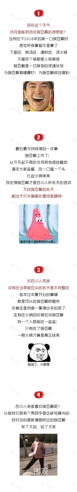
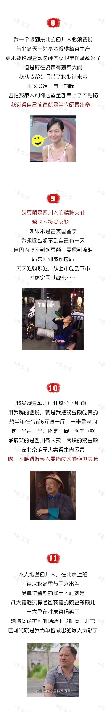

# 无标题

**链接地址:** http://mp.weixin.qq.com/s?__biz=MjM5NDM4MTk1Mg==&mid=2659370136&idx=1&sn=3819d921c26a1bb5b3759f9a78c18f4c&chksm=bdfecd778a894461210180a64916a81cb8222b6778f7adcaa7ecee0b092e9e9bd15a2d66c3c3&mpshare=1&scene=2&srcid=1110zQLjxqtbx6ID5IL1dZ7P#rd
**作者:** 豌豆颠后援会会长
**获取时间:** 2025/8/28 21:09:36
**图片数量:** 7

---

## 原始HTML内容

<section class="xmteditor" style="display:none;" data-tools="新媒体管家" data-label="powered by xmt.cn"></section>
我坚信， 

| 看我微信的人，是一定会被带坏的 ；

| 转我微信的人，是一定想带坏别人的；

| 评论我微信的人，一定是长得乖该你歪的。

 

 

如何让一个四川人放下身段点鸳鸯锅？

——烫豌豆颠

&nbsp;

如何让一个只喜欢吃肉的人爱上吃菜？

——给他吃豌豆颠

&nbsp;

一碗普通的挂面，如何变成好吃的面？

——加点豌豆颠

……

&nbsp;

当我看到街上

人手dia包豌豆颠的时候

就晓得该把秋裤笼上了

<strong>没错，豌豆颠已经开始统治四川了</strong>

<strong> </strong>

<strong> </strong>

 

 

 

 

老李今天给你们分享一个人生建议：

生活中80%的不如意

都可以靠一盘豌豆颠解决

如果不行，那就两盘

如果还不行

那你是真的没救了哈

 

 

 

 
<section donone="shifuMouseDownCard('shifu_c_009')" style="margin: 2em 0em;padding: 0.5em 1em;max-width: 100%;font-family: inherit;font-size: 1em;letter-spacing: 0.544px;text-decoration: inherit;border-width: 1px;border-style: solid;border-color: rgb(0, 0, 0);box-sizing: border-box !important;word-wrap: break-word !important;"><section style="margin-top: -1.4em;max-width: 100%;color: rgb(166, 166, 166);font-weight: inherit;text-align: center;border-width: initial;border-style: none;border-color: initial;line-height: 1.4;box-sizing: border-box !important;word-wrap: break-word !important;"><section style="padding-right: 24px;padding-left: 24px;max-width: 100%;color: rgb(70, 70, 70);font-size: 20px;font-family: inherit;font-weight: inherit;text-decoration: inherit;background-color: rgb(254, 255, 255);border-color: rgb(255, 255, 255);display: inline-block;box-sizing: border-box !important;word-wrap: break-word !important;"><section style="max-width: 100%;box-sizing: border-box !important;word-wrap: break-word !important;"><strong style="max-width: 100%;box-sizing: border-box !important;word-wrap: break-word !important;">今天老李想听大家摆哈</strong></section></section></section><section style="padding: 16px;max-width: 100%;font-size: 1em;line-height: 1.4;font-family: inherit;box-sizing: border-box !important;word-wrap: break-word !important;">
<strong style="max-width: 100%;box-sizing: border-box !important;word-wrap: break-word !important;">你有好喜欢豌豆颠喃？</strong>
</section></section>
<strong style="max-width: 100%;box-sizing: border-box !important;word-wrap: break-word !important;">为了冲这个壳子我黄喉都拉豁，坝坝舞伴也戳脱 </strong>

<strong style="max-width: 100%;box-sizing: border-box !important;word-wrap: break-word !important;">所以本文禁止公众号转载发布</strong>

<strong style="max-width: 100%;box-sizing: border-box !important;word-wrap: break-word !important;">你要是硬是想发，找莽娃儿</strong>

 

 

凑300字申请原创专用字

贝里马列斯专用防伪码，长得乖才看得到。贝里马列斯专用防伪码，长得乖才看得到。贝里马列斯专用防伪码，长得乖才看得到。贝里马列斯专用防伪码，长得乖才看得到。贝里马列斯专用防伪码，长得乖才看得到。贝里马列斯专用防伪码，长得乖才看得到。贝里马列斯专用防伪码，长得乖才看得到。长得乖才看得到。贝里马列斯专用防伪码，长得乖才看得到。贝里马列斯专用防伪码，长得乖才看得到。

---

## 纯文本内容

我坚信，| 看我微信的人，是一定会被带坏的 ；| 转我微信的人，是一定想带坏别人的；| 评论我微信的人，一定是长得乖该你歪的。如何让一个四川人放下身段点鸳鸯锅？——烫豌豆颠 如何让一个只喜欢吃肉的人爱上吃菜？——给他吃豌豆颠 一碗普通的挂面，如何变成好吃的面？——加点豌豆颠…… 当我看到街上人手dia包豌豆颠的时候就晓得该把秋裤笼上了没错，豌豆颠已经开始统治四川了老李今天给你们分享一个人生建议：生活中80%的不如意都可以靠一盘豌豆颠解决如果不行，那就两盘如果还不行那你是真的没救了哈今天老李想听大家摆哈你有好喜欢豌豆颠喃？为了冲这个壳子我黄喉都拉豁，坝坝舞伴也戳脱所以本文禁止公众号转载发布你要是硬是想发，找莽娃儿凑300字申请原创专用字贝里马列斯专用防伪码，长得乖才看得到。贝里马列斯专用防伪码，长得乖才看得到。贝里马列斯专用防伪码，长得乖才看得到。贝里马列斯专用防伪码，长得乖才看得到。贝里马列斯专用防伪码，长得乖才看得到。贝里马列斯专用防伪码，长得乖才看得到。贝里马列斯专用防伪码，长得乖才看得到。长得乖才看得到。贝里马列斯专用防伪码，长得乖才看得到。贝里马列斯专用防伪码，长得乖才看得到。

---

## 图片列表

-  (原始链接: https://mmbiz.qpic.cn/mmbiz_png/IX0F2p1DicCqicoKcLdBrHicPAL4Y2lUicwjdrLbsrFyicf9QTjqMBPFmjedibxUDZ5mttzsNnUdMmibficduLqF8uuHEQ/640?wx_fmt=png)
-  (原始链接: https://mmbiz.qpic.cn/mmbiz_png/IX0F2p1DicCqicoKcLdBrHicPAL4Y2lUicwjlnFfHiap3ZdJQqrCNWWz7zUX0iaetPIWfTZkpSz71PXYWVQib1BHhcxYA/640?wx_fmt=png)
-  (原始链接: https://mmbiz.qpic.cn/mmbiz_png/IX0F2p1DicCqicoKcLdBrHicPAL4Y2lUicwjxANKa77iag2mwWTCOdFQnJiczC9qaapmPfbwCxVqnF9hOwTRtaP3uNRw/640?wx_fmt=png)
-  (原始链接: https://mmbiz.qpic.cn/mmbiz_png/IX0F2p1DicCqicoKcLdBrHicPAL4Y2lUicwjSBdBmclUQDUgzeCj11vjAkVGdmZLKkDtptMmW5pyG5Vz6pgiaJBtgfQ/640?wx_fmt=png)
-  (原始链接: https://mmbiz.qpic.cn/mmbiz_png/IX0F2p1DicCqicoKcLdBrHicPAL4Y2lUicwjsee2VluNY5e4hlxt3Bfx5qj8c9bgf73IJpyyGib32eMictF5rOSIGB9A/640?wx_fmt=png)
-  (原始链接: https://mmbiz.qpic.cn/mmbiz_png/IX0F2p1DicCqicoKcLdBrHicPAL4Y2lUicwjmta1yrqajDV1rCO640K2gBQzJib7fDxZlIWTmJVqpUldXqMniakaJNgQ/640?wx_fmt=png)
-  (原始链接: https://mmbiz.qpic.cn/mmbiz_png/IX0F2p1DicCqicoKcLdBrHicPAL4Y2lUicwjY9gbibt10Aic7beZy5V2jGAd7jPfKjIwMPQBZuspzP3QeL90ysSy4YXg/640?wx_fmt=png)
