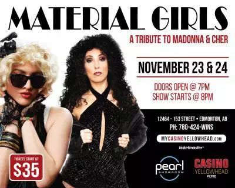
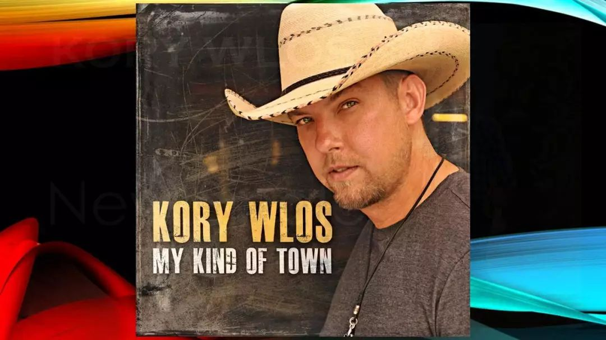

# 无标题

**链接地址:** http://mp.weixin.qq.com/s?__biz=MzI2NTE1ODgwOQ==&mid=2649605468&idx=1&sn=37aeb92b467fc022f119ba3a5e369c8a&chksm=f2b8ccaac5cf45bc4825aa8b7797ce44164385b43a870b6f05147236729578f16281028062f3&mpshare=1&scene=2&srcid=1123h9s1O0XAdvSjwKDskf0v#rd
**作者:** 雪糊
**获取时间:** 2025/8/28 21:05:21
**图片数量:** 18

---

## 原始HTML内容

<section style="box-sizing: border-box;"><section class="V5" style="box-sizing: border-box;" powered-by="xiumi.us"><section style="margin-right: 0%;margin-left: 0%;box-sizing: border-box;"><section style="display: inline-block;vertical-align: middle;width: 80%;box-sizing: border-box;"><section class="V5" style="box-sizing: border-box;" powered-by="xiumi.us"><section style="margin-top: 10px;margin-bottom: 10px;text-align: center;box-sizing: border-box;"><section style="display: inline-block;box-sizing: border-box;"><section style="max-width: 100%;font-size: 0px;padding-bottom: 3px;box-sizing: border-box;"><section style="display: inline-block;vertical-align: middle;box-sizing: border-box;"><section style="width: 5px;height: 1px;background-color: rgb(217, 217, 217);box-sizing: border-box;"></section><section style="width: 1px;height: 5px;margin-top: -3px;margin-right: auto;margin-left: auto;background-color: rgb(217, 217, 217);box-sizing: border-box;"></section></section><section style="margin-top: -1px;margin-right: -5px;margin-left: -5px;width: 100%;display: inline-block;vertical-align: middle;padding-right: 8px;padding-left: 8px;box-sizing: border-box;"><section style="width: 100%;height: 1px;background-color: rgb(217, 217, 217);box-sizing: border-box;"></section></section><section style="display: inline-block;vertical-align: middle;box-sizing: border-box;"><section style="width: 5px;height: 1px;background-color: rgb(217, 217, 217);box-sizing: border-box;"></section><section style="width: 1px;height: 5px;margin-top: -3px;margin-right: auto;margin-left: auto;background-color: rgb(217, 217, 217);box-sizing: border-box;"></section></section></section><section style="padding-left: 15px;padding-right: 15px;color: rgb(161, 161, 161);font-size: 14px;box-sizing: border-box;">
点击上方<strong style="box-sizing: border-box;">蓝字</strong>关注我们哟~
</section><section style="max-width: 100%;font-size: 0px;box-sizing: border-box;"><section style="display: inline-block;vertical-align: middle;box-sizing: border-box;"><section style="width: 5px;height: 1px;background-color: rgb(217, 217, 217);box-sizing: border-box;"></section><section style="width: 1px;height: 5px;margin-top: -3px;margin-right: auto;margin-left: auto;background-color: rgb(217, 217, 217);box-sizing: border-box;"></section></section><section style="margin-top: -1px;margin-right: -5px;margin-left: -5px;width: 100%;display: inline-block;vertical-align: middle;padding-right: 8px;padding-left: 8px;box-sizing: border-box;"><section style="width: 100%;height: 1px;background-color: rgb(217, 217, 217);box-sizing: border-box;"></section></section><section style="display: inline-block;vertical-align: middle;box-sizing: border-box;"><section style="width: 5px;height: 1px;background-color: rgb(217, 217, 217);box-sizing: border-box;"></section><section style="width: 1px;height: 5px;margin-top: -3px;margin-right: auto;margin-left: auto;background-color: rgb(217, 217, 217);box-sizing: border-box;"></section></section></section></section></section></section></section><section style="display: inline-block;vertical-align: middle;width: 20%;box-sizing: border-box;"><section class="V5" style="box-sizing: border-box;" powered-by="xiumi.us"><section style="text-align: center;margin: -10px 0% 10px;box-sizing: border-box;"><section style="max-width: 100%;vertical-align: middle;display: inline-block;width: 100%;box-sizing: border-box;"></section></section></section></section></section></section><section class="V5" style="box-sizing: border-box;" powered-by="xiumi.us"><section style="margin: 10px 0%;box-sizing: border-box;"><section style="display: inline-block;width: 100%;vertical-align: top;box-sizing: border-box;"><section class="V5" style="box-sizing: border-box;" powered-by="xiumi.us"><section style="box-sizing: border-box;"><section style="display: inline-block;vertical-align: bottom;width: 75%;padding-right: 10px;box-sizing: border-box;"><section class="V5" style="box-sizing: border-box;" powered-by="xiumi.us"><section style="margin: 10px 0% 3px;box-sizing: border-box;"><section style="display: inline-block;vertical-align: middle;box-sizing: border-box;"><section style="display: inline-block;vertical-align: bottom;padding-left: 5px;padding-right: 5px;line-height: 1.2em;margin-bottom: 2px;color: rgba(80, 182, 201, 0.72);box-sizing: border-box;">
<strong style="box-sizing: border-box;">仔细看下图，有惊喜！</strong>
</section><section style="max-width: 100%;display: inline-block;vertical-align: bottom;width: 1.6em;box-sizing: border-box;"></section></section></section></section></section><section style="display: inline-block;vertical-align: bottom;width: 25%;box-sizing: border-box;"><section class="V5" style="box-sizing: border-box;" powered-by="xiumi.us"><section style="margin-right: 0%;margin-bottom: 3px;margin-left: 0%;text-align: right;box-sizing: border-box;"><section style="display: inline-block;border-bottom: 0.15em solid rgba(80, 182, 201, 0.72);padding-bottom: 3px;box-sizing: border-box;"><section style="display: inline-block;padding: 3px;border-bottom: 0.15em solid rgba(80, 182, 201, 0.72);font-size: 12px;line-height: 1.4;color: rgb(255, 143, 47);box-sizing: border-box;">
<strong style="box-sizing: border-box;">金主大大</strong>
</section></section></section></section></section></section></section><section class="V5" style="box-sizing: border-box;" powered-by="xiumi.us"><section style="margin-right: 0%;margin-left: 0%;box-sizing: border-box;"><section style="background-color: rgba(80, 182, 201, 0.72);height: 2px;box-sizing: border-box;"></section></section></section></section></section></section><section class="V5" style="box-sizing: border-box;" powered-by="xiumi.us"><section style="text-align: center;margin-top: 10px;margin-bottom: 10px;box-sizing: border-box;"><section style="max-width: 100%;vertical-align: middle;display: inline-block;box-sizing: border-box;"></section></section></section><section class="V5" style="box-sizing: border-box;" powered-by="xiumi.us"><section style="text-align: center;margin-top: 10px;margin-bottom: 10px;box-sizing: border-box;"><section style="max-width: 100%;vertical-align: middle;display: inline-block;box-sizing: border-box;"></section></section></section><section class="V5" style="box-sizing: border-box;" powered-by="xiumi.us"><section style="text-align: center;margin-top: 10px;margin-bottom: 10px;box-sizing: border-box;"><section style="max-width: 100%;vertical-align: middle;display: inline-block;box-sizing: border-box;"></section></section></section><section class="V5" style="box-sizing: border-box;" powered-by="xiumi.us"><section style="text-align: center;margin-top: 10px;margin-bottom: 10px;box-sizing: border-box;"><section style="max-width: 100%;vertical-align: middle;display: inline-block;box-sizing: border-box;"><svg xmlns="http://www.w3.org/2000/svg" x="0px" y="0px" viewBox="0 0 902.1 38.2" style="vertical-align: middle;max-width: 100%;box-sizing: border-box;" width="902.1"><g style="box-sizing: border-box;"><path style="box-sizing: border-box;" d="M18.4,1.4c0.9-1.9,2.4-1.9,3.4,0l3.4,6.9c0.9,1.9,3.4,3.7,5.4,4l7.6,1.1c2.1,0.3,2.5,1.7,1,3.2   l-5.5,5.4c-1.5,1.5-2.4,4.3-2.1,6.4l1.3,7.6c0.4,2.1-0.9,2.9-2.7,2l-6.8-3.6c-1.8-1-4.9-1-6.7,0l-6.8,3.6c-1.9,1-3.1,0.1-2.7-2   l1.3-7.6c0.4-2.1-0.6-4.9-2.1-6.4l-5.5-5.4c-1.5-1.5-1-2.9,1-3.2l7.6-1.1c2.1-0.3,4.5-2.1,5.4-4L18.4,1.4z" fill="rgb(178, 243, 230)"></path><path style="box-sizing: border-box;" d="M90.6,5.4c0.7-1.4,1.9-1.4,2.6,0l2.6,5.3c0.7,1.4,2.6,2.8,4.2,3.1l5.9,0.9c1.6,0.2,2,1.3,0.8,2.5   l-4.2,4.1c-1.2,1.1-1.9,3.3-1.6,4.9l1,5.8c0.3,1.6-0.7,2.3-2.1,1.5l-5.2-2.8c-1.4-0.8-3.8-0.8-5.2,0L84,33.6   c-1.4,0.8-2.4,0.1-2.1-1.5l1-5.8c0.3-1.6-0.5-3.8-1.6-4.9l-4.2-4.1c-1.2-1.1-0.8-2.2,0.8-2.5l5.9-0.9c1.6-0.2,3.5-1.6,4.2-3.1   L90.6,5.4z" fill="rgb(190, 204, 246)"></path><path style="box-sizing: border-box;" d="M162.6,7.5c0.6-1.2,1.6-1.2,2.2,0l2.2,4.5c0.6,1.2,2.2,2.4,3.6,2.6l5,0.7c1.4,0.2,1.7,1.1,0.7,2.1   l-3.6,3.5c-1,1-1.6,2.9-1.4,4.2l0.9,5c0.2,1.4-0.6,1.9-1.8,1.3l-4.5-2.4c-1.2-0.6-3.2-0.6-4.4,0l-4.5,2.4c-1.2,0.6-2,0.1-1.8-1.3   l0.9-5c0.2-1.4-0.4-3.3-1.4-4.2l-3.6-3.5c-1-1-0.7-1.9,0.7-2.1l5-0.7c1.4-0.2,3-1.4,3.6-2.6L162.6,7.5z" fill="rgb(150, 208, 240)"></path><path style="box-sizing: border-box;" d="M60.1,19.1c0,2.3-1.9,4.2-4.2,4.2c-2.3,0-4.2-1.9-4.2-4.2s1.9-4.2,4.2-4.2   C58.3,14.9,60.1,16.8,60.1,19.1z" fill="rgb(218, 240, 224)"></path><path style="box-sizing: border-box;" d="M203.8,19.1c0,2.3-1.9,4.2-4.2,4.2c-2.3,0-4.2-1.9-4.2-4.2s1.9-4.2,4.2-4.2   C201.9,14.9,203.8,16.8,203.8,19.1z" fill="rgb(218, 240, 224)"></path><path style="box-sizing: border-box;" d="M130.9,19.1c0,1.7-1.4,3.1-3.1,3.1c-1.7,0-3.1-1.4-3.1-3.1c0-1.7,1.4-3.1,3.1-3.1   C129.5,16.1,130.9,17.4,130.9,19.1z" fill="rgb(218, 240, 224)"></path><path style="box-sizing: border-box;" d="M233.9,1.4c0.9-1.9,2.4-1.9,3.4,0l3.4,6.9c0.9,1.9,3.4,3.7,5.4,4l7.6,1.1c2.1,0.3,2.5,1.7,1,3.2   l-5.5,5.4c-1.5,1.5-2.4,4.3-2.1,6.4l1.3,7.6c0.4,2.1-0.9,2.9-2.7,2l-6.8-3.6c-1.8-1-4.9-1-6.7,0l-6.8,3.6c-1.9,1-3.1,0.1-2.7-2   l1.3-7.6c0.4-2.1-0.6-4.9-2.1-6.4l-5.5-5.4c-1.5-1.5-1-2.9,1-3.2l7.6-1.1c2.1-0.3,4.5-2.1,5.4-4L233.9,1.4z" fill="rgb(178, 243, 230)"></path><path style="box-sizing: border-box;" d="M306.1,5.4c0.7-1.4,1.9-1.4,2.6,0l2.6,5.3c0.7,1.4,2.6,2.8,4.2,3.1l5.9,0.9c1.6,0.2,2,1.3,0.8,2.5   l-4.2,4.1c-1.2,1.1-1.9,3.3-1.6,4.9l1,5.8c0.3,1.6-0.7,2.3-2.1,1.5l-5.2-2.8c-1.4-0.8-3.8-0.8-5.2,0l-5.2,2.8   c-1.4,0.8-2.4,0.1-2.1-1.5l1-5.8c0.3-1.6-0.4-3.8-1.6-4.9l-4.2-4.1c-1.2-1.1-0.8-2.2,0.8-2.5l5.9-0.9c1.6-0.2,3.5-1.6,4.2-3.1   L306.1,5.4z" fill="rgb(190, 204, 246)"></path><path style="box-sizing: border-box;" d="M378.1,7.5c0.6-1.2,1.6-1.2,2.2,0l2.2,4.5c0.6,1.2,2.2,2.4,3.6,2.6l5,0.7c1.4,0.2,1.7,1.1,0.7,2.1   l-3.6,3.5c-1,1-1.6,2.9-1.4,4.2l0.9,5c0.2,1.4-0.6,1.9-1.8,1.3l-4.5-2.4c-1.2-0.6-3.2-0.6-4.4,0l-4.5,2.4c-1.2,0.6-2,0.1-1.8-1.3   l0.9-5c0.2-1.4-0.4-3.3-1.4-4.2l-3.6-3.5c-1-1-0.7-1.9,0.7-2.1l5-0.7c1.4-0.2,3-1.4,3.6-2.6L378.1,7.5z" fill="rgb(150, 208, 240)"></path><path style="box-sizing: border-box;" d="M275.7,19.1c0,2.3-1.9,4.2-4.2,4.2c-2.3,0-4.2-1.9-4.2-4.2s1.9-4.2,4.2-4.2   C273.8,14.9,275.7,16.8,275.7,19.1z" fill="rgb(218, 240, 224)"></path><path style="box-sizing: border-box;" d="M419.3,19.1c0,2.3-1.9,4.2-4.2,4.2c-2.3,0-4.2-1.9-4.2-4.2s1.9-4.2,4.2-4.2   C417.5,14.9,419.3,16.8,419.3,19.1z" fill="rgb(218, 240, 224)"></path><path style="box-sizing: border-box;" d="M346.4,19.1c0,1.7-1.4,3.1-3.1,3.1c-1.7,0-3.1-1.4-3.1-3.1c0-1.7,1.4-3.1,3.1-3.1   C345,16.1,346.4,17.4,346.4,19.1z" fill="rgb(218, 240, 224)"></path><path style="box-sizing: border-box;" d="M449.4,1.4c0.9-1.9,2.4-1.9,3.4,0l3.4,6.9c0.9,1.9,3.4,3.7,5.4,4l7.6,1.1c2.1,0.3,2.5,1.7,1,3.2   l-5.5,5.4c-1.5,1.5-2.4,4.3-2.1,6.4l1.3,7.6c0.4,2.1-0.9,2.9-2.7,2l-6.8-3.6c-1.8-1-4.9-1-6.7,0l-6.8,3.6c-1.9,1-3.1,0.1-2.7-2   l1.3-7.6c0.4-2.1-0.6-4.9-2.1-6.4l-5.5-5.4c-1.5-1.5-1-2.9,1-3.2l7.6-1.1c2.1-0.3,4.5-2.1,5.4-4L449.4,1.4z" fill="rgb(178, 243, 230)"></path><path style="box-sizing: border-box;" d="M521.6,5.4c0.7-1.4,1.9-1.4,2.6,0l2.6,5.3c0.7,1.4,2.6,2.8,4.2,3.1l5.9,0.9c1.6,0.2,2,1.3,0.8,2.5   l-4.2,4.1c-1.2,1.1-1.9,3.3-1.6,4.9l1,5.8c0.3,1.6-0.7,2.3-2.1,1.5l-5.2-2.8c-1.4-0.8-3.8-0.8-5.2,0l-5.2,2.8   c-1.4,0.8-2.4,0.1-2.1-1.5l1-5.8c0.3-1.6-0.5-3.8-1.6-4.9l-4.2-4.1c-1.2-1.1-0.8-2.2,0.8-2.5l5.9-0.9c1.6-0.2,3.5-1.6,4.2-3.1   L521.6,5.4z" fill="rgb(190, 204, 246)"></path><path style="box-sizing: border-box;" d="M593.6,7.5c0.6-1.2,1.6-1.2,2.2,0l2.2,4.5c0.6,1.2,2.2,2.4,3.6,2.6l5,0.7c1.4,0.2,1.7,1.1,0.7,2.1   l-3.6,3.5c-1,1-1.6,2.9-1.4,4.2l0.9,5c0.2,1.4-0.6,1.9-1.8,1.3l-4.5-2.4c-1.2-0.6-3.2-0.6-4.4,0l-4.5,2.4c-1.2,0.6-2,0.1-1.8-1.3   l0.9-5c0.2-1.4-0.4-3.3-1.4-4.2l-3.6-3.5c-1-1-0.7-1.9,0.7-2.1l5-0.7c1.4-0.2,3-1.4,3.6-2.6L593.6,7.5z" fill="rgb(150, 208, 240)"></path><path style="box-sizing: border-box;" d="M491.2,19.1c0,2.3-1.9,4.2-4.2,4.2c-2.3,0-4.2-1.9-4.2-4.2s1.9-4.2,4.2-4.2   C489.3,14.9,491.2,16.8,491.2,19.1z" fill="rgb(218, 240, 224)"></path><path style="box-sizing: border-box;" d="M634.9,19.1c0,2.3-1.9,4.2-4.2,4.2c-2.3,0-4.2-1.9-4.2-4.2s1.9-4.2,4.2-4.2   C633,14.9,634.9,16.8,634.9,19.1z" fill="rgb(218, 240, 224)"></path><path style="box-sizing: border-box;" d="M561.9,19.1c0,1.7-1.4,3.1-3.1,3.1c-1.7,0-3.1-1.4-3.1-3.1c0-1.7,1.4-3.1,3.1-3.1   C560.5,16.1,561.9,17.4,561.9,19.1z" fill="rgb(218, 240, 224)"></path><path style="box-sizing: border-box;" d="M664.9,1.4c0.9-1.9,2.4-1.9,3.4,0l3.4,6.9c0.9,1.9,3.4,3.7,5.4,4l7.6,1.1c2.1,0.3,2.5,1.7,1,3.2   l-5.5,5.4c-1.5,1.5-2.4,4.3-2.1,6.4l1.3,7.6c0.4,2.1-0.9,2.9-2.7,2l-6.8-3.6c-1.8-1-4.9-1-6.7,0l-6.8,3.6c-1.9,1-3.1,0.1-2.7-2   l1.3-7.6c0.4-2.1-0.6-4.9-2.1-6.4l-5.5-5.4c-1.5-1.5-1-2.9,1-3.2l7.6-1.1c2.1-0.3,4.5-2.1,5.4-4L664.9,1.4z" fill="rgb(178, 243, 230)"></path><path style="box-sizing: border-box;" d="M737.1,5.4c0.7-1.4,1.9-1.4,2.6,0l2.6,5.3c0.7,1.4,2.6,2.8,4.2,3.1l5.9,0.9c1.6,0.2,2,1.3,0.8,2.5   l-4.2,4.1c-1.2,1.1-1.9,3.3-1.6,4.9l1,5.8c0.3,1.6-0.7,2.3-2.1,1.5l-5.2-2.8c-1.4-0.8-3.8-0.8-5.2,0l-5.2,2.8   c-1.4,0.8-2.4,0.1-2.1-1.5l1-5.8c0.3-1.6-0.5-3.8-1.6-4.9l-4.2-4.1c-1.2-1.1-0.8-2.2,0.8-2.5l5.9-0.9c1.6-0.2,3.5-1.6,4.2-3.1   L737.1,5.4z" fill="rgb(190, 204, 246)"></path><path style="box-sizing: border-box;" d="M809.2,7.5c0.6-1.2,1.6-1.2,2.2,0l2.2,4.5c0.6,1.2,2.2,2.4,3.6,2.6l5,0.7c1.4,0.2,1.7,1.1,0.7,2.1   l-3.6,3.5c-1,1-1.6,2.9-1.4,4.2l0.9,5c0.2,1.4-0.6,1.9-1.8,1.3l-4.5-2.4c-1.2-0.6-3.2-0.6-4.4,0l-4.5,2.4c-1.2,0.6-2,0.1-1.8-1.3   l0.9-5c0.2-1.4-0.4-3.3-1.4-4.2l-3.6-3.5c-1-1-0.7-1.9,0.7-2.1l5-0.7c1.4-0.2,3-1.4,3.6-2.6L809.2,7.5z" fill="rgb(150, 208, 240)"></path><path style="box-sizing: border-box;" d="M706.7,19.1c0,2.3-1.9,4.2-4.2,4.2c-2.3,0-4.2-1.9-4.2-4.2s1.9-4.2,4.2-4.2   C704.8,14.9,706.7,16.8,706.7,19.1z" fill="rgb(218, 240, 224)"></path><path style="box-sizing: border-box;" d="M850.4,19.1c0,2.3-1.9,4.2-4.2,4.2c-2.3,0-4.2-1.9-4.2-4.2s1.9-4.2,4.2-4.2   C848.5,14.9,850.4,16.8,850.4,19.1z" fill="rgb(218, 240, 224)"></path><path style="box-sizing: border-box;" d="M777.4,19.1c0,1.7-1.4,3.1-3.1,3.1c-1.7,0-3.1-1.4-3.1-3.1c0-1.7,1.4-3.1,3.1-3.1   C776,16.1,777.4,17.4,777.4,19.1z" fill="rgb(218, 240, 224)"></path><path style="box-sizing: border-box;" d="M880.4,1.4c0.9-1.9,2.4-1.9,3.4,0l3.4,6.9c0.9,1.9,3.4,3.7,5.4,4l7.6,1.1c2.1,0.3,2.5,1.7,1,3.2   l-5.5,5.4c-1.5,1.5-2.4,4.3-2.1,6.4l1.3,7.6c0.4,2.1-0.9,2.9-2.7,2l-6.8-3.6c-1.8-1-4.9-1-6.7,0l-6.8,3.6c-1.8,1-3.1,0.1-2.7-2   l1.3-7.6c0.4-2.1-0.6-4.9-2.1-6.4l-5.5-5.4c-1.5-1.5-1-2.9,1-3.2l7.6-1.1c2.1-0.3,4.5-2.1,5.4-4L880.4,1.4z" fill="rgb(178, 243, 230)"></path></g></svg></section></section></section><section class="V5" style="box-sizing: border-box;" powered-by="xiumi.us"><section style="box-sizing: border-box;"><section style="text-align: center;box-sizing: border-box;"><section style="box-sizing: border-box;"><section class="V5" style="box-sizing: border-box;" powered-by="xiumi.us"><section style="text-align: center;margin: 50px 0% 10px;box-sizing: border-box;"><section style="display: inline-block;width: 95%;vertical-align: top;box-shadow: rgb(176, 190, 197) 0px 0px 10px;border-style: none;border-width: 1px;border-radius: 0px;border-color: rgb(62, 62, 62);padding-bottom: 20px;box-sizing: border-box;"><section class="V5" style="box-sizing: border-box;" powered-by="xiumi.us"><section style="margin-top: -40px;margin-right: 0%;margin-left: 0%;box-sizing: border-box;"><section style="display: inline-block;width: 90%;vertical-align: top;border-style: none;border-width: 1px;border-radius: 0px;border-color: rgb(62, 62, 62);padding: 10px;background-color: rgb(255, 255, 255);box-shadow: rgb(207, 116, 53) 0px 0px 3px;box-sizing: border-box;"><section class="V5" style="box-sizing: border-box;" powered-by="xiumi.us"><section style="box-sizing: border-box;"><section style="text-align: justify;font-size: 14px;color: rgb(211, 160, 3);line-height: 1.8;letter-spacing: 2px;box-sizing: border-box;">
亲爱的读者朋友们，

 

转眼就来到2018年11月的最后一周了，这周时间也是过得飞快呢！感觉离上次雪糊给大家写《爱屯周末去哪儿》栏目还没过去多久时间。不过埃德蒙顿这周精彩的活动实在是太丰富啦！可没有时间给雪糊偷懒！

 

上次的专栏中雪糊询问了大家都参加了什么我们推荐的活动，收到了读者们踊跃的留言和建议。不少朋友们建议我们也多推荐一下埃德蒙顿其他好吃好玩的适合年轻人的活动，比如蹦迪。O(∩_∩)O

 

咳咳，这件事情嘛…雪糊那么乖的孩子对蹦迪还真实不了解呢！不过雪糊已经跟局长大人申请了在这个板块中多增加一点更接地气的活动，一旦上级批准了，一定会推出更多内容丰富的活动介绍的！

 

敬请期待吧！

 

爱你们的雪糊

2018.11.21
</section></section></section><section class="V5" style="box-sizing: border-box;" powered-by="xiumi.us"><section style="box-sizing: border-box;"><section style="text-align: left;box-sizing: border-box;">
 
</section></section></section><section class="V5" style="box-sizing: border-box;" powered-by="xiumi.us"><section style="box-sizing: border-box;"><section style="text-align: left;box-sizing: border-box;">
 
</section></section></section></section></section></section><section class="V5" style="box-sizing: border-box;" powered-by="xiumi.us"><section style="margin-top: -70px;margin-right: 0%;margin-left: 0%;box-sizing: border-box;"><section style="max-width: 100%;vertical-align: middle;display: inline-block;box-shadow: rgb(0, 0, 0) 0px 0px 0px;box-sizing: border-box;"></section></section></section><section class="V5" style="box-sizing: border-box;" powered-by="xiumi.us"><section style="margin: -10px 0% 10px;box-sizing: border-box;"><section style="max-width: 100%;vertical-align: middle;display: inline-block;box-sizing: border-box;"><svg xmlns="http://www.w3.org/2000/svg" x="0px" y="0px" viewBox="0 0 113.8 21.3" style="vertical-align: middle;max-width: 100%;box-sizing: border-box;" width="113.8"><g style="box-sizing: border-box;"><path style="fill-rule: evenodd;clip-rule: evenodd;box-sizing: border-box;" d="M97,9.2c5.5-3.4,12.3-4.2,14.5-1.4c1.2,1.5,1.6,3.5-0.4,4.5   c-2,1-3.1-0.6-2.9-1.6c0.2-1,1.4-1.6,2.5-1.2c-0.7-1.2-3.1-1.1-3.9,0.9c-0.8,1.9,1.5,3.9,4.3,2.8c2.8-1.1,3.5-4.4,1.6-6.2   C109,3.4,102,5.2,97.8,8.1c2.1-3.8-1.2-8.3-5.4-8.1c-3.9,0.2-6.4,5.4-4.1,7.4c2.2,2,4.2-0.6,2.8-1.6c-1.2-0.9-1.7,0.4-2.2,0   c-0.5-0.4-0.3-3.9,2.9-4.4c4.2-0.7,6.8,4.1,4,7.3c-3,3.5-9.7,1.1-17.1-4.3c-6.8-5-17.2-6.4-21.8,2.3c5.8-6.9,15.8-4.9,20.8-1.2   c8.7,6.3,14.6,7.2,17.9,4.9C96.1,10,96.6,9.6,97,9.2z" fill="rgb(168,100,0)"></path><path style="fill-rule: evenodd;clip-rule: evenodd;box-sizing: border-box;" d="M16.8,9.2C11.3,5.9,4.5,5,2.3,7.8c-1.2,1.5-1.6,3.5,0.4,4.5   c2,1,3.1-0.6,2.9-1.6C5.3,9.6,4.1,9,3.1,9.5C3.8,8.3,6.2,8.4,7,10.3c0.8,1.9-1.5,3.9-4.3,2.8C-0.2,12.1-0.8,8.8,1.1,7   C4.8,3.4,11.8,5.2,16,8.1c-2.1-3.8,1.2-8.3,5.4-8.1c3.9,0.2,6.4,5.4,4.1,7.4c-2.2,2-4.2-0.6-2.8-1.6c1.2-0.9,1.7,0.4,2.2,0   C25.5,5.5,25.3,2,22,1.5c-4.2-0.7-6.8,4.1-4,7.3c3,3.5,9.7,1.1,17.1-4.3c6.8-5,17.2-6.4,21.8,2.3c-5.8-6.9-15.8-4.9-20.8-1.2   c-8.7,6.3-14.6,7.2-17.9,4.9C17.6,10,17.2,9.6,16.8,9.2z" fill="rgb(168,100,0)"></path><path style="fill-rule: evenodd;clip-rule: evenodd;box-sizing: border-box;" d="M56.9,8.5c-1.1,0.1-1.2-3.7-5.5-2.3c0,0.2,0,0.5,0.2,0.7   c-0.3,0.9-2.5,1-3,2.4c0.6,0.2,0.7,0.3,0.9,0.6c-0.9,2.1-0.3,3.6-1.1,5.1c1.1-0.2,3.1,0.7,4.2-0.2c0.2,0.8-0.3,0.9-0.2,1.7   c0.6,0.2,1.5,0.4,1.9,1.6c0.4,1.6,2,2.7,2.4,3.1c0.4-0.7,1.8-1,2.3-2.3c0.6-1.6,0.6-1.9,2-2.3c0.1-0.9-0.4-0.9-0.2-1.7   c1.2,0.9,3.1-0.2,4.2,0c-0.8-1.6-0.1-2.9-1-5c0.2-0.3,0.3-0.5,0.9-0.6c-0.5-1.4-2.6-1.5-2.9-2.4c0.2-0.2,0.2-0.5,0.2-0.7   C58.2,4.9,58,8.4,56.9,8.5L56.9,8.5z M56.7,9.4c-0.7,0.7-1.5,1.4-2.3,2.1C54,12.3,53,13.5,52,14.2c0.9-0.9,1.8-1.9,2.1-2.6   c-1.3,1-2.7,1.9-4.4,2.7c1.4-0.8,2.8-1.7,4-2.7c-1.2,0.4-2.8,0.6-4.1,0.5c1.9-0.1,3.9-0.5,4.7-1c0.6-0.5,1.1-1,1.6-1.4   c-1.5,0-3.6-0.7-6.4-0.5c2.2-0.5,4.4,0.2,6.2,0.2c-1.1-1-1.9-2.3-3.4-2.7c1.7,0.4,2.6,1.8,3.9,2.7c0.2-0.1,0.3-0.3,0.5-0.4l0.1-0.4   L57,8.9c0.1,0.1,0.3,0.3,0.4,0.4c1.3-0.9,2.2-2.3,3.9-2.7C59.8,7.1,59,8.4,58,9.4c1.8,0,4-0.8,6.2-0.3c-2.8-0.2-4.9,0.5-6.4,0.5   c0.5,0.5,1.1,1,1.7,1.4c0.8,0.5,2.8,0.8,4.7,0.8c-1.3,0.1-2.9,0-4.1-0.4c1.2,1,2.6,1.9,4.1,2.7c-1.7-0.8-3.2-1.7-4.5-2.7   c0.4,0.7,1.3,1.7,2.2,2.6c-1-0.7-2.1-1.9-2.5-2.8c-0.8-0.6-1.6-1.3-2.3-2l0,1.2c0.2,0.7,1.3,1.9,2.4,2.9c-0.9-0.6-1.9-1.7-2.4-2.5   c0,0.2-0.1,1.2,0,1.3c0.2,0.8,1.7,2.4,3.3,3.6c-1.2-0.7-2.5-2-3.2-3.1c-0.1,1,0.6,3.8,1.5,5.5c-0.8-1.3-1.4-3.3-1.5-4.7l-0.1,6.1   l-0.1-5.5c-0.2,1.3-0.7,3-1.3,4.2c0.7-1.5,1.2-3.7,1.3-4.9l0-0.5c0,0,0-0.1,0-0.1c-0.7,1.1-2,2.4-3.2,3.1c0.4-0.3,2.6-2,3.2-3.5   l0-1.4c-0.5,0.9-1.4,1.9-2.2,2.5c1-1,2-2.2,2.2-2.9L56.7,9.4z" fill="rgb(211,160,3)"></path></g></svg></section></section></section><section class="V5" style="box-sizing: border-box;" powered-by="xiumi.us"><section style="box-sizing: border-box;"><section style="color: rgb(211, 160, 3);line-height: 1.8;box-sizing: border-box;">
<strong style="box-sizing: border-box;">致 · 埃德蒙顿微生活</strong>

<strong style="box-sizing: border-box;">读者朋友们</strong>
</section></section></section></section></section></section><section class="V5" style="box-sizing: border-box;" powered-by="xiumi.us"><section style="margin: 10px 0%;box-sizing: border-box;"><section style="padding-top: 1.1em;box-sizing: border-box;"><section style="width: 100%;display: inline-block;vertical-align: bottom;box-sizing: border-box;"><section style="background-color: rgb(255, 179, 0);padding: 0.2em 0.4em;text-align: center;color: rgb(255, 255, 255);line-height: 1.8;box-sizing: border-box;">
<strong style="box-sizing: border-box;">像麦当娜和雪儿致敬！</strong>
</section><section style="width: 0px;float: left;border-right: 4px solid rgb(255, 179, 0);border-top: 4px solid rgb(255, 179, 0);border-left: 4px solid transparent !important;border-bottom: 4px solid transparent !important;box-sizing: border-box;"></section><section style="width: 0px;float: right;border-left: 4px solid rgb(255, 179, 0);border-top: 4px solid rgb(255, 179, 0);border-right: 4px solid transparent !important;border-bottom: 4px solid transparent !important;box-sizing: border-box;"></section></section><section style="border-color: rgb(204, 204, 204);margin-top: -3.5em;border-width: 1px;border-style: solid;padding: 56px 15px 10px;margin-left: 8px;margin-right: 8px;box-sizing: border-box;"><section class="V5" style="box-sizing: border-box;" powered-by="xiumi.us"><section style="text-align: center;margin: 10px 0%;box-sizing: border-box;"><section style="max-width: 100%;vertical-align: middle;display: inline-block;width: 100%;border-width: 0px;box-sizing: border-box;"></section></section></section><section class="V5" style="box-sizing: border-box;" powered-by="xiumi.us"><section style="margin: 20px 0%;box-sizing: border-box;"><section style="text-align: justify;font-size: 14px;line-height: 1.8;letter-spacing: 2px;color: rgb(158, 158, 158);padding-right: 10px;padding-left: 10px;box-sizing: border-box;">
物质女孩们！谁还记得那些属于80年代流行摇滚的经典歌曲！如今这些经典即将在埃德蒙顿重新被全女子乐队阵容重新演绎！让这些属于新时代女性独立又优美的歌声重新在埃德蒙顿上空被唱响。

 

如果你是麦当娜，雪儿，Lady Gaga或者阿黛尔的粉丝，请一定不要错过这个致敬自己偶像的机会。同时也可以发掘几支埃德蒙顿本地的全女子乐团，一定是一场新奇又刺激的体验！
</section></section></section><section class="V5" style="box-sizing: border-box;" powered-by="xiumi.us"><section style="text-align: center;margin: 10px 0%;box-sizing: border-box;"><section style="max-width: 100%;vertical-align: middle;display: inline-block;width: 100%;border-width: 0px;box-sizing: border-box;"></section></section></section><section class="V5" style="box-sizing: border-box;" powered-by="xiumi.us"><section style="margin-top: 10px;margin-bottom: 10px;box-sizing: border-box;"><section style="display: inline-block;width: 100%;border-width: 0px;border-style: none;border-color: rgb(192, 200, 209);padding: 10px;box-shadow: rgb(0, 0, 0) 0px 0px 0px;border-radius: 0px;box-sizing: border-box;"><section class="V5" style="box-sizing: border-box;" powered-by="xiumi.us"><section style="box-sizing: border-box;"><section style="color: rgba(62, 62, 62, 0.72);font-size: 14px;letter-spacing: 2px;box-sizing: border-box;">

<strong style="box-sizing: border-box;">Material Girls - Tribute to Madonna and Cher</strong>

 

📍 Pearl Showroom, 12464 153 St NW

⏰ Nov. 23 - 24 7:00 PM - 11:00 PM

🎫 CAD 35

☎&nbsp;587-598-9118

🌐 https://mycasinoyellowhead.com/shows/
</section></section></section></section></section></section></section></section></section></section><section class="V5" style="box-sizing: border-box;" powered-by="xiumi.us"><section style="margin: 10px 0%;box-sizing: border-box;"><section style="padding-top: 1.1em;box-sizing: border-box;"><section style="width: 100%;display: inline-block;vertical-align: bottom;box-sizing: border-box;"><section style="background-color: rgb(255, 179, 0);padding: 0.2em 0.4em;text-align: center;color: rgb(255, 255, 255);line-height: 1.8;box-sizing: border-box;">
<strong style="box-sizing: border-box;">同劳拉一起去艺术旅行吧！</strong>
</section><section style="width: 0px;float: left;border-right: 4px solid rgb(255, 179, 0);border-top: 4px solid rgb(255, 179, 0);border-left: 4px solid transparent !important;border-bottom: 4px solid transparent !important;box-sizing: border-box;"></section><section style="width: 0px;float: right;border-left: 4px solid rgb(255, 179, 0);border-top: 4px solid rgb(255, 179, 0);border-right: 4px solid transparent !important;border-bottom: 4px solid transparent !important;box-sizing: border-box;"></section></section><section style="border-color: rgb(204, 204, 204);margin-top: -3.5em;border-width: 1px;border-style: solid;padding: 56px 15px 10px;margin-left: 8px;margin-right: 8px;box-sizing: border-box;"><section class="V5" style="box-sizing: border-box;" powered-by="xiumi.us"><section style="text-align: center;margin: 10px 0%;box-sizing: border-box;"><section style="max-width: 100%;vertical-align: middle;display: inline-block;width: 100%;border-width: 0px;box-sizing: border-box;"></section></section></section><section class="V5" style="box-sizing: border-box;" powered-by="xiumi.us"><section style="margin: 20px 0%;box-sizing: border-box;"><section style="text-align: justify;font-size: 14px;line-height: 1.8;letter-spacing: 2px;color: rgb(158, 158, 158);padding-right: 10px;padding-left: 10px;box-sizing: border-box;">
埃德蒙顿本地艺术家Laura Grier近期将通过一系列丝网印刷和平版印刷艺术作品，展现出她对于自我世界文化艺术的理解。这些版画基于她个人作为本地土著女性成长的故事。

 

通过平衡种族主义的经历以及遗传的文化创伤，Grier将会向您从一位女性倾诉者的角度讲述神秘而又悠久的族群文化。请做好准备和她一起畅游在这个神奇的文化世界吧！
</section></section></section><section class="V5" style="box-sizing: border-box;" powered-by="xiumi.us"><section style="text-align: center;margin: 10px 0%;box-sizing: border-box;"><section style="max-width: 100%;vertical-align: middle;display: inline-block;width: 100%;border-width: 0px;box-sizing: border-box;"></section></section></section><section class="V5" style="box-sizing: border-box;" powered-by="xiumi.us"><section style="margin-top: 10px;margin-bottom: 10px;box-sizing: border-box;"><section style="display: inline-block;width: 100%;border-width: 0px;border-style: none;border-color: rgb(192, 200, 209);padding: 10px;box-shadow: rgb(0, 0, 0) 0px 0px 0px;border-radius: 0px;box-sizing: border-box;"><section class="V5" style="box-sizing: border-box;" powered-by="xiumi.us"><section style="box-sizing: border-box;"><section style="color: rgba(62, 62, 62, 0.72);font-size: 14px;letter-spacing: 2px;box-sizing: border-box;">

<strong style="box-sizing: border-box;"></strong>

<strong style="box-sizing: border-box;">People Walk Backwards by Laura Grier</strong>

 

📍 Harcourt House Artist Run Centre - Art Incubator Gallery,&nbsp;3rd Floor, 10215-112 St.&nbsp; 

⏰ Until Dec 1

🎫 Free

☎&nbsp;780-426-4180

🌐 http://harcourthouse.ab.ca/
</section></section></section></section></section></section></section></section></section></section><section class="V5" style="box-sizing: border-box;" powered-by="xiumi.us"><section style="margin: 10px 0%;box-sizing: border-box;"><section style="padding-top: 1.1em;box-sizing: border-box;"><section style="width: 100%;display: inline-block;vertical-align: bottom;box-sizing: border-box;"><section style="background-color: rgb(255, 179, 0);padding: 0.2em 0.4em;text-align: center;color: rgb(255, 255, 255);line-height: 1.8;box-sizing: border-box;">
<strong style="box-sizing: border-box;">长生不老童话的话剧</strong>
</section><section style="width: 0px;float: left;border-right: 4px solid rgb(255, 179, 0);border-top: 4px solid rgb(255, 179, 0);border-left: 4px solid transparent !important;border-bottom: 4px solid transparent !important;box-sizing: border-box;"></section><section style="width: 0px;float: right;border-left: 4px solid rgb(255, 179, 0);border-top: 4px solid rgb(255, 179, 0);border-right: 4px solid transparent !important;border-bottom: 4px solid transparent !important;box-sizing: border-box;"></section></section><section style="border-color: rgb(204, 204, 204);margin-top: -3.5em;border-width: 1px;border-style: solid;padding: 56px 15px 10px;margin-left: 8px;margin-right: 8px;box-sizing: border-box;"><section class="V5" style="box-sizing: border-box;" powered-by="xiumi.us"><section style="text-align: center;margin: 10px 0%;box-sizing: border-box;"><section style="max-width: 100%;vertical-align: middle;display: inline-block;width: 100%;border-width: 0px;box-sizing: border-box;"></section></section></section><section class="V5" style="box-sizing: border-box;" powered-by="xiumi.us"><section style="margin: 20px 0%;box-sizing: border-box;"><section style="text-align: justify;font-size: 14px;line-height: 1.8;letter-spacing: 2px;color: rgb(158, 158, 158);padding-right: 10px;padding-left: 10px;box-sizing: border-box;">
改编Natalie Babbitt的畅销小说，Tuck Everlasting是一个关于一个可以永生家庭的感人故事。当喜欢冒险的温妮·福斯特遇到神秘的塔克家庭，她们开始了一场将永远改变她生活的非凡冒险，直到她发现了一个惊人的秘密…

 

由圣阿尔伯塔儿童影剧院组织表演，欣赏这些孩子们为你带来的这个感动人心的故事吧！让孩子们精湛的演技和天真的脸庞成为你这个冬天最温馨的陪伴。
</section></section></section><section class="V5" style="box-sizing: border-box;" powered-by="xiumi.us"><section style="text-align: center;margin: 10px 0%;box-sizing: border-box;"><section style="max-width: 100%;vertical-align: middle;display: inline-block;width: 100%;border-width: 0px;box-sizing: border-box;"></section></section></section><section class="V5" style="box-sizing: border-box;" powered-by="xiumi.us"><section style="margin-top: 10px;margin-bottom: 10px;box-sizing: border-box;"><section style="display: inline-block;width: 100%;border-width: 0px;border-style: none;border-color: rgb(192, 200, 209);padding: 10px;box-shadow: rgb(0, 0, 0) 0px 0px 0px;border-radius: 0px;box-sizing: border-box;"><section class="V5" style="box-sizing: border-box;" powered-by="xiumi.us"><section style="box-sizing: border-box;"><section style="color: rgba(62, 62, 62, 0.72);font-size: 14px;letter-spacing: 2px;box-sizing: border-box;">

<strong style="box-sizing: border-box;"></strong>

<strong style="box-sizing: border-box;">St. Albert Children's Theatre presents Tuck Everlasting</strong>

 

📍 The Arden Theatre, 5 St Anne St. St. Albert, AB

⏰ Nov. 22 -&nbsp; Dec. 2, 2018

🎫 CAD 28

☎&nbsp;780-459-1500

🌐 https://stalbert.ca/exp/sact/events/events/
</section></section></section></section></section></section></section></section></section></section><section class="V5" style="box-sizing: border-box;" powered-by="xiumi.us"><section style="margin: 10px 0%;box-sizing: border-box;"><section style="padding-top: 1.1em;box-sizing: border-box;"><section style="width: 100%;display: inline-block;vertical-align: bottom;box-sizing: border-box;"><section style="background-color: rgb(255, 179, 0);padding: 0.2em 0.4em;text-align: center;color: rgb(255, 255, 255);line-height: 1.8;box-sizing: border-box;">
<strong style="box-sizing: border-box;">和乡村民谣一起摇摆吧！</strong>
</section><section style="width: 0px;float: left;border-right: 4px solid rgb(255, 179, 0);border-top: 4px solid rgb(255, 179, 0);border-left: 4px solid transparent !important;border-bottom: 4px solid transparent !important;box-sizing: border-box;"></section><section style="width: 0px;float: right;border-left: 4px solid rgb(255, 179, 0);border-top: 4px solid rgb(255, 179, 0);border-right: 4px solid transparent !important;border-bottom: 4px solid transparent !important;box-sizing: border-box;"></section></section><section style="border-color: rgb(204, 204, 204);margin-top: -3.5em;border-width: 1px;border-style: solid;padding: 56px 15px 10px;margin-left: 8px;margin-right: 8px;box-sizing: border-box;"><section class="V5" style="box-sizing: border-box;" powered-by="xiumi.us"><section style="text-align: center;margin: 10px 0%;box-sizing: border-box;"><section style="max-width: 100%;vertical-align: middle;display: inline-block;width: 100%;border-width: 0px;box-sizing: border-box;"></section></section></section><section class="V5" style="box-sizing: border-box;" powered-by="xiumi.us"><section style="margin: 20px 0%;box-sizing: border-box;"><section style="text-align: justify;font-size: 14px;line-height: 1.8;letter-spacing: 2px;color: rgb(158, 158, 158);padding-right: 10px;padding-left: 10px;box-sizing: border-box;">
埃德蒙顿本地的著名乡村歌手Kory Wlos即将回归，带着他的全新作品集，来和你们度过一个充满故事的夜晚。他将凭借他富有感染力的能量带来了你所熟悉和喜爱的歌曲，同时分享他对乡村音乐的热情。&nbsp;

 

如果你热爱乡村音乐，一定也会对Wols的曲调着迷！来吧！一起摇摆！&nbsp;
</section></section></section><section class="V5" style="box-sizing: border-box;" powered-by="xiumi.us"><section style="text-align: center;margin: 10px 0%;box-sizing: border-box;"><section style="max-width: 100%;vertical-align: middle;display: inline-block;width: 100%;border-width: 0px;box-sizing: border-box;"></section></section></section><section class="V5" style="box-sizing: border-box;" powered-by="xiumi.us"><section style="margin-top: 10px;margin-bottom: 10px;box-sizing: border-box;"><section style="display: inline-block;width: 100%;border-width: 0px;border-style: none;border-color: rgb(192, 200, 209);padding: 10px;box-shadow: rgb(0, 0, 0) 0px 0px 0px;border-radius: 0px;box-sizing: border-box;"><section class="V5" style="box-sizing: border-box;" powered-by="xiumi.us"><section style="box-sizing: border-box;"><section style="color: rgba(62, 62, 62, 0.72);font-size: 14px;letter-spacing: 2px;box-sizing: border-box;">

<strong style="box-sizing: border-box;"></strong>

<strong style="box-sizing: border-box;">The Fort Record Presents: Kory Wlos</strong>

 

📍 Shell Theatre - Dow Centennial Centre,&nbsp;8700 - 84 Street,&nbsp;Fort Saskatchewan, AB

⏰ Nov 23, 2018, 07:30 PM until 09:30 PM

🎫 CAD 18

☎&nbsp;888 655-9090

🌐 https://ww2.ticketpro.ca/shell2018.php
</section></section></section></section></section></section></section></section></section></section><section class="V5" style="box-sizing: border-box;" powered-by="xiumi.us"><section style="box-sizing: border-box;"><section style="text-align: center;color: rgba(0, 0, 0, 0.33);box-sizing: border-box;">
<strong style="box-sizing: border-box;">&nbsp;- 更多精彩内容，敬请关注我们 -</strong>
</section></section></section></section>
 
</section></section></section><section class="V5" style="box-sizing: border-box;" powered-by="xiumi.us"><section style="box-sizing: border-box;"><section style="box-sizing: border-box;">
 
</section></section></section><section class="V5" style="box-sizing: border-box;" powered-by="xiumi.us"><section style="text-align: center;box-sizing: border-box;"><section style="max-width: 100%;display: inline-block;width: 100%;box-shadow: rgb(0, 0, 0) 0px 0px 0px;box-sizing: border-box;"></section></section></section><section class="V5" style="box-sizing: border-box;" powered-by="xiumi.us"><section style="margin-top: 8px;margin-right: 0%;margin-left: 0%;box-sizing: border-box;"><section style="display: inline-block;vertical-align: middle;width: 36%;padding-right: 10px;border-right: 0px solid rgb(62, 62, 62);border-top-right-radius: 0px;box-shadow: rgb(0, 0, 0) 0px 0px 0px;box-sizing: border-box;"><section class="V5" style="box-sizing: border-box;" powered-by="xiumi.us"><section style="text-align: right;font-size: 24px;box-sizing: border-box;"><section style="box-sizing: border-box;display: inline-block;vertical-align: bottom;margin-right: auto;margin-bottom: 0.2em;margin-left: auto;width: 3em;height: 3em;border-radius: 100%;background-position: 50.909% 0%;background-repeat: no-repeat;background-size: 176.389%;box-shadow: rgb(102, 102, 102) 3.53553px 3.53553px 5px;background-image: url(&quot;https://mmbiz.qpic.cn/mmbiz_gif/D1nJqnhkPyIulEFW12EcqrjjP34Z482xW8wq0G9bnbeexKiab64OR546Ka1ia2RgomSchyVRKiaQLJzodMmXve4uQ/640?wx_fmt=gif&quot;);"></section></section></section></section><section style="display: inline-block;vertical-align: middle;width: 50%;padding-left: 10px;border-left: 1px solid rgb(100, 124, 107);border-bottom-left-radius: 0px;box-sizing: border-box;"><section class="V5" style="box-sizing: border-box;" powered-by="xiumi.us"><section style="box-sizing: border-box;"><section style="font-size: 14px;color: rgba(62, 62, 62, 0.72);box-sizing: border-box;">
<strong style="box-sizing: border-box;">作者：Nina Chen</strong>

商业合作/广告投放

微信号: haoxue_nina
</section></section></section></section></section></section><section class="V5" style="box-sizing: border-box;" powered-by="xiumi.us"><section style="text-align: center;box-sizing: border-box;"><section style="max-width: 100%;display: inline-block;width: 100%;box-sizing: border-box;"></section></section></section><section class="V5" style="box-sizing: border-box;" powered-by="xiumi.us"><section style="box-sizing: border-box;"><section style="box-sizing: border-box;">
 
</section></section></section><section class="V5" style="box-sizing: border-box;" powered-by="xiumi.us"><section style="box-sizing: border-box;"><section style="box-sizing: border-box;">
 
</section></section></section><section class="V5" style="box-sizing: border-box;" powered-by="xiumi.us"><section style="margin: 40px 0% 10px;text-align: center;box-sizing: border-box;"><section style="display: inline-block;width: 90%;border-width: 1px;border-style: dotted;border-color: rgba(80, 182, 201, 0.72);padding: 10px;border-radius: 0px;box-sizing: border-box;"><section class="V5" style="box-sizing: border-box;" powered-by="xiumi.us"><section style="transform: translate3d(20px, 0px, 0px);text-align: left;font-size: 11px;margin-top: -55px;margin-right: 0%;margin-left: 0%;box-sizing: border-box;"><section style="box-sizing: border-box;width: 7em;height: 7em;display: inline-block;vertical-align: bottom;border-radius: 100%;border-width: 5px;border-style: none;border-color: rgba(80, 182, 201, 0.72);background-position: center center;background-repeat: no-repeat;background-size: cover;background-image: url(&quot;https://mmbiz.qpic.cn/mmbiz_jpg/D1nJqnhkPyIulEFW12EcqrjjP34Z482xhfxv0Prq6Jn8u4IYlwBWtic3kdia9Q3XIy0CWaEMMwZxtkv3QibTmHRRg/640?wx_fmt=jpeg&quot;);"><section style="width: 100%;height: 100%;overflow: hidden;box-sizing: border-box;"></section></section></section></section><section class="V5" style="box-sizing: border-box;" powered-by="xiumi.us"><section style="box-sizing: border-box;"><section class="group-empty" style="display: inline-block;vertical-align: top;width: 38.2%;box-sizing: border-box;"></section><section style="display: inline-block;vertical-align: top;width: 61.8%;box-sizing: border-box;"><section class="V5" style="box-sizing: border-box;" powered-by="xiumi.us"><section style="margin-right: 0%;margin-left: 0%;box-sizing: border-box;"><section style="font-size: 18px;color: rgb(67, 103, 117);line-height: 1.6;letter-spacing: 1px;box-sizing: border-box;">
<strong style="box-sizing: border-box;">埃德蒙顿微生活</strong>
</section></section></section><section class="V5" style="box-sizing: border-box;" powered-by="xiumi.us"><section style="margin-top: 0.5em;margin-bottom: 0.5em;box-sizing: border-box;"><section style="background-color: rgba(80, 182, 201, 0.72);height: 1px;box-sizing: border-box;"></section></section></section></section></section></section><section class="V5" style="box-sizing: border-box;" powered-by="xiumi.us"><section style="box-sizing: border-box;"><section style="text-align: justify;font-size: 14px;color: rgba(62, 62, 62, 0.72);letter-spacing: 2px;box-sizing: border-box;">
<strong style="box-sizing: border-box;">关心埃德蒙顿民生，</strong>

<strong style="box-sizing: border-box;">关注埃德蒙顿的发展。</strong>

 

埃德蒙顿微生活是“吃喝玩乐埃德蒙顿”旗下，为埃德蒙顿地区的居民提供每日最新的吃喝玩乐、工作学习、商业投资的媒体平台 。
</section></section></section><section class="V5" style="box-sizing: border-box;" powered-by="xiumi.us"><section style="box-sizing: border-box;"><section style="text-align: left;box-sizing: border-box;">
 
</section></section></section><section class="V5" style="box-sizing: border-box;" powered-by="xiumi.us"><section style="box-sizing: border-box;"><section style="display: inline-block;vertical-align: middle;width: 61.8%;box-sizing: border-box;"><section class="V5" style="box-sizing: border-box;" powered-by="xiumi.us"><section style="box-sizing: border-box;"><section style="text-align: justify;font-size: 12px;color: rgba(62, 62, 62, 0.37);line-height: 1.9;letter-spacing: 0px;box-sizing: border-box;">
我们的目标是以最新、最快、最及时的方式 报道埃德蒙顿的新鲜事 。 
</section></section></section></section><section style="display: inline-block;vertical-align: middle;width: 38.2%;box-sizing: border-box;"><section class="V5" style="box-sizing: border-box;" powered-by="xiumi.us"><section style="margin-right: 0%;margin-left: 0%;box-sizing: border-box;"><section style="max-width: 100%;vertical-align: middle;display: inline-block;width: 70%;box-sizing: border-box;"></section></section></section></section></section></section></section></section></section></section>
 

---

## 纯文本内容

点击上方蓝字关注我们哟~仔细看下图，有惊喜！金主大大亲爱的读者朋友们，转眼就来到2018年11月的最后一周了，这周时间也是过得飞快呢！感觉离上次雪糊给大家写《爱屯周末去哪儿》栏目还没过去多久时间。不过埃德蒙顿这周精彩的活动实在是太丰富啦！可没有时间给雪糊偷懒！上次的专栏中雪糊询问了大家都参加了什么我们推荐的活动，收到了读者们踊跃的留言和建议。不少朋友们建议我们也多推荐一下埃德蒙顿其他好吃好玩的适合年轻人的活动，比如蹦迪。O(∩_∩)O咳咳，这件事情嘛…雪糊那么乖的孩子对蹦迪还真实不了解呢！不过雪糊已经跟局长大人申请了在这个板块中多增加一点更接地气的活动，一旦上级批准了，一定会推出更多内容丰富的活动介绍的！敬请期待吧！爱你们的雪糊2018.11.21致 · 埃德蒙顿微生活读者朋友们像麦当娜和雪儿致敬！物质女孩们！谁还记得那些属于80年代流行摇滚的经典歌曲！如今这些经典即将在埃德蒙顿重新被全女子乐队阵容重新演绎！让这些属于新时代女性独立又优美的歌声重新在埃德蒙顿上空被唱响。如果你是麦当娜，雪儿，Lady Gaga或者阿黛尔的粉丝，请一定不要错过这个致敬自己偶像的机会。同时也可以发掘几支埃德蒙顿本地的全女子乐团，一定是一场新奇又刺激的体验！Material Girls - Tribute to Madonna and Cher📍 Pearl Showroom, 12464 153 St NW⏰ Nov. 23 - 24 7:00 PM - 11:00 PM🎫 CAD 35☎ 587-598-9118🌐 https://mycasinoyellowhead.com/shows/同劳拉一起去艺术旅行吧！埃德蒙顿本地艺术家Laura Grier近期将通过一系列丝网印刷和平版印刷艺术作品，展现出她对于自我世界文化艺术的理解。这些版画基于她个人作为本地土著女性成长的故事。通过平衡种族主义的经历以及遗传的文化创伤，Grier将会向您从一位女性倾诉者的角度讲述神秘而又悠久的族群文化。请做好准备和她一起畅游在这个神奇的文化世界吧！People Walk Backwards by Laura Grier📍 Harcourt House Artist Run Centre - Art Incubator Gallery, 3rd Floor, 10215-112 St. ⏰ Until Dec 1🎫 Free☎ 780-426-4180🌐 http://harcourthouse.ab.ca/长生不老童话的话剧改编Natalie Babbitt的畅销小说，Tuck Everlasting是一个关于一个可以永生家庭的感人故事。当喜欢冒险的温妮·福斯特遇到神秘的塔克家庭，她们开始了一场将永远改变她生活的非凡冒险，直到她发现了一个惊人的秘密…由圣阿尔伯塔儿童影剧院组织表演，欣赏这些孩子们为你带来的这个感动人心的故事吧！让孩子们精湛的演技和天真的脸庞成为你这个冬天最温馨的陪伴。St. Albert Children's Theatre presents Tuck Everlasting📍 The Arden Theatre, 5 St Anne St. St. Albert, AB⏰ Nov. 22 -  Dec. 2, 2018🎫 CAD 28☎ 780-459-1500🌐 https://stalbert.ca/exp/sact/events/events/和乡村民谣一起摇摆吧！埃德蒙顿本地的著名乡村歌手Kory Wlos即将回归，带着他的全新作品集，来和你们度过一个充满故事的夜晚。他将凭借他富有感染力的能量带来了你所熟悉和喜爱的歌曲，同时分享他对乡村音乐的热情。 如果你热爱乡村音乐，一定也会对Wols的曲调着迷！来吧！一起摇摆！ The Fort Record Presents: Kory Wlos📍 Shell Theatre - Dow Centennial Centre, 8700 - 84 Street, Fort Saskatchewan, AB⏰ Nov 23, 2018, 07:30 PM until 09:30 PM🎫 CAD 18☎ 888 655-9090🌐 https://ww2.ticketpro.ca/shell2018.php - 更多精彩内容，敬请关注我们 -作者：Nina Chen商业合作/广告投放微信号: haoxue_nina埃德蒙顿微生活关心埃德蒙顿民生，关注埃德蒙顿的发展。埃德蒙顿微生活是“吃喝玩乐埃德蒙顿”旗下，为埃德蒙顿地区的居民提供每日最新的吃喝玩乐、工作学习、商业投资的媒体平台 。我们的目标是以最新、最快、最及时的方式 报道埃德蒙顿的新鲜事 。

---

## 图片列表

-  (原始链接: https://mmbiz.qpic.cn/mmbiz_gif/D1nJqnhkPyIulEFW12EcqrjjP34Z482x3EvzibVQEZgwA2HmccmRLvPhTC8hAiaNHrZOIzEbuOmibwP04BRG7PR8g/640?wx_fmt=gif)
-  (原始链接: https://mmbiz.qpic.cn/mmbiz_gif/D1nJqnhkPyIulEFW12EcqrjjP34Z482xK9iaIiajfpiaIoiaLUsBPQH6raAbPOROe93GRrccwxLHibF8OKC8MySciaQw/640?wx_fmt=gif)
-  (原始链接: https://mmbiz.qpic.cn/mmbiz_jpg/D1nJqnhkPyIulEFW12EcqrjjP34Z482xibZlWTfwsNhfQDhUr3lLmVliaaZ5RXjm1JRicgks8NDotO1Wll1hM0ObA/640?wx_fmt=jpeg)
-  (原始链接: https://mmbiz.qpic.cn/mmbiz_jpg/D1nJqnhkPyIulEFW12EcqrjjP34Z482xCrX8gUgglCWhiaS90VLkUU9iaM9ibOesiaO1PUFWhTohFRh7CmsIKZH1HQ/640?wx_fmt=jpeg)
-  (原始链接: https://mmbiz.qpic.cn/mmbiz_jpg/D1nJqnhkPyIulEFW12EcqrjjP34Z482xNYm5DD6UXexM4SfYGT7XQNKXSUDoogxU2vX5pH6dsNfHN1UhCZQHiag/640?wx_fmt=jpeg)
-  (原始链接: https://mmbiz.qpic.cn/mmbiz_png/D1nJqnhkPyIulEFW12EcqrjjP34Z482xQxyye66w90OZzGHib63L51Zmlo0OnH5ARBfCxoLZ8OpXptzAGKbaRLA/640?wx_fmt=png)
-  (原始链接: https://mmbiz.qpic.cn/mmbiz_jpg/D1nJqnhkPyIulEFW12EcqrjjP34Z482xasZ01Mtaax0TSTibbsfwNV2Mc4ZEnqara2KBjVnwop8ajCNTHaRDicUA/640?wx_fmt=jpeg)
-  (原始链接: https://mmbiz.qpic.cn/mmbiz_jpg/D1nJqnhkPyIulEFW12EcqrjjP34Z482xevKJEiaiaickWPqCydHyWDTYTptCibge0Fr7shLwSDcfMLwqYCgDeBXNlw/640?wx_fmt=jpeg)
-  (原始链接: https://mmbiz.qpic.cn/mmbiz_jpg/D1nJqnhkPyIulEFW12EcqrjjP34Z482x0MwzQnR3Le5qspFa1Oo2lA7Cia1FqRamYO9C2sNV3JW1a6wMLRUEPBQ/640?wx_fmt=jpeg)
-  (原始链接: https://mmbiz.qpic.cn/mmbiz_jpg/D1nJqnhkPyIulEFW12EcqrjjP34Z482xyQgCEiciaNLC3fPU0rq4XsicysF0cWVxHhXHq0rjITmnmRmdmQA20BIvw/640?wx_fmt=jpeg)
-  (原始链接: https://mmbiz.qpic.cn/mmbiz_jpg/D1nJqnhkPyIulEFW12EcqrjjP34Z482xBKaF0J2Zp99KLLRC992CxsvibnQpBBMuSsAibQMWadqDt3BfVSKROEtQ/640?wx_fmt=jpeg)
-  (原始链接: https://mmbiz.qpic.cn/mmbiz_jpg/D1nJqnhkPyIulEFW12EcqrjjP34Z482xapnNkI8QFknVLr9JruSvogHhKibibotGXw2sR4mbZJ7LFUSXrkcfsyRw/640?wx_fmt=jpeg)
-  (原始链接: https://mmbiz.qpic.cn/mmbiz_jpg/D1nJqnhkPyIulEFW12EcqrjjP34Z482xycrCeHAicicx9iaibicBMR4u3mIyTPVsIDh4Kxy5UibzHvgl0dwjO76g08cg/640?wx_fmt=jpeg)
-  (原始链接: https://mmbiz.qpic.cn/mmbiz_jpg/D1nJqnhkPyIulEFW12EcqrjjP34Z482xojvTsXVcgIIOU9Y4LmB23Y4UicGMrVCZubwoxE10HvqFfffFfOye23w/640?wx_fmt=jpeg)
-  (原始链接: https://mmbiz.qpic.cn/mmbiz_jpg/D1nJqnhkPyIulEFW12EcqrjjP34Z482xRcVfQpKjQPrnAJXvTZAznWbY5UUuMo4ibBqZrXYbCn60pSgibHVNAvvA/640?wx_fmt=jpeg)
-  (原始链接: https://mmbiz.qpic.cn/mmbiz_jpg/D1nJqnhkPyIulEFW12EcqrjjP34Z482xRcVfQpKjQPrnAJXvTZAznWbY5UUuMo4ibBqZrXYbCn60pSgibHVNAvvA/640?wx_fmt=jpeg)
-  (原始链接: https://mmbiz.qpic.cn/mmbiz_jpg/D1nJqnhkPyIulEFW12EcqrjjP34Z482xhfxv0Prq6Jn8u4IYlwBWtic3kdia9Q3XIy0CWaEMMwZxtkv3QibTmHRRg/640?wx_fmt=jpeg)
-  (原始链接: https://mmbiz.qpic.cn/mmbiz_jpg/D1nJqnhkPyIulEFW12EcqrjjP34Z482xCgYh0gXDyRtTTFdPCPPiaPSMSSGU7icicOr84V57a2FVD046siaS0BpJgg/640?wx_fmt=jpeg)
