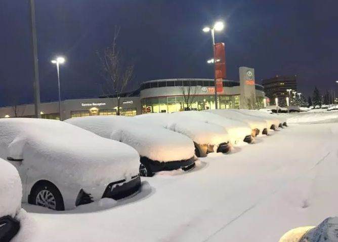
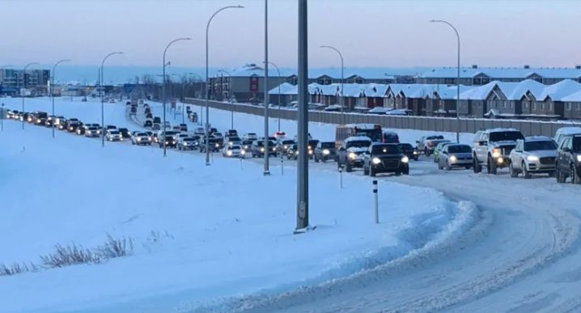
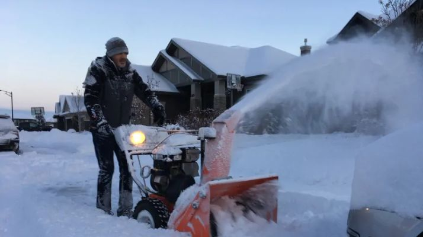
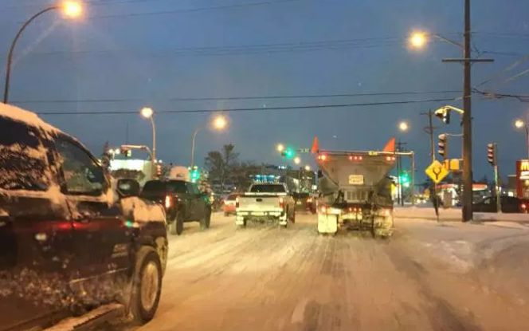
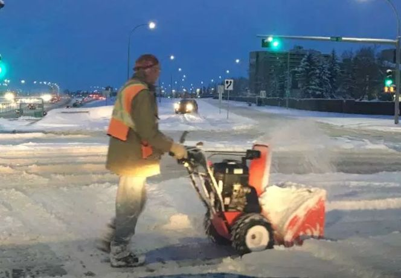
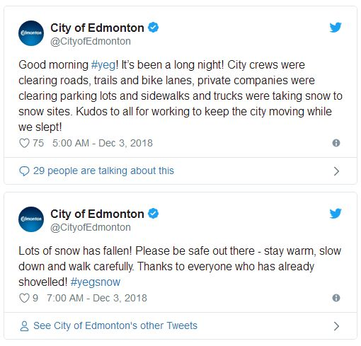
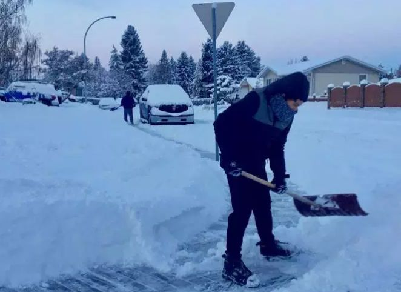
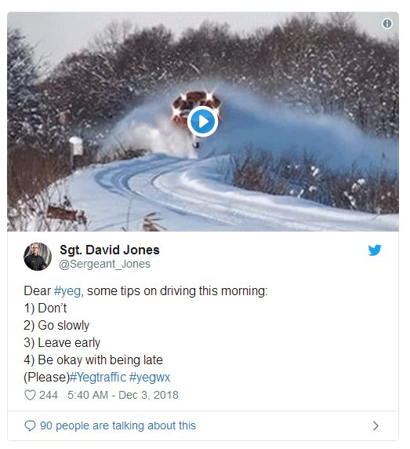
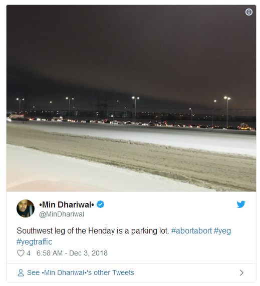
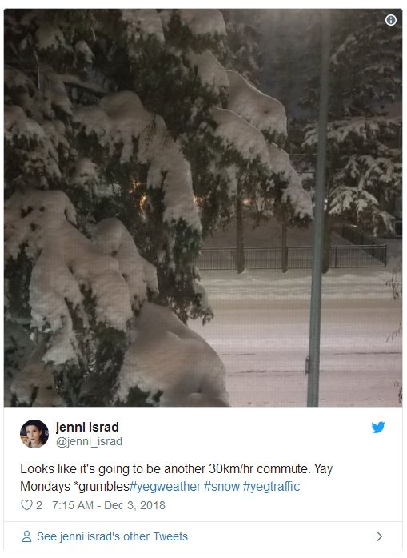

# 无标题

**链接地址:** http://mp.weixin.qq.com/s?__biz=MzI2NTE1ODgwOQ==&mid=2649605545&idx=1&sn=a36c3d2499f3e9b40f78ff13be78f27e&chksm=f2b8cc5fc5cf4549cfd5fff892fb57d02e0a1a7d4890366e70428630cba55a553b341e3dc659&mpshare=1&scene=2&srcid=#rd
**作者:** 副局长
**获取时间:** 2025/8/28 21:01:37
**图片数量:** 18

---

## 原始HTML内容

<section style="box-sizing: border-box;"><section class="V5" style="box-sizing: border-box;" powered-by="xiumi.us"><section style="margin-right: 0%;margin-left: 0%;box-sizing: border-box;"><section style="display: inline-block;vertical-align: middle;width: 80%;box-sizing: border-box;"><section class="V5" style="box-sizing: border-box;" powered-by="xiumi.us"><section style="margin-top: 10px;margin-bottom: 10px;text-align: center;box-sizing: border-box;"><section style="display: inline-block;box-sizing: border-box;"><section style="max-width: 100%;font-size: 0px;padding-bottom: 3px;box-sizing: border-box;"><section style="display: inline-block;vertical-align: middle;box-sizing: border-box;"><section style="width: 5px;height: 1px;background-color: rgb(217, 217, 217);box-sizing: border-box;"></section><section style="width: 1px;height: 5px;margin-top: -3px;margin-right: auto;margin-left: auto;background-color: rgb(217, 217, 217);box-sizing: border-box;"></section></section><section style="margin-top: -1px;margin-right: -5px;margin-left: -5px;width: 100%;display: inline-block;vertical-align: middle;padding-right: 8px;padding-left: 8px;box-sizing: border-box;"><section style="width: 100%;height: 1px;background-color: rgb(217, 217, 217);box-sizing: border-box;"></section></section><section style="display: inline-block;vertical-align: middle;box-sizing: border-box;"><section style="width: 5px;height: 1px;background-color: rgb(217, 217, 217);box-sizing: border-box;"></section><section style="width: 1px;height: 5px;margin-top: -3px;margin-right: auto;margin-left: auto;background-color: rgb(217, 217, 217);box-sizing: border-box;"></section></section></section><section style="padding-left: 15px;padding-right: 15px;color: rgb(161, 161, 161);font-size: 14px;box-sizing: border-box;">
点击上方<strong style="box-sizing: border-box;">蓝字</strong>关注我们哟~
</section><section style="max-width: 100%;font-size: 0px;box-sizing: border-box;"><section style="display: inline-block;vertical-align: middle;box-sizing: border-box;"><section style="width: 5px;height: 1px;background-color: rgb(217, 217, 217);box-sizing: border-box;"></section><section style="width: 1px;height: 5px;margin-top: -3px;margin-right: auto;margin-left: auto;background-color: rgb(217, 217, 217);box-sizing: border-box;"></section></section><section style="margin-top: -1px;margin-right: -5px;margin-left: -5px;width: 100%;display: inline-block;vertical-align: middle;padding-right: 8px;padding-left: 8px;box-sizing: border-box;"><section style="width: 100%;height: 1px;background-color: rgb(217, 217, 217);box-sizing: border-box;"></section></section><section style="display: inline-block;vertical-align: middle;box-sizing: border-box;"><section style="width: 5px;height: 1px;background-color: rgb(217, 217, 217);box-sizing: border-box;"></section><section style="width: 1px;height: 5px;margin-top: -3px;margin-right: auto;margin-left: auto;background-color: rgb(217, 217, 217);box-sizing: border-box;"></section></section></section></section></section></section></section><section style="display: inline-block;vertical-align: middle;width: 20%;box-sizing: border-box;"><section class="V5" style="box-sizing: border-box;" powered-by="xiumi.us"><section style="text-align: center;margin: -10px 0% 10px;box-sizing: border-box;"><section style="max-width: 100%;vertical-align: middle;display: inline-block;width: 100%;box-sizing: border-box;"></section></section></section></section></section></section><section class="V5" style="box-sizing: border-box;" powered-by="xiumi.us"><section style="margin: 10px 0%;box-sizing: border-box;"><section style="display: inline-block;width: 100%;vertical-align: top;box-sizing: border-box;"><section class="V5" style="box-sizing: border-box;" powered-by="xiumi.us"><section style="box-sizing: border-box;"><section style="display: inline-block;vertical-align: bottom;width: 75%;padding-right: 10px;box-sizing: border-box;"><section class="V5" style="box-sizing: border-box;" powered-by="xiumi.us"><section style="margin: 10px 0% 3px;box-sizing: border-box;"><section style="display: inline-block;vertical-align: middle;box-sizing: border-box;"><section style="display: inline-block;vertical-align: bottom;padding-left: 5px;padding-right: 5px;line-height: 1.2em;margin-bottom: 2px;color: rgba(80, 182, 201, 0.72);box-sizing: border-box;">
<strong style="box-sizing: border-box;">仔细看下图，有惊喜！</strong>
</section><section style="max-width: 100%;display: inline-block;vertical-align: bottom;width: 1.6em;box-sizing: border-box;"></section></section></section></section></section><section style="display: inline-block;vertical-align: bottom;width: 25%;box-sizing: border-box;"><section class="V5" style="box-sizing: border-box;" powered-by="xiumi.us"><section style="margin-right: 0%;margin-bottom: 3px;margin-left: 0%;text-align: right;box-sizing: border-box;"><section style="display: inline-block;border-bottom: 0.15em solid rgba(80, 182, 201, 0.72);padding-bottom: 3px;box-sizing: border-box;"><section style="display: inline-block;padding: 3px;border-bottom: 0.15em solid rgba(80, 182, 201, 0.72);font-size: 12px;line-height: 1.4;color: rgb(255, 143, 47);box-sizing: border-box;">
<strong style="box-sizing: border-box;">金主大大</strong>
</section></section></section></section></section></section></section><section class="V5" style="box-sizing: border-box;" powered-by="xiumi.us"><section style="margin-right: 0%;margin-left: 0%;box-sizing: border-box;"><section style="background-color: rgba(80, 182, 201, 0.72);height: 2px;box-sizing: border-box;"></section></section></section></section></section></section><section class="V5" style="box-sizing: border-box;" powered-by="xiumi.us"><section style="text-align: center;margin-top: 10px;margin-bottom: 10px;box-sizing: border-box;"><section style="max-width: 100%;vertical-align: middle;display: inline-block;box-sizing: border-box;"></section></section></section><section class="V5" style="box-sizing: border-box;" powered-by="xiumi.us"><section style="text-align: center;margin-top: 10px;margin-bottom: 10px;box-sizing: border-box;"><section style="max-width: 100%;vertical-align: middle;display: inline-block;box-sizing: border-box;"></section></section></section><section class="V5" style="box-sizing: border-box;" powered-by="xiumi.us"><section style="text-align: center;margin-top: 10px;margin-bottom: 10px;box-sizing: border-box;"><section style="max-width: 100%;vertical-align: middle;display: inline-block;box-sizing: border-box;"></section></section></section><section class="V5" style="box-sizing: border-box;" powered-by="xiumi.us"><section style="text-align: center;margin-top: 10px;margin-bottom: 10px;box-sizing: border-box;"><section style="max-width: 100%;vertical-align: middle;display: inline-block;box-sizing: border-box;"></section></section></section><section class="V5" style="box-sizing: border-box;" powered-by="xiumi.us"><section style="text-align: center;margin-top: 10px;margin-bottom: 10px;box-sizing: border-box;"><section style="max-width: 100%;vertical-align: middle;display: inline-block;box-sizing: border-box;"><svg xmlns="http://www.w3.org/2000/svg" x="0px" y="0px" viewBox="0 0 902.1 38.2" style="vertical-align: middle;max-width: 100%;box-sizing: border-box;" width="902.1"><g style="box-sizing: border-box;"><path style="box-sizing: border-box;" d="M18.4,1.4c0.9-1.9,2.4-1.9,3.4,0l3.4,6.9c0.9,1.9,3.4,3.7,5.4,4l7.6,1.1c2.1,0.3,2.5,1.7,1,3.2   l-5.5,5.4c-1.5,1.5-2.4,4.3-2.1,6.4l1.3,7.6c0.4,2.1-0.9,2.9-2.7,2l-6.8-3.6c-1.8-1-4.9-1-6.7,0l-6.8,3.6c-1.9,1-3.1,0.1-2.7-2   l1.3-7.6c0.4-2.1-0.6-4.9-2.1-6.4l-5.5-5.4c-1.5-1.5-1-2.9,1-3.2l7.6-1.1c2.1-0.3,4.5-2.1,5.4-4L18.4,1.4z" fill="rgb(178, 243, 230)"></path><path style="box-sizing: border-box;" d="M90.6,5.4c0.7-1.4,1.9-1.4,2.6,0l2.6,5.3c0.7,1.4,2.6,2.8,4.2,3.1l5.9,0.9c1.6,0.2,2,1.3,0.8,2.5   l-4.2,4.1c-1.2,1.1-1.9,3.3-1.6,4.9l1,5.8c0.3,1.6-0.7,2.3-2.1,1.5l-5.2-2.8c-1.4-0.8-3.8-0.8-5.2,0L84,33.6   c-1.4,0.8-2.4,0.1-2.1-1.5l1-5.8c0.3-1.6-0.5-3.8-1.6-4.9l-4.2-4.1c-1.2-1.1-0.8-2.2,0.8-2.5l5.9-0.9c1.6-0.2,3.5-1.6,4.2-3.1   L90.6,5.4z" fill="rgb(190, 204, 246)"></path><path style="box-sizing: border-box;" d="M162.6,7.5c0.6-1.2,1.6-1.2,2.2,0l2.2,4.5c0.6,1.2,2.2,2.4,3.6,2.6l5,0.7c1.4,0.2,1.7,1.1,0.7,2.1   l-3.6,3.5c-1,1-1.6,2.9-1.4,4.2l0.9,5c0.2,1.4-0.6,1.9-1.8,1.3l-4.5-2.4c-1.2-0.6-3.2-0.6-4.4,0l-4.5,2.4c-1.2,0.6-2,0.1-1.8-1.3   l0.9-5c0.2-1.4-0.4-3.3-1.4-4.2l-3.6-3.5c-1-1-0.7-1.9,0.7-2.1l5-0.7c1.4-0.2,3-1.4,3.6-2.6L162.6,7.5z" fill="rgb(150, 208, 240)"></path><path style="box-sizing: border-box;" d="M60.1,19.1c0,2.3-1.9,4.2-4.2,4.2c-2.3,0-4.2-1.9-4.2-4.2s1.9-4.2,4.2-4.2   C58.3,14.9,60.1,16.8,60.1,19.1z" fill="rgb(218, 240, 224)"></path><path style="box-sizing: border-box;" d="M203.8,19.1c0,2.3-1.9,4.2-4.2,4.2c-2.3,0-4.2-1.9-4.2-4.2s1.9-4.2,4.2-4.2   C201.9,14.9,203.8,16.8,203.8,19.1z" fill="rgb(218, 240, 224)"></path><path style="box-sizing: border-box;" d="M130.9,19.1c0,1.7-1.4,3.1-3.1,3.1c-1.7,0-3.1-1.4-3.1-3.1c0-1.7,1.4-3.1,3.1-3.1   C129.5,16.1,130.9,17.4,130.9,19.1z" fill="rgb(218, 240, 224)"></path><path style="box-sizing: border-box;" d="M233.9,1.4c0.9-1.9,2.4-1.9,3.4,0l3.4,6.9c0.9,1.9,3.4,3.7,5.4,4l7.6,1.1c2.1,0.3,2.5,1.7,1,3.2   l-5.5,5.4c-1.5,1.5-2.4,4.3-2.1,6.4l1.3,7.6c0.4,2.1-0.9,2.9-2.7,2l-6.8-3.6c-1.8-1-4.9-1-6.7,0l-6.8,3.6c-1.9,1-3.1,0.1-2.7-2   l1.3-7.6c0.4-2.1-0.6-4.9-2.1-6.4l-5.5-5.4c-1.5-1.5-1-2.9,1-3.2l7.6-1.1c2.1-0.3,4.5-2.1,5.4-4L233.9,1.4z" fill="rgb(178, 243, 230)"></path><path style="box-sizing: border-box;" d="M306.1,5.4c0.7-1.4,1.9-1.4,2.6,0l2.6,5.3c0.7,1.4,2.6,2.8,4.2,3.1l5.9,0.9c1.6,0.2,2,1.3,0.8,2.5   l-4.2,4.1c-1.2,1.1-1.9,3.3-1.6,4.9l1,5.8c0.3,1.6-0.7,2.3-2.1,1.5l-5.2-2.8c-1.4-0.8-3.8-0.8-5.2,0l-5.2,2.8   c-1.4,0.8-2.4,0.1-2.1-1.5l1-5.8c0.3-1.6-0.4-3.8-1.6-4.9l-4.2-4.1c-1.2-1.1-0.8-2.2,0.8-2.5l5.9-0.9c1.6-0.2,3.5-1.6,4.2-3.1   L306.1,5.4z" fill="rgb(190, 204, 246)"></path><path style="box-sizing: border-box;" d="M378.1,7.5c0.6-1.2,1.6-1.2,2.2,0l2.2,4.5c0.6,1.2,2.2,2.4,3.6,2.6l5,0.7c1.4,0.2,1.7,1.1,0.7,2.1   l-3.6,3.5c-1,1-1.6,2.9-1.4,4.2l0.9,5c0.2,1.4-0.6,1.9-1.8,1.3l-4.5-2.4c-1.2-0.6-3.2-0.6-4.4,0l-4.5,2.4c-1.2,0.6-2,0.1-1.8-1.3   l0.9-5c0.2-1.4-0.4-3.3-1.4-4.2l-3.6-3.5c-1-1-0.7-1.9,0.7-2.1l5-0.7c1.4-0.2,3-1.4,3.6-2.6L378.1,7.5z" fill="rgb(150, 208, 240)"></path><path style="box-sizing: border-box;" d="M275.7,19.1c0,2.3-1.9,4.2-4.2,4.2c-2.3,0-4.2-1.9-4.2-4.2s1.9-4.2,4.2-4.2   C273.8,14.9,275.7,16.8,275.7,19.1z" fill="rgb(218, 240, 224)"></path><path style="box-sizing: border-box;" d="M419.3,19.1c0,2.3-1.9,4.2-4.2,4.2c-2.3,0-4.2-1.9-4.2-4.2s1.9-4.2,4.2-4.2   C417.5,14.9,419.3,16.8,419.3,19.1z" fill="rgb(218, 240, 224)"></path><path style="box-sizing: border-box;" d="M346.4,19.1c0,1.7-1.4,3.1-3.1,3.1c-1.7,0-3.1-1.4-3.1-3.1c0-1.7,1.4-3.1,3.1-3.1   C345,16.1,346.4,17.4,346.4,19.1z" fill="rgb(218, 240, 224)"></path><path style="box-sizing: border-box;" d="M449.4,1.4c0.9-1.9,2.4-1.9,3.4,0l3.4,6.9c0.9,1.9,3.4,3.7,5.4,4l7.6,1.1c2.1,0.3,2.5,1.7,1,3.2   l-5.5,5.4c-1.5,1.5-2.4,4.3-2.1,6.4l1.3,7.6c0.4,2.1-0.9,2.9-2.7,2l-6.8-3.6c-1.8-1-4.9-1-6.7,0l-6.8,3.6c-1.9,1-3.1,0.1-2.7-2   l1.3-7.6c0.4-2.1-0.6-4.9-2.1-6.4l-5.5-5.4c-1.5-1.5-1-2.9,1-3.2l7.6-1.1c2.1-0.3,4.5-2.1,5.4-4L449.4,1.4z" fill="rgb(178, 243, 230)"></path><path style="box-sizing: border-box;" d="M521.6,5.4c0.7-1.4,1.9-1.4,2.6,0l2.6,5.3c0.7,1.4,2.6,2.8,4.2,3.1l5.9,0.9c1.6,0.2,2,1.3,0.8,2.5   l-4.2,4.1c-1.2,1.1-1.9,3.3-1.6,4.9l1,5.8c0.3,1.6-0.7,2.3-2.1,1.5l-5.2-2.8c-1.4-0.8-3.8-0.8-5.2,0l-5.2,2.8   c-1.4,0.8-2.4,0.1-2.1-1.5l1-5.8c0.3-1.6-0.5-3.8-1.6-4.9l-4.2-4.1c-1.2-1.1-0.8-2.2,0.8-2.5l5.9-0.9c1.6-0.2,3.5-1.6,4.2-3.1   L521.6,5.4z" fill="rgb(190, 204, 246)"></path><path style="box-sizing: border-box;" d="M593.6,7.5c0.6-1.2,1.6-1.2,2.2,0l2.2,4.5c0.6,1.2,2.2,2.4,3.6,2.6l5,0.7c1.4,0.2,1.7,1.1,0.7,2.1   l-3.6,3.5c-1,1-1.6,2.9-1.4,4.2l0.9,5c0.2,1.4-0.6,1.9-1.8,1.3l-4.5-2.4c-1.2-0.6-3.2-0.6-4.4,0l-4.5,2.4c-1.2,0.6-2,0.1-1.8-1.3   l0.9-5c0.2-1.4-0.4-3.3-1.4-4.2l-3.6-3.5c-1-1-0.7-1.9,0.7-2.1l5-0.7c1.4-0.2,3-1.4,3.6-2.6L593.6,7.5z" fill="rgb(150, 208, 240)"></path><path style="box-sizing: border-box;" d="M491.2,19.1c0,2.3-1.9,4.2-4.2,4.2c-2.3,0-4.2-1.9-4.2-4.2s1.9-4.2,4.2-4.2   C489.3,14.9,491.2,16.8,491.2,19.1z" fill="rgb(218, 240, 224)"></path><path style="box-sizing: border-box;" d="M634.9,19.1c0,2.3-1.9,4.2-4.2,4.2c-2.3,0-4.2-1.9-4.2-4.2s1.9-4.2,4.2-4.2   C633,14.9,634.9,16.8,634.9,19.1z" fill="rgb(218, 240, 224)"></path><path style="box-sizing: border-box;" d="M561.9,19.1c0,1.7-1.4,3.1-3.1,3.1c-1.7,0-3.1-1.4-3.1-3.1c0-1.7,1.4-3.1,3.1-3.1   C560.5,16.1,561.9,17.4,561.9,19.1z" fill="rgb(218, 240, 224)"></path><path style="box-sizing: border-box;" d="M664.9,1.4c0.9-1.9,2.4-1.9,3.4,0l3.4,6.9c0.9,1.9,3.4,3.7,5.4,4l7.6,1.1c2.1,0.3,2.5,1.7,1,3.2   l-5.5,5.4c-1.5,1.5-2.4,4.3-2.1,6.4l1.3,7.6c0.4,2.1-0.9,2.9-2.7,2l-6.8-3.6c-1.8-1-4.9-1-6.7,0l-6.8,3.6c-1.9,1-3.1,0.1-2.7-2   l1.3-7.6c0.4-2.1-0.6-4.9-2.1-6.4l-5.5-5.4c-1.5-1.5-1-2.9,1-3.2l7.6-1.1c2.1-0.3,4.5-2.1,5.4-4L664.9,1.4z" fill="rgb(178, 243, 230)"></path><path style="box-sizing: border-box;" d="M737.1,5.4c0.7-1.4,1.9-1.4,2.6,0l2.6,5.3c0.7,1.4,2.6,2.8,4.2,3.1l5.9,0.9c1.6,0.2,2,1.3,0.8,2.5   l-4.2,4.1c-1.2,1.1-1.9,3.3-1.6,4.9l1,5.8c0.3,1.6-0.7,2.3-2.1,1.5l-5.2-2.8c-1.4-0.8-3.8-0.8-5.2,0l-5.2,2.8   c-1.4,0.8-2.4,0.1-2.1-1.5l1-5.8c0.3-1.6-0.5-3.8-1.6-4.9l-4.2-4.1c-1.2-1.1-0.8-2.2,0.8-2.5l5.9-0.9c1.6-0.2,3.5-1.6,4.2-3.1   L737.1,5.4z" fill="rgb(190, 204, 246)"></path><path style="box-sizing: border-box;" d="M809.2,7.5c0.6-1.2,1.6-1.2,2.2,0l2.2,4.5c0.6,1.2,2.2,2.4,3.6,2.6l5,0.7c1.4,0.2,1.7,1.1,0.7,2.1   l-3.6,3.5c-1,1-1.6,2.9-1.4,4.2l0.9,5c0.2,1.4-0.6,1.9-1.8,1.3l-4.5-2.4c-1.2-0.6-3.2-0.6-4.4,0l-4.5,2.4c-1.2,0.6-2,0.1-1.8-1.3   l0.9-5c0.2-1.4-0.4-3.3-1.4-4.2l-3.6-3.5c-1-1-0.7-1.9,0.7-2.1l5-0.7c1.4-0.2,3-1.4,3.6-2.6L809.2,7.5z" fill="rgb(150, 208, 240)"></path><path style="box-sizing: border-box;" d="M706.7,19.1c0,2.3-1.9,4.2-4.2,4.2c-2.3,0-4.2-1.9-4.2-4.2s1.9-4.2,4.2-4.2   C704.8,14.9,706.7,16.8,706.7,19.1z" fill="rgb(218, 240, 224)"></path><path style="box-sizing: border-box;" d="M850.4,19.1c0,2.3-1.9,4.2-4.2,4.2c-2.3,0-4.2-1.9-4.2-4.2s1.9-4.2,4.2-4.2   C848.5,14.9,850.4,16.8,850.4,19.1z" fill="rgb(218, 240, 224)"></path><path style="box-sizing: border-box;" d="M777.4,19.1c0,1.7-1.4,3.1-3.1,3.1c-1.7,0-3.1-1.4-3.1-3.1c0-1.7,1.4-3.1,3.1-3.1   C776,16.1,777.4,17.4,777.4,19.1z" fill="rgb(218, 240, 224)"></path><path style="box-sizing: border-box;" d="M880.4,1.4c0.9-1.9,2.4-1.9,3.4,0l3.4,6.9c0.9,1.9,3.4,3.7,5.4,4l7.6,1.1c2.1,0.3,2.5,1.7,1,3.2   l-5.5,5.4c-1.5,1.5-2.4,4.3-2.1,6.4l1.3,7.6c0.4,2.1-0.9,2.9-2.7,2l-6.8-3.6c-1.8-1-4.9-1-6.7,0l-6.8,3.6c-1.8,1-3.1,0.1-2.7-2   l1.3-7.6c0.4-2.1-0.6-4.9-2.1-6.4l-5.5-5.4c-1.5-1.5-1-2.9,1-3.2l7.6-1.1c2.1-0.3,4.5-2.1,5.4-4L880.4,1.4z" fill="rgb(178, 243, 230)"></path></g></svg></section></section></section><section class="V5" style="box-sizing: border-box;" powered-by="xiumi.us"><section style="box-sizing: border-box;"><section style="text-align: center;box-sizing: border-box;">

 

今天早上雪糊一起床拉开窗帘，发现外面的整个世界都变成了白色。作为一个埃德蒙顿人本来<strong>不应该对“下雪”这件事情感到意外</strong>。

 

但这次雪也下得太大了吧！看到Drive Way上那么厚的一层雪就头痛，<strong>人还没睡醒就要起来铲</strong>——这是早上六点的事情。

 

 

然而跑到公司已经早上九点多了！不到八点出了门，平时二十多分钟的车程怎么就耗到看一，个小时零二十分钟呢！

 

而且公司<strong>全部人无一例外地迟到</strong>了！生气得打开Twitter，hash tag一搜“edmontontraffic”<strong>铺天盖地的吐槽迎面扑来</strong>！

 

 

 

原来像雪糊一样起个大早，赶个晚集的人大有人在，而这其中罪魁祸首当然就是这两天内累积的<strong>超过30厘米厚的特大降雪</strong>！

根据CTV News和Global News报道，埃德蒙顿周一早上迎来了本季度最严重的一次<strong>全城交通大拥堵</strong>！整个城市的平均交通<strong>延迟时间为40分钟以上</strong>！

 

根据Global Edmonton气象专家Mike Sobel的说法，截至周一早晨，埃德蒙顿地区本次的降雪量多达<strong>30厘米</strong>。埃德蒙顿从周六早上开始经历了<strong>长达50小时的不间断降雪</strong>。

而本季度经历的数次降雪一共才累积到了<strong>82厘米</strong>。可以说今年开冬以来，老天爷把<strong>超过三分之一的大雪都一次性的赏给了咱埃德蒙顿</strong>。

而根据去年的降雪量来看，整个冬天直到<strong>来年的3月3日</strong>才勉强达到今年这82厘米降雪的标准。

<strong>然而可怕的是，今年的冬天还没有正式开始。</strong>

 

星期日中午到星期一早上8点之间这<strong>不足24小时的时间内</strong>，埃德蒙顿居民向市警察报告了一共多达<strong>88次由大雪造成的交通事故</strong>。其中包括14次碰撞事故，1次人身伤害事故和73次财产损失事故。 

<strong>City of Edmonton</strong>也发出警告，督促埃德蒙顿市民注意安全，小心行使。

埃德蒙顿政府城市规划发展部门的发言人Catherine Kuehne表示，自周末降雪开始以来，道路工作人员一直在加班加点的不停工作。&nbsp;

超过<strong>250位工作人员</strong>正在使用<strong>200多件除雪设备</strong>，不间断地轮换工作了<strong>超过36小时</strong>！

Kuehne敦促司机小心驾驶并为道路工作人员提供充足的工作空间，特别是因为许多扫雪机正在协同工作。&nbsp;

 

加拿大环境部门发布的降雪警告已于周日晚间至周一早些时候在埃德蒙顿发布。 

同时，冬季的第一个季节性停车禁令将于<strong>周二凌晨1点生效</strong>。季节性停车禁令在指定的巴士路线上。它们可以在11月5日至3月15日期间的任何时间在重大下雪期间宣布。

禁令生效后，停放在标有季节性停车禁令标志的地方的车辆将被标记和拖曳。<strong>禁令将一直有效</strong>，直到该市宣布结束。

 

不过好在现在大雪已经停了，之后的交通情况会越来越好。大家不用过于担心。只是一想起今年还可能会遭遇几场这样的大雪，就感到沮丧……

 

 

最后贡献个<strong>加拿大开雪浆路的指南</strong>，希望大家安全驾驶，平安回家。 

加拿大的司机很讨厌的就是在雪浆路上驾驶，雪浆不仅把车弄得骯脏狼狈，还容易打滑造成交通事故。&nbsp;  雪浆是由雪、冰粒、水、尘埃和盐组成的，这在季节交替或冬季下完雪后升温的时候很常见，气温在零度左右，但是因为撒了融雪盐，即使在更低的温度下，水也结不了冰，冰雪也不那么融化，就形成了这种混合物。它会在路上形成雪浆陇，把车道和轮道分隔开来，妨碍变道。&nbsp;  雪浆会造成两方面问题：首先，雪浆的摩擦阻力系数非常小，和湿冰差不多，轮子在雪浆上很容易打滑，剎车、启动力都受影响；还有，它很容易成垄，又很黏，会附着在轮胎的表面和侧面，形成光滑的表面。&nbsp;  因此，司机在变道的时候，很可能一侧的轮子正好在雪浆垄上，而另一侧在硬路面上，造成单侧打滑，车就会失控，向打滑的一侧偏转行驶方向甚至打转。如果司机方向盘打得过勐，前轮又正好撞上雪浆堆，受到突然的阻力，像剎车一样，而此时后轮又不抓地，车就会打转。&nbsp;  通常在这种情况下，司机的第一反应是松开油门踏板，而这会使事情变得更糟，特别是前轮驱动的车，一松油门，就等于给前轮施加了一个附加的引擎剎车力， 已经打滑的后轮就更容易推动车子打转。&nbsp;  那么遇到雪浆路，应如何驾驶呢？首先，不到不得已不要在雪浆路上变道，特别是在雪浆形成垄的路段，尽量把轮子保持在笼沟内；非要变道时，应选择雪浆薄，没有形成垄的路段；打方向盘要慢，使车子以较小的角度，逐渐切入另一条车道，这样可以减少雪浆对轮子侧面的压力；打方向盘不要太用力，但要保持在驶上雪浆垄的时候，方向盘不会自动改变角度，并保持好变道的角度；保持油门踏板的力度，使得车子既不加速也不减速；完成变道后，也要缓打方向盘，使车子逐渐转正。总之，在雪浆路上变道，最重要的是平稳。

 

- 更多精彩内容，敬请关注我们 -

 

文章信息来源：CTVNews，Global News，大纪

 

 
</section></section></section><section class="V5" style="box-sizing: border-box;" powered-by="xiumi.us"><section style="box-sizing: border-box;"><section style="box-sizing: border-box;">
 
</section></section></section><section class="V5" style="box-sizing: border-box;" powered-by="xiumi.us"><section style="margin: 40px 0% 10px;text-align: center;box-sizing: border-box;"><section style="display: inline-block;width: 90%;border-width: 1px;border-style: dotted;border-color: rgba(80, 182, 201, 0.72);padding: 10px;border-radius: 0px;box-sizing: border-box;"><section class="V5" style="box-sizing: border-box;" powered-by="xiumi.us"><section style="transform: translate3d(20px, 0px, 0px);text-align: left;font-size: 11px;margin-top: -55px;margin-right: 0%;margin-left: 0%;box-sizing: border-box;"><section style="box-sizing: border-box;width: 7em;height: 7em;display: inline-block;vertical-align: bottom;border-radius: 100%;border-width: 5px;border-style: none;border-color: rgba(80, 182, 201, 0.72);background-position: center center;background-repeat: no-repeat;background-size: cover;background-image: url(&quot;https://mmbiz.qpic.cn/mmbiz_jpg/D1nJqnhkPyKkicX2wSfRf3TjIGAh3GDEhbYp6ia0oEeYumGA8TiaQteO1qibrUpPRfhUiaIVkGfkRNuutuq4S9aMTcQ/640?wx_fmt=jpeg&quot;);"><section style="width: 100%;height: 100%;overflow: hidden;box-sizing: border-box;"></section></section></section></section><section class="V5" style="box-sizing: border-box;" powered-by="xiumi.us"><section style="box-sizing: border-box;"><section class="group-empty" style="display: inline-block;vertical-align: top;width: 38.2%;box-sizing: border-box;"></section><section style="display: inline-block;vertical-align: top;width: 61.8%;box-sizing: border-box;"><section class="V5" style="box-sizing: border-box;" powered-by="xiumi.us"><section style="margin-right: 0%;margin-left: 0%;box-sizing: border-box;"><section style="font-size: 18px;color: rgb(67, 103, 117);line-height: 1.6;letter-spacing: 1px;box-sizing: border-box;">
<strong style="box-sizing: border-box;">埃德蒙顿微生活</strong>
</section></section></section><section class="V5" style="box-sizing: border-box;" powered-by="xiumi.us"><section style="margin-top: 0.5em;margin-bottom: 0.5em;box-sizing: border-box;"><section style="background-color: rgba(80, 182, 201, 0.72);height: 1px;box-sizing: border-box;"></section></section></section></section></section></section><section class="V5" style="box-sizing: border-box;" powered-by="xiumi.us"><section style="box-sizing: border-box;"><section style="text-align: justify;font-size: 14px;color: rgba(62, 62, 62, 0.72);letter-spacing: 2px;box-sizing: border-box;">
<strong style="box-sizing: border-box;">关心埃德蒙顿民生，</strong>

<strong style="box-sizing: border-box;">关注埃德蒙顿的发展。</strong>

 

埃德蒙顿微生活是“吃喝玩乐埃德蒙顿”旗下，为埃德蒙顿地区的居民提供每日最新的吃喝玩乐、工作学习、商业投资的媒体平台 。
</section></section></section><section class="V5" style="box-sizing: border-box;" powered-by="xiumi.us"><section style="box-sizing: border-box;"><section style="text-align: left;box-sizing: border-box;">
 
</section></section></section><section class="V5" style="box-sizing: border-box;" powered-by="xiumi.us"><section style="box-sizing: border-box;"><section style="display: inline-block;vertical-align: middle;width: 61.8%;box-sizing: border-box;"><section class="V5" style="box-sizing: border-box;" powered-by="xiumi.us"><section style="box-sizing: border-box;"><section style="text-align: justify;font-size: 12px;color: rgba(62, 62, 62, 0.37);line-height: 1.9;letter-spacing: 0px;box-sizing: border-box;">
我们的目标是以最新、最快、最及时的方式 报道埃德蒙顿的新鲜事 。 
</section></section></section></section><section style="display: inline-block;vertical-align: middle;width: 38.2%;box-sizing: border-box;"><section class="V5" style="box-sizing: border-box;" powered-by="xiumi.us"><section style="margin-right: 0%;margin-left: 0%;box-sizing: border-box;"><section style="max-width: 100%;vertical-align: middle;display: inline-block;width: 70%;box-sizing: border-box;"></section></section></section></section></section></section></section></section></section></section>
 

---

## 纯文本内容

点击上方蓝字关注我们哟~仔细看下图，有惊喜！金主大大今天早上雪糊一起床拉开窗帘，发现外面的整个世界都变成了白色。作为一个埃德蒙顿人本来不应该对“下雪”这件事情感到意外。但这次雪也下得太大了吧！看到Drive Way上那么厚的一层雪就头痛，人还没睡醒就要起来铲——这是早上六点的事情。然而跑到公司已经早上九点多了！不到八点出了门，平时二十多分钟的车程怎么就耗到看一，个小时零二十分钟呢！而且公司全部人无一例外地迟到了！生气得打开Twitter，hash tag一搜“edmontontraffic”铺天盖地的吐槽迎面扑来！原来像雪糊一样起个大早，赶个晚集的人大有人在，而这其中罪魁祸首当然就是这两天内累积的超过30厘米厚的特大降雪！根据CTV News和Global News报道，埃德蒙顿周一早上迎来了本季度最严重的一次全城交通大拥堵！整个城市的平均交通延迟时间为40分钟以上！根据Global Edmonton气象专家Mike Sobel的说法，截至周一早晨，埃德蒙顿地区本次的降雪量多达30厘米。埃德蒙顿从周六早上开始经历了长达50小时的不间断降雪。而本季度经历的数次降雪一共才累积到了82厘米。可以说今年开冬以来，老天爷把超过三分之一的大雪都一次性的赏给了咱埃德蒙顿。而根据去年的降雪量来看，整个冬天直到来年的3月3日才勉强达到今年这82厘米降雪的标准。然而可怕的是，今年的冬天还没有正式开始。星期日中午到星期一早上8点之间这不足24小时的时间内，埃德蒙顿居民向市警察报告了一共多达88次由大雪造成的交通事故。其中包括14次碰撞事故，1次人身伤害事故和73次财产损失事故。City of Edmonton也发出警告，督促埃德蒙顿市民注意安全，小心行使。埃德蒙顿政府城市规划发展部门的发言人Catherine Kuehne表示，自周末降雪开始以来，道路工作人员一直在加班加点的不停工作。 超过250位工作人员正在使用200多件除雪设备，不间断地轮换工作了超过36小时！Kuehne敦促司机小心驾驶并为道路工作人员提供充足的工作空间，特别是因为许多扫雪机正在协同工作。 加拿大环境部门发布的降雪警告已于周日晚间至周一早些时候在埃德蒙顿发布。同时，冬季的第一个季节性停车禁令将于周二凌晨1点生效。季节性停车禁令在指定的巴士路线上。它们可以在11月5日至3月15日期间的任何时间在重大下雪期间宣布。禁令生效后，停放在标有季节性停车禁令标志的地方的车辆将被标记和拖曳。禁令将一直有效，直到该市宣布结束。不过好在现在大雪已经停了，之后的交通情况会越来越好。大家不用过于担心。只是一想起今年还可能会遭遇几场这样的大雪，就感到沮丧……最后贡献个加拿大开雪浆路的指南，希望大家安全驾驶，平安回家。加拿大的司机很讨厌的就是在雪浆路上驾驶，雪浆不仅把车弄得骯脏狼狈，还容易打滑造成交通事故。 雪浆是由雪、冰粒、水、尘埃和盐组成的，这在季节交替或冬季下完雪后升温的时候很常见，气温在零度左右，但是因为撒了融雪盐，即使在更低的温度下，水也结不了冰，冰雪也不那么融化，就形成了这种混合物。它会在路上形成雪浆陇，把车道和轮道分隔开来，妨碍变道。 雪浆会造成两方面问题：首先，雪浆的摩擦阻力系数非常小，和湿冰差不多，轮子在雪浆上很容易打滑，剎车、启动力都受影响；还有，它很容易成垄，又很黏，会附着在轮胎的表面和侧面，形成光滑的表面。 因此，司机在变道的时候，很可能一侧的轮子正好在雪浆垄上，而另一侧在硬路面上，造成单侧打滑，车就会失控，向打滑的一侧偏转行驶方向甚至打转。如果司机方向盘打得过勐，前轮又正好撞上雪浆堆，受到突然的阻力，像剎车一样，而此时后轮又不抓地，车就会打转。 通常在这种情况下，司机的第一反应是松开油门踏板，而这会使事情变得更糟，特别是前轮驱动的车，一松油门，就等于给前轮施加了一个附加的引擎剎车力， 已经打滑的后轮就更容易推动车子打转。 那么遇到雪浆路，应如何驾驶呢？首先，不到不得已不要在雪浆路上变道，特别是在雪浆形成垄的路段，尽量把轮子保持在笼沟内；非要变道时，应选择雪浆薄，没有形成垄的路段；打方向盘要慢，使车子以较小的角度，逐渐切入另一条车道，这样可以减少雪浆对轮子侧面的压力；打方向盘不要太用力，但要保持在驶上雪浆垄的时候，方向盘不会自动改变角度，并保持好变道的角度；保持油门踏板的力度，使得车子既不加速也不减速；完成变道后，也要缓打方向盘，使车子逐渐转正。总之，在雪浆路上变道，最重要的是平稳。- 更多精彩内容，敬请关注我们 -文章信息来源：CTVNews，Global News，大纪埃德蒙顿微生活关心埃德蒙顿民生，关注埃德蒙顿的发展。埃德蒙顿微生活是“吃喝玩乐埃德蒙顿”旗下，为埃德蒙顿地区的居民提供每日最新的吃喝玩乐、工作学习、商业投资的媒体平台 。我们的目标是以最新、最快、最及时的方式 报道埃德蒙顿的新鲜事 。

---

## 图片列表

-  (原始链接: https://mmbiz.qpic.cn/mmbiz_gif/D1nJqnhkPyKkicX2wSfRf3TjIGAh3GDEhTZNq1fILvb9cP1mvT9scibbZrZvORvf5UpySkTk6hEONNgBztRibNqKg/640?wx_fmt=gif)
-  (原始链接: https://mmbiz.qpic.cn/mmbiz_gif/D1nJqnhkPyKkicX2wSfRf3TjIGAh3GDEhD7H0FHMpNcsaOFhJkvM1jFsfDxIMvot5fNdQeTxQluv0UqKcnUSic7Q/640?wx_fmt=gif)
-  (原始链接: https://mmbiz.qpic.cn/mmbiz_jpg/D1nJqnhkPyKkicX2wSfRf3TjIGAh3GDEhwmn6w5U8RChSPh5vdb8kyUgEjrhgqFlmVApRb442hgMnicSBo2GpdSA/640?wx_fmt=jpeg)
-  (原始链接: https://mmbiz.qpic.cn/mmbiz_jpg/D1nJqnhkPyKkicX2wSfRf3TjIGAh3GDEhYntdXpKntYIXExbWsU14L4E0dv0icrLZPAbu8zvsSzupHOoT8u0g7XQ/640?wx_fmt=jpeg)
-  (原始链接: https://mmbiz.qpic.cn/mmbiz_jpg/D1nJqnhkPyKkicX2wSfRf3TjIGAh3GDEhCxuZVxR111vcRUvppW3Vz5icqKfAF8jBy4Ddd0diaHYMZmj4KLuquOWg/640?wx_fmt=jpeg)
-  (原始链接: https://mmbiz.qpic.cn/mmbiz_jpg/D1nJqnhkPyKkicX2wSfRf3TjIGAh3GDEhm7DaLsfia3cRc5KeYZySc06YUXHhTubT3x3rSIHkWfduChrkfKpD1cw/640?wx_fmt=jpeg)
-  (原始链接: https://mmbiz.qpic.cn/mmbiz_png/D1nJqnhkPyKkicX2wSfRf3TjIGAh3GDEh6MbQLy5RIibpNibMEf4W6Mr9tPmjbXGia9RNnOfYvxibVF9rOWZRFxiaxHQ/640?wx_fmt=png)
-  (原始链接: https://mmbiz.qpic.cn/mmbiz_png/D1nJqnhkPyKkicX2wSfRf3TjIGAh3GDEhtVuj6q27FuYXBS2jG0IZgoS5p3pQ3oCiajuC3SPaof9X9xD3npWvPdQ/640?wx_fmt=png)
-  (原始链接: https://mmbiz.qpic.cn/mmbiz_png/D1nJqnhkPyKkicX2wSfRf3TjIGAh3GDEhP5kicUGia0Igsy8j1Rs2ibpWlas0fTSMvqdrhUAp7DKaZ5T6ZlOo999AA/640?wx_fmt=png)
-  (原始链接: https://mmbiz.qpic.cn/mmbiz_png/D1nJqnhkPyKkicX2wSfRf3TjIGAh3GDEhBTKXabNmT0VsMrejShceR1zBwaAriaHC6676iaofoHvhMx2TOGO3JYnw/640?wx_fmt=png)
-  (原始链接: https://mmbiz.qpic.cn/mmbiz_png/D1nJqnhkPyKkicX2wSfRf3TjIGAh3GDEhaIjCoARbudJic4wLeIrUf23D8ZiaYZibmdsHnhNYOQxGZs4TgtarLMQ7w/640?wx_fmt=png)
-  (原始链接: https://mmbiz.qpic.cn/mmbiz_png/D1nJqnhkPyKkicX2wSfRf3TjIGAh3GDEhfzX8LqGUPr8lZpibhQ19IbUhcR0jBXSp4BH9DnMAhIdY7NvZrXxV3bg/640?wx_fmt=png)
-  (原始链接: https://mmbiz.qpic.cn/mmbiz_png/D1nJqnhkPyKkicX2wSfRf3TjIGAh3GDEhxULNbfgwPicRGgFe60BXVibosmQ2lQia2AmeyGlepVSfjVyxBFKXVgTXQ/640?wx_fmt=png)
-  (原始链接: https://mmbiz.qpic.cn/mmbiz_png/D1nJqnhkPyKkicX2wSfRf3TjIGAh3GDEhw2eLwEyTcYGTTvrAUJbTMpgMf5Gicjz5ZL5ZGNkTAc8EVBrh3rkiaMBg/640?wx_fmt=png)
-  (原始链接: https://mmbiz.qpic.cn/mmbiz_png/D1nJqnhkPyKkicX2wSfRf3TjIGAh3GDEh0ic6riaicmojqEE4HMSoTKCqoyrIh2ArkttWypm1jPJS04G1viaicDVugfQ/640?wx_fmt=png)
-  (原始链接: https://mmbiz.qpic.cn/mmbiz_png/D1nJqnhkPyKkicX2wSfRf3TjIGAh3GDEhKbodueQjnajgLEI3hWDPkuwbvJ7FNEZoov8YPlXNneRbgHgmoQblgw/640?wx_fmt=png)
-  (原始链接: https://mmbiz.qpic.cn/mmbiz_jpg/D1nJqnhkPyKkicX2wSfRf3TjIGAh3GDEhbYp6ia0oEeYumGA8TiaQteO1qibrUpPRfhUiaIVkGfkRNuutuq4S9aMTcQ/640?wx_fmt=jpeg)
-  (原始链接: https://mmbiz.qpic.cn/mmbiz_jpg/D1nJqnhkPyKkicX2wSfRf3TjIGAh3GDEhZ24fA0xLwZqzaLVII2MlDTIfK2oGibIUcDbY3K1IEwDRvq0YHIszYLg/640?wx_fmt=jpeg)
