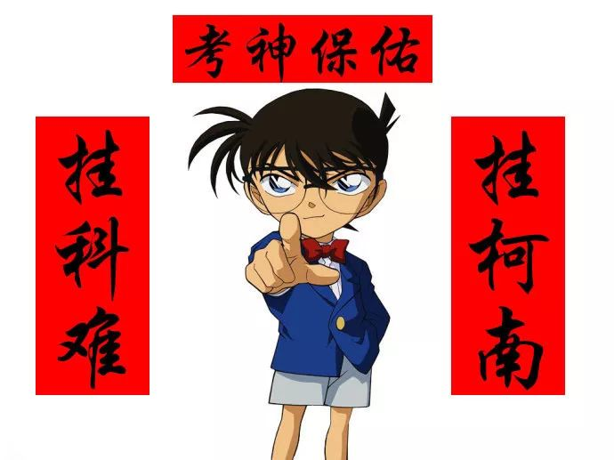

# 无标题

**链接地址:** http://mp.weixin.qq.com/s?__biz=MzI2NTE1ODgwOQ==&mid=2649605549&idx=1&sn=a94baa3edb4b35acaae81a7f1bddfa27&chksm=f2b8cc5bc5cf454da892fd525f6ca069de9fa696fe97cc3327496c7832d653b264ffd8dc7f4c&mpshare=1&scene=2&srcid=#rd
**作者:** 
**获取时间:** 2025/8/28 21:01:13
**图片数量:** 26

---

## 原始HTML内容

<section style="box-sizing: border-box;"><section class="V5" style="box-sizing: border-box;" powered-by="xiumi.us"><section style="margin-right: 0%;margin-left: 0%;box-sizing: border-box;"><section style="display: inline-block;vertical-align: middle;width: 80%;box-sizing: border-box;"><section class="V5" style="box-sizing: border-box;" powered-by="xiumi.us"><section style="margin-top: 10px;margin-bottom: 10px;text-align: center;box-sizing: border-box;"><section style="display: inline-block;box-sizing: border-box;"><section style="max-width: 100%;font-size: 0px;padding-bottom: 3px;box-sizing: border-box;"><section style="display: inline-block;vertical-align: middle;box-sizing: border-box;"><section style="width: 5px;height: 1px;background-color: rgb(217, 217, 217);box-sizing: border-box;"></section><section style="width: 1px;height: 5px;margin-top: -3px;margin-right: auto;margin-left: auto;background-color: rgb(217, 217, 217);box-sizing: border-box;"></section></section><section style="margin-top: -1px;margin-right: -5px;margin-left: -5px;width: 100%;display: inline-block;vertical-align: middle;padding-right: 8px;padding-left: 8px;box-sizing: border-box;"><section style="width: 100%;height: 1px;background-color: rgb(217, 217, 217);box-sizing: border-box;"></section></section><section style="display: inline-block;vertical-align: middle;box-sizing: border-box;"><section style="width: 5px;height: 1px;background-color: rgb(217, 217, 217);box-sizing: border-box;"></section><section style="width: 1px;height: 5px;margin-top: -3px;margin-right: auto;margin-left: auto;background-color: rgb(217, 217, 217);box-sizing: border-box;"></section></section></section><section style="padding-left: 15px;padding-right: 15px;color: rgb(161, 161, 161);font-size: 14px;box-sizing: border-box;">
点击上方<strong style="box-sizing: border-box;">蓝字</strong>关注我们哟~
</section><section style="max-width: 100%;font-size: 0px;box-sizing: border-box;"><section style="display: inline-block;vertical-align: middle;box-sizing: border-box;"><section style="width: 5px;height: 1px;background-color: rgb(217, 217, 217);box-sizing: border-box;"></section><section style="width: 1px;height: 5px;margin-top: -3px;margin-right: auto;margin-left: auto;background-color: rgb(217, 217, 217);box-sizing: border-box;"></section></section><section style="margin-top: -1px;margin-right: -5px;margin-left: -5px;width: 100%;display: inline-block;vertical-align: middle;padding-right: 8px;padding-left: 8px;box-sizing: border-box;"><section style="width: 100%;height: 1px;background-color: rgb(217, 217, 217);box-sizing: border-box;"></section></section><section style="display: inline-block;vertical-align: middle;box-sizing: border-box;"><section style="width: 5px;height: 1px;background-color: rgb(217, 217, 217);box-sizing: border-box;"></section><section style="width: 1px;height: 5px;margin-top: -3px;margin-right: auto;margin-left: auto;background-color: rgb(217, 217, 217);box-sizing: border-box;"></section></section></section></section></section></section></section><section style="display: inline-block;vertical-align: middle;width: 20%;box-sizing: border-box;"><section class="V5" style="box-sizing: border-box;" powered-by="xiumi.us"><section style="text-align: center;margin: -10px 0% 10px;box-sizing: border-box;"><section style="max-width: 100%;vertical-align: middle;display: inline-block;width: 100%;box-sizing: border-box;"></section></section></section></section></section></section><section class="V5" style="box-sizing: border-box;" powered-by="xiumi.us"><section style="margin: 10px 0%;box-sizing: border-box;"><section style="display: inline-block;width: 100%;vertical-align: top;box-sizing: border-box;"><section class="V5" style="box-sizing: border-box;" powered-by="xiumi.us"><section style="box-sizing: border-box;"><section style="display: inline-block;vertical-align: bottom;width: 75%;padding-right: 10px;box-sizing: border-box;"><section class="V5" style="box-sizing: border-box;" powered-by="xiumi.us"><section style="margin: 10px 0% 3px;box-sizing: border-box;"><section style="display: inline-block;vertical-align: middle;box-sizing: border-box;"><section style="display: inline-block;vertical-align: bottom;padding-left: 5px;padding-right: 5px;line-height: 1.2em;margin-bottom: 2px;color: rgba(80, 182, 201, 0.72);box-sizing: border-box;">
<strong style="box-sizing: border-box;">仔细看下图，有惊喜！</strong>
</section><section style="max-width: 100%;display: inline-block;vertical-align: bottom;width: 1.6em;box-sizing: border-box;"></section></section></section></section></section><section style="display: inline-block;vertical-align: bottom;width: 25%;box-sizing: border-box;"><section class="V5" style="box-sizing: border-box;" powered-by="xiumi.us"><section style="margin-right: 0%;margin-bottom: 3px;margin-left: 0%;text-align: right;box-sizing: border-box;"><section style="display: inline-block;border-bottom: 0.15em solid rgba(80, 182, 201, 0.72);padding-bottom: 3px;box-sizing: border-box;"><section style="display: inline-block;padding: 3px;border-bottom: 0.15em solid rgba(80, 182, 201, 0.72);font-size: 12px;line-height: 1.4;color: rgb(255, 143, 47);box-sizing: border-box;">
<strong style="box-sizing: border-box;">金主大大</strong>
</section></section></section></section></section></section></section><section class="V5" style="box-sizing: border-box;" powered-by="xiumi.us"><section style="margin-right: 0%;margin-left: 0%;box-sizing: border-box;"><section style="background-color: rgba(80, 182, 201, 0.72);height: 2px;box-sizing: border-box;"></section></section></section></section></section></section><section class="V5" style="box-sizing: border-box;" powered-by="xiumi.us"><section style="text-align: center;margin-top: 10px;margin-bottom: 10px;box-sizing: border-box;"><section style="max-width: 100%;vertical-align: middle;display: inline-block;box-sizing: border-box;"></section></section></section><section class="V5" style="box-sizing: border-box;" powered-by="xiumi.us"><section style="text-align: center;margin-top: 10px;margin-bottom: 10px;box-sizing: border-box;"><section style="max-width: 100%;vertical-align: middle;display: inline-block;box-sizing: border-box;"></section></section></section><section class="V5" style="box-sizing: border-box;" powered-by="xiumi.us"><section style="text-align: center;margin-top: 10px;margin-bottom: 10px;box-sizing: border-box;"><section style="max-width: 100%;vertical-align: middle;display: inline-block;box-sizing: border-box;"></section></section></section><section class="V5" style="box-sizing: border-box;" powered-by="xiumi.us"><section style="text-align: center;margin-top: 10px;margin-bottom: 10px;box-sizing: border-box;"><section style="max-width: 100%;vertical-align: middle;display: inline-block;box-sizing: border-box;"></section></section></section><section class="V5" style="box-sizing: border-box;" powered-by="xiumi.us"><section style="text-align: center;margin-top: 10px;margin-bottom: 10px;box-sizing: border-box;"><section style="max-width: 100%;vertical-align: middle;display: inline-block;box-sizing: border-box;"><svg xmlns="http://www.w3.org/2000/svg" x="0px" y="0px" viewBox="0 0 902.1 38.2" style="vertical-align: middle;max-width: 100%;box-sizing: border-box;" width="902.1"><g style="box-sizing: border-box;"><path style="box-sizing: border-box;" d="M18.4,1.4c0.9-1.9,2.4-1.9,3.4,0l3.4,6.9c0.9,1.9,3.4,3.7,5.4,4l7.6,1.1c2.1,0.3,2.5,1.7,1,3.2   l-5.5,5.4c-1.5,1.5-2.4,4.3-2.1,6.4l1.3,7.6c0.4,2.1-0.9,2.9-2.7,2l-6.8-3.6c-1.8-1-4.9-1-6.7,0l-6.8,3.6c-1.9,1-3.1,0.1-2.7-2   l1.3-7.6c0.4-2.1-0.6-4.9-2.1-6.4l-5.5-5.4c-1.5-1.5-1-2.9,1-3.2l7.6-1.1c2.1-0.3,4.5-2.1,5.4-4L18.4,1.4z" fill="rgb(178, 243, 230)"></path><path style="box-sizing: border-box;" d="M90.6,5.4c0.7-1.4,1.9-1.4,2.6,0l2.6,5.3c0.7,1.4,2.6,2.8,4.2,3.1l5.9,0.9c1.6,0.2,2,1.3,0.8,2.5   l-4.2,4.1c-1.2,1.1-1.9,3.3-1.6,4.9l1,5.8c0.3,1.6-0.7,2.3-2.1,1.5l-5.2-2.8c-1.4-0.8-3.8-0.8-5.2,0L84,33.6   c-1.4,0.8-2.4,0.1-2.1-1.5l1-5.8c0.3-1.6-0.5-3.8-1.6-4.9l-4.2-4.1c-1.2-1.1-0.8-2.2,0.8-2.5l5.9-0.9c1.6-0.2,3.5-1.6,4.2-3.1   L90.6,5.4z" fill="rgb(190, 204, 246)"></path><path style="box-sizing: border-box;" d="M162.6,7.5c0.6-1.2,1.6-1.2,2.2,0l2.2,4.5c0.6,1.2,2.2,2.4,3.6,2.6l5,0.7c1.4,0.2,1.7,1.1,0.7,2.1   l-3.6,3.5c-1,1-1.6,2.9-1.4,4.2l0.9,5c0.2,1.4-0.6,1.9-1.8,1.3l-4.5-2.4c-1.2-0.6-3.2-0.6-4.4,0l-4.5,2.4c-1.2,0.6-2,0.1-1.8-1.3   l0.9-5c0.2-1.4-0.4-3.3-1.4-4.2l-3.6-3.5c-1-1-0.7-1.9,0.7-2.1l5-0.7c1.4-0.2,3-1.4,3.6-2.6L162.6,7.5z" fill="rgb(150, 208, 240)"></path><path style="box-sizing: border-box;" d="M60.1,19.1c0,2.3-1.9,4.2-4.2,4.2c-2.3,0-4.2-1.9-4.2-4.2s1.9-4.2,4.2-4.2   C58.3,14.9,60.1,16.8,60.1,19.1z" fill="rgb(218, 240, 224)"></path><path style="box-sizing: border-box;" d="M203.8,19.1c0,2.3-1.9,4.2-4.2,4.2c-2.3,0-4.2-1.9-4.2-4.2s1.9-4.2,4.2-4.2   C201.9,14.9,203.8,16.8,203.8,19.1z" fill="rgb(218, 240, 224)"></path><path style="box-sizing: border-box;" d="M130.9,19.1c0,1.7-1.4,3.1-3.1,3.1c-1.7,0-3.1-1.4-3.1-3.1c0-1.7,1.4-3.1,3.1-3.1   C129.5,16.1,130.9,17.4,130.9,19.1z" fill="rgb(218, 240, 224)"></path><path style="box-sizing: border-box;" d="M233.9,1.4c0.9-1.9,2.4-1.9,3.4,0l3.4,6.9c0.9,1.9,3.4,3.7,5.4,4l7.6,1.1c2.1,0.3,2.5,1.7,1,3.2   l-5.5,5.4c-1.5,1.5-2.4,4.3-2.1,6.4l1.3,7.6c0.4,2.1-0.9,2.9-2.7,2l-6.8-3.6c-1.8-1-4.9-1-6.7,0l-6.8,3.6c-1.9,1-3.1,0.1-2.7-2   l1.3-7.6c0.4-2.1-0.6-4.9-2.1-6.4l-5.5-5.4c-1.5-1.5-1-2.9,1-3.2l7.6-1.1c2.1-0.3,4.5-2.1,5.4-4L233.9,1.4z" fill="rgb(178, 243, 230)"></path><path style="box-sizing: border-box;" d="M306.1,5.4c0.7-1.4,1.9-1.4,2.6,0l2.6,5.3c0.7,1.4,2.6,2.8,4.2,3.1l5.9,0.9c1.6,0.2,2,1.3,0.8,2.5   l-4.2,4.1c-1.2,1.1-1.9,3.3-1.6,4.9l1,5.8c0.3,1.6-0.7,2.3-2.1,1.5l-5.2-2.8c-1.4-0.8-3.8-0.8-5.2,0l-5.2,2.8   c-1.4,0.8-2.4,0.1-2.1-1.5l1-5.8c0.3-1.6-0.4-3.8-1.6-4.9l-4.2-4.1c-1.2-1.1-0.8-2.2,0.8-2.5l5.9-0.9c1.6-0.2,3.5-1.6,4.2-3.1   L306.1,5.4z" fill="rgb(190, 204, 246)"></path><path style="box-sizing: border-box;" d="M378.1,7.5c0.6-1.2,1.6-1.2,2.2,0l2.2,4.5c0.6,1.2,2.2,2.4,3.6,2.6l5,0.7c1.4,0.2,1.7,1.1,0.7,2.1   l-3.6,3.5c-1,1-1.6,2.9-1.4,4.2l0.9,5c0.2,1.4-0.6,1.9-1.8,1.3l-4.5-2.4c-1.2-0.6-3.2-0.6-4.4,0l-4.5,2.4c-1.2,0.6-2,0.1-1.8-1.3   l0.9-5c0.2-1.4-0.4-3.3-1.4-4.2l-3.6-3.5c-1-1-0.7-1.9,0.7-2.1l5-0.7c1.4-0.2,3-1.4,3.6-2.6L378.1,7.5z" fill="rgb(150, 208, 240)"></path><path style="box-sizing: border-box;" d="M275.7,19.1c0,2.3-1.9,4.2-4.2,4.2c-2.3,0-4.2-1.9-4.2-4.2s1.9-4.2,4.2-4.2   C273.8,14.9,275.7,16.8,275.7,19.1z" fill="rgb(218, 240, 224)"></path><path style="box-sizing: border-box;" d="M419.3,19.1c0,2.3-1.9,4.2-4.2,4.2c-2.3,0-4.2-1.9-4.2-4.2s1.9-4.2,4.2-4.2   C417.5,14.9,419.3,16.8,419.3,19.1z" fill="rgb(218, 240, 224)"></path><path style="box-sizing: border-box;" d="M346.4,19.1c0,1.7-1.4,3.1-3.1,3.1c-1.7,0-3.1-1.4-3.1-3.1c0-1.7,1.4-3.1,3.1-3.1   C345,16.1,346.4,17.4,346.4,19.1z" fill="rgb(218, 240, 224)"></path><path style="box-sizing: border-box;" d="M449.4,1.4c0.9-1.9,2.4-1.9,3.4,0l3.4,6.9c0.9,1.9,3.4,3.7,5.4,4l7.6,1.1c2.1,0.3,2.5,1.7,1,3.2   l-5.5,5.4c-1.5,1.5-2.4,4.3-2.1,6.4l1.3,7.6c0.4,2.1-0.9,2.9-2.7,2l-6.8-3.6c-1.8-1-4.9-1-6.7,0l-6.8,3.6c-1.9,1-3.1,0.1-2.7-2   l1.3-7.6c0.4-2.1-0.6-4.9-2.1-6.4l-5.5-5.4c-1.5-1.5-1-2.9,1-3.2l7.6-1.1c2.1-0.3,4.5-2.1,5.4-4L449.4,1.4z" fill="rgb(178, 243, 230)"></path><path style="box-sizing: border-box;" d="M521.6,5.4c0.7-1.4,1.9-1.4,2.6,0l2.6,5.3c0.7,1.4,2.6,2.8,4.2,3.1l5.9,0.9c1.6,0.2,2,1.3,0.8,2.5   l-4.2,4.1c-1.2,1.1-1.9,3.3-1.6,4.9l1,5.8c0.3,1.6-0.7,2.3-2.1,1.5l-5.2-2.8c-1.4-0.8-3.8-0.8-5.2,0l-5.2,2.8   c-1.4,0.8-2.4,0.1-2.1-1.5l1-5.8c0.3-1.6-0.5-3.8-1.6-4.9l-4.2-4.1c-1.2-1.1-0.8-2.2,0.8-2.5l5.9-0.9c1.6-0.2,3.5-1.6,4.2-3.1   L521.6,5.4z" fill="rgb(190, 204, 246)"></path><path style="box-sizing: border-box;" d="M593.6,7.5c0.6-1.2,1.6-1.2,2.2,0l2.2,4.5c0.6,1.2,2.2,2.4,3.6,2.6l5,0.7c1.4,0.2,1.7,1.1,0.7,2.1   l-3.6,3.5c-1,1-1.6,2.9-1.4,4.2l0.9,5c0.2,1.4-0.6,1.9-1.8,1.3l-4.5-2.4c-1.2-0.6-3.2-0.6-4.4,0l-4.5,2.4c-1.2,0.6-2,0.1-1.8-1.3   l0.9-5c0.2-1.4-0.4-3.3-1.4-4.2l-3.6-3.5c-1-1-0.7-1.9,0.7-2.1l5-0.7c1.4-0.2,3-1.4,3.6-2.6L593.6,7.5z" fill="rgb(150, 208, 240)"></path><path style="box-sizing: border-box;" d="M491.2,19.1c0,2.3-1.9,4.2-4.2,4.2c-2.3,0-4.2-1.9-4.2-4.2s1.9-4.2,4.2-4.2   C489.3,14.9,491.2,16.8,491.2,19.1z" fill="rgb(218, 240, 224)"></path><path style="box-sizing: border-box;" d="M634.9,19.1c0,2.3-1.9,4.2-4.2,4.2c-2.3,0-4.2-1.9-4.2-4.2s1.9-4.2,4.2-4.2   C633,14.9,634.9,16.8,634.9,19.1z" fill="rgb(218, 240, 224)"></path><path style="box-sizing: border-box;" d="M561.9,19.1c0,1.7-1.4,3.1-3.1,3.1c-1.7,0-3.1-1.4-3.1-3.1c0-1.7,1.4-3.1,3.1-3.1   C560.5,16.1,561.9,17.4,561.9,19.1z" fill="rgb(218, 240, 224)"></path><path style="box-sizing: border-box;" d="M664.9,1.4c0.9-1.9,2.4-1.9,3.4,0l3.4,6.9c0.9,1.9,3.4,3.7,5.4,4l7.6,1.1c2.1,0.3,2.5,1.7,1,3.2   l-5.5,5.4c-1.5,1.5-2.4,4.3-2.1,6.4l1.3,7.6c0.4,2.1-0.9,2.9-2.7,2l-6.8-3.6c-1.8-1-4.9-1-6.7,0l-6.8,3.6c-1.9,1-3.1,0.1-2.7-2   l1.3-7.6c0.4-2.1-0.6-4.9-2.1-6.4l-5.5-5.4c-1.5-1.5-1-2.9,1-3.2l7.6-1.1c2.1-0.3,4.5-2.1,5.4-4L664.9,1.4z" fill="rgb(178, 243, 230)"></path><path style="box-sizing: border-box;" d="M737.1,5.4c0.7-1.4,1.9-1.4,2.6,0l2.6,5.3c0.7,1.4,2.6,2.8,4.2,3.1l5.9,0.9c1.6,0.2,2,1.3,0.8,2.5   l-4.2,4.1c-1.2,1.1-1.9,3.3-1.6,4.9l1,5.8c0.3,1.6-0.7,2.3-2.1,1.5l-5.2-2.8c-1.4-0.8-3.8-0.8-5.2,0l-5.2,2.8   c-1.4,0.8-2.4,0.1-2.1-1.5l1-5.8c0.3-1.6-0.5-3.8-1.6-4.9l-4.2-4.1c-1.2-1.1-0.8-2.2,0.8-2.5l5.9-0.9c1.6-0.2,3.5-1.6,4.2-3.1   L737.1,5.4z" fill="rgb(190, 204, 246)"></path><path style="box-sizing: border-box;" d="M809.2,7.5c0.6-1.2,1.6-1.2,2.2,0l2.2,4.5c0.6,1.2,2.2,2.4,3.6,2.6l5,0.7c1.4,0.2,1.7,1.1,0.7,2.1   l-3.6,3.5c-1,1-1.6,2.9-1.4,4.2l0.9,5c0.2,1.4-0.6,1.9-1.8,1.3l-4.5-2.4c-1.2-0.6-3.2-0.6-4.4,0l-4.5,2.4c-1.2,0.6-2,0.1-1.8-1.3   l0.9-5c0.2-1.4-0.4-3.3-1.4-4.2l-3.6-3.5c-1-1-0.7-1.9,0.7-2.1l5-0.7c1.4-0.2,3-1.4,3.6-2.6L809.2,7.5z" fill="rgb(150, 208, 240)"></path><path style="box-sizing: border-box;" d="M706.7,19.1c0,2.3-1.9,4.2-4.2,4.2c-2.3,0-4.2-1.9-4.2-4.2s1.9-4.2,4.2-4.2   C704.8,14.9,706.7,16.8,706.7,19.1z" fill="rgb(218, 240, 224)"></path><path style="box-sizing: border-box;" d="M850.4,19.1c0,2.3-1.9,4.2-4.2,4.2c-2.3,0-4.2-1.9-4.2-4.2s1.9-4.2,4.2-4.2   C848.5,14.9,850.4,16.8,850.4,19.1z" fill="rgb(218, 240, 224)"></path><path style="box-sizing: border-box;" d="M777.4,19.1c0,1.7-1.4,3.1-3.1,3.1c-1.7,0-3.1-1.4-3.1-3.1c0-1.7,1.4-3.1,3.1-3.1   C776,16.1,777.4,17.4,777.4,19.1z" fill="rgb(218, 240, 224)"></path><path style="box-sizing: border-box;" d="M880.4,1.4c0.9-1.9,2.4-1.9,3.4,0l3.4,6.9c0.9,1.9,3.4,3.7,5.4,4l7.6,1.1c2.1,0.3,2.5,1.7,1,3.2   l-5.5,5.4c-1.5,1.5-2.4,4.3-2.1,6.4l1.3,7.6c0.4,2.1-0.9,2.9-2.7,2l-6.8-3.6c-1.8-1-4.9-1-6.7,0l-6.8,3.6c-1.8,1-3.1,0.1-2.7-2   l1.3-7.6c0.4-2.1-0.6-4.9-2.1-6.4l-5.5-5.4c-1.5-1.5-1-2.9,1-3.2l7.6-1.1c2.1-0.3,4.5-2.1,5.4-4L880.4,1.4z" fill="rgb(178, 243, 230)"></path></g></svg></section></section></section><section class="V5" style="box-sizing: border-box;" powered-by="xiumi.us"><section style="box-sizing: border-box;"><section style="text-align: center;box-sizing: border-box;"><section style="box-sizing: border-box;"><section class="V5" style="box-sizing: border-box;" powered-by="xiumi.us"><section style="margin: 10px 0% -45px;transform: translate3d(10px, 0px, 0px);-webkit-transform: translate3d(10px, 0px, 0px);-moz-transform: translate3d(10px, 0px, 0px);-o-transform: translate3d(10px, 0px, 0px);box-sizing: border-box;"><section style="max-width: 100%;vertical-align: middle;display: inline-block;width: 20%;box-shadow: rgb(0, 0, 0) 0px 0px 0px;box-sizing: border-box;"></section></section></section><section class="V5" style="box-sizing: border-box;" powered-by="xiumi.us"><section style="text-align: center;margin: 8px 0% 18px;padding-left: 0.5em;padding-right: 0.5em;box-sizing: border-box;"><section style="box-sizing: border-box;width: 100%;border-width: 4px;border-style: solid;border-color: white;box-shadow: rgb(102, 102, 102) 3.53553px 3.53553px 8px;display: inline-block;height: auto !important;"></section></section></section><section class="V5" style="box-sizing: border-box;" powered-by="xiumi.us"><section style="text-align: center;margin: 20px 0% 10px;box-sizing: border-box;"><section style="display: inline-block;width: 85%;vertical-align: top;border-style: solid;border-width: 1px;border-radius: 0px;border-color: rgb(62, 62, 62);padding-top: 20px;padding-bottom: 20px;box-sizing: border-box;"><section class="V5" style="box-sizing: border-box;" powered-by="xiumi.us"><section style="box-sizing: border-box;"><section style="display: inline-block;vertical-align: top;width: 38.2%;box-sizing: border-box;"><section class="V5" style="box-sizing: border-box;" powered-by="xiumi.us"><section style="margin-right: 0%;margin-left: 0%;text-align: left;transform: translate3d(-20px, 0px, 0px);box-sizing: border-box;"><section style="display: inline-block;border-width: 2px;border-style: solid;border-color: rgb(255, 202, 0);padding: 0.1em 0.3em;background-color: rgb(255, 202, 0);color: rgb(255, 255, 255);box-sizing: border-box;">
<strong style="box-sizing: border-box;">考试季来啦！</strong>
</section></section></section></section><section style="display: inline-block;vertical-align: top;width: 61.8%;padding-right: 10px;box-sizing: border-box;"><section class="V5" style="box-sizing: border-box;" powered-by="xiumi.us"><section style="margin-top: 10px;margin-right: 0%;margin-left: 0%;box-sizing: border-box;"><section style="text-align: right;font-size: 15px;box-sizing: border-box;">
2018/12
</section></section></section></section></section></section><section class="V5" style="box-sizing: border-box;" powered-by="xiumi.us"><section style="margin-top: 20px;margin-right: 0%;margin-left: 0%;box-sizing: border-box;"><section style="text-align: justify;font-size: 14px;padding-right: 10px;padding-left: 10px;letter-spacing: 2px;box-sizing: border-box;">
亲爱的UA同学们，转眼又来到了<strong style="box-sizing: border-box;">浑浑噩噩的期末考试季</strong>！不知道大家伙考试准备的怎么样了呢？是不是连从哪章开始<strong style="box-sizing: border-box;">预习</strong>都搞不清呢？

 

雪糊我呀，今天就<strong style="box-sizing: border-box;">哪壶不开提哪壶</strong>。来戳戳大家期末考试复习<strong style="box-sizing: border-box;">焦头烂额的痛处</strong>！毕竟雪糊我也是大学挂过几次科仍然混到了研究生毕业的老玩家。传授毕生功力的时刻来了！ 

 

想必这就是李健大哥说的<strong style="box-sizing: border-box;">“崩溃疗法”</strong>了吧！不过我们<strong style="box-sizing: border-box;">埃德蒙顿微生活</strong>这么正能量的公众号怎么可能真正让大家崩溃。这不，雪糊精心总结了几个可以帮助大家的<strong style="box-sizing: border-box;">“独门秘籍</strong>”，帮助大家在期末考试中逢考必过，取得理想的成绩！

 

<strong style="box-sizing: border-box;">赶紧接招吧！</strong>
</section></section></section></section></section></section><section class="V5" style="box-sizing: border-box;" powered-by="xiumi.us"><section style="text-align: center;margin-top: 10px;margin-bottom: 10px;box-sizing: border-box;"><section style="max-width: 100%;vertical-align: middle;display: inline-block;box-shadow: rgb(0, 0, 0) 0px 0px 0px;width: 50%;box-sizing: border-box;"></section></section></section><section class="V5" style="box-sizing: border-box;" powered-by="xiumi.us"><section style="box-sizing: border-box;"><section style="box-sizing: border-box;">
 
</section></section></section><section class="V5" style="box-sizing: border-box;" powered-by="xiumi.us"><section style="margin: 10px 0% 20px;box-sizing: border-box;"><section style="display: inline-block;vertical-align: top;width: 30%;padding-right: 5px;box-sizing: border-box;"><section class="V5" style="box-sizing: border-box;" powered-by="xiumi.us"><section style="margin-right: 0%;margin-bottom: 10px;margin-left: 0%;text-align: right;box-sizing: border-box;"><section style="display: inline-block;border-width: 2px;border-style: solid;border-color: rgb(67, 103, 117);padding: 0.1em 0.3em;background-color: rgb(67, 103, 117);color: rgb(255, 255, 255);font-size: 12px;box-sizing: border-box;">
<strong style="box-sizing: border-box;">划重点</strong>
</section></section></section><section class="V5" style="box-sizing: border-box;" powered-by="xiumi.us"><section style="text-align: right;font-size: 28px;overflow: hidden;margin-top: -20px;margin-right: 0%;margin-left: 0%;box-sizing: border-box;"><section style="box-sizing: border-box;display: inline-block;vertical-align: top;width: 3em;height: 3em;margin-top: 0.62em;border-radius: 50% 0px 50% 50%;background-color: rgb(67, 103, 117);"><section style="width: 3em;height: 3em;border-radius: 100%;border-width: 5px;border-style: solid;border-color: rgb(67, 103, 117);background-position: center center;background-repeat: no-repeat;background-size: cover;box-shadow: rgb(0, 0, 0) 0px 0px 0px;background-image: url(&quot;https://mmbiz.qpic.cn/mmbiz_jpg/D1nJqnhkPyLOIeQuSDOibOoYCVfL9WoLZ32GfNFwpFsUynKqesnxeiaeHTrSCzodkns5NuiaaacNLTBNyNr6QXmVw/640?wx_fmt=jpeg&quot;);box-sizing: border-box;"><section style="width: 100%;height: 100%;overflow: hidden;line-height: 0;box-sizing: border-box;"></section></section></section></section></section></section><section style="display: inline-block;vertical-align: top;width: 70%;border-style: dashed;border-width: 0px 0px 1px 1px;border-radius: 0px;border-color: rgb(62, 62, 62) rgb(62, 62, 62) rgb(160, 160, 160) rgb(160, 160, 160);padding-right: 10px;padding-bottom: 10px;padding-left: 10px;box-sizing: border-box;"><section class="V5" style="box-sizing: border-box;" powered-by="xiumi.us"><section style="box-sizing: border-box;"><section style="color: rgb(67, 103, 117);box-sizing: border-box;">
<strong style="box-sizing: border-box;">期末论文找谁改？！</strong>
</section></section></section><section class="V5" style="box-sizing: border-box;" powered-by="xiumi.us"><section style="box-sizing: border-box;"><section style="text-align: justify;font-size: 13px;box-sizing: border-box;">
<strong style="box-sizing: border-box;">Centre for Writers</strong>是阿尔伯塔大学为学生和职工提供的一个<strong style="box-sizing: border-box;">免费</strong>的Peer Review的面对面或线上写作修订平台。你可以免费把你的作业，论文等书面材料递交给这些做<strong style="box-sizing: border-box;">义工</strong>的学生让他们给你修改。 

 

一到考试前夕或者论文等重要作业递交之前，这个写作中心预定就会出现井喷至迅速爆满。所以有修改文章需要的同学请<strong style="box-sizing: border-box;">尽早预约</strong>。预约可以提前取消，也会有很多人预约后却无故不来。真要是着急可以<strong style="box-sizing: border-box;">walk in</strong>碰碰运气。说不定，就真等三个小时也等不到一个空位呢。

 

这些学生通常工作态度不端正，敷衍了事，修改完也不见得是英语母语的人读起来顺口的作品。毕竟“便宜没好货”的道理谁都懂。但聊胜于无，改完确实比你写的可好多了。🙂

 

一本正经吐槽的感觉真好，雪嬷嬷如是说。
</section></section></section></section></section></section><section class="V5" style="box-sizing: border-box;" powered-by="xiumi.us"><section style="box-sizing: border-box;"><section style="box-sizing: border-box;">
 
</section></section></section><section class="V5" style="box-sizing: border-box;" powered-by="xiumi.us"><section style="text-align: center;margin-top: 10px;margin-bottom: 10px;box-sizing: border-box;"><section style="max-width: 100%;vertical-align: middle;display: inline-block;width: 50%;box-sizing: border-box;"></section></section></section><section class="V5" style="box-sizing: border-box;" powered-by="xiumi.us"><section style="box-sizing: border-box;"><section style="box-sizing: border-box;">
 
</section></section></section><section class="V5" style="box-sizing: border-box;" powered-by="xiumi.us"><section style="box-sizing: border-box;"><section style="box-sizing: border-box;">
 
</section></section></section><section class="V5" style="box-sizing: border-box;" powered-by="xiumi.us"><section style="text-align: center;box-sizing: border-box;"><section style="display: inline-block;width: 100%;vertical-align: top;padding: 5px;border-style: dashed;border-width: 1px;border-radius: 7px;border-color: rgb(198, 198, 198);box-shadow: rgb(0, 0, 0) 0px 0px 0px;box-sizing: border-box;"><section class="V5" style="box-sizing: border-box;" powered-by="xiumi.us"><section style="box-sizing: border-box;"><section style="display: inline-block;vertical-align: top;width: 25%;box-sizing: border-box;"><section class="V5" style="box-sizing: border-box;" powered-by="xiumi.us"><section style="margin: -30px 0% 10px;transform: translate3d(-10px, 0px, 0px);-webkit-transform: translate3d(-10px, 0px, 0px);-moz-transform: translate3d(-10px, 0px, 0px);-o-transform: translate3d(-10px, 0px, 0px);box-sizing: border-box;"><section style="max-width: 100%;vertical-align: middle;display: inline-block;width: 100%;box-sizing: border-box;"></section></section></section><section class="V5" style="box-sizing: border-box;" powered-by="xiumi.us"><section style="transform: translate3d(-10px, 0px, 0px);-webkit-transform: translate3d(-10px, 0px, 0px);-moz-transform: translate3d(-10px, 0px, 0px);-o-transform: translate3d(-10px, 0px, 0px);box-sizing: border-box;"><section style="font-size: 14px;color: rgb(45, 66, 87);box-sizing: border-box;">
<strong style="box-sizing: border-box;">课后习题</strong>
</section></section></section></section><section style="display: inline-block;vertical-align: top;width: 75%;box-sizing: border-box;"><section class="V5" style="box-sizing: border-box;" powered-by="xiumi.us"><section style="margin: 10px 0%;box-sizing: border-box;"><section style="display: inline-block;width: 100%;vertical-align: top;box-sizing: border-box;"><section class="V5" style="box-sizing: border-box;" powered-by="xiumi.us"><section style="margin-top: 0.5em;margin-bottom: 0.5em;box-sizing: border-box;"><section style="background-color: rgb(62, 62, 62);height: 1px;box-sizing: border-box;"></section></section></section><section class="V5" style="box-sizing: border-box;" powered-by="xiumi.us"><section style="margin: 10px 0%;box-sizing: border-box;"><section style="display: inline-block;vertical-align: top;width: 12%;border-left: 1px solid rgb(62, 62, 62);border-bottom-left-radius: 0px;border-right: 1px solid rgb(62, 62, 62);border-top-right-radius: 0px;box-sizing: border-box;"><section class="V5" style="box-sizing: border-box;" powered-by="xiumi.us"><section style="box-sizing: border-box;"><section style="font-size: 18px;line-height: 1.5;box-sizing: border-box;">
<strong style="box-sizing: border-box;">01</strong>
</section></section></section></section><section style="display: inline-block;vertical-align: top;width: 88%;padding-left: 10px;box-sizing: border-box;"><section class="V5" style="box-sizing: border-box;" powered-by="xiumi.us"><section style="margin-top: 5px;margin-right: 0%;margin-left: 0%;box-sizing: border-box;"><section style="text-align: justify;box-sizing: border-box;">
想要获得更高的GPA吗？以下哪个方式能够让你最快速有效的在期末获得一个好成绩呢？ 
</section></section></section><section class="V5" style="box-sizing: border-box;" powered-by="xiumi.us"><section style="box-sizing: border-box;"><section style="text-align: left;box-sizing: border-box;">
 
</section></section></section><section class="V5" style="box-sizing: border-box;" powered-by="xiumi.us"><section style="box-sizing: border-box;"><section style="text-align: left;font-size: 14px;color: rgba(62, 62, 62, 0.72);box-sizing: border-box;">
A.一颗发誓要好好学习的决心

B.找别人代写论文抄袭作业

C.迟到早退在家吃鸡农药

<strong style="box-sizing: border-box;">D.学霸大腿的神Carry</strong>
</section></section></section></section></section></section><section class="V5" style="box-sizing: border-box;" powered-by="xiumi.us"><section style="margin-top: 0.5em;margin-bottom: 0.5em;box-sizing: border-box;"><section style="background-color: rgb(62, 62, 62);height: 1px;box-sizing: border-box;"></section></section></section></section></section></section><section class="V5" style="box-sizing: border-box;" powered-by="xiumi.us"><section style="margin: 10px 0%;box-sizing: border-box;"><section style="display: inline-block;width: 100%;vertical-align: top;box-shadow: rgb(0, 0, 0) 0px 0px 0px;box-sizing: border-box;"><section class="V5" style="box-sizing: border-box;" powered-by="xiumi.us"><section style="box-sizing: border-box;"><section style="color: rgba(152, 152, 152, 0.12);font-size: 80px;line-height: 1;box-sizing: border-box;">
<strong style="box-sizing: border-box;">答案</strong>
</section></section></section><section class="V5" style="box-sizing: border-box;" powered-by="xiumi.us"><section style="margin: -60px 0% 10px;box-sizing: border-box;"><section style="display: inline-block;width: 97%;vertical-align: top;box-shadow: rgb(186, 186, 186) 0px 0px 3px;letter-spacing: 0px;padding: 8px 10px;box-sizing: border-box;"><section class="V5" style="box-sizing: border-box;" powered-by="xiumi.us"><section style="box-sizing: border-box;"><section style="font-size: 15px;color: rgb(152, 152, 152);box-sizing: border-box;">
<strong style="box-sizing: border-box;">答案：D</strong>
</section></section></section></section></section></section></section></section></section></section></section></section></section></section></section><section class="V5" style="box-sizing: border-box;" powered-by="xiumi.us"><section style="box-sizing: border-box;"><section style="box-sizing: border-box;">
 
</section></section></section><section class="V5" style="box-sizing: border-box;" powered-by="xiumi.us"><section style="text-align: center;margin-top: 10px;margin-bottom: 10px;box-sizing: border-box;"><section style="max-width: 100%;vertical-align: middle;display: inline-block;width: 50%;box-sizing: border-box;"></section></section></section><section class="V5" style="box-sizing: border-box;" powered-by="xiumi.us"><section style="box-sizing: border-box;"><section style="box-sizing: border-box;">
 
</section></section></section><section class="V5" style="box-sizing: border-box;" powered-by="xiumi.us"><section style="margin: 10px 0% 20px;box-sizing: border-box;"><section style="display: inline-block;vertical-align: top;width: 70%;padding-right: 10px;padding-bottom: 10px;padding-left: 10px;border-right: 1px dotted rgb(160, 160, 160);border-top-right-radius: 0px;border-bottom: 1px dotted rgb(160, 160, 160);border-bottom-right-radius: 0px;box-sizing: border-box;"><section class="V5" style="box-sizing: border-box;" powered-by="xiumi.us"><section style="box-sizing: border-box;"><section style="color: rgb(67, 103, 117);box-sizing: border-box;">
<strong style="box-sizing: border-box;">如何在校内窃取考试试卷？</strong>
</section></section></section><section class="V5" style="box-sizing: border-box;" powered-by="xiumi.us"><section style="box-sizing: border-box;"><section style="text-align: justify;font-size: 13px;box-sizing: border-box;">
看到这个标题各位请保持理智不要惊慌。雪嬷嬷居然公开<strong style="box-sizing: border-box;">教唆</strong>学生党们光天化日之下行盗！这种大逆不道的行为可是要斩首处置？ 

 

No！No！No！这样的盗窃在UA可是<strong style="box-sizing: border-box;">合法行为</strong>，而且受到学校校委会推荐的。大义凛然的UA有一个叫做<strong style="box-sizing: border-box;">Exam Registry</strong>的往年考试<strong style="box-sizing: border-box;">试卷库</strong>，是由各个学院的学生和老师一起建立的，可以凭借你的CCID自由进入翻阅下载。

 

这往年的考试试卷到底有个什么意义呢？做一份工拿一份钱的教职员工们其实远没有大家想象的那么勤奋。把往年考试试卷中的旧题改几个数字（甚至连数字都不改）的<strong style="box-sizing: border-box;">照搬</strong>到今年试卷上的故事情节时有发生。

 

运气好遇到这样的老师，就算你对学科教程屁都不懂，但依然可以在考试中获得优异的成绩。但运气不嘉遇到“<strong style="box-sizing: border-box;">劳模级</strong>”辛勤的园丁，把今年的考试题全部换新，那你也只能望天兴叹自祈多福了！
</section></section></section></section><section style="display: inline-block;vertical-align: top;width: 30%;border-style: none;border-width: 0px 0px 1px 1px;border-radius: 0px;border-color: rgb(62, 62, 62) rgb(62, 62, 62) rgb(160, 160, 160) rgb(160, 160, 160);padding-bottom: 10px;padding-left: 5px;box-sizing: border-box;"><section class="V5" style="box-sizing: border-box;" powered-by="xiumi.us"><section style="margin-right: 0%;margin-bottom: 10px;margin-left: 0%;box-sizing: border-box;"><section style="display: inline-block;border-width: 2px;border-style: solid;border-color: rgb(67, 103, 117);padding: 0.1em 0.3em;background-color: rgb(67, 103, 117);color: rgba(255, 255, 255, 0.91);font-size: 12px;box-sizing: border-box;">
<strong style="box-sizing: border-box;">再划个重点</strong>
</section></section></section><section class="V5" style="box-sizing: border-box;" powered-by="xiumi.us"><section style="font-size: 28px;overflow: hidden;margin-top: -20px;margin-right: 0%;margin-left: 0%;box-sizing: border-box;"><section style="box-sizing: border-box;display: inline-block;vertical-align: top;width: 3em;height: 3em;margin-top: 0.62em;border-radius: 0px 50% 50%;background-color: rgb(67, 103, 117);"><section style="width: 3em;height: 3em;border-radius: 100%;border-width: 5px;border-style: solid;border-color: rgb(67, 103, 117);background-position: center center;background-repeat: no-repeat;background-size: cover;background-image: url(&quot;https://mmbiz.qpic.cn/mmbiz_jpg/D1nJqnhkPyLOIeQuSDOibOoYCVfL9WoLZNFfMQRyiagWN9NicTLzNDUycDDqXf9YWlqpuNMe7s6Sia2aQs9clXz2Vg/640?wx_fmt=jpeg&quot;);box-sizing: border-box;"><section style="width: 100%;height: 100%;overflow: hidden;line-height: 0;box-sizing: border-box;"></section></section></section></section></section></section></section></section><section class="V5" style="box-sizing: border-box;" powered-by="xiumi.us"><section style="box-sizing: border-box;"><section style="box-sizing: border-box;">
 
</section></section></section><section class="V5" style="box-sizing: border-box;" powered-by="xiumi.us"><section style="text-align: center;margin-top: 10px;margin-bottom: 10px;box-sizing: border-box;"><section style="max-width: 100%;vertical-align: middle;display: inline-block;width: 50%;box-sizing: border-box;"></section></section></section><section class="V5" style="box-sizing: border-box;" powered-by="xiumi.us"><section style="box-sizing: border-box;"><section style="box-sizing: border-box;">
 
</section></section></section><section class="V5" style="box-sizing: border-box;" powered-by="xiumi.us"><section style="text-align: center;box-sizing: border-box;"><section style="display: inline-block;width: 100%;vertical-align: top;padding: 5px;border-style: dashed;border-width: 1px;border-radius: 7px;border-color: rgb(198, 198, 198);box-shadow: rgb(0, 0, 0) 0px 0px 0px;box-sizing: border-box;"><section class="V5" style="box-sizing: border-box;" powered-by="xiumi.us"><section style="box-sizing: border-box;"><section style="display: inline-block;vertical-align: top;width: 25%;box-sizing: border-box;"><section class="V5" style="box-sizing: border-box;" powered-by="xiumi.us"><section style="margin: -30px 0% 10px;transform: translate3d(-10px, 0px, 0px);-webkit-transform: translate3d(-10px, 0px, 0px);-moz-transform: translate3d(-10px, 0px, 0px);-o-transform: translate3d(-10px, 0px, 0px);box-sizing: border-box;"><section style="max-width: 100%;vertical-align: middle;display: inline-block;width: 100%;box-sizing: border-box;"></section></section></section><section class="V5" style="box-sizing: border-box;" powered-by="xiumi.us"><section style="transform: translate3d(-10px, 0px, 0px);-webkit-transform: translate3d(-10px, 0px, 0px);-moz-transform: translate3d(-10px, 0px, 0px);-o-transform: translate3d(-10px, 0px, 0px);box-sizing: border-box;"><section style="font-size: 14px;color: rgb(45, 66, 87);box-sizing: border-box;">
<strong style="box-sizing: border-box;">课后习题</strong>
</section></section></section></section><section style="display: inline-block;vertical-align: top;width: 75%;box-sizing: border-box;"><section class="V5" style="box-sizing: border-box;" powered-by="xiumi.us"><section style="margin: 10px 0%;box-sizing: border-box;"><section style="display: inline-block;width: 100%;vertical-align: top;box-sizing: border-box;"><section class="V5" style="box-sizing: border-box;" powered-by="xiumi.us"><section style="margin-top: 0.5em;margin-bottom: 0.5em;box-sizing: border-box;"><section style="background-color: rgb(62, 62, 62);height: 1px;box-sizing: border-box;"></section></section></section><section class="V5" style="box-sizing: border-box;" powered-by="xiumi.us"><section style="margin: 10px 0%;box-sizing: border-box;"><section style="display: inline-block;vertical-align: top;width: 12%;border-left: 1px solid rgb(62, 62, 62);border-bottom-left-radius: 0px;border-right: 1px solid rgb(62, 62, 62);border-top-right-radius: 0px;box-sizing: border-box;"><section class="V5" style="box-sizing: border-box;" powered-by="xiumi.us"><section style="box-sizing: border-box;"><section style="font-size: 18px;line-height: 1.5;box-sizing: border-box;">
<strong style="box-sizing: border-box;">02</strong>
</section></section></section></section><section style="display: inline-block;vertical-align: top;width: 88%;padding-left: 10px;box-sizing: border-box;"><section class="V5" style="box-sizing: border-box;" powered-by="xiumi.us"><section style="margin-top: 5px;margin-right: 0%;margin-left: 0%;box-sizing: border-box;"><section style="text-align: justify;box-sizing: border-box;">
在家连着玩了好几天的游戏，连着几天的考试加论文Due，有点头晕眼花手抽筋怎么办？眼看就要来不及了！
</section></section></section><section class="V5" style="box-sizing: border-box;" powered-by="xiumi.us"><section style="box-sizing: border-box;"><section style="text-align: left;box-sizing: border-box;">
 
</section></section></section><section class="V5" style="box-sizing: border-box;" powered-by="xiumi.us"><section style="box-sizing: border-box;"><section style="text-align: left;font-size: 14px;color: rgba(62, 62, 62, 0.72);box-sizing: border-box;">
A.放下钢笔，立地放弃，爱咋咋地。

<strong style="box-sizing: border-box;">B.申请Deferred Exam，日后再战</strong>

C.找别人代写论文抄袭考试

D.一天复习26小时肛过它！
</section></section></section></section></section></section><section class="V5" style="box-sizing: border-box;" powered-by="xiumi.us"><section style="margin-top: 0.5em;margin-bottom: 0.5em;box-sizing: border-box;"><section style="background-color: rgb(62, 62, 62);height: 1px;box-sizing: border-box;"></section></section></section></section></section></section><section class="V5" style="box-sizing: border-box;" powered-by="xiumi.us"><section style="margin: 10px 0%;box-sizing: border-box;"><section style="display: inline-block;width: 100%;vertical-align: top;box-shadow: rgb(0, 0, 0) 0px 0px 0px;box-sizing: border-box;"><section class="V5" style="box-sizing: border-box;" powered-by="xiumi.us"><section style="box-sizing: border-box;"><section style="color: rgba(152, 152, 152, 0.12);font-size: 80px;line-height: 1;box-sizing: border-box;">
<strong style="box-sizing: border-box;">答案</strong>
</section></section></section><section class="V5" style="box-sizing: border-box;" powered-by="xiumi.us"><section style="margin: -60px 0% 10px;box-sizing: border-box;"><section style="display: inline-block;width: 97%;vertical-align: top;box-shadow: rgb(186, 186, 186) 0px 0px 3px;letter-spacing: 0px;padding: 8px 10px;box-sizing: border-box;"><section class="V5" style="box-sizing: border-box;" powered-by="xiumi.us"><section style="box-sizing: border-box;"><section style="font-size: 15px;color: rgb(152, 152, 152);box-sizing: border-box;">
<strong style="box-sizing: border-box;">答案：B</strong>
</section></section></section></section></section></section></section></section></section></section></section></section></section></section></section><section class="V5" style="box-sizing: border-box;" powered-by="xiumi.us"><section style="box-sizing: border-box;"><section style="box-sizing: border-box;">
 
</section></section></section><section class="V5" style="box-sizing: border-box;" powered-by="xiumi.us"><section style="text-align: center;margin-top: 10px;margin-bottom: 10px;box-sizing: border-box;"><section style="max-width: 100%;vertical-align: middle;display: inline-block;width: 75%;box-sizing: border-box;"></section></section></section><section class="V5" style="box-sizing: border-box;" powered-by="xiumi.us"><section style="box-sizing: border-box;"><section style="box-sizing: border-box;">
 
</section></section></section><section class="V5" style="box-sizing: border-box;" powered-by="xiumi.us"><section style="margin: 10px 0%;box-sizing: border-box;"><section style="display: inline-block;width: 100%;vertical-align: top;box-shadow: rgb(0, 0, 0) 0px 0px 0px;box-sizing: border-box;"><section class="V5" style="box-sizing: border-box;" powered-by="xiumi.us"><section style="text-align: center;box-sizing: border-box;"><section style="display: inline-block;vertical-align: middle;width: 28%;box-shadow: rgb(0, 0, 0) 0px 0px 0px;box-sizing: border-box;"><section class="V5" style="box-sizing: border-box;" powered-by="xiumi.us"><section style="font-size: 27px;box-sizing: border-box;"><section style="box-sizing: border-box;display: inline-block;vertical-align: top;width: 3em;height: 3em;margin: auto;border-radius: 100%;border-width: 5px;border-style: solid;border-color: rgb(255, 255, 255);background-position: 40.9512% 0%;background-repeat: no-repeat;background-size: 302.347%;box-shadow: rgb(204, 204, 204) 0.707107px 0.707107px 2px;background-image: url(&quot;https://mmbiz.qpic.cn/mmbiz_jpg/D1nJqnhkPyLOIeQuSDOibOoYCVfL9WoLZVRpXicTKicjy8MFwcia1ZMOqAa27dQdghT1qCgJibdV4vS32y1Gh2Vfdzw/640?wx_fmt=jpeg&quot;);"><section style="width: 100%;height: 100%;overflow: hidden;line-height: 0;box-sizing: border-box;"></section></section></section></section></section><section style="display: inline-block;vertical-align: middle;width: 52%;box-sizing: border-box;"><section class="V5" style="box-sizing: border-box;" powered-by="xiumi.us"><section style="margin-top: 0.5em;margin-bottom: 0.5em;box-sizing: border-box;"><section style="border-top: 1px dashed rgb(67, 103, 117);box-sizing: border-box;"></section></section></section></section><section style="display: inline-block;vertical-align: middle;width: 16%;box-sizing: border-box;"><section class="V5" style="box-sizing: border-box;" powered-by="xiumi.us"><section style="margin-top: 10px;margin-right: 0%;margin-left: 0%;font-size: 11px;box-sizing: border-box;"><section style="border-width: 3px;border-style: dotted;border-color: rgb(67, 103, 117);border-radius: 100%;display: inline-block;box-sizing: border-box;"><section style="width: 1.6em;height: 1.6em;line-height: 1.6em;border-radius: 100%;margin-left: auto;margin-right: auto;font-size: 20px;color: rgb(67, 103, 117);box-sizing: border-box;">
问
</section></section></section></section></section></section></section><section class="V5" style="box-sizing: border-box;" powered-by="xiumi.us"><section style="margin: 10px 0% 20px;box-sizing: border-box;"><section style="text-align: justify;font-size: 14px;color: rgb(160, 160, 160);padding-right: 30px;padding-left: 30px;box-sizing: border-box;">
雪糊，雪糊，我考试挂科了怎么办？
</section></section></section><section class="V5" style="box-sizing: border-box;" powered-by="xiumi.us"><section style="text-align: center;margin-top: 0.5em;margin-bottom: 0.5em;padding-left: 0.5em;padding-right: 0.5em;box-sizing: border-box;"><section style="box-sizing: border-box;width: 100%;border-width: 2px;border-style: solid;border-color: white;box-shadow: rgb(102, 102, 102) 3.53553px 3.53553px 8px;display: inline-block;height: auto !important;"></section></section></section><section class="V5" style="box-sizing: border-box;" powered-by="xiumi.us"><section style="box-sizing: border-box;"><section style="box-sizing: border-box;">
 
</section></section></section><section class="V5" style="box-sizing: border-box;" powered-by="xiumi.us"><section style="text-align: center;box-sizing: border-box;"><section style="display: inline-block;vertical-align: middle;width: 16%;box-shadow: rgb(0, 0, 0) 0px 0px 0px;box-sizing: border-box;"><section class="V5" style="box-sizing: border-box;" powered-by="xiumi.us"><section style="margin-top: 10px;margin-right: 0%;margin-left: 0%;font-size: 11px;box-sizing: border-box;"><section style="border-width: 3px;border-style: dotted;border-color: rgb(246, 203, 113);border-radius: 100%;display: inline-block;box-sizing: border-box;"><section style="width: 1.6em;height: 1.6em;line-height: 1.6em;border-radius: 100%;margin-left: auto;margin-right: auto;font-size: 20px;color: rgb(246, 203, 113);box-sizing: border-box;">
答
</section></section></section></section></section><section style="display: inline-block;vertical-align: middle;width: 52%;box-shadow: rgb(0, 0, 0) 0px 0px 0px;box-sizing: border-box;"><section class="V5" style="box-sizing: border-box;" powered-by="xiumi.us"><section style="margin-top: 0.5em;margin-bottom: 0.5em;box-sizing: border-box;"><section style="border-top: 1px dashed rgb(246, 203, 113);box-sizing: border-box;"></section></section></section></section><section style="display: inline-block;vertical-align: middle;width: 28%;box-sizing: border-box;"><section class="V5" style="box-sizing: border-box;" powered-by="xiumi.us"><section style="font-size: 27px;box-sizing: border-box;"><section style="box-sizing: border-box;display: inline-block;vertical-align: top;width: 3em;height: 3em;margin: auto;border-radius: 100%;border-width: 5px;border-style: solid;border-color: rgb(255, 255, 255);background-position: center center;background-repeat: no-repeat;background-size: cover;box-shadow: rgb(204, 204, 204) 0.707107px 0.707107px 2px;background-image: url(&quot;https://mmbiz.qpic.cn/mmbiz_jpg/D1nJqnhkPyLOIeQuSDOibOoYCVfL9WoLZpVGPGZAnK08cCnGtZiaVlO0ZVuQVmia5hhI4GmKElBQib9jEGcjgiboZDQ/640?wx_fmt=jpeg&quot;);"><section style="width: 100%;height: 100%;overflow: hidden;line-height: 0;box-sizing: border-box;"></section></section></section></section></section></section></section><section class="V5" style="box-sizing: border-box;" powered-by="xiumi.us"><section style="margin: 10px 0% 20px;box-sizing: border-box;"><section style="text-align: justify;font-size: 14px;color: rgb(160, 160, 160);padding-right: 30px;padding-left: 30px;box-sizing: border-box;">
挂科并不可怕，特别是在大学期间。很多人都说没有挂过科的大学生涯并不完整，当然挂科也并不是值得骄傲的事情。遇到挂科请遵循以下流程：

 
<ol class=" list-paddingleft-2" style=""><li>
<strong style="box-sizing: border-box;">冷静</strong>。冷静是战胜高压学习生活的法宝。遇到挂科先不要哭，可能只是你打开成绩单的姿势有问题呢？如果发现自己真的被教授F了，我们还是有很多办法解决的。

 
</li><li>
<strong style="box-sizing: border-box;">跟教授求情</strong>。如果你在课堂学习中闭关没有得罪过你的教授，并是不是出现刷过几次存在感，那么你可以试着约谈你的教授，在ta的办公室内一哭二闹三上吊。看看有没有什么可以做的，比如重新做一份project或者补交一份论文的机会去修改这个分数。

 
</li><li>
如果教授无论如何也不予妥协，你可以尝试去Administration Builiding递交一份<strong style="box-sizing: border-box;">Appeal</strong>的申请书（还要交很多钱🙂），将你的作业和试卷递交系主任越过任课教授重新审理。建议对自己课业信心不足的同学不要尝试此办法，否则只是浪费自己的时间和金钱。

 
</li><li>
<strong style="box-sizing: border-box;">重修</strong>。很多挂得彻底的同学会使用“崩溃疗法”跳过之前的步骤直接来到这步。直接在下次可以修这门课的时候，重新注册交钱再乖乖上一遍即可。重复课程的次数没有限制，但必须在入学专业的6年时限内完成。而且你将无法注册其作为先决条件的课程。

 
</li><li>
如果你的挂科是由于作弊，抄袭，代写等有损学业道德的事件引起的，那么恭喜你，你的处罚将可能会变的<strong style="box-sizing: border-box;">十分严重</strong>。从简单挂科，到踢出学院，甚至开除学籍都有可能。所以不该干的事情不要干。

 
</li><li>
如果你重修一门课了几次一直不过，你也可以考虑一下是不是学习的专业自己并不擅长或教育制度自己不适应。可以考虑转专业。如果你在学校里兜兜转转无论如何也不能毕业，可以考虑给家里省下留学的费用去中国发展强劲的次一线城市<strong style="box-sizing: border-box;">买三套</strong>出租房。房产的收益在未来可预见周期内应该会超出你的学业表现哦~啾咪~
</li></ol>
 
</section></section></section></section></section></section><section class="V5" style="box-sizing: border-box;" powered-by="xiumi.us"><section style="text-align: center;margin-top: 10px;margin-bottom: 10px;box-sizing: border-box;"><section style="max-width: 100%;vertical-align: middle;display: inline-block;width: 50%;box-sizing: border-box;"></section></section></section><section class="V5" style="box-sizing: border-box;" powered-by="xiumi.us"><section style="margin-top: 20px;margin-right: 0%;margin-left: 0%;box-sizing: border-box;"><section style="text-align: justify;font-size: 14px;padding-right: 10px;padding-left: 10px;letter-spacing: 2px;box-sizing: border-box;">
如果这篇文章没有帮到你什么，进来能<strong style="box-sizing: border-box;">收几个表情包</strong>也是好的。

 

我们的粑粑麻麻总觉得我们期末考试要死不活的在朋友圈深夜吐槽<strong style="box-sizing: border-box;">纯属无病呻吟</strong>。其实他们根本想象不到我们这是的压力有多大！

 

麦考林杂志几天前刚刚发布了最新加拿大大学四大类专业：文,理科, 商科 和工程的本科生最低录取分数线榜单以及最新的毕业通过率。

 

而我们敬爱的母校阿尔伯塔大学以<strong style="box-sizing: border-box;">79.2%的通过率</strong>勇夺<strong style="box-sizing: border-box;">加拿大第四难毕业的大学</strong>之位！
</section></section></section><section class="V5" style="box-sizing: border-box;" powered-by="xiumi.us"><section style="box-sizing: border-box;"><section style="box-sizing: border-box;">
 
</section></section></section><section class="V5" style="box-sizing: border-box;" powered-by="xiumi.us"><section style="text-align: center;margin-top: 10px;margin-bottom: 10px;box-sizing: border-box;"><section style="max-width: 100%;vertical-align: middle;display: inline-block;box-sizing: border-box;"></section></section></section><section class="V5" style="box-sizing: border-box;" powered-by="xiumi.us"><section style="margin-top: 20px;margin-right: 0%;margin-left: 0%;box-sizing: border-box;"><section style="text-align: justify;font-size: 14px;padding-right: 10px;padding-left: 10px;letter-spacing: 2px;box-sizing: border-box;">
一贯贯彻<strong style="box-sizing: border-box;">宽进严出</strong>标准的北美大学是出了名的难混的。而就在不久前的10月17日，SFU一名考古学男学生，于 Mid-Term <strong style="box-sizing: border-box;">考试期间突发心脏病暴毙</strong>。

 

2015年感恩节，患有抑郁症的21岁的越南华人移民陈埃文(Evan Tran，译音）被发现在<strong style="box-sizing: border-box;">阿尔伯塔大学自杀身亡</strong>。

 

2014年期末考试季，也有来自中国的工程系学生在阿尔伯塔学的<strong style="box-sizing: border-box;">HUB宿舍楼内用毒气自杀身亡</strong>……

 近些年加拿大其他大学，如华人聚集的<strong style="box-sizing: border-box;">滑铁卢大学</strong>更是屡屡爆出学生因承受不住考试压力而自杀身亡的惨痛消息。

 

每次听到这样的消息，雪糊和大家一样都感到十分的痛心疾首。<strong style="box-sizing: border-box;">但以伤害自己生命为代价，永远不是解决问题的方式！</strong>

 

对于留学生，如何在繁杂的学业和忙碌的生活<strong style="box-sizing: border-box;">学会自我调节和压力营救</strong>是极其重要的。定期运动、音乐放松、与朋友相聚等都是不错的放松方式，可以有效地帮助转移注意力。  学会沟通也是更重要的方式。无论是与海外的家人还是身边的朋友、老师，留学生群体更应该学会及时表达、排解消极情绪，永远<strong style="box-sizing: border-box;">不要给心竖起壁垒</strong>。
</section></section></section><section class="V5" style="box-sizing: border-box;" powered-by="xiumi.us"><section style="box-sizing: border-box;"><section style="box-sizing: border-box;">
 
</section></section></section><section class="V5" style="box-sizing: border-box;" powered-by="xiumi.us"><section style="text-align: center;margin-top: 10px;margin-bottom: 10px;box-sizing: border-box;"><section style="max-width: 100%;vertical-align: middle;display: inline-block;box-sizing: border-box;"></section></section></section><section class="V5" style="box-sizing: border-box;" powered-by="xiumi.us"><section style="margin-top: 20px;margin-right: 0%;margin-left: 0%;box-sizing: border-box;"><section style="text-align: justify;font-size: 14px;padding-right: 10px;padding-left: 10px;letter-spacing: 2px;box-sizing: border-box;">
其实作为过来人，雪糊真得觉得考试成绩真得只是<strong style="box-sizing: border-box;">人生中很小的一部分</strong>。沉着冷静，坦然面对。努力尽可能做好，其他的结果其实也不需要太纠结。

 

等你真正混到毕业找到工作，你会发现以前你纠结过的那些道选择题答案都是<strong style="box-sizing: border-box;">浮云，浮云</strong>！他们会变成你美好大学生活的一个记忆点，但却不会对你之后的人生造成多大影响。

 

最后祝愿大家在期末考试中，<strong style="box-sizing: border-box;">超常发挥，取得理想的成绩</strong>。GPA4.0+！冬天都已经来了，春天还会远吗？黎明前的黑暗很快即将过去！美好的假期正在不远处等着你们！
</section></section></section><section class="V5" style="box-sizing: border-box;" powered-by="xiumi.us"><section style="box-sizing: border-box;"><section style="box-sizing: border-box;">
 
</section></section></section><section class="V5" style="box-sizing: border-box;" powered-by="xiumi.us"><section style="text-align: center;margin-top: 10px;margin-bottom: 10px;box-sizing: border-box;"><section style="max-width: 100%;vertical-align: middle;display: inline-block;box-sizing: border-box;"></section></section></section><section class="V5" style="box-sizing: border-box;" powered-by="xiumi.us"><section style="margin-top: 20px;margin-right: 0%;margin-left: 0%;box-sizing: border-box;"><section style="text-align: justify;font-size: 14px;padding-right: 10px;padding-left: 10px;letter-spacing: 2px;box-sizing: border-box;">
最后给大家献上<strong style="box-sizing: border-box;">“考神图”</strong>，想要考试稳稳滴，该怎么做，不用雪糊我教你们了吧！
</section></section></section><section class="V5" style="box-sizing: border-box;" powered-by="xiumi.us"><section style="box-sizing: border-box;"><section style="box-sizing: border-box;">
 
</section></section></section><section class="V5" style="box-sizing: border-box;" powered-by="xiumi.us"><section style="box-sizing: border-box;"><section style="letter-spacing: 2px;box-sizing: border-box;">
<strong style="box-sizing: border-box;">&nbsp;- 更多精彩内容，敬请关注我们 -</strong>
</section></section></section></section>
 
</section></section></section><section class="V5" style="box-sizing: border-box;" powered-by="xiumi.us"><section style="text-align: center;box-sizing: border-box;"> </section></section><section class="V5" style="box-sizing: border-box;" powered-by="xiumi.us"><section style="box-sizing: border-box;"><section style="box-sizing: border-box;">
 
</section></section></section><section class="V5" style="box-sizing: border-box;" powered-by="xiumi.us"><section style="margin: 40px 0% 10px;text-align: center;box-sizing: border-box;"><section style="display: inline-block;width: 90%;border-width: 1px;border-style: dotted;border-color: rgba(80, 182, 201, 0.72);padding: 10px;border-radius: 0px;box-sizing: border-box;"><section class="V5" style="box-sizing: border-box;" powered-by="xiumi.us"><section style="transform: translate3d(20px, 0px, 0px);text-align: left;font-size: 11px;margin-top: -55px;margin-right: 0%;margin-left: 0%;box-sizing: border-box;"><section style="box-sizing: border-box;width: 7em;height: 7em;display: inline-block;vertical-align: bottom;border-radius: 100%;border-width: 5px;border-style: none;border-color: rgba(80, 182, 201, 0.72);background-position: center center;background-repeat: no-repeat;background-size: cover;background-image: url(&quot;https://mmbiz.qpic.cn/mmbiz_jpg/D1nJqnhkPyLOIeQuSDOibOoYCVfL9WoLZyONb1nPrKwIxoaicGjYZolnXVkhZpphT3CdJCshy2d3YiaOlXdxmgMfA/640?wx_fmt=jpeg&quot;);"><section style="width: 100%;height: 100%;overflow: hidden;line-height: 0;box-sizing: border-box;"></section></section></section></section><section class="V5" style="box-sizing: border-box;" powered-by="xiumi.us"><section style="box-sizing: border-box;"><section style="display: inline-block;vertical-align: top;width: 61.8%;box-sizing: border-box;"><section class="V5" style="box-sizing: border-box;" powered-by="xiumi.us"><section style="margin-right: 0%;margin-left: 0%;box-sizing: border-box;"><section style="font-size: 18px;color: rgb(67, 103, 117);line-height: 1.6;letter-spacing: 1px;box-sizing: border-box;">
<strong style="box-sizing: border-box;">埃德蒙顿微生活</strong>
</section></section></section><section class="V5" style="box-sizing: border-box;" powered-by="xiumi.us"><section style="margin-top: 0.5em;margin-bottom: 0.5em;box-sizing: border-box;"><section style="background-color: rgba(80, 182, 201, 0.72);height: 1px;box-sizing: border-box;"></section></section></section></section></section></section><section class="V5" style="box-sizing: border-box;" powered-by="xiumi.us"><section style="box-sizing: border-box;"><section style="text-align: justify;font-size: 14px;color: rgba(62, 62, 62, 0.72);letter-spacing: 2px;box-sizing: border-box;">
<strong style="box-sizing: border-box;">关心埃德蒙顿民生，</strong>

<strong style="box-sizing: border-box;">关注埃德蒙顿的发展。</strong>

 

埃德蒙顿微生活是“吃喝玩乐埃德蒙顿”旗下，为埃德蒙顿地区的居民提供每日最新的吃喝玩乐、工作学习、商业投资的媒体平台 。
</section></section></section><section class="V5" style="box-sizing: border-box;" powered-by="xiumi.us"><section style="box-sizing: border-box;"><section style="text-align: left;box-sizing: border-box;">
 
</section></section></section><section class="V5" style="box-sizing: border-box;" powered-by="xiumi.us"><section style="box-sizing: border-box;"><section style="display: inline-block;vertical-align: middle;width: 61.8%;box-sizing: border-box;"><section class="V5" style="box-sizing: border-box;" powered-by="xiumi.us"><section style="box-sizing: border-box;"><section style="text-align: justify;font-size: 12px;color: rgba(62, 62, 62, 0.37);line-height: 1.9;letter-spacing: 0px;box-sizing: border-box;">
我们的目标是以最新、最快、最及时的方式 报道埃德蒙顿的新鲜事 。 
</section></section></section></section><section style="display: inline-block;vertical-align: middle;width: 38.2%;box-sizing: border-box;"><section class="V5" style="box-sizing: border-box;" powered-by="xiumi.us"><section style="margin-right: 0%;margin-left: 0%;box-sizing: border-box;"><section style="max-width: 100%;vertical-align: middle;display: inline-block;width: 70%;box-sizing: border-box;"></section></section></section></section></section></section></section></section></section></section>
 

---

## 纯文本内容

点击上方蓝字关注我们哟~仔细看下图，有惊喜！金主大大考试季来啦！2018/12亲爱的UA同学们，转眼又来到了浑浑噩噩的期末考试季！不知道大家伙考试准备的怎么样了呢？是不是连从哪章开始预习都搞不清呢？雪糊我呀，今天就哪壶不开提哪壶。来戳戳大家期末考试复习焦头烂额的痛处！毕竟雪糊我也是大学挂过几次科仍然混到了研究生毕业的老玩家。传授毕生功力的时刻来了！想必这就是李健大哥说的“崩溃疗法”了吧！不过我们埃德蒙顿微生活这么正能量的公众号怎么可能真正让大家崩溃。这不，雪糊精心总结了几个可以帮助大家的“独门秘籍”，帮助大家在期末考试中逢考必过，取得理想的成绩！赶紧接招吧！划重点期末论文找谁改？！Centre for Writers是阿尔伯塔大学为学生和职工提供的一个免费的Peer Review的面对面或线上写作修订平台。你可以免费把你的作业，论文等书面材料递交给这些做义工的学生让他们给你修改。一到考试前夕或者论文等重要作业递交之前，这个写作中心预定就会出现井喷至迅速爆满。所以有修改文章需要的同学请尽早预约。预约可以提前取消，也会有很多人预约后却无故不来。真要是着急可以walk in碰碰运气。说不定，就真等三个小时也等不到一个空位呢。这些学生通常工作态度不端正，敷衍了事，修改完也不见得是英语母语的人读起来顺口的作品。毕竟“便宜没好货”的道理谁都懂。但聊胜于无，改完确实比你写的可好多了。🙂一本正经吐槽的感觉真好，雪嬷嬷如是说。课后习题01想要获得更高的GPA吗？以下哪个方式能够让你最快速有效的在期末获得一个好成绩呢？A.一颗发誓要好好学习的决心B.找别人代写论文抄袭作业C.迟到早退在家吃鸡农药D.学霸大腿的神Carry答案答案：D如何在校内窃取考试试卷？看到这个标题各位请保持理智不要惊慌。雪嬷嬷居然公开教唆学生党们光天化日之下行盗！这种大逆不道的行为可是要斩首处置？No！No！No！这样的盗窃在UA可是合法行为，而且受到学校校委会推荐的。大义凛然的UA有一个叫做Exam Registry的往年考试试卷库，是由各个学院的学生和老师一起建立的，可以凭借你的CCID自由进入翻阅下载。这往年的考试试卷到底有个什么意义呢？做一份工拿一份钱的教职员工们其实远没有大家想象的那么勤奋。把往年考试试卷中的旧题改几个数字（甚至连数字都不改）的照搬到今年试卷上的故事情节时有发生。运气好遇到这样的老师，就算你对学科教程屁都不懂，但依然可以在考试中获得优异的成绩。但运气不嘉遇到“劳模级”辛勤的园丁，把今年的考试题全部换新，那你也只能望天兴叹自祈多福了！再划个重点课后习题02在家连着玩了好几天的游戏，连着几天的考试加论文Due，有点头晕眼花手抽筋怎么办？眼看就要来不及了！A.放下钢笔，立地放弃，爱咋咋地。B.申请Deferred Exam，日后再战C.找别人代写论文抄袭考试D.一天复习26小时肛过它！答案答案：B问雪糊，雪糊，我考试挂科了怎么办？答挂科并不可怕，特别是在大学期间。很多人都说没有挂过科的大学生涯并不完整，当然挂科也并不是值得骄傲的事情。遇到挂科请遵循以下流程：冷静。冷静是战胜高压学习生活的法宝。遇到挂科先不要哭，可能只是你打开成绩单的姿势有问题呢？如果发现自己真的被教授F了，我们还是有很多办法解决的。跟教授求情。如果你在课堂学习中闭关没有得罪过你的教授，并是不是出现刷过几次存在感，那么你可以试着约谈你的教授，在ta的办公室内一哭二闹三上吊。看看有没有什么可以做的，比如重新做一份project或者补交一份论文的机会去修改这个分数。如果教授无论如何也不予妥协，你可以尝试去Administration Builiding递交一份Appeal的申请书（还要交很多钱🙂），将你的作业和试卷递交系主任越过任课教授重新审理。建议对自己课业信心不足的同学不要尝试此办法，否则只是浪费自己的时间和金钱。重修。很多挂得彻底的同学会使用“崩溃疗法”跳过之前的步骤直接来到这步。直接在下次可以修这门课的时候，重新注册交钱再乖乖上一遍即可。重复课程的次数没有限制，但必须在入学专业的6年时限内完成。而且你将无法注册其作为先决条件的课程。如果你的挂科是由于作弊，抄袭，代写等有损学业道德的事件引起的，那么恭喜你，你的处罚将可能会变的十分严重。从简单挂科，到踢出学院，甚至开除学籍都有可能。所以不该干的事情不要干。如果你重修一门课了几次一直不过，你也可以考虑一下是不是学习的专业自己并不擅长或教育制度自己不适应。可以考虑转专业。如果你在学校里兜兜转转无论如何也不能毕业，可以考虑给家里省下留学的费用去中国发展强劲的次一线城市买三套出租房。房产的收益在未来可预见周期内应该会超出你的学业表现哦~啾咪~如果这篇文章没有帮到你什么，进来能收几个表情包也是好的。我们的粑粑麻麻总觉得我们期末考试要死不活的在朋友圈深夜吐槽纯属无病呻吟。其实他们根本想象不到我们这是的压力有多大！麦考林杂志几天前刚刚发布了最新加拿大大学四大类专业：文,理科, 商科 和工程的本科生最低录取分数线榜单以及最新的毕业通过率。而我们敬爱的母校阿尔伯塔大学以79.2%的通过率勇夺加拿大第四难毕业的大学之位！一贯贯彻宽进严出标准的北美大学是出了名的难混的。而就在不久前的10月17日，SFU一名考古学男学生，于 Mid-Term 考试期间突发心脏病暴毙。2015年感恩节，患有抑郁症的21岁的越南华人移民陈埃文(Evan Tran，译音）被发现在阿尔伯塔大学自杀身亡。2014年期末考试季，也有来自中国的工程系学生在阿尔伯塔学的HUB宿舍楼内用毒气自杀身亡……近些年加拿大其他大学，如华人聚集的滑铁卢大学更是屡屡爆出学生因承受不住考试压力而自杀身亡的惨痛消息。每次听到这样的消息，雪糊和大家一样都感到十分的痛心疾首。但以伤害自己生命为代价，永远不是解决问题的方式！对于留学生，如何在繁杂的学业和忙碌的生活学会自我调节和压力营救是极其重要的。定期运动、音乐放松、与朋友相聚等都是不错的放松方式，可以有效地帮助转移注意力。学会沟通也是更重要的方式。无论是与海外的家人还是身边的朋友、老师，留学生群体更应该学会及时表达、排解消极情绪，永远不要给心竖起壁垒。其实作为过来人，雪糊真得觉得考试成绩真得只是人生中很小的一部分。沉着冷静，坦然面对。努力尽可能做好，其他的结果其实也不需要太纠结。等你真正混到毕业找到工作，你会发现以前你纠结过的那些道选择题答案都是浮云，浮云！他们会变成你美好大学生活的一个记忆点，但却不会对你之后的人生造成多大影响。最后祝愿大家在期末考试中，超常发挥，取得理想的成绩。GPA4.0+！冬天都已经来了，春天还会远吗？黎明前的黑暗很快即将过去！美好的假期正在不远处等着你们！最后给大家献上“考神图”，想要考试稳稳滴，该怎么做，不用雪糊我教你们了吧！ - 更多精彩内容，敬请关注我们 -埃德蒙顿微生活关心埃德蒙顿民生，关注埃德蒙顿的发展。埃德蒙顿微生活是“吃喝玩乐埃德蒙顿”旗下，为埃德蒙顿地区的居民提供每日最新的吃喝玩乐、工作学习、商业投资的媒体平台 。我们的目标是以最新、最快、最及时的方式 报道埃德蒙顿的新鲜事 。

---

## 图片列表

-  (原始链接: https://mmbiz.qpic.cn/mmbiz_gif/D1nJqnhkPyLOIeQuSDOibOoYCVfL9WoLZrW1blaicr2eu4jf6VEYUbZTbrKicv3t89tiaiat8SQ1cTCIib7Khwmgc1Dg/640?wx_fmt=gif)
-  (原始链接: https://mmbiz.qpic.cn/mmbiz_gif/D1nJqnhkPyLOIeQuSDOibOoYCVfL9WoLZuW2cDUe93IQNrNh0yGfbMXTZdO3FVw7uxlVdfRancJMGDibNia38Q5PQ/640?wx_fmt=gif)
-  (原始链接: https://mmbiz.qpic.cn/mmbiz_jpg/D1nJqnhkPyLOIeQuSDOibOoYCVfL9WoLZrxR9tMEmwesKlUeCribTxiaHOiaTzsA076keok7Uy8a2KdgIktuyjHNaw/640?wx_fmt=jpeg)
-  (原始链接: https://mmbiz.qpic.cn/mmbiz_jpg/D1nJqnhkPyLOIeQuSDOibOoYCVfL9WoLZmrR3UdqwdvuOQ90rXMRbL1AlSibRhiaFByzIRIAtAuEBy39hzRdDOOMA/640?wx_fmt=jpeg)
-  (原始链接: https://mmbiz.qpic.cn/mmbiz_jpg/D1nJqnhkPyLOIeQuSDOibOoYCVfL9WoLZt9CPTkBbPtrL0fokYicFJxicExq3ofnOlZwj6Jgb87WNCsc5AOYe6Bxw/640?wx_fmt=jpeg)
-  (原始链接: https://mmbiz.qpic.cn/mmbiz_jpg/D1nJqnhkPyLOIeQuSDOibOoYCVfL9WoLZqFxjHYWS4AYKWNLibrHcu3NnUEuvIMOzI3nCeybiagGaKPW3ef4Euia9Q/640?wx_fmt=jpeg)
-  (原始链接: https://mmbiz.qpic.cn/mmbiz_png/D1nJqnhkPyLOIeQuSDOibOoYCVfL9WoLZFsnW4UB96URcRUVZYia5myhBFN9SoicHLicRLVfpb3nTqpwr0YgnhS2AA/640?wx_fmt=png)
-  (原始链接: https://mmbiz.qpic.cn/mmbiz_jpg/D1nJqnhkPyLOIeQuSDOibOoYCVfL9WoLZIKiaJE9D5ODe9Pnf8qK5nEWw6wpibrHXcgVSQImiaswB8EonXiboyscQoQ/640?wx_fmt=jpeg)
-  (原始链接: https://mmbiz.qpic.cn/mmbiz_jpg/D1nJqnhkPyLOIeQuSDOibOoYCVfL9WoLZgia2Cib46MDqfaszjLdgQ4ON6h7DtZhTK06Mbs1Eyk990hm8HETbJ6jA/640?wx_fmt=jpeg)
-  (原始链接: https://mmbiz.qpic.cn/mmbiz_jpg/D1nJqnhkPyLOIeQuSDOibOoYCVfL9WoLZ32GfNFwpFsUynKqesnxeiaeHTrSCzodkns5NuiaaacNLTBNyNr6QXmVw/640?wx_fmt=jpeg)
-  (原始链接: https://mmbiz.qpic.cn/mmbiz_jpg/D1nJqnhkPyLOIeQuSDOibOoYCVfL9WoLZUfPTRbtX1C0f25SXs2jJFGvBS7E5DANvS1edqVRDjozTI8uw6MWS9w/640?wx_fmt=jpeg)
-  (原始链接: https://mmbiz.qpic.cn/mmbiz_png/D1nJqnhkPyLOIeQuSDOibOoYCVfL9WoLZFwK2hwedDMhaxkZZSq8ib0xscKGHcibb345XCaWx0gs9cpPJGxGVuMSQ/640?wx_fmt=png)
-  (原始链接: https://mmbiz.qpic.cn/mmbiz_jpg/D1nJqnhkPyLOIeQuSDOibOoYCVfL9WoLZwkrrfPUqRPHl7BU3cb3sNdiapbfPvRVgtj0nQ7n9acus7LeljdjUr5A/640?wx_fmt=jpeg)
-  (原始链接: https://mmbiz.qpic.cn/mmbiz_jpg/D1nJqnhkPyLOIeQuSDOibOoYCVfL9WoLZNFfMQRyiagWN9NicTLzNDUycDDqXf9YWlqpuNMe7s6Sia2aQs9clXz2Vg/640?wx_fmt=jpeg)
-  (原始链接: https://mmbiz.qpic.cn/mmbiz_jpg/D1nJqnhkPyLOIeQuSDOibOoYCVfL9WoLZ2CUfyCJZxspUp9KQeAPzCzsSq9IEQOia44SrutjNnGZ9lpgv4eiaFyyQ/640?wx_fmt=jpeg)
-  (原始链接: https://mmbiz.qpic.cn/mmbiz_png/D1nJqnhkPyLOIeQuSDOibOoYCVfL9WoLZFwK2hwedDMhaxkZZSq8ib0xscKGHcibb345XCaWx0gs9cpPJGxGVuMSQ/640?wx_fmt=png)
-  (原始链接: https://mmbiz.qpic.cn/mmbiz_jpg/D1nJqnhkPyLOIeQuSDOibOoYCVfL9WoLZ8ib5OG3l97OQukWZ7lXhfWFvZ3lk1h0czlspBBowqaRIymbJluibOyNA/640?wx_fmt=jpeg)
-  (原始链接: https://mmbiz.qpic.cn/mmbiz_jpg/D1nJqnhkPyLOIeQuSDOibOoYCVfL9WoLZVRpXicTKicjy8MFwcia1ZMOqAa27dQdghT1qCgJibdV4vS32y1Gh2Vfdzw/640?wx_fmt=jpeg)
-  (原始链接: https://mmbiz.qpic.cn/mmbiz_jpg/D1nJqnhkPyLOIeQuSDOibOoYCVfL9WoLZgc2lxhnPVTKetJqYhQFL1MLuic4kEEAS4zDdD2fPt2ZU6a3Pe7AVjjw/640?wx_fmt=jpeg)
-  (原始链接: https://mmbiz.qpic.cn/mmbiz_jpg/D1nJqnhkPyLOIeQuSDOibOoYCVfL9WoLZpVGPGZAnK08cCnGtZiaVlO0ZVuQVmia5hhI4GmKElBQib9jEGcjgiboZDQ/640?wx_fmt=jpeg)
-  (原始链接: https://mmbiz.qpic.cn/mmbiz_jpg/D1nJqnhkPyLOIeQuSDOibOoYCVfL9WoLZFEtvPPUlm0Jn4iaycyyU7DtuKt7gZibXlfRzc5OlfF1q0R28ic9ficzhIg/640?wx_fmt=jpeg)
-  (原始链接: https://mmbiz.qpic.cn/mmbiz_jpg/D1nJqnhkPyLOIeQuSDOibOoYCVfL9WoLZuiagZJfy4iaCGe27PesTxLx1iaicxlUgMtv5ZkjroOwVX8JLnTogibsauFA/640?wx_fmt=jpeg)
-  (原始链接: https://mmbiz.qpic.cn/mmbiz_jpg/D1nJqnhkPyLOIeQuSDOibOoYCVfL9WoLZfORUoJC5rQu1dIzyI1X98SNTu6s3kHaEMusaablmT7usYgr46LerbQ/640?wx_fmt=jpeg)
-  (原始链接: https://mmbiz.qpic.cn/mmbiz_jpg/D1nJqnhkPyLOIeQuSDOibOoYCVfL9WoLZxiblWsCZGAOE6HJlnpKIL0zmrgJYTPT52lz2C2yNtibvq28lDFwUkUaA/640?wx_fmt=jpeg)
-  (原始链接: https://mmbiz.qpic.cn/mmbiz_jpg/D1nJqnhkPyLOIeQuSDOibOoYCVfL9WoLZyONb1nPrKwIxoaicGjYZolnXVkhZpphT3CdJCshy2d3YiaOlXdxmgMfA/640?wx_fmt=jpeg)
-  (原始链接: https://mmbiz.qpic.cn/mmbiz_jpg/D1nJqnhkPyLOIeQuSDOibOoYCVfL9WoLZficjey2iaYdgKTNHMI0RHP3VJCI1Ex5cwUXDwpz7Jxb0FYyB3ObrhXEA/640?wx_fmt=jpeg)
