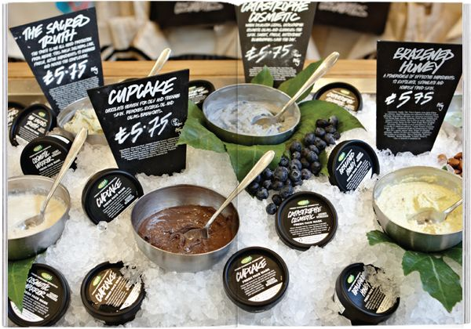
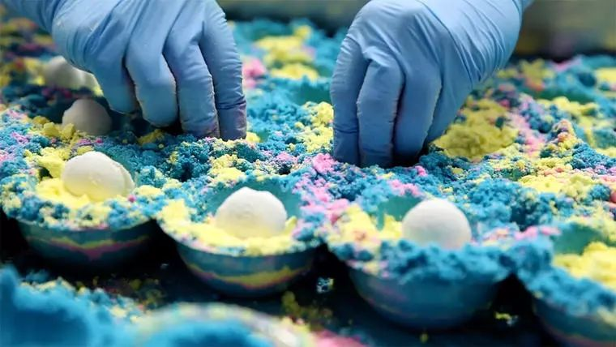
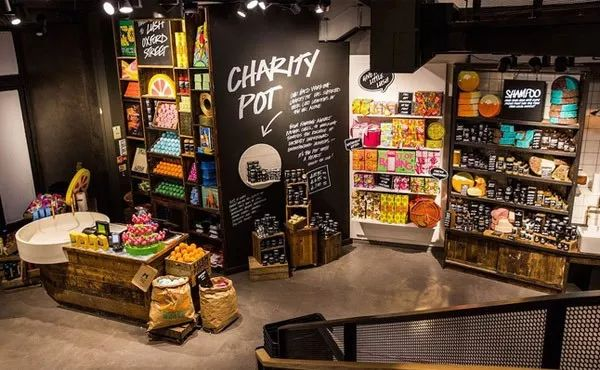
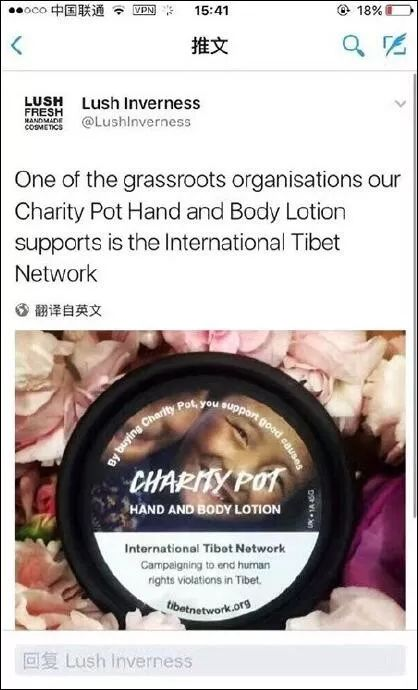
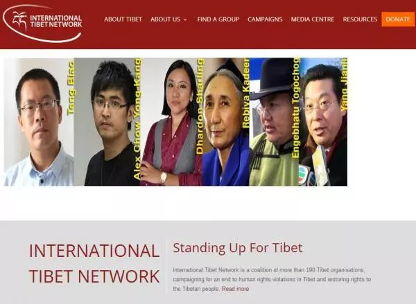
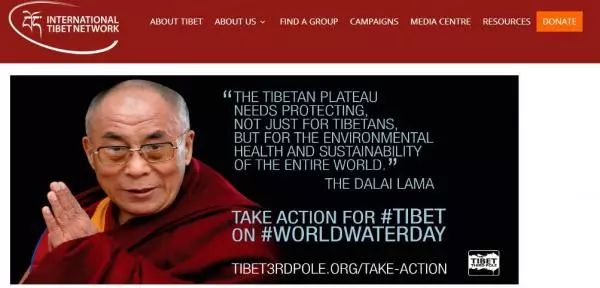
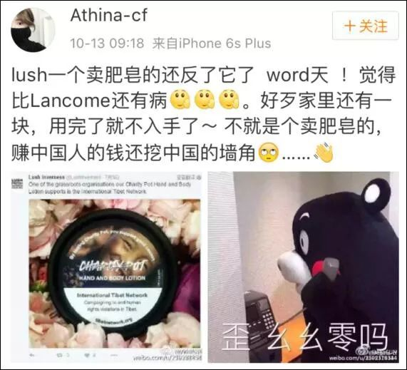
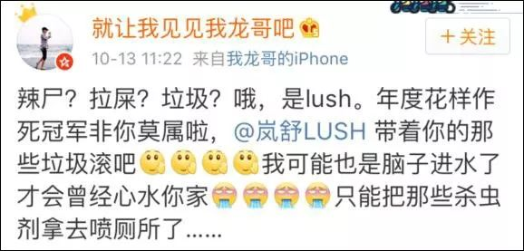
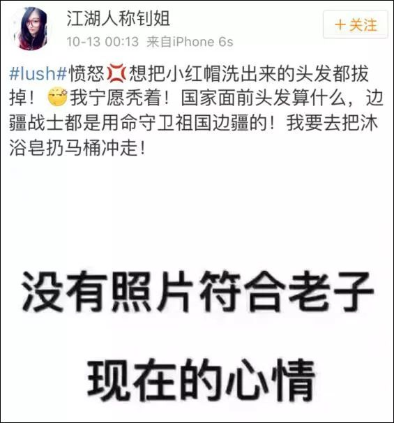
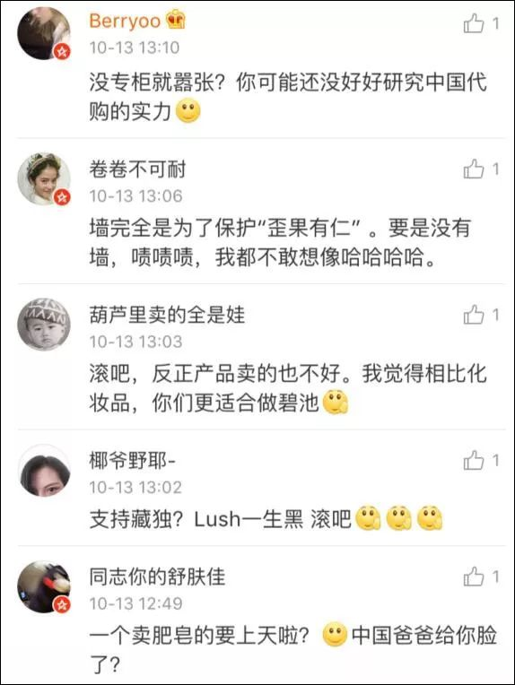

# 无标题

**链接地址:** http://mp.weixin.qq.com/s?__biz=MzI2NTE1ODgwOQ==&mid=2649605595&idx=1&sn=f0463748d2bd54dd95866184b8f0e604&chksm=f2b8cc2dc5cf453b7309e018f6deef1608d7362d0af429b34bd6c38df7599ef0c267db3ed2ee&mpshare=1&scene=2&srcid=#rd
**作者:** Lush滚出阿省
**获取时间:** 2025/8/28 20:59:30
**图片数量:** 20

---

## 原始HTML内容

<section style="box-sizing: border-box;"><section class="V5" style="box-sizing: border-box;" powered-by="xiumi.us"><section style="margin-right: 0%;margin-left: 0%;box-sizing: border-box;"><section style="display: inline-block;vertical-align: middle;width: 80%;box-sizing: border-box;"><section class="V5" style="box-sizing: border-box;" powered-by="xiumi.us"><section style="margin-top: 10px;margin-bottom: 10px;text-align: center;box-sizing: border-box;"><section style="display: inline-block;box-sizing: border-box;"><section style="max-width: 100%;font-size: 0px;padding-bottom: 3px;box-sizing: border-box;"><section style="display: inline-block;vertical-align: middle;box-sizing: border-box;"><section style="width: 5px;height: 1px;background-color: rgb(217, 217, 217);box-sizing: border-box;"></section><section style="width: 1px;height: 5px;margin-top: -3px;margin-right: auto;margin-left: auto;background-color: rgb(217, 217, 217);box-sizing: border-box;"></section></section><section style="margin-top: -1px;margin-right: -5px;margin-left: -5px;width: 100%;display: inline-block;vertical-align: middle;padding-right: 8px;padding-left: 8px;box-sizing: border-box;"><section style="width: 100%;height: 1px;background-color: rgb(217, 217, 217);box-sizing: border-box;"></section></section><section style="display: inline-block;vertical-align: middle;box-sizing: border-box;"><section style="width: 5px;height: 1px;background-color: rgb(217, 217, 217);box-sizing: border-box;"></section><section style="width: 1px;height: 5px;margin-top: -3px;margin-right: auto;margin-left: auto;background-color: rgb(217, 217, 217);box-sizing: border-box;"></section></section></section><section style="padding-left: 15px;padding-right: 15px;color: rgb(161, 161, 161);font-size: 14px;box-sizing: border-box;">
点击上方<strong style="box-sizing: border-box;">蓝字</strong>关注我们哟~
</section><section style="max-width: 100%;font-size: 0px;box-sizing: border-box;"><section style="display: inline-block;vertical-align: middle;box-sizing: border-box;"><section style="width: 5px;height: 1px;background-color: rgb(217, 217, 217);box-sizing: border-box;"></section><section style="width: 1px;height: 5px;margin-top: -3px;margin-right: auto;margin-left: auto;background-color: rgb(217, 217, 217);box-sizing: border-box;"></section></section><section style="margin-top: -1px;margin-right: -5px;margin-left: -5px;width: 100%;display: inline-block;vertical-align: middle;padding-right: 8px;padding-left: 8px;box-sizing: border-box;"><section style="width: 100%;height: 1px;background-color: rgb(217, 217, 217);box-sizing: border-box;"></section></section><section style="display: inline-block;vertical-align: middle;box-sizing: border-box;"><section style="width: 5px;height: 1px;background-color: rgb(217, 217, 217);box-sizing: border-box;"></section><section style="width: 1px;height: 5px;margin-top: -3px;margin-right: auto;margin-left: auto;background-color: rgb(217, 217, 217);box-sizing: border-box;"></section></section></section></section></section></section></section><section style="display: inline-block;vertical-align: middle;width: 20%;box-sizing: border-box;"><section class="V5" style="box-sizing: border-box;" powered-by="xiumi.us"><section style="text-align: center;margin: -10px 0% 10px;box-sizing: border-box;"><section style="max-width: 100%;vertical-align: middle;display: inline-block;width: 100%;box-sizing: border-box;"></section></section></section></section></section></section><section class="V5" style="box-sizing: border-box;" powered-by="xiumi.us"><section style="margin: 10px 0%;box-sizing: border-box;"><section style="display: inline-block;width: 100%;vertical-align: top;box-sizing: border-box;"><section class="V5" style="box-sizing: border-box;" powered-by="xiumi.us"><section style="box-sizing: border-box;"><section style="display: inline-block;vertical-align: bottom;width: 75%;padding-right: 10px;box-sizing: border-box;"><section class="V5" style="box-sizing: border-box;" powered-by="xiumi.us"><section style="margin: 10px 0% 3px;box-sizing: border-box;"><section style="display: inline-block;vertical-align: middle;box-sizing: border-box;"><section style="display: inline-block;vertical-align: bottom;padding-left: 5px;padding-right: 5px;line-height: 1.2em;margin-bottom: 2px;color: rgba(80, 182, 201, 0.72);box-sizing: border-box;">
<strong style="box-sizing: border-box;">仔细看下图，有惊喜！</strong>
</section><section style="max-width: 100%;display: inline-block;vertical-align: bottom;width: 1.6em;box-sizing: border-box;"></section></section></section></section></section><section style="display: inline-block;vertical-align: bottom;width: 25%;box-sizing: border-box;"><section class="V5" style="box-sizing: border-box;" powered-by="xiumi.us"><section style="margin-right: 0%;margin-bottom: 3px;margin-left: 0%;text-align: right;box-sizing: border-box;"><section style="display: inline-block;border-bottom: 0.15em solid rgba(80, 182, 201, 0.72);padding-bottom: 3px;box-sizing: border-box;"><section style="display: inline-block;padding: 3px;border-bottom: 0.15em solid rgba(80, 182, 201, 0.72);font-size: 12px;line-height: 1.4;color: rgb(255, 143, 47);box-sizing: border-box;">
<strong style="box-sizing: border-box;">金主大大</strong>
</section></section></section></section></section></section></section><section class="V5" style="box-sizing: border-box;" powered-by="xiumi.us"><section style="margin-right: 0%;margin-left: 0%;box-sizing: border-box;"><section style="background-color: rgba(80, 182, 201, 0.72);height: 2px;box-sizing: border-box;"></section></section></section></section></section></section><section class="V5" style="box-sizing: border-box;" powered-by="xiumi.us"><section style="text-align: center;margin-top: 10px;margin-bottom: 10px;box-sizing: border-box;"><section style="max-width: 100%;vertical-align: middle;display: inline-block;box-sizing: border-box;"></section></section></section><section class="V5" style="box-sizing: border-box;" powered-by="xiumi.us"><section style="text-align: center;margin-top: 10px;margin-bottom: 10px;box-sizing: border-box;"><section style="max-width: 100%;vertical-align: middle;display: inline-block;box-sizing: border-box;"></section></section></section><section class="V5" style="box-sizing: border-box;" powered-by="xiumi.us"><section style="text-align: center;margin-top: 10px;margin-bottom: 10px;box-sizing: border-box;"><section style="max-width: 100%;vertical-align: middle;display: inline-block;box-sizing: border-box;"></section></section></section><section class="V5" style="box-sizing: border-box;" powered-by="xiumi.us"><section style="text-align: center;margin-top: 10px;margin-bottom: 10px;box-sizing: border-box;"><section style="max-width: 100%;vertical-align: middle;display: inline-block;box-sizing: border-box;"></section></section><section style="text-align: justify;margin-top: 10px;margin-bottom: 10px;box-sizing: border-box;"><section style="max-width: 100%;vertical-align: middle;display: inline-block;box-sizing: border-box;"> </section></section>

<section style="text-align: justify;margin-top: 10px;margin-bottom: 10px;box-sizing: border-box;"> </section><section style="text-align: justify;margin-top: 10px;margin-bottom: 10px;box-sizing: border-box;">相信大家对于这个叫做Lush的<strong>“臭名昭著”</strong>的牌子并不感到陌生。这个常年活跃在中国媒体头条批评怒斥标题下的藏独牌子如今又<strong>跑出来怒刷存在感了</strong>。</section><section style="margin-top: 10px;margin-bottom: 10px;white-space: normal;text-align: justify;box-sizing: border-box;">近日位于卡尔加里的某石油行业Facebook集团在主页上<strong>官方呼吁艾伯塔人民抵制</strong>Lush Cosmetics公司，因为Lush对对该公司北美管道项目的长期以来持以反对立场。</section><section style="margin-top: 10px;margin-bottom: 10px;white-space: normal;text-align: justify;box-sizing: border-box;"> </section>

<section style="margin-top: 10px;margin-bottom: 10px;white-space: normal;text-align: justify;box-sizing: border-box;"> </section><section style="margin-top: 10px;margin-bottom: 10px;white-space: normal;text-align: justify;box-sizing: border-box;">Lush总部位于英国，但多年来一直<strong>“放眼全球，总揽大局地”</strong>对世界石油行业持批评态度。2012年6月，它开始在加拿大和美国开展一系列宣传活动，呼吁结束管道的扩张，并严肃指出艾伯塔省油砂背后的环境风险。</section><section style="margin-top: 10px;margin-bottom: 10px;white-space: normal;text-align: justify;box-sizing: border-box;">但最近几周，<strong>各大石油公司的社交媒体纷纷坐不住了</strong>，在官方开始宣传呼吁在此基础上抵制该公司，声称这样的主张将导致艾伯塔省失去石油和天然气相关的工作。</section><section style="margin-top: 10px;margin-bottom: 10px;white-space: normal;text-align: justify;box-sizing: border-box;"> </section>

<section style="margin-top: 10px;margin-bottom: 10px;white-space: normal;text-align: justify;box-sizing: border-box;"> </section><section style="margin-top: 10px;margin-bottom: 10px;white-space: normal;text-align: justify;box-sizing: border-box;">&nbsp;“我们抵制Lush的运动是基于我们目前艾伯塔省的<strong>严峻经济形势</strong>。”支持石油行业Facebook管道行动的网页管理员表示。&nbsp;</section><section style="margin-top: 10px;margin-bottom: 10px;white-space: normal;text-align: justify;box-sizing: border-box;">管理人员在他们的消息中也说，Lush在沙特阿拉伯一共有三家商店，“他们将是这场石油价格战中，加拿大石油公司<strong>失去市场份额的最终受益者</strong>。”&nbsp;</section><section style="margin-top: 10px;margin-bottom: 10px;white-space: normal;text-align: justify;box-sizing: border-box;">Facebook页面公布了Chinook购物中心，Market购物中心，Sunridge购物中心和Cross Iron Mills的Lush商店的电话号码。还有一些私人消息，比如由匿名者发送给他们的Lush的Chinook购物中心的商店经理言论，要求他们停止骚扰其在卡尔加里的员工。&nbsp;</section><section style="margin-top: 10px;margin-bottom: 10px;white-space: normal;text-align: justify;box-sizing: border-box;"> </section>

<section style="margin-top: 10px;margin-bottom: 10px;white-space: normal;text-align: justify;box-sizing: border-box;"> </section><section style="margin-top: 10px;margin-bottom: 10px;white-space: normal;text-align: justify;box-sizing: border-box;">Lush Cosmetics尚未回应StarMetro关于抵制运动和涉嫌骚扰员工的评论。Pipeline Action的管理员在给StarMetro的消息中说，目前Lush还没有向警方报告涉嫌骚扰Lush员工的事件。&nbsp;</section><section style="margin-top: 10px;margin-bottom: 10px;white-space: normal;text-align: justify;box-sizing: border-box;">卡尔加里警察局也表示，无法确认是否已提起骚扰诉讼。 自上周四发布关于抵制Lush的消息以来，<strong>已有数百人对该页面进行了喜欢</strong>，分享或评论。</section><section style="margin-top: 10px;margin-bottom: 10px;white-space: normal;text-align: justify;box-sizing: border-box;">在加拿大行动主办的在线请愿活动中，已收集了<strong>2,000多个签名</strong>。一些卡尔加里有社交影响力的人也在他们的社交媒体账户上表示支持这项运动。</section><section style="margin-top: 10px;margin-bottom: 10px;white-space: normal;text-align: justify;box-sizing: border-box;">&nbsp;“我确信<strong>这个品牌在艾伯塔省并不受欢迎</strong>。或萨斯喀彻温省，“推特上的企业家和大麻投资者布雷特威尔逊写道。“坦率地说 - 怀疑关闭加拿大的业务将是他们最好的举措。”</section><section style="margin-top: 10px;margin-bottom: 10px;white-space: normal;text-align: justify;box-sizing: border-box;">市议员Sean Chu也对Twitter上的Lush表达了不满，暗示这是<strong>对艾伯塔省失业率的侮辱</strong>。</section><section style="margin-top: 10px;margin-bottom: 10px;white-space: normal;text-align: justify;box-sizing: border-box;"> </section>

<section style="text-align: justify;margin-top: 10px;margin-bottom: 10px;box-sizing: border-box;">如果不是艾伯塔石油行业和其相关产业对阿省经济的支撑，这个省的人民怎么会有消费能力去购买这个品牌呢？</section><section style="text-align: justify;margin-top: 10px;margin-bottom: 10px;box-sizing: border-box;">这样<strong>当了X子又立牌坊</strong>的行为真想让人问问这个品牌的执行部门，<strong>碧莲这么好的东西，你为什么不要</strong>？</section><section style="text-align: justify;margin-top: 10px;margin-bottom: 10px;box-sizing: border-box;">这次触怒艾伯塔人民的举措显然已经<strong>不是这个拎不清的牌子第一次</strong><strong>花样作死</strong>。</section><section style="text-align: justify;margin-top: 10px;margin-bottom: 10px;box-sizing: border-box;">2016年，有网友发现英国化妆品牌LUSH竟然在其产品包装上<strong>公然印制支持“藏独”内容的画面</strong>。</section>

<section style="text-align: justify;margin-top: 10px;margin-bottom: 10px;box-sizing: border-box;"> </section><section style="text-align: justify;margin-top: 10px;margin-bottom: 10px;box-sizing: border-box;">这个所谓的International Tibet Networking的组织是公开支持藏独，并为其募捐的网站，首页上还有<strong>策划乌鲁木齐“7.5”严重暴力犯罪活动的“疆独”分子热比娅，以及“藏独”分子达赖的照片</strong>。 </section><section style="text-align: justify;margin-top: 10px;margin-bottom: 10px;box-sizing: border-box;"> </section>

 
<section style="text-align: justify;margin-top: 10px;margin-bottom: 10px;box-sizing: border-box;"><strong>一边赚着中国人的钱，一边又搞着支持分裂中国的活动。该新闻一经爆</strong><strong>出，瞬间在中国的互联网上炸起一片严肃声讨和强烈抵制的火花！</strong></section><section style="text-align: justify;margin-top: 10px;margin-bottom: 10px;box-sizing: border-box;"> </section>

<section style="text-align: justify;margin-top: 10px;margin-bottom: 10px;box-sizing: border-box;"> </section><section style="text-align: justify;margin-top: 10px;margin-bottom: 10px;box-sizing: border-box;">就连Lush在中国新浪上的官方账号也迅速被<strong>围攻沦陷</strong>。</section><section style="text-align: justify;margin-top: 10px;margin-bottom: 10px;box-sizing: border-box;"> </section>

<section style="text-align: justify;margin-top: 10px;margin-bottom: 10px;box-sizing: border-box;"> </section><section style="text-align: justify;margin-top: 10px;margin-bottom: 10px;box-sizing: border-box;">而Lush这个<strong>因拒绝做动物测试而从未进入过中国辣鸡牌子</strong>也就从此在中国代购市场上几乎<strong>销声匿迹</strong>。</section><section style="text-align: justify;margin-top: 10px;margin-bottom: 10px;box-sizing: border-box;">作为一个商业品牌，你想要通过塑造自己的品牌态度去跪舔部分消费者的青睐我们可以理解。但是<strong>你有权力表明你的态度，我们就有权力把你抵制出市场。然而这么多年在被抵制的风口浪尖活跃的Lush，居然还是没有学会自扫门前雪，不要瞎逼掺合政治的处世真理。默默捞钱不好吗？为什么要出来花样作死？</strong></section><section style="text-align: justify;margin-top: 10px;margin-bottom: 10px;box-sizing: border-box;">这个标榜纯天然手工制造，但充斥<strong>劣质香精色素化工合成成份的工业垃圾通过营销卖人设一跃成为美妆届网红</strong>，但还请消费者擦亮双眼。</section><section style="text-align: justify;margin-top: 10px;margin-bottom: 10px;box-sizing: border-box;">俗话说得好，没吃过猪肉还没见过猪跑吗？没用过Lush还没闻过这<strong>隔大老远就被呛翻的肥皂味儿</strong>吗？</section><section style="text-align: justify;margin-top: 10px;margin-bottom: 10px;box-sizing: border-box;">希望艾伯塔人民这一次也硬气起来。市面上可以替代这个品牌的美妆品牌简直不要太多。而在对这个品牌的消费就是<strong>对这种又当又立的嚣张气焰的纵容和对亚省经济市场和就业环境的一种污蔑</strong>。</section><section style="text-align: justify;margin-top: 10px;margin-bottom: 10px;box-sizing: border-box;"> </section><section style="text-align: justify;margin-top: 10px;margin-bottom: 10px;box-sizing: border-box;"><strong>让我们行动起来，从购买力上直接表明自己的态度，让这个辣鸡牌子滚出阿省甚至加拿大。有本事让你的分裂组织养你啊？我们这次就是要让你明白：到底是消费者才是爸爸。</strong></section><section style="text-align: justify;margin-top: 10px;margin-bottom: 10px;box-sizing: border-box;"><strong> </strong></section><section style="text-align: justify;margin-top: 10px;margin-bottom: 10px;box-sizing: border-box;"> </section><section style="text-align: center;margin-top: 10px;margin-bottom: 10px;box-sizing: border-box;"><strong>联名抵制签署地址：https://www.canadaaction.ca/boycottlush</strong></section><section style="text-align: center;margin-top: 10px;margin-bottom: 10px;box-sizing: border-box;"><strong>最好的抵制方式：</strong><strong>不买</strong><strong>。</strong></section><section style="text-align: justify;margin-top: 10px;margin-bottom: 10px;box-sizing: border-box;"> </section><section style="text-align: justify;margin-top: 10px;margin-bottom: 10px;box-sizing: border-box;">文章信息来源：The Star</section><section style="text-align: justify;margin-top: 10px;margin-bottom: 10px;box-sizing: border-box;"> </section><section style="text-align: center;margin-top: 10px;margin-bottom: 10px;box-sizing: border-box;"> </section></section><section class="V5" style="box-sizing: border-box;" powered-by="xiumi.us"><section style="margin: 40px 0% 10px;text-align: center;box-sizing: border-box;"><section style="display: inline-block;width: 90%;border-width: 1px;border-style: dotted;border-color: rgba(80, 182, 201, 0.72);padding: 10px;border-radius: 0px;box-sizing: border-box;"><section class="V5" style="box-sizing: border-box;" powered-by="xiumi.us"><section style="transform: translate3d(20px, 0px, 0px);text-align: left;font-size: 11px;margin-top: -55px;margin-right: 0%;margin-left: 0%;box-sizing: border-box;"><section style="box-sizing: border-box;width: 7em;height: 7em;display: inline-block;vertical-align: bottom;border-radius: 100%;border-width: 5px;border-style: none;border-color: rgba(80, 182, 201, 0.72);background-position: center center;background-repeat: no-repeat;background-size: cover;background-image: url(&quot;https://mmbiz.qpic.cn/mmbiz_jpg/D1nJqnhkPyKPcZW6KK1tnibO4nRtnW7MJrOGBq3VyMibniaOv4X0tRajqvzSXcMLibdQafHmx85nNhgTVic5me5jhFw/640?wx_fmt=jpeg&quot;);"><section style="width: 100%;height: 100%;overflow: hidden;line-height: 0;box-sizing: border-box;"></section></section></section></section><section class="V5" style="box-sizing: border-box;" powered-by="xiumi.us"><section style="box-sizing: border-box;"><section class="group-empty" style="display: inline-block;vertical-align: top;width: 38.2%;box-sizing: border-box;height: 1px;"></section><section style="display: inline-block;vertical-align: top;width: 61.8%;box-sizing: border-box;"><section class="V5" style="box-sizing: border-box;" powered-by="xiumi.us"><section style="margin-right: 0%;margin-left: 0%;box-sizing: border-box;"><section style="font-size: 18px;color: rgb(67, 103, 117);line-height: 1.6;letter-spacing: 1px;box-sizing: border-box;">
<strong style="box-sizing: border-box;">埃德蒙顿微生活</strong>
</section></section></section><section class="V5" style="box-sizing: border-box;" powered-by="xiumi.us"><section style="margin-top: 0.5em;margin-bottom: 0.5em;box-sizing: border-box;"><section style="background-color: rgba(80, 182, 201, 0.72);height: 1px;box-sizing: border-box;"></section></section></section></section></section></section><section class="V5" style="box-sizing: border-box;" powered-by="xiumi.us"><section style="box-sizing: border-box;"><section style="text-align: justify;font-size: 14px;color: rgba(62, 62, 62, 0.72);letter-spacing: 2px;box-sizing: border-box;">
<strong style="box-sizing: border-box;">关心埃德蒙顿民生，</strong>

<strong style="box-sizing: border-box;">关注埃德蒙顿的发展。</strong>

 

埃德蒙顿微生活是“吃喝玩乐埃德蒙顿”旗下，为埃德蒙顿地区的居民提供每日最新的吃喝玩乐、工作学习、商业投资的媒体平台 。
</section></section></section><section class="V5" style="box-sizing: border-box;" powered-by="xiumi.us"><section style="box-sizing: border-box;"><section style="text-align: left;box-sizing: border-box;">
 
</section></section></section><section class="V5" style="box-sizing: border-box;" powered-by="xiumi.us"><section style="box-sizing: border-box;"><section style="display: inline-block;vertical-align: middle;width: 61.8%;box-sizing: border-box;"><section class="V5" style="box-sizing: border-box;" powered-by="xiumi.us"><section style="box-sizing: border-box;"><section style="text-align: justify;font-size: 12px;color: rgba(62, 62, 62, 0.37);line-height: 1.9;letter-spacing: 0px;box-sizing: border-box;">
我们的目标是以最新、最快、最及时的方式 报道埃德蒙顿的新鲜事 。 
</section></section></section></section><section style="display: inline-block;vertical-align: middle;width: 38.2%;box-sizing: border-box;"><section class="V5" style="box-sizing: border-box;" powered-by="xiumi.us"><section style="margin-right: 0%;margin-left: 0%;box-sizing: border-box;"><section style="max-width: 100%;vertical-align: middle;display: inline-block;width: 70%;box-sizing: border-box;"></section></section></section></section></section></section></section></section></section></section>
 

---

## 纯文本内容

点击上方蓝字关注我们哟~仔细看下图，有惊喜！金主大大相信大家对于这个叫做Lush的“臭名昭著”的牌子并不感到陌生。这个常年活跃在中国媒体头条批评怒斥标题下的藏独牌子如今又跑出来怒刷存在感了。近日位于卡尔加里的某石油行业Facebook集团在主页上官方呼吁艾伯塔人民抵制Lush Cosmetics公司，因为Lush对对该公司北美管道项目的长期以来持以反对立场。Lush总部位于英国，但多年来一直“放眼全球，总揽大局地”对世界石油行业持批评态度。2012年6月，它开始在加拿大和美国开展一系列宣传活动，呼吁结束管道的扩张，并严肃指出艾伯塔省油砂背后的环境风险。但最近几周，各大石油公司的社交媒体纷纷坐不住了，在官方开始宣传呼吁在此基础上抵制该公司，声称这样的主张将导致艾伯塔省失去石油和天然气相关的工作。 “我们抵制Lush的运动是基于我们目前艾伯塔省的严峻经济形势。”支持石油行业Facebook管道行动的网页管理员表示。 管理人员在他们的消息中也说，Lush在沙特阿拉伯一共有三家商店，“他们将是这场石油价格战中，加拿大石油公司失去市场份额的最终受益者。” Facebook页面公布了Chinook购物中心，Market购物中心，Sunridge购物中心和Cross Iron Mills的Lush商店的电话号码。还有一些私人消息，比如由匿名者发送给他们的Lush的Chinook购物中心的商店经理言论，要求他们停止骚扰其在卡尔加里的员工。 Lush Cosmetics尚未回应StarMetro关于抵制运动和涉嫌骚扰员工的评论。Pipeline Action的管理员在给StarMetro的消息中说，目前Lush还没有向警方报告涉嫌骚扰Lush员工的事件。 卡尔加里警察局也表示，无法确认是否已提起骚扰诉讼。 自上周四发布关于抵制Lush的消息以来，已有数百人对该页面进行了喜欢，分享或评论。在加拿大行动主办的在线请愿活动中，已收集了2,000多个签名。一些卡尔加里有社交影响力的人也在他们的社交媒体账户上表示支持这项运动。 “我确信这个品牌在艾伯塔省并不受欢迎。或萨斯喀彻温省，“推特上的企业家和大麻投资者布雷特威尔逊写道。“坦率地说 - 怀疑关闭加拿大的业务将是他们最好的举措。”市议员Sean Chu也对Twitter上的Lush表达了不满，暗示这是对艾伯塔省失业率的侮辱。如果不是艾伯塔石油行业和其相关产业对阿省经济的支撑，这个省的人民怎么会有消费能力去购买这个品牌呢？这样当了X子又立牌坊的行为真想让人问问这个品牌的执行部门，碧莲这么好的东西，你为什么不要？这次触怒艾伯塔人民的举措显然已经不是这个拎不清的牌子第一次花样作死。2016年，有网友发现英国化妆品牌LUSH竟然在其产品包装上公然印制支持“藏独”内容的画面。这个所谓的International Tibet Networking的组织是公开支持藏独，并为其募捐的网站，首页上还有策划乌鲁木齐“7.5”严重暴力犯罪活动的“疆独”分子热比娅，以及“藏独”分子达赖的照片。一边赚着中国人的钱，一边又搞着支持分裂中国的活动。该新闻一经爆出，瞬间在中国的互联网上炸起一片严肃声讨和强烈抵制的火花！就连Lush在中国新浪上的官方账号也迅速被围攻沦陷。而Lush这个因拒绝做动物测试而从未进入过中国辣鸡牌子也就从此在中国代购市场上几乎销声匿迹。作为一个商业品牌，你想要通过塑造自己的品牌态度去跪舔部分消费者的青睐我们可以理解。但是你有权力表明你的态度，我们就有权力把你抵制出市场。然而这么多年在被抵制的风口浪尖活跃的Lush，居然还是没有学会自扫门前雪，不要瞎逼掺合政治的处世真理。默默捞钱不好吗？为什么要出来花样作死？这个标榜纯天然手工制造，但充斥劣质香精色素化工合成成份的工业垃圾通过营销卖人设一跃成为美妆届网红，但还请消费者擦亮双眼。俗话说得好，没吃过猪肉还没见过猪跑吗？没用过Lush还没闻过这隔大老远就被呛翻的肥皂味儿吗？希望艾伯塔人民这一次也硬气起来。市面上可以替代这个品牌的美妆品牌简直不要太多。而在对这个品牌的消费就是对这种又当又立的嚣张气焰的纵容和对亚省经济市场和就业环境的一种污蔑。让我们行动起来，从购买力上直接表明自己的态度，让这个辣鸡牌子滚出阿省甚至加拿大。有本事让你的分裂组织养你啊？我们这次就是要让你明白：到底是消费者才是爸爸。联名抵制签署地址：https://www.canadaaction.ca/boycottlush最好的抵制方式：不买。文章信息来源：The Star埃德蒙顿微生活关心埃德蒙顿民生，关注埃德蒙顿的发展。埃德蒙顿微生活是“吃喝玩乐埃德蒙顿”旗下，为埃德蒙顿地区的居民提供每日最新的吃喝玩乐、工作学习、商业投资的媒体平台 。我们的目标是以最新、最快、最及时的方式 报道埃德蒙顿的新鲜事 。

---

## 图片列表

-  (原始链接: https://mmbiz.qpic.cn/mmbiz_gif/D1nJqnhkPyKPcZW6KK1tnibO4nRtnW7MJS2ahmFSB9xibogSlA8XMAySVHspLCGWLcj5Hick45IWbHGehMadWUIzg/640?wx_fmt=gif)
-  (原始链接: https://mmbiz.qpic.cn/mmbiz_gif/D1nJqnhkPyKPcZW6KK1tnibO4nRtnW7MJqSpRcqfSpNQFicVDWgFrHDOEMHxGtNPicSpuIAgScJPoNR1yLHmNpyCQ/640?wx_fmt=gif)
-  (原始链接: https://mmbiz.qpic.cn/mmbiz_jpg/D1nJqnhkPyKPcZW6KK1tnibO4nRtnW7MJG6nAERcxrnQpJ7Z673otiaLFIWAThrbicKuDZb9yFvr507BphoukVvMg/640?wx_fmt=jpeg)
-  (原始链接: https://mmbiz.qpic.cn/mmbiz_jpg/D1nJqnhkPyKPcZW6KK1tnibO4nRtnW7MJticBaKoacwtHYvp5r4JEOicjTicPDPFNMHWvGFwrk0EZCV3vOVWVAibnKw/640?wx_fmt=jpeg)
-  (原始链接: https://mmbiz.qpic.cn/mmbiz_jpg/D1nJqnhkPyKPcZW6KK1tnibO4nRtnW7MJicKcWsuyha3GCNWHuuVkW6BFT07e8ugzHiafibYaeI7icNfaq7BojjKVUg/640?wx_fmt=jpeg)
-  (原始链接: https://mmbiz.qpic.cn/mmbiz_jpg/D1nJqnhkPyKPcZW6KK1tnibO4nRtnW7MJ56sIsic7My2vNUc2Tya8C17MAiautLTRezHyNgwvXLgVufjSuZIccnmQ/640?wx_fmt=jpeg)
-  (原始链接: https://mmbiz.qpic.cn/mmbiz_jpg/D1nJqnhkPyKPcZW6KK1tnibO4nRtnW7MJQVYZ18r6hBSbGwWibcWfBycmzXNlIEpEaORvRXtuwpngfQ1IRfVEPiag/640?wx_fmt=jpeg)
-  (原始链接: https://mmbiz.qpic.cn/mmbiz_png/D1nJqnhkPyKPcZW6KK1tnibO4nRtnW7MJgxYyvrsOXMOO3MTy1udeCIgj9HNWqsicKtdibbnLyyibKv5pht99IQibFA/640?wx_fmt=png)
-  (原始链接: https://mmbiz.qpic.cn/mmbiz_jpg/D1nJqnhkPyKPcZW6KK1tnibO4nRtnW7MJzy7Jb5ibemCK6ib7OUmzrUwRVxZxTKIOHQ9zq5RmLzK0EZibRBQHnZCCA/640?wx_fmt=jpeg)
-  (原始链接: https://mmbiz.qpic.cn/mmbiz_jpg/D1nJqnhkPyKPcZW6KK1tnibO4nRtnW7MJ0Uo012GxMfzHdwHt42dj6kojfrjZicSG8yYdaI8FtYnH0iacwhzTgrXg/640?wx_fmt=jpeg)
-  (原始链接: https://mmbiz.qpic.cn/mmbiz_jpg/D1nJqnhkPyKPcZW6KK1tnibO4nRtnW7MJTCqf7BMA114ENt60p7zHNDnjEiaNKDkRbfmyWaXhGwVAicgB9dbAnuMg/640?wx_fmt=jpeg)
-  (原始链接: https://mmbiz.qpic.cn/mmbiz_jpg/D1nJqnhkPyKPcZW6KK1tnibO4nRtnW7MJ44FibGiancoBHibsFM4p488rymeJoRRBib3l2hPyGGDbYyafCDr35T1U9A/640?wx_fmt=jpeg)
-  (原始链接: https://mmbiz.qpic.cn/mmbiz_jpg/D1nJqnhkPyKPcZW6KK1tnibO4nRtnW7MJKh3JKucV72Y6A5VFT8MsSGhaJ1ybXC8kZH5H1A7hRWZRJ2ErMBJJjA/640?wx_fmt=jpeg)
-  (原始链接: https://mmbiz.qpic.cn/mmbiz_jpg/D1nJqnhkPyKPcZW6KK1tnibO4nRtnW7MJ6nySdiaq2BIUL3ic77bsuhSia4jFBiaibwDqcaFn0CiawuFc87ONfwBzDknw/640?wx_fmt=jpeg)
-  (原始链接: https://mmbiz.qpic.cn/mmbiz_jpg/D1nJqnhkPyKPcZW6KK1tnibO4nRtnW7MJR74Xx2nvvadrjp6mtIGtHxDMyalCznsnVq2xT7bVfSyLs5Fmckv0eA/640?wx_fmt=jpeg)
-  (原始链接: https://mmbiz.qpic.cn/mmbiz_jpg/D1nJqnhkPyKPcZW6KK1tnibO4nRtnW7MJhkqmrF1T2hoNhT4bGAibHADic8UiamJWZSw2SyVU0RHzlyAaFzBrfedfA/640?wx_fmt=jpeg)
-  (原始链接: https://mmbiz.qpic.cn/mmbiz_jpg/D1nJqnhkPyKPcZW6KK1tnibO4nRtnW7MJchyth8kfn6vuib5AEiaLeyMTqaLVyfibYtZDBszrwHkO4icI0Xk3oqecCw/640?wx_fmt=jpeg)
-  (原始链接: https://mmbiz.qpic.cn/mmbiz_jpg/D1nJqnhkPyKPcZW6KK1tnibO4nRtnW7MJsLTbof0779s58Z4rSsXiaDcIoPLnBnK4aIa9B3eda304NJpDGORAcCA/640?wx_fmt=jpeg)
-  (原始链接: https://mmbiz.qpic.cn/mmbiz_jpg/D1nJqnhkPyKPcZW6KK1tnibO4nRtnW7MJrOGBq3VyMibniaOv4X0tRajqvzSXcMLibdQafHmx85nNhgTVic5me5jhFw/640?wx_fmt=jpeg)
-  (原始链接: https://mmbiz.qpic.cn/mmbiz_jpg/D1nJqnhkPyKPcZW6KK1tnibO4nRtnW7MJ5KGIicALL4GhqHoStaxxmaMvRoOJ11ZMD9SGrJg4HdVbebIpqTQjoKA/640?wx_fmt=jpeg)
