# 无标题

**链接地址:** http://mp.weixin.qq.com/s?__biz=MzI2NTE1ODgwOQ==&mid=2649605635&idx=2&sn=aedcf032a28ec66b35423720076b49b6&chksm=f2b8cff5c5cf46e359bde0a12831f35b8f14e707caf9a6d43ef2373df25fa674dd92144ea47a&mpshare=1&scene=2&srcid=#rd
**作者:** 
**获取时间:** 2025/8/28 20:59:05
**图片数量:** 28

---

## 原始HTML内容

<section style="box-sizing: border-box;"><section class="V5" style="box-sizing: border-box;" powered-by="xiumi.us"><section style="margin-right: 0%;margin-left: 0%;box-sizing: border-box;"><section style="display: inline-block;vertical-align: middle;width: 80%;box-sizing: border-box;"><section class="V5" style="box-sizing: border-box;" powered-by="xiumi.us"><section style="margin-top: 10px;margin-bottom: 10px;text-align: center;box-sizing: border-box;"><section style="display: inline-block;box-sizing: border-box;"><section style="max-width: 100%;font-size: 0px;padding-bottom: 3px;box-sizing: border-box;"><section style="display: inline-block;vertical-align: middle;box-sizing: border-box;"><section style="width: 5px;height: 1px;background-color: rgb(217, 217, 217);box-sizing: border-box;"></section><section style="width: 1px;height: 5px;margin-top: -3px;margin-right: auto;margin-left: auto;background-color: rgb(217, 217, 217);box-sizing: border-box;"></section></section><section style="margin-top: -1px;margin-right: -5px;margin-left: -5px;width: 100%;display: inline-block;vertical-align: middle;padding-right: 8px;padding-left: 8px;box-sizing: border-box;"><section style="width: 100%;height: 1px;background-color: rgb(217, 217, 217);box-sizing: border-box;"></section></section><section style="display: inline-block;vertical-align: middle;box-sizing: border-box;"><section style="width: 5px;height: 1px;background-color: rgb(217, 217, 217);box-sizing: border-box;"></section><section style="width: 1px;height: 5px;margin-top: -3px;margin-right: auto;margin-left: auto;background-color: rgb(217, 217, 217);box-sizing: border-box;"></section></section></section><section style="padding-left: 15px;padding-right: 15px;color: rgb(161, 161, 161);font-size: 14px;box-sizing: border-box;">
点击上方<strong style="box-sizing: border-box;">蓝字</strong>关注我们哟~
</section><section style="max-width: 100%;font-size: 0px;box-sizing: border-box;"><section style="display: inline-block;vertical-align: middle;box-sizing: border-box;"><section style="width: 5px;height: 1px;background-color: rgb(217, 217, 217);box-sizing: border-box;"></section><section style="width: 1px;height: 5px;margin-top: -3px;margin-right: auto;margin-left: auto;background-color: rgb(217, 217, 217);box-sizing: border-box;"></section></section><section style="margin-top: -1px;margin-right: -5px;margin-left: -5px;width: 100%;display: inline-block;vertical-align: middle;padding-right: 8px;padding-left: 8px;box-sizing: border-box;"><section style="width: 100%;height: 1px;background-color: rgb(217, 217, 217);box-sizing: border-box;"></section></section><section style="display: inline-block;vertical-align: middle;box-sizing: border-box;"><section style="width: 5px;height: 1px;background-color: rgb(217, 217, 217);box-sizing: border-box;"></section><section style="width: 1px;height: 5px;margin-top: -3px;margin-right: auto;margin-left: auto;background-color: rgb(217, 217, 217);box-sizing: border-box;"></section></section></section></section></section></section></section><section style="display: inline-block;vertical-align: middle;width: 20%;box-sizing: border-box;"><section class="V5" style="box-sizing: border-box;" powered-by="xiumi.us"><section style="text-align: center;margin: -10px 0% 10px;box-sizing: border-box;"><section style="max-width: 100%;vertical-align: middle;display: inline-block;width: 100%;box-sizing: border-box;"></section></section></section></section></section></section><section class="V5" style="box-sizing: border-box;" powered-by="xiumi.us"><section style="margin: 10px 0%;box-sizing: border-box;"><section style="display: inline-block;width: 100%;vertical-align: top;box-sizing: border-box;"><section class="V5" style="box-sizing: border-box;" powered-by="xiumi.us"><section style="box-sizing: border-box;"><section style="display: inline-block;vertical-align: bottom;width: 75%;padding-right: 10px;box-sizing: border-box;"><section class="V5" style="box-sizing: border-box;" powered-by="xiumi.us"><section style="margin: 10px 0% 3px;box-sizing: border-box;"><section style="display: inline-block;vertical-align: middle;box-sizing: border-box;"><section style="display: inline-block;vertical-align: bottom;padding-left: 5px;padding-right: 5px;line-height: 1.2em;margin-bottom: 2px;color: rgba(80, 182, 201, 0.72);box-sizing: border-box;">
<strong style="box-sizing: border-box;">仔细看下图，有惊喜！</strong>
</section><section style="max-width: 100%;display: inline-block;vertical-align: bottom;width: 1.6em;box-sizing: border-box;"></section></section></section></section></section><section style="display: inline-block;vertical-align: bottom;width: 25%;box-sizing: border-box;"><section class="V5" style="box-sizing: border-box;" powered-by="xiumi.us"><section style="margin-right: 0%;margin-bottom: 3px;margin-left: 0%;text-align: right;box-sizing: border-box;"><section style="display: inline-block;border-bottom: 0.15em solid rgba(80, 182, 201, 0.72);padding-bottom: 3px;box-sizing: border-box;"><section style="display: inline-block;padding: 3px;border-bottom: 0.15em solid rgba(80, 182, 201, 0.72);font-size: 12px;line-height: 1.4;color: rgb(255, 143, 47);box-sizing: border-box;">
<strong style="box-sizing: border-box;">金主大大</strong>
</section></section></section></section></section></section></section><section class="V5" style="box-sizing: border-box;" powered-by="xiumi.us"><section style="margin-right: 0%;margin-left: 0%;box-sizing: border-box;"><section style="background-color: rgba(80, 182, 201, 0.72);height: 2px;box-sizing: border-box;"></section></section></section></section></section></section><section class="V5" style="box-sizing: border-box;" powered-by="xiumi.us"><section style="text-align: center;margin-top: 10px;margin-bottom: 10px;box-sizing: border-box;"><section style="max-width: 100%;vertical-align: middle;display: inline-block;box-sizing: border-box;"></section></section></section><section class="V5" style="box-sizing: border-box;" powered-by="xiumi.us"><section style="text-align: center;margin-top: 10px;margin-bottom: 10px;box-sizing: border-box;"><section style="max-width: 100%;vertical-align: middle;display: inline-block;box-sizing: border-box;"></section></section></section><section class="V5" style="box-sizing: border-box;" powered-by="xiumi.us"><section style="text-align: center;margin-top: 10px;margin-bottom: 10px;box-sizing: border-box;"><section style="max-width: 100%;vertical-align: middle;display: inline-block;box-sizing: border-box;"></section></section></section><section class="V5" style="box-sizing: border-box;" powered-by="xiumi.us"><section style="text-align: center;margin-top: 10px;margin-bottom: 10px;box-sizing: border-box;"><section style="max-width: 100%;vertical-align: middle;display: inline-block;box-sizing: border-box;"></section></section><section class="" powered-by="xiumi.us" style="max-width: 100%;box-sizing: border-box;color: rgb(51, 51, 51);font-family: -apple-system-font, BlinkMacSystemFont, &quot;Helvetica Neue&quot;, &quot;PingFang SC&quot;, &quot;Hiragino Sans GB&quot;, &quot;Microsoft YaHei UI&quot;, &quot;Microsoft YaHei&quot;, Arial, sans-serif;font-size: 17px;letter-spacing: 0.544px;text-align: justify;white-space: normal;caret-color: rgb(51, 51, 51);background-color: rgb(255, 255, 255);overflow-wrap: break-word !important;"><section style="max-width: 100%;box-sizing: border-box;overflow-wrap: break-word !important;"><section style="max-width: 100%;box-sizing: border-box;text-align: center;line-height: 2;overflow-wrap: break-word !important;">
Costco一直是华人朋友们

在温哥华必去的超市之一

最主要的是又便宜又实惠

也是好多朋友给国内送礼带物必去的地方之一

在这里也可以找到

外面买不到的美食和必备好物

今天小编就带大家看看

<strong style="max-width: 100%;box-sizing: border-box;overflow-wrap: break-word !important;">【Costco必买保健品清单】</strong>

赶紧Mark起来

不管自己用还是回国送人都很实用！

话说去costco

不像上货一样推一大车

都不好意思出门。。。
</section></section></section><section class="" powered-by="xiumi.us" style="max-width: 100%;box-sizing: border-box;color: rgb(51, 51, 51);font-family: -apple-system-font, BlinkMacSystemFont, &quot;Helvetica Neue&quot;, &quot;PingFang SC&quot;, &quot;Hiragino Sans GB&quot;, &quot;Microsoft YaHei UI&quot;, &quot;Microsoft YaHei&quot;, Arial, sans-serif;font-size: 17px;letter-spacing: 0.544px;text-align: justify;white-space: normal;caret-color: rgb(51, 51, 51);background-color: rgb(255, 255, 255);overflow-wrap: break-word !important;"><section style="margin-top: 10px;margin-bottom: 10px;max-width: 100%;box-sizing: border-box;text-align: center;overflow-wrap: break-word !important;"><section style="max-width: 100%;box-sizing: border-box;vertical-align: middle;display: inline-block;width: 406.188px;overflow-wrap: break-word !important;"></section></section></section><section class="" powered-by="xiumi.us" style="max-width: 100%;box-sizing: border-box;color: rgb(51, 51, 51);font-family: -apple-system-font, BlinkMacSystemFont, &quot;Helvetica Neue&quot;, &quot;PingFang SC&quot;, &quot;Hiragino Sans GB&quot;, &quot;Microsoft YaHei UI&quot;, &quot;Microsoft YaHei&quot;, Arial, sans-serif;font-size: 17px;letter-spacing: 0.544px;text-align: justify;white-space: normal;caret-color: rgb(51, 51, 51);background-color: rgb(255, 255, 255);overflow-wrap: break-word !important;"><section style="max-width: 100%;box-sizing: border-box;overflow-wrap: break-word !important;"><section style="max-width: 100%;box-sizing: border-box;overflow-wrap: break-word !important;">
 
</section></section></section><section class="" powered-by="xiumi.us" style="max-width: 100%;box-sizing: border-box;color: rgb(51, 51, 51);font-family: -apple-system-font, BlinkMacSystemFont, &quot;Helvetica Neue&quot;, &quot;PingFang SC&quot;, &quot;Hiragino Sans GB&quot;, &quot;Microsoft YaHei UI&quot;, &quot;Microsoft YaHei&quot;, Arial, sans-serif;font-size: 17px;letter-spacing: 0.544px;text-align: justify;white-space: normal;caret-color: rgb(51, 51, 51);background-color: rgb(255, 255, 255);overflow-wrap: break-word !important;"><section style="margin-top: 8px;margin-bottom: 8px;max-width: 100%;box-sizing: border-box;text-align: center;overflow-wrap: break-word !important;"><section style="padding: 5px;max-width: 100%;box-sizing: border-box;display: inline-block;min-width: 10%;vertical-align: top;border-style: solid;border-width: 1px 1px 1px 5px;border-radius: 0px;border-color: rgb(62, 62, 62);overflow-wrap: break-word !important;"><section class="" powered-by="xiumi.us" style="max-width: 100%;box-sizing: border-box;overflow-wrap: break-word !important;"><section style="max-width: 100%;box-sizing: border-box;overflow-wrap: break-word !important;"><section style="padding-right: 8px;padding-left: 8px;max-width: 100%;box-sizing: border-box;text-align: left;color: rgb(11, 49, 101);overflow-wrap: break-word !important;">
<strong style="max-width: 100%;box-sizing: border-box;overflow-wrap: break-word !important;">Youtheory Turmeric姜黄素口服片 抗氧化</strong>
</section></section></section></section></section></section><section class="" powered-by="xiumi.us" style="max-width: 100%;box-sizing: border-box;color: rgb(51, 51, 51);font-family: -apple-system-font, BlinkMacSystemFont, &quot;Helvetica Neue&quot;, &quot;PingFang SC&quot;, &quot;Hiragino Sans GB&quot;, &quot;Microsoft YaHei UI&quot;, &quot;Microsoft YaHei&quot;, Arial, sans-serif;font-size: 17px;letter-spacing: 0.544px;text-align: justify;white-space: normal;caret-color: rgb(51, 51, 51);background-color: rgb(255, 255, 255);overflow-wrap: break-word !important;"><section style="max-width: 100%;box-sizing: border-box;overflow-wrap: break-word !important;"><section style="max-width: 100%;box-sizing: border-box;overflow-wrap: break-word !important;">
 
</section></section></section><section class="" powered-by="xiumi.us" style="max-width: 100%;box-sizing: border-box;color: rgb(51, 51, 51);font-family: -apple-system-font, BlinkMacSystemFont, &quot;Helvetica Neue&quot;, &quot;PingFang SC&quot;, &quot;Hiragino Sans GB&quot;, &quot;Microsoft YaHei UI&quot;, &quot;Microsoft YaHei&quot;, Arial, sans-serif;font-size: 17px;letter-spacing: 0.544px;text-align: justify;white-space: normal;caret-color: rgb(51, 51, 51);background-color: rgb(255, 255, 255);overflow-wrap: break-word !important;"><section style="margin-top: 10px;margin-bottom: 10px;max-width: 100%;box-sizing: border-box;text-align: center;overflow-wrap: break-word !important;"><section style="max-width: 100%;box-sizing: border-box;vertical-align: middle;display: inline-block;width: 609.297px;overflow-wrap: break-word !important;"></section></section></section><section class="" powered-by="xiumi.us" style="max-width: 100%;box-sizing: border-box;color: rgb(51, 51, 51);font-family: -apple-system-font, BlinkMacSystemFont, &quot;Helvetica Neue&quot;, &quot;PingFang SC&quot;, &quot;Hiragino Sans GB&quot;, &quot;Microsoft YaHei UI&quot;, &quot;Microsoft YaHei&quot;, Arial, sans-serif;font-size: 17px;letter-spacing: 0.544px;text-align: justify;white-space: normal;caret-color: rgb(51, 51, 51);background-color: rgb(255, 255, 255);overflow-wrap: break-word !important;"><section style="max-width: 100%;box-sizing: border-box;overflow-wrap: break-word !important;"><section style="max-width: 100%;box-sizing: border-box;overflow-wrap: break-word !important;">
 
</section></section></section><section class="" powered-by="xiumi.us" style="max-width: 100%;box-sizing: border-box;color: rgb(51, 51, 51);font-family: -apple-system-font, BlinkMacSystemFont, &quot;Helvetica Neue&quot;, &quot;PingFang SC&quot;, &quot;Hiragino Sans GB&quot;, &quot;Microsoft YaHei UI&quot;, &quot;Microsoft YaHei&quot;, Arial, sans-serif;font-size: 17px;letter-spacing: 0.544px;text-align: justify;white-space: normal;caret-color: rgb(51, 51, 51);background-color: rgb(255, 255, 255);overflow-wrap: break-word !important;"><section style="margin-top: 10px;margin-bottom: 10px;max-width: 100%;box-sizing: border-box;text-align: center;overflow-wrap: break-word !important;"><section style="max-width: 100%;box-sizing: border-box;display: inline-block;width: 677px;border-width: 0px 1px 1px 2px;border-style: none none none dashed;border-color: rgb(160, 160, 160);background-color: rgb(239, 239, 239);border-radius: 0px;overflow-wrap: break-word !important;"><section class="" powered-by="xiumi.us" style="max-width: 100%;box-sizing: border-box;overflow-wrap: break-word !important;"><section style="max-width: 100%;box-sizing: border-box;overflow-wrap: break-word !important;"><section style="padding: 10px 10px 5px;max-width: 100%;box-sizing: border-box;display: inline-block;width: 675px;vertical-align: top;letter-spacing: 0px;overflow-wrap: break-word !important;"><section class="" powered-by="xiumi.us" style="max-width: 100%;box-sizing: border-box;overflow-wrap: break-word !important;"><section style="max-width: 100%;box-sizing: border-box;overflow-wrap: break-word !important;"><section style="padding-right: 5px;padding-left: 5px;max-width: 100%;box-sizing: border-box;text-align: justify;font-size: 15px;line-height: 1.8;color: rgb(44, 90, 160);overflow-wrap: break-word !important;">
【产品介绍】

很出名的防癌圣品，保肝护肝，预防癌症。适用人群：经常熬夜应酬饮酒者/肝功能异常者/肝炎病患者和病毒携带者/脂肪肝和肝硬化患者/胆固醇偏高人士/免疫系统功能低下或者缺陷人员，经常感冒人群；护肝，提高免疫力！抗炎、高效的防氧化剂、抗菌。

 

姜黄素可以杀死肝炎病毒、修复损伤的肝细胞、改善肝脏实质受损，能够促进胆汁分泌、发挥解毒功效、提高肝脏机能、改善身体功能。姜黄还可快速分解体内乙醇，降低血液中酒精含量，起到解酒护肝的作用。

 

【主要功能】

降低血脂胆固醇，调节脂蛋白比例，抑制脂肪酸形成；

抗炎抗菌，抑制细菌生长，提高免疫力；

利胆作用，增加胆汁分泌和生长；

抑制癌细胞生长，抗癌抗肿瘤；

有效抑制老年痴呆症；

行气通经止痛，用于妇女经期或产后调养。

 

【服用方法】 每次一粒，每天3次，随餐服用。
</section></section></section></section></section></section><section class="" powered-by="xiumi.us" style="max-width: 100%;box-sizing: border-box;overflow-wrap: break-word !important;"><section style="max-width: 100%;box-sizing: border-box;text-align: right;line-height: 1;font-size: 14px;overflow-wrap: break-word !important;"><section style="max-width: 100%;box-sizing: border-box;width: 0px;display: inline-block;vertical-align: top;border-bottom: 0.6em solid rgb(255, 255, 255);border-right: 0.6em solid rgb(255, 255, 255);overflow-wrap: break-word !important;border-top: 0.6em solid transparent !important;border-left: 0.6em solid transparent !important;"></section></section></section></section></section></section><section class="" powered-by="xiumi.us" style="max-width: 100%;box-sizing: border-box;color: rgb(51, 51, 51);font-family: -apple-system-font, BlinkMacSystemFont, &quot;Helvetica Neue&quot;, &quot;PingFang SC&quot;, &quot;Hiragino Sans GB&quot;, &quot;Microsoft YaHei UI&quot;, &quot;Microsoft YaHei&quot;, Arial, sans-serif;font-size: 17px;letter-spacing: 0.544px;text-align: justify;white-space: normal;caret-color: rgb(51, 51, 51);background-color: rgb(255, 255, 255);overflow-wrap: break-word !important;"><section style="max-width: 100%;box-sizing: border-box;overflow-wrap: break-word !important;"><section style="max-width: 100%;box-sizing: border-box;overflow-wrap: break-word !important;">
 
</section></section></section><section class="" powered-by="xiumi.us" style="max-width: 100%;box-sizing: border-box;color: rgb(51, 51, 51);font-family: -apple-system-font, BlinkMacSystemFont, &quot;Helvetica Neue&quot;, &quot;PingFang SC&quot;, &quot;Hiragino Sans GB&quot;, &quot;Microsoft YaHei UI&quot;, &quot;Microsoft YaHei&quot;, Arial, sans-serif;font-size: 17px;letter-spacing: 0.544px;text-align: justify;white-space: normal;caret-color: rgb(51, 51, 51);background-color: rgb(255, 255, 255);overflow-wrap: break-word !important;"><section style="margin-top: 8px;margin-bottom: 8px;max-width: 100%;box-sizing: border-box;text-align: center;overflow-wrap: break-word !important;"><section style="padding: 5px;max-width: 100%;box-sizing: border-box;display: inline-block;min-width: 10%;vertical-align: top;border-style: solid;border-width: 1px 1px 1px 5px;border-radius: 0px;border-color: rgb(62, 62, 62);overflow-wrap: break-word !important;"><section class="" powered-by="xiumi.us" style="max-width: 100%;box-sizing: border-box;overflow-wrap: break-word !important;"><section style="max-width: 100%;box-sizing: border-box;overflow-wrap: break-word !important;"><section style="padding-right: 8px;padding-left: 8px;max-width: 100%;box-sizing: border-box;text-align: left;color: rgb(11, 49, 101);overflow-wrap: break-word !important;">
<strong style="max-width: 100%;box-sizing: border-box;overflow-wrap: break-word !important;">Natrol Melatonin 褪黑素帮助改善睡眠</strong>
</section></section></section></section></section></section><section class="" powered-by="xiumi.us" style="max-width: 100%;box-sizing: border-box;color: rgb(51, 51, 51);font-family: -apple-system-font, BlinkMacSystemFont, &quot;Helvetica Neue&quot;, &quot;PingFang SC&quot;, &quot;Hiragino Sans GB&quot;, &quot;Microsoft YaHei UI&quot;, &quot;Microsoft YaHei&quot;, Arial, sans-serif;font-size: 17px;letter-spacing: 0.544px;text-align: justify;white-space: normal;caret-color: rgb(51, 51, 51);background-color: rgb(255, 255, 255);overflow-wrap: break-word !important;"><section style="max-width: 100%;box-sizing: border-box;overflow-wrap: break-word !important;"><section style="max-width: 100%;box-sizing: border-box;overflow-wrap: break-word !important;">
 
</section></section></section><section class="" powered-by="xiumi.us" style="max-width: 100%;box-sizing: border-box;color: rgb(51, 51, 51);font-family: -apple-system-font, BlinkMacSystemFont, &quot;Helvetica Neue&quot;, &quot;PingFang SC&quot;, &quot;Hiragino Sans GB&quot;, &quot;Microsoft YaHei UI&quot;, &quot;Microsoft YaHei&quot;, Arial, sans-serif;font-size: 17px;letter-spacing: 0.544px;text-align: justify;white-space: normal;caret-color: rgb(51, 51, 51);background-color: rgb(255, 255, 255);overflow-wrap: break-word !important;"><section style="margin-top: 10px;margin-bottom: 10px;max-width: 100%;box-sizing: border-box;text-align: center;overflow-wrap: break-word !important;"><section style="max-width: 100%;box-sizing: border-box;vertical-align: middle;display: inline-block;width: 609.297px;overflow-wrap: break-word !important;"></section></section></section><section class="" powered-by="xiumi.us" style="max-width: 100%;box-sizing: border-box;color: rgb(51, 51, 51);font-family: -apple-system-font, BlinkMacSystemFont, &quot;Helvetica Neue&quot;, &quot;PingFang SC&quot;, &quot;Hiragino Sans GB&quot;, &quot;Microsoft YaHei UI&quot;, &quot;Microsoft YaHei&quot;, Arial, sans-serif;font-size: 17px;letter-spacing: 0.544px;text-align: justify;white-space: normal;caret-color: rgb(51, 51, 51);background-color: rgb(255, 255, 255);overflow-wrap: break-word !important;"><section style="max-width: 100%;box-sizing: border-box;overflow-wrap: break-word !important;"><section style="max-width: 100%;box-sizing: border-box;overflow-wrap: break-word !important;">
 
</section></section></section><section class="" powered-by="xiumi.us" style="max-width: 100%;box-sizing: border-box;color: rgb(51, 51, 51);font-family: -apple-system-font, BlinkMacSystemFont, &quot;Helvetica Neue&quot;, &quot;PingFang SC&quot;, &quot;Hiragino Sans GB&quot;, &quot;Microsoft YaHei UI&quot;, &quot;Microsoft YaHei&quot;, Arial, sans-serif;font-size: 17px;letter-spacing: 0.544px;text-align: justify;white-space: normal;caret-color: rgb(51, 51, 51);background-color: rgb(255, 255, 255);overflow-wrap: break-word !important;"><section style="margin-top: 10px;margin-bottom: 10px;max-width: 100%;box-sizing: border-box;text-align: center;overflow-wrap: break-word !important;"><section style="max-width: 100%;box-sizing: border-box;display: inline-block;width: 677px;border-width: 0px 1px 1px 2px;border-style: none none none dashed;border-color: rgb(160, 160, 160);background-color: rgb(239, 239, 239);border-radius: 0px;overflow-wrap: break-word !important;"><section class="" powered-by="xiumi.us" style="max-width: 100%;box-sizing: border-box;overflow-wrap: break-word !important;"><section style="max-width: 100%;box-sizing: border-box;overflow-wrap: break-word !important;"><section style="padding: 10px 10px 5px;max-width: 100%;box-sizing: border-box;display: inline-block;width: 675px;vertical-align: top;letter-spacing: 0px;overflow-wrap: break-word !important;"><section class="" powered-by="xiumi.us" style="max-width: 100%;box-sizing: border-box;overflow-wrap: break-word !important;"><section style="max-width: 100%;box-sizing: border-box;overflow-wrap: break-word !important;"><section style="padding-right: 5px;padding-left: 5px;max-width: 100%;box-sizing: border-box;text-align: justify;font-size: 15px;line-height: 1.8;color: rgb(44, 90, 160);overflow-wrap: break-word !important;">
【产品介绍】 褪黑素的分泌是有昼夜节律的，一般在凌晨2-3点达到高峰。夜间褪黑素水平的高低直接影响到睡眠的质量。

 

因此，从体外补充褪黑素，可使体内的褪黑素水平维持在年轻状态，调整和恢复昼夜节律，不仅能加深睡眠，提高睡眠质量，更重要的是改善整个身体的机能状态，提高生活质量，延缓衰老的进程,降低糖皮质激素。  【产品功效】 针对失眠，调节时差；调节免疫

 

【服用方法】 睡前20分钟服用，在舌下（静脉血管丰富，利于吸收入血）含化（草莓味）咽下比用水冲服效果更好。
</section></section></section></section></section></section><section class="" powered-by="xiumi.us" style="max-width: 100%;box-sizing: border-box;overflow-wrap: break-word !important;"><section style="max-width: 100%;box-sizing: border-box;text-align: right;line-height: 1;font-size: 14px;overflow-wrap: break-word !important;"><section style="max-width: 100%;box-sizing: border-box;width: 0px;display: inline-block;vertical-align: top;border-bottom: 0.6em solid rgb(255, 255, 255);border-right: 0.6em solid rgb(255, 255, 255);overflow-wrap: break-word !important;border-top: 0.6em solid transparent !important;border-left: 0.6em solid transparent !important;"></section></section></section></section></section></section><section class="" powered-by="xiumi.us" style="max-width: 100%;box-sizing: border-box;color: rgb(51, 51, 51);font-family: -apple-system-font, BlinkMacSystemFont, &quot;Helvetica Neue&quot;, &quot;PingFang SC&quot;, &quot;Hiragino Sans GB&quot;, &quot;Microsoft YaHei UI&quot;, &quot;Microsoft YaHei&quot;, Arial, sans-serif;font-size: 17px;letter-spacing: 0.544px;text-align: justify;white-space: normal;caret-color: rgb(51, 51, 51);background-color: rgb(255, 255, 255);overflow-wrap: break-word !important;"><section style="max-width: 100%;box-sizing: border-box;overflow-wrap: break-word !important;"><section style="max-width: 100%;box-sizing: border-box;overflow-wrap: break-word !important;">
 
</section></section></section><section class="" powered-by="xiumi.us" style="max-width: 100%;box-sizing: border-box;color: rgb(51, 51, 51);font-family: -apple-system-font, BlinkMacSystemFont, &quot;Helvetica Neue&quot;, &quot;PingFang SC&quot;, &quot;Hiragino Sans GB&quot;, &quot;Microsoft YaHei UI&quot;, &quot;Microsoft YaHei&quot;, Arial, sans-serif;font-size: 17px;letter-spacing: 0.544px;text-align: justify;white-space: normal;caret-color: rgb(51, 51, 51);background-color: rgb(255, 255, 255);overflow-wrap: break-word !important;"><section style="margin-top: 8px;margin-bottom: 8px;max-width: 100%;box-sizing: border-box;text-align: center;overflow-wrap: break-word !important;"><section style="padding: 5px;max-width: 100%;box-sizing: border-box;display: inline-block;min-width: 10%;vertical-align: top;border-style: solid;border-width: 1px 1px 1px 5px;border-radius: 0px;border-color: rgb(62, 62, 62);overflow-wrap: break-word !important;"><section class="" powered-by="xiumi.us" style="max-width: 100%;box-sizing: border-box;overflow-wrap: break-word !important;"><section style="max-width: 100%;box-sizing: border-box;overflow-wrap: break-word !important;"><section style="padding-right: 8px;padding-left: 8px;max-width: 100%;box-sizing: border-box;text-align: left;color: rgb(11, 49, 101);overflow-wrap: break-word !important;">
<strong style="max-width: 100%;box-sizing: border-box;overflow-wrap: break-word !important;">TruNature Cranberry 蔓越莓精华 泌尿健康</strong>
</section></section></section></section></section></section><section class="" powered-by="xiumi.us" style="max-width: 100%;box-sizing: border-box;color: rgb(51, 51, 51);font-family: -apple-system-font, BlinkMacSystemFont, &quot;Helvetica Neue&quot;, &quot;PingFang SC&quot;, &quot;Hiragino Sans GB&quot;, &quot;Microsoft YaHei UI&quot;, &quot;Microsoft YaHei&quot;, Arial, sans-serif;font-size: 17px;letter-spacing: 0.544px;text-align: justify;white-space: normal;caret-color: rgb(51, 51, 51);background-color: rgb(255, 255, 255);overflow-wrap: break-word !important;"><section style="max-width: 100%;box-sizing: border-box;overflow-wrap: break-word !important;"><section style="max-width: 100%;box-sizing: border-box;overflow-wrap: break-word !important;">
 
</section></section></section><section class="" powered-by="xiumi.us" style="max-width: 100%;box-sizing: border-box;color: rgb(51, 51, 51);font-family: -apple-system-font, BlinkMacSystemFont, &quot;Helvetica Neue&quot;, &quot;PingFang SC&quot;, &quot;Hiragino Sans GB&quot;, &quot;Microsoft YaHei UI&quot;, &quot;Microsoft YaHei&quot;, Arial, sans-serif;font-size: 17px;letter-spacing: 0.544px;text-align: justify;white-space: normal;caret-color: rgb(51, 51, 51);background-color: rgb(255, 255, 255);overflow-wrap: break-word !important;"><section style="margin-top: 10px;margin-bottom: 10px;max-width: 100%;box-sizing: border-box;text-align: center;overflow-wrap: break-word !important;"><section style="max-width: 100%;box-sizing: border-box;vertical-align: middle;display: inline-block;width: 609.297px;overflow-wrap: break-word !important;"></section></section></section><section class="" powered-by="xiumi.us" style="max-width: 100%;box-sizing: border-box;color: rgb(51, 51, 51);font-family: -apple-system-font, BlinkMacSystemFont, &quot;Helvetica Neue&quot;, &quot;PingFang SC&quot;, &quot;Hiragino Sans GB&quot;, &quot;Microsoft YaHei UI&quot;, &quot;Microsoft YaHei&quot;, Arial, sans-serif;font-size: 17px;letter-spacing: 0.544px;text-align: justify;white-space: normal;caret-color: rgb(51, 51, 51);background-color: rgb(255, 255, 255);overflow-wrap: break-word !important;"><section style="max-width: 100%;box-sizing: border-box;overflow-wrap: break-word !important;"><section style="max-width: 100%;box-sizing: border-box;overflow-wrap: break-word !important;">
 
</section></section></section><section class="" powered-by="xiumi.us" style="max-width: 100%;box-sizing: border-box;color: rgb(51, 51, 51);font-family: -apple-system-font, BlinkMacSystemFont, &quot;Helvetica Neue&quot;, &quot;PingFang SC&quot;, &quot;Hiragino Sans GB&quot;, &quot;Microsoft YaHei UI&quot;, &quot;Microsoft YaHei&quot;, Arial, sans-serif;font-size: 17px;letter-spacing: 0.544px;text-align: justify;white-space: normal;caret-color: rgb(51, 51, 51);background-color: rgb(255, 255, 255);overflow-wrap: break-word !important;"><section style="margin-top: 10px;margin-bottom: 10px;max-width: 100%;box-sizing: border-box;text-align: center;overflow-wrap: break-word !important;"><section style="max-width: 100%;box-sizing: border-box;display: inline-block;width: 677px;border-width: 0px 1px 1px 2px;border-style: none none none dashed;border-color: rgb(160, 160, 160);background-color: rgb(239, 239, 239);border-radius: 0px;overflow-wrap: break-word !important;"><section class="" powered-by="xiumi.us" style="max-width: 100%;box-sizing: border-box;overflow-wrap: break-word !important;"><section style="max-width: 100%;box-sizing: border-box;overflow-wrap: break-word !important;"><section style="padding: 10px 10px 5px;max-width: 100%;box-sizing: border-box;display: inline-block;width: 675px;vertical-align: top;letter-spacing: 0px;overflow-wrap: break-word !important;"><section class="" powered-by="xiumi.us" style="max-width: 100%;box-sizing: border-box;overflow-wrap: break-word !important;"><section style="max-width: 100%;box-sizing: border-box;overflow-wrap: break-word !important;"><section style="padding-right: 5px;padding-left: 5px;max-width: 100%;box-sizing: border-box;text-align: justify;font-size: 15px;line-height: 1.8;color: rgb(44, 90, 160);overflow-wrap: break-word !important;">
【产品介绍】 

高浓缩蔓越梅果提取物。保持泌尿系统健康。强效抗氧化防衰老，增强免疫力。

 

它所含有proanthocyanidins花色素是一种抗氧化复合物，防止有害的自由基對身體帶來的傷害，同时蔓越莓果提取物能保护泌尿系统，因此建议需要提高免疫力，需要维护泌尿系统的健康，尿道容易受感染的人士和需要抗氧化防衰老的人士服用。

 【产品功效】 

消炎抗菌，对维护健康的泌尿系统有帮助作用

 

强效抗氧化，它所含有的一种被称为proanthocyanidins青花素的物质是一种抗氧化复合物，防止有害的自由基对身体带来的伤害.维护肌肤年轻状态。

 

抗癌作用。抑制幽门螺旋杆菌，预防胃溃疡

 

【服用方法】 每日三次，每次一片。

 
</section></section></section></section></section></section><section class="" powered-by="xiumi.us" style="max-width: 100%;box-sizing: border-box;overflow-wrap: break-word !important;"><section style="max-width: 100%;box-sizing: border-box;text-align: right;line-height: 1;font-size: 14px;overflow-wrap: break-word !important;"><section style="max-width: 100%;box-sizing: border-box;width: 0px;display: inline-block;vertical-align: top;border-bottom: 0.6em solid rgb(255, 255, 255);border-right: 0.6em solid rgb(255, 255, 255);overflow-wrap: break-word !important;border-top: 0.6em solid transparent !important;border-left: 0.6em solid transparent !important;"></section></section></section></section></section></section><section class="" powered-by="xiumi.us" style="max-width: 100%;box-sizing: border-box;color: rgb(51, 51, 51);font-family: -apple-system-font, BlinkMacSystemFont, &quot;Helvetica Neue&quot;, &quot;PingFang SC&quot;, &quot;Hiragino Sans GB&quot;, &quot;Microsoft YaHei UI&quot;, &quot;Microsoft YaHei&quot;, Arial, sans-serif;font-size: 17px;letter-spacing: 0.544px;text-align: justify;white-space: normal;caret-color: rgb(51, 51, 51);background-color: rgb(255, 255, 255);overflow-wrap: break-word !important;"><section style="max-width: 100%;box-sizing: border-box;overflow-wrap: break-word !important;"><section style="max-width: 100%;box-sizing: border-box;overflow-wrap: break-word !important;">
 
</section></section></section><section class="" powered-by="xiumi.us" style="max-width: 100%;box-sizing: border-box;color: rgb(51, 51, 51);font-family: -apple-system-font, BlinkMacSystemFont, &quot;Helvetica Neue&quot;, &quot;PingFang SC&quot;, &quot;Hiragino Sans GB&quot;, &quot;Microsoft YaHei UI&quot;, &quot;Microsoft YaHei&quot;, Arial, sans-serif;font-size: 17px;letter-spacing: 0.544px;text-align: justify;white-space: normal;caret-color: rgb(51, 51, 51);background-color: rgb(255, 255, 255);overflow-wrap: break-word !important;"><section style="margin-top: 8px;margin-bottom: 8px;max-width: 100%;box-sizing: border-box;text-align: center;overflow-wrap: break-word !important;"><section style="padding: 5px;max-width: 100%;box-sizing: border-box;display: inline-block;min-width: 10%;vertical-align: top;border-style: solid;border-width: 1px 1px 1px 5px;border-radius: 0px;border-color: rgb(62, 62, 62);overflow-wrap: break-word !important;"><section class="" powered-by="xiumi.us" style="max-width: 100%;box-sizing: border-box;overflow-wrap: break-word !important;"><section style="max-width: 100%;box-sizing: border-box;overflow-wrap: break-word !important;"><section style="padding-right: 8px;padding-left: 8px;max-width: 100%;box-sizing: border-box;text-align: left;color: rgb(11, 49, 101);overflow-wrap: break-word !important;">
<strong style="max-width: 100%;box-sizing: border-box;overflow-wrap: break-word !important;">Nature Made Fish Oil 深海鱼油两瓶超值装</strong>
</section></section></section></section></section></section><section class="" powered-by="xiumi.us" style="max-width: 100%;box-sizing: border-box;color: rgb(51, 51, 51);font-family: -apple-system-font, BlinkMacSystemFont, &quot;Helvetica Neue&quot;, &quot;PingFang SC&quot;, &quot;Hiragino Sans GB&quot;, &quot;Microsoft YaHei UI&quot;, &quot;Microsoft YaHei&quot;, Arial, sans-serif;font-size: 17px;letter-spacing: 0.544px;text-align: justify;white-space: normal;caret-color: rgb(51, 51, 51);background-color: rgb(255, 255, 255);overflow-wrap: break-word !important;"><section style="max-width: 100%;box-sizing: border-box;overflow-wrap: break-word !important;"><section style="max-width: 100%;box-sizing: border-box;overflow-wrap: break-word !important;">
 
</section></section></section><section class="" powered-by="xiumi.us" style="max-width: 100%;box-sizing: border-box;color: rgb(51, 51, 51);font-family: -apple-system-font, BlinkMacSystemFont, &quot;Helvetica Neue&quot;, &quot;PingFang SC&quot;, &quot;Hiragino Sans GB&quot;, &quot;Microsoft YaHei UI&quot;, &quot;Microsoft YaHei&quot;, Arial, sans-serif;font-size: 17px;letter-spacing: 0.544px;text-align: justify;white-space: normal;caret-color: rgb(51, 51, 51);background-color: rgb(255, 255, 255);overflow-wrap: break-word !important;"><section style="margin-top: 10px;margin-bottom: 10px;max-width: 100%;box-sizing: border-box;text-align: center;overflow-wrap: break-word !important;"><section style="max-width: 100%;box-sizing: border-box;vertical-align: middle;display: inline-block;width: 609.297px;overflow-wrap: break-word !important;"></section></section></section><section class="" powered-by="xiumi.us" style="max-width: 100%;box-sizing: border-box;color: rgb(51, 51, 51);font-family: -apple-system-font, BlinkMacSystemFont, &quot;Helvetica Neue&quot;, &quot;PingFang SC&quot;, &quot;Hiragino Sans GB&quot;, &quot;Microsoft YaHei UI&quot;, &quot;Microsoft YaHei&quot;, Arial, sans-serif;font-size: 17px;letter-spacing: 0.544px;text-align: justify;white-space: normal;caret-color: rgb(51, 51, 51);background-color: rgb(255, 255, 255);overflow-wrap: break-word !important;"><section style="max-width: 100%;box-sizing: border-box;overflow-wrap: break-word !important;"><section style="max-width: 100%;box-sizing: border-box;overflow-wrap: break-word !important;">
 
</section></section></section><section class="" powered-by="xiumi.us" style="max-width: 100%;box-sizing: border-box;color: rgb(51, 51, 51);font-family: -apple-system-font, BlinkMacSystemFont, &quot;Helvetica Neue&quot;, &quot;PingFang SC&quot;, &quot;Hiragino Sans GB&quot;, &quot;Microsoft YaHei UI&quot;, &quot;Microsoft YaHei&quot;, Arial, sans-serif;font-size: 17px;letter-spacing: 0.544px;text-align: justify;white-space: normal;caret-color: rgb(51, 51, 51);background-color: rgb(255, 255, 255);overflow-wrap: break-word !important;"><section style="margin-top: 10px;margin-bottom: 10px;max-width: 100%;box-sizing: border-box;text-align: center;overflow-wrap: break-word !important;"><section style="max-width: 100%;box-sizing: border-box;display: inline-block;width: 677px;border-width: 0px 1px 1px 2px;border-style: none none none dashed;border-color: rgb(160, 160, 160);background-color: rgb(239, 239, 239);border-radius: 0px;overflow-wrap: break-word !important;"><section class="" powered-by="xiumi.us" style="max-width: 100%;box-sizing: border-box;overflow-wrap: break-word !important;"><section style="max-width: 100%;box-sizing: border-box;overflow-wrap: break-word !important;"><section style="padding: 10px 10px 5px;max-width: 100%;box-sizing: border-box;display: inline-block;width: 675px;vertical-align: top;letter-spacing: 0px;overflow-wrap: break-word !important;"><section class="" powered-by="xiumi.us" style="max-width: 100%;box-sizing: border-box;overflow-wrap: break-word !important;"><section style="max-width: 100%;box-sizing: border-box;overflow-wrap: break-word !important;"><section style="padding-right: 5px;padding-left: 5px;max-width: 100%;box-sizing: border-box;text-align: justify;font-size: 15px;line-height: 1.8;color: rgb(44, 90, 160);overflow-wrap: break-word !important;">
【产品介绍】 

鱼油含丰富的OMEGA-3不饱和脂肪酸，其主要成分是DHA和EPA，EPA 被称为"血管清道夫",它具有疏导清理心脏血管的作用。

 

鱼油具有降低胆固醇、预防心血管疾病的功能，预防血栓形成，减少动脉硬化和高血压、降低血液粘稠 度、促进血液循环、消除疲劳、缓解痛风和风湿性关节炎。

 

它还增强免疫力，抑制中年性痴呆。防治糖尿病，风湿性关节炎，脂肪肝等。新配方添加了维生素D，帮助强健骨骼健康。

 

【产品功效】 

1、高血压、高胆固醇、高血脂及心脑血管疾病的预防。

2、预防血栓的形成。

3、改善记忆、预防老年呆痴症。

4、保护视网膜，改善视力。

5、降低血液粘稠度、减少动脉硬化 。

6、帮助骨骼强健。

 

【服用方法】 作为膳食补充，每日1次，每次2粒，随餐食用。
</section></section></section></section></section></section><section class="" powered-by="xiumi.us" style="max-width: 100%;box-sizing: border-box;overflow-wrap: break-word !important;"><section style="max-width: 100%;box-sizing: border-box;text-align: right;line-height: 1;font-size: 14px;overflow-wrap: break-word !important;"><section style="max-width: 100%;box-sizing: border-box;width: 0px;display: inline-block;vertical-align: top;border-bottom: 0.6em solid rgb(255, 255, 255);border-right: 0.6em solid rgb(255, 255, 255);overflow-wrap: break-word !important;border-top: 0.6em solid transparent !important;border-left: 0.6em solid transparent !important;"></section></section></section></section></section></section><section class="" powered-by="xiumi.us" style="max-width: 100%;box-sizing: border-box;color: rgb(51, 51, 51);font-family: -apple-system-font, BlinkMacSystemFont, &quot;Helvetica Neue&quot;, &quot;PingFang SC&quot;, &quot;Hiragino Sans GB&quot;, &quot;Microsoft YaHei UI&quot;, &quot;Microsoft YaHei&quot;, Arial, sans-serif;font-size: 17px;letter-spacing: 0.544px;text-align: justify;white-space: normal;caret-color: rgb(51, 51, 51);background-color: rgb(255, 255, 255);overflow-wrap: break-word !important;"><section style="max-width: 100%;box-sizing: border-box;overflow-wrap: break-word !important;"><section style="max-width: 100%;box-sizing: border-box;overflow-wrap: break-word !important;">
 
</section></section></section><section class="" powered-by="xiumi.us" style="max-width: 100%;box-sizing: border-box;color: rgb(51, 51, 51);font-family: -apple-system-font, BlinkMacSystemFont, &quot;Helvetica Neue&quot;, &quot;PingFang SC&quot;, &quot;Hiragino Sans GB&quot;, &quot;Microsoft YaHei UI&quot;, &quot;Microsoft YaHei&quot;, Arial, sans-serif;font-size: 17px;letter-spacing: 0.544px;text-align: justify;white-space: normal;caret-color: rgb(51, 51, 51);background-color: rgb(255, 255, 255);overflow-wrap: break-word !important;"><section style="margin-top: 8px;margin-bottom: 8px;max-width: 100%;box-sizing: border-box;text-align: center;overflow-wrap: break-word !important;"><section style="padding: 5px;max-width: 100%;box-sizing: border-box;display: inline-block;min-width: 10%;vertical-align: top;border-style: solid;border-width: 1px 1px 1px 5px;border-radius: 0px;border-color: rgb(62, 62, 62);overflow-wrap: break-word !important;"><section class="" powered-by="xiumi.us" style="max-width: 100%;box-sizing: border-box;overflow-wrap: break-word !important;"><section style="max-width: 100%;box-sizing: border-box;overflow-wrap: break-word !important;"><section style="padding-right: 8px;padding-left: 8px;max-width: 100%;box-sizing: border-box;text-align: left;color: rgb(11, 49, 101);overflow-wrap: break-word !important;">
<strong style="max-width: 100%;box-sizing: border-box;overflow-wrap: break-word !important;">youtheory胶原蛋白</strong>
</section></section></section></section></section></section><section class="" powered-by="xiumi.us" style="max-width: 100%;box-sizing: border-box;color: rgb(51, 51, 51);font-family: -apple-system-font, BlinkMacSystemFont, &quot;Helvetica Neue&quot;, &quot;PingFang SC&quot;, &quot;Hiragino Sans GB&quot;, &quot;Microsoft YaHei UI&quot;, &quot;Microsoft YaHei&quot;, Arial, sans-serif;font-size: 17px;letter-spacing: 0.544px;text-align: justify;white-space: normal;caret-color: rgb(51, 51, 51);background-color: rgb(255, 255, 255);overflow-wrap: break-word !important;"><section style="max-width: 100%;box-sizing: border-box;overflow-wrap: break-word !important;"><section style="max-width: 100%;box-sizing: border-box;overflow-wrap: break-word !important;">
 
</section></section></section><section class="" powered-by="xiumi.us" style="max-width: 100%;box-sizing: border-box;color: rgb(51, 51, 51);font-family: -apple-system-font, BlinkMacSystemFont, &quot;Helvetica Neue&quot;, &quot;PingFang SC&quot;, &quot;Hiragino Sans GB&quot;, &quot;Microsoft YaHei UI&quot;, &quot;Microsoft YaHei&quot;, Arial, sans-serif;font-size: 17px;letter-spacing: 0.544px;text-align: justify;white-space: normal;caret-color: rgb(51, 51, 51);background-color: rgb(255, 255, 255);overflow-wrap: break-word !important;"><section style="margin-top: 10px;margin-bottom: 10px;max-width: 100%;box-sizing: border-box;text-align: center;overflow-wrap: break-word !important;"><section style="max-width: 100%;box-sizing: border-box;vertical-align: middle;display: inline-block;width: 609.297px;overflow-wrap: break-word !important;"></section></section></section><section class="" powered-by="xiumi.us" style="max-width: 100%;box-sizing: border-box;color: rgb(51, 51, 51);font-family: -apple-system-font, BlinkMacSystemFont, &quot;Helvetica Neue&quot;, &quot;PingFang SC&quot;, &quot;Hiragino Sans GB&quot;, &quot;Microsoft YaHei UI&quot;, &quot;Microsoft YaHei&quot;, Arial, sans-serif;font-size: 17px;letter-spacing: 0.544px;text-align: justify;white-space: normal;caret-color: rgb(51, 51, 51);background-color: rgb(255, 255, 255);overflow-wrap: break-word !important;"><section style="max-width: 100%;box-sizing: border-box;overflow-wrap: break-word !important;"><section style="max-width: 100%;box-sizing: border-box;overflow-wrap: break-word !important;">
 
</section></section></section><section class="" powered-by="xiumi.us" style="max-width: 100%;box-sizing: border-box;color: rgb(51, 51, 51);font-family: -apple-system-font, BlinkMacSystemFont, &quot;Helvetica Neue&quot;, &quot;PingFang SC&quot;, &quot;Hiragino Sans GB&quot;, &quot;Microsoft YaHei UI&quot;, &quot;Microsoft YaHei&quot;, Arial, sans-serif;font-size: 17px;letter-spacing: 0.544px;text-align: justify;white-space: normal;caret-color: rgb(51, 51, 51);background-color: rgb(255, 255, 255);overflow-wrap: break-word !important;"><section style="margin-top: 10px;margin-bottom: 10px;max-width: 100%;box-sizing: border-box;text-align: center;overflow-wrap: break-word !important;"><section style="max-width: 100%;box-sizing: border-box;display: inline-block;width: 677px;border-width: 0px 1px 1px 2px;border-style: none none none dashed;border-color: rgb(160, 160, 160);background-color: rgb(239, 239, 239);border-radius: 0px;overflow-wrap: break-word !important;"><section class="" powered-by="xiumi.us" style="max-width: 100%;box-sizing: border-box;overflow-wrap: break-word !important;"><section style="max-width: 100%;box-sizing: border-box;overflow-wrap: break-word !important;"><section style="padding: 10px 10px 5px;max-width: 100%;box-sizing: border-box;display: inline-block;width: 675px;vertical-align: top;letter-spacing: 0px;overflow-wrap: break-word !important;"><section class="" powered-by="xiumi.us" style="max-width: 100%;box-sizing: border-box;overflow-wrap: break-word !important;"><section style="max-width: 100%;box-sizing: border-box;overflow-wrap: break-word !important;"><section style="padding-right: 5px;padding-left: 5px;max-width: 100%;box-sizing: border-box;text-align: justify;font-size: 15px;line-height: 1.8;color: rgb(44, 90, 160);overflow-wrap: break-word !important;">
【产品介绍】 全美高端胶原蛋白营养素类最知名和畅销的一款

 稍有营养学概念的人都清楚几乎所有蛋白质进入人体都不会被直接吸收，而是水解成为氨基酸后再合成为胶原蛋白，Youtheory创新的3重全谱胶原蛋白+18种氨基酸是最佳的胶原蛋白合成营养素，进入体内无需水解直接合成，效率更高。  【适用人群】 适合全部18岁以上人士的日常健康保养 需要补充胶原蛋白和粘多糖体蛋白质等皮肤组织的人士 需要肌肤紧细柔软，提高肌肤储水能力，改善肌肤的柔软度，改善粗大毛孔的人士 需要光彩重现的爱美人士

 

【服用建议】 每日2次，每次3片，空腹服用。 为获得最佳吸收效果，可在餐前30分钟， 或摄入蛋白质类食物前30分钟服用。
</section></section></section></section></section></section><section class="" powered-by="xiumi.us" style="max-width: 100%;box-sizing: border-box;overflow-wrap: break-word !important;"><section style="max-width: 100%;box-sizing: border-box;text-align: right;line-height: 1;font-size: 14px;overflow-wrap: break-word !important;"><section style="max-width: 100%;box-sizing: border-box;width: 0px;display: inline-block;vertical-align: top;border-bottom: 0.6em solid rgb(255, 255, 255);border-right: 0.6em solid rgb(255, 255, 255);overflow-wrap: break-word !important;border-top: 0.6em solid transparent !important;border-left: 0.6em solid transparent !important;"></section></section></section></section></section></section><section class="" powered-by="xiumi.us" style="max-width: 100%;box-sizing: border-box;color: rgb(51, 51, 51);font-family: -apple-system-font, BlinkMacSystemFont, &quot;Helvetica Neue&quot;, &quot;PingFang SC&quot;, &quot;Hiragino Sans GB&quot;, &quot;Microsoft YaHei UI&quot;, &quot;Microsoft YaHei&quot;, Arial, sans-serif;font-size: 17px;letter-spacing: 0.544px;text-align: justify;white-space: normal;caret-color: rgb(51, 51, 51);background-color: rgb(255, 255, 255);overflow-wrap: break-word !important;"><section style="max-width: 100%;box-sizing: border-box;overflow-wrap: break-word !important;"><section style="max-width: 100%;box-sizing: border-box;overflow-wrap: break-word !important;">
 
</section></section></section><section class="" powered-by="xiumi.us" style="max-width: 100%;box-sizing: border-box;color: rgb(51, 51, 51);font-family: -apple-system-font, BlinkMacSystemFont, &quot;Helvetica Neue&quot;, &quot;PingFang SC&quot;, &quot;Hiragino Sans GB&quot;, &quot;Microsoft YaHei UI&quot;, &quot;Microsoft YaHei&quot;, Arial, sans-serif;font-size: 17px;letter-spacing: 0.544px;text-align: justify;white-space: normal;caret-color: rgb(51, 51, 51);background-color: rgb(255, 255, 255);overflow-wrap: break-word !important;"><section style="margin-top: 8px;margin-bottom: 8px;max-width: 100%;box-sizing: border-box;text-align: center;overflow-wrap: break-word !important;"><section style="padding: 5px;max-width: 100%;box-sizing: border-box;display: inline-block;min-width: 10%;vertical-align: top;border-style: solid;border-width: 1px 1px 1px 5px;border-radius: 0px;border-color: rgb(62, 62, 62);overflow-wrap: break-word !important;"><section class="" powered-by="xiumi.us" style="max-width: 100%;box-sizing: border-box;overflow-wrap: break-word !important;"><section style="max-width: 100%;box-sizing: border-box;overflow-wrap: break-word !important;"><section style="padding-right: 8px;padding-left: 8px;max-width: 100%;box-sizing: border-box;text-align: left;color: rgb(11, 49, 101);overflow-wrap: break-word !important;">
<strong style="max-width: 100%;box-sizing: border-box;overflow-wrap: break-word !important;">Nature Made辅酶Co Q10</strong>
</section></section></section></section></section></section><section class="" powered-by="xiumi.us" style="max-width: 100%;box-sizing: border-box;color: rgb(51, 51, 51);font-family: -apple-system-font, BlinkMacSystemFont, &quot;Helvetica Neue&quot;, &quot;PingFang SC&quot;, &quot;Hiragino Sans GB&quot;, &quot;Microsoft YaHei UI&quot;, &quot;Microsoft YaHei&quot;, Arial, sans-serif;font-size: 17px;letter-spacing: 0.544px;text-align: justify;white-space: normal;caret-color: rgb(51, 51, 51);background-color: rgb(255, 255, 255);overflow-wrap: break-word !important;"><section style="max-width: 100%;box-sizing: border-box;overflow-wrap: break-word !important;"><section style="max-width: 100%;box-sizing: border-box;overflow-wrap: break-word !important;">
 
</section></section></section><section class="" powered-by="xiumi.us" style="max-width: 100%;box-sizing: border-box;color: rgb(51, 51, 51);font-family: -apple-system-font, BlinkMacSystemFont, &quot;Helvetica Neue&quot;, &quot;PingFang SC&quot;, &quot;Hiragino Sans GB&quot;, &quot;Microsoft YaHei UI&quot;, &quot;Microsoft YaHei&quot;, Arial, sans-serif;font-size: 17px;letter-spacing: 0.544px;text-align: justify;white-space: normal;caret-color: rgb(51, 51, 51);background-color: rgb(255, 255, 255);overflow-wrap: break-word !important;"><section style="margin-top: 10px;margin-bottom: 10px;max-width: 100%;box-sizing: border-box;text-align: center;overflow-wrap: break-word !important;"><section style="max-width: 100%;box-sizing: border-box;vertical-align: middle;display: inline-block;width: 609.297px;overflow-wrap: break-word !important;"></section></section></section><section class="" powered-by="xiumi.us" style="max-width: 100%;box-sizing: border-box;color: rgb(51, 51, 51);font-family: -apple-system-font, BlinkMacSystemFont, &quot;Helvetica Neue&quot;, &quot;PingFang SC&quot;, &quot;Hiragino Sans GB&quot;, &quot;Microsoft YaHei UI&quot;, &quot;Microsoft YaHei&quot;, Arial, sans-serif;font-size: 17px;letter-spacing: 0.544px;text-align: justify;white-space: normal;caret-color: rgb(51, 51, 51);background-color: rgb(255, 255, 255);overflow-wrap: break-word !important;"><section style="max-width: 100%;box-sizing: border-box;overflow-wrap: break-word !important;"><section style="max-width: 100%;box-sizing: border-box;overflow-wrap: break-word !important;">
 
</section></section></section><section class="" powered-by="xiumi.us" style="max-width: 100%;box-sizing: border-box;color: rgb(51, 51, 51);font-family: -apple-system-font, BlinkMacSystemFont, &quot;Helvetica Neue&quot;, &quot;PingFang SC&quot;, &quot;Hiragino Sans GB&quot;, &quot;Microsoft YaHei UI&quot;, &quot;Microsoft YaHei&quot;, Arial, sans-serif;font-size: 17px;letter-spacing: 0.544px;text-align: justify;white-space: normal;caret-color: rgb(51, 51, 51);background-color: rgb(255, 255, 255);overflow-wrap: break-word !important;"><section style="margin-top: 10px;margin-bottom: 10px;max-width: 100%;box-sizing: border-box;text-align: center;overflow-wrap: break-word !important;"><section style="max-width: 100%;box-sizing: border-box;display: inline-block;width: 677px;border-width: 0px 1px 1px 2px;border-style: none none none dashed;border-color: rgb(160, 160, 160);background-color: rgb(239, 239, 239);border-radius: 0px;overflow-wrap: break-word !important;"><section class="" powered-by="xiumi.us" style="max-width: 100%;box-sizing: border-box;overflow-wrap: break-word !important;"><section style="max-width: 100%;box-sizing: border-box;overflow-wrap: break-word !important;"><section style="padding: 10px 10px 5px;max-width: 100%;box-sizing: border-box;display: inline-block;width: 675px;vertical-align: top;letter-spacing: 0px;overflow-wrap: break-word !important;"><section class="" powered-by="xiumi.us" style="max-width: 100%;box-sizing: border-box;overflow-wrap: break-word !important;"><section style="max-width: 100%;box-sizing: border-box;overflow-wrap: break-word !important;"><section style="padding-right: 5px;padding-left: 5px;max-width: 100%;box-sizing: border-box;text-align: justify;font-size: 15px;line-height: 1.8;color: rgb(44, 90, 160);overflow-wrap: break-word !important;">
【产品介绍】 

抗氧化性，心血管系统的应用抗氧化性使其在动脉粥样硬化的形成和发展过程中具有一定的抑制作用。而且其抗氧化性使膜稳定、抗肿瘤作用及免疫调节作用。

 

【产品功效】

在预防冠心病，缓解牙周炎，胃溃疡，增强人体免疫力功能以及缓解心绞痛方面有显着效果。

 

抗皮肤皱纹和延缓皮肤衰老。

 【适用人群】 1、心衰竭病患 2、心肌无力或心脏功能不佳者 3、心肌梗塞之预防及愈后的恢复及再发的预防 4、运动员 5、经常熬夜及从事比较消耗体力的工作者 6、高血脂症患者，心肌梗塞及中风之预防

 

【服用建议】 每日1粒，随餐服用。
</section></section></section></section></section></section><section class="" powered-by="xiumi.us" style="max-width: 100%;box-sizing: border-box;overflow-wrap: break-word !important;"><section style="max-width: 100%;box-sizing: border-box;text-align: right;line-height: 1;font-size: 14px;overflow-wrap: break-word !important;"><section style="max-width: 100%;box-sizing: border-box;width: 0px;display: inline-block;vertical-align: top;border-bottom: 0.6em solid rgb(255, 255, 255);border-right: 0.6em solid rgb(255, 255, 255);overflow-wrap: break-word !important;border-top: 0.6em solid transparent !important;border-left: 0.6em solid transparent !important;"></section></section></section></section></section></section><section class="" powered-by="xiumi.us" style="max-width: 100%;box-sizing: border-box;color: rgb(51, 51, 51);font-family: -apple-system-font, BlinkMacSystemFont, &quot;Helvetica Neue&quot;, &quot;PingFang SC&quot;, &quot;Hiragino Sans GB&quot;, &quot;Microsoft YaHei UI&quot;, &quot;Microsoft YaHei&quot;, Arial, sans-serif;font-size: 17px;letter-spacing: 0.544px;text-align: justify;white-space: normal;caret-color: rgb(51, 51, 51);background-color: rgb(255, 255, 255);overflow-wrap: break-word !important;"><section style="max-width: 100%;box-sizing: border-box;overflow-wrap: break-word !important;"><section style="max-width: 100%;box-sizing: border-box;overflow-wrap: break-word !important;">
 
</section></section></section><section class="" powered-by="xiumi.us" style="max-width: 100%;box-sizing: border-box;color: rgb(51, 51, 51);font-family: -apple-system-font, BlinkMacSystemFont, &quot;Helvetica Neue&quot;, &quot;PingFang SC&quot;, &quot;Hiragino Sans GB&quot;, &quot;Microsoft YaHei UI&quot;, &quot;Microsoft YaHei&quot;, Arial, sans-serif;font-size: 17px;letter-spacing: 0.544px;text-align: justify;white-space: normal;caret-color: rgb(51, 51, 51);background-color: rgb(255, 255, 255);overflow-wrap: break-word !important;"><section style="margin-top: 8px;margin-bottom: 8px;max-width: 100%;box-sizing: border-box;text-align: center;overflow-wrap: break-word !important;"><section style="padding: 5px;max-width: 100%;box-sizing: border-box;display: inline-block;min-width: 10%;vertical-align: top;border-style: solid;border-width: 1px 1px 1px 5px;border-radius: 0px;border-color: rgb(62, 62, 62);overflow-wrap: break-word !important;"><section class="" powered-by="xiumi.us" style="max-width: 100%;box-sizing: border-box;overflow-wrap: break-word !important;"><section style="max-width: 100%;box-sizing: border-box;overflow-wrap: break-word !important;"><section style="padding-right: 8px;padding-left: 8px;max-width: 100%;box-sizing: border-box;text-align: left;color: rgb(11, 49, 101);overflow-wrap: break-word !important;">
<strong style="max-width: 100%;box-sizing: border-box;overflow-wrap: break-word !important;">Refresh人工泪滴眼液</strong>
</section></section></section></section></section></section><section class="" powered-by="xiumi.us" style="max-width: 100%;box-sizing: border-box;color: rgb(51, 51, 51);font-family: -apple-system-font, BlinkMacSystemFont, &quot;Helvetica Neue&quot;, &quot;PingFang SC&quot;, &quot;Hiragino Sans GB&quot;, &quot;Microsoft YaHei UI&quot;, &quot;Microsoft YaHei&quot;, Arial, sans-serif;font-size: 17px;letter-spacing: 0.544px;text-align: justify;white-space: normal;caret-color: rgb(51, 51, 51);background-color: rgb(255, 255, 255);overflow-wrap: break-word !important;"><section style="max-width: 100%;box-sizing: border-box;overflow-wrap: break-word !important;"><section style="max-width: 100%;box-sizing: border-box;overflow-wrap: break-word !important;">
 
</section></section></section><section class="" powered-by="xiumi.us" style="max-width: 100%;box-sizing: border-box;color: rgb(51, 51, 51);font-family: -apple-system-font, BlinkMacSystemFont, &quot;Helvetica Neue&quot;, &quot;PingFang SC&quot;, &quot;Hiragino Sans GB&quot;, &quot;Microsoft YaHei UI&quot;, &quot;Microsoft YaHei&quot;, Arial, sans-serif;font-size: 17px;letter-spacing: 0.544px;text-align: justify;white-space: normal;caret-color: rgb(51, 51, 51);background-color: rgb(255, 255, 255);overflow-wrap: break-word !important;"><section style="margin-top: 10px;margin-bottom: 10px;max-width: 100%;box-sizing: border-box;text-align: center;overflow-wrap: break-word !important;"><section style="max-width: 100%;box-sizing: border-box;vertical-align: middle;display: inline-block;width: 609.297px;overflow-wrap: break-word !important;"></section></section></section><section class="" powered-by="xiumi.us" style="max-width: 100%;box-sizing: border-box;color: rgb(51, 51, 51);font-family: -apple-system-font, BlinkMacSystemFont, &quot;Helvetica Neue&quot;, &quot;PingFang SC&quot;, &quot;Hiragino Sans GB&quot;, &quot;Microsoft YaHei UI&quot;, &quot;Microsoft YaHei&quot;, Arial, sans-serif;font-size: 17px;letter-spacing: 0.544px;text-align: justify;white-space: normal;caret-color: rgb(51, 51, 51);background-color: rgb(255, 255, 255);overflow-wrap: break-word !important;"><section style="max-width: 100%;box-sizing: border-box;overflow-wrap: break-word !important;"><section style="max-width: 100%;box-sizing: border-box;overflow-wrap: break-word !important;">
 
</section></section></section><section class="" powered-by="xiumi.us" style="max-width: 100%;box-sizing: border-box;color: rgb(51, 51, 51);font-family: -apple-system-font, BlinkMacSystemFont, &quot;Helvetica Neue&quot;, &quot;PingFang SC&quot;, &quot;Hiragino Sans GB&quot;, &quot;Microsoft YaHei UI&quot;, &quot;Microsoft YaHei&quot;, Arial, sans-serif;font-size: 17px;letter-spacing: 0.544px;text-align: justify;white-space: normal;caret-color: rgb(51, 51, 51);background-color: rgb(255, 255, 255);overflow-wrap: break-word !important;"><section style="margin-top: 10px;margin-bottom: 10px;max-width: 100%;box-sizing: border-box;text-align: center;overflow-wrap: break-word !important;"><section style="max-width: 100%;box-sizing: border-box;display: inline-block;width: 677px;border-width: 0px 1px 1px 2px;border-style: none none none dashed;border-color: rgb(160, 160, 160);background-color: rgb(239, 239, 239);border-radius: 0px;overflow-wrap: break-word !important;"><section class="" powered-by="xiumi.us" style="max-width: 100%;box-sizing: border-box;overflow-wrap: break-word !important;"><section style="max-width: 100%;box-sizing: border-box;overflow-wrap: break-word !important;"><section style="padding: 10px 10px 5px;max-width: 100%;box-sizing: border-box;display: inline-block;width: 675px;vertical-align: top;letter-spacing: 0px;overflow-wrap: break-word !important;"><section class="" powered-by="xiumi.us" style="max-width: 100%;box-sizing: border-box;overflow-wrap: break-word !important;"><section style="max-width: 100%;box-sizing: border-box;overflow-wrap: break-word !important;"><section style="padding-right: 5px;padding-left: 5px;max-width: 100%;box-sizing: border-box;text-align: justify;font-size: 15px;line-height: 1.8;color: rgb(44, 90, 160);overflow-wrap: break-word !important;">
【产品介绍】

生活中有很多外在原因导致眼睛发干, 发痒, 刺痛, 眼泪, 是人体润滑湿润眼睛而产生自然分泌物, 由于眼泪产量的减少, 眼睛会产生不适感. REFRESH PLUS润湿眼药滴液的独特配方含有如眼泪一样的健康成分, 可以帮助恢复眼睛所需要的湿润感.

 

【使用建议】

每次1-2滴，按需使用
</section></section></section></section></section></section><section class="" powered-by="xiumi.us" style="max-width: 100%;box-sizing: border-box;overflow-wrap: break-word !important;"><section style="max-width: 100%;box-sizing: border-box;text-align: right;line-height: 1;font-size: 14px;overflow-wrap: break-word !important;"><section style="max-width: 100%;box-sizing: border-box;width: 0px;display: inline-block;vertical-align: top;border-bottom: 0.6em solid rgb(255, 255, 255);border-right: 0.6em solid rgb(255, 255, 255);overflow-wrap: break-word !important;border-top: 0.6em solid transparent !important;border-left: 0.6em solid transparent !important;"></section></section></section></section></section></section><section class="" powered-by="xiumi.us" style="max-width: 100%;box-sizing: border-box;color: rgb(51, 51, 51);font-family: -apple-system-font, BlinkMacSystemFont, &quot;Helvetica Neue&quot;, &quot;PingFang SC&quot;, &quot;Hiragino Sans GB&quot;, &quot;Microsoft YaHei UI&quot;, &quot;Microsoft YaHei&quot;, Arial, sans-serif;font-size: 17px;letter-spacing: 0.544px;text-align: justify;white-space: normal;caret-color: rgb(51, 51, 51);background-color: rgb(255, 255, 255);overflow-wrap: break-word !important;"><section style="max-width: 100%;box-sizing: border-box;overflow-wrap: break-word !important;"><section style="max-width: 100%;box-sizing: border-box;overflow-wrap: break-word !important;">
 
</section></section></section><section class="" powered-by="xiumi.us" style="max-width: 100%;box-sizing: border-box;color: rgb(51, 51, 51);font-family: -apple-system-font, BlinkMacSystemFont, &quot;Helvetica Neue&quot;, &quot;PingFang SC&quot;, &quot;Hiragino Sans GB&quot;, &quot;Microsoft YaHei UI&quot;, &quot;Microsoft YaHei&quot;, Arial, sans-serif;font-size: 17px;letter-spacing: 0.544px;text-align: justify;white-space: normal;caret-color: rgb(51, 51, 51);background-color: rgb(255, 255, 255);overflow-wrap: break-word !important;"><section style="margin-top: 8px;margin-bottom: 8px;max-width: 100%;box-sizing: border-box;text-align: center;overflow-wrap: break-word !important;"><section style="padding: 5px;max-width: 100%;box-sizing: border-box;display: inline-block;min-width: 10%;vertical-align: top;border-style: solid;border-width: 1px 1px 1px 5px;border-radius: 0px;border-color: rgb(62, 62, 62);overflow-wrap: break-word !important;"><section class="" powered-by="xiumi.us" style="max-width: 100%;box-sizing: border-box;overflow-wrap: break-word !important;"><section style="max-width: 100%;box-sizing: border-box;overflow-wrap: break-word !important;"><section style="padding-right: 8px;padding-left: 8px;max-width: 100%;box-sizing: border-box;text-align: left;color: rgb(11, 49, 101);overflow-wrap: break-word !important;">
<strong style="max-width: 100%;box-sizing: border-box;overflow-wrap: break-word !important;">TruNature CinSulin 肉桂酵母铬降血糖胶囊</strong>
</section></section></section></section></section></section><section class="" powered-by="xiumi.us" style="max-width: 100%;box-sizing: border-box;color: rgb(51, 51, 51);font-family: -apple-system-font, BlinkMacSystemFont, &quot;Helvetica Neue&quot;, &quot;PingFang SC&quot;, &quot;Hiragino Sans GB&quot;, &quot;Microsoft YaHei UI&quot;, &quot;Microsoft YaHei&quot;, Arial, sans-serif;font-size: 17px;letter-spacing: 0.544px;text-align: justify;white-space: normal;caret-color: rgb(51, 51, 51);background-color: rgb(255, 255, 255);overflow-wrap: break-word !important;"><section style="max-width: 100%;box-sizing: border-box;overflow-wrap: break-word !important;"><section style="max-width: 100%;box-sizing: border-box;overflow-wrap: break-word !important;">
 
</section></section></section><section class="" powered-by="xiumi.us" style="max-width: 100%;box-sizing: border-box;color: rgb(51, 51, 51);font-family: -apple-system-font, BlinkMacSystemFont, &quot;Helvetica Neue&quot;, &quot;PingFang SC&quot;, &quot;Hiragino Sans GB&quot;, &quot;Microsoft YaHei UI&quot;, &quot;Microsoft YaHei&quot;, Arial, sans-serif;font-size: 17px;letter-spacing: 0.544px;text-align: justify;white-space: normal;caret-color: rgb(51, 51, 51);background-color: rgb(255, 255, 255);overflow-wrap: break-word !important;"><section style="margin-top: 10px;margin-bottom: 10px;max-width: 100%;box-sizing: border-box;text-align: center;overflow-wrap: break-word !important;"><section style="max-width: 100%;box-sizing: border-box;vertical-align: middle;display: inline-block;width: 609.297px;overflow-wrap: break-word !important;"></section></section></section><section class="" powered-by="xiumi.us" style="max-width: 100%;box-sizing: border-box;color: rgb(51, 51, 51);font-family: -apple-system-font, BlinkMacSystemFont, &quot;Helvetica Neue&quot;, &quot;PingFang SC&quot;, &quot;Hiragino Sans GB&quot;, &quot;Microsoft YaHei UI&quot;, &quot;Microsoft YaHei&quot;, Arial, sans-serif;font-size: 17px;letter-spacing: 0.544px;text-align: justify;white-space: normal;caret-color: rgb(51, 51, 51);background-color: rgb(255, 255, 255);overflow-wrap: break-word !important;"><section style="max-width: 100%;box-sizing: border-box;overflow-wrap: break-word !important;"><section style="max-width: 100%;box-sizing: border-box;overflow-wrap: break-word !important;">
 
</section></section></section><section class="" powered-by="xiumi.us" style="max-width: 100%;box-sizing: border-box;color: rgb(51, 51, 51);font-family: -apple-system-font, BlinkMacSystemFont, &quot;Helvetica Neue&quot;, &quot;PingFang SC&quot;, &quot;Hiragino Sans GB&quot;, &quot;Microsoft YaHei UI&quot;, &quot;Microsoft YaHei&quot;, Arial, sans-serif;font-size: 17px;letter-spacing: 0.544px;text-align: justify;white-space: normal;caret-color: rgb(51, 51, 51);background-color: rgb(255, 255, 255);overflow-wrap: break-word !important;"><section style="margin-top: 10px;margin-bottom: 10px;max-width: 100%;box-sizing: border-box;text-align: center;overflow-wrap: break-word !important;"><section style="max-width: 100%;box-sizing: border-box;display: inline-block;width: 677px;border-width: 0px 1px 1px 2px;border-style: none none none dashed;border-color: rgb(160, 160, 160);background-color: rgb(239, 239, 239);border-radius: 0px;overflow-wrap: break-word !important;"><section class="" powered-by="xiumi.us" style="max-width: 100%;box-sizing: border-box;overflow-wrap: break-word !important;"><section style="max-width: 100%;box-sizing: border-box;overflow-wrap: break-word !important;"><section style="padding: 10px 10px 5px;max-width: 100%;box-sizing: border-box;display: inline-block;width: 675px;vertical-align: top;letter-spacing: 0px;overflow-wrap: break-word !important;"><section class="" powered-by="xiumi.us" style="max-width: 100%;box-sizing: border-box;overflow-wrap: break-word !important;"><section style="max-width: 100%;box-sizing: border-box;overflow-wrap: break-word !important;"><section style="padding-right: 5px;padding-left: 5px;max-width: 100%;box-sizing: border-box;text-align: justify;font-size: 15px;line-height: 1.8;color: rgb(44, 90, 160);overflow-wrap: break-word !important;">
【产品介绍】 Trunature的Cinsulin肉桂专利水法提取物，稳定血糖。 其中的肉桂茶多酚，能提高胰岛素受体的化学活性，降低减弱活性的化学功效。 成分中更有铬提高胰岛素敏感性，维生素D3也能保持健康的血糖水平。  【产品功效】 增强胰岛素活性，控制血糖 

 

【服用方法】 每天两粒，可于晚饭后服用。
</section></section></section></section></section></section><section class="" powered-by="xiumi.us" style="max-width: 100%;box-sizing: border-box;overflow-wrap: break-word !important;"><section style="max-width: 100%;box-sizing: border-box;text-align: right;line-height: 1;font-size: 14px;overflow-wrap: break-word !important;"><section style="max-width: 100%;box-sizing: border-box;width: 0px;display: inline-block;vertical-align: top;border-bottom: 0.6em solid rgb(255, 255, 255);border-right: 0.6em solid rgb(255, 255, 255);overflow-wrap: break-word !important;border-top: 0.6em solid transparent !important;border-left: 0.6em solid transparent !important;"></section></section></section></section></section></section><section class="" powered-by="xiumi.us" style="max-width: 100%;box-sizing: border-box;color: rgb(51, 51, 51);font-family: -apple-system-font, BlinkMacSystemFont, &quot;Helvetica Neue&quot;, &quot;PingFang SC&quot;, &quot;Hiragino Sans GB&quot;, &quot;Microsoft YaHei UI&quot;, &quot;Microsoft YaHei&quot;, Arial, sans-serif;font-size: 17px;letter-spacing: 0.544px;text-align: justify;white-space: normal;caret-color: rgb(51, 51, 51);background-color: rgb(255, 255, 255);overflow-wrap: break-word !important;"><section style="max-width: 100%;box-sizing: border-box;overflow-wrap: break-word !important;"><section style="max-width: 100%;box-sizing: border-box;overflow-wrap: break-word !important;">
 
</section></section></section><section class="" powered-by="xiumi.us" style="max-width: 100%;box-sizing: border-box;color: rgb(51, 51, 51);font-family: -apple-system-font, BlinkMacSystemFont, &quot;Helvetica Neue&quot;, &quot;PingFang SC&quot;, &quot;Hiragino Sans GB&quot;, &quot;Microsoft YaHei UI&quot;, &quot;Microsoft YaHei&quot;, Arial, sans-serif;font-size: 17px;letter-spacing: 0.544px;text-align: justify;white-space: normal;caret-color: rgb(51, 51, 51);background-color: rgb(255, 255, 255);overflow-wrap: break-word !important;"><section style="margin-top: 8px;margin-bottom: 8px;max-width: 100%;box-sizing: border-box;text-align: center;overflow-wrap: break-word !important;"><section style="padding: 5px;max-width: 100%;box-sizing: border-box;display: inline-block;min-width: 10%;vertical-align: top;border-style: solid;border-width: 1px 1px 1px 5px;border-radius: 0px;border-color: rgb(62, 62, 62);overflow-wrap: break-word !important;"><section class="" powered-by="xiumi.us" style="max-width: 100%;box-sizing: border-box;overflow-wrap: break-word !important;"><section style="max-width: 100%;box-sizing: border-box;overflow-wrap: break-word !important;"><section style="padding-right: 8px;padding-left: 8px;max-width: 100%;box-sizing: border-box;text-align: left;color: rgb(11, 49, 101);overflow-wrap: break-word !important;">
<strong style="max-width: 100%;box-sizing: border-box;overflow-wrap: break-word !important;">加拿大Webber前列腺宝 番茄红素</strong>
</section></section></section></section></section></section><section class="" powered-by="xiumi.us" style="max-width: 100%;box-sizing: border-box;color: rgb(51, 51, 51);font-family: -apple-system-font, BlinkMacSystemFont, &quot;Helvetica Neue&quot;, &quot;PingFang SC&quot;, &quot;Hiragino Sans GB&quot;, &quot;Microsoft YaHei UI&quot;, &quot;Microsoft YaHei&quot;, Arial, sans-serif;font-size: 17px;letter-spacing: 0.544px;text-align: justify;white-space: normal;caret-color: rgb(51, 51, 51);background-color: rgb(255, 255, 255);overflow-wrap: break-word !important;"><section style="max-width: 100%;box-sizing: border-box;overflow-wrap: break-word !important;"><section style="max-width: 100%;box-sizing: border-box;overflow-wrap: break-word !important;">
 
</section></section></section><section class="" powered-by="xiumi.us" style="max-width: 100%;box-sizing: border-box;color: rgb(51, 51, 51);font-family: -apple-system-font, BlinkMacSystemFont, &quot;Helvetica Neue&quot;, &quot;PingFang SC&quot;, &quot;Hiragino Sans GB&quot;, &quot;Microsoft YaHei UI&quot;, &quot;Microsoft YaHei&quot;, Arial, sans-serif;font-size: 17px;letter-spacing: 0.544px;text-align: justify;white-space: normal;caret-color: rgb(51, 51, 51);background-color: rgb(255, 255, 255);overflow-wrap: break-word !important;">

</section><section class="" powered-by="xiumi.us" style="max-width: 100%;box-sizing: border-box;color: rgb(51, 51, 51);font-family: -apple-system-font, BlinkMacSystemFont, &quot;Helvetica Neue&quot;, &quot;PingFang SC&quot;, &quot;Hiragino Sans GB&quot;, &quot;Microsoft YaHei UI&quot;, &quot;Microsoft YaHei&quot;, Arial, sans-serif;font-size: 17px;letter-spacing: 0.544px;text-align: justify;white-space: normal;caret-color: rgb(51, 51, 51);background-color: rgb(255, 255, 255);overflow-wrap: break-word !important;"><section style="max-width: 100%;box-sizing: border-box;overflow-wrap: break-word !important;"><section style="max-width: 100%;box-sizing: border-box;overflow-wrap: break-word !important;">
 
</section></section></section><section class="" powered-by="xiumi.us" style="max-width: 100%;box-sizing: border-box;color: rgb(51, 51, 51);font-family: -apple-system-font, BlinkMacSystemFont, &quot;Helvetica Neue&quot;, &quot;PingFang SC&quot;, &quot;Hiragino Sans GB&quot;, &quot;Microsoft YaHei UI&quot;, &quot;Microsoft YaHei&quot;, Arial, sans-serif;font-size: 17px;letter-spacing: 0.544px;text-align: justify;white-space: normal;caret-color: rgb(51, 51, 51);background-color: rgb(255, 255, 255);overflow-wrap: break-word !important;"><section style="margin-top: 10px;margin-bottom: 10px;max-width: 100%;box-sizing: border-box;text-align: center;overflow-wrap: break-word !important;"><section style="max-width: 100%;box-sizing: border-box;display: inline-block;width: 677px;border-width: 0px 1px 1px 2px;border-style: none none none dashed;border-color: rgb(160, 160, 160);background-color: rgb(239, 239, 239);border-radius: 0px;overflow-wrap: break-word !important;"><section class="" powered-by="xiumi.us" style="max-width: 100%;box-sizing: border-box;text-align: left;overflow-wrap: break-word !important;"><section style="max-width: 100%;box-sizing: border-box;overflow-wrap: break-word !important;"><section style="padding: 10px 10px 5px;max-width: 100%;box-sizing: border-box;display: inline-block;width: 675px;vertical-align: top;letter-spacing: 0px;overflow-wrap: break-word !important;"><section class="" powered-by="xiumi.us" style="max-width: 100%;box-sizing: border-box;overflow-wrap: break-word !important;"><section style="max-width: 100%;box-sizing: border-box;overflow-wrap: break-word !important;"><section style="padding-right: 5px;padding-left: 5px;max-width: 100%;box-sizing: border-box;text-align: justify;font-size: 15px;line-height: 1.8;color: rgb(44, 90, 160);overflow-wrap: break-word !important;">
【产品介绍】 
<section style="padding-right: 5px;padding-left: 5px;max-width: 100%;box-sizing: border-box;line-height: 1.8;overflow-wrap: break-word !important;"> </section>加拿大伟博天然前列月泉新品，超级浓缩草本配方，每天仅一粒，帮助缓解前列月泉不适，包含对前列月泉有帮助的所有天然成分，美洲蒲葵，南瓜籽油，锌，茄红素和硒。现在不用每天同吃集中产品了，一粒超级前列月泉宝就足够
睾酮是雄性激素起着关键的作用，在发展和维持男性特征。
日服一粒，随餐或遵医嘱。与其他药*物间隔2-3个小时服用。</section><section style="padding-right: 5px;padding-left: 5px;max-width: 100%;box-sizing: border-box;text-align: justify;font-size: 15px;line-height: 1.8;color: rgb(44, 90, 160);overflow-wrap: break-word !important;"> 
【服用方法】 

 
</section></section></section></section></section>&nbsp; &nbsp; 日服一粒，随餐或遵医嘱。与其他药*物间隔2-3个小时服用。<section style="max-width: 100%;box-sizing: border-box;text-align: right;line-height: 1;font-size: 14px;overflow-wrap: break-word !important;"><section style="max-width: 100%;box-sizing: border-box;width: 0px;display: inline-block;vertical-align: top;border-bottom: 0.6em solid rgb(255, 255, 255);border-right: 0.6em solid rgb(255, 255, 255);overflow-wrap: break-word !important;border-top: 0.6em solid transparent !important;border-left: 0.6em solid transparent !important;"></section></section></section></section></section></section><section class="" powered-by="xiumi.us" style="max-width: 100%;box-sizing: border-box;color: rgb(51, 51, 51);font-family: -apple-system-font, BlinkMacSystemFont, &quot;Helvetica Neue&quot;, &quot;PingFang SC&quot;, &quot;Hiragino Sans GB&quot;, &quot;Microsoft YaHei UI&quot;, &quot;Microsoft YaHei&quot;, Arial, sans-serif;font-size: 17px;letter-spacing: 0.544px;text-align: justify;white-space: normal;caret-color: rgb(51, 51, 51);background-color: rgb(255, 255, 255);overflow-wrap: break-word !important;"><section style="max-width: 100%;box-sizing: border-box;overflow-wrap: break-word !important;"><section style="max-width: 100%;box-sizing: border-box;overflow-wrap: break-word !important;">
 
</section></section></section><section class="" powered-by="xiumi.us" style="max-width: 100%;box-sizing: border-box;color: rgb(51, 51, 51);font-family: -apple-system-font, BlinkMacSystemFont, &quot;Helvetica Neue&quot;, &quot;PingFang SC&quot;, &quot;Hiragino Sans GB&quot;, &quot;Microsoft YaHei UI&quot;, &quot;Microsoft YaHei&quot;, Arial, sans-serif;font-size: 17px;letter-spacing: 0.544px;text-align: justify;white-space: normal;caret-color: rgb(51, 51, 51);background-color: rgb(255, 255, 255);overflow-wrap: break-word !important;"><section style="margin-top: 8px;margin-bottom: 8px;max-width: 100%;box-sizing: border-box;text-align: center;overflow-wrap: break-word !important;"><section style="padding: 5px;max-width: 100%;box-sizing: border-box;display: inline-block;min-width: 10%;vertical-align: top;border-style: solid;border-width: 1px 1px 1px 5px;border-radius: 0px;border-color: rgb(62, 62, 62);overflow-wrap: break-word !important;"><section class="" powered-by="xiumi.us" style="max-width: 100%;box-sizing: border-box;overflow-wrap: break-word !important;"><section style="max-width: 100%;box-sizing: border-box;overflow-wrap: break-word !important;"><section style="padding-right: 8px;padding-left: 8px;max-width: 100%;box-sizing: border-box;text-align: left;color: rgb(11, 49, 101);overflow-wrap: break-word !important;">
<strong style="max-width: 100%;box-sizing: border-box;overflow-wrap: break-word !important;">TruNature 银杏精华</strong>
</section></section></section></section></section></section><section class="" powered-by="xiumi.us" style="max-width: 100%;box-sizing: border-box;color: rgb(51, 51, 51);font-family: -apple-system-font, BlinkMacSystemFont, &quot;Helvetica Neue&quot;, &quot;PingFang SC&quot;, &quot;Hiragino Sans GB&quot;, &quot;Microsoft YaHei UI&quot;, &quot;Microsoft YaHei&quot;, Arial, sans-serif;font-size: 17px;letter-spacing: 0.544px;text-align: justify;white-space: normal;caret-color: rgb(51, 51, 51);background-color: rgb(255, 255, 255);overflow-wrap: break-word !important;"><section style="max-width: 100%;box-sizing: border-box;overflow-wrap: break-word !important;"><section style="max-width: 100%;box-sizing: border-box;overflow-wrap: break-word !important;">
 
</section></section></section><section class="" powered-by="xiumi.us" style="max-width: 100%;box-sizing: border-box;color: rgb(51, 51, 51);font-family: -apple-system-font, BlinkMacSystemFont, &quot;Helvetica Neue&quot;, &quot;PingFang SC&quot;, &quot;Hiragino Sans GB&quot;, &quot;Microsoft YaHei UI&quot;, &quot;Microsoft YaHei&quot;, Arial, sans-serif;font-size: 17px;letter-spacing: 0.544px;text-align: justify;white-space: normal;caret-color: rgb(51, 51, 51);background-color: rgb(255, 255, 255);overflow-wrap: break-word !important;"><section style="margin-top: 10px;margin-bottom: 10px;max-width: 100%;box-sizing: border-box;text-align: center;overflow-wrap: break-word !important;"><section style="max-width: 100%;box-sizing: border-box;vertical-align: middle;display: inline-block;width: 609.297px;overflow-wrap: break-word !important;"></section></section></section><section class="" powered-by="xiumi.us" style="max-width: 100%;box-sizing: border-box;color: rgb(51, 51, 51);font-family: -apple-system-font, BlinkMacSystemFont, &quot;Helvetica Neue&quot;, &quot;PingFang SC&quot;, &quot;Hiragino Sans GB&quot;, &quot;Microsoft YaHei UI&quot;, &quot;Microsoft YaHei&quot;, Arial, sans-serif;font-size: 17px;letter-spacing: 0.544px;text-align: justify;white-space: normal;caret-color: rgb(51, 51, 51);background-color: rgb(255, 255, 255);overflow-wrap: break-word !important;"><section style="max-width: 100%;box-sizing: border-box;overflow-wrap: break-word !important;"><section style="max-width: 100%;box-sizing: border-box;overflow-wrap: break-word !important;">
 
</section></section></section><section class="" powered-by="xiumi.us" style="max-width: 100%;box-sizing: border-box;color: rgb(51, 51, 51);font-family: -apple-system-font, BlinkMacSystemFont, &quot;Helvetica Neue&quot;, &quot;PingFang SC&quot;, &quot;Hiragino Sans GB&quot;, &quot;Microsoft YaHei UI&quot;, &quot;Microsoft YaHei&quot;, Arial, sans-serif;font-size: 17px;letter-spacing: 0.544px;text-align: justify;white-space: normal;caret-color: rgb(51, 51, 51);background-color: rgb(255, 255, 255);overflow-wrap: break-word !important;"><section style="margin-top: 10px;margin-bottom: 10px;max-width: 100%;box-sizing: border-box;text-align: center;overflow-wrap: break-word !important;"><section style="max-width: 100%;box-sizing: border-box;display: inline-block;width: 677px;border-width: 0px 1px 1px 2px;border-style: none none none dashed;border-color: rgb(160, 160, 160);background-color: rgb(239, 239, 239);border-radius: 0px;overflow-wrap: break-word !important;"><section class="" powered-by="xiumi.us" style="max-width: 100%;box-sizing: border-box;overflow-wrap: break-word !important;"><section style="max-width: 100%;box-sizing: border-box;overflow-wrap: break-word !important;"><section style="padding: 10px 10px 5px;max-width: 100%;box-sizing: border-box;display: inline-block;width: 675px;vertical-align: top;letter-spacing: 0px;overflow-wrap: break-word !important;"><section class="" powered-by="xiumi.us" style="max-width: 100%;box-sizing: border-box;overflow-wrap: break-word !important;"><section style="max-width: 100%;box-sizing: border-box;overflow-wrap: break-word !important;"><section style="padding-right: 5px;padding-left: 5px;max-width: 100%;box-sizing: border-box;text-align: justify;font-size: 15px;line-height: 1.8;color: rgb(44, 90, 160);overflow-wrap: break-word !important;">
【产品介绍】&nbsp;

类黄酮是植物性抗氧化剂,研究表明,类黄酮保护神经、心肌、血管和视网膜免受损害。萜类化合物可扩张血管和降低血小板的粘性利于血流通过。  

【产品功效】

改善脑部认知的功能障碍，如活化脑细胞、增加记忆力及减轻老年痴呆，促进血液循环，预防中风；降低血液黏度；

 

改善末梢循环障碍所导致的症状，如耳鸣、晕眩等症状；

 

使硬化的血管恢复弹力，预防动脉硬化、高血压等；改善早期糖尿病，以及因老化所导致的视网膜病变；

 

改善肩膀酸痛，眼睛疲劳，手脚麻痹及冰冷。

 

【服用方法】 每天两次，每次一粒 
</section></section></section></section></section></section><section class="" powered-by="xiumi.us" style="max-width: 100%;box-sizing: border-box;overflow-wrap: break-word !important;"><section style="max-width: 100%;box-sizing: border-box;text-align: right;line-height: 1;font-size: 14px;overflow-wrap: break-word !important;"><section style="max-width: 100%;box-sizing: border-box;width: 0px;display: inline-block;vertical-align: top;border-bottom: 0.6em solid rgb(255, 255, 255);border-right: 0.6em solid rgb(255, 255, 255);overflow-wrap: break-word !important;border-top: 0.6em solid transparent !important;border-left: 0.6em solid transparent !important;"></section></section></section></section></section></section><section class="" powered-by="xiumi.us" style="max-width: 100%;box-sizing: border-box;color: rgb(51, 51, 51);font-family: -apple-system-font, BlinkMacSystemFont, &quot;Helvetica Neue&quot;, &quot;PingFang SC&quot;, &quot;Hiragino Sans GB&quot;, &quot;Microsoft YaHei UI&quot;, &quot;Microsoft YaHei&quot;, Arial, sans-serif;font-size: 17px;letter-spacing: 0.544px;text-align: justify;white-space: normal;caret-color: rgb(51, 51, 51);background-color: rgb(255, 255, 255);overflow-wrap: break-word !important;"><section style="max-width: 100%;box-sizing: border-box;overflow-wrap: break-word !important;"><section style="max-width: 100%;box-sizing: border-box;overflow-wrap: break-word !important;">
 
</section></section></section><section class="" powered-by="xiumi.us" style="max-width: 100%;box-sizing: border-box;color: rgb(51, 51, 51);font-family: -apple-system-font, BlinkMacSystemFont, &quot;Helvetica Neue&quot;, &quot;PingFang SC&quot;, &quot;Hiragino Sans GB&quot;, &quot;Microsoft YaHei UI&quot;, &quot;Microsoft YaHei&quot;, Arial, sans-serif;font-size: 17px;letter-spacing: 0.544px;text-align: justify;white-space: normal;caret-color: rgb(51, 51, 51);background-color: rgb(255, 255, 255);overflow-wrap: break-word !important;"><section style="margin-top: 8px;margin-bottom: 8px;max-width: 100%;box-sizing: border-box;text-align: center;overflow-wrap: break-word !important;"><section style="padding: 5px;max-width: 100%;box-sizing: border-box;display: inline-block;min-width: 10%;vertical-align: top;border-style: solid;border-width: 1px 1px 1px 5px;border-radius: 0px;border-color: rgb(62, 62, 62);overflow-wrap: break-word !important;"><section class="" powered-by="xiumi.us" style="max-width: 100%;box-sizing: border-box;overflow-wrap: break-word !important;"><section style="max-width: 100%;box-sizing: border-box;overflow-wrap: break-word !important;"><section style="padding-right: 8px;padding-left: 8px;max-width: 100%;box-sizing: border-box;text-align: left;color: rgb(11, 49, 101);overflow-wrap: break-word !important;">
<strong style="max-width: 100%;box-sizing: border-box;overflow-wrap: break-word !important;">美国博士伦Preser Vision 护眼维生素</strong>
</section></section></section></section></section></section><section class="" powered-by="xiumi.us" style="max-width: 100%;box-sizing: border-box;color: rgb(51, 51, 51);font-family: -apple-system-font, BlinkMacSystemFont, &quot;Helvetica Neue&quot;, &quot;PingFang SC&quot;, &quot;Hiragino Sans GB&quot;, &quot;Microsoft YaHei UI&quot;, &quot;Microsoft YaHei&quot;, Arial, sans-serif;font-size: 17px;letter-spacing: 0.544px;text-align: justify;white-space: normal;caret-color: rgb(51, 51, 51);background-color: rgb(255, 255, 255);overflow-wrap: break-word !important;"><section style="max-width: 100%;box-sizing: border-box;overflow-wrap: break-word !important;"><section style="max-width: 100%;box-sizing: border-box;overflow-wrap: break-word !important;">
 
</section></section></section><section class="" powered-by="xiumi.us" style="max-width: 100%;box-sizing: border-box;color: rgb(51, 51, 51);font-family: -apple-system-font, BlinkMacSystemFont, &quot;Helvetica Neue&quot;, &quot;PingFang SC&quot;, &quot;Hiragino Sans GB&quot;, &quot;Microsoft YaHei UI&quot;, &quot;Microsoft YaHei&quot;, Arial, sans-serif;font-size: 17px;letter-spacing: 0.544px;text-align: justify;white-space: normal;caret-color: rgb(51, 51, 51);background-color: rgb(255, 255, 255);overflow-wrap: break-word !important;"><section style="margin-top: 10px;margin-bottom: 10px;max-width: 100%;box-sizing: border-box;text-align: center;overflow-wrap: break-word !important;"><section style="max-width: 100%;box-sizing: border-box;vertical-align: middle;display: inline-block;width: 609.297px;overflow-wrap: break-word !important;"></section></section></section><section class="" powered-by="xiumi.us" style="max-width: 100%;box-sizing: border-box;color: rgb(51, 51, 51);font-family: -apple-system-font, BlinkMacSystemFont, &quot;Helvetica Neue&quot;, &quot;PingFang SC&quot;, &quot;Hiragino Sans GB&quot;, &quot;Microsoft YaHei UI&quot;, &quot;Microsoft YaHei&quot;, Arial, sans-serif;font-size: 17px;letter-spacing: 0.544px;text-align: justify;white-space: normal;caret-color: rgb(51, 51, 51);background-color: rgb(255, 255, 255);overflow-wrap: break-word !important;"><section style="max-width: 100%;box-sizing: border-box;overflow-wrap: break-word !important;"><section style="max-width: 100%;box-sizing: border-box;overflow-wrap: break-word !important;">
 
</section></section></section><section class="" powered-by="xiumi.us" style="max-width: 100%;box-sizing: border-box;color: rgb(51, 51, 51);font-family: -apple-system-font, BlinkMacSystemFont, &quot;Helvetica Neue&quot;, &quot;PingFang SC&quot;, &quot;Hiragino Sans GB&quot;, &quot;Microsoft YaHei UI&quot;, &quot;Microsoft YaHei&quot;, Arial, sans-serif;font-size: 17px;letter-spacing: 0.544px;text-align: justify;white-space: normal;caret-color: rgb(51, 51, 51);background-color: rgb(255, 255, 255);overflow-wrap: break-word !important;"><section style="margin-top: 10px;margin-bottom: 10px;max-width: 100%;box-sizing: border-box;text-align: center;overflow-wrap: break-word !important;"><section style="max-width: 100%;box-sizing: border-box;display: inline-block;width: 677px;border-width: 0px 1px 1px 2px;border-style: none none none dashed;border-color: rgb(160, 160, 160);background-color: rgb(239, 239, 239);border-radius: 0px;overflow-wrap: break-word !important;"><section class="" powered-by="xiumi.us" style="max-width: 100%;box-sizing: border-box;overflow-wrap: break-word !important;"><section style="max-width: 100%;box-sizing: border-box;overflow-wrap: break-word !important;"><section style="padding: 10px 10px 5px;max-width: 100%;box-sizing: border-box;display: inline-block;width: 675px;vertical-align: top;letter-spacing: 0px;overflow-wrap: break-word !important;"><section class="" powered-by="xiumi.us" style="max-width: 100%;box-sizing: border-box;overflow-wrap: break-word !important;"><section style="max-width: 100%;box-sizing: border-box;overflow-wrap: break-word !important;"><section style="padding-right: 5px;padding-left: 5px;max-width: 100%;box-sizing: border-box;text-align: justify;font-size: 15px;line-height: 1.8;color: rgb(44, 90, 160);overflow-wrap: break-word !important;">
【产品介绍】

产品中添加的叶黄素能有效的增进视力，保护视网膜，还可改善近视、远视、老花眼、视网膜退化、夜盲症、黄斑退化、青光眼、老年白内障、糖尿病所引发的视网膜病变与白内障等疾病患者的情况

 

【服用方法】 每天两次，早晚各一次，每次1粒
</section></section></section></section></section></section><section class="" powered-by="xiumi.us" style="max-width: 100%;box-sizing: border-box;overflow-wrap: break-word !important;"><section style="max-width: 100%;box-sizing: border-box;text-align: right;line-height: 1;font-size: 14px;overflow-wrap: break-word !important;"><section style="max-width: 100%;box-sizing: border-box;width: 0px;display: inline-block;vertical-align: top;border-bottom: 0.6em solid rgb(255, 255, 255);border-right: 0.6em solid rgb(255, 255, 255);overflow-wrap: break-word !important;border-top: 0.6em solid transparent !important;border-left: 0.6em solid transparent !important;"></section></section></section></section></section></section><section class="" powered-by="xiumi.us" style="max-width: 100%;box-sizing: border-box;color: rgb(51, 51, 51);font-family: -apple-system-font, BlinkMacSystemFont, &quot;Helvetica Neue&quot;, &quot;PingFang SC&quot;, &quot;Hiragino Sans GB&quot;, &quot;Microsoft YaHei UI&quot;, &quot;Microsoft YaHei&quot;, Arial, sans-serif;font-size: 17px;letter-spacing: 0.544px;text-align: justify;white-space: normal;caret-color: rgb(51, 51, 51);background-color: rgb(255, 255, 255);overflow-wrap: break-word !important;"><section style="max-width: 100%;box-sizing: border-box;overflow-wrap: break-word !important;"><section style="max-width: 100%;box-sizing: border-box;overflow-wrap: break-word !important;">
 
</section></section></section><section class="" powered-by="xiumi.us" style="max-width: 100%;box-sizing: border-box;color: rgb(51, 51, 51);font-family: -apple-system-font, BlinkMacSystemFont, &quot;Helvetica Neue&quot;, &quot;PingFang SC&quot;, &quot;Hiragino Sans GB&quot;, &quot;Microsoft YaHei UI&quot;, &quot;Microsoft YaHei&quot;, Arial, sans-serif;font-size: 17px;letter-spacing: 0.544px;text-align: justify;white-space: normal;caret-color: rgb(51, 51, 51);background-color: rgb(255, 255, 255);overflow-wrap: break-word !important;"><section style="margin-top: 8px;margin-bottom: 8px;max-width: 100%;box-sizing: border-box;text-align: center;overflow-wrap: break-word !important;"><section style="padding: 5px;max-width: 100%;box-sizing: border-box;display: inline-block;min-width: 10%;vertical-align: top;border-style: solid;border-width: 1px 1px 1px 5px;border-radius: 0px;border-color: rgb(62, 62, 62);overflow-wrap: break-word !important;"><section class="" powered-by="xiumi.us" style="max-width: 100%;box-sizing: border-box;overflow-wrap: break-word !important;"><section style="max-width: 100%;box-sizing: border-box;overflow-wrap: break-word !important;"><section style="padding-right: 8px;padding-left: 8px;max-width: 100%;box-sizing: border-box;text-align: left;color: rgb(11, 49, 101);overflow-wrap: break-word !important;">
<strong style="max-width: 100%;box-sizing: border-box;overflow-wrap: break-word !important;">Nature Made孕妇综合维生素含DHA叶酸</strong>
</section></section></section></section></section></section><section class="" powered-by="xiumi.us" style="max-width: 100%;box-sizing: border-box;color: rgb(51, 51, 51);font-family: -apple-system-font, BlinkMacSystemFont, &quot;Helvetica Neue&quot;, &quot;PingFang SC&quot;, &quot;Hiragino Sans GB&quot;, &quot;Microsoft YaHei UI&quot;, &quot;Microsoft YaHei&quot;, Arial, sans-serif;font-size: 17px;letter-spacing: 0.544px;text-align: justify;white-space: normal;caret-color: rgb(51, 51, 51);background-color: rgb(255, 255, 255);overflow-wrap: break-word !important;"><section style="max-width: 100%;box-sizing: border-box;overflow-wrap: break-word !important;"><section style="max-width: 100%;box-sizing: border-box;overflow-wrap: break-word !important;">
 
</section></section></section><section class="" powered-by="xiumi.us" style="max-width: 100%;box-sizing: border-box;color: rgb(51, 51, 51);font-family: -apple-system-font, BlinkMacSystemFont, &quot;Helvetica Neue&quot;, &quot;PingFang SC&quot;, &quot;Hiragino Sans GB&quot;, &quot;Microsoft YaHei UI&quot;, &quot;Microsoft YaHei&quot;, Arial, sans-serif;font-size: 17px;letter-spacing: 0.544px;text-align: justify;white-space: normal;caret-color: rgb(51, 51, 51);background-color: rgb(255, 255, 255);overflow-wrap: break-word !important;"><section style="margin-top: 10px;margin-bottom: 10px;max-width: 100%;box-sizing: border-box;text-align: center;overflow-wrap: break-word !important;"><section style="max-width: 100%;box-sizing: border-box;vertical-align: middle;display: inline-block;width: 609.297px;overflow-wrap: break-word !important;"></section></section></section><section class="" powered-by="xiumi.us" style="max-width: 100%;box-sizing: border-box;color: rgb(51, 51, 51);font-family: -apple-system-font, BlinkMacSystemFont, &quot;Helvetica Neue&quot;, &quot;PingFang SC&quot;, &quot;Hiragino Sans GB&quot;, &quot;Microsoft YaHei UI&quot;, &quot;Microsoft YaHei&quot;, Arial, sans-serif;font-size: 17px;letter-spacing: 0.544px;text-align: justify;white-space: normal;caret-color: rgb(51, 51, 51);background-color: rgb(255, 255, 255);overflow-wrap: break-word !important;"><section style="max-width: 100%;box-sizing: border-box;overflow-wrap: break-word !important;"><section style="max-width: 100%;box-sizing: border-box;overflow-wrap: break-word !important;">
 
</section></section></section><section class="" powered-by="xiumi.us" style="max-width: 100%;box-sizing: border-box;color: rgb(51, 51, 51);font-family: -apple-system-font, BlinkMacSystemFont, &quot;Helvetica Neue&quot;, &quot;PingFang SC&quot;, &quot;Hiragino Sans GB&quot;, &quot;Microsoft YaHei UI&quot;, &quot;Microsoft YaHei&quot;, Arial, sans-serif;font-size: 17px;letter-spacing: 0.544px;text-align: justify;white-space: normal;caret-color: rgb(51, 51, 51);background-color: rgb(255, 255, 255);overflow-wrap: break-word !important;"><section style="margin-top: 10px;margin-bottom: 10px;max-width: 100%;box-sizing: border-box;text-align: center;overflow-wrap: break-word !important;"><section style="max-width: 100%;box-sizing: border-box;display: inline-block;width: 677px;border-width: 0px 1px 1px 2px;border-style: none none none dashed;border-color: rgb(160, 160, 160);background-color: rgb(239, 239, 239);border-radius: 0px;overflow-wrap: break-word !important;"><section class="" powered-by="xiumi.us" style="max-width: 100%;box-sizing: border-box;overflow-wrap: break-word !important;"><section style="max-width: 100%;box-sizing: border-box;overflow-wrap: break-word !important;"><section style="padding: 10px 10px 5px;max-width: 100%;box-sizing: border-box;display: inline-block;width: 675px;vertical-align: top;letter-spacing: 0px;overflow-wrap: break-word !important;"><section class="" powered-by="xiumi.us" style="max-width: 100%;box-sizing: border-box;overflow-wrap: break-word !important;"><section style="max-width: 100%;box-sizing: border-box;overflow-wrap: break-word !important;"><section style="padding-right: 5px;padding-left: 5px;max-width: 100%;box-sizing: border-box;text-align: justify;font-size: 15px;line-height: 1.8;color: rgb(44, 90, 160);overflow-wrap: break-word !important;">
【产品介绍】 Nature Made 孕妇综合维生素+DHA，增加了DHA并蕴含23种关键维生素，矿物质和脂肪酸，孕妇在怀孕期间服用，有利于胎儿的神经发育，降低胎儿的大脑和脊髓的出生缺乏症。产妇在哺乳期间服用，不但有利于自身的恢复，而且能增强奶水中的营养成分，让婴儿更好成长。

 

【服用方法】 每天1粒，随餐服用
</section></section></section></section></section></section><section class="" powered-by="xiumi.us" style="max-width: 100%;box-sizing: border-box;overflow-wrap: break-word !important;"><section style="max-width: 100%;box-sizing: border-box;text-align: right;line-height: 1;font-size: 14px;overflow-wrap: break-word !important;"><section style="max-width: 100%;box-sizing: border-box;width: 0px;display: inline-block;vertical-align: top;border-bottom: 0.6em solid rgb(255, 255, 255);border-right: 0.6em solid rgb(255, 255, 255);overflow-wrap: break-word !important;border-top: 0.6em solid transparent !important;border-left: 0.6em solid transparent !important;"></section></section></section></section></section></section><section class="" powered-by="xiumi.us" style="max-width: 100%;box-sizing: border-box;color: rgb(51, 51, 51);font-family: -apple-system-font, BlinkMacSystemFont, &quot;Helvetica Neue&quot;, &quot;PingFang SC&quot;, &quot;Hiragino Sans GB&quot;, &quot;Microsoft YaHei UI&quot;, &quot;Microsoft YaHei&quot;, Arial, sans-serif;font-size: 17px;letter-spacing: 0.544px;text-align: justify;white-space: normal;caret-color: rgb(51, 51, 51);background-color: rgb(255, 255, 255);overflow-wrap: break-word !important;"><section style="max-width: 100%;box-sizing: border-box;overflow-wrap: break-word !important;"><section style="max-width: 100%;box-sizing: border-box;overflow-wrap: break-word !important;">
 
</section></section></section><section class="" powered-by="xiumi.us" style="max-width: 100%;box-sizing: border-box;color: rgb(51, 51, 51);font-family: -apple-system-font, BlinkMacSystemFont, &quot;Helvetica Neue&quot;, &quot;PingFang SC&quot;, &quot;Hiragino Sans GB&quot;, &quot;Microsoft YaHei UI&quot;, &quot;Microsoft YaHei&quot;, Arial, sans-serif;font-size: 17px;letter-spacing: 0.544px;text-align: justify;white-space: normal;caret-color: rgb(51, 51, 51);background-color: rgb(255, 255, 255);overflow-wrap: break-word !important;"><section style="margin-top: 8px;margin-bottom: 8px;max-width: 100%;box-sizing: border-box;text-align: center;overflow-wrap: break-word !important;"><section style="padding: 5px;max-width: 100%;box-sizing: border-box;display: inline-block;min-width: 10%;vertical-align: top;border-style: solid;border-width: 1px 1px 1px 5px;border-radius: 0px;border-color: rgb(62, 62, 62);overflow-wrap: break-word !important;"><section class="" powered-by="xiumi.us" style="max-width: 100%;box-sizing: border-box;overflow-wrap: break-word !important;"><section style="max-width: 100%;box-sizing: border-box;overflow-wrap: break-word !important;"><section style="padding-right: 8px;padding-left: 8px;max-width: 100%;box-sizing: border-box;text-align: left;color: rgb(11, 49, 101);overflow-wrap: break-word !important;">
<strong style="max-width: 100%;box-sizing: border-box;overflow-wrap: break-word !important;">Nature’s Bounty自然之宝维他命D3</strong>
</section></section></section></section></section></section><section class="" powered-by="xiumi.us" style="max-width: 100%;box-sizing: border-box;color: rgb(51, 51, 51);font-family: -apple-system-font, BlinkMacSystemFont, &quot;Helvetica Neue&quot;, &quot;PingFang SC&quot;, &quot;Hiragino Sans GB&quot;, &quot;Microsoft YaHei UI&quot;, &quot;Microsoft YaHei&quot;, Arial, sans-serif;font-size: 17px;letter-spacing: 0.544px;text-align: justify;white-space: normal;caret-color: rgb(51, 51, 51);background-color: rgb(255, 255, 255);overflow-wrap: break-word !important;"><section style="max-width: 100%;box-sizing: border-box;overflow-wrap: break-word !important;"><section style="max-width: 100%;box-sizing: border-box;overflow-wrap: break-word !important;">
 
</section></section></section><section class="" powered-by="xiumi.us" style="max-width: 100%;box-sizing: border-box;color: rgb(51, 51, 51);font-family: -apple-system-font, BlinkMacSystemFont, &quot;Helvetica Neue&quot;, &quot;PingFang SC&quot;, &quot;Hiragino Sans GB&quot;, &quot;Microsoft YaHei UI&quot;, &quot;Microsoft YaHei&quot;, Arial, sans-serif;font-size: 17px;letter-spacing: 0.544px;text-align: justify;white-space: normal;caret-color: rgb(51, 51, 51);background-color: rgb(255, 255, 255);overflow-wrap: break-word !important;"><section style="margin-top: 10px;margin-bottom: 10px;max-width: 100%;box-sizing: border-box;text-align: center;overflow-wrap: break-word !important;"><section style="max-width: 100%;box-sizing: border-box;vertical-align: middle;display: inline-block;width: 609.297px;overflow-wrap: break-word !important;"></section></section></section><section class="" powered-by="xiumi.us" style="max-width: 100%;box-sizing: border-box;color: rgb(51, 51, 51);font-family: -apple-system-font, BlinkMacSystemFont, &quot;Helvetica Neue&quot;, &quot;PingFang SC&quot;, &quot;Hiragino Sans GB&quot;, &quot;Microsoft YaHei UI&quot;, &quot;Microsoft YaHei&quot;, Arial, sans-serif;font-size: 17px;letter-spacing: 0.544px;text-align: justify;white-space: normal;caret-color: rgb(51, 51, 51);background-color: rgb(255, 255, 255);overflow-wrap: break-word !important;"><section style="max-width: 100%;box-sizing: border-box;overflow-wrap: break-word !important;"><section style="max-width: 100%;box-sizing: border-box;overflow-wrap: break-word !important;">
 
</section></section></section><section class="" powered-by="xiumi.us" style="max-width: 100%;box-sizing: border-box;color: rgb(51, 51, 51);font-family: -apple-system-font, BlinkMacSystemFont, &quot;Helvetica Neue&quot;, &quot;PingFang SC&quot;, &quot;Hiragino Sans GB&quot;, &quot;Microsoft YaHei UI&quot;, &quot;Microsoft YaHei&quot;, Arial, sans-serif;font-size: 17px;letter-spacing: 0.544px;text-align: justify;white-space: normal;caret-color: rgb(51, 51, 51);background-color: rgb(255, 255, 255);overflow-wrap: break-word !important;"><section style="margin-top: 10px;margin-bottom: 10px;max-width: 100%;box-sizing: border-box;text-align: center;overflow-wrap: break-word !important;"><section style="max-width: 100%;box-sizing: border-box;display: inline-block;width: 677px;border-width: 0px 1px 1px 2px;border-style: none none none dashed;border-color: rgb(160, 160, 160);background-color: rgb(239, 239, 239);border-radius: 0px;overflow-wrap: break-word !important;"><section class="" powered-by="xiumi.us" style="max-width: 100%;box-sizing: border-box;overflow-wrap: break-word !important;"><section style="max-width: 100%;box-sizing: border-box;overflow-wrap: break-word !important;"><section style="padding: 10px 10px 5px;max-width: 100%;box-sizing: border-box;display: inline-block;width: 675px;vertical-align: top;letter-spacing: 0px;overflow-wrap: break-word !important;"><section class="" powered-by="xiumi.us" style="max-width: 100%;box-sizing: border-box;overflow-wrap: break-word !important;"><section style="max-width: 100%;box-sizing: border-box;overflow-wrap: break-word !important;"><section style="padding-right: 5px;padding-left: 5px;max-width: 100%;box-sizing: border-box;text-align: justify;font-size: 15px;line-height: 1.8;color: rgb(44, 90, 160);overflow-wrap: break-word !important;">
【产品特点】

 

1、有助于培养强健骨骼和牙齿，保持一个健康的免疫系统。

2、维生素D是帮助开发强健骨骼和牙齿的一种必需的营养素。

3、这种高浓度的维生素D的补充，还协助维护乳房的健康和健康的免疫系统。

4、科学证据还表明，增加维生素D摄入量，可支持胰腺和结肠的健康。

5、一种简单方便的方式来增加每天的维生素D摄入量。

 

【服用方法】 每天1粒，随餐服用
</section></section></section></section></section></section><section class="" powered-by="xiumi.us" style="max-width: 100%;box-sizing: border-box;overflow-wrap: break-word !important;"><section style="max-width: 100%;box-sizing: border-box;text-align: right;line-height: 1;font-size: 14px;overflow-wrap: break-word !important;"><section style="max-width: 100%;box-sizing: border-box;width: 0px;display: inline-block;vertical-align: top;border-bottom: 0.6em solid rgb(255, 255, 255);border-right: 0.6em solid rgb(255, 255, 255);overflow-wrap: break-word !important;border-top: 0.6em solid transparent !important;border-left: 0.6em solid transparent !important;"></section></section></section></section></section></section><section class="" powered-by="xiumi.us" style="max-width: 100%;box-sizing: border-box;color: rgb(51, 51, 51);font-family: -apple-system-font, BlinkMacSystemFont, &quot;Helvetica Neue&quot;, &quot;PingFang SC&quot;, &quot;Hiragino Sans GB&quot;, &quot;Microsoft YaHei UI&quot;, &quot;Microsoft YaHei&quot;, Arial, sans-serif;font-size: 17px;letter-spacing: 0.544px;text-align: justify;white-space: normal;caret-color: rgb(51, 51, 51);background-color: rgb(255, 255, 255);overflow-wrap: break-word !important;"><section style="max-width: 100%;box-sizing: border-box;overflow-wrap: break-word !important;"><section style="max-width: 100%;box-sizing: border-box;overflow-wrap: break-word !important;">
 
</section></section></section><section class="" powered-by="xiumi.us" style="max-width: 100%;box-sizing: border-box;color: rgb(51, 51, 51);font-family: -apple-system-font, BlinkMacSystemFont, &quot;Helvetica Neue&quot;, &quot;PingFang SC&quot;, &quot;Hiragino Sans GB&quot;, &quot;Microsoft YaHei UI&quot;, &quot;Microsoft YaHei&quot;, Arial, sans-serif;font-size: 17px;letter-spacing: 0.544px;text-align: justify;white-space: normal;caret-color: rgb(51, 51, 51);background-color: rgb(255, 255, 255);overflow-wrap: break-word !important;"><section style="margin-top: 8px;margin-bottom: 8px;max-width: 100%;box-sizing: border-box;text-align: center;overflow-wrap: break-word !important;"><section style="padding: 5px;max-width: 100%;box-sizing: border-box;display: inline-block;min-width: 10%;vertical-align: top;border-style: solid;border-width: 1px 1px 1px 5px;border-radius: 0px;border-color: rgb(62, 62, 62);overflow-wrap: break-word !important;"><section class="" powered-by="xiumi.us" style="max-width: 100%;box-sizing: border-box;overflow-wrap: break-word !important;"><section style="max-width: 100%;box-sizing: border-box;overflow-wrap: break-word !important;"><section style="padding-right: 8px;padding-left: 8px;max-width: 100%;box-sizing: border-box;text-align: left;color: rgb(11, 49, 101);overflow-wrap: break-word !important;">
<strong style="max-width: 100%;box-sizing: border-box;overflow-wrap: break-word !important;">Alka-Seltzer 苏打水养胃泡腾片</strong>
</section></section></section></section></section></section><section class="" powered-by="xiumi.us" style="max-width: 100%;box-sizing: border-box;color: rgb(51, 51, 51);font-family: -apple-system-font, BlinkMacSystemFont, &quot;Helvetica Neue&quot;, &quot;PingFang SC&quot;, &quot;Hiragino Sans GB&quot;, &quot;Microsoft YaHei UI&quot;, &quot;Microsoft YaHei&quot;, Arial, sans-serif;font-size: 17px;letter-spacing: 0.544px;text-align: justify;white-space: normal;caret-color: rgb(51, 51, 51);background-color: rgb(255, 255, 255);overflow-wrap: break-word !important;"><section style="max-width: 100%;box-sizing: border-box;overflow-wrap: break-word !important;"><section style="max-width: 100%;box-sizing: border-box;overflow-wrap: break-word !important;">
 
</section></section></section><section class="" powered-by="xiumi.us" style="max-width: 100%;box-sizing: border-box;color: rgb(51, 51, 51);font-family: -apple-system-font, BlinkMacSystemFont, &quot;Helvetica Neue&quot;, &quot;PingFang SC&quot;, &quot;Hiragino Sans GB&quot;, &quot;Microsoft YaHei UI&quot;, &quot;Microsoft YaHei&quot;, Arial, sans-serif;font-size: 17px;letter-spacing: 0.544px;text-align: justify;white-space: normal;caret-color: rgb(51, 51, 51);background-color: rgb(255, 255, 255);overflow-wrap: break-word !important;"><section style="margin-top: 10px;margin-bottom: 10px;max-width: 100%;box-sizing: border-box;text-align: center;overflow-wrap: break-word !important;"><section style="max-width: 100%;box-sizing: border-box;vertical-align: middle;display: inline-block;width: 609.297px;overflow-wrap: break-word !important;"></section></section></section><section class="" powered-by="xiumi.us" style="max-width: 100%;box-sizing: border-box;color: rgb(51, 51, 51);font-family: -apple-system-font, BlinkMacSystemFont, &quot;Helvetica Neue&quot;, &quot;PingFang SC&quot;, &quot;Hiragino Sans GB&quot;, &quot;Microsoft YaHei UI&quot;, &quot;Microsoft YaHei&quot;, Arial, sans-serif;font-size: 17px;letter-spacing: 0.544px;text-align: justify;white-space: normal;caret-color: rgb(51, 51, 51);background-color: rgb(255, 255, 255);overflow-wrap: break-word !important;"><section style="max-width: 100%;box-sizing: border-box;overflow-wrap: break-word !important;"><section style="max-width: 100%;box-sizing: border-box;overflow-wrap: break-word !important;">
 
</section></section></section><section class="" powered-by="xiumi.us" style="max-width: 100%;box-sizing: border-box;color: rgb(51, 51, 51);font-family: -apple-system-font, BlinkMacSystemFont, &quot;Helvetica Neue&quot;, &quot;PingFang SC&quot;, &quot;Hiragino Sans GB&quot;, &quot;Microsoft YaHei UI&quot;, &quot;Microsoft YaHei&quot;, Arial, sans-serif;font-size: 17px;letter-spacing: 0.544px;text-align: justify;white-space: normal;caret-color: rgb(51, 51, 51);background-color: rgb(255, 255, 255);overflow-wrap: break-word !important;"><section style="margin-top: 10px;margin-bottom: 10px;max-width: 100%;box-sizing: border-box;text-align: center;overflow-wrap: break-word !important;"><section style="max-width: 100%;box-sizing: border-box;display: inline-block;width: 677px;border-width: 0px 1px 1px 2px;border-style: none none none dashed;border-color: rgb(160, 160, 160);background-color: rgb(239, 239, 239);border-radius: 0px;overflow-wrap: break-word !important;"><section class="" powered-by="xiumi.us" style="max-width: 100%;box-sizing: border-box;overflow-wrap: break-word !important;"><section style="max-width: 100%;box-sizing: border-box;overflow-wrap: break-word !important;"><section style="padding: 10px 10px 5px;max-width: 100%;box-sizing: border-box;display: inline-block;width: 675px;vertical-align: top;letter-spacing: 0px;overflow-wrap: break-word !important;"><section class="" powered-by="xiumi.us" style="max-width: 100%;box-sizing: border-box;overflow-wrap: break-word !important;"><section style="max-width: 100%;box-sizing: border-box;overflow-wrap: break-word !important;"><section style="padding-right: 5px;padding-left: 5px;max-width: 100%;box-sizing: border-box;text-align: justify;font-size: 15px;line-height: 1.8;color: rgb(44, 90, 160);overflow-wrap: break-word !important;">
【产品功效】

对经常喝酒的男性朋友非常的有用，有解洒缓解头痛之功效等。快速缓解胃痛，胃酸过多，胃部不适以及饮酒引起的胃部不适

 

【服用方法】

将2片泡腾片充分溶解在水再中后饮用。成人和12岁及以上儿童：每4个小时2片，或遵医嘱；24小时内不超过8片。

 

60岁及以上成年人：每4个小时2片，或遵医嘱；24小时内不超过4片。
</section></section></section></section></section></section><section class="" powered-by="xiumi.us" style="max-width: 100%;box-sizing: border-box;overflow-wrap: break-word !important;"><section style="max-width: 100%;box-sizing: border-box;text-align: right;line-height: 1;font-size: 14px;overflow-wrap: break-word !important;"><section style="max-width: 100%;box-sizing: border-box;width: 0px;display: inline-block;vertical-align: top;border-bottom: 0.6em solid rgb(255, 255, 255);border-right: 0.6em solid rgb(255, 255, 255);overflow-wrap: break-word !important;border-top: 0.6em solid transparent !important;border-left: 0.6em solid transparent !important;"></section></section></section></section></section></section><section class="" powered-by="xiumi.us" style="max-width: 100%;box-sizing: border-box;color: rgb(51, 51, 51);font-family: -apple-system-font, BlinkMacSystemFont, &quot;Helvetica Neue&quot;, &quot;PingFang SC&quot;, &quot;Hiragino Sans GB&quot;, &quot;Microsoft YaHei UI&quot;, &quot;Microsoft YaHei&quot;, Arial, sans-serif;font-size: 17px;letter-spacing: 0.544px;text-align: justify;white-space: normal;caret-color: rgb(51, 51, 51);background-color: rgb(255, 255, 255);overflow-wrap: break-word !important;"><section style="max-width: 100%;box-sizing: border-box;overflow-wrap: break-word !important;"><section style="max-width: 100%;box-sizing: border-box;overflow-wrap: break-word !important;">
 
</section></section></section><section class="" powered-by="xiumi.us" style="max-width: 100%;box-sizing: border-box;color: rgb(51, 51, 51);font-family: -apple-system-font, BlinkMacSystemFont, &quot;Helvetica Neue&quot;, &quot;PingFang SC&quot;, &quot;Hiragino Sans GB&quot;, &quot;Microsoft YaHei UI&quot;, &quot;Microsoft YaHei&quot;, Arial, sans-serif;font-size: 17px;letter-spacing: 0.544px;text-align: justify;white-space: normal;caret-color: rgb(51, 51, 51);background-color: rgb(255, 255, 255);overflow-wrap: break-word !important;"><section style="margin-top: 8px;margin-bottom: 8px;max-width: 100%;box-sizing: border-box;text-align: center;overflow-wrap: break-word !important;"><section style="padding: 5px;max-width: 100%;box-sizing: border-box;display: inline-block;min-width: 10%;vertical-align: top;border-style: solid;border-width: 1px 1px 1px 5px;border-radius: 0px;border-color: rgb(62, 62, 62);overflow-wrap: break-word !important;"><section class="" powered-by="xiumi.us" style="max-width: 100%;box-sizing: border-box;overflow-wrap: break-word !important;"><section style="max-width: 100%;box-sizing: border-box;overflow-wrap: break-word !important;"><section style="padding-right: 8px;padding-left: 8px;max-width: 100%;box-sizing: border-box;text-align: justify;color: rgb(11, 49, 101);overflow-wrap: break-word !important;">
<strong style="max-width: 100%;box-sizing: border-box;overflow-wrap: break-word !important;">L'il Critters小熊糖钙加维生素D软糖</strong>
</section></section></section></section></section></section><section class="" powered-by="xiumi.us" style="max-width: 100%;box-sizing: border-box;color: rgb(51, 51, 51);font-family: -apple-system-font, BlinkMacSystemFont, &quot;Helvetica Neue&quot;, &quot;PingFang SC&quot;, &quot;Hiragino Sans GB&quot;, &quot;Microsoft YaHei UI&quot;, &quot;Microsoft YaHei&quot;, Arial, sans-serif;font-size: 17px;letter-spacing: 0.544px;text-align: justify;white-space: normal;caret-color: rgb(51, 51, 51);background-color: rgb(255, 255, 255);overflow-wrap: break-word !important;"><section style="max-width: 100%;box-sizing: border-box;overflow-wrap: break-word !important;"><section style="max-width: 100%;box-sizing: border-box;overflow-wrap: break-word !important;">
 
</section></section></section><section class="" powered-by="xiumi.us" style="max-width: 100%;box-sizing: border-box;color: rgb(51, 51, 51);font-family: -apple-system-font, BlinkMacSystemFont, &quot;Helvetica Neue&quot;, &quot;PingFang SC&quot;, &quot;Hiragino Sans GB&quot;, &quot;Microsoft YaHei UI&quot;, &quot;Microsoft YaHei&quot;, Arial, sans-serif;font-size: 17px;letter-spacing: 0.544px;text-align: justify;white-space: normal;caret-color: rgb(51, 51, 51);background-color: rgb(255, 255, 255);overflow-wrap: break-word !important;"><section style="margin-top: 10px;margin-bottom: 10px;max-width: 100%;box-sizing: border-box;text-align: center;overflow-wrap: break-word !important;"><section style="max-width: 100%;box-sizing: border-box;vertical-align: middle;display: inline-block;width: 609.297px;overflow-wrap: break-word !important;"></section></section></section><section class="" powered-by="xiumi.us" style="max-width: 100%;box-sizing: border-box;color: rgb(51, 51, 51);font-family: -apple-system-font, BlinkMacSystemFont, &quot;Helvetica Neue&quot;, &quot;PingFang SC&quot;, &quot;Hiragino Sans GB&quot;, &quot;Microsoft YaHei UI&quot;, &quot;Microsoft YaHei&quot;, Arial, sans-serif;font-size: 17px;letter-spacing: 0.544px;text-align: justify;white-space: normal;caret-color: rgb(51, 51, 51);background-color: rgb(255, 255, 255);overflow-wrap: break-word !important;"><section style="max-width: 100%;box-sizing: border-box;overflow-wrap: break-word !important;"><section style="max-width: 100%;box-sizing: border-box;overflow-wrap: break-word !important;">
 
</section></section></section><section class="" powered-by="xiumi.us" style="max-width: 100%;box-sizing: border-box;color: rgb(51, 51, 51);font-family: -apple-system-font, BlinkMacSystemFont, &quot;Helvetica Neue&quot;, &quot;PingFang SC&quot;, &quot;Hiragino Sans GB&quot;, &quot;Microsoft YaHei UI&quot;, &quot;Microsoft YaHei&quot;, Arial, sans-serif;font-size: 17px;letter-spacing: 0.544px;text-align: justify;white-space: normal;caret-color: rgb(51, 51, 51);background-color: rgb(255, 255, 255);overflow-wrap: break-word !important;"><section style="margin-top: 10px;margin-bottom: 10px;max-width: 100%;box-sizing: border-box;text-align: center;overflow-wrap: break-word !important;"><section style="max-width: 100%;box-sizing: border-box;display: inline-block;width: 677px;border-width: 0px 1px 1px 2px;border-style: none none none dashed;border-color: rgb(160, 160, 160);background-color: rgb(239, 239, 239);border-radius: 0px;overflow-wrap: break-word !important;"><section class="" powered-by="xiumi.us" style="max-width: 100%;box-sizing: border-box;overflow-wrap: break-word !important;"><section style="max-width: 100%;box-sizing: border-box;overflow-wrap: break-word !important;"><section style="padding: 10px 10px 5px;max-width: 100%;box-sizing: border-box;display: inline-block;width: 675px;vertical-align: top;letter-spacing: 0px;overflow-wrap: break-word !important;"><section class="" powered-by="xiumi.us" style="max-width: 100%;box-sizing: border-box;overflow-wrap: break-word !important;"><section style="max-width: 100%;box-sizing: border-box;overflow-wrap: break-word !important;"><section style="padding-right: 5px;padding-left: 5px;max-width: 100%;box-sizing: border-box;text-align: justify;font-size: 15px;line-height: 1.8;color: rgb(44, 90, 160);overflow-wrap: break-word !important;">
【产品介绍】

本品荣获2007年美国ChefsBest的最佳口味大奖，把幼儿大脑发育中所必需的OMEGA-3，做成可爱的海洋动动物造型，配上天然的果味，深受儿童喜爱。

 

纯水果中提取，不含人工色素，人工香料、防腐剂和添加剂，最健康。可以放心给孩子服用，吃起来象吃糖的感觉，更受孩子欢迎，给你和您的孩子健康的大脑。

 

【服用方法】

2岁以上每日最多2粒
</section></section></section></section></section></section><section class="" powered-by="xiumi.us" style="max-width: 100%;box-sizing: border-box;overflow-wrap: break-word !important;"><section style="max-width: 100%;box-sizing: border-box;text-align: right;line-height: 1;font-size: 14px;overflow-wrap: break-word !important;"><section style="max-width: 100%;box-sizing: border-box;width: 0px;display: inline-block;vertical-align: top;border-bottom: 0.6em solid rgb(255, 255, 255);border-right: 0.6em solid rgb(255, 255, 255);overflow-wrap: break-word !important;border-top: 0.6em solid transparent !important;border-left: 0.6em solid transparent !important;"></section></section></section></section></section></section><section class="" powered-by="xiumi.us" style="max-width: 100%;box-sizing: border-box;color: rgb(51, 51, 51);font-family: -apple-system-font, BlinkMacSystemFont, &quot;Helvetica Neue&quot;, &quot;PingFang SC&quot;, &quot;Hiragino Sans GB&quot;, &quot;Microsoft YaHei UI&quot;, &quot;Microsoft YaHei&quot;, Arial, sans-serif;font-size: 17px;letter-spacing: 0.544px;text-align: justify;white-space: normal;caret-color: rgb(51, 51, 51);background-color: rgb(255, 255, 255);overflow-wrap: break-word !important;"><section style="max-width: 100%;box-sizing: border-box;overflow-wrap: break-word !important;"><section style="max-width: 100%;box-sizing: border-box;overflow-wrap: break-word !important;">
 
</section></section></section><section class="" powered-by="xiumi.us" style="max-width: 100%;box-sizing: border-box;color: rgb(51, 51, 51);font-family: -apple-system-font, BlinkMacSystemFont, &quot;Helvetica Neue&quot;, &quot;PingFang SC&quot;, &quot;Hiragino Sans GB&quot;, &quot;Microsoft YaHei UI&quot;, &quot;Microsoft YaHei&quot;, Arial, sans-serif;font-size: 17px;letter-spacing: 0.544px;text-align: justify;white-space: normal;caret-color: rgb(51, 51, 51);background-color: rgb(255, 255, 255);overflow-wrap: break-word !important;"><section style="margin-top: 8px;margin-bottom: 8px;max-width: 100%;box-sizing: border-box;text-align: center;overflow-wrap: break-word !important;"><section style="padding: 5px;max-width: 100%;box-sizing: border-box;display: inline-block;min-width: 10%;vertical-align: top;border-style: solid;border-width: 1px 1px 1px 5px;border-radius: 0px;border-color: rgb(62, 62, 62);overflow-wrap: break-word !important;"><section class="" powered-by="xiumi.us" style="max-width: 100%;box-sizing: border-box;overflow-wrap: break-word !important;"><section style="max-width: 100%;box-sizing: border-box;overflow-wrap: break-word !important;"><section style="padding-right: 8px;padding-left: 8px;max-width: 100%;box-sizing: border-box;text-align: left;color: rgb(11, 49, 101);overflow-wrap: break-word !important;">
<strong style="max-width: 100%;box-sizing: border-box;overflow-wrap: break-word !important;">美国邦迪Neosporin抗菌止痛膏切刮伤消炎</strong>
</section></section></section></section></section></section><section class="" powered-by="xiumi.us" style="max-width: 100%;box-sizing: border-box;color: rgb(51, 51, 51);font-family: -apple-system-font, BlinkMacSystemFont, &quot;Helvetica Neue&quot;, &quot;PingFang SC&quot;, &quot;Hiragino Sans GB&quot;, &quot;Microsoft YaHei UI&quot;, &quot;Microsoft YaHei&quot;, Arial, sans-serif;font-size: 17px;letter-spacing: 0.544px;text-align: justify;white-space: normal;caret-color: rgb(51, 51, 51);background-color: rgb(255, 255, 255);overflow-wrap: break-word !important;"><section style="max-width: 100%;box-sizing: border-box;overflow-wrap: break-word !important;"><section style="max-width: 100%;box-sizing: border-box;overflow-wrap: break-word !important;">
 
</section></section></section><section class="" powered-by="xiumi.us" style="max-width: 100%;box-sizing: border-box;color: rgb(51, 51, 51);font-family: -apple-system-font, BlinkMacSystemFont, &quot;Helvetica Neue&quot;, &quot;PingFang SC&quot;, &quot;Hiragino Sans GB&quot;, &quot;Microsoft YaHei UI&quot;, &quot;Microsoft YaHei&quot;, Arial, sans-serif;font-size: 17px;letter-spacing: 0.544px;text-align: justify;white-space: normal;caret-color: rgb(51, 51, 51);background-color: rgb(255, 255, 255);overflow-wrap: break-word !important;"><section style="margin-top: 10px;margin-bottom: 10px;max-width: 100%;box-sizing: border-box;text-align: center;overflow-wrap: break-word !important;"><section style="max-width: 100%;box-sizing: border-box;vertical-align: middle;display: inline-block;width: 609.297px;overflow-wrap: break-word !important;"></section></section></section><section class="" powered-by="xiumi.us" style="max-width: 100%;box-sizing: border-box;color: rgb(51, 51, 51);font-family: -apple-system-font, BlinkMacSystemFont, &quot;Helvetica Neue&quot;, &quot;PingFang SC&quot;, &quot;Hiragino Sans GB&quot;, &quot;Microsoft YaHei UI&quot;, &quot;Microsoft YaHei&quot;, Arial, sans-serif;font-size: 17px;letter-spacing: 0.544px;text-align: justify;white-space: normal;caret-color: rgb(51, 51, 51);background-color: rgb(255, 255, 255);overflow-wrap: break-word !important;"><section style="max-width: 100%;box-sizing: border-box;overflow-wrap: break-word !important;"><section style="max-width: 100%;box-sizing: border-box;overflow-wrap: break-word !important;">
 
</section></section></section><section class="" powered-by="xiumi.us" style="max-width: 100%;box-sizing: border-box;color: rgb(51, 51, 51);font-family: -apple-system-font, BlinkMacSystemFont, &quot;Helvetica Neue&quot;, &quot;PingFang SC&quot;, &quot;Hiragino Sans GB&quot;, &quot;Microsoft YaHei UI&quot;, &quot;Microsoft YaHei&quot;, Arial, sans-serif;font-size: 17px;letter-spacing: 0.544px;text-align: justify;white-space: normal;caret-color: rgb(51, 51, 51);background-color: rgb(255, 255, 255);overflow-wrap: break-word !important;"><section style="margin-top: 10px;margin-bottom: 10px;max-width: 100%;box-sizing: border-box;text-align: center;overflow-wrap: break-word !important;"><section style="max-width: 100%;box-sizing: border-box;display: inline-block;width: 677px;border-width: 0px 1px 1px 2px;border-style: none none none dashed;border-color: rgb(160, 160, 160);background-color: rgb(239, 239, 239);border-radius: 0px;overflow-wrap: break-word !important;"><section class="" powered-by="xiumi.us" style="max-width: 100%;box-sizing: border-box;overflow-wrap: break-word !important;"><section style="max-width: 100%;box-sizing: border-box;overflow-wrap: break-word !important;"><section style="padding: 10px 10px 5px;max-width: 100%;box-sizing: border-box;display: inline-block;width: 675px;vertical-align: top;letter-spacing: 0px;overflow-wrap: break-word !important;"><section class="" powered-by="xiumi.us" style="max-width: 100%;box-sizing: border-box;overflow-wrap: break-word !important;"><section style="max-width: 100%;box-sizing: border-box;overflow-wrap: break-word !important;"><section style="padding-right: 5px;padding-left: 5px;max-width: 100%;box-sizing: border-box;text-align: justify;font-size: 15px;line-height: 1.8;color: rgb(44, 90, 160);overflow-wrap: break-word !important;">
【产品介绍】

美国最新抗菌消炎止痛的皮肤外用药，2005年美国OTC/HBC产品200强之一。

 

它能迅速缓解皮肤破损，烧伤引起的疼痛，有效防止和治疗细菌感染，加快皮肤愈合。

 

【使用方法】

对伤口做简单清洁后，涂抹药膏可迅速缓解疼痛，每天使用1-3次，加速愈合伤口。&nbsp;&nbsp;
</section></section></section></section></section></section><section class="" powered-by="xiumi.us" style="max-width: 100%;box-sizing: border-box;overflow-wrap: break-word !important;"><section style="max-width: 100%;box-sizing: border-box;text-align: right;line-height: 1;font-size: 14px;overflow-wrap: break-word !important;"><section style="max-width: 100%;box-sizing: border-box;width: 0px;display: inline-block;vertical-align: top;border-bottom: 0.6em solid rgb(255, 255, 255);border-right: 0.6em solid rgb(255, 255, 255);overflow-wrap: break-word !important;border-top: 0.6em solid transparent !important;border-left: 0.6em solid transparent !important;"></section></section></section></section></section></section><section class="" powered-by="xiumi.us" style="max-width: 100%;box-sizing: border-box;color: rgb(51, 51, 51);font-family: -apple-system-font, BlinkMacSystemFont, &quot;Helvetica Neue&quot;, &quot;PingFang SC&quot;, &quot;Hiragino Sans GB&quot;, &quot;Microsoft YaHei UI&quot;, &quot;Microsoft YaHei&quot;, Arial, sans-serif;font-size: 17px;letter-spacing: 0.544px;text-align: justify;white-space: normal;caret-color: rgb(51, 51, 51);background-color: rgb(255, 255, 255);overflow-wrap: break-word !important;"><section style="max-width: 100%;box-sizing: border-box;overflow-wrap: break-word !important;"><section style="max-width: 100%;box-sizing: border-box;overflow-wrap: break-word !important;">
 
</section></section></section><section class="" powered-by="xiumi.us" style="max-width: 100%;box-sizing: border-box;color: rgb(51, 51, 51);font-family: -apple-system-font, BlinkMacSystemFont, &quot;Helvetica Neue&quot;, &quot;PingFang SC&quot;, &quot;Hiragino Sans GB&quot;, &quot;Microsoft YaHei UI&quot;, &quot;Microsoft YaHei&quot;, Arial, sans-serif;font-size: 17px;letter-spacing: 0.544px;text-align: justify;white-space: normal;caret-color: rgb(51, 51, 51);background-color: rgb(255, 255, 255);overflow-wrap: break-word !important;"><section style="margin-top: 8px;margin-bottom: 8px;max-width: 100%;box-sizing: border-box;text-align: center;overflow-wrap: break-word !important;"><section style="padding: 5px;max-width: 100%;box-sizing: border-box;display: inline-block;min-width: 10%;vertical-align: top;border-style: solid;border-width: 1px 1px 1px 5px;border-radius: 0px;border-color: rgb(62, 62, 62);overflow-wrap: break-word !important;"><section class="" powered-by="xiumi.us" style="max-width: 100%;box-sizing: border-box;overflow-wrap: break-word !important;"><section style="max-width: 100%;box-sizing: border-box;overflow-wrap: break-word !important;"><section style="padding-right: 8px;padding-left: 8px;max-width: 100%;box-sizing: border-box;text-align: left;color: rgb(11, 49, 101);overflow-wrap: break-word !important;">
<strong style="max-width: 100%;box-sizing: border-box;overflow-wrap: break-word !important;">kirkland allergy鼻子抗过敏</strong>
</section></section></section></section></section></section><section class="" powered-by="xiumi.us" style="max-width: 100%;box-sizing: border-box;color: rgb(51, 51, 51);font-family: -apple-system-font, BlinkMacSystemFont, &quot;Helvetica Neue&quot;, &quot;PingFang SC&quot;, &quot;Hiragino Sans GB&quot;, &quot;Microsoft YaHei UI&quot;, &quot;Microsoft YaHei&quot;, Arial, sans-serif;font-size: 17px;letter-spacing: 0.544px;text-align: justify;white-space: normal;caret-color: rgb(51, 51, 51);background-color: rgb(255, 255, 255);overflow-wrap: break-word !important;"><section style="max-width: 100%;box-sizing: border-box;overflow-wrap: break-word !important;"><section style="max-width: 100%;box-sizing: border-box;overflow-wrap: break-word !important;">
 
</section></section></section><section class="" powered-by="xiumi.us" style="max-width: 100%;box-sizing: border-box;color: rgb(51, 51, 51);font-family: -apple-system-font, BlinkMacSystemFont, &quot;Helvetica Neue&quot;, &quot;PingFang SC&quot;, &quot;Hiragino Sans GB&quot;, &quot;Microsoft YaHei UI&quot;, &quot;Microsoft YaHei&quot;, Arial, sans-serif;font-size: 17px;letter-spacing: 0.544px;text-align: justify;white-space: normal;caret-color: rgb(51, 51, 51);background-color: rgb(255, 255, 255);overflow-wrap: break-word !important;"><section style="margin-top: 10px;margin-bottom: 10px;max-width: 100%;box-sizing: border-box;text-align: center;overflow-wrap: break-word !important;"><section style="max-width: 100%;box-sizing: border-box;vertical-align: middle;display: inline-block;width: 609.297px;overflow-wrap: break-word !important;"></section></section></section><section class="" powered-by="xiumi.us" style="max-width: 100%;box-sizing: border-box;color: rgb(51, 51, 51);font-family: -apple-system-font, BlinkMacSystemFont, &quot;Helvetica Neue&quot;, &quot;PingFang SC&quot;, &quot;Hiragino Sans GB&quot;, &quot;Microsoft YaHei UI&quot;, &quot;Microsoft YaHei&quot;, Arial, sans-serif;font-size: 17px;letter-spacing: 0.544px;text-align: justify;white-space: normal;caret-color: rgb(51, 51, 51);background-color: rgb(255, 255, 255);overflow-wrap: break-word !important;"><section style="max-width: 100%;box-sizing: border-box;overflow-wrap: break-word !important;"><section style="max-width: 100%;box-sizing: border-box;overflow-wrap: break-word !important;">
 
</section></section></section><section class="" powered-by="xiumi.us" style="max-width: 100%;box-sizing: border-box;color: rgb(51, 51, 51);font-family: -apple-system-font, BlinkMacSystemFont, &quot;Helvetica Neue&quot;, &quot;PingFang SC&quot;, &quot;Hiragino Sans GB&quot;, &quot;Microsoft YaHei UI&quot;, &quot;Microsoft YaHei&quot;, Arial, sans-serif;font-size: 17px;letter-spacing: 0.544px;text-align: justify;white-space: normal;caret-color: rgb(51, 51, 51);background-color: rgb(255, 255, 255);overflow-wrap: break-word !important;"><section style="margin-top: 10px;margin-bottom: 10px;max-width: 100%;box-sizing: border-box;text-align: center;overflow-wrap: break-word !important;"><section style="max-width: 100%;box-sizing: border-box;display: inline-block;width: 677px;border-width: 0px 1px 1px 2px;border-style: none none none dashed;border-color: rgb(160, 160, 160);background-color: rgb(239, 239, 239);border-radius: 0px;overflow-wrap: break-word !important;"><section class="" powered-by="xiumi.us" style="max-width: 100%;box-sizing: border-box;overflow-wrap: break-word !important;"><section style="max-width: 100%;box-sizing: border-box;overflow-wrap: break-word !important;"><section style="padding: 10px 10px 5px;max-width: 100%;box-sizing: border-box;display: inline-block;width: 675px;vertical-align: top;letter-spacing: 0px;overflow-wrap: break-word !important;"><section class="" powered-by="xiumi.us" style="max-width: 100%;box-sizing: border-box;overflow-wrap: break-word !important;"><section style="max-width: 100%;box-sizing: border-box;overflow-wrap: break-word !important;"><section style="padding-right: 5px;padding-left: 5px;max-width: 100%;box-sizing: border-box;text-align: justify;font-size: 15px;line-height: 1.8;color: rgb(44, 90, 160);overflow-wrap: break-word !important;">
【产品介绍】

美国家庭必备，鼻炎抗过敏药，专治打喷嚏、流鼻涕、眼痒、泪眼、喉咙痒和鼻子痒，6岁以上及成人每日一粒，共365粒，够一年吃的量，平时鼻炎犯了可以吃，好了就不用吃了，效果非常好。

 

【产品功效】 

可以缓解由花粉和上呼吸道过敏造成的如下症状:

1. 打喷嚏

2. 流鼻水

3. 皮肤瘙痒, 流泪

4. 咽喉和鼻子发痒

 

【服用方法】：

六岁以上人群: 每日一片
</section></section></section></section></section></section><section class="" powered-by="xiumi.us" style="max-width: 100%;box-sizing: border-box;overflow-wrap: break-word !important;"><section style="max-width: 100%;box-sizing: border-box;text-align: right;line-height: 1;font-size: 14px;overflow-wrap: break-word !important;"><section style="max-width: 100%;box-sizing: border-box;width: 0px;display: inline-block;vertical-align: top;border-bottom: 0.6em solid rgb(255, 255, 255);border-right: 0.6em solid rgb(255, 255, 255);overflow-wrap: break-word !important;border-top: 0.6em solid transparent !important;border-left: 0.6em solid transparent !important;"></section></section></section></section></section></section><section class="" powered-by="xiumi.us" style="max-width: 100%;box-sizing: border-box;color: rgb(51, 51, 51);font-family: -apple-system-font, BlinkMacSystemFont, &quot;Helvetica Neue&quot;, &quot;PingFang SC&quot;, &quot;Hiragino Sans GB&quot;, &quot;Microsoft YaHei UI&quot;, &quot;Microsoft YaHei&quot;, Arial, sans-serif;font-size: 17px;letter-spacing: 0.544px;text-align: justify;white-space: normal;caret-color: rgb(51, 51, 51);background-color: rgb(255, 255, 255);overflow-wrap: break-word !important;"><section style="max-width: 100%;box-sizing: border-box;overflow-wrap: break-word !important;"><section style="max-width: 100%;box-sizing: border-box;overflow-wrap: break-word !important;">
 
</section></section></section><section class="" powered-by="xiumi.us" style="max-width: 100%;box-sizing: border-box;color: rgb(51, 51, 51);font-family: -apple-system-font, BlinkMacSystemFont, &quot;Helvetica Neue&quot;, &quot;PingFang SC&quot;, &quot;Hiragino Sans GB&quot;, &quot;Microsoft YaHei UI&quot;, &quot;Microsoft YaHei&quot;, Arial, sans-serif;font-size: 17px;letter-spacing: 0.544px;text-align: justify;white-space: normal;caret-color: rgb(51, 51, 51);background-color: rgb(255, 255, 255);overflow-wrap: break-word !important;"><section style="margin-top: 8px;margin-bottom: 8px;max-width: 100%;box-sizing: border-box;text-align: center;overflow-wrap: break-word !important;"><section style="padding: 5px;max-width: 100%;box-sizing: border-box;display: inline-block;min-width: 10%;vertical-align: top;border-style: solid;border-width: 1px 1px 1px 5px;border-radius: 0px;border-color: rgb(62, 62, 62);overflow-wrap: break-word !important;"><section class="" powered-by="xiumi.us" style="max-width: 100%;box-sizing: border-box;overflow-wrap: break-word !important;"><section style="max-width: 100%;box-sizing: border-box;overflow-wrap: break-word !important;"><section style="padding-right: 8px;padding-left: 8px;max-width: 100%;box-sizing: border-box;text-align: left;color: rgb(11, 49, 101);overflow-wrap: break-word !important;">
<strong style="max-width: 100%;box-sizing: border-box;overflow-wrap: break-word !important;">Schiff Move Free氨基葡萄糖红瓶维骨力</strong>
</section></section></section></section></section></section><section class="" powered-by="xiumi.us" style="max-width: 100%;box-sizing: border-box;color: rgb(51, 51, 51);font-family: -apple-system-font, BlinkMacSystemFont, &quot;Helvetica Neue&quot;, &quot;PingFang SC&quot;, &quot;Hiragino Sans GB&quot;, &quot;Microsoft YaHei UI&quot;, &quot;Microsoft YaHei&quot;, Arial, sans-serif;font-size: 17px;letter-spacing: 0.544px;text-align: justify;white-space: normal;caret-color: rgb(51, 51, 51);background-color: rgb(255, 255, 255);overflow-wrap: break-word !important;"><section style="max-width: 100%;box-sizing: border-box;overflow-wrap: break-word !important;"><section style="max-width: 100%;box-sizing: border-box;overflow-wrap: break-word !important;">
 
</section></section></section><section class="" powered-by="xiumi.us" style="max-width: 100%;box-sizing: border-box;color: rgb(51, 51, 51);font-family: -apple-system-font, BlinkMacSystemFont, &quot;Helvetica Neue&quot;, &quot;PingFang SC&quot;, &quot;Hiragino Sans GB&quot;, &quot;Microsoft YaHei UI&quot;, &quot;Microsoft YaHei&quot;, Arial, sans-serif;font-size: 17px;letter-spacing: 0.544px;text-align: justify;white-space: normal;caret-color: rgb(51, 51, 51);background-color: rgb(255, 255, 255);overflow-wrap: break-word !important;"><section style="margin-top: 10px;margin-bottom: 10px;max-width: 100%;box-sizing: border-box;text-align: center;overflow-wrap: break-word !important;"><section style="max-width: 100%;box-sizing: border-box;vertical-align: middle;display: inline-block;width: 609.297px;overflow-wrap: break-word !important;"></section></section></section><section class="" powered-by="xiumi.us" style="max-width: 100%;box-sizing: border-box;color: rgb(51, 51, 51);font-family: -apple-system-font, BlinkMacSystemFont, &quot;Helvetica Neue&quot;, &quot;PingFang SC&quot;, &quot;Hiragino Sans GB&quot;, &quot;Microsoft YaHei UI&quot;, &quot;Microsoft YaHei&quot;, Arial, sans-serif;font-size: 17px;letter-spacing: 0.544px;text-align: justify;white-space: normal;caret-color: rgb(51, 51, 51);background-color: rgb(255, 255, 255);overflow-wrap: break-word !important;"><section style="max-width: 100%;box-sizing: border-box;overflow-wrap: break-word !important;"><section style="max-width: 100%;box-sizing: border-box;overflow-wrap: break-word !important;">
 
</section></section></section><section class="" powered-by="xiumi.us" style="max-width: 100%;box-sizing: border-box;color: rgb(51, 51, 51);font-family: -apple-system-font, BlinkMacSystemFont, &quot;Helvetica Neue&quot;, &quot;PingFang SC&quot;, &quot;Hiragino Sans GB&quot;, &quot;Microsoft YaHei UI&quot;, &quot;Microsoft YaHei&quot;, Arial, sans-serif;font-size: 17px;letter-spacing: 0.544px;text-align: justify;white-space: normal;caret-color: rgb(51, 51, 51);background-color: rgb(255, 255, 255);overflow-wrap: break-word !important;"><section style="margin-top: 10px;margin-bottom: 10px;max-width: 100%;box-sizing: border-box;text-align: center;overflow-wrap: break-word !important;"><section style="max-width: 100%;box-sizing: border-box;display: inline-block;width: 677px;border-width: 0px 1px 1px 2px;border-style: none none none dashed;border-color: rgb(160, 160, 160);background-color: rgb(239, 239, 239);border-radius: 0px;overflow-wrap: break-word !important;"><section class="" powered-by="xiumi.us" style="max-width: 100%;box-sizing: border-box;overflow-wrap: break-word !important;"><section style="max-width: 100%;box-sizing: border-box;overflow-wrap: break-word !important;"><section style="padding: 10px 10px 5px;max-width: 100%;box-sizing: border-box;display: inline-block;width: 675px;vertical-align: top;letter-spacing: 0px;overflow-wrap: break-word !important;"><section class="" powered-by="xiumi.us" style="max-width: 100%;box-sizing: border-box;overflow-wrap: break-word !important;"><section style="max-width: 100%;box-sizing: border-box;overflow-wrap: break-word !important;"><section style="padding-right: 5px;padding-left: 5px;max-width: 100%;box-sizing: border-box;text-align: justify;font-size: 15px;line-height: 1.8;color: rgb(44, 90, 160);overflow-wrap: break-word !important;">
【产品介绍】

Schiff Move Free Advanced可双倍有效于其它的3倍强效维骨力(triple strength)的效力。其效果非常明显，1-2周见效，作用强、起效快。是美国医院首推骨骼保健药品。

 

MSM是纯天然、稳定、无嗅、无异味的结晶状粉末 ，它不会在肠道中产生气体或体味 ，MSM不是药品（drug /medicine),与含硫的药物无关（含硫药物可引起某些人的过敏反应）。

 

【产品功效】 

MSM的良好效果在于它能够维持细胞液体的流动，使有害物质流失 ，而使营养素流入 ，预防细胞内压力增强，从而减少疼痛 。关节炎患者在每日膳食中补充MSM后 ，关节炎可得到长时间及实际性缓解。

 

【服用方法】：

每日两粒，一次或多次随餐服用
</section></section></section></section></section></section><section class="" powered-by="xiumi.us" style="max-width: 100%;box-sizing: border-box;overflow-wrap: break-word !important;"><section style="max-width: 100%;box-sizing: border-box;text-align: right;line-height: 1;font-size: 14px;overflow-wrap: break-word !important;"><section style="max-width: 100%;box-sizing: border-box;width: 0px;display: inline-block;vertical-align: top;border-bottom: 0.6em solid rgb(255, 255, 255);border-right: 0.6em solid rgb(255, 255, 255);overflow-wrap: break-word !important;border-top: 0.6em solid transparent !important;border-left: 0.6em solid transparent !important;"></section></section></section></section></section></section><section class="" powered-by="xiumi.us" style="max-width: 100%;box-sizing: border-box;color: rgb(51, 51, 51);font-family: -apple-system-font, BlinkMacSystemFont, &quot;Helvetica Neue&quot;, &quot;PingFang SC&quot;, &quot;Hiragino Sans GB&quot;, &quot;Microsoft YaHei UI&quot;, &quot;Microsoft YaHei&quot;, Arial, sans-serif;font-size: 17px;letter-spacing: 0.544px;text-align: justify;white-space: normal;caret-color: rgb(51, 51, 51);background-color: rgb(255, 255, 255);overflow-wrap: break-word !important;"><section style="max-width: 100%;box-sizing: border-box;overflow-wrap: break-word !important;"><section style="max-width: 100%;box-sizing: border-box;overflow-wrap: break-word !important;">
 
</section></section></section><section class="" powered-by="xiumi.us" style="max-width: 100%;box-sizing: border-box;color: rgb(51, 51, 51);font-family: -apple-system-font, BlinkMacSystemFont, &quot;Helvetica Neue&quot;, &quot;PingFang SC&quot;, &quot;Hiragino Sans GB&quot;, &quot;Microsoft YaHei UI&quot;, &quot;Microsoft YaHei&quot;, Arial, sans-serif;font-size: 17px;letter-spacing: 0.544px;text-align: justify;white-space: normal;caret-color: rgb(51, 51, 51);background-color: rgb(255, 255, 255);overflow-wrap: break-word !important;"><section style="margin-top: 8px;margin-bottom: 8px;max-width: 100%;box-sizing: border-box;text-align: center;overflow-wrap: break-word !important;"><section style="padding: 5px;max-width: 100%;box-sizing: border-box;display: inline-block;min-width: 10%;vertical-align: top;border-style: solid;border-width: 1px 1px 1px 5px;border-radius: 0px;border-color: rgb(62, 62, 62);overflow-wrap: break-word !important;"><section class="" powered-by="xiumi.us" style="max-width: 100%;box-sizing: border-box;overflow-wrap: break-word !important;"><section style="max-width: 100%;box-sizing: border-box;overflow-wrap: break-word !important;"><section style="padding-right: 8px;padding-left: 8px;max-width: 100%;box-sizing: border-box;text-align: justify;color: rgb(11, 49, 101);overflow-wrap: break-word !important;">
<strong style="max-width: 100%;box-sizing: border-box;overflow-wrap: break-word !important;">Nature Made-DIABETES HEALTH 糖尿病健康套餐</strong>
</section></section></section></section></section></section><section class="" powered-by="xiumi.us" style="max-width: 100%;box-sizing: border-box;color: rgb(51, 51, 51);font-family: -apple-system-font, BlinkMacSystemFont, &quot;Helvetica Neue&quot;, &quot;PingFang SC&quot;, &quot;Hiragino Sans GB&quot;, &quot;Microsoft YaHei UI&quot;, &quot;Microsoft YaHei&quot;, Arial, sans-serif;font-size: 17px;letter-spacing: 0.544px;text-align: justify;white-space: normal;caret-color: rgb(51, 51, 51);background-color: rgb(255, 255, 255);overflow-wrap: break-word !important;"><section style="max-width: 100%;box-sizing: border-box;overflow-wrap: break-word !important;"><section style="max-width: 100%;box-sizing: border-box;overflow-wrap: break-word !important;">
 
</section></section></section><section class="" powered-by="xiumi.us" style="max-width: 100%;box-sizing: border-box;color: rgb(51, 51, 51);font-family: -apple-system-font, BlinkMacSystemFont, &quot;Helvetica Neue&quot;, &quot;PingFang SC&quot;, &quot;Hiragino Sans GB&quot;, &quot;Microsoft YaHei UI&quot;, &quot;Microsoft YaHei&quot;, Arial, sans-serif;font-size: 17px;letter-spacing: 0.544px;text-align: justify;white-space: normal;caret-color: rgb(51, 51, 51);background-color: rgb(255, 255, 255);overflow-wrap: break-word !important;"><section style="margin-top: 10px;margin-bottom: 10px;max-width: 100%;box-sizing: border-box;text-align: center;overflow-wrap: break-word !important;"><section style="max-width: 100%;box-sizing: border-box;vertical-align: middle;display: inline-block;width: 609.297px;overflow-wrap: break-word !important;"></section></section></section><section class="" powered-by="xiumi.us" style="max-width: 100%;box-sizing: border-box;color: rgb(51, 51, 51);font-family: -apple-system-font, BlinkMacSystemFont, &quot;Helvetica Neue&quot;, &quot;PingFang SC&quot;, &quot;Hiragino Sans GB&quot;, &quot;Microsoft YaHei UI&quot;, &quot;Microsoft YaHei&quot;, Arial, sans-serif;font-size: 17px;letter-spacing: 0.544px;text-align: justify;white-space: normal;caret-color: rgb(51, 51, 51);background-color: rgb(255, 255, 255);overflow-wrap: break-word !important;"><section style="max-width: 100%;box-sizing: border-box;overflow-wrap: break-word !important;"><section style="max-width: 100%;box-sizing: border-box;overflow-wrap: break-word !important;">
 
</section></section></section><section class="" powered-by="xiumi.us" style="max-width: 100%;box-sizing: border-box;color: rgb(51, 51, 51);font-family: -apple-system-font, BlinkMacSystemFont, &quot;Helvetica Neue&quot;, &quot;PingFang SC&quot;, &quot;Hiragino Sans GB&quot;, &quot;Microsoft YaHei UI&quot;, &quot;Microsoft YaHei&quot;, Arial, sans-serif;font-size: 17px;letter-spacing: 0.544px;text-align: justify;white-space: normal;caret-color: rgb(51, 51, 51);background-color: rgb(255, 255, 255);overflow-wrap: break-word !important;"><section style="margin-top: 10px;margin-bottom: 10px;max-width: 100%;box-sizing: border-box;text-align: center;overflow-wrap: break-word !important;"><section style="max-width: 100%;box-sizing: border-box;display: inline-block;width: 677px;border-width: 0px 1px 1px 2px;border-style: none none none dashed;border-color: rgb(160, 160, 160);background-color: rgb(239, 239, 239);border-radius: 0px;overflow-wrap: break-word !important;"><section class="" powered-by="xiumi.us" style="max-width: 100%;box-sizing: border-box;overflow-wrap: break-word !important;"><section style="max-width: 100%;box-sizing: border-box;overflow-wrap: break-word !important;"><section style="padding: 10px 10px 5px;max-width: 100%;box-sizing: border-box;display: inline-block;width: 675px;vertical-align: top;letter-spacing: 0px;overflow-wrap: break-word !important;"><section class="" powered-by="xiumi.us" style="max-width: 100%;box-sizing: border-box;overflow-wrap: break-word !important;"><section style="max-width: 100%;box-sizing: border-box;overflow-wrap: break-word !important;"><section style="padding-right: 5px;padding-left: 5px;max-width: 100%;box-sizing: border-box;text-align: justify;font-size: 15px;line-height: 1.8;color: rgb(44, 90, 160);overflow-wrap: break-word !important;">
【产品介绍】

此产品糖尿病健康套餐（diabetes health pack）是Nature Made生产的针对糖尿病患者的保健营养品，不是药品。

 

它采用食疗的方法，可以提供多种维生素和矿物质等营养物质以维护糖尿病患者的健康，调节糖和脂肪的代谢，防止并发症的产生！

 

【服用方法】

每日1包，随餐服用。
</section></section></section></section></section></section><section class="" powered-by="xiumi.us" style="max-width: 100%;box-sizing: border-box;overflow-wrap: break-word !important;"><section style="max-width: 100%;box-sizing: border-box;text-align: right;line-height: 1;font-size: 14px;overflow-wrap: break-word !important;"><section style="max-width: 100%;box-sizing: border-box;width: 0px;display: inline-block;vertical-align: top;border-bottom: 0.6em solid rgb(255, 255, 255);border-right: 0.6em solid rgb(255, 255, 255);overflow-wrap: break-word !important;border-top: 0.6em solid transparent !important;border-left: 0.6em solid transparent !important;"></section></section></section></section></section></section><section class="" powered-by="xiumi.us" style="max-width: 100%;box-sizing: border-box;color: rgb(51, 51, 51);font-family: -apple-system-font, BlinkMacSystemFont, &quot;Helvetica Neue&quot;, &quot;PingFang SC&quot;, &quot;Hiragino Sans GB&quot;, &quot;Microsoft YaHei UI&quot;, &quot;Microsoft YaHei&quot;, Arial, sans-serif;font-size: 17px;letter-spacing: 0.544px;text-align: justify;white-space: normal;caret-color: rgb(51, 51, 51);background-color: rgb(255, 255, 255);overflow-wrap: break-word !important;"><section style="max-width: 100%;box-sizing: border-box;overflow-wrap: break-word !important;"><section style="max-width: 100%;box-sizing: border-box;font-size: 14px;overflow-wrap: break-word !important;">
来源：轻松加拿大网络整合，人在温哥华
</section></section></section></section><section class="V5" style="box-sizing: border-box;" powered-by="xiumi.us"><section style="box-sizing: border-box;"><section style="box-sizing: border-box;">
 
</section></section></section><section class="V5" style="box-sizing: border-box;" powered-by="xiumi.us"><section style="box-sizing: border-box;"><section style="box-sizing: border-box;">
 
</section></section></section><section class="V5" style="box-sizing: border-box;" powered-by="xiumi.us"><section style="margin: 40px 0% 10px;text-align: center;box-sizing: border-box;"><section style="display: inline-block;width: 90%;border-width: 1px;border-style: dotted;border-color: rgba(80, 182, 201, 0.72);padding: 10px;border-radius: 0px;box-sizing: border-box;"><section class="V5" style="box-sizing: border-box;" powered-by="xiumi.us"><section style="transform: translate3d(20px, 0px, 0px);text-align: left;font-size: 11px;margin-top: -55px;margin-right: 0%;margin-left: 0%;box-sizing: border-box;"><section style="box-sizing: border-box;width: 7em;height: 7em;display: inline-block;vertical-align: bottom;border-radius: 100%;border-width: 5px;border-style: none;border-color: rgba(80, 182, 201, 0.72);background-position: center center;background-repeat: no-repeat;background-size: cover;background-image: url(&quot;https://mmbiz.qpic.cn/mmbiz_jpg/D1nJqnhkPyKCe3Uzz3OO19VNU0FIiaOHaMEO0NdJcZBWeW5JpUJDXo1mvuoNO6ePrJ7mfS4iawox7wUD2xYbaupA/640?wx_fmt=jpeg&quot;);"><section style="width: 100%;height: 100%;overflow: hidden;line-height: 0;box-sizing: border-box;"></section></section></section></section><section class="V5" style="box-sizing: border-box;" powered-by="xiumi.us"><section style="box-sizing: border-box;"><section class="group-empty" style="display: inline-block;vertical-align: top;width: 38.2%;box-sizing: border-box;height: 1px;"></section><section style="display: inline-block;vertical-align: top;width: 61.8%;box-sizing: border-box;"><section class="V5" style="box-sizing: border-box;" powered-by="xiumi.us"><section style="margin-right: 0%;margin-left: 0%;box-sizing: border-box;"><section style="font-size: 18px;color: rgb(67, 103, 117);line-height: 1.6;letter-spacing: 1px;box-sizing: border-box;">
<strong style="box-sizing: border-box;">埃德蒙顿微生活</strong>
</section></section></section><section class="V5" style="box-sizing: border-box;" powered-by="xiumi.us"><section style="margin-top: 0.5em;margin-bottom: 0.5em;box-sizing: border-box;"><section style="background-color: rgba(80, 182, 201, 0.72);height: 1px;box-sizing: border-box;"></section></section></section></section></section></section><section class="V5" style="box-sizing: border-box;" powered-by="xiumi.us"><section style="box-sizing: border-box;"><section style="text-align: justify;font-size: 14px;color: rgba(62, 62, 62, 0.72);letter-spacing: 2px;box-sizing: border-box;">
<strong style="box-sizing: border-box;">关心埃德蒙顿民生，</strong>

<strong style="box-sizing: border-box;">关注埃德蒙顿的发展。</strong>

 

埃德蒙顿微生活是“吃喝玩乐埃德蒙顿”旗下，为埃德蒙顿地区的居民提供每日最新的吃喝玩乐、工作学习、商业投资的媒体平台 。
</section></section></section><section class="V5" style="box-sizing: border-box;" powered-by="xiumi.us"><section style="box-sizing: border-box;"><section style="text-align: left;box-sizing: border-box;">
 
</section></section></section><section class="V5" style="box-sizing: border-box;" powered-by="xiumi.us"><section style="box-sizing: border-box;"><section style="display: inline-block;vertical-align: middle;width: 61.8%;box-sizing: border-box;"><section class="V5" style="box-sizing: border-box;" powered-by="xiumi.us"><section style="box-sizing: border-box;"><section style="text-align: justify;font-size: 12px;color: rgba(62, 62, 62, 0.37);line-height: 1.9;letter-spacing: 0px;box-sizing: border-box;">
我们的目标是以最新、最快、最及时的方式 报道埃德蒙顿的新鲜事 。 
</section></section></section></section><section style="display: inline-block;vertical-align: middle;width: 38.2%;box-sizing: border-box;"><section class="V5" style="box-sizing: border-box;" powered-by="xiumi.us"><section style="margin-right: 0%;margin-left: 0%;box-sizing: border-box;"><section style="max-width: 100%;vertical-align: middle;display: inline-block;width: 70%;box-sizing: border-box;"></section></section></section></section></section></section></section></section></section></section>
 

---

## 纯文本内容

点击上方蓝字关注我们哟~仔细看下图，有惊喜！金主大大Costco一直是华人朋友们在温哥华必去的超市之一最主要的是又便宜又实惠也是好多朋友给国内送礼带物必去的地方之一在这里也可以找到外面买不到的美食和必备好物今天小编就带大家看看【Costco必买保健品清单】赶紧Mark起来不管自己用还是回国送人都很实用！话说去costco不像上货一样推一大车都不好意思出门。。。Youtheory Turmeric姜黄素口服片 抗氧化【产品介绍】很出名的防癌圣品，保肝护肝，预防癌症。适用人群：经常熬夜应酬饮酒者/肝功能异常者/肝炎病患者和病毒携带者/脂肪肝和肝硬化患者/胆固醇偏高人士/免疫系统功能低下或者缺陷人员，经常感冒人群；护肝，提高免疫力！抗炎、高效的防氧化剂、抗菌。姜黄素可以杀死肝炎病毒、修复损伤的肝细胞、改善肝脏实质受损，能够促进胆汁分泌、发挥解毒功效、提高肝脏机能、改善身体功能。姜黄还可快速分解体内乙醇，降低血液中酒精含量，起到解酒护肝的作用。【主要功能】降低血脂胆固醇，调节脂蛋白比例，抑制脂肪酸形成；抗炎抗菌，抑制细菌生长，提高免疫力；利胆作用，增加胆汁分泌和生长；抑制癌细胞生长，抗癌抗肿瘤；有效抑制老年痴呆症；行气通经止痛，用于妇女经期或产后调养。【服用方法】每次一粒，每天3次，随餐服用。Natrol Melatonin 褪黑素帮助改善睡眠【产品介绍】褪黑素的分泌是有昼夜节律的，一般在凌晨2-3点达到高峰。夜间褪黑素水平的高低直接影响到睡眠的质量。因此，从体外补充褪黑素，可使体内的褪黑素水平维持在年轻状态，调整和恢复昼夜节律，不仅能加深睡眠，提高睡眠质量，更重要的是改善整个身体的机能状态，提高生活质量，延缓衰老的进程,降低糖皮质激素。【产品功效】针对失眠，调节时差；调节免疫【服用方法】睡前20分钟服用，在舌下（静脉血管丰富，利于吸收入血）含化（草莓味）咽下比用水冲服效果更好。TruNature Cranberry 蔓越莓精华 泌尿健康【产品介绍】高浓缩蔓越梅果提取物。保持泌尿系统健康。强效抗氧化防衰老，增强免疫力。它所含有proanthocyanidins花色素是一种抗氧化复合物，防止有害的自由基對身體帶來的傷害，同时蔓越莓果提取物能保护泌尿系统，因此建议需要提高免疫力，需要维护泌尿系统的健康，尿道容易受感染的人士和需要抗氧化防衰老的人士服用。【产品功效】消炎抗菌，对维护健康的泌尿系统有帮助作用强效抗氧化，它所含有的一种被称为proanthocyanidins青花素的物质是一种抗氧化复合物，防止有害的自由基对身体带来的伤害.维护肌肤年轻状态。抗癌作用。抑制幽门螺旋杆菌，预防胃溃疡【服用方法】每日三次，每次一片。Nature Made Fish Oil 深海鱼油两瓶超值装【产品介绍】鱼油含丰富的OMEGA-3不饱和脂肪酸，其主要成分是DHA和EPA，EPA 被称为"血管清道夫",它具有疏导清理心脏血管的作用。鱼油具有降低胆固醇、预防心血管疾病的功能，预防血栓形成，减少动脉硬化和高血压、降低血液粘稠 度、促进血液循环、消除疲劳、缓解痛风和风湿性关节炎。它还增强免疫力，抑制中年性痴呆。防治糖尿病，风湿性关节炎，脂肪肝等。新配方添加了维生素D，帮助强健骨骼健康。【产品功效】1、高血压、高胆固醇、高血脂及心脑血管疾病的预防。2、预防血栓的形成。3、改善记忆、预防老年呆痴症。4、保护视网膜，改善视力。5、降低血液粘稠度、减少动脉硬化 。6、帮助骨骼强健。【服用方法】作为膳食补充，每日1次，每次2粒，随餐食用。youtheory胶原蛋白【产品介绍】全美高端胶原蛋白营养素类最知名和畅销的一款稍有营养学概念的人都清楚几乎所有蛋白质进入人体都不会被直接吸收，而是水解成为氨基酸后再合成为胶原蛋白，Youtheory创新的3重全谱胶原蛋白+18种氨基酸是最佳的胶原蛋白合成营养素，进入体内无需水解直接合成，效率更高。【适用人群】适合全部18岁以上人士的日常健康保养需要补充胶原蛋白和粘多糖体蛋白质等皮肤组织的人士需要肌肤紧细柔软，提高肌肤储水能力，改善肌肤的柔软度，改善粗大毛孔的人士需要光彩重现的爱美人士【服用建议】每日2次，每次3片，空腹服用。为获得最佳吸收效果，可在餐前30分钟，或摄入蛋白质类食物前30分钟服用。Nature Made辅酶Co Q10【产品介绍】抗氧化性，心血管系统的应用抗氧化性使其在动脉粥样硬化的形成和发展过程中具有一定的抑制作用。而且其抗氧化性使膜稳定、抗肿瘤作用及免疫调节作用。【产品功效】在预防冠心病，缓解牙周炎，胃溃疡，增强人体免疫力功能以及缓解心绞痛方面有显着效果。抗皮肤皱纹和延缓皮肤衰老。【适用人群】1、心衰竭病患2、心肌无力或心脏功能不佳者3、心肌梗塞之预防及愈后的恢复及再发的预防4、运动员5、经常熬夜及从事比较消耗体力的工作者6、高血脂症患者，心肌梗塞及中风之预防【服用建议】每日1粒，随餐服用。Refresh人工泪滴眼液【产品介绍】生活中有很多外在原因导致眼睛发干, 发痒, 刺痛, 眼泪, 是人体润滑湿润眼睛而产生自然分泌物, 由于眼泪产量的减少, 眼睛会产生不适感. REFRESH PLUS润湿眼药滴液的独特配方含有如眼泪一样的健康成分, 可以帮助恢复眼睛所需要的湿润感.【使用建议】每次1-2滴，按需使用TruNature CinSulin 肉桂酵母铬降血糖胶囊【产品介绍】Trunature的Cinsulin肉桂专利水法提取物，稳定血糖。其中的肉桂茶多酚，能提高胰岛素受体的化学活性，降低减弱活性的化学功效。成分中更有铬提高胰岛素敏感性，维生素D3也能保持健康的血糖水平。【产品功效】增强胰岛素活性，控制血糖【服用方法】每天两粒，可于晚饭后服用。加拿大Webber前列腺宝 番茄红素【产品介绍】加拿大伟博天然前列月泉新品，超级浓缩草本配方，每天仅一粒，帮助缓解前列月泉不适，包含对前列月泉有帮助的所有天然成分，美洲蒲葵，南瓜籽油，锌，茄红素和硒。现在不用每天同吃集中产品了，一粒超级前列月泉宝就足够睾酮是雄性激素起着关键的作用，在发展和维持男性特征。日服一粒，随餐或遵医嘱。与其他药*物间隔2-3个小时服用。【服用方法】    日服一粒，随餐或遵医嘱。与其他药*物间隔2-3个小时服用。TruNature 银杏精华【产品介绍】 类黄酮是植物性抗氧化剂,研究表明,类黄酮保护神经、心肌、血管和视网膜免受损害。萜类化合物可扩张血管和降低血小板的粘性利于血流通过。【产品功效】改善脑部认知的功能障碍，如活化脑细胞、增加记忆力及减轻老年痴呆，促进血液循环，预防中风；降低血液黏度；改善末梢循环障碍所导致的症状，如耳鸣、晕眩等症状；使硬化的血管恢复弹力，预防动脉硬化、高血压等；改善早期糖尿病，以及因老化所导致的视网膜病变；改善肩膀酸痛，眼睛疲劳，手脚麻痹及冰冷。【服用方法】每天两次，每次一粒美国博士伦Preser Vision 护眼维生素【产品介绍】产品中添加的叶黄素能有效的增进视力，保护视网膜，还可改善近视、远视、老花眼、视网膜退化、夜盲症、黄斑退化、青光眼、老年白内障、糖尿病所引发的视网膜病变与白内障等疾病患者的情况【服用方法】每天两次，早晚各一次，每次1粒Nature Made孕妇综合维生素含DHA叶酸【产品介绍】Nature Made 孕妇综合维生素+DHA，增加了DHA并蕴含23种关键维生素，矿物质和脂肪酸，孕妇在怀孕期间服用，有利于胎儿的神经发育，降低胎儿的大脑和脊髓的出生缺乏症。产妇在哺乳期间服用，不但有利于自身的恢复，而且能增强奶水中的营养成分，让婴儿更好成长。【服用方法】每天1粒，随餐服用Nature’s Bounty自然之宝维他命D3【产品特点】1、有助于培养强健骨骼和牙齿，保持一个健康的免疫系统。2、维生素D是帮助开发强健骨骼和牙齿的一种必需的营养素。3、这种高浓度的维生素D的补充，还协助维护乳房的健康和健康的免疫系统。4、科学证据还表明，增加维生素D摄入量，可支持胰腺和结肠的健康。5、一种简单方便的方式来增加每天的维生素D摄入量。【服用方法】每天1粒，随餐服用Alka-Seltzer 苏打水养胃泡腾片【产品功效】对经常喝酒的男性朋友非常的有用，有解洒缓解头痛之功效等。快速缓解胃痛，胃酸过多，胃部不适以及饮酒引起的胃部不适【服用方法】将2片泡腾片充分溶解在水再中后饮用。成人和12岁及以上儿童：每4个小时2片，或遵医嘱；24小时内不超过8片。60岁及以上成年人：每4个小时2片，或遵医嘱；24小时内不超过4片。L'il Critters小熊糖钙加维生素D软糖【产品介绍】本品荣获2007年美国ChefsBest的最佳口味大奖，把幼儿大脑发育中所必需的OMEGA-3，做成可爱的海洋动动物造型，配上天然的果味，深受儿童喜爱。纯水果中提取，不含人工色素，人工香料、防腐剂和添加剂，最健康。可以放心给孩子服用，吃起来象吃糖的感觉，更受孩子欢迎，给你和您的孩子健康的大脑。【服用方法】2岁以上每日最多2粒美国邦迪Neosporin抗菌止痛膏切刮伤消炎【产品介绍】美国最新抗菌消炎止痛的皮肤外用药，2005年美国OTC/HBC产品200强之一。它能迅速缓解皮肤破损，烧伤引起的疼痛，有效防止和治疗细菌感染，加快皮肤愈合。【使用方法】对伤口做简单清洁后，涂抹药膏可迅速缓解疼痛，每天使用1-3次，加速愈合伤口。  kirkland allergy鼻子抗过敏【产品介绍】美国家庭必备，鼻炎抗过敏药，专治打喷嚏、流鼻涕、眼痒、泪眼、喉咙痒和鼻子痒，6岁以上及成人每日一粒，共365粒，够一年吃的量，平时鼻炎犯了可以吃，好了就不用吃了，效果非常好。【产品功效】可以缓解由花粉和上呼吸道过敏造成的如下症状:1. 打喷嚏2. 流鼻水3. 皮肤瘙痒, 流泪4. 咽喉和鼻子发痒【服用方法】：六岁以上人群: 每日一片Schiff Move Free氨基葡萄糖红瓶维骨力【产品介绍】Schiff Move Free Advanced可双倍有效于其它的3倍强效维骨力(triple strength)的效力。其效果非常明显，1-2周见效，作用强、起效快。是美国医院首推骨骼保健药品。MSM是纯天然、稳定、无嗅、无异味的结晶状粉末 ，它不会在肠道中产生气体或体味 ，MSM不是药品（drug /medicine),与含硫的药物无关（含硫药物可引起某些人的过敏反应）。【产品功效】MSM的良好效果在于它能够维持细胞液体的流动，使有害物质流失 ，而使营养素流入 ，预防细胞内压力增强，从而减少疼痛 。关节炎患者在每日膳食中补充MSM后 ，关节炎可得到长时间及实际性缓解。【服用方法】：每日两粒，一次或多次随餐服用Nature Made-DIABETES HEALTH 糖尿病健康套餐【产品介绍】此产品糖尿病健康套餐（diabetes health pack）是Nature Made生产的针对糖尿病患者的保健营养品，不是药品。它采用食疗的方法，可以提供多种维生素和矿物质等营养物质以维护糖尿病患者的健康，调节糖和脂肪的代谢，防止并发症的产生！【服用方法】每日1包，随餐服用。来源：轻松加拿大网络整合，人在温哥华埃德蒙顿微生活关心埃德蒙顿民生，关注埃德蒙顿的发展。埃德蒙顿微生活是“吃喝玩乐埃德蒙顿”旗下，为埃德蒙顿地区的居民提供每日最新的吃喝玩乐、工作学习、商业投资的媒体平台 。我们的目标是以最新、最快、最及时的方式 报道埃德蒙顿的新鲜事 。

---

## 图片列表

-  (原始链接: https://mmbiz.qpic.cn/mmbiz_gif/D1nJqnhkPyKCe3Uzz3OO19VNU0FIiaOHarNYiaRptoy1MoGHibdLibyR4HiaZz6LfApsWSEiaNJ5tDMFdia8Q0oyick0jw/640?wx_fmt=gif)
-  (原始链接: https://mmbiz.qpic.cn/mmbiz_gif/D1nJqnhkPyKCe3Uzz3OO19VNU0FIiaOHaMRWbIvy7hE30TUYlka0wUicyIntYTGDqqcxzAlKAlIOfWPbicric128Iw/640?wx_fmt=gif)
-  (原始链接: https://mmbiz.qpic.cn/mmbiz_jpg/D1nJqnhkPyKCe3Uzz3OO19VNU0FIiaOHaY0icVuftuCTGB4IEibzdd19EuVrOMtFbjY4AS4ALMIVVWdU8y31GuUuA/640?wx_fmt=jpeg)
-  (原始链接: https://mmbiz.qpic.cn/mmbiz_jpg/D1nJqnhkPyKCe3Uzz3OO19VNU0FIiaOHawvHecarOWDV4sGth2AORPEULLWrGhvANdVKcN93kOAHtXTvODPpXibg/640?wx_fmt=jpeg)
-  (原始链接: https://mmbiz.qpic.cn/mmbiz_jpg/D1nJqnhkPyKCe3Uzz3OO19VNU0FIiaOHaQ1pqiciaDqQhWd29U4vSCJMrxgQeEGr3hVpNb41jeVYDX3eudoxNXIfA/640?wx_fmt=jpeg)
-  (原始链接: https://mmbiz.qpic.cn/mmbiz_jpg/D1nJqnhkPyKCe3Uzz3OO19VNU0FIiaOHakk7eJyibf7zUicYXjPQXxoK6wYL79kB6a8BXDu8118fOxFyBAykL6xiaA/640?wx_fmt=jpeg)
-  (原始链接: https://mmbiz.qpic.cn/mmbiz_jpg/L5GmQ5Uh1kqpRcAvX9AnaB6ZmGY0VicHeMSQpic3uzJggntk1Hk5ezfL24hviak2nf2ZfKFiafwicAscwexrgvKR6eA/640?wx_fmt=jpeg)
- 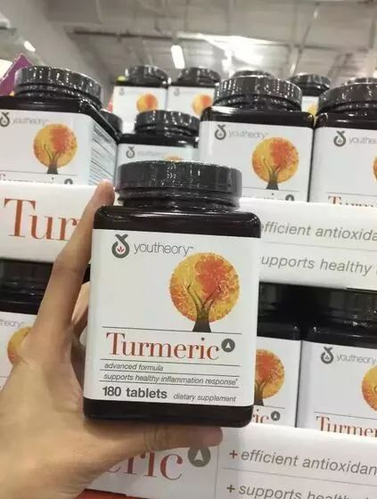 (原始链接: https://mmbiz.qpic.cn/mmbiz_jpg/L5GmQ5Uh1kqpRcAvX9AnaB6ZmGY0VicHejwoYqfdIqt9MYqMdsdhKZgF7ib80dQ2ShUs03E9ibOrrKcRA5grZ6icUw/640?wx_fmt=jpeg)
- 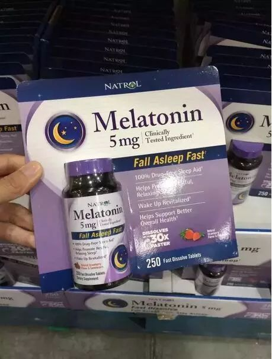 (原始链接: https://mmbiz.qpic.cn/mmbiz_jpg/L5GmQ5Uh1kqpRcAvX9AnaB6ZmGY0VicHeufs3MrxqHqKAIWIiaRII9Bq9qJhdxEVG4ibC37mTrJE0vlTQMuwzs8icg/640?wx_fmt=jpeg)
- 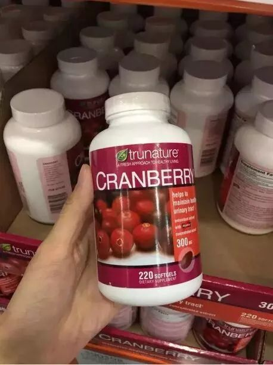 (原始链接: https://mmbiz.qpic.cn/mmbiz_jpg/L5GmQ5Uh1kqpRcAvX9AnaB6ZmGY0VicHeXibItz8WFZZ98nibN6gicTNrp7VgZcVG0oQHvFRBDToEDubjUxiaSt17VA/640?wx_fmt=jpeg)
- 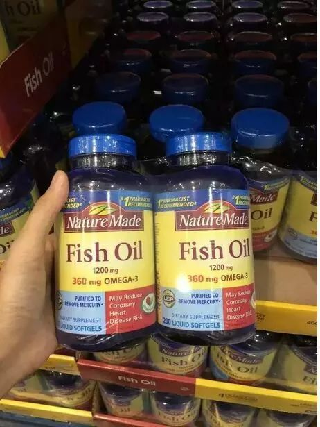 (原始链接: https://mmbiz.qpic.cn/mmbiz_jpg/L5GmQ5Uh1kqpRcAvX9AnaB6ZmGY0VicHe4988TDS11T1Ijuk9XP4WzKmpqButodE9mqhY8UhGcXGbPh7NAHaC6A/640?wx_fmt=jpeg)
- 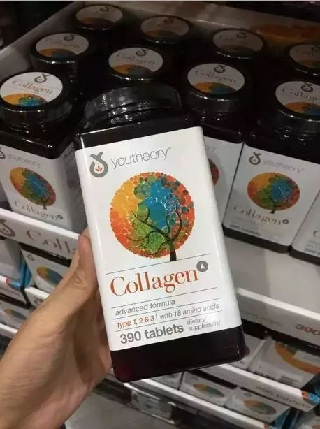 (原始链接: https://mmbiz.qpic.cn/mmbiz_jpg/L5GmQ5Uh1kqpRcAvX9AnaB6ZmGY0VicHemneEQDd42M2PXwd3gdUkHzygyNIQBFicdX8V40AibFQ77gyibfeCSSEdg/640?wx_fmt=jpeg)
- 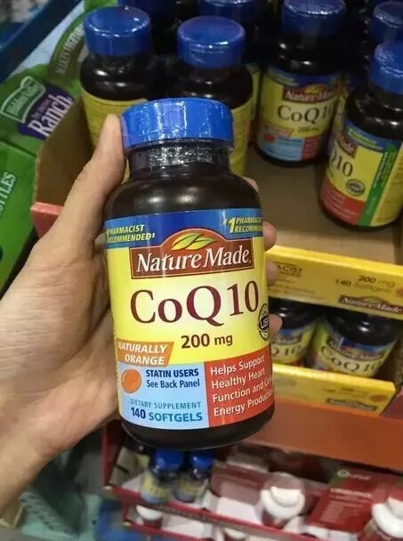 (原始链接: https://mmbiz.qpic.cn/mmbiz_jpg/L5GmQ5Uh1kqpRcAvX9AnaB6ZmGY0VicHexJppvcc6yV8wfib9xBbcLXliaspExqK3yX2YGvygWohM7o2iaeibce7ZsQ/640?wx_fmt=jpeg)
-  (原始链接: https://mmbiz.qpic.cn/mmbiz_jpg/L5GmQ5Uh1kqpRcAvX9AnaB6ZmGY0VicHeNVCDWb63vMvGSlmLPX3VqEyWXrfGDCDfDJaBYLPvfXGGq3MJ94ZvMw/640?wx_fmt=jpeg)
- 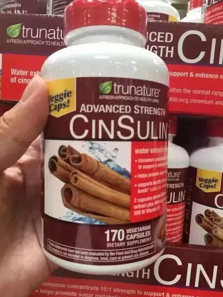 (原始链接: https://mmbiz.qpic.cn/mmbiz_jpg/L5GmQ5Uh1kqpRcAvX9AnaB6ZmGY0VicHeajI7wMc2GdPfZzciaFAZib6SuicORRUwOgLD0uEviczicrew5iawu4EzvfjA/640?wx_fmt=jpeg)
- 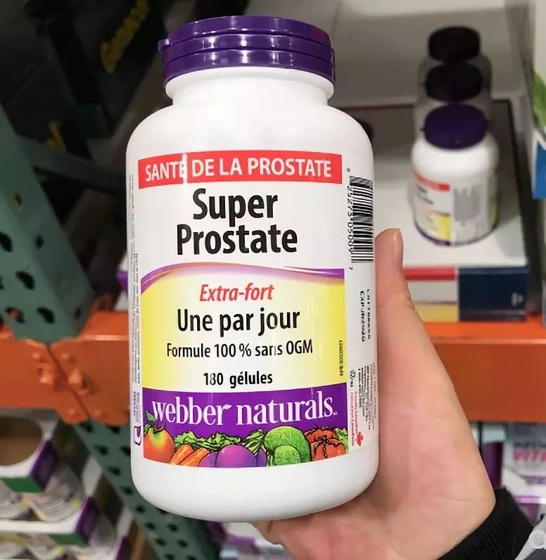 (原始链接: https://mmbiz.qpic.cn/mmbiz_jpg/L5GmQ5Uh1krxiaibiaezT0VbudnuleaB5B7ichRW0F4ia8sbPetnBLsusiaCia0uxqFnianLhoG2v8IupuGbloaBf0q3Bg/640?wx_fmt=jpeg)
- 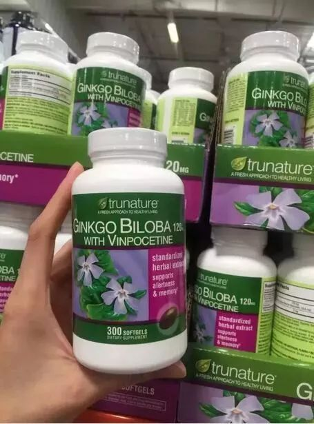 (原始链接: https://mmbiz.qpic.cn/mmbiz_jpg/L5GmQ5Uh1kqpRcAvX9AnaB6ZmGY0VicHelrByNVAeNwy6zLpK4CUW94gFyqFKXI32omFR5JwySLCkV78wZcWNvA/640?wx_fmt=jpeg)
- 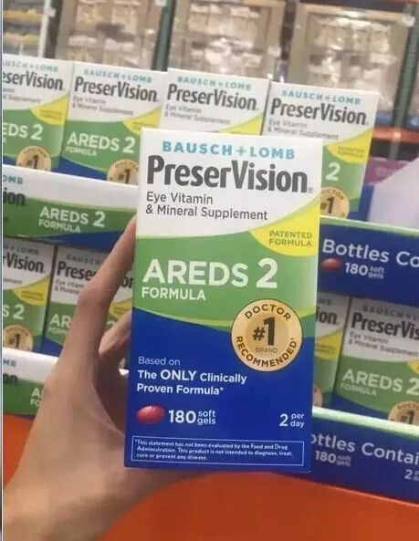 (原始链接: https://mmbiz.qpic.cn/mmbiz_jpg/L5GmQ5Uh1kqpRcAvX9AnaB6ZmGY0VicHe8caAIoI0uzkXLyPMficTwic7E7kz8iafAsJJeeEBrEbqHFw7ZTuC5WKHg/640?wx_fmt=jpeg)
-  (原始链接: https://mmbiz.qpic.cn/mmbiz_jpg/L5GmQ5Uh1kqpRcAvX9AnaB6ZmGY0VicHeL2y95wpv8BCQqYdUEwTBR0BJtTmrKftZIISMM3JYhoo4ia1Jbp0mQGg/640?wx_fmt=jpeg)
- 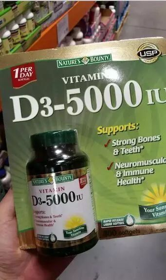 (原始链接: https://mmbiz.qpic.cn/mmbiz_jpg/L5GmQ5Uh1kqpRcAvX9AnaB6ZmGY0VicHewf7aNZ3HaZUHicoYB4sicAiaBUwBKQZZL0Kia59ialJA0d2a7uztFEoHBLA/640?wx_fmt=jpeg)
- 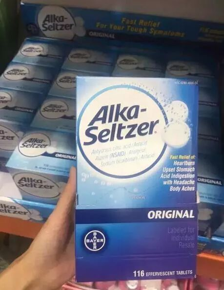 (原始链接: https://mmbiz.qpic.cn/mmbiz_jpg/L5GmQ5Uh1kqpRcAvX9AnaB6ZmGY0VicHemHia8aSoQj6519QZn5qMGaKtpzBy1u8AicPGbRBZUZeHS7RleCEjL9QQ/640?wx_fmt=jpeg)
- 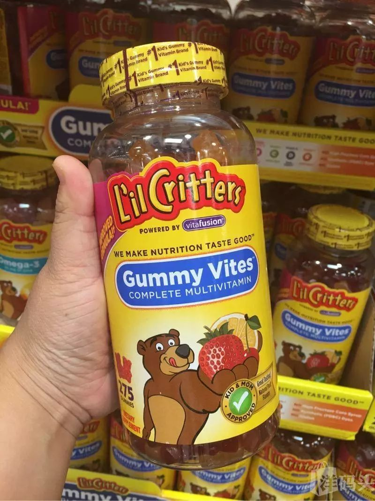 (原始链接: https://mmbiz.qpic.cn/mmbiz_jpg/L5GmQ5Uh1kqpRcAvX9AnaB6ZmGY0VicHemXpDRIhFa1b473iblBx2mmNdjd82hkDFgqxm0HwmjHIlEhO8LHaUhPw/640?wx_fmt=jpeg)
- 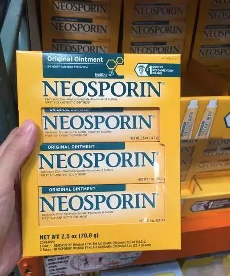 (原始链接: https://mmbiz.qpic.cn/mmbiz_jpg/L5GmQ5Uh1kqpRcAvX9AnaB6ZmGY0VicHeId2vCQ3Yau0zzpXewKibU2RnPBiaxXT09f3dsUDIzUdib9Z7cjBaBd96Q/640?wx_fmt=jpeg)
- 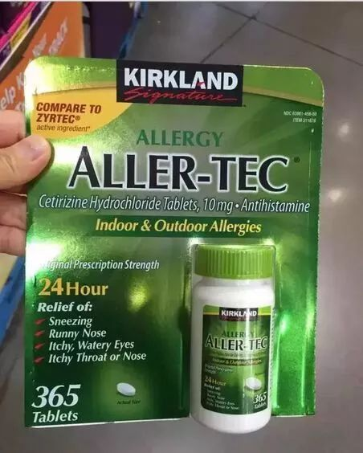 (原始链接: https://mmbiz.qpic.cn/mmbiz_jpg/L5GmQ5Uh1kqpRcAvX9AnaB6ZmGY0VicHeLESfAuIR3gRUMMk2FRMBDjibHuKbhGpwnyQiajnkltRUGO49PuYBna5A/640?wx_fmt=jpeg)
-  (原始链接: https://mmbiz.qpic.cn/mmbiz_jpg/L5GmQ5Uh1kqpRcAvX9AnaB6ZmGY0VicHeVAts1I0NWmga1p4icVnBt6qHabKpa4iaV1ics1jQroDiaGGZ5iaanIhr3gA/640?wx_fmt=jpeg)
- 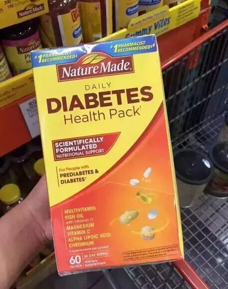 (原始链接: https://mmbiz.qpic.cn/mmbiz_jpg/L5GmQ5Uh1kqpRcAvX9AnaB6ZmGY0VicHeRayfw106AAI6CNf3S5ezLPYG0icmtO4uERhMR1XS7riaAuu6K8rrBX6w/640?wx_fmt=jpeg)
-  (原始链接: https://mmbiz.qpic.cn/mmbiz_jpg/D1nJqnhkPyKCe3Uzz3OO19VNU0FIiaOHaMEO0NdJcZBWeW5JpUJDXo1mvuoNO6ePrJ7mfS4iawox7wUD2xYbaupA/640?wx_fmt=jpeg)
-  (原始链接: https://mmbiz.qpic.cn/mmbiz_jpg/D1nJqnhkPyKCe3Uzz3OO19VNU0FIiaOHaofy3raMMAdMAH4iadCd8nL2DYbEic0u6s9iaJm4Bs1Phg4NC80LUOcDIw/640?wx_fmt=jpeg)
