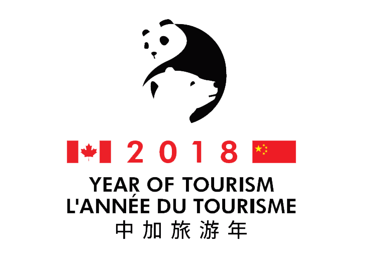
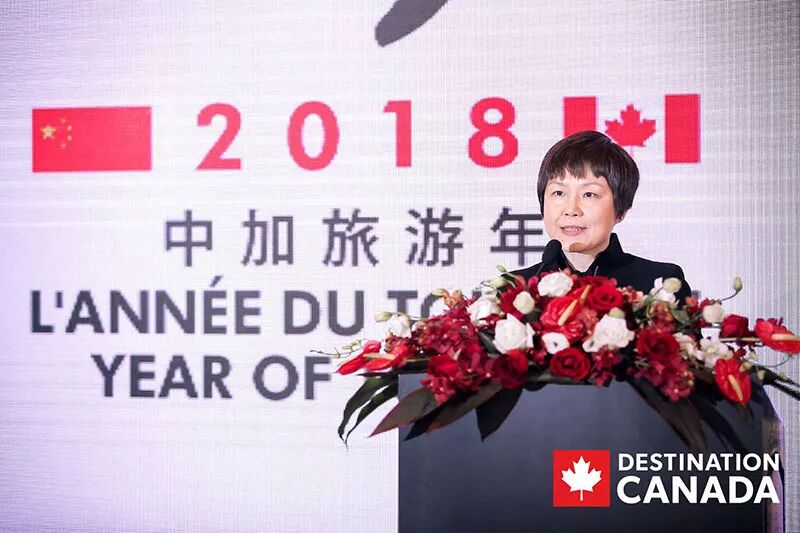
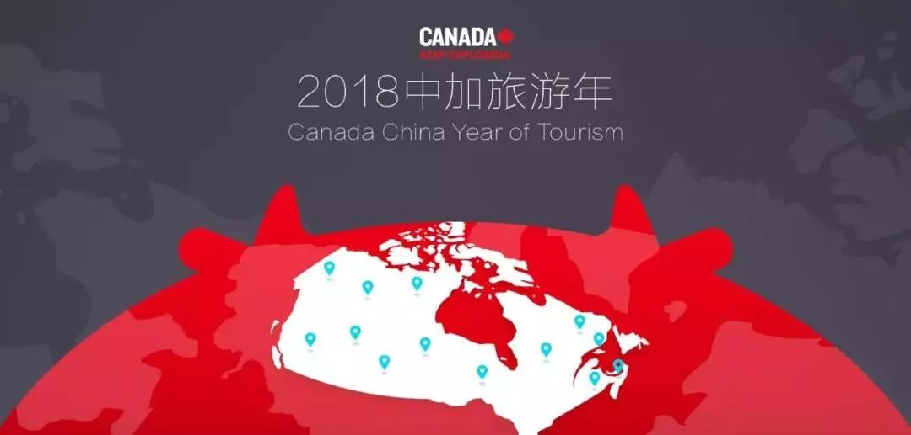
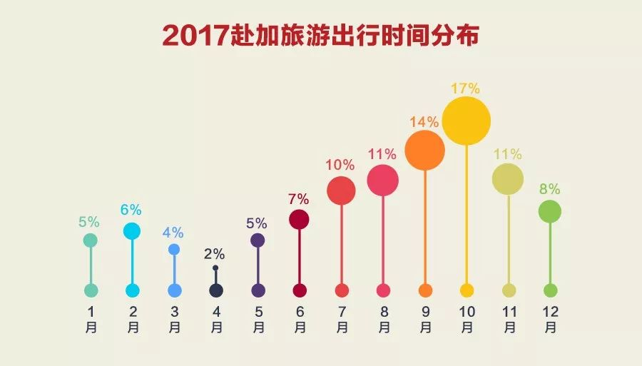

# 无标题

**链接地址:** http://mp.weixin.qq.com/s?__biz=MzI2NTE1ODgwOQ==&mid=2649605699&idx=1&sn=75e2404971d718e657da5fdf519e566c&chksm=f2b8cfb5c5cf46a3a363a8ea2b493b5ae54701c1d4ae6e41f85860de04fd05efd243efc9e351&mpshare=1&scene=2&srcid=#rd
**作者:** 关注我们
**获取时间:** 2025/8/28 20:57:12
**图片数量:** 17

---

## 原始HTML内容

<section style="box-sizing: border-box;"><section class="V5" style="box-sizing: border-box;" powered-by="xiumi.us"><section style="margin-right: 0%;margin-left: 0%;box-sizing: border-box;"><section style="display: inline-block;vertical-align: middle;width: 80%;box-sizing: border-box;"><section class="V5" style="box-sizing: border-box;" powered-by="xiumi.us"><section style="margin-top: 10px;margin-bottom: 10px;text-align: center;box-sizing: border-box;"><section style="display: inline-block;box-sizing: border-box;"><section style="max-width: 100%;font-size: 0px;padding-bottom: 3px;box-sizing: border-box;"><section style="display: inline-block;vertical-align: middle;box-sizing: border-box;"><section style="width: 5px;height: 1px;background-color: rgb(217, 217, 217);box-sizing: border-box;"></section><section style="width: 1px;height: 5px;margin-top: -3px;margin-right: auto;margin-left: auto;background-color: rgb(217, 217, 217);box-sizing: border-box;"></section></section><section style="margin-top: -1px;margin-right: -5px;margin-left: -5px;width: 100%;display: inline-block;vertical-align: middle;padding-right: 8px;padding-left: 8px;box-sizing: border-box;"><section style="width: 100%;height: 1px;background-color: rgb(217, 217, 217);box-sizing: border-box;"></section></section><section style="display: inline-block;vertical-align: middle;box-sizing: border-box;"><section style="width: 5px;height: 1px;background-color: rgb(217, 217, 217);box-sizing: border-box;"></section><section style="width: 1px;height: 5px;margin-top: -3px;margin-right: auto;margin-left: auto;background-color: rgb(217, 217, 217);box-sizing: border-box;"></section></section></section><section style="padding-left: 15px;padding-right: 15px;color: rgb(161, 161, 161);font-size: 14px;box-sizing: border-box;">
点击上方<strong style="box-sizing: border-box;">蓝字</strong>关注我们哟~
</section><section style="max-width: 100%;font-size: 0px;box-sizing: border-box;"><section style="display: inline-block;vertical-align: middle;box-sizing: border-box;"><section style="width: 5px;height: 1px;background-color: rgb(217, 217, 217);box-sizing: border-box;"></section><section style="width: 1px;height: 5px;margin-top: -3px;margin-right: auto;margin-left: auto;background-color: rgb(217, 217, 217);box-sizing: border-box;"></section></section><section style="margin-top: -1px;margin-right: -5px;margin-left: -5px;width: 100%;display: inline-block;vertical-align: middle;padding-right: 8px;padding-left: 8px;box-sizing: border-box;"><section style="width: 100%;height: 1px;background-color: rgb(217, 217, 217);box-sizing: border-box;"></section></section><section style="display: inline-block;vertical-align: middle;box-sizing: border-box;"><section style="width: 5px;height: 1px;background-color: rgb(217, 217, 217);box-sizing: border-box;"></section><section style="width: 1px;height: 5px;margin-top: -3px;margin-right: auto;margin-left: auto;background-color: rgb(217, 217, 217);box-sizing: border-box;"></section></section></section></section></section></section></section><section style="display: inline-block;vertical-align: middle;width: 20%;box-sizing: border-box;"><section class="V5" style="box-sizing: border-box;" powered-by="xiumi.us"><section style="text-align: center;margin: -10px 0% 10px;box-sizing: border-box;"><section style="max-width: 100%;vertical-align: middle;display: inline-block;width: 100%;box-sizing: border-box;"></section></section></section></section></section></section><section class="V5" style="box-sizing: border-box;" powered-by="xiumi.us"><section style="margin: 10px 0%;box-sizing: border-box;"><section style="display: inline-block;width: 100%;vertical-align: top;box-sizing: border-box;"><section class="V5" style="box-sizing: border-box;" powered-by="xiumi.us"><section style="box-sizing: border-box;"><section style="display: inline-block;vertical-align: bottom;width: 75%;padding-right: 10px;box-sizing: border-box;"><section class="V5" style="box-sizing: border-box;" powered-by="xiumi.us"><section style="margin: 10px 0% 3px;box-sizing: border-box;"><section style="display: inline-block;vertical-align: middle;box-sizing: border-box;"><section style="display: inline-block;vertical-align: bottom;padding-left: 5px;padding-right: 5px;line-height: 1.2em;margin-bottom: 2px;color: rgba(80, 182, 201, 0.72);box-sizing: border-box;">
<strong style="box-sizing: border-box;">仔细看下图，有惊喜！</strong>
</section><section style="max-width: 100%;display: inline-block;vertical-align: bottom;width: 1.6em;box-sizing: border-box;"></section></section></section></section></section><section style="display: inline-block;vertical-align: bottom;width: 25%;box-sizing: border-box;"><section class="V5" style="box-sizing: border-box;" powered-by="xiumi.us"><section style="margin-right: 0%;margin-bottom: 3px;margin-left: 0%;text-align: right;box-sizing: border-box;"><section style="display: inline-block;border-bottom: 0.15em solid rgba(80, 182, 201, 0.72);padding-bottom: 3px;box-sizing: border-box;"><section style="display: inline-block;padding: 3px;border-bottom: 0.15em solid rgba(80, 182, 201, 0.72);font-size: 12px;line-height: 1.4;color: rgb(255, 143, 47);box-sizing: border-box;">
<strong style="box-sizing: border-box;">金主大大</strong>
</section></section></section></section></section></section></section><section class="V5" style="box-sizing: border-box;" powered-by="xiumi.us"><section style="margin-right: 0%;margin-left: 0%;box-sizing: border-box;"><section style="background-color: rgba(80, 182, 201, 0.72);height: 2px;box-sizing: border-box;"></section></section></section></section></section></section><section class="V5" style="box-sizing: border-box;" powered-by="xiumi.us"><section style="text-align: center;margin-top: 10px;margin-bottom: 10px;box-sizing: border-box;"><section style="max-width: 100%;vertical-align: middle;display: inline-block;box-sizing: border-box;"></section></section></section><section class="V5" style="box-sizing: border-box;" powered-by="xiumi.us"><section style="text-align: center;margin-top: 10px;margin-bottom: 10px;box-sizing: border-box;"><section style="max-width: 100%;vertical-align: middle;display: inline-block;box-sizing: border-box;"></section></section></section><section class="V5" style="box-sizing: border-box;" powered-by="xiumi.us"><section style="text-align: center;margin-top: 10px;margin-bottom: 10px;box-sizing: border-box;"><section style="max-width: 100%;vertical-align: middle;display: inline-block;box-sizing: border-box;"></section></section></section><section class="V5" style="box-sizing: border-box;" powered-by="xiumi.us"><section style="text-align: center;margin-top: 10px;margin-bottom: 10px;box-sizing: border-box;"><section style="max-width: 100%;vertical-align: middle;display: inline-block;box-sizing: border-box;"></section></section></section><section class="V5" style="box-sizing: border-box;" powered-by="xiumi.us"><section style="text-align: center;margin-top: 10px;margin-bottom: 10px;box-sizing: border-box;"><section style="max-width: 100%;vertical-align: middle;display: inline-block;box-sizing: border-box;"><svg xmlns="http://www.w3.org/2000/svg" x="0px" y="0px" viewBox="0 0 902.1 38.2" style="vertical-align: middle;max-width: 100%;box-sizing: border-box;" width="902.1"><g style="box-sizing: border-box;"><path style="box-sizing: border-box;" d="M18.4,1.4c0.9-1.9,2.4-1.9,3.4,0l3.4,6.9c0.9,1.9,3.4,3.7,5.4,4l7.6,1.1c2.1,0.3,2.5,1.7,1,3.2   l-5.5,5.4c-1.5,1.5-2.4,4.3-2.1,6.4l1.3,7.6c0.4,2.1-0.9,2.9-2.7,2l-6.8-3.6c-1.8-1-4.9-1-6.7,0l-6.8,3.6c-1.9,1-3.1,0.1-2.7-2   l1.3-7.6c0.4-2.1-0.6-4.9-2.1-6.4l-5.5-5.4c-1.5-1.5-1-2.9,1-3.2l7.6-1.1c2.1-0.3,4.5-2.1,5.4-4L18.4,1.4z" fill="rgb(178, 243, 230)"></path><path style="box-sizing: border-box;" d="M90.6,5.4c0.7-1.4,1.9-1.4,2.6,0l2.6,5.3c0.7,1.4,2.6,2.8,4.2,3.1l5.9,0.9c1.6,0.2,2,1.3,0.8,2.5   l-4.2,4.1c-1.2,1.1-1.9,3.3-1.6,4.9l1,5.8c0.3,1.6-0.7,2.3-2.1,1.5l-5.2-2.8c-1.4-0.8-3.8-0.8-5.2,0L84,33.6   c-1.4,0.8-2.4,0.1-2.1-1.5l1-5.8c0.3-1.6-0.5-3.8-1.6-4.9l-4.2-4.1c-1.2-1.1-0.8-2.2,0.8-2.5l5.9-0.9c1.6-0.2,3.5-1.6,4.2-3.1   L90.6,5.4z" fill="rgb(190, 204, 246)"></path><path style="box-sizing: border-box;" d="M162.6,7.5c0.6-1.2,1.6-1.2,2.2,0l2.2,4.5c0.6,1.2,2.2,2.4,3.6,2.6l5,0.7c1.4,0.2,1.7,1.1,0.7,2.1   l-3.6,3.5c-1,1-1.6,2.9-1.4,4.2l0.9,5c0.2,1.4-0.6,1.9-1.8,1.3l-4.5-2.4c-1.2-0.6-3.2-0.6-4.4,0l-4.5,2.4c-1.2,0.6-2,0.1-1.8-1.3   l0.9-5c0.2-1.4-0.4-3.3-1.4-4.2l-3.6-3.5c-1-1-0.7-1.9,0.7-2.1l5-0.7c1.4-0.2,3-1.4,3.6-2.6L162.6,7.5z" fill="rgb(150, 208, 240)"></path><path style="box-sizing: border-box;" d="M60.1,19.1c0,2.3-1.9,4.2-4.2,4.2c-2.3,0-4.2-1.9-4.2-4.2s1.9-4.2,4.2-4.2   C58.3,14.9,60.1,16.8,60.1,19.1z" fill="rgb(218, 240, 224)"></path><path style="box-sizing: border-box;" d="M203.8,19.1c0,2.3-1.9,4.2-4.2,4.2c-2.3,0-4.2-1.9-4.2-4.2s1.9-4.2,4.2-4.2   C201.9,14.9,203.8,16.8,203.8,19.1z" fill="rgb(218, 240, 224)"></path><path style="box-sizing: border-box;" d="M130.9,19.1c0,1.7-1.4,3.1-3.1,3.1c-1.7,0-3.1-1.4-3.1-3.1c0-1.7,1.4-3.1,3.1-3.1   C129.5,16.1,130.9,17.4,130.9,19.1z" fill="rgb(218, 240, 224)"></path><path style="box-sizing: border-box;" d="M233.9,1.4c0.9-1.9,2.4-1.9,3.4,0l3.4,6.9c0.9,1.9,3.4,3.7,5.4,4l7.6,1.1c2.1,0.3,2.5,1.7,1,3.2   l-5.5,5.4c-1.5,1.5-2.4,4.3-2.1,6.4l1.3,7.6c0.4,2.1-0.9,2.9-2.7,2l-6.8-3.6c-1.8-1-4.9-1-6.7,0l-6.8,3.6c-1.9,1-3.1,0.1-2.7-2   l1.3-7.6c0.4-2.1-0.6-4.9-2.1-6.4l-5.5-5.4c-1.5-1.5-1-2.9,1-3.2l7.6-1.1c2.1-0.3,4.5-2.1,5.4-4L233.9,1.4z" fill="rgb(178, 243, 230)"></path><path style="box-sizing: border-box;" d="M306.1,5.4c0.7-1.4,1.9-1.4,2.6,0l2.6,5.3c0.7,1.4,2.6,2.8,4.2,3.1l5.9,0.9c1.6,0.2,2,1.3,0.8,2.5   l-4.2,4.1c-1.2,1.1-1.9,3.3-1.6,4.9l1,5.8c0.3,1.6-0.7,2.3-2.1,1.5l-5.2-2.8c-1.4-0.8-3.8-0.8-5.2,0l-5.2,2.8   c-1.4,0.8-2.4,0.1-2.1-1.5l1-5.8c0.3-1.6-0.4-3.8-1.6-4.9l-4.2-4.1c-1.2-1.1-0.8-2.2,0.8-2.5l5.9-0.9c1.6-0.2,3.5-1.6,4.2-3.1   L306.1,5.4z" fill="rgb(190, 204, 246)"></path><path style="box-sizing: border-box;" d="M378.1,7.5c0.6-1.2,1.6-1.2,2.2,0l2.2,4.5c0.6,1.2,2.2,2.4,3.6,2.6l5,0.7c1.4,0.2,1.7,1.1,0.7,2.1   l-3.6,3.5c-1,1-1.6,2.9-1.4,4.2l0.9,5c0.2,1.4-0.6,1.9-1.8,1.3l-4.5-2.4c-1.2-0.6-3.2-0.6-4.4,0l-4.5,2.4c-1.2,0.6-2,0.1-1.8-1.3   l0.9-5c0.2-1.4-0.4-3.3-1.4-4.2l-3.6-3.5c-1-1-0.7-1.9,0.7-2.1l5-0.7c1.4-0.2,3-1.4,3.6-2.6L378.1,7.5z" fill="rgb(150, 208, 240)"></path><path style="box-sizing: border-box;" d="M275.7,19.1c0,2.3-1.9,4.2-4.2,4.2c-2.3,0-4.2-1.9-4.2-4.2s1.9-4.2,4.2-4.2   C273.8,14.9,275.7,16.8,275.7,19.1z" fill="rgb(218, 240, 224)"></path><path style="box-sizing: border-box;" d="M419.3,19.1c0,2.3-1.9,4.2-4.2,4.2c-2.3,0-4.2-1.9-4.2-4.2s1.9-4.2,4.2-4.2   C417.5,14.9,419.3,16.8,419.3,19.1z" fill="rgb(218, 240, 224)"></path><path style="box-sizing: border-box;" d="M346.4,19.1c0,1.7-1.4,3.1-3.1,3.1c-1.7,0-3.1-1.4-3.1-3.1c0-1.7,1.4-3.1,3.1-3.1   C345,16.1,346.4,17.4,346.4,19.1z" fill="rgb(218, 240, 224)"></path><path style="box-sizing: border-box;" d="M449.4,1.4c0.9-1.9,2.4-1.9,3.4,0l3.4,6.9c0.9,1.9,3.4,3.7,5.4,4l7.6,1.1c2.1,0.3,2.5,1.7,1,3.2   l-5.5,5.4c-1.5,1.5-2.4,4.3-2.1,6.4l1.3,7.6c0.4,2.1-0.9,2.9-2.7,2l-6.8-3.6c-1.8-1-4.9-1-6.7,0l-6.8,3.6c-1.9,1-3.1,0.1-2.7-2   l1.3-7.6c0.4-2.1-0.6-4.9-2.1-6.4l-5.5-5.4c-1.5-1.5-1-2.9,1-3.2l7.6-1.1c2.1-0.3,4.5-2.1,5.4-4L449.4,1.4z" fill="rgb(178, 243, 230)"></path><path style="box-sizing: border-box;" d="M521.6,5.4c0.7-1.4,1.9-1.4,2.6,0l2.6,5.3c0.7,1.4,2.6,2.8,4.2,3.1l5.9,0.9c1.6,0.2,2,1.3,0.8,2.5   l-4.2,4.1c-1.2,1.1-1.9,3.3-1.6,4.9l1,5.8c0.3,1.6-0.7,2.3-2.1,1.5l-5.2-2.8c-1.4-0.8-3.8-0.8-5.2,0l-5.2,2.8   c-1.4,0.8-2.4,0.1-2.1-1.5l1-5.8c0.3-1.6-0.5-3.8-1.6-4.9l-4.2-4.1c-1.2-1.1-0.8-2.2,0.8-2.5l5.9-0.9c1.6-0.2,3.5-1.6,4.2-3.1   L521.6,5.4z" fill="rgb(190, 204, 246)"></path><path style="box-sizing: border-box;" d="M593.6,7.5c0.6-1.2,1.6-1.2,2.2,0l2.2,4.5c0.6,1.2,2.2,2.4,3.6,2.6l5,0.7c1.4,0.2,1.7,1.1,0.7,2.1   l-3.6,3.5c-1,1-1.6,2.9-1.4,4.2l0.9,5c0.2,1.4-0.6,1.9-1.8,1.3l-4.5-2.4c-1.2-0.6-3.2-0.6-4.4,0l-4.5,2.4c-1.2,0.6-2,0.1-1.8-1.3   l0.9-5c0.2-1.4-0.4-3.3-1.4-4.2l-3.6-3.5c-1-1-0.7-1.9,0.7-2.1l5-0.7c1.4-0.2,3-1.4,3.6-2.6L593.6,7.5z" fill="rgb(150, 208, 240)"></path><path style="box-sizing: border-box;" d="M491.2,19.1c0,2.3-1.9,4.2-4.2,4.2c-2.3,0-4.2-1.9-4.2-4.2s1.9-4.2,4.2-4.2   C489.3,14.9,491.2,16.8,491.2,19.1z" fill="rgb(218, 240, 224)"></path><path style="box-sizing: border-box;" d="M634.9,19.1c0,2.3-1.9,4.2-4.2,4.2c-2.3,0-4.2-1.9-4.2-4.2s1.9-4.2,4.2-4.2   C633,14.9,634.9,16.8,634.9,19.1z" fill="rgb(218, 240, 224)"></path><path style="box-sizing: border-box;" d="M561.9,19.1c0,1.7-1.4,3.1-3.1,3.1c-1.7,0-3.1-1.4-3.1-3.1c0-1.7,1.4-3.1,3.1-3.1   C560.5,16.1,561.9,17.4,561.9,19.1z" fill="rgb(218, 240, 224)"></path><path style="box-sizing: border-box;" d="M664.9,1.4c0.9-1.9,2.4-1.9,3.4,0l3.4,6.9c0.9,1.9,3.4,3.7,5.4,4l7.6,1.1c2.1,0.3,2.5,1.7,1,3.2   l-5.5,5.4c-1.5,1.5-2.4,4.3-2.1,6.4l1.3,7.6c0.4,2.1-0.9,2.9-2.7,2l-6.8-3.6c-1.8-1-4.9-1-6.7,0l-6.8,3.6c-1.9,1-3.1,0.1-2.7-2   l1.3-7.6c0.4-2.1-0.6-4.9-2.1-6.4l-5.5-5.4c-1.5-1.5-1-2.9,1-3.2l7.6-1.1c2.1-0.3,4.5-2.1,5.4-4L664.9,1.4z" fill="rgb(178, 243, 230)"></path><path style="box-sizing: border-box;" d="M737.1,5.4c0.7-1.4,1.9-1.4,2.6,0l2.6,5.3c0.7,1.4,2.6,2.8,4.2,3.1l5.9,0.9c1.6,0.2,2,1.3,0.8,2.5   l-4.2,4.1c-1.2,1.1-1.9,3.3-1.6,4.9l1,5.8c0.3,1.6-0.7,2.3-2.1,1.5l-5.2-2.8c-1.4-0.8-3.8-0.8-5.2,0l-5.2,2.8   c-1.4,0.8-2.4,0.1-2.1-1.5l1-5.8c0.3-1.6-0.5-3.8-1.6-4.9l-4.2-4.1c-1.2-1.1-0.8-2.2,0.8-2.5l5.9-0.9c1.6-0.2,3.5-1.6,4.2-3.1   L737.1,5.4z" fill="rgb(190, 204, 246)"></path><path style="box-sizing: border-box;" d="M809.2,7.5c0.6-1.2,1.6-1.2,2.2,0l2.2,4.5c0.6,1.2,2.2,2.4,3.6,2.6l5,0.7c1.4,0.2,1.7,1.1,0.7,2.1   l-3.6,3.5c-1,1-1.6,2.9-1.4,4.2l0.9,5c0.2,1.4-0.6,1.9-1.8,1.3l-4.5-2.4c-1.2-0.6-3.2-0.6-4.4,0l-4.5,2.4c-1.2,0.6-2,0.1-1.8-1.3   l0.9-5c0.2-1.4-0.4-3.3-1.4-4.2l-3.6-3.5c-1-1-0.7-1.9,0.7-2.1l5-0.7c1.4-0.2,3-1.4,3.6-2.6L809.2,7.5z" fill="rgb(150, 208, 240)"></path><path style="box-sizing: border-box;" d="M706.7,19.1c0,2.3-1.9,4.2-4.2,4.2c-2.3,0-4.2-1.9-4.2-4.2s1.9-4.2,4.2-4.2   C704.8,14.9,706.7,16.8,706.7,19.1z" fill="rgb(218, 240, 224)"></path><path style="box-sizing: border-box;" d="M850.4,19.1c0,2.3-1.9,4.2-4.2,4.2c-2.3,0-4.2-1.9-4.2-4.2s1.9-4.2,4.2-4.2   C848.5,14.9,850.4,16.8,850.4,19.1z" fill="rgb(218, 240, 224)"></path><path style="box-sizing: border-box;" d="M777.4,19.1c0,1.7-1.4,3.1-3.1,3.1c-1.7,0-3.1-1.4-3.1-3.1c0-1.7,1.4-3.1,3.1-3.1   C776,16.1,777.4,17.4,777.4,19.1z" fill="rgb(218, 240, 224)"></path><path style="box-sizing: border-box;" d="M880.4,1.4c0.9-1.9,2.4-1.9,3.4,0l3.4,6.9c0.9,1.9,3.4,3.7,5.4,4l7.6,1.1c2.1,0.3,2.5,1.7,1,3.2   l-5.5,5.4c-1.5,1.5-2.4,4.3-2.1,6.4l1.3,7.6c0.4,2.1-0.9,2.9-2.7,2l-6.8-3.6c-1.8-1-4.9-1-6.7,0l-6.8,3.6c-1.8,1-3.1,0.1-2.7-2   l1.3-7.6c0.4-2.1-0.6-4.9-2.1-6.4l-5.5-5.4c-1.5-1.5-1-2.9,1-3.2l7.6-1.1c2.1-0.3,4.5-2.1,5.4-4L880.4,1.4z" fill="rgb(178, 243, 230)"></path></g></svg></section></section></section><section class="V5" style="box-sizing: border-box;" powered-by="xiumi.us"><section style="box-sizing: border-box;"><section style="text-align: center;box-sizing: border-box;">
 

<strong>文化搭台，经济唱戏</strong>

 

相信每一个对中加文化稍加关注和了解的中国人对上面这个图标都不会感到陌生。 

 

中国和加拿大友谊深厚， 两国之间的旅游交流与日俱增。为增进两国人民友好关系，中国总理李克强和加拿大总理贾斯廷·特鲁多宣布，2018年为中加旅游年。

 

在此期间，中国和加拿大将分别举办包括展览、 音乐和戏剧表演等在内的文化盛事。

 

 

同时，为庆祝这特别的一年，加拿大热情诚挚地欢迎中国朋友来加拿大体验你的最“加”旅程！在这里，每个人都能找到自己的最“加”：夏日冒险、冬季运动、饕餮美食和家庭活动等。

 

2018“中加旅游年”赴加旅游的游客人数稳步上升。根据加拿大旅游局官方统计数据，仅2018年前半年，加拿大共接待了来自全球的近860万游客，同比去年增长2%，其中来自中国的游客超过30万，同比增长9.1%。

 

 

 

<strong style="white-space: normal;">一出好戏，尴尬收场</strong>

 

然而，近期发生的一系列让中加关系迅速出现裂痕的事件却让这场本应该互利互惠两面双赢的大好事尴尬收场。

 

随着中国和加拿大之间的紧张关系越来越紧张，Travel Alberta已经撤出了旨在吸引中国游客前往艾伯塔省的海外营销计划。

据悉，目前该省的营销机构已经加入了其他加拿大宣传机构，包括Explore BC和Destination Canada，停止了所有宣传活动和并停止安排员工访问中国的行程。

 

Travel Alberta总裁兼首席执行官Royce Chwin表示，该机构在过去几年一直与众多旅行社和其他媒体合作伙伴合作，以推广艾伯塔省的旅游项目。但目前迫于紧张的局势，这些营销活动将至少暂停到明年，或直到紧张局势有所缓和。

 

 

<strong style="white-space: normal;">局势紧张，宣传暂停</strong>

 

Chwin像记者说到：“我们曾经积极地与中国的媒体合作，我们还与代表艾伯塔省的旅游经营者合作，向中国游客宣传艾伯塔省的旅游项目。不过我们暂时已经暂停了这些活动。“

“当政治上的影响越来越大，远远超出旅游业可以承受的范围时，我们对发出的旅游信息十分敏感，无论是自然灾害还是政治或更糟糕的事情。”Chwin表示暂停旅游计划并非Travel Alberta自愿，而是考虑到多方因素不得已为之。 

 

 

据悉，中国外交部于本周四表示，在三名加拿大公民被拘留在中国之后，一名加拿大妇女也因非法工作而受到“行政处罚”。来自艾伯塔省的女教师莎拉麦吉尔因非法工作而在中国被拘留。

 

她的家人说她在中国工作了几个月都没有出现任何问题，但近日中国当局突然向她询问她的签证问题。然后她被捕，让她的家人深感忧虑。

 

正是由于这一系列事件，而致使了阿省对华宣传旅游项目的紧急叫停。

 

 <strong style="white-space: normal;">旅游叫停，损失巨大</strong>

 

这或许对阿省的旅游业的影响也是巨大的。

 

Travel Alberta表示，中国是全省第二大国际旅游市场，仅次于英国。

 

虽然目前还不清楚暂停旅游宣传对中加经济长期发展的影响是什么，但Chwin表示他对旅游业将迅速反弹还是颇具信心的。

“已经计划前来的旅客还是在继续增长中国人还是要来加拿大的。中国依然是加拿大的重要旅客来源国之一。

他说：“我们与出售艾伯塔省旅行套餐的人士进行了交谈，他们说近期的旅行套餐预定量并没有显着下降。”&nbsp;旅游业始终是反弹最快的产业之一。

 

<strong style="white-space: normal;">无独有偶，全面喊停</strong>

不仅仅是亚伯塔省的旅游业受到了该次风波的影响。负责推广全加旅游业的温哥华官方机构Destination Canada指出，“在某些特殊情况下，例如发生地缘政治问题或悲剧性事件，继续推广旅游业的话只会令声誉受损。因此决定暂停在中国推广旅游”。

报道指受两国关系紧张影响，加拿大汽车零部件制造商协会主席表示，多间中国汽车制造商，已搁置在加拿大扩充业务的计划。

对加拿大来说，孟晚舟事件的后果在政治和经济层面上已经有所体现。加拿大旅游部长卓丽（Melanie Joly）取消了早已计划好的访华之行，此行原本是为了庆祝中加旅游年的结束。此外，一个加拿大林业代表团也取消了访华计划。 

面对这一外交困局，以特鲁多为首的加拿大政府束手无策，只能采取拖延战术。加拿大政府没有发出针对中国的旅游警告，只是告诫本国民众要保持谨慎，很明显是为了避免进一步激化矛盾。

卡尔加里旅游局发言人麦考利（Cassandra McAuley）说，该局也将暂停在中国市场的营销，暂时不再派员前往大陆。

 

<strong>中加关系，有无可修复的可能性呢？</strong>

 

旅游公司经理温弗雷德·加齐斯表示：“中国游客带来的旅游收入对我们的经济贡献很大，比如：每年有大量中国人来加拿大看极光。很担心以后他们不愿意来了。”

 

在加媒看来，这位旅游从业者的担忧并非全无道理，加齐斯之所以这么忧心，是因为他们公司50%的业务量都来自中国游客。

 

加拿大《多伦多星报》还刊文表达了诸多民间企业的担忧：没有中国客户或者供应商，加拿大企业能否生存下去？文章称，如果两国持续交恶，加方从电信、航空航天之类的高科技产业到汽车等较传统的制造业都会受到影响。

 

加拿大时代林业产品研究公司常务董事凯文·梅森说，中国是加拿大木材行业的第二大客户，占加拿大软木出口的20%到30%。不管在什么情况下，丢掉这么一大笔生意都是非常棘手的问题。

 

 

因此，在加拿大国内舆论看来，当前危机发生之时，正值加拿大政府希望加强与中国的联系，以便实现国际贸易多样化，减少对美国依赖。然而，如果关键时刻加政府走错棋，恐会搬起石头砸自己的脚。

 

文章来源：Global News, CBCNews，新浪新闻

 

- 更多精彩内容，欢迎关注我们 -&nbsp;
</section></section></section><section class="V5" style="box-sizing: border-box;" powered-by="xiumi.us"><section style="box-sizing: border-box;"><section style="box-sizing: border-box;">
 
</section></section></section><section class="V5" style="box-sizing: border-box;" powered-by="xiumi.us"><section style="box-sizing: border-box;"><section style="box-sizing: border-box;">
 
</section></section></section><section class="V5" style="box-sizing: border-box;" powered-by="xiumi.us"><section style="margin: 40px 0% 10px;text-align: center;box-sizing: border-box;"><section style="display: inline-block;width: 90%;border-width: 1px;border-style: dotted;border-color: rgba(80, 182, 201, 0.72);padding: 10px;border-radius: 0px;box-sizing: border-box;"><section class="V5" style="box-sizing: border-box;" powered-by="xiumi.us"><section style="transform: translate3d(20px, 0px, 0px);text-align: left;font-size: 11px;margin-top: -55px;margin-right: 0%;margin-left: 0%;box-sizing: border-box;"><section style="box-sizing: border-box;width: 7em;height: 7em;display: inline-block;vertical-align: bottom;border-radius: 100%;border-width: 5px;border-style: none;border-color: rgba(80, 182, 201, 0.72);background-position: center center;background-repeat: no-repeat;background-size: cover;background-image: url(&quot;https://mmbiz.qpic.cn/mmbiz_jpg/D1nJqnhkPyKibNFaPByALHicrO56utzicpr0icEh4p9qnxCddicfbaLcpOBBjDkdfuFPy0cyTw2v05JuYmZFhCLLa1g/640?wx_fmt=jpeg&quot;);"><section style="width: 100%;height: 100%;overflow: hidden;line-height: 0;box-sizing: border-box;"></section></section></section></section><section class="V5" style="box-sizing: border-box;" powered-by="xiumi.us"><section style="box-sizing: border-box;"><section class="group-empty" style="display: inline-block;vertical-align: top;width: 38.2%;box-sizing: border-box;height: 1px;"></section><section style="display: inline-block;vertical-align: top;width: 61.8%;box-sizing: border-box;"><section class="V5" style="box-sizing: border-box;" powered-by="xiumi.us"><section style="margin-right: 0%;margin-left: 0%;box-sizing: border-box;"><section style="font-size: 18px;color: rgb(67, 103, 117);line-height: 1.6;letter-spacing: 1px;box-sizing: border-box;">
<strong style="box-sizing: border-box;">埃德蒙顿微生活</strong>
</section></section></section><section class="V5" style="box-sizing: border-box;" powered-by="xiumi.us"><section style="margin-top: 0.5em;margin-bottom: 0.5em;box-sizing: border-box;"><section style="background-color: rgba(80, 182, 201, 0.72);height: 1px;box-sizing: border-box;"></section></section></section></section></section></section><section class="V5" style="box-sizing: border-box;" powered-by="xiumi.us"><section style="box-sizing: border-box;"><section style="text-align: justify;font-size: 14px;color: rgba(62, 62, 62, 0.72);letter-spacing: 2px;box-sizing: border-box;">
<strong style="box-sizing: border-box;">关心埃德蒙顿民生，</strong>

<strong style="box-sizing: border-box;">关注埃德蒙顿的发展。</strong>

 

埃德蒙顿微生活是“吃喝玩乐埃德蒙顿”旗下，为埃德蒙顿地区的居民提供每日最新的吃喝玩乐、工作学习、商业投资的媒体平台 。
</section></section></section><section class="V5" style="box-sizing: border-box;" powered-by="xiumi.us"><section style="box-sizing: border-box;"><section style="text-align: left;box-sizing: border-box;">
 
</section></section></section><section class="V5" style="box-sizing: border-box;" powered-by="xiumi.us"><section style="box-sizing: border-box;"><section style="display: inline-block;vertical-align: middle;width: 61.8%;box-sizing: border-box;"><section class="V5" style="box-sizing: border-box;" powered-by="xiumi.us"><section style="box-sizing: border-box;"><section style="text-align: justify;font-size: 12px;color: rgba(62, 62, 62, 0.37);line-height: 1.9;letter-spacing: 0px;box-sizing: border-box;">
我们的目标是以最新、最快、最及时的方式 报道埃德蒙顿的新鲜事 。 
</section></section></section></section><section style="display: inline-block;vertical-align: middle;width: 38.2%;box-sizing: border-box;"><section class="V5" style="box-sizing: border-box;" powered-by="xiumi.us"><section style="margin-right: 0%;margin-left: 0%;box-sizing: border-box;"><section style="max-width: 100%;vertical-align: middle;display: inline-block;width: 70%;box-sizing: border-box;"></section></section></section></section></section></section></section></section></section></section>
 

---

## 纯文本内容

点击上方蓝字关注我们哟~仔细看下图，有惊喜！金主大大文化搭台，经济唱戏相信每一个对中加文化稍加关注和了解的中国人对上面这个图标都不会感到陌生。中国和加拿大友谊深厚， 两国之间的旅游交流与日俱增。为增进两国人民友好关系，中国总理李克强和加拿大总理贾斯廷·特鲁多宣布，2018年为中加旅游年。在此期间，中国和加拿大将分别举办包括展览、 音乐和戏剧表演等在内的文化盛事。同时，为庆祝这特别的一年，加拿大热情诚挚地欢迎中国朋友来加拿大体验你的最“加”旅程！在这里，每个人都能找到自己的最“加”：夏日冒险、冬季运动、饕餮美食和家庭活动等。2018“中加旅游年”赴加旅游的游客人数稳步上升。根据加拿大旅游局官方统计数据，仅2018年前半年，加拿大共接待了来自全球的近860万游客，同比去年增长2%，其中来自中国的游客超过30万，同比增长9.1%。一出好戏，尴尬收场然而，近期发生的一系列让中加关系迅速出现裂痕的事件却让这场本应该互利互惠两面双赢的大好事尴尬收场。随着中国和加拿大之间的紧张关系越来越紧张，Travel Alberta已经撤出了旨在吸引中国游客前往艾伯塔省的海外营销计划。据悉，目前该省的营销机构已经加入了其他加拿大宣传机构，包括Explore BC和Destination Canada，停止了所有宣传活动和并停止安排员工访问中国的行程。Travel Alberta总裁兼首席执行官Royce Chwin表示，该机构在过去几年一直与众多旅行社和其他媒体合作伙伴合作，以推广艾伯塔省的旅游项目。但目前迫于紧张的局势，这些营销活动将至少暂停到明年，或直到紧张局势有所缓和。局势紧张，宣传暂停Chwin像记者说到：“我们曾经积极地与中国的媒体合作，我们还与代表艾伯塔省的旅游经营者合作，向中国游客宣传艾伯塔省的旅游项目。不过我们暂时已经暂停了这些活动。““当政治上的影响越来越大，远远超出旅游业可以承受的范围时，我们对发出的旅游信息十分敏感，无论是自然灾害还是政治或更糟糕的事情。”Chwin表示暂停旅游计划并非Travel Alberta自愿，而是考虑到多方因素不得已为之。据悉，中国外交部于本周四表示，在三名加拿大公民被拘留在中国之后，一名加拿大妇女也因非法工作而受到“行政处罚”。来自艾伯塔省的女教师莎拉麦吉尔因非法工作而在中国被拘留。她的家人说她在中国工作了几个月都没有出现任何问题，但近日中国当局突然向她询问她的签证问题。然后她被捕，让她的家人深感忧虑。正是由于这一系列事件，而致使了阿省对华宣传旅游项目的紧急叫停。旅游叫停，损失巨大这或许对阿省的旅游业的影响也是巨大的。Travel Alberta表示，中国是全省第二大国际旅游市场，仅次于英国。虽然目前还不清楚暂停旅游宣传对中加经济长期发展的影响是什么，但Chwin表示他对旅游业将迅速反弹还是颇具信心的。“已经计划前来的旅客还是在继续增长中国人还是要来加拿大的。中国依然是加拿大的重要旅客来源国之一。他说：“我们与出售艾伯塔省旅行套餐的人士进行了交谈，他们说近期的旅行套餐预定量并没有显着下降。” 旅游业始终是反弹最快的产业之一。无独有偶，全面喊停不仅仅是亚伯塔省的旅游业受到了该次风波的影响。负责推广全加旅游业的温哥华官方机构Destination Canada指出，“在某些特殊情况下，例如发生地缘政治问题或悲剧性事件，继续推广旅游业的话只会令声誉受损。因此决定暂停在中国推广旅游”。报道指受两国关系紧张影响，加拿大汽车零部件制造商协会主席表示，多间中国汽车制造商，已搁置在加拿大扩充业务的计划。对加拿大来说，孟晚舟事件的后果在政治和经济层面上已经有所体现。加拿大旅游部长卓丽（Melanie Joly）取消了早已计划好的访华之行，此行原本是为了庆祝中加旅游年的结束。此外，一个加拿大林业代表团也取消了访华计划。面对这一外交困局，以特鲁多为首的加拿大政府束手无策，只能采取拖延战术。加拿大政府没有发出针对中国的旅游警告，只是告诫本国民众要保持谨慎，很明显是为了避免进一步激化矛盾。卡尔加里旅游局发言人麦考利（Cassandra McAuley）说，该局也将暂停在中国市场的营销，暂时不再派员前往大陆。中加关系，有无可修复的可能性呢？旅游公司经理温弗雷德·加齐斯表示：“中国游客带来的旅游收入对我们的经济贡献很大，比如：每年有大量中国人来加拿大看极光。很担心以后他们不愿意来了。”在加媒看来，这位旅游从业者的担忧并非全无道理，加齐斯之所以这么忧心，是因为他们公司50%的业务量都来自中国游客。加拿大《多伦多星报》还刊文表达了诸多民间企业的担忧：没有中国客户或者供应商，加拿大企业能否生存下去？文章称，如果两国持续交恶，加方从电信、航空航天之类的高科技产业到汽车等较传统的制造业都会受到影响。加拿大时代林业产品研究公司常务董事凯文·梅森说，中国是加拿大木材行业的第二大客户，占加拿大软木出口的20%到30%。不管在什么情况下，丢掉这么一大笔生意都是非常棘手的问题。因此，在加拿大国内舆论看来，当前危机发生之时，正值加拿大政府希望加强与中国的联系，以便实现国际贸易多样化，减少对美国依赖。然而，如果关键时刻加政府走错棋，恐会搬起石头砸自己的脚。文章来源：Global News, CBCNews，新浪新闻- 更多精彩内容，欢迎关注我们 - 埃德蒙顿微生活关心埃德蒙顿民生，关注埃德蒙顿的发展。埃德蒙顿微生活是“吃喝玩乐埃德蒙顿”旗下，为埃德蒙顿地区的居民提供每日最新的吃喝玩乐、工作学习、商业投资的媒体平台 。我们的目标是以最新、最快、最及时的方式 报道埃德蒙顿的新鲜事 。

---

## 图片列表

-  (原始链接: https://mmbiz.qpic.cn/mmbiz_gif/D1nJqnhkPyKibNFaPByALHicrO56utzicprLLIXSEudiby1KsiapJ60xhej5bO7ib6ibYIibJcakFWBFFGvu8VKwuLdrzw/640?wx_fmt=gif)
-  (原始链接: https://mmbiz.qpic.cn/mmbiz_gif/D1nJqnhkPyKibNFaPByALHicrO56utzicpr0suib3NpL4SOWD7ibfdrFBlOKGuzbQSDqU5Cfjia6iaUIudKXTAZP3fefQ/640?wx_fmt=gif)
-  (原始链接: https://mmbiz.qpic.cn/mmbiz_jpg/D1nJqnhkPyKibNFaPByALHicrO56utzicprr90vHnKW062b0VicKF1XeykHsqa2hbC6hQNN8QFAzbCNHqYm8Qh4jTQ/640?wx_fmt=jpeg)
-  (原始链接: https://mmbiz.qpic.cn/mmbiz_jpg/D1nJqnhkPyKibNFaPByALHicrO56utzicprC7APSC6vvOibV9CeV9icNlmH0GqSSO9xWic6wCdV1icbJzja9qibuTK1r6Q/640?wx_fmt=jpeg)
-  (原始链接: https://mmbiz.qpic.cn/mmbiz_jpg/D1nJqnhkPyKibNFaPByALHicrO56utzicprJOZibcrsqVvicU2D0PQiboveatPS9UQfiau0PPYZJMzzjUpH4Q6nuVHoRw/640?wx_fmt=jpeg)
-  (原始链接: https://mmbiz.qpic.cn/mmbiz_jpg/D1nJqnhkPyKibNFaPByALHicrO56utzicprPdt2wSfWFPZpbqgTOGpkcqaNcyia4SLmKB1UibTSic3tv8t0VA6WgMM3w/640?wx_fmt=jpeg)
-  (原始链接: https://mmbiz.qpic.cn/mmbiz_png/D1nJqnhkPyKibNFaPByALHicrO56utzicprrzFJVibsc7cRwPvZicvv9Ql3r1rQrAt56Q3Qg73qqOVqjicfibCXqQCEHg/640?wx_fmt=png)
-  (原始链接: https://mmbiz.qpic.cn/mmbiz_jpg/D1nJqnhkPyKibNFaPByALHicrO56utzicprk33jgOflJB9BKniagjtAaY8gnD7Xm0yhPpc7kpxTZ5EdVSmr41KOib5g/640?wx_fmt=jpeg)
-  (原始链接: https://mmbiz.qpic.cn/mmbiz_png/D1nJqnhkPyKibNFaPByALHicrO56utzicprN3iaDZglZrttxib3QG3dkyib0rOBUvq78dbrerFPUnibSTpnnH7ibBlONicw/640?wx_fmt=png)
-  (原始链接: https://mmbiz.qpic.cn/mmbiz_jpg/D1nJqnhkPyKibNFaPByALHicrO56utzicprGUibDCFXnyJMp3Tp0SMG8MJ4SYkpHo8f0mBUgkJICPPrVwia478eibhDg/640?wx_fmt=jpeg)
-  (原始链接: https://mmbiz.qpic.cn/mmbiz_jpg/D1nJqnhkPyKibNFaPByALHicrO56utzicprVRO0EXUYpBwKBYcp1DCA4fpDQMW2qOfJ5dh4N3Thel8kVSEJTmBvQQ/640?wx_fmt=jpeg)
-  (原始链接: https://mmbiz.qpic.cn/mmbiz_jpg/D1nJqnhkPyKibNFaPByALHicrO56utzicprfDdGVPw1bPic2dicReEKjbV2RDxf3KPIGDiae5qfGo39MMXO9tOyfUvew/640?wx_fmt=jpeg)
-  (原始链接: https://mmbiz.qpic.cn/mmbiz_jpg/D1nJqnhkPyKibNFaPByALHicrO56utzicprEjRFHDdTmceE8cjSRcMaszbXFqiaxhVwib4Lhickric1ibYr01GG3lvlyTg/640?wx_fmt=jpeg)
-  (原始链接: https://mmbiz.qpic.cn/mmbiz_jpg/D1nJqnhkPyKibNFaPByALHicrO56utzicprWcuxIkkXrlAeAJjtpXQ6CRZEePA4HpdwI6nSPjtPDXTcPFS8Zx8rag/640?wx_fmt=jpeg)
-  (原始链接: https://mmbiz.qpic.cn/mmbiz_jpg/D1nJqnhkPyKibNFaPByALHicrO56utzicpr3D4AibeFzj91wYDnBcQpdRSrqVPsVWDHlURibrEiaaA26fJeGlRcudyoA/640?wx_fmt=jpeg)
-  (原始链接: https://mmbiz.qpic.cn/mmbiz_jpg/D1nJqnhkPyKibNFaPByALHicrO56utzicpr0icEh4p9qnxCddicfbaLcpOBBjDkdfuFPy0cyTw2v05JuYmZFhCLLa1g/640?wx_fmt=jpeg)
-  (原始链接: https://mmbiz.qpic.cn/mmbiz_jpg/D1nJqnhkPyKibNFaPByALHicrO56utzicpric63SuTZh1G9sTibIX66IKic7JVLy4OB5kzicBDibFSoicd1CZ0vWs3ryeCQ/640?wx_fmt=jpeg)
