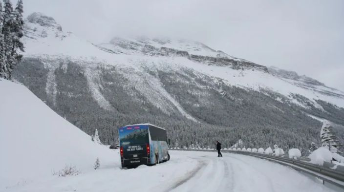
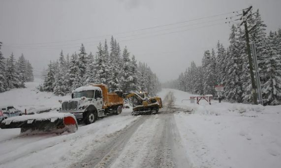
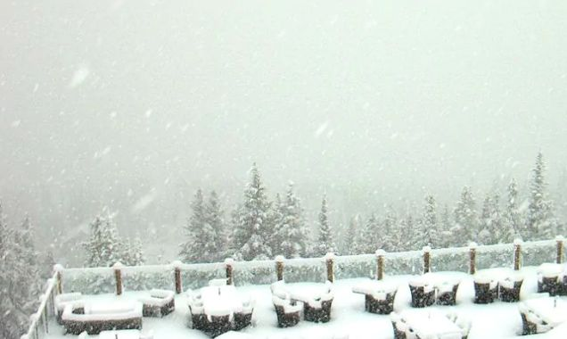
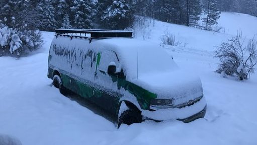
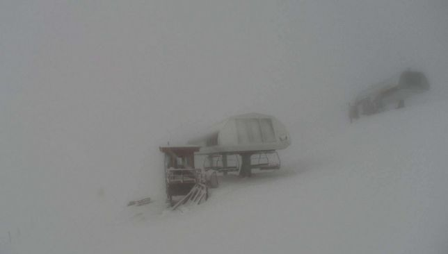
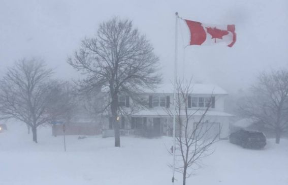

# 无标题

**链接地址:** http://mp.weixin.qq.com/s?__biz=MzI2NTE1ODgwOQ==&mid=2649605856&idx=1&sn=b6c1e33d666e568ef5a4a9393e711fb9&chksm=f2b8cf16c5cf4600562f43713bed6915b9a9bdefe497e1c5a5acac9bbf1eb028f8a0ca335c36&mpshare=1&scene=2&srcid=#rd
**作者:** 副局长
**获取时间:** 2025/8/28 20:54:03
**图片数量:** 15

---

## 原始HTML内容

<section style="box-sizing: border-box;"><section class="V5" style="  box-sizing: border-box; " powered-by="xiumi.us"><section style=" margin-right: 0%;margin-left: 0%; box-sizing: border-box; "><section style="display: inline-block;vertical-align: middle;width: 80%;box-sizing: border-box;"><section class="V5" style="  box-sizing: border-box; " powered-by="xiumi.us"><section style=" margin-top: 10px;margin-bottom: 10px;text-align: center; box-sizing: border-box; "><section style="display: inline-block;box-sizing: border-box;"><section style="max-width: 100%;font-size: 0px;padding-bottom: 3px;box-sizing: border-box;"><section style="display: inline-block;vertical-align: middle;box-sizing: border-box;"><section style="width: 5px;height: 1px;background-color: rgb(217, 217, 217);box-sizing: border-box;"></section><section style="width: 1px;height: 5px;margin-top: -3px;margin-right: auto;margin-left: auto;background-color: rgb(217, 217, 217);box-sizing: border-box;"></section></section><section style="margin-top: -1px;margin-right: -5px;margin-left: -5px;width: 100%;display: inline-block;vertical-align: middle;padding-right: 8px;padding-left: 8px;box-sizing: border-box;"><section style="width: 100%;height: 1px;background-color: rgb(217, 217, 217);box-sizing: border-box;"></section></section><section style="display: inline-block;vertical-align: middle;box-sizing: border-box;"><section style="width: 5px;height: 1px;background-color: rgb(217, 217, 217);box-sizing: border-box;"></section><section style="width: 1px;height: 5px;margin-top: -3px;margin-right: auto;margin-left: auto;background-color: rgb(217, 217, 217);box-sizing: border-box;"></section></section></section><section style="padding-left: 15px;padding-right: 15px;color: rgb(161, 161, 161);font-size: 14px;box-sizing: border-box;">
点击上方<strong style="box-sizing: border-box;">蓝字</strong>关注我们哟~
</section><section style="max-width: 100%;font-size: 0px;box-sizing: border-box;"><section style="display: inline-block;vertical-align: middle;box-sizing: border-box;"><section style="width: 5px;height: 1px;background-color: rgb(217, 217, 217);box-sizing: border-box;"></section><section style="width: 1px;height: 5px;margin-top: -3px;margin-right: auto;margin-left: auto;background-color: rgb(217, 217, 217);box-sizing: border-box;"></section></section><section style="margin-top: -1px;margin-right: -5px;margin-left: -5px;width: 100%;display: inline-block;vertical-align: middle;padding-right: 8px;padding-left: 8px;box-sizing: border-box;"><section style="width: 100%;height: 1px;background-color: rgb(217, 217, 217);box-sizing: border-box;"></section></section><section style="display: inline-block;vertical-align: middle;box-sizing: border-box;"><section style="width: 5px;height: 1px;background-color: rgb(217, 217, 217);box-sizing: border-box;"></section><section style="width: 1px;height: 5px;margin-top: -3px;margin-right: auto;margin-left: auto;background-color: rgb(217, 217, 217);box-sizing: border-box;"></section></section></section></section></section></section></section><section style="display: inline-block;vertical-align: middle;width: 20%;box-sizing: border-box;"><section class="V5" style="  box-sizing: border-box; " powered-by="xiumi.us"><section style=" text-align: center;margin: -10px 0% 10px; box-sizing: border-box; "><section style="max-width: 100%;vertical-align: middle;display: inline-block;width: 100%;box-sizing: border-box;"></section></section></section></section></section></section><section class="V5" style="  box-sizing: border-box; " powered-by="xiumi.us"><section style=" margin: 10px 0%; box-sizing: border-box; "><section style="display: inline-block;width: 100%;vertical-align: top;box-sizing: border-box;"><section class="V5" style="  box-sizing: border-box; " powered-by="xiumi.us"><section style="  box-sizing: border-box; "><section style="display: inline-block;vertical-align: bottom;width: 75%;padding-right: 10px;box-sizing: border-box;"><section class="V5" style="  box-sizing: border-box; " powered-by="xiumi.us"><section style=" margin: 10px 0% 3px; box-sizing: border-box; "><section style="display: inline-block;vertical-align: middle;box-sizing: border-box;"><section style="display: inline-block;vertical-align: bottom;padding-left: 5px;padding-right: 5px;line-height: 1.2em;margin-bottom: 2px;color: rgba(80, 182, 201, 0.72);box-sizing: border-box;">
<strong style="box-sizing: border-box;">仔细看下图，有惊喜！</strong>
</section><section style="max-width: 100%;display: inline-block;vertical-align: bottom;width: 1.6em;box-sizing: border-box;"></section></section></section></section></section><section style="display: inline-block;vertical-align: bottom;width: 25%;box-sizing: border-box;"><section class="V5" style="  box-sizing: border-box; " powered-by="xiumi.us"><section style=" margin-right: 0%;margin-bottom: 3px;margin-left: 0%;text-align: right; box-sizing: border-box; "><section style="display: inline-block;border-bottom: 0.15em solid rgba(80, 182, 201, 0.72);padding-bottom: 3px;box-sizing: border-box;"><section style="display: inline-block;padding: 3px;border-bottom: 0.15em solid rgba(80, 182, 201, 0.72);font-size: 12px;line-height: 1.4;color: rgb(255, 143, 47);box-sizing: border-box;">
<strong style="box-sizing: border-box;">金主大大</strong>
</section></section></section></section></section></section></section><section class="V5" style="  box-sizing: border-box; " powered-by="xiumi.us"><section style=" margin-right: 0%;margin-left: 0%; box-sizing: border-box; "><section style="background-color: rgba(80, 182, 201, 0.72);height: 2px;box-sizing: border-box;"></section></section></section></section></section></section><section class="V5" style="  box-sizing: border-box; " powered-by="xiumi.us"><section style=" text-align: center;margin-top: 10px;margin-bottom: 10px; box-sizing: border-box; "><section style="max-width: 100%;vertical-align: middle;display: inline-block;box-sizing: border-box;"></section></section></section><section class="V5" style="  box-sizing: border-box; " powered-by="xiumi.us"><section style=" text-align: center;margin-top: 10px;margin-bottom: 10px; box-sizing: border-box; "><section style="max-width: 100%;vertical-align: middle;display: inline-block;box-sizing: border-box;"></section></section></section><section class="V5" style="  box-sizing: border-box; " powered-by="xiumi.us"><section style=" text-align: center;margin-top: 10px;margin-bottom: 10px; box-sizing: border-box; "><section style="max-width: 100%;vertical-align: middle;display: inline-block;box-sizing: border-box;"></section></section></section><section class="V5" style="  box-sizing: border-box; " powered-by="xiumi.us"><section style=" text-align: center;margin-top: 10px;margin-bottom: 10px; box-sizing: border-box; "><section style="max-width: 100%;vertical-align: middle;display: inline-block;box-sizing: border-box;"></section></section></section><section class="V5" style="  box-sizing: border-box; " powered-by="xiumi.us"><section style=" text-align: center;margin-top: 10px;margin-bottom: 10px; box-sizing: border-box; "><section style="max-width: 100%;vertical-align: middle;display: inline-block;box-sizing: border-box;"></section></section></section><section class="V5" style="  box-sizing: border-box; " powered-by="xiumi.us"><section style=" text-align: center;margin-top: 10px;margin-bottom: 10px; box-sizing: border-box; "><section style="max-width: 100%;vertical-align: middle;display: inline-block;box-sizing: border-box;"><svg xmlns="http://www.w3.org/2000/svg" x="0px" y="0px" viewBox="0 0 902.1 38.2" style="vertical-align: middle;max-width: 100%;box-sizing: border-box;" width="902.1"><g style="box-sizing: border-box;"><path style="box-sizing: border-box;" d="M18.4,1.4c0.9-1.9,2.4-1.9,3.4,0l3.4,6.9c0.9,1.9,3.4,3.7,5.4,4l7.6,1.1c2.1,0.3,2.5,1.7,1,3.2   l-5.5,5.4c-1.5,1.5-2.4,4.3-2.1,6.4l1.3,7.6c0.4,2.1-0.9,2.9-2.7,2l-6.8-3.6c-1.8-1-4.9-1-6.7,0l-6.8,3.6c-1.9,1-3.1,0.1-2.7-2   l1.3-7.6c0.4-2.1-0.6-4.9-2.1-6.4l-5.5-5.4c-1.5-1.5-1-2.9,1-3.2l7.6-1.1c2.1-0.3,4.5-2.1,5.4-4L18.4,1.4z" fill="rgb(178, 243, 230)"></path><path style="box-sizing: border-box;" d="M90.6,5.4c0.7-1.4,1.9-1.4,2.6,0l2.6,5.3c0.7,1.4,2.6,2.8,4.2,3.1l5.9,0.9c1.6,0.2,2,1.3,0.8,2.5   l-4.2,4.1c-1.2,1.1-1.9,3.3-1.6,4.9l1,5.8c0.3,1.6-0.7,2.3-2.1,1.5l-5.2-2.8c-1.4-0.8-3.8-0.8-5.2,0L84,33.6   c-1.4,0.8-2.4,0.1-2.1-1.5l1-5.8c0.3-1.6-0.5-3.8-1.6-4.9l-4.2-4.1c-1.2-1.1-0.8-2.2,0.8-2.5l5.9-0.9c1.6-0.2,3.5-1.6,4.2-3.1   L90.6,5.4z" fill="rgb(190, 204, 246)"></path><path style="box-sizing: border-box;" d="M162.6,7.5c0.6-1.2,1.6-1.2,2.2,0l2.2,4.5c0.6,1.2,2.2,2.4,3.6,2.6l5,0.7c1.4,0.2,1.7,1.1,0.7,2.1   l-3.6,3.5c-1,1-1.6,2.9-1.4,4.2l0.9,5c0.2,1.4-0.6,1.9-1.8,1.3l-4.5-2.4c-1.2-0.6-3.2-0.6-4.4,0l-4.5,2.4c-1.2,0.6-2,0.1-1.8-1.3   l0.9-5c0.2-1.4-0.4-3.3-1.4-4.2l-3.6-3.5c-1-1-0.7-1.9,0.7-2.1l5-0.7c1.4-0.2,3-1.4,3.6-2.6L162.6,7.5z" fill="rgb(150, 208, 240)"></path><path style="box-sizing: border-box;" d="M60.1,19.1c0,2.3-1.9,4.2-4.2,4.2c-2.3,0-4.2-1.9-4.2-4.2s1.9-4.2,4.2-4.2   C58.3,14.9,60.1,16.8,60.1,19.1z" fill="rgb(218, 240, 224)"></path><path style="box-sizing: border-box;" d="M203.8,19.1c0,2.3-1.9,4.2-4.2,4.2c-2.3,0-4.2-1.9-4.2-4.2s1.9-4.2,4.2-4.2   C201.9,14.9,203.8,16.8,203.8,19.1z" fill="rgb(218, 240, 224)"></path><path style="box-sizing: border-box;" d="M130.9,19.1c0,1.7-1.4,3.1-3.1,3.1c-1.7,0-3.1-1.4-3.1-3.1c0-1.7,1.4-3.1,3.1-3.1   C129.5,16.1,130.9,17.4,130.9,19.1z" fill="rgb(218, 240, 224)"></path><path style="box-sizing: border-box;" d="M233.9,1.4c0.9-1.9,2.4-1.9,3.4,0l3.4,6.9c0.9,1.9,3.4,3.7,5.4,4l7.6,1.1c2.1,0.3,2.5,1.7,1,3.2   l-5.5,5.4c-1.5,1.5-2.4,4.3-2.1,6.4l1.3,7.6c0.4,2.1-0.9,2.9-2.7,2l-6.8-3.6c-1.8-1-4.9-1-6.7,0l-6.8,3.6c-1.9,1-3.1,0.1-2.7-2   l1.3-7.6c0.4-2.1-0.6-4.9-2.1-6.4l-5.5-5.4c-1.5-1.5-1-2.9,1-3.2l7.6-1.1c2.1-0.3,4.5-2.1,5.4-4L233.9,1.4z" fill="rgb(178, 243, 230)"></path><path style="box-sizing: border-box;" d="M306.1,5.4c0.7-1.4,1.9-1.4,2.6,0l2.6,5.3c0.7,1.4,2.6,2.8,4.2,3.1l5.9,0.9c1.6,0.2,2,1.3,0.8,2.5   l-4.2,4.1c-1.2,1.1-1.9,3.3-1.6,4.9l1,5.8c0.3,1.6-0.7,2.3-2.1,1.5l-5.2-2.8c-1.4-0.8-3.8-0.8-5.2,0l-5.2,2.8   c-1.4,0.8-2.4,0.1-2.1-1.5l1-5.8c0.3-1.6-0.4-3.8-1.6-4.9l-4.2-4.1c-1.2-1.1-0.8-2.2,0.8-2.5l5.9-0.9c1.6-0.2,3.5-1.6,4.2-3.1   L306.1,5.4z" fill="rgb(190, 204, 246)"></path><path style="box-sizing: border-box;" d="M378.1,7.5c0.6-1.2,1.6-1.2,2.2,0l2.2,4.5c0.6,1.2,2.2,2.4,3.6,2.6l5,0.7c1.4,0.2,1.7,1.1,0.7,2.1   l-3.6,3.5c-1,1-1.6,2.9-1.4,4.2l0.9,5c0.2,1.4-0.6,1.9-1.8,1.3l-4.5-2.4c-1.2-0.6-3.2-0.6-4.4,0l-4.5,2.4c-1.2,0.6-2,0.1-1.8-1.3   l0.9-5c0.2-1.4-0.4-3.3-1.4-4.2l-3.6-3.5c-1-1-0.7-1.9,0.7-2.1l5-0.7c1.4-0.2,3-1.4,3.6-2.6L378.1,7.5z" fill="rgb(150, 208, 240)"></path><path style="box-sizing: border-box;" d="M275.7,19.1c0,2.3-1.9,4.2-4.2,4.2c-2.3,0-4.2-1.9-4.2-4.2s1.9-4.2,4.2-4.2   C273.8,14.9,275.7,16.8,275.7,19.1z" fill="rgb(218, 240, 224)"></path><path style="box-sizing: border-box;" d="M419.3,19.1c0,2.3-1.9,4.2-4.2,4.2c-2.3,0-4.2-1.9-4.2-4.2s1.9-4.2,4.2-4.2   C417.5,14.9,419.3,16.8,419.3,19.1z" fill="rgb(218, 240, 224)"></path><path style="box-sizing: border-box;" d="M346.4,19.1c0,1.7-1.4,3.1-3.1,3.1c-1.7,0-3.1-1.4-3.1-3.1c0-1.7,1.4-3.1,3.1-3.1   C345,16.1,346.4,17.4,346.4,19.1z" fill="rgb(218, 240, 224)"></path><path style="box-sizing: border-box;" d="M449.4,1.4c0.9-1.9,2.4-1.9,3.4,0l3.4,6.9c0.9,1.9,3.4,3.7,5.4,4l7.6,1.1c2.1,0.3,2.5,1.7,1,3.2   l-5.5,5.4c-1.5,1.5-2.4,4.3-2.1,6.4l1.3,7.6c0.4,2.1-0.9,2.9-2.7,2l-6.8-3.6c-1.8-1-4.9-1-6.7,0l-6.8,3.6c-1.9,1-3.1,0.1-2.7-2   l1.3-7.6c0.4-2.1-0.6-4.9-2.1-6.4l-5.5-5.4c-1.5-1.5-1-2.9,1-3.2l7.6-1.1c2.1-0.3,4.5-2.1,5.4-4L449.4,1.4z" fill="rgb(178, 243, 230)"></path><path style="box-sizing: border-box;" d="M521.6,5.4c0.7-1.4,1.9-1.4,2.6,0l2.6,5.3c0.7,1.4,2.6,2.8,4.2,3.1l5.9,0.9c1.6,0.2,2,1.3,0.8,2.5   l-4.2,4.1c-1.2,1.1-1.9,3.3-1.6,4.9l1,5.8c0.3,1.6-0.7,2.3-2.1,1.5l-5.2-2.8c-1.4-0.8-3.8-0.8-5.2,0l-5.2,2.8   c-1.4,0.8-2.4,0.1-2.1-1.5l1-5.8c0.3-1.6-0.5-3.8-1.6-4.9l-4.2-4.1c-1.2-1.1-0.8-2.2,0.8-2.5l5.9-0.9c1.6-0.2,3.5-1.6,4.2-3.1   L521.6,5.4z" fill="rgb(190, 204, 246)"></path><path style="box-sizing: border-box;" d="M593.6,7.5c0.6-1.2,1.6-1.2,2.2,0l2.2,4.5c0.6,1.2,2.2,2.4,3.6,2.6l5,0.7c1.4,0.2,1.7,1.1,0.7,2.1   l-3.6,3.5c-1,1-1.6,2.9-1.4,4.2l0.9,5c0.2,1.4-0.6,1.9-1.8,1.3l-4.5-2.4c-1.2-0.6-3.2-0.6-4.4,0l-4.5,2.4c-1.2,0.6-2,0.1-1.8-1.3   l0.9-5c0.2-1.4-0.4-3.3-1.4-4.2l-3.6-3.5c-1-1-0.7-1.9,0.7-2.1l5-0.7c1.4-0.2,3-1.4,3.6-2.6L593.6,7.5z" fill="rgb(150, 208, 240)"></path><path style="box-sizing: border-box;" d="M491.2,19.1c0,2.3-1.9,4.2-4.2,4.2c-2.3,0-4.2-1.9-4.2-4.2s1.9-4.2,4.2-4.2   C489.3,14.9,491.2,16.8,491.2,19.1z" fill="rgb(218, 240, 224)"></path><path style="box-sizing: border-box;" d="M634.9,19.1c0,2.3-1.9,4.2-4.2,4.2c-2.3,0-4.2-1.9-4.2-4.2s1.9-4.2,4.2-4.2   C633,14.9,634.9,16.8,634.9,19.1z" fill="rgb(218, 240, 224)"></path><path style="box-sizing: border-box;" d="M561.9,19.1c0,1.7-1.4,3.1-3.1,3.1c-1.7,0-3.1-1.4-3.1-3.1c0-1.7,1.4-3.1,3.1-3.1   C560.5,16.1,561.9,17.4,561.9,19.1z" fill="rgb(218, 240, 224)"></path><path style="box-sizing: border-box;" d="M664.9,1.4c0.9-1.9,2.4-1.9,3.4,0l3.4,6.9c0.9,1.9,3.4,3.7,5.4,4l7.6,1.1c2.1,0.3,2.5,1.7,1,3.2   l-5.5,5.4c-1.5,1.5-2.4,4.3-2.1,6.4l1.3,7.6c0.4,2.1-0.9,2.9-2.7,2l-6.8-3.6c-1.8-1-4.9-1-6.7,0l-6.8,3.6c-1.9,1-3.1,0.1-2.7-2   l1.3-7.6c0.4-2.1-0.6-4.9-2.1-6.4l-5.5-5.4c-1.5-1.5-1-2.9,1-3.2l7.6-1.1c2.1-0.3,4.5-2.1,5.4-4L664.9,1.4z" fill="rgb(178, 243, 230)"></path><path style="box-sizing: border-box;" d="M737.1,5.4c0.7-1.4,1.9-1.4,2.6,0l2.6,5.3c0.7,1.4,2.6,2.8,4.2,3.1l5.9,0.9c1.6,0.2,2,1.3,0.8,2.5   l-4.2,4.1c-1.2,1.1-1.9,3.3-1.6,4.9l1,5.8c0.3,1.6-0.7,2.3-2.1,1.5l-5.2-2.8c-1.4-0.8-3.8-0.8-5.2,0l-5.2,2.8   c-1.4,0.8-2.4,0.1-2.1-1.5l1-5.8c0.3-1.6-0.5-3.8-1.6-4.9l-4.2-4.1c-1.2-1.1-0.8-2.2,0.8-2.5l5.9-0.9c1.6-0.2,3.5-1.6,4.2-3.1   L737.1,5.4z" fill="rgb(190, 204, 246)"></path><path style="box-sizing: border-box;" d="M809.2,7.5c0.6-1.2,1.6-1.2,2.2,0l2.2,4.5c0.6,1.2,2.2,2.4,3.6,2.6l5,0.7c1.4,0.2,1.7,1.1,0.7,2.1   l-3.6,3.5c-1,1-1.6,2.9-1.4,4.2l0.9,5c0.2,1.4-0.6,1.9-1.8,1.3l-4.5-2.4c-1.2-0.6-3.2-0.6-4.4,0l-4.5,2.4c-1.2,0.6-2,0.1-1.8-1.3   l0.9-5c0.2-1.4-0.4-3.3-1.4-4.2l-3.6-3.5c-1-1-0.7-1.9,0.7-2.1l5-0.7c1.4-0.2,3-1.4,3.6-2.6L809.2,7.5z" fill="rgb(150, 208, 240)"></path><path style="box-sizing: border-box;" d="M706.7,19.1c0,2.3-1.9,4.2-4.2,4.2c-2.3,0-4.2-1.9-4.2-4.2s1.9-4.2,4.2-4.2   C704.8,14.9,706.7,16.8,706.7,19.1z" fill="rgb(218, 240, 224)"></path><path style="box-sizing: border-box;" d="M850.4,19.1c0,2.3-1.9,4.2-4.2,4.2c-2.3,0-4.2-1.9-4.2-4.2s1.9-4.2,4.2-4.2   C848.5,14.9,850.4,16.8,850.4,19.1z" fill="rgb(218, 240, 224)"></path><path style="box-sizing: border-box;" d="M777.4,19.1c0,1.7-1.4,3.1-3.1,3.1c-1.7,0-3.1-1.4-3.1-3.1c0-1.7,1.4-3.1,3.1-3.1   C776,16.1,777.4,17.4,777.4,19.1z" fill="rgb(218, 240, 224)"></path><path style="box-sizing: border-box;" d="M880.4,1.4c0.9-1.9,2.4-1.9,3.4,0l3.4,6.9c0.9,1.9,3.4,3.7,5.4,4l7.6,1.1c2.1,0.3,2.5,1.7,1,3.2   l-5.5,5.4c-1.5,1.5-2.4,4.3-2.1,6.4l1.3,7.6c0.4,2.1-0.9,2.9-2.7,2l-6.8-3.6c-1.8-1-4.9-1-6.7,0l-6.8,3.6c-1.8,1-3.1,0.1-2.7-2   l1.3-7.6c0.4-2.1-0.6-4.9-2.1-6.4l-5.5-5.4c-1.5-1.5-1-2.9,1-3.2l7.6-1.1c2.1-0.3,4.5-2.1,5.4-4L880.4,1.4z" fill="rgb(178, 243, 230)"></path></g></svg></section></section></section><section class="V5" style="  box-sizing: border-box; " powered-by="xiumi.us"><section style="  box-sizing: border-box; "><section style="text-align: center;box-sizing: border-box;">
 
</section></section></section>

加拿大华人最喜欢的旅游景点之一Banff最近可<strong>不太平</strong>。

近日的几场冬季风暴导致Banff，Yoho，Kootenay和Jasper国家公园的极端危险等级后，加拿大公园正在敦促居住在该地区偏远地域的住户和游客在本周末<strong>紧急撤离</strong>。 

阿尔伯塔省和不列颠哥伦比亚省山地公园的最新雪崩警报称，最近几天该地区已经累计接收到<strong>厚达70厘米的降雪</strong>，从12月中旬开始，这个积雪量就已经达到历史记录的最高值，远远超过了专家评定的<strong>积雪容量警报线</strong>。

 

有关官员表示，周五该地区的降雪量评级是：极端，这意味着人们应该避免所有的雪崩地形，因为自然和人为引发的雪崩在该地区的发生是可以预见的。

“那些高雪崩的可能性将持续到明天，”Banff，Yoho和Kootenay国家公园的发言人莱斯利马西森周五表示。“大量的积雪是造成雪崩的一部分原因，更重要的是一些温暖的气流的作用和强劲的风导致雪崩高概率的发生。

该公告还预警通知到：“尚未发生雪崩的斜造成雪崩的坡地地形已经成熟，可以<strong>随时因简单的环境或人为因素引发雪崩</strong>。”

 

不过好在该预报乐观地表示，预计周五晚上整个地区的降雪量将逐渐减少。不过政府官员还是提醒前往偏远地区的游客，要对自己的安全负责。能不去就不要去了。 

如果非去不可，请确保你在出发前检查每日的雪崩公告。如果准备好在偏远地区度过一天一夜，你必须有<strong>全面合适的设备和强大的训练作为基础</strong>。任何正在进入雪崩地形的人都需要接受适当的训练，并配备一个灯塔，探头和铲子。在出发前，还建议驾车穿越山区国家公园检查站去<strong>做一些基础的测试和调校</strong>。

通过Banff和Jasper国家公园的93号高速公路北部，也被称为<strong>冰原大道，至少在周日进行雪崩监控工作前仍将封路</strong>。预计该地区会接收60至80厘米的积雪，造成极端恶劣的道路情况。

 

<section class="V5" style="box-sizing: border-box;" powered-by="xiumi.us"><section style="  box-sizing: border-box; "><section style="box-sizing: border-box;">
 

同时，周六早上还计划在<strong>Trans Canada Highway上进行雪崩监控工作，导致不列颠哥伦比亚省菲尔德附近的道路间歇性封路停运</strong>。 

不列颠哥伦比亚省的大雪造成了南海岸和温哥华岛山脉以及该省东部中部和东南部大部分地区滑坡的可能性很大。这意味着国家公园外也存在非常危险的雪崩状况。

随着风暴向东流出，雪崩预测公司预计雪崩危险会迅速下降。但天然雪崩仍然存在，但人为引发的雪崩可能会引发更大的故事。

 

Avalanche Canada的高级预报员格兰特赫尔格森说：“当极端的雪崩警报发布的时候，大批量的雪崩会<strong>在境内随机爆发，几乎到处都是</strong>。“尽管雪崩预警在未来几天内可能会降级，但我们仍处于非常危险的雪崩状态，不建议在雪崩地区旅行。

不列颠哥伦比亚省彭伯顿的加拿大皇家骑警周五晚间表示，他们正在调查Pebble Creek附近的偏远地区的死亡事件：这星期四有一群滑雪者在雪地里发现一个<strong>被雪暴掩埋的滑雪者的尸体</strong>。

 

总体来说，这个周末或者近期准备到这些国家森林公园进行滑雪等户外运动项目的朋友们<strong>请暂时取消计划</strong>。为了自己和家人的生命安全请珍重。身在加拿大还怕滑不到雪，看不到美丽的雪景吗？

留得青山在，不怕没柴烧。

<strong>平安是福。</strong>

 
</section></section></section><section class="V5" style="box-sizing: border-box;" powered-by="xiumi.us"><section style="  box-sizing: border-box; "><section style="box-sizing: border-box;">
 
</section></section></section><section class="V5" style="  box-sizing: border-box; " powered-by="xiumi.us"><section style=" margin: 40px 0% 10px;text-align: center; box-sizing: border-box; "><section style="display: inline-block;width: 90%;border-width: 1px;border-style: dotted;border-color: rgba(80, 182, 201, 0.72);padding: 10px;border-radius: 0px;box-sizing: border-box;"><section class="V5" style="box-sizing: border-box;" powered-by="xiumi.us"><section style=" transform: translate3d(20px, 0px, 0px);text-align: left;font-size: 11px;margin-top: -55px;margin-right: 0%;margin-left: 0%; box-sizing: border-box; "><section style="box-sizing: border-box;width: 7em;height: 7em;display: inline-block;vertical-align: bottom;border-radius: 100%;border-width: 5px;border-style: none;border-color: rgba(80, 182, 201, 0.72);background-position: center center;background-repeat: no-repeat;background-size: cover;background-image: url(&quot;https://mmbiz.qpic.cn/mmbiz_jpg/D1nJqnhkPyIzy91RibQAs6aJCiasoibfJnCKsMXtI0TSBkDscYaNUg4rgGwTWt8cDSx77XwOVWj6Xa0fMq64ib7dTQ/640?wx_fmt=jpeg&quot;);"><section style="width: 100%;height: 100%;overflow: hidden;line-height: 0;box-sizing: border-box;"></section></section></section></section><section class="V5" style="  box-sizing: border-box; " powered-by="xiumi.us"><section style="  box-sizing: border-box; "><section class="group-empty" style="display: inline-block;vertical-align: top;width: 38.2%;box-sizing: border-box;height: 1px;"></section><section style="display: inline-block;vertical-align: top;width: 61.8%;box-sizing: border-box;"><section class="V5" style="box-sizing: border-box;" powered-by="xiumi.us"><section style=" margin-right: 0%;margin-left: 0%; box-sizing: border-box; "><section style="font-size: 18px;color: rgb(67, 103, 117);line-height: 1.6;letter-spacing: 1px;box-sizing: border-box;">
<strong style="box-sizing: border-box;">埃德蒙顿微生活</strong>
</section></section></section><section class="V5" style="  box-sizing: border-box; " powered-by="xiumi.us"><section style=" margin-top: 0.5em;margin-bottom: 0.5em; box-sizing: border-box; "><section style="background-color: rgba(80, 182, 201, 0.72);height: 1px;box-sizing: border-box;"></section></section></section></section></section></section><section class="V5" style="box-sizing: border-box;" powered-by="xiumi.us"><section style="  box-sizing: border-box; "><section style="text-align: justify;font-size: 14px;color: rgba(62, 62, 62, 0.72);letter-spacing: 2px;box-sizing: border-box;">
<strong style="box-sizing: border-box;">关心埃德蒙顿民生，</strong>

<strong style="box-sizing: border-box;">关注埃德蒙顿的发展。</strong>

 

埃德蒙顿微生活是“吃喝玩乐埃德蒙顿”旗下，为埃德蒙顿地区的居民提供每日最新的吃喝玩乐、工作学习、商业投资的媒体平台 。
</section></section></section><section class="V5" style="box-sizing: border-box;" powered-by="xiumi.us"><section style="  box-sizing: border-box; "><section style="text-align: left;box-sizing: border-box;">
 
</section></section></section><section class="V5" style="  box-sizing: border-box; " powered-by="xiumi.us"><section style="  box-sizing: border-box; "><section style="display: inline-block;vertical-align: middle;width: 61.8%;box-sizing: border-box;"><section class="V5" style="box-sizing: border-box;" powered-by="xiumi.us"><section style="  box-sizing: border-box; "><section style="text-align: justify;font-size: 12px;color: rgba(62, 62, 62, 0.37);line-height: 1.9;letter-spacing: 0px;box-sizing: border-box;">
我们的目标是以最新、最快、最及时的方式 报道埃德蒙顿的新鲜事 。 
</section></section></section></section><section style="display: inline-block;vertical-align: middle;width: 38.2%;box-sizing: border-box;"><section class="V5" style="  box-sizing: border-box; " powered-by="xiumi.us"><section style=" margin-right: 0%;margin-left: 0%; box-sizing: border-box; "><section style="max-width: 100%;vertical-align: middle;display: inline-block;width: 70%;box-sizing: border-box;"></section></section></section></section></section></section></section></section></section></section>
 

---

## 纯文本内容

点击上方蓝字关注我们哟~仔细看下图，有惊喜！金主大大加拿大华人最喜欢的旅游景点之一Banff最近可不太平。近日的几场冬季风暴导致Banff，Yoho，Kootenay和Jasper国家公园的极端危险等级后，加拿大公园正在敦促居住在该地区偏远地域的住户和游客在本周末紧急撤离。阿尔伯塔省和不列颠哥伦比亚省山地公园的最新雪崩警报称，最近几天该地区已经累计接收到厚达70厘米的降雪，从12月中旬开始，这个积雪量就已经达到历史记录的最高值，远远超过了专家评定的积雪容量警报线。有关官员表示，周五该地区的降雪量评级是：极端，这意味着人们应该避免所有的雪崩地形，因为自然和人为引发的雪崩在该地区的发生是可以预见的。“那些高雪崩的可能性将持续到明天，”Banff，Yoho和Kootenay国家公园的发言人莱斯利马西森周五表示。“大量的积雪是造成雪崩的一部分原因，更重要的是一些温暖的气流的作用和强劲的风导致雪崩高概率的发生。该公告还预警通知到：“尚未发生雪崩的斜造成雪崩的坡地地形已经成熟，可以随时因简单的环境或人为因素引发雪崩。”不过好在该预报乐观地表示，预计周五晚上整个地区的降雪量将逐渐减少。不过政府官员还是提醒前往偏远地区的游客，要对自己的安全负责。能不去就不要去了。如果非去不可，请确保你在出发前检查每日的雪崩公告。如果准备好在偏远地区度过一天一夜，你必须有全面合适的设备和强大的训练作为基础。任何正在进入雪崩地形的人都需要接受适当的训练，并配备一个灯塔，探头和铲子。在出发前，还建议驾车穿越山区国家公园检查站去做一些基础的测试和调校。通过Banff和Jasper国家公园的93号高速公路北部，也被称为冰原大道，至少在周日进行雪崩监控工作前仍将封路。预计该地区会接收60至80厘米的积雪，造成极端恶劣的道路情况。同时，周六早上还计划在Trans Canada Highway上进行雪崩监控工作，导致不列颠哥伦比亚省菲尔德附近的道路间歇性封路停运。不列颠哥伦比亚省的大雪造成了南海岸和温哥华岛山脉以及该省东部中部和东南部大部分地区滑坡的可能性很大。这意味着国家公园外也存在非常危险的雪崩状况。随着风暴向东流出，雪崩预测公司预计雪崩危险会迅速下降。但天然雪崩仍然存在，但人为引发的雪崩可能会引发更大的故事。Avalanche Canada的高级预报员格兰特赫尔格森说：“当极端的雪崩警报发布的时候，大批量的雪崩会在境内随机爆发，几乎到处都是。“尽管雪崩预警在未来几天内可能会降级，但我们仍处于非常危险的雪崩状态，不建议在雪崩地区旅行。不列颠哥伦比亚省彭伯顿的加拿大皇家骑警周五晚间表示，他们正在调查Pebble Creek附近的偏远地区的死亡事件：这星期四有一群滑雪者在雪地里发现一个被雪暴掩埋的滑雪者的尸体。总体来说，这个周末或者近期准备到这些国家森林公园进行滑雪等户外运动项目的朋友们请暂时取消计划。为了自己和家人的生命安全请珍重。身在加拿大还怕滑不到雪，看不到美丽的雪景吗？留得青山在，不怕没柴烧。平安是福。埃德蒙顿微生活关心埃德蒙顿民生，关注埃德蒙顿的发展。埃德蒙顿微生活是“吃喝玩乐埃德蒙顿”旗下，为埃德蒙顿地区的居民提供每日最新的吃喝玩乐、工作学习、商业投资的媒体平台 。我们的目标是以最新、最快、最及时的方式 报道埃德蒙顿的新鲜事 。

---

## 图片列表

-  (原始链接: https://mmbiz.qpic.cn/mmbiz_gif/D1nJqnhkPyIzy91RibQAs6aJCiasoibfJnCMaialib7ZDHI4N1bDljt0rJjMviaMC9kjmiaEicN6m5dfEVDD2QORGL3BUw/640?wx_fmt=gif)
-  (原始链接: https://mmbiz.qpic.cn/mmbiz_gif/D1nJqnhkPyIzy91RibQAs6aJCiasoibfJnCPlNLN5S9tLqc8ukibGU72MOIzglCgdV2YNFI0lnwAMaDicPf4jIxatkA/640?wx_fmt=gif)
-  (原始链接: https://mmbiz.qpic.cn/mmbiz_jpg/D1nJqnhkPyIzy91RibQAs6aJCiasoibfJnCfB80SISR3tsFmBbP1k4aCkwQR6bcmtzicr5CVV0z4yshSlaS4TZjqvQ/640?wx_fmt=jpeg)
-  (原始链接: https://mmbiz.qpic.cn/mmbiz_jpg/D1nJqnhkPyIzy91RibQAs6aJCiasoibfJnCjgW7mVoSfibnVSan3eL1njDokY2Fgf6tPf8eZHqNXpQ39CibhA8v7HrQ/640?wx_fmt=jpeg)
-  (原始链接: https://mmbiz.qpic.cn/mmbiz_jpg/D1nJqnhkPyIzy91RibQAs6aJCiasoibfJnCyFF7AsU2Wmc6pXruiaR3hgIlrfB4YFz9NWWLD174ictTqiag7j3ic0omPQ/640?wx_fmt=jpeg)
-  (原始链接: https://mmbiz.qpic.cn/mmbiz_jpg/D1nJqnhkPyIzy91RibQAs6aJCiasoibfJnCxxMdIjv0hT7nzvibdPTofHePRK8ocxtl2T0fIZqLA2UEYmxgT9iaEwkw/640?wx_fmt=jpeg)
-  (原始链接: https://mmbiz.qpic.cn/mmbiz_jpg/D1nJqnhkPyIzy91RibQAs6aJCiasoibfJnC4eQeRv2td5KuLeOsUGIE6XoibICRn9VYyUQKQb12lSpTPmsRI2TtGiaw/640?wx_fmt=jpeg)
-  (原始链接: https://mmbiz.qpic.cn/mmbiz_png/D1nJqnhkPyIzy91RibQAs6aJCiasoibfJnCHUOlPdfTSxvRZ7ZWSBbbDXtibKYzoWc21e4iatwicuqZqeJ46XGu296cw/640?wx_fmt=png)
-  (原始链接: https://mmbiz.qpic.cn/mmbiz_png/D1nJqnhkPyIzy91RibQAs6aJCiasoibfJnCcWBgdvHJtl7Jj8QXw5rg2KrlQ73KteRQoOZCic4aAaWb14jL5CBnSsg/640?wx_fmt=png)
-  (原始链接: https://mmbiz.qpic.cn/mmbiz_png/D1nJqnhkPyIzy91RibQAs6aJCiasoibfJnCJLjc2qgA6J7L4Qro7nb5fwD5SLwwmGPPYBx3SQic7CfmKiciaJI0nnOFw/640?wx_fmt=png)
-  (原始链接: https://mmbiz.qpic.cn/mmbiz_png/D1nJqnhkPyIzy91RibQAs6aJCiasoibfJnCCicRPnCBECR9UkQXwCd3z1YaPr4sA1NQ6eWoWs39wN45ZJDtJQHhrDg/640?wx_fmt=png)
-  (原始链接: https://mmbiz.qpic.cn/mmbiz_png/D1nJqnhkPyIzy91RibQAs6aJCiasoibfJnCrJkoRzhANJicAbu5MyeibZP0Eicf47fgR51HQCSUCKSDL8gpHRAaj1w1g/640?wx_fmt=png)
-  (原始链接: https://mmbiz.qpic.cn/mmbiz_png/D1nJqnhkPyIzy91RibQAs6aJCiasoibfJnCtkQQT5KNYU6V4ODy6OKN3MqjicxOpKNVJicicicRpyonClNjmN1ubdibibFA/640?wx_fmt=png)
-  (原始链接: https://mmbiz.qpic.cn/mmbiz_jpg/D1nJqnhkPyIzy91RibQAs6aJCiasoibfJnCKsMXtI0TSBkDscYaNUg4rgGwTWt8cDSx77XwOVWj6Xa0fMq64ib7dTQ/640?wx_fmt=jpeg)
-  (原始链接: https://mmbiz.qpic.cn/mmbiz_jpg/D1nJqnhkPyIzy91RibQAs6aJCiasoibfJnCGdzNJOkIDjNficIly7ITv30eIice121luaKF4AoKibbVBNn78BOEHicZGw/640?wx_fmt=jpeg)
