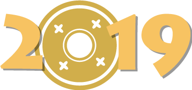
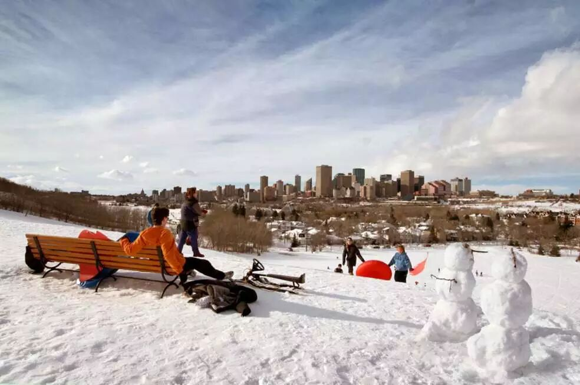
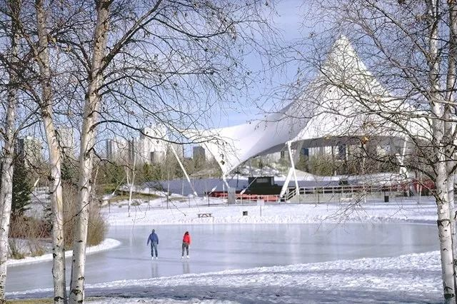
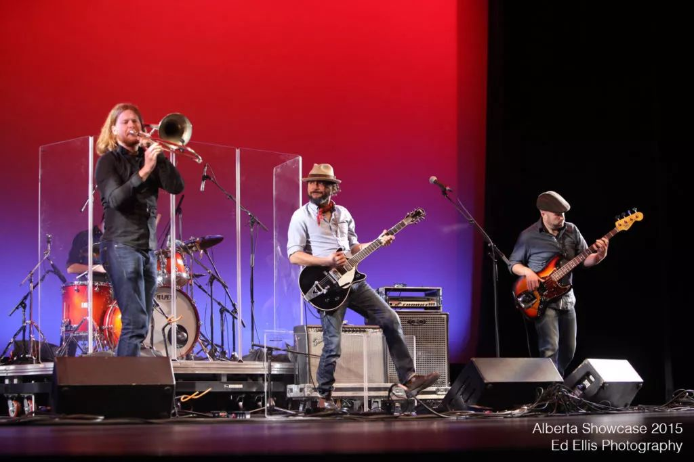
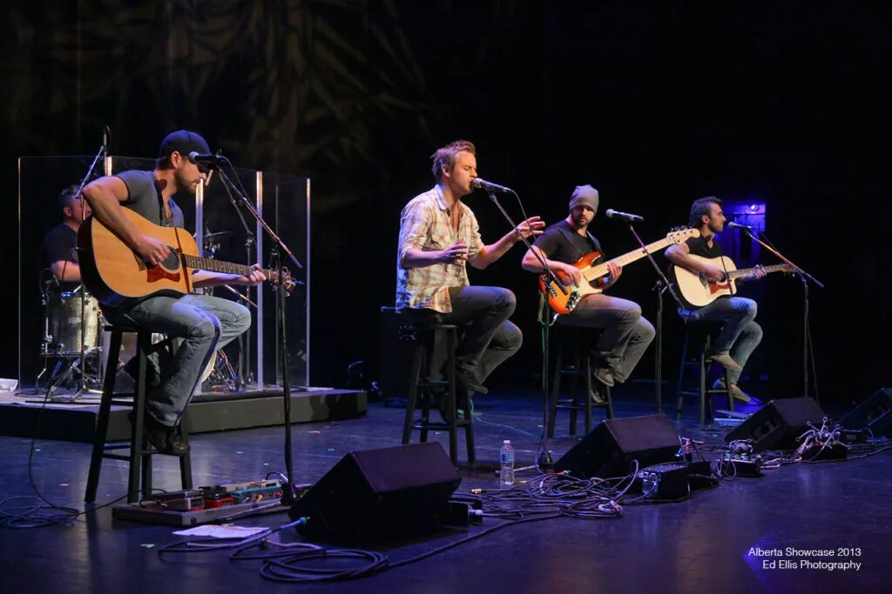
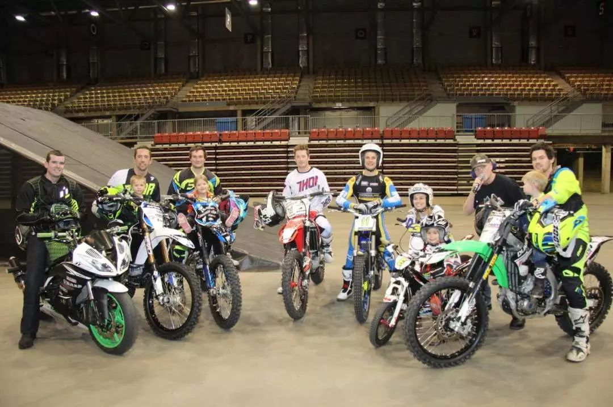
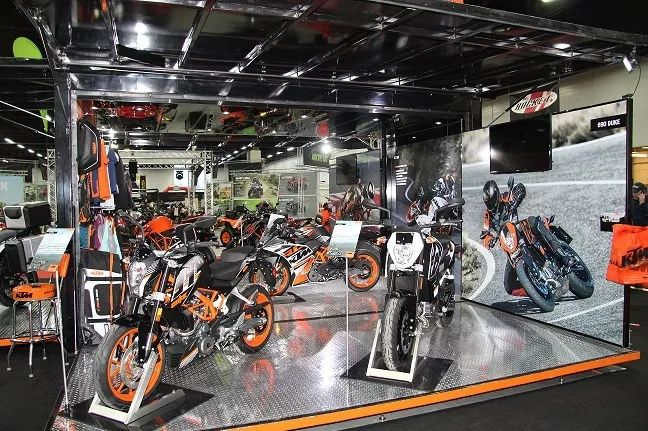
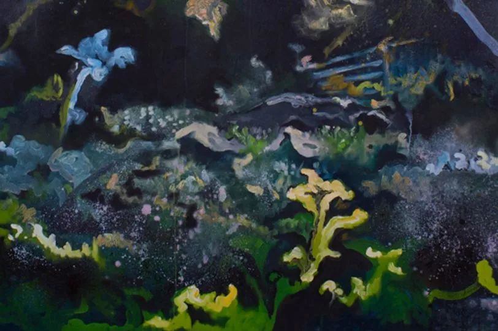

# 无标题

**链接地址:** http://mp.weixin.qq.com/s?__biz=MzI2NTE1ODgwOQ==&mid=2649605906&idx=1&sn=eb93114c1c3b83a6662ae930ab2bd27c&chksm=f2b8cee4c5cf47f29b62b2f3c7b2b3308a02c563b423a460eb7161e9a2a1d27e9b697b2e9572&mpshare=1&scene=2&srcid=#rd
**作者:** 雪糊
**获取时间:** 2025/8/28 20:52:30
**图片数量:** 21

---

## 原始HTML内容

<section style="box-sizing: border-box;"><section style="box-sizing: border-box;" powered-by="xiumi.us"><section style="margin-right: 0%;margin-left: 0%;box-sizing: border-box;"><section style="display: inline-block;vertical-align: middle;width: 80%;box-sizing: border-box;"><section style="box-sizing: border-box;" powered-by="xiumi.us"><section style="margin-top: 10px;margin-bottom: 10px;text-align: center;box-sizing: border-box;"><section style="display: inline-block;box-sizing: border-box;"><section style="max-width: 100%;font-size: 0px;padding-bottom: 3px;box-sizing: border-box;"><section style="display: inline-block;vertical-align: middle;box-sizing: border-box;"><section style="width: 5px;height: 1px;background-color: rgb(217, 217, 217);box-sizing: border-box;"></section><section style="width: 1px;height: 5px;margin-top: -3px;margin-right: auto;margin-left: auto;background-color: rgb(217, 217, 217);box-sizing: border-box;"></section></section><section style="margin-top: -1px;margin-right: -5px;margin-left: -5px;width: 100%;display: inline-block;vertical-align: middle;padding-right: 8px;padding-left: 8px;box-sizing: border-box;"><section style="width: 100%;height: 1px;background-color: rgb(217, 217, 217);box-sizing: border-box;"></section></section><section style="display: inline-block;vertical-align: middle;box-sizing: border-box;"><section style="width: 5px;height: 1px;background-color: rgb(217, 217, 217);box-sizing: border-box;"></section><section style="width: 1px;height: 5px;margin-top: -3px;margin-right: auto;margin-left: auto;background-color: rgb(217, 217, 217);box-sizing: border-box;"></section></section></section><section style="padding-left: 15px;padding-right: 15px;color: rgb(161, 161, 161);font-size: 14px;box-sizing: border-box;">
点击上方<strong style="box-sizing: border-box;">蓝字</strong>关注我们哟~
</section><section style="max-width: 100%;font-size: 0px;box-sizing: border-box;"><section style="display: inline-block;vertical-align: middle;box-sizing: border-box;"><section style="width: 5px;height: 1px;background-color: rgb(217, 217, 217);box-sizing: border-box;"></section><section style="width: 1px;height: 5px;margin-top: -3px;margin-right: auto;margin-left: auto;background-color: rgb(217, 217, 217);box-sizing: border-box;"></section></section><section style="margin-top: -1px;margin-right: -5px;margin-left: -5px;width: 100%;display: inline-block;vertical-align: middle;padding-right: 8px;padding-left: 8px;box-sizing: border-box;"><section style="width: 100%;height: 1px;background-color: rgb(217, 217, 217);box-sizing: border-box;"></section></section><section style="display: inline-block;vertical-align: middle;box-sizing: border-box;"><section style="width: 5px;height: 1px;background-color: rgb(217, 217, 217);box-sizing: border-box;"></section><section style="width: 1px;height: 5px;margin-top: -3px;margin-right: auto;margin-left: auto;background-color: rgb(217, 217, 217);box-sizing: border-box;"></section></section></section></section></section></section></section><section style="display: inline-block;vertical-align: middle;width: 20%;box-sizing: border-box;"><section style="box-sizing: border-box;" powered-by="xiumi.us"><section style="text-align: center;margin: -10px 0% 10px;box-sizing: border-box;"><section style="max-width: 100%;vertical-align: middle;display: inline-block;line-height: 0;width: 100%;box-sizing: border-box;"></section></section></section></section></section></section><section style="box-sizing: border-box;" powered-by="xiumi.us"><section style="margin: 10px 0%;box-sizing: border-box;"><section style="display: inline-block;width: 100%;vertical-align: top;box-sizing: border-box;"><section style="box-sizing: border-box;" powered-by="xiumi.us"><section style="box-sizing: border-box;"><section style="display: inline-block;vertical-align: bottom;width: 75%;padding-right: 10px;box-sizing: border-box;"><section style="box-sizing: border-box;" powered-by="xiumi.us"><section style="margin: 10px 0% 3px;box-sizing: border-box;"><section style="display: inline-block;vertical-align: middle;box-sizing: border-box;"><section style="display: inline-block;vertical-align: bottom;padding-left: 5px;padding-right: 5px;line-height: 1.2em;margin-bottom: 2px;color: rgba(80, 182, 201, 0.72);box-sizing: border-box;">
<strong style="box-sizing: border-box;">仔细看下图，有惊喜！</strong>
</section><section style="max-width: 100%;display: inline-block;vertical-align: bottom;line-height: 0;width: 1.6em;box-sizing: border-box;"></section></section></section></section></section><section style="display: inline-block;vertical-align: bottom;width: 25%;box-sizing: border-box;"><section style="box-sizing: border-box;" powered-by="xiumi.us"><section style="margin-right: 0%;margin-bottom: 3px;margin-left: 0%;text-align: right;box-sizing: border-box;"><section style="display: inline-block;border-bottom: 0.15em solid rgba(80, 182, 201, 0.72);padding-bottom: 3px;box-sizing: border-box;"><section style="display: inline-block;padding: 3px;border-bottom: 0.15em solid rgba(80, 182, 201, 0.72);font-size: 12px;line-height: 1.4;color: rgb(255, 143, 47);box-sizing: border-box;">
<strong style="box-sizing: border-box;">金主大大</strong>
</section></section></section></section></section></section></section><section style="box-sizing: border-box;" powered-by="xiumi.us"><section style="margin-right: 0%;margin-left: 0%;box-sizing: border-box;"><section style="background-color: rgba(80, 182, 201, 0.72);height: 2px;box-sizing: border-box;"></section></section></section></section></section></section><section style="box-sizing: border-box;" powered-by="xiumi.us"><section style="text-align: center;margin-top: 10px;margin-bottom: 10px;box-sizing: border-box;"><section style="max-width: 100%;vertical-align: middle;display: inline-block;line-height: 0;box-sizing: border-box;"></section></section></section><section style="box-sizing: border-box;" powered-by="xiumi.us"><section style="text-align: center;margin-top: 10px;margin-bottom: 10px;box-sizing: border-box;"><section style="max-width: 100%;vertical-align: middle;display: inline-block;line-height: 0;box-sizing: border-box;"></section></section></section><section style="box-sizing: border-box;" powered-by="xiumi.us"><section style="text-align: center;margin-top: 10px;margin-bottom: 10px;box-sizing: border-box;"><section style="max-width: 100%;vertical-align: middle;display: inline-block;line-height: 0;box-sizing: border-box;"></section></section></section><section style="box-sizing: border-box;" powered-by="xiumi.us"><section style="text-align: center;margin-top: 10px;margin-bottom: 10px;box-sizing: border-box;"><section style="max-width: 100%;vertical-align: middle;display: inline-block;line-height: 0;box-sizing: border-box;"></section></section></section><section style="box-sizing: border-box;" powered-by="xiumi.us"><section style="text-align: center;margin-top: 10px;margin-bottom: 10px;box-sizing: border-box;"><section style="max-width: 100%;vertical-align: middle;display: inline-block;line-height: 0;box-sizing: border-box;"></section></section></section><section style="box-sizing: border-box;" powered-by="xiumi.us"><section style="text-align: center;margin-top: 10px;margin-bottom: 10px;box-sizing: border-box;"><section style="max-width: 100%;vertical-align: middle;display: inline-block;line-height: 0;box-sizing: border-box;"><svg class="svg" xmlns="http://www.w3.org/2000/svg" x="0px" y="0px" viewBox="0 0 902.1 38.2" style="vertical-align: middle;max-width: 100%;box-sizing: border-box;" width="100%"><g style="box-sizing: border-box;"><path style="box-sizing: border-box;" d="M18.4,1.4c0.9-1.9,2.4-1.9,3.4,0l3.4,6.9c0.9,1.9,3.4,3.7,5.4,4l7.6,1.1c2.1,0.3,2.5,1.7,1,3.2   l-5.5,5.4c-1.5,1.5-2.4,4.3-2.1,6.4l1.3,7.6c0.4,2.1-0.9,2.9-2.7,2l-6.8-3.6c-1.8-1-4.9-1-6.7,0l-6.8,3.6c-1.9,1-3.1,0.1-2.7-2   l1.3-7.6c0.4-2.1-0.6-4.9-2.1-6.4l-5.5-5.4c-1.5-1.5-1-2.9,1-3.2l7.6-1.1c2.1-0.3,4.5-2.1,5.4-4L18.4,1.4z" fill="rgb(178, 243, 230)"></path><path style="box-sizing: border-box;" d="M90.6,5.4c0.7-1.4,1.9-1.4,2.6,0l2.6,5.3c0.7,1.4,2.6,2.8,4.2,3.1l5.9,0.9c1.6,0.2,2,1.3,0.8,2.5   l-4.2,4.1c-1.2,1.1-1.9,3.3-1.6,4.9l1,5.8c0.3,1.6-0.7,2.3-2.1,1.5l-5.2-2.8c-1.4-0.8-3.8-0.8-5.2,0L84,33.6   c-1.4,0.8-2.4,0.1-2.1-1.5l1-5.8c0.3-1.6-0.5-3.8-1.6-4.9l-4.2-4.1c-1.2-1.1-0.8-2.2,0.8-2.5l5.9-0.9c1.6-0.2,3.5-1.6,4.2-3.1   L90.6,5.4z" fill="rgb(190, 204, 246)"></path><path style="box-sizing: border-box;" d="M162.6,7.5c0.6-1.2,1.6-1.2,2.2,0l2.2,4.5c0.6,1.2,2.2,2.4,3.6,2.6l5,0.7c1.4,0.2,1.7,1.1,0.7,2.1   l-3.6,3.5c-1,1-1.6,2.9-1.4,4.2l0.9,5c0.2,1.4-0.6,1.9-1.8,1.3l-4.5-2.4c-1.2-0.6-3.2-0.6-4.4,0l-4.5,2.4c-1.2,0.6-2,0.1-1.8-1.3   l0.9-5c0.2-1.4-0.4-3.3-1.4-4.2l-3.6-3.5c-1-1-0.7-1.9,0.7-2.1l5-0.7c1.4-0.2,3-1.4,3.6-2.6L162.6,7.5z" fill="rgb(150, 208, 240)"></path><path style="box-sizing: border-box;" d="M60.1,19.1c0,2.3-1.9,4.2-4.2,4.2c-2.3,0-4.2-1.9-4.2-4.2s1.9-4.2,4.2-4.2   C58.3,14.9,60.1,16.8,60.1,19.1z" fill="rgb(218, 240, 224)"></path><path style="box-sizing: border-box;" d="M203.8,19.1c0,2.3-1.9,4.2-4.2,4.2c-2.3,0-4.2-1.9-4.2-4.2s1.9-4.2,4.2-4.2   C201.9,14.9,203.8,16.8,203.8,19.1z" fill="rgb(218, 240, 224)"></path><path style="box-sizing: border-box;" d="M130.9,19.1c0,1.7-1.4,3.1-3.1,3.1c-1.7,0-3.1-1.4-3.1-3.1c0-1.7,1.4-3.1,3.1-3.1   C129.5,16.1,130.9,17.4,130.9,19.1z" fill="rgb(218, 240, 224)"></path><path style="box-sizing: border-box;" d="M233.9,1.4c0.9-1.9,2.4-1.9,3.4,0l3.4,6.9c0.9,1.9,3.4,3.7,5.4,4l7.6,1.1c2.1,0.3,2.5,1.7,1,3.2   l-5.5,5.4c-1.5,1.5-2.4,4.3-2.1,6.4l1.3,7.6c0.4,2.1-0.9,2.9-2.7,2l-6.8-3.6c-1.8-1-4.9-1-6.7,0l-6.8,3.6c-1.9,1-3.1,0.1-2.7-2   l1.3-7.6c0.4-2.1-0.6-4.9-2.1-6.4l-5.5-5.4c-1.5-1.5-1-2.9,1-3.2l7.6-1.1c2.1-0.3,4.5-2.1,5.4-4L233.9,1.4z" fill="rgb(178, 243, 230)"></path><path style="box-sizing: border-box;" d="M306.1,5.4c0.7-1.4,1.9-1.4,2.6,0l2.6,5.3c0.7,1.4,2.6,2.8,4.2,3.1l5.9,0.9c1.6,0.2,2,1.3,0.8,2.5   l-4.2,4.1c-1.2,1.1-1.9,3.3-1.6,4.9l1,5.8c0.3,1.6-0.7,2.3-2.1,1.5l-5.2-2.8c-1.4-0.8-3.8-0.8-5.2,0l-5.2,2.8   c-1.4,0.8-2.4,0.1-2.1-1.5l1-5.8c0.3-1.6-0.4-3.8-1.6-4.9l-4.2-4.1c-1.2-1.1-0.8-2.2,0.8-2.5l5.9-0.9c1.6-0.2,3.5-1.6,4.2-3.1   L306.1,5.4z" fill="rgb(190, 204, 246)"></path><path style="box-sizing: border-box;" d="M378.1,7.5c0.6-1.2,1.6-1.2,2.2,0l2.2,4.5c0.6,1.2,2.2,2.4,3.6,2.6l5,0.7c1.4,0.2,1.7,1.1,0.7,2.1   l-3.6,3.5c-1,1-1.6,2.9-1.4,4.2l0.9,5c0.2,1.4-0.6,1.9-1.8,1.3l-4.5-2.4c-1.2-0.6-3.2-0.6-4.4,0l-4.5,2.4c-1.2,0.6-2,0.1-1.8-1.3   l0.9-5c0.2-1.4-0.4-3.3-1.4-4.2l-3.6-3.5c-1-1-0.7-1.9,0.7-2.1l5-0.7c1.4-0.2,3-1.4,3.6-2.6L378.1,7.5z" fill="rgb(150, 208, 240)"></path><path style="box-sizing: border-box;" d="M275.7,19.1c0,2.3-1.9,4.2-4.2,4.2c-2.3,0-4.2-1.9-4.2-4.2s1.9-4.2,4.2-4.2   C273.8,14.9,275.7,16.8,275.7,19.1z" fill="rgb(218, 240, 224)"></path><path style="box-sizing: border-box;" d="M419.3,19.1c0,2.3-1.9,4.2-4.2,4.2c-2.3,0-4.2-1.9-4.2-4.2s1.9-4.2,4.2-4.2   C417.5,14.9,419.3,16.8,419.3,19.1z" fill="rgb(218, 240, 224)"></path><path style="box-sizing: border-box;" d="M346.4,19.1c0,1.7-1.4,3.1-3.1,3.1c-1.7,0-3.1-1.4-3.1-3.1c0-1.7,1.4-3.1,3.1-3.1   C345,16.1,346.4,17.4,346.4,19.1z" fill="rgb(218, 240, 224)"></path><path style="box-sizing: border-box;" d="M449.4,1.4c0.9-1.9,2.4-1.9,3.4,0l3.4,6.9c0.9,1.9,3.4,3.7,5.4,4l7.6,1.1c2.1,0.3,2.5,1.7,1,3.2   l-5.5,5.4c-1.5,1.5-2.4,4.3-2.1,6.4l1.3,7.6c0.4,2.1-0.9,2.9-2.7,2l-6.8-3.6c-1.8-1-4.9-1-6.7,0l-6.8,3.6c-1.9,1-3.1,0.1-2.7-2   l1.3-7.6c0.4-2.1-0.6-4.9-2.1-6.4l-5.5-5.4c-1.5-1.5-1-2.9,1-3.2l7.6-1.1c2.1-0.3,4.5-2.1,5.4-4L449.4,1.4z" fill="rgb(178, 243, 230)"></path><path style="box-sizing: border-box;" d="M521.6,5.4c0.7-1.4,1.9-1.4,2.6,0l2.6,5.3c0.7,1.4,2.6,2.8,4.2,3.1l5.9,0.9c1.6,0.2,2,1.3,0.8,2.5   l-4.2,4.1c-1.2,1.1-1.9,3.3-1.6,4.9l1,5.8c0.3,1.6-0.7,2.3-2.1,1.5l-5.2-2.8c-1.4-0.8-3.8-0.8-5.2,0l-5.2,2.8   c-1.4,0.8-2.4,0.1-2.1-1.5l1-5.8c0.3-1.6-0.5-3.8-1.6-4.9l-4.2-4.1c-1.2-1.1-0.8-2.2,0.8-2.5l5.9-0.9c1.6-0.2,3.5-1.6,4.2-3.1   L521.6,5.4z" fill="rgb(190, 204, 246)"></path><path style="box-sizing: border-box;" d="M593.6,7.5c0.6-1.2,1.6-1.2,2.2,0l2.2,4.5c0.6,1.2,2.2,2.4,3.6,2.6l5,0.7c1.4,0.2,1.7,1.1,0.7,2.1   l-3.6,3.5c-1,1-1.6,2.9-1.4,4.2l0.9,5c0.2,1.4-0.6,1.9-1.8,1.3l-4.5-2.4c-1.2-0.6-3.2-0.6-4.4,0l-4.5,2.4c-1.2,0.6-2,0.1-1.8-1.3   l0.9-5c0.2-1.4-0.4-3.3-1.4-4.2l-3.6-3.5c-1-1-0.7-1.9,0.7-2.1l5-0.7c1.4-0.2,3-1.4,3.6-2.6L593.6,7.5z" fill="rgb(150, 208, 240)"></path><path style="box-sizing: border-box;" d="M491.2,19.1c0,2.3-1.9,4.2-4.2,4.2c-2.3,0-4.2-1.9-4.2-4.2s1.9-4.2,4.2-4.2   C489.3,14.9,491.2,16.8,491.2,19.1z" fill="rgb(218, 240, 224)"></path><path style="box-sizing: border-box;" d="M634.9,19.1c0,2.3-1.9,4.2-4.2,4.2c-2.3,0-4.2-1.9-4.2-4.2s1.9-4.2,4.2-4.2   C633,14.9,634.9,16.8,634.9,19.1z" fill="rgb(218, 240, 224)"></path><path style="box-sizing: border-box;" d="M561.9,19.1c0,1.7-1.4,3.1-3.1,3.1c-1.7,0-3.1-1.4-3.1-3.1c0-1.7,1.4-3.1,3.1-3.1   C560.5,16.1,561.9,17.4,561.9,19.1z" fill="rgb(218, 240, 224)"></path><path style="box-sizing: border-box;" d="M664.9,1.4c0.9-1.9,2.4-1.9,3.4,0l3.4,6.9c0.9,1.9,3.4,3.7,5.4,4l7.6,1.1c2.1,0.3,2.5,1.7,1,3.2   l-5.5,5.4c-1.5,1.5-2.4,4.3-2.1,6.4l1.3,7.6c0.4,2.1-0.9,2.9-2.7,2l-6.8-3.6c-1.8-1-4.9-1-6.7,0l-6.8,3.6c-1.9,1-3.1,0.1-2.7-2   l1.3-7.6c0.4-2.1-0.6-4.9-2.1-6.4l-5.5-5.4c-1.5-1.5-1-2.9,1-3.2l7.6-1.1c2.1-0.3,4.5-2.1,5.4-4L664.9,1.4z" fill="rgb(178, 243, 230)"></path><path style="box-sizing: border-box;" d="M737.1,5.4c0.7-1.4,1.9-1.4,2.6,0l2.6,5.3c0.7,1.4,2.6,2.8,4.2,3.1l5.9,0.9c1.6,0.2,2,1.3,0.8,2.5   l-4.2,4.1c-1.2,1.1-1.9,3.3-1.6,4.9l1,5.8c0.3,1.6-0.7,2.3-2.1,1.5l-5.2-2.8c-1.4-0.8-3.8-0.8-5.2,0l-5.2,2.8   c-1.4,0.8-2.4,0.1-2.1-1.5l1-5.8c0.3-1.6-0.5-3.8-1.6-4.9l-4.2-4.1c-1.2-1.1-0.8-2.2,0.8-2.5l5.9-0.9c1.6-0.2,3.5-1.6,4.2-3.1   L737.1,5.4z" fill="rgb(190, 204, 246)"></path><path style="box-sizing: border-box;" d="M809.2,7.5c0.6-1.2,1.6-1.2,2.2,0l2.2,4.5c0.6,1.2,2.2,2.4,3.6,2.6l5,0.7c1.4,0.2,1.7,1.1,0.7,2.1   l-3.6,3.5c-1,1-1.6,2.9-1.4,4.2l0.9,5c0.2,1.4-0.6,1.9-1.8,1.3l-4.5-2.4c-1.2-0.6-3.2-0.6-4.4,0l-4.5,2.4c-1.2,0.6-2,0.1-1.8-1.3   l0.9-5c0.2-1.4-0.4-3.3-1.4-4.2l-3.6-3.5c-1-1-0.7-1.9,0.7-2.1l5-0.7c1.4-0.2,3-1.4,3.6-2.6L809.2,7.5z" fill="rgb(150, 208, 240)"></path><path style="box-sizing: border-box;" d="M706.7,19.1c0,2.3-1.9,4.2-4.2,4.2c-2.3,0-4.2-1.9-4.2-4.2s1.9-4.2,4.2-4.2   C704.8,14.9,706.7,16.8,706.7,19.1z" fill="rgb(218, 240, 224)"></path><path style="box-sizing: border-box;" d="M850.4,19.1c0,2.3-1.9,4.2-4.2,4.2c-2.3,0-4.2-1.9-4.2-4.2s1.9-4.2,4.2-4.2   C848.5,14.9,850.4,16.8,850.4,19.1z" fill="rgb(218, 240, 224)"></path><path style="box-sizing: border-box;" d="M777.4,19.1c0,1.7-1.4,3.1-3.1,3.1c-1.7,0-3.1-1.4-3.1-3.1c0-1.7,1.4-3.1,3.1-3.1   C776,16.1,777.4,17.4,777.4,19.1z" fill="rgb(218, 240, 224)"></path><path style="box-sizing: border-box;" d="M880.4,1.4c0.9-1.9,2.4-1.9,3.4,0l3.4,6.9c0.9,1.9,3.4,3.7,5.4,4l7.6,1.1c2.1,0.3,2.5,1.7,1,3.2   l-5.5,5.4c-1.5,1.5-2.4,4.3-2.1,6.4l1.3,7.6c0.4,2.1-0.9,2.9-2.7,2l-6.8-3.6c-1.8-1-4.9-1-6.7,0l-6.8,3.6c-1.8,1-3.1,0.1-2.7-2   l1.3-7.6c0.4-2.1-0.6-4.9-2.1-6.4l-5.5-5.4c-1.5-1.5-1-2.9,1-3.2l7.6-1.1c2.1-0.3,4.5-2.1,5.4-4L880.4,1.4z" fill="rgb(178, 243, 230)"></path></g></svg></section></section></section><section style="box-sizing: border-box;" powered-by="xiumi.us"><section style="box-sizing: border-box;"><section style="text-align: center;box-sizing: border-box;"><section style="box-sizing: border-box;"><section style="box-sizing: border-box;" powered-by="xiumi.us"><section style="text-align: right;margin: 10px 0% -15px;transform: translate3d(-1px, 0px, 0px);-webkit-transform: translate3d(-1px, 0px, 0px);-moz-transform: translate3d(-1px, 0px, 0px);-o-transform: translate3d(-1px, 0px, 0px);box-sizing: border-box;"><section style="max-width: 100%;vertical-align: middle;display: inline-block;line-height: 0;width: 25%;box-sizing: border-box;"></section></section></section><section style="box-sizing: border-box;" powered-by="xiumi.us"><section style="margin-right: 0%;margin-bottom: 10px;margin-left: 0%;text-align: right;box-sizing: border-box;"><section style="display: inline-block;width: 95%;vertical-align: top;background-color: rgb(255, 224, 142);padding-top: 10px;padding-right: 10px;padding-bottom: 10px;border-style: solid;border-width: 1px;border-radius: 0px;border-color: rgb(62, 62, 62);box-sizing: border-box;"><section style="box-sizing: border-box;" powered-by="xiumi.us"><section style="text-align: left;transform: translate3d(-15px, 0px, 0px);-webkit-transform: translate3d(-15px, 0px, 0px);-moz-transform: translate3d(-15px, 0px, 0px);-o-transform: translate3d(-15px, 0px, 0px);box-sizing: border-box;"><section style="display: inline-block;width: 100%;vertical-align: top;background-color: rgb(245, 245, 245);padding: 10px;border-style: solid;border-width: 1px;border-radius: 0px;border-color: rgb(62, 62, 62);box-sizing: border-box;"><section style="box-sizing: border-box;" powered-by="xiumi.us"><section style="text-align: center;margin-top: 0.5em;margin-bottom: 0.5em;padding-left: 0.5em;padding-right: 0.5em;box-sizing: border-box;"><section style="box-sizing: border-box;width: 100%;box-shadow: rgb(102, 102, 102) 3.53553px 3.53553px 8px;height: auto !important;display: inline-block;line-height: 0;border-color: white;"></section></section></section><section style="box-sizing: border-box;" powered-by="xiumi.us"><section style="margin: 20px 0%;box-sizing: border-box;"><section style="text-align: justify;font-size: 14px;line-height: 1.8;letter-spacing: 2px;padding-right: 10px;padding-left: 10px;box-sizing: border-box;">
亲爱的朋友们！大家好，转眼就迎来了新年的第二个周末。不知道大家是不是跟雪糊一样，还没有<strong style="box-sizing: border-box;">适应这个新的节奏</strong>，每次想要在电脑里写“2019”的时候，总是不小心输入成2018呢！

 

最近我们<strong style="box-sizing: border-box;">埃德蒙顿微生活</strong>公众号连续推出了很多重磅的原创精品文章，后台肉眼可见的<strong style="box-sizing: border-box;">涨粉速度“chuachua”滴</strong>，局长看了十分高兴！特此感谢大家的支持和喜爱！
</section></section></section><section style="box-sizing: border-box;" powered-by="xiumi.us"><section style="text-align: center;margin-top: 0.5em;margin-bottom: 0.5em;padding-left: 0.5em;padding-right: 0.5em;box-sizing: border-box;"><section style="box-sizing: border-box;width: 100%;box-shadow: rgb(102, 102, 102) 0.2em 0.2em 0.5em;height: auto !important;display: inline-block;line-height: 0;border-color: white;"></section></section></section><section style="box-sizing: border-box;" powered-by="xiumi.us"><section style="margin: 20px 0%;box-sizing: border-box;"><section style="text-align: justify;font-size: 14px;line-height: 1.8;letter-spacing: 2px;padding-right: 10px;padding-left: 10px;box-sizing: border-box;">
对于一些刚刚关注我们的朋友们，在这里特别解释说明一下，这个《爱屯周末去哪儿？》小单元是我们的<strong style="box-sizing: border-box;">原创保留节目</strong>，会在<strong style="box-sizing: border-box;">每个星期四准时推出</strong>。欢迎按时收看哦！

 

这个小板块会为大家介绍本周末<strong style="box-sizing: border-box;">埃德蒙顿极其周边地区最值得光顾游玩的活动项目</strong>。不妨按照我们的安排和亲朋好友一起度过一个<strong style="box-sizing: border-box;">愉快充实又有意义的周末</strong>吧！
</section></section></section></section></section></section></section></section></section><section style="box-sizing: border-box;" powered-by="xiumi.us"><section style="text-align: center;margin-top: 10px;margin-bottom: 10px;box-sizing: border-box;"><section style="max-width: 100%;vertical-align: middle;display: inline-block;line-height: 0;box-sizing: border-box;"></section></section></section><section style="box-sizing: border-box;" powered-by="xiumi.us"><section style="margin: 10px 0%;box-sizing: border-box;text-align: justify;"><section style="display: inline-block;width: 100%;vertical-align: top;background-color: rgb(255, 224, 142);padding: 5px;border-width: 0px;box-sizing: border-box;"><section style="box-sizing: border-box;" powered-by="xiumi.us"><section style="box-sizing: border-box;"><section style="display: inline-block;width: 100%;vertical-align: top;padding: 5px;border-style: dashed;border-width: 1px;border-radius: 0px;border-color: rgb(255, 255, 255);box-sizing: border-box;"><section style="box-sizing: border-box;" powered-by="xiumi.us"><section style="box-sizing: border-box;"><section style="display: inline-block;width: 100%;vertical-align: top;background-color: rgb(255, 255, 255);padding: 10px;box-shadow: rgb(0, 0, 0) 0px 0px 0px;box-sizing: border-box;"><section style="box-sizing: border-box;" powered-by="xiumi.us"><section style="text-align: center;margin: 20px 0% 10px;box-sizing: border-box;"><section style="display: inline-block;min-width: 10%;max-width: 100%;vertical-align: top;padding-right: 8px;padding-bottom: 8px;padding-left: 8px;background-color: rgb(255, 224, 142);box-sizing: border-box;"><section style="box-sizing: border-box;" powered-by="xiumi.us"><section style="margin-top: -10px;margin-right: 0%;margin-left: 0%;box-sizing: border-box;"><section style="padding: 3px;display: inline-block;border-bottom: 1px solid rgb(62, 62, 62);line-height: 1;letter-spacing: 2px;text-align: justify;box-sizing: border-box;">
<strong style="box-sizing: border-box;">拜占庭冬季节</strong>
</section></section></section></section></section></section><section style="box-sizing: border-box;" powered-by="xiumi.us"><section style="text-align: center;margin-top: 0.5em;margin-bottom: 0.5em;padding-left: 0.5em;padding-right: 0.5em;box-sizing: border-box;"><section style="box-sizing: border-box;width: 100%;box-shadow: rgb(102, 102, 102) 3.53553px 3.53553px 8px;height: auto !important;display: inline-block;line-height: 0;border-color: white;"></section></section></section><section style="box-sizing: border-box;" powered-by="xiumi.us"><section style="margin: 20px 0%;box-sizing: border-box;"><section style="font-size: 14px;line-height: 1.8;letter-spacing: 2px;padding-right: 10px;padding-left: 10px;box-sizing: border-box;">
Arts on the Ave艺术组织在这个漫长又寒冷的冬季特别为爱玩会玩的屯民们组织了一个<strong style="box-sizing: border-box;">既能锻炼身体又能认识新的朋友，还可以提高艺术修养</strong>的有趣活动。

 

第12届Deep Freeze：一个以世界名族故事为主题的<strong style="box-sizing: border-box;">拜占庭冬季艺术节</strong>，将于2019年1月12日星期六和1月13日星期日在埃德蒙顿多处场馆举行。

 

在这里接受艺术气息的熏陶，感受真实的历史文化和各种刺激的冬季游戏。重点是教会你<strong style="box-sizing: border-box;">享受寒冷的北方气候</strong>。呵！<strong style="box-sizing: border-box;">这凌冽的温柔</strong>！
</section></section></section><section style="box-sizing: border-box;" powered-by="xiumi.us"><section style="text-align: center;margin-top: 0.5em;margin-bottom: 0.5em;padding-left: 0.5em;padding-right: 0.5em;box-sizing: border-box;"><section style="box-sizing: border-box;width: 100%;box-shadow: rgb(102, 102, 102) 3.53553px 3.53553px 8px;height: auto !important;display: inline-block;line-height: 0;border-color: white;"></section></section></section><section style="box-sizing: border-box;" powered-by="xiumi.us"><section style="margin-top: 10px;margin-bottom: 10px;box-sizing: border-box;text-align: justify;"><section style="display: inline-block;width: 100%;border-width: 0px;border-style: none;border-color: rgb(192, 200, 209);padding: 10px;box-shadow: rgb(0, 0, 0) 0px 0px 0px;border-radius: 0px;box-sizing: border-box;"><section style="box-sizing: border-box;" powered-by="xiumi.us"><section style="box-sizing: border-box;"><section style="color: rgba(62, 62, 62, 0.72);font-size: 14px;letter-spacing: 2px;box-sizing: border-box;">
<strong style="box-sizing: border-box;">Deep Freeze: A Byzantine Winter Festival</strong>

📍&nbsp;Varied Address

⏰ Jan 12, 2019 to Jan 13, 2019

🎫 Free

🌐 https://www.avenueedmonton.com/Calendar/index.php/name/Deep-Freeze-A-Byzantine-Winter-Festival/event/11690/requiressl/true/
</section></section></section></section></section></section><section style="box-sizing: border-box;" powered-by="xiumi.us"><section style="text-align: center;margin-top: 10px;margin-bottom: 10px;box-sizing: border-box;"><section style="max-width: 100%;vertical-align: middle;display: inline-block;line-height: 0;box-shadow: rgb(0, 0, 0) 0px 0px 0px;box-sizing: border-box;"><svg class="svg" xmlns="http://www.w3.org/2000/svg" x="0px" y="0px" viewBox="0 0 536.1 59.2" style="vertical-align: middle;max-width: 100%;box-sizing: border-box;" width="100%"><g style="box-sizing: border-box;"><polygon points="533.5,3 518.7,19.1 503.1,1 486.9,18.6 471.3,0.5 455.1,18.1 439.5,0 422,19.1 424.6,21.5 439.4,5.3 455,23.4    471.2,5.8 486.8,23.9 503,6.3 518.6,24.4 536.1,5.4" fill="rgb(236,126,51)" style="box-sizing: border-box;"></polygon><g style="box-sizing: border-box;"><polygon points="89.5,28.7 82.5,39.3 96.5,39.3" fill="rgb(236,126,51)" style="box-sizing: border-box;"></polygon><polygon points="68.9,28.7 61.9,39.3 75.9,39.3" fill="rgb(236,126,51)" style="box-sizing: border-box;"></polygon><polygon points="48.2,28.7 41.3,39.3 55.2,39.3" fill="rgb(236,126,51)" style="box-sizing: border-box;"></polygon><polygon points="27.6,28.7 20.6,39.3 34.6,39.3" fill="rgb(236,126,51)" style="box-sizing: border-box;"></polygon><polygon points="7,28.7 0,39.3 14,39.3" fill="rgb(236,126,51)" style="box-sizing: border-box;"></polygon></g><g style="box-sizing: border-box;"><rect x="144.2" y="36.9" style="box-sizing: border-box;" width="328.3" height="3.6" fill="rgb(233, 194, 89)"></rect></g><g style="box-sizing: border-box;"><rect x="41.3" y="55.6" width="448.1" height="3.6" fill="rgb(236,126,51)" style="box-sizing: border-box;"></rect></g></g></svg></section></section></section><section style="box-sizing: border-box;" powered-by="xiumi.us"><section style="box-sizing: border-box;"><section style="box-sizing: border-box;">
 
</section></section></section><section style="box-sizing: border-box;" powered-by="xiumi.us"><section style="text-align: center;margin: 20px 0% 10px;box-sizing: border-box;"><section style="display: inline-block;min-width: 10%;max-width: 100%;vertical-align: top;padding-right: 8px;padding-bottom: 8px;padding-left: 8px;background-color: rgb(255, 224, 142);box-sizing: border-box;"><section style="box-sizing: border-box;" powered-by="xiumi.us"><section style="margin-top: -10px;margin-right: 0%;margin-left: 0%;box-sizing: border-box;"><section style="padding: 3px;display: inline-block;border-bottom: 1px solid rgb(62, 62, 62);line-height: 1;letter-spacing: 2px;text-align: justify;box-sizing: border-box;">
<strong style="box-sizing: border-box;">玩转流行音乐</strong>
</section></section></section></section></section></section><section style="box-sizing: border-box;" powered-by="xiumi.us"><section style="text-align: center;margin-top: 0.5em;margin-bottom: 0.5em;padding-left: 0.5em;padding-right: 0.5em;box-sizing: border-box;"><section style="box-sizing: border-box;width: 100%;box-shadow: rgb(102, 102, 102) 3.53553px 3.53553px 8px;height: auto !important;display: inline-block;line-height: 0;border-color: white;"></section></section></section><section style="box-sizing: border-box;" powered-by="xiumi.us"><section style="margin: 20px 0%;box-sizing: border-box;"><section style="font-size: 14px;line-height: 1.8;letter-spacing: 2px;padding-right: 10px;padding-left: 10px;box-sizing: border-box;">
Showcase乐队是MacEwan Music的<strong style="box-sizing: border-box;">人气最高的乐团集合之一</strong>。这些充满活力的团体由在校学习的新锐声乐家和演奏家组成，这个冬天现场表演音乐迷们最期待的演出。

 

这个汇演将呈现广泛的当代流行音乐，从经典摇滚，放克，灵魂和流行音乐的曲目中汲取灵感，制作出带有<strong style="box-sizing: border-box;">强烈现场律动又不庸俗的精彩音乐</strong>，带给你耳目一新的震撼！

 

MacEwan大学的在校学生<strong style="box-sizing: border-box;">凭借学生证可以享受特价优惠</strong>。开学的第一周不如用美妙的音符给自己的新学期掀开崭新的篇章吧！
</section></section></section><section style="box-sizing: border-box;" powered-by="xiumi.us"><section style="text-align: center;margin-top: 0.5em;margin-bottom: 0.5em;padding-left: 0.5em;padding-right: 0.5em;box-sizing: border-box;"><section style="box-sizing: border-box;width: 100%;box-shadow: rgb(102, 102, 102) 3.53553px 3.53553px 8px;height: auto !important;display: inline-block;line-height: 0;border-color: white;"></section></section></section><section style="box-sizing: border-box;" powered-by="xiumi.us"><section style="margin-top: 10px;margin-bottom: 10px;box-sizing: border-box;"><section style="display: inline-block;width: 100%;border-width: 0px;border-style: none;border-color: rgb(192, 200, 209);padding: 10px;box-shadow: rgb(0, 0, 0) 0px 0px 0px;border-radius: 0px;box-sizing: border-box;"><section style="box-sizing: border-box;" powered-by="xiumi.us"><section style="box-sizing: border-box;"><section style="color: rgba(62, 62, 62, 0.72);font-size: 14px;letter-spacing: 2px;box-sizing: border-box;">
 

<strong style="box-sizing: border-box;">Showcase Band Concert</strong>

📍&nbsp;Triffo Theatre, Allard Hall, MacEwan University,&nbsp;11110-104 Avenue

⏰Jan 12, 2019 07:30 PM until 09:30 PM

🎫 $15

☎&nbsp;780-497-5586

🌐 https://www.avenueedmonton.com/Calendar/index.php/name/Showcase-Band-Concert/event/11751/requiressl/true/
</section></section></section></section></section></section><section style="box-sizing: border-box;" powered-by="xiumi.us"><section style="text-align: center;margin-top: 10px;margin-bottom: 10px;box-sizing: border-box;"><section style="max-width: 100%;vertical-align: middle;display: inline-block;line-height: 0;box-shadow: rgb(0, 0, 0) 0px 0px 0px;box-sizing: border-box;"><svg class="svg" xmlns="http://www.w3.org/2000/svg" x="0px" y="0px" viewBox="0 0 536.1 59.2" style="vertical-align: middle;max-width: 100%;box-sizing: border-box;" width="100%"><g style="box-sizing: border-box;"><polygon points="533.5,3 518.7,19.1 503.1,1 486.9,18.6 471.3,0.5 455.1,18.1 439.5,0 422,19.1 424.6,21.5 439.4,5.3 455,23.4    471.2,5.8 486.8,23.9 503,6.3 518.6,24.4 536.1,5.4" fill="rgb(236,126,51)" style="box-sizing: border-box;"></polygon><g style="box-sizing: border-box;"><polygon points="89.5,28.7 82.5,39.3 96.5,39.3" fill="rgb(236,126,51)" style="box-sizing: border-box;"></polygon><polygon points="68.9,28.7 61.9,39.3 75.9,39.3" fill="rgb(236,126,51)" style="box-sizing: border-box;"></polygon><polygon points="48.2,28.7 41.3,39.3 55.2,39.3" fill="rgb(236,126,51)" style="box-sizing: border-box;"></polygon><polygon points="27.6,28.7 20.6,39.3 34.6,39.3" fill="rgb(236,126,51)" style="box-sizing: border-box;"></polygon><polygon points="7,28.7 0,39.3 14,39.3" fill="rgb(236,126,51)" style="box-sizing: border-box;"></polygon></g><g style="box-sizing: border-box;"><rect x="144.2" y="36.9" style="box-sizing: border-box;" width="328.3" height="3.6" fill="rgb(233, 194, 89)"></rect></g><g style="box-sizing: border-box;"><rect x="41.3" y="55.6" width="448.1" height="3.6" fill="rgb(236,126,51)" style="box-sizing: border-box;"></rect></g></g></svg></section></section></section><section style="box-sizing: border-box;" powered-by="xiumi.us"><section style="box-sizing: border-box;"><section style="box-sizing: border-box;">
 
</section></section></section><section style="box-sizing: border-box;" powered-by="xiumi.us"><section style="text-align: center;margin: 20px 0% 10px;box-sizing: border-box;"><section style="display: inline-block;min-width: 10%;max-width: 100%;vertical-align: top;padding-right: 8px;padding-bottom: 8px;padding-left: 8px;background-color: rgb(255, 224, 142);box-sizing: border-box;"><section style="box-sizing: border-box;" powered-by="xiumi.us"><section style="margin-top: -10px;margin-right: 0%;margin-left: 0%;box-sizing: border-box;"><section style="padding: 3px;display: inline-block;border-bottom: 1px solid rgb(62, 62, 62);line-height: 1;letter-spacing: 2px;text-align: justify;box-sizing: border-box;">
<strong style="box-sizing: border-box;">摩托车和沙滩车展</strong>
</section></section></section></section></section></section><section style="box-sizing: border-box;" powered-by="xiumi.us"><section style="text-align: center;margin-top: 0.5em;margin-bottom: 0.5em;padding-left: 0.5em;padding-right: 0.5em;box-sizing: border-box;"><section style="box-sizing: border-box;width: 100%;box-shadow: rgb(102, 102, 102) 3.53553px 3.53553px 8px;height: auto !important;display: inline-block;line-height: 0;border-color: white;"></section></section></section><section style="box-sizing: border-box;" powered-by="xiumi.us"><section style="margin: 20px 0%;box-sizing: border-box;"><section style="font-size: 14px;line-height: 1.8;letter-spacing: 2px;padding-right: 10px;padding-left: 10px;box-sizing: border-box;">
2019年摩托车和沙滩车展将于这个周末落户埃德蒙顿，由<strong style="box-sizing: border-box;">道尔顿蒂米斯保险公司冠名举办</strong>，是加拿大摩托车和沙滩车行业的官方展览博览会。

 

该展览将会展示<strong style="box-sizing: border-box;">2019年新款的摩托车，全地形车，踏板车等车型和型号</strong>。它将包含直接来自制造商的最新产品，服务项目和配件等等。

 

此外，该活动将于1月11日星期五举行<strong style="box-sizing: border-box;">SHE Rides</strong>，极限MX自由泳表演，6至12岁儿童的雅马哈骑行学院等更多精彩活动。

 

同时众多展销商，骑行俱乐部成员和运动协会，信慈善游乐设施，名人赛车手见面会和丰富奖品赠品<strong style="box-sizing: border-box;">都会与公众见面</strong>。
</section></section></section><section style="box-sizing: border-box;" powered-by="xiumi.us"><section style="text-align: center;margin-top: 0.5em;margin-bottom: 0.5em;padding-left: 0.5em;padding-right: 0.5em;box-sizing: border-box;"><section style="box-sizing: border-box;width: 100%;box-shadow: rgb(102, 102, 102) 3.53553px 3.53553px 8px;height: auto !important;display: inline-block;line-height: 0;border-color: white;"></section></section></section><section style="box-sizing: border-box;" powered-by="xiumi.us"><section style="margin-top: 10px;margin-bottom: 10px;box-sizing: border-box;"><section style="display: inline-block;width: 100%;border-width: 0px;border-style: none;border-color: rgb(192, 200, 209);padding: 10px;box-shadow: rgb(0, 0, 0) 0px 0px 0px;border-radius: 0px;box-sizing: border-box;"><section style="box-sizing: border-box;" powered-by="xiumi.us"><section style="box-sizing: border-box;"><section style="color: rgba(62, 62, 62, 0.72);font-size: 14px;letter-spacing: 2px;box-sizing: border-box;">
 

<strong style="box-sizing: border-box;">The Motorcycle &amp; ATV Show - Edmonton</strong>

📍&nbsp;Edmonton Expo Centre,&nbsp;7515 118 Avenue NW

⏰ Jan 11, 2019 to Jan 13, 2019

12:00 PM

🎫 $15

🌐 http://www.edmontonmotorcycleshow.ca
</section></section></section></section></section></section><section style="box-sizing: border-box;" powered-by="xiumi.us"><section style="text-align: center;margin-top: 10px;margin-bottom: 10px;box-sizing: border-box;"><section style="max-width: 100%;vertical-align: middle;display: inline-block;line-height: 0;box-shadow: rgb(0, 0, 0) 0px 0px 0px;box-sizing: border-box;"><svg class="svg" xmlns="http://www.w3.org/2000/svg" x="0px" y="0px" viewBox="0 0 536.1 59.2" style="vertical-align: middle;max-width: 100%;box-sizing: border-box;" width="100%"><g style="box-sizing: border-box;"><polygon points="533.5,3 518.7,19.1 503.1,1 486.9,18.6 471.3,0.5 455.1,18.1 439.5,0 422,19.1 424.6,21.5 439.4,5.3 455,23.4    471.2,5.8 486.8,23.9 503,6.3 518.6,24.4 536.1,5.4" fill="rgb(236,126,51)" style="box-sizing: border-box;"></polygon><g style="box-sizing: border-box;"><polygon points="89.5,28.7 82.5,39.3 96.5,39.3" fill="rgb(236,126,51)" style="box-sizing: border-box;"></polygon><polygon points="68.9,28.7 61.9,39.3 75.9,39.3" fill="rgb(236,126,51)" style="box-sizing: border-box;"></polygon><polygon points="48.2,28.7 41.3,39.3 55.2,39.3" fill="rgb(236,126,51)" style="box-sizing: border-box;"></polygon><polygon points="27.6,28.7 20.6,39.3 34.6,39.3" fill="rgb(236,126,51)" style="box-sizing: border-box;"></polygon><polygon points="7,28.7 0,39.3 14,39.3" fill="rgb(236,126,51)" style="box-sizing: border-box;"></polygon></g><g style="box-sizing: border-box;"><rect x="144.2" y="36.9" style="box-sizing: border-box;" width="328.3" height="3.6" fill="rgb(233, 194, 89)"></rect></g><g style="box-sizing: border-box;"><rect x="41.3" y="55.6" width="448.1" height="3.6" fill="rgb(236,126,51)" style="box-sizing: border-box;"></rect></g></g></svg></section></section></section><section style="box-sizing: border-box;" powered-by="xiumi.us"><section style="box-sizing: border-box;"><section style="box-sizing: border-box;">
 
</section></section></section><section style="box-sizing: border-box;" powered-by="xiumi.us"><section style="text-align: center;margin: 20px 0% 10px;box-sizing: border-box;"><section style="display: inline-block;min-width: 10%;max-width: 100%;vertical-align: top;padding-right: 8px;padding-bottom: 8px;padding-left: 8px;background-color: rgb(255, 224, 142);box-sizing: border-box;"><section style="box-sizing: border-box;" powered-by="xiumi.us"><section style="margin-top: -10px;margin-right: 0%;margin-left: 0%;box-sizing: border-box;"><section style="padding: 3px;display: inline-block;border-bottom: 1px solid rgb(62, 62, 62);line-height: 1;letter-spacing: 2px;text-align: justify;box-sizing: border-box;">
<strong style="box-sizing: border-box;">黑人艺术家的杰作</strong>
</section></section></section></section></section></section><section style="box-sizing: border-box;" powered-by="xiumi.us"><section style="text-align: center;margin-top: 0.5em;margin-bottom: 0.5em;padding-left: 0.5em;padding-right: 0.5em;box-sizing: border-box;"><section style="box-sizing: border-box;width: 100%;box-shadow: rgb(102, 102, 102) 3.53553px 3.53553px 8px;height: auto !important;display: inline-block;line-height: 0;border-color: white;"></section></section></section><section style="box-sizing: border-box;" powered-by="xiumi.us"><section style="margin: 20px 0%;box-sizing: border-box;"><section style="font-size: 14px;line-height: 1.8;letter-spacing: 2px;padding-right: 10px;padding-left: 10px;box-sizing: border-box;">
利用摄影，绘画和拼贴作为研究材料，<strong style="box-sizing: border-box;">毕业于阿尔伯塔大学艺术和设计学位的尼日尼亚裔黑人艺术家</strong>Emanuel Osahor即将展出他这些年他创作的杰出艺术品。

 

在形式上，Osahor一直在探索历史文化的问题，通过研究构建的自然环境，在这些自然环境反映了在自然界中创造庇护的空间。

 

他的绘画转变为诗意的诠释，通过具体和抽象形式的相互作用揭示了乌托邦的希冀。一同进入他创造的<strong style="box-sizing: border-box;">沉浸式大型绘画作品</strong>，感受心中轮回的空鸣。
</section></section></section><section style="box-sizing: border-box;" powered-by="xiumi.us"><section style="text-align: center;margin-top: 0.5em;margin-bottom: 0.5em;padding-left: 0.5em;padding-right: 0.5em;box-sizing: border-box;"><section style="box-sizing: border-box;width: 100%;box-shadow: rgb(102, 102, 102) 3.53553px 3.53553px 8px;height: auto !important;display: inline-block;line-height: 0;border-color: white;"></section></section></section><section style="box-sizing: border-box;" powered-by="xiumi.us"><section style="margin-top: 10px;margin-bottom: 10px;box-sizing: border-box;"><section style="display: inline-block;width: 100%;border-width: 0px;border-style: none;border-color: rgb(192, 200, 209);padding: 10px;box-shadow: rgb(0, 0, 0) 0px 0px 0px;border-radius: 0px;box-sizing: border-box;"><section style="box-sizing: border-box;" powered-by="xiumi.us"><section style="box-sizing: border-box;"><section style="color: rgba(62, 62, 62, 0.72);font-size: 14px;letter-spacing: 2px;box-sizing: border-box;">
 

<strong style="box-sizing: border-box;">East of Here by Emmanuel Osahor</strong>

📍&nbsp;Harcourt House Artist Run Centre - Art Incubator Gallery, 3rd Floor, 10215-112 St.&nbsp;

⏰ Dec 14, 2018 to Feb 2, 2019

🎫 Free

🌐 http://harcourthouse.ab.ca/
</section></section></section></section></section></section><section style="box-sizing: border-box;" powered-by="xiumi.us"><section style="text-align: center;margin-top: 10px;margin-bottom: 10px;box-sizing: border-box;"><section style="max-width: 100%;vertical-align: middle;display: inline-block;line-height: 0;box-shadow: rgb(0, 0, 0) 0px 0px 0px;box-sizing: border-box;"><svg class="svg" xmlns="http://www.w3.org/2000/svg" x="0px" y="0px" viewBox="0 0 536.1 59.2" style="vertical-align: middle;max-width: 100%;box-sizing: border-box;" width="100%"><g style="box-sizing: border-box;"><polygon points="533.5,3 518.7,19.1 503.1,1 486.9,18.6 471.3,0.5 455.1,18.1 439.5,0 422,19.1 424.6,21.5 439.4,5.3 455,23.4    471.2,5.8 486.8,23.9 503,6.3 518.6,24.4 536.1,5.4" fill="rgb(236,126,51)" style="box-sizing: border-box;"></polygon><g style="box-sizing: border-box;"><polygon points="89.5,28.7 82.5,39.3 96.5,39.3" fill="rgb(236,126,51)" style="box-sizing: border-box;"></polygon><polygon points="68.9,28.7 61.9,39.3 75.9,39.3" fill="rgb(236,126,51)" style="box-sizing: border-box;"></polygon><polygon points="48.2,28.7 41.3,39.3 55.2,39.3" fill="rgb(236,126,51)" style="box-sizing: border-box;"></polygon><polygon points="27.6,28.7 20.6,39.3 34.6,39.3" fill="rgb(236,126,51)" style="box-sizing: border-box;"></polygon><polygon points="7,28.7 0,39.3 14,39.3" fill="rgb(236,126,51)" style="box-sizing: border-box;"></polygon></g><g style="box-sizing: border-box;"><rect x="144.2" y="36.9" style="box-sizing: border-box;" width="328.3" height="3.6" fill="rgb(233, 194, 89)"></rect></g><g style="box-sizing: border-box;"><rect x="41.3" y="55.6" width="448.1" height="3.6" fill="rgb(236,126,51)" style="box-sizing: border-box;"></rect></g></g></svg></section></section></section></section></section></section></section></section></section></section></section></section><section style="box-sizing: border-box;" powered-by="xiumi.us"><section style="box-sizing: border-box;"><section style="letter-spacing: 2px;box-sizing: border-box;">
<strong style="box-sizing: border-box;">&nbsp;-&nbsp;更多精彩内容，欢迎关注我们 -&nbsp;</strong> 
</section></section></section></section></section></section></section><section style="box-sizing: border-box;" powered-by="xiumi.us"><section style="text-align: center;box-sizing: border-box;"> </section></section><section style="box-sizing: border-box;" powered-by="xiumi.us"><section style="box-sizing: border-box;"><section style="box-sizing: border-box;">
 
</section></section></section><section style="box-sizing: border-box;" powered-by="xiumi.us"><section style="box-sizing: border-box;"><section style="box-sizing: border-box;">
 
</section></section></section><section style="box-sizing: border-box;" powered-by="xiumi.us"><section style="margin: 40px 0% 10px;text-align: center;box-sizing: border-box;"><section style="display: inline-block;width: 90%;border-width: 1px;border-style: dotted;border-color: rgba(80, 182, 201, 0.72);padding: 10px;border-radius: 0px;box-sizing: border-box;"><section style="box-sizing: border-box;" powered-by="xiumi.us"><section style="transform: translate3d(20px, 0px, 0px);text-align: left;font-size: 11px;margin-top: -55px;margin-right: 0%;margin-left: 0%;box-sizing: border-box;"><section style="box-sizing: border-box;width: 7em;height: 7em;display: inline-block;vertical-align: bottom;border-radius: 100%;border-width: 5px;border-style: none;border-color: rgba(80, 182, 201, 0.72);background-position: center center;background-repeat: no-repeat;background-size: cover;overflow: hidden;background-image: url(&quot;https://mmbiz.qpic.cn/mmbiz_jpg/D1nJqnhkPyKOl8s6Yfqx8sJKlPVrk84jaO5oRayOWCkpw0TkWUmUI8jP2YO1lPuJFIAyrItBliak7sCPBpCmialg/640?wx_fmt=jpeg&quot;);"><section style="height: 100%;overflow: hidden;line-height: 0;vertical-align: middle;max-width: 100%;box-sizing: border-box;"></section></section></section></section><section style="box-sizing: border-box;" powered-by="xiumi.us"><section style="box-sizing: border-box;"><section class="group-empty" style="display: inline-block;vertical-align: top;width: 38.2%;box-sizing: border-box;height: 1px;"></section><section style="display: inline-block;vertical-align: top;width: 61.8%;box-sizing: border-box;"><section style="box-sizing: border-box;" powered-by="xiumi.us"><section style="margin-right: 0%;margin-left: 0%;box-sizing: border-box;"><section style="font-size: 18px;color: rgb(67, 103, 117);line-height: 1.6;letter-spacing: 1px;box-sizing: border-box;">
<strong style="box-sizing: border-box;">埃德蒙顿微生活</strong>
</section></section></section><section style="box-sizing: border-box;" powered-by="xiumi.us"><section style="margin-top: 0.5em;margin-bottom: 0.5em;box-sizing: border-box;"><section style="background-color: rgba(80, 182, 201, 0.72);height: 1px;box-sizing: border-box;"></section></section></section></section></section></section><section style="box-sizing: border-box;" powered-by="xiumi.us"><section style="box-sizing: border-box;"><section style="text-align: justify;font-size: 14px;color: rgba(62, 62, 62, 0.72);letter-spacing: 2px;box-sizing: border-box;">
<strong style="box-sizing: border-box;">关心埃德蒙顿民生，</strong>

<strong style="box-sizing: border-box;">关注埃德蒙顿的发展。</strong>

 

埃德蒙顿微生活是“吃喝玩乐埃德蒙顿”旗下，为埃德蒙顿地区的居民提供每日最新的吃喝玩乐、工作学习、商业投资的媒体平台 。
</section></section></section><section style="box-sizing: border-box;" powered-by="xiumi.us"><section style="box-sizing: border-box;"><section style="text-align: left;box-sizing: border-box;">
 
</section></section></section><section style="box-sizing: border-box;" powered-by="xiumi.us"><section style="box-sizing: border-box;"><section style="display: inline-block;vertical-align: middle;width: 61.8%;box-sizing: border-box;"><section style="box-sizing: border-box;" powered-by="xiumi.us"><section style="box-sizing: border-box;"><section style="text-align: justify;font-size: 12px;color: rgba(62, 62, 62, 0.37);line-height: 1.9;letter-spacing: 0px;box-sizing: border-box;">
我们的目标是以最新、最快、最及时的方式 报道埃德蒙顿的新鲜事 。 
</section></section></section></section><section style="display: inline-block;vertical-align: middle;width: 38.2%;box-sizing: border-box;"><section style="box-sizing: border-box;" powered-by="xiumi.us"><section style="margin-right: 0%;margin-left: 0%;box-sizing: border-box;"><section style="max-width: 100%;vertical-align: middle;display: inline-block;line-height: 0;width: 70%;box-sizing: border-box;"></section></section></section></section></section></section></section></section></section></section>
 

---

## 纯文本内容

点击上方蓝字关注我们哟~仔细看下图，有惊喜！金主大大亲爱的朋友们！大家好，转眼就迎来了新年的第二个周末。不知道大家是不是跟雪糊一样，还没有适应这个新的节奏，每次想要在电脑里写“2019”的时候，总是不小心输入成2018呢！最近我们埃德蒙顿微生活公众号连续推出了很多重磅的原创精品文章，后台肉眼可见的涨粉速度“chuachua”滴，局长看了十分高兴！特此感谢大家的支持和喜爱！对于一些刚刚关注我们的朋友们，在这里特别解释说明一下，这个《爱屯周末去哪儿？》小单元是我们的原创保留节目，会在每个星期四准时推出。欢迎按时收看哦！这个小板块会为大家介绍本周末埃德蒙顿极其周边地区最值得光顾游玩的活动项目。不妨按照我们的安排和亲朋好友一起度过一个愉快充实又有意义的周末吧！拜占庭冬季节Arts on the Ave艺术组织在这个漫长又寒冷的冬季特别为爱玩会玩的屯民们组织了一个既能锻炼身体又能认识新的朋友，还可以提高艺术修养的有趣活动。第12届Deep Freeze：一个以世界名族故事为主题的拜占庭冬季艺术节，将于2019年1月12日星期六和1月13日星期日在埃德蒙顿多处场馆举行。在这里接受艺术气息的熏陶，感受真实的历史文化和各种刺激的冬季游戏。重点是教会你享受寒冷的北方气候。呵！这凌冽的温柔！Deep Freeze: A Byzantine Winter Festival📍 Varied Address⏰ Jan 12, 2019 to Jan 13, 2019🎫 Free🌐 https://www.avenueedmonton.com/Calendar/index.php/name/Deep-Freeze-A-Byzantine-Winter-Festival/event/11690/requiressl/true/玩转流行音乐Showcase乐队是MacEwan Music的人气最高的乐团集合之一。这些充满活力的团体由在校学习的新锐声乐家和演奏家组成，这个冬天现场表演音乐迷们最期待的演出。这个汇演将呈现广泛的当代流行音乐，从经典摇滚，放克，灵魂和流行音乐的曲目中汲取灵感，制作出带有强烈现场律动又不庸俗的精彩音乐，带给你耳目一新的震撼！MacEwan大学的在校学生凭借学生证可以享受特价优惠。开学的第一周不如用美妙的音符给自己的新学期掀开崭新的篇章吧！Showcase Band Concert📍 Triffo Theatre, Allard Hall, MacEwan University, 11110-104 Avenue⏰Jan 12, 2019 07:30 PM until 09:30 PM🎫 $15☎ 780-497-5586🌐 https://www.avenueedmonton.com/Calendar/index.php/name/Showcase-Band-Concert/event/11751/requiressl/true/摩托车和沙滩车展2019年摩托车和沙滩车展将于这个周末落户埃德蒙顿，由道尔顿蒂米斯保险公司冠名举办，是加拿大摩托车和沙滩车行业的官方展览博览会。该展览将会展示2019年新款的摩托车，全地形车，踏板车等车型和型号。它将包含直接来自制造商的最新产品，服务项目和配件等等。此外，该活动将于1月11日星期五举行SHE Rides，极限MX自由泳表演，6至12岁儿童的雅马哈骑行学院等更多精彩活动。同时众多展销商，骑行俱乐部成员和运动协会，信慈善游乐设施，名人赛车手见面会和丰富奖品赠品都会与公众见面。The Motorcycle & ATV Show - Edmonton📍 Edmonton Expo Centre, 7515 118 Avenue NW⏰ Jan 11, 2019 to Jan 13, 201912:00 PM🎫 $15🌐 http://www.edmontonmotorcycleshow.ca黑人艺术家的杰作利用摄影，绘画和拼贴作为研究材料，毕业于阿尔伯塔大学艺术和设计学位的尼日尼亚裔黑人艺术家Emanuel Osahor即将展出他这些年他创作的杰出艺术品。在形式上，Osahor一直在探索历史文化的问题，通过研究构建的自然环境，在这些自然环境反映了在自然界中创造庇护的空间。他的绘画转变为诗意的诠释，通过具体和抽象形式的相互作用揭示了乌托邦的希冀。一同进入他创造的沉浸式大型绘画作品，感受心中轮回的空鸣。East of Here by Emmanuel Osahor📍 Harcourt House Artist Run Centre - Art Incubator Gallery, 3rd Floor, 10215-112 St. ⏰ Dec 14, 2018 to Feb 2, 2019🎫 Free🌐 http://harcourthouse.ab.ca/ - 更多精彩内容，欢迎关注我们 - 埃德蒙顿微生活关心埃德蒙顿民生，关注埃德蒙顿的发展。埃德蒙顿微生活是“吃喝玩乐埃德蒙顿”旗下，为埃德蒙顿地区的居民提供每日最新的吃喝玩乐、工作学习、商业投资的媒体平台 。我们的目标是以最新、最快、最及时的方式 报道埃德蒙顿的新鲜事 。

---

## 图片列表

-  (原始链接: https://mmbiz.qpic.cn/mmbiz_gif/D1nJqnhkPyKOl8s6Yfqx8sJKlPVrk84j83iabE4atcerFsQYqrRV8JQSc21UNS0TicrRWRKPaJicCeFxedRkQhctw/640?wx_fmt=gif)
-  (原始链接: https://mmbiz.qpic.cn/mmbiz_gif/D1nJqnhkPyKOl8s6Yfqx8sJKlPVrk84jIqibl81iccNEbLbKgt6RoACmy7GiaibB8QpezxcdfvFPrJQs5h3653IH6w/640?wx_fmt=gif)
-  (原始链接: https://mmbiz.qpic.cn/mmbiz_jpg/D1nJqnhkPyKOl8s6Yfqx8sJKlPVrk84jEOnNzCF4F7YwGDDX4bdjL5gTw60vENN4X267GxuUn4jecJ2VPy4e7g/640?wx_fmt=jpeg)
-  (原始链接: https://mmbiz.qpic.cn/mmbiz_jpg/D1nJqnhkPyKOl8s6Yfqx8sJKlPVrk84jaibX513icRcvATT9MfduTvBhkYFeu3BFl66qzZP0MfZdHbG6ZbVlMy8g/640?wx_fmt=jpeg)
-  (原始链接: https://mmbiz.qpic.cn/mmbiz_jpg/D1nJqnhkPyKOl8s6Yfqx8sJKlPVrk84jbyCSIZs84EvC2psSXuAhHEy4yuPdCd9mul57dCruxojKnsyrPyfXwQ/640?wx_fmt=jpeg)
-  (原始链接: https://mmbiz.qpic.cn/mmbiz_jpg/D1nJqnhkPyKOl8s6Yfqx8sJKlPVrk84jBlS64eCtoCoWAxDeEDfuM4KllVxZVniaDFtCtnnaX5wpLnicWu1iaicKPA/640?wx_fmt=jpeg)
-  (原始链接: https://mmbiz.qpic.cn/mmbiz_jpg/D1nJqnhkPyKOl8s6Yfqx8sJKlPVrk84jLL7HLxx52j1eNst6rDH5d042ToD23hPf8pk2n6C1hia3je7wVWVUqfg/640?wx_fmt=jpeg)
-  (原始链接: https://mmbiz.qpic.cn/mmbiz_png/D1nJqnhkPyKOl8s6Yfqx8sJKlPVrk84jmKrc8HIgF7EdFhXeewIEWgN30Do089FQSniaL4fLNewJz68MMrIQ1Ww/640?wx_fmt=png)
-  (原始链接: https://mmbiz.qpic.cn/mmbiz_jpg/D1nJqnhkPyKOl8s6Yfqx8sJKlPVrk84jQoHFrSMfMgKKa27gALgNsJLDXdpjY5cSOOShAv1eicCkdCHzvvyBEaA/640?wx_fmt=jpeg)
-  (原始链接: https://mmbiz.qpic.cn/mmbiz_jpg/D1nJqnhkPyKOl8s6Yfqx8sJKlPVrk84jD0vicRdyDyBxiae5K59wfU2rweVKxylIbpVbNKDEDkkViby5xpEmKj8IQ/640?wx_fmt=jpeg)
-  (原始链接: https://mmbiz.qpic.cn/mmbiz_png/D1nJqnhkPyKOl8s6Yfqx8sJKlPVrk84jfnt6eKYgd8gQOGrmBvZib4XYmibN0kysWXwMebI244AjnvlH0SSSiaBpQ/640?wx_fmt=png)
-  (原始链接: https://mmbiz.qpic.cn/mmbiz_jpg/D1nJqnhkPyKOl8s6Yfqx8sJKlPVrk84jYhbygIXIjkdyRlX3lD5BHOOrDk90hGepPx9PTmW5SGbtib8EK5rQKXw/640?wx_fmt=jpeg)
-  (原始链接: https://mmbiz.qpic.cn/mmbiz_jpg/D1nJqnhkPyKOl8s6Yfqx8sJKlPVrk84jWichaQl6K0HibiasDSLGsoeX6eT7XxhWpqAcScIa4CnNxxeEg1dbhzCfQ/640?wx_fmt=jpeg)
-  (原始链接: https://mmbiz.qpic.cn/mmbiz_jpg/D1nJqnhkPyKOl8s6Yfqx8sJKlPVrk84jR00PZT1IMbn5SbOsYGOZu4JGb6Tkq3IywJ90fxnKo54o9w6zeAI81w/640?wx_fmt=jpeg)
-  (原始链接: https://mmbiz.qpic.cn/mmbiz_jpg/D1nJqnhkPyKOl8s6Yfqx8sJKlPVrk84jtKYEqnV5NaA8Ja1wgxVMrhCKWV0ibv4kwSOKTYJiaIGzYQ1XxIZPQjMQ/640?wx_fmt=jpeg)
-  (原始链接: https://mmbiz.qpic.cn/mmbiz_jpg/D1nJqnhkPyKOl8s6Yfqx8sJKlPVrk84jYDhnLL70AvDJ7KhICNf7pWVBIslfJsJG0SDUChMicicgibNuCNPEOX60Q/640?wx_fmt=jpeg)
-  (原始链接: https://mmbiz.qpic.cn/mmbiz_jpg/D1nJqnhkPyKOl8s6Yfqx8sJKlPVrk84jM2C7icDAGWtUTJrfQt0ahFNySIibGtaasR5SpSV8NuuXzoEvPIJe4zYQ/640?wx_fmt=jpeg)
-  (原始链接: https://mmbiz.qpic.cn/mmbiz_jpg/D1nJqnhkPyKOl8s6Yfqx8sJKlPVrk84jR2QPfAJYnkEmKLrb1dIKvJ1pmxHR3q0DDDU1RA58F3IWyonEH8ibPyA/640?wx_fmt=jpeg)
-  (原始链接: https://mmbiz.qpic.cn/mmbiz_jpg/D1nJqnhkPyKOl8s6Yfqx8sJKlPVrk84jz0zfU5lRhLoNgSOiaC27Exay4aLM6TvCPf1kZs9rCxcbdEKKSiczIHXQ/640?wx_fmt=jpeg)
-  (原始链接: https://mmbiz.qpic.cn/mmbiz_jpg/D1nJqnhkPyKOl8s6Yfqx8sJKlPVrk84jaO5oRayOWCkpw0TkWUmUI8jP2YO1lPuJFIAyrItBliak7sCPBpCmialg/640?wx_fmt=jpeg)
-  (原始链接: https://mmbiz.qpic.cn/mmbiz_jpg/D1nJqnhkPyKOl8s6Yfqx8sJKlPVrk84jT6vUsicwxYA8XZ3SuvjxcuiaHbeQeb7TKoORODWBgVhfJjsc1ic2XERwg/640?wx_fmt=jpeg)
