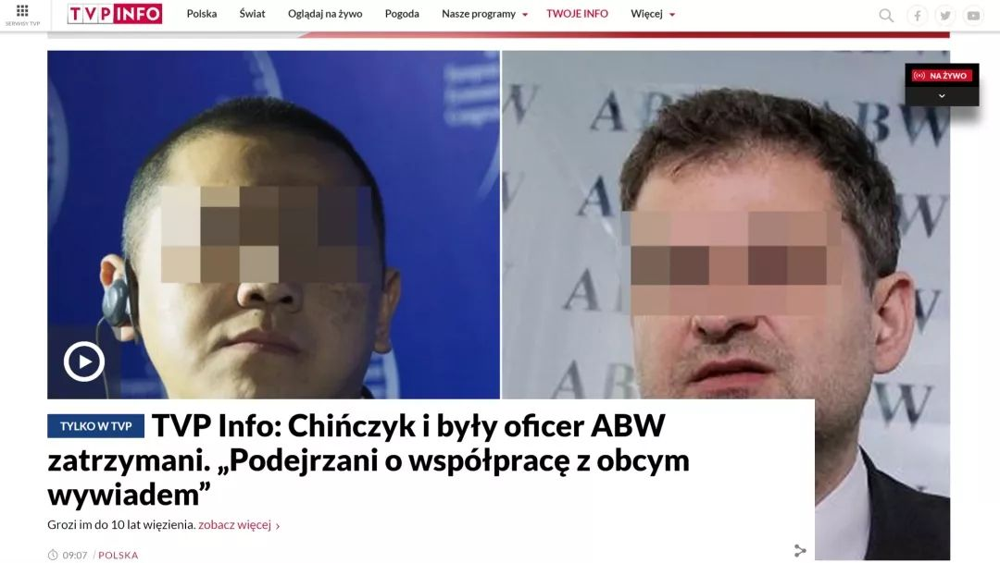
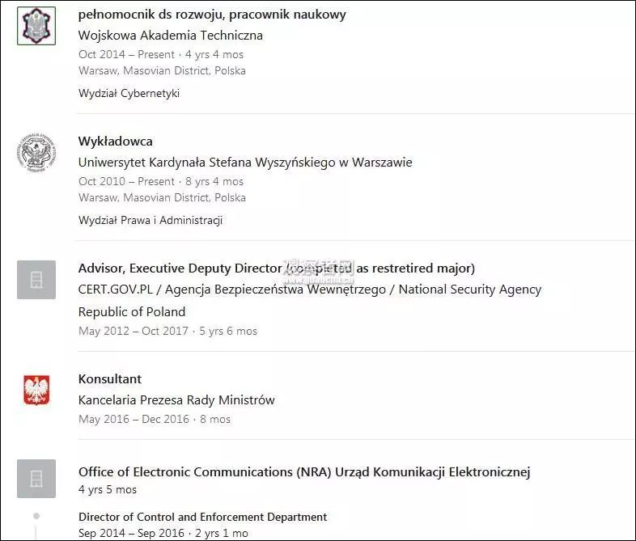
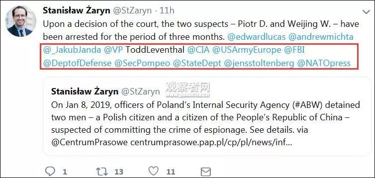
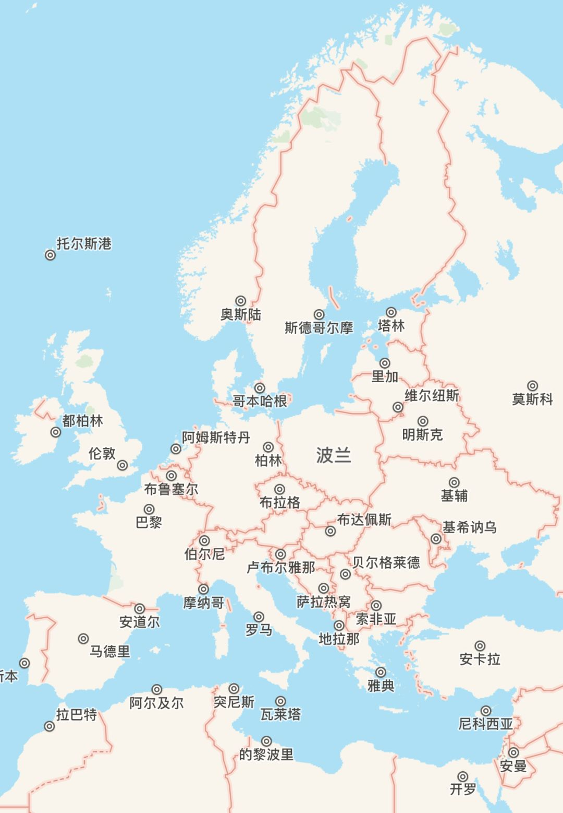

# 无标题

**链接地址:** http://mp.weixin.qq.com/s?__biz=MzI2NTE1ODgwOQ==&mid=2649605927&idx=2&sn=a4a2be69c873f805ab9815c2b5ec3eca&chksm=f2b8ced1c5cf47c7172e069709963f0ef601736ab5ad09384e9cb647c112e45f0b295cc7087d&mpshare=1&scene=2&srcid=#rd
**作者:** 
**获取时间:** 2025/8/28 20:51:50
**图片数量:** 16

---

## 原始HTML内容

<section style="box-sizing: border-box;font-size: 16px;"><section style="box-sizing: border-box;" powered-by="xiumi.us"><section style="margin-right: 0%;margin-left: 0%;box-sizing: border-box;"><section style="display: inline-block;vertical-align: middle;width: 80%;box-sizing: border-box;"><section style="box-sizing: border-box;" powered-by="xiumi.us"><section style="margin-top: 10px;margin-bottom: 10px;text-align: center;box-sizing: border-box;"><section style="display: inline-block;box-sizing: border-box;"><section style="max-width: 100%;font-size: 0px;padding-bottom: 3px;box-sizing: border-box;"><section style="display: inline-block;vertical-align: middle;box-sizing: border-box;"><section style="width: 5px;height: 1px;background-color: rgb(217, 217, 217);box-sizing: border-box;"></section><section style="width: 1px;height: 5px;margin-top: -3px;margin-right: auto;margin-left: auto;background-color: rgb(217, 217, 217);box-sizing: border-box;"></section></section><section style="margin-top: -1px;margin-right: -5px;margin-left: -5px;width: 100%;display: inline-block;vertical-align: middle;padding-right: 8px;padding-left: 8px;box-sizing: border-box;"><section style="width: 100%;height: 1px;background-color: rgb(217, 217, 217);box-sizing: border-box;"></section></section><section style="display: inline-block;vertical-align: middle;box-sizing: border-box;"><section style="width: 5px;height: 1px;background-color: rgb(217, 217, 217);box-sizing: border-box;"></section><section style="width: 1px;height: 5px;margin-top: -3px;margin-right: auto;margin-left: auto;background-color: rgb(217, 217, 217);box-sizing: border-box;"></section></section></section><section style="padding-left: 15px;padding-right: 15px;color: rgb(161, 161, 161);font-size: 14px;box-sizing: border-box;">
点击上方<strong style="box-sizing: border-box;">蓝字</strong>关注我们哟~
</section><section style="max-width: 100%;font-size: 0px;box-sizing: border-box;"><section style="display: inline-block;vertical-align: middle;box-sizing: border-box;"><section style="width: 5px;height: 1px;background-color: rgb(217, 217, 217);box-sizing: border-box;"></section><section style="width: 1px;height: 5px;margin-top: -3px;margin-right: auto;margin-left: auto;background-color: rgb(217, 217, 217);box-sizing: border-box;"></section></section><section style="margin-top: -1px;margin-right: -5px;margin-left: -5px;width: 100%;display: inline-block;vertical-align: middle;padding-right: 8px;padding-left: 8px;box-sizing: border-box;"><section style="width: 100%;height: 1px;background-color: rgb(217, 217, 217);box-sizing: border-box;"></section></section><section style="display: inline-block;vertical-align: middle;box-sizing: border-box;"><section style="width: 5px;height: 1px;background-color: rgb(217, 217, 217);box-sizing: border-box;"></section><section style="width: 1px;height: 5px;margin-top: -3px;margin-right: auto;margin-left: auto;background-color: rgb(217, 217, 217);box-sizing: border-box;"></section></section></section></section></section></section></section><section style="display: inline-block;vertical-align: middle;width: 20%;box-sizing: border-box;"><section style="box-sizing: border-box;" powered-by="xiumi.us"><section style="text-align: center;margin: -10px 0% 10px;box-sizing: border-box;"><section style="max-width: 100%;vertical-align: middle;display: inline-block;line-height: 0;width: 100%;box-sizing: border-box;"></section></section></section></section></section></section><section style="box-sizing: border-box;" powered-by="xiumi.us"><section style="margin: 10px 0%;box-sizing: border-box;"><section style="display: inline-block;width: 100%;vertical-align: top;box-sizing: border-box;"><section style="box-sizing: border-box;" powered-by="xiumi.us"><section style="box-sizing: border-box;"><section style="display: inline-block;vertical-align: bottom;width: 75%;padding-right: 10px;box-sizing: border-box;"><section style="box-sizing: border-box;" powered-by="xiumi.us"><section style="margin: 10px 0% 3px;box-sizing: border-box;"><section style="display: inline-block;vertical-align: middle;box-sizing: border-box;"><section style="display: inline-block;vertical-align: bottom;padding-left: 5px;padding-right: 5px;line-height: 1.2em;margin-bottom: 2px;color: rgba(80, 182, 201, 0.72);box-sizing: border-box;">
<strong style="box-sizing: border-box;">仔细看下图，有惊喜！</strong>
</section><section style="max-width: 100%;display: inline-block;vertical-align: bottom;line-height: 0;width: 1.6em;box-sizing: border-box;"></section></section></section></section></section><section style="display: inline-block;vertical-align: bottom;width: 25%;box-sizing: border-box;"><section style="box-sizing: border-box;" powered-by="xiumi.us"><section style="margin-right: 0%;margin-bottom: 3px;margin-left: 0%;text-align: right;box-sizing: border-box;"><section style="display: inline-block;border-bottom: 0.15em solid rgba(80, 182, 201, 0.72);padding-bottom: 3px;box-sizing: border-box;"><section style="display: inline-block;padding: 3px;border-bottom: 0.15em solid rgba(80, 182, 201, 0.72);font-size: 12px;line-height: 1.4;color: rgb(255, 143, 47);box-sizing: border-box;">
<strong style="box-sizing: border-box;">金主大大</strong>
</section></section></section></section></section></section></section><section style="box-sizing: border-box;" powered-by="xiumi.us"><section style="margin-right: 0%;margin-left: 0%;box-sizing: border-box;"><section style="background-color: rgba(80, 182, 201, 0.72);height: 2px;box-sizing: border-box;"></section></section></section></section></section></section><section style="box-sizing: border-box;" powered-by="xiumi.us"><section style="text-align: center;margin-top: 10px;margin-bottom: 10px;box-sizing: border-box;"><section style="max-width: 100%;vertical-align: middle;display: inline-block;line-height: 0;box-sizing: border-box;"></section></section></section><section style="box-sizing: border-box;" powered-by="xiumi.us"><section style="text-align: center;margin-top: 10px;margin-bottom: 10px;box-sizing: border-box;"><section style="max-width: 100%;vertical-align: middle;display: inline-block;line-height: 0;box-sizing: border-box;"></section></section></section><section style="box-sizing: border-box;" powered-by="xiumi.us"><section style="text-align: center;margin-top: 10px;margin-bottom: 10px;box-sizing: border-box;"><section style="max-width: 100%;vertical-align: middle;display: inline-block;line-height: 0;box-sizing: border-box;"></section></section></section><section style="box-sizing: border-box;" powered-by="xiumi.us"><section style="text-align: center;margin-top: 10px;margin-bottom: 10px;box-sizing: border-box;"><section style="max-width: 100%;vertical-align: middle;display: inline-block;line-height: 0;box-sizing: border-box;"></section></section></section><section style="box-sizing: border-box;" powered-by="xiumi.us"><section style="text-align: center;margin-top: 10px;margin-bottom: 10px;box-sizing: border-box;"><section style="max-width: 100%;vertical-align: middle;display: inline-block;line-height: 0;box-sizing: border-box;"><svg class="svg" xmlns="http://www.w3.org/2000/svg" x="0px" y="0px" viewBox="0 0 902.1 38.2" style="vertical-align: middle;max-width: 100%;box-sizing: border-box;" width="100%"><g style="box-sizing: border-box;"><path style="box-sizing: border-box;" d="M18.4,1.4c0.9-1.9,2.4-1.9,3.4,0l3.4,6.9c0.9,1.9,3.4,3.7,5.4,4l7.6,1.1c2.1,0.3,2.5,1.7,1,3.2   l-5.5,5.4c-1.5,1.5-2.4,4.3-2.1,6.4l1.3,7.6c0.4,2.1-0.9,2.9-2.7,2l-6.8-3.6c-1.8-1-4.9-1-6.7,0l-6.8,3.6c-1.9,1-3.1,0.1-2.7-2   l1.3-7.6c0.4-2.1-0.6-4.9-2.1-6.4l-5.5-5.4c-1.5-1.5-1-2.9,1-3.2l7.6-1.1c2.1-0.3,4.5-2.1,5.4-4L18.4,1.4z" fill="rgb(178, 243, 230)"></path><path style="box-sizing: border-box;" d="M90.6,5.4c0.7-1.4,1.9-1.4,2.6,0l2.6,5.3c0.7,1.4,2.6,2.8,4.2,3.1l5.9,0.9c1.6,0.2,2,1.3,0.8,2.5   l-4.2,4.1c-1.2,1.1-1.9,3.3-1.6,4.9l1,5.8c0.3,1.6-0.7,2.3-2.1,1.5l-5.2-2.8c-1.4-0.8-3.8-0.8-5.2,0L84,33.6   c-1.4,0.8-2.4,0.1-2.1-1.5l1-5.8c0.3-1.6-0.5-3.8-1.6-4.9l-4.2-4.1c-1.2-1.1-0.8-2.2,0.8-2.5l5.9-0.9c1.6-0.2,3.5-1.6,4.2-3.1   L90.6,5.4z" fill="rgb(190, 204, 246)"></path><path style="box-sizing: border-box;" d="M162.6,7.5c0.6-1.2,1.6-1.2,2.2,0l2.2,4.5c0.6,1.2,2.2,2.4,3.6,2.6l5,0.7c1.4,0.2,1.7,1.1,0.7,2.1   l-3.6,3.5c-1,1-1.6,2.9-1.4,4.2l0.9,5c0.2,1.4-0.6,1.9-1.8,1.3l-4.5-2.4c-1.2-0.6-3.2-0.6-4.4,0l-4.5,2.4c-1.2,0.6-2,0.1-1.8-1.3   l0.9-5c0.2-1.4-0.4-3.3-1.4-4.2l-3.6-3.5c-1-1-0.7-1.9,0.7-2.1l5-0.7c1.4-0.2,3-1.4,3.6-2.6L162.6,7.5z" fill="rgb(150, 208, 240)"></path><path style="box-sizing: border-box;" d="M60.1,19.1c0,2.3-1.9,4.2-4.2,4.2c-2.3,0-4.2-1.9-4.2-4.2s1.9-4.2,4.2-4.2   C58.3,14.9,60.1,16.8,60.1,19.1z" fill="rgb(218, 240, 224)"></path><path style="box-sizing: border-box;" d="M203.8,19.1c0,2.3-1.9,4.2-4.2,4.2c-2.3,0-4.2-1.9-4.2-4.2s1.9-4.2,4.2-4.2   C201.9,14.9,203.8,16.8,203.8,19.1z" fill="rgb(218, 240, 224)"></path><path style="box-sizing: border-box;" d="M130.9,19.1c0,1.7-1.4,3.1-3.1,3.1c-1.7,0-3.1-1.4-3.1-3.1c0-1.7,1.4-3.1,3.1-3.1   C129.5,16.1,130.9,17.4,130.9,19.1z" fill="rgb(218, 240, 224)"></path><path style="box-sizing: border-box;" d="M233.9,1.4c0.9-1.9,2.4-1.9,3.4,0l3.4,6.9c0.9,1.9,3.4,3.7,5.4,4l7.6,1.1c2.1,0.3,2.5,1.7,1,3.2   l-5.5,5.4c-1.5,1.5-2.4,4.3-2.1,6.4l1.3,7.6c0.4,2.1-0.9,2.9-2.7,2l-6.8-3.6c-1.8-1-4.9-1-6.7,0l-6.8,3.6c-1.9,1-3.1,0.1-2.7-2   l1.3-7.6c0.4-2.1-0.6-4.9-2.1-6.4l-5.5-5.4c-1.5-1.5-1-2.9,1-3.2l7.6-1.1c2.1-0.3,4.5-2.1,5.4-4L233.9,1.4z" fill="rgb(178, 243, 230)"></path><path style="box-sizing: border-box;" d="M306.1,5.4c0.7-1.4,1.9-1.4,2.6,0l2.6,5.3c0.7,1.4,2.6,2.8,4.2,3.1l5.9,0.9c1.6,0.2,2,1.3,0.8,2.5   l-4.2,4.1c-1.2,1.1-1.9,3.3-1.6,4.9l1,5.8c0.3,1.6-0.7,2.3-2.1,1.5l-5.2-2.8c-1.4-0.8-3.8-0.8-5.2,0l-5.2,2.8   c-1.4,0.8-2.4,0.1-2.1-1.5l1-5.8c0.3-1.6-0.4-3.8-1.6-4.9l-4.2-4.1c-1.2-1.1-0.8-2.2,0.8-2.5l5.9-0.9c1.6-0.2,3.5-1.6,4.2-3.1   L306.1,5.4z" fill="rgb(190, 204, 246)"></path><path style="box-sizing: border-box;" d="M378.1,7.5c0.6-1.2,1.6-1.2,2.2,0l2.2,4.5c0.6,1.2,2.2,2.4,3.6,2.6l5,0.7c1.4,0.2,1.7,1.1,0.7,2.1   l-3.6,3.5c-1,1-1.6,2.9-1.4,4.2l0.9,5c0.2,1.4-0.6,1.9-1.8,1.3l-4.5-2.4c-1.2-0.6-3.2-0.6-4.4,0l-4.5,2.4c-1.2,0.6-2,0.1-1.8-1.3   l0.9-5c0.2-1.4-0.4-3.3-1.4-4.2l-3.6-3.5c-1-1-0.7-1.9,0.7-2.1l5-0.7c1.4-0.2,3-1.4,3.6-2.6L378.1,7.5z" fill="rgb(150, 208, 240)"></path><path style="box-sizing: border-box;" d="M275.7,19.1c0,2.3-1.9,4.2-4.2,4.2c-2.3,0-4.2-1.9-4.2-4.2s1.9-4.2,4.2-4.2   C273.8,14.9,275.7,16.8,275.7,19.1z" fill="rgb(218, 240, 224)"></path><path style="box-sizing: border-box;" d="M419.3,19.1c0,2.3-1.9,4.2-4.2,4.2c-2.3,0-4.2-1.9-4.2-4.2s1.9-4.2,4.2-4.2   C417.5,14.9,419.3,16.8,419.3,19.1z" fill="rgb(218, 240, 224)"></path><path style="box-sizing: border-box;" d="M346.4,19.1c0,1.7-1.4,3.1-3.1,3.1c-1.7,0-3.1-1.4-3.1-3.1c0-1.7,1.4-3.1,3.1-3.1   C345,16.1,346.4,17.4,346.4,19.1z" fill="rgb(218, 240, 224)"></path><path style="box-sizing: border-box;" d="M449.4,1.4c0.9-1.9,2.4-1.9,3.4,0l3.4,6.9c0.9,1.9,3.4,3.7,5.4,4l7.6,1.1c2.1,0.3,2.5,1.7,1,3.2   l-5.5,5.4c-1.5,1.5-2.4,4.3-2.1,6.4l1.3,7.6c0.4,2.1-0.9,2.9-2.7,2l-6.8-3.6c-1.8-1-4.9-1-6.7,0l-6.8,3.6c-1.9,1-3.1,0.1-2.7-2   l1.3-7.6c0.4-2.1-0.6-4.9-2.1-6.4l-5.5-5.4c-1.5-1.5-1-2.9,1-3.2l7.6-1.1c2.1-0.3,4.5-2.1,5.4-4L449.4,1.4z" fill="rgb(178, 243, 230)"></path><path style="box-sizing: border-box;" d="M521.6,5.4c0.7-1.4,1.9-1.4,2.6,0l2.6,5.3c0.7,1.4,2.6,2.8,4.2,3.1l5.9,0.9c1.6,0.2,2,1.3,0.8,2.5   l-4.2,4.1c-1.2,1.1-1.9,3.3-1.6,4.9l1,5.8c0.3,1.6-0.7,2.3-2.1,1.5l-5.2-2.8c-1.4-0.8-3.8-0.8-5.2,0l-5.2,2.8   c-1.4,0.8-2.4,0.1-2.1-1.5l1-5.8c0.3-1.6-0.5-3.8-1.6-4.9l-4.2-4.1c-1.2-1.1-0.8-2.2,0.8-2.5l5.9-0.9c1.6-0.2,3.5-1.6,4.2-3.1   L521.6,5.4z" fill="rgb(190, 204, 246)"></path><path style="box-sizing: border-box;" d="M593.6,7.5c0.6-1.2,1.6-1.2,2.2,0l2.2,4.5c0.6,1.2,2.2,2.4,3.6,2.6l5,0.7c1.4,0.2,1.7,1.1,0.7,2.1   l-3.6,3.5c-1,1-1.6,2.9-1.4,4.2l0.9,5c0.2,1.4-0.6,1.9-1.8,1.3l-4.5-2.4c-1.2-0.6-3.2-0.6-4.4,0l-4.5,2.4c-1.2,0.6-2,0.1-1.8-1.3   l0.9-5c0.2-1.4-0.4-3.3-1.4-4.2l-3.6-3.5c-1-1-0.7-1.9,0.7-2.1l5-0.7c1.4-0.2,3-1.4,3.6-2.6L593.6,7.5z" fill="rgb(150, 208, 240)"></path><path style="box-sizing: border-box;" d="M491.2,19.1c0,2.3-1.9,4.2-4.2,4.2c-2.3,0-4.2-1.9-4.2-4.2s1.9-4.2,4.2-4.2   C489.3,14.9,491.2,16.8,491.2,19.1z" fill="rgb(218, 240, 224)"></path><path style="box-sizing: border-box;" d="M634.9,19.1c0,2.3-1.9,4.2-4.2,4.2c-2.3,0-4.2-1.9-4.2-4.2s1.9-4.2,4.2-4.2   C633,14.9,634.9,16.8,634.9,19.1z" fill="rgb(218, 240, 224)"></path><path style="box-sizing: border-box;" d="M561.9,19.1c0,1.7-1.4,3.1-3.1,3.1c-1.7,0-3.1-1.4-3.1-3.1c0-1.7,1.4-3.1,3.1-3.1   C560.5,16.1,561.9,17.4,561.9,19.1z" fill="rgb(218, 240, 224)"></path><path style="box-sizing: border-box;" d="M664.9,1.4c0.9-1.9,2.4-1.9,3.4,0l3.4,6.9c0.9,1.9,3.4,3.7,5.4,4l7.6,1.1c2.1,0.3,2.5,1.7,1,3.2   l-5.5,5.4c-1.5,1.5-2.4,4.3-2.1,6.4l1.3,7.6c0.4,2.1-0.9,2.9-2.7,2l-6.8-3.6c-1.8-1-4.9-1-6.7,0l-6.8,3.6c-1.9,1-3.1,0.1-2.7-2   l1.3-7.6c0.4-2.1-0.6-4.9-2.1-6.4l-5.5-5.4c-1.5-1.5-1-2.9,1-3.2l7.6-1.1c2.1-0.3,4.5-2.1,5.4-4L664.9,1.4z" fill="rgb(178, 243, 230)"></path><path style="box-sizing: border-box;" d="M737.1,5.4c0.7-1.4,1.9-1.4,2.6,0l2.6,5.3c0.7,1.4,2.6,2.8,4.2,3.1l5.9,0.9c1.6,0.2,2,1.3,0.8,2.5   l-4.2,4.1c-1.2,1.1-1.9,3.3-1.6,4.9l1,5.8c0.3,1.6-0.7,2.3-2.1,1.5l-5.2-2.8c-1.4-0.8-3.8-0.8-5.2,0l-5.2,2.8   c-1.4,0.8-2.4,0.1-2.1-1.5l1-5.8c0.3-1.6-0.5-3.8-1.6-4.9l-4.2-4.1c-1.2-1.1-0.8-2.2,0.8-2.5l5.9-0.9c1.6-0.2,3.5-1.6,4.2-3.1   L737.1,5.4z" fill="rgb(190, 204, 246)"></path><path style="box-sizing: border-box;" d="M809.2,7.5c0.6-1.2,1.6-1.2,2.2,0l2.2,4.5c0.6,1.2,2.2,2.4,3.6,2.6l5,0.7c1.4,0.2,1.7,1.1,0.7,2.1   l-3.6,3.5c-1,1-1.6,2.9-1.4,4.2l0.9,5c0.2,1.4-0.6,1.9-1.8,1.3l-4.5-2.4c-1.2-0.6-3.2-0.6-4.4,0l-4.5,2.4c-1.2,0.6-2,0.1-1.8-1.3   l0.9-5c0.2-1.4-0.4-3.3-1.4-4.2l-3.6-3.5c-1-1-0.7-1.9,0.7-2.1l5-0.7c1.4-0.2,3-1.4,3.6-2.6L809.2,7.5z" fill="rgb(150, 208, 240)"></path><path style="box-sizing: border-box;" d="M706.7,19.1c0,2.3-1.9,4.2-4.2,4.2c-2.3,0-4.2-1.9-4.2-4.2s1.9-4.2,4.2-4.2   C704.8,14.9,706.7,16.8,706.7,19.1z" fill="rgb(218, 240, 224)"></path><path style="box-sizing: border-box;" d="M850.4,19.1c0,2.3-1.9,4.2-4.2,4.2c-2.3,0-4.2-1.9-4.2-4.2s1.9-4.2,4.2-4.2   C848.5,14.9,850.4,16.8,850.4,19.1z" fill="rgb(218, 240, 224)"></path><path style="box-sizing: border-box;" d="M777.4,19.1c0,1.7-1.4,3.1-3.1,3.1c-1.7,0-3.1-1.4-3.1-3.1c0-1.7,1.4-3.1,3.1-3.1   C776,16.1,777.4,17.4,777.4,19.1z" fill="rgb(218, 240, 224)"></path><path style="box-sizing: border-box;" d="M880.4,1.4c0.9-1.9,2.4-1.9,3.4,0l3.4,6.9c0.9,1.9,3.4,3.7,5.4,4l7.6,1.1c2.1,0.3,2.5,1.7,1,3.2   l-5.5,5.4c-1.5,1.5-2.4,4.3-2.1,6.4l1.3,7.6c0.4,2.1-0.9,2.9-2.7,2l-6.8-3.6c-1.8-1-4.9-1-6.7,0l-6.8,3.6c-1.8,1-3.1,0.1-2.7-2   l1.3-7.6c0.4-2.1-0.6-4.9-2.1-6.4l-5.5-5.4c-1.5-1.5-1-2.9,1-3.2l7.6-1.1c2.1-0.3,4.5-2.1,5.4-4L880.4,1.4z" fill="rgb(178, 243, 230)"></path></g></svg></section></section></section><section style="box-sizing: border-box;" powered-by="xiumi.us"><section style="box-sizing: border-box;"><section style="text-align: justify;box-sizing: border-box;"><section powered-by="xiumi.us" style="max-width: 100%;box-sizing: border-box;letter-spacing: 0.544px;white-space: normal;font-size: 16px;background-color: rgb(255, 255, 255);overflow-wrap: break-word !important;"><section style="max-width: 100%;box-sizing: border-box;overflow-wrap: break-word !important;"><section style="padding-right: 15px;padding-left: 15px;max-width: 100%;box-sizing: border-box;font-size: 15px;letter-spacing: 1px;line-height: 2;overflow-wrap: break-word !important;">
FROM天天网

2019年1月11日，据路透于引援波兰官方通讯社PAP报道，<strong style="max-width: 100%;box-sizing: border-box !important;overflow-wrap: break-word !important;">波兰当局逮捕一名华为的中国籍员工，以及一名波兰籍的网络业务专家，因他们涉嫌从事间谍活动</strong><strong style="max-width: 100%;box-sizing: border-box;overflow-wrap: break-word !important;">。</strong>这起事件加深了西方对中国电信设备制造商华为的争议。 

&nbsp;

他们二人被指控涉嫌间谍活动，“为中国情报部门谋利”。<strong style="max-width: 100%;box-sizing: border-box;overflow-wrap: break-word !important;">法院下令，被逮捕的这两个人将被拘押3个月。如果被定罪，两人可能会被判高达10年的监禁。</strong>

&nbsp;
</section></section></section><section powered-by="xiumi.us" style="max-width: 100%;box-sizing: border-box;letter-spacing: 0.544px;white-space: normal;font-size: 16px;background-color: rgb(255, 255, 255);overflow-wrap: break-word !important;"><section style="margin-top: 10px;margin-bottom: 10px;max-width: 100%;box-sizing: border-box;text-align: justify;overflow-wrap: break-word !important;"><section style="max-width: 100%;box-sizing: border-box;vertical-align: middle;display: inline-block;line-height: 0;width: 622.838px;overflow-wrap: break-word !important;"></section></section></section><section powered-by="xiumi.us" style="max-width: 100%;box-sizing: border-box;letter-spacing: 0.544px;white-space: normal;font-size: 16px;background-color: rgb(255, 255, 255);overflow-wrap: break-word !important;"><section style="max-width: 100%;box-sizing: border-box;overflow-wrap: break-word !important;"><section style="padding-right: 15px;padding-left: 15px;max-width: 100%;box-sizing: border-box;font-size: 15px;letter-spacing: 1px;line-height: 2;overflow-wrap: break-word !important;">
<em style="max-width: 100%;box-sizing: border-box;overflow-wrap: break-word !important;">波兰国家电视台（TVP）报道截图</em>
</section></section></section>
中国驻波兰大使馆和华为公司，已迅速做出了回应。大使馆明确表示：

 
<blockquote style="max-width: 100%;white-space: normal;color: rgb(62, 62, 62);font-family: 微软雅黑;letter-spacing: 0.476px;background-color: rgb(255, 255, 255);box-sizing: border-box !important;overflow-wrap: break-word !important;">
中方高度关注此事件，使馆已第一时间约见波兰外交部，要求波方尽快向中方就事件情况进行领事通报，尽早安排领事探视，依法公正、妥善处理此案，切实保障当事人的合法权益、安全、和人道主义待遇。 
</blockquote>
 

华为公司回应：

 
<blockquote style="max-width: 100%;white-space: normal;color: rgb(62, 62, 62);font-family: 微软雅黑;letter-spacing: 0.476px;background-color: rgb(255, 255, 255);box-sizing: border-box !important;overflow-wrap: break-word !important;">
华为波兰代表处员工王伟晶因个人原因涉嫌违反波兰法律而被逮捕调查，该事件对华为的全球声誉造成了不良影响，依据公司劳动合同相关管理规定，华为决定立刻终止与王伟晶的雇佣关系。 

 

华为公司一直遵守业务所在国的所有适用法律法规，合规经营，并要求所有员工遵守所在国法律法规。
</blockquote>
 

路透社11日援引波兰情报部门发言人的表述，“（两人的行为）<strong style="max-width: 100%;box-sizing: border-box !important;overflow-wrap: break-word !important;">属于个人行为</strong>”。目前波兰国家安全部门已经介入此案，<strong style="max-width: 100%;box-sizing: border-box !important;overflow-wrap: break-word !important;">两人均未认罪</strong>。
<section data-id="89174" data-tools="135编辑器" style="max-width: 100%;box-sizing: border-box;font-variant-numeric: normal;font-variant-east-asian: normal;letter-spacing: 0.544px;white-space: normal;line-height: 42.66px;widows: 1;background-color: rgb(255, 255, 255);overflow-wrap: break-word !important;"><section style="margin: 10px auto;padding: 2px;max-width: 100%;box-sizing: border-box;overflow-wrap: break-word !important;border-width: 2px;border-style: solid;border-color: rgb(117, 117, 118);"><section style="padding: 15px;max-width: 100%;box-sizing: border-box;border-width: 1px;border-style: solid;border-color: rgb(117, 117, 118);overflow-wrap: break-word !important;">
<strong style="max-width: 100%;color: rgb(255, 76, 0);line-height: 42.66px;box-sizing: border-box !important;overflow-wrap: break-word !important;">被捕二人细节</strong>
</section></section></section>
<strong style="max-width: 100%;box-sizing: border-box;overflow-wrap: break-word !important;">央视新闻客户端讯11日报道称，据多方了解，涉案中国公民为华为波兰有限公司公共关系部部长王伟晶。</strong>

 

<strong style="max-width: 100%;box-sizing: border-box;overflow-wrap: break-word !important;">而被捕的波兰工程师 Piotr D 是曾就职于国家安全局的高官。</strong>

<strong style="max-width: 100%;box-sizing: border-box;overflow-wrap: break-word !important;">&nbsp;</strong>

其中，Weijing Wang毕业于北京外国语大学波兰语专业。

 

2006年起在中国驻格但斯克领事馆工作。

&nbsp;

2011年，他被华为聘用，重新返回波兰工作，负责华为在波兰的公关事务。

&nbsp;

2017年，他成为华为波兰公司的销售经理，主要负责向波兰有关机构销售华为技术(类似于销售经理)。

 

熟悉Wang先生的人说他是当地商界的知名人物，经常参加华为在波兰举办的活动。“他波兰语说的很棒”，一位经常组织商务代表团去中国的波兰商人说。

 

被捕波兰人为皮奥特•德尔巴罗（Piotr Durbajlo），在2011年之前是波兰情报局ABW负责反间谍（和网络安全）的高级官员。他本人有情报局背景。后来转到波兰军方技术学院以及其他官方机构工作。自2017年起又转到法国移动运营商Orange驻波兰分公司。

LinkedIn网站显示，皮奥特自2000年至2017年长期在波兰政府任职，有着10年从事情报工作的经历，目前在波兰的几所大学内均有任职。但皮奥特的简历未提及其在Orange的工作经历，仅称他如今是一名电信领域的顾问。&nbsp;

身为前波兰情报局网络通讯安全部门副主任，他对波兰政府网络以及波兰的国家网络间谍战略了如指掌。他还是现任波兰情报局局长Krzysztof Bondaryk顾问。(这就是说，抓他的就是他以前的雇主)。

<section data-id="89174" data-tools="135编辑器" style="max-width: 100%;box-sizing: border-box;font-variant-numeric: normal;font-variant-east-asian: normal;letter-spacing: 0.544px;white-space: normal;line-height: 42.66px;widows: 1;background-color: rgb(255, 255, 255);overflow-wrap: break-word !important;"><section style="margin: 10px auto;padding: 2px;max-width: 100%;box-sizing: border-box;overflow-wrap: break-word !important;border-width: 2px;border-style: solid;border-color: rgb(117, 117, 118);"><section style="padding: 15px;max-width: 100%;box-sizing: border-box;border-width: 1px;border-style: solid;border-color: rgb(117, 117, 118);overflow-wrap: break-word !important;">
<strong style="max-width: 100%;color: rgb(255, 76, 0);line-height: 42.66px;box-sizing: border-box !important;overflow-wrap: break-word !important;">波兰：是</strong><strong style="max-width: 100%;color: rgb(255, 76, 0);line-height: 42.66px;box-sizing: border-box !important;overflow-wrap: break-word !important;">蓄意已久，还是……</strong>
</section></section></section>
波兰国家情报机关发言人扎瑞（Stanisław Żaryn）于11日在推特上宣布被捕人员身份时，<strong style="max-width: 100%;box-sizing: border-box !important;overflow-wrap: break-word !important;">将美国CIA、FBI、国务院等在内的6个部门全部@了一遍。</strong>

截至目前，波兰安全部门已经搜查了两名被捕人士的住所。同时，华为公司在波兰的办公处、以及皮奥特所任职的Orange通信公司也遭到了搜查，相关文件被扣押。

<strong style="max-width: 100%;box-sizing: border-box !important;overflow-wrap: break-word !important;">华为最新官方回应表示：因个人原因涉嫌违反波兰法律而被逮捕调查，该事件对华为的全球声誉造成了不良影响。</strong>

<strong style="max-width: 100%;box-sizing: border-box !important;overflow-wrap: break-word !important;"> </strong>

<strong style="max-width: 100%;box-sizing: border-box !important;overflow-wrap: break-word !important;"></strong>

 

波兰是否会因为员工个人的违法行为而终止与华为的合作，暂时不得而知。

 

但是最近，华盛顿确实一直在积极推动盟友避免使用华为设备。世界各地的许多运营商正在开始推出5G。

 

2015年初，华为智能手机在波兰市场份额仅有1.3%。近4年来市占率连续增长，于2017年提升至23%。而据市场研究公司GfK的数据，截至2018年6月，华为在波兰的智能手机市场份额分别达到了36%，高出三星10个百分点，<strong style="max-width: 100%;box-sizing: border-box !important;overflow-wrap: break-word !important;">成为该国最大智能手机销售商。</strong>

去年12月，德国电信子公司T-Mobile电信公司波兰日前宣布，在华为的支持下，在东欧国家推出了“首个全功能”5G网络，<strong style="max-width: 100%;box-sizing: border-box !important;overflow-wrap: break-word !important;">成为波兰国内市场5G网络领跑者。</strong>

从2013-2017年，波兰从中国的进口年增15%；2016年波兰从中国进口了约250亿欧元的商品。中国继续在波兰的进口来源国中排名第二。

 

中国出口波兰的“头号功臣”是电话和电信设备，有20多亿欧元。 
<table cellspacing="0" cellpadding="0" width="556"><tbody style="max-width: 100%;box-sizing: border-box !important;overflow-wrap: break-word !important;"><tr style="max-width: 100%;height: 28px;box-sizing: border-box !important;overflow-wrap: break-word !important;"><td width="44" height="28" style="padding: 0px 7px;word-break: break-all;border-color: windowtext;max-width: 100%;overflow-wrap: break-word !important;box-sizing: border-box !important;"> </td><td width="328.3333333333333" height="28" style="padding: 0px 7px;word-break: break-all;border-left: medium none currentcolor;border-top-color: windowtext;border-right-color: windowtext;border-bottom-color: windowtext;max-width: 100%;overflow-wrap: break-word !important;box-sizing: border-box !important;">
<strong style="max-width: 100%;box-sizing: border-box !important;overflow-wrap: break-word !important;">波兰从中国进口的主要产品（部分）</strong>
</td><td width="136" height="28" style="padding: 0px 7px;word-break: break-all;border-left: medium none currentcolor;border-top-color: windowtext;border-right-color: windowtext;border-bottom-color: windowtext;max-width: 100%;overflow-wrap: break-word !important;box-sizing: border-box !important;">
<strong style="max-width: 100%;box-sizing: border-box !important;overflow-wrap: break-word !important;">(</strong><strong style="max-width: 100%;box-sizing: border-box !important;overflow-wrap: break-word !important;">百万欧元</strong><strong style="max-width: 100%;box-sizing: border-box !important;overflow-wrap: break-word !important;">)</strong>
</td></tr><tr style="max-width: 100%;height: 28px;box-sizing: border-box !important;overflow-wrap: break-word !important;"><td width="37.33333333333333" height="28" style="padding: 0px 7px;word-break: break-all;border-top: medium none currentcolor;border-right-color: windowtext;border-bottom-color: windowtext;border-left-color: windowtext;max-width: 100%;overflow-wrap: break-word !important;box-sizing: border-box !important;">
1
</td><td width="328.3333333333333" height="28" style="padding: 0px 7px;word-break: break-all;border-top: medium none currentcolor;border-left: medium none currentcolor;border-right-color: windowtext;border-bottom-color: windowtext;max-width: 100%;overflow-wrap: break-word !important;box-sizing: border-box !important;">
电话和电信设备
</td><td width="136" height="28" style="padding: 0px 7px;word-break: break-all;border-top: medium none currentcolor;border-left: medium none currentcolor;border-right-color: windowtext;border-bottom-color: windowtext;max-width: 100%;overflow-wrap: break-word !important;box-sizing: border-box !important;">
2 011,2
</td></tr><tr style="max-width: 100%;height: 28px;box-sizing: border-box !important;overflow-wrap: break-word !important;"><td width="44" height="28" style="padding: 0px 7px;word-break: break-all;border-top: medium none currentcolor;border-right-color: windowtext;border-bottom-color: windowtext;border-left-color: windowtext;max-width: 100%;overflow-wrap: break-word !important;box-sizing: border-box !important;">
2
</td><td width="328.3333333333333" height="28" style="padding: 0px 7px;word-break: break-all;border-top: medium none currentcolor;border-left: medium none currentcolor;border-right-color: windowtext;border-bottom-color: windowtext;max-width: 100%;overflow-wrap: break-word !important;box-sizing: border-box !important;">
自动数据处理机器和设备
</td><td width="136" height="28" style="padding: 0px 7px;word-break: break-all;border-top: medium none currentcolor;border-left: medium none currentcolor;border-right-color: windowtext;border-bottom-color: windowtext;max-width: 100%;overflow-wrap: break-word !important;box-sizing: border-box !important;">
1 712,2
</td></tr><tr style="max-width: 100%;height: 28px;box-sizing: border-box !important;overflow-wrap: break-word !important;"><td width="44" height="28" style="padding: 0px 7px;word-break: break-all;border-top: medium none currentcolor;border-right-color: windowtext;border-bottom-color: windowtext;border-left-color: windowtext;max-width: 100%;overflow-wrap: break-word !important;box-sizing: border-box !important;">
3
</td><td width="328.3333333333333" height="28" style="padding: 0px 7px;word-break: break-all;border-top: medium none currentcolor;border-left: medium none currentcolor;border-right-color: windowtext;border-bottom-color: windowtext;max-width: 100%;overflow-wrap: break-word !important;box-sizing: border-box !important;">
用于传输、雷达、无线电和电视的部件和整套设备
</td><td width="136" height="28" style="padding: 0px 7px;word-break: break-all;border-top: medium none currentcolor;border-left: medium none currentcolor;border-right-color: windowtext;border-bottom-color: windowtext;max-width: 100%;overflow-wrap: break-word !important;box-sizing: border-box !important;">
1 504,5
</td></tr><tr style="max-width: 100%;height: 28px;box-sizing: border-box !important;overflow-wrap: break-word !important;"><td width="44" height="28" style="padding: 0px 7px;word-break: break-all;border-top: medium none currentcolor;border-right-color: windowtext;border-bottom-color: windowtext;border-left-color: windowtext;max-width: 100%;overflow-wrap: break-word !important;box-sizing: border-box !important;"> </td><td width="328.3333333333333" height="28" style="padding: 0px 7px;word-break: break-all;border-top: medium none currentcolor;border-left: medium none currentcolor;border-right-color: windowtext;border-bottom-color: windowtext;max-width: 100%;overflow-wrap: break-word !important;box-sizing: border-box !important;">
……
</td><td width="136" height="28" style="padding: 0px 7px;word-break: break-all;border-top: medium none currentcolor;border-left: medium none currentcolor;border-right-color: windowtext;border-bottom-color: windowtext;max-width: 100%;overflow-wrap: break-word !important;box-sizing: border-box !important;">
......
</td></tr></tbody></table>
 此次逮捕发生在中国和美国在其他外交、军事和经济局势紧张之时。 特朗普政府在推动中国改变贸易和工业发展实践的广泛战略时加大了对华为的审查力度。 华盛顿和北京一直在进行针锋相对的打击了全球市场的关税战争。
<section data-id="89174" data-tools="135编辑器" style="max-width: 100%;box-sizing: border-box;font-variant-numeric: normal;font-variant-east-asian: normal;letter-spacing: 0.544px;white-space: normal;line-height: 42.66px;widows: 1;background-color: rgb(255, 255, 255);overflow-wrap: break-word !important;"><section style="margin: 10px auto;padding: 2px;max-width: 100%;box-sizing: border-box;overflow-wrap: break-word !important;border-width: 2px;border-style: solid;border-color: rgb(117, 117, 118);"><section style="padding: 15px;max-width: 100%;box-sizing: border-box;border-width: 1px;border-style: solid;border-color: rgb(117, 117, 118);overflow-wrap: break-word !important;">
<strong style="max-width: 100%;color: rgb(255, 76, 0);line-height: 42.66px;box-sizing: border-box !important;overflow-wrap: break-word !important;">波兰</strong><strong style="max-width: 100%;color: rgb(255, 76, 0);line-height: 42.66px;box-sizing: border-box !important;overflow-wrap: break-word !important;">：与中国建交70周年</strong>
</section></section></section>
波兰是中欧最大的国家之一，面积312679平方公里，人口约为3850万人，是欧盟第六大人口大国。

 

波兰西面与德国接壤，南部与捷克共和国和斯洛伐克接壤，东面是乌克兰和白俄罗斯，东北部是立陶宛和俄罗斯，北临波罗的海。

 

波兰的政治框架体系是一个统一的半总统制的民主共和国。行政权力在多党制度框架内由总统和政府行使，政府由总理领导的部长理事会组成。

 
<section style="padding-top: 10px;padding-right: 10px;padding-left: 10px;max-width: 100%;box-sizing: border-box;letter-spacing: 0.544px;white-space: normal;background-color: rgb(255, 255, 255);display: inline-block;vertical-align: top;width: 328.337px;border-style: solid;border-width: 0px;border-radius: 0px;border-color: rgb(62, 62, 62);box-shadow: rgb(152, 152, 152) 0px 0px 3px;overflow-wrap: break-word !important;"><section powered-by="xiumi.us" style="max-width: 100%;box-sizing: border-box;overflow-wrap: break-word !important;"><section style="max-width: 100%;box-sizing: border-box;overflow-wrap: break-word !important;"><section style="max-width: 100%;box-sizing: border-box;vertical-align: middle;display: inline-block;line-height: 0;box-shadow: rgb(0, 0, 0) 0px 0px 0px;overflow-wrap: break-word !important;"></section></section></section><section powered-by="xiumi.us" style="max-width: 100%;box-sizing: border-box;overflow-wrap: break-word !important;"><section style="margin-top: 8px;max-width: 100%;box-sizing: border-box;overflow-wrap: break-word !important;"><section style="max-width: 100%;box-sizing: border-box;color: rgb(160, 160, 160);font-size: 13px;overflow-wrap: break-word !important;">
总统 ：Andrzej Duda（安杰伊·杜达）
</section></section></section><section powered-by="xiumi.us" style="max-width: 100%;box-sizing: border-box;overflow-wrap: break-word !important;"><section style="margin-top: -10px;max-width: 100%;box-sizing: border-box;transform: translate3d(-5px, 0px, 0px);overflow-wrap: break-word !important;"><section style="max-width: 100%;box-sizing: border-box;text-align: left;color: rgb(152, 152, 152);font-size: 12px;overflow-wrap: break-word !important;">
 
</section></section></section></section><section style="padding-top: 10px;padding-right: 10px;padding-left: 10px;max-width: 100%;box-sizing: border-box;letter-spacing: 0.544px;white-space: normal;background-color: rgb(255, 255, 255);display: inline-block;vertical-align: top;width: 328.337px;box-shadow: rgb(152, 152, 152) 0px 0px 3px;overflow-wrap: break-word !important;"><section powered-by="xiumi.us" style="max-width: 100%;box-sizing: border-box;font-size: 16px;letter-spacing: 0.544px;text-align: center;overflow-wrap: break-word !important;"><section style="max-width: 100%;box-sizing: border-box;overflow-wrap: break-word !important;"><section style="max-width: 100%;box-sizing: border-box;vertical-align: middle;display: inline-block;line-height: 0;box-shadow: rgb(0, 0, 0) 0px 0px 0px;overflow-wrap: break-word !important;"></section></section></section><section powered-by="xiumi.us" style="max-width: 100%;box-sizing: border-box;font-size: 16px;letter-spacing: 0.544px;text-align: center;overflow-wrap: break-word !important;"><section style="margin-top: 8px;max-width: 100%;box-sizing: border-box;overflow-wrap: break-word !important;"><section style="max-width: 100%;box-sizing: border-box;font-size: 13px;color: rgb(160, 160, 160);overflow-wrap: break-word !important;">
总理：Mateusz Morawiecki （马泰乌什·莫拉维茨基）
</section></section></section></section>
 

今年是中国和波兰建交70周年，与中国有70年交情的国家不多，波兰竟然算一个。

 

但一定要弄清楚，<strong style="max-width: 100%;box-sizing: border-box !important;overflow-wrap: break-word !important;">现在的波兰，不是以前的波兰。</strong>

 

以前建交的是共产党执政的波兰，和中国是社会主义阵营兄弟；苏东剧变后，现在的波兰，是“新欧洲”的领头羊。

这几年，乌克兰局势的发展更是让波兰如坐针毡，波兰追随西方制裁俄罗斯，俄罗斯立刻反制：禁止进口波兰的苹果和蔬菜。

波兰不仅想卖出自己的苹果，也想找一个强大的靠山保护自己。德国和俄罗斯历来是波兰的宿敌，自然不可能当波兰的靠山，选来选去，<strong style="max-width: 100%;box-sizing: border-box !important;overflow-wrap: break-word !important;">波兰便想把靠山的希望放到了美国的身上，还多次请求美国在波兰建立军事基地。</strong>

<strong style="max-width: 100%;box-sizing: border-box !important;overflow-wrap: break-word !important;">去年9月18日，波兰总统安德烈·杜达访问美国，明确请求美国在波兰建立一个永久的美国军事基地</strong>，还表示这个军事基地将命名为“特朗普堡”，以奉承特朗普。

据《法兰克福汇报》报道，华为员工在波兰因从事间谍活动被捕事件。报道最后还提到，法国移动运营商Orange表示，不会采用华为的5G技术。&nbsp;

 

英国和挪威也正在考虑是否用华为的5G技术。

 

它可能会影响德国移动运营商如德国通讯是否采取华为的5G技术。

 

从波兰今天的做法看，因为自己的安全焦虑！既不顾念华为对波兰通讯业的专业服务和巨大贡献，也不顾念中国和波兰之间长期的友好贸易关系！

 

<strong style="max-width: 100%;box-sizing: border-box;color: rgb(63, 63, 63);font-family: 微软雅黑;font-size: 15px;letter-spacing: 1px;overflow-wrap: break-word !important;">5G技术的发展最终不是<strong style="max-width: 100%;box-sizing: border-box;overflow-wrap: break-word !important;">站队游戏</strong>，而是<strong style="max-width: 100%;box-sizing: border-box;overflow-wrap: break-word !important;">比拼技术！</strong></strong>
<section data-id="89174" data-tools="135编辑器" style="max-width: 100%;box-sizing: border-box;font-variant-numeric: normal;font-variant-east-asian: normal;letter-spacing: 0.544px;white-space: normal;line-height: 42.66px;widows: 1;background-color: rgb(255, 255, 255);overflow-wrap: break-word !important;"><section style="margin: 10px auto;padding: 2px;max-width: 100%;box-sizing: border-box;overflow-wrap: break-word !important;border-width: 2px;border-style: solid;border-color: rgb(117, 117, 118);"><section style="padding: 15px;max-width: 100%;box-sizing: border-box;border-width: 1px;border-style: solid;border-color: rgb(117, 117, 118);overflow-wrap: break-word !important;">
<strong style="max-width: 100%;color: rgb(255, 76, 0);line-height: 42.66px;box-sizing: border-box !important;overflow-wrap: break-word !important;">波兰</strong><strong style="max-width: 100%;color: rgb(255, 76, 0);line-height: 42.66px;box-sizing: border-box !important;overflow-wrap: break-word !important;">：出口苹果到中国</strong>
</section></section></section>
波兰是欧盟国家里苹果生产大国，产量占欧盟出产的苹果四分之一，意大利、法国和德国紧随其后。苹果园占波兰水果种植总面积的一半以上。

 

俄罗斯禁止进口波兰的苹果和蔬菜后，当时波兰上下掀起了“吃苹果”运动。英语有句谚语“一天一个苹果，医生远离我”，“吃苹果”运动的口号则是<strong style="max-width: 100%;color: rgb(62, 62, 62);font-family: 微软雅黑;letter-spacing: 0.476px;font-size: 16px;box-sizing: border-box !important;overflow-wrap: break-word !important;">“一天五个苹果，普京远离我”</strong>。也就是从那时起，波兰苹果还努力开拓中国市场。

2016年，波兰苹果打开了中国大门，而借助此次中国国际进口博览会的契机，波兰果农和进出口企业更希望进一步拓展中国市场，让优质水果走入中国百姓生活。

此外，2017年，中国与波兰的贸易额也因为中国大量进口波兰的产品而大增。2017年，中波贸易突破213亿美元，同比增长20%。其中，对自波兰进口33.4亿美元，增加32.4%。

 

如今，出现华为员工一事，波兰农民都在担心增大对中国出口量的计划没办法实现。

 

现在，波兰的口号是不是要改为：<strong style="max-width: 100%;color: rgb(62, 62, 62);font-family: 微软雅黑;letter-spacing: 0.476px;box-sizing: border-box !important;overflow-wrap: break-word !important;">一天10个苹果，世界远离我？</strong>

 

本文不代表本刊观点

FROM天天网
</section></section></section><section style="box-sizing: border-box;" powered-by="xiumi.us"><section style="box-sizing: border-box;"><section style="box-sizing: border-box;">
 
</section></section></section><section style="box-sizing: border-box;" powered-by="xiumi.us"><section style="margin: 40px 0% 10px;text-align: center;box-sizing: border-box;"><section style="display: inline-block;width: 90%;border-width: 1px;border-style: dotted;border-color: rgba(80, 182, 201, 0.72);padding: 10px;border-radius: 0px;box-sizing: border-box;"><section style="box-sizing: border-box;" powered-by="xiumi.us"><section style="transform: translate3d(20px, 0px, 0px);text-align: left;font-size: 11px;margin-top: -55px;margin-right: 0%;margin-left: 0%;box-sizing: border-box;"><section style="box-sizing: border-box;width: 7em;height: 7em;display: inline-block;vertical-align: bottom;border-radius: 100%;border-width: 5px;border-style: none;border-color: rgba(80, 182, 201, 0.72);background-position: center center;background-repeat: no-repeat;background-size: cover;overflow: hidden;background-image: url(&quot;https://mmbiz.qpic.cn/mmbiz_jpg/D1nJqnhkPyIEKNjILjuvE0qZsMFbPGxAVuPiasAibrJOzBEpvXzB6mZYia2ibQnxva49JfGftAkS4ibsS2rtl7sZb1w/640?wx_fmt=jpeg&quot;);"><section style="height: 100%;overflow: hidden;line-height: 0;vertical-align: middle;max-width: 100%;box-sizing: border-box;"></section></section></section></section><section style="box-sizing: border-box;" powered-by="xiumi.us"><section style="box-sizing: border-box;"><section class="group-empty" style="display: inline-block;vertical-align: top;width: 38.2%;box-sizing: border-box;height: 1px;"></section><section style="display: inline-block;vertical-align: top;width: 61.8%;box-sizing: border-box;"><section style="box-sizing: border-box;" powered-by="xiumi.us"><section style="margin-right: 0%;margin-left: 0%;box-sizing: border-box;"><section style="font-size: 18px;color: rgb(67, 103, 117);line-height: 1.6;letter-spacing: 1px;box-sizing: border-box;">
<strong style="box-sizing: border-box;">埃德蒙顿微生活</strong>
</section></section></section><section style="box-sizing: border-box;" powered-by="xiumi.us"><section style="margin-top: 0.5em;margin-bottom: 0.5em;box-sizing: border-box;"><section style="background-color: rgba(80, 182, 201, 0.72);height: 1px;box-sizing: border-box;"></section></section></section></section></section></section><section style="box-sizing: border-box;" powered-by="xiumi.us"><section style="box-sizing: border-box;"><section style="text-align: justify;font-size: 14px;color: rgba(62, 62, 62, 0.72);letter-spacing: 2px;box-sizing: border-box;">
<strong style="box-sizing: border-box;">关心埃德蒙顿民生，</strong>

<strong style="box-sizing: border-box;">关注埃德蒙顿的发展。</strong>

 

埃德蒙顿微生活是“吃喝玩乐埃德蒙顿”旗下，为埃德蒙顿地区的居民提供每日最新的吃喝玩乐、工作学习、商业投资的媒体平台 。
</section></section></section><section style="box-sizing: border-box;" powered-by="xiumi.us"><section style="box-sizing: border-box;"><section style="text-align: left;box-sizing: border-box;">
 
</section></section></section><section style="box-sizing: border-box;" powered-by="xiumi.us"><section style="box-sizing: border-box;"><section style="display: inline-block;vertical-align: middle;width: 61.8%;box-sizing: border-box;"><section style="box-sizing: border-box;" powered-by="xiumi.us"><section style="box-sizing: border-box;"><section style="text-align: justify;font-size: 12px;color: rgba(62, 62, 62, 0.37);line-height: 1.9;letter-spacing: 0px;box-sizing: border-box;">
我们的目标是以最新、最快、最及时的方式 报道埃德蒙顿的新鲜事 。 
</section></section></section></section><section style="display: inline-block;vertical-align: middle;width: 38.2%;box-sizing: border-box;"><section style="box-sizing: border-box;" powered-by="xiumi.us"><section style="margin-right: 0%;margin-left: 0%;box-sizing: border-box;"><section style="max-width: 100%;vertical-align: middle;display: inline-block;line-height: 0;width: 70%;box-sizing: border-box;"></section></section></section></section></section></section></section></section></section></section>
 

---

## 纯文本内容

点击上方蓝字关注我们哟~仔细看下图，有惊喜！金主大大FROM天天网2019年1月11日，据路透于引援波兰官方通讯社PAP报道，波兰当局逮捕一名华为的中国籍员工，以及一名波兰籍的网络业务专家，因他们涉嫌从事间谍活动。这起事件加深了西方对中国电信设备制造商华为的争议。 他们二人被指控涉嫌间谍活动，“为中国情报部门谋利”。法院下令，被逮捕的这两个人将被拘押3个月。如果被定罪，两人可能会被判高达10年的监禁。 波兰国家电视台（TVP）报道截图中国驻波兰大使馆和华为公司，已迅速做出了回应。大使馆明确表示：中方高度关注此事件，使馆已第一时间约见波兰外交部，要求波方尽快向中方就事件情况进行领事通报，尽早安排领事探视，依法公正、妥善处理此案，切实保障当事人的合法权益、安全、和人道主义待遇。华为公司回应：华为波兰代表处员工王伟晶因个人原因涉嫌违反波兰法律而被逮捕调查，该事件对华为的全球声誉造成了不良影响，依据公司劳动合同相关管理规定，华为决定立刻终止与王伟晶的雇佣关系。华为公司一直遵守业务所在国的所有适用法律法规，合规经营，并要求所有员工遵守所在国法律法规。路透社11日援引波兰情报部门发言人的表述，“（两人的行为）属于个人行为”。目前波兰国家安全部门已经介入此案，两人均未认罪。被捕二人细节央视新闻客户端讯11日报道称，据多方了解，涉案中国公民为华为波兰有限公司公共关系部部长王伟晶。而被捕的波兰工程师 Piotr D 是曾就职于国家安全局的高官。 其中，Weijing Wang毕业于北京外国语大学波兰语专业。2006年起在中国驻格但斯克领事馆工作。 2011年，他被华为聘用，重新返回波兰工作，负责华为在波兰的公关事务。 2017年，他成为华为波兰公司的销售经理，主要负责向波兰有关机构销售华为技术(类似于销售经理)。熟悉Wang先生的人说他是当地商界的知名人物，经常参加华为在波兰举办的活动。“他波兰语说的很棒”，一位经常组织商务代表团去中国的波兰商人说。被捕波兰人为皮奥特•德尔巴罗（Piotr Durbajlo），在2011年之前是波兰情报局ABW负责反间谍（和网络安全）的高级官员。他本人有情报局背景。后来转到波兰军方技术学院以及其他官方机构工作。自2017年起又转到法国移动运营商Orange驻波兰分公司。LinkedIn网站显示，皮奥特自2000年至2017年长期在波兰政府任职，有着10年从事情报工作的经历，目前在波兰的几所大学内均有任职。但皮奥特的简历未提及其在Orange的工作经历，仅称他如今是一名电信领域的顾问。 身为前波兰情报局网络通讯安全部门副主任，他对波兰政府网络以及波兰的国家网络间谍战略了如指掌。他还是现任波兰情报局局长Krzysztof Bondaryk顾问。(这就是说，抓他的就是他以前的雇主)。波兰：是蓄意已久，还是……波兰国家情报机关发言人扎瑞（Stanisław Żaryn）于11日在推特上宣布被捕人员身份时，将美国CIA、FBI、国务院等在内的6个部门全部@了一遍。截至目前，波兰安全部门已经搜查了两名被捕人士的住所。同时，华为公司在波兰的办公处、以及皮奥特所任职的Orange通信公司也遭到了搜查，相关文件被扣押。华为最新官方回应表示：因个人原因涉嫌违反波兰法律而被逮捕调查，该事件对华为的全球声誉造成了不良影响。波兰是否会因为员工个人的违法行为而终止与华为的合作，暂时不得而知。但是最近，华盛顿确实一直在积极推动盟友避免使用华为设备。世界各地的许多运营商正在开始推出5G。2015年初，华为智能手机在波兰市场份额仅有1.3%。近4年来市占率连续增长，于2017年提升至23%。而据市场研究公司GfK的数据，截至2018年6月，华为在波兰的智能手机市场份额分别达到了36%，高出三星10个百分点，成为该国最大智能手机销售商。去年12月，德国电信子公司T-Mobile电信公司波兰日前宣布，在华为的支持下，在东欧国家推出了“首个全功能”5G网络，成为波兰国内市场5G网络领跑者。从2013-2017年，波兰从中国的进口年增15%；2016年波兰从中国进口了约250亿欧元的商品。中国继续在波兰的进口来源国中排名第二。中国出口波兰的“头号功臣”是电话和电信设备，有20多亿欧元。波兰从中国进口的主要产品（部分）(百万欧元)1电话和电信设备2 011,22自动数据处理机器和设备1 712,23用于传输、雷达、无线电和电视的部件和整套设备1 504,5……......此次逮捕发生在中国和美国在其他外交、军事和经济局势紧张之时。 特朗普政府在推动中国改变贸易和工业发展实践的广泛战略时加大了对华为的审查力度。 华盛顿和北京一直在进行针锋相对的打击了全球市场的关税战争。波兰：与中国建交70周年波兰是中欧最大的国家之一，面积312679平方公里，人口约为3850万人，是欧盟第六大人口大国。波兰西面与德国接壤，南部与捷克共和国和斯洛伐克接壤，东面是乌克兰和白俄罗斯，东北部是立陶宛和俄罗斯，北临波罗的海。波兰的政治框架体系是一个统一的半总统制的民主共和国。行政权力在多党制度框架内由总统和政府行使，政府由总理领导的部长理事会组成。总统 ：Andrzej Duda（安杰伊·杜达）总理：Mateusz Morawiecki （马泰乌什·莫拉维茨基）今年是中国和波兰建交70周年，与中国有70年交情的国家不多，波兰竟然算一个。但一定要弄清楚，现在的波兰，不是以前的波兰。以前建交的是共产党执政的波兰，和中国是社会主义阵营兄弟；苏东剧变后，现在的波兰，是“新欧洲”的领头羊。这几年，乌克兰局势的发展更是让波兰如坐针毡，波兰追随西方制裁俄罗斯，俄罗斯立刻反制：禁止进口波兰的苹果和蔬菜。波兰不仅想卖出自己的苹果，也想找一个强大的靠山保护自己。德国和俄罗斯历来是波兰的宿敌，自然不可能当波兰的靠山，选来选去，波兰便想把靠山的希望放到了美国的身上，还多次请求美国在波兰建立军事基地。去年9月18日，波兰总统安德烈·杜达访问美国，明确请求美国在波兰建立一个永久的美国军事基地，还表示这个军事基地将命名为“特朗普堡”，以奉承特朗普。据《法兰克福汇报》报道，华为员工在波兰因从事间谍活动被捕事件。报道最后还提到，法国移动运营商Orange表示，不会采用华为的5G技术。 英国和挪威也正在考虑是否用华为的5G技术。它可能会影响德国移动运营商如德国通讯是否采取华为的5G技术。从波兰今天的做法看，因为自己的安全焦虑！既不顾念华为对波兰通讯业的专业服务和巨大贡献，也不顾念中国和波兰之间长期的友好贸易关系！5G技术的发展最终不是站队游戏，而是比拼技术！波兰：出口苹果到中国波兰是欧盟国家里苹果生产大国，产量占欧盟出产的苹果四分之一，意大利、法国和德国紧随其后。苹果园占波兰水果种植总面积的一半以上。俄罗斯禁止进口波兰的苹果和蔬菜后，当时波兰上下掀起了“吃苹果”运动。英语有句谚语“一天一个苹果，医生远离我”，“吃苹果”运动的口号则是“一天五个苹果，普京远离我”。也就是从那时起，波兰苹果还努力开拓中国市场。2016年，波兰苹果打开了中国大门，而借助此次中国国际进口博览会的契机，波兰果农和进出口企业更希望进一步拓展中国市场，让优质水果走入中国百姓生活。此外，2017年，中国与波兰的贸易额也因为中国大量进口波兰的产品而大增。2017年，中波贸易突破213亿美元，同比增长20%。其中，对自波兰进口33.4亿美元，增加32.4%。如今，出现华为员工一事，波兰农民都在担心增大对中国出口量的计划没办法实现。现在，波兰的口号是不是要改为：一天10个苹果，世界远离我？本文不代表本刊观点FROM天天网埃德蒙顿微生活关心埃德蒙顿民生，关注埃德蒙顿的发展。埃德蒙顿微生活是“吃喝玩乐埃德蒙顿”旗下，为埃德蒙顿地区的居民提供每日最新的吃喝玩乐、工作学习、商业投资的媒体平台 。我们的目标是以最新、最快、最及时的方式 报道埃德蒙顿的新鲜事 。

---

## 图片列表

-  (原始链接: https://mmbiz.qpic.cn/mmbiz_gif/D1nJqnhkPyIEKNjILjuvE0qZsMFbPGxAsIbbjZFSvW78OuQ3YibdjPekL8qPCHwy6MnWQTuQibpaiagZ4Kpqwm8Yw/640?wx_fmt=gif)
-  (原始链接: https://mmbiz.qpic.cn/mmbiz_gif/D1nJqnhkPyIEKNjILjuvE0qZsMFbPGxAibUg5bujfv93PmlPMbeE1bgs1kwajiaCAHjhVFqZXZ1qysEqsWZACx4Q/640?wx_fmt=gif)
-  (原始链接: https://mmbiz.qpic.cn/mmbiz_jpg/D1nJqnhkPyIEKNjILjuvE0qZsMFbPGxAQGsEgqYOia9b785Dt1xGtECaGc6lwUnic05zyWFy413pTWjSxUrZSfCQ/640?wx_fmt=jpeg)
-  (原始链接: https://mmbiz.qpic.cn/mmbiz_jpg/D1nJqnhkPyIEKNjILjuvE0qZsMFbPGxA7ibQ4qAdZDDgQHcaG1c6OuSp4oQ28oHXmCZxI6Z5EQSwrB4CpGZCzUg/640?wx_fmt=jpeg)
-  (原始链接: https://mmbiz.qpic.cn/mmbiz_jpg/D1nJqnhkPyIEKNjILjuvE0qZsMFbPGxAQgBpxJQicpUBpVvZdSRnqltJRTo8tm7rjV6ees1g6icmSSxS6kRNL4Ug/640?wx_fmt=jpeg)
-  (原始链接: https://mmbiz.qpic.cn/mmbiz_jpg/D1nJqnhkPyIEKNjILjuvE0qZsMFbPGxAR9c1gwPf7MJ6FONxNsaYkqnkorIz6kF8jXqtaD6jxpDJSyW9lz7jxw/640?wx_fmt=jpeg)
-  (原始链接: https://mmbiz.qpic.cn/mmbiz_jpg/UL9tPXYCuLVfTwbGAC38ZefzravyowibNqOyDJzAgu9759OfwIE6vYPLNvibgCUfjjhxic3dhvHeAiczHIeC045s7Q/640?wx_fmt=jpegwebp)
-  (原始链接: https://mmbiz.qpic.cn/mmbiz_jpg/wZ8jfcVwf7JWK03tiaN0VQkrcRH6LUNjA7KPHetYoaEyJ2TH5uBicbUOYA0ybllYHENdQRMed4deuM22ibVpwicKBw/640?wx_fmt=jpeg)
-  (原始链接: https://mmbiz.qpic.cn/mmbiz_jpg/wZ8jfcVwf7JWK03tiaN0VQkrcRH6LUNjAqJm9m2ODia3fe7yu7YqjPWaL0bWD8LUKbH67uzjy7iaweOycrZYic9wKw/640?wx_fmt=jpeg)
-  (原始链接: https://mmbiz.qpic.cn/mmbiz_jpg/D1nJqnhkPyIEKNjILjuvE0qZsMFbPGxAjPV898qWNYFIgTl8cUywA99VQ7Ps26fHI4XziaImAZGGfBAxRkNVmqQ/640?wx_fmt=jpeg)
-  (原始链接: https://mmbiz.qpic.cn/mmbiz_jpg/icC1ZDkWSQB14kLia6cicvnORVmCicqHbtr4tX6ehXRRbAlkXBibrZekBibGXyxKZgIyl4ve6js7pHQnyIlyqu4OVx1A/640?wx_fmt=jpeg)
-  (原始链接: https://mmbiz.qpic.cn/mmbiz_png/6P6J74Bsso1FPIJf3VFXVkRR9HqJNJrr637GHW7sbbfz2icKeSNib0XF7dKM6D3Z2YOjyPFfzmIHpk6YhhEicOb2A/640?wx_fmt=png)
-  (原始链接: https://mmbiz.qpic.cn/mmbiz_jpg/cf3zAraZxR9ZregxZq2PNibr3NNOKAaRbHDV9ZJB6X67EaPzOUWQg7IY1UvxeXhaSbWGlPLTJ1EmdZiahes13pXA/640?wx_fmt=jpeg)
-  (原始链接: https://mmbiz.qpic.cn/mmbiz_jpg/cf3zAraZxR9ZregxZq2PNibr3NNOKAaRbFJ7cOtbAFMsZtTiapiaULJkKRqibhvPpZNiadfgf4ibUia4pXFegRuMd74Nw/640?wx_fmt=jpeg)
-  (原始链接: https://mmbiz.qpic.cn/mmbiz_jpg/D1nJqnhkPyIEKNjILjuvE0qZsMFbPGxAVuPiasAibrJOzBEpvXzB6mZYia2ibQnxva49JfGftAkS4ibsS2rtl7sZb1w/640?wx_fmt=jpeg)
-  (原始链接: https://mmbiz.qpic.cn/mmbiz_jpg/D1nJqnhkPyIEKNjILjuvE0qZsMFbPGxAdBOBSLoSywUa7sQyMXQlW5GNUG0a2rMppalsMdYnbpCEngxKBq5WQQ/640?wx_fmt=jpeg)
