# 无标题

**链接地址:** http://mp.weixin.qq.com/s?__biz=MzI2NTE1ODgwOQ==&mid=2649605927&idx=1&sn=5677b13c31fd874518778af97a494d8d&chksm=f2b8ced1c5cf47c77c74ce704ad074d75e6b16cb6f293b0a0cf6b8db7b17110377f1e6921d10&mpshare=1&scene=2&srcid=#rd
**作者:** 
**获取时间:** 2025/8/28 20:52:07
**图片数量:** 29

---

## 原始HTML内容

<section style="box-sizing: border-box;font-size: 16px;"><section style="box-sizing: border-box;" powered-by="xiumi.us"><section style="margin-right: 0%;margin-left: 0%;box-sizing: border-box;"><section style="display: inline-block;vertical-align: middle;width: 80%;box-sizing: border-box;"><section style="box-sizing: border-box;" powered-by="xiumi.us"><section style="margin-top: 10px;margin-bottom: 10px;text-align: center;box-sizing: border-box;"><section style="display: inline-block;box-sizing: border-box;"><section style="max-width: 100%;font-size: 0px;padding-bottom: 3px;box-sizing: border-box;"><section style="display: inline-block;vertical-align: middle;box-sizing: border-box;"><section style="width: 5px;height: 1px;background-color: rgb(217, 217, 217);box-sizing: border-box;"></section><section style="width: 1px;height: 5px;margin-top: -3px;margin-right: auto;margin-left: auto;background-color: rgb(217, 217, 217);box-sizing: border-box;"></section></section><section style="margin-top: -1px;margin-right: -5px;margin-left: -5px;width: 100%;display: inline-block;vertical-align: middle;padding-right: 8px;padding-left: 8px;box-sizing: border-box;"><section style="width: 100%;height: 1px;background-color: rgb(217, 217, 217);box-sizing: border-box;"></section></section><section style="display: inline-block;vertical-align: middle;box-sizing: border-box;"><section style="width: 5px;height: 1px;background-color: rgb(217, 217, 217);box-sizing: border-box;"></section><section style="width: 1px;height: 5px;margin-top: -3px;margin-right: auto;margin-left: auto;background-color: rgb(217, 217, 217);box-sizing: border-box;"></section></section></section><section style="padding-left: 15px;padding-right: 15px;color: rgb(161, 161, 161);font-size: 14px;box-sizing: border-box;">
点击上方<strong style="box-sizing: border-box;">蓝字</strong>关注我们哟~
</section><section style="max-width: 100%;font-size: 0px;box-sizing: border-box;"><section style="display: inline-block;vertical-align: middle;box-sizing: border-box;"><section style="width: 5px;height: 1px;background-color: rgb(217, 217, 217);box-sizing: border-box;"></section><section style="width: 1px;height: 5px;margin-top: -3px;margin-right: auto;margin-left: auto;background-color: rgb(217, 217, 217);box-sizing: border-box;"></section></section><section style="margin-top: -1px;margin-right: -5px;margin-left: -5px;width: 100%;display: inline-block;vertical-align: middle;padding-right: 8px;padding-left: 8px;box-sizing: border-box;"><section style="width: 100%;height: 1px;background-color: rgb(217, 217, 217);box-sizing: border-box;"></section></section><section style="display: inline-block;vertical-align: middle;box-sizing: border-box;"><section style="width: 5px;height: 1px;background-color: rgb(217, 217, 217);box-sizing: border-box;"></section><section style="width: 1px;height: 5px;margin-top: -3px;margin-right: auto;margin-left: auto;background-color: rgb(217, 217, 217);box-sizing: border-box;"></section></section></section></section></section></section></section><section style="display: inline-block;vertical-align: middle;width: 20%;box-sizing: border-box;"><section style="box-sizing: border-box;" powered-by="xiumi.us"><section style="text-align: center;margin: -10px 0% 10px;box-sizing: border-box;"><section style="max-width: 100%;vertical-align: middle;display: inline-block;line-height: 0;width: 100%;box-sizing: border-box;"></section></section></section></section></section></section><section style="box-sizing: border-box;" powered-by="xiumi.us"><section style="margin: 10px 0%;box-sizing: border-box;"><section style="display: inline-block;width: 100%;vertical-align: top;box-sizing: border-box;"><section style="box-sizing: border-box;" powered-by="xiumi.us"><section style="box-sizing: border-box;"><section style="display: inline-block;vertical-align: bottom;width: 75%;padding-right: 10px;box-sizing: border-box;"><section style="box-sizing: border-box;" powered-by="xiumi.us"><section style="margin: 10px 0% 3px;box-sizing: border-box;"><section style="display: inline-block;vertical-align: middle;box-sizing: border-box;"><section style="display: inline-block;vertical-align: bottom;padding-left: 5px;padding-right: 5px;line-height: 1.2em;margin-bottom: 2px;color: rgba(80, 182, 201, 0.72);box-sizing: border-box;">
<strong style="box-sizing: border-box;">仔细看下图，有惊喜！</strong>
</section><section style="max-width: 100%;display: inline-block;vertical-align: bottom;line-height: 0;width: 1.6em;box-sizing: border-box;"></section></section></section></section></section><section style="display: inline-block;vertical-align: bottom;width: 25%;box-sizing: border-box;"><section style="box-sizing: border-box;" powered-by="xiumi.us"><section style="margin-right: 0%;margin-bottom: 3px;margin-left: 0%;text-align: right;box-sizing: border-box;"><section style="display: inline-block;border-bottom: 0.15em solid rgba(80, 182, 201, 0.72);padding-bottom: 3px;box-sizing: border-box;"><section style="display: inline-block;padding: 3px;border-bottom: 0.15em solid rgba(80, 182, 201, 0.72);font-size: 12px;line-height: 1.4;color: rgb(255, 143, 47);box-sizing: border-box;">
<strong style="box-sizing: border-box;">金主大大</strong>
</section></section></section></section></section></section></section><section style="box-sizing: border-box;" powered-by="xiumi.us"><section style="margin-right: 0%;margin-left: 0%;box-sizing: border-box;"><section style="background-color: rgba(80, 182, 201, 0.72);height: 2px;box-sizing: border-box;"></section></section></section></section></section></section><section style="box-sizing: border-box;" powered-by="xiumi.us"><section style="text-align: center;margin-top: 10px;margin-bottom: 10px;box-sizing: border-box;"><section style="max-width: 100%;vertical-align: middle;display: inline-block;line-height: 0;box-sizing: border-box;"></section></section></section><section style="box-sizing: border-box;" powered-by="xiumi.us"><section style="text-align: center;margin-top: 10px;margin-bottom: 10px;box-sizing: border-box;"><section style="max-width: 100%;vertical-align: middle;display: inline-block;line-height: 0;box-sizing: border-box;"></section></section></section><section style="box-sizing: border-box;" powered-by="xiumi.us"><section style="text-align: center;margin-top: 10px;margin-bottom: 10px;box-sizing: border-box;"><section style="max-width: 100%;vertical-align: middle;display: inline-block;line-height: 0;box-sizing: border-box;"></section></section></section><section style="box-sizing: border-box;" powered-by="xiumi.us"><section style="text-align: center;margin-top: 10px;margin-bottom: 10px;box-sizing: border-box;"><section style="max-width: 100%;vertical-align: middle;display: inline-block;line-height: 0;box-sizing: border-box;"></section></section></section><section style="box-sizing: border-box;" powered-by="xiumi.us"><section style="text-align: center;margin-top: 10px;margin-bottom: 10px;box-sizing: border-box;"><section style="max-width: 100%;vertical-align: middle;display: inline-block;line-height: 0;box-sizing: border-box;"><svg class="svg" xmlns="http://www.w3.org/2000/svg" x="0px" y="0px" viewBox="0 0 902.1 38.2" style="vertical-align: middle;max-width: 100%;box-sizing: border-box;" width="100%"><g style="box-sizing: border-box;"><path style="box-sizing: border-box;" d="M18.4,1.4c0.9-1.9,2.4-1.9,3.4,0l3.4,6.9c0.9,1.9,3.4,3.7,5.4,4l7.6,1.1c2.1,0.3,2.5,1.7,1,3.2   l-5.5,5.4c-1.5,1.5-2.4,4.3-2.1,6.4l1.3,7.6c0.4,2.1-0.9,2.9-2.7,2l-6.8-3.6c-1.8-1-4.9-1-6.7,0l-6.8,3.6c-1.9,1-3.1,0.1-2.7-2   l1.3-7.6c0.4-2.1-0.6-4.9-2.1-6.4l-5.5-5.4c-1.5-1.5-1-2.9,1-3.2l7.6-1.1c2.1-0.3,4.5-2.1,5.4-4L18.4,1.4z" fill="rgb(178, 243, 230)"></path><path style="box-sizing: border-box;" d="M90.6,5.4c0.7-1.4,1.9-1.4,2.6,0l2.6,5.3c0.7,1.4,2.6,2.8,4.2,3.1l5.9,0.9c1.6,0.2,2,1.3,0.8,2.5   l-4.2,4.1c-1.2,1.1-1.9,3.3-1.6,4.9l1,5.8c0.3,1.6-0.7,2.3-2.1,1.5l-5.2-2.8c-1.4-0.8-3.8-0.8-5.2,0L84,33.6   c-1.4,0.8-2.4,0.1-2.1-1.5l1-5.8c0.3-1.6-0.5-3.8-1.6-4.9l-4.2-4.1c-1.2-1.1-0.8-2.2,0.8-2.5l5.9-0.9c1.6-0.2,3.5-1.6,4.2-3.1   L90.6,5.4z" fill="rgb(190, 204, 246)"></path><path style="box-sizing: border-box;" d="M162.6,7.5c0.6-1.2,1.6-1.2,2.2,0l2.2,4.5c0.6,1.2,2.2,2.4,3.6,2.6l5,0.7c1.4,0.2,1.7,1.1,0.7,2.1   l-3.6,3.5c-1,1-1.6,2.9-1.4,4.2l0.9,5c0.2,1.4-0.6,1.9-1.8,1.3l-4.5-2.4c-1.2-0.6-3.2-0.6-4.4,0l-4.5,2.4c-1.2,0.6-2,0.1-1.8-1.3   l0.9-5c0.2-1.4-0.4-3.3-1.4-4.2l-3.6-3.5c-1-1-0.7-1.9,0.7-2.1l5-0.7c1.4-0.2,3-1.4,3.6-2.6L162.6,7.5z" fill="rgb(150, 208, 240)"></path><path style="box-sizing: border-box;" d="M60.1,19.1c0,2.3-1.9,4.2-4.2,4.2c-2.3,0-4.2-1.9-4.2-4.2s1.9-4.2,4.2-4.2   C58.3,14.9,60.1,16.8,60.1,19.1z" fill="rgb(218, 240, 224)"></path><path style="box-sizing: border-box;" d="M203.8,19.1c0,2.3-1.9,4.2-4.2,4.2c-2.3,0-4.2-1.9-4.2-4.2s1.9-4.2,4.2-4.2   C201.9,14.9,203.8,16.8,203.8,19.1z" fill="rgb(218, 240, 224)"></path><path style="box-sizing: border-box;" d="M130.9,19.1c0,1.7-1.4,3.1-3.1,3.1c-1.7,0-3.1-1.4-3.1-3.1c0-1.7,1.4-3.1,3.1-3.1   C129.5,16.1,130.9,17.4,130.9,19.1z" fill="rgb(218, 240, 224)"></path><path style="box-sizing: border-box;" d="M233.9,1.4c0.9-1.9,2.4-1.9,3.4,0l3.4,6.9c0.9,1.9,3.4,3.7,5.4,4l7.6,1.1c2.1,0.3,2.5,1.7,1,3.2   l-5.5,5.4c-1.5,1.5-2.4,4.3-2.1,6.4l1.3,7.6c0.4,2.1-0.9,2.9-2.7,2l-6.8-3.6c-1.8-1-4.9-1-6.7,0l-6.8,3.6c-1.9,1-3.1,0.1-2.7-2   l1.3-7.6c0.4-2.1-0.6-4.9-2.1-6.4l-5.5-5.4c-1.5-1.5-1-2.9,1-3.2l7.6-1.1c2.1-0.3,4.5-2.1,5.4-4L233.9,1.4z" fill="rgb(178, 243, 230)"></path><path style="box-sizing: border-box;" d="M306.1,5.4c0.7-1.4,1.9-1.4,2.6,0l2.6,5.3c0.7,1.4,2.6,2.8,4.2,3.1l5.9,0.9c1.6,0.2,2,1.3,0.8,2.5   l-4.2,4.1c-1.2,1.1-1.9,3.3-1.6,4.9l1,5.8c0.3,1.6-0.7,2.3-2.1,1.5l-5.2-2.8c-1.4-0.8-3.8-0.8-5.2,0l-5.2,2.8   c-1.4,0.8-2.4,0.1-2.1-1.5l1-5.8c0.3-1.6-0.4-3.8-1.6-4.9l-4.2-4.1c-1.2-1.1-0.8-2.2,0.8-2.5l5.9-0.9c1.6-0.2,3.5-1.6,4.2-3.1   L306.1,5.4z" fill="rgb(190, 204, 246)"></path><path style="box-sizing: border-box;" d="M378.1,7.5c0.6-1.2,1.6-1.2,2.2,0l2.2,4.5c0.6,1.2,2.2,2.4,3.6,2.6l5,0.7c1.4,0.2,1.7,1.1,0.7,2.1   l-3.6,3.5c-1,1-1.6,2.9-1.4,4.2l0.9,5c0.2,1.4-0.6,1.9-1.8,1.3l-4.5-2.4c-1.2-0.6-3.2-0.6-4.4,0l-4.5,2.4c-1.2,0.6-2,0.1-1.8-1.3   l0.9-5c0.2-1.4-0.4-3.3-1.4-4.2l-3.6-3.5c-1-1-0.7-1.9,0.7-2.1l5-0.7c1.4-0.2,3-1.4,3.6-2.6L378.1,7.5z" fill="rgb(150, 208, 240)"></path><path style="box-sizing: border-box;" d="M275.7,19.1c0,2.3-1.9,4.2-4.2,4.2c-2.3,0-4.2-1.9-4.2-4.2s1.9-4.2,4.2-4.2   C273.8,14.9,275.7,16.8,275.7,19.1z" fill="rgb(218, 240, 224)"></path><path style="box-sizing: border-box;" d="M419.3,19.1c0,2.3-1.9,4.2-4.2,4.2c-2.3,0-4.2-1.9-4.2-4.2s1.9-4.2,4.2-4.2   C417.5,14.9,419.3,16.8,419.3,19.1z" fill="rgb(218, 240, 224)"></path><path style="box-sizing: border-box;" d="M346.4,19.1c0,1.7-1.4,3.1-3.1,3.1c-1.7,0-3.1-1.4-3.1-3.1c0-1.7,1.4-3.1,3.1-3.1   C345,16.1,346.4,17.4,346.4,19.1z" fill="rgb(218, 240, 224)"></path><path style="box-sizing: border-box;" d="M449.4,1.4c0.9-1.9,2.4-1.9,3.4,0l3.4,6.9c0.9,1.9,3.4,3.7,5.4,4l7.6,1.1c2.1,0.3,2.5,1.7,1,3.2   l-5.5,5.4c-1.5,1.5-2.4,4.3-2.1,6.4l1.3,7.6c0.4,2.1-0.9,2.9-2.7,2l-6.8-3.6c-1.8-1-4.9-1-6.7,0l-6.8,3.6c-1.9,1-3.1,0.1-2.7-2   l1.3-7.6c0.4-2.1-0.6-4.9-2.1-6.4l-5.5-5.4c-1.5-1.5-1-2.9,1-3.2l7.6-1.1c2.1-0.3,4.5-2.1,5.4-4L449.4,1.4z" fill="rgb(178, 243, 230)"></path><path style="box-sizing: border-box;" d="M521.6,5.4c0.7-1.4,1.9-1.4,2.6,0l2.6,5.3c0.7,1.4,2.6,2.8,4.2,3.1l5.9,0.9c1.6,0.2,2,1.3,0.8,2.5   l-4.2,4.1c-1.2,1.1-1.9,3.3-1.6,4.9l1,5.8c0.3,1.6-0.7,2.3-2.1,1.5l-5.2-2.8c-1.4-0.8-3.8-0.8-5.2,0l-5.2,2.8   c-1.4,0.8-2.4,0.1-2.1-1.5l1-5.8c0.3-1.6-0.5-3.8-1.6-4.9l-4.2-4.1c-1.2-1.1-0.8-2.2,0.8-2.5l5.9-0.9c1.6-0.2,3.5-1.6,4.2-3.1   L521.6,5.4z" fill="rgb(190, 204, 246)"></path><path style="box-sizing: border-box;" d="M593.6,7.5c0.6-1.2,1.6-1.2,2.2,0l2.2,4.5c0.6,1.2,2.2,2.4,3.6,2.6l5,0.7c1.4,0.2,1.7,1.1,0.7,2.1   l-3.6,3.5c-1,1-1.6,2.9-1.4,4.2l0.9,5c0.2,1.4-0.6,1.9-1.8,1.3l-4.5-2.4c-1.2-0.6-3.2-0.6-4.4,0l-4.5,2.4c-1.2,0.6-2,0.1-1.8-1.3   l0.9-5c0.2-1.4-0.4-3.3-1.4-4.2l-3.6-3.5c-1-1-0.7-1.9,0.7-2.1l5-0.7c1.4-0.2,3-1.4,3.6-2.6L593.6,7.5z" fill="rgb(150, 208, 240)"></path><path style="box-sizing: border-box;" d="M491.2,19.1c0,2.3-1.9,4.2-4.2,4.2c-2.3,0-4.2-1.9-4.2-4.2s1.9-4.2,4.2-4.2   C489.3,14.9,491.2,16.8,491.2,19.1z" fill="rgb(218, 240, 224)"></path><path style="box-sizing: border-box;" d="M634.9,19.1c0,2.3-1.9,4.2-4.2,4.2c-2.3,0-4.2-1.9-4.2-4.2s1.9-4.2,4.2-4.2   C633,14.9,634.9,16.8,634.9,19.1z" fill="rgb(218, 240, 224)"></path><path style="box-sizing: border-box;" d="M561.9,19.1c0,1.7-1.4,3.1-3.1,3.1c-1.7,0-3.1-1.4-3.1-3.1c0-1.7,1.4-3.1,3.1-3.1   C560.5,16.1,561.9,17.4,561.9,19.1z" fill="rgb(218, 240, 224)"></path><path style="box-sizing: border-box;" d="M664.9,1.4c0.9-1.9,2.4-1.9,3.4,0l3.4,6.9c0.9,1.9,3.4,3.7,5.4,4l7.6,1.1c2.1,0.3,2.5,1.7,1,3.2   l-5.5,5.4c-1.5,1.5-2.4,4.3-2.1,6.4l1.3,7.6c0.4,2.1-0.9,2.9-2.7,2l-6.8-3.6c-1.8-1-4.9-1-6.7,0l-6.8,3.6c-1.9,1-3.1,0.1-2.7-2   l1.3-7.6c0.4-2.1-0.6-4.9-2.1-6.4l-5.5-5.4c-1.5-1.5-1-2.9,1-3.2l7.6-1.1c2.1-0.3,4.5-2.1,5.4-4L664.9,1.4z" fill="rgb(178, 243, 230)"></path><path style="box-sizing: border-box;" d="M737.1,5.4c0.7-1.4,1.9-1.4,2.6,0l2.6,5.3c0.7,1.4,2.6,2.8,4.2,3.1l5.9,0.9c1.6,0.2,2,1.3,0.8,2.5   l-4.2,4.1c-1.2,1.1-1.9,3.3-1.6,4.9l1,5.8c0.3,1.6-0.7,2.3-2.1,1.5l-5.2-2.8c-1.4-0.8-3.8-0.8-5.2,0l-5.2,2.8   c-1.4,0.8-2.4,0.1-2.1-1.5l1-5.8c0.3-1.6-0.5-3.8-1.6-4.9l-4.2-4.1c-1.2-1.1-0.8-2.2,0.8-2.5l5.9-0.9c1.6-0.2,3.5-1.6,4.2-3.1   L737.1,5.4z" fill="rgb(190, 204, 246)"></path><path style="box-sizing: border-box;" d="M809.2,7.5c0.6-1.2,1.6-1.2,2.2,0l2.2,4.5c0.6,1.2,2.2,2.4,3.6,2.6l5,0.7c1.4,0.2,1.7,1.1,0.7,2.1   l-3.6,3.5c-1,1-1.6,2.9-1.4,4.2l0.9,5c0.2,1.4-0.6,1.9-1.8,1.3l-4.5-2.4c-1.2-0.6-3.2-0.6-4.4,0l-4.5,2.4c-1.2,0.6-2,0.1-1.8-1.3   l0.9-5c0.2-1.4-0.4-3.3-1.4-4.2l-3.6-3.5c-1-1-0.7-1.9,0.7-2.1l5-0.7c1.4-0.2,3-1.4,3.6-2.6L809.2,7.5z" fill="rgb(150, 208, 240)"></path><path style="box-sizing: border-box;" d="M706.7,19.1c0,2.3-1.9,4.2-4.2,4.2c-2.3,0-4.2-1.9-4.2-4.2s1.9-4.2,4.2-4.2   C704.8,14.9,706.7,16.8,706.7,19.1z" fill="rgb(218, 240, 224)"></path><path style="box-sizing: border-box;" d="M850.4,19.1c0,2.3-1.9,4.2-4.2,4.2c-2.3,0-4.2-1.9-4.2-4.2s1.9-4.2,4.2-4.2   C848.5,14.9,850.4,16.8,850.4,19.1z" fill="rgb(218, 240, 224)"></path><path style="box-sizing: border-box;" d="M777.4,19.1c0,1.7-1.4,3.1-3.1,3.1c-1.7,0-3.1-1.4-3.1-3.1c0-1.7,1.4-3.1,3.1-3.1   C776,16.1,777.4,17.4,777.4,19.1z" fill="rgb(218, 240, 224)"></path><path style="box-sizing: border-box;" d="M880.4,1.4c0.9-1.9,2.4-1.9,3.4,0l3.4,6.9c0.9,1.9,3.4,3.7,5.4,4l7.6,1.1c2.1,0.3,2.5,1.7,1,3.2   l-5.5,5.4c-1.5,1.5-2.4,4.3-2.1,6.4l1.3,7.6c0.4,2.1-0.9,2.9-2.7,2l-6.8-3.6c-1.8-1-4.9-1-6.7,0l-6.8,3.6c-1.8,1-3.1,0.1-2.7-2   l1.3-7.6c0.4-2.1-0.6-4.9-2.1-6.4l-5.5-5.4c-1.5-1.5-1-2.9,1-3.2l7.6-1.1c2.1-0.3,4.5-2.1,5.4-4L880.4,1.4z" fill="rgb(178, 243, 230)"></path></g></svg></section></section></section><section style="box-sizing: border-box;" powered-by="xiumi.us"><section style="box-sizing: border-box;"><section style="text-align: center;box-sizing: border-box;">
埃德蒙顿今年真是暖冬地反人类啊！

入冬以后不仅正经零下十几度的天气十分少见，

而就连雪都下得十分均匀。

好多天甚至一度暖到了零上。

你看看今天就是个好例子，

穿着羽绒服出去走两步，

居然开始出了汗，感觉还有点热？

 

 

让人不禁想问一句： 

这还是埃德蒙顿的冬天吗？

那个动不动就跟北极赛着比冷的埃德蒙顿

去哪儿啦？

 

别急，冬天可能会迟到，

但绝不会缺席！

 

小编还在外面没有玩够雪看够冰灯，

就被网上的一篇文章吓得赶紧钻回了被窝。

才觉得今年的埃德蒙顿还挺给面子的。

不过好日子过不了几天啦！

 

因为……

<strong style="max-width: 100%;box-sizing: border-box !important;overflow-wrap: break-word !important;">“加拿大下周最低温度将达到-65度”</strong>

-65度！逗我呢？！

 

 

小编仔细看了文章后发现，

原来是农夫日历预测的，

加拿大1月最低温度将达到-65摄氏度！

这……也太恐怖啦！

再低个十度连二氧化碳都要冻成干冰了！

 

 

听起来是不是很不可思议？

这个温度，还能住人吗？

难道加拿大人也都进化成战斗名族了吗？

这温度加拿大鹅也扛不住啊！

 

不过，-65摄氏度这个温度并不是只出现在预测中。

加拿大多地的实际纪录最低温度都达到过-60度左右。

 

比如：

 

 

以冷出名的育空现在的天气👇

 

 

早在2018年9月，

农夫日历就预测今年北美的冬天会非常冷。

我们平台的公众号还特别做过详细报道：

 

<a href="http://mp.weixin.qq.com/s?__biz=MzAwODQwNTM4MQ==&amp;mid=2655535112&amp;idx=1&amp;sn=8c941ebb07a5b82a4533dcd9cef533c8&amp;chksm=80d388e2b7a401f4fd6ee31e4ca91c5f19952b78a3e3126df5d3c78e4d7725f79a27b2ad929d&amp;scene=21#wechat_redirect" target="_blank" data-linktype="2">【重磅】下周初雪？！今天，我打开门的那一瞬间，以为打开了埃德蒙顿的冬天！</a> 

 

根据加拿大农名年历网站的预测，2

018 - 2019年的冬季将遭遇前所未有的严寒，

加拿大全国举国上下的平均气温

将<strong style="max-width: 100%;box-sizing: border-box !important;overflow-wrap: break-word !important;">远远低于</strong>过去几年监测到的温度！

 

 

这有多冷？

 

对于亚伯塔省，

萨斯喀彻温省，

曼尼托巴省和安大略省西部的大部分地区，

气温平均值远低于季节性标准。

 

<strong style="max-width: 100%;box-sizing: border-box !important;overflow-wrap: break-word !important;">预计2019年2月最冷的温度可能达到-40°C，甚至-45°C！</strong>

 

 

在安大略省东部和魁北克省，

也将拥有一个异常寒冷的二月，

最冷的气温可能会被集中在南部和东部横跨五大湖流向劳伦森高原。

只有不列颠哥伦比亚省冬季才能看到接近正常的气温。

 

 

农民年历网站毫不客气地使用了<strong style="max-width: 100%;box-sizing: border-box !important;overflow-wrap: break-word !important;">“Teeth-Chattering”</strong>

这个单词来形容今年冬天亚省的天气情况，

可见严寒气候的可怕。

 

<strong style="max-width: 100%;box-sizing: border-box !important;overflow-wrap: break-word !important;">而且有一点可以肯定的是，</strong>

<strong style="max-width: 100%;box-sizing: border-box !important;overflow-wrap: break-word !important;">春天，应该是会姗姗来迟了。</strong>

 

 

据推测全国大部分地区的冬季将至少持续到明年4月。

对于亚省这样4月中旬还会有暴风雪的省市一点都不稀奇……

 

但是根据推测，亚省2019年年初严寒的天气可以一直持续到<strong style="max-width: 100%;box-sizing: border-box !important;overflow-wrap: break-word !important;">五月</strong>…

 

 

等等，这个奇葩组织的预言到底靠不靠谱呢？

 

北美农夫年历是一个

拥有200年历史的古老年历，

早在1818年就开始预测

为北美的农民提供天气

和降水预测信息

以便他们计划种植收获农作物。

它是利用太阳黑子、

月相和潮汐来预测天气，

在没有厄尔尼诺现象影响的年头，

可以达到<strong style="max-width: 100%;box-sizing: border-box !important;overflow-wrap: break-word !important;">80%至85%的准确率</strong>！

 

这年头，“砖家”说到话，还是可以选择性的相信的…

 

 

冬天都快要来了，离春天……可真是很远呢！

 

 

目前来看，预测还是比较准确的，

就埃德蒙顿来看，

虽然冷的晚，

但是照这个架势下去，

之后天天零下十几二十度的，

的确是比往年更冷啊！&nbsp;

 

 

其实说到冷，我们就不得不提到世界上的“最冷村庄”，它就是世界极寒之地的奥伊米亚康（oymyakon ），位于俄罗斯西伯利亚东北部，是世界上最冷的有人类居住的地方，有500多名村民常年生活在这里。

 

近日，这个村庄试图举办国际马拉松，因为天气太寒冷，出现了无人完赛的情况。又火了一把。

 

 

或许就是为了挑战人类极限吧，1月5日，奥伊米亚康村举办了国际马拉松，来自俄罗斯、法国、泰国等国的16名跑者前来参加了比赛。

 

当天气温是零下52℃。为了抵御极度严寒，参赛者都全副武装，包裹得严严实实。但最终，所有参赛选手无一人跑完全马。

 

看来就算是战斗名族也扛不住这零下五十多度的超级低温啊！

 

 

就在俄罗斯当地时间1月7日，一名网友在推特上传了一张一名男子站在温度计前的照片，身后屏幕上大大的标示着-63℃，下面则挂有“奥伊米亚康-寒极点”的字牌。

&nbsp; 

从照片中可以看到，站在温度计前的男子身上有许多结成霜的雪，而他身后则是白茫茫的一片，到处都布满雪的踪影。他拍照的时候，似乎还在下着小雪。&nbsp;&nbsp;

 

&nbsp; 

尽管奥伊米亚康并不在北极范围，也不在北极圈内，但却是北半球冬季最冷的地方之一（比北极更寒冷）。

 

而每次寒流预警的时候，我觉得这个极寒点至少是往埃德蒙顿迁徙了不止一点半点啊！

 

 

冷到什么程度呢？

 

<strong style="max-width: 100%;box-sizing: border-box !important;overflow-wrap: break-word !important;">这里历史最低气温零下71.2℃，</strong>

<strong style="max-width: 100%;box-sizing: border-box !important;overflow-wrap: break-word !important;">最冷的月份是1月，</strong>

<strong style="max-width: 100%;box-sizing: border-box !important;overflow-wrap: break-word !important;">平均气温低至零下47℃。</strong>

 

这是什么概念呢？

 

<strong style="max-width: 100%;box-sizing: border-box !important;overflow-wrap: break-word !important;">热水撒向空中瞬间成冰雾 👇</strong>

 

<strong style="max-width: 100%;box-sizing: border-box !important;overflow-wrap: break-word !important;">&nbsp;</strong>

<strong style="max-width: 100%;box-sizing: border-box !important;overflow-wrap: break-word !important;">到了零下52℃学校才停课</strong>

&nbsp;

 

<strong style="max-width: 100%;box-sizing: border-box !important;overflow-wrap: break-word !important;">冰箱竟是用来融化食物的</strong>

<strong style="max-width: 100%;box-sizing: border-box !important;overflow-wrap: break-word !important;"> </strong>

<strong style="max-width: 100%;box-sizing: border-box !important;overflow-wrap: break-word !important;"></strong>

 

<strong style="max-width: 100%;box-sizing: border-box !important;overflow-wrap: break-word !important;">不能刷睫毛膏！睫毛越长越麻烦</strong>

<strong style="max-width: 100%;box-sizing: border-box !important;overflow-wrap: break-word !important;"> </strong>

 

没有对比就没有伤害，

是不是看到这些图片，

觉得埃德蒙顿的冬天还是挺好过的？

 

最后小编还是啰嗦一句，

大家注意保暖，

极寒天气下减少户外活动！

埃德蒙顿的冬天是不会对你客气的！
</section></section></section><section style="box-sizing: border-box;" powered-by="xiumi.us"><section style="text-align: center;margin-top: 10px;margin-bottom: 10px;box-sizing: border-box;"> </section><section style="text-align: center;margin-top: 10px;margin-bottom: 10px;box-sizing: border-box;">文章信息来源：加国都市生活</section></section><section style="box-sizing: border-box;" powered-by="xiumi.us"><section style="box-sizing: border-box;"><section style="box-sizing: border-box;">
 
</section></section></section><section style="box-sizing: border-box;" powered-by="xiumi.us"><section style="margin: 40px 0% 10px;text-align: center;box-sizing: border-box;"><section style="display: inline-block;width: 90%;border-width: 1px;border-style: dotted;border-color: rgba(80, 182, 201, 0.72);padding: 10px;border-radius: 0px;box-sizing: border-box;"><section style="box-sizing: border-box;" powered-by="xiumi.us"><section style="transform: translate3d(20px, 0px, 0px);text-align: left;font-size: 11px;margin-top: -55px;margin-right: 0%;margin-left: 0%;box-sizing: border-box;"><section style="box-sizing: border-box;width: 7em;height: 7em;display: inline-block;vertical-align: bottom;border-radius: 100%;border-width: 5px;border-style: none;border-color: rgba(80, 182, 201, 0.72);background-position: center center;background-repeat: no-repeat;background-size: cover;overflow: hidden;background-image: url(&quot;https://mmbiz.qpic.cn/mmbiz_jpg/D1nJqnhkPyIEKNjILjuvE0qZsMFbPGxAVuPiasAibrJOzBEpvXzB6mZYia2ibQnxva49JfGftAkS4ibsS2rtl7sZb1w/640?wx_fmt=jpeg&quot;);"><section style="height: 100%;overflow: hidden;line-height: 0;vertical-align: middle;max-width: 100%;box-sizing: border-box;"></section></section></section></section><section style="box-sizing: border-box;" powered-by="xiumi.us"><section style="box-sizing: border-box;"><section class="group-empty" style="display: inline-block;vertical-align: top;width: 38.2%;box-sizing: border-box;height: 1px;"></section><section style="display: inline-block;vertical-align: top;width: 61.8%;box-sizing: border-box;"><section style="box-sizing: border-box;" powered-by="xiumi.us"><section style="margin-right: 0%;margin-left: 0%;box-sizing: border-box;"><section style="font-size: 18px;color: rgb(67, 103, 117);line-height: 1.6;letter-spacing: 1px;box-sizing: border-box;">
<strong style="box-sizing: border-box;">埃德蒙顿微生活</strong>
</section></section></section><section style="box-sizing: border-box;" powered-by="xiumi.us"><section style="margin-top: 0.5em;margin-bottom: 0.5em;box-sizing: border-box;"><section style="background-color: rgba(80, 182, 201, 0.72);height: 1px;box-sizing: border-box;"></section></section></section></section></section></section><section style="box-sizing: border-box;" powered-by="xiumi.us"><section style="box-sizing: border-box;"><section style="text-align: justify;font-size: 14px;color: rgba(62, 62, 62, 0.72);letter-spacing: 2px;box-sizing: border-box;">
<strong style="box-sizing: border-box;">关心埃德蒙顿民生，</strong>

<strong style="box-sizing: border-box;">关注埃德蒙顿的发展。</strong>

 

埃德蒙顿微生活是“吃喝玩乐埃德蒙顿”旗下，为埃德蒙顿地区的居民提供每日最新的吃喝玩乐、工作学习、商业投资的媒体平台 。
</section></section></section><section style="box-sizing: border-box;" powered-by="xiumi.us"><section style="box-sizing: border-box;"><section style="text-align: left;box-sizing: border-box;">
 
</section></section></section><section style="box-sizing: border-box;" powered-by="xiumi.us"><section style="box-sizing: border-box;"><section style="display: inline-block;vertical-align: middle;width: 61.8%;box-sizing: border-box;"><section style="box-sizing: border-box;" powered-by="xiumi.us"><section style="box-sizing: border-box;"><section style="text-align: justify;font-size: 12px;color: rgba(62, 62, 62, 0.37);line-height: 1.9;letter-spacing: 0px;box-sizing: border-box;">
我们的目标是以最新、最快、最及时的方式 报道埃德蒙顿的新鲜事 。 
</section></section></section></section><section style="display: inline-block;vertical-align: middle;width: 38.2%;box-sizing: border-box;"><section style="box-sizing: border-box;" powered-by="xiumi.us"><section style="margin-right: 0%;margin-left: 0%;box-sizing: border-box;"><section style="max-width: 100%;vertical-align: middle;display: inline-block;line-height: 0;width: 70%;box-sizing: border-box;"></section></section></section></section></section></section></section></section></section></section>
 

---

## 纯文本内容

点击上方蓝字关注我们哟~仔细看下图，有惊喜！金主大大埃德蒙顿今年真是暖冬地反人类啊！入冬以后不仅正经零下十几度的天气十分少见，而就连雪都下得十分均匀。好多天甚至一度暖到了零上。你看看今天就是个好例子，穿着羽绒服出去走两步，居然开始出了汗，感觉还有点热？让人不禁想问一句：这还是埃德蒙顿的冬天吗？那个动不动就跟北极赛着比冷的埃德蒙顿去哪儿啦？别急，冬天可能会迟到，但绝不会缺席！小编还在外面没有玩够雪看够冰灯，就被网上的一篇文章吓得赶紧钻回了被窝。才觉得今年的埃德蒙顿还挺给面子的。不过好日子过不了几天啦！因为……“加拿大下周最低温度将达到-65度”-65度！逗我呢？！小编仔细看了文章后发现，原来是农夫日历预测的，加拿大1月最低温度将达到-65摄氏度！这……也太恐怖啦！再低个十度连二氧化碳都要冻成干冰了！听起来是不是很不可思议？这个温度，还能住人吗？难道加拿大人也都进化成战斗名族了吗？这温度加拿大鹅也扛不住啊！不过，-65摄氏度这个温度并不是只出现在预测中。加拿大多地的实际纪录最低温度都达到过-60度左右。比如：以冷出名的育空现在的天气👇早在2018年9月，农夫日历就预测今年北美的冬天会非常冷。我们平台的公众号还特别做过详细报道：【重磅】下周初雪？！今天，我打开门的那一瞬间，以为打开了埃德蒙顿的冬天！根据加拿大农名年历网站的预测，2018 - 2019年的冬季将遭遇前所未有的严寒，加拿大全国举国上下的平均气温将远远低于过去几年监测到的温度！这有多冷？对于亚伯塔省，萨斯喀彻温省，曼尼托巴省和安大略省西部的大部分地区，气温平均值远低于季节性标准。预计2019年2月最冷的温度可能达到-40°C，甚至-45°C！在安大略省东部和魁北克省，也将拥有一个异常寒冷的二月，最冷的气温可能会被集中在南部和东部横跨五大湖流向劳伦森高原。只有不列颠哥伦比亚省冬季才能看到接近正常的气温。农民年历网站毫不客气地使用了“Teeth-Chattering”这个单词来形容今年冬天亚省的天气情况，可见严寒气候的可怕。而且有一点可以肯定的是，春天，应该是会姗姗来迟了。据推测全国大部分地区的冬季将至少持续到明年4月。对于亚省这样4月中旬还会有暴风雪的省市一点都不稀奇……但是根据推测，亚省2019年年初严寒的天气可以一直持续到五月…等等，这个奇葩组织的预言到底靠不靠谱呢？北美农夫年历是一个拥有200年历史的古老年历，早在1818年就开始预测为北美的农民提供天气和降水预测信息以便他们计划种植收获农作物。它是利用太阳黑子、月相和潮汐来预测天气，在没有厄尔尼诺现象影响的年头，可以达到80%至85%的准确率！这年头，“砖家”说到话，还是可以选择性的相信的…冬天都快要来了，离春天……可真是很远呢！目前来看，预测还是比较准确的，就埃德蒙顿来看，虽然冷的晚，但是照这个架势下去，之后天天零下十几二十度的，的确是比往年更冷啊！ 其实说到冷，我们就不得不提到世界上的“最冷村庄”，它就是世界极寒之地的奥伊米亚康（oymyakon ），位于俄罗斯西伯利亚东北部，是世界上最冷的有人类居住的地方，有500多名村民常年生活在这里。近日，这个村庄试图举办国际马拉松，因为天气太寒冷，出现了无人完赛的情况。又火了一把。或许就是为了挑战人类极限吧，1月5日，奥伊米亚康村举办了国际马拉松，来自俄罗斯、法国、泰国等国的16名跑者前来参加了比赛。当天气温是零下52℃。为了抵御极度严寒，参赛者都全副武装，包裹得严严实实。但最终，所有参赛选手无一人跑完全马。看来就算是战斗名族也扛不住这零下五十多度的超级低温啊！就在俄罗斯当地时间1月7日，一名网友在推特上传了一张一名男子站在温度计前的照片，身后屏幕上大大的标示着-63℃，下面则挂有“奥伊米亚康-寒极点”的字牌。 从照片中可以看到，站在温度计前的男子身上有许多结成霜的雪，而他身后则是白茫茫的一片，到处都布满雪的踪影。他拍照的时候，似乎还在下着小雪。   尽管奥伊米亚康并不在北极范围，也不在北极圈内，但却是北半球冬季最冷的地方之一（比北极更寒冷）。而每次寒流预警的时候，我觉得这个极寒点至少是往埃德蒙顿迁徙了不止一点半点啊！冷到什么程度呢？这里历史最低气温零下71.2℃，最冷的月份是1月，平均气温低至零下47℃。这是什么概念呢？热水撒向空中瞬间成冰雾 👇 到了零下52℃学校才停课 冰箱竟是用来融化食物的不能刷睫毛膏！睫毛越长越麻烦没有对比就没有伤害，是不是看到这些图片，觉得埃德蒙顿的冬天还是挺好过的？最后小编还是啰嗦一句，大家注意保暖，极寒天气下减少户外活动！埃德蒙顿的冬天是不会对你客气的！文章信息来源：加国都市生活埃德蒙顿微生活关心埃德蒙顿民生，关注埃德蒙顿的发展。埃德蒙顿微生活是“吃喝玩乐埃德蒙顿”旗下，为埃德蒙顿地区的居民提供每日最新的吃喝玩乐、工作学习、商业投资的媒体平台 。我们的目标是以最新、最快、最及时的方式 报道埃德蒙顿的新鲜事 。

---

## 图片列表

-  (原始链接: https://mmbiz.qpic.cn/mmbiz_gif/D1nJqnhkPyIEKNjILjuvE0qZsMFbPGxAsIbbjZFSvW78OuQ3YibdjPekL8qPCHwy6MnWQTuQibpaiagZ4Kpqwm8Yw/640?wx_fmt=gif)
-  (原始链接: https://mmbiz.qpic.cn/mmbiz_gif/D1nJqnhkPyIEKNjILjuvE0qZsMFbPGxAibUg5bujfv93PmlPMbeE1bgs1kwajiaCAHjhVFqZXZ1qysEqsWZACx4Q/640?wx_fmt=gif)
-  (原始链接: https://mmbiz.qpic.cn/mmbiz_jpg/D1nJqnhkPyIEKNjILjuvE0qZsMFbPGxAQGsEgqYOia9b785Dt1xGtECaGc6lwUnic05zyWFy413pTWjSxUrZSfCQ/640?wx_fmt=jpeg)
-  (原始链接: https://mmbiz.qpic.cn/mmbiz_jpg/D1nJqnhkPyIEKNjILjuvE0qZsMFbPGxA7ibQ4qAdZDDgQHcaG1c6OuSp4oQ28oHXmCZxI6Z5EQSwrB4CpGZCzUg/640?wx_fmt=jpeg)
-  (原始链接: https://mmbiz.qpic.cn/mmbiz_jpg/D1nJqnhkPyIEKNjILjuvE0qZsMFbPGxAQgBpxJQicpUBpVvZdSRnqltJRTo8tm7rjV6ees1g6icmSSxS6kRNL4Ug/640?wx_fmt=jpeg)
-  (原始链接: https://mmbiz.qpic.cn/mmbiz_jpg/D1nJqnhkPyIEKNjILjuvE0qZsMFbPGxAR9c1gwPf7MJ6FONxNsaYkqnkorIz6kF8jXqtaD6jxpDJSyW9lz7jxw/640?wx_fmt=jpeg)
-  (原始链接: https://mmbiz.qpic.cn/mmbiz_jpg/D1nJqnhkPyIEKNjILjuvE0qZsMFbPGxAqyw4EDkY7Q695cDibCzhX2rCQsucNpRQh3yHV5bYlZPpicmvDicekeb3Q/640?wx_fmt=jpeg)
- 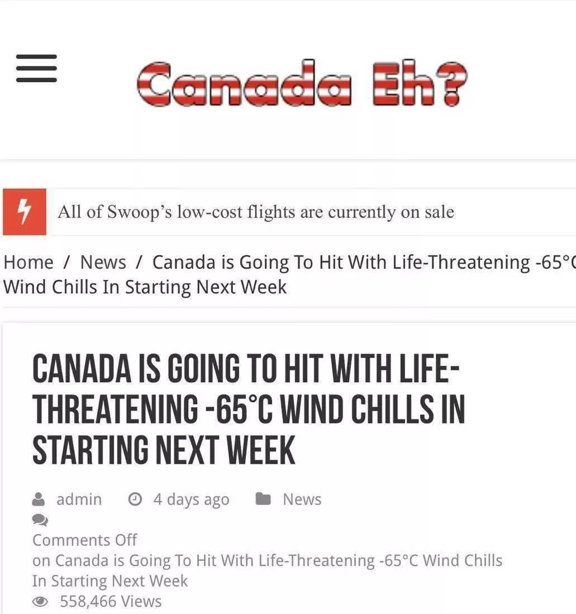 (原始链接: https://mmbiz.qpic.cn/mmbiz_jpg/ydG8L0teC7FlDU3UwlcUmvSw1dF0Qxr5NAzicuU1yA0VWHAibecmotKickfwmqLSO1779OXEFwEbzq4dzib9sruVkA/640?wx_fmt=jpeg)
- 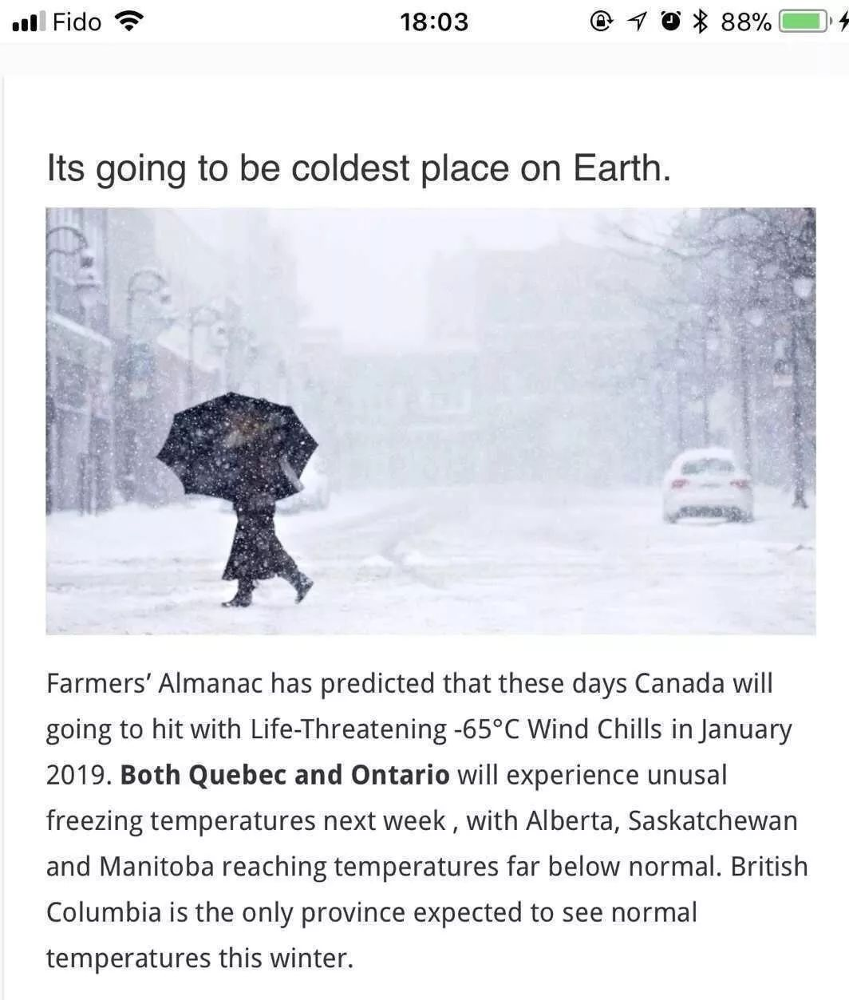 (原始链接: https://mmbiz.qpic.cn/mmbiz_jpg/ydG8L0teC7FlDU3UwlcUmvSw1dF0Qxr5TcpyFMgUzsDat2un5A5ia0OS0AGTUwAG4q8TyXVmyPwETqwdicHHvQXQ/640?wx_fmt=jpeg)
- 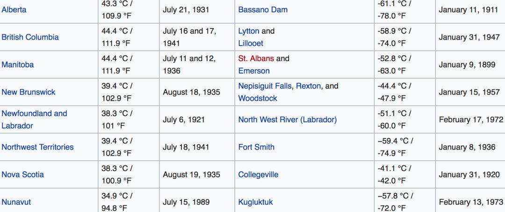 (原始链接: https://mmbiz.qpic.cn/mmbiz_png/ydG8L0teC7FlDU3UwlcUmvSw1dF0Qxr5e8g4h73zia46S8FSIGfRWTibgkfZia2ybrGPHdOD1ZxFSnEib6026iccLicA/640?wx_fmt=png)
- 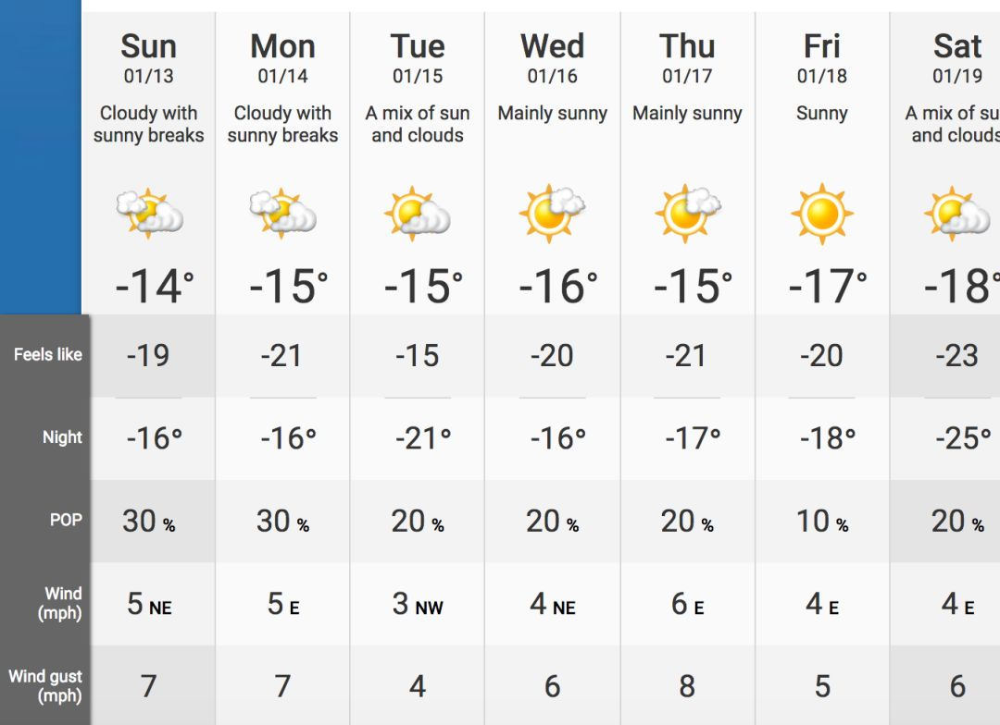 (原始链接: https://mmbiz.qpic.cn/mmbiz_png/ydG8L0teC7FlDU3UwlcUmvSw1dF0Qxr5dibzPoXJ8n5iblib7R8kuTfoxuR9libCjsBwNHWib5Kr6cT39P1sx0ticBxQ/640?wx_fmt=png)
-  (原始链接: https://mmbiz.qpic.cn/mmbiz_png/mZIpZ2dRo6Z38HrZuibibW3jb6YUt52ISTYOIJYibHicLiabcBXSzsHytu3sjDIFbm27RvZibSjOkOsQFOob45duZ62w/640?wx_fmt=png)
- 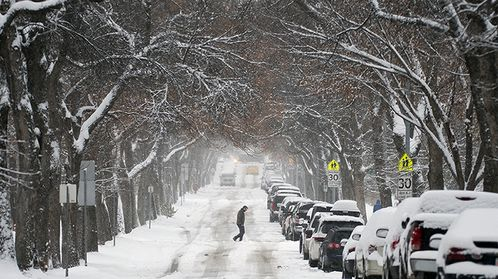 (原始链接: https://mmbiz.qpic.cn/mmbiz_png/mZIpZ2dRo6Z38HrZuibibW3jb6YUt52ISTOicINURgDf2ms69HntV5Wh78icOUlLLJzrqHy8r4X2NHQxL1bFSrKwqQ/640?wx_fmt=png)
- 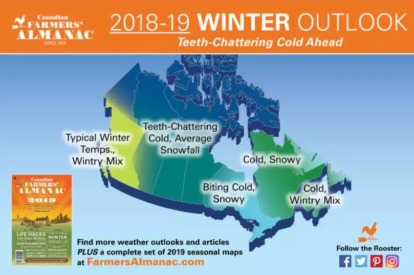 (原始链接: https://mmbiz.qpic.cn/mmbiz_png/mZIpZ2dRo6aNHPUe73YGUx5Rbia4A5oZUh6C36NwW4CZAalIMsZiamhXI67178bicxpYiaYrvY7MkBlJRvNFiaUBqjA/640?wx_fmt=png)
- 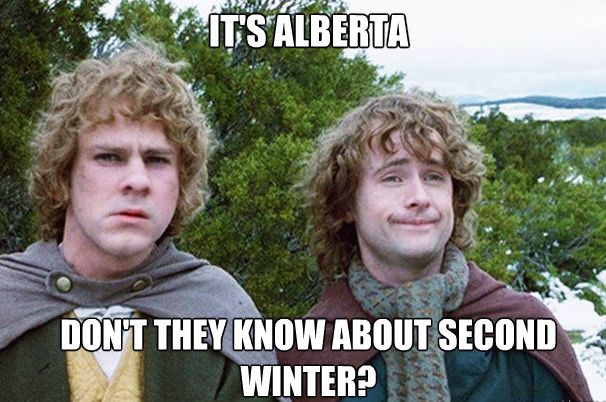 (原始链接: https://mmbiz.qpic.cn/mmbiz_png/mZIpZ2dRo6Z38HrZuibibW3jb6YUt52ISTh42I5Y9hpkKbY9lB0Sib6AY3IUlU93sEg23sqEzgP2fQRBuqeRvhwgQ/640?wx_fmt=png)
-  (原始链接: https://mmbiz.qpic.cn/mmbiz_png/mZIpZ2dRo6aNHPUe73YGUx5Rbia4A5oZUek3AkmuueszFLYWMJMajzCWV4RsliaCjnLUZoAxLOkM101CAnFxYSzQ/640?wx_fmt=png)
-  (原始链接: https://mmbiz.qpic.cn/mmbiz_png/mZIpZ2dRo6aNHPUe73YGUx5Rbia4A5oZU5nSaTib3Fviaic5v31PCYLFreNnznibNccNFwzFhnObiaEqHu2ibs4oU4OJw/640?wx_fmt=png)
- 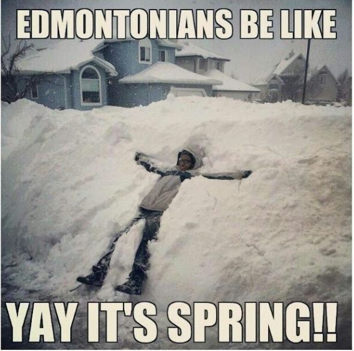 (原始链接: https://mmbiz.qpic.cn/mmbiz_png/mZIpZ2dRo6Z38HrZuibibW3jb6YUt52ISTeZQ56bVHmq5wDHqlh4agCfiaNC7AKXwtJgYkJic6DzMmEwRcHIKHpBjQ/640?wx_fmt=png)
- 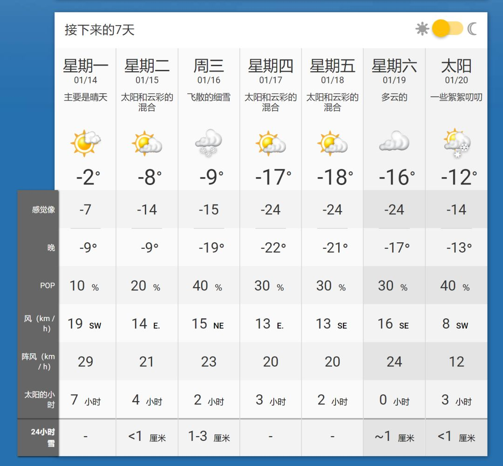 (原始链接: https://mmbiz.qpic.cn/mmbiz_png/D1nJqnhkPyIEKNjILjuvE0qZsMFbPGxAXibVNrvV1bLa8TREggRNGT4iaicne6sW5kwAtqjsXPto4PqGxAiaCLE4rw/640?wx_fmt=png)
-  (原始链接: https://mmbiz.qpic.cn/mmbiz_jpg/D1nJqnhkPyIEKNjILjuvE0qZsMFbPGxAjPV898qWNYFIgTl8cUywA99VQ7Ps26fHI4XziaImAZGGfBAxRkNVmqQ/640?wx_fmt=jpeg)
- 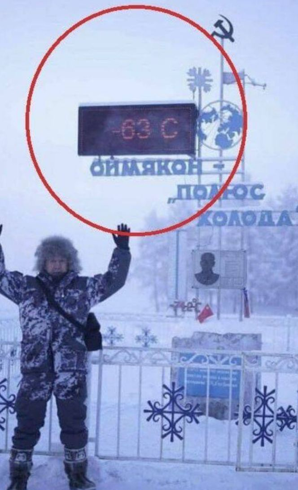 (原始链接: https://mmbiz.qpic.cn/mmbiz_png/ydG8L0teC7FlDU3UwlcUmvSw1dF0Qxr5ZllIKmFB7dylial4yPh7KicrXwkFpnosAv0p8HXg7JlJGeP2J92DAFvA/640?wx_fmt=png)
- 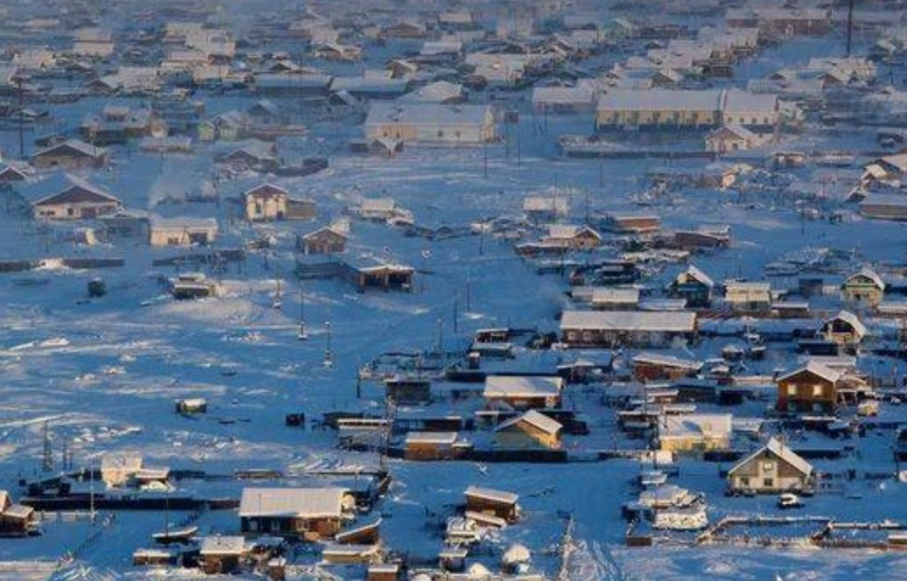 (原始链接: https://mmbiz.qpic.cn/mmbiz_png/ydG8L0teC7FlDU3UwlcUmvSw1dF0Qxr5yJBer0icH96DBwMrjowA2EGt36auaPicB0Z3nzRwGjGic4GjNHFQMg8PQ/640?wx_fmt=png)
- 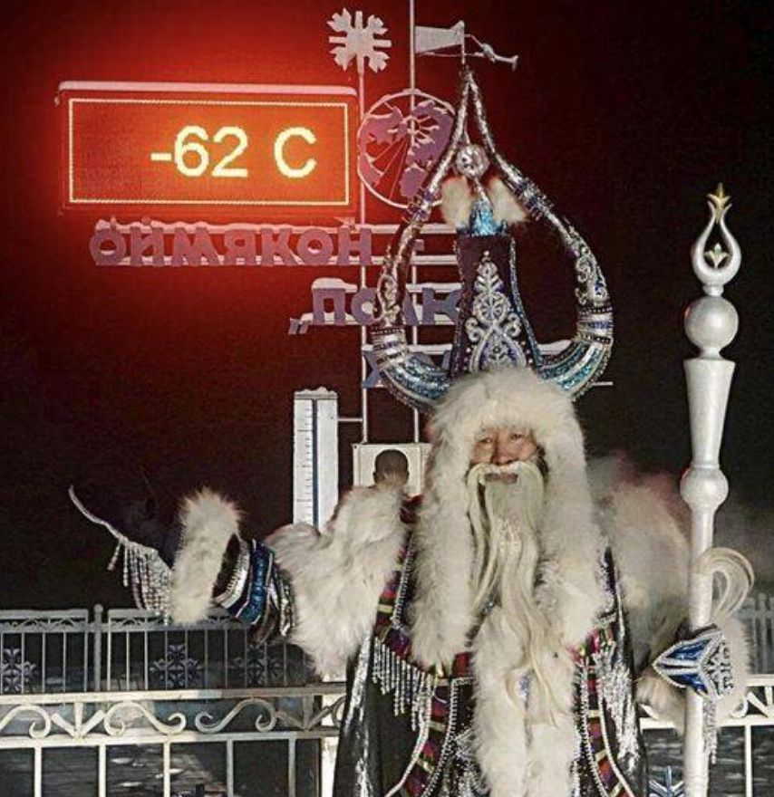 (原始链接: https://mmbiz.qpic.cn/mmbiz_png/ydG8L0teC7FlDU3UwlcUmvSw1dF0Qxr5IFAib8hicIHhZRpWj05CFia22iagKptfhI9M5N9bNodNEShiazf0icCoEjKw/640?wx_fmt=png)
-  (原始链接: https://mmbiz.qpic.cn/mmbiz_jpg/ydG8L0teC7FlDU3UwlcUmvSw1dF0Qxr5Zhib9HP5fVjt1SQWuPbXAZQzXmicJaFovgIkdq55ZMIVDvFZVfVSKD0w/640?wx_fmt=jpeg)
- 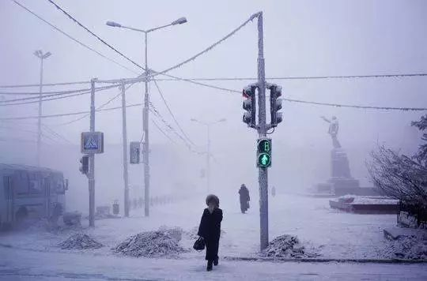 (原始链接: https://mmbiz.qpic.cn/mmbiz_jpg/ydG8L0teC7FlDU3UwlcUmvSw1dF0Qxr5YyGBiaibQ22tiasXZE4JPe5oEk9LDBllThM3FW427V1dhFzpuBvyxoiaPg/640?wx_fmt=jpeg)
-  (原始链接: https://mmbiz.qpic.cn/mmbiz_jpg/ydG8L0teC7FlDU3UwlcUmvSw1dF0Qxr5CuHFsRZmPDKWbJP0WwhgGgmP6NRdDXyQiaUOyd1hwDdu4hbe90SEsNA/640?wx_fmt=jpeg)
-  (原始链接: https://mmbiz.qpic.cn/mmbiz_jpg/ydG8L0teC7FlDU3UwlcUmvSw1dF0Qxr5W0iataiaYbL6wuH9yTH6uQhWaMrnwDmqQ8qnRicEvicdib38rdYF6xRruIQ/640?wx_fmt=jpeg)
-  (原始链接: https://mmbiz.qpic.cn/mmbiz_jpg/D1nJqnhkPyIEKNjILjuvE0qZsMFbPGxAVuPiasAibrJOzBEpvXzB6mZYia2ibQnxva49JfGftAkS4ibsS2rtl7sZb1w/640?wx_fmt=jpeg)
-  (原始链接: https://mmbiz.qpic.cn/mmbiz_jpg/D1nJqnhkPyIEKNjILjuvE0qZsMFbPGxAdBOBSLoSywUa7sQyMXQlW5GNUG0a2rMppalsMdYnbpCEngxKBq5WQQ/640?wx_fmt=jpeg)
