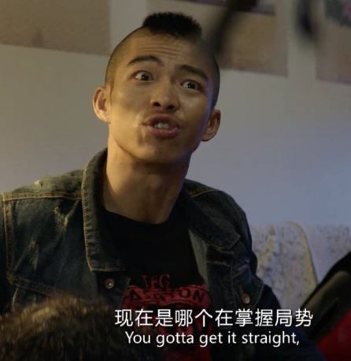
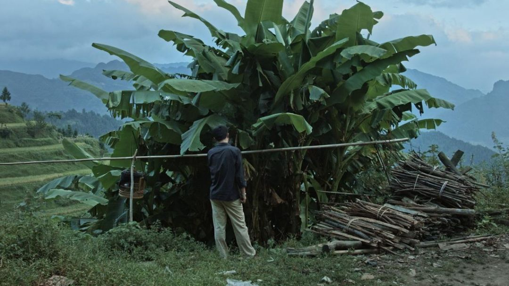

# 无标题

**链接地址:** http://mp.weixin.qq.com/s?__biz=MjM5NDA5NDcyMA==&mid=2651712280&idx=1&sn=1b46af01c77bf53a3c54c4bd02d6464a&chksm=bd7440f78a03c9e1194c45d652bed9cdf0951ca2fd52cc8e4d48ea4af32f8799a85ea4d3af2b&mpshare=1&scene=2&srcid=0118sA93s8MfRtAgCk0ItIYx#rd
**作者:** 陈香香
**获取时间:** 2025/8/28 20:50:16
**图片数量:** 28

---

## 原始HTML内容

 

贵州火了，火的很突然。

 

没有人能抗拒的了那句“<strong style="font-size: 15px;letter-spacing: 1px;color: rgb(171, 25, 66);">好嗨哟</strong>”的魔力，看着“毛毛姐”戴着橙色假发魔性扭动，便被他支离破碎的贵州普通话，和狂放不羁的忘情甩头洗了脑。

 

并把那句——感觉人生已经到达了高潮，感觉人生已经到达了巅峰——灵活用在了吃完火锅、考完期末考试、周五下班去打卡等任何一个需要表达极度兴奋之情的场合。

 

 

如果说千万级网红“毛毛姐”的走红还是个例，那么过去的2018绝对称得上是贵州电影元年。

 

从《无名之辈》的黑色荒谬，到《四个春天》的温暖柔软，就算你在跨年场的《地球最后的夜晚》睡得香甜，一定也忘不了那青山绿水和贵州话里鲜明的西南风情。

 

野火燎原之势就像来自贵州小城的章宇，这个此前没人听过名字的演员突然出现在无数高分电影里，然后成了全中国最色气的男人（误）。

 

 

<strong>就这样，贵州一夜之间火了，像当地的折耳根一样窜进全国人民的脑子。</strong>

 

按说中国这么大，每隔段时间就会产生一个网红城市，用“风水轮流转”的理论轮到谁也不意外。 

 

但看到家乡突然就成了文化事业的排头兵，还是在激动之余带着一丝不敢相信。毕竟在这之前，贵州可是牢牢占据<strong>“中国最没存在感省份”</strong>top3的宝座很多年。

 

 

在搜索引擎里输入“贵州”二字，发现外地人提出的问题那叫一个千奇百怪，群众对它的无知程度能让中学地理老师气到鼻子冒烟—— 

 

“贵州是哪个省的城市啊？和苏州扬州柳州是邻居吗？”

 

 

留给外地人最深的刻板印象，那大概就是……<strong>穷</strong>了。

 

在历史上，偏远的贵州就属于远儒文化区，《琅琊榜》里谢玉被发配到那里，还要强调一句“黔地苦寒”。

 

 

作为中国唯二不靠海、不沿边、又没有长江黄河经过的省级行政单位（另一个是北京），地处高原、土地石漠化的贵州早早地就被盖上了经济老大难的标签。

 

偏远就算了，交通还十分闭塞。就像《无名之辈》里那句：<strong>“你说为啥子会有桥？”</strong>，<strong>“因为路走到头了”</strong>。贵州的路一半桥梁，一半是隧道，可以说是全国交通条件最困难的地区之一。

 

早些年，倒是常常出现在各种社会新闻里，不过大多都是留守儿童、重男轻女、恶性群体事件相关——

 

 

虽然2018年贵州的人均GDP增速已经高居全国第一，但这种“不了解”还是让很多贵州人无辜躺枪，被贴上<strong>“能生、好赌、野蛮不讲理”</strong>的标签。 

 

 

 

久而久之，连贵州人自己都无奈自嘲道——

 

<strong>“每个贵州人都有三个杀人名额，还有八个生育指标。<strong style="color: rgb(171, 25, 66);font-size: 15px;letter-spacing: 1px;text-align: left;white-space: normal;">”</strong></strong>

<strong> </strong>

<strong>“要不要我做道酸汤鱼，然后叫你养蛊啊？<strong style="color: rgb(171, 25, 66);font-size: 15px;letter-spacing: 1px;text-align: left;white-space: normal;">”</strong></strong>

 

 

有得必有失，虽然各种刻板印象让当地人哭笑不得，可万万没想到的是——

<strong style="font-size: 16px;"> </strong>

<strong style="font-size: 16px;">这种神秘感，却让贵州“因祸得福”地成了文艺青年的精神富矿。</strong>

 

自从《路边野餐》带火了小城凯里，风景秀美的贵州就成了电影界最钟爱的地方。

 

 

亚热带的潮湿娇媚把暧昧又诗意的气氛推到极致，片子里随手一截屏截屏都可以当壁纸。

 

 

民谣圈知名度最高的女歌手<strong>陈粒</strong>，麻油叶里评价最高的<strong>尧十三</strong>，也都是贵州人。

 

 

虽然是文艺圣地，但来自贵州的文艺却不像传统定义里那样“小清新”。

 

被《无名之辈》带火的那首<strong>《瞎子》</strong>，尧十三用朴实到土里、混杂着脏字的方言，把柳永的一首雨霖铃翻译成了贵州话。 

 

<qqmusic class="res_iframe qqmusic_iframe js_editor_qqmusic place_music_area" scrolling="no" frameborder="0" musicid="4800608" mid="003oaMiG4WJHnN" albumurl="https://y.gtimg.cn/music/photo_new/T002R68x68M000001ZaCQY2OxVMg.jpg" audiourl="http://isure.stream.qqmusic.qq.com/C200003oaMiG4WJHnN.m4a?guid=2000001731&amp;vkey=841EAB14820E977966AEC8DF51BFBBCB31B377A0FC1D06A68ABA325FD1191278B6DB9476525F59FA809BDFAAFE64A69674ADE2F31FAE53F0&amp;uin=&amp;fromtag=50" music_name="瞎子" singer="尧十三&nbsp;-&nbsp;空" play_length="294" src="/cgi-bin/readtemplate?t=tmpl/qqmusic_tmpl&amp;singer=%E5%B0%A7%E5%8D%81%E4%B8%89%20-%20%E7%A9%BA&amp;music_name=%E7%9E%8E%E5%AD%90&amp;albumurl=https%3A%2F%2Fy.gtimg.cn%2Fmusic%2Fphoto_new%2FT002R68x68M000001ZaCQY2OxVMg.jpg&amp;musictype=1" musictype="1" otherid="003oaMiG4WJHnN" albumid="001ZaCQY2OxVMg" jumpurlkey=""></qqmusic> 

 

用周云蓬的话说，这简直是不亚于原文的经典翻译，让你恍惚间感觉<strong>柳永就是一个吃酸汤鱼的贵州老表</strong>。

 

用低俗写着真挚，用戏谑唱着伤感。阳春白雪的惆怅，立刻转换成了下里巴人的悲伤共鸣——

 
<blockquote>
寒蝉凄切，对长亭晚，骤雨初歇。

秋天的蝉在叫，我在亭子边，刚刚下过雨。

 

都门帐饮无绪，方留恋处，兰舟催发。

我难在们我喝不倒酒，我扎实嘞舍不得，斗是们船家喊快点走。

 

执手相看泪眼，竟无语凝噎。

我拉起你嘞手看你眼泪淌出来，我ri拉坟我讲不出话来，我难在们我讲不出话来，我要遭走喽……
</blockquote>
 

耳朵被灌多了矫揉做作的拿腔作调，这种粗粝反而是最打动人的。听尧十三唱着和繁华丝毫不搭边的家乡，观众就不由得就和这些“无名之辈”一起痛哭。

 

<strong>看，贵州就是这样一个矛盾而神奇的地方——</strong>

<strong><strong style="font-size: 16px;letter-spacing: 1px;text-align: left;white-space: normal;"> </strong></strong>

<strong><strong style="font-size: 16px;letter-spacing: 1px;text-align: left;white-space: normal;">越是文艺到极致，越是野得生猛。</strong></strong>

 

你刚刚跟着毕赣的镜头进入潮湿暧昧的梦境，突然一只大手就把你拽回了最底层的世界。这种矛盾，让文艺片里任何荒诞的故事在贵州都显得尤为合理。

 

 

生猛是深入他们骨子里的，就像贵州的几位代表名人：章宇的底层脸，宁静的暴脾气和邹市明的拳头，哪个不是够野、够悍。

 

再比如《四个春天》里那句“要在坟边种好辣椒，提防会来吃草的牛”可不是瞎说，<strong>贵州人对辣椒的钟爱是深入骨髓的</strong>，孕育了“国民女神”老干妈。

 

 

和隔壁川渝的辣还不一样，贵州人在辣的基础上还追求<strong>更刺激的酸</strong>。

 

和“三天不吃酸，走路打捞蹿（lào cuān）”的贵州人吃饭一定要做好掉三颗牙的准备，毕竟给嗜酸的他们一锅酸汤，就能泡进全世界。

 

 

对外地人而言，对舌头极致考验的酸刚入嘴都是很难接受的，可多吃两口就会被它迷倒，然后胃口大开不能自拔。最后喝一碗清爽回甘的酸汤，浑身都舒畅起来。

 

这种生猛风情的侵略性，还体现在<strong>贵州方言</strong>上。

 

当发自土味、又超脱于土味的毛毛姐，大声唱着“好嗨哟”，给观众做着“xuan红”的口红试色，一开始很多人还接受不了如此鬼畜的表达方式——

 

 

可因为西南官话属于北方语系，普通话受众听得懂、不规范的发音又自带喜感，是极容易成为网红语言的。

 

于是，听着听着全国人民就都被蜜汁贵州调调洗了一次脑，忍不住想模仿。

 

 

而但凡看过《无名之辈》的观众，一定都感受过任素汐用贵州话骂人的泼辣——

 

 

当时很多观众都以为演员说的是川普，可虽然有很多相似之处，比如四川话里最出名的那句脏话贵州人也常说。 

 

但没那么多儿化音和萌系表达的贵州话，听起来可比四川话凶多了。如果说四川人骂人都在撒娇，连撕X都要“日你仙人板板”。

 

那么，贵州人骂人……就真的是在骂人，让你忍不住想和他对骂的那种——

 

老子整把AK，给你弄把莱福。

 

裤裆里拉二胡，扯卵弹。

 

结婚，结尼玛脑壳昏；爱情，爱你妈卖麻花情。

 

 

<strong>有人开玩笑说，贵州话可能是世界上最不适合谈恋爱的方言了。</strong>

 

这话不假，就比如小情侣吵架，姑娘娇滴滴地口是心非一句“你不用解释了，我不想听”。到了正在耍朋友的贵州妹子嘴里，就成了调高了八度的大吼：<strong style="text-align: justify;">“你表跟老子皮皮翻翻勒，死远点。”</strong>

 

更别提偶尔调情一下，男生刮一下姑娘的鼻头说声“小笨蛋”，换贵州话就成了<strong>“你个憨皮”</strong>，浪漫的气氛全没了。 

 

 

可正是因为没那么多粉红泡泡吧，这种“打是亲、骂是爱”的爱意流淌反而更接地气。

 

导演饶晓志在谈及为什么要用贵州话拍《无名之辈》时，曾说过的一句话：“<strong>最市井的人，就要用最市井的腔调</strong>，那种小人物的平凡和辛酸也能更恰当地流淌出来。”

 

这或许正是贵州火起来的原因。

<strong> </strong>

<strong>因为闭塞，被无视、忽略、误解了那么多年，直到来自贵州最平凡的声音在这道屏障上撕开了一个口子。</strong>

 

从这个口子里，人们看到深入这片土地的文艺之魂，正在每一寸泥土里，潜滋暗长；也看到贵州人的性格，带着最粗粝生猛的气质吸引着所有人的注意力。

 

最后，祝网红贵州做大做强，再创辉煌。

 

 

· END ·

如果喜欢这篇文章

欢迎点击底部右下角的“好看”

 

<strong style="max-width: 100%;line-height: 25.6px;color: rgb(136, 136, 136);box-sizing: border-box !important;word-wrap: break-word !important;">点击图片 查看更多精彩文章</strong>

 

<a href="http://mp.weixin.qq.com/s?__biz=MjM5NDA5NDcyMA==&amp;mid=2651712171&amp;idx=1&amp;sn=cf3c59d37e9480b151fa3ea781af1a37&amp;chksm=bd7441448a03c85292314b5b48c98a84013cba4928a44381c046e8b4dfc7340544a537a1189e&amp;scene=21#wechat_redirect" target="_blank" data-linktype="1" style="color: rgb(87, 107, 149);-webkit-tap-highlight-color: rgba(0, 0, 0, 0);max-width: 100%;box-sizing: border-box !important;word-wrap: break-word !important;"></a>

<a href="http://mp.weixin.qq.com/s?__biz=MjM5NDA5NDcyMA==&amp;mid=2651712069&amp;idx=1&amp;sn=e157b590c39896cc30c1b9d3ea2dfff0&amp;chksm=bd7441aa8a03c8bc2f337c4b11d491c6fc7269a4e883b73c24504f4cabe37456abd4111b8b82&amp;scene=21#wechat_redirect" target="_blank" data-linktype="1" style="color: rgb(87, 107, 149);-webkit-tap-highlight-color: rgba(0, 0, 0, 0);max-width: 100%;box-sizing: border-box !important;word-wrap: break-word !important;"></a>

<a href="http://mp.weixin.qq.com/s?__biz=MjM5NDA5NDcyMA==&amp;mid=2651711907&amp;idx=1&amp;sn=dc38f1141a1ada2b477ac420fb960027&amp;chksm=bd74424c8a03cb5a239bb8117349b31b4fac13002b4c582a0867bf7de9abb96b4db383528348&amp;scene=21#wechat_redirect" target="_blank" data-linktype="1" style="color: rgb(87, 107, 149);-webkit-tap-highlight-color: rgba(0, 0, 0, 0);max-width: 100%;box-sizing: border-box !important;word-wrap: break-word !important;"></a>

---

## 纯文本内容

贵州火了，火的很突然。没有人能抗拒的了那句“好嗨哟”的魔力，看着“毛毛姐”戴着橙色假发魔性扭动，便被他支离破碎的贵州普通话，和狂放不羁的忘情甩头洗了脑。并把那句——感觉人生已经到达了高潮，感觉人生已经到达了巅峰——灵活用在了吃完火锅、考完期末考试、周五下班去打卡等任何一个需要表达极度兴奋之情的场合。如果说千万级网红“毛毛姐”的走红还是个例，那么过去的2018绝对称得上是贵州电影元年。从《无名之辈》的黑色荒谬，到《四个春天》的温暖柔软，就算你在跨年场的《地球最后的夜晚》睡得香甜，一定也忘不了那青山绿水和贵州话里鲜明的西南风情。野火燎原之势就像来自贵州小城的章宇，这个此前没人听过名字的演员突然出现在无数高分电影里，然后成了全中国最色气的男人（误）。就这样，贵州一夜之间火了，像当地的折耳根一样窜进全国人民的脑子。按说中国这么大，每隔段时间就会产生一个网红城市，用“风水轮流转”的理论轮到谁也不意外。但看到家乡突然就成了文化事业的排头兵，还是在激动之余带着一丝不敢相信。毕竟在这之前，贵州可是牢牢占据“中国最没存在感省份”top3的宝座很多年。在搜索引擎里输入“贵州”二字，发现外地人提出的问题那叫一个千奇百怪，群众对它的无知程度能让中学地理老师气到鼻子冒烟——“贵州是哪个省的城市啊？和苏州扬州柳州是邻居吗？”留给外地人最深的刻板印象，那大概就是……穷了。在历史上，偏远的贵州就属于远儒文化区，《琅琊榜》里谢玉被发配到那里，还要强调一句“黔地苦寒”。作为中国唯二不靠海、不沿边、又没有长江黄河经过的省级行政单位（另一个是北京），地处高原、土地石漠化的贵州早早地就被盖上了经济老大难的标签。偏远就算了，交通还十分闭塞。就像《无名之辈》里那句：“你说为啥子会有桥？”，“因为路走到头了”。贵州的路一半桥梁，一半是隧道，可以说是全国交通条件最困难的地区之一。早些年，倒是常常出现在各种社会新闻里，不过大多都是留守儿童、重男轻女、恶性群体事件相关——虽然2018年贵州的人均GDP增速已经高居全国第一，但这种“不了解”还是让很多贵州人无辜躺枪，被贴上“能生、好赌、野蛮不讲理”的标签。久而久之，连贵州人自己都无奈自嘲道——“每个贵州人都有三个杀人名额，还有八个生育指标。”“要不要我做道酸汤鱼，然后叫你养蛊啊？”有得必有失，虽然各种刻板印象让当地人哭笑不得，可万万没想到的是——这种神秘感，却让贵州“因祸得福”地成了文艺青年的精神富矿。自从《路边野餐》带火了小城凯里，风景秀美的贵州就成了电影界最钟爱的地方。亚热带的潮湿娇媚把暧昧又诗意的气氛推到极致，片子里随手一截屏截屏都可以当壁纸。民谣圈知名度最高的女歌手陈粒，麻油叶里评价最高的尧十三，也都是贵州人。虽然是文艺圣地，但来自贵州的文艺却不像传统定义里那样“小清新”。被《无名之辈》带火的那首《瞎子》，尧十三用朴实到土里、混杂着脏字的方言，把柳永的一首雨霖铃翻译成了贵州话。用周云蓬的话说，这简直是不亚于原文的经典翻译，让你恍惚间感觉柳永就是一个吃酸汤鱼的贵州老表。用低俗写着真挚，用戏谑唱着伤感。阳春白雪的惆怅，立刻转换成了下里巴人的悲伤共鸣——寒蝉凄切，对长亭晚，骤雨初歇。秋天的蝉在叫，我在亭子边，刚刚下过雨。都门帐饮无绪，方留恋处，兰舟催发。我难在们我喝不倒酒，我扎实嘞舍不得，斗是们船家喊快点走。执手相看泪眼，竟无语凝噎。我拉起你嘞手看你眼泪淌出来，我ri拉坟我讲不出话来，我难在们我讲不出话来，我要遭走喽……耳朵被灌多了矫揉做作的拿腔作调，这种粗粝反而是最打动人的。听尧十三唱着和繁华丝毫不搭边的家乡，观众就不由得就和这些“无名之辈”一起痛哭。看，贵州就是这样一个矛盾而神奇的地方——越是文艺到极致，越是野得生猛。你刚刚跟着毕赣的镜头进入潮湿暧昧的梦境，突然一只大手就把你拽回了最底层的世界。这种矛盾，让文艺片里任何荒诞的故事在贵州都显得尤为合理。生猛是深入他们骨子里的，就像贵州的几位代表名人：章宇的底层脸，宁静的暴脾气和邹市明的拳头，哪个不是够野、够悍。再比如《四个春天》里那句“要在坟边种好辣椒，提防会来吃草的牛”可不是瞎说，贵州人对辣椒的钟爱是深入骨髓的，孕育了“国民女神”老干妈。和隔壁川渝的辣还不一样，贵州人在辣的基础上还追求更刺激的酸。和“三天不吃酸，走路打捞蹿（lào cuān）”的贵州人吃饭一定要做好掉三颗牙的准备，毕竟给嗜酸的他们一锅酸汤，就能泡进全世界。对外地人而言，对舌头极致考验的酸刚入嘴都是很难接受的，可多吃两口就会被它迷倒，然后胃口大开不能自拔。最后喝一碗清爽回甘的酸汤，浑身都舒畅起来。这种生猛风情的侵略性，还体现在贵州方言上。当发自土味、又超脱于土味的毛毛姐，大声唱着“好嗨哟”，给观众做着“xuan红”的口红试色，一开始很多人还接受不了如此鬼畜的表达方式——可因为西南官话属于北方语系，普通话受众听得懂、不规范的发音又自带喜感，是极容易成为网红语言的。于是，听着听着全国人民就都被蜜汁贵州调调洗了一次脑，忍不住想模仿。而但凡看过《无名之辈》的观众，一定都感受过任素汐用贵州话骂人的泼辣——当时很多观众都以为演员说的是川普，可虽然有很多相似之处，比如四川话里最出名的那句脏话贵州人也常说。但没那么多儿化音和萌系表达的贵州话，听起来可比四川话凶多了。如果说四川人骂人都在撒娇，连撕X都要“日你仙人板板”。那么，贵州人骂人……就真的是在骂人，让你忍不住想和他对骂的那种——老子整把AK，给你弄把莱福。裤裆里拉二胡，扯卵弹。结婚，结尼玛脑壳昏；爱情，爱你妈卖麻花情。有人开玩笑说，贵州话可能是世界上最不适合谈恋爱的方言了。这话不假，就比如小情侣吵架，姑娘娇滴滴地口是心非一句“你不用解释了，我不想听”。到了正在耍朋友的贵州妹子嘴里，就成了调高了八度的大吼：“你表跟老子皮皮翻翻勒，死远点。”更别提偶尔调情一下，男生刮一下姑娘的鼻头说声“小笨蛋”，换贵州话就成了“你个憨皮”，浪漫的气氛全没了。可正是因为没那么多粉红泡泡吧，这种“打是亲、骂是爱”的爱意流淌反而更接地气。导演饶晓志在谈及为什么要用贵州话拍《无名之辈》时，曾说过的一句话：“最市井的人，就要用最市井的腔调，那种小人物的平凡和辛酸也能更恰当地流淌出来。”这或许正是贵州火起来的原因。因为闭塞，被无视、忽略、误解了那么多年，直到来自贵州最平凡的声音在这道屏障上撕开了一个口子。从这个口子里，人们看到深入这片土地的文艺之魂，正在每一寸泥土里，潜滋暗长；也看到贵州人的性格，带着最粗粝生猛的气质吸引着所有人的注意力。最后，祝网红贵州做大做强，再创辉煌。· END ·如果喜欢这篇文章欢迎点击底部右下角的“好看”点击图片 查看更多精彩文章

---

## 图片列表

-  (原始链接: https://mmbiz.qpic.cn/mmbiz_gif/8S67SzX3z3BHFYqQvoSSLyXR3RVN3CNar0bxdconWWcSDgscyasBw2PtFdhg0MEXlyzfXjGnTsbT0JQmTaMSicQ/640?wx_fmt=gif)
-  (原始链接: https://mmbiz.qpic.cn/mmbiz_gif/8S67SzX3z3A5oOxtPic2OCWIhosyw6xPFmdKZLjkI1ia2aYLyP5g7EdfKKQ0tDjIJxSE8upGjKTZ2TW9GIphMO0A/640?wx_fmt=gif)
-  (原始链接: https://mmbiz.qpic.cn/mmbiz_png/8S67SzX3z3A5oOxtPic2OCWIhosyw6xPFg5YZDlMjw6B5NhGZk1m7q0QoNjQiaicBpe4I7jvIIhXYDZrd42R6F9sw/640?wx_fmt=png)
-  (原始链接: https://mmbiz.qpic.cn/mmbiz_jpg/8S67SzX3z3A5oOxtPic2OCWIhosyw6xPFiap0TyWkeG1ovSCcxvOvpFuicay6weuwD2L6ZNcU3HjtvViby4SicDriaFQ/640?wx_fmt=jpeg)
-  (原始链接: https://mmbiz.qpic.cn/mmbiz_png/8S67SzX3z3A5oOxtPic2OCWIhosyw6xPFW7pibHqLI6RKC8h1Jjx2ADwTIkEuLlYInZr4ibD144oGib8B5BaQNeicXA/640?wx_fmt=png)
-  (原始链接: https://mmbiz.qpic.cn/mmbiz_jpg/8S67SzX3z3A5oOxtPic2OCWIhosyw6xPFWwLNfjP2nP1KPDleU1FLTAekovFD2hRYsgpeOWeze8AicK5ENlPlr6A/640?wx_fmt=jpeg)
-  (原始链接: https://mmbiz.qpic.cn/mmbiz_png/8S67SzX3z3A5oOxtPic2OCWIhosyw6xPFOmjMnz0UNUtr60iaDQ7DicZmmXNANBhDeuXZ9BJAqpVqrsFOojhKE0oQ/640?wx_fmt=png)
-  (原始链接: https://mmbiz.qpic.cn/mmbiz_png/8S67SzX3z3A5oOxtPic2OCWIhosyw6xPFeSar0Y78obAftKxOzaUjQIiarwK6kQBIgJklDEHPNWSb3jtM1wNOChQ/640?wx_fmt=png)
-  (原始链接: https://mmbiz.qpic.cn/mmbiz_png/8S67SzX3z3A5oOxtPic2OCWIhosyw6xPF9droU32At8SlZMNaNnV3mbVKJicZ5wdz12NsZDMmHkqvAf4MuA6Jlag/640?wx_fmt=png)
-  (原始链接: https://mmbiz.qpic.cn/mmbiz_jpg/8S67SzX3z3A5oOxtPic2OCWIhosyw6xPF4VIiauqqryJC561UQodygbg3Uug8QJw8AWiabIIJGjesyzABYS5icSkGw/640?wx_fmt=jpeg)
-  (原始链接: https://mmbiz.qpic.cn/mmbiz_png/8S67SzX3z3A5oOxtPic2OCWIhosyw6xPFKLsoatcIubMTMguV8ZicyFNib6ZxaMNHEOx6N1EMAFr9icm6PmtDJnDLw/640?wx_fmt=png)
-  (原始链接: https://mmbiz.qpic.cn/mmbiz_png/8S67SzX3z3A5oOxtPic2OCWIhosyw6xPFZZkF16v6QcJB3icAiaKSGtwBNphdMp23uNGAViajEgxobpazFDcUdUfCQ/640?wx_fmt=png)
-  (原始链接: https://mmbiz.qpic.cn/mmbiz_png/8S67SzX3z3A5oOxtPic2OCWIhosyw6xPFh5MdQADxD5VKcgFfSNhBiaLKYzlOxO7MEuaeKia5hkq9lON7NEK17EcA/640?wx_fmt=png)
-  (原始链接: https://mmbiz.qpic.cn/mmbiz_jpg/8S67SzX3z3A5oOxtPic2OCWIhosyw6xPF7TbCVmuxibuZYodJ5BX7zlp8kNg1QeHnQDYZ0xeib8T9yA8PribpiaM5ibg/640?wx_fmt=jpeg)
-  (原始链接: https://mmbiz.qpic.cn/mmbiz_jpg/8S67SzX3z3A5oOxtPic2OCWIhosyw6xPFia9YCXtooCB078TBiczVLVTXPIQt3pBia3AS18vDYatU1zWMGpic176XsA/640?wx_fmt=jpeg)
-  (原始链接: https://mmbiz.qpic.cn/mmbiz_jpg/8S67SzX3z3A5oOxtPic2OCWIhosyw6xPFqFv4TyD3SfvvOqTzicW62cibmgQrEuQm1Kon6w6ROicaH1fFNQy1TqDibg/640?wx_fmt=jpeg)
-  (原始链接: https://mmbiz.qpic.cn/mmbiz_png/8S67SzX3z3A5oOxtPic2OCWIhosyw6xPF701Kv3jx1lrDvo6Jl3DB5TRDF2KkqibdLKTfMMyzBKrFZQtx6gUCv9Q/640?wx_fmt=png)
-  (原始链接: https://mmbiz.qpic.cn/mmbiz_png/8S67SzX3z3A5oOxtPic2OCWIhosyw6xPF5ojnT4hEewiaJCSK7p6kgplNBUibs2CGrNt4ZicQZkeLlvPw7z3OR4c6g/640?wx_fmt=png)
-  (原始链接: https://mmbiz.qpic.cn/mmbiz_jpg/8S67SzX3z3A5oOxtPic2OCWIhosyw6xPF4noOELXgsGBk8jVlhlPPgtTEiaYtPXI6c4tuXI6k7kusTSEiaqJbexWA/640?wx_fmt=jpeg)
-  (原始链接: https://mmbiz.qpic.cn/mmbiz_png/8S67SzX3z3A5oOxtPic2OCWIhosyw6xPFueZdZkM6fh0TLFqdanbUDJJtxAZbMdv1aMticZrTxACibqwXeGhYXOHQ/640?wx_fmt=png)
-  (原始链接: https://mmbiz.qpic.cn/mmbiz_jpg/8S67SzX3z3DaWibF9NeJicK9AGSnicDkugR9ZaTo8buuXY1yHOH5dq95DR4ibpIpfZHnuTYPXmIt7fdNpD70iaJOibiaQ/640?wx_fmt=jpeg)
-  (原始链接: https://mmbiz.qpic.cn/mmbiz_png/8S67SzX3z3A5oOxtPic2OCWIhosyw6xPFtUrfjmqfjU651GQSiaNU9K1zronVPbs1Neq4CC3RSIvicqVMS8YjdZew/640?wx_fmt=png)
-  (原始链接: https://mmbiz.qpic.cn/mmbiz_jpg/8S67SzX3z3AmEu09xGpHEwQPGY010LONXXwWXicb2pzWmJ2AbFxjxjQ83q0oiaXiaLXHtgIZEHPM7DYlCvbN9Dpqg/640?wx_fmt=jpeg)
-  (原始链接: http://mmbiz.qpic.cn/mmbiz_png/8S67SzX3z3AbAzSDVaibxvllaGfcN2jIdWD61CuouEPkDL9viaWSPlF57bXyEwsSuN9xORqqico19wpvpiaNbHxcaw/640?wx_fmt=png)
-  (原始链接: https://mmbiz.qpic.cn/mmbiz_jpg/8S67SzX3z3AmEu09xGpHEwQPGY010LONjlQfxNUOibk6G1pBiatLLVsUDZmzfc8uCbuMbPd8PtCZwW2vPIVLHiaEQ/640?wx_fmt=jpeg)
-  (原始链接: https://mmbiz.qpic.cn/mmbiz_jpg/8S67SzX3z3AmEu09xGpHEwQPGY010LONDF7nl8YAZC4MJfYZBMhme8uWTMGXrwdSibJmBsuyLF59DAcnibYk6m9Q/640?wx_fmt=jpeg)
-  (原始链接: https://mmbiz.qpic.cn/mmbiz_jpg/8S67SzX3z3A5oOxtPic2OCWIhosyw6xPFXSDh7KNIJ99erB7WAcMV8QspGTEicdevdDHRNnG3EqxcdAGDAdicjvcA/640?wx_fmt=jpeg)
-  (原始链接: https://mmbiz.qpic.cn/mmbiz_jpg/8S67SzX3z3C2Gz8XgkickjgrlbyDqZqATtyUPWOibiapxicS8Xq9ezRbsXGY5gK0pol4bEKDYj8QzHy6RkvQRcTsXQ/640?wx_fmt=jpeg)
