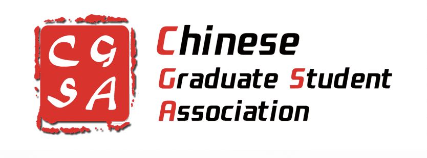
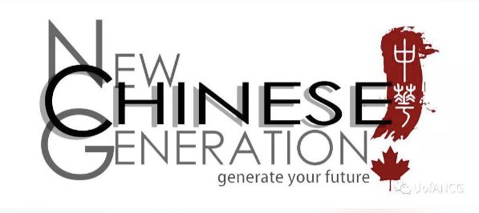

# 无标题

**链接地址:** http://mp.weixin.qq.com/s?__biz=MzIwNjY5MjA0MA==&mid=2247484191&idx=1&sn=eda452f7e51f4f967ce9a9690341e257&chksm=971c88b8a06b01ae73f01b82dbff7ccfdce36fba390bea40d66e124019f5a9d9e9c8120438d9&mpshare=1&scene=2&srcid=01198RCN8Ssb3WmHQgksfvwj#rd
**作者:** Rachel
**获取时间:** 2025/8/28 20:49:52
**图片数量:** 10

---

## 原始HTML内容

<section data-role="outer" label="Powered by 135editor.com" style="font-size:16px;font-family:微软雅黑;">
 

 

 
<section class="_135editor" data-tools="135编辑器" data-id="93231" style="border-width: 0px;border-style: none;border-color: initial;box-sizing: border-box;"><section style="width: auto;"><section style="width: 100%;" data-width="100%"><section style="background-image: url(&quot;https://mmbiz.qpic.cn/mmbiz_jpg/jlhLGrsKibyDjg5oRxmT885IbuN2t7SzYD4x93IWfJaJjSptvu7V6jxnk3Tm0ibjE1B9bUv4IJP6uYuZuZib8A2gg/640?wx_fmt=jpeg&quot;);background-size: 80% 100%;background-position: center center;color: rgb(63, 63, 63);letter-spacing: 1.5px;line-height: 1.75em;padding: 1em 0.8em;box-sizing: border-box;"><section style="margin-top: -20px;" class="135brush">
<strong>海外求职一直是令留学生们格外</strong><strong style="font-size: 15px;">头疼的问题</strong>。眼看着毕业近在眼前却还没有收到offer，内心便愈加的焦虑。

 

“哎！到底怎样才能找到适合我的工作呢？”

“我的简历为什么总是得不到青睐呢？”

“有哪些可以尽快融入加拿大社会的技巧呢？”

“面对面试官的步步紧逼，我该如何展现自己professional的一面呢？”

......
</section></section></section></section></section>
 

 

 
<section class="_135editor" data-tools="135编辑器" data-id="93231" style="border-width: 0px;border-style: none;border-color: initial;box-sizing: border-box;"><section style="width: auto;"><section style="width: 100%;" data-width="100%"><section style="background-image: url(&quot;https://mmbiz.qpic.cn/mmbiz_jpg/jlhLGrsKibyDjg5oRxmT885IbuN2t7SzYD4x93IWfJaJjSptvu7V6jxnk3Tm0ibjE1B9bUv4IJP6uYuZuZib8A2gg/640?wx_fmt=jpeg&quot;);background-size: 80% 100%;background-position: center center;font-size: 14px;color: rgb(63, 63, 63);letter-spacing: 1.5px;line-height: 1.75em;padding: 1em 0.8em;box-sizing: border-box;"><section style="margin-top:-20px;" class="135brush">
如果你正面临着这些问题，那么，<strong>恭喜你！！</strong>

 

因为，贴心的我们历时月余，精心策划了一场<strong>Professional Development&nbsp;Workshop</strong>(PD Workshop)。此次workshop邀请到了来自社会各界的<strong>资深职场大佬们</strong>，他们将与同学们一起探讨<strong>从校园向职场过渡</strong>的过程中所面临的问题，还将带来<strong>独家的职场经验分享</strong>。

 

<strong>转发文章至朋友圈并集齐20个赞，截图至公众号后台，还会获得workshop后宝贵的一对一模拟面试机会！！名额有限，先到先得！！</strong>

 

机会难得，<strong>无论是正处于本科还是研究生阶段</strong>的同学们都一定一定要抓紧啊！！

 
</section></section></section></section></section>
 
<section class="_135editor" data-tools="135编辑器" data-id="93219" style="border-width: 0px;border-style: none;border-color: initial;box-sizing: border-box;"><section style="text-align: center;width: auto;"><section style="display: inline-block;"><section style="background-image: url(&quot;https://mmbiz.qpic.cn/mmbiz_jpg/jlhLGrsKibyDjg5oRxmT885IbuN2t7SzYV6NOmAYT0NdKwEiaHNicG1mKJVgw6AqXeVyIZETwD7xicHzYeBzYAcQDg/640?wx_fmt=jpeg&quot;);background-size: 100% 100%;padding: 15px 35px;color: white;font-weight: bold;letter-spacing: 1.5px;box-sizing: border-box;"><section class="135brush" data-brushtype="text">
活动详情
</section></section></section></section></section>
 

 
<section class="_135editor" data-tools="135编辑器" data-id="93225" style="border-width: 0px;border-style: none;border-color: initial;box-sizing: border-box;"><section><section style="font-size: 14px;color: #3f3f3f;letter-spacing: 1.5px;line-height: 1.75em;padding: 1em 0.8em;text-algin:justify;transform: rotate(0deg);-webkit-transform: rotate(0deg);-moz-transform: rotate(0deg);-o-transform: rotate(0deg);" class="135brush">
&nbsp; 时间：2019年1月19日,&nbsp;

&nbsp; &nbsp; &nbsp; &nbsp; &nbsp; &nbsp;workshop: 1:30p.m~4:35p.m

&nbsp; &nbsp; &nbsp; &nbsp; &nbsp; &nbsp;模拟面试：4:45p.m~6:00p.m

&nbsp; 地点：sub 0-51

&nbsp; 报名链接：&nbsp;

 

 

 
</section><section style="display:flex;justify-content:flex-end;"></section></section></section>
 
<section class="_135editor" data-tools="135编辑器" data-id="93219" style="border-width: 0px;border-style: none;border-color: initial;box-sizing: border-box;"><section style="text-align: center;width: auto;"><section style="display: inline-block;"><section style="background-image: url(&quot;https://mmbiz.qpic.cn/mmbiz_jpg/jlhLGrsKibyDjg5oRxmT885IbuN2t7SzYV6NOmAYT0NdKwEiaHNicG1mKJVgw6AqXeVyIZETwD7xicHzYeBzYAcQDg/640?wx_fmt=jpeg&quot;);background-size: 100% 100%;padding: 15px 35px;color: white;font-weight: bold;letter-spacing: 1.5px;box-sizing: border-box;"><section class="135brush" data-brushtype="text">
部分嘉宾
</section></section></section></section></section><section class="_135editor" data-tools="135编辑器" data-id="90646" style="border-width: 0px;border-style: none;border-color: initial;box-sizing: border-box;"><section style="padding: 10px;display: -webkit-flex;justify-content: center;box-sizing: border-box;"><section style="width: 120px;text-align: center;" data-width="120px">Ada <section style="width:120px;"><section data-role="circle" data-width="100%" style="border-radius: 100%;overflow: hidden;margin-right: auto;margin-left: auto;width: 100%;padding-bottom: 100%;height: 0px;background-image: url(&quot;https://mmbiz.qpic.cn/mmbiz_png/jlhLGrsKibyDjg5oRxmT885IbuN2t7SzYjPFA6ncAdMdmzmWFmXh92USJODtkLfDnaK5ibRqkb0xTYVjtI8xn53g/640?wx_fmt=png&quot;);background-position: 50% 50%;background-size: cover;box-sizing: border-box;"></section></section></section><section style="margin-left: 10px;padding-left: 10px;border-left: 1px solid rgb(80, 80, 81);box-sizing: border-box;" class="135brush">
<strong>职业</strong>：HR

<strong>简介</strong>：

Ada毕业于埃尔伯塔大学工商管理硕士学位,并拥有加拿大“注册人力资源管理师” 及“注册企业管理师”资格证，10年来Ada一直在不同的领域从事人力资源的管理工作。

目前，在自己创办的公司，Ada为企业提供人力资源咨询、人员培训以及为个人提供求职辅导等服务。由于在业界的口碑，她还不断地被省内不同机构邀请就职业规划、社交能力、人力资源和人才管理等方面做大型演讲。Ada同时也是University of Alberta, MacEwan大学和Metro Continuing Education的Instructor。她成功的帮助了许多不同专业的人,在如今的经济状况下找到心仪的工作并克服职场障碍，使得她成为大家爱戴的“求职培训师”。
</section></section></section>
 

 
<section class="_135editor" data-tools="135编辑器" data-id="90646" style="border-width: 0px;border-style: none;border-color: initial;box-sizing: border-box;"><section style="padding: 10px;display: -webkit-flex;justify-content: center;box-sizing: border-box;"><section style="width: 120px;text-align: center;" data-width="120px">贾佳 <section style="width:120px;"><section data-role="circle" data-width="100%" style="border-radius: 100%;overflow: hidden;margin-right: auto;margin-left: auto;width: 100%;padding-bottom: 100%;height: 0px;background-image: url(&quot;https://mmbiz.qpic.cn/mmbiz_png/jlhLGrsKibyDjg5oRxmT885IbuN2t7SzYM647NYoas9Z5DJYFgkiaZZ5CRFXds897QdMZOXOcOmOsBNrhfAW63Ag/640?wx_fmt=png&quot;);background-position: 50% 50%;background-size: cover;box-sizing: border-box;"> </section></section></section><section style="margin-left: 10px;padding-left: 10px;border-left: 1px solid rgb(80, 80, 81);font-size: 14px;box-sizing: border-box;" class="135brush">
<strong>职业</strong>：UA career coach

<strong>简介</strong>：

贾佳目前是UA Career center的Transition to Career (T2C) Team Lead and Career Coach。她在职业生涯规划管理方面的工作经验有近十年，包括求职招聘，职业生涯规划管理的教育教学和咨询等方面。贾佳具有UA教育心理学（MEd) 和工商管理（MBA）的教育背景。在过去十年中，曾多次组织UA最大的Careers Day招聘会和其他招聘活动，与本地，加拿大甚至国际范围的招聘单位合作。她也经常为学生（特别是中国学生和学者）提供一对一咨询，做讲座等。贾佳参与并以program coordinator的身份开发了T2C这个新项目，后来又成为了该项目的teamlead。T2C包含了career coaching 的服务。她也是一名certified career coach。
</section></section></section>
 

 
<section class="_135editor" data-tools="135编辑器" data-id="90646" style="border-width: 0px;border-style: none;border-color: initial;box-sizing: border-box;"><section style="padding: 10px;display: -webkit-flex;justify-content: center;box-sizing: border-box;"><section style="width: 120px;text-align: center;" data-width="120px">张文斐 <section style="width:120px;"><section data-role="circle" data-width="100%" style="border-radius: 100%;overflow: hidden;margin-right: auto;margin-left: auto;width: 100%;padding-bottom: 100%;height: 0px;background-image: url(&quot;https://mmbiz.qpic.cn/mmbiz_jpg/jlhLGrsKibyBwmMqb4NAmMnFn2HDfMjiabRZUtSQZicenGcLaJ9FySBnRKPUOqmttxUT2S3v1FR1jTeAGZE9tNoGA/640?wx_fmt=jpeg&quot;);background-position: 50% 50%;background-size: cover;box-sizing: border-box;"></section></section></section><section style="margin-left: 10px;padding-left: 10px;border-left: 1px solid rgb(80, 80, 81);font-size: 14px;box-sizing: border-box;" class="135brush">
<strong>职业</strong>：启迪之星科技创业孵化器任项目经理

<strong>简介</strong>：

张文斐博士的本科与硕士学位是华中科技大学的材料工程专业，2013年来到加拿大进入阿尔伯塔大学化学与材料工程系攻读博士学位。在校期间，与几位志同道合的朋友创立了华人研究生俱乐部（协会）CGSC（CGSA）。2017年博士毕业后，张文斐博士先后在微软担任产品顾问、COSIA赞助研究项目中担任研究助理；于此同时，还与几位人工智能领域专家成立了阿尔伯塔人工智能学会AlbertaAI。从2018年7月起，张文斐博士加入清华大学启迪之星科技创业孵化器（加拿大阿尔伯塔），担任项目经理的职位。
</section></section></section>
 

 
<section class="_135editor" data-tools="135编辑器" data-id="93219" style="border-width: 0px;border-style: none;border-color: initial;box-sizing: border-box;"><section style="text-align: center;width: auto;"><section style="display: inline-block;"><section style="background-image: url(&quot;https://mmbiz.qpic.cn/mmbiz_jpg/jlhLGrsKibyCNQF2oKRBDnXvlibqj1oPf2unqkUJichdib81MUyZrYg6oCgRiaH3hmr1uVvuQV3hPC6NMWS3iccWNBYQ/640?wx_fmt=jpeg&quot;);background-size: 100% 100%;padding: 15px 35px;color: white;font-weight: bold;letter-spacing: 1.5px;box-sizing: border-box;"><section class="135brush" data-brushtype="text">
主办方
</section></section></section></section></section>
 

</section>
 

 

 
<section class="_135editor" data-tools="135编辑器" data-id="85736" style="border-width: 0px;border-style: none;border-color: initial;box-sizing: border-box;"><section style="text-align:center;"><section style="display:inline-block;"></section></section></section>
 
<section class="_135editor" data-tools="135编辑器" data-id="93224" style="border-width: 0px;border-style: none;border-color: initial;box-sizing: border-box;"><section style="padding-right: 10px;padding-left: 10px;text-align: center;box-sizing: border-box;"><section style="display: inline-block;"><section style="display: flex;justify-content:space-between;align-items:center;margin-bottom: -5px;transform: rotate(0deg);-webkit-transform: rotate(0deg);-moz-transform: rotate(0deg);-o-transform: rotate(0deg);"><section style="width: 12px;background: #fefefe;margin-left: -6px;margin-bottom: -2px;"></section><section style="width: 10px;height: 10px;background: #fefefe;margin-right: -5px;"></section></section><section style="display: inline-block;border-width: 1px;border-style: solid;border-color: rgb(51, 51, 51);box-sizing: border-box;"><section class="135brush" data-brushtype="text" style="font-size: 16px;letter-spacing: 1.5px;color: rgb(63, 62, 63);padding: 4px 15px;box-sizing: border-box;">关注我们 获取更多精彩消息</section></section><section style="display: flex;justify-content:space-between;align-items:center;margin-top: -5px;transform: rotate(0deg);-webkit-transform: rotate(0deg);-moz-transform: rotate(0deg);-o-transform: rotate(0deg);"><section style="width: 10px;height: 10px;background:#fefefe;margin-left: -5px;"></section><section style="width: 10px;height: 10px;background:#fefefe;margin-right: -5px;"></section></section></section></section></section>

 

---

## 纯文本内容

海外求职一直是令留学生们格外头疼的问题。眼看着毕业近在眼前却还没有收到offer，内心便愈加的焦虑。“哎！到底怎样才能找到适合我的工作呢？”“我的简历为什么总是得不到青睐呢？”“有哪些可以尽快融入加拿大社会的技巧呢？”“面对面试官的步步紧逼，我该如何展现自己professional的一面呢？”......如果你正面临着这些问题，那么，恭喜你！！因为，贴心的我们历时月余，精心策划了一场Professional Development Workshop(PD Workshop)。此次workshop邀请到了来自社会各界的资深职场大佬们，他们将与同学们一起探讨从校园向职场过渡的过程中所面临的问题，还将带来独家的职场经验分享。转发文章至朋友圈并集齐20个赞，截图至公众号后台，还会获得workshop后宝贵的一对一模拟面试机会！！名额有限，先到先得！！机会难得，无论是正处于本科还是研究生阶段的同学们都一定一定要抓紧啊！！活动详情  时间：2019年1月19日,            workshop: 1:30p.m~4:35p.m           模拟面试：4:45p.m~6:00p.m  地点：sub 0-51  报名链接： 部分嘉宾Ada职业：HR简介：Ada毕业于埃尔伯塔大学工商管理硕士学位,并拥有加拿大“注册人力资源管理师” 及“注册企业管理师”资格证，10年来Ada一直在不同的领域从事人力资源的管理工作。目前，在自己创办的公司，Ada为企业提供人力资源咨询、人员培训以及为个人提供求职辅导等服务。由于在业界的口碑，她还不断地被省内不同机构邀请就职业规划、社交能力、人力资源和人才管理等方面做大型演讲。Ada同时也是University of Alberta, MacEwan大学和Metro Continuing Education的Instructor。她成功的帮助了许多不同专业的人,在如今的经济状况下找到心仪的工作并克服职场障碍，使得她成为大家爱戴的“求职培训师”。贾佳职业：UA career coach简介：贾佳目前是UA Career center的Transition to Career (T2C) Team Lead and Career Coach。她在职业生涯规划管理方面的工作经验有近十年，包括求职招聘，职业生涯规划管理的教育教学和咨询等方面。贾佳具有UA教育心理学（MEd) 和工商管理（MBA）的教育背景。在过去十年中，曾多次组织UA最大的Careers Day招聘会和其他招聘活动，与本地，加拿大甚至国际范围的招聘单位合作。她也经常为学生（特别是中国学生和学者）提供一对一咨询，做讲座等。贾佳参与并以program coordinator的身份开发了T2C这个新项目，后来又成为了该项目的teamlead。T2C包含了career coaching 的服务。她也是一名certified career coach。张文斐职业：启迪之星科技创业孵化器任项目经理简介：张文斐博士的本科与硕士学位是华中科技大学的材料工程专业，2013年来到加拿大进入阿尔伯塔大学化学与材料工程系攻读博士学位。在校期间，与几位志同道合的朋友创立了华人研究生俱乐部（协会）CGSC（CGSA）。2017年博士毕业后，张文斐博士先后在微软担任产品顾问、COSIA赞助研究项目中担任研究助理；于此同时，还与几位人工智能领域专家成立了阿尔伯塔人工智能学会AlbertaAI。从2018年7月起，张文斐博士加入清华大学启迪之星科技创业孵化器（加拿大阿尔伯塔），担任项目经理的职位。主办方关注我们 获取更多精彩消息

---

## 图片列表

-  (原始链接: https://mmbiz.qpic.cn/mmbiz_png/jlhLGrsKibyDjg5oRxmT885IbuN2t7SzYpjZCAWOR9tmHibAmDkicvYqApLQL7OOkGNI0UgKxQnMjVUqQ2zvc4CcA/640?wx_fmt=png)
-  (原始链接: https://mmbiz.qpic.cn/mmbiz_png/jlhLGrsKibyANaPUBnzIYp5SMD5uZllwZO0iakPzC7uQndyDEZXjOONuzSgsFUovaFvj4DeLTNGhr1iazFfibwvVIQ/640?wx_fmt=png)
-  (原始链接: https://mmbiz.qpic.cn/mmbiz_png/jlhLGrsKibyDjg5oRxmT885IbuN2t7SzYiaJ70w6pYrlDuic2HEScEMfsAsnPXLw9OFWVx16Rk82tNb9LMfezgUIQ/640?wx_fmt=png)
-  (原始链接: https://mmbiz.qpic.cn/mmbiz_png/jlhLGrsKibyDjg5oRxmT885IbuN2t7SzYjPFA6ncAdMdmzmWFmXh92USJODtkLfDnaK5ibRqkb0xTYVjtI8xn53g/640?wx_fmt=png)
-  (原始链接: https://mmbiz.qpic.cn/mmbiz_jpg/jlhLGrsKibyBwmMqb4NAmMnFn2HDfMjiabRZUtSQZicenGcLaJ9FySBnRKPUOqmttxUT2S3v1FR1jTeAGZE9tNoGA/640?wx_fmt=jpeg)
-  (原始链接: https://mmbiz.qpic.cn/mmbiz_png/jlhLGrsKibyCNQF2oKRBDnXvlibqj1oPf2VJZfibU2uhMnTojiaicTZ0t41Ulgoa4YwQPjGibNXS7muJnU5f2uqt7ELQ/640?wx_fmt=png)
-  (原始链接: https://mmbiz.qpic.cn/mmbiz_png/jlhLGrsKibyCNQF2oKRBDnXvlibqj1oPf2DyAjGGuRfojMXeTR2mABCj43rdSUbjntGIRuQyp8wA2P7Vjyg8WpPw/640?wx_fmt=png)
-  (原始链接: https://mmbiz.qpic.cn/mmbiz_gif/jlhLGrsKibyBwmMqb4NAmMnFn2HDfMjiabgJlU3FZYJZZIdaX5TtPUzZDQaLhDCkpUE4IHolpOxNBWNiaa26rmWkQ/640?wx_fmt=gif)
-  (原始链接: https://mmbiz.qpic.cn/mmbiz_png/jlhLGrsKibyBwmMqb4NAmMnFn2HDfMjiabWIFicMWXeZLtibn3My7kvCm90CkknIluRVUEss0ibEgLYEZbvo1VvSQ5g/640?wx_fmt=png)
-  (原始链接: https://mmbiz.qpic.cn/mmbiz_jpg/jlhLGrsKibyArtIog33abj2qTUeglAKMYy65sibNyMWZLiart0qxo9mETyZEQYC8VSAkryQ4I3Ev1Vj5Z5CbbTz3g/640?wx_fmt=jpeg)
