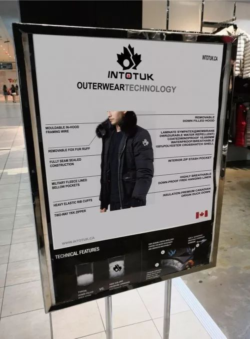
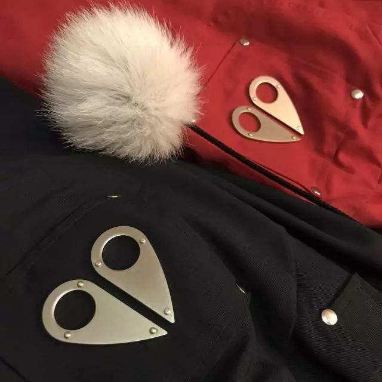
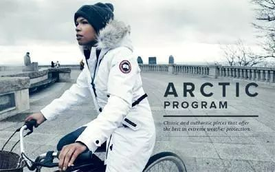
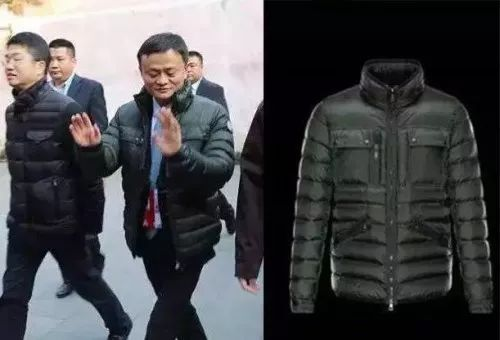
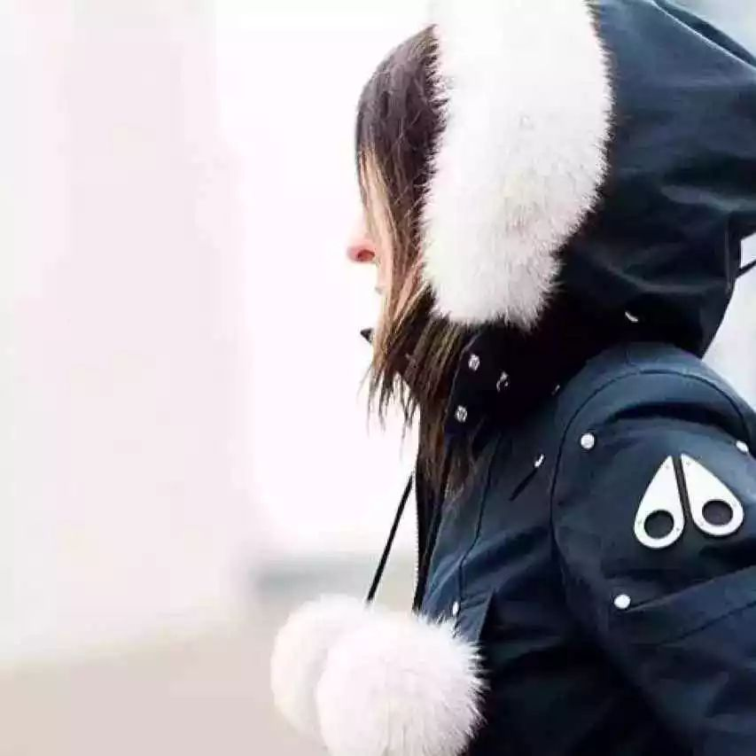
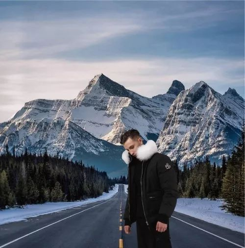
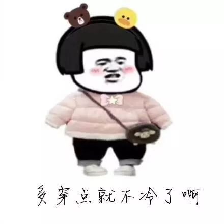

# 无标题

**链接地址:** http://mp.weixin.qq.com/s?__biz=MzI5NDMzNzM3OQ==&mid=2247489552&idx=7&sn=1e683cdbf7edbaaeaf559ccc8cb4c238&chksm=ec65361cdb12bf0a2270f827b03831a67a1a6387e856105b40718ed015a674c565cea0d76467&mpshare=1&scene=2&srcid=#rd
**作者:** 
**获取时间:** 2025/8/28 20:47:38
**图片数量:** 23

---

## 原始HTML内容

<section class="" style="max-width: 100%;letter-spacing: 0.544px;white-space: normal;background-color: rgb(255, 255, 255);box-sizing: border-box !important;overflow-wrap: break-word !important;">&nbsp;<section class="" ng-click="onClick($event)" ng-model="eo.text" ng-style=" {
  'font-size'   : eo.fontSize,
  'font-family' : eo.fontFamily,
  'font-style'  : eo.fontStyle,
  'color'       : (eo.color || theme.majorColor),
} " placeholder="{ 点击编辑 }" stop-propagation="click mousedown mouseup" tn-edit-content="true" tn-page-editable="text0" tn-page-editable-type="ed-type-text" ui-on-drop="block($event)" style="margin-top: 0.7em;margin-left: -0.4em;padding: 1em;max-width: 100%;border-radius: 1em;width: 510.25px;color: inherit;font-family: inherit;font-size: 1em;display: inline-block;background-color: rgb(250, 200, 255);box-sizing: border-box !important;overflow-wrap: break-word !important;">&nbsp;&nbsp;&nbsp;吃喝玩乐卡尔加里YYC&nbsp;最近要大送豪礼，包括苹果 iPhone X！</section></section>
 
<section class="" style="max-width: 100%;letter-spacing: 0.544px;white-space: normal;background-color: rgb(255, 255, 255);box-sizing: border-box !important;overflow-wrap: break-word !important;"><section class="" ng-click="onClick($event)" ng-model="eo.text" ng-style=" {
  'font-size'   : eo.fontSize,
  'font-family' : eo.fontFamily,
  'font-style'  : eo.fontStyle,
  'color'       : (eo.color || theme.majorColor),
} " placeholder="{ 点击编辑 }" stop-propagation="click mousedown mouseup" tn-edit-content="true" tn-page-editable="text0" tn-page-editable-type="ed-type-text" ui-on-drop="block($event)" style="margin-top: 0.7em;margin-right: -0.4em;padding: 1em;max-width: 100%;border-radius: 1em;width: 510.25px;color: inherit;font-family: inherit;font-size: 1em;display: inline-block;background-color: rgb(188, 227, 249);box-sizing: border-box !important;overflow-wrap: break-word !important;">没错没错，记得『点击蓝字加关注』哟！机会随时到来！</section>&nbsp;&nbsp;</section><section class="" style="margin-top: 0.8em;margin-bottom: 0.5em;max-width: 100%;letter-spacing: 0.544px;white-space: normal;background-color: rgb(255, 255, 255);box-sizing: border-box !important;overflow-wrap: break-word !important;">
 
</section><section style="max-width: 100%;letter-spacing: 0.544px;white-space: normal;text-align: center;background-color: rgb(255, 255, 255);box-sizing: border-box !important;overflow-wrap: break-word !important;"><strong style="max-width: 100%;box-sizing: border-box !important;overflow-wrap: break-word !important;">真心实意，为您推荐！</strong></section>
 

 
<section style="max-width: 100%;box-sizing: border-box;font-variant-numeric: normal;font-variant-east-asian: normal;letter-spacing: 0.544px;white-space: normal;caret-color: rgb(51, 51, 51);text-size-adjust: auto;font-size: 16px;line-height: 25.6px;widows: 1;background-color: rgb(255, 255, 255);overflow-wrap: break-word !important;"><section style="max-width: 100%;box-sizing: border-box;overflow-wrap: break-word !important;"><section style="max-width: 100%;box-sizing: border-box;overflow-wrap: break-word !important;">
<strong style="max-width: 100%;box-sizing: border-box;overflow-wrap: break-word !important;">加拿大</strong> 

 

<strong style="max-width: 100%;box-sizing: border-box;overflow-wrap: break-word !important;">就一个字</strong>

 

<strong style="max-width: 100%;box-sizing: border-box;overflow-wrap: break-word !important;">冷</strong>
</section></section></section><section style="max-width: 100%;box-sizing: border-box;font-variant-numeric: normal;font-variant-east-asian: normal;letter-spacing: 0.544px;white-space: normal;caret-color: rgb(51, 51, 51);text-size-adjust: auto;font-size: 16px;line-height: 25.6px;widows: 1;background-color: rgb(255, 255, 255);overflow-wrap: break-word !important;"><section style="margin-top: 10px;margin-bottom: 10px;max-width: 100%;box-sizing: border-box;text-align: center;overflow-wrap: break-word !important;"><section style="max-width: 100%;box-sizing: border-box;vertical-align: middle;display: inline-block;line-height: 0;overflow-wrap: break-word !important;"></section></section></section><section style="max-width: 100%;box-sizing: border-box;font-variant-numeric: normal;font-variant-east-asian: normal;letter-spacing: 0.544px;white-space: normal;caret-color: rgb(51, 51, 51);text-size-adjust: auto;font-size: 16px;line-height: 25.6px;widows: 1;background-color: rgb(255, 255, 255);overflow-wrap: break-word !important;"><section style="max-width: 100%;box-sizing: border-box;overflow-wrap: break-word !important;"><section style="max-width: 100%;box-sizing: border-box;overflow-wrap: break-word !important;">
 
</section></section></section><section style="max-width: 100%;box-sizing: border-box;font-variant-numeric: normal;font-variant-east-asian: normal;letter-spacing: 0.544px;white-space: normal;caret-color: rgb(51, 51, 51);text-size-adjust: auto;font-size: 16px;line-height: 25.6px;widows: 1;background-color: rgb(255, 255, 255);overflow-wrap: break-word !important;"><section style="max-width: 100%;box-sizing: border-box;overflow-wrap: break-word !important;"><section style="padding-right: 12px;padding-left: 12px;max-width: 100%;box-sizing: border-box;line-height: 1.8;font-size: 14px;letter-spacing: 2px;overflow-wrap: break-word !important;">
天气一天比一天冷，取暖基本靠抖的模式已经完全淘汰。&nbsp;

 

冷吧，那就得来对策，咱好歹也去过北方，不是傻子...知道有个东西，叫<strong style="max-width: 100%;box-sizing: border-box;overflow-wrap: break-word !important;">羽绒服</strong>。<strong style="max-width: 100%;box-sizing: border-box;overflow-wrap: break-word !important;">在加拿大，这东西就跟吃鸡里的“甲”一样起着重要的保命作用.</strong>

 

又说起羽绒服，那么估计大伙儿肯定也都知道“大鹅”Canada Goose了。昂，是，看什么xxx国总统穿！不过今儿小编要在这里对大鹅跟另外两个也同为<strong style="max-width: 100%;box-sizing: border-box;overflow-wrap: break-word !important;">加拿大羽绒服届的扛把子——Intoutk</strong>和<strong style="max-width: 100%;box-sizing: border-box;overflow-wrap: break-word !important;">Moose Knuckles</strong>给大家进行一个比较。

 
</section></section></section><section style="max-width: 100%;box-sizing: border-box;font-variant-numeric: normal;font-variant-east-asian: normal;letter-spacing: 0.544px;white-space: normal;caret-color: rgb(51, 51, 51);text-size-adjust: auto;font-size: 16px;line-height: 25.6px;widows: 1;background-color: rgb(255, 255, 255);overflow-wrap: break-word !important;"><section style="margin-top: 10px;margin-bottom: 10px;max-width: 100%;box-sizing: border-box;text-align: center;overflow-wrap: break-word !important;"><section style="max-width: 100%;box-sizing: border-box;vertical-align: middle;display: inline-block;line-height: 0;overflow-wrap: break-word !important;"></section></section></section><section style="max-width: 100%;box-sizing: border-box;font-variant-numeric: normal;font-variant-east-asian: normal;letter-spacing: 0.544px;white-space: normal;caret-color: rgb(51, 51, 51);text-size-adjust: auto;font-size: 16px;line-height: 25.6px;widows: 1;background-color: rgb(255, 255, 255);overflow-wrap: break-word !important;"><section style="margin-top: 10px;margin-bottom: 10px;max-width: 100%;box-sizing: border-box;text-align: center;overflow-wrap: break-word !important;"><section style="max-width: 100%;box-sizing: border-box;vertical-align: middle;display: inline-block;line-height: 0;width: 414.391px;overflow-wrap: break-word !important;"><svg class="" xmlns="http://www.w3.org/2000/svg" x="0px" y="0px" viewBox="0 0 306.1 40.3" style="vertical-align: middle;max-width: 100%;width: 100%;box-sizing: border-box;" width="100%"></svg></section></section></section><section style="max-width: 100%;box-sizing: border-box;font-variant-numeric: normal;font-variant-east-asian: normal;letter-spacing: 0.544px;white-space: normal;caret-color: rgb(51, 51, 51);text-size-adjust: auto;font-size: 16px;line-height: 25.6px;widows: 1;background-color: rgb(255, 255, 255);overflow-wrap: break-word !important;"><section style="max-width: 100%;box-sizing: border-box;overflow-wrap: break-word !important;"><section style="padding-right: 12px;padding-left: 12px;max-width: 100%;box-sizing: border-box;line-height: 1.8;letter-spacing: 2px;color: rgb(12, 11, 11);overflow-wrap: break-word !important;">
 

<strong style="max-width: 100%;box-sizing: border-box;overflow-wrap: break-word !important;">首先还是要啰嗦一下给大家简单的介绍这三个品牌</strong>

 
</section></section></section><section style="max-width: 100%;box-sizing: border-box;font-variant-numeric: normal;font-variant-east-asian: normal;letter-spacing: 0.544px;white-space: normal;caret-color: rgb(51, 51, 51);text-size-adjust: auto;font-size: 16px;line-height: 25.6px;widows: 1;background-color: rgb(255, 255, 255);overflow-wrap: break-word !important;"><section style="max-width: 100%;box-sizing: border-box;overflow-wrap: break-word !important;"><section style="padding-right: 12px;padding-left: 12px;max-width: 100%;box-sizing: border-box;line-height: 1.8;letter-spacing: 2px;overflow-wrap: break-word !important;">
<strong style="max-width: 100%;box-sizing: border-box;overflow-wrap: break-word !important;">【简介】</strong> 

<strong style="max-width: 100%;box-sizing: border-box;overflow-wrap: break-word !important;">Intotuk</strong>

Intotuk又名加拿大枫叶。<strong style="max-width: 100%;box-sizing: border-box;overflow-wrap: break-word !important;">是加拿大最受追捧的本土品牌之一</strong>，其品牌来源于加拿大最北部INUVIK和TUKTUYAKTUK公路的缩写，当地人都知道这里是通往北极的公路，<strong style="max-width: 100%;box-sizing: border-box;overflow-wrap: break-word !important;">是加拿大最冷的地方！</strong>所以intotuk最早就是给当地人抵御极寒而诞生的品牌。

 
</section></section></section><section style="max-width: 100%;box-sizing: border-box;font-variant-numeric: normal;font-variant-east-asian: normal;letter-spacing: 0.544px;white-space: normal;caret-color: rgb(51, 51, 51);text-size-adjust: auto;font-size: 16px;line-height: 25.6px;widows: 1;background-color: rgb(255, 255, 255);overflow-wrap: break-word !important;"><section style="margin-top: 10px;margin-bottom: 10px;max-width: 100%;box-sizing: border-box;text-align: center;overflow-wrap: break-word !important;"><section style="max-width: 100%;box-sizing: border-box;vertical-align: middle;display: inline-block;line-height: 0;overflow-wrap: break-word !important;"></section></section></section><section style="max-width: 100%;box-sizing: border-box;font-variant-numeric: normal;font-variant-east-asian: normal;letter-spacing: 0.544px;white-space: normal;caret-color: rgb(51, 51, 51);text-size-adjust: auto;font-size: 16px;line-height: 25.6px;widows: 1;background-color: rgb(255, 255, 255);overflow-wrap: break-word !important;"><section style="max-width: 100%;box-sizing: border-box;overflow-wrap: break-word !important;"><section style="padding-right: 12px;padding-left: 12px;max-width: 100%;box-sizing: border-box;line-height: 1.8;letter-spacing: 2px;font-size: 14px;overflow-wrap: break-word !important;">
 

<strong style="max-width: 100%;box-sizing: border-box;overflow-wrap: break-word !important;">Moose Knuckles</strong>

Moose Knuckles 品牌的名字源自于加拿大最伟大的两件“作品”：<strong style="max-width: 100%;box-sizing: border-box;overflow-wrap: break-word !important;">麋鹿和曲棍球</strong>。这也是品牌漂亮标志的来源：<strong style="max-width: 100%;box-sizing: border-box;overflow-wrap: break-word !important;">麋鹿的足迹</strong>。标志性的代表就是一把<strong style="max-width: 100%;box-sizing: border-box;overflow-wrap: break-word !important;">小剪刀</strong>。被称为“剪刀”牌的Moose Knuckles成立与2007年，<strong style="max-width: 100%;box-sizing: border-box;overflow-wrap: break-word !important;">10年之间便称为最受欢迎的加拿大户外时装品牌之一。</strong>
</section></section></section><section style="max-width: 100%;box-sizing: border-box;font-variant-numeric: normal;font-variant-east-asian: normal;letter-spacing: 0.544px;white-space: normal;caret-color: rgb(51, 51, 51);text-size-adjust: auto;font-size: 16px;line-height: 25.6px;widows: 1;background-color: rgb(255, 255, 255);overflow-wrap: break-word !important;"><section style="margin-top: 10px;margin-bottom: 10px;max-width: 100%;box-sizing: border-box;text-align: center;overflow-wrap: break-word !important;"><section style="max-width: 100%;box-sizing: border-box;vertical-align: middle;display: inline-block;line-height: 0;overflow-wrap: break-word !important;"></section></section></section><section style="max-width: 100%;box-sizing: border-box;font-variant-numeric: normal;font-variant-east-asian: normal;letter-spacing: 0.544px;white-space: normal;caret-color: rgb(51, 51, 51);text-size-adjust: auto;font-size: 16px;line-height: 25.6px;widows: 1;background-color: rgb(255, 255, 255);overflow-wrap: break-word !important;"><section style="max-width: 100%;box-sizing: border-box;overflow-wrap: break-word !important;"><section style="padding-right: 12px;padding-left: 12px;max-width: 100%;box-sizing: border-box;line-height: 1.8;letter-spacing: 2px;overflow-wrap: break-word !important;">
 
</section></section></section><section style="max-width: 100%;box-sizing: border-box;font-variant-numeric: normal;font-variant-east-asian: normal;letter-spacing: 0.544px;white-space: normal;caret-color: rgb(51, 51, 51);text-size-adjust: auto;font-size: 16px;line-height: 25.6px;widows: 1;background-color: rgb(255, 255, 255);overflow-wrap: break-word !important;"><section style="max-width: 100%;box-sizing: border-box;overflow-wrap: break-word !important;"><section style="padding-right: 12px;padding-left: 12px;max-width: 100%;box-sizing: border-box;line-height: 1.8;letter-spacing: 2px;overflow-wrap: break-word !important;">
<strong style="max-width: 100%;box-sizing: border-box;overflow-wrap: break-word !important;">Canada Goose</strong> 

加拿大鹅，&nbsp;<strong style="max-width: 100%;box-sizing: border-box;overflow-wrap: break-word !important;">加拿大人民的国服</strong>。&nbsp;最早是专注于羊毛背心和滑雪装搞得品牌。随着21世纪的热门电影《后天》、《国家宝藏》等电影中的出镜，<strong style="max-width: 100%;box-sizing: border-box;overflow-wrap: break-word !important;">加拿大鹅成功闯入好莱坞，还有明星效应走进大家的衣橱。</strong> 

 
</section></section></section><section style="max-width: 100%;box-sizing: border-box;font-variant-numeric: normal;font-variant-east-asian: normal;letter-spacing: 0.544px;white-space: normal;caret-color: rgb(51, 51, 51);text-size-adjust: auto;font-size: 16px;line-height: 25.6px;widows: 1;background-color: rgb(255, 255, 255);overflow-wrap: break-word !important;"><section style="margin-top: 10px;margin-bottom: 10px;max-width: 100%;box-sizing: border-box;text-align: center;overflow-wrap: break-word !important;"><section style="max-width: 100%;box-sizing: border-box;vertical-align: middle;display: inline-block;line-height: 0;overflow-wrap: break-word !important;"></section></section></section><section style="max-width: 100%;box-sizing: border-box;font-variant-numeric: normal;font-variant-east-asian: normal;letter-spacing: 0.544px;white-space: normal;caret-color: rgb(51, 51, 51);text-size-adjust: auto;font-size: 16px;line-height: 25.6px;widows: 1;background-color: rgb(255, 255, 255);overflow-wrap: break-word !important;"><section style="margin-top: 10px;margin-bottom: 10px;max-width: 100%;box-sizing: border-box;text-align: center;overflow-wrap: break-word !important;"><section style="padding: 2px;max-width: 100%;box-sizing: border-box;display: inline-block;vertical-align: middle;width: 0.8em;height: 0.8em;line-height: 1;border-left: 2px solid rgb(249, 110, 87);border-top-color: rgb(249, 110, 87);border-right-color: rgb(249, 110, 87);border-bottom: 2px solid rgb(249, 110, 87);transform: rotate(-45deg);overflow-wrap: break-word !important;"></section></section></section><section style="max-width: 100%;box-sizing: border-box;font-variant-numeric: normal;font-variant-east-asian: normal;letter-spacing: 0.544px;white-space: normal;caret-color: rgb(51, 51, 51);text-size-adjust: auto;font-size: 16px;line-height: 25.6px;widows: 1;background-color: rgb(255, 255, 255);overflow-wrap: break-word !important;"><section style="margin-top: 10px;margin-bottom: 10px;max-width: 100%;box-sizing: border-box;text-align: center;overflow-wrap: break-word !important;"><section style="padding: 2px;max-width: 100%;box-sizing: border-box;display: inline-block;vertical-align: middle;width: 0.8em;height: 0.8em;line-height: 1;border-left: 2px solid rgb(249, 110, 87);border-top-color: rgb(249, 110, 87);border-right-color: rgb(249, 110, 87);border-bottom: 2px solid rgb(249, 110, 87);transform: rotate(-45deg);overflow-wrap: break-word !important;"></section></section></section><section style="max-width: 100%;box-sizing: border-box;font-variant-numeric: normal;font-variant-east-asian: normal;letter-spacing: 0.544px;white-space: normal;caret-color: rgb(51, 51, 51);text-size-adjust: auto;font-size: 16px;line-height: 25.6px;widows: 1;background-color: rgb(255, 255, 255);overflow-wrap: break-word !important;"><section style="max-width: 100%;box-sizing: border-box;overflow-wrap: break-word !important;"><section style="padding-right: 12px;padding-left: 12px;max-width: 100%;box-sizing: border-box;text-align: center;line-height: 1.8;letter-spacing: 0px;overflow-wrap: break-word !important;">
 

<strong style="max-width: 100%;box-sizing: border-box;overflow-wrap: break-word !important;">下面小编就给大家具体分析一下三者之间的对比</strong>

 
</section></section></section><section style="max-width: 100%;box-sizing: border-box;font-variant-numeric: normal;font-variant-east-asian: normal;letter-spacing: 0.544px;white-space: normal;caret-color: rgb(51, 51, 51);text-size-adjust: auto;font-size: 16px;line-height: 25.6px;widows: 1;background-color: rgb(255, 255, 255);overflow-wrap: break-word !important;"><section style="max-width: 100%;box-sizing: border-box;overflow-wrap: break-word !important;"><section style="max-width: 100%;box-sizing: border-box;color: rgb(255, 13, 58);overflow-wrap: break-word !important;">
<strong style="max-width: 100%;box-sizing: border-box;overflow-wrap: break-word !important;">Intotuk</strong><strong style="max-width: 100%;box-sizing: border-box;overflow-wrap: break-word !important;">&nbsp;VS&nbsp; Moose Knuckles&nbsp;VS&nbsp;Canada Goose</strong>
</section></section></section><section style="max-width: 100%;box-sizing: border-box;font-variant-numeric: normal;font-variant-east-asian: normal;letter-spacing: 0.544px;white-space: normal;caret-color: rgb(51, 51, 51);text-size-adjust: auto;font-size: 16px;line-height: 25.6px;widows: 1;background-color: rgb(255, 255, 255);overflow-wrap: break-word !important;"><section style="margin-top: 10px;margin-bottom: 10px;max-width: 100%;box-sizing: border-box;text-align: center;overflow-wrap: break-word !important;"> </section></section><section style="max-width: 100%;box-sizing: border-box;font-variant-numeric: normal;font-variant-east-asian: normal;letter-spacing: 0.544px;white-space: normal;caret-color: rgb(51, 51, 51);text-size-adjust: auto;font-size: 16px;line-height: 25.6px;widows: 1;background-color: rgb(255, 255, 255);overflow-wrap: break-word !important;"><section style="max-width: 100%;box-sizing: border-box;overflow-wrap: break-word !important;"><section style="padding-right: 12px;padding-left: 12px;max-width: 100%;box-sizing: border-box;line-height: 1.8;letter-spacing: 2px;overflow-wrap: break-word !important;">
<strong style="max-width: 100%;box-sizing: border-box;overflow-wrap: break-word !important;">1.【明星名人追捧谁?】</strong>

 

答案不用说都鸡到了啦，肯定是<strong style="max-width: 100%;box-sizing: border-box;overflow-wrap: break-word !important;">大鹅</strong>啦。因为大鹅正是因为名人效应而大火。因为大火带来效应，成为<strong style="max-width: 100%;box-sizing: border-box;overflow-wrap: break-word !important;">街衣</strong>。<strong style="max-width: 100%;box-sizing: border-box;overflow-wrap: break-word !important;">所以这也是今年大鹅即将面临的问题吧。</strong>

 

<strong style="max-width: 100%;box-sizing: border-box;overflow-wrap: break-word !important;">嘿嘿看看我们的马云爸爸....</strong>

 
</section></section></section><section style="max-width: 100%;box-sizing: border-box;font-variant-numeric: normal;font-variant-east-asian: normal;letter-spacing: 0.544px;white-space: normal;caret-color: rgb(51, 51, 51);text-size-adjust: auto;font-size: 16px;line-height: 25.6px;widows: 1;background-color: rgb(255, 255, 255);overflow-wrap: break-word !important;"><section style="margin-top: 10px;margin-bottom: 10px;max-width: 100%;box-sizing: border-box;text-align: center;overflow-wrap: break-word !important;"><section style="max-width: 100%;box-sizing: border-box;vertical-align: middle;display: inline-block;line-height: 0;overflow-wrap: break-word !important;"></section></section></section><section style="max-width: 100%;box-sizing: border-box;font-variant-numeric: normal;font-variant-east-asian: normal;letter-spacing: 0.544px;white-space: normal;caret-color: rgb(51, 51, 51);text-size-adjust: auto;font-size: 16px;line-height: 25.6px;widows: 1;background-color: rgb(255, 255, 255);overflow-wrap: break-word !important;"><section style="max-width: 100%;box-sizing: border-box;overflow-wrap: break-word !important;"><section style="padding-right: 12px;padding-left: 12px;max-width: 100%;box-sizing: border-box;line-height: 1.8;letter-spacing: 2px;overflow-wrap: break-word !important;">
 

<strong style="max-width: 100%;box-sizing: border-box;overflow-wrap: break-word !important;">2.【保暖性】</strong>

 

羽绒这东西，肯定越是采集自寒冷地带，品质越好。例如，冰岛的<strong style="max-width: 100%;box-sizing: border-box;overflow-wrap: break-word !important;">雁鸭绒</strong>，传说中的<strong style="max-width: 100%;box-sizing: border-box;overflow-wrap: break-word !important;">法国白鹅绒</strong>。

 

<strong style="max-width: 100%;box-sizing: border-box;overflow-wrap: break-word !important;">那么这局是谁胜出呢?</strong>

 

Duang~~是<strong style="max-width: 100%;box-sizing: border-box;overflow-wrap: break-word !important;">In</strong><strong style="max-width: 100%;box-sizing: border-box;overflow-wrap: break-word !important;">totuk</strong>。因为Intotuk最早是供加拿大最北部和北极附近的人们嘛所以他的用料都是采集最寒冷的地带，所以<strong style="max-width: 100%;box-sizing: border-box;overflow-wrap: break-word !important;">从保暖度上目前全球应该没有可以比的</strong>。其用料都是被认为是现今业界很稀有最保暖的之一。

 

然后Intotuk在本地的羽绒服是<strong style="max-width: 100%;box-sizing: border-box;overflow-wrap: break-word !important;">黑科技</strong>的象征，久经考验的高性能面料，能在极端环境和气候下让您保持干爽温暖。<strong style="max-width: 100%;box-sizing: border-box;overflow-wrap: break-word !important;">搭配耐久防水表层，抗水，耐久，保暖，抗风。</strong>

 

<strong style="max-width: 100%;box-sizing: border-box;overflow-wrap: break-word !important;">所以你如果有了一件intotuk 那么你去北极住冰屋都是可以的。可以和本地人一起愉快的玩耍啦！</strong> 

 

 

而Moose虽然在保暖程度上略输Intotuk一筹，但是其内部填充为<strong style="max-width: 100%;box-sizing: border-box;overflow-wrap: break-word !important;">正宗加拿大顶级灰鸭绒</strong>，外加可拆卸的芬兰蓝狐、银狐毛领及毛球，表面涂层防风防水，<strong style="max-width: 100%;box-sizing: border-box;overflow-wrap: break-word !important;">保暖度远在Canada goose之上</strong>，即可在-40度的低温下保暖 ，是绝佳的御寒极品。
</section></section></section><section style="max-width: 100%;box-sizing: border-box;font-variant-numeric: normal;font-variant-east-asian: normal;letter-spacing: 0.544px;white-space: normal;caret-color: rgb(51, 51, 51);text-size-adjust: auto;font-size: 16px;line-height: 25.6px;widows: 1;background-color: rgb(255, 255, 255);overflow-wrap: break-word !important;"><section style="margin-top: 10px;margin-bottom: 10px;max-width: 100%;box-sizing: border-box;text-align: center;overflow-wrap: break-word !important;"><section style="max-width: 100%;box-sizing: border-box;vertical-align: middle;display: inline-block;line-height: 0;overflow-wrap: break-word !important;"></section></section></section><section style="max-width: 100%;box-sizing: border-box;font-variant-numeric: normal;font-variant-east-asian: normal;letter-spacing: 0.544px;white-space: normal;caret-color: rgb(51, 51, 51);text-size-adjust: auto;font-size: 16px;line-height: 25.6px;widows: 1;background-color: rgb(255, 255, 255);overflow-wrap: break-word !important;"><section style="max-width: 100%;box-sizing: border-box;overflow-wrap: break-word !important;"><section style="max-width: 100%;box-sizing: border-box;overflow-wrap: break-word !important;">
 
</section></section></section><section style="max-width: 100%;box-sizing: border-box;font-variant-numeric: normal;font-variant-east-asian: normal;letter-spacing: 0.544px;white-space: normal;caret-color: rgb(51, 51, 51);text-size-adjust: auto;font-size: 16px;line-height: 25.6px;widows: 1;background-color: rgb(255, 255, 255);overflow-wrap: break-word !important;"><section style="max-width: 100%;box-sizing: border-box;overflow-wrap: break-word !important;"><section style="padding-right: 12px;padding-left: 12px;max-width: 100%;box-sizing: border-box;line-height: 1.8;letter-spacing: 2px;overflow-wrap: break-word !important;">
<strong style="max-width: 100%;box-sizing: border-box;overflow-wrap: break-word !important;">3.【时尚度】 </strong>

 

在这一局比拼中，加拿大鹅和Moose可以打成<strong style="max-width: 100%;box-sizing: border-box;overflow-wrap: break-word !important;">平手</strong>吧! Intotuk就稍稍逊色一些。<strong style="max-width: 100%;box-sizing: border-box;overflow-wrap: break-word !important;">不过萝卜咸菜各有所爱。</strong>

 

 

先说大鹅有一种工装服既视感，<strong style="max-width: 100%;box-sizing: border-box;overflow-wrap: break-word !important;">羽绒服+狼毛的组合。</strong>颜色多样，并且<strong style="max-width: 100%;box-sizing: border-box;overflow-wrap: break-word !important;">没有了像一节节莲藕人一样的烦恼</strong>，它更像是一件棉衣、一件夹克，时尚百搭！对很多人来说，Canada goose这只加拿大鹅<strong style="max-width: 100%;box-sizing: border-box;overflow-wrap: break-word !important;">更帅气，更中性，更时尚！</strong>

 

<strong style="max-width: 100%;box-sizing: border-box;overflow-wrap: break-word !important;">所以在明星中早就刷出一条血路。</strong>

 
</section></section></section><section style="max-width: 100%;box-sizing: border-box;font-variant-numeric: normal;font-variant-east-asian: normal;letter-spacing: 0.544px;white-space: normal;caret-color: rgb(51, 51, 51);text-size-adjust: auto;font-size: 16px;line-height: 25.6px;widows: 1;background-color: rgb(255, 255, 255);overflow-wrap: break-word !important;"><section style="margin-top: 10px;margin-bottom: 10px;max-width: 100%;box-sizing: border-box;text-align: center;overflow-wrap: break-word !important;"><section style="max-width: 100%;box-sizing: border-box;vertical-align: middle;display: inline-block;line-height: 0;overflow-wrap: break-word !important;"></section></section></section><section style="max-width: 100%;box-sizing: border-box;font-variant-numeric: normal;font-variant-east-asian: normal;letter-spacing: 0.544px;white-space: normal;caret-color: rgb(51, 51, 51);text-size-adjust: auto;font-size: 16px;line-height: 25.6px;widows: 1;background-color: rgb(255, 255, 255);overflow-wrap: break-word !important;"><section style="max-width: 100%;box-sizing: border-box;overflow-wrap: break-word !important;"><section style="padding-right: 12px;padding-left: 12px;max-width: 100%;box-sizing: border-box;font-size: 14px;line-height: 1.8;letter-spacing: 2px;overflow-wrap: break-word !important;">
 

但是Moose也并不输大鹅，<strong style="max-width: 100%;box-sizing: border-box;overflow-wrap: break-word !important;">顶级灰鸭绒+外加可拆卸的芬兰蓝狐、银狐毛领+毛球组合</strong>，其可拆卸毛领，可随意替换到帽子上和衣领上，完成风格的转化也是让人服气的。比起加鹅的严肃简单，他家的设计多了很多可爱的蓬蓬的<strong style="max-width: 100%;box-sizing: border-box;overflow-wrap: break-word !important;">毛毛点缀</strong>，而且感觉<strong style="max-width: 100%;box-sizing: border-box;overflow-wrap: break-word !important;">更加时尚修身</strong>。

 
</section></section></section><section style="max-width: 100%;box-sizing: border-box;font-variant-numeric: normal;font-variant-east-asian: normal;letter-spacing: 0.544px;white-space: normal;caret-color: rgb(51, 51, 51);text-size-adjust: auto;font-size: 16px;line-height: 25.6px;widows: 1;background-color: rgb(255, 255, 255);overflow-wrap: break-word !important;"><section style="margin-top: 10px;margin-bottom: 10px;max-width: 100%;box-sizing: border-box;text-align: center;overflow-wrap: break-word !important;"><section style="max-width: 100%;box-sizing: border-box;vertical-align: middle;display: inline-block;line-height: 0;overflow-wrap: break-word !important;"></section></section></section><section style="max-width: 100%;box-sizing: border-box;font-variant-numeric: normal;font-variant-east-asian: normal;letter-spacing: 0.544px;white-space: normal;caret-color: rgb(51, 51, 51);text-size-adjust: auto;font-size: 16px;line-height: 25.6px;widows: 1;background-color: rgb(255, 255, 255);overflow-wrap: break-word !important;"><section style="max-width: 100%;box-sizing: border-box;overflow-wrap: break-word !important;"><section style="max-width: 100%;box-sizing: border-box;overflow-wrap: break-word !important;">
 
</section></section></section><section style="max-width: 100%;box-sizing: border-box;font-variant-numeric: normal;font-variant-east-asian: normal;letter-spacing: 0.544px;white-space: normal;caret-color: rgb(51, 51, 51);text-size-adjust: auto;font-size: 16px;line-height: 25.6px;widows: 1;background-color: rgb(255, 255, 255);overflow-wrap: break-word !important;"><section style="max-width: 100%;box-sizing: border-box;overflow-wrap: break-word !important;"><section style="padding-right: 12px;padding-left: 12px;max-width: 100%;box-sizing: border-box;line-height: 1.8;font-size: 14px;letter-spacing: 2px;overflow-wrap: break-word !important;">
那么INTOTUK呢,是<strong style="max-width: 100%;box-sizing: border-box;overflow-wrap: break-word !important;">羽绒服+可拆卸狐狸毛领</strong>这样的组合，从美观度上相比较前两者较为单一。但是内涵也是很重要的嘛，<strong style="max-width: 100%;box-sizing: border-box;overflow-wrap: break-word !important;">它的</strong><strong style="max-width: 100%;box-sizing: border-box;overflow-wrap: break-word !important;">实用性很高。</strong>

 
</section></section></section><section style="max-width: 100%;box-sizing: border-box;font-variant-numeric: normal;font-variant-east-asian: normal;letter-spacing: 0.544px;white-space: normal;caret-color: rgb(51, 51, 51);text-size-adjust: auto;font-size: 16px;line-height: 25.6px;widows: 1;background-color: rgb(255, 255, 255);overflow-wrap: break-word !important;"><section style="margin-top: 10px;margin-bottom: 10px;max-width: 100%;box-sizing: border-box;text-align: center;overflow-wrap: break-word !important;"><section style="max-width: 100%;box-sizing: border-box;vertical-align: middle;display: inline-block;line-height: 0;overflow-wrap: break-word !important;"></section></section></section><section style="max-width: 100%;box-sizing: border-box;font-variant-numeric: normal;font-variant-east-asian: normal;letter-spacing: 0.544px;white-space: normal;caret-color: rgb(51, 51, 51);text-size-adjust: auto;font-size: 16px;line-height: 25.6px;widows: 1;background-color: rgb(255, 255, 255);overflow-wrap: break-word !important;"><section style="max-width: 100%;box-sizing: border-box;overflow-wrap: break-word !important;"><section style="padding-right: 12px;padding-left: 12px;max-width: 100%;box-sizing: border-box;line-height: 1.8;font-size: 14px;letter-spacing: 2px;overflow-wrap: break-word !important;">
 

<strong style="max-width: 100%;box-sizing: border-box;overflow-wrap: break-word !important;">所以首选时尚度的小伙伴就看你是萝卜还是咸菜啦?哈哈哈！</strong>
</section></section></section><section style="max-width: 100%;box-sizing: border-box;font-variant-numeric: normal;font-variant-east-asian: normal;letter-spacing: 0.544px;white-space: normal;caret-color: rgb(51, 51, 51);text-size-adjust: auto;font-size: 16px;line-height: 25.6px;widows: 1;background-color: rgb(255, 255, 255);overflow-wrap: break-word !important;"><section style="max-width: 100%;box-sizing: border-box;overflow-wrap: break-word !important;"><section style="max-width: 100%;box-sizing: border-box;overflow-wrap: break-word !important;">
 
</section></section></section><section style="max-width: 100%;box-sizing: border-box;font-variant-numeric: normal;font-variant-east-asian: normal;letter-spacing: 0.544px;white-space: normal;caret-color: rgb(51, 51, 51);text-size-adjust: auto;font-size: 16px;line-height: 25.6px;widows: 1;background-color: rgb(255, 255, 255);overflow-wrap: break-word !important;"><section style="max-width: 100%;box-sizing: border-box;overflow-wrap: break-word !important;"><section style="padding-right: 12px;padding-left: 12px;max-width: 100%;box-sizing: border-box;line-height: 1.8;font-size: 14px;letter-spacing: 2px;color: rgb(12, 11, 11);overflow-wrap: break-word !important;">
<strong style="max-width: 100%;box-sizing: border-box;overflow-wrap: break-word !important;">4、【性价比】</strong>

 

三者价签上都是<strong style="max-width: 100%;box-sizing: border-box;overflow-wrap: break-word !important;">旗鼓相当</strong>的，都是税后大概<strong style="max-width: 100%;box-sizing: border-box;overflow-wrap: break-word !important;">1000-2000CAD</strong>这个区间，intotuk的全身狐狸毛限量款除外。 

 

<strong style="max-width: 100%;box-sizing: border-box;overflow-wrap: break-word !important;">但是intotuk的毛领可以单独购买</strong>，就相当于你买了一件intotuk的衣服，之后复购三条不同颜色毛领，你就等于有了3种风格的羽绒服，羽绒服经典大气的设计也都大同小异所以顾客们买一件就够了。<strong style="max-width: 100%;box-sizing: border-box;overflow-wrap: break-word !important;">业界良心哈哈哈!&nbsp;然后功能上据说也是蛮考究的，可以实现很多种穿法。</strong>

 

Moose和鹅的话，从细节来说，各有千秋。<strong style="max-width: 100%;box-sizing: border-box;color: rgb(249, 110, 87);font-size: 16px;overflow-wrap: break-word !important;">但最最最关键的是Moose打折力度大！众所周知，加拿大鹅几乎从来不打折！</strong>
</section></section></section><section style="max-width: 100%;box-sizing: border-box;font-variant-numeric: normal;font-variant-east-asian: normal;letter-spacing: 0.544px;white-space: normal;caret-color: rgb(51, 51, 51);text-size-adjust: auto;font-size: 16px;line-height: 25.6px;widows: 1;background-color: rgb(255, 255, 255);overflow-wrap: break-word !important;"><section style="max-width: 100%;box-sizing: border-box;overflow-wrap: break-word !important;"><section style="max-width: 100%;box-sizing: border-box;overflow-wrap: break-word !important;">
 
</section></section></section><section style="max-width: 100%;box-sizing: border-box;font-variant-numeric: normal;font-variant-east-asian: normal;letter-spacing: 0.544px;white-space: normal;caret-color: rgb(51, 51, 51);text-size-adjust: auto;font-size: 16px;line-height: 25.6px;widows: 1;background-color: rgb(255, 255, 255);overflow-wrap: break-word !important;"><section style="margin-top: 10px;margin-bottom: 10px;max-width: 100%;box-sizing: border-box;text-align: center;overflow-wrap: break-word !important;"><section style="max-width: 100%;box-sizing: border-box;vertical-align: middle;display: inline-block;line-height: 0;overflow-wrap: break-word !important;"><svg class="" xmlns="http://www.w3.org/2000/svg" x="0px" y="0px" viewBox="0 0 669 28.3" style="vertical-align: middle;max-width: 100%;box-sizing: border-box;" width="100%"></svg></section></section></section><section style="max-width: 100%;box-sizing: border-box;font-variant-numeric: normal;font-variant-east-asian: normal;letter-spacing: 0.544px;white-space: normal;caret-color: rgb(51, 51, 51);text-size-adjust: auto;font-size: 16px;line-height: 25.6px;widows: 1;background-color: rgb(255, 255, 255);overflow-wrap: break-word !important;"><section style="max-width: 100%;box-sizing: border-box;overflow-wrap: break-word !important;"><section style="max-width: 100%;box-sizing: border-box;overflow-wrap: break-word !important;">
 
</section></section></section><section style="max-width: 100%;box-sizing: border-box;font-variant-numeric: normal;font-variant-east-asian: normal;letter-spacing: 0.544px;white-space: normal;caret-color: rgb(51, 51, 51);text-size-adjust: auto;font-size: 16px;line-height: 25.6px;widows: 1;background-color: rgb(255, 255, 255);overflow-wrap: break-word !important;"><section style="max-width: 100%;box-sizing: border-box;overflow-wrap: break-word !important;"><section style="padding-right: 12px;padding-left: 12px;max-width: 100%;box-sizing: border-box;line-height: 1.8;letter-spacing: 2px;overflow-wrap: break-word !important;">
<strong style="max-width: 100%;box-sizing: border-box;overflow-wrap: break-word !important;">【总结】</strong> 
</section></section></section><section style="max-width: 100%;box-sizing: border-box;font-variant-numeric: normal;font-variant-east-asian: normal;letter-spacing: 0.544px;white-space: normal;caret-color: rgb(51, 51, 51);text-size-adjust: auto;font-size: 16px;line-height: 25.6px;widows: 1;background-color: rgb(255, 255, 255);overflow-wrap: break-word !important;"><section style="margin-top: 10px;margin-bottom: 10px;max-width: 100%;box-sizing: border-box;text-align: center;overflow-wrap: break-word !important;"><section style="max-width: 100%;box-sizing: border-box;vertical-align: middle;display: inline-block;line-height: 0;overflow-wrap: break-word !important;"></section></section></section><section style="max-width: 100%;box-sizing: border-box;font-variant-numeric: normal;font-variant-east-asian: normal;letter-spacing: 0.544px;white-space: normal;caret-color: rgb(51, 51, 51);text-size-adjust: auto;font-size: 16px;line-height: 25.6px;widows: 1;background-color: rgb(255, 255, 255);overflow-wrap: break-word !important;"><section style="max-width: 100%;box-sizing: border-box;overflow-wrap: break-word !important;"><section style="max-width: 100%;box-sizing: border-box;line-height: 1.8;letter-spacing: 1px;overflow-wrap: break-word !important;">
<strong style="max-width: 100%;box-sizing: border-box;overflow-wrap: break-word !important;">明星喜爱程度</strong>：&nbsp;<strong style="max-width: 100%;box-sizing: border-box;overflow-wrap: break-word !important;">Canada Goose</strong> 

<strong style="max-width: 100%;box-sizing: border-box;overflow-wrap: break-word !important;">保暖性：</strong><strong style="max-width: 100%;box-sizing: border-box;overflow-wrap: break-word !important;">Intotuk&gt;Moose Knuckles&gt;Canada Goose</strong>

<strong style="max-width: 100%;box-sizing: border-box;overflow-wrap: break-word !important;">时尚度：</strong><strong style="max-width: 100%;box-sizing: border-box;overflow-wrap: break-word !important;">Canada Goose=Moose Knuckles&gt;Intotuk</strong>

<strong style="max-width: 100%;box-sizing: border-box;overflow-wrap: break-word !important;">性价比：</strong><strong style="max-width: 100%;box-sizing: border-box;overflow-wrap: break-word !important;">Moose Knuckles&gt;Intotuk&gt;Canada Goose</strong>

 

 

 

好啦，小伙伴根据自己的需求选择吧。

这个冬天不会寒冷啦~~
</section></section></section>
 

文章来源：轻松加拿大

 

 
<section style="max-width: 100%;letter-spacing: 0.544px;text-align: center;box-sizing: border-box !important;overflow-wrap: break-word !important;">真诚为您推荐！</section><section class="" data-style="white-space: normal; text-align: left;font-size: 14px;line-height: 1.5em; color: rgb(12, 12, 12);" style="max-width: 100%;letter-spacing: 0.544px;box-sizing: border-box !important;overflow-wrap: break-word !important;"><section style="margin-top: -1.2em;max-width: 100%;box-sizing: border-box;color: rgb(166, 166, 166);text-align: center;border-width: initial;border-style: none;border-color: initial;line-height: 1.4;overflow-wrap: break-word !important;"> </section><section class="" data-style="white-space: normal; text-align: left;font-size: 14px;line-height: 1.5em; color: rgb(12, 12, 12);" style="padding: 16px 16px 10px;max-width: 100%;box-sizing: border-box;font-size: 1em;line-height: 1.4;overflow-wrap: break-word !important;">
<strong style="max-width: 100%;letter-spacing: 0.544px;color: rgb(62, 62, 62);font-size: 18px;text-align: justify;box-sizing: border-box !important;overflow-wrap: break-word !important;"><strong style="max-width: 100%;box-sizing: border-box !important;overflow-wrap: break-word !important;"><strong style="max-width: 100%;box-sizing: border-box !important;overflow-wrap: break-word !important;"><strong style="max-width: 100%;box-sizing: border-box !important;overflow-wrap: break-word !important;"></strong></strong></strong></strong>
</section></section>
 

 

 

<a href="http://mp.weixin.qq.com/s?__biz=MzI5NDMzNzM3OQ==&amp;mid=2247489486&amp;idx=3&amp;sn=3075fff0f4ec6e2eb3ca0e895cb3ccf7&amp;chksm=ec6539c2db12b0d4beb3dd71905d9a8bc7902e67b9a002d8d6f1e4eb78045becab5574bed005&amp;scene=21#wechat_redirect" target="_blank" data-linktype="2" style="color: rgb(87, 107, 149);-webkit-tap-highlight-color: rgba(0, 0, 0, 0);max-width: 100%;box-sizing: border-box !important;overflow-wrap: break-word !important;">【可怕】华人穿&amp;nbsp;加拿大鹅&amp;nbsp;上街惨遭羞辱！傻X才穿！如今穿大鹅竟这么危险！！</a> 

 

<a href="http://mp.weixin.qq.com/s?__biz=MzI5NDMzNzM3OQ==&amp;mid=2247489486&amp;idx=1&amp;sn=6b0629633ae878414627bbb138ff1b9c&amp;chksm=ec6539c2db12b0d46f87fb7b5a73e14896b8df560e95b732ed78874750f704e5dab388b01f84&amp;scene=21#wechat_redirect" target="_blank" data-linktype="2" style="color: rgb(87, 107, 149);text-decoration: underline;-webkit-tap-highlight-color: rgba(0, 0, 0, 0);max-width: 100%;font-size: 14px;box-sizing: border-box !important;overflow-wrap: break-word !important;">【危机】只因在朋友圈发这个，30名华人惨遭逮捕遣返！加拿大这项新规今起生效！</a> 

 

<a href="http://mp.weixin.qq.com/s?__biz=MzI5NDMzNzM3OQ==&amp;mid=2247489417&amp;idx=1&amp;sn=dd8db96b7f9409a38de65bfd07df9b05&amp;chksm=ec653985db12b093f46aa2f0eca0b969c4552eab18061992432cf05267ab88b90fa577de055a&amp;scene=21#wechat_redirect" target="_blank" data-linktype="2" style="color: rgb(87, 107, 149);text-decoration: underline;-webkit-tap-highlight-color: rgba(0, 0, 0, 0);max-width: 100%;font-size: 14px;box-sizing: border-box !important;overflow-wrap: break-word !important;">【惊爆】死刑！加拿大籍毒贩在中国上诉后被判刑！死刑！中加关系彻底完蛋！！</a> 

 

<a href="http://mp.weixin.qq.com/s?__biz=MzI5NDMzNzM3OQ==&amp;mid=2247489406&amp;idx=1&amp;sn=b89fedd878bb4d7677366e0a85943b4b&amp;chksm=ec653972db12b064546a5059a05e07a7ce64764515b3aaff6e73935a3b4c9e5c7289add06ff8&amp;scene=21#wechat_redirect" target="_blank" data-linktype="2" style="color: rgb(87, 107, 149);-webkit-tap-highlight-color: rgba(0, 0, 0, 0);max-width: 100%;box-sizing: border-box !important;overflow-wrap: break-word !important;">【重磅】加拿大后，波兰当局逮捕华为高管！这背后的缘由细思极恐......</a> 

 

<a href="http://mp.weixin.qq.com/s?__biz=MzI5NDMzNzM3OQ==&amp;mid=2247489406&amp;idx=2&amp;sn=777087fb569508b678475dbf3c98daf5&amp;chksm=ec653972db12b064b5422aa64061c11f163f196e9f9a6e69293d29fd08c964ab9e1d7d4adb2d&amp;scene=21#wechat_redirect" target="_blank" data-linktype="2" style="color: rgb(87, 107, 149);text-decoration: underline;-webkit-tap-highlight-color: rgba(0, 0, 0, 0);max-width: 100%;font-size: 14px;box-sizing: border-box !important;overflow-wrap: break-word !important;">【突发】3死23伤，加拿大双层巴士撞入车站，头被削掉！最新进展来了，现场异常惨烈...</a> 

 

<a href="http://mp.weixin.qq.com/s?__biz=MzI5NDMzNzM3OQ==&amp;mid=2247489406&amp;idx=4&amp;sn=002e9a4c6bb484041e1d72b7ab76380f&amp;chksm=ec653972db12b0646b2d0c842e31570ebf4fb7d7e5af2188e18c028cf68de6b3bcecae212bb5&amp;scene=21#wechat_redirect" target="_blank" data-linktype="2" style="color: rgb(87, 107, 149);text-decoration: underline;-webkit-tap-highlight-color: rgba(0, 0, 0, 0);max-width: 100%;font-size: 14px;box-sizing: border-box !important;overflow-wrap: break-word !important;">【自豪】官宣了！2018年加拿大年度最受好评城市出炉！卡尔加里太给我们张脸了！</a> 

 

<a href="http://mp.weixin.qq.com/s?__biz=MzI5NDMzNzM3OQ==&amp;mid=2247489350&amp;idx=2&amp;sn=152564e55eec29144e7079698a1d3ac6&amp;chksm=ec65394adb12b05cc83a70290b5a57878bfc3df4d12283165853c8d6b0cc26dfc5645a745c3c&amp;scene=21#wechat_redirect" target="_blank" data-linktype="2" style="color: rgb(87, 107, 149);-webkit-tap-highlight-color: rgba(0, 0, 0, 0);max-width: 100%;box-sizing: border-box !important;overflow-wrap: break-word !important;">【寒心】海归工资1300？留学花百万工资竟比不上煎饼摊大妈！居然很普遍…</a> 

 

<a href="http://mp.weixin.qq.com/s?__biz=MzI5NDMzNzM3OQ==&amp;mid=2247489350&amp;idx=5&amp;sn=b6afb8ef5ebad2f87ddb721583643cb3&amp;chksm=ec65394adb12b05c5f0f874979d8ae477c990fcc845623a35f2d637466da14df754909e08ea5&amp;scene=21#wechat_redirect" target="_blank" data-linktype="2" style="color: rgb(87, 107, 149);text-decoration: underline;-webkit-tap-highlight-color: rgba(0, 0, 0, 0);max-width: 100%;font-size: 14px;box-sizing: border-box !important;overflow-wrap: break-word !important;">【注意】留学生找代写反被勒索，不是遣返那么简单！犯法的事情害人害己！</a> 

 

<a href="http://mp.weixin.qq.com/s?__biz=MzI5NDMzNzM3OQ==&amp;mid=2247489294&amp;idx=1&amp;sn=7eb868750db18f3bebe2db54a251ff13&amp;chksm=ec653902db12b0149c1d5469eafbf1ad185f149c46e8d69d99993c4fd1e432bf428861be08e3&amp;scene=21#wechat_redirect" target="_blank" data-linktype="2" style="color: rgb(87, 107, 149);text-decoration: underline;-webkit-tap-highlight-color: rgba(0, 0, 0, 0);max-width: 100%;font-size: 14px;box-sizing: border-box !important;overflow-wrap: break-word !important;">【重磅】外媒惊爆：孟晚舟事件或影响「留加中国学生」数量！你准备好了吗？</a> 

 

<a href="http://mp.weixin.qq.com/s?__biz=MzI5NDMzNzM3OQ==&amp;mid=2247489316&amp;idx=1&amp;sn=afb8d67b1c6a5d63156aad54ffcd808e&amp;chksm=ec653928db12b03e7a7c6e369cb0f519b7416e282781f0a5bb922459eee93a87473f4c90ff27&amp;scene=21#wechat_redirect" target="_blank" data-linktype="2" style="color: rgb(87, 107, 149);text-decoration: underline;-webkit-tap-highlight-color: rgba(0, 0, 0, 0);max-width: 100%;letter-spacing: 0.544px;font-size: 14px;box-sizing: border-box !important;overflow-wrap: break-word !important;">【紧急】孟晚舟事件后，13名加拿大人在华被拘；加美升级对华旅游警报！</a> 

 

<a href="http://mp.weixin.qq.com/s?__biz=MzI5NDMzNzM3OQ==&amp;mid=2247489316&amp;idx=6&amp;sn=240649753fa9c2f7f465f7539818808c&amp;chksm=ec653928db12b03ef6eb93ecc4e4215171486756a7a4c3129d619eda264c98c703552108648e&amp;scene=21#wechat_redirect" target="_blank" data-linktype="2" style="color: rgb(87, 107, 149);text-decoration: underline;-webkit-tap-highlight-color: rgba(0, 0, 0, 0);max-width: 100%;font-size: 14px;box-sizing: border-box !important;overflow-wrap: break-word !important;">【凄惨】这些店都熬不住要关门！华人熟悉品牌店名列其中！生意真是太难做了！</a> 

 

<a href="http://mp.weixin.qq.com/s?__biz=MzI5NDMzNzM3OQ==&amp;mid=2247489316&amp;idx=7&amp;sn=2bd7579156b06ae2d606dfd552d1b493&amp;chksm=ec653928db12b03e4735130b5445660e215052a30d1c5a4684f09841a13bd7ccae04df34cb40&amp;scene=21#wechat_redirect" target="_blank" data-linktype="2" style="color: rgb(87, 107, 149);-webkit-tap-highlight-color: rgba(0, 0, 0, 0);max-width: 100%;box-sizing: border-box !important;overflow-wrap: break-word !important;">【惊爆】亚裔等车被黑人群殴；都怪他穿加拿大鹅？原来这是炫富的标致！</a>

 

 

欢迎大家添加&nbsp;神通广大&nbsp;吃喝玩乐&nbsp;服务微信&nbsp;为好友！

相互照应，十分必要！

扫码即可！

 

 

 
<section class="" data-style="white-space: normal; text-align: left;font-size: 14px;line-height: 1.5em; color: rgb(12, 12, 12);" style="max-width: 100%;letter-spacing: 0.544px;box-sizing: border-box !important;overflow-wrap: break-word !important;"><section class="" data-style="white-space: normal; text-align: left;font-size: 14px;line-height: 1.5em; color: rgb(12, 12, 12);" style="padding: 16px 16px 10px;max-width: 100%;box-sizing: border-box;font-size: 1em;line-height: 1.4;overflow-wrap: break-word !important;">
 

</section></section>
 

 

 

---

## 纯文本内容

吃喝玩乐卡尔加里YYC 最近要大送豪礼，包括苹果 iPhone X！没错没错，记得『点击蓝字加关注』哟！机会随时到来！  真心实意，为您推荐！加拿大就一个字冷天气一天比一天冷，取暖基本靠抖的模式已经完全淘汰。 冷吧，那就得来对策，咱好歹也去过北方，不是傻子...知道有个东西，叫羽绒服。在加拿大，这东西就跟吃鸡里的“甲”一样起着重要的保命作用.又说起羽绒服，那么估计大伙儿肯定也都知道“大鹅”Canada Goose了。昂，是，看什么xxx国总统穿！不过今儿小编要在这里对大鹅跟另外两个也同为加拿大羽绒服届的扛把子——Intoutk和Moose Knuckles给大家进行一个比较。首先还是要啰嗦一下给大家简单的介绍这三个品牌【简介】IntotukIntotuk又名加拿大枫叶。是加拿大最受追捧的本土品牌之一，其品牌来源于加拿大最北部INUVIK和TUKTUYAKTUK公路的缩写，当地人都知道这里是通往北极的公路，是加拿大最冷的地方！所以intotuk最早就是给当地人抵御极寒而诞生的品牌。Moose KnucklesMoose Knuckles 品牌的名字源自于加拿大最伟大的两件“作品”：麋鹿和曲棍球。这也是品牌漂亮标志的来源：麋鹿的足迹。标志性的代表就是一把小剪刀。被称为“剪刀”牌的Moose Knuckles成立与2007年，10年之间便称为最受欢迎的加拿大户外时装品牌之一。Canada Goose加拿大鹅， 加拿大人民的国服。 最早是专注于羊毛背心和滑雪装搞得品牌。随着21世纪的热门电影《后天》、《国家宝藏》等电影中的出镜，加拿大鹅成功闯入好莱坞，还有明星效应走进大家的衣橱。下面小编就给大家具体分析一下三者之间的对比Intotuk VS  Moose Knuckles VS Canada Goose1.【明星名人追捧谁?】答案不用说都鸡到了啦，肯定是大鹅啦。因为大鹅正是因为名人效应而大火。因为大火带来效应，成为街衣。所以这也是今年大鹅即将面临的问题吧。嘿嘿看看我们的马云爸爸....2.【保暖性】羽绒这东西，肯定越是采集自寒冷地带，品质越好。例如，冰岛的雁鸭绒，传说中的法国白鹅绒。那么这局是谁胜出呢?Duang~~是Intotuk。因为Intotuk最早是供加拿大最北部和北极附近的人们嘛所以他的用料都是采集最寒冷的地带，所以从保暖度上目前全球应该没有可以比的。其用料都是被认为是现今业界很稀有最保暖的之一。然后Intotuk在本地的羽绒服是黑科技的象征，久经考验的高性能面料，能在极端环境和气候下让您保持干爽温暖。搭配耐久防水表层，抗水，耐久，保暖，抗风。所以你如果有了一件intotuk 那么你去北极住冰屋都是可以的。可以和本地人一起愉快的玩耍啦！而Moose虽然在保暖程度上略输Intotuk一筹，但是其内部填充为正宗加拿大顶级灰鸭绒，外加可拆卸的芬兰蓝狐、银狐毛领及毛球，表面涂层防风防水，保暖度远在Canada goose之上，即可在-40度的低温下保暖 ，是绝佳的御寒极品。3.【时尚度】在这一局比拼中，加拿大鹅和Moose可以打成平手吧! Intotuk就稍稍逊色一些。不过萝卜咸菜各有所爱。先说大鹅有一种工装服既视感，羽绒服+狼毛的组合。颜色多样，并且没有了像一节节莲藕人一样的烦恼，它更像是一件棉衣、一件夹克，时尚百搭！对很多人来说，Canada goose这只加拿大鹅更帅气，更中性，更时尚！所以在明星中早就刷出一条血路。但是Moose也并不输大鹅，顶级灰鸭绒+外加可拆卸的芬兰蓝狐、银狐毛领+毛球组合，其可拆卸毛领，可随意替换到帽子上和衣领上，完成风格的转化也是让人服气的。比起加鹅的严肃简单，他家的设计多了很多可爱的蓬蓬的毛毛点缀，而且感觉更加时尚修身。那么INTOTUK呢,是羽绒服+可拆卸狐狸毛领这样的组合，从美观度上相比较前两者较为单一。但是内涵也是很重要的嘛，它的实用性很高。所以首选时尚度的小伙伴就看你是萝卜还是咸菜啦?哈哈哈！4、【性价比】三者价签上都是旗鼓相当的，都是税后大概1000-2000CAD这个区间，intotuk的全身狐狸毛限量款除外。但是intotuk的毛领可以单独购买，就相当于你买了一件intotuk的衣服，之后复购三条不同颜色毛领，你就等于有了3种风格的羽绒服，羽绒服经典大气的设计也都大同小异所以顾客们买一件就够了。业界良心哈哈哈! 然后功能上据说也是蛮考究的，可以实现很多种穿法。Moose和鹅的话，从细节来说，各有千秋。但最最最关键的是Moose打折力度大！众所周知，加拿大鹅几乎从来不打折！【总结】明星喜爱程度： Canada Goose保暖性：Intotuk>Moose Knuckles>Canada Goose时尚度：Canada Goose=Moose Knuckles>Intotuk性价比：Moose Knuckles>Intotuk>Canada Goose好啦，小伙伴根据自己的需求选择吧。这个冬天不会寒冷啦~~文章来源：轻松加拿大真诚为您推荐！【可怕】华人穿&nbsp;加拿大鹅&nbsp;上街惨遭羞辱！傻X才穿！如今穿大鹅竟这么危险！！【危机】只因在朋友圈发这个，30名华人惨遭逮捕遣返！加拿大这项新规今起生效！【惊爆】死刑！加拿大籍毒贩在中国上诉后被判刑！死刑！中加关系彻底完蛋！！【重磅】加拿大后，波兰当局逮捕华为高管！这背后的缘由细思极恐......【突发】3死23伤，加拿大双层巴士撞入车站，头被削掉！最新进展来了，现场异常惨烈...【自豪】官宣了！2018年加拿大年度最受好评城市出炉！卡尔加里太给我们张脸了！【寒心】海归工资1300？留学花百万工资竟比不上煎饼摊大妈！居然很普遍…【注意】留学生找代写反被勒索，不是遣返那么简单！犯法的事情害人害己！【重磅】外媒惊爆：孟晚舟事件或影响「留加中国学生」数量！你准备好了吗？【紧急】孟晚舟事件后，13名加拿大人在华被拘；加美升级对华旅游警报！【凄惨】这些店都熬不住要关门！华人熟悉品牌店名列其中！生意真是太难做了！【惊爆】亚裔等车被黑人群殴；都怪他穿加拿大鹅？原来这是炫富的标致！欢迎大家添加 神通广大 吃喝玩乐 服务微信 为好友！相互照应，十分必要！扫码即可！

---

## 图片列表

-  (原始链接: https://mmbiz.qpic.cn/mmbiz/MVPvEL7Qg0EXNGDDXjhn7BQlLVZfE4a72NDhuKJZheaZoX3JcYZ8wicrltbzurnAx8Urww68iaiaaC541u0miaUGqg/640?)
-  (原始链接: https://mmbiz.qpic.cn/mmbiz/MVPvEL7Qg0EXNGDDXjhn7BQlLVZfE4a7eyibPmHcP5XBsBl0KZPM0LQibDWticwHV1SSxz8Ha4rjtk93ZD4sTPSsg/640?)
-  (原始链接: https://mmbiz.qpic.cn/mmbiz_jpg/E5oZzDjj1krg70S5dqqia8wpBmp0u7ibWvurxxBrwHU6YUHpdrKOPJ2thhiaQAWncywSIyP6RaAFxH9WzMUvUFkbA/640?wx_fmt=jpeg)
-  (原始链接: http://mmbiz.qpic.cn/mmbiz_jpg/E5oZzDjj1kqcmzibGGbOTonJ7caYsjiaSTtMq1U3Kw5VOLtUgTSNvWXFuQqic1rM7AwibhPM0ZM41RO6DtAmU1WM3w/640?wx_fmt=jpeg)
-  (原始链接: https://mmbiz.qpic.cn/mmbiz_jpg/E5oZzDjj1koIN1Y38icljFMX6zwK8pw7b53PvUZlk9gXsIh45VRRWgBJXibBqiaeeJJv68NkFKuicodbcqOWCXUHicw/640?wx_fmt=jpeg)
-  (原始链接: https://mmbiz.qpic.cn/mmbiz_jpg/szJas1pFaJdGibUHuR3WsiaficFbJS6FqssBP3ib9PyaJqgaFwW161pb94vGYHndbkpwAQpkyDt1bhREUjjyeTFZbg/640?wx_fmt=jpeg)
-  (原始链接: https://mmbiz.qpic.cn/mmbiz_jpg/szJas1pFaJdGibUHuR3WsiaficFbJS6FqssfbqLngtcLxWzNfVTHtVP6w5hib76aRFJZuJVvYYBculicVfNMZvwtysg/640?wx_fmt=jpeg)
-  (原始链接: https://mmbiz.qpic.cn/mmbiz_jpg/szJas1pFaJdGibUHuR3WsiaficFbJS6FqssVpB4vwZcsIkns2oAHsNHcSlps284OpyjUcuJe4a8OLI9zNzyj7cucQ/640?wx_fmt=jpeg)
-  (原始链接: https://mmbiz.qpic.cn/mmbiz_jpg/szJas1pFaJdGibUHuR3WsiaficFbJS6Fqssgr6k1R6CwfmPhWXTaFMFvO62cVIYs5ugVM6SeeQXHKXlE0VSTwLRoA/640?wx_fmt=jpeg)
-  (原始链接: https://mmbiz.qpic.cn/mmbiz_jpg/szJas1pFaJdGibUHuR3WsiaficFbJS6FqssbDXrrBlbOxGtiaBp5Cic5mUGZAH0icdUicxOgrIsCsYg0mS19Mxsn55emw/640?wx_fmt=jpeg)
-  (原始链接: https://mmbiz.qpic.cn/mmbiz_jpg/szJas1pFaJdGibUHuR3WsiaficFbJS6FqssylGO4oAsEXuE1VqAOxbfQomSuiaA8icSQdsCz8jGyUD4ndrdUO4mVpwA/640?wx_fmt=jpeg)
-  (原始链接: https://mmbiz.qpic.cn/mmbiz_jpg/szJas1pFaJdGibUHuR3WsiaficFbJS6Fqssibw2ex2A7lDJqx8x0gG16wzpZViap2fKwU0y8nlCSibhB0A9pib9LXibvOQ/640?wx_fmt=jpeg)
-  (原始链接: https://mmbiz.qpic.cn/mmbiz_jpg/szJas1pFaJdGibUHuR3WsiaficFbJS6FqsspNMia7qRawBw8K8EVjVkZXhoxCaBok7gQHMroicyjCKib7NUmic5Mic4Vdw/640?wx_fmt=jpeg)
-  (原始链接: https://mmbiz.qpic.cn/mmbiz_jpg/szJas1pFaJdGibUHuR3WsiaficFbJS6Fqss1KNMLXUDb24iax8ZKdr6w5oVsvZPrINWeQRMSBJ5737iaQN18jxlNficg/640?wx_fmt=jpeg)
-  (原始链接: https://mmbiz.qpic.cn/mmbiz_jpg/szJas1pFaJdGibUHuR3WsiaficFbJS6FqsssCUyKRRWmY80D5SlzwsgLJRajROeTNicuYBeRzc3cicvWafZgicSRRPsw/640?wx_fmt=jpeg)
-  (原始链接: https://mmbiz.qpic.cn/mmbiz_jpg/szJas1pFaJdGibUHuR3WsiaficFbJS6FqssHCBYkyKr71bLMrDqH6ZyegrFM5saFDGq4954241vs9UORn1lsf729Q/640?wx_fmt=jpeg)
-  (原始链接: https://mmbiz.qpic.cn/mmbiz_jpg/szJas1pFaJdGibUHuR3WsiaficFbJS6FqssN3AcMQxN86ERoqyGVP2qFOBstab74vsbAbibrrfAcJd9ib70lYZqW9aw/640?wx_fmt=jpeg)
-  (原始链接: https://mmbiz.qpic.cn/mmbiz_jpg/E5oZzDjj1kqmyBd2wXyJpdlTKRQv5yEo8q6MibdN8KaEpc8HasuicnnICaTm5SyBmFzYHh7Ypj7IianbCxEfHk2lg/640?wx_fmt=jpeg)
-  (原始链接: https://mmbiz.qpic.cn/mmbiz_jpg/E5oZzDjj1koNJW9uUHaESKwdYBXwmKW1N0JZ1iaAG5IJ84TC3KQzv1rNHdaiaic9ZibfOCBUL1yhIWnK0ScaWEibQ4A/640?wx_fmt=jpeg)
-  (原始链接: https://mmbiz.qpic.cn/mmbiz_jpg/E5oZzDjj1krFNNmqiaVW3RVdTIANicfJ6BibMoyEmfm5Bscqn3NFAArz5lafNH1OTexHamNNp51ibcpFJqJKHjhiahw/640?wx_fmt=jpeg)
-  (原始链接: https://mmbiz.qpic.cn/mmbiz_jpg/x0ccYC4cialEibxCT1YzGLaDtQjvicaY5qDKcdMic1icnDfVPyFrBq3hPRvota5lrI733ET0DNZRYLpsV5FjGcKlSHg/640?wx_fmt=jpeg)
-  (原始链接: https://mmbiz.qpic.cn/mmbiz_jpg/mZIpZ2dRo6Z5Lg6L4yBuvZf7QibxfKVYiaibWZ0TgYUSaib6Kt9bF0BhOS7r5v3zCAdNJ6PubAKsoohqPxVjIFWX9w/640?wx_fmt=jpeg)
-  (原始链接: http://mmbiz.qpic.cn/mmbiz/E5oZzDjj1kqdHwQ2zpsHXPvFpF81yEia17OibFaAfyBwQYD1iakM7T1PlagpPx6bCbw4qeARbPEgmqPsmYtLv46cQ/640?wx_fmt=jpeg)
