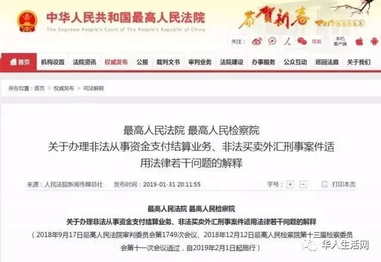
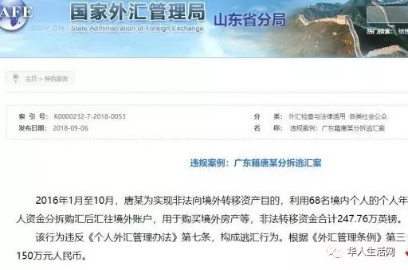

# 无标题

**链接地址:** http://mp.weixin.qq.com/s?__biz=MzI2NTE1ODgwOQ==&mid=2649606204&idx=2&sn=3ef4ce759ef2966e48c41185878fddca&chksm=f2b8c1cac5cf48dca7cb7c58cdb97886e2adc98264c1f7f919bf20ab21e253b2556e1debed9e&mpshare=1&scene=2&srcid=#rd
**作者:** 
**获取时间:** 2025/8/28 20:40:29
**图片数量:** 15

---

## 原始HTML内容

<section style="box-sizing: border-box;font-size: 16px;"><section style="box-sizing: border-box;" powered-by="xiumi.us"><section style="margin-right: 0%;margin-left: 0%;box-sizing: border-box;"><section style="display: inline-block;vertical-align: middle;width: 80%;box-sizing: border-box;"><section style="box-sizing: border-box;" powered-by="xiumi.us"><section style="margin-top: 10px;margin-bottom: 10px;text-align: center;box-sizing: border-box;"><section style="display: inline-block;box-sizing: border-box;"><section style="max-width: 100%;font-size: 0px;padding-bottom: 3px;box-sizing: border-box;"><section style="display: inline-block;vertical-align: middle;box-sizing: border-box;"><section style="width: 5px;height: 1px;background-color: rgb(217, 217, 217);box-sizing: border-box;"></section><section style="width: 1px;height: 5px;margin-top: -3px;margin-right: auto;margin-left: auto;background-color: rgb(217, 217, 217);box-sizing: border-box;"></section></section><section style="margin-top: -1px;margin-right: -5px;margin-left: -5px;width: 100%;display: inline-block;vertical-align: middle;padding-right: 8px;padding-left: 8px;box-sizing: border-box;"><section style="width: 100%;height: 1px;background-color: rgb(217, 217, 217);box-sizing: border-box;"></section></section><section style="display: inline-block;vertical-align: middle;box-sizing: border-box;"><section style="width: 5px;height: 1px;background-color: rgb(217, 217, 217);box-sizing: border-box;"></section><section style="width: 1px;height: 5px;margin-top: -3px;margin-right: auto;margin-left: auto;background-color: rgb(217, 217, 217);box-sizing: border-box;"></section></section></section><section style="padding-left: 15px;padding-right: 15px;color: rgb(161, 161, 161);font-size: 14px;box-sizing: border-box;">
点击上方<strong style="box-sizing: border-box;">蓝字</strong>关注我们哟~
</section><section style="max-width: 100%;font-size: 0px;box-sizing: border-box;"><section style="display: inline-block;vertical-align: middle;box-sizing: border-box;"><section style="width: 5px;height: 1px;background-color: rgb(217, 217, 217);box-sizing: border-box;"></section><section style="width: 1px;height: 5px;margin-top: -3px;margin-right: auto;margin-left: auto;background-color: rgb(217, 217, 217);box-sizing: border-box;"></section></section><section style="margin-top: -1px;margin-right: -5px;margin-left: -5px;width: 100%;display: inline-block;vertical-align: middle;padding-right: 8px;padding-left: 8px;box-sizing: border-box;"><section style="width: 100%;height: 1px;background-color: rgb(217, 217, 217);box-sizing: border-box;"></section></section><section style="display: inline-block;vertical-align: middle;box-sizing: border-box;"><section style="width: 5px;height: 1px;background-color: rgb(217, 217, 217);box-sizing: border-box;"></section><section style="width: 1px;height: 5px;margin-top: -3px;margin-right: auto;margin-left: auto;background-color: rgb(217, 217, 217);box-sizing: border-box;"></section></section></section></section></section></section></section><section style="display: inline-block;vertical-align: middle;width: 20%;box-sizing: border-box;"><section style="box-sizing: border-box;" powered-by="xiumi.us"><section style="text-align: center;margin: -10px 0% 10px;box-sizing: border-box;"><section style="max-width: 100%;vertical-align: middle;display: inline-block;line-height: 0;width: 100%;box-sizing: border-box;"></section></section></section></section></section></section><section style="box-sizing: border-box;" powered-by="xiumi.us"><section style="margin: 10px 0%;box-sizing: border-box;"><section style="display: inline-block;width: 100%;vertical-align: top;box-sizing: border-box;"><section style="box-sizing: border-box;" powered-by="xiumi.us"><section style="box-sizing: border-box;"><section style="display: inline-block;vertical-align: bottom;width: 75%;padding-right: 10px;box-sizing: border-box;"><section style="box-sizing: border-box;" powered-by="xiumi.us"><section style="margin: 10px 0% 3px;box-sizing: border-box;"><section style="display: inline-block;vertical-align: middle;box-sizing: border-box;"><section style="display: inline-block;vertical-align: bottom;padding-left: 5px;padding-right: 5px;line-height: 1.2em;margin-bottom: 2px;color: rgba(80, 182, 201, 0.72);box-sizing: border-box;">
<strong style="box-sizing: border-box;">仔细看下图，有惊喜！</strong>
</section><section style="max-width: 100%;display: inline-block;vertical-align: bottom;line-height: 0;width: 1.6em;box-sizing: border-box;"></section></section></section></section></section><section style="display: inline-block;vertical-align: bottom;width: 25%;box-sizing: border-box;"><section style="box-sizing: border-box;" powered-by="xiumi.us"><section style="margin-right: 0%;margin-bottom: 3px;margin-left: 0%;text-align: right;box-sizing: border-box;"><section style="display: inline-block;border-bottom: 0.15em solid rgba(80, 182, 201, 0.72);padding-bottom: 3px;box-sizing: border-box;"><section style="display: inline-block;padding: 3px;border-bottom: 0.15em solid rgba(80, 182, 201, 0.72);font-size: 12px;line-height: 1.4;color: rgb(255, 143, 47);box-sizing: border-box;">
<strong style="box-sizing: border-box;">金主大大</strong>
</section></section></section></section></section></section></section><section style="box-sizing: border-box;" powered-by="xiumi.us"><section style="margin-right: 0%;margin-left: 0%;box-sizing: border-box;"><section style="background-color: rgba(80, 182, 201, 0.72);height: 2px;box-sizing: border-box;"></section></section></section></section></section></section><section style="box-sizing: border-box;" powered-by="xiumi.us"><section style="text-align: center;margin-top: 10px;margin-bottom: 10px;box-sizing: border-box;"><section style="max-width: 100%;vertical-align: middle;display: inline-block;line-height: 0;box-sizing: border-box;"></section></section></section><section style="box-sizing: border-box;" powered-by="xiumi.us"><section style="text-align: center;margin-top: 10px;margin-bottom: 10px;box-sizing: border-box;"><section style="max-width: 100%;vertical-align: middle;display: inline-block;line-height: 0;box-sizing: border-box;"></section></section></section><section style="box-sizing: border-box;" powered-by="xiumi.us"><section style="text-align: center;margin-top: 10px;margin-bottom: 10px;box-sizing: border-box;"><section style="max-width: 100%;vertical-align: middle;display: inline-block;line-height: 0;box-sizing: border-box;"></section></section></section><section style="box-sizing: border-box;" powered-by="xiumi.us"><section style="text-align: center;margin-top: 10px;margin-bottom: 10px;box-sizing: border-box;"><section style="max-width: 100%;vertical-align: middle;display: inline-block;line-height: 0;box-sizing: border-box;"></section></section></section><section style="box-sizing: border-box;" powered-by="xiumi.us"><section style="text-align: center;margin-top: 10px;margin-bottom: 10px;box-sizing: border-box;"><section style="max-width: 100%;vertical-align: middle;display: inline-block;line-height: 0;box-sizing: border-box;"><svg class="svg" xmlns="http://www.w3.org/2000/svg" x="0px" y="0px" viewBox="0 0 902.1 38.2" style="vertical-align: middle;max-width: 100%;box-sizing: border-box;" width="100%"><g style="box-sizing: border-box;"><path style="box-sizing: border-box;" d="M18.4,1.4c0.9-1.9,2.4-1.9,3.4,0l3.4,6.9c0.9,1.9,3.4,3.7,5.4,4l7.6,1.1c2.1,0.3,2.5,1.7,1,3.2   l-5.5,5.4c-1.5,1.5-2.4,4.3-2.1,6.4l1.3,7.6c0.4,2.1-0.9,2.9-2.7,2l-6.8-3.6c-1.8-1-4.9-1-6.7,0l-6.8,3.6c-1.9,1-3.1,0.1-2.7-2   l1.3-7.6c0.4-2.1-0.6-4.9-2.1-6.4l-5.5-5.4c-1.5-1.5-1-2.9,1-3.2l7.6-1.1c2.1-0.3,4.5-2.1,5.4-4L18.4,1.4z" fill="rgb(178, 243, 230)"></path><path style="box-sizing: border-box;" d="M90.6,5.4c0.7-1.4,1.9-1.4,2.6,0l2.6,5.3c0.7,1.4,2.6,2.8,4.2,3.1l5.9,0.9c1.6,0.2,2,1.3,0.8,2.5   l-4.2,4.1c-1.2,1.1-1.9,3.3-1.6,4.9l1,5.8c0.3,1.6-0.7,2.3-2.1,1.5l-5.2-2.8c-1.4-0.8-3.8-0.8-5.2,0L84,33.6   c-1.4,0.8-2.4,0.1-2.1-1.5l1-5.8c0.3-1.6-0.5-3.8-1.6-4.9l-4.2-4.1c-1.2-1.1-0.8-2.2,0.8-2.5l5.9-0.9c1.6-0.2,3.5-1.6,4.2-3.1   L90.6,5.4z" fill="rgb(190, 204, 246)"></path><path style="box-sizing: border-box;" d="M162.6,7.5c0.6-1.2,1.6-1.2,2.2,0l2.2,4.5c0.6,1.2,2.2,2.4,3.6,2.6l5,0.7c1.4,0.2,1.7,1.1,0.7,2.1   l-3.6,3.5c-1,1-1.6,2.9-1.4,4.2l0.9,5c0.2,1.4-0.6,1.9-1.8,1.3l-4.5-2.4c-1.2-0.6-3.2-0.6-4.4,0l-4.5,2.4c-1.2,0.6-2,0.1-1.8-1.3   l0.9-5c0.2-1.4-0.4-3.3-1.4-4.2l-3.6-3.5c-1-1-0.7-1.9,0.7-2.1l5-0.7c1.4-0.2,3-1.4,3.6-2.6L162.6,7.5z" fill="rgb(150, 208, 240)"></path><path style="box-sizing: border-box;" d="M60.1,19.1c0,2.3-1.9,4.2-4.2,4.2c-2.3,0-4.2-1.9-4.2-4.2s1.9-4.2,4.2-4.2   C58.3,14.9,60.1,16.8,60.1,19.1z" fill="rgb(218, 240, 224)"></path><path style="box-sizing: border-box;" d="M203.8,19.1c0,2.3-1.9,4.2-4.2,4.2c-2.3,0-4.2-1.9-4.2-4.2s1.9-4.2,4.2-4.2   C201.9,14.9,203.8,16.8,203.8,19.1z" fill="rgb(218, 240, 224)"></path><path style="box-sizing: border-box;" d="M130.9,19.1c0,1.7-1.4,3.1-3.1,3.1c-1.7,0-3.1-1.4-3.1-3.1c0-1.7,1.4-3.1,3.1-3.1   C129.5,16.1,130.9,17.4,130.9,19.1z" fill="rgb(218, 240, 224)"></path><path style="box-sizing: border-box;" d="M233.9,1.4c0.9-1.9,2.4-1.9,3.4,0l3.4,6.9c0.9,1.9,3.4,3.7,5.4,4l7.6,1.1c2.1,0.3,2.5,1.7,1,3.2   l-5.5,5.4c-1.5,1.5-2.4,4.3-2.1,6.4l1.3,7.6c0.4,2.1-0.9,2.9-2.7,2l-6.8-3.6c-1.8-1-4.9-1-6.7,0l-6.8,3.6c-1.9,1-3.1,0.1-2.7-2   l1.3-7.6c0.4-2.1-0.6-4.9-2.1-6.4l-5.5-5.4c-1.5-1.5-1-2.9,1-3.2l7.6-1.1c2.1-0.3,4.5-2.1,5.4-4L233.9,1.4z" fill="rgb(178, 243, 230)"></path><path style="box-sizing: border-box;" d="M306.1,5.4c0.7-1.4,1.9-1.4,2.6,0l2.6,5.3c0.7,1.4,2.6,2.8,4.2,3.1l5.9,0.9c1.6,0.2,2,1.3,0.8,2.5   l-4.2,4.1c-1.2,1.1-1.9,3.3-1.6,4.9l1,5.8c0.3,1.6-0.7,2.3-2.1,1.5l-5.2-2.8c-1.4-0.8-3.8-0.8-5.2,0l-5.2,2.8   c-1.4,0.8-2.4,0.1-2.1-1.5l1-5.8c0.3-1.6-0.4-3.8-1.6-4.9l-4.2-4.1c-1.2-1.1-0.8-2.2,0.8-2.5l5.9-0.9c1.6-0.2,3.5-1.6,4.2-3.1   L306.1,5.4z" fill="rgb(190, 204, 246)"></path><path style="box-sizing: border-box;" d="M378.1,7.5c0.6-1.2,1.6-1.2,2.2,0l2.2,4.5c0.6,1.2,2.2,2.4,3.6,2.6l5,0.7c1.4,0.2,1.7,1.1,0.7,2.1   l-3.6,3.5c-1,1-1.6,2.9-1.4,4.2l0.9,5c0.2,1.4-0.6,1.9-1.8,1.3l-4.5-2.4c-1.2-0.6-3.2-0.6-4.4,0l-4.5,2.4c-1.2,0.6-2,0.1-1.8-1.3   l0.9-5c0.2-1.4-0.4-3.3-1.4-4.2l-3.6-3.5c-1-1-0.7-1.9,0.7-2.1l5-0.7c1.4-0.2,3-1.4,3.6-2.6L378.1,7.5z" fill="rgb(150, 208, 240)"></path><path style="box-sizing: border-box;" d="M275.7,19.1c0,2.3-1.9,4.2-4.2,4.2c-2.3,0-4.2-1.9-4.2-4.2s1.9-4.2,4.2-4.2   C273.8,14.9,275.7,16.8,275.7,19.1z" fill="rgb(218, 240, 224)"></path><path style="box-sizing: border-box;" d="M419.3,19.1c0,2.3-1.9,4.2-4.2,4.2c-2.3,0-4.2-1.9-4.2-4.2s1.9-4.2,4.2-4.2   C417.5,14.9,419.3,16.8,419.3,19.1z" fill="rgb(218, 240, 224)"></path><path style="box-sizing: border-box;" d="M346.4,19.1c0,1.7-1.4,3.1-3.1,3.1c-1.7,0-3.1-1.4-3.1-3.1c0-1.7,1.4-3.1,3.1-3.1   C345,16.1,346.4,17.4,346.4,19.1z" fill="rgb(218, 240, 224)"></path><path style="box-sizing: border-box;" d="M449.4,1.4c0.9-1.9,2.4-1.9,3.4,0l3.4,6.9c0.9,1.9,3.4,3.7,5.4,4l7.6,1.1c2.1,0.3,2.5,1.7,1,3.2   l-5.5,5.4c-1.5,1.5-2.4,4.3-2.1,6.4l1.3,7.6c0.4,2.1-0.9,2.9-2.7,2l-6.8-3.6c-1.8-1-4.9-1-6.7,0l-6.8,3.6c-1.9,1-3.1,0.1-2.7-2   l1.3-7.6c0.4-2.1-0.6-4.9-2.1-6.4l-5.5-5.4c-1.5-1.5-1-2.9,1-3.2l7.6-1.1c2.1-0.3,4.5-2.1,5.4-4L449.4,1.4z" fill="rgb(178, 243, 230)"></path><path style="box-sizing: border-box;" d="M521.6,5.4c0.7-1.4,1.9-1.4,2.6,0l2.6,5.3c0.7,1.4,2.6,2.8,4.2,3.1l5.9,0.9c1.6,0.2,2,1.3,0.8,2.5   l-4.2,4.1c-1.2,1.1-1.9,3.3-1.6,4.9l1,5.8c0.3,1.6-0.7,2.3-2.1,1.5l-5.2-2.8c-1.4-0.8-3.8-0.8-5.2,0l-5.2,2.8   c-1.4,0.8-2.4,0.1-2.1-1.5l1-5.8c0.3-1.6-0.5-3.8-1.6-4.9l-4.2-4.1c-1.2-1.1-0.8-2.2,0.8-2.5l5.9-0.9c1.6-0.2,3.5-1.6,4.2-3.1   L521.6,5.4z" fill="rgb(190, 204, 246)"></path><path style="box-sizing: border-box;" d="M593.6,7.5c0.6-1.2,1.6-1.2,2.2,0l2.2,4.5c0.6,1.2,2.2,2.4,3.6,2.6l5,0.7c1.4,0.2,1.7,1.1,0.7,2.1   l-3.6,3.5c-1,1-1.6,2.9-1.4,4.2l0.9,5c0.2,1.4-0.6,1.9-1.8,1.3l-4.5-2.4c-1.2-0.6-3.2-0.6-4.4,0l-4.5,2.4c-1.2,0.6-2,0.1-1.8-1.3   l0.9-5c0.2-1.4-0.4-3.3-1.4-4.2l-3.6-3.5c-1-1-0.7-1.9,0.7-2.1l5-0.7c1.4-0.2,3-1.4,3.6-2.6L593.6,7.5z" fill="rgb(150, 208, 240)"></path><path style="box-sizing: border-box;" d="M491.2,19.1c0,2.3-1.9,4.2-4.2,4.2c-2.3,0-4.2-1.9-4.2-4.2s1.9-4.2,4.2-4.2   C489.3,14.9,491.2,16.8,491.2,19.1z" fill="rgb(218, 240, 224)"></path><path style="box-sizing: border-box;" d="M634.9,19.1c0,2.3-1.9,4.2-4.2,4.2c-2.3,0-4.2-1.9-4.2-4.2s1.9-4.2,4.2-4.2   C633,14.9,634.9,16.8,634.9,19.1z" fill="rgb(218, 240, 224)"></path><path style="box-sizing: border-box;" d="M561.9,19.1c0,1.7-1.4,3.1-3.1,3.1c-1.7,0-3.1-1.4-3.1-3.1c0-1.7,1.4-3.1,3.1-3.1   C560.5,16.1,561.9,17.4,561.9,19.1z" fill="rgb(218, 240, 224)"></path><path style="box-sizing: border-box;" d="M664.9,1.4c0.9-1.9,2.4-1.9,3.4,0l3.4,6.9c0.9,1.9,3.4,3.7,5.4,4l7.6,1.1c2.1,0.3,2.5,1.7,1,3.2   l-5.5,5.4c-1.5,1.5-2.4,4.3-2.1,6.4l1.3,7.6c0.4,2.1-0.9,2.9-2.7,2l-6.8-3.6c-1.8-1-4.9-1-6.7,0l-6.8,3.6c-1.9,1-3.1,0.1-2.7-2   l1.3-7.6c0.4-2.1-0.6-4.9-2.1-6.4l-5.5-5.4c-1.5-1.5-1-2.9,1-3.2l7.6-1.1c2.1-0.3,4.5-2.1,5.4-4L664.9,1.4z" fill="rgb(178, 243, 230)"></path><path style="box-sizing: border-box;" d="M737.1,5.4c0.7-1.4,1.9-1.4,2.6,0l2.6,5.3c0.7,1.4,2.6,2.8,4.2,3.1l5.9,0.9c1.6,0.2,2,1.3,0.8,2.5   l-4.2,4.1c-1.2,1.1-1.9,3.3-1.6,4.9l1,5.8c0.3,1.6-0.7,2.3-2.1,1.5l-5.2-2.8c-1.4-0.8-3.8-0.8-5.2,0l-5.2,2.8   c-1.4,0.8-2.4,0.1-2.1-1.5l1-5.8c0.3-1.6-0.5-3.8-1.6-4.9l-4.2-4.1c-1.2-1.1-0.8-2.2,0.8-2.5l5.9-0.9c1.6-0.2,3.5-1.6,4.2-3.1   L737.1,5.4z" fill="rgb(190, 204, 246)"></path><path style="box-sizing: border-box;" d="M809.2,7.5c0.6-1.2,1.6-1.2,2.2,0l2.2,4.5c0.6,1.2,2.2,2.4,3.6,2.6l5,0.7c1.4,0.2,1.7,1.1,0.7,2.1   l-3.6,3.5c-1,1-1.6,2.9-1.4,4.2l0.9,5c0.2,1.4-0.6,1.9-1.8,1.3l-4.5-2.4c-1.2-0.6-3.2-0.6-4.4,0l-4.5,2.4c-1.2,0.6-2,0.1-1.8-1.3   l0.9-5c0.2-1.4-0.4-3.3-1.4-4.2l-3.6-3.5c-1-1-0.7-1.9,0.7-2.1l5-0.7c1.4-0.2,3-1.4,3.6-2.6L809.2,7.5z" fill="rgb(150, 208, 240)"></path><path style="box-sizing: border-box;" d="M706.7,19.1c0,2.3-1.9,4.2-4.2,4.2c-2.3,0-4.2-1.9-4.2-4.2s1.9-4.2,4.2-4.2   C704.8,14.9,706.7,16.8,706.7,19.1z" fill="rgb(218, 240, 224)"></path><path style="box-sizing: border-box;" d="M850.4,19.1c0,2.3-1.9,4.2-4.2,4.2c-2.3,0-4.2-1.9-4.2-4.2s1.9-4.2,4.2-4.2   C848.5,14.9,850.4,16.8,850.4,19.1z" fill="rgb(218, 240, 224)"></path><path style="box-sizing: border-box;" d="M777.4,19.1c0,1.7-1.4,3.1-3.1,3.1c-1.7,0-3.1-1.4-3.1-3.1c0-1.7,1.4-3.1,3.1-3.1   C776,16.1,777.4,17.4,777.4,19.1z" fill="rgb(218, 240, 224)"></path><path style="box-sizing: border-box;" d="M880.4,1.4c0.9-1.9,2.4-1.9,3.4,0l3.4,6.9c0.9,1.9,3.4,3.7,5.4,4l7.6,1.1c2.1,0.3,2.5,1.7,1,3.2   l-5.5,5.4c-1.5,1.5-2.4,4.3-2.1,6.4l1.3,7.6c0.4,2.1-0.9,2.9-2.7,2l-6.8-3.6c-1.8-1-4.9-1-6.7,0l-6.8,3.6c-1.8,1-3.1,0.1-2.7-2   l1.3-7.6c0.4-2.1-0.6-4.9-2.1-6.4l-5.5-5.4c-1.5-1.5-1-2.9,1-3.2l7.6-1.1c2.1-0.3,4.5-2.1,5.4-4L880.4,1.4z" fill="rgb(178, 243, 230)"></path></g></svg></section></section></section><section style="box-sizing: border-box;" powered-by="xiumi.us"><section style="box-sizing: border-box;"><section style="box-sizing: border-box;">
文章来源：华人生活网
<section style="max-width: 100%;box-sizing: border-box;font-variant-numeric: normal;font-variant-east-asian: normal;letter-spacing: 0.544px;white-space: normal;widows: 1;font-size: 16px;background-color: rgb(255, 255, 255);word-wrap: break-word !important;overflow-wrap: break-word !important;"><section powered-by="xiumi.us" style="max-width: 100%;box-sizing: border-box;word-wrap: break-word !important;overflow-wrap: break-word !important;"><section style="margin-top: 10px;margin-bottom: 10px;max-width: 100%;box-sizing: border-box;word-wrap: break-word !important;overflow-wrap: break-word !important;"><section style="margin-right: 5px;margin-bottom: -2.25em;max-width: 100%;box-sizing: border-box;background-color: rgb(247, 247, 247);word-wrap: break-word !important;overflow-wrap: break-word !important;"><section powered-by="xiumi.us" style="max-width: 100%;box-sizing: border-box;word-wrap: break-word !important;overflow-wrap: break-word !important;"><section style="margin-bottom: 5px;padding: 10px;max-width: 100%;box-sizing: border-box;word-wrap: break-word !important;overflow-wrap: break-word !important;"><section style="max-width: 100%;box-sizing: border-box;text-align: center;word-wrap: break-word !important;overflow-wrap: break-word !important;">
<strong style="max-width: 100%;box-sizing: border-box !important;word-wrap: break-word !important;overflow-wrap: break-word !important;">中</strong>国人在国外买房可能会坐牢？

 

这个听上去不怎么像事实的信息，竟是真的…… 

 

春节前夕，最高人民法院和最高人民检察院联合发布<strong style="max-width: 100%;box-sizing: border-box !important;word-wrap: break-word !important;overflow-wrap: break-word !important;">《关于办理非法从事资金支付结算业务、非法买卖外汇刑事案件适用法律若干问题的解释》</strong>文章一出，引起了巨大震撼。
</section></section></section></section><section style="margin-left: auto;max-width: 100%;box-sizing: border-box;width: 2.25em;height: 2.25em;border-right: 5px solid rgb(254, 219, 115);border-bottom: 5px solid rgb(254, 219, 115);word-wrap: break-word !important;overflow-wrap: break-word !important;"> </section></section></section></section>
 

很多人看到了外汇管制方面的严管，解读出<strong style="max-width: 100%;box-sizing: border-box !important;word-wrap: break-word !important;overflow-wrap: break-word !important;">“朋友圈私自换汇的时代结束了！”</strong>&nbsp;这确实是一个方面。

 

但是，这条政策的背后，更为重磅的还有：<strong style="max-width: 100%;box-sizing: border-box !important;word-wrap: break-word !important;overflow-wrap: break-word !important;">如果你的钱是走地下钱庄汇到海外买房的，真的可能坐牢！</strong>

 

 

在中国，通过<strong style="max-width: 100%;box-sizing: border-box !important;word-wrap: break-word !important;overflow-wrap: break-word !important;">合法渠道换汇到海外买房是明令禁止的。</strong>

 

大量国内资金想带出国门只有地下钱庄一条路，这条路一直就是非法的，只不过此前被抓到处罚一般较轻。

 

但是被抓被罚的案例也有：比如香港籍华人陈某，2015年将1700万元人民币打入地下钱庄控制的境内账户，用于购买境外房产，陈某最终被罚款153万元人民币。

 

如果说罚款150万并不算大事，现在就没那么简单了。

 

根据这个最新《解释》，从2019年2月1日起，<strong style="max-width: 100%;box-sizing: border-box !important;word-wrap: break-word !important;overflow-wrap: break-word !important;">超过500万人民币就可能以非法经营罪定罪。</strong>

 

除了罚款，还可能处五年以下有期徒刑或者拘役，<strong style="max-width: 100%;box-sizing: border-box !important;word-wrap: break-word !important;overflow-wrap: break-word !important;">超过2500万人民币的，可能处五年以上有期徒刑。</strong>

 

这份文件的核心点给各位列举一下：

 

<strong style="max-width: 100%;box-sizing: border-box !important;word-wrap: break-word !important;overflow-wrap: break-word !important;">一，“倒买倒卖外汇”或者“变相买卖外汇”等非法买卖外汇行为。</strong>

 

情节严重的，依照刑法第225条第4项的规定，以非法经营罪定罪。

 

<strong style="max-width: 100%;box-sizing: border-box !important;word-wrap: break-word !important;overflow-wrap: break-word !important;">二，明确了什么是“非法买卖外汇”的“情节严重”。</strong>

 

比如“非法经营数额在五百万元以上的”、“违法所得数额在十万元以上的”就算。

 

按照刑法，就可以“处五年以下有期徒刑或者拘役，并处或者单处违法所得一倍以上五倍以下罚金”。

 

<strong style="max-width: 100%;box-sizing: border-box !important;word-wrap: break-word !important;overflow-wrap: break-word !important;">三，明确了什么是“非法买卖外汇”的“情节特别严重”。</strong>

 

比如“非法经营数额在二千五百万元以上的”、“违法所得数额在五十万元以上的”等就算。

 

按照刑法，就可以“处五年以上有期徒刑，并处违法所得一倍以上五倍以下罚金或者没收财产”。

 

注意，最高发文件中说明的“元”是指的人民币，按照现在的汇率5.09算，如果倒卖98.2万加元（500万元人民币）以上的外汇，就符合“处五年以下有期徒刑或者拘役”的条件；如果倒卖491.2万加元以上的外汇，就符合“处五年以上有期徒刑”。  这份文件没有明确指明非法外汇买卖的用途，也就是说买卖外汇超过法定的每人五万美元以上，都是非法的，这其中当然也包括买卖外汇用于购买海外房产。

 

目前，中国居民<strong style="max-width: 100%;box-sizing: border-box !important;word-wrap: break-word !important;overflow-wrap: break-word !important;">购买海外房产，基本都是通过地下钱庄。</strong>

 

这种通过地下钱庄的购房行为就可以属于<strong style="max-width: 100%;box-sizing: border-box !important;word-wrap: break-word !important;overflow-wrap: break-word !important;">非法买卖外汇罪或者变相买卖外汇。</strong>

 

文件打击的重点是“变相买卖外汇”。有专家认为，所谓“变相买卖外汇”，就是境内境外的资金互换，不涉及资金的直接流出，往往交易更加隐蔽、金额更为巨大。

 

 

比如，加拿大的某楼盘在中国直接收人民币售楼，也可以算是资金互换，现在已经成为了打击对象。

 

详细一点如，中国居民用1000万人民币，购买了加拿大的房产。  这种在现实中常见的情况，按照现在外汇管理制度，是绝对不允许的。如果他在国内找地下钱庄换成加元，那么就是非法外汇买卖罪获刑。

 

此解读一出，引发许多移民的议论<strong style="max-width: 100%;box-sizing: border-box !important;word-wrap: break-word !important;overflow-wrap: break-word !important;">“原来自己赚的钱，自己不能决定怎么花？</strong>

 

简单来说就是明令：<strong style="max-width: 100%;box-sizing: border-box !important;word-wrap: break-word !important;overflow-wrap: break-word !important;">不准国内赚钱，国外买房！</strong>

 

<strong style="max-width: 100%;box-sizing: border-box !important;word-wrap: break-word !important;overflow-wrap: break-word !important;">专家解释：</strong>中国居民用于购买加拿大房产的资金其实就是通地下钱庄对倒货币互换，这种“货币互换”实际上是<strong style="max-width: 100%;box-sizing: border-box !important;word-wrap: break-word !important;overflow-wrap: break-word !important;">把流入中国的外汇截留在了加拿大。</strong>

 

表面上并没有直接“套汇”，没有减少中国的外汇储备，但<strong style="max-width: 100%;box-sizing: border-box !important;word-wrap: break-word !important;overflow-wrap: break-word !important;">逃离了国家外汇管理的监管</strong>，阻止了中国外汇储备的增长的同时，造成国内资金的短缺，更没有流入中国的实体经济。

 
<section style="max-width: 100%;box-sizing: border-box;font-variant-numeric: normal;font-variant-east-asian: normal;letter-spacing: 0.544px;white-space: normal;widows: 1;font-size: 16px;background-color: rgb(255, 255, 255);word-wrap: break-word !important;overflow-wrap: break-word !important;"><section powered-by="xiumi.us" style="max-width: 100%;box-sizing: border-box;word-wrap: break-word !important;overflow-wrap: break-word !important;"><section style="margin-top: 10px;margin-bottom: 10px;max-width: 100%;box-sizing: border-box;text-align: center;transform: translate3d(-2px, 0px, 0px);word-wrap: break-word !important;overflow-wrap: break-word !important;"><section style="max-width: 100%;box-sizing: border-box;display: inline-block;min-width: 10%;vertical-align: top;background-color: rgb(255, 202, 0);word-wrap: break-word !important;overflow-wrap: break-word !important;"><section powered-by="xiumi.us" style="max-width: 100%;box-sizing: border-box;word-wrap: break-word !important;overflow-wrap: break-word !important;"><section style="margin-top: 5px;margin-bottom: -5px;max-width: 100%;box-sizing: border-box;transform: translate3d(5px, 0px, 0px);word-wrap: break-word !important;overflow-wrap: break-word !important;"><section style="padding-right: 8px;padding-left: 8px;max-width: 100%;box-sizing: border-box;display: inline-block;min-width: 10%;vertical-align: top;border-style: solid;border-width: 8px 1px 1px;border-radius: 0px;border-color: rgb(62, 62, 62);background-color: rgb(255, 255, 255);word-wrap: break-word !important;overflow-wrap: break-word !important;"><section powered-by="xiumi.us" style="max-width: 100%;box-sizing: border-box;word-wrap: break-word !important;overflow-wrap: break-word !important;"><section style="max-width: 100%;box-sizing: border-box;word-wrap: break-word !important;overflow-wrap: break-word !important;"><section style="padding-right: 8px;padding-left: 8px;max-width: 100%;box-sizing: border-box;text-align: left;word-wrap: break-word !important;overflow-wrap: break-word !important;">
<strong style="max-width: 100%;box-sizing: border-box;word-wrap: break-word !important;overflow-wrap: break-word !important;">境外购房一直不允许&nbsp;</strong>
</section></section></section></section></section></section></section></section></section></section>
 

其实，相关政策国家外汇局早有公布：国家外汇管理局宣布自2017年1月1日起，<strong style="max-width: 100%;box-sizing: border-box !important;word-wrap: break-word !important;overflow-wrap: break-word !important;">个人申购外汇需要填写《个人购汇申请书》，明确填写购汇用途和用汇时间。</strong>

 

个人申购外汇须明确更多法律责任，<strong style="max-width: 100%;box-sizing: border-box !important;word-wrap: break-word !important;overflow-wrap: break-word !important;">如果违反境外买房、洗钱、地下钱庄等六项禁止行为，将被列入“关注名单”</strong>，个人当年及之后两年不享有个人便利化额度。

 

 《个人购汇申请书》需填写的内容包括：<strong style="max-width: 100%;box-sizing: border-box !important;word-wrap: break-word !important;overflow-wrap: break-word !important;">购汇人姓名、身份证号、人民币账号、外汇账号、币种、预计用汇时间（精确到月）、购汇用途等。&nbsp;</strong> 

 

早前蚂蚁搬家也将被追溯 在过去，因为个人换汇的额度限制，许多人就想出了分拆汇款的<strong style="max-width: 100%;box-sizing: border-box !important;word-wrap: break-word !important;overflow-wrap: break-word !important;">“蚂蚁搬家”</strong>方式转出资金。

 

比如一个人的额度有限，就请亲戚、朋友帮忙，利用他们的额度，多人多次转汇。这种做法在现实中比较普遍。

 

但是在去年，外汇局开始针对这一行为开始严打。

 

 

国家外汇局已表示，对于过去利用分拆汇款，蚂蚁搬家形式到境外购房产的中国公民，将依法进行外汇追回并罚款，若不能按时还回款项者，将判以刑法骗汇罪论处。

 

这是去年通报的一起案例，该涉案人员唐某是2016年利用68个人的额度转汇用于海外买房，但2018年他被查出来，被罚150万。  2018年上半年，<strong style="max-width: 100%;box-sizing: border-box !important;word-wrap: break-word !important;overflow-wrap: break-word !important;">外汇局共查处外汇违规案件1354件，罚没款达到3.45亿人民币。</strong>

 

<section style="max-width: 100%;box-sizing: border-box;font-variant-numeric: normal;font-variant-east-asian: normal;letter-spacing: 0.544px;white-space: normal;widows: 1;font-size: 16px;background-color: rgb(255, 255, 255);word-wrap: break-word !important;overflow-wrap: break-word !important;"><section powered-by="xiumi.us" style="max-width: 100%;box-sizing: border-box;word-wrap: break-word !important;overflow-wrap: break-word !important;"><section style="margin-top: 10px;margin-bottom: 10px;max-width: 100%;box-sizing: border-box;text-align: center;transform: translate3d(-2px, 0px, 0px);word-wrap: break-word !important;overflow-wrap: break-word !important;"><section style="max-width: 100%;box-sizing: border-box;display: inline-block;min-width: 10%;vertical-align: top;background-color: rgb(255, 202, 0);word-wrap: break-word !important;overflow-wrap: break-word !important;"><section powered-by="xiumi.us" style="max-width: 100%;box-sizing: border-box;word-wrap: break-word !important;overflow-wrap: break-word !important;"><section style="margin-top: 5px;margin-bottom: -5px;max-width: 100%;box-sizing: border-box;transform: translate3d(5px, 0px, 0px);word-wrap: break-word !important;overflow-wrap: break-word !important;"><section style="padding-right: 8px;padding-left: 8px;max-width: 100%;box-sizing: border-box;display: inline-block;min-width: 10%;vertical-align: top;border-style: solid;border-width: 8px 1px 1px;border-radius: 0px;border-color: rgb(62, 62, 62);background-color: rgb(255, 255, 255);word-wrap: break-word !important;overflow-wrap: break-word !important;"><section powered-by="xiumi.us" style="max-width: 100%;box-sizing: border-box;word-wrap: break-word !important;overflow-wrap: break-word !important;"><section style="max-width: 100%;box-sizing: border-box;word-wrap: break-word !important;overflow-wrap: break-word !important;"><section style="padding-right: 8px;padding-left: 8px;max-width: 100%;box-sizing: border-box;text-align: left;word-wrap: break-word !important;overflow-wrap: break-word !important;">
<strong style="max-width: 100%;box-sizing: border-box;word-wrap: break-word !important;overflow-wrap: break-word !important;"><strong style="max-width: 100%;font-family: &quot;Microsoft YaHei&quot;, Tahoma, Verdana, STHeiTi, simsun, sans-serif;font-size: 15px;letter-spacing: 0.5px;box-sizing: border-box !important;word-wrap: break-word !important;overflow-wrap: break-word !important;">如何合法在海外买房？</strong></strong>
</section></section></section></section></section></section></section></section></section></section>
 外国永久居留权的中国移民是可以申请资产转移，合法在海外买房的。具体做法的规定十分明确。  需要申请大额财产转移境外的这三类人，<strong style="max-width: 100%;box-sizing: border-box !important;word-wrap: break-word !important;overflow-wrap: break-word !important;">转移财产时需要准备6份不同的材料。</strong> 
<section style="max-width: 100%;box-sizing: border-box;font-variant-numeric: normal;font-variant-east-asian: normal;letter-spacing: 0.544px;white-space: normal;widows: 1;font-size: 16px;background-color: rgb(255, 255, 255);word-wrap: break-word !important;overflow-wrap: break-word !important;"><section powered-by="xiumi.us" style="max-width: 100%;box-sizing: border-box;word-wrap: break-word !important;overflow-wrap: break-word !important;"><section style="margin-top: 10px;margin-bottom: 10px;max-width: 100%;box-sizing: border-box;word-wrap: break-word !important;overflow-wrap: break-word !important;"><section style="padding: 10px;max-width: 100%;box-sizing: border-box;display: inline-block;width: 677px;border-width: 2px;border-style: dotted;border-color: rgb(192, 200, 209);word-wrap: break-word !important;overflow-wrap: break-word !important;"><section powered-by="xiumi.us" style="max-width: 100%;box-sizing: border-box;word-wrap: break-word !important;overflow-wrap: break-word !important;"><section style="max-width: 100%;box-sizing: border-box;word-wrap: break-word !important;overflow-wrap: break-word !important;"><section style="max-width: 100%;box-sizing: border-box;word-wrap: break-word !important;overflow-wrap: break-word !important;">
1，《个人财产转移业务申请表》，需申请人或其代理人签名

 

2，申请人身份证明文件

 

3，申请人收入来源证明以及财产权利证明文件：

 

（1）个人薪酬所得（包括工资和薪金所得、稿酬所得、劳务报酬等），需提交有关收入来源的证明；

 

（2）经营收入（包括私营业主、企业个人股东、个体工商户生产经营所得，对企事业单位承包、租赁经营所得等），需提交个体户经营收入申报表、股权证明或承包、租赁合同或协议以及能证明收入来源的材料，如企业财务报表、企业董事会分配决议等；

 

（2）资本所得及变现：①利息、股息、红利所得，需提交存款证明、股票、债券开户及交易记录，②财产租赁所得、财产转让所得、特许权使用等，需提交财产租赁、转让、特许权使用的合同或协议，房屋产权证，房地产买卖契约或拆迁补偿安置协议书等；

 

（3）偶然所得（包括合法的福利彩票、体育彩票收入等）及其他财产或收入，需提交真实交易记录证明。

 

4，税收证明或完税凭证，由申请转移财产所在地或收入来源地主管税务机关开具

 

5，委托他人办理的，需提供委托代理协议和代理人身份证明6.外汇局要求提供的补充材料从要求的

 

6，类材料，我们可以发现，大部分材料是属于证明转移财产合法性的，而不是限制转移的。这就说明这种情况下的转移本身收到的限制较少。
</section></section></section></section></section></section></section>
<strong style="max-width: 100%;box-sizing: border-box !important;word-wrap: break-word !important;overflow-wrap: break-word !important;">总之，国内的朋友如果想要在2019年顺顺利利地在海外买房，可能最安全的办法就是老老实实按照国家规定的手续办理财产转移。</strong>

 

<strong style="max-width: 100%;box-sizing: border-box !important;word-wrap: break-word !important;overflow-wrap: break-word !important;">如果想要简单省事，少受点限制的话，最好先办理移民手续。</strong>

 
</section></section></section><section style="box-sizing: border-box;" powered-by="xiumi.us"><section style="text-align: center;margin-top: 10px;margin-bottom: 10px;box-sizing: border-box;"><section style="max-width: 100%;vertical-align: middle;display: inline-block;line-height: 0;box-shadow: rgb(0, 0, 0) 0px 0px 0px;box-sizing: border-box;"></section></section></section><section style="box-sizing: border-box;" powered-by="xiumi.us"><section style="box-sizing: border-box;"><section style="text-align: center;font-size: 14px;color: rgb(160, 160, 160);box-sizing: border-box;">
各类商业广告投放推广，请联系微信ID：haoxue_nina
</section></section></section><section style="box-sizing: border-box;" powered-by="xiumi.us"><section style="box-sizing: border-box;"><section style="box-sizing: border-box;">
 
</section></section></section><section style="box-sizing: border-box;" powered-by="xiumi.us"><section style="box-sizing: border-box;"><section style="box-sizing: border-box;">
 
</section></section></section><section style="box-sizing: border-box;" powered-by="xiumi.us"><section style="margin: 40px 0% 10px;text-align: center;box-sizing: border-box;"><section style="display: inline-block;width: 90%;border-width: 1px;border-style: dotted;border-color: rgba(80, 182, 201, 0.72);padding: 10px;border-radius: 0px;box-sizing: border-box;"><section style="box-sizing: border-box;" powered-by="xiumi.us"><section style="transform: translate3d(20px, 0px, 0px);text-align: left;font-size: 11px;margin-top: -55px;margin-right: 0%;margin-left: 0%;box-sizing: border-box;"><section style="box-sizing: border-box;width: 7em;height: 7em;display: inline-block;vertical-align: bottom;border-radius: 100%;border-width: 5px;border-style: none;border-color: rgba(80, 182, 201, 0.72);background-position: center center;background-repeat: no-repeat;background-size: cover;overflow: hidden;background-image: url(&quot;https://mmbiz.qpic.cn/mmbiz_jpg/D1nJqnhkPyJhbic3yGSUsuIha2SZGfTvpicooMB9kiaSf8EkZu6AR3PgNq03UMW4vwEKKUliaPWsKLNB7OzKn7KeQw/640?wx_fmt=jpeg&quot;);"><section style="height: 100%;overflow: hidden;line-height: 0;vertical-align: middle;max-width: 100%;box-sizing: border-box;"></section></section></section></section><section style="box-sizing: border-box;" powered-by="xiumi.us"><section style="box-sizing: border-box;"><section class="group-empty" style="display: inline-block;vertical-align: top;width: 38.2%;box-sizing: border-box;height: 1px;"></section><section style="display: inline-block;vertical-align: top;width: 61.8%;box-sizing: border-box;"><section style="box-sizing: border-box;" powered-by="xiumi.us"><section style="margin-right: 0%;margin-left: 0%;box-sizing: border-box;"><section style="font-size: 18px;color: rgb(67, 103, 117);line-height: 1.6;letter-spacing: 1px;box-sizing: border-box;">
<strong style="box-sizing: border-box;">埃德蒙顿微生活</strong>
</section></section></section><section style="box-sizing: border-box;" powered-by="xiumi.us"><section style="margin-top: 0.5em;margin-bottom: 0.5em;box-sizing: border-box;"><section style="background-color: rgba(80, 182, 201, 0.72);height: 1px;box-sizing: border-box;"></section></section></section></section></section></section><section style="box-sizing: border-box;" powered-by="xiumi.us"><section style="box-sizing: border-box;"><section style="text-align: justify;font-size: 14px;color: rgba(62, 62, 62, 0.72);letter-spacing: 2px;box-sizing: border-box;">
<strong style="box-sizing: border-box;">关心埃德蒙顿民生，</strong>

<strong style="box-sizing: border-box;">关注埃德蒙顿的发展。</strong>

 

埃德蒙顿微生活是“吃喝玩乐埃德蒙顿”旗下，为埃德蒙顿地区的居民提供每日最新的吃喝玩乐、工作学习、商业投资的媒体平台 。
</section></section></section><section style="box-sizing: border-box;" powered-by="xiumi.us"><section style="box-sizing: border-box;"><section style="text-align: left;box-sizing: border-box;">
 
</section></section></section><section style="box-sizing: border-box;" powered-by="xiumi.us"><section style="box-sizing: border-box;"><section style="display: inline-block;vertical-align: middle;width: 61.8%;box-sizing: border-box;"><section style="box-sizing: border-box;" powered-by="xiumi.us"><section style="box-sizing: border-box;"><section style="text-align: justify;font-size: 12px;color: rgba(62, 62, 62, 0.37);line-height: 1.9;letter-spacing: 0px;box-sizing: border-box;">
我们的目标是以最新、最快、最及时的方式 报道埃德蒙顿的新鲜事 。 
</section></section></section></section><section style="display: inline-block;vertical-align: middle;width: 38.2%;box-sizing: border-box;"><section style="box-sizing: border-box;" powered-by="xiumi.us"><section style="margin-right: 0%;margin-left: 0%;box-sizing: border-box;"><section style="max-width: 100%;vertical-align: middle;display: inline-block;line-height: 0;width: 70%;box-sizing: border-box;"></section></section></section></section></section></section></section></section></section></section>
 

 

---

## 纯文本内容

点击上方蓝字关注我们哟~仔细看下图，有惊喜！金主大大文章来源：华人生活网中国人在国外买房可能会坐牢？这个听上去不怎么像事实的信息，竟是真的……春节前夕，最高人民法院和最高人民检察院联合发布《关于办理非法从事资金支付结算业务、非法买卖外汇刑事案件适用法律若干问题的解释》文章一出，引起了巨大震撼。很多人看到了外汇管制方面的严管，解读出“朋友圈私自换汇的时代结束了！” 这确实是一个方面。但是，这条政策的背后，更为重磅的还有：如果你的钱是走地下钱庄汇到海外买房的，真的可能坐牢！在中国，通过合法渠道换汇到海外买房是明令禁止的。大量国内资金想带出国门只有地下钱庄一条路，这条路一直就是非法的，只不过此前被抓到处罚一般较轻。但是被抓被罚的案例也有：比如香港籍华人陈某，2015年将1700万元人民币打入地下钱庄控制的境内账户，用于购买境外房产，陈某最终被罚款153万元人民币。如果说罚款150万并不算大事，现在就没那么简单了。根据这个最新《解释》，从2019年2月1日起，超过500万人民币就可能以非法经营罪定罪。除了罚款，还可能处五年以下有期徒刑或者拘役，超过2500万人民币的，可能处五年以上有期徒刑。这份文件的核心点给各位列举一下：一，“倒买倒卖外汇”或者“变相买卖外汇”等非法买卖外汇行为。情节严重的，依照刑法第225条第4项的规定，以非法经营罪定罪。二，明确了什么是“非法买卖外汇”的“情节严重”。比如“非法经营数额在五百万元以上的”、“违法所得数额在十万元以上的”就算。按照刑法，就可以“处五年以下有期徒刑或者拘役，并处或者单处违法所得一倍以上五倍以下罚金”。三，明确了什么是“非法买卖外汇”的“情节特别严重”。比如“非法经营数额在二千五百万元以上的”、“违法所得数额在五十万元以上的”等就算。按照刑法，就可以“处五年以上有期徒刑，并处违法所得一倍以上五倍以下罚金或者没收财产”。注意，最高发文件中说明的“元”是指的人民币，按照现在的汇率5.09算，如果倒卖98.2万加元（500万元人民币）以上的外汇，就符合“处五年以下有期徒刑或者拘役”的条件；如果倒卖491.2万加元以上的外汇，就符合“处五年以上有期徒刑”。这份文件没有明确指明非法外汇买卖的用途，也就是说买卖外汇超过法定的每人五万美元以上，都是非法的，这其中当然也包括买卖外汇用于购买海外房产。目前，中国居民购买海外房产，基本都是通过地下钱庄。这种通过地下钱庄的购房行为就可以属于非法买卖外汇罪或者变相买卖外汇。文件打击的重点是“变相买卖外汇”。有专家认为，所谓“变相买卖外汇”，就是境内境外的资金互换，不涉及资金的直接流出，往往交易更加隐蔽、金额更为巨大。比如，加拿大的某楼盘在中国直接收人民币售楼，也可以算是资金互换，现在已经成为了打击对象。详细一点如，中国居民用1000万人民币，购买了加拿大的房产。这种在现实中常见的情况，按照现在外汇管理制度，是绝对不允许的。如果他在国内找地下钱庄换成加元，那么就是非法外汇买卖罪获刑。此解读一出，引发许多移民的议论“原来自己赚的钱，自己不能决定怎么花？简单来说就是明令：不准国内赚钱，国外买房！专家解释：中国居民用于购买加拿大房产的资金其实就是通地下钱庄对倒货币互换，这种“货币互换”实际上是把流入中国的外汇截留在了加拿大。表面上并没有直接“套汇”，没有减少中国的外汇储备，但逃离了国家外汇管理的监管，阻止了中国外汇储备的增长的同时，造成国内资金的短缺，更没有流入中国的实体经济。境外购房一直不允许 其实，相关政策国家外汇局早有公布：国家外汇管理局宣布自2017年1月1日起，个人申购外汇需要填写《个人购汇申请书》，明确填写购汇用途和用汇时间。个人申购外汇须明确更多法律责任，如果违反境外买房、洗钱、地下钱庄等六项禁止行为，将被列入“关注名单”，个人当年及之后两年不享有个人便利化额度。《个人购汇申请书》需填写的内容包括：购汇人姓名、身份证号、人民币账号、外汇账号、币种、预计用汇时间（精确到月）、购汇用途等。 早前蚂蚁搬家也将被追溯 在过去，因为个人换汇的额度限制，许多人就想出了分拆汇款的“蚂蚁搬家”方式转出资金。比如一个人的额度有限，就请亲戚、朋友帮忙，利用他们的额度，多人多次转汇。这种做法在现实中比较普遍。但是在去年，外汇局开始针对这一行为开始严打。国家外汇局已表示，对于过去利用分拆汇款，蚂蚁搬家形式到境外购房产的中国公民，将依法进行外汇追回并罚款，若不能按时还回款项者，将判以刑法骗汇罪论处。这是去年通报的一起案例，该涉案人员唐某是2016年利用68个人的额度转汇用于海外买房，但2018年他被查出来，被罚150万。2018年上半年，外汇局共查处外汇违规案件1354件，罚没款达到3.45亿人民币。如何合法在海外买房？外国永久居留权的中国移民是可以申请资产转移，合法在海外买房的。具体做法的规定十分明确。需要申请大额财产转移境外的这三类人，转移财产时需要准备6份不同的材料。1，《个人财产转移业务申请表》，需申请人或其代理人签名2，申请人身份证明文件3，申请人收入来源证明以及财产权利证明文件：（1）个人薪酬所得（包括工资和薪金所得、稿酬所得、劳务报酬等），需提交有关收入来源的证明；（2）经营收入（包括私营业主、企业个人股东、个体工商户生产经营所得，对企事业单位承包、租赁经营所得等），需提交个体户经营收入申报表、股权证明或承包、租赁合同或协议以及能证明收入来源的材料，如企业财务报表、企业董事会分配决议等；（2）资本所得及变现：①利息、股息、红利所得，需提交存款证明、股票、债券开户及交易记录，②财产租赁所得、财产转让所得、特许权使用等，需提交财产租赁、转让、特许权使用的合同或协议，房屋产权证，房地产买卖契约或拆迁补偿安置协议书等；（3）偶然所得（包括合法的福利彩票、体育彩票收入等）及其他财产或收入，需提交真实交易记录证明。4，税收证明或完税凭证，由申请转移财产所在地或收入来源地主管税务机关开具5，委托他人办理的，需提供委托代理协议和代理人身份证明6.外汇局要求提供的补充材料从要求的6，类材料，我们可以发现，大部分材料是属于证明转移财产合法性的，而不是限制转移的。这就说明这种情况下的转移本身收到的限制较少。总之，国内的朋友如果想要在2019年顺顺利利地在海外买房，可能最安全的办法就是老老实实按照国家规定的手续办理财产转移。如果想要简单省事，少受点限制的话，最好先办理移民手续。各类商业广告投放推广，请联系微信ID：haoxue_nina埃德蒙顿微生活关心埃德蒙顿民生，关注埃德蒙顿的发展。埃德蒙顿微生活是“吃喝玩乐埃德蒙顿”旗下，为埃德蒙顿地区的居民提供每日最新的吃喝玩乐、工作学习、商业投资的媒体平台 。我们的目标是以最新、最快、最及时的方式 报道埃德蒙顿的新鲜事 。

---

## 图片列表

-  (原始链接: https://mmbiz.qpic.cn/mmbiz_gif/D1nJqnhkPyJhbic3yGSUsuIha2SZGfTvp9haibwRQZfXtpfX66IVFDdqPf6Ype4ibqQH5XeyLR0nXEAckYnxibvNGg/640?wx_fmt=gif)
-  (原始链接: https://mmbiz.qpic.cn/mmbiz_gif/D1nJqnhkPyJhbic3yGSUsuIha2SZGfTvpn8ibcF9ib8Xh2WNBvPNla00bv9Ek3m2rH8ico5F7seYEb6AnqNd8Sg72w/640?wx_fmt=gif)
-  (原始链接: https://mmbiz.qpic.cn/mmbiz_jpg/D1nJqnhkPyJhbic3yGSUsuIha2SZGfTvpAtAu1vs7xicdmvuDjf0YEzkMe0AFibjRrAJLSmmNT3FZ9lrY6h8EZBsw/640?wx_fmt=jpeg)
-  (原始链接: https://mmbiz.qpic.cn/mmbiz_jpg/D1nJqnhkPyJhbic3yGSUsuIha2SZGfTvpdqM8xBYocKcU2JYWTHVDlfcWrxQ6b1oX5V03Qa7x7Txriaw3PkpExiaA/640?wx_fmt=jpeg)
-  (原始链接: https://mmbiz.qpic.cn/mmbiz_jpg/D1nJqnhkPyJhbic3yGSUsuIha2SZGfTvpHqezIIicuPgZYyNqGkm2JSyVPbyh2Fxe5tp6n4ZSdkicu4RmVTS9wjzg/640?wx_fmt=jpeg)
-  (原始链接: https://mmbiz.qpic.cn/mmbiz_jpg/D1nJqnhkPyJhbic3yGSUsuIha2SZGfTvpOJZDicOlgwMlzTxPGmpSNYJd8xnd5YbibUWpf7NaR3opp1x5TOJcYTfA/640?wx_fmt=jpeg)
-  (原始链接: https://mmbiz.qpic.cn/mmbiz_jpg/jD0Cic3wjpo26pp9EAvDyPBlIk8vQb5dRCDIoZl0PdNbG4baBfjJiaSm7EwWSS2fMib9p7O9A4aOmHCdWbvrqmMJA/640?wx_fmt=jpeg)
-  (原始链接: https://mmbiz.qpic.cn/mmbiz_jpg/jD0Cic3wjpo26pp9EAvDyPBlIk8vQb5dRZzey8xwH9WdnIm9MWeMyQicHvpDFuo65mvvE6bBNlNWAQdEyibrUyzeA/640?wx_fmt=jpeg)
-  (原始链接: https://mmbiz.qpic.cn/mmbiz_jpg/jD0Cic3wjpo26pp9EAvDyPBlIk8vQb5dRkYSUYQ9wt8ibvTxuzZOOBRxcN0LDNpsPaccZK2Gr4zCZk2LHIPbLoLg/640?wx_fmt=jpeg)
-  (原始链接: https://mmbiz.qpic.cn/mmbiz_jpg/jD0Cic3wjpo26pp9EAvDyPBlIk8vQb5dRFX2gCJFcgfDl12ox6dknx8wgJbnneqXfSGa2uib0FmFAGDptwZ0RCYw/640?wx_fmt=jpeg)
-  (原始链接: https://mmbiz.qpic.cn/mmbiz_jpg/D1nJqnhkPyJhbic3yGSUsuIha2SZGfTvpZBvmlswZTs6spt9B2KD1GechEPXwiaERWUania6bE6DsecDjVdcrEeKg/640?wx_fmt=jpeg)
-  (原始链接: https://mmbiz.qpic.cn/mmbiz_jpg/jD0Cic3wjpo26pp9EAvDyPBlIk8vQb5dRNskt4E49q8PF8hu3SYVsjR1eiaeaFU4Bicy5SITaLKj1EGicEZndb3Hcg/640?wx_fmt=jpeg)
-  (原始链接: https://mmbiz.qpic.cn/mmbiz_png/D1nJqnhkPyJhbic3yGSUsuIha2SZGfTvpb45Dqbsdrc1k26YicUZPf1J95PiaSEuVE9ZMpUgyWbSHy4ZmOdHfH7dA/640?wx_fmt=png)
-  (原始链接: https://mmbiz.qpic.cn/mmbiz_jpg/D1nJqnhkPyJhbic3yGSUsuIha2SZGfTvpicooMB9kiaSf8EkZu6AR3PgNq03UMW4vwEKKUliaPWsKLNB7OzKn7KeQw/640?wx_fmt=jpeg)
-  (原始链接: https://mmbiz.qpic.cn/mmbiz_jpg/D1nJqnhkPyJhbic3yGSUsuIha2SZGfTvpEcUYBE2xMicqRjDpEaoQaZrL1kep9KMWMZ0AA3uBGRVYNYnqg8vQXXQ/640?wx_fmt=jpeg)
