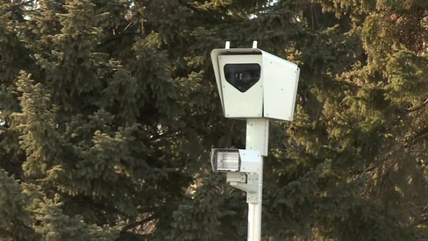
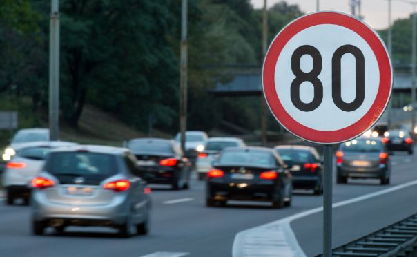
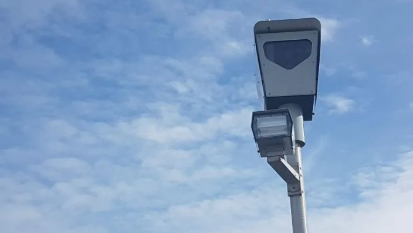
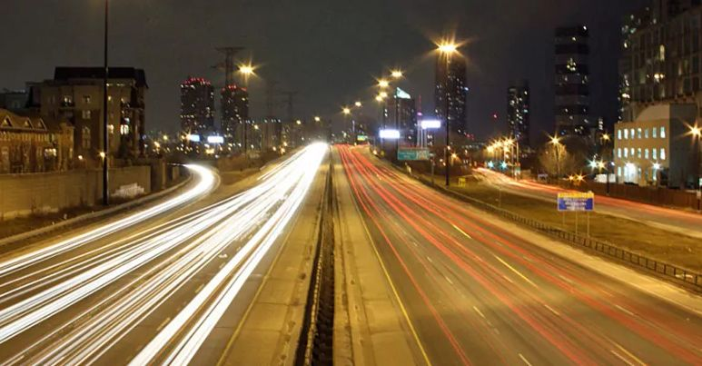
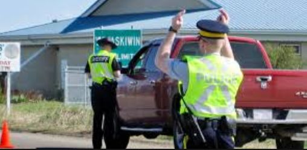

# 无标题

**链接地址:** http://mp.weixin.qq.com/s?__biz=MzI2NTE1ODgwOQ==&mid=2649606204&idx=1&sn=5923a1f4ed1af2efb3524f9688240f71&chksm=f2b8c1cac5cf48dcaa6b83c7ab76f8b0c5b1aacb418ae58c9ab83dafc1d71758e16d3e42bfbc&mpshare=1&scene=2&srcid=#rd
**作者:** 
**获取时间:** 2025/8/28 20:40:41
**图片数量:** 17

---

## 原始HTML内容

<section style="box-sizing: border-box;font-size: 16px;"><section style="box-sizing: border-box;" powered-by="xiumi.us"><section style="margin-right: 0%;margin-left: 0%;box-sizing: border-box;"><section style="display: inline-block;vertical-align: middle;width: 80%;box-sizing: border-box;"><section style="box-sizing: border-box;" powered-by="xiumi.us"><section style="margin-top: 10px;margin-bottom: 10px;text-align: center;box-sizing: border-box;"><section style="display: inline-block;box-sizing: border-box;"><section style="max-width: 100%;font-size: 0px;padding-bottom: 3px;box-sizing: border-box;"><section style="display: inline-block;vertical-align: middle;box-sizing: border-box;"><section style="width: 5px;height: 1px;background-color: rgb(217, 217, 217);box-sizing: border-box;"></section><section style="width: 1px;height: 5px;margin-top: -3px;margin-right: auto;margin-left: auto;background-color: rgb(217, 217, 217);box-sizing: border-box;"></section></section><section style="margin-top: -1px;margin-right: -5px;margin-left: -5px;width: 100%;display: inline-block;vertical-align: middle;padding-right: 8px;padding-left: 8px;box-sizing: border-box;"><section style="width: 100%;height: 1px;background-color: rgb(217, 217, 217);box-sizing: border-box;"></section></section><section style="display: inline-block;vertical-align: middle;box-sizing: border-box;"><section style="width: 5px;height: 1px;background-color: rgb(217, 217, 217);box-sizing: border-box;"></section><section style="width: 1px;height: 5px;margin-top: -3px;margin-right: auto;margin-left: auto;background-color: rgb(217, 217, 217);box-sizing: border-box;"></section></section></section><section style="padding-left: 15px;padding-right: 15px;color: rgb(161, 161, 161);font-size: 14px;box-sizing: border-box;">
点击上方<strong style="box-sizing: border-box;">蓝字</strong>关注我们哟~
</section><section style="max-width: 100%;font-size: 0px;box-sizing: border-box;"><section style="display: inline-block;vertical-align: middle;box-sizing: border-box;"><section style="width: 5px;height: 1px;background-color: rgb(217, 217, 217);box-sizing: border-box;"></section><section style="width: 1px;height: 5px;margin-top: -3px;margin-right: auto;margin-left: auto;background-color: rgb(217, 217, 217);box-sizing: border-box;"></section></section><section style="margin-top: -1px;margin-right: -5px;margin-left: -5px;width: 100%;display: inline-block;vertical-align: middle;padding-right: 8px;padding-left: 8px;box-sizing: border-box;"><section style="width: 100%;height: 1px;background-color: rgb(217, 217, 217);box-sizing: border-box;"></section></section><section style="display: inline-block;vertical-align: middle;box-sizing: border-box;"><section style="width: 5px;height: 1px;background-color: rgb(217, 217, 217);box-sizing: border-box;"></section><section style="width: 1px;height: 5px;margin-top: -3px;margin-right: auto;margin-left: auto;background-color: rgb(217, 217, 217);box-sizing: border-box;"></section></section></section></section></section></section></section><section style="display: inline-block;vertical-align: middle;width: 20%;box-sizing: border-box;"><section style="box-sizing: border-box;" powered-by="xiumi.us"><section style="text-align: center;margin: -10px 0% 10px;box-sizing: border-box;"><section style="max-width: 100%;vertical-align: middle;display: inline-block;line-height: 0;width: 100%;box-sizing: border-box;"></section></section></section></section></section></section><section style="box-sizing: border-box;" powered-by="xiumi.us"><section style="margin: 10px 0%;box-sizing: border-box;"><section style="display: inline-block;width: 100%;vertical-align: top;box-sizing: border-box;"><section style="box-sizing: border-box;" powered-by="xiumi.us"><section style="box-sizing: border-box;"><section style="display: inline-block;vertical-align: bottom;width: 75%;padding-right: 10px;box-sizing: border-box;"><section style="box-sizing: border-box;" powered-by="xiumi.us"><section style="margin: 10px 0% 3px;box-sizing: border-box;"><section style="display: inline-block;vertical-align: middle;box-sizing: border-box;"><section style="display: inline-block;vertical-align: bottom;padding-left: 5px;padding-right: 5px;line-height: 1.2em;margin-bottom: 2px;color: rgba(80, 182, 201, 0.72);box-sizing: border-box;">
<strong style="box-sizing: border-box;">仔细看下图，有惊喜！</strong>
</section><section style="max-width: 100%;display: inline-block;vertical-align: bottom;line-height: 0;width: 1.6em;box-sizing: border-box;"></section></section></section></section></section><section style="display: inline-block;vertical-align: bottom;width: 25%;box-sizing: border-box;"><section style="box-sizing: border-box;" powered-by="xiumi.us"><section style="margin-right: 0%;margin-bottom: 3px;margin-left: 0%;text-align: right;box-sizing: border-box;"><section style="display: inline-block;border-bottom: 0.15em solid rgba(80, 182, 201, 0.72);padding-bottom: 3px;box-sizing: border-box;"><section style="display: inline-block;padding: 3px;border-bottom: 0.15em solid rgba(80, 182, 201, 0.72);font-size: 12px;line-height: 1.4;color: rgb(255, 143, 47);box-sizing: border-box;">
<strong style="box-sizing: border-box;">金主大大</strong>
</section></section></section></section></section></section></section><section style="box-sizing: border-box;" powered-by="xiumi.us"><section style="margin-right: 0%;margin-left: 0%;box-sizing: border-box;"><section style="background-color: rgba(80, 182, 201, 0.72);height: 2px;box-sizing: border-box;"></section></section></section></section></section></section><section style="box-sizing: border-box;" powered-by="xiumi.us"><section style="text-align: center;margin-top: 10px;margin-bottom: 10px;box-sizing: border-box;"><section style="max-width: 100%;vertical-align: middle;display: inline-block;line-height: 0;box-sizing: border-box;"></section></section></section><section style="box-sizing: border-box;" powered-by="xiumi.us"><section style="text-align: center;margin-top: 10px;margin-bottom: 10px;box-sizing: border-box;"><section style="max-width: 100%;vertical-align: middle;display: inline-block;line-height: 0;box-sizing: border-box;"></section></section></section><section style="box-sizing: border-box;" powered-by="xiumi.us"><section style="text-align: center;margin-top: 10px;margin-bottom: 10px;box-sizing: border-box;"><section style="max-width: 100%;vertical-align: middle;display: inline-block;line-height: 0;box-sizing: border-box;"></section></section></section><section style="box-sizing: border-box;" powered-by="xiumi.us"><section style="text-align: center;margin-top: 10px;margin-bottom: 10px;box-sizing: border-box;"><section style="max-width: 100%;vertical-align: middle;display: inline-block;line-height: 0;box-sizing: border-box;"></section></section></section><section style="box-sizing: border-box;" powered-by="xiumi.us"><section style="text-align: center;margin-top: 10px;margin-bottom: 10px;box-sizing: border-box;"><section style="max-width: 100%;vertical-align: middle;display: inline-block;line-height: 0;box-sizing: border-box;"><svg class="svg" xmlns="http://www.w3.org/2000/svg" x="0px" y="0px" viewBox="0 0 902.1 38.2" style="vertical-align: middle;max-width: 100%;box-sizing: border-box;" width="100%"><g style="box-sizing: border-box;"><path style="box-sizing: border-box;" d="M18.4,1.4c0.9-1.9,2.4-1.9,3.4,0l3.4,6.9c0.9,1.9,3.4,3.7,5.4,4l7.6,1.1c2.1,0.3,2.5,1.7,1,3.2   l-5.5,5.4c-1.5,1.5-2.4,4.3-2.1,6.4l1.3,7.6c0.4,2.1-0.9,2.9-2.7,2l-6.8-3.6c-1.8-1-4.9-1-6.7,0l-6.8,3.6c-1.9,1-3.1,0.1-2.7-2   l1.3-7.6c0.4-2.1-0.6-4.9-2.1-6.4l-5.5-5.4c-1.5-1.5-1-2.9,1-3.2l7.6-1.1c2.1-0.3,4.5-2.1,5.4-4L18.4,1.4z" fill="rgb(178, 243, 230)"></path><path style="box-sizing: border-box;" d="M90.6,5.4c0.7-1.4,1.9-1.4,2.6,0l2.6,5.3c0.7,1.4,2.6,2.8,4.2,3.1l5.9,0.9c1.6,0.2,2,1.3,0.8,2.5   l-4.2,4.1c-1.2,1.1-1.9,3.3-1.6,4.9l1,5.8c0.3,1.6-0.7,2.3-2.1,1.5l-5.2-2.8c-1.4-0.8-3.8-0.8-5.2,0L84,33.6   c-1.4,0.8-2.4,0.1-2.1-1.5l1-5.8c0.3-1.6-0.5-3.8-1.6-4.9l-4.2-4.1c-1.2-1.1-0.8-2.2,0.8-2.5l5.9-0.9c1.6-0.2,3.5-1.6,4.2-3.1   L90.6,5.4z" fill="rgb(190, 204, 246)"></path><path style="box-sizing: border-box;" d="M162.6,7.5c0.6-1.2,1.6-1.2,2.2,0l2.2,4.5c0.6,1.2,2.2,2.4,3.6,2.6l5,0.7c1.4,0.2,1.7,1.1,0.7,2.1   l-3.6,3.5c-1,1-1.6,2.9-1.4,4.2l0.9,5c0.2,1.4-0.6,1.9-1.8,1.3l-4.5-2.4c-1.2-0.6-3.2-0.6-4.4,0l-4.5,2.4c-1.2,0.6-2,0.1-1.8-1.3   l0.9-5c0.2-1.4-0.4-3.3-1.4-4.2l-3.6-3.5c-1-1-0.7-1.9,0.7-2.1l5-0.7c1.4-0.2,3-1.4,3.6-2.6L162.6,7.5z" fill="rgb(150, 208, 240)"></path><path style="box-sizing: border-box;" d="M60.1,19.1c0,2.3-1.9,4.2-4.2,4.2c-2.3,0-4.2-1.9-4.2-4.2s1.9-4.2,4.2-4.2   C58.3,14.9,60.1,16.8,60.1,19.1z" fill="rgb(218, 240, 224)"></path><path style="box-sizing: border-box;" d="M203.8,19.1c0,2.3-1.9,4.2-4.2,4.2c-2.3,0-4.2-1.9-4.2-4.2s1.9-4.2,4.2-4.2   C201.9,14.9,203.8,16.8,203.8,19.1z" fill="rgb(218, 240, 224)"></path><path style="box-sizing: border-box;" d="M130.9,19.1c0,1.7-1.4,3.1-3.1,3.1c-1.7,0-3.1-1.4-3.1-3.1c0-1.7,1.4-3.1,3.1-3.1   C129.5,16.1,130.9,17.4,130.9,19.1z" fill="rgb(218, 240, 224)"></path><path style="box-sizing: border-box;" d="M233.9,1.4c0.9-1.9,2.4-1.9,3.4,0l3.4,6.9c0.9,1.9,3.4,3.7,5.4,4l7.6,1.1c2.1,0.3,2.5,1.7,1,3.2   l-5.5,5.4c-1.5,1.5-2.4,4.3-2.1,6.4l1.3,7.6c0.4,2.1-0.9,2.9-2.7,2l-6.8-3.6c-1.8-1-4.9-1-6.7,0l-6.8,3.6c-1.9,1-3.1,0.1-2.7-2   l1.3-7.6c0.4-2.1-0.6-4.9-2.1-6.4l-5.5-5.4c-1.5-1.5-1-2.9,1-3.2l7.6-1.1c2.1-0.3,4.5-2.1,5.4-4L233.9,1.4z" fill="rgb(178, 243, 230)"></path><path style="box-sizing: border-box;" d="M306.1,5.4c0.7-1.4,1.9-1.4,2.6,0l2.6,5.3c0.7,1.4,2.6,2.8,4.2,3.1l5.9,0.9c1.6,0.2,2,1.3,0.8,2.5   l-4.2,4.1c-1.2,1.1-1.9,3.3-1.6,4.9l1,5.8c0.3,1.6-0.7,2.3-2.1,1.5l-5.2-2.8c-1.4-0.8-3.8-0.8-5.2,0l-5.2,2.8   c-1.4,0.8-2.4,0.1-2.1-1.5l1-5.8c0.3-1.6-0.4-3.8-1.6-4.9l-4.2-4.1c-1.2-1.1-0.8-2.2,0.8-2.5l5.9-0.9c1.6-0.2,3.5-1.6,4.2-3.1   L306.1,5.4z" fill="rgb(190, 204, 246)"></path><path style="box-sizing: border-box;" d="M378.1,7.5c0.6-1.2,1.6-1.2,2.2,0l2.2,4.5c0.6,1.2,2.2,2.4,3.6,2.6l5,0.7c1.4,0.2,1.7,1.1,0.7,2.1   l-3.6,3.5c-1,1-1.6,2.9-1.4,4.2l0.9,5c0.2,1.4-0.6,1.9-1.8,1.3l-4.5-2.4c-1.2-0.6-3.2-0.6-4.4,0l-4.5,2.4c-1.2,0.6-2,0.1-1.8-1.3   l0.9-5c0.2-1.4-0.4-3.3-1.4-4.2l-3.6-3.5c-1-1-0.7-1.9,0.7-2.1l5-0.7c1.4-0.2,3-1.4,3.6-2.6L378.1,7.5z" fill="rgb(150, 208, 240)"></path><path style="box-sizing: border-box;" d="M275.7,19.1c0,2.3-1.9,4.2-4.2,4.2c-2.3,0-4.2-1.9-4.2-4.2s1.9-4.2,4.2-4.2   C273.8,14.9,275.7,16.8,275.7,19.1z" fill="rgb(218, 240, 224)"></path><path style="box-sizing: border-box;" d="M419.3,19.1c0,2.3-1.9,4.2-4.2,4.2c-2.3,0-4.2-1.9-4.2-4.2s1.9-4.2,4.2-4.2   C417.5,14.9,419.3,16.8,419.3,19.1z" fill="rgb(218, 240, 224)"></path><path style="box-sizing: border-box;" d="M346.4,19.1c0,1.7-1.4,3.1-3.1,3.1c-1.7,0-3.1-1.4-3.1-3.1c0-1.7,1.4-3.1,3.1-3.1   C345,16.1,346.4,17.4,346.4,19.1z" fill="rgb(218, 240, 224)"></path><path style="box-sizing: border-box;" d="M449.4,1.4c0.9-1.9,2.4-1.9,3.4,0l3.4,6.9c0.9,1.9,3.4,3.7,5.4,4l7.6,1.1c2.1,0.3,2.5,1.7,1,3.2   l-5.5,5.4c-1.5,1.5-2.4,4.3-2.1,6.4l1.3,7.6c0.4,2.1-0.9,2.9-2.7,2l-6.8-3.6c-1.8-1-4.9-1-6.7,0l-6.8,3.6c-1.9,1-3.1,0.1-2.7-2   l1.3-7.6c0.4-2.1-0.6-4.9-2.1-6.4l-5.5-5.4c-1.5-1.5-1-2.9,1-3.2l7.6-1.1c2.1-0.3,4.5-2.1,5.4-4L449.4,1.4z" fill="rgb(178, 243, 230)"></path><path style="box-sizing: border-box;" d="M521.6,5.4c0.7-1.4,1.9-1.4,2.6,0l2.6,5.3c0.7,1.4,2.6,2.8,4.2,3.1l5.9,0.9c1.6,0.2,2,1.3,0.8,2.5   l-4.2,4.1c-1.2,1.1-1.9,3.3-1.6,4.9l1,5.8c0.3,1.6-0.7,2.3-2.1,1.5l-5.2-2.8c-1.4-0.8-3.8-0.8-5.2,0l-5.2,2.8   c-1.4,0.8-2.4,0.1-2.1-1.5l1-5.8c0.3-1.6-0.5-3.8-1.6-4.9l-4.2-4.1c-1.2-1.1-0.8-2.2,0.8-2.5l5.9-0.9c1.6-0.2,3.5-1.6,4.2-3.1   L521.6,5.4z" fill="rgb(190, 204, 246)"></path><path style="box-sizing: border-box;" d="M593.6,7.5c0.6-1.2,1.6-1.2,2.2,0l2.2,4.5c0.6,1.2,2.2,2.4,3.6,2.6l5,0.7c1.4,0.2,1.7,1.1,0.7,2.1   l-3.6,3.5c-1,1-1.6,2.9-1.4,4.2l0.9,5c0.2,1.4-0.6,1.9-1.8,1.3l-4.5-2.4c-1.2-0.6-3.2-0.6-4.4,0l-4.5,2.4c-1.2,0.6-2,0.1-1.8-1.3   l0.9-5c0.2-1.4-0.4-3.3-1.4-4.2l-3.6-3.5c-1-1-0.7-1.9,0.7-2.1l5-0.7c1.4-0.2,3-1.4,3.6-2.6L593.6,7.5z" fill="rgb(150, 208, 240)"></path><path style="box-sizing: border-box;" d="M491.2,19.1c0,2.3-1.9,4.2-4.2,4.2c-2.3,0-4.2-1.9-4.2-4.2s1.9-4.2,4.2-4.2   C489.3,14.9,491.2,16.8,491.2,19.1z" fill="rgb(218, 240, 224)"></path><path style="box-sizing: border-box;" d="M634.9,19.1c0,2.3-1.9,4.2-4.2,4.2c-2.3,0-4.2-1.9-4.2-4.2s1.9-4.2,4.2-4.2   C633,14.9,634.9,16.8,634.9,19.1z" fill="rgb(218, 240, 224)"></path><path style="box-sizing: border-box;" d="M561.9,19.1c0,1.7-1.4,3.1-3.1,3.1c-1.7,0-3.1-1.4-3.1-3.1c0-1.7,1.4-3.1,3.1-3.1   C560.5,16.1,561.9,17.4,561.9,19.1z" fill="rgb(218, 240, 224)"></path><path style="box-sizing: border-box;" d="M664.9,1.4c0.9-1.9,2.4-1.9,3.4,0l3.4,6.9c0.9,1.9,3.4,3.7,5.4,4l7.6,1.1c2.1,0.3,2.5,1.7,1,3.2   l-5.5,5.4c-1.5,1.5-2.4,4.3-2.1,6.4l1.3,7.6c0.4,2.1-0.9,2.9-2.7,2l-6.8-3.6c-1.8-1-4.9-1-6.7,0l-6.8,3.6c-1.9,1-3.1,0.1-2.7-2   l1.3-7.6c0.4-2.1-0.6-4.9-2.1-6.4l-5.5-5.4c-1.5-1.5-1-2.9,1-3.2l7.6-1.1c2.1-0.3,4.5-2.1,5.4-4L664.9,1.4z" fill="rgb(178, 243, 230)"></path><path style="box-sizing: border-box;" d="M737.1,5.4c0.7-1.4,1.9-1.4,2.6,0l2.6,5.3c0.7,1.4,2.6,2.8,4.2,3.1l5.9,0.9c1.6,0.2,2,1.3,0.8,2.5   l-4.2,4.1c-1.2,1.1-1.9,3.3-1.6,4.9l1,5.8c0.3,1.6-0.7,2.3-2.1,1.5l-5.2-2.8c-1.4-0.8-3.8-0.8-5.2,0l-5.2,2.8   c-1.4,0.8-2.4,0.1-2.1-1.5l1-5.8c0.3-1.6-0.5-3.8-1.6-4.9l-4.2-4.1c-1.2-1.1-0.8-2.2,0.8-2.5l5.9-0.9c1.6-0.2,3.5-1.6,4.2-3.1   L737.1,5.4z" fill="rgb(190, 204, 246)"></path><path style="box-sizing: border-box;" d="M809.2,7.5c0.6-1.2,1.6-1.2,2.2,0l2.2,4.5c0.6,1.2,2.2,2.4,3.6,2.6l5,0.7c1.4,0.2,1.7,1.1,0.7,2.1   l-3.6,3.5c-1,1-1.6,2.9-1.4,4.2l0.9,5c0.2,1.4-0.6,1.9-1.8,1.3l-4.5-2.4c-1.2-0.6-3.2-0.6-4.4,0l-4.5,2.4c-1.2,0.6-2,0.1-1.8-1.3   l0.9-5c0.2-1.4-0.4-3.3-1.4-4.2l-3.6-3.5c-1-1-0.7-1.9,0.7-2.1l5-0.7c1.4-0.2,3-1.4,3.6-2.6L809.2,7.5z" fill="rgb(150, 208, 240)"></path><path style="box-sizing: border-box;" d="M706.7,19.1c0,2.3-1.9,4.2-4.2,4.2c-2.3,0-4.2-1.9-4.2-4.2s1.9-4.2,4.2-4.2   C704.8,14.9,706.7,16.8,706.7,19.1z" fill="rgb(218, 240, 224)"></path><path style="box-sizing: border-box;" d="M850.4,19.1c0,2.3-1.9,4.2-4.2,4.2c-2.3,0-4.2-1.9-4.2-4.2s1.9-4.2,4.2-4.2   C848.5,14.9,850.4,16.8,850.4,19.1z" fill="rgb(218, 240, 224)"></path><path style="box-sizing: border-box;" d="M777.4,19.1c0,1.7-1.4,3.1-3.1,3.1c-1.7,0-3.1-1.4-3.1-3.1c0-1.7,1.4-3.1,3.1-3.1   C776,16.1,777.4,17.4,777.4,19.1z" fill="rgb(218, 240, 224)"></path><path style="box-sizing: border-box;" d="M880.4,1.4c0.9-1.9,2.4-1.9,3.4,0l3.4,6.9c0.9,1.9,3.4,3.7,5.4,4l7.6,1.1c2.1,0.3,2.5,1.7,1,3.2   l-5.5,5.4c-1.5,1.5-2.4,4.3-2.1,6.4l1.3,7.6c0.4,2.1-0.9,2.9-2.7,2l-6.8-3.6c-1.8-1-4.9-1-6.7,0l-6.8,3.6c-1.8,1-3.1,0.1-2.7-2   l1.3-7.6c0.4-2.1-0.6-4.9-2.1-6.4l-5.5-5.4c-1.5-1.5-1-2.9,1-3.2l7.6-1.1c2.1-0.3,4.5-2.1,5.4-4L880.4,1.4z" fill="rgb(178, 243, 230)"></path></g></svg></section></section></section><section style="box-sizing: border-box;" powered-by="xiumi.us"><section style="box-sizing: border-box;"><section style="box-sizing: border-box;">

 

<em style="max-width: 100%;box-sizing: border-box !important;word-wrap: break-word !important;"><strong style="max-width: 100%;box-sizing: border-box !important;word-wrap: break-word !important;">雷达摄像头——政府的摇钱树</strong></em>

 

时常听到阿尔伯塔省的司机朋友们抱怨：又在某某路被超速摄像头抓了个正着。80km/h限速的路，开到92km/h也要被罚！每年收到的罚单数量数度攀升，让经济不景气大环境下的阿省居民们<strong style="max-width: 100%;box-sizing: border-box !important;word-wrap: break-word !important;">叫苦连天，不堪重负</strong>。

“雷达超速摄像头，真黑！”

或许你的心中也是这样的想法。然而知道雷达测速摄像头黑，却不知道这东西居然这么黑！近日发布的一项报告和相关讨论让这个市民头痛的问题渐渐浮出水面：这些驾驶车辆超速的牌照照片俨然已经成为了<strong style="max-width: 100%;box-sizing: border-box !important;word-wrap: break-word !important;">市政的摇钱树</strong>，是现在市政<strong style="max-width: 100%;box-sizing: border-box !important;word-wrap: break-word !important;">相关部门收入的重要来源</strong>之一。

 

<em style="max-width: 100%;box-sizing: border-box !important;word-wrap: break-word !important;"><strong style="max-width: 100%;box-sizing: border-box !important;word-wrap: break-word !important;">雷达测速摄像，降低交通事故死亡率</strong></em>

 

在这星期四宣布的关于使用雷达测速拍照的新省级指导方针会议上，不同的政府部门就该问题爆发了<strong style="max-width: 100%;box-sizing: border-box !important;word-wrap: break-word !important;">两个截然不同的观点</strong>斗争——采取雷达测速照片进行罚款在阿省是否已经涉嫌成为<strong style="max-width: 100%;box-sizing: border-box !important;word-wrap: break-word !important;">不正当敛财</strong>？

<strong style="max-width: 100%;box-sizing: border-box !important;word-wrap: break-word !important;">阿尔伯塔省城市市政协会（AUMA）</strong>主席Barry Morishita在周五发布的新闻稿中说到：“维护我们社区的交通安全至关重要。我们欢迎政府提出的合作伙伴关系，使我们的交通安全计划更加清晰和有效。但为了让这种伙伴关系发挥作用，他们需要<strong style="max-width: 100%;box-sizing: border-box !important;word-wrap: break-word !important;">停止对当交通法规的指责</strong>。”

Morishita着重强调到：“阿尔伯塔省的<strong style="max-width: 100%;box-sizing: border-box !important;word-wrap: break-word !important;">交通事故死亡率</strong>在过去的年度总结中<strong style="max-width: 100%;box-sizing: border-box !important;word-wrap: break-word !important;">降低了5％以上</strong>，这可以直接归功于雷达超速摄像法规的实施。”

 

<em style="max-width: 100%;box-sizing: border-box !important;word-wrap: break-word !important;"><strong style="max-width: 100%;box-sizing: border-box !important;word-wrap: break-word !important;">财政收益惹争端</strong></em>

 

然而这一观点显然并没有得到所有人的支持。阿尔伯塔省交通部长布Brian Mason周五则提出了完全相反的观点。他坚称市政当局相关部门正在“坦率地”<strong style="max-width: 100%;box-sizing: border-box !important;word-wrap: break-word !important;">滥用照相雷达以获取经济利益</strong>。

这位部长表示，对在线发布的独立审查进行的分析发现，就严重的致命事故而言，自动雷达测速拍照仪帮助减少了约5.3％的事故率。但对总体交通事故的总体影响只<strong style="max-width: 100%;box-sizing: border-box !important;word-wrap: break-word !important;">减少了1.4％</strong>。这并非一个十分具有说服力的数字。

如今这些摄像机安装在阿尔伯塔省的各个城市，省政府<strong style="max-width: 100%;box-sizing: border-box !important;word-wrap: break-word !important;">必须证明每个摄像机都能有效的减少碰撞事故发生率</strong>，不然建议这些照相机<strong style="max-width: 100%;box-sizing: border-box !important;word-wrap: break-word !important;">必须在一年内拆除</strong>！如果一个雷达测速照相机的存在无法降低事故的发生，那则完全失去了为了增强交通安全的安装意义。除了用司机朋友们的钱包养肥政府交通部门，别无他用！

交通部长Brian Mason周四向记者讲述了市政当局在阿尔伯塔省使用雷达测速照相机的计划 

<em style="max-width: 100%;box-sizing: border-box !important;word-wrap: break-word !important;"><strong style="max-width: 100%;box-sizing: border-box !important;word-wrap: break-word !important;">法规面临整改</strong></em>

Mason表示，根据2018年发布的调查信息，在对照片雷达的人工审查方面，<strong style="max-width: 100%;box-sizing: border-box !important;word-wrap: break-word !important;">卡尔加里的交通部门表现的相当不错</strong>。然而Mason也提到，对于<strong style="max-width: 100%;box-sizing: border-box !important;word-wrap: break-word !important;">某些城市</strong>的监控实施，却并没有如此严格和人性化。他虽然没有指名道姓到这些城市，但下面的数据可以很好地说明这一问题： 

在2016一整年中，埃德蒙顿从272个拍照地点筹集了超过<strong style="max-width: 100%;box-sizing: border-box !important;word-wrap: break-word !important;">5080万加币</strong>的超速罚款，而卡尔加里从950个拍照地点筹集了<strong style="max-width: 100%;box-sizing: border-box !important;word-wrap: break-word !important;">3810万加币</strong>的超速罚款。

显然，卡尔加里的雷达超速摄像头数量是埃德蒙顿的几倍，但<strong style="max-width: 100%;box-sizing: border-box !important;word-wrap: break-word !important;">征收到罚款却没有埃德蒙顿的罚款数量多</strong>。这说明埃德蒙顿的司机更喜欢超速吗？这样悬殊的数字相信各位司机心中都有了答案。

因此，一些市政当局正在鸡贼地部署雷达摄像系统以产生可观的利润，而不是出于安全原因。省交通部交会对<strong style="max-width: 100%;box-sizing: border-box !important;word-wrap: break-word !important;">此事进行调整</strong>。

 

<em style="max-width: 100%;box-sizing: border-box !important;word-wrap: break-word !important;"><strong style="max-width: 100%;box-sizing: border-box !important;word-wrap: break-word !important;">合理性？另一个考量</strong></em>

 

另外，Mason说他希望在新的交通部署指导方针中避免<strong style="max-width: 100%;box-sizing: border-box !important;word-wrap: break-word !important;">“一个大漏洞”</strong>：任何四车道或高速公路的路段都有资格使用雷达测速照相，甚至不需要提供发生过事故的历史进行筛选审查。

 

这就是漏洞的来源：该些摄像头频频监控到超速的车辆，为罚款贡献了不少金额；但却不曾记录任何一起交通事故。而该省发现最严重的碰撞发生的十字路口，却并未安装雷达拍照设施。这样的<strong style="max-width: 100%;box-sizing: border-box !important;word-wrap: break-word !important;">对于雷达摄像系统的不合理部署</strong>显然对降低交通事故的发生毫无实际用处。

 

卡尔加里警察局的Joerg Gottschling却持有相反意见：这些容易超速的路段可能不是发生交通碰撞的热点，但他们开出的罚单会<strong style="max-width: 100%;box-sizing: border-box !important;word-wrap: break-word !important;">督促行使在这些道路上的司机安全驾驶</strong>。没有发生事故，不代表雷达测速摄像系统的没用。

 

 

<em style="max-width: 100%;box-sizing: border-box !important;word-wrap: break-word !important;"><strong style="max-width: 100%;box-sizing: border-box !important;word-wrap: break-word !important;">增加透明度是一个选择</strong></em>

增加信息的透明度是大家一直认同的方向。但<strong style="max-width: 100%;color: rgb(34, 34, 34);font-size: 16px;box-sizing: border-box !important;word-wrap: break-word !important;">省城市市政协会（AUMA）</strong>主席Barry Morishita认为现在交通法规不存在实施透明度上的问题。他表示：“所有阿尔伯塔省的城市都在交通安全问题和雷达摄像部署上经过审计。2013-14和2016-17的报告均显示，所有阿尔伯塔省的城市都符合当前的指导方针。

埃德蒙顿市长Don Iveson也表示，埃德蒙顿一直在<strong style="max-width: 100%;box-sizing: border-box !important;word-wrap: break-word !important;">完全透明且负责任</strong>地使用雷达摄像系统。而且征收到罚金也被完全用于增强城市交通安全的举措。 

 

那么阿尔伯塔省的司机朋友们，对于目前城市的雷达测速摄像头的部署和相关政策的实施，<strong style="max-width: 100%;box-sizing: border-box !important;word-wrap: break-word !important;">你们是怎样认为的呢？</strong>

 

文章信息来源：CBCNews
</section></section></section><section style="box-sizing: border-box;" powered-by="xiumi.us"><section style="text-align: center;margin-top: 10px;margin-bottom: 10px;box-sizing: border-box;"><section style="max-width: 100%;vertical-align: middle;display: inline-block;line-height: 0;box-shadow: rgb(0, 0, 0) 0px 0px 0px;box-sizing: border-box;"></section></section></section><section style="box-sizing: border-box;" powered-by="xiumi.us"><section style="box-sizing: border-box;"><section style="text-align: center;font-size: 14px;color: rgb(160, 160, 160);box-sizing: border-box;">
各类商业广告投放推广，请联系微信ID：haoxue_nina
</section></section></section><section style="box-sizing: border-box;" powered-by="xiumi.us"><section style="box-sizing: border-box;"><section style="box-sizing: border-box;">
 
</section></section></section><section style="box-sizing: border-box;" powered-by="xiumi.us"><section style="box-sizing: border-box;"><section style="box-sizing: border-box;">
 
</section></section></section><section style="box-sizing: border-box;" powered-by="xiumi.us"><section style="margin: 40px 0% 10px;text-align: center;box-sizing: border-box;"><section style="display: inline-block;width: 90%;border-width: 1px;border-style: dotted;border-color: rgba(80, 182, 201, 0.72);padding: 10px;border-radius: 0px;box-sizing: border-box;"><section style="box-sizing: border-box;" powered-by="xiumi.us"><section style="transform: translate3d(20px, 0px, 0px);text-align: left;font-size: 11px;margin-top: -55px;margin-right: 0%;margin-left: 0%;box-sizing: border-box;"><section style="box-sizing: border-box;width: 7em;height: 7em;display: inline-block;vertical-align: bottom;border-radius: 100%;border-width: 5px;border-style: none;border-color: rgba(80, 182, 201, 0.72);background-position: center center;background-repeat: no-repeat;background-size: cover;overflow: hidden;background-image: url(&quot;https://mmbiz.qpic.cn/mmbiz_jpg/D1nJqnhkPyJhbic3yGSUsuIha2SZGfTvpicooMB9kiaSf8EkZu6AR3PgNq03UMW4vwEKKUliaPWsKLNB7OzKn7KeQw/640?wx_fmt=jpeg&quot;);"><section style="height: 100%;overflow: hidden;line-height: 0;vertical-align: middle;max-width: 100%;box-sizing: border-box;"></section></section></section></section><section style="box-sizing: border-box;" powered-by="xiumi.us"><section style="box-sizing: border-box;"><section class="group-empty" style="display: inline-block;vertical-align: top;width: 38.2%;box-sizing: border-box;height: 1px;"></section><section style="display: inline-block;vertical-align: top;width: 61.8%;box-sizing: border-box;"><section style="box-sizing: border-box;" powered-by="xiumi.us"><section style="margin-right: 0%;margin-left: 0%;box-sizing: border-box;"><section style="font-size: 18px;color: rgb(67, 103, 117);line-height: 1.6;letter-spacing: 1px;box-sizing: border-box;">
<strong style="box-sizing: border-box;">埃德蒙顿微生活</strong>
</section></section></section><section style="box-sizing: border-box;" powered-by="xiumi.us"><section style="margin-top: 0.5em;margin-bottom: 0.5em;box-sizing: border-box;"><section style="background-color: rgba(80, 182, 201, 0.72);height: 1px;box-sizing: border-box;"></section></section></section></section></section></section><section style="box-sizing: border-box;" powered-by="xiumi.us"><section style="box-sizing: border-box;"><section style="text-align: justify;font-size: 14px;color: rgba(62, 62, 62, 0.72);letter-spacing: 2px;box-sizing: border-box;">
<strong style="box-sizing: border-box;">关心埃德蒙顿民生，</strong>

<strong style="box-sizing: border-box;">关注埃德蒙顿的发展。</strong>

 

埃德蒙顿微生活是“吃喝玩乐埃德蒙顿”旗下，为埃德蒙顿地区的居民提供每日最新的吃喝玩乐、工作学习、商业投资的媒体平台 。
</section></section></section><section style="box-sizing: border-box;" powered-by="xiumi.us"><section style="box-sizing: border-box;"><section style="text-align: left;box-sizing: border-box;">
 
</section></section></section><section style="box-sizing: border-box;" powered-by="xiumi.us"><section style="box-sizing: border-box;"><section style="display: inline-block;vertical-align: middle;width: 61.8%;box-sizing: border-box;"><section style="box-sizing: border-box;" powered-by="xiumi.us"><section style="box-sizing: border-box;"><section style="text-align: justify;font-size: 12px;color: rgba(62, 62, 62, 0.37);line-height: 1.9;letter-spacing: 0px;box-sizing: border-box;">
我们的目标是以最新、最快、最及时的方式 报道埃德蒙顿的新鲜事 。 
</section></section></section></section><section style="display: inline-block;vertical-align: middle;width: 38.2%;box-sizing: border-box;"><section style="box-sizing: border-box;" powered-by="xiumi.us"><section style="margin-right: 0%;margin-left: 0%;box-sizing: border-box;"><section style="max-width: 100%;vertical-align: middle;display: inline-block;line-height: 0;width: 70%;box-sizing: border-box;"></section></section></section></section></section></section></section></section></section></section>
 

 

---

## 纯文本内容

点击上方蓝字关注我们哟~仔细看下图，有惊喜！金主大大雷达摄像头——政府的摇钱树时常听到阿尔伯塔省的司机朋友们抱怨：又在某某路被超速摄像头抓了个正着。80km/h限速的路，开到92km/h也要被罚！每年收到的罚单数量数度攀升，让经济不景气大环境下的阿省居民们叫苦连天，不堪重负。“雷达超速摄像头，真黑！”或许你的心中也是这样的想法。然而知道雷达测速摄像头黑，却不知道这东西居然这么黑！近日发布的一项报告和相关讨论让这个市民头痛的问题渐渐浮出水面：这些驾驶车辆超速的牌照照片俨然已经成为了市政的摇钱树，是现在市政相关部门收入的重要来源之一。雷达测速摄像，降低交通事故死亡率在这星期四宣布的关于使用雷达测速拍照的新省级指导方针会议上，不同的政府部门就该问题爆发了两个截然不同的观点斗争——采取雷达测速照片进行罚款在阿省是否已经涉嫌成为不正当敛财？阿尔伯塔省城市市政协会（AUMA）主席Barry Morishita在周五发布的新闻稿中说到：“维护我们社区的交通安全至关重要。我们欢迎政府提出的合作伙伴关系，使我们的交通安全计划更加清晰和有效。但为了让这种伙伴关系发挥作用，他们需要停止对当交通法规的指责。”Morishita着重强调到：“阿尔伯塔省的交通事故死亡率在过去的年度总结中降低了5％以上，这可以直接归功于雷达超速摄像法规的实施。”财政收益惹争端然而这一观点显然并没有得到所有人的支持。阿尔伯塔省交通部长布Brian Mason周五则提出了完全相反的观点。他坚称市政当局相关部门正在“坦率地”滥用照相雷达以获取经济利益。这位部长表示，对在线发布的独立审查进行的分析发现，就严重的致命事故而言，自动雷达测速拍照仪帮助减少了约5.3％的事故率。但对总体交通事故的总体影响只减少了1.4％。这并非一个十分具有说服力的数字。如今这些摄像机安装在阿尔伯塔省的各个城市，省政府必须证明每个摄像机都能有效的减少碰撞事故发生率，不然建议这些照相机必须在一年内拆除！如果一个雷达测速照相机的存在无法降低事故的发生，那则完全失去了为了增强交通安全的安装意义。除了用司机朋友们的钱包养肥政府交通部门，别无他用！交通部长Brian Mason周四向记者讲述了市政当局在阿尔伯塔省使用雷达测速照相机的计划法规面临整改Mason表示，根据2018年发布的调查信息，在对照片雷达的人工审查方面，卡尔加里的交通部门表现的相当不错。然而Mason也提到，对于某些城市的监控实施，却并没有如此严格和人性化。他虽然没有指名道姓到这些城市，但下面的数据可以很好地说明这一问题：在2016一整年中，埃德蒙顿从272个拍照地点筹集了超过5080万加币的超速罚款，而卡尔加里从950个拍照地点筹集了3810万加币的超速罚款。显然，卡尔加里的雷达超速摄像头数量是埃德蒙顿的几倍，但征收到罚款却没有埃德蒙顿的罚款数量多。这说明埃德蒙顿的司机更喜欢超速吗？这样悬殊的数字相信各位司机心中都有了答案。因此，一些市政当局正在鸡贼地部署雷达摄像系统以产生可观的利润，而不是出于安全原因。省交通部交会对此事进行调整。合理性？另一个考量另外，Mason说他希望在新的交通部署指导方针中避免“一个大漏洞”：任何四车道或高速公路的路段都有资格使用雷达测速照相，甚至不需要提供发生过事故的历史进行筛选审查。这就是漏洞的来源：该些摄像头频频监控到超速的车辆，为罚款贡献了不少金额；但却不曾记录任何一起交通事故。而该省发现最严重的碰撞发生的十字路口，却并未安装雷达拍照设施。这样的对于雷达摄像系统的不合理部署显然对降低交通事故的发生毫无实际用处。卡尔加里警察局的Joerg Gottschling却持有相反意见：这些容易超速的路段可能不是发生交通碰撞的热点，但他们开出的罚单会督促行使在这些道路上的司机安全驾驶。没有发生事故，不代表雷达测速摄像系统的没用。增加透明度是一个选择增加信息的透明度是大家一直认同的方向。但省城市市政协会（AUMA）主席Barry Morishita认为现在交通法规不存在实施透明度上的问题。他表示：“所有阿尔伯塔省的城市都在交通安全问题和雷达摄像部署上经过审计。2013-14和2016-17的报告均显示，所有阿尔伯塔省的城市都符合当前的指导方针。埃德蒙顿市长Don Iveson也表示，埃德蒙顿一直在完全透明且负责任地使用雷达摄像系统。而且征收到罚金也被完全用于增强城市交通安全的举措。那么阿尔伯塔省的司机朋友们，对于目前城市的雷达测速摄像头的部署和相关政策的实施，你们是怎样认为的呢？文章信息来源：CBCNews各类商业广告投放推广，请联系微信ID：haoxue_nina埃德蒙顿微生活关心埃德蒙顿民生，关注埃德蒙顿的发展。埃德蒙顿微生活是“吃喝玩乐埃德蒙顿”旗下，为埃德蒙顿地区的居民提供每日最新的吃喝玩乐、工作学习、商业投资的媒体平台 。我们的目标是以最新、最快、最及时的方式 报道埃德蒙顿的新鲜事 。

---

## 图片列表

-  (原始链接: https://mmbiz.qpic.cn/mmbiz_gif/D1nJqnhkPyJhbic3yGSUsuIha2SZGfTvp9haibwRQZfXtpfX66IVFDdqPf6Ype4ibqQH5XeyLR0nXEAckYnxibvNGg/640?wx_fmt=gif)
-  (原始链接: https://mmbiz.qpic.cn/mmbiz_gif/D1nJqnhkPyJhbic3yGSUsuIha2SZGfTvpn8ibcF9ib8Xh2WNBvPNla00bv9Ek3m2rH8ico5F7seYEb6AnqNd8Sg72w/640?wx_fmt=gif)
-  (原始链接: https://mmbiz.qpic.cn/mmbiz_jpg/D1nJqnhkPyJhbic3yGSUsuIha2SZGfTvpAtAu1vs7xicdmvuDjf0YEzkMe0AFibjRrAJLSmmNT3FZ9lrY6h8EZBsw/640?wx_fmt=jpeg)
-  (原始链接: https://mmbiz.qpic.cn/mmbiz_jpg/D1nJqnhkPyJhbic3yGSUsuIha2SZGfTvpdqM8xBYocKcU2JYWTHVDlfcWrxQ6b1oX5V03Qa7x7Txriaw3PkpExiaA/640?wx_fmt=jpeg)
-  (原始链接: https://mmbiz.qpic.cn/mmbiz_jpg/D1nJqnhkPyJhbic3yGSUsuIha2SZGfTvpHqezIIicuPgZYyNqGkm2JSyVPbyh2Fxe5tp6n4ZSdkicu4RmVTS9wjzg/640?wx_fmt=jpeg)
-  (原始链接: https://mmbiz.qpic.cn/mmbiz_jpg/D1nJqnhkPyJhbic3yGSUsuIha2SZGfTvpOJZDicOlgwMlzTxPGmpSNYJd8xnd5YbibUWpf7NaR3opp1x5TOJcYTfA/640?wx_fmt=jpeg)
-  (原始链接: https://mmbiz.qpic.cn/mmbiz_png/E5oZzDjj1kqWluMBla7kEziaNicnyKibwhRLKvROTmJEGmzLbFe8c85XictLupTPhyA4NV4icHyw2xaAYus3pOr919g/640?wx_fmt=png)
-  (原始链接: https://mmbiz.qpic.cn/mmbiz_png/E5oZzDjj1kqWluMBla7kEziaNicnyKibwhRFa1eBLw5ZgGZ6B2JxDqFuj2E1Lctg7CBFbFW8iaumRQhfT4ngUJgk3w/640?wx_fmt=png)
-  (原始链接: https://mmbiz.qpic.cn/mmbiz_png/E5oZzDjj1kqWluMBla7kEziaNicnyKibwhROR1Fl7xxibFHCaKSx9OatSxgGIHocsxciadeKg6ONgWcDavicvFqWaJkw/640?wx_fmt=png)
-  (原始链接: https://mmbiz.qpic.cn/mmbiz_png/E5oZzDjj1kqWluMBla7kEziaNicnyKibwhRibdOeMz4sgVHu1dlVqJGvqPwT2OS0zqme9icI4kAPSlU9ibXzUYFUqxnQ/640?wx_fmt=png)
-  (原始链接: https://mmbiz.qpic.cn/mmbiz_jpg/D1nJqnhkPyJhbic3yGSUsuIha2SZGfTvpZBvmlswZTs6spt9B2KD1GechEPXwiaERWUania6bE6DsecDjVdcrEeKg/640?wx_fmt=jpeg)
-  (原始链接: https://mmbiz.qpic.cn/mmbiz_png/E5oZzDjj1kqWluMBla7kEziaNicnyKibwhROGNKmUQ3uOibYKuMwwWjXN95eQFvmgPiaz2AaAeHZwJpzlgiaXJ90RGrw/640?wx_fmt=png)
-  (原始链接: https://mmbiz.qpic.cn/mmbiz_png/E5oZzDjj1kqWluMBla7kEziaNicnyKibwhRnKlS5ibpBRdBsJAm6icY2O06gcGlRgdCIHXgGtRoGB8mK7BhWGQU4qLA/640?wx_fmt=png)
-  (原始链接: https://mmbiz.qpic.cn/mmbiz_png/E5oZzDjj1kqWluMBla7kEziaNicnyKibwhRlKKkd1pias5d8wcN9RxeVeGric44iaicGoyGVywO27c6Fib1mPNwrbnQVIQ/640?wx_fmt=png)
-  (原始链接: https://mmbiz.qpic.cn/mmbiz_png/D1nJqnhkPyJhbic3yGSUsuIha2SZGfTvpb45Dqbsdrc1k26YicUZPf1J95PiaSEuVE9ZMpUgyWbSHy4ZmOdHfH7dA/640?wx_fmt=png)
-  (原始链接: https://mmbiz.qpic.cn/mmbiz_jpg/D1nJqnhkPyJhbic3yGSUsuIha2SZGfTvpicooMB9kiaSf8EkZu6AR3PgNq03UMW4vwEKKUliaPWsKLNB7OzKn7KeQw/640?wx_fmt=jpeg)
-  (原始链接: https://mmbiz.qpic.cn/mmbiz_jpg/D1nJqnhkPyJhbic3yGSUsuIha2SZGfTvpEcUYBE2xMicqRjDpEaoQaZrL1kep9KMWMZ0AA3uBGRVYNYnqg8vQXXQ/640?wx_fmt=jpeg)
