# 无标题

**链接地址:** http://mp.weixin.qq.com/s?__biz=Mzg4MjAwNDA4Mg==&mid=2247504282&idx=2&sn=0e5ccd600c48fb6cc94077e176d2c8eb&chksm=cf5fc887f8284191d0cf07800b367845f89e0ea79b2d2f2a9b3da2b9b50ec22e6308935b4b64&mpshare=1&scene=2&srcid=02259Dg4jTx9wD3L2zz6HoYt#rd
**作者:** 
**获取时间:** 2025/8/28 20:40:17
**图片数量:** 59

---

## 原始HTML内容

<a href="https://mp.weixin.qq.com/s?__biz=Mzg4MjAwNDA4Mg==&amp;mid=2247504245&amp;idx=1&amp;sn=a8e3e203b14df08d460134468831d876&amp;chksm=cf5fc868f828417eef1557e461dbb0eccbe26070c7f6477acc0716a27b9ed4c22de3fd40f293&amp;token=204878751&amp;lang=zh_CN&amp;scene=21#wechat_redirect" target="_blank" data-linktype="1"></a>

 
<section style="max-width: 100%;box-sizing: border-box;letter-spacing: 0.544px;white-space: normal;background-color: rgb(255, 255, 255);font-size: 16px;overflow-wrap: break-word !important;"><section powered-by="xiumi.us" style="max-width: 100%;box-sizing: border-box;overflow-wrap: break-word !important;"><section style="margin-top: 10px;margin-bottom: 10px;max-width: 100%;box-sizing: border-box;transform: translate3d(0px, 0px, 0px);text-align: center;overflow-wrap: break-word !important;"><section style="max-width: 100%;box-sizing: border-box;display: inline-block;width: 676.997px;border-width: 1px;border-style: solid;border-color: rgb(255, 255, 255);overflow-wrap: break-word !important;"><section powered-by="xiumi.us" style="max-width: 100%;box-sizing: border-box;overflow-wrap: break-word !important;"><section style="margin-top: 10px;margin-bottom: 10px;max-width: 100%;box-sizing: border-box;overflow-wrap: break-word !important;"><section style="max-width: 100%;box-sizing: border-box;vertical-align: middle;display: inline-block;line-height: 0;overflow-wrap: break-word !important;"></section></section></section><section powered-by="xiumi.us" style="max-width: 100%;box-sizing: border-box;overflow-wrap: break-word !important;"><section style="max-width: 100%;box-sizing: border-box;overflow-wrap: break-word !important;"><section style="max-width: 100%;box-sizing: border-box;text-align: left;overflow-wrap: break-word !important;">
 
</section></section></section><section powered-by="xiumi.us" style="max-width: 100%;box-sizing: border-box;overflow-wrap: break-word !important;"><section style="margin-top: 20px;margin-bottom: 20px;max-width: 100%;box-sizing: border-box;overflow-wrap: break-word !important;"><section style="padding-right: 10px;padding-left: 10px;max-width: 100%;box-sizing: border-box;display: inline-block;min-width: 10%;vertical-align: top;overflow-wrap: break-word !important;"><section powered-by="xiumi.us" style="max-width: 100%;box-sizing: border-box;overflow-wrap: break-word !important;"><section style="max-width: 100%;box-sizing: border-box;overflow-wrap: break-word !important;"><section style="padding: 3px 10px 6px;max-width: 100%;box-sizing: border-box;display: inline-block;min-width: 10%;vertical-align: top;border-width: 1px;border-radius: 0px;border-style: solid none;border-color: rgb(62, 62, 62);overflow-wrap: break-word !important;"><section powered-by="xiumi.us" style="max-width: 100%;box-sizing: border-box;overflow-wrap: break-word !important;"><section style="margin-top: -20px;margin-bottom: -5px;max-width: 100%;box-sizing: border-box;text-align: left;overflow-wrap: break-word !important;"><section style="padding-right: 5px;padding-left: 5px;max-width: 100%;box-sizing: border-box;display: inline-block;width: 45px;height: 40px;vertical-align: top;overflow: hidden;background-color: rgb(254, 255, 255);overflow-wrap: break-word !important;"><section powered-by="xiumi.us" style="max-width: 100%;box-sizing: border-box;overflow-wrap: break-word !important;"><section style="max-width: 100%;box-sizing: border-box;overflow-wrap: break-word !important;"><section style="max-width: 100%;box-sizing: border-box;vertical-align: middle;display: inline-block;line-height: 0;width: 35px;overflow-wrap: break-word !important;"><svg class="" xmlns="http://www.w3.org/2000/svg" x="0px" y="0px" viewBox="0 0 64.7 40.8" style="vertical-align: middle;max-width: 100%;width: 100%;box-sizing: border-box;" width="100%"><g style="box-sizing: border-box;"><path d="M36.2,27c0,0.2,0,0.4,0,0.6l0,0c0.5,7.4,6.7,13.3,14.2,13.3c7.9,0,14.3-6.4,14.3-14.3c0-7.2-5.3-13.1-12.2-14.1   C53,8.9,54.2,4,57,0c0,0-19,3-20.7,24.7c-0.1,0.6-0.1,1.2-0.1,1.8C36.2,26.7,36.2,26.9,36.2,27z" fill="rgb(160,48,32)" style="box-sizing: border-box;"></path><path d="M0,27c0,0.2,0,0.4,0,0.6l0,0C0.6,35,6.7,40.8,14.3,40.8c7.9,0,14.3-6.4,14.3-14.3c0-7.2-5.3-13.1-12.2-14.1   C16.8,8.9,18,4,20.8,0c0,0-19,3-20.7,24.7C0,25.3,0,26,0,26.6C0,26.7,0,26.9,0,27z" fill="rgb(160,48,32)" style="box-sizing: border-box;"></path></g></svg></section></section></section></section></section></section><section powered-by="xiumi.us" style="max-width: 100%;box-sizing: border-box;overflow-wrap: break-word !important;"><section style="max-width: 100%;box-sizing: border-box;overflow-wrap: break-word !important;"><section style="max-width: 100%;box-sizing: border-box;font-size: 17px;color: rgb(160, 48, 32);letter-spacing: 3px;overflow-wrap: break-word !important;">
<strong style="max-width: 100%;box-sizing: border-box;overflow-wrap: break-word !important;">猪年新春福利来了！</strong>
</section></section></section><section powered-by="xiumi.us" style="max-width: 100%;box-sizing: border-box;overflow-wrap: break-word !important;"><section style="margin-bottom: -30px;max-width: 100%;box-sizing: border-box;text-align: right;overflow-wrap: break-word !important;"><section style="padding-right: 5px;padding-left: 5px;max-width: 100%;box-sizing: border-box;display: inline-block;width: 35px;height: 35px;vertical-align: top;overflow: hidden;background-color: rgb(254, 255, 255);overflow-wrap: break-word !important;"><section powered-by="xiumi.us" style="max-width: 100%;box-sizing: border-box;overflow-wrap: break-word !important;"><section style="max-width: 100%;box-sizing: border-box;transform: rotateX(180deg);overflow-wrap: break-word !important;"><section style="max-width: 100%;box-sizing: border-box;vertical-align: middle;display: inline-block;line-height: 0;width: 25px;overflow-wrap: break-word !important;"><svg class="" xmlns="http://www.w3.org/2000/svg" x="0px" y="0px" viewBox="0 0 64.7 40.8" style="vertical-align: middle;max-width: 100%;width: 100%;box-sizing: border-box;" width="100%"><g style="box-sizing: border-box;"><path d="M28.5,13.8c0-0.2,0-0.4,0-0.6l0,0C28,5.8,21.8,0,14.3,0C6.4,0,0,6.4,0,14.3c0,7.2,5.3,13.1,12.2,14.1   c-0.5,3.5-1.7,8.4-4.5,12.5c0,0,19-3,20.7-24.7c0.1-0.6,0.1-1.2,0.1-1.8C28.5,14.1,28.5,14,28.5,13.8z" fill="rgb(160,48,32)" style="box-sizing: border-box;"></path><path d="M64.7,13.8c0-0.2,0-0.4,0-0.6l0,0C64.2,5.8,58,0,50.5,0c-7.9,0-14.3,6.4-14.3,14.3c0,7.2,5.3,13.1,12.2,14.1   c-0.5,3.5-1.7,8.4-4.5,12.5c0,0,19-3,20.7-24.7c0.1-0.6,0.1-1.2,0.1-1.8C64.7,14.1,64.7,14,64.7,13.8z" fill="rgb(160,48,32)" style="box-sizing: border-box;"></path></g></svg></section></section></section></section></section></section></section></section></section></section></section></section><section powered-by="xiumi.us" style="max-width: 100%;box-sizing: border-box;overflow-wrap: break-word !important;"><section style="max-width: 100%;box-sizing: border-box;overflow-wrap: break-word !important;"><section style="max-width: 100%;box-sizing: border-box;text-align: left;overflow-wrap: break-word !important;">
 
</section></section></section><section powered-by="xiumi.us" style="max-width: 100%;box-sizing: border-box;overflow-wrap: break-word !important;"><section style="margin-top: 10px;margin-bottom: 10px;max-width: 100%;box-sizing: border-box;overflow-wrap: break-word !important;"><section style="padding-top: 10px;max-width: 100%;box-sizing: border-box;display: inline-block;width: 675.017px;vertical-align: top;background-image: url(&quot;https://mmbiz.qpic.cn/mmbiz_jpg/AbkpIKibrs7icbEwBQqapQ3YnL2icC0TJ904EKg11hkRxrKDz8evNibwicpVibuLIpjcBjqicmRhtVBaYQAicChQUebSWA/640?wx_fmt=jpeg&quot;);background-position: 72.6852% 30.2013%;background-repeat: repeat;background-size: 49.1765%;background-attachment: scroll;overflow-wrap: break-word !important;"><section powered-by="xiumi.us" style="max-width: 100%;box-sizing: border-box;overflow-wrap: break-word !important;"><section style="max-width: 100%;box-sizing: border-box;overflow-wrap: break-word !important;"><section style="padding: 8px;max-width: 100%;box-sizing: border-box;display: inline-block;width: 641.25px;vertical-align: top;background-color: rgb(250, 243, 227);overflow-wrap: break-word !important;"><section powered-by="xiumi.us" style="max-width: 100%;box-sizing: border-box;overflow-wrap: break-word !important;"><section style="max-width: 100%;box-sizing: border-box;overflow-wrap: break-word !important;"><section style="padding: 5px;max-width: 100%;box-sizing: border-box;display: inline-block;width: 625.278px;vertical-align: top;border-style: double;border-width: 1px;border-radius: 0px;border-color: rgba(189, 135, 66, 0.68);overflow-wrap: break-word !important;"><section powered-by="xiumi.us" style="max-width: 100%;box-sizing: border-box;overflow-wrap: break-word !important;"><section style="max-width: 100%;box-sizing: border-box;overflow-wrap: break-word !important;"><section style="padding: 10px;max-width: 100%;box-sizing: border-box;display: inline-block;width: 613.299px;vertical-align: top;border-style: solid;border-width: 1px;border-radius: 0px;border-color: rgba(189, 135, 66, 0.68);overflow-wrap: break-word !important;"><section powered-by="xiumi.us" style="max-width: 100%;box-sizing: border-box;overflow-wrap: break-word !important;"><section style="max-width: 100%;box-sizing: border-box;overflow-wrap: break-word !important;"><section style="max-width: 100%;box-sizing: border-box;text-align: left;overflow-wrap: break-word !important;">
 

让无数骨灰级吃货为之疯狂

国内火爆的

正宗潮汕牛肉火锅

来到卡尔加里啦！！ 

 

<strong style="max-width: 100%;box-sizing: border-box;overflow-wrap: break-word !important;">1號潮庭 BeeFun HotPot</strong>

新店开业！ 

不同的城市，相同的味道

 
</section></section></section><section powered-by="xiumi.us" style="max-width: 100%;box-sizing: border-box;overflow-wrap: break-word !important;"><section style="margin-top: 10px;margin-bottom: 10px;max-width: 100%;box-sizing: border-box;overflow-wrap: break-word !important;"><section style="max-width: 100%;box-sizing: border-box;vertical-align: middle;display: inline-block;line-height: 0;overflow-wrap: break-word !important;"></section></section></section><section powered-by="xiumi.us" style="max-width: 100%;box-sizing: border-box;overflow-wrap: break-word !important;"><section style="max-width: 100%;box-sizing: border-box;overflow-wrap: break-word !important;"><section style="max-width: 100%;box-sizing: border-box;text-align: left;overflow-wrap: break-word !important;">
 

<strong style="max-width: 100%;box-sizing: border-box;overflow-wrap: break-word !important;">来一发福利，接好了！</strong>

 

▼

 

<strong style="max-width: 100%;box-sizing: border-box;overflow-wrap: break-word !important;">进店出示本文</strong>

<strong style="max-width: 100%;box-sizing: border-box;overflow-wrap: break-word !important;">并按店员指示操作</strong>

<strong style="max-width: 100%;box-sizing: border-box;overflow-wrap: break-word !important;">即可享受</strong>

<strong style="max-width: 100%;box-sizing: border-box;overflow-wrap: break-word !important;">&nbsp;9折！</strong>

<strong style="max-width: 100%;box-sizing: border-box;overflow-wrap: break-word !important;">&nbsp;9折吃起来！！</strong>

 

<strong style="max-width: 100%;box-sizing: border-box;overflow-wrap: break-word !important;"> </strong>

<strong style="max-width: 100%;box-sizing: border-box;overflow-wrap: break-word !important;">▼</strong>

 

并在留言中抽出

被点赞最多评论前10名

<strong style="max-width: 100%;box-sizing: border-box;overflow-wrap: break-word !important;">&nbsp;赠送VIP优惠卡！！ </strong>

 
</section></section></section><section powered-by="xiumi.us" style="max-width: 100%;box-sizing: border-box;overflow-wrap: break-word !important;"><section style="margin-top: 10px;margin-bottom: 10px;max-width: 100%;box-sizing: border-box;overflow-wrap: break-word !important;"><section style="max-width: 100%;box-sizing: border-box;display: inline-block;vertical-align: top;width: 591.319px;overflow-wrap: break-word !important;"><section style="margin-bottom: -2.5em;max-width: 100%;box-sizing: border-box;width: 2.5em;height: 2.5em;border-left: 2px dotted rgb(193, 193, 193);border-top: 2px dotted rgb(193, 193, 193);overflow-wrap: break-word !important;"></section><section style="padding: 8px;max-width: 100%;box-sizing: border-box;overflow-wrap: break-word !important;"><section style="max-width: 100%;box-sizing: border-box;width: 575.347px;background-color: rgba(255, 255, 255, 0);overflow-wrap: break-word !important;"><section powered-by="xiumi.us" style="max-width: 100%;box-sizing: border-box;overflow-wrap: break-word !important;"><section style="max-width: 100%;box-sizing: border-box;overflow-wrap: break-word !important;text-align: center;"><section style="padding-right: 5px;max-width: 100%;box-sizing: border-box;display: inline-block;vertical-align: top;width: 287.674px;overflow-wrap: break-word !important;"><section powered-by="xiumi.us" style="max-width: 100%;box-sizing: border-box;overflow-wrap: break-word !important;"><section style="max-width: 100%;box-sizing: border-box;overflow-wrap: break-word !important;"><section style="max-width: 100%;box-sizing: border-box;vertical-align: middle;display: inline-block;line-height: 0;box-shadow: rgb(0, 0, 0) 0px 0px 0px;overflow-wrap: break-word !important;"></section></section></section></section><section style="padding-left: 5px;max-width: 100%;box-sizing: border-box;display: inline-block;vertical-align: top;width: 287.674px;overflow-wrap: break-word !important;"><section powered-by="xiumi.us" style="max-width: 100%;box-sizing: border-box;overflow-wrap: break-word !important;"><section style="max-width: 100%;box-sizing: border-box;overflow-wrap: break-word !important;"><section style="max-width: 100%;box-sizing: border-box;vertical-align: middle;display: inline-block;line-height: 0;overflow-wrap: break-word !important;"></section></section></section></section></section></section></section></section><section style="margin-top: -2.5em;max-width: 100%;box-sizing: border-box;width: 2.5em;height: 2.5em;float: right;border-right: 2px dotted rgb(193, 193, 193);border-bottom: 2px dotted rgb(193, 193, 193);overflow-wrap: break-word !important;"></section></section></section></section><section powered-by="xiumi.us" style="max-width: 100%;box-sizing: border-box;overflow-wrap: break-word !important;"><section style="margin-top: 10px;margin-bottom: 10px;max-width: 100%;box-sizing: border-box;overflow-wrap: break-word !important;"><section style="max-width: 100%;box-sizing: border-box;vertical-align: middle;display: inline-block;line-height: 0;overflow-wrap: break-word !important;"></section></section></section><section powered-by="xiumi.us" style="max-width: 100%;box-sizing: border-box;overflow-wrap: break-word !important;"><section style="max-width: 100%;box-sizing: border-box;overflow-wrap: break-word !important;"><section style="max-width: 100%;box-sizing: border-box;text-align: left;overflow-wrap: break-word !important;">
 
</section></section></section></section></section></section></section></section></section></section></section></section><section powered-by="xiumi.us" style="max-width: 100%;box-sizing: border-box;overflow-wrap: break-word !important;"><section style="margin-top: -35px;max-width: 100%;box-sizing: border-box;overflow-wrap: break-word !important;"><section style="max-width: 100%;box-sizing: border-box;display: inline-block;vertical-align: bottom;width: 202.5px;overflow-wrap: break-word !important;"><section powered-by="xiumi.us" style="max-width: 100%;box-sizing: border-box;overflow-wrap: break-word !important;"><section style="max-width: 100%;box-sizing: border-box;text-align: right;overflow-wrap: break-word !important;"><section style="max-width: 100%;box-sizing: border-box;vertical-align: middle;display: inline-block;line-height: 0;width: 202.5px;overflow-wrap: break-word !important;"><svg class="" xmlns="http://www.w3.org/2000/svg" x="0px" y="0px" viewBox="0 0 404.7 104.2" style="vertical-align: middle;max-width: 100%;width: 100%;box-sizing: border-box;" width="100%"><g style="box-sizing: border-box;"><path style="box-sizing: border-box;" d="M70.4,67.5C70.4,31.9,99.3,3,134.9,3s64.5,28.9,64.5,64.5l-64.5,32L70.4,67.5z" fill="rgb(218,5,5)"></path><path style="box-sizing: border-box;" d="M205.3,67.5c0-35.6,28.9-64.5,64.5-64.5s64.5,28.9,64.5,64.5l-63.4,32L205.3,67.5z" fill="rgb(218,5,5)"></path><path style="box-sizing: border-box;" d="M137.8,104.2c0-35.6,28.9-64.5,64.5-64.5s64.5,28.9,64.5,64.5H137.8z" fill="rgb(218,5,5)"></path><path style="box-sizing: border-box;" d="M3,104.2c0-35.6,28.9-64.5,64.5-64.5S132,68.6,132,104.2H3z" fill="rgb(218,5,5)"></path><path style="box-sizing: border-box;" d="M272.8,104.2c0-35.6,28.9-64.5,64.5-64.5s64.5,28.9,64.5,64.5H272.8z" fill="rgb(218,5,5)"></path><g style="box-sizing: border-box;"><path style="box-sizing: border-box;" d="M67.5,54.4c-27.5,0-49.9,22.4-49.9,49.9h2.9c0-25.9,21.1-46.9,46.9-46.9    c25.9,0,46.9,21.1,46.9,46.9h2.9C117.3,76.7,94.9,54.4,67.5,54.4z" fill="rgb(255,183,102)"></path><path style="box-sizing: border-box;" d="M67.5,69.5c-19.2,0-34.7,15.6-34.7,34.7h2.9c0-17.5,14.3-31.8,31.8-31.8s31.8,14.3,31.8,31.8h2.9    C102.2,85.1,86.6,69.5,67.5,69.5z" fill="rgb(255,183,102)"></path><path style="box-sizing: border-box;" d="M67.5,83.7c-11.3,0-20.5,9.2-20.5,20.5h2.9c0-9.7,7.9-17.6,17.6-17.6s17.6,7.9,17.6,17.6H88    C88,92.9,78.8,83.7,67.5,83.7z" fill="rgb(255,183,102)"></path><path style="box-sizing: border-box;" d="M202.4,54.4c-27.5,0-49.9,22.4-49.9,49.9h2.9c0-25.9,21.1-46.9,46.9-46.9    c25.9,0,46.9,21.1,46.9,46.9h2.9C252.2,76.7,229.9,54.4,202.4,54.4z" fill="rgb(255,183,102)"></path><path style="box-sizing: border-box;" d="M202.4,69.5c-19.2,0-34.7,15.6-34.7,34.7h2.9c0-17.5,14.3-31.8,31.8-31.8s31.8,14.3,31.8,31.8h2.9    C237.1,85.1,221.5,69.5,202.4,69.5z" fill="rgb(255,183,102)"></path><path style="box-sizing: border-box;" d="M202.4,83.7c-11.3,0-20.5,9.2-20.5,20.5h2.9c0-9.7,7.9-17.6,17.6-17.6c9.7,0,17.6,7.9,17.6,17.6    h2.9C222.9,92.9,213.7,83.7,202.4,83.7z" fill="rgb(255,183,102)"></path><path style="box-sizing: border-box;" d="M337.3,36.8c-2.4,0-4.9,0.1-7.2,0.4C318.9,15.1,296.1,0,269.8,0s-49.1,15.1-60.2,37.2    c-2.4-0.3-4.8-0.4-7.2-0.4s-4.9,0.1-7.2,0.4C184,15.1,161.2,0,134.9,0S85.8,15.1,74.7,37.2c-2.4-0.3-4.8-0.4-7.2-0.4    C30.3,36.8,0,67,0,104.2h5.9c0-34,27.6-61.6,61.6-61.6c1.9,0,3.7,0.1,5.6,0.3l2,0.2c30.4,3.8,54,29.7,54,61.1h5.9    c0-16.7-6.1-31.9-16.1-43.7c2.7-6.3,8.9-10.7,16.1-10.7s13.4,4.4,16.1,10.7c-10,11.8-16.1,27-16.1,43.7h5.9    c0-34,27.6-61.6,61.6-61.6s61.6,27.6,61.6,61.6h5.9c0-16.7-6.1-31.9-16.1-43.7c2.7-6.3,8.9-10.7,16.1-10.7s13.5,4.4,16.2,10.7    c-10,11.8-16.2,27-16.2,43.7h5.9c0-34,27.6-61.6,61.6-61.6s61.6,27.6,61.6,61.6h5.9C404.7,67,374.5,36.8,337.3,36.8z M134.9,5.9    c23.3,0,43.6,13.1,54.1,32.2c-4,0.8-7.9,2-11.6,3.5c-8.8-14.3-24.5-24-42.5-24s-33.8,9.6-42.5,24c-3.7-1.5-7.6-2.7-11.6-3.5    C91.3,18.9,111.6,5.9,134.9,5.9z M174.7,42.8c-3.7,1.7-7.3,3.7-10.6,6c-6.2-9.6-16.9-16-29.2-16c-12.2,0-23,6.4-29.2,16    c-3.3-2.3-6.9-4.3-10.6-6c8.3-13.3,23-22.2,39.8-22.2C151.7,20.5,166.4,29.5,174.7,42.8z M153.2,58.2    c-3.4-6.7-10.3-11.3-18.3-11.3s-14.9,4.6-18.3,11.3c-2.6-2.8-5.5-5.4-8.5-7.7c5.6-8.9,15.5-14.8,26.8-14.8s21.2,6,26.8,14.8    C158.7,52.8,155.8,55.4,153.2,58.2z M269.8,5.9c23.3,0,43.6,13.1,54.1,32.2c-4,0.8-7.9,2-11.6,3.5c-8.8-14.3-24.5-24-42.5-24    s-33.7,9.7-42.5,24c-3.7-1.5-7.6-2.7-11.6-3.5C226.2,18.9,246.5,5.9,269.8,5.9z M309.6,42.8c-3.7,1.7-7.3,3.7-10.6,6    c-6.2-9.6-16.9-16-29.2-16s-23,6.4-29.2,16c-3.3-2.3-6.9-4.3-10.6-6c8.3-13.3,23-22.2,39.8-22.2C286.6,20.5,301.3,29.5,309.6,42.8    z M288.1,58.2c-3.4-6.7-10.3-11.2-18.3-11.2s-14.9,4.6-18.3,11.2c-2.6-2.8-5.5-5.4-8.5-7.7c5.6-8.9,15.5-14.8,26.8-14.8    c11.3,0,21.2,6,26.8,14.8C293.6,52.8,290.7,55.4,288.1,58.2z" fill="rgb(255,183,102)"></path><path style="box-sizing: border-box;" d="M337.3,54.4c-27.5,0-49.9,22.4-49.9,49.9h2.9c0-25.9,21.1-46.9,46.9-46.9    c25.9,0,46.9,21.1,46.9,46.9h2.9C387.1,76.7,364.8,54.4,337.3,54.4z" fill="rgb(255,183,102)"></path><path style="box-sizing: border-box;" d="M337.3,69.5c-19.2,0-34.7,15.6-34.7,34.7h2.9c0-17.5,14.3-31.8,31.8-31.8s31.8,14.3,31.8,31.8h2.9    C372,85.1,356.4,69.5,337.3,69.5z" fill="rgb(255,183,102)"></path><path style="box-sizing: border-box;" d="M337.3,83.7c-11.3,0-20.5,9.2-20.5,20.5h2.9c0-9.7,7.9-17.6,17.6-17.6s17.6,7.9,17.6,17.6h2.9    C357.8,92.9,348.6,83.7,337.3,83.7z" fill="rgb(255,183,102)"></path></g></g></svg></section></section></section></section><section style="max-width: 100%;box-sizing: border-box;display: inline-block;vertical-align: bottom;width: 270px;overflow-wrap: break-word !important;"><section powered-by="xiumi.us" style="max-width: 100%;box-sizing: border-box;overflow-wrap: break-word !important;"><section style="max-width: 100%;box-sizing: border-box;text-align: right;overflow-wrap: break-word !important;"><section style="max-width: 100%;box-sizing: border-box;vertical-align: middle;display: inline-block;line-height: 0;width: 270px;overflow-wrap: break-word !important;"><svg class="" xmlns="http://www.w3.org/2000/svg" x="0px" y="0px" viewBox="0 0 404.7 104.2" style="vertical-align: middle;max-width: 100%;width: 100%;box-sizing: border-box;" width="100%"><g style="box-sizing: border-box;"><path style="box-sizing: border-box;" d="M70.4,67.5C70.4,31.9,99.3,3,134.9,3s64.5,28.9,64.5,64.5l-64.5,32L70.4,67.5z" fill="rgb(218,5,5)"></path><path style="box-sizing: border-box;" d="M205.3,67.5c0-35.6,28.9-64.5,64.5-64.5s64.5,28.9,64.5,64.5l-63.4,32L205.3,67.5z" fill="rgb(218,5,5)"></path><path style="box-sizing: border-box;" d="M137.8,104.2c0-35.6,28.9-64.5,64.5-64.5s64.5,28.9,64.5,64.5H137.8z" fill="rgb(218,5,5)"></path><path style="box-sizing: border-box;" d="M3,104.2c0-35.6,28.9-64.5,64.5-64.5S132,68.6,132,104.2H3z" fill="rgb(218,5,5)"></path><path style="box-sizing: border-box;" d="M272.8,104.2c0-35.6,28.9-64.5,64.5-64.5s64.5,28.9,64.5,64.5H272.8z" fill="rgb(218,5,5)"></path><g style="box-sizing: border-box;"><path style="box-sizing: border-box;" d="M67.5,54.4c-27.5,0-49.9,22.4-49.9,49.9h2.9c0-25.9,21.1-46.9,46.9-46.9    c25.9,0,46.9,21.1,46.9,46.9h2.9C117.3,76.7,94.9,54.4,67.5,54.4z" fill="rgb(255,183,102)"></path><path style="box-sizing: border-box;" d="M67.5,69.5c-19.2,0-34.7,15.6-34.7,34.7h2.9c0-17.5,14.3-31.8,31.8-31.8s31.8,14.3,31.8,31.8h2.9    C102.2,85.1,86.6,69.5,67.5,69.5z" fill="rgb(255,183,102)"></path><path style="box-sizing: border-box;" d="M67.5,83.7c-11.3,0-20.5,9.2-20.5,20.5h2.9c0-9.7,7.9-17.6,17.6-17.6s17.6,7.9,17.6,17.6H88    C88,92.9,78.8,83.7,67.5,83.7z" fill="rgb(255,183,102)"></path><path style="box-sizing: border-box;" d="M202.4,54.4c-27.5,0-49.9,22.4-49.9,49.9h2.9c0-25.9,21.1-46.9,46.9-46.9    c25.9,0,46.9,21.1,46.9,46.9h2.9C252.2,76.7,229.9,54.4,202.4,54.4z" fill="rgb(255,183,102)"></path><path style="box-sizing: border-box;" d="M202.4,69.5c-19.2,0-34.7,15.6-34.7,34.7h2.9c0-17.5,14.3-31.8,31.8-31.8s31.8,14.3,31.8,31.8h2.9    C237.1,85.1,221.5,69.5,202.4,69.5z" fill="rgb(255,183,102)"></path><path style="box-sizing: border-box;" d="M202.4,83.7c-11.3,0-20.5,9.2-20.5,20.5h2.9c0-9.7,7.9-17.6,17.6-17.6c9.7,0,17.6,7.9,17.6,17.6    h2.9C222.9,92.9,213.7,83.7,202.4,83.7z" fill="rgb(255,183,102)"></path><path style="box-sizing: border-box;" d="M337.3,36.8c-2.4,0-4.9,0.1-7.2,0.4C318.9,15.1,296.1,0,269.8,0s-49.1,15.1-60.2,37.2    c-2.4-0.3-4.8-0.4-7.2-0.4s-4.9,0.1-7.2,0.4C184,15.1,161.2,0,134.9,0S85.8,15.1,74.7,37.2c-2.4-0.3-4.8-0.4-7.2-0.4    C30.3,36.8,0,67,0,104.2h5.9c0-34,27.6-61.6,61.6-61.6c1.9,0,3.7,0.1,5.6,0.3l2,0.2c30.4,3.8,54,29.7,54,61.1h5.9    c0-16.7-6.1-31.9-16.1-43.7c2.7-6.3,8.9-10.7,16.1-10.7s13.4,4.4,16.1,10.7c-10,11.8-16.1,27-16.1,43.7h5.9    c0-34,27.6-61.6,61.6-61.6s61.6,27.6,61.6,61.6h5.9c0-16.7-6.1-31.9-16.1-43.7c2.7-6.3,8.9-10.7,16.1-10.7s13.5,4.4,16.2,10.7    c-10,11.8-16.2,27-16.2,43.7h5.9c0-34,27.6-61.6,61.6-61.6s61.6,27.6,61.6,61.6h5.9C404.7,67,374.5,36.8,337.3,36.8z M134.9,5.9    c23.3,0,43.6,13.1,54.1,32.2c-4,0.8-7.9,2-11.6,3.5c-8.8-14.3-24.5-24-42.5-24s-33.8,9.6-42.5,24c-3.7-1.5-7.6-2.7-11.6-3.5    C91.3,18.9,111.6,5.9,134.9,5.9z M174.7,42.8c-3.7,1.7-7.3,3.7-10.6,6c-6.2-9.6-16.9-16-29.2-16c-12.2,0-23,6.4-29.2,16    c-3.3-2.3-6.9-4.3-10.6-6c8.3-13.3,23-22.2,39.8-22.2C151.7,20.5,166.4,29.5,174.7,42.8z M153.2,58.2    c-3.4-6.7-10.3-11.3-18.3-11.3s-14.9,4.6-18.3,11.3c-2.6-2.8-5.5-5.4-8.5-7.7c5.6-8.9,15.5-14.8,26.8-14.8s21.2,6,26.8,14.8    C158.7,52.8,155.8,55.4,153.2,58.2z M269.8,5.9c23.3,0,43.6,13.1,54.1,32.2c-4,0.8-7.9,2-11.6,3.5c-8.8-14.3-24.5-24-42.5-24    s-33.7,9.7-42.5,24c-3.7-1.5-7.6-2.7-11.6-3.5C226.2,18.9,246.5,5.9,269.8,5.9z M309.6,42.8c-3.7,1.7-7.3,3.7-10.6,6    c-6.2-9.6-16.9-16-29.2-16s-23,6.4-29.2,16c-3.3-2.3-6.9-4.3-10.6-6c8.3-13.3,23-22.2,39.8-22.2C286.6,20.5,301.3,29.5,309.6,42.8    z M288.1,58.2c-3.4-6.7-10.3-11.2-18.3-11.2s-14.9,4.6-18.3,11.2c-2.6-2.8-5.5-5.4-8.5-7.7c5.6-8.9,15.5-14.8,26.8-14.8    c11.3,0,21.2,6,26.8,14.8C293.6,52.8,290.7,55.4,288.1,58.2z" fill="rgb(255,183,102)"></path><path style="box-sizing: border-box;" d="M337.3,54.4c-27.5,0-49.9,22.4-49.9,49.9h2.9c0-25.9,21.1-46.9,46.9-46.9    c25.9,0,46.9,21.1,46.9,46.9h2.9C387.1,76.7,364.8,54.4,337.3,54.4z" fill="rgb(255,183,102)"></path><path style="box-sizing: border-box;" d="M337.3,69.5c-19.2,0-34.7,15.6-34.7,34.7h2.9c0-17.5,14.3-31.8,31.8-31.8s31.8,14.3,31.8,31.8h2.9    C372,85.1,356.4,69.5,337.3,69.5z" fill="rgb(255,183,102)"></path><path style="box-sizing: border-box;" d="M337.3,83.7c-11.3,0-20.5,9.2-20.5,20.5h2.9c0-9.7,7.9-17.6,17.6-17.6s17.6,7.9,17.6,17.6h2.9    C357.8,92.9,348.6,83.7,337.3,83.7z" fill="rgb(255,183,102)"></path></g></g></svg></section></section></section></section><section style="max-width: 100%;box-sizing: border-box;display: inline-block;vertical-align: bottom;width: 202.5px;overflow-wrap: break-word !important;"><section powered-by="xiumi.us" style="max-width: 100%;box-sizing: border-box;overflow-wrap: break-word !important;"><section style="max-width: 100%;box-sizing: border-box;text-align: right;overflow-wrap: break-word !important;"><section style="max-width: 100%;box-sizing: border-box;vertical-align: middle;display: inline-block;line-height: 0;width: 202.5px;overflow-wrap: break-word !important;"><svg class="" xmlns="http://www.w3.org/2000/svg" x="0px" y="0px" viewBox="0 0 404.7 104.2" style="vertical-align: middle;max-width: 100%;width: 100%;box-sizing: border-box;" width="100%"><g style="box-sizing: border-box;"><path style="box-sizing: border-box;" d="M70.4,67.5C70.4,31.9,99.3,3,134.9,3s64.5,28.9,64.5,64.5l-64.5,32L70.4,67.5z" fill="rgb(218,5,5)"></path><path style="box-sizing: border-box;" d="M205.3,67.5c0-35.6,28.9-64.5,64.5-64.5s64.5,28.9,64.5,64.5l-63.4,32L205.3,67.5z" fill="rgb(218,5,5)"></path><path style="box-sizing: border-box;" d="M137.8,104.2c0-35.6,28.9-64.5,64.5-64.5s64.5,28.9,64.5,64.5H137.8z" fill="rgb(218,5,5)"></path><path style="box-sizing: border-box;" d="M3,104.2c0-35.6,28.9-64.5,64.5-64.5S132,68.6,132,104.2H3z" fill="rgb(218,5,5)"></path><path style="box-sizing: border-box;" d="M272.8,104.2c0-35.6,28.9-64.5,64.5-64.5s64.5,28.9,64.5,64.5H272.8z" fill="rgb(218,5,5)"></path><g style="box-sizing: border-box;"><path style="box-sizing: border-box;" d="M67.5,54.4c-27.5,0-49.9,22.4-49.9,49.9h2.9c0-25.9,21.1-46.9,46.9-46.9    c25.9,0,46.9,21.1,46.9,46.9h2.9C117.3,76.7,94.9,54.4,67.5,54.4z" fill="rgb(255,183,102)"></path><path style="box-sizing: border-box;" d="M67.5,69.5c-19.2,0-34.7,15.6-34.7,34.7h2.9c0-17.5,14.3-31.8,31.8-31.8s31.8,14.3,31.8,31.8h2.9    C102.2,85.1,86.6,69.5,67.5,69.5z" fill="rgb(255,183,102)"></path><path style="box-sizing: border-box;" d="M67.5,83.7c-11.3,0-20.5,9.2-20.5,20.5h2.9c0-9.7,7.9-17.6,17.6-17.6s17.6,7.9,17.6,17.6H88    C88,92.9,78.8,83.7,67.5,83.7z" fill="rgb(255,183,102)"></path><path style="box-sizing: border-box;" d="M202.4,54.4c-27.5,0-49.9,22.4-49.9,49.9h2.9c0-25.9,21.1-46.9,46.9-46.9    c25.9,0,46.9,21.1,46.9,46.9h2.9C252.2,76.7,229.9,54.4,202.4,54.4z" fill="rgb(255,183,102)"></path><path style="box-sizing: border-box;" d="M202.4,69.5c-19.2,0-34.7,15.6-34.7,34.7h2.9c0-17.5,14.3-31.8,31.8-31.8s31.8,14.3,31.8,31.8h2.9    C237.1,85.1,221.5,69.5,202.4,69.5z" fill="rgb(255,183,102)"></path><path style="box-sizing: border-box;" d="M202.4,83.7c-11.3,0-20.5,9.2-20.5,20.5h2.9c0-9.7,7.9-17.6,17.6-17.6c9.7,0,17.6,7.9,17.6,17.6    h2.9C222.9,92.9,213.7,83.7,202.4,83.7z" fill="rgb(255,183,102)"></path><path style="box-sizing: border-box;" d="M337.3,36.8c-2.4,0-4.9,0.1-7.2,0.4C318.9,15.1,296.1,0,269.8,0s-49.1,15.1-60.2,37.2    c-2.4-0.3-4.8-0.4-7.2-0.4s-4.9,0.1-7.2,0.4C184,15.1,161.2,0,134.9,0S85.8,15.1,74.7,37.2c-2.4-0.3-4.8-0.4-7.2-0.4    C30.3,36.8,0,67,0,104.2h5.9c0-34,27.6-61.6,61.6-61.6c1.9,0,3.7,0.1,5.6,0.3l2,0.2c30.4,3.8,54,29.7,54,61.1h5.9    c0-16.7-6.1-31.9-16.1-43.7c2.7-6.3,8.9-10.7,16.1-10.7s13.4,4.4,16.1,10.7c-10,11.8-16.1,27-16.1,43.7h5.9    c0-34,27.6-61.6,61.6-61.6s61.6,27.6,61.6,61.6h5.9c0-16.7-6.1-31.9-16.1-43.7c2.7-6.3,8.9-10.7,16.1-10.7s13.5,4.4,16.2,10.7    c-10,11.8-16.2,27-16.2,43.7h5.9c0-34,27.6-61.6,61.6-61.6s61.6,27.6,61.6,61.6h5.9C404.7,67,374.5,36.8,337.3,36.8z M134.9,5.9    c23.3,0,43.6,13.1,54.1,32.2c-4,0.8-7.9,2-11.6,3.5c-8.8-14.3-24.5-24-42.5-24s-33.8,9.6-42.5,24c-3.7-1.5-7.6-2.7-11.6-3.5    C91.3,18.9,111.6,5.9,134.9,5.9z M174.7,42.8c-3.7,1.7-7.3,3.7-10.6,6c-6.2-9.6-16.9-16-29.2-16c-12.2,0-23,6.4-29.2,16    c-3.3-2.3-6.9-4.3-10.6-6c8.3-13.3,23-22.2,39.8-22.2C151.7,20.5,166.4,29.5,174.7,42.8z M153.2,58.2    c-3.4-6.7-10.3-11.3-18.3-11.3s-14.9,4.6-18.3,11.3c-2.6-2.8-5.5-5.4-8.5-7.7c5.6-8.9,15.5-14.8,26.8-14.8s21.2,6,26.8,14.8    C158.7,52.8,155.8,55.4,153.2,58.2z M269.8,5.9c23.3,0,43.6,13.1,54.1,32.2c-4,0.8-7.9,2-11.6,3.5c-8.8-14.3-24.5-24-42.5-24    s-33.7,9.7-42.5,24c-3.7-1.5-7.6-2.7-11.6-3.5C226.2,18.9,246.5,5.9,269.8,5.9z M309.6,42.8c-3.7,1.7-7.3,3.7-10.6,6    c-6.2-9.6-16.9-16-29.2-16s-23,6.4-29.2,16c-3.3-2.3-6.9-4.3-10.6-6c8.3-13.3,23-22.2,39.8-22.2C286.6,20.5,301.3,29.5,309.6,42.8    z M288.1,58.2c-3.4-6.7-10.3-11.2-18.3-11.2s-14.9,4.6-18.3,11.2c-2.6-2.8-5.5-5.4-8.5-7.7c5.6-8.9,15.5-14.8,26.8-14.8    c11.3,0,21.2,6,26.8,14.8C293.6,52.8,290.7,55.4,288.1,58.2z" fill="rgb(255,183,102)"></path><path style="box-sizing: border-box;" d="M337.3,54.4c-27.5,0-49.9,22.4-49.9,49.9h2.9c0-25.9,21.1-46.9,46.9-46.9    c25.9,0,46.9,21.1,46.9,46.9h2.9C387.1,76.7,364.8,54.4,337.3,54.4z" fill="rgb(255,183,102)"></path><path style="box-sizing: border-box;" d="M337.3,69.5c-19.2,0-34.7,15.6-34.7,34.7h2.9c0-17.5,14.3-31.8,31.8-31.8s31.8,14.3,31.8,31.8h2.9    C372,85.1,356.4,69.5,337.3,69.5z" fill="rgb(255,183,102)"></path><path style="box-sizing: border-box;" d="M337.3,83.7c-11.3,0-20.5,9.2-20.5,20.5h2.9c0-9.7,7.9-17.6,17.6-17.6s17.6,7.9,17.6,17.6h2.9    C357.8,92.9,348.6,83.7,337.3,83.7z" fill="rgb(255,183,102)"></path></g></g></svg></section></section></section></section></section></section></section></section></section><section powered-by="xiumi.us" style="max-width: 100%;box-sizing: border-box;overflow-wrap: break-word !important;"><section style="max-width: 100%;box-sizing: border-box;overflow-wrap: break-word !important;"><section style="max-width: 100%;box-sizing: border-box;text-align: left;overflow-wrap: break-word !important;">
 
</section></section></section></section></section></section><section powered-by="xiumi.us" style="max-width: 100%;box-sizing: border-box;overflow-wrap: break-word !important;"><section style="margin-top: 10px;margin-bottom: 10px;max-width: 100%;box-sizing: border-box;text-align: center;overflow-wrap: break-word !important;"><section style="max-width: 100%;box-sizing: border-box;vertical-align: middle;display: inline-block;line-height: 0;overflow-wrap: break-word !important;"></section></section></section><section powered-by="xiumi.us" style="max-width: 100%;box-sizing: border-box;overflow-wrap: break-word !important;"><section style="max-width: 100%;box-sizing: border-box;overflow-wrap: break-word !important;"><section style="max-width: 100%;box-sizing: border-box;overflow-wrap: break-word !important;">
 

牛肉火锅好不好吃

最重要的一点取决于牛肉

 

1號潮庭精选一头牛身上

最适合涮火锅的<strong style="max-width: 100%;box-sizing: border-box;overflow-wrap: break-word !important;">20%</strong>的牛肉&nbsp;

按部位售卖&nbsp;

保持了牛肉的极致口感

让顾客吃到的每一口都是牛之极品！

 
</section></section></section><section powered-by="xiumi.us" style="max-width: 100%;box-sizing: border-box;overflow-wrap: break-word !important;"><section style="margin-top: 10px;margin-bottom: 10px;max-width: 100%;box-sizing: border-box;text-align: center;overflow-wrap: break-word !important;"><section style="max-width: 100%;box-sizing: border-box;vertical-align: middle;display: inline-block;line-height: 0;overflow-wrap: break-word !important;"></section></section></section><section powered-by="xiumi.us" style="max-width: 100%;box-sizing: border-box;overflow-wrap: break-word !important;"><section style="max-width: 100%;box-sizing: border-box;overflow-wrap: break-word !important;"><section style="max-width: 100%;box-sizing: border-box;overflow-wrap: break-word !important;">
 
</section></section></section><section powered-by="xiumi.us" style="max-width: 100%;box-sizing: border-box;overflow-wrap: break-word !important;"><section style="max-width: 100%;box-sizing: border-box;overflow-wrap: break-word !important;"><section style="max-width: 100%;box-sizing: border-box;font-size: 14px;overflow-wrap: break-word !important;">
不同于市面上很多冻牛肉

为了保证牛肉的新鲜度，

这家店的牛肉

每日一宰，现点现切

保证每位顾客吃到嘴里的都是最新鲜的牛肉！

&nbsp;
</section></section></section><section powered-by="xiumi.us" style="max-width: 100%;box-sizing: border-box;overflow-wrap: break-word !important;"><section style="margin-top: 10px;margin-bottom: 10px;max-width: 100%;box-sizing: border-box;text-align: center;overflow-wrap: break-word !important;"><section style="max-width: 100%;box-sizing: border-box;vertical-align: middle;display: inline-block;line-height: 0;overflow-wrap: break-word !important;"></section></section></section><section powered-by="xiumi.us" style="max-width: 100%;box-sizing: border-box;overflow-wrap: break-word !important;"><section style="margin-top: 10px;margin-bottom: 10px;max-width: 100%;box-sizing: border-box;text-align: center;overflow-wrap: break-word !important;"><section style="max-width: 100%;box-sizing: border-box;vertical-align: middle;display: inline-block;line-height: 0;overflow-wrap: break-word !important;"></section></section></section><section powered-by="xiumi.us" style="max-width: 100%;box-sizing: border-box;overflow-wrap: break-word !important;"><section style="margin-top: 10px;margin-bottom: 10px;max-width: 100%;box-sizing: border-box;text-align: center;overflow-wrap: break-word !important;"><section style="max-width: 100%;box-sizing: border-box;vertical-align: middle;display: inline-block;line-height: 0;overflow-wrap: break-word !important;"></section></section></section><section powered-by="xiumi.us" style="max-width: 100%;box-sizing: border-box;overflow-wrap: break-word !important;"><section style="max-width: 100%;box-sizing: border-box;overflow-wrap: break-word !important;"><section style="max-width: 100%;box-sizing: border-box;overflow-wrap: break-word !important;">
 
</section></section></section><section powered-by="xiumi.us" style="max-width: 100%;box-sizing: border-box;overflow-wrap: break-word !important;"><section style="max-width: 100%;box-sizing: border-box;overflow-wrap: break-word !important;"><section style="max-width: 100%;box-sizing: border-box;font-size: 14px;overflow-wrap: break-word !important;">
在1號潮庭

你永远能吃到最新鲜的牛肉！

 
</section></section></section><section powered-by="xiumi.us" style="max-width: 100%;box-sizing: border-box;overflow-wrap: break-word !important;"><section style="margin-top: 10px;margin-bottom: 10px;max-width: 100%;box-sizing: border-box;text-align: center;overflow-wrap: break-word !important;"><section style="max-width: 100%;box-sizing: border-box;vertical-align: middle;display: inline-block;line-height: 0;overflow-wrap: break-word !important;"></section></section></section><section powered-by="xiumi.us" style="max-width: 100%;box-sizing: border-box;overflow-wrap: break-word !important;"><section style="max-width: 100%;box-sizing: border-box;overflow-wrap: break-word !important;"><section style="max-width: 100%;box-sizing: border-box;overflow-wrap: break-word !important;">
 
</section></section></section><section powered-by="xiumi.us" style="max-width: 100%;box-sizing: border-box;overflow-wrap: break-word !important;"><section style="max-width: 100%;box-sizing: border-box;overflow-wrap: break-word !important;"><section style="max-width: 100%;box-sizing: border-box;font-size: 14px;overflow-wrap: break-word !important;">
今天，就让我们情报站主播Raelin 

带你品尝正宗潮汕口味！
</section></section></section><section powered-by="xiumi.us" style="max-width: 100%;box-sizing: border-box;overflow-wrap: break-word !important;"><section style="max-width: 100%;box-sizing: border-box;overflow-wrap: break-word !important;"><section style="max-width: 100%;box-sizing: border-box;overflow-wrap: break-word !important;">
 
</section></section></section><section powered-by="xiumi.us" style="max-width: 100%;box-sizing: border-box;overflow-wrap: break-word !important;"><section style="margin-top: 10px;margin-bottom: 10px;max-width: 100%;box-sizing: border-box;text-align: center;overflow-wrap: break-word !important;"><section style="max-width: 100%;box-sizing: border-box;vertical-align: middle;display: inline-block;line-height: 0;overflow-wrap: break-word !important;"></section></section></section><section powered-by="xiumi.us" style="max-width: 100%;box-sizing: border-box;overflow-wrap: break-word !important;"><section style="margin-top: 10px;margin-bottom: 10px;max-width: 100%;box-sizing: border-box;text-align: center;overflow-wrap: break-word !important;"><section style="max-width: 100%;box-sizing: border-box;vertical-align: middle;display: inline-block;line-height: 0;overflow-wrap: break-word !important;"></section></section></section><section powered-by="xiumi.us" style="max-width: 100%;box-sizing: border-box;overflow-wrap: break-word !important;"><section style="max-width: 100%;box-sizing: border-box;overflow-wrap: break-word !important;"><section style="max-width: 100%;box-sizing: border-box;overflow-wrap: break-word !important;">
 
<section style="white-space: normal;max-width: 100%;box-sizing: border-box;letter-spacing: 0.544px;text-align: center;color: rgb(73, 88, 99);font-size: 14px;background-color: rgb(255, 255, 255);overflow-wrap: break-word !important;"><section class="" style="max-width: 100%;box-sizing: border-box;overflow-wrap: break-word !important;"><section class="" style="margin-top: 0.5em;margin-bottom: 0.5em;max-width: 100%;box-sizing: border-box;text-align: justify;overflow-wrap: break-word !important;"><section class="" style="padding: 0.3em 0.5em;max-width: 100%;box-sizing: border-box;display: inline-block;border-radius: 0.5em;box-shadow: rgb(165, 165, 165) 0.2em 0.2em 0.1em;background-color: rgb(242, 78, 123);color: rgb(255, 255, 255);overflow-wrap: break-word !important;">
广告
</section></section></section></section>

<em style="max-width: 100%;box-sizing: border-box !important;overflow-wrap: break-word !important;">（24年的行业成功经验，加拿大唯一拥有五项金融专业职衔和工商管理硕士的华人理财专家）</em>

 

 
</section></section></section><section powered-by="xiumi.us" style="max-width: 100%;box-sizing: border-box;overflow-wrap: break-word !important;"><section style="margin-top: 10px;margin-bottom: 10px;max-width: 100%;box-sizing: border-box;text-align: center;overflow-wrap: break-word !important;"><section style="max-width: 100%;box-sizing: border-box;display: inline-block;vertical-align: top;overflow-wrap: break-word !important;"><section style="margin-left: -1px;max-width: 100%;box-sizing: border-box;width: 12px;height: 12px;border-top: 3px solid rgb(160, 8, 8);border-left: 3px solid rgb(160, 8, 8);transform: rotate(0deg);overflow-wrap: break-word !important;"></section><section style="margin-top: -11px;margin-bottom: -11px;padding: 4px;max-width: 100%;box-sizing: border-box;border-width: 1px;border-style: solid;border-color: rgb(223, 223, 223);overflow-wrap: break-word !important;"><section style="padding-right: 6px;padding-left: 6px;max-width: 100%;box-sizing: border-box;border-width: 1px;border-style: solid;border-color: rgb(223, 223, 223);color: rgb(160, 8, 8);overflow-wrap: break-word !important;">
<strong style="max-width: 100%;box-sizing: border-box;overflow-wrap: break-word !important;">在这里吃牛肉，够鲜！</strong>
</section></section><section style="margin-right: -1px;margin-left: auto;max-width: 100%;box-sizing: border-box;width: 12px;height: 12px;border-bottom: 3px solid rgb(160, 8, 8);border-right: 3px solid rgb(160, 8, 8);transform: rotate(0deg);overflow-wrap: break-word !important;"></section></section></section></section><section powered-by="xiumi.us" style="max-width: 100%;box-sizing: border-box;overflow-wrap: break-word !important;"><section style="max-width: 100%;box-sizing: border-box;overflow-wrap: break-word !important;"><section style="max-width: 100%;box-sizing: border-box;overflow-wrap: break-word !important;">
 
</section></section></section><section powered-by="xiumi.us" style="max-width: 100%;box-sizing: border-box;overflow-wrap: break-word !important;"><section style="max-width: 100%;box-sizing: border-box;overflow-wrap: break-word !important;"><section style="max-width: 100%;box-sizing: border-box;font-size: 14px;overflow-wrap: break-word !important;">
来1號潮庭只有一个目的—— 用最原汁原味的吃法

一口吃到牛肉的灵魂！

 
</section></section></section><section powered-by="xiumi.us" style="max-width: 100%;box-sizing: border-box;overflow-wrap: break-word !important;"><section style="margin-top: 10px;margin-bottom: 10px;max-width: 100%;box-sizing: border-box;text-align: center;overflow-wrap: break-word !important;"><section style="max-width: 100%;box-sizing: border-box;vertical-align: middle;display: inline-block;line-height: 0;overflow-wrap: break-word !important;"></section></section></section><section powered-by="xiumi.us" style="max-width: 100%;box-sizing: border-box;overflow-wrap: break-word !important;"><section style="max-width: 100%;box-sizing: border-box;overflow-wrap: break-word !important;"><section style="max-width: 100%;box-sizing: border-box;font-size: 14px;overflow-wrap: break-word !important;">
 

好的牛肉当然要配精湛的刀工 

不同部位的牛肉需使用不同的刀法

才能切出薄厚适中 肥瘦相间

吃起来肥而不腻的牛肉

 
</section></section></section><section powered-by="xiumi.us" style="max-width: 100%;box-sizing: border-box;overflow-wrap: break-word !important;"><section style="margin-top: 10px;margin-bottom: 10px;max-width: 100%;box-sizing: border-box;text-align: center;overflow-wrap: break-word !important;"><section style="max-width: 100%;box-sizing: border-box;vertical-align: middle;display: inline-block;line-height: 0;overflow-wrap: break-word !important;"></section></section></section><section powered-by="xiumi.us" style="max-width: 100%;box-sizing: border-box;overflow-wrap: break-word !important;"><section style="max-width: 100%;box-sizing: border-box;overflow-wrap: break-word !important;"><section style="max-width: 100%;box-sizing: border-box;overflow-wrap: break-word !important;">
 
</section></section></section><section powered-by="xiumi.us" style="max-width: 100%;box-sizing: border-box;overflow-wrap: break-word !important;"><section style="margin-top: 10px;margin-bottom: 10px;max-width: 100%;box-sizing: border-box;text-align: center;overflow-wrap: break-word !important;"><section style="max-width: 100%;box-sizing: border-box;vertical-align: middle;display: inline-block;line-height: 0;overflow-wrap: break-word !important;"></section></section></section><section powered-by="xiumi.us" style="max-width: 100%;box-sizing: border-box;overflow-wrap: break-word !important;"><section style="max-width: 100%;box-sizing: border-box;overflow-wrap: break-word !important;"><section style="max-width: 100%;box-sizing: border-box;overflow-wrap: break-word !important;">
 
</section></section></section><section powered-by="xiumi.us" style="max-width: 100%;box-sizing: border-box;overflow-wrap: break-word !important;"><section style="max-width: 100%;box-sizing: border-box;overflow-wrap: break-word !important;"><section style="max-width: 100%;box-sizing: border-box;text-align: center;overflow-wrap: break-word !important;">
<strong style="max-width: 100%;box-sizing: border-box;overflow-wrap: break-word !important;">/ 匙仁 /</strong> 
</section></section></section><section powered-by="xiumi.us" style="max-width: 100%;box-sizing: border-box;overflow-wrap: break-word !important;"><section style="max-width: 100%;box-sizing: border-box;overflow-wrap: break-word !important;"><section style="max-width: 100%;box-sizing: border-box;overflow-wrap: break-word !important;">
 
</section></section></section><section powered-by="xiumi.us" style="max-width: 100%;box-sizing: border-box;overflow-wrap: break-word !important;"><section style="max-width: 100%;box-sizing: border-box;overflow-wrap: break-word !important;"><section style="max-width: 100%;box-sizing: border-box;font-size: 14px;overflow-wrap: break-word !important;">
位于接近肋骨的地方，

油脂分布均匀

肉中间常穿插着细筋&nbsp;非常鲜嫩

细腻又有嚼劲

 
</section></section></section><section powered-by="xiumi.us" style="max-width: 100%;box-sizing: border-box;overflow-wrap: break-word !important;"><section style="margin-top: 10px;margin-bottom: 10px;max-width: 100%;box-sizing: border-box;text-align: center;overflow-wrap: break-word !important;"><section style="max-width: 100%;box-sizing: border-box;vertical-align: middle;display: inline-block;line-height: 0;overflow-wrap: break-word !important;"></section></section></section><section powered-by="xiumi.us" style="max-width: 100%;box-sizing: border-box;overflow-wrap: break-word !important;"><section style="max-width: 100%;box-sizing: border-box;overflow-wrap: break-word !important;"><section style="max-width: 100%;box-sizing: border-box;overflow-wrap: break-word !important;">
 
</section></section></section><section powered-by="xiumi.us" style="max-width: 100%;box-sizing: border-box;overflow-wrap: break-word !important;"><section style="max-width: 100%;box-sizing: border-box;overflow-wrap: break-word !important;"><section style="max-width: 100%;box-sizing: border-box;text-align: center;overflow-wrap: break-word !important;">
<strong style="max-width: 100%;box-sizing: border-box;overflow-wrap: break-word !important;">/ 匙炳&nbsp;/</strong> 
</section></section></section><section powered-by="xiumi.us" style="max-width: 100%;box-sizing: border-box;overflow-wrap: break-word !important;"><section style="max-width: 100%;box-sizing: border-box;overflow-wrap: break-word !important;"><section style="max-width: 100%;box-sizing: border-box;font-size: 14px;text-align: center;overflow-wrap: break-word !important;">
 

匙柄是指匙仁靠下的部位，

即在肋骨之下，

<strong style="max-width: 100%;box-sizing: border-box;overflow-wrap: break-word !important;">中间会有一条明显的肉筋纹路</strong>，

入口柔软又超弹 肉质紧实

 
</section></section></section><section powered-by="xiumi.us" style="max-width: 100%;box-sizing: border-box;overflow-wrap: break-word !important;"><section style="margin-top: 10px;margin-bottom: 10px;max-width: 100%;box-sizing: border-box;text-align: center;overflow-wrap: break-word !important;"><section style="max-width: 100%;box-sizing: border-box;vertical-align: middle;display: inline-block;line-height: 0;overflow-wrap: break-word !important;"></section></section></section><section powered-by="xiumi.us" style="max-width: 100%;box-sizing: border-box;overflow-wrap: break-word !important;"><section style="max-width: 100%;box-sizing: border-box;overflow-wrap: break-word !important;"><section style="max-width: 100%;box-sizing: border-box;text-align: center;overflow-wrap: break-word !important;">
 
</section></section></section><section powered-by="xiumi.us" style="max-width: 100%;box-sizing: border-box;overflow-wrap: break-word !important;"><section style="max-width: 100%;box-sizing: border-box;overflow-wrap: break-word !important;"><section style="max-width: 100%;box-sizing: border-box;text-align: center;overflow-wrap: break-word !important;">
<strong style="max-width: 100%;box-sizing: border-box;overflow-wrap: break-word !important;">/ 肥胼 /</strong> 
</section></section></section><section powered-by="xiumi.us" style="max-width: 100%;box-sizing: border-box;overflow-wrap: break-word !important;"><section style="max-width: 100%;box-sizing: border-box;overflow-wrap: break-word !important;"><section style="max-width: 100%;box-sizing: border-box;overflow-wrap: break-word !important;">
 
</section></section></section><section powered-by="xiumi.us" style="max-width: 100%;box-sizing: border-box;overflow-wrap: break-word !important;"><section style="max-width: 100%;box-sizing: border-box;overflow-wrap: break-word !important;"><section style="max-width: 100%;box-sizing: border-box;font-size: 14px;overflow-wrap: break-word !important;">
牛腹部的夹层肉，

特点就是肥香啦！

带着厚厚一层皮下脂肪

满嘴化开了牛油的香味

口感不肥腻反而十分脆爽

 
</section></section></section><section powered-by="xiumi.us" style="max-width: 100%;box-sizing: border-box;overflow-wrap: break-word !important;"><section style="margin-top: 10px;margin-bottom: 10px;max-width: 100%;box-sizing: border-box;text-align: center;overflow-wrap: break-word !important;"><section style="max-width: 100%;box-sizing: border-box;vertical-align: middle;display: inline-block;line-height: 0;overflow-wrap: break-word !important;"></section></section></section><section powered-by="xiumi.us" style="max-width: 100%;box-sizing: border-box;overflow-wrap: break-word !important;"><section style="max-width: 100%;box-sizing: border-box;overflow-wrap: break-word !important;"><section style="max-width: 100%;box-sizing: border-box;overflow-wrap: break-word !important;">
 
</section></section></section><section powered-by="xiumi.us" style="max-width: 100%;box-sizing: border-box;overflow-wrap: break-word !important;"><section style="max-width: 100%;box-sizing: border-box;overflow-wrap: break-word !important;"><section style="max-width: 100%;box-sizing: border-box;text-align: center;overflow-wrap: break-word !important;">
<strong style="max-width: 100%;box-sizing: border-box;overflow-wrap: break-word !important;">/ 牛肉丸 /</strong> 
</section></section></section><section powered-by="xiumi.us" style="max-width: 100%;box-sizing: border-box;overflow-wrap: break-word !important;"><section style="max-width: 100%;box-sizing: border-box;overflow-wrap: break-word !important;"><section style="max-width: 100%;box-sizing: border-box;overflow-wrap: break-word !important;">
 
</section></section></section><section powered-by="xiumi.us" style="max-width: 100%;box-sizing: border-box;overflow-wrap: break-word !important;"><section style="max-width: 100%;box-sizing: border-box;overflow-wrap: break-word !important;"><section style="max-width: 100%;box-sizing: border-box;font-size: 14px;overflow-wrap: break-word !important;">
手打生牛肉丸是每一个潮汕火锅店必备，

纯手工锤制的牛肉丸

紧实有弹性

包含丰富的牛肉纤维

每咬一口都会发现惊喜

 
</section></section></section><section powered-by="xiumi.us" style="max-width: 100%;box-sizing: border-box;overflow-wrap: break-word !important;"><section style="margin-top: 10px;margin-bottom: 10px;max-width: 100%;box-sizing: border-box;text-align: center;overflow-wrap: break-word !important;"><section style="max-width: 100%;box-sizing: border-box;vertical-align: middle;display: inline-block;line-height: 0;overflow-wrap: break-word !important;"></section></section></section><section powered-by="xiumi.us" style="max-width: 100%;box-sizing: border-box;overflow-wrap: break-word !important;"><section style="max-width: 100%;box-sizing: border-box;overflow-wrap: break-word !important;"><section style="max-width: 100%;box-sizing: border-box;overflow-wrap: break-word !important;">
 
</section></section></section><section powered-by="xiumi.us" style="max-width: 100%;box-sizing: border-box;overflow-wrap: break-word !important;"><section style="max-width: 100%;box-sizing: border-box;overflow-wrap: break-word !important;"><section style="max-width: 100%;box-sizing: border-box;text-align: center;overflow-wrap: break-word !important;">
<strong style="max-width: 100%;box-sizing: border-box;overflow-wrap: break-word !important;">/ 嫩肉 /</strong> 
</section></section></section><section powered-by="xiumi.us" style="max-width: 100%;box-sizing: border-box;overflow-wrap: break-word !important;"><section style="max-width: 100%;box-sizing: border-box;overflow-wrap: break-word !important;"><section style="max-width: 100%;box-sizing: border-box;overflow-wrap: break-word !important;">
 
</section></section></section><section powered-by="xiumi.us" style="max-width: 100%;box-sizing: border-box;overflow-wrap: break-word !important;"><section style="max-width: 100%;box-sizing: border-box;overflow-wrap: break-word !important;"><section style="max-width: 100%;box-sizing: border-box;font-size: 14px;overflow-wrap: break-word !important;">
嫩肉是位于臀腿部位的肉，

鲜甜度高，一般会切的比较厚，

涮之前滴几滴油拌匀一下

软嫩滑溜的！ 
</section></section></section><section powered-by="xiumi.us" style="max-width: 100%;box-sizing: border-box;overflow-wrap: break-word !important;"><section style="max-width: 100%;box-sizing: border-box;overflow-wrap: break-word !important;"><section style="max-width: 100%;box-sizing: border-box;overflow-wrap: break-word !important;">
 
</section></section></section><section powered-by="xiumi.us" style="max-width: 100%;box-sizing: border-box;overflow-wrap: break-word !important;"><section style="margin-top: 10px;margin-bottom: 10px;max-width: 100%;box-sizing: border-box;text-align: center;overflow-wrap: break-word !important;"><section style="max-width: 100%;box-sizing: border-box;vertical-align: middle;display: inline-block;line-height: 0;overflow-wrap: break-word !important;"></section></section></section><section powered-by="xiumi.us" style="max-width: 100%;box-sizing: border-box;overflow-wrap: break-word !important;"><section style="margin-top: 10px;margin-bottom: 10px;max-width: 100%;box-sizing: border-box;text-align: center;overflow-wrap: break-word !important;"> </section></section><section powered-by="xiumi.us" style="max-width: 100%;box-sizing: border-box;overflow-wrap: break-word !important;"><section style="max-width: 100%;box-sizing: border-box;overflow-wrap: break-word !important;"><section style="max-width: 100%;box-sizing: border-box;text-align: center;overflow-wrap: break-word !important;">
<strong style="max-width: 100%;box-sizing: border-box;overflow-wrap: break-word !important;">/ 吊龙 /</strong> 
</section></section></section><section powered-by="xiumi.us" style="max-width: 100%;box-sizing: border-box;overflow-wrap: break-word !important;"><section style="max-width: 100%;box-sizing: border-box;overflow-wrap: break-word !important;"><section style="max-width: 100%;box-sizing: border-box;overflow-wrap: break-word !important;">
 
</section></section></section><section powered-by="xiumi.us" style="max-width: 100%;box-sizing: border-box;overflow-wrap: break-word !important;"><section style="max-width: 100%;box-sizing: border-box;overflow-wrap: break-word !important;"><section style="max-width: 100%;box-sizing: border-box;font-size: 14px;overflow-wrap: break-word !important;">
吊龙是牛脊背上一长条肉，

因为带了些肥肉 吃起来更加香滑可口 细嚼无渣 
</section></section></section><section powered-by="xiumi.us" style="max-width: 100%;box-sizing: border-box;overflow-wrap: break-word !important;"><section style="max-width: 100%;box-sizing: border-box;overflow-wrap: break-word !important;"><section style="max-width: 100%;box-sizing: border-box;overflow-wrap: break-word !important;">
 
</section></section></section><section powered-by="xiumi.us" style="max-width: 100%;box-sizing: border-box;overflow-wrap: break-word !important;"><section style="margin-top: 10px;margin-bottom: 10px;max-width: 100%;box-sizing: border-box;text-align: center;overflow-wrap: break-word !important;"><section style="max-width: 100%;box-sizing: border-box;vertical-align: middle;display: inline-block;line-height: 0;overflow-wrap: break-word !important;"></section></section></section><section powered-by="xiumi.us" style="max-width: 100%;box-sizing: border-box;overflow-wrap: break-word !important;"><section style="margin-top: 10px;margin-bottom: 10px;max-width: 100%;box-sizing: border-box;text-align: center;overflow-wrap: break-word !important;"><section style="max-width: 100%;box-sizing: border-box;vertical-align: middle;display: inline-block;line-height: 0;overflow-wrap: break-word !important;"></section></section></section><section powered-by="xiumi.us" style="max-width: 100%;box-sizing: border-box;overflow-wrap: break-word !important;"><section style="margin-top: 10px;margin-bottom: 10px;max-width: 100%;box-sizing: border-box;text-align: center;overflow-wrap: break-word !important;"><section style="max-width: 100%;box-sizing: border-box;vertical-align: middle;display: inline-block;line-height: 0;overflow-wrap: break-word !important;"></section></section></section><section powered-by="xiumi.us" style="max-width: 100%;box-sizing: border-box;overflow-wrap: break-word !important;"><section style="max-width: 100%;box-sizing: border-box;overflow-wrap: break-word !important;"><section style="max-width: 100%;box-sizing: border-box;overflow-wrap: break-word !important;">
 
</section></section></section><section powered-by="xiumi.us" style="max-width: 100%;box-sizing: border-box;overflow-wrap: break-word !important;"><section style="max-width: 100%;box-sizing: border-box;overflow-wrap: break-word !important;"><section style="max-width: 100%;box-sizing: border-box;overflow-wrap: break-word !important;">
 
</section></section></section><section powered-by="xiumi.us" style="max-width: 100%;box-sizing: border-box;overflow-wrap: break-word !important;"><section style="max-width: 100%;box-sizing: border-box;overflow-wrap: break-word !important;"><section style="max-width: 100%;box-sizing: border-box;text-align: center;overflow-wrap: break-word !important;">
<strong style="max-width: 100%;box-sizing: border-box;overflow-wrap: break-word !important;">/ 三花腱&amp;五花腱 /</strong> 
</section></section></section><section powered-by="xiumi.us" style="max-width: 100%;box-sizing: border-box;overflow-wrap: break-word !important;"><section style="max-width: 100%;box-sizing: border-box;overflow-wrap: break-word !important;"><section style="max-width: 100%;box-sizing: border-box;overflow-wrap: break-word !important;">
 
</section></section></section><section powered-by="xiumi.us" style="max-width: 100%;box-sizing: border-box;overflow-wrap: break-word !important;"><section style="max-width: 100%;box-sizing: border-box;overflow-wrap: break-word !important;"><section style="max-width: 100%;box-sizing: border-box;text-align: center;overflow-wrap: break-word !important;">
三花腱在牛身上只有1%

是牛的前腿肉

纹理细腻&nbsp;肉质酥脆&nbsp;汁水鲜甜

 
</section></section></section><section powered-by="xiumi.us" style="max-width: 100%;box-sizing: border-box;overflow-wrap: break-word !important;"><section style="margin-top: 10px;margin-bottom: 10px;max-width: 100%;box-sizing: border-box;text-align: center;overflow-wrap: break-word !important;"><section style="max-width: 100%;box-sizing: border-box;vertical-align: middle;display: inline-block;line-height: 0;overflow-wrap: break-word !important;"></section></section></section><section powered-by="xiumi.us" style="max-width: 100%;box-sizing: border-box;overflow-wrap: break-word !important;"><section style="max-width: 100%;box-sizing: border-box;overflow-wrap: break-word !important;"><section style="max-width: 100%;box-sizing: border-box;font-size: 14px;overflow-wrap: break-word !important;">
 

五花腱属于牛的后腿腱子肉

肥瘦相间的黄金比例

筋肉分布均匀 口感更加脆爽弹牙&nbsp;

 
</section></section></section><section powered-by="xiumi.us" style="max-width: 100%;box-sizing: border-box;overflow-wrap: break-word !important;"><section style="max-width: 100%;box-sizing: border-box;overflow-wrap: break-word !important;"><section style="max-width: 100%;box-sizing: border-box;font-size: 14px;overflow-wrap: break-word !important;">
<strong style="max-width: 100%;box-sizing: border-box !important;overflow-wrap: break-word !important;">三花腱和五花腱妥妥的成为点单率NO.1</strong>

 
</section></section></section><section powered-by="xiumi.us" style="max-width: 100%;box-sizing: border-box;overflow-wrap: break-word !important;"><section style="margin-top: 10px;margin-bottom: 10px;max-width: 100%;box-sizing: border-box;text-align: center;overflow-wrap: break-word !important;"><section style="max-width: 100%;box-sizing: border-box;vertical-align: middle;display: inline-block;line-height: 0;overflow-wrap: break-word !important;"></section></section></section><section powered-by="xiumi.us" style="max-width: 100%;box-sizing: border-box;overflow-wrap: break-word !important;"><section style="margin-top: 10px;margin-bottom: 10px;max-width: 100%;box-sizing: border-box;text-align: center;overflow-wrap: break-word !important;"><section style="max-width: 100%;box-sizing: border-box;vertical-align: middle;display: inline-block;line-height: 0;overflow-wrap: break-word !important;"></section></section></section><section powered-by="xiumi.us" style="max-width: 100%;box-sizing: border-box;overflow-wrap: break-word !important;"><section style="max-width: 100%;box-sizing: border-box;overflow-wrap: break-word !important;"><section style="max-width: 100%;box-sizing: border-box;overflow-wrap: break-word !important;">
 
</section></section></section><section powered-by="xiumi.us" style="max-width: 100%;box-sizing: border-box;overflow-wrap: break-word !important;"><section style="max-width: 100%;box-sizing: border-box;overflow-wrap: break-word !important;"><section style="max-width: 100%;box-sizing: border-box;text-align: center;overflow-wrap: break-word !important;">
<strong style="max-width: 100%;box-sizing: border-box;overflow-wrap: break-word !important;">/ 脖仁 /</strong> 
</section></section></section><section powered-by="xiumi.us" style="max-width: 100%;box-sizing: border-box;overflow-wrap: break-word !important;"><section style="max-width: 100%;box-sizing: border-box;overflow-wrap: break-word !important;"><section style="max-width: 100%;box-sizing: border-box;overflow-wrap: break-word !important;">
 
</section></section></section><section powered-by="xiumi.us" style="max-width: 100%;box-sizing: border-box;overflow-wrap: break-word !important;"><section style="max-width: 100%;box-sizing: border-box;overflow-wrap: break-word !important;"><section style="max-width: 100%;box-sizing: border-box;font-size: 14px;text-align: center;overflow-wrap: break-word !important;">
脖仁是牛的肩胛肉中最靠近头部的部位

<strong style="max-width: 100%;box-sizing: border-box;overflow-wrap: break-word !important;">只占一头牛身上的1%</strong>

雪花般的脂肪分布在肉中

<strong style="max-width: 100%;box-sizing: border-box;overflow-wrap: break-word !important;">稍微在水里涮12s左右即可</strong>

 

入口柔嫩多油脂 鲜甜爽口有嚼头

 
</section></section></section><section powered-by="xiumi.us" style="max-width: 100%;box-sizing: border-box;overflow-wrap: break-word !important;"><section style="margin-top: 10px;margin-bottom: 10px;max-width: 100%;box-sizing: border-box;text-align: center;overflow-wrap: break-word !important;"><section style="max-width: 100%;box-sizing: border-box;vertical-align: middle;display: inline-block;line-height: 0;overflow-wrap: break-word !important;"></section></section></section><section powered-by="xiumi.us" style="max-width: 100%;box-sizing: border-box;overflow-wrap: break-word !important;"><section style="max-width: 100%;box-sizing: border-box;overflow-wrap: break-word !important;"><section style="max-width: 100%;box-sizing: border-box;text-align: center;overflow-wrap: break-word !important;">
 
</section></section></section><section powered-by="xiumi.us" style="max-width: 100%;box-sizing: border-box;overflow-wrap: break-word !important;"><section style="max-width: 100%;box-sizing: border-box;overflow-wrap: break-word !important;"><section style="max-width: 100%;box-sizing: border-box;text-align: center;overflow-wrap: break-word !important;">
<strong style="max-width: 100%;box-sizing: border-box;overflow-wrap: break-word !important;">/牛舌 /</strong> 
</section></section></section><section powered-by="xiumi.us" style="max-width: 100%;box-sizing: border-box;overflow-wrap: break-word !important;"><section style="max-width: 100%;box-sizing: border-box;overflow-wrap: break-word !important;"><section style="max-width: 100%;box-sizing: border-box;text-align: center;font-size: 14px;overflow-wrap: break-word !important;">
 

牛舌通切得比较薄，

因此烫过后特别爽脆弹牙，

但却异常柔软鲜美

 
</section></section></section><section powered-by="xiumi.us" style="max-width: 100%;box-sizing: border-box;overflow-wrap: break-word !important;"><section style="margin-top: 10px;margin-bottom: 10px;max-width: 100%;box-sizing: border-box;text-align: center;overflow-wrap: break-word !important;"><section style="max-width: 100%;box-sizing: border-box;vertical-align: middle;display: inline-block;line-height: 0;overflow-wrap: break-word !important;"></section></section></section><section powered-by="xiumi.us" style="max-width: 100%;box-sizing: border-box;overflow-wrap: break-word !important;"><section style="margin-top: 10px;margin-bottom: 10px;max-width: 100%;box-sizing: border-box;text-align: center;overflow-wrap: break-word !important;"><section style="max-width: 100%;box-sizing: border-box;vertical-align: middle;display: inline-block;line-height: 0;overflow-wrap: break-word !important;"></section></section></section><section powered-by="xiumi.us" style="max-width: 100%;box-sizing: border-box;overflow-wrap: break-word !important;"><section style="margin-top: 10px;margin-bottom: 10px;max-width: 100%;box-sizing: border-box;text-align: center;overflow-wrap: break-word !important;"><section style="max-width: 100%;box-sizing: border-box;vertical-align: middle;display: inline-block;line-height: 0;overflow-wrap: break-word !important;"></section></section></section><section powered-by="xiumi.us" style="max-width: 100%;box-sizing: border-box;overflow-wrap: break-word !important;"><section style="max-width: 100%;box-sizing: border-box;overflow-wrap: break-word !important;"><section style="max-width: 100%;box-sizing: border-box;text-align: center;overflow-wrap: break-word !important;">
 
</section></section></section><section powered-by="xiumi.us" style="max-width: 100%;box-sizing: border-box;overflow-wrap: break-word !important;"><section style="margin-top: 30px;margin-bottom: 10px;max-width: 100%;box-sizing: border-box;text-align: center;overflow-wrap: break-word !important;"><section style="padding: 10px;max-width: 100%;box-sizing: border-box;display: inline-block;width: 676.997px;border-width: 1px;border-style: solid;border-color: rgb(192, 200, 209);box-shadow: rgb(220, 221, 221) 3.53553px 3.53553px 0px;overflow-wrap: break-word !important;"><section powered-by="xiumi.us" style="max-width: 100%;box-sizing: border-box;overflow-wrap: break-word !important;"><section style="margin-top: -30px;max-width: 100%;box-sizing: border-box;overflow-wrap: break-word !important;"><section style="padding: 0.1em 0.3em;max-width: 100%;box-sizing: border-box;display: inline-block;border-width: 2px;border-style: solid;border-color: rgb(255, 255, 255);background-color: rgb(254, 255, 255);color: rgb(160, 48, 32);font-size: 21px;overflow-wrap: break-word !important;">
<strong style="max-width: 100%;box-sizing: border-box;overflow-wrap: break-word !important;">潮汕牛肉步骤</strong>
</section></section></section><section powered-by="xiumi.us" style="max-width: 100%;box-sizing: border-box;overflow-wrap: break-word !important;"><section style="max-width: 100%;box-sizing: border-box;overflow-wrap: break-word !important;"><section style="max-width: 100%;box-sizing: border-box;text-align: left;overflow-wrap: break-word !important;">
 
</section></section></section><section powered-by="xiumi.us" style="max-width: 100%;box-sizing: border-box;overflow-wrap: break-word !important;"><section style="max-width: 100%;box-sizing: border-box;overflow-wrap: break-word !important;"><section style="padding-right: 15px;padding-left: 15px;max-width: 100%;box-sizing: border-box;text-align: justify;font-size: 14px;color: rgb(160, 48, 32);line-height: 2;letter-spacing: 0px;overflow-wrap: break-word !important;">
想要吃到最赞的潮汕牛肉火锅，千万别急着。要有步骤，如果涮的时间太长，肉质变老，鲜美的肉汁也会流失。
</section></section></section><section powered-by="xiumi.us" style="max-width: 100%;box-sizing: border-box;overflow-wrap: break-word !important;"><section style="max-width: 100%;box-sizing: border-box;overflow-wrap: break-word !important;"><section style="max-width: 100%;box-sizing: border-box;text-align: left;overflow-wrap: break-word !important;">
 
</section></section></section><section powered-by="xiumi.us" style="max-width: 100%;box-sizing: border-box;overflow-wrap: break-word !important;"><section style="margin-top: 10px;max-width: 100%;box-sizing: border-box;overflow-wrap: break-word !important;"><section style="padding: 5px;max-width: 100%;box-sizing: border-box;display: inline-block;vertical-align: middle;overflow-wrap: break-word !important;"><section style="max-width: 100%;box-sizing: border-box;width: 1.2em;height: 1.2em;border-width: 2px;border-style: solid;border-color: rgb(224, 224, 224);transform: rotate(45deg);overflow-wrap: break-word !important;"></section><section style="margin-top: -0.5em;max-width: 100%;box-sizing: border-box;width: 1.2em;height: 1.2em;border-width: 2px;border-style: solid;border-color: rgb(224, 224, 224);transform: rotate(45deg);background-color: rgb(224, 224, 224);overflow-wrap: break-word !important;"></section></section></section></section><section powered-by="xiumi.us" style="max-width: 100%;box-sizing: border-box;height: auto;overflow-wrap: break-word !important;"><section style="max-width: 100%;box-sizing: border-box;min-height: 40px;overflow-wrap: break-word !important;"><section style="margin-right: auto;margin-left: auto;max-width: 100%;box-sizing: border-box;width: 655.017px;overflow-wrap: break-word !important;"><table width="654" style="width: 556px;"><tbody style="max-width: 100%;box-sizing: border-box;overflow-wrap: break-word !important;"><tr powered-by="xiumi.us" style="max-width: 100%;box-sizing: border-box;overflow-wrap: break-word !important;"><td colspan="1" rowspan="1" width="49.5000%" style="padding-top: 0px;padding-bottom: 0px;padding-left: 0px;word-break: break-all;border-width: 0px;border-style: none;border-color: rgb(62, 62, 62);max-width: 100%;box-sizing: border-box;border-radius: 0px;overflow-wrap: break-word !important;"><section powered-by="xiumi.us" style="max-width: 100%;box-sizing: border-box;overflow-wrap: break-word !important;"><section style="max-width: 100%;box-sizing: border-box;overflow-wrap: break-word !important;"><section style="max-width: 100%;box-sizing: border-box;text-align: left;overflow-wrap: break-word !important;">
 
</section></section></section><section powered-by="xiumi.us" style="max-width: 100%;box-sizing: border-box;overflow-wrap: break-word !important;"><section style="margin-top: 10px;margin-bottom: 20px;max-width: 100%;box-sizing: border-box;text-align: right;transform: translate3d(22px, 0px, 0px);overflow-wrap: break-word !important;"><section style="padding: 5px;max-width: 100%;box-sizing: border-box;display: inline-block;border-radius: 16px;vertical-align: top;line-height: 1;background-color: rgb(160, 48, 32);overflow-wrap: break-word !important;"><section style="padding-right: 6px;padding-left: 8px;max-width: 100%;box-sizing: border-box;display: inline-block;vertical-align: top;color: rgb(255, 255, 255);height: 18px;line-height: 18px;letter-spacing: 2px;overflow-wrap: break-word !important;">
&nbsp; 第1步&nbsp;&nbsp;
</section><section style="max-width: 100%;box-sizing: border-box;width: 18px;height: 18px;border-width: 4px;border-style: solid;border-color: rgb(255, 255, 255);border-radius: 50%;display: inline-block;vertical-align: top;background-color: rgb(159, 48, 32);overflow-wrap: break-word !important;"></section></section></section></section><section powered-by="xiumi.us" style="max-width: 100%;box-sizing: border-box;overflow-wrap: break-word !important;"><section style="margin-top: 5px;max-width: 100%;box-sizing: border-box;transform: translate3d(-5px, 0px, 0px);overflow-wrap: break-word !important;"><section style="max-width: 100%;box-sizing: border-box;text-align: right;line-height: 1.5;color: rgb(211, 176, 118);overflow-wrap: break-word !important;">
<strong style="max-width: 100%;box-sizing: border-box;overflow-wrap: break-word !important;">先喝汤</strong>
</section></section></section><section powered-by="xiumi.us" style="max-width: 100%;box-sizing: border-box;overflow-wrap: break-word !important;"><section style="max-width: 100%;box-sizing: border-box;overflow-wrap: break-word !important;"><section style="max-width: 100%;box-sizing: border-box;text-align: left;overflow-wrap: break-word !important;">
 
</section></section></section><section powered-by="xiumi.us" style="max-width: 100%;box-sizing: border-box;overflow-wrap: break-word !important;"><section style="max-width: 100%;box-sizing: border-box;overflow-wrap: break-word !important;"><section style="padding-right: 5px;padding-left: 5px;max-width: 100%;box-sizing: border-box;text-align: left;font-size: 14px;color: rgb(87, 85, 82);line-height: 2;overflow-wrap: break-word !important;">
潮汕火锅的清汤汤底为你呈现食物的原汁原味，加入白萝卜和玉米&nbsp;鲜香至极，开胃养生！
</section></section></section></td><td colspan="1" rowspan="1" width="49.5000%" style="padding-top: 0px;padding-right: 0px;padding-bottom: 0px;word-break: break-all;border-width: 0px 0px 0px 3px;border-top-style: none;border-right-style: none;border-bottom-style: none;border-color: rgb(62, 62, 62) rgb(62, 62, 62) rgb(62, 62, 62) rgb(235, 237, 244);max-width: 100%;box-sizing: border-box;border-radius: 0px;overflow-wrap: break-word !important;"><section powered-by="xiumi.us" style="max-width: 100%;box-sizing: border-box;overflow-wrap: break-word !important;"><section style="max-width: 100%;box-sizing: border-box;overflow-wrap: break-word !important;"><section style="max-width: 100%;box-sizing: border-box;text-align: left;overflow-wrap: break-word !important;">
 
</section></section></section><section powered-by="xiumi.us" style="max-width: 100%;box-sizing: border-box;overflow-wrap: break-word !important;"><section style="max-width: 100%;box-sizing: border-box;overflow-wrap: break-word !important;"><section style="max-width: 100%;box-sizing: border-box;text-align: left;overflow-wrap: break-word !important;">
 
</section></section></section><section powered-by="xiumi.us" style="max-width: 100%;box-sizing: border-box;overflow-wrap: break-word !important;"><section style="max-width: 100%;box-sizing: border-box;overflow-wrap: break-word !important;"><section style="max-width: 100%;box-sizing: border-box;text-align: left;overflow-wrap: break-word !important;">
 
</section></section></section><section powered-by="xiumi.us" style="max-width: 100%;box-sizing: border-box;overflow-wrap: break-word !important;"><section style="margin-top: 10px;margin-bottom: 10px;max-width: 100%;box-sizing: border-box;overflow-wrap: break-word !important;"><section style="max-width: 100%;box-sizing: border-box;vertical-align: middle;display: inline-block;line-height: 0;overflow-wrap: break-word !important;"></section></section></section><section powered-by="xiumi.us" style="max-width: 100%;box-sizing: border-box;overflow-wrap: break-word !important;"><section style="max-width: 100%;box-sizing: border-box;overflow-wrap: break-word !important;"><section style="max-width: 100%;box-sizing: border-box;text-align: left;overflow-wrap: break-word !important;">
 
</section></section></section></td></tr><tr powered-by="xiumi.us" style="max-width: 100%;box-sizing: border-box;overflow-wrap: break-word !important;"><td colspan="1" rowspan="1" width="49.5000%" style="padding-top: 0px;padding-bottom: 0px;padding-left: 0px;word-break: break-all;border-width: 0px;border-style: none;border-color: rgb(62, 62, 62);max-width: 100%;box-sizing: border-box;border-radius: 0px;overflow-wrap: break-word !important;"><section powered-by="xiumi.us" style="max-width: 100%;box-sizing: border-box;overflow-wrap: break-word !important;"><section style="margin-top: 10px;margin-bottom: 10px;max-width: 100%;box-sizing: border-box;overflow-wrap: break-word !important;"><section style="max-width: 100%;box-sizing: border-box;vertical-align: middle;display: inline-block;line-height: 0;overflow-wrap: break-word !important;"></section></section></section><section powered-by="xiumi.us" style="max-width: 100%;box-sizing: border-box;overflow-wrap: break-word !important;"><section style="max-width: 100%;box-sizing: border-box;overflow-wrap: break-word !important;"><section style="max-width: 100%;box-sizing: border-box;text-align: left;overflow-wrap: break-word !important;">
 
</section></section></section><section powered-by="xiumi.us" style="max-width: 100%;box-sizing: border-box;overflow-wrap: break-word !important;"><section style="max-width: 100%;box-sizing: border-box;overflow-wrap: break-word !important;"><section style="max-width: 100%;box-sizing: border-box;text-align: left;overflow-wrap: break-word !important;">
 
</section></section></section><section powered-by="xiumi.us" style="max-width: 100%;box-sizing: border-box;overflow-wrap: break-word !important;"><section style="margin-top: 10px;margin-bottom: 10px;max-width: 100%;box-sizing: border-box;overflow-wrap: break-word !important;"><section style="max-width: 100%;box-sizing: border-box;vertical-align: middle;display: inline-block;line-height: 0;overflow-wrap: break-word !important;"></section></section></section><section powered-by="xiumi.us" style="max-width: 100%;box-sizing: border-box;overflow-wrap: break-word !important;"><section style="max-width: 100%;box-sizing: border-box;overflow-wrap: break-word !important;"><section style="max-width: 100%;box-sizing: border-box;text-align: left;overflow-wrap: break-word !important;">
 
</section></section></section><section powered-by="xiumi.us" style="max-width: 100%;box-sizing: border-box;overflow-wrap: break-word !important;"><section style="max-width: 100%;box-sizing: border-box;overflow-wrap: break-word !important;"><section style="max-width: 100%;box-sizing: border-box;text-align: left;overflow-wrap: break-word !important;">
 
</section></section></section><section powered-by="xiumi.us" style="max-width: 100%;box-sizing: border-box;overflow-wrap: break-word !important;"><section style="margin-top: 10px;margin-bottom: 10px;max-width: 100%;box-sizing: border-box;overflow-wrap: break-word !important;"><section style="max-width: 100%;box-sizing: border-box;vertical-align: middle;display: inline-block;line-height: 0;overflow-wrap: break-word !important;"></section></section></section></td><td colspan="1" rowspan="1" width="49.5000%" style="padding-top: 0px;padding-right: 0px;padding-bottom: 0px;word-break: break-all;border-width: 0px 0px 0px 3px;border-top-style: none;border-right-style: none;border-bottom-style: none;border-color: rgb(62, 62, 62) rgb(62, 62, 62) rgb(62, 62, 62) rgb(235, 237, 244);max-width: 100%;box-sizing: border-box;border-radius: 0px;overflow-wrap: break-word !important;"><section powered-by="xiumi.us" style="max-width: 100%;box-sizing: border-box;overflow-wrap: break-word !important;"><section style="max-width: 100%;box-sizing: border-box;overflow-wrap: break-word !important;"><section style="max-width: 100%;box-sizing: border-box;text-align: left;overflow-wrap: break-word !important;">
 
</section></section></section><section powered-by="xiumi.us" style="max-width: 100%;box-sizing: border-box;overflow-wrap: break-word !important;"><section style="margin-top: 10px;margin-bottom: 20px;max-width: 100%;box-sizing: border-box;text-align: left;transform: translate3d(-22px, 0px, 0px);overflow-wrap: break-word !important;"><section style="padding: 5px;max-width: 100%;box-sizing: border-box;display: inline-block;border-radius: 16px;vertical-align: top;line-height: 1;background-color: rgb(160, 48, 32);overflow-wrap: break-word !important;"><section style="max-width: 100%;box-sizing: border-box;width: 18px;height: 18px;border-width: 4px;border-style: solid;border-color: rgb(255, 255, 255);border-radius: 50%;display: inline-block;vertical-align: top;background-color: rgb(159, 48, 32);overflow-wrap: break-word !important;"></section><section style="padding-right: 8px;padding-left: 6px;max-width: 100%;box-sizing: border-box;display: inline-block;vertical-align: top;color: rgb(255, 255, 255);height: 18px;line-height: 18px;letter-spacing: 2px;overflow-wrap: break-word !important;">
&nbsp; 第2步&nbsp;&nbsp;
</section></section></section></section><section powered-by="xiumi.us" style="max-width: 100%;box-sizing: border-box;overflow-wrap: break-word !important;"><section style="margin-top: 5px;max-width: 100%;box-sizing: border-box;transform: translate3d(5px, 0px, 0px);overflow-wrap: break-word !important;"><section style="max-width: 100%;box-sizing: border-box;text-align: left;line-height: 1.5;color: rgb(211, 176, 118);overflow-wrap: break-word !important;">
<strong style="max-width: 100%;box-sizing: border-box;overflow-wrap: break-word !important;">涮肉，三起三落</strong>
</section></section></section><section powered-by="xiumi.us" style="max-width: 100%;box-sizing: border-box;overflow-wrap: break-word !important;"><section style="max-width: 100%;box-sizing: border-box;overflow-wrap: break-word !important;"><section style="max-width: 100%;box-sizing: border-box;text-align: left;overflow-wrap: break-word !important;">
 
</section></section></section><section powered-by="xiumi.us" style="max-width: 100%;box-sizing: border-box;overflow-wrap: break-word !important;"><section style="max-width: 100%;box-sizing: border-box;overflow-wrap: break-word !important;"><section style="padding-right: 5px;padding-left: 5px;max-width: 100%;box-sizing: border-box;text-align: justify;font-size: 14px;color: rgb(87, 85, 82);line-height: 2;overflow-wrap: break-word !important;">
吃潮汕牛肉火锅还有一个讲究：三起三落 低温慢煮。保持了牛肉最鲜嫩的口感。

 

<strong style="max-width: 100%;box-sizing: border-box;overflow-wrap: break-word !important;">√&nbsp;一起一落</strong>&nbsp;过滤牛肉的血水

 

√&nbsp;<strong style="max-width: 100%;box-sizing: border-box;overflow-wrap: break-word !important;">二起二落</strong>&nbsp;&nbsp;用筷子翻转牛肉，使其受热均匀&nbsp;再起锅冷却

 

√&nbsp;<strong style="max-width: 100%;box-sizing: border-box;overflow-wrap: break-word !important;">三起三落</strong>&nbsp;&nbsp;捞起牛肉，抖掉多余水分，就可以开吃啦！

 

 
</section></section></section></td></tr></tbody></table></section></section></section><section powered-by="xiumi.us" style="max-width: 100%;box-sizing: border-box;height: auto;overflow-wrap: break-word !important;"><section style="max-width: 100%;box-sizing: border-box;min-height: 40px;overflow-wrap: break-word !important;"><section style="margin-right: auto;margin-left: auto;max-width: 100%;box-sizing: border-box;width: 655.017px;overflow-wrap: break-word !important;"><table width="654" style="width: 556px;"><tbody style="max-width: 100%;box-sizing: border-box;overflow-wrap: break-word !important;"><tr powered-by="xiumi.us" style="max-width: 100%;box-sizing: border-box;overflow-wrap: break-word !important;"><td colspan="1" rowspan="1" width="49.5000%" style="padding-top: 0px;padding-bottom: 0px;padding-left: 0px;word-break: break-all;border-width: 0px;border-style: none;border-color: rgb(62, 62, 62);max-width: 100%;box-sizing: border-box;border-radius: 0px;overflow-wrap: break-word !important;"><section powered-by="xiumi.us" style="max-width: 100%;box-sizing: border-box;overflow-wrap: break-word !important;"><section style="max-width: 100%;box-sizing: border-box;overflow-wrap: break-word !important;"><section style="max-width: 100%;box-sizing: border-box;text-align: left;overflow-wrap: break-word !important;">
 
</section></section></section><section powered-by="xiumi.us" style="max-width: 100%;box-sizing: border-box;overflow-wrap: break-word !important;"><section style="margin-top: 10px;margin-bottom: 20px;max-width: 100%;box-sizing: border-box;text-align: right;transform: translate3d(22px, 0px, 0px);overflow-wrap: break-word !important;"><section style="padding: 5px;max-width: 100%;box-sizing: border-box;display: inline-block;border-radius: 16px;vertical-align: top;line-height: 1;background-color: rgb(160, 48, 32);overflow-wrap: break-word !important;"><section style="padding-right: 6px;padding-left: 8px;max-width: 100%;box-sizing: border-box;display: inline-block;vertical-align: top;color: rgb(255, 255, 255);height: 18px;line-height: 18px;letter-spacing: 2px;overflow-wrap: break-word !important;">
涮肉小Tips
</section><section style="max-width: 100%;box-sizing: border-box;width: 18px;height: 18px;border-width: 4px;border-style: solid;border-color: rgb(255, 255, 255);border-radius: 50%;display: inline-block;vertical-align: top;background-color: rgb(159, 48, 32);overflow-wrap: break-word !important;"></section></section></section></section><section powered-by="xiumi.us" style="max-width: 100%;box-sizing: border-box;overflow-wrap: break-word !important;"><section style="margin-top: 5px;max-width: 100%;box-sizing: border-box;transform: translate3d(-5px, 0px, 0px);overflow-wrap: break-word !important;"><section style="max-width: 100%;box-sizing: border-box;text-align: right;line-height: 1.5;color: rgb(211, 176, 118);overflow-wrap: break-word !important;">
<strong style="max-width: 100%;box-sizing: border-box;overflow-wrap: break-word !important;">控制好时间</strong>
</section></section></section><section powered-by="xiumi.us" style="max-width: 100%;box-sizing: border-box;overflow-wrap: break-word !important;"><section style="max-width: 100%;box-sizing: border-box;overflow-wrap: break-word !important;"><section style="max-width: 100%;box-sizing: border-box;text-align: left;overflow-wrap: break-word !important;">
 
</section></section></section><section powered-by="xiumi.us" style="max-width: 100%;box-sizing: border-box;overflow-wrap: break-word !important;"><section style="max-width: 100%;box-sizing: border-box;overflow-wrap: break-word !important;"><section style="padding-right: 5px;padding-left: 5px;max-width: 100%;box-sizing: border-box;text-align: left;font-size: 14px;color: rgb(87, 85, 82);line-height: 2;overflow-wrap: break-word !important;">
每一盘肉都会附带一个小牌牌，上面除了有肉类名称外，还有涮肉的最佳时间说明。

 

不同的肉涮的时间不一样，千万别把肉涮老了哦～
</section></section></section></td><td colspan="1" rowspan="1" width="49.5000%" style="padding-top: 0px;padding-right: 0px;padding-bottom: 0px;word-break: break-all;border-width: 0px 0px 0px 3px;border-top-style: none;border-right-style: none;border-bottom-style: none;border-color: rgb(62, 62, 62) rgb(62, 62, 62) rgb(62, 62, 62) rgb(235, 237, 244);max-width: 100%;box-sizing: border-box;border-radius: 0px;overflow-wrap: break-word !important;"><section powered-by="xiumi.us" style="max-width: 100%;box-sizing: border-box;overflow-wrap: break-word !important;"><section style="max-width: 100%;box-sizing: border-box;overflow-wrap: break-word !important;"><section style="max-width: 100%;box-sizing: border-box;text-align: left;overflow-wrap: break-word !important;">
 
</section></section></section><section powered-by="xiumi.us" style="max-width: 100%;box-sizing: border-box;overflow-wrap: break-word !important;"><section style="max-width: 100%;box-sizing: border-box;overflow-wrap: break-word !important;"><section style="max-width: 100%;box-sizing: border-box;text-align: left;overflow-wrap: break-word !important;">
 
</section></section></section><section powered-by="xiumi.us" style="max-width: 100%;box-sizing: border-box;overflow-wrap: break-word !important;"><section style="max-width: 100%;box-sizing: border-box;overflow-wrap: break-word !important;"><section style="max-width: 100%;box-sizing: border-box;text-align: left;overflow-wrap: break-word !important;">
 
</section></section></section><section powered-by="xiumi.us" style="max-width: 100%;box-sizing: border-box;overflow-wrap: break-word !important;"><section style="margin-top: 10px;margin-bottom: 10px;max-width: 100%;box-sizing: border-box;overflow-wrap: break-word !important;"><section style="max-width: 100%;box-sizing: border-box;vertical-align: middle;display: inline-block;line-height: 0;overflow-wrap: break-word !important;"></section></section></section><section powered-by="xiumi.us" style="max-width: 100%;box-sizing: border-box;overflow-wrap: break-word !important;"><section style="max-width: 100%;box-sizing: border-box;overflow-wrap: break-word !important;"><section style="max-width: 100%;box-sizing: border-box;text-align: left;overflow-wrap: break-word !important;">
 
</section></section></section></td></tr><tr powered-by="xiumi.us" style="max-width: 100%;box-sizing: border-box;overflow-wrap: break-word !important;"><td colspan="1" rowspan="1" width="49.5000%" style="padding-top: 0px;padding-bottom: 0px;padding-left: 0px;word-break: break-all;border-width: 0px;border-style: none;border-color: rgb(62, 62, 62);max-width: 100%;box-sizing: border-box;border-radius: 0px;overflow-wrap: break-word !important;"><section powered-by="xiumi.us" style="max-width: 100%;box-sizing: border-box;overflow-wrap: break-word !important;"><section style="max-width: 100%;box-sizing: border-box;overflow-wrap: break-word !important;"><section style="max-width: 100%;box-sizing: border-box;text-align: left;overflow-wrap: break-word !important;">
 
</section></section></section><section powered-by="xiumi.us" style="max-width: 100%;box-sizing: border-box;overflow-wrap: break-word !important;"><section style="max-width: 100%;box-sizing: border-box;overflow-wrap: break-word !important;"><section style="max-width: 100%;box-sizing: border-box;text-align: left;overflow-wrap: break-word !important;">
 
</section></section></section><section powered-by="xiumi.us" style="max-width: 100%;box-sizing: border-box;overflow-wrap: break-word !important;"><section style="max-width: 100%;box-sizing: border-box;overflow-wrap: break-word !important;"><section style="max-width: 100%;box-sizing: border-box;text-align: left;overflow-wrap: break-word !important;">
 
</section></section></section><section powered-by="xiumi.us" style="max-width: 100%;box-sizing: border-box;overflow-wrap: break-word !important;"><section style="margin-top: 10px;margin-bottom: 10px;max-width: 100%;box-sizing: border-box;overflow-wrap: break-word !important;"><section style="max-width: 100%;box-sizing: border-box;vertical-align: middle;display: inline-block;line-height: 0;overflow-wrap: break-word !important;"></section></section></section><section powered-by="xiumi.us" style="max-width: 100%;box-sizing: border-box;overflow-wrap: break-word !important;"><section style="max-width: 100%;box-sizing: border-box;overflow-wrap: break-word !important;"><section style="max-width: 100%;box-sizing: border-box;text-align: left;overflow-wrap: break-word !important;">
 
</section></section></section><section powered-by="xiumi.us" style="max-width: 100%;box-sizing: border-box;overflow-wrap: break-word !important;"><section style="margin-top: 10px;margin-bottom: 10px;max-width: 100%;box-sizing: border-box;overflow-wrap: break-word !important;"><section style="max-width: 100%;box-sizing: border-box;vertical-align: middle;display: inline-block;line-height: 0;overflow-wrap: break-word !important;"></section></section></section><section powered-by="xiumi.us" style="max-width: 100%;box-sizing: border-box;overflow-wrap: break-word !important;"><section style="max-width: 100%;box-sizing: border-box;overflow-wrap: break-word !important;"><section style="max-width: 100%;box-sizing: border-box;text-align: left;overflow-wrap: break-word !important;">
 
</section></section></section></td><td colspan="1" rowspan="1" width="49.5000%" style="padding-top: 0px;padding-right: 0px;padding-bottom: 0px;word-break: break-all;border-width: 0px 0px 0px 3px;border-top-style: none;border-right-style: none;border-bottom-style: none;border-color: rgb(62, 62, 62) rgb(62, 62, 62) rgb(62, 62, 62) rgb(235, 237, 244);max-width: 100%;box-sizing: border-box;border-radius: 0px;overflow-wrap: break-word !important;"><section powered-by="xiumi.us" style="max-width: 100%;box-sizing: border-box;overflow-wrap: break-word !important;"><section style="margin-top: 10px;margin-bottom: 20px;max-width: 100%;box-sizing: border-box;text-align: left;transform: translate3d(-22px, 0px, 0px);overflow-wrap: break-word !important;"><section style="padding: 5px;max-width: 100%;box-sizing: border-box;display: inline-block;border-radius: 16px;vertical-align: top;line-height: 1;background-color: rgb(160, 48, 32);overflow-wrap: break-word !important;"><section style="max-width: 100%;box-sizing: border-box;width: 18px;height: 18px;border-width: 4px;border-style: solid;border-color: rgb(255, 255, 255);border-radius: 50%;display: inline-block;vertical-align: top;background-color: rgb(159, 48, 32);overflow-wrap: break-word !important;"></section><section style="padding-right: 8px;padding-left: 6px;max-width: 100%;box-sizing: border-box;display: inline-block;vertical-align: top;color: rgb(255, 255, 255);height: 18px;line-height: 18px;letter-spacing: 2px;overflow-wrap: break-word !important;">
&nbsp; 第4步&nbsp;&nbsp;
</section></section></section></section><section powered-by="xiumi.us" style="max-width: 100%;box-sizing: border-box;overflow-wrap: break-word !important;"><section style="margin-top: 5px;max-width: 100%;box-sizing: border-box;transform: translate3d(5px, 0px, 0px);overflow-wrap: break-word !important;"><section style="max-width: 100%;box-sizing: border-box;text-align: left;line-height: 1.5;color: rgb(211, 176, 118);overflow-wrap: break-word !important;">
<strong style="max-width: 100%;box-sizing: border-box;overflow-wrap: break-word !important;">直接吃／蘸酱</strong>
</section></section></section><section powered-by="xiumi.us" style="max-width: 100%;box-sizing: border-box;overflow-wrap: break-word !important;"><section style="max-width: 100%;box-sizing: border-box;overflow-wrap: break-word !important;"><section style="max-width: 100%;box-sizing: border-box;text-align: left;overflow-wrap: break-word !important;">
 
</section></section></section><section powered-by="xiumi.us" style="max-width: 100%;box-sizing: border-box;overflow-wrap: break-word !important;"><section style="max-width: 100%;box-sizing: border-box;overflow-wrap: break-word !important;"><section style="padding-right: 5px;padding-left: 5px;max-width: 100%;box-sizing: border-box;text-align: justify;font-size: 14px;color: rgb(87, 85, 82);line-height: 2;overflow-wrap: break-word !important;">
这里的牛肉最适合直接吃，品尝到原汁原味的牛肉鲜甜味道。

 

 

 

 

 

 

喜欢蘸酱的小伙伴，推荐店里潮汕特制<strong style="max-width: 100%;box-sizing: border-box;overflow-wrap: break-word !important;">沙茶酱</strong>！
</section></section></section><section powered-by="xiumi.us" style="max-width: 100%;box-sizing: border-box;overflow-wrap: break-word !important;"><section style="max-width: 100%;box-sizing: border-box;overflow-wrap: break-word !important;"><section style="max-width: 100%;box-sizing: border-box;text-align: left;overflow-wrap: break-word !important;">
 
</section></section></section><section powered-by="xiumi.us" style="max-width: 100%;box-sizing: border-box;overflow-wrap: break-word !important;"><section style="max-width: 100%;box-sizing: border-box;overflow-wrap: break-word !important;"><section style="max-width: 100%;box-sizing: border-box;text-align: left;overflow-wrap: break-word !important;">
 
</section></section></section><section powered-by="xiumi.us" style="max-width: 100%;box-sizing: border-box;overflow-wrap: break-word !important;"><section style="max-width: 100%;box-sizing: border-box;overflow-wrap: break-word !important;"><section style="max-width: 100%;box-sizing: border-box;text-align: left;overflow-wrap: break-word !important;">
 
</section></section></section><section powered-by="xiumi.us" style="max-width: 100%;box-sizing: border-box;overflow-wrap: break-word !important;"><section style="max-width: 100%;box-sizing: border-box;overflow-wrap: break-word !important;"><section style="max-width: 100%;box-sizing: border-box;text-align: left;overflow-wrap: break-word !important;">
 
</section></section></section></td></tr></tbody></table></section></section></section><section powered-by="xiumi.us" style="max-width: 100%;box-sizing: border-box;overflow-wrap: break-word !important;"><section style="margin-bottom: 10px;max-width: 100%;box-sizing: border-box;overflow-wrap: break-word !important;"><section style="padding: 5px;max-width: 100%;box-sizing: border-box;display: inline-block;vertical-align: middle;overflow-wrap: break-word !important;"><section style="max-width: 100%;box-sizing: border-box;width: 1.2em;height: 1.2em;border-width: 2px;border-style: solid;border-color: rgb(224, 224, 224);transform: rotate(45deg);background-color: rgb(224, 224, 224);overflow-wrap: break-word !important;"></section><section style="margin-top: -0.5em;max-width: 100%;box-sizing: border-box;width: 1.2em;height: 1.2em;border-width: 2px;border-style: solid;border-color: rgb(224, 224, 224);transform: rotate(45deg);overflow-wrap: break-word !important;"></section></section></section></section><section powered-by="xiumi.us" style="max-width: 100%;box-sizing: border-box;overflow-wrap: break-word !important;"><section style="max-width: 100%;box-sizing: border-box;overflow-wrap: break-word !important;"><section style="max-width: 100%;box-sizing: border-box;text-align: left;overflow-wrap: break-word !important;">
 
</section></section></section></section></section></section><section powered-by="xiumi.us" style="max-width: 100%;box-sizing: border-box;overflow-wrap: break-word !important;"><section style="max-width: 100%;box-sizing: border-box;overflow-wrap: break-word !important;"><section style="padding-right: 10px;padding-left: 10px;max-width: 100%;box-sizing: border-box;font-size: 14px;color: rgb(87, 85, 82);line-height: 2;overflow-wrap: break-word !important;">
 
</section></section></section><section powered-by="xiumi.us" style="max-width: 100%;box-sizing: border-box;overflow-wrap: break-word !important;"><section style="max-width: 100%;box-sizing: border-box;overflow-wrap: break-word !important;"><section style="max-width: 100%;box-sizing: border-box;overflow-wrap: break-word !important;"><section style="box-sizing: border-box;font-size: 16px;"><section style="box-sizing: border-box;" powered-by="xiumi.us"><section style="margin: 30px 0% 10px;text-align: center;box-sizing: border-box;"><section style="display: inline-block;width: 100%;border-width: 1px;border-style: solid;border-color: rgb(192, 200, 209);padding: 10px;background-color: rgb(255, 255, 255);box-shadow: rgb(220, 221, 221) 3.53553px 3.53553px 0px;box-sizing: border-box;"><section style="box-sizing: border-box;" powered-by="xiumi.us"><section style="margin-top: -30px;margin-right: 0%;margin-left: 0%;box-sizing: border-box;"><section style="display: inline-block;border-width: 2px;border-style: solid;border-color: rgb(255, 255, 255);padding: 0.1em 0.3em;background-color: rgb(254, 255, 255);color: rgb(160, 48, 32);font-size: 21px;box-sizing: border-box;">
<strong style="box-sizing: border-box;">不用看菜单，这就是菜单</strong>
</section></section></section><section style="box-sizing: border-box;" powered-by="xiumi.us"><section style="box-sizing: border-box;"><section style="text-align: left;box-sizing: border-box;">
 
</section></section></section><section style="box-sizing: border-box;" powered-by="xiumi.us"><section style="margin-right: 0%;margin-bottom: 20px;margin-left: 0%;box-sizing: border-box;"><section style="display: inline-block;vertical-align: top;width: 48%;box-sizing: border-box;"><section style="box-sizing: border-box;" powered-by="xiumi.us"><section style="margin-right: 0%;margin-bottom: -73px;margin-left: 0%;box-sizing: border-box;"><section style="text-align: left;font-size: 104px;color: rgb(218, 218, 218);opacity: 0.52;letter-spacing: -10px;box-sizing: border-box;">
肉
</section></section></section><section style="box-sizing: border-box;" powered-by="xiumi.us"><section style="transform: translate3d(0px, 0px, 1px);-webkit-transform: translate3d(0px, 0px, 1px);-moz-transform: translate3d(0px, 0px, 1px);-o-transform: translate3d(0px, 0px, 1px);box-sizing: border-box;"><section style="text-align: left;font-size: 14px;color: rgb(87, 85, 82);line-height: 2;box-sizing: border-box;">
<strong style="box-sizing: border-box;">/ 牛肚&amp;牛百叶 /</strong>

 
</section></section></section></section><section style="display: inline-block;vertical-align: top;width: 50%;box-sizing: border-box;"><section style="box-sizing: border-box;" powered-by="xiumi.us"><section style="margin-top: 10px;margin-bottom: 10px;box-sizing: border-box;"><section style="max-width: 100%;vertical-align: middle;display: inline-block;line-height: 0;box-sizing: border-box;"></section></section></section><section style="box-sizing: border-box;" powered-by="xiumi.us"><section style="box-sizing: border-box;"><section style="text-align: left;box-sizing: border-box;">
 
</section></section></section><section style="box-sizing: border-box;" powered-by="xiumi.us"><section style="margin-top: 10px;margin-bottom: 10px;box-sizing: border-box;"><section style="max-width: 100%;vertical-align: middle;display: inline-block;line-height: 0;box-sizing: border-box;"></section></section></section><section style="box-sizing: border-box;" powered-by="xiumi.us"><section style="box-sizing: border-box;"><section style="text-align: left;box-sizing: border-box;">
 
</section></section></section></section></section></section><section style="box-sizing: border-box;" powered-by="xiumi.us"><section style="box-sizing: border-box;"><section style="display: inline-block;vertical-align: top;width: 52%;box-sizing: border-box;"><section style="box-sizing: border-box;" powered-by="xiumi.us"><section style="margin-top: 10px;margin-bottom: 10px;box-sizing: border-box;"><section style="max-width: 100%;vertical-align: middle;display: inline-block;line-height: 0;box-sizing: border-box;"></section></section></section><section style="box-sizing: border-box;" powered-by="xiumi.us"><section style="box-sizing: border-box;"><section style="text-align: left;box-sizing: border-box;">
 
</section></section></section></section><section style="display: inline-block;vertical-align: top;width: 48%;box-sizing: border-box;"><section style="box-sizing: border-box;" powered-by="xiumi.us"><section style="margin-right: 0%;margin-bottom: -55px;margin-left: 0%;text-align: left;box-sizing: border-box;"><section style="color: rgb(204, 204, 204);font-size: 104px;letter-spacing: -10px;line-height: 1.2;opacity: 0.29;box-sizing: border-box;">
<strong style="box-sizing: border-box;">鲜</strong>
</section></section></section><section style="box-sizing: border-box;" powered-by="xiumi.us"><section style="transform: translate3d(0px, 0px, 1px);margin-right: 0%;margin-left: 0%;box-sizing: border-box;"><section style="font-size: 14px;color: rgb(87, 85, 82);line-height: 2;box-sizing: border-box;">
<strong style="box-sizing: border-box;">/ 牛筋 /</strong>

 
</section></section></section></section></section></section><section style="box-sizing: border-box;" powered-by="xiumi.us"><section style="box-sizing: border-box;"><section style="text-align: left;box-sizing: border-box;">
 
</section></section></section><section style="box-sizing: border-box;" powered-by="xiumi.us"><section style="margin-right: 0%;margin-bottom: 20px;margin-left: 0%;box-sizing: border-box;"><section style="display: inline-block;vertical-align: top;width: 48%;box-sizing: border-box;"><section style="box-sizing: border-box;" powered-by="xiumi.us"><section style="margin-right: 0%;margin-bottom: -73px;margin-left: 0%;box-sizing: border-box;"><section style="text-align: left;font-size: 104px;color: rgb(218, 218, 218);opacity: 0.52;letter-spacing: -10px;box-sizing: border-box;">
<strong style="box-sizing: border-box;">味</strong>
</section></section></section><section style="box-sizing: border-box;" powered-by="xiumi.us"><section style="transform: translate3d(0px, 0px, 1px);-webkit-transform: translate3d(0px, 0px, 1px);-moz-transform: translate3d(0px, 0px, 1px);-o-transform: translate3d(0px, 0px, 1px);box-sizing: border-box;"><section style="text-align: left;font-size: 14px;color: rgb(87, 85, 82);line-height: 2;box-sizing: border-box;">
<strong style="box-sizing: border-box;">/牛鞭 /</strong>

 
</section></section></section></section><section style="display: inline-block;vertical-align: top;width: 50%;box-sizing: border-box;"><section style="box-sizing: border-box;" powered-by="xiumi.us"><section style="margin-top: 10px;margin-bottom: 10px;box-sizing: border-box;"><section style="max-width: 100%;vertical-align: middle;display: inline-block;line-height: 0;box-sizing: border-box;"></section></section></section></section></section></section><section style="box-sizing: border-box;" powered-by="xiumi.us"><section style="box-sizing: border-box;"><section style="text-align: left;box-sizing: border-box;">
 
</section></section></section><section style="box-sizing: border-box;" powered-by="xiumi.us"><section style="box-sizing: border-box;"><section style="display: inline-block;vertical-align: top;width: 52%;box-sizing: border-box;"><section style="box-sizing: border-box;" powered-by="xiumi.us"><section style="margin-top: 10px;margin-bottom: 10px;box-sizing: border-box;"><section style="max-width: 100%;vertical-align: middle;display: inline-block;line-height: 0;box-sizing: border-box;"></section></section></section><section style="box-sizing: border-box;" powered-by="xiumi.us"><section style="box-sizing: border-box;"><section style="text-align: left;box-sizing: border-box;">
 
</section></section></section><section style="box-sizing: border-box;" powered-by="xiumi.us"><section style="box-sizing: border-box;"><section style="text-align: left;box-sizing: border-box;">
 
</section></section></section></section><section style="display: inline-block;vertical-align: top;width: 48%;box-sizing: border-box;"><section style="box-sizing: border-box;" powered-by="xiumi.us"><section style="margin-right: 0%;margin-bottom: -55px;margin-left: 0%;text-align: left;box-sizing: border-box;"><section style="color: rgb(204, 204, 204);font-size: 104px;letter-spacing: -10px;line-height: 1.2;opacity: 0.29;box-sizing: border-box;">
<strong style="box-sizing: border-box;">素</strong>
</section></section></section><section style="box-sizing: border-box;" powered-by="xiumi.us"><section style="transform: translate3d(0px, 0px, 1px);margin-right: 0%;margin-left: 0%;box-sizing: border-box;"><section style="font-size: 14px;color: rgb(87, 85, 82);line-height: 2;box-sizing: border-box;">
<strong style="box-sizing: border-box;">/ 其它菜品 /</strong>

 
</section></section></section></section></section></section><section style="box-sizing: border-box;" powered-by="xiumi.us"><section style="box-sizing: border-box;"><section style="text-align: left;box-sizing: border-box;">
 
</section></section></section></section></section></section><section style="box-sizing: border-box;" powered-by="xiumi.us"><section style="box-sizing: border-box;"><section style="box-sizing: border-box;">
 
</section></section></section><section style="box-sizing: border-box;" powered-by="xiumi.us"><section style="box-sizing: border-box;"><section style="box-sizing: border-box;">
 
</section></section></section><section style="box-sizing: border-box;" powered-by="xiumi.us"><section style="box-sizing: border-box;"><section style="box-sizing: border-box;">
 
</section></section></section></section>
  

卡尔加里第一家潮汕牛肉火锅

赶紧约上朋友

<strong style="max-width: 100%;box-sizing: border-box;overflow-wrap: break-word !important;">感受第一口新鲜的牛肉！</strong>

 
</section></section></section><section powered-by="xiumi.us" style="max-width: 100%;box-sizing: border-box;overflow-wrap: break-word !important;"><section style="margin-top: 10px;margin-bottom: 10px;max-width: 100%;box-sizing: border-box;text-align: center;overflow-wrap: break-word !important;"><section style="max-width: 100%;box-sizing: border-box;vertical-align: middle;display: inline-block;line-height: 0;overflow-wrap: break-word !important;"></section></section></section><section powered-by="xiumi.us" style="max-width: 100%;box-sizing: border-box;overflow-wrap: break-word !important;"><section style="max-width: 100%;box-sizing: border-box;overflow-wrap: break-word !important;"><section style="max-width: 100%;box-sizing: border-box;overflow-wrap: break-word !important;">
 

店内特设包间，

可供客户团体订房用餐

 

 
</section></section></section><section powered-by="xiumi.us" style="max-width: 100%;box-sizing: border-box;overflow-wrap: break-word !important;"><section style="max-width: 100%;box-sizing: border-box;overflow-wrap: break-word !important;"><section style="max-width: 100%;box-sizing: border-box;color: rgb(19, 12, 12);font-size: 14px;overflow-wrap: break-word !important;">
看完这些，你是不是觉得还不够？

 

这当然远远不够！

 
</section></section></section><section powered-by="xiumi.us" style="max-width: 100%;box-sizing: border-box;overflow-wrap: break-word !important;"><section style="margin-top: 10px;margin-bottom: 10px;max-width: 100%;box-sizing: border-box;text-align: center;overflow-wrap: break-word !important;"><section style="max-width: 100%;box-sizing: border-box;vertical-align: middle;display: inline-block;line-height: 0;overflow-wrap: break-word !important;"></section></section></section><section powered-by="xiumi.us" style="max-width: 100%;box-sizing: border-box;overflow-wrap: break-word !important;">

</section><section powered-by="xiumi.us" style="max-width: 100%;box-sizing: border-box;overflow-wrap: break-word !important;"><section style="max-width: 100%;box-sizing: border-box;overflow-wrap: break-word !important;"><section style="max-width: 100%;box-sizing: border-box;overflow-wrap: break-word !important;">
 
</section></section></section><section powered-by="xiumi.us" style="max-width: 100%;box-sizing: border-box;overflow-wrap: break-word !important;"><section style="margin-top: 10px;margin-bottom: 10px;max-width: 100%;box-sizing: border-box;text-align: center;overflow-wrap: break-word !important;"><section style="max-width: 100%;box-sizing: border-box;vertical-align: middle;display: inline-block;line-height: 0;width: 338.49px;overflow-wrap: break-word !important;"></section></section></section><section powered-by="xiumi.us" style="max-width: 100%;box-sizing: border-box;overflow-wrap: break-word !important;"><section style="max-width: 100%;box-sizing: border-box;overflow-wrap: break-word !important;"><section style="max-width: 100%;box-sizing: border-box;font-size: 14px;overflow-wrap: break-word !important;">
寻味地址 
</section></section></section><section powered-by="xiumi.us" style="max-width: 100%;box-sizing: border-box;overflow-wrap: break-word !important;"><section style="margin-top: 10px;margin-bottom: 10px;max-width: 100%;box-sizing: border-box;text-align: center;overflow-wrap: break-word !important;"><section style="max-width: 100%;box-sizing: border-box;display: inline-block;width: 643.142px;vertical-align: top;border-style: solid;border-width: 2px;border-radius: 0px;border-color: rgb(181, 180, 180);overflow-wrap: break-word !important;"><section powered-by="xiumi.us" style="max-width: 100%;box-sizing: border-box;overflow-wrap: break-word !important;"><section style="margin-top: -5px;margin-bottom: 5px;max-width: 100%;box-sizing: border-box;transform: translate3d(-5px, 0px, 0px);overflow-wrap: break-word !important;"><section style="padding: 5px;max-width: 100%;box-sizing: border-box;display: inline-block;width: 639.149px;vertical-align: top;background-color: rgb(252, 221, 93);overflow-wrap: break-word !important;"><section powered-by="xiumi.us" style="max-width: 100%;box-sizing: border-box;overflow-wrap: break-word !important;"><section style="max-width: 100%;box-sizing: border-box;overflow-wrap: break-word !important;"><section style="padding: 10px;max-width: 100%;box-sizing: border-box;display: inline-block;width: 629.149px;vertical-align: top;border-style: solid;border-width: 2px;border-radius: 0px;border-color: rgb(255, 202, 0);background-color: rgb(255, 255, 255);overflow-wrap: break-word !important;"><section powered-by="xiumi.us" style="max-width: 100%;box-sizing: border-box;overflow-wrap: break-word !important;"><section style="margin-top: 10px;max-width: 100%;box-sizing: border-box;overflow-wrap: break-word !important;"><section style="max-width: 100%;box-sizing: border-box;color: rgb(100, 100, 100);overflow-wrap: break-word !important;">
<strong style="max-width: 100%;box-sizing: border-box;overflow-wrap: break-word !important;">1號潮庭 BeeFun HotPot</strong>
</section></section></section><section powered-by="xiumi.us" style="max-width: 100%;box-sizing: border-box;overflow-wrap: break-word !important;"><section style="margin-bottom: 8px;max-width: 100%;box-sizing: border-box;overflow-wrap: break-word !important;"><section style="max-width: 100%;box-sizing: border-box;background-color: rgb(181, 180, 180);height: 2px;overflow-wrap: break-word !important;"></section></section></section><section powered-by="xiumi.us" style="max-width: 100%;box-sizing: border-box;overflow-wrap: break-word !important;"><section style="max-width: 100%;box-sizing: border-box;overflow-wrap: break-word !important;"><section style="padding: 10px;max-width: 100%;box-sizing: border-box;display: inline-block;width: 605.156px;vertical-align: top;overflow-wrap: break-word !important;"><section powered-by="xiumi.us" style="max-width: 100%;box-sizing: border-box;overflow-wrap: break-word !important;"><section style="margin-top: 10px;margin-bottom: 10px;max-width: 100%;box-sizing: border-box;overflow-wrap: break-word !important;"><section style="max-width: 100%;box-sizing: border-box;vertical-align: middle;display: inline-block;line-height: 0;overflow-wrap: break-word !important;"><em style="max-width: 100%;box-sizing: border-box !important;overflow-wrap: break-word !important;">周一至周五下午三点半开始供应火锅，</em></section></section><section style="margin-top: 10px;margin-bottom: 10px;max-width: 100%;box-sizing: border-box;overflow-wrap: break-word !important;"><section style="max-width: 100%;box-sizing: border-box;vertical-align: middle;display: inline-block;line-height: 0;overflow-wrap: break-word !important;"><em style="max-width: 100%;box-sizing: border-box !important;overflow-wrap: break-word !important;">周六日全天供应</em></section></section><section style="margin-top: 10px;margin-bottom: 10px;max-width: 100%;box-sizing: border-box;overflow-wrap: break-word !important;"></section><section style="margin-top: 10px;margin-bottom: 10px;max-width: 100%;box-sizing: border-box;overflow-wrap: break-word !important;"><section style="max-width: 100%;box-sizing: border-box;vertical-align: middle;display: inline-block;line-height: 0;overflow-wrap: break-word !important;"></section></section></section><section powered-by="xiumi.us" style="max-width: 100%;box-sizing: border-box;overflow-wrap: break-word !important;"><section style="margin-top: 10px;margin-bottom: 10px;max-width: 100%;box-sizing: border-box;overflow-wrap: break-word !important;"><section style="max-width: 100%;box-sizing: border-box;vertical-align: middle;display: inline-block;line-height: 0;overflow-wrap: break-word !important;"></section></section></section><section powered-by="xiumi.us" style="max-width: 100%;box-sizing: border-box;overflow-wrap: break-word !important;"><section style="margin-top: 10px;margin-bottom: 10px;max-width: 100%;box-sizing: border-box;overflow-wrap: break-word !important;"><section style="max-width: 100%;box-sizing: border-box;text-align: justify;font-size: 15px;line-height: 1.8;color: rgb(100, 100, 100);overflow-wrap: break-word !important;">
地址：4640 Macleod Trail SW, Calgary, AB T2G 5E8

电话：(403) 287-2622
</section></section></section></section></section></section></section></section></section></section></section></section></section></section></section></section>
 
<section style="white-space: normal;box-sizing: border-box;font-size: 16px;"><section powered-by="xiumi.us" style="box-sizing: border-box;"><section style="box-sizing: border-box;"><section style="box-sizing: border-box;"><section style="max-width: 100%;box-sizing: border-box;letter-spacing: 0.544px;background-color: rgb(255, 255, 255);overflow-wrap: break-word !important;"><section class="" style="max-width: 100%;box-sizing: border-box;overflow-wrap: break-word !important;"><section class="" style="margin-top: 0.5em;margin-bottom: 0.5em;max-width: 100%;box-sizing: border-box;overflow-wrap: break-word !important;"><section class="" style="padding: 0.3em 0.5em;max-width: 100%;box-sizing: border-box;display: inline-block;border-radius: 0.5em;box-shadow: rgb(165, 165, 165) 0.2em 0.2em 0.1em;background-color: rgb(242, 78, 123);color: rgb(255, 255, 255);font-size: 14px;overflow-wrap: break-word !important;">
广告
</section></section></section></section>

</section></section></section></section><section style="white-space: normal;max-width: 100%;box-sizing: border-box;letter-spacing: 0.544px;background-color: rgb(255, 255, 255);overflow-wrap: break-word !important;"><section class="" powered-by="xiumi.us" style="max-width: 100%;box-sizing: border-box;overflow-wrap: break-word !important;"><section class="" style="margin-top: 10px;margin-bottom: 10px;max-width: 100%;box-sizing: border-box;text-align: center;overflow-wrap: break-word !important;"><section class="" style="max-width: 100%;box-sizing: border-box;display: inline-block;width: 300px;height: 80px;vertical-align: top;overflow: hidden;background-position: 50% 50%;background-repeat: no-repeat;background-size: contain;background-attachment: scroll;background-image: url(&quot;https://mmbiz.qpic.cn/mmbiz_gif/WWX3dGsWDfTcefb5l3iaU1pFic2IzLW1xeJGuV7Q5geJQU9yAA0BxIXqDy05MGPBtqctwjcNC6KbkcoSDDAJa5Zw/640?wx_fmt=gif&quot;);overflow-wrap: break-word !important;"><section class="" powered-by="xiumi.us" style="max-width: 100%;box-sizing: border-box;overflow-wrap: break-word !important;"><section class="" style="margin-top: 20px;margin-bottom: 10px;padding-right: 3px;padding-left: 3px;max-width: 100%;box-sizing: border-box;overflow-wrap: break-word !important;"><section class="" style="padding-top: 3px;max-width: 100%;box-sizing: border-box;display: inline-block;overflow-wrap: break-word !important;"><section style="max-width: 100%;box-sizing: border-box;border-top: 1px solid rgb(0, 0, 26);border-bottom: 1px solid rgb(0, 0, 26);overflow-wrap: break-word !important;"><section class="" style="padding: 8px 10px 5px;max-width: 100%;box-sizing: border-box;overflow-wrap: break-word !important;"><section class="" powered-by="xiumi.us" style="max-width: 100%;box-sizing: border-box;overflow-wrap: break-word !important;"><section class="" style="max-width: 100%;box-sizing: border-box;overflow-wrap: break-word !important;"><section class="" style="max-width: 100%;box-sizing: border-box;line-height: 1.3;color: rgba(253, 57, 82, 0.8);overflow-wrap: break-word !important;">
<strong style="max-width: 100%;box-sizing: border-box !important;overflow-wrap: break-word !important;">火力热推</strong>
</section></section></section></section></section></section></section></section></section></section></section></section>

<a href="https://mp.weixin.qq.com/s?__biz=Mzg4MjAwNDA4Mg==&amp;mid=2247503688&amp;idx=1&amp;sn=dfe86c7cfd5c9b5dd387bf4d2d3f7893&amp;chksm=cf5fd655f8285f436461dbe1100303442f0ea9c1b0f7b12f795ee0f4cb29f06c4ecac75df4d3&amp;token=2110444004&amp;lang=zh_CN&amp;scene=21#wechat_redirect" target="_blank" data-linktype="1" style="color: rgb(87, 107, 149);-webkit-tap-highlight-color: rgba(0, 0, 0, 0);max-width: 100%;box-sizing: border-box !important;overflow-wrap: break-word !important;"></a>

<a href="https://mp.weixin.qq.com/s?__biz=Mzg4MjAwNDA4Mg==&amp;mid=2247503008&amp;idx=1&amp;sn=e91f97efee54bb08da19f2eb80bfb8db&amp;chksm=cf5fd5bdf8285cabc4a6cb38f136bf1aaabf595e75516b866162d5c34b394856b8e5818ee33a&amp;token=2017738723&amp;lang=zh_CN&amp;scene=21#wechat_redirect" target="_blank" data-linktype="1" style="color: rgb(87, 107, 149);-webkit-tap-highlight-color: rgba(0, 0, 0, 0);max-width: 100%;letter-spacing: 0.544px;box-sizing: border-box !important;overflow-wrap: break-word !important;"></a>

---

## 纯文本内容

猪年新春福利来了！让无数骨灰级吃货为之疯狂国内火爆的正宗潮汕牛肉火锅来到卡尔加里啦！！1號潮庭 BeeFun HotPot新店开业！不同的城市，相同的味道来一发福利，接好了！▼进店出示本文并按店员指示操作即可享受 9折！ 9折吃起来！！▼并在留言中抽出被点赞最多评论前10名 赠送VIP优惠卡！！牛肉火锅好不好吃最重要的一点取决于牛肉1號潮庭精选一头牛身上最适合涮火锅的20%的牛肉 按部位售卖 保持了牛肉的极致口感让顾客吃到的每一口都是牛之极品！不同于市面上很多冻牛肉为了保证牛肉的新鲜度，这家店的牛肉每日一宰，现点现切保证每位顾客吃到嘴里的都是最新鲜的牛肉！ 在1號潮庭你永远能吃到最新鲜的牛肉！今天，就让我们情报站主播Raelin带你品尝正宗潮汕口味！广告（24年的行业成功经验，加拿大唯一拥有五项金融专业职衔和工商管理硕士的华人理财专家）在这里吃牛肉，够鲜！来1號潮庭只有一个目的——用最原汁原味的吃法一口吃到牛肉的灵魂！好的牛肉当然要配精湛的刀工不同部位的牛肉需使用不同的刀法才能切出薄厚适中 肥瘦相间吃起来肥而不腻的牛肉/ 匙仁 /位于接近肋骨的地方，油脂分布均匀肉中间常穿插着细筋 非常鲜嫩细腻又有嚼劲/ 匙炳 /匙柄是指匙仁靠下的部位，即在肋骨之下，中间会有一条明显的肉筋纹路，入口柔软又超弹 肉质紧实/ 肥胼 /牛腹部的夹层肉，特点就是肥香啦！带着厚厚一层皮下脂肪满嘴化开了牛油的香味口感不肥腻反而十分脆爽/ 牛肉丸 /手打生牛肉丸是每一个潮汕火锅店必备，纯手工锤制的牛肉丸紧实有弹性包含丰富的牛肉纤维每咬一口都会发现惊喜/ 嫩肉 /嫩肉是位于臀腿部位的肉，鲜甜度高，一般会切的比较厚，涮之前滴几滴油拌匀一下软嫩滑溜的！/ 吊龙 /吊龙是牛脊背上一长条肉，因为带了些肥肉吃起来更加香滑可口 细嚼无渣/ 三花腱&五花腱 /三花腱在牛身上只有1%是牛的前腿肉纹理细腻 肉质酥脆 汁水鲜甜五花腱属于牛的后腿腱子肉肥瘦相间的黄金比例筋肉分布均匀 口感更加脆爽弹牙 三花腱和五花腱妥妥的成为点单率NO.1/ 脖仁 /脖仁是牛的肩胛肉中最靠近头部的部位只占一头牛身上的1%雪花般的脂肪分布在肉中稍微在水里涮12s左右即可入口柔嫩多油脂 鲜甜爽口有嚼头/牛舌 /牛舌通切得比较薄，因此烫过后特别爽脆弹牙，但却异常柔软鲜美潮汕牛肉步骤想要吃到最赞的潮汕牛肉火锅，千万别急着。要有步骤，如果涮的时间太长，肉质变老，鲜美的肉汁也会流失。  第1步  先喝汤潮汕火锅的清汤汤底为你呈现食物的原汁原味，加入白萝卜和玉米 鲜香至极，开胃养生！  第2步  涮肉，三起三落吃潮汕牛肉火锅还有一个讲究：三起三落 低温慢煮。保持了牛肉最鲜嫩的口感。√ 一起一落 过滤牛肉的血水√ 二起二落  用筷子翻转牛肉，使其受热均匀 再起锅冷却√ 三起三落  捞起牛肉，抖掉多余水分，就可以开吃啦！涮肉小Tips控制好时间每一盘肉都会附带一个小牌牌，上面除了有肉类名称外，还有涮肉的最佳时间说明。不同的肉涮的时间不一样，千万别把肉涮老了哦～  第4步  直接吃／蘸酱这里的牛肉最适合直接吃，品尝到原汁原味的牛肉鲜甜味道。喜欢蘸酱的小伙伴，推荐店里潮汕特制沙茶酱！不用看菜单，这就是菜单肉/ 牛肚&牛百叶 /鲜/ 牛筋 /味/牛鞭 /素/ 其它菜品 /卡尔加里第一家潮汕牛肉火锅赶紧约上朋友感受第一口新鲜的牛肉！店内特设包间，可供客户团体订房用餐看完这些，你是不是觉得还不够？这当然远远不够！寻味地址1號潮庭 BeeFun HotPot周一至周五下午三点半开始供应火锅，周六日全天供应地址：4640 Macleod Trail SW, Calgary, AB T2G 5E8电话：(403) 287-2622广告火力热推

---

## 图片列表

-  (原始链接: https://mmbiz.qpic.cn/mmbiz_gif/AbkpIKibrs7860qJ5oDqxG7kIjbqIRwKOf6wfT0WcpeolXYwgCNJ1Ibj8YpsvmJibic9NMKrtLCzKkbEv3BEUVlicA/640?wx_fmt=gif)
-  (原始链接: https://mmbiz.qpic.cn/mmbiz_gif/AbkpIKibrs78RghLFDHM57L5tlI8xicyCMYLsZA2tsJUrzDZn3bZehF5q52TaGLkJKQwR0s1sYcgtOD7Vcc0M9JQ/640?wx_fmt=gif)
- 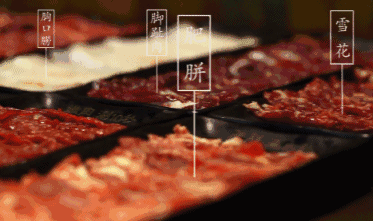 (原始链接: https://mmbiz.qpic.cn/mmbiz_gif/AbkpIKibrs7icbEwBQqapQ3YnL2icC0TJ90oHnHicY815nXialaJbO29IbiaDqeRxK7TVvf3ffJ7Wu7zgoYQgQXUhzFQ/640?wx_fmt=gif)
- 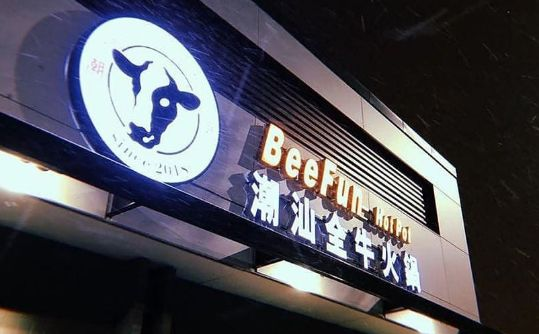 (原始链接: https://mmbiz.qpic.cn/mmbiz_png/AbkpIKibrs7icbEwBQqapQ3YnL2icC0TJ90WNNU2vqmlmib7MmLGSSJT8hwW0yxTcUOBLUp8HnLFRDY1g0sSNhU5aQ/640?wx_fmt=png)
-  (原始链接: https://mmbiz.qpic.cn/mmbiz_gif/AbkpIKibrs78RghLFDHM57L5tlI8xicyCMYLsZA2tsJUrzDZn3bZehF5q52TaGLkJKQwR0s1sYcgtOD7Vcc0M9JQ/640?wx_fmt=gif)
- 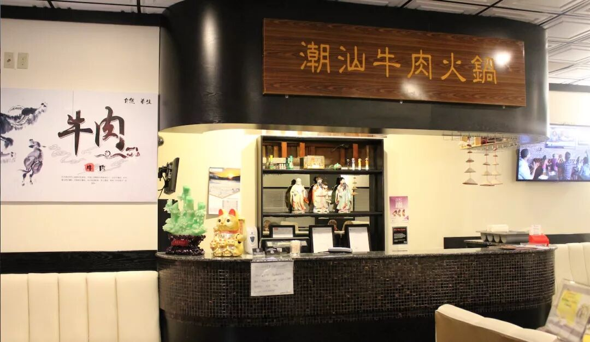 (原始链接: https://mmbiz.qpic.cn/mmbiz_jpg/AbkpIKibrs7icbEwBQqapQ3YnL2icC0TJ90dXFGd5ajeQILp9ACmNRFuiaXb7NVGeibxgVQIgqJUBPGqWKZqM8UQvFw/640?wx_fmt=jpeg)
- 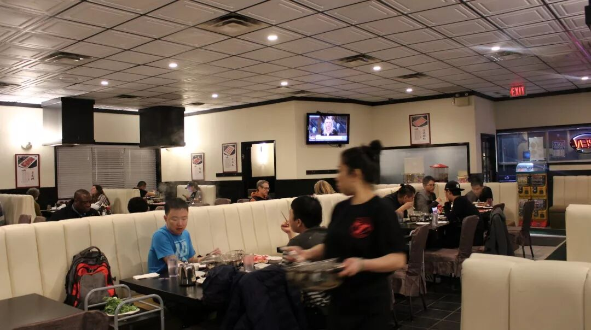 (原始链接: https://mmbiz.qpic.cn/mmbiz_jpg/AbkpIKibrs7icbEwBQqapQ3YnL2icC0TJ90xHOt7RKmwib0Nw2nCQVwud8FJbm5SYjshkJe9Lj1838XwhktGXCzwBw/640?wx_fmt=jpeg)
- 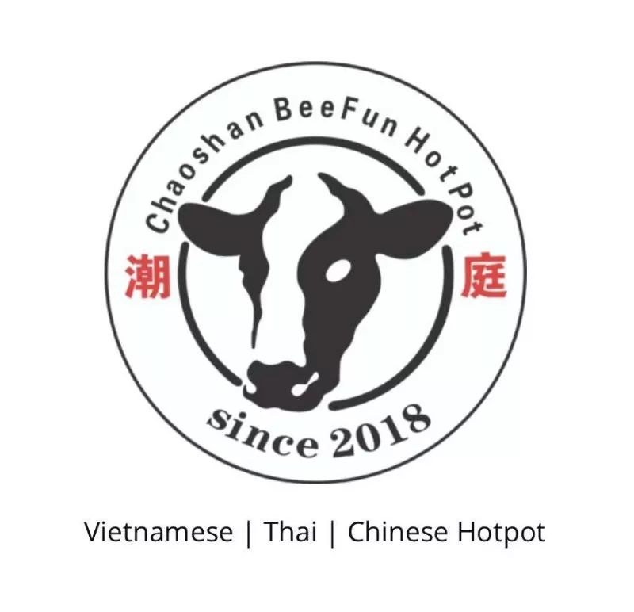 (原始链接: https://mmbiz.qpic.cn/mmbiz_jpg/AbkpIKibrs7icbEwBQqapQ3YnL2icC0TJ90ia82asEyZEF56NsQY3w3o72IDCSoDkq1Jro55bcgvTTyvXwOJAMRAFg/640?wx_fmt=jpeg)
- 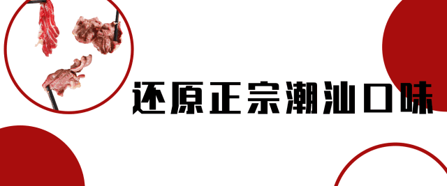 (原始链接: https://mmbiz.qpic.cn/mmbiz_gif/AbkpIKibrs7icbEwBQqapQ3YnL2icC0TJ90S2sIPia8Fb42Nu1Wb1S4jJezq4c4KfUAmps0vr59zA1vfBwMzylKibVg/640?wx_fmt=gif)
- 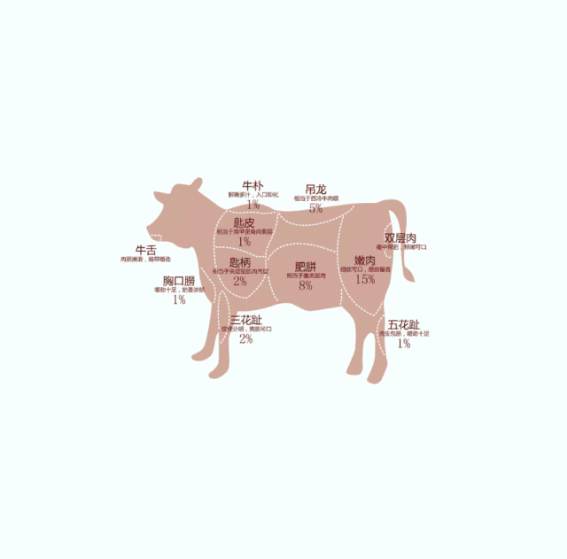 (原始链接: https://mmbiz.qpic.cn/mmbiz_gif/AbkpIKibrs7icbEwBQqapQ3YnL2icC0TJ90icPK1BVQBkU7YgRRCTvYIO1mAl2P8qftGpibGFdteG1G5AFMTnicS70mw/640?wx_fmt=gif)
- 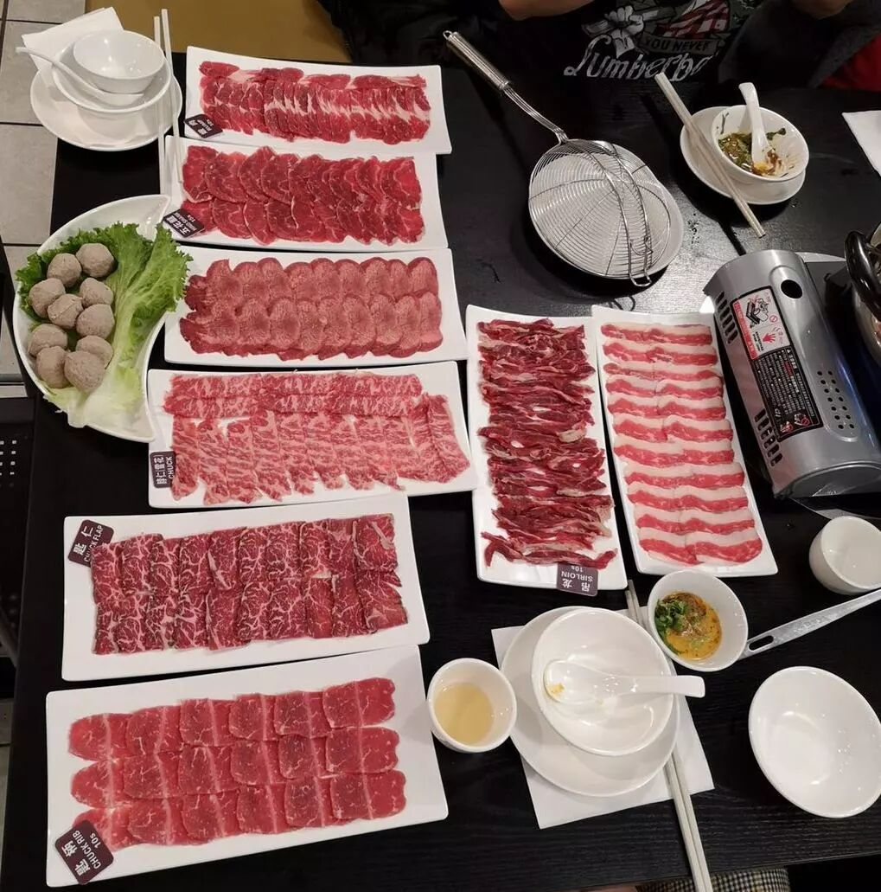 (原始链接: https://mmbiz.qpic.cn/mmbiz_jpg/AbkpIKibrs7icbEwBQqapQ3YnL2icC0TJ90EJ1lLISM78bHF4gpbPnC55fLVwNgGhhl3poHIzEMr9bgdXsP7UVVWA/640?wx_fmt=jpeg)
- 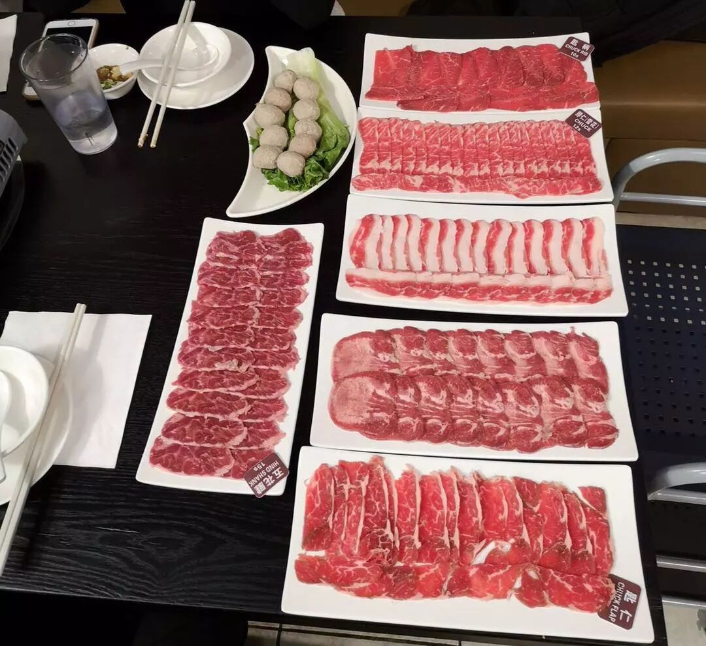 (原始链接: https://mmbiz.qpic.cn/mmbiz_jpg/AbkpIKibrs7icbEwBQqapQ3YnL2icC0TJ90B8QKsX1n1PoIcyruXvlOmG378ia32dLY09KIBhPOYColmpqeMUnYevw/640?wx_fmt=jpeg)
- 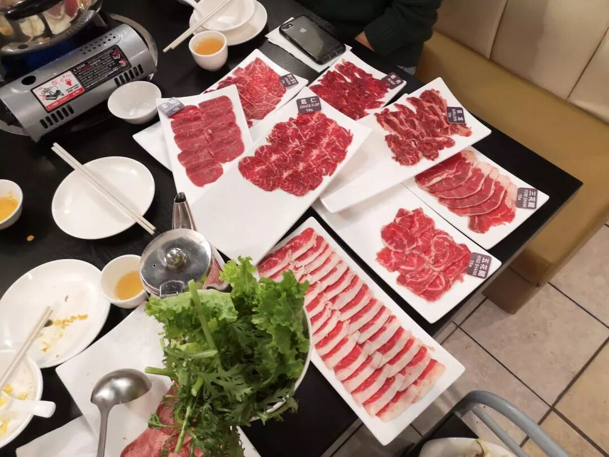 (原始链接: https://mmbiz.qpic.cn/mmbiz_jpg/AbkpIKibrs7icbEwBQqapQ3YnL2icC0TJ90OBvibtYbU7tx3pZIwOLy6bSJzR6klADZSDL7OKWbzmVx6mibVOUHEvEA/640?wx_fmt=jpeg)
- 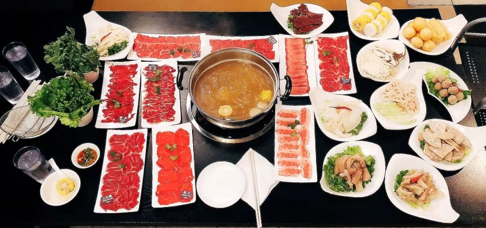 (原始链接: https://mmbiz.qpic.cn/mmbiz_jpg/AbkpIKibrs7icbEwBQqapQ3YnL2icC0TJ90fWiasYKZjVCpA4ONfGRbrToQ2hiaicZaBpTN5uYZQSibwia8KApiclEXkavw/640?wx_fmt=jpeg)
-  (原始链接: https://mmbiz.qpic.cn/mmbiz_gif/AbkpIKibrs7icbEwBQqapQ3YnL2icC0TJ90iaMaDy2JWA0qoNwqM3B9Qib24h5nUSsiaoicDHCYcV5MohCt3U8BhtjXOQ/640?wx_fmt=gif)
-  (原始链接: https://mmbiz.qpic.cn/mmbiz_gif/AbkpIKibrs7icbEwBQqapQ3YnL2icC0TJ90b79u2dnNRrDrj7zOxKAZxzrsskIltnWlCIpgNOQmLlic9RMiaUCMW4pQ/640?wx_fmt=gif)
-  (原始链接: https://mmbiz.qpic.cn/mmbiz_jpg/AbkpIKibrs79O5xCfKNWRP7MGNBKzGMtNNmOsiaz5k7AVxKG24the7USsW2EjXVOcT9C36B5Ew2HNnHxY1CW7wcQ/640?wx_fmt=jpeg)
- 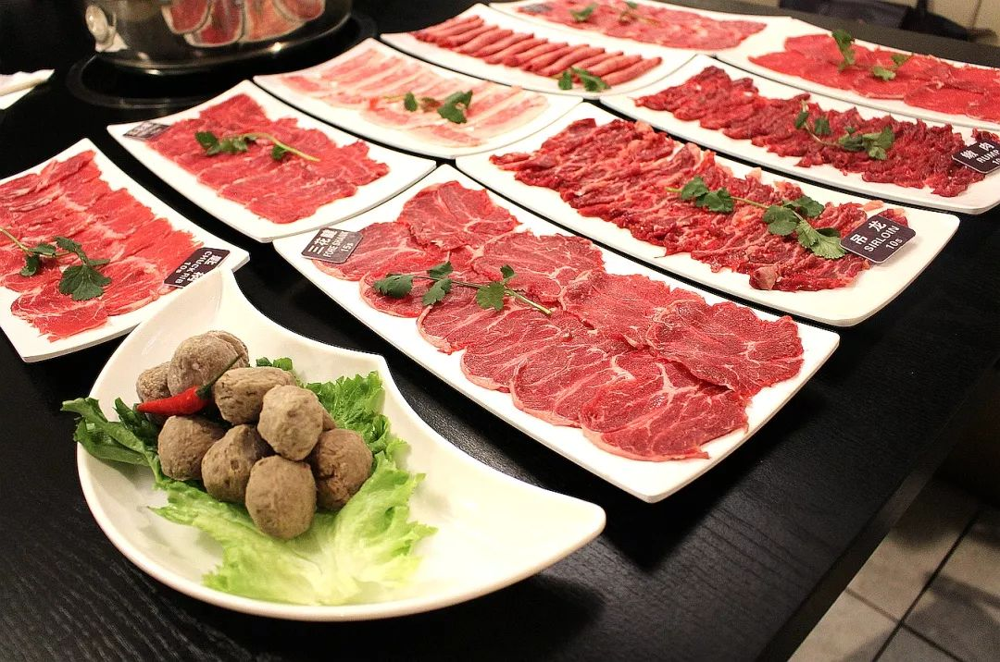 (原始链接: https://mmbiz.qpic.cn/mmbiz_jpg/AbkpIKibrs7icbEwBQqapQ3YnL2icC0TJ90qCUS2YgE0YRZ6S1136LrbA2jiaQJugDGia7ITRLJDTrUD8LzKeWfOpyw/640?wx_fmt=jpeg)
- 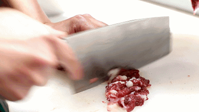 (原始链接: https://mmbiz.qpic.cn/mmbiz_gif/AbkpIKibrs7icbEwBQqapQ3YnL2icC0TJ90kicHUevpNekBdicdLDs2yUkFP4fIBgQQu5DoDxGKCIzerVxZmrVIZcuw/640?wx_fmt=gif)
-  (原始链接: https://mmbiz.qpic.cn/mmbiz_gif/AbkpIKibrs7icbEwBQqapQ3YnL2icC0TJ90Uibjbiao8AIxkqD4nhaBNqxibU48tzbOjLia6a983CC7p54zRKAK9rmYww/640?wx_fmt=gif)
- 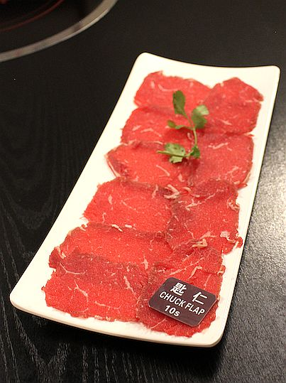 (原始链接: https://mmbiz.qpic.cn/mmbiz_png/AbkpIKibrs7icbEwBQqapQ3YnL2icC0TJ90OuTS86xABAPhd2cu0zHBwNrd4h7L1dHEQuNibzUJuuoSuHnLZhxStYg/640?wx_fmt=png)
- 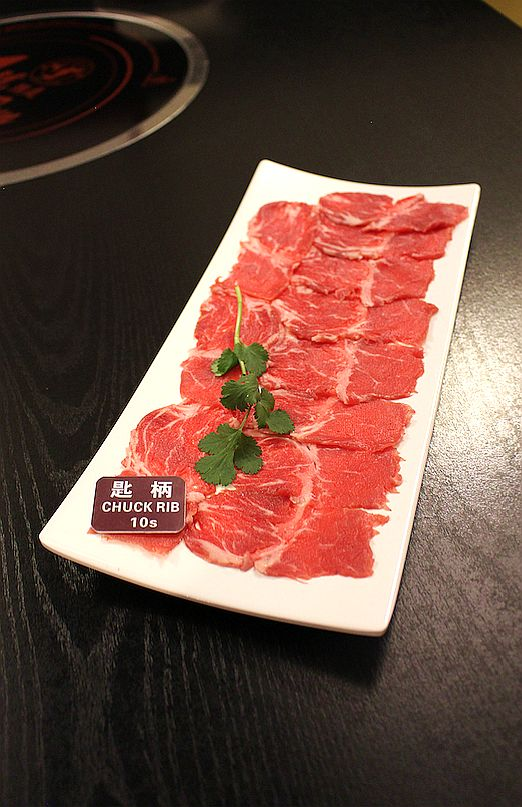 (原始链接: https://mmbiz.qpic.cn/mmbiz_png/AbkpIKibrs7icbEwBQqapQ3YnL2icC0TJ90Tw6kX3zGYic9veaQzoLT9XuWGOv6Wv5w6r7oZGvPyKyorYcAicE67a6Q/640?wx_fmt=png)
- 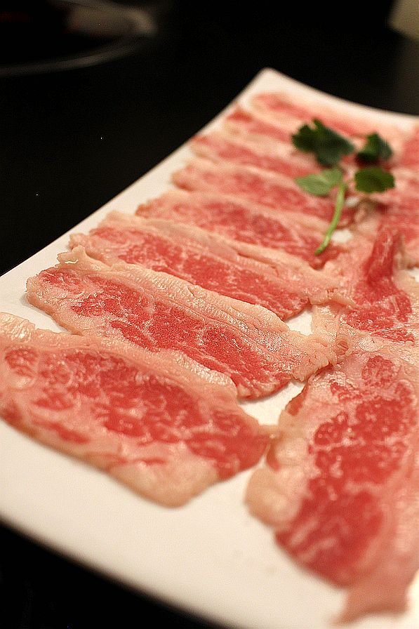 (原始链接: https://mmbiz.qpic.cn/mmbiz_png/AbkpIKibrs7icbEwBQqapQ3YnL2icC0TJ90KWIflLjJyrXR3iadEgshwSp7yiaXWUa2kicB9QCGiaVYuCdzEib4y72bTkg/640?wx_fmt=png)
- 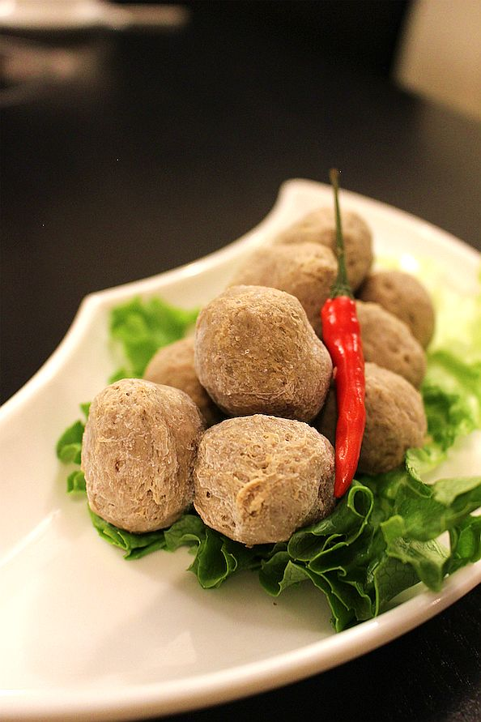 (原始链接: https://mmbiz.qpic.cn/mmbiz_png/AbkpIKibrs7icbEwBQqapQ3YnL2icC0TJ903icyiaeecJpa4hlY7xMNCnQ1mHUzkYzuGoduia3MrUBqkFuNfHmWibkeCw/640?wx_fmt=png)
- 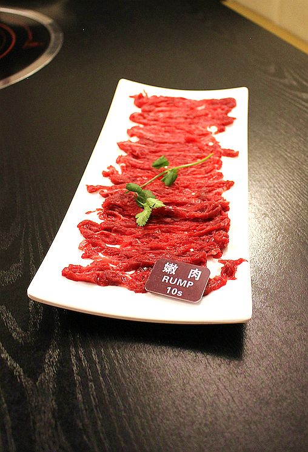 (原始链接: https://mmbiz.qpic.cn/mmbiz_png/AbkpIKibrs7icbEwBQqapQ3YnL2icC0TJ90S8jAMOrc7W7t0M9S5MNzKFTv3wu1BRoxcr7ubiaFoKsLl5KcTE7JSiaA/640?wx_fmt=png)
- 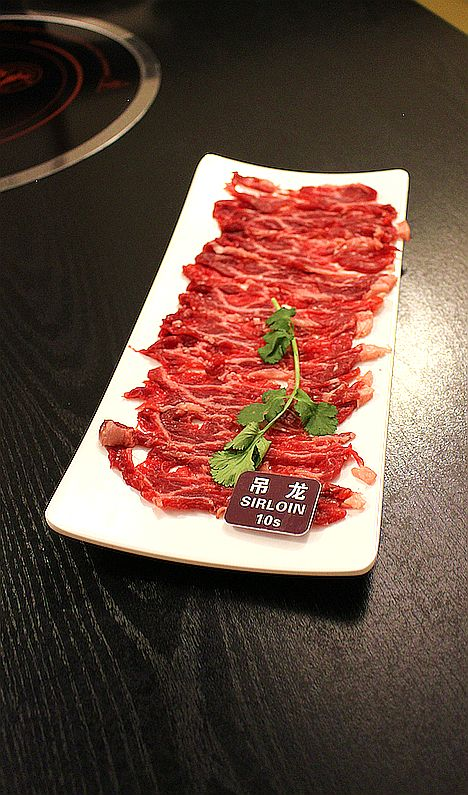 (原始链接: https://mmbiz.qpic.cn/mmbiz_png/AbkpIKibrs7icbEwBQqapQ3YnL2icC0TJ90ic3JeKxICwYclPXQzya2OXn8iaaibDwIC6Y2QyNxnC8pheBEynJqJnQBg/640?wx_fmt=png)
- 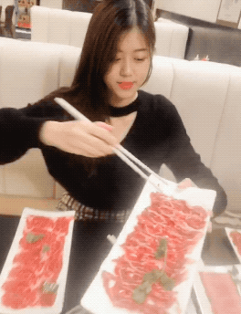 (原始链接: https://mmbiz.qpic.cn/mmbiz_gif/AbkpIKibrs7icbEwBQqapQ3YnL2icC0TJ90tBv7WfQNJkpgZ5ib4iaw8VSx781z6WaFicHsO2VQice5e2nQRyuPEqicSzg/640?wx_fmt=gif)
-  (原始链接: https://mmbiz.qpic.cn/mmbiz_gif/AbkpIKibrs7icbEwBQqapQ3YnL2icC0TJ900xxeUD5rwP80g79u120XePD22Z0N0MZfogR4xYJYic8aBBvfCyK3cUw/640?wx_fmt=gif)
- 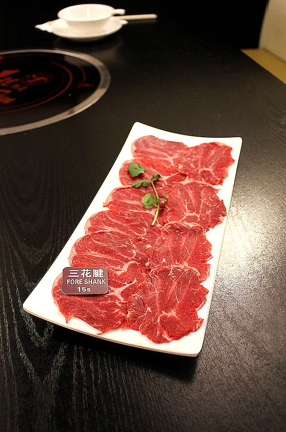 (原始链接: https://mmbiz.qpic.cn/mmbiz_png/AbkpIKibrs7icbEwBQqapQ3YnL2icC0TJ90ABibBicHu7TkI9xT8akcLY7AHdGVJNiadY8fyiaiaPqXB5c0J7zsDZicKv5g/640?wx_fmt=png)
- 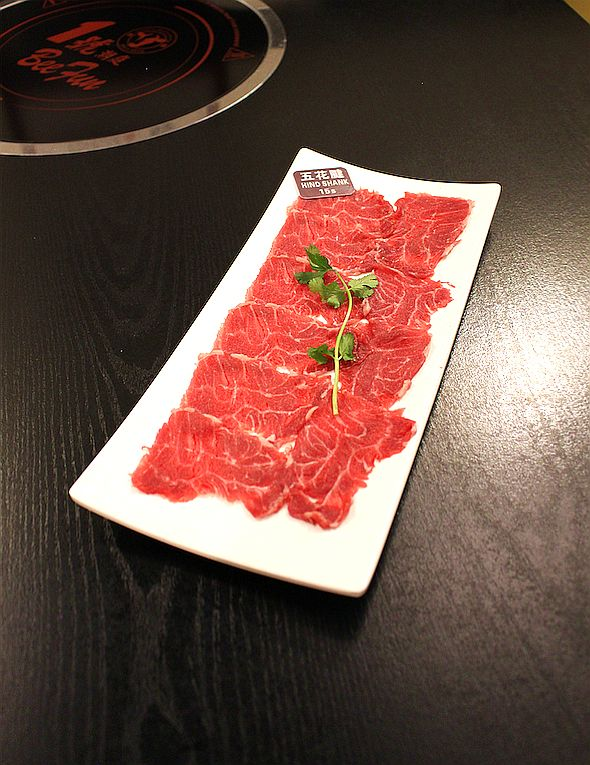 (原始链接: https://mmbiz.qpic.cn/mmbiz_png/AbkpIKibrs7icbEwBQqapQ3YnL2icC0TJ90Ej7KZG00djdBBrEj6Uq23VEg5x7Hm0PbkSKjO8uydRS4ASgR2xHtDg/640?wx_fmt=png)
- 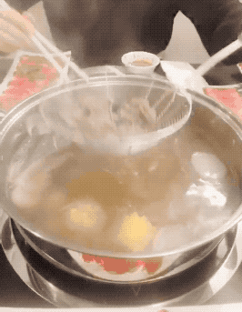 (原始链接: https://mmbiz.qpic.cn/mmbiz_gif/AbkpIKibrs7icbEwBQqapQ3YnL2icC0TJ903EWxblgiboqhic4K9OsuHVkCbLvRiaX85VRf3WeMfoF38bTNMr6ps2Q5A/640?wx_fmt=gif)
- 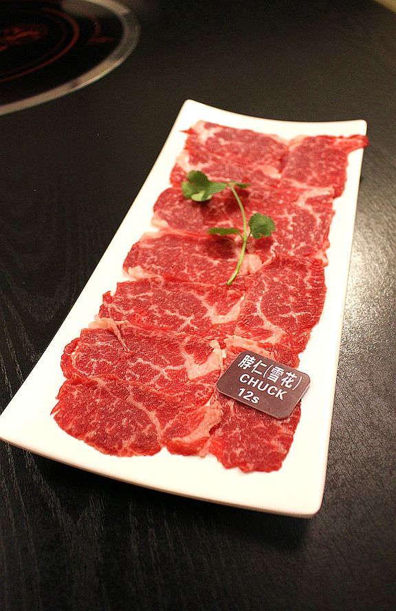 (原始链接: https://mmbiz.qpic.cn/mmbiz_png/AbkpIKibrs7icbEwBQqapQ3YnL2icC0TJ90SsClfEaxuwHcr8Os6PO5tvoicegIqTlY1BNTQyBSHQTzaFQbicKzPakQ/640?wx_fmt=png)
- 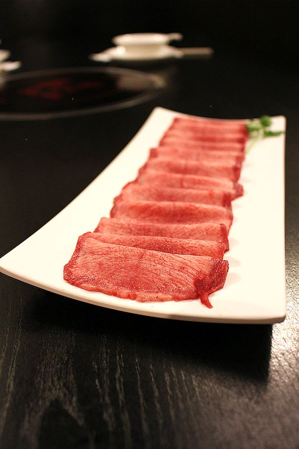 (原始链接: https://mmbiz.qpic.cn/mmbiz_png/AbkpIKibrs7icbEwBQqapQ3YnL2icC0TJ90ibCbUviccDSQ4nBE8WQmFbfC9ibhTZrIGMMz8Zz7gDXAibBbWNM09F1Y4g/640?wx_fmt=png)
-  (原始链接: https://mmbiz.qpic.cn/mmbiz_gif/AbkpIKibrs7icbEwBQqapQ3YnL2icC0TJ90xghHqPB9Ls6lq3GFwSAN99tOUAhpsqnZicHyqpZ7DE9MiaraTYNCgM7Q/640?wx_fmt=gif)
- 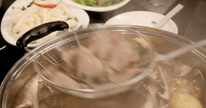 (原始链接: https://mmbiz.qpic.cn/mmbiz_gif/AbkpIKibrs7icbEwBQqapQ3YnL2icC0TJ90Q4uDee67UJgLqyPpib1LiannWRT5aJuZ8QufLSWy7ZusWZThHA2A0Zibw/640?wx_fmt=gif)
-  (原始链接: https://mmbiz.qpic.cn/mmbiz_gif/AbkpIKibrs7icbEwBQqapQ3YnL2icC0TJ90syIb1GibIFkfNNPulKkB4PNLVuic35SGro1g4bvZx0On68nmwpicapx2A/640?wx_fmt=gif)
- 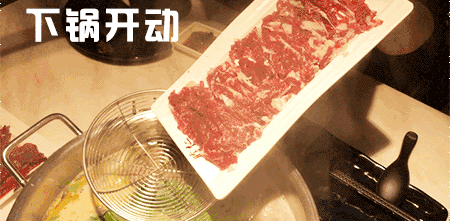 (原始链接: https://mmbiz.qpic.cn/mmbiz_gif/AbkpIKibrs7icbEwBQqapQ3YnL2icC0TJ90OLFyPxMeJZZHuHTm5YDOCibYmSHc6rfkkESxWreumrbpKLZvVE5oZpg/640?wx_fmt=gif)
-  (原始链接: https://mmbiz.qpic.cn/mmbiz_gif/AbkpIKibrs7icbEwBQqapQ3YnL2icC0TJ90xghHqPB9Ls6lq3GFwSAN99tOUAhpsqnZicHyqpZ7DE9MiaraTYNCgM7Q/640?wx_fmt=gif)
- 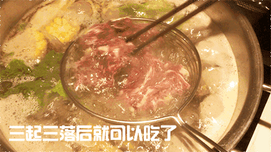 (原始链接: https://mmbiz.qpic.cn/mmbiz_gif/AbkpIKibrs7icbEwBQqapQ3YnL2icC0TJ90nh7clRVVFnicdicI9D0J3EWkQbpehFS0GYeTzNVYEwacWW9FqX3yhwoQ/640?wx_fmt=gif)
- 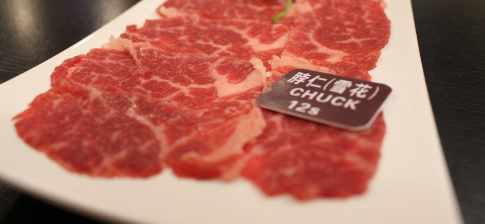 (原始链接: https://mmbiz.qpic.cn/mmbiz_png/AbkpIKibrs7icbEwBQqapQ3YnL2icC0TJ905MxZzpgVhtXLpepTf2hqzCMQ8Oiah5uMdxvZ3icNxibia2jQL3RAsTvkvw/640?wx_fmt=png)
-  (原始链接: https://mmbiz.qpic.cn/mmbiz_gif/AbkpIKibrs7icbEwBQqapQ3YnL2icC0TJ90WMzvE3RibyIe3Kp0QjhqcIDsmR0B7w5NOC1Vb0ibutBC5TIP4eWSHFibg/640?wx_fmt=gif)
- 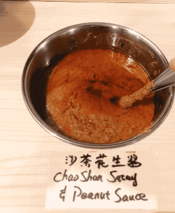 (原始链接: https://mmbiz.qpic.cn/mmbiz_gif/AbkpIKibrs7icbEwBQqapQ3YnL2icC0TJ90ps7ExEA3Yr0MNbbElAnnIoh1wq4TEI9mfciaHh1OruEKMrmYSpGiadnA/640?wx_fmt=gif)
- 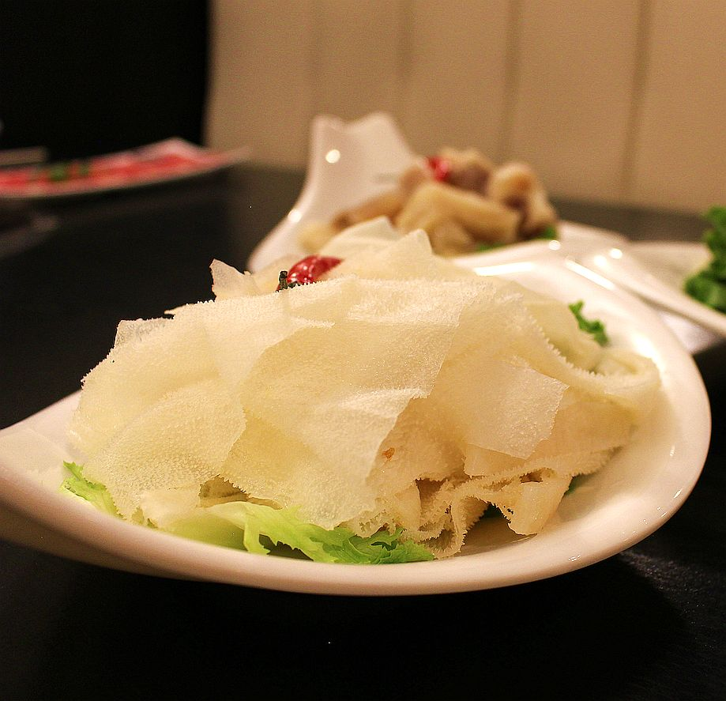 (原始链接: https://mmbiz.qpic.cn/mmbiz_png/AbkpIKibrs78RghLFDHM57L5tlI8xicyCMBQHBesKjbFZYQDPcVWZLK03vNT4YASLwVyuJmdvLttr4EZLOwbmV1w/640?wx_fmt=png)
- 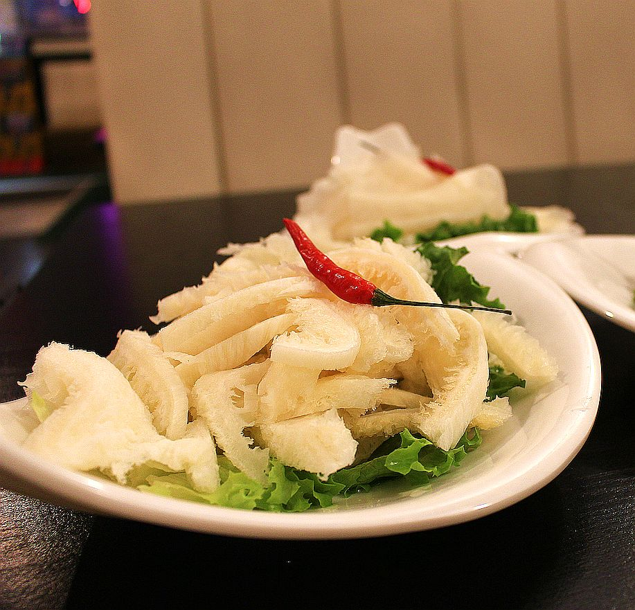 (原始链接: https://mmbiz.qpic.cn/mmbiz_png/AbkpIKibrs78RghLFDHM57L5tlI8xicyCMfvo63aloyg4vKqxh7Z34bq2NxWaoiccedg8Ea5E7XUbiaXVjUg2WhLNQ/640?wx_fmt=png)
-  (原始链接: https://mmbiz.qpic.cn/mmbiz_png/AbkpIKibrs78RghLFDHM57L5tlI8xicyCMBDiaBp9b2ibZOOURlia93kjNrAOichd8KhibXG98rgwmzVxTibJibPgefwjibw/640?wx_fmt=png)
-  (原始链接: https://mmbiz.qpic.cn/mmbiz_jpg/AbkpIKibrs78RghLFDHM57L5tlI8xicyCMDFg1IjVnRrWQicZ17icRPoKyjcofl4YT8nqvn10soDz1OLUyOf0iboDaQ/640?wx_fmt=jpeg)
- 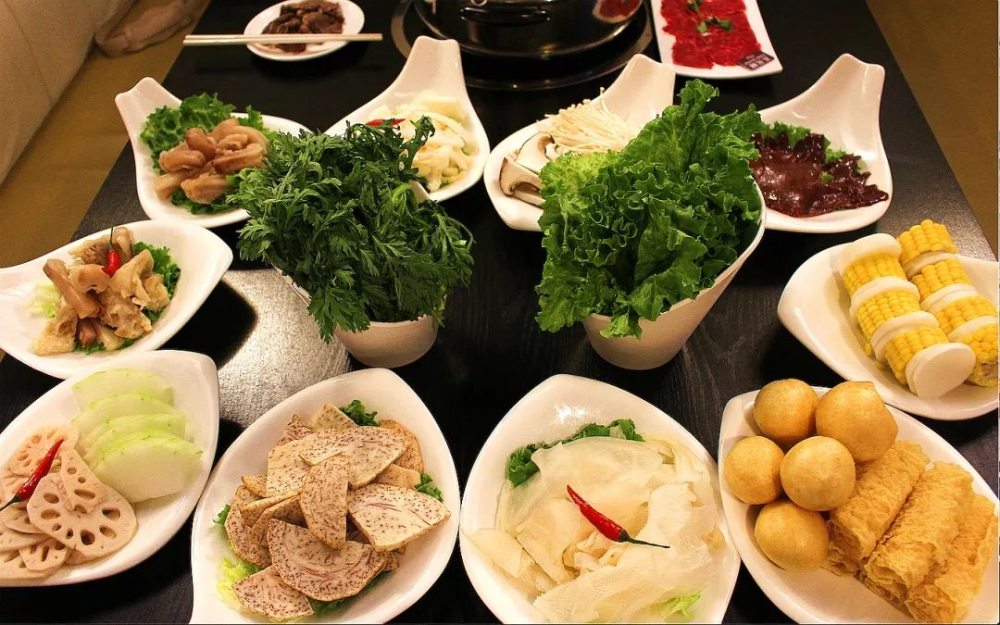 (原始链接: https://mmbiz.qpic.cn/mmbiz_jpg/AbkpIKibrs78RghLFDHM57L5tlI8xicyCMAP9bXic3ibBzpGFx9Miax5dUehdXWkVGFicWvvia70bJ0O8lrr177TPwtLg/640?wx_fmt=jpeg)
-  (原始链接: https://mmbiz.qpic.cn/mmbiz_gif/AbkpIKibrs7icbEwBQqapQ3YnL2icC0TJ90Ts8DsLOCwCkraffncP6MGET6OXGcNNXre7SbVgZzdnQ5BHm4dMib0zQ/640?wx_fmt=gif)
- 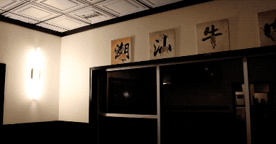 (原始链接: https://mmbiz.qpic.cn/mmbiz_gif/AbkpIKibrs7icbEwBQqapQ3YnL2icC0TJ90B26IAVCkOvxTTVGWicibJ3PT4gcsRka7sLG8qLoeXXkhFVtF5aQiaq4gQ/640?wx_fmt=gif)
- 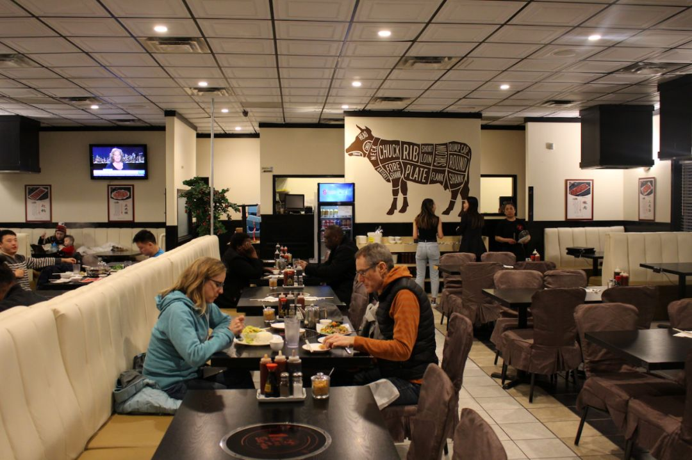 (原始链接: https://mmbiz.qpic.cn/mmbiz_png/AbkpIKibrs7icbEwBQqapQ3YnL2icC0TJ90ibVTxv0Dd7R8CY1gVicD5GHlsFCSCYbkRG2xJrHiaOkfT3ibdnMtic6iboIA/640?wx_fmt=png)
-  (原始链接: https://mmbiz.qpic.cn/mmbiz_png/AbkpIKibrs7icbEwBQqapQ3YnL2icC0TJ90dGtuI8X2xrgxnTGAyOO0DgN3G83AKPZLRT8HfBARribpEWph5p0O6jg/640?wx_fmt=png)
-  (原始链接: https://mmbiz.qpic.cn/mmbiz_gif/AbkpIKibrs7icbEwBQqapQ3YnL2icC0TJ90q6UXK0pP0ibOavUCKjzrfUeOxicAw0BqljCvDRvDzMtHf4iawNLqXcYrg/640?wx_fmt=gif)
-  (原始链接: https://mmbiz.qpic.cn/mmbiz_gif/AbkpIKibrs7icbEwBQqapQ3YnL2icC0TJ90cNLXd1h2F4FKhibBH80OrOOrmss4MHVTgm6VrOyic8JqEXrI1ibpolicWg/640?wx_fmt=gif)
- 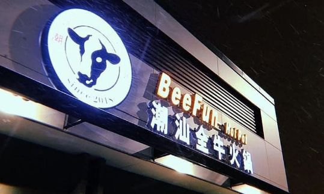 (原始链接: https://mmbiz.qpic.cn/mmbiz_png/AbkpIKibrs7icbEwBQqapQ3YnL2icC0TJ90fGhDk16rx9wF0ibCpq6oZzUoP08icwLT9Nvm9BXlZdEay17LoGl5pLEA/640?wx_fmt=png)
-  (原始链接: https://mmbiz.qpic.cn/mmbiz_png/AbkpIKibrs7icbEwBQqapQ3YnL2icC0TJ902eCDOcE9nY4VYlVVVyq2zxfTTzdIQameoZiciaLb2kVDMPt2Xo0Lz3Rw/640?wx_fmt=png)
-  (原始链接: https://mmbiz.qpic.cn/mmbiz_jpg/AbkpIKibrs79O5xCfKNWRP7MGNBKzGMtNX3micaHBt2jT7BiakHibVjy14Yib2icCoqKhJyaJSo3ibWVQxcDcH6jXJNiaw/640?wx_fmt=jpeg)
-  (原始链接: https://mmbiz.qpic.cn/mmbiz_jpg/AbkpIKibrs79AX9eQ7ApjQVKdOy3j5GtVEc7mQFny3fRLbvj4gjoZC69CnL07KH4D7HcHBzdxecfhzI6eZe3GXg/640?wx_fmt=jpeg)
-  (原始链接: https://mmbiz.qpic.cn/mmbiz_jpg/AbkpIKibrs78SRMicRGcaFyVzdKpYSic1qk6icGnYeBZ6xOEKgg9yjeKpAfrFdvq9CqQwozGoVuyx5Otv06hJq9zZQ/640?wx_fmt=jpeg)
-  (原始链接: https://mmbiz.qpic.cn/mmbiz_jpg/AbkpIKibrs7ic2Fg6eNJ48TXaa4O1gPuyxpIQdoiaEFbBoiaAMgDY0jfoNnnPFOibcRXXbhSYQLpuYxtgNibFUVehWWA/640?wx_fmt=jpeg)
