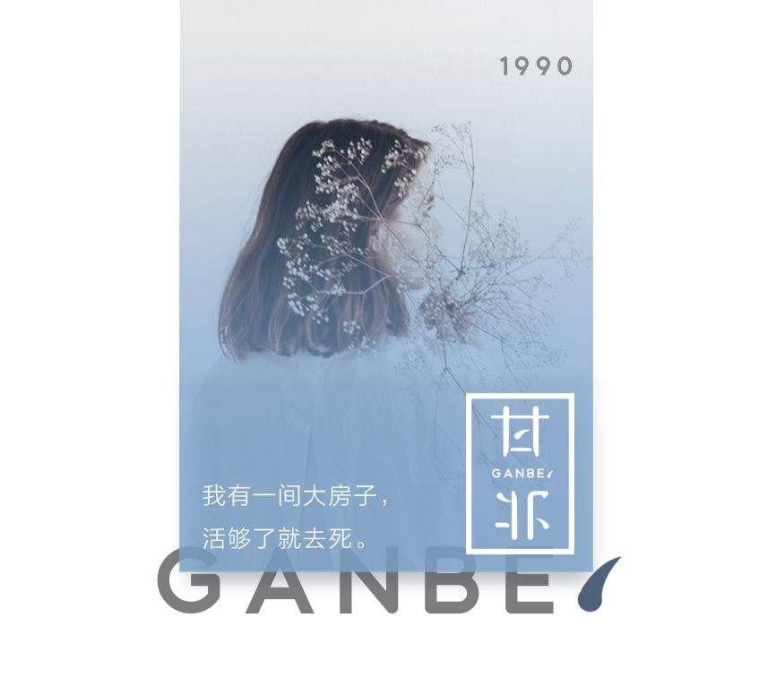

# 无标题

**链接地址:** http://mp.weixin.qq.com/s?__biz=MzI4NTU0MjYzOQ==&mid=2247489399&idx=1&sn=aac214bd5ebc67babf621a5c96954b03&chksm=ebebc6f7dc9c4fe141de56fb43d91187af587aaa602dc7fb5f370418ce278e02457c8be62823&mpshare=1&scene=2&srcid=#rd
**作者:** 甘北
**获取时间:** 2025/8/28 20:35:01
**图片数量:** 8

---

## 原始HTML内容

本文作者：甘北 

 

丁克网友跟我讲述，她跟母亲的博弈过程。

结婚第三年，她和丈夫一起，向母亲表明心志，这辈子不会生孩子了。

母亲起初将信将疑，把夫妻俩训了一顿，而后又宽慰道：“现在嘴硬，等过两年，你们就自然想要了。”

她根本无法相信，世上会真有人，一生不想要孩子。

直到婚后第五年，她31岁了，肚子还没一点动静，母亲才着急起来。

<strong style="max-width: 100%;box-sizing: border-box !important;word-wrap: break-word !important;">仔细盘问才知道，她和丈夫为了守誓，一个上了环，一个结了扎，生理上绝育了。</strong>

这回，父母觅死觅活了。

母亲见她一次，就骂她一次：“早知道你是这么个人，我和你爸就不生你了。”

“那你为什么要生我？我求你生我了吗？”

<strong style="max-width: 100%;box-sizing: border-box !important;word-wrap: break-word !important;">每一次，她都用力地回骂，眼前的老父老母，就是她追求自由路上的劲敌。</strong>

<strong style="max-width: 100%;box-sizing: border-box !important;word-wrap: break-word !important;">他们腐朽，他们自私，他们不可理喻，他们把她生下来，就妄图把她私有化。</strong>

一年春节，她和丈夫回娘家，聊起这个话题，彼此又起了争端，还是那些老话，一个不肯退让，一个主动进击，母亲情急之下，把茶水都泼了。

滚烫的水抖落，淋在母亲手臂上，她慌忙跑过去查看伤势。

母亲却一把推开她，像个赌气的孩子，捧着手臂，跌坐在沙发上，失声痛哭起来：<strong style="max-width: 100%;box-sizing: border-box !important;word-wrap: break-word !important;">“我只有你一个女儿啊……你们说结扎就结扎……”</strong>

大多时候，她一身抗争的勇气，凭什么，生育权不能掌握在自己手里？

但那一刻，她涌上心头的，都是对父母的愧疚。

因为她的与众不同，父母的晚年，注定没法像其他老人，含饴弄孙，承欢膝下了。

 

就这样，又僵持了两年。

第七年的夏天，她和丈夫报了个团，带着两边老人，去海边度假。

吵了这么多年，那块心病，倒像结痂的伤口，大家都心照不宣地避开，生怕鲜血又汨出来。

那次旅行，竟然意外地和谐。

老人们租了一条船，去海里捕鱼，还学年轻人，在沙滩边拍了很多照片。

关于生孩子的事，谁都闭口不提。

只是最后那天下午，老人们一起去踏浪，有个孩子突然从身前跑过，手里拎着塑料桶，一边跑一边扬沙，叫喊声沿着海岸线回荡。

四个老人默契地驻足了。

没有人说话，脸上也没有情绪，就那么呆呆地站着，看着孩子跑远。

她说：<strong style="max-width: 100%;box-sizing: border-box !important;word-wrap: break-word !important;">“我在那一刻，突然意识到，爸爸妈妈妥协了，是那种迫不得已、别无选择的妥协。”</strong>

他们不再指责她和丈夫，不再提出自己的申诉，而是像个巨大的树洞，把所有的心事都打包塞了进去。

因为他们想要孙子，却更爱他们的子女。

直到如今，她和丈夫已经如约丁克了十年。

这十年，家里发生了很多变化，父母妥协了也好，想开了也好，总之，他们不再执着于生儿育女。

晚年时光悠长，他们报了很多老年团，一个地方一个地方地去旅游。还参加了各种各样的歌舞团，学跳广场舞和太极。

妈妈甚至打趣她：“不生也好，省得我帮你带了。”

话是这么说，但在路上看到漂亮的孩子，爸妈还是会多看两眼。

亲戚家的孩子来串门，不管多么顽皮多么讨厌，二老都会逗他大半天。

网友说到这里，突然跟我说：<strong style="max-width: 100%;box-sizing: border-box !important;word-wrap: break-word !important;">“我猜，爸妈一定说服了自己很多遍，才终于接受这个事实。我从前觉得，父母都是老古板，现在才发现，真正狭隘和固执的人，是我们自己。”</strong>

她后悔了。

后悔曾经，跟父母说过那么狠的话。

后悔在两代人的鸿沟面前，选择了争吵，而不是沟通。

&nbsp;

事实上，这些年来，我越来越深有体会——<strong style="max-width: 100%;box-sizing: border-box !important;word-wrap: break-word !important;">我们总说父母古板，却从未认真审视过，自身的狭隘和固执。</strong> 

<strong style="max-width: 100%;box-sizing: border-box !important;word-wrap: break-word !important;">换句话说，我们从不擅于，站在父母的立场上，去理解他们的狭隘和固执。</strong>

朋友曾讲过她的经历。

她跟丈夫结婚，两人商议不摆酒席、不请宾客，请帖只发电子邮件，旅游到哪个城市，就约当地的朋友吃饭。

但父母强力反对，在老人看来，没有仪式的婚礼，是不成体统的。

为了这事，两代人闹得很僵。

他们不明白，结婚是自己的事，凭什么做给别人看？

直到后来，有人问了她一个问题：“既然不举办婚礼，为什么又要发电子请帖，要约朋友吃饭呢？”

她答道：“总得告诉朋友，我们结婚了吧？”

这人便问她：“那你的父母，该怎么告诉他们的朋友，他们的女儿，结婚了呢？”

朋友说，那一刻，她才恍然大悟，自己的固执有多可怕。

<strong style="max-width: 100%;box-sizing: border-box !important;word-wrap: break-word !important;">她只在意她的朋友，却从未在意过，父母也有朋友。</strong>

父母的世界里，人际关系是一个封闭的圈子，没有微信和微博，彼此的讯息，只能通过最古老的形式来传递。

谁家摆了结婚酒，谁家摆了满月酒，一出门，就是四邻八方的耳朵和嘴巴。

<strong style="max-width: 100%;box-sizing: border-box !important;word-wrap: break-word !important;">子女们可以不在意，逃进大城市就消声了，但对于老人而言，流言是无处可逃的。</strong>

<strong style="max-width: 100%;box-sizing: border-box !important;word-wrap: break-word !important;">他们逃不出周围人的目光，就像逃不出他们的时代。</strong>

&nbsp;

这个时代的父母子女，面临的鸿沟之深，前所未有。

在此前的几千年，人类农耕细作，传宗接代，一切按部就班。

但时代一下就变了。

互联网来了，明星来了，网红来了，高铁和飞机，一下子全来了。

<strong style="max-width: 100%;box-sizing: border-box !important;word-wrap: break-word !important;">我们的父亲母亲，变得措手不及，他们不会出门了，不会坐车了，不知道孩子们，每天捧着手机在笑什么。</strong>

而比这一切更可怕的，是时代的思潮冲击。

人开始强调独立价值了，生育不再是婚姻的意义，甚至连婚姻本身，都是可有可无的。我们追求自由，追求独立，追求世上一切的新潮事物。

但父母老了，追不上了。

我自己的爸妈，算是那种前卫的父母。

但他们学用微信时，战战兢兢的样子真令人心疼，戴着老花镜，捧着手机，生怕哪里点坏了，一个简单的输入法切换，学习了至少十几次……

他们终究学会了，费了九牛二虎之力。

就像文章开头那对父母，他们用了十年的光阴，终于接受了子女丁克的现实。

你觉得他们迂腐，他们顽固，他们不可理喻。

可谁又能理解，他们的时代，他们的价值观，他们的生活习惯。

<strong style="max-width: 100%;box-sizing: border-box !important;word-wrap: break-word !important;">从来没有人，这样教过他们。</strong>

 

都说老人就像孩子。

但老人对新事物的接受能力，却无法像孩子一样迅速。

<strong style="max-width: 100%;box-sizing: border-box !important;word-wrap: break-word !important;">因为除了生理上的衰老，对于他们而言，接受新的，还意味着，要擦去旧的。</strong>

想起早两天跟朋友的对话，她突然问我：“你有没有发现，我们喜欢的明星，喜欢的歌曲，奉为经典的电视剧，永远定格在青春期了。”

可不是么？

我印象中的神剧，恐怕永远是《还珠格格》，音乐库里循环播放的，总是张学友和陈奕迅，印象中万人空巷的选秀，只有李宇春那一届的超女……

蔡徐坤、skr、wysl、C位出道，当这些名词，出现在微博热搜上，身边许多同龄人，都开始自嘲了：我一个都看不懂！

<strong style="max-width: 100%;box-sizing: border-box !important;word-wrap: break-word !important;">你看，我们的固执守旧，和父母的固执守旧，一模一样，不是吗？</strong>

长江后浪推前浪，总有一天，我们也将成为，那个被拍翻的前浪。

我如今就时常在想，等我的孩子长大了，世界会变成什么样，我又要多努力，才跟得上他们的步伐。 

答案未知且令人恐惧。

那种恐惧，或许，就像父母听到，我们不结婚，我们不生孩子，我们要一生漂泊，一样吧。

马尔克斯说，一个人最初和父亲相像之日，也就是他开始衰老之时。

<strong style="max-width: 100%;box-sizing: border-box !important;word-wrap: break-word !important;">尝试用一种更缓和的态度，去理解我们的父母吧。</strong>

<strong style="max-width: 100%;box-sizing: border-box !important;word-wrap: break-word !important;">因为终有一天，我们都将变成老去的父母。</strong>

<strong>&nbsp;—甘北原创—&nbsp;</strong>

首次发布于2018.08.03

修订重新发布

 
<section style="white-space: normal;max-width: 100%;letter-spacing: 0.5440000295639038px;text-align: center;box-sizing: border-box !important;word-wrap: break-word !important;"><section style="max-width: 100%;box-sizing: border-box !important;word-wrap: break-word !important;"><section style="max-width: 100%;box-sizing: border-box !important;word-wrap: break-word !important;"><section class="" powered-by="xiumi.us" style="max-width: 100%;box-sizing: border-box !important;word-wrap: break-word !important;"><section style="max-width: 100%;box-sizing: border-box !important;word-wrap: break-word !important;"><section style="max-width: 100%;box-sizing: border-box !important;word-wrap: break-word !important;"><section style="max-width: 100%;box-sizing: border-box !important;word-wrap: break-word !important;"><section class="" powered-by="xiumi.us" style="max-width: 100%;box-sizing: border-box !important;word-wrap: break-word !important;"><section style="max-width: 100%;box-sizing: border-box !important;word-wrap: break-word !important;"><section style="max-width: 100%;box-sizing: border-box !important;word-wrap: break-word !important;"><section class="" powered-by="xiumi.us" style="max-width: 100%;box-sizing: border-box !important;word-wrap: break-word !important;"><section style="max-width: 100%;box-sizing: border-box !important;word-wrap: break-word !important;"><section style="max-width: 100%;box-sizing: border-box !important;word-wrap: break-word !important;">
今日荐读

<a href="http://mp.weixin.qq.com/s?__biz=MzI4NTU0MjYzOQ==&amp;mid=2247489369&amp;idx=1&amp;sn=45a56a98a819e3d664d90fcfe8600440&amp;chksm=ebebc6d9dc9c4fcfec459193d50d8b458bb48edd46f53d2519b8eb44e706612bc6589d61fca0&amp;scene=21#wechat_redirect" target="_blank" data-itemshowtype="0" data-linktype="2" style="text-decoration: underline;font-size: 14px;">朋友圈的宠妻狂魔，操控了一场“苦肉计”。</a> 

<a href="http://mp.weixin.qq.com/s?__biz=MzI4NTU0MjYzOQ==&amp;mid=2247489350&amp;idx=1&amp;sn=0baa0900e7e43a5900eeba2e08811fac&amp;chksm=ebebc6c6dc9c4fd0f0516c046a1c34106775a7b5ae39765987ff21ad4f29545018dd4b454a29&amp;scene=21#wechat_redirect" target="_blank" data-itemshowtype="0" data-linktype="2" style="text-decoration: underline;font-size: 14px;">德云社演员脑溢血：有车有房，就不能众筹100万了吗？</a> 

<a href="http://mp.weixin.qq.com/s?__biz=MzI4NTU0MjYzOQ==&amp;mid=2247489313&amp;idx=1&amp;sn=6d1b30926682e45f7ec221e1999306da&amp;chksm=ebebc6a1dc9c4fb749a2f9186c6a2004d5a1eec2817845900ac00d4a066b88c88754ef4fa790&amp;scene=21#wechat_redirect" target="_blank" data-itemshowtype="0" data-linktype="2" style="text-decoration: underline;font-size: 14px;">“送我用过的神仙水，嫂嫂当我捡破烂的吗？”</a> 

 
</section></section></section></section></section></section></section></section></section></section></section></section></section>

&nbsp;

---

## 纯文本内容

本文作者：甘北丁克网友跟我讲述，她跟母亲的博弈过程。结婚第三年，她和丈夫一起，向母亲表明心志，这辈子不会生孩子了。母亲起初将信将疑，把夫妻俩训了一顿，而后又宽慰道：“现在嘴硬，等过两年，你们就自然想要了。”她根本无法相信，世上会真有人，一生不想要孩子。直到婚后第五年，她31岁了，肚子还没一点动静，母亲才着急起来。仔细盘问才知道，她和丈夫为了守誓，一个上了环，一个结了扎，生理上绝育了。这回，父母觅死觅活了。母亲见她一次，就骂她一次：“早知道你是这么个人，我和你爸就不生你了。”“那你为什么要生我？我求你生我了吗？”每一次，她都用力地回骂，眼前的老父老母，就是她追求自由路上的劲敌。他们腐朽，他们自私，他们不可理喻，他们把她生下来，就妄图把她私有化。一年春节，她和丈夫回娘家，聊起这个话题，彼此又起了争端，还是那些老话，一个不肯退让，一个主动进击，母亲情急之下，把茶水都泼了。滚烫的水抖落，淋在母亲手臂上，她慌忙跑过去查看伤势。母亲却一把推开她，像个赌气的孩子，捧着手臂，跌坐在沙发上，失声痛哭起来：“我只有你一个女儿啊……你们说结扎就结扎……”大多时候，她一身抗争的勇气，凭什么，生育权不能掌握在自己手里？但那一刻，她涌上心头的，都是对父母的愧疚。因为她的与众不同，父母的晚年，注定没法像其他老人，含饴弄孙，承欢膝下了。就这样，又僵持了两年。第七年的夏天，她和丈夫报了个团，带着两边老人，去海边度假。吵了这么多年，那块心病，倒像结痂的伤口，大家都心照不宣地避开，生怕鲜血又汨出来。那次旅行，竟然意外地和谐。老人们租了一条船，去海里捕鱼，还学年轻人，在沙滩边拍了很多照片。关于生孩子的事，谁都闭口不提。只是最后那天下午，老人们一起去踏浪，有个孩子突然从身前跑过，手里拎着塑料桶，一边跑一边扬沙，叫喊声沿着海岸线回荡。四个老人默契地驻足了。没有人说话，脸上也没有情绪，就那么呆呆地站着，看着孩子跑远。她说：“我在那一刻，突然意识到，爸爸妈妈妥协了，是那种迫不得已、别无选择的妥协。”他们不再指责她和丈夫，不再提出自己的申诉，而是像个巨大的树洞，把所有的心事都打包塞了进去。因为他们想要孙子，却更爱他们的子女。直到如今，她和丈夫已经如约丁克了十年。这十年，家里发生了很多变化，父母妥协了也好，想开了也好，总之，他们不再执着于生儿育女。晚年时光悠长，他们报了很多老年团，一个地方一个地方地去旅游。还参加了各种各样的歌舞团，学跳广场舞和太极。妈妈甚至打趣她：“不生也好，省得我帮你带了。”话是这么说，但在路上看到漂亮的孩子，爸妈还是会多看两眼。亲戚家的孩子来串门，不管多么顽皮多么讨厌，二老都会逗他大半天。网友说到这里，突然跟我说：“我猜，爸妈一定说服了自己很多遍，才终于接受这个事实。我从前觉得，父母都是老古板，现在才发现，真正狭隘和固执的人，是我们自己。”她后悔了。后悔曾经，跟父母说过那么狠的话。后悔在两代人的鸿沟面前，选择了争吵，而不是沟通。 事实上，这些年来，我越来越深有体会——我们总说父母古板，却从未认真审视过，自身的狭隘和固执。换句话说，我们从不擅于，站在父母的立场上，去理解他们的狭隘和固执。朋友曾讲过她的经历。她跟丈夫结婚，两人商议不摆酒席、不请宾客，请帖只发电子邮件，旅游到哪个城市，就约当地的朋友吃饭。但父母强力反对，在老人看来，没有仪式的婚礼，是不成体统的。为了这事，两代人闹得很僵。他们不明白，结婚是自己的事，凭什么做给别人看？直到后来，有人问了她一个问题：“既然不举办婚礼，为什么又要发电子请帖，要约朋友吃饭呢？”她答道：“总得告诉朋友，我们结婚了吧？”这人便问她：“那你的父母，该怎么告诉他们的朋友，他们的女儿，结婚了呢？”朋友说，那一刻，她才恍然大悟，自己的固执有多可怕。她只在意她的朋友，却从未在意过，父母也有朋友。父母的世界里，人际关系是一个封闭的圈子，没有微信和微博，彼此的讯息，只能通过最古老的形式来传递。谁家摆了结婚酒，谁家摆了满月酒，一出门，就是四邻八方的耳朵和嘴巴。子女们可以不在意，逃进大城市就消声了，但对于老人而言，流言是无处可逃的。他们逃不出周围人的目光，就像逃不出他们的时代。 这个时代的父母子女，面临的鸿沟之深，前所未有。在此前的几千年，人类农耕细作，传宗接代，一切按部就班。但时代一下就变了。互联网来了，明星来了，网红来了，高铁和飞机，一下子全来了。我们的父亲母亲，变得措手不及，他们不会出门了，不会坐车了，不知道孩子们，每天捧着手机在笑什么。而比这一切更可怕的，是时代的思潮冲击。人开始强调独立价值了，生育不再是婚姻的意义，甚至连婚姻本身，都是可有可无的。我们追求自由，追求独立，追求世上一切的新潮事物。但父母老了，追不上了。我自己的爸妈，算是那种前卫的父母。但他们学用微信时，战战兢兢的样子真令人心疼，戴着老花镜，捧着手机，生怕哪里点坏了，一个简单的输入法切换，学习了至少十几次……他们终究学会了，费了九牛二虎之力。就像文章开头那对父母，他们用了十年的光阴，终于接受了子女丁克的现实。你觉得他们迂腐，他们顽固，他们不可理喻。可谁又能理解，他们的时代，他们的价值观，他们的生活习惯。从来没有人，这样教过他们。都说老人就像孩子。但老人对新事物的接受能力，却无法像孩子一样迅速。因为除了生理上的衰老，对于他们而言，接受新的，还意味着，要擦去旧的。想起早两天跟朋友的对话，她突然问我：“你有没有发现，我们喜欢的明星，喜欢的歌曲，奉为经典的电视剧，永远定格在青春期了。”可不是么？我印象中的神剧，恐怕永远是《还珠格格》，音乐库里循环播放的，总是张学友和陈奕迅，印象中万人空巷的选秀，只有李宇春那一届的超女……蔡徐坤、skr、wysl、C位出道，当这些名词，出现在微博热搜上，身边许多同龄人，都开始自嘲了：我一个都看不懂！你看，我们的固执守旧，和父母的固执守旧，一模一样，不是吗？长江后浪推前浪，总有一天，我们也将成为，那个被拍翻的前浪。我如今就时常在想，等我的孩子长大了，世界会变成什么样，我又要多努力，才跟得上他们的步伐。答案未知且令人恐惧。那种恐惧，或许，就像父母听到，我们不结婚，我们不生孩子，我们要一生漂泊，一样吧。马尔克斯说，一个人最初和父亲相像之日，也就是他开始衰老之时。尝试用一种更缓和的态度，去理解我们的父母吧。因为终有一天，我们都将变成老去的父母。 —甘北原创— 首次发布于2018.08.03修订重新发布今日荐读朋友圈的宠妻狂魔，操控了一场“苦肉计”。德云社演员脑溢血：有车有房，就不能众筹100万了吗？“送我用过的神仙水，嫂嫂当我捡破烂的吗？”

---

## 图片列表

-  (原始链接: https://mmbiz.qpic.cn/mmbiz_png/Y77e8cFeqGDSCQgO9UsSFq80fCh0IdzF2AKzhr6Mib9MaMiaod8ZcsYf5T3EZmDVg2WAJibDicz9eFKtxbict2UuTnA/640?wx_fmt=png)
-  (原始链接: https://mmbiz.qpic.cn/mmbiz_png/Y77e8cFeqGDSCQgO9UsSFq80fCh0IdzFzonMgqVR6gkrtVqOBjEkvgY2yZQWjEGzuyg9L6icVESpGeXZm5gQG9g/640?wx_fmt=png)
-  (原始链接: https://mmbiz.qpic.cn/mmbiz_png/Y77e8cFeqGDSCQgO9UsSFq80fCh0IdzFgPskkqqPQLlUNIaP97tAJnGYsPiamiaPI4s3yOCZUVBbIGlVaxUkdsmQ/640?wx_fmt=png)
-  (原始链接: https://mmbiz.qpic.cn/mmbiz_png/Y77e8cFeqGDSCQgO9UsSFq80fCh0IdzF8wBskWKibztsTYGiaOicibgbiaA6JfxaDkg58xFhTmdM7WJK0bdJ4jZ5kwA/640?wx_fmt=png)
-  (原始链接: https://mmbiz.qpic.cn/mmbiz_png/Y77e8cFeqGDSCQgO9UsSFq80fCh0IdzFzQ7p3iaNhxVgLTDTHickZTyMwL70gWia6qTef8eXq7loh8fIthCwBzaMA/640?wx_fmt=png)
-  (原始链接: https://mmbiz.qpic.cn/mmbiz_png/Y77e8cFeqGDSCQgO9UsSFq80fCh0IdzFbymWYrHLtlURAZ7eaq3YHJFUe1ryFTp5zkDgN7INyEbwQ6gvupAKug/640?wx_fmt=png)
-  (原始链接: https://mmbiz.qpic.cn/mmbiz_gif/Y77e8cFeqGDSCQgO9UsSFq80fCh0IdzFQonSeYoboJicm2nQ0lpTx1jFwl3j1c6hBOj0icyibkheENV2fLTlZgtIg/640?wx_fmt=gif)
-  (原始链接: https://mmbiz.qpic.cn/mmbiz_png/Y77e8cFeqGDBmPcTvsUp8K6KM3yO8u2roOBeaGU83le7V2HdXkiaSAzTqNJTWpDNnRGu7NlAyIs2vaqhth9NcEA/640?wx_fmt=png)
