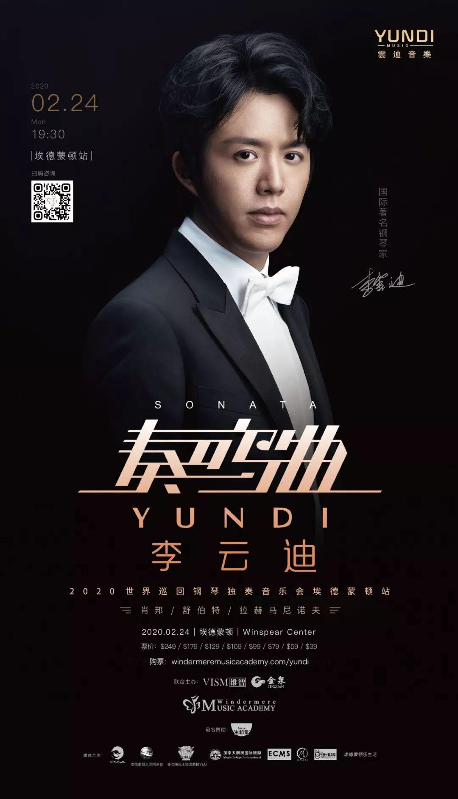
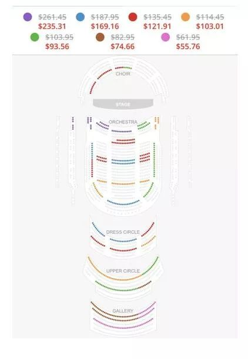
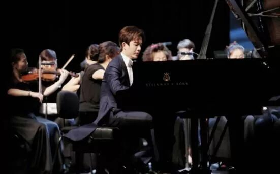
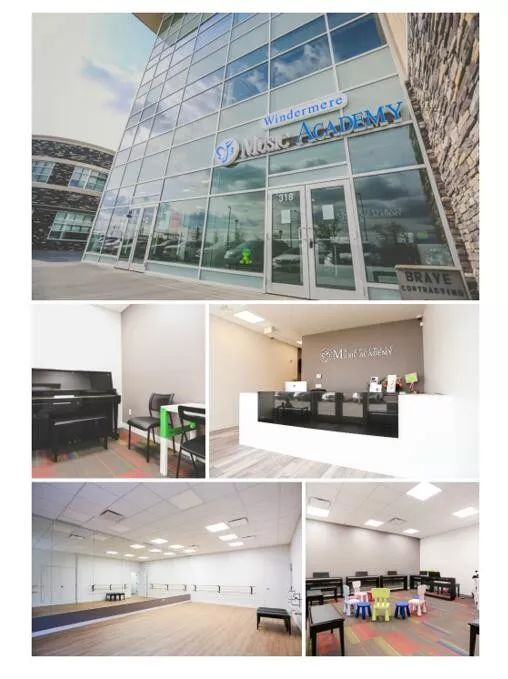
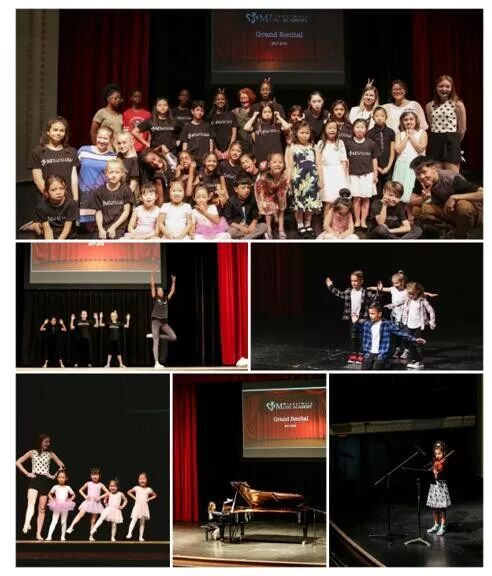
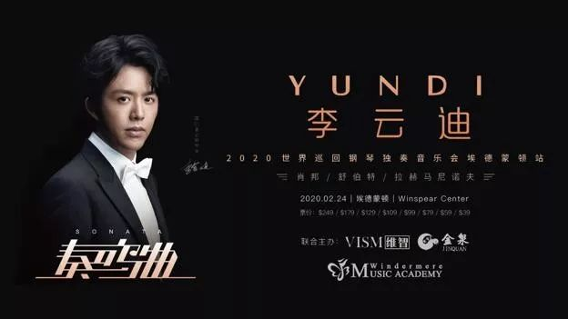
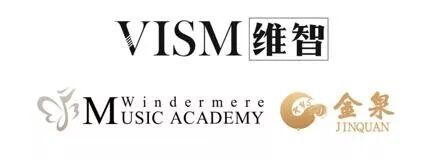
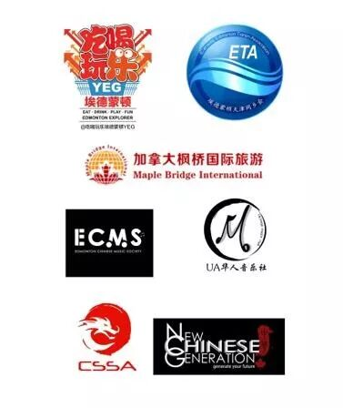
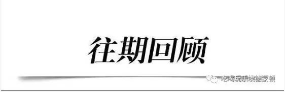

# 无标题

**链接地址:** http://mp.weixin.qq.com/s?__biz=MzAwODQwNTM4MQ==&mid=2655537828&idx=1&sn=69321dca17e1a45aed4771bbcff90992&chksm=80d3824eb7a40b58e44b4da8de14f67933cb3643e0a02df77b25e064b9b7d65e5c4d3314fbac&mpshare=1&scene=2&srcid=#rd
**作者:** 
**获取时间:** 2025/8/28 20:33:58
**图片数量:** 16

---

## 原始HTML内容

<section class="" style="max-width: 100%;letter-spacing: 0.544px;white-space: normal;font-size: 14px;-webkit-tap-highlight-color: rgba(0, 0, 0, 0);color: rgb(85, 85, 85);font-family: &quot;Helvetica Neue&quot;, Arial, &quot;PingFang SC&quot;, &quot;Microsoft YaHei&quot;, &quot;WenQuanYi Micro Hei&quot;, sans-serif;text-align: start;background-color: rgb(255, 255, 255);box-sizing: border-box !important;overflow-wrap: break-word !important;">&nbsp;<section class="" ng-click="onClick($event)" ng-model="eo.text" ng-style=" { 'font-size'   : eo.fontSize,   'font-family' : eo.fontFamily,   'font-style'  : eo.fontStyle,   'color'       : (eo.color || theme.majorColor), } " placeholder="{ 点击编辑 }" stop-propagation="click mousedown mouseup" tn-edit-content="true" tn-page-editable="text0" tn-page-editable-type="ed-type-text" ui-on-drop="block($event)" style="margin-top: 0.7em; margin-left: -0.4em; padding: 1em; max-width: 100%; -webkit-tap-highlight-color: rgba(0, 0, 0, 0); display: inline-block; border-radius: 1em; width: 510.25px; color: inherit; font-family: inherit; font-size: 1em; background-color: rgb(250, 200, 255); box-sizing: border-box !important; overflow-wrap: break-word !important;">&nbsp;&nbsp;吃喝玩乐埃德蒙顿 服务微信有问必答，还能帮找工作？！</section></section>
 
<section class="" style="max-width: 100%;letter-spacing: 0.544px;white-space: normal;font-size: 14px;-webkit-tap-highlight-color: rgba(0, 0, 0, 0);color: rgb(85, 85, 85);font-family: &quot;Helvetica Neue&quot;, Arial, &quot;PingFang SC&quot;, &quot;Microsoft YaHei&quot;, &quot;WenQuanYi Micro Hei&quot;, sans-serif;text-align: start;background-color: rgb(255, 255, 255);box-sizing: border-box !important;overflow-wrap: break-word !important;"><section class="" ng-click="onClick($event)" ng-model="eo.text" ng-style=" { 'font-size'   : eo.fontSize,   'font-family' : eo.fontFamily,   'font-style'  : eo.fontStyle,   'color'       : (eo.color || theme.majorColor), } " placeholder="{ 点击编辑 }" stop-propagation="click mousedown mouseup" tn-edit-content="true" tn-page-editable="text0" tn-page-editable-type="ed-type-text" ui-on-drop="block($event)" style="margin-top: 0.7em; margin-right: -0.4em; padding: 1em; max-width: 100%; -webkit-tap-highlight-color: rgba(0, 0, 0, 0); display: inline-block; border-radius: 1em; width: 510.25px; color: inherit; font-family: inherit; font-size: 1em; background-color: rgb(188, 227, 249); box-sizing: border-box !important; overflow-wrap: break-word !important;">是的！立即通过微信ID添加：1941233268 真的有求必应！</section>&nbsp;&nbsp;</section>
 

 

 

重磅官宣：钢琴王子李云迪独奏音乐会正式奏响埃德蒙顿！ 

——调好闹钟，马上开始预售啦！

李云迪

享誉世界的著名钢琴家

肖邦钢琴比赛史上最年轻的冠军和评委

被誉为

“国际著名钢琴家”

“21世纪肖邦”

“中国名片”

“当代中国钢琴领军人物”

“最耀眼的国际钢琴巨星”

 

 

 

由<strong>VISM</strong><strong>维智娱</strong>乐和<strong>Windermere</strong><strong>音乐学院</strong>主办

李云迪·奏鸣曲

2020世界巡回钢琴独奏音乐会 - <strong>埃德蒙顿站</strong>

<strong>5月16日 正式开票</strong>

 

&nbsp;

&nbsp;

&nbsp;

<strong>&nbsp;</strong>

<strong>李云迪独奏音乐会埃德蒙顿站</strong>

<strong> </strong>

<strong>演出日期</strong><strong>·</strong><strong>购票信息</strong>

2020 年 2 月 24 日 晚上 7:30

演出场所：Winspear Centre

 

<strong>这里送上给埃德蒙顿的粉丝的特别福利：</strong>

早鸟优惠：购票立享10% OFF！

优惠购票时间：2019年5月16日—5月31日

点击预售链接：https://www.windermeremusicacademy.com/yundi

或扫码进入抢票网站：

 

&nbsp;

&nbsp;

<strong>&nbsp;</strong>

<strong>&nbsp;</strong>

<strong>&nbsp;</strong>

<strong>折扣票价信息及座位图</strong>

<strong> </strong>

<strong></strong>

 

<strong>&nbsp;</strong>

扫码或点击上面购票链接，即可在早鸟优惠期间<strong>立减10% OFF折扣</strong>！

&nbsp;

<strong>座位有限，马上抢购！</strong>

<strong>&nbsp;</strong>

<strong></strong>

<strong>&nbsp;</strong>

2001年至今，李云迪活跃在世界上最顶级的音乐殿堂中，在纽约的卡内基音乐厅，柏林爱乐大厅，维也纳金色大厅，伦敦皇家音乐厅，马林斯基音乐厅，日本三得利音乐厅，以及中国国家大剧院都留下了李云迪的精彩演奏。

 

迄今为止，李云迪已经在全球发行了十五张经典唱片。他曾获得2003年的德国权威古典音乐“经典回声最佳独奏奖”，2003年《纽约时报》年度最佳古典唱片大奖，2003年中国金唱片奖。

 

<strong>&nbsp;</strong>

<strong>特别感谢为大家谋福利的本地活动主办方，</strong><strong>Winderemere</strong><strong>音乐学院：</strong>

<strong> </strong>

<strong></strong>

 

&nbsp;

Windermere Music Academy 成立于2016年，现有学生300人。12名具有丰富教学经验的专业教师教授声乐，乐理，乐器，舞蹈等课目。学校秉承高起点，高标准，高水平办学。帮助爱好者入门，提高专业学生水平。学院更是儿童钢琴入门班“Music For YoungChildren”特许授课机构，开发孩子们的音乐天赋。

 

 

 

Windermere Music Academy 每年举办多次500人以上大型音乐会。2017年曾成功举办加拿大free style 街舞大赛，有超过200名比赛选手来自加拿大各个城市参加。学校每年定期邀请国际知名音乐家举办音乐会并开展大师课，为埃德蒙顿的音乐爱好者们提供最优质的音乐学习平台。

&nbsp;<strong style="text-align: center;">&nbsp;</strong>

<strong>&nbsp;</strong>

<strong>独家机会</strong><strong> - </strong><strong>赢得</strong><strong>WMA2020</strong><strong>钢琴大赛大奖，由李云迪亲自颁奖！！！</strong>

<strong> </strong>

<strong></strong>

<strong> </strong>

 

WMA2020钢琴大赛 是由Winderemere音乐学院 (Windermere MusicAcademy) 举办的年度钢琴比赛，邀请学院学员，以及广大的钢琴爱好者们参加报名。初赛于2019年11月， 决赛于李云迪演奏会当天2月24日举行，决赛环节优胜者大奖将由李云迪亲自颁发。

 

不要错过与巨星同台的机会！

 

欲了解WMA2020钢琴赛详情，或学院课程信息，

请访问：windermeremusicacademy.com&nbsp; 或致电：780-695-2396

&nbsp;

<strong>5</strong><strong>月</strong><strong>16</strong><strong>日，李云迪奏鸣曲</strong><strong>2020</strong><strong>年世界巡回钢琴独奏会，早鸟预售正式开始！</strong>

<strong> </strong>

登陆WMA官网

 

windermeremusicacademy.com/yundi

 

或扫码马上抢票！

 

 

 

 

联合主办单位：

 

 

 

感谢活动协办单位：

 

 

&nbsp;

 

 

<a href="http://mp.weixin.qq.com/s?__biz=MzAwODQwNTM4MQ==&amp;mid=2655537795&amp;idx=1&amp;sn=56a0d3703065b3226eada3a8cee2fb1a&amp;chksm=80d38269b7a40b7ff0276724a3963527a5ee1779cee17cba188de6bd5c14189116adec169264&amp;scene=21#wechat_redirect" target="_blank" data-itemshowtype="0" style="text-decoration: underline;font-size: 14px;" data-linktype="2">【震撼】埃德蒙顿 最美最白就是你！让倪妮、何穗教你如何成为终极大美人！！</a> 

 

<a href="http://mp.weixin.qq.com/s?__biz=MzAwODQwNTM4MQ==&amp;mid=2655537795&amp;idx=2&amp;sn=f9545898b7aa200aed577619707877e4&amp;chksm=80d38269b7a40b7fd7c3f73489d6fa5c57b6269a4bdaf8c869658045cf2e0a9fa6db54db3d86&amp;scene=21#wechat_redirect" target="_blank" data-itemshowtype="0" style="text-decoration: underline;font-size: 14px;" data-linktype="2">【突发】伊斯兰主义者发恐怖视频：我已入境加拿大，将展开刺杀行动....</a> 

 

<a href="http://mp.weixin.qq.com/s?__biz=MzAwODQwNTM4MQ==&amp;mid=2655537771&amp;idx=1&amp;sn=65acbc86066420edcf7603740c709b2b&amp;chksm=80d38281b7a40b97ae6517ccf68db04f1768a0ae97076d020590c9769e069e88a025fd5a3ab1&amp;scene=21#wechat_redirect" target="_blank" data-itemshowtype="0" data-linktype="2" style="text-decoration: underline;-webkit-tap-highlight-color: rgba(0, 0, 0, 0);max-width: 100%;font-size: 14px;box-sizing: border-box !important;overflow-wrap: break-word !important;">【重磅】埃德蒙顿奢侈品店 Holt Renfrew 宣布关闭！市中心即将成为空城....</a> 

 

<a href="http://mp.weixin.qq.com/s?__biz=MzAwODQwNTM4MQ==&amp;mid=2655537750&amp;idx=4&amp;sn=764a5cd1a37bbd61121f9d5abe0e0896&amp;chksm=80d382bcb7a40baa970e505bc1a40e8806af007477a76d96babbc4c0bce5001cd5da1fc9e138&amp;scene=21#wechat_redirect" target="_blank" data-itemshowtype="0" data-linktype="2" style="text-decoration: underline;-webkit-tap-highlight-color: rgba(0, 0, 0, 0);max-width: 100%;font-size: 14px;box-sizing: border-box !important;overflow-wrap: break-word !important;">【焦点】埃德蒙顿又拿了个全加拿大第一！然而这一次，屯民们却一点都不开心。</a> 

 

<a href="http://mp.weixin.qq.com/s?__biz=MzAwODQwNTM4MQ==&amp;mid=2655537750&amp;idx=1&amp;sn=9e4ceecc3b071af456e2d749cdb85210&amp;chksm=80d382bcb7a40baa7b4bde7175cc9184f52fa597ba3305386af2b2e4e171d681db182fcf3807&amp;scene=21#wechat_redirect" target="_blank" data-itemshowtype="0" data-linktype="2" style="color: rgb(0, 0, 0);text-decoration: underline;-webkit-tap-highlight-color: rgba(0, 0, 0, 0);max-width: 100%;font-size: 14px;box-sizing: border-box !important;overflow-wrap: break-word !important;">【重磅】省长Kenny霸气出击！5月30日废除碳税！企业税大降！全民沸腾！阿省的春天来了！</a> 

 

<a href="http://mp.weixin.qq.com/s?__biz=MzAwODQwNTM4MQ==&amp;mid=2655537705&amp;idx=1&amp;sn=c12ba6fa752fe8f9917705a3094f3ac4&amp;chksm=80d382c3b7a40bd59dcd3eeb8dd109767004e93fc7387e5aa6460d682b08bcd899f589a958d8&amp;scene=21#wechat_redirect" target="_blank" data-itemshowtype="0" data-linktype="2" style="color: rgb(0, 0, 0);text-decoration: underline;-webkit-tap-highlight-color: rgba(0, 0, 0, 0);max-width: 100%;font-size: 14px;box-sizing: border-box !important;overflow-wrap: break-word !important;">【重磅】埃德蒙顿市长Iveson喜迎总理特鲁多来访！迎来重磅消息！</a> 

  

<a href="http://mp.weixin.qq.com/s?__biz=MzAwODQwNTM4MQ==&amp;mid=2655537588&amp;idx=1&amp;sn=9be19b27dd86224043d34968ab54fd67&amp;chksm=80d3815eb7a408482183196a84bb1d2b8fb883176b43b530de80d1ca553528598ccbccafb1cf&amp;scene=21#wechat_redirect" target="_blank" data-itemshowtype="0" data-linktype="2" style="color: rgb(0, 0, 0);text-decoration: underline;-webkit-tap-highlight-color: rgba(0, 0, 0, 0);max-width: 100%;font-size: 14px;box-sizing: border-box !important;overflow-wrap: break-word !important;">【喜讯】加拿大留学再次迎来重磅福利！中国留学生这下方便啦！！</a> 

 

<a href="http://mp.weixin.qq.com/s?__biz=MzAwODQwNTM4MQ==&amp;mid=2655537565&amp;idx=2&amp;sn=22cd91400939c8db976b8de05ce4d049&amp;chksm=80d38177b7a40861443226b732ce9ebcc7a5e328519dc36a5358462794c005fd7f035d6521ca&amp;scene=21#wechat_redirect" target="_blank" data-itemshowtype="0" data-linktype="2" style="-webkit-tap-highlight-color: rgba(0, 0, 0, 0);max-width: 100%;box-sizing: border-box !important;overflow-wrap: break-word !important;">【重磅】好消息！加拿大又发钱了！两小孩家庭每年能拿$13,000加元！</a>

 

 

 

<strong style="max-width: 100%;box-sizing: border-box !important;overflow-wrap: break-word !important;">商务合作，生活信息咨询，求助</strong>

<strong style="max-width: 100%;box-sizing: border-box !important;overflow-wrap: break-word !important;">请扫码添加吃喝玩乐服务微信</strong>

 

 

---

## 纯文本内容

吃喝玩乐埃德蒙顿 服务微信有问必答，还能帮找工作？！是的！立即通过微信ID添加：1941233268 真的有求必应！  重磅官宣：钢琴王子李云迪独奏音乐会正式奏响埃德蒙顿！——调好闹钟，马上开始预售啦！李云迪享誉世界的著名钢琴家肖邦钢琴比赛史上最年轻的冠军和评委被誉为“国际著名钢琴家”“21世纪肖邦”“中国名片”“当代中国钢琴领军人物”“最耀眼的国际钢琴巨星”由VISM维智娱乐和Windermere音乐学院主办李云迪·奏鸣曲2020世界巡回钢琴独奏音乐会 - 埃德蒙顿站5月16日 正式开票    李云迪独奏音乐会埃德蒙顿站演出日期·购票信息2020 年 2 月 24 日 晚上 7:30演出场所：Winspear Centre这里送上给埃德蒙顿的粉丝的特别福利：早鸟优惠：购票立享10% OFF！优惠购票时间：2019年5月16日—5月31日点击预售链接：https://www.windermeremusicacademy.com/yundi或扫码进入抢票网站：     折扣票价信息及座位图 扫码或点击上面购票链接，即可在早鸟优惠期间立减10% OFF折扣！ 座位有限，马上抢购！  2001年至今，李云迪活跃在世界上最顶级的音乐殿堂中，在纽约的卡内基音乐厅，柏林爱乐大厅，维也纳金色大厅，伦敦皇家音乐厅，马林斯基音乐厅，日本三得利音乐厅，以及中国国家大剧院都留下了李云迪的精彩演奏。迄今为止，李云迪已经在全球发行了十五张经典唱片。他曾获得2003年的德国权威古典音乐“经典回声最佳独奏奖”，2003年《纽约时报》年度最佳古典唱片大奖，2003年中国金唱片奖。 特别感谢为大家谋福利的本地活动主办方，Winderemere音乐学院： Windermere Music Academy 成立于2016年，现有学生300人。12名具有丰富教学经验的专业教师教授声乐，乐理，乐器，舞蹈等课目。学校秉承高起点，高标准，高水平办学。帮助爱好者入门，提高专业学生水平。学院更是儿童钢琴入门班“Music For YoungChildren”特许授课机构，开发孩子们的音乐天赋。Windermere Music Academy 每年举办多次500人以上大型音乐会。2017年曾成功举办加拿大free style 街舞大赛，有超过200名比赛选手来自加拿大各个城市参加。学校每年定期邀请国际知名音乐家举办音乐会并开展大师课，为埃德蒙顿的音乐爱好者们提供最优质的音乐学习平台。   独家机会 - 赢得WMA2020钢琴大赛大奖，由李云迪亲自颁奖！！！WMA2020钢琴大赛 是由Winderemere音乐学院 (Windermere MusicAcademy) 举办的年度钢琴比赛，邀请学院学员，以及广大的钢琴爱好者们参加报名。初赛于2019年11月， 决赛于李云迪演奏会当天2月24日举行，决赛环节优胜者大奖将由李云迪亲自颁发。不要错过与巨星同台的机会！欲了解WMA2020钢琴赛详情，或学院课程信息，请访问：windermeremusicacademy.com  或致电：780-695-2396 5月16日，李云迪奏鸣曲2020年世界巡回钢琴独奏会，早鸟预售正式开始！登陆WMA官网windermeremusicacademy.com/yundi或扫码马上抢票！联合主办单位：感谢活动协办单位： 【震撼】埃德蒙顿 最美最白就是你！让倪妮、何穗教你如何成为终极大美人！！【突发】伊斯兰主义者发恐怖视频：我已入境加拿大，将展开刺杀行动....【重磅】埃德蒙顿奢侈品店 Holt Renfrew 宣布关闭！市中心即将成为空城....【焦点】埃德蒙顿又拿了个全加拿大第一！然而这一次，屯民们却一点都不开心。【重磅】省长Kenny霸气出击！5月30日废除碳税！企业税大降！全民沸腾！阿省的春天来了！【重磅】埃德蒙顿市长Iveson喜迎总理特鲁多来访！迎来重磅消息！【喜讯】加拿大留学再次迎来重磅福利！中国留学生这下方便啦！！【重磅】好消息！加拿大又发钱了！两小孩家庭每年能拿$13,000加元！商务合作，生活信息咨询，求助请扫码添加吃喝玩乐服务微信

---

## 图片列表

-  (原始链接: https://mmbiz.qpic.cn/mmbiz/MVPvEL7Qg0EXNGDDXjhn7BQlLVZfE4a72NDhuKJZheaZoX3JcYZ8wicrltbzurnAx8Urww68iaiaaC541u0miaUGqg/640?)
-  (原始链接: https://mmbiz.qpic.cn/mmbiz/MVPvEL7Qg0EXNGDDXjhn7BQlLVZfE4a7eyibPmHcP5XBsBl0KZPM0LQibDWticwHV1SSxz8Ha4rjtk93ZD4sTPSsg/640?)
-  (原始链接: https://mmbiz.qpic.cn/mmbiz_jpg/mZIpZ2dRo6baBUgI10muKuJhL9jUat7ysNTgTibT5bLlotjfWIVfJmlt6Y0kCSrZcnGby9jfxhUnmyatKLLjcPA/640?wx_fmt=jpeg)
-  (原始链接: https://mmbiz.qpic.cn/mmbiz_jpg/mZIpZ2dRo6baBUgI10muKuJhL9jUat7yWC4ibQAicpZiaqibWPcnF6VZx3ia2ib4TNX3lnYXcEQwLhWYIHKtkGjzL9mA/640?wx_fmt=jpeg)
-  (原始链接: https://mmbiz.qpic.cn/mmbiz_jpg/mZIpZ2dRo6baBUgI10muKuJhL9jUat7yIO3lW0MtkM5Oeuqzvmor2L6bl8ibVO9O7uYTkOPPPAicZxLVa6icPZWIw/640?wx_fmt=jpeg)
-  (原始链接: https://mmbiz.qpic.cn/mmbiz_jpg/mZIpZ2dRo6baBUgI10muKuJhL9jUat7yG8I0IsuUNNmjic2lPePQBZBCDvf6DGvRgCgNJ8stb6v40AsaVNZZ7fQ/640?wx_fmt=jpeg)
-  (原始链接: https://mmbiz.qpic.cn/mmbiz_jpg/mZIpZ2dRo6baBUgI10muKuJhL9jUat7ybWEstibjhZbtHdiafUbEuick4WRBRvCXYxB7iaBwSRlTCKrP6TIwbYnyTw/640?wx_fmt=jpeg)
-  (原始链接: https://mmbiz.qpic.cn/mmbiz_jpg/mZIpZ2dRo6baBUgI10muKuJhL9jUat7yw5icrwOVRRXgqu6fTsF7iaOJNWHlialLdQJu4SOC49oOfF7c6gMGMqgZw/640?wx_fmt=jpeg)
-  (原始链接: https://mmbiz.qpic.cn/mmbiz_jpg/mZIpZ2dRo6baBUgI10muKuJhL9jUat7y1s18DDUoUjMR3K5icjbtW2Yd8oWtIrZGibHDfwvnUu76ib2ibV0KGtEeug/640?wx_fmt=jpeg)
-  (原始链接: https://mmbiz.qpic.cn/mmbiz_jpg/mZIpZ2dRo6baBUgI10muKuJhL9jUat7yoHu6dBhCXIicaaLmb2heFWTfbtgABMiaZ2RbicXXX70nS0H8ZEWbGiaexg/640?wx_fmt=jpeg)
-  (原始链接: https://mmbiz.qpic.cn/mmbiz_jpg/mZIpZ2dRo6baBUgI10muKuJhL9jUat7yk65eWSbERMpmMg8NJiaNPPTclICs1CbsGVpMibNhYwkS8D3oaVQmom7w/640?wx_fmt=jpeg)
-  (原始链接: https://mmbiz.qpic.cn/mmbiz_jpg/mZIpZ2dRo6baBUgI10muKuJhL9jUat7y5UQtuYn19xicFhC9O3qINhqLaNL4GMoQJviakrEDSeBnmw4YUeCgmxvg/640?wx_fmt=jpeg)
-  (原始链接: https://mmbiz.qpic.cn/mmbiz_jpg/mZIpZ2dRo6baBUgI10muKuJhL9jUat7y63uKJyrr0EvProreI5eU0uIdVp4E2tx2SwM9qyNVBBVtJqlojhnf9g/640?wx_fmt=jpeg)
-  (原始链接: https://mmbiz.qpic.cn/mmbiz_jpg/mZIpZ2dRo6YA9ianKARPiceCmDW2iaP512djCeXjoViaaFPAVZ0ravOklYTfBjZXccQdiboygYWf9VA2acUOc7Cx09g/640?wx_fmt=jpeg)
-  (原始链接: https://mmbiz.qpic.cn/mmbiz_jpg/mZIpZ2dRo6YA9ianKARPiceCmDW2iaP512deV4IvAOKHciaMKmGeibmNYicINh5icS8Cs1ZHI8IPRWVCLIbWOjXdjW99w/640?wx_fmt=jpeg)
-  (原始链接: https://mmbiz.qpic.cn/mmbiz_jpg/mZIpZ2dRo6aIzGZ840hzc1agNXBUS3kibBzdKTXtyxs42nyq0A0f5RkGVUjGvGFxWAWuREtMBXWgNnDxP6cMxjQ/640?wx_fmt=jpeg)
