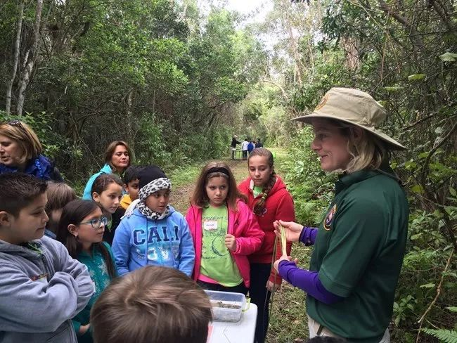
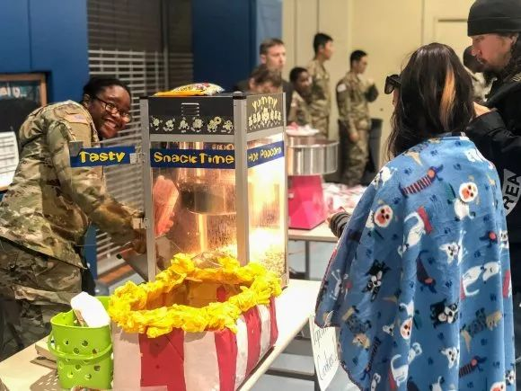
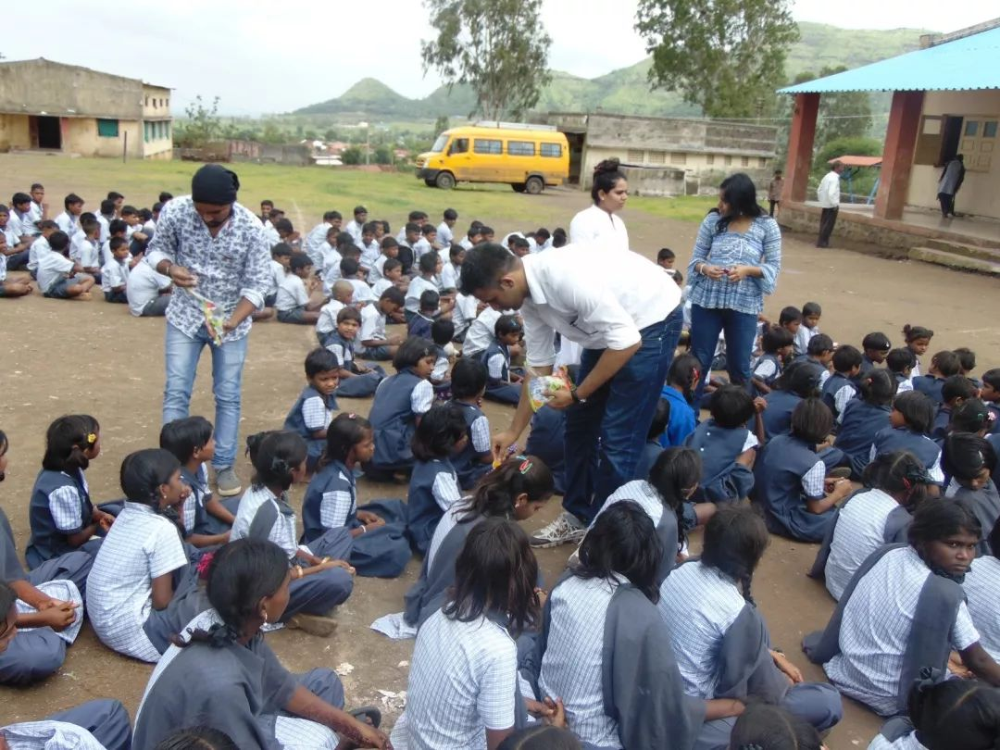
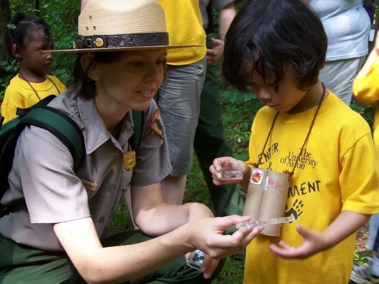
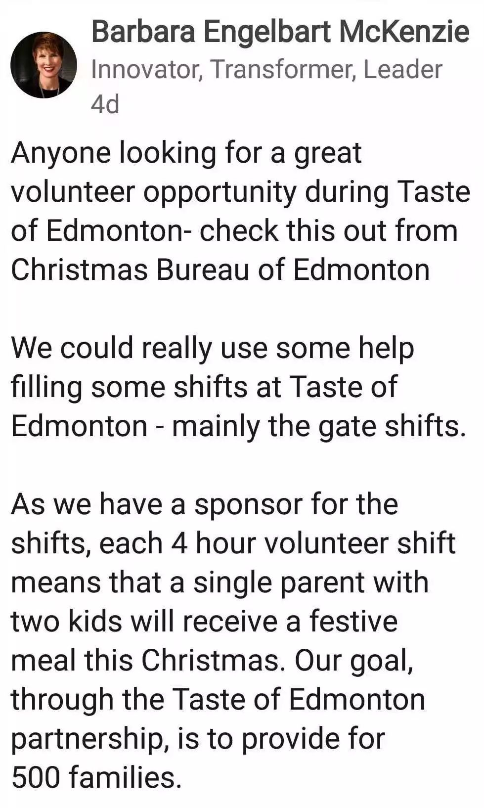

# 无标题

**链接地址:** http://mp.weixin.qq.com/s?__biz=MzI4NDYyNjAwNw==&mid=2247483910&idx=1&sn=d4c2419f885479fd6479f326ca7b13e3&chksm=ebf9df3edc8e5628b07334eac288ded64a5b47f0f930ed14532e1269581cbaded89d557e5b40&mpshare=1&scene=2&srcid=&sharer_sharetime=1564002552208&sharer_shareid=be1c8edd6c93eec155a61c876e41d26a#rd
**作者:** 关注我们
**获取时间:** 2025/8/28 20:31:21
**图片数量:** 40

---

## 原始HTML内容

<section style="box-sizing: border-box;font-size: 16px;"><section style="margin: 10px 0%;box-sizing: border-box;" powered-by="xiumi.us"><section style="display: inline-block;width: 100%;vertical-align: top;box-shadow: rgb(0, 0, 0) 0px 0px 0px;box-sizing: border-box;"><section style="margin-right: 0%;margin-left: 0%;transform: translate3d(1px, 0px, 0px);text-align: right;box-sizing: border-box;" powered-by="xiumi.us"><section style="display: inline-block;vertical-align: bottom;width: 50%;border-width: 0px;box-sizing: border-box;"><section style="margin-right: 0%;margin-left: 0%;transform: translate3d(-1px, 0px, 0px);box-sizing: border-box;" powered-by="xiumi.us"><section style="max-width: 100%;vertical-align: middle;display: inline-block;line-height: 0;width: 85%;border-style: solid;border-width: 5px;border-radius: 0px;border-color: rgb(255, 255, 255);box-shadow: rgb(161, 161, 161) 0px 3px 5px;box-sizing: border-box;"></section></section></section><section style="display: inline-block;vertical-align: bottom;width: 50%;border-width: 0px;box-shadow: rgb(0, 0, 0) 0px 0px 0px;box-sizing: border-box;"><section style="box-sizing: border-box;" powered-by="xiumi.us"><section style="display: inline-block;width: 100%;vertical-align: bottom;border-width: 0px;border-radius: 0px 10px 10px 0px;border-style: none;border-color: rgb(62, 62, 62);overflow: hidden;background-color: rgb(203, 236, 255);padding: 10px;box-shadow: rgb(0, 0, 0) 0px 0px 0px;box-sizing: border-box;"><section style="text-align: justify;font-size: 14px;color: rgb(52, 110, 183);box-sizing: border-box;" powered-by="xiumi.us">
夏天的埃德蒙顿，是一年中最好的时节。无论平日里工作学习的压力多大，都可以趁这会彻底放松，好好享受这个舒适凉爽的夏日。
</section></section></section></section></section><section style="margin-right: 0%;margin-left: 0%;transform: translate3d(1px, 0px, 0px);text-align: right;box-sizing: border-box;" powered-by="xiumi.us"><section style="display: inline-block;vertical-align: top;width: 50%;border-width: 0px;box-sizing: border-box;"><section style="box-sizing: border-box;" powered-by="xiumi.us"><section style="display: inline-block;width: 100%;vertical-align: top;border-width: 0px;border-radius: 10px 0px 0px 10px;border-style: none;border-color: rgb(62, 62, 62);overflow: hidden;background-color: rgba(230, 236, 238, 0.64);padding: 10px;box-sizing: border-box;"><section style="text-align: justify;font-size: 14px;color: rgb(52, 110, 183);box-sizing: border-box;" powered-by="xiumi.us">
夏日活动的方式千千万，但总有一种别具意义，甚至可以极大的辅助你的求职之路，所以快趁这个夏天好好<strong style="box-sizing: border-box;">充实自己简历吧！</strong>
</section></section></section><section style="text-align: justify;color: rgb(240, 242, 247);box-sizing: border-box;" powered-by="xiumi.us">
 
</section></section><section style="display: inline-block;vertical-align: top;width: 50%;padding-bottom: 5px;border-width: 0px;box-shadow: rgb(0, 0, 0) 0px 0px 0px;box-sizing: border-box;"><section style="text-align: left;margin-right: 0%;margin-left: 0%;transform: translate3d(1px, 0px, 0px);box-sizing: border-box;" powered-by="xiumi.us"><section style="max-width: 100%;vertical-align: middle;display: inline-block;line-height: 0;width: 85%;border-style: solid;border-width: 5px;border-radius: 0px;border-color: rgb(255, 255, 255);box-shadow: rgb(161, 161, 161) 0px 3px 5px;box-sizing: border-box;"></section></section></section></section></section></section><section style="text-align: center;transform: translate3d(1px, 0px, 0px);-webkit-transform: translate3d(1px, 0px, 0px);-moz-transform: translate3d(1px, 0px, 0px);-o-transform: translate3d(1px, 0px, 0px);margin: 10px 0% -20px;box-sizing: border-box;" powered-by="xiumi.us"><section style="display: inline-block;min-width: 10%;max-width: 100%;vertical-align: top;padding: 3px 15px;border-width: 3px;border-radius: 10px;border-style: solid;border-color: rgb(255, 255, 255);overflow: hidden;box-shadow: rgb(0, 0, 0) 0px 0px 0px;background-image: linear-gradient(90deg, rgb(51, 151, 237) 0%, rgb(90, 182, 255) 15%, rgb(81, 175, 251) 85%, rgb(51, 151, 237) 100%);box-sizing: border-box;"><section style="text-align: justify;color: rgb(255, 255, 255);box-sizing: border-box;" powered-by="xiumi.us">
<strong style="box-sizing: border-box;">义工，求职之路的敲门石</strong>
</section></section></section><section style="margin-right: 0%;margin-bottom: 10px;margin-left: 0%;box-sizing: border-box;" powered-by="xiumi.us"><section style="display: inline-block;width: 100%;vertical-align: top;border-width: 0px;border-radius: 10px;border-style: none;border-color: rgb(62, 62, 62);overflow: hidden;background-image: linear-gradient(rgb(203, 236, 255) 0%, rgba(124, 188, 242, 0.224) 100%);padding: 30px 15px 20px;box-sizing: border-box;"><section style="margin-right: 0%;margin-left: 0%;box-sizing: border-box;" powered-by="xiumi.us"><section style="font-size: 14px;color: rgb(52, 110, 183);line-height: 1.8;box-sizing: border-box;">
很多小伙伴和 BADAB Consulting 抱怨，现在的经济形式不好，找份理想的对口工作比登天还难。几乎所有的工作都需要工作经验，那对于没有工作经验的同学，这<strong style="box-sizing: border-box;">第一份工作上哪里去找</strong>呢？

 

其实很多小伙伴都忽略了一个可以<strong style="box-sizing: border-box;">迅速丰富自己的简历的方法——做义工</strong>。在加拿大的社会文化中，做义工是每个人成长过程中家长学校和社会都在积极努力引导的方向。
</section></section><section style="margin: 20px 0%;box-sizing: border-box;" powered-by="xiumi.us"><section style="display: inline-block;vertical-align: top;width: 50%;box-sizing: border-box;"><section style="transform: rotateZ(5deg);-webkit-transform: rotateZ(5deg);-moz-transform: rotateZ(5deg);-o-transform: rotateZ(5deg);box-sizing: border-box;" powered-by="xiumi.us"><section style="text-align: center;box-sizing: border-box;"><section style="display: inline-block;width: 90%;vertical-align: top;box-shadow: rgb(0, 0, 0) 0px 0px 0px;box-sizing: border-box;"><section style="transform: translate3d(1px, 0px, 0px);margin-right: 0%;margin-bottom: -30px;margin-left: 0%;box-sizing: border-box;" powered-by="xiumi.us"><section style="display: inline-block;min-width: 10%;max-width: 100%;vertical-align: top;padding: 3px 15px;border-width: 3px;border-radius: 10px;border-style: solid;border-color: rgb(255, 255, 255);overflow: hidden;box-shadow: rgb(0, 0, 0) 0px 0px 0px;background-image: linear-gradient(90deg, rgb(51, 151, 237) 0%, rgb(90, 182, 255) 15%, rgb(81, 175, 251) 85%, rgb(51, 151, 237) 100%);box-sizing: border-box;"><section style="text-align: justify;color: rgb(255, 255, 255);font-size: 14px;box-sizing: border-box;" powered-by="xiumi.us">
<strong style="box-sizing: border-box;">责任</strong>
</section></section></section><section style="margin-top: 10px;margin-bottom: 10px;box-sizing: border-box;" powered-by="xiumi.us"><section style="max-width: 100%;vertical-align: middle;display: inline-block;line-height: 0;width: 95%;border-style: solid;border-width: 5px;border-radius: 0px;border-color: rgb(255, 255, 255);box-shadow: rgb(161, 161, 161) 0px 3px 5px;box-sizing: border-box;"></section></section></section></section></section></section><section style="display: inline-block;vertical-align: top;width: 50%;box-sizing: border-box;"><section style="transform: rotateZ(355deg);-webkit-transform: rotateZ(355deg);-moz-transform: rotateZ(355deg);-o-transform: rotateZ(355deg);box-sizing: border-box;" powered-by="xiumi.us"><section style="text-align: center;box-sizing: border-box;"><section style="display: inline-block;width: 90%;vertical-align: top;box-shadow: rgb(0, 0, 0) 0px 0px 0px;box-sizing: border-box;"><section style="transform: translate3d(1px, 0px, 0px);margin-right: 0%;margin-bottom: -30px;margin-left: 0%;box-sizing: border-box;" powered-by="xiumi.us"><section style="display: inline-block;min-width: 10%;max-width: 100%;vertical-align: top;padding: 3px 15px;border-width: 3px;border-radius: 10px;border-style: solid;border-color: rgb(255, 255, 255);overflow: hidden;box-shadow: rgb(0, 0, 0) 0px 0px 0px;background-image: linear-gradient(90deg, rgb(51, 151, 237) 0%, rgb(90, 182, 255) 15%, rgb(81, 175, 251) 85%, rgb(51, 151, 237) 100%);box-sizing: border-box;"><section style="text-align: justify;color: rgb(255, 255, 255);font-size: 14px;box-sizing: border-box;" powered-by="xiumi.us">
<strong style="box-sizing: border-box;">良知</strong>
</section></section></section><section style="margin: 10px 0%;box-sizing: border-box;" powered-by="xiumi.us"><section style="max-width: 100%;vertical-align: middle;display: inline-block;line-height: 0;width: 95%;border-style: solid;border-width: 5px;border-radius: 0px;border-color: rgb(255, 255, 255);box-shadow: rgb(161, 161, 161) 0px 3px 5px;box-sizing: border-box;"></section></section></section></section></section></section></section><section style="margin-right: 0%;margin-left: 0%;box-sizing: border-box;" powered-by="xiumi.us"><section style="font-size: 14px;color: rgb(52, 110, 183);line-height: 1.8;box-sizing: border-box;">
这是一个能够让儿童和青少年迅速接触并融合社会的过程，可以培养他们正确的价值观和荣辱观。不少加拿大的学校都规定了学生必须要完成一定工时数的义工任务才可以毕业，可见<strong style="box-sizing: border-box;">加拿大社会对于义工文化的重视</strong>。 

 

然而，做义工却绝非在校学生的任务。<strong style="box-sizing: border-box;">丰富的义工经验可以在之后的求职之路中极大地帮助你了解职场文化，适应工作环境，和同事建立良好的关系，甚至获得心仪的职位</strong>等等。

 

但是很多不是在加拿大社会中成长起来的学生对于义工文化表示一头雾水——我<strong style="box-sizing: border-box;">到底应该怎样去选择参加适合自己的义工活动</strong>呢？
</section></section></section></section><section style="transform: rotateZ(355deg);-webkit-transform: rotateZ(355deg);-moz-transform: rotateZ(355deg);-o-transform: rotateZ(355deg);box-sizing: border-box;" powered-by="xiumi.us"><section style="text-align: center;margin: 20px 0%;box-sizing: border-box;"><section style="display: inline-block;width: 90%;vertical-align: top;box-shadow: rgb(0, 0, 0) 0px 0px 0px;box-sizing: border-box;"><section style="transform: translate3d(1px, 0px, 0px);margin-right: 0%;margin-bottom: -30px;margin-left: 0%;box-sizing: border-box;" powered-by="xiumi.us"><section style="display: inline-block;min-width: 10%;max-width: 100%;vertical-align: top;padding: 3px 15px;border-width: 3px;border-radius: 10px;border-style: solid;border-color: rgb(255, 255, 255);overflow: hidden;box-shadow: rgb(0, 0, 0) 0px 0px 0px;background-image: linear-gradient(90deg, rgb(51, 151, 237) 0%, rgb(90, 182, 255) 15%, rgb(81, 175, 251) 85%, rgb(51, 151, 237) 100%);box-sizing: border-box;"><section style="text-align: justify;color: rgb(255, 255, 255);font-size: 14px;box-sizing: border-box;" powered-by="xiumi.us">
<strong style="box-sizing: border-box;">义工</strong>
</section></section></section><section style="margin: 10px 0%;box-sizing: border-box;" powered-by="xiumi.us"><section style="max-width: 100%;vertical-align: middle;display: inline-block;line-height: 0;width: 95%;border-style: solid;border-width: 5px;border-radius: 0px;border-color: rgb(255, 255, 255);box-shadow: rgb(161, 161, 161) 0px 3px 5px;box-sizing: border-box;"></section></section></section></section></section><section style="box-sizing: border-box;" powered-by="xiumi.us"><section style="display: inline-block;vertical-align: top;width: 50%;box-sizing: border-box;"><section style="text-align: right;margin-right: 0%;margin-left: 0%;box-sizing: border-box;" powered-by="xiumi.us"><section style="max-width: 100%;vertical-align: middle;display: inline-block;line-height: 0;width: 50%;box-sizing: border-box;"></section></section></section><section style="display: inline-block;vertical-align: top;width: 50%;box-sizing: border-box;"><section style="text-align: left;margin-right: 0%;margin-left: 0%;box-sizing: border-box;" powered-by="xiumi.us"><section style="max-width: 100%;vertical-align: middle;display: inline-block;line-height: 0;width: 50%;box-sizing: border-box;"></section></section></section></section><section style="margin-right: 0%;margin-bottom: 10px;margin-left: 0%;box-sizing: border-box;" powered-by="xiumi.us"><section style="display: inline-block;width: 100%;vertical-align: top;padding: 5px 15px;background-color: rgb(203, 236, 255);border-width: 0px;border-radius: 10px;border-style: none;border-color: rgb(62, 62, 62);overflow: hidden;box-sizing: border-box;"><section style="text-align: center;color: rgb(52, 110, 183);box-sizing: border-box;" powered-by="xiumi.us">
<strong style="box-sizing: border-box;">什么是义工？</strong>
</section></section></section><section style="margin: 10px 0%;box-sizing: border-box;" powered-by="xiumi.us"><section style="display: inline-block;width: 100%;vertical-align: top;border-width: 0px;box-sizing: border-box;"><section style="box-sizing: border-box;" powered-by="xiumi.us"><section style="display: inline-block;width: 100%;vertical-align: top;padding-right: 20px;padding-left: 10px;border-width: 0px;box-sizing: border-box;"><section style="margin-top: 10px;margin-bottom: 10px;box-sizing: border-box;" powered-by="xiumi.us"><section style="border-width: 3px;border-style: solid;border-color: rgb(39, 165, 224);padding: 3px;box-sizing: border-box;"><section style="border-color: rgba(76, 186, 238, 0.82);border-width: 1px;border-style: dashed;padding: 10px;box-sizing: border-box;"><section style="text-align: center;font-size: 14px;box-sizing: border-box;" powered-by="xiumi.us">
“<strong style="box-sizing: border-box;">义工</strong>是指在不计物质报酬的情况下，基于道义、信念、良知、同情心和责任，为改进社会而提供服务，贡献个人的时间及精力和个人技术特长的人和人群。”

 

——百度百科
</section></section></section></section></section></section><section style="text-align: right;margin-top: -160px;margin-right: 0%;margin-left: 0%;box-sizing: border-box;" powered-by="xiumi.us"><section class="group-empty" style="display: inline-block;width: 200px;height: 200px;vertical-align: top;overflow: hidden;background-color: rgba(1, 169, 216, 0.1);border-radius: 100%;border-width: 1px;border-style: dashed;border-color: rgba(118, 178, 124, 0);box-shadow: rgb(0, 0, 0) 0px 0px 0px;box-sizing: border-box;"></section></section><section style="font-size: 14px;letter-spacing: 1px;padding-right: 15px;padding-left: 15px;box-sizing: border-box;" powered-by="xiumi.us">
义工的类型，内容和时间长度都有着极大的不同，这对于没有义工经验的同学们来说可能很难判断怎样的义工是适合自己的，而怎样的义工经验写在简历上会对自己的求职之路更有帮助呢？ 
</section><section style="box-sizing: border-box;" powered-by="xiumi.us">
 
</section></section></section><section style="text-align: center;transform: translate3d(1px, 0px, 0px);-webkit-transform: translate3d(1px, 0px, 0px);-moz-transform: translate3d(1px, 0px, 0px);-o-transform: translate3d(1px, 0px, 0px);margin: 10px 0% -20px;box-sizing: border-box;" powered-by="xiumi.us"><section style="display: inline-block;min-width: 10%;max-width: 100%;vertical-align: top;padding: 3px 15px;border-width: 3px;border-radius: 10px;border-style: solid;border-color: rgb(255, 255, 255);overflow: hidden;box-shadow: rgb(0, 0, 0) 0px 0px 0px;background-image: linear-gradient(90deg, rgb(51, 151, 237) 0%, rgb(90, 182, 255) 15%, rgb(81, 175, 251) 85%, rgb(51, 151, 237) 100%);box-sizing: border-box;"><section style="text-align: justify;color: rgb(255, 255, 255);box-sizing: border-box;" powered-by="xiumi.us">
<strong style="box-sizing: border-box;">不同的义工类型</strong>
</section></section></section><section style="margin-right: 0%;margin-bottom: -45px;margin-left: 0%;box-sizing: border-box;" powered-by="xiumi.us"><section style="display: inline-block;width: 100%;vertical-align: top;border-width: 0px;border-radius: 10px;border-style: none;border-color: rgb(62, 62, 62);overflow: hidden;background-image: linear-gradient(rgb(203, 236, 255) 0%, rgba(124, 188, 242, 0.224) 100%);padding: 20px 10px 10px;box-shadow: rgb(0, 0, 0) 0px 0px 0px;box-sizing: border-box;"><section style="box-sizing: border-box;" powered-by="xiumi.us">
 
</section><section style="box-sizing: border-box;" powered-by="xiumi.us">
 
</section></section></section><section style="margin-right: 0%;margin-left: 0%;transform: translate3d(1px, 0px, 0px);text-align: right;box-sizing: border-box;" powered-by="xiumi.us"><section style="display: inline-block;vertical-align: top;width: 50%;padding-right: 5px;border-width: 0px;box-shadow: rgb(0, 0, 0) 0px 0px 0px;box-sizing: border-box;"><section style="margin: 10px 0%;transform: translate3d(-1px, 0px, 0px);-webkit-transform: translate3d(-1px, 0px, 0px);-moz-transform: translate3d(-1px, 0px, 0px);-o-transform: translate3d(-1px, 0px, 0px);box-sizing: border-box;" powered-by="xiumi.us"><section style="max-width: 100%;vertical-align: middle;display: inline-block;line-height: 0;width: 90%;border-style: solid;border-width: 5px;border-radius: 0px;border-color: rgb(255, 255, 255);box-shadow: rgb(161, 161, 161) 0px 3px 5px;box-sizing: border-box;"></section></section><section style="margin: 10px 0%;transform: translate3d(-1px, 0px, 0px);-webkit-transform: translate3d(-1px, 0px, 0px);-moz-transform: translate3d(-1px, 0px, 0px);-o-transform: translate3d(-1px, 0px, 0px);box-sizing: border-box;" powered-by="xiumi.us"><section style="max-width: 100%;vertical-align: middle;display: inline-block;line-height: 0;width: 90%;border-style: solid;border-width: 5px;border-radius: 0px;border-color: rgb(255, 255, 255);box-shadow: rgb(161, 161, 161) 0px 3px 5px;box-sizing: border-box;"></section></section></section><section style="display: inline-block;vertical-align: top;width: 50%;padding-left: 5px;border-width: 0px;box-shadow: rgb(0, 0, 0) 0px 0px 0px;box-sizing: border-box;"><section style="text-align: left;margin: 10px 0%;transform: translate3d(1px, 0px, 0px);-webkit-transform: translate3d(1px, 0px, 0px);-moz-transform: translate3d(1px, 0px, 0px);-o-transform: translate3d(1px, 0px, 0px);box-sizing: border-box;" powered-by="xiumi.us"><section style="max-width: 100%;vertical-align: middle;display: inline-block;line-height: 0;width: 90%;border-style: solid;border-width: 5px;border-radius: 0px;border-color: rgb(255, 255, 255);box-shadow: rgb(161, 161, 161) 0px 3px 5px;box-sizing: border-box;"></section></section><section style="text-align: left;margin: 10px 0%;transform: translate3d(-1px, 0px, 0px);-webkit-transform: translate3d(-1px, 0px, 0px);-moz-transform: translate3d(-1px, 0px, 0px);-o-transform: translate3d(-1px, 0px, 0px);box-sizing: border-box;" powered-by="xiumi.us"><section style="max-width: 100%;vertical-align: middle;display: inline-block;line-height: 0;width: 90%;border-style: solid;border-width: 5px;border-radius: 0px;border-color: rgb(255, 255, 255);box-shadow: rgb(161, 161, 161) 0px 3px 5px;box-sizing: border-box;"></section></section></section></section><section style="margin-top: -45px;margin-right: 0%;margin-left: 0%;box-sizing: border-box;" powered-by="xiumi.us"><section style="display: inline-block;width: 100%;vertical-align: top;border-width: 0px;border-radius: 10px;border-style: none;border-color: rgb(62, 62, 62);overflow: hidden;background-image: linear-gradient(rgb(203, 236, 255) 0%, rgba(124, 188, 242, 0.224) 100%);padding: 20px 10px 10px;box-sizing: border-box;"><section style="box-sizing: border-box;" powered-by="xiumi.us">
 
</section><section style="box-sizing: border-box;" powered-by="xiumi.us">
 
</section></section></section><section style="box-sizing: border-box;" powered-by="xiumi.us"><section style="display: inline-block;vertical-align: top;width: 50%;box-sizing: border-box;"><section style="text-align: right;margin-right: 0%;margin-left: 0%;box-sizing: border-box;" powered-by="xiumi.us"><section style="max-width: 100%;vertical-align: middle;display: inline-block;line-height: 0;width: 50%;box-sizing: border-box;"></section></section></section><section style="display: inline-block;vertical-align: top;width: 50%;box-sizing: border-box;"><section style="text-align: left;margin-right: 0%;margin-left: 0%;box-sizing: border-box;" powered-by="xiumi.us"><section style="max-width: 100%;vertical-align: middle;display: inline-block;line-height: 0;width: 50%;box-sizing: border-box;"></section></section></section></section><section style="margin-right: 0%;margin-bottom: 10px;margin-left: 0%;box-sizing: border-box;" powered-by="xiumi.us"><section style="display: inline-block;width: 100%;vertical-align: top;padding: 5px 15px;background-color: rgb(203, 236, 255);border-width: 0px;border-radius: 10px;border-style: none;border-color: rgb(62, 62, 62);overflow: hidden;box-sizing: border-box;"><section style="text-align: center;color: rgb(52, 110, 183);box-sizing: border-box;" powered-by="xiumi.us">
<strong style="box-sizing: border-box;">1.&nbsp;越长越好，贵在坚持</strong>
</section></section></section><section style="font-size: 14px;letter-spacing: 1px;padding-right: 15px;padding-left: 15px;box-sizing: border-box;" powered-by="xiumi.us">
如果你从事一项义工活动<strong style="box-sizing: border-box;">长达数年之久</strong>，那么这份经历写在简历上将会成为极有说服力的那个闪光点。

 

哪怕这份义工任务频率并不算很高，合计起来的工时数也不算太多，但这份经历会<strong style="box-sizing: border-box;">体现你对待工作持之以恒，对社会活动报以积极热忱，以及对一个事业组织忠心耿耿的体现，是不少HR看重的宝贵品质</strong>。
</section><section style="text-align: center;margin-top: 0.5em;margin-bottom: 0.5em;padding-left: 0.5em;padding-right: 0.5em;box-sizing: border-box;" powered-by="xiumi.us"><section style="box-sizing: border-box;width: 100%;border-width: 4px;border-style: solid;border-color: white;box-shadow: rgb(102, 102, 102) 3.2px 3.2px 8px;display: inline-block;line-height: 0;height: auto !important;"></section></section><section style="box-sizing: border-box;" powered-by="xiumi.us">
 
</section><section style="box-sizing: border-box;" powered-by="xiumi.us"><section style="display: inline-block;vertical-align: top;width: 50%;box-sizing: border-box;"><section style="text-align: right;margin-right: 0%;margin-left: 0%;box-sizing: border-box;" powered-by="xiumi.us"><section style="max-width: 100%;vertical-align: middle;display: inline-block;line-height: 0;width: 50%;box-shadow: rgb(0, 0, 0) 0px 0px 0px;box-sizing: border-box;"></section></section></section><section style="display: inline-block;vertical-align: top;width: 50%;box-sizing: border-box;"><section style="text-align: left;margin-right: 0%;margin-left: 0%;box-sizing: border-box;" powered-by="xiumi.us"><section style="max-width: 100%;vertical-align: middle;display: inline-block;line-height: 0;width: 50%;box-sizing: border-box;"></section></section></section></section><section style="margin-right: 0%;margin-bottom: 10px;margin-left: 0%;box-sizing: border-box;" powered-by="xiumi.us"><section style="display: inline-block;width: 100%;vertical-align: top;padding: 5px 15px;background-color: rgb(203, 236, 255);border-width: 0px;border-radius: 10px;border-style: none;border-color: rgb(62, 62, 62);overflow: hidden;box-sizing: border-box;"><section style="text-align: center;color: rgb(52, 110, 183);box-sizing: border-box;" powered-by="xiumi.us">
<strong style="box-sizing: border-box;">2.&nbsp;角色不同，内容丰富</strong>
</section></section></section><section style="font-size: 14px;letter-spacing: 1px;padding-right: 15px;padding-left: 15px;box-sizing: border-box;" powered-by="xiumi.us">
如果你没能在坚持长期做同一个项目或活动的义工，没关系。你依然可以从数量上弥补——参加不同种类多种活动，<strong style="box-sizing: border-box;">扮演不同职位和工作任务的义工，培养各种技能，拓宽自己的视野和知识面，为自己积攒丰富的社会工作经验</strong>。

 

环保，教育，医疗，慈善……等等。拥有这样背景的求职者通常能够<strong style="box-sizing: border-box;">在短时间内学会更多的技能，更好的融入工作环境，以及胜任工作中需要协同作业的任务</strong>等。
</section><section style="box-sizing: border-box;" powered-by="xiumi.us">
 
</section><section style="transform: rotateZ(355deg);-webkit-transform: rotateZ(355deg);-moz-transform: rotateZ(355deg);-o-transform: rotateZ(355deg);box-sizing: border-box;" powered-by="xiumi.us"><section style="text-align: center;margin: 20px 0%;box-sizing: border-box;"><section style="display: inline-block;width: 90%;vertical-align: top;box-shadow: rgb(0, 0, 0) 0px 0px 0px;box-sizing: border-box;"><section style="transform: translate3d(1px, 0px, 0px);margin-right: 0%;margin-bottom: -30px;margin-left: 0%;box-sizing: border-box;" powered-by="xiumi.us"><section style="display: inline-block;min-width: 10%;max-width: 100%;vertical-align: top;padding: 3px 15px;border-width: 3px;border-radius: 10px;border-style: solid;border-color: rgb(255, 255, 255);overflow: hidden;box-shadow: rgb(0, 0, 0) 0px 0px 0px;background-image: linear-gradient(90deg, rgb(51, 151, 237) 0%, rgb(90, 182, 255) 15%, rgb(81, 175, 251) 85%, rgb(51, 151, 237) 100%);box-sizing: border-box;"><section style="text-align: justify;color: rgb(255, 255, 255);font-size: 14px;box-sizing: border-box;" powered-by="xiumi.us">
<strong style="box-sizing: border-box;">参与</strong>
</section></section></section><section style="margin: 10px 0%;box-sizing: border-box;" powered-by="xiumi.us"><section style="max-width: 100%;vertical-align: middle;display: inline-block;line-height: 0;width: 95%;border-style: solid;border-width: 5px;border-radius: 0px;border-color: rgb(255, 255, 255);box-shadow: rgb(161, 161, 161) 0px 3px 5px;box-sizing: border-box;"></section></section></section></section></section><section style="box-sizing: border-box;" powered-by="xiumi.us"><section style="display: inline-block;vertical-align: top;width: 50%;box-sizing: border-box;"><section style="text-align: right;margin-right: 0%;margin-left: 0%;box-sizing: border-box;" powered-by="xiumi.us"><section style="max-width: 100%;vertical-align: middle;display: inline-block;line-height: 0;width: 50%;box-sizing: border-box;"></section></section></section><section style="display: inline-block;vertical-align: top;width: 50%;box-sizing: border-box;"><section style="text-align: left;margin-right: 0%;margin-left: 0%;box-sizing: border-box;" powered-by="xiumi.us"><section style="max-width: 100%;vertical-align: middle;display: inline-block;line-height: 0;width: 50%;box-sizing: border-box;"></section></section></section></section><section style="margin-right: 0%;margin-bottom: 10px;margin-left: 0%;box-sizing: border-box;" powered-by="xiumi.us"><section style="display: inline-block;width: 100%;vertical-align: top;padding: 5px 15px;background-color: rgb(203, 236, 255);border-width: 0px;border-radius: 10px;border-style: none;border-color: rgb(62, 62, 62);overflow: hidden;box-sizing: border-box;"><section style="text-align: center;color: rgb(52, 110, 183);box-sizing: border-box;" powered-by="xiumi.us">
<strong style="box-sizing: border-box;">3.&nbsp;积攒人脉，拓宽道路</strong>
</section></section></section><section style="font-size: 14px;letter-spacing: 1px;padding-right: 15px;padding-left: 15px;box-sizing: border-box;" powered-by="xiumi.us">
不同的义工活动会让你跳出自己的社交圈子去认识更多的人。他们不同的经验知识和为人处世的方式都会带给你极大启发。

 

不管是你的组织管理者，还是共同工作的同事或者服务的对象，他们对你工作能力的肯定都会在你的职业道路上给予你莫大的帮助。无论是一封诚挚的推荐信，还是一个无意中提起的求职机会，这都会<strong style="box-sizing: border-box;">为你今后的职业道路拓展更多的可能性</strong>。

 
</section><section style="text-align: center;margin-top: 0.5em;margin-bottom: 0.5em;padding-left: 0.5em;padding-right: 0.5em;box-sizing: border-box;" powered-by="xiumi.us"><section style="box-sizing: border-box;width: 100%;border-width: 4px;border-style: solid;border-color: white;box-shadow: rgb(102, 102, 102) 3.2px 3.2px 8px;display: inline-block;line-height: 0;height: auto !important;"></section></section><section style="box-sizing: border-box;" powered-by="xiumi.us">
 
</section><section style="box-sizing: border-box;" powered-by="xiumi.us"><section style="display: inline-block;vertical-align: top;width: 50%;box-sizing: border-box;"><section style="text-align: right;margin-right: 0%;margin-left: 0%;box-sizing: border-box;" powered-by="xiumi.us"><section style="max-width: 100%;vertical-align: middle;display: inline-block;line-height: 0;width: 50%;box-sizing: border-box;"></section></section></section><section style="display: inline-block;vertical-align: top;width: 50%;box-sizing: border-box;"><section style="text-align: left;margin-right: 0%;margin-left: 0%;box-sizing: border-box;" powered-by="xiumi.us"><section style="max-width: 100%;vertical-align: middle;display: inline-block;line-height: 0;width: 50%;box-sizing: border-box;"></section></section></section></section><section style="margin-right: 0%;margin-bottom: 10px;margin-left: 0%;box-sizing: border-box;" powered-by="xiumi.us"><section style="display: inline-block;width: 100%;vertical-align: top;padding: 5px 15px;background-color: rgb(203, 236, 255);border-width: 0px;border-radius: 10px;border-style: none;border-color: rgb(62, 62, 62);overflow: hidden;box-sizing: border-box;"><section style="text-align: center;color: rgb(52, 110, 183);box-sizing: border-box;" powered-by="xiumi.us">
<strong style="box-sizing: border-box;">4. 知名组织？不一定！</strong>
</section></section></section><section style="font-size: 14px;letter-spacing: 1px;padding-right: 15px;padding-left: 15px;box-sizing: border-box;" powered-by="xiumi.us">
很多同学认为找义工一定要找知名组织举办的大型活动才算得上有意义的义工，不然就算写上简历也没有用。其实不尽然。积极参与义工活动<strong style="box-sizing: border-box;">体现一个人的自律自爱，奉献精神和道德责任感，是企业寻求的优质员工所必备的优秀品质。</strong>

 

只要是对社会有益的义工活动，都无所谓高低贵贱，都值得我们能去做。重要的是你在这过程中培养了技能，丰富了经验，并<strong style="box-sizing: border-box;">为社会贡献了自己的力量，奉献了一份爱心</strong>。
</section><section style="transform: rotateZ(5deg);-webkit-transform: rotateZ(5deg);-moz-transform: rotateZ(5deg);-o-transform: rotateZ(5deg);box-sizing: border-box;" powered-by="xiumi.us"><section style="text-align: center;margin: 20px 0%;box-sizing: border-box;"><section style="display: inline-block;width: 90%;vertical-align: top;box-shadow: rgb(0, 0, 0) 0px 0px 0px;box-sizing: border-box;"><section style="transform: translate3d(1px, 0px, 0px);margin-right: 0%;margin-bottom: -30px;margin-left: 0%;box-sizing: border-box;" powered-by="xiumi.us"><section style="display: inline-block;min-width: 10%;max-width: 100%;vertical-align: top;padding: 3px 15px;border-width: 3px;border-radius: 10px;border-style: solid;border-color: rgb(255, 255, 255);overflow: hidden;box-shadow: rgb(0, 0, 0) 0px 0px 0px;background-image: linear-gradient(90deg, rgb(51, 151, 237) 0%, rgb(90, 182, 255) 15%, rgb(81, 175, 251) 85%, rgb(51, 151, 237) 100%);box-sizing: border-box;"><section style="text-align: justify;color: rgb(255, 255, 255);font-size: 14px;box-sizing: border-box;" powered-by="xiumi.us">
<strong style="box-sizing: border-box;">爱心</strong>
</section></section></section><section style="margin-top: 10px;margin-bottom: 10px;box-sizing: border-box;" powered-by="xiumi.us"><section style="max-width: 100%;vertical-align: middle;display: inline-block;line-height: 0;width: 95%;border-style: solid;border-width: 5px;border-radius: 0px;border-color: rgb(255, 255, 255);box-shadow: rgb(161, 161, 161) 0px 3px 5px;box-sizing: border-box;"></section></section></section></section></section><section style="box-sizing: border-box;" powered-by="xiumi.us"><section style="display: inline-block;vertical-align: top;width: 50%;box-sizing: border-box;"><section style="text-align: right;margin-right: 0%;margin-left: 0%;box-sizing: border-box;" powered-by="xiumi.us"><section style="max-width: 100%;vertical-align: middle;display: inline-block;line-height: 0;width: 50%;box-sizing: border-box;"></section></section></section><section style="display: inline-block;vertical-align: top;width: 50%;box-sizing: border-box;"><section style="text-align: left;margin-right: 0%;margin-left: 0%;box-sizing: border-box;" powered-by="xiumi.us"><section style="max-width: 100%;vertical-align: middle;display: inline-block;line-height: 0;width: 50%;box-shadow: rgb(0, 0, 0) 0px 0px 0px;box-sizing: border-box;"></section></section></section></section><section style="margin-right: 0%;margin-bottom: 10px;margin-left: 0%;box-sizing: border-box;" powered-by="xiumi.us"><section style="display: inline-block;width: 100%;vertical-align: top;padding: 5px 15px;background-color: rgb(203, 236, 255);border-width: 0px;border-radius: 10px;border-style: none;border-color: rgb(62, 62, 62);overflow: hidden;box-sizing: border-box;"><section style="text-align: center;color: rgb(52, 110, 183);box-sizing: border-box;" powered-by="xiumi.us">
<strong style="box-sizing: border-box;">5. 专业相关，可以有！</strong>
</section></section></section><section style="font-size: 14px;letter-spacing: 1px;padding-right: 15px;padding-left: 15px;box-sizing: border-box;" powered-by="xiumi.us">
另外一个很值得参与的义工活动是任何<strong style="box-sizing: border-box;">和你求职方向有关的活动</strong>。比如，你今后想要从事教育相关的工作，那么你参与义工活动的时候也着重于教育领域，这对你之后教育相关行业的求职道路上将会十分有用。

 

因为在这个过程中你可以<strong style="box-sizing: border-box;">熟悉该领域的发展背景，掌握职业相关技能，和这个领域的工作者们建立发展人际关系，方便今后无接缝地过渡到之后的工作中去</strong>，是十分值得尝试的方法！
</section><section style="text-align: center;margin-top: 0.5em;margin-bottom: 0.5em;padding-left: 0.5em;padding-right: 0.5em;box-sizing: border-box;" powered-by="xiumi.us"><section style="box-sizing: border-box;width: 100%;border-width: 3px;border-style: solid;border-color: white;box-shadow: rgb(102, 102, 102) 0.2em 0.2em 0.5em;display: inline-block;line-height: 0;height: auto !important;"></section></section><section style="box-sizing: border-box;" powered-by="xiumi.us">
 
</section><section style="box-sizing: border-box;" powered-by="xiumi.us"><section style="display: inline-block;vertical-align: top;width: 50%;box-sizing: border-box;"><section style="text-align: right;margin-right: 0%;margin-left: 0%;box-sizing: border-box;" powered-by="xiumi.us"><section style="max-width: 100%;vertical-align: middle;display: inline-block;line-height: 0;width: 50%;box-sizing: border-box;"></section></section></section><section style="display: inline-block;vertical-align: top;width: 50%;box-sizing: border-box;"><section style="text-align: left;margin-right: 0%;margin-left: 0%;box-sizing: border-box;" powered-by="xiumi.us"><section style="max-width: 100%;vertical-align: middle;display: inline-block;line-height: 0;width: 50%;box-sizing: border-box;"></section></section></section></section><section style="margin-right: 0%;margin-bottom: 10px;margin-left: 0%;box-sizing: border-box;" powered-by="xiumi.us"><section style="display: inline-block;width: 100%;vertical-align: top;padding: 5px 15px;background-color: rgb(203, 236, 255);border-width: 0px;border-radius: 10px;border-style: none;border-color: rgb(62, 62, 62);overflow: hidden;box-sizing: border-box;"><section style="text-align: center;color: rgb(52, 110, 183);box-sizing: border-box;" powered-by="xiumi.us">
<strong style="box-sizing: border-box;">6. 什么时候开始？什么时候结束？</strong>
</section></section></section><section style="font-size: 14px;letter-spacing: 1px;padding-right: 15px;padding-left: 15px;box-sizing: border-box;" powered-by="xiumi.us">
如果你之前从来没有参与过义工活动，那么就算今天开始也绝不算晚！&nbsp;<strong style="box-sizing: border-box;">一尘一土筑高台，百水千滴汇成海。你能从义工活动中获得的经验积累和精神充实感绝对超乎你的想象。</strong>

 

如果你已经找到了心仪的工作，也绝不意味着你就拥有可以放弃参加义工活动的权利。<strong style="box-sizing: border-box;">参与义工是一个永远都不应该结束的活动</strong>，它不仅仅是你对于职业道路的铺垫，更是你对社会贡献的责任和爱心。
</section><section style="box-sizing: border-box;" powered-by="xiumi.us">
 
</section><section style="box-sizing: border-box;" powered-by="xiumi.us">
 
</section><section style="text-align: center;margin-right: 0%;margin-left: 0%;box-sizing: border-box;" powered-by="xiumi.us"><section style="max-width: 100%;vertical-align: middle;display: inline-block;line-height: 0;box-sizing: border-box;"></section></section><section style="box-sizing: border-box;" powered-by="xiumi.us"><section style="display: inline-block;width: 100%;vertical-align: top;border-width: 2px;border-radius: 0px;border-style: solid;border-color: rgb(39, 165, 224);padding-right: 25px;padding-left: 25px;box-sizing: border-box;"><section style="margin: 5px 0% 8px;text-align: center;box-sizing: border-box;" powered-by="xiumi.us"><section style="display: inline-block;width: 90%;vertical-align: top;box-sizing: border-box;"><section style="margin-top: 0.5em;margin-bottom: 0.5em;box-sizing: border-box;" powered-by="xiumi.us"><section style="background-color: rgb(39, 165, 224);height: 3px;box-sizing: border-box;"></section></section></section></section><section style="margin-right: 0%;margin-left: 0%;box-sizing: border-box;" powered-by="xiumi.us"><section style="text-align: center;font-size: 21px;color: rgb(0, 0, 26);box-sizing: border-box;">
<strong style="box-sizing: border-box;">义工哪里找？</strong>
</section></section><section style="box-sizing: border-box;" powered-by="xiumi.us">
 
</section><section style="line-height: 1.8;font-size: 14px;box-sizing: border-box;" powered-by="xiumi.us">
<strong style="box-sizing: border-box;">1. 加拿大volunteer官网：</strong>

<strong style="box-sizing: border-box;">http://volunteer.ca/&nbsp;</strong><strong style="box-sizing: border-box;"> 2. volunteer match：</strong>

<strong style="box-sizing: border-box;">https://www.volunteermatch.org/&nbsp;</strong>

<strong style="box-sizing: border-box;">3. 其他义工网站：</strong>

<strong style="box-sizing: border-box;">http://govolunteer.ca/&nbsp;</strong><strong style="box-sizing: border-box;"> 4. 加拿大义工的查询网站：</strong>

<strong style="box-sizing: border-box;">http://www.canadian-universities.net/Volunteer/index.html&nbsp;</strong><strong style="box-sizing: border-box;"> 5. 社会公益组织的网站：</strong>

<strong style="box-sizing: border-box;">http://www.splc.ca/&nbsp;</strong>
</section><section style="box-sizing: border-box;" powered-by="xiumi.us"><section style="display: inline-block;vertical-align: top;width: 50%;box-sizing: border-box;"><section style="text-align: right;margin-right: 0%;margin-left: 0%;box-sizing: border-box;" powered-by="xiumi.us"><section style="max-width: 100%;vertical-align: middle;display: inline-block;line-height: 0;width: 50%;box-sizing: border-box;"></section></section></section><section style="display: inline-block;vertical-align: top;width: 50%;box-sizing: border-box;"><section style="text-align: left;margin-right: 0%;margin-left: 0%;box-sizing: border-box;" powered-by="xiumi.us"><section style="max-width: 100%;vertical-align: middle;display: inline-block;line-height: 0;width: 50%;box-sizing: border-box;"></section></section></section></section><section style="margin-right: 0%;margin-bottom: 10px;margin-left: 0%;box-sizing: border-box;" powered-by="xiumi.us"><section style="display: inline-block;width: 100%;vertical-align: top;padding: 5px 15px;background-color: rgb(203, 236, 255);border-width: 0px;border-radius: 10px;border-style: none;border-color: rgb(62, 62, 62);overflow: hidden;box-sizing: border-box;"><section style="text-align: center;color: rgb(52, 110, 183);box-sizing: border-box;" powered-by="xiumi.us">
<strong style="box-sizing: border-box;">机会不用等，马上就来！</strong>
</section></section></section><section style="font-size: 14px;letter-spacing: 1px;padding-right: 15px;padding-left: 15px;box-sizing: border-box;" powered-by="xiumi.us">
那么<strong style="box-sizing: border-box;">义工招工的Post长什么样呢？</strong>看到这篇文章的小伙伴们，你们可是赚到啦！<strong style="box-sizing: border-box;">适合你</strong><strong style="box-sizing: border-box;">的义工机会就在眼前</strong>！如果你还没有找到合适的义工机会，不妨去试试哦！
</section><section style="text-align: center;margin-top: 10px;margin-bottom: 10px;box-sizing: border-box;" powered-by="xiumi.us"><section style="max-width: 100%;vertical-align: middle;display: inline-block;line-height: 0;box-sizing: border-box;"></section></section><section style="text-align: center;margin-top: 10px;margin-bottom: 10px;box-sizing: border-box;" powered-by="xiumi.us"><section style="max-width: 100%;vertical-align: middle;display: inline-block;line-height: 0;box-sizing: border-box;"></section></section><section style="margin: 5px 0% 8px;text-align: center;box-sizing: border-box;" powered-by="xiumi.us"><section style="display: inline-block;width: 90%;vertical-align: top;box-sizing: border-box;"><section style="margin-top: 0.5em;margin-bottom: 0.5em;box-sizing: border-box;" powered-by="xiumi.us"><section style="background-color: rgb(39, 165, 224);height: 3px;box-sizing: border-box;"></section></section></section></section></section></section><section style="text-align: center;margin-right: 0%;margin-left: 0%;box-sizing: border-box;" powered-by="xiumi.us"><section style="max-width: 100%;vertical-align: middle;display: inline-block;line-height: 0;box-sizing: border-box;"></section></section><section style="box-sizing: border-box;" powered-by="xiumi.us">
 
</section><section style="font-size: 14px;letter-spacing: 1px;padding-right: 15px;padding-left: 15px;box-sizing: border-box;" powered-by="xiumi.us">
另外，还有一个重要的寻找义工机会的渠道就是…

 

<strong style="box-sizing: border-box;">6. 关注我们的各种社交平台，我们会不时放出一些优质的义工机会哦！</strong>
</section><section style="text-align: center;margin-top: 10px;margin-bottom: 10px;box-sizing: border-box;" powered-by="xiumi.us"><section style="max-width: 100%;vertical-align: middle;display: inline-block;line-height: 0;box-sizing: border-box;"></section></section><section style="margin: 20px 0%;box-sizing: border-box;" powered-by="xiumi.us"><section style="font-size: 13px;color: rgba(51, 51, 51, 0.61);letter-spacing: 2px;padding-right: 20px;padding-left: 20px;box-sizing: border-box;">
对了，忘记自我介绍了：
</section></section><section style="margin: 20px 0%;box-sizing: border-box;" powered-by="xiumi.us"><section style="font-size: 14px;color: rgba(51, 51, 51, 0.61);letter-spacing: 2px;padding-right: 20px;padding-left: 20px;box-sizing: border-box;">
<strong style="box-sizing: border-box;">资深人力资源顾问Ada Tai</strong>

 

将为你所有的问题量身定做解决方案！
</section></section><section style="text-align: center;margin: 10px 0%;box-sizing: border-box;" powered-by="xiumi.us"><section style="display: inline-block;width: 90%;vertical-align: top;border-style: solid;border-width: 2px;border-radius: 0px;border-color: rgb(23, 51, 123);letter-spacing: 0px;padding: 10px;box-sizing: border-box;"><section style="box-sizing: border-box;" powered-by="xiumi.us"><section style="display: inline-block;vertical-align: middle;width: 40%;box-sizing: border-box;"><section style="margin-right: 0%;margin-left: 0%;box-sizing: border-box;" powered-by="xiumi.us"><section style="max-width: 100%;vertical-align: middle;display: inline-block;line-height: 0;border-width: 0px;width: 100%;box-sizing: border-box;"></section></section></section><section style="display: inline-block;vertical-align: middle;width: 60%;padding-left: 10px;box-sizing: border-box;"><section style="margin-right: 0%;margin-bottom: 5px;margin-left: 0%;box-sizing: border-box;" powered-by="xiumi.us"><section style="display: inline-block;border-width: 2px;border-style: solid;border-color: rgb(23, 51, 123);padding: 0.1em 0.3em;background-color: rgb(23, 51, 123);color: rgb(255, 255, 255);font-size: 12px;box-sizing: border-box;">
<strong style="box-sizing: border-box;">Ada&nbsp; Tai</strong>
</section></section><section style="margin-right: 0%;margin-left: 0%;box-sizing: border-box;" powered-by="xiumi.us"><section style="font-size: 13px;box-sizing: border-box;">
<strong style="box-sizing: border-box;">MBA, CPHR, C.Mgr.</strong>
</section></section><section style="box-sizing: border-box;" powered-by="xiumi.us"><section style="display: inline-block;vertical-align: middle;width: 10%;border-width: 0px;box-sizing: border-box;"><section style="margin: 5px 0%;text-align: left;font-size: 0px;box-sizing: border-box;" powered-by="xiumi.us"><section style="padding: 4px;display: inline-block;background-color: rgb(23, 51, 123);box-sizing: border-box;"><section style="border-color: rgba(255, 255, 255, 0);width: 1.6em;height: 1.6em;border-style: solid;border-width: 1px;text-align: center;line-height: 1.5em;color: rgb(255, 255, 255);box-sizing: border-box;">
 
</section></section></section></section><section style="display: inline-block;vertical-align: middle;width: 90%;box-sizing: border-box;"><section style="text-align: justify;font-size: 12px;box-sizing: border-box;" powered-by="xiumi.us">
修改简历与求职信
</section></section></section><section style="box-sizing: border-box;" powered-by="xiumi.us"><section style="display: inline-block;vertical-align: middle;width: 10%;box-sizing: border-box;"><section style="margin: 5px 0%;text-align: left;font-size: 0px;box-sizing: border-box;" powered-by="xiumi.us"><section style="padding: 4px;display: inline-block;background-color: rgb(23, 51, 123);box-sizing: border-box;"><section style="border-color: rgba(255, 255, 255, 0);width: 1.6em;height: 1.6em;border-style: solid;border-width: 1px;text-align: center;line-height: 1.5em;color: rgb(255, 255, 255);box-sizing: border-box;">
 
</section></section></section></section><section style="display: inline-block;vertical-align: middle;width: 90%;box-sizing: border-box;"><section style="text-align: justify;font-size: 12px;box-sizing: border-box;" powered-by="xiumi.us">
培训面试
</section></section></section><section style="box-sizing: border-box;" powered-by="xiumi.us"><section style="display: inline-block;vertical-align: middle;width: 10%;border-width: 0px;box-sizing: border-box;"><section style="margin: 5px 0%;text-align: left;font-size: 0px;box-sizing: border-box;" powered-by="xiumi.us"><section style="padding: 4px;display: inline-block;background-color: rgb(23, 51, 123);box-sizing: border-box;"><section style="border-color: rgba(255, 255, 255, 0);width: 1.6em;height: 1.6em;border-style: solid;border-width: 1px;text-align: center;line-height: 1.5em;color: rgb(255, 255, 255);box-sizing: border-box;">
 
</section></section></section></section><section style="display: inline-block;vertical-align: middle;width: 90%;box-sizing: border-box;"><section style="text-align: justify;font-size: 12px;box-sizing: border-box;" powered-by="xiumi.us">
建立LinkedIn Profile
</section></section></section><section style="box-sizing: border-box;" powered-by="xiumi.us"><section style="display: inline-block;vertical-align: middle;width: 10%;box-sizing: border-box;"><section style="margin: 5px 0%;text-align: left;font-size: 0px;box-sizing: border-box;" powered-by="xiumi.us"><section style="padding: 4px;display: inline-block;background-color: rgb(23, 51, 123);box-sizing: border-box;"><section style="border-color: rgba(255, 255, 255, 0);width: 1.6em;height: 1.6em;border-style: solid;border-width: 1px;text-align: center;line-height: 1.5em;color: rgb(255, 255, 255);box-sizing: border-box;">
 
</section></section></section></section><section style="display: inline-block;vertical-align: middle;width: 90%;box-sizing: border-box;"><section style="text-align: justify;font-size: 12px;box-sizing: border-box;" powered-by="xiumi.us">
职业评估与规划、社交培训
</section></section></section><section style="box-sizing: border-box;" powered-by="xiumi.us"><section style="display: inline-block;vertical-align: middle;width: 10%;box-sizing: border-box;"><section style="margin: 5px 0%;text-align: left;font-size: 0px;box-sizing: border-box;" powered-by="xiumi.us"><section style="padding: 4px;display: inline-block;background-color: rgb(23, 51, 123);box-sizing: border-box;"><section style="border-color: rgba(255, 255, 255, 0);width: 1.6em;height: 1.6em;border-style: solid;border-width: 1px;text-align: center;line-height: 1.5em;color: rgb(255, 255, 255);box-sizing: border-box;">
 
</section></section></section></section><section style="display: inline-block;vertical-align: middle;width: 90%;box-sizing: border-box;"><section style="text-align: justify;font-size: 12px;box-sizing: border-box;" powered-by="xiumi.us">
求职、职场文化等多种讲座
</section></section></section></section></section></section></section><section style="margin: 20px 0%;box-sizing: border-box;" powered-by="xiumi.us"><section style="letter-spacing: 1.5px;font-size: 13px;color: rgba(51, 51, 51, 0.61);padding-right: 20px;padding-left: 20px;box-sizing: border-box;">
毕业于埃尔伯塔大学工商管理硕士学位,并拥有加拿大“注册人力资源管理师” 及“注册企业管理师”资格证，十几年来Ada一直在不同的领域从事人力资源的管理工作，包括大型企业、高科技产业、准政府、非营利组织、高等教育、商务管理等领域。

 

她熟知人力资源管理过程，特别是对人才的招聘、培训、职业规划、新员工的指引等方面有独到的见解。她有多年于企业招聘人才、培训学生与专业人士如何成功的获取工作，及指导他们如何应对工作场合中棘手的问题的经验。更将心理学融入到人力资源管理之中，为人才应聘最适合自己的岗位提供最有效的建议和帮助。
</section></section><section style="margin: 10px 0%;text-align: center;box-sizing: border-box;" powered-by="xiumi.us"><section style="display: inline-block;width: 95%;vertical-align: top;border-right: 0px none rgb(62, 62, 62);border-top-right-radius: 0px;box-shadow: rgb(187, 222, 251) 0px 0px 15px;border-left: 0px none rgb(62, 62, 62);border-bottom-left-radius: 0px;padding: 5px;box-sizing: border-box;"><section style="margin-right: 0%;margin-left: 0%;box-sizing: border-box;" powered-by="xiumi.us"><section style="display: inline-block;width: 100%;vertical-align: top;border-right: 0px none rgb(62, 62, 62);border-top-right-radius: 0px;box-shadow: rgb(187, 222, 251) 0px 0px 15px inset;border-left: 0px none rgb(62, 62, 62);border-bottom-left-radius: 0px;padding: 10px;box-sizing: border-box;"><section style="margin-right: 0%;margin-left: 0%;box-sizing: border-box;" powered-by="xiumi.us"><section style="max-width: 100%;vertical-align: middle;display: inline-block;line-height: 0;box-shadow: rgb(0, 0, 0) 0px 0px 0px;box-sizing: border-box;"></section></section></section></section></section></section><section style="margin: 20px 0%;box-sizing: border-box;" powered-by="xiumi.us"><section style="letter-spacing: 1.5px;color: rgba(51, 51, 51, 0.61);padding-right: 20px;padding-left: 20px;box-sizing: border-box;">
BadaB的服务包括但不仅限于一对一咨询，修改和更新简历，Cover Letter，面试培训，以及帮你打造一个出色的LinkedIn Profile等等。

 

如果你对我们的业务感兴趣，不妨<strong style="box-sizing: border-box;">联系我们</strong>获取更多信息！
</section></section><section style="text-align: center;margin: 10px 0%;box-sizing: border-box;" powered-by="xiumi.us"><section style="display: inline-block;min-width: 10%;max-width: 100%;vertical-align: top;box-sizing: border-box;"><section style="margin-right: 0%;margin-bottom: -5px;margin-left: 0%;box-sizing: border-box;" powered-by="xiumi.us"><section style="display: inline-block;width: 90px;height: 40px;vertical-align: top;overflow: hidden;box-sizing: border-box;"><section style="margin-right: 0%;margin-left: 0%;box-sizing: border-box;" powered-by="xiumi.us"><section style="max-width: 100%;vertical-align: middle;display: inline-block;line-height: 0;width: 100%;box-sizing: border-box;"></section></section></section></section><section style="margin-right: 0%;margin-left: 0%;box-sizing: border-box;" powered-by="xiumi.us"><section style="display: inline-block;min-width: 10%;max-width: 100%;vertical-align: top;padding: 3px 15px;border-width: 2px;border-radius: 10px;border-style: solid;border-color: rgb(255, 255, 255);overflow: hidden;box-shadow: rgb(0, 0, 0) 0px 0px 0px;background-image: linear-gradient(90deg, rgb(51, 151, 237) 0%, rgb(90, 182, 255) 15%, rgb(81, 175, 251) 85%, rgb(51, 151, 237) 100%);box-sizing: border-box;"><section style="transform: translate3d(1px, 0px, 0px);-webkit-transform: translate3d(1px, 0px, 0px);-moz-transform: translate3d(1px, 0px, 0px);-o-transform: translate3d(1px, 0px, 0px);box-sizing: border-box;" powered-by="xiumi.us"><section style="text-align: justify;color: rgb(255, 255, 255);font-size: 18px;box-sizing: border-box;">
<strong style="box-sizing: border-box;">精彩视频 - 《Ada的求职说》</strong>
</section></section></section></section></section></section><section style="text-align: center;margin-top: 10px;margin-bottom: 10px;box-sizing: border-box;" powered-by="xiumi.us"><section style="width: 100%;background-color: rgb(0, 0, 0);line-height: 0;box-sizing: border-box;"><section class="video-box" style="width: 100%;height: 100%;transform: rotate(0deg);box-sizing: border-box;"><section class="video-cover" style="top: 0px;left: 0px;width: 100%;height: 40%;box-sizing: border-box;"></section></section></section></section><section style="font-size: 14px;color: rgba(51, 51, 51, 0.61);letter-spacing: 2px;padding-right: 20px;padding-left: 20px;box-sizing: border-box;" powered-by="xiumi.us">
 

<iframe class="video_iframe rich_pages" data-vidtype="2" data-mpvid="wxv_907305472682754050" data-cover="http%3A%2F%2Fmmbiz.qpic.cn%2Fmmbiz_jpg%2FcY0qSDjdkFd0L4VvEyQe112BhM5GqIl4lhE32qjLibcicCnKjZJ1BF3oLZ9bIpmg9hnsUsFOVPYRbnCXrHDeCmVg%2F0%3Fwx_fmt%3Djpeg" allowfullscreen="" frameborder="0" data-ratio="1.7777777777777777" data-w="1920" data-src="https://mp.weixin.qq.com/mp/readtemplate?t=pages/video_player_tmpl&amp;action=mpvideo&amp;auto=0&amp;vid=wxv_907305472682754050"></iframe>

 
</section><section style="text-align: center;margin: 30px 0% 10px;box-sizing: border-box;" powered-by="xiumi.us"><section style="display: inline-block;width: 95%;vertical-align: top;box-shadow: rgb(185, 185, 185) 1.41421px 1.41421px 6px;padding: 5px;box-sizing: border-box;"><section style="margin: -20px 0% 5px;box-sizing: border-box;" powered-by="xiumi.us"><section style="max-width: 100%;vertical-align: middle;display: inline-block;line-height: 0;box-shadow: rgb(0, 0, 0) 0px 0px 0px;box-sizing: border-box;"></section></section><section style="margin: 10px 0%;box-sizing: border-box;" powered-by="xiumi.us"><section style="display: inline-block;vertical-align: middle;width: 38%;box-shadow: rgb(0, 0, 0) 0px 0px 0px;padding-left: 10px;box-sizing: border-box;"><section style="margin-right: 0%;margin-left: 0%;box-sizing: border-box;" powered-by="xiumi.us"><section style="max-width: 100%;vertical-align: middle;display: inline-block;line-height: 0;box-shadow: rgb(0, 0, 0) 0px 0px 0px;border-style: solid;border-width: 2px;border-radius: 0px;border-color: rgb(62, 62, 62);box-sizing: border-box;"></section></section></section><section style="display: inline-block;vertical-align: middle;width: 61.8%;box-sizing: border-box;"><section class="tn-yzk-fuid-text-90804-1531294310026" style="font-size: 14px;color: rgba(51, 51, 51, 0.61);box-sizing: border-box;" powered-by="xiumi.us">
<strong style="box-sizing: border-box;">BadaB</strong>

<strong style="box-sizing: border-box;">bright future ahead!</strong>

微信公众号：<strong style="box-sizing: border-box;">badab101</strong>
</section><section style="margin: 10px 0%;box-sizing: border-box;" powered-by="xiumi.us"><section style="display: inline-block;box-shadow: rgb(183, 28, 28) 0px 0px 0px inset;border-style: solid;border-width: 1px;border-radius: 5px;border-color: rgb(66, 66, 66);padding: 5px;background-color: rgba(76, 186, 238, 0.82);box-sizing: border-box;"><section class="tn-yzk-fuid-text-87776-1531294313353" style="text-align: justify;color: rgb(255, 255, 255);padding-right: 8px;padding-left: 8px;font-size: 14px;box-sizing: border-box;" powered-by="xiumi.us">
<strong style="box-sizing: border-box;">长按二维码关注我们</strong>
</section></section></section></section></section></section></section><section style="margin: 20px 0%;box-sizing: border-box;" powered-by="xiumi.us"><section style="font-size: 14px;color: rgba(51, 51, 51, 0.61);letter-spacing: 2px;padding-right: 20px;padding-left: 20px;box-sizing: border-box;">
<strong style="box-sizing: border-box;">好的工作机会不等人！</strong>

在你犹豫的片刻之间，

或许你心仪的Offer已经被发<strong style="box-sizing: border-box;">到了别人的手里</strong>！

如果你需要我们，

就请尽快<strong style="box-sizing: border-box;">联系我们</strong>吧！
</section></section><section style="box-sizing: border-box;" powered-by="xiumi.us">
<strong style="box-sizing: border-box;">- END -</strong> 
</section><section style="box-sizing: border-box;" powered-by="xiumi.us">
 
</section><section style="margin-top: 10px;margin-bottom: 10px;text-align: center;box-sizing: border-box;" powered-by="xiumi.us"><section style="padding-left: 1em;padding-right: 1em;display: inline-block;box-sizing: border-box;">
<strong style="box-sizing: border-box;">预告</strong>
</section><section style="border-width: 1px;border-style: solid;border-color: rgb(192, 200, 209);margin-top: -1em;padding: 20px 10px 10px;background-color: rgb(239, 239, 239);box-sizing: border-box;"><section style="margin: 20px 0%;box-sizing: border-box;" powered-by="xiumi.us"><section style="text-align: justify;font-size: 14px;color: rgb(39, 165, 224);letter-spacing: 2px;padding-right: 20px;padding-left: 20px;box-sizing: border-box;">
我们会在今年下半年推出以求职为主题的<strong style="box-sizing: border-box;">网络课程</strong>。每一个制作精良内容丰富的网络课程视频，都由拥有十几年丰富人力资源管理经验的<strong style="box-sizing: border-box;">Ada Tai主讲</strong>。帮助你全方位提高简历修改，面试培训和职业社交等方面的技能，<strong style="box-sizing: border-box;">解决你求职和升职过程中遇到的难题</strong>。

 

我们今后要推出的网络课程有专门的一个module是讲<strong style="box-sizing: border-box;">如果用做义工来充实自己的简历</strong>的，请关注我们的公众号和网站获取更多信息。
</section></section></section></section></section>
 

---

## 纯文本内容

夏天的埃德蒙顿，是一年中最好的时节。无论平日里工作学习的压力多大，都可以趁这会彻底放松，好好享受这个舒适凉爽的夏日。夏日活动的方式千千万，但总有一种别具意义，甚至可以极大的辅助你的求职之路，所以快趁这个夏天好好充实自己简历吧！义工，求职之路的敲门石很多小伙伴和 BADAB Consulting 抱怨，现在的经济形式不好，找份理想的对口工作比登天还难。几乎所有的工作都需要工作经验，那对于没有工作经验的同学，这第一份工作上哪里去找呢？其实很多小伙伴都忽略了一个可以迅速丰富自己的简历的方法——做义工。在加拿大的社会文化中，做义工是每个人成长过程中家长学校和社会都在积极努力引导的方向。责任良知这是一个能够让儿童和青少年迅速接触并融合社会的过程，可以培养他们正确的价值观和荣辱观。不少加拿大的学校都规定了学生必须要完成一定工时数的义工任务才可以毕业，可见加拿大社会对于义工文化的重视。然而，做义工却绝非在校学生的任务。丰富的义工经验可以在之后的求职之路中极大地帮助你了解职场文化，适应工作环境，和同事建立良好的关系，甚至获得心仪的职位等等。但是很多不是在加拿大社会中成长起来的学生对于义工文化表示一头雾水——我到底应该怎样去选择参加适合自己的义工活动呢？义工什么是义工？“义工是指在不计物质报酬的情况下，基于道义、信念、良知、同情心和责任，为改进社会而提供服务，贡献个人的时间及精力和个人技术特长的人和人群。”——百度百科义工的类型，内容和时间长度都有着极大的不同，这对于没有义工经验的同学们来说可能很难判断怎样的义工是适合自己的，而怎样的义工经验写在简历上会对自己的求职之路更有帮助呢？不同的义工类型1. 越长越好，贵在坚持如果你从事一项义工活动长达数年之久，那么这份经历写在简历上将会成为极有说服力的那个闪光点。哪怕这份义工任务频率并不算很高，合计起来的工时数也不算太多，但这份经历会体现你对待工作持之以恒，对社会活动报以积极热忱，以及对一个事业组织忠心耿耿的体现，是不少HR看重的宝贵品质。2. 角色不同，内容丰富如果你没能在坚持长期做同一个项目或活动的义工，没关系。你依然可以从数量上弥补——参加不同种类多种活动，扮演不同职位和工作任务的义工，培养各种技能，拓宽自己的视野和知识面，为自己积攒丰富的社会工作经验。环保，教育，医疗，慈善……等等。拥有这样背景的求职者通常能够在短时间内学会更多的技能，更好的融入工作环境，以及胜任工作中需要协同作业的任务等。参与3. 积攒人脉，拓宽道路不同的义工活动会让你跳出自己的社交圈子去认识更多的人。他们不同的经验知识和为人处世的方式都会带给你极大启发。不管是你的组织管理者，还是共同工作的同事或者服务的对象，他们对你工作能力的肯定都会在你的职业道路上给予你莫大的帮助。无论是一封诚挚的推荐信，还是一个无意中提起的求职机会，这都会为你今后的职业道路拓展更多的可能性。4. 知名组织？不一定！很多同学认为找义工一定要找知名组织举办的大型活动才算得上有意义的义工，不然就算写上简历也没有用。其实不尽然。积极参与义工活动体现一个人的自律自爱，奉献精神和道德责任感，是企业寻求的优质员工所必备的优秀品质。只要是对社会有益的义工活动，都无所谓高低贵贱，都值得我们能去做。重要的是你在这过程中培养了技能，丰富了经验，并为社会贡献了自己的力量，奉献了一份爱心。爱心5. 专业相关，可以有！另外一个很值得参与的义工活动是任何和你求职方向有关的活动。比如，你今后想要从事教育相关的工作，那么你参与义工活动的时候也着重于教育领域，这对你之后教育相关行业的求职道路上将会十分有用。因为在这个过程中你可以熟悉该领域的发展背景，掌握职业相关技能，和这个领域的工作者们建立发展人际关系，方便今后无接缝地过渡到之后的工作中去，是十分值得尝试的方法！6. 什么时候开始？什么时候结束？如果你之前从来没有参与过义工活动，那么就算今天开始也绝不算晚！ 一尘一土筑高台，百水千滴汇成海。你能从义工活动中获得的经验积累和精神充实感绝对超乎你的想象。如果你已经找到了心仪的工作，也绝不意味着你就拥有可以放弃参加义工活动的权利。参与义工是一个永远都不应该结束的活动，它不仅仅是你对于职业道路的铺垫，更是你对社会贡献的责任和爱心。义工哪里找？1. 加拿大volunteer官网：http://volunteer.ca/ 2. volunteer match：https://www.volunteermatch.org/ 3. 其他义工网站：http://govolunteer.ca/ 4. 加拿大义工的查询网站：http://www.canadian-universities.net/Volunteer/index.html 5. 社会公益组织的网站：http://www.splc.ca/ 机会不用等，马上就来！那么义工招工的Post长什么样呢？看到这篇文章的小伙伴们，你们可是赚到啦！适合你的义工机会就在眼前！如果你还没有找到合适的义工机会，不妨去试试哦！另外，还有一个重要的寻找义工机会的渠道就是…6. 关注我们的各种社交平台，我们会不时放出一些优质的义工机会哦！对了，忘记自我介绍了：资深人力资源顾问Ada Tai将为你所有的问题量身定做解决方案！Ada  TaiMBA, CPHR, C.Mgr.修改简历与求职信培训面试建立LinkedIn Profile职业评估与规划、社交培训求职、职场文化等多种讲座毕业于埃尔伯塔大学工商管理硕士学位,并拥有加拿大“注册人力资源管理师” 及“注册企业管理师”资格证，十几年来Ada一直在不同的领域从事人力资源的管理工作，包括大型企业、高科技产业、准政府、非营利组织、高等教育、商务管理等领域。她熟知人力资源管理过程，特别是对人才的招聘、培训、职业规划、新员工的指引等方面有独到的见解。她有多年于企业招聘人才、培训学生与专业人士如何成功的获取工作，及指导他们如何应对工作场合中棘手的问题的经验。更将心理学融入到人力资源管理之中，为人才应聘最适合自己的岗位提供最有效的建议和帮助。BadaB的服务包括但不仅限于一对一咨询，修改和更新简历，Cover Letter，面试培训，以及帮你打造一个出色的LinkedIn Profile等等。如果你对我们的业务感兴趣，不妨联系我们获取更多信息！精彩视频 - 《Ada的求职说》BadaBbright future ahead!微信公众号：badab101长按二维码关注我们好的工作机会不等人！在你犹豫的片刻之间，或许你心仪的Offer已经被发到了别人的手里！如果你需要我们，就请尽快联系我们吧！- END -预告我们会在今年下半年推出以求职为主题的网络课程。每一个制作精良内容丰富的网络课程视频，都由拥有十几年丰富人力资源管理经验的Ada Tai主讲。帮助你全方位提高简历修改，面试培训和职业社交等方面的技能，解决你求职和升职过程中遇到的难题。我们今后要推出的网络课程有专门的一个module是讲如果用做义工来充实自己的简历的，请关注我们的公众号和网站获取更多信息。

---

## 图片列表

-  (原始链接: https://mmbiz.qpic.cn/mmbiz_jpg/cY0qSDjdkFd0L4VvEyQe112BhM5GqIl4kdCdkY3OVog4ZwO7CjkyEkdc1jkWoBp8ap8oe5HIR2cpFESicOiaDukA/640?wx_fmt=jpeg)
-  (原始链接: https://mmbiz.qpic.cn/mmbiz_jpg/cY0qSDjdkFd0L4VvEyQe112BhM5GqIl4NXaTVBP26HunnKEMfowBEqkusquqE21EPpUbXMUMLD2s2w6vwTXWFw/640?wx_fmt=jpeg)
-  (原始链接: https://mmbiz.qpic.cn/mmbiz_jpg/cY0qSDjdkFd0L4VvEyQe112BhM5GqIl48CQla1k0lVleLP0jmIM47TKwcCnmQtECseDkAbWwMJ7Rg0icHsMQlrQ/640?wx_fmt=jpeg)
-  (原始链接: https://mmbiz.qpic.cn/mmbiz_jpg/cY0qSDjdkFd0L4VvEyQe112BhM5GqIl4MyAp7dhHWIBAiaJLicRzMIsTDe1IlJ5AId50SPp8533vPZYyGjyWlRyA/640?wx_fmt=jpeg)
-  (原始链接: https://mmbiz.qpic.cn/mmbiz_png/cY0qSDjdkFd0L4VvEyQe112BhM5GqIl4kkspfbI6qoJAoh8f6wYZG5WOanGib39R2eeHViaRQib4N8oaymYBvqCmQ/640?wx_fmt=png)
-  (原始链接: https://mmbiz.qpic.cn/mmbiz_gif/cY0qSDjdkFd0L4VvEyQe112BhM5GqIl4baL4uOK947ptd52YkpoianYGrYkj2lZjyeMljc45gvoAJiahEca3l5sA/640?wx_fmt=gif)
-  (原始链接: https://mmbiz.qpic.cn/mmbiz_gif/cY0qSDjdkFd0L4VvEyQe112BhM5GqIl4NAcWRYL2WUBHDzRggCLFZ5iavmEg2LgZQzzMkzx4ibSdDJibVibpxOFGCg/640?wx_fmt=gif)
-  (原始链接: https://mmbiz.qpic.cn/mmbiz_jpg/cY0qSDjdkFd0L4VvEyQe112BhM5GqIl4TzoYjBXHGlgtqbbj4N6UhK8icFEnc6WWNSib28YiaTiclH1icRowHm5vGMg/640?wx_fmt=jpeg)
-  (原始链接: https://mmbiz.qpic.cn/mmbiz_jpg/cY0qSDjdkFd0L4VvEyQe112BhM5GqIl4C3goNrbS6K8kotdPbaV5yeznpqsicFnCxjF0dAaBjW0ulrmqLr0S8YA/640?wx_fmt=jpeg)
-  (原始链接: https://mmbiz.qpic.cn/mmbiz_jpg/cY0qSDjdkFd0L4VvEyQe112BhM5GqIl4Oeibhhx94fEFw3OQl0aU7PhWBYT3az0yR3s4uZ3RpZlC9G5rfnKxkOw/640?wx_fmt=jpeg)
-  (原始链接: https://mmbiz.qpic.cn/mmbiz_jpg/cY0qSDjdkFd0L4VvEyQe112BhM5GqIl4NLAiabaAo8MGvd0jDJkuibXqAwiblmYB81DzJ0T6VqW4HBRgYEpB68XDg/640?wx_fmt=jpeg)
-  (原始链接: https://mmbiz.qpic.cn/mmbiz_gif/cY0qSDjdkFd0L4VvEyQe112BhM5GqIl4baL4uOK947ptd52YkpoianYGrYkj2lZjyeMljc45gvoAJiahEca3l5sA/640?wx_fmt=gif)
-  (原始链接: https://mmbiz.qpic.cn/mmbiz_gif/cY0qSDjdkFd0L4VvEyQe112BhM5GqIl4NAcWRYL2WUBHDzRggCLFZ5iavmEg2LgZQzzMkzx4ibSdDJibVibpxOFGCg/640?wx_fmt=gif)
-  (原始链接: https://mmbiz.qpic.cn/mmbiz_jpg/cY0qSDjdkFd0L4VvEyQe112BhM5GqIl45n3uiaWAsBhYa9PACnhrI42FtqmtJRKpwuKwhib8bLib2wMGPrl5YMJcg/640?wx_fmt=jpeg)
-  (原始链接: https://mmbiz.qpic.cn/mmbiz_gif/cY0qSDjdkFd0L4VvEyQe112BhM5GqIl4baL4uOK947ptd52YkpoianYGrYkj2lZjyeMljc45gvoAJiahEca3l5sA/640?wx_fmt=gif)
-  (原始链接: https://mmbiz.qpic.cn/mmbiz_gif/cY0qSDjdkFd0L4VvEyQe112BhM5GqIl4NAcWRYL2WUBHDzRggCLFZ5iavmEg2LgZQzzMkzx4ibSdDJibVibpxOFGCg/640?wx_fmt=gif)
-  (原始链接: https://mmbiz.qpic.cn/mmbiz_jpg/cY0qSDjdkFd0L4VvEyQe112BhM5GqIl4j1QiaetdEB2RqJY1tTLlQ6YXtjhJqmqgbjFrod9UibvIkBd8yD3PeRUQ/640?wx_fmt=jpeg)
-  (原始链接: https://mmbiz.qpic.cn/mmbiz_gif/cY0qSDjdkFd0L4VvEyQe112BhM5GqIl4baL4uOK947ptd52YkpoianYGrYkj2lZjyeMljc45gvoAJiahEca3l5sA/640?wx_fmt=gif)
-  (原始链接: https://mmbiz.qpic.cn/mmbiz_gif/cY0qSDjdkFd0L4VvEyQe112BhM5GqIl4NAcWRYL2WUBHDzRggCLFZ5iavmEg2LgZQzzMkzx4ibSdDJibVibpxOFGCg/640?wx_fmt=gif)
-  (原始链接: https://mmbiz.qpic.cn/mmbiz_jpg/cY0qSDjdkFd0L4VvEyQe112BhM5GqIl4sLZnYKIOfuAGWlUD9tA2ErIwgZIQN0XL9x8iarRdtle2JsT9r65f25g/640?wx_fmt=jpeg)
-  (原始链接: https://mmbiz.qpic.cn/mmbiz_gif/cY0qSDjdkFd0L4VvEyQe112BhM5GqIl4baL4uOK947ptd52YkpoianYGrYkj2lZjyeMljc45gvoAJiahEca3l5sA/640?wx_fmt=gif)
-  (原始链接: https://mmbiz.qpic.cn/mmbiz_gif/cY0qSDjdkFd0L4VvEyQe112BhM5GqIl4NAcWRYL2WUBHDzRggCLFZ5iavmEg2LgZQzzMkzx4ibSdDJibVibpxOFGCg/640?wx_fmt=gif)
-  (原始链接: https://mmbiz.qpic.cn/mmbiz_jpg/cY0qSDjdkFd0L4VvEyQe112BhM5GqIl4kU2mDHaakZzibmyicZDT1K2nEp438qRwCyNJW2pD65zqbdF5OT9uMibwg/640?wx_fmt=jpeg)
-  (原始链接: https://mmbiz.qpic.cn/mmbiz_gif/cY0qSDjdkFd0L4VvEyQe112BhM5GqIl4baL4uOK947ptd52YkpoianYGrYkj2lZjyeMljc45gvoAJiahEca3l5sA/640?wx_fmt=gif)
-  (原始链接: https://mmbiz.qpic.cn/mmbiz_gif/cY0qSDjdkFd0L4VvEyQe112BhM5GqIl4NAcWRYL2WUBHDzRggCLFZ5iavmEg2LgZQzzMkzx4ibSdDJibVibpxOFGCg/640?wx_fmt=gif)
-  (原始链接: https://mmbiz.qpic.cn/mmbiz_jpg/cY0qSDjdkFd0L4VvEyQe112BhM5GqIl4XLK2UmObS1Qln7HxibIUWBibsiabP2WYs0bbT944J4DKtf38QfkKtXm4g/640?wx_fmt=jpeg)
-  (原始链接: https://mmbiz.qpic.cn/mmbiz_gif/cY0qSDjdkFd0L4VvEyQe112BhM5GqIl4baL4uOK947ptd52YkpoianYGrYkj2lZjyeMljc45gvoAJiahEca3l5sA/640?wx_fmt=gif)
-  (原始链接: https://mmbiz.qpic.cn/mmbiz_gif/cY0qSDjdkFd0L4VvEyQe112BhM5GqIl4NAcWRYL2WUBHDzRggCLFZ5iavmEg2LgZQzzMkzx4ibSdDJibVibpxOFGCg/640?wx_fmt=gif)
-  (原始链接: https://mmbiz.qpic.cn/mmbiz_png/cY0qSDjdkFd0L4VvEyQe112BhM5GqIl4micTibK4aUghdILibODMwDOrwTcL4q0SOFsZR4ibRwyy3hS9PKBhhzicicNA/640?wx_fmt=png)
-  (原始链接: https://mmbiz.qpic.cn/mmbiz_gif/cY0qSDjdkFd0L4VvEyQe112BhM5GqIl4baL4uOK947ptd52YkpoianYGrYkj2lZjyeMljc45gvoAJiahEca3l5sA/640?wx_fmt=gif)
-  (原始链接: https://mmbiz.qpic.cn/mmbiz_gif/cY0qSDjdkFd0L4VvEyQe112BhM5GqIl4NAcWRYL2WUBHDzRggCLFZ5iavmEg2LgZQzzMkzx4ibSdDJibVibpxOFGCg/640?wx_fmt=gif)
-  (原始链接: https://mmbiz.qpic.cn/mmbiz_jpg/cY0qSDjdkFd0L4VvEyQe112BhM5GqIl4tktk844enfibarxNXKdxd1lGabyNmicZBquCznRHSesw9nv886J16yRQ/640?wx_fmt=jpeg)
-  (原始链接: https://mmbiz.qpic.cn/mmbiz_jpg/cY0qSDjdkFd0L4VvEyQe112BhM5GqIl48WV4p0XKtg22TNzmDCOXAOtZRUvgSN7LDxtMRcHAyLoGT9jH9u2B3g/640?wx_fmt=jpeg)
-  (原始链接: https://mmbiz.qpic.cn/mmbiz_png/cY0qSDjdkFd0L4VvEyQe112BhM5GqIl4micTibK4aUghdILibODMwDOrwTcL4q0SOFsZR4ibRwyy3hS9PKBhhzicicNA/640?wx_fmt=png)
-  (原始链接: https://mmbiz.qpic.cn/mmbiz_png/cY0qSDjdkFd0L4VvEyQe112BhM5GqIl416Hvgdao3vFQdlHSDq82reOIdey3NkxZNPrlHKBF4qd591CFOyOofQ/640?wx_fmt=png)
-  (原始链接: https://mmbiz.qpic.cn/mmbiz_jpg/cY0qSDjdkFd0L4VvEyQe112BhM5GqIl4mDJ4YySs2HiaicC81IVMkSQL6ic5EHRZqvaeiaib7gGJA32CPAT71ed9JYw/640?wx_fmt=jpeg)
-  (原始链接: https://mmbiz.qpic.cn/mmbiz_jpg/cY0qSDjdkFd0L4VvEyQe112BhM5GqIl4CcB9tAs1S4xJzxxrd179GvdCH0WSbG5ribj4yDzsG0ibLrbCMHC2TIPw/640?wx_fmt=jpeg)
-  (原始链接: https://mmbiz.qpic.cn/mmbiz_gif/cY0qSDjdkFd0L4VvEyQe112BhM5GqIl4baL4uOK947ptd52YkpoianYGrYkj2lZjyeMljc45gvoAJiahEca3l5sA/640?wx_fmt=gif)
-  (原始链接: https://mmbiz.qpic.cn/mmbiz_png/cY0qSDjdkFd0L4VvEyQe112BhM5GqIl4EKTZHic9BAqcqNhrMWbFhGWoMUGq0gHCb5XmWZVayqiaNyfPPZpeVumg/640?wx_fmt=png)
-  (原始链接: https://mmbiz.qpic.cn/mmbiz_png/cY0qSDjdkFd0L4VvEyQe112BhM5GqIl4vp8H4ibTrlymiaHXXwcNvY5EsPpI43qWiaR9mblsQCzAibQWrp90OLghnw/640?wx_fmt=png)
