# 无标题

**链接地址:** http://mp.weixin.qq.com/s?__biz=MjM5MTA5MTg5MQ==&mid=2649865980&idx=1&sn=b74ded7438a5a15cf124b2c2d7b719bd&chksm=bebfc32089c84a367e8f4d7b955c9e7e8112ca260d98807afd4403c61175787a2b9e6c71e4a1&mpshare=1&scene=2&srcid=0802PuXkVqzdcxLRLw6ukVxG&sharer_sharetime=1564726415458&sharer_shareid=be1c8edd6c93eec155a61c876e41d26a#rd
**作者:** 学哥
**获取时间:** 2025/8/28 20:30:27
**图片数量:** 25

---

## 原始HTML内容

<section class="xmteditor" style="display:none;" data-tools="新媒体管家" data-label="powered by xmt.cn"></section><section style="font-size: 15px;font-family: Optima-Regular, PingFangTC-light;letter-spacing: 2px;padding-right: 10px;padding-left: 10px;box-sizing: border-box;"><section style="text-align: center;margin-top: 10px;margin-bottom: 10px;box-sizing: border-box;" powered-by="xiumi.us"><section style="max-width: 100%;vertical-align: middle;display: inline-block;line-height: 0;box-sizing: border-box;"></section></section><section style="box-sizing: border-box;" powered-by="xiumi.us">
 
</section><section style="box-sizing: border-box;" powered-by="xiumi.us">
可能你在外吃饭时遇到过这样的场景：

 

——<strong style="box-sizing: border-box;"><em style="box-sizing: border-box;">如果你愿意在点评软件上为餐厅打五星，我们愿意赠送你一份甜品，或给你打个折扣。  </em></strong>

 

谁都明白这个举动背后的含义，点评软件的分数越高，慕名而来的顾客就会越多。有很多人在决定去哪里吃饭的时候，都会<strong style="box-sizing: border-box;">按照评分做选择</strong>。
</section><section style="box-sizing: border-box;" powered-by="xiumi.us">
 
</section><section style="text-align: center;margin-top: 10px;margin-bottom: 10px;box-sizing: border-box;" powered-by="xiumi.us"><section style="max-width: 100%;vertical-align: middle;display: inline-block;line-height: 0;box-sizing: border-box;"></section></section><section style="box-sizing: border-box;" powered-by="xiumi.us">
 
</section><section style="box-sizing: border-box;" powered-by="xiumi.us">
<strong style="box-sizing: border-box;">国内如此，国外亦然。</strong>

 

在美国，最常用的点评软件就是Yelp。作为点评软件的鼻祖，它的影响力巨大，几乎是每个人手机里的必备app。

 

哪怕只有半星的差距，也会让餐厅高峰时段人流量相差<strong style="box-sizing: border-box;">19%。</strong>

 

因此，绞尽脑汁的提高Yelp评分，几乎是每一个餐厅老板都必做的事情。

 

<strong style="box-sizing: border-box;">但……不是Cerretini。</strong>
</section><section style="box-sizing: border-box;" powered-by="xiumi.us">
 
</section><section style="text-align: center;margin-top: 10px;margin-bottom: 10px;box-sizing: border-box;" powered-by="xiumi.us"><section style="max-width: 100%;vertical-align: middle;display: inline-block;line-height: 0;box-sizing: border-box;"></section></section><section style="box-sizing: border-box;" powered-by="xiumi.us">
 
</section><section style="box-sizing: border-box;" powered-by="xiumi.us">
2014年，Cerretini在自己的餐厅宣布了一个永远改变命运的决定：
</section><section style="box-sizing: border-box;" powered-by="xiumi.us">
 
</section><section style="color: rgb(253, 175, 5);box-sizing: border-box;" powered-by="xiumi.us">
<strong style="box-sizing: border-box;">在Yelp上给我的餐厅打一星评价的顾客，可以享受披萨5折优惠！</strong>
</section><section style="box-sizing: border-box;" powered-by="xiumi.us">
 
</section><section style="box-sizing: border-box;" powered-by="xiumi.us">
——对，你没看错，最低评价“一星”。
</section><section style="box-sizing: border-box;" powered-by="xiumi.us">
 
</section><section style="text-align: center;margin-top: 10px;margin-bottom: 10px;box-sizing: border-box;" powered-by="xiumi.us"><section style="max-width: 100%;vertical-align: middle;display: inline-block;line-height: 0;box-sizing: border-box;"></section></section><section style="text-align: center;margin-top: 10px;margin-bottom: 10px;box-sizing: border-box;" powered-by="xiumi.us"><section style="max-width: 100%;vertical-align: middle;display: inline-block;line-height: 0;box-sizing: border-box;"></section></section><section style="box-sizing: border-box;" powered-by="xiumi.us">
 
</section><section style="box-sizing: border-box;" powered-by="xiumi.us">
 
</section><section style="margin-top: 10px;margin-bottom: 10px;padding-right: 3px;padding-left: 3px;text-align: center;overflow: hidden;box-sizing: border-box;" powered-by="xiumi.us"><section style="height: 2.6em;box-sizing: border-box;"><section style="transform: rotate(-45deg);-webkit-transform: rotate(-45deg);-moz-transform: rotate(-45deg);-o-transform: rotate(-45deg);margin-top: -1em;box-sizing: border-box;"><section style="width: 2em;height: 2em;margin: auto;display: inline-block;box-sizing: border-box;"><section style="height: 100%;border-left: 0.2em solid rgb(0, 0, 0);border-bottom: 0.2em solid rgb(0, 0, 0);box-sizing: border-box;"></section></section></section></section></section><section style="box-sizing: border-box;" powered-by="xiumi.us">
 
</section><section style="box-sizing: border-box;" powered-by="xiumi.us">
 
</section><section style="box-sizing: border-box;" powered-by="xiumi.us">
故事，还要从很久以前说起。

 

Davide Cerretini出生于意大利的一个葡萄园农场主家庭，从小享受美食，也热爱美食。<strong style="box-sizing: border-box;">长大后，也没有继承家业，而是移民到美国，成为一名厨师。</strong>
</section><section style="box-sizing: border-box;" powered-by="xiumi.us">
 
</section><section style="text-align: center;margin-top: 10px;margin-bottom: 10px;box-sizing: border-box;" powered-by="xiumi.us"><section style="max-width: 100%;vertical-align: middle;display: inline-block;line-height: 0;box-sizing: border-box;"></section></section><section style="box-sizing: border-box;" powered-by="xiumi.us">
年轻的Cerretini和他的祖父在意大利喝酒

 

在后厨干了几年后，他凭借自己的“意大利魅力”，吸引到了一票忠实顾客，便自己出来单干，开了第一家餐厅。

 

<strong style="box-sizing: border-box;">然而，这家餐厅没撑过2008年的经济危机，倒闭了。</strong>
</section><section style="box-sizing: border-box;" powered-by="xiumi.us">
 
</section><section style="text-align: center;margin-top: 10px;margin-bottom: 10px;box-sizing: border-box;" powered-by="xiumi.us"><section style="max-width: 100%;vertical-align: middle;display: inline-block;line-height: 0;box-sizing: border-box;"></section></section><section style="box-sizing: border-box;" powered-by="xiumi.us">
Cerretini在第一个餐厅

 

第二年，他痛定思痛，进行了深刻反思后，重新找到了一个地方，再次将餐厅开了起来。

 

这一次，一切都非常OK。
</section><section style="box-sizing: border-box;" powered-by="xiumi.us">
 
</section><section style="box-sizing: border-box;" powered-by="xiumi.us">
他这次的餐厅名为<strong style="box-sizing: border-box;">Botto Bistro</strong>。

 

——<strong style="box-sizing: border-box;"><em style="box-sizing: border-box;">朴实无华，面向大众，提供便宜又好吃的食物</em></strong>。
</section><section style="box-sizing: border-box;" powered-by="xiumi.us">
 
</section><section style="text-align: center;margin-top: 10px;margin-bottom: 10px;box-sizing: border-box;" powered-by="xiumi.us"><section style="max-width: 100%;vertical-align: middle;display: inline-block;line-height: 0;box-sizing: border-box;"></section></section><section style="box-sizing: border-box;" powered-by="xiumi.us">
 
</section><section style="box-sizing: border-box;" powered-by="xiumi.us">
餐厅开业的头几个月，Cerretini就收到了Yelp销售人员的几十个电话，<strong style="box-sizing: border-box;">希望他购买“推荐位”</strong>。

 

但Cerretini没在意，每次遇到，他都直接挂断了。

 

然而，渐渐他发现……

 

<strong style="box-sizing: border-box;">每次拒绝推销之后的24小时内，就会有几条新发布的五星评论，被删掉了？？？</strong>
</section><section style="box-sizing: border-box;" powered-by="xiumi.us">
 
</section><section style="text-align: center;margin-top: 10px;margin-bottom: 10px;box-sizing: border-box;" powered-by="xiumi.us"><section style="max-width: 100%;vertical-align: middle;display: inline-block;line-height: 0;box-sizing: border-box;"></section></section><section style="box-sizing: border-box;" powered-by="xiumi.us">
 
</section><section style="box-sizing: border-box;" powered-by="xiumi.us">
——<strong style="box-sizing: border-box;">有没有搞错，这不就是意大利黑手党敲诈勒索的手段？</strong>

 

作为意大利人，Cerretini立刻就反应过来：这是Yelp在向他要保护费呢！

 
</section><section style="margin-top: 10px;margin-bottom: 10px;box-sizing: border-box;" powered-by="xiumi.us"><section style="display: inline-block;width: 100%;border-width: 2px;border-style: dotted;border-color: rgb(192, 200, 209);padding: 10px;box-sizing: border-box;"><section style="box-sizing: border-box;" powered-by="xiumi.us">
<strong style="box-sizing: border-box;">“我来美国工作25年，可不是为了被这些硅谷白痴敲诈的。”</strong>
</section></section></section><section style="box-sizing: border-box;" powered-by="xiumi.us">
 
</section><section style="text-align: center;margin-top: 10px;margin-bottom: 10px;box-sizing: border-box;" powered-by="xiumi.us"><section style="max-width: 100%;vertical-align: middle;display: inline-block;line-height: 0;box-sizing: border-box;"></section></section><section style="box-sizing: border-box;" powered-by="xiumi.us">
 
</section><section style="box-sizing: border-box;" powered-by="xiumi.us">
他第一反应就是：<strong>那我自己写好评不就行了！</strong>

 

他注册了一个名为“Babghanoush I”的Yelp小号，给自己的餐厅发布了13条假好评。<strong style="box-sizing: border-box;"></strong>

 

——<strong><em>“嗯，还有一些附近餐馆的差评。</em></strong><strong><em>”</em></strong> by Yelp发言人

 

Cerretini承认：
</section><section style="margin-top: 10px;margin-bottom: 10px;box-sizing: border-box;" powered-by="xiumi.us"><section style="display: inline-block;width: 100%;border-width: 2px;border-style: dotted;border-color: rgb(192, 200, 209);padding: 10px;box-sizing: border-box;"><section style="box-sizing: border-box;" powered-by="xiumi.us">
<strong style="box-sizing: border-box;">“我不是一个好人。但我写的五星只是为了补你们删掉的！！”</strong>
</section></section></section><section style="box-sizing: border-box;" powered-by="xiumi.us">
 
</section><section style="text-align: center;margin-top: 10px;margin-bottom: 10px;box-sizing: border-box;" powered-by="xiumi.us"><section style="max-width: 100%;vertical-align: middle;display: inline-block;line-height: 0;box-sizing: border-box;"></section></section><section style="box-sizing: border-box;" powered-by="xiumi.us">
 
</section><section style="box-sizing: border-box;" powered-by="xiumi.us">
总之，这个计划立刻就被Yelp挫败了。

 

根据平台算法，这些假评论的星级统统都被过滤了出去，虽然还能被人看到，但不会影响餐厅评分。

 

<strong style="box-sizing: border-box;">——得，这样的话，Cerretini举了白旗。</strong>
</section><section style="box-sizing: border-box;" powered-by="xiumi.us">
 
</section><section style="box-sizing: border-box;" powered-by="xiumi.us">
他不得不缴纳了“保护费”，每月花费270美元在Yelp上宣传自己的餐厅。
</section><section style="box-sizing: border-box;" powered-by="xiumi.us">
 
</section><section style="text-align: center;margin-top: 10px;margin-bottom: 10px;box-sizing: border-box;" powered-by="xiumi.us"><section style="max-width: 100%;vertical-align: middle;display: inline-block;line-height: 0;box-sizing: border-box;"></section></section><section style="box-sizing: border-box;" powered-by="xiumi.us">
 
</section><section style="text-align: left;box-sizing: border-box;" powered-by="xiumi.us">
可是，Yelp的最低推荐位，真的没啥效果！

 

六个月后，Cerretini还是决定取消：算了算了，不宣传就不宣传了，不差你拉来的这点客人，反正口碑在这里呢。

 

<strong style="box-sizing: border-box;">然而，他一取消，星级评价立刻暴跌……</strong>
</section><section style="box-sizing: border-box;" powered-by="xiumi.us">
 
</section><section style="text-align: center;margin-top: 10px;margin-bottom: 10px;box-sizing: border-box;" powered-by="xiumi.us"><section style="max-width: 100%;vertical-align: middle;display: inline-block;line-height: 0;box-sizing: border-box;"></section></section><section style="box-sizing: border-box;" powered-by="xiumi.us">
 
</section><section style="margin-top: 10px;margin-bottom: 10px;box-sizing: border-box;" powered-by="xiumi.us"><section style="display: inline-block;width: 100%;border-width: 2px;border-style: dotted;border-color: rgb(192, 200, 209);padding: 10px;box-sizing: border-box;"><section style="box-sizing: border-box;" powered-by="xiumi.us">
<strong style="box-sizing: border-box;">“当天就过滤掉了我4条五星评价，还把3条一星推到了最顶端。”</strong>

 

<strong style="box-sizing: border-box;">“可这些给我打一星的人，甚至都没有来过我们餐厅！甚至有人在评论里抱怨我们的服务员……问题是，我们餐厅，根本没有服务员！！！！”</strong>
</section></section></section><section style="box-sizing: border-box;" powered-by="xiumi.us">
 

但是，美国第九巡回上诉法院裁定，Yelp有权操纵评论，因为广告策略是<strong style="box-sizing: border-box;">“硬谈判”</strong>，而非勒索。
</section><section style="box-sizing: border-box;" powered-by="xiumi.us">
 
</section>

<section style="box-sizing: border-box;" powered-by="xiumi.us">
 
</section><section style="box-sizing: border-box;" powered-by="xiumi.us">
<strong style="box-sizing: border-box;">——这，成为了最后一根稻草。</strong>

 

2014年9月，裁决结果发出的几天后，Cerretini在店前放下了一块牌子。
</section><section style="box-sizing: border-box;" powered-by="xiumi.us">
 
</section><section style="box-sizing: border-box;" powered-by="xiumi.us">
<strong style="box-sizing: border-box;">给我们的Yelp上打一星，享受25%的折扣！</strong>

 

Hate us on Yelp！

 
</section><section style="text-align: center;margin-top: 10px;margin-bottom: 10px;box-sizing: border-box;" powered-by="xiumi.us"><section style="max-width: 100%;vertical-align: middle;display: inline-block;line-height: 0;box-sizing: border-box;"></section></section><section style="box-sizing: border-box;" powered-by="xiumi.us">
 
</section><section style="margin-top: 10px;margin-bottom: 10px;box-sizing: border-box;" powered-by="xiumi.us"><section style="display: inline-block;width: 100%;border-width: 2px;border-style: dotted;border-color: rgb(192, 200, 209);padding: 10px;box-sizing: border-box;"><section style="box-sizing: border-box;" powered-by="xiumi.us">
<strong style="box-sizing: border-box;">“Yelp的人恨死我了，但这正是我想要的，让他们闹心就对了。”</strong>
</section></section></section><section style="box-sizing: border-box;" powered-by="xiumi.us">
 

在这个裁决结果刚刚发出的完美时刻，Cerretini的这个策略，<strong style="box-sizing: border-box;">立刻让无数深受其苦的餐厅老板，得到了共鸣。</strong>
</section><section style="box-sizing: border-box;" powered-by="xiumi.us">
 
</section><section style="box-sizing: border-box;" powered-by="xiumi.us">
Cerretini成为了他们反抗的骑士，自卫的英雄，Anti-Yelp领军人。
</section><section style="box-sizing: border-box;" powered-by="xiumi.us">
 
</section><section style="text-align: center;margin-top: 10px;margin-bottom: 10px;box-sizing: border-box;" powered-by="xiumi.us"><section style="max-width: 100%;vertical-align: middle;display: inline-block;line-height: 0;box-sizing: border-box;"></section></section><section style="box-sizing: border-box;" powered-by="xiumi.us">
 
</section><section style="box-sizing: border-box;" powered-by="xiumi.us">
那个星期五，Cerretini做的披萨比平时一个月都多，甚至不得不向其他餐馆寻求帮助，获得额外的披萨面团。

 
</section><section style="margin-top: 10px;margin-bottom: 10px;box-sizing: border-box;" powered-by="xiumi.us"><section style="display: inline-block;width: 100%;border-width: 2px;border-style: dotted;border-color: rgb(192, 200, 209);padding: 10px;box-sizing: border-box;"><section style="box-sizing: border-box;" powered-by="xiumi.us">
<strong style="box-sizing: border-box;">“所有人都疯了，我这里简直就像是疯人院，我从来没见过这样的景象。”</strong>
</section></section></section><section style="text-align: left;box-sizing: border-box;" powered-by="xiumi.us">
 

他受到了“雪崩”般的欢迎，记者、餐厅老板、支持者都不断前来，甚至拒绝接受他提供的折扣，坚持全价购买Pizza。
</section><section style="box-sizing: border-box;" powered-by="xiumi.us">
 
</section><section style="text-align: center;margin-top: 10px;margin-bottom: 10px;box-sizing: border-box;" powered-by="xiumi.us"><section style="max-width: 100%;vertical-align: middle;display: inline-block;line-height: 0;box-sizing: border-box;"></section></section><section style="box-sizing: border-box;" powered-by="xiumi.us">
 
</section><section style="box-sizing: border-box;" powered-by="xiumi.us">
几天以后，Botto Bistro就拥有了2,300个一星级评价，超过评论总数的95％。
</section><section style="box-sizing: border-box;" powered-by="xiumi.us">
 
</section><section style="color: rgb(253, 175, 5);box-sizing: border-box;" powered-by="xiumi.us">
<strong style="box-sizing: border-box;">在这些一星差评中，所有人都在赞美着Yelp的食物。</strong>
</section><section style="box-sizing: border-box;" powered-by="xiumi.us">
 
</section><section style="text-align: center;margin-top: 10px;margin-bottom: 10px;box-sizing: border-box;" powered-by="xiumi.us"><section style="max-width: 100%;vertical-align: middle;display: inline-block;line-height: 0;box-sizing: border-box;"></section></section><section style="box-sizing: border-box;" powered-by="xiumi.us">
 
</section><section style="box-sizing: border-box;" powered-by="xiumi.us">
作为餐厅老板，作为孤军奋战反抗Yelp敲诈的领军人物，Cerretini甚至收到了来自全国各地的人寄给他的信。

 

他们在信中夹着巧克力，夹着钱，对他表示感谢，或者说自己已经在Yelp上打了差评。

 

<strong style="box-sizing: border-box;">——他靠着“Yelp上评价最低的餐厅”，出名了。</strong>
</section><section style="box-sizing: border-box;" powered-by="xiumi.us">
 
</section><section style="text-align: center;margin-top: 10px;margin-bottom: 10px;box-sizing: border-box;" powered-by="xiumi.us"><section style="max-width: 100%;vertical-align: middle;display: inline-block;line-height: 0;box-sizing: border-box;"></section></section><section style="box-sizing: border-box;" powered-by="xiumi.us">
 
</section><section style="text-align: left;box-sizing: border-box;" powered-by="xiumi.us">
<strong style="box-sizing: border-box;">显然，Yelp对他的所作所为并不高兴，并发了威胁性的电子邮件。</strong>

 

而Cerretini毫不在意的，将这封邮件和回应一并贴了出来。
</section><section style="box-sizing: border-box;" powered-by="xiumi.us">
 
</section><section style="text-align: center;margin-top: 10px;margin-bottom: 10px;box-sizing: border-box;" powered-by="xiumi.us"><section style="max-width: 100%;vertical-align: middle;display: inline-block;line-height: 0;box-sizing: border-box;"></section></section><section style="box-sizing: border-box;" powered-by="xiumi.us">
 
</section><section style="text-align: left;box-sizing: border-box;" powered-by="xiumi.us">
他用一模一样的格式语气，回复了Yelp说<strong style="box-sizing: border-box;">“收到投诉说你用折扣交换评论违反平台服务条款，让用户产生不信任”</strong>的说法。
</section><section style="box-sizing: border-box;" powered-by="xiumi.us">
 
</section><section style="margin-top: 10px;margin-bottom: 10px;box-sizing: border-box;" powered-by="xiumi.us"><section style="display: inline-block;width: 100%;border-width: 1px;border-style: dotted;border-color: rgb(192, 200, 209);padding: 10px;box-sizing: border-box;"><section style="box-sizing: border-box;" powered-by="xiumi.us">
<strong style="box-sizing: border-box;">“我也收到投诉说你删除了评论，违反了我们的服务条款，也让用户产生了不信任呢。”</strong>
</section></section></section><section style="box-sizing: border-box;" powered-by="xiumi.us">
 
</section><section style="box-sizing: border-box;" powered-by="xiumi.us">
而Yelp，也确实如他所言，一直在删除他的评论……

 

但这一次，成为了删除一星评论。
</section><section style="box-sizing: border-box;" powered-by="xiumi.us">
 
</section><section style="text-align: center;margin-top: 10px;margin-bottom: 10px;box-sizing: border-box;" powered-by="xiumi.us"><section style="max-width: 100%;vertical-align: middle;display: inline-block;line-height: 0;box-sizing: border-box;"></section></section><section style="box-sizing: border-box;" powered-by="xiumi.us">
 
</section><section style="box-sizing: border-box;" powered-by="xiumi.us">
他在自己的网站上，专门写了Yelp Us的一页。
</section><section style="box-sizing: border-box;" powered-by="xiumi.us">
 
</section><section style="margin-top: 10px;margin-bottom: 10px;box-sizing: border-box;" powered-by="xiumi.us"><section style="display: inline-block;width: 100%;border-width: 2px;border-style: dotted;border-color: rgb(192, 200, 209);padding: 10px;box-sizing: border-box;"><section style="box-sizing: border-box;" powered-by="xiumi.us">
<strong style="box-sizing: border-box;">“获得米其林一星需要厉害的厨师，优秀的厨艺和丰富的经验。”</strong>

 

<strong style="box-sizing: border-box;">“获得Yelp一星，需要更多。”</strong>

 

<strong style="box-sizing: border-box;">“你需要一场革命。”</strong>

 

<strong style="box-sizing: border-box;">“这正是我们所拥有的，我们拥有成千上万的回复，邮件，和来自全球的Botto支持者用讽刺写满的2600多条评论。”</strong>

 

<strong style="box-sizing: border-box;">“我们向所有忠诚顾客承诺，我们是Yelp最差的餐厅，并将一直保持下去。”</strong>

 

<strong style="box-sizing: border-box;">“ *意大利粗口*，Yelp。”</strong>
</section></section></section><section style="box-sizing: border-box;" powered-by="xiumi.us">
 
</section><section style="text-align: center;margin-top: 10px;margin-bottom: 10px;box-sizing: border-box;" powered-by="xiumi.us"><section style="max-width: 100%;vertical-align: middle;display: inline-block;line-height: 0;box-sizing: border-box;"></section></section><section style="box-sizing: border-box;" powered-by="xiumi.us">
 
</section><section style="box-sizing: border-box;" powered-by="xiumi.us">
<strong style="box-sizing: border-box;">独自反抗Yelp的敲诈，用最激烈的方式搞最大的事。</strong>

 

到了现在，Cerretini靠着这份反抗Yelp带来的名气，已经成为了当地最著名的餐厅之一，再也不缺客源。
</section><section style="box-sizing: border-box;" powered-by="xiumi.us">
 
</section><section style="text-align: center;margin-top: 10px;margin-bottom: 10px;box-sizing: border-box;" powered-by="xiumi.us"><section style="max-width: 100%;vertical-align: middle;display: inline-block;line-height: 0;box-sizing: border-box;"></section></section><section style="box-sizing: border-box;" powered-by="xiumi.us">
 
</section><section style="box-sizing: border-box;" powered-by="xiumi.us">
<strong style="box-sizing: border-box;">但是，同样的问题，却依然在困扰着每一个餐厅。</strong>

 

被操纵的流量，虚假的星级，刻意引导的评论，依然是所有人都值得思考的问题……

 
</section><section style="margin-top: 10px;margin-bottom: 10px;box-sizing: border-box;" powered-by="xiumi.us"><section style="display: inline-block;width: 100%;border-width: 1px;border-style: solid;border-color: rgb(255, 255, 255);padding: 10px;background-color: rgb(239, 239, 239);box-sizing: border-box;"><section style="color: rgb(160, 160, 160);font-size: 14px;box-sizing: border-box;" powered-by="xiumi.us">
source：

http://www.bottobistro.com/FAQ.html

https://thehustle.co/botto-bistro-1-star-yelp/
</section></section></section><section style="box-sizing: border-box;" powered-by="xiumi.us">
 
</section></section><section style="font-size: 15px;font-family: Optima-Regular, PingFangTC-light;letter-spacing: 2px;padding-right: 10px;padding-left: 10px;box-sizing: border-box;"><section style="box-sizing: border-box;" powered-by="xiumi.us">
 
</section><section style="text-align: center;margin: 10px 0%;box-sizing: border-box;" powered-by="xiumi.us"><section style="display: inline-block;width: 95%;vertical-align: top;background-color: rgb(255, 243, 224);box-shadow: rgb(189, 189, 189) 0px 0px 5px;padding: 10px;border-width: 0px;border-radius: 6px;border-style: none;border-color: rgb(62, 62, 62);overflow: hidden;box-sizing: border-box;"><section style="margin-right: 0%;margin-bottom: 10px;margin-left: 0%;box-sizing: border-box;" powered-by="xiumi.us"><section style="display: inline-block;vertical-align: top;width: 10%;box-shadow: rgb(0, 0, 0) 0px 0px 0px;box-sizing: border-box;"><section style="text-align: left;box-sizing: border-box;" powered-by="xiumi.us"><section style="display: inline-block;width: 16px;height: 16px;vertical-align: top;overflow: hidden;background-color: rgb(255, 255, 255);border-radius: 100%;border-width: 0px;border-style: none;border-color: rgb(62, 62, 62);box-shadow: rgb(189, 189, 189) 2.89778px 0.776457px 5px inset;box-sizing: border-box;"><section style="text-align: justify;box-sizing: border-box;" powered-by="xiumi.us">
 
</section></section></section></section><section style="display: inline-block;vertical-align: top;width: 80%;box-shadow: rgb(0, 0, 0) 0px 0px 0px;box-sizing: border-box;"><section style="margin-right: 0%;margin-left: 0%;font-size: 17px;box-sizing: border-box;" powered-by="xiumi.us"><section style="display: inline-block;min-width: 10%;max-width: 100%;vertical-align: top;background-color: rgb(254, 219, 168);box-shadow: rgb(0, 0, 0) 0px 0px 0px;box-sizing: border-box;"><section style="margin-right: 0%;margin-left: 0%;box-sizing: border-box;" powered-by="xiumi.us"><section style="width: 0px;display: inline-block;vertical-align: middle;border-left: 5px solid rgb(255, 243, 224);border-top: 3px solid transparent;border-bottom: 3px solid transparent;box-sizing: border-box;"></section><section style="display: inline-block;vertical-align: top;border-top: 1px solid rgb(255, 243, 224);border-bottom: 1px solid rgb(255, 243, 224);border-right-color: rgb(255, 243, 224);border-left-color: rgb(255, 243, 224);margin-left: -5px;margin-right: -5px;padding-left: 10px;padding-right: 10px;color: rgb(97, 97, 97);box-sizing: border-box;">
<strong style="box-sizing: border-box;">联系学哥</strong>
</section><section style="width: 0px;display: inline-block;vertical-align: middle;border-right: 5px solid rgb(255, 243, 224);border-top: 3px solid transparent;border-bottom: 3px solid transparent;box-sizing: border-box;"></section></section></section></section></section><section style="display: inline-block;vertical-align: top;width: 10%;box-sizing: border-box;"><section style="text-align: right;box-sizing: border-box;" powered-by="xiumi.us"><section style="display: inline-block;width: 16px;height: 16px;vertical-align: top;overflow: hidden;background-color: rgb(255, 255, 255);border-radius: 100%;border-width: 0px;border-style: none;border-color: rgb(62, 62, 62);box-shadow: rgb(189, 189, 189) -2.86891px 0.877115px 5px inset;box-sizing: border-box;"><section style="text-align: justify;box-sizing: border-box;" powered-by="xiumi.us">
 
</section></section></section></section></section><section style="text-align: left;box-sizing: border-box;" powered-by="xiumi.us">
筒靴们想要<strong style="box-sizing: border-box;">留学抱团</strong>、有<strong style="box-sizing: border-box;">申请疑惑</strong>等，欢迎大家猛戳学哥：18519773263，与学哥日常唠嗑鸭~~~
</section></section></section><section style="box-sizing: border-box;" powered-by="xiumi.us">
 
</section></section>
 

---

## 纯文本内容

可能你在外吃饭时遇到过这样的场景：——如果你愿意在点评软件上为餐厅打五星，我们愿意赠送你一份甜品，或给你打个折扣。谁都明白这个举动背后的含义，点评软件的分数越高，慕名而来的顾客就会越多。有很多人在决定去哪里吃饭的时候，都会按照评分做选择。国内如此，国外亦然。在美国，最常用的点评软件就是Yelp。作为点评软件的鼻祖，它的影响力巨大，几乎是每个人手机里的必备app。哪怕只有半星的差距，也会让餐厅高峰时段人流量相差19%。因此，绞尽脑汁的提高Yelp评分，几乎是每一个餐厅老板都必做的事情。但……不是Cerretini。2014年，Cerretini在自己的餐厅宣布了一个永远改变命运的决定：在Yelp上给我的餐厅打一星评价的顾客，可以享受披萨5折优惠！——对，你没看错，最低评价“一星”。故事，还要从很久以前说起。Davide Cerretini出生于意大利的一个葡萄园农场主家庭，从小享受美食，也热爱美食。长大后，也没有继承家业，而是移民到美国，成为一名厨师。年轻的Cerretini和他的祖父在意大利喝酒在后厨干了几年后，他凭借自己的“意大利魅力”，吸引到了一票忠实顾客，便自己出来单干，开了第一家餐厅。然而，这家餐厅没撑过2008年的经济危机，倒闭了。Cerretini在第一个餐厅第二年，他痛定思痛，进行了深刻反思后，重新找到了一个地方，再次将餐厅开了起来。这一次，一切都非常OK。他这次的餐厅名为Botto Bistro。——朴实无华，面向大众，提供便宜又好吃的食物。餐厅开业的头几个月，Cerretini就收到了Yelp销售人员的几十个电话，希望他购买“推荐位”。但Cerretini没在意，每次遇到，他都直接挂断了。然而，渐渐他发现……每次拒绝推销之后的24小时内，就会有几条新发布的五星评论，被删掉了？？？——有没有搞错，这不就是意大利黑手党敲诈勒索的手段？作为意大利人，Cerretini立刻就反应过来：这是Yelp在向他要保护费呢！“我来美国工作25年，可不是为了被这些硅谷白痴敲诈的。”他第一反应就是：那我自己写好评不就行了！他注册了一个名为“Babghanoush I”的Yelp小号，给自己的餐厅发布了13条假好评。——“嗯，还有一些附近餐馆的差评。” by Yelp发言人Cerretini承认：“我不是一个好人。但我写的五星只是为了补你们删掉的！！”总之，这个计划立刻就被Yelp挫败了。根据平台算法，这些假评论的星级统统都被过滤了出去，虽然还能被人看到，但不会影响餐厅评分。——得，这样的话，Cerretini举了白旗。他不得不缴纳了“保护费”，每月花费270美元在Yelp上宣传自己的餐厅。可是，Yelp的最低推荐位，真的没啥效果！六个月后，Cerretini还是决定取消：算了算了，不宣传就不宣传了，不差你拉来的这点客人，反正口碑在这里呢。然而，他一取消，星级评价立刻暴跌……“当天就过滤掉了我4条五星评价，还把3条一星推到了最顶端。”“可这些给我打一星的人，甚至都没有来过我们餐厅！甚至有人在评论里抱怨我们的服务员……问题是，我们餐厅，根本没有服务员！！！！”但是，美国第九巡回上诉法院裁定，Yelp有权操纵评论，因为广告策略是“硬谈判”，而非勒索。——这，成为了最后一根稻草。2014年9月，裁决结果发出的几天后，Cerretini在店前放下了一块牌子。给我们的Yelp上打一星，享受25%的折扣！Hate us on Yelp！“Yelp的人恨死我了，但这正是我想要的，让他们闹心就对了。”在这个裁决结果刚刚发出的完美时刻，Cerretini的这个策略，立刻让无数深受其苦的餐厅老板，得到了共鸣。Cerretini成为了他们反抗的骑士，自卫的英雄，Anti-Yelp领军人。那个星期五，Cerretini做的披萨比平时一个月都多，甚至不得不向其他餐馆寻求帮助，获得额外的披萨面团。“所有人都疯了，我这里简直就像是疯人院，我从来没见过这样的景象。”他受到了“雪崩”般的欢迎，记者、餐厅老板、支持者都不断前来，甚至拒绝接受他提供的折扣，坚持全价购买Pizza。几天以后，Botto Bistro就拥有了2,300个一星级评价，超过评论总数的95％。在这些一星差评中，所有人都在赞美着Yelp的食物。作为餐厅老板，作为孤军奋战反抗Yelp敲诈的领军人物，Cerretini甚至收到了来自全国各地的人寄给他的信。他们在信中夹着巧克力，夹着钱，对他表示感谢，或者说自己已经在Yelp上打了差评。——他靠着“Yelp上评价最低的餐厅”，出名了。显然，Yelp对他的所作所为并不高兴，并发了威胁性的电子邮件。而Cerretini毫不在意的，将这封邮件和回应一并贴了出来。他用一模一样的格式语气，回复了Yelp说“收到投诉说你用折扣交换评论违反平台服务条款，让用户产生不信任”的说法。“我也收到投诉说你删除了评论，违反了我们的服务条款，也让用户产生了不信任呢。”而Yelp，也确实如他所言，一直在删除他的评论……但这一次，成为了删除一星评论。他在自己的网站上，专门写了Yelp Us的一页。“获得米其林一星需要厉害的厨师，优秀的厨艺和丰富的经验。”“获得Yelp一星，需要更多。”“你需要一场革命。”“这正是我们所拥有的，我们拥有成千上万的回复，邮件，和来自全球的Botto支持者用讽刺写满的2600多条评论。”“我们向所有忠诚顾客承诺，我们是Yelp最差的餐厅，并将一直保持下去。”“ *意大利粗口*，Yelp。”独自反抗Yelp的敲诈，用最激烈的方式搞最大的事。到了现在，Cerretini靠着这份反抗Yelp带来的名气，已经成为了当地最著名的餐厅之一，再也不缺客源。但是，同样的问题，却依然在困扰着每一个餐厅。被操纵的流量，虚假的星级，刻意引导的评论，依然是所有人都值得思考的问题……source：http://www.bottobistro.com/FAQ.htmlhttps://thehustle.co/botto-bistro-1-star-yelp/联系学哥筒靴们想要留学抱团、有申请疑惑等，欢迎大家猛戳学哥：18519773263，与学哥日常唠嗑鸭~~~

---

## 图片列表

-  (原始链接: https://mmbiz.qpic.cn/mmbiz_png/nF6zIdz7N9GjKRAuE30FtOXiajSIPIA6qHIElsiadIYuIGVGK0OXMpZXuZHGiaXj5fZicqQjqpHTEqJpOE8T2fVlHQ/640?wx_fmt=png)
-  (原始链接: https://mmbiz.qpic.cn/mmbiz_jpg/nF6zIdz7N9GjKRAuE30FtOXiajSIPIA6q2HicopnQ3cA3iaVQDbpGDsjq8uZzEkaqkiaIictsa0TQ7npTbGlLIoVcOg/640?wx_fmt=jpeg)
-  (原始链接: https://mmbiz.qpic.cn/mmbiz_jpg/nF6zIdz7N9GjKRAuE30FtOXiajSIPIA6q5eHu9K4SxAobia2wpUvxY9rQImp1hBIW5N5sN8EWlTDiawdWWWIZ1kjA/640?wx_fmt=jpeg)
-  (原始链接: https://mmbiz.qpic.cn/mmbiz_jpg/nF6zIdz7N9GjKRAuE30FtOXiajSIPIA6qgVZugV5HFhPLKLuqJxQ1bx1UjLibWULLXRdOYu1F9sjwJgdeAlzHrQg/640?wx_fmt=jpeg)
-  (原始链接: https://mmbiz.qpic.cn/mmbiz_jpg/nF6zIdz7N9GjKRAuE30FtOXiajSIPIA6qibT99IILher6LjiaUSzpjL8nuVdDUlD3jUibCcSBWIE6X4gibeYiazFgZsQ/640?wx_fmt=jpeg)
-  (原始链接: https://mmbiz.qpic.cn/mmbiz_jpg/nF6zIdz7N9GjKRAuE30FtOXiajSIPIA6q5Vq1rFrDRyQA7IM1NsbJqHkqSCxxIIC5NA1gETvtHzMBbJFHiabp5icA/640?wx_fmt=jpeg)
- 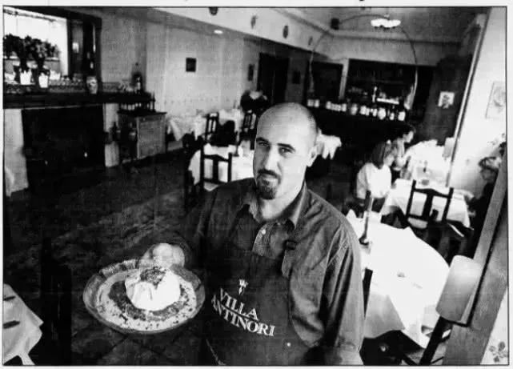 (原始链接: https://mmbiz.qpic.cn/mmbiz_jpg/nF6zIdz7N9GjKRAuE30FtOXiajSIPIA6qJQlfKnbPzKllgAaoKvAI706K8cQltrcJhb7dYttWSRZ3Jq6f3QqsWw/640?wx_fmt=jpeg)
- 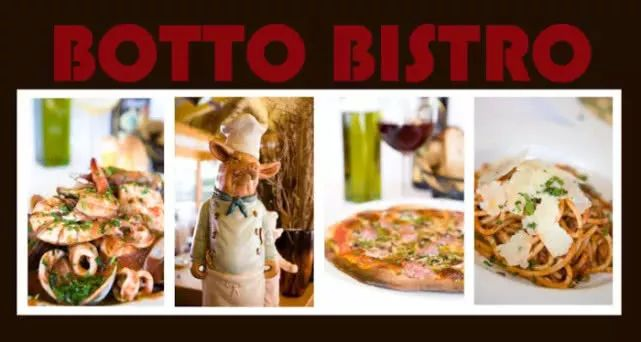 (原始链接: https://mmbiz.qpic.cn/mmbiz_jpg/nF6zIdz7N9GjKRAuE30FtOXiajSIPIA6qL1nr7ppG4mOtzF1zaFfnDS8RCic6qLnnpMibbwxiaRU6A6GB1w0uTTzNw/640?wx_fmt=jpeg)
- 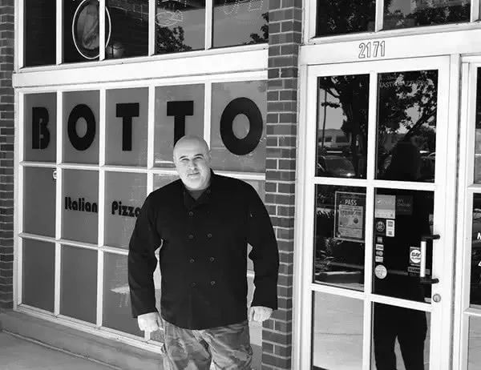 (原始链接: https://mmbiz.qpic.cn/mmbiz_jpg/nF6zIdz7N9GjKRAuE30FtOXiajSIPIA6qxYZLQLZya0eCPic8kNrJjzqoKMs0c34Pv8uLyYQSSD8HFTkgGxwGXTA/640?wx_fmt=jpeg)
- 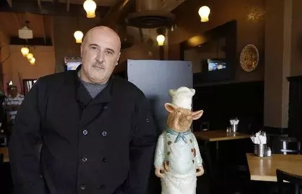 (原始链接: https://mmbiz.qpic.cn/mmbiz_jpg/nF6zIdz7N9GjKRAuE30FtOXiajSIPIA6qFWSg0ib9W9gahGTtZ0vmWlNmgjqd2mgunhJ12KGZnPIWicibaLgWy4s4A/640?wx_fmt=jpeg)
-  (原始链接: https://mmbiz.qpic.cn/mmbiz_jpg/nF6zIdz7N9GjKRAuE30FtOXiajSIPIA6qkfgt3hNqsJ0A3QJRicqQv9kO8PibduNj3QhalvU0aBaeiaF2ia02YMw7nA/640?wx_fmt=jpeg)
- 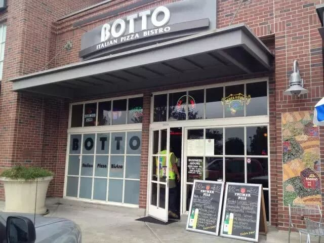 (原始链接: https://mmbiz.qpic.cn/mmbiz_jpg/nF6zIdz7N9GjKRAuE30FtOXiajSIPIA6qqd1AmQiaeht8zQsTTaEmnwrEibmwxA1JPoLPgfsKyRApEo1WWDlmuSVA/640?wx_fmt=jpeg)
- 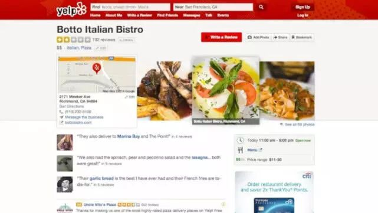 (原始链接: https://mmbiz.qpic.cn/mmbiz_jpg/nF6zIdz7N9GjKRAuE30FtOXiajSIPIA6qcbv1QCtMt3mne4p7FqkfabGZTgxaDPiaaiaib5x1U76fMVmcG5NgPumpQ/640?wx_fmt=jpeg)
- 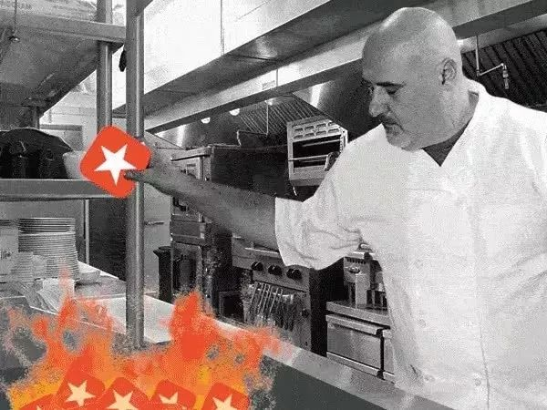 (原始链接: https://mmbiz.qpic.cn/mmbiz_jpg/nF6zIdz7N9GjKRAuE30FtOXiajSIPIA6qnPxIiaKqic3Q34wXIDRDrod87xribF3t3FW8MiakG4GXFJSzxaI19Dgl2Q/640?wx_fmt=jpeg)
- 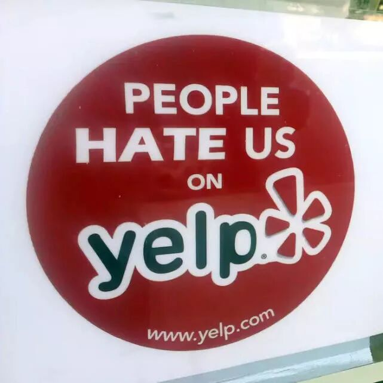 (原始链接: https://mmbiz.qpic.cn/mmbiz_jpg/nF6zIdz7N9GjKRAuE30FtOXiajSIPIA6qGqUE8gdich4oDq1Ma5vlYVevwnUwS2QmK3zPiaSNEUSURJyhYrMyqricQ/640?wx_fmt=jpeg)
-  (原始链接: https://mmbiz.qpic.cn/mmbiz_jpg/nF6zIdz7N9GjKRAuE30FtOXiajSIPIA6qgc9zWI1184m5jVTlJmyz3akS6KWFQxibJGc9Qxx0gib3dcysS4xOPnFw/640?wx_fmt=jpeg)
- 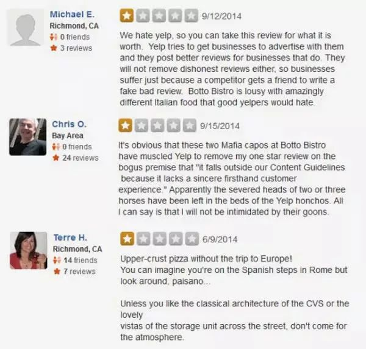 (原始链接: https://mmbiz.qpic.cn/mmbiz_jpg/nF6zIdz7N9GjKRAuE30FtOXiajSIPIA6qrh7ib0dY6BQSRCNANXF9cYLVSKtib6tichpzZxEiaNJNlM60I7sWeYcTgA/640?wx_fmt=jpeg)
- 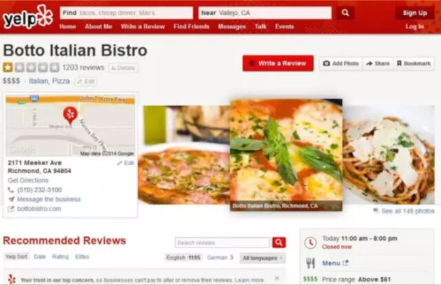 (原始链接: https://mmbiz.qpic.cn/mmbiz_jpg/nF6zIdz7N9GjKRAuE30FtOXiajSIPIA6quyVgq7GCWmYjWw37afuziaAd6xrSuRfYzFxmde715gU4TzTyaS8kkibA/640?wx_fmt=jpeg)
- 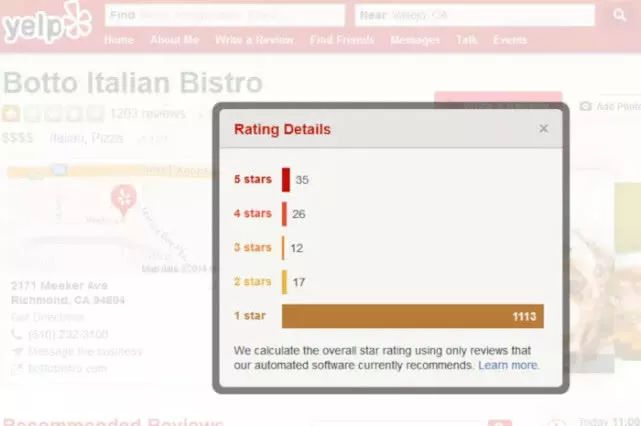 (原始链接: https://mmbiz.qpic.cn/mmbiz_jpg/nF6zIdz7N9GjKRAuE30FtOXiajSIPIA6qf7JYZ356XibpiciaicBL6g0vcXJZtJSniaQX9rMA4ZToglM4jibvg3PRu2qQ/640?wx_fmt=jpeg)
- 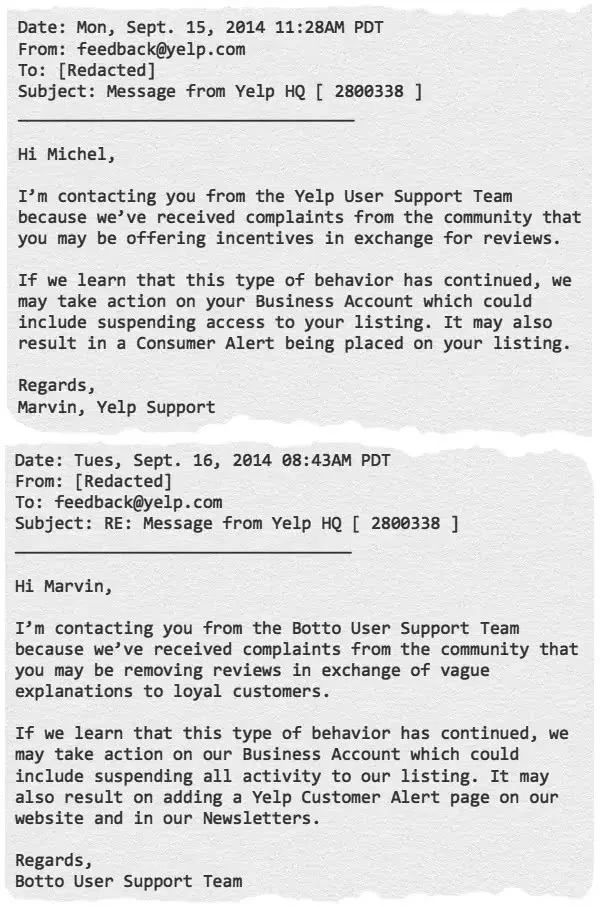 (原始链接: https://mmbiz.qpic.cn/mmbiz_jpg/nF6zIdz7N9GjKRAuE30FtOXiajSIPIA6qdySNmdAhSkE94cME2n77MLE1SgM03o4vojwHeoe2l5KW0KgIXHXnKQ/640?wx_fmt=jpeg)
- 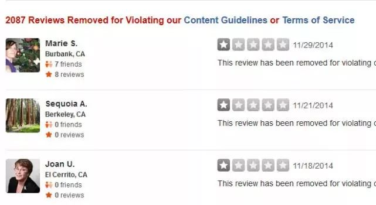 (原始链接: https://mmbiz.qpic.cn/mmbiz_jpg/nF6zIdz7N9GjKRAuE30FtOXiajSIPIA6ql6pQNrYeAHR3fRhhZknezoFicPq513OYcq06YxMGib7sQkYMKTaJZAGw/640?wx_fmt=jpeg)
- 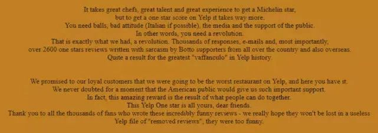 (原始链接: https://mmbiz.qpic.cn/mmbiz_jpg/nF6zIdz7N9GjKRAuE30FtOXiajSIPIA6qYcf8xG6adYAl28f05icCZ5B87GDNC5gL3RGHrW4CyAdI0uWmGXsFeew/640?wx_fmt=jpeg)
- 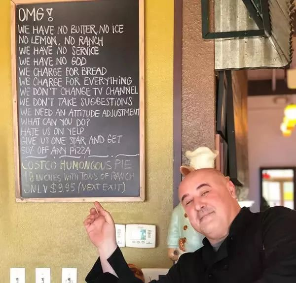 (原始链接: https://mmbiz.qpic.cn/mmbiz_jpg/nF6zIdz7N9GjKRAuE30FtOXiajSIPIA6qhLlgwbaibzqexPS7gwbZ02C9LniaforiaUPwRCMMahBXw3twXYk4C2QjA/640?wx_fmt=jpeg)
-  (原始链接: https://mmbiz.qpic.cn/mmbiz_gif/nF6zIdz7N9GrCBBFVcU6PvtiapxB3LQFXztXNhxiaZWRmalicMrD96cYxCnnojHmib0C0GnUEeP0ibtw9JxlPxiaV45Q/640?wx_fmt=gif)
-  (原始链接: https://mmbiz.qpic.cn/mmbiz_jpg/nF6zIdz7N9Gk2fbCnCOLMnWNm5FzibI7xR5jercTNkuOrl60cpKdtaLFYsOOwq56sOOtjrUwHxjbYoxFh8buwXA/640?wx_fmt=jpeg)
