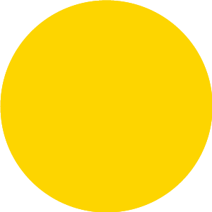
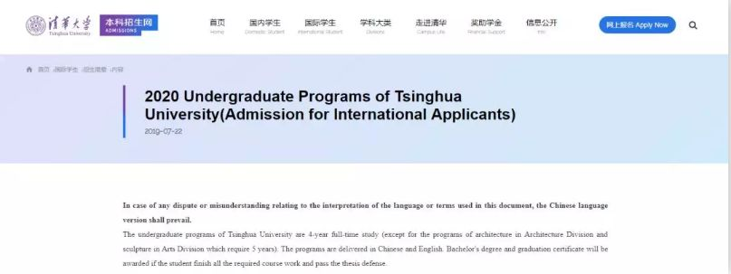
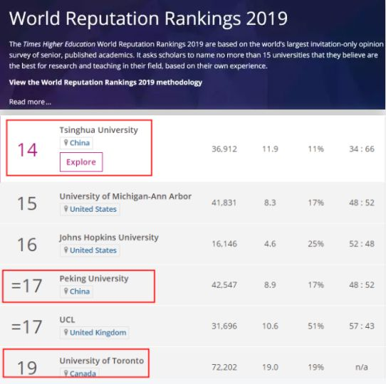
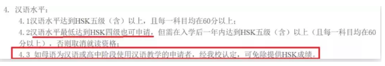
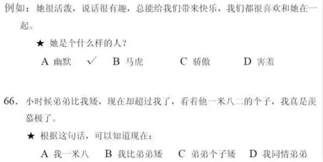
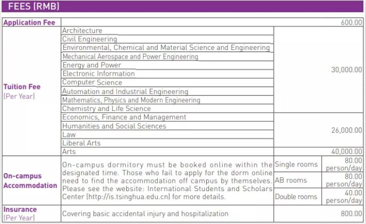

# 无标题

**链接地址:** http://mp.weixin.qq.com/s?__biz=MzUzNzQxOTI2MQ==&mid=2247484090&idx=1&sn=f4d7f106a63446d51bb3d5a360501ec1&chksm=fae60e28cd91873eb608ff57beff0b79c4965af28f0fab3a47d21d0b6672891c14ee2f381a9d&mpshare=1&scene=2&srcid=&sharer_sharetime=1564699680534&sharer_shareid=be1c8edd6c93eec155a61c876e41d26a#rd
**作者:** 
**获取时间:** 2025/8/28 20:30:37
**图片数量:** 13

---

## 原始HTML内容

<section style="box-sizing: border-box;font-size: 16px;"><section style="box-sizing: border-box;" powered-by="xiumi.us"><section style="margin: 10px 0%;box-sizing: border-box;"><section style="display: inline-block;vertical-align: middle;width: 12%;box-sizing: border-box;"><section style="box-sizing: border-box;" powered-by="xiumi.us"><section style="text-align: center;margin-right: 0%;margin-left: 0%;box-sizing: border-box;"><section style="max-width: 100%;vertical-align: middle;display: inline-block;line-height: 0;width: 50%;box-sizing: border-box;"></section></section></section></section><section style="display: inline-block;vertical-align: middle;width: 88%;padding-left: 10px;box-sizing: border-box;"><section style="box-sizing: border-box;" powered-by="xiumi.us"><section style="margin-right: 0%;margin-left: 0%;box-sizing: border-box;"><section style="font-size: 14px;box-sizing: border-box;">
<strong style="box-sizing: border-box;">点击上方蓝字关注我们</strong>
</section></section></section></section></section></section><section style="box-sizing: border-box;" powered-by="xiumi.us"><section style="box-sizing: border-box;"><section style="box-sizing: border-box;">
 
<section style="max-width: 100%;box-sizing: border-box;font-family: -apple-system-font, BlinkMacSystemFont, &quot;Helvetica Neue&quot;, &quot;PingFang SC&quot;, &quot;Hiragino Sans GB&quot;, &quot;Microsoft YaHei UI&quot;, &quot;Microsoft YaHei&quot;, Arial, sans-serif;font-size: 16px;letter-spacing: 0.544px;white-space: normal;background-color: rgb(255, 255, 255);text-align: center;overflow-wrap: break-word !important;"><section style="max-width: 100%;box-sizing: border-box;letter-spacing: 0.544px;line-height: 27.2px;overflow-wrap: break-word !important;"><section class="" style="max-width: 100%;box-sizing: border-box;overflow-wrap: break-word !important;"><section style="max-width: 100%;box-sizing: border-box;overflow-wrap: break-word !important;"><section style="max-width: 100%;box-sizing: border-box;overflow-wrap: break-word !important;"><section style="max-width: 100%;box-sizing: border-box;letter-spacing: 0.544px;overflow-wrap: break-word !important;"><section style="max-width: 100%;box-sizing: border-box;overflow-wrap: break-word !important;"><section style="max-width: 100%;box-sizing: border-box;overflow-wrap: break-word !important;"><section style="max-width: 100%;box-sizing: border-box;overflow-wrap: break-word !important;"><section style="max-width: 100%;box-sizing: border-box;overflow-wrap: break-word !important;"><section style="max-width: 100%;box-sizing: border-box;overflow-wrap: break-word !important;"><section style="max-width: 100%;box-sizing: border-box;overflow-wrap: break-word !important;"><section style="max-width: 100%;box-sizing: border-box;overflow-wrap: break-word !important;"><section style="max-width: 100%;box-sizing: border-box;overflow-wrap: break-word !important;"><section style="max-width: 100%;box-sizing: border-box;overflow-wrap: break-word !important;"><section style="margin-top: 10px;margin-bottom: 10px;max-width: 100%;box-sizing: border-box;overflow-wrap: break-word !important;"><section style="padding: 10px;max-width: 100%;box-sizing: border-box;display: inline-block;width: 558px;border-width: 1px;border-style: solid;border-color: rgb(249, 110, 87);overflow-wrap: break-word !important;"><section style="max-width: 100%;box-sizing: border-box;overflow-wrap: break-word !important;"><section style="max-width: 100%;box-sizing: border-box;overflow-wrap: break-word !important;"><section style="max-width: 100%;box-sizing: border-box;overflow-wrap: break-word !important;">
<strong style="max-width: 100%;box-sizing: border-box !important;overflow-wrap: break-word !important;">申请费600人民币，心动不容行动 </strong>
</section></section></section></section></section></section></section></section></section></section></section></section></section></section></section></section></section></section></section></section>

近日，中国顶尖学府清华大学公布最新针对海外华人的招生政策。读完招生简章，加拿大的华人父母们直接乐疯了！ 

根据7月底清华大学官网公布的《2020年清华大学国际学生（本科）招生简章》，入了加拿大籍的华人孩子可以免试申请就读清华大学！

 

 

清华大学毕业证书的含金量，那可是相当高的。根据最近刚公布的泰晤士2019世界大学声誉排行，清华大学雄踞第14名，甩了排在第19名的多伦多大学5名！而多伦多大学已经是全加拿大排名最高的大学了。

 

 

参加过国内高考的同学们，都知道上清华北大有多难，拿小编那一届的山东高考来举例吧，750分满分，想上清华，至少要考到710分才有戏... ...

 

<strong>- 真诚推荐 -&nbsp;</strong>

 

<strong style="font-size: 16px;white-space: normal;">- 真诚推荐 -&nbsp;</strong>

&nbsp; 

然而，看到今天清华发布的国际学生招生简章，小编仿佛看到，当年那个离自己十万八千里远的神仙学府，已经近在小编儿子眼前... ...

 

 

没错，对于外籍华裔学生来说，只需要一本外国护照，一份高中成绩单和毕业证，再会说点中文，就能轻轻松松上清华了。

&nbsp;

从2017年开始，清华取消了对国际学生的笔试，改成了“申请-审核”制。

&nbsp;

而清华对于国际学生的申请资格，门槛也相当低：

&nbsp;

1、学习成绩优良，品行端正，身体健康，具有相当于中国高中的毕业学历；

&nbsp;

2、年满18周岁；未满18周岁的，提交《在华监护人公证书》；

&nbsp;

3、提供高中成绩单；高中毕业证书；国际通行考试的成绩(如SAT/ACT/A-Level/AP/IB等)；其他辅助证明材料；

&nbsp;

4、汉语水平达到HSK汉语考试五级（含）以上，且每一科目均在60分以上。

&nbsp;

汉语水平达到HSK四级(且每一科目均在60分以上)也可申请，但需在入学后一年内达到HSK五级(含)以上(且每一科目均在60分以上)，否则取消就读资格；

 如母语为汉语或高中阶段使用汉语教学的申请者，经清华认定，可免除提供HSK成绩。

 

 

有些朋友可能对汉语HSK评级没啥概念，那我们来上一套清华入学门槛要求的HSK四级试题给大家看看：

 

 

这个试题的难度，海外华人子女看完可以偷着乐了... ...

&nbsp;

根据官方介绍，汉语HSK四级主要面向按每周2-4课时进度学习汉语四个学期（两学年），掌握1200个常用词语的考生。HSK四级考题共100题，分听力、阅读、书写三部分，全部考试约105分钟。

&nbsp;

对比一下我们中国留学生到国外念大学要考的雅思考试：分听力，阅读，写作，口语四部分，全部考试时间约180分钟... ...

&nbsp;

更不用说，大多数海外院校要求的雅思，最低也要6.5分，而雅思6.5分要求的词汇量在6000-7000左右。

 

那么，费用方面情况如何呢？会不会像美国私立常春藤大学一样，孩子考得上，家长供不起呢？

 

不！完全不用担心，让孩子去中国留学上清华，比在加拿大本地上某些大学还便宜！

&nbsp;

清华大学对国际学生的学费标准：

&nbsp;

理科：30000元人民币/学年&nbsp;

文科：26000元人民币/学年

住宿：40-80元人民币/天

&nbsp;

 

对比一下加拿大名校麦吉尔大学，有加拿大国籍的温哥华华人孩子，本科工程学、软件工程学专业的学费也要7940.1加元，约合42000人民币。 

&nbsp;

清华大学对国际学生如此宽松的录取条件，确实对海外华人子女有不小的诱惑力。

 

有意让孩子申请的，可以直接上传材料申请试试了。

&nbsp;

申请费：600元人民币

 申请网址：

https://apply.join-tsinghua.edu.cn/international/res/SpecialWsbm/index.html

 

<b>文章来源：</b><b>加西周末</b>

<b> </b>
</section></section></section><section style="box-sizing: border-box;" powered-by="xiumi.us"><section style="text-align: center;margin-top: 10px;margin-bottom: 10px;box-sizing: border-box;"><section style="max-width: 100%;vertical-align: middle;display: inline-block;line-height: 0;box-sizing: border-box;"></section></section></section><section style="box-sizing: border-box;" powered-by="xiumi.us"><section style="margin: 34px 0% 8px;box-sizing: border-box;"><section style="background-color: rgb(105, 143, 187);height: 1px;box-sizing: border-box;"></section></section></section><section style="box-sizing: border-box;" powered-by="xiumi.us"><section style="margin: -24px 0% 10px;box-sizing: border-box;"><section style="display: inline-block;border-width: 2px;border-style: solid;border-color: rgba(255, 255, 255, 0);padding: 0.1em 0.3em;background-color: rgba(47, 101, 115, 0.85);color: rgb(255, 255, 255);font-size: 15px;line-height: 1.8;box-sizing: border-box;">
<strong style="box-sizing: border-box;">韩子鸿 / Henry</strong>
</section></section></section><section style="box-sizing: border-box;" powered-by="xiumi.us"><section style="box-sizing: border-box;"><section style="font-size: 14px;color: rgb(62, 62, 62);letter-spacing: 0px;line-height: 1.6;padding-right: 10px;padding-left: 10px;box-sizing: border-box;">
旅居加拿大17年，来到爱屯也有16年了。和大部分人一样，多年前以一个小留学生的身份来到这里，读书、打工，沉迷过游戏，也做过学生会（CSSA）会长。

 

毕业后第一份工作就职会计事务所，负责个人和企业财税会计。三年后，执着于心中对银行的热情，转投加拿大最大的银行皇家银行（Royal Bank of Canada），5年中先后就职前台，个人客户经理，资深客户经理，商业客户经理，贷款专家。多次获得嘉奖，2015年年度RBC Gold Award（Top 2%），2016年年度RBC Convention Cruise Award(Top 1%)，并负责牵头Edmonton地区华人市场企划。

 

2017年末进入房地产市场专职成为一名房地产经纪人，以自己多年生活和财税，银行方面的经验服务客户。帮助客户无论是买房卖房，还是新移民及留学生融入本地社会尽到自己力所能及的助力。对各大银行的贷款汇款政策非常熟悉，加拿大财税方面也有相当涉猎。
</section></section></section><section style="box-sizing: border-box;" powered-by="xiumi.us"><section style="margin: 10px 0%;box-sizing: border-box;"><section style="display: inline-block;width: 100%;vertical-align: top;background-color: rgba(47, 101, 115, 0.33);padding: 5px;border-width: 0px;box-sizing: border-box;"><section style="box-sizing: border-box;" powered-by="xiumi.us"><section style="box-sizing: border-box;"><section style="display: inline-block;width: 100%;vertical-align: top;padding: 5px;border-style: dashed;border-width: 1px;border-radius: 0px;border-color: rgb(255, 255, 255);box-sizing: border-box;"><section style="box-sizing: border-box;" powered-by="xiumi.us"><section style="box-sizing: border-box;"><section style="display: inline-block;width: 100%;vertical-align: top;background-color: rgb(255, 255, 255);padding: 10px;box-sizing: border-box;"><section style="box-sizing: border-box;" powered-by="xiumi.us"><section style="box-sizing: border-box;"><section style="text-align: center;font-size: 15px;color: rgb(0, 0, 0);line-height: 1.8;box-sizing: border-box;">
<strong style="box-sizing: border-box;">www.henryhanteam.com</strong>

<strong style="box-sizing: border-box;">欢迎访问我们的网站查询更多信息</strong>
</section></section></section></section></section></section></section></section></section></section></section></section><section style="box-sizing: border-box;" powered-by="xiumi.us"><section style="box-sizing: border-box;"><section style="box-sizing: border-box;">
 
</section></section></section><section style="box-sizing: border-box;" powered-by="xiumi.us"><section style="margin: 40px 0% 10px;box-sizing: border-box;"><section style="display: inline-block;width: 100%;border-width: 5px;border-style: double;border-color: rgba(47, 101, 115, 0.85);padding: 10px;border-radius: 2px;box-sizing: border-box;"><section style="box-sizing: border-box;" powered-by="xiumi.us"><section style="transform: translate3d(20px, 0px, 0px);font-size: 11px;margin-top: -50px;margin-right: 0%;margin-left: 0%;box-sizing: border-box;"><section style="box-sizing: border-box;width: 7em;height: 7em;display: inline-block;vertical-align: bottom;border-radius: 100%;border-width: 1px;border-style: double;border-color: rgba(47, 101, 115, 0.85);background-position: center center;background-repeat: no-repeat;background-size: cover;overflow: hidden;background-image: url(&quot;https://mmbiz.qpic.cn/mmbiz_png/z8ibtosSndj1YdibBLibKMaVXX5lNe14KcU43CJSZ5X9rtwxOC4xs4IkPDKoeSQ4zVRSHF80hM6y6ssE9L6wzEQicA/640?wx_fmt=png&quot;);"><section style="height: 100%;overflow: hidden;line-height: 0;vertical-align: middle;max-width: 100%;box-sizing: border-box;"></section></section></section></section><section style="box-sizing: border-box;" powered-by="xiumi.us"><section style="margin: -30px 0% 30px;box-sizing: border-box;"><section style="display: inline-block;vertical-align: top;width: 61.8%;padding-right: 15px;padding-left: 15px;box-sizing: border-box;"><section style="box-sizing: border-box;" powered-by="xiumi.us"><section style="margin: 40px 0% 10px;box-sizing: border-box;"><section style="color: rgb(160, 160, 160);font-size: 14px;box-sizing: border-box;">
<strong style="box-sizing: border-box;">爱城小喇叭</strong>

介绍埃德蒙顿生活，旅游，留学，出行，地产，商业，投资等信息。
</section></section></section></section><section style="display: inline-block;vertical-align: top;width: 38.2%;box-sizing: border-box;"><section style="box-sizing: border-box;" powered-by="xiumi.us"><section style="text-align: center;margin-top: 10px;margin-right: 0%;margin-left: 0%;box-sizing: border-box;"><section style="max-width: 100%;vertical-align: middle;display: inline-block;line-height: 0;border-width: 0px;border-radius: 0px;box-shadow: rgb(0, 0, 0) 0px 0px 0px;width: 90%;box-sizing: border-box;"></section></section></section></section></section></section><section style="box-sizing: border-box;" powered-by="xiumi.us"><section style="margin-top: -30px;margin-right: 0%;margin-left: 0%;box-sizing: border-box;"><section style="display: inline-block;vertical-align: top;width: 61.8%;padding-right: 15px;padding-left: 15px;box-sizing: border-box;"><section style="box-sizing: border-box;" powered-by="xiumi.us"><section style="transform: translate3d(5px, 0px, 0px);-webkit-transform: translate3d(5px, 0px, 0px);-moz-transform: translate3d(5px, 0px, 0px);-o-transform: translate3d(5px, 0px, 0px);box-sizing: border-box;"><section style="color: rgb(160, 160, 160);font-size: 14px;box-sizing: border-box;">
<strong style="box-sizing: border-box;">欢迎关注我们！</strong> 
</section></section></section></section><section style="display: inline-block;vertical-align: top;width: 38.2%;box-sizing: border-box;"><section style="box-sizing: border-box;" powered-by="xiumi.us"><section style="transform: translate3d(10px, 0px, 0px);-webkit-transform: translate3d(10px, 0px, 0px);-moz-transform: translate3d(10px, 0px, 0px);-o-transform: translate3d(10px, 0px, 0px);box-sizing: border-box;"><section style="text-align: center;color: rgb(160, 160, 160);font-size: 14px;box-sizing: border-box;">
 
</section></section></section></section></section></section></section></section></section></section>

---

## 纯文本内容

点击上方蓝字关注我们申请费600人民币，心动不容行动近日，中国顶尖学府清华大学公布最新针对海外华人的招生政策。读完招生简章，加拿大的华人父母们直接乐疯了！根据7月底清华大学官网公布的《2020年清华大学国际学生（本科）招生简章》，入了加拿大籍的华人孩子可以免试申请就读清华大学！清华大学毕业证书的含金量，那可是相当高的。根据最近刚公布的泰晤士2019世界大学声誉排行，清华大学雄踞第14名，甩了排在第19名的多伦多大学5名！而多伦多大学已经是全加拿大排名最高的大学了。参加过国内高考的同学们，都知道上清华北大有多难，拿小编那一届的山东高考来举例吧，750分满分，想上清华，至少要考到710分才有戏... ...- 真诚推荐 - - 真诚推荐 -  然而，看到今天清华发布的国际学生招生简章，小编仿佛看到，当年那个离自己十万八千里远的神仙学府，已经近在小编儿子眼前... ...没错，对于外籍华裔学生来说，只需要一本外国护照，一份高中成绩单和毕业证，再会说点中文，就能轻轻松松上清华了。 从2017年开始，清华取消了对国际学生的笔试，改成了“申请-审核”制。 而清华对于国际学生的申请资格，门槛也相当低： 1、学习成绩优良，品行端正，身体健康，具有相当于中国高中的毕业学历； 2、年满18周岁；未满18周岁的，提交《在华监护人公证书》； 3、提供高中成绩单；高中毕业证书；国际通行考试的成绩(如SAT/ACT/A-Level/AP/IB等)；其他辅助证明材料； 4、汉语水平达到HSK汉语考试五级（含）以上，且每一科目均在60分以上。 汉语水平达到HSK四级(且每一科目均在60分以上)也可申请，但需在入学后一年内达到HSK五级(含)以上(且每一科目均在60分以上)，否则取消就读资格；如母语为汉语或高中阶段使用汉语教学的申请者，经清华认定，可免除提供HSK成绩。有些朋友可能对汉语HSK评级没啥概念，那我们来上一套清华入学门槛要求的HSK四级试题给大家看看：这个试题的难度，海外华人子女看完可以偷着乐了... ... 根据官方介绍，汉语HSK四级主要面向按每周2-4课时进度学习汉语四个学期（两学年），掌握1200个常用词语的考生。HSK四级考题共100题，分听力、阅读、书写三部分，全部考试约105分钟。 对比一下我们中国留学生到国外念大学要考的雅思考试：分听力，阅读，写作，口语四部分，全部考试时间约180分钟... ... 更不用说，大多数海外院校要求的雅思，最低也要6.5分，而雅思6.5分要求的词汇量在6000-7000左右。那么，费用方面情况如何呢？会不会像美国私立常春藤大学一样，孩子考得上，家长供不起呢？不！完全不用担心，让孩子去中国留学上清华，比在加拿大本地上某些大学还便宜！ 清华大学对国际学生的学费标准： 理科：30000元人民币/学年 文科：26000元人民币/学年住宿：40-80元人民币/天 对比一下加拿大名校麦吉尔大学，有加拿大国籍的温哥华华人孩子，本科工程学、软件工程学专业的学费也要7940.1加元，约合42000人民币。 清华大学对国际学生如此宽松的录取条件，确实对海外华人子女有不小的诱惑力。有意让孩子申请的，可以直接上传材料申请试试了。 申请费：600元人民币申请网址：https://apply.join-tsinghua.edu.cn/international/res/SpecialWsbm/index.html文章来源：加西周末韩子鸿 / Henry旅居加拿大17年，来到爱屯也有16年了。和大部分人一样，多年前以一个小留学生的身份来到这里，读书、打工，沉迷过游戏，也做过学生会（CSSA）会长。毕业后第一份工作就职会计事务所，负责个人和企业财税会计。三年后，执着于心中对银行的热情，转投加拿大最大的银行皇家银行（Royal Bank of Canada），5年中先后就职前台，个人客户经理，资深客户经理，商业客户经理，贷款专家。多次获得嘉奖，2015年年度RBC Gold Award（Top 2%），2016年年度RBC Convention Cruise Award(Top 1%)，并负责牵头Edmonton地区华人市场企划。2017年末进入房地产市场专职成为一名房地产经纪人，以自己多年生活和财税，银行方面的经验服务客户。帮助客户无论是买房卖房，还是新移民及留学生融入本地社会尽到自己力所能及的助力。对各大银行的贷款汇款政策非常熟悉，加拿大财税方面也有相当涉猎。www.henryhanteam.com欢迎访问我们的网站查询更多信息爱城小喇叭介绍埃德蒙顿生活，旅游，留学，出行，地产，商业，投资等信息。欢迎关注我们！

---

## 图片列表

-  (原始链接: https://mmbiz.qpic.cn/mmbiz_gif/z8ibtosSndj1YdibBLibKMaVXX5lNe14KcUCkyrJnC1IOeySVYf7uoN3Fa1feWg6P583MyZPcWRobSWI3d2s2dYyg/640?wx_fmt=gif)
-  (原始链接: https://mmbiz.qpic.cn/mmbiz_jpg/Jwvkibo0Z8vib6SricFllUThCjuCvvFfZJVInibuLeMgMrWqwiaJ4ibOl1AnhGTQATz03c938sE7yGicjCaYwcbRhCfVg/640?wx_fmt=jpeg)
-  (原始链接: https://mmbiz.qpic.cn/mmbiz_png/Jwvkibo0Z8vib6SricFllUThCjuCvvFfZJVNp2Ic5rmIbLpPIic2vGE4DdJlhl0PJqFHNgDpHcUpSoRP2jUghIrwlg/640?wx_fmt=png)
-  (原始链接: https://mmbiz.qpic.cn/mmbiz_png/Jwvkibo0Z8vib6SricFllUThCjuCvvFfZJVjpNVdINjVVtnvav7AeNRwV4s9n7fvT9eVEw0ibR19081dRQ0CicawH2w/640?wx_fmt=png)
-  (原始链接: https://mmbiz.qpic.cn/mmbiz_jpg/z8ibtosSndj0ibBVeflRTibY2c3shfRzKRgIMCAn124ccwiboPXQfg4l4S2B0rRukiaq5DxNIGNBcly0woUvEetG4qA/640?wx_fmt=jpeg)
-  (原始链接: https://mmbiz.qpic.cn/mmbiz_jpg/Jwvkibo0Z8vib6SricFllUThCjuCvvFfZJVthH8IibUEB60mIkc8y2HyojiaU5DNXwDS45tJlmuqVD7YAKFRIpQ11vw/640?wx_fmt=jpeg)
-  (原始链接: https://mmbiz.qpic.cn/mmbiz_png/Jwvkibo0Z8vib6SricFllUThCjuCvvFfZJVpkLmjQhw0mlozibnDRG7mL0wjT2URFmq4qNTQj7s5iaR3oH6ful0jGWQ/640?wx_fmt=png)
-  (原始链接: https://mmbiz.qpic.cn/mmbiz_png/Jwvkibo0Z8vib6SricFllUThCjuCvvFfZJV3DvSjXVXL3Uu0LNRpbW8iaT7wBYzknv36bI58lP8GicxUhicKSOos5oaw/640?wx_fmt=png)
-  (原始链接: https://mmbiz.qpic.cn/mmbiz_gif/Jwvkibo0Z8vib6SricFllUThCjuCvvFfZJVX1ZwUNIEI9ia2yia948wo9YMFwl3JdjtnaAKI8jtrrUmxwIPkCtZIECg/640?wx_fmt=gif)
-  (原始链接: https://mmbiz.qpic.cn/mmbiz_png/Jwvkibo0Z8vib6SricFllUThCjuCvvFfZJVFsUmBGo8IH1CI3ZazZzYSpcTkMyNa88abcoceeRdSuRDd75JYBYUyw/640?wx_fmt=png)
-  (原始链接: https://mmbiz.qpic.cn/mmbiz_jpg/z8ibtosSndj1YdibBLibKMaVXX5lNe14KcUIaUZEqO7jNzo4CIguxOFZh4ibicKuwogcqdPc5nqibUsqzFial7icGib4hhw/640?wx_fmt=jpeg)
-  (原始链接: https://mmbiz.qpic.cn/mmbiz_png/z8ibtosSndj1YdibBLibKMaVXX5lNe14KcU43CJSZ5X9rtwxOC4xs4IkPDKoeSQ4zVRSHF80hM6y6ssE9L6wzEQicA/640?wx_fmt=png)
-  (原始链接: https://mmbiz.qpic.cn/mmbiz_jpg/z8ibtosSndj1YdibBLibKMaVXX5lNe14KcUVVrtdiaMv2q2XCY5AmmzRYFX5J9HPYZVxuzQJhRr8icpfCPHTK0vpv4Q/640?wx_fmt=jpeg)
