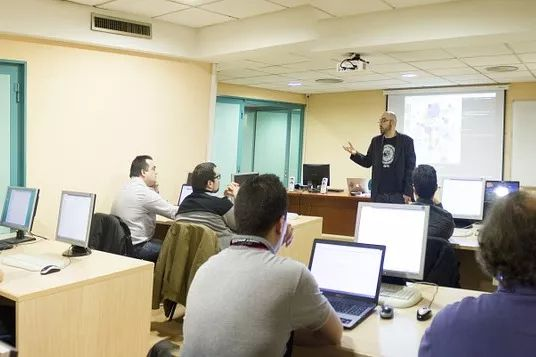
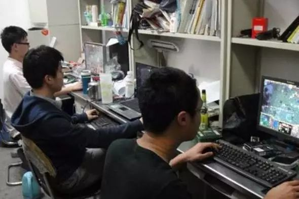
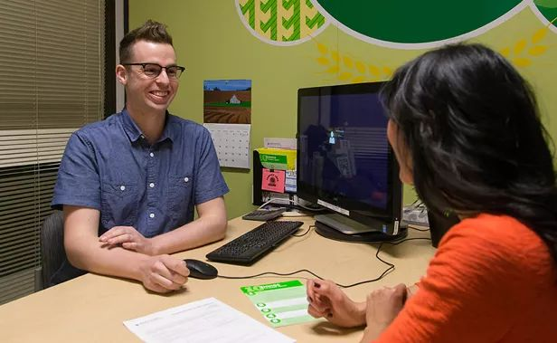
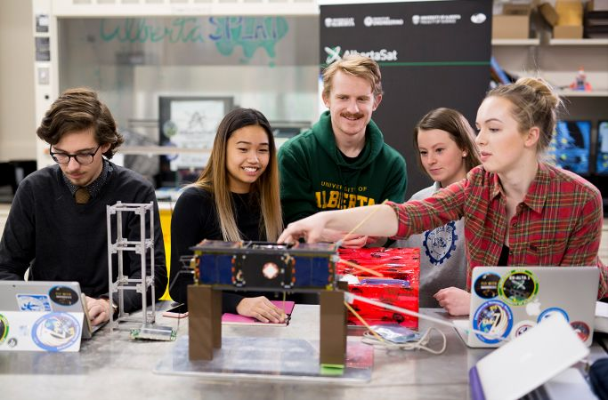
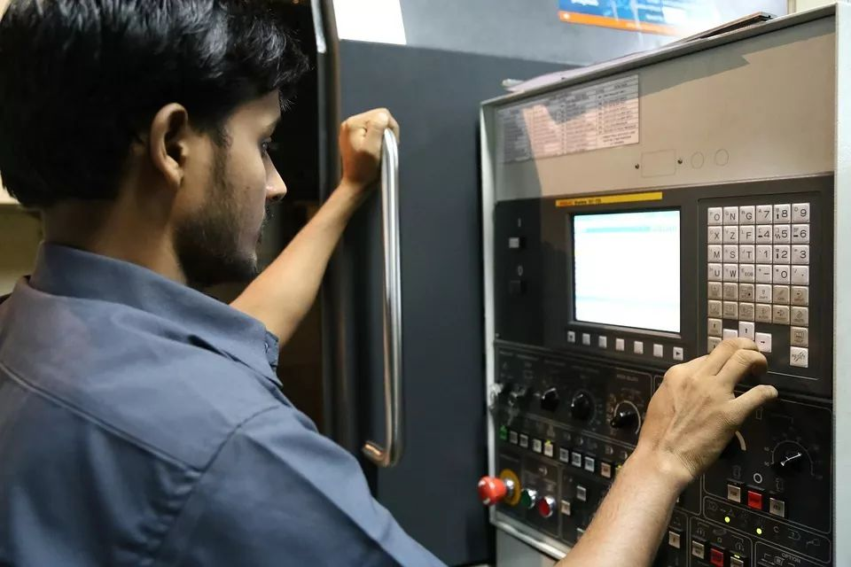

# 无标题

**链接地址:** http://mp.weixin.qq.com/s?__biz=MzI4NDYyNjAwNw==&mid=2247483914&idx=1&sn=cf2ec39c25240dd00a4c2d98e1f5f422&chksm=ebf9df32dc8e56241d0f869840a7c24d7622d7bf16bf179d7a37dbb00449371bb8c10ad1ee58&mpshare=1&scene=2&srcid=&sharer_sharetime=1566338733787&sharer_shareid=be1c8edd6c93eec155a61c876e41d26a#rd
**作者:** 欢迎关注我们
**获取时间:** 2025/8/28 20:28:26
**图片数量:** 33

---

## 原始HTML内容

 
<section style="box-sizing: border-box;font-size: 16px;"><section style="margin: 40px 0% 30px;box-sizing: border-box;" powered-by="xiumi.us"><section style="display: inline-block;width: 100%;vertical-align: top;border-width: 0px 15px;border-radius: 0px;border-style: none solid;border-color: rgb(62, 62, 62) rgb(125, 192, 232);padding-right: 10px;padding-left: 10px;box-sizing: border-box;"><section style="text-align: center;margin: -20px 0%;box-sizing: border-box;" powered-by="xiumi.us"><section style="max-width: 100%;vertical-align: middle;display: inline-block;line-height: 0;box-sizing: border-box;"></section></section></section></section><section style="text-align: center;margin: 15px 0%;box-sizing: border-box;" powered-by="xiumi.us"><section style="display: inline-block;min-width: 10%;max-width: 100%;vertical-align: top;padding-right: 10px;padding-left: 10px;border-style: solid none solid solid;border-width: 0px 10px;border-radius: 0px;border-color: rgb(26, 82, 145);box-sizing: border-box;"><section style="margin-right: 0%;margin-left: 0%;box-sizing: border-box;" powered-by="xiumi.us"><section style="text-align: justify;font-size: 12px;color: rgb(121, 121, 121);line-height: 1;box-sizing: border-box;">
<strong style="box-sizing: border-box;">开学季来啦！你准备好了吗？</strong>
</section></section></section></section><section style="text-align: right;margin: -40px 0% 10px;box-sizing: border-box;" powered-by="xiumi.us"><section class="group-empty" style="display: inline-block;width: 60px;height: 40px;vertical-align: top;overflow: hidden;border-left: 10px none rgb(40, 115, 200);border-bottom-left-radius: 0px;border-right: 10px solid rgb(40, 115, 200);border-top-right-radius: 0px;box-sizing: border-box;"></section></section><section style="text-align: left;margin: 10px 0% -40px;box-sizing: border-box;" powered-by="xiumi.us"><section class="group-empty" style="display: inline-block;width: 60px;height: 40px;vertical-align: top;overflow: hidden;border-left: 10px solid rgb(125, 192, 232);border-bottom-left-radius: 0px;box-sizing: border-box;"></section></section><section style="font-size: 14px;color: rgb(121, 121, 121);padding-right: 20px;padding-left: 20px;line-height: 1.8;letter-spacing: 2px;box-sizing: border-box;" powered-by="xiumi.us">
又到了每年8月底9月初的<strong style="box-sizing: border-box;">金秋开学季</strong>，生机勃勃的埃德蒙顿各所大学校园即将迎来新一批的中国留学生。

 

他们背负着自己和家庭的希望，怀着激动的心情，来到这片陌生的土地开始了一段独自在海外求学深造的路程。

 

<strong style="box-sizing: border-box;">等待他们的将是怎样丰富多彩的人生？</strong>
</section><section style="text-align: center;margin: 20px 0%;box-sizing: border-box;" powered-by="xiumi.us"><section style="display: inline-block;width: 70%;vertical-align: top;padding-right: 5px;padding-left: 5px;background-color: rgb(165, 222, 249);line-height: 0;box-sizing: border-box;"><section style="text-align: left;margin-top: -10px;margin-right: 0%;margin-left: 0%;transform: translate3d(-5px, 0px, 0px) rotateX(180deg);box-sizing: border-box;" powered-by="xiumi.us"><section style="display: inline-block;width: 5px;height: 10px;vertical-align: top;overflow: hidden;background-color: rgb(164, 222, 249);border-width: 0px;border-radius: 0px 0px 10px 10px;border-style: none;border-color: rgb(62, 62, 62);line-height: 0;letter-spacing: 0px;box-sizing: border-box;"></section></section><section style="text-align: right;transform: translate3d(15px, 0px, 0px);margin-right: 0%;margin-left: 0%;box-sizing: border-box;" powered-by="xiumi.us"><section style="display: inline-block;width: 20px;height: 5px;vertical-align: top;overflow: hidden;border-width: 0px;border-radius: 10px;border-style: none;border-color: rgb(62, 62, 62);background-color: rgb(164, 222, 249);box-sizing: border-box;"></section></section><section style="margin-right: 0%;margin-left: 0%;box-sizing: border-box;" powered-by="xiumi.us"><section style="max-width: 100%;vertical-align: middle;display: inline-block;line-height: 0;box-sizing: border-box;"></section></section><section style="text-align: left;transform: translate3d(-15px, 0px, 0px);margin-right: 0%;margin-left: 0%;box-sizing: border-box;" powered-by="xiumi.us"><section style="display: inline-block;width: 20px;height: 5px;vertical-align: top;overflow: hidden;border-width: 0px;border-radius: 10px;border-style: none;border-color: rgb(62, 62, 62);background-color: rgb(164, 222, 249);box-sizing: border-box;"></section></section><section style="text-align: right;margin-right: 0%;margin-bottom: -10px;margin-left: 0%;transform: translate3d(5px, 0px, 0px);box-sizing: border-box;" powered-by="xiumi.us"><section style="display: inline-block;width: 5px;height: 10px;vertical-align: top;overflow: hidden;background-color: rgb(164, 222, 249);border-width: 0px;border-radius: 0px 0px 10px 10px;border-style: none;border-color: rgb(62, 62, 62);box-sizing: border-box;"></section></section></section></section><section style="font-size: 14px;color: rgb(121, 121, 121);padding-right: 20px;padding-left: 20px;line-height: 1.8;letter-spacing: 2px;box-sizing: border-box;" powered-by="xiumi.us">
或许每一个刚刚踏上留学之路的孩子都抱有一份美好的期望：<strong style="box-sizing: border-box;">我要督促自己在留学期间多和本地人交流，尽可能地融入本地文化。</strong>

 

这样等我毕业的时候就可以<strong style="box-sizing: border-box;">操着一口流利的英语</strong>，在世界百强公司顺利找到职位，走上升职加薪，迎娶白富美出任CEO的<strong style="box-sizing: border-box;">人生巅峰</strong>…
</section><section style="margin: 40px 0% 30px;box-sizing: border-box;" powered-by="xiumi.us"><section style="display: inline-block;width: 100%;vertical-align: top;border-width: 0px 15px;border-radius: 0px;border-style: none solid;border-color: rgb(62, 62, 62) rgb(154, 194, 240);padding-right: 10px;padding-left: 10px;box-sizing: border-box;"><section style="text-align: center;margin: -20px 0%;box-sizing: border-box;" powered-by="xiumi.us"><section style="max-width: 100%;vertical-align: middle;display: inline-block;line-height: 0;box-sizing: border-box;"></section></section></section></section><section style="text-align: center;margin: 15px 0%;box-sizing: border-box;" powered-by="xiumi.us"><section style="display: inline-block;min-width: 10%;max-width: 100%;vertical-align: top;padding-right: 10px;padding-left: 10px;border-style: solid none solid solid;border-width: 0px 10px;border-radius: 0px;border-color: rgb(40, 115, 200);box-sizing: border-box;"><section style="margin-right: 0%;margin-left: 0%;box-sizing: border-box;" powered-by="xiumi.us"><section style="text-align: justify;font-size: 12px;color: rgb(121, 121, 121);line-height: 1;box-sizing: border-box;">
图片来源：搜狐新闻
</section></section></section></section><section style="font-size: 14px;color: rgb(121, 121, 121);padding-right: 20px;padding-left: 20px;line-height: 1.8;letter-spacing: 2px;box-sizing: border-box;" powered-by="xiumi.us">
然鹅…理想很丰满，现实很骨感。

 

开学不到一个月，不少留学生就被巨大的学习压力压得喘不过气来。
</section><section style="box-sizing: border-box;" powered-by="xiumi.us">
 
</section><section style="box-sizing: border-box;" powered-by="xiumi.us"><section style="align-items: center;display: flex;margin: 10px 0%;box-sizing: border-box;"><section style="display: inline-block;vertical-align: bottom;width: auto;flex: 1 0 1px;letter-spacing: 0px;box-sizing: border-box;"><section style="margin-top: 0.5em;margin-bottom: 0.5em;box-sizing: border-box;" powered-by="xiumi.us"><section style="border-top: 1px dashed rgb(62, 62, 62);box-sizing: border-box;"></section></section></section><section style="display: inline-block;vertical-align: bottom;width: auto;flex: 0 1 auto;box-shadow: rgb(0, 0, 0) 0px 0px 0px;line-height: 0;padding-right: 10px;padding-left: 10px;box-sizing: border-box;"><section style="text-align: center;box-sizing: border-box;" powered-by="xiumi.us"><section style="display: inline-block;width: 9px;height: 9px;vertical-align: top;overflow: hidden;background-color: rgb(255, 222, 23);border-width: 1px;border-radius: 100px;border-style: solid;border-color: rgb(62, 62, 62);box-shadow: rgb(255, 255, 255) 1px 1px 0px inset;line-height: 0;letter-spacing: 0px;box-sizing: border-box;"></section></section></section><section style="display: inline-block;vertical-align: bottom;width: auto;flex: 1 0 1px;box-sizing: border-box;"><section style="margin-top: 0.5em;margin-bottom: 0.5em;box-sizing: border-box;" powered-by="xiumi.us"><section style="border-top: 1px dashed rgb(62, 62, 62);box-sizing: border-box;"></section></section></section></section></section><section style="font-size: 14px;color: rgb(121, 121, 121);padding-right: 20px;padding-left: 20px;line-height: 1.8;letter-spacing: 2px;box-sizing: border-box;" powered-by="xiumi.us">
<em style="box-sizing: border-box;">“参加社会活动？不，我还有作业要做。” </em>

<em style="box-sizing: border-box;">“和本地人Social？不，我只想一个人宅在家里。”</em>
</section><section style="box-sizing: border-box;" powered-by="xiumi.us"><section style="align-items: center;display: flex;margin: 10px 0%;box-sizing: border-box;"><section style="display: inline-block;vertical-align: bottom;width: auto;flex: 1 0 1px;letter-spacing: 0px;box-sizing: border-box;"><section style="margin-top: 0.5em;margin-bottom: 0.5em;box-sizing: border-box;" powered-by="xiumi.us"><section style="border-top: 1px dashed rgb(62, 62, 62);box-sizing: border-box;"></section></section></section><section style="display: inline-block;vertical-align: bottom;width: auto;flex: 0 1 auto;box-shadow: rgb(0, 0, 0) 0px 0px 0px;line-height: 0;padding-right: 10px;padding-left: 10px;box-sizing: border-box;"><section style="text-align: center;box-sizing: border-box;" powered-by="xiumi.us"><section style="display: inline-block;width: 9px;height: 9px;vertical-align: top;overflow: hidden;background-color: rgb(255, 222, 23);border-width: 1px;border-radius: 100px;border-style: solid;border-color: rgb(62, 62, 62);box-shadow: rgb(255, 255, 255) 1px 1px 0px inset;line-height: 0;letter-spacing: 0px;box-sizing: border-box;"></section></section></section><section style="display: inline-block;vertical-align: bottom;width: auto;flex: 1 0 1px;box-sizing: border-box;"><section style="margin-top: 0.5em;margin-bottom: 0.5em;box-sizing: border-box;" powered-by="xiumi.us"><section style="border-top: 1px dashed rgb(62, 62, 62);box-sizing: border-box;"></section></section></section></section></section><section style="font-size: 14px;color: rgb(121, 121, 121);padding-right: 20px;padding-left: 20px;line-height: 1.8;letter-spacing: 2px;box-sizing: border-box;" powered-by="xiumi.us">
 

是外卖奶茶不好喝，还是网络游戏不好玩，还是综艺节目不好看？<strong style="box-sizing: border-box;">我只想呆在自己的舒适圈儿里！</strong>
</section><section style="text-align: center;margin: 20px 0%;box-sizing: border-box;" powered-by="xiumi.us"><section style="display: inline-block;width: 70%;vertical-align: top;padding-right: 5px;padding-left: 5px;background-color: rgb(165, 222, 249);line-height: 0;box-sizing: border-box;"><section style="text-align: left;margin-top: -10px;margin-right: 0%;margin-left: 0%;transform: translate3d(-5px, 0px, 0px) rotateX(180deg);box-sizing: border-box;" powered-by="xiumi.us"><section style="display: inline-block;width: 5px;height: 10px;vertical-align: top;overflow: hidden;background-color: rgb(164, 222, 249);border-width: 0px;border-radius: 0px 0px 10px 10px;border-style: none;border-color: rgb(62, 62, 62);line-height: 0;letter-spacing: 0px;box-sizing: border-box;"></section></section><section style="text-align: right;transform: translate3d(15px, 0px, 0px);margin-right: 0%;margin-left: 0%;box-sizing: border-box;" powered-by="xiumi.us"><section style="display: inline-block;width: 20px;height: 5px;vertical-align: top;overflow: hidden;border-width: 0px;border-radius: 10px;border-style: none;border-color: rgb(62, 62, 62);background-color: rgb(164, 222, 249);box-sizing: border-box;"></section></section><section style="margin-right: 0%;margin-left: 0%;box-sizing: border-box;" powered-by="xiumi.us"><section style="max-width: 100%;vertical-align: middle;display: inline-block;line-height: 0;box-sizing: border-box;"></section></section><section style="text-align: left;transform: translate3d(-15px, 0px, 0px);margin-right: 0%;margin-left: 0%;box-sizing: border-box;" powered-by="xiumi.us"><section style="display: inline-block;width: 20px;height: 5px;vertical-align: top;overflow: hidden;border-width: 0px;border-radius: 10px;border-style: none;border-color: rgb(62, 62, 62);background-color: rgb(164, 222, 249);box-sizing: border-box;"></section></section><section style="text-align: right;margin-right: 0%;margin-bottom: -10px;margin-left: 0%;transform: translate3d(5px, 0px, 0px);box-sizing: border-box;" powered-by="xiumi.us"><section style="display: inline-block;width: 5px;height: 10px;vertical-align: top;overflow: hidden;background-color: rgb(164, 222, 249);border-width: 0px;border-radius: 0px 0px 10px 10px;border-style: none;border-color: rgb(62, 62, 62);box-sizing: border-box;"></section></section></section></section><section style="font-size: 14px;color: rgb(121, 121, 121);padding-right: 20px;padding-left: 20px;line-height: 1.8;letter-spacing: 2px;box-sizing: border-box;" powered-by="xiumi.us">
这位同学，醒醒吧！再这样睡下去，升职加薪迎娶白富美出任CEO的人生梦想将<strong style="box-sizing: border-box;">永远变成一个遥不可及的梦</strong>！

 

想要在竞争激烈的北美职场立足，靠天天躺在被窝里做白日梦怎么能成？<strong style="box-sizing: border-box;">不融入本地人的生活文化圈是万万不行的！</strong>

 

可以说，跳出自己文化语言的舒适圈是你来到加拿大从<strong style="box-sizing: border-box;">第一天开始就要一直坚持做的事。</strong>

 

或许你也明白这件事的急迫性，但苦于找不到突破口，不敢迈出第一步。

 

<em style="box-sizing: border-box;"><strong style="box-sizing: border-box;">别怕，今天 BADAB Consulting将带着你一步步融入本地的人文环境，建立起自己在异国他乡求学道路上的人际交往圈！</strong></em>
</section><section style="box-sizing: border-box;" powered-by="xiumi.us">
 
</section><section style="margin: 10px 0%;box-sizing: border-box;" powered-by="xiumi.us"><section style="display: inline-block;width: 100%;vertical-align: top;border-width: 1px;border-radius: 0px;border-style: solid none;border-color: rgb(62, 62, 62);box-sizing: border-box;"><section style="box-sizing: border-box;" powered-by="xiumi.us"><section style="align-items: center;display: flex;margin: -3px 0%;box-sizing: border-box;"><section style="display: inline-block;vertical-align: bottom;width: auto;flex: 0 0 auto;border-width: 0px 0px 0px 2px;border-radius: 1px;border-style: none none none solid;border-color: rgb(62, 62, 62);overflow: hidden;box-sizing: border-box;transform: translate3d(0px, 0px, 0px);-webkit-transform: translate3d(0px, 0px, 0px);-moz-transform: translate3d(0px, 0px, 0px);-o-transform: translate3d(0px, 0px, 0px);"><section style="text-align: center;margin-right: 0%;margin-left: 0%;transform: translate3d(-10px, 0px, 0px);box-sizing: border-box;" powered-by="xiumi.us"><section style="display: inline-block;min-width: 10%;max-width: 100%;vertical-align: top;transform: matrix(1, 0, -0.2, 1, 0, 0);-webkit-transform: matrix(1, 0, -0.2, 1, 0, 0);-moz-transform: matrix(1, 0, -0.2, 1, 0, 0);-o-transform: matrix(1, 0, -0.2, 1, 0, 0);border-style: solid;border-width: 1px;border-radius: 0px;border-color: rgb(62, 62, 62);padding: 6px 10px 6px 20px;background-color: rgb(154, 194, 240);box-sizing: border-box;"><section style="text-align: justify;line-height: 1;letter-spacing: 0px;box-sizing: border-box;" powered-by="xiumi.us">
<strong style="box-sizing: border-box;">No.1</strong>
</section></section></section></section><section style="display: inline-block;vertical-align: bottom;width: auto;flex: 1 1 auto;border-width: 0px;box-sizing: border-box;"><section style="font-size: 15px;line-height: 1;letter-spacing: 2px;box-sizing: border-box;" powered-by="xiumi.us">
<strong style="box-sizing: border-box;">参加学校的Orientation</strong>
</section></section><section style="display: inline-block;vertical-align: bottom;width: auto;flex: 0 0 auto;border-width: 0px;border-radius: 1px;border-style: none;border-color: rgb(62, 62, 62);overflow: hidden;box-sizing: border-box;transform: translate3d(0px, 0px, 0px);-webkit-transform: translate3d(0px, 0px, 0px);-moz-transform: translate3d(0px, 0px, 0px);-o-transform: translate3d(0px, 0px, 0px);"><section style="text-align: center;margin: -2px 0%;transform: translate3d(10px, 0px, 0px);-webkit-transform: translate3d(10px, 0px, 0px);-moz-transform: translate3d(10px, 0px, 0px);-o-transform: translate3d(10px, 0px, 0px);box-sizing: border-box;" powered-by="xiumi.us"><section style="display: inline-block;min-width: 10%;max-width: 100%;vertical-align: top;transform: matrix(1, 0, -0.2, 1, 0, 0);-webkit-transform: matrix(1, 0, -0.2, 1, 0, 0);-moz-transform: matrix(1, 0, -0.2, 1, 0, 0);-o-transform: matrix(1, 0, -0.2, 1, 0, 0);border-style: solid;border-width: 1px;border-radius: 0px;border-color: rgb(62, 62, 62);padding: 6px 10px;background-color: rgb(125, 192, 232);box-sizing: border-box;"><section style="text-align: justify;line-height: 1;letter-spacing: 0px;box-sizing: border-box;" powered-by="xiumi.us">
 
</section></section></section></section></section></section></section></section><section style="margin: 40px 0% 30px;box-sizing: border-box;" powered-by="xiumi.us"><section style="display: inline-block;width: 100%;vertical-align: top;border-width: 0px 15px;border-radius: 0px;border-style: none solid;border-color: rgb(62, 62, 62) rgb(154, 194, 240);padding-right: 10px;padding-left: 10px;box-sizing: border-box;"><section style="text-align: center;margin: -20px 0%;box-sizing: border-box;" powered-by="xiumi.us"><section style="max-width: 100%;vertical-align: middle;display: inline-block;line-height: 0;box-sizing: border-box;"></section></section></section></section><section style="font-size: 14px;color: rgb(121, 121, 121);padding-right: 20px;padding-left: 20px;line-height: 1.8;letter-spacing: 2px;box-sizing: border-box;" powered-by="xiumi.us">
刚刚来到一个新的学习环境，怎样才可以快速熟悉地形和结交朋友呢？<strong style="box-sizing: border-box;">参加学校组织的Orientation新生入学指导活动</strong>是一个超棒的选择。

 

作为志愿者的学长学姐们会用他们丰富的在校经验带领你一一<strong style="box-sizing: border-box;">办理入学所必须的手续，熟悉学校的建筑场地，传授你度过入学适应期难关的建议</strong>，如果遇到任何生活上的难题都可以请求他们的帮助，而且这样优质的活动是<strong style="box-sizing: border-box;">完！全！免！费！</strong>的！所以还不快报名参加？
</section><section style="margin-top: 10px;margin-bottom: 10px;box-sizing: border-box;" powered-by="xiumi.us"><section style="border-width: 3px;border-style: solid;border-color: rgb(40, 115, 200);padding: 3px;box-sizing: border-box;"><section style="border-color: rgb(125, 192, 232);border-width: 1px;border-style: dashed;padding: 10px;box-sizing: border-box;"><section style="margin-top: 10px;margin-bottom: 10px;box-sizing: border-box;" powered-by="xiumi.us"><section style="display: flex;align-items: center;box-sizing: border-box;"><section style="flex: 1 1 auto;height: 1px;background-color: rgb(40, 115, 200);box-sizing: border-box;"></section><section style="flex: 0 1 auto;box-sizing: border-box;"><section opera-tn-ra-cell="_$.pages:0.layers:0.comps:21.col1:0.col1" style="padding-right: 15px;padding-left: 15px;box-sizing: border-box;"><section style="text-align: center;color: rgb(26, 82, 145);box-sizing: border-box;" powered-by="xiumi.us">
<strong style="box-sizing: border-box;">埃德蒙顿高校</strong>

<strong style="box-sizing: border-box;">2019秋季入学新生Orientation</strong>

<strong style="box-sizing: border-box;">信息报名页面</strong>
</section></section></section><section style="flex: 1 1 auto;height: 1px;transform: matrix(-1, 0, 0, 1, 0, 0);-webkit-transform: matrix(-1, 0, 0, 1, 0, 0);-moz-transform: matrix(-1, 0, 0, 1, 0, 0);-o-transform: matrix(-1, 0, 0, 1, 0, 0);background-color: rgb(40, 115, 200);box-sizing: border-box;"></section></section></section><section style="box-sizing: border-box;" powered-by="xiumi.us">
<em style="box-sizing: border-box;"><strong style="box-sizing: border-box;">University of Alberta</strong></em>

https://www.su.ualberta.ca/events/orientation/

 

<strong style="box-sizing: border-box;">Northern Alberta Institute of Technology</strong>

 https://www.nait.ca/nait/life-at-nait/getting-started-at-nait/orientations

 

<em style="box-sizing: border-box;"><strong style="box-sizing: border-box;">MacEwan University</strong></em>

https://www.macewan.ca/wcm/StudentAffairs/NewStudentOrientation/index.htm
</section></section></section></section><section style="text-align: center;margin: 20px 0%;box-sizing: border-box;" powered-by="xiumi.us"><section style="display: inline-block;width: 70%;vertical-align: top;padding-right: 5px;padding-left: 5px;background-color: rgb(165, 222, 249);line-height: 0;box-sizing: border-box;"><section style="text-align: left;margin-top: -10px;margin-right: 0%;margin-left: 0%;transform: translate3d(-5px, 0px, 0px) rotateX(180deg);box-sizing: border-box;" powered-by="xiumi.us"><section style="display: inline-block;width: 5px;height: 10px;vertical-align: top;overflow: hidden;background-color: rgb(164, 222, 249);border-width: 0px;border-radius: 0px 0px 10px 10px;border-style: none;border-color: rgb(62, 62, 62);line-height: 0;letter-spacing: 0px;box-sizing: border-box;"></section></section><section style="text-align: right;transform: translate3d(15px, 0px, 0px);margin-right: 0%;margin-left: 0%;box-sizing: border-box;" powered-by="xiumi.us"><section style="display: inline-block;width: 20px;height: 5px;vertical-align: top;overflow: hidden;border-width: 0px;border-radius: 10px;border-style: none;border-color: rgb(62, 62, 62);background-color: rgb(164, 222, 249);box-sizing: border-box;"></section></section><section style="margin-right: 0%;margin-left: 0%;box-sizing: border-box;" powered-by="xiumi.us"><section style="max-width: 100%;vertical-align: middle;display: inline-block;line-height: 0;box-sizing: border-box;"></section></section><section style="text-align: left;transform: translate3d(-15px, 0px, 0px);margin-right: 0%;margin-left: 0%;box-sizing: border-box;" powered-by="xiumi.us"><section style="display: inline-block;width: 20px;height: 5px;vertical-align: top;overflow: hidden;border-width: 0px;border-radius: 10px;border-style: none;border-color: rgb(62, 62, 62);background-color: rgb(164, 222, 249);box-sizing: border-box;"></section></section><section style="text-align: right;margin-right: 0%;margin-bottom: -10px;margin-left: 0%;transform: translate3d(5px, 0px, 0px);box-sizing: border-box;" powered-by="xiumi.us"><section style="display: inline-block;width: 5px;height: 10px;vertical-align: top;overflow: hidden;background-color: rgb(164, 222, 249);border-width: 0px;border-radius: 0px 0px 10px 10px;border-style: none;border-color: rgb(62, 62, 62);box-sizing: border-box;"></section></section></section></section><section style="font-size: 14px;color: rgb(121, 121, 121);padding-right: 20px;padding-left: 20px;line-height: 1.8;letter-spacing: 2px;box-sizing: border-box;" powered-by="xiumi.us">
更重要的是，你可以在这个活动中认识不少来自五湖四海世界各地的大学同学，他们<strong style="box-sizing: border-box;">丰富多样的文化背景</strong>可以更快速地帮助你打开对于新鲜留学生活认知的大门。

 

他们中有以英语作为母语的本地学生，也有甚至英语说得还不如你的海外学生。哪怕是电子词典加手势比划，也没有人会笑话你，所以<strong style="box-sizing: border-box;">请不要惧怕和他们交流</strong>。

 

要明白这个活动设立的本意就是为了帮助你适应颇具挑战的大一生活，所以请务必勇敢伸出你需要求助的双手。
</section><section style="box-sizing: border-box;" powered-by="xiumi.us">
 
</section><section style="box-sizing: border-box;" powered-by="xiumi.us"><section style="align-items: center;display: flex;margin: -3px 0%;box-sizing: border-box;"><section style="display: inline-block;vertical-align: bottom;width: auto;flex: 0 0 auto;border-width: 0px 0px 0px 2px;border-radius: 1px;border-style: none none none solid;border-color: rgb(62, 62, 62);overflow: hidden;box-sizing: border-box;transform: translate3d(0px, 0px, 0px);-webkit-transform: translate3d(0px, 0px, 0px);-moz-transform: translate3d(0px, 0px, 0px);-o-transform: translate3d(0px, 0px, 0px);"><section style="text-align: center;margin-right: 0%;margin-left: 0%;transform: translate3d(-10px, 0px, 0px);box-sizing: border-box;" powered-by="xiumi.us"><section style="display: inline-block;min-width: 10%;max-width: 100%;vertical-align: top;transform: matrix(1, 0, -0.2, 1, 0, 0);-webkit-transform: matrix(1, 0, -0.2, 1, 0, 0);-moz-transform: matrix(1, 0, -0.2, 1, 0, 0);-o-transform: matrix(1, 0, -0.2, 1, 0, 0);border-style: solid;border-width: 1px;border-radius: 0px;border-color: rgb(62, 62, 62);padding: 6px 10px 6px 20px;background-color: rgb(154, 194, 240);box-sizing: border-box;"><section style="text-align: justify;line-height: 1;letter-spacing: 0px;box-sizing: border-box;" powered-by="xiumi.us">
<strong style="box-sizing: border-box;">No.2</strong>
</section></section></section></section><section style="display: inline-block;vertical-align: bottom;width: auto;flex: 1 1 auto;border-width: 0px;box-sizing: border-box;"><section style="font-size: 15px;line-height: 1;letter-spacing: 2px;box-sizing: border-box;" powered-by="xiumi.us">
<strong style="box-sizing: border-box;">不要和同胞住在一起！</strong>
</section></section><section style="display: inline-block;vertical-align: bottom;width: auto;flex: 0 0 auto;border-width: 0px;border-radius: 1px;border-style: none;border-color: rgb(62, 62, 62);overflow: hidden;box-sizing: border-box;transform: translate3d(0px, 0px, 0px);-webkit-transform: translate3d(0px, 0px, 0px);-moz-transform: translate3d(0px, 0px, 0px);-o-transform: translate3d(0px, 0px, 0px);"><section style="text-align: center;margin: -2px 0%;transform: translate3d(10px, 0px, 0px);-webkit-transform: translate3d(10px, 0px, 0px);-moz-transform: translate3d(10px, 0px, 0px);-o-transform: translate3d(10px, 0px, 0px);box-sizing: border-box;" powered-by="xiumi.us"><section style="display: inline-block;min-width: 10%;max-width: 100%;vertical-align: top;transform: matrix(1, 0, -0.2, 1, 0, 0);-webkit-transform: matrix(1, 0, -0.2, 1, 0, 0);-moz-transform: matrix(1, 0, -0.2, 1, 0, 0);-o-transform: matrix(1, 0, -0.2, 1, 0, 0);border-style: solid;border-width: 1px;border-radius: 0px;border-color: rgb(62, 62, 62);padding: 6px 10px;background-color: rgb(125, 192, 232);box-sizing: border-box;"><section style="text-align: justify;line-height: 1;letter-spacing: 0px;box-sizing: border-box;" powered-by="xiumi.us">
 
</section></section></section></section></section></section><section style="margin: 30px 0%;box-sizing: border-box;" powered-by="xiumi.us"><section style="display: inline-block;width: 60%;vertical-align: top;border-width: 0px 30px 0px 15px;border-radius: 0px;border-style: none none none solid;border-color: rgb(62, 62, 62) rgb(125, 192, 232);padding-right: 10px;padding-left: 10px;box-sizing: border-box;"><section style="text-align: center;margin: -20px 0%;box-sizing: border-box;" powered-by="xiumi.us"><section style="max-width: 100%;vertical-align: middle;display: inline-block;line-height: 0;border-width: 5px;border-radius: 0px;border-style: solid;border-color: rgb(255, 255, 255);box-sizing: border-box;"></section></section></section></section><section style="margin: -20px 0% 40px;text-align: right;box-sizing: border-box;" powered-by="xiumi.us"><section style="display: inline-block;width: 75%;vertical-align: top;border-width: 0px 15px 0px 30px;border-radius: 0px;border-style: none solid none none;border-color: rgb(62, 62, 62) rgb(40, 115, 200);padding-right: 10px;padding-left: 10px;box-sizing: border-box;"><section style="text-align: center;margin: -20px 0%;box-sizing: border-box;" powered-by="xiumi.us"><section style="max-width: 100%;vertical-align: middle;display: inline-block;line-height: 0;border-width: 5px;border-radius: 0px;border-style: solid;border-color: rgb(255, 255, 255);box-sizing: border-box;"></section></section></section></section><section style="font-size: 14px;color: rgb(121, 121, 121);padding-right: 20px;padding-left: 20px;line-height: 1.8;letter-spacing: 2px;box-sizing: border-box;" powered-by="xiumi.us">
海外留学可以选择的住宿方式多种多样，<strong style="box-sizing: border-box;">Homestay，学校宿舍，公寓合租…</strong>很多人以为出门在外找和同胞住在一起，相互照应，会让生活方便很多。

 

<em style="box-sizing: border-box;"><strong style="box-sizing: border-box;">其实这样对融入本地文化圈子毫无益处！</strong></em>

 

出国在外，会受到<strong style="box-sizing: border-box;">文化冲击是必修课</strong>，但是不要惧怕对于他国文化的体验。如果你在海外还天天说着中文，吃着中国菜，<strong style="box-sizing: border-box;">这个学可以说是白留了</strong>。
</section><section style="text-align: center;margin: 20px 0%;box-sizing: border-box;" powered-by="xiumi.us"><section style="display: inline-block;width: 70%;vertical-align: top;padding-right: 5px;padding-left: 5px;background-color: rgb(165, 222, 249);line-height: 0;box-sizing: border-box;"><section style="text-align: left;margin-top: -10px;margin-right: 0%;margin-left: 0%;transform: translate3d(-5px, 0px, 0px) rotateX(180deg);box-sizing: border-box;" powered-by="xiumi.us"><section style="display: inline-block;width: 5px;height: 10px;vertical-align: top;overflow: hidden;background-color: rgb(164, 222, 249);border-width: 0px;border-radius: 0px 0px 10px 10px;border-style: none;border-color: rgb(62, 62, 62);line-height: 0;letter-spacing: 0px;box-sizing: border-box;"></section></section><section style="text-align: right;transform: translate3d(15px, 0px, 0px);margin-right: 0%;margin-left: 0%;box-sizing: border-box;" powered-by="xiumi.us"><section style="display: inline-block;width: 20px;height: 5px;vertical-align: top;overflow: hidden;border-width: 0px;border-radius: 10px;border-style: none;border-color: rgb(62, 62, 62);background-color: rgb(164, 222, 249);box-sizing: border-box;"></section></section><section style="margin-right: 0%;margin-left: 0%;box-sizing: border-box;" powered-by="xiumi.us"><section style="max-width: 100%;vertical-align: middle;display: inline-block;line-height: 0;box-sizing: border-box;"></section></section><section style="text-align: left;transform: translate3d(-15px, 0px, 0px);margin-right: 0%;margin-left: 0%;box-sizing: border-box;" powered-by="xiumi.us"><section style="display: inline-block;width: 20px;height: 5px;vertical-align: top;overflow: hidden;border-width: 0px;border-radius: 10px;border-style: none;border-color: rgb(62, 62, 62);background-color: rgb(164, 222, 249);box-sizing: border-box;"></section></section><section style="text-align: right;margin-right: 0%;margin-bottom: -10px;margin-left: 0%;transform: translate3d(5px, 0px, 0px);box-sizing: border-box;" powered-by="xiumi.us"><section style="display: inline-block;width: 5px;height: 10px;vertical-align: top;overflow: hidden;background-color: rgb(164, 222, 249);border-width: 0px;border-radius: 0px 0px 10px 10px;border-style: none;border-color: rgb(62, 62, 62);box-sizing: border-box;"></section></section></section></section><section style="font-size: 14px;color: rgb(121, 121, 121);padding-right: 20px;padding-left: 20px;line-height: 1.8;letter-spacing: 2px;box-sizing: border-box;" powered-by="xiumi.us">
所以我们推荐你，尽可能的和本地人住在一起，和他们每日用英语交流生活。

 

这在留学生活的初期可能会让你感到不适应，但<strong style="box-sizing: border-box;">强行浸泡在纯英语环境中才会最高效率提升你对英语的熟练使用程度</strong>。

 

那些英语课本不会教给你和语言考试中不会测验你的日常会话才是现实生活中<strong style="box-sizing: border-box;">99%的机会你会使用</strong>到的。

 

这样过不了多久，你会发现你的<strong style="box-sizing: border-box;">英语进步将会是神速的</strong>，你也不再会像留学第一天那样惧怕和本地人交流，甚至可以慢慢搞懂他们的流行用语和搞笑视频或表情中的笑点呢。
</section><section style="box-sizing: border-box;" powered-by="xiumi.us">
 
</section><section style="box-sizing: border-box;" powered-by="xiumi.us"><section style="align-items: center;display: flex;margin: -3px 0%;box-sizing: border-box;"><section style="display: inline-block;vertical-align: bottom;width: auto;flex: 0 0 auto;border-width: 0px 0px 0px 2px;border-radius: 1px;border-style: none none none solid;border-color: rgb(62, 62, 62);overflow: hidden;box-sizing: border-box;transform: translate3d(0px, 0px, 0px);-webkit-transform: translate3d(0px, 0px, 0px);-moz-transform: translate3d(0px, 0px, 0px);-o-transform: translate3d(0px, 0px, 0px);"><section style="text-align: center;margin-right: 0%;margin-left: 0%;transform: translate3d(-10px, 0px, 0px);box-sizing: border-box;" powered-by="xiumi.us"><section style="display: inline-block;min-width: 10%;max-width: 100%;vertical-align: top;transform: matrix(1, 0, -0.2, 1, 0, 0);-webkit-transform: matrix(1, 0, -0.2, 1, 0, 0);-moz-transform: matrix(1, 0, -0.2, 1, 0, 0);-o-transform: matrix(1, 0, -0.2, 1, 0, 0);border-style: solid;border-width: 1px;border-radius: 0px;border-color: rgb(62, 62, 62);padding: 6px 10px 6px 20px;background-color: rgb(154, 194, 240);box-sizing: border-box;"><section style="text-align: justify;line-height: 1;letter-spacing: 0px;box-sizing: border-box;" powered-by="xiumi.us">
<strong style="box-sizing: border-box;">No.3</strong>
</section></section></section></section><section style="display: inline-block;vertical-align: bottom;width: auto;flex: 1 1 auto;border-width: 0px;box-sizing: border-box;"><section style="font-size: 15px;line-height: 1;letter-spacing: 2px;box-sizing: border-box;" powered-by="xiumi.us">
<strong style="box-sizing: border-box;">如何正确的上课和做作业</strong>
</section></section><section style="display: inline-block;vertical-align: bottom;width: auto;flex: 0 0 auto;border-width: 0px;border-radius: 1px;border-style: none;border-color: rgb(62, 62, 62);overflow: hidden;box-sizing: border-box;transform: translate3d(0px, 0px, 0px);-webkit-transform: translate3d(0px, 0px, 0px);-moz-transform: translate3d(0px, 0px, 0px);-o-transform: translate3d(0px, 0px, 0px);"><section style="text-align: center;margin: -2px 0%;transform: translate3d(10px, 0px, 0px);-webkit-transform: translate3d(10px, 0px, 0px);-moz-transform: translate3d(10px, 0px, 0px);-o-transform: translate3d(10px, 0px, 0px);box-sizing: border-box;" powered-by="xiumi.us"><section style="display: inline-block;min-width: 10%;max-width: 100%;vertical-align: top;transform: matrix(1, 0, -0.2, 1, 0, 0);-webkit-transform: matrix(1, 0, -0.2, 1, 0, 0);-moz-transform: matrix(1, 0, -0.2, 1, 0, 0);-o-transform: matrix(1, 0, -0.2, 1, 0, 0);border-style: solid;border-width: 1px;border-radius: 0px;border-color: rgb(62, 62, 62);padding: 6px 10px;background-color: rgb(125, 192, 232);box-sizing: border-box;"><section style="text-align: justify;line-height: 1;letter-spacing: 0px;box-sizing: border-box;" powered-by="xiumi.us">
 
</section></section></section></section></section></section><section style="margin: 30px 0%;box-sizing: border-box;" powered-by="xiumi.us"><section style="display: inline-block;width: 75%;vertical-align: top;border-width: 0px 30px 0px 15px;border-radius: 0px;border-style: none none none solid;border-color: rgb(62, 62, 62) rgb(51, 167, 233);padding-right: 10px;padding-left: 10px;box-sizing: border-box;"><section style="text-align: center;margin: -20px 0%;box-sizing: border-box;" powered-by="xiumi.us"><section style="max-width: 100%;vertical-align: middle;display: inline-block;line-height: 0;border-width: 5px;border-radius: 0px;border-style: solid;border-color: rgb(255, 255, 255);box-sizing: border-box;"></section></section></section></section><section style="margin: -20px 0% 30px;text-align: right;box-sizing: border-box;" powered-by="xiumi.us"><section style="display: inline-block;width: 60%;vertical-align: top;border-width: 0px 15px 0px 30px;border-radius: 0px;border-style: none solid none none;border-color: rgb(62, 62, 62) rgb(26, 82, 145);padding-right: 10px;padding-left: 10px;box-sizing: border-box;"><section style="text-align: center;margin: -20px 0%;box-sizing: border-box;" powered-by="xiumi.us"><section style="max-width: 100%;vertical-align: middle;display: inline-block;line-height: 0;border-width: 5px;border-radius: 0px;border-style: solid;border-color: rgb(255, 255, 255);box-sizing: border-box;"></section></section><section style="text-align: justify;box-sizing: border-box;" powered-by="xiumi.us">
 
</section></section></section><section style="font-size: 14px;color: rgb(121, 121, 121);padding-right: 20px;padding-left: 20px;line-height: 1.8;letter-spacing: 2px;box-sizing: border-box;" powered-by="xiumi.us">
你的身边一定出现过这样的情况：留学生们就像群居动物一样猫在教室的最后几排，用中文叽叽喳喳地完成小组作业，和班里的本地学生几乎是0交流，授课教授在学期结束给学生评分的时候甚至不知道他们的存在…

 

Well，或许这样大学四年结束你可以拿到一张文凭纸。然后呢？

 
</section><section style="box-sizing: border-box;" powered-by="xiumi.us"><section style="align-items: center;display: flex;margin: 10px 0%;box-sizing: border-box;"><section style="display: inline-block;vertical-align: bottom;width: auto;flex: 1 0 1px;letter-spacing: 0px;box-sizing: border-box;"><section style="margin-top: 0.5em;margin-bottom: 0.5em;box-sizing: border-box;" powered-by="xiumi.us"><section style="border-top: 1px dashed rgb(62, 62, 62);box-sizing: border-box;"></section></section></section><section style="display: inline-block;vertical-align: bottom;width: auto;flex: 0 1 auto;box-shadow: rgb(0, 0, 0) 0px 0px 0px;line-height: 0;padding-right: 10px;padding-left: 10px;box-sizing: border-box;"><section style="text-align: center;box-sizing: border-box;" powered-by="xiumi.us"><section style="display: inline-block;width: 9px;height: 9px;vertical-align: top;overflow: hidden;background-color: rgb(255, 222, 23);border-width: 1px;border-radius: 100px;border-style: solid;border-color: rgb(62, 62, 62);box-shadow: rgb(255, 255, 255) 1px 1px 0px inset;line-height: 0;letter-spacing: 0px;box-sizing: border-box;"></section></section></section><section style="display: inline-block;vertical-align: bottom;width: auto;flex: 1 0 1px;box-sizing: border-box;"><section style="margin-top: 0.5em;margin-bottom: 0.5em;box-sizing: border-box;" powered-by="xiumi.us"><section style="border-top: 1px dashed rgb(62, 62, 62);box-sizing: border-box;"></section></section></section></section></section><section style="font-size: 14px;color: rgb(121, 121, 121);padding-right: 20px;padding-left: 20px;line-height: 1.8;letter-spacing: 2px;box-sizing: border-box;" powered-by="xiumi.us">
<em style="color: rgb(125, 192, 232);box-sizing: border-box;">没有教授愿意给你写推荐信，因为不认识你。</em> 

<em style="box-sizing: border-box;">没有同学愿意Refer你工作，因为不认识你。</em>

<em style="box-sizing: border-box;">你可以完成大学四年的学业，却不敢参加求职面试，因为你英语说得不够好…</em>
</section><section style="box-sizing: border-box;" powered-by="xiumi.us"><section style="align-items: center;display: flex;margin: 10px 0%;box-sizing: border-box;"><section style="display: inline-block;vertical-align: bottom;width: auto;flex: 1 0 1px;letter-spacing: 0px;box-sizing: border-box;"><section style="margin-top: 0.5em;margin-bottom: 0.5em;box-sizing: border-box;" powered-by="xiumi.us"><section style="border-top: 1px dashed rgb(62, 62, 62);box-sizing: border-box;"></section></section></section><section style="display: inline-block;vertical-align: bottom;width: auto;flex: 0 1 auto;box-shadow: rgb(0, 0, 0) 0px 0px 0px;line-height: 0;padding-right: 10px;padding-left: 10px;box-sizing: border-box;"><section style="text-align: center;box-sizing: border-box;" powered-by="xiumi.us"><section style="display: inline-block;width: 9px;height: 9px;vertical-align: top;overflow: hidden;background-color: rgb(255, 222, 23);border-width: 1px;border-radius: 100px;border-style: solid;border-color: rgb(62, 62, 62);box-shadow: rgb(255, 255, 255) 1px 1px 0px inset;line-height: 0;letter-spacing: 0px;box-sizing: border-box;"></section></section></section><section style="display: inline-block;vertical-align: bottom;width: auto;flex: 1 0 1px;box-sizing: border-box;"><section style="margin-top: 0.5em;margin-bottom: 0.5em;box-sizing: border-box;" powered-by="xiumi.us"><section style="border-top: 1px dashed rgb(62, 62, 62);box-sizing: border-box;"></section></section></section></section></section><section style="font-size: 14px;color: rgb(121, 121, 121);padding-right: 20px;padding-left: 20px;line-height: 1.8;letter-spacing: 2px;box-sizing: border-box;" powered-by="xiumi.us">
 

以上无数中国留学生跳不出的怪圈，可以说是<strong style="box-sizing: border-box;">留学生活最错误最糟糕的打开方式</strong>。
</section><section style="box-sizing: border-box;" powered-by="xiumi.us">
 
</section><section style="font-size: 14px;color: rgb(121, 121, 121);padding-right: 20px;padding-left: 20px;line-height: 1.8;letter-spacing: 2px;box-sizing: border-box;" powered-by="xiumi.us">
大学校园就像一个微缩的职场，其实你<strong style="box-sizing: border-box;">拥有无数提高自己英语，融入本地文化的机会</strong>，就看你是否能把握得住！
</section><section style="box-sizing: border-box;" powered-by="xiumi.us">
 
</section><section style="margin: 40px 0% 30px;box-sizing: border-box;" powered-by="xiumi.us"><section style="display: inline-block;width: 100%;vertical-align: top;border-width: 0px 15px;border-radius: 0px;border-style: none solid;border-color: rgb(62, 62, 62) rgb(125, 192, 232);padding-right: 10px;padding-left: 10px;box-sizing: border-box;"><section style="text-align: center;margin: -20px 0%;box-sizing: border-box;" powered-by="xiumi.us"><section style="max-width: 100%;vertical-align: middle;display: inline-block;line-height: 0;box-sizing: border-box;"></section></section></section></section><section style="text-align: center;margin-top: 15px;margin-right: 0%;margin-left: 0%;box-sizing: border-box;" powered-by="xiumi.us"><section style="display: inline-block;min-width: 10%;max-width: 100%;vertical-align: top;padding-right: 10px;padding-left: 10px;border-style: solid none solid solid;border-width: 0px 10px;border-radius: 0px;border-color: rgb(40, 115, 200);box-sizing: border-box;"><section style="margin-right: 0%;margin-left: 0%;box-sizing: border-box;" powered-by="xiumi.us"><section style="text-align: justify;font-size: 12px;color: rgb(121, 121, 121);line-height: 1;box-sizing: border-box;">
<strong style="box-sizing: border-box;">1.&nbsp;上课积极参与发言</strong>
</section></section></section></section><section style="color: rgba(0, 0, 0, 0.24);text-align: center;box-sizing: border-box;" powered-by="xiumi.us">
(图片来源：Guardian Jobs）
</section><section style="box-sizing: border-box;" powered-by="xiumi.us">
 
</section><section style="font-size: 14px;color: rgb(121, 121, 121);padding-right: 20px;padding-left: 20px;line-height: 1.8;letter-spacing: 2px;box-sizing: border-box;" powered-by="xiumi.us">
首先，要积极参与上课发言。不少课程都将课堂表现纳入了评分标注，但中国留学生的这样得分普遍不高。

 

WHY？除了我们对自己英语的不自信以外，羞于在公众场合表达自己意见的内敛想法也阻止着我们这样做。

 

但这样你就会<strong style="box-sizing: border-box;">白白错失很多锻炼自己公开场合发言的能力</strong>，不能为你今后步入职场打下坚实的基础。

 

如何突破自己的舒适圈呢？这里我们交给你一个小小的方法：给自己设立目标。
</section><section style="margin-top: 10px;margin-bottom: 10px;box-sizing: border-box;" powered-by="xiumi.us"><section style="border-width: 3px;border-style: solid;border-color: rgb(40, 115, 200);padding: 3px;box-sizing: border-box;"><section style="border-width: 1px;border-style: dashed;padding: 10px;border-color: rgb(125, 192, 232);box-sizing: border-box;"><section style="text-align: center;font-size: 12px;letter-spacing: 2px;padding-right: 10px;padding-left: 10px;box-sizing: border-box;" powered-by="xiumi.us">
<strong style="box-sizing: border-box;">Ada在上大学期间给自己设定的几个目标就是：</strong><strong style="box-sizing: border-box;"></strong> 

 
<ol class=" list-paddingleft-2" style=""><li>
<em style="box-sizing: border-box;">上课一定坐前两排，帮助自己集中精力听课；</em><em style="box-sizing: border-box;"></em>
</li><li>
<em style="box-sizing: border-box;">一个星期之内要让这学期的教授认识自己；</em><em style="box-sizing: border-box;"></em>
</li><li>
<em style="box-sizing: border-box;">每门课程结识五位新同学，拓展自己的人际交往圈。</em><em style="box-sizing: border-box;"></em>
</li></ol></section></section></section></section><section style="box-sizing: border-box;" powered-by="xiumi.us">
 
</section><section style="margin: 40px 0% 30px;box-sizing: border-box;" powered-by="xiumi.us"><section style="display: inline-block;width: 100%;vertical-align: top;border-width: 0px 15px;border-radius: 0px;border-style: none solid;border-color: rgb(62, 62, 62) rgb(125, 192, 232);padding-right: 10px;padding-left: 10px;box-sizing: border-box;"><section style="text-align: center;margin: -20px 0%;box-sizing: border-box;" powered-by="xiumi.us"><section style="max-width: 100%;vertical-align: middle;display: inline-block;line-height: 0;box-sizing: border-box;"></section></section></section></section><section style="text-align: center;margin: 15px 0%;box-sizing: border-box;" powered-by="xiumi.us"><section style="display: inline-block;min-width: 10%;max-width: 100%;vertical-align: top;padding-right: 10px;padding-left: 10px;border-style: solid none solid solid;border-width: 0px 10px;border-radius: 0px;border-color: rgb(26, 82, 145);box-sizing: border-box;"><section style="margin-right: 0%;margin-left: 0%;box-sizing: border-box;" powered-by="xiumi.us"><section style="text-align: justify;font-size: 12px;color: rgb(121, 121, 121);line-height: 1;box-sizing: border-box;">
<strong style="box-sizing: border-box;">2. 参加教授的Office&nbsp;Hours</strong>
</section></section></section></section><section style="font-size: 14px;color: rgb(121, 121, 121);padding-right: 20px;padding-left: 20px;line-height: 1.8;letter-spacing: 2px;box-sizing: border-box;" powered-by="xiumi.us">
通常每位教授在授课之余都会设立每周一到两次的Office Hours，以提供给学生解答疑惑。

 

如果你实在不方便在课堂上和教授探讨问题，请务必利用好这段宝贵的时间。

 

你可能不是班上最聪明的学生，也不是最努力的，但一定要摆正态度。<strong style="box-sizing: border-box;">和教授保持良好的师生关系，会在今后的求学求职道路上帮助你许多。</strong>
</section><section style="margin: 40px 0% 30px;box-sizing: border-box;" powered-by="xiumi.us"><section style="display: inline-block;width: 100%;vertical-align: top;border-width: 0px 15px;border-radius: 0px;border-style: none solid;border-color: rgb(62, 62, 62) rgb(125, 192, 232);padding-right: 10px;padding-left: 10px;box-sizing: border-box;"><section style="text-align: center;margin: -20px 0%;box-sizing: border-box;" powered-by="xiumi.us"><section style="max-width: 100%;vertical-align: middle;display: inline-block;line-height: 0;box-sizing: border-box;"></section></section></section></section><section style="text-align: center;margin: 15px 0%;box-sizing: border-box;" powered-by="xiumi.us"><section style="display: inline-block;min-width: 10%;max-width: 100%;vertical-align: top;padding-right: 10px;padding-left: 10px;border-style: solid none solid solid;border-width: 0px 10px;border-radius: 0px;border-color: rgb(26, 82, 145);box-sizing: border-box;"><section style="margin-right: 0%;margin-left: 0%;box-sizing: border-box;" powered-by="xiumi.us"><section style="text-align: justify;font-size: 12px;color: rgb(121, 121, 121);line-height: 1;box-sizing: border-box;">
<strong style="box-sizing: border-box;">3.&nbsp;和本地学生一起完成Group&nbsp;Work</strong>
</section></section></section></section><section style="font-size: 14px;color: rgb(121, 121, 121);padding-right: 20px;padding-left: 20px;line-height: 1.8;letter-spacing: 2px;box-sizing: border-box;" powered-by="xiumi.us">
很多中国留学生喜欢抱团参加课程的Group&nbsp;Work，但这样不仅不能锻炼提高你的英语，而且你<strong style="box-sizing: border-box;">被限制在东方文化和思考模式的小圈子里很难跳脱</strong>。

 

有机会一定要和有本地学生的团体进行小组作业。<strong style="box-sizing: border-box;">适应学习本地人的办事方式，试着用他们的思维模式去完成任务。</strong>

 

通常他们都会很愿意帮助你的英语论文修改，同时也很期待和你新的想法碰撞出火花。
</section><section style="font-size: 14px;color: rgb(121, 121, 121);padding-right: 20px;padding-left: 20px;line-height: 1.8;letter-spacing: 2px;box-sizing: border-box;" powered-by="xiumi.us">
 
</section><section style="margin: 40px 0% 30px;box-sizing: border-box;" powered-by="xiumi.us"><section style="display: inline-block;width: 100%;vertical-align: top;border-width: 0px 15px;border-radius: 0px;border-style: none solid;border-color: rgb(62, 62, 62) rgb(125, 192, 232);padding-right: 10px;padding-left: 10px;box-sizing: border-box;"><section style="text-align: center;margin: -20px 0%;box-sizing: border-box;" powered-by="xiumi.us"><section style="max-width: 100%;vertical-align: middle;display: inline-block;line-height: 0;box-sizing: border-box;"></section></section></section></section><section style="text-align: center;margin: 15px 0%;box-sizing: border-box;" powered-by="xiumi.us"><section style="display: inline-block;min-width: 10%;max-width: 100%;vertical-align: top;padding-right: 10px;padding-left: 10px;border-style: solid none solid solid;border-width: 0px 10px;border-radius: 0px;border-color: rgb(26, 82, 145);box-sizing: border-box;"><section style="margin-right: 0%;margin-left: 0%;box-sizing: border-box;" powered-by="xiumi.us"><section style="text-align: justify;font-size: 12px;color: rgb(121, 121, 121);line-height: 1;box-sizing: border-box;">
<strong style="box-sizing: border-box;">4.&nbsp;抓住每一个演讲的机会</strong>
</section></section></section></section><section style="font-size: 14px;color: rgb(121, 121, 121);padding-right: 20px;padding-left: 20px;line-height: 1.8;letter-spacing: 2px;box-sizing: border-box;" powered-by="xiumi.us">
每学期的几次课堂Presentations可以说是大部分留学生最害怕的事情：我和别人日常对话都说不利索，你居然要我当着上百人的面儿演讲？

 

其实这几分钟的课堂演讲对比起今后你在工作中需要面对的场合根本不算什么。而<strong style="box-sizing: border-box;">掌握各项演讲技能唯一的捷径就是持之以恒的练习，练习，再练习。</strong>

 

古话说的好，熟能生巧。<strong style="box-sizing: border-box;">越练习越有自信，越自信越会在这样的场合中泰然自若，表现放松</strong>。
</section><section style="box-sizing: border-box;" powered-by="xiumi.us">
 
</section><section style="box-sizing: border-box;" powered-by="xiumi.us"><section style="align-items: center;display: flex;margin: -3px 0%;box-sizing: border-box;"><section style="display: inline-block;vertical-align: bottom;width: auto;flex: 0 0 auto;border-width: 0px 0px 0px 2px;border-radius: 1px;border-style: none none none solid;border-color: rgb(62, 62, 62);overflow: hidden;box-sizing: border-box;transform: translate3d(0px, 0px, 0px);-webkit-transform: translate3d(0px, 0px, 0px);-moz-transform: translate3d(0px, 0px, 0px);-o-transform: translate3d(0px, 0px, 0px);"><section style="text-align: center;margin-right: 0%;margin-left: 0%;transform: translate3d(-10px, 0px, 0px);box-sizing: border-box;" powered-by="xiumi.us"><section style="display: inline-block;min-width: 10%;max-width: 100%;vertical-align: top;transform: matrix(1, 0, -0.2, 1, 0, 0);-webkit-transform: matrix(1, 0, -0.2, 1, 0, 0);-moz-transform: matrix(1, 0, -0.2, 1, 0, 0);-o-transform: matrix(1, 0, -0.2, 1, 0, 0);border-style: solid;border-width: 1px;border-radius: 0px;border-color: rgb(62, 62, 62);padding: 6px 10px 6px 20px;background-color: rgb(154, 194, 240);box-sizing: border-box;"><section style="text-align: justify;line-height: 1;letter-spacing: 0px;box-sizing: border-box;" powered-by="xiumi.us">
<strong style="box-sizing: border-box;">No.4</strong>
</section></section></section></section><section style="display: inline-block;vertical-align: bottom;width: auto;flex: 1 1 auto;border-width: 0px;box-sizing: border-box;"><section style="font-size: 15px;line-height: 1;letter-spacing: 2px;box-sizing: border-box;" powered-by="xiumi.us">
<strong style="box-sizing: border-box;">参加社团活动，和本地人玩在一起！</strong>
</section></section><section style="display: inline-block;vertical-align: bottom;width: auto;flex: 0 0 auto;border-width: 0px;border-radius: 1px;border-style: none;border-color: rgb(62, 62, 62);overflow: hidden;box-sizing: border-box;transform: translate3d(0px, 0px, 0px);-webkit-transform: translate3d(0px, 0px, 0px);-moz-transform: translate3d(0px, 0px, 0px);-o-transform: translate3d(0px, 0px, 0px);"><section style="text-align: center;margin: -2px 0%;transform: translate3d(10px, 0px, 0px);-webkit-transform: translate3d(10px, 0px, 0px);-moz-transform: translate3d(10px, 0px, 0px);-o-transform: translate3d(10px, 0px, 0px);box-sizing: border-box;" powered-by="xiumi.us"><section style="display: inline-block;min-width: 10%;max-width: 100%;vertical-align: top;transform: matrix(1, 0, -0.2, 1, 0, 0);-webkit-transform: matrix(1, 0, -0.2, 1, 0, 0);-moz-transform: matrix(1, 0, -0.2, 1, 0, 0);-o-transform: matrix(1, 0, -0.2, 1, 0, 0);border-style: solid;border-width: 1px;border-radius: 0px;border-color: rgb(62, 62, 62);padding: 6px 10px;background-color: rgb(125, 192, 232);box-sizing: border-box;"><section style="text-align: justify;line-height: 1;letter-spacing: 0px;box-sizing: border-box;" powered-by="xiumi.us">
 
</section></section></section></section></section></section><section style="box-sizing: border-box;" powered-by="xiumi.us">
 
</section><section style="margin-top: 10px;margin-right: 0%;margin-left: 0%;box-sizing: border-box;" powered-by="xiumi.us"><section style="display: inline-block;vertical-align: bottom;width: 50%;box-shadow: rgb(0, 0, 0) 0px 0px 0px;padding-right: 5px;box-sizing: border-box;"><section style="margin: 10px 0% 5px;text-align: right;box-sizing: border-box;" powered-by="xiumi.us"><section style="display: inline-block;width: 80%;vertical-align: top;border-width: 1px;border-bottom-left-radius: 20px;border-style: dashed;border-color: rgb(154, 194, 240);border-top-right-radius: 20px;padding: 5px;box-shadow: rgb(255, 255, 255) 0px 0px 10px inset;box-sizing: border-box;"><section style="box-sizing: border-box;" powered-by="xiumi.us"><section style="display: inline-block;width: 100%;vertical-align: top;border-width: 2px;border-bottom-left-radius: 20px;border-style: none;border-color: rgb(255, 255, 255);background-position: 20.354% -20.2128%;background-repeat: repeat;background-size: 126.841%;background-attachment: scroll;border-top-right-radius: 20px;padding: 5px;box-shadow: rgb(0, 0, 0) 0px 0px 0px;background-image: url(&quot;https://mmbiz.qpic.cn/mmbiz_jpg/cY0qSDjdkFdUicfdmPTn3nw6bakUQhBdzN5vjxyWiaria1E0j6oqj6cRiciaFb7aF6VlNOkGeQRQzx3fm4icatFqmYfQ/640?wx_fmt=jpeg&quot;);box-sizing: border-box;"><section style="text-align: center;margin-right: 0%;margin-left: 0%;box-sizing: border-box;" powered-by="xiumi.us"><section style="max-width: 100%;vertical-align: middle;display: inline-block;line-height: 0;border-left: 0px none rgb(125, 192, 232);border-bottom-left-radius: 20px;overflow: hidden;border-right: 0px none rgb(125, 192, 232);border-top-right-radius: 20px;box-sizing: border-box;"></section></section></section></section></section></section></section><section style="display: inline-block;vertical-align: bottom;width: 50%;padding-left: 5px;box-shadow: rgb(0, 0, 0) 0px 0px 0px;box-sizing: border-box;"><section style="margin: 10px 0% 5px;box-sizing: border-box;" powered-by="xiumi.us"><section style="display: inline-block;width: 100%;vertical-align: top;border-width: 1px;border-radius: 20px 0px;border-style: dashed;border-color: rgb(40, 115, 200);overflow: hidden;padding: 5px;box-shadow: rgb(255, 255, 255) 0px 0px 10px inset;box-sizing: border-box;"><section style="box-sizing: border-box;" powered-by="xiumi.us"><section style="display: inline-block;width: 100%;vertical-align: top;border-width: 0px;border-radius: 20px 0px;border-style: none;border-color: rgb(255, 255, 255);background-position: 20.354% -20.2128%;background-repeat: repeat;background-size: 126.841%;background-attachment: scroll;padding: 5px;box-shadow: rgb(0, 0, 0) 0px 0px 0px;background-image: url(&quot;https://mmbiz.qpic.cn/mmbiz_jpg/cY0qSDjdkFdUicfdmPTn3nw6bakUQhBdzN5vjxyWiaria1E0j6oqj6cRiciaFb7aF6VlNOkGeQRQzx3fm4icatFqmYfQ/640?wx_fmt=jpeg&quot;);box-sizing: border-box;"><section style="text-align: center;margin-right: 0%;margin-left: 0%;box-sizing: border-box;" powered-by="xiumi.us"><section style="max-width: 100%;vertical-align: middle;display: inline-block;line-height: 0;border-width: 0px;border-radius: 20px 0px;border-style: none;border-color: rgb(62, 62, 62);overflow: hidden;box-shadow: rgb(0, 0, 0) 0px 0px 0px;box-sizing: border-box;"></section></section></section></section></section></section></section></section><section style="margin-right: 0%;margin-bottom: 10px;margin-left: 0%;box-sizing: border-box;" powered-by="xiumi.us"><section style="display: inline-block;vertical-align: top;width: 50%;box-shadow: rgb(0, 0, 0) 0px 0px 0px;padding-right: 5px;box-sizing: border-box;"><section style="margin: 5px 0% 10px;text-align: left;box-sizing: border-box;" powered-by="xiumi.us"><section style="display: inline-block;width: 100%;vertical-align: top;border-width: 1px;border-radius: 20px 0px;border-style: dashed;border-color: rgb(125, 192, 232);overflow: hidden;padding: 5px;box-shadow: rgb(255, 255, 255) 0px 0px 10px inset;box-sizing: border-box;"><section style="box-sizing: border-box;" powered-by="xiumi.us"><section style="display: inline-block;width: 100%;vertical-align: top;border-width: 0px;border-radius: 20px 0px;border-style: none;border-color: rgb(255, 255, 255);background-position: 20.354% -20.2128%;background-repeat: repeat;background-size: 126.841%;background-attachment: scroll;padding: 5px;box-shadow: rgb(0, 0, 0) 0px 0px 0px;background-image: url(&quot;https://mmbiz.qpic.cn/mmbiz_jpg/cY0qSDjdkFdUicfdmPTn3nw6bakUQhBdzN5vjxyWiaria1E0j6oqj6cRiciaFb7aF6VlNOkGeQRQzx3fm4icatFqmYfQ/640?wx_fmt=jpeg&quot;);box-sizing: border-box;"><section style="text-align: center;margin-right: 0%;margin-left: 0%;box-sizing: border-box;" powered-by="xiumi.us"><section style="max-width: 100%;vertical-align: middle;display: inline-block;line-height: 0;border-width: 0px;border-radius: 20px 0px;border-style: none;border-color: rgb(62, 62, 62);overflow: hidden;box-shadow: rgb(0, 0, 0) 0px 0px 0px;box-sizing: border-box;"></section></section></section></section></section></section></section><section style="display: inline-block;vertical-align: top;width: 50%;padding-left: 5px;box-shadow: rgb(0, 0, 0) 0px 0px 0px;box-sizing: border-box;"><section style="margin: 5px 0% 10px;box-sizing: border-box;" powered-by="xiumi.us"><section style="display: inline-block;width: 70%;vertical-align: top;border-width: 1px;border-bottom-left-radius: 20px;border-style: dashed;border-color: rgb(125, 192, 232);border-top-right-radius: 20px;padding: 5px;box-shadow: rgb(255, 255, 255) 0px 0px 10px inset;box-sizing: border-box;"><section style="box-sizing: border-box;" powered-by="xiumi.us"><section style="display: inline-block;width: 100%;vertical-align: top;border-width: 2px;border-bottom-left-radius: 20px;border-style: none;border-color: rgb(255, 255, 255);background-position: 20.354% -20.2128%;background-repeat: repeat;background-size: 126.841%;background-attachment: scroll;border-top-right-radius: 20px;padding: 5px;box-shadow: rgb(0, 0, 0) 0px 0px 0px;background-image: url(&quot;https://mmbiz.qpic.cn/mmbiz_jpg/cY0qSDjdkFdUicfdmPTn3nw6bakUQhBdzN5vjxyWiaria1E0j6oqj6cRiciaFb7aF6VlNOkGeQRQzx3fm4icatFqmYfQ/640?wx_fmt=jpeg&quot;);box-sizing: border-box;"><section style="text-align: center;margin-right: 0%;margin-left: 0%;box-sizing: border-box;" powered-by="xiumi.us"><section style="max-width: 100%;vertical-align: middle;display: inline-block;line-height: 0;border-left: 0px none rgb(62, 62, 62);border-bottom-left-radius: 20px;overflow: hidden;border-right: 0px none rgb(62, 62, 62);border-top-right-radius: 20px;box-sizing: border-box;"></section></section></section></section></section></section><section style="margin-top: 15px;margin-right: 0%;margin-left: 0%;box-sizing: border-box;" powered-by="xiumi.us"><section style="font-size: 12px;color: rgb(182, 182, 182);box-sizing: border-box;">
<strong style="box-sizing: border-box;">参加本地多彩的活动</strong>
</section></section></section></section><section style="box-sizing: border-box;" powered-by="xiumi.us">
 
</section><section style="font-size: 14px;color: rgb(121, 121, 121);padding-right: 20px;padding-left: 20px;line-height: 1.8;letter-spacing: 2px;box-sizing: border-box;" powered-by="xiumi.us">
留学的生活除了枯燥的上课学习，还有很多<strong style="box-sizing: border-box;">精彩的社团活动等待你的参与</strong>！几乎每周学校都会组织各种各样丰富的社团活动，想要迅速了解体验本地文化，不妨多去参与！

 

尝尝他们吃的饭菜，体验他们闲暇时参加的活动，看他们爱看的娱乐综艺，听他们爱听的歌。

 

融入本地人的圈子其实没有那么难，美食、运动、游戏、时尚、音乐、电影…这些<strong style="box-sizing: border-box;">你感兴趣的爱好总有一个是拉近你和他们距离的入口</strong>。
</section><section style="box-sizing: border-box;" powered-by="xiumi.us">
 
</section><section style="box-sizing: border-box;" powered-by="xiumi.us"><section style="align-items: center;display: flex;margin: -3px 0%;box-sizing: border-box;"><section style="display: inline-block;vertical-align: bottom;width: auto;flex: 0 0 auto;border-width: 0px 0px 0px 2px;border-radius: 1px;border-style: none none none solid;border-color: rgb(62, 62, 62);overflow: hidden;box-sizing: border-box;transform: translate3d(0px, 0px, 0px);-webkit-transform: translate3d(0px, 0px, 0px);-moz-transform: translate3d(0px, 0px, 0px);-o-transform: translate3d(0px, 0px, 0px);"><section style="text-align: center;margin-right: 0%;margin-left: 0%;transform: translate3d(-10px, 0px, 0px);box-sizing: border-box;" powered-by="xiumi.us"><section style="display: inline-block;min-width: 10%;max-width: 100%;vertical-align: top;transform: matrix(1, 0, -0.2, 1, 0, 0);-webkit-transform: matrix(1, 0, -0.2, 1, 0, 0);-moz-transform: matrix(1, 0, -0.2, 1, 0, 0);-o-transform: matrix(1, 0, -0.2, 1, 0, 0);border-style: solid;border-width: 1px;border-radius: 0px;border-color: rgb(62, 62, 62);padding: 6px 10px 6px 20px;background-color: rgb(154, 194, 240);box-sizing: border-box;"><section style="text-align: justify;line-height: 1;letter-spacing: 0px;box-sizing: border-box;" powered-by="xiumi.us">
<strong style="box-sizing: border-box;">No.5</strong>
</section></section></section></section><section style="display: inline-block;vertical-align: bottom;width: auto;flex: 1 1 auto;border-width: 0px;box-sizing: border-box;"><section style="font-size: 15px;line-height: 1;letter-spacing: 2px;box-sizing: border-box;" powered-by="xiumi.us">
<strong style="box-sizing: border-box;">体验职场文化，去打工吧！</strong>
</section></section><section style="display: inline-block;vertical-align: bottom;width: auto;flex: 0 0 auto;border-width: 0px;border-radius: 1px;border-style: none;border-color: rgb(62, 62, 62);overflow: hidden;box-sizing: border-box;transform: translate3d(0px, 0px, 0px);-webkit-transform: translate3d(0px, 0px, 0px);-moz-transform: translate3d(0px, 0px, 0px);-o-transform: translate3d(0px, 0px, 0px);"><section style="text-align: center;margin: -2px 0%;transform: translate3d(10px, 0px, 0px);-webkit-transform: translate3d(10px, 0px, 0px);-moz-transform: translate3d(10px, 0px, 0px);-o-transform: translate3d(10px, 0px, 0px);box-sizing: border-box;" powered-by="xiumi.us"><section style="display: inline-block;min-width: 10%;max-width: 100%;vertical-align: top;transform: matrix(1, 0, -0.2, 1, 0, 0);-webkit-transform: matrix(1, 0, -0.2, 1, 0, 0);-moz-transform: matrix(1, 0, -0.2, 1, 0, 0);-o-transform: matrix(1, 0, -0.2, 1, 0, 0);border-style: solid;border-width: 1px;border-radius: 0px;border-color: rgb(62, 62, 62);padding: 6px 10px;background-color: rgb(125, 192, 232);box-sizing: border-box;"><section style="text-align: justify;line-height: 1;letter-spacing: 0px;box-sizing: border-box;" powered-by="xiumi.us">
 
</section></section></section></section></section></section><section style="box-sizing: border-box;" powered-by="xiumi.us"><section style="display: inline-block;vertical-align: middle;width: 50%;border-width: 0px;box-sizing: border-box;"><section style="margin: 30px 0%;box-sizing: border-box;" powered-by="xiumi.us"><section style="display: inline-block;width: 100%;vertical-align: top;border-width: 0px 30px 0px 15px;border-radius: 0px;border-style: none none none solid;border-color: rgb(125, 192, 232);padding-right: 5px;padding-left: 10px;box-sizing: border-box;"><section style="text-align: center;margin: -20px 0%;box-sizing: border-box;" powered-by="xiumi.us"><section style="max-width: 100%;vertical-align: middle;display: inline-block;line-height: 0;border-width: 5px;border-radius: 0px;border-style: solid;border-color: rgb(255, 255, 255);box-sizing: border-box;"></section></section></section></section></section><section style="display: inline-block;vertical-align: middle;width: 50%;border-width: 0px;box-sizing: border-box;"><section style="margin: 30px 0%;text-align: right;box-sizing: border-box;" powered-by="xiumi.us"><section style="display: inline-block;width: 100%;vertical-align: top;border-width: 0px 15px 0px 30px;border-radius: 0px;border-style: none solid none none;border-color: rgb(62, 62, 62) rgb(125, 192, 232);padding-right: 10px;padding-left: 5px;box-sizing: border-box;"><section style="text-align: center;margin: -20px 0%;box-sizing: border-box;" powered-by="xiumi.us"><section style="max-width: 100%;vertical-align: middle;display: inline-block;line-height: 0;border-width: 5px;border-radius: 0px;border-style: solid;border-color: rgb(255, 255, 255);box-sizing: border-box;"></section></section></section></section></section></section><section style="box-sizing: border-box;" powered-by="xiumi.us">
 
</section><section style="font-size: 14px;color: rgb(121, 121, 121);padding-right: 20px;padding-left: 20px;line-height: 1.8;letter-spacing: 2px;box-sizing: border-box;" powered-by="xiumi.us">
无论你在加拿大体验着怎样的学习经历，都是为了今后的工作做准备。为什么不<strong style="box-sizing: border-box;">提前开始为自己的职业生涯铺路呢</strong>？
</section><section style="box-sizing: border-box;" powered-by="xiumi.us">
 
</section><section style="box-sizing: border-box;" powered-by="xiumi.us"><section style="display: inline-block;vertical-align: middle;width: 50%;border-width: 0px;box-sizing: border-box;"><section style="margin: 30px 0%;box-sizing: border-box;" powered-by="xiumi.us"><section style="display: inline-block;width: 100%;vertical-align: top;border-width: 0px 30px 0px 15px;border-radius: 0px;border-style: none none none solid;border-color: rgb(125, 192, 232);padding-right: 5px;padding-left: 10px;box-sizing: border-box;"><section style="text-align: center;margin: -20px 0%;box-sizing: border-box;" powered-by="xiumi.us"><section style="max-width: 100%;vertical-align: middle;display: inline-block;line-height: 0;border-width: 5px;border-radius: 0px;border-style: solid;border-color: rgb(255, 255, 255);box-sizing: border-box;"></section></section></section></section></section><section style="display: inline-block;vertical-align: middle;width: 50%;border-width: 0px;box-sizing: border-box;"><section style="margin: 30px 0%;text-align: right;box-sizing: border-box;" powered-by="xiumi.us"><section style="display: inline-block;width: 100%;vertical-align: top;border-width: 0px 15px 0px 30px;border-radius: 0px;border-style: none solid none none;border-color: rgb(62, 62, 62) rgb(125, 192, 232);padding-right: 10px;padding-left: 5px;box-sizing: border-box;"><section style="text-align: center;margin: -20px 0%;box-sizing: border-box;" powered-by="xiumi.us"><section style="max-width: 100%;vertical-align: middle;display: inline-block;line-height: 0;border-width: 5px;border-radius: 0px;border-style: solid;border-color: rgb(255, 255, 255);box-sizing: border-box;"></section></section></section></section></section></section><section style="box-sizing: border-box;" powered-by="xiumi.us">
 
</section><section style="font-size: 14px;color: rgb(121, 121, 121);padding-right: 20px;padding-left: 20px;line-height: 1.8;letter-spacing: 2px;box-sizing: border-box;" powered-by="xiumi.us">
如果你在学习之余还有时间精力在校内外<strong style="box-sizing: border-box;">打一份part-time的工作</strong>，我们十分建议你用这样的方式来快速融入本地圈子，熟悉加国职场文化。 
</section><section style="box-sizing: border-box;" powered-by="xiumi.us">
 
</section><section style="box-sizing: border-box;" powered-by="xiumi.us"><section style="display: inline-block;vertical-align: middle;width: 50%;border-width: 0px;box-sizing: border-box;"><section style="margin: 30px 0%;box-sizing: border-box;" powered-by="xiumi.us"><section style="display: inline-block;width: 100%;vertical-align: top;border-width: 0px 30px 0px 15px;border-radius: 0px;border-style: none none none solid;border-color: rgb(125, 192, 232);padding-right: 5px;padding-left: 10px;box-sizing: border-box;"><section style="text-align: center;margin: -20px 0%;box-sizing: border-box;" powered-by="xiumi.us"><section style="max-width: 100%;vertical-align: middle;display: inline-block;line-height: 0;border-width: 5px;border-radius: 0px;border-style: solid;border-color: rgb(255, 255, 255);box-sizing: border-box;"></section></section></section></section></section><section style="display: inline-block;vertical-align: middle;width: 50%;border-width: 0px;box-sizing: border-box;"><section style="margin: 30px 0%;text-align: right;box-sizing: border-box;" powered-by="xiumi.us"><section style="display: inline-block;width: 100%;vertical-align: top;border-width: 0px 15px 0px 30px;border-radius: 0px;border-style: none solid none none;border-color: rgb(62, 62, 62) rgb(125, 192, 232);padding-right: 10px;padding-left: 5px;box-sizing: border-box;"><section style="text-align: center;margin: -20px 0%;box-sizing: border-box;" powered-by="xiumi.us"><section style="max-width: 100%;vertical-align: middle;display: inline-block;line-height: 0;border-width: 5px;border-radius: 0px;border-style: solid;border-color: rgb(255, 255, 255);box-sizing: border-box;"></section></section></section></section></section></section><section style="box-sizing: border-box;" powered-by="xiumi.us">
 
</section><section style="font-size: 14px;color: rgb(121, 121, 121);padding-right: 20px;padding-left: 20px;line-height: 1.8;letter-spacing: 2px;box-sizing: border-box;" powered-by="xiumi.us">
只要是合法的职业和职位，即使和你的专业不挂钩，你也可以大胆地尝试。

 

和不同专业背景的同事相互学习共同进步，汲取大量工作经验和知识，<strong style="box-sizing: border-box;">为今后的求职做好准备，为职业生涯打下坚实的基础。</strong>

 

另外去<strong style="box-sizing: border-box;">做义工</strong>也是一个不错的选择。我们在上个月的文章

 

 

<a href="http://mp.weixin.qq.com/s?__biz=MzI4NDYyNjAwNw==&amp;mid=2247483910&amp;idx=1&amp;sn=d4c2419f885479fd6479f326ca7b13e3&amp;chksm=ebf9df3edc8e5628b07334eac288ded64a5b47f0f930ed14532e1269581cbaded89d557e5b40&amp;scene=21#wechat_redirect" target="_blank" data-itemshowtype="0" data-linktype="2"><strong style="box-sizing: border-box;">《求职 | 工作经验不够，义工经验来凑！</strong><strong style="box-sizing: border-box;">用义工经验为自己的简历添彩！》</strong></a>

<strong style="box-sizing: border-box;"> </strong>

 

中详细解读了在加拿大做义工的方法，好处和重要性，请感兴趣的同学点开链接阅读。

 

另外，欢迎大家持续关注我们的<strong style="box-sizing: border-box;">网络课程</strong>，<strong style="box-sizing: border-box;">其中有一个课程是专门讲如何用做义工来充实自己并融入加拿大生活，最大程度地帮助你在加拿大社会立足。</strong>
</section><section style="box-sizing: border-box;" powered-by="xiumi.us">
 
</section><section style="box-sizing: border-box;" powered-by="xiumi.us"><section style="align-items: center;display: flex;margin-top: 15px;margin-bottom: 15px;box-sizing: border-box;"><section style="display: inline-block;vertical-align: bottom;width: auto;flex: 1 0 1px;box-sizing: border-box;"><section style="box-sizing: border-box;" powered-by="xiumi.us"><section style="align-items: center;display: flex;box-sizing: border-box;"><section style="display: inline-block;vertical-align: bottom;width: auto;flex: 1 1 auto;box-sizing: border-box;"><section style="margin-top: 0.5em;margin-bottom: 0.5em;box-sizing: border-box;" powered-by="xiumi.us"><section style="border-top: 1px dashed rgb(62, 62, 62);box-sizing: border-box;"></section></section></section><section style="display: inline-block;vertical-align: bottom;width: auto;flex: 0 0 auto;box-shadow: rgb(0, 0, 0) 0px 0px 0px;line-height: 0;letter-spacing: 0px;box-sizing: border-box;"><section style="text-align: center;box-sizing: border-box;" powered-by="xiumi.us"><section style="display: inline-block;width: 9px;height: 9px;vertical-align: top;overflow: hidden;background-color: rgb(125, 192, 232);border-width: 1px;border-radius: 100px;border-style: solid;border-color: rgb(62, 62, 62);box-shadow: rgb(255, 255, 255) 1px 1px 0px inset;line-height: 0;letter-spacing: 0px;box-sizing: border-box;"></section></section></section></section></section></section><section style="display: inline-block;vertical-align: bottom;width: auto;flex: 0 1 auto;padding-right: 10px;padding-left: 10px;box-sizing: border-box;"><section style="transform: translate3d(-2px, 0px, 0px);-webkit-transform: translate3d(-2px, 0px, 0px);-moz-transform: translate3d(-2px, 0px, 0px);-o-transform: translate3d(-2px, 0px, 0px);box-sizing: border-box;" powered-by="xiumi.us"><section style="text-align: center;letter-spacing: 2px;line-height: 1;color: rgba(211, 226, 242, 0.89);box-sizing: border-box;">
<strong style="box-sizing: border-box;">总结</strong>
</section></section></section><section style="display: inline-block;vertical-align: bottom;width: auto;flex: 1 0 1px;box-sizing: border-box;"><section style="box-sizing: border-box;" powered-by="xiumi.us"><section style="align-items: center;display: flex;transform: rotateY(180deg);-webkit-transform: rotateY(180deg);-moz-transform: rotateY(180deg);-o-transform: rotateY(180deg);box-sizing: border-box;"><section style="display: inline-block;vertical-align: bottom;width: auto;flex: 1 1 auto;box-sizing: border-box;"><section style="margin-top: 0.5em;margin-bottom: 0.5em;box-sizing: border-box;" powered-by="xiumi.us"><section style="border-top: 1px dashed rgb(62, 62, 62);box-sizing: border-box;"></section></section></section><section style="display: inline-block;vertical-align: bottom;width: auto;flex: 0 0 auto;box-shadow: rgb(0, 0, 0) 0px 0px 0px;line-height: 0;letter-spacing: 0px;box-sizing: border-box;"><section style="text-align: center;box-sizing: border-box;" powered-by="xiumi.us"><section style="display: inline-block;width: 9px;height: 9px;vertical-align: top;overflow: hidden;background-color: rgb(125, 192, 232);border-width: 1px;border-radius: 100px;border-style: solid;border-color: rgb(62, 62, 62);box-shadow: rgb(255, 255, 255) 1px 1px 0px inset;line-height: 0;letter-spacing: 0px;box-sizing: border-box;"></section></section></section></section></section></section></section></section><section style="margin: 40px 0% 30px;box-sizing: border-box;" powered-by="xiumi.us"><section style="display: inline-block;width: 100%;vertical-align: top;border-width: 0px 15px;border-radius: 0px;border-style: none solid;border-color: rgb(62, 62, 62) rgb(125, 192, 232);padding-right: 10px;padding-left: 10px;box-sizing: border-box;"><section style="text-align: center;margin: -20px 0%;box-sizing: border-box;" powered-by="xiumi.us"><section style="max-width: 100%;vertical-align: middle;display: inline-block;line-height: 0;box-sizing: border-box;"></section></section></section></section><section style="font-size: 14px;color: rgb(121, 121, 121);padding-right: 20px;padding-left: 20px;line-height: 1.8;letter-spacing: 2px;box-sizing: border-box;" powered-by="xiumi.us">
其实想要融入加拿大本地生活圈并不没有想象地那么难，重要的是积极迈出那一步，并且<strong style="box-sizing: border-box;">坚持让自己浸泡在这样的环境中</strong>。

 

趁着现在学期伊始，学业任务还没有这么忙，<strong style="box-sizing: border-box;">赶快开始体验爱城本地生活，拓展自己的社交圈吧！</strong>
</section><section style="box-sizing: border-box;" powered-by="xiumi.us"><section style="display: inline-block;vertical-align: middle;width: 50%;border-width: 0px;box-sizing: border-box;"><section style="margin: 30px 0%;box-sizing: border-box;" powered-by="xiumi.us"><section style="display: inline-block;width: 100%;vertical-align: top;border-width: 0px 30px 0px 15px;border-radius: 0px;border-style: none none none solid;border-color: rgb(125, 192, 232);padding-right: 5px;padding-left: 10px;box-sizing: border-box;"><section style="text-align: center;margin: -20px 0%;box-sizing: border-box;" powered-by="xiumi.us"><section style="max-width: 100%;vertical-align: middle;display: inline-block;line-height: 0;border-width: 5px;border-radius: 0px;border-style: solid;border-color: rgb(255, 255, 255);box-sizing: border-box;"></section></section></section></section></section><section style="display: inline-block;vertical-align: middle;width: 50%;border-width: 0px;box-sizing: border-box;"><section style="margin: 30px 0%;text-align: right;box-sizing: border-box;" powered-by="xiumi.us"><section style="display: inline-block;width: 100%;vertical-align: top;border-width: 0px 15px 0px 30px;border-radius: 0px;border-style: none solid none none;border-color: rgb(62, 62, 62) rgb(125, 192, 232);padding-right: 10px;padding-left: 5px;box-sizing: border-box;"><section style="text-align: center;margin: -20px 0%;box-sizing: border-box;" powered-by="xiumi.us"><section style="max-width: 100%;vertical-align: middle;display: inline-block;line-height: 0;border-width: 5px;border-radius: 0px;border-style: solid;border-color: rgb(255, 255, 255);box-sizing: border-box;"></section></section></section></section></section></section><section style="font-size: 14px;color: rgb(121, 121, 121);padding-right: 20px;padding-left: 20px;line-height: 1.8;letter-spacing: 2px;box-sizing: border-box;" powered-by="xiumi.us">
 

BadaB Consulting在这里预祝大家在加拿大的留学生活圆满顺利！<strong style="box-sizing: border-box;">能够在努力学习的同时，丰富自己的人生阅历，开阔自己的视野，融入加拿大的社会，建立稳固的人际关系。</strong>

 

更重要的是，<strong style="box-sizing: border-box;">BadaB Consulting 会一直陪伴在你的身边，为你在加拿大的学习工作和生活出谋划策。如果你遇到任何学业和求职方面的难题，都欢迎联系我们！</strong>
</section><section style="margin: 20px 0%;box-sizing: border-box;" powered-by="xiumi.us"><section style="font-size: 13px;color: rgba(51, 51, 51, 0.61);letter-spacing: 2px;padding-right: 20px;padding-left: 20px;box-sizing: border-box;">
<strong style="box-sizing: border-box;"><em style="box-sizing: border-box;">对了，忘记自我介绍了：</em></strong>
</section></section><section style="margin: 20px 0%;text-align: center;box-sizing: border-box;" powered-by="xiumi.us"><section style="display: inline-block;width: 95%;vertical-align: top;border-right: 0px none rgb(62, 62, 62);border-top-right-radius: 0px;box-shadow: rgb(187, 222, 251) 0px 0px 15px;border-left: 0px none rgb(62, 62, 62);border-bottom-left-radius: 0px;padding: 5px;box-sizing: border-box;"><section style="margin-right: 0%;margin-left: 0%;box-sizing: border-box;" powered-by="xiumi.us"><section style="display: inline-block;width: 100%;vertical-align: top;border-right: 0px none rgb(62, 62, 62);border-top-right-radius: 0px;box-shadow: rgb(187, 222, 251) 0px 0px 15px inset;border-left: 0px none rgb(62, 62, 62);border-bottom-left-radius: 0px;padding: 10px;box-sizing: border-box;"><section style="margin-right: 0%;margin-left: 0%;box-sizing: border-box;" powered-by="xiumi.us"><section style="max-width: 100%;vertical-align: middle;display: inline-block;line-height: 0;box-shadow: rgb(0, 0, 0) 0px 0px 0px;box-sizing: border-box;"></section></section></section></section></section></section><section style="margin: 20px 0%;box-sizing: border-box;" powered-by="xiumi.us"><section style="font-size: 14px;color: rgba(51, 51, 51, 0.61);letter-spacing: 2px;padding-right: 20px;padding-left: 20px;box-sizing: border-box;">
<strong style="box-sizing: border-box;">资深人力资源顾问Ada Tai</strong>

 

将为你所有的问题量身定做解决方案！
</section></section><section style="text-align: center;margin: 10px 0%;box-sizing: border-box;" powered-by="xiumi.us"><section style="display: inline-block;width: 90%;vertical-align: top;border-style: solid;border-width: 2px;border-radius: 0px;border-color: rgb(23, 51, 123);letter-spacing: 0px;padding: 10px;box-sizing: border-box;"><section style="box-sizing: border-box;" powered-by="xiumi.us"><section style="display: inline-block;vertical-align: middle;width: 40%;box-sizing: border-box;"><section style="margin-right: 0%;margin-left: 0%;box-sizing: border-box;" powered-by="xiumi.us"><section style="max-width: 100%;vertical-align: middle;display: inline-block;line-height: 0;border-width: 0px;width: 100%;box-sizing: border-box;"></section></section></section><section style="display: inline-block;vertical-align: middle;width: 60%;padding-left: 10px;box-sizing: border-box;"><section style="margin-right: 0%;margin-bottom: 5px;margin-left: 0%;box-sizing: border-box;" powered-by="xiumi.us"><section style="display: inline-block;border-width: 2px;border-style: solid;border-color: rgb(23, 51, 123);padding: 0.1em 0.3em;background-color: rgb(23, 51, 123);color: rgb(255, 255, 255);font-size: 12px;box-sizing: border-box;">
<strong style="box-sizing: border-box;">Ada&nbsp; Tai</strong>
</section></section><section style="margin-right: 0%;margin-left: 0%;box-sizing: border-box;" powered-by="xiumi.us"><section style="font-size: 13px;box-sizing: border-box;">
<strong style="box-sizing: border-box;">MBA, CPHR, C.Mgr.</strong>
</section></section><section style="box-sizing: border-box;" powered-by="xiumi.us"><section style="display: inline-block;vertical-align: middle;width: 10%;border-width: 0px;box-sizing: border-box;"><section style="margin: 5px 0%;text-align: left;font-size: 0px;box-sizing: border-box;" powered-by="xiumi.us"><section style="padding: 4px;display: inline-block;background-color: rgb(23, 51, 123);box-sizing: border-box;"><section style="border-color: rgba(255, 255, 255, 0);width: 1.6em;height: 1.6em;border-style: solid;border-width: 1px;text-align: center;line-height: 1.5em;color: rgb(255, 255, 255);box-sizing: border-box;">
 
</section></section></section></section><section style="display: inline-block;vertical-align: middle;width: 90%;box-sizing: border-box;"><section style="text-align: justify;font-size: 12px;box-sizing: border-box;" powered-by="xiumi.us">
修改简历与求职信
</section></section></section><section style="box-sizing: border-box;" powered-by="xiumi.us"><section style="display: inline-block;vertical-align: middle;width: 10%;box-sizing: border-box;"><section style="margin: 5px 0%;text-align: left;font-size: 0px;box-sizing: border-box;" powered-by="xiumi.us"><section style="padding: 4px;display: inline-block;background-color: rgb(23, 51, 123);box-sizing: border-box;"><section style="border-color: rgba(255, 255, 255, 0);width: 1.6em;height: 1.6em;border-style: solid;border-width: 1px;text-align: center;line-height: 1.5em;color: rgb(255, 255, 255);box-sizing: border-box;">
 
</section></section></section></section><section style="display: inline-block;vertical-align: middle;width: 90%;box-sizing: border-box;"><section style="text-align: justify;font-size: 12px;box-sizing: border-box;" powered-by="xiumi.us">
培训面试
</section></section></section><section style="box-sizing: border-box;" powered-by="xiumi.us"><section style="display: inline-block;vertical-align: middle;width: 10%;border-width: 0px;box-sizing: border-box;"><section style="margin: 5px 0%;text-align: left;font-size: 0px;box-sizing: border-box;" powered-by="xiumi.us"><section style="padding: 4px;display: inline-block;background-color: rgb(23, 51, 123);box-sizing: border-box;"><section style="border-color: rgba(255, 255, 255, 0);width: 1.6em;height: 1.6em;border-style: solid;border-width: 1px;text-align: center;line-height: 1.5em;color: rgb(255, 255, 255);box-sizing: border-box;">
 
</section></section></section></section><section style="display: inline-block;vertical-align: middle;width: 90%;box-sizing: border-box;"><section style="text-align: justify;font-size: 12px;box-sizing: border-box;" powered-by="xiumi.us">
建立LinkedIn Profile
</section></section></section><section style="box-sizing: border-box;" powered-by="xiumi.us"><section style="display: inline-block;vertical-align: middle;width: 10%;box-sizing: border-box;"><section style="margin: 5px 0%;text-align: left;font-size: 0px;box-sizing: border-box;" powered-by="xiumi.us"><section style="padding: 4px;display: inline-block;background-color: rgb(23, 51, 123);box-sizing: border-box;"><section style="border-color: rgba(255, 255, 255, 0);width: 1.6em;height: 1.6em;border-style: solid;border-width: 1px;text-align: center;line-height: 1.5em;color: rgb(255, 255, 255);box-sizing: border-box;">
 
</section></section></section></section><section style="display: inline-block;vertical-align: middle;width: 90%;box-sizing: border-box;"><section style="text-align: justify;font-size: 12px;box-sizing: border-box;" powered-by="xiumi.us">
职业评估与规划、社交培训
</section></section></section><section style="box-sizing: border-box;" powered-by="xiumi.us"><section style="display: inline-block;vertical-align: middle;width: 10%;box-sizing: border-box;"><section style="margin: 5px 0%;text-align: left;font-size: 0px;box-sizing: border-box;" powered-by="xiumi.us"><section style="padding: 4px;display: inline-block;background-color: rgb(23, 51, 123);box-sizing: border-box;"><section style="border-color: rgba(255, 255, 255, 0);width: 1.6em;height: 1.6em;border-style: solid;border-width: 1px;text-align: center;line-height: 1.5em;color: rgb(255, 255, 255);box-sizing: border-box;">
 
</section></section></section></section><section style="display: inline-block;vertical-align: middle;width: 90%;box-sizing: border-box;"><section style="text-align: justify;font-size: 12px;box-sizing: border-box;" powered-by="xiumi.us">
求职、职场文化等多种讲座
</section></section></section></section></section></section></section><section style="margin: 20px 0%;box-sizing: border-box;" powered-by="xiumi.us"><section style="letter-spacing: 1.5px;font-size: 13px;color: rgba(51, 51, 51, 0.61);padding-right: 20px;padding-left: 20px;box-sizing: border-box;">
毕业于埃尔伯塔大学工商管理硕士学位,并拥有加拿大“注册人力资源管理师” 及“注册企业管理师”资格证，十几年来Ada一直在不同的领域从事人力资源的管理工作，包括大型企业、高科技产业、准政府、非营利组织、高等教育、商务管理等领域。

 

她熟知人力资源管理过程，特别是对人才的招聘、培训、职业规划、新员工的指引等方面有独到的见解。她有多年于企业招聘人才、培训学生与专业人士如何成功的获取工作，及指导他们如何应对工作场合中棘手的问题的经验。更将心理学融入到人力资源管理之中，为人才应聘最适合自己的岗位提供最有效的建议和帮助。
</section></section><section style="margin: 10px 0%;text-align: center;box-sizing: border-box;" powered-by="xiumi.us"><section style="display: inline-block;width: 95%;vertical-align: top;border-right: 0px none rgb(62, 62, 62);border-top-right-radius: 0px;box-shadow: rgb(187, 222, 251) 0px 0px 15px;border-left: 0px none rgb(62, 62, 62);border-bottom-left-radius: 0px;padding: 5px;box-sizing: border-box;"><section style="margin-right: 0%;margin-left: 0%;box-sizing: border-box;" powered-by="xiumi.us"><section style="display: inline-block;width: 100%;vertical-align: top;border-right: 0px none rgb(62, 62, 62);border-top-right-radius: 0px;box-shadow: rgb(187, 222, 251) 0px 0px 15px inset;border-left: 0px none rgb(62, 62, 62);border-bottom-left-radius: 0px;padding: 10px;box-sizing: border-box;"><section style="margin-right: 0%;margin-left: 0%;box-sizing: border-box;" powered-by="xiumi.us"><section style="max-width: 100%;vertical-align: middle;display: inline-block;line-height: 0;box-shadow: rgb(0, 0, 0) 0px 0px 0px;box-sizing: border-box;"></section></section></section></section></section></section><section style="margin: 20px 0%;box-sizing: border-box;" powered-by="xiumi.us"><section style="letter-spacing: 1.5px;color: rgba(51, 51, 51, 0.61);padding-right: 20px;padding-left: 20px;box-sizing: border-box;">
BadaB的服务包括但不仅限于一对一咨询，修改和更新简历，Cover Letter，面试培训，以及帮你打造一个出色的LinkedIn Profile等等。

 

如果你对我们的业务感兴趣，不妨<strong style="box-sizing: border-box;">联系我们</strong>获取更多信息！
</section></section><section style="text-align: center;margin: 30px 0% 10px;box-sizing: border-box;" powered-by="xiumi.us"><section style="display: inline-block;width: 95%;vertical-align: top;box-shadow: rgb(185, 185, 185) 1.41421px 1.41421px 6px;padding: 5px;box-sizing: border-box;"><section style="margin: -20px 0% 5px;box-sizing: border-box;" powered-by="xiumi.us"><section style="max-width: 100%;vertical-align: middle;display: inline-block;line-height: 0;box-shadow: rgb(0, 0, 0) 0px 0px 0px;box-sizing: border-box;"></section></section><section style="margin: 10px 0%;box-sizing: border-box;" powered-by="xiumi.us"><section style="display: inline-block;vertical-align: middle;width: 38%;box-shadow: rgb(0, 0, 0) 0px 0px 0px;padding-left: 10px;box-sizing: border-box;"><section style="margin-right: 0%;margin-left: 0%;box-sizing: border-box;" powered-by="xiumi.us"><section style="max-width: 100%;vertical-align: middle;display: inline-block;line-height: 0;box-shadow: rgb(0, 0, 0) 0px 0px 0px;border-style: solid;border-width: 2px;border-radius: 0px;border-color: rgb(62, 62, 62);box-sizing: border-box;"></section></section></section><section style="display: inline-block;vertical-align: middle;width: 61.8%;box-sizing: border-box;"><section class="tn-yzk-fuid-text-90804-1531294310026" style="font-size: 14px;color: rgba(51, 51, 51, 0.61);box-sizing: border-box;" powered-by="xiumi.us">
<strong style="box-sizing: border-box;">BadaB</strong>

<strong style="box-sizing: border-box;">bright future ahead!</strong>

微信公众号：<strong style="box-sizing: border-box;">badab101</strong>
</section><section style="margin: 10px 0%;box-sizing: border-box;" powered-by="xiumi.us"><section style="display: inline-block;box-shadow: rgb(183, 28, 28) 0px 0px 0px inset;border-style: solid;border-width: 1px;border-radius: 5px;border-color: rgb(66, 66, 66);padding: 5px;background-color: rgba(76, 186, 238, 0.82);box-sizing: border-box;"><section class="tn-yzk-fuid-text-87776-1531294313353" style="text-align: justify;color: rgb(255, 255, 255);padding-right: 8px;padding-left: 8px;font-size: 14px;box-sizing: border-box;" powered-by="xiumi.us">
<strong style="box-sizing: border-box;">长按二维码关注我们</strong>
</section></section></section></section></section></section></section><section style="box-sizing: border-box;" powered-by="xiumi.us">
<strong style="box-sizing: border-box;">- END -</strong> 
</section><section style="box-sizing: border-box;" powered-by="xiumi.us">
 
</section><section style="margin-top: 10px;margin-bottom: 10px;text-align: center;box-sizing: border-box;" powered-by="xiumi.us"><section style="padding-left: 1em;padding-right: 1em;display: inline-block;box-sizing: border-box;">
<strong style="box-sizing: border-box;">预告</strong>
 </section><section style="border-width: 1px;border-style: solid;border-color: rgb(192, 200, 209);margin-top: -1em;padding: 20px 10px 10px;background-color: rgb(239, 239, 239);box-sizing: border-box;"><section style="margin: 20px 0%;box-sizing: border-box;" powered-by="xiumi.us"><section style="text-align: justify;font-size: 14px;color: rgb(39, 165, 224);letter-spacing: 2px;padding-right: 20px;padding-left: 20px;box-sizing: border-box;">
我们会在今年下半年推出以求职为主题的<strong style="box-sizing: border-box;">网络课程</strong>。每一个制作精良内容丰富的网络课程视频，都由拥有十几年丰富人力资源管理经验的<strong style="box-sizing: border-box;">Ada Tai主讲</strong>。帮助你全方位提高简历修改，面试培训和职业社交等方面的技能，<strong style="box-sizing: border-box;">解决你求职和升职过程中遇到的难题</strong>。
</section></section></section></section></section>

---

## 纯文本内容

开学季来啦！你准备好了吗？又到了每年8月底9月初的金秋开学季，生机勃勃的埃德蒙顿各所大学校园即将迎来新一批的中国留学生。他们背负着自己和家庭的希望，怀着激动的心情，来到这片陌生的土地开始了一段独自在海外求学深造的路程。等待他们的将是怎样丰富多彩的人生？或许每一个刚刚踏上留学之路的孩子都抱有一份美好的期望：我要督促自己在留学期间多和本地人交流，尽可能地融入本地文化。这样等我毕业的时候就可以操着一口流利的英语，在世界百强公司顺利找到职位，走上升职加薪，迎娶白富美出任CEO的人生巅峰…图片来源：搜狐新闻然鹅…理想很丰满，现实很骨感。开学不到一个月，不少留学生就被巨大的学习压力压得喘不过气来。“参加社会活动？不，我还有作业要做。”“和本地人Social？不，我只想一个人宅在家里。”是外卖奶茶不好喝，还是网络游戏不好玩，还是综艺节目不好看？我只想呆在自己的舒适圈儿里！这位同学，醒醒吧！再这样睡下去，升职加薪迎娶白富美出任CEO的人生梦想将永远变成一个遥不可及的梦！想要在竞争激烈的北美职场立足，靠天天躺在被窝里做白日梦怎么能成？不融入本地人的生活文化圈是万万不行的！可以说，跳出自己文化语言的舒适圈是你来到加拿大从第一天开始就要一直坚持做的事。或许你也明白这件事的急迫性，但苦于找不到突破口，不敢迈出第一步。别怕，今天 BADAB Consulting将带着你一步步融入本地的人文环境，建立起自己在异国他乡求学道路上的人际交往圈！No.1参加学校的Orientation刚刚来到一个新的学习环境，怎样才可以快速熟悉地形和结交朋友呢？参加学校组织的Orientation新生入学指导活动是一个超棒的选择。作为志愿者的学长学姐们会用他们丰富的在校经验带领你一一办理入学所必须的手续，熟悉学校的建筑场地，传授你度过入学适应期难关的建议，如果遇到任何生活上的难题都可以请求他们的帮助，而且这样优质的活动是完！全！免！费！的！所以还不快报名参加？埃德蒙顿高校2019秋季入学新生Orientation信息报名页面University of Albertahttps://www.su.ualberta.ca/events/orientation/Northern Alberta Institute of Technology https://www.nait.ca/nait/life-at-nait/getting-started-at-nait/orientationsMacEwan Universityhttps://www.macewan.ca/wcm/StudentAffairs/NewStudentOrientation/index.htm更重要的是，你可以在这个活动中认识不少来自五湖四海世界各地的大学同学，他们丰富多样的文化背景可以更快速地帮助你打开对于新鲜留学生活认知的大门。他们中有以英语作为母语的本地学生，也有甚至英语说得还不如你的海外学生。哪怕是电子词典加手势比划，也没有人会笑话你，所以请不要惧怕和他们交流。要明白这个活动设立的本意就是为了帮助你适应颇具挑战的大一生活，所以请务必勇敢伸出你需要求助的双手。No.2不要和同胞住在一起！海外留学可以选择的住宿方式多种多样，Homestay，学校宿舍，公寓合租…很多人以为出门在外找和同胞住在一起，相互照应，会让生活方便很多。其实这样对融入本地文化圈子毫无益处！出国在外，会受到文化冲击是必修课，但是不要惧怕对于他国文化的体验。如果你在海外还天天说着中文，吃着中国菜，这个学可以说是白留了。所以我们推荐你，尽可能的和本地人住在一起，和他们每日用英语交流生活。这在留学生活的初期可能会让你感到不适应，但强行浸泡在纯英语环境中才会最高效率提升你对英语的熟练使用程度。那些英语课本不会教给你和语言考试中不会测验你的日常会话才是现实生活中99%的机会你会使用到的。这样过不了多久，你会发现你的英语进步将会是神速的，你也不再会像留学第一天那样惧怕和本地人交流，甚至可以慢慢搞懂他们的流行用语和搞笑视频或表情中的笑点呢。No.3如何正确的上课和做作业你的身边一定出现过这样的情况：留学生们就像群居动物一样猫在教室的最后几排，用中文叽叽喳喳地完成小组作业，和班里的本地学生几乎是0交流，授课教授在学期结束给学生评分的时候甚至不知道他们的存在…Well，或许这样大学四年结束你可以拿到一张文凭纸。然后呢？没有教授愿意给你写推荐信，因为不认识你。没有同学愿意Refer你工作，因为不认识你。你可以完成大学四年的学业，却不敢参加求职面试，因为你英语说得不够好…以上无数中国留学生跳不出的怪圈，可以说是留学生活最错误最糟糕的打开方式。大学校园就像一个微缩的职场，其实你拥有无数提高自己英语，融入本地文化的机会，就看你是否能把握得住！1. 上课积极参与发言(图片来源：Guardian Jobs）首先，要积极参与上课发言。不少课程都将课堂表现纳入了评分标注，但中国留学生的这样得分普遍不高。WHY？除了我们对自己英语的不自信以外，羞于在公众场合表达自己意见的内敛想法也阻止着我们这样做。但这样你就会白白错失很多锻炼自己公开场合发言的能力，不能为你今后步入职场打下坚实的基础。如何突破自己的舒适圈呢？这里我们交给你一个小小的方法：给自己设立目标。Ada在上大学期间给自己设定的几个目标就是：上课一定坐前两排，帮助自己集中精力听课；一个星期之内要让这学期的教授认识自己；每门课程结识五位新同学，拓展自己的人际交往圈。2. 参加教授的Office Hours通常每位教授在授课之余都会设立每周一到两次的Office Hours，以提供给学生解答疑惑。如果你实在不方便在课堂上和教授探讨问题，请务必利用好这段宝贵的时间。你可能不是班上最聪明的学生，也不是最努力的，但一定要摆正态度。和教授保持良好的师生关系，会在今后的求学求职道路上帮助你许多。3. 和本地学生一起完成Group Work很多中国留学生喜欢抱团参加课程的Group Work，但这样不仅不能锻炼提高你的英语，而且你被限制在东方文化和思考模式的小圈子里很难跳脱。有机会一定要和有本地学生的团体进行小组作业。适应学习本地人的办事方式，试着用他们的思维模式去完成任务。通常他们都会很愿意帮助你的英语论文修改，同时也很期待和你新的想法碰撞出火花。4. 抓住每一个演讲的机会每学期的几次课堂Presentations可以说是大部分留学生最害怕的事情：我和别人日常对话都说不利索，你居然要我当着上百人的面儿演讲？其实这几分钟的课堂演讲对比起今后你在工作中需要面对的场合根本不算什么。而掌握各项演讲技能唯一的捷径就是持之以恒的练习，练习，再练习。古话说的好，熟能生巧。越练习越有自信，越自信越会在这样的场合中泰然自若，表现放松。No.4参加社团活动，和本地人玩在一起！参加本地多彩的活动留学的生活除了枯燥的上课学习，还有很多精彩的社团活动等待你的参与！几乎每周学校都会组织各种各样丰富的社团活动，想要迅速了解体验本地文化，不妨多去参与！尝尝他们吃的饭菜，体验他们闲暇时参加的活动，看他们爱看的娱乐综艺，听他们爱听的歌。融入本地人的圈子其实没有那么难，美食、运动、游戏、时尚、音乐、电影…这些你感兴趣的爱好总有一个是拉近你和他们距离的入口。No.5体验职场文化，去打工吧！无论你在加拿大体验着怎样的学习经历，都是为了今后的工作做准备。为什么不提前开始为自己的职业生涯铺路呢？如果你在学习之余还有时间精力在校内外打一份part-time的工作，我们十分建议你用这样的方式来快速融入本地圈子，熟悉加国职场文化。只要是合法的职业和职位，即使和你的专业不挂钩，你也可以大胆地尝试。和不同专业背景的同事相互学习共同进步，汲取大量工作经验和知识，为今后的求职做好准备，为职业生涯打下坚实的基础。另外去做义工也是一个不错的选择。我们在上个月的文章《求职 | 工作经验不够，义工经验来凑！用义工经验为自己的简历添彩！》中详细解读了在加拿大做义工的方法，好处和重要性，请感兴趣的同学点开链接阅读。另外，欢迎大家持续关注我们的网络课程，其中有一个课程是专门讲如何用做义工来充实自己并融入加拿大生活，最大程度地帮助你在加拿大社会立足。总结其实想要融入加拿大本地生活圈并不没有想象地那么难，重要的是积极迈出那一步，并且坚持让自己浸泡在这样的环境中。趁着现在学期伊始，学业任务还没有这么忙，赶快开始体验爱城本地生活，拓展自己的社交圈吧！BadaB Consulting在这里预祝大家在加拿大的留学生活圆满顺利！能够在努力学习的同时，丰富自己的人生阅历，开阔自己的视野，融入加拿大的社会，建立稳固的人际关系。更重要的是，BadaB Consulting 会一直陪伴在你的身边，为你在加拿大的学习工作和生活出谋划策。如果你遇到任何学业和求职方面的难题，都欢迎联系我们！对了，忘记自我介绍了：资深人力资源顾问Ada Tai将为你所有的问题量身定做解决方案！Ada  TaiMBA, CPHR, C.Mgr.修改简历与求职信培训面试建立LinkedIn Profile职业评估与规划、社交培训求职、职场文化等多种讲座毕业于埃尔伯塔大学工商管理硕士学位,并拥有加拿大“注册人力资源管理师” 及“注册企业管理师”资格证，十几年来Ada一直在不同的领域从事人力资源的管理工作，包括大型企业、高科技产业、准政府、非营利组织、高等教育、商务管理等领域。她熟知人力资源管理过程，特别是对人才的招聘、培训、职业规划、新员工的指引等方面有独到的见解。她有多年于企业招聘人才、培训学生与专业人士如何成功的获取工作，及指导他们如何应对工作场合中棘手的问题的经验。更将心理学融入到人力资源管理之中，为人才应聘最适合自己的岗位提供最有效的建议和帮助。BadaB的服务包括但不仅限于一对一咨询，修改和更新简历，Cover Letter，面试培训，以及帮你打造一个出色的LinkedIn Profile等等。如果你对我们的业务感兴趣，不妨联系我们获取更多信息！BadaBbright future ahead!微信公众号：badab101长按二维码关注我们- END -预告 我们会在今年下半年推出以求职为主题的网络课程。每一个制作精良内容丰富的网络课程视频，都由拥有十几年丰富人力资源管理经验的Ada Tai主讲。帮助你全方位提高简历修改，面试培训和职业社交等方面的技能，解决你求职和升职过程中遇到的难题。

---

## 图片列表

-  (原始链接: https://mmbiz.qpic.cn/mmbiz_png/cY0qSDjdkFdUicfdmPTn3nw6bakUQhBdzcMF07WqEb5amibQCllrN3mJHGzp9yaszHbxB3SFHDwibsQAGib4mJtFwg/640?wx_fmt=png)
-  (原始链接: https://mmbiz.qpic.cn/mmbiz_jpg/cY0qSDjdkFdUicfdmPTn3nw6bakUQhBdzzbrEwSQpmbkicPh3wLvpcb1SecFo8x5ib96cS4q1IjDXJWeFZQARFD6A/640?wx_fmt=jpeg)
-  (原始链接: https://mmbiz.qpic.cn/mmbiz_jpg/cY0qSDjdkFdUicfdmPTn3nw6bakUQhBdzJbKsu9nJfATfic5ibn0RQCFib9WnSicmHKM9flaWibvU10EBPwlViaqnnGfw/640?wx_fmt=jpeg)
-  (原始链接: https://mmbiz.qpic.cn/mmbiz_png/cY0qSDjdkFdUicfdmPTn3nw6bakUQhBdzxoicEnlEG0J0JBJBgzjzJPA29WDYAn2toQWpnjHWdUWtxtj6oACWGiaA/640?wx_fmt=png)
-  (原始链接: https://mmbiz.qpic.cn/mmbiz_png/cY0qSDjdkFdUicfdmPTn3nw6bakUQhBdzCG2Ie2wC6NDffPZSYIF5yPcThENbAXsD6P3OlpTiacmPkLeVc68CN8w/640?wx_fmt=png)
-  (原始链接: https://mmbiz.qpic.cn/mmbiz_jpg/cY0qSDjdkFdUicfdmPTn3nw6bakUQhBdz6LiaQrKYxadVaP8icBXibibONyicicQxL39DMO6nwm7cE8zbJU12ZkL85CNQ/640?wx_fmt=jpeg)
-  (原始链接: https://mmbiz.qpic.cn/mmbiz_jpg/cY0qSDjdkFdUicfdmPTn3nw6bakUQhBdzv872WsVPhTke50j116wpTkRwibw5RveUvtNmO7KhdjXLmdmXHTqFrHQ/640?wx_fmt=jpeg)
-  (原始链接: https://mmbiz.qpic.cn/mmbiz_jpg/cY0qSDjdkFdUicfdmPTn3nw6bakUQhBdzluibCib10LEvdg5CKAjOmp2MonIhxr7cibr5ZjGP4yahvVQHtiaXVVm5QQ/640?wx_fmt=jpeg)
-  (原始链接: https://mmbiz.qpic.cn/mmbiz_jpg/cY0qSDjdkFdUicfdmPTn3nw6bakUQhBdzFI13viaS7JYK5WEmQ5S5yadj12Ur7AYbBVichWLgrLAckPjMfID9eaicQ/640?wx_fmt=jpeg)
-  (原始链接: https://mmbiz.qpic.cn/mmbiz_jpg/cY0qSDjdkFdUicfdmPTn3nw6bakUQhBdzTxKPkCbbD3UmlW2GCB79N8Txq9p75k4F3U3ib8TYWwSsqhGe7eXQjpw/640?wx_fmt=jpeg)
-  (原始链接: https://mmbiz.qpic.cn/mmbiz_jpg/cY0qSDjdkFdUicfdmPTn3nw6bakUQhBdzHdHKxMhR8kJechaCgCvias2oNM129lvesMPXhxaTF41iasFSXicRSKenQ/640?wx_fmt=jpeg)
-  (原始链接: https://mmbiz.qpic.cn/mmbiz_jpg/cY0qSDjdkFdUicfdmPTn3nw6bakUQhBdzAjevsETPv6dibEkLL3CRHrVCHgjD2zpTLduphuy3zlTcj9S7XYhbiadw/640?wx_fmt=jpeg)
-  (原始链接: https://mmbiz.qpic.cn/mmbiz_jpg/cY0qSDjdkFdUicfdmPTn3nw6bakUQhBdzLvWSEDQ3OagkrJSnfUOlQUDhaDZUOzRy66MibPiaxHvcgDO7ITRQmPXw/640?wx_fmt=jpeg)
-  (原始链接: https://mmbiz.qpic.cn/mmbiz_png/cY0qSDjdkFdUicfdmPTn3nw6bakUQhBdzTrJoZRAASTeUdpLYYp2dDZ7Nt5OKSKsWWbNicZxXZibtkXI3ezhFgazQ/640?wx_fmt=png)
-  (原始链接: https://mmbiz.qpic.cn/mmbiz_jpg/cY0qSDjdkFdUicfdmPTn3nw6bakUQhBdzmiaT6uDC4vLkKwquJmNCtAOMXxItibmY4MrSiaicXpqkY6SCtfJUZWSfIA/640?wx_fmt=jpeg)
-  (原始链接: https://mmbiz.qpic.cn/mmbiz_jpg/cY0qSDjdkFdUicfdmPTn3nw6bakUQhBdz8WAndZXsQ0ukUdPKtPk9dm7lWSiaHWsZIqQeia6oFboEk3mqTTIMtnQQ/640?wx_fmt=jpeg)
-  (原始链接: https://mmbiz.qpic.cn/mmbiz_jpg/cY0qSDjdkFdUicfdmPTn3nw6bakUQhBdz2lRAjoOGUXicmVG6emOtSdiaeNm8Fj2J4wkLVf9tub5HhUYVLibysEdWw/640?wx_fmt=jpeg)
-  (原始链接: https://mmbiz.qpic.cn/mmbiz_jpg/cY0qSDjdkFdUicfdmPTn3nw6bakUQhBdzdphr7QZviaWYicIfSK7CowjOFku851KZ4M0JWQatV7FIvywtuxCYadKA/640?wx_fmt=jpeg)
-  (原始链接: https://mmbiz.qpic.cn/mmbiz_jpg/cY0qSDjdkFdUicfdmPTn3nw6bakUQhBdzMIeibArKwAdl8gzFA7YxTIQv4XKrABTE0oslbhBhdmMIialrkVXdT69w/640?wx_fmt=jpeg)
-  (原始链接: https://mmbiz.qpic.cn/mmbiz_jpg/cY0qSDjdkFdUicfdmPTn3nw6bakUQhBdzOAJQXr2F037KJBnSwrm8I8hPbbkOg1z1gCUVW9jBtcIU5fWpEsPCPQ/640?wx_fmt=jpeg)
-  (原始链接: https://mmbiz.qpic.cn/mmbiz_jpg/cY0qSDjdkFdUicfdmPTn3nw6bakUQhBdzcicsEWsTA41SD46awDUkIQMq9iaH36jDMhBvoVMwvkBkut3f7wByfBug/640?wx_fmt=jpeg)
-  (原始链接: https://mmbiz.qpic.cn/mmbiz_jpg/cY0qSDjdkFdUicfdmPTn3nw6bakUQhBdzVJ0n2ticibib5Jibw56ZxHB9UGcWUEtzgEGibwtnvbUL5ZBNEczJLfrHaTA/640?wx_fmt=jpeg)
-  (原始链接: https://mmbiz.qpic.cn/mmbiz_jpg/cY0qSDjdkFdUicfdmPTn3nw6bakUQhBdztDguibcBx2CdD5vb0t5qxejvxHZcZQGyEGGapxeUBDcK8OLtyexKk8A/640?wx_fmt=jpeg)
-  (原始链接: https://mmbiz.qpic.cn/mmbiz_jpg/cY0qSDjdkFdUicfdmPTn3nw6bakUQhBdzgI9ACoXIibManKpvje7S2UiaRkSCHOwN9jscBFc7qoPNwhj6eMdl4uFQ/640?wx_fmt=jpeg)
-  (原始链接: https://mmbiz.qpic.cn/mmbiz_jpg/cY0qSDjdkFdUicfdmPTn3nw6bakUQhBdzhx6EHmHkmvOiaDy0frT5TFjRyqGbXYTayhGocibfcteQENqGwtD3fZSQ/640?wx_fmt=jpeg)
-  (原始链接: https://mmbiz.qpic.cn/mmbiz_png/cY0qSDjdkFdUicfdmPTn3nw6bakUQhBdzluxBFicv4kiccnEzxtqicZQKciaYrXJcUR9apepPAeT9ZZwarZNLcNBZ1Q/640?wx_fmt=png)
-  (原始链接: https://mmbiz.qpic.cn/mmbiz_png/cY0qSDjdkFdUicfdmPTn3nw6bakUQhBdzib334sDQ2nVNctC0NKu6TqpFNPAYXI0SLPcIzqBCictS1u8D9ickjufPA/640?wx_fmt=png)
-  (原始链接: https://mmbiz.qpic.cn/mmbiz_png/cY0qSDjdkFdUicfdmPTn3nw6bakUQhBdzX9ickLTia0sw5Mib89gEQwRomTNyTqEmPv5LwKemnGLaKD9ib9GtOf4JKQ/640?wx_fmt=png)
-  (原始链接: https://mmbiz.qpic.cn/mmbiz_jpg/cY0qSDjdkFdUicfdmPTn3nw6bakUQhBdzcH9Ob1Fhm0AnY50v6T3p8ickwCXibzZOodVba3wslzLcYgd94PnpFBZg/640?wx_fmt=jpeg)
-  (原始链接: https://mmbiz.qpic.cn/mmbiz_jpg/cY0qSDjdkFdUicfdmPTn3nw6bakUQhBdz1l2Mxmb3DMGAYRzQDoic9eLV1zibniawvTmIzPOCyT0zzfEkNly7qukeA/640?wx_fmt=jpeg)
-  (原始链接: https://mmbiz.qpic.cn/mmbiz_jpg/cY0qSDjdkFdUicfdmPTn3nw6bakUQhBdzvjibT8gavz8KiaB0z3KWF6lTGH2F2RgGo0k4X3XfOguBHpYSL317y0Nw/640?wx_fmt=jpeg)
-  (原始链接: https://mmbiz.qpic.cn/mmbiz_png/cY0qSDjdkFdUicfdmPTn3nw6bakUQhBdzAK9VibgtZjufe8tKhvJTdzx9sZEdNweHlj8AwnaTX8yZhDTx71z1bzA/640?wx_fmt=png)
-  (原始链接: https://mmbiz.qpic.cn/mmbiz_png/cY0qSDjdkFdUicfdmPTn3nw6bakUQhBdzcOh4Q16WWQoM53ibPoRibLRCCQsJ7BYGxAUPcQRem0Nz33yib9flf37Ng/640?wx_fmt=png)
