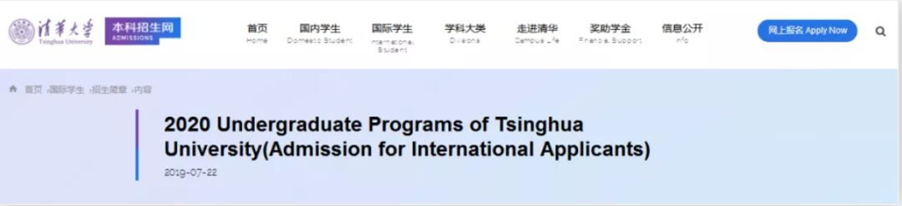
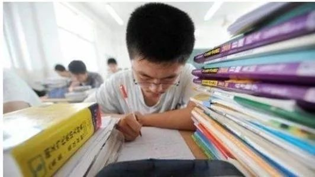
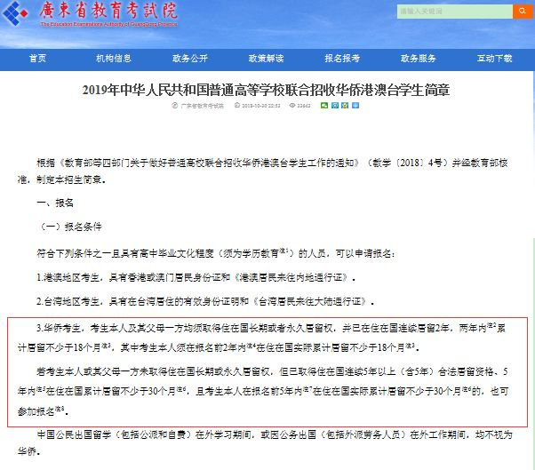
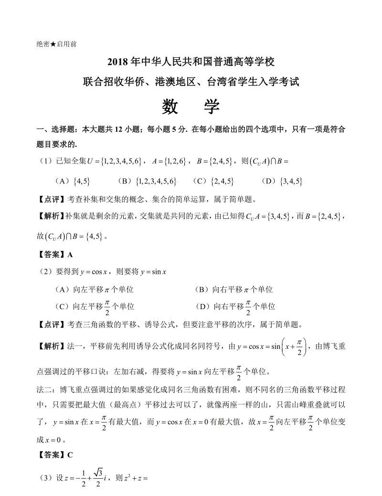
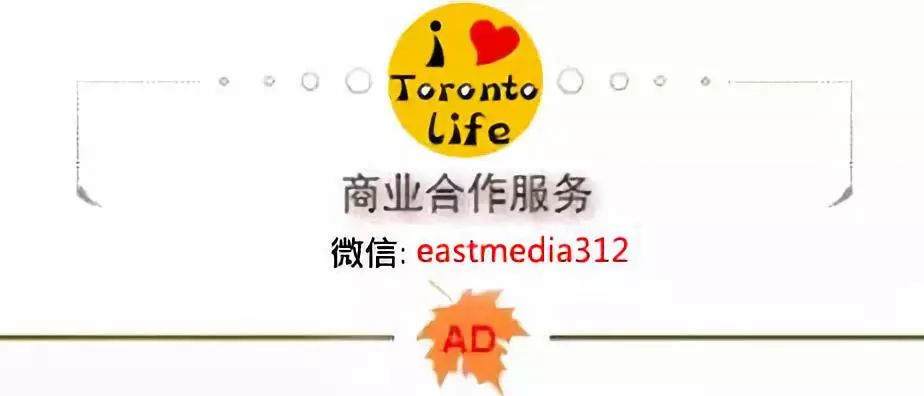

# 无标题

**链接地址:** http://mp.weixin.qq.com/s?__biz=MzA4Njk4NTQwOQ==&mid=2652863029&idx=1&sn=a6a0a577a377dd6d8ae4cfb568369a0b&chksm=842b859bb35c0c8dc80882a897b85778b68106f4526cbd21ca87675b8704a3f1f57bbbc2a23a&mpshare=1&scene=2&srcid=&sharer_sharetime=1569023395995&sharer_shareid=be1c8edd6c93eec155a61c876e41d26a#rd
**作者:** 奥特曼
**获取时间:** 2025/8/28 20:25:58
**图片数量:** 13

---

## 原始HTML内容

<section powered-by="xiumi.us" style="max-width: 100%;box-sizing: border-box;font-family: -apple-system-font, BlinkMacSystemFont, &quot;Helvetica Neue&quot;, &quot;PingFang SC&quot;, &quot;Hiragino Sans GB&quot;, &quot;Microsoft YaHei UI&quot;, &quot;Microsoft YaHei&quot;, Arial, sans-serif;letter-spacing: 0.544px;white-space: normal;background-color: rgb(255, 255, 255);font-size: 15px;line-height: 2;word-wrap: break-word !important;">
<a href="https://mp.weixin.qq.com/s?__biz=MzIzNDAzODI1MQ==&amp;mid=2650436709&amp;idx=1&amp;sn=56e50b417cadaccdb1755f4b76daccc7&amp;scene=21#wechat_redirect" target="_blank" data-linktype="1"></a>

----------我是广告分割线----------

 

通过之前几次生活菌的科普，大家都知道<strong>拥有加拿大国籍的华人上国内211大学具有很大优惠政策，根本不用考试，就能上清华！</strong>
<section style="line-height: 2em;"></section></section><section powered-by="xiumi.us" style="margin-top: 10px;margin-bottom: 10px;max-width: 100%;box-sizing: border-box;font-family: -apple-system-font, BlinkMacSystemFont, &quot;Helvetica Neue&quot;, &quot;PingFang SC&quot;, &quot;Hiragino Sans GB&quot;, &quot;Microsoft YaHei UI&quot;, &quot;Microsoft YaHei&quot;, Arial, sans-serif;font-size: 16px;letter-spacing: 0.544px;white-space: normal;background-color: rgb(255, 255, 255);text-align: center;word-wrap: break-word !important;"><section style="max-width: 100%;box-sizing: border-box;vertical-align: middle;display: inline-block;line-height: 0;word-wrap: break-word !important;"></section></section>
像这样取得外国国籍的学生呢，国内的大学称其为国际学生，对于国际学生的申请资格，国内各个重点大学是没有太多的要求。以清华大学为例，国际学生不需要再参加几个科目的考试，直接在清华官网提交入学申请以及所需的证明文件即可。这些文件通过清华的审核之后，直接进行面试。对于一些特别优秀的国际学生，<strong>面试都可以免了，直接录取！</strong>
<section powered-by="xiumi.us" style="max-width: 100%;box-sizing: border-box;font-family: -apple-system-font, BlinkMacSystemFont, &quot;Helvetica Neue&quot;, &quot;PingFang SC&quot;, &quot;Hiragino Sans GB&quot;, &quot;Microsoft YaHei UI&quot;, &quot;Microsoft YaHei&quot;, Arial, sans-serif;letter-spacing: 0.544px;white-space: normal;background-color: rgb(255, 255, 255);font-size: 15px;line-height: 2;word-wrap: break-word !important;">

</section><section powered-by="xiumi.us" style="margin-top: 10px;margin-bottom: 10px;max-width: 100%;box-sizing: border-box;font-family: -apple-system-font, BlinkMacSystemFont, &quot;Helvetica Neue&quot;, &quot;PingFang SC&quot;, &quot;Hiragino Sans GB&quot;, &quot;Microsoft YaHei UI&quot;, &quot;Microsoft YaHei&quot;, Arial, sans-serif;font-size: 16px;letter-spacing: 0.544px;white-space: normal;background-color: rgb(255, 255, 255);text-align: center;word-wrap: break-word !important;"><section style="max-width: 100%;box-sizing: border-box;vertical-align: middle;display: inline-block;line-height: 0;width: 287px;word-wrap: break-word !important;"></section></section><section powered-by="xiumi.us"><section style="line-height: 2em;"><strong>但如果你一直没入籍，一直是永久的身份，是不是不能以国际学生申请国内大学了？</strong>其实不必太担心，现在还有一个出路，就是可以回国参加考试！</section></section><section powered-by="xiumi.us"><section><section powered-by="xiumi.us"><section><section powered-by="xiumi.us">
 

这里说的考试可不是中国的高考，而是华侨生联考。<strong>华侨联考，全称“中华人民共和国普通高等院校联合招收华侨及港澳台地区学生考试”，</strong>是中国教育部单独为海外华侨和港澳台学生设计的专门高考，考试难度很低，<strong>试卷的难度大致相当于中国的中考水平！</strong>共有5门科目，满分和国内高考一样，同样是750分。

一般情况下，成绩在400分以上便可上重点院校，200分以上便可上艺术院校。不同于国内的“一考定终身”，<strong>华侨生联考每年有两次入学考试机会，近几年的升学率几乎达到99.9999%，很多高校的华侨生常年招不满。</strong> 

 

以2019年华侨生联考录取分数线为例，可以看出与往年的最低录取分数线相同，艺术、体育类院校录取分数为200分，普通院校录取分数为300分。多数985、211重点大学的录取分数线为400分，清华北大复旦这类顶尖学府也在400分的列表中。

<strong>那到底什么样的华人可以叫华侨生呢？</strong>中国教育部、外交部、公安部、国务院侨务办公室等四部门就普通高校联合招收华侨港澳台学生作了2019年最新的规定，生活菌就为大家全面解读华侨生联考报名资格条件及政策（下面全都是重点哦）！
<section style="text-align: center;"></section><section class="" data-tools="135编辑器" data-id="86443" data-color="#374aae" data-custom="#374aae" style="white-space: normal;max-width: 100%;box-sizing: border-box;letter-spacing: 0.544px;widows: 1;font-family: 微软雅黑;font-size: 16px;border-width: 0px;border-style: none;border-color: initial;background-color: rgb(255, 255, 255);word-wrap: break-word !important;"><section class="" style="max-width: 100%;box-sizing: border-box !important;word-wrap: break-word !important;"><section style="margin-top: 1em;margin-bottom: 1em;max-width: 100%;box-sizing: border-box;border-bottom: 2px solid rgb(55, 74, 174);clear: both;word-wrap: break-word !important;"><section class="" data-brushtype="text" style="padding-top: 3px;padding-right: 10px;padding-left: 10px;max-width: 100%;box-sizing: border-box;display: inline-block;color: rgb(255, 255, 255);border-top-left-radius: 3px;border-top-right-radius: 3px;height: 28px;background-color: rgb(55, 74, 174);word-wrap: break-word !important;">华侨生资格的界定</section><section style="margin-left: 2px;max-width: 100%;box-sizing: border-box;border-top: 28px solid transparent;border-right-color: rgb(206, 206, 206);border-bottom: 0px solid transparent;border-left: 15px solid rgb(206, 206, 206);display: inline-block;vertical-align: top;word-wrap: break-word !important;"></section></section></section></section>
相较于之前的华侨生身份界定，此次新规在收紧华侨考生身份界定的同时又增加了父母一方对海外移民身份及海外居留时间的严格要求。把华侨生界定为两种：

<strong style="max-width: 100%;box-sizing: border-box !important;word-wrap: break-word !important;overflow-wrap: break-word !important;">&nbsp;</strong>
<section data-role="outer" label="Powered by 135editor.com" style="white-space: normal;max-width: 100%;letter-spacing: 0.544px;background-color: rgb(255, 255, 255);font-size: 16px;font-family: 微软雅黑;box-sizing: border-box !important;word-wrap: break-word !important;overflow-wrap: break-word !important;"><section class="" data-tools="135编辑器" data-id="87856" data-color="#757576" data-custom="#757576" style="max-width: 100%;box-sizing: border-box;border-width: 0px;border-style: none;border-color: initial;word-wrap: break-word !important;overflow-wrap: break-word !important;"><section style="margin-top: 1em;margin-bottom: 1em;max-width: 100%;font-size: 14px;line-height: 20px;clear: both;box-sizing: border-box !important;word-wrap: break-word !important;overflow-wrap: break-word !important;"><section class="" data-original-title="" title="" style="padding: 5px 10px;max-width: 100%;box-sizing: border-box;display: inline-block;color: rgb(255, 255, 255);font-weight: bold;border-top-left-radius: 3px;border-bottom-left-radius: 3px;background-color: rgb(117, 117, 118);word-wrap: break-word !important;overflow-wrap: break-word !important;">1</section><section class="" data-bgless="lighten" data-brushtype="text" data-bglessp="20%" style="padding: 5px 10px;max-width: 100%;box-sizing: border-box;display: inline-block;color: rgb(49, 33, 33);font-weight: bold;border-top-right-radius: 3px;border-bottom-right-radius: 3px;background-color: rgb(168, 168, 169);word-wrap: break-word !important;overflow-wrap: break-word !important;"><strong style="max-width: 100%;font-family: Helvetica, Arial, sans-serif;font-size: 15px;box-sizing: border-box !important;word-wrap: break-word !important;overflow-wrap: break-word !important;"><strong style="max-width: 100%;box-sizing: border-box !important;word-wrap: break-word !important;overflow-wrap: break-word !important;">类型一</strong></strong></section><strong style="font-size: 15px;font-family: -apple-system-font, BlinkMacSystemFont, &quot;Helvetica Neue&quot;, &quot;PingFang SC&quot;, &quot;Hiragino Sans GB&quot;, &quot;Microsoft YaHei UI&quot;, &quot;Microsoft YaHei&quot;, Arial, sans-serif;letter-spacing: 0.544px;max-width: 100%;box-sizing: border-box !important;word-wrap: break-word !important;overflow-wrap: break-word !important;">&nbsp;</strong></section></section></section><section style="line-height: 2em;">1、<strong>持有中国护照</strong><strong>，考生及父母一方取得国外长期或者永久居住权。</strong></section><section style="line-height: 2em;">2、<strong>对于考生需要在考试之前的连续2年中，在国外住累计18个月</strong>，例如2019年考试，2017年4月1日至2019年3月31日这两年中，需要在国外累计18个月，其余的时间不算，以此类推。</section><section style="line-height: 2em;">3、<strong>对于父母一方</strong>，不限于考试之前的2年，<strong>只要有连续2年累计18个月的经历即可。</strong></section><section style="line-height: 2em;">4、居住时间必须是在取得居住权所在国家居住的时间。</section>
&nbsp;
<section data-role="outer" label="Powered by 135editor.com" style="white-space: normal;max-width: 100%;letter-spacing: 0.544px;background-color: rgb(255, 255, 255);font-size: 16px;font-family: 微软雅黑;box-sizing: border-box !important;word-wrap: break-word !important;overflow-wrap: break-word !important;"><section class="" data-tools="135编辑器" data-id="87856" data-color="#757576" data-custom="#757576" style="max-width: 100%;box-sizing: border-box;border-width: 0px;border-style: none;border-color: initial;word-wrap: break-word !important;overflow-wrap: break-word !important;"><section style="margin-top: 1em;margin-bottom: 1em;max-width: 100%;font-size: 14px;line-height: 20px;clear: both;box-sizing: border-box !important;word-wrap: break-word !important;overflow-wrap: break-word !important;"><section class="" data-original-title="" title="" style="padding: 5px 10px;max-width: 100%;box-sizing: border-box;display: inline-block;color: rgb(255, 255, 255);font-weight: bold;border-top-left-radius: 3px;border-bottom-left-radius: 3px;background-color: rgb(117, 117, 118);word-wrap: break-word !important;overflow-wrap: break-word !important;">2</section><section class="" data-bgless="lighten" data-brushtype="text" data-bglessp="20%" style="padding: 5px 10px;max-width: 100%;box-sizing: border-box;display: inline-block;color: rgb(49, 33, 33);font-weight: bold;border-top-right-radius: 3px;border-bottom-right-radius: 3px;background-color: rgb(168, 168, 169);word-wrap: break-word !important;overflow-wrap: break-word !important;"><strong style="max-width: 100%;font-family: Helvetica, Arial, sans-serif;font-size: 15px;box-sizing: border-box !important;word-wrap: break-word !important;overflow-wrap: break-word !important;"><strong style="max-width: 100%;box-sizing: border-box !important;word-wrap: break-word !important;overflow-wrap: break-word !important;">类型二</strong></strong></section></section></section></section><section style="line-height: 2em;">1、<strong>持有中国护照，</strong><strong>考生本人或其父母一方未取得住在国长期或永久居留权。</strong></section><section style="line-height: 2em;">2、<strong>对于考生本人，需要在报考之前的5年内在住在国累计居住30个月</strong>，例如考生2019年考试，2014年4月1日至2019年3月31日这5年中累计居住30个月，以此类推，其余年份时间不算。</section><section style="line-height: 2em;">3、<strong>对于考生父母一方，需要连续5年内在国外累计居住30个月</strong>，不限于考试之前的5年。</section>
 
<section style="line-height: 2em;">* 新规对考生年龄没有明显规定；</section><section style="line-height: 2em;">* 在计算侨居时间时需要打印个人的出入境记录，按照中国海关的出境及入境时间来计算；</section><section style="line-height: 2em;">* 在住在国居留期间，出境到第三国，但未回国，这个时间按照新规，不能视为侨居时间，必须是在住在国的时间，具体以联招办最新的解释为准。</section>
 
<section class="" data-tools="135编辑器" data-id="86443" data-color="#374aae" data-custom="#374aae" style="white-space: normal;max-width: 100%;box-sizing: border-box;letter-spacing: 0.544px;widows: 1;font-family: 微软雅黑;font-size: 16px;border-width: 0px;border-style: none;border-color: initial;background-color: rgb(255, 255, 255);word-wrap: break-word !important;"><section class="" style="max-width: 100%;box-sizing: border-box !important;word-wrap: break-word !important;"><section style="margin-top: 1em;margin-bottom: 1em;max-width: 100%;box-sizing: border-box;border-bottom: 2px solid rgb(55, 74, 174);clear: both;word-wrap: break-word !important;"><section class="" data-brushtype="text" style="padding-top: 3px;padding-right: 10px;padding-left: 10px;max-width: 100%;box-sizing: border-box;display: inline-block;color: rgb(255, 255, 255);border-top-left-radius: 3px;border-top-right-radius: 3px;height: 28px;background-color: rgb(55, 74, 174);word-wrap: break-word !important;">华侨生须出具的材料</section><section style="margin-left: 2px;max-width: 100%;box-sizing: border-box;border-top: 28px solid transparent;border-right-color: rgb(206, 206, 206);border-bottom: 0px solid transparent;border-left: 15px solid rgb(206, 206, 206);display: inline-block;vertical-align: top;word-wrap: break-word !important;"></section></section></section></section><section style="line-height: 2em;">与其具有华侨身份父、母一方法律关系的证明文书(如考生父母均已离世，需出具考生父母华侨身份证明、死亡证明等相关法律材料);</section><section style="line-height: 2em;"> </section><section style="line-height: 2em;">由我国驻外使(领)馆开具的本人及其父母一方获外国长期或永久居留权的认证书(中文版，须注明已在住在国连续居留时间及2年内实际累计居留时间)，或已取得住在国合法居留资格认证书(中文版，须注明本人及其父母一方已取得住在国合法居留资格的连续时间及5年以内实际累计居留时间);</section>
 

<strong>&nbsp;中华人民共和国护照。</strong>若定居在尚未与我国建交国家，须出示同我国和其定居国均有外交关系的第三国驻该国使(领)馆办理的居留权认证，和我国驻第三国的使(领)馆开具的认证书(中文版，须注明取得居留权的时间)。

<section style="max-width: 100%;box-sizing: border-box;min-height: 1em;line-height: 2em;word-wrap: break-word !important;"> </section><section class="" data-tools="135编辑器" data-id="86443" data-color="#374aae" data-custom="#374aae" style="white-space: normal;max-width: 100%;box-sizing: border-box;letter-spacing: 0.544px;widows: 1;font-family: 微软雅黑;font-size: 16px;border-width: 0px;border-style: none;border-color: initial;background-color: rgb(255, 255, 255);word-wrap: break-word !important;"><section class=""><section style="margin-top: 1em;margin-bottom: 1em;max-width: 100%;box-sizing: border-box;border-bottom: 2px solid rgb(55, 74, 174);clear: both;word-wrap: break-word !important;"><section class="" data-brushtype="text" style="padding-top: 3px;padding-right: 10px;padding-left: 10px;max-width: 100%;box-sizing: border-box;display: inline-block;color: rgb(255, 255, 255);border-top-left-radius: 3px;border-top-right-radius: 3px;height: 28px;background-color: rgb(55, 74, 174);word-wrap: break-word !important;">华侨生联考</section><section style="margin-left: 2px;max-width: 100%;box-sizing: border-box;border-top: 28px solid transparent;border-right-color: rgb(206, 206, 206);border-bottom: 0px solid transparent;border-left: 15px solid rgb(206, 206, 206);display: inline-block;vertical-align: top;word-wrap: break-word !important;"></section></section>
考试由中国教育部主管，由广东省教育考试院下属“联合招生办公室”负责该考试的政策解读和考试日常管理。
<section> </section>
现在中国共有160所一本大学+147所二本大学参与招生录取，<strong>中国各顶尖大学全部覆盖（包括北大、清华）。</strong>
</section></section></section></section></section></section></section>
 
<section style="line-height: 2em;"><strong>考生须在上海、福州、广州三地的报名点进行报名、考试</strong><strong>。</strong><strong>报名时间为每年的三月，</strong>为时大约四周，华侨考生须在内地各报考点报名考试。</section>

<section style="line-height: 2em;">华侨联考的题目比较简单，<strong>考试中出现的知识点70%来自初中，30%来自高中</strong>，比高考简单多了。考试试卷的难度远远低于国内普通高考试卷，例如数学题目的难度与教材的例题差不多。华侨生联考文科不考政治、理科生不考生物。<strong style="color: rgb(62, 62, 62);font-family: -apple-system-font, &quot;Helvetica Neue&quot;, &quot;PingFang SC&quot;, &quot;Hiragino Sans GB&quot;, &quot;Microsoft YaHei&quot;, sans-serif;font-size: 14px;white-space: normal;max-width: 100%;box-sizing: border-box !important;word-wrap: break-word !important;"></strong></section>
 
<section style="line-height: 2em;">考试科目：</section><section style="line-height: 2em;">文史类：中文、数学、英语、历史、地理；</section><section style="line-height: 2em;">理工类：中文、数学、英语、物理、化学。</section><section style="line-height: 2em;"> </section>
各科满分均为150分， 各科目类别满分为750分。<strong style="max-width: 100%;box-sizing: border-box !important;word-wrap: break-word !important;"></strong> 

 
<section powered-by="xiumi.us" style="white-space: normal;"><section><section powered-by="xiumi.us"><section><section powered-by="xiumi.us"><section class="" data-tools="135编辑器" data-id="86443" data-color="#374aae" data-custom="#374aae" style="max-width: 100%;box-sizing: border-box;letter-spacing: 0.544px;widows: 1;font-family: 微软雅黑;font-size: 16px;border-width: 0px;border-style: none;border-color: initial;background-color: rgb(255, 255, 255);word-wrap: break-word !important;"><section class=""><section style="margin-top: 1em;margin-bottom: 1em;max-width: 100%;box-sizing: border-box;border-bottom: 2px solid rgb(55, 74, 174);clear: both;word-wrap: break-word !important;"><section class="" data-brushtype="text" style="padding-top: 3px;padding-right: 10px;padding-left: 10px;max-width: 100%;box-sizing: border-box;display: inline-block;color: rgb(255, 255, 255);border-top-left-radius: 3px;border-top-right-radius: 3px;height: 28px;background-color: rgb(55, 74, 174);word-wrap: break-word !important;">什么样的人适合参加华侨生联考</section><section style="margin-left: 2px;max-width: 100%;box-sizing: border-box;border-top: 28px solid transparent;border-right-color: rgb(206, 206, 206);border-bottom: 0px solid transparent;border-left: 15px solid rgb(206, 206, 206);display: inline-block;vertical-align: top;word-wrap: break-word !important;"></section>1</section><ol class=" list-paddingleft-2" style="list-style-type: decimal;"><li><section powered-by="xiumi.us" style="white-space: normal;"><section><section powered-by="xiumi.us"><section><section powered-by="xiumi.us"><section class="" data-tools="135编辑器" data-id="86443" data-color="#374aae" data-custom="#374aae" style="max-width: 100%;box-sizing: border-box;letter-spacing: 0.544px;widows: 1;font-family: 微软雅黑;font-size: 16px;border-width: 0px;border-style: none;border-color: initial;background-color: rgb(255, 255, 255);word-wrap: break-word !important;"><section class=""><section style="line-height: 2em;">有一定中国教育基础，至少中文要达到中国初中毕业标准；</section></section></section></section></section></section></section></section></li><li><section powered-by="xiumi.us" style="white-space: normal;"><section><section powered-by="xiumi.us"><section><section powered-by="xiumi.us"><section class="" data-tools="135编辑器" data-id="86443" data-color="#374aae" data-custom="#374aae" style="max-width: 100%;box-sizing: border-box;letter-spacing: 0.544px;widows: 1;font-family: 微软雅黑;font-size: 16px;border-width: 0px;border-style: none;border-color: initial;background-color: rgb(255, 255, 255);word-wrap: break-word !important;"><section class=""><section style="line-height: 2em;">申请加拿大大学有难度或者毕业有难度的学生；</section></section></section></section></section></section></section></section></li><li><section powered-by="xiumi.us" style="white-space: normal;"><section><section powered-by="xiumi.us"><section><section powered-by="xiumi.us"><section class="" data-tools="135编辑器" data-id="86443" data-color="#374aae" data-custom="#374aae" style="max-width: 100%;box-sizing: border-box;letter-spacing: 0.544px;widows: 1;font-family: 微软雅黑;font-size: 16px;border-width: 0px;border-style: none;border-color: initial;background-color: rgb(255, 255, 255);word-wrap: break-word !important;"><section class=""><section style="line-height: 2em;">对加拿大大学学费望而却步的学生；</section></section></section></section></section></section></section></section></li><li><section powered-by="xiumi.us" style="white-space: normal;"><section><section powered-by="xiumi.us"><section><section powered-by="xiumi.us"><section class="" data-tools="135编辑器" data-id="86443" data-color="#374aae" data-custom="#374aae" style="max-width: 100%;box-sizing: border-box;letter-spacing: 0.544px;widows: 1;font-family: 微软雅黑;font-size: 16px;border-width: 0px;border-style: none;border-color: initial;background-color: rgb(255, 255, 255);word-wrap: break-word !important;"><section class="">
未来希望回国发展的学生。
</section></section></section></section></section></section></section></li></ol></section></section></section></section></section></section></section>

好了，想回国上清华北大的，如今把秘籍告诉你了，这条路你要不要走？ 

 

最后，生活菌就想感慨一句，爸爸妈妈，你们完不成的北大清华梦，我争取让你们外孙完成！！！<strong style="max-width: 100%;box-sizing: border-box !important;word-wrap: break-word !important;"></strong> 

 本平台文章除特别申明来源的，均由【多伦多生活】编辑整理。其他平台转载请在<strong style="max-width: 100%;box-sizing: border-box !important;overflow-wrap: break-word !important;">文</strong><strong style="max-width: 100%;box-sizing: border-box !important;overflow-wrap: break-word !important;">前</strong>标注（来源：多伦多生活 &nbsp;微信号：itorontolife），<strong style="max-width: 100%;box-sizing: border-box !important;overflow-wrap: break-word !important;">不小于正文字号</strong>。否则，一律视为无效授权！
<section style="white-space: normal;font-size: 16px;max-width: 100%;box-sizing: border-box;text-align: left;letter-spacing: 0.544px;overflow-wrap: break-word !important;"><section powered-by="xiumi.us" style="max-width: 100%;box-sizing: border-box;font-size: 15px;line-height: 2;overflow-wrap: break-word !important;">
 

</section></section>

---

## 纯文本内容

----------我是广告分割线----------通过之前几次生活菌的科普，大家都知道拥有加拿大国籍的华人上国内211大学具有很大优惠政策，根本不用考试，就能上清华！像这样取得外国国籍的学生呢，国内的大学称其为国际学生，对于国际学生的申请资格，国内各个重点大学是没有太多的要求。以清华大学为例，国际学生不需要再参加几个科目的考试，直接在清华官网提交入学申请以及所需的证明文件即可。这些文件通过清华的审核之后，直接进行面试。对于一些特别优秀的国际学生，面试都可以免了，直接录取！但如果你一直没入籍，一直是永久的身份，是不是不能以国际学生申请国内大学了？其实不必太担心，现在还有一个出路，就是可以回国参加考试！这里说的考试可不是中国的高考，而是华侨生联考。华侨联考，全称“中华人民共和国普通高等院校联合招收华侨及港澳台地区学生考试”，是中国教育部单独为海外华侨和港澳台学生设计的专门高考，考试难度很低，试卷的难度大致相当于中国的中考水平！共有5门科目，满分和国内高考一样，同样是750分。一般情况下，成绩在400分以上便可上重点院校，200分以上便可上艺术院校。不同于国内的“一考定终身”，华侨生联考每年有两次入学考试机会，近几年的升学率几乎达到99.9999%，很多高校的华侨生常年招不满。以2019年华侨生联考录取分数线为例，可以看出与往年的最低录取分数线相同，艺术、体育类院校录取分数为200分，普通院校录取分数为300分。多数985、211重点大学的录取分数线为400分，清华北大复旦这类顶尖学府也在400分的列表中。那到底什么样的华人可以叫华侨生呢？中国教育部、外交部、公安部、国务院侨务办公室等四部门就普通高校联合招收华侨港澳台学生作了2019年最新的规定，生活菌就为大家全面解读华侨生联考报名资格条件及政策（下面全都是重点哦）！华侨生资格的界定相较于之前的华侨生身份界定，此次新规在收紧华侨考生身份界定的同时又增加了父母一方对海外移民身份及海外居留时间的严格要求。把华侨生界定为两种： 1类型一 1、持有中国护照，考生及父母一方取得国外长期或者永久居住权。2、对于考生需要在考试之前的连续2年中，在国外住累计18个月，例如2019年考试，2017年4月1日至2019年3月31日这两年中，需要在国外累计18个月，其余的时间不算，以此类推。3、对于父母一方，不限于考试之前的2年，只要有连续2年累计18个月的经历即可。4、居住时间必须是在取得居住权所在国家居住的时间。 2类型二1、持有中国护照，考生本人或其父母一方未取得住在国长期或永久居留权。2、对于考生本人，需要在报考之前的5年内在住在国累计居住30个月，例如考生2019年考试，2014年4月1日至2019年3月31日这5年中累计居住30个月，以此类推，其余年份时间不算。3、对于考生父母一方，需要连续5年内在国外累计居住30个月，不限于考试之前的5年。* 新规对考生年龄没有明显规定；* 在计算侨居时间时需要打印个人的出入境记录，按照中国海关的出境及入境时间来计算；* 在住在国居留期间，出境到第三国，但未回国，这个时间按照新规，不能视为侨居时间，必须是在住在国的时间，具体以联招办最新的解释为准。华侨生须出具的材料与其具有华侨身份父、母一方法律关系的证明文书(如考生父母均已离世，需出具考生父母华侨身份证明、死亡证明等相关法律材料);由我国驻外使(领)馆开具的本人及其父母一方获外国长期或永久居留权的认证书(中文版，须注明已在住在国连续居留时间及2年内实际累计居留时间)，或已取得住在国合法居留资格认证书(中文版，须注明本人及其父母一方已取得住在国合法居留资格的连续时间及5年以内实际累计居留时间); 中华人民共和国护照。若定居在尚未与我国建交国家，须出示同我国和其定居国均有外交关系的第三国驻该国使(领)馆办理的居留权认证，和我国驻第三国的使(领)馆开具的认证书(中文版，须注明取得居留权的时间)。华侨生联考考试由中国教育部主管，由广东省教育考试院下属“联合招生办公室”负责该考试的政策解读和考试日常管理。现在中国共有160所一本大学+147所二本大学参与招生录取，中国各顶尖大学全部覆盖（包括北大、清华）。考生须在上海、福州、广州三地的报名点进行报名、考试。报名时间为每年的三月，为时大约四周，华侨考生须在内地各报考点报名考试。华侨联考的题目比较简单，考试中出现的知识点70%来自初中，30%来自高中，比高考简单多了。考试试卷的难度远远低于国内普通高考试卷，例如数学题目的难度与教材的例题差不多。华侨生联考文科不考政治、理科生不考生物。考试科目：文史类：中文、数学、英语、历史、地理；理工类：中文、数学、英语、物理、化学。各科满分均为150分， 各科目类别满分为750分。什么样的人适合参加华侨生联考1有一定中国教育基础，至少中文要达到中国初中毕业标准；申请加拿大大学有难度或者毕业有难度的学生；对加拿大大学学费望而却步的学生；未来希望回国发展的学生。好了，想回国上清华北大的，如今把秘籍告诉你了，这条路你要不要走？最后，生活菌就想感慨一句，爸爸妈妈，你们完不成的北大清华梦，我争取让你们外孙完成！！！ 本平台文章除特别申明来源的，均由【多伦多生活】编辑整理。其他平台转载请在文前标注（来源：多伦多生活  微信号：itorontolife），不小于正文字号。否则，一律视为无效授权！

---

## 图片列表

-  (原始链接: https://mmbiz.qpic.cn/mmbiz_jpg/s8JrfwJOBZeSbbOnf2CibWQHtDwRv3liaT5rfa2IT3Zf5fKOLPicQccHUhG8CrF9WFotbdbjL4ePYWovCgDmh4ibEA/640?wx_fmt=jpeg)
-  (原始链接: https://mmbiz.qpic.cn/mmbiz_png/s8JrfwJOBZfMiacIxzfWyTAHMMAQnASNbhardI8Yu2VqVvPXHW2ibbUEGCYO9eobS0rR0RgNrgrPVjPicpjdk0CKw/640?wx_fmt=png)
-  (原始链接: https://mmbiz.qpic.cn/mmbiz_png/s8JrfwJOBZfMiacIxzfWyTAHMMAQnASNbAiciczDHonRXvGgvLodfoPqIItVZbY7RALrkiab93PeicUDP0icYa27Oqwg/640?wx_fmt=png)
-  (原始链接: https://mmbiz.qpic.cn/mmbiz_jpg/s8JrfwJOBZcANibkENjUIq8nLzlkQn9MVkOcticb7J8GqcBajhVN3JuGib8Vx6bBanNf3WxgoQetS2Ip2TmW7yiagw/640?wx_fmt=jpeg)
-  (原始链接: https://mmbiz.qpic.cn/mmbiz_png/bWN7y03GgriazBiarjRKSCh3GWHah5FsxicgKxmG6XopIp9wmACuMfv1enZDV84K2nw9l7ZNA5oSGf0js6rpp2KVQ/640?wx_fmt=png)
-  (原始链接: https://mmbiz.qpic.cn/mmbiz_gif/NvQNq3v2xx3cKqW5Z2Mp8by8mQmB85iaztTrUv6ZYxjQvEPmsNpmDy2gXoRKicEmIF0rWMdKy6wG8eWKxpJ22qyg/640?wx_fmt=gif)
-  (原始链接: https://mmbiz.qpic.cn/mmbiz_jpg/s8JrfwJOBZcANibkENjUIq8nLzlkQn9MVTWRjsibeibDE04PP0oBQIbNicCCwZiayGFO8Iqe9JTn4sQ0Oxic1lnVC0qQ/640?wx_fmt=jpeg)
-  (原始链接: https://mmbiz.qpic.cn/mmbiz_jpg/s8JrfwJOBZcANibkENjUIq8nLzlkQn9MV47qOk4koz80LtWdQ7fmSoRQM3Zp0nnpRP6eL1l8utpZVGpK0gTjHicw/640?wx_fmt=jpeg)
-  (原始链接: https://mmbiz.qpic.cn/mmbiz_jpg/s8JrfwJOBZcANibkENjUIq8nLzlkQn9MVjguiaXZnUpRbqeYBUWu9D004pJOiavnhOkuSGUkiaHPGg3LYREnOA7dXQ/640?wx_fmt=jpeg)
-  (原始链接: https://mmbiz.qpic.cn/mmbiz_gif/s8JrfwJOBZfMiacIxzfWyTAHMMAQnASNbPj1icDK6TgxBnAp5kTUur1D8MXBCibEKf0e6EdI7YibKkjThHpILuG29A/640?wx_fmt=gif)
-  (原始链接: https://mmbiz.qpic.cn/mmbiz_jpg/AR1JNfgEY3ibcdlgSjWRg2B5ANCk6nnXFZ6XAuQEND2bm8pkib4RbKiaNG55wNYmZnj33oSQib7uEfVbkfqx8NRibjg/640?wx_fmt=jpeg)
-  (原始链接: https://mmbiz.qpic.cn/mmbiz_jpg/s8JrfwJOBZchxu9xibbicQ0l3pjceP958ZO8VXAYsGXAYPEs0LicaUPdLp2k0iaiaOicj6hY7XGqM8puy41VBC9KUkXg/640?wx_fmt=jpeg)
-  (原始链接: https://mmbiz.qpic.cn/mmbiz_png/s8JrfwJOBZfgh9pZVxaaslERIWHWqg5dRcYRlKCabGuYqK4FGnT93zWWaviagdmJArv3ZO7SqPbNMeSGIqnz60A/640?wx_fmt=png)
