# 无标题

**链接地址:** http://mp.weixin.qq.com/s?__biz=MzUzNzQxOTI2MQ==&mid=2247484282&idx=1&sn=d9c5d6f91c714d7e834d45c84001f4a1&chksm=fae60fe8cd9186fe214c1c0be64c87f869465c982f8ccae8c7911a5aa7b4bea6308ab54e0f45&mpshare=1&scene=2&srcid=&sharer_sharetime=1572282803355&sharer_shareid=be1c8edd6c93eec155a61c876e41d26a#rd
**作者:** 
**获取时间:** 2025/8/28 20:25:16
**图片数量:** 22

---

## 原始HTML内容

<section style="box-sizing: border-box;font-size: 16px;"><section style="box-sizing: border-box;" powered-by="xiumi.us"><section style="margin: 10px 0%;box-sizing: border-box;"><section style="display: inline-block;vertical-align: middle;width: 12%;box-sizing: border-box;"><section style="box-sizing: border-box;" powered-by="xiumi.us"><section style="text-align: center;margin-right: 0%;margin-left: 0%;box-sizing: border-box;"><section style="max-width: 100%;vertical-align: middle;display: inline-block;line-height: 0;width: 50%;box-sizing: border-box;"></section></section></section></section><section style="display: inline-block;vertical-align: middle;width: 88%;padding-left: 10px;box-sizing: border-box;"><section style="box-sizing: border-box;" powered-by="xiumi.us"><section style="margin-right: 0%;margin-left: 0%;box-sizing: border-box;"><section style="font-size: 14px;box-sizing: border-box;">
<strong style="box-sizing: border-box;">点击上方蓝字关注我们</strong>
</section></section></section></section></section></section><section style="box-sizing: border-box;" powered-by="xiumi.us"><section style="box-sizing: border-box;"><section style="box-sizing: border-box;">
 

一本薄薄的护照，

代表着加拿大在国际上地位，

同时它也是对国民素质及国家威望最直接的回应。

 

加拿大的护照到底有多牛逼？

2018全球护照自由度排行榜排名第3，

<strong style="max-width: 100%;box-sizing: border-box !important;overflow-wrap: break-word !important;">免签171个国家和地区。</strong>

 

 

 

但是拿了PR的加拿大华人也经常会纠结，

<strong style="max-width: 100%;box-sizing: border-box !important;overflow-wrap: break-word !important;">到底要不要入籍？&nbsp;&nbsp;</strong>

 

入吧，回中国麻烦；&nbsp; 不入吧，去别的地儿不方便，&nbsp;还享受不了福利... 

 

 就在近日，一个好消息传出！

 

从2019年12月1日起，

外国人过境144小时（即6天）免签政策扩大至27个口岸。

<strong style="max-width: 100%;box-sizing: border-box !important;overflow-wrap: break-word !important;">适用53个</strong><strong style="max-width: 100%;box-sizing: border-box !important;overflow-wrap: break-word !important;">国家</strong><strong style="max-width: 100%;box-sizing: border-box !important;overflow-wrap: break-word !important;">，包括加拿大！</strong>

 

<strong style="max-width: 100%;box-sizing: border-box !important;overflow-wrap: break-word !important;"></strong>

 
<section class="" style="max-width: 100%;box-sizing: border-box;font-family: -apple-system-font, BlinkMacSystemFont, &quot;Helvetica Neue&quot;, &quot;PingFang SC&quot;, &quot;Hiragino Sans GB&quot;, &quot;Microsoft YaHei UI&quot;, &quot;Microsoft YaHei&quot;, Arial, sans-serif;font-variant-numeric: normal;font-variant-east-asian: normal;letter-spacing: 0.544px;white-space: normal;font-size: 18px;line-height: 28.8px;widows: 1;background-color: rgb(255, 255, 255);overflow-wrap: break-word !important;"><section style="max-width: 100%;box-sizing: border-box;overflow-wrap: break-word !important;"><section style="max-width: 100%;box-sizing: border-box !important;overflow-wrap: break-word !important;"><section class="" data-style-type="5" data-tools="新媒体排版" data-id="1509748" style="max-width: 100%;letter-spacing: 0.544px;box-sizing: border-box !important;overflow-wrap: break-word !important;">
其实早在去年1月底，中国国家移民管理局就宣布，在上海市、江苏省和浙江省，北京市、天津市和河北省，以及辽宁省部分口岸，

 

<strong style="max-width: 100%;box-sizing: border-box !important;overflow-wrap: break-word !important;">对53个国家人员实施144小时过境免签政策。</strong>

 

 

来自53个国家的人员，持有效国际旅行证件和144小时内确定日期、座位前往第三国（地区）联程客票，

 

<strong style="max-width: 100%;box-sizing: border-box !important;overflow-wrap: break-word !important;">可以从上述城市有关口岸免签入境。</strong>

 

 

自2019年1月1日起，再加上新增的五个城市，厦门、青岛、武汉、成都和昆明都已实施了外国人144小时过境免签政策。也就是说，

 

<strong style="max-width: 100%;box-sizing: border-box !important;overflow-wrap: break-word !important;">持加拿大护照的加籍华人，</strong>

<strong style="max-width: 100%;box-sizing: border-box !important;overflow-wrap: break-word !important;">在中国15个城市都可以申请144小时过境免签！</strong>

 
</section></section></section></section>

 
<section data-role="outer" label="Powered by 135editor.com" style="max-width: 100%;font-family: -apple-system-font, BlinkMacSystemFont, &quot;Helvetica Neue&quot;, &quot;PingFang SC&quot;, &quot;Hiragino Sans GB&quot;, &quot;Microsoft YaHei UI&quot;, &quot;Microsoft YaHei&quot;, Arial, sans-serif;letter-spacing: 0.544px;white-space: normal;background-color: rgb(255, 255, 255);box-sizing: border-box !important;overflow-wrap: break-word !important;"><section data-role="outer" label="Powered by 135editor.com" style="max-width: 100%;box-sizing: border-box !important;overflow-wrap: break-word !important;"><section data-role="outer" label="Powered by 135editor.com" style="max-width: 100%;box-sizing: border-box !important;overflow-wrap: break-word !important;"><section data-role="outer" label="Powered by 135editor.com" style="max-width: 100%;box-sizing: border-box !important;overflow-wrap: break-word !important;">
其实从2013年以来，就陆续批准了北京等18个城市实施对53个国家人员72小时过境免签政策，

 

<strong style="max-width: 100%;box-sizing: border-box !important;overflow-wrap: break-word !important;">当前，实行72小时免签过境的机场有：</strong>
<section class="" data-id="92588" data-tools="135编辑器" data-width="98%" style="margin-right: auto;margin-left: auto;max-width: 100%;box-sizing: border-box;border-width: 0px;border-style: none;border-color: initial;width: 663.453px;overflow-wrap: break-word !important;"><section data-width="100%" style="padding-top: 10px;padding-bottom: 10px;max-width: 100%;box-sizing: border-box;width: 663.453px;overflow-wrap: break-word !important;"><section style="max-width: 100%;box-sizing: border-box !important;overflow-wrap: break-word !important;"><section data-width="100%" style="max-width: 100%;box-sizing: border-box;width: 663.453px;border-top: 2px solid rgb(53, 70, 142);border-bottom: 2px solid rgb(53, 70, 142);border-left-color: rgb(53, 70, 142);border-right-color: rgb(53, 70, 142);overflow-wrap: break-word !important;"><section class="" style="padding-top: 15px;padding-bottom: 10px;max-width: 100%;box-sizing: border-box;font-size: 15px;color: rgb(53, 70, 142);line-height: 25px;overflow-wrap: break-word !important;"><blockquote style="color: rgba(0, 0, 0, 0.5);max-width: 100%;box-sizing: border-box !important;overflow-wrap: break-word !important;">
成都双流国际机场、重庆江北国际机场、西安咸阳国际机场、桂林两江国际机场、昆明长水国际机场、厦门高崎国际机场、武汉天河国际机场、哈尔滨太平国际机场、青岛流亭国际机场、长沙黄花国际机场。
</blockquote>
 

</section></section></section></section></section></section></section></section></section>
 

<strong style="max-width: 100%;box-sizing: border-box !important;overflow-wrap: break-word !important;">从今年5月1日起，</strong>

<strong style="max-width: 100%;box-sizing: border-box !important;overflow-wrap: break-word !important;">广东省也开始实施144小时过境免签政策！</strong>

 

 

已入加拿大籍的华人，可选择从深圳宝安机场、广州白云机场、揭阳潮汕机场任一空港口岸入境；从广东省具备客运功能的32个对外开放口岸中的任一口岸出境。

 

 

而过境免签停留时间，

 

<strong style="max-width: 100%;box-sizing: border-box !important;overflow-wrap: break-word !important;">从过去的3天（72小时）</strong><strong style="max-width: 100%;box-sizing: border-box !important;overflow-wrap: break-word !important;">延长到6天（144小时）。</strong> <strong style="max-width: 100%;box-sizing: border-box !important;overflow-wrap: break-word !important;">中间无需办理中国入境签证！</strong>

 

 

既节约了高昂的中国签证办理费用，又省去了等待的时间…

 

 

经过了半年的等待，

 

<strong style="max-width: 100%;box-sizing: border-box !important;overflow-wrap: break-word !important;">这个福利政策已经</strong><strong style="max-width: 100%;box-sizing: border-box !important;overflow-wrap: break-word !important;">扩大至全中国27个口岸！</strong>

<strong style="max-width: 100%;box-sizing: border-box !important;overflow-wrap: break-word !important;"> </strong>

<strong>- 真诚推荐 -&nbsp;</strong>

 

<strong>- 真诚推荐 -&nbsp;</strong>

 

 

从今年12月1日起，所有合乎条件的53个国家的国民，由重庆、西安航空口岸过境免签停留时间延长至144小时！

 

过境人员可从宁波航空口岸以及已实施过境144小时免办签证政策的上海海、陆、空港口岸或者南京航空口岸、杭州航空口岸入境、出境；将成都航空口岸过境144小时免签停留范围扩展至成都、乐山、德阳、遂宁、眉山、雅安、资阳、内江、自贡、泸州、宜宾11个市。

 

 

而且，这次扩大该政策适用范围后，全国共有18个省（自治区、直辖市）23个城市30个口岸对53个国家人员实施过境144小时、72小时免办签证政策。

 

<strong style="max-width: 100%;box-sizing: border-box !important;overflow-wrap: break-word !important;">这次福利政策针对全球53个国家，</strong>

<strong style="max-width: 100%;box-sizing: border-box !important;overflow-wrap: break-word !important;">加拿大也在其中！</strong><strong style="max-width: 100%;box-sizing: border-box !important;overflow-wrap: break-word !important;"></strong>

 
<section data-role="outer" label="Powered by 135editor.com" style="max-width: 100%;font-family: -apple-system-font, BlinkMacSystemFont, &quot;Helvetica Neue&quot;, &quot;PingFang SC&quot;, &quot;Hiragino Sans GB&quot;, &quot;Microsoft YaHei UI&quot;, &quot;Microsoft YaHei&quot;, Arial, sans-serif;letter-spacing: 0.544px;white-space: normal;font-size: 18px;widows: 1;background-color: rgb(255, 255, 255);box-sizing: border-box !important;overflow-wrap: break-word !important;"><section data-role="outer" label="Powered by 135editor.com" style="max-width: 100%;box-sizing: border-box !important;overflow-wrap: break-word !important;"><section class="" data-tools="135编辑器" data-id="93341" style="max-width: 100%;box-sizing: border-box;font-family: 微软雅黑;font-size: 16px;border-width: 0px;border-style: none;border-color: initial;overflow-wrap: break-word !important;"><section style="margin: 10px;max-width: 100%;box-sizing: border-box;overflow-wrap: break-word !important;"><section style="padding: 1px;max-width: 100%;box-sizing: border-box;width: 12px;height: 12px;float: left;overflow-wrap: break-word !important;"><section style="max-width: 100%;box-sizing: border-box;width: 6px;height: 6px;border-width: 1px;border-style: solid;border-color: rgb(225, 193, 41);border-radius: 50%;overflow-wrap: break-word !important;"></section></section><section style="padding: 1px;max-width: 100%;box-sizing: border-box;width: 12px;height: 12px;float: right;overflow-wrap: break-word !important;"><section style="margin-left: auto;max-width: 100%;box-sizing: border-box;width: 6px;height: 6px;border-width: 1px;border-style: solid;border-color: rgb(225, 193, 41);border-radius: 50%;overflow-wrap: break-word !important;"></section></section><section style="margin-top: -12px;margin-bottom: -12px;max-width: 100%;box-sizing: border-box;overflow-wrap: break-word !important;"><section style="max-width: 100%;box-sizing: border-box;border-width: 1px;border-style: dotted;border-color: rgb(210, 210, 210);overflow-wrap: break-word !important;"><section style="max-width: 100%;box-sizing: border-box !important;overflow-wrap: break-word !important;"><section style="padding: 1em 0.8em;max-width: 100%;box-sizing: border-box;overflow-wrap: break-word !important;"><section class="" data-brushtype="text" style="max-width: 100%;font-size: 14px;color: rgb(63, 63, 63);line-height: 1.75em;letter-spacing: 1.5px;box-sizing: border-box !important;overflow-wrap: break-word !important;">
<strong style="max-width: 100%;box-sizing: border-box !important;overflow-wrap: break-word !important;">享受144小时过境免签政策的53个国家分别是：</strong>  <strong style="max-width: 100%;box-sizing: border-box !important;overflow-wrap: break-word !important;">加拿大</strong>、美国、澳大利亚、新西兰、法国、英国、爱尔兰、德国、奥地利、比利时、捷克、丹麦、爱沙尼亚、芬兰、希腊、匈牙利、冰岛、意大利、拉脱维亚、立陶宛、卢森堡、马耳他、荷兰、波兰、葡萄牙、斯洛伐克、斯洛文尼亚、西班牙、瑞典、瑞士、摩纳哥、俄罗斯、塞浦路斯、保加利亚、罗马尼亚、乌克兰、塞尔维亚、克罗地亚、波黑、黑山、马其顿、阿尔巴尼亚、白俄罗斯、巴西、墨西哥、阿根廷、智利、韩国、日本、新加坡、文莱、阿联酋、卡塔尔。
</section></section></section></section></section><section style="padding-top: 5px;padding-left: 1px;max-width: 100%;box-sizing: border-box;width: 12px;height: 12px;float: left;overflow-wrap: break-word !important;"><section style="max-width: 100%;box-sizing: border-box;width: 6px;height: 6px;border-width: 1px;border-style: solid;border-color: rgb(225, 193, 41);border-radius: 50%;overflow-wrap: break-word !important;"></section></section><section style="padding-top: 5px;padding-right: 1px;max-width: 100%;box-sizing: border-box;width: 12px;height: 12px;float: right;overflow-wrap: break-word !important;"><section style="margin-left: auto;max-width: 100%;box-sizing: border-box;width: 6px;height: 6px;border-width: 1px;border-style: solid;border-color: rgb(225, 193, 41);border-radius: 50%;overflow-wrap: break-word !important;"></section></section></section></section>
 
<section data-role="outer" label="Powered by 135editor.com" style="max-width: 100%;box-sizing: border-box !important;overflow-wrap: break-word !important;"><section data-role="outer" label="Powered by 135editor.com" style="max-width: 100%;box-sizing: border-box !important;overflow-wrap: break-word !important;"><section class="" data-tools="135编辑器" data-id="93341" style="max-width: 100%;box-sizing: border-box;letter-spacing: 0.544px;border-width: 0px;border-style: none;border-color: initial;overflow-wrap: break-word !important;"><section style="margin: 10px;max-width: 100%;box-sizing: border-box;overflow-wrap: break-word !important;"><section style="padding: 1px;max-width: 100%;box-sizing: border-box;font-family: 微软雅黑;font-size: 16px;width: 12px;height: 12px;float: left;overflow-wrap: break-word !important;"><section style="max-width: 100%;box-sizing: border-box;width: 6px;height: 6px;border-width: 1px;border-style: solid;border-color: rgb(225, 193, 41);border-radius: 50%;overflow-wrap: break-word !important;"></section></section><section style="padding: 1px;max-width: 100%;box-sizing: border-box;font-family: 微软雅黑;font-size: 16px;width: 12px;height: 12px;float: right;overflow-wrap: break-word !important;"><section style="margin-left: auto;max-width: 100%;box-sizing: border-box;width: 6px;height: 6px;border-width: 1px;border-style: solid;border-color: rgb(225, 193, 41);border-radius: 50%;overflow-wrap: break-word !important;"></section></section><section style="margin-top: -12px;margin-bottom: -12px;max-width: 100%;box-sizing: border-box;overflow-wrap: break-word !important;"><section style="max-width: 100%;box-sizing: border-box;border-width: 1px;border-style: dotted;border-color: rgb(210, 210, 210);overflow-wrap: break-word !important;"><section style="max-width: 100%;box-sizing: border-box !important;overflow-wrap: break-word !important;"><section style="padding: 1em 0.8em;max-width: 100%;box-sizing: border-box;overflow-wrap: break-word !important;"><section class="" data-brushtype="text" style="max-width: 100%;box-sizing: border-box !important;overflow-wrap: break-word !important;">
<strong style="max-width: 100%;box-sizing: border-box !important;overflow-wrap: break-word !important;">申请144小时过境免签所需材料：</strong>  申请144小时过境免签应当持有有效护照或者其他国际旅行证件，

 

以及144小时内确定日期、座位的前往第三国（地区）的联程客票，

 

并填写临时入境外国人入境卡，接受出入境边防检查机关询问。  

</section></section></section></section></section><section style="padding-top: 5px;padding-left: 1px;max-width: 100%;box-sizing: border-box;font-family: 微软雅黑;font-size: 16px;width: 12px;height: 12px;float: left;overflow-wrap: break-word !important;"><section style="max-width: 100%;box-sizing: border-box;width: 6px;height: 6px;border-width: 1px;border-style: solid;border-color: rgb(225, 193, 41);border-radius: 50%;overflow-wrap: break-word !important;"></section></section><section style="padding-top: 5px;padding-right: 1px;max-width: 100%;box-sizing: border-box;font-family: 微软雅黑;font-size: 16px;width: 12px;height: 12px;float: right;overflow-wrap: break-word !important;"><section style="margin-left: auto;max-width: 100%;box-sizing: border-box;width: 6px;height: 6px;border-width: 1px;border-style: solid;border-color: rgb(225, 193, 41);border-radius: 50%;overflow-wrap: break-word !important;"></section></section></section></section></section></section></section></section>
 

8过需要提醒各位童鞋的是，所谓“过境免签”是指，

 

<strong style="max-width: 100%;box-sizing: border-box !important;overflow-wrap: break-word !important;">外籍人士经转该过境国前往第三国时，</strong>

<strong style="max-width: 100%;box-sizing: border-box !important;overflow-wrap: break-word !important;">可以不必申请过境国签证即可过境；<strong style="max-width: 100%;box-sizing: border-box !important;overflow-wrap: break-word !important;"></strong></strong>

 

也就是说，所有能享受这项便利政策的亲们，必须在入境前就已经购买好出境前往第三国的机票；如果是<strong style="max-width: 100%;box-sizing: border-box !important;overflow-wrap: break-word !important;">温哥华­-广州-­温哥华</strong>这样的旅程，不经过第三个国家或地区，则仍需要提前申请中国签证哦~

 

 

另外，自2018年5月1日起，59国人员可以持普通护照赴海南旅游，由在海南设立的旅行社接待，可从海南对外开放口岸免办签证入境，持加拿大护照人士也在免签之列。

 

<strong style="max-width: 100%;box-sizing: border-box !important;overflow-wrap: break-word !important;">这些华人移民和外国人，</strong>

<strong style="max-width: 100%;box-sizing: border-box !important;overflow-wrap: break-word !important;">都可以在海南省行政区域内停留30天。</strong>

 

而在准许30天落地免签的国家名单中，加拿大也赫然在列！

 

 
<section data-role="outer" label="Powered by 135editor.com" style="max-width: 100%;letter-spacing: 0.544px;white-space: normal;background-color: rgb(255, 255, 255);font-size: 16px;font-family: 微软雅黑;box-sizing: border-box !important;overflow-wrap: break-word !important;"><section data-role="outer" label="Powered by 135editor.com" style="max-width: 100%;box-sizing: border-box !important;overflow-wrap: break-word !important;"><section class="" data-tools="135编辑器" data-id="93341" style="max-width: 100%;box-sizing: border-box;border-width: 0px;border-style: none;border-color: initial;overflow-wrap: break-word !important;"><section style="margin: 10px;max-width: 100%;box-sizing: border-box;overflow-wrap: break-word !important;"><section style="padding: 1px;max-width: 100%;box-sizing: border-box;width: 12px;height: 12px;float: left;overflow-wrap: break-word !important;"><section style="max-width: 100%;box-sizing: border-box;width: 6px;height: 6px;border-width: 1px;border-style: solid;border-color: rgb(225, 193, 41);border-radius: 50%;overflow-wrap: break-word !important;"></section></section><section style="padding: 1px;max-width: 100%;box-sizing: border-box;width: 12px;height: 12px;float: right;overflow-wrap: break-word !important;"><section style="margin-left: auto;max-width: 100%;box-sizing: border-box;width: 6px;height: 6px;border-width: 1px;border-style: solid;border-color: rgb(225, 193, 41);border-radius: 50%;overflow-wrap: break-word !important;"></section></section><section style="margin-top: -12px;margin-bottom: -12px;max-width: 100%;box-sizing: border-box;overflow-wrap: break-word !important;"><section style="max-width: 100%;box-sizing: border-box;border-width: 1px;border-style: dotted;border-color: rgb(210, 210, 210);overflow-wrap: break-word !important;"><section style="max-width: 100%;box-sizing: border-box !important;overflow-wrap: break-word !important;"><section style="padding: 1em 0.8em;max-width: 100%;box-sizing: border-box;overflow-wrap: break-word !important;"><section class="" data-brushtype="text" style="max-width: 100%;font-size: 14px;color: rgb(63, 63, 63);line-height: 1.75em;letter-spacing: 1.5px;box-sizing: border-box !important;overflow-wrap: break-word !important;">
<strong style="max-width: 100%;box-sizing: border-box !important;overflow-wrap: break-word !important;">到海南岛旅游可以免签的59个国家分别是：</strong>  <strong style="max-width: 100%;box-sizing: border-box !important;overflow-wrap: break-word !important;">加拿大</strong>、美国、澳大利亚、新西兰、俄罗斯、英国、法国、德国、挪威、乌克兰、意大利、奥地利、芬兰、荷兰、丹麦、瑞士、瑞典、西班牙、比利时、捷克、爱沙尼亚、希腊、匈牙利、冰岛、拉脱维亚、立陶宛、卢森堡、马耳他、波兰、葡萄牙、斯洛伐克、斯洛文尼亚、爱尔兰、塞浦路斯、保加利亚、罗马尼亚、塞尔维亚、克罗地亚、波黑、黑山、马其顿、阿尔巴尼亚、巴西、墨西哥、阿根廷、智利、韩国、日本、新加坡、马来西亚、泰国、哈萨克斯坦、菲律宾、印度尼西亚、文莱、阿联酋、卡塔尔、摩纳哥、白俄罗斯。
</section></section></section></section></section><section style="padding-top: 5px;padding-left: 1px;max-width: 100%;box-sizing: border-box;width: 12px;height: 12px;float: left;overflow-wrap: break-word !important;"><section style="max-width: 100%;box-sizing: border-box;width: 6px;height: 6px;border-width: 1px;border-style: solid;border-color: rgb(225, 193, 41);border-radius: 50%;overflow-wrap: break-word !important;"></section></section><section style="padding-top: 5px;padding-right: 1px;max-width: 100%;box-sizing: border-box;width: 12px;height: 12px;float: right;overflow-wrap: break-word !important;"><section style="margin-left: auto;max-width: 100%;box-sizing: border-box;width: 6px;height: 6px;border-width: 1px;border-style: solid;border-color: rgb(225, 193, 41);border-radius: 50%;overflow-wrap: break-word !important;"></section></section></section></section>
 
</section></section>
在此之前，海南实行的是26国人员团队入境旅游15天或21天免签政策。 

 

新规实施后，在保留旅行社邀请接待模式的前提下，将团队免签放宽为个人免签，并将可停留时间延长至30天！

 
<section label="Powered by 135editor.com" data-role="outer" style="max-width: 100%;letter-spacing: 0.544px;white-space: normal;background-color: rgb(255, 255, 255);font-size: 16px;font-family: 微软雅黑;box-sizing: border-box !important;overflow-wrap: break-word !important;"><section class="" data-id="89715" data-tools="135编辑器" style="max-width: 100%;box-sizing: border-box;border-width: 0px;border-style: none;border-color: initial;overflow-wrap: break-word !important;">

</section></section>
 
<section class="" data-tools="135编辑器" data-id="93341" style="max-width: 100%;box-sizing: border-box;letter-spacing: 0.544px;white-space: normal;background-color: rgb(255, 255, 255);font-family: 微软雅黑;font-size: 16px;border-width: 0px;border-style: none;border-color: initial;overflow-wrap: break-word !important;"><section style="margin: 10px;max-width: 100%;box-sizing: border-box;overflow-wrap: break-word !important;"><section style="padding: 1px;max-width: 100%;box-sizing: border-box;width: 12px;height: 12px;float: left;overflow-wrap: break-word !important;"><section style="max-width: 100%;box-sizing: border-box;width: 6px;height: 6px;border-width: 1px;border-style: solid;border-color: rgb(225, 193, 41);border-radius: 50%;overflow-wrap: break-word !important;"></section></section><section style="padding: 1px;max-width: 100%;box-sizing: border-box;width: 12px;height: 12px;float: right;overflow-wrap: break-word !important;"><section style="margin-left: auto;max-width: 100%;box-sizing: border-box;width: 6px;height: 6px;border-width: 1px;border-style: solid;border-color: rgb(225, 193, 41);border-radius: 50%;overflow-wrap: break-word !important;"></section></section><section style="margin-top: -12px;margin-bottom: -12px;max-width: 100%;box-sizing: border-box;overflow-wrap: break-word !important;"><section style="max-width: 100%;box-sizing: border-box;border-width: 1px;border-style: dotted;border-color: rgb(210, 210, 210);overflow-wrap: break-word !important;"><section style="max-width: 100%;box-sizing: border-box !important;overflow-wrap: break-word !important;"><section style="padding: 1em 0.8em;max-width: 100%;box-sizing: border-box;overflow-wrap: break-word !important;"><section class="" data-brushtype="text" style="max-width: 100%;font-size: 14px;color: rgb(63, 63, 63);line-height: 1.75em;letter-spacing: 1.5px;box-sizing: border-box !important;overflow-wrap: break-word !important;">
<strong style="max-width: 100%;box-sizing: border-box !important;overflow-wrap: break-word !important;"><strong style="max-width: 100%;color: rgb(63, 63, 63);box-sizing: border-box !important;overflow-wrap: break-word !important;">注意事项：</strong></strong> 

 

外国人免签入境在海南停留期间，应当遵守中国法律规定，不得超出准许停留区域范围或者停留时限。  在旅馆住宿的由旅馆为其办理住宿登记，在旅馆以外的其他住所居住或者住宿的，应当在入住后二十四小时内，由本人或者留宿人向居住地的公安机关派出所或者外国人服务站等办理登记。
</section></section></section></section></section><section style="padding-top: 5px;padding-left: 1px;max-width: 100%;box-sizing: border-box;width: 12px;height: 12px;float: left;overflow-wrap: break-word !important;"><section style="max-width: 100%;box-sizing: border-box;width: 6px;height: 6px;border-width: 1px;border-style: solid;border-color: rgb(225, 193, 41);border-radius: 50%;overflow-wrap: break-word !important;"></section></section><section style="padding-top: 5px;padding-right: 1px;max-width: 100%;box-sizing: border-box;width: 12px;height: 12px;float: right;overflow-wrap: break-word !important;"><section style="margin-left: auto;max-width: 100%;box-sizing: border-box;width: 6px;height: 6px;border-width: 1px;border-style: solid;border-color: rgb(225, 193, 41);border-radius: 50%;overflow-wrap: break-word !important;"></section></section></section></section>
 

有没有发现，这些144小时6天过境免签的城市，大部分都是国内热门的旅游城市！

 

入境中国转机期间，咱还能多玩转一个城市，简直嗨到飞起！

 

<strong style="max-width: 100%;box-sizing: border-box !important;overflow-wrap: break-word !important;">而从此，即使入了籍、拿着加拿大护照，</strong>

<strong style="max-width: 100%;box-sizing: border-box !important;overflow-wrap: break-word !important;">回国也不再是一件麻烦事了！</strong>

 

<strong style="max-width: 100%;box-sizing: border-box !important;overflow-wrap: break-word !important;"></strong>

 

<strong>文章来源：</strong><strong>大温有料</strong> 

 

 
</section></section></section><section style="box-sizing: border-box;" powered-by="xiumi.us"><section style="text-align: center;margin-top: 10px;margin-bottom: 10px;box-sizing: border-box;"><section style="max-width: 100%;vertical-align: middle;display: inline-block;line-height: 0;box-sizing: border-box;"></section></section></section><section style="box-sizing: border-box;" powered-by="xiumi.us"><section style="margin: 34px 0% 8px;box-sizing: border-box;"><section style="background-color: rgb(105, 143, 187);height: 1px;box-sizing: border-box;"></section></section></section><section style="box-sizing: border-box;" powered-by="xiumi.us"><section style="margin: -24px 0% 10px;box-sizing: border-box;"><section style="display: inline-block;border-width: 2px;border-style: solid;border-color: rgba(255, 255, 255, 0);padding: 0.1em 0.3em;background-color: rgba(47, 101, 115, 0.85);color: rgb(255, 255, 255);font-size: 15px;line-height: 1.8;box-sizing: border-box;">
<strong style="box-sizing: border-box;">韩子鸿 / Henry</strong>
</section></section></section><section style="box-sizing: border-box;" powered-by="xiumi.us"><section style="box-sizing: border-box;"><section style="font-size: 14px;color: rgb(62, 62, 62);letter-spacing: 0px;line-height: 1.6;padding-right: 10px;padding-left: 10px;box-sizing: border-box;">
旅居加拿大17年，来到爱屯也有16年了。和大部分人一样，多年前以一个小留学生的身份来到这里，读书、打工，沉迷过游戏，也做过学生会（CSSA）会长。

 

毕业后第一份工作就职会计事务所，负责个人和企业财税会计。三年后，执着于心中对银行的热情，转投加拿大最大的银行皇家银行（Royal Bank of Canada），5年中先后就职前台，个人客户经理，资深客户经理，商业客户经理，贷款专家。多次获得嘉奖，2015年年度RBC Gold Award（Top 2%），2016年年度RBC Convention Cruise Award(Top 1%)，并负责牵头Edmonton地区华人市场企划。

 

2017年末进入房地产市场专职成为一名房地产经纪人，以自己多年生活和财税，银行方面的经验服务客户。帮助客户无论是买房卖房，还是新移民及留学生融入本地社会尽到自己力所能及的助力。对各大银行的贷款汇款政策非常熟悉，加拿大财税方面也有相当涉猎。
</section></section></section><section style="box-sizing: border-box;" powered-by="xiumi.us"><section style="margin: 10px 0%;box-sizing: border-box;"><section style="display: inline-block;width: 100%;vertical-align: top;background-color: rgba(47, 101, 115, 0.33);padding: 5px;border-width: 0px;box-sizing: border-box;"><section style="box-sizing: border-box;" powered-by="xiumi.us"><section style="box-sizing: border-box;"><section style="display: inline-block;width: 100%;vertical-align: top;padding: 5px;border-style: dashed;border-width: 1px;border-radius: 0px;border-color: rgb(255, 255, 255);box-sizing: border-box;"><section style="box-sizing: border-box;" powered-by="xiumi.us"><section style="box-sizing: border-box;"><section style="display: inline-block;width: 100%;vertical-align: top;background-color: rgb(255, 255, 255);padding: 10px;box-sizing: border-box;"><section style="box-sizing: border-box;" powered-by="xiumi.us"><section style="box-sizing: border-box;"><section style="text-align: center;font-size: 15px;color: rgb(0, 0, 0);line-height: 1.8;box-sizing: border-box;">
<strong style="box-sizing: border-box;">www.henryhanteam.com</strong>

<strong style="box-sizing: border-box;">欢迎访问我们的网站查询更多信息</strong>
</section></section></section></section></section></section></section></section></section></section></section></section><section style="box-sizing: border-box;" powered-by="xiumi.us"><section style="box-sizing: border-box;"><section style="box-sizing: border-box;">
 
</section></section></section><section style="box-sizing: border-box;" powered-by="xiumi.us"><section style="margin: 40px 0% 10px;box-sizing: border-box;"><section style="display: inline-block;width: 100%;border-width: 5px;border-style: double;border-color: rgba(47, 101, 115, 0.85);padding: 10px;border-radius: 2px;box-sizing: border-box;"><section style="box-sizing: border-box;" powered-by="xiumi.us"><section style="transform: translate3d(20px, 0px, 0px);font-size: 11px;margin-top: -50px;margin-right: 0%;margin-left: 0%;box-sizing: border-box;"><section style="box-sizing: border-box;width: 7em;height: 7em;display: inline-block;vertical-align: bottom;border-radius: 100%;border-width: 1px;border-style: double;border-color: rgba(47, 101, 115, 0.85);background-position: center center;background-repeat: no-repeat;background-size: cover;overflow: hidden;background-image: url(&quot;https://mmbiz.qpic.cn/mmbiz_png/z8ibtosSndj1YdibBLibKMaVXX5lNe14KcU43CJSZ5X9rtwxOC4xs4IkPDKoeSQ4zVRSHF80hM6y6ssE9L6wzEQicA/640?wx_fmt=png&quot;);"><section style="height: 100%;overflow: hidden;line-height: 0;vertical-align: middle;max-width: 100%;box-sizing: border-box;"></section></section></section></section><section style="box-sizing: border-box;" powered-by="xiumi.us"><section style="margin: -30px 0% 30px;box-sizing: border-box;"><section style="display: inline-block;vertical-align: top;width: 61.8%;padding-right: 15px;padding-left: 15px;box-sizing: border-box;"><section style="box-sizing: border-box;" powered-by="xiumi.us"><section style="margin: 40px 0% 10px;box-sizing: border-box;"><section style="color: rgb(160, 160, 160);font-size: 14px;box-sizing: border-box;">
<strong style="box-sizing: border-box;">爱城小喇叭</strong>

介绍埃德蒙顿生活，旅游，留学，出行，地产，商业，投资等信息。
</section></section></section></section><section style="display: inline-block;vertical-align: top;width: 38.2%;box-sizing: border-box;"><section style="box-sizing: border-box;" powered-by="xiumi.us"><section style="text-align: center;margin-top: 10px;margin-right: 0%;margin-left: 0%;box-sizing: border-box;"><section style="max-width: 100%;vertical-align: middle;display: inline-block;line-height: 0;border-width: 0px;border-radius: 0px;box-shadow: rgb(0, 0, 0) 0px 0px 0px;width: 90%;box-sizing: border-box;"></section></section></section></section></section></section><section style="box-sizing: border-box;" powered-by="xiumi.us"><section style="margin-top: -30px;margin-right: 0%;margin-left: 0%;box-sizing: border-box;"><section style="display: inline-block;vertical-align: top;width: 61.8%;padding-right: 15px;padding-left: 15px;box-sizing: border-box;"><section style="box-sizing: border-box;" powered-by="xiumi.us"><section style="transform: translate3d(5px, 0px, 0px);-webkit-transform: translate3d(5px, 0px, 0px);-moz-transform: translate3d(5px, 0px, 0px);-o-transform: translate3d(5px, 0px, 0px);box-sizing: border-box;"><section style="color: rgb(160, 160, 160);font-size: 14px;box-sizing: border-box;">
<strong style="box-sizing: border-box;">欢迎关注我们！</strong> 
</section></section></section></section><section style="display: inline-block;vertical-align: top;width: 38.2%;box-sizing: border-box;"><section style="box-sizing: border-box;" powered-by="xiumi.us"><section style="transform: translate3d(10px, 0px, 0px);-webkit-transform: translate3d(10px, 0px, 0px);-moz-transform: translate3d(10px, 0px, 0px);-o-transform: translate3d(10px, 0px, 0px);box-sizing: border-box;"><section style="text-align: center;color: rgb(160, 160, 160);font-size: 14px;box-sizing: border-box;">
 
</section></section></section></section></section></section></section></section></section><section style="box-sizing: border-box;" powered-by="xiumi.us"><section style="margin: 10px 0%;box-sizing: border-box;"><section style="display: inline-block;vertical-align: middle;width: 12%;box-sizing: border-box;"><section style="box-sizing: border-box;" powered-by="xiumi.us"><section style="text-align: center;margin-right: 0%;margin-left: 0%;box-sizing: border-box;"> </section></section></section></section></section></section>
 

---

## 纯文本内容

点击上方蓝字关注我们一本薄薄的护照，代表着加拿大在国际上地位，同时它也是对国民素质及国家威望最直接的回应。加拿大的护照到底有多牛逼？2018全球护照自由度排行榜排名第3，免签171个国家和地区。但是拿了PR的加拿大华人也经常会纠结，到底要不要入籍？  入吧，回中国麻烦； 不入吧，去别的地儿不方便， 还享受不了福利...就在近日，一个好消息传出！从2019年12月1日起，外国人过境144小时（即6天）免签政策扩大至27个口岸。适用53个国家，包括加拿大！其实早在去年1月底，中国国家移民管理局就宣布，在上海市、江苏省和浙江省，北京市、天津市和河北省，以及辽宁省部分口岸，对53个国家人员实施144小时过境免签政策。来自53个国家的人员，持有效国际旅行证件和144小时内确定日期、座位前往第三国（地区）联程客票，可以从上述城市有关口岸免签入境。自2019年1月1日起，再加上新增的五个城市，厦门、青岛、武汉、成都和昆明都已实施了外国人144小时过境免签政策。也就是说，持加拿大护照的加籍华人，在中国15个城市都可以申请144小时过境免签！其实从2013年以来，就陆续批准了北京等18个城市实施对53个国家人员72小时过境免签政策，当前，实行72小时免签过境的机场有：成都双流国际机场、重庆江北国际机场、西安咸阳国际机场、桂林两江国际机场、昆明长水国际机场、厦门高崎国际机场、武汉天河国际机场、哈尔滨太平国际机场、青岛流亭国际机场、长沙黄花国际机场。从今年5月1日起，广东省也开始实施144小时过境免签政策！已入加拿大籍的华人，可选择从深圳宝安机场、广州白云机场、揭阳潮汕机场任一空港口岸入境；从广东省具备客运功能的32个对外开放口岸中的任一口岸出境。而过境免签停留时间，从过去的3天（72小时）延长到6天（144小时）。中间无需办理中国入境签证！既节约了高昂的中国签证办理费用，又省去了等待的时间…经过了半年的等待，这个福利政策已经扩大至全中国27个口岸！- 真诚推荐 - - 真诚推荐 - 从今年12月1日起，所有合乎条件的53个国家的国民，由重庆、西安航空口岸过境免签停留时间延长至144小时！过境人员可从宁波航空口岸以及已实施过境144小时免办签证政策的上海海、陆、空港口岸或者南京航空口岸、杭州航空口岸入境、出境；将成都航空口岸过境144小时免签停留范围扩展至成都、乐山、德阳、遂宁、眉山、雅安、资阳、内江、自贡、泸州、宜宾11个市。而且，这次扩大该政策适用范围后，全国共有18个省（自治区、直辖市）23个城市30个口岸对53个国家人员实施过境144小时、72小时免办签证政策。这次福利政策针对全球53个国家，加拿大也在其中！享受144小时过境免签政策的53个国家分别是：加拿大、美国、澳大利亚、新西兰、法国、英国、爱尔兰、德国、奥地利、比利时、捷克、丹麦、爱沙尼亚、芬兰、希腊、匈牙利、冰岛、意大利、拉脱维亚、立陶宛、卢森堡、马耳他、荷兰、波兰、葡萄牙、斯洛伐克、斯洛文尼亚、西班牙、瑞典、瑞士、摩纳哥、俄罗斯、塞浦路斯、保加利亚、罗马尼亚、乌克兰、塞尔维亚、克罗地亚、波黑、黑山、马其顿、阿尔巴尼亚、白俄罗斯、巴西、墨西哥、阿根廷、智利、韩国、日本、新加坡、文莱、阿联酋、卡塔尔。申请144小时过境免签所需材料：申请144小时过境免签应当持有有效护照或者其他国际旅行证件，以及144小时内确定日期、座位的前往第三国（地区）的联程客票，并填写临时入境外国人入境卡，接受出入境边防检查机关询问。8过需要提醒各位童鞋的是，所谓“过境免签”是指，外籍人士经转该过境国前往第三国时，可以不必申请过境国签证即可过境；也就是说，所有能享受这项便利政策的亲们，必须在入境前就已经购买好出境前往第三国的机票；如果是温哥华­-广州-­温哥华这样的旅程，不经过第三个国家或地区，则仍需要提前申请中国签证哦~另外，自2018年5月1日起，59国人员可以持普通护照赴海南旅游，由在海南设立的旅行社接待，可从海南对外开放口岸免办签证入境，持加拿大护照人士也在免签之列。这些华人移民和外国人，都可以在海南省行政区域内停留30天。而在准许30天落地免签的国家名单中，加拿大也赫然在列！到海南岛旅游可以免签的59个国家分别是：加拿大、美国、澳大利亚、新西兰、俄罗斯、英国、法国、德国、挪威、乌克兰、意大利、奥地利、芬兰、荷兰、丹麦、瑞士、瑞典、西班牙、比利时、捷克、爱沙尼亚、希腊、匈牙利、冰岛、拉脱维亚、立陶宛、卢森堡、马耳他、波兰、葡萄牙、斯洛伐克、斯洛文尼亚、爱尔兰、塞浦路斯、保加利亚、罗马尼亚、塞尔维亚、克罗地亚、波黑、黑山、马其顿、阿尔巴尼亚、巴西、墨西哥、阿根廷、智利、韩国、日本、新加坡、马来西亚、泰国、哈萨克斯坦、菲律宾、印度尼西亚、文莱、阿联酋、卡塔尔、摩纳哥、白俄罗斯。在此之前，海南实行的是26国人员团队入境旅游15天或21天免签政策。新规实施后，在保留旅行社邀请接待模式的前提下，将团队免签放宽为个人免签，并将可停留时间延长至30天！注意事项：外国人免签入境在海南停留期间，应当遵守中国法律规定，不得超出准许停留区域范围或者停留时限。在旅馆住宿的由旅馆为其办理住宿登记，在旅馆以外的其他住所居住或者住宿的，应当在入住后二十四小时内，由本人或者留宿人向居住地的公安机关派出所或者外国人服务站等办理登记。有没有发现，这些144小时6天过境免签的城市，大部分都是国内热门的旅游城市！入境中国转机期间，咱还能多玩转一个城市，简直嗨到飞起！而从此，即使入了籍、拿着加拿大护照，回国也不再是一件麻烦事了！文章来源：大温有料韩子鸿 / Henry旅居加拿大17年，来到爱屯也有16年了。和大部分人一样，多年前以一个小留学生的身份来到这里，读书、打工，沉迷过游戏，也做过学生会（CSSA）会长。毕业后第一份工作就职会计事务所，负责个人和企业财税会计。三年后，执着于心中对银行的热情，转投加拿大最大的银行皇家银行（Royal Bank of Canada），5年中先后就职前台，个人客户经理，资深客户经理，商业客户经理，贷款专家。多次获得嘉奖，2015年年度RBC Gold Award（Top 2%），2016年年度RBC Convention Cruise Award(Top 1%)，并负责牵头Edmonton地区华人市场企划。2017年末进入房地产市场专职成为一名房地产经纪人，以自己多年生活和财税，银行方面的经验服务客户。帮助客户无论是买房卖房，还是新移民及留学生融入本地社会尽到自己力所能及的助力。对各大银行的贷款汇款政策非常熟悉，加拿大财税方面也有相当涉猎。www.henryhanteam.com欢迎访问我们的网站查询更多信息爱城小喇叭介绍埃德蒙顿生活，旅游，留学，出行，地产，商业，投资等信息。欢迎关注我们！

---

## 图片列表

-  (原始链接: https://mmbiz.qpic.cn/mmbiz_gif/z8ibtosSndj1YdibBLibKMaVXX5lNe14KcUCkyrJnC1IOeySVYf7uoN3Fa1feWg6P583MyZPcWRobSWI3d2s2dYyg/640?wx_fmt=gif)
-  (原始链接: https://mmbiz.qpic.cn/mmbiz_jpg/u8W8ROoNiaicO7cP3XTqt7QAzkbk0lxJY377GmArOCfDBuU27Agmia3gYT17u2mPUrDqkQPXiajnHPVK4ZumqmB9Mw/640?wx_fmt=jpeg)
-  (原始链接: https://mmbiz.qpic.cn/mmbiz_jpg/u8W8ROoNiaicN2fqXU0000a2D1hCIdsWLMC06MwzHj10oVKibq9h1hI5WQKXiaODPhc7MnegywystPB6WJISAL2RJg/640?wx_fmt=jpeg)
- 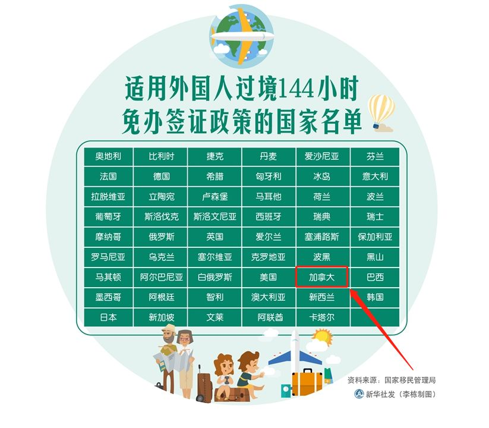 (原始链接: https://mmbiz.qpic.cn/mmbiz_png/L5GmQ5Uh1kqGicc7QzodHtxyplHrsKDrYRzNL6ktXhJIHMW9OEJR6ThmibwvictG7aic1PCdGuDgWTB4QAmTiaakHoA/640?wx_fmt=png)
- 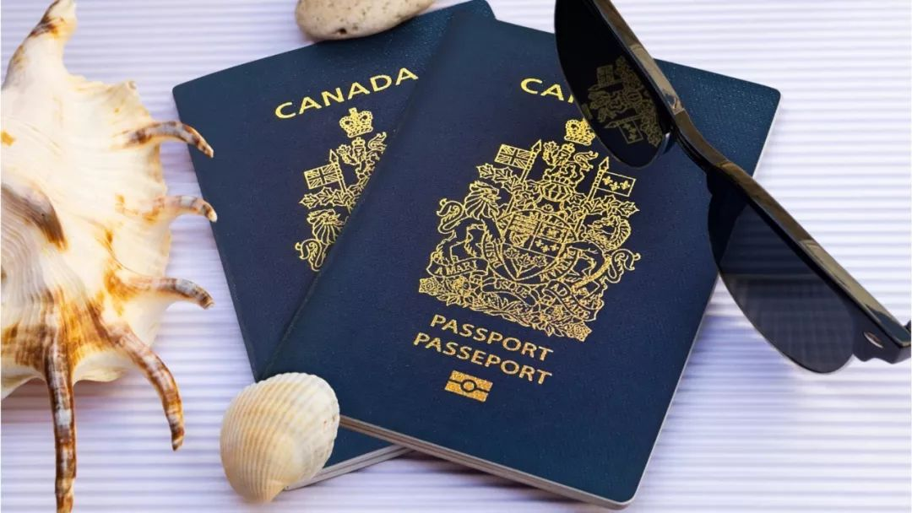 (原始链接: https://mmbiz.qpic.cn/mmbiz_jpg/u8W8ROoNiaicNZ6AARKM9WHiarcx1gH2hJFLBqSXoNn6iaDOW2PhwgyaMUsaBZpojnULEwbKJszBVbA2Zwu0NKASyw/640?wx_fmt=jpeg)
- 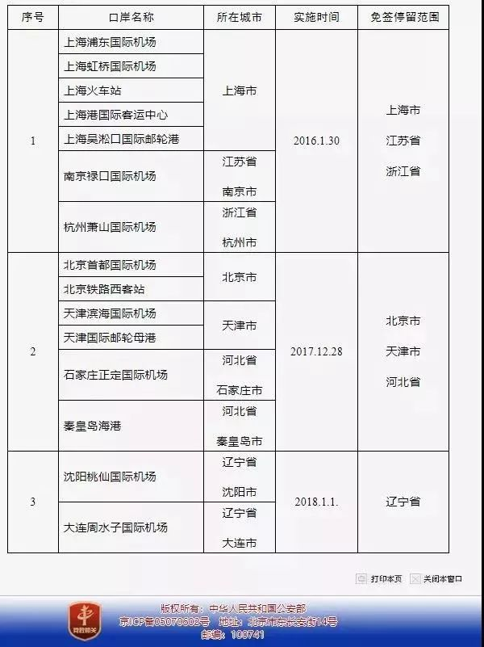 (原始链接: https://mmbiz.qpic.cn/mmbiz_jpg/oT11q0H1EIGgEa3yGUNHntmeedcXugXXZDlOVr3j2shddia4gdOeWNiaXtFlls4pvkicjjLsop7iaibibcvSmHW7bAHA/640?wx_fmt=jpeg)
- 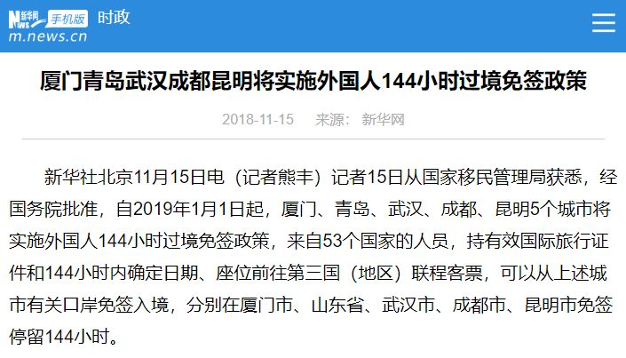 (原始链接: https://mmbiz.qpic.cn/mmbiz_png/oT11q0H1EIGgEa3yGUNHntmeedcXugXXDBPW9UG7dYAhBZUQzytqGEwZAL6wOMq4VzFq5bsXL3ItgbQsjp6gKA/640?wx_fmt=png)
- 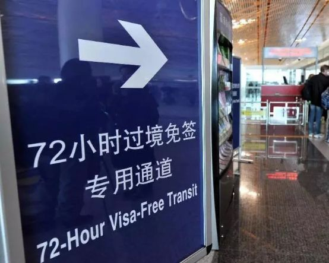 (原始链接: https://mmbiz.qpic.cn/mmbiz_png/JZjX3Yiawr6w77MzqU1vdsfXZ9pJZCmiaV9cOh1T5aQ2O9BxXAoMQib9jiaGkpQicNWVPRTibrSHusHBBoSlviaoe7GVw/640?wx_fmt=png)
- 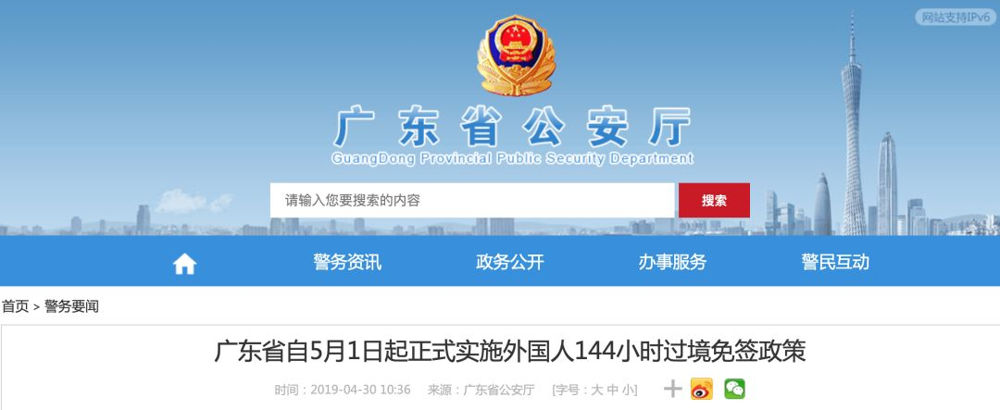 (原始链接: https://mmbiz.qpic.cn/mmbiz_png/veYDfuAFic0p6sFLBI3RiaYMIyjyM6BS8JqpgaFLgPibAs1xNGyKDqOjRib7vsAfIPuseq8ugeTzaJghgGlwX9l1Mw/640?wx_fmt=png)
- 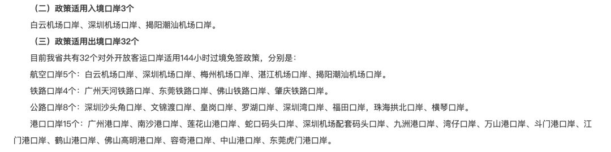 (原始链接: https://mmbiz.qpic.cn/mmbiz_png/veYDfuAFic0p6sFLBI3RiaYMIyjyM6BS8JNETCbUP9ft0Wcak5VLnn8kuYxCl1r4miaXkibdDeM9MxlgT82fvEHYtA/640?wx_fmt=png)
-  (原始链接: https://mmbiz.qpic.cn/mmbiz_png/JZjX3Yiawr6w77MzqU1vdsfXZ9pJZCmiaVoLKVceDEKtHjf6L31Y3UyGkn8tDAwRoPyN4RMn4Wx6lzuD4FJuNlnQ/640?wx_fmt=png)
-  (原始链接: https://mmbiz.qpic.cn/mmbiz_gif/bx4HaAFKBKqiaOrQoj6iciafkeH3l2IowoHEwajPmK3icouJBiaia6B2Fo5wFOtmTlPXobRRVoXnVUssGtuWTrJaicRHg/640?wx_fmt=gif)
-  (原始链接: https://mmbiz.qpic.cn/mmbiz_jpg/z8ibtosSndj0ibBVeflRTibY2c3shfRzKRgIMCAn124ccwiboPXQfg4l4S2B0rRukiaq5DxNIGNBcly0woUvEetG4qA/640?wx_fmt=jpeg)
- 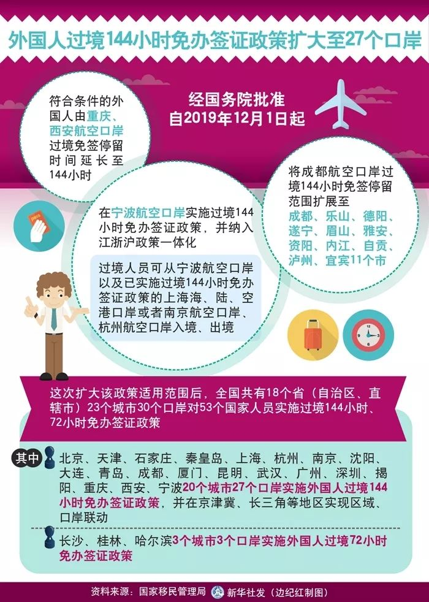 (原始链接: https://mmbiz.qpic.cn/mmbiz_jpg/L5GmQ5Uh1kqGicc7QzodHtxyplHrsKDrYB2BG9cPJbel3aL5z6d827h0YyPx0NiaLwdBP8xswj2MLjfuiaLpzdwAQ/640?wx_fmt=jpeg)
- 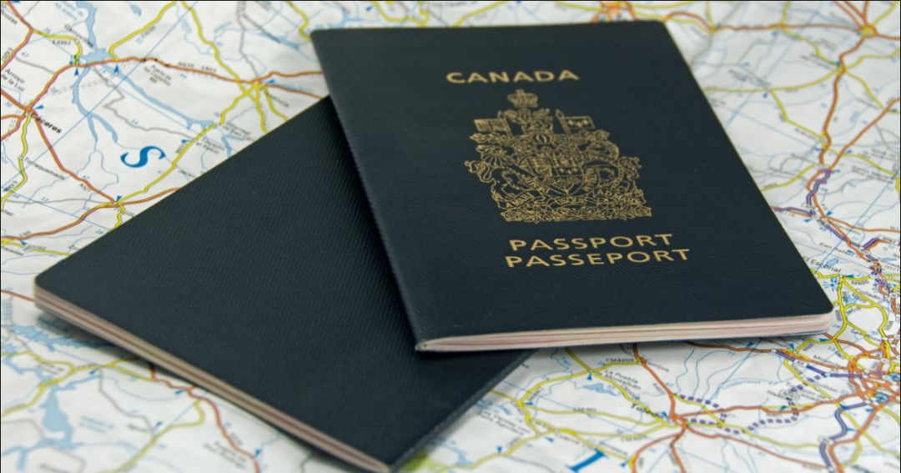 (原始链接: https://mmbiz.qpic.cn/mmbiz_png/u8W8ROoNiaicNZ6AARKM9WHiarcx1gH2hJFP9saEwukAEe7ClauqWjY1jMeJn21TyFPWSvcPEzDaxzzVLPjfEfJFg/640?wx_fmt=png)
- 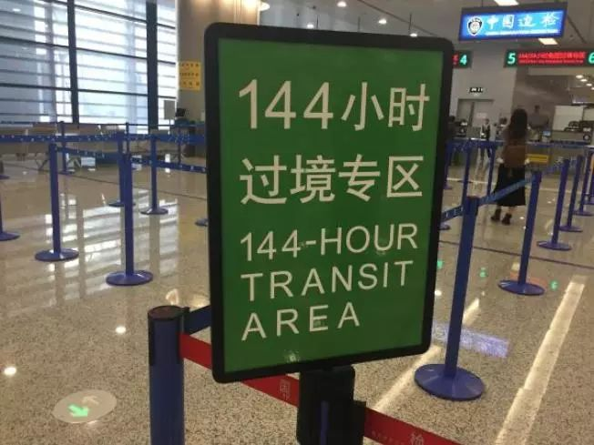 (原始链接: https://mmbiz.qpic.cn/mmbiz_jpg/bx4HaAFKBKqiaOrQoj6iciafkeH3l2IowoHAicVqusLIMX6CBkjga0erUJa2YiaHCQsBYsqW5mrWe5ELJic5OVAC2KWg/640?wx_fmt=jpeg)
- 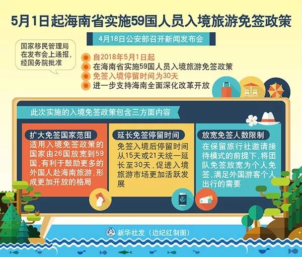 (原始链接: https://mmbiz.qpic.cn/mmbiz_jpg/oT11q0H1EIGgEa3yGUNHntmeedcXugXXzJVjJwnwIU0iaTIo2Lg53gRAKJ87J13GibIBiblDmzVCoMUyZFibTibI39A/640?wx_fmt=jpeg)
-  (原始链接: https://mmbiz.qpic.cn/mmbiz_jpg/oT11q0H1EIGgEa3yGUNHntmeedcXugXXU6Qs1ibYC2V9ALED5seNNmh2MItt1nicv7BykyibZ5kXoEeEbBiaKz8GYg/640?wx_fmt=jpeg)
- 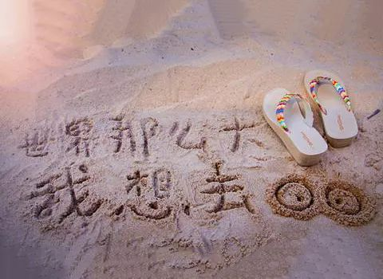 (原始链接: https://mmbiz.qpic.cn/mmbiz_jpg/L5GmQ5Uh1kqGicc7QzodHtxyplHrsKDrYQN1TAgW4983Idw7u8OkShJV2VxlsxuPDj87lXkPxwKTQiaWAPEG6SuQ/640?wx_fmt=jpeg)
-  (原始链接: https://mmbiz.qpic.cn/mmbiz_jpg/z8ibtosSndj1YdibBLibKMaVXX5lNe14KcUIaUZEqO7jNzo4CIguxOFZh4ibicKuwogcqdPc5nqibUsqzFial7icGib4hhw/640?wx_fmt=jpeg)
-  (原始链接: https://mmbiz.qpic.cn/mmbiz_png/z8ibtosSndj1YdibBLibKMaVXX5lNe14KcU43CJSZ5X9rtwxOC4xs4IkPDKoeSQ4zVRSHF80hM6y6ssE9L6wzEQicA/640?wx_fmt=png)
-  (原始链接: https://mmbiz.qpic.cn/mmbiz_jpg/z8ibtosSndj1YdibBLibKMaVXX5lNe14KcUVVrtdiaMv2q2XCY5AmmzRYFX5J9HPYZVxuzQJhRr8icpfCPHTK0vpv4Q/640?wx_fmt=jpeg)
