# 无标题

**链接地址:** http://mp.weixin.qq.com/s?__biz=MzUzNDY0NzQwMQ==&mid=2247523016&idx=1&sn=086510a39c65eb1c1b6ee94a6402136e&chksm=fa935dcecde4d4d8212cc1710552b2f2c5bdc8d9497f21fd3ba1a63cc9fec52eca55a41e374e&mpshare=1&scene=2&srcid=&sharer_sharetime=1575358570887&sharer_shareid=be1c8edd6c93eec155a61c876e41d26a#rd
**作者:** 张一弛
**获取时间:** 2025/8/28 20:22:41
**图片数量:** 27

---

## 原始HTML内容

<section class="xmteditor" style="display:none;" data-tools="新媒体管家" data-label="powered by xmt.cn"></section>

文/金错刀频道&nbsp; 张一弛

 

当米其林公布出2020年北京美食榜单时，全国人民情不自禁地发出了同一句感叹：

&nbsp;

<strong>这选的...都是什么玩意儿啊！</strong>

&nbsp;

在北京，上榜的一共有23家餐厅，数量确实不算少，但唯一的三星餐厅给了主打台州小海鲜的新荣记；另一家上海菜屋里厢，登上了二星。

 

 

北京美食榜不光没有北京菜，更让人费解的是，这家浙江菜之所以能评上三星，米其林的给出的理由居然是：&nbsp;

 

“真正让人不能错过的，是这家新荣记做的北京烤鸭。”

&nbsp;

这奖，这让人家新荣记拿还是不拿？

 

更可气的是，前几天米其林公布的一份更面向大众的“必比登推介”餐厅名单，不但列了个内脏全席，豆汁、素食都上榜了：

 

&nbsp;

气的被米其林给了一颗星星的大董烤鸭压根没出现在颁奖典礼上，创始人董振祥还专门发文，抨击这个内脏全席榜单：

 
<blockquote class="js_blockquote_wrap" data-type="2" data-url="" data-author-name="" data-content-utf8-length="47" data-source-title=""><section class="js_blockquote_digest"><section>
这会让国际社会以为中国老百姓的美食水平就是爆肚、下水和内脏，而这显然不是中国美食的主流和大雅。
</section></section></blockquote>
 

<strong>在中国美食榜上乱指挥的米其林，还跑到日本瞎搅和。</strong> 

&nbsp;
<section style="padding-left: 0.5em;padding-right: 0.5em;text-align: justify;letter-spacing: 0.5px;">在2020年日本的米其林指南中，连续12年被评为米其林三星的“数寄屋桥次郎本店”寿司店却从榜单中消失了。</section><section style="padding-left: 0.5em;padding-right: 0.5em;text-align: justify;letter-spacing: 0.5px;"> </section>
该店背后的主理人正是被誉为日本“日本寿司之神”的小野二郎。

 

 

“摘星”理由则是，寿司店不开放给普通客人预约，只提供给常客或有特殊渠道的人跟米其林的评选标准不符。

 

总结一下，踏出法国的米其林面临的现状是：评判标准飘忽不定、评判过程扑朔迷离、最终结果不得人心。

 

在诞生120年后，这份全球最能“捞金”的榜单，终于跌下了神坛！ 

 
<section style="box-sizing: border-box;font-size: 16px;"><section style="margin-top: 0.5em;margin-bottom: 0.5em;overflow: hidden;text-align: center;box-sizing: border-box;" powered-by="xiumi.us"><section class="horizontal-tb" style="width: 2em;height: 2em;margin-right: auto;margin-left: auto;border-radius: 100%;background-color: rgb(0, 35, 161);line-height: 2em;color: rgb(255, 255, 255);box-sizing: border-box;max-width: 20% !important;"><section style="box-sizing: border-box;">1</section></section><section style="margin-top: -1em;margin-bottom: 1em;box-sizing: border-box;"><section style="border-top: 1px solid rgb(0, 35, 161);width: 35%;float: left;box-sizing: border-box;"></section><section style="border-top: 1px solid rgb(0, 35, 161);width: 35%;float: right;box-sizing: border-box;"></section></section><section style="clear: both;box-sizing: border-box;"></section></section></section>
<strong>米其林在中国水土不服，</strong>

<strong>根本不是新鲜事</strong>
<section style="letter-spacing: 0.5px;"> </section><section style="letter-spacing: 0.5px;padding-left: 0.5em;padding-right: 0.5em;">有人认为米其林是跟北京有仇，客观的说，真是冤枉人家了。</section><section style="letter-spacing: 0.5px;padding-left: 0.5em;padding-right: 0.5em;">&nbsp;</section><section style="letter-spacing: 0.5px;padding-left: 0.5em;padding-right: 0.5em;">因为，米其林在全球各地的水土不服，早就不是什么新鲜事儿。</section><section style="letter-spacing: 0.5px;padding-left: 0.5em;padding-right: 0.5em;">&nbsp;</section><section style="letter-spacing: 0.5px;padding-left: 0.5em;padding-right: 0.5em;">最开始不爽米其林评星标准的是<strong>美国人</strong>。</section><section style="letter-spacing: 0.5px;padding-left: 0.5em;padding-right: 0.5em;"> </section><section style="letter-spacing: 0.5px;padding-left: 0.5em;padding-right: 0.5em;">2005年，米其林进入纽约，《纽约时报》吐槽米其林偏爱正襟危坐的传统高级餐厅：“二星以上的餐厅里，至少一半都是法餐。”</section><section style="letter-spacing: 0.5px;padding-left: 0.5em;padding-right: 0.5em;"> </section><section style="letter-spacing: 0.5px;padding-left: 0.5em;padding-right: 0.5em;">2008年，米其林去了洛杉矶。洛杉矶的菜系非常多元，包括墨西哥菜、非洲菜、日料、韩餐、菲律宾菜，米其林也连续出版了两年的米其林洛杉矶指南……</section><section style="letter-spacing: 0.5px;padding-left: 0.5em;padding-right: 0.5em;"> </section><section style="letter-spacing: 0.5px;padding-left: 0.5em;padding-right: 0.5em;">一切看上去都非常美好。</section><section style="letter-spacing: 0.5px;padding-left: 0.5em;padding-right: 0.5em;"> </section><section style="letter-spacing: 0.5px;padding-left: 0.5em;padding-right: 0.5em;"></section><section style="letter-spacing: 0.5px;padding-left: 0.5em;padding-right: 0.5em;"> </section><section style="letter-spacing: 0.5px;padding-left: 0.5em;padding-right: 0.5em;">但是洛杉矶人民发现，整个洛杉矶，米其林只评出了4家二星餐厅，连一个三星都没有。</section><section style="letter-spacing: 0.5px;padding-left: 0.5em;padding-right: 0.5em;"> </section><section style="letter-spacing: 0.5px;padding-left: 0.5em;padding-right: 0.5em;">于是，米其林评委跟洛杉矶美食家开启了一场长达8年的隔空互怼。 </section><section style="letter-spacing: 0.5px;padding-left: 0.5em;padding-right: 0.5em;"> </section><section style="white-space: normal;letter-spacing: 0.5px;padding-left: 0.5em;padding-right: 0.5em;">2011年，米其林指南曾经的主管Jean-Luc Nare在采访中大骂：”洛杉矶人民太土了，根本不懂吃也不关心真正的美食。他们只在乎和谁去，去哪家，坐哪桌。”</section><section style="white-space: normal;letter-spacing: 0.5px;padding-left: 0.5em;padding-right: 0.5em;"> </section><section style="white-space: normal;letter-spacing: 0.5px;padding-left: 0.5em;padding-right: 0.5em;"></section><section style="white-space: normal;letter-spacing: 0.5px;padding-left: 0.5em;padding-right: 0.5em;"> </section><section style="white-space: normal;letter-spacing: 0.5px;padding-left: 0.5em;padding-right: 0.5em;">而洛杉矶的食评家diss back 也丝毫不留余地：“这些高傲的评委，大概都不肯从比佛利山庄酒店出来多走几步。”&nbsp;</section><section style="white-space: normal;letter-spacing: 0.5px;padding-left: 0.5em;padding-right: 0.5em;"> </section><section style="white-space: normal;letter-spacing: 0.5px;padding-left: 0.5em;padding-right: 0.5em;">于是，米其林骂骂咧咧的退出了洛杉矶。</section><section style="white-space: normal;letter-spacing: 0.5px;padding-left: 0.5em;padding-right: 0.5em;"> </section><section style="white-space: normal;letter-spacing: 0.5px;padding-left: 0.5em;padding-right: 0.5em;">到了意大利，米其林依然坚持我行我素，把星星几乎都给了做法餐的餐厅，又激怒了<strong>意大利人</strong>。</section><section style="white-space: normal;letter-spacing: 0.5px;padding-left: 0.5em;padding-right: 0.5em;"> </section><section style="white-space: normal;letter-spacing: 0.5px;padding-left: 0.5em;padding-right: 0.5em;"></section><section style="letter-spacing: 0.5px;padding-left: 0.5em;padding-right: 0.5em;"> </section><section style="letter-spacing: 0.5px;padding-left: 0.5em;padding-right: 0.5em;">到了<strong>日本</strong>，米其林大发善心，在东京一下慷慨送出191颗星星，可结果照样不着日本厨师待见。</section><section style="letter-spacing: 0.5px;padding-left: 0.5em;padding-right: 0.5em;"> </section><section style="letter-spacing: 0.5px;padding-left: 0.5em;padding-right: 0.5em;">因为，这些日本厨师发现，大师级餐厅没有入选，徒弟的餐厅反倒评上了三星，“非常可笑”。</section><section style="letter-spacing: 0.5px;padding-left: 0.5em;padding-right: 0.5em;">&nbsp;</section><section style="letter-spacing: 0.5px;padding-left: 0.5em;padding-right: 0.5em;">当上海的第一份米其林指南公布时，26家星级餐厅，榜单里快一半都是粤菜，包括唯一的一家三星“唐阁”，也是粤菜。蔡澜老先生直言不讳：</section><section style="letter-spacing: 0.5px;padding-left: 0.5em;padding-right: 0.5em;"> </section><section style="letter-spacing: 0.5px;padding-left: 0.5em;padding-right: 0.5em;">欧洲之外，米其林都不靠谱。</section><section style="letter-spacing: 0.5px;padding-left: 0.5em;padding-right: 0.5em;"> </section><section style="letter-spacing: 0.5px;padding-left: 0.5em;padding-right: 0.5em;"></section><section style="letter-spacing: 0.5px;padding-left: 0.5em;padding-right: 0.5em;"> </section><section style="letter-spacing: 0.5px;padding-left: 0.5em;padding-right: 0.5em;">可没想到当米其林真的来“美食天堂”广州了，却让大家都有点懵——广州了成为中国参评城市里星级餐厅最少的，一共有8家餐厅入选，全是一星。</section><section style="white-space: normal;letter-spacing: 0.5px;padding-left: 0.5em;padding-right: 0.5em;">&nbsp;</section><section style="white-space: normal;letter-spacing: 0.5px;padding-left: 0.5em;padding-right: 0.5em;">气的广州人大骂：“都说食在广州，结果只有一星？” “猜到了没有三星，但连二星也选不出来？”</section><section style="white-space: normal;letter-spacing: 0.5px;padding-left: 0.5em;padding-right: 0.5em;"> </section><section style="white-space: normal;letter-spacing: 0.5px;padding-left: 0.5em;padding-right: 0.5em;">但有意思的是，刚被评为米其林一星餐厅的上海“泰安门”，很快就被曝出开业却一直没有申请到营业执照，被迫关店，成为了米其林史上最短命餐厅。</section><section style="white-space: normal;letter-spacing: 0.5px;padding-left: 0.5em;padding-right: 0.5em;"> </section><section style="white-space: normal;letter-spacing: 0.5px;padding-left: 0.5em;padding-right: 0.5em;">&nbsp;</section><section style="letter-spacing: 0.5px;padding-left: 0.5em;padding-right: 0.5em;">而温州首家以米其林概念餐厅，由米其林星厨担任执行主厨、卡地亚设计师打造用餐环境，仅仅经营了1年时间，就坚持不下去了。</section><section style="letter-spacing: 0.5px;padding-left: 0.5em;padding-right: 0.5em;"> </section><section style="letter-spacing: 0.5px;padding-left: 0.5em;padding-right: 0.5em;"></section><section style="letter-spacing: 0.5px;padding-left: 0.5em;padding-right: 0.5em;"> </section><section style="box-sizing: border-box;font-size: 16px;padding-left: 0.5em;padding-right: 0.5em;"><section style="margin-top: 0.5em;margin-bottom: 0.5em;overflow: hidden;text-align: center;box-sizing: border-box;" powered-by="xiumi.us"><section class="horizontal-tb" style="width: 2em;height: 2em;margin-right: auto;margin-left: auto;border-radius: 100%;background-color: rgb(0, 35, 161);line-height: 2em;color: rgb(255, 255, 255);box-sizing: border-box;max-width: 20% !important;"><section style="box-sizing: border-box;">2</section></section><section style="margin-top: -1em;margin-bottom: 1em;box-sizing: border-box;"><section style="border-top: 1px solid rgb(0, 35, 161);width: 35%;float: left;box-sizing: border-box;"></section><section style="border-top: 1px solid rgb(0, 35, 161);width: 35%;float: right;box-sizing: border-box;"></section></section><section style="clear: both;box-sizing: border-box;"></section></section></section>
<strong>饮食界的“地狱判官”：</strong>

<strong>摘掉一颗星星，等于毁掉一家餐厅</strong>

 
<section style="text-align: justify;letter-spacing: 0.5px;padding-left: 0.5em;padding-right: 0.5em;">至于米其林的评星标准是什么，没有人知道。</section><section style="text-align: justify;letter-spacing: 0.5px;padding-left: 0.5em;padding-right: 0.5em;"> </section><section style="text-align: justify;letter-spacing: 0.5px;padding-left: 0.5em;padding-right: 0.5em;">这个神一样的指南从 1931 年推出三星分级评价以来，官方只给出了五点粗略的解释：</section><section style="letter-spacing: 0.5px;padding-left: 0.5em;padding-right: 0.5em;">&nbsp;</section><section style="letter-spacing: 0.5px;padding-left: 0.5em;padding-right: 0.5em;">1. 盘中食材的水准；2. 料理食物的技艺水平和口味的融合；3. 创新水平；4. 是否物有所值；5. 餐厅烹饪水准的稳定性。</section><section style="letter-spacing: 0.5px;padding-left: 0.5em;padding-right: 0.5em;"> </section><section style="letter-spacing: 0.5px;padding-left: 0.5em;padding-right: 0.5em;"></section><section style="letter-spacing: 0.5px;padding-left: 0.5em;padding-right: 0.5em;"> </section><section style="letter-spacing: 0.5px;padding-left: 0.5em;padding-right: 0.5em;">但米其林最狠的一点，是评审员对餐厅的匿名造访，这是米其林和所有专业美食比赛和现在流行的网红探店的最大区别。</section><section style="letter-spacing: 0.5px;padding-left: 0.5em;padding-right: 0.5em;"></section><section style="letter-spacing: 0.5px;padding-left: 0.5em;padding-right: 0.5em;"> </section><section style="letter-spacing: 0.5px;padding-left: 0.5em;padding-right: 0.5em;">匿名机制，让米其林收获了空前成功，但同时，也让他们成为饮食界的“地狱判官”。</section><section style="letter-spacing: 0.5px;padding-left: 0.5em;padding-right: 0.5em;"> </section><section style="letter-spacing: 0.5px;padding-left: 0.5em;padding-right: 0.5em;"><strong>甚至每一颗星星，都成为了可以“杀人”的凶器。</strong></section><section style="letter-spacing: 0.5px;padding-left: 0.5em;padding-right: 0.5em;"> </section><section style="letter-spacing: 0.5px;padding-left: 0.5em;padding-right: 0.5em;">1966年，米其林三星主厨Alain Zick因其餐厅从三星降为二星，成为第一个自杀的三星主厨。</section><section style="letter-spacing: 0.5px;padding-left: 0.5em;padding-right: 0.5em;">&nbsp;</section><section style="letter-spacing: 0.5px;padding-left: 0.5em;padding-right: 0.5em;">2003年，米其林三星主厨卢瓦索大厨自杀的轰动整个法国。</section><section style="letter-spacing: 0.5px;padding-left: 0.5em;padding-right: 0.5em;"> </section><section style="letter-spacing: 0.5px;padding-left: 0.5em;padding-right: 0.5em;">卢大厨的餐厅起步时，向银行贷了巨款用来装修餐厅，一间厕所都能赶上普通人家全屋了。没过几年，卢大厨就负了500万美元的债。</section><section style="letter-spacing: 0.5px;padding-left: 0.5em;padding-right: 0.5em;"> </section><section style="letter-spacing: 0.5px;padding-left: 0.5em;padding-right: 0.5em;"></section><section style="letter-spacing: 0.5px;padding-left: 0.5em;padding-right: 0.5em;"> </section><section style="letter-spacing: 0.5px;padding-left: 0.5em;padding-right: 0.5em;">在他自杀前一年，米其林可能会取掉他餐厅的一颗星，卢大厨咬着牙跟同事说：</section><section style="letter-spacing: 0.5px;padding-left: 0.5em;padding-right: 0.5em;">&nbsp;</section><section style="letter-spacing: 0.5px;padding-left: 0.5em;padding-right: 0.5em;">“如果我失去一颗星，我宁可自杀。”</section><section style="letter-spacing: 0.5px;padding-left: 0.5em;padding-right: 0.5em;"> </section><section style="letter-spacing: 0.5px;text-align: center;padding-left: 0.5em;padding-right: 0.5em;">卢瓦索名作：煎蛙腿佐白蒜泥酱与西芹酱</section><section style="letter-spacing: 0.5px;text-align: center;padding-left: 0.5em;padding-right: 0.5em;"> </section>
到了2007年，41岁的米其林星级餐厅女厨师长服用安定剂身亡。她在遗书中写道：“我撑不下去了，压力太大了……”

 

 
<section style="letter-spacing: 0.5px;padding-left: 0.5em;padding-right: 0.5em;"><strong>被摘掉星星的大厨崩溃，被授予星星的餐厅也不堪重负。</strong></section><section style="letter-spacing: 0.5px;padding-left: 0.5em;padding-right: 0.5em;"> </section><section style="letter-spacing: 0.5px;padding-left: 0.5em;padding-right: 0.5em;">2017年，雄踞米其林三星20年的法国Le Suquet a Laguiole餐厅的老板兼厨师Sebastien Bras想退回米其林的三星。</section><section style="letter-spacing: 0.5px;padding-left: 0.5em;padding-right: 0.5em;">&nbsp;</section><section style="letter-spacing: 0.5px;padding-left: 0.5em;padding-right: 0.5em;">“那些给我米其林星星的人，其实对我一无所知，”&nbsp;</section><section style="letter-spacing: 0.5px;padding-left: 0.5em;padding-right: 0.5em;">&nbsp;</section><section style="letter-spacing: 0.5px;padding-left: 0.5em;padding-right: 0.5em;">2013年，西班牙Casa Julio餐厅厨师Julio Biosca请米其林收回他的星星，因为他觉得这颗星意味着他无法再创新了。</section><section style="letter-spacing: 0.5px;padding-left: 0.5em;padding-right: 0.5em;"> </section><section style="letter-spacing: 0.5px;padding-left: 0.5em;padding-right: 0.5em;">米其林三星大厨安娜苏菲匹克来中国某星级酒店做饭，要求酒店空运170个盘子来，结果那些盘子死重、包装里三层、外三层，运费整整花了20多万。</section><section style="letter-spacing: 0.5px;padding-left: 0.5em;padding-right: 0.5em;"> </section>

 

法国大厨Alain Senderens在关掉了维持28年的米其林三星餐厅，把它改造成一家更便宜、轻松的小酒馆时，说出了实情：
<section style="letter-spacing: 0.5px;text-align: justify;padding-left: 0.5em;padding-right: 0.5em;"></section><section style="letter-spacing: 0.5px;text-align: justify;padding-left: 0.5em;padding-right: 0.5em;"> </section><section style="letter-spacing: 0.5px;padding-left: 0.5em;padding-right: 0.5em;">保持米其林星级的成本实在太高，餐厅必须不断更换菜单，雇佣一个过分庞大的后厨和服务员团队，并在鲜花、水晶杯、亚麻桌布等花哨装饰上，每年花掉36000欧元。</section><section style="letter-spacing: 0.5px;padding-left: 0.5em;padding-right: 0.5em;">&nbsp;</section><section style="letter-spacing: 0.5px;padding-left: 0.5em;padding-right: 0.5em;">当记者问他：米其林不是坚持依据食物水平给星星吗？</section><section style="letter-spacing: 0.5px;padding-left: 0.5em;padding-right: 0.5em;">&nbsp;</section><section style="letter-spacing: 0.5px;padding-left: 0.5em;padding-right: 0.5em;">大厨只说了一句话：<strong>“他们喜欢豪华餐厅。”</strong></section>
 
<section style="box-sizing: border-box;font-size: 16px;padding-left: 0.5em;padding-right: 0.5em;"><section style="margin-top: 0.5em;margin-bottom: 0.5em;overflow: hidden;text-align: center;box-sizing: border-box;" powered-by="xiumi.us"><section class="horizontal-tb" style="width: 2em;height: 2em;margin-right: auto;margin-left: auto;border-radius: 100%;background-color: rgb(0, 35, 161);line-height: 2em;color: rgb(255, 255, 255);box-sizing: border-box;max-width: 20% !important;"><section style="box-sizing: border-box;">3</section></section><section style="margin-top: -1em;margin-bottom: 1em;box-sizing: border-box;"><section style="border-top: 1px solid rgb(0, 35, 161);width: 35%;float: left;box-sizing: border-box;"></section><section style="border-top: 1px solid rgb(0, 35, 161);width: 35%;float: right;box-sizing: border-box;"></section></section><section style="clear: both;box-sizing: border-box;"></section></section></section>
<strong>最烂的榜单背后，</strong><strong></strong>

<strong>是一场天才营销案例</strong><strong></strong>

<strong> </strong>
<section style="padding-left: 0.5em;padding-right: 0.5em;letter-spacing: 0.5px;text-align: justify;">我们回头看看指南的身世就知道，这份全球最烂榜单背后，其实是一场极其天才的营销案例。</section><section style="padding-left: 0.5em;padding-right: 0.5em;letter-spacing: 0.5px;text-align: justify;">&nbsp;</section><section style="padding-left: 0.5em;padding-right: 0.5em;letter-spacing: 0.5px;">1900年，在当时汽车还不普及的情况下，还仅仅是一家轮胎公司的米其林，最重要的三个字就是：活下去。</section><section style="padding-left: 0.5em;padding-right: 0.5em;letter-spacing: 0.5px;">&nbsp;</section><section style="padding-left: 0.5em;padding-right: 0.5em;letter-spacing: 0.5px;">汽车不普及，人们对轮胎的需求自然就小，米其林兄弟就决定曲线救国。</section><section style="padding-left: 0.5em;padding-right: 0.5em;letter-spacing: 0.5px;"> </section><section style="padding-left: 0.5em;padding-right: 0.5em;letter-spacing: 0.5px;"></section><section style="padding-left: 0.5em;padding-right: 0.5em;letter-spacing: 0.5px;"> </section><section style="padding-left: 0.5em;padding-right: 0.5em;letter-spacing: 0.5px;">他们搜集整理了地图、加油站、旅馆等各种信息，汇集为一本小红手册。在1923年，增加了餐厅推荐，并从1926年开始采用星级评等。这就是最早的《米其林指南》。</section><section style="padding-left: 0.5em;padding-right: 0.5em;letter-spacing: 0.5px;">&nbsp;</section><section style="padding-left: 0.5em;padding-right: 0.5em;letter-spacing: 0.5px;">目的是为了告诉大家，全世界好吃的那么多，为什么不开车去试试？</section><section style="padding-left: 0.5em;padding-right: 0.5em;letter-spacing: 0.5px;"> </section><section style="padding-left: 0.5em;padding-right: 0.5em;letter-spacing: 0.5px;"></section><section style="padding-left: 0.5em;padding-right: 0.5em;letter-spacing: 0.5px;"> </section><section style="padding-left: 0.5em;padding-right: 0.5em;letter-spacing: 0.5px;">米其林通过这样的营销策略提高自己主业务的轮胎销量，从商业逻辑上说一点毛病没有，据汽车服务世界统计，2019全球轮胎企业TOP34榜单，米其林位居第二名。</section><section style="padding-left: 0.5em;padding-right: 0.5em;letter-spacing: 0.5px;"> </section><section style="padding-left: 0.5em;padding-right: 0.5em;letter-spacing: 0.5px;"></section><section style="padding-left: 0.5em;padding-right: 0.5em;letter-spacing: 0.5px;">&nbsp;</section><section style="padding-left: 0.5em;padding-right: 0.5em;letter-spacing: 0.5px;">就算这本法国美食指南，要向全世界进军时，也到处充满了捞金的味道。</section><section style="padding-left: 0.5em;padding-right: 0.5em;letter-spacing: 0.5px;"> </section><section style="padding-left: 0.5em;padding-right: 0.5em;letter-spacing: 0.5px;">在2016年的第一版新加坡指南中，圣淘沙名胜世界作为冠名赞助商，旗下有四家餐厅摘星。</section><section style="padding-left: 0.5em;padding-right: 0.5em;letter-spacing: 0.5px;">&nbsp;</section><section style="padding-left: 0.5em;padding-right: 0.5em;letter-spacing: 0.5px;">&nbsp;韩国米其林三星餐厅“GAON”，才刚开业4个月就斩获了，多少大厨梦寐以求却求之不得的“米其林三星”。</section><section style="padding-left: 0.5em;padding-right: 0.5em;letter-spacing: 0.5px;"> </section><section style="padding-left: 0.5em;padding-right: 0.5em;letter-spacing: 0.5px;">原因则是，这家饭店的行政总厨曾向米其林支付了一大笔天价“咨询费”。</section><section style="padding-left: 0.5em;padding-right: 0.5em;letter-spacing: 0.5px;"> </section><section style="padding-left: 0.5em;padding-right: 0.5em;letter-spacing: 0.5px;"></section><section style="padding-left: 0.5em;padding-right: 0.5em;letter-spacing: 0.5px;"> </section><section style="padding-left: 0.5em;padding-right: 0.5em;letter-spacing: 0.5px;"><strong>结 语：</strong></section><section style="padding-left: 0.5em;padding-right: 0.5em;letter-spacing: 0.5px;"></section><section style="padding-left: 0.5em;padding-right: 0.5em;letter-spacing: 0.5px;"> </section><section style="padding-left: 0.5em;padding-right: 0.5em;letter-spacing: 0.5px;">看不懂如今用户的需求，正是如今被封为“美食圣经”的米其林最大产品危机。</section><section style="padding-left: 0.5em;padding-right: 0.5em;letter-spacing: 0.5px;"> </section><section style="padding-left: 0.5em;padding-right: 0.5em;letter-spacing: 0.5px;">在对中国文化没有任何深入的认知时，就想靠豆汁和卤煮就能讨好中国人，显然低估了大众的智商。</section><section style="padding-right: 0.5em;padding-left: 0.5em;white-space: normal;letter-spacing: 0.5px;"> </section><section style="padding-right: 0.5em;padding-left: 0.5em;white-space: normal;letter-spacing: 0.5px;">就像一位外国厨师，花了16个月去了52家小笼包馆子，给出的“一个美味小笼包”的评判标准是：（汁的重量+馅的重量）÷皮的厚度。</section><section style="padding-right: 0.5em;padding-left: 0.5em;white-space: normal;letter-spacing: 0.5px;"> </section><section style="padding-right: 0.5em;padding-left: 0.5em;white-space: normal;letter-spacing: 0.5px;">中国美食的烟火气瞬间丧失殆尽。</section><section style="padding-right: 0.5em;padding-left: 0.5em;white-space: normal;letter-spacing: 0.5px;"> </section><section style="padding-right: 0.5em;padding-left: 0.5em;white-space: normal;letter-spacing: 0.5px;"></section><section style="padding-right: 0.5em;padding-left: 0.5em;white-space: normal;letter-spacing: 0.5px;"> </section><section style="padding-right: 0.5em;padding-left: 0.5em;white-space: normal;letter-spacing: 0.5px;">时代变了，消费者也变了。</section><section style="padding-right: 0.5em;padding-left: 0.5em;white-space: normal;letter-spacing: 0.5px;"> </section><section style="padding-right: 0.5em;padding-left: 0.5em;white-space: normal;letter-spacing: 0.5px;">94岁的寿司之神已经不再需要星星证明自己的食物是否美味，全球各地真正热爱美食的人，也不再迷信这一份充满营销味道的美食榜。</section><section style="padding-right: 0.5em;padding-left: 0.5em;white-space: normal;letter-spacing: 0.5px;"> </section><section style="padding-left: 0.5em;padding-right: 0.5em;letter-spacing: 0.5px;">我们无法剔除米其林的傲慢、无知和偏见，只能回敬一句：</section><section style="padding-left: 0.5em;padding-right: 0.5em;letter-spacing: 0.5px;"> </section><section style="padding-left: 0.5em;padding-right: 0.5em;letter-spacing: 0.5px;"><strong>你评你的，我吃我的。</strong></section><section style="padding-left: 0.5em;padding-right: 0.5em;letter-spacing: 0.5px;"> </section>

 
<h2 class="" style="max-width: 100%;text-align: center;box-sizing: border-box !important;overflow-wrap: break-word !important;">©THE END</h2><h1 class="" style="max-width: 100%;box-sizing: border-box !important;overflow-wrap: break-word !important;"><section label="Powered by 135editor.com" data-role="outer" data-xmt-x1="339.5" data-xmt-y1="9751.21875" data-xmt-x2="1009.5" data-xmt-y2="9910.21875" style="max-width: 100%;box-sizing: border-box !important;overflow-wrap: break-word !important;"><section data-xmt-x1="339.5" data-xmt-y1="9751.21875" data-xmt-x2="979.5" data-xmt-y2="9910.21875" style="max-width: 100%;box-sizing: border-box !important;overflow-wrap: break-word !important;"><section data-xmt-x1="354.5" data-xmt-y1="9751.21875" data-xmt-x2="994.5" data-xmt-y2="9910.21875" style="max-width: 100%;box-sizing: border-box !important;overflow-wrap: break-word !important;"><section data-xmt-x1="354.5" data-xmt-y1="9751.21875" data-xmt-x2="994.5" data-xmt-y2="9910.21875" style="max-width: 100%;box-sizing: border-box !important;overflow-wrap: break-word !important;"><section data-xmt-x1="354.5" data-xmt-y1="9751.21875" data-xmt-x2="994.5" data-xmt-y2="9910.21875" style="max-width: 100%;box-sizing: border-box !important;overflow-wrap: break-word !important;"><section data-xmt-x1="354.5" data-xmt-y1="9751.21875" data-xmt-x2="982.5" data-xmt-y2="9898.21875" style="max-width: 100%;box-sizing: border-box !important;overflow-wrap: break-word !important;"><section data-xmt-x1="360.5" data-xmt-y1="9757.21875" data-xmt-x2="966.5" data-xmt-y2="9882.21875" style="max-width: 100%;box-sizing: border-box !important;overflow-wrap: break-word !important;"><section data-xmt-x1="371.5" data-xmt-y1="9768.21875" data-xmt-x2="977.5" data-xmt-y2="9893.21875" style="max-width: 100%;box-sizing: border-box !important;overflow-wrap: break-word !important;"><section data-xmt-x1="371.5" data-xmt-y1="9768.21875" data-xmt-x2="977.5" data-xmt-y2="9893.21875" style="max-width: 100%;box-sizing: border-box !important;overflow-wrap: break-word !important;"><section data-xmt-x1="371.5" data-xmt-y1="9768.21875" data-xmt-x2="977.5" data-xmt-y2="9893.21875" style="max-width: 100%;box-sizing: border-box !important;overflow-wrap: break-word !important;"><section style="max-width: 100%;box-sizing: border-box !important;overflow-wrap: break-word !important;"><section style="max-width: 100%;box-sizing: border-box !important;overflow-wrap: break-word !important;">
<strong style="max-width: 100%;box-sizing: border-box !important;overflow-wrap: break-word !important;">刀哥重磅推荐</strong>
</section></section><section style="max-width: 100%;box-sizing: border-box !important;overflow-wrap: break-word !important;"><section style="max-width: 100%;text-align: center;box-sizing: border-box !important;overflow-wrap: break-word !important;">点击图片直接阅读</section><section style="max-width: 100%;text-align: center;box-sizing: border-box !important;overflow-wrap: break-word !important;"><a href="http://mp.weixin.qq.com/s?__biz=MzUzNDY0NzQwMQ==&amp;mid=2247522753&amp;idx=1&amp;sn=7213558e617d99ed6972a28c63a05eda&amp;chksm=fa935ec7cde4d7d153ec5e514f6df1b07e804e1f91c776aa7f36542647fabc8be1e9ccf9b5bf&amp;scene=21#wechat_redirect" target="_blank" data-itemshowtype="0" data-linktype="1" hasload="1" style="-webkit-tap-highlight-color: rgba(0, 0, 0, 0);cursor: pointer;max-width: 100%;box-sizing: border-box !important;overflow-wrap: break-word !important;"></a></section>
<a href="https://mp.weixin.qq.com/s?__biz=MzUzNDY0NzQwMQ==&amp;mid=2247522566&amp;idx=1&amp;sn=7c1901d6b909596ef753fcdf3f41dead&amp;scene=21#wechat_redirect" target="_blank" data-linktype="1" style="-webkit-tap-highlight-color: rgba(0, 0, 0, 0);cursor: pointer;max-width: 100%;box-sizing: border-box !important;overflow-wrap: break-word !important;"></a>

<a href="https://mp.weixin.qq.com/s?__biz=MzUzNDY0NzQwMQ==&amp;mid=2247522613&amp;idx=1&amp;sn=858e74514e362564927d8857fb5aeef7&amp;scene=21#wechat_redirect" target="_blank" data-linktype="1" style="-webkit-tap-highlight-color: rgba(0, 0, 0, 0);cursor: pointer;max-width: 100%;letter-spacing: 0.544px;text-align: center;box-sizing: border-box !important;overflow-wrap: break-word !important;"></a>
</section></section></section></section></section></section></section></section></section></section></section></h1>

---

## 纯文本内容

文/金错刀频道  张一弛当米其林公布出2020年北京美食榜单时，全国人民情不自禁地发出了同一句感叹： 这选的...都是什么玩意儿啊！ 在北京，上榜的一共有23家餐厅，数量确实不算少，但唯一的三星餐厅给了主打台州小海鲜的新荣记；另一家上海菜屋里厢，登上了二星。北京美食榜不光没有北京菜，更让人费解的是，这家浙江菜之所以能评上三星，米其林的给出的理由居然是： “真正让人不能错过的，是这家新荣记做的北京烤鸭。” 这奖，这让人家新荣记拿还是不拿？更可气的是，前几天米其林公布的一份更面向大众的“必比登推介”餐厅名单，不但列了个内脏全席，豆汁、素食都上榜了： 气的被米其林给了一颗星星的大董烤鸭压根没出现在颁奖典礼上，创始人董振祥还专门发文，抨击这个内脏全席榜单：这会让国际社会以为中国老百姓的美食水平就是爆肚、下水和内脏，而这显然不是中国美食的主流和大雅。在中国美食榜上乱指挥的米其林，还跑到日本瞎搅和。 在2020年日本的米其林指南中，连续12年被评为米其林三星的“数寄屋桥次郎本店”寿司店却从榜单中消失了。该店背后的主理人正是被誉为日本“日本寿司之神”的小野二郎。“摘星”理由则是，寿司店不开放给普通客人预约，只提供给常客或有特殊渠道的人跟米其林的评选标准不符。总结一下，踏出法国的米其林面临的现状是：评判标准飘忽不定、评判过程扑朔迷离、最终结果不得人心。在诞生120年后，这份全球最能“捞金”的榜单，终于跌下了神坛！1米其林在中国水土不服，根本不是新鲜事有人认为米其林是跟北京有仇，客观的说，真是冤枉人家了。 因为，米其林在全球各地的水土不服，早就不是什么新鲜事儿。 最开始不爽米其林评星标准的是美国人。2005年，米其林进入纽约，《纽约时报》吐槽米其林偏爱正襟危坐的传统高级餐厅：“二星以上的餐厅里，至少一半都是法餐。”2008年，米其林去了洛杉矶。洛杉矶的菜系非常多元，包括墨西哥菜、非洲菜、日料、韩餐、菲律宾菜，米其林也连续出版了两年的米其林洛杉矶指南……一切看上去都非常美好。但是洛杉矶人民发现，整个洛杉矶，米其林只评出了4家二星餐厅，连一个三星都没有。于是，米其林评委跟洛杉矶美食家开启了一场长达8年的隔空互怼。2011年，米其林指南曾经的主管Jean-Luc Nare在采访中大骂：”洛杉矶人民太土了，根本不懂吃也不关心真正的美食。他们只在乎和谁去，去哪家，坐哪桌。”而洛杉矶的食评家diss back 也丝毫不留余地：“这些高傲的评委，大概都不肯从比佛利山庄酒店出来多走几步。” 于是，米其林骂骂咧咧的退出了洛杉矶。到了意大利，米其林依然坚持我行我素，把星星几乎都给了做法餐的餐厅，又激怒了意大利人。到了日本，米其林大发善心，在东京一下慷慨送出191颗星星，可结果照样不着日本厨师待见。因为，这些日本厨师发现，大师级餐厅没有入选，徒弟的餐厅反倒评上了三星，“非常可笑”。 当上海的第一份米其林指南公布时，26家星级餐厅，榜单里快一半都是粤菜，包括唯一的一家三星“唐阁”，也是粤菜。蔡澜老先生直言不讳：欧洲之外，米其林都不靠谱。可没想到当米其林真的来“美食天堂”广州了，却让大家都有点懵——广州了成为中国参评城市里星级餐厅最少的，一共有8家餐厅入选，全是一星。 气的广州人大骂：“都说食在广州，结果只有一星？” “猜到了没有三星，但连二星也选不出来？”但有意思的是，刚被评为米其林一星餐厅的上海“泰安门”，很快就被曝出开业却一直没有申请到营业执照，被迫关店，成为了米其林史上最短命餐厅。 而温州首家以米其林概念餐厅，由米其林星厨担任执行主厨、卡地亚设计师打造用餐环境，仅仅经营了1年时间，就坚持不下去了。2饮食界的“地狱判官”：摘掉一颗星星，等于毁掉一家餐厅至于米其林的评星标准是什么，没有人知道。这个神一样的指南从 1931 年推出三星分级评价以来，官方只给出了五点粗略的解释： 1. 盘中食材的水准；2. 料理食物的技艺水平和口味的融合；3. 创新水平；4. 是否物有所值；5. 餐厅烹饪水准的稳定性。但米其林最狠的一点，是评审员对餐厅的匿名造访，这是米其林和所有专业美食比赛和现在流行的网红探店的最大区别。匿名机制，让米其林收获了空前成功，但同时，也让他们成为饮食界的“地狱判官”。甚至每一颗星星，都成为了可以“杀人”的凶器。1966年，米其林三星主厨Alain Zick因其餐厅从三星降为二星，成为第一个自杀的三星主厨。 2003年，米其林三星主厨卢瓦索大厨自杀的轰动整个法国。卢大厨的餐厅起步时，向银行贷了巨款用来装修餐厅，一间厕所都能赶上普通人家全屋了。没过几年，卢大厨就负了500万美元的债。在他自杀前一年，米其林可能会取掉他餐厅的一颗星，卢大厨咬着牙跟同事说： “如果我失去一颗星，我宁可自杀。”卢瓦索名作：煎蛙腿佐白蒜泥酱与西芹酱到了2007年，41岁的米其林星级餐厅女厨师长服用安定剂身亡。她在遗书中写道：“我撑不下去了，压力太大了……”被摘掉星星的大厨崩溃，被授予星星的餐厅也不堪重负。2017年，雄踞米其林三星20年的法国Le Suquet a Laguiole餐厅的老板兼厨师Sebastien Bras想退回米其林的三星。 “那些给我米其林星星的人，其实对我一无所知，”  2013年，西班牙Casa Julio餐厅厨师Julio Biosca请米其林收回他的星星，因为他觉得这颗星意味着他无法再创新了。米其林三星大厨安娜苏菲匹克来中国某星级酒店做饭，要求酒店空运170个盘子来，结果那些盘子死重、包装里三层、外三层，运费整整花了20多万。法国大厨Alain Senderens在关掉了维持28年的米其林三星餐厅，把它改造成一家更便宜、轻松的小酒馆时，说出了实情：保持米其林星级的成本实在太高，餐厅必须不断更换菜单，雇佣一个过分庞大的后厨和服务员团队，并在鲜花、水晶杯、亚麻桌布等花哨装饰上，每年花掉36000欧元。 当记者问他：米其林不是坚持依据食物水平给星星吗？ 大厨只说了一句话：“他们喜欢豪华餐厅。”3最烂的榜单背后，是一场天才营销案例我们回头看看指南的身世就知道，这份全球最烂榜单背后，其实是一场极其天才的营销案例。 1900年，在当时汽车还不普及的情况下，还仅仅是一家轮胎公司的米其林，最重要的三个字就是：活下去。 汽车不普及，人们对轮胎的需求自然就小，米其林兄弟就决定曲线救国。他们搜集整理了地图、加油站、旅馆等各种信息，汇集为一本小红手册。在1923年，增加了餐厅推荐，并从1926年开始采用星级评等。这就是最早的《米其林指南》。 目的是为了告诉大家，全世界好吃的那么多，为什么不开车去试试？米其林通过这样的营销策略提高自己主业务的轮胎销量，从商业逻辑上说一点毛病没有，据汽车服务世界统计，2019全球轮胎企业TOP34榜单，米其林位居第二名。 就算这本法国美食指南，要向全世界进军时，也到处充满了捞金的味道。在2016年的第一版新加坡指南中，圣淘沙名胜世界作为冠名赞助商，旗下有四家餐厅摘星。  韩国米其林三星餐厅“GAON”，才刚开业4个月就斩获了，多少大厨梦寐以求却求之不得的“米其林三星”。原因则是，这家饭店的行政总厨曾向米其林支付了一大笔天价“咨询费”。结 语：看不懂如今用户的需求，正是如今被封为“美食圣经”的米其林最大产品危机。在对中国文化没有任何深入的认知时，就想靠豆汁和卤煮就能讨好中国人，显然低估了大众的智商。就像一位外国厨师，花了16个月去了52家小笼包馆子，给出的“一个美味小笼包”的评判标准是：（汁的重量+馅的重量）÷皮的厚度。中国美食的烟火气瞬间丧失殆尽。时代变了，消费者也变了。94岁的寿司之神已经不再需要星星证明自己的食物是否美味，全球各地真正热爱美食的人，也不再迷信这一份充满营销味道的美食榜。我们无法剔除米其林的傲慢、无知和偏见，只能回敬一句：你评你的，我吃我的。©THE END刀哥重磅推荐点击图片直接阅读

---

## 图片列表

-  (原始链接: https://mmbiz.qpic.cn/mmbiz_gif/HsGdorCWARVjicyW7Jz1reWGC78mfcg0d4iaazr5zunv3ECrHp6lTT7OlaZ4velsdHRpvg6PoxgTkkr0smibEhG2g/640?wx_fmt=gif)
- 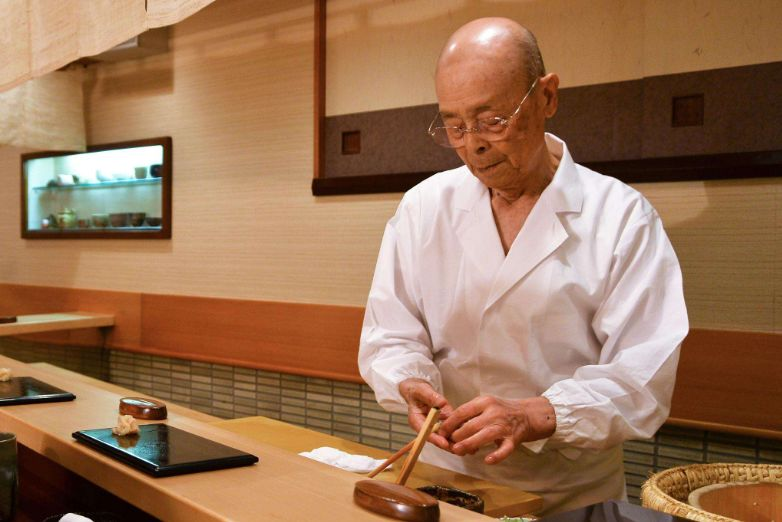 (原始链接: https://mmbiz.qpic.cn/mmbiz_png/HsGdorCWARVqRKS04yPf4TiaknkVhD1PRE0lvBic8OWTagOF7HqQia0pQQXGGb5ibUIHbIMYUo7ys9fxbERIv2gzow/640?wx_fmt=png)
- 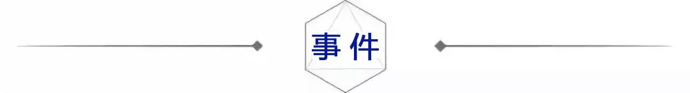 (原始链接: https://mmbiz.qpic.cn/mmbiz_jpg/HsGdorCWARWdBlW15mtsOibfA5oaSmjIUibNG6DiaicYj65OCAyg0T2Q5miamuscFBywU2r3ib2gLU3eZyuNPQUcoLyw/640?wx_fmt=jpeg)
- 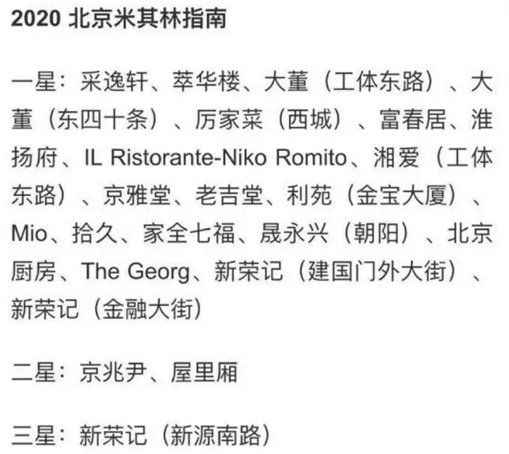 (原始链接: https://mmbiz.qpic.cn/mmbiz_png/HsGdorCWARVqRKS04yPf4TiaknkVhD1PRv521TxkKMx4FORTZfhzadiaZGCZH7sdrH43ibR7ApGSR6EM0zmROYAGQ/640?wx_fmt=png)
- 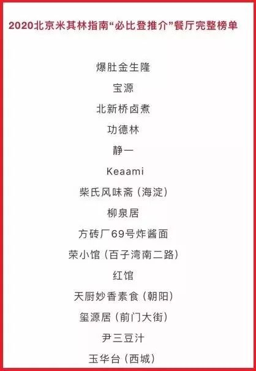 (原始链接: https://mmbiz.qpic.cn/mmbiz_jpg/n2icy4xoEbn5QjCN1uGibp32Ycvtics3Ot5b10gcULTQaKloEeAqictmvfxC17Yydxt5wwo4eqibUicaic3ea1n4w8R6Q/640?wx_fmt=jpeg)
-  (原始链接: https://mmbiz.qpic.cn/mmbiz_png/HsGdorCWARVqRKS04yPf4TiaknkVhD1PRvdX2BU9OpJc1TRdMqFkLbMO9cVwRxaMFxC4JFJIibJsz2GcSG4hpVYA/640?wx_fmt=png)
- 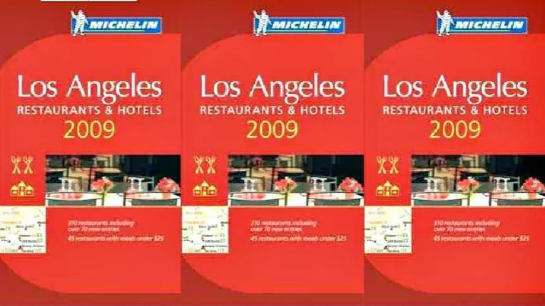 (原始链接: https://mmbiz.qpic.cn/mmbiz_png/HsGdorCWARWbcgYXvQxTsiaic2M3NwzvIYxHUpRopW8A2KyQChdd55u5TOACm3KecB5y3tBGOMfKHicUOXFDssExw/640?wx_fmt=png)
-  (原始链接: https://mmbiz.qpic.cn/mmbiz_png/HsGdorCWARWbcgYXvQxTsiaic2M3NwzvIYynU6F4IsictAeaia2TM3og0jahI3Q77ZiaH1NQE5BykM2s3ic4n0Jhlodw/640?wx_fmt=png)
- 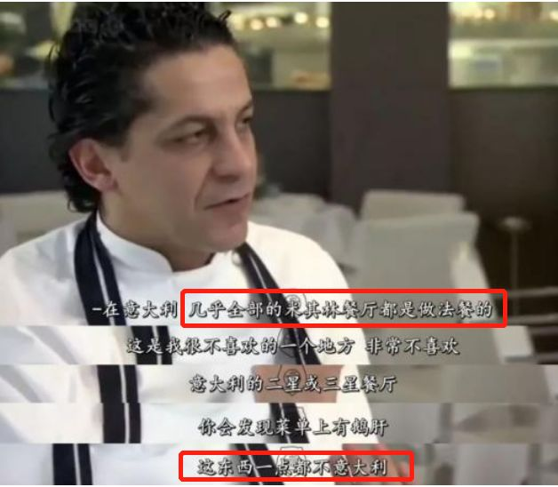 (原始链接: https://mmbiz.qpic.cn/mmbiz_png/HsGdorCWARWbcgYXvQxTsiaic2M3NwzvIYcbsrfd2RBkjknyH2d200GI3QZGKzVPYVKK1x2aDogGGMXhIpaoLic5A/640?wx_fmt=png)
- 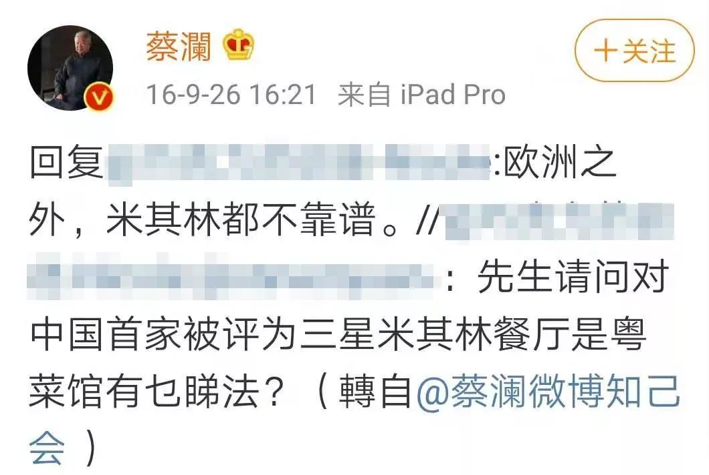 (原始链接: https://mmbiz.qpic.cn/mmbiz_jpg/ibLgUdQXiaIVTmbx7G6BI8gxXau52cJgJ3xGfxkjDTibWiaDdRiaHAaMq7eggZ0jgzCP0uDrSiaFEUoYUTL2KJPAUPlQ/640?wx_fmt=jpeg)
-  (原始链接: https://mmbiz.qpic.cn/mmbiz_png/HsGdorCWARWbcgYXvQxTsiaic2M3NwzvIYqfG1j66Xnaso01Su2FW4AaIsLLOe5jovghL6P1d4QWmYXd0T1aedibQ/640?wx_fmt=png)
- 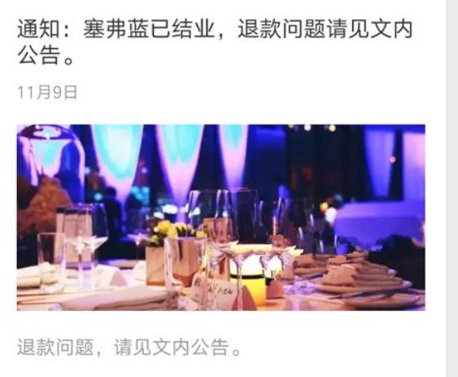 (原始链接: https://mmbiz.qpic.cn/mmbiz_png/HsGdorCWARWbcgYXvQxTsiaic2M3NwzvIYQPYcDSILPSbicicbfDJ239Yh9NMMy0epKvu3XUriaUCKAyr40O3hSmNkA/640?wx_fmt=png)
- 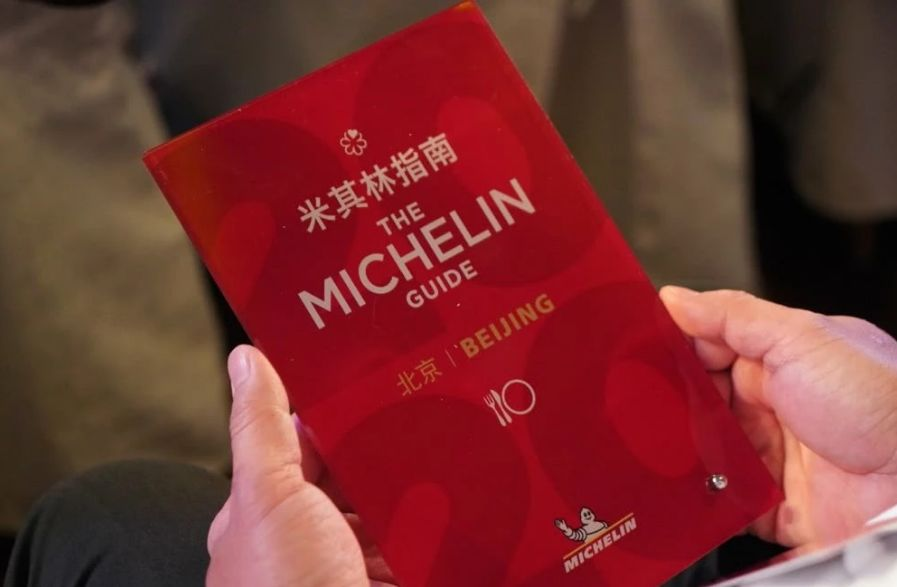 (原始链接: https://mmbiz.qpic.cn/mmbiz_png/HsGdorCWARWbcgYXvQxTsiaic2M3NwzvIYXD0XKGdAzvGy7G9B8QfibbvVD3n6Aicn4v7n0fA4kgRCicQ9c51dVLBwQ/640?wx_fmt=png)
-  (原始链接: https://mmbiz.qpic.cn/mmbiz_png/HsGdorCWARWbcgYXvQxTsiaic2M3NwzvIY2EPMc56dibLFB20fvGZIaENbfmF5ynaS0SZMDI4cJhAtCq6kURhz2bg/640?wx_fmt=png)
- 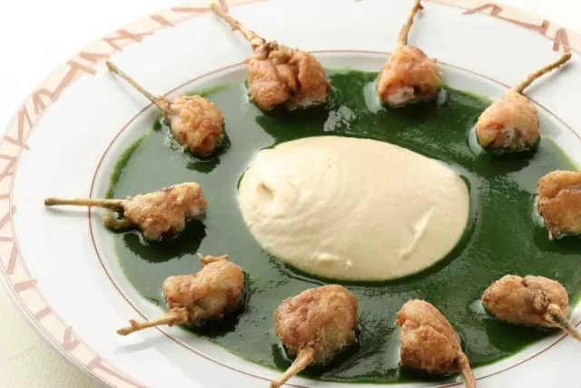 (原始链接: https://mmbiz.qpic.cn/mmbiz_jpg/ggWOPLAratd22uQw5jfMpNwVnGGXCbYlJLGZxKSsR328kemWZKSWSa7GlhlPqUoqDPKFK1L9uQu4eyV9NVwDPw/640?wx_fmt=jpeg)
- 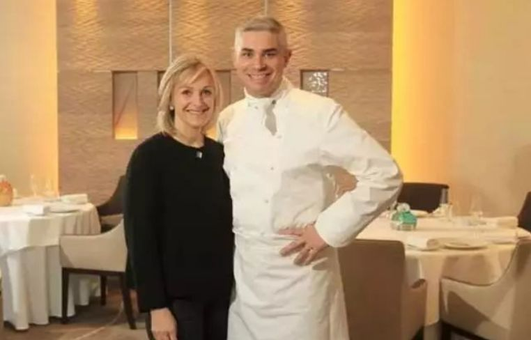 (原始链接: https://mmbiz.qpic.cn/mmbiz_png/HsGdorCWARWbcgYXvQxTsiaic2M3NwzvIYuFSPEY84IibC4UmS8cqxUASiaHYXW8jSK7qvPxEYwuxAqG95BPPHBUmw/640?wx_fmt=png)
- 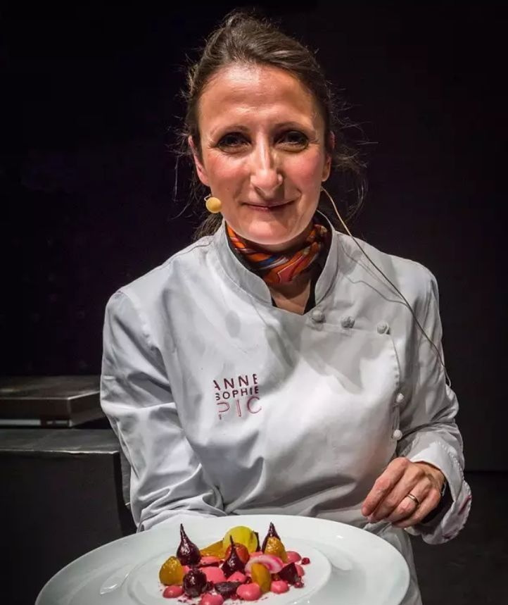 (原始链接: https://mmbiz.qpic.cn/mmbiz_png/HsGdorCWARWbcgYXvQxTsiaic2M3NwzvIYicJJtIdvKrfqOx1gqloqkcQtq3ndHxOY6XEuSPq26TtI2Hw5WGHiaVfw/640?wx_fmt=png)
- 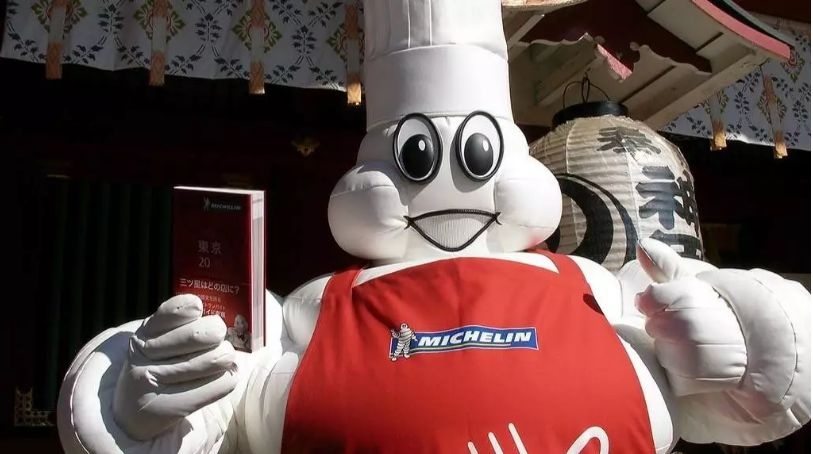 (原始链接: https://mmbiz.qpic.cn/mmbiz_png/HsGdorCWARWbcgYXvQxTsiaic2M3NwzvIYSI0E1Gy5P0rM3yHfm2F71vGct6tL5BxhLQoDg00IPnZKF3N1cYiaDHQ/640?wx_fmt=png)
- 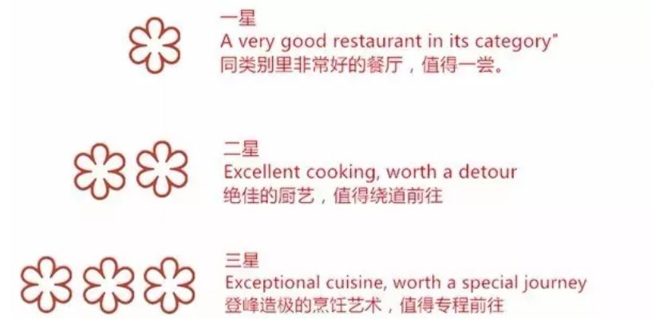 (原始链接: https://mmbiz.qpic.cn/mmbiz_png/HsGdorCWARWbcgYXvQxTsiaic2M3NwzvIYyE9FfIKuSedicBej7ulOosUwMV7n1VYl8YxzFzicUowpIDibZtJTknWcA/640?wx_fmt=png)
- 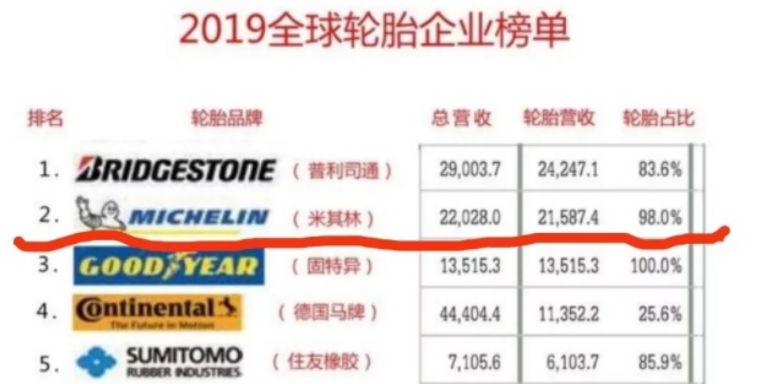 (原始链接: https://mmbiz.qpic.cn/mmbiz_png/HsGdorCWARWbcgYXvQxTsiaic2M3NwzvIYM3Ue6YjCBOjBmyfuzX2LsmZqwUZnGl7DTKd45KHHDVdSeQ7PIyKJqw/640?wx_fmt=png)
- 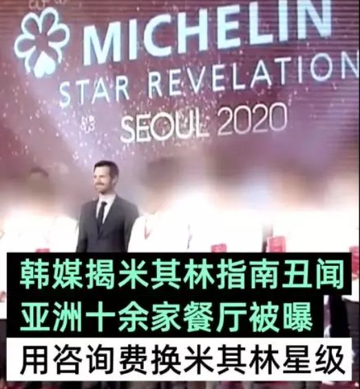 (原始链接: https://mmbiz.qpic.cn/mmbiz_png/HsGdorCWARWbcgYXvQxTsiaic2M3NwzvIYhuc5oZRkgvwxyZPlZcAThklMoE8aZIwkFsXN13hN14dwn1DyFJuEBQ/640?wx_fmt=png)
- 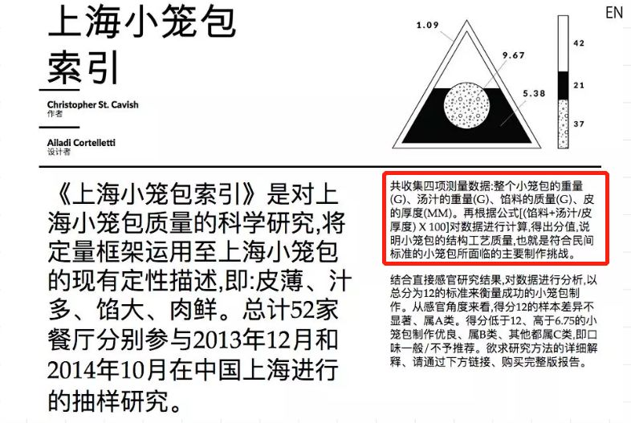 (原始链接: https://mmbiz.qpic.cn/mmbiz_png/HsGdorCWARWbcgYXvQxTsiaic2M3NwzvIYTYfoOqOb5nwB2tA8ek8CgIqjsaG7gLe6oLZwyfHyVMEcSbdD91T0yw/640?wx_fmt=png)
- 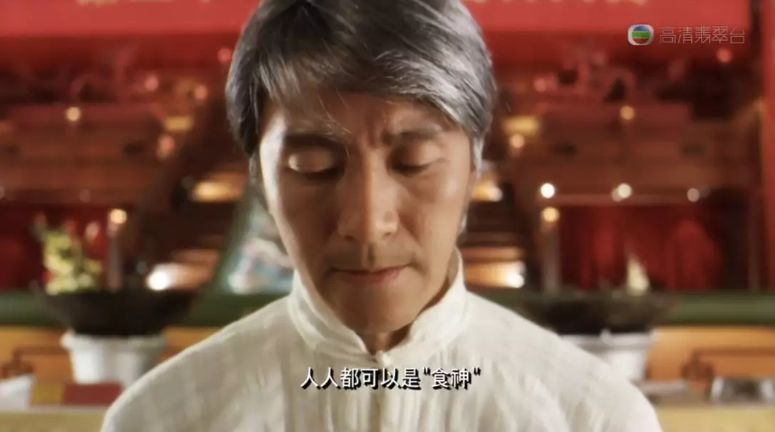 (原始链接: https://mmbiz.qpic.cn/mmbiz_png/HsGdorCWARWbcgYXvQxTsiaic2M3NwzvIYJwHibsDXpSRDCN8rAJej1MAnD8qWauE8yfLPwwncnJ62wicfLcJhNd2g/640?wx_fmt=png)
-  (原始链接: https://mmbiz.qpic.cn/mmbiz_jpg/HsGdorCWARUvDm3I5pSp0q0nLMWKHpgZk91K40jHTNqibu6kvb7aJwI1iafX0LeViaQ6Tlia33eJh9icWMQMnuKBc9A/640?wx_fmt=jpeg)
-  (原始链接: https://mmbiz.qpic.cn/mmbiz_jpg/HsGdorCWARXq2HeJ2M0VYllqMCZz4bQwl49WBfWWScBvbauBzxict5AV5pvyEug5DDqH8t60D78fEgeeZJ8pIPA/640?wx_fmt=jpeg)
-  (原始链接: https://mmbiz.qpic.cn/mmbiz_jpg/HsGdorCWARXq2HeJ2M0VYllqMCZz4bQwcNjkEWFMyYQvcroG1Hbt2qOF6GqgE2DRW3fMKzialqfIib59cYkVMzlQ/640?wx_fmt=jpeg)
-  (原始链接: https://mmbiz.qpic.cn/mmbiz_jpg/HsGdorCWARUtpLK8SSFy66IibRgRYSMa5tNExqOGukiavhIRqO91SlkaWotkerAT6LS9EN33CPd1ricDw9vct8eKw/640?wx_fmt=jpeg)
