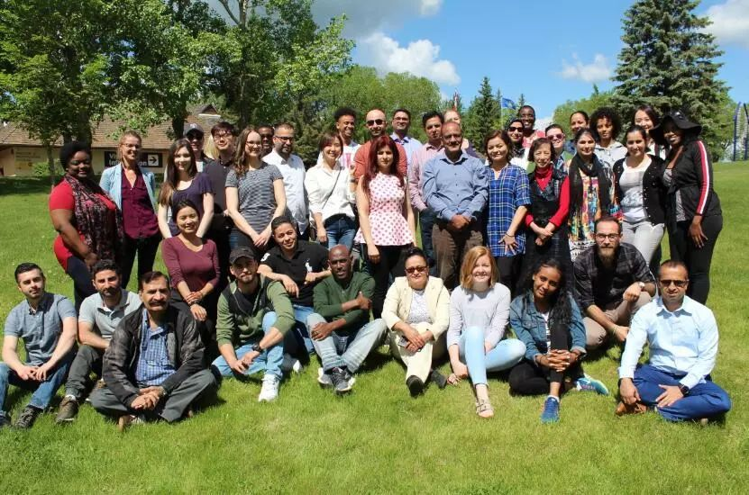

# 无标题

**链接地址:** http://mp.weixin.qq.com/s?__biz=MzI4NDYyNjAwNw==&mid=2247483965&idx=1&sn=6e3b1e69450da5859da912c805e2e4cd&chksm=ebf9df05dc8e561378b2024ba7b2fd74cdc05e20184ae978fc56e75df67d859cdd0b28aa1804&mpshare=1&scene=2&srcid=&sharer_sharetime=1579751828897&sharer_shareid=be1c8edd6c93eec155a61c876e41d26a#rd
**作者:** 
**获取时间:** 2025/8/28 20:20:49
**图片数量:** 14

---

## 原始HTML内容

<section style="box-sizing: border-box;font-size: 16px;"><section style=" margin: 10px 0%; box-sizing: border-box; " powered-by="xiumi.us"><section style="display: inline-block;vertical-align: middle;width: 45%;box-sizing: border-box;"><section style=" text-align: right;transform: translate3d(15px, 0px, 0px);margin-right: 0%;margin-left: 0%; box-sizing: border-box; " powered-by="xiumi.us"><section style="display: inline-block;width: 150px;height: 150px;vertical-align: top;overflow: hidden;background-color: rgba(118, 178, 124, 0);border-radius: 100%;border-width: 0px;border-style: none;border-color: rgb(237, 237, 237);box-sizing: border-box;"><section style=" text-align: center;margin-right: 0%;margin-left: 0%; box-sizing: border-box; " powered-by="xiumi.us"><section style="max-width: 100%;vertical-align: middle;display: inline-block;line-height: 0;box-sizing: border-box;"></section></section></section></section></section><section style="display: inline-block;vertical-align: middle;width: 55%;box-sizing: border-box;"><section style=" text-align: left;transform: translate3d(-30px, 0px, 0px);-webkit-transform: translate3d(-30px, 0px, 0px);-moz-transform: translate3d(-30px, 0px, 0px);-o-transform: translate3d(-30px, 0px, 0px); box-sizing: border-box; " powered-by="xiumi.us"><section style="display: inline-block;width: 200px;height: 200px;vertical-align: top;overflow: hidden;background-color: rgba(118, 178, 124, 0);border-radius: 100%;border-width: 1px;border-style: dashed;border-color: rgb(1, 169, 216);box-sizing: border-box;"><section style="  box-sizing: border-box; " powered-by="xiumi.us"><section style="display: inline-block;vertical-align: middle;width: 40%;box-sizing: border-box;"><section style=" text-align: center; box-sizing: border-box; " powered-by="xiumi.us"><section style="display: inline-block;width: 70px;height: 200px;vertical-align: top;overflow: hidden;box-sizing: border-box;"><section style=" text-align: left;transform: translate3d(5px, 0px, 0px);margin-top: 65px;margin-right: 0%;margin-left: 0%;opacity: 0.4; box-sizing: border-box; " powered-by="xiumi.us"><section style="display: inline-block;width: 65px;height: 65px;vertical-align: top;overflow: hidden;border-radius: 100%;border-width: 0px;border-style: none;border-color: rgb(237, 237, 237);padding: 15px;background-color: rgb(125, 192, 232);box-sizing: border-box;line-height: 0;"> </section></section></section></section></section><section style="display: inline-block;vertical-align: middle;width: 60%;padding-left: 10px;box-sizing: border-box;"><section style=" transform: translate3d(-30px, 0px, 0px);-webkit-transform: translate3d(-30px, 0px, 0px);-moz-transform: translate3d(-30px, 0px, 0px);-o-transform: translate3d(-30px, 0px, 0px); box-sizing: border-box; " powered-by="xiumi.us"><section style="text-align: justify;font-size: 15px;line-height: 1.6;color: rgb(121, 121, 121);box-sizing: border-box;">
<strong style="box-sizing: border-box;">报税季降至。同时这也是一个锻炼技能和增加经验的好机会哦！</strong>
</section></section></section></section></section></section></section></section><section style="  box-sizing: border-box; " powered-by="xiumi.us"><section style="display: inline-block;vertical-align: top;width: 45%;box-sizing: border-box;"><section style=" margin: 22px 0% 8px; box-sizing: border-box; " powered-by="xiumi.us"><section style="border-top: 1px dashed rgb(125, 192, 232);box-sizing: border-box;height: 1px;line-height: 0;"> </section></section></section><section style="display: inline-block;vertical-align: top;width: 10%;box-sizing: border-box;"><section style=" text-align: center;margin-top: 10px;margin-bottom: 10px; box-sizing: border-box; " powered-by="xiumi.us"><section style="max-width: 100%;vertical-align: middle;display: inline-block;line-height: 0;width: 60%;box-sizing: border-box;"></section></section></section><section style="display: inline-block;vertical-align: top;width: 45%;box-sizing: border-box;"><section style=" margin: 22px 0% 8px; box-sizing: border-box; " powered-by="xiumi.us"><section style="border-top: 1px dashed rgb(125, 192, 232);box-sizing: border-box;height: 1px;line-height: 0;"> </section></section></section></section><section style=" text-align: center;margin: 10px 0%; box-sizing: border-box; " powered-by="xiumi.us"><section style="display: inline-block;width: 60px;height: 30px;vertical-align: top;overflow: hidden;background-position: 50% 50%;background-repeat: no-repeat;background-size: contain;background-attachment: scroll;background-image: url(&quot;https://mmbiz.qpic.cn/mmbiz_gif/cY0qSDjdkFcj2icHyWcicGEedGCBVL4zlZ4UWo9n1Qu5vBA9o1oaU0HfUn0jXHOfrWKgxZGvl0y93KnmGMv94wNA/640?wx_fmt=gif&quot;);box-sizing: border-box;"><section style=" margin-top: 3px;margin-right: 0%;margin-left: 0%; box-sizing: border-box; " powered-by="xiumi.us"><section style="color: rgb(255, 255, 255);text-shadow: rgb(121, 121, 121) 1px 1px 1px;box-sizing: border-box;">
<strong style="box-sizing: border-box;">好机会</strong>
</section></section></section></section><section style=" margin: 10px 0%; box-sizing: border-box; " powered-by="xiumi.us"><section style="display: inline-block;vertical-align: middle;width: 45%;align-self: center;box-sizing: border-box;"><section style=" text-align: left;margin: 12px 0% 11px; box-sizing: border-box; " powered-by="xiumi.us"><section style="max-width: 100%;vertical-align: middle;display: inline-block;line-height: 0;width: 90%;border-style: double;border-width: 3px;border-radius: 0px;border-color: rgb(125, 192, 232);box-shadow: rgb(40, 115, 200) 0px 0px 0px;box-sizing: border-box;"></section></section></section><section style="display: inline-block;vertical-align: middle;width: 55%;align-self: center;box-sizing: border-box;"><section style=" margin: 10px 0%; box-sizing: border-box; " powered-by="xiumi.us"><section style="display: inline-block;width: 100%;vertical-align: top;background-position: 0% 0%;background-repeat: repeat;background-size: 35.9822%;background-attachment: scroll;padding: 15px;background-image: url(&quot;https://mmbiz.qpic.cn/mmbiz_png/cY0qSDjdkFcj2icHyWcicGEedGCBVL4zlZ5clnAHdlFiaJys4DqKnKhtlib0RO4CddJAxnvSzicyYHEyerDPyr7HvrQ/640?wx_fmt=png&quot;);box-sizing: border-box;"><section style="color: rgb(26, 82, 145);font-size: 14px;line-height: 1.4;box-sizing: border-box;" powered-by="xiumi.us">
♥ 想要学习专业的报税技能吗？

♥ 想要累积报税实战经验吗？

♥ 想要在简历上增添一抹耀眼的义工经历吗？
</section></section></section></section></section><section style=" text-align: center;margin-top: 10px;margin-right: 0%;margin-left: 0%; box-sizing: border-box; " powered-by="xiumi.us"><section style="display: inline-block;min-width: 10%;max-width: 100%;vertical-align: top;box-sizing: border-box;"><section style="  box-sizing: border-box; " powered-by="xiumi.us"><section style="display: inline-block;width: 100%;vertical-align: top;background-color: rgb(255, 255, 255);border-width: 1px;border-radius: 8px;border-style: solid;border-color: rgb(51, 167, 233);overflow: hidden;letter-spacing: 0px;padding: 10px;line-height: 1;box-shadow: rgb(125, 192, 232) 0px -3px 0px inset;box-sizing: border-box;"><section style=" transform: translate3d(1px, 0px, 0px);margin-right: 0%;margin-left: 0%; box-sizing: border-box; " powered-by="xiumi.us"><section style="text-align: justify;color: rgb(26, 82, 145);letter-spacing: 2px;font-size: 14px;box-sizing: border-box;">
<strong style="box-sizing: border-box;">学习会计，金融等商学院课程的同学们，</strong>

<strong style="box-sizing: border-box;">或者想要学习报税技能，累计报税经验的同学们，</strong>

 

<strong style="box-sizing: border-box;">注意啦！</strong>

 

<strong style="box-sizing: border-box;">丰富简历</strong><strong style="box-sizing: border-box;">的好机会来啦！</strong>
</section></section></section></section><section style=" text-align: left;transform: translate3d(10px, 0px, 0px);margin-top: -1px;margin-right: 0%;margin-left: 0%; box-sizing: border-box; " powered-by="xiumi.us"><section style="display: inline-block;width: 16px;height: 20px;vertical-align: top;overflow: hidden;line-height: 0;letter-spacing: 0px;box-sizing: border-box;"><section style=" text-align: center;margin-right: 0%;margin-left: 0%; box-sizing: border-box; " powered-by="xiumi.us"><section style="max-width: 100%;vertical-align: middle;display: inline-block;line-height: 0;width: 90%;box-shadow: rgb(0, 0, 0) 0px 0px 0px;box-sizing: border-box;"><svg xmlns="http://www.w3.org/2000/svg" x="0px" y="0px" viewBox="0 0 38.4 26.9" style="vertical-align: middle;max-width: 100%;width: 100%;box-sizing: border-box;" width="100%"><path style="box-sizing: border-box;" d="M6.5,0c0.1,0,5.5,0.6,4.9,5.9c-0.9,7.8-4,14.1-8.5,19.3c11.8-2.8,19.6-9.6,24.2-19.1  c0-0.1,0.1-0.1,0.1-0.2C29.9,0.7,37.2,0,38.4,0" fill="rgb(125,192,232)"></path><path style="box-sizing: border-box;" d="M0,26.9l2.1-2.3c4.7-5.3,7.4-11.1,8.3-18c0.1-1.2-0.1-2.2-0.7-2.9C8.5,2.2,6.4,2,6.4,2V0  c0,0,2.9,0.2,4.7,2.2c1.1,1.2,1.5,2.8,1.3,4.6c-0.7,6.2-3,11.7-6.7,16.6c9.3-2.8,16.2-8.5,20.5-16.9c0-0.1,0.1-0.2,0.1-0.3l0,0  c3.2-6,12-6.2,12.1-6.2v2c-0.1,0-7.6,0.3-10.3,5.1c0,0.1-0.1,0.2-0.1,0.3l0,0c-5,9.9-13.3,16.2-24.9,18.8L0,26.9z" fill="rgb(51,167,233)"></path></svg></section></section></section></section></section></section><section style="  box-sizing: border-box; " powered-by="xiumi.us"><section style="display: inline-block;vertical-align: top;width: 45%;box-sizing: border-box;"><section style=" margin: 22px 0% 8px; box-sizing: border-box; " powered-by="xiumi.us"><section style="border-top: 1px dashed rgb(125, 192, 232);box-sizing: border-box;height: 1px;line-height: 0;"> </section></section></section><section style="display: inline-block;vertical-align: top;width: 10%;box-sizing: border-box;"><section style=" text-align: center;margin-top: 10px;margin-bottom: 10px; box-sizing: border-box; " powered-by="xiumi.us"><section style="max-width: 100%;vertical-align: middle;display: inline-block;line-height: 0;width: 60%;box-sizing: border-box;"></section></section></section><section style="display: inline-block;vertical-align: top;width: 45%;box-sizing: border-box;"><section style=" margin: 22px 0% 8px; box-sizing: border-box; " powered-by="xiumi.us"><section style="border-top: 1px dashed rgb(125, 192, 232);box-sizing: border-box;height: 1px;line-height: 0;"> </section></section></section></section><section style=" margin-top: 10px;margin-bottom: 10px; box-sizing: border-box; " powered-by="xiumi.us"><section style="padding-top: 1.1em;box-sizing: border-box;"><section style="display: inline-block;vertical-align: top;box-sizing: border-box;"><section style="border-radius: 0px 0.5em 0.5em 0px;background-color: rgb(125, 192, 232);padding: 0.2em 0.4em;color: rgb(255, 255, 255);font-size: 14px;text-shadow: rgb(121, 121, 121) 1px 1px 1px;box-sizing: border-box;">
<strong style="box-sizing: border-box;">描述 / Volunteer Position Description</strong>
</section><section style="width: 0px;border-right: 4px solid rgb(125, 192, 232);border-top: 4px solid rgb(125, 192, 232);box-sizing: border-box;height: 1px;line-height: 0;border-left: 4px solid transparent !important;border-bottom: 4px solid transparent !important;"> </section></section><section style="display: inline-block;vertical-align: top;padding-left: 10px;color: rgb(0, 0, 0);font-size: 21px;box-sizing: border-box;">
 
</section><section style="border-color: rgb(204, 204, 204);border-width: 1px;border-style: solid;padding: 3.5em 10px 10px;margin-left: 8px;margin-top: -3.5em;background-color: rgba(211, 226, 242, 0.89);box-shadow: rgb(0, 0, 0) 0px 0px 0px;box-sizing: border-box;"><section style=" text-align: center;margin-top: 0.5em;margin-bottom: 0.5em;padding-left: 0.5em;padding-right: 0.5em; box-sizing: border-box; " powered-by="xiumi.us"><section style="box-sizing: border-box;width: 100%;box-shadow: rgb(102, 102, 102) 3.2px 3.2px 8px;display: inline-block;line-height: 0;border-color: white;height: auto !important;"></section></section><section style="text-align: left;font-size: 12px;color: rgba(0, 0, 0, 0.24);box-sizing: border-box;" powered-by="xiumi.us">
Action For Healthy Communities Team Photo 2019
</section><section style="box-sizing: border-box;" powered-by="xiumi.us">
 
</section><section style="text-align: left;font-size: 14px;color: rgb(121, 121, 121);letter-spacing: 0px;padding-right: 10px;padding-left: 10px;box-sizing: border-box;" powered-by="xiumi.us">
<strong style="box-sizing: border-box;">Action For Healthy Communities (AHC)</strong> looking for volunteers who are interested in becoming <strong style="box-sizing: border-box;">Community volunteer income tax program (CVITP to prepare income tax for clients)</strong>.&nbsp;

 

The volunteers are required to complete training by experienced tax specialist as well orientation. Appointment booking for volunteers will begin on February 4, 2020.

 

The tax clinics will be open 5 days, at various locations.
</section><section style="box-sizing: border-box;" powered-by="xiumi.us">
 
</section></section></section></section><section style=" margin-top: 10px;margin-bottom: 10px; box-sizing: border-box; " powered-by="xiumi.us"><section style="padding-top: 1.1em;box-sizing: border-box;"><section style="display: inline-block;vertical-align: top;box-sizing: border-box;"><section style="border-radius: 0px 0.5em 0.5em 0px;background-color: rgb(125, 192, 232);padding: 0.2em 0.4em;color: rgb(255, 255, 255);font-size: 14px;text-shadow: rgb(121, 121, 121) 1px 1px 1px;box-sizing: border-box;">
<strong style="box-sizing: border-box;">职责 / Duties Includ</strong>
</section><section style="width: 0px;border-right: 4px solid rgb(125, 192, 232);border-top: 4px solid rgb(125, 192, 232);box-sizing: border-box;height: 1px;line-height: 0;border-left: 4px solid transparent !important;border-bottom: 4px solid transparent !important;"> </section></section><section style="display: inline-block;vertical-align: top;padding-left: 10px;color: rgb(0, 0, 0);font-size: 21px;box-sizing: border-box;">
 
</section><section style="border-color: rgb(204, 204, 204);border-width: 1px;border-style: solid;padding: 3.5em 10px 10px;margin-left: 8px;margin-top: -3.5em;background-color: rgba(211, 226, 242, 0.89);box-shadow: rgb(0, 0, 0) 0px 0px 0px;box-sizing: border-box;"><section style=" text-align: center;margin-top: 0.5em;margin-bottom: 0.5em;padding-left: 0.5em;padding-right: 0.5em; box-sizing: border-box; " powered-by="xiumi.us"><section style="box-sizing: border-box;width: 100%;box-shadow: rgb(102, 102, 102) 3.2px 3.2px 8px;display: inline-block;line-height: 0;border-color: white;height: auto !important;"></section></section><section style="text-align: center;color: rgb(26, 82, 145);text-shadow: rgba(0, 0, 0, 0.24) 1px 1px 1px;box-sizing: border-box;" powered-by="xiumi.us">
<strong style="box-sizing: border-box;">UFile income tax for clients</strong>
</section></section></section></section><section style=" margin-top: 10px;margin-bottom: 10px; box-sizing: border-box; " powered-by="xiumi.us"><section style="padding-top: 1.1em;box-sizing: border-box;"><section style="display: inline-block;vertical-align: top;box-sizing: border-box;"><section style="border-radius: 0px 0.5em 0.5em 0px;background-color: rgb(125, 192, 232);padding: 0.2em 0.4em;color: rgb(255, 255, 255);font-size: 14px;text-shadow: rgb(121, 121, 121) 1px 1px 1px;box-sizing: border-box;">
<strong style="box-sizing: border-box;">任务安排 /&nbsp;</strong><strong style="box-sizing: border-box;">Volunteer Commitment</strong>
</section><section style="width: 0px;border-right: 4px solid rgb(125, 192, 232);border-top: 4px solid rgb(125, 192, 232);box-sizing: border-box;height: 1px;line-height: 0;border-left: 4px solid transparent !important;border-bottom: 4px solid transparent !important;"> </section></section><section style="display: inline-block;vertical-align: top;padding-left: 10px;color: rgb(0, 0, 0);font-size: 21px;box-sizing: border-box;">
 
</section><section style="border-color: rgb(204, 204, 204);border-width: 1px;border-style: solid;padding: 3.5em 10px 10px;margin-left: 8px;margin-top: -3.5em;background-color: rgba(211, 226, 242, 0.89);box-shadow: rgb(0, 0, 0) 0px 0px 0px;box-sizing: border-box;"><section style="text-align: left;font-size: 14px;padding-right: 10px;padding-left: 10px;box-sizing: border-box;" powered-by="xiumi.us">
⭐ Available to attend an Orientation - date to be determined.

⭐&nbsp;Must commit to&nbsp;complete tax clinic and orientation training -&nbsp;date to be determined.

⭐ Able to commit to&nbsp;agree upon schedule&nbsp;(for volunteers of all locations) - to be determined.

⭐ Volunteers must commit at least 8 hr. per week.

⭐ Volunteers must commit for the duration of the tax season (March to April/2020).

 
</section></section></section></section><section style=" margin-top: 10px;margin-bottom: 10px; box-sizing: border-box; " powered-by="xiumi.us"><section style="padding-top: 1.1em;box-sizing: border-box;"><section style="display: inline-block;vertical-align: top;box-sizing: border-box;"><section style="border-radius: 0px 0.5em 0.5em 0px;background-color: rgb(125, 192, 232);padding: 0.2em 0.4em;color: rgb(255, 255, 255);font-size: 14px;text-shadow: rgb(121, 121, 121) 1px 1px 1px;box-sizing: border-box;">
<strong style="box-sizing: border-box;">要求 /&nbsp;Volunteer Requirements</strong>
</section><section style="width: 0px;border-right: 4px solid rgb(125, 192, 232);border-top: 4px solid rgb(125, 192, 232);box-sizing: border-box;height: 1px;line-height: 0;border-left: 4px solid transparent !important;border-bottom: 4px solid transparent !important;"> </section></section><section style="display: inline-block;vertical-align: top;padding-left: 10px;color: rgb(0, 0, 0);font-size: 21px;box-sizing: border-box;">
 
</section><section style="border-color: rgb(204, 204, 204);border-width: 1px;border-style: solid;padding: 3.5em 10px 10px;margin-left: 8px;margin-top: -3.5em;background-color: rgba(211, 226, 242, 0.89);box-shadow: rgb(0, 0, 0) 0px 0px 0px;box-sizing: border-box;"><section style=" text-align: center;margin-top: 10px;margin-bottom: 10px; box-sizing: border-box; " powered-by="xiumi.us"><section style="max-width: 100%;vertical-align: middle;display: inline-block;line-height: 0;box-shadow: rgb(0, 0, 0) 0px 0px 0px;box-sizing: border-box;"></section></section><section style="box-sizing: border-box;" powered-by="xiumi.us">
 
</section><section style="text-align: left;font-size: 14px;padding-right: 10px;padding-left: 10px;box-sizing: border-box;" powered-by="xiumi.us">
⭐ Good in using computer

⭐ Ability to work with high level of confidentiality and privacy

⭐ Interest in income tax preparation or similar interests

⭐ Organized, reliable and punctual

⭐ Ability to provide high level of customer service

⭐ Act in accordance with program procedures, policies and agreements.

⭐ Represent Action for Healthy Communities in a positive and professional manner

 
</section></section></section></section><section style=" margin-top: 10px;margin-bottom: 10px; box-sizing: border-box; " powered-by="xiumi.us"><section style="padding-top: 1.1em;box-sizing: border-box;"><section style="display: inline-block;vertical-align: top;box-sizing: border-box;"><section style="border-radius: 0px 0.5em 0.5em 0px;background-color: rgb(125, 192, 232);padding: 0.2em 0.4em;color: rgb(255, 255, 255);font-size: 14px;text-shadow: rgb(121, 121, 121) 1px 1px 1px;box-sizing: border-box;">
<strong style="box-sizing: border-box;">推荐技能 /&nbsp;</strong><strong style="box-sizing: border-box;">Volunteer Assets</strong>
</section><section style="width: 0px;border-right: 4px solid rgb(125, 192, 232);border-top: 4px solid rgb(125, 192, 232);box-sizing: border-box;height: 1px;line-height: 0;border-left: 4px solid transparent !important;border-bottom: 4px solid transparent !important;"> </section></section><section style="display: inline-block;vertical-align: top;padding-left: 10px;color: rgb(0, 0, 0);font-size: 21px;box-sizing: border-box;">
 
</section><section style="border-color: rgb(204, 204, 204);border-width: 1px;border-style: solid;padding: 3.5em 10px 10px;margin-left: 8px;margin-top: -3.5em;background-color: rgba(211, 226, 242, 0.89);box-shadow: rgb(0, 0, 0) 0px 0px 0px;box-sizing: border-box;"><section style=" text-align: center;margin-top: 0.5em;margin-bottom: 0.5em;padding-left: 0.5em;padding-right: 0.5em; box-sizing: border-box; " powered-by="xiumi.us"><section style="box-sizing: border-box;width: 100%;box-shadow: rgb(102, 102, 102) 3.2px 3.2px 8px;display: inline-block;line-height: 0;border-color: white;height: auto !important;"></section></section><section style="box-sizing: border-box;" powered-by="xiumi.us">
 
</section><section style="text-align: left;font-size: 14px;padding-right: 10px;padding-left: 10px;box-sizing: border-box;" powered-by="xiumi.us">
⭐&nbsp;Good of numeracy skills, background in accounting, finance or business

⭐ Can speak a second language that is common in the neighbourhoods

 
</section></section></section></section><section style=" margin-top: 10px;margin-bottom: 10px; box-sizing: border-box; " powered-by="xiumi.us"><section style="padding-top: 1.1em;box-sizing: border-box;"><section style="display: inline-block;vertical-align: top;box-sizing: border-box;"><section style="border-radius: 0px 0.5em 0.5em 0px;background-color: rgb(125, 192, 232);padding: 0.2em 0.4em;color: rgb(255, 255, 255);font-size: 14px;text-shadow: rgb(121, 121, 121) 1px 1px 1px;box-sizing: border-box;">
<strong style="box-sizing: border-box;">对志愿者的好处 /&nbsp;</strong><strong style="box-sizing: border-box;">Benefits for the Volunteer</strong>
</section><section style="width: 0px;border-right: 4px solid rgb(125, 192, 232);border-top: 4px solid rgb(125, 192, 232);box-sizing: border-box;height: 1px;line-height: 0;border-left: 4px solid transparent !important;border-bottom: 4px solid transparent !important;"> </section></section><section style="display: inline-block;vertical-align: top;padding-left: 10px;color: rgb(0, 0, 0);font-size: 21px;box-sizing: border-box;">
 
</section><section style="border-color: rgb(204, 204, 204);border-width: 1px;border-style: solid;padding: 3.5em 10px 10px;margin-left: 8px;margin-top: -3.5em;background-color: rgba(211, 226, 242, 0.89);box-shadow: rgb(0, 0, 0) 0px 0px 0px;box-sizing: border-box;"><section style=" text-align: center;margin-top: 10px;margin-bottom: 10px; box-sizing: border-box; " powered-by="xiumi.us"><section style="max-width: 100%;vertical-align: middle;display: inline-block;line-height: 0;box-sizing: border-box;"></section></section><section style="box-sizing: border-box;" powered-by="xiumi.us">
 
</section><section style="text-align: left;font-size: 14px;padding-right: 10px;padding-left: 10px;box-sizing: border-box;" powered-by="xiumi.us">
⭐&nbsp;Gain income tax filling training from experienced tax specialist

⭐ Gain first hand income tax preparation experience

⭐ Gain leadership skills

⭐ Gain customer service skills

⭐ Gain experience with handling confidential and personal information

⭐ Gain experience volunteering in a community

⭐ Gain experience working with a non-profit organization

⭐ Get to know your community members and provide them with services

⭐ Be involved in shaping your community

 
</section></section></section></section><section style="  box-sizing: border-box; " powered-by="xiumi.us"><section style="display: inline-block;vertical-align: top;width: 45%;box-sizing: border-box;"><section style=" margin: 22px 0% 8px; box-sizing: border-box; " powered-by="xiumi.us"><section style="border-top: 1px dashed rgb(125, 192, 232);box-sizing: border-box;height: 1px;line-height: 0;"> </section></section></section><section style="display: inline-block;vertical-align: top;width: 10%;box-sizing: border-box;"><section style=" text-align: center;margin-top: 10px;margin-bottom: 10px; box-sizing: border-box; " powered-by="xiumi.us"><section style="max-width: 100%;vertical-align: middle;display: inline-block;line-height: 0;width: 60%;box-sizing: border-box;"></section></section></section><section style="display: inline-block;vertical-align: top;width: 45%;box-sizing: border-box;"><section style=" margin: 22px 0% 8px; box-sizing: border-box; " powered-by="xiumi.us"><section style="border-top: 1px dashed rgb(125, 192, 232);box-sizing: border-box;height: 1px;line-height: 0;"> </section></section></section></section><section style=" text-align: center;margin-top: 10px;margin-right: 0%;margin-left: 0%; box-sizing: border-box; " powered-by="xiumi.us"><section style="display: inline-block;min-width: 10%;max-width: 100%;vertical-align: top;box-sizing: border-box;"><section style="  box-sizing: border-box; " powered-by="xiumi.us"><section style="display: inline-block;width: 100%;vertical-align: top;background-color: rgb(255, 255, 255);border-width: 1px;border-radius: 8px;border-style: solid;border-color: rgb(51, 167, 233);overflow: hidden;letter-spacing: 0px;padding: 10px;line-height: 1;box-shadow: rgb(125, 192, 232) 0px -3px 0px inset;box-sizing: border-box;"><section style=" transform: translate3d(1px, 0px, 0px);margin-right: 0%;margin-left: 0%; box-sizing: border-box; " powered-by="xiumi.us"><section style="text-align: justify;color: rgb(26, 82, 145);letter-spacing: 2px;font-size: 14px;box-sizing: border-box;">
<strong style="box-sizing: border-box;">对志愿活动感兴趣？</strong>

<strong style="box-sizing: border-box;">想要了解更多内容和行程安排？</strong>

 

<strong style="box-sizing: border-box;">请联系——</strong>
</section></section></section></section><section style=" text-align: left;transform: translate3d(10px, 0px, 0px);margin-top: -1px;margin-right: 0%;margin-left: 0%; box-sizing: border-box; " powered-by="xiumi.us"><section style="display: inline-block;width: 16px;height: 20px;vertical-align: top;overflow: hidden;line-height: 0;letter-spacing: 0px;box-sizing: border-box;"><section style=" text-align: center;margin-right: 0%;margin-left: 0%; box-sizing: border-box; " powered-by="xiumi.us"><section style="max-width: 100%;vertical-align: middle;display: inline-block;line-height: 0;width: 90%;box-shadow: rgb(0, 0, 0) 0px 0px 0px;box-sizing: border-box;"><svg xmlns="http://www.w3.org/2000/svg" x="0px" y="0px" viewBox="0 0 38.4 26.9" style="vertical-align: middle;max-width: 100%;width: 100%;box-sizing: border-box;" width="100%"><path style="box-sizing: border-box;" d="M6.5,0c0.1,0,5.5,0.6,4.9,5.9c-0.9,7.8-4,14.1-8.5,19.3c11.8-2.8,19.6-9.6,24.2-19.1  c0-0.1,0.1-0.1,0.1-0.2C29.9,0.7,37.2,0,38.4,0" fill="rgb(125,192,232)"></path><path style="box-sizing: border-box;" d="M0,26.9l2.1-2.3c4.7-5.3,7.4-11.1,8.3-18c0.1-1.2-0.1-2.2-0.7-2.9C8.5,2.2,6.4,2,6.4,2V0  c0,0,2.9,0.2,4.7,2.2c1.1,1.2,1.5,2.8,1.3,4.6c-0.7,6.2-3,11.7-6.7,16.6c9.3-2.8,16.2-8.5,20.5-16.9c0-0.1,0.1-0.2,0.1-0.3l0,0  c3.2-6,12-6.2,12.1-6.2v2c-0.1,0-7.6,0.3-10.3,5.1c0,0.1-0.1,0.2-0.1,0.3l0,0c-5,9.9-13.3,16.2-24.9,18.8L0,26.9z" fill="rgb(51,167,233)"></path></svg></section></section></section></section></section></section><section style=" margin: 10px 0%; box-sizing: border-box; " powered-by="xiumi.us"><section style="display: inline-block;width: 100%;vertical-align: top;padding-right: 10px;padding-left: 10px;box-sizing: border-box;"><section style="  box-sizing: border-box; " powered-by="xiumi.us"><section style=" text-align: center;justify-content: center;margin: 10px 0%;display: flex;flex-flow: row nowrap; box-sizing: border-box; "><section style="display: inline-block;vertical-align: top;width: auto;align-self: flex-start;flex: 0 0 0%;height: auto;border-width: 0px;box-sizing: border-box;"><section style=" text-align: right;transform: translate3d(-3px, 0px, 0px);margin-top: -6px;margin-right: 0%;margin-left: 0%;justify-content: flex-end; box-sizing: border-box; " powered-by="xiumi.us"><section style="display: inline-block;width: 10px;height: 13px;vertical-align: top;overflow: hidden;background-position: 50% 50%;background-repeat: no-repeat;background-size: contain;background-attachment: scroll;background-image: url(&quot;https://mmbiz.qpic.cn/mmbiz_png/cY0qSDjdkFcj2icHyWcicGEedGCBVL4zlZWoyJ1owDiapYq1FbkTpsOmsGUBLHHucWQ1JtMls7Bssj4ibibOP02RTsQ/640?wx_fmt=png&quot;);box-sizing: border-box;line-height: 0;"> </section></section></section><section style="display: inline-block;vertical-align: middle;width: auto;flex: 100 100 0%;height: auto;align-self: center;border-style: solid none;border-width: 1px 1px 2px;border-radius: 0px;border-color: rgb(40, 115, 200) rgb(235, 74, 67);background-color: rgba(211, 226, 242, 0.89);box-sizing: border-box;"><section style=" margin-right: 0%;margin-bottom: 1px;margin-left: 0%; box-sizing: border-box; " powered-by="xiumi.us"><section style="display: inline-block;width: 90%;vertical-align: top;border-bottom: 1px solid rgb(125, 192, 232);border-bottom-right-radius: 0px;height: auto;box-sizing: border-box;"><section style=" justify-content: center;margin: 10px 0%; box-sizing: border-box; " powered-by="xiumi.us"><section style="display: inline-block;vertical-align: middle;width: 28%;height: auto;padding: 3px;border-width: 1px;border-radius: 0px;border-style: solid;border-color: rgb(125, 192, 232);align-self: center;box-sizing: border-box;"><section style=" margin-right: 0%;margin-left: 0%; box-sizing: border-box; " powered-by="xiumi.us"><section style="max-width: 100%;vertical-align: middle;display: inline-block;line-height: 0;width: 50%;height: auto;border-width: 0px;box-sizing: border-box;"></section></section></section><section style="display: inline-block;vertical-align: middle;width: 70%;align-self: center;border-width: 0px;height: auto;box-sizing: border-box;"><section style=" transform: translate3d(1px, 0px, 0px);margin-right: 0%;margin-left: 0%; box-sizing: border-box; " powered-by="xiumi.us"><section style="text-align: right;font-size: 14px;color: rgb(26, 82, 145);box-sizing: border-box;">
<strong style="box-sizing: border-box;">Zeinab Abdelaziz</strong>

<strong style="box-sizing: border-box;">email: Zeinab.abdelaziz@a4hc.ca/</strong>

<strong style="box-sizing: border-box;">Cell: 780-235-3619</strong>
</section></section></section></section></section></section></section><section style="display: inline-block;vertical-align: bottom;width: auto;align-self: flex-end;flex: 0 0 0%;height: auto;line-height: 0;box-sizing: border-box;"><section style=" text-align: left;justify-content: flex-start;margin-right: 0%;margin-left: 0%;transform: translate3d(5px, 0px, 0px); box-sizing: border-box; " powered-by="xiumi.us"><section style="display: inline-block;width: 13px;height: 16px;vertical-align: top;overflow: hidden;background-position: 50% 50%;background-repeat: no-repeat;background-size: contain;background-attachment: scroll;background-image: url(&quot;https://mmbiz.qpic.cn/mmbiz_png/cY0qSDjdkFcj2icHyWcicGEedGCBVL4zlZWoyJ1owDiapYq1FbkTpsOmsGUBLHHucWQ1JtMls7Bssj4ibibOP02RTsQ/640?wx_fmt=png&quot;);box-sizing: border-box;line-height: 0;"> </section></section></section></section></section></section></section><section style=" text-align: center;justify-content: center;margin: 10px 0% -60px;transform: translate3d(1px, 0px, 0px);-webkit-transform: translate3d(1px, 0px, 0px);-moz-transform: translate3d(1px, 0px, 0px);-o-transform: translate3d(1px, 0px, 0px); box-sizing: border-box; " powered-by="xiumi.us"><section style="display: inline-block;width: 300px;vertical-align: top;height: auto;padding: 3px;border-width: 1px;border-radius: 6px;border-style: solid;border-color: rgba(187, 222, 251, 0);overflow: hidden;background-color: rgb(255, 255, 255);box-sizing: border-box;"><section style=" margin-right: 0%;margin-left: 0%; box-sizing: border-box; " powered-by="xiumi.us"><section style="max-width: 100%;vertical-align: middle;display: inline-block;line-height: 0;width: 100%;height: auto;box-sizing: border-box;"></section></section></section></section><section style=" margin: 10px 0%; box-sizing: border-box; " powered-by="xiumi.us"><section style="display: inline-block;width: 100%;vertical-align: top;background-color: rgba(255, 255, 255, 0);border-width: 1px;border-radius: 6px;border-style: solid;border-color: rgba(187, 222, 251, 0);overflow: hidden;padding-top: 60px;box-sizing: border-box;"><section style=" margin-right: 0%;margin-bottom: 10px;margin-left: 0%; box-sizing: border-box; " powered-by="xiumi.us"><section style="text-align: left;font-size: 12px;color: rgb(121, 121, 121);letter-spacing: 1px;line-height: 1.8;padding-right: 20px;padding-left: 20px;box-sizing: border-box;">
<strong style="box-sizing: border-box;">Action for Healthy Communities Society of Edmonton</strong> is committed to fostering individual and group participation and action to improve the comprehensive and holistic health of diverse communities. 

 

Our objective is&nbsp;to build the capacity of individuals and groups to improve their lives and communities through a unique community building process, including support, mentoring and training.
</section></section></section></section><section style="  box-sizing: border-box; " powered-by="xiumi.us"><section style="display: inline-block;vertical-align: top;width: 45%;box-sizing: border-box;"><section style=" margin: 22px 0% 8px; box-sizing: border-box; " powered-by="xiumi.us"><section style="border-top: 1px dashed rgb(125, 192, 232);box-sizing: border-box;height: 1px;line-height: 0;"> </section></section></section><section style="display: inline-block;vertical-align: top;width: 10%;box-sizing: border-box;"><section style=" text-align: center;margin-top: 10px;margin-bottom: 10px; box-sizing: border-box; " powered-by="xiumi.us"><section style="max-width: 100%;vertical-align: middle;display: inline-block;line-height: 0;width: 60%;box-sizing: border-box;"></section></section></section><section style="display: inline-block;vertical-align: top;width: 45%;box-sizing: border-box;"><section style=" margin: 22px 0% 8px; box-sizing: border-box; " powered-by="xiumi.us"><section style="border-top: 1px dashed rgb(125, 192, 232);box-sizing: border-box;height: 1px;line-height: 0;"> </section></section></section></section><section style=" margin: 20px 0%; box-sizing: border-box; " powered-by="xiumi.us"><section style="font-size: 14px;color: rgba(51, 51, 51, 0.61);letter-spacing: 2px;padding-right: 20px;padding-left: 20px;line-height: 2;box-sizing: border-box;">
<strong style="box-sizing: border-box;">想要了解更多优质志愿者机会？</strong>

<strong style="box-sizing: border-box;">请关注我们！</strong>
</section></section><section style="  box-sizing: border-box; " powered-by="xiumi.us"><section style=" display: flex;flex-flow: row nowrap;margin: 10px 0%; box-sizing: border-box; "><section style="display: inline-block;vertical-align: middle;width: auto;flex: 0 0 0%;align-self: center;height: auto;box-sizing: border-box;"><section style=" text-align: center; box-sizing: border-box; " powered-by="xiumi.us"><section style="display: inline-block;width: 90px;height: 150px;vertical-align: top;overflow: hidden;border-style: solid;border-width: 4px;border-radius: 0px;border-color: rgb(15, 76, 129);box-sizing: border-box;line-height: 0;"> </section></section></section><section style="display: inline-block;vertical-align: middle;width: auto;flex: 89.2857 89.2857 0%;align-self: center;height: auto;background-color: rgb(255, 255, 255);margin-left: -65px;box-sizing: border-box;"><section style="  box-sizing: border-box; " powered-by="xiumi.us"><section style=" display: flex;flex-flow: row nowrap; box-sizing: border-box; "><section style="display: inline-block;vertical-align: middle;width: auto;padding-right: 5px;flex: 0 0 0%;height: auto;align-self: center;box-sizing: border-box;"><section style="  box-sizing: border-box; " powered-by="xiumi.us"><section style=" display: flex;flex-flow: row nowrap; box-sizing: border-box; "><section style="display: inline-block;width: 120px;vertical-align: top;flex: 0 0 auto;height: auto;align-self: flex-start;box-sizing: border-box;"><section style=" text-align: center;margin-right: 0%;margin-left: 0%; box-sizing: border-box; " powered-by="xiumi.us"><section style="max-width: 100%;vertical-align: middle;display: inline-block;line-height: 0;width: 100%;border-color: rgba(118, 178, 124, 0);border-width: 5px;border-radius: 0px;border-style: solid;box-shadow: rgb(0, 0, 0) 0px 0px 0px;box-sizing: border-box;"></section></section></section></section></section></section><section style="display: inline-block;vertical-align: middle;width: auto;padding-left: 5px;flex: 100 100 0%;height: auto;align-self: center;box-sizing: border-box;"><section style=" margin-right: 0%;margin-left: 0%; box-sizing: border-box; " powered-by="xiumi.us"><section style="color: rgb(121, 121, 121);font-size: 15px;box-sizing: border-box;">
<strong style="box-sizing: border-box;">Badab Consulting Inc.</strong>

微信号 : badab101

新浪微博：BadaB_Consulting
</section></section></section></section></section></section></section></section><section style=" text-align: center;margin-right: 0%;margin-left: 0%; box-sizing: border-box; " powered-by="xiumi.us"><section style="display: inline-block;width: 70px;height: 70px;vertical-align: top;overflow: hidden;background-position: 50% 50%;background-repeat: no-repeat;background-size: contain;background-attachment: scroll;background-image: url(&quot;https://mmbiz.qpic.cn/mmbiz_gif/cY0qSDjdkFcj2icHyWcicGEedGCBVL4zlZbOrrdjkqHxHbdu7w4ulU6sDrn89wLQ83icvvqf341z2eIM9CL7k0dibw/640?wx_fmt=gif&quot;);box-sizing: border-box;"><section style=" margin-top: 20px;margin-right: 0%;margin-left: 0%; box-sizing: border-box; " powered-by="xiumi.us"><section style="color: rgb(255, 255, 255);font-size: 18px;box-sizing: border-box;">
<strong style="box-sizing: border-box;">END</strong>
</section></section></section></section></section>

---

## 纯文本内容

报税季降至。同时这也是一个锻炼技能和增加经验的好机会哦！好机会♥ 想要学习专业的报税技能吗？♥ 想要累积报税实战经验吗？♥ 想要在简历上增添一抹耀眼的义工经历吗？学习会计，金融等商学院课程的同学们，或者想要学习报税技能，累计报税经验的同学们，注意啦！丰富简历的好机会来啦！描述 / Volunteer Position DescriptionAction For Healthy Communities Team Photo 2019Action For Healthy Communities (AHC) looking for volunteers who are interested in becoming Community volunteer income tax program (CVITP to prepare income tax for clients). The volunteers are required to complete training by experienced tax specialist as well orientation. Appointment booking for volunteers will begin on February 4, 2020.The tax clinics will be open 5 days, at various locations.职责 / Duties IncludUFile income tax for clients任务安排 / Volunteer Commitment⭐ Available to attend an Orientation - date to be determined.⭐ Must commit to complete tax clinic and orientation training - date to be determined.⭐ Able to commit to agree upon schedule (for volunteers of all locations) - to be determined.⭐ Volunteers must commit at least 8 hr. per week.⭐ Volunteers must commit for the duration of the tax season (March to April/2020).要求 / Volunteer Requirements⭐ Good in using computer⭐ Ability to work with high level of confidentiality and privacy⭐ Interest in income tax preparation or similar interests⭐ Organized, reliable and punctual⭐ Ability to provide high level of customer service⭐ Act in accordance with program procedures, policies and agreements.⭐ Represent Action for Healthy Communities in a positive and professional manner推荐技能 / Volunteer Assets⭐ Good of numeracy skills, background in accounting, finance or business⭐ Can speak a second language that is common in the neighbourhoods对志愿者的好处 / Benefits for the Volunteer⭐ Gain income tax filling training from experienced tax specialist⭐ Gain first hand income tax preparation experience⭐ Gain leadership skills⭐ Gain customer service skills⭐ Gain experience with handling confidential and personal information⭐ Gain experience volunteering in a community⭐ Gain experience working with a non-profit organization⭐ Get to know your community members and provide them with services⭐ Be involved in shaping your community对志愿活动感兴趣？想要了解更多内容和行程安排？请联系——Zeinab Abdelazizemail: Zeinab.abdelaziz@a4hc.ca/Cell: 780-235-3619Action for Healthy Communities Society of Edmonton is committed to fostering individual and group participation and action to improve the comprehensive and holistic health of diverse communities.Our objective is to build the capacity of individuals and groups to improve their lives and communities through a unique community building process, including support, mentoring and training.想要了解更多优质志愿者机会？请关注我们！Badab Consulting Inc.微信号 : badab101新浪微博：BadaB_ConsultingEND

---

## 图片列表

-  (原始链接: https://mmbiz.qpic.cn/mmbiz_jpg/cY0qSDjdkFcj2icHyWcicGEedGCBVL4zlZCmRvebrHD5VgAicF05wLGPaw6tJz21yZL7ugy7tYEd6ia7QRO9zlQw5w/640?wx_fmt=jpeg)
-  (原始链接: https://mmbiz.qpic.cn/mmbiz_gif/cY0qSDjdkFcj2icHyWcicGEedGCBVL4zlZmnDOOvKG3p0icy8Vac4Bh72lElowVW4qhCO50dhVmlibFUQiciblD5lLsg/640?wx_fmt=gif)
-  (原始链接: https://mmbiz.qpic.cn/mmbiz_jpg/cY0qSDjdkFcj2icHyWcicGEedGCBVL4zlZiaKj60Bu5ibajtAK9PicTiaXTIicjkkp59aneDEhF7Ax7aMsVyIOrW6dAlQ/640?wx_fmt=jpeg)
-  (原始链接: https://mmbiz.qpic.cn/mmbiz_gif/cY0qSDjdkFcj2icHyWcicGEedGCBVL4zlZmnDOOvKG3p0icy8Vac4Bh72lElowVW4qhCO50dhVmlibFUQiciblD5lLsg/640?wx_fmt=gif)
-  (原始链接: https://mmbiz.qpic.cn/mmbiz_jpg/cY0qSDjdkFcj2icHyWcicGEedGCBVL4zlZnImx7iaMUZPpIl7tvRR0QL7icEeoQRHMVKpWn8me58d91JMJeJAwSFrw/640?wx_fmt=jpeg)
-  (原始链接: https://mmbiz.qpic.cn/mmbiz_jpg/cY0qSDjdkFcj2icHyWcicGEedGCBVL4zlZtfvQNOozrkI5FN756B0NmDcs1MfiaPg22vto58hQDk6mxz2eyfyaDxQ/640?wx_fmt=jpeg)
-  (原始链接: https://mmbiz.qpic.cn/mmbiz_png/cY0qSDjdkFcj2icHyWcicGEedGCBVL4zlZ63juYHHgmFd7CQSAMJUIjaj2oLMPChxMwfz395mDVTLvbk9pjr9zZA/640?wx_fmt=png)
-  (原始链接: https://mmbiz.qpic.cn/mmbiz_jpg/cY0qSDjdkFcj2icHyWcicGEedGCBVL4zlZI3gl8U4XUXOVdc49z4SNGdRIv0kqNsbXnibARAxs72swtUoMne0BUtQ/640?wx_fmt=jpeg)
-  (原始链接: https://mmbiz.qpic.cn/mmbiz_png/cY0qSDjdkFcj2icHyWcicGEedGCBVL4zlZcDQH6ovjAwhRvu7oAy2o3Prur99JAhJXVhkPcJ7wwGP3fQpUIrRkrQ/640?wx_fmt=png)
-  (原始链接: https://mmbiz.qpic.cn/mmbiz_gif/cY0qSDjdkFcj2icHyWcicGEedGCBVL4zlZmnDOOvKG3p0icy8Vac4Bh72lElowVW4qhCO50dhVmlibFUQiciblD5lLsg/640?wx_fmt=gif)
-  (原始链接: https://mmbiz.qpic.cn/mmbiz_png/cY0qSDjdkFcj2icHyWcicGEedGCBVL4zlZEYgDKv68hfmhR9iaVgFTY3DvsCWWwyCowXqInonzFKnSlnUwOia1eX8w/640?wx_fmt=png)
-  (原始链接: https://mmbiz.qpic.cn/mmbiz_png/cY0qSDjdkFcj2icHyWcicGEedGCBVL4zlZa7HIq5YsDicBgdCs0Y4HibpIia1KIVTD71iaOVGaicAXpU4A7SqnaqeO1vA/640?wx_fmt=png)
-  (原始链接: https://mmbiz.qpic.cn/mmbiz_gif/cY0qSDjdkFcj2icHyWcicGEedGCBVL4zlZmnDOOvKG3p0icy8Vac4Bh72lElowVW4qhCO50dhVmlibFUQiciblD5lLsg/640?wx_fmt=gif)
-  (原始链接: https://mmbiz.qpic.cn/mmbiz_jpg/cY0qSDjdkFcj2icHyWcicGEedGCBVL4zlZPbMxgyaulMzlVHgZlkLyZgf8xE8r7OJHibiaynyaGRLLv9ElbgnE47icQ/640?wx_fmt=jpeg)
