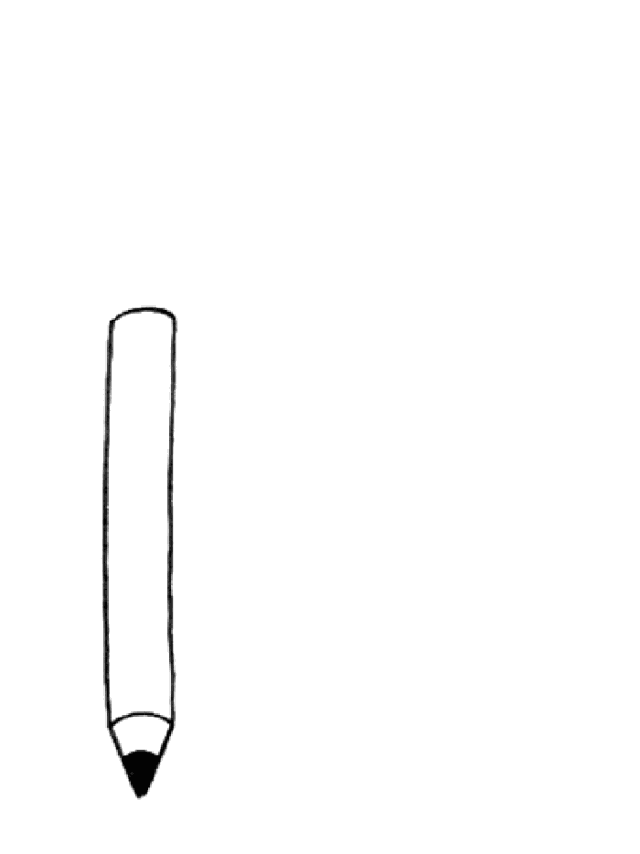
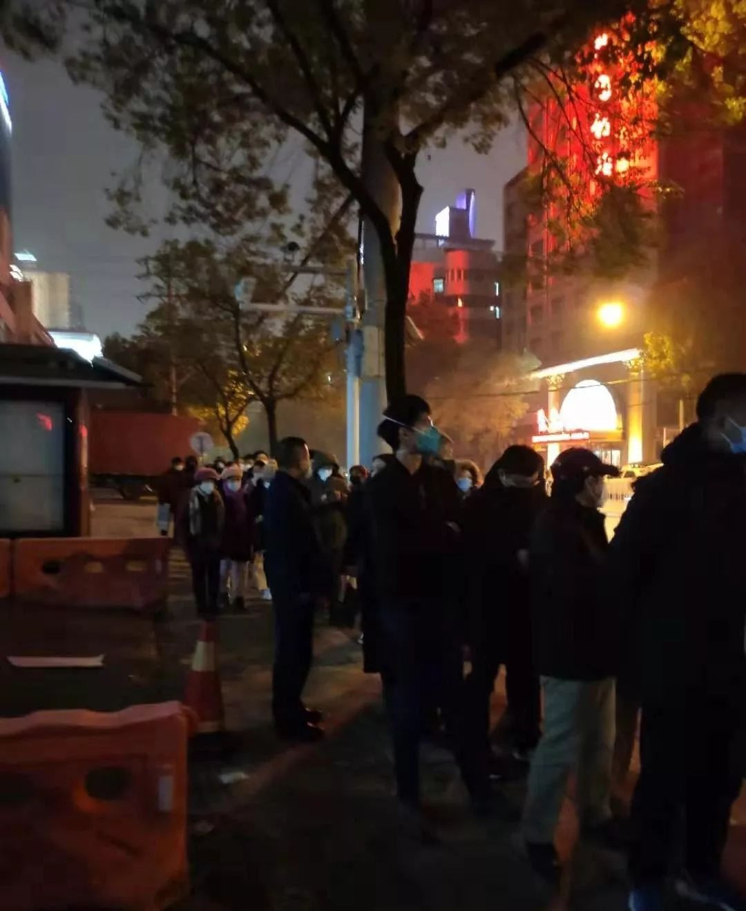
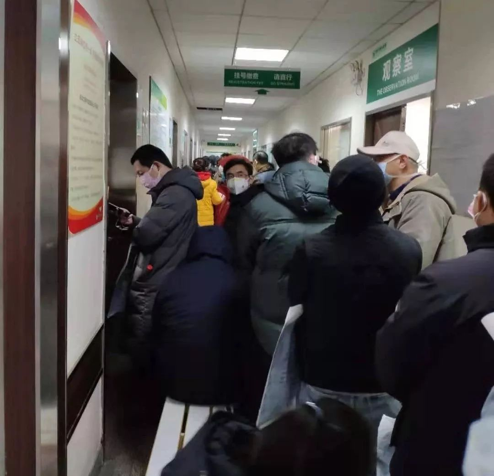
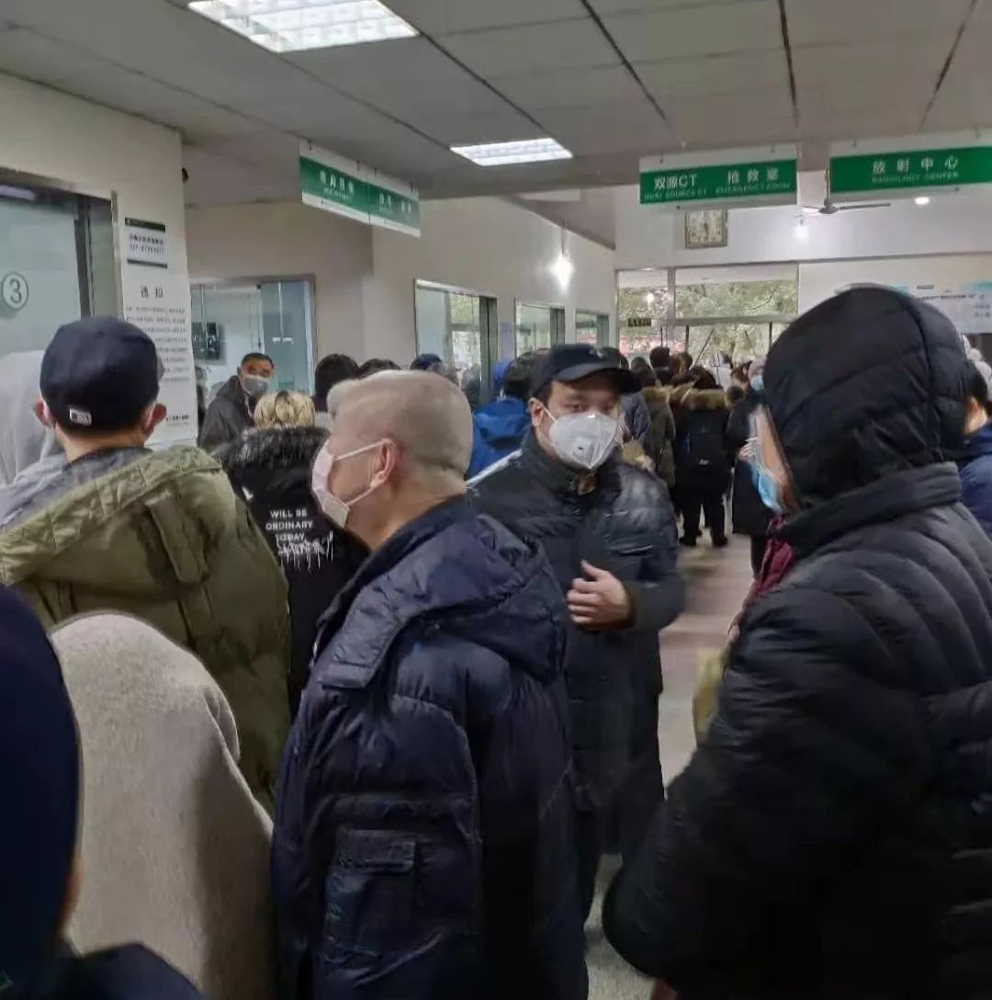

# 无标题

**链接地址:** http://mp.weixin.qq.com/s?__biz=MTc5MTU3NTYyMQ==&mid=2650709439&idx=1&sn=a3d126f52128e2fcfeee337e32d01034&chksm=5afc8c956d8b058381afab4727df60aaf7b7bee5a1da095abf764bd7e11b3a4c685a30f248a9&mpshare=1&scene=2&srcid=01231Aq587YV7x2guVOwmdun&sharer_sharetime=1579794642820&sharer_shareid=be1c8edd6c93eec155a61c876e41d26a#rd
**作者:** 张从志
**获取时间:** 2025/8/28 20:20:05
**图片数量:** 7

---

## 原始HTML内容

<section data-role="outer" label="Powered by 135editor.com" style="font-size:16px;"><section style="box-sizing: border-box;padding: 0px 10px;"><section data-tools="135编辑器" data-id="91674"><section data-tools="135编辑器" data-id="95198"><section data-role="outer" label="Powered by 135editor.com" style="font-size:16px;"><section data-tools="135编辑器" data-id="93585"><section style=""><section style="display: flex;"><section style="background: rgb(255, 255, 255) none repeat scroll 0% 0%;padding: 0px 5px 2px 0px;box-sizing: border-box;"></section></section><section style="font-size: 14px;color: rgb(63, 63, 63);letter-spacing: 1.5px;line-height: 1.75em;padding: 1em 0.8em;margin-top: -15px;box-sizing: border-box;border-top: 1px solid #4f4f4f;border-bottom: 1px solid #4f4f4f;text-align:justify;"><section>
“人如果在家里死了，是留不下这个人的记录的，没人知道他是因为肺炎死的。”
</section></section><section style="display: flex;justify-content: flex-end;margin-top:-20px;"><section style="background: rgb(255, 255, 255) none repeat scroll 0% 0%;padding: 5px 0px 0px 5px;box-sizing: border-box;"></section></section></section></section></section></section></section><section data-tools="135编辑器" data-id="91674"><section data-tools="135编辑器" data-id="93652"><section style="margin: 0px auto;text-align: left;"><section style="width: 50px;box-sizing: border-box;display: inline-block;"></section><section style="display: inline-block;margin-top:0px;color:#3f3f3f;letter-spacing:1.5px;"><section data-brushtype="text">
口述 | 李雪（化名）

记者 | 张从志 
</section></section></section></section><section data-role="paragraph" style="border-color: currentcolor;border-style: none;border-width: 0px;padding: 0px;box-sizing: border-box;" data-color="rgb(226, 86, 27)" data-custom="rgb(226, 86, 27)">
 
</section></section><section data-tools="135编辑器" data-id="93120"><section style="padding: 10px 0px;box-sizing: border-box;"><section style="width: 100%;text-align: center;" data-width="100%"><section style="display: inline-block;width: auto;"><section data-brushtype="text" style="text-align: center;padding: 0px 5px;font-size: 16px;letter-spacing: 1.5px;color: rgb(62, 62, 62);box-sizing: border-box;"><strong>床位极度紧缺</strong></section><section style="width: 100%;height: 1px;background: rgb(51, 51, 51) none repeat scroll 0% 0%;margin-top: 6px;" data-width="100%"> </section><section style="width: 100%;height: 1px;background: rgb(51, 51, 51) none repeat scroll 0% 0%;margin-top: 3px;" data-width="100%"> </section><section style="margin-top: -17px;"><section style="display: inline-block;background: rgb(254, 254, 254) none repeat scroll 0% 0%;padding: 0px 5px;font-size: 12px;color: rgb(51, 50, 51);box-sizing: border-box;">▲▲▲</section></section></section></section></section></section></section></section>
父亲今年64岁，武汉人，公务员退休。从1月17日确认感染后，他的食欲变得非常差，几乎吃不下任何东西，每天傍晚五六点就开始发烧，最高烧到38.3℃以上，<strong>吃药后有所缓解，但第二天又会继续发烧。</strong>

捱到了昨天（1月22日）早上，越来越严重。我赶紧叫了出租车让他们去了汉口医院。我妈一进医院就拍了个视频给我，<strong>在发热门诊排队的人已有几百个。</strong>因为人实在太多了，中途他们又打车去了另一家非定点医院，想先去拍个片看一下。片子一出来，双肺全部感染，片子上已从第一次检查的几个阴影点发展成大片的阴影。

做完检查，他们又马上折返汉口医院。好不容易排到了，医生说现在我爸这个情况打针也没用，必须住院，但医院腾不出床位了，他建议赶紧去武汉市第七医院（以下简称“七院”），因为那里马上要开新的床位。去七院之前，我又听说武昌医院新开了500张床位，他们就先去了武昌医院。<strong>晚上七点到的时候，我妈说急诊室里连医生都看不到了，所有人都在大厅等。</strong>当时医院门诊大楼前面有五六辆120急救车拉了人过来，有医生出来跟急救车说不能再往医院送人了，他们顾不上来了。 
<section style="text-align: center;margin-left: 8px;margin-right: 8px;"></section><section style="line-height: 2em;margin-left: 8px;margin-right: 8px;margin-bottom: 15px;">1月22日晚上，武汉市第七医院门口排队的人群。 </section>
我妈看这情形，又连忙打车带我爸往七院赶。本来公布的消息，七院是第二天一早才新开床位，她实在等不了了，想去碰个运气。晚上9:20左右到七院大门口，我妈又给我拍了一段视频，说前面已经排了40多个人，这下她也不敢回家了。七院新开的床位只有300张，如果等到明天早上，她说肯定进不去了。

<strong>到晚上10:00左右，我妈告诉我，她后面已经至少排了100多人，还有人陆续到来。</strong>10:40左右，医院开了一扇门，一次只让进三个人，进去的人先查血，如果严重就收，不严重的依然不能收。<strong>我爸爸折腾了一天，病了以后就几乎没吃东西，那时已经走不动路了，他几年之前还做过心脏支架手术。我要在家带孩子，也不能出去。</strong>我今天在家哭了一天，真的忍不住想，万一人哪一瞬间没了，该怎么办？
<section data-role="outer" label="Powered by 135editor.com" style="font-size:16px;"><section data-tools="135编辑器" data-id="93120"><section style="padding: 10px 0px;box-sizing: border-box;"><section style="width: 100%;text-align: center;" data-width="100%"><section style="display: inline-block;width: auto;"><section data-brushtype="text" style="text-align: center;padding: 0px 5px;font-size: 16px;letter-spacing: 1.5px;color: rgb(62, 62, 62);box-sizing: border-box;"><strong>不少患者在家隔离</strong></section><section style="width: 100%;height: 1px;background: rgb(51, 51, 51) none repeat scroll 0% 0%;margin-top: 6px;" data-width="100%"> </section><section style="width: 100%;height: 1px;background: rgb(51, 51, 51) none repeat scroll 0% 0%;margin-top: 3px;" data-width="100%"> </section><section style="margin-top: -17px;"><section style="display: inline-block;background: rgb(254, 254, 254) none repeat scroll 0% 0%;padding: 0px 5px;font-size: 12px;color: rgb(51, 50, 51);box-sizing: border-box;">▲▲▲</section></section></section></section></section></section></section>
爸爸是在今年1月17日出现不适：发烧，头疼，浑身酸胀，当时以为只是感冒，睡一觉就好了。第二天早上起来，症状却更严重了。当时我就有点警觉，因为武汉在闹肺炎，我说带他到医院去看一下，他还不愿，觉得只是普通感冒，也没别的症状。最后拗不过，1月18日晚上，我带他到了武汉市第三医院急诊科。

一去，医生直接让我们先去拍CT，后查血项。检查做完，医生一看片子说了一句——“他也有”，就是被感染了。片子上，我爸的一边肺叶出现了两个阴影点。医生说他们医院接收不了，只能第二天带着结果去武昌，那边有湖北省人民医院和武汉中南医院开了发热门诊。这两家医院人平时都特别多，我怕去了二次交叉感染，就去了朋友推荐的汉口医院。 
<section style="text-align: center;margin-left: 8px;margin-right: 8px;"></section><section style="line-height: 2em;margin-left: 8px;margin-right: 8px;text-align: right;margin-bottom: 15px;">武汉七院发热门诊外 </section>
刻不容缓，从武汉三院一出来，我们就直奔汉口医院。我很着急，觉得不能再等了。在汉口医院发热门诊，护士给我爸量体温的时候询问我们有没有去过华南海鲜市场。我说都没有去过，活禽、野味这些东西也都没有接触过。护士让我爸爸做了一个全面的查血，之后又拍了CT，所有弄完已经是凌晨一点多钟。

汉口医院背后有一栋发热大楼，我爸去门口按了门铃后被领进去，但过了大约15分钟又出来了。<strong>医生说他还不是很严重，而且医院现在没有床位接收，建议他先回家隔离。医生开了两盒药，5天的剂量，叮嘱说如果中途出现呼吸困难要及时就医。</strong>

凌晨三点，我们带着药回了家。一到家就开始隔离，我本来带着两个孩子准备在爸妈家过年，第二天天一亮我就带他们走了。<strong>我回去后就是我妈一个人在家照顾他，她今年63岁，把家里所有的东西消毒了一遍。两个人住在不同房间，我爸不舒服或者要喝水就给我妈打个电话，送到门口再让他自己拿进去。</strong>我妈戴着口罩，手上有医用手套，她是一个特别小心的人，只要挨过我爸爸的任何东西，就会立刻去洗手，消毒，再消毒！
<section data-role="outer" label="Powered by 135editor.com" style="font-size:16px;"><section data-tools="135编辑器" data-id="93120"><section style="padding: 10px 0px;box-sizing: border-box;"><section style="width: 100%;text-align: center;" data-width="100%"><section style="display: inline-block;width: auto;"><section data-brushtype="text" style="text-align: center;padding: 0px 5px;font-size: 16px;letter-spacing: 1.5px;color: rgb(62, 62, 62);box-sizing: border-box;"><strong>没有预告的感染</strong></section><section style="width: 100%;height: 1px;background: rgb(51, 51, 51) none repeat scroll 0% 0%;margin-top: 6px;" data-width="100%"> </section><section style="width: 100%;height: 1px;background: rgb(51, 51, 51) none repeat scroll 0% 0%;margin-top: 3px;" data-width="100%"> </section><section style="margin-top: -17px;"><section style="display: inline-block;background: rgb(254, 254, 254) none repeat scroll 0% 0%;padding: 0px 5px;font-size: 12px;color: rgb(51, 50, 51);box-sizing: border-box;">▲▲▲</section></section></section></section></section></section></section>
即使这样，妈妈前两天还是开始干咳，今天去检查的时候，我让她也去拍了个片子，发现肺叶上也出现了同样的阴影点。我还嘱咐她到了七院，到时和爸爸一起去看医生。我现在只能是在心里祈祷，觉得我爸爸应该属于很严重了，希望七院能把他收进去。

<strong>直到现在，我们也不确定到底是怎么染上病毒的。</strong>我自己家虽然离华南海鲜市场不算远，但我没去过那里，平时家里门窗紧闭，而且因为孩子要期末考试，前段时间都没和爸妈见过面。我爸自己回忆，只有一个可能接触到感染源。因为他做过心脏支架，每个月都要去湖北省人民医院拿药，最近一次拿药是在今年1月12日。<strong>那时候大家都还没把肺炎当回事，官方公布的信息也一直是可控可防。我爸去拿药的时候没戴口罩，排队排了一个小时，他推测很有可能就是在那时感染的。 </strong>

之前外地人都觉得武汉人不怕死，病毒来了也不在意，其实我天天都在关注肺炎的新闻，但也没有觉得这是一件很严重的事情。后来我爸一发热，我就很警惕了。直到1月20日，官方公布的确诊患者数量一下子增加了100多人，身边其他人才紧张起来。<strong>我身边有一个四十来岁的朋友在家里咳嗽，一直当感冒治，隔了10天突然发烧，去医院的时候人已经快不行了，现在还上着呼吸机。</strong>

今天我在微博上看到有人在发贴，跟我们的情况一样，也是一天跑了好几家医院都没人收。<strong>我觉得这些人如果回家，人在家里死了，是留不下这个人的记录的，没人知道他是因为肺炎死的</strong>，比如说我爸，他有心脏病，做过支架手术，那是不是就可以说他是因为心脏病去世的，而不是肺炎，是不是这个人就白死了？如果真的是这种情况，你把病人都放走了，出去不是会传播给更多的人？
<section data-role="outer" label="Powered by 135editor.com" style="font-size:16px;"><section data-tools="135编辑器" data-id="93652"><section style="margin: 0px auto;text-align: left;"><section style="width: 50px;box-sizing: border-box;display: inline-block;"></section><section style="display: inline-block;margin-top:0px;color:#3f3f3f;letter-spacing:1.5px;"><section data-brushtype="text">
记者按 
</section></section></section></section></section><section style="margin: 15px 8px 25px;line-height: 2em;">目前，武汉已经启动“封城”方案：“自2020年1月23日10时起，全市城市公交、地铁、轮渡、长途客运暂停运营；无特殊原因，市民不要离开武汉，机场、火车站离汉通道暂时关闭。”在前一日晚间的新闻发布会上，武汉市人民政府副市长陈邂馨表示，计划安排7家医院腾出3400张床位，专门收治发热患者。</section>
截止发稿时，李雪的父亲已经进入武汉市第七人民医院，<strong>但仍未能收治入院，鉴于病情严重在急症室待了一夜，正在排队打针。<em> </em></strong>

<em>（本文图片由受访者提供）</em><strong><em> </em></strong>
<section data-role="outer" label="Powered by 135editor.com" style="font-size: 16px;"><section style="box-sizing: border-box;padding: 0px 10px;"><section data-tools="135编辑器" data-id="91674"><section data-tools="135编辑器" data-id="94534"><section style="width:95%;margin:20px auto;" data-width="95%"><section style="box-shadow: 0px 2px 10px #a9cfd5;"><section style="display: flex;justify-content: space-between;align-items: center;padding: 10px 5px;box-sizing: border-box;"><section style="display: inline-block;width: 25px;"><section style="width: 0.8em;height: 0.8em;background: rgb(133, 181, 188) none repeat scroll 0% 0%;border-radius: 100%;opacity: 0.6;margin: 0px auto -8px;transform: rotate(0deg);"> </section><section style="width: 5px;height: 1.4em;background: rgb(169, 207, 213) none repeat scroll 0% 0%;border-radius: 6px;margin: 0px auto;box-sizing: border-box;"> </section></section><section style="display: inline-block;width: 25px;"><section style="width: 0.8em;height: 0.8em;background: rgb(133, 181, 188) none repeat scroll 0% 0%;border-radius: 100%;opacity: 0.6;margin: 0px auto -8px;transform: rotate(0deg);"> </section><section style="width: 5px;height: 1.4em;background: rgb(169, 207, 213) none repeat scroll 0% 0%;border-radius: 6px;margin: 0px auto;box-sizing: border-box;"> </section></section></section><section style="padding: 0.2em 1em;box-sizing: border-box;"><section data-autoskip="1" style="font-size: 14px;text-align: justify;letter-spacing: 1.5px;line-height: 1.75em;color: rgb(77, 144, 154);padding: 0em 1em;box-sizing: border-box;">
<a target="_blank" href="https://mp.weixin.qq.com/mp/homepage?__biz=MTc5MTU3NTYyMQ==&amp;hid=20&amp;sn=b8f68a8338b85e7ca8605f774ef8a762" data-linktype="2"><strong>请戳→【武汉新型肺炎系列报道】</strong></a> 
</section></section><section style="display: flex;justify-content: space-between;align-items: center;padding: 10px 5px;box-sizing: border-box;"><section style="display: inline-block;width: 25px;"><section style="width: 5px;height: 1.4em;background: rgb(169, 207, 213) none repeat scroll 0% 0%;border-radius: 6px;margin: 0px auto;box-sizing: border-box;"> </section><section style="width: 0.8em;height: 0.8em;background: rgb(133, 181, 188) none repeat scroll 0% 0%;border-radius: 100%;opacity: 0.6;margin: -8px auto 0px;transform: rotate(0deg);"> </section></section><section style="display: inline-block;width: 25px;"><section style="width: 5px;height: 1.4em;background: rgb(169, 207, 213) none repeat scroll 0% 0%;border-radius: 6px;margin: 0px auto;box-sizing: border-box;"> </section><section style="width: 0.8em;height: 0.8em;background: rgb(133, 181, 188) none repeat scroll 0% 0%;border-radius: 100%;opacity: 0.6;margin: -8px auto 0px;transform: rotate(0deg);"> </section></section></section></section></section></section></section><section data-tools="135编辑器" data-id="91674"><section data-role="paragraph" style="border-color: currentcolor;border-style: none;border-width: 0px;padding: 0px;box-sizing: border-box;" data-color="rgb(226, 86, 27)" data-custom="rgb(226, 86, 27)"><section data-role="outer" label="Powered by 135editor.com" style="font-size:16px;"><section style="box-sizing: border-box;padding: 0px 10px;"><section data-tools="135编辑器" data-id="91674"><section data-tools="135编辑器" data-id="3126"><section style="border-color: rgb(107, 77, 64);border-style: none;border-width: medium;margin: 0.5em 0px;box-sizing: border-box;padding: 0px;"><section style="width: 40px;height: 40px;float: right;box-sizing: border-box;color: inherit;background-color: #fefefe;"><section style="width: 1px;box-shadow: #676767 -1px 1px 2px;box-sizing: border-box;color: inherit;"><section style="border-width: 20px;border-style: solid;border-color: transparent transparent rgb(153, 153, 153) rgb(153, 153, 153);box-sizing: border-box;color: inherit;height: 40px;overflow: hidden;"> </section><section style="margin-top: -38px;margin-left: 1px;border-width: 18px;border-style: solid;border-color: transparent transparent rgb(254, 254, 254) rgb(254, 254, 254);box-sizing: border-box;color: inherit;height: 36px;overflow: hidden;"> </section></section></section><section style="border-color: rgb(204, 204, 204);border-style: solid;border-width: 1px;box-sizing: border-box;color: inherit;padding: 5px 15px;"><section data-width="80%" style="width: 80%;line-height: 1.5em;border-bottom-width: 5px;border-bottom-style: solid;margin-left: 8px;box-sizing: border-box;font-size: 87.5%;font-weight: inherit;text-align: inherit;text-decoration: inherit;color: #6b4d40;border-color: #6b4d40;"><section style="margin: 5px 0px;box-sizing: border-box;color: inherit;border-color: rgb(107, 77, 64);text-align: center;"><strong>#我在疫情一线#</strong> <em>话题征稿持续进行中</em> </section></section><section style="margin-top: 0.5em;padding: 8px;font-size: 14px;font-weight: inherit;text-decoration: inherit;color: #6b4d40;box-sizing: border-box;border-color: #6b4d40;">
《三联生活周刊》全媒体现面向所有读者征稿。所有身在疫情一线、了解疫情的读者或媒体同行们，我们想要征集你们身边已经发生的、正在发生的那些尚未被媒体采集到的疫情故事。  此次征稿形式不限：文字（1500～2500字为佳）、图片（原创拍摄）、音频视频（原创录制）都欢迎。大家携手，共度难关！  注：请务必保证故事真实、客观，不造谣、不传谣。 &nbsp; 《三联生活周刊》微信公号投稿邮箱：zhuangao@lifeweek.com.cn 来稿格式：#我在疫情一线#➕标题  《三联生活周刊》官方微博参与话题： #我在疫情一线#  《三联生活周刊》中读APP投稿邮箱 （音频投稿为主，5分钟以内为佳） zhongdu@lifeweek.com.cn  期待你的来稿！ 
</section></section></section>
 
</section></section><section data-tools="135编辑器" data-id="91674"><section data-role="paragraph" style="border-color: currentcolor;border-style: none;border-width: 0px;padding: 0px;box-sizing: border-box;" data-color="rgb(226, 86, 27)" data-custom="rgb(226, 86, 27)"><section data-role="paragraph" style="max-width: 100%;font-family: -apple-system-font, BlinkMacSystemFont, &quot;Helvetica Neue&quot;, &quot;PingFang SC&quot;, &quot;Hiragino Sans GB&quot;, &quot;Microsoft YaHei UI&quot;, &quot;Microsoft YaHei&quot;, Arial, sans-serif;letter-spacing: 0.544px;white-space: normal;background-color: rgb(255, 255, 255);box-sizing: border-box !important;overflow-wrap: break-word !important;"><section data-role="outer" label="Powered by 135editor.com" style="max-width: 100%;font-size: 16px;box-sizing: border-box !important;overflow-wrap: break-word !important;"><section data-tools="135编辑器" data-id="2484" style="max-width: 100%;box-sizing: border-box;border-color: currentcolor;border-style: none;border-width: 0px;overflow-wrap: break-word !important;"><section data-width="93%" style="margin: 10px auto;max-width: 100%;width: 629.609px;box-sizing: border-box !important;overflow-wrap: break-word !important;"><section data-width="93%" style="margin: 10px auto;max-width: 100%;width: 623.094px;box-sizing: border-box !important;overflow-wrap: break-word !important;"><section label="powered by 135editor.com" style="max-width: 100%;line-height: 25.6px;box-sizing: border-box !important;overflow-wrap: break-word !important;"><section data-id="24" style="max-width: 100%;box-sizing: border-box;border-width: 0px;border-style: none;overflow-wrap: break-word !important;"><section style="margin: 3px auto;padding: 15px;max-width: 100%;box-sizing: border-box;overflow-wrap: break-word !important;line-height: 24px;box-shadow: rgb(170, 170, 170) 0px 0px 3px;border-width: 2px;border-style: solid;border-color: rgb(240, 240, 240);">
⊙文章版权归《三联生活周刊》所有，<strong style="max-width: 100%;line-height: 23.8095px;color: rgb(192, 80, 77);box-sizing: border-box !important;overflow-wrap: break-word !important;">欢迎转发到朋友圈</strong><strong style="max-width: 100%;line-height: 23.8095px;color: rgb(192, 80, 77);box-sizing: border-box !important;overflow-wrap: break-word !important;">，转载开白请联系后台。未经同意，严禁转载至网站、APP等。</strong> 
</section></section></section></section></section></section></section></section></section></section></section></section></section></section></section></section>

---

## 纯文本内容

“人如果在家里死了，是留不下这个人的记录的，没人知道他是因为肺炎死的。”口述 | 李雪（化名）记者 | 张从志床位极度紧缺▲▲▲父亲今年64岁，武汉人，公务员退休。从1月17日确认感染后，他的食欲变得非常差，几乎吃不下任何东西，每天傍晚五六点就开始发烧，最高烧到38.3℃以上，吃药后有所缓解，但第二天又会继续发烧。捱到了昨天（1月22日）早上，越来越严重。我赶紧叫了出租车让他们去了汉口医院。我妈一进医院就拍了个视频给我，在发热门诊排队的人已有几百个。因为人实在太多了，中途他们又打车去了另一家非定点医院，想先去拍个片看一下。片子一出来，双肺全部感染，片子上已从第一次检查的几个阴影点发展成大片的阴影。做完检查，他们又马上折返汉口医院。好不容易排到了，医生说现在我爸这个情况打针也没用，必须住院，但医院腾不出床位了，他建议赶紧去武汉市第七医院（以下简称“七院”），因为那里马上要开新的床位。去七院之前，我又听说武昌医院新开了500张床位，他们就先去了武昌医院。晚上七点到的时候，我妈说急诊室里连医生都看不到了，所有人都在大厅等。当时医院门诊大楼前面有五六辆120急救车拉了人过来，有医生出来跟急救车说不能再往医院送人了，他们顾不上来了。1月22日晚上，武汉市第七医院门口排队的人群。我妈看这情形，又连忙打车带我爸往七院赶。本来公布的消息，七院是第二天一早才新开床位，她实在等不了了，想去碰个运气。晚上9:20左右到七院大门口，我妈又给我拍了一段视频，说前面已经排了40多个人，这下她也不敢回家了。七院新开的床位只有300张，如果等到明天早上，她说肯定进不去了。到晚上10:00左右，我妈告诉我，她后面已经至少排了100多人，还有人陆续到来。10:40左右，医院开了一扇门，一次只让进三个人，进去的人先查血，如果严重就收，不严重的依然不能收。我爸爸折腾了一天，病了以后就几乎没吃东西，那时已经走不动路了，他几年之前还做过心脏支架手术。我要在家带孩子，也不能出去。我今天在家哭了一天，真的忍不住想，万一人哪一瞬间没了，该怎么办？不少患者在家隔离▲▲▲爸爸是在今年1月17日出现不适：发烧，头疼，浑身酸胀，当时以为只是感冒，睡一觉就好了。第二天早上起来，症状却更严重了。当时我就有点警觉，因为武汉在闹肺炎，我说带他到医院去看一下，他还不愿，觉得只是普通感冒，也没别的症状。最后拗不过，1月18日晚上，我带他到了武汉市第三医院急诊科。一去，医生直接让我们先去拍CT，后查血项。检查做完，医生一看片子说了一句——“他也有”，就是被感染了。片子上，我爸的一边肺叶出现了两个阴影点。医生说他们医院接收不了，只能第二天带着结果去武昌，那边有湖北省人民医院和武汉中南医院开了发热门诊。这两家医院人平时都特别多，我怕去了二次交叉感染，就去了朋友推荐的汉口医院。武汉七院发热门诊外刻不容缓，从武汉三院一出来，我们就直奔汉口医院。我很着急，觉得不能再等了。在汉口医院发热门诊，护士给我爸量体温的时候询问我们有没有去过华南海鲜市场。我说都没有去过，活禽、野味这些东西也都没有接触过。护士让我爸爸做了一个全面的查血，之后又拍了CT，所有弄完已经是凌晨一点多钟。汉口医院背后有一栋发热大楼，我爸去门口按了门铃后被领进去，但过了大约15分钟又出来了。医生说他还不是很严重，而且医院现在没有床位接收，建议他先回家隔离。医生开了两盒药，5天的剂量，叮嘱说如果中途出现呼吸困难要及时就医。凌晨三点，我们带着药回了家。一到家就开始隔离，我本来带着两个孩子准备在爸妈家过年，第二天天一亮我就带他们走了。我回去后就是我妈一个人在家照顾他，她今年63岁，把家里所有的东西消毒了一遍。两个人住在不同房间，我爸不舒服或者要喝水就给我妈打个电话，送到门口再让他自己拿进去。我妈戴着口罩，手上有医用手套，她是一个特别小心的人，只要挨过我爸爸的任何东西，就会立刻去洗手，消毒，再消毒！没有预告的感染▲▲▲即使这样，妈妈前两天还是开始干咳，今天去检查的时候，我让她也去拍了个片子，发现肺叶上也出现了同样的阴影点。我还嘱咐她到了七院，到时和爸爸一起去看医生。我现在只能是在心里祈祷，觉得我爸爸应该属于很严重了，希望七院能把他收进去。直到现在，我们也不确定到底是怎么染上病毒的。我自己家虽然离华南海鲜市场不算远，但我没去过那里，平时家里门窗紧闭，而且因为孩子要期末考试，前段时间都没和爸妈见过面。我爸自己回忆，只有一个可能接触到感染源。因为他做过心脏支架，每个月都要去湖北省人民医院拿药，最近一次拿药是在今年1月12日。那时候大家都还没把肺炎当回事，官方公布的信息也一直是可控可防。我爸去拿药的时候没戴口罩，排队排了一个小时，他推测很有可能就是在那时感染的。之前外地人都觉得武汉人不怕死，病毒来了也不在意，其实我天天都在关注肺炎的新闻，但也没有觉得这是一件很严重的事情。后来我爸一发热，我就很警惕了。直到1月20日，官方公布的确诊患者数量一下子增加了100多人，身边其他人才紧张起来。我身边有一个四十来岁的朋友在家里咳嗽，一直当感冒治，隔了10天突然发烧，去医院的时候人已经快不行了，现在还上着呼吸机。今天我在微博上看到有人在发贴，跟我们的情况一样，也是一天跑了好几家医院都没人收。我觉得这些人如果回家，人在家里死了，是留不下这个人的记录的，没人知道他是因为肺炎死的，比如说我爸，他有心脏病，做过支架手术，那是不是就可以说他是因为心脏病去世的，而不是肺炎，是不是这个人就白死了？如果真的是这种情况，你把病人都放走了，出去不是会传播给更多的人？记者按目前，武汉已经启动“封城”方案：“自2020年1月23日10时起，全市城市公交、地铁、轮渡、长途客运暂停运营；无特殊原因，市民不要离开武汉，机场、火车站离汉通道暂时关闭。”在前一日晚间的新闻发布会上，武汉市人民政府副市长陈邂馨表示，计划安排7家医院腾出3400张床位，专门收治发热患者。截止发稿时，李雪的父亲已经进入武汉市第七人民医院，但仍未能收治入院，鉴于病情严重在急症室待了一夜，正在排队打针。（本文图片由受访者提供）请戳→【武汉新型肺炎系列报道】#我在疫情一线#话题征稿持续进行中《三联生活周刊》全媒体现面向所有读者征稿。所有身在疫情一线、了解疫情的读者或媒体同行们，我们想要征集你们身边已经发生的、正在发生的那些尚未被媒体采集到的疫情故事。此次征稿形式不限：文字（1500～2500字为佳）、图片（原创拍摄）、音频视频（原创录制）都欢迎。大家携手，共度难关！注：请务必保证故事真实、客观，不造谣、不传谣。 《三联生活周刊》微信公号投稿邮箱：zhuangao@lifeweek.com.cn来稿格式：#我在疫情一线#➕标题《三联生活周刊》官方微博参与话题：#我在疫情一线#《三联生活周刊》中读APP投稿邮箱（音频投稿为主，5分钟以内为佳）zhongdu@lifeweek.com.cn期待你的来稿！⊙文章版权归《三联生活周刊》所有，欢迎转发到朋友圈，转载开白请联系后台。未经同意，严禁转载至网站、APP等。

---

## 图片列表

-  (原始链接: https://mmbiz.qpic.cn/mmbiz_png/c2Sib3Mp7pOOSlBL2rrrnCJ05ExtIhRbuIVZolh011kH01y1cwHdic8Kg4pBmeYZJljuwXXdWm7Q7jLNT0nOWLMg/640?wx_fmt=png)
-  (原始链接: https://mmbiz.qpic.cn/mmbiz_png/c2Sib3Mp7pOOSlBL2rrrnCJ05ExtIhRbuc392Jd0rEsUPmiawibKWiamCBVpYeowX0O873ComfLRgn5KoEoRZtWqyw/640?wx_fmt=png)
-  (原始链接: https://mmbiz.qpic.cn/mmbiz_gif/c2Sib3Mp7pOOSlBL2rrrnCJ05ExtIhRbuzvlbpZplIibhUsMbSmyFoP1dBwGhQFHwfNgmyynEXEdatcpfYjbGcYg/640?wx_fmt=gif)
-  (原始链接: https://mmbiz.qpic.cn/mmbiz_jpg/c2Sib3Mp7pOOSlBL2rrrnCJ05ExtIhRburfJib1lSbf9o3rdFULJG45jWJY3Sv6iclnSrlbm6cHDTdFy50290DLZQ/640?wx_fmt=jpeg)
-  (原始链接: https://mmbiz.qpic.cn/mmbiz_jpg/c2Sib3Mp7pOOSlBL2rrrnCJ05ExtIhRbuglk4UvEQkk7AhMB8icky1kw2W7XNYktodEdXeibNsv4aGSYhxEqO0zeA/640?wx_fmt=jpeg)
-  (原始链接: https://mmbiz.qpic.cn/mmbiz_jpg/c2Sib3Mp7pOOSlBL2rrrnCJ05ExtIhRbuoiaoWoEWLa2RuIrRAC22Ql786gYAnY8poC67CIsRTvfNQWb8t3zSghg/640?wx_fmt=jpeg)
-  (原始链接: https://mmbiz.qpic.cn/mmbiz_gif/c2Sib3Mp7pOOSlBL2rrrnCJ05ExtIhRbuzvlbpZplIibhUsMbSmyFoP1dBwGhQFHwfNgmyynEXEdatcpfYjbGcYg/640?wx_fmt=gif)
