# 无标题

**链接地址:** http://mp.weixin.qq.com/s?__biz=MzIyMzAxMDc0Nw==&mid=2651257194&idx=1&sn=cfc4c04f71150a6436940a78c07aa995&chksm=f3d693bec4a11aa87c7c717abc25b0bc5f7b8a5f10dbd207f4657834d0f76055d5798858ee80&mpshare=1&scene=2&srcid=0221tA9v6BIcykUrXw1u09ph&sharer_sharetime=1582222963428&sharer_shareid=be1c8edd6c93eec155a61c876e41d26a#rd
**作者:** 看客
**获取时间:** 2025/8/28 20:19:09
**图片数量:** 30

---

## 原始HTML内容

<section style="display: none;" data-tools="新媒体管家" data-label="powered by xmt.cn"> </section><section style="box-sizing: border-box;font-style: normal;font-weight: 400;text-align: justify;font-size: 16px;"><section style="text-align: center;margin-top: 10px;margin-bottom: 10px;box-sizing: border-box;" powered-by="xiumi.us"><section style="max-width: 100%;vertical-align: middle;display: inline-block;line-height: 0;box-sizing: border-box;"></section></section><section style="margin: 0.5em 0px;box-sizing: border-box;" powered-by="xiumi.us"><section style="background-color: rgb(28, 28, 28);height: 4px;box-sizing: border-box;line-height: 0;"> </section></section><section style="text-align: center;margin: 5px 0% 10px;box-sizing: border-box;" powered-by="xiumi.us"><section style="max-width: 100%;vertical-align: middle;display: inline-block;line-height: 0;box-sizing: border-box;"></section></section><section style="margin: 0px 0%;transform: translate3d(5px, 0px, 0px);-webkit-transform: translate3d(5px, 0px, 0px);-moz-transform: translate3d(5px, 0px, 0px);-o-transform: translate3d(5px, 0px, 0px);box-sizing: border-box;" powered-by="xiumi.us"><section style="text-align: left;font-size: 24px;letter-spacing: 0px;padding: 0px;color: rgb(28, 28, 28);line-height: 1.3;box-sizing: border-box;">
<strong style="box-sizing: border-box;">早知道这样，就不买房了。</strong>
</section></section><section style="margin: 0.5em 0px;box-sizing: border-box;" powered-by="xiumi.us"><section style="background-color: rgb(28, 28, 28);height: 4px;box-sizing: border-box;line-height: 0;"> </section></section><section style="box-sizing: border-box;" powered-by="xiumi.us">
 
</section><section style="box-sizing: border-box;" powered-by="xiumi.us">
 
</section><section style="display: block;box-sizing: border-box;" powered-by="xiumi.us"><section style="font-size: 15px;line-height: 2;padding: 0px 27px;letter-spacing: 1px;color: rgb(28, 28, 28);box-sizing: border-box;">
新冠肺炎肆虐，几乎影响着每一个中国人的生活，对于湖北小哥许康来说，也不例外。 

 
</section></section><section style="font-size: 15px;line-height: 2;padding: 0px 27px;letter-spacing: 1px;color: rgb(28, 28, 28);box-sizing: border-box;" powered-by="xiumi.us">
去年年底，我们报道了许康的鹤岗买房故事，“奔波了大半个中国“，他终于有了自己的家。 

 
</section><section style="text-align: center;margin: 10px 0% 0px;box-sizing: border-box;" powered-by="xiumi.us"><section style="max-width: 100%;vertical-align: middle;display: inline-block;line-height: 0;border-style: none;border-width: 2px;border-radius: 0px;border-color: rgb(0, 0, 0);box-shadow: rgb(0, 0, 0) 0px 0px 0px;box-sizing: border-box;"></section></section><section style="margin: 10px 0% 0px;box-sizing: border-box;" powered-by="xiumi.us"><section style="display: inline-block;width: 100%;border-width: 0px 0px 0px 3px;border-style: solid;border-left-color: rgb(185, 185, 185);border-right-color: rgb(185, 185, 185);padding: 5px 0px 0px 10px;letter-spacing: 0px;box-sizing: border-box;"><section style="margin: 0px 0%;box-sizing: border-box;" powered-by="xiumi.us"><section style="font-size: 12px;color: rgb(120, 120, 120);letter-spacing: 1px;line-height: 1.6;box-sizing: border-box;">
3万元买套房
</section></section></section></section><section style="box-sizing: border-box;" powered-by="xiumi.us">
 
</section><section style="font-size: 15px;line-height: 2;padding: 0px 27px;letter-spacing: 1px;color: rgb(28, 28, 28);box-sizing: border-box;" powered-by="xiumi.us">
原本，他计划着努力赚钱，争取2020年的夏天回到鹤岗给新家搞装修。 

 
</section><section style="font-size: 15px;line-height: 2;padding: 0px 27px;letter-spacing: 1px;color: rgb(28, 28, 28);box-sizing: border-box;" powered-by="xiumi.us">
然而，突如其来的疫情将计划彻底打乱。 

 
</section><section style="font-size: 15px;line-height: 2;padding: 0px 27px;letter-spacing: 1px;color: rgb(28, 28, 28);box-sizing: border-box;" powered-by="xiumi.us">
疫情爆发后，许康失业了，又因为“42开头”的身份证（湖北地区）迟迟找不到新工作。

 

如今，贷款和日常开销成了悬在头上的剑，他“饭都快吃不上了”，不得不执行那个最坏的打算：把房子卖掉。

 
</section><section style="text-align: center;font-size: 8px;margin: 20px 0% 15px;box-sizing: border-box;" powered-by="xiumi.us"><section style="display: inline-block;vertical-align: middle;width: 40%;padding: 0px 10px 0px 0px;box-sizing: border-box;"><section style="margin: 0.5em 0px;box-sizing: border-box;" powered-by="xiumi.us"><section style="background-color: rgba(0, 0, 0, 0.94);height: 1px;box-sizing: border-box;line-height: 0;"> </section></section></section><section style="display: inline-block;vertical-align: middle;width: 20%;box-sizing: border-box;"><section style="margin: 0px 0%;box-sizing: border-box;" powered-by="xiumi.us"><section style="background-color: rgba(0, 0, 0, 0.94);display: inline-block;width: 2.5em;height: 2.5em;line-height: 2.5em;border-radius: 100%;margin-left: auto;margin-right: auto;font-size: 10px;color: rgb(255, 255, 240);font-family: SiYuan-Heavy;box-sizing: border-box;">
<strong style="box-sizing: border-box;">一</strong>
</section></section></section><section style="display: inline-block;vertical-align: middle;width: 40%;padding: 0px 0px 0px 10px;box-sizing: border-box;"><section style="margin: 0.5em 0px;box-sizing: border-box;" powered-by="xiumi.us"><section style="background-color: rgba(0, 0, 0, 0.94);height: 1px;box-sizing: border-box;line-height: 0;"> </section></section></section></section><section style="text-align: center;font-size: 24px;color: rgb(28, 28, 28);line-height: 1.3;letter-spacing: -1px;box-sizing: border-box;" powered-by="xiumi.us">
<strong style="box-sizing: border-box;">我以为买完房就好了</strong>
</section><section style="box-sizing: border-box;" powered-by="xiumi.us">
 
</section><section style="font-size: 15px;line-height: 2;padding: 0px 27px;letter-spacing: 1px;color: rgb(28, 28, 28);box-sizing: border-box;" powered-by="xiumi.us">
我叫许康，今年27岁，是湖北荆州洪湖人。

 
</section><section style="font-size: 15px;line-height: 2;padding: 0px 27px;letter-spacing: 1px;color: rgb(28, 28, 28);box-sizing: border-box;" powered-by="xiumi.us">
去年11月，我跨越4000公里，从拉萨赶到鹤岗买房，看了一套就定下了，总价3万元。

 
</section><section style="text-align: center;margin: 10px 0% 0px;box-sizing: border-box;" powered-by="xiumi.us"><section style="max-width: 100%;vertical-align: middle;display: inline-block;line-height: 0;border-style: none;border-width: 2px;border-radius: 0px;border-color: rgb(0, 0, 0);box-shadow: rgb(0, 0, 0) 0px 0px 0px;box-sizing: border-box;"></section></section><section style="margin: 10px 0% 0px;box-sizing: border-box;" powered-by="xiumi.us"><section style="display: inline-block;width: 100%;border-width: 0px 0px 0px 3px;border-style: solid;border-left-color: rgb(185, 185, 185);border-right-color: rgb(185, 185, 185);padding: 5px 0px 0px 10px;letter-spacing: 0px;box-sizing: border-box;"><section style="margin: 0px 0%;box-sizing: border-box;" powered-by="xiumi.us"><section style="font-size: 12px;color: rgb(120, 120, 120);letter-spacing: 1px;line-height: 1.6;box-sizing: border-box;">
我在鹤岗买的房子。 
</section></section></section></section><section style="box-sizing: border-box;" powered-by="xiumi.us">
 
</section><section style="font-size: 15px;line-height: 2;padding: 0px 27px;letter-spacing: 1px;color: rgb(28, 28, 28);box-sizing: border-box;" powered-by="xiumi.us">
11月13号，我拿到梦寐以求的房本，还在房产中介那里碰到了b站网红敬汉卿。

 

当时他正签合同，买的房子据说是用来抽奖送粉丝的。

 
</section><section style="text-align: center;margin: 10px 0% 0px;box-sizing: border-box;" powered-by="xiumi.us"><section style="max-width: 100%;vertical-align: middle;display: inline-block;line-height: 0;border-style: none;border-width: 2px;border-radius: 0px;border-color: rgb(0, 0, 0);box-shadow: rgb(0, 0, 0) 0px 0px 0px;box-sizing: border-box;"></section></section><section style="margin: 10px 0% 0px;box-sizing: border-box;" powered-by="xiumi.us"><section style="display: inline-block;width: 100%;border-width: 0px 0px 0px 3px;border-style: solid;border-left-color: rgb(185, 185, 185);border-right-color: rgb(185, 185, 185);padding: 5px 0px 0px 10px;letter-spacing: 0px;box-sizing: border-box;"><section style="margin: 0px 0%;box-sizing: border-box;" powered-by="xiumi.us"><section style="font-size: 12px;color: rgb(120, 120, 120);letter-spacing: 1px;line-height: 1.6;box-sizing: border-box;">
我还和b站大网红合了张影。
</section></section></section></section><section style="box-sizing: border-box;" powered-by="xiumi.us">
 
</section><section style="font-size: 15px;line-height: 2;padding: 0px 27px;letter-spacing: 1px;color: rgb(28, 28, 28);box-sizing: border-box;" powered-by="xiumi.us">
奔波了大半个中国，终于有了自己的家。

 

说实话，我挺开心的。那天我还写了首诗，发在了我建的鹤岗买房讨论群里：

 
</section><section style="text-align: center;box-sizing: border-box;" powered-by="xiumi.us"><section style="text-align: justify;line-height: 1.6;letter-spacing: 1px;padding: 0px 50px;font-size: 14px;color: rgb(150, 150, 150);box-sizing: border-box;">
三万买套房 有本心不慌

出门千里外 逍遥做仙人

 
</section></section><section style="font-size: 15px;line-height: 2;padding: 0px 27px;letter-spacing: 1px;color: rgb(28, 28, 28);box-sizing: border-box;" powered-by="xiumi.us">
唯一美中不足的是房子要装修，但我暂时没钱，交完全款后，我兜里就剩几百块了。 

 

另外，还有一万四的网络借款等着我还。

 
</section><section style="font-size: 15px;line-height: 2;padding: 0px 27px;letter-spacing: 1px;color: rgb(28, 28, 28);box-sizing: border-box;" powered-by="xiumi.us">
因为来的时候，我只有两万多现金，不借钱根本买不了。

 
</section><section style="text-align: center;margin: 10px 0% 0px;box-sizing: border-box;" powered-by="xiumi.us"><section style="max-width: 100%;vertical-align: middle;display: inline-block;line-height: 0;border-style: none;border-width: 2px;border-radius: 0px;border-color: rgb(0, 0, 0);box-shadow: rgb(0, 0, 0) 0px 0px 0px;width: 80%;height: auto;box-sizing: border-box;"></section></section><section style="margin: 10px 0% 0px;box-sizing: border-box;" powered-by="xiumi.us"><section style="display: inline-block;width: 100%;border-width: 0px 0px 0px 3px;border-style: solid;border-left-color: rgb(185, 185, 185);border-right-color: rgb(185, 185, 185);padding: 5px 0px 0px 10px;letter-spacing: 0px;box-sizing: border-box;"><section style="margin: 0px 0%;box-sizing: border-box;" powered-by="xiumi.us"><section style="font-size: 12px;color: rgb(120, 120, 120);letter-spacing: 1px;line-height: 1.6;box-sizing: border-box;">
房本
</section></section></section></section><section style="box-sizing: border-box;" powered-by="xiumi.us">
 
</section><section style="font-size: 15px;line-height: 2;padding: 0px 27px;letter-spacing: 1px;color: rgb(28, 28, 28);box-sizing: border-box;" powered-by="xiumi.us">
房本下来了，我一天没住就走了。我想尽快找份工作，赚钱、还账。

 
</section><section style="font-size: 15px;line-height: 2;padding: 0px 27px;letter-spacing: 1px;color: rgb(28, 28, 28);box-sizing: border-box;" powered-by="xiumi.us">
我是做餐饮切配的，也就是俗话说的“墩子”，鹤岗工资太低，只能回拉萨找工作了。 

 
</section><section style="text-align: center;margin: 10px 0% 0px;box-sizing: border-box;" powered-by="xiumi.us"><section style="max-width: 100%;vertical-align: middle;display: inline-block;line-height: 0;border-style: none;border-width: 2px;border-radius: 0px;border-color: rgb(0, 0, 0);box-shadow: rgb(0, 0, 0) 0px 0px 0px;box-sizing: border-box;"></section></section><section style="box-sizing: border-box;" powered-by="xiumi.us">
 
</section><section style="font-size: 15px;line-height: 2;padding: 0px 27px;letter-spacing: 1px;color: rgb(28, 28, 28);box-sizing: border-box;" powered-by="xiumi.us">
11月20日，我原路返回拉萨。这个我工作了六年的城市，阳光一如往常地好。 

 
</section><section style="font-size: 15px;line-height: 2;padding: 0px 27px;letter-spacing: 1px;color: rgb(28, 28, 28);box-sizing: border-box;" powered-by="xiumi.us">
拉萨的大神特别多。 

 
</section><section style="font-size: 15px;line-height: 2;padding: 0px 27px;letter-spacing: 1px;color: rgb(28, 28, 28);box-sizing: border-box;" powered-by="xiumi.us">
找工作那几天，我住在8块钱一晚的客栈里。这边有很多不上班、一天就吃俩馒头的人。

 

一天一顿，一躺一天。说实话，我受不了这样。

 
</section><section style="font-size: 15px;line-height: 2;padding: 0px 27px;letter-spacing: 1px;color: rgb(28, 28, 28);box-sizing: border-box;" powered-by="xiumi.us">
几经辗转，我找到了一份火锅店的工作，月薪五千，包食宿。 

 
</section><section style="font-size: 15px;line-height: 2;padding: 0px 27px;letter-spacing: 1px;color: rgb(28, 28, 28);box-sizing: border-box;" powered-by="xiumi.us">
<strong style="box-sizing: border-box;">当时我很有信心，只要踏实干，一万四的借款还下来是完全没问题的。</strong>

 
</section><section style="text-align: center;margin: 10px 0% 0px;box-sizing: border-box;" powered-by="xiumi.us"><section style="max-width: 100%;vertical-align: middle;display: inline-block;line-height: 0;border-style: none;border-width: 2px;border-radius: 0px;border-color: rgb(0, 0, 0);box-shadow: rgb(0, 0, 0) 0px 0px 0px;width: 70%;height: auto;box-sizing: border-box;"></section></section><section style="margin: 10px 0% 0px;box-sizing: border-box;" powered-by="xiumi.us"><section style="display: inline-block;width: 100%;border-width: 0px 0px 0px 3px;border-style: solid;border-left-color: rgb(185, 185, 185);border-right-color: rgb(185, 185, 185);padding: 5px 0px 0px 10px;letter-spacing: 0px;box-sizing: border-box;"><section style="margin: 0px 0%;box-sizing: border-box;" powered-by="xiumi.us"><section style="font-size: 12px;color: rgb(120, 120, 120);letter-spacing: 1px;line-height: 1.6;box-sizing: border-box;">
当你有了压力之后，你才有动力，你的动力越足，你赚钱的姿势就越帅。
</section></section></section></section><section style="box-sizing: border-box;" powered-by="xiumi.us">
 
</section><section style="display: block;box-sizing: border-box;" powered-by="xiumi.us"><section style="font-size: 15px;line-height: 2;padding: 0px 27px;letter-spacing: 1px;color: rgb(28, 28, 28);box-sizing: border-box;">
工作定了，我的心也安稳了不少。

 
</section></section><section style="font-size: 15px;line-height: 2;padding: 0px 27px;letter-spacing: 1px;color: rgb(28, 28, 28);box-sizing: border-box;" powered-by="xiumi.us">
数数手指头，还有不到30天就过年了。

 

身为“流浪吧”老哥，过年是不会回家的，但趁着春节期间赚点加班费，生活还是挺有盼头。 

 
</section><section style="text-align: center;margin: 10px 0% 0px;box-sizing: border-box;" powered-by="xiumi.us"><section style="max-width: 100%;vertical-align: middle;display: inline-block;line-height: 0;border-style: none;border-width: 2px;border-radius: 0px;border-color: rgb(0, 0, 0);box-shadow: rgb(0, 0, 0) 0px 0px 0px;box-sizing: border-box;"></section></section><section style="margin: 10px 0% 0px;box-sizing: border-box;" powered-by="xiumi.us"><section style="display: inline-block;width: 100%;border-width: 0px 0px 0px 3px;border-style: solid;border-left-color: rgb(185, 185, 185);border-right-color: rgb(185, 185, 185);padding: 5px 0px 0px 10px;letter-spacing: 0px;box-sizing: border-box;"><section style="margin: 0px 0%;box-sizing: border-box;" powered-by="xiumi.us"><section style="font-size: 12px;color: rgb(120, 120, 120);letter-spacing: 1px;line-height: 1.6;box-sizing: border-box;">
1月4号，拉萨迎来2020年的第一场雪。
</section></section></section></section><section style="box-sizing: border-box;" powered-by="xiumi.us">
 
</section><section style="font-size: 15px;line-height: 2;padding: 0px 27px;letter-spacing: 1px;color: rgb(28, 28, 28);box-sizing: border-box;" powered-by="xiumi.us">
但你知道，你永远无法预估明天。 

 
</section><section style="font-size: 15px;line-height: 2;padding: 0px 27px;letter-spacing: 1px;color: rgb(28, 28, 28);box-sizing: border-box;" powered-by="xiumi.us">
1月20日晚，我下班回到宿舍，发现武汉疫情已通报全国。钟南山院士在采访里说，肺炎存在人传人的情况。 

 
</section><section style="font-size: 15px;line-height: 2;padding: 0px 27px;letter-spacing: 1px;color: rgb(28, 28, 28);box-sizing: border-box;" powered-by="xiumi.us">
当时，我觉得问题应该不大。结果到了23号，武汉突然宣布“封城”。 

 
</section><section style="font-size: 15px;line-height: 2;padding: 0px 27px;letter-spacing: 1px;color: rgb(28, 28, 28);box-sizing: border-box;" powered-by="xiumi.us">
<strong style="box-sizing: border-box;">这座我曾经生活过几年的城市，一下子成了漩涡的中心，在疫情地图上红得发黑。</strong>

 
</section><section style="font-size: 15px;line-height: 2;padding: 0px 27px;letter-spacing: 1px;color: rgb(28, 28, 28);box-sizing: border-box;" powered-by="xiumi.us">
我的亲戚都在武汉的厨房上班，但他们的情况我不太清楚。

 

疫情爆发后，我也没和老家的父母联系，我和他们的关系一直都不是很好。二十几年来，我已经习惯一个人过所有节日。 

 
</section><section style="text-align: center;margin: 10px 0% 0px;box-sizing: border-box;" powered-by="xiumi.us"><section style="max-width: 100%;vertical-align: middle;display: inline-block;line-height: 0;border-style: none;border-width: 2px;border-radius: 0px;border-color: rgb(0, 0, 0);box-shadow: rgb(0, 0, 0) 0px 0px 0px;box-sizing: border-box;"></section></section><section style="margin: 10px 0% 0px;box-sizing: border-box;" powered-by="xiumi.us"><section style="display: inline-block;width: 100%;border-width: 0px 0px 0px 3px;border-style: solid;border-left-color: rgb(185, 185, 185);border-right-color: rgb(185, 185, 185);padding: 5px 0px 0px 10px;letter-spacing: 0px;box-sizing: border-box;"><section style="margin: 0px 0%;box-sizing: border-box;" powered-by="xiumi.us"><section style="font-size: 12px;color: rgb(120, 120, 120);letter-spacing: 1px;line-height: 1.6;box-sizing: border-box;">
除夕夜，我和工友聚餐，迎接新年。
</section></section></section></section><section style="box-sizing: border-box;" powered-by="xiumi.us">
 
</section><section style="font-size: 15px;line-height: 2;padding: 0px 27px;letter-spacing: 1px;color: rgb(28, 28, 28);box-sizing: border-box;" powered-by="xiumi.us">
大年三十那晚，买房群里一片过年的热闹气氛，不断上升的感染人数似乎和我们无关。 

 

人们互相说着“新年好”，我也祝他们“在新的一年里有鼠不尽的快乐”。

 
</section><section style="font-size: 15px;line-height: 2;padding: 0px 27px;letter-spacing: 1px;color: rgb(28, 28, 28);box-sizing: border-box;" powered-by="xiumi.us">
谁都不曾想到，十多天后，我会陷入如此境地。 

 
</section><section style="text-align: center;font-size: 8px;margin: 20px 0% 15px;box-sizing: border-box;" powered-by="xiumi.us"><section style="display: inline-block;vertical-align: middle;width: 40%;padding: 0px 10px 0px 0px;box-sizing: border-box;"><section style="margin: 0.5em 0px;box-sizing: border-box;" powered-by="xiumi.us"><section style="background-color: rgba(0, 0, 0, 0.94);height: 1px;box-sizing: border-box;line-height: 0;"> </section></section></section><section style="display: inline-block;vertical-align: middle;width: 20%;box-sizing: border-box;"><section style="margin: 0px 0%;box-sizing: border-box;" powered-by="xiumi.us"><section style="background-color: rgba(0, 0, 0, 0.94);display: inline-block;width: 2.5em;height: 2.5em;line-height: 2.5em;border-radius: 100%;margin-left: auto;margin-right: auto;font-size: 10px;color: rgb(255, 255, 240);font-family: SiYuan-Heavy;box-sizing: border-box;">
<strong style="box-sizing: border-box;">二</strong>
</section></section></section><section style="display: inline-block;vertical-align: middle;width: 40%;padding: 0px 0px 0px 10px;box-sizing: border-box;"><section style="margin: 0.5em 0px;box-sizing: border-box;" powered-by="xiumi.us"><section style="background-color: rgba(0, 0, 0, 0.94);height: 1px;box-sizing: border-box;line-height: 0;"> </section></section></section></section><section style="text-align: center;font-size: 24px;color: rgb(28, 28, 28);line-height: 1.3;letter-spacing: -1px;box-sizing: border-box;" powered-by="xiumi.us">
<strong style="box-sizing: border-box;">湖北打工仔太难了</strong>
</section><section style="box-sizing: border-box;" powered-by="xiumi.us">
 
</section><section style="font-size: 15px;line-height: 2;padding: 0px 27px;letter-spacing: 1px;color: rgb(28, 28, 28);box-sizing: border-box;" powered-by="xiumi.us">
武汉陷入阴霾，除夕过后，拉萨也变得没什么生意。店里一天就坐几桌，一闲下来，我就刷刷新闻。 

 
</section><section style="font-size: 15px;line-height: 2;padding: 0px 27px;letter-spacing: 1px;color: rgb(28, 28, 28);box-sizing: border-box;" powered-by="xiumi.us">
当时西藏还没有一例患者，被网友称为“全国最后一片净土”，结果几天后，拉萨就有了第一例输入性病例。 

 
</section><section style="font-size: 15px;line-height: 2;padding: 0px 27px;letter-spacing: 1px;color: rgb(28, 28, 28);box-sizing: border-box;" powered-by="xiumi.us">
很快，西藏的防控肉眼可见地严密起来。 

 
</section><section style="text-align: center;margin: 10px 0% 0px;box-sizing: border-box;" powered-by="xiumi.us"><section style="max-width: 100%;vertical-align: middle;display: inline-block;line-height: 0;border-style: none;border-width: 2px;border-radius: 0px;border-color: rgb(0, 0, 0);box-shadow: rgb(0, 0, 0) 0px 0px 0px;box-sizing: border-box;"></section></section><section style="margin: 10px 0% 0px;box-sizing: border-box;" powered-by="xiumi.us"><section style="display: inline-block;width: 100%;border-width: 0px 0px 0px 3px;border-style: solid;border-left-color: rgb(185, 185, 185);border-right-color: rgb(185, 185, 185);padding: 5px 0px 0px 10px;letter-spacing: 0px;box-sizing: border-box;"><section style="margin: 0px 0%;box-sizing: border-box;" powered-by="xiumi.us"><section style="font-size: 12px;color: rgb(120, 120, 120);letter-spacing: 1px;line-height: 1.6;box-sizing: border-box;">
街上空无一人，大昭寺也没有朝拜的了，只有超市还开门迎客。
</section></section></section></section><section style="box-sizing: border-box;" powered-by="xiumi.us">
 
</section><section style="display: block;box-sizing: border-box;" powered-by="xiumi.us"><section style="font-size: 15px;line-height: 2;padding: 0px 27px;letter-spacing: 1px;color: rgb(28, 28, 28);box-sizing: border-box;">
1月27日，拉萨开始买不到口罩。同一天，餐饮店禁止营业的通知下来了。 

 
</section></section><section style="font-size: 15px;line-height: 2;padding: 0px 27px;letter-spacing: 1px;color: rgb(28, 28, 28);box-sizing: border-box;" powered-by="xiumi.us">
这时我才意识到，疫情可能有些严重了。 

 
</section><section style="font-size: 15px;line-height: 2;padding: 0px 27px;letter-spacing: 1px;color: rgb(28, 28, 28);box-sizing: border-box;" powered-by="xiumi.us">
我出门买了100块的方便面，想着先把命钓着，过几天看看情况再说。 

 
</section><section style="text-align: center;margin: 10px 0% 0px;box-sizing: border-box;" powered-by="xiumi.us"><section style="max-width: 100%;vertical-align: middle;display: inline-block;line-height: 0;border-style: none;border-width: 2px;border-radius: 0px;border-color: rgb(0, 0, 0);box-shadow: rgb(0, 0, 0) 0px 0px 0px;box-sizing: border-box;"></section></section><section style="box-sizing: border-box;" powered-by="xiumi.us">
 
</section><section style="font-size: 15px;line-height: 2;padding: 0px 27px;letter-spacing: 1px;color: rgb(28, 28, 28);box-sizing: border-box;" powered-by="xiumi.us">
头几天，我都无心做其他事，只能低头刷着手机。 

 
</section><section style="font-size: 15px;line-height: 2;padding: 0px 27px;letter-spacing: 1px;color: rgb(28, 28, 28);box-sizing: border-box;" powered-by="xiumi.us">
那段时间有消息传出，说封城前有500万湖北人出省，随之而来的是各种骂声：“湖北人吃蝙蝠，是想飞啊？”

 

有人住酒店被驱逐；

 

有人开着“鄂A”牌照的私家车被围堵；

 
</section><section style="display: block;box-sizing: border-box;" powered-by="xiumi.us"><section style="font-size: 15px;line-height: 2;padding: 0px 27px;letter-spacing: 1px;color: rgb(28, 28, 28);box-sizing: border-box;">
似乎只要是湖北人，人人自危。

 
</section></section><section style="font-size: 15px;line-height: 2;padding: 0px 27px;letter-spacing: 1px;color: rgb(28, 28, 28);box-sizing: border-box;" powered-by="xiumi.us">
相比起那些流落街头的同乡，我应该算幸运 ——

 
</section><section style="font-size: 15px;line-height: 2;padding: 0px 27px;letter-spacing: 1px;color: rgb(28, 28, 28);box-sizing: border-box;" powered-by="xiumi.us">
当下进出小区还不成问题，只要测一下体温，不发烧就行。我最担心的是查身份证，别人一查，就容易解释不清。 

 
</section><section style="font-size: 15px;line-height: 2;padding: 0px 27px;letter-spacing: 1px;color: rgb(28, 28, 28);box-sizing: border-box;" powered-by="xiumi.us">
那几天，我都在出租屋里呆着，饿了就叫楼下超市送几包方便面，尽量避免不必要的麻烦。 

 
</section><section style="font-size: 15px;line-height: 2;padding: 0px 27px;letter-spacing: 1px;color: rgb(28, 28, 28);box-sizing: border-box;" powered-by="xiumi.us">
<strong style="box-sizing: border-box;">迫不得已要出门，我就说四川话</strong>，不过，我的四川话实在是太蹩脚了。

 
</section><section style="font-size: 15px;line-height: 2;padding: 0px 27px;letter-spacing: 1px;color: rgb(28, 28, 28);box-sizing: border-box;" powered-by="xiumi.us">
最让我震惊的是，居然有记者为了蹭热度，在报道买房的文章里把我写成“湖北武汉人”。

 

这个时候还要落井下石，气死我了！

 
</section><section style="text-align: center;margin: 10px 0% 0px;box-sizing: border-box;" powered-by="xiumi.us"><section style="max-width: 100%;vertical-align: middle;display: inline-block;line-height: 0;border-style: none;border-width: 2px;border-radius: 0px;border-color: rgb(0, 0, 0);box-shadow: rgb(0, 0, 0) 0px 0px 0px;width: 80%;height: auto;box-sizing: border-box;"></section></section><section style="margin: 10px 0% 0px;box-sizing: border-box;" powered-by="xiumi.us"><section style="display: inline-block;width: 100%;border-width: 0px 0px 0px 3px;border-style: solid;border-left-color: rgb(185, 185, 185);border-right-color: rgb(185, 185, 185);padding: 5px 0px 0px 10px;letter-spacing: 0px;box-sizing: border-box;"><section style="margin: 0px 0%;box-sizing: border-box;" powered-by="xiumi.us"><section style="font-size: 12px;color: rgb(120, 120, 120);letter-spacing: 1px;line-height: 1.6;box-sizing: border-box;">
偶尔一次出去放风。拉萨早就买不到n95了，我戴的是薄薄的一层纸口罩。
</section></section></section></section><section style="box-sizing: border-box;" powered-by="xiumi.us">
 
</section><section style="font-size: 15px;line-height: 2;padding: 0px 27px;letter-spacing: 1px;color: rgb(28, 28, 28);box-sizing: border-box;" powered-by="xiumi.us">
隐性歧视之外，一个更切实的问题横在我面前。 

 
</section><section style="font-size: 15px;line-height: 2;padding: 0px 27px;letter-spacing: 1px;color: rgb(28, 28, 28);box-sizing: border-box;" powered-by="xiumi.us">
<strong style="box-sizing: border-box;">不开工就没收入。复工遥遥无期，吃穿用度哪个不花钱？再加上还款日迫在眉睫，我必须再去找份工作。</strong>

 
</section><section style="font-size: 15px;line-height: 2;padding: 0px 27px;letter-spacing: 1px;color: rgb(28, 28, 28);box-sizing: border-box;" powered-by="xiumi.us">
在朋友的介绍下，我先是在网上搞电商推广，结果三天过去了，一毛钱都没赚到。 

 
</section><section style="font-size: 15px;line-height: 2;padding: 0px 27px;letter-spacing: 1px;color: rgb(28, 28, 28);box-sizing: border-box;" powered-by="xiumi.us">
还有人建议我做游戏代练，但代练需要电脑，网吧全关了，我只有手机，做不了。

 
</section><section style="font-size: 15px;line-height: 2;padding: 0px 27px;letter-spacing: 1px;color: rgb(28, 28, 28);box-sizing: border-box;" powered-by="xiumi.us">
活人还能找不到工作？我就不信了。 

 
</section><section style="font-size: 15px;line-height: 2;padding: 0px 27px;letter-spacing: 1px;color: rgb(28, 28, 28);box-sizing: border-box;" powered-by="xiumi.us">
据我所知，目前拉萨还有餐饮店在做外卖（政府不允许堂食，但允许合规的外卖）。 

 
</section><section style="font-size: 15px;line-height: 2;padding: 0px 27px;letter-spacing: 1px;color: rgb(28, 28, 28);box-sizing: border-box;" powered-by="xiumi.us">
2月8号那天，我在网上找到了招工信息，心情忐忑地拨电话过去。

 

“你好，你们在招工吗？”

 

对方说招的。<strong style="box-sizing: border-box;">但可能是听我口音不对</strong>（南方口音），<strong style="box-sizing: border-box;">对方立刻警惕起来，问我是哪里人。</strong>

 

我如实回答，结果他连忙改口，说暂时不招了，“等疫情过去再说。”

 
</section><section style="font-size: 15px;line-height: 2;padding: 0px 27px;letter-spacing: 1px;color: rgb(28, 28, 28);box-sizing: border-box;" powered-by="xiumi.us">
就这样，我打了七、八通电话，得到的回复都出奇地一致。 

 
</section><section style="font-size: 15px;line-height: 2;padding: 0px 27px;letter-spacing: 1px;color: rgb(28, 28, 28);box-sizing: border-box;" powered-by="xiumi.us">
<strong style="box-sizing: border-box;">网上爱心满满，现实人人避嫌。</strong>这是我有生以来第一次觉得，身份证42开头的太难了！

 
</section><section style="display: block;box-sizing: border-box;" powered-by="xiumi.us"><section style="text-align: center;margin: 10px 0% 0px;box-sizing: border-box;"><section style="vertical-align: middle;display: inline-block;line-height: 0;border-style: solid;border-width: 2px;border-radius: 0px;border-color: rgb(160, 160, 160);box-shadow: rgb(0, 0, 0) 0px 0px 0px;width: 70%;height: auto;box-sizing: border-box;"></section></section></section><section style="display: block;box-sizing: border-box;" powered-by="xiumi.us"><section style="margin: 10px 0% 0px;box-sizing: border-box;"><section style="display: inline-block;width: 100%;border-width: 0px 0px 0px 3px;border-style: solid;border-left-color: rgb(185, 185, 185);border-right-color: rgb(185, 185, 185);padding: 5px 0px 0px 10px;letter-spacing: 0px;box-sizing: border-box;"><section style="margin: 0px 0%;box-sizing: border-box;" powered-by="xiumi.us"><section style="font-size: 12px;color: rgb(120, 120, 120);letter-spacing: 1px;line-height: 1.6;box-sizing: border-box;">
流浪吧也有不少落难的湖北兄弟，明明没回过湖北，却被房东收回房子，出去找工作也没人要，只能睡大街。图源：流浪吧
</section></section></section></section></section><section style="display: block;box-sizing: border-box;" powered-by="xiumi.us"><section style="box-sizing: border-box;">
 
</section></section><section style="font-size: 15px;line-height: 2;padding: 0px 27px;letter-spacing: 1px;color: rgb(28, 28, 28);box-sizing: border-box;" powered-by="xiumi.us">
没办法，眼下没有一个行业，甚至没有一个人是好过的。

 
</section><section style="font-size: 15px;line-height: 2;padding: 0px 27px;letter-spacing: 1px;color: rgb(28, 28, 28);box-sizing: border-box;" powered-by="xiumi.us">
打工的一停没收入，生意人一停就是一屁股债。

 
</section><section style="font-size: 15px;line-height: 2;padding: 0px 27px;letter-spacing: 1px;color: rgb(28, 28, 28);box-sizing: border-box;" powered-by="xiumi.us">
事实上，我所在的火锅店才刚开业不久。开店时老板投入了300万，为了春节又屯了80万的食材。

 

年关这一闹，老板也是血本无归。

 
</section><section style="text-align: center;margin: 10px 0% 0px;box-sizing: border-box;" powered-by="xiumi.us"><section style="max-width: 100%;vertical-align: middle;display: inline-block;line-height: 0;border-style: none;border-width: 2px;border-radius: 0px;border-color: rgb(0, 0, 0);box-shadow: rgb(0, 0, 0) 0px 0px 0px;box-sizing: border-box;"></section></section><section style="margin: 10px 0% 0px;box-sizing: border-box;" powered-by="xiumi.us"><section style="display: inline-block;width: 100%;border-width: 0px 0px 0px 3px;border-style: solid;border-left-color: rgb(185, 185, 185);border-right-color: rgb(185, 185, 185);padding: 5px 0px 0px 10px;letter-spacing: 0px;box-sizing: border-box;"><section style="margin: 0px 0%;box-sizing: border-box;" powered-by="xiumi.us"><section style="font-size: 12px;color: rgb(120, 120, 120);letter-spacing: 1px;line-height: 1.6;box-sizing: border-box;">
疫情爆发前，我们还帮忙卸了一大车火锅底料。 
</section></section></section></section><section style="box-sizing: border-box;" powered-by="xiumi.us">
 
</section><section style="font-size: 15px;line-height: 2;padding: 0px 27px;letter-spacing: 1px;color: rgb(28, 28, 28);box-sizing: border-box;" powered-by="xiumi.us">
因为节前屯的一些食材还在后厨放着，我特意找了一天去清理，把那些已经开始变质的扔掉，又把一些还能吃的装进冷柜，希望开业后还能用吧。

 
</section><section style="text-align: center;margin: 10px 0% 0px;box-sizing: border-box;" powered-by="xiumi.us"><section style="max-width: 100%;vertical-align: middle;display: inline-block;line-height: 0;border-style: none;border-width: 2px;border-radius: 0px;border-color: rgb(0, 0, 0);box-shadow: rgb(0, 0, 0) 0px 0px 0px;width: 78%;height: auto;box-sizing: border-box;"></section></section><section style="margin: 10px 0% 0px;box-sizing: border-box;" powered-by="xiumi.us"><section style="display: inline-block;width: 100%;border-width: 0px 0px 0px 3px;border-style: solid;border-left-color: rgb(185, 185, 185);border-right-color: rgb(185, 185, 185);padding: 5px 0px 0px 10px;letter-spacing: 0px;box-sizing: border-box;"><section style="margin: 0px 0%;box-sizing: border-box;" powered-by="xiumi.us"><section style="font-size: 12px;color: rgb(120, 120, 120);letter-spacing: 1px;line-height: 1.6;box-sizing: border-box;">
坏了的火锅底料
</section></section></section></section><section style="box-sizing: border-box;" powered-by="xiumi.us">
 
</section><section style="text-align: center;font-size: 8px;margin: 20px 0% 15px;box-sizing: border-box;" powered-by="xiumi.us"><section style="display: inline-block;vertical-align: middle;width: 40%;padding: 0px 10px 0px 0px;box-sizing: border-box;"><section style="margin: 0.5em 0px;box-sizing: border-box;" powered-by="xiumi.us"><section style="background-color: rgba(0, 0, 0, 0.94);height: 1px;box-sizing: border-box;line-height: 0;"> </section></section></section><section style="display: inline-block;vertical-align: middle;width: 20%;box-sizing: border-box;"><section style="margin: 0px 0%;box-sizing: border-box;" powered-by="xiumi.us"><section style="background-color: rgba(0, 0, 0, 0.94);display: inline-block;width: 2.5em;height: 2.5em;line-height: 2.5em;border-radius: 100%;margin-left: auto;margin-right: auto;font-size: 10px;color: rgb(255, 255, 240);font-family: SiYuan-Heavy;box-sizing: border-box;">
<strong style="box-sizing: border-box;">三</strong>
</section></section></section><section style="display: inline-block;vertical-align: middle;width: 40%;padding: 0px 0px 0px 10px;box-sizing: border-box;"><section style="margin: 0.5em 0px;box-sizing: border-box;" powered-by="xiumi.us"><section style="background-color: rgba(0, 0, 0, 0.94);height: 1px;box-sizing: border-box;line-height: 0;"> </section></section></section></section><section style="text-align: center;font-size: 24px;color: rgb(28, 28, 28);line-height: 1.3;letter-spacing: -1px;box-sizing: border-box;" powered-by="xiumi.us">
<strong style="box-sizing: border-box;">再也不想吃泡面了</strong>
</section><section style="box-sizing: border-box;" powered-by="xiumi.us">
 
</section><section style="font-size: 15px;line-height: 2;padding: 0px 27px;letter-spacing: 1px;color: rgb(28, 28, 28);box-sizing: border-box;" powered-by="xiumi.us">
找工作不成，日子逐渐拮据。 

 

我不得不把每天的花销严格控制在十几块以内，小心翼翼地掰碎了用。

 
</section><section style="font-size: 15px;line-height: 2;padding: 0px 27px;letter-spacing: 1px;color: rgb(28, 28, 28);box-sizing: border-box;" powered-by="xiumi.us">
以前我一个不可逾越的信条：一个人过生活，鸡蛋是必备的。哪怕没肉吃，鸡蛋也要有的。 

 

如今这个信条彻底被推翻，我先是扎扎实实地吃了半个月泡面。

 
</section><section style="text-align: center;margin: 10px 0% 0px;box-sizing: border-box;" powered-by="xiumi.us"><section style="max-width: 100%;vertical-align: middle;display: inline-block;line-height: 0;border-style: none;border-width: 2px;border-radius: 0px;border-color: rgb(0, 0, 0);box-shadow: rgb(0, 0, 0) 0px 0px 0px;box-sizing: border-box;"></section></section><section style="margin: 10px 0% 0px;box-sizing: border-box;" powered-by="xiumi.us"><section style="display: inline-block;width: 100%;border-width: 0px 0px 0px 3px;border-style: solid;border-left-color: rgb(185, 185, 185);border-right-color: rgb(185, 185, 185);padding: 5px 0px 0px 10px;letter-spacing: 0px;box-sizing: border-box;"><section style="margin: 0px 0%;box-sizing: border-box;" powered-by="xiumi.us"><section style="font-size: 12px;color: rgb(120, 120, 120);letter-spacing: 1px;line-height: 1.6;box-sizing: border-box;">
生活就是一碗没加调料的方便面。&nbsp;
</section></section></section></section><section style="box-sizing: border-box;" powered-by="xiumi.us">
 
</section><section style="font-size: 15px;line-height: 2;padding: 0px 27px;letter-spacing: 1px;color: rgb(28, 28, 28);box-sizing: border-box;" powered-by="xiumi.us">
同样口味的，一周内不能吃第二次，否则会吐。我每天换着吃，现在是什么口味都吃过。

 

也有群友提议我吃挂面，说挂面更便宜，经吃，有营养。

 

但我屋里没有煮具，只能回他一首打油诗：

 
</section><section style="text-align: center;box-sizing: border-box;" powered-by="xiumi.us"><section style="text-align: justify;line-height: 1.6;letter-spacing: 1px;padding: 0px 50px;font-size: 14px;color: rgb(150, 150, 150);box-sizing: border-box;">
一天三餐只有面，康帅傅来见。

 
</section></section><section style="font-size: 15px;line-height: 2;padding: 0px 27px;letter-spacing: 1px;color: rgb(28, 28, 28);box-sizing: border-box;" powered-by="xiumi.us">
泡面吃到了极致，我又打起了糌粑的主意。 

 
</section><section style="text-align: center;margin: 10px 0% 0px;box-sizing: border-box;" powered-by="xiumi.us"><section style="max-width: 100%;vertical-align: middle;display: inline-block;line-height: 0;border-style: none;border-width: 2px;border-radius: 0px;border-color: rgb(0, 0, 0);box-shadow: rgb(0, 0, 0) 0px 0px 0px;width: 80%;height: auto;box-sizing: border-box;"></section></section><section style="margin: 10px 0% 0px;box-sizing: border-box;" powered-by="xiumi.us"><section style="display: inline-block;width: 100%;border-width: 0px 0px 0px 3px;border-style: solid;border-left-color: rgb(185, 185, 185);border-right-color: rgb(185, 185, 185);padding: 5px 0px 0px 10px;letter-spacing: 0px;box-sizing: border-box;"><section style="margin: 0px 0%;box-sizing: border-box;" powered-by="xiumi.us"><section style="font-size: 12px;color: rgb(120, 120, 120);letter-spacing: 1px;line-height: 1.6;box-sizing: border-box;">
我同事回家过年了，给我留下了一袋青稞面。
</section></section></section></section><section style="box-sizing: border-box;" powered-by="xiumi.us">
 
</section><section style="font-size: 15px;line-height: 2;padding: 0px 27px;letter-spacing: 1px;color: rgb(28, 28, 28);box-sizing: border-box;" powered-by="xiumi.us">
糌粑是藏族人的伙食，原则上，得用酥油把青稞面捏成团，加一些酥油、牦牛肉一起吃才有味道。 

 
</section><section style="font-size: 15px;line-height: 2;padding: 0px 27px;letter-spacing: 1px;color: rgb(28, 28, 28);box-sizing: border-box;" powered-by="xiumi.us">
但条件不允许的情况下，也可以用开水泡着吃。 

 
</section><section style="text-align: center;margin: 10px 0% 0px;box-sizing: border-box;" powered-by="xiumi.us"><section style="max-width: 100%;vertical-align: middle;display: inline-block;line-height: 0;border-style: none;border-width: 2px;border-radius: 0px;border-color: rgb(0, 0, 0);box-shadow: rgb(0, 0, 0) 0px 0px 0px;width: 80%;height: auto;box-sizing: border-box;"></section></section><section style="margin: 10px 0% 0px;box-sizing: border-box;" powered-by="xiumi.us"><section style="display: inline-block;width: 100%;border-width: 0px 0px 0px 3px;border-style: solid;border-left-color: rgb(185, 185, 185);border-right-color: rgb(185, 185, 185);padding: 5px 0px 0px 10px;letter-spacing: 0px;box-sizing: border-box;"><section style="margin: 0px 0%;box-sizing: border-box;" powered-by="xiumi.us"><section style="font-size: 12px;color: rgb(120, 120, 120);letter-spacing: 1px;line-height: 1.6;box-sizing: border-box;">
我只吃了一顿就投降了，实在是太难吃。
</section></section></section></section><section style="box-sizing: border-box;" powered-by="xiumi.us">
 
</section><section style="font-size: 15px;line-height: 2;padding: 0px 27px;letter-spacing: 1px;color: rgb(28, 28, 28);box-sizing: border-box;" powered-by="xiumi.us">
偶尔我会点一次外卖改善伙食。

 

有天我冒着斥巨资的风险，点了一份鸡蛋炒河粉，这是半个多月以来吃过最好吃的东西了。

 
</section><section style="text-align: center;margin: 10px 0% 0px;box-sizing: border-box;" powered-by="xiumi.us"><section style="max-width: 100%;vertical-align: middle;display: inline-block;line-height: 0;border-style: none;border-width: 2px;border-radius: 0px;border-color: rgb(0, 0, 0);box-shadow: rgb(0, 0, 0) 0px 0px 0px;box-sizing: border-box;"></section></section><section style="margin: 10px 0% 0px;box-sizing: border-box;" powered-by="xiumi.us"><section style="display: inline-block;width: 100%;border-width: 0px 0px 0px 3px;border-style: solid;border-left-color: rgb(185, 185, 185);border-right-color: rgb(185, 185, 185);padding: 5px 0px 0px 10px;letter-spacing: 0px;box-sizing: border-box;"><section style="margin: 0px 0%;box-sizing: border-box;" powered-by="xiumi.us"><section style="font-size: 12px;color: rgb(120, 120, 120);letter-spacing: 1px;line-height: 1.6;box-sizing: border-box;">
真他*的香
</section></section></section></section><section style="box-sizing: border-box;" powered-by="xiumi.us">
 
</section><section style="font-size: 15px;line-height: 2;padding: 0px 27px;letter-spacing: 1px;color: rgb(28, 28, 28);box-sizing: border-box;" powered-by="xiumi.us">
宅在家的这段时间，我成功瘦了十多斤 —— 从买房时的150多，掉到了现在的140斤不到。

 

时间变得无比漫长。每天除了吃喝拉撒就是看剧，除此之外，我找不到其他方法来驱逐我对明天的恐惧。

 
</section><section style="text-align: center;font-size: 8px;margin: 20px 0% 15px;box-sizing: border-box;" powered-by="xiumi.us"><section style="display: inline-block;vertical-align: middle;width: 40%;padding: 0px 10px 0px 0px;box-sizing: border-box;"><section style="margin: 0.5em 0px;box-sizing: border-box;" powered-by="xiumi.us"><section style="background-color: rgba(0, 0, 0, 0.94);height: 1px;box-sizing: border-box;line-height: 0;"> </section></section></section><section style="display: inline-block;vertical-align: middle;width: 20%;box-sizing: border-box;"><section style="margin: 0px 0%;box-sizing: border-box;" powered-by="xiumi.us"><section style="background-color: rgba(0, 0, 0, 0.94);display: inline-block;width: 2.5em;height: 2.5em;line-height: 2.5em;border-radius: 100%;margin-left: auto;margin-right: auto;font-size: 10px;color: rgb(255, 255, 240);font-family: SiYuan-Heavy;box-sizing: border-box;">
<strong style="box-sizing: border-box;">四</strong>
</section></section></section><section style="display: inline-block;vertical-align: middle;width: 40%;padding: 0px 0px 0px 10px;box-sizing: border-box;"><section style="margin: 0.5em 0px;box-sizing: border-box;" powered-by="xiumi.us"><section style="background-color: rgba(0, 0, 0, 0.94);height: 1px;box-sizing: border-box;line-height: 0;"> </section></section></section></section><section style="text-align: center;font-size: 24px;color: rgb(28, 28, 28);line-height: 1.3;letter-spacing: -1px;box-sizing: border-box;" powered-by="xiumi.us">
<strong style="box-sizing: border-box;">饭都吃不起了，还要什么房子</strong>
</section><section style="box-sizing: border-box;" powered-by="xiumi.us">
 
</section><section style="font-size: 15px;line-height: 2;padding: 0px 27px;letter-spacing: 1px;color: rgb(28, 28, 28);box-sizing: border-box;" powered-by="xiumi.us">
疫情爆发至今，已经过去30多天。 

 
</section><section style="font-size: 15px;line-height: 2;padding: 0px 27px;letter-spacing: 1px;color: rgb(28, 28, 28);box-sizing: border-box;" powered-by="xiumi.us">
拉萨从未如此安静。

 

空旷的路上，没有行人，没有狗吠，也没有汽笛声。

 
</section><section style="font-size: 15px;line-height: 2;padding: 0px 27px;letter-spacing: 1px;color: rgb(28, 28, 28);box-sizing: border-box;" powered-by="xiumi.us">
失眠成了常态。睡不着的时候我老在想，口袋里的钱能用到什么时候？债什么时候才能还上？自己为什么要这样活着？ 

 
</section><section style="font-size: 15px;line-height: 2;padding: 0px 27px;letter-spacing: 1px;color: rgb(28, 28, 28);box-sizing: border-box;" powered-by="xiumi.us">
<strong style="box-sizing: border-box;">“早知道我就不买房了。”</strong>

 

这样的念头不只一次从我脑海闪过。

 
</section><section style="text-align: center;margin: 10px 0% 0px;box-sizing: border-box;" powered-by="xiumi.us"><section style="max-width: 100%;vertical-align: middle;display: inline-block;line-height: 0;border-style: none;border-width: 0px;border-radius: 0px;border-color: rgb(0, 0, 0);box-shadow: rgb(0, 0, 0) 0px 0px 0px;box-sizing: border-box;"></section></section><section style="margin: 10px 0% 0px;box-sizing: border-box;" powered-by="xiumi.us"><section style="display: inline-block;width: 100%;border-width: 0px 0px 0px 3px;border-style: solid;border-left-color: rgb(185, 185, 185);border-right-color: rgb(185, 185, 185);padding: 5px 0px 0px 10px;letter-spacing: 0px;box-sizing: border-box;"><section style="margin: 0px 0%;box-sizing: border-box;" powered-by="xiumi.us"><section style="font-size: 12px;color: rgb(120, 120, 120);letter-spacing: 1px;line-height: 1.6;box-sizing: border-box;">
站在房间内唯一能看到的风景。
</section></section></section></section><section style="box-sizing: border-box;" powered-by="xiumi.us">
 
</section><section style="font-size: 15px;line-height: 2;padding: 0px 27px;letter-spacing: 1px;color: rgb(28, 28, 28);box-sizing: border-box;" powered-by="xiumi.us">
事实上，我早就考虑过卖房的事。

 

只不过不是因为资金紧缺，而是想着明年年底如果存够5万，就把现在这套卖了，换个更好的。 

 

也并不着急，赚够了钱就换，赚不够就把小房子装修装修，在外面漂累了，也算是有个温暖的窝。

 
</section><section style="font-size: 15px;line-height: 2;padding: 0px 27px;letter-spacing: 1px;color: rgb(28, 28, 28);box-sizing: border-box;" powered-by="xiumi.us">
只是万万没想到，肺炎来得这么突然，曾经不顾一切实现的买房梦，如今成了压垮我的最后一根稻草 ——&nbsp; 

 
</section><section style="font-size: 15px;line-height: 2;padding: 0px 27px;letter-spacing: 1px;color: rgb(28, 28, 28);box-sizing: border-box;" powered-by="xiumi.us">
在贷款和日常花销的双重夹击下，我的银行卡已经空空如也。

 

用浪吧老哥的话来说：要稳不住了。

 
</section><section style="text-align: center;margin: 10px 0% 0px;box-sizing: border-box;" powered-by="xiumi.us"><section style="max-width: 100%;vertical-align: middle;display: inline-block;line-height: 0;border-style: solid;border-width: 2px;border-radius: 0px;border-color: rgb(160, 160, 160);box-shadow: rgb(0, 0, 0) 0px 0px 0px;width: 80%;height: auto;box-sizing: border-box;"></section></section><section style="margin: 10px 0% 0px;box-sizing: border-box;" powered-by="xiumi.us"><section style="display: inline-block;width: 100%;border-width: 0px 0px 0px 3px;border-style: solid;border-left-color: rgb(185, 185, 185);border-right-color: rgb(185, 185, 185);padding: 5px 0px 0px 10px;letter-spacing: 0px;box-sizing: border-box;"><section style="margin: 0px 0%;box-sizing: border-box;" powered-by="xiumi.us"><section style="font-size: 12px;color: rgb(120, 120, 120);letter-spacing: 1px;line-height: 1.6;box-sizing: border-box;">
银行卡连3元服务费都扣不起了。
</section></section></section></section><section style="box-sizing: border-box;" powered-by="xiumi.us">
 
</section><section style="font-size: 15px;line-height: 2;padding: 0px 27px;letter-spacing: 1px;color: rgb(28, 28, 28);box-sizing: border-box;" powered-by="xiumi.us">
走投无路之下，<strong style="box-sizing: border-box;">我决定执行之前最坏的打算：把房子卖了。</strong>

 
</section><section style="font-size: 15px;line-height: 2;padding: 0px 27px;letter-spacing: 1px;color: rgb(28, 28, 28);box-sizing: border-box;" powered-by="xiumi.us">
中介劝过我不要冲动，说“以后会升值”。但眼下，度过寒冬才是要事。

 
</section><section style="font-size: 15px;line-height: 2;padding: 0px 27px;letter-spacing: 1px;color: rgb(28, 28, 28);box-sizing: border-box;" powered-by="xiumi.us">
房子挂出来后，有7、8个人打来问过。价格能不能低点啊，什么楼层啊，有没房本啊……都是这类问题。

 

<strong style="box-sizing: border-box;">但大家都很默契，谁也没有下决心买。</strong>

 
</section><section style="font-size: 15px;line-height: 2;padding: 0px 27px;letter-spacing: 1px;color: rgb(28, 28, 28);box-sizing: border-box;" powered-by="xiumi.us">
也是，这当口，都在想着生存，谁还有心思考虑房子？ 

 

“等疫情过后再看看。”我又一次听到这样的答复。

 
</section><section style="text-align: center;margin: 10px 0% 0px;box-sizing: border-box;" powered-by="xiumi.us"><section style="max-width: 100%;vertical-align: middle;display: inline-block;line-height: 0;border-style: none;border-width: 2px;border-radius: 0px;border-color: rgb(0, 0, 0);box-shadow: rgb(0, 0, 0) 0px 0px 0px;box-sizing: border-box;"></section></section><section style="margin: 10px 0% 0px;box-sizing: border-box;" powered-by="xiumi.us"><section style="display: inline-block;width: 100%;border-width: 0px 0px 0px 3px;border-style: solid;border-left-color: rgb(185, 185, 185);border-right-color: rgb(185, 185, 185);padding: 5px 0px 0px 10px;letter-spacing: 0px;box-sizing: border-box;"><section style="margin: 0px 0%;box-sizing: border-box;" powered-by="xiumi.us"><section style="font-size: 12px;color: rgb(120, 120, 120);letter-spacing: 1px;line-height: 1.6;box-sizing: border-box;">
有群友发来鹤岗的街景。如今我没有路费，也回不去了。
</section></section></section></section><section style="box-sizing: border-box;" powered-by="xiumi.us">
 
</section><section style="display: block;box-sizing: border-box;" powered-by="xiumi.us"><section style="text-align: center;margin: 10px 0% 20px;box-sizing: border-box;"><section style="max-width: 100%;vertical-align: middle;display: inline-block;line-height: 0;width: 16%;box-sizing: border-box;"></section></section></section><section style="display: block;box-sizing: border-box;" powered-by="xiumi.us"><section style="font-size: 15px;line-height: 2;padding: 0px 27px;letter-spacing: 1px;color: rgb(28, 28, 28);box-sizing: border-box;">
2月11号，买房群里的鹤岗土著给我发来了这张图：

 
</section></section><section style="display: block;box-sizing: border-box;" powered-by="xiumi.us"><section style="text-align: center;margin: 10px 0% 0px;box-sizing: border-box;"><section style="max-width: 100%;vertical-align: middle;display: inline-block;line-height: 0;border-style: none;border-width: 2px;border-radius: 0px;border-color: rgb(0, 0, 0);box-shadow: rgb(0, 0, 0) 0px 0px 0px;box-sizing: border-box;"></section></section></section><section style="margin: 10px 0% 0px;box-sizing: border-box;" powered-by="xiumi.us"><section style="display: inline-block;width: 100%;border-width: 0px 0px 0px 3px;border-style: solid;border-left-color: rgb(185, 185, 185);border-right-color: rgb(185, 185, 185);padding: 5px 0px 0px 10px;letter-spacing: 0px;box-sizing: border-box;"><section style="margin: 0px 0%;box-sizing: border-box;" powered-by="xiumi.us"><section style="font-size: 12px;color: rgb(120, 120, 120);letter-spacing: 1px;line-height: 1.6;box-sizing: border-box;">
“鹤岗支援孝感——湖北有难，我们出征”
</section></section></section></section><section style="display: block;box-sizing: border-box;" powered-by="xiumi.us"><section style="box-sizing: border-box;">
 
</section></section><section style="font-size: 15px;line-height: 2;padding: 0px 27px;letter-spacing: 1px;color: rgb(28, 28, 28);box-sizing: border-box;" powered-by="xiumi.us">
很感谢他们，我知道他们在帮我们过关。 

 
</section><section style="display: block;box-sizing: border-box;" powered-by="xiumi.us"><section style="font-size: 15px;line-height: 2;padding: 0px 27px;letter-spacing: 1px;color: rgb(28, 28, 28);box-sizing: border-box;">
希望疫情快点好起来吧，也希望大家不要一刀切地排斥湖北同胞 ——我知道很难，毕竟疫情是从湖北爆发出来的（其实我也想骂那些吃野味的人）。

 

但很多无辜的同胞也因此受到牵连。他们和我一样，不过是为了一宿三餐而奔波的生活中人。

 
</section></section><section style="font-size: 15px;line-height: 2;padding: 0px 27px;letter-spacing: 1px;color: rgb(28, 28, 28);box-sizing: border-box;" powered-by="xiumi.us">
这就是我最大的愿望。

 
</section><section style="box-sizing: border-box;" powered-by="xiumi.us">
 
</section><section style="box-sizing: border-box;" powered-by="xiumi.us">
 
</section><section style="text-align: center;font-size: 12px;color: rgb(100, 100, 100);line-height: 1.8;letter-spacing: 0px;padding: 0px;box-sizing: border-box;" powered-by="xiumi.us">
<strong style="box-sizing: border-box;">供图&nbsp;&nbsp;</strong>许康&nbsp;<strong style="box-sizing: border-box;"> |&nbsp; 编辑&nbsp;</strong>&nbsp;简晓君
</section><section style="box-sizing: border-box;" powered-by="xiumi.us">
 
</section><section style="text-align: center;font-size: 12px;letter-spacing: 3px;color: rgb(255, 255, 255);line-height: 1.8;box-sizing: border-box;" powered-by="xiumi.us">
<strong style="box-sizing: border-box;">&nbsp;每周一三五 晚九点更新&nbsp;</strong>
</section><section style="box-sizing: border-box;" powered-by="xiumi.us">
 
</section><section style="text-align: center;font-size: 12px;letter-spacing: 2px;color: rgb(14, 14, 14);line-height: 1.8;box-sizing: border-box;" powered-by="xiumi.us">
文章版权为网易看客栏目所有，

公众号后台回复【转载】查看相关规范。
</section><section style="box-sizing: border-box;" powered-by="xiumi.us">
 
</section><section style="margin: 8px 0% 0px;box-sizing: border-box;" powered-by="xiumi.us"><section style="background-color: rgb(28, 28, 28);height: 2px;box-sizing: border-box;line-height: 0;"> </section></section><section style="box-sizing: border-box;" powered-by="xiumi.us">
 
</section><section style="text-align: left;font-size: 14px;letter-spacing: 1px;box-sizing: border-box;" powered-by="xiumi.us">
<strong style="box-sizing: border-box;">你可能还喜欢&nbsp;</strong>
</section><section style="box-sizing: border-box;" powered-by="xiumi.us">
<a href="http://mp.weixin.qq.com/s?__biz=MzIyMzAxMDc0Nw==&amp;mid=2651257046&amp;idx=1&amp;sn=2f16534532f86f995a2e00c0a812d9e0&amp;chksm=f3d69202c4a11b14761ec74365710814aa71114244c9d4162f9c049b0365240a788125d834e9&amp;scene=21#wechat_redirect" target="_blank" textvalue="你已选中了添加链接的内容" data-itemshowtype="0" tab="innerlink" data-linktype="1" style="white-space: normal;text-align: center;"></a>

<a href="http://mp.weixin.qq.com/s?__biz=MzIyMzAxMDc0Nw==&amp;mid=2651256965&amp;idx=1&amp;sn=edd77675fc6d24e1959c48c2af6d8a11&amp;chksm=f3d69251c4a11b47c8a23841d1b60bf4f72e39deeab3cdce7aff4f38108e7c9316f93b749985&amp;scene=21#wechat_redirect" target="_blank" textvalue="你已选中了添加链接的内容" data-itemshowtype="0" tab="innerlink" data-linktype="1" style="white-space: normal;text-align: center;"></a>

<a href="http://mp.weixin.qq.com/s?__biz=MzIyMzAxMDc0Nw==&amp;mid=2651256942&amp;idx=1&amp;sn=7f03b38aab8cee226a8a37aee68ed76b&amp;chksm=f3d692bac4a11bac9f263897325282960ce98ec969bab5ade1390a6739903ae6db3c089e1dc4&amp;scene=21#wechat_redirect" target="_blank" textvalue="你已选中了添加链接的内容" data-itemshowtype="0" tab="innerlink" data-linktype="1" style="white-space: normal;text-align: center;"></a>
</section><section style="text-align: center;margin-top: 10px;margin-bottom: 10px;box-sizing: border-box;" powered-by="xiumi.us"><section style="max-width: 100%;vertical-align: middle;display: inline-block;line-height: 0;box-sizing: border-box;"></section></section><section style="box-sizing: border-box;" powered-by="xiumi.us">
 
</section><section style="margin: 0px 0%;box-sizing: border-box;" powered-by="xiumi.us"><section style="text-align: right;font-size: 12px;line-height: 1.8;letter-spacing: 2px;color: rgb(100, 100, 100);font-family: SourceHan-S-SC;box-sizing: border-box;">
<em style="box-sizing: border-box;">看客长期招募合作摄影师、线上作者，</em>

<em style="box-sizing: border-box;">后台回复关键词即可查看。</em>
</section></section><section style="box-sizing: border-box;" powered-by="xiumi.us">
 
</section><section style="box-sizing: border-box;" powered-by="xiumi.us">
 
</section><section style="text-align: right;margin: 10px 0%;transform: translate3d(-15px, 0px, 0px);-webkit-transform: translate3d(-15px, 0px, 0px);-moz-transform: translate3d(-15px, 0px, 0px);-o-transform: translate3d(-15px, 0px, 0px);box-sizing: border-box;" powered-by="xiumi.us"><section style="max-width: 100%;vertical-align: middle;display: inline-block;line-height: 0;width: 20%;box-sizing: border-box;"></section></section></section>

---

## 纯文本内容

早知道这样，就不买房了。新冠肺炎肆虐，几乎影响着每一个中国人的生活，对于湖北小哥许康来说，也不例外。去年年底，我们报道了许康的鹤岗买房故事，“奔波了大半个中国“，他终于有了自己的家。3万元买套房原本，他计划着努力赚钱，争取2020年的夏天回到鹤岗给新家搞装修。然而，突如其来的疫情将计划彻底打乱。疫情爆发后，许康失业了，又因为“42开头”的身份证（湖北地区）迟迟找不到新工作。如今，贷款和日常开销成了悬在头上的剑，他“饭都快吃不上了”，不得不执行那个最坏的打算：把房子卖掉。一我以为买完房就好了我叫许康，今年27岁，是湖北荆州洪湖人。去年11月，我跨越4000公里，从拉萨赶到鹤岗买房，看了一套就定下了，总价3万元。我在鹤岗买的房子。11月13号，我拿到梦寐以求的房本，还在房产中介那里碰到了b站网红敬汉卿。当时他正签合同，买的房子据说是用来抽奖送粉丝的。我还和b站大网红合了张影。奔波了大半个中国，终于有了自己的家。说实话，我挺开心的。那天我还写了首诗，发在了我建的鹤岗买房讨论群里：三万买套房 有本心不慌出门千里外 逍遥做仙人唯一美中不足的是房子要装修，但我暂时没钱，交完全款后，我兜里就剩几百块了。另外，还有一万四的网络借款等着我还。因为来的时候，我只有两万多现金，不借钱根本买不了。房本房本下来了，我一天没住就走了。我想尽快找份工作，赚钱、还账。我是做餐饮切配的，也就是俗话说的“墩子”，鹤岗工资太低，只能回拉萨找工作了。11月20日，我原路返回拉萨。这个我工作了六年的城市，阳光一如往常地好。拉萨的大神特别多。找工作那几天，我住在8块钱一晚的客栈里。这边有很多不上班、一天就吃俩馒头的人。一天一顿，一躺一天。说实话，我受不了这样。几经辗转，我找到了一份火锅店的工作，月薪五千，包食宿。当时我很有信心，只要踏实干，一万四的借款还下来是完全没问题的。当你有了压力之后，你才有动力，你的动力越足，你赚钱的姿势就越帅。工作定了，我的心也安稳了不少。数数手指头，还有不到30天就过年了。身为“流浪吧”老哥，过年是不会回家的，但趁着春节期间赚点加班费，生活还是挺有盼头。1月4号，拉萨迎来2020年的第一场雪。但你知道，你永远无法预估明天。1月20日晚，我下班回到宿舍，发现武汉疫情已通报全国。钟南山院士在采访里说，肺炎存在人传人的情况。当时，我觉得问题应该不大。结果到了23号，武汉突然宣布“封城”。这座我曾经生活过几年的城市，一下子成了漩涡的中心，在疫情地图上红得发黑。我的亲戚都在武汉的厨房上班，但他们的情况我不太清楚。疫情爆发后，我也没和老家的父母联系，我和他们的关系一直都不是很好。二十几年来，我已经习惯一个人过所有节日。除夕夜，我和工友聚餐，迎接新年。大年三十那晚，买房群里一片过年的热闹气氛，不断上升的感染人数似乎和我们无关。人们互相说着“新年好”，我也祝他们“在新的一年里有鼠不尽的快乐”。谁都不曾想到，十多天后，我会陷入如此境地。二湖北打工仔太难了武汉陷入阴霾，除夕过后，拉萨也变得没什么生意。店里一天就坐几桌，一闲下来，我就刷刷新闻。当时西藏还没有一例患者，被网友称为“全国最后一片净土”，结果几天后，拉萨就有了第一例输入性病例。很快，西藏的防控肉眼可见地严密起来。街上空无一人，大昭寺也没有朝拜的了，只有超市还开门迎客。1月27日，拉萨开始买不到口罩。同一天，餐饮店禁止营业的通知下来了。这时我才意识到，疫情可能有些严重了。我出门买了100块的方便面，想着先把命钓着，过几天看看情况再说。头几天，我都无心做其他事，只能低头刷着手机。那段时间有消息传出，说封城前有500万湖北人出省，随之而来的是各种骂声：“湖北人吃蝙蝠，是想飞啊？”有人住酒店被驱逐；有人开着“鄂A”牌照的私家车被围堵；似乎只要是湖北人，人人自危。相比起那些流落街头的同乡，我应该算幸运 ——当下进出小区还不成问题，只要测一下体温，不发烧就行。我最担心的是查身份证，别人一查，就容易解释不清。那几天，我都在出租屋里呆着，饿了就叫楼下超市送几包方便面，尽量避免不必要的麻烦。迫不得已要出门，我就说四川话，不过，我的四川话实在是太蹩脚了。最让我震惊的是，居然有记者为了蹭热度，在报道买房的文章里把我写成“湖北武汉人”。这个时候还要落井下石，气死我了！偶尔一次出去放风。拉萨早就买不到n95了，我戴的是薄薄的一层纸口罩。隐性歧视之外，一个更切实的问题横在我面前。不开工就没收入。复工遥遥无期，吃穿用度哪个不花钱？再加上还款日迫在眉睫，我必须再去找份工作。在朋友的介绍下，我先是在网上搞电商推广，结果三天过去了，一毛钱都没赚到。还有人建议我做游戏代练，但代练需要电脑，网吧全关了，我只有手机，做不了。活人还能找不到工作？我就不信了。据我所知，目前拉萨还有餐饮店在做外卖（政府不允许堂食，但允许合规的外卖）。2月8号那天，我在网上找到了招工信息，心情忐忑地拨电话过去。“你好，你们在招工吗？”对方说招的。但可能是听我口音不对（南方口音），对方立刻警惕起来，问我是哪里人。我如实回答，结果他连忙改口，说暂时不招了，“等疫情过去再说。”就这样，我打了七、八通电话，得到的回复都出奇地一致。网上爱心满满，现实人人避嫌。这是我有生以来第一次觉得，身份证42开头的太难了！流浪吧也有不少落难的湖北兄弟，明明没回过湖北，却被房东收回房子，出去找工作也没人要，只能睡大街。图源：流浪吧没办法，眼下没有一个行业，甚至没有一个人是好过的。打工的一停没收入，生意人一停就是一屁股债。事实上，我所在的火锅店才刚开业不久。开店时老板投入了300万，为了春节又屯了80万的食材。年关这一闹，老板也是血本无归。疫情爆发前，我们还帮忙卸了一大车火锅底料。因为节前屯的一些食材还在后厨放着，我特意找了一天去清理，把那些已经开始变质的扔掉，又把一些还能吃的装进冷柜，希望开业后还能用吧。坏了的火锅底料三再也不想吃泡面了找工作不成，日子逐渐拮据。我不得不把每天的花销严格控制在十几块以内，小心翼翼地掰碎了用。以前我一个不可逾越的信条：一个人过生活，鸡蛋是必备的。哪怕没肉吃，鸡蛋也要有的。如今这个信条彻底被推翻，我先是扎扎实实地吃了半个月泡面。生活就是一碗没加调料的方便面。 同样口味的，一周内不能吃第二次，否则会吐。我每天换着吃，现在是什么口味都吃过。也有群友提议我吃挂面，说挂面更便宜，经吃，有营养。但我屋里没有煮具，只能回他一首打油诗：一天三餐只有面，康帅傅来见。泡面吃到了极致，我又打起了糌粑的主意。我同事回家过年了，给我留下了一袋青稞面。糌粑是藏族人的伙食，原则上，得用酥油把青稞面捏成团，加一些酥油、牦牛肉一起吃才有味道。但条件不允许的情况下，也可以用开水泡着吃。我只吃了一顿就投降了，实在是太难吃。偶尔我会点一次外卖改善伙食。有天我冒着斥巨资的风险，点了一份鸡蛋炒河粉，这是半个多月以来吃过最好吃的东西了。真他*的香宅在家的这段时间，我成功瘦了十多斤 —— 从买房时的150多，掉到了现在的140斤不到。时间变得无比漫长。每天除了吃喝拉撒就是看剧，除此之外，我找不到其他方法来驱逐我对明天的恐惧。四饭都吃不起了，还要什么房子疫情爆发至今，已经过去30多天。拉萨从未如此安静。空旷的路上，没有行人，没有狗吠，也没有汽笛声。失眠成了常态。睡不着的时候我老在想，口袋里的钱能用到什么时候？债什么时候才能还上？自己为什么要这样活着？“早知道我就不买房了。”这样的念头不只一次从我脑海闪过。站在房间内唯一能看到的风景。事实上，我早就考虑过卖房的事。只不过不是因为资金紧缺，而是想着明年年底如果存够5万，就把现在这套卖了，换个更好的。也并不着急，赚够了钱就换，赚不够就把小房子装修装修，在外面漂累了，也算是有个温暖的窝。只是万万没想到，肺炎来得这么突然，曾经不顾一切实现的买房梦，如今成了压垮我的最后一根稻草 —— 在贷款和日常花销的双重夹击下，我的银行卡已经空空如也。用浪吧老哥的话来说：要稳不住了。银行卡连3元服务费都扣不起了。走投无路之下，我决定执行之前最坏的打算：把房子卖了。中介劝过我不要冲动，说“以后会升值”。但眼下，度过寒冬才是要事。房子挂出来后，有7、8个人打来问过。价格能不能低点啊，什么楼层啊，有没房本啊……都是这类问题。但大家都很默契，谁也没有下决心买。也是，这当口，都在想着生存，谁还有心思考虑房子？“等疫情过后再看看。”我又一次听到这样的答复。有群友发来鹤岗的街景。如今我没有路费，也回不去了。2月11号，买房群里的鹤岗土著给我发来了这张图：“鹤岗支援孝感——湖北有难，我们出征”很感谢他们，我知道他们在帮我们过关。希望疫情快点好起来吧，也希望大家不要一刀切地排斥湖北同胞 ——我知道很难，毕竟疫情是从湖北爆发出来的（其实我也想骂那些吃野味的人）。但很多无辜的同胞也因此受到牵连。他们和我一样，不过是为了一宿三餐而奔波的生活中人。这就是我最大的愿望。供图  许康  |  编辑  简晓君 每周一三五 晚九点更新 文章版权为网易看客栏目所有，公众号后台回复【转载】查看相关规范。你可能还喜欢 看客长期招募合作摄影师、线上作者，后台回复关键词即可查看。

---

## 图片列表

-  (原始链接: https://mmbiz.qpic.cn/mmbiz_gif/33sYCEQicAeicuzUTwY0Eib5njHDk6pib75tfA5zkibvmGU57lu4hbiaQviajNFt3uZ8nhpSOJGIzGNDu1vs5IbkPJ8Vw/640?wx_fmt=gif)
- 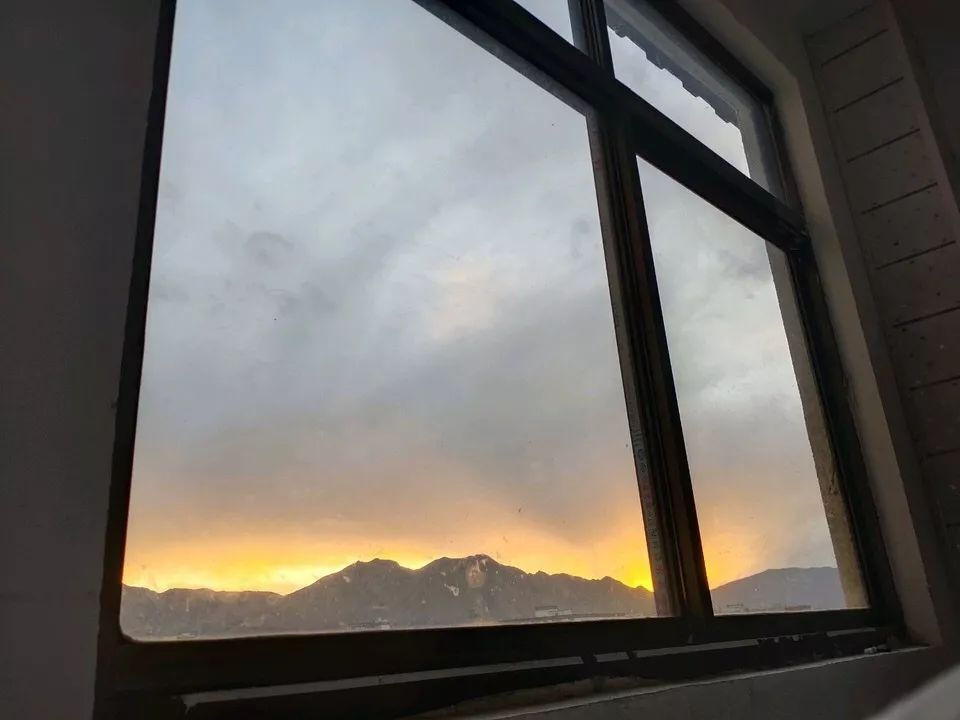 (原始链接: https://mmbiz.qpic.cn/mmbiz_jpg/33sYCEQicAeicuzUTwY0Eib5njHDk6pib75tcE2HR0uIjgIDiavv6vUOAVFrMicQSjMUjeo5wibpYTBeBYnlwPtNMTJUw/640?wx_fmt=jpeg)
- 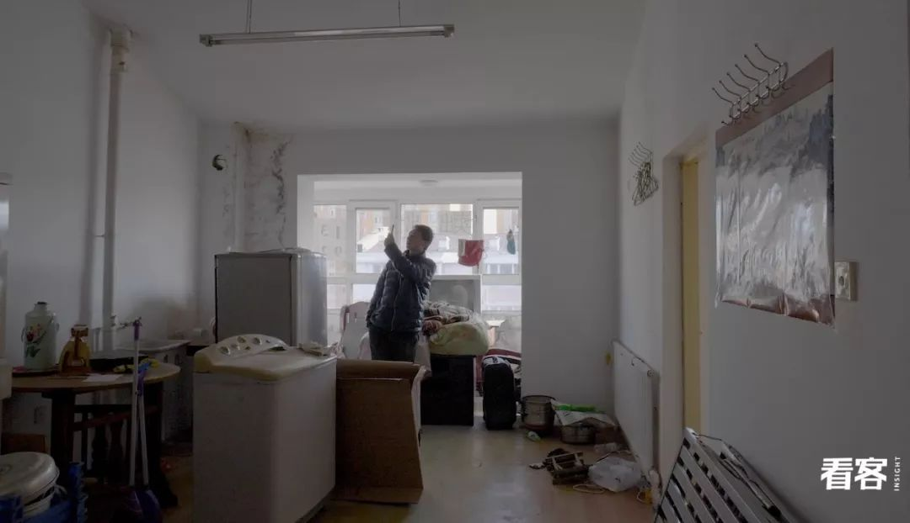 (原始链接: https://mmbiz.qpic.cn/mmbiz_jpg/33sYCEQicAe8aM9B2XSpxcbCpDepygyX13V0GNyAtBD73PxVMTcZQKxAsjGauKoXMuxdice6CgNjcicSLdsRReBDg/640?wx_fmt=jpeg)
- 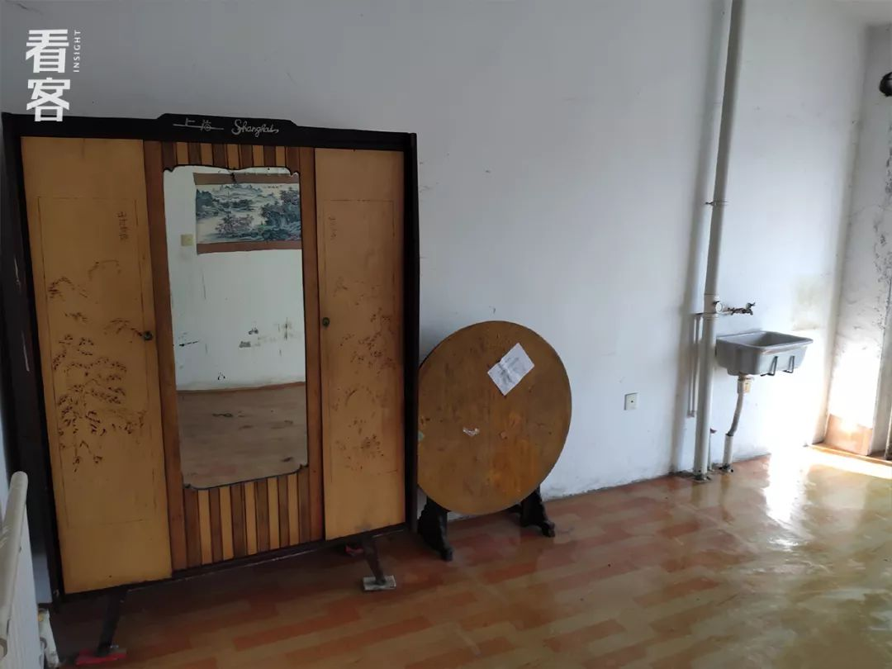 (原始链接: https://mmbiz.qpic.cn/mmbiz_jpg/33sYCEQicAe8aM9B2XSpxcbCpDepygyX1x55df9QeCVZEs7ZHiaDmrwCl8cIjtY962HfDKoK8746LribibpPqNmicPQ/640?wx_fmt=jpeg)
-  (原始链接: https://mmbiz.qpic.cn/mmbiz_jpg/33sYCEQicAe8aM9B2XSpxcbCpDepygyX1YxIMM7mKib4mKduCaXvan59n1DU2PYqLjyuG28Ll2s5oS8ouCT2XGiaQ/640?wx_fmt=jpeg)
- 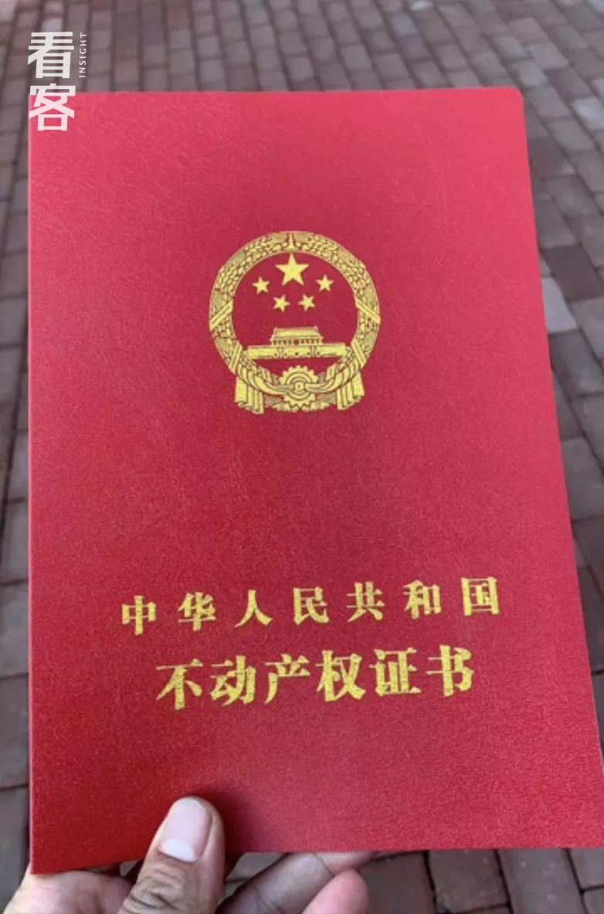 (原始链接: https://mmbiz.qpic.cn/mmbiz_jpg/33sYCEQicAe8aM9B2XSpxcbCpDepygyX1PkRrqBCTBeYWibdRy2Wib2PIYg0npzHDQCrdvhkT34jaH0yedDfejjKA/640?wx_fmt=jpeg)
- 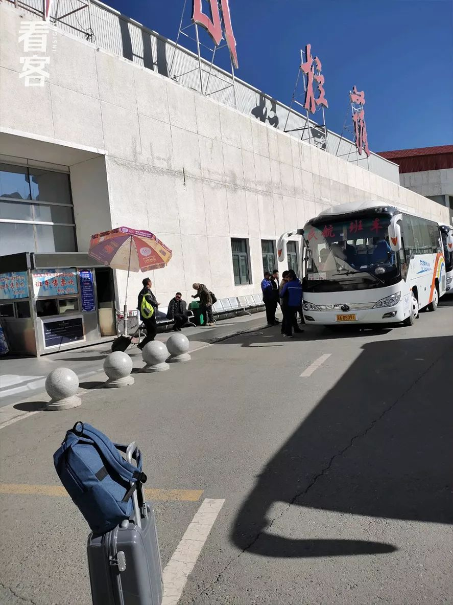 (原始链接: https://mmbiz.qpic.cn/mmbiz_jpg/33sYCEQicAe8aM9B2XSpxcbCpDepygyX1Z2ByP4wedtibZcJGmLtibPLV9FEtX5IACsapy0DVfSCC0Ebq7aRg7M5w/640?wx_fmt=jpeg)
- 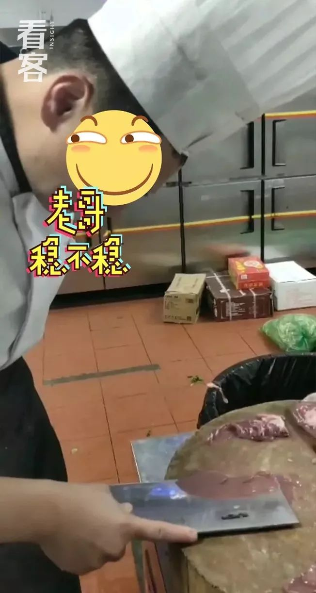 (原始链接: https://mmbiz.qpic.cn/mmbiz_jpg/33sYCEQicAe8aM9B2XSpxcbCpDepygyX14T5ftgn8m75ZVYsS6oCu14HUhlviabuAMGlAEJmTiccfoWfWBynRbSdw/640?wx_fmt=jpeg)
-  (原始链接: https://mmbiz.qpic.cn/mmbiz_jpg/33sYCEQicAe8aM9B2XSpxcbCpDepygyX12cBcmbnMr14EmQwiaxAfe0lEhXYp5QQQA2zoX0TvIHV6FYBiaaiaz6TjA/640?wx_fmt=jpeg)
- 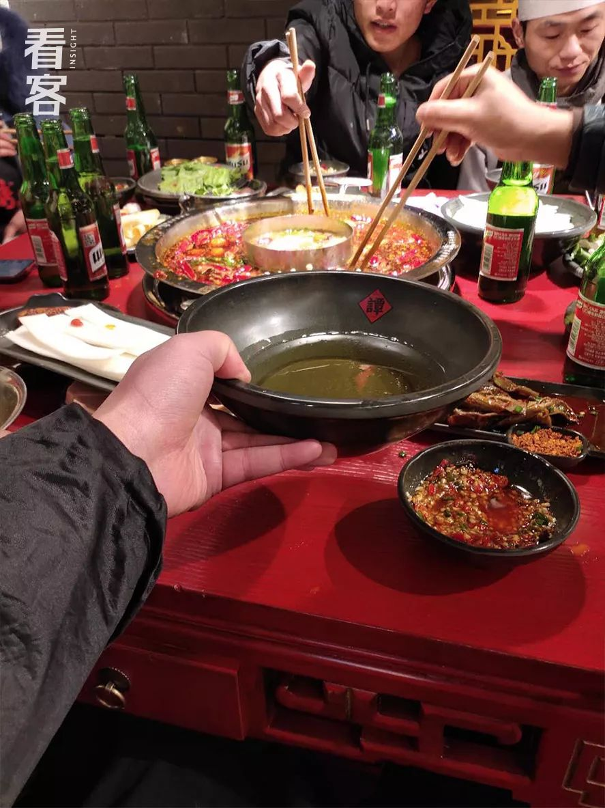 (原始链接: https://mmbiz.qpic.cn/mmbiz_jpg/33sYCEQicAe8aM9B2XSpxcbCpDepygyX1UuJL8umozC44RXQUkD3hIyLPpBsTs6sST4YWL00WmdJGKoveWC0bXg/640?wx_fmt=jpeg)
- 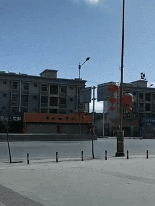 (原始链接: https://mmbiz.qpic.cn/mmbiz_gif/33sYCEQicAe8aM9B2XSpxcbCpDepygyX17iamAcozmLX9Bn6d0IZ20awiaQRReicqu3YcIia0jMsek3oXYq4qrbicHIA/640?wx_fmt=gif)
- 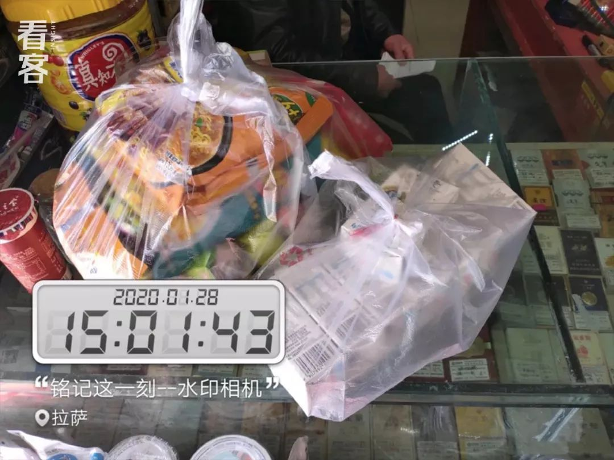 (原始链接: https://mmbiz.qpic.cn/mmbiz_jpg/33sYCEQicAe8aM9B2XSpxcbCpDepygyX1NvKu0QHZWB7L7mvRM0gwUg5N8DMjunBHlUT5ePFKiac6gL4clYgH88Q/640?wx_fmt=jpeg)
- 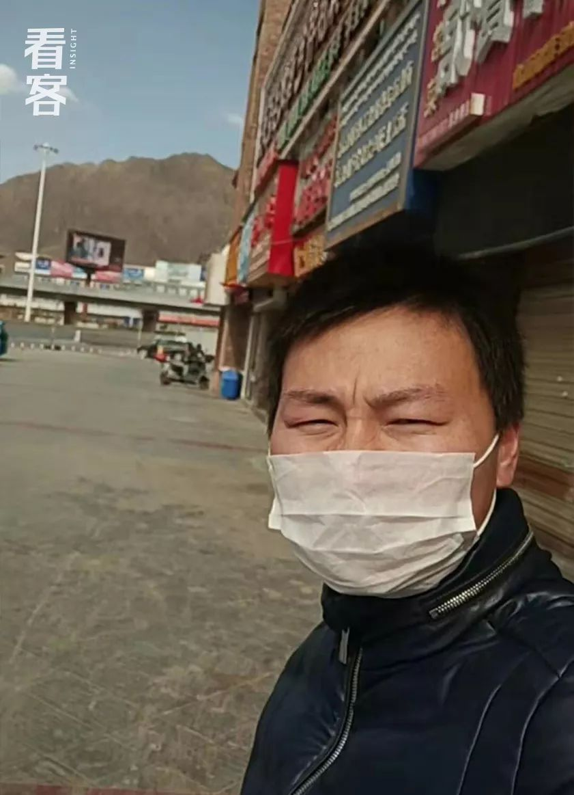 (原始链接: https://mmbiz.qpic.cn/mmbiz_jpg/33sYCEQicAe8aM9B2XSpxcbCpDepygyX1C5gjU4bxXt5v3tmPDibvViaPRcraZBJquxdTn4xFZj9HunXbMvwJc9yA/640?wx_fmt=jpeg)
- 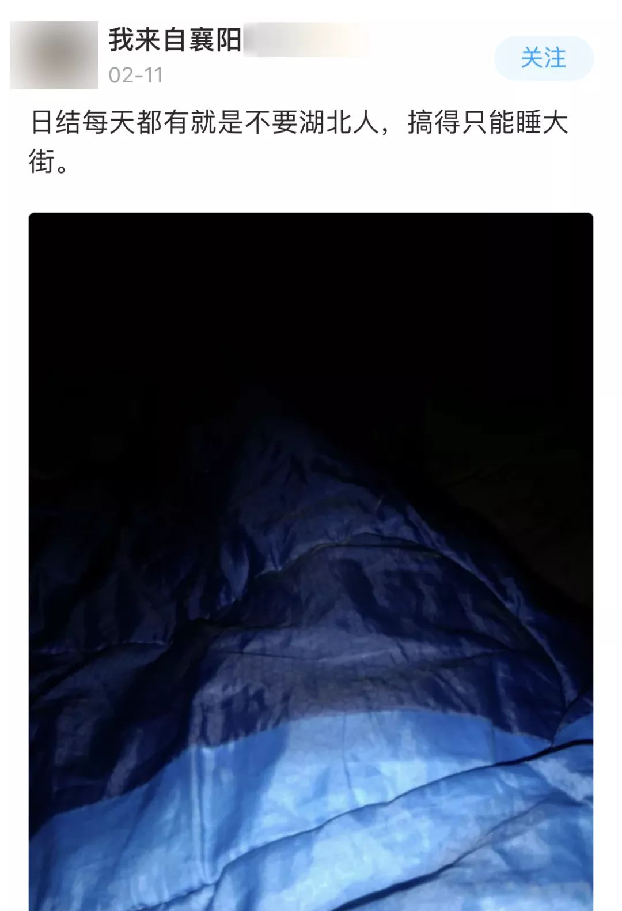 (原始链接: https://mmbiz.qpic.cn/mmbiz_jpg/33sYCEQicAe8aM9B2XSpxcbCpDepygyX1qemwJztWVJMGtRv6kGGicNhpibicoYOAc7JlQ9ujzXV10UXsNysicwShag/640?wx_fmt=jpeg)
- 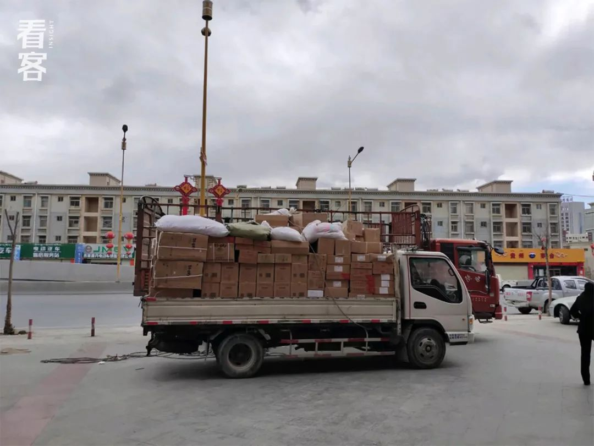 (原始链接: https://mmbiz.qpic.cn/mmbiz_jpg/33sYCEQicAe8aM9B2XSpxcbCpDepygyX1cbuqRwVRQ3DuxDGkUkmVIrnFY9fhPsXSsNxoDYpnjMJ3ibWeLt5J96w/640?wx_fmt=jpeg)
- 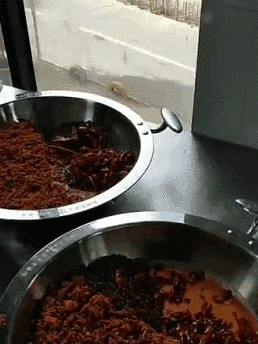 (原始链接: https://mmbiz.qpic.cn/mmbiz_gif/33sYCEQicAe8aM9B2XSpxcbCpDepygyX10XS9ib2iagwWicTtXHWeEJspCFevricHT6BYNwl4NIcxYErJSfAicxpuk7g/640?wx_fmt=gif)
- 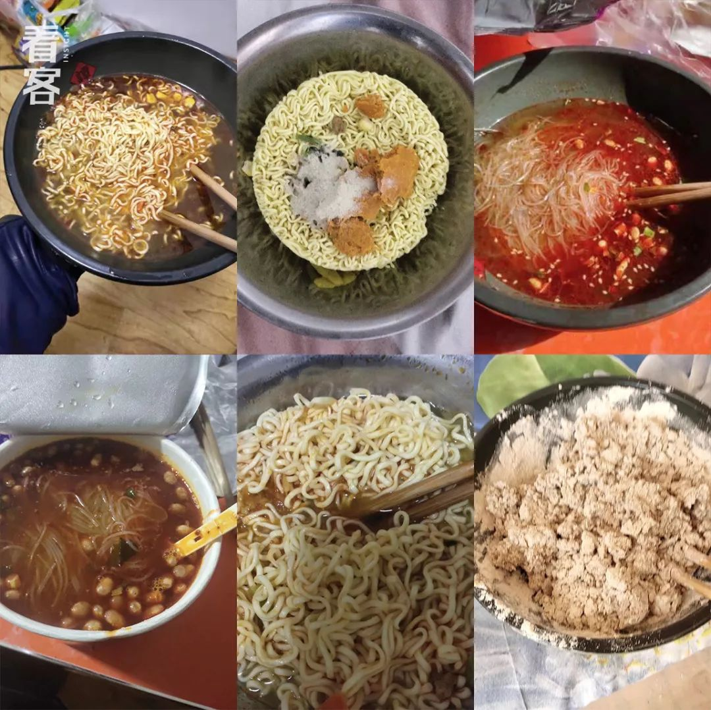 (原始链接: https://mmbiz.qpic.cn/mmbiz_jpg/33sYCEQicAe8aM9B2XSpxcbCpDepygyX1HwbDcWoia3Oy00sggvicLRa8F2VjMFvTNoh5x84kpPCGWOug6RicgBGJA/640?wx_fmt=jpeg)
- 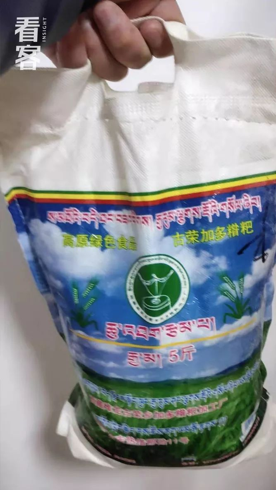 (原始链接: https://mmbiz.qpic.cn/mmbiz_jpg/33sYCEQicAe8aM9B2XSpxcbCpDepygyX14FiaAe0h9dNCzynSUa4qMzKhJ0ll6Qh5vUrCv8fGiaDfIPcibs9UmQfYQ/640?wx_fmt=jpeg)
- 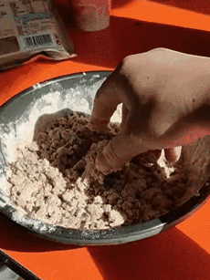 (原始链接: https://mmbiz.qpic.cn/mmbiz_gif/33sYCEQicAe8aM9B2XSpxcbCpDepygyX1KBTq2TaRMn7CU4XtUoiaHibMq3mQm6fblT8rSuuGD8XHeNUoWTfiaTg1w/640?wx_fmt=gif)
- 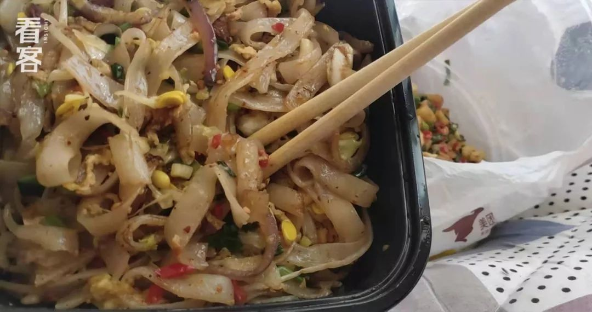 (原始链接: https://mmbiz.qpic.cn/mmbiz_jpg/33sYCEQicAe8aM9B2XSpxcbCpDepygyX1ktpINLKe8xB1uGds9JaDpWEa2c1dc0UwXm9yFv1z5FHDE13VC61uFA/640?wx_fmt=jpeg)
- 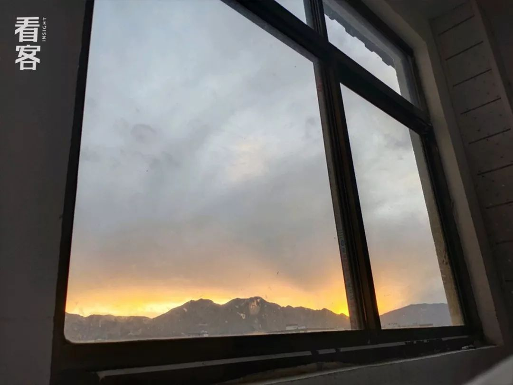 (原始链接: https://mmbiz.qpic.cn/mmbiz_jpg/33sYCEQicAe8aM9B2XSpxcbCpDepygyX1QhXkZEcIKRD2ckORBr5gNVR3W63GlbD753MdaFB9WB6G7iabm4wnfBQ/640?wx_fmt=jpeg)
- 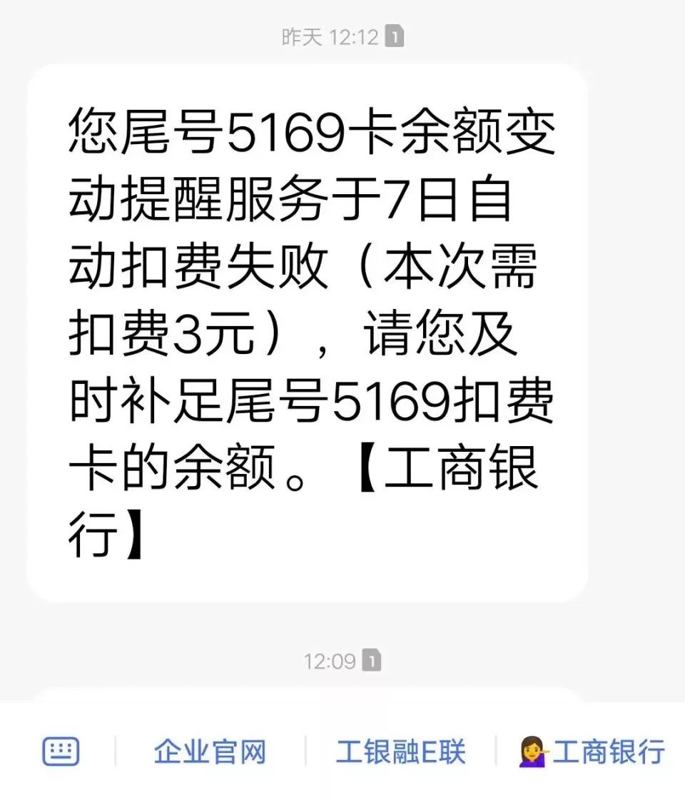 (原始链接: https://mmbiz.qpic.cn/mmbiz_jpg/33sYCEQicAeicuzUTwY0Eib5njHDk6pib75tyhOctvL1yGYrCKITJeyphicbM8kZ93ljcSNibvO9nSpUYmTjnBwMYRGg/640?wx_fmt=jpeg)
- 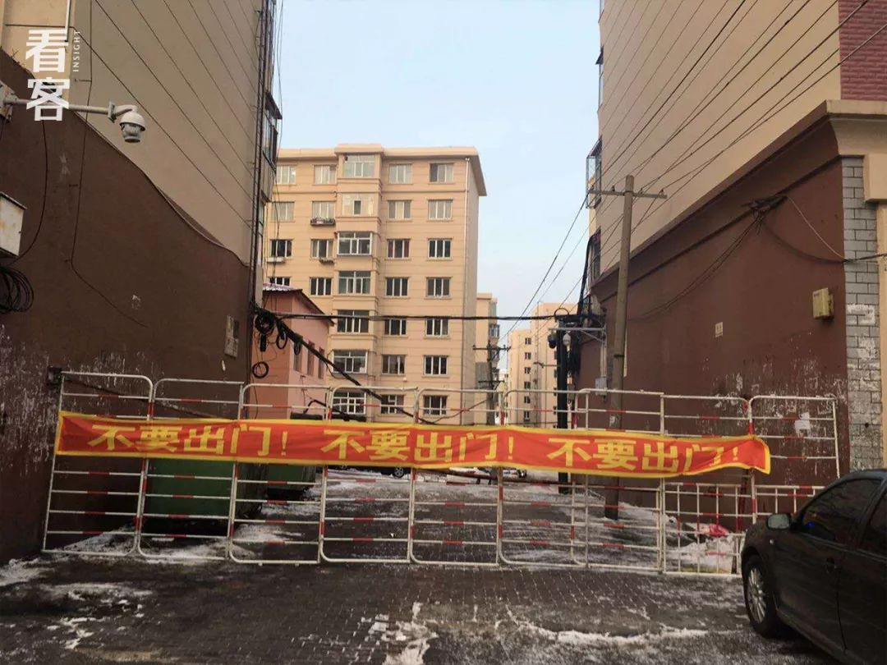 (原始链接: https://mmbiz.qpic.cn/mmbiz_jpg/33sYCEQicAe8aM9B2XSpxcbCpDepygyX1nfb1Auaibf7UGghKFmG0cXNewPGKquOgiadvYf1yOn9aP1tVgroxqpUQ/640?wx_fmt=jpeg)
-  (原始链接: https://mmbiz.qpic.cn/mmbiz_png/33sYCEQicAeicuzUTwY0Eib5njHDk6pib75tOCYkkRFHIrMk60DqQhm1GJtLoPaYdVaOwHpaDDib9jNVzHOhoWyZ9yg/640?wx_fmt=png)
- 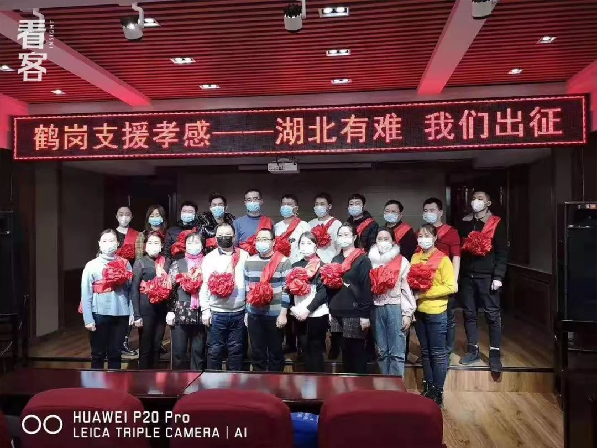 (原始链接: https://mmbiz.qpic.cn/mmbiz_jpg/33sYCEQicAe8aM9B2XSpxcbCpDepygyX1gzqf8Y6Mx7cZ0CiciaUsjWyiahNVk8hOJH6b2GWQwY0niagVFLiaJaZ1OJQ/640?wx_fmt=jpeg)
-  (原始链接: https://mmbiz.qpic.cn/mmbiz_jpg/33sYCEQicAeicdykqY4IbtbUEvaPAXviaaibtHs6OdM4EIbnzhYcTFYj6yHPz0NdP8UMn3kW0gdRbic9ic3ro59ESpSQ/640?wx_fmt=jpeg)
- 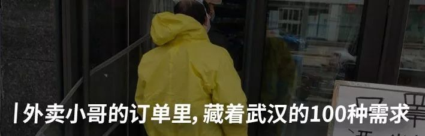 (原始链接: https://mmbiz.qpic.cn/mmbiz_jpg/33sYCEQicAe913vjTctk7U8mpccCEkNPSPKEknm59xialEO1Yjqt9y7xId2TAErPA0Hq7oH1xXeJaDWFV92yia3oA/640?wx_fmt=jpeg)
- 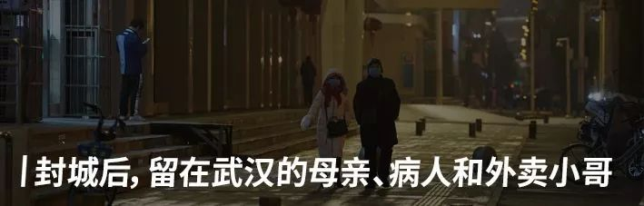 (原始链接: https://mmbiz.qpic.cn/mmbiz_jpg/33sYCEQicAeicUkic4dFyshJjmHg3PIAKictiaq55VENIUBNISaRtnUibGYb9ibdehy2rfibmV5WdSACzwUgIU7kHXMhlw/640?wx_fmt=jpeg)
- 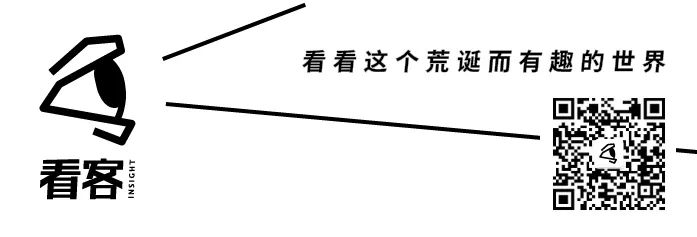 (原始链接: https://mmbiz.qpic.cn/mmbiz_jpg/33sYCEQicAeicuzUTwY0Eib5njHDk6pib75tqg2GJAO19BGW3aM10BNic2FwLksVOHzYpCQcVEdKWaw0dzf7Hj0GshQ/640?wx_fmt=jpeg)
-  (原始链接: https://mmbiz.qpic.cn/mmbiz_png/33sYCEQicAeicuzUTwY0Eib5njHDk6pib75tQAviahvuVPUJJRtvRzlkzjdrA0NEENtHV793vJYicwFYAlAdKSUV5ZUA/640?wx_fmt=png)
