# 无标题

**链接地址:** http://mp.weixin.qq.com/s?__biz=MjM5NDE3NzM4Mw==&mid=2652250153&idx=1&sn=69f5727dab12af73a0dabb0500bfd0ee&chksm=bd6948218a1ec13737eb3c3a66643d512fb0e18f40d93d53cb4e73c9563b0677389fd8fcb64c&mpshare=1&scene=2&srcid=0302wRNJESa6fVyJO0J9E5fo&sharer_sharetime=1583084380466&sharer_shareid=be1c8edd6c93eec155a61c876e41d26a#rd
**作者:** 
**获取时间:** 2025/8/28 20:18:42
**图片数量:** 15

---

## 原始HTML内容

2019年暑期，肖战因剧集《陈情令》而爆红，半年多时间里，肖战实现了活跃粉丝从<strong>16万到500万</strong>的飞跃。而近期，肖战却遭遇了一些麻烦。

 

 

从2月27日开始，全网各大社交平台，掀起了一股抵制肖战的浪潮。最直接的表现是大量网友在《陈情令》、《诛仙》等肖战主演的影视作品下打一星，目前《陈情令》分数已从当初的<strong>8.2跌到7.9</strong>分。

 

&nbsp;<em style="text-align: center;white-space: normal;letter-spacing: 1px;font-size: 15px;">图片来源于网络，如涉及侵权请联系删除</em>

&nbsp;

据网友统计，2月27日之前，《陈情令》在豆瓣上有60多万人参与打分，而今天打分人数已经增加到94万，增加了<strong>30万左右</strong>。其中，一星占比此前是<strong>5.9%</strong>，目前已经增加至<strong>9.6%</strong>，不少网友在评价中更直接点名肖战。

 

 

&nbsp;<em style="text-align: center;white-space: normal;letter-spacing: 1px;font-size: 15px;">图片来源于网络，如涉及侵权请联系删除</em>

<em style="text-align: center;white-space: normal;letter-spacing: 1px;font-size: 15px;"> </em>

《诛仙I》也遭遇了同样的情况，截止到发稿，评分已跌至<strong>4.7</strong>。

 

<em style="text-align: center;white-space: normal;letter-spacing: 1px;font-size: 15px;"></em>

&nbsp;<em style="text-align: center;white-space: normal;letter-spacing: 1px;font-size: 15px;">图片来源于网络，如涉及侵权请联系删除</em>

 

而就在今天凌晨，还有大V爆料：“太尴尬了，XX品牌本来今天要官宣肖战，现在把肖战有关的产品下架了…也没有官宣了，这算是肖战因为ao3掉的第一个代言吗？”

<em style="text-align: center;white-space: normal;letter-spacing: 1px;font-size: 15px;"></em> 

<em style="text-align: center;white-space: normal;letter-spacing: 1px;font-size: 15px;">&nbsp;<em style="text-align: center;white-space: normal;letter-spacing: 1px;font-size: 15px;">图片来源于网络，如涉及侵权请联系删除</em></em>

<em style="text-align: center;white-space: normal;letter-spacing: 1px;font-size: 15px;"> </em>

这一消息是否属实还有待考证，但肖战被黑已是不争的事实。那么，究竟是什么原因让肖战一下子犯了众怒？大V说的ao3又是什么？小编就给各位吃瓜群众详述一下整件事情的经过。

 

首先<strong>ao3</strong>是<strong>全球性小说创作网站</strong>，其中尤其以“同人文”著称，所有创作者都可以在此自由创作，成为国内很多写手的“停车场”。而事件中涉及的另一个lofter（中文名老福特），也有异曲同工之妙。

 

<em style="text-align: center;white-space: normal;letter-spacing: 1px;font-size: 15px;">&nbsp;<em>图片来源于网络，如涉及侵权请联系删除</em></em>

 

<strong>同人文</strong>就是用某些作品中的人物，经过作者的想象重新创作而成的小说。另外，一些写手也会用现实中的真人CP进行创作，小说中的主角就会直接使用真实人物的姓名。

 

 

前几天，一位博主在ao3和lofter上发布了一篇真人CP的“同人文”，并给肖战安排了一个“女性化”的角色。这篇文章被肖战的粉丝发现了，于是，护偶像心切的粉丝们忍不住了，对ao3作品库中的内容进行了举报。由于举报人数过多，很快就导致ao3无法打开。而lofter一边也遭遇在应用市场的大量一星评价，虽然不至于无法访问，但据称文库中大量内容也遭遇删除。

 

<em style="text-align: center;white-space: normal;letter-spacing: 1px;font-size: 15px;"><em>图片来源于网络，如涉及侵权请联系删除</em></em>

 

这一举动彻底惹怒了ao3和lofter庞大的用户群，这些用户将矛头对准了肖战的粉丝，进而<strong>上升到肖战本人</strong>，肖战无辜躺枪。由此，也就发生了文章开头所说的那些针对肖战的行为。此外，对比起已播出的作品，愤怒的网友甚至还发起了<strong>抵制肖战一切影视作品和代言产品</strong>的行动。

 

<em style="text-align: center;white-space: normal;letter-spacing: 1px;font-size: 15px;"><em>图片来源于网络，如涉及侵权请联系删除</em></em>

 

目前，已经有<strong>肖战粉丝出来道歉</strong>。这位粉丝承认是自己不可原谅的行为波及到其他圈层的网友，自己不是偶像反黑站的人，也没有和工作室有过联系，完全是个人行为。

 

<em style="text-align: center;white-space: normal;letter-spacing: 1px;font-size: 15px;"><em>图片来源于网络，如涉及侵权请联系删除</em></em>

 

但网友认为这不是一个人的作为，而是圈子所为，而且道歉并没有提到重点，都<strong>不接受其道歉</strong>。肖战主演的<strong>《斗罗大陆》、《余生，请多指教》、《狼殿下》</strong>等影视作品尚未上映，但在豆瓣评分网站上已经有人开始“<strong>一星预定</strong>”，日期也基本上都是2月29日和3月1日，看来也是受到粉丝举报网站的影响。这一事件着实影响到肖战的路人缘。

&nbsp;

事件发生几天以来，肖战的热搜热度曾多次达到<strong>130万量级</strong>。本就已是顶级流量的肖战，2月27日之后的全网讨论量更是成倍升高，<strong>单日达到78万条以上</strong>。

&nbsp;

&nbsp;

然而，从肖战近期在社交媒体上的口碑走势可以得知，差评率也是明显升高，2月26日<strong>差评率</strong>还只有<strong>5.2%</strong>，到了2月29日，这一数据已经<strong>上升到</strong><strong>25.4%</strong>。可见这一事件着实影响到肖战的路人缘。

 

 

就在刚刚，<strong>肖战工作室针对这一事件发文道歉</strong>，工作室表示关于肖战粉丝的一些争论，占用了一些社会公共资源，也给大家带来了困扰。对此事所造成的影响，深感遗憾与歉意。工作室感谢粉丝对肖战的支持与喜爱，同时也呼吁大家理智追星。

 

随后，<strong>肖战全球后援会</strong>也转发了工作室道歉声明，并表示：“爱是初心，引以为戒。做好自我防护，支持为社会带来正能量的事情，为更好的明天一起努力。”

 

<em style="text-align: center;white-space: normal;letter-spacing: 1px;font-size: 15px;"><em>图片来源于网络，如涉及侵权请联系删除</em></em>

 

平心而论，肖战粉丝的举报确实有破坏他人创作自由的嫌疑，导致ao3无法打开也是较为严重的结果；而抵制肖战的网友也不够理性客观，毕竟举报、投诉来自于肖战粉丝，和艺人本人无关，将怒火上升到明星本身，给作品打低分、在代言品牌社交平台下恶意评论，甚至已经构成网络暴力了，应当适可而止。如今，肖战方已经给出了回应，就是希望能早日息事宁人，希望这次风波赶快过去吧。

 

 

 
<section xmlns="http://www.w3.org/1999/xhtml" style="white-space: normal;"><section label="Copyright © 2014 playhudong All Rights Reserved." donone="shifuMouseDownOther('shifu_o_028')" style="margin-top: 5px;padding-top: 10px;padding-bottom: 10px;border: none;background-image: none;"></section></section><section xmlns="http://www.w3.org/1999/xhtml" style="white-space: normal;"><section label="Copyright  2019 iPaiban All Rights Reserved （本样式已做版权保护，未经正式授权不允许任何第三方编辑器、企业、个人使用，违者必纠）" donone="shifuMouseDownPayStyle('shifu_devider_032')" style="margin: 0.5rem auto;width: 22rem;border: none;box-sizing: border-box;"><section style="width: 352px;height: 3rem;"><section style="width: 352px;clear: both;"><section style="width: 10rem;text-align: right;color: rgb(55, 55, 55);overflow: hidden;font-size: 0.75rem;">
 
</section></section></section></section></section>
<strong style="max-width: 100%;box-sizing: border-box !important;overflow-wrap: break-word !important;">中国娱乐指数</strong>（chinaindex.net）：免费查看艺人活跃粉丝、商业价值、作品贡献、红黑粉等数据的在线榜单类产品。

 

<strong style="max-width: 100%;box-sizing: border-box !important;overflow-wrap: break-word !important;">名人经营系统</strong>（iStar.AIMan.cn）：致力于“艺人经纪和名人品牌管理”的专业在线产品，已持续两年为国内经纪公司保驾护航。

 

<strong style="max-width: 100%;box-sizing: border-box !important;overflow-wrap: break-word !important;">艾漫星选</strong>（xingxuan.aiman.cn）：通过大数据帮助客户选对的人在线选人产品。

 

 
<section xmlns="http://www.w3.org/1999/xhtml" style="white-space: normal;"><section label="Copyright  2018 iPaiban All Rights Reserved （本样式已做版权保护，未经正式授权不允许任何第三方编辑器、企业、个人使用，违者必纠）" donone="shifuMouseDownPayStyle('shifu_dataage_008')" style="margin: 0.5rem auto;width: 24rem;border: none;box-sizing: border-box;"><section style="width: 384px;display: flex;flex-direction: row;justify-content: center;align-items: flex-start;"><section style="width: 140px;flex-shrink: 0;"><section style="width: 140px;overflow: hidden;height: 33px;"><section style="width: 20px;height: 33px;float: right;"> </section></section><section style="width: 121px;background-color: rgb(186, 246, 255);transform: rotate(-15deg);"><section style="width: 121px;transform: rotate(15deg);"></section></section></section><section style="padding-left: 1rem;width: 170px;flex-shrink: 2;box-sizing: border-box;color: rgb(25, 25, 25);"><section style="width: 154px;font-size: 1rem;font-weight: bold;letter-spacing: 2px;">
<strong>艾漫AI大数据管家</strong>
</section><section style="width: 154px;font-size: 0.75rem;">
 
</section><section style="margin-top: 0.6rem;width: 154px;font-size: 0.875rem;line-height: 1.4rem;">
如果您对上述数据或艾漫数据“名人经营系统”感兴趣，请联系我们为您开通试用账号，并将有专人一对一解答您的问题。
</section></section></section></section></section>
 

你可能还想看：

 

<a target="_blank" href="http://mp.weixin.qq.com/s?__biz=MjM5NDE3NzM4Mw==&amp;mid=2652249666&amp;idx=1&amp;sn=38eab3a5a67022315af1eff86f9d04eb&amp;chksm=bd69764a8a1eff5c39d1ed59c4d8d66eb9b761bf87124ce8ca77d9962864a462e0117a39e225&amp;scene=21#wechat_redirect" data-itemshowtype="0" tab="innerlink" data-linktype="2">新浪微博联合艾漫数据发布“2019明星白皮书”（文末提供白皮书完整版）</a>

<a target="_blank" href="http://mp.weixin.qq.com/s?__biz=MjM5NDE3NzM4Mw==&amp;mid=2652249735&amp;idx=1&amp;sn=721ee54ee34ed1c0c3b435cdf91f3fa2&amp;chksm=bd69768f8a1eff99b98e01ecc36b7e6b9331aa9ec83cc91e17c87920a1839ddca1bf037fef2c&amp;scene=21#wechat_redirect" data-itemshowtype="0" tab="innerlink" data-linktype="2">艾漫发布2019年商业价值榜：朱一龙千玺分列上下半年男榜冠军 热巴杨紫成女星魁首</a> 

<a target="_blank" href="http://mp.weixin.qq.com/s?__biz=MjM5NDE3NzM4Mw==&amp;mid=2652250128&amp;idx=1&amp;sn=21f0e17e42e295292640cb6ac5d6d5b0&amp;chksm=bd6948188a1ec10e492cae8ec019b86d3429922cf55be1f6020299a5e6aeb49959edcedd32de&amp;scene=21#wechat_redirect" data-itemshowtype="0" tab="innerlink" data-linktype="2">艾漫数据发布1月中国青年阳光指数榜单：李现夺冠 韩红黄晓明位居二三名</a> 

<a target="_blank" href="http://mp.weixin.qq.com/s?__biz=MjM5NDE3NzM4Mw==&amp;mid=2652250025&amp;idx=1&amp;sn=dc1d46660da2f3b33b0f26d6f91018f8&amp;chksm=bd6977a18a1efeb7a52761d23b64386a7a0861abc6b44224cdcbac61310e8525d46634678ed9&amp;scene=21#wechat_redirect" data-itemshowtype="0" tab="innerlink" data-linktype="2">【艾漫×新浪微博明星】联合发布1月商业价值：肖战再夺榜首 易烊千玺居亚</a>

<a href="http://mp.weixin.qq.com/s?__biz=MjM5NDE3NzM4Mw==&amp;mid=2652249361&amp;idx=1&amp;sn=310ed918f614fc59d4249de1797f2ce6&amp;chksm=bd6975198a1efc0f2bf5d1188e9184d006c90d01a072a765bd6108c8b9e8c605e83494c60b90&amp;scene=21#wechat_redirect" target="_blank" data-itemshowtype="0" data-linktype="2" style="text-decoration: underline;max-width: 100%;font-size: 14px;box-sizing: border-box !important;overflow-wrap: break-word !important;">艾漫数据的数据是怎么来的？</a>

<a href="http://mp.weixin.qq.com/s?__biz=MjM5NDE3NzM4Mw==&amp;mid=2652246816&amp;idx=1&amp;sn=f05413c7e8999d6c68867db86bd91099&amp;chksm=bd697b288a1ef23e324293e8acf2a2ed1044e71bbe6121a2ad0811a9d98466acd5759df13fae&amp;scene=21#wechat_redirect" target="_blank" data-linktype="2" style="text-decoration: underline;letter-spacing: 0.544px;max-width: 100%;box-sizing: border-box !important;overflow-wrap: break-word !important;">金数据盛典揭秘流量造假;明星代言树立新规</a> 
<h2 style="white-space: normal;"><a href="http://mp.weixin.qq.com/s?__biz=MjM5NDE3NzM4Mw==&amp;mid=2652245761&amp;idx=1&amp;sn=dfd996d7ad084b21c626442389d65058&amp;chksm=bd6967098a1eee1f1045707d94bc98e990f2b7468b16c4501b1917d1a3c5f8960820f065e1cb&amp;scene=21#wechat_redirect" target="_blank" data-linktype="2" style="text-decoration: underline;letter-spacing: 0.544px;max-width: 100%;box-sizing: border-box !important;overflow-wrap: break-word !important;">艾漫数据与百度百科战略合作 查询明星信息更便利</a></h2>
<a href="http://mp.weixin.qq.com/s?__biz=MjM5NDE3NzM4Mw==&amp;mid=2652243564&amp;idx=1&amp;sn=0a755cc1a0c4901bb9abd3b1f1344bb8&amp;chksm=bd696e648a1ee772a4e659f8af712e56efb3bd3898eadaa9b136e7f1056b52ca331a63c50b42&amp;scene=21#wechat_redirect" target="_blank" data-linktype="2" style="letter-spacing: 0.544px;max-width: 100%;box-sizing: border-box !important;overflow-wrap: break-word !important;">艾漫数据董事长夏宗靓《人民日报》发署名文章</a>

 

---

## 纯文本内容

2019年暑期，肖战因剧集《陈情令》而爆红，半年多时间里，肖战实现了活跃粉丝从16万到500万的飞跃。而近期，肖战却遭遇了一些麻烦。从2月27日开始，全网各大社交平台，掀起了一股抵制肖战的浪潮。最直接的表现是大量网友在《陈情令》、《诛仙》等肖战主演的影视作品下打一星，目前《陈情令》分数已从当初的8.2跌到7.9分。 图片来源于网络，如涉及侵权请联系删除 据网友统计，2月27日之前，《陈情令》在豆瓣上有60多万人参与打分，而今天打分人数已经增加到94万，增加了30万左右。其中，一星占比此前是5.9%，目前已经增加至9.6%，不少网友在评价中更直接点名肖战。 图片来源于网络，如涉及侵权请联系删除《诛仙I》也遭遇了同样的情况，截止到发稿，评分已跌至4.7。 图片来源于网络，如涉及侵权请联系删除而就在今天凌晨，还有大V爆料：“太尴尬了，XX品牌本来今天要官宣肖战，现在把肖战有关的产品下架了…也没有官宣了，这算是肖战因为ao3掉的第一个代言吗？” 图片来源于网络，如涉及侵权请联系删除这一消息是否属实还有待考证，但肖战被黑已是不争的事实。那么，究竟是什么原因让肖战一下子犯了众怒？大V说的ao3又是什么？小编就给各位吃瓜群众详述一下整件事情的经过。首先ao3是全球性小说创作网站，其中尤其以“同人文”著称，所有创作者都可以在此自由创作，成为国内很多写手的“停车场”。而事件中涉及的另一个lofter（中文名老福特），也有异曲同工之妙。 图片来源于网络，如涉及侵权请联系删除同人文就是用某些作品中的人物，经过作者的想象重新创作而成的小说。另外，一些写手也会用现实中的真人CP进行创作，小说中的主角就会直接使用真实人物的姓名。前几天，一位博主在ao3和lofter上发布了一篇真人CP的“同人文”，并给肖战安排了一个“女性化”的角色。这篇文章被肖战的粉丝发现了，于是，护偶像心切的粉丝们忍不住了，对ao3作品库中的内容进行了举报。由于举报人数过多，很快就导致ao3无法打开。而lofter一边也遭遇在应用市场的大量一星评价，虽然不至于无法访问，但据称文库中大量内容也遭遇删除。图片来源于网络，如涉及侵权请联系删除这一举动彻底惹怒了ao3和lofter庞大的用户群，这些用户将矛头对准了肖战的粉丝，进而上升到肖战本人，肖战无辜躺枪。由此，也就发生了文章开头所说的那些针对肖战的行为。此外，对比起已播出的作品，愤怒的网友甚至还发起了抵制肖战一切影视作品和代言产品的行动。图片来源于网络，如涉及侵权请联系删除目前，已经有肖战粉丝出来道歉。这位粉丝承认是自己不可原谅的行为波及到其他圈层的网友，自己不是偶像反黑站的人，也没有和工作室有过联系，完全是个人行为。图片来源于网络，如涉及侵权请联系删除但网友认为这不是一个人的作为，而是圈子所为，而且道歉并没有提到重点，都不接受其道歉。肖战主演的《斗罗大陆》、《余生，请多指教》、《狼殿下》等影视作品尚未上映，但在豆瓣评分网站上已经有人开始“一星预定”，日期也基本上都是2月29日和3月1日，看来也是受到粉丝举报网站的影响。这一事件着实影响到肖战的路人缘。 事件发生几天以来，肖战的热搜热度曾多次达到130万量级。本就已是顶级流量的肖战，2月27日之后的全网讨论量更是成倍升高，单日达到78万条以上。  然而，从肖战近期在社交媒体上的口碑走势可以得知，差评率也是明显升高，2月26日差评率还只有5.2%，到了2月29日，这一数据已经上升到25.4%。可见这一事件着实影响到肖战的路人缘。就在刚刚，肖战工作室针对这一事件发文道歉，工作室表示关于肖战粉丝的一些争论，占用了一些社会公共资源，也给大家带来了困扰。对此事所造成的影响，深感遗憾与歉意。工作室感谢粉丝对肖战的支持与喜爱，同时也呼吁大家理智追星。随后，肖战全球后援会也转发了工作室道歉声明，并表示：“爱是初心，引以为戒。做好自我防护，支持为社会带来正能量的事情，为更好的明天一起努力。”图片来源于网络，如涉及侵权请联系删除平心而论，肖战粉丝的举报确实有破坏他人创作自由的嫌疑，导致ao3无法打开也是较为严重的结果；而抵制肖战的网友也不够理性客观，毕竟举报、投诉来自于肖战粉丝，和艺人本人无关，将怒火上升到明星本身，给作品打低分、在代言品牌社交平台下恶意评论，甚至已经构成网络暴力了，应当适可而止。如今，肖战方已经给出了回应，就是希望能早日息事宁人，希望这次风波赶快过去吧。中国娱乐指数（chinaindex.net）：免费查看艺人活跃粉丝、商业价值、作品贡献、红黑粉等数据的在线榜单类产品。名人经营系统（iStar.AIMan.cn）：致力于“艺人经纪和名人品牌管理”的专业在线产品，已持续两年为国内经纪公司保驾护航。艾漫星选（xingxuan.aiman.cn）：通过大数据帮助客户选对的人在线选人产品。艾漫AI大数据管家如果您对上述数据或艾漫数据“名人经营系统”感兴趣，请联系我们为您开通试用账号，并将有专人一对一解答您的问题。你可能还想看：新浪微博联合艾漫数据发布“2019明星白皮书”（文末提供白皮书完整版）艾漫发布2019年商业价值榜：朱一龙千玺分列上下半年男榜冠军 热巴杨紫成女星魁首艾漫数据发布1月中国青年阳光指数榜单：李现夺冠 韩红黄晓明位居二三名【艾漫×新浪微博明星】联合发布1月商业价值：肖战再夺榜首 易烊千玺居亚艾漫数据的数据是怎么来的？金数据盛典揭秘流量造假;明星代言树立新规艾漫数据与百度百科战略合作 查询明星信息更便利艾漫数据董事长夏宗靓《人民日报》发署名文章

---

## 图片列表

- 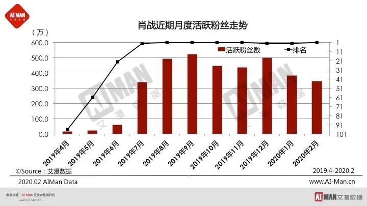 (原始链接: https://mmbiz.qpic.cn/mmbiz_jpg/4VpstsagT4Lc7ibSGFuswyApB0iaAZej2SibWxtmzbv4iaXg04Zj5hYoNXRRfHHIrd3xvCzJaIicrje8ibSahibqv7GgQ/640?wx_fmt=jpeg)
- 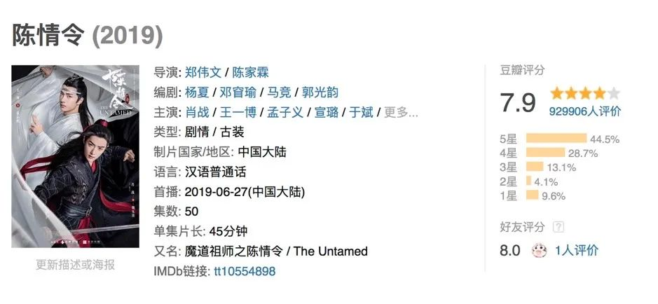 (原始链接: https://mmbiz.qpic.cn/mmbiz_jpg/4VpstsagT4Lc7ibSGFuswyApB0iaAZej2SJST1MonE2QUTfjlFMSVLBAZic822VXyAnhvGXtZ7TkteH4pUYibeHUdA/640?wx_fmt=jpeg)
- 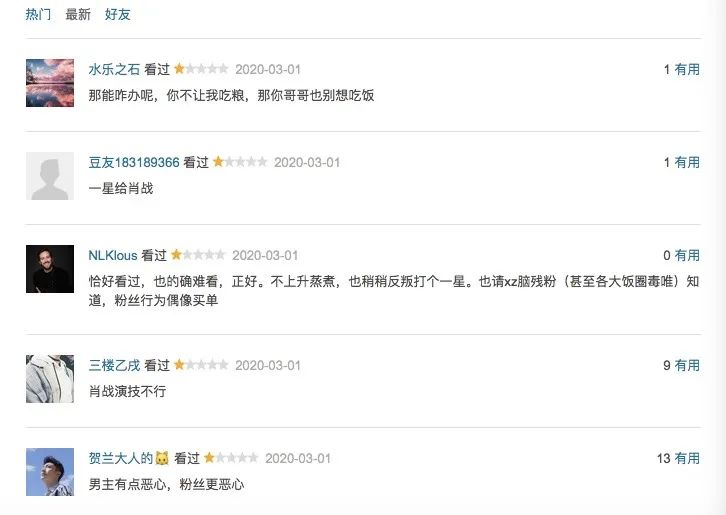 (原始链接: https://mmbiz.qpic.cn/mmbiz_jpg/4VpstsagT4Lc7ibSGFuswyApB0iaAZej2SMPBsnlp1mdesCvcRyH2rsRkkejCic0ib4icDyNe2ow2OdCCM9DwOoORLw/640?wx_fmt=jpeg)
- 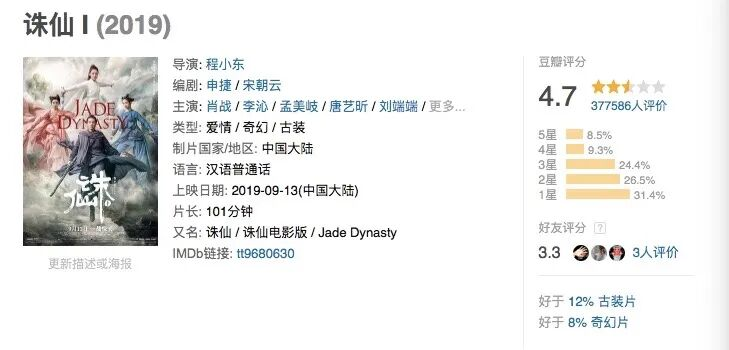 (原始链接: https://mmbiz.qpic.cn/mmbiz_jpg/4VpstsagT4Lc7ibSGFuswyApB0iaAZej2SPYibR9dQTECYTQKNHo0805WIJdsYFAq39icVJKpvzMX2Nv9qodImogDA/640?wx_fmt=jpeg)
- 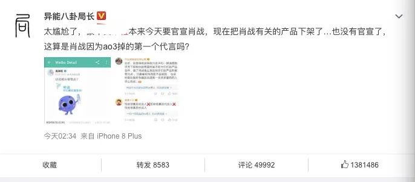 (原始链接: https://mmbiz.qpic.cn/mmbiz_jpg/4VpstsagT4Lc7ibSGFuswyApB0iaAZej2SiculMzXu5KMT90rzyJH5sZaNIIL0uzdAuBtWO9kuKict27GQia0YZurdA/640?wx_fmt=jpeg)
- 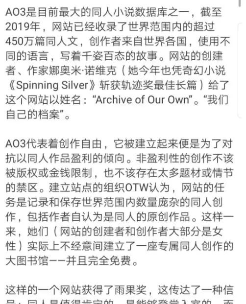 (原始链接: https://mmbiz.qpic.cn/mmbiz_jpg/4VpstsagT4Lc7ibSGFuswyApB0iaAZej2Scica91z4Ct4Kmbus3s7KZr0ZhG4l9j3UjQPWzvwemVbdtaFhTcDPCXA/640?wx_fmt=jpeg)
- 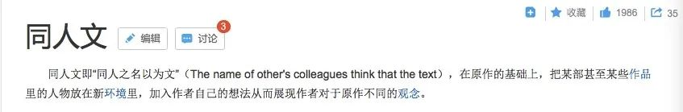 (原始链接: https://mmbiz.qpic.cn/mmbiz_jpg/4VpstsagT4Lc7ibSGFuswyApB0iaAZej2SWwKiablYAXhM3RZBB6WibUxgWkwYNXokgISmEmVa2EWmBQRXS11X2edw/640?wx_fmt=jpeg)
-  (原始链接: https://mmbiz.qpic.cn/mmbiz_jpg/4VpstsagT4Lc7ibSGFuswyApB0iaAZej2SJiagmMg7FLJnE8gHaHaGUc73h7dMl0twWibIvq5RDsDqMdqLg86d2wdQ/640?wx_fmt=jpeg)
- 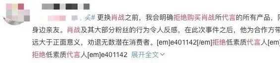 (原始链接: https://mmbiz.qpic.cn/mmbiz_jpg/4VpstsagT4Lc7ibSGFuswyApB0iaAZej2SLUnbs8XxicwaZHiauFibaviaqnUDuztlEHkLLUyUibTdQ6iaDMGf2ac9hGtw/640?wx_fmt=jpeg)
- 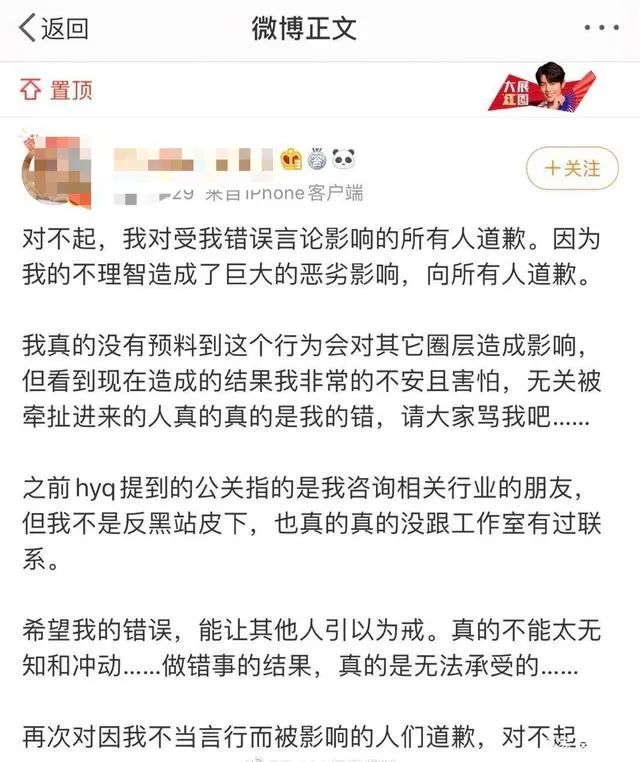 (原始链接: https://mmbiz.qpic.cn/mmbiz_jpg/4VpstsagT4Lc7ibSGFuswyApB0iaAZej2SLNpzcpz48pu2s6CgXyEpoM5F23ywbUkXI2UH4e3XsPSNou2B3LMORg/640?wx_fmt=jpeg)
- 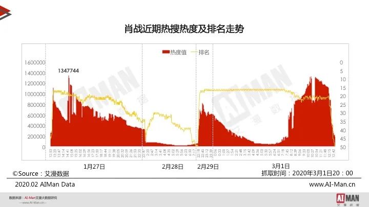 (原始链接: https://mmbiz.qpic.cn/mmbiz_jpg/4VpstsagT4Lc7ibSGFuswyApB0iaAZej2Su3babahb7nNgscvY1TJuiacaTCveu8oHK4K5YLICvV8U51p1DR2wWzw/640?wx_fmt=jpeg)
- 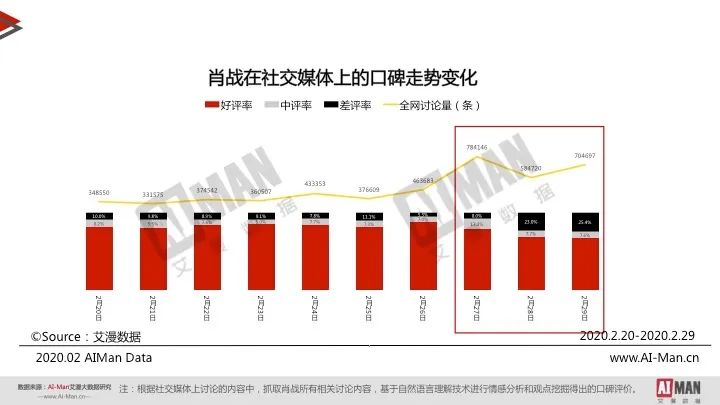 (原始链接: https://mmbiz.qpic.cn/mmbiz_jpg/4VpstsagT4Lc7ibSGFuswyApB0iaAZej2SqBGgjjNF3QicDhVicaxsXqQqITfC91epNnnAfs7fxiakzX7k2tWzVAZcQ/640?wx_fmt=jpeg)
- 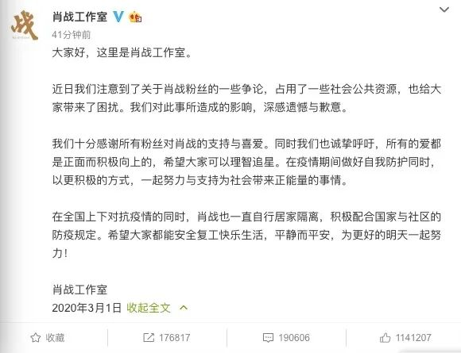 (原始链接: https://mmbiz.qpic.cn/mmbiz_jpg/4VpstsagT4Lc7ibSGFuswyApB0iaAZej2SuuuozDAlN4ApC1cTPQoniazs1SKs5cNibuJuF3ow6IV7HWHqA80bEN0A/640?wx_fmt=jpeg)
-  (原始链接: https://mmbiz.qpic.cn/mmbiz_gif/4VpstsagT4JhtstM6KzMeCXFHoIn1ibmNKcuA7dn8BiaBjiaUmUc9ON63CmJFVqQichCZKsh6ibKYsLRF75mZLkVr9Q/640?wx_fmt=gif)
-  (原始链接: https://mmbiz.qpic.cn/mmbiz_jpg/4VpstsagT4JhtstM6KzMeCXFHoIn1ibmNUFenjkEY7AEmTL4DmRqaODA3dpsZ59EfaBwCicN40yrTkx1TTxlwX6A/640?wx_fmt=jpeg)
