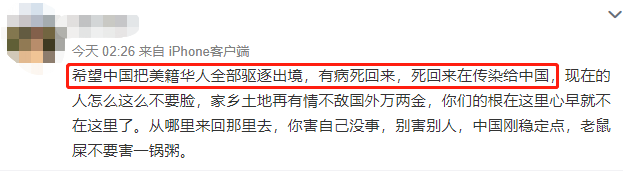
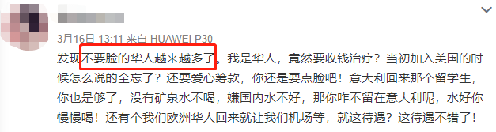
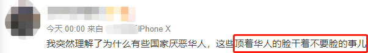
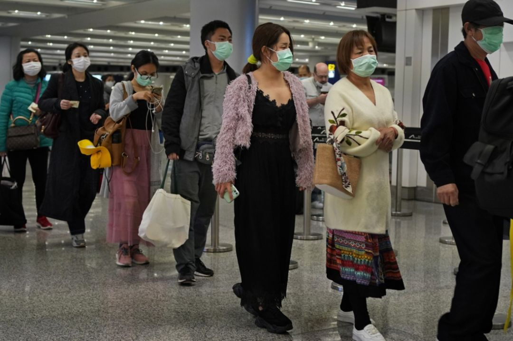
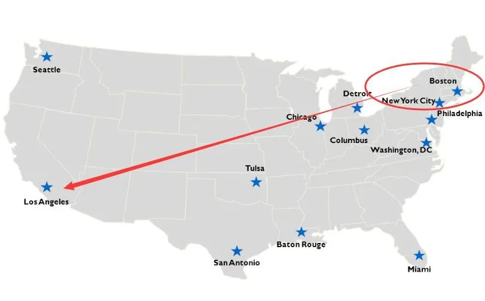
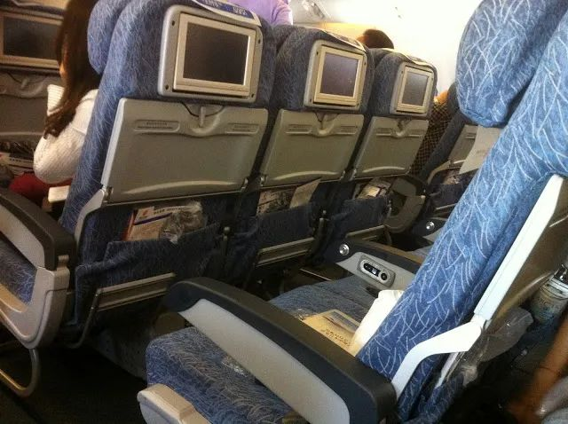
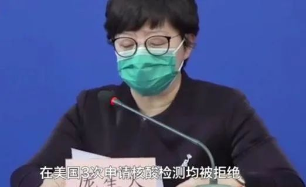
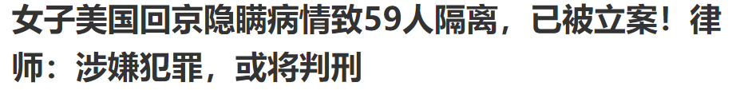
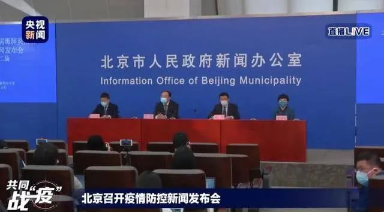
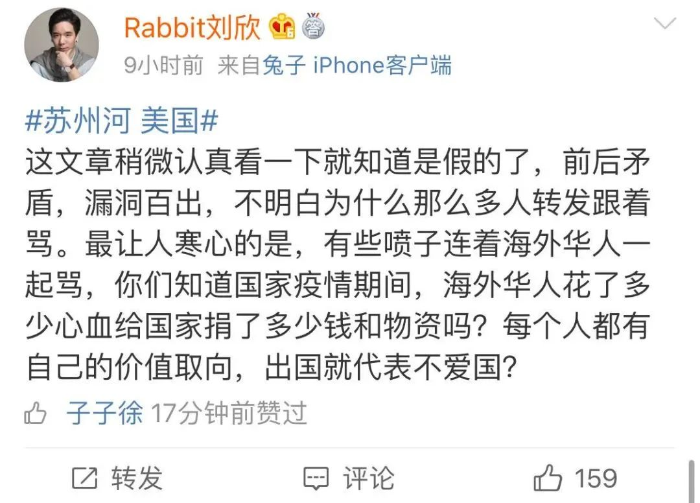

# 无标题

**链接地址:** http://mp.weixin.qq.com/s?__biz=MjM5NTA0NTU0OQ==&mid=2653503960&idx=1&sn=da1ef4c6bfcc06afb797868212ccf800&chksm=bd23681a8a54e10cda83eadf935716dfa9a9d66fb1ecc82e236cfe718329498af23ffd0a2e64&mpshare=1&scene=2&srcid=&sharer_sharetime=1584405497381&sharer_shareid=be1c8edd6c93eec155a61c876e41d26a#rd
**作者:** 夏茉
**获取时间:** 2025/8/28 20:16:59
**图片数量:** 32

---

## 原始HTML内容

 

<section style="max-width: 100%;box-sizing: border-box;font-family: -apple-system-font, BlinkMacSystemFont, &quot;Helvetica Neue&quot;, &quot;PingFang SC&quot;, &quot;Hiragino Sans GB&quot;, &quot;Microsoft YaHei UI&quot;, &quot;Microsoft YaHei&quot;, Arial, sans-serif;letter-spacing: 0.544px;white-space: normal;color: rgb(0, 0, 0);text-align: start;line-height: 27.2px;background-color: rgb(255, 255, 255);overflow-wrap: break-word !important;"><section style="max-width: 100%;box-sizing: border-box;overflow-wrap: break-word !important;"><section style="max-width: 100%;box-sizing: border-box;overflow-wrap: break-word !important;"><section style="max-width: 100%;box-sizing: border-box;overflow-wrap: break-word !important;"><section style="max-width: 100%;box-sizing: border-box;letter-spacing: 0.544px;overflow-wrap: break-word !important;"><section style="max-width: 100%;box-sizing: border-box;overflow-wrap: break-word !important;"><section style="max-width: 100%;box-sizing: border-box;overflow-wrap: break-word !important;"><section style="max-width: 100%;box-sizing: border-box;overflow-wrap: break-word !important;"><section style="max-width: 100%;box-sizing: border-box;overflow-wrap: break-word !important;"><section style="max-width: 100%;box-sizing: border-box;overflow-wrap: break-word !important;"><section style="max-width: 100%;box-sizing: border-box;overflow-wrap: break-word !important;"><section style="max-width: 100%;box-sizing: border-box;overflow-wrap: break-word !important;"><section style="max-width: 100%;box-sizing: border-box;overflow-wrap: break-word !important;"><section style="max-width: 100%;box-sizing: border-box;overflow-wrap: break-word !important;"><section style="margin-top: 10px;margin-bottom: 10px;max-width: 100%;box-sizing: border-box;text-align: center;overflow-wrap: break-word !important;"><section style="padding: 10px;max-width: 100%;box-sizing: border-box;display: inline-block;width: 558px;border-width: 1px;border-style: solid;border-color: rgb(249, 110, 87);overflow-wrap: break-word !important;"><section style="max-width: 100%;box-sizing: border-box;overflow-wrap: break-word !important;"><section style="max-width: 100%;box-sizing: border-box;overflow-wrap: break-word !important;">
<strong style="max-width: 100%;box-sizing: border-box !important;overflow-wrap: break-word !important;"><strong style="white-space: normal;">“没给祖国做贡献，净想着占祖国便宜”？</strong></strong>
</section></section></section></section></section></section></section></section></section></section></section></section></section></section></section></section></section></section>
 

短短一个周末过去，海外疫情局势发生剧变——加拿大封国了；美股遭屠杀，道指跌3000点创造历史了；意大利过去48小时内死了700多人，全国确诊近2.8万了......

 

一片哀鸿之中，还有一种声音，在海外疫情日趋严重的情况下，突然开始发酵：

&nbsp;

“有些海外华人，真是脸都不要了。”

&nbsp;

 

事情是这样的，刚刚过去的周末，3名被中国网友认为具有“代表性”的华人火了。一位是长期在美国生活，确诊了新冠，怕美国治不好于是隐瞒病情飞回北京的华人大妈。一位是网友爆料“喜欢美国房子大环境好但更喜欢中国免费医疗”的美籍华人大叔。还有一位，是在意大利留学、近期回中国隔离避疫，喊着要喝矿泉水的年轻华人女孩。

 

 

先讲讲两位女士的故事。

&nbsp;

隐瞒疫情飞回北京的华人，黎大妈，于3月13日与其丈夫和孩子从美国洛杉矶乘国航的CA988客机抵达北京首都机场。黎大妈国内户籍在重庆，常年居住在美国麻省。根据当地华人爆料及多家媒体报道，这位黎大妈是美国麻省Biogen生物科技公司的一名员工，公司在2月26日的一次会议上出现了大规模的聚集性病例，疫情在3月初就被发现了，现在至少有104名与该公司有关的人确诊，这家公司因此被称为美国的“华南海鲜市场”。

 

 

黎大妈也参加了这场会议，很不幸，她也感染了，公司要求她进行隔离。

&nbsp;

然而，黎大妈“不满意美国的医疗手段”，觉得还是中国靠谱，于是违反隔离要求，从麻省飞到洛杉矶，接着转机飞回到中国北京。

疫情期间，国内筛查也是很严格的。为了能顺利蒙混过关，黎大妈在登上国航飞机前，服用了大量退烧药，对飞机乘务员隐瞒了自己的病情，只说感觉身体不适，最终被安排到飞机后排就坐。

 

 

然而，飞机落地北京前2小时，黎大妈突然找到机组人员，说自己发烧了，还坦诚自己并非独自乘机，她的老公和孩子也在这架飞机上。黎大妈怕传染老公儿子，在飞机上座位和他们爷俩隔得老远。黎大妈说，美国3次拒绝给她做检测，她实在没办法才全家回国... ...

 

 

 

黎大妈一家三口一下飞机，立刻被检疫人员带走，并迅速被确诊。

&nbsp;

同机几百名乘客，知道这个消息后几乎全炸了。

&nbsp;

一名也在这架飞机上的华人乘客怒斥黎大妈的行为“极度自私，不可原谅，希望她受到法律的制裁”。

 

 

黎大妈一路撒谎，瞒天过海，最终如愿了——

&nbsp;

她现在正在定点医院接受治疗，丈夫和儿子也在接受隔离观察。

&nbsp;

不过，为了回国看上这趟病，黎大妈也将付出惨重的代价：

&nbsp;

目前，黎大妈已经被北京顺义公安分局以涉嫌妨害传染病防治罪立案侦查。

&nbsp;

根据中国刑法的相关规定，构成妨害传染病防治罪，将会判处3年以下有期徒刑或者拘役；对于后果特别严重的，最高可判刑7年。

 

 

<a target="_blank" href="https://mp.weixin.qq.com/s?__biz=MzI0MTk0NTk2Nw==&amp;mid=2247483858&amp;idx=1&amp;sn=7462e006ea1c091fb2368195badc5396&amp;scene=21#wechat_redirect" data-linktype="1"></a>

 

再来看看另一位年轻一点的女士，意大利疫情爆发后，跑回上海被集中隔离的华人女留学生。

&nbsp;

一则全网疯传的视频显示，这位华人女孩称，自己不能喝白开水，只喝矿泉水，否则活不下去，还称不给矿泉水就是“没人权”。

 

 

为喝矿泉水，她试图冲闯隔离区，结果遭到穿防护服的特警当场训斥： 

&nbsp;

“这里不是宾馆，是医学隔离区，你来这边不是来旅游的。”

&nbsp;

“我现在警告你，你再出现这种情况，我们会采取法律措施，强制把你带走。”

 

<iframe class="video_iframe rich_pages" data-vidtype="1" data-cover="http%3A%2F%2Fshp.qpic.cn%2Fqqvideo_ori%2F0%2Fq09346d4v5m_496_280%2F0" allowfullscreen="" frameborder="0" data-ratio="1.7777777777777777" data-w="864" data-src="https://v.qq.com/iframe/preview.html?width=500&amp;height=375&amp;auto=0&amp;vid=q09346d4v5m"></iframe>

 

可想而知，这位华人女留学生也被喷惨了，很多网友表示“想喝矿泉水滚回意大利喝”。

 

 

最后再来看这位活在“网友私信”里的“无耻”华人大叔。根据这篇火遍朋友圈的“自述”，华人大叔和老婆都是留学来美国的，一路奋斗拿到绿卡，成为美国国籍，非常不容易。

&nbsp;

本来，华人大叔正打算着把父母老人也接到美国养老，“毕竟这边房子大，环境福利什么的都好”。然而，美国疫情突然爆发了，华人大叔也发烧了，还把老婆儿子传染了，去看医生，发现医院床位根本不够，最关键的是，医疗费还很贵。

&nbsp;

华人大叔跟在国内的老母亲视频，老母亲一听，叫儿子赶紧回国，说现在新冠在中国都是免费治疗。华人大叔一听，赶紧带着老婆儿子坐飞机回中国。为上飞机，全家人吃了一倍量的退烧药，一落地国内机场就被确诊了。接着住院，目标达成。谁知住院第二天，一家人被通知要缴费，因为是美国国籍，不符合在中国免费治疗新冠的条件。

 

华人大叔委屈大了：“可我确实是土生土长的中国人啊！我算了算，我们一家三口如果自费的话，要花不少钱。可不可以申请爱心筹？”

 

原帖如下：

 

这位华人大叔，可以说是3个典型案例中最令人“恨得牙根痒痒”的一位，因为他的自述，每一句都精准地踩在大众的情绪点上，满屏都在挑唆着恨意，所以迅速引爆网络，引发中国网友怒怼海外华人的狂潮：

 

“祖国建设你不在，千里投毒第一名！”

&nbsp;

“既然已经在美国享受了优质待遇，为何又要到我们中国享受免费治疗？”

&nbsp;

然而，事情的真相是怎样的呢？

&nbsp;

这位华人大叔自述的首发者，一夜爆火之后，已经改了用户名，摇身一变成了营销号。在众人质问下，这个营销号顶不住压力发布了道歉声明，承认信息系编造。

 

 

编的故事，也难怪能句句到点儿，点燃网友愤怒了。

&nbsp;

可以说，疫情当前，故意编造这种谣言的人，用意险恶，其心可诛。

 

 

的确，最近有个别海外华人隐瞒疫情回国，引发恶劣后果，这绝对是不容争辩的错误行为。违反防疫规定的人，自有法律来严惩。

&nbsp;

但是，也有一些人，趁着现在个别负面新闻发酵，故意将“海外华人”打造成为“众矢之的”，甚至为博取流量，不惜编造谣言，趁机“黑一把”海外华人，让整个海外华人群体背锅。

&nbsp;

在这些人的“努力”下，海外华人被贴上了“没给祖国做贡献、就想着占祖国便宜”的标签。大家似乎全然忘记了，此前很多海外华人华侨捐款捐物的爱国行为。

&nbsp;

造谣的帖子阅读量百万，而为海外华人发声的辟谣帖，只有159个赞。

&nbsp;

一位博主说得好：

 

“在北京入境且在航班上精巧隐瞒的黎女士固然可恨，可是如果因为这样的个例就被轻易煽动起情绪抵触自己的同胞、给别人贴标签，和之前在海外歧视华人甚至亚裔的恶劣老外相比，又有什么区别？”

&nbsp;

疫情当前，希望大家都能多些理智，就事论事，不要成为坏人手里的枪。

 

<a target="_blank" href="https://mp.weixin.qq.com/s?__biz=Mzg4MDExNjAyNA==&amp;mid=2247483831&amp;idx=1&amp;sn=9b129d3bb6b59acb4c399330005911f8&amp;scene=21#wechat_redirect" data-linktype="1" style="white-space: normal;"></a> 

 
<section><section style="color: rgb(249, 110, 87);text-align: center;"></section></section>
 
<section style="margin: 0.5em;"><section style="height: 2em;display: inline-block;"><section style="padding-right: 0.3em;padding-left: 0.3em;display: inline-block;vertical-align: top;height: 2em;line-height: 2em;border-color: rgb(36, 164, 219);border-style: solid none solid solid;border-width: 0.1em medium 0.1em 0.1em;letter-spacing: 1px;color: rgb(61, 61, 61);">
<strong>更多精彩文章</strong>
</section><section style="margin-left: -0.6em;display: inline-block;vertical-align: top;width: 1.2em;height: 2em;border-bottom: 0.1em solid rgb(36, 164, 219);border-right: 0.1em solid rgb(36, 164, 219);transform: skew(30deg);"> </section><section style="width: 0px;display: inline-block;vertical-align: middle;border-top: 1.8em solid rgb(36, 164, 219);height: 0px;line-height: 0;border-left: 1em solid transparent !important;border-right: 1em solid transparent !important;"> </section></section></section><section style="margin-top: 20px;margin-bottom: 20px;text-align: center;"><section style="display: inline-block;vertical-align: top;box-shadow: rgb(158, 158, 158) 0px 0px 4px;width: 545.917px;background-color: rgb(61, 61, 61);"><section style="margin-bottom: -7px;"><section style="vertical-align: middle;display: inline-block;line-height: 0;box-shadow: rgb(0, 0, 0) 0px 0px 0px;"></section></section><section style="margin-top: 12px;margin-bottom: 8px;"><section style="padding-right: 10px;padding-left: 10px;text-align: justify;font-size: 18px;color: rgb(255, 255, 255);letter-spacing: 1px;"><h2><strong>美国宣布降息到0！欧洲继续水深火热 新冠全球死亡已达6452人</strong> </h2></section></section></section></section><section style="margin-top: 20px;margin-bottom: 1px;text-align: center;"><section style="display: inline-block;width: 545.917px;vertical-align: top;box-shadow: rgb(158, 158, 158) 0px 0px 4px;background-color: rgb(61, 61, 61);"><section style="margin-bottom: -7px;"><section style="vertical-align: middle;display: inline-block;line-height: 0;box-shadow: rgb(0, 0, 0) 0px 0px 0px;"><a target="_blank" href="http://mp.weixin.qq.com/s?__biz=MjM5NTA0NTU0OQ==&amp;mid=2653503857&amp;idx=3&amp;sn=ef1521afc9237ca57f2d5926aed29239&amp;chksm=bd2368b38a54e1a5b68ef29b02c2b9cab28c911496295867de33785816b7d318e9e77ecc0641&amp;scene=21#wechat_redirect" textvalue="你已选中了添加链接的内容" data-itemshowtype="0" tab="innerlink" data-linktype="1"></a></section></section><section style="margin-top: 12px;margin-bottom: 8px;"><section style="padding-right: 10px;padding-left: 10px;text-align: justify;font-size: 18px;color: rgb(255, 255, 255);letter-spacing: 1px;"><h2><strong>紧急寻人! 温哥华航班一名乘客确诊新冠肺炎! 加拿大暴增至313例 特鲁多考虑封国</strong> </h2></section></section></section></section>
 

---

## 纯文本内容

“没给祖国做贡献，净想着占祖国便宜”？短短一个周末过去，海外疫情局势发生剧变——加拿大封国了；美股遭屠杀，道指跌3000点创造历史了；意大利过去48小时内死了700多人，全国确诊近2.8万了......一片哀鸿之中，还有一种声音，在海外疫情日趋严重的情况下，突然开始发酵： “有些海外华人，真是脸都不要了。” 事情是这样的，刚刚过去的周末，3名被中国网友认为具有“代表性”的华人火了。一位是长期在美国生活，确诊了新冠，怕美国治不好于是隐瞒病情飞回北京的华人大妈。一位是网友爆料“喜欢美国房子大环境好但更喜欢中国免费医疗”的美籍华人大叔。还有一位，是在意大利留学、近期回中国隔离避疫，喊着要喝矿泉水的年轻华人女孩。先讲讲两位女士的故事。 隐瞒疫情飞回北京的华人，黎大妈，于3月13日与其丈夫和孩子从美国洛杉矶乘国航的CA988客机抵达北京首都机场。黎大妈国内户籍在重庆，常年居住在美国麻省。根据当地华人爆料及多家媒体报道，这位黎大妈是美国麻省Biogen生物科技公司的一名员工，公司在2月26日的一次会议上出现了大规模的聚集性病例，疫情在3月初就被发现了，现在至少有104名与该公司有关的人确诊，这家公司因此被称为美国的“华南海鲜市场”。黎大妈也参加了这场会议，很不幸，她也感染了，公司要求她进行隔离。 然而，黎大妈“不满意美国的医疗手段”，觉得还是中国靠谱，于是违反隔离要求，从麻省飞到洛杉矶，接着转机飞回到中国北京。疫情期间，国内筛查也是很严格的。为了能顺利蒙混过关，黎大妈在登上国航飞机前，服用了大量退烧药，对飞机乘务员隐瞒了自己的病情，只说感觉身体不适，最终被安排到飞机后排就坐。然而，飞机落地北京前2小时，黎大妈突然找到机组人员，说自己发烧了，还坦诚自己并非独自乘机，她的老公和孩子也在这架飞机上。黎大妈怕传染老公儿子，在飞机上座位和他们爷俩隔得老远。黎大妈说，美国3次拒绝给她做检测，她实在没办法才全家回国... ...黎大妈一家三口一下飞机，立刻被检疫人员带走，并迅速被确诊。 同机几百名乘客，知道这个消息后几乎全炸了。 一名也在这架飞机上的华人乘客怒斥黎大妈的行为“极度自私，不可原谅，希望她受到法律的制裁”。黎大妈一路撒谎，瞒天过海，最终如愿了—— 她现在正在定点医院接受治疗，丈夫和儿子也在接受隔离观察。 不过，为了回国看上这趟病，黎大妈也将付出惨重的代价： 目前，黎大妈已经被北京顺义公安分局以涉嫌妨害传染病防治罪立案侦查。 根据中国刑法的相关规定，构成妨害传染病防治罪，将会判处3年以下有期徒刑或者拘役；对于后果特别严重的，最高可判刑7年。再来看看另一位年轻一点的女士，意大利疫情爆发后，跑回上海被集中隔离的华人女留学生。 一则全网疯传的视频显示，这位华人女孩称，自己不能喝白开水，只喝矿泉水，否则活不下去，还称不给矿泉水就是“没人权”。为喝矿泉水，她试图冲闯隔离区，结果遭到穿防护服的特警当场训斥： “这里不是宾馆，是医学隔离区，你来这边不是来旅游的。” “我现在警告你，你再出现这种情况，我们会采取法律措施，强制把你带走。”可想而知，这位华人女留学生也被喷惨了，很多网友表示“想喝矿泉水滚回意大利喝”。最后再来看这位活在“网友私信”里的“无耻”华人大叔。根据这篇火遍朋友圈的“自述”，华人大叔和老婆都是留学来美国的，一路奋斗拿到绿卡，成为美国国籍，非常不容易。 本来，华人大叔正打算着把父母老人也接到美国养老，“毕竟这边房子大，环境福利什么的都好”。然而，美国疫情突然爆发了，华人大叔也发烧了，还把老婆儿子传染了，去看医生，发现医院床位根本不够，最关键的是，医疗费还很贵。 华人大叔跟在国内的老母亲视频，老母亲一听，叫儿子赶紧回国，说现在新冠在中国都是免费治疗。华人大叔一听，赶紧带着老婆儿子坐飞机回中国。为上飞机，全家人吃了一倍量的退烧药，一落地国内机场就被确诊了。接着住院，目标达成。谁知住院第二天，一家人被通知要缴费，因为是美国国籍，不符合在中国免费治疗新冠的条件。华人大叔委屈大了：“可我确实是土生土长的中国人啊！我算了算，我们一家三口如果自费的话，要花不少钱。可不可以申请爱心筹？”原帖如下：这位华人大叔，可以说是3个典型案例中最令人“恨得牙根痒痒”的一位，因为他的自述，每一句都精准地踩在大众的情绪点上，满屏都在挑唆着恨意，所以迅速引爆网络，引发中国网友怒怼海外华人的狂潮：“祖国建设你不在，千里投毒第一名！” “既然已经在美国享受了优质待遇，为何又要到我们中国享受免费治疗？” 然而，事情的真相是怎样的呢？ 这位华人大叔自述的首发者，一夜爆火之后，已经改了用户名，摇身一变成了营销号。在众人质问下，这个营销号顶不住压力发布了道歉声明，承认信息系编造。编的故事，也难怪能句句到点儿，点燃网友愤怒了。 可以说，疫情当前，故意编造这种谣言的人，用意险恶，其心可诛。的确，最近有个别海外华人隐瞒疫情回国，引发恶劣后果，这绝对是不容争辩的错误行为。违反防疫规定的人，自有法律来严惩。 但是，也有一些人，趁着现在个别负面新闻发酵，故意将“海外华人”打造成为“众矢之的”，甚至为博取流量，不惜编造谣言，趁机“黑一把”海外华人，让整个海外华人群体背锅。 在这些人的“努力”下，海外华人被贴上了“没给祖国做贡献、就想着占祖国便宜”的标签。大家似乎全然忘记了，此前很多海外华人华侨捐款捐物的爱国行为。 造谣的帖子阅读量百万，而为海外华人发声的辟谣帖，只有159个赞。 一位博主说得好：“在北京入境且在航班上精巧隐瞒的黎女士固然可恨，可是如果因为这样的个例就被轻易煽动起情绪抵触自己的同胞、给别人贴标签，和之前在海外歧视华人甚至亚裔的恶劣老外相比，又有什么区别？” 疫情当前，希望大家都能多些理智，就事论事，不要成为坏人手里的枪。更多精彩文章美国宣布降息到0！欧洲继续水深火热 新冠全球死亡已达6452人紧急寻人! 温哥华航班一名乘客确诊新冠肺炎! 加拿大暴增至313例 特鲁多考虑封国

---

## 图片列表

-  (原始链接: https://mmbiz.qpic.cn/mmbiz_gif/Jwvkibo0Z8v91WQUbIjkOb02WFKv2KXkG6asUW8bqgnJTaTOVMdMf3bxLt8FE7oUlq6xqdhIvKibexhr5Ff5wpRA/640?wx_fmt=gif)
-  (原始链接: https://mmbiz.qpic.cn/mmbiz_gif/Jwvkibo0Z8vibsRHQgyicyGV5Om4ya8vjJJqZNxWYkLP54bvlx6ccSm92QCIiac14ZdaZBA4MJhumTicY6BibtibpeAIA/640?wx_fmt=gif)
-  (原始链接: https://mmbiz.qpic.cn/mmbiz_gif/Jwvkibo0Z8vic12ryVUBMWvpO3O48IBh0M5oCrOesLIAmvicrwDSwWSKoKIia1cJTpfqPe30BiaXKnPiagL3WUkr1Ciaw/640?wx_fmt=gif)
-  (原始链接: https://mmbiz.qpic.cn/mmbiz_gif/Jwvkibo0Z8v9hoicahSslUaXwU0VwaibmKkFH0k1TIPBicEtq1b3bcEib7sMwPGAicz52HibhTibz1QRprNdIWJjOs1M5g/640?wx_fmt=gif)
-  (原始链接: https://mmbiz.qpic.cn/mmbiz_png/Jwvkibo0Z8vibsRHQgyicyGV5Om4ya8vjJJHsyKuniaXXjzF9zXPxibNJtayxCib21z2uSlRziaJnBCaCCkvQy8HJ0lPw/640?wx_fmt=png)
-  (原始链接: https://mmbiz.qpic.cn/mmbiz_png/Jwvkibo0Z8vibsRHQgyicyGV5Om4ya8vjJJ3PrYho6dH8et1umqassotRvXGkWgfgvpCG1YEiahXps2En8s3UVMfEQ/640?wx_fmt=png)
-  (原始链接: https://mmbiz.qpic.cn/mmbiz_png/Jwvkibo0Z8vibsRHQgyicyGV5Om4ya8vjJJBxo15EL220oickdLQfHJyZT0niamcbIXDz48jTY94h6H0lqXnHnOZ7xg/640?wx_fmt=png)
-  (原始链接: https://mmbiz.qpic.cn/mmbiz_png/Jwvkibo0Z8vicVPKUUgQGyZWticc0uU9CicicvlRbgEMotIKjxD3zODzpyTUaxEBmjP6bnPmbiaSzHDa8t7kAVeebmnA/640?wx_fmt=png)
-  (原始链接: https://mmbiz.qpic.cn/mmbiz_jpg/Jwvkibo0Z8vibsRHQgyicyGV5Om4ya8vjJJB9jSwOEUC99zaTybEhNBe2AEyQkUJgCn7xaLo4gcSQrtiaRHlg5NobQ/640?wx_fmt=jpeg)
-  (原始链接: https://mmbiz.qpic.cn/mmbiz_jpg/Jwvkibo0Z8vibsRHQgyicyGV5Om4ya8vjJJpDIDOiaPdVO02G3mqMQC8ribTwPgKIyI7XgWkyxJlr1Em0zOdllVREPQ/640?wx_fmt=jpeg)
-  (原始链接: https://mmbiz.qpic.cn/mmbiz_jpg/Jwvkibo0Z8vibsRHQgyicyGV5Om4ya8vjJJUJmgbYUmre3S4TgL5QDjKF1Fgmfx8aztibBG0teD104K3ibyHwsiaPlXw/640?wx_fmt=jpeg)
-  (原始链接: https://mmbiz.qpic.cn/mmbiz_jpg/Jwvkibo0Z8vibsRHQgyicyGV5Om4ya8vjJJkdXNYqbf44Hd6KxmxiajQZicibUmaibuIvApPdwCnUMHeH3cKUz9iaibdWhg/640?wx_fmt=jpeg)
-  (原始链接: https://mmbiz.qpic.cn/mmbiz_png/Jwvkibo0Z8vibsRHQgyicyGV5Om4ya8vjJJS9OC53doPb3ujyxtwnacKf53zF0A1OL85ZwD6jhYJgQd2BOVe3NficQ/640?wx_fmt=png)
-  (原始链接: https://mmbiz.qpic.cn/mmbiz_png/Jwvkibo0Z8vibsRHQgyicyGV5Om4ya8vjJJicajnJdNMDlr1eUQpy4dWrcg0EQIib6csnw4tQCvsrbbQc8aUTa4kqPw/640?wx_fmt=png)
-  (原始链接: https://mmbiz.qpic.cn/mmbiz_png/Jwvkibo0Z8vibsRHQgyicyGV5Om4ya8vjJJ1oDTWxp9OmpUej27frIk0H8FgfgbUhmEQiamTKKqUoWFgqznmxUk5hA/640?wx_fmt=png)
-  (原始链接: https://mmbiz.qpic.cn/mmbiz_jpg/Jwvkibo0Z8vibsRHQgyicyGV5Om4ya8vjJJpJ8yvSFbfKcXcWiakruia2Dc7feibdHsGb5TcB4MpJGC34lmOOAr8WEdw/640?wx_fmt=jpeg)
-  (原始链接: https://mmbiz.qpic.cn/mmbiz_png/Jwvkibo0Z8v83nQB0WGmORaibJBgLtTmYvDxCMj2PxwWBlTRrOE3AngvB95u8nwViaDwVGeqcibWGUMqa2DibnYIOnA/640?wx_fmt=gif)
-  (原始链接: https://mmbiz.qpic.cn/mmbiz_gif/Jwvkibo0Z8vib2B7XtY42cM9Nzu1xspgicMtaySAAKPjGEJVhYus0aPkWwlmicAm3Yvib1O6LqKUfM8CUicpNX56re1A/640?wx_fmt=gif)
-  (原始链接: https://mmbiz.qpic.cn/mmbiz_jpg/Jwvkibo0Z8vicVPKUUgQGyZWticc0uU9CiciclSSCko1gL6D8lJWlaYRF18YIMvEX9NlN6ibYyEEV77eQrFMYaAGZ6RQ/640?wx_fmt=jpeg)
-  (原始链接: https://mmbiz.qpic.cn/mmbiz_gif/Jwvkibo0Z8vicv9dwLHN9am0wSjaT8WXov4gQYcZEgicAtQqdjVJCjmIdyrXg0Aw1hbxmJty1nnEkEJ394MwBGRnw/640?wx_fmt=gif)
-  (原始链接: https://mmbiz.qpic.cn/mmbiz_gif/Jwvkibo0Z8vicv9dwLHN9am0wSjaT8WXovGRpqoicVfEqz9XvcalPRB6EMjtMFMuGQsdlU5Lcwbw3BrHE3AObKTibQ/640?wx_fmt=gif)
-  (原始链接: https://mmbiz.qpic.cn/mmbiz_jpg/Jwvkibo0Z8vicVPKUUgQGyZWticc0uU9Cicic8uoHr26RHQglRV3omMZHgxPM0BLtlP4jiahrbKbbEk3zDuJGvA76oyA/640?wx_fmt=jpeg)
-  (原始链接: https://mmbiz.qpic.cn/mmbiz_png/Jwvkibo0Z8vicVPKUUgQGyZWticc0uU9Cicic69LRicnEvPpBIqOxemvkSFDZHN2DYIuLkw2iczSgzbL29akqY8uaH42A/640?wx_fmt=png)
-  (原始链接: https://mmbiz.qpic.cn/mmbiz_png/Jwvkibo0Z8v9qpRoOZpWYX9QWZsbbKS5NjhQVSSO5ibicPkicHIvM7B0A54BKgkjhC3IZYyC3Lgw809on2YWpXKHqQ/640?wx_fmt=gif)
-  (原始链接: https://mmbiz.qpic.cn/mmbiz_gif/Jwvkibo0Z8v9A0icIy1FxBK1b7ejVqLIb1IupZX5CpxRMIicIuOKsBQo4qHwibJUfibY8wIkl8eFMmgvhlsZOV80XzQ/640?wx_fmt=gif)
-  (原始链接: https://mmbiz.qpic.cn/mmbiz_jpg/Jwvkibo0Z8vicVPKUUgQGyZWticc0uU9Cicic45X2o9ibMRibUeUJxz0crYmmZPAlUVohhRsPSToyl85MhT7lEfqtx3Hw/640?wx_fmt=jpeg)
-  (原始链接: https://mmbiz.qpic.cn/mmbiz_png/Jwvkibo0Z8vicv9dwLHN9am0wSjaT8WXovBmp0lMHpPSzKEoBb8rX0y7CQKhS4hImPFdoBlMQKP3MGDHtUG1GFCQ/640?wx_fmt=gif)
-  (原始链接: https://mmbiz.qpic.cn/mmbiz_gif/Jwvkibo0Z8vibI5dBD8zXLxDExia9GJt2rbSicu6J13UxDwTibGqw7wIOaODB9tPopXoib8Om4paZp8NwKhxaAKvexhw/640?wx_fmt=gif)
-  (原始链接: https://mmbiz.qpic.cn/mmbiz_png/Jwvkibo0Z8vibsRHQgyicyGV5Om4ya8vjJJnArrLKGbqdVRo3I3xGc4ribmRdEyRrH2icNyurs7EorSr3CGbE1ffYXQ/640?wx_fmt=png)
-  (原始链接: https://mmbiz.qpic.cn/mmbiz_jpg/Jwvkibo0Z8vibsRHQgyicyGV5Om4ya8vjJJUnZ4abOS96cUK8gbfnRvnJn9gCNoKcaqGMnnJHBvZlSEBGNsaWgqjg/640?wx_fmt=jpeg)
-  (原始链接: https://mmbiz.qpic.cn/mmbiz_gif/Jwvkibo0Z8v91WQUbIjkOb02WFKv2KXkGj9ZAibibtEYFnWicaQ0H5FQAL3KaLLxUvPHoPMRBsuIKDjstnZI46dguQ/640?wx_fmt=gif)
-  (原始链接: https://mmbiz.qpic.cn/mmbiz_png/Jwvkibo0Z8v9xKWaY2x15mZkzhgE9fqArOlFBbp4cBTYb6L724gUFQQsf4CFt19vTrA2gEbWpHggVUenR8lguTQ/640?wx_fmt=gif)
