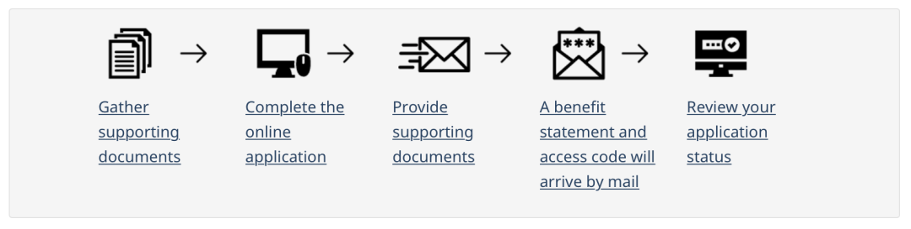
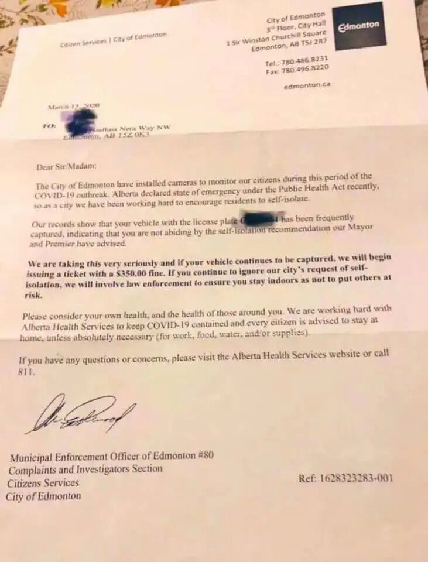

# 无标题

**链接地址:** http://mp.weixin.qq.com/s?__biz=MzI4NDYyNjAwNw==&mid=2247484007&idx=1&sn=d10ff2f91591c3869633e2f9e1efcee9&chksm=ebf9df5fdc8e56493934b03e4256a9daa8b2a414118c2ffefbadc0d13c137e94db05ee608084&mpshare=1&scene=2&srcid=&sharer_sharetime=1585346941665&sharer_shareid=be1c8edd6c93eec155a61c876e41d26a#rd
**作者:** 关注我们
**获取时间:** 2025/8/28 20:16:23
**图片数量:** 19

---

## 原始HTML内容

<section style="box-sizing: border-box;font-size: 16px;"><section style="box-sizing: border-box;" powered-by="xiumi.us"><section style="margin-right: 0%;margin-bottom: 10px;margin-left: 0%;box-sizing: border-box;"><section style="display: inline-block;width: 100%;vertical-align: top;border-width: 3px;border-radius: 0px;border-style: solid none;border-color: rgb(125, 192, 232) rgb(209, 194, 255);box-shadow: rgb(0, 0, 0) 0px 0px 0px;box-sizing: border-box;"><section style="margin: 30px 0% 10px;text-align: center;justify-content: center;box-sizing: border-box;" powered-by="xiumi.us"><section style="display: inline-block;width: auto;vertical-align: top;background-color: rgba(211, 226, 242, 0.89);min-width: 10%;max-width: 100%;height: auto;box-sizing: border-box;"><section style="margin: -6px 0% 5px;transform: translate3d(6px, 0px, 0px);-webkit-transform: translate3d(6px, 0px, 0px);-moz-transform: translate3d(6px, 0px, 0px);-o-transform: translate3d(6px, 0px, 0px);box-sizing: border-box;" powered-by="xiumi.us"><section style="display: inline-block;width: 100%;vertical-align: top;border-style: solid;border-width: 2px;border-radius: 0px;border-color: rgb(125, 192, 232);box-sizing: border-box;"><section style="box-sizing: border-box;" powered-by="xiumi.us"><section style="display: flex;flex-flow: row nowrap;box-sizing: border-box;"><section style="display: inline-block;vertical-align: top;width: auto;flex: 100 100 0%;align-self: flex-start;height: auto;box-sizing: border-box;"><section style="box-sizing: border-box;" powered-by="xiumi.us"><section style="display: flex;flex-flow: row nowrap;box-sizing: border-box;"><section style="display: inline-block;width: auto;vertical-align: top;flex: 100 100 0%;height: auto;padding: 8px 10px;line-height: 0;letter-spacing: 0px;align-self: flex-start;border-width: 0px;box-sizing: border-box;"><section style="margin-right: 0%;margin-left: 0%;box-sizing: border-box;" powered-by="xiumi.us"><section style="text-align: justify;font-size: 17px;color: rgb(40, 115, 200);line-height: 1;letter-spacing: 3px;text-shadow: rgb(255, 255, 255) 1px 1px, rgba(141, 113, 229, 0.5) 2.3px 2.3px;box-sizing: border-box;">
<strong style="box-sizing: border-box;">我们携手共度难关</strong>
</section></section></section></section></section></section><section style="display: inline-block;vertical-align: top;width: auto;align-self: flex-start;flex: 0 0 0%;height: auto;margin-left: -10px;box-sizing: border-box;"><section style="text-align: right;justify-content: flex-end;box-sizing: border-box;" powered-by="xiumi.us"><section style="display: inline-block;width: 10px;height: 3px;vertical-align: top;overflow: hidden;background-color: rgb(125, 192, 232);box-sizing: border-box;line-height: 0;"> </section></section></section></section></section></section></section></section></section><section style="margin: 12px 0%;box-sizing: border-box;" powered-by="xiumi.us"><section style="font-size: 14px;color: rgb(121, 121, 121);padding-right: 10px;padding-left: 10px;line-height: 1.8;letter-spacing: 2px;box-sizing: border-box;">
按照过往的习惯，每个月的月末是BADAB发布下个月埃德蒙顿地区求职招聘活动的时间。

 

然而因为疫情的关系，政府下令取消了集会活动，埃德蒙顿的求职招聘活动也不得不就此搁置。
</section></section><section style="text-align: center;box-sizing: border-box;" powered-by="xiumi.us"><section style="display: inline-block;width: 80%;vertical-align: top;height: auto;box-shadow: rgb(0, 0, 0) 0px 0px 0px;box-sizing: border-box;"><section style="opacity: 0.51;margin-right: 0%;margin-left: 0%;transform: rotateX(180deg);box-sizing: border-box;" powered-by="xiumi.us"><section style="display: inline-block;width: 100%;vertical-align: top;box-shadow: rgb(0, 0, 0) 0px 0px 0px;background-position: 0% 0%;background-repeat: repeat-x;background-size: auto 100%;background-attachment: scroll;line-height: 0;background-image: url(&quot;https://mmbiz.qpic.cn/mmbiz_png/cY0qSDjdkFdIvhude1EWJksKDR6G7whs132icAAmHzRkgfficFKeneqGyWrLH4sbqN47jAmeWiavLicLtoy8nh63Yw/640?wx_fmt=png&quot;);box-sizing: border-box;"><section style="box-sizing: border-box;" powered-by="xiumi.us"><section style="display: inline-block;width: 10px;height: 10px;vertical-align: top;overflow: hidden;box-sizing: border-box;line-height: 0;"> </section></section></section></section><section style="margin-right: 0%;margin-left: 0%;box-sizing: border-box;" powered-by="xiumi.us"><section style="max-width: 100%;vertical-align: middle;display: inline-block;line-height: 0;width: 98%;height: auto;box-sizing: border-box;"></section></section><section style="opacity: 0.51;margin-right: 0%;margin-left: 0%;box-sizing: border-box;" powered-by="xiumi.us"><section style="display: inline-block;width: 100%;vertical-align: top;box-shadow: rgb(0, 0, 0) 0px 0px 0px;background-position: 0% 0%;background-repeat: repeat-x;background-size: auto 100%;background-attachment: scroll;line-height: 0;background-image: url(&quot;https://mmbiz.qpic.cn/mmbiz_png/cY0qSDjdkFdIvhude1EWJksKDR6G7whs132icAAmHzRkgfficFKeneqGyWrLH4sbqN47jAmeWiavLicLtoy8nh63Yw/640?wx_fmt=png&quot;);box-sizing: border-box;"><section style="box-sizing: border-box;" powered-by="xiumi.us"><section style="display: inline-block;width: 10px;height: 10px;vertical-align: top;overflow: hidden;box-sizing: border-box;line-height: 0;"> </section></section></section></section></section></section><section style="margin: 12px 0%;box-sizing: border-box;" powered-by="xiumi.us"><section style="font-size: 14px;color: rgb(121, 121, 121);padding-right: 10px;padding-left: 10px;line-height: 1.8;letter-spacing: 2px;box-sizing: border-box;">
在这个特殊时期，每一个加拿大人的生活都受到了极大的影响。学校停课，公司停工，<strong style="box-sizing: border-box;">不少人因此失去了工作</strong>…

 

疫情的影响会持续很长时间，2020年对期望在职业上有所发展的你来说将是<strong style="box-sizing: border-box;">极其挑战的的一年</strong>。 
</section></section><section style="text-align: center;margin: 10px 0%;box-sizing: border-box;" powered-by="xiumi.us"><section style="display: inline-block;width: 80%;vertical-align: top;height: auto;box-shadow: rgb(0, 0, 0) 0px 0px 0px;letter-spacing: 0px;padding: 2px;border-width: 1px;border-radius: 4px;border-style: dashed;border-color: rgba(157, 187, 254, 0.46);overflow: hidden;box-sizing: border-box;"><section style="margin-right: 0%;margin-left: 0%;box-sizing: border-box;" powered-by="xiumi.us"><section style="max-width: 100%;vertical-align: middle;display: inline-block;line-height: 0;width: 100%;height: auto;border-width: 0px;border-radius: 2px;border-style: none;border-color: rgb(62, 62, 62);overflow: hidden;box-sizing: border-box;"></section></section></section></section><section style="margin: 12px 0%;box-sizing: border-box;" powered-by="xiumi.us"><section style="font-size: 14px;color: rgb(121, 121, 121);padding-right: 10px;padding-left: 10px;line-height: 1.8;letter-spacing: 2px;box-sizing: border-box;">
但是无论如何，BADAB都会陪伴着你，<strong style="box-sizing: border-box;">一同携手度过这个困难时期</strong>！

 

所以我们将在近期<strong style="box-sizing: border-box;">持续更新一些帮助大家在疫情期间提升自己职场能力和求职技巧的文章</strong>！
</section></section><section style="text-align: center;box-sizing: border-box;" powered-by="xiumi.us"><section style="display: inline-block;width: 80%;vertical-align: top;height: auto;box-shadow: rgb(0, 0, 0) 0px 0px 0px;box-sizing: border-box;"><section style="opacity: 0.51;margin-right: 0%;margin-left: 0%;transform: rotateX(180deg);box-sizing: border-box;" powered-by="xiumi.us"><section style="display: inline-block;width: 100%;vertical-align: top;box-shadow: rgb(0, 0, 0) 0px 0px 0px;background-position: 0% 0%;background-repeat: repeat-x;background-size: auto 100%;background-attachment: scroll;line-height: 0;background-image: url(&quot;https://mmbiz.qpic.cn/mmbiz_png/cY0qSDjdkFdIvhude1EWJksKDR6G7whs132icAAmHzRkgfficFKeneqGyWrLH4sbqN47jAmeWiavLicLtoy8nh63Yw/640?wx_fmt=png&quot;);box-sizing: border-box;"><section style="box-sizing: border-box;" powered-by="xiumi.us"><section style="display: inline-block;width: 10px;height: 10px;vertical-align: top;overflow: hidden;box-sizing: border-box;line-height: 0;"> </section></section></section></section><section style="margin-right: 0%;margin-left: 0%;box-sizing: border-box;" powered-by="xiumi.us"><section style="max-width: 100%;vertical-align: middle;display: inline-block;line-height: 0;width: 98%;height: auto;box-sizing: border-box;"></section></section><section style="opacity: 0.51;margin-right: 0%;margin-left: 0%;box-sizing: border-box;" powered-by="xiumi.us"><section style="display: inline-block;width: 100%;vertical-align: top;box-shadow: rgb(0, 0, 0) 0px 0px 0px;background-position: 0% 0%;background-repeat: repeat-x;background-size: auto 100%;background-attachment: scroll;line-height: 0;background-image: url(&quot;https://mmbiz.qpic.cn/mmbiz_png/cY0qSDjdkFdIvhude1EWJksKDR6G7whs132icAAmHzRkgfficFKeneqGyWrLH4sbqN47jAmeWiavLicLtoy8nh63Yw/640?wx_fmt=png&quot;);box-sizing: border-box;"><section style="box-sizing: border-box;" powered-by="xiumi.us"><section style="display: inline-block;width: 10px;height: 10px;vertical-align: top;overflow: hidden;box-sizing: border-box;line-height: 0;"> </section></section></section></section></section></section><section style="margin: 12px 0%;box-sizing: border-box;" powered-by="xiumi.us"><section style="font-size: 14px;color: rgb(121, 121, 121);padding-right: 10px;padding-left: 10px;line-height: 1.8;letter-spacing: 2px;box-sizing: border-box;">
今天我们将提供大家一些来源于政府的<strong style="box-sizing: border-box;">失业和紧急特别救助金</strong>的申请方法和申请渠道。

 

种类繁多，请仔细阅读！总有一款能帮助到你！请需要这些信息的同学们赶快<strong style="box-sizing: border-box;">收藏记录</strong>下来吧！
</section></section><section style="box-sizing: border-box;" powered-by="xiumi.us">
 
</section><section style="margin: 30px 0%;box-sizing: border-box;" powered-by="xiumi.us"><section style="display: inline-block;width: 100%;vertical-align: top;border-width: 1px;border-radius: 0px;border-style: none;border-color: rgb(76, 68, 71);background-color: rgba(211, 226, 242, 0.89);box-sizing: border-box;"><section style="box-sizing: border-box;" powered-by="xiumi.us"><section style="align-items: center;display: flex;margin: -3px 0%;box-sizing: border-box;"><section style="display: inline-block;vertical-align: bottom;width: auto;flex: 0 0 auto;border-width: 0px;border-radius: 0px;border-style: none;border-color: rgb(76, 68, 71);margin-top: -10px;margin-bottom: -10px;margin-left: 20px;box-sizing: border-box;"><section style="text-align: center;margin-right: 0%;margin-left: 0%;transform: translate3d(-10px, 0px, 0px);box-sizing: border-box;" powered-by="xiumi.us"><section style="display: inline-block;min-width: 10%;max-width: 100%;vertical-align: top;transform: matrix(1, 0, -0.2, 1, 0, 0);-webkit-transform: matrix(1, 0, -0.2, 1, 0, 0);-moz-transform: matrix(1, 0, -0.2, 1, 0, 0);-o-transform: matrix(1, 0, -0.2, 1, 0, 0);border-style: solid;border-width: 0px;border-radius: 0px;border-color: rgb(76, 68, 71);padding: 6px 10px;background-color: rgb(125, 192, 232);box-sizing: border-box;"><section style="line-height: 1;letter-spacing: 0px;font-size: 32px;color: rgb(255, 255, 255);box-sizing: border-box;" powered-by="xiumi.us">
<strong style="box-sizing: border-box;">01</strong>
</section></section></section></section><section style="display: inline-block;vertical-align: bottom;width: auto;flex: 1 1 auto;border-width: 0px;padding-top: 10px;padding-bottom: 10px;box-sizing: border-box;"><section style="text-align: left;line-height: 1.5;letter-spacing: 0px;color: rgb(40, 115, 200);text-shadow: rgba(0, 0, 0, 0.24) 1px 1px 1px;box-sizing: border-box;" powered-by="xiumi.us">
<strong style="box-sizing: border-box;">EI / 失业补助金</strong>
</section></section></section></section></section></section><section style="margin: 12px 0%;box-sizing: border-box;" powered-by="xiumi.us"><section style="font-size: 14px;color: rgb(121, 121, 121);padding-right: 10px;padding-left: 10px;line-height: 1.8;letter-spacing: 2px;box-sizing: border-box;">
<strong style="box-sizing: border-box;">Employment Insurance (EI)</strong>&nbsp;雇佣保险，又称失业补助金。是指加拿大政府给予暂时无法工作的劳工（失业工人）提供<strong style="box-sizing: border-box;">短期经济支持的项目</strong>。
</section></section><section style="text-align: center;margin-top: 10px;margin-bottom: 10px;box-sizing: border-box;" powered-by="xiumi.us"><section style="max-width: 100%;vertical-align: middle;display: inline-block;line-height: 0;box-sizing: border-box;"></section></section><section style="margin: 12px 0%;box-sizing: border-box;" powered-by="xiumi.us"><section style="font-size: 14px;color: rgb(121, 121, 121);padding-right: 10px;padding-left: 10px;line-height: 1.8;letter-spacing: 2px;box-sizing: border-box;">
 

面对在加拿大肆虐的新冠病毒，加拿大政府出台放宽了的新政，<strong style="box-sizing: border-box;">因疫情影响而无法工作的人也同样可以领取EI失业金。</strong>
</section></section><section style="box-sizing: border-box;" powered-by="xiumi.us">
 
</section><section style="margin: 10px 0%;box-sizing: border-box;" powered-by="xiumi.us"><section style="display: inline-block;vertical-align: bottom;width: auto;min-width: 10%;max-width: 100%;height: auto;align-self: flex-end;box-sizing: border-box;"><section style="transform: translate3d(13px, 0px, 0px);margin-right: 0%;margin-left: 0%;box-sizing: border-box;" powered-by="xiumi.us"><section style="color: rgb(125, 192, 232);font-size: 30px;line-height: 1;letter-spacing: 0px;box-sizing: border-box;">
<strong style="box-sizing: border-box;">01</strong>
</section></section><section style="text-align: left;margin-top: -20px;margin-right: 0%;margin-left: 0%;box-sizing: border-box;" powered-by="xiumi.us"><section style="display: inline-block;width: 28px;height: 25px;vertical-align: top;overflow: hidden;background-color: rgba(211, 226, 242, 0.89);box-sizing: border-box;line-height: 0;"> </section></section></section><section style="display: inline-block;vertical-align: bottom;width: auto;min-width: 10%;max-width: 100%;height: auto;align-self: flex-end;line-height: 0;letter-spacing: 0px;box-sizing: border-box;"><section style="margin-top: 3px;margin-right: 0%;margin-left: 0%;box-sizing: border-box;" powered-by="xiumi.us"><section style="font-size: 17px;color: rgb(125, 192, 232);padding-right: 10px;padding-left: 10px;letter-spacing: 2px;line-height: 1;box-sizing: border-box;">
<strong style="box-sizing: border-box;">申请资格</strong>
</section></section><section style="text-align: right;margin: -8px 0%;box-sizing: border-box;" powered-by="xiumi.us"><section style="display: inline-block;width: 15px;height: 15px;vertical-align: top;overflow: hidden;background-color: rgba(255, 255, 255, 0);border-style: none solid solid none;border-width: 3px 4px 4px 3px;border-radius: 0px;border-color: rgb(255, 239, 239) rgba(211, 226, 242, 0.89) rgba(211, 226, 242, 0.89) rgb(255, 239, 239);box-sizing: border-box;line-height: 0;"> </section></section><section style="margin-top: 3px;margin-right: 0%;margin-left: 0%;box-sizing: border-box;" powered-by="xiumi.us"><section style="font-size: 10px;color: rgb(125, 192, 232);letter-spacing: 0px;line-height: 1;padding-right: 10px;padding-left: 10px;box-sizing: border-box;">
eligibility
</section></section></section></section><section style="margin: 12px 0%;box-sizing: border-box;" powered-by="xiumi.us"><section style="font-size: 14px;color: rgb(121, 121, 121);padding-right: 10px;padding-left: 10px;line-height: 1.8;letter-spacing: 2px;box-sizing: border-box;">
加拿大失业保险EI一般分为五大类：普通失业救济、疾病、产假、陪护和渔工保险等。

 

我们今天着重来讲一下疫情之下有哪些政府福利是我们可以申请的。
</section></section><section style="margin-top: 20px;margin-right: 0%;margin-left: 0%;box-sizing: border-box;" powered-by="xiumi.us"><section style="display: inline-block;width: 100%;vertical-align: top;box-sizing: border-box;"><section style="box-sizing: border-box;" powered-by="xiumi.us"><section style="display: flex;flex-flow: row nowrap;box-sizing: border-box;"><section style="display: inline-block;vertical-align: top;width: auto;flex: 0 0 0%;align-self: stretch;height: auto;background-position: 50% 50%;background-repeat: no-repeat;background-size: 100% 100%;background-attachment: scroll;background-image: url(&quot;https://mmbiz.qpic.cn/mmbiz_png/cY0qSDjdkFdIvhude1EWJksKDR6G7whs3wZ5OTFQ9ibperRfm4ndCc4dWmkvE9ZrN0MjibDC684o4LH1Pbp7PERA/640?wx_fmt=png&quot;);box-sizing: border-box;"><section style="text-align: center;box-sizing: border-box;" powered-by="xiumi.us"><section style="display: inline-block;width: 15px;height: 15px;vertical-align: top;overflow: hidden;box-sizing: border-box;line-height: 0;"> </section></section></section><section style="display: inline-block;vertical-align: top;width: auto;flex: 100 100 0%;align-self: stretch;height: auto;box-sizing: border-box;"><section style="box-sizing: border-box;" powered-by="xiumi.us"><section style="display: inline-block;width: 100%;vertical-align: top;border-width: 7px;border-radius: 0px;border-style: solid;border-color: rgb(255, 254, 251);background-color: rgba(211, 226, 242, 0.89);box-shadow: rgba(211, 226, 242, 0.89) 0px 0px 10px;box-sizing: border-box;"><section style="margin: 10px 0%;box-sizing: border-box;" powered-by="xiumi.us"><section style="text-align: center;color: rgb(26, 82, 145);font-size: 14px;padding-right: 20px;padding-left: 20px;letter-spacing: 0px;line-height: 1.8;box-sizing: border-box;">
<strong style="box-sizing: border-box;">对于疾病种类申请EI的朋友，需要满足以下条件：</strong>

 

由于疫情而无法工作的加拿大人或在加拿大有合法工作身份的居民，在过去1年内累计工作<strong style="box-sizing: border-box;">600个小时</strong>（支付失业保险金的正规工作）。

 

另外，你正常的薪资由于疾病不能工作的原因而减少了<strong style="box-sizing: border-box;">至少40%</strong>。
</section></section></section></section></section><section style="display: inline-block;vertical-align: top;width: auto;flex: 0 0 0%;align-self: stretch;height: auto;background-position: 50% 50%;background-repeat: no-repeat;background-size: 100% 100%;background-attachment: scroll;background-image: url(&quot;https://mmbiz.qpic.cn/mmbiz_png/cY0qSDjdkFdIvhude1EWJksKDR6G7whskq8M7Eib5pzqfkecpSuiaZ2uloE9swgLSBUiba6ZUCLxr4oGUniaqrZRLQ/640?wx_fmt=png&quot;);box-sizing: border-box;"><section style="text-align: center;box-sizing: border-box;" powered-by="xiumi.us"><section style="display: inline-block;width: 15px;height: 15px;vertical-align: top;overflow: hidden;box-sizing: border-box;line-height: 0;"> </section></section></section></section></section><section style="box-sizing: border-box;" powered-by="xiumi.us"><section style="display: flex;flex-flow: row nowrap;margin-right: 0%;margin-bottom: 10px;margin-left: 0%;box-sizing: border-box;"><section style="display: inline-block;vertical-align: top;width: auto;flex: 0 0 0%;align-self: stretch;height: auto;background-position: 50% 50%;background-repeat: no-repeat;background-size: 100% 100%;background-attachment: scroll;line-height: 0;background-image: url(&quot;https://mmbiz.qpic.cn/mmbiz_png/cY0qSDjdkFdIvhude1EWJksKDR6G7whsg5Tic6jLQU3iarK3DgLBflcDaicFU2jmuiayZZs8jvoIPN5a8vIlb6BBhA/640?wx_fmt=png&quot;);box-sizing: border-box;"><section style="text-align: center;box-sizing: border-box;" powered-by="xiumi.us"><section style="display: inline-block;width: 15px;height: 15px;vertical-align: top;overflow: hidden;box-sizing: border-box;line-height: 0;"> </section></section></section><section style="display: inline-block;vertical-align: top;width: auto;flex: 100 100 0%;align-self: stretch;height: auto;background-position: 50% 50%;background-repeat: no-repeat;background-size: 100% 100%;background-attachment: scroll;line-height: 0;background-image: url(&quot;https://mmbiz.qpic.cn/mmbiz_png/cY0qSDjdkFdIvhude1EWJksKDR6G7whsjESriapJJmVJaqhvajdOZGwE3aice9WKsIBWsvRHc8JcqC3UObblCYfA/640?wx_fmt=png&quot;);box-sizing: border-box;"><section style="text-align: center;box-sizing: border-box;" powered-by="xiumi.us"><section style="display: inline-block;width: 15px;height: 15px;vertical-align: top;overflow: hidden;box-sizing: border-box;line-height: 0;"> </section></section></section><section style="display: inline-block;vertical-align: top;width: auto;flex: 0 0 0%;align-self: stretch;height: auto;background-position: 50% 50%;background-repeat: no-repeat;background-size: 100% 100%;background-attachment: scroll;line-height: 0;background-image: url(&quot;https://mmbiz.qpic.cn/mmbiz_png/cY0qSDjdkFdIvhude1EWJksKDR6G7whsdgUwQiadoP2ssLBq7odQDibVibNBzLOpT9DXMdJztQzjjqhD8615TwJicQ/640?wx_fmt=png&quot;);box-sizing: border-box;"><section style="text-align: center;box-sizing: border-box;" powered-by="xiumi.us"><section style="display: inline-block;width: 15px;height: 15px;vertical-align: top;overflow: hidden;box-sizing: border-box;line-height: 0;"> </section></section></section></section></section></section></section><section style="margin: 10px 0%;box-sizing: border-box;" powered-by="xiumi.us"><section style="display: inline-block;vertical-align: bottom;width: auto;min-width: 10%;max-width: 100%;height: auto;align-self: flex-end;box-sizing: border-box;"><section style="transform: translate3d(13px, 0px, 0px);margin-right: 0%;margin-left: 0%;box-sizing: border-box;" powered-by="xiumi.us"><section style="color: rgb(125, 192, 232);font-size: 30px;line-height: 1;letter-spacing: 0px;box-sizing: border-box;">
<strong style="box-sizing: border-box;">02</strong>
</section></section><section style="text-align: left;margin-top: -20px;margin-right: 0%;margin-left: 0%;box-sizing: border-box;" powered-by="xiumi.us"><section style="display: inline-block;width: 28px;height: 25px;vertical-align: top;overflow: hidden;background-color: rgba(211, 226, 242, 0.89);box-sizing: border-box;line-height: 0;"> </section></section></section><section style="display: inline-block;vertical-align: bottom;width: auto;min-width: 10%;max-width: 100%;height: auto;align-self: flex-end;line-height: 0;letter-spacing: 0px;box-sizing: border-box;"><section style="margin-top: 3px;margin-right: 0%;margin-left: 0%;box-sizing: border-box;" powered-by="xiumi.us"><section style="font-size: 17px;color: rgb(125, 192, 232);padding-right: 10px;padding-left: 10px;letter-spacing: 2px;line-height: 1;box-sizing: border-box;">
<strong style="box-sizing: border-box;">申请步骤</strong>
</section></section><section style="text-align: right;margin: -8px 0%;box-sizing: border-box;" powered-by="xiumi.us"><section style="display: inline-block;width: 15px;height: 15px;vertical-align: top;overflow: hidden;background-color: rgba(255, 255, 255, 0);border-style: none solid solid none;border-width: 3px 4px 4px 3px;border-radius: 0px;border-color: rgb(255, 239, 239) rgba(211, 226, 242, 0.89) rgba(211, 226, 242, 0.89) rgb(255, 239, 239);box-sizing: border-box;line-height: 0;"> </section></section><section style="margin-top: 3px;margin-right: 0%;margin-left: 0%;box-sizing: border-box;" powered-by="xiumi.us"><section style="text-align: left;font-size: 10px;color: rgb(125, 192, 232);letter-spacing: 0px;line-height: 1;padding-right: 10px;padding-left: 10px;box-sizing: border-box;">
procedure
</section></section></section></section><section style="margin: 12px 0%;box-sizing: border-box;" powered-by="xiumi.us"><section style="font-size: 14px;color: rgb(121, 121, 121);padding-right: 10px;padding-left: 10px;line-height: 1.8;letter-spacing: 2px;box-sizing: border-box;">
<strong style="box-sizing: border-box;">1. 网上申请</strong> 

当得悉自己失去工作时，尽快到Service Canada的<strong style="box-sizing: border-box;">官方网页或办理窗口</strong>申请。

 

<strong style="box-sizing: border-box;">最好的方法是直接到政府网站上申请EI</strong>

 

<strong style="box-sizing: border-box;">网页地址：</strong>www.canada.ca/en/services/benefits/ei/ei-sickness/apply.html
</section></section><section style="text-align: center;margin-top: 10px;margin-bottom: 10px;box-sizing: border-box;" powered-by="xiumi.us"><section style="max-width: 100%;vertical-align: middle;display: inline-block;line-height: 0;box-sizing: border-box;"></section></section><section style="margin: 12px 0%;box-sizing: border-box;" powered-by="xiumi.us"><section style="font-size: 14px;color: rgb(121, 121, 121);padding-right: 10px;padding-left: 10px;line-height: 1.4;letter-spacing: 0.6px;box-sizing: border-box;">
 

<strong style="box-sizing: border-box;">窗口地址：</strong>

<strong style="box-sizing: border-box;">市中心</strong>

9700 Jasper Ave, Edmonton, AB T5J 4C1

 

<strong style="box-sizing: border-box;">东北</strong>

Hermitage Square, 12735 50 St NW, Edmonton, AB T5A 4L8

 

<strong style="box-sizing: border-box;">东南</strong>

148 38 Ave NW &amp; Millwoods Road, Edmonton, AB T6K 3L6

 

<strong style="box-sizing: border-box;">东北</strong>

16826 107 Ave NW, Edmonton, AB T5P 4C3

 

注：前往办理业务前请检查开放时间。
</section></section><section style="margin-top: 20px;margin-right: 0%;margin-left: 0%;box-sizing: border-box;" powered-by="xiumi.us"><section style="display: inline-block;width: 100%;vertical-align: top;box-sizing: border-box;"><section style="box-sizing: border-box;" powered-by="xiumi.us"><section style="display: flex;flex-flow: row nowrap;box-sizing: border-box;"><section style="display: inline-block;vertical-align: top;width: auto;flex: 0 0 0%;align-self: stretch;height: auto;background-position: 50% 50%;background-repeat: no-repeat;background-size: 100% 100%;background-attachment: scroll;background-image: url(&quot;https://mmbiz.qpic.cn/mmbiz_png/cY0qSDjdkFdIvhude1EWJksKDR6G7whs3wZ5OTFQ9ibperRfm4ndCc4dWmkvE9ZrN0MjibDC684o4LH1Pbp7PERA/640?wx_fmt=png&quot;);box-sizing: border-box;"><section style="text-align: center;box-sizing: border-box;" powered-by="xiumi.us"><section style="display: inline-block;width: 15px;height: 15px;vertical-align: top;overflow: hidden;box-sizing: border-box;line-height: 0;"> </section></section></section><section style="display: inline-block;vertical-align: top;width: auto;flex: 100 100 0%;align-self: stretch;height: auto;box-sizing: border-box;"><section style="box-sizing: border-box;" powered-by="xiumi.us"><section style="display: inline-block;width: 100%;vertical-align: top;border-width: 7px;border-radius: 0px;border-style: solid;border-color: rgb(255, 254, 251);background-color: rgba(211, 226, 242, 0.89);box-shadow: rgba(211, 226, 242, 0.89) 0px 0px 10px;box-sizing: border-box;"><section style="margin: 30px 0% 10px;text-align: center;justify-content: center;box-sizing: border-box;" powered-by="xiumi.us"><section style="display: inline-block;width: auto;vertical-align: top;background-color: rgb(154, 194, 240);min-width: 10%;max-width: 100%;height: auto;box-sizing: border-box;"><section style="margin: -6px 0% 5px;transform: translate3d(6px, 0px, 0px);-webkit-transform: translate3d(6px, 0px, 0px);-moz-transform: translate3d(6px, 0px, 0px);-o-transform: translate3d(6px, 0px, 0px);box-sizing: border-box;" powered-by="xiumi.us"><section style="display: inline-block;width: 100%;vertical-align: top;border-style: solid;border-width: 2px;border-radius: 0px;border-color: rgb(40, 115, 200);box-shadow: rgb(0, 0, 0) 0px 0px 0px;box-sizing: border-box;"><section style="box-sizing: border-box;" powered-by="xiumi.us"><section style="display: flex;flex-flow: row nowrap;box-sizing: border-box;"><section style="display: inline-block;vertical-align: top;width: auto;flex: 100 100 0%;align-self: flex-start;height: auto;box-sizing: border-box;"><section style="box-sizing: border-box;" powered-by="xiumi.us"><section style="display: flex;flex-flow: row nowrap;box-sizing: border-box;"><section style="display: inline-block;width: auto;vertical-align: top;flex: 100 100 0%;height: auto;padding: 8px 10px;line-height: 0;letter-spacing: 0px;align-self: flex-start;border-width: 0px;box-shadow: rgb(0, 0, 0) 0px 0px 0px;box-sizing: border-box;"><section style="margin-right: 0%;margin-left: 0%;box-sizing: border-box;" powered-by="xiumi.us"><section style="text-align: justify;font-size: 17px;color: rgb(40, 115, 200);line-height: 1;letter-spacing: 3px;text-shadow: rgb(255, 255, 255) 1px 1px, rgba(141, 113, 229, 0.5) 2.3px 2.3px;box-sizing: border-box;">
<strong style="box-sizing: border-box;">需要的文件</strong>
</section></section></section></section></section></section><section style="display: inline-block;vertical-align: top;width: auto;align-self: flex-start;flex: 0 0 0%;height: auto;margin-left: -10px;box-sizing: border-box;"><section style="text-align: right;justify-content: flex-end;box-sizing: border-box;" powered-by="xiumi.us"><section style="display: inline-block;width: 10px;height: 3px;vertical-align: top;overflow: hidden;background-color: rgb(40, 115, 200);box-sizing: border-box;line-height: 0;"> </section></section></section></section></section></section></section></section></section><section style="margin: 10px 0%;box-sizing: border-box;" powered-by="xiumi.us"><section style="text-align: center;color: rgb(26, 82, 145);font-size: 15px;padding-right: 20px;padding-left: 20px;letter-spacing: 0px;line-height: 1.8;box-sizing: border-box;">
<strong style="box-sizing: border-box;">SIN卡号码</strong>

<strong style="box-sizing: border-box;">个人就业记录（Record of Employment）</strong>

<strong style="box-sizing: border-box;">自动转帐所需的银行资料</strong>

<strong style="box-sizing: border-box;">个人地址</strong>

<strong style="box-sizing: border-box;">母亲姓氏</strong>
</section></section></section></section></section><section style="display: inline-block;vertical-align: top;width: auto;flex: 0 0 0%;align-self: stretch;height: auto;background-position: 50% 50%;background-repeat: no-repeat;background-size: 100% 100%;background-attachment: scroll;background-image: url(&quot;https://mmbiz.qpic.cn/mmbiz_png/cY0qSDjdkFdIvhude1EWJksKDR6G7whskq8M7Eib5pzqfkecpSuiaZ2uloE9swgLSBUiba6ZUCLxr4oGUniaqrZRLQ/640?wx_fmt=png&quot;);box-sizing: border-box;"><section style="text-align: center;box-sizing: border-box;" powered-by="xiumi.us"><section style="display: inline-block;width: 15px;height: 15px;vertical-align: top;overflow: hidden;box-sizing: border-box;line-height: 0;"> </section></section></section></section></section><section style="box-sizing: border-box;" powered-by="xiumi.us"><section style="display: flex;flex-flow: row nowrap;margin-right: 0%;margin-bottom: 10px;margin-left: 0%;box-sizing: border-box;"><section style="display: inline-block;vertical-align: top;width: auto;flex: 0 0 0%;align-self: stretch;height: auto;background-position: 50% 50%;background-repeat: no-repeat;background-size: 100% 100%;background-attachment: scroll;line-height: 0;background-image: url(&quot;https://mmbiz.qpic.cn/mmbiz_png/cY0qSDjdkFdIvhude1EWJksKDR6G7whsg5Tic6jLQU3iarK3DgLBflcDaicFU2jmuiayZZs8jvoIPN5a8vIlb6BBhA/640?wx_fmt=png&quot;);box-sizing: border-box;"><section style="text-align: center;box-sizing: border-box;" powered-by="xiumi.us"><section style="display: inline-block;width: 15px;height: 15px;vertical-align: top;overflow: hidden;box-sizing: border-box;line-height: 0;"> </section></section></section><section style="display: inline-block;vertical-align: top;width: auto;flex: 100 100 0%;align-self: stretch;height: auto;background-position: 50% 50%;background-repeat: no-repeat;background-size: 100% 100%;background-attachment: scroll;line-height: 0;background-image: url(&quot;https://mmbiz.qpic.cn/mmbiz_png/cY0qSDjdkFdIvhude1EWJksKDR6G7whsjESriapJJmVJaqhvajdOZGwE3aice9WKsIBWsvRHc8JcqC3UObblCYfA/640?wx_fmt=png&quot;);box-sizing: border-box;"><section style="text-align: center;box-sizing: border-box;" powered-by="xiumi.us"><section style="display: inline-block;width: 15px;height: 15px;vertical-align: top;overflow: hidden;box-sizing: border-box;line-height: 0;"> </section></section></section><section style="display: inline-block;vertical-align: top;width: auto;flex: 0 0 0%;align-self: stretch;height: auto;background-position: 50% 50%;background-repeat: no-repeat;background-size: 100% 100%;background-attachment: scroll;line-height: 0;background-image: url(&quot;https://mmbiz.qpic.cn/mmbiz_png/cY0qSDjdkFdIvhude1EWJksKDR6G7whsdgUwQiadoP2ssLBq7odQDibVibNBzLOpT9DXMdJztQzjjqhD8615TwJicQ/640?wx_fmt=png&quot;);box-sizing: border-box;"><section style="text-align: center;box-sizing: border-box;" powered-by="xiumi.us"><section style="display: inline-block;width: 15px;height: 15px;vertical-align: top;overflow: hidden;box-sizing: border-box;line-height: 0;"> </section></section></section></section></section></section></section><section style="margin: 12px 0%;box-sizing: border-box;" powered-by="xiumi.us"><section style="font-size: 14px;color: rgb(121, 121, 121);padding-right: 10px;padding-left: 10px;line-height: 1.8;letter-spacing: 2px;box-sizing: border-box;">
<strong style="box-sizing: border-box;">2. 查询申请的用户密码（access code）</strong> 

当递交申请表后，申请人将收到<strong style="box-sizing: border-box;">四位数字的用户密码</strong>，可以用此密码及个人SIN号码登入My Service Canada的个人户口。

 

<strong style="box-sizing: border-box;">网页地址</strong>：

www.canada.ca/en/employment-social-development/services/my-account.html

 

3. 当你的EI通过批准以后，每两周要登入个人户口完成<strong style="box-sizing: border-box;">每两周</strong>的<strong style="box-sizing: border-box;">个人报告</strong>。
</section></section><section style="box-sizing: border-box;" powered-by="xiumi.us">
 
</section><section style="text-align: center;margin-top: 10px;margin-bottom: 10px;box-sizing: border-box;" powered-by="xiumi.us"><section style="max-width: 100%;vertical-align: middle;display: inline-block;line-height: 0;width: 80%;height: auto;box-sizing: border-box;"></section></section><section style="margin: 12px 0%;box-sizing: border-box;" powered-by="xiumi.us"><section style="font-size: 14px;color: rgb(121, 121, 121);padding-right: 10px;padding-left: 10px;line-height: 1.8;letter-spacing: 2px;box-sizing: border-box;">
 
</section></section><section style="margin: 10px 0%;box-sizing: border-box;" powered-by="xiumi.us"><section style="display: inline-block;vertical-align: bottom;width: auto;min-width: 10%;max-width: 100%;height: auto;align-self: flex-end;box-sizing: border-box;"><section style="transform: translate3d(13px, 0px, 0px);margin-right: 0%;margin-left: 0%;box-sizing: border-box;" powered-by="xiumi.us"><section style="color: rgb(125, 192, 232);font-size: 30px;line-height: 1;letter-spacing: 0px;box-sizing: border-box;">
<strong style="box-sizing: border-box;">03</strong>
</section></section><section style="text-align: left;margin-top: -20px;margin-right: 0%;margin-left: 0%;box-sizing: border-box;" powered-by="xiumi.us"><section style="display: inline-block;width: 28px;height: 25px;vertical-align: top;overflow: hidden;background-color: rgba(211, 226, 242, 0.89);box-sizing: border-box;line-height: 0;"> </section></section></section><section style="display: inline-block;vertical-align: bottom;width: auto;min-width: 10%;max-width: 100%;height: auto;align-self: flex-end;line-height: 0;letter-spacing: 0px;box-sizing: border-box;"><section style="margin-top: 3px;margin-right: 0%;margin-left: 0%;box-sizing: border-box;" powered-by="xiumi.us"><section style="font-size: 17px;color: rgb(125, 192, 232);padding-right: 10px;padding-left: 10px;letter-spacing: 2px;line-height: 1;box-sizing: border-box;">
<strong style="box-sizing: border-box;">申请时间</strong>
</section></section><section style="text-align: right;margin: -8px 0%;box-sizing: border-box;" powered-by="xiumi.us"><section style="display: inline-block;width: 15px;height: 15px;vertical-align: top;overflow: hidden;background-color: rgba(255, 255, 255, 0);border-style: none solid solid none;border-width: 3px 4px 4px 3px;border-radius: 0px;border-color: rgb(255, 239, 239) rgba(211, 226, 242, 0.89) rgba(211, 226, 242, 0.89) rgb(255, 239, 239);box-sizing: border-box;line-height: 0;"> </section></section><section style="margin-top: 3px;margin-right: 0%;margin-left: 0%;box-sizing: border-box;" powered-by="xiumi.us"><section style="font-size: 10px;color: rgb(125, 192, 232);letter-spacing: 0px;line-height: 1;padding-right: 10px;padding-left: 10px;box-sizing: border-box;">
when to apply
</section></section></section></section><section style="margin: 12px 0%;box-sizing: border-box;" powered-by="xiumi.us"><section style="font-size: 14px;color: rgb(121, 121, 121);padding-right: 10px;padding-left: 10px;line-height: 1.8;letter-spacing: 2px;box-sizing: border-box;">
疫情期间，从你<strong style="box-sizing: border-box;">停止工作的那一天开始</strong>，就可以<strong style="box-sizing: border-box;">马上申请</strong>EI。如果是因为疫情的原因不能上班，建议你在第一时间尽快申请。

 

如果是普通失业救济，那么你需要在<strong style="box-sizing: border-box;">结束工作的4周</strong>之内完成申请，否则可能失去这个福利。

 
</section></section><section style="text-align: center;margin-top: 10px;margin-bottom: 10px;box-sizing: border-box;" powered-by="xiumi.us"><section style="max-width: 100%;vertical-align: middle;display: inline-block;line-height: 0;width: 80%;height: auto;box-sizing: border-box;"></section></section><section style="margin: 12px 0%;box-sizing: border-box;" powered-by="xiumi.us"><section style="font-size: 14px;color: rgb(121, 121, 121);padding-right: 10px;padding-left: 10px;line-height: 1.8;letter-spacing: 2px;box-sizing: border-box;">
 

申请EI取消一周的等待期，可以拨打政府的免费热线<strong style="box-sizing: border-box;">1-833-381-2725或1-800-529-3742</strong>。你也可以到Service Canada办理申请，但是不适合正在隔离的人士。
</section></section><section style="text-align: center;margin-top: 10px;margin-bottom: 10px;box-sizing: border-box;" powered-by="xiumi.us"><section style="max-width: 100%;vertical-align: middle;display: inline-block;line-height: 0;box-shadow: rgb(0, 0, 0) 0px 0px 0px;box-sizing: border-box;"></section></section><section style="box-sizing: border-box;" powered-by="xiumi.us">
 
</section><section style="margin: 10px 0%;box-sizing: border-box;" powered-by="xiumi.us"><section style="display: inline-block;vertical-align: bottom;width: auto;min-width: 10%;max-width: 100%;height: auto;align-self: flex-end;box-sizing: border-box;"><section style="transform: translate3d(13px, 0px, 0px);margin-right: 0%;margin-left: 0%;box-sizing: border-box;" powered-by="xiumi.us"><section style="color: rgb(125, 192, 232);font-size: 30px;line-height: 1;letter-spacing: 0px;box-sizing: border-box;">
<strong style="box-sizing: border-box;">04</strong>
</section></section><section style="text-align: left;margin-top: -20px;margin-right: 0%;margin-left: 0%;box-sizing: border-box;" powered-by="xiumi.us"><section style="display: inline-block;width: 28px;height: 25px;vertical-align: top;overflow: hidden;background-color: rgba(211, 226, 242, 0.89);box-sizing: border-box;line-height: 0;"> </section></section></section><section style="display: inline-block;vertical-align: bottom;width: auto;min-width: 10%;max-width: 100%;height: auto;align-self: flex-end;line-height: 0;letter-spacing: 0px;box-sizing: border-box;"><section style="margin-top: 3px;margin-right: 0%;margin-left: 0%;box-sizing: border-box;" powered-by="xiumi.us"><section style="font-size: 17px;color: rgb(125, 192, 232);padding-right: 10px;padding-left: 10px;letter-spacing: 2px;line-height: 1;box-sizing: border-box;">
<strong style="box-sizing: border-box;">能拿到多少钱?</strong>
</section></section><section style="text-align: right;margin: -8px 0%;box-sizing: border-box;" powered-by="xiumi.us"><section style="display: inline-block;width: 15px;height: 15px;vertical-align: top;overflow: hidden;background-color: rgba(255, 255, 255, 0);border-style: none solid solid none;border-width: 3px 4px 4px 3px;border-radius: 0px;border-color: rgb(255, 239, 239) rgba(211, 226, 242, 0.89) rgba(211, 226, 242, 0.89) rgb(255, 239, 239);box-sizing: border-box;line-height: 0;"> </section></section><section style="margin-top: 3px;margin-right: 0%;margin-left: 0%;box-sizing: border-box;" powered-by="xiumi.us"><section style="font-size: 10px;color: rgb(40, 115, 200);letter-spacing: 0px;line-height: 1;padding-right: 10px;padding-left: 10px;box-sizing: border-box;">
 
</section></section></section></section><section style="margin: 12px 0%;box-sizing: border-box;" powered-by="xiumi.us"><section style="font-size: 14px;color: rgb(121, 121, 121);padding-right: 10px;padding-left: 10px;line-height: 1.8;letter-spacing: 2px;box-sizing: border-box;">
EI的钱数是按照你过去工资收入的<strong style="box-sizing: border-box;">55%</strong>来计算的，但最多不能超过<strong style="box-sizing: border-box;">$573/周</strong>。
</section></section><section style="box-sizing: border-box;" powered-by="xiumi.us">
 
</section><section style="margin: 30px 0%;box-sizing: border-box;" powered-by="xiumi.us"><section style="display: inline-block;width: 100%;vertical-align: top;border-width: 1px;border-radius: 0px;border-style: none;border-color: rgb(76, 68, 71);background-color: rgba(211, 226, 242, 0.89);box-sizing: border-box;"><section style="box-sizing: border-box;" powered-by="xiumi.us"><section style="align-items: center;display: flex;margin: -3px 0%;box-sizing: border-box;"><section style="display: inline-block;vertical-align: bottom;width: auto;flex: 0 0 auto;border-width: 0px;border-radius: 0px;border-style: none;border-color: rgb(76, 68, 71);margin-top: -10px;margin-bottom: -10px;margin-left: 20px;box-sizing: border-box;"><section style="text-align: center;margin-right: 0%;margin-left: 0%;transform: translate3d(-10px, 0px, 0px);box-sizing: border-box;" powered-by="xiumi.us"><section style="display: inline-block;min-width: 10%;max-width: 100%;vertical-align: top;transform: matrix(1, 0, -0.2, 1, 0, 0);-webkit-transform: matrix(1, 0, -0.2, 1, 0, 0);-moz-transform: matrix(1, 0, -0.2, 1, 0, 0);-o-transform: matrix(1, 0, -0.2, 1, 0, 0);border-style: solid;border-width: 0px;border-radius: 0px;border-color: rgb(76, 68, 71);padding: 6px 10px;background-color: rgb(125, 192, 232);box-sizing: border-box;"><section style="line-height: 1;letter-spacing: 0px;font-size: 32px;color: rgb(255, 255, 255);box-sizing: border-box;" powered-by="xiumi.us">
<strong style="box-sizing: border-box;">02</strong>
</section></section></section></section><section style="display: inline-block;vertical-align: bottom;width: auto;flex: 1 1 auto;border-width: 0px;padding-top: 10px;padding-bottom: 10px;box-sizing: border-box;"><section style="text-align: left;line-height: 1.5;letter-spacing: 0px;color: rgb(40, 115, 200);text-shadow: rgba(0, 0, 0, 0.24) 1px 1px 1px;box-sizing: border-box;" powered-by="xiumi.us">
<strong style="box-sizing: border-box;">CERB</strong>

Canada Emergency Response Benefit

<strong style="box-sizing: border-box;"> / 紧急支持福利金</strong> 
</section></section></section></section></section></section><section style="margin: 12px 0%;box-sizing: border-box;" powered-by="xiumi.us"><section style="font-size: 14px;color: rgb(121, 121, 121);padding-right: 10px;padding-left: 10px;line-height: 1.8;letter-spacing: 2px;box-sizing: border-box;">
对于不符合申请EI资格的人士，联邦政府的援助计划中有一项<strong style="box-sizing: border-box;">紧急福利金</strong>，名为<strong style="box-sizing: border-box;">Canada Emergency Response Benefit，CERB</strong>。
</section></section><section style="box-sizing: border-box;" powered-by="xiumi.us">
 
</section><section style="text-align: center;margin-top: 10px;margin-bottom: 10px;box-sizing: border-box;" powered-by="xiumi.us"><section style="max-width: 100%;vertical-align: middle;display: inline-block;line-height: 0;width: 80%;height: auto;box-sizing: border-box;"></section></section><section style="margin: 12px 0%;box-sizing: border-box;" powered-by="xiumi.us"><section style="font-size: 14px;color: rgb(121, 121, 121);padding-right: 10px;padding-left: 10px;line-height: 1.8;letter-spacing: 2px;box-sizing: border-box;">
这项福利金向受疫情影响的人提供<strong style="box-sizing: border-box;">最高2000刀/月，最多持续四个月</strong>的补助。这笔钱适用于没有EI，不能工作，也没有带薪病假的人。

 

这项针对面临失业，<strong style="box-sizing: border-box;">没有申请EI资格的工作人士</strong>。用于长期收入支持，拨款总额最高达<strong style="box-sizing: border-box;">50亿加币</strong>。

 
</section></section><section style="margin: 10px 0%;box-sizing: border-box;" powered-by="xiumi.us"><section style="display: inline-block;vertical-align: bottom;width: auto;min-width: 10%;max-width: 100%;height: auto;align-self: flex-end;box-sizing: border-box;"><section style="transform: translate3d(13px, 0px, 0px);margin-right: 0%;margin-left: 0%;box-sizing: border-box;" powered-by="xiumi.us"><section style="color: rgb(125, 192, 232);font-size: 30px;line-height: 1;letter-spacing: 0px;box-sizing: border-box;">
<strong style="box-sizing: border-box;">01</strong>
</section></section><section style="text-align: left;margin-top: -20px;margin-right: 0%;margin-left: 0%;box-sizing: border-box;" powered-by="xiumi.us"><section style="display: inline-block;width: 28px;height: 25px;vertical-align: top;overflow: hidden;background-color: rgba(211, 226, 242, 0.89);box-sizing: border-box;line-height: 0;"> </section></section></section><section style="display: inline-block;vertical-align: bottom;width: auto;min-width: 10%;max-width: 100%;height: auto;align-self: flex-end;line-height: 0;letter-spacing: 0px;box-sizing: border-box;"><section style="margin-top: 3px;margin-right: 0%;margin-left: 0%;box-sizing: border-box;" powered-by="xiumi.us"><section style="font-size: 17px;color: rgb(125, 192, 232);padding-right: 10px;padding-left: 10px;letter-spacing: 2px;line-height: 1;box-sizing: border-box;">
<strong style="box-sizing: border-box;">申请资格</strong>
</section></section><section style="text-align: right;margin: -8px 0%;box-sizing: border-box;" powered-by="xiumi.us"><section style="display: inline-block;width: 15px;height: 15px;vertical-align: top;overflow: hidden;background-color: rgba(255, 255, 255, 0);border-style: none solid solid none;border-width: 3px 4px 4px 3px;border-radius: 0px;border-color: rgb(255, 239, 239) rgba(211, 226, 242, 0.89) rgba(211, 226, 242, 0.89) rgb(255, 239, 239);box-sizing: border-box;line-height: 0;"> </section></section><section style="margin-top: 3px;margin-right: 0%;margin-left: 0%;box-sizing: border-box;" powered-by="xiumi.us"><section style="font-size: 10px;color: rgb(125, 192, 232);letter-spacing: 0px;line-height: 1;padding-right: 10px;padding-left: 10px;box-sizing: border-box;">
eligibility
</section></section></section></section><section style="box-sizing: border-box;" powered-by="xiumi.us">
 
</section><section style="box-sizing: border-box;" powered-by="xiumi.us"><section style="display: inline-block;width: 100%;vertical-align: top;border-width: 7px;border-radius: 0px;border-style: solid;border-color: rgb(255, 254, 251);background-color: rgba(211, 226, 242, 0.89);box-shadow: rgba(211, 226, 242, 0.89) 0px 0px 10px;box-sizing: border-box;"><section style="margin: 10px 0%;box-sizing: border-box;" powered-by="xiumi.us"><section style="text-align: center;color: rgb(26, 82, 145);font-size: 15px;padding-right: 20px;padding-left: 20px;letter-spacing: 0px;line-height: 1.8;box-sizing: border-box;"><ol class="list-paddingleft-2"><li style="box-sizing: border-box;">
因为新冠疫情不得不<strong style="box-sizing: border-box;">停止工作</strong>且<strong style="box-sizing: border-box;">无法获得带薪休假和其他收入补贴</strong>的工作者。
</li><li style="box-sizing: border-box;">
<strong style="box-sizing: border-box;">生病</strong>或<strong style="box-sizing: border-box;">隔离</strong>或<strong style="box-sizing: border-box;">照顾</strong>新冠病人的工作者。
</li><li style="box-sizing: border-box;">
因为孩子生病，或因为学校及托儿所关闭，而必须<strong style="box-sizing: border-box;">留在家里照顾孩子</strong>，因此不能工作没有了收入的父母。
</li><li style="box-sizing: border-box;">
仍然被雇佣，但因为疫情期间，没有足够的工作量可做，被雇主告知<strong style="box-sizing: border-box;">不必来上班</strong>因此收不到工资的工作者。
</li><li style="box-sizing: border-box;">
<strong style="box-sizing: border-box;">无法获得EI的工作者</strong>，包括合同工作者，自雇者。
</li></ol>
注意：政府的新规定如果你因为疾病、自动隔离或者被要求隔离而失去了收入，那么你将不需要提供医生证明，也将不用像其它EI的种类那样需要一到两周的等待期。
</section></section></section></section><section style="box-sizing: border-box;" powered-by="xiumi.us">
 
</section><section style="margin: 10px 0%;box-sizing: border-box;" powered-by="xiumi.us"><section style="display: inline-block;vertical-align: bottom;width: auto;min-width: 10%;max-width: 100%;height: auto;align-self: flex-end;box-sizing: border-box;"><section style="transform: translate3d(13px, 0px, 0px);margin-right: 0%;margin-left: 0%;box-sizing: border-box;" powered-by="xiumi.us"><section style="color: rgb(125, 192, 232);font-size: 30px;line-height: 1;letter-spacing: 0px;box-sizing: border-box;">
<strong style="box-sizing: border-box;">02</strong>
</section></section><section style="text-align: left;margin-top: -20px;margin-right: 0%;margin-left: 0%;box-sizing: border-box;" powered-by="xiumi.us"><section style="display: inline-block;width: 28px;height: 25px;vertical-align: top;overflow: hidden;background-color: rgba(211, 226, 242, 0.89);box-sizing: border-box;line-height: 0;"> </section></section></section><section style="display: inline-block;vertical-align: bottom;width: auto;min-width: 10%;max-width: 100%;height: auto;align-self: flex-end;line-height: 0;letter-spacing: 0px;box-sizing: border-box;"><section style="margin-top: 3px;margin-right: 0%;margin-left: 0%;box-sizing: border-box;" powered-by="xiumi.us"><section style="font-size: 17px;color: rgb(125, 192, 232);padding-right: 10px;padding-left: 10px;letter-spacing: 2px;line-height: 1;box-sizing: border-box;">
<strong style="box-sizing: border-box;">申请步骤</strong>
</section></section><section style="text-align: right;margin: -8px 0%;box-sizing: border-box;" powered-by="xiumi.us"><section style="display: inline-block;width: 15px;height: 15px;vertical-align: top;overflow: hidden;background-color: rgba(255, 255, 255, 0);border-style: none solid solid none;border-width: 3px 4px 4px 3px;border-radius: 0px;border-color: rgb(255, 239, 239) rgba(211, 226, 242, 0.89) rgba(211, 226, 242, 0.89) rgb(255, 239, 239);box-sizing: border-box;line-height: 0;"> </section></section><section style="margin-top: 3px;margin-right: 0%;margin-left: 0%;box-sizing: border-box;" powered-by="xiumi.us"><section style="text-align: left;font-size: 10px;color: rgb(125, 192, 232);letter-spacing: 0px;line-height: 1;padding-right: 10px;padding-left: 10px;box-sizing: border-box;">
procedure
</section></section></section></section><section style="margin: 12px 0%;box-sizing: border-box;" powered-by="xiumi.us"><section style="font-size: 14px;color: rgb(121, 121, 121);padding-right: 10px;padding-left: 10px;line-height: 1.8;letter-spacing: 2px;box-sizing: border-box;">
将于4月份开放通过CRA和My Service Canada申请。我们会在之后的文章中详细公布这方面信息，请大家记得关注我们的推送。
</section></section><section style="text-align: center;margin-top: 10px;margin-bottom: 10px;box-sizing: border-box;" powered-by="xiumi.us"><section style="max-width: 100%;vertical-align: middle;display: inline-block;line-height: 0;width: 80%;height: auto;box-sizing: border-box;"></section></section><section style="box-sizing: border-box;" powered-by="xiumi.us">
 
</section><section style="margin: 30px 0%;box-sizing: border-box;" powered-by="xiumi.us"><section style="display: inline-block;width: 100%;vertical-align: top;border-width: 1px;border-radius: 0px;border-style: none;border-color: rgb(76, 68, 71);background-color: rgba(211, 226, 242, 0.89);box-sizing: border-box;"><section style="box-sizing: border-box;" powered-by="xiumi.us"><section style="align-items: center;display: flex;margin: -3px 0%;box-sizing: border-box;"><section style="display: inline-block;vertical-align: bottom;width: auto;flex: 0 0 auto;border-width: 0px;border-radius: 0px;border-style: none;border-color: rgb(76, 68, 71);margin-top: -10px;margin-bottom: -10px;margin-left: 20px;box-sizing: border-box;"><section style="text-align: center;margin-right: 0%;margin-left: 0%;transform: translate3d(-10px, 0px, 0px);box-sizing: border-box;" powered-by="xiumi.us"><section style="display: inline-block;min-width: 10%;max-width: 100%;vertical-align: top;transform: matrix(1, 0, -0.2, 1, 0, 0);-webkit-transform: matrix(1, 0, -0.2, 1, 0, 0);-moz-transform: matrix(1, 0, -0.2, 1, 0, 0);-o-transform: matrix(1, 0, -0.2, 1, 0, 0);border-style: solid;border-width: 0px;border-radius: 0px;border-color: rgb(76, 68, 71);padding: 6px 10px;background-color: rgb(125, 192, 232);box-sizing: border-box;"><section style="line-height: 1;letter-spacing: 0px;font-size: 32px;color: rgb(255, 255, 255);box-sizing: border-box;" powered-by="xiumi.us">
<strong style="box-sizing: border-box;">03</strong>
</section></section></section></section><section style="display: inline-block;vertical-align: bottom;width: auto;flex: 1 1 auto;border-width: 0px;padding-top: 10px;padding-bottom: 10px;box-sizing: border-box;"><section style="text-align: left;line-height: 1.5;letter-spacing: 0px;color: rgb(40, 115, 200);text-shadow: rgba(0, 0, 0, 0.24) 1px 1px 1px;box-sizing: border-box;" powered-by="xiumi.us">
<strong style="box-sizing: border-box;">其他补助和措施</strong>
</section></section></section></section></section></section><section style="margin: 12px 0%;box-sizing: border-box;" powered-by="xiumi.us"><section style="font-size: 14px;color: rgb(121, 121, 121);padding-right: 10px;padding-left: 10px;line-height: 1.8;letter-spacing: 2px;box-sizing: border-box;">
国家政府与省政府近来针对疫情对民众的影响而颁发了一系列的紧急资助项目。比如，如果你在Alberta省居住，<strong style="box-sizing: border-box;">居民和小企业的电费、天然气费缴款可延迟90天, 居民地税中教育税的部分将不会提升</strong>。

 

具体信息参考：

www.alberta.ca/covid19/emplpyersupport
</section></section><section style="box-sizing: border-box;" powered-by="xiumi.us">
 
</section><section style="text-align: center;margin-top: 10px;margin-bottom: 10px;box-sizing: border-box;" powered-by="xiumi.us"><section style="vertical-align: middle;display: inline-block;line-height: 0;width: 80%;height: auto;box-sizing: border-box;"></section></section><section style="margin: 12px 0%;box-sizing: border-box;" powered-by="xiumi.us"><section style="font-size: 14px;color: rgb(121, 121, 121);padding-right: 10px;padding-left: 10px;line-height: 1.8;letter-spacing: 2px;box-sizing: border-box;">
 

国家政府还推出了<strong style="box-sizing: border-box;">个人报税可延迟到今年的6月1日</strong>，家中有孩子的家长可能将会<strong style="box-sizing: border-box;">每个月多领最高可达$300的Canada Child Benefit</strong>, 如果你的房屋贷款是通过加拿大的五大银行来做的，那么你甚至可以与你的银行<strong style="box-sizing: border-box;">商量延迟付款</strong>。

 

具体信息参考：

www.canada.ca/en/department-finance/economic-response-plan.html
</section></section><section style="text-align: left;transform: translate3d(0px, 0px, 1px) rotateX(180deg);-webkit-transform: translate3d(0px, 0px, 1px) rotateX(180deg);-moz-transform: translate3d(0px, 0px, 1px) rotateX(180deg);-o-transform: translate3d(0px, 0px, 1px) rotateX(180deg);justify-content: flex-start;box-sizing: border-box;" powered-by="xiumi.us"><section style="display: inline-block;vertical-align: top;overflow: hidden;height: 3px;width: 22px;background-color: rgb(40, 115, 200);box-sizing: border-box;line-height: 0;"> </section></section><section style="letter-spacing: 2px;line-height: 2;color: rgb(40, 115, 200);text-shadow: rgba(0, 0, 0, 0.24) 1px 1px 1px;box-sizing: border-box;" powered-by="xiumi.us">
<strong style="box-sizing: border-box;">注意</strong>
</section><section style="box-sizing: border-box;" powered-by="xiumi.us"><section style="display: inline-block;width: 100%;vertical-align: top;box-sizing: border-box;"><section style="box-sizing: border-box;" powered-by="xiumi.us"><section style="display: flex;flex-flow: row nowrap;margin-right: 0%;margin-bottom: -12px;margin-left: 0%;box-sizing: border-box;"><section style="display: inline-block;width: auto;vertical-align: top;line-height: 0;flex: 100 100 0%;align-self: flex-start;height: auto;box-sizing: border-box;"><section style="text-align: left;transform: translate3d(0px, 0px, 1px) rotateX(180deg);justify-content: flex-start;margin-right: 0%;margin-left: 0%;box-sizing: border-box;" powered-by="xiumi.us"><section style="display: inline-block;vertical-align: top;overflow: hidden;height: 12px;width: 12px;border-width: 0px;border-radius: 100px;border-style: none;border-color: rgb(62, 62, 62);background-color: rgb(125, 192, 232);line-height: 0;letter-spacing: 0px;box-sizing: border-box;"> </section></section></section></section></section><section style="box-sizing: border-box;" powered-by="xiumi.us"><section style="display: flex;flex-flow: row nowrap;margin-right: 0%;margin-bottom: 10px;margin-left: 0%;text-align: center;justify-content: center;box-sizing: border-box;"><section style="display: inline-block;vertical-align: top;align-self: stretch;width: auto;flex: 0 0 0%;height: auto;letter-spacing: 0px;margin-left: 5px;background-color: rgba(211, 226, 242, 0.89);box-sizing: border-box;"><section style="box-sizing: border-box;" powered-by="xiumi.us"><section style="display: inline-block;width: 2px;height: 10px;vertical-align: top;overflow: hidden;box-sizing: border-box;line-height: 0;"> </section></section></section><section style="display: inline-block;vertical-align: top;width: auto;flex: 100 100 0%;align-self: stretch;height: auto;background-color: rgba(255, 255, 255, 0);margin-left: 10px;box-sizing: border-box;"><section style="opacity: 0.99;box-sizing: border-box;" powered-by="xiumi.us"><section style="display: inline-block;width: 100%;vertical-align: top;border-width: 0px;border-radius: 2px;border-style: none;border-color: rgb(62, 62, 62);overflow: hidden;background-color: rgb(125, 192, 232);box-sizing: border-box;"><section style="margin: 10px 0%;box-sizing: border-box;" powered-by="xiumi.us"><section style="text-align: justify;color: rgb(255, 255, 255);padding-right: 10px;padding-left: 10px;font-size: 14px;line-height: 1.8;letter-spacing: 1.8px;box-sizing: border-box;">
加拿大的国家和省政府正在加班加点地完善这些补助和措施，如果有重大更新，我们也会在今后的推送中为大家传达，请不要错过。

 

目前我们提供的信息截止到文章发布这天为准。但在未来可能会发生变动。具体细节和更新请以我们提供的这官方链接为准。
</section></section></section></section><section style="margin-top: -15px;margin-right: 0%;margin-left: 0%;box-sizing: border-box;" powered-by="xiumi.us"><section style="display: inline-block;width: 100%;height: 30px;vertical-align: top;overflow: hidden;border-width: 0px;border-radius: 0% 0% 100% 100%;border-style: none;border-color: rgb(62, 62, 62);background-image: linear-gradient(45deg, rgb(199, 245, 244) 0%, rgba(199, 245, 244, 0) 100%);box-sizing: border-box;line-height: 0;"> </section></section></section></section></section></section></section><section style="box-sizing: border-box;" powered-by="xiumi.us">
 
</section><section style="margin: 30px 0% 10px;text-align: center;justify-content: center;box-sizing: border-box;" powered-by="xiumi.us"><section style="display: inline-block;width: auto;vertical-align: top;background-color: rgba(211, 226, 242, 0.89);min-width: 10%;max-width: 100%;height: auto;box-sizing: border-box;"><section style="margin: -6px 0% 5px;transform: translate3d(6px, 0px, 0px);-webkit-transform: translate3d(6px, 0px, 0px);-moz-transform: translate3d(6px, 0px, 0px);-o-transform: translate3d(6px, 0px, 0px);box-sizing: border-box;" powered-by="xiumi.us"><section style="display: inline-block;width: 100%;vertical-align: top;border-style: solid;border-width: 2px;border-radius: 0px;border-color: rgb(125, 192, 232);box-sizing: border-box;"><section style="box-sizing: border-box;" powered-by="xiumi.us"><section style="display: flex;flex-flow: row nowrap;box-sizing: border-box;"><section style="display: inline-block;vertical-align: top;width: auto;flex: 100 100 0%;align-self: flex-start;height: auto;box-sizing: border-box;"><section style="box-sizing: border-box;" powered-by="xiumi.us"><section style="display: flex;flex-flow: row nowrap;box-sizing: border-box;"><section style="display: inline-block;width: auto;vertical-align: top;flex: 100 100 0%;height: auto;padding: 8px 10px;line-height: 0;letter-spacing: 0px;align-self: flex-start;border-width: 0px;box-sizing: border-box;"><section style="margin-right: 0%;margin-left: 0%;box-sizing: border-box;" powered-by="xiumi.us"><section style="text-align: justify;font-size: 17px;color: rgb(40, 115, 200);line-height: 1;letter-spacing: 3px;text-shadow: rgb(255, 255, 255) 1px 1px, rgba(141, 113, 229, 0.5) 2.3px 2.3px;box-sizing: border-box;">
<strong style="box-sizing: border-box;">注意不要受骗</strong>
</section></section></section></section></section></section><section style="display: inline-block;vertical-align: top;width: auto;align-self: flex-start;flex: 0 0 0%;height: auto;margin-left: -10px;box-sizing: border-box;"><section style="text-align: right;justify-content: flex-end;box-sizing: border-box;" powered-by="xiumi.us"><section style="display: inline-block;width: 10px;height: 3px;vertical-align: top;overflow: hidden;background-color: rgb(125, 192, 232);box-sizing: border-box;line-height: 0;"> </section></section></section></section></section></section></section></section></section><section style="margin: 12px 0%;box-sizing: border-box;" powered-by="xiumi.us"><section style="font-size: 14px;color: rgb(121, 121, 121);padding-right: 10px;padding-left: 10px;line-height: 1.8;letter-spacing: 2px;box-sizing: border-box;">
近期，在埃德蒙顿地区有<strong style="box-sizing: border-box;">不法分子冒充政府机构以疫情审查为由向社区居民进行诈骗</strong>。请大家擦亮双眼，千万不要被骗！
</section></section><section style="text-align: center;margin: 10px 0%;box-sizing: border-box;" powered-by="xiumi.us"><section style="display: inline-block;width: 80%;vertical-align: top;height: auto;box-shadow: rgb(0, 0, 0) 0px 0px 0px;letter-spacing: 0px;padding: 2px;border-width: 1px;border-radius: 4px;border-style: dashed;border-color: rgba(157, 187, 254, 0.46);overflow: hidden;box-sizing: border-box;"><section style="margin-right: 0%;margin-left: 0%;box-sizing: border-box;" powered-by="xiumi.us"><section style="max-width: 100%;vertical-align: middle;display: inline-block;line-height: 0;width: 100%;height: auto;border-width: 0px;border-radius: 2px;border-style: none;border-color: rgb(62, 62, 62);overflow: hidden;box-sizing: border-box;"></section></section></section></section><section style="text-align: center;margin: 10px 0%;opacity: 0.25;box-sizing: border-box;" powered-by="xiumi.us"><section style="max-width: 100%;vertical-align: middle;display: inline-block;line-height: 0;box-sizing: border-box;"></section></section><section style="box-sizing: border-box;" powered-by="xiumi.us">
 
</section><section style="text-align: center;margin-right: 0%;margin-left: 0%;box-sizing: border-box;" powered-by="xiumi.us"><section style="max-width: 100%;vertical-align: middle;display: inline-block;line-height: 0;box-shadow: rgb(15, 76, 129) 0px 0px 0px;box-sizing: border-box;"></section></section><section style="margin: 20px 0%;box-sizing: border-box;" powered-by="xiumi.us"><section style="letter-spacing: 2px;font-size: 14px;color: rgba(51, 51, 51, 0.61);padding-right: 20px;padding-left: 20px;line-height: 2;box-sizing: border-box;">
<strong style="box-sizing: border-box;">疫情当下，安心宅家。</strong>

 

哦，对了！没事记得去我们的网络在线课程进行<strong style="box-sizing: border-box;">求职技能的提升</strong>！这样疫情结束后，咱就是就业市场<strong style="box-sizing: border-box;">最具竞争力</strong>的狠角色啦！
</section></section><section style="text-align: center;margin: 10px 0%;box-sizing: border-box;" powered-by="xiumi.us"><section style="display: inline-block;width: 80%;vertical-align: top;height: auto;box-shadow: rgb(0, 0, 0) 0px 0px 0px;letter-spacing: 0px;padding: 2px;border-width: 1px;border-radius: 4px;border-style: dashed;border-color: rgba(157, 187, 254, 0.46);overflow: hidden;box-sizing: border-box;"><section style="margin-right: 0%;margin-left: 0%;box-sizing: border-box;" powered-by="xiumi.us"><section style="max-width: 100%;vertical-align: middle;display: inline-block;line-height: 0;width: 100%;height: auto;border-width: 0px;border-radius: 2px;border-style: none;border-color: rgb(62, 62, 62);overflow: hidden;box-sizing: border-box;"></section></section></section></section><section style="margin: 10px 0% 20px;text-align: center;box-sizing: border-box;" powered-by="xiumi.us"><section style="display: inline-block;width: auto;vertical-align: top;line-height: 0;letter-spacing: 0px;min-width: 10%;max-width: 100%;height: auto;box-sizing: border-box;"><section style="margin-right: 0%;margin-left: 0%;box-sizing: border-box;" powered-by="xiumi.us"><section style="background-image: linear-gradient(90deg, rgba(159, 186, 253, 0) 0%, rgb(159, 186, 253) 50%, rgba(159, 186, 253, 0) 100%);height: 2px;box-sizing: border-box;line-height: 0;"> </section></section><section style="box-sizing: border-box;" powered-by="xiumi.us"><section style="display: inline-block;width: auto;vertical-align: top;min-width: 10%;max-width: 100%;height: auto;padding: 5px 25px;background-position: 50% 50%;background-repeat: no-repeat;background-size: cover;background-attachment: scroll;background-image: url(&quot;https://mmbiz.qpic.cn/mmbiz_png/cY0qSDjdkFdIvhude1EWJksKDR6G7whsgmpiba8985v9KLsMNBzAeEKQZX73h36DdgPbSpwqEe5SwuZjbgeAtcw/640?wx_fmt=png&quot;);box-sizing: border-box;"><section style="box-sizing: border-box;" powered-by="xiumi.us"><section style="display: inline-block;width: 100%;vertical-align: top;line-height: 1;letter-spacing: 0px;box-sizing: border-box;"><section style="margin-right: 0%;margin-left: 0%;box-sizing: border-box;" powered-by="xiumi.us"><section style="color: rgb(40, 115, 200);font-size: 17px;line-height: 1.1;letter-spacing: 4px;text-shadow: rgb(255, 255, 255) 1px -1px, rgb(157, 187, 254) 1px 1px, rgb(157, 187, 254) -1px 1px, rgb(157, 187, 254) -1px -1px, rgb(157, 187, 254) 1px 0px, rgb(157, 187, 254) 0px 1px, rgb(157, 187, 254) -1px 0px, rgb(157, 187, 254) 0px -1px;box-sizing: border-box;">
<strong style="box-sizing: border-box;">网络课程简介</strong>
</section></section></section></section></section></section><section style="margin-right: 0%;margin-left: 0%;box-sizing: border-box;" powered-by="xiumi.us"><section style="background-image: linear-gradient(90deg, rgba(159, 186, 253, 0) 0%, rgb(159, 186, 253) 50%, rgba(159, 186, 253, 0) 100%);height: 2px;box-sizing: border-box;line-height: 0;"> </section></section></section></section><section style="margin: 10px 0%;box-sizing: border-box;" powered-by="xiumi.us"><section style="text-align: center;font-size: 14px;color: rgb(164, 193, 234);line-height: 1.8;letter-spacing: 2px;box-sizing: border-box;">
BADAB推出的这套课程包含<strong style="box-sizing: border-box;">三个部分</strong>，一共<strong style="box-sizing: border-box;">二十课时</strong>。每次课程的时长约<strong style="box-sizing: border-box;">20分钟，</strong>将以<strong style="box-sizing: border-box;">视频</strong>的形式放送。
</section></section><section style="margin: 10px 0%;box-sizing: border-box;" powered-by="xiumi.us"><section style="text-align: center;font-size: 14px;color: rgb(164, 193, 234);line-height: 1.8;letter-spacing: 2px;box-sizing: border-box;">
 

课程将由<strong style="letter-spacing: 1.8px;box-sizing: border-box;">四位资历丰富的人力资源导师</strong>从各种角度为你详细讲解。全方位帮你解答在求职和就职过程中遇到的各种问题！
</section></section><section style="margin-top: 10px;margin-bottom: 10px;text-align: center;box-sizing: border-box;" powered-by="xiumi.us"><section style="padding-left: 1em;padding-right: 1em;display: inline-block;box-sizing: border-box;">
<strong style="box-sizing: border-box;">课程哪里找？</strong>
 </section><section style="border-width: 1px;border-style: solid;border-color: rgb(255, 255, 255);margin-top: -1em;padding: 20px 10px 10px;background-color: rgb(255, 255, 255);box-shadow: rgb(0, 0, 0) 0px 0px 0px;box-sizing: border-box;"><section style="text-align: justify;box-sizing: border-box;" powered-by="xiumi.us">
 
</section><section style="font-size: 14px;color: rgb(40, 115, 200);box-sizing: border-box;" powered-by="xiumi.us">
<strong style="box-sizing: border-box;">访问我们的官方网站</strong>
</section><section style="text-align: left;font-size: 14px;color: rgb(121, 121, 121);box-sizing: border-box;" powered-by="xiumi.us">
<strong style="box-sizing: border-box;">https://www.badab101.com/onlinetrainingforjobseekers</strong>
</section><section style="text-align: justify;box-sizing: border-box;" powered-by="xiumi.us">
 
</section><section style="color: rgb(121, 121, 121);font-size: 12px;box-sizing: border-box;" powered-by="xiumi.us">
或者扫描下方二维码访问网页
</section><section style="justify-content: center;margin: 10px 0%;opacity: 0.99;box-sizing: border-box;" powered-by="xiumi.us"><section style="display: inline-block;vertical-align: middle;width: auto;min-width: 10%;max-width: 100%;height: auto;align-self: center;line-height: 0;letter-spacing: 0px;box-sizing: border-box;"><section style="line-height: 0;width: 0px;"><svg viewBox="0 0 1 1" style="vertical-align:top;"></svg></section></section><section style="display: inline-block;vertical-align: middle;width: auto;min-width: 10%;max-width: 100%;height: auto;align-self: center;line-height: 0;letter-spacing: 0px;border-bottom: 1px solid rgb(255, 255, 255);border-bottom-right-radius: 0px;box-sizing: border-box;"><section style="box-sizing: border-box;" powered-by="xiumi.us"><section style="display: inline-block;width: 120px;height: 120px;vertical-align: top;overflow: hidden;box-sizing: border-box;"><section style="margin-right: 0%;margin-left: 0%;box-sizing: border-box;" powered-by="xiumi.us"><section style="max-width: 100%;vertical-align: middle;display: inline-block;line-height: 0;width: 100%;height: auto;box-sizing: border-box;"></section></section></section></section></section><section style="display: inline-block;vertical-align: middle;width: auto;min-width: 10%;max-width: 100%;height: auto;align-self: center;box-shadow: rgb(0, 0, 0) 0px 0px 0px;line-height: 0;letter-spacing: 0px;box-sizing: border-box;"><section style="line-height: 0;width: 0px;"><svg viewBox="0 0 1 1" style="vertical-align:top;"></svg></section></section></section><section style="text-align: justify;box-sizing: border-box;" powered-by="xiumi.us">
 
</section><section style="margin: 10px 0%;opacity: 0.25;box-sizing: border-box;" powered-by="xiumi.us"><section style="max-width: 100%;vertical-align: middle;display: inline-block;line-height: 0;box-sizing: border-box;"></section></section><section style="margin-top: 10px;margin-bottom: 10px;box-sizing: border-box;" powered-by="xiumi.us"><section style="max-width: 100%;vertical-align: middle;display: inline-block;line-height: 0;box-sizing: border-box;"></section></section><section style="text-align: justify;box-sizing: border-box;" powered-by="xiumi.us">
 
</section><section style="margin: 12px 0%;box-sizing: border-box;" powered-by="xiumi.us"><section style="text-align: justify;font-size: 14px;color: rgb(121, 121, 121);padding-right: 10px;padding-left: 10px;line-height: 1.8;letter-spacing: 2px;box-sizing: border-box;">
希望看到这篇文章的你<strong style="box-sizing: border-box;">不要放弃希望</strong>，让我们携手度过这个难关！埃德蒙顿的春天终会到来，疫情后迎接我们的，定是一个迅速复苏的<strong style="box-sizing: border-box;">繁荣就业市场</strong>！
</section></section><section style="text-align: justify;box-sizing: border-box;" powered-by="xiumi.us">
 
</section></section></section><section style="box-sizing: border-box;" powered-by="xiumi.us"><section style="display: flex;flex-flow: row nowrap;margin: 10px 0%;box-sizing: border-box;"><section style="display: inline-block;vertical-align: middle;width: auto;flex: 0 0 0%;align-self: center;height: auto;box-sizing: border-box;"><section style="text-align: center;box-sizing: border-box;" powered-by="xiumi.us"><section style="display: inline-block;width: 90px;height: 150px;vertical-align: top;overflow: hidden;border-style: solid;border-width: 4px;border-radius: 0px;border-color: rgb(125, 192, 232);box-sizing: border-box;line-height: 0;"> </section></section></section><section style="display: inline-block;vertical-align: middle;width: auto;flex: 89.2857 89.2857 0%;align-self: center;height: auto;background-color: rgb(255, 255, 255);margin-left: -65px;box-sizing: border-box;"><section style="box-sizing: border-box;" powered-by="xiumi.us"><section style="display: flex;flex-flow: row nowrap;box-sizing: border-box;"><section style="display: inline-block;vertical-align: middle;width: auto;padding-right: 5px;flex: 0 0 0%;height: auto;align-self: center;box-sizing: border-box;"><section style="box-sizing: border-box;" powered-by="xiumi.us"><section style="display: flex;flex-flow: row nowrap;box-sizing: border-box;"><section style="display: inline-block;width: 120px;vertical-align: top;flex: 0 0 auto;height: auto;align-self: flex-start;box-sizing: border-box;"><section style="text-align: center;margin-right: 0%;margin-left: 0%;box-sizing: border-box;" powered-by="xiumi.us"><section style="max-width: 100%;vertical-align: middle;display: inline-block;line-height: 0;width: 100%;border-color: rgba(118, 178, 124, 0);border-width: 5px;border-radius: 0px;border-style: solid;box-shadow: rgb(0, 0, 0) 0px 0px 0px;box-sizing: border-box;"></section></section></section></section></section></section><section style="display: inline-block;vertical-align: middle;width: auto;padding-left: 5px;flex: 100 100 0%;height: auto;align-self: center;box-sizing: border-box;"><section style="margin-right: 0%;margin-left: 0%;box-sizing: border-box;" powered-by="xiumi.us"><section style="color: rgb(121, 121, 121);font-size: 15px;box-sizing: border-box;">
<strong style="box-sizing: border-box;">Badab Consulting Inc.</strong>

微信号 : badab101

新浪微博：BadaB_Consulting
</section></section></section></section></section></section></section></section><section style="box-sizing: border-box;" powered-by="xiumi.us">
 
</section><section style="text-align: center;margin: 10px 0%;box-sizing: border-box;" powered-by="xiumi.us"><section style="display: inline-block;width: auto;vertical-align: top;min-width: 10%;max-width: 100%;height: auto;border-style: none;border-left-width: 0px;border-radius: 0px;border-left-color: rgb(15, 76, 129);padding-right: 10px;padding-left: 10px;line-height: 0;border-right-width: 0px;border-right-color: rgb(15, 76, 129);box-sizing: border-box;"><section style="margin-right: 0%;margin-left: 0%;box-sizing: border-box;" powered-by="xiumi.us"><section style="display: inline-block;width: 25px;height: 10px;vertical-align: top;overflow: hidden;line-height: 0;border-style: solid solid none;border-width: 3px 3px 2px;border-radius: 0px;border-color: rgb(125, 192, 232) rgb(125, 192, 232) rgb(15, 76, 129);box-sizing: border-box;"> </section></section><section style="box-sizing: border-box;" powered-by="xiumi.us"><section style="display: flex;flex-flow: row nowrap;box-sizing: border-box;"><section style="display: inline-block;vertical-align: middle;width: auto;flex: 100 100 0%;align-self: center;height: auto;padding-right: 10px;box-sizing: border-box;"><section style="transform: translate3d(-1px, 0px, 0px);-webkit-transform: translate3d(-1px, 0px, 0px);-moz-transform: translate3d(-1px, 0px, 0px);-o-transform: translate3d(-1px, 0px, 0px);text-align: right;box-sizing: border-box;" powered-by="xiumi.us"><section style="text-align: center;color: rgba(15, 76, 129, 0.4);font-size: 12px;line-height: 1.5;box-sizing: border-box;">
<strong style="box-sizing: border-box;">点击在看</strong>
</section></section></section><section style="display: inline-block;vertical-align: middle;width: auto;flex: 0 0 auto;align-self: center;min-width: 10%;max-width: 100%;height: auto;box-sizing: border-box;"><section style="transform: translate3d(1px, 0px, 0px);-webkit-transform: translate3d(1px, 0px, 0px);-moz-transform: translate3d(1px, 0px, 0px);-o-transform: translate3d(1px, 0px, 0px);box-sizing: border-box;" powered-by="xiumi.us"><section style="color: rgb(125, 192, 232);font-size: 20px;line-height: 1.5;box-sizing: border-box;">
<strong style="box-sizing: border-box;">END</strong>
</section></section></section><section style="display: inline-block;vertical-align: middle;width: auto;flex: 100 100 0%;align-self: center;height: auto;padding-left: 10px;box-sizing: border-box;"><section style="transform: translate3d(-1px, 0px, 0px);-webkit-transform: translate3d(-1px, 0px, 0px);-moz-transform: translate3d(-1px, 0px, 0px);-o-transform: translate3d(-1px, 0px, 0px);text-align: right;box-sizing: border-box;" powered-by="xiumi.us"><section style="text-align: center;color: rgba(15, 76, 129, 0.4);font-size: 12px;line-height: 1.5;box-sizing: border-box;">
<strong style="box-sizing: border-box;">支持我们</strong>
</section></section></section></section></section><section style="margin-right: 0%;margin-left: 0%;transform: rotateX(180deg);box-sizing: border-box;" powered-by="xiumi.us"><section style="display: inline-block;width: 24px;height: 10px;vertical-align: top;overflow: hidden;line-height: 0;border-style: solid solid none;border-width: 3px 3px 2px;border-radius: 0px;border-color: rgb(125, 192, 232) rgb(125, 192, 232) rgb(15, 76, 129);box-sizing: border-box;"> </section></section></section></section><section style="box-sizing: border-box;" powered-by="xiumi.us">
 
</section></section></section></section></section>
 

---

## 纯文本内容

我们携手共度难关按照过往的习惯，每个月的月末是BADAB发布下个月埃德蒙顿地区求职招聘活动的时间。然而因为疫情的关系，政府下令取消了集会活动，埃德蒙顿的求职招聘活动也不得不就此搁置。在这个特殊时期，每一个加拿大人的生活都受到了极大的影响。学校停课，公司停工，不少人因此失去了工作…疫情的影响会持续很长时间，2020年对期望在职业上有所发展的你来说将是极其挑战的的一年。但是无论如何，BADAB都会陪伴着你，一同携手度过这个困难时期！所以我们将在近期持续更新一些帮助大家在疫情期间提升自己职场能力和求职技巧的文章！今天我们将提供大家一些来源于政府的失业和紧急特别救助金的申请方法和申请渠道。种类繁多，请仔细阅读！总有一款能帮助到你！请需要这些信息的同学们赶快收藏记录下来吧！01EI / 失业补助金Employment Insurance (EI) 雇佣保险，又称失业补助金。是指加拿大政府给予暂时无法工作的劳工（失业工人）提供短期经济支持的项目。面对在加拿大肆虐的新冠病毒，加拿大政府出台放宽了的新政，因疫情影响而无法工作的人也同样可以领取EI失业金。01申请资格eligibility加拿大失业保险EI一般分为五大类：普通失业救济、疾病、产假、陪护和渔工保险等。我们今天着重来讲一下疫情之下有哪些政府福利是我们可以申请的。对于疾病种类申请EI的朋友，需要满足以下条件：由于疫情而无法工作的加拿大人或在加拿大有合法工作身份的居民，在过去1年内累计工作600个小时（支付失业保险金的正规工作）。另外，你正常的薪资由于疾病不能工作的原因而减少了至少40%。02申请步骤procedure1. 网上申请当得悉自己失去工作时，尽快到Service Canada的官方网页或办理窗口申请。最好的方法是直接到政府网站上申请EI网页地址：www.canada.ca/en/services/benefits/ei/ei-sickness/apply.html窗口地址：市中心9700 Jasper Ave, Edmonton, AB T5J 4C1东北Hermitage Square, 12735 50 St NW, Edmonton, AB T5A 4L8东南148 38 Ave NW & Millwoods Road, Edmonton, AB T6K 3L6东北16826 107 Ave NW, Edmonton, AB T5P 4C3注：前往办理业务前请检查开放时间。需要的文件SIN卡号码个人就业记录（Record of Employment）自动转帐所需的银行资料个人地址母亲姓氏2. 查询申请的用户密码（access code）当递交申请表后，申请人将收到四位数字的用户密码，可以用此密码及个人SIN号码登入My Service Canada的个人户口。网页地址：www.canada.ca/en/employment-social-development/services/my-account.html3. 当你的EI通过批准以后，每两周要登入个人户口完成每两周的个人报告。03申请时间when to apply疫情期间，从你停止工作的那一天开始，就可以马上申请EI。如果是因为疫情的原因不能上班，建议你在第一时间尽快申请。如果是普通失业救济，那么你需要在结束工作的4周之内完成申请，否则可能失去这个福利。申请EI取消一周的等待期，可以拨打政府的免费热线1-833-381-2725或1-800-529-3742。你也可以到Service Canada办理申请，但是不适合正在隔离的人士。04能拿到多少钱?EI的钱数是按照你过去工资收入的55%来计算的，但最多不能超过$573/周。02CERBCanada Emergency Response Benefit / 紧急支持福利金对于不符合申请EI资格的人士，联邦政府的援助计划中有一项紧急福利金，名为Canada Emergency Response Benefit，CERB。这项福利金向受疫情影响的人提供最高2000刀/月，最多持续四个月的补助。这笔钱适用于没有EI，不能工作，也没有带薪病假的人。这项针对面临失业，没有申请EI资格的工作人士。用于长期收入支持，拨款总额最高达50亿加币。01申请资格eligibility因为新冠疫情不得不停止工作且无法获得带薪休假和其他收入补贴的工作者。生病或隔离或照顾新冠病人的工作者。因为孩子生病，或因为学校及托儿所关闭，而必须留在家里照顾孩子，因此不能工作没有了收入的父母。仍然被雇佣，但因为疫情期间，没有足够的工作量可做，被雇主告知不必来上班因此收不到工资的工作者。无法获得EI的工作者，包括合同工作者，自雇者。注意：政府的新规定如果你因为疾病、自动隔离或者被要求隔离而失去了收入，那么你将不需要提供医生证明，也将不用像其它EI的种类那样需要一到两周的等待期。02申请步骤procedure将于4月份开放通过CRA和My Service Canada申请。我们会在之后的文章中详细公布这方面信息，请大家记得关注我们的推送。03其他补助和措施国家政府与省政府近来针对疫情对民众的影响而颁发了一系列的紧急资助项目。比如，如果你在Alberta省居住，居民和小企业的电费、天然气费缴款可延迟90天, 居民地税中教育税的部分将不会提升。具体信息参考：www.alberta.ca/covid19/emplpyersupport国家政府还推出了个人报税可延迟到今年的6月1日，家中有孩子的家长可能将会每个月多领最高可达$300的Canada Child Benefit, 如果你的房屋贷款是通过加拿大的五大银行来做的，那么你甚至可以与你的银行商量延迟付款。具体信息参考：www.canada.ca/en/department-finance/economic-response-plan.html注意加拿大的国家和省政府正在加班加点地完善这些补助和措施，如果有重大更新，我们也会在今后的推送中为大家传达，请不要错过。目前我们提供的信息截止到文章发布这天为准。但在未来可能会发生变动。具体细节和更新请以我们提供的这官方链接为准。注意不要受骗近期，在埃德蒙顿地区有不法分子冒充政府机构以疫情审查为由向社区居民进行诈骗。请大家擦亮双眼，千万不要被骗！疫情当下，安心宅家。哦，对了！没事记得去我们的网络在线课程进行求职技能的提升！这样疫情结束后，咱就是就业市场最具竞争力的狠角色啦！网络课程简介BADAB推出的这套课程包含三个部分，一共二十课时。每次课程的时长约20分钟，将以视频的形式放送。课程将由四位资历丰富的人力资源导师从各种角度为你详细讲解。全方位帮你解答在求职和就职过程中遇到的各种问题！课程哪里找？ 访问我们的官方网站https://www.badab101.com/onlinetrainingforjobseekers或者扫描下方二维码访问网页希望看到这篇文章的你不要放弃希望，让我们携手度过这个难关！埃德蒙顿的春天终会到来，疫情后迎接我们的，定是一个迅速复苏的繁荣就业市场！Badab Consulting Inc.微信号 : badab101新浪微博：BadaB_Consulting点击在看END支持我们

---

## 图片列表

-  (原始链接: https://mmbiz.qpic.cn/mmbiz_jpg/cY0qSDjdkFdIvhude1EWJksKDR6G7whs4icEZb1yC09N6DzvARdib6icOaPWJE7KCDI8XEE0FCibFhtkc9FZxICicgA/640?wx_fmt=jpeg)
-  (原始链接: https://mmbiz.qpic.cn/mmbiz_jpg/cY0qSDjdkFdIvhude1EWJksKDR6G7whs6vJjPrWD1z8icQqhGthaIQnY11FVcB0r4gTOvwg6AKKAkpAOjWNdCag/640?wx_fmt=jpeg)
-  (原始链接: https://mmbiz.qpic.cn/mmbiz_jpg/cY0qSDjdkFdIvhude1EWJksKDR6G7whsU0cX6ftotG9DNESkD3Sdfy1OPvon5PiaUGI1bf7NSJvGGOHfWuVeNRg/640?wx_fmt=jpeg)
-  (原始链接: https://mmbiz.qpic.cn/mmbiz_jpg/cY0qSDjdkFdIvhude1EWJksKDR6G7whs3iaibos4DeeEDknXVZ73018hydxlW2zLGvUQyhFFibHUia3vYibWXtdmMbg/640?wx_fmt=jpeg)
-  (原始链接: https://mmbiz.qpic.cn/mmbiz_jpg/cY0qSDjdkFdIvhude1EWJksKDR6G7whspgUvtNz5eaT5VEs0NI1YVIj4bRnQAPRy82F6wAmZrp9qefrkPMicoibg/640?wx_fmt=jpeg)
-  (原始链接: https://mmbiz.qpic.cn/mmbiz_jpg/cY0qSDjdkFdIvhude1EWJksKDR6G7whsx8YPPX1foyIYW6icyjXb2pfIFb930Z7C3cjOgD4h1aXEZiba7pHpibHuA/640?wx_fmt=jpeg)
-  (原始链接: https://mmbiz.qpic.cn/mmbiz_jpg/cY0qSDjdkFdIvhude1EWJksKDR6G7whsREImQPSibVGmaHxoXABZzQ14PqCDPGic1e8ej2kTkI58YcqpPrVKZWLw/640?wx_fmt=jpeg)
-  (原始链接: https://mmbiz.qpic.cn/mmbiz_png/cY0qSDjdkFdIvhude1EWJksKDR6G7whsnLiaM6bjHdqw0oPZdQAras8p034mu43SX4IJdRu5fzYs5gOzFedd4Uw/640?wx_fmt=png)
-  (原始链接: https://mmbiz.qpic.cn/mmbiz_jpg/cY0qSDjdkFdIvhude1EWJksKDR6G7whslicHR3y2g16Yic0lxpKicgTjNw05rpZftsjialstHznlbCmsBvdOMIWbGA/640?wx_fmt=jpeg)
-  (原始链接: https://mmbiz.qpic.cn/mmbiz_jpg/cY0qSDjdkFdIvhude1EWJksKDR6G7whsC40nWMXMubUw9byiaytXY2z5nrmNZ9RfcWsPcf2En5XfcC3pXwPJbbg/640?wx_fmt=jpeg)
-  (原始链接: https://mmbiz.qpic.cn/mmbiz_jpg/cY0qSDjdkFdIvhude1EWJksKDR6G7whsDickoXUscQMiaSQmXnGQhl9ZRQUoTkeFIFKs2oO1vR9xO2lsMH7icW69A/640?wx_fmt=jpeg)
-  (原始链接: https://mmbiz.qpic.cn/mmbiz_jpg/cY0qSDjdkFdIvhude1EWJksKDR6G7whsIsMsLhV3xYYVibADNkQAG8FbrLZ1barkALLjzTKib8udUjtuP8wHcGcQ/640?wx_fmt=jpeg)
-  (原始链接: https://mmbiz.qpic.cn/mmbiz_gif/cY0qSDjdkFdIvhude1EWJksKDR6G7whsmk00Hicl3c8uzrySKs7a90hMILtWCpq1UgCoBmXJibMfdNwBhIia5fjEA/640?wx_fmt=gif)
-  (原始链接: https://mmbiz.qpic.cn/mmbiz_jpg/cY0qSDjdkFdIvhude1EWJksKDR6G7whsbvib5TTE1YgpPFfb8jfceB7NRP87nNYbsrgSNzz9kWnZqrLjKPO2N2w/640?wx_fmt=jpeg)
-  (原始链接: https://mmbiz.qpic.cn/mmbiz_jpg/cY0qSDjdkFdIvhude1EWJksKDR6G7whsTia8XNbEJZjOCcrTxCNMWEql3Z1xX8nPSrVnkYCYqxibDribNQZHaPv3Q/640?wx_fmt=jpeg)
-  (原始链接: https://mmbiz.qpic.cn/mmbiz_png/cY0qSDjdkFdIvhude1EWJksKDR6G7whsf10Tq5pgU14ia4HdfapAIlzRdLGKHKicnSMR3beebDdQMkP7CMz8w3Rw/640?wx_fmt=png)
-  (原始链接: https://mmbiz.qpic.cn/mmbiz_gif/cY0qSDjdkFdIvhude1EWJksKDR6G7whsmk00Hicl3c8uzrySKs7a90hMILtWCpq1UgCoBmXJibMfdNwBhIia5fjEA/640?wx_fmt=gif)
-  (原始链接: https://mmbiz.qpic.cn/mmbiz_jpg/cY0qSDjdkFdIvhude1EWJksKDR6G7whsA0U0ZQxXibd5OzEdXYLwzn6a2nyuicicVIaA5uf4VHoHERafPV9VjhRzg/640?wx_fmt=jpeg)
-  (原始链接: https://mmbiz.qpic.cn/mmbiz_jpg/cY0qSDjdkFdIvhude1EWJksKDR6G7whsNBeeAnEMrkMDmMo3V51MbariblMwmaNcAxZQG0Jya64jsm0z46W9pqw/640?wx_fmt=jpeg)
