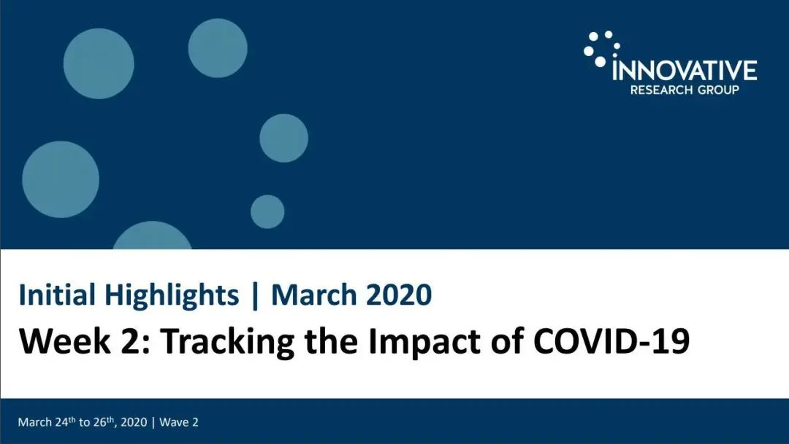
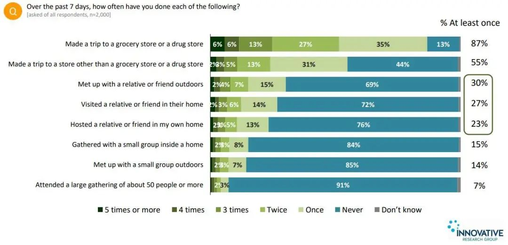
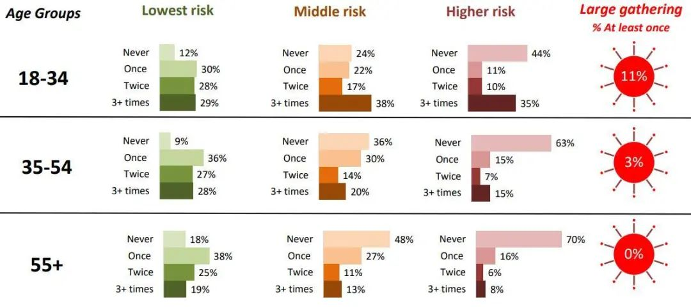
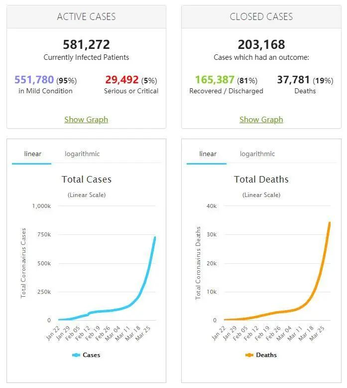

# 无标题

**链接地址:** http://mp.weixin.qq.com/s?__biz=MzIzODc2NzU4NA==&mid=2247506578&idx=1&sn=818da10b232178ac0ea56b9863158981&chksm=e936c61dde414f0bb8c054fc1bded044ac6ff895f77e838a8b1c8b2eb34c06a8b3f7214bb251&mpshare=1&scene=2&srcid=&sharer_sharetime=1585777015900&sharer_shareid=be1c8edd6c93eec155a61c876e41d26a#rd
**作者:** 妮娜
**获取时间:** 2025/8/28 20:16:00
**图片数量:** 14

---

## 原始HTML内容

 

 
<section style="display: none;margin-left: 0px;margin-right: 0px;"> </section><section style="display: none;margin-left: 0px;margin-right: 0px;"> </section><section style="display: none;margin-left: 0px;margin-right: 0px;"> </section><section style="display: none;margin-left: 0px;margin-right: 0px;"> </section><section style="margin-left: 0px;margin-right: 0px;"><section style="display: none;" data-tools="新媒体管家" data-label="powered by xmt.cn"> </section></section><section style="box-sizing: border-box;font-style: normal;font-weight: 400;text-align: justify;font-size: 16px;"><section style="margin: 10px 0%;box-sizing: border-box;" powered-by="xiumi.us"><section style="font-size: 15px;letter-spacing: 0px;line-height: 2;padding: 0px 15px;box-sizing: border-box;"><section style="white-space: normal;margin: 0px;padding: 0px;box-sizing: border-box;">根据最新数据统计，在不到24小时的时间里，加拿大新增1028例，致累计确诊达到8476例，其中安省今日新增260例，魁省则暴增732例！ </section><section style="white-space: normal;margin: 0px;padding: 0px;box-sizing: border-box;"> </section></section></section><section style="text-align: center;margin: 10px 0px;box-sizing: border-box;"><section style="max-width: 100%;vertical-align: middle;display: inline-block;line-height: 0;box-sizing: border-box;"></section></section><section style="font-size: 12px;color: rgb(121, 121, 121);box-sizing: border-box;" powered-by="xiumi.us"><section style="white-space: normal;margin: 0px;padding: 0px;box-sizing: border-box;">加拿大卫生部长帕蒂·哈吉杜（Patty Hajdu）/ Sean Kilpatrick/The Canadian Press</section><section style="white-space: normal;margin: 0px;padding: 0px;box-sizing: border-box;"> </section><section style="white-space: normal;margin: 0px;padding: 0px;box-sizing: border-box;"> </section><section style="white-space: normal;margin: 0px;padding: 0px;box-sizing: border-box;"></section>
 
</section><section style="margin: 10px 0%;box-sizing: border-box;" powered-by="xiumi.us"><section style="font-size: 15px;letter-spacing: 0px;line-height: 2;padding: 0px 15px;box-sizing: border-box;"><section style="white-space: normal;margin: 0px;padding: 0px;box-sizing: border-box;">而根据魁省省长佛朗索瓦（François Legault）刚刚发布的声明，<strong>作为加拿大确诊新冠患者最多的省份，魁省的医疗资源最快在3天内就会用完</strong>，届时，该省医护人员可能不得不“裸奔”上前线……</section><section style="text-align: center;margin-left: 0px;margin-right: 0px;"> </section><section style="text-align: justify;margin-left: 0px;margin-right: 0px;">对于持续增长的疫情，加拿大政府已经表态，<strong>对于从国外返回的旅客，要采取强硬手段，对他们进行强制隔离，避免出现更多的社区传播。</strong> </section><section style="text-align: center;margin-left: 0px;margin-right: 0px;"> </section><section style="white-space: normal;margin: 0px;padding: 0px;box-sizing: border-box;">那么加拿大政府在对待新冠肺炎的传播上到底采取了何样的措施？从<strong style="box-sizing: border-box;">3月25日</strong>（上周三）的午夜开始，加拿大正式实施了一个新法令，<strong style="box-sizing: border-box;">对所有入境者进行14天强制隔离</strong>。</section><section style="white-space: normal;margin: 0px;padding: 0px;box-sizing: border-box;"> </section><section style="white-space: normal;margin: 0px;padding: 0px;box-sizing: border-box;">并且，不遵守该法令则<strong style="box-sizing: border-box;">构成犯罪</strong>。</section><section style="white-space: normal;margin: 0px;padding: 0px;box-sizing: border-box;"> </section></section></section><section style="text-align: center;margin: 10px 0px;box-sizing: border-box;"><section style="max-width: 100%;vertical-align: middle;display: inline-block;line-height: 0;box-sizing: border-box;"></section></section><section style="margin: 10px 0%;box-sizing: border-box;" powered-by="xiumi.us"><section style="font-size: 15px;letter-spacing: 0px;line-height: 2;padding: 0px 15px;box-sizing: border-box;"><section style="white-space: normal;margin: 0px;padding: 0px;box-sizing: border-box;"> </section><section style="white-space: normal;margin: 0px;padding: 0px;box-sizing: border-box;">加拿大政府的这个新法令根据加拿大《隔离法》（The Quarantine Act）发布：乘飞机、乘船或是从陆地进入加拿大的任何人，无论国籍，无<strong style="box-sizing: border-box;">论有没有新冠肺炎症状</strong>，都必须进行14天隔离检疫。</section><section style="white-space: normal;margin: 0px;padding: 0px;box-sizing: border-box;"> </section><section style="white-space: normal;margin: 0px;padding: 0px;box-sizing: border-box;">然而新政在实施上却被纰露有极多<strong style="box-sizing: border-box;">漏洞可钻</strong>，相当大的一部分人<strong style="box-sizing: border-box;">刻意巧妙地躲避了强制隔离机制</strong>。</section><section style="margin: 0px;white-space: normal;padding: 0px;box-sizing: border-box;"> </section></section></section><section style="text-align: center;margin: 10px 0px;box-sizing: border-box;"><section style="max-width: 100%;vertical-align: middle;display: inline-block;line-height: 0;box-sizing: border-box;"></section></section><section style="font-size: 12px;color: rgb(121, 121, 121);box-sizing: border-box;" powered-by="xiumi.us"><section style="text-align: center;white-space: normal;margin: 0px;padding: 0px;box-sizing: border-box;">(CP/Ryan Remiorz)</section></section><section style="margin: 10px 0%;box-sizing: border-box;" powered-by="xiumi.us"><section style="font-size: 15px;letter-spacing: 0px;line-height: 2;padding: 0px 15px;box-sizing: border-box;"><section style="white-space: normal;margin: 0px;padding: 0px;box-sizing: border-box;"> </section><section style="white-space: normal;margin: 0px;padding: 0px;box-sizing: border-box;">所谓强制隔离并非集中强制隔离，而是居民在自己的住处进行隔离。虽然违法者可能被处以<strong style="box-sizing: border-box;">高达75万加元</strong>的罚款或<strong style="box-sizing: border-box;">半年监禁</strong>。但在监督措施上政府并没有给予明确的指示。</section><section style="white-space: normal;margin: 0px;padding: 0px;box-sizing: border-box;"> </section><section style="white-space: normal;margin: 0px;padding: 0px;box-sizing: border-box;">也就是说，如果被强制隔离的有境外旅行时的游客没有按照规定进行自我隔离，如果<strong style="box-sizing: border-box;">没有人举报</strong>且相应机构没有进行立案调查的话，<strong style="box-sizing: border-box;">则所谓的处罚相当于并不存在</strong>。</section><section style="white-space: normal;margin: 0px;padding: 0px;box-sizing: border-box;"> </section><section style="white-space: normal;margin: 0px;padding: 0px;box-sizing: border-box;">而这些拥有境外旅行史的游客们在所谓的“自我隔离”期间到底<strong style="box-sizing: border-box;">又干了些什么好事</strong>呢？</section><section style="white-space: normal;margin: 0px;padding: 0px;box-sizing: border-box;"> </section></section></section><section style="text-align: center;margin: 10px 0px;box-sizing: border-box;"><section style="max-width: 100%;vertical-align: middle;display: inline-block;line-height: 0;box-sizing: border-box;"></section></section><section style="margin: 10px 0%;box-sizing: border-box;" powered-by="xiumi.us"><section style="font-size: 15px;letter-spacing: 0px;line-height: 2;padding: 0px 15px;box-sizing: border-box;"><section style="white-space: normal;margin: 0px;padding: 0px;box-sizing: border-box;"> </section><section style="white-space: normal;margin: 0px;padding: 0px;box-sizing: border-box;">根据加拿大 <strong style="box-sizing: border-box;">Innovative Research Group</strong> 公司最新发布的调查数据显示，这些本应处于强制隔离阶段的<strong style="box-sizing: border-box;">7%</strong>拥有境外旅行史的加拿大人中，居然有<strong style="box-sizing: border-box;">至少75%的人都没有遵守相应的隔离要求</strong>。</section><section style="white-space: normal;margin: 0px;padding: 0px;box-sizing: border-box;"> </section></section></section><section style="text-align: center;margin: 10px 0px;box-sizing: border-box;"><section style="max-width: 100%;vertical-align: middle;display: inline-block;line-height: 0;box-sizing: border-box;"></section></section><section style="margin: 10px 0%;box-sizing: border-box;" powered-by="xiumi.us"><section style="font-size: 15px;letter-spacing: 0px;line-height: 2;padding: 0px 15px;box-sizing: border-box;"><section style="white-space: normal;margin: 0px;padding: 0px;box-sizing: border-box;"> </section><section style="white-space: normal;margin: 0px;padding: 0px;box-sizing: border-box;">在被调查的拥有境外旅行史的样本中，有75％的人去过至少一次超市或杂货店，有41％的人在家中接待过亲戚和朋友。</section><section style="white-space: normal;margin: 0px;padding: 0px;box-sizing: border-box;"> </section><section style="white-space: normal;margin: 0px;padding: 0px;box-sizing: border-box;">要说基础的囤货和会见亲友还可以被理解，那么那<strong style="box-sizing: border-box;">超过三分之一</strong>的举办和参与家庭聚会的奇葩脑子里到底是怎么想的？</section><section style="white-space: normal;margin: 0px;padding: 0px;box-sizing: border-box;"> </section></section></section><section style="text-align: center;margin: 10px 0px;box-sizing: border-box;"><section style="max-width: 100%;vertical-align: middle;display: inline-block;line-height: 0;box-sizing: border-box;"></section></section><section style="margin: 10px 0%;box-sizing: border-box;" powered-by="xiumi.us"><section style="font-size: 15px;letter-spacing: 0px;line-height: 2;padding: 0px 15px;box-sizing: border-box;"><section style="white-space: normal;margin: 0px;padding: 0px;box-sizing: border-box;"> </section><section style="white-space: normal;margin: 0px;padding: 0px;box-sizing: border-box;">担心病毒传染不够快，一定要一次性让<strong style="box-sizing: border-box;">一家人就要齐齐整整</strong>？而那些明知亲友是境外旅行回来还依然要坚持与之会面的人脑回路就更加让人匪夷所思了。 </section><section style="white-space: normal;margin: 0px;padding: 0px;box-sizing: border-box;"> </section></section></section><section style="text-align: center;margin: 10px 0px;box-sizing: border-box;"><section style="max-width: 100%;vertical-align: middle;display: inline-block;line-height: 0;box-sizing: border-box;"></section></section><section style="margin: 10px 0%;box-sizing: border-box;" powered-by="xiumi.us"><section style="font-size: 15px;letter-spacing: 0px;line-height: 2;padding: 0px 15px;box-sizing: border-box;"><section style="white-space: normal;margin: 0px;padding: 0px;box-sizing: border-box;"> </section><section style="white-space: normal;margin: 0px;padding: 0px;box-sizing: border-box;">不带口罩就算了，这些心大的加拿大人到底懂不懂自我隔离的含义？</section><section style="white-space: normal;margin: 0px;padding: 0px;box-sizing: border-box;"> </section><section style="white-space: normal;margin: 0px;padding: 0px;box-sizing: border-box;">截止到3月29日，加拿大新冠肺炎确诊病例中高达<strong style="box-sizing: border-box;">65%是受社区传播感染</strong>。</section><section style="white-space: normal;margin: 0px;padding: 0px;box-sizing: border-box;"> </section></section></section><section style="text-align: center;margin: 10px 0px;box-sizing: border-box;"><section style="max-width: 100%;vertical-align: middle;display: inline-block;line-height: 0;width: 50%;height: auto;box-sizing: border-box;"></section></section><section style="margin: 10px 0%;box-sizing: border-box;" powered-by="xiumi.us"><section style="font-size: 15px;letter-spacing: 0px;line-height: 2;padding: 0px 15px;box-sizing: border-box;"><section style="margin: 0px;white-space: normal;padding: 0px;box-sizing: border-box;"> </section><section style="white-space: normal;margin: 0px;padding: 0px;box-sizing: border-box;">疫情已经从三月初起持续了长达一个月的时间，而早在<strong style="box-sizing: border-box;">3月16日的半个月前已经封闭了国境线</strong>。但为什么社区感染的数量持续暴增，那些依然在外坚持聚会的人<strong style="box-sizing: border-box;">到底是有多不怕死</strong>。</section><section style="white-space: normal;margin: 0px;padding: 0px;box-sizing: border-box;"> </section></section></section><section style="text-align: center;margin: 10px 0px;box-sizing: border-box;"><section style="max-width: 100%;vertical-align: middle;display: inline-block;line-height: 0;box-sizing: border-box;"></section></section><section style="margin: 10px 0%;box-sizing: border-box;" powered-by="xiumi.us"><section style="font-size: 15px;letter-spacing: 0px;line-height: 2;padding: 0px 15px;box-sizing: border-box;"><section style="white-space: normal;margin: 0px;padding: 0px;box-sizing: border-box;"> </section><section style="white-space: normal;margin: 0px;padding: 0px;box-sizing: border-box;">根据调查显示，甚至有<strong style="box-sizing: border-box;">11%</strong>的18-34年龄组的加国年轻人在新冠肆虐期间<strong style="box-sizing: border-box;">参与过大型集会活动</strong>！</section><section style="white-space: normal;margin: 0px;padding: 0px;box-sizing: border-box;"> </section><section style="white-space: normal;margin: 0px;padding: 0px;box-sizing: border-box;">一些年轻人可能会这么想，我年轻，我的免疫力强，就算我染上病也不会死，大不了就像流感一样抗一抗就过去了。</section><section style="white-space: normal;margin: 0px;padding: 0px;box-sizing: border-box;"> </section><section style="white-space: normal;margin: 0px;padding: 0px;box-sizing: border-box;">可他们是否想过，自己作为病毒的传播环节很有可能<strong style="box-sizing: border-box;">把病毒带给家里更容易患病的老年人</strong>呢？</section><section style="white-space: normal;margin: 0px;padding: 0px;box-sizing: border-box;"> </section></section></section><section style="text-align: center;margin: 10px 0px;box-sizing: border-box;"><section style="max-width: 100%;vertical-align: middle;display: inline-block;line-height: 0;box-sizing: border-box;"></section></section><section style="margin: 10px 0%;box-sizing: border-box;" powered-by="xiumi.us"><section style="font-size: 15px;letter-spacing: 0px;line-height: 2;padding: 0px 15px;box-sizing: border-box;"><section style="white-space: normal;margin: 0px;padding: 0px;box-sizing: border-box;"> </section><section style="text-align: center;white-space: normal;margin: 0px;padding: 0px;box-sizing: border-box;"><strong style="box-sizing: border-box;">病毒不会自我传播，传播病毒的是人。</strong></section><section style="text-align: center;white-space: normal;margin: 0px;padding: 0px;box-sizing: border-box;"><strong style="box-sizing: border-box;">病毒并不可怕，可怕的是那些传播病毒的人。</strong></section><section style="white-space: normal;margin: 0px;padding: 0px;box-sizing: border-box;"> </section><section style="white-space: normal;margin: 0px;padding: 0px;box-sizing: border-box;">不要抱有侥幸心理。在真正染病确诊之前，<strong style="box-sizing: border-box;">没有人会猜到得病的会是自己</strong>。</section></section></section><section style="text-align: center;margin: 10px 0px;box-sizing: border-box;"><section style="max-width: 100%;vertical-align: middle;display: inline-block;line-height: 0;box-sizing: border-box;"></section></section><section style="margin: 10px 0%;box-sizing: border-box;" powered-by="xiumi.us"><section style="font-size: 15px;letter-spacing: 0px;line-height: 2;padding: 0px 15px;box-sizing: border-box;"><section style="white-space: normal;margin: 0px;padding: 0px;box-sizing: border-box;"> </section><section style="white-space: normal;margin: 0px;padding: 0px;box-sizing: border-box;">让我们遵守自我隔离的规定，尽可能的减少和外界的接触。<strong style="box-sizing: border-box;">从自身切断感染传播链的衍生</strong>，这既是保护自己，也是保护他人，更是这个特殊时期，我们这些没有奋战在抗疫前线的人们，<strong style="box-sizing: border-box;">对抗击疫情能够做出最大也是最有效的贡献</strong>。</section><section style="white-space: normal;margin: 0px;padding: 0px;box-sizing: border-box;"> </section><section style="text-align: center;white-space: normal;margin: 0px;padding: 0px;box-sizing: border-box;"><strong style="box-sizing: border-box;">加拿大，加油！</strong></section><section style="white-space: normal;margin: 0px;padding: 0px;box-sizing: border-box;"> </section></section></section><section style="text-align: center;margin: 10px 0px;box-sizing: border-box;"><section style="max-width: 100%;vertical-align: middle;display: inline-block;line-height: 0;box-sizing: border-box;"></section></section><section style="margin: 10px 0%;box-sizing: border-box;" powered-by="xiumi.us"><section style="font-size: 15px;letter-spacing: 0px;line-height: 2;padding: 0px 15px;box-sizing: border-box;"><section style="white-space: normal;margin: 0px;padding: 0px;box-sizing: border-box;"> </section><section style="white-space: normal;margin: 0px;padding: 0px;box-sizing: border-box;"><strong style="box-sizing: border-box;">调查具体信息参考：</strong></section><section style="white-space: normal;margin: 0px;padding: 0px;box-sizing: border-box;">https://innovativeresearch.ca/wp-content/uploads/2020/03/INNOVATIVE-Research-COVID-19-Polling-Week-2-20200326.pdf</section><section style="white-space: normal;margin: 0px;padding: 0px;box-sizing: border-box;"> </section><section style="white-space: normal;margin: 0px;padding: 0px;box-sizing: border-box;"> </section><section style="max-width: 100%;font-family: -apple-system-font, BlinkMacSystemFont, &quot;Helvetica Neue&quot;, &quot;PingFang SC&quot;, &quot;Hiragino Sans GB&quot;, &quot;Microsoft YaHei UI&quot;, &quot;Microsoft YaHei&quot;, Arial, sans-serif;letter-spacing: 0.544px;white-space: normal;background-color: rgb(255, 255, 255);min-height: 1em;font-size: 16px;text-align: center;line-height: 2em;margin-left: 0px;margin-right: 0px;box-sizing: border-box !important;overflow-wrap: break-word !important;">---大家快来关注爆料君↓↓--- </section><section style="max-width: 100%;font-family: -apple-system-font, BlinkMacSystemFont, &quot;Helvetica Neue&quot;, &quot;PingFang SC&quot;, &quot;Hiragino Sans GB&quot;, &quot;Microsoft YaHei UI&quot;, &quot;Microsoft YaHei&quot;, Arial, sans-serif;letter-spacing: 0.544px;white-space: normal;min-height: 1em;background-color: rgb(255, 255, 255);text-align: center;line-height: 2em;margin-left: 0px;margin-right: 0px;box-sizing: border-box !important;overflow-wrap: break-word !important;"></section><section style="max-width: 100%;font-family: -apple-system-font, BlinkMacSystemFont, &quot;Helvetica Neue&quot;, &quot;PingFang SC&quot;, &quot;Hiragino Sans GB&quot;, &quot;Microsoft YaHei UI&quot;, &quot;Microsoft YaHei&quot;, Arial, sans-serif;letter-spacing: 0.544px;white-space: normal;min-height: 1em;background-color: rgb(255, 255, 255);text-align: right;line-height: 2em;margin-left: 0px;margin-right: 0px;box-sizing: border-box !important;overflow-wrap: break-word !important;"><strong style="max-width: 100%;letter-spacing: 0.544px;box-sizing: border-box !important;overflow-wrap: break-word !important;">喜欢点个“在看” ↓↓</strong></section></section></section></section>

---

## 纯文本内容

根据最新数据统计，在不到24小时的时间里，加拿大新增1028例，致累计确诊达到8476例，其中安省今日新增260例，魁省则暴增732例！加拿大卫生部长帕蒂·哈吉杜（Patty Hajdu）/ Sean Kilpatrick/The Canadian Press而根据魁省省长佛朗索瓦（François Legault）刚刚发布的声明，作为加拿大确诊新冠患者最多的省份，魁省的医疗资源最快在3天内就会用完，届时，该省医护人员可能不得不“裸奔”上前线……对于持续增长的疫情，加拿大政府已经表态，对于从国外返回的旅客，要采取强硬手段，对他们进行强制隔离，避免出现更多的社区传播。那么加拿大政府在对待新冠肺炎的传播上到底采取了何样的措施？从3月25日（上周三）的午夜开始，加拿大正式实施了一个新法令，对所有入境者进行14天强制隔离。并且，不遵守该法令则构成犯罪。加拿大政府的这个新法令根据加拿大《隔离法》（The Quarantine Act）发布：乘飞机、乘船或是从陆地进入加拿大的任何人，无论国籍，无论有没有新冠肺炎症状，都必须进行14天隔离检疫。然而新政在实施上却被纰露有极多漏洞可钻，相当大的一部分人刻意巧妙地躲避了强制隔离机制。(CP/Ryan Remiorz)所谓强制隔离并非集中强制隔离，而是居民在自己的住处进行隔离。虽然违法者可能被处以高达75万加元的罚款或半年监禁。但在监督措施上政府并没有给予明确的指示。也就是说，如果被强制隔离的有境外旅行时的游客没有按照规定进行自我隔离，如果没有人举报且相应机构没有进行立案调查的话，则所谓的处罚相当于并不存在。而这些拥有境外旅行史的游客们在所谓的“自我隔离”期间到底又干了些什么好事呢？根据加拿大 Innovative Research Group 公司最新发布的调查数据显示，这些本应处于强制隔离阶段的7%拥有境外旅行史的加拿大人中，居然有至少75%的人都没有遵守相应的隔离要求。在被调查的拥有境外旅行史的样本中，有75％的人去过至少一次超市或杂货店，有41％的人在家中接待过亲戚和朋友。要说基础的囤货和会见亲友还可以被理解，那么那超过三分之一的举办和参与家庭聚会的奇葩脑子里到底是怎么想的？担心病毒传染不够快，一定要一次性让一家人就要齐齐整整？而那些明知亲友是境外旅行回来还依然要坚持与之会面的人脑回路就更加让人匪夷所思了。不带口罩就算了，这些心大的加拿大人到底懂不懂自我隔离的含义？截止到3月29日，加拿大新冠肺炎确诊病例中高达65%是受社区传播感染。疫情已经从三月初起持续了长达一个月的时间，而早在3月16日的半个月前已经封闭了国境线。但为什么社区感染的数量持续暴增，那些依然在外坚持聚会的人到底是有多不怕死。根据调查显示，甚至有11%的18-34年龄组的加国年轻人在新冠肆虐期间参与过大型集会活动！一些年轻人可能会这么想，我年轻，我的免疫力强，就算我染上病也不会死，大不了就像流感一样抗一抗就过去了。可他们是否想过，自己作为病毒的传播环节很有可能把病毒带给家里更容易患病的老年人呢？病毒不会自我传播，传播病毒的是人。病毒并不可怕，可怕的是那些传播病毒的人。不要抱有侥幸心理。在真正染病确诊之前，没有人会猜到得病的会是自己。让我们遵守自我隔离的规定，尽可能的减少和外界的接触。从自身切断感染传播链的衍生，这既是保护自己，也是保护他人，更是这个特殊时期，我们这些没有奋战在抗疫前线的人们，对抗击疫情能够做出最大也是最有效的贡献。加拿大，加油！调查具体信息参考：https://innovativeresearch.ca/wp-content/uploads/2020/03/INNOVATIVE-Research-COVID-19-Polling-Week-2-20200326.pdf---大家快来关注爆料君↓↓---喜欢点个“在看” ↓↓

---

## 图片列表

-  (原始链接: https://mmbiz.qpic.cn/mmbiz_jpg/4kibCXA1QiblSIrdH4Q8aSxbSSX9dfPk8GVvQ61jSkJ7ibnvyKwAJFmaSu4Ld3A9StM5RN2g5cQDd1Bf6TuU9GzlA/640?wx_fmt=jpeg)
-  (原始链接: https://mmbiz.qpic.cn/mmbiz_png/4kibCXA1QiblSIrdH4Q8aSxbSSX9dfPk8GTic6N31xPIGJHD8NFWicWwS3HzWanm5KE160VQc159UKuiayG8Ofs4gFQ/640?wx_fmt=png)
-  (原始链接: https://mmbiz.qpic.cn/mmbiz_jpg/4kibCXA1QiblSIrdH4Q8aSxbSSX9dfPk8GQD5h2ichqbdJgkxoicfxY91SG15BGbINEvIr7AGRLibNrC2FPjY2ziaqwg/640?wx_fmt=jpeg)
-  (原始链接: https://mmbiz.qpic.cn/mmbiz_jpg/4kibCXA1QiblSIrdH4Q8aSxbSSX9dfPk8GIibhbOtUx6DHfd52EFibibhEGpDzYmT6TyicNptcAFkgVHkZ6GbSqUoqeg/640?wx_fmt=jpeg)
-  (原始链接: https://mmbiz.qpic.cn/mmbiz_jpg/4kibCXA1QiblSIrdH4Q8aSxbSSX9dfPk8GXno5vcQs4lIDTMCupHat6BliaMM5kxJMKiaRRIcW0lyfbWH1RzkIVIXA/640?wx_fmt=jpeg)
-  (原始链接: https://mmbiz.qpic.cn/mmbiz_jpg/4kibCXA1QiblSIrdH4Q8aSxbSSX9dfPk8GukgK1Tje84yK8gppaEicOoOholrgWbLB1pictkAaNVWksvcB9de6sIog/640?wx_fmt=jpeg)
-  (原始链接: https://mmbiz.qpic.cn/mmbiz_jpg/4kibCXA1QiblSIrdH4Q8aSxbSSX9dfPk8GTPaH51iaueGnLJNxx4fTR4tU2W4lWzcmeGkLeHDhYNFqkGLxr3Gn3OQ/640?wx_fmt=jpeg)
-  (原始链接: https://mmbiz.qpic.cn/mmbiz_jpg/4kibCXA1QiblSIrdH4Q8aSxbSSX9dfPk8G7efpEPSMHicg9ZJ8eaeYicS7UB8EkWJL0aRMTPcia6wAUdOjqEEIGHMrg/640?wx_fmt=jpeg)
-  (原始链接: https://mmbiz.qpic.cn/mmbiz_jpg/4kibCXA1QiblSIrdH4Q8aSxbSSX9dfPk8GvMXgZ3XUngHhc3H7icia54C3tOODYPIblXrqUZv0uzSDuTMtUaKuQIeA/640?wx_fmt=jpeg)
-  (原始链接: https://mmbiz.qpic.cn/mmbiz_jpg/4kibCXA1QiblSIrdH4Q8aSxbSSX9dfPk8GM0qrt6SeRcqibg3gppo85sGco87MqsoH3bXzicLQy0MHicxV9LhKiaGjjg/640?wx_fmt=jpeg)
-  (原始链接: https://mmbiz.qpic.cn/mmbiz_jpg/4kibCXA1QiblSIrdH4Q8aSxbSSX9dfPk8Gzod09tPepJmmsxdpuj6iaKrmaFrmvQKZzYpExoKvQnmhkqdZCjpibLuw/640?wx_fmt=jpeg)
-  (原始链接: https://mmbiz.qpic.cn/mmbiz_jpg/4kibCXA1QiblSIrdH4Q8aSxbSSX9dfPk8G2Csyyy4y1ctZKNxDrECk9DwPMPeVAdic5Cqjtnm9uKjsibl12NWqMricA/640?wx_fmt=jpeg)
-  (原始链接: https://mmbiz.qpic.cn/mmbiz_jpg/4kibCXA1QiblSIrdH4Q8aSxbSSX9dfPk8GYet7WRDFP6Ygib00WxJI0BrY9MFPRicHVSnyPmmQtKqavb7XrQtHp4ng/640?wx_fmt=jpeg)
-  (原始链接: https://mmbiz.qpic.cn/mmbiz_jpg/4kibCXA1QiblTBL8UtNoK5vrCnUIExUibiaLiaOAuocR7LvibeeabkEDRFqeMdiaxsZ18icWNc2Aoh8MVcFLyBQUIR3zxw/640?wx_fmt=jpeg)
