# 无标题

**链接地址:** http://mp.weixin.qq.com/s?__biz=MjM5OTAzNzgwMA==&mid=2650622069&idx=2&sn=90111458855ac9766de7984c94b5b2f3&chksm=bec8767289bfff64b3e2f316390fc13c97b20c879327ba1e5376e9b65debe9497dfa30ab4dd2&mpshare=1&scene=2&srcid=0404UatIZ5wbyNfgVhHFnB9h&sharer_sharetime=1585983962603&sharer_shareid=be1c8edd6c93eec155a61c876e41d26a#rd
**作者:** VOGUE
**获取时间:** 2025/8/28 20:15:43
**图片数量:** 31

---

## 原始HTML内容

<section style="margin-left: 16px;margin-right: 16px;">  </section><section style="margin-left: 16px;margin-right: 16px;">意大利鞋履行业传奇设计师Sergio Rossi，于2020年4月3日因新冠肺炎逝世，享年84岁，他是首位因疫情去世的时尚界大师。</section><section style="margin-left: 16px;margin-right: 16px;"> </section><section style="margin-left: 16px;margin-right: 16px;">人们称Sergio Rossi为时代先锋，因为在1968年，他创立了意大利最知名的鞋履品牌之一Sergio Rossi，他的理念影响了时尚界。 </section><section style="margin-left: 16px;margin-right: 16px;"> </section><section style="margin-left: 16px;margin-right: 16px;"> </section>

<section> </section><section> </section>

<section> </section><section> </section><section style="margin-left: 16px;margin-right: 16px;text-align: center;"><strong>不为别的，就为制鞋而生</strong></section><section> </section><section> </section><section style="margin-left: 16px;margin-right: 16px;">Sergio Rossi，是从小就注定要成为一名鞋履设计师的。</section><section style="margin-left: 16px;margin-right: 16px;"> </section><section style="margin-left: 16px;margin-right: 16px;">他出生于鞋匠世家，父亲从事的是纯手工制鞋业，Sergio Rossi从小便耳濡目染，也对手工制鞋技艺有了一定程度的了解。</section><section> </section><section> </section><section style="font-size: 16px;"><section style="margin-right: 0%;margin-left: 0%;" powered-by="xiumi.us"><section style="display: inline-block;width: 70%;vertical-align: top;"><section style="text-align: center;margin-right: 0%;margin-bottom: -20px;margin-left: 0%;" powered-by="xiumi.us"><section style="vertical-align: middle;display: inline-block;line-height: 0;border-width: 5px;border-radius: 0px;border-style: solid;border-color: rgb(255, 255, 255);width: 100%;"></section></section></section></section><section style="text-align: right;margin-top: -30px;margin-right: 0%;margin-left: 0%;" powered-by="xiumi.us"><section style="display: inline-block;width: 60%;vertical-align: top;"><section style="text-align: center;margin-top: 10px;margin-right: 0%;margin-left: 0%;" powered-by="xiumi.us"><section style="vertical-align: middle;display: inline-block;line-height: 0;border-width: 5px;border-radius: 0px;border-style: solid;border-color: rgb(255, 255, 255);width: 100%;"></section></section></section></section></section><section> </section><section> </section><section style="margin-left: 16px;margin-right: 16px;">由于父亲早逝，Sergio Rossi在14岁就开始接管家业了，1950年，Sergio Rossi在制鞋领域已经小有名气，一年后他开设了自己的工厂。 </section><section style="margin-left: 16px;margin-right: 16px;"> </section><section style="margin-left: 16px;margin-right: 16px;">在1968年，他创立了同名鞋履品牌，Sergio Rossi在他的第一双鞋上签上名字，这是历史性的时刻——代表着经典的Opanca系列凉鞋诞生了。</section><section style="margin-left: 16px;margin-right: 16px;"> </section><section style="margin-left: 16px;margin-right: 16px;"> </section><section><section powered-by="xiumi.us"><section style="font-size: 16px;"><section style="margin: 10px 0%;text-align: center;" powered-by="xiumi.us"><section style="display: inline-block;vertical-align: top;width: 90%;border-width: 1px;border-radius: 5px;border-style: solid;border-color: rgb(164, 137, 116);height: auto;line-height: 0;"><section style="" powered-by="xiumi.us"><section style="display: inline-block;vertical-align: top;width: 50%;"><section style="text-align: left;transform: translate3d(3px, 0px, 0px);margin-top: 3px;margin-right: 0%;margin-left: 0%;" powered-by="xiumi.us"><section style="display: inline-block;vertical-align: top;height: 7px;width: 7px;overflow: hidden;border-style: solid none none solid;border-width: 1px;border-radius: 2px;border-color: rgb(164, 137, 116) rgba(203, 160, 121, 0.55) rgba(203, 160, 121, 0.55) rgb(164, 137, 116);line-height: 0;"> </section></section></section><section style="display: inline-block;vertical-align: top;width: 50%;"><section style="text-align: right;transform: translate3d(-3px, 0px, 0px);margin-top: 3px;margin-right: 0%;margin-left: 0%;" powered-by="xiumi.us"><section style="display: inline-block;vertical-align: top;height: 7px;width: 7px;overflow: hidden;border-style: solid solid none none;border-width: 1px;border-radius: 2px;border-color: rgb(164, 137, 116) rgb(164, 137, 116) rgba(203, 160, 121, 0.55) rgba(203, 160, 121, 0.55);line-height: 0;"> </section></section></section></section><section style="" powered-by="xiumi.us"><section style="display: inline-block;width: 95%;vertical-align: middle;height: auto;line-height: 0;"><section style="margin-right: 0%;margin-left: 0%;" powered-by="xiumi.us"><section style="vertical-align: middle;display: inline-block;line-height: 0;border-style: none;border-width: 0px;border-radius: 3px;border-color: rgba(203, 160, 121, 0.55);overflow: hidden;"></section></section></section></section><section style="transform: rotateX(180deg);" powered-by="xiumi.us"><section style="display: inline-block;vertical-align: top;width: 50%;"><section style="text-align: left;transform: translate3d(3px, 0px, 0px);margin-top: 3px;margin-right: 0%;margin-left: 0%;" powered-by="xiumi.us"><section style="display: inline-block;vertical-align: top;height: 7px;width: 7px;overflow: hidden;border-style: solid none none solid;border-width: 1px;border-radius: 2px;border-color: rgb(164, 137, 116) rgba(203, 160, 121, 0.55) rgba(203, 160, 121, 0.55) rgb(164, 137, 116);line-height: 0;"> </section></section></section><section style="display: inline-block;vertical-align: top;width: 50%;"><section style="text-align: right;transform: translate3d(-3px, 0px, 0px);margin-top: 3px;margin-right: 0%;margin-left: 0%;" powered-by="xiumi.us"><section style="display: inline-block;vertical-align: top;height: 7px;width: 7px;overflow: hidden;border-style: solid solid none none;border-width: 1px;border-radius: 2px;border-color: rgb(164, 137, 116) rgb(164, 137, 116) rgba(203, 160, 121, 0.55) rgba(203, 160, 121, 0.55);line-height: 0;"> </section></section></section></section></section></section></section></section></section><section style="margin-left: 16px;margin-right: 16px;text-align: right;"><em>Sergio Rossi Opanca系列 </em> </section><section style="margin-left: 16px;margin-right: 16px;"> </section><section style="margin-left: 16px;margin-right: 16px;">Opanca凉鞋成为了他的标志性作品，还激发了几代鞋履设计师的灵感，其中包括他的儿子Gianvito Rossi。他与父亲一起工作，直到1999年业务被出售给Gucci集团，也就是现在的Kering集团。</section><section style="margin-left: 16px;margin-right: 16px;"> </section><section style="margin-left: 16px;margin-right: 16px;">Gianvito也延续了家族的传统，在2007年创立了自己的同名品牌，在设计和审美风格上，很大程度也受到父亲Sergio Rossi的影响：</section><section> </section><section> </section><section style="font-size: 16px;"><section style="" powered-by="xiumi.us"><section style="display: inline-block;vertical-align: top;width: 50%;padding-right: 5px;"><section style="text-align: center;margin-right: 0%;margin-left: 0%;" powered-by="xiumi.us"><section style="vertical-align: middle;display: inline-block;line-height: 0;"></section></section></section><section style="display: inline-block;vertical-align: top;width: 50%;padding-left: 5px;"><section style="text-align: left;margin-right: 0%;margin-left: 0%;" powered-by="xiumi.us"><section style="vertical-align: middle;display: inline-block;line-height: 0;width: 100%;"></section></section></section></section></section>
<em>Gianvito Rossi的作品</em>
<section> </section><section> </section><section style="margin-left: 16px;margin-right: 16px;">在2015年，Kering将Sergio Rossi出售给Investindustrial。经过Investindustrial的重整，2019年，Sergio Rossi再度获得时尚圈的好评。 </section><section> </section><section> </section>

<section> </section><section> </section><section style="margin-left: 16px;margin-right: 16px;text-align: center;"><strong>爱女人，所以发现她们的美</strong></section><section> </section><section> </section><section style="margin-left: 16px;margin-right: 16px;">Sergio Rossi之所以能够影响时尚圈几代人的设计风格，一个很重要的关键，便是他懂得尊重女性。所有设计的出发点，都是关于女性的最真实、最舒适的表达。</section><section> </section><section> </section><section style="font-size: 16px;"><section style="margin-right: 0%;margin-left: 0%;" powered-by="xiumi.us"><section style="display: inline-block;width: 70%;vertical-align: top;"><section style="text-align: center;margin-right: 0%;margin-bottom: -20px;margin-left: 0%;" powered-by="xiumi.us"><section style="vertical-align: middle;display: inline-block;line-height: 0;border-width: 5px;border-radius: 0px;border-style: solid;border-color: rgb(255, 255, 255);width: 100%;"></section></section></section></section><section style="text-align: right;margin-top: -30px;margin-right: 0%;margin-left: 0%;" powered-by="xiumi.us"><section style="display: inline-block;vertical-align: top;width: 60%;border-width: 0px;"><section style="text-align: center;margin-top: 10px;margin-right: 0%;margin-left: 0%;" powered-by="xiumi.us"><section style="vertical-align: middle;display: inline-block;line-height: 0;border-width: 5px;border-radius: 0px;border-style: solid;border-color: rgb(255, 255, 255);width: 100%;"></section></section></section></section></section><section> </section><section> </section><section style="margin-left: 16px;margin-right: 16px;">这反映在他对设计和工艺极致的要求上，在上个世纪六十年代，VOGUE就已经将其称为“意大利品质和经典女性设计的代名词”。</section><section style="margin-left: 16px;margin-right: 16px;"> </section><section style="margin-left: 16px;margin-right: 16px;">七八十年代，Versace、Dolce＆Gabbana和Azzedine Alaïa等时装公司也看到了Sergio Rossi的发光点，他们也开始有了非常密切的合作。</section><section style="margin-left: 16px;margin-right: 16px;"> </section><section style="margin-left: 16px;margin-right: 16px;"> </section>

<section style="text-align: right;"><em>Sergio Rossi x Gianni Versace</em></section><section> </section><section> </section><section style="margin-left: 16px;margin-right: 16px;">Sergio Rossi逝世之后，Sergio Rossi的首席执行官Riccardo Sciutto在采访的时候说，“很幸运我们拥有过他，他是我们的精神向导。” </section><section style="margin-left: 16px;margin-right: 16px;"> </section><section style="margin-left: 16px;margin-right: 16px;">“因为Sergio Rossi老先生很喜欢女性，所以他能够以独特的方式捕捉她们的独特气质。” </section><section style="margin-left: 16px;margin-right: 16px;"> </section><section style="margin-left: 16px;margin-right: 16px;">“他的设计从不会越界，你能看到他的设计总是很有品位并且非常实穿，不到完美他绝会不停止，对他来说，鞋子绝不仅仅是他的配饰。”</section><section style="margin-left: 16px;margin-right: 16px;"> </section><section style="margin-left: 16px;margin-right: 16px;"> </section>

<section> </section><section> </section><section style="margin-left: 16px;margin-right: 16px;">鞋子当然不仅仅是Sergio Rossi的配饰，用追求完美的Sergio Rossi的话来说，“鞋子，便是女性身体的延伸。”</section><section style="margin-left: 16px;margin-right: 16px;"> </section><section style="margin-left: 16px;margin-right: 16px;">所以，像Taylor Swift、Rihanna、Chiara Ferragni、Kaia Gerber、Hailey Clauson、Adwoa Aboah等等无数时尚圈的时髦女性，都是Sergio Rossi的忠实拥趸，无论是红毯或是私服，她们都享受穿上这样的设计。 </section><section style="margin-left: 16px;margin-right: 16px;"> </section><section style="margin-left: 16px;margin-right: 16px;"> </section>

<section style="margin-left: 16px;margin-right: 16px;"> </section><section style="margin-left: 16px;margin-right: 16px;"></section>

<section> </section><section> </section><section style="margin-left: 16px;margin-right: 16px;text-align: center;"><strong>标志性的Sergio Rossi设计</strong></section><section> </section><section> </section><section style="margin-left: 16px;margin-right: 16px;">一双Sergio Rossi鞋履，做工完美，需要经过120道工序和14小时工作制成，提到Sergio Rossi鞋履，有很多经典款式是让人记忆深刻的。</section><section style="margin-left: 16px;margin-right: 16px;"> </section><section style="margin-left: 16px;margin-right: 16px;">比如全手工制作的高跟过膝长靴，皮质珍稀，穿上去很能修饰身材，几乎是所有女性的必备经典款。</section><section style="margin-left: 16px;margin-right: 16px;"> </section><section style="margin-left: 16px;margin-right: 16px;"> </section>

<section style="margin-left: 16px;margin-right: 16px;"> </section><section style="margin-left: 16px;margin-right: 16px;"> </section><section style="margin-left: 16px;margin-right: 16px;">还有最具代表性的Godiva高跟鞋，简单流畅，毫不拖沓。</section><section style="margin-left: 16px;margin-right: 16px;"> </section><section style="margin-left: 16px;margin-right: 16px;"> </section>

<section style="margin-left: 16px;margin-right: 16px;"> </section><section style="margin-left: 16px;margin-right: 16px;"> </section><section style="margin-left: 16px;margin-right: 16px;">近几年流行的SR1，每一季元素上都有着不同变化，但依旧适合于由早到晚及各处场合穿着。</section><section> </section><section> </section><section style="font-size: 16px;"><section style="" powered-by="xiumi.us"><section style="display: inline-block;vertical-align: top;width: 50%;padding-right: 5px;"><section style="text-align: center;margin-right: 0%;margin-left: 0%;" powered-by="xiumi.us"><section style="vertical-align: middle;display: inline-block;line-height: 0;"></section></section></section><section style="display: inline-block;vertical-align: top;width: 50%;padding-left: 5px;"><section style="text-align: left;margin-right: 0%;margin-left: 0%;" powered-by="xiumi.us"><section style="vertical-align: middle;display: inline-block;line-height: 0;width: 100%;"></section></section></section></section></section><section> </section><section> </section><section style="margin-left: 16px;margin-right: 16px;">对于Sergio Rossi的爱好者来说，一双Sergio Rossi，最大的特色便是将上世纪90年代的极简主义与现代气息融合得刚刚好。</section><section style="margin-left: 16px;margin-right: 16px;"> </section><section style="margin-left: 16px;margin-right: 16px;">比如，设计师很会用几何图形营造出建筑感：</section><section style="margin-left: 16px;margin-right: 16px;"> </section><section style="margin-left: 16px;margin-right: 16px;"> </section>

<section> </section><section> </section><section style="margin-left: 16px;margin-right: 16px;">将水晶点缀于镜像螺钉之上，再用巴西杏花作为灵感，打造出栩栩如生的感觉：</section><section> </section><section> </section>

<section> </section><section> </section><section style="margin-left: 16px;margin-right: 16px;">融合了烈艳红、白色及烟灰色的亮片装饰，远看就似童话中的水晶鞋，在置景上，还专门把它们放进色彩斑斓的矿物晶洞里：</section><section style="margin-left: 16px;margin-right: 16px;"> </section><section style="margin-left: 16px;margin-right: 16px;"> </section><section style="font-size: 16px;"><section style="margin: 10px 0%;" powered-by="xiumi.us"><section style="display: inline-block;width: 100%;vertical-align: top;border-width: 0px;border-radius: 1px;border-style: none;border-color: rgb(62, 62, 62);overflow: hidden;"><section style="text-align: left;margin-right: 0%;margin-bottom: -30px;margin-left: 0%;justify-content: flex-start;" powered-by="xiumi.us"><section style="display: inline-block;vertical-align: top;overflow: hidden;height: 40px;width: 10px;border-right: 1px solid rgb(122, 122, 118);border-top-right-radius: 0px;line-height: 0;"> </section></section><section style="margin-right: 0%;margin-left: 0%;transform: translate3d(-10px, 0px, 0px);" powered-by="xiumi.us"><section style="height: 1px;background-color: rgb(122, 122, 118);line-height: 0;"> </section></section><section style="" powered-by="xiumi.us"><section style="display: inline-block;width: 100%;vertical-align: top;padding-right: 20px;padding-left: 20px;"><section style="margin: 10px 0%;" powered-by="xiumi.us"><section style="display: inline-block;vertical-align: middle;width: 50%;padding-right: 5px;"><section style="text-align: center;margin-right: 0%;margin-left: 0%;width: 100%;" powered-by="xiumi.us"><section style="vertical-align: middle;display: inline-block;line-height: 0;width: 100%;"></section></section><section style="text-align: center;margin-top: 10px;margin-right: 0%;margin-left: 0%;width: 100%;" powered-by="xiumi.us"><section style="vertical-align: middle;display: inline-block;line-height: 0;width: 100%;"></section></section></section><section style="display: inline-block;vertical-align: middle;width: 50%;padding-left: 5px;"><section style="text-align: center;margin-right: 0%;margin-left: 0%;width: 100%;" powered-by="xiumi.us"><section style="vertical-align: middle;display: inline-block;line-height: 0;width: 100%;"></section></section><section style="text-align: center;margin-top: 10px;margin-right: 0%;margin-left: 0%;width: 100%;" powered-by="xiumi.us"><section style="vertical-align: middle;display: inline-block;line-height: 0;width: 100%;"></section></section></section></section></section></section><section style="margin-right: 0%;margin-left: 0%;transform: translate3d(10px, 0px, 0px);" powered-by="xiumi.us"><section style="height: 1px;background-color: rgb(122, 122, 118);line-height: 0;"> </section></section><section style="text-align: right;margin-top: -30px;margin-right: 0%;margin-left: 0%;justify-content: flex-end;transform: translate3d(-10px, 0px, 0px);" powered-by="xiumi.us"><section style="display: inline-block;vertical-align: top;overflow: hidden;height: 40px;width: 10px;border-right: 1px solid rgb(122, 122, 118);border-top-right-radius: 0px;line-height: 0;"> </section></section></section></section></section><section style="margin-left: 16px;margin-right: 16px;"> </section><section style="margin-left: 16px;margin-right: 16px;"> </section><section style="margin-left: 16px;margin-right: 16px;">还有美妙的流苏，以不同形式装饰于鞋履之上，奢华又有活力，一切都富有无穷想象力。</section><section style="margin-left: 16px;margin-right: 16px;"> </section><section style="margin-left: 16px;margin-right: 16px;"> </section><section style="font-size: 16px;"><section style="margin-right: 0%;margin-left: 0%;" powered-by="xiumi.us"><section style="display: inline-block;width: 70%;vertical-align: top;"><section style="text-align: center;margin-right: 0%;margin-bottom: -20px;margin-left: 0%;" powered-by="xiumi.us"><section style="vertical-align: middle;display: inline-block;line-height: 0;border-width: 5px;border-radius: 0px;border-style: solid;border-color: rgb(255, 255, 255);width: 100%;"></section></section></section></section><section style="text-align: right;margin-top: -30px;margin-right: 0%;margin-left: 0%;" powered-by="xiumi.us"><section style="display: inline-block;width: 60%;vertical-align: top;"><section style="text-align: center;margin-top: 10px;margin-right: 0%;margin-left: 0%;" powered-by="xiumi.us"><section style="vertical-align: middle;display: inline-block;line-height: 0;border-width: 5px;border-radius: 0px;border-style: solid;border-color: rgb(255, 255, 255);width: 100%;"></section></section></section></section></section><section style="margin-left: 16px;margin-right: 16px;"> </section><section style="margin-left: 16px;margin-right: 16px;"> </section><section style="margin-left: 16px;margin-right: 16px;">就在几周前，Sergio Rossi还在Instagram官方发起了一项抗击冠状病毒的计划。</section><section style="margin-left: 16px;margin-right: 16px;"> </section><section style="margin-left: 16px;margin-right: 16px;">他们向米兰的ASST
 Fatebenefratelli-Sacco医院捐款10万欧元，并向所有喜爱Sergio Rossi的女性发出邀请：3月14日至3月20日，在SergioRossi.com上进行的交易，全部用于捐赠对抗Covid-19疫情。</section><section style="margin-left: 16px;margin-right: 16px;"> </section><section style="margin-left: 16px;margin-right: 16px;"> </section>
 
<section style="margin-left: 16px;margin-right: 16px;"> </section><section style="margin-left: 16px;margin-right: 16px;"> </section><section style="margin-left: 16px;margin-right: 16px;">而令人无比惋惜的是，就在昨天，品牌创始人却因为新冠肺炎，永远地离去了。</section><section style="margin-left: 16px;margin-right: 16px;"> </section><section style="margin-left: 16px;margin-right: 16px;"> </section>

<section style="margin-left: 16px;margin-right: 16px;"> </section><section style="margin-left: 16px;margin-right: 16px;"> </section><section style="margin-left: 16px;margin-right: 16px;">所幸，就让我们相信，他留下的美好，绝不会轻易地逝去。</section><section> </section><section> </section>

 

<strong>编辑：</strong>Christopher

<strong>美术：</strong>罗兰 
<section style="margin-left: 16px;margin-right: 16px;"> </section><section style="margin-left: 16px;margin-right: 16px;"> </section><section style="text-align: right;margin-left: 16px;margin-right: 16px;"><strong>缅怀每一位因新冠离去的人</strong></section>

---

## 纯文本内容

意大利鞋履行业传奇设计师Sergio Rossi，于2020年4月3日因新冠肺炎逝世，享年84岁，他是首位因疫情去世的时尚界大师。人们称Sergio Rossi为时代先锋，因为在1968年，他创立了意大利最知名的鞋履品牌之一Sergio Rossi，他的理念影响了时尚界。不为别的，就为制鞋而生Sergio Rossi，是从小就注定要成为一名鞋履设计师的。他出生于鞋匠世家，父亲从事的是纯手工制鞋业，Sergio Rossi从小便耳濡目染，也对手工制鞋技艺有了一定程度的了解。由于父亲早逝，Sergio Rossi在14岁就开始接管家业了，1950年，Sergio Rossi在制鞋领域已经小有名气，一年后他开设了自己的工厂。在1968年，他创立了同名鞋履品牌，Sergio Rossi在他的第一双鞋上签上名字，这是历史性的时刻——代表着经典的Opanca系列凉鞋诞生了。Sergio Rossi Opanca系列Opanca凉鞋成为了他的标志性作品，还激发了几代鞋履设计师的灵感，其中包括他的儿子Gianvito Rossi。他与父亲一起工作，直到1999年业务被出售给Gucci集团，也就是现在的Kering集团。Gianvito也延续了家族的传统，在2007年创立了自己的同名品牌，在设计和审美风格上，很大程度也受到父亲Sergio Rossi的影响：Gianvito Rossi的作品在2015年，Kering将Sergio Rossi出售给Investindustrial。经过Investindustrial的重整，2019年，Sergio Rossi再度获得时尚圈的好评。爱女人，所以发现她们的美Sergio Rossi之所以能够影响时尚圈几代人的设计风格，一个很重要的关键，便是他懂得尊重女性。所有设计的出发点，都是关于女性的最真实、最舒适的表达。这反映在他对设计和工艺极致的要求上，在上个世纪六十年代，VOGUE就已经将其称为“意大利品质和经典女性设计的代名词”。七八十年代，Versace、Dolce＆Gabbana和Azzedine Alaïa等时装公司也看到了Sergio Rossi的发光点，他们也开始有了非常密切的合作。Sergio Rossi x Gianni VersaceSergio Rossi逝世之后，Sergio Rossi的首席执行官Riccardo Sciutto在采访的时候说，“很幸运我们拥有过他，他是我们的精神向导。”“因为Sergio Rossi老先生很喜欢女性，所以他能够以独特的方式捕捉她们的独特气质。”“他的设计从不会越界，你能看到他的设计总是很有品位并且非常实穿，不到完美他绝会不停止，对他来说，鞋子绝不仅仅是他的配饰。”鞋子当然不仅仅是Sergio Rossi的配饰，用追求完美的Sergio Rossi的话来说，“鞋子，便是女性身体的延伸。”所以，像Taylor Swift、Rihanna、Chiara Ferragni、Kaia Gerber、Hailey Clauson、Adwoa Aboah等等无数时尚圈的时髦女性，都是Sergio Rossi的忠实拥趸，无论是红毯或是私服，她们都享受穿上这样的设计。标志性的Sergio Rossi设计一双Sergio Rossi鞋履，做工完美，需要经过120道工序和14小时工作制成，提到Sergio Rossi鞋履，有很多经典款式是让人记忆深刻的。比如全手工制作的高跟过膝长靴，皮质珍稀，穿上去很能修饰身材，几乎是所有女性的必备经典款。还有最具代表性的Godiva高跟鞋，简单流畅，毫不拖沓。近几年流行的SR1，每一季元素上都有着不同变化，但依旧适合于由早到晚及各处场合穿着。对于Sergio Rossi的爱好者来说，一双Sergio Rossi，最大的特色便是将上世纪90年代的极简主义与现代气息融合得刚刚好。比如，设计师很会用几何图形营造出建筑感：将水晶点缀于镜像螺钉之上，再用巴西杏花作为灵感，打造出栩栩如生的感觉：融合了烈艳红、白色及烟灰色的亮片装饰，远看就似童话中的水晶鞋，在置景上，还专门把它们放进色彩斑斓的矿物晶洞里：还有美妙的流苏，以不同形式装饰于鞋履之上，奢华又有活力，一切都富有无穷想象力。就在几周前，Sergio Rossi还在Instagram官方发起了一项抗击冠状病毒的计划。他们向米兰的ASST
 Fatebenefratelli-Sacco医院捐款10万欧元，并向所有喜爱Sergio Rossi的女性发出邀请：3月14日至3月20日，在SergioRossi.com上进行的交易，全部用于捐赠对抗Covid-19疫情。而令人无比惋惜的是，就在昨天，品牌创始人却因为新冠肺炎，永远地离去了。所幸，就让我们相信，他留下的美好，绝不会轻易地逝去。编辑：Christopher美术：罗兰缅怀每一位因新冠离去的人

---

## 图片列表

-  (原始链接: https://mmbiz.qpic.cn/mmbiz_jpg/OBQWTDeVLCOqGzOMUt9o9nSrWoXXia7ZndHZ27egnhN0b6v3UvW0km31aJCib4FR4NgeVOe2PjaIbwarqLx9dhtA/640?wx_fmt=jpeg)
- 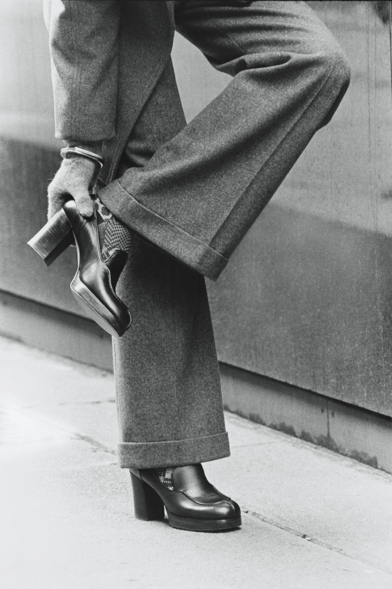 (原始链接: https://mmbiz.qpic.cn/mmbiz_png/OBQWTDeVLCNgjaZkVObdz4knXSrwdFVc7g05Vme7MTp6htd2mY0NEnI34CsVmA6nPPdRVdHadnxOrdicz7RxGUA/640?wx_fmt=png)
-  (原始链接: https://mmbiz.qpic.cn/mmbiz_jpg/OBQWTDeVLCPeUPb0lZ1l7IFGZRbCkDRnFVcaq1BR2RxoWgqgd8PGsZmb4LVdM4p5hic3ia6CBKwLObk7T5mP7WMQ/640?wx_fmt=jpeg)
- 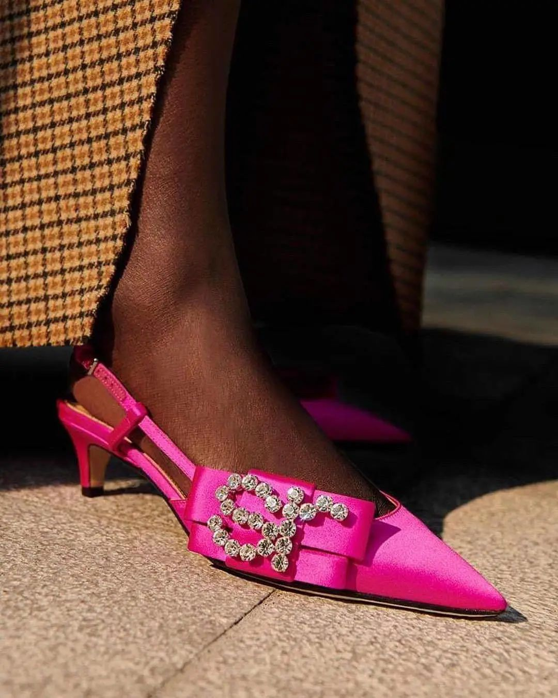 (原始链接: https://mmbiz.qpic.cn/mmbiz_jpg/OBQWTDeVLCOQOU01cJP8h8nXzjFA83GYLM5xKCPlNfjNh910LnCBVQU1pSEAfaHtc4nNkyBpU6Rl9oDusicCN0g/640?wx_fmt=jpeg)
- 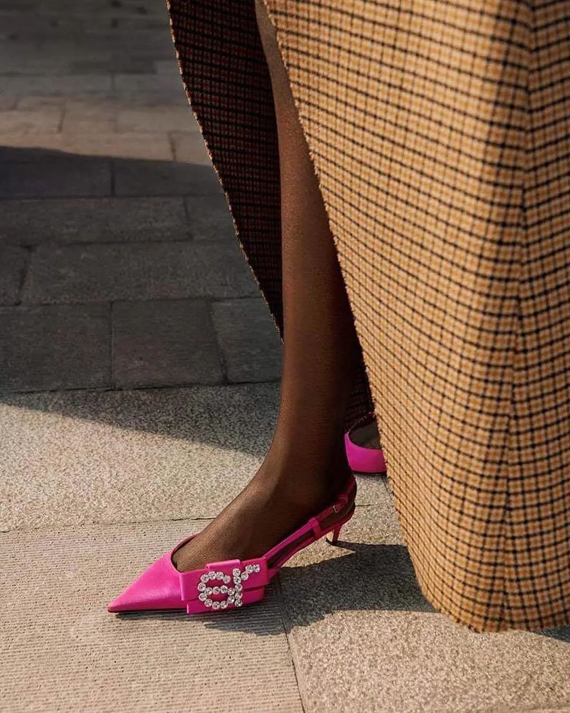 (原始链接: https://mmbiz.qpic.cn/mmbiz_jpg/OBQWTDeVLCOQOU01cJP8h8nXzjFA83GYjdZrDegqzetbD4x65ukjaVAeqEMtOcSAtYUu0N1XwgoFeFhox2DBfQ/640?wx_fmt=jpeg)
- 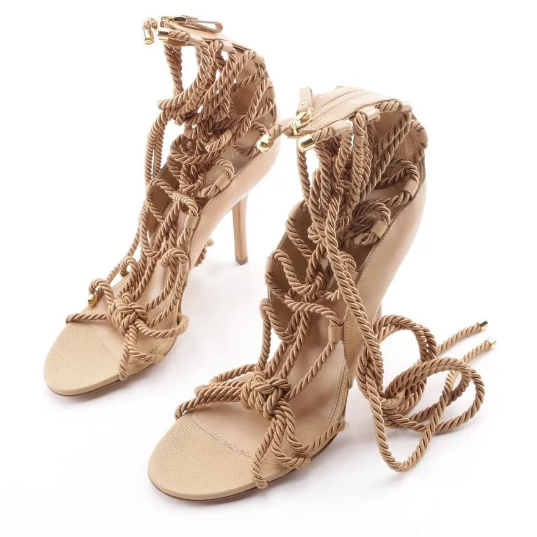 (原始链接: https://mmbiz.qpic.cn/mmbiz_jpg/OBQWTDeVLCOQOU01cJP8h8nXzjFA83GY7qarDQU4lWgrwa4zEFjSzX98jjJOHdtxtNjiaw3SW9Znkc1lLaxZX7g/640?wx_fmt=jpeg)
- 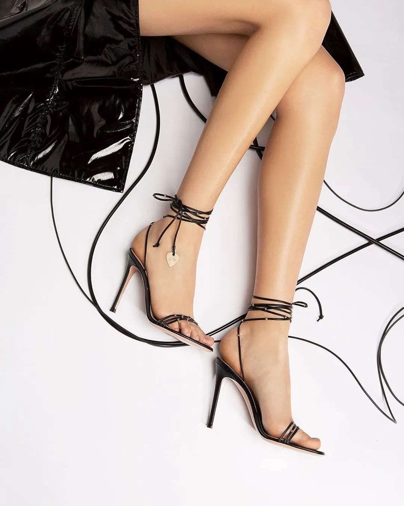 (原始链接: https://mmbiz.qpic.cn/mmbiz_jpg/OBQWTDeVLCOQOU01cJP8h8nXzjFA83GY4tjR2ftHMPic01VCKicXq61B6lZ16HhRlKqAS7VkY3EbtoCJJGmibMlQw/640?wx_fmt=jpeg)
- 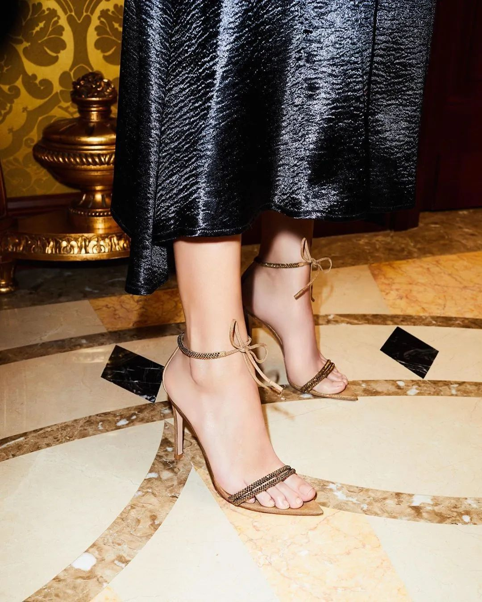 (原始链接: https://mmbiz.qpic.cn/mmbiz_jpg/OBQWTDeVLCOQOU01cJP8h8nXzjFA83GYdmEaCaRnhr9jukkEvj6HSGQofRo2RAia1KibogxbmACP97bBpIaSicO7A/640?wx_fmt=jpeg)
-  (原始链接: https://mmbiz.qpic.cn/mmbiz_jpg/OBQWTDeVLCPeUPb0lZ1l7IFGZRbCkDRnFVcaq1BR2RxoWgqgd8PGsZmb4LVdM4p5hic3ia6CBKwLObk7T5mP7WMQ/640?wx_fmt=jpeg)
- 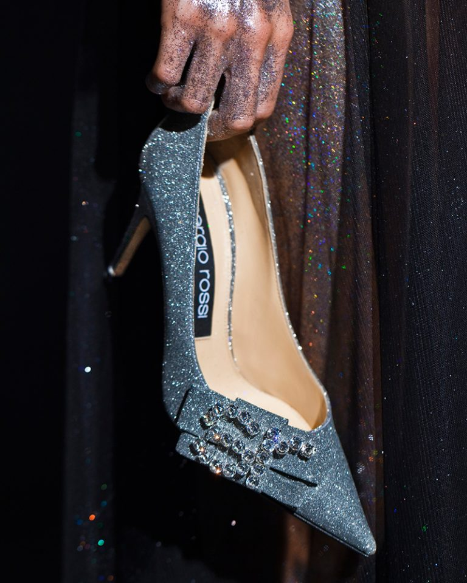 (原始链接: https://mmbiz.qpic.cn/mmbiz_png/OBQWTDeVLCOQOU01cJP8h8nXzjFA83GYiah0LpkBzNXib9ibFoL7vAa7orY4g8ZllJY8Ju6nnTPanCvZCh58t0Jeg/640?wx_fmt=png)
- 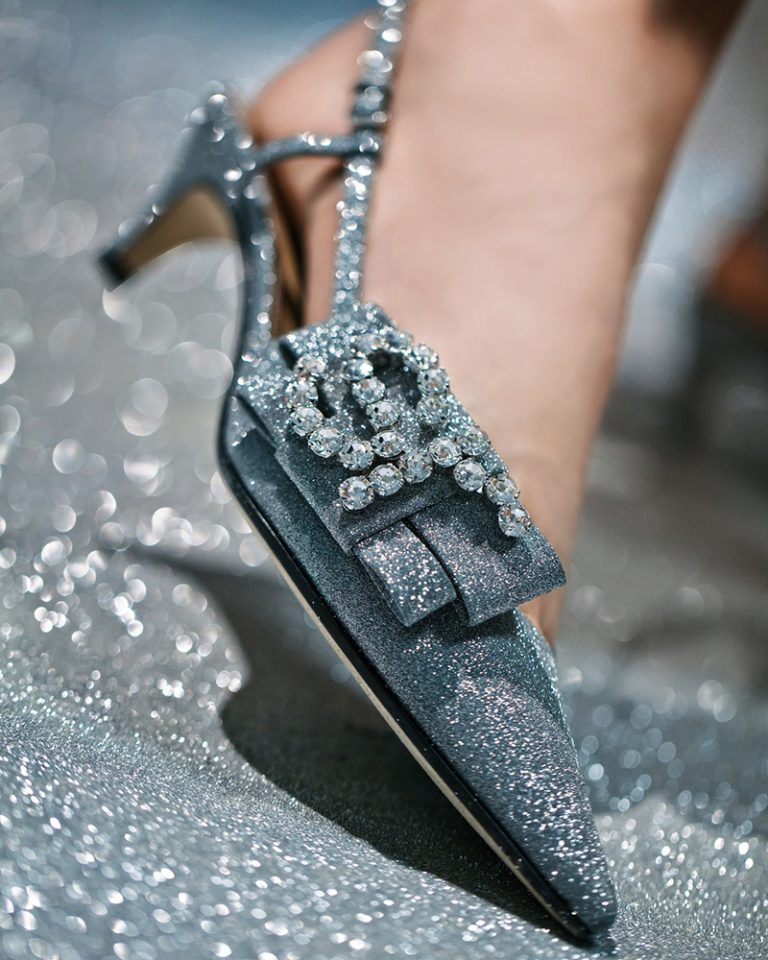 (原始链接: https://mmbiz.qpic.cn/mmbiz_png/OBQWTDeVLCOQOU01cJP8h8nXzjFA83GYvV74pxDkZdXGda5OPHm7icvVTic0BQ1KBNafNV6SkZ2VzBNxSHiaQwGZw/640?wx_fmt=png)
- 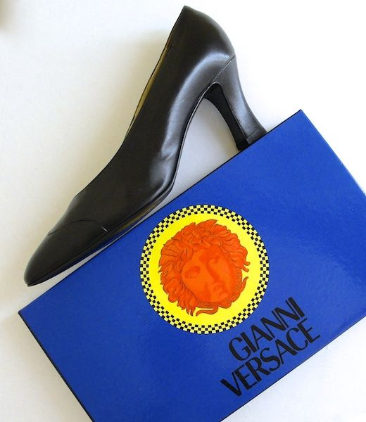 (原始链接: https://mmbiz.qpic.cn/mmbiz_png/OBQWTDeVLCNgjaZkVObdz4knXSrwdFVcDibmLYOJiavDgpXA9moshBkhfbIJMo6XzPpW0TjnRP8UgAXaaajUHzwQ/640?wx_fmt=png)
- 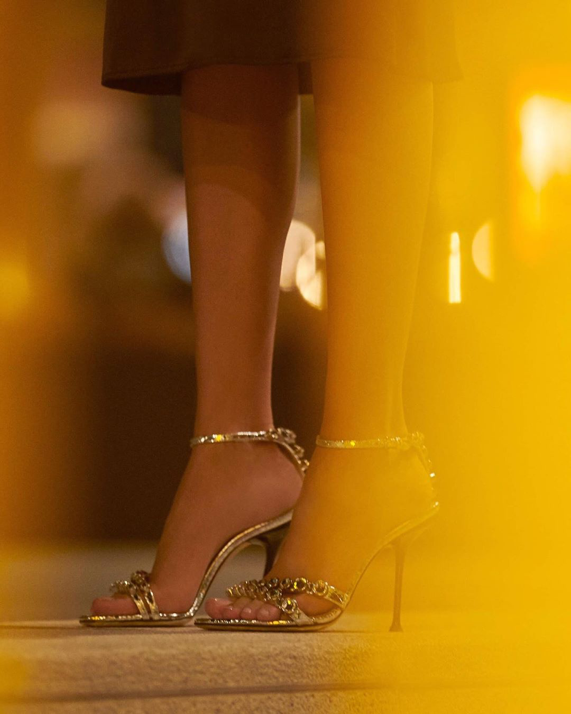 (原始链接: https://mmbiz.qpic.cn/mmbiz_png/OBQWTDeVLCNgjaZkVObdz4knXSrwdFVcx2iboCdqZAVicxexjhZc7doV2jSLyDM2vvowIYSBK7SpdBYqcaUNCTIQ/640?wx_fmt=png)
- 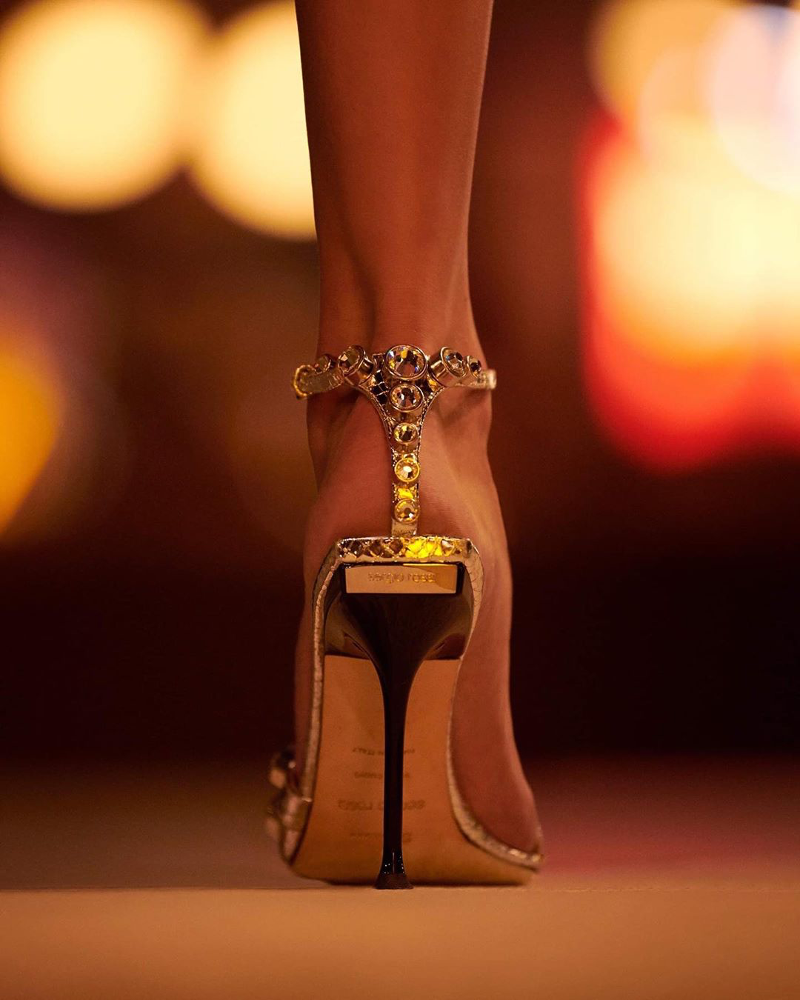 (原始链接: https://mmbiz.qpic.cn/mmbiz_png/OBQWTDeVLCNgjaZkVObdz4knXSrwdFVc7hE6lW7iaW4lmo6CIIATIkBicO8zocC0Smiale8EDUoQb5lQbyoQibpCicw/640?wx_fmt=png)
- 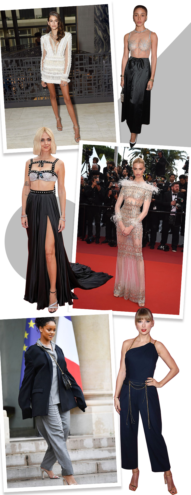 (原始链接: https://mmbiz.qpic.cn/mmbiz_png/OBQWTDeVLCOQOU01cJP8h8nXzjFA83GYBL76IibOCTkCwkSIhia8f9OaoIV5xMktM9qpzGRPwZT9mrnc2CYwPXSA/640?wx_fmt=png)
-  (原始链接: https://mmbiz.qpic.cn/mmbiz_jpg/OBQWTDeVLCPeUPb0lZ1l7IFGZRbCkDRnFVcaq1BR2RxoWgqgd8PGsZmb4LVdM4p5hic3ia6CBKwLObk7T5mP7WMQ/640?wx_fmt=jpeg)
- 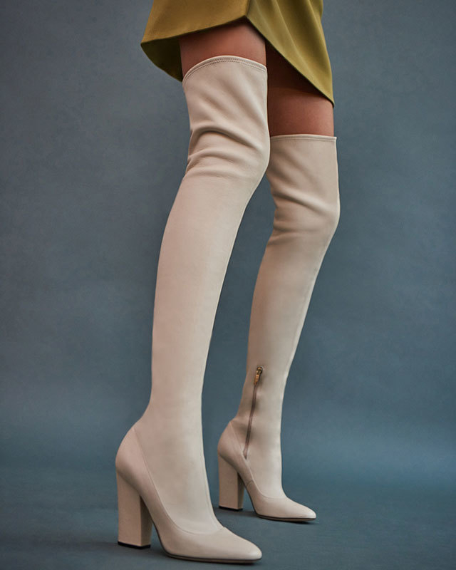 (原始链接: https://mmbiz.qpic.cn/mmbiz_png/OBQWTDeVLCNgjaZkVObdz4knXSrwdFVcechwTFDMnu7cYJiaDjOUhfib040wq47lZMcNmMSo8hLh52aJMXGrcpWw/640?wx_fmt=png)
- 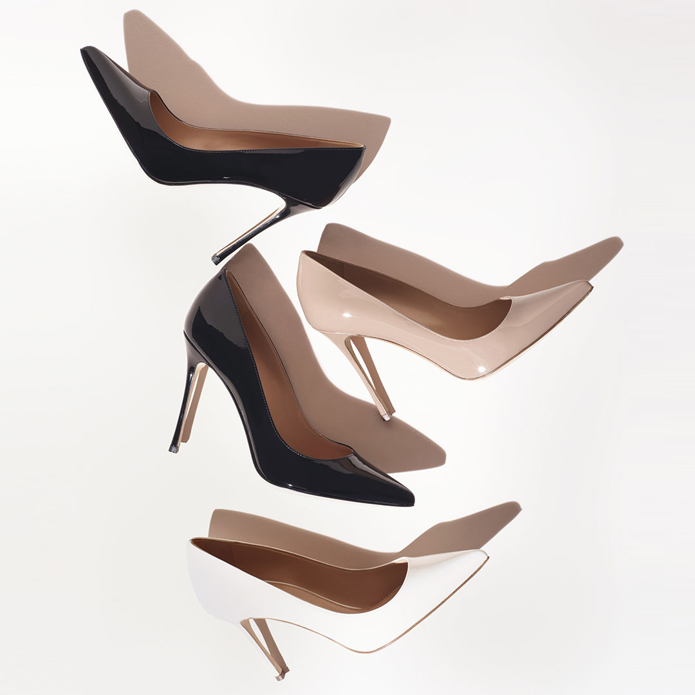 (原始链接: https://mmbiz.qpic.cn/mmbiz_png/OBQWTDeVLCNgjaZkVObdz4knXSrwdFVcfZjDibWX24N68xs1VW82hDFfahaavKAvz7ZZbibc11E9cpMYvibPadwwA/640?wx_fmt=png)
- 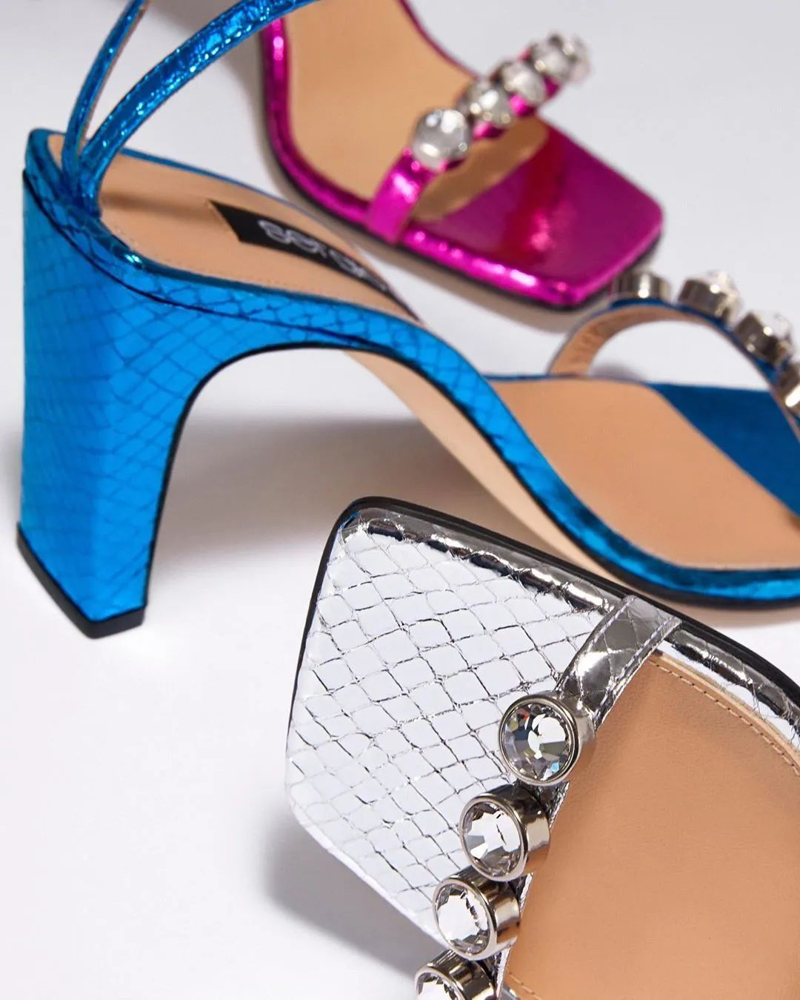 (原始链接: https://mmbiz.qpic.cn/mmbiz_jpg/OBQWTDeVLCOQOU01cJP8h8nXzjFA83GYkEW1F0aHQ3GMRiaKSiaLpicFAgw379jgI5L2TfJiaDbOGMHUubXKKiafFhw/640?wx_fmt=jpeg)
- 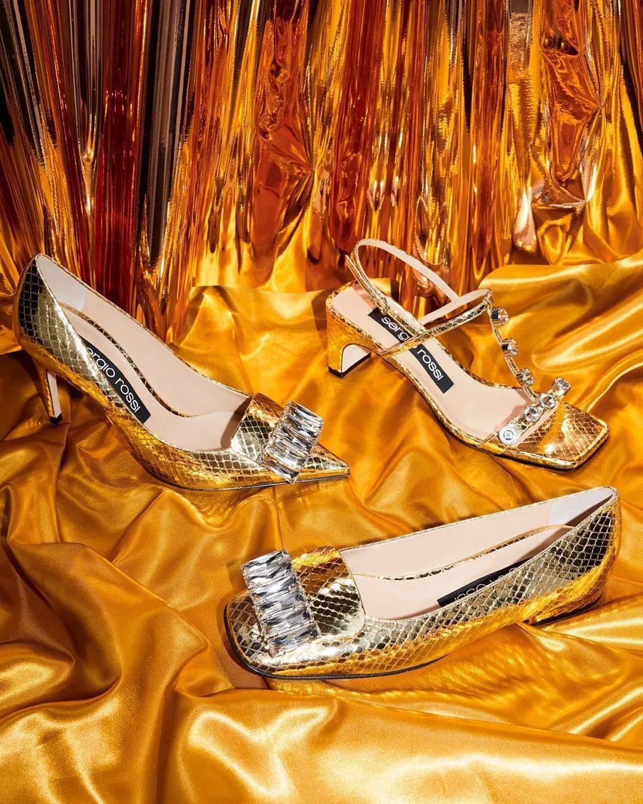 (原始链接: https://mmbiz.qpic.cn/mmbiz_jpg/OBQWTDeVLCOQOU01cJP8h8nXzjFA83GYARaBBC8WqN16S6DZZxRSIJH3hibuMs2POBLRhUDulujhQFLfkPmBAibQ/640?wx_fmt=jpeg)
- 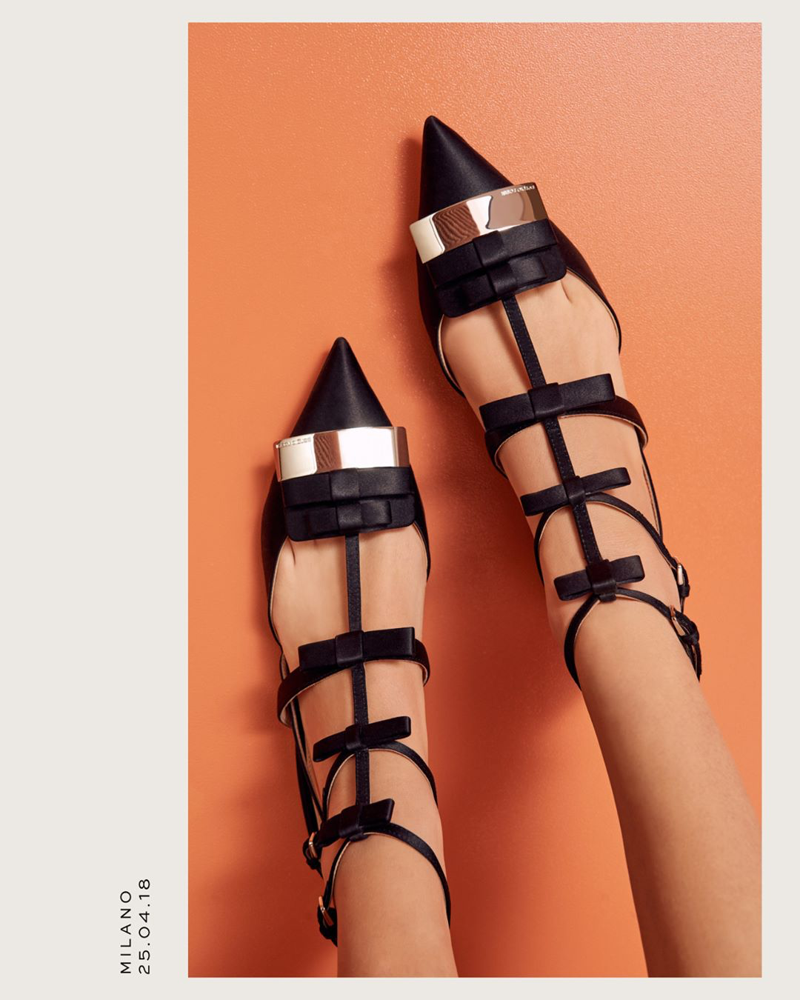 (原始链接: https://mmbiz.qpic.cn/mmbiz_png/OBQWTDeVLCNgjaZkVObdz4knXSrwdFVcS6maSGiaB57IV2ULS0pxGW1gwyRnZS1ZsaiaRiavibJPH6QQwD4jHqSKzA/640?wx_fmt=png)
- 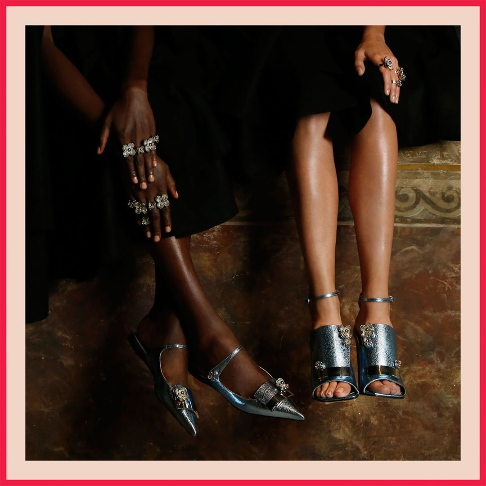 (原始链接: https://mmbiz.qpic.cn/mmbiz_png/OBQWTDeVLCNgjaZkVObdz4knXSrwdFVcZic28bJnodJqfwzvU7Lt1BOudEia3FVLtRS0k59dNKJNotavCiaXFZ9uw/640?wx_fmt=png)
- 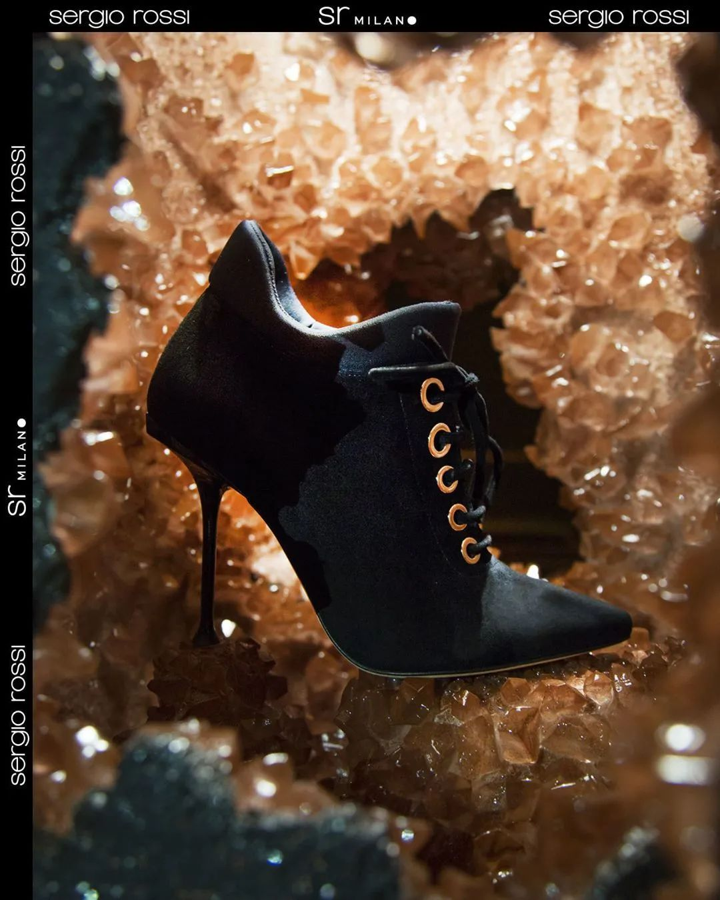 (原始链接: https://mmbiz.qpic.cn/mmbiz_jpg/OBQWTDeVLCOQOU01cJP8h8nXzjFA83GYjic3aDcuPcwx17DWm9WOibGHCFcHLPQQ82EibpQCvaYicWQtp5JkjQFNAg/640?wx_fmt=jpeg)
- 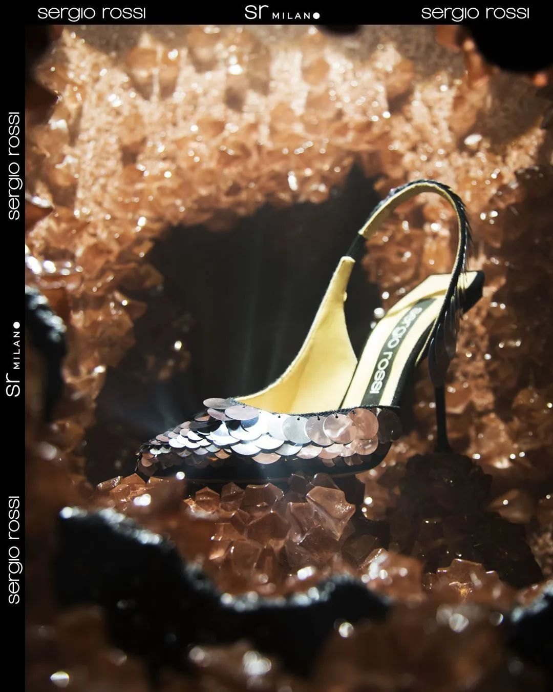 (原始链接: https://mmbiz.qpic.cn/mmbiz_jpg/OBQWTDeVLCOQOU01cJP8h8nXzjFA83GYMvWxNJZYl1PlNLdgT2Y4ZLQyrxMHBdibvH23O6CqnFhOQ14NbHUWWWg/640?wx_fmt=jpeg)
- 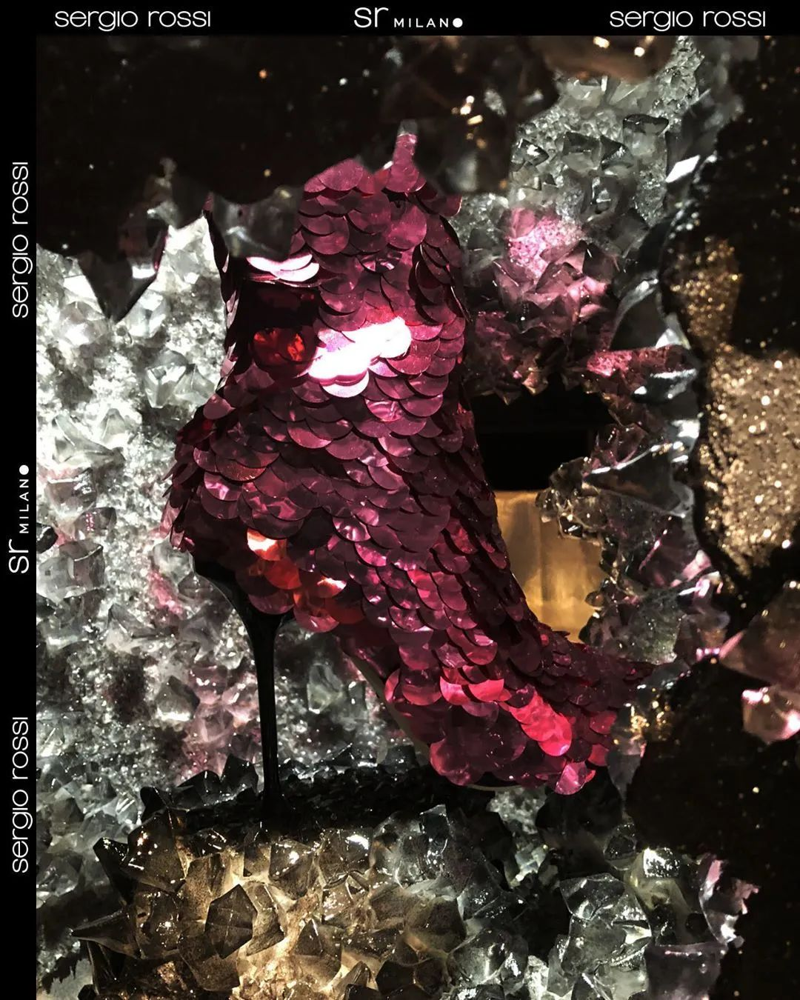 (原始链接: https://mmbiz.qpic.cn/mmbiz_jpg/OBQWTDeVLCOQOU01cJP8h8nXzjFA83GYukPia7n6OzH5qLBDmhnUjj19khTUeQdOCIL61e8QruiatVFoVBrhkU9w/640?wx_fmt=jpeg)
- 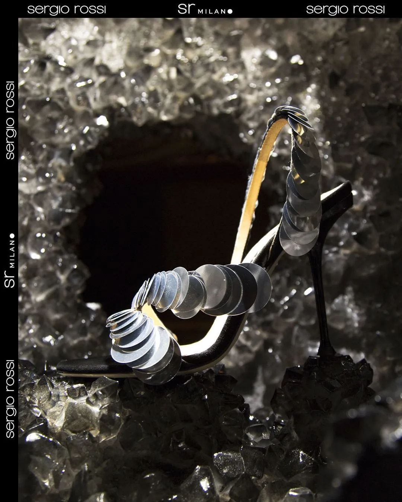 (原始链接: https://mmbiz.qpic.cn/mmbiz_jpg/OBQWTDeVLCOQOU01cJP8h8nXzjFA83GYpVoG6Gdn9Mvhbu4rqjYEiatcoSRmdvJ5diaF6K2AeeWRRYG8N2ic8IBrQ/640?wx_fmt=jpeg)
- 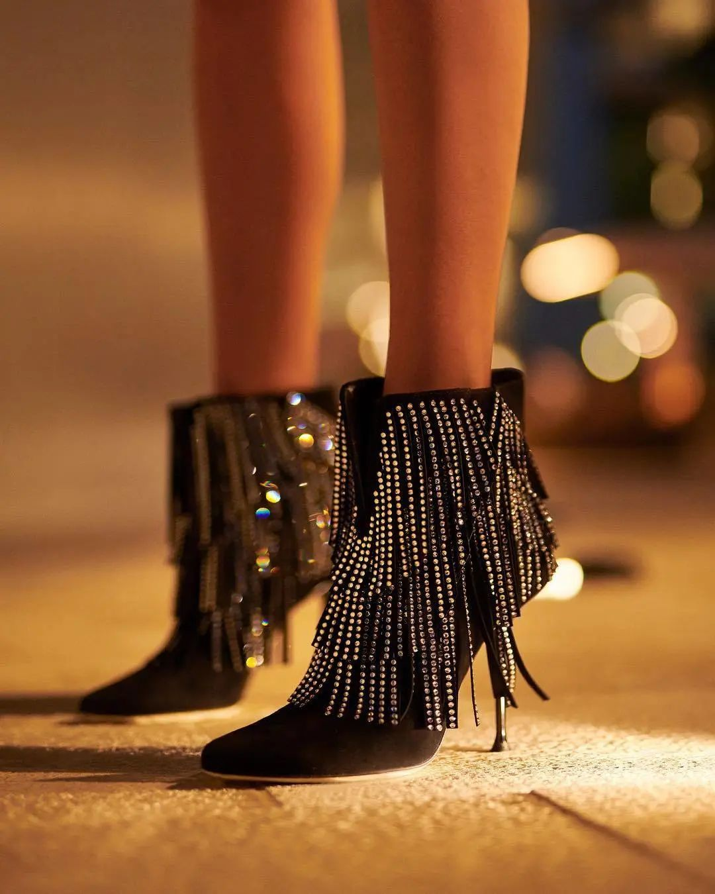 (原始链接: https://mmbiz.qpic.cn/mmbiz_jpg/OBQWTDeVLCOQOU01cJP8h8nXzjFA83GYE3BeAzEybv5uHOW00PblwEx18I6fo2OPsIjnumHib01ludGCudO4iazQ/640?wx_fmt=jpeg)
- 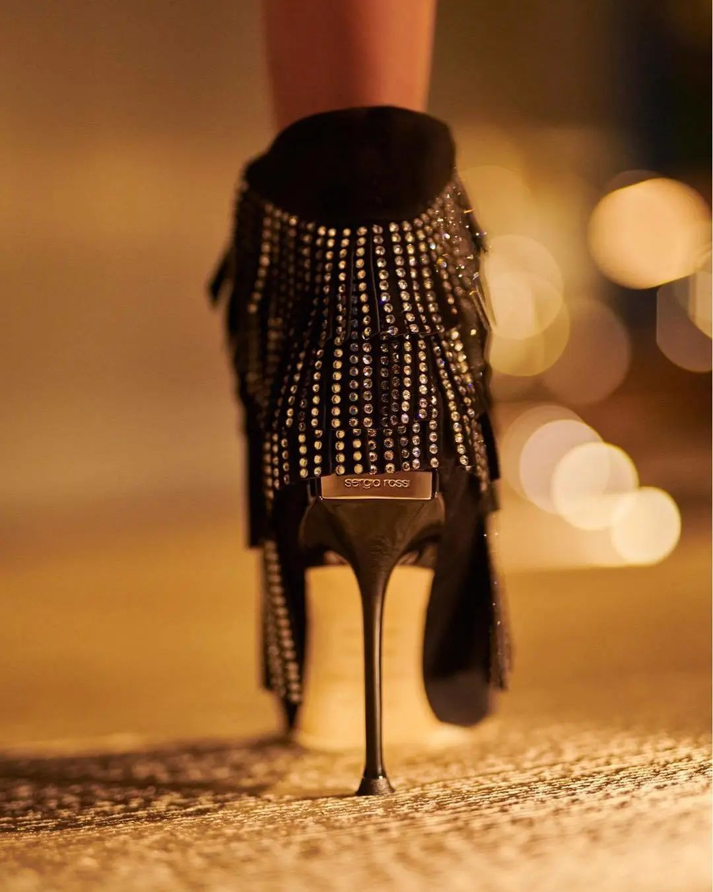 (原始链接: https://mmbiz.qpic.cn/mmbiz_jpg/OBQWTDeVLCOQOU01cJP8h8nXzjFA83GY00lib4eKYkzicNFn0PspLuJDGN0Kzfc5Ih7qKBLBDjunjrictUat9O7icA/640?wx_fmt=jpeg)
- 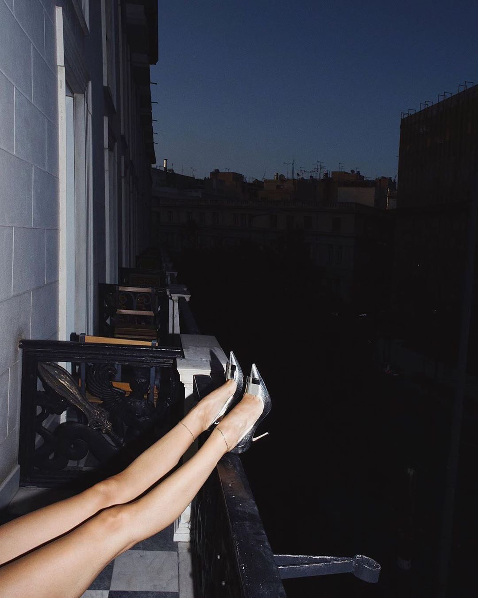 (原始链接: https://mmbiz.qpic.cn/mmbiz_png/OBQWTDeVLCNgjaZkVObdz4knXSrwdFVcGcOtHicicB9B6YOBR8d0GwfpNkLiaaU961Rskq9qKFPicdVUnUWic2V6P9A/640?wx_fmt=png)
- 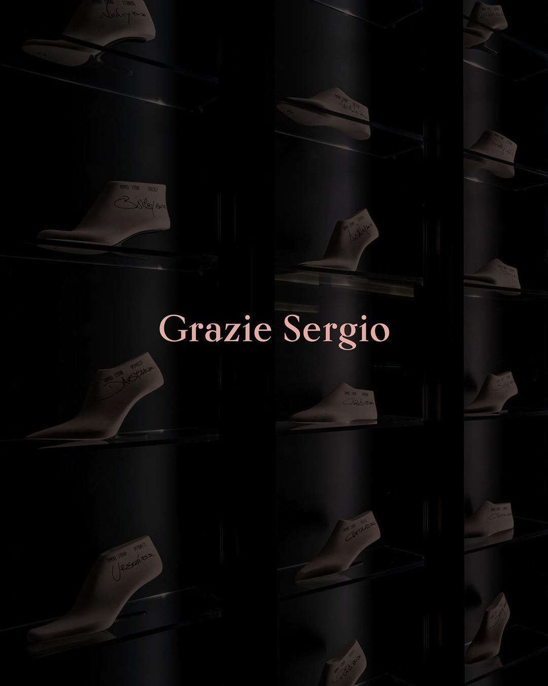 (原始链接: https://mmbiz.qpic.cn/mmbiz_png/OBQWTDeVLCNgjaZkVObdz4knXSrwdFVcFn0TPukxeAjyWJppCD1wPV0bBXzdibf858AyXIUibyLAjzEosACICEjw/640?wx_fmt=png)
-  (原始链接: https://mmbiz.qpic.cn/mmbiz_gif/OBQWTDeVLCPeUPb0lZ1l7IFGZRbCkDRnIB0cXECGaZKByI6kbDENJ6pXyztuoVN7e9sGCBjIdic9hKuFKerCBPA/640?wx_fmt=gif)
