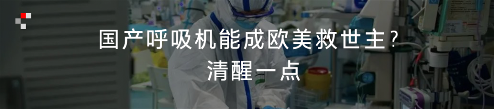

# 无标题

**链接地址:** http://mp.weixin.qq.com/s?__biz=MTQzMjE1NjQwMQ==&mid=2655569220&idx=2&sn=065bf430277aa45240900544478919f5&chksm=66df6ada51a8e3cc6a24bef57c9341269958a39f25b57591a67e6800630406d1b933c50a0c6d&mpshare=1&scene=2&srcid=&sharer_sharetime=1586703155009&sharer_shareid=be1c8edd6c93eec155a61c876e41d26a#rd
**作者:** 南七道
**获取时间:** 2025/8/28 20:15:10
**图片数量:** 5

---

## 原始HTML内容

 

本文来自微信公众号：我是南七道（ID：nanqidao33），作者：南七道，题图来自unsplash

 

最近一年之内，互联网界做工具类的软件公司发生了五件事。任何单独的一件事，只能说明一家公司的商业模式出现了变化，但连在一起看，就能看出工具软件行业，已经出现了转折性的变化。

 

第一件事，视频编辑类APP爱剪辑开始收费了。抖音快手带火了短视频，相应的剪辑工具也火起来了。但是在近期，有网友反馈，爱剪辑强制升级之后，要打赏9.9元红包才可以继续使用。因为一直都是免费的，突然收费，网友情绪反弹。有网友称，这可能是收费的试水。

 

第二件事，2020年2月20日，谷歌突然宣布，从Google Play商店中删除超过600个中国App，终止广告网络等所有合作。仅仅是猎豹移动，旗下就有45款应用被下架，涉及工具、游戏、直播业务。猎豹2014在美国纳斯达克上市，消息公布后，猎豹股价暴跌，目前已经是2美金左右，历史最低水平，比高点跌去94%。

 

第三件事，2019年11月底，曾经是电脑必备的免费工具暴风影音，官网和APP均停止运营，暴风集团创始人冯鑫被捕后，股价从最高123.82元跌到现在2元多，跌幅高达98%，现在公司只剩下一名员工，等待退市。

 

第四件事，美颜必备工具的美图秀秀刚发布2019年度财报，2019年，美图月活用户为2.82亿，同比下滑幅度达7.8%。2019年全年收入9.779亿元人民币，净亏损1.908亿元。股价从最高23.05，跌到现在1.51，跌幅接近95%。

 

第五件事，根据新华网2019年10月报道，证监会披露，用户超过6.5亿的天气工具软件墨迹天气，上市申请未通过。市场分析认为，这家公司首发未通过，关键是没有技术壁垒。

 

这五件事看起来没有任何关系，但实际上内核是高度关联的。他们的主业，全部都是做工具类软件的，而且是免费软件。他们的发展都遇到了麻烦。类似爱剪辑这样开始免费、中途收费，其实是一种很危险的游戏，很容易激起用户的逆反心理，从此粉转路，甚至粉转黑。

 

<em style="margin-top: 9px;margin-right: 10px;box-sizing: border-box;width: 12px;display: inline-block;background-repeat: no-repeat;vertical-align: top;background-size: 100% 100%;height: 8px;background-image: url(&quot;https://mmbiz.qpic.cn/mmbiz_png/b2YlTLuGbKCN8Y6kjpoibnkSc4FIQALetpNYwandpK6oTuYmk0gB1HeDkv0sKsibIssLt3nfAictSoqibTjSNgiccWg/640?wx_fmt=png&quot;);"></em>有限的免费，无限的收费<em style="margin-top: 8px;margin-left: 10px;box-sizing: border-box;width: 12px;display: inline-block;background-repeat: no-repeat;vertical-align: top;background-size: 100% 100%;height: 11px;background-image: url(&quot;https://mmbiz.qpic.cn/mmbiz_png/b2YlTLuGbKCN8Y6kjpoibnkSc4FIQALetJEcIIflVFEXNTQEicWTpUd9TwxM1JMC5yOpYOl8WJUwH6EXAvkHk3Tg/640?wx_fmt=png&quot;);"></em>

 

老美克里斯·安德森曾经写了一本关于互联网经济的书，名字叫《免费：商业的未来》，在他看来，免费是未来。他在书中说“新型的免费商业模式是一种建立在以电脑字节为基础上的经济学，而非过去建立在物理原子基础上的经济学。这是数字化时代一个独有特征，如果某样东西成了软件，那么它的成本和价格也会不可避免地趋于零。这种趋势正在催生一个巨量的新经济，这也是史无前例的。”360创始人周鸿祎因此对他大加赞赏，很认同他的观点。

 

按这个原理，免费的公司应该越做越大越强才是，但事实是，凡是推行免费的软件，整体发展情况都不太好，或者后续发展乏力。这是为什么呢？

 

美团创始人王兴特别推荐的一本书《有限与无限的游戏》，作者是詹姆斯·卡斯，纽约大学宗教历史系教授。詹姆斯的研究范围是机器、战争、时间、性、宗教、文学等这些与人类历史发展的关系，当然商业就是其中的一部分了。他说，“<strong style="box-sizing: border-box;">这世上至少有两种游戏。一种可称为有限游戏，另一种为无限游戏。有限游戏以取胜为目的，而无限游戏以延续游戏为目的。</strong>”

 

免费和收费软件分别属于哪种游戏呢？表面上看，免费是属于无限游戏，因为不要钱，可以没有限制的传播发展。而收费的软件，因为有费用门槛，所以传播受到限制，要延续很难。

 

事实恰恰相反。在中国互联网的发展史上，免费确实完成了中国网民的科普，推动了互联网的发展。但最后却证明，只有可持续的收费生态才能走得更远。

 

杀死免费的不是收费，却是免费自己。

 

在免费这本书里，作者说“免费也是一把双刃剑，它是最大化推广产品和服务的上佳手段，但如果这并非你的终极目标的话，那么就会产生反作用。”猎豹就是这句话极好的证明，一家公司的终极目标，不是义务的推自己的产品和服务，而是通过这种看起来免费的方式，获得自己公司的收益。

 

猎豹出事之前是中国出海项目中，数据最好的公司之一（注意，不是最成功）。这次被团灭，软件从谷歌被下架。主要原因是两个：一是触犯了欧美用户的隐私条款，另外一个就是因为猎豹是免费软件，它是靠着广告来生存的，这种模式在壮大后，直接触及到了Facebook、Google的底线，广告也是它们的生命线，Facebook 95%的收入都来自广告。

 

猎豹的游戏规则中，免费只是推广业务的手段，这不是目的，它的目的是盈利和赚钱。但是，它的免费注定了它要不断在广告上绞尽脑汁，想办法赚更多钱，因为要持续壮大，没有更佳的方式。收费是属于无限游戏。<strong style="box-sizing: border-box;">因为收费，公司和项目获得了正向激励，有更多精力来不断创新，给用户提供更多服务。更好的产品可以传播得更远，发展更好。</strong>

 

而免费的软件，虽然没有费用门槛，所以后续为了发展，只能强制加入广告等影响用户体验的收入项目，时间久了，传播反而受到限制，或者受到类似谷歌等大平台限制。要延续很难。任何的免费的东西，都会带来另一方面的高昂代价的付出。免费的软件，会影响用户的注意力，花费用户更多的时间，最终这种负面影响到公司发展。

 

我们来看看收费的成功模式：

 

<strong style="box-sizing: border-box;">微软</strong>：一开始诞生就是靠着office系列赚钱，后来搞云服务等，也是收费的，尽管刚经历了美股的各种暴跌暴涨，现在市值依然高达1.26万亿美金，是全球市值最高的互联网公司。

 

<strong style="box-sizing: border-box;">Zoom</strong>：一家中国人在美国创立的在线视频会议软件，一开始就是收费的，还不便宜，一年最少几千块RMB起。根据2020财年Q4财报显示，“期内营收1.883亿美元，同比增78%。”在疫情刺激下，它成了2020年美股最闪耀的股票之一，不管大盘怎么暴跌，它的股价依然是翻倍的增长。

 

<strong style="box-sizing: border-box;">万兴科技</strong>：付费软件出海标杆企业之一。万兴创立开始就是收费模式，已经在A股上市。用户在SaaS服务模式下，根据需要，选择不同的功能模块和使用时长。面向视频创作者的喵影工厂，其海外版Filmora在全球拥有1亿用户，遍及欧美及日本、东南亚。除此之外，旗下万兴PDF专家、万兴恢复专家等都是付费模式。

 

<em style="margin-top: 9px;margin-right: 10px;box-sizing: border-box;width: 12px;display: inline-block;background-repeat: no-repeat;vertical-align: top;background-size: 100% 100%;height: 8px;background-image: url(&quot;https://mmbiz.qpic.cn/mmbiz_png/b2YlTLuGbKCN8Y6kjpoibnkSc4FIQALetpNYwandpK6oTuYmk0gB1HeDkv0sKsibIssLt3nfAictSoqibTjSNgiccWg/640?wx_fmt=png&quot;);"></em>免费的，才是最贵的<em style="margin-top: 8px;margin-left: 10px;box-sizing: border-box;width: 12px;display: inline-block;background-repeat: no-repeat;vertical-align: top;background-size: 100% 100%;height: 11px;background-image: url(&quot;https://mmbiz.qpic.cn/mmbiz_png/b2YlTLuGbKCN8Y6kjpoibnkSc4FIQALetJEcIIflVFEXNTQEicWTpUd9TwxM1JMC5yOpYOl8WJUwH6EXAvkHk3Tg/640?wx_fmt=png&quot;);"></em>

 

为什么互联网收费是必然的大趋势？因为要持续发展，用户要有好的体验，商业模式不得不变。

 

一向推崇免费模式的周鸿祎，他创立的360在2020年开始推出了收费的企业版。互联网的广告模式在当下依然有效，但随着流量的分散，用户使用习惯改变，光靠广告已经很难再续昨日的荣光。通过收费才能保障企业正常的创新投入，实现可持续性发展。

 

互联网时代，免费与匮乏，收费与丰富，其实是高度关联的。<strong style="box-sizing: border-box;">在免费的大众的网络里，免费的东西遍地皆是，但用户的精力，用户的时间却是固定的，于是这些相对固定的东西，就变成了稀缺性的物品，变得更加珍贵。</strong>

 

在获取免费软件的过程中，因为软件的广告，因为需要各种分享、各种邀请好友加入来获得免费权限，<strong style="box-sizing: border-box;">我们大量的时间和精力因此被消耗，注意力从而变得匮乏</strong>。而收费的服务，除了有利于项目持续运转，关键是，可以让用户更集中注意力，其精力和时间成本也因此降低。

 

结合免费和收费的优点，于是出现了一类模式：一个软件，基础功能免费，但需要使用更高级功能时，就必须收费；或者是高级功能，可以免费使用数次，之后再进行收费。这就是现在最流行的模式：基础功能免费，但增值服务收费。这既符合互联网的开放政策，同时也有利于整个产业链的发展。通过免费进行用户体验和推广，通过收费获得更多收益，保持项目良性发展。这成了互联网项目方和用户的共识。

 

从这个角度上说，经济学里的“免费的事物，是最贵的。”这句话永不过时，在崇尚免费的互联网界，也依然有效。

 

本文来自微信公众号：我是南七道（ID：nanqidao33），作者：南七道

 本内容为作者独立观点，不代表虎嗅立场。 

 

End

 

<a target="_blank" href="https://mp.weixin.qq.com/s?__biz=MTQzMjE1NjQwMQ==&amp;mid=2655569132&amp;idx=1&amp;sn=2bc1d11235222ed02f0929337000cdf0&amp;chksm=66df6b7251a8e264204a04f4f608f7806be68d12631cd1c5dfc19656855bd6d19d787d62dcd5&amp;token=264876696&amp;lang=zh_CN&amp;scene=21#wechat_redirect" textvalue="你已选中了添加链接的内容" tab="innerlink" data-linktype="1"></a>

<a target="_blank" href="https://mp.weixin.qq.com/s?__biz=MTQzMjE1NjQwMQ==&amp;mid=2655569160&amp;idx=2&amp;sn=3c557ad76b2af90746af7aa1f036d301&amp;chksm=66df6a9651a8e380460ffd62e03ed53bf07636a320a8f42d9ba09b4777d499f43a170a92b026&amp;token=264876696&amp;lang=zh_CN&amp;scene=21#wechat_redirect" textvalue="你已选中了添加链接的内容" tab="innerlink" data-linktype="1"></a>

<a target="_blank" href="http://mp.weixin.qq.com/s?__biz=MTQzMjE1NjQwMQ==&amp;mid=2655569088&amp;idx=1&amp;sn=e2b6da8683f915eb33146b03c8e75eeb&amp;chksm=66df6b5e51a8e2486d0ab4b630f6d5b7f11f3ecbd52c8b95e55af7a7ed3041efead1ec2a6abb&amp;scene=21#wechat_redirect" textvalue="你已选中了添加链接的内容" data-itemshowtype="0" tab="innerlink" data-linktype="1"></a>

---

## 纯文本内容

本文来自微信公众号：我是南七道（ID：nanqidao33），作者：南七道，题图来自unsplash最近一年之内，互联网界做工具类的软件公司发生了五件事。任何单独的一件事，只能说明一家公司的商业模式出现了变化，但连在一起看，就能看出工具软件行业，已经出现了转折性的变化。第一件事，视频编辑类APP爱剪辑开始收费了。抖音快手带火了短视频，相应的剪辑工具也火起来了。但是在近期，有网友反馈，爱剪辑强制升级之后，要打赏9.9元红包才可以继续使用。因为一直都是免费的，突然收费，网友情绪反弹。有网友称，这可能是收费的试水。第二件事，2020年2月20日，谷歌突然宣布，从Google Play商店中删除超过600个中国App，终止广告网络等所有合作。仅仅是猎豹移动，旗下就有45款应用被下架，涉及工具、游戏、直播业务。猎豹2014在美国纳斯达克上市，消息公布后，猎豹股价暴跌，目前已经是2美金左右，历史最低水平，比高点跌去94%。第三件事，2019年11月底，曾经是电脑必备的免费工具暴风影音，官网和APP均停止运营，暴风集团创始人冯鑫被捕后，股价从最高123.82元跌到现在2元多，跌幅高达98%，现在公司只剩下一名员工，等待退市。第四件事，美颜必备工具的美图秀秀刚发布2019年度财报，2019年，美图月活用户为2.82亿，同比下滑幅度达7.8%。2019年全年收入9.779亿元人民币，净亏损1.908亿元。股价从最高23.05，跌到现在1.51，跌幅接近95%。第五件事，根据新华网2019年10月报道，证监会披露，用户超过6.5亿的天气工具软件墨迹天气，上市申请未通过。市场分析认为，这家公司首发未通过，关键是没有技术壁垒。这五件事看起来没有任何关系，但实际上内核是高度关联的。他们的主业，全部都是做工具类软件的，而且是免费软件。他们的发展都遇到了麻烦。类似爱剪辑这样开始免费、中途收费，其实是一种很危险的游戏，很容易激起用户的逆反心理，从此粉转路，甚至粉转黑。有限的免费，无限的收费老美克里斯·安德森曾经写了一本关于互联网经济的书，名字叫《免费：商业的未来》，在他看来，免费是未来。他在书中说“新型的免费商业模式是一种建立在以电脑字节为基础上的经济学，而非过去建立在物理原子基础上的经济学。这是数字化时代一个独有特征，如果某样东西成了软件，那么它的成本和价格也会不可避免地趋于零。这种趋势正在催生一个巨量的新经济，这也是史无前例的。”360创始人周鸿祎因此对他大加赞赏，很认同他的观点。按这个原理，免费的公司应该越做越大越强才是，但事实是，凡是推行免费的软件，整体发展情况都不太好，或者后续发展乏力。这是为什么呢？美团创始人王兴特别推荐的一本书《有限与无限的游戏》，作者是詹姆斯·卡斯，纽约大学宗教历史系教授。詹姆斯的研究范围是机器、战争、时间、性、宗教、文学等这些与人类历史发展的关系，当然商业就是其中的一部分了。他说，“这世上至少有两种游戏。一种可称为有限游戏，另一种为无限游戏。有限游戏以取胜为目的，而无限游戏以延续游戏为目的。”免费和收费软件分别属于哪种游戏呢？表面上看，免费是属于无限游戏，因为不要钱，可以没有限制的传播发展。而收费的软件，因为有费用门槛，所以传播受到限制，要延续很难。事实恰恰相反。在中国互联网的发展史上，免费确实完成了中国网民的科普，推动了互联网的发展。但最后却证明，只有可持续的收费生态才能走得更远。杀死免费的不是收费，却是免费自己。在免费这本书里，作者说“免费也是一把双刃剑，它是最大化推广产品和服务的上佳手段，但如果这并非你的终极目标的话，那么就会产生反作用。”猎豹就是这句话极好的证明，一家公司的终极目标，不是义务的推自己的产品和服务，而是通过这种看起来免费的方式，获得自己公司的收益。猎豹出事之前是中国出海项目中，数据最好的公司之一（注意，不是最成功）。这次被团灭，软件从谷歌被下架。主要原因是两个：一是触犯了欧美用户的隐私条款，另外一个就是因为猎豹是免费软件，它是靠着广告来生存的，这种模式在壮大后，直接触及到了Facebook、Google的底线，广告也是它们的生命线，Facebook 95%的收入都来自广告。猎豹的游戏规则中，免费只是推广业务的手段，这不是目的，它的目的是盈利和赚钱。但是，它的免费注定了它要不断在广告上绞尽脑汁，想办法赚更多钱，因为要持续壮大，没有更佳的方式。收费是属于无限游戏。因为收费，公司和项目获得了正向激励，有更多精力来不断创新，给用户提供更多服务。更好的产品可以传播得更远，发展更好。而免费的软件，虽然没有费用门槛，所以后续为了发展，只能强制加入广告等影响用户体验的收入项目，时间久了，传播反而受到限制，或者受到类似谷歌等大平台限制。要延续很难。任何的免费的东西，都会带来另一方面的高昂代价的付出。免费的软件，会影响用户的注意力，花费用户更多的时间，最终这种负面影响到公司发展。我们来看看收费的成功模式：微软：一开始诞生就是靠着office系列赚钱，后来搞云服务等，也是收费的，尽管刚经历了美股的各种暴跌暴涨，现在市值依然高达1.26万亿美金，是全球市值最高的互联网公司。Zoom：一家中国人在美国创立的在线视频会议软件，一开始就是收费的，还不便宜，一年最少几千块RMB起。根据2020财年Q4财报显示，“期内营收1.883亿美元，同比增78%。”在疫情刺激下，它成了2020年美股最闪耀的股票之一，不管大盘怎么暴跌，它的股价依然是翻倍的增长。万兴科技：付费软件出海标杆企业之一。万兴创立开始就是收费模式，已经在A股上市。用户在SaaS服务模式下，根据需要，选择不同的功能模块和使用时长。面向视频创作者的喵影工厂，其海外版Filmora在全球拥有1亿用户，遍及欧美及日本、东南亚。除此之外，旗下万兴PDF专家、万兴恢复专家等都是付费模式。免费的，才是最贵的为什么互联网收费是必然的大趋势？因为要持续发展，用户要有好的体验，商业模式不得不变。一向推崇免费模式的周鸿祎，他创立的360在2020年开始推出了收费的企业版。互联网的广告模式在当下依然有效，但随着流量的分散，用户使用习惯改变，光靠广告已经很难再续昨日的荣光。通过收费才能保障企业正常的创新投入，实现可持续性发展。互联网时代，免费与匮乏，收费与丰富，其实是高度关联的。在免费的大众的网络里，免费的东西遍地皆是，但用户的精力，用户的时间却是固定的，于是这些相对固定的东西，就变成了稀缺性的物品，变得更加珍贵。在获取免费软件的过程中，因为软件的广告，因为需要各种分享、各种邀请好友加入来获得免费权限，我们大量的时间和精力因此被消耗，注意力从而变得匮乏。而收费的服务，除了有利于项目持续运转，关键是，可以让用户更集中注意力，其精力和时间成本也因此降低。结合免费和收费的优点，于是出现了一类模式：一个软件，基础功能免费，但需要使用更高级功能时，就必须收费；或者是高级功能，可以免费使用数次，之后再进行收费。这就是现在最流行的模式：基础功能免费，但增值服务收费。这既符合互联网的开放政策，同时也有利于整个产业链的发展。通过免费进行用户体验和推广，通过收费获得更多收益，保持项目良性发展。这成了互联网项目方和用户的共识。从这个角度上说，经济学里的“免费的事物，是最贵的。”这句话永不过时，在崇尚免费的互联网界，也依然有效。本文来自微信公众号：我是南七道（ID：nanqidao33），作者：南七道本内容为作者独立观点，不代表虎嗅立场。End

---

## 图片列表

-  (原始链接: https://mmbiz.qpic.cn/mmbiz_jpg/b2YlTLuGbKCN8Y6kjpoibnkSc4FIQALetxna8kRqrKibW9OicfPNibeia4sJiatp3s4WXw62t6icHj4r1QetNJx9IfsJQ/640?wx_fmt=jpeg)
-  (原始链接: https://mmbiz.qpic.cn/mmbiz_jpg/b2YlTLuGbKAFGYGNVDW4rJljib3ttEF2kjtsD3ARkRRe2AfqxdW5UW32MLlKndhfmJqTPo3ITxYibHBsG07ARjLQ/640?wx_fmt=jpeg)
-  (原始链接: https://mmbiz.qpic.cn/mmbiz_jpg/b2YlTLuGbKAFGYGNVDW4rJljib3ttEF2ky1wKAUTIicE8seT3bO5w4GYk8c1qQb8tOssyFwwpzbZ54yQPVFeNYOQ/640?wx_fmt=jpeg)
-  (原始链接: https://mmbiz.qpic.cn/mmbiz_png/b2YlTLuGbKAq9HDQVQDg9tU38BD7QLxzdhGP7E4iaiatIRT4fQWCVCzBzbRZy1Tr7zibNMicNfuLxibne2tibgFxm1Ig/640?wx_fmt=png)
-  (原始链接: https://mmbiz.qpic.cn/mmbiz_png/b2YlTLuGbKBDhjlx07K2kF0LiaABYABbqWwHBSvV0b3MQyFwMTCk5h2WnRzib7xVTrXwfHzLAn6XYmPPYgy8jvyQ/640?wx_fmt=png)
