# 无标题

**链接地址:** http://mp.weixin.qq.com/s?__biz=MjM5MDEzNzY2NQ==&mid=2652777475&idx=6&sn=550839f54e2d5cfb2c6edead397811b7&chksm=bda3e02d8ad4693b2bfc9231d515e6d336d8324ef698caab55ecdfab2690f22b1303f354eaee&mpshare=1&scene=2&srcid=&sharer_sharetime=1586891836809&sharer_shareid=be1c8edd6c93eec155a61c876e41d26a#rd
**作者:** 妮娜
**获取时间:** 2025/8/28 20:14:15
**图片数量:** 14

---

## 原始HTML内容

 

 

 

 
<section style="box-sizing: border-box;font-size: 16px;"><section style="margin: 10px 0%;box-sizing: border-box;" powered-by="xiumi.us"><section style="font-size: 15px;letter-spacing: 0px;line-height: 2;padding-right: 15px;padding-left: 15px;box-sizing: border-box;"><section style="text-align: center;white-space: normal;box-sizing: border-box;line-height: 2em;">相信不少身处加拿大的朋友</section><section style="text-align: center;white-space: normal;box-sizing: border-box;line-height: 2em;">前些年在本地的商场逛街时</section><section style="text-align: center;white-space: normal;box-sizing: border-box;line-height: 2em;">都一定见过这家<strong style="box-sizing: border-box;">专卖牛仔服装制品的店铺</strong></section><section style="white-space: normal;box-sizing: border-box;line-height: 2em;"> </section></section></section><section style="text-align: center;margin-top: 10px;margin-bottom: 10px;box-sizing: border-box;line-height: 2em;"><section style="max-width: 100%;vertical-align: middle;display: inline-block;line-height: 0;box-sizing: border-box;"></section></section><section style="margin: 10px 0%;box-sizing: border-box;" powered-by="xiumi.us"><section style="font-size: 15px;letter-spacing: 0px;line-height: 2;padding-right: 15px;padding-left: 15px;box-sizing: border-box;"><section style="text-align: center;white-space: normal;box-sizing: border-box;line-height: 2em;"> </section><section style="text-align: center;white-space: normal;box-sizing: border-box;line-height: 2em;">纸醉金迷的<strong style="box-sizing: border-box;">欧美风设计</strong></section><section style="text-align: center;white-space: normal;box-sizing: border-box;line-height: 2em;">浮夸的图腾和blingbling的闪片</section><section style="text-align: center;white-space: normal;box-sizing: border-box;line-height: 2em;">以及这个印在屁兜上的巨大</section><section style="text-align: center;white-space: normal;box-sizing: border-box;line-height: 2em;"><strong style="box-sizing: border-box;">马蹄状LOGO</strong></section><section style="text-align: center;white-space: normal;box-sizing: border-box;line-height: 2em;">都是它标志性的代名词</section><section style="text-align: center;white-space: normal;box-sizing: border-box;line-height: 2em;"> </section></section></section><section style="text-align: center;margin-top: 10px;margin-bottom: 10px;box-sizing: border-box;line-height: 2em;"><section style="max-width: 100%;vertical-align: middle;display: inline-block;line-height: 0;width: 80%;height: auto;box-sizing: border-box;"></section></section><section style="margin: 10px 0%;box-sizing: border-box;" powered-by="xiumi.us"><section style="font-size: 15px;letter-spacing: 0px;line-height: 2;padding-right: 15px;padding-left: 15px;box-sizing: border-box;"><section style="text-align: center;white-space: normal;box-sizing: border-box;line-height: 2em;"> </section><section style="text-align: center;white-space: normal;box-sizing: border-box;line-height: 2em;">曾几何时</section><section style="text-align: center;white-space: normal;box-sizing: border-box;line-height: 2em;">这个火遍世界风靡全球，</section><section style="text-align: center;white-space: normal;box-sizing: border-box;line-height: 2em;"><strong style="box-sizing: border-box;">引领欧美流行时尚的时装品牌</strong></section><section style="text-align: center;white-space: normal;box-sizing: border-box;line-height: 2em;">其忠实拥簇不乏许多<strong style="box-sizing: border-box;">大牌明星</strong></section><section style="text-align: center;white-space: normal;box-sizing: border-box;line-height: 2em;"> </section></section></section><section style="text-align: center;margin-top: 10px;margin-bottom: 10px;box-sizing: border-box;line-height: 2em;"><section style="max-width: 100%;vertical-align: middle;display: inline-block;line-height: 0;box-sizing: border-box;"></section></section><section style="margin: 10px 0%;box-sizing: border-box;" powered-by="xiumi.us"><section style="font-size: 15px;letter-spacing: 0px;line-height: 2;padding-right: 15px;padding-left: 15px;box-sizing: border-box;"><section style="text-align: center;white-space: normal;box-sizing: border-box;line-height: 2em;"> </section><section style="text-align: center;white-space: normal;box-sizing: border-box;line-height: 2em;">查理兹·塞隆&nbsp;(Charlize Theron)、</section><section style="text-align: center;white-space: normal;box-sizing: border-box;line-height: 2em;">珍妮弗·洛佩兹&nbsp;(Jennifer Lopez)、</section><section style="text-align: center;white-space: normal;box-sizing: border-box;line-height: 2em;">和国际音乐时尚Icon 麦当娜&nbsp;(Madonna)&nbsp;</section><section style="text-align: center;white-space: normal;box-sizing: border-box;line-height: 2em;">都时常穿着该品牌的牛仔裤亮相</section><section style="text-align: center;white-space: normal;box-sizing: border-box;line-height: 2em;"> </section></section></section><section style="text-align: center;margin-top: 10px;margin-bottom: 10px;box-sizing: border-box;line-height: 2em;"><section style="max-width: 100%;vertical-align: middle;display: inline-block;line-height: 0;width: 60%;height: auto;box-sizing: border-box;"></section></section><section style="text-align: center;font-size: 12px;color: rgba(62, 62, 62, 0.37);box-sizing: border-box;" powered-by="xiumi.us"><section style="box-sizing: border-box;line-height: 2em;">穿着True Religion牛仔裤的Beyonce</section></section><section style="margin: 10px 0%;box-sizing: border-box;" powered-by="xiumi.us"><section style="font-size: 15px;letter-spacing: 0px;line-height: 2;padding-right: 15px;padding-left: 15px;box-sizing: border-box;"><section style="text-align: center;white-space: normal;box-sizing: border-box;line-height: 2em;"> </section><section style="text-align: center;white-space: normal;box-sizing: border-box;line-height: 2em;">巅峰时期，</section><section style="text-align: center;white-space: normal;box-sizing: border-box;line-height: 2em;">True Religion 在美国拥有 <strong style="box-sizing: border-box;">128家 专营店</strong>，</section><section style="text-align: center;white-space: normal;box-sizing: border-box;line-height: 2em;">并通过 Nordstrom，Bloomingdale 和 Saks Fifth Avenue 等<strong style="box-sizing: border-box;">500多家批发合作伙伴</strong>出售产品</section><section style="text-align: center;white-space: normal;box-sizing: border-box;line-height: 2em;"> </section></section></section><section style="text-align: center;margin-top: 10px;margin-bottom: 10px;box-sizing: border-box;line-height: 2em;"><section style="max-width: 100%;vertical-align: middle;display: inline-block;line-height: 0;box-sizing: border-box;"></section></section><section style="margin: 10px 0%;box-sizing: border-box;" powered-by="xiumi.us"><section style="font-size: 15px;letter-spacing: 0px;line-height: 2;padding-right: 15px;padding-left: 15px;box-sizing: border-box;"><section style="text-align: center;white-space: normal;box-sizing: border-box;line-height: 2em;"> </section><section style="text-align: center;white-space: normal;box-sizing: border-box;line-height: 2em;">然而就在这几年</section><section style="text-align: center;white-space: normal;box-sizing: border-box;line-height: 2em;">随着流行时尚风潮的转变</section><section style="text-align: center;white-space: normal;box-sizing: border-box;line-height: 2em;">和公司管理和定位出现的问题</section><section style="text-align: center;white-space: normal;box-sizing: border-box;line-height: 2em;"> </section><section style="text-align: center;white-space: normal;box-sizing: border-box;line-height: 2em;">这家曾经红极一时的时尚奢侈品品牌</section><section style="text-align: center;white-space: normal;box-sizing: border-box;line-height: 2em;"><strong style="box-sizing: border-box;">迅速flop到破产的边际</strong></section><section style="text-align: center;white-space: normal;box-sizing: border-box;line-height: 2em;"> </section></section></section>

<section style="margin: 10px 0%;box-sizing: border-box;" powered-by="xiumi.us"><section style="font-size: 15px;letter-spacing: 0px;line-height: 2;padding-right: 15px;padding-left: 15px;box-sizing: border-box;"><section style="text-align: center;white-space: normal;box-sizing: border-box;line-height: 2em;"> </section><section style="text-align: center;white-space: normal;box-sizing: border-box;line-height: 2em;">曾经动辄<strong style="box-sizing: border-box;">300+美金</strong>一条的牛仔裤</section><section style="text-align: center;white-space: normal;box-sizing: border-box;line-height: 2em;">如今放到许多二手交易网站</section><section style="text-align: center;white-space: normal;box-sizing: border-box;line-height: 2em;"><strong style="box-sizing: border-box;">低于两折的价格都难以出手</strong></section><section style="text-align: center;white-space: normal;box-sizing: border-box;line-height: 2em;"> </section><section style="white-space: normal;box-sizing: border-box;line-height: 2em;">根据《华丽志》报道，<strong style="box-sizing: border-box;">2017年7月</strong>，美国高端牛仔品牌&nbsp;True Religion Apparel Inc提交了<strong style="box-sizing: border-box;">破产保护申请</strong>，希望能削减债务，确保公司正常持续经营。</section><section style="white-space: normal;box-sizing: border-box;line-height: 2em;"></section></section></section><section style="margin: 10px 0%;box-sizing: border-box;" powered-by="xiumi.us"><section style="font-size: 15px;letter-spacing: 0px;line-height: 2;padding-right: 15px;padding-left: 15px;box-sizing: border-box;"><section style="white-space: normal;box-sizing: border-box;line-height: 2em;">不过True Religion于2017年9月份调整EBITDA（息税折旧和摊销前利润）为1360万美元，并较去年同期增长了46%。因此<strong style="box-sizing: border-box;">脱离破产保护</strong>，并将债务从 4.71亿美元减少至1.135亿美元，期限延长至 2022年。</section><section style="white-space: normal;box-sizing: border-box;line-height: 2em;"> </section><section style="white-space: normal;box-sizing: border-box;line-height: 2em;">然而好景不长，还没从电商冲击的势头中缓过劲来，该品牌又被新冠疫情<strong style="box-sizing: border-box;">按在地上一顿摩擦</strong>。</section><section style="white-space: normal;box-sizing: border-box;line-height: 2em;"> </section></section></section><section style="text-align: center;margin-top: 10px;margin-bottom: 10px;box-sizing: border-box;line-height: 2em;"><section style="max-width: 100%;vertical-align: middle;display: inline-block;line-height: 0;box-sizing: border-box;"></section></section><section style="margin: 10px 0%;box-sizing: border-box;" powered-by="xiumi.us"><section style="font-size: 15px;letter-spacing: 0px;line-height: 2;padding-right: 15px;padding-left: 15px;box-sizing: border-box;"><section style="white-space: normal;box-sizing: border-box;line-height: 2em;"> </section><section style="white-space: normal;box-sizing: border-box;line-height: 2em;">True Religion&nbsp;Apparel Inc. 于4月13日（周一）根据美国《宪法》第11章<strong style="box-sizing: border-box;">再次</strong><strong style="box-sizing: border-box;">申请破产保护</strong>，这是三年来<strong style="box-sizing: border-box;">第二次申请</strong>破产保护。</section><section style="white-space: normal;box-sizing: border-box;line-height: 2em;"> </section><section style="white-space: normal;box-sizing: border-box;line-height: 2em;">破产缘由令人<strong style="box-sizing: border-box;">毫不意外</strong>，但依然叹息：<strong style="box-sizing: border-box;">因为新冠疫情在美国的蔓延，其商店的被长期迫关闭而损害了其销售业务</strong>。</section><section style="white-space: normal;box-sizing: border-box;line-height: 2em;"> </section></section></section><section style="text-align: center;margin-top: 10px;margin-bottom: 10px;box-sizing: border-box;line-height: 2em;"><section style="max-width: 100%;vertical-align: middle;display: inline-block;line-height: 0;box-sizing: border-box;"></section></section><section style="margin: 10px 0%;box-sizing: border-box;" powered-by="xiumi.us"><section style="font-size: 15px;letter-spacing: 0px;line-height: 2;padding-right: 15px;padding-left: 15px;box-sizing: border-box;"><section style="white-space: normal;box-sizing: border-box;line-height: 2em;"> </section><section style="white-space: normal;box-sizing: border-box;line-height: 2em;">该公司首席执行官迈克尔·巴克利（Michael Buckley）在致美联社的声明中说，位于洛杉矶的True Religion品牌将<strong style="box-sizing: border-box;">继续经营其电子商务业务</strong>。不过以后客户将很有可能无法在实体店内购买到True Religion的产品。</section><section style="white-space: normal;box-sizing: border-box;line-height: 2em;"> </section><section style="white-space: normal;box-sizing: border-box;line-height: 2em;">True Religion 是受到新冠疫情而直接宣告进入破产保护程序的<strong style="box-sizing: border-box;">头几位欧美零售公司之一</strong>，不过要知道新冠疫情在北美的爆发不过一个月余的时间。</section><section style="white-space: normal;box-sizing: border-box;line-height: 2em;"> </section><section style="white-space: normal;box-sizing: border-box;line-height: 2em;">无关品牌定位，售价高低。现在的局势就是，<strong style="box-sizing: border-box;">整个欧美零售产业都经历着巨大且严峻的考验</strong>，而（快要）混不下去的公司远不止True Religion一个。 </section><section style="white-space: normal;box-sizing: border-box;line-height: 2em;"> </section>
 
</section></section><section style="text-align: center;margin-top: 10px;margin-bottom: 10px;box-sizing: border-box;line-height: 2em;"><section style="max-width: 100%;vertical-align: middle;display: inline-block;line-height: 0;box-sizing: border-box;"></section></section><section style="margin: 10px 0%;box-sizing: border-box;" powered-by="xiumi.us"><section style="font-size: 15px;letter-spacing: 0px;line-height: 2;padding-right: 15px;padding-left: 15px;box-sizing: border-box;">
 
<section style="white-space: normal;box-sizing: border-box;line-height: 2em;"><strong style="box-sizing: border-box;"> </strong></section><section style="white-space: normal;box-sizing: border-box;line-height: 2em;"><strong style="box-sizing: border-box;">Forever 21 </strong>这个伴随着不少人青春记忆的时尚快消品牌，也于去年申请了破产保护。<strong>加拿大店去年已经全部关了！</strong>然而今年随着新冠病毒爆发对市场需求缩减的加剧和政府法令的要求，这个总部成立于美国洛杉矶的服装连锁品牌，也于3月19日<strong style="box-sizing: border-box;">暂时关闭了美国所有店铺</strong>。</section>
 
<section style="white-space: normal;box-sizing: border-box;line-height: 2em;">坏消息接踵而至，很快该品牌进一步宣布，该公司在美国Roseville和Broadstone的两家门店会在四月内<strong style="box-sizing: border-box;">彻底关闭</strong>。</section>
 
</section></section><section style="text-align: center;margin-top: 10px;margin-bottom: 10px;box-sizing: border-box;line-height: 2em;"><section style="max-width: 100%;vertical-align: middle;display: inline-block;line-height: 0;box-sizing: border-box;"></section></section><section style="margin: 10px 0%;box-sizing: border-box;" powered-by="xiumi.us"><section style="font-size: 15px;letter-spacing: 0px;line-height: 2;padding-right: 15px;padding-left: 15px;box-sizing: border-box;">
 
<section style="white-space: normal;box-sizing: border-box;line-height: 2em;"> </section><section style="white-space: normal;box-sizing: border-box;line-height: 2em;">而美国的奢侈品销售巨头<strong style="box-sizing: border-box;">Neiman Marcus</strong>也难逃一劫，直接被内部财务评估人员唱衰，说可能会是<strong style="box-sizing: border-box;">在新冠疫情影响下第一个抗不过去的零售商之一</strong>。</section><section style="white-space: normal;box-sizing: border-box;line-height: 2em;"> </section><section style="white-space: normal;box-sizing: border-box;line-height: 2em;">新冠疫情的影响还在持续，而因疫情产生的次生危害而<strong style="box-sizing: border-box;">不得不面临破产清算的公司还在不断增加</strong>。</section><section style="white-space: normal;box-sizing: border-box;line-height: 2em;"> </section></section></section><section style="text-align: center;margin-top: 10px;margin-bottom: 10px;box-sizing: border-box;line-height: 2em;"><section style="max-width: 100%;vertical-align: middle;display: inline-block;line-height: 0;box-sizing: border-box;"></section></section><section style="text-align: center;font-size: 12px;color: rgba(62, 62, 62, 0.37);box-sizing: border-box;" powered-by="xiumi.us"><section style="box-sizing: border-box;line-height: 2em;">曾经生意红火的plaza，如今人去楼空。</section></section><section style="margin: 10px 0%;box-sizing: border-box;" powered-by="xiumi.us"><section style="font-size: 15px;letter-spacing: 0px;line-height: 2;padding-right: 15px;padding-left: 15px;box-sizing: border-box;"><section style="white-space: normal;box-sizing: border-box;line-height: 2em;"> </section><section style="white-space: normal;box-sizing: border-box;line-height: 2em;">纵使不少销售商在几年前就已经转换了战略计划，将发展重心放在了<strong style="box-sizing: border-box;">电商行业</strong>，但也<strong style="box-sizing: border-box;">顶不住新冠时期国民收入缩水而造成的消费意愿下跌</strong>。</section><section style="white-space: normal;box-sizing: border-box;line-height: 2em;"> </section><section style="white-space: normal;box-sizing: border-box;line-height: 2em;"><strong style="box-sizing: border-box;">而更可怕的是，这样的危害，可能在新冠疫情过去以后，也久久难以反弹平息。</strong></section><section style="white-space: normal;box-sizing: border-box;line-height: 2em;"> </section></section></section><section style="text-align: center;margin-top: 10px;margin-bottom: 10px;box-sizing: border-box;line-height: 2em;"><section style="max-width: 100%;vertical-align: middle;display: inline-block;line-height: 0;box-sizing: border-box;"></section></section><section style="margin: 10px 0%;box-sizing: border-box;" powered-by="xiumi.us"><section style="font-size: 15px;letter-spacing: 0px;line-height: 2;padding-right: 15px;padding-left: 15px;box-sizing: border-box;"><section style="white-space: normal;box-sizing: border-box;line-height: 2em;"> </section><section style="text-align: center;white-space: normal;box-sizing: border-box;line-height: 2em;">可还记得&nbsp;<strong style="box-sizing: border-box;">Juicy Couture&nbsp;</strong>那人手一件的天鹅绒卫衣？</section><section style="text-align: center;white-space: normal;box-sizing: border-box;line-height: 2em;">还有 <strong style="box-sizing: border-box;">Marc Jacobs</strong> 标志性的丑娃周边产品？</section><section style="white-space: normal;box-sizing: border-box;line-height: 2em;"><strong style="box-sizing: border-box;"> </strong></section><section style="white-space: normal;box-sizing: border-box;line-height: 2em;"><strong style="box-sizing: border-box;">超级君每每写到这样的新闻也十分难过。一个个陪伴着自己长大的品牌，如今都变成了“世代的眼泪”。</strong></section><section style="white-space: normal;box-sizing: border-box;line-height: 2em;"> </section><section style="white-space: normal;box-sizing: border-box;line-height: 2em;">前几年因为电商的刺激而接连倒下；如今苟延残喘的寥寥无几，却又在新冠疫情的冲击下渐渐熄灭着最后的光芒。</section><section style="white-space: normal;box-sizing: border-box;line-height: 2em;"> </section></section></section><section style="text-align: center;margin-top: 10px;margin-bottom: 10px;box-sizing: border-box;line-height: 2em;"><section style="max-width: 100%;vertical-align: middle;display: inline-block;line-height: 0;box-sizing: border-box;"></section></section><section style="margin: 10px 0%;box-sizing: border-box;" powered-by="xiumi.us"><section style="font-size: 15px;letter-spacing: 0px;line-height: 2;padding-right: 15px;padding-left: 15px;box-sizing: border-box;"><section style="white-space: normal;box-sizing: border-box;line-height: 2em;"> </section><section style="text-align: center;white-space: normal;box-sizing: border-box;line-height: 2em;">时尚潮流来得快，去得也快。</section><section style="text-align: center;white-space: normal;box-sizing: border-box;line-height: 2em;">且买且珍惜，十年后，可能都是绝版商品。</section>
 
<section style="text-align: center;white-space: normal;box-sizing: border-box;line-height: 2em;">但这“绝版”的背后的</section><section style="text-align: center;white-space: normal;box-sizing: border-box;line-height: 2em;">都是一个个曾经辉煌的商业帝国</section><section style="text-align: center;white-space: normal;box-sizing: border-box;line-height: 2em;">轰然垮塌时那一声</section><section style="text-align: center;white-space: normal;box-sizing: border-box;line-height: 2em;"><strong style="box-sizing: border-box;">悄无声息的叹息...</strong></section><section style="text-align: center;white-space: normal;box-sizing: border-box;line-height: 2em;"> </section></section></section><section style="margin: 10px 0%;box-sizing: border-box;" powered-by="xiumi.us"><section style="font-size: 15px;letter-spacing: 0px;line-height: 2;padding-right: 15px;padding-left: 15px;box-sizing: border-box;"><section style="white-space: normal;box-sizing: border-box;line-height: 2em;">文章信息来源：</section><section style="white-space: normal;box-sizing: border-box;line-height: 2em;">https://globalnews.ca/news/6813041/coronavirus-true-religion-jeans-bankruptcy/</section><section style="white-space: normal;box-sizing: border-box;line-height: 2em;"> </section><section style="margin-right: 8px;margin-left: 8px;white-space: normal;max-width: 100%;box-sizing: border-box;font-family: -apple-system-font, BlinkMacSystemFont, &quot;Helvetica Neue&quot;, &quot;PingFang SC&quot;, &quot;Hiragino Sans GB&quot;, &quot;Microsoft YaHei UI&quot;, &quot;Microsoft YaHei&quot;, Arial, sans-serif;letter-spacing: 0.544px;background-color: rgb(255, 255, 255);text-size-adjust: auto;min-height: 1em;color: rgb(0, 0, 0);font-size: 16px;text-align: center;line-height: 2em;overflow-wrap: break-word !important;">+++全加拿大华人都在关注超级生活，就差你了+++</section><section style="margin-right: 8px;margin-left: 8px;white-space: normal;max-width: 100%;box-sizing: border-box;font-family: -apple-system-font, BlinkMacSystemFont, &quot;Helvetica Neue&quot;, &quot;PingFang SC&quot;, &quot;Hiragino Sans GB&quot;, &quot;Microsoft YaHei UI&quot;, &quot;Microsoft YaHei&quot;, Arial, sans-serif;letter-spacing: 0.544px;background-color: rgb(255, 255, 255);text-size-adjust: auto;min-height: 1em;color: rgb(0, 0, 0);font-size: 16px;text-align: center;line-height: 2em;overflow-wrap: break-word !important;"></section><section style="margin-right: 8px;margin-left: 8px;white-space: normal;max-width: 100%;font-family: -apple-system-font, BlinkMacSystemFont, &quot;Helvetica Neue&quot;, &quot;PingFang SC&quot;, &quot;Hiragino Sans GB&quot;, &quot;Microsoft YaHei UI&quot;, &quot;Microsoft YaHei&quot;, Arial, sans-serif;letter-spacing: 0.544px;background-color: rgb(255, 255, 255);caret-color: rgb(51, 51, 51);text-size-adjust: auto;min-height: 1em;text-align: right;line-height: 2em;box-sizing: border-box !important;overflow-wrap: break-word !important;"><strong style="max-width: 100%;letter-spacing: 0.544px;box-sizing: border-box !important;overflow-wrap: break-word !important;">喜欢点个“在看” ↓↓</strong></section><section style="white-space: normal;box-sizing: border-box;line-height: 2em;">  </section></section></section></section>

---

## 纯文本内容

相信不少身处加拿大的朋友前些年在本地的商场逛街时都一定见过这家专卖牛仔服装制品的店铺纸醉金迷的欧美风设计浮夸的图腾和blingbling的闪片以及这个印在屁兜上的巨大马蹄状LOGO都是它标志性的代名词曾几何时这个火遍世界风靡全球，引领欧美流行时尚的时装品牌其忠实拥簇不乏许多大牌明星查理兹·塞隆 (Charlize Theron)、珍妮弗·洛佩兹 (Jennifer Lopez)、和国际音乐时尚Icon 麦当娜 (Madonna) 都时常穿着该品牌的牛仔裤亮相穿着True Religion牛仔裤的Beyonce巅峰时期，True Religion 在美国拥有 128家 专营店，并通过 Nordstrom，Bloomingdale 和 Saks Fifth Avenue 等500多家批发合作伙伴出售产品然而就在这几年随着流行时尚风潮的转变和公司管理和定位出现的问题这家曾经红极一时的时尚奢侈品品牌迅速flop到破产的边际曾经动辄300+美金一条的牛仔裤如今放到许多二手交易网站低于两折的价格都难以出手根据《华丽志》报道，2017年7月，美国高端牛仔品牌 True Religion Apparel Inc提交了破产保护申请，希望能削减债务，确保公司正常持续经营。不过True Religion于2017年9月份调整EBITDA（息税折旧和摊销前利润）为1360万美元，并较去年同期增长了46%。因此脱离破产保护，并将债务从 4.71亿美元减少至1.135亿美元，期限延长至 2022年。然而好景不长，还没从电商冲击的势头中缓过劲来，该品牌又被新冠疫情按在地上一顿摩擦。True Religion Apparel Inc. 于4月13日（周一）根据美国《宪法》第11章再次申请破产保护，这是三年来第二次申请破产保护。破产缘由令人毫不意外，但依然叹息：因为新冠疫情在美国的蔓延，其商店的被长期迫关闭而损害了其销售业务。该公司首席执行官迈克尔·巴克利（Michael Buckley）在致美联社的声明中说，位于洛杉矶的True Religion品牌将继续经营其电子商务业务。不过以后客户将很有可能无法在实体店内购买到True Religion的产品。True Religion 是受到新冠疫情而直接宣告进入破产保护程序的头几位欧美零售公司之一，不过要知道新冠疫情在北美的爆发不过一个月余的时间。无关品牌定位，售价高低。现在的局势就是，整个欧美零售产业都经历着巨大且严峻的考验，而（快要）混不下去的公司远不止True Religion一个。Forever 21 这个伴随着不少人青春记忆的时尚快消品牌，也于去年申请了破产保护。加拿大店去年已经全部关了！然而今年随着新冠病毒爆发对市场需求缩减的加剧和政府法令的要求，这个总部成立于美国洛杉矶的服装连锁品牌，也于3月19日暂时关闭了美国所有店铺。坏消息接踵而至，很快该品牌进一步宣布，该公司在美国Roseville和Broadstone的两家门店会在四月内彻底关闭。而美国的奢侈品销售巨头Neiman Marcus也难逃一劫，直接被内部财务评估人员唱衰，说可能会是在新冠疫情影响下第一个抗不过去的零售商之一。新冠疫情的影响还在持续，而因疫情产生的次生危害而不得不面临破产清算的公司还在不断增加。曾经生意红火的plaza，如今人去楼空。纵使不少销售商在几年前就已经转换了战略计划，将发展重心放在了电商行业，但也顶不住新冠时期国民收入缩水而造成的消费意愿下跌。而更可怕的是，这样的危害，可能在新冠疫情过去以后，也久久难以反弹平息。可还记得 Juicy Couture 那人手一件的天鹅绒卫衣？还有 Marc Jacobs 标志性的丑娃周边产品？超级君每每写到这样的新闻也十分难过。一个个陪伴着自己长大的品牌，如今都变成了“世代的眼泪”。前几年因为电商的刺激而接连倒下；如今苟延残喘的寥寥无几，却又在新冠疫情的冲击下渐渐熄灭着最后的光芒。时尚潮流来得快，去得也快。且买且珍惜，十年后，可能都是绝版商品。但这“绝版”的背后的都是一个个曾经辉煌的商业帝国轰然垮塌时那一声悄无声息的叹息...文章信息来源：https://globalnews.ca/news/6813041/coronavirus-true-religion-jeans-bankruptcy/+++全加拿大华人都在关注超级生活，就差你了+++喜欢点个“在看” ↓↓

---

## 图片列表

- 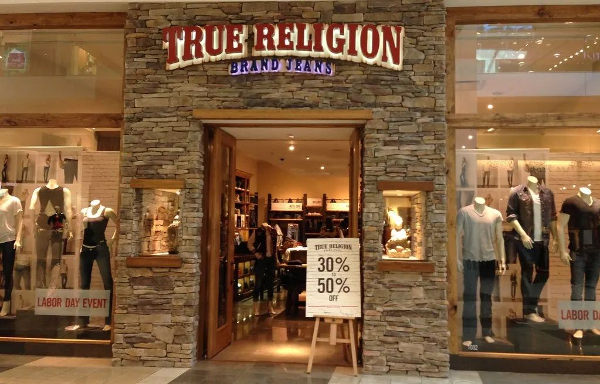 (原始链接: https://mmbiz.qpic.cn/mmbiz_jpg/szJas1pFaJdsWGrPgwWBKSlvlT6U0f1icGdJKBSVUa1B4KQzPbPqZdohmXuG84RbFbN66Npm5nUFyDcdUiaHqM6Q/640?wx_fmt=jpeg)
- 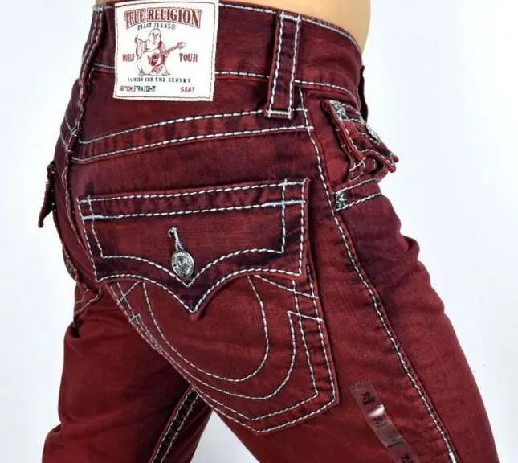 (原始链接: https://mmbiz.qpic.cn/mmbiz_jpg/szJas1pFaJdsWGrPgwWBKSlvlT6U0f1icIqL9uDLfktcwgyuCawjHK9qNoGiaWFAl6k1C3Fs9jRNyWfjbQyxE3kw/640?wx_fmt=jpeg)
- 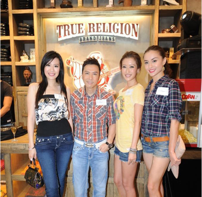 (原始链接: https://mmbiz.qpic.cn/mmbiz_png/szJas1pFaJdsWGrPgwWBKSlvlT6U0f1icHicMGicvCsyicft0xTFz8ibpOtxWVVG0FiaPlW4z2f57wAUMnHNUGpMruYg/640?wx_fmt=png)
- 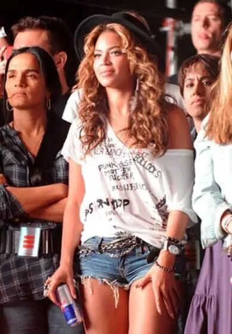 (原始链接: https://mmbiz.qpic.cn/mmbiz_jpg/szJas1pFaJdsWGrPgwWBKSlvlT6U0f1icfBxkK9eskl1ygTkgT2PUQyFzNfe9hSpjwscAcRVvqPb7Aiatm28iaFmA/640?wx_fmt=jpeg)
- 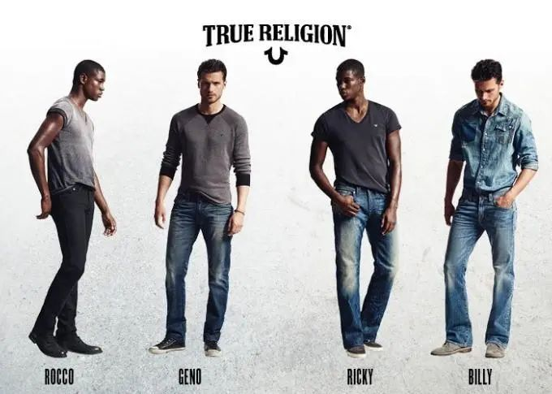 (原始链接: https://mmbiz.qpic.cn/mmbiz_jpg/szJas1pFaJdsWGrPgwWBKSlvlT6U0f1icks01WwQhXxFvGMceOrfVjTj9xZ9meQap2b1kK3xOicWfibicYaXmNpdbA/640?wx_fmt=jpeg)
- 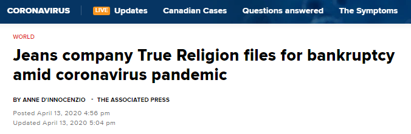 (原始链接: https://mmbiz.qpic.cn/mmbiz_png/szJas1pFaJdsWGrPgwWBKSlvlT6U0f1icZGrIv1eLrkUjZhAnwjGkPnnsg5CaibSQK04b03lhN0uVLRJtUMexeOg/640?wx_fmt=png)
-  (原始链接: https://mmbiz.qpic.cn/mmbiz_jpg/szJas1pFaJdsWGrPgwWBKSlvlT6U0f1icic3zeEZgQO9JvzCMcO9TzVAqHGPV0bGcxCxUADOBQWrhdApVib1ibbPTQ/640?wx_fmt=jpeg)
- 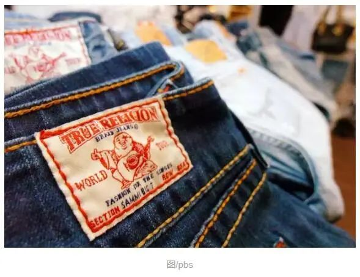 (原始链接: https://mmbiz.qpic.cn/mmbiz_jpg/szJas1pFaJdsWGrPgwWBKSlvlT6U0f1iczKC44ImwtIYaG0gBZMDaVBY3sIS5fMLgkSebyuXiaYclC5cYNOGXhAQ/640?wx_fmt=jpeg)
- 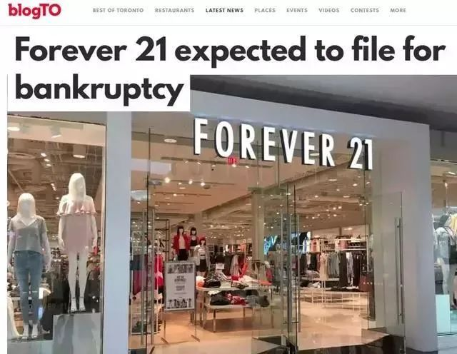 (原始链接: https://mmbiz.qpic.cn/mmbiz_jpg/szJas1pFaJdsWGrPgwWBKSlvlT6U0f1icdEcpfzAuvSlesKBD1mic8hUW7n0ibIic7iaY1xOYgNTxUg9SA5b7lB4FZg/640?wx_fmt=jpeg)
- 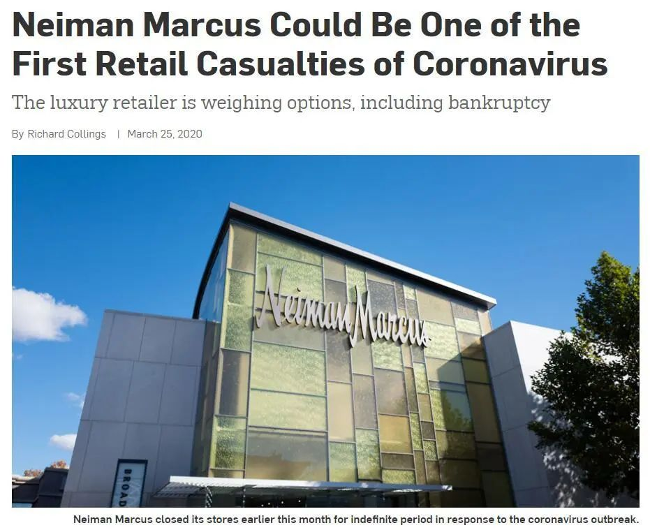 (原始链接: https://mmbiz.qpic.cn/mmbiz_jpg/szJas1pFaJdsWGrPgwWBKSlvlT6U0f1icoP2LuaXHJYibt3PujcDWicMDJiauZhbk98AAAQOUfuO75G2JP0B2WjVbA/640?wx_fmt=jpeg)
-  (原始链接: https://mmbiz.qpic.cn/mmbiz_jpg/szJas1pFaJdsWGrPgwWBKSlvlT6U0f1icDSz0R7WAosWF2ibgO2Ft6cltyPLu3XJRM1CyWKqE6wHhezmaKFOTYlQ/640?wx_fmt=jpeg)
- 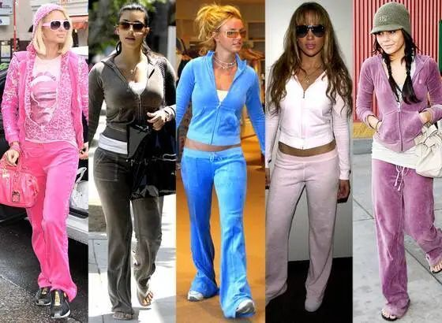 (原始链接: https://mmbiz.qpic.cn/mmbiz_jpg/szJas1pFaJdsWGrPgwWBKSlvlT6U0f1icZ3fHpCqLSMvg7N5eib815avONqkGkrOklPcqiad92JgfxPOn1FpOsmicQ/640?wx_fmt=jpeg)
- 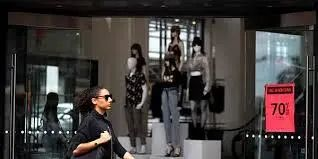 (原始链接: https://mmbiz.qpic.cn/mmbiz_jpg/szJas1pFaJdsWGrPgwWBKSlvlT6U0f1ic551HIqQekibJWiaCJd9vZ9EV4ljhAxNGiccEKtHfzGnMRbrXRODyu7Mkw/640?wx_fmt=jpeg)
-  (原始链接: https://mmbiz.qpic.cn/mmbiz_gif/szJas1pFaJdUFDPEKnLrCyGC4WgrAvl6lSC2beZFt6icTnXfebnRzcRialMg5VZujw1AhX9ribkSDQNZZukk8HX9w/640?wx_fmt=gif)
