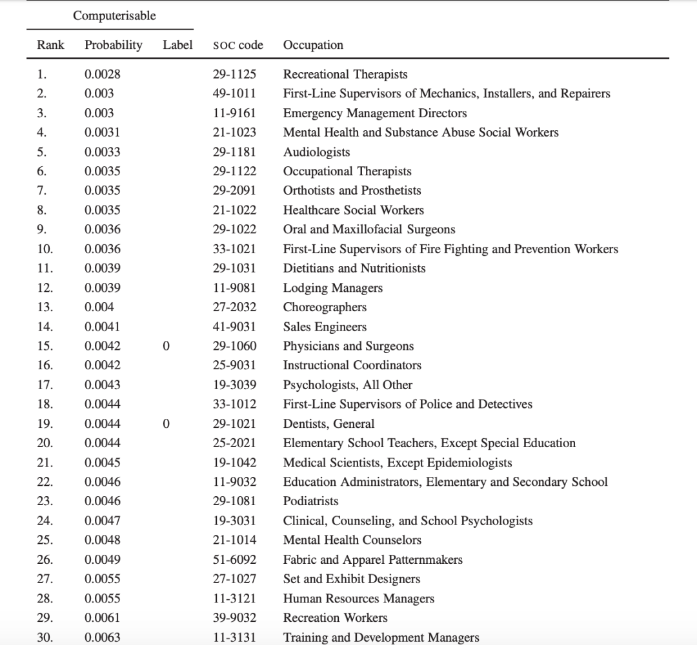
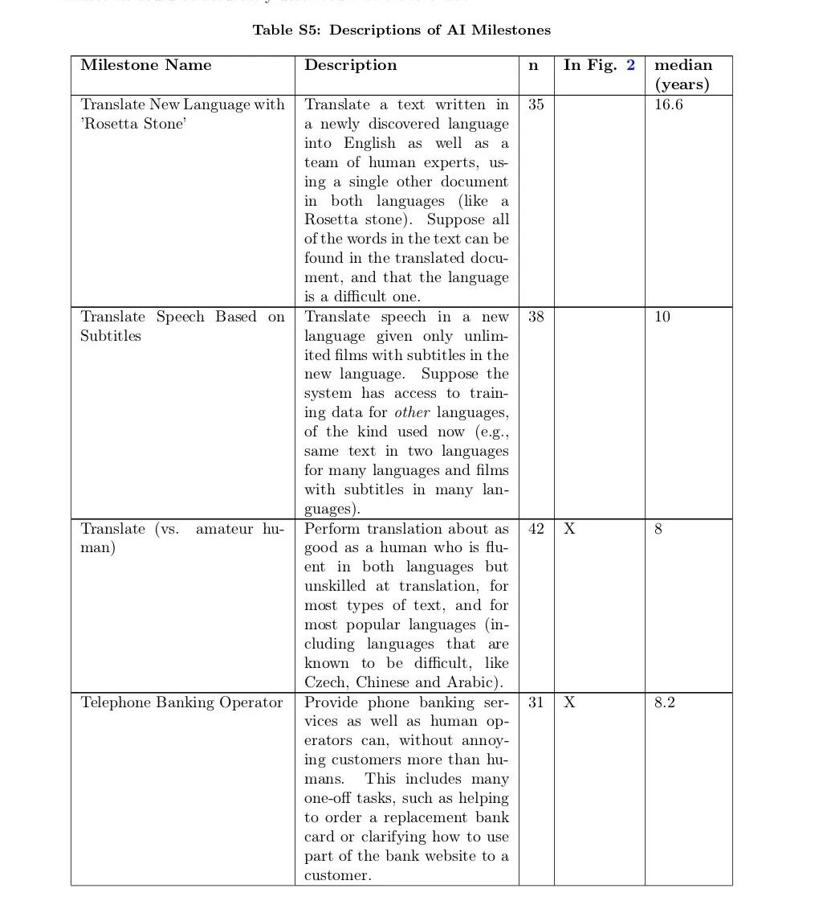
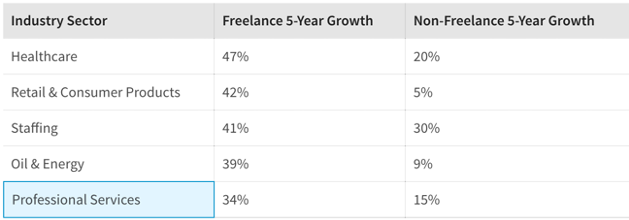

# 无标题

**链接地址:** http://mp.weixin.qq.com/s?__biz=MjM5Nzc3ODkyMA==&mid=2650222416&idx=1&sn=d5ba84e83f76d8f16d6c83c82e8ff3e9&chksm=bed74bd789a0c2c159a9c108b8d9dd2a95b39b66dadf707ee72a05f0edb01c52198cbe537762&mpshare=1&scene=2&srcid=&sharer_sharetime=1589005532814&sharer_shareid=be1c8edd6c93eec155a61c876e41d26a#rd
**作者:** 思小妞
**获取时间:** 2025/8/28 20:13:20
**图片数量:** 11

---

## 原始HTML内容

<section style="display: none;" data-tools="新媒体管家" data-label="powered by xmt.cn"> </section>
<strong style="max-width: 100%;line-height: 1.5em;box-sizing: border-box !important;word-wrap: break-word !important;"> </strong>

<section data-tools="135编辑器" data-id="88516"><section style="margin-top: 0.5em;margin-bottom: 0.5em;"><section style="text-align: center;"><section style="width: 20px;height: 20px;background-color: rgb(0, 0, 0);overflow: hidden;"> </section><section style="clear: both;height: 0px;overflow: hidden;"> </section><section style="margin-top: -10px;margin-bottom: -10px;padding-right: 10px;padding-left: 10px;box-sizing: border-box;display: inline-block;vertical-align: top;width: 100%;" data-width="100%"><section style="border-width: 2px;border-style: solid;border-color: white;padding: 10px;box-sizing: border-box;background-color: rgb(239, 239, 239);">
<strong>经管之家长期征稿！投稿邮箱：jg@pinggu.org</strong>
</section></section><section style="width: 20px;height: 20px;float: right;background-color: rgb(0, 0, 0);overflow: hidden;"> </section><section style="clear: both;height: 0px;overflow: hidden;"> </section></section></section></section><section data-role="paragraph">
<strong style="color: rgb(136, 136, 136);font-size: 14px;"></strong>
</section>
<strong style="max-width: 100%;box-sizing: border-box !important;word-wrap: break-word !important;">本文来源于微信公众号：</strong>LinkedIn&nbsp;

<strong style="max-width: 100%;box-sizing: border-box !important;word-wrap: break-word !important;">微信ID：</strong>LinkedIn-China&nbsp;

<strong style="max-width: 100%;box-sizing: border-box !important;word-wrap: break-word !important;">作者：</strong>思小妞

LinkedIn领英是全球知名的职业社交网站，每个《财富》500强公司均有高管加入。
<section style="box-sizing: border-box;font-size: 16px;"><section style="margin-top: 0.5em;margin-bottom: 0.5em;box-sizing: border-box;" powered-by="xiumi.us"><section style="border-top: 4px solid rgb(0, 0, 0);box-sizing: border-box;"><section style="line-height: 0;"><svg viewBox="0 0 1 1" width="0" style="vertical-align: top;"></svg></section></section><section style="margin-top: 3px;border-top: 1px solid rgb(0, 0, 0);box-sizing: border-box;"><section style="line-height: 0;"><svg viewBox="0 0 1 1" width="0" style="vertical-align: top;"></svg></section></section></section></section><section style="max-width: 100%;min-height: 1em;color: rgba(0, 0, 0, 0.8);font-family: -apple-system-font, BlinkMacSystemFont, &quot;Helvetica Neue&quot;, &quot;PingFang SC&quot;, &quot;Hiragino Sans GB&quot;, &quot;Microsoft YaHei UI&quot;, &quot;Microsoft YaHei&quot;, Arial, sans-serif;white-space: normal;background-color: rgb(255, 255, 255);line-height: 1.5em;margin-left: 0px;margin-right: 0px;letter-spacing: 0px;box-sizing: border-box !important;word-wrap: break-word !important;">2013年，牛津大学两位人工智能领域的研究员，Carl Benedikt Frey和Michael A. Osborne在他们合著的论文“The future of employment: How susceptible are jobs to computerisation?” 中，对702个工种做了详细的预测，并按照被淘汰可能性0～97%进行了排序。</section>
 
<section style="max-width: 100%;min-height: 1em;color: rgba(0, 0, 0, 0.8);font-family: -apple-system-font, BlinkMacSystemFont, &quot;Helvetica Neue&quot;, &quot;PingFang SC&quot;, &quot;Hiragino Sans GB&quot;, &quot;Microsoft YaHei UI&quot;, &quot;Microsoft YaHei&quot;, Arial, sans-serif;white-space: normal;background-color: rgb(255, 255, 255);line-height: 1.5em;margin-left: 0px;margin-right: 0px;letter-spacing: 0px;box-sizing: border-box !important;word-wrap: break-word !important;">得出的结论是：<strong style="max-width: 100%;box-sizing: border-box !important;word-wrap: break-word !important;">未来十年将会有近一半的职业逐渐消失，其中47%的就业人数处于危险中。</strong> </section>
 
<section style="max-width: 100%;min-height: 1em;color: rgba(0, 0, 0, 0.8);font-family: -apple-system-font, BlinkMacSystemFont, &quot;Helvetica Neue&quot;, &quot;PingFang SC&quot;, &quot;Hiragino Sans GB&quot;, &quot;Microsoft YaHei UI&quot;, &quot;Microsoft YaHei&quot;, Arial, sans-serif;white-space: normal;background-color: rgb(255, 255, 255);line-height: 1.5em;margin-left: 0px;margin-right: 0px;letter-spacing: 0px;box-sizing: border-box !important;word-wrap: break-word !important;">你现在从事的工作还有多久会消失？</section><section style="max-width: 100%;min-height: 1em;color: rgba(0, 0, 0, 0.8);font-family: -apple-system-font, BlinkMacSystemFont, &quot;Helvetica Neue&quot;, &quot;PingFang SC&quot;, &quot;Hiragino Sans GB&quot;, &quot;Microsoft YaHei UI&quot;, &quot;Microsoft YaHei&quot;, Arial, sans-serif;white-space: normal;background-color: rgb(255, 255, 255);line-height: 1.5em;margin-left: 0px;margin-right: 0px;letter-spacing: 0px;box-sizing: border-box !important;word-wrap: break-word !important;"> </section><section style="max-width: 100%;min-height: 1em;color: rgba(0, 0, 0, 0.8);white-space: normal;font-family: -apple-system-font, system-ui, &quot;Helvetica Neue&quot;, &quot;PingFang SC&quot;, &quot;Hiragino Sans GB&quot;, &quot;Microsoft YaHei UI&quot;, &quot;Microsoft YaHei&quot;, Arial, sans-serif;background-color: rgb(255, 255, 255);text-align: center;line-height: 1.5em;margin-left: 0px;margin-right: 0px;letter-spacing: 0px;box-sizing: border-box !important;word-wrap: break-word !important;overflow-wrap: break-word !important;"> </section><section style="max-width: 100%;min-height: 1em;color: rgba(0, 0, 0, 0.8);white-space: normal;font-family: -apple-system-font, system-ui, &quot;Helvetica Neue&quot;, &quot;PingFang SC&quot;, &quot;Hiragino Sans GB&quot;, &quot;Microsoft YaHei UI&quot;, &quot;Microsoft YaHei&quot;, Arial, sans-serif;background-color: rgb(255, 255, 255);text-align: center;line-height: 1.5em;margin-left: 0px;margin-right: 0px;letter-spacing: 0px;box-sizing: border-box !important;word-wrap: break-word !important;overflow-wrap: break-word !important;"><strong style="max-width: 100%;box-sizing: border-box !important;word-wrap: break-word !important;overflow-wrap: break-word !important;"></strong></section><section style="max-width: 100%;min-height: 1em;color: rgba(0, 0, 0, 0.8);font-family: -apple-system-font, BlinkMacSystemFont, &quot;Helvetica Neue&quot;, &quot;PingFang SC&quot;, &quot;Hiragino Sans GB&quot;, &quot;Microsoft YaHei UI&quot;, &quot;Microsoft YaHei&quot;, Arial, sans-serif;white-space: normal;background-color: rgb(255, 255, 255);text-align: center;line-height: 1.5em;margin-left: 0px;margin-right: 0px;letter-spacing: 0px;box-sizing: border-box !important;word-wrap: break-word !important;overflow-wrap: break-word !important;"><strong style="max-width: 100%;box-sizing: border-box !important;word-wrap: break-word !important;">未来</strong><strong style="max-width: 100%;color: rgb(10, 102, 194);font-family: mp-quote, -apple-system-font, BlinkMacSystemFont, &quot;Helvetica Neue&quot;, &quot;PingFang SC&quot;, &quot;Hiragino Sans GB&quot;, &quot;Microsoft YaHei UI&quot;, &quot;Microsoft YaHei&quot;, Arial, sans-serif;box-sizing: border-box !important;word-wrap: break-word !important;">那些会消失</strong></section><section style="max-width: 100%;min-height: 1em;color: rgba(0, 0, 0, 0.8);font-family: -apple-system-font, BlinkMacSystemFont, &quot;Helvetica Neue&quot;, &quot;PingFang SC&quot;, &quot;Hiragino Sans GB&quot;, &quot;Microsoft YaHei UI&quot;, &quot;Microsoft YaHei&quot;, Arial, sans-serif;white-space: normal;background-color: rgb(255, 255, 255);text-align: center;line-height: 1.5em;margin-left: 0px;margin-right: 0px;letter-spacing: 0px;box-sizing: border-box !important;word-wrap: break-word !important;overflow-wrap: break-word !important;"><strong style="max-width: 100%;color: rgb(10, 102, 194);font-family: mp-quote, -apple-system-font, BlinkMacSystemFont, &quot;Helvetica Neue&quot;, &quot;PingFang SC&quot;, &quot;Hiragino Sans GB&quot;, &quot;Microsoft YaHei UI&quot;, &quot;Microsoft YaHei&quot;, Arial, sans-serif;box-sizing: border-box !important;word-wrap: break-word !important;">和不会消失的行业</strong></section><section style="max-width: 100%;min-height: 1em;color: rgba(0, 0, 0, 0.8);font-family: -apple-system-font, BlinkMacSystemFont, &quot;Helvetica Neue&quot;, &quot;PingFang SC&quot;, &quot;Hiragino Sans GB&quot;, &quot;Microsoft YaHei UI&quot;, &quot;Microsoft YaHei&quot;, Arial, sans-serif;white-space: normal;background-color: rgb(255, 255, 255);line-height: 1.5em;margin-left: 0px;margin-right: 0px;letter-spacing: 0px;box-sizing: border-box !important;word-wrap: break-word !important;">&nbsp;</section><section style="max-width: 100%;min-height: 1em;color: rgba(0, 0, 0, 0.8);font-family: -apple-system-font, BlinkMacSystemFont, &quot;Helvetica Neue&quot;, &quot;PingFang SC&quot;, &quot;Hiragino Sans GB&quot;, &quot;Microsoft YaHei UI&quot;, &quot;Microsoft YaHei&quot;, Arial, sans-serif;white-space: normal;background-color: rgb(255, 255, 255);line-height: 1.5em;margin-left: 0px;margin-right: 0px;letter-spacing: 0px;box-sizing: border-box !important;word-wrap: break-word !important;">研究中提到的702个工种里，按照消失的速度大致可以分为三类(以下只是部分举例)：</section>
 
<ul class="list-paddingleft-2" style="max-width: 100%;color: rgba(0, 0, 0, 0.8);font-family: -apple-system-font, BlinkMacSystemFont, &quot;Helvetica Neue&quot;, &quot;PingFang SC&quot;, &quot;Hiragino Sans GB&quot;, &quot;Microsoft YaHei UI&quot;, &quot;Microsoft YaHei&quot;, Arial, sans-serif;letter-spacing: 0.544px;white-space: normal;background-color: rgb(255, 255, 255);margin-left: 0px;margin-right: 0px;word-wrap: break-word !important;"><li style="max-width: 100%;font-weight: bold;box-sizing: border-box !important;word-wrap: break-word !important;"><section style="max-width: 100%;min-height: 1em;line-height: 1.5em;letter-spacing: 0px;box-sizing: border-box !important;word-wrap: break-word !important;"><strong style="max-width: 100%;box-sizing: border-box !important;word-wrap: break-word !important;">第一类：一定会消失的：</strong></section></li></ul><section style="max-width: 100%;min-height: 1em;color: rgba(0, 0, 0, 0.8);font-family: -apple-system-font, BlinkMacSystemFont, &quot;Helvetica Neue&quot;, &quot;PingFang SC&quot;, &quot;Hiragino Sans GB&quot;, &quot;Microsoft YaHei UI&quot;, &quot;Microsoft YaHei&quot;, Arial, sans-serif;white-space: normal;background-color: rgb(255, 255, 255);line-height: 1.5em;margin-left: 0px;margin-right: 0px;letter-spacing: 0px;box-sizing: border-box !important;word-wrap: break-word !important;"> </section><section style="max-width: 100%;min-height: 1em;color: rgba(0, 0, 0, 0.8);font-family: -apple-system-font, BlinkMacSystemFont, &quot;Helvetica Neue&quot;, &quot;PingFang SC&quot;, &quot;Hiragino Sans GB&quot;, &quot;Microsoft YaHei UI&quot;, &quot;Microsoft YaHei&quot;, Arial, sans-serif;white-space: normal;background-color: rgb(255, 255, 255);line-height: 1.5em;margin-left: 0px;margin-right: 0px;letter-spacing: 0px;box-sizing: border-box !important;word-wrap: break-word !important;">1. 司机，货车司机会先于客车司机被淘汰。</section>
 
<section style="max-width: 100%;min-height: 1em;color: rgba(0, 0, 0, 0.8);font-family: -apple-system-font, BlinkMacSystemFont, &quot;Helvetica Neue&quot;, &quot;PingFang SC&quot;, &quot;Hiragino Sans GB&quot;, &quot;Microsoft YaHei UI&quot;, &quot;Microsoft YaHei&quot;, Arial, sans-serif;white-space: normal;background-color: rgb(255, 255, 255);line-height: 1.5em;margin-left: 0px;margin-right: 0px;letter-spacing: 0px;box-sizing: border-box !important;word-wrap: break-word !important;">2. 机长、飞行员这类和人命相关的机动驾驶类工作。</section>
 
<section style="max-width: 100%;min-height: 1em;color: rgba(0, 0, 0, 0.8);font-family: -apple-system-font, BlinkMacSystemFont, &quot;Helvetica Neue&quot;, &quot;PingFang SC&quot;, &quot;Hiragino Sans GB&quot;, &quot;Microsoft YaHei UI&quot;, &quot;Microsoft YaHei&quot;, Arial, sans-serif;white-space: normal;background-color: rgb(255, 255, 255);line-height: 1.5em;margin-left: 0px;margin-right: 0px;letter-spacing: 0px;box-sizing: border-box !important;word-wrap: break-word !important;">据统计，<strong style="max-width: 100%;box-sizing: border-box !important;word-wrap: break-word !important;">1950-2019年82%的空难是人为造成的。人会受心情、疲劳等因素影响。</strong>随着自动驾驶技术的完善，飞行员、舵手这类工种被取代是必然的。</section>
 
<section style="max-width: 100%;min-height: 1em;color: rgba(0, 0, 0, 0.8);font-family: -apple-system-font, BlinkMacSystemFont, &quot;Helvetica Neue&quot;, &quot;PingFang SC&quot;, &quot;Hiragino Sans GB&quot;, &quot;Microsoft YaHei UI&quot;, &quot;Microsoft YaHei&quot;, Arial, sans-serif;white-space: normal;background-color: rgb(255, 255, 255);line-height: 1.5em;margin-left: 0px;margin-right: 0px;letter-spacing: 0px;box-sizing: border-box !important;word-wrap: break-word !important;">3. 实体店店员。</section>
 
<section style="max-width: 100%;min-height: 1em;color: rgba(0, 0, 0, 0.8);font-family: -apple-system-font, BlinkMacSystemFont, &quot;Helvetica Neue&quot;, &quot;PingFang SC&quot;, &quot;Hiragino Sans GB&quot;, &quot;Microsoft YaHei UI&quot;, &quot;Microsoft YaHei&quot;, Arial, sans-serif;white-space: normal;background-color: rgb(255, 255, 255);line-height: 1.5em;margin-left: 0px;margin-right: 0px;letter-spacing: 0px;box-sizing: border-box !important;word-wrap: break-word !important;">比如特斯拉就曾宣布，未来4s店的售卖将实行无人化，客户在了解车的情况、性能对比后付款、拿钥匙，不需要店员存在。</section>
 
<section style="max-width: 100%;min-height: 1em;color: rgba(0, 0, 0, 0.8);font-family: -apple-system-font, BlinkMacSystemFont, &quot;Helvetica Neue&quot;, &quot;PingFang SC&quot;, &quot;Hiragino Sans GB&quot;, &quot;Microsoft YaHei UI&quot;, &quot;Microsoft YaHei&quot;, Arial, sans-serif;white-space: normal;background-color: rgb(255, 255, 255);line-height: 1.5em;margin-left: 0px;margin-right: 0px;letter-spacing: 0px;box-sizing: border-box !important;word-wrap: break-word !important;">4. 翻译类工作。文字翻译、口译都要消失。</section>
 
<section style="max-width: 100%;min-height: 1em;color: rgba(0, 0, 0, 0.8);font-family: -apple-system-font, BlinkMacSystemFont, &quot;Helvetica Neue&quot;, &quot;PingFang SC&quot;, &quot;Hiragino Sans GB&quot;, &quot;Microsoft YaHei UI&quot;, &quot;Microsoft YaHei&quot;, Arial, sans-serif;white-space: normal;background-color: rgb(255, 255, 255);line-height: 1.5em;margin-left: 0px;margin-right: 0px;letter-spacing: 0px;box-sizing: border-box !important;word-wrap: break-word !important;">5. 外语老师。</section>
 
<section style="max-width: 100%;min-height: 1em;color: rgba(0, 0, 0, 0.8);font-family: -apple-system-font, BlinkMacSystemFont, &quot;Helvetica Neue&quot;, &quot;PingFang SC&quot;, &quot;Hiragino Sans GB&quot;, &quot;Microsoft YaHei UI&quot;, &quot;Microsoft YaHei&quot;, Arial, sans-serif;white-space: normal;background-color: rgb(255, 255, 255);line-height: 1.5em;margin-left: 0px;margin-right: 0px;letter-spacing: 0px;box-sizing: border-box !important;word-wrap: break-word !important;">因为翻译软件将取代这类工作，大家没有学外语的必要了，所以外语老师这个职业也会消失。</section>
 
<section style="max-width: 100%;min-height: 1em;color: rgba(0, 0, 0, 0.8);font-family: -apple-system-font, BlinkMacSystemFont, &quot;Helvetica Neue&quot;, &quot;PingFang SC&quot;, &quot;Hiragino Sans GB&quot;, &quot;Microsoft YaHei UI&quot;, &quot;Microsoft YaHei&quot;, Arial, sans-serif;white-space: normal;background-color: rgb(255, 255, 255);line-height: 1.5em;margin-left: 0px;margin-right: 0px;letter-spacing: 0px;box-sizing: border-box !important;word-wrap: break-word !important;">6. 体育赛事类裁判。</section>
 
<section style="max-width: 100%;min-height: 1em;color: rgba(0, 0, 0, 0.8);font-family: -apple-system-font, BlinkMacSystemFont, &quot;Helvetica Neue&quot;, &quot;PingFang SC&quot;, &quot;Hiragino Sans GB&quot;, &quot;Microsoft YaHei UI&quot;, &quot;Microsoft YaHei&quot;, Arial, sans-serif;white-space: normal;background-color: rgb(255, 255, 255);line-height: 1.5em;margin-left: 0px;margin-right: 0px;letter-spacing: 0px;box-sizing: border-box !important;word-wrap: break-word !important;">7. 公司非核心技术类白领、行政/秘书类工种。</section>
 
<section style="max-width: 100%;min-height: 1em;color: rgba(0, 0, 0, 0.8);font-family: -apple-system-font, BlinkMacSystemFont, &quot;Helvetica Neue&quot;, &quot;PingFang SC&quot;, &quot;Hiragino Sans GB&quot;, &quot;Microsoft YaHei UI&quot;, &quot;Microsoft YaHei&quot;, Arial, sans-serif;white-space: normal;background-color: rgb(255, 255, 255);line-height: 1.5em;margin-left: 0px;margin-right: 0px;letter-spacing: 0px;box-sizing: border-box !important;word-wrap: break-word !important;">从2013年起，IBM人力资源部门就开始用AI进行一系列人力资源相关的工作，包括预测员工离职风险提前采取人才保留措施、指导员工提升技能、识别招聘过程中的偏见因素，降低人才引进的失误风险。</section>
 
<section style="max-width: 100%;min-height: 1em;color: rgba(0, 0, 0, 0.8);font-family: -apple-system-font, BlinkMacSystemFont, &quot;Helvetica Neue&quot;, &quot;PingFang SC&quot;, &quot;Hiragino Sans GB&quot;, &quot;Microsoft YaHei UI&quot;, &quot;Microsoft YaHei&quot;, Arial, sans-serif;white-space: normal;background-color: rgb(255, 255, 255);line-height: 1.5em;margin-left: 0px;margin-right: 0px;letter-spacing: 0px;box-sizing: border-box !important;word-wrap: break-word !important;">仅一年时间，AI所做的工作为IBM全球公司节省了近1亿美金，大幅提升了员工和管理层的满意度。</section><section style="max-width: 100%;min-height: 1em;color: rgba(0, 0, 0, 0.8);font-family: -apple-system-font, BlinkMacSystemFont, &quot;Helvetica Neue&quot;, &quot;PingFang SC&quot;, &quot;Hiragino Sans GB&quot;, &quot;Microsoft YaHei UI&quot;, &quot;Microsoft YaHei&quot;, Arial, sans-serif;white-space: normal;background-color: rgb(255, 255, 255);line-height: 1.5em;margin-left: 0px;margin-right: 0px;letter-spacing: 0px;box-sizing: border-box !important;word-wrap: break-word !important;">&nbsp;</section><section style="max-width: 100%;min-height: 1em;color: rgba(0, 0, 0, 0.8);font-family: -apple-system-font, BlinkMacSystemFont, &quot;Helvetica Neue&quot;, &quot;PingFang SC&quot;, &quot;Hiragino Sans GB&quot;, &quot;Microsoft YaHei UI&quot;, &quot;Microsoft YaHei&quot;, Arial, sans-serif;white-space: normal;background-color: rgb(255, 255, 255);line-height: 1.5em;margin-left: 0px;margin-right: 0px;letter-spacing: 0px;box-sizing: border-box !important;word-wrap: break-word !important;">8. 消防员、刑侦破案人员。</section>
 
<section style="max-width: 100%;min-height: 1em;color: rgba(0, 0, 0, 0.8);font-family: -apple-system-font, BlinkMacSystemFont, &quot;Helvetica Neue&quot;, &quot;PingFang SC&quot;, &quot;Hiragino Sans GB&quot;, &quot;Microsoft YaHei UI&quot;, &quot;Microsoft YaHei&quot;, Arial, sans-serif;white-space: normal;background-color: rgb(255, 255, 255);line-height: 1.5em;margin-left: 0px;margin-right: 0px;letter-spacing: 0px;box-sizing: border-box !important;word-wrap: break-word !important;">这类风险高、误差要求小的工作机器更适合。</section><section style="max-width: 100%;min-height: 1em;color: rgba(0, 0, 0, 0.8);font-family: -apple-system-font, BlinkMacSystemFont, &quot;Helvetica Neue&quot;, &quot;PingFang SC&quot;, &quot;Hiragino Sans GB&quot;, &quot;Microsoft YaHei UI&quot;, &quot;Microsoft YaHei&quot;, Arial, sans-serif;white-space: normal;background-color: rgb(255, 255, 255);text-align: center;line-height: 1.5em;margin-left: 0px;margin-right: 0px;letter-spacing: 0px;box-sizing: border-box !important;word-wrap: break-word !important;"> </section><ul class="list-paddingleft-2" style="max-width: 100%;color: rgba(0, 0, 0, 0.8);font-family: -apple-system-font, BlinkMacSystemFont, &quot;Helvetica Neue&quot;, &quot;PingFang SC&quot;, &quot;Hiragino Sans GB&quot;, &quot;Microsoft YaHei UI&quot;, &quot;Microsoft YaHei&quot;, Arial, sans-serif;letter-spacing: 0.544px;white-space: normal;background-color: rgb(255, 255, 255);margin-left: 0px;margin-right: 0px;word-wrap: break-word !important;"><li style="max-width: 100%;font-weight: bold;box-sizing: border-box !important;word-wrap: break-word !important;"><section style="max-width: 100%;min-height: 1em;line-height: 1.5em;letter-spacing: 0px;box-sizing: border-box !important;word-wrap: break-word !important;"><strong style="max-width: 100%;box-sizing: border-box !important;word-wrap: break-word !important;">第二种：不会消失的工作：</strong></section></li></ul>
 
<section style="max-width: 100%;min-height: 1em;color: rgba(0, 0, 0, 0.8);font-family: -apple-system-font, BlinkMacSystemFont, &quot;Helvetica Neue&quot;, &quot;PingFang SC&quot;, &quot;Hiragino Sans GB&quot;, &quot;Microsoft YaHei UI&quot;, &quot;Microsoft YaHei&quot;, Arial, sans-serif;white-space: normal;background-color: rgb(255, 255, 255);line-height: 1.5em;margin-left: 0px;margin-right: 0px;letter-spacing: 0px;box-sizing: border-box !important;word-wrap: break-word !important;">1. 小学老师。</section>
 
<section style="max-width: 100%;min-height: 1em;color: rgba(0, 0, 0, 0.8);font-family: -apple-system-font, BlinkMacSystemFont, &quot;Helvetica Neue&quot;, &quot;PingFang SC&quot;, &quot;Hiragino Sans GB&quot;, &quot;Microsoft YaHei UI&quot;, &quot;Microsoft YaHei&quot;, Arial, sans-serif;white-space: normal;background-color: rgb(255, 255, 255);line-height: 1.5em;margin-left: 0px;margin-right: 0px;letter-spacing: 0px;box-sizing: border-box !important;word-wrap: break-word !important;">与初高中学生不同，小学生没有自主学习的意识，需要有人带领和监督。</section>
 
<section style="max-width: 100%;min-height: 1em;color: rgba(0, 0, 0, 0.8);font-family: -apple-system-font, BlinkMacSystemFont, &quot;Helvetica Neue&quot;, &quot;PingFang SC&quot;, &quot;Hiragino Sans GB&quot;, &quot;Microsoft YaHei UI&quot;, &quot;Microsoft YaHei&quot;, Arial, sans-serif;white-space: normal;background-color: rgb(255, 255, 255);line-height: 1.5em;margin-left: 0px;margin-right: 0px;letter-spacing: 0px;box-sizing: border-box !important;word-wrap: break-word !important;">2. 法官。</section>
 
<section style="max-width: 100%;min-height: 1em;color: rgba(0, 0, 0, 0.8);font-family: -apple-system-font, BlinkMacSystemFont, &quot;Helvetica Neue&quot;, &quot;PingFang SC&quot;, &quot;Hiragino Sans GB&quot;, &quot;Microsoft YaHei UI&quot;, &quot;Microsoft YaHei&quot;, Arial, sans-serif;white-space: normal;background-color: rgb(255, 255, 255);line-height: 1.5em;margin-left: 0px;margin-right: 0px;letter-spacing: 0px;box-sizing: border-box !important;word-wrap: break-word !important;">从人伦考虑，人类应该无法接受机器给我们定罪、决定我们的生死。</section>
 
<section style="max-width: 100%;min-height: 1em;color: rgba(0, 0, 0, 0.8);font-family: -apple-system-font, BlinkMacSystemFont, &quot;Helvetica Neue&quot;, &quot;PingFang SC&quot;, &quot;Hiragino Sans GB&quot;, &quot;Microsoft YaHei UI&quot;, &quot;Microsoft YaHei&quot;, Arial, sans-serif;white-space: normal;background-color: rgb(255, 255, 255);line-height: 1.5em;margin-left: 0px;margin-right: 0px;letter-spacing: 0px;box-sizing: border-box !important;word-wrap: break-word !important;">3. 神职人员。</section>
 
<section style="max-width: 100%;min-height: 1em;color: rgba(0, 0, 0, 0.8);font-family: -apple-system-font, BlinkMacSystemFont, &quot;Helvetica Neue&quot;, &quot;PingFang SC&quot;, &quot;Hiragino Sans GB&quot;, &quot;Microsoft YaHei UI&quot;, &quot;Microsoft YaHei&quot;, Arial, sans-serif;white-space: normal;background-color: rgb(255, 255, 255);line-height: 1.5em;margin-left: 0px;margin-right: 0px;letter-spacing: 0px;box-sizing: border-box !important;word-wrap: break-word !important;">4. 创作型设计师、歌手、音乐家、作家。</section>
 
<section style="max-width: 100%;min-height: 1em;color: rgba(0, 0, 0, 0.8);font-family: -apple-system-font, BlinkMacSystemFont, &quot;Helvetica Neue&quot;, &quot;PingFang SC&quot;, &quot;Hiragino Sans GB&quot;, &quot;Microsoft YaHei UI&quot;, &quot;Microsoft YaHei&quot;, Arial, sans-serif;white-space: normal;background-color: rgb(255, 255, 255);line-height: 1.5em;margin-left: 0px;margin-right: 0px;letter-spacing: 0px;box-sizing: border-box !important;word-wrap: break-word !important;">凡是<strong style="max-width: 100%;box-sizing: border-box !important;word-wrap: break-word !important;">涉及到创新、想象、自我意识类的工作，AI很难替代我们。</strong></section>
 
<ul class="list-paddingleft-2" style="max-width: 100%;color: rgba(0, 0, 0, 0.8);font-family: -apple-system-font, BlinkMacSystemFont, &quot;Helvetica Neue&quot;, &quot;PingFang SC&quot;, &quot;Hiragino Sans GB&quot;, &quot;Microsoft YaHei UI&quot;, &quot;Microsoft YaHei&quot;, Arial, sans-serif;letter-spacing: 0.544px;white-space: normal;background-color: rgb(255, 255, 255);margin-left: 0px;margin-right: 0px;word-wrap: break-word !important;"><li style="max-width: 100%;font-weight: bold;box-sizing: border-box !important;word-wrap: break-word !important;"><section style="max-width: 100%;min-height: 1em;line-height: 1.5em;letter-spacing: 0px;box-sizing: border-box !important;word-wrap: break-word !important;"><strong style="max-width: 100%;box-sizing: border-box !important;word-wrap: break-word !important;">第三种：现在暂时不会但以后会消失的工作：</strong></section></li></ul>
 
<section style="max-width: 100%;min-height: 1em;color: rgba(0, 0, 0, 0.8);font-family: -apple-system-font, BlinkMacSystemFont, &quot;Helvetica Neue&quot;, &quot;PingFang SC&quot;, &quot;Hiragino Sans GB&quot;, &quot;Microsoft YaHei UI&quot;, &quot;Microsoft YaHei&quot;, Arial, sans-serif;white-space: normal;background-color: rgb(255, 255, 255);line-height: 1.5em;margin-left: 0px;margin-right: 0px;letter-spacing: 0px;box-sizing: border-box !important;word-wrap: break-word !important;">1. 医生。</section>
 
<section style="max-width: 100%;min-height: 1em;color: rgba(0, 0, 0, 0.8);font-family: -apple-system-font, BlinkMacSystemFont, &quot;Helvetica Neue&quot;, &quot;PingFang SC&quot;, &quot;Hiragino Sans GB&quot;, &quot;Microsoft YaHei UI&quot;, &quot;Microsoft YaHei&quot;, Arial, sans-serif;white-space: normal;background-color: rgb(255, 255, 255);line-height: 1.5em;margin-left: 0px;margin-right: 0px;letter-spacing: 0px;box-sizing: border-box !important;word-wrap: break-word !important;">多数普通医生的主要工作是看症状、通过化验结果判断疾病，这方面机器比人更准确。</section>
 
<section style="max-width: 100%;min-height: 1em;color: rgba(0, 0, 0, 0.8);font-family: -apple-system-font, BlinkMacSystemFont, &quot;Helvetica Neue&quot;, &quot;PingFang SC&quot;, &quot;Hiragino Sans GB&quot;, &quot;Microsoft YaHei UI&quot;, &quot;Microsoft YaHei&quot;, Arial, sans-serif;white-space: normal;background-color: rgb(255, 255, 255);line-height: 1.5em;margin-left: 0px;margin-right: 0px;letter-spacing: 0px;box-sizing: border-box !important;word-wrap: break-word !important;">2.程序员。</section>
 
<section style="max-width: 100%;min-height: 1em;color: rgba(0, 0, 0, 0.8);font-family: -apple-system-font, BlinkMacSystemFont, &quot;Helvetica Neue&quot;, &quot;PingFang SC&quot;, &quot;Hiragino Sans GB&quot;, &quot;Microsoft YaHei UI&quot;, &quot;Microsoft YaHei&quot;, Arial, sans-serif;white-space: normal;background-color: rgb(255, 255, 255);line-height: 1.5em;margin-left: 0px;margin-right: 0px;letter-spacing: 0px;box-sizing: border-box !important;word-wrap: break-word !important;">人工智能完成前是大量需要，完成后，人工智能会自己编程。但程序员里的系统工程师、架构师会比普通程序员更晚消失。</section>
 
<section style="max-width: 100%;min-height: 1em;color: rgba(0, 0, 0, 0.8);font-family: -apple-system-font, BlinkMacSystemFont, &quot;Helvetica Neue&quot;, &quot;PingFang SC&quot;, &quot;Hiragino Sans GB&quot;, &quot;Microsoft YaHei UI&quot;, &quot;Microsoft YaHei&quot;, Arial, sans-serif;white-space: normal;background-color: rgb(255, 255, 255);text-align: center;line-height: 1.5em;margin-left: 0px;margin-right: 0px;letter-spacing: 0px;box-sizing: border-box !important;word-wrap: break-word !important;"></section><section style="max-width: 100%;min-height: 1em;color: rgba(0, 0, 0, 0.8);font-family: -apple-system-font, BlinkMacSystemFont, &quot;Helvetica Neue&quot;, &quot;PingFang SC&quot;, &quot;Hiragino Sans GB&quot;, &quot;Microsoft YaHei UI&quot;, &quot;Microsoft YaHei&quot;, Arial, sans-serif;white-space: normal;background-color: rgb(255, 255, 255);text-align: center;line-height: 1.5em;margin-left: 0px;margin-right: 0px;letter-spacing: 0px;box-sizing: border-box !important;word-wrap: break-word !important;">图片来源：oxfordmartin.ox.ac.uk</section>
 
<section style="max-width: 100%;min-height: 1em;color: rgba(0, 0, 0, 0.8);font-family: -apple-system-font, BlinkMacSystemFont, &quot;Helvetica Neue&quot;, &quot;PingFang SC&quot;, &quot;Hiragino Sans GB&quot;, &quot;Microsoft YaHei UI&quot;, &quot;Microsoft YaHei&quot;, Arial, sans-serif;white-space: normal;background-color: rgb(255, 255, 255);line-height: 1.5em;margin-left: 0px;margin-right: 0px;letter-spacing: 0px;box-sizing: border-box !important;word-wrap: break-word !important;">有兴趣的同学可以戳以下链接，了解702个职业先后消失的排名，排名从p57开始。https://www.oxfordmartin.ox.ac.uk/downloads/academic/The_Future_of_Employment.pdf</section>
 
<section style="max-width: 100%;min-height: 1em;color: rgba(0, 0, 0, 0.8);font-family: -apple-system-font, BlinkMacSystemFont, &quot;Helvetica Neue&quot;, &quot;PingFang SC&quot;, &quot;Hiragino Sans GB&quot;, &quot;Microsoft YaHei UI&quot;, &quot;Microsoft YaHei&quot;, Arial, sans-serif;white-space: normal;background-color: rgb(255, 255, 255);text-align: center;line-height: 1.5em;margin-left: 0px;margin-right: 0px;letter-spacing: 0px;box-sizing: border-box !important;word-wrap: break-word !important;"></section><section style="max-width: 100%;min-height: 1em;color: rgba(0, 0, 0, 0.8);font-family: -apple-system-font, BlinkMacSystemFont, &quot;Helvetica Neue&quot;, &quot;PingFang SC&quot;, &quot;Hiragino Sans GB&quot;, &quot;Microsoft YaHei UI&quot;, &quot;Microsoft YaHei&quot;, Arial, sans-serif;white-space: normal;background-color: rgb(255, 255, 255);text-align: center;line-height: 1.5em;margin-left: 0px;margin-right: 0px;letter-spacing: 0px;box-sizing: border-box !important;word-wrap: break-word !important;"><strong style="max-width: 100%;box-sizing: border-box !important;word-wrap: break-word !important;">2045年</strong></section><section style="max-width: 100%;min-height: 1em;color: rgba(0, 0, 0, 0.8);font-family: -apple-system-font, BlinkMacSystemFont, &quot;Helvetica Neue&quot;, &quot;PingFang SC&quot;, &quot;Hiragino Sans GB&quot;, &quot;Microsoft YaHei UI&quot;, &quot;Microsoft YaHei&quot;, Arial, sans-serif;white-space: normal;background-color: rgb(255, 255, 255);text-align: center;line-height: 1.5em;margin-left: 0px;margin-right: 0px;letter-spacing: 0px;box-sizing: border-box !important;word-wrap: break-word !important;"><strong style="max-width: 100%;box-sizing: border-box !important;word-wrap: break-word !important;">我们将集体失业？</strong></section><section style="max-width: 100%;min-height: 1em;color: rgba(0, 0, 0, 0.8);font-family: -apple-system-font, BlinkMacSystemFont, &quot;Helvetica Neue&quot;, &quot;PingFang SC&quot;, &quot;Hiragino Sans GB&quot;, &quot;Microsoft YaHei UI&quot;, &quot;Microsoft YaHei&quot;, Arial, sans-serif;white-space: normal;background-color: rgb(255, 255, 255);text-align: center;line-height: 1.5em;margin-left: 0px;margin-right: 0px;letter-spacing: 0px;box-sizing: border-box !important;word-wrap: break-word !important;"> </section><section style="max-width: 100%;min-height: 1em;color: rgba(0, 0, 0, 0.8);font-family: -apple-system-font, BlinkMacSystemFont, &quot;Helvetica Neue&quot;, &quot;PingFang SC&quot;, &quot;Hiragino Sans GB&quot;, &quot;Microsoft YaHei UI&quot;, &quot;Microsoft YaHei&quot;, Arial, sans-serif;white-space: normal;background-color: rgb(255, 255, 255);line-height: 1.5em;margin-left: 0px;margin-right: 0px;letter-spacing: 0px;box-sizing: border-box !important;word-wrap: break-word !important;">如果人类的工作将被人工智能取代这个说法成立，那我们失业将从哪一年开始呢？论文里推算出的时间点是2045年。在这一年，不会所有人都失业，但将会发生大量工作开始人机交接的情况。</section>
 
<section style="max-width: 100%;min-height: 1em;color: rgba(0, 0, 0, 0.8);font-family: -apple-system-font, BlinkMacSystemFont, &quot;Helvetica Neue&quot;, &quot;PingFang SC&quot;, &quot;Hiragino Sans GB&quot;, &quot;Microsoft YaHei UI&quot;, &quot;Microsoft YaHei&quot;, Arial, sans-serif;white-space: normal;background-color: rgb(255, 255, 255);line-height: 1.5em;margin-left: 0px;margin-right: 0px;letter-spacing: 0px;box-sizing: border-box !important;word-wrap: break-word !important;">2017年，牛津大学人类未来研究所研究员Katja Grace及其小组发表了另一篇论文“When Will AI Exceed Human Performance? Evidence from AI Experts”中提到：</section>
 
<section style="max-width: 100%;min-height: 1em;color: rgba(0, 0, 0, 0.8);font-family: -apple-system-font, BlinkMacSystemFont, &quot;Helvetica Neue&quot;, &quot;PingFang SC&quot;, &quot;Hiragino Sans GB&quot;, &quot;Microsoft YaHei UI&quot;, &quot;Microsoft YaHei&quot;, Arial, sans-serif;white-space: normal;background-color: rgb(255, 255, 255);line-height: 1.5em;margin-left: 0px;margin-right: 0px;letter-spacing: 0px;box-sizing: border-box !important;word-wrap: break-word !important;"><strong style="max-width: 100%;box-sizing: border-box !important;word-wrap: break-word !important;">在未来的45年里，人工智能系统在每一项任务上都能比人类完成得更好的几率为50%；在未来的122年里人工智能将所有人类工作自动化的几率也为50%左右。</strong></section>
 
<section style="max-width: 100%;min-height: 1em;color: rgba(0, 0, 0, 0.8);font-family: -apple-system-font, BlinkMacSystemFont, &quot;Helvetica Neue&quot;, &quot;PingFang SC&quot;, &quot;Hiragino Sans GB&quot;, &quot;Microsoft YaHei UI&quot;, &quot;Microsoft YaHei&quot;, Arial, sans-serif;white-space: normal;background-color: rgb(255, 255, 255);line-height: 1.5em;margin-left: 0px;margin-right: 0px;letter-spacing: 0px;box-sizing: border-box !important;word-wrap: break-word !important;">看上去，给我们还留了一些缓冲时间。但研究人员也确实列出了一个时间点(AI Milestones)——人工智能在何时、在特定任务中开始超越人类：</section><section style="max-width: 100%;min-height: 1em;color: rgba(0, 0, 0, 0.8);font-family: -apple-system-font, BlinkMacSystemFont, &quot;Helvetica Neue&quot;, &quot;PingFang SC&quot;, &quot;Hiragino Sans GB&quot;, &quot;Microsoft YaHei UI&quot;, &quot;Microsoft YaHei&quot;, Arial, sans-serif;white-space: normal;background-color: rgb(255, 255, 255);line-height: 1.5em;margin-left: 0px;margin-right: 0px;letter-spacing: 0px;box-sizing: border-box !important;word-wrap: break-word !important;"> </section><blockquote data-type="2" data-url="" data-author-name="" data-content-utf8-length="114" data-source-title="" style="max-width: 100%;font-family: -apple-system-font, BlinkMacSystemFont, &quot;Helvetica Neue&quot;, &quot;PingFang SC&quot;, &quot;Hiragino Sans GB&quot;, &quot;Microsoft YaHei UI&quot;, &quot;Microsoft YaHei&quot;, Arial, sans-serif;letter-spacing: 0.544px;white-space: normal;background-color: rgb(255, 255, 255);border-top-color: rgb(219, 219, 219) !important;border-right-color: rgb(219, 219, 219) !important;border-bottom-color: rgb(219, 219, 219) !important;color: rgba(0, 0, 0, 0.7) !important;box-sizing: border-box !important;word-wrap: break-word !important;"><section style="max-width: 100%;box-sizing: border-box !important;word-wrap: break-word !important;"><section style="max-width: 100%;box-sizing: border-box !important;word-wrap: break-word !important;"><section style="max-width: 100%;min-height: 1em;line-height: 1.5em;margin-left: 0px;margin-right: 0px;letter-spacing: 0px;box-sizing: border-box !important;word-wrap: break-word !important;">到2024年，人工智能将会在翻译领域超越所有人类。</section>
 
<section style="max-width: 100%;min-height: 1em;line-height: 1.5em;margin-left: 0px;margin-right: 0px;letter-spacing: 0px;box-sizing: border-box !important;word-wrap: break-word !important;">到2026年，人工智能便能够写出高中水平的文章。</section>
 
<section style="max-width: 100%;min-height: 1em;line-height: 1.5em;margin-left: 0px;margin-right: 0px;letter-spacing: 0px;box-sizing: border-box !important;word-wrap: break-word !important;">到2027年，能够驾驶卡车。</section>
 
<section style="max-width: 100%;min-height: 1em;line-height: 1.5em;margin-left: 0px;margin-right: 0px;letter-spacing: 0px;box-sizing: border-box !important;word-wrap: break-word !important;">到2031年，可以从事零售工作。</section>
 
<section style="max-width: 100%;min-height: 1em;line-height: 1.5em;margin-left: 0px;margin-right: 0px;letter-spacing: 0px;box-sizing: border-box !important;word-wrap: break-word !important;">到2049年，能写出一本畅销书。</section>
 
<section style="max-width: 100%;min-height: 1em;line-height: 1.5em;margin-left: 0px;margin-right: 0px;letter-spacing: 0px;box-sizing: border-box !important;word-wrap: break-word !important;">到2053年，能够胜任外科医生的工作。</section></section></section></blockquote><section style="max-width: 100%;min-height: 1em;color: rgba(0, 0, 0, 0.8);font-family: -apple-system-font, BlinkMacSystemFont, &quot;Helvetica Neue&quot;, &quot;PingFang SC&quot;, &quot;Hiragino Sans GB&quot;, &quot;Microsoft YaHei UI&quot;, &quot;Microsoft YaHei&quot;, Arial, sans-serif;white-space: normal;background-color: rgb(255, 255, 255);line-height: 1.5em;margin-left: 0px;margin-right: 0px;letter-spacing: 0px;box-sizing: border-box !important;word-wrap: break-word !important;"> </section><section style="max-width: 100%;min-height: 1em;color: rgba(0, 0, 0, 0.8);font-family: -apple-system-font, BlinkMacSystemFont, &quot;Helvetica Neue&quot;, &quot;PingFang SC&quot;, &quot;Hiragino Sans GB&quot;, &quot;Microsoft YaHei UI&quot;, &quot;Microsoft YaHei&quot;, Arial, sans-serif;white-space: normal;background-color: rgb(255, 255, 255);text-align: center;line-height: 1.5em;margin-left: 0px;margin-right: 0px;letter-spacing: 0px;box-sizing: border-box !important;word-wrap: break-word !important;"></section><section style="max-width: 100%;min-height: 1em;color: rgba(0, 0, 0, 0.8);font-family: -apple-system-font, BlinkMacSystemFont, &quot;Helvetica Neue&quot;, &quot;PingFang SC&quot;, &quot;Hiragino Sans GB&quot;, &quot;Microsoft YaHei UI&quot;, &quot;Microsoft YaHei&quot;, Arial, sans-serif;white-space: normal;background-color: rgb(255, 255, 255);text-align: center;line-height: 1.5em;margin-left: 0px;margin-right: 0px;letter-spacing: 0px;box-sizing: border-box !important;word-wrap: break-word !important;">图片来源：arxiv.org</section>
 
<section style="max-width: 100%;min-height: 1em;color: rgba(0, 0, 0, 0.8);font-family: -apple-system-font, BlinkMacSystemFont, &quot;Helvetica Neue&quot;, &quot;PingFang SC&quot;, &quot;Hiragino Sans GB&quot;, &quot;Microsoft YaHei UI&quot;, &quot;Microsoft YaHei&quot;, Arial, sans-serif;white-space: normal;background-color: rgb(255, 255, 255);line-height: 1.5em;margin-left: 0px;margin-right: 0px;letter-spacing: 0px;box-sizing: border-box !important;word-wrap: break-word !important;">我们一直以为现在机器替代我们做的只是一些低端工作，像工厂里的组装机器取代了流水线工人、无人超市取代了收银员。</section>
 
<section style="max-width: 100%;min-height: 1em;color: rgba(0, 0, 0, 0.8);font-family: -apple-system-font, BlinkMacSystemFont, &quot;Helvetica Neue&quot;, &quot;PingFang SC&quot;, &quot;Hiragino Sans GB&quot;, &quot;Microsoft YaHei UI&quot;, &quot;Microsoft YaHei&quot;, Arial, sans-serif;white-space: normal;background-color: rgb(255, 255, 255);line-height: 1.5em;margin-left: 0px;margin-right: 0px;letter-spacing: 0px;box-sizing: border-box !important;word-wrap: break-word !important;">但技术含量更高的一些工作被取代也已经以润物细无声之势展开了。比如，我们一直认为研发人工智能需要人类的深度操作和参与，但2017年谷歌开发的cloud autoMI 已经实现了人工智能自己创造机器人。</section><section style="max-width: 100%;min-height: 1em;color: rgba(0, 0, 0, 0.8);font-family: -apple-system-font, BlinkMacSystemFont, &quot;Helvetica Neue&quot;, &quot;PingFang SC&quot;, &quot;Hiragino Sans GB&quot;, &quot;Microsoft YaHei UI&quot;, &quot;Microsoft YaHei&quot;, Arial, sans-serif;white-space: normal;background-color: rgb(255, 255, 255);line-height: 1.5em;margin-left: 0px;margin-right: 0px;letter-spacing: 0px;box-sizing: border-box !important;word-wrap: break-word !important;"> </section><section style="max-width: 100%;min-height: 1em;color: rgba(0, 0, 0, 0.8);font-family: -apple-system-font, BlinkMacSystemFont, &quot;Helvetica Neue&quot;, &quot;PingFang SC&quot;, &quot;Hiragino Sans GB&quot;, &quot;Microsoft YaHei UI&quot;, &quot;Microsoft YaHei&quot;, Arial, sans-serif;white-space: normal;background-color: rgb(255, 255, 255);line-height: 1.5em;margin-left: 0px;margin-right: 0px;letter-spacing: 0px;box-sizing: border-box !important;word-wrap: break-word !important;">无论是2045年，还是122年后，“被替代”终将要发生。</section>
 
<section style="max-width: 100%;min-height: 1em;color: rgba(0, 0, 0, 0.8);font-family: -apple-system-font, BlinkMacSystemFont, &quot;Helvetica Neue&quot;, &quot;PingFang SC&quot;, &quot;Hiragino Sans GB&quot;, &quot;Microsoft YaHei UI&quot;, &quot;Microsoft YaHei&quot;, Arial, sans-serif;white-space: normal;background-color: rgb(255, 255, 255);text-align: center;line-height: 1.5em;margin-left: 0px;margin-right: 0px;letter-spacing: 0px;box-sizing: border-box !important;word-wrap: break-word !important;"></section><section style="max-width: 100%;min-height: 1em;color: rgba(0, 0, 0, 0.8);font-family: -apple-system-font, BlinkMacSystemFont, &quot;Helvetica Neue&quot;, &quot;PingFang SC&quot;, &quot;Hiragino Sans GB&quot;, &quot;Microsoft YaHei UI&quot;, &quot;Microsoft YaHei&quot;, Arial, sans-serif;white-space: normal;background-color: rgb(255, 255, 255);text-align: center;line-height: 1.5em;margin-left: 0px;margin-right: 0px;letter-spacing: 0px;box-sizing: border-box !important;word-wrap: break-word !important;"><strong style="max-width: 100%;box-sizing: border-box !important;word-wrap: break-word !important;">今天</strong></section><section style="max-width: 100%;min-height: 1em;color: rgba(0, 0, 0, 0.8);font-family: -apple-system-font, BlinkMacSystemFont, &quot;Helvetica Neue&quot;, &quot;PingFang SC&quot;, &quot;Hiragino Sans GB&quot;, &quot;Microsoft YaHei UI&quot;, &quot;Microsoft YaHei&quot;, Arial, sans-serif;white-space: normal;background-color: rgb(255, 255, 255);text-align: center;line-height: 1.5em;margin-left: 0px;margin-right: 0px;letter-spacing: 0px;box-sizing: border-box !important;word-wrap: break-word !important;"><strong style="max-width: 100%;box-sizing: border-box !important;word-wrap: break-word !important;">职场人能做什么？</strong></section>
 
<section style="max-width: 100%;min-height: 1em;color: rgba(0, 0, 0, 0.8);font-family: -apple-system-font, BlinkMacSystemFont, &quot;Helvetica Neue&quot;, &quot;PingFang SC&quot;, &quot;Hiragino Sans GB&quot;, &quot;Microsoft YaHei UI&quot;, &quot;Microsoft YaHei&quot;, Arial, sans-serif;white-space: normal;background-color: rgb(255, 255, 255);line-height: 1.5em;margin-left: 0px;margin-right: 0px;letter-spacing: 0px;box-sizing: border-box !important;word-wrap: break-word !important;">听上去，不久人类就要被“团灭”了么？</section>
 
<section style="max-width: 100%;min-height: 1em;color: rgba(0, 0, 0, 0.8);font-family: -apple-system-font, BlinkMacSystemFont, &quot;Helvetica Neue&quot;, &quot;PingFang SC&quot;, &quot;Hiragino Sans GB&quot;, &quot;Microsoft YaHei UI&quot;, &quot;Microsoft YaHei&quot;, Arial, sans-serif;white-space: normal;background-color: rgb(255, 255, 255);line-height: 1.5em;margin-left: 0px;margin-right: 0px;letter-spacing: 0px;box-sizing: border-box !important;word-wrap: break-word !important;"><strong style="max-width: 100%;box-sizing: border-box !important;word-wrap: break-word !important;">其实无论从技术发展、伦理认可或者情感接受等各角度来说，“被替代”这件事一直存在争议。</strong></section>
 
<section style="max-width: 100%;min-height: 1em;color: rgba(0, 0, 0, 0.8);font-family: -apple-system-font, BlinkMacSystemFont, &quot;Helvetica Neue&quot;, &quot;PingFang SC&quot;, &quot;Hiragino Sans GB&quot;, &quot;Microsoft YaHei UI&quot;, &quot;Microsoft YaHei&quot;, Arial, sans-serif;white-space: normal;background-color: rgb(255, 255, 255);line-height: 1.5em;margin-left: 0px;margin-right: 0px;letter-spacing: 0px;box-sizing: border-box !important;word-wrap: break-word !important;">比如，司机被自动驾驶技术取代，那如何避免骇客入侵系统酿造的巨大车祸？</section>
 
<section style="max-width: 100%;min-height: 1em;color: rgba(0, 0, 0, 0.8);font-family: -apple-system-font, BlinkMacSystemFont, &quot;Helvetica Neue&quot;, &quot;PingFang SC&quot;, &quot;Hiragino Sans GB&quot;, &quot;Microsoft YaHei UI&quot;, &quot;Microsoft YaHei&quot;, Arial, sans-serif;white-space: normal;background-color: rgb(255, 255, 255);line-height: 1.5em;margin-left: 0px;margin-right: 0px;letter-spacing: 0px;box-sizing: border-box !important;word-wrap: break-word !important;">即便以后翻译机的技术进步到人人都可以随意实时的进行准确翻译，还是有很多人愿意去学外语，因为学习外语的过程中我们会有自己的理解与思考、会有逻辑的强化，这些事翻译软件给不了我们的。</section>
 
<section style="max-width: 100%;min-height: 1em;color: rgba(0, 0, 0, 0.8);font-family: -apple-system-font, BlinkMacSystemFont, &quot;Helvetica Neue&quot;, &quot;PingFang SC&quot;, &quot;Hiragino Sans GB&quot;, &quot;Microsoft YaHei UI&quot;, &quot;Microsoft YaHei&quot;, Arial, sans-serif;white-space: normal;background-color: rgb(255, 255, 255);line-height: 1.5em;margin-left: 0px;margin-right: 0px;letter-spacing: 0px;box-sizing: border-box !important;word-wrap: break-word !important;"><strong style="max-width: 100%;box-sizing: border-box !important;word-wrap: break-word !important;">但科技的力量必将在未来的职场上占比更大、职场人的空间必将收到压缩，这些是趋势和事实，</strong>作为血肉之躯的职场人，应对需要从现在就开始。</section>
 
<section style="max-width: 100%;min-height: 1em;color: rgba(0, 0, 0, 0.8);font-family: -apple-system-font, BlinkMacSystemFont, &quot;Helvetica Neue&quot;, &quot;PingFang SC&quot;, &quot;Hiragino Sans GB&quot;, &quot;Microsoft YaHei UI&quot;, &quot;Microsoft YaHei&quot;, Arial, sans-serif;white-space: normal;background-color: rgb(255, 255, 255);line-height: 1.5em;margin-left: 0px;margin-right: 0px;letter-spacing: 0px;box-sizing: border-box !important;word-wrap: break-word !important;"><strong style="max-width: 100%;box-sizing: border-box !important;word-wrap: break-word !important;">第一，做好终生re-skill职业技能的准备。</strong></section>
 
<section style="max-width: 100%;min-height: 1em;color: rgba(0, 0, 0, 0.8);font-family: -apple-system-font, BlinkMacSystemFont, &quot;Helvetica Neue&quot;, &quot;PingFang SC&quot;, &quot;Hiragino Sans GB&quot;, &quot;Microsoft YaHei UI&quot;, &quot;Microsoft YaHei&quot;, Arial, sans-serif;white-space: normal;background-color: rgb(255, 255, 255);line-height: 1.5em;margin-left: 0px;margin-right: 0px;letter-spacing: 0px;box-sizing: border-box !important;word-wrap: break-word !important;">根据LinkedIn 2017 U.S. Emerging Jobs Report的调研，近30％的专业人员认为自己的技能1-2年内过时、38％的人认为4-5年内过时。可见未来职场人的职业技能需要终生不断“格式化”。</section>
 
<section style="max-width: 100%;min-height: 1em;color: rgba(0, 0, 0, 0.8);font-family: -apple-system-font, BlinkMacSystemFont, &quot;Helvetica Neue&quot;, &quot;PingFang SC&quot;, &quot;Hiragino Sans GB&quot;, &quot;Microsoft YaHei UI&quot;, &quot;Microsoft YaHei&quot;, Arial, sans-serif;white-space: normal;background-color: rgb(255, 255, 255);line-height: 1.5em;margin-left: 0px;margin-right: 0px;letter-spacing: 0px;box-sizing: border-box !important;word-wrap: break-word !important;">反思所处领域中自己擅长的方面，以及工作中将被AI(部分)取代的地方，<strong style="max-width: 100%;box-sizing: border-box !important;word-wrap: break-word !important;">然后通过专业资格学习去获取新技能，最后迅速整合、运用的所属行业。</strong></section>
 
<section style="max-width: 100%;min-height: 1em;color: rgba(0, 0, 0, 0.8);font-family: -apple-system-font, BlinkMacSystemFont, &quot;Helvetica Neue&quot;, &quot;PingFang SC&quot;, &quot;Hiragino Sans GB&quot;, &quot;Microsoft YaHei UI&quot;, &quot;Microsoft YaHei&quot;, Arial, sans-serif;white-space: normal;background-color: rgb(255, 255, 255);line-height: 1.5em;margin-left: 0px;margin-right: 0px;letter-spacing: 0px;box-sizing: border-box !important;word-wrap: break-word !important;">反思→学习→快速适应，这是当下职场人必须要建立的自我升级思路，要让自己一辈子都有才华。</section><section style="max-width: 100%;min-height: 1em;color: rgba(0, 0, 0, 0.8);font-family: -apple-system-font, BlinkMacSystemFont, &quot;Helvetica Neue&quot;, &quot;PingFang SC&quot;, &quot;Hiragino Sans GB&quot;, &quot;Microsoft YaHei UI&quot;, &quot;Microsoft YaHei&quot;, Arial, sans-serif;white-space: normal;background-color: rgb(255, 255, 255);line-height: 1.5em;margin-left: 0px;margin-right: 0px;letter-spacing: 0px;box-sizing: border-box !important;word-wrap: break-word !important;"> </section><section style="max-width: 100%;min-height: 1em;color: rgba(0, 0, 0, 0.8);font-family: -apple-system-font, BlinkMacSystemFont, &quot;Helvetica Neue&quot;, &quot;PingFang SC&quot;, &quot;Hiragino Sans GB&quot;, &quot;Microsoft YaHei UI&quot;, &quot;Microsoft YaHei&quot;, Arial, sans-serif;white-space: normal;background-color: rgb(255, 255, 255);line-height: 1.5em;margin-left: 0px;margin-right: 0px;letter-spacing: 0px;box-sizing: border-box !important;word-wrap: break-word !important;"><strong style="max-width: 100%;box-sizing: border-box !important;word-wrap: break-word !important;">第二，尽可能多地了解AI。</strong></section>
 
<section style="max-width: 100%;min-height: 1em;color: rgba(0, 0, 0, 0.8);font-family: -apple-system-font, BlinkMacSystemFont, &quot;Helvetica Neue&quot;, &quot;PingFang SC&quot;, &quot;Hiragino Sans GB&quot;, &quot;Microsoft YaHei UI&quot;, &quot;Microsoft YaHei&quot;, Arial, sans-serif;white-space: normal;background-color: rgb(255, 255, 255);line-height: 1.5em;margin-left: 0px;margin-right: 0px;letter-spacing: 0px;box-sizing: border-box !important;word-wrap: break-word !important;">我们未必要成为一名人工智能专家，但为了能够与AI合作、共存，我们至少要对它们有基本的了解。比如，<strong style="max-width: 100%;box-sizing: border-box !important;word-wrap: break-word !important;">了解如何使用它们、了解在自己的工作领域里如何使用AI来为组织的目标带来价值等。</strong></section><section style="max-width: 100%;min-height: 1em;color: rgba(0, 0, 0, 0.8);font-family: -apple-system-font, BlinkMacSystemFont, &quot;Helvetica Neue&quot;, &quot;PingFang SC&quot;, &quot;Hiragino Sans GB&quot;, &quot;Microsoft YaHei UI&quot;, &quot;Microsoft YaHei&quot;, Arial, sans-serif;white-space: normal;background-color: rgb(255, 255, 255);line-height: 1.5em;margin-left: 0px;margin-right: 0px;letter-spacing: 0px;box-sizing: border-box !important;word-wrap: break-word !important;">&nbsp;</section><section style="max-width: 100%;min-height: 1em;color: rgba(0, 0, 0, 0.8);font-family: -apple-system-font, BlinkMacSystemFont, &quot;Helvetica Neue&quot;, &quot;PingFang SC&quot;, &quot;Hiragino Sans GB&quot;, &quot;Microsoft YaHei UI&quot;, &quot;Microsoft YaHei&quot;, Arial, sans-serif;white-space: normal;background-color: rgb(255, 255, 255);line-height: 1.5em;margin-left: 0px;margin-right: 0px;letter-spacing: 0px;box-sizing: border-box !important;word-wrap: break-word !important;"><strong style="max-width: 100%;box-sizing: border-box !important;word-wrap: break-word !important;">第三，增强社会智慧(social intelligence)。</strong></section>
 
<section style="max-width: 100%;min-height: 1em;color: rgba(0, 0, 0, 0.8);font-family: -apple-system-font, BlinkMacSystemFont, &quot;Helvetica Neue&quot;, &quot;PingFang SC&quot;, &quot;Hiragino Sans GB&quot;, &quot;Microsoft YaHei UI&quot;, &quot;Microsoft YaHei&quot;, Arial, sans-serif;white-space: normal;background-color: rgb(255, 255, 255);line-height: 1.5em;margin-left: 0px;margin-right: 0px;letter-spacing: 0px;box-sizing: border-box !important;word-wrap: break-word !important;">在越是虚拟化、数字化的社会里，人与人之间那种真切的关系更显珍贵。所以从现在起专注人与人的互动(而不是朋友圈的点赞之交)、建立有效的联系(而不是陷入无效社交)、发展自己的深层情商(基本一条就是不随便和前任同事、领导断交)。</section>
 
<section style="max-width: 100%;min-height: 1em;color: rgba(0, 0, 0, 0.8);font-family: -apple-system-font, BlinkMacSystemFont, &quot;Helvetica Neue&quot;, &quot;PingFang SC&quot;, &quot;Hiragino Sans GB&quot;, &quot;Microsoft YaHei UI&quot;, &quot;Microsoft YaHei&quot;, Arial, sans-serif;white-space: normal;background-color: rgb(255, 255, 255);line-height: 1.5em;margin-left: 0px;margin-right: 0px;letter-spacing: 0px;box-sizing: border-box !important;word-wrap: break-word !important;">这些社会智慧能够让你有朝一日被AI取代时更容易找到下家；或者当分配到另一个职位时，更轻松地融入。</section>
 
<section style="max-width: 100%;min-height: 1em;color: rgba(0, 0, 0, 0.8);font-family: -apple-system-font, BlinkMacSystemFont, &quot;Helvetica Neue&quot;, &quot;PingFang SC&quot;, &quot;Hiragino Sans GB&quot;, &quot;Microsoft YaHei UI&quot;, &quot;Microsoft YaHei&quot;, Arial, sans-serif;white-space: normal;background-color: rgb(255, 255, 255);line-height: 1.5em;margin-left: 0px;margin-right: 0px;letter-spacing: 0px;box-sizing: border-box !important;word-wrap: break-word !important;"><strong style="max-width: 100%;box-sizing: border-box !important;word-wrap: break-word !important;">第四，做好成为自由职业者的准备。</strong></section><section style="max-width: 100%;min-height: 1em;color: rgba(0, 0, 0, 0.8);font-family: -apple-system-font, BlinkMacSystemFont, &quot;Helvetica Neue&quot;, &quot;PingFang SC&quot;, &quot;Hiragino Sans GB&quot;, &quot;Microsoft YaHei UI&quot;, &quot;Microsoft YaHei&quot;, Arial, sans-serif;white-space: normal;background-color: rgb(255, 255, 255);line-height: 1.5em;margin-left: 0px;margin-right: 0px;letter-spacing: 0px;box-sizing: border-box !important;word-wrap: break-word !important;">&nbsp;</section><section style="max-width: 100%;min-height: 1em;color: rgba(0, 0, 0, 0.8);font-family: -apple-system-font, BlinkMacSystemFont, &quot;Helvetica Neue&quot;, &quot;PingFang SC&quot;, &quot;Hiragino Sans GB&quot;, &quot;Microsoft YaHei UI&quot;, &quot;Microsoft YaHei&quot;, Arial, sans-serif;white-space: normal;background-color: rgb(255, 255, 255);line-height: 1.5em;margin-left: 0px;margin-right: 0px;letter-spacing: 0px;box-sizing: border-box !important;word-wrap: break-word !important;">在《未来的工作 : 传统雇用时代的终结》这本书里，传统雇佣关系的瓦解是迟早的事，因为<strong style="max-width: 100%;box-sizing: border-box !important;word-wrap: break-word !important;">当企业把更多的工作外包或与专业方面的自由职业者合作，会更容易解决问题、降低人力成本。</strong></section>
 
<section style="max-width: 100%;min-height: 1em;color: rgba(0, 0, 0, 0.8);font-family: -apple-system-font, BlinkMacSystemFont, &quot;Helvetica Neue&quot;, &quot;PingFang SC&quot;, &quot;Hiragino Sans GB&quot;, &quot;Microsoft YaHei UI&quot;, &quot;Microsoft YaHei&quot;, Arial, sans-serif;white-space: normal;background-color: rgb(255, 255, 255);line-height: 1.5em;margin-left: 0px;margin-right: 0px;letter-spacing: 0px;box-sizing: border-box !important;word-wrap: break-word !important;">甚至像医疗保健、石油和能源在内的一些传统行业自由职业者也渐长。</section>
 
<section style="max-width: 100%;min-height: 1em;color: rgba(0, 0, 0, 0.8);font-family: -apple-system-font, BlinkMacSystemFont, &quot;Helvetica Neue&quot;, &quot;PingFang SC&quot;, &quot;Hiragino Sans GB&quot;, &quot;Microsoft YaHei UI&quot;, &quot;Microsoft YaHei&quot;, Arial, sans-serif;white-space: normal;background-color: rgb(255, 255, 255);text-align: center;line-height: 1.5em;margin-left: 0px;margin-right: 0px;letter-spacing: 0px;box-sizing: border-box !important;word-wrap: break-word !important;"></section><section style="max-width: 100%;min-height: 1em;color: rgba(0, 0, 0, 0.8);font-family: -apple-system-font, BlinkMacSystemFont, &quot;Helvetica Neue&quot;, &quot;PingFang SC&quot;, &quot;Hiragino Sans GB&quot;, &quot;Microsoft YaHei UI&quot;, &quot;Microsoft YaHei&quot;, Arial, sans-serif;white-space: normal;background-color: rgb(255, 255, 255);text-align: center;line-height: 1.5em;margin-left: 0px;margin-right: 0px;letter-spacing: 0px;box-sizing: border-box !important;word-wrap: break-word !important;">调研数据来源：LinkedIn 2017 U.S. Emerging Jobs Report</section>
 
<section style="max-width: 100%;min-height: 1em;color: rgba(0, 0, 0, 0.8);font-family: -apple-system-font, BlinkMacSystemFont, &quot;Helvetica Neue&quot;, &quot;PingFang SC&quot;, &quot;Hiragino Sans GB&quot;, &quot;Microsoft YaHei UI&quot;, &quot;Microsoft YaHei&quot;, Arial, sans-serif;white-space: normal;background-color: rgb(255, 255, 255);line-height: 1.5em;margin-left: 0px;margin-right: 0px;letter-spacing: 0px;box-sizing: border-box !important;word-wrap: break-word !important;">据Freelancing in America 2019年的统计，美国的自由职业者总数已增加至5700万，占就业群体的35％。</section><section style="max-width: 100%;min-height: 1em;color: rgba(0, 0, 0, 0.8);font-family: -apple-system-font, BlinkMacSystemFont, &quot;Helvetica Neue&quot;, &quot;PingFang SC&quot;, &quot;Hiragino Sans GB&quot;, &quot;Microsoft YaHei UI&quot;, &quot;Microsoft YaHei&quot;, Arial, sans-serif;white-space: normal;background-color: rgb(255, 255, 255);line-height: 1.5em;margin-left: 0px;margin-right: 0px;letter-spacing: 0px;box-sizing: border-box !important;word-wrap: break-word !important;"> </section><section style="max-width: 100%;min-height: 1em;color: rgba(0, 0, 0, 0.8);font-family: -apple-system-font, BlinkMacSystemFont, &quot;Helvetica Neue&quot;, &quot;PingFang SC&quot;, &quot;Hiragino Sans GB&quot;, &quot;Microsoft YaHei UI&quot;, &quot;Microsoft YaHei&quot;, Arial, sans-serif;white-space: normal;background-color: rgb(255, 255, 255);line-height: 1.5em;margin-left: 0px;margin-right: 0px;letter-spacing: 0px;box-sizing: border-box !important;word-wrap: break-word !important;">领英发布的《2015中国自由职业者现状报告》显示，中小城市的自由职业者人数占比由74%上升至83%仅用了一年时间。</section>
 
<section style="max-width: 100%;min-height: 1em;color: rgba(0, 0, 0, 0.8);font-family: -apple-system-font, BlinkMacSystemFont, &quot;Helvetica Neue&quot;, &quot;PingFang SC&quot;, &quot;Hiragino Sans GB&quot;, &quot;Microsoft YaHei UI&quot;, &quot;Microsoft YaHei&quot;, Arial, sans-serif;white-space: normal;background-color: rgb(255, 255, 255);line-height: 1.5em;margin-left: 0px;margin-right: 0px;letter-spacing: 0px;box-sizing: border-box !important;word-wrap: break-word !important;">所以，是时候改变隶属为一家公司“螺丝钉”的就业观了。</section>
 
<section style="max-width: 100%;min-height: 1em;color: rgba(0, 0, 0, 0.8);font-family: -apple-system-font, BlinkMacSystemFont, &quot;Helvetica Neue&quot;, &quot;PingFang SC&quot;, &quot;Hiragino Sans GB&quot;, &quot;Microsoft YaHei UI&quot;, &quot;Microsoft YaHei&quot;, Arial, sans-serif;white-space: normal;background-color: rgb(255, 255, 255);line-height: 1.5em;margin-left: 0px;margin-right: 0px;letter-spacing: 0px;box-sizing: border-box !important;word-wrap: break-word !important;">《萤火虫之墓》里有句台词说：“谁知道明天和意外，哪个先来？”我们的职业生涯也许在未来科技还未冲击时就已经被突如其来的意外(比如这次疫情)重新洗牌。</section>
 
<section style="max-width: 100%;min-height: 1em;color: rgba(0, 0, 0, 0.8);font-family: -apple-system-font, BlinkMacSystemFont, &quot;Helvetica Neue&quot;, &quot;PingFang SC&quot;, &quot;Hiragino Sans GB&quot;, &quot;Microsoft YaHei UI&quot;, &quot;Microsoft YaHei&quot;, Arial, sans-serif;white-space: normal;background-color: rgb(255, 255, 255);line-height: 1.5em;margin-left: 0px;margin-right: 0px;letter-spacing: 0px;box-sizing: border-box !important;word-wrap: break-word !important;">我们防不住意外的到来、测不准明天的降临，但对明天和意外的准备我们永远可以先做起来。</section><section style="max-width: 100%;min-height: 1em;color: rgba(0, 0, 0, 0.8);font-family: -apple-system-font, BlinkMacSystemFont, &quot;Helvetica Neue&quot;, &quot;PingFang SC&quot;, &quot;Hiragino Sans GB&quot;, &quot;Microsoft YaHei UI&quot;, &quot;Microsoft YaHei&quot;, Arial, sans-serif;white-space: normal;background-color: rgb(255, 255, 255);line-height: 1.5em;margin-left: 0px;margin-right: 0px;letter-spacing: 0px;box-sizing: border-box !important;word-wrap: break-word !important;"> </section><section style="max-width: 100%;min-height: 1em;color: rgba(0, 0, 0, 0.8);white-space: normal;font-family: -apple-system-font, system-ui, &quot;Helvetica Neue&quot;, &quot;PingFang SC&quot;, &quot;Hiragino Sans GB&quot;, &quot;Microsoft YaHei UI&quot;, &quot;Microsoft YaHei&quot;, Arial, sans-serif;background-color: rgb(255, 255, 255);line-height: 1.5em;margin-left: 0px;margin-right: 0px;letter-spacing: 0px;box-sizing: border-box !important;word-wrap: break-word !important;overflow-wrap: break-word !important;"></section><section style="max-width: 100%;min-height: 1em;color: rgba(0, 0, 0, 0.8);font-family: -apple-system-font, BlinkMacSystemFont, &quot;Helvetica Neue&quot;, &quot;PingFang SC&quot;, &quot;Hiragino Sans GB&quot;, &quot;Microsoft YaHei UI&quot;, &quot;Microsoft YaHei&quot;, Arial, sans-serif;white-space: normal;background-color: rgb(255, 255, 255);line-height: 1.5em;margin-left: 0px;margin-right: 0px;letter-spacing: 0px;box-sizing: border-box !important;word-wrap: break-word !important;">本文由LinkedIn原创，作者思小妞(吴静思)，独立撰稿人，已出版《一辈子很长，要活出高级感》等书。</section><section style="max-width: 100%;min-height: 1em;color: rgba(0, 0, 0, 0.8);font-family: -apple-system-font, BlinkMacSystemFont, &quot;Helvetica Neue&quot;, &quot;PingFang SC&quot;, &quot;Hiragino Sans GB&quot;, &quot;Microsoft YaHei UI&quot;, &quot;Microsoft YaHei&quot;, Arial, sans-serif;white-space: normal;background-color: rgb(255, 255, 255);line-height: 1.5em;margin-left: 0px;margin-right: 0px;letter-spacing: 0px;box-sizing: border-box !important;word-wrap: break-word !important;"></section><section style="box-sizing: border-box;font-size: 16px;"><section style="box-sizing: border-box;" powered-by="xiumi.us"><section style="margin-top: 10px;margin-bottom: 10px;text-align: center;box-sizing: border-box;"><section style="width: 100%;border-bottom: 5px solid rgb(84, 124, 182);box-sizing: border-box;"><section style="display: inline-block;vertical-align: bottom;margin-bottom: -5px;border-bottom: 5px solid rgb(41, 55, 135);font-size: 19px;padding: 5px;line-height: 1.5;letter-spacing: 5px;color: rgb(41, 55, 135);box-sizing: border-box;">
<a target="_blank" href="http://mp.weixin.qq.com/s?__biz=MjM5Nzc3ODkyMA==&amp;mid=2650222290&amp;idx=1&amp;sn=2db9c0c2829c7c283533a66186cd354b&amp;chksm=bed74a5589a0c343612d488e4d4c260f5dc1f0f16cac8bd692f4e924f7a80af2b76ce408b164&amp;scene=21#wechat_redirect" textvalue="你已选中了添加链接的内容" data-itemshowtype="11" tab="innerlink" data-linktype="2"><strong style="font-size: 14px;box-sizing: border-box;">绝了！北上广纷纷经济负增长，</strong></a>

<a target="_blank" href="http://mp.weixin.qq.com/s?__biz=MjM5Nzc3ODkyMA==&amp;mid=2650222290&amp;idx=1&amp;sn=2db9c0c2829c7c283533a66186cd354b&amp;chksm=bed74a5589a0c343612d488e4d4c260f5dc1f0f16cac8bd692f4e924f7a80af2b76ce408b164&amp;scene=21#wechat_redirect" textvalue="你已选中了添加链接的内容" data-itemshowtype="11" tab="innerlink" data-linktype="2"><strong style="font-size: 14px;box-sizing: border-box;">这个二线城市进出口却逆势大涨10.3%，凭什么？</strong></a>
</section></section></section></section></section>
<a target="_blank" href="http://mp.weixin.qq.com/s?__biz=MjM5Nzc3ODkyMA==&amp;mid=2650222290&amp;idx=1&amp;sn=2db9c0c2829c7c283533a66186cd354b&amp;chksm=bed74a5589a0c343612d488e4d4c260f5dc1f0f16cac8bd692f4e924f7a80af2b76ce408b164&amp;scene=21#wechat_redirect" textvalue="你已选中了添加链接的内容" data-itemshowtype="11" tab="innerlink" data-linktype="1"></a>
<section style="max-width: 100%;box-sizing: border-box !important;word-wrap: break-word !important;"><section powered-by="xiumi.us" style="max-width: 100%;box-sizing: border-box;word-wrap: break-word !important;"><section style="max-width: 100%;box-sizing: border-box !important;word-wrap: break-word !important;"><section style="margin-top: 10px;margin-bottom: 10px;max-width: 100%;box-sizing: border-box;word-wrap: break-word !important;"><section style="max-width: 100%;box-sizing: border-box;width: 670px;text-align: center;word-wrap: break-word !important;"><section style="margin-right: 3px;margin-left: 3px;padding-right: 6px;padding-left: 6px;max-width: 100%;box-sizing: border-box;display: inline-block;vertical-align: top;border-radius: 3px 3px 0px 0px;color: rgb(255, 255, 255);font-size: 14px;background-color: rgb(38, 38, 38);word-wrap: break-word !important;">
<strong style="max-width: 100%;box-sizing: border-box;word-wrap: break-word !important;"><strong style="color: rgb(255, 255, 255);font-size: 14px;line-height: 22.4px;text-align: center;white-space: normal;box-sizing: border-box;background-color: rgb(38, 38, 38);">5年，经管之家公众号6500篇文章，</strong></strong>

这里是丰富而全面的经管知识库+财经百宝箱
</section></section><section style="margin-top: -2px;max-width: 100%;box-sizing: border-box;width: 670px;font-size: 0px;word-wrap: break-word !important;"><section style="margin-top: -2px;max-width: 100%;box-sizing: border-box;display: inline-block;vertical-align: top;width: 6px;height: 6px;border-radius: 50%;background-color: rgb(38, 38, 38);word-wrap: break-word !important;"> </section><section style="margin-right: -6px;margin-left: -6px;max-width: 100%;box-sizing: border-box;display: inline-block;vertical-align: top;width: 670px;border-bottom: 2px solid rgb(38, 38, 38);word-wrap: break-word !important;"> </section><section style="margin-top: -2px;max-width: 100%;box-sizing: border-box;display: inline-block;vertical-align: top;width: 6px;height: 6px;border-radius: 50%;background-color: rgb(38, 38, 38);word-wrap: break-word !important;"> </section></section></section></section></section><section powered-by="xiumi.us" style="max-width: 100%;box-sizing: border-box !important;word-wrap: break-word !important;"><section style="max-width: 100%;box-sizing: border-box !important;word-wrap: break-word !important;">
<strong style="max-width: 100%;font-size: 14px;line-height: normal;box-sizing: border-box !important;word-wrap: break-word !important;">经管之家长期征稿邮箱：jg@pinggu.org</strong>

<strong style="max-width: 100%;font-size: 14px;line-height: normal;box-sizing: border-box !important;word-wrap: break-word !important;">经济系列：</strong><a target="_blank" href="http://mp.weixin.qq.com/s?__biz=MjM5Nzc3ODkyMA==&amp;mid=204087143&amp;idx=2&amp;sn=10a04e116d31d28b73d85663ee4e3d27&amp;scene=21#wechat_redirect" style="max-width: 100%;box-sizing: border-box !important;word-wrap: break-word !important;" data-linktype="2">经典书单</a>&nbsp;|&nbsp;<a target="_blank" href="http://mp.weixin.qq.com/s?__biz=MjM5Nzc3ODkyMA==&amp;mid=2650200211&amp;idx=3&amp;sn=1d08a7c5ff17c14f31050e00a38d3644&amp;chksm=bed6bc1489a135021e3284646527ae22ee94464795cc0c1b837866d9755e8f7f984f695834cf&amp;scene=21#wechat_redirect" style="max-width: 100%;box-sizing: border-box !important;word-wrap: break-word !important;" data-linktype="2">入门书籍</a>&nbsp;|&nbsp;<a target="_blank" href="http://mp.weixin.qq.com/s?__biz=MjM5Nzc3ODkyMA==&amp;mid=2650198421&amp;idx=1&amp;sn=78e8c267e556cea63b0d774cd8e5c2b6&amp;chksm=bed6b51289a13c04dfde9e4667ef122122271665cdf20f8fd7502fb927a5e6466246c5d78290&amp;scene=21#wechat_redirect" style="max-width: 100%;box-sizing: border-box !important;word-wrap: break-word !important;" data-linktype="2">宏观框架</a>&nbsp;|&nbsp;<a target="_blank" href="http://mp.weixin.qq.com/s?__biz=MjM5Nzc3ODkyMA==&amp;mid=209705924&amp;idx=2&amp;sn=4080ee134b4b632f3857134657b896d1&amp;scene=21#wechat_redirect" style="max-width: 100%;box-sizing: border-box !important;word-wrap: break-word !important;" data-linktype="2">经济模型</a>&nbsp;|&nbsp;<a target="_blank" href="http://mp.weixin.qq.com/s?__biz=MjM5Nzc3ODkyMA==&amp;mid=210525414&amp;idx=2&amp;sn=03e08be76548a7a5048f97e4c703cf24&amp;scene=21#wechat_redirect" style="max-width: 100%;box-sizing: border-box !important;word-wrap: break-word !important;" data-linktype="2">经济预测</a>&nbsp;|&nbsp;<a target="_blank" href="http://mp.weixin.qq.com/s?__biz=MjM5Nzc3ODkyMA==&amp;mid=400754272&amp;idx=2&amp;sn=bf6bd5353a2daad5d7d344486ca5349f&amp;scene=21#wechat_redirect" style="max-width: 100%;box-sizing: border-box !important;word-wrap: break-word !important;" data-linktype="2">纳什均衡</a>&nbsp;|&nbsp;<a target="_blank" href="http://mp.weixin.qq.com/s?__biz=MjM5Nzc3ODkyMA==&amp;mid=401776110&amp;idx=2&amp;sn=c982fc891081bb0c9276c2c92634c53e&amp;scene=21#wechat_redirect" style="max-width: 100%;box-sizing: border-box !important;word-wrap: break-word !important;" data-linktype="2">简史</a>&nbsp;|&nbsp;<a target="_blank" href="http://mp.weixin.qq.com/s?__biz=MjM5Nzc3ODkyMA==&amp;mid=401944495&amp;idx=3&amp;sn=c28b926d5f030061911911edb4c241ef&amp;scene=21#wechat_redirect" style="max-width: 100%;box-sizing: border-box !important;word-wrap: break-word !important;" data-linktype="2">调控</a>&nbsp;|&nbsp;<a target="_blank" href="http://mp.weixin.qq.com/s?__biz=MjM5Nzc3ODkyMA==&amp;mid=2650197206&amp;idx=2&amp;sn=ad38f713fe91b7d8638e607eaceb03a5&amp;scene=21#wechat_redirect" style="max-width: 100%;box-sizing: border-box !important;word-wrap: break-word !important;" data-linktype="2">学习体会</a>&nbsp;|&nbsp;<a target="_blank" href="http://mp.weixin.qq.com/s?__biz=MjM5Nzc3ODkyMA==&amp;mid=2650198342&amp;idx=1&amp;sn=3cdf2be07a399e3fe249f42d025c7c32&amp;chksm=bed6b5c189a13cd752a80e1d0a2a5ea5545f41673b47bcb8f95c055dd1e555dc18d5773b63f8&amp;scene=21#wechat_redirect" style="max-width: 100%;box-sizing: border-box !important;word-wrap: break-word !important;" data-linktype="2">经济思维</a>&nbsp;|&nbsp;<a target="_blank" href="http://mp.weixin.qq.com/s?__biz=MjM5Nzc3ODkyMA==&amp;mid=400544471&amp;idx=4&amp;sn=905dad41d2fad177699360a0287a9c5f&amp;scene=21#wechat_redirect" style="max-width: 100%;box-sizing: border-box !important;word-wrap: break-word !important;" data-linktype="2">供给侧改革</a>&nbsp;|&nbsp;<a target="_blank" href="http://mp.weixin.qq.com/s?__biz=MjM5Nzc3ODkyMA==&amp;mid=402490931&amp;idx=1&amp;sn=9e0602bdae866807f6c16a9a7e67bbc7&amp;scene=21#wechat_redirect" style="max-width: 100%;box-sizing: border-box !important;word-wrap: break-word !important;" data-linktype="2">博弈论</a>&nbsp;|&nbsp;<a target="_blank" href="http://mp.weixin.qq.com/mp/appmsg/show?__biz=MjM5Nzc3ODkyMA==&amp;appmsgid=10000567&amp;itemidx=1&amp;sign=4569b5d6b1467b75e8049f3b16ce1e71&amp;scene=21#wechat_redirect" style="max-width: 100%;box-sizing: border-box !important;word-wrap: break-word !important;" data-linktype="2">科斯</a>&nbsp;|&nbsp;<a target="_blank" href="http://mp.weixin.qq.com/s?__biz=MjM5Nzc3ODkyMA==&amp;mid=400480551&amp;idx=2&amp;sn=5328f03437eb0cbd3960b108958731b3&amp;scene=21#wechat_redirect" style="max-width: 100%;box-sizing: border-box !important;word-wrap: break-word !important;" data-linktype="2">奥地利学派</a>&nbsp;|&nbsp;<a target="_blank" href="http://mp.weixin.qq.com/s?__biz=MjM5Nzc3ODkyMA==&amp;mid=2650198467&amp;idx=2&amp;sn=2d6f207de82cb78d7c5601293d5f61a4&amp;chksm=bed6b54489a13c52ddaeeca83b39a2320e8b0d354f4788374ff82228d09335992b6f16deeb97&amp;scene=21#wechat_redirect" style="max-width: 100%;box-sizing: border-box !important;word-wrap: break-word !important;" data-linktype="2">成本</a>&nbsp;|&nbsp;<a target="_blank" href="http://mp.weixin.qq.com/s?__biz=MjM5Nzc3ODkyMA==&amp;mid=2650198178&amp;idx=2&amp;sn=0eb39ee3bdc34f835377f3d7db640c96&amp;scene=21#wechat_redirect" style="max-width: 100%;box-sizing: border-box !important;word-wrap: break-word !important;" data-linktype="2">学习手记</a>&nbsp;|&nbsp;<a target="_blank" href="http://mp.weixin.qq.com/s?__biz=MjM5Nzc3ODkyMA==&amp;mid=2650198275&amp;idx=3&amp;sn=3bf714e7a19e317de96926875546d02a&amp;chksm=bed6b58489a13c9291de1281c5b4f5fe6e41750ed54983f077f41eec3957139724d42ca43089&amp;scene=21#wechat_redirect" style="max-width: 100%;box-sizing: border-box !important;word-wrap: break-word !important;" data-linktype="2">宏观思辩</a>
</section></section></section>
　

<strong style="max-width: 100%;box-sizing: border-box !important;word-wrap: break-word !important;">金融系列：</strong><a target="_blank" href="http://mp.weixin.qq.com/s?__biz=MjM5Nzc3ODkyMA==&amp;mid=2650198020&amp;idx=1&amp;sn=6abfe5acb2e8e21278169284db6385ed&amp;scene=21#wechat_redirect" style="max-width: 100%;box-sizing: border-box !important;word-wrap: break-word !important;" data-linktype="2">学习书目</a>&nbsp;|&nbsp;<a target="_blank" href="http://mp.weixin.qq.com/s?__biz=MjM5Nzc3ODkyMA==&amp;mid=2650198959&amp;idx=3&amp;sn=1ee9acb5984ab6772079cd68260dcb69&amp;chksm=bed6b72889a13e3e27b3be6b79afd47a897471ad57e1e244d353ab758b992d1affd5f54a7326&amp;scene=21#wechat_redirect" style="max-width: 100%;box-sizing: border-box !important;word-wrap: break-word !important;" data-linktype="2">金融体系</a>&nbsp;|&nbsp;<a target="_blank" href="http://mp.weixin.qq.com/s?__biz=MjM5Nzc3ODkyMA==&amp;mid=401049998&amp;idx=2&amp;sn=92222b18eccc687f6ff992d0bfd57957&amp;scene=21#wechat_redirect" style="max-width: 100%;box-sizing: border-box !important;word-wrap: break-word !important;" data-linktype="2">书单</a>&nbsp;|&nbsp;<a target="_blank" href="http://mp.weixin.qq.com/s?__biz=MjM5Nzc3ODkyMA==&amp;mid=209248757&amp;idx=4&amp;sn=17ca1aadbe30c9077b565c449866da39&amp;scene=21#wechat_redirect" style="max-width: 100%;box-sizing: border-box !important;word-wrap: break-word !important;" data-linktype="2">投资思维</a>&nbsp;|&nbsp;<a target="_blank" href="http://mp.weixin.qq.com/s?__biz=MjM5Nzc3ODkyMA==&amp;mid=400453284&amp;idx=4&amp;sn=13d1af73139dab00e84bdbc1398ed429&amp;scene=21#wechat_redirect" style="max-width: 100%;box-sizing: border-box !important;word-wrap: break-word !important;" data-linktype="2">估值</a>&nbsp;|&nbsp;<a target="_blank" href="http://mp.weixin.qq.com/s?__biz=MjM5Nzc3ODkyMA==&amp;mid=401263889&amp;idx=1&amp;sn=158290d88390265bd2e5761a545318c1&amp;scene=21#wechat_redirect" style="max-width: 100%;box-sizing: border-box !important;word-wrap: break-word !important;" data-linktype="2">银行</a>&nbsp;|&nbsp;<a target="_blank" href="http://mp.weixin.qq.com/s?__biz=MjM5Nzc3ODkyMA==&amp;mid=401722236&amp;idx=1&amp;sn=34f301e150ad38ef4980fa7550e740d1&amp;scene=21#wechat_redirect" style="max-width: 100%;box-sizing: border-box !important;word-wrap: break-word !important;" data-linktype="2">资产配置</a>&nbsp;|&nbsp;<a target="_blank" href="http://mp.weixin.qq.com/s?__biz=MjM5Nzc3ODkyMA==&amp;mid=2650195497&amp;idx=4&amp;sn=b740ce91dc2b75026e82db874a0a7076&amp;scene=21#wechat_redirect" style="max-width: 100%;box-sizing: border-box !important;word-wrap: break-word !important;" data-linktype="2">投行</a>&nbsp;|&nbsp;<a target="_blank" href="http://mp.weixin.qq.com/s?__biz=MjM5Nzc3ODkyMA==&amp;mid=2650197286&amp;idx=1&amp;sn=81ebcab46426237fd1ac8e81186f32c1&amp;scene=21#wechat_redirect" style="max-width: 100%;box-sizing: border-box !important;word-wrap: break-word !important;" data-linktype="2">量化投资</a>&nbsp;|&nbsp;<a target="_blank" href="http://mp.weixin.qq.com/s?__biz=MjM5Nzc3ODkyMA==&amp;mid=2650200794&amp;idx=3&amp;sn=7ccda87f4130ce43e9c697f2334ac9d2&amp;chksm=bed6be5d89a1374b1fa28438707a3e2caf987c7b42faaaf20332e4b773e65f3197ac97405a9c&amp;scene=21#wechat_redirect" style="max-width: 100%;box-sizing: border-box !important;word-wrap: break-word !important;" data-linktype="2">建模</a>&nbsp;|&nbsp;<a target="_blank" href="http://mp.weixin.qq.com/s?__biz=MjM5Nzc3ODkyMA==&amp;mid=2650200063&amp;idx=4&amp;sn=b3f2a7d012154224121019cc3db8a3ba&amp;chksm=bed6b37889a13a6ee6160bc23242baa455b8e638caddb3cb0e9555f7f7d607892460a9b1184e&amp;scene=21#wechat_redirect" style="max-width: 100%;box-sizing: border-box !important;word-wrap: break-word !important;" data-linktype="2">研究员</a>&nbsp;|&nbsp;<a target="_blank" href="http://mp.weixin.qq.com/s?__biz=MjM5Nzc3ODkyMA==&amp;mid=2650195364&amp;idx=3&amp;sn=9767c362b79bd87a38f717f16ca5c051&amp;scene=21#wechat_redirect" style="max-width: 100%;box-sizing: border-box !important;word-wrap: break-word !important;" data-linktype="2">对冲基金</a>&nbsp;|&nbsp;<a target="_blank" href="http://mp.weixin.qq.com/s?__biz=MjM5Nzc3ODkyMA==&amp;mid=2650194921&amp;idx=3&amp;sn=53a7944609b2c7336c4f8e4c986ac21d&amp;scene=21#wechat_redirect" style="max-width: 100%;box-sizing: border-box !important;word-wrap: break-word !important;" data-linktype="2">股市交易</a>&nbsp;|&nbsp;<a target="_blank" href="http://mp.weixin.qq.com/s?__biz=MjM5Nzc3ODkyMA==&amp;mid=2650195463&amp;idx=5&amp;sn=c0d73c99cf8b29dc82fd965531036088&amp;scene=21#wechat_redirect" style="max-width: 100%;box-sizing: border-box !important;word-wrap: break-word !important;" data-linktype="2">行为金融</a>&nbsp;|&nbsp;<a target="_blank" href="http://mp.weixin.qq.com/s?__biz=MjM5Nzc3ODkyMA==&amp;mid=2650195093&amp;idx=2&amp;sn=ebba85ebe9260e681b78eabfcd0aa5c0&amp;scene=21#wechat_redirect" style="max-width: 100%;box-sizing: border-box !important;word-wrap: break-word !important;" data-linktype="2">宏观分析</a>&nbsp;|&nbsp;<a target="_blank" href="http://mp.weixin.qq.com/s?__biz=MjM5Nzc3ODkyMA==&amp;mid=2650194823&amp;idx=3&amp;sn=174df7cb531482446b731d2135b9f181&amp;scene=21#wechat_redirect" style="max-width: 100%;box-sizing: border-box !important;word-wrap: break-word !important;" data-linktype="2">尽职调查</a>&nbsp;|&nbsp;<a target="_blank" href="http://mp.weixin.qq.com/s?__biz=MjM5Nzc3ODkyMA==&amp;mid=2650195414&amp;idx=5&amp;sn=4b0f9465db81cb37eca8932b101fdd16&amp;scene=21#wechat_redirect" style="max-width: 100%;box-sizing: border-box !important;word-wrap: break-word !important;" data-linktype="2">研究</a>&nbsp;|&nbsp;<a target="_blank" href="http://mp.weixin.qq.com/s?__biz=MjM5Nzc3ODkyMA==&amp;mid=2650198292&amp;idx=1&amp;sn=a450598de98dfd059eeb61e64afd70c6&amp;chksm=bed6b59389a13c8581a6c07aa5702336b84298954ecd5b5335c2f3c11ab9252f63b5cc77824a&amp;scene=21#wechat_redirect" style="max-width: 100%;box-sizing: border-box !important;word-wrap: break-word !important;" data-linktype="2">金融读博</a>

　

<strong style="max-width: 100%;box-sizing: border-box !important;word-wrap: break-word !important;">管理系列：</strong><a target="_blank" href="http://mp.weixin.qq.com/s?__biz=MjM5Nzc3ODkyMA==&amp;mid=210466193&amp;idx=1&amp;sn=ed5798fae8d30e6ba39af6a95db7a462&amp;scene=21#wechat_redirect" style="max-width: 100%;box-sizing: border-box !important;word-wrap: break-word !important;" data-linktype="2">企业案例</a>&nbsp;|&nbsp;<a target="_blank" href="http://mp.weixin.qq.com/s?__biz=MjM5Nzc3ODkyMA==&amp;mid=2650200635&amp;idx=3&amp;sn=979663503ddb7fdd70a1b584d24eef58&amp;chksm=bed6bebc89a137aad49f669700e30e3dcfe3799fdbceeaa4399fa243263cd06c4e8dfb775ec0&amp;scene=21#wechat_redirect" style="max-width: 100%;box-sizing: border-box !important;word-wrap: break-word !important;" data-linktype="2">精选书单</a>&nbsp;|&nbsp;<a target="_blank" href="http://mp.weixin.qq.com/s?__biz=MjM5Nzc3ODkyMA==&amp;mid=210510266&amp;idx=1&amp;sn=a1f648fe8158208bdbee7b7f10e6a4eb&amp;scene=21#wechat_redirect" style="max-width: 100%;box-sizing: border-box !important;word-wrap: break-word !important;" data-linktype="2">公司治理</a>&nbsp;|&nbsp;<a target="_blank" href="http://mp.weixin.qq.com/s?__biz=MjM5Nzc3ODkyMA==&amp;mid=208940247&amp;idx=5&amp;sn=e7daa3ba71da1693ec785faa1e62860b&amp;scene=21#wechat_redirect" style="max-width: 100%;box-sizing: border-box !important;word-wrap: break-word !important;" data-linktype="2">咨询模型</a>&nbsp;|&nbsp;<a target="_blank" href="http://mp.weixin.qq.com/s?__biz=MjM5Nzc3ODkyMA==&amp;mid=2650200145&amp;idx=3&amp;sn=ad9b500edb912c5051e4533c1b214981&amp;chksm=bed6bcd689a135c0362c6470df3811c9bfa7502609e09efa2af47e3d09b9d1f466c938388d52&amp;scene=21#wechat_redirect" style="max-width: 100%;box-sizing: border-box !important;word-wrap: break-word !important;" data-linktype="2">行业干货</a>&nbsp;|&nbsp;<a target="_blank" href="http://mp.weixin.qq.com/s?__biz=MjM5Nzc3ODkyMA==&amp;mid=402622094&amp;idx=1&amp;sn=1cc73cc091e1b614f9f320f693b41978&amp;scene=21#wechat_redirect" style="max-width: 100%;box-sizing: border-box !important;word-wrap: break-word !important;" data-linktype="2">商业分析</a>&nbsp;|&nbsp;<a target="_blank" href="http://mp.weixin.qq.com/s?__biz=MjM5Nzc3ODkyMA==&amp;mid=400453284&amp;idx=1&amp;sn=6f38a9445cab9b88270b9f0ce5c27824&amp;scene=21#wechat_redirect" style="max-width: 100%;box-sizing: border-box !important;word-wrap: break-word !important;" data-linktype="2">管理圣经</a>&nbsp;|&nbsp;<a target="_blank" href="http://mp.weixin.qq.com/s?__biz=MjM5Nzc3ODkyMA==&amp;mid=201201140&amp;idx=2&amp;sn=48e860bd945f88c94cfd2648f56098b5&amp;scene=21#wechat_redirect" style="max-width: 100%;box-sizing: border-box !important;word-wrap: break-word !important;" data-linktype="2">营销</a>

　

<strong style="max-width: 100%;box-sizing: border-box !important;word-wrap: break-word !important;">财经系列：</strong><a target="_blank" href="http://mp.weixin.qq.com/s?__biz=MjM5Nzc3ODkyMA==&amp;mid=400664839&amp;idx=1&amp;sn=0f8e25c520fc90eef3955c009f089f4a&amp;scene=21#wechat_redirect" style="max-width: 100%;box-sizing: border-box !important;word-wrap: break-word !important;" data-linktype="2">中产阶级</a>&nbsp;|&nbsp;<a target="_blank" href="http://mp.weixin.qq.com/s?__biz=MjM5Nzc3ODkyMA==&amp;mid=400415646&amp;idx=4&amp;sn=af95e5a55984d9363df7757e42c15e28&amp;scene=21#wechat_redirect" style="max-width: 100%;box-sizing: border-box !important;word-wrap: break-word !important;" data-linktype="2">爱情经济学</a>&nbsp;|&nbsp;<a target="_blank" href="http://mp.weixin.qq.com/s?__biz=MjM5Nzc3ODkyMA==&amp;mid=201683540&amp;idx=1&amp;sn=e2811dde89b2d1497925c790329b30c5&amp;scene=21#wechat_redirect" style="max-width: 100%;box-sizing: border-box !important;word-wrap: break-word !important;" data-linktype="2">奢侈品</a>&nbsp;|&nbsp;<a target="_blank" href="http://mp.weixin.qq.com/s?__biz=MjM5Nzc3ODkyMA==&amp;mid=201588419&amp;idx=3&amp;sn=6ee768f782e2fc90eb6a90d75f955c45&amp;scene=21#wechat_redirect" style="max-width: 100%;box-sizing: border-box !important;word-wrap: break-word !important;" data-linktype="2">有钱人</a>&nbsp;|&nbsp;<a target="_blank" href="http://mp.weixin.qq.com/s?__biz=MjM5Nzc3ODkyMA==&amp;mid=200924447&amp;idx=1&amp;sn=025340d4acce2ca2a1f418c60d5c9dc6&amp;scene=21#wechat_redirect" style="max-width: 100%;box-sizing: border-box !important;word-wrap: break-word !important;" data-linktype="2">月饼证券化</a>&nbsp;|&nbsp;<a target="_blank" href="http://mp.weixin.qq.com/s?__biz=MjM5Nzc3ODkyMA==&amp;mid=200748514&amp;idx=3&amp;sn=d08c72e3b511a25c474fb82da3039576&amp;scene=21#wechat_redirect" style="max-width: 100%;box-sizing: border-box !important;word-wrap: break-word !important;" data-linktype="2">屌丝值</a>&nbsp;|&nbsp;<a target="_blank" href="http://mp.weixin.qq.com/s?__biz=MjM5Nzc3ODkyMA==&amp;mid=200542180&amp;idx=4&amp;sn=6e89f5cea027646a4bc7ce92adba9ef0&amp;scene=21#wechat_redirect" style="max-width: 100%;box-sizing: border-box !important;word-wrap: break-word !important;" data-linktype="2">选老公</a>&nbsp;|&nbsp;<a target="_blank" href="http://mp.weixin.qq.com/s?__biz=MjM5Nzc3ODkyMA==&amp;mid=201171297&amp;idx=1&amp;sn=57205119e6355aa4db77a1370e4db66b&amp;scene=21#wechat_redirect" style="max-width: 100%;box-sizing: border-box !important;word-wrap: break-word !important;" data-linktype="2">雍正行长</a>

　

<strong style="max-width: 100%;box-sizing: border-box !important;word-wrap: break-word !important;">学习资源：</strong><a target="_blank" href="http://mp.weixin.qq.com/s?__biz=MjM5Nzc3ODkyMA==&amp;mid=2650198033&amp;idx=1&amp;sn=dcc06c6997d0ebf7ef32a5d7d61a7689&amp;scene=21#wechat_redirect" style="max-width: 100%;box-sizing: border-box !important;word-wrap: break-word !important;" data-linktype="2">搜索技巧</a>&nbsp;|&nbsp;<a target="_blank" href="http://mp.weixin.qq.com/s?__biz=MjM5Nzc3ODkyMA==&amp;mid=2650198187&amp;idx=2&amp;sn=60c29bd74db5398caa75cc7811335e35&amp;scene=21#wechat_redirect" style="max-width: 100%;box-sizing: border-box !important;word-wrap: break-word !important;" data-linktype="2">顶尖课程</a>&nbsp;|&nbsp;<a target="_blank" href="http://mp.weixin.qq.com/s?__biz=MjM5Nzc3ODkyMA==&amp;mid=2650198735&amp;idx=3&amp;sn=4d65884188a3f2372c7dbf3e8604d57a&amp;chksm=bed6b64889a13f5ed66a1bfbebfee3ba87ca01c2ac512fa8c0eac243f58731419f6ccfea3388&amp;scene=21#wechat_redirect" style="max-width: 100%;box-sizing: border-box !important;word-wrap: break-word !important;" data-linktype="2">名牌大学课件</a>&nbsp;|&nbsp;<a target="_blank" href="http://mp.weixin.qq.com/s?__biz=MjM5Nzc3ODkyMA==&amp;mid=2650198775&amp;idx=1&amp;sn=757df2bde9679604fa1400cb762d5092&amp;chksm=bed6b67089a13f664e9c10eaa19328ba083f509e2e47ac709ff07b7da07fe6f95b9d37b4934d&amp;scene=21#wechat_redirect" style="max-width: 100%;box-sizing: border-box !important;word-wrap: break-word !important;" data-linktype="2">商业图书</a>&nbsp;|&nbsp;<a target="_blank" href="http://mp.weixin.qq.com/s?__biz=MjM5Nzc3ODkyMA==&amp;mid=2650198775&amp;idx=4&amp;sn=6e6bebe800128d04a2002b319b9c3f29&amp;chksm=bed6b67089a13f66caef0178feece6a065fd73375ff975ab70781988866df0e2e04c64834f3d&amp;scene=21#wechat_redirect" style="max-width: 100%;box-sizing: border-box !important;word-wrap: break-word !important;" data-linktype="2">文献管理</a>&nbsp;|&nbsp;<a target="_blank" href="http://mp.weixin.qq.com/s?__biz=MjM5Nzc3ODkyMA==&amp;mid=2650198897&amp;idx=1&amp;sn=009908ab7998d38af0bf62afda985842&amp;chksm=bed6b7f689a13ee08d9e7418ba1db4496a8bb66ff0140594d150032c39eff5554d038913908e&amp;scene=21#wechat_redirect" style="max-width: 100%;box-sizing: border-box !important;word-wrap: break-word !important;" data-linktype="2">原始数据</a>&nbsp;|&nbsp;<a target="_blank" href="http://mp.weixin.qq.com/s?__biz=MjM5Nzc3ODkyMA==&amp;mid=2650198986&amp;idx=2&amp;sn=7363c3a5637a6142b75dbb2f23d19376&amp;chksm=bed6b74d89a13e5b7bd4c534aa8ff8163e9d82184a03e259286b8685b1b30f583aa03091a9e1&amp;scene=21#wechat_redirect" style="max-width: 100%;box-sizing: border-box !important;word-wrap: break-word !important;" data-linktype="2">金融网站</a>&nbsp;|&nbsp;<a target="_blank" href="http://mp.weixin.qq.com/s?__biz=MjM5Nzc3ODkyMA==&amp;mid=2650199477&amp;idx=3&amp;sn=adbe6b7b7c46580ac966c900ceeba9c4&amp;chksm=bed6b13289a138242f14be04e49d4d83babfe926098b3f70ce184fe61d3b96925fbc2aed29d7&amp;scene=21#wechat_redirect" style="max-width: 100%;box-sizing: border-box !important;word-wrap: break-word !important;" data-linktype="2">内部培训</a>&nbsp;|&nbsp;<a target="_blank" href="http://mp.weixin.qq.com/s?__biz=MjM5Nzc3ODkyMA==&amp;mid=2650199124&amp;idx=3&amp;sn=705ac08dd537a51e95da291fcb02c7ba&amp;chksm=bed6b0d389a139c57c2464500b915069f43b3f4148d465f2021c758946e10102c5af6e92bb2c&amp;scene=21#wechat_redirect" style="max-width: 100%;box-sizing: border-box !important;word-wrap: break-word !important;" data-linktype="2">投行并购</a>&nbsp;|&nbsp;<a target="_blank" href="http://mp.weixin.qq.com/s?__biz=MjM5Nzc3ODkyMA==&amp;mid=2650199729&amp;idx=3&amp;sn=cb6701a8c00fb5ae59d77c0d4f32e9f7&amp;chksm=bed6b23689a13b2028dfac0bc56c27d92f3519adb6465458c97f1e4765a3c7a9d196694dcc74&amp;scene=21#wechat_redirect" style="max-width: 100%;box-sizing: border-box !important;word-wrap: break-word !important;" data-linktype="2">行研清单</a>&nbsp;|&nbsp;<a target="_blank" href="http://mp.weixin.qq.com/s?__biz=MjM5Nzc3ODkyMA==&amp;mid=2650199944&amp;idx=2&amp;sn=ea7d61629e00a6231b38c36594fbf670&amp;chksm=bed6b30f89a13a19b73bb47e7f51c0d383f3f7c888ec31c09673dc73319d303f5e9e2ee062a1&amp;scene=21#wechat_redirect" style="max-width: 100%;box-sizing: border-box !important;word-wrap: break-word !important;" data-linktype="2">国外学习APP</a>&nbsp;|&nbsp;<a target="_blank" href="http://mp.weixin.qq.com/s?__biz=MjM5Nzc3ODkyMA==&amp;mid=2650200246&amp;idx=2&amp;sn=6aed74b2bab1b8f8d5ee24a212fa0f43&amp;chksm=bed6bc3189a13527adc6263509e6824f62a3b9dce590bd1dc519f652c965c3a706c5a02fd3be&amp;scene=21#wechat_redirect" style="max-width: 100%;box-sizing: border-box !important;word-wrap: break-word !important;" data-linktype="2">英文文献</a>&nbsp;|&nbsp;<a target="_blank" href="http://mp.weixin.qq.com/s?__biz=MjM5Nzc3ODkyMA==&amp;mid=2650199153&amp;idx=2&amp;sn=93ea86b636ddb53b76e9bd51b033092e&amp;chksm=bed6b0f689a139e0db41dc387a7fbb1b79d204dc0d2594785a769c3967bfabed07ceddd1da2b&amp;scene=21#wechat_redirect" style="max-width: 100%;box-sizing: border-box !important;word-wrap: break-word !important;" data-linktype="2">金融电影</a>&nbsp;|&nbsp;<a target="_blank" href="http://mp.weixin.qq.com/s?__biz=MjM5Nzc3ODkyMA==&amp;mid=401918876&amp;idx=3&amp;sn=b2d18b96b1e7347781f9fd2081e63eb9&amp;scene=21#wechat_redirect" style="max-width: 100%;box-sizing: border-box !important;word-wrap: break-word !important;" data-linktype="2">工具包</a>&nbsp;|&nbsp;<a target="_blank" href="http://mp.weixin.qq.com/s?__biz=MjM5Nzc3ODkyMA==&amp;mid=401861926&amp;idx=4&amp;sn=4970b9806646027e5f482e6cfde10be9&amp;scene=21#wechat_redirect" style="max-width: 100%;box-sizing: border-box !important;word-wrap: break-word !important;" data-linktype="2">免费资源</a>

　

<strong style="max-width: 100%;box-sizing: border-box !important;word-wrap: break-word !important;">爆款文章：</strong><a target="_blank" href="http://mp.weixin.qq.com/s?__biz=MjM5Nzc3ODkyMA==&amp;mid=2650198478&amp;idx=1&amp;sn=7a111fdbbd6147ddb971c66e6111d229&amp;chksm=bed6b54989a13c5fc839fb1f1f1ca3753f5ab6203f908b4dcfa1c3eb5c257de6a38918eaaba6&amp;scene=21#wechat_redirect" style="max-width: 100%;box-sizing: border-box !important;word-wrap: break-word !important;" data-linktype="2">房价</a>&nbsp;|&nbsp;<a target="_blank" href="http://mp.weixin.qq.com/s?__biz=MjM5Nzc3ODkyMA==&amp;mid=2650199228&amp;idx=1&amp;sn=498083f1630004b0f18efe64b809ab1c&amp;chksm=bed6b03b89a1392d9598882f4113885073e7f77ba268cb755142dadd71ea7afd0a05cf3d0ad8&amp;scene=21#wechat_redirect" style="max-width: 100%;box-sizing: border-box !important;word-wrap: break-word !important;" data-linktype="2">一线城市</a>&nbsp;|&nbsp;<a target="_blank" href="http://mp.weixin.qq.com/s?__biz=MjM5Nzc3ODkyMA==&amp;mid=400197643&amp;idx=4&amp;sn=462aa1410331faaff4a27e93e87d6bef&amp;scene=21#wechat_redirect" style="max-width: 100%;box-sizing: border-box !important;word-wrap: break-word !important;" data-linktype="2">二胎</a>&nbsp;|&nbsp;<a target="_blank" href="http://mp.weixin.qq.com/s?__biz=MjM5Nzc3ODkyMA==&amp;mid=400706961&amp;idx=4&amp;sn=4183e4fd44c94dbaf0a8b44ee0a58bea&amp;scene=21#wechat_redirect" style="max-width: 100%;box-sizing: border-box !important;word-wrap: break-word !important;" data-linktype="2">收入</a>&nbsp;|&nbsp;<a target="_blank" href="http://mp.weixin.qq.com/s?__biz=MjM5Nzc3ODkyMA==&amp;mid=402414763&amp;idx=1&amp;sn=cda07424c210c73cc1ecc71c9892cf1d&amp;scene=21#wechat_redirect" style="max-width: 100%;box-sizing: border-box !important;word-wrap: break-word !important;" data-linktype="2">80后</a>&nbsp;|&nbsp;<a target="_blank" href="http://mp.weixin.qq.com/s?__biz=MjM5Nzc3ODkyMA==&amp;mid=2650194846&amp;idx=1&amp;sn=09caf09e3892b23bc02975d285f261df&amp;scene=21#wechat_redirect" style="max-width: 100%;box-sizing: border-box !important;word-wrap: break-word !important;" data-linktype="2">移民爸爸</a>&nbsp;|&nbsp;<a target="_blank" href="http://mp.weixin.qq.com/s?__biz=MjM5Nzc3ODkyMA==&amp;mid=2650195063&amp;idx=3&amp;sn=bcf2ccf42ea18696e1ff5ccc6f07f27f&amp;scene=21#wechat_redirect" style="max-width: 100%;box-sizing: border-box !important;word-wrap: break-word !important;" data-linktype="2">学历</a>&nbsp;|&nbsp;<a target="_blank" href="http://mp.weixin.qq.com/s?__biz=MjM5Nzc3ODkyMA==&amp;mid=2650195364&amp;idx=2&amp;sn=80b2dc5e78f302d35067b05b28445bdd&amp;scene=21#wechat_redirect" style="max-width: 100%;box-sizing: border-box !important;word-wrap: break-word !important;" data-linktype="2">中产生存</a>&nbsp;|&nbsp;<a target="_blank" href="http://mp.weixin.qq.com/s?__biz=MjM5Nzc3ODkyMA==&amp;mid=2650197908&amp;idx=1&amp;sn=af34cadc0cd170eb332e8bb158f50953&amp;scene=21#wechat_redirect" style="max-width: 100%;box-sizing: border-box !important;word-wrap: break-word !important;" data-linktype="2">花钱</a>&nbsp;|&nbsp;<a target="_blank" href="http://mp.weixin.qq.com/s?__biz=MjM5Nzc3ODkyMA==&amp;mid=2650197959&amp;idx=1&amp;sn=4f185e84bd6fe4b77aa8b719efcfe0c3&amp;scene=21#wechat_redirect" style="max-width: 100%;box-sizing: border-box !important;word-wrap: break-word !important;" data-linktype="2">求职机会</a>&nbsp;|&nbsp;<a target="_blank" href="http://mp.weixin.qq.com/s?__biz=MjM5Nzc3ODkyMA==&amp;mid=2650197927&amp;idx=1&amp;sn=a0b179b3eac53ab6df52ee16f07f2a3a&amp;scene=21#wechat_redirect" style="max-width: 100%;box-sizing: border-box !important;word-wrap: break-word !important;" data-linktype="2">没背景</a>&nbsp;|&nbsp;<a target="_blank" href="http://mp.weixin.qq.com/s?__biz=MjM5Nzc3ODkyMA==&amp;mid=2650198187&amp;idx=1&amp;sn=3ca092c817a21a39b6ba355526f34256&amp;scene=21#wechat_redirect" style="max-width: 100%;box-sizing: border-box !important;word-wrap: break-word !important;" data-linktype="2">北京折叠</a>&nbsp;|&nbsp;<a target="_blank" href="http://mp.weixin.qq.com/s?__biz=MjM5Nzc3ODkyMA==&amp;mid=2650198218&amp;idx=1&amp;sn=25a8691d5d4eb8b88416c7952f9eb817&amp;scene=21#wechat_redirect" style="max-width: 100%;box-sizing: border-box !important;word-wrap: break-word !important;" data-linktype="2">有多拼</a>&nbsp;|&nbsp;<a target="_blank" href="http://mp.weixin.qq.com/s?__biz=MjM5Nzc3ODkyMA==&amp;mid=2650198068&amp;idx=1&amp;sn=ee3705e416d7e0ee473b532cc7a42694&amp;scene=21#wechat_redirect" style="max-width: 100%;box-sizing: border-box !important;word-wrap: break-word !important;" data-linktype="2">世相绘</a>&nbsp;|&nbsp;<a target="_blank" href="http://mp.weixin.qq.com/s?__biz=MjM5Nzc3ODkyMA==&amp;mid=2650198573&amp;idx=1&amp;sn=7b564e3804cdbcd716aa7dd7f2f32e5c&amp;chksm=bed6b6aa89a13fbc9d2ee324947194c08337c8542b88cbfce0c3f390c0890b17b3f680e39eec&amp;scene=21#wechat_redirect" style="max-width: 100%;box-sizing: border-box !important;word-wrap: break-word !important;" data-linktype="2">赚钱领域</a>&nbsp;|&nbsp;<a target="_blank" href="http://mp.weixin.qq.com/s?__biz=MjM5Nzc3ODkyMA==&amp;mid=2650198785&amp;idx=1&amp;sn=d88955429aea0e56e44eb80b8324c6df&amp;chksm=bed6b78689a13e90dd78834f5acb5c2d001ccad1e31eddc9eec6de6d8c422b9aa5bb065ac8af&amp;scene=21#wechat_redirect" style="max-width: 100%;box-sizing: border-box !important;word-wrap: break-word !important;" data-linktype="2">励志青年</a>&nbsp;|&nbsp;<a target="_blank" href="http://mp.weixin.qq.com/s?__biz=MjM5Nzc3ODkyMA==&amp;mid=2650199740&amp;idx=1&amp;sn=bb1306a2b6cf0343375ba32f45c11acb&amp;chksm=bed6b23b89a13b2d66540fe7345eeb903bccb4027e5cfca7cc089e7dd3c529d6b707ee763496&amp;scene=21#wechat_redirect" style="max-width: 100%;box-sizing: border-box !important;word-wrap: break-word !important;" data-linktype="2">顶尖名校</a>&nbsp;|&nbsp;<a target="_blank" href="http://mp.weixin.qq.com/s?__biz=MjM5Nzc3ODkyMA==&amp;mid=210412904&amp;idx=1&amp;sn=9e0f35417eb31ba649ace8b209d6b79e&amp;scene=21#wechat_redirect" style="max-width: 100%;box-sizing: border-box !important;word-wrap: break-word !important;" data-linktype="2">城市</a>&nbsp;|&nbsp;<a target="_blank" href="http://mp.weixin.qq.com/s?__biz=MjM5Nzc3ODkyMA==&amp;mid=401586135&amp;idx=1&amp;sn=4045b24f8a9f0ed9113496ee1ea90f77&amp;scene=21#wechat_redirect" style="max-width: 100%;box-sizing: border-box !important;word-wrap: break-word !important;" data-linktype="2">农村</a>&nbsp;|&nbsp;<a target="_blank" href="http://mp.weixin.qq.com/s?__biz=MjM5Nzc3ODkyMA==&amp;mid=2650195784&amp;idx=1&amp;sn=06c0be125e641586a0acafab6520428b&amp;scene=21#wechat_redirect" style="max-width: 100%;box-sizing: border-box !important;word-wrap: break-word !important;" data-linktype="2">寒门</a>

　

<strong style="max-width: 100%;box-sizing: border-box !important;word-wrap: break-word !important;">读研读博：</strong><a target="_blank" href="http://mp.weixin.qq.com/s?__biz=MjM5Nzc3ODkyMA==&amp;mid=204739477&amp;idx=1&amp;sn=5c712bc171df83cf06e1cabfa227697d&amp;scene=21#wechat_redirect" style="max-width: 100%;box-sizing: border-box !important;word-wrap: break-word !important;" data-linktype="2">投稿经验</a>&nbsp;|&nbsp;<a target="_blank" href="http://mp.weixin.qq.com/s?__biz=MjM5Nzc3ODkyMA==&amp;mid=401340438&amp;idx=2&amp;sn=a750d0535670f043afd2e785f669891f&amp;scene=21#wechat_redirect" style="max-width: 100%;box-sizing: border-box !important;word-wrap: break-word !important;" data-linktype="2">写论文</a>&nbsp;|&nbsp;<a target="_blank" href="http://mp.weixin.qq.com/s?__biz=MjM5Nzc3ODkyMA==&amp;mid=2650194875&amp;idx=2&amp;sn=0be0c892ba569785ef1e0e897d7b5924&amp;scene=21#wechat_redirect" style="max-width: 100%;box-sizing: border-box !important;word-wrap: break-word !important;" data-linktype="2">学术牛人</a>&nbsp;|&nbsp;<a target="_blank" href="http://mp.weixin.qq.com/s?__biz=MjM5Nzc3ODkyMA==&amp;mid=2650198564&amp;idx=4&amp;sn=d7802ff224424e913a22faca61b40ee7&amp;chksm=bed6b6a389a13fb5cd7e7edf51e324d3863338b4d6d67d65ba17e5aa5cfe0ae610038efa8683&amp;scene=21#wechat_redirect" style="max-width: 100%;box-sizing: border-box !important;word-wrap: break-word !important;" data-linktype="2">论文工具</a>&nbsp;|&nbsp;<a target="_blank" href="http://mp.weixin.qq.com/s?__biz=MjM5Nzc3ODkyMA==&amp;mid=2650199860&amp;idx=2&amp;sn=77ec94060296c68042262411735ed257&amp;chksm=bed6b3b389a13aa577edf5bd8dbedda6d1cfe35ae3c2efbf8d0a69fce1836be909f82a559540&amp;scene=21#wechat_redirect" style="max-width: 100%;box-sizing: border-box !important;word-wrap: break-word !important;" data-linktype="2">科研工具</a>&nbsp;|&nbsp;<a target="_blank" href="http://mp.weixin.qq.com/s?__biz=MjM5Nzc3ODkyMA==&amp;mid=2650201206&amp;idx=3&amp;sn=fed973ac7b45663edc6ebe6b15cd3246&amp;chksm=bed6b8f189a131e7eca68be4447f3e686f8556f905cdf701300b483c104962ab6c9a86787eb3&amp;scene=21#wechat_redirect" style="max-width: 100%;box-sizing: border-box !important;word-wrap: break-word !important;" data-linktype="2">学术资源</a>&nbsp;|&nbsp;<a target="_blank" href="http://mp.weixin.qq.com/s?__biz=MjM5Nzc3ODkyMA==&amp;mid=210368714&amp;idx=3&amp;sn=13e971950876df7e34a1ae42135394b7&amp;scene=21#wechat_redirect" style="max-width: 100%;box-sizing: border-box !important;word-wrap: break-word !important;" data-linktype="2">读研</a>&nbsp;|&nbsp;<a target="_blank" href="http://mp.weixin.qq.com/s?__biz=MjM5Nzc3ODkyMA==&amp;mid=210024495&amp;idx=3&amp;sn=8088481127fadb9e9cb1e7b862555025&amp;scene=21#wechat_redirect" style="max-width: 100%;box-sizing: border-box !important;word-wrap: break-word !important;" data-linktype="2">读博</a>&nbsp;|&nbsp;<a target="_blank" href="http://mp.weixin.qq.com/s?__biz=MjM5Nzc3ODkyMA==&amp;mid=2650200966&amp;idx=1&amp;sn=e52bd6b24b335de545375e2373a3ee04&amp;chksm=bed6bf0189a13617348d45b8006e0d408393f6f3ef7d82e341db5c8421e7e0c72f0612047537&amp;scene=21#wechat_redirect" style="max-width: 100%;box-sizing: border-box !important;word-wrap: break-word !important;" data-linktype="2">找工作</a>

　

<strong style="max-width: 100%;box-sizing: border-box !important;word-wrap: break-word !important;">统计系列：</strong><a target="_blank" href="http://mp.weixin.qq.com/s?__biz=MjM5Nzc3ODkyMA==&amp;mid=2650200304&amp;idx=2&amp;sn=caaa0f7c3212ace15e75cd1fe92596f8&amp;chksm=bed6bc7789a1356190ffbfca80d59f45809b1af91c5207c34585edffa6afe41c7683ecd62bfe&amp;scene=21#wechat_redirect" style="max-width: 100%;box-sizing: border-box !important;word-wrap: break-word !important;" data-linktype="2">学习心得</a>&nbsp;|&nbsp;<a target="_blank" href="http://mp.weixin.qq.com/s?__biz=MjM5Nzc3ODkyMA==&amp;mid=2650200501&amp;idx=3&amp;sn=64642ad065ce84a969464dcd8012b630&amp;chksm=bed6bd3289a13424d0629323da55201f118fcf9e4c969bc6948f1b80c12f60b19fbd6fc0d481&amp;scene=21#wechat_redirect" style="max-width: 100%;box-sizing: border-box !important;word-wrap: break-word !important;" data-linktype="2">推荐书目</a>&nbsp;|&nbsp;<a target="_blank" href="http://mp.weixin.qq.com/s?__biz=MjM5Nzc3ODkyMA==&amp;mid=400465490&amp;idx=3&amp;sn=193414ab42d482b4f6c7502702d42178&amp;scene=21#wechat_redirect" style="max-width: 100%;box-sizing: border-box !important;word-wrap: break-word !important;" data-linktype="2">实证分析</a>&nbsp;|&nbsp;<a target="_blank" href="http://mp.weixin.qq.com/s?__biz=MjM5Nzc3ODkyMA==&amp;mid=402040167&amp;idx=2&amp;sn=8ca06854228079072086bfeea2f9ede0&amp;scene=21#wechat_redirect" style="max-width: 100%;box-sizing: border-box !important;word-wrap: break-word !important;" data-linktype="2">大师之见</a>&nbsp;|&nbsp;<a target="_blank" href="http://mp.weixin.qq.com/s?__biz=MjM5Nzc3ODkyMA==&amp;mid=2650197519&amp;idx=3&amp;sn=b08f1f1570a3587b2f9d556d5fc37c76&amp;scene=21#wechat_redirect" style="max-width: 100%;box-sizing: border-box !important;word-wrap: break-word !important;" data-linktype="2">计量之路</a>&nbsp;|&nbsp;<a target="_blank" href="http://mp.weixin.qq.com/s?__biz=MjM5Nzc3ODkyMA==&amp;mid=2650198042&amp;idx=4&amp;sn=b7f9088abee4a70852a9c9afc95a162d&amp;chksm=bed6b49d89a13d8b8525452c239ad0e90cc7d7d5aeb421e55dbbebe8784ed15df1df94226bbe&amp;scene=21#wechat_redirect" style="max-width: 100%;box-sizing: border-box !important;word-wrap: break-word !important;" data-linktype="2">常见问题</a>&nbsp;|&nbsp;<a target="_blank" href="http://mp.weixin.qq.com/s?__biz=MjM5Nzc3ODkyMA==&amp;mid=2650198946&amp;idx=2&amp;sn=721ae59f02cc2b98327f0ce053308881&amp;chksm=bed6b72589a13e33ba4c8cb9300e1039dfe93c9f2b6a665a0cabdc395a92484cd64224c4100c&amp;scene=21#wechat_redirect" style="max-width: 100%;box-sizing: border-box !important;word-wrap: break-word !important;" data-linktype="2">必读</a>&nbsp;|&nbsp;<a target="_blank" href="http://mp.weixin.qq.com/s?__biz=MjM5Nzc3ODkyMA==&amp;mid=2650198959&amp;idx=2&amp;sn=12f6d4230eb114d7b309eb9ebc78c999&amp;chksm=bed6b72889a13e3e4b2816ae84e7b63e4b48509b668dc16ef102986963085db5fc6fb0c12021&amp;scene=21#wechat_redirect" style="max-width: 100%;box-sizing: border-box !important;word-wrap: break-word !important;" data-linktype="2">统计数据</a>

　

<strong style="max-width: 100%;box-sizing: border-box !important;word-wrap: break-word !important;">名家之声：</strong><a target="_blank" href="http://mp.weixin.qq.com/s?__biz=MjM5Nzc3ODkyMA==&amp;mid=2650195211&amp;idx=2&amp;sn=5d9b5e3894aa180d9fb63560a63ff110&amp;scene=21#wechat_redirect" style="max-width: 100%;box-sizing: border-box !important;word-wrap: break-word !important;" data-linktype="2">吴敬琏</a>&nbsp;|&nbsp;<a target="_blank" href="http://mp.weixin.qq.com/s?__biz=MjM5Nzc3ODkyMA==&amp;mid=2650199643&amp;idx=2&amp;sn=68cfdcb626919bee5211a86955e622e4&amp;chksm=bed6b2dc89a13bca158f9dfd22bb0ff5e1494303bbe71d639a25e26cff5849cabffdd40b7baf&amp;scene=21#wechat_redirect" style="max-width: 100%;box-sizing: border-box !important;word-wrap: break-word !important;" data-linktype="2">张五常</a>&nbsp;|&nbsp;<a target="_blank" href="http://mp.weixin.qq.com/s?__biz=MjM5Nzc3ODkyMA==&amp;mid=2650199010&amp;idx=2&amp;sn=d4e85cf811ba20a6dcaf97b2f897b97a&amp;chksm=bed6b76589a13e73f13410846de3cc6cd1f9829867a9de26d42eab789e563a74b9b2f81d3d60&amp;scene=21#wechat_redirect" style="max-width: 100%;box-sizing: border-box !important;word-wrap: break-word !important;" data-linktype="2">李稻葵</a>&nbsp;|&nbsp;<a target="_blank" href="http://mp.weixin.qq.com/s?__biz=MjM5Nzc3ODkyMA==&amp;mid=210149070&amp;idx=1&amp;sn=7c87d4598830faa8a5187a63b50a347c&amp;scene=21#wechat_redirect" style="max-width: 100%;box-sizing: border-box !important;word-wrap: break-word !important;" data-linktype="2">许小年</a>&nbsp;|&nbsp;<a target="_blank" href="http://mp.weixin.qq.com/s?__biz=MjM5Nzc3ODkyMA==&amp;mid=401024759&amp;idx=2&amp;sn=74c562519fb3718f2f052657f3d687d2&amp;scene=21#wechat_redirect" style="max-width: 100%;box-sizing: border-box !important;word-wrap: break-word !important;" data-linktype="2">汪丁丁</a>&nbsp;|&nbsp;<a target="_blank" href="http://mp.weixin.qq.com/s?__biz=MjM5Nzc3ODkyMA==&amp;mid=2650194823&amp;idx=2&amp;sn=43bbda951efc8920c51651b54427bb48&amp;scene=21#wechat_redirect" style="max-width: 100%;box-sizing: border-box !important;word-wrap: break-word !important;" data-linktype="2">陈志武</a>&nbsp;|&nbsp;<a target="_blank" href="http://mp.weixin.qq.com/s?__biz=MjM5Nzc3ODkyMA==&amp;mid=2650197891&amp;idx=1&amp;sn=e71dccbb6bb8da0c2fb7c66e6807fd08&amp;scene=21#wechat_redirect" style="max-width: 100%;box-sizing: border-box !important;word-wrap: break-word !important;" data-linktype="2">林毅夫</a>&nbsp;|&nbsp;<a target="_blank" href="http://mp.weixin.qq.com/s?__biz=MjM5Nzc3ODkyMA==&amp;mid=2650200666&amp;idx=3&amp;sn=f01f63c4c81cd32ee6983495ee88579a&amp;chksm=bed6bedd89a137cbff31cd4095fa2273bf6ae6dea56bf699bed31bd183f132ea3de63e60c89f&amp;scene=21#wechat_redirect" style="max-width: 100%;box-sizing: border-box !important;word-wrap: break-word !important;" data-linktype="2">钱颖一</a>&nbsp;|&nbsp;<a target="_blank" href="http://mp.weixin.qq.com/s?__biz=MjM5Nzc3ODkyMA==&amp;mid=2650200005&amp;idx=3&amp;sn=f5e22cea809df8999c15edf56826029e&amp;chksm=bed6b34289a13a5487a0e61ee2a4822462bb89e6f6122c3ab0c183e6fdf1b0711825989408a5&amp;scene=21#wechat_redirect" style="max-width: 100%;box-sizing: border-box !important;word-wrap: break-word !important;" data-linktype="2">陆铭</a>

 

<strong>经管干货：</strong><a href="http://mp.weixin.qq.com/s?__biz=MjM5Nzc3ODkyMA==&amp;mid=2650211951&amp;idx=5&amp;sn=91e0785635f97317ceeac05e88c8d8e9&amp;chksm=bed762e889a0ebfe2863e1886424f4f5d2302e7a03d50281b68b362093b2d1ec89cad8d1f901&amp;scene=21#wechat_redirect" target="_blank" data-linktype="2">经管俱乐部</a>&nbsp;|&nbsp;<a href="http://mp.weixin.qq.com/s?__biz=MjM5Nzc3ODkyMA==&amp;mid=2650207394&amp;idx=7&amp;sn=0520547062723e7a5a9605475a6b2655&amp;chksm=bed6902589a1193318b21deedba8ed7f5176bb0ba2f7159124e819ccb3b4c366d290b0fe0682&amp;scene=21#wechat_redirect" target="_blank" data-linktype="2">经管之家学院</a> |&nbsp;<a href="http://mp.weixin.qq.com/s?__biz=MjM5Nzc3ODkyMA==&amp;mid=2650207290&amp;idx=2&amp;sn=720af37baba40337805b33748290f2e2&amp;chksm=bed690bd89a119ab4bcd5d99d4f9ffc68e5d658832524ce09f77bae1276b1dc822af2cf2cd43&amp;scene=21#wechat_redirect" target="_blank" data-linktype="2">从零开始学统计</a> |&nbsp;<a href="http://mp.weixin.qq.com/s?__biz=MjM5Nzc3ODkyMA==&amp;mid=2650207624&amp;idx=4&amp;sn=34ffc271bc283a7dc0da29c86d013726&amp;chksm=bed6910f89a11819c4b2ea700de2fcf93ec9612b2e15606ef0be978a82f9b083a9a9e05ae2c5&amp;scene=21#wechat_redirect" target="_blank" data-linktype="2">每天一个SPSS技能</a>&nbsp;|&nbsp;<a href="https://mp.weixin.qq.com/s?__biz=MjM5Nzc3ODkyMA==&amp;mid=2650209342&amp;idx=4&amp;sn=52d762b33f6878eb69a2d02cb7bf86d0&amp;scene=21#wechat_redirect" target="_blank" data-linktype="2">事件分析法与Eviews应用</a> |&nbsp;<a href="http://mp.weixin.qq.com/s?__biz=MjM5Nzc3ODkyMA==&amp;mid=2650209267&amp;idx=4&amp;sn=197f705a4e0c83027adb5857baddaad5&amp;chksm=bed69f7489a1166215c5e22613636fdf6ce962232831ed50c3147f4a2d42b0394e756af8c84f&amp;scene=21#wechat_redirect" target="_blank" data-linktype="2">CSSCI论文复刻：宏观经济学</a> |&nbsp;<a href="http://mp.weixin.qq.com/s?__biz=MjM5Nzc3ODkyMA==&amp;mid=2650209785&amp;idx=4&amp;sn=81162f42189bc631e274c7c416a0f033&amp;chksm=bed6997e89a110687b37318d3b9f8263deccefecf2fe590fe968760988439b7b447a32231592&amp;scene=21#wechat_redirect" target="_blank" data-linktype="2">性价比超高的stata课</a>&nbsp;| <a class="weapp_text_link" style="font-size:14px;" data-miniprogram-appid="wxee8918a3b038f0c9" data-miniprogram-path="pages/index/index" data-miniprogram-nickname="学道会" href="" data-miniprogram-type="text" data-miniprogram-servicetype="">学道会</a>
<section powered-by="xiumi.us" style="max-width: 100%;box-sizing: border-box;line-height: 25.6px;word-wrap: break-word !important;"><section style="max-width: 100%;box-sizing: border-box !important;word-wrap: break-word !important;"><section style="max-width: 100%;box-sizing: border-box !important;word-wrap: break-word !important;"><section powered-by="xiumi.us" style="max-width: 100%;box-sizing: border-box;word-wrap: break-word !important;"><section style="margin-top: 10px;margin-bottom: 10px;max-width: 100%;box-sizing: border-box;word-wrap: break-word !important;"><section style="box-sizing: border-box;font-size: 16px;"><section style="margin-top: 0.5em;margin-bottom: 0.5em;box-sizing: border-box;" powered-by="xiumi.us"><section style="border-top: 4px solid rgb(0, 0, 0);box-sizing: border-box;"><section style="line-height: 0;"><svg viewBox="0 0 1 1" width="0" style="vertical-align: top;"></svg></section></section><section style="margin-top: 3px;border-top: 1px solid rgb(0, 0, 0);box-sizing: border-box;"><section style="line-height: 0;"><svg viewBox="0 0 1 1" width="0" style="vertical-align: top;"></svg></section></section></section></section><section style="margin-top: -2px;max-width: 100%;box-sizing: border-box;line-height: 25.6px;width: 670px;font-size: 0px;word-wrap: break-word !important;"> </section></section></section></section></section></section>

---

## 纯文本内容

经管之家长期征稿！投稿邮箱：jg@pinggu.org本文来源于微信公众号：LinkedIn 微信ID：LinkedIn-China 作者：思小妞LinkedIn领英是全球知名的职业社交网站，每个《财富》500强公司均有高管加入。2013年，牛津大学两位人工智能领域的研究员，Carl Benedikt Frey和Michael A. Osborne在他们合著的论文“The future of employment: How susceptible are jobs to computerisation?” 中，对702个工种做了详细的预测，并按照被淘汰可能性0～97%进行了排序。得出的结论是：未来十年将会有近一半的职业逐渐消失，其中47%的就业人数处于危险中。你现在从事的工作还有多久会消失？未来那些会消失和不会消失的行业 研究中提到的702个工种里，按照消失的速度大致可以分为三类(以下只是部分举例)：第一类：一定会消失的：1. 司机，货车司机会先于客车司机被淘汰。2. 机长、飞行员这类和人命相关的机动驾驶类工作。据统计，1950-2019年82%的空难是人为造成的。人会受心情、疲劳等因素影响。随着自动驾驶技术的完善，飞行员、舵手这类工种被取代是必然的。3. 实体店店员。比如特斯拉就曾宣布，未来4s店的售卖将实行无人化，客户在了解车的情况、性能对比后付款、拿钥匙，不需要店员存在。4. 翻译类工作。文字翻译、口译都要消失。5. 外语老师。因为翻译软件将取代这类工作，大家没有学外语的必要了，所以外语老师这个职业也会消失。6. 体育赛事类裁判。7. 公司非核心技术类白领、行政/秘书类工种。从2013年起，IBM人力资源部门就开始用AI进行一系列人力资源相关的工作，包括预测员工离职风险提前采取人才保留措施、指导员工提升技能、识别招聘过程中的偏见因素，降低人才引进的失误风险。仅一年时间，AI所做的工作为IBM全球公司节省了近1亿美金，大幅提升了员工和管理层的满意度。 8. 消防员、刑侦破案人员。这类风险高、误差要求小的工作机器更适合。第二种：不会消失的工作：1. 小学老师。与初高中学生不同，小学生没有自主学习的意识，需要有人带领和监督。2. 法官。从人伦考虑，人类应该无法接受机器给我们定罪、决定我们的生死。3. 神职人员。4. 创作型设计师、歌手、音乐家、作家。凡是涉及到创新、想象、自我意识类的工作，AI很难替代我们。第三种：现在暂时不会但以后会消失的工作：1. 医生。多数普通医生的主要工作是看症状、通过化验结果判断疾病，这方面机器比人更准确。2.程序员。人工智能完成前是大量需要，完成后，人工智能会自己编程。但程序员里的系统工程师、架构师会比普通程序员更晚消失。图片来源：oxfordmartin.ox.ac.uk有兴趣的同学可以戳以下链接，了解702个职业先后消失的排名，排名从p57开始。https://www.oxfordmartin.ox.ac.uk/downloads/academic/The_Future_of_Employment.pdf2045年我们将集体失业？如果人类的工作将被人工智能取代这个说法成立，那我们失业将从哪一年开始呢？论文里推算出的时间点是2045年。在这一年，不会所有人都失业，但将会发生大量工作开始人机交接的情况。2017年，牛津大学人类未来研究所研究员Katja Grace及其小组发表了另一篇论文“When Will AI Exceed Human Performance? Evidence from AI Experts”中提到：在未来的45年里，人工智能系统在每一项任务上都能比人类完成得更好的几率为50%；在未来的122年里人工智能将所有人类工作自动化的几率也为50%左右。看上去，给我们还留了一些缓冲时间。但研究人员也确实列出了一个时间点(AI Milestones)——人工智能在何时、在特定任务中开始超越人类：到2024年，人工智能将会在翻译领域超越所有人类。到2026年，人工智能便能够写出高中水平的文章。到2027年，能够驾驶卡车。到2031年，可以从事零售工作。到2049年，能写出一本畅销书。到2053年，能够胜任外科医生的工作。图片来源：arxiv.org我们一直以为现在机器替代我们做的只是一些低端工作，像工厂里的组装机器取代了流水线工人、无人超市取代了收银员。但技术含量更高的一些工作被取代也已经以润物细无声之势展开了。比如，我们一直认为研发人工智能需要人类的深度操作和参与，但2017年谷歌开发的cloud autoMI 已经实现了人工智能自己创造机器人。无论是2045年，还是122年后，“被替代”终将要发生。今天职场人能做什么？听上去，不久人类就要被“团灭”了么？其实无论从技术发展、伦理认可或者情感接受等各角度来说，“被替代”这件事一直存在争议。比如，司机被自动驾驶技术取代，那如何避免骇客入侵系统酿造的巨大车祸？即便以后翻译机的技术进步到人人都可以随意实时的进行准确翻译，还是有很多人愿意去学外语，因为学习外语的过程中我们会有自己的理解与思考、会有逻辑的强化，这些事翻译软件给不了我们的。但科技的力量必将在未来的职场上占比更大、职场人的空间必将收到压缩，这些是趋势和事实，作为血肉之躯的职场人，应对需要从现在就开始。第一，做好终生re-skill职业技能的准备。根据LinkedIn 2017 U.S. Emerging Jobs Report的调研，近30％的专业人员认为自己的技能1-2年内过时、38％的人认为4-5年内过时。可见未来职场人的职业技能需要终生不断“格式化”。反思所处领域中自己擅长的方面，以及工作中将被AI(部分)取代的地方，然后通过专业资格学习去获取新技能，最后迅速整合、运用的所属行业。反思→学习→快速适应，这是当下职场人必须要建立的自我升级思路，要让自己一辈子都有才华。第二，尽可能多地了解AI。我们未必要成为一名人工智能专家，但为了能够与AI合作、共存，我们至少要对它们有基本的了解。比如，了解如何使用它们、了解在自己的工作领域里如何使用AI来为组织的目标带来价值等。 第三，增强社会智慧(social intelligence)。在越是虚拟化、数字化的社会里，人与人之间那种真切的关系更显珍贵。所以从现在起专注人与人的互动(而不是朋友圈的点赞之交)、建立有效的联系(而不是陷入无效社交)、发展自己的深层情商(基本一条就是不随便和前任同事、领导断交)。这些社会智慧能够让你有朝一日被AI取代时更容易找到下家；或者当分配到另一个职位时，更轻松地融入。第四，做好成为自由职业者的准备。 在《未来的工作 : 传统雇用时代的终结》这本书里，传统雇佣关系的瓦解是迟早的事，因为当企业把更多的工作外包或与专业方面的自由职业者合作，会更容易解决问题、降低人力成本。甚至像医疗保健、石油和能源在内的一些传统行业自由职业者也渐长。调研数据来源：LinkedIn 2017 U.S. Emerging Jobs Report据Freelancing in America 2019年的统计，美国的自由职业者总数已增加至5700万，占就业群体的35％。领英发布的《2015中国自由职业者现状报告》显示，中小城市的自由职业者人数占比由74%上升至83%仅用了一年时间。所以，是时候改变隶属为一家公司“螺丝钉”的就业观了。《萤火虫之墓》里有句台词说：“谁知道明天和意外，哪个先来？”我们的职业生涯也许在未来科技还未冲击时就已经被突如其来的意外(比如这次疫情)重新洗牌。我们防不住意外的到来、测不准明天的降临，但对明天和意外的准备我们永远可以先做起来。本文由LinkedIn原创，作者思小妞(吴静思)，独立撰稿人，已出版《一辈子很长，要活出高级感》等书。绝了！北上广纷纷经济负增长，这个二线城市进出口却逆势大涨10.3%，凭什么？5年，经管之家公众号6500篇文章，这里是丰富而全面的经管知识库+财经百宝箱经管之家长期征稿邮箱：jg@pinggu.org经济系列：经典书单 | 入门书籍 | 宏观框架 | 经济模型 | 经济预测 | 纳什均衡 | 简史 | 调控 | 学习体会 | 经济思维 | 供给侧改革 | 博弈论 | 科斯 | 奥地利学派 | 成本 | 学习手记 | 宏观思辩　金融系列：学习书目 | 金融体系 | 书单 | 投资思维 | 估值 | 银行 | 资产配置 | 投行 | 量化投资 | 建模 | 研究员 | 对冲基金 | 股市交易 | 行为金融 | 宏观分析 | 尽职调查 | 研究 | 金融读博　管理系列：企业案例 | 精选书单 | 公司治理 | 咨询模型 | 行业干货 | 商业分析 | 管理圣经 | 营销　财经系列：中产阶级 | 爱情经济学 | 奢侈品 | 有钱人 | 月饼证券化 | 屌丝值 | 选老公 | 雍正行长　学习资源：搜索技巧 | 顶尖课程 | 名牌大学课件 | 商业图书 | 文献管理 | 原始数据 | 金融网站 | 内部培训 | 投行并购 | 行研清单 | 国外学习APP | 英文文献 | 金融电影 | 工具包 | 免费资源　爆款文章：房价 | 一线城市 | 二胎 | 收入 | 80后 | 移民爸爸 | 学历 | 中产生存 | 花钱 | 求职机会 | 没背景 | 北京折叠 | 有多拼 | 世相绘 | 赚钱领域 | 励志青年 | 顶尖名校 | 城市 | 农村 | 寒门　读研读博：投稿经验 | 写论文 | 学术牛人 | 论文工具 | 科研工具 | 学术资源 | 读研 | 读博 | 找工作　统计系列：学习心得 | 推荐书目 | 实证分析 | 大师之见 | 计量之路 | 常见问题 | 必读 | 统计数据　名家之声：吴敬琏 | 张五常 | 李稻葵 | 许小年 | 汪丁丁 | 陈志武 | 林毅夫 | 钱颖一 | 陆铭经管干货：经管俱乐部 | 经管之家学院 | 从零开始学统计 | 每天一个SPSS技能 | 事件分析法与Eviews应用 | CSSCI论文复刻：宏观经济学 | 性价比超高的stata课 | 学道会

---

## 图片列表

-  (原始链接: https://mmbiz.qpic.cn/mmbiz_gif/9jT5jEITJY30572t1cMpWk2reObcbWbmDicE7m2rraVV7fjUudpmugjxXUPssJzrlHZZGMOgwpXBePj4VmUMjeg/640?wx_fmt=gif)
-  (原始链接: https://mmbiz.qpic.cn/mmbiz_png/9jT5jEITJY0COWqnK2MM3Jr6IKd9xGytSiblo4cRicgxCZ5Lvk3ibuJlkejgZEiafOHOLjB6iaYBJvchP4JNsCmh2KA/640?wx_fmt=png)
-  (原始链接: https://mmbiz.qpic.cn/mmbiz_png/Jbt95CjM8CIBKeHaibBiblic5WDA9JU8HdL8egT6284LTlW1XzMib5pwx77GOflGGibAYFYPgRTjfLYhZWMEqtuz1Eg/640?wx_fmt=png)
-  (原始链接: https://mmbiz.qpic.cn/mmbiz_png/Jbt95CjM8CIAibhEg1wsvRdUzAnR6OaVhFx782PHseNddUKGyaGKpNc5KaYaxdL0A4yt80ibNjGnPJWibE1nJgPWw/640?wx_fmt=png)
-  (原始链接: https://mmbiz.qpic.cn/mmbiz_png/Jbt95CjM8CIBKeHaibBiblic5WDA9JU8HdLqicMbpoDvLSORssGP44bwZ6k8wq6eWMyk1ds2DNZiasu9mXnGIPpxg5Q/640?wx_fmt=png)
-  (原始链接: https://mmbiz.qpic.cn/mmbiz_jpg/Jbt95CjM8CIAibhEg1wsvRdUzAnR6OaVhaScaYAXMbqla72SNK7iaiaKsAFica8o1UGb9UBwIr1AwX2miaUslNJZ4hQ/640?wx_fmt=jpeg)
-  (原始链接: https://mmbiz.qpic.cn/mmbiz_png/Jbt95CjM8CIBKeHaibBiblic5WDA9JU8HdL5sErw8sibFs20m9ABbwtcYn5IScSOkibzN4WTwqcoTExaxicexgY9tlHQ/640?wx_fmt=png)
-  (原始链接: https://mmbiz.qpic.cn/mmbiz_png/Jbt95CjM8CKoibwoNWOicXkLNpxgNHs1jic5jTt5Mia9ZDiaMhibOxml07IuPxNBtfOboq7st3wSsfUcHGAvCF5D4TGQ/640?wx_fmt=png)
-  (原始链接: https://mmbiz.qpic.cn/mmbiz/Jbt95CjM8CKmpDcaXXh3PBKiaeHGmK7Uwbr2Xoicytj1DIOkdpcpNG3jgNCZFGLXqk5TV3tESbicHGsTZKB0JgtPA/640?wx_fmt=png)
-  (原始链接: https://mmbiz.qpic.cn/mmbiz_jpg/9jT5jEITJY2S8JHswwbkO1uLicsdsELibJP3bX3vKYxNdibicYFiaibSfuedhxLA9P08tO0Ih3mBYvTDgcxn73HjZLSQ/640?wx_fmt=jpeg)
-  (原始链接: https://mmbiz.qpic.cn/mmbiz_jpg/9jT5jEITJY30572t1cMpWk2reObcbWbmWnScD2lfkiaNS8ktwdBJpzv53hEm7jVV2qzrgKd7qfNWKGhHAYwTnibQ/640?wx_fmt=jpeg)
