# 无标题

**链接地址:** http://mp.weixin.qq.com/s?__biz=MjM5MDEzNzY2NQ==&mid=2652783563&idx=8&sn=36fd6969a8c45d8fb0073f2f933db55d&chksm=bda38fe58ad406f30203044920a3906fc8fce415846d938cfb03d404a0f6859d4835821074fd&mpshare=1&scene=2&srcid=&sharer_sharetime=1592248451959&sharer_shareid=be1c8edd6c93eec155a61c876e41d26a#rd
**作者:** 晓晨
**获取时间:** 2025/8/28 20:12:31
**图片数量:** 29

---

## 原始HTML内容

 

 

 

 

 

 
<section style="display: none;" data-tools="新媒体管家" data-label="powered by xmt.cn"> </section>
 

 

 

 

 

 

 

 
<section style="text-align: center;line-height: 2em;"><strong>2020年</strong>真是太难了！</section><section style="text-align: center;line-height: 2em;">不知不觉半年在宅家的日子中过去了~</section><section style="text-align: center;line-height: 2em;">而加拿大破产关店潮已经没完没了了！</section><section style="text-align: center;line-height: 2em;"> </section>

<section style="text-align: center;line-height: 2em;">其实在疫情爆发之前</section><section style="text-align: center;line-height: 2em;">零售业已经出现了大问题</section><section style="text-align: center;line-height: 2em;"><strong>然后这封锁令再一来真是推波助澜！</strong></section><section style="text-align: center;line-height: 2em;"><strong>很多店关了之后再也开不出来了...</strong></section><section style="text-align: center;line-height: 2em;"> </section><section style="text-align: center;line-height: 2em;"></section><section style="text-align: center;line-height: 2em;"> </section><section style="text-align: center;line-height: 2em;">加拿大一些知名连锁品牌店<strong>纷纷倒下</strong></section><section style="text-align: center;line-height: 2em;">有的宣布破产保护，有的关闭部分或所有店</section><section style="text-align: center;line-height: 2em;"><strong>以下是在疫情前后撑不下去的连锁店清单…</strong></section><section style="text-align: center;line-height: 2em;"> </section><section style="text-align: center;line-height: 2em;"><strong>GUESS</strong></section><section style="text-align: center;line-height: 2em;"> </section><section style="text-align: center;line-height: 2em;">年轻大众潮服品牌GUESS宣布</section><section style="text-align: center;line-height: 2em;"><strong>在未来18个月将会关掉100家店！</strong></section><section style="text-align: center;line-height: 2em;">在加拿大和美国有1/3店租约马上要到期了</section><section style="text-align: center;line-height: 2em;">在欧洲也有15%的店将续租约。</section><section style="text-align: center;line-height: 2em;">关闭的100家店包括北美和中国的实体店</section><section style="text-align: center;line-height: 2em;">截止到2020年2月，Guess在全球拥有1169家店。</section><section style="text-align: center;line-height: 2em;">本次关闭的店铺占总数的9%。</section><section style="text-align: center;line-height: 2em;"> </section><section style="text-align: center;line-height: 2em;"></section><section style="text-align: center;line-height: 2em;"> </section><section style="text-align: center;line-height: 2em;"><strong>Nando's</strong></section><section style="text-align: center;line-height: 2em;"> </section><section style="text-align: center;line-height: 2em;">网红烤鸡店Nando's在5月中宣布</section><section style="text-align: center;line-height: 2em;"><strong>将关闭加拿大所有21家连锁店。</strong></section><section style="text-align: center;line-height: 2em;">这家英国连锁特色烤鸡店是很多吃货的最爱</section><section style="text-align: center;line-height: 2em;">之前火爆了很长一段日子。。。</section><section style="text-align: center;line-height: 2em;">由于疫情原因，公司决定加拿大的店全关。</section><section style="text-align: center;line-height: 2em;"> </section><section style="text-align: center;line-height: 2em;"></section><section style="text-align: center;line-height: 2em;"> </section><section style="text-align: center;line-height: 2em;"><strong>Labotherapy</strong></section><section style="text-align: center;line-height: 2em;"> </section><section style="text-align: center;line-height: 2em;">网红奶茶店Labotherapy6月9日宣布</section><section style="text-align: center;line-height: 2em;">将会关闭多伦多所有连锁店。</section><section style="text-align: center;line-height: 2em;">这家店于2018年在多伦多金融区开了第一家店</section><section style="text-align: center;line-height: 2em;"><strong>曾一度在吃货界引起轰动。。。</strong></section><section style="text-align: center;line-height: 2em;">现在因为疫情原因也凉了！</section><section style="text-align: center;line-height: 2em;">不过蒙特利尔店还会继续营运。</section><section style="text-align: center;line-height: 2em;"> </section><section style="text-align: center;line-height: 2em;"></section><section style="text-align: center;line-height: 2em;"> </section><section style="text-align: center;line-height: 2em;"><strong>STARBUCKS 星巴克</strong></section><section style="text-align: center;line-height: 2em;"> </section><section style="text-align: center;line-height: 2em;">北美咖啡业大佬星爸爸貌似也撑不下去了...</section><section style="text-align: center;line-height: 2em;">6月10日星巴克宣布计划在未来2年内</section><section style="text-align: center;line-height: 2em;">关闭加拿大200家店！</section><section style="text-align: center;line-height: 2em;">星巴克（Starbucks）表示，</section><section style="text-align: center;line-height: 2em;">即使在COVID-19疫情后恢复营业</section><section style="text-align: center;line-height: 2em;">集团仍计划在未来两年关闭加拿大200家门店。</section><section style="text-align: center;line-height: 2em;">不过部分店会改成</section><section style="text-align: center;line-height: 2em;">只有取货/订单的店（StarbucksPickup）</section><section style="text-align: center;line-height: 2em;"> </section><section style="text-align: center;line-height: 2em;"></section><section style="text-align: center;line-height: 2em;"> </section><section style="text-align: center;line-height: 2em;"><strong>ALDO</strong></section><section style="text-align: center;line-height: 2em;"> </section><section style="text-align: center;line-height: 2em;">加拿大最大的鞋连锁店Aldo也申请破产保护了</section><section style="text-align: center;line-height: 2em;">总部位于蒙特利尔的Aldo</section><section style="text-align: center;line-height: 2em;">在COVID-19爆发之后于三月份关闭实体店，</section><section style="text-align: center;line-height: 2em;">目前还在债务重组其业务。</section><section style="text-align: center;line-height: 2em;">Aldo首席执行官David Bensadoun表示</section><section style="text-align: center;line-height: 2em;">受到COVID-19疫情的影响 </section><section style="text-align: center;line-height: 2em;">公司的业务和现金流面临太大压力</section><section style="text-align: center;line-height: 2em;">所以必须走出这一步。</section><section style="text-align: center;line-height: 2em;"> </section><section style="text-align: center;line-height: 2em;"></section>
 
<section style="line-height: 2em;text-align: center;"><strong>The Children's Place</strong></section><section style="line-height: 2em;text-align: center;"> </section><section style="line-height: 2em;text-align: center;">大型童装连锁店The Children's Place</section><section style="line-height: 2em;text-align: center;">6月11日宣布今年就会关闭美国和加拿大200家店！</section><section style="line-height: 2em;text-align: center;">明年还会继续再关100家店。</section><section style="line-height: 2em;text-align: center;"> </section><section style="line-height: 2em;text-align: center;"></section><section style="line-height: 2em;text-align: center;"> </section><section style="line-height: 2em;text-align: center;"><strong>SAIL</strong></section><section style="line-height: 2em;text-align: center;"> </section><section style="line-height: 2em;text-align: center;">大型户外用品连锁店SAIL 6月4日宣布</section><section style="line-height: 2em;text-align: center;">将要关闭在安省的两家店喝魁省的4家店。</section><section style="line-height: 2em;text-align: center;">之后在这两个省只留下12家店继续营业。</section><section style="line-height: 2em;text-align: center;"> </section><section style="line-height: 2em;text-align: center;"></section><section style="text-align: center;line-height: 2em;"> </section><section style="text-align: center;line-height: 2em;"><strong>Bootlegger, Cleo &amp; Ricki’s</strong></section><section style="text-align: center;line-height: 2em;"> </section><section style="text-align: center;line-height: 2em;">总部位于安省的公司Comark</section><section style="text-align: center;line-height: 2em;">旗下有Bootlegger, Cleo &amp; Ricki’s等品牌</section><section style="text-align: center;line-height: 2em;">在加拿大共有300多加店。</section><section style="text-align: center;line-height: 2em;">近日，Comark公司宣布申请破产保护，</section><section style="text-align: center;line-height: 2em;">由于疫情的原因公司出现了大问题。</section><section style="text-align: center;line-height: 2em;">在疫情过后会先关闭业绩表现最差的店...</section><section style="text-align: center;line-height: 2em;"> </section><section style="text-align: center;line-height: 2em;"></section><section style="text-align: center;line-height: 2em;"> </section><section style="text-align: center;line-height: 2em;"><strong>Henry's</strong></section><section style="text-align: center;line-height: 2em;"> </section><section style="text-align: center;line-height: 2em;">今年5月1日Henry's已经宣布申请破产保护</section><section style="text-align: center;line-height: 2em;">将关闭29家店中的7家。</section><section style="text-align: center;line-height: 2em;">COVID-19让Henry's收到巨大冲击，</section><section style="text-align: center;line-height: 2em;">入不敷出，无法继续负担运营成本。</section><section style="text-align: center;line-height: 2em;">7家关闭的店分别位于</section><section style="text-align: center;line-height: 2em;">安省Markham，Brampton，Nepean和Sudbury</section><section style="text-align: center;line-height: 2em;">以及BC省的Coquitlam，Langley和Victoria。</section><section style="text-align: center;line-height: 2em;"> </section><section style="text-align: center;line-height: 2em;"></section><section style="text-align: center;line-height: 2em;"> </section><section style="text-align: center;line-height: 2em;"><strong>Reitmans</strong></section><section style="text-align: center;line-height: 2em;"> </section><section style="text-align: center;line-height: 2em;">加拿大本土服饰品牌Reitmans面临倒闭危机！</section><section style="text-align: center;line-height: 2em;">疫情之下，债权人严格终止了其可获得的信贷，</section><section style="text-align: center;line-height: 2em;">除非获得新融资，否则公司面临倒闭。</section><section style="text-align: center;line-height: 2em;">Reitmans的母公司Reitmans（Canada）Ltd.</section><section style="text-align: center;line-height: 2em;">除了同名的Reitmans店外，</section><section style="text-align: center;line-height: 2em;">还拥有Penningtons，Addition Elle，RW＆CO</section><section style="text-align: center;line-height: 2em;">和孕妇装店Thyme Maternity。</section><section style="text-align: center;line-height: 2em;"> </section><section style="text-align: center;line-height: 2em;"></section><section style="text-align: center;line-height: 2em;"> </section><section style="text-align: center;line-height: 2em;"><strong>J.Crew</strong></section><section style="text-align: center;line-height: 2em;"> </section><section style="text-align: center;line-height: 2em;">而很多人喜欢的服饰品牌店J.Crew</section><section style="text-align: center;line-height: 2em;">5月4日已经正式宣布申请破产保护。</section><section style="text-align: center;line-height: 2em;">在此之前 J.Crew 已经连续 6 年亏损</section><section style="text-align: center;line-height: 2em;">因疫情影响造成的损失高达 9 亿美元。 </section><section style="text-align: center;line-height: 2em;"> </section><section style="text-align: center;line-height: 2em;"></section>
 

 
<section style="text-align: center;line-height: 2em;"><strong>Pier 1 Imports</strong></section><section style="text-align: center;line-height: 2em;"> </section><section style="text-align: center;line-height: 2em;">在加拿大总共有67家店的</section><section style="text-align: center;line-height: 2em;">Pier 1 Import今年3月已经全部结业！</section><section style="text-align: center;line-height: 2em;"> </section><section style="text-align: center;line-height: 2em;"></section><section style="text-align: center;line-height: 2em;"> </section><section style="text-align: center;line-height: 2em;"><strong>BENCH</strong></section><section style="text-align: center;line-height: 2em;"> </section><section style="text-align: center;line-height: 2em;">1月22日服饰品牌Bench宣布</section><section style="text-align: center;line-height: 2em;">将关闭在加拿大所有24家店。</section><section style="text-align: center;line-height: 2em;">1989年在英国西部曼彻斯特创立的</section><section style="text-align: center;line-height: 2em;">英伦风的大众休闲服饰品牌～</section><section style="text-align: center;line-height: 2em;">此次关闭实体店是为了更好地发展网店！</section><section style="text-align: center;line-height: 2em;">如果想要在实体店买Bench</section><section style="text-align: center;line-height: 2em;">以后也可以在Hudson’s Bay,</section><section style="text-align: center;line-height: 2em;">WINNERS, Costco, Marshalls找到……</section><section style="text-align: center;line-height: 2em;"> </section><section style="text-align: center;line-height: 2em;"></section><section style="text-align: center;line-height: 2em;"> </section><section style="text-align: center;line-height: 2em;"><strong>Carlton Cards &amp; Papyrus</strong></section><section style="text-align: center;line-height: 2em;"> </section><section style="text-align: center;line-height: 2em;">很多大商场都有的</section><section style="text-align: center;line-height: 2em;">Carlton Cards和Papyrus连锁店已经全面关店！</section><section style="text-align: center;line-height: 2em;">加拿大共有76间店，</section><section style="text-align: center;line-height: 2em;">其中59家Carlton Card和17家Papyrus店。</section><section style="text-align: center;line-height: 2em;"> </section><section style="text-align: center;line-height: 2em;"></section><section style="text-align: center;line-height: 2em;"> </section><section style="text-align: center;line-height: 2em;"><strong>Bose</strong></section><section style="text-align: center;line-height: 2em;"> </section><section style="text-align: center;line-height: 2em;">顶级音响连锁店Bose</section><section style="text-align: center;line-height: 2em;">2020年1月也宣布要关闭全球119家店</section><section style="text-align: center;line-height: 2em;">其中包括加拿大所有Bose连锁店。</section><section style="text-align: center;line-height: 2em;"> </section><section style="text-align: center;line-height: 2em;"></section><section style="text-align: center;line-height: 2em;"> </section><section style="text-align: center;line-height: 2em;"><strong>TEN THOUSAND VILLAGES</strong></section><section style="text-align: center;line-height: 2em;"> </section><section style="text-align: center;line-height: 2em;">1月21日TEN THOUSAND VILLAGES艺术品店</section><section style="text-align: center;line-height: 2em;">宣布计划关闭旗下多家店。</section><section style="text-align: center;line-height: 2em;">其中包括除了Port Colborne</section><section style="text-align: center;line-height: 2em;">和Cobourg之外的安省所有连锁店。</section><section style="text-align: center;line-height: 2em;"> </section>

<section style="text-align: center;line-height: 2em;"> </section><section style="text-align: center;line-height: 2em;"><strong>LINKS OF LONDON</strong></section><section style="text-align: center;line-height: 2em;"> </section><section style="text-align: center;line-height: 2em;">也是在1月，伦敦高档首饰连锁店</section><section style="text-align: center;line-height: 2em;">Links of London宣布关闭全加拿大5家店。</section><section style="text-align: center;line-height: 2em;"> </section><section style="text-align: center;line-height: 2em;"></section><section style="text-align: center;line-height: 2em;"> </section><section style="text-align: center;line-height: 2em;"><strong>THINGS ENGRAVED</strong></section><section style="text-align: center;line-height: 2em;"> </section><section style="text-align: center;line-height: 2em;">总部位于安省Kitcher的Things Engraved</section><section style="text-align: center;line-height: 2em;">1月14日宣布将关闭全部73家门店。</section><section style="text-align: center;line-height: 2em;">公司几年来一直处于亏损状态，</section><section style="text-align: center;line-height: 2em;">无法与亚马逊等网店竞争。</section><section style="text-align: center;line-height: 2em;"> </section>

<section style="text-align: center;line-height: 2em;"> </section><section style="text-align: center;line-height: 2em;"><strong>LOWE’S</strong></section><section style="text-align: center;line-height: 2em;"> </section><section style="text-align: center;line-height: 2em;">去年11月，大型家居装修店Lowe s</section><section style="text-align: center;line-height: 2em;">宣布将关闭6个省34家“表现不佳”的门店。</section><section style="text-align: center;line-height: 2em;">而在2018年11月Lowe’s和Rona</section><section style="text-align: center;line-height: 2em;">已经宣布关闭加拿大31家店。</section><section style="text-align: center;line-height: 2em;"> </section>

<section style="text-align: center;line-height: 2em;"> </section><section style="text-align: center;line-height: 2em;"><strong>BENTLEY</strong></section><section style="text-align: center;line-height: 2em;"> </section><section style="text-align: center;line-height: 2em;">总部位于蒙特利尔的箱包连锁店BENTLEY</section><section style="text-align: center;line-height: 2em;">去年12月关闭了加拿大的88家店，</section><section style="text-align: center;line-height: 2em;">并裁减了422个工作岗位。</section><section style="text-align: center;line-height: 2em;">此前BENTLEY在加拿大有251家店。</section><section style="text-align: center;line-height: 2em;"> </section>

<section style="text-align: center;line-height: 2em;"> </section><section style="text-align: center;line-height: 2em;"><strong>BOUCLAIR</strong></section><section style="text-align: center;line-height: 2em;"> </section><section style="text-align: center;line-height: 2em;">总部位于蒙特利尔的家居装饰店Bouclair</section><section style="text-align: center;line-height: 2em;">去年年底也提交了破产申请。</section><section style="text-align: center;line-height: 2em;">在加拿大共60家连锁店中的29家都将关店。</section><section style="text-align: center;line-height: 2em;"> </section>

<section style="text-align: center;line-height: 2em;"> </section><section style="text-align: center;line-height: 2em;"><strong>ZELLERS</strong></section><section style="text-align: center;line-height: 2em;"> </section><section style="text-align: center;line-height: 2em;">零售业巨头ZELLERS曾经在加拿大有350家店</section><section style="text-align: center;line-height: 2em;">不过现在加拿大的店已经关得差不多了。</section><section style="text-align: center;line-height: 2em;">位于多伦多和渥太华的最后两家店</section><section style="text-align: center;line-height: 2em;">于2020年初关闭！</section><section style="text-align: center;line-height: 2em;">这意味着ZELLERS正式挥别加拿大。</section><section style="text-align: center;line-height: 2em;"> </section>

<section style="text-align: center;line-height: 2em;"> </section><section style="text-align: center;line-height: 2em;"><strong>MOTHERHOOD MATERNITY</strong></section><section style="text-align: center;line-height: 2em;"> </section><section style="text-align: center;line-height: 2em;">孕妇装零售商Motherhood Maternity</section><section style="text-align: center;line-height: 2em;">在美国申请了破产保护，</section><section style="text-align: center;line-height: 2em;">公司宣布将关闭北美所有门店，</section><section style="text-align: center;line-height: 2em;">包括加拿大的29家店。</section><section style="text-align: center;line-height: 2em;"> </section>

 
<section style="white-space: normal;text-align: center;line-height: 2em;"><strong>La Senza</strong> </section><section style="white-space: normal;text-align: center;line-height: 2em;"> </section><section style="white-space: normal;text-align: center;line-height: 2em;">加拿大内衣最大的品牌之一La Senza</section><section style="white-space: normal;text-align: center;line-height: 2em;">被供货商GMF因未付清货款闹上法庭，</section><section style="white-space: normal;text-align: center;line-height: 2em;">虽然还没正式宣布破产，但是在今年1月底</section><section style="white-space: normal;text-align: center;line-height: 2em;">La Senza被MGF和其他两位债权人告上法庭</section><section style="white-space: normal;text-align: center;line-height: 2em;">后果很可能就是“被迫申请破产”～</section><section style="white-space: normal;text-align: center;line-height: 2em;"> </section><section style="white-space: normal;text-align: center;line-height: 2em;"></section><section style="text-align: center;line-height: 2em;"> </section><section style="text-align: center;line-height: 2em;"><strong>GAP</strong></section><section style="text-align: center;line-height: 2em;"> </section><section style="text-align: center;line-height: 2em;">去年3月总部位于旧金山的GAP就宣布</section><section style="text-align: center;line-height: 2em;">未来两年将关闭全球230家店中约一半。</section><section style="text-align: center;line-height: 2em;">而此前的3年GAP已经相继关了很多店。</section><section style="text-align: center;line-height: 2em;">不过Gap没透露加拿大有多少店会结业。</section><section style="text-align: center;line-height: 2em;"> </section>

<section style="text-align: center;line-height: 2em;"> </section><section style="text-align: center;line-height: 2em;"> </section><section style="max-width: 100%;font-family: -apple-system-font, BlinkMacSystemFont, &quot;Helvetica Neue&quot;, &quot;PingFang SC&quot;, &quot;Hiragino Sans GB&quot;, &quot;Microsoft YaHei UI&quot;, &quot;Microsoft YaHei&quot;, Arial, sans-serif;letter-spacing: 0.544px;white-space: normal;background-color: rgb(255, 255, 255);line-height: 2em;text-align: center;box-sizing: border-box !important;overflow-wrap: break-word !important;"> </section><section style="font-size: 15px;white-space: normal;max-width: 100%;font-family: -apple-system-font, BlinkMacSystemFont, &quot;Helvetica Neue&quot;, &quot;PingFang SC&quot;, &quot;Hiragino Sans GB&quot;, &quot;Microsoft YaHei UI&quot;, &quot;Microsoft YaHei&quot;, Arial, sans-serif;letter-spacing: 0.544px;background-color: rgb(255, 255, 255);text-align: center;line-height: 2em;box-sizing: border-box !important;overflow-wrap: break-word !important;">2020年疫情过后</section><section style="font-size: 15px;white-space: normal;max-width: 100%;font-family: -apple-system-font, BlinkMacSystemFont, &quot;Helvetica Neue&quot;, &quot;PingFang SC&quot;, &quot;Hiragino Sans GB&quot;, &quot;Microsoft YaHei UI&quot;, &quot;Microsoft YaHei&quot;, Arial, sans-serif;letter-spacing: 0.544px;background-color: rgb(255, 255, 255);text-align: center;line-height: 2em;box-sizing: border-box !important;overflow-wrap: break-word !important;">我们的生活还能回到从前的样子吗？ </section>
 

 

 

 
<section style="max-width: 100%;box-sizing: border-box;font-family: -apple-system-font, BlinkMacSystemFont, &quot;Helvetica Neue&quot;, &quot;PingFang SC&quot;, &quot;Hiragino Sans GB&quot;, &quot;Microsoft YaHei UI&quot;, &quot;Microsoft YaHei&quot;, Arial, sans-serif;letter-spacing: 0.544px;white-space: normal;color: rgb(0, 0, 0);min-height: 1em;background-color: rgb(255, 255, 255);font-size: 16px;text-align: center;line-height: 1.75em;overflow-wrap: break-word !important;">+++全加拿大华人都在关注超级生活，就差你了+++</section><section style="max-width: 100%;box-sizing: border-box;font-family: -apple-system-font, BlinkMacSystemFont, &quot;Helvetica Neue&quot;, &quot;PingFang SC&quot;, &quot;Hiragino Sans GB&quot;, &quot;Microsoft YaHei UI&quot;, &quot;Microsoft YaHei&quot;, Arial, sans-serif;letter-spacing: 0.544px;white-space: normal;color: rgb(0, 0, 0);min-height: 1em;background-color: rgb(255, 255, 255);font-size: 16px;text-align: center;line-height: 1.75em;overflow-wrap: break-word !important;"></section><section style="max-width: 100%;font-family: -apple-system-font, BlinkMacSystemFont, &quot;Helvetica Neue&quot;, &quot;PingFang SC&quot;, &quot;Hiragino Sans GB&quot;, &quot;Microsoft YaHei UI&quot;, &quot;Microsoft YaHei&quot;, Arial, sans-serif;letter-spacing: 0.544px;white-space: normal;background-color: rgb(255, 255, 255);line-height: 2em;text-align: right;box-sizing: border-box !important;overflow-wrap: break-word !important;"><strong style="max-width: 100%;letter-spacing: 0.544px;box-sizing: border-box !important;overflow-wrap: break-word !important;">喜欢点个“在看” ↓↓</strong></section>

---

## 纯文本内容

2020年真是太难了！不知不觉半年在宅家的日子中过去了~而加拿大破产关店潮已经没完没了了！其实在疫情爆发之前零售业已经出现了大问题然后这封锁令再一来真是推波助澜！很多店关了之后再也开不出来了...加拿大一些知名连锁品牌店纷纷倒下有的宣布破产保护，有的关闭部分或所有店以下是在疫情前后撑不下去的连锁店清单…GUESS年轻大众潮服品牌GUESS宣布在未来18个月将会关掉100家店！在加拿大和美国有1/3店租约马上要到期了在欧洲也有15%的店将续租约。关闭的100家店包括北美和中国的实体店截止到2020年2月，Guess在全球拥有1169家店。本次关闭的店铺占总数的9%。Nando's网红烤鸡店Nando's在5月中宣布将关闭加拿大所有21家连锁店。这家英国连锁特色烤鸡店是很多吃货的最爱之前火爆了很长一段日子。。。由于疫情原因，公司决定加拿大的店全关。Labotherapy网红奶茶店Labotherapy6月9日宣布将会关闭多伦多所有连锁店。这家店于2018年在多伦多金融区开了第一家店曾一度在吃货界引起轰动。。。现在因为疫情原因也凉了！不过蒙特利尔店还会继续营运。STARBUCKS 星巴克北美咖啡业大佬星爸爸貌似也撑不下去了...6月10日星巴克宣布计划在未来2年内关闭加拿大200家店！星巴克（Starbucks）表示，即使在COVID-19疫情后恢复营业集团仍计划在未来两年关闭加拿大200家门店。不过部分店会改成只有取货/订单的店（StarbucksPickup）ALDO加拿大最大的鞋连锁店Aldo也申请破产保护了总部位于蒙特利尔的Aldo在COVID-19爆发之后于三月份关闭实体店，目前还在债务重组其业务。Aldo首席执行官David Bensadoun表示受到COVID-19疫情的影响公司的业务和现金流面临太大压力所以必须走出这一步。The Children's Place大型童装连锁店The Children's Place6月11日宣布今年就会关闭美国和加拿大200家店！明年还会继续再关100家店。SAIL大型户外用品连锁店SAIL 6月4日宣布将要关闭在安省的两家店喝魁省的4家店。之后在这两个省只留下12家店继续营业。Bootlegger, Cleo & Ricki’s总部位于安省的公司Comark旗下有Bootlegger, Cleo & Ricki’s等品牌在加拿大共有300多加店。近日，Comark公司宣布申请破产保护，由于疫情的原因公司出现了大问题。在疫情过后会先关闭业绩表现最差的店...Henry's今年5月1日Henry's已经宣布申请破产保护将关闭29家店中的7家。COVID-19让Henry's收到巨大冲击，入不敷出，无法继续负担运营成本。7家关闭的店分别位于安省Markham，Brampton，Nepean和Sudbury以及BC省的Coquitlam，Langley和Victoria。Reitmans加拿大本土服饰品牌Reitmans面临倒闭危机！疫情之下，债权人严格终止了其可获得的信贷，除非获得新融资，否则公司面临倒闭。Reitmans的母公司Reitmans（Canada）Ltd.除了同名的Reitmans店外，还拥有Penningtons，Addition Elle，RW＆CO和孕妇装店Thyme Maternity。J.Crew而很多人喜欢的服饰品牌店J.Crew5月4日已经正式宣布申请破产保护。在此之前 J.Crew 已经连续 6 年亏损因疫情影响造成的损失高达 9 亿美元。Pier 1 Imports在加拿大总共有67家店的Pier 1 Import今年3月已经全部结业！BENCH1月22日服饰品牌Bench宣布将关闭在加拿大所有24家店。1989年在英国西部曼彻斯特创立的英伦风的大众休闲服饰品牌～此次关闭实体店是为了更好地发展网店！如果想要在实体店买Bench以后也可以在Hudson’s Bay,WINNERS, Costco, Marshalls找到……Carlton Cards & Papyrus很多大商场都有的Carlton Cards和Papyrus连锁店已经全面关店！加拿大共有76间店，其中59家Carlton Card和17家Papyrus店。Bose顶级音响连锁店Bose2020年1月也宣布要关闭全球119家店其中包括加拿大所有Bose连锁店。TEN THOUSAND VILLAGES1月21日TEN THOUSAND VILLAGES艺术品店宣布计划关闭旗下多家店。其中包括除了Port Colborne和Cobourg之外的安省所有连锁店。LINKS OF LONDON也是在1月，伦敦高档首饰连锁店Links of London宣布关闭全加拿大5家店。THINGS ENGRAVED总部位于安省Kitcher的Things Engraved1月14日宣布将关闭全部73家门店。公司几年来一直处于亏损状态，无法与亚马逊等网店竞争。LOWE’S去年11月，大型家居装修店Lowe s宣布将关闭6个省34家“表现不佳”的门店。而在2018年11月Lowe’s和Rona已经宣布关闭加拿大31家店。BENTLEY总部位于蒙特利尔的箱包连锁店BENTLEY去年12月关闭了加拿大的88家店，并裁减了422个工作岗位。此前BENTLEY在加拿大有251家店。BOUCLAIR总部位于蒙特利尔的家居装饰店Bouclair去年年底也提交了破产申请。在加拿大共60家连锁店中的29家都将关店。ZELLERS零售业巨头ZELLERS曾经在加拿大有350家店不过现在加拿大的店已经关得差不多了。位于多伦多和渥太华的最后两家店于2020年初关闭！这意味着ZELLERS正式挥别加拿大。MOTHERHOOD MATERNITY孕妇装零售商Motherhood Maternity在美国申请了破产保护，公司宣布将关闭北美所有门店，包括加拿大的29家店。La Senza加拿大内衣最大的品牌之一La Senza被供货商GMF因未付清货款闹上法庭，虽然还没正式宣布破产，但是在今年1月底La Senza被MGF和其他两位债权人告上法庭后果很可能就是“被迫申请破产”～GAP去年3月总部位于旧金山的GAP就宣布未来两年将关闭全球230家店中约一半。而此前的3年GAP已经相继关了很多店。不过Gap没透露加拿大有多少店会结业。2020年疫情过后我们的生活还能回到从前的样子吗？+++全加拿大华人都在关注超级生活，就差你了+++喜欢点个“在看” ↓↓

---

## 图片列表

-  (原始链接: https://mmbiz.qpic.cn/mmbiz_png/szJas1pFaJebeceEWKDTM5BNnibMSaqX7ib20meInn3fqRADz4RjsjQAMc3BSibYcZtIZSLCCjjWarS8vVMDf8Gzg/640?wx_fmt=png)
-  (原始链接: https://mmbiz.qpic.cn/mmbiz_gif/szJas1pFaJebeceEWKDTM5BNnibMSaqX7urVvD5dZiby6Vu7CNSX5QeRuiaGpiajGV0tXrNuQLIxF4m8JT1gumHqXQ/640?wx_fmt=gif)
- 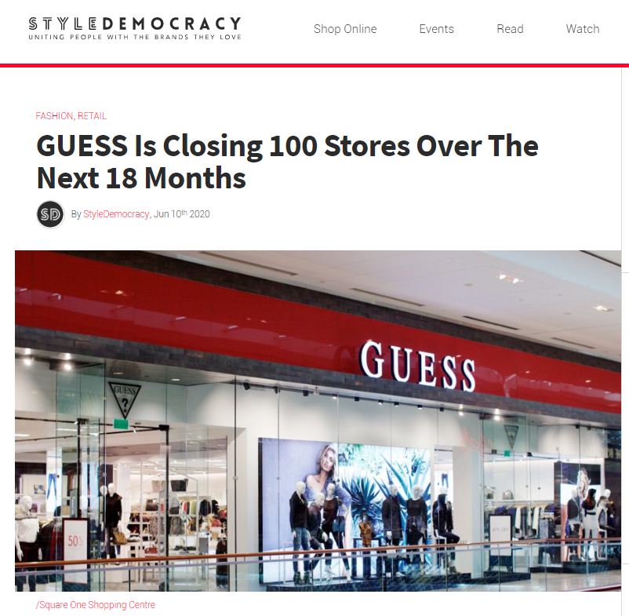 (原始链接: https://mmbiz.qpic.cn/mmbiz_png/szJas1pFaJebeceEWKDTM5BNnibMSaqX70oNQYVv9WCCD5Rukibr4ZSG9oz2rec0twPKvhbvLEKHJnnH8XOAQyiaA/640?wx_fmt=png)
- 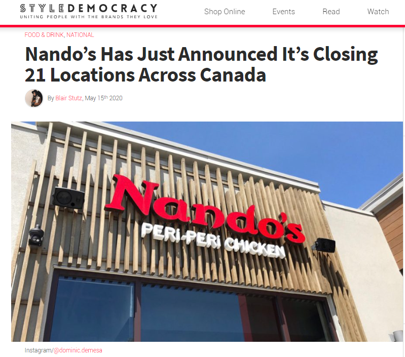 (原始链接: https://mmbiz.qpic.cn/mmbiz_png/szJas1pFaJebeceEWKDTM5BNnibMSaqX74Z6qODeKo30TuDo5sLDC5Qkcx6MOJeW1he1a5zWW63LLefdZxQTNoQ/640?wx_fmt=png)
- 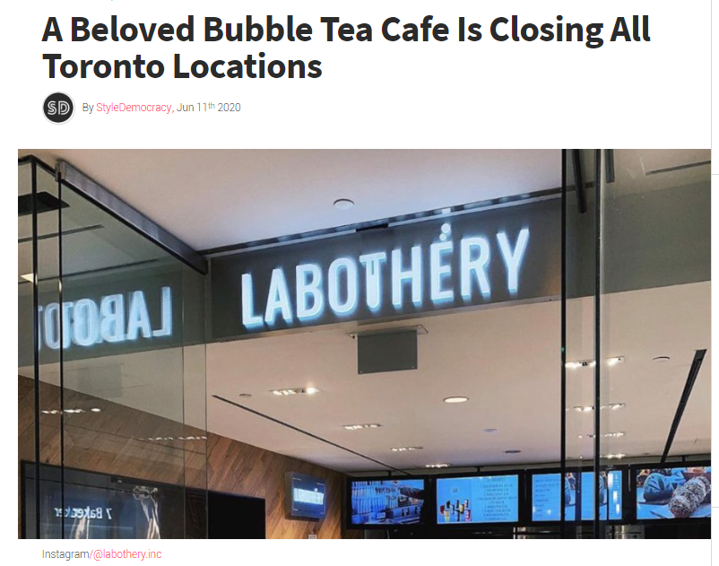 (原始链接: https://mmbiz.qpic.cn/mmbiz_png/szJas1pFaJebeceEWKDTM5BNnibMSaqX7AIyrkErLic8QLQB1X99YNFN3nHk9RRq2JS820kW0r0nRE1mhoLS8M6g/640?wx_fmt=png)
- 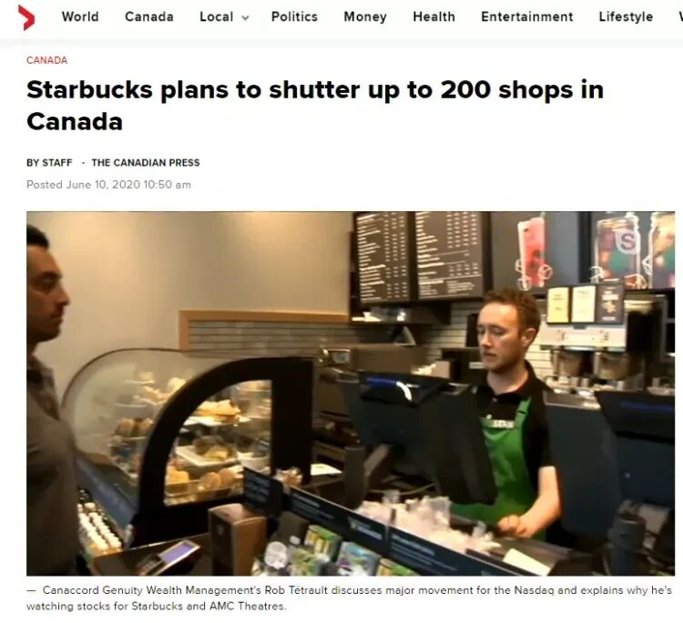 (原始链接: https://mmbiz.qpic.cn/mmbiz_jpg/szJas1pFaJebeceEWKDTM5BNnibMSaqX7fyzI312xkcQN2Ko7TuEwhUtBFyEl3Z1A4EKhXkhLfCZDf6ot3QuXyg/640?wx_fmt=jpeg)
- 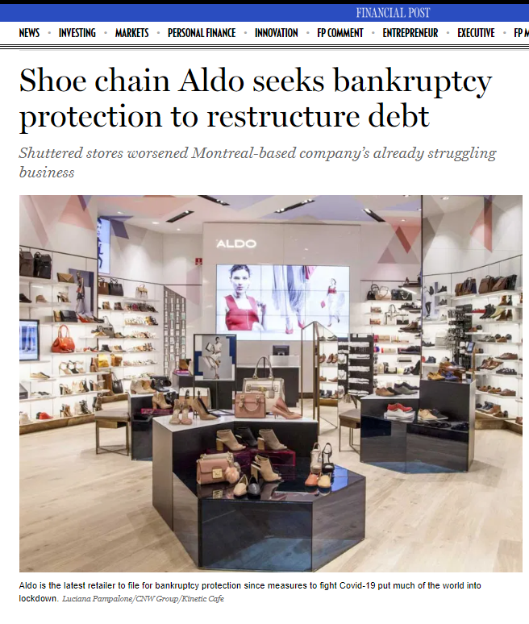 (原始链接: https://mmbiz.qpic.cn/mmbiz_png/szJas1pFaJebeceEWKDTM5BNnibMSaqX7AJhkxks9LYJQ8pHe3G0xsh7qWftVvMeW9v2EYsrhXfOBsuiclD6Fe1Q/640?wx_fmt=png)
- 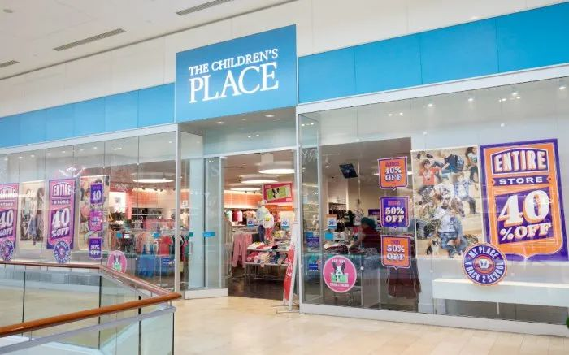 (原始链接: https://mmbiz.qpic.cn/mmbiz_jpg/szJas1pFaJebeceEWKDTM5BNnibMSaqX77jHc5JzIdfRW5siaFG3X59qOKug2GMVp2azzfkndyv2WFEKPkHia7icmQ/640?wx_fmt=jpeg)
-  (原始链接: https://mmbiz.qpic.cn/mmbiz_jpg/szJas1pFaJebeceEWKDTM5BNnibMSaqX7xCf06AFnf6CkpmgNP8DWPjrKHVbWgxUHiawcy7efwdF6ic2ORJ16CYjw/640?wx_fmt=jpeg)
- 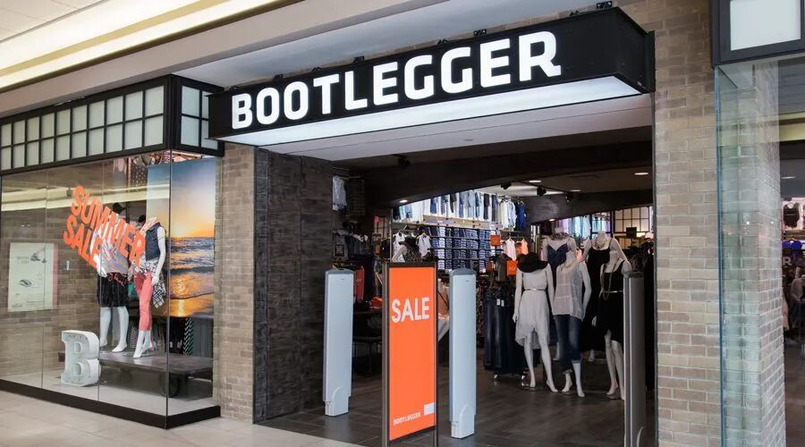 (原始链接: https://mmbiz.qpic.cn/mmbiz_jpg/szJas1pFaJebeceEWKDTM5BNnibMSaqX7ufCzbF1CG1y5jYY8w7Ht03vRd7ICRQ6K3t2H3ZDvcCS8icCo9DyyGEA/640?wx_fmt=jpeg)
- 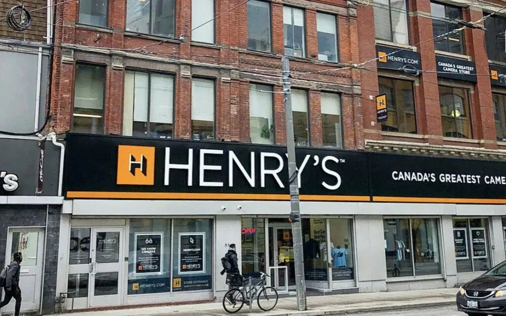 (原始链接: https://mmbiz.qpic.cn/mmbiz_jpg/szJas1pFaJebeceEWKDTM5BNnibMSaqX7Mnt7J0N8PNBYtmGnB7OWicZmggEsKWlsXQFrmZ7gkqHKhFL6GHUgg7Q/640?wx_fmt=jpeg)
- 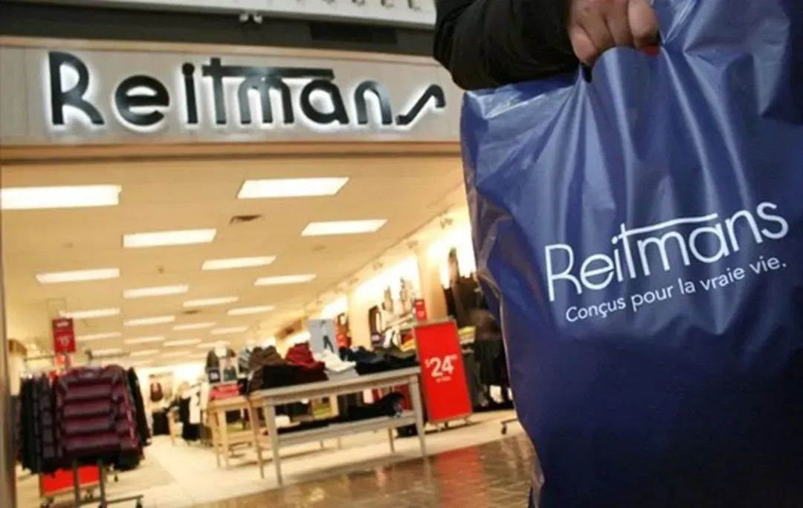 (原始链接: https://mmbiz.qpic.cn/mmbiz_jpg/szJas1pFaJebeceEWKDTM5BNnibMSaqX7dnHZMkMvqWEMDY7jPoBTWk4hyNwHyO0GapJyojJJdbOpZAVZ8zice9A/640?wx_fmt=jpeg)
- 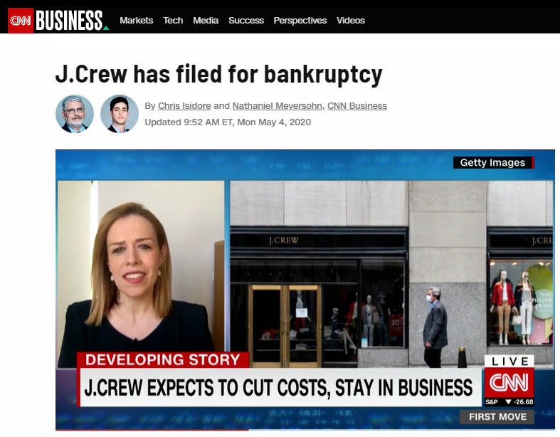 (原始链接: https://mmbiz.qpic.cn/mmbiz_png/szJas1pFaJebeceEWKDTM5BNnibMSaqX79t09PapR8el2kWejyd5tlz0nUZrzHJERsd4Smwtgu1xxyH1hCS2ALg/640?wx_fmt=png)
- 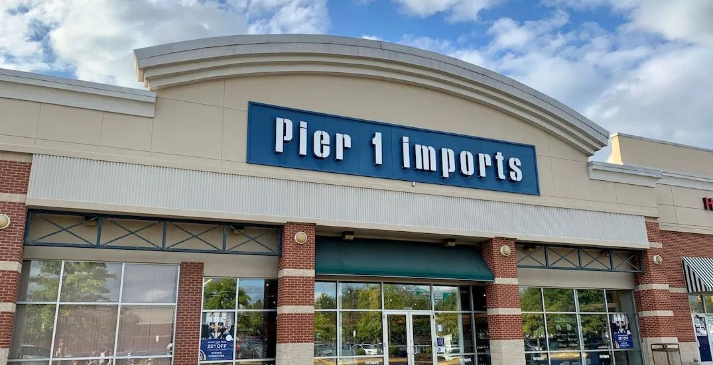 (原始链接: https://mmbiz.qpic.cn/mmbiz_jpg/4kibCXA1QiblRBGJ3SOgicfLIrYP1ZBwdIMgM0eSQFPoiab7ZeLC6rMKIXtWjoSADdyCGWPqwDISpyNY1AvcicSoMTA/640?wx_fmt=jpeg)
- 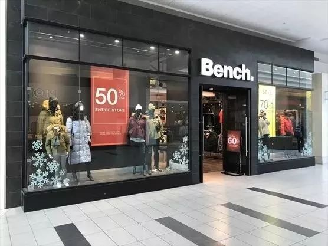 (原始链接: https://mmbiz.qpic.cn/mmbiz_jpg/4kibCXA1QiblRBGJ3SOgicfLIrYP1ZBwdIMic8rSfLWmLy9K2XObgwSB3hPgmnyxQbEEhYlh6rKCbgbNLX6LVlWIdg/640?wx_fmt=jpeg)
- 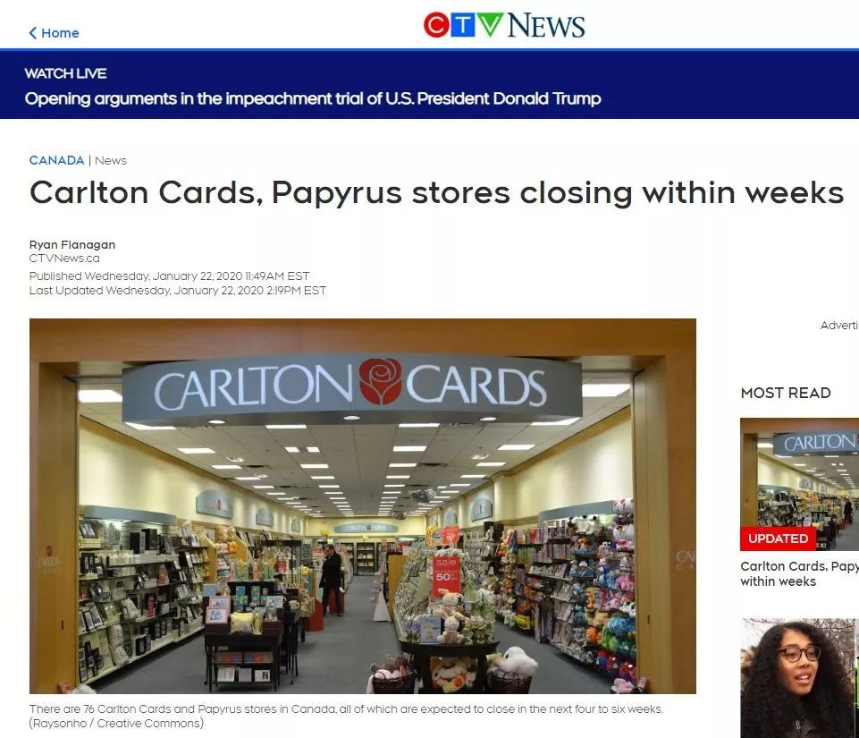 (原始链接: https://mmbiz.qpic.cn/mmbiz_jpg/4kibCXA1QiblRBGJ3SOgicfLIrYP1ZBwdIM5zc30ctC03MAvcfwtNqdNciaWsZ21QtCpbt7WSrYRKGpDCj3EODUkdw/640?wx_fmt=jpeg)
-  (原始链接: https://mmbiz.qpic.cn/mmbiz_jpg/4kibCXA1QiblRBGJ3SOgicfLIrYP1ZBwdIMTIaymfvpDvWEic85J5GcCVyY52txfPR1Pexr6icq9ibhdgOqXQuY1K1dA/640?wx_fmt=jpeg)
- 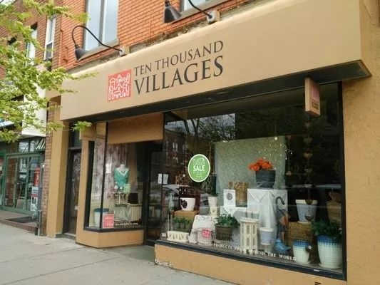 (原始链接: https://mmbiz.qpic.cn/mmbiz_jpg/4kibCXA1QiblSFXTksDylBWOhFOkpdVved4rjCH7Qn9zsDpVOOzqib8BUPA22DCmFmGX0IeiaoTqphsSbWpJzOG9ow/640?wx_fmt=jpeg)
- 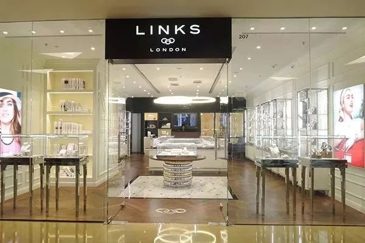 (原始链接: https://mmbiz.qpic.cn/mmbiz_jpg/4kibCXA1QiblRBGJ3SOgicfLIrYP1ZBwdIMTW4ngQcgTtBUmmsuTtgX2Sicdu2fLkLnkLuguDuOjobAibflqFgUFJMQ/640?wx_fmt=jpeg)
- 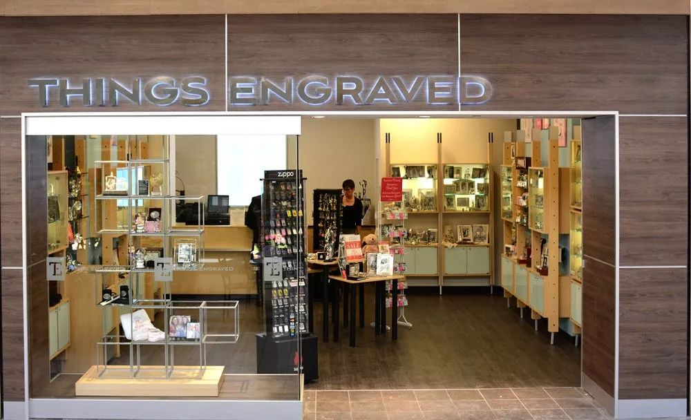 (原始链接: https://mmbiz.qpic.cn/mmbiz_jpg/4kibCXA1QiblSFXTksDylBWOhFOkpdVvedTjNHZADRTv1zMIVLVRR7TfvmkQh3ibvyAmsXNtS3yVMlopUHfwYW8lQ/640?wx_fmt=jpeg)
- 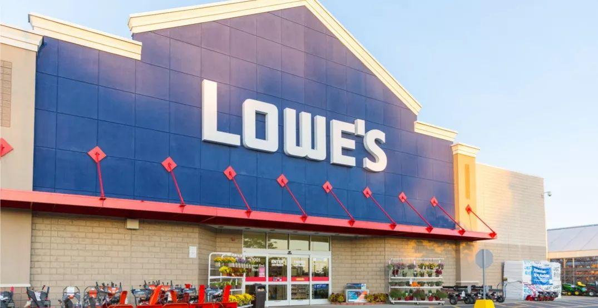 (原始链接: https://mmbiz.qpic.cn/mmbiz_jpg/4kibCXA1QiblSFXTksDylBWOhFOkpdVvedo6pFCXvRIStav6khqORSCmOy1gwMl8GTYOTG79jxliayicvlTvIoAYzQ/640?wx_fmt=jpeg)
- 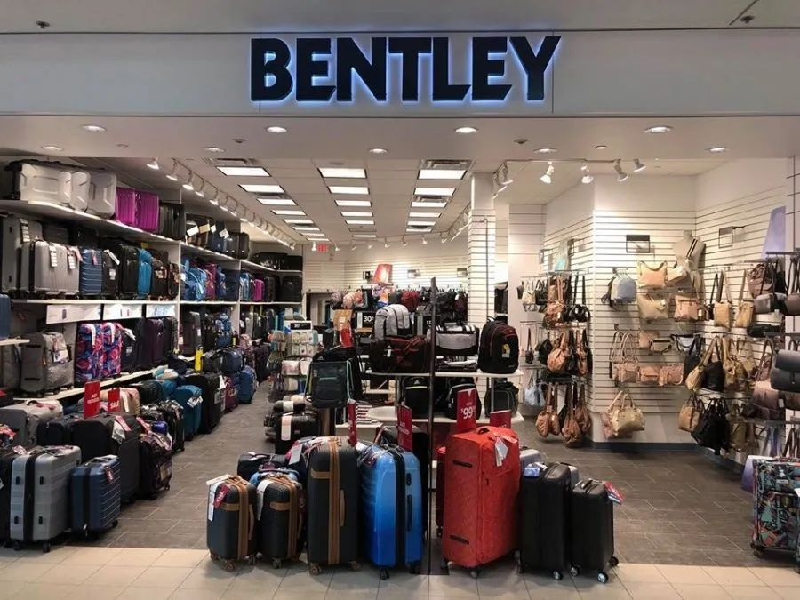 (原始链接: https://mmbiz.qpic.cn/mmbiz_jpg/4kibCXA1QiblSFXTksDylBWOhFOkpdVvedBUZqLJ7yeHxOAfbNNjMia2H1XCZCR7ccrH2l7WsDvGJ6zuzicpt72qbA/640?wx_fmt=jpeg)
-  (原始链接: https://mmbiz.qpic.cn/mmbiz_jpg/4kibCXA1QiblSFXTksDylBWOhFOkpdVvedJMkcQJQ4sY8oJhCicW46SZibcibgxDzODNqIEu8FucWg1clDvYhvAIaibQ/640?wx_fmt=jpeg)
- 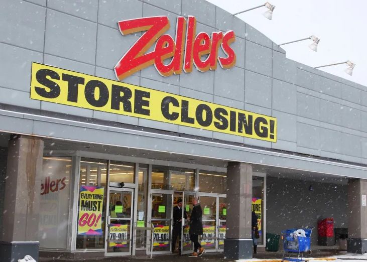 (原始链接: https://mmbiz.qpic.cn/mmbiz_png/4kibCXA1QiblSFXTksDylBWOhFOkpdVvedmbsv2oavkSSv39icRrS051UckUFY9QGeVdZqTwIB3QLEASCNLgnDkvw/640?wx_fmt=png)
- 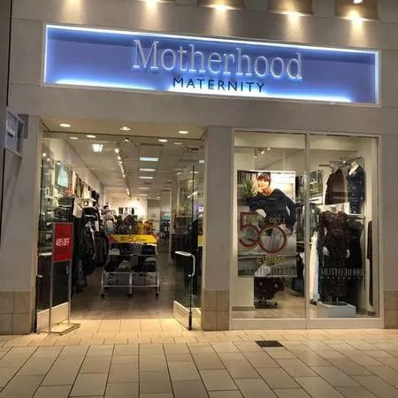 (原始链接: https://mmbiz.qpic.cn/mmbiz_jpg/4kibCXA1QiblSFXTksDylBWOhFOkpdVvedFnpIuknS7hrksa2ictCTiajlHZZJdalMOsfYcW0zXeV63a8qOPENWiciaQ/640?wx_fmt=jpeg)
- 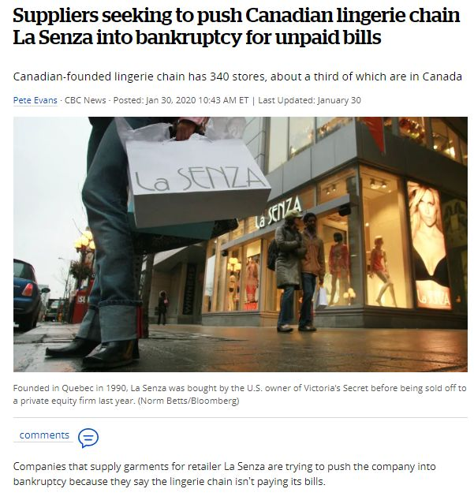 (原始链接: https://mmbiz.qpic.cn/mmbiz_png/4kibCXA1QiblRBGJ3SOgicfLIrYP1ZBwdIMeUV66PBqhCwBibkNpMwRjPtD9bsdMKicdaohozkicMn9Bj51fePjKJI4g/640?wx_fmt=jpeg)
- 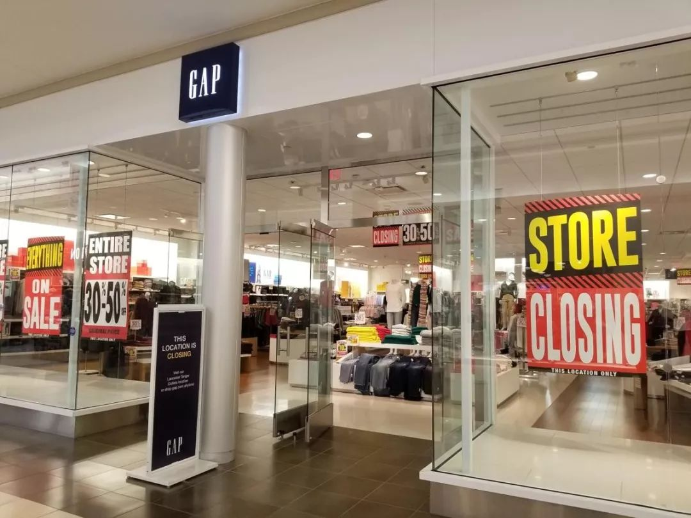 (原始链接: https://mmbiz.qpic.cn/mmbiz_jpg/4kibCXA1QiblSFXTksDylBWOhFOkpdVved9hLu9IKpPuBbGTXRJia2Tm2SIFRcRiaHpdCTcm2fp98TDrt7yaHtQbCw/640?wx_fmt=jpeg)
- 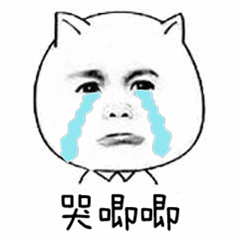 (原始链接: https://mmbiz.qpic.cn/mmbiz_gif/szJas1pFaJebeceEWKDTM5BNnibMSaqX7riatGzbItj2Ec4RWqvaEqNjuTic22IREHTicu7QibWnbIicQXmDsymjwATw/640?wx_fmt=gif)
-  (原始链接: https://mmbiz.qpic.cn/mmbiz_gif/szJas1pFaJdUFDPEKnLrCyGC4WgrAvl6lSC2beZFt6icTnXfebnRzcRialMg5VZujw1AhX9ribkSDQNZZukk8HX9w/640?wx_fmt=gif)
