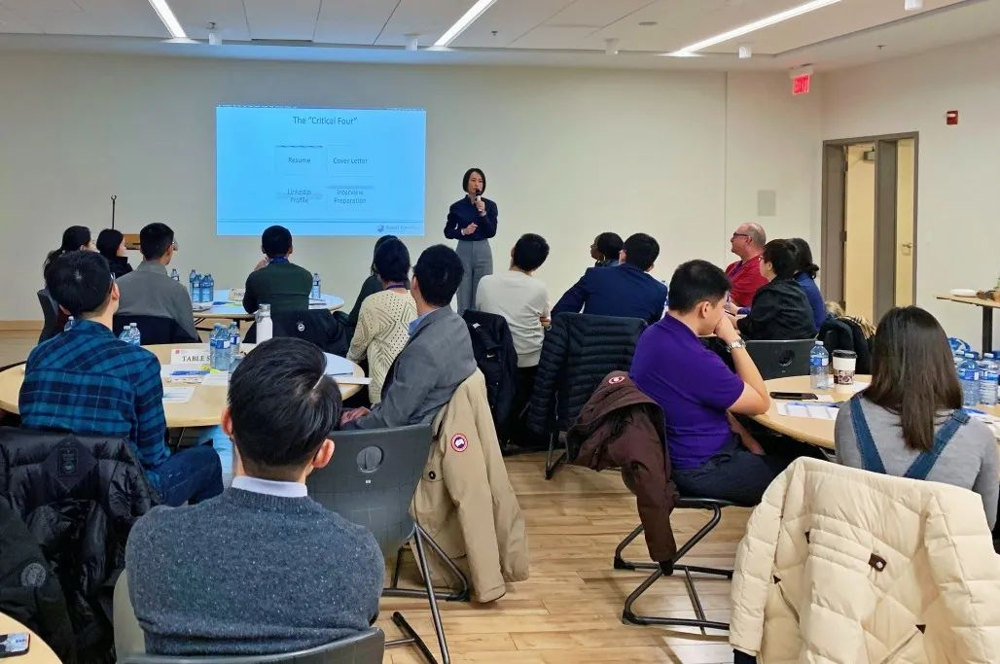
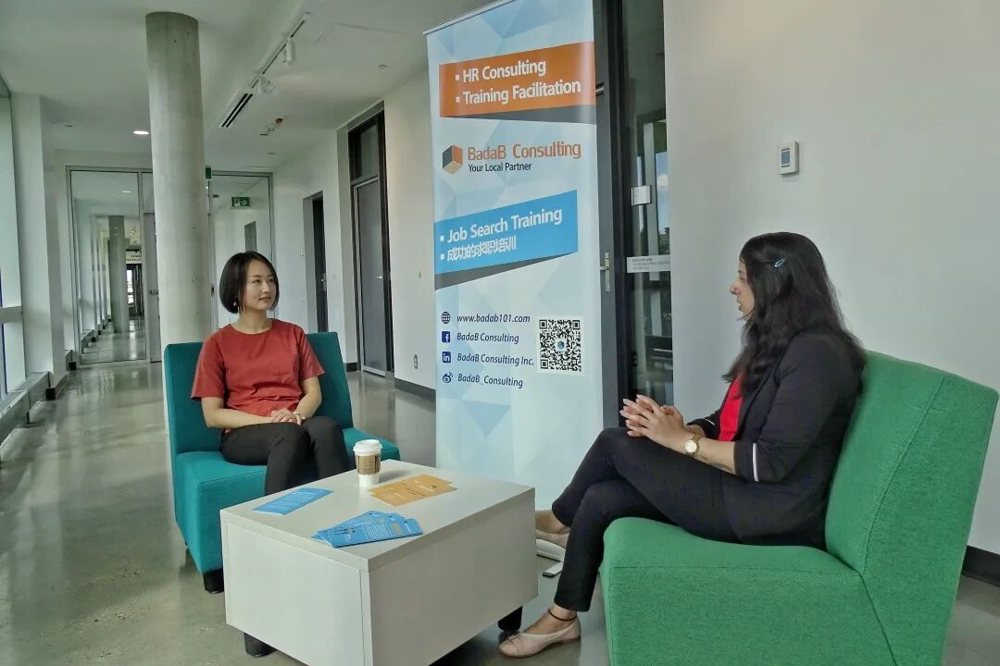

# 无标题

**链接地址:** http://mp.weixin.qq.com/s?__biz=MzI4NDYyNjAwNw==&mid=2247484165&idx=1&sn=ea2c5a68ffc3a9023b3be1ebad3cc5b8&chksm=ebf9de3ddc8e572b51bed048b78aa03c52395033b78283107389d2ee70113ad377ef830c8d41&mpshare=1&scene=2&srcid=&sharer_sharetime=1593216934353&sharer_shareid=be1c8edd6c93eec155a61c876e41d26a#rd
**作者:** 关注我们
**获取时间:** 2025/8/28 20:11:56
**图片数量:** 7

---

## 原始HTML内容

<section style="box-sizing: border-box;font-size: 16px;"><section style="text-align: center;justify-content: center;margin-top: 10px;margin-right: 0%;margin-left: 0%;box-sizing: border-box;" powered-by="xiumi.us"><section style="display: inline-block;vertical-align: bottom;width: auto;box-shadow: rgb(0, 0, 0) 0px 0px 0px;min-width: 10%;max-width: 100%;height: auto;align-self: flex-end;margin-right: -17px;box-sizing: border-box;"><section style="transform: translate3d(1px, 0px, 0px);margin-right: 0%;margin-bottom: 2px;margin-left: 0%;box-sizing: border-box;" powered-by="xiumi.us"><section style="text-align: justify;font-size: 18px;color: rgb(111, 128, 255);letter-spacing: 2px;line-height: 1;text-shadow: rgb(255, 255, 255) 0px 0px 5px, rgb(255, 255, 255) 0px 0px 5px;box-sizing: border-box;">
<strong style="box-sizing: border-box;">职位招聘</strong>
</section></section><section style="justify-content: center;margin-right: 0%;margin-left: 0%;font-size: 0px;box-sizing: border-box;" powered-by="xiumi.us"><section style="display: inline-block;width: 100%;height: 2px;vertical-align: top;overflow: hidden;background-position: 12.6984% 72.7273%;background-repeat: repeat;background-size: 138.889%;background-attachment: scroll;border-width: 0px;background-image: url(&quot;https://mmbiz.qpic.cn/mmbiz_gif/cY0qSDjdkFcJrT9VO2teum9JCv4AJoYbMrWiaZFeLxnyRpyNLNbaCoanZiaZhiaiaqNnJfSxwwbxhxFZ80d8D3HGnA/640?wx_fmt=gif&quot;);box-sizing: border-box;line-height: 0;"> </section></section></section><section style="display: inline-block;vertical-align: bottom;width: auto;align-self: flex-end;box-shadow: rgb(0, 0, 0) 0px 0px 0px;min-width: 10%;max-width: 100%;height: auto;box-sizing: border-box;"><section style="text-align: left;font-size: 0px;justify-content: flex-start;margin-right: 0%;margin-bottom: 4px;margin-left: 0%;box-sizing: border-box;" powered-by="xiumi.us"><section style="display: inline-block;width: 28px;height: 28px;vertical-align: top;overflow: hidden;border-width: 0px;border-radius: 50%;border-style: none;border-color: rgb(62, 62, 62);box-shadow: rgba(34, 82, 237, 0.14) -4px 4px 12px inset;box-sizing: border-box;line-height: 0;"> </section></section></section></section><section style="margin: -2px 0% 12px;box-sizing: border-box;" powered-by="xiumi.us"><section style="background-color: rgb(244, 244, 244);height: 2px;box-sizing: border-box;line-height: 0;"> </section></section><section style="margin: -10px 0% 10px;transform: translate3d(-10px, 0px, 0px);opacity: 0.71;box-sizing: border-box;" powered-by="xiumi.us"><section style="text-align: center;font-size: 12px;letter-spacing: 1px;box-sizing: border-box;">
<strong style="box-sizing: border-box;">Job Posting</strong>
</section></section><section style="text-align: center;margin-right: 0%;margin-left: 0%;box-sizing: border-box;" powered-by="xiumi.us"><section style="max-width: 100%;vertical-align: middle;display: inline-block;line-height: 0;box-shadow: rgb(15, 76, 129) 0px 0px 0px;box-sizing: border-box;"></section></section><section style="margin: 20px 0%;box-sizing: border-box;" powered-by="xiumi.us"><section style="letter-spacing: 2px;font-size: 14px;color: rgb(121, 121, 121);padding-right: 20px;padding-left: 20px;line-height: 2;box-sizing: border-box;">
BADAB Consulting是一个成立于阿省埃德蒙顿市的<strong style="box-sizing: border-box;">人力资源咨询公司</strong>。

 

<strong style="box-sizing: border-box;">我们服务项目包括给企业提供人力资源咨询、招聘、员工培训等，同时我们也为个人提供专业的求职咨询。</strong>

 
</section></section><section style="margin: 10px 0%;text-align: center;justify-content: center;box-sizing: border-box;" powered-by="xiumi.us"><section style="display: inline-block;vertical-align: top;width: 40%;padding-right: 5px;height: auto;box-sizing: border-box;"><section powered-by="xiumi.us" style="display: inline-block;width: 100%;vertical-align: top;background-position: 50% 50%;background-repeat: no-repeat;background-size: cover;background-attachment: scroll;background-image: url(&quot;https://mmbiz.qpic.cn/mmbiz_jpg/cY0qSDjdkFcJrT9VO2teum9JCv4AJoYbjoeicdxBf2DkibHTS7pyCQkmnyBEtDPAQkBlWC8frkDg3V8FTlgicCaXg/640?wx_fmt=jpeg&quot;);box-sizing: border-box;"><section style="margin-right: 0%;margin-left: 0%;box-sizing: border-box;" powered-by="xiumi.us"><section style="max-width: 100%;vertical-align: middle;display: inline-block;line-height: 0;box-sizing: border-box;"></section></section></section></section><section style="display: inline-block;vertical-align: top;width: 40%;padding-left: 5px;height: auto;box-sizing: border-box;"><section powered-by="xiumi.us" style="display: inline-block;width: 100%;vertical-align: top;background-position: 50% 50%;background-repeat: no-repeat;background-size: cover;background-attachment: scroll;background-image: url(&quot;https://mmbiz.qpic.cn/mmbiz_jpg/cY0qSDjdkFcJrT9VO2teum9JCv4AJoYbjoeicdxBf2DkibHTS7pyCQkmnyBEtDPAQkBlWC8frkDg3V8FTlgicCaXg/640?wx_fmt=jpeg&quot;);box-sizing: border-box;"><section style="margin-right: 0%;margin-left: 0%;box-sizing: border-box;" powered-by="xiumi.us"><section style="max-width: 100%;vertical-align: middle;display: inline-block;line-height: 0;box-sizing: border-box;"></section></section></section></section></section><section style="margin: 10px 0%;text-align: center;justify-content: center;box-sizing: border-box;" powered-by="xiumi.us"><section style="display: inline-block;vertical-align: top;width: 40%;padding-right: 5px;height: auto;box-sizing: border-box;"><section powered-by="xiumi.us" style="display: inline-block;width: 100%;vertical-align: top;background-position: 50% 50%;background-repeat: no-repeat;background-size: cover;background-attachment: scroll;background-image: url(&quot;https://mmbiz.qpic.cn/mmbiz_jpg/cY0qSDjdkFcJrT9VO2teum9JCv4AJoYbjoeicdxBf2DkibHTS7pyCQkmnyBEtDPAQkBlWC8frkDg3V8FTlgicCaXg/640?wx_fmt=jpeg&quot;);box-sizing: border-box;"><section style="margin-right: 0%;margin-left: 0%;box-sizing: border-box;" powered-by="xiumi.us"><section style="max-width: 100%;vertical-align: middle;display: inline-block;line-height: 0;box-sizing: border-box;"></section></section></section></section><section style="display: inline-block;vertical-align: top;width: 40%;padding-left: 5px;height: auto;box-sizing: border-box;"><section powered-by="xiumi.us" style="display: inline-block;width: 100%;vertical-align: top;background-position: 50% 50%;background-repeat: no-repeat;background-size: cover;background-attachment: scroll;background-image: url(&quot;https://mmbiz.qpic.cn/mmbiz_jpg/cY0qSDjdkFcJrT9VO2teum9JCv4AJoYbjoeicdxBf2DkibHTS7pyCQkmnyBEtDPAQkBlWC8frkDg3V8FTlgicCaXg/640?wx_fmt=jpeg&quot;);box-sizing: border-box;"><section style="margin-right: 0%;margin-left: 0%;box-sizing: border-box;" powered-by="xiumi.us"><section style="max-width: 100%;vertical-align: middle;display: inline-block;line-height: 0;box-sizing: border-box;"></section></section></section></section></section><section style="text-align: center;font-size: 12px;color: rgba(101, 101, 101, 0.46);letter-spacing: 1px;box-sizing: border-box;" powered-by="xiumi.us">
Ada Tai 出席各类职业培训活动
</section><section style="margin: 20px 0%;box-sizing: border-box;" powered-by="xiumi.us"><section style="letter-spacing: 2px;font-size: 14px;color: rgb(121, 121, 121);padding-right: 20px;padding-left: 20px;line-height: 2;box-sizing: border-box;">
 

我们已经成功帮助<strong style="box-sizing: border-box;">500多人在加拿大和美国找到心仪的工作</strong>。

 

今天，我们将要给大家分享一个<strong style="box-sizing: border-box;">全职的工作机会</strong>：
</section></section><section style="box-sizing: border-box;" powered-by="xiumi.us">
 
</section><section style="margin-top: 8px;margin-right: 0%;margin-left: 0%;box-sizing: border-box;" powered-by="xiumi.us"><section style="background-image: linear-gradient(to right, rgb(85, 167, 255), rgb(122, 104, 255));height: 2px;box-sizing: border-box;line-height: 0;"> </section></section><section style="box-sizing: border-box;" powered-by="xiumi.us"><section style="display: flex;flex-flow: row nowrap;box-sizing: border-box;"><section style="display: inline-block;vertical-align: middle;width: auto;flex: 100 100 0%;align-self: center;height: auto;box-sizing: border-box;"><section style="margin-top: 0.5em;margin-bottom: 0.5em;box-sizing: border-box;" powered-by="xiumi.us"><section style="background-color: rgba(34, 82, 237, 0.14);height: 2px;box-sizing: border-box;line-height: 0;"> </section></section><section style="margin-top: 0.5em;margin-bottom: 0.5em;box-sizing: border-box;" powered-by="xiumi.us"><section style="background-color: rgba(34, 82, 237, 0.14);height: 2px;box-sizing: border-box;line-height: 0;"> </section></section><section style="margin-top: 0.5em;margin-bottom: 0.5em;box-sizing: border-box;" powered-by="xiumi.us"><section style="background-color: rgba(34, 82, 237, 0.14);height: 2px;box-sizing: border-box;line-height: 0;"> </section></section></section><section style="display: inline-block;vertical-align: middle;width: auto;min-width: 10%;max-width: 100%;flex: 0 0 auto;height: auto;align-self: center;box-sizing: border-box;"><section style="text-align: center;margin-right: 0%;margin-left: 0%;box-sizing: border-box;" powered-by="xiumi.us"><section style="display: inline-block;min-width: 10%;max-width: 100%;vertical-align: top;transform: matrix(1, 0, -0.2, 1, 0, 0);border-style: none;border-width: 0px;border-radius: 0px;border-color: rgb(37, 180, 170);background-color: rgba(255, 255, 255, 0);line-height: 1.6;box-sizing: border-box;"><section style="text-align: justify;padding-right: 10px;padding-left: 10px;letter-spacing: 3px;line-height: 1.5;font-size: 30px;box-sizing: border-box;" powered-by="xiumi.us">
<strong style="box-sizing: border-box;">客户服务顾问</strong>
</section></section></section></section><section style="display: inline-block;vertical-align: middle;width: auto;flex: 100 100 0%;align-self: center;height: auto;box-sizing: border-box;"><section style="margin-top: 0.5em;margin-bottom: 0.5em;box-sizing: border-box;" powered-by="xiumi.us"><section style="background-color: rgba(34, 82, 237, 0.14);height: 2px;box-sizing: border-box;line-height: 0;"> </section></section><section style="margin-top: 0.5em;margin-bottom: 0.5em;box-sizing: border-box;" powered-by="xiumi.us"><section style="background-color: rgba(34, 82, 237, 0.14);height: 2px;box-sizing: border-box;line-height: 0;"> </section></section><section style="margin-top: 0.5em;margin-bottom: 0.5em;box-sizing: border-box;" powered-by="xiumi.us"><section style="background-color: rgba(34, 82, 237, 0.14);height: 2px;box-sizing: border-box;line-height: 0;"> </section></section></section></section></section><section style="margin-right: 0%;margin-bottom: 10px;margin-left: 0%;box-sizing: border-box;" powered-by="xiumi.us"><section style="display: inline-block;width: 100%;vertical-align: top;background-color: rgba(34, 82, 237, 0.07);padding: 15px;box-sizing: border-box;"><section style="text-align: center;margin-right: 0%;margin-left: 0%;box-sizing: border-box;" powered-by="xiumi.us"><section style="max-width: 100%;vertical-align: middle;display: inline-block;line-height: 0;box-sizing: border-box;"></section></section><section style="box-sizing: border-box;" powered-by="xiumi.us">
 
</section><section style="box-sizing: border-box;" powered-by="xiumi.us"><section style="display: flex;flex-flow: row nowrap;margin-right: 0%;margin-left: 0%;box-sizing: border-box;"><section style="display: inline-block;vertical-align: top;width: auto;flex: 0 0 auto;align-self: stretch;min-width: 10%;max-width: 100%;height: auto;background-image: linear-gradient(to right, rgb(135, 69, 255) 0%, rgb(74, 179, 255) 100%);box-sizing: border-box;"><section style="margin: 6px 0%;box-sizing: border-box;" powered-by="xiumi.us"><section style="text-align: center;font-size: 12px;color: rgb(244, 244, 244);padding-right: 10px;padding-left: 10px;line-height: 1.3;letter-spacing: 0px;box-sizing: border-box;">
职位

简介
</section></section></section><section style="display: inline-block;vertical-align: top;width: auto;flex: 100 100 0%;align-self: stretch;height: auto;background-image: linear-gradient(to right, rgb(244, 238, 255) 0%, rgb(245, 251, 255) 100%);box-sizing: border-box;"><section style="margin-top: 6px;margin-right: 0%;margin-left: 0%;box-sizing: border-box;" powered-by="xiumi.us"><section style="color: rgb(34, 82, 237);padding-right: 12px;padding-left: 12px;letter-spacing: 0.6px;line-height: 2;box-sizing: border-box;">
<strong style="box-sizing: border-box;">INTRODUCTION</strong>
</section></section></section></section></section><section style="display: inline-block;width: 100%;vertical-align: top;padding-left: 20px;box-sizing: border-box;" powered-by="xiumi.us"><section style="display: inline-block;width: 100%;vertical-align: top;border-left: 1px solid rgb(111, 128, 255);border-bottom-left-radius: 0px;padding-right: 10px;padding-bottom: 10px;padding-left: 15px;box-sizing: border-box;" powered-by="xiumi.us"><section style="margin: 10px 0% 6px;box-sizing: border-box;" powered-by="xiumi.us"><section style="text-align: left;font-size: 14px;letter-spacing: 0px;line-height: 1.6;box-sizing: border-box;">
<strong style="box-sizing: border-box;">Cantrust Insurance</strong> is looking for a&nbsp;<strong style="box-sizing: border-box;">Customer Service Representative</strong>&nbsp;to assist in operations to ensure high operational standards &amp; efficient customer service can be met.&nbsp;

 

We encourage you to apply if you are a team player, understand the value of outstanding customer service, wish to drive growth in an already thriving business, and have a determination to contribute to the company culture.

 
</section></section></section></section><section style="box-sizing: border-box;" powered-by="xiumi.us"><section style="display: flex;flex-flow: row nowrap;margin-right: 0%;margin-left: 0%;box-sizing: border-box;"><section style="display: inline-block;vertical-align: top;width: auto;flex: 0 0 auto;align-self: stretch;min-width: 10%;max-width: 100%;height: auto;background-image: linear-gradient(to right, rgb(135, 69, 255) 0%, rgb(74, 179, 255) 100%);box-sizing: border-box;"><section style="margin: 6px 0%;box-sizing: border-box;" powered-by="xiumi.us"><section style="text-align: center;font-size: 12px;color: rgb(244, 244, 244);padding-right: 10px;padding-left: 10px;line-height: 1.3;letter-spacing: 0px;box-sizing: border-box;">
技能

要求
</section></section></section><section style="display: inline-block;vertical-align: top;width: auto;flex: 100 100 0%;align-self: stretch;height: auto;background-image: linear-gradient(to right, rgb(244, 238, 255) 0%, rgb(245, 251, 255) 100%);box-sizing: border-box;"><section style="margin-top: 6px;margin-right: 0%;margin-left: 0%;box-sizing: border-box;" powered-by="xiumi.us"><section style="color: rgb(34, 82, 237);padding-right: 12px;padding-left: 12px;letter-spacing: 0.6px;line-height: 2;box-sizing: border-box;">
<strong style="box-sizing: border-box;">REQUIREMENTS</strong>
</section></section></section></section></section><section style="display: inline-block;width: 100%;vertical-align: top;padding-left: 20px;box-sizing: border-box;" powered-by="xiumi.us"><section style="display: inline-block;width: 100%;vertical-align: top;border-left: 1px solid rgb(111, 128, 255);border-bottom-left-radius: 0px;padding-right: 10px;padding-bottom: 10px;padding-left: 15px;box-sizing: border-box;" powered-by="xiumi.us"><section style="margin: 10px 0% 6px;box-sizing: border-box;" powered-by="xiumi.us"><section style="font-size: 14px;letter-spacing: 0px;line-height: 1.6;box-sizing: border-box;">
 
<ol class="list-paddingleft-2"><li style="box-sizing: border-box;">
Strong customer service orientation.
</li><li style="box-sizing: border-box;">
Effective communication &amp; organizational skills.
</li><li style="box-sizing: border-box;">
Professional phone manner.
</li><li style="box-sizing: border-box;">
Computer skills.
</li><li style="box-sizing: border-box;">
Ability to prioritize workloads and manage multiple tasks and deadlines.
</li><li style="box-sizing: border-box;">
High values in teamwork, client service and professionalism.
</li><li style="box-sizing: border-box;">
Strong ability to plan, organize, delegate and follow up on team's activities and projects.
</li><li style="box-sizing: border-box;">
Strong organizational skills,&nbsp; attention to detail.

 
</li></ol></section></section></section></section><section style="box-sizing: border-box;" powered-by="xiumi.us"><section style="display: flex;flex-flow: row nowrap;margin-right: 0%;margin-left: 0%;box-sizing: border-box;"><section style="display: inline-block;vertical-align: top;width: auto;flex: 0 0 auto;align-self: stretch;min-width: 10%;max-width: 100%;height: auto;background-image: linear-gradient(to right, rgb(135, 69, 255) 0%, rgb(74, 179, 255) 100%);box-sizing: border-box;"><section style="margin: 6px 0%;box-sizing: border-box;" powered-by="xiumi.us"><section style="text-align: center;font-size: 12px;color: rgb(244, 244, 244);padding-right: 10px;padding-left: 10px;line-height: 1.3;letter-spacing: 0px;box-sizing: border-box;">
职员

责任 
</section></section></section><section style="display: inline-block;vertical-align: top;width: auto;flex: 100 100 0%;align-self: stretch;height: auto;background-image: linear-gradient(to right, rgb(244, 238, 255) 0%, rgb(245, 251, 255) 100%);box-sizing: border-box;"><section style="margin-top: 6px;margin-right: 0%;margin-left: 0%;box-sizing: border-box;" powered-by="xiumi.us"><section style="color: rgb(34, 82, 237);padding-right: 12px;padding-left: 12px;letter-spacing: 0.6px;line-height: 2;box-sizing: border-box;">
<strong style="box-sizing: border-box;">JOB DUTIES</strong>
</section></section></section></section></section><section style="display: inline-block;width: 100%;vertical-align: top;padding-left: 20px;box-sizing: border-box;" powered-by="xiumi.us"><section style="display: inline-block;width: 100%;vertical-align: top;border-left: 1px solid rgb(111, 128, 255);border-bottom-left-radius: 0px;padding-right: 10px;padding-bottom: 10px;padding-left: 15px;box-sizing: border-box;" powered-by="xiumi.us"><section style="margin: 10px 0% 6px;box-sizing: border-box;" powered-by="xiumi.us"><section style="text-align: left;font-size: 14px;letter-spacing: 0px;line-height: 1.6;box-sizing: border-box;"><ol class="list-paddingleft-2"><li style="box-sizing: border-box;">
Answer incoming customer inquiries
</li><li style="box-sizing: border-box;">
Collaborate with the team to stay updated on new products, services, and policies
</li><li style="box-sizing: border-box;">
Record and modify customer information within the database
</li><li style="box-sizing: border-box;">
Engage with clients in a friendly and professional manner while actively listening to their concerns
</li><li style="box-sizing: border-box;">
Offer support and solutions to customers in accordance with the company's customer service policies
</li><li style="box-sizing: border-box;">
Other duties as requested

 
</li></ol></section></section></section></section><section style="box-sizing: border-box;" powered-by="xiumi.us"><section style="display: flex;flex-flow: row nowrap;margin-right: 0%;margin-left: 0%;box-sizing: border-box;"><section style="display: inline-block;vertical-align: top;width: auto;flex: 0 0 auto;align-self: stretch;min-width: 10%;max-width: 100%;height: auto;background-image: linear-gradient(to right, rgb(135, 69, 255) 0%, rgb(74, 179, 255) 100%);box-sizing: border-box;"><section style="margin: 6px 0%;box-sizing: border-box;" powered-by="xiumi.us"><section style="text-align: center;font-size: 12px;color: rgb(244, 244, 244);padding-right: 10px;padding-left: 10px;line-height: 1.3;letter-spacing: 0px;box-sizing: border-box;">
工作

经验
</section></section></section><section style="display: inline-block;vertical-align: top;width: auto;flex: 100 100 0%;align-self: stretch;height: auto;background-image: linear-gradient(to right, rgb(244, 238, 255) 0%, rgb(245, 251, 255) 100%);box-sizing: border-box;"><section style="margin-top: 6px;margin-right: 0%;margin-left: 0%;box-sizing: border-box;" powered-by="xiumi.us"><section style="color: rgb(34, 82, 237);padding-right: 12px;padding-left: 12px;letter-spacing: 0.6px;line-height: 2;box-sizing: border-box;">
<strong style="box-sizing: border-box;">EXPERIENCE</strong>
</section></section></section></section></section><section style="display: inline-block;width: 100%;vertical-align: top;padding-left: 20px;box-sizing: border-box;" powered-by="xiumi.us"><section style="display: inline-block;width: 100%;vertical-align: top;border-left: 1px solid rgb(111, 128, 255);border-bottom-left-radius: 0px;padding-right: 10px;padding-bottom: 10px;padding-left: 15px;box-sizing: border-box;" powered-by="xiumi.us"><section style="margin: 10px 0% 6px;box-sizing: border-box;" powered-by="xiumi.us"><section style="text-align: left;font-size: 14px;letter-spacing: 0px;line-height: 1.6;box-sizing: border-box;">
Customer Service: 1 year (Preferred) 
</section></section></section></section><section style="box-sizing: border-box;" powered-by="xiumi.us"><section style="display: flex;flex-flow: row nowrap;margin-right: 0%;margin-left: 0%;box-sizing: border-box;"><section style="display: inline-block;vertical-align: top;width: auto;flex: 0 0 auto;align-self: stretch;min-width: 10%;max-width: 100%;height: auto;background-image: linear-gradient(to right, rgb(135, 69, 255) 0%, rgb(74, 179, 255) 100%);box-sizing: border-box;"><section style="margin: 6px 0%;box-sizing: border-box;" powered-by="xiumi.us"><section style="text-align: center;font-size: 12px;color: rgb(244, 244, 244);padding-right: 10px;padding-left: 10px;line-height: 1.3;letter-spacing: 0px;box-sizing: border-box;">
语言

要求
</section></section></section><section style="display: inline-block;vertical-align: top;width: auto;flex: 100 100 0%;align-self: stretch;height: auto;background-image: linear-gradient(to right, rgb(244, 238, 255) 0%, rgb(245, 251, 255) 100%);box-sizing: border-box;"><section style="margin-top: 6px;margin-right: 0%;margin-left: 0%;box-sizing: border-box;" powered-by="xiumi.us"><section style="color: rgb(34, 82, 237);padding-right: 12px;padding-left: 12px;letter-spacing: 0.6px;line-height: 2;box-sizing: border-box;">
<strong style="box-sizing: border-box;">LANGUAGE</strong>
</section></section></section></section></section><section style="display: inline-block;width: 100%;vertical-align: top;padding-left: 20px;box-sizing: border-box;" powered-by="xiumi.us"><section style="display: inline-block;width: 100%;vertical-align: top;border-left: 1px solid rgb(111, 128, 255);border-bottom-left-radius: 0px;padding-right: 10px;padding-bottom: 10px;padding-left: 15px;box-sizing: border-box;" powered-by="xiumi.us"><section style="margin: 10px 0% 6px;box-sizing: border-box;" powered-by="xiumi.us"><section style="text-align: left;font-size: 14px;letter-spacing: 0px;line-height: 1.6;box-sizing: border-box;">
Able to communicate clearly in both English and Mandarin.
</section></section></section></section><section style="box-sizing: border-box;" powered-by="xiumi.us"><section style="display: flex;flex-flow: row nowrap;margin-right: 0%;margin-left: 0%;box-sizing: border-box;"><section style="display: inline-block;vertical-align: top;width: auto;flex: 0 0 auto;align-self: stretch;min-width: 10%;max-width: 100%;height: auto;background-image: linear-gradient(to right, rgb(135, 69, 255) 0%, rgb(74, 179, 255) 100%);box-sizing: border-box;"><section style="margin: 6px 0%;box-sizing: border-box;" powered-by="xiumi.us"><section style="text-align: center;font-size: 12px;color: rgb(244, 244, 244);padding-right: 10px;padding-left: 10px;line-height: 1.3;letter-spacing: 0px;box-sizing: border-box;">
工时

种类
</section></section></section><section style="display: inline-block;vertical-align: top;width: auto;flex: 100 100 0%;align-self: stretch;height: auto;background-image: linear-gradient(to right, rgb(244, 238, 255) 0%, rgb(245, 251, 255) 100%);box-sizing: border-box;"><section style="margin-top: 6px;margin-right: 0%;margin-left: 0%;box-sizing: border-box;" powered-by="xiumi.us"><section style="color: rgb(34, 82, 237);padding-right: 12px;padding-left: 12px;letter-spacing: 0.6px;line-height: 2;box-sizing: border-box;">
<strong style="box-sizing: border-box;">JOB TYPES</strong>
</section></section></section></section></section><section style="display: inline-block;width: 100%;vertical-align: top;padding-left: 20px;box-sizing: border-box;" powered-by="xiumi.us"><section style="display: inline-block;width: 100%;vertical-align: top;border-left: 1px solid rgb(111, 128, 255);border-bottom-left-radius: 0px;padding-right: 10px;padding-bottom: 10px;padding-left: 15px;box-sizing: border-box;" powered-by="xiumi.us"><section style="margin: 10px 0% 6px;box-sizing: border-box;" powered-by="xiumi.us"><section style="text-align: left;font-size: 14px;letter-spacing: 0px;line-height: 1.6;box-sizing: border-box;">
Full time office position - 40 hours per week&nbsp;
</section></section></section></section><section style="box-sizing: border-box;" powered-by="xiumi.us"><section style="display: flex;flex-flow: row nowrap;margin-right: 0%;margin-left: 0%;box-sizing: border-box;"><section style="display: inline-block;vertical-align: top;width: auto;flex: 0 0 auto;align-self: stretch;min-width: 10%;max-width: 100%;height: auto;background-image: linear-gradient(to right, rgb(135, 69, 255) 0%, rgb(74, 179, 255) 100%);box-sizing: border-box;"><section style="margin: 6px 0%;box-sizing: border-box;" powered-by="xiumi.us"><section style="text-align: center;font-size: 12px;color: rgb(244, 244, 244);padding-right: 10px;padding-left: 10px;line-height: 1.3;letter-spacing: 0px;box-sizing: border-box;">
资薪

福利
</section></section></section><section style="display: inline-block;vertical-align: top;width: auto;flex: 100 100 0%;align-self: stretch;height: auto;background-image: linear-gradient(to right, rgb(244, 238, 255) 0%, rgb(245, 251, 255) 100%);box-sizing: border-box;"><section style="margin-top: 6px;margin-right: 0%;margin-left: 0%;box-sizing: border-box;" powered-by="xiumi.us"><section style="color: rgb(34, 82, 237);padding-right: 12px;padding-left: 12px;letter-spacing: 0.6px;line-height: 2;box-sizing: border-box;">
<strong style="box-sizing: border-box;">SALARY</strong>
</section></section></section></section></section><section style="display: inline-block;width: 100%;vertical-align: top;padding-left: 20px;box-sizing: border-box;" powered-by="xiumi.us"><section style="display: inline-block;width: 100%;vertical-align: top;border-left: 1px solid rgb(111, 128, 255);border-bottom-left-radius: 0px;padding-right: 10px;padding-bottom: 10px;padding-left: 15px;box-sizing: border-box;" powered-by="xiumi.us"><section style="margin: 10px 0% 6px;box-sizing: border-box;" powered-by="xiumi.us"><section style="text-align: left;font-size: 14px;letter-spacing: 0px;line-height: 1.6;box-sizing: border-box;">
Salary is offered based on your qualifications&nbsp;
</section></section></section></section><section style="box-sizing: border-box;" powered-by="xiumi.us">
 
</section><section style="box-sizing: border-box;" powered-by="xiumi.us"><section style="display: flex;flex-flow: row nowrap;margin-top: 10px;margin-right: 0%;margin-left: 0%;box-sizing: border-box;"><section style="display: inline-block;vertical-align: bottom;width: auto;box-shadow: rgb(0, 0, 0) 0px 0px 0px;flex: 40 40 0%;height: auto;align-self: flex-end;box-sizing: border-box;line-height: 0;"><section style="line-height: 0;width: 0px;"><svg viewBox="0 0 1 1" style="vertical-align:top;"></svg></section></section><section style="display: inline-block;vertical-align: bottom;width: auto;flex: 60 60 0%;height: auto;align-self: flex-end;background-color: rgb(239, 243, 254);padding: 10px 20px 10px 10px;margin-bottom: 10px;box-sizing: border-box;"><section style="text-align: left;justify-content: flex-start;box-sizing: border-box;" powered-by="xiumi.us"><section style="display: inline-block;width: auto;vertical-align: top;min-width: 10%;max-width: 100%;height: auto;background-color: rgb(111, 128, 255);box-sizing: border-box;"><section style="text-align: center;font-size: 12px;padding-right: 4px;padding-left: 4px;color: rgb(239, 243, 254);letter-spacing: 0px;line-height: 2;box-sizing: border-box;" powered-by="xiumi.us">
<strong style="box-sizing: border-box;">联系方式</strong>
</section></section></section><section style="margin-right: 0%;margin-bottom: 6px;margin-left: 0%;box-sizing: border-box;" powered-by="xiumi.us"><section style="text-align: right;font-size: 15px;color: rgb(111, 128, 255);letter-spacing: 3px;box-sizing: border-box;">
<strong style="box-sizing: border-box;">Cantrust Insurance</strong>
</section></section></section></section></section><section style="text-align: right;justify-content: flex-end;margin: -20px 0% 10px;box-sizing: border-box;" powered-by="xiumi.us"><section style="display: inline-block;width: 92%;vertical-align: top;background-color: rgb(239, 243, 254);height: auto;padding-right: 20px;padding-bottom: 10px;padding-left: 20px;box-sizing: border-box;"><section style="font-size: 0px;margin-right: 0%;margin-bottom: 10px;margin-left: 0%;box-sizing: border-box;" powered-by="xiumi.us"><section style="display: inline-block;width: 50%;vertical-align: top;height: auto;box-sizing: border-box;"><section style="margin-right: 0%;margin-bottom: 4px;margin-left: 0%;opacity: 0.62;box-sizing: border-box;" powered-by="xiumi.us"><section style="background-image: linear-gradient(to right, rgb(135, 69, 255) 0%, rgb(74, 179, 255) 100%);height: 1px;box-sizing: border-box;line-height: 0;"> </section></section></section></section><section style="text-align: justify;font-size: 14px;letter-spacing: 1px;line-height: 1.8;box-sizing: border-box;" powered-by="xiumi.us">
<strong style="box-sizing: border-box;">邮箱：mtang@cantrustinsurance.ca</strong> 

<strong style="box-sizing: border-box;">电话：7806282062</strong>

<strong style="box-sizing: border-box;">网址：https://cantrustinsurance.ca/</strong>
</section></section></section></section></section><section style="margin-top: 8px;margin-right: 0%;margin-left: 0%;box-sizing: border-box;" powered-by="xiumi.us"><section style="background-image: linear-gradient(to right, rgb(85, 167, 255), rgb(122, 104, 255));height: 2px;box-sizing: border-box;line-height: 0;"> </section></section><section style="box-sizing: border-box;" powered-by="xiumi.us">
 
</section><section style="margin: 10px 0%;box-sizing: border-box;" powered-by="xiumi.us"><section style="text-align: center;font-size: 15px;letter-spacing: 0px;line-height: 2;padding-right: 15px;padding-left: 15px;box-sizing: border-box;">
<strong style="box-sizing: border-box;">本职位信息由BADAB Consulting Inc.整理发布</strong>
</section></section><section style="box-sizing: border-box;" powered-by="xiumi.us">
 
</section><section style="box-sizing: border-box;" powered-by="xiumi.us"><section style="display: flex;flex-flow: row nowrap;margin: 10px 0%;box-sizing: border-box;"><section style="display: inline-block;vertical-align: middle;width: auto;flex: 0 0 0%;align-self: center;height: auto;box-sizing: border-box;"><section style="text-align: center;box-sizing: border-box;" powered-by="xiumi.us"><section style="display: inline-block;width: 90px;height: 150px;vertical-align: top;overflow: hidden;border-style: solid;border-width: 4px;border-radius: 0px;border-color: rgb(15, 76, 129);box-sizing: border-box;line-height: 0;"> </section></section></section><section style="display: inline-block;vertical-align: middle;width: auto;flex: 89.2857 89.2857 0%;align-self: center;height: auto;background-color: rgb(255, 255, 255);margin-left: -65px;box-sizing: border-box;"><section style="box-sizing: border-box;" powered-by="xiumi.us"><section style="display: flex;flex-flow: row nowrap;box-sizing: border-box;"><section style="display: inline-block;vertical-align: middle;width: auto;padding-right: 5px;flex: 0 0 0%;height: auto;align-self: center;box-sizing: border-box;"><section style="box-sizing: border-box;" powered-by="xiumi.us"><section style="display: flex;flex-flow: row nowrap;box-sizing: border-box;"><section style="display: inline-block;width: 120px;vertical-align: top;flex: 0 0 auto;height: auto;align-self: flex-start;box-sizing: border-box;"><section style="text-align: center;margin-right: 0%;margin-left: 0%;box-sizing: border-box;" powered-by="xiumi.us"><section style="max-width: 100%;vertical-align: middle;display: inline-block;line-height: 0;width: 100%;border-color: rgba(118, 178, 124, 0);border-width: 5px;border-radius: 0px;border-style: solid;box-shadow: rgb(0, 0, 0) 0px 0px 0px;box-sizing: border-box;"></section></section></section></section></section></section><section style="display: inline-block;vertical-align: middle;width: auto;padding-left: 5px;flex: 100 100 0%;height: auto;align-self: center;box-sizing: border-box;"><section style="margin-right: 0%;margin-left: 0%;box-sizing: border-box;" powered-by="xiumi.us"><section style="color: rgb(121, 121, 121);font-size: 15px;box-sizing: border-box;">
<strong style="box-sizing: border-box;">Badab Consulting Inc.</strong>

微信号 : badab101

新浪微博：BadaB_Consulting
</section></section></section></section></section></section></section></section><section style="margin: 20px 0%;box-sizing: border-box;" powered-by="xiumi.us"><section style="font-size: 14px;color: rgba(51, 51, 51, 0.61);letter-spacing: 2px;padding-right: 20px;padding-left: 20px;line-height: 2;box-sizing: border-box;">
<strong style="box-sizing: border-box;">好的工作机会不等人！</strong>

在你犹豫的片刻之间，

或许你心仪的Offer已经被<strong style="box-sizing: border-box;">发到了别人的手里</strong>！

 

如果你在<strong style="box-sizing: border-box;">求职就业</strong>方面需要帮助，

请尽快<strong style="box-sizing: border-box;">联系我们</strong>吧！
</section></section><section style="box-sizing: border-box;" powered-by="xiumi.us">
 
</section><section style="text-align: center;margin: 10px 0%;box-sizing: border-box;" powered-by="xiumi.us"><section style="display: inline-block;width: auto;vertical-align: top;min-width: 10%;max-width: 100%;height: auto;border-style: none;border-left-width: 0px;border-radius: 0px;border-left-color: rgb(15, 76, 129);padding-right: 10px;padding-left: 10px;line-height: 0;border-right-width: 0px;border-right-color: rgb(15, 76, 129);box-sizing: border-box;"><section style="margin-right: 0%;margin-left: 0%;box-sizing: border-box;" powered-by="xiumi.us"><section style="display: inline-block;width: 25px;height: 10px;vertical-align: top;overflow: hidden;line-height: 0;border-style: solid solid none;border-width: 3px 3px 2px;border-radius: 0px;border-color: rgb(15, 76, 129);box-sizing: border-box;"> </section></section><section style="box-sizing: border-box;" powered-by="xiumi.us"><section style="display: flex;flex-flow: row nowrap;box-sizing: border-box;"><section style="display: inline-block;vertical-align: middle;width: auto;flex: 100 100 0%;align-self: center;height: auto;padding-right: 10px;box-sizing: border-box;"><section style="transform: translate3d(-1px, 0px, 0px);text-align: right;box-sizing: border-box;" powered-by="xiumi.us"><section style="text-align: center;color: rgba(15, 76, 129, 0.4);font-size: 12px;line-height: 1.5;box-sizing: border-box;">
<strong style="box-sizing: border-box;">点击在看</strong>
</section></section></section><section style="display: inline-block;vertical-align: middle;width: auto;flex: 0 0 auto;align-self: center;min-width: 10%;max-width: 100%;height: auto;box-sizing: border-box;"><section style="transform: translate3d(1px, 0px, 0px);box-sizing: border-box;" powered-by="xiumi.us"><section style="color: rgb(15, 76, 129);font-size: 20px;line-height: 1.5;box-sizing: border-box;">
<strong style="box-sizing: border-box;">END</strong>
</section></section></section><section style="display: inline-block;vertical-align: middle;width: auto;flex: 100 100 0%;align-self: center;height: auto;padding-left: 10px;box-sizing: border-box;"><section style="transform: translate3d(-1px, 0px, 0px);text-align: right;box-sizing: border-box;" powered-by="xiumi.us"><section style="text-align: center;color: rgba(15, 76, 129, 0.4);font-size: 12px;line-height: 1.5;box-sizing: border-box;">
<strong style="box-sizing: border-box;">支持我们</strong>
</section></section></section></section></section><section style="margin-right: 0%;margin-left: 0%;transform: rotateX(180deg);box-sizing: border-box;" powered-by="xiumi.us"><section style="display: inline-block;width: 24px;height: 10px;vertical-align: top;overflow: hidden;line-height: 0;border-style: solid solid none;border-width: 3px 3px 2px;border-radius: 0px;border-color: rgb(15, 76, 129);box-sizing: border-box;"> </section></section></section></section><section style="box-sizing: border-box;" powered-by="xiumi.us">
 
</section></section>
 

---

## 纯文本内容

职位招聘Job PostingBADAB Consulting是一个成立于阿省埃德蒙顿市的人力资源咨询公司。我们服务项目包括给企业提供人力资源咨询、招聘、员工培训等，同时我们也为个人提供专业的求职咨询。Ada Tai 出席各类职业培训活动我们已经成功帮助500多人在加拿大和美国找到心仪的工作。今天，我们将要给大家分享一个全职的工作机会：客户服务顾问职位简介INTRODUCTIONCantrust Insurance is looking for a Customer Service Representative to assist in operations to ensure high operational standards & efficient customer service can be met. We encourage you to apply if you are a team player, understand the value of outstanding customer service, wish to drive growth in an already thriving business, and have a determination to contribute to the company culture.技能要求REQUIREMENTSStrong customer service orientation.Effective communication & organizational skills.Professional phone manner.Computer skills.Ability to prioritize workloads and manage multiple tasks and deadlines.High values in teamwork, client service and professionalism.Strong ability to plan, organize, delegate and follow up on team's activities and projects.Strong organizational skills,  attention to detail.职员责任JOB DUTIESAnswer incoming customer inquiriesCollaborate with the team to stay updated on new products, services, and policiesRecord and modify customer information within the databaseEngage with clients in a friendly and professional manner while actively listening to their concernsOffer support and solutions to customers in accordance with the company's customer service policiesOther duties as requested工作经验EXPERIENCECustomer Service: 1 year (Preferred)语言要求LANGUAGEAble to communicate clearly in both English and Mandarin.工时种类JOB TYPESFull time office position - 40 hours per week 资薪福利SALARYSalary is offered based on your qualifications 联系方式Cantrust Insurance邮箱：mtang@cantrustinsurance.ca电话：7806282062网址：https://cantrustinsurance.ca/本职位信息由BADAB Consulting Inc.整理发布Badab Consulting Inc.微信号 : badab101新浪微博：BadaB_Consulting好的工作机会不等人！在你犹豫的片刻之间，或许你心仪的Offer已经被发到了别人的手里！如果你在求职就业方面需要帮助，请尽快联系我们吧！点击在看END支持我们

---

## 图片列表

-  (原始链接: https://mmbiz.qpic.cn/mmbiz_jpg/cY0qSDjdkFcJrT9VO2teum9JCv4AJoYbSeMomWwxL0ibgIXZvOCmwbX3RgSOX1GasfNs5QOYo4xTwEpeP7xBD2Q/640?wx_fmt=jpeg)
-  (原始链接: https://mmbiz.qpic.cn/mmbiz_jpg/cY0qSDjdkFcJrT9VO2teum9JCv4AJoYb77YpEazqf7roiaxVBUhaUOzNiaWbkKHsp7EodYg0zAO3ztxcVvUa081A/640?wx_fmt=jpeg)
-  (原始链接: https://mmbiz.qpic.cn/mmbiz_jpg/cY0qSDjdkFcJrT9VO2teum9JCv4AJoYbmlePMnbURtBPDcPxGDtYJ8D3jRgWOeEEhjxNsPrkLmThmibuzFNJTibw/640?wx_fmt=jpeg)
-  (原始链接: https://mmbiz.qpic.cn/mmbiz_jpg/cY0qSDjdkFcJrT9VO2teum9JCv4AJoYb7vcFApPYFiaaKBj31MRe5iao9teMsQw5RT3xxjwwzDQbp6iaAiar6r9pUA/640?wx_fmt=jpeg)
-  (原始链接: https://mmbiz.qpic.cn/mmbiz_jpg/cY0qSDjdkFcJrT9VO2teum9JCv4AJoYbZebjdBnheCUX0zuLDOzaV7bQLNPMZEJE78icIW6yReSLm2HAA6BcKyg/640?wx_fmt=jpeg)
-  (原始链接: https://mmbiz.qpic.cn/mmbiz_png/cY0qSDjdkFcJrT9VO2teum9JCv4AJoYbwnfT0DZmlK0ARjSIIPfibibdMIEtEFJbfS3ZaDyQrHdpQgWXYUo0mlAw/640?wx_fmt=png)
-  (原始链接: https://mmbiz.qpic.cn/mmbiz_jpg/cY0qSDjdkFcJrT9VO2teum9JCv4AJoYbhn1V2icUnqLiaECytpn6f5EvLHlEJKDBHUkJVKccSlKQTw6KW61Ksiaaw/640?wx_fmt=jpeg)
