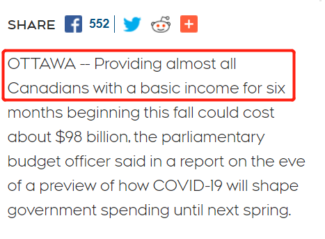
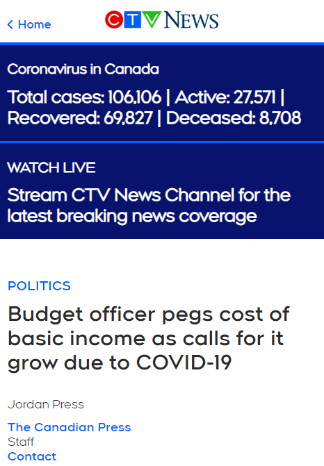

# 无标题

**链接地址:** http://mp.weixin.qq.com/s?__biz=MjM5MDEzNzY2NQ==&mid=2652785817&idx=1&sn=bb6f65b298805d023501e8f2d304f85f&chksm=bda380b78ad409a170e4ebe22342af51c8ba5cd8eed15296e76b39a3fffc6ef214410d5f0044&mpshare=1&scene=2&srcid=0708CCN4F4nt6ypT5wWKGeZv&sharer_sharetime=1594158268544&sharer_shareid=be1c8edd6c93eec155a61c876e41d26a#rd
**作者:** 吴洺
**获取时间:** 2025/8/28 20:11:44
**图片数量:** 6

---

## 原始HTML内容

 

 

 

 

 

 

 

 

 

 
<section style="margin-right: 8px;margin-left: 8px;white-space: normal;max-width: 100%;caret-color: rgb(51, 51, 51);font-family: -apple-system-font, BlinkMacSystemFont, &quot;Helvetica Neue&quot;, &quot;PingFang SC&quot;, &quot;Hiragino Sans GB&quot;, &quot;Microsoft YaHei UI&quot;, &quot;Microsoft YaHei&quot;, Arial, sans-serif;letter-spacing: 0.544px;text-size-adjust: auto;background-color: rgb(255, 255, 255);text-align: center;line-height: 2em;box-sizing: border-box !important;overflow-wrap: break-word !important;"> </section><section style="margin-right: 8px;margin-left: 8px;white-space: normal;max-width: 100%;caret-color: rgb(51, 51, 51);font-family: -apple-system-font, BlinkMacSystemFont, &quot;Helvetica Neue&quot;, &quot;PingFang SC&quot;, &quot;Hiragino Sans GB&quot;, &quot;Microsoft YaHei UI&quot;, &quot;Microsoft YaHei&quot;, Arial, sans-serif;letter-spacing: 0.544px;text-size-adjust: auto;background-color: rgb(255, 255, 255);text-align: center;line-height: 2em;box-sizing: border-box !important;overflow-wrap: break-word !important;">+++我是广告+++</section>
 
<section style="line-height: 1.75em;margin-left: 8px;margin-right: 8px;">据加通社消息，加拿大国会预算官员在一份报告中表示，从今年秋季开始，为几乎所有加拿大人提供6个月的基本收入，可能需要约<strong>980亿加元</strong>。</section><section style="line-height: 1.75em;margin-left: 8px;margin-right: 8px;"> </section><section style="text-align: center;margin-left: 8px;margin-right: 8px;"></section><section style="line-height: 1.75em;margin-left: 8px;margin-right: 8px;"> </section><section style="line-height: 1.75em;margin-left: 8px;margin-right: 8px;">由于无数加拿大人眼看自己的工作随着新冠疫情的持续发展而受到巨大影响，要求加拿大政府赶紧提供基本收入，以保障民众最低生活标准的<strong>呼声</strong>也<strong>越发受到欢迎</strong>。</section><section style="line-height: 1.75em;margin-left: 8px;margin-right: 8px;"> </section><section style="line-height: 1.75em;margin-left: 8px;margin-right: 8px;">而且，基本收入也确实不失为一种全民福利的选择。</section><section style="line-height: 1.75em;margin-left: 8px;margin-right: 8px;"> </section><section style="text-align: center;margin-left: 8px;margin-right: 8px;"></section><section style="line-height: 1.75em;margin-left: 8px;margin-right: 8px;"> </section><section style="line-height: 1.75em;margin-left: 8px;margin-right: 8px;"> </section><section style="line-height: 1.75em;margin-left: 8px;margin-right: 8px;">本周二，<strong>财政部长比尔·莫诺（Bill Morneau）和其他高级内阁部长已经多次被参议员和国会议员问及这一概念。</strong>支持者认为，这只不过是在扩大800亿加元的紧急福利金CERB，以<strong>帮助那些收入大幅下降的加拿大人。</strong></section><section style="line-height: 1.75em;margin-left: 8px;margin-right: 8px;"> </section><section style="line-height: 1.75em;margin-left: 8px;margin-right: 8px;">按照计划，CERB和450亿加元的工资补贴计划CEWS将于10月份到期，未来加拿大人如何获得政府补助，目前尚无任何详细计划。</section><section style="line-height: 1.75em;margin-left: 8px;margin-right: 8px;"> </section><section style="line-height: 1.75em;margin-left: 8px;margin-right: 8px;">据了解，从10月开始提供6个月的基本收入，可能需要475亿至981亿加元。</section><section style="line-height: 1.75em;margin-left: 8px;margin-right: 8px;"> </section><section style="line-height: 1.75em;margin-left: 8px;margin-right: 8px;">预算官员伊夫·吉鲁（Yves Giroux）)的报告显示，如果发放基本收入，则<strong>18岁至64岁</strong>的加拿大人平均可领到4500加元到4800加元。</section><section style="line-height: 1.75em;margin-left: 8px;margin-right: 8px;"> </section><section style="line-height: 1.75em;margin-left: 8px;margin-right: 8px;">要求计算基本收入成本的参议员胡元豹（Yuen Pau Woo）表示，基本收入计划可以填补加拿大社会保障体系的缺口，<strong>目前加拿大各省管理自己的保障体系，还没有实现统一。</strong></section><section style="line-height: 1.75em;margin-left: 8px;margin-right: 8px;"> </section><section style="text-align: center;margin-left: 8px;margin-right: 8px;"></section><section style="line-height: 1.75em;text-align: center;margin-left: 8px;margin-right: 8px;">参议员胡元豹（Yuen Pau Woo） </section><section style="line-height: 1.75em;margin-left: 8px;margin-right: 8px;"> </section><section style="line-height: 1.75em;margin-left: 8px;margin-right: 8px;">“在全国范围内实行永久性的基本收入是一项巨大的事业。成本非常高，政治阻力也激烈的，在2020到2021年度，我们很可能要花费很多钱以实现收支平衡，”他说到。</section><section style="line-height: 1.75em;margin-left: 8px;margin-right: 8px;"> </section><section style="line-height: 1.75em;margin-left: 8px;margin-right: 8px;"><em>“在我看来，问题是我们如何花钱，或者以什么形式花钱。</em>”</section><section style="line-height: 1.75em;margin-left: 8px;margin-right: 8px;"> </section><section style="line-height: 1.75em;margin-left: 8px;margin-right: 8px;"><strong>基本收入对不同的人有不同的含义，但它通常被视为政府提供给公民的一种不附加任何条件的福利，而不是各种有针对性的社会福利。</strong></section><section style="line-height: 1.75em;margin-left: 8px;margin-right: 8px;"> </section><section style="line-height: 1.75em;margin-left: 8px;margin-right: 8px;"><strong>基本收入也被称为最低收入保证，可以为全民发放，也可以作为一项经济状况调查的福利，随着受助人其他收入的增加而下降。</strong></section><section style="line-height: 1.75em;margin-left: 8px;margin-right: 8px;"> </section><section style="line-height: 1.75em;margin-left: 8px;margin-right: 8px;">预算官员的报告称，政府可能会取消150亿加元的税收减免措施，以抵消基本收入的总成本。胡元豹还表示，为了避免重复，基本收入可能必须和现有的福利相结合。</section><section style="line-height: 1.75em;margin-left: 8px;margin-right: 8px;"> </section><section style="text-align: center;margin-left: 8px;margin-right: 8px;"></section><section style="line-height: 1.75em;margin-left: 8px;margin-right: 8px;"> </section><section style="line-height: 1.75em;margin-left: 8px;margin-right: 8px;"><strong>基本收入计划的总成本可能比预算办公室估计的要高。</strong>预算官员的估算是基于加拿大的一些统计数据，其中不包括居住在北部地区或原住民地区的人，也不包括军人。</section><section style="line-height: 1.75em;margin-left: 8px;margin-right: 8px;"> </section><section style="line-height: 1.75em;margin-left: 8px;margin-right: 8px;">代表全国小企业的加拿大独立企业联合会（Canadian Federation of Independent Business）周二表示，在接受调查的会员中，约有三分之一的受访者说，公司员工已恢复到正常水平，<strong>但也暗示许多人认为，公司需要六个月的时间才能恢复正常的盈利能力。</strong></section><section style="line-height: 1.75em;margin-left: 8px;margin-right: 8px;"> </section><section style="line-height: 1.75em;margin-left: 8px;margin-right: 8px;">加拿大统计局将于本周五7月10日发布6月份的就业报告。经济合作与发展组织OECD周二7月7日发布的预测估计，今年第二季度加拿大的失业率为11%。</section><section style="line-height: 1.75em;margin-left: 8px;margin-right: 8px;"> </section><section style="line-height: 1.75em;margin-left: 8px;margin-right: 8px;">6个月最高发$4800，“全民（almost all）基本收入”怎么听起来都香的很，啥事不用干就能拿钱不是美滋滋？</section><section style="line-height: 1.75em;margin-left: 8px;margin-right: 8px;"></section><section style="line-height: 1.75em;margin-left: 8px;margin-right: 8px;"> </section><section style="line-height: 1.75em;margin-left: 8px;margin-right: 8px;"><iframe scrolling="no" frameborder="0" class="vote_iframe js_editor_vote_card" data-display-style="height: 172px;" data-display-src="/cgi-bin/readtemplate?t=vote/vote-new_tmpl&amp;__biz=MjM5MDEzNzY2NQ==&amp;supervoteid=466691572&amp;token=60172732&amp;lang=zh_CN" data-src="/mp/newappmsgvote?action=show&amp;__biz=MjM5MDEzNzY2NQ==&amp;supervoteid=466691572#wechat_redirect" data-supervoteid="466691572" allowfullscreen=""></iframe> </section><section style="line-height: 1.75em;margin-left: 8px;margin-right: 8px;"> </section><section style="line-height: 1.75em;margin-left: 8px;margin-right: 8px;"> </section><section style="line-height: 1.75em;margin-left: 8px;margin-right: 8px;">ref:</section><section style="line-height: 1.75em;margin-left: 8px;margin-right: 8px;">https://www.ctvnews.ca/canada/angel-in-disguise-report-details-impact-of-ontario-s-basic-income-pilot-1.4321205</section>
 

 
<section style="margin-right: 8px;margin-left: 8px;white-space: normal;font-size: 16px;max-width: 100%;box-sizing: border-box;font-family: -apple-system-font, BlinkMacSystemFont, &quot;Helvetica Neue&quot;, &quot;PingFang SC&quot;, &quot;Hiragino Sans GB&quot;, &quot;Microsoft YaHei UI&quot;, &quot;Microsoft YaHei&quot;, Arial, sans-serif;letter-spacing: 0.544px;background-color: rgb(255, 255, 255);text-size-adjust: auto;min-height: 1em;color: rgb(0, 0, 0);text-align: center;line-height: 2em;overflow-wrap: break-word !important;">+++全加拿大华人都在关注超级生活，就差你了+++</section><section style="margin-right: 8px;margin-left: 8px;white-space: normal;font-size: 16px;max-width: 100%;box-sizing: border-box;font-family: -apple-system-font, BlinkMacSystemFont, &quot;Helvetica Neue&quot;, &quot;PingFang SC&quot;, &quot;Hiragino Sans GB&quot;, &quot;Microsoft YaHei UI&quot;, &quot;Microsoft YaHei&quot;, Arial, sans-serif;letter-spacing: 0.544px;background-color: rgb(255, 255, 255);text-size-adjust: auto;min-height: 1em;color: rgb(0, 0, 0);text-align: center;line-height: 2em;overflow-wrap: break-word !important;"></section><section style="margin-right: 8px;margin-left: 8px;white-space: normal;max-width: 100%;font-family: -apple-system-font, BlinkMacSystemFont, &quot;Helvetica Neue&quot;, &quot;PingFang SC&quot;, &quot;Hiragino Sans GB&quot;, &quot;Microsoft YaHei UI&quot;, &quot;Microsoft YaHei&quot;, Arial, sans-serif;letter-spacing: 0.544px;background-color: rgb(255, 255, 255);text-align: right;line-height: 2em;box-sizing: border-box !important;overflow-wrap: break-word !important;"><strong style="max-width: 100%;font-size: 16px;letter-spacing: 0.544px;caret-color: rgb(51, 51, 51);box-sizing: border-box !important;overflow-wrap: break-word !important;">喜欢点个“在看” ↓↓</strong></section>

---

## 纯文本内容

+++我是广告+++据加通社消息，加拿大国会预算官员在一份报告中表示，从今年秋季开始，为几乎所有加拿大人提供6个月的基本收入，可能需要约980亿加元。由于无数加拿大人眼看自己的工作随着新冠疫情的持续发展而受到巨大影响，要求加拿大政府赶紧提供基本收入，以保障民众最低生活标准的呼声也越发受到欢迎。而且，基本收入也确实不失为一种全民福利的选择。本周二，财政部长比尔·莫诺（Bill Morneau）和其他高级内阁部长已经多次被参议员和国会议员问及这一概念。支持者认为，这只不过是在扩大800亿加元的紧急福利金CERB，以帮助那些收入大幅下降的加拿大人。按照计划，CERB和450亿加元的工资补贴计划CEWS将于10月份到期，未来加拿大人如何获得政府补助，目前尚无任何详细计划。据了解，从10月开始提供6个月的基本收入，可能需要475亿至981亿加元。预算官员伊夫·吉鲁（Yves Giroux）)的报告显示，如果发放基本收入，则18岁至64岁的加拿大人平均可领到4500加元到4800加元。要求计算基本收入成本的参议员胡元豹（Yuen Pau Woo）表示，基本收入计划可以填补加拿大社会保障体系的缺口，目前加拿大各省管理自己的保障体系，还没有实现统一。参议员胡元豹（Yuen Pau Woo）“在全国范围内实行永久性的基本收入是一项巨大的事业。成本非常高，政治阻力也激烈的，在2020到2021年度，我们很可能要花费很多钱以实现收支平衡，”他说到。“在我看来，问题是我们如何花钱，或者以什么形式花钱。”基本收入对不同的人有不同的含义，但它通常被视为政府提供给公民的一种不附加任何条件的福利，而不是各种有针对性的社会福利。基本收入也被称为最低收入保证，可以为全民发放，也可以作为一项经济状况调查的福利，随着受助人其他收入的增加而下降。预算官员的报告称，政府可能会取消150亿加元的税收减免措施，以抵消基本收入的总成本。胡元豹还表示，为了避免重复，基本收入可能必须和现有的福利相结合。基本收入计划的总成本可能比预算办公室估计的要高。预算官员的估算是基于加拿大的一些统计数据，其中不包括居住在北部地区或原住民地区的人，也不包括军人。代表全国小企业的加拿大独立企业联合会（Canadian Federation of Independent Business）周二表示，在接受调查的会员中，约有三分之一的受访者说，公司员工已恢复到正常水平，但也暗示许多人认为，公司需要六个月的时间才能恢复正常的盈利能力。加拿大统计局将于本周五7月10日发布6月份的就业报告。经济合作与发展组织OECD周二7月7日发布的预测估计，今年第二季度加拿大的失业率为11%。6个月最高发$4800，“全民（almost all）基本收入”怎么听起来都香的很，啥事不用干就能拿钱不是美滋滋？ref:https://www.ctvnews.ca/canada/angel-in-disguise-report-details-impact-of-ontario-s-basic-income-pilot-1.4321205+++全加拿大华人都在关注超级生活，就差你了+++喜欢点个“在看” ↓↓

---

## 图片列表

-  (原始链接: https://mmbiz.qpic.cn/mmbiz_gif/szJas1pFaJf5y3AtOoX2bKjwWnexxSNCdfAOmkBV1cqItryCgeLlhrHhWhPgzG0VV6om8X8a2FZyLoPzuBa3Qg/640?wx_fmt=other)
-  (原始链接: https://mmbiz.qpic.cn/mmbiz_png/szJas1pFaJdJRUKgYVnpt3RBmzVRUN61BOQtKPIO4icne1DgCCepLVPTV5p1PcOm8xPyXjyVm9iaWM6gTicia8MgRg/640?wx_fmt=png)
-  (原始链接: https://mmbiz.qpic.cn/mmbiz_png/szJas1pFaJdJRUKgYVnpt3RBmzVRUN614JYosjb5yAhheMjnD99qHlEpIzeGoZJpAiccDGN5l8dlYiaSP3YiatBibg/640?wx_fmt=png)
-  (原始链接: https://mmbiz.qpic.cn/mmbiz_png/szJas1pFaJdJRUKgYVnpt3RBmzVRUN61zH4VkBicI0kIr0odIZpuk2H7rEb4tFEphtTfdPE7UNFNmqMO8WtZia1A/640?wx_fmt=png)
-  (原始链接: https://mmbiz.qpic.cn/mmbiz_png/szJas1pFaJdJRUKgYVnpt3RBmzVRUN61soTbwnG4jnh9DlBLJCeIkoGOmkm1hBULyicZEHdoKVicAeXAibYpQDhww/640?wx_fmt=png)
-  (原始链接: https://mmbiz.qpic.cn/mmbiz_gif/szJas1pFaJdUFDPEKnLrCyGC4WgrAvl6lSC2beZFt6icTnXfebnRzcRialMg5VZujw1AhX9ribkSDQNZZukk8HX9w/640?wx_fmt=gif)
