# 无标题

**链接地址:** http://mp.weixin.qq.com/s?__biz=MzI4NDYyNjAwNw==&mid=2247484218&idx=1&sn=eefd4f1cfdfa4db1a8f9ec2e3da5136f&chksm=ebf9de02dc8e57141b654eb6ccb5c2c726e38c0b49515c00911d66326f4c8e009ae95c18cc3e&mpshare=1&scene=2&srcid=07151bJWJ7LgUTDhKqqiXI4a&sharer_sharetime=1594788269727&sharer_shareid=be1c8edd6c93eec155a61c876e41d26a#rd
**作者:** 关注我们
**获取时间:** 2025/8/28 20:11:33
**图片数量:** 35

---

## 原始HTML内容

<section style="box-sizing: border-box;font-size: 16px;"><section style="box-sizing: border-box;" powered-by="xiumi.us"><section style="display: flex;flex-flow: row nowrap;margin: 10px 0%;box-sizing: border-box;"><section style="display: inline-block;vertical-align: bottom;width: auto;flex: 100 100 0%;align-self: flex-end;height: auto;box-sizing: border-box;"><section style="margin-right: 0%;margin-left: 0%;box-sizing: border-box;" powered-by="xiumi.us"><section style="background-color: rgb(215, 242, 239);height: 1px;box-sizing: border-box;line-height: 0;"> </section></section></section><section style="display: inline-block;vertical-align: bottom;width: auto;min-width: 10%;max-width: 100%;flex: 0 0 auto;height: auto;align-self: flex-end;box-sizing: border-box;"><section style="text-align: center;color: rgb(125, 192, 232);line-height: 1;letter-spacing: 1px;padding-right: 9px;padding-left: 9px;box-sizing: border-box;" powered-by="xiumi.us">
<strong style="box-sizing: border-box;">点击蓝字</strong>
</section></section><section style="display: inline-block;vertical-align: bottom;width: auto;flex: 0 0 0%;height: auto;align-self: flex-end;box-sizing: border-box;"><section style="text-align: center;margin-right: 0%;margin-bottom: 2px;margin-left: 0%;font-size: 0px;box-sizing: border-box;" powered-by="xiumi.us"><section style="max-width: 100%;vertical-align: middle;display: inline-block;line-height: 0;width: 90%;height: auto;box-sizing: border-box;"></section></section><section style="text-align: left;justify-content: flex-start;font-size: 0px;margin-right: 0%;margin-left: 0%;box-sizing: border-box;" powered-by="xiumi.us"><section style="display: inline-block;width: 12px;height: 3px;vertical-align: top;overflow: hidden;border-style: solid;border-width: 1px;border-radius: 0px;border-color: rgb(40, 115, 200);box-sizing: border-box;line-height: 0;"> </section></section></section><section style="display: inline-block;vertical-align: bottom;width: auto;min-width: 10%;max-width: 100%;flex: 0 0 auto;height: auto;align-self: flex-end;box-sizing: border-box;"><section style="text-align: center;color: rgb(125, 192, 232);line-height: 1;letter-spacing: 1px;padding-right: 9px;padding-left: 9px;box-sizing: border-box;" powered-by="xiumi.us">
<strong style="box-sizing: border-box;">关注我们</strong>
</section></section><section style="display: inline-block;vertical-align: bottom;width: auto;flex: 100 100 0%;align-self: flex-end;height: auto;box-sizing: border-box;"><section style="margin-right: 0%;margin-left: 0%;box-sizing: border-box;" powered-by="xiumi.us"><section style="background-color: rgb(215, 242, 239);height: 1px;box-sizing: border-box;line-height: 0;"> </section></section></section></section></section><section style="text-align: left;justify-content: flex-start;margin: 20px 0%;box-sizing: border-box;" powered-by="xiumi.us"><section style="display: inline-block;width: auto;vertical-align: top;min-width: 10%;max-width: 100%;height: auto;box-sizing: border-box;"><section style="text-align: justify;box-sizing: border-box;" powered-by="xiumi.us">
 
</section><section style="box-sizing: border-box;" powered-by="xiumi.us"><section style="text-align: center;justify-content: center;margin: 10px 0%;display: flex;flex-flow: row nowrap;box-sizing: border-box;"><section style="display: inline-block;vertical-align: bottom;width: auto;align-self: flex-end;min-width: 10%;max-width: 100%;flex: 0 0 auto;height: auto;box-sizing: border-box;"><section style="margin-right: 0%;margin-bottom: 4px;margin-left: 0%;box-sizing: border-box;" powered-by="xiumi.us"><section style="text-align: justify;font-size: 15px;color: rgb(40, 115, 200);line-height: 1;letter-spacing: 1px;box-sizing: border-box;">
<strong style="box-sizing: border-box;">重在选择…</strong>
</section></section><section style="margin-right: 0%;margin-left: 0%;box-sizing: border-box;" powered-by="xiumi.us"><section style="background-color: rgb(125, 192, 232);height: 3px;box-sizing: border-box;line-height: 0;"> </section></section></section><section style="display: inline-block;vertical-align: bottom;width: 3px;align-self: flex-end;flex: 0 0 auto;height: auto;margin-left: 3px;box-sizing: border-box;"><section style="margin-right: 0%;margin-left: 0%;box-sizing: border-box;" powered-by="xiumi.us"><section style="background-color: rgb(125, 192, 232);height: 3px;box-sizing: border-box;line-height: 0;"> </section></section></section></section></section><section style="text-align: justify;box-sizing: border-box;" powered-by="xiumi.us">
 
</section><section style="text-align: justify;font-size: 14px;letter-spacing: 2px;line-height: 2;padding-right: 15px;padding-left: 15px;color: rgb(121, 121, 121);box-sizing: border-box;" powered-by="xiumi.us">
最近我们接到不少同学和求职者的问题：2020年加国的求职市场竞争异常激烈，工作难找已成共识。这个时候选择上课学习，缓冲一下就业压力，<strong style="box-sizing: border-box;">提升知识储备</strong>从而增加职场竞争力，<strong style="box-sizing: border-box;">会是一个好的选择吗</strong>？

 

其实BADAB想说的是，任何时候用学习新知识的方式提升自己都是十分值得鼓励的，但既然这段时间不少人处于待业或工时削减的情况，那么相对的给可以<strong style="box-sizing: border-box;">接受的教育形式就增加了</strong>更多的方向。

 
</section><section style="text-align: justify;box-sizing: border-box;" powered-by="xiumi.us">
 
</section><section style="box-sizing: border-box;" powered-by="xiumi.us"><section style="display: flex;flex-flow: row nowrap;box-sizing: border-box;"><section style="display: inline-block;vertical-align: bottom;width: auto;align-self: flex-end;flex: 4.1445 4.1445 0%;margin-bottom: -15px;height: auto;box-sizing: border-box;"><section style="text-align: center;font-size: 0px;box-sizing: border-box;" powered-by="xiumi.us"><section style="display: inline-block;width: 60px;height: 60px;vertical-align: top;overflow: hidden;border-style: solid;border-width: 1px;border-radius: 0px;border-color: rgb(125, 192, 232);padding-top: 10px;padding-bottom: 10px;box-sizing: border-box;line-height: 0;"> </section></section></section><section style="display: inline-block;vertical-align: middle;width: auto;align-self: center;background-color: rgb(255, 255, 255);margin-right: -45px;margin-left: -45px;flex: 100 100 0%;height: auto;z-index: 1;box-sizing: border-box;"><section style="text-align: center;margin-right: 0%;margin-left: 0%;box-sizing: border-box;" powered-by="xiumi.us"><section style="max-width: 100%;vertical-align: middle;display: inline-block;line-height: 0;box-sizing: border-box;"></section></section></section><section style="display: inline-block;vertical-align: top;width: auto;align-self: flex-start;flex: 4 4 0%;height: auto;margin-top: -15px;box-sizing: border-box;"><section style="text-align: center;font-size: 0px;box-sizing: border-box;" powered-by="xiumi.us"><section style="display: inline-block;width: 60px;height: 60px;vertical-align: top;overflow: hidden;border-style: solid;border-width: 1px;border-radius: 0px;border-color: rgb(125, 192, 232);padding-top: 10px;padding-bottom: 10px;box-sizing: border-box;line-height: 0;"> </section></section></section></section></section></section></section><section style="font-size: 14px;letter-spacing: 2px;line-height: 2;padding-right: 15px;padding-left: 15px;color: rgb(121, 121, 121);box-sizing: border-box;" powered-by="xiumi.us">
 

一些同学可能会问：“我已经本科毕业了，再上学不是就剩读研一条路了？”No，No，No！<strong style="box-sizing: border-box;">研究生的学历并非你敲开职业大门的唯一金砖</strong>！提升自己专业知识的方式可多着呢！

 

今天BADAB会为大家提供几种不同的通过学习的方式去提高自我职场竞争力的路子，也请大家<strong style="box-sizing: border-box;">根据自身的情况进行判断</strong>，从而去选择最适合自己的提升方法！
</section><section style="box-sizing: border-box;" powered-by="xiumi.us">
 
</section><section style="box-sizing: border-box;" powered-by="xiumi.us">
 
</section><section style="box-sizing: border-box;" powered-by="xiumi.us"><section style="text-align: center;margin: 10px 0%;display: flex;flex-flow: row nowrap;justify-content: center;box-sizing: border-box;"><section style="display: inline-block;vertical-align: middle;width: auto;flex: 0 0 0%;height: auto;border-style: none solid;border-width: 3px;border-radius: 0px;border-color: rgb(58, 66, 94) rgb(125, 192, 232);padding-right: 3px;padding-left: 3px;align-self: center;margin-right: 5px;margin-left: 5px;line-height: 0;box-sizing: border-box;"><section style="margin: -6px 0%;box-sizing: border-box;" powered-by="xiumi.us"><section style="display: inline-block;width: 3px;height: 20px;vertical-align: top;overflow: hidden;background-color: rgb(40, 115, 200);box-sizing: border-box;line-height: 0;"> </section></section></section><section style="display: inline-block;vertical-align: middle;width: auto;align-self: center;min-width: 10%;max-width: 100%;flex: 0 0 auto;height: auto;box-sizing: border-box;"><section style="margin-right: 0%;margin-left: 0%;box-sizing: border-box;" powered-by="xiumi.us"><section style="text-align: justify;color: rgb(51, 167, 233);padding-right: 3px;padding-left: 3px;letter-spacing: 5px;line-height: 1;box-sizing: border-box;">
<strong style="box-sizing: border-box;">继续深造——读研</strong>
</section></section></section><section style="display: inline-block;vertical-align: middle;width: auto;align-self: center;flex: 100 100 0%;box-sizing: border-box;"><section style="margin: 5px 0%;box-sizing: border-box;" powered-by="xiumi.us"><section style="background-color: rgb(224, 224, 224);height: 1px;box-sizing: border-box;line-height: 0;"> </section></section></section></section></section><section style="box-sizing: border-box;" powered-by="xiumi.us">
 
</section><section style="font-size: 14px;letter-spacing: 2px;line-height: 2;padding-right: 15px;padding-left: 15px;color: rgb(121, 121, 121);box-sizing: border-box;" powered-by="xiumi.us">
如果你正在本科就读，或者已经取得了本科的学历，那么<strong style="box-sizing: border-box;">继续攻读硕士和博士研究生</strong>确实是一种值得考虑的较为主流的教育方式。

 

但如果你没有任何工作经验，却希望通过研究生的学历去直接提升第一份工作的职位和起薪，那么在现今职场竞争极其激烈的情况下，你<strong style="box-sizing: border-box;">可能会失望</strong>了。

 

在加拿大，不少要求研究生学位的工作<strong style="box-sizing: border-box;">同时也要求较为丰富的工作经验</strong>。通常这些工作面对的应聘对象也都不是应届的毕业生。

 

 
</section><section style="box-sizing: border-box;" powered-by="xiumi.us"><section style="display: flex;flex-flow: row nowrap;box-sizing: border-box;"><section style="display: inline-block;vertical-align: bottom;width: auto;align-self: flex-end;flex: 4.1445 4.1445 0%;margin-bottom: -15px;height: auto;box-sizing: border-box;"><section style="text-align: center;font-size: 0px;box-sizing: border-box;" powered-by="xiumi.us"><section style="display: inline-block;width: 60px;height: 60px;vertical-align: top;overflow: hidden;border-style: solid;border-width: 1px;border-radius: 0px;border-color: rgb(125, 192, 232);padding-top: 10px;padding-bottom: 10px;box-sizing: border-box;line-height: 0;"> </section></section></section><section style="display: inline-block;vertical-align: middle;width: auto;align-self: center;background-color: rgb(255, 255, 255);margin-right: -45px;margin-left: -45px;flex: 100 100 0%;height: auto;z-index: 1;box-sizing: border-box;"><section style="text-align: center;margin-right: 0%;margin-left: 0%;box-sizing: border-box;" powered-by="xiumi.us"><section style="max-width: 100%;vertical-align: middle;display: inline-block;line-height: 0;box-sizing: border-box;"></section></section></section><section style="display: inline-block;vertical-align: top;width: auto;align-self: flex-start;flex: 4 4 0%;height: auto;margin-top: -15px;box-sizing: border-box;"><section style="text-align: center;font-size: 0px;box-sizing: border-box;" powered-by="xiumi.us"><section style="display: inline-block;width: 60px;height: 60px;vertical-align: top;overflow: hidden;border-style: solid;border-width: 1px;border-radius: 0px;border-color: rgb(125, 192, 232);padding-top: 10px;padding-bottom: 10px;box-sizing: border-box;line-height: 0;"> </section></section></section></section></section><section style="font-size: 14px;letter-spacing: 2px;line-height: 2;padding-right: 15px;padding-left: 15px;color: rgb(121, 121, 121);box-sizing: border-box;" powered-by="xiumi.us">
 

 

同时，研究生的学习经历也会在不同程度上<strong style="box-sizing: border-box;">扭转你未来的就业方向</strong>，从更具普适性的入门职位过度到更<strong style="box-sizing: border-box;">具备研究性、专业性和管理层面的核心工作岗位</strong>，相应地就是更高的应聘门槛和专业水准要求。

 

另外，获取研究生的学位时长通常在<strong style="box-sizing: border-box;">2年至5年不等</strong>，由于高强度的学习内容和实验实践项目，在不脱产的情况下较难完成学业，同时<strong style="box-sizing: border-box;">需要大量的学费和生活费作为储备</strong>。

 

<strong style="box-sizing: border-box;">这在时间、精力和金钱上都是一笔不小的投资！</strong><strong style="box-sizing: border-box;">因此在计划申请学校和学位前，请弄明白自己未来的职业期望，仔细做好学业和职业的规划。</strong>

 

 
</section><section style="box-sizing: border-box;" powered-by="xiumi.us"><section style="display: flex;flex-flow: row nowrap;box-sizing: border-box;"><section style="display: inline-block;vertical-align: bottom;width: auto;align-self: flex-end;flex: 4.1445 4.1445 0%;margin-bottom: -15px;height: auto;box-sizing: border-box;"><section style="text-align: center;font-size: 0px;box-sizing: border-box;" powered-by="xiumi.us"><section style="display: inline-block;width: 60px;height: 60px;vertical-align: top;overflow: hidden;border-style: solid;border-width: 1px;border-radius: 0px;border-color: rgb(125, 192, 232);padding-top: 10px;padding-bottom: 10px;box-sizing: border-box;line-height: 0;"> </section></section></section><section style="display: inline-block;vertical-align: middle;width: auto;align-self: center;background-color: rgb(255, 255, 255);margin-right: -45px;margin-left: -45px;flex: 100 100 0%;height: auto;z-index: 1;box-sizing: border-box;"><section style="text-align: center;margin-right: 0%;margin-left: 0%;box-sizing: border-box;" powered-by="xiumi.us"><section style="max-width: 100%;vertical-align: middle;display: inline-block;line-height: 0;box-sizing: border-box;"></section></section></section><section style="display: inline-block;vertical-align: top;width: auto;align-self: flex-start;flex: 4 4 0%;height: auto;margin-top: -15px;box-sizing: border-box;"><section style="text-align: center;font-size: 0px;box-sizing: border-box;" powered-by="xiumi.us"><section style="display: inline-block;width: 60px;height: 60px;vertical-align: top;overflow: hidden;border-style: solid;border-width: 1px;border-radius: 0px;border-color: rgb(125, 192, 232);padding-top: 10px;padding-bottom: 10px;box-sizing: border-box;line-height: 0;"> </section></section></section></section></section><section style="font-size: 14px;letter-spacing: 2px;line-height: 2;padding-right: 15px;padding-left: 15px;color: rgb(121, 121, 121);box-sizing: border-box;" powered-by="xiumi.us">
 

 

当然，从长远来看，获取研究生的学历对你未来的职业发展肯定是<strong style="box-sizing: border-box;">有着积极有利的作用</strong>，特别是对于想要在<strong style="box-sizing: border-box;">更专业的研究领域一展拳脚</strong>的同学，以及在事业发展到一定程度想要突破<strong style="box-sizing: border-box;">因学历而造成职场瓶颈</strong>的朋友们。 

 
</section><section style="box-sizing: border-box;" powered-by="xiumi.us">
 
</section><section style="box-sizing: border-box;" powered-by="xiumi.us"><section style="text-align: center;margin: 10px 0%;display: flex;flex-flow: row nowrap;justify-content: center;box-sizing: border-box;"><section style="display: inline-block;vertical-align: middle;width: auto;flex: 0 0 0%;height: auto;border-style: none solid;border-width: 3px;border-radius: 0px;border-color: rgb(58, 66, 94) rgb(125, 192, 232);padding-right: 3px;padding-left: 3px;align-self: center;margin-right: 5px;margin-left: 5px;line-height: 0;box-sizing: border-box;"><section style="margin: -6px 0%;box-sizing: border-box;" powered-by="xiumi.us"><section style="display: inline-block;width: 3px;height: 20px;vertical-align: top;overflow: hidden;background-color: rgb(40, 115, 200);box-sizing: border-box;line-height: 0;"> </section></section></section><section style="display: inline-block;vertical-align: middle;width: auto;align-self: center;min-width: 10%;max-width: 100%;flex: 0 0 auto;height: auto;box-sizing: border-box;"><section style="margin-right: 0%;margin-left: 0%;box-sizing: border-box;" powered-by="xiumi.us"><section style="text-align: justify;color: rgb(51, 167, 233);padding-right: 3px;padding-left: 3px;letter-spacing: 5px;line-height: 1;box-sizing: border-box;">
<strong style="box-sizing: border-box;">专科学院——不香吗？</strong>
</section></section></section><section style="display: inline-block;vertical-align: middle;width: auto;align-self: center;flex: 100 100 0%;box-sizing: border-box;"><section style="margin: 5px 0%;box-sizing: border-box;" powered-by="xiumi.us"><section style="background-color: rgb(224, 224, 224);height: 1px;box-sizing: border-box;line-height: 0;"> </section></section></section></section></section><section style="box-sizing: border-box;" powered-by="xiumi.us">
 
</section><section style="box-sizing: border-box;" powered-by="xiumi.us"><section style="display: flex;flex-flow: row nowrap;box-sizing: border-box;"><section style="display: inline-block;vertical-align: bottom;width: auto;align-self: flex-end;flex: 4.1445 4.1445 0%;margin-bottom: -15px;height: auto;box-sizing: border-box;"><section style="text-align: center;font-size: 0px;box-sizing: border-box;" powered-by="xiumi.us"><section style="display: inline-block;width: 60px;height: 60px;vertical-align: top;overflow: hidden;border-style: solid;border-width: 1px;border-radius: 0px;border-color: rgb(125, 192, 232);padding-top: 10px;padding-bottom: 10px;box-sizing: border-box;line-height: 0;"> </section></section></section><section style="display: inline-block;vertical-align: middle;width: auto;align-self: center;background-color: rgb(255, 255, 255);margin-right: -45px;margin-left: -45px;flex: 100 100 0%;height: auto;z-index: 1;box-sizing: border-box;"><section style="text-align: center;margin-right: 0%;margin-left: 0%;box-sizing: border-box;" powered-by="xiumi.us"><section style="max-width: 100%;vertical-align: middle;display: inline-block;line-height: 0;box-sizing: border-box;"></section></section></section><section style="display: inline-block;vertical-align: top;width: auto;align-self: flex-start;flex: 4 4 0%;height: auto;margin-top: -15px;box-sizing: border-box;"><section style="text-align: center;font-size: 0px;box-sizing: border-box;" powered-by="xiumi.us"><section style="display: inline-block;width: 60px;height: 60px;vertical-align: top;overflow: hidden;border-style: solid;border-width: 1px;border-radius: 0px;border-color: rgb(125, 192, 232);padding-top: 10px;padding-bottom: 10px;box-sizing: border-box;line-height: 0;"> </section></section></section></section></section><section style="box-sizing: border-box;" powered-by="xiumi.us">
 
</section><section style="box-sizing: border-box;" powered-by="xiumi.us">
 
</section><section style="font-size: 14px;letter-spacing: 2px;line-height: 2;padding-right: 15px;padding-left: 15px;color: rgb(121, 121, 121);box-sizing: border-box;" powered-by="xiumi.us">
对于不少从国内留学到加拿大的朋友们来说，直接选择在专科学院进行学习可能是需要不少的勇气。

 

“爸爸妈妈花了那么多钱把我送出来念书，只拿一个<strong style="box-sizing: border-box;">专科文凭</strong>回去我没法跟他们交代啊！”带有这样想法的留学生可能不在少数。

 

由于加拿大和中国教育系统和社会结构的差异，加国对于基础的<strong style="box-sizing: border-box;">“蓝领”工作者的需求缺口非常巨大</strong>，甚至需要从海外输入大量劳工去解决这一问题。这种情况即使是<strong style="box-sizing: border-box;">在疫情时期都是普遍存在</strong>的。

 

这也造成一个<strong style="box-sizing: border-box;">“奇怪的”现象</strong>：某些蓝领职业不仅工作好找；而且收入福利，甚至职业成长比不少白领阶层还要高。<strong style="box-sizing: border-box;">而一些已经拥有本科学历的学生再重新回到学校完成专科学历的情况在加拿大也并不罕见。</strong>

 

 
</section><section style="box-sizing: border-box;" powered-by="xiumi.us"><section style="display: flex;flex-flow: row nowrap;box-sizing: border-box;"><section style="display: inline-block;vertical-align: bottom;width: auto;align-self: flex-end;flex: 4.1445 4.1445 0%;margin-bottom: -15px;height: auto;box-sizing: border-box;"><section style="text-align: center;font-size: 0px;box-sizing: border-box;" powered-by="xiumi.us"><section style="display: inline-block;width: 60px;height: 60px;vertical-align: top;overflow: hidden;border-style: solid;border-width: 1px;border-radius: 0px;border-color: rgb(125, 192, 232);padding-top: 10px;padding-bottom: 10px;box-sizing: border-box;line-height: 0;"> </section></section></section><section style="display: inline-block;vertical-align: middle;width: auto;align-self: center;background-color: rgb(255, 255, 255);margin-right: -45px;margin-left: -45px;flex: 100 100 0%;height: auto;z-index: 1;box-sizing: border-box;"><section style="text-align: center;margin-right: 0%;margin-left: 0%;box-sizing: border-box;" powered-by="xiumi.us"><section style="max-width: 100%;vertical-align: middle;display: inline-block;line-height: 0;box-sizing: border-box;"></section></section></section><section style="display: inline-block;vertical-align: top;width: auto;align-self: flex-start;flex: 4 4 0%;height: auto;margin-top: -15px;box-sizing: border-box;"><section style="text-align: center;font-size: 0px;box-sizing: border-box;" powered-by="xiumi.us"><section style="display: inline-block;width: 60px;height: 60px;vertical-align: top;overflow: hidden;border-style: solid;border-width: 1px;border-radius: 0px;border-color: rgb(125, 192, 232);padding-top: 10px;padding-bottom: 10px;box-sizing: border-box;line-height: 0;"> </section></section></section></section></section><section style="font-size: 14px;letter-spacing: 2px;line-height: 2;padding-right: 15px;padding-left: 15px;color: rgb(121, 121, 121);box-sizing: border-box;" powered-by="xiumi.us">
 

 

专科学历的学习时间通常在两年左右，学习方向以<strong style="box-sizing: border-box;">实用的技能为主</strong>。许多专科学校也提供可以在晚上进行学习 <strong style="box-sizing: border-box;">part-time&nbsp;programs</strong> ，这也适合白天已经拥有一份正式工作的朋友们去进行提升。

 

另外对于有办理移民需求的学生朋友们来说，用最短的时间获取一个可以拿到<strong style="box-sizing: border-box;">post-graduate工签</strong>的学历，并且以相对容易的方式找到一份<strong style="box-sizing: border-box;">可以移民的工作</strong>，何乐而不为呢？

 

若想要继续深造，获取本科甚至研究生的学历，移民后作为加拿大的永久居民，在<strong style="box-sizing: border-box;">学费上也会比留学生节省许多</strong>，并且不<strong style="box-sizing: border-box;">受国际学生的打工时长和工种的限制</strong>。这对于想要以半工半读方式求学谋生的朋友们来说十分合适。

 

 
</section><section style="box-sizing: border-box;" powered-by="xiumi.us"><section style="display: flex;flex-flow: row nowrap;box-sizing: border-box;"><section style="display: inline-block;vertical-align: bottom;width: auto;align-self: flex-end;flex: 4.1445 4.1445 0%;margin-bottom: -15px;height: auto;box-sizing: border-box;"><section style="text-align: center;font-size: 0px;box-sizing: border-box;" powered-by="xiumi.us"><section style="display: inline-block;width: 60px;height: 60px;vertical-align: top;overflow: hidden;border-style: solid;border-width: 1px;border-radius: 0px;border-color: rgb(125, 192, 232);padding-top: 10px;padding-bottom: 10px;box-sizing: border-box;line-height: 0;"> </section></section></section><section style="display: inline-block;vertical-align: middle;width: auto;align-self: center;background-color: rgb(255, 255, 255);margin-right: -45px;margin-left: -45px;flex: 100 100 0%;height: auto;z-index: 1;box-sizing: border-box;"><section style="text-align: center;margin-right: 0%;margin-left: 0%;box-sizing: border-box;" powered-by="xiumi.us"><section style="max-width: 100%;vertical-align: middle;display: inline-block;line-height: 0;box-sizing: border-box;"></section></section></section><section style="display: inline-block;vertical-align: top;width: auto;align-self: flex-start;flex: 4 4 0%;height: auto;margin-top: -15px;box-sizing: border-box;"><section style="text-align: center;font-size: 0px;box-sizing: border-box;" powered-by="xiumi.us"><section style="display: inline-block;width: 60px;height: 60px;vertical-align: top;overflow: hidden;border-style: solid;border-width: 1px;border-radius: 0px;border-color: rgb(125, 192, 232);padding-top: 10px;padding-bottom: 10px;box-sizing: border-box;line-height: 0;"> </section></section></section></section></section><section style="font-size: 14px;letter-spacing: 2px;line-height: 2;padding-right: 15px;padding-left: 15px;color: rgb(121, 121, 121);box-sizing: border-box;" powered-by="xiumi.us">
 

 

当然进行专科学制的学习也会极大地改变你未来的职业发展规划。以<strong style="box-sizing: border-box;">劳动技能为主的工作方式</strong>和<strong style="box-sizing: border-box;">较有限的职业成长空间</strong>都是你在进行职业规划时需要考虑的问题。 

 

 
</section><section style="box-sizing: border-box;" powered-by="xiumi.us"><section style="text-align: center;margin: 10px 0%;display: flex;flex-flow: row nowrap;justify-content: center;box-sizing: border-box;"><section style="display: inline-block;vertical-align: middle;width: auto;flex: 0 0 0%;height: auto;border-style: none solid;border-width: 3px;border-radius: 0px;border-color: rgb(58, 66, 94) rgb(125, 192, 232);padding-right: 3px;padding-left: 3px;align-self: center;margin-right: 5px;margin-left: 5px;line-height: 0;box-sizing: border-box;"><section style="margin: -6px 0%;box-sizing: border-box;" powered-by="xiumi.us"><section style="display: inline-block;width: 3px;height: 20px;vertical-align: top;overflow: hidden;background-color: rgb(40, 115, 200);box-sizing: border-box;line-height: 0;"> </section></section></section><section style="display: inline-block;vertical-align: middle;width: auto;align-self: center;min-width: 10%;max-width: 100%;flex: 0 0 auto;height: auto;box-sizing: border-box;"><section style="margin-right: 0%;margin-left: 0%;box-sizing: border-box;" powered-by="xiumi.us"><section style="text-align: justify;color: rgb(51, 167, 233);padding-right: 3px;padding-left: 3px;letter-spacing: 5px;line-height: 1;box-sizing: border-box;"><strong style="box-sizing: border-box;">考证？——学无止境啊！</strong></section></section></section><section style="display: inline-block;vertical-align: middle;width: auto;align-self: center;flex: 100 100 0%;box-sizing: border-box;"><section style="margin: 5px 0%;box-sizing: border-box;" powered-by="xiumi.us"><section style="background-color: rgb(224, 224, 224);height: 1px;box-sizing: border-box;line-height: 0;"> </section></section></section></section></section><section style="font-size: 14px;letter-spacing: 2px;line-height: 2;padding-right: 15px;padding-left: 15px;color: rgb(121, 121, 121);box-sizing: border-box;" powered-by="xiumi.us">
 

“考证”这种学习方式，<strong style="box-sizing: border-box;">对于在职人员或求职者都是不容忽视的一种能够直接提高自己简历含金量</strong>的方法。

 

然而可以报考的证书类型多种多样，我又怎样去判断什么证书可以为我的职业发展铺平道路呢？

 

 
</section><section style="box-sizing: border-box;" powered-by="xiumi.us"><section style="display: flex;flex-flow: row nowrap;box-sizing: border-box;"><section style="display: inline-block;vertical-align: bottom;width: auto;align-self: flex-end;flex: 4.1445 4.1445 0%;margin-bottom: -15px;height: auto;box-sizing: border-box;"><section style="text-align: center;font-size: 0px;box-sizing: border-box;" powered-by="xiumi.us"><section style="display: inline-block;width: 60px;height: 60px;vertical-align: top;overflow: hidden;border-style: solid;border-width: 1px;border-radius: 0px;border-color: rgb(125, 192, 232);padding-top: 10px;padding-bottom: 10px;box-sizing: border-box;line-height: 0;"> </section></section></section><section style="display: inline-block;vertical-align: middle;width: auto;align-self: center;background-color: rgb(255, 255, 255);margin-right: -45px;margin-left: -45px;flex: 100 100 0%;height: auto;z-index: 1;box-sizing: border-box;"><section style="text-align: center;margin-right: 0%;margin-left: 0%;box-sizing: border-box;" powered-by="xiumi.us"><section style="max-width: 100%;vertical-align: middle;display: inline-block;line-height: 0;box-sizing: border-box;"></section></section></section><section style="display: inline-block;vertical-align: top;width: auto;align-self: flex-start;flex: 4 4 0%;height: auto;margin-top: -15px;box-sizing: border-box;"><section style="text-align: center;font-size: 0px;box-sizing: border-box;" powered-by="xiumi.us"><section style="display: inline-block;width: 60px;height: 60px;vertical-align: top;overflow: hidden;border-style: solid;border-width: 1px;border-radius: 0px;border-color: rgb(125, 192, 232);padding-top: 10px;padding-bottom: 10px;box-sizing: border-box;line-height: 0;"> </section></section></section></section></section><section style="font-size: 14px;letter-spacing: 2px;line-height: 2;padding-right: 15px;padding-left: 15px;color: rgb(121, 121, 121);box-sizing: border-box;" powered-by="xiumi.us">
 
</section><section style="font-size: 14px;letter-spacing: 2px;line-height: 2;padding-right: 15px;padding-left: 15px;color: rgb(121, 121, 121);box-sizing: border-box;" powered-by="xiumi.us">
 

最简单直观的方式，就是去招聘网站搜索几个你期望晋升的职位，并在招聘职位的<strong style="box-sizing: border-box;">Qualifications、Requirements&nbsp;</strong>或者<strong style="box-sizing: border-box;">Education</strong>那一项中找找有没有<strong style="box-sizing: border-box;">相关专业资格和证书的要求</strong>。
</section><section style="text-align: center;margin-top: 10px;margin-bottom: 10px;box-sizing: border-box;" powered-by="xiumi.us"><section style="max-width: 100%;vertical-align: middle;display: inline-block;line-height: 0;box-sizing: border-box;"></section></section><section style="text-align: center;margin-top: 10px;margin-bottom: 10px;box-sizing: border-box;" powered-by="xiumi.us"><section style="max-width: 100%;vertical-align: middle;display: inline-block;line-height: 0;box-sizing: border-box;"></section></section><section style="text-align: center;margin-top: 10px;margin-bottom: 10px;box-sizing: border-box;" powered-by="xiumi.us"><section style="max-width: 100%;vertical-align: middle;display: inline-block;line-height: 0;box-sizing: border-box;"></section></section><section style="text-align: center;margin-top: 10px;margin-bottom: 10px;box-sizing: border-box;" powered-by="xiumi.us"><section style="max-width: 100%;vertical-align: middle;display: inline-block;line-height: 0;box-sizing: border-box;"></section></section><section style="font-size: 14px;letter-spacing: 2px;line-height: 2;padding-right: 15px;padding-left: 15px;color: rgb(121, 121, 121);box-sizing: border-box;" powered-by="xiumi.us">
 

职业资格证书可能是<strong style="box-sizing: border-box;">筛选你简历是否合格的重要指标之一</strong>。当然这些证书根据其考试难度不同，对你简历含金量的<strong style="box-sizing: border-box;">Boost效果也有所不同</strong>。

 

另外，<strong style="box-sizing: border-box;">有一些行业要求必须持有有效证件才可以上岗</strong>。如果你有意在该行业发展事业，也请提前准备相应证书的学习考试。

 
</section><section style="text-align: center;margin: 10px 0% -18px;justify-content: center;box-sizing: border-box;" powered-by="xiumi.us"><section style="display: inline-block;min-width: 10%;max-width: 100%;vertical-align: top;transform: matrix(1, 0, -0.2, 1, 0, 0);border-style: solid none;border-width: 1px 2px;border-radius: 0px;border-color: rgb(125, 192, 232) rgb(92, 107, 192);padding: 5px;background-color: rgba(255, 255, 255, 0);box-shadow: rgba(255, 255, 255, 0) 0px 0px 0px;line-height: 1;letter-spacing: 0px;width: auto;height: auto;box-sizing: border-box;"><section style="display: inline-block;width: 100%;vertical-align: top;background-color: rgb(125, 192, 232);padding: 5px 10px;box-sizing: border-box;" powered-by="xiumi.us"><section style="text-align: justify;color: rgb(255, 255, 255);font-size: 17px;letter-spacing: 4px;line-height: 1;box-sizing: border-box;" powered-by="xiumi.us">
<strong style="box-sizing: border-box;">认证证书查询</strong>
</section></section></section></section><section style="text-align: center;justify-content: center;margin-right: 0%;margin-bottom: 10px;margin-left: 0%;box-sizing: border-box;" powered-by="xiumi.us"><section style="display: inline-block;width: 100%;vertical-align: top;height: auto;border-style: solid;border-width: 1px;border-radius: 0px;border-color: rgb(125, 192, 232);padding: 30px 10px 10px;box-sizing: border-box;"><section style="margin-top: 10px;margin-right: 0%;margin-left: 0%;box-sizing: border-box;" powered-by="xiumi.us"><section style="text-align: left;letter-spacing: 0px;line-height: 1.8;padding-right: 10px;padding-left: 10px;color: rgb(57, 69, 139);box-sizing: border-box;">
 

https://tradesecrets.alberta.ca/experiencedworkers/recognized-trade-certificate/

 
</section></section></section></section><section style="font-size: 14px;letter-spacing: 2px;line-height: 2;padding-right: 15px;padding-left: 15px;color: rgb(121, 121, 121);box-sizing: border-box;" powered-by="xiumi.us">
 还有一些朋友们的工作领域对于职业证书可能并没有如此看重，证书有无对职场晋升的决定作用不大。

 

不过出于增加自己知识储备的角度去进行专业提升，也会<strong style="box-sizing: border-box;">拓宽你的眼界，为你的职业发展增加更多方向。</strong>

 

 
</section><section style="box-sizing: border-box;" powered-by="xiumi.us"><section style="display: flex;flex-flow: row nowrap;box-sizing: border-box;"><section style="display: inline-block;vertical-align: bottom;width: auto;align-self: flex-end;flex: 4.1445 4.1445 0%;margin-bottom: -15px;height: auto;box-sizing: border-box;"><section style="text-align: center;font-size: 0px;box-sizing: border-box;" powered-by="xiumi.us"><section style="display: inline-block;width: 60px;height: 60px;vertical-align: top;overflow: hidden;border-style: solid;border-width: 1px;border-radius: 0px;border-color: rgb(125, 192, 232);padding-top: 10px;padding-bottom: 10px;box-sizing: border-box;line-height: 0;"> </section></section></section><section style="display: inline-block;vertical-align: middle;width: auto;align-self: center;background-color: rgb(255, 255, 255);margin-right: -45px;margin-left: -45px;flex: 100 100 0%;height: auto;z-index: 1;box-sizing: border-box;"><section style="text-align: center;margin-right: 0%;margin-left: 0%;box-sizing: border-box;" powered-by="xiumi.us"><section style="max-width: 100%;vertical-align: middle;display: inline-block;line-height: 0;box-sizing: border-box;"></section></section></section><section style="display: inline-block;vertical-align: top;width: auto;align-self: flex-start;flex: 4 4 0%;height: auto;margin-top: -15px;box-sizing: border-box;"><section style="text-align: center;font-size: 0px;box-sizing: border-box;" powered-by="xiumi.us"><section style="display: inline-block;width: 60px;height: 60px;vertical-align: top;overflow: hidden;border-style: solid;border-width: 1px;border-radius: 0px;border-color: rgb(125, 192, 232);padding-top: 10px;padding-bottom: 10px;box-sizing: border-box;line-height: 0;"> </section></section></section></section></section><section style="font-size: 14px;letter-spacing: 2px;line-height: 2;padding-right: 15px;padding-left: 15px;color: rgb(121, 121, 121);box-sizing: border-box;" powered-by="xiumi.us">
 

 

另外，一些和自己的专业知识并非直接相关，但<strong style="box-sizing: border-box;">具备普适性的证书和技能</strong>，也推荐大家趁目前工作量不太饱和的期间赶紧查漏补缺：<strong style="box-sizing: border-box;">比如Class 5的驾照、英语语言能力和电脑软件操作等技能</strong>，都是求职必备的基础。

 
</section><section style="font-size: 0px;margin: 10px 0%;box-sizing: border-box;" powered-by="xiumi.us"><section style="display: inline-block;width: 100%;vertical-align: top;background-image: linear-gradient(to right, rgba(86, 188, 253, 0) 0%, rgb(86, 188, 253) 50%, rgba(86, 188, 253, 0) 100%);box-sizing: border-box;"><section style="margin-right: 0%;margin-left: 0%;box-sizing: border-box;" powered-by="xiumi.us"><section style="border-top: 3px dashed rgb(250, 254, 255);box-sizing: border-box;line-height: 0;"><section style="line-height: 0;width: 0px;"><svg viewBox="0 0 1 1" style="vertical-align:top;"></svg></section></section></section></section></section><section style="box-sizing: border-box;" powered-by="xiumi.us">
 
</section><section style="box-sizing: border-box;" powered-by="xiumi.us"><section style="display: flex;flex-flow: row nowrap;box-sizing: border-box;"><section style="display: inline-block;vertical-align: bottom;width: auto;align-self: flex-end;flex: 4.1445 4.1445 0%;margin-bottom: -15px;height: auto;box-sizing: border-box;"><section style="text-align: center;font-size: 0px;box-sizing: border-box;" powered-by="xiumi.us"><section style="display: inline-block;width: 60px;height: 60px;vertical-align: top;overflow: hidden;border-style: solid;border-width: 1px;border-radius: 0px;border-color: rgb(125, 192, 232);padding-top: 10px;padding-bottom: 10px;box-sizing: border-box;line-height: 0;"> </section></section></section><section style="display: inline-block;vertical-align: middle;width: auto;align-self: center;background-color: rgb(255, 255, 255);margin-right: -45px;margin-left: -45px;flex: 100 100 0%;height: auto;z-index: 1;box-sizing: border-box;"><section style="text-align: center;margin-right: 0%;margin-left: 0%;box-sizing: border-box;" powered-by="xiumi.us"><section style="max-width: 100%;vertical-align: middle;display: inline-block;line-height: 0;box-sizing: border-box;"></section></section></section><section style="display: inline-block;vertical-align: top;width: auto;align-self: flex-start;flex: 4 4 0%;height: auto;margin-top: -15px;box-sizing: border-box;"><section style="text-align: center;font-size: 0px;box-sizing: border-box;" powered-by="xiumi.us"><section style="display: inline-block;width: 60px;height: 60px;vertical-align: top;overflow: hidden;border-style: solid;border-width: 1px;border-radius: 0px;border-color: rgb(125, 192, 232);padding-top: 10px;padding-bottom: 10px;box-sizing: border-box;line-height: 0;"> </section></section></section></section></section><section style="box-sizing: border-box;" powered-by="xiumi.us">
 
</section><section style="font-size: 14px;letter-spacing: 2px;line-height: 2;padding-right: 15px;padding-left: 15px;color: rgb(121, 121, 121);box-sizing: border-box;" powered-by="xiumi.us">
 

总体来说，用学习专业知识的方式去提升自己的职场竞争力是十分值得提倡的，但<strong style="box-sizing: border-box;">千万不要把求职成功的希望完全寄托在薄薄的一张文凭或证书</strong>上。

 

对于职场竞争力的提升应该依托在<strong style="box-sizing: border-box;">知识技能的掌握、工作经验的积累和人际关系的建立上</strong>。但对于学制的选择可能会极大程度上<strong style="box-sizing: border-box;">改变你未来职场的发展方向和晋升方式</strong>，因此也是需要读者们在做决定前进行仔细考量和规划。

 

这是一个<strong style="box-sizing: border-box;">意义重大的艰难决定</strong>，特别是对于尚未迈入职场，社会阅历较少的学生们来说。如何做出一个<strong style="box-sizing: border-box;">不让自己后悔的选择</strong>，你或许需要职场经验丰富的专业人士引导和帮助！

 

<strong style="box-sizing: border-box;">如果你对自己的学业和职业规划感到迷茫，欢迎联系——</strong>
</section><section style="box-sizing: border-box;" powered-by="xiumi.us">
 
</section><section style="margin: 20px 0%;box-sizing: border-box;" powered-by="xiumi.us"><section style="font-size: 14px;color: rgba(51, 51, 51, 0.61);letter-spacing: 2px;padding-right: 20px;padding-left: 20px;box-sizing: border-box;">
<strong style="box-sizing: border-box;">资深人力资源顾问Ada Tai</strong>

 

为你所有的问题量身定做解决方案！
</section></section><section style="text-align: center;margin: 10px 0%;box-sizing: border-box;" powered-by="xiumi.us"><section style="display: inline-block;width: 90%;vertical-align: top;border-style: solid;border-width: 4px;border-radius: 0px;border-color: rgb(125, 192, 232);letter-spacing: 0px;padding: 10px;box-sizing: border-box;"><section style="box-sizing: border-box;" powered-by="xiumi.us"><section style="display: inline-block;vertical-align: middle;width: 40%;box-sizing: border-box;"><section style="margin-right: 0%;margin-left: 0%;box-sizing: border-box;" powered-by="xiumi.us"><section style="max-width: 100%;vertical-align: middle;display: inline-block;line-height: 0;border-width: 0px;width: 100%;box-sizing: border-box;"></section></section></section><section style="display: inline-block;vertical-align: middle;width: 60%;padding-left: 10px;box-sizing: border-box;"><section style="margin-right: 0%;margin-bottom: 5px;margin-left: 0%;box-sizing: border-box;" powered-by="xiumi.us"><section style="display: inline-block;border-width: 2px;border-style: solid;border-color: rgb(125, 192, 232);padding: 0.1em 0.3em;background-color: rgb(125, 192, 232);color: rgb(255, 255, 255);font-size: 12px;box-sizing: border-box;">
<strong style="box-sizing: border-box;">Ada&nbsp; Tai</strong>
</section></section><section style="margin-right: 0%;margin-left: 0%;box-sizing: border-box;" powered-by="xiumi.us"><section style="font-size: 13px;box-sizing: border-box;">
<strong style="box-sizing: border-box;">MBA, CPHR, C.Mgr.</strong>
</section></section><section style="box-sizing: border-box;" powered-by="xiumi.us"><section style="display: inline-block;vertical-align: middle;width: 10%;border-width: 0px;box-sizing: border-box;"><section style="margin: 5px 0%;text-align: left;font-size: 0px;box-sizing: border-box;" powered-by="xiumi.us"><section style="padding: 4px;display: inline-block;background-color: rgb(125, 192, 232);box-sizing: border-box;"><section style="border-color: rgba(255, 255, 255, 0);width: 1.6em;height: 1.6em;border-style: solid;border-width: 1px;text-align: center;line-height: 1.5em;color: rgb(255, 255, 255);box-sizing: border-box;">
 
</section></section></section></section><section style="display: inline-block;vertical-align: middle;width: 90%;box-sizing: border-box;"><section style="text-align: justify;font-size: 12px;box-sizing: border-box;" powered-by="xiumi.us">
修改简历与求职信
</section></section></section><section style="box-sizing: border-box;" powered-by="xiumi.us"><section style="display: inline-block;vertical-align: middle;width: 10%;box-sizing: border-box;"><section style="margin: 5px 0%;text-align: left;font-size: 0px;box-sizing: border-box;" powered-by="xiumi.us"><section style="padding: 4px;display: inline-block;background-color: rgb(125, 192, 232);box-sizing: border-box;"><section style="border-color: rgba(255, 255, 255, 0);width: 1.6em;height: 1.6em;border-style: solid;border-width: 1px;text-align: center;line-height: 1.5em;color: rgb(255, 255, 255);box-sizing: border-box;">
 
</section></section></section></section><section style="display: inline-block;vertical-align: middle;width: 90%;box-sizing: border-box;"><section style="text-align: justify;font-size: 12px;box-sizing: border-box;" powered-by="xiumi.us">
培训面试
</section></section></section><section style="box-sizing: border-box;" powered-by="xiumi.us"><section style="display: inline-block;vertical-align: middle;width: 10%;border-width: 0px;box-sizing: border-box;"><section style="margin: 5px 0%;text-align: left;font-size: 0px;box-sizing: border-box;" powered-by="xiumi.us"><section style="padding: 4px;display: inline-block;background-color: rgb(125, 192, 232);box-sizing: border-box;"><section style="border-color: rgba(255, 255, 255, 0);width: 1.6em;height: 1.6em;border-style: solid;border-width: 1px;text-align: center;line-height: 1.5em;color: rgb(255, 255, 255);box-sizing: border-box;">
 
</section></section></section></section><section style="display: inline-block;vertical-align: middle;width: 90%;box-sizing: border-box;"><section style="text-align: justify;font-size: 12px;box-sizing: border-box;" powered-by="xiumi.us">
建立LinkedIn Profile
</section></section></section><section style="box-sizing: border-box;" powered-by="xiumi.us"><section style="display: inline-block;vertical-align: middle;width: 10%;box-sizing: border-box;"><section style="margin: 5px 0%;text-align: left;font-size: 0px;box-sizing: border-box;" powered-by="xiumi.us"><section style="padding: 4px;display: inline-block;background-color: rgb(125, 192, 232);box-sizing: border-box;"><section style="border-color: rgba(255, 255, 255, 0);width: 1.6em;height: 1.6em;border-style: solid;border-width: 1px;text-align: center;line-height: 1.5em;color: rgb(255, 255, 255);box-sizing: border-box;">
 
</section></section></section></section><section style="display: inline-block;vertical-align: middle;width: 90%;box-sizing: border-box;"><section style="text-align: justify;font-size: 12px;box-sizing: border-box;" powered-by="xiumi.us">
职业评估与规划、社交培训
</section></section></section><section style="box-sizing: border-box;" powered-by="xiumi.us"><section style="display: inline-block;vertical-align: middle;width: 10%;box-sizing: border-box;"><section style="margin: 5px 0%;text-align: left;font-size: 0px;box-sizing: border-box;" powered-by="xiumi.us"><section style="padding: 4px;display: inline-block;background-color: rgb(125, 192, 232);box-sizing: border-box;"><section style="border-color: rgba(255, 255, 255, 0);width: 1.6em;height: 1.6em;border-style: solid;border-width: 1px;text-align: center;line-height: 1.5em;color: rgb(255, 255, 255);box-sizing: border-box;">
 
</section></section></section></section><section style="display: inline-block;vertical-align: middle;width: 90%;box-sizing: border-box;"><section style="text-align: justify;font-size: 12px;box-sizing: border-box;" powered-by="xiumi.us">
求职、职场文化等多种讲座
</section></section></section></section></section></section></section><section style="margin: 20px 0%;box-sizing: border-box;" powered-by="xiumi.us"><section style="letter-spacing: 2px;font-size: 14px;color: rgba(51, 51, 51, 0.61);padding-right: 20px;padding-left: 20px;line-height: 2;box-sizing: border-box;">
毕业于埃尔伯塔大学工商管理硕士学位,并拥有加拿大“注册人力资源管理师” 及“注册企业管理师”资格证，十几年来Ada一直在不同的领域从事人力资源的管理工作，包括大型企业、高科技产业、准政府、非营利组织、高等教育、商务管理等领域。
</section></section><section style="margin: 10px 0%;text-align: center;justify-content: center;box-sizing: border-box;" powered-by="xiumi.us"><section style="display: inline-block;vertical-align: top;width: 40%;padding-right: 5px;height: auto;box-sizing: border-box;"><section powered-by="xiumi.us" style="display: inline-block;width: 100%;vertical-align: top;background-position: 50% 50%;background-repeat: no-repeat;background-size: cover;background-attachment: scroll;background-image: url(&quot;https://mmbiz.qpic.cn/mmbiz_jpg/cY0qSDjdkFdNXa6RWicKLLqy72B9qgnUDic83QwLBTct55J1M33N80QJdYQHUtUqRuKSo5EpmLw62tn6xsLDagEw/640?wx_fmt=jpeg&quot;);box-sizing: border-box;"><section style="margin-right: 0%;margin-left: 0%;box-sizing: border-box;" powered-by="xiumi.us"><section style="max-width: 100%;vertical-align: middle;display: inline-block;line-height: 0;box-sizing: border-box;"></section></section></section></section><section style="display: inline-block;vertical-align: top;width: 40%;padding-left: 5px;height: auto;box-sizing: border-box;"><section powered-by="xiumi.us" style="display: inline-block;width: 100%;vertical-align: top;background-position: 50% 50%;background-repeat: no-repeat;background-size: cover;background-attachment: scroll;background-image: url(&quot;https://mmbiz.qpic.cn/mmbiz_jpg/cY0qSDjdkFdNXa6RWicKLLqy72B9qgnUDic83QwLBTct55J1M33N80QJdYQHUtUqRuKSo5EpmLw62tn6xsLDagEw/640?wx_fmt=jpeg&quot;);box-sizing: border-box;"><section style="margin-right: 0%;margin-left: 0%;box-sizing: border-box;" powered-by="xiumi.us"><section style="max-width: 100%;vertical-align: middle;display: inline-block;line-height: 0;box-sizing: border-box;"></section></section></section></section></section><section style="margin: 10px 0%;text-align: center;justify-content: center;box-sizing: border-box;" powered-by="xiumi.us"><section style="display: inline-block;vertical-align: top;width: 40%;padding-right: 5px;height: auto;box-sizing: border-box;"><section powered-by="xiumi.us" style="display: inline-block;width: 100%;vertical-align: top;background-position: 50% 50%;background-repeat: no-repeat;background-size: cover;background-attachment: scroll;background-image: url(&quot;https://mmbiz.qpic.cn/mmbiz_jpg/cY0qSDjdkFdNXa6RWicKLLqy72B9qgnUDic83QwLBTct55J1M33N80QJdYQHUtUqRuKSo5EpmLw62tn6xsLDagEw/640?wx_fmt=jpeg&quot;);box-sizing: border-box;"><section style="margin-right: 0%;margin-left: 0%;box-sizing: border-box;" powered-by="xiumi.us"><section style="max-width: 100%;vertical-align: middle;display: inline-block;line-height: 0;box-sizing: border-box;"></section></section></section></section><section style="display: inline-block;vertical-align: top;width: 40%;padding-left: 5px;height: auto;box-sizing: border-box;"><section powered-by="xiumi.us" style="display: inline-block;width: 100%;vertical-align: top;background-position: 50% 50%;background-repeat: no-repeat;background-size: cover;background-attachment: scroll;background-image: url(&quot;https://mmbiz.qpic.cn/mmbiz_jpg/cY0qSDjdkFdNXa6RWicKLLqy72B9qgnUDic83QwLBTct55J1M33N80QJdYQHUtUqRuKSo5EpmLw62tn6xsLDagEw/640?wx_fmt=jpeg&quot;);box-sizing: border-box;"><section style="margin-right: 0%;margin-left: 0%;box-sizing: border-box;" powered-by="xiumi.us"><section style="max-width: 100%;vertical-align: middle;display: inline-block;line-height: 0;box-sizing: border-box;"></section></section></section></section></section><section style="text-align: center;font-size: 12px;color: rgba(101, 101, 101, 0.46);letter-spacing: 1px;box-sizing: border-box;" powered-by="xiumi.us">
Ada Tai 出席各类职业培训活动
</section><section style="margin: 20px 0%;box-sizing: border-box;" powered-by="xiumi.us"><section style="letter-spacing: 2px;font-size: 14px;color: rgba(51, 51, 51, 0.61);padding-right: 20px;padding-left: 20px;line-height: 2;box-sizing: border-box;">
她熟知人力资源管理过程，特别是对人才的招聘、培训、职业规划、新员工的指引等方面有独到的见解。她有多年于企业招聘人才、培训学生与专业人士如何成功的获取工作，及指导他们如何应对工作场合中棘手的问题的经验。更将心理学融入到人力资源管理之中，为人才应聘最适合自己的岗位提供最有效的建议和帮助。 
</section></section><section style="text-align: center;margin-right: 0%;margin-left: 0%;box-sizing: border-box;" powered-by="xiumi.us"><section style="max-width: 100%;vertical-align: middle;display: inline-block;line-height: 0;box-shadow: rgb(15, 76, 129) 0px 0px 0px;box-sizing: border-box;"></section></section><section style="margin: 20px 0%;box-sizing: border-box;" powered-by="xiumi.us"><section style="letter-spacing: 2px;font-size: 14px;color: rgb(125, 192, 232);padding-right: 20px;padding-left: 20px;line-height: 2;box-sizing: border-box;">
<strong style="box-sizing: border-box;">BadaB的服务包括但不仅限于一对一咨询，修改和更新简历，Cover Letter，面试培训，以及帮你打造一个出色的LinkedIn Profile等等。</strong>
</section></section><section style="margin: 10px 0% 6px;box-sizing: border-box;" powered-by="xiumi.us"><section style="display: inline-block;vertical-align: middle;width: 33.33%;padding-right: 3px;padding-left: 3px;box-sizing: border-box;"><section style="font-size: 35px;text-align: center;margin-right: 0%;margin-left: 0%;box-sizing: border-box;" powered-by="xiumi.us"><section style="box-sizing: border-box;display: inline-block;vertical-align: bottom;margin: auto;width: 3em;height: 3em;border-radius: 100%;background-position: 91.4715% 100%;background-repeat: no-repeat;background-size: 153.075%;border-style: solid;border-width: 2px;border-color: rgb(125, 192, 232);overflow: hidden;background-image: url(&quot;https://mmbiz.qpic.cn/mmbiz_jpg/cY0qSDjdkFdNXa6RWicKLLqy72B9qgnUDiaEdOV58CP3ibibgWvhodWGFByEjp3gcxFfW3S7XOLVDoHvO7xIqz57EQ/640?wx_fmt=jpeg&quot;);"><section style="height: 100%;overflow: hidden;line-height: 0;vertical-align: middle;max-width: 100%;box-sizing: border-box;"></section></section></section><section style="margin-top: 10px;margin-right: 0%;margin-left: 0%;box-sizing: border-box;" powered-by="xiumi.us"><section style="text-align: center;font-size: 14px;color: rgb(15, 76, 129);box-sizing: border-box;">
<strong style="box-sizing: border-box;">Boris&nbsp;</strong>

<strong style="box-sizing: border-box;">Bokov</strong>
</section></section></section><section style="display: inline-block;vertical-align: middle;width: 33.33%;padding-right: 3px;padding-left: 3px;box-sizing: border-box;"><section style="font-size: 35px;text-align: center;margin-right: 0%;margin-left: 0%;box-sizing: border-box;" powered-by="xiumi.us"><section style="box-sizing: border-box;display: inline-block;vertical-align: bottom;margin: auto;width: 3em;height: 3em;border-radius: 100%;background-position: 30.61% 5.88235%;background-repeat: no-repeat;background-size: 280.511%;border-style: solid;border-width: 2px;border-color: rgb(125, 192, 232);overflow: hidden;background-image: url(&quot;https://mmbiz.qpic.cn/mmbiz_jpg/cY0qSDjdkFdNXa6RWicKLLqy72B9qgnUDFOxebbNxDPzWicWquvdaDkfKR2T1OPPGXUF5xZ3TftLmvtHia8M0J7kA/640?wx_fmt=jpeg&quot;);"><section style="height: 100%;overflow: hidden;line-height: 0;vertical-align: middle;max-width: 100%;box-sizing: border-box;"></section></section></section><section style="margin-top: 10px;margin-right: 0%;margin-left: 0%;box-sizing: border-box;" powered-by="xiumi.us"><section style="text-align: center;font-size: 14px;color: rgb(15, 76, 129);box-sizing: border-box;">
<strong style="box-sizing: border-box;">Doug&nbsp;</strong>

<strong style="box-sizing: border-box;">Alloway</strong>
</section></section></section><section style="display: inline-block;vertical-align: middle;width: 33.33%;padding-right: 3px;padding-left: 3px;box-sizing: border-box;"><section style="font-size: 35px;text-align: center;margin-right: 0%;margin-left: 0%;box-sizing: border-box;" powered-by="xiumi.us"><section style="box-sizing: border-box;display: inline-block;vertical-align: bottom;margin: auto;width: 3em;height: 3em;border-radius: 100%;background-position: 79.5129% 32.4324%;background-repeat: no-repeat;background-size: 319.497%;border-width: 2px;border-style: solid;border-color: rgb(125, 192, 232);overflow: hidden;background-image: url(&quot;https://mmbiz.qpic.cn/mmbiz_jpg/cY0qSDjdkFdNXa6RWicKLLqy72B9qgnUDsYJ1dBBxOJwR9GEbTrPd6DvEnyCCuvJ82mj0fI5bPR4qJHTlCJicibXg/640?wx_fmt=jpeg&quot;);"><section style="height: 100%;overflow: hidden;line-height: 0;vertical-align: middle;max-width: 100%;box-sizing: border-box;"></section></section></section><section style="margin-top: 10px;margin-right: 0%;margin-left: 0%;box-sizing: border-box;" powered-by="xiumi.us"><section style="text-align: center;color: rgb(15, 76, 129);box-sizing: border-box;">
<strong style="box-sizing: border-box;">Amber</strong>

<strong style="box-sizing: border-box;"> Lautischer</strong>
</section></section></section></section><section style="margin-top: 10px;margin-right: 0%;margin-left: 0%;box-sizing: border-box;" powered-by="xiumi.us"><section style="text-align: center;font-size: 12px;color: rgba(101, 101, 101, 0.46);letter-spacing: 1px;box-sizing: border-box;">
公司其他成员出席各类职业培训类活动
</section></section><section style="box-sizing: border-box;" powered-by="xiumi.us">
 
</section><section style="margin: 15px 0% 10px;box-sizing: border-box;" powered-by="xiumi.us"><section style="text-align: center;font-size: 14px;color: rgb(164, 193, 234);line-height: 2;letter-spacing: 2px;padding-right: 20px;padding-left: 20px;box-sizing: border-box;">
另外，我们的年初推出的网络课程也有<strong style="box-sizing: border-box;">部分内容更新</strong>。请还没订阅的朋友们快去看看吧！

 
</section></section><section style="text-align: center;margin: 10px 0%;box-sizing: border-box;" powered-by="xiumi.us"><section style="display: inline-block;width: 80%;vertical-align: top;height: auto;box-shadow: rgb(0, 0, 0) 0px 0px 0px;letter-spacing: 0px;padding: 2px;border-width: 1px;border-radius: 4px;border-style: dashed;border-color: rgba(157, 187, 254, 0.46);overflow: hidden;box-sizing: border-box;"><section style="margin-right: 0%;margin-left: 0%;box-sizing: border-box;" powered-by="xiumi.us"><section style="max-width: 100%;vertical-align: middle;display: inline-block;line-height: 0;width: 100%;height: auto;border-width: 0px;border-radius: 2px;border-style: none;border-color: rgb(62, 62, 62);overflow: hidden;box-sizing: border-box;"></section></section></section></section><section style="margin: 10px 0% 20px;text-align: center;box-sizing: border-box;" powered-by="xiumi.us"><section style="display: inline-block;width: auto;vertical-align: top;line-height: 0;letter-spacing: 0px;min-width: 10%;max-width: 100%;height: auto;box-sizing: border-box;"><section style="margin-right: 0%;margin-left: 0%;box-sizing: border-box;" powered-by="xiumi.us"><section style="background-image: linear-gradient(90deg, rgba(159, 186, 253, 0) 0%, rgb(159, 186, 253) 50%, rgba(159, 186, 253, 0) 100%);height: 2px;box-sizing: border-box;line-height: 0;"> </section></section><section style="box-sizing: border-box;" powered-by="xiumi.us"><section style="display: inline-block;width: auto;vertical-align: top;min-width: 10%;max-width: 100%;height: auto;padding: 5px 25px;background-position: 50% 50%;background-repeat: no-repeat;background-size: cover;background-attachment: scroll;background-image: url(&quot;https://mmbiz.qpic.cn/mmbiz_png/cY0qSDjdkFdNXa6RWicKLLqy72B9qgnUDyicYl0ia1XiaiauzvooT4ahaxA8EwEQeYziaunqj7mbUn9ys3IWAbKOrwrA/640?wx_fmt=png&quot;);box-sizing: border-box;"><section style="display: inline-block;width: 100%;vertical-align: top;line-height: 1;letter-spacing: 0px;box-sizing: border-box;" powered-by="xiumi.us"><section style="margin-right: 0%;margin-left: 0%;box-sizing: border-box;" powered-by="xiumi.us"><section style="color: rgb(40, 115, 200);font-size: 17px;line-height: 1.1;letter-spacing: 4px;text-shadow: rgb(255, 255, 255) 1px -1px, rgb(157, 187, 254) 1px 1px, rgb(157, 187, 254) -1px 1px, rgb(157, 187, 254) -1px -1px, rgb(157, 187, 254) 1px 0px, rgb(157, 187, 254) 0px 1px, rgb(157, 187, 254) -1px 0px, rgb(157, 187, 254) 0px -1px;box-sizing: border-box;">
<strong style="box-sizing: border-box;">网络课程简介</strong>
</section></section></section></section></section><section style="margin-right: 0%;margin-left: 0%;box-sizing: border-box;" powered-by="xiumi.us"><section style="background-image: linear-gradient(90deg, rgba(159, 186, 253, 0) 0%, rgb(159, 186, 253) 50%, rgba(159, 186, 253, 0) 100%);height: 2px;box-sizing: border-box;line-height: 0;"> </section></section></section></section><section style="margin: 10px 0%;box-sizing: border-box;" powered-by="xiumi.us"><section style="text-align: center;font-size: 14px;color: rgb(164, 193, 234);line-height: 1.8;letter-spacing: 2px;padding-right: 15px;padding-left: 15px;box-sizing: border-box;">
BADAB推出的这套课程包含<strong style="box-sizing: border-box;">三个部分</strong>，一共<strong style="box-sizing: border-box;">二十课时</strong>。每次课程的时长约<strong style="box-sizing: border-box;">20分钟，</strong>将以<strong style="box-sizing: border-box;">视频</strong>的形式放送。
</section></section><section style="margin: 10px 0%;box-sizing: border-box;" powered-by="xiumi.us"><section style="text-align: center;font-size: 14px;color: rgb(164, 193, 234);line-height: 1.8;letter-spacing: 2px;padding-right: 15px;padding-left: 15px;box-sizing: border-box;">
 

课程将由<strong style="letter-spacing: 1.8px;box-sizing: border-box;">四位资历丰富的人力资源导师</strong>从各种角度为你详细讲解。全方位帮你解答在求职和就职过程中遇到的各种问题！

 
</section></section><section style="text-align: center;justify-content: center;margin: 10px 0%;box-sizing: border-box;" powered-by="xiumi.us"><section style="display: inline-block;width: 95%;vertical-align: top;height: auto;border-width: 0px;border-radius: 5px;border-style: none;border-color: rgb(115, 115, 115);overflow: hidden;background-color: rgba(241, 247, 255, 0.92);box-shadow: rgba(183, 217, 255, 0.39) 0px 5px 5px;box-sizing: border-box;"><section style="justify-content: center;margin-right: 0%;margin-bottom: 5px;margin-left: 0%;box-sizing: border-box;" powered-by="xiumi.us"><section style="display: inline-block;width: 100%;vertical-align: top;height: auto;border-width: 0px;border-radius: 5px;border-style: none;border-color: rgb(115, 115, 115);overflow: hidden;background-color: rgba(240, 247, 255, 0.92);box-shadow: rgb(183, 217, 255) 0px 0px 4px;padding-right: 20px;padding-left: 20px;box-sizing: border-box;"><section style="display: inline-block;width: 100%;vertical-align: top;box-shadow: rgb(0, 0, 0) 0px 0px 0px;padding-right: 20px;padding-left: 20px;border-width: 0px;box-sizing: border-box;" powered-by="xiumi.us"><section style="text-align: left;justify-content: flex-start;margin-right: 0%;margin-bottom: -10px;margin-left: 0%;transform: translate3d(-10px, 0px, 1px) rotateX(180deg);box-sizing: border-box;" powered-by="xiumi.us"><section style="display: inline-block;width: 95px;height: 16px;vertical-align: top;overflow: hidden;line-height: 0;letter-spacing: 0px;box-sizing: border-box;"><section style="margin-right: 0%;margin-left: 0%;transform: translate3d(0px, 0px, 1px) rotateX(180deg);justify-content: flex-start;box-sizing: border-box;" powered-by="xiumi.us"><section style="max-width: 100%;vertical-align: middle;display: inline-block;line-height: 0;box-shadow: rgb(0, 0, 0) 0px 0px 0px;width: 80%;height: auto;box-sizing: border-box;"></section></section></section></section><section style="margin: 10px 0%;box-sizing: border-box;" powered-by="xiumi.us"><section style="display: inline-block;vertical-align: middle;width: 50%;padding-right: 5px;box-shadow: rgb(0, 0, 0) 0px 0px 0px;box-sizing: border-box;"><section style="margin-right: 0%;margin-left: 0%;box-sizing: border-box;" powered-by="xiumi.us"><section style="max-width: 100%;vertical-align: middle;display: inline-block;line-height: 0;box-shadow: rgb(205, 240, 255) -3px -3px 0px;border-width: 0px;border-radius: 0px;border-style: none;border-color: rgb(62, 62, 62);width: 100%;height: auto;box-sizing: border-box;"></section></section></section><section style="display: inline-block;vertical-align: middle;width: 50%;padding-left: 5px;box-sizing: border-box;"><section style="margin-right: 0%;margin-left: 0%;box-sizing: border-box;" powered-by="xiumi.us"><section style="max-width: 100%;vertical-align: middle;display: inline-block;line-height: 0;box-shadow: rgb(205, 240, 255) 3px 3px 0px;border-width: 0px;border-radius: 0px;border-style: none;border-color: rgb(62, 62, 62);width: 100%;height: auto;box-sizing: border-box;"></section></section></section></section><section style="text-align: right;justify-content: flex-end;margin-top: -10px;margin-right: 0%;margin-left: 0%;transform: translate3d(10px, 0px, 0px);box-sizing: border-box;" powered-by="xiumi.us"><section style="display: inline-block;width: 95px;height: 16px;vertical-align: top;overflow: hidden;line-height: 0;letter-spacing: 0px;box-sizing: border-box;"><section style="margin-right: 0%;margin-left: 0%;justify-content: flex-end;box-sizing: border-box;" powered-by="xiumi.us"><section style="max-width: 100%;vertical-align: middle;display: inline-block;line-height: 0;box-shadow: rgb(0, 0, 0) 0px 0px 0px;width: 80%;height: auto;box-sizing: border-box;"></section></section></section></section></section><section style="display: inline-block;width: 100%;vertical-align: top;box-shadow: rgb(0, 0, 0) 0px 0px 0px;padding-right: 20px;padding-left: 20px;border-width: 0px;box-sizing: border-box;" powered-by="xiumi.us"><section style="text-align: left;justify-content: flex-start;margin-right: 0%;margin-bottom: -10px;margin-left: 0%;transform: translate3d(-10px, 0px, 1px) rotateX(180deg);box-sizing: border-box;" powered-by="xiumi.us"><section style="display: inline-block;width: 95px;height: 16px;vertical-align: top;overflow: hidden;line-height: 0;letter-spacing: 0px;box-sizing: border-box;"><section style="margin-right: 0%;margin-left: 0%;transform: translate3d(0px, 0px, 1px) rotateX(180deg);justify-content: flex-start;box-sizing: border-box;" powered-by="xiumi.us"><section style="max-width: 100%;vertical-align: middle;display: inline-block;line-height: 0;box-shadow: rgb(0, 0, 0) 0px 0px 0px;width: 80%;height: auto;box-sizing: border-box;"></section></section></section></section><section style="margin: 10px 0%;box-sizing: border-box;" powered-by="xiumi.us"><section style="display: inline-block;vertical-align: middle;width: 50%;padding-right: 5px;box-shadow: rgb(0, 0, 0) 0px 0px 0px;box-sizing: border-box;"><section style="margin-right: 0%;margin-left: 0%;box-sizing: border-box;" powered-by="xiumi.us"><section style="max-width: 100%;vertical-align: middle;display: inline-block;line-height: 0;box-shadow: rgb(205, 240, 255) -3px -3px 0px;border-width: 0px;border-radius: 0px;border-style: none;border-color: rgb(62, 62, 62);width: 100%;height: auto;box-sizing: border-box;"></section></section></section><section style="display: inline-block;vertical-align: middle;width: 50%;padding-left: 5px;box-sizing: border-box;"><section style="margin-right: 0%;margin-left: 0%;box-sizing: border-box;" powered-by="xiumi.us"><section style="max-width: 100%;vertical-align: middle;display: inline-block;line-height: 0;box-shadow: rgb(205, 240, 255) 3px 3px 0px;border-width: 0px;border-radius: 0px;border-style: none;border-color: rgb(62, 62, 62);width: 100%;height: auto;box-sizing: border-box;"></section></section></section></section><section style="text-align: right;justify-content: flex-end;margin-top: -10px;margin-right: 0%;margin-left: 0%;transform: translate3d(10px, 0px, 0px);box-sizing: border-box;" powered-by="xiumi.us"><section style="display: inline-block;width: 95px;height: 16px;vertical-align: top;overflow: hidden;line-height: 0;letter-spacing: 0px;box-sizing: border-box;"><section style="margin-right: 0%;margin-left: 0%;justify-content: flex-end;box-sizing: border-box;" powered-by="xiumi.us"><section style="max-width: 100%;vertical-align: middle;display: inline-block;line-height: 0;box-shadow: rgb(0, 0, 0) 0px 0px 0px;width: 80%;height: auto;box-sizing: border-box;"></section></section></section></section></section><section style="margin: 15px 0% 10px;box-sizing: border-box;" powered-by="xiumi.us"><section style="font-size: 14px;color: rgb(164, 193, 234);line-height: 2;letter-spacing: 2px;padding-right: 15px;padding-left: 15px;box-sizing: border-box;">
 

在Career Change 模块中，我们特别就大家关心的<strong style="box-sizing: border-box;">是否该回到学校申请研究生学位的学习</strong>作出了详细的解答，希望对这部分内容感兴趣的朋友们，一定要观看我们的网课进行学习！
</section></section><section style="text-align: justify;box-sizing: border-box;" powered-by="xiumi.us">
 
</section><section style="margin-top: 10px;margin-bottom: 10px;box-sizing: border-box;" powered-by="xiumi.us"><section style="max-width: 100%;vertical-align: middle;display: inline-block;line-height: 0;box-sizing: border-box;"></section></section><section style="text-align: justify;box-sizing: border-box;" powered-by="xiumi.us">
 
</section><section style="margin-top: 10px;margin-bottom: 10px;box-sizing: border-box;" powered-by="xiumi.us"><section style="padding-left: 1em;padding-right: 1em;display: inline-block;box-sizing: border-box;">
<strong style="box-sizing: border-box;">课程哪里找？</strong>
 </section><section style="border-width: 1px;border-style: solid;border-color: rgb(255, 255, 255);margin-top: -1em;padding: 20px 10px 10px;background-color: rgb(255, 255, 255);box-shadow: rgb(0, 0, 0) 0px 0px 0px;box-sizing: border-box;"><section style="text-align: justify;box-sizing: border-box;" powered-by="xiumi.us">
 
</section><section style="font-size: 14px;color: rgb(40, 115, 200);box-sizing: border-box;" powered-by="xiumi.us">
<strong style="box-sizing: border-box;">访问我们的官方网站</strong>
</section><section style="text-align: left;font-size: 14px;color: rgb(121, 121, 121);box-sizing: border-box;" powered-by="xiumi.us">
<strong style="box-sizing: border-box;">https://www.badab101.com/onlineclassforjobseekers</strong>
</section><section style="text-align: justify;box-sizing: border-box;" powered-by="xiumi.us">
 
</section><section style="color: rgb(121, 121, 121);font-size: 12px;box-sizing: border-box;" powered-by="xiumi.us">
或者扫描下方二维码访问网页
</section><section style="justify-content: center;margin: 10px 0%;opacity: 0.99;box-sizing: border-box;" powered-by="xiumi.us"><section style="display: inline-block;vertical-align: middle;width: auto;min-width: 10%;max-width: 100%;height: auto;align-self: center;line-height: 0;letter-spacing: 0px;box-sizing: border-box;"><section style="line-height: 0;width: 0px;"><svg viewBox="0 0 1 1" style="vertical-align:top;"></svg></section></section><section style="display: inline-block;vertical-align: middle;width: auto;min-width: 10%;max-width: 100%;height: auto;align-self: center;line-height: 0;letter-spacing: 0px;border-bottom: 1px solid rgb(255, 255, 255);border-bottom-right-radius: 0px;box-sizing: border-box;"><section style="box-sizing: border-box;" powered-by="xiumi.us"><section style="display: inline-block;width: 120px;height: 120px;vertical-align: top;overflow: hidden;box-sizing: border-box;"><section style="margin-right: 0%;margin-left: 0%;box-sizing: border-box;" powered-by="xiumi.us"><section style="max-width: 100%;vertical-align: middle;display: inline-block;line-height: 0;width: 100%;height: auto;box-sizing: border-box;"></section></section></section></section></section><section style="display: inline-block;vertical-align: middle;width: auto;min-width: 10%;max-width: 100%;height: auto;align-self: center;box-shadow: rgb(0, 0, 0) 0px 0px 0px;line-height: 0;letter-spacing: 0px;box-sizing: border-box;"><section style="line-height: 0;width: 0px;"><svg viewBox="0 0 1 1" style="vertical-align:top;"></svg></section></section></section><section style="text-align: justify;box-sizing: border-box;" powered-by="xiumi.us">
 
</section></section></section></section></section></section></section><section style="box-sizing: border-box;" powered-by="xiumi.us">
 
</section><section style="box-sizing: border-box;" powered-by="xiumi.us"><section style="display: flex;flex-flow: row nowrap;margin: 10px 0%;box-sizing: border-box;"><section style="display: inline-block;vertical-align: middle;width: auto;flex: 0 0 0%;align-self: center;height: auto;box-sizing: border-box;"><section style="text-align: center;box-sizing: border-box;" powered-by="xiumi.us"><section style="display: inline-block;width: 90px;height: 150px;vertical-align: top;overflow: hidden;border-style: solid;border-width: 4px;border-radius: 0px;border-color: rgb(125, 192, 232);box-sizing: border-box;line-height: 0;"> </section></section></section><section style="display: inline-block;vertical-align: middle;width: auto;flex: 89.2857 89.2857 0%;align-self: center;height: auto;background-color: rgb(255, 255, 255);margin-left: -65px;box-sizing: border-box;"><section style="box-sizing: border-box;" powered-by="xiumi.us"><section style="display: flex;flex-flow: row nowrap;box-sizing: border-box;"><section style="display: inline-block;vertical-align: middle;width: auto;padding-right: 5px;flex: 0 0 0%;height: auto;align-self: center;box-sizing: border-box;"><section style="box-sizing: border-box;" powered-by="xiumi.us"><section style="display: flex;flex-flow: row nowrap;box-sizing: border-box;"><section style="display: inline-block;width: 120px;vertical-align: top;flex: 0 0 auto;height: auto;align-self: flex-start;box-sizing: border-box;"><section style="text-align: center;margin-right: 0%;margin-left: 0%;box-sizing: border-box;" powered-by="xiumi.us"><section style="max-width: 100%;vertical-align: middle;display: inline-block;line-height: 0;width: 100%;border-color: rgba(118, 178, 124, 0);border-width: 5px;border-radius: 0px;border-style: solid;box-shadow: rgb(0, 0, 0) 0px 0px 0px;box-sizing: border-box;"></section></section></section></section></section></section><section style="display: inline-block;vertical-align: middle;width: auto;padding-left: 5px;flex: 100 100 0%;height: auto;align-self: center;box-sizing: border-box;"><section style="margin-right: 0%;margin-left: 0%;box-sizing: border-box;" powered-by="xiumi.us"><section style="color: rgb(121, 121, 121);font-size: 15px;box-sizing: border-box;">
<strong style="box-sizing: border-box;">Badab Consulting Inc.</strong>

微信号 : badab101

新浪微博：BadaB_Consulting
</section></section></section></section></section></section></section></section><section style="margin: 15px 0% 10px;box-sizing: border-box;" powered-by="xiumi.us"><section style="text-align: center;font-size: 14px;color: rgb(164, 193, 234);line-height: 1.8;letter-spacing: 2px;box-sizing: border-box;">
 

<strong style="box-sizing: border-box;">危机危机，危险与机遇并存。</strong>

<strong style="box-sizing: border-box;">让我们抓紧机遇，绝地逢生。</strong>

<strong style="box-sizing: border-box;">用这次难得的历练机会，</strong>

<strong style="box-sizing: border-box;">打磨出更优秀，更具价值的自己！</strong>
</section></section><section style="text-align: center;margin-right: 0%;margin-left: 0%;box-sizing: border-box;" powered-by="xiumi.us"><section style="display: inline-block;width: 140px;height: 70px;vertical-align: top;overflow: hidden;background-position: 50% 50%;background-repeat: no-repeat;background-size: contain;background-attachment: scroll;background-image: url(&quot;https://mmbiz.qpic.cn/mmbiz_gif/cY0qSDjdkFdNXa6RWicKLLqy72B9qgnUD6FCWJOMhfZEYdMdS9XMA5gb8BOSpfjZaDRvweiaYYmqcyeQRen5QicNg/640?wx_fmt=gif&quot;);box-sizing: border-box;"><section style="margin-top: 20px;margin-right: 0%;margin-left: 0%;box-sizing: border-box;" powered-by="xiumi.us"><section style="color: rgb(255, 255, 255);font-size: 18px;box-sizing: border-box;">
<strong style="box-sizing: border-box;">END </strong>
</section></section></section></section><section style="box-sizing: border-box;" powered-by="xiumi.us">
 
</section><section style="box-sizing: border-box;" powered-by="xiumi.us">
 
</section><section style="margin-top: 10px;margin-right: 0%;margin-left: 0%;box-sizing: border-box;" powered-by="xiumi.us"><section style="display: inline-block;width: auto;vertical-align: top;min-width: 10%;max-width: 100%;height: auto;box-sizing: border-box;"><section style="margin-right: 0%;margin-bottom: 3px;margin-left: 0%;box-sizing: border-box;" powered-by="xiumi.us"><section style="background-color: rgb(125, 192, 232);height: 2px;box-sizing: border-box;line-height: 0;"> </section></section><section style="margin-right: 0%;margin-left: 0%;box-sizing: border-box;" powered-by="xiumi.us"><section style="color: rgb(125, 192, 232);letter-spacing: 1px;line-height: 1.4;box-sizing: border-box;">
<strong style="box-sizing: border-box;">更多优秀文章</strong>
</section></section></section></section><section style="min-height: 40px;margin: 10px 0%;box-sizing: border-box;" powered-by="xiumi.us"><section style="width: 100%;margin-right: auto;margin-bottom: -10px;margin-left: auto;box-sizing: border-box;"><table width="100%"><tbody style="box-sizing: border-box;"><tr opera-tn-ra-comp="_$.pages:0.layers:0.comps:69.classicTable1:0" style="box-sizing: border-box;" powered-by="xiumi.us"><td colspan="1" rowspan="1" opera-tn-ra-cell="_$.pages:0.layers:0.comps:69.classicTable1:0.td@@0" style="border-width: 0px;border-color: rgb(62, 62, 62) rgb(62, 62, 62) rgb(255, 255, 255);border-radius: 0px;border-style: none;box-sizing: border-box;padding: 0px;" width="100.0000%"><section style="min-height: 40px;margin-right: 0%;margin-bottom: 10px;margin-left: 0%;box-sizing: border-box;" powered-by="xiumi.us"><section style="width: 100%;margin-right: auto;margin-bottom: -10px;margin-left: auto;box-sizing: border-box;"><table width="100%"><tbody style="box-sizing: border-box;"><tr opera-tn-ra-comp="_$.pages:0.layers:0.comps:69.classicTable1:0.td@@0:0.classicTable1:0" style="box-sizing: border-box;" powered-by="xiumi.us"><td colspan="1" opera-tn-ra-cell="_$.pages:0.layers:0.comps:69.classicTable1:0.td@@0:0.classicTable1:0.td@@0" rowspan="2" style="border-color: rgb(62, 62, 62);border-radius: 0px;border-style: none;background-position: 50% 50%;background-repeat: no-repeat;background-size: cover;background-attachment: scroll;vertical-align: bottom;background-image: url(&quot;https://mmbiz.qpic.cn/mmbiz_jpg/cY0qSDjdkFdNXa6RWicKLLqy72B9qgnUDMMuRadfwSkppvjdOLa0iaISURP6nx5Bic6q4S9w5CbxLsyQWkMYUjj7A/640?wx_fmt=jpeg&quot;);box-sizing: border-box;padding: 0px;" width="30.0000%"><section style="margin-right: 0%;margin-bottom: 4px;margin-left: 0%;box-sizing: border-box;" powered-by="xiumi.us"><section style="text-align: right;padding-right: 4px;padding-left: 4px;letter-spacing: 0px;color: rgb(255, 255, 255);font-size: 32px;line-height: 1;box-sizing: border-box;">
<strong style="box-sizing: border-box;">01</strong>
</section></section></td><td colspan="1" rowspan="1" opera-tn-ra-cell="_$.pages:0.layers:0.comps:69.classicTable1:0.td@@0:0.classicTable1:0.td@@1" style="border-color: rgb(62, 62, 62);border-radius: 0px;border-style: none;padding-top: 0px;padding-bottom: 0px;background-color: rgb(249, 249, 249);box-sizing: border-box;" width="70.0000%"><section style="margin-top: 10px;margin-right: 0%;margin-left: 0%;box-sizing: border-box;" powered-by="xiumi.us"><section style="font-size: 14px;letter-spacing: 1px;line-height: 1.6;color: rgb(140, 140, 140);box-sizing: border-box;">
<a target="_blank" href="http://mp.weixin.qq.com/s?__biz=MzI4NDYyNjAwNw==&amp;mid=2247484072&amp;idx=1&amp;sn=ee5eb5c24ac7a9e2fae1e04afe4d9b1a&amp;chksm=ebf9df90dc8e5686da1d42e58562d04cdecc6712cbf0123eaff9ed2adc46fd46621045829d56&amp;scene=21#wechat_redirect" textvalue="●&nbsp;消极复工综合症？你的心理健康状况还好吗？如何调整心态步入复工！" data-itemshowtype="0" tab="innerlink" data-linktype="2">●&nbsp;消极复工综合症？你的心理健康状况还好吗？如何调整心态步入复工！</a>

 
</section></section></td></tr><tr opera-tn-ra-comp="_$.pages:0.layers:0.comps:69.classicTable1:0.td@@0:0.classicTable1:1" style="box-sizing: border-box;" powered-by="xiumi.us"><td colspan="1" rowspan="1" opera-tn-ra-cell="_$.pages:0.layers:0.comps:69.classicTable1:0.td@@0:0.classicTable1:1.td@@0" style="border-color: rgb(62, 62, 62);border-radius: 0px;border-style: none;padding-top: 0px;padding-bottom: 0px;background-color: rgb(249, 249, 249);box-sizing: border-box;" width="70.0000%"><section style="margin: 10px 0%;box-sizing: border-box;" powered-by="xiumi.us"><section style="font-size: 14px;letter-spacing: 1px;line-height: 1;color: rgb(140, 140, 140);box-sizing: border-box;">
<a target="_blank" href="http://mp.weixin.qq.com/s?__biz=MzI4NDYyNjAwNw==&amp;mid=2247484072&amp;idx=1&amp;sn=ee5eb5c24ac7a9e2fae1e04afe4d9b1a&amp;chksm=ebf9df90dc8e5686da1d42e58562d04cdecc6712cbf0123eaff9ed2adc46fd46621045829d56&amp;scene=21#wechat_redirect" textvalue="► 点击阅读" data-itemshowtype="0" tab="innerlink" style="font-size: 12px;box-sizing: border-box;color: rgb(178, 178, 178);" data-linktype="2">► 点击阅读</a> 
</section></section></td></tr></tbody></table></section></section></td></tr><tr opera-tn-ra-comp="_$.pages:0.layers:0.comps:69.classicTable1:1" style="box-sizing: border-box;" powered-by="xiumi.us"><td colspan="1" rowspan="1" opera-tn-ra-cell="_$.pages:0.layers:0.comps:69.classicTable1:1.td@@0" style="border-width: 0px;border-color: rgb(62, 62, 62) rgb(62, 62, 62) rgb(255, 255, 255);border-radius: 0px;border-style: none;box-sizing: border-box;padding: 0px;" width="100.0000%"><section style="min-height: 40px;margin-right: 0%;margin-bottom: 10px;margin-left: 0%;box-sizing: border-box;" powered-by="xiumi.us"><section style="width: 100%;margin-right: auto;margin-bottom: -10px;margin-left: auto;box-sizing: border-box;"><table width="100%"><tbody style="box-sizing: border-box;"><tr opera-tn-ra-comp="_$.pages:0.layers:0.comps:69.classicTable1:1.td@@0:0.classicTable1:0" style="box-sizing: border-box;" powered-by="xiumi.us"><td colspan="1" opera-tn-ra-cell="_$.pages:0.layers:0.comps:69.classicTable1:1.td@@0:0.classicTable1:0.td@@0" rowspan="2" style="border-color: rgb(62, 62, 62);border-radius: 0px;border-style: none;background-position: 50% 50%;background-repeat: no-repeat;background-size: cover;background-attachment: scroll;vertical-align: bottom;background-image: url(&quot;https://mmbiz.qpic.cn/mmbiz_jpg/cY0qSDjdkFdNXa6RWicKLLqy72B9qgnUDmL1jolbrZXJZ1QGZZZsFqm5OEdW8VdVE7dHYxfl1nELUD4pXRGmMjQ/640?wx_fmt=jpeg&quot;);box-sizing: border-box;padding: 0px;" width="30.0000%"><section style="margin-right: 0%;margin-bottom: 4px;margin-left: 0%;box-sizing: border-box;" powered-by="xiumi.us"><section style="text-align: right;padding-right: 4px;padding-left: 4px;letter-spacing: 0px;color: rgb(255, 255, 255);font-size: 32px;line-height: 1;box-sizing: border-box;">
<strong style="box-sizing: border-box;">02</strong>
</section></section></td><td colspan="1" rowspan="1" opera-tn-ra-cell="_$.pages:0.layers:0.comps:69.classicTable1:1.td@@0:0.classicTable1:0.td@@1" style="border-color: rgb(62, 62, 62);border-radius: 0px;border-style: none;padding-top: 0px;padding-bottom: 0px;background-color: rgb(249, 249, 249);box-sizing: border-box;" width="70.0000%"><section style="margin-top: 10px;margin-right: 0%;margin-left: 0%;box-sizing: border-box;" powered-by="xiumi.us"><section style="font-size: 14px;letter-spacing: 1px;line-height: 1.6;color: rgb(140, 140, 140);box-sizing: border-box;">
<a target="_blank" href="http://mp.weixin.qq.com/s?__biz=MzI4NDYyNjAwNw==&amp;mid=2247484015&amp;idx=1&amp;sn=71ffc395b4b99e949d9b4f52286be13d&amp;chksm=ebf9df57dc8e56413eac9cee47402d517f1d69902102d0de5b8cc5203d701702f276062f19e6&amp;scene=21#wechat_redirect" textvalue="●&nbsp;是时候重新出发？别大意！原来换职业前需要考虑的事情这么多！" data-itemshowtype="0" tab="innerlink" data-linktype="2">●&nbsp;是时候重新出发？别大意！原来换职业前需要考虑的事情这么多！</a>

 
</section></section></td></tr><tr opera-tn-ra-comp="_$.pages:0.layers:0.comps:69.classicTable1:1.td@@0:0.classicTable1:1" style="box-sizing: border-box;" powered-by="xiumi.us"><td colspan="1" rowspan="1" opera-tn-ra-cell="_$.pages:0.layers:0.comps:69.classicTable1:1.td@@0:0.classicTable1:1.td@@0" style="border-color: rgb(62, 62, 62);border-radius: 0px;border-style: none;padding-top: 0px;padding-bottom: 0px;background-color: rgb(249, 249, 249);box-sizing: border-box;" width="70.0000%"><section style="margin: 10px 0%;box-sizing: border-box;" powered-by="xiumi.us"><section style="font-size: 14px;letter-spacing: 1px;line-height: 1;color: rgb(140, 140, 140);box-sizing: border-box;">
<a target="_blank" href="http://mp.weixin.qq.com/s?__biz=MzI4NDYyNjAwNw==&amp;mid=2247484015&amp;idx=1&amp;sn=71ffc395b4b99e949d9b4f52286be13d&amp;chksm=ebf9df57dc8e56413eac9cee47402d517f1d69902102d0de5b8cc5203d701702f276062f19e6&amp;scene=21#wechat_redirect" textvalue="► 点击阅读" data-itemshowtype="0" tab="innerlink" style="font-size: 12px;box-sizing: border-box;color: rgb(178, 178, 178);" data-linktype="2">► 点击阅读</a> 
</section></section></td></tr></tbody></table></section></section></td></tr><tr opera-tn-ra-comp="_$.pages:0.layers:0.comps:69.classicTable1:2" style="box-sizing: border-box;" powered-by="xiumi.us"><td colspan="1" rowspan="1" opera-tn-ra-cell="_$.pages:0.layers:0.comps:69.classicTable1:2.td@@0" style="border-width: 0px;border-color: rgb(62, 62, 62) rgb(62, 62, 62) rgb(255, 255, 255);border-radius: 0px;border-style: none;box-sizing: border-box;padding: 0px;" width="100.0000%"><section style="min-height: 40px;margin-right: 0%;margin-bottom: 10px;margin-left: 0%;box-sizing: border-box;" powered-by="xiumi.us"><section style="width: 100%;margin-right: auto;margin-bottom: -10px;margin-left: auto;box-sizing: border-box;"><table width="100%"><tbody style="box-sizing: border-box;"><tr opera-tn-ra-comp="_$.pages:0.layers:0.comps:69.classicTable1:2.td@@0:0.classicTable1:0" style="box-sizing: border-box;" powered-by="xiumi.us"><td colspan="1" opera-tn-ra-cell="_$.pages:0.layers:0.comps:69.classicTable1:2.td@@0:0.classicTable1:0.td@@0" rowspan="2" style="border-color: rgb(62, 62, 62);border-radius: 0px;border-style: none;background-position: 50% 50%;background-repeat: no-repeat;background-size: cover;background-attachment: scroll;vertical-align: bottom;background-image: url(&quot;https://mmbiz.qpic.cn/mmbiz_jpg/cY0qSDjdkFdNXa6RWicKLLqy72B9qgnUDR0iaeGvURo7qibdXpQias5zBcZWNmYGBmY6Gf80auIYvwJsRPf9T1Xv5Q/640?wx_fmt=jpeg&quot;);box-sizing: border-box;padding: 0px;" width="30.0000%"><section style="margin-right: 0%;margin-bottom: 4px;margin-left: 0%;box-sizing: border-box;" powered-by="xiumi.us"><section style="text-align: right;padding-right: 4px;padding-left: 4px;letter-spacing: 0px;color: rgb(255, 255, 255);font-size: 32px;line-height: 1;box-sizing: border-box;">
<strong style="box-sizing: border-box;">03</strong>
</section></section></td><td colspan="1" rowspan="1" opera-tn-ra-cell="_$.pages:0.layers:0.comps:69.classicTable1:2.td@@0:0.classicTable1:0.td@@1" style="border-color: rgb(62, 62, 62);border-radius: 0px;border-style: none;padding-top: 0px;padding-bottom: 0px;background-color: rgb(249, 249, 249);box-sizing: border-box;" width="70.0000%"><section style="margin-top: 10px;margin-right: 0%;margin-left: 0%;box-sizing: border-box;" powered-by="xiumi.us"><section style="font-size: 14px;letter-spacing: 1px;line-height: 1.6;color: rgb(140, 140, 140);box-sizing: border-box;">
<a target="_blank" href="http://mp.weixin.qq.com/s?__biz=MzI4NDYyNjAwNw==&amp;mid=2247484011&amp;idx=1&amp;sn=15f85781415c17696f14606e5b07bbe7&amp;chksm=ebf9df53dc8e5645e36c520cdcc0730b4aad25ca4e80ab461853eedbbe03d8464ae06742dbd6&amp;scene=21#wechat_redirect" textvalue="●&nbsp;原来这样上网课最高效！内附免费求职网课系列，快收藏起来吧！" data-itemshowtype="0" tab="innerlink" data-linktype="2">●&nbsp;原来这样上网课最高效！内附免费求职网课系列，快收藏起来吧！</a>

 
</section></section></td></tr><tr opera-tn-ra-comp="_$.pages:0.layers:0.comps:69.classicTable1:2.td@@0:0.classicTable1:1" style="box-sizing: border-box;" powered-by="xiumi.us"><td colspan="1" rowspan="1" opera-tn-ra-cell="_$.pages:0.layers:0.comps:69.classicTable1:2.td@@0:0.classicTable1:1.td@@0" style="border-color: rgb(62, 62, 62);border-radius: 0px;border-style: none;padding-top: 0px;padding-bottom: 0px;background-color: rgb(249, 249, 249);box-sizing: border-box;" width="70.0000%"><section style="margin: 10px 0%;box-sizing: border-box;" powered-by="xiumi.us"><section style="font-size: 14px;letter-spacing: 1px;line-height: 1;color: rgb(140, 140, 140);box-sizing: border-box;">
<a target="_blank" href="http://mp.weixin.qq.com/s?__biz=MzI4NDYyNjAwNw==&amp;mid=2247484011&amp;idx=1&amp;sn=15f85781415c17696f14606e5b07bbe7&amp;chksm=ebf9df53dc8e5645e36c520cdcc0730b4aad25ca4e80ab461853eedbbe03d8464ae06742dbd6&amp;scene=21#wechat_redirect" textvalue="► 点击阅读" data-itemshowtype="0" tab="innerlink" data-linktype="2">► 点击阅读</a>
</section></section></td></tr></tbody></table></section></section></td></tr><tr opera-tn-ra-comp="_$.pages:0.layers:0.comps:69.classicTable1:3" style="box-sizing: border-box;" powered-by="xiumi.us"><td colspan="1" rowspan="1" opera-tn-ra-cell="_$.pages:0.layers:0.comps:69.classicTable1:3.td@@0" style="border-width: 0px;border-color: rgb(62, 62, 62) rgb(62, 62, 62) rgb(255, 255, 255);border-radius: 0px;border-style: none;box-sizing: border-box;padding: 0px;" width="100.0000%"><section style="margin-top: 10px;margin-right: 0%;margin-left: 0%;box-sizing: border-box;" powered-by="xiumi.us"><section style="text-align: right;font-size: 14px;color: rgb(82, 175, 255);letter-spacing: 1px;line-height: 1.2;box-sizing: border-box;">
 

我知道你&nbsp;&nbsp;在看&nbsp;&nbsp;哦
</section></section></td></tr></tbody></table></section></section></section>
 

---

## 纯文本内容

点击蓝字关注我们重在选择…最近我们接到不少同学和求职者的问题：2020年加国的求职市场竞争异常激烈，工作难找已成共识。这个时候选择上课学习，缓冲一下就业压力，提升知识储备从而增加职场竞争力，会是一个好的选择吗？其实BADAB想说的是，任何时候用学习新知识的方式提升自己都是十分值得鼓励的，但既然这段时间不少人处于待业或工时削减的情况，那么相对的给可以接受的教育形式就增加了更多的方向。一些同学可能会问：“我已经本科毕业了，再上学不是就剩读研一条路了？”No，No，No！研究生的学历并非你敲开职业大门的唯一金砖！提升自己专业知识的方式可多着呢！今天BADAB会为大家提供几种不同的通过学习的方式去提高自我职场竞争力的路子，也请大家根据自身的情况进行判断，从而去选择最适合自己的提升方法！继续深造——读研如果你正在本科就读，或者已经取得了本科的学历，那么继续攻读硕士和博士研究生确实是一种值得考虑的较为主流的教育方式。但如果你没有任何工作经验，却希望通过研究生的学历去直接提升第一份工作的职位和起薪，那么在现今职场竞争极其激烈的情况下，你可能会失望了。在加拿大，不少要求研究生学位的工作同时也要求较为丰富的工作经验。通常这些工作面对的应聘对象也都不是应届的毕业生。同时，研究生的学习经历也会在不同程度上扭转你未来的就业方向，从更具普适性的入门职位过度到更具备研究性、专业性和管理层面的核心工作岗位，相应地就是更高的应聘门槛和专业水准要求。另外，获取研究生的学位时长通常在2年至5年不等，由于高强度的学习内容和实验实践项目，在不脱产的情况下较难完成学业，同时需要大量的学费和生活费作为储备。这在时间、精力和金钱上都是一笔不小的投资！因此在计划申请学校和学位前，请弄明白自己未来的职业期望，仔细做好学业和职业的规划。当然，从长远来看，获取研究生的学历对你未来的职业发展肯定是有着积极有利的作用，特别是对于想要在更专业的研究领域一展拳脚的同学，以及在事业发展到一定程度想要突破因学历而造成职场瓶颈的朋友们。专科学院——不香吗？对于不少从国内留学到加拿大的朋友们来说，直接选择在专科学院进行学习可能是需要不少的勇气。“爸爸妈妈花了那么多钱把我送出来念书，只拿一个专科文凭回去我没法跟他们交代啊！”带有这样想法的留学生可能不在少数。由于加拿大和中国教育系统和社会结构的差异，加国对于基础的“蓝领”工作者的需求缺口非常巨大，甚至需要从海外输入大量劳工去解决这一问题。这种情况即使是在疫情时期都是普遍存在的。这也造成一个“奇怪的”现象：某些蓝领职业不仅工作好找；而且收入福利，甚至职业成长比不少白领阶层还要高。而一些已经拥有本科学历的学生再重新回到学校完成专科学历的情况在加拿大也并不罕见。专科学历的学习时间通常在两年左右，学习方向以实用的技能为主。许多专科学校也提供可以在晚上进行学习 part-time programs ，这也适合白天已经拥有一份正式工作的朋友们去进行提升。另外对于有办理移民需求的学生朋友们来说，用最短的时间获取一个可以拿到post-graduate工签的学历，并且以相对容易的方式找到一份可以移民的工作，何乐而不为呢？若想要继续深造，获取本科甚至研究生的学历，移民后作为加拿大的永久居民，在学费上也会比留学生节省许多，并且不受国际学生的打工时长和工种的限制。这对于想要以半工半读方式求学谋生的朋友们来说十分合适。当然进行专科学制的学习也会极大地改变你未来的职业发展规划。以劳动技能为主的工作方式和较有限的职业成长空间都是你在进行职业规划时需要考虑的问题。考证？——学无止境啊！“考证”这种学习方式，对于在职人员或求职者都是不容忽视的一种能够直接提高自己简历含金量的方法。然而可以报考的证书类型多种多样，我又怎样去判断什么证书可以为我的职业发展铺平道路呢？最简单直观的方式，就是去招聘网站搜索几个你期望晋升的职位，并在招聘职位的Qualifications、Requirements 或者Education那一项中找找有没有相关专业资格和证书的要求。职业资格证书可能是筛选你简历是否合格的重要指标之一。当然这些证书根据其考试难度不同，对你简历含金量的Boost效果也有所不同。另外，有一些行业要求必须持有有效证件才可以上岗。如果你有意在该行业发展事业，也请提前准备相应证书的学习考试。认证证书查询https://tradesecrets.alberta.ca/experiencedworkers/recognized-trade-certificate/还有一些朋友们的工作领域对于职业证书可能并没有如此看重，证书有无对职场晋升的决定作用不大。不过出于增加自己知识储备的角度去进行专业提升，也会拓宽你的眼界，为你的职业发展增加更多方向。另外，一些和自己的专业知识并非直接相关，但具备普适性的证书和技能，也推荐大家趁目前工作量不太饱和的期间赶紧查漏补缺：比如Class 5的驾照、英语语言能力和电脑软件操作等技能，都是求职必备的基础。总体来说，用学习专业知识的方式去提升自己的职场竞争力是十分值得提倡的，但千万不要把求职成功的希望完全寄托在薄薄的一张文凭或证书上。对于职场竞争力的提升应该依托在知识技能的掌握、工作经验的积累和人际关系的建立上。但对于学制的选择可能会极大程度上改变你未来职场的发展方向和晋升方式，因此也是需要读者们在做决定前进行仔细考量和规划。这是一个意义重大的艰难决定，特别是对于尚未迈入职场，社会阅历较少的学生们来说。如何做出一个不让自己后悔的选择，你或许需要职场经验丰富的专业人士引导和帮助！如果你对自己的学业和职业规划感到迷茫，欢迎联系——资深人力资源顾问Ada Tai为你所有的问题量身定做解决方案！Ada  TaiMBA, CPHR, C.Mgr.修改简历与求职信培训面试建立LinkedIn Profile职业评估与规划、社交培训求职、职场文化等多种讲座毕业于埃尔伯塔大学工商管理硕士学位,并拥有加拿大“注册人力资源管理师” 及“注册企业管理师”资格证，十几年来Ada一直在不同的领域从事人力资源的管理工作，包括大型企业、高科技产业、准政府、非营利组织、高等教育、商务管理等领域。Ada Tai 出席各类职业培训活动她熟知人力资源管理过程，特别是对人才的招聘、培训、职业规划、新员工的指引等方面有独到的见解。她有多年于企业招聘人才、培训学生与专业人士如何成功的获取工作，及指导他们如何应对工作场合中棘手的问题的经验。更将心理学融入到人力资源管理之中，为人才应聘最适合自己的岗位提供最有效的建议和帮助。BadaB的服务包括但不仅限于一对一咨询，修改和更新简历，Cover Letter，面试培训，以及帮你打造一个出色的LinkedIn Profile等等。Boris BokovDoug AllowayAmber Lautischer公司其他成员出席各类职业培训类活动另外，我们的年初推出的网络课程也有部分内容更新。请还没订阅的朋友们快去看看吧！网络课程简介BADAB推出的这套课程包含三个部分，一共二十课时。每次课程的时长约20分钟，将以视频的形式放送。课程将由四位资历丰富的人力资源导师从各种角度为你详细讲解。全方位帮你解答在求职和就职过程中遇到的各种问题！在Career Change 模块中，我们特别就大家关心的是否该回到学校申请研究生学位的学习作出了详细的解答，希望对这部分内容感兴趣的朋友们，一定要观看我们的网课进行学习！课程哪里找？ 访问我们的官方网站https://www.badab101.com/onlineclassforjobseekers或者扫描下方二维码访问网页Badab Consulting Inc.微信号 : badab101新浪微博：BadaB_Consulting危机危机，危险与机遇并存。让我们抓紧机遇，绝地逢生。用这次难得的历练机会，打磨出更优秀，更具价值的自己！END更多优秀文章01● 消极复工综合症？你的心理健康状况还好吗？如何调整心态步入复工！► 点击阅读02● 是时候重新出发？别大意！原来换职业前需要考虑的事情这么多！► 点击阅读03● 原来这样上网课最高效！内附免费求职网课系列，快收藏起来吧！► 点击阅读我知道你  在看  哦

---

## 图片列表

-  (原始链接: https://mmbiz.qpic.cn/mmbiz_svg/JiavaWZxX4YvwmImEN6ZZL9VIUKpaysn41RHyaA8gpZVGicgXnE1ye4icNwzoLRFlvicbdzL5uex2ARqhbedAIIuouTe1yXDy25n/640?wx_fmt=svg)
-  (原始链接: https://mmbiz.qpic.cn/mmbiz_jpg/cY0qSDjdkFdNXa6RWicKLLqy72B9qgnUDUMAto0Fp3hohA5xuqELNMjzIfM5myjRBLBxOiarloaG0Rf0tVrVZNwg/640?wx_fmt=jpeg)
-  (原始链接: https://mmbiz.qpic.cn/mmbiz_jpg/cY0qSDjdkFdNXa6RWicKLLqy72B9qgnUDj7mdXYo3LnicSqKicDhglxTqtxAZZ1um0uma9rrvibwccYxDxaSDCHBEQ/640?wx_fmt=jpeg)
-  (原始链接: https://mmbiz.qpic.cn/mmbiz_jpg/cY0qSDjdkFdNXa6RWicKLLqy72B9qgnUD2s5icCGKAn66gXQzdlUYgodC31TGxTKHlWtbZslcaJ78tA6eWTSJSZg/640?wx_fmt=jpeg)
-  (原始链接: https://mmbiz.qpic.cn/mmbiz_jpg/cY0qSDjdkFdNXa6RWicKLLqy72B9qgnUDRD2EfXQccLfyykA7xxva3X5hibUAn406J1MOeLZkBT09aD6S6AUuGRQ/640?wx_fmt=jpeg)
-  (原始链接: https://mmbiz.qpic.cn/mmbiz_jpg/cY0qSDjdkFdNXa6RWicKLLqy72B9qgnUDyOYkGcLBSoX3ToMLhMbFFpqXqxArib94PEg3ZZlzwVYPeWLegZXA5ibQ/640?wx_fmt=jpeg)
-  (原始链接: https://mmbiz.qpic.cn/mmbiz_jpg/cY0qSDjdkFdNXa6RWicKLLqy72B9qgnUDicYa5Qhpo2vrL5WHkBBltzNV0g39JVJ9fHoBl2s7r3RUFm5O13aLPpg/640?wx_fmt=jpeg)
-  (原始链接: https://mmbiz.qpic.cn/mmbiz_jpg/cY0qSDjdkFdNXa6RWicKLLqy72B9qgnUDY0UDrib7XxJibAoAibpEEGq1UNcyia9a4UJXibVxFTUzR0jzSxRicdaDc9Lg/640?wx_fmt=jpeg)
- 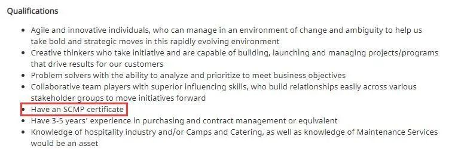 (原始链接: https://mmbiz.qpic.cn/mmbiz_jpg/cY0qSDjdkFdNXa6RWicKLLqy72B9qgnUDwwysJ06jAcjqUGFWsGkK0EUibe59cYGCZAgjPg2lW5W5PVAB7r7QLfQ/640?wx_fmt=jpeg)
- 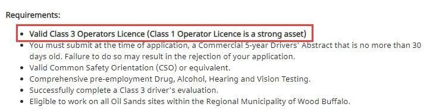 (原始链接: https://mmbiz.qpic.cn/mmbiz_jpg/cY0qSDjdkFdNXa6RWicKLLqy72B9qgnUDzWx5uYcg3uInMxNe3PiaYtvGawx5QrE9axr5BN7vDUzyFWKOxbJtA7w/640?wx_fmt=jpeg)
- 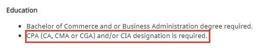 (原始链接: https://mmbiz.qpic.cn/mmbiz_jpg/cY0qSDjdkFdNXa6RWicKLLqy72B9qgnUDsS3snlEh0baoTrHh8wnFoKCBHCPkibhCcuNJYgf0rV1DKAO08VYwuUg/640?wx_fmt=jpeg)
- 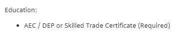 (原始链接: https://mmbiz.qpic.cn/mmbiz_jpg/cY0qSDjdkFdNXa6RWicKLLqy72B9qgnUDULFyJhkN20TMJT4fZjicyWWJCA62nSxeQAic4Qic5Fg8Fh1GlQiaA6AX8Q/640?wx_fmt=jpeg)
-  (原始链接: https://mmbiz.qpic.cn/mmbiz_jpg/cY0qSDjdkFdNXa6RWicKLLqy72B9qgnUDNJ78KGA3dX6y2gicpypib24vhiavH6qD0TIeDzopSV0jnOAdsmaEpwn3w/640?wx_fmt=jpeg)
-  (原始链接: https://mmbiz.qpic.cn/mmbiz_jpg/cY0qSDjdkFdNXa6RWicKLLqy72B9qgnUDuVsQBxhN767hrqaCE3lzPKPzlWcAzAln39ibYUa80TCxwWjEc1OVgaA/640?wx_fmt=jpeg)
-  (原始链接: https://mmbiz.qpic.cn/mmbiz_jpg/cY0qSDjdkFdNXa6RWicKLLqy72B9qgnUDgj6LanGyEOYJBrsU9JA833cSD1sdfVTIw3nibKdacWQYP5iciaxtXFkcA/640?wx_fmt=jpeg)
- 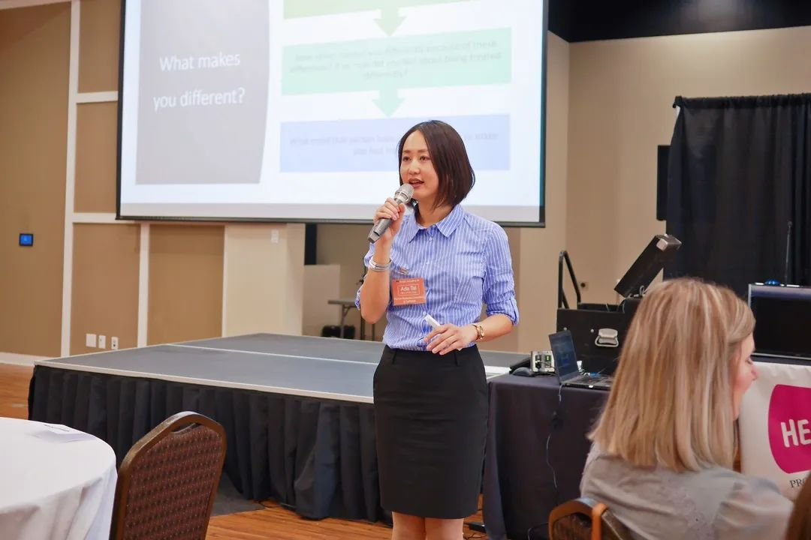 (原始链接: https://mmbiz.qpic.cn/mmbiz_jpg/cY0qSDjdkFdNXa6RWicKLLqy72B9qgnUDwcBV8T5Xg1h4IAGAEcWCvOT5RG2mShpiashHyGIibAKPznmiaYQIuFqfQ/640?wx_fmt=jpeg)
-  (原始链接: https://mmbiz.qpic.cn/mmbiz_jpg/cY0qSDjdkFdNXa6RWicKLLqy72B9qgnUD7ml2vic4O3ibwXtvu0iaDd1n71eVIWf3cJMgzqgg1LcYFjkcvZib8Lfzbw/640?wx_fmt=jpeg)
- 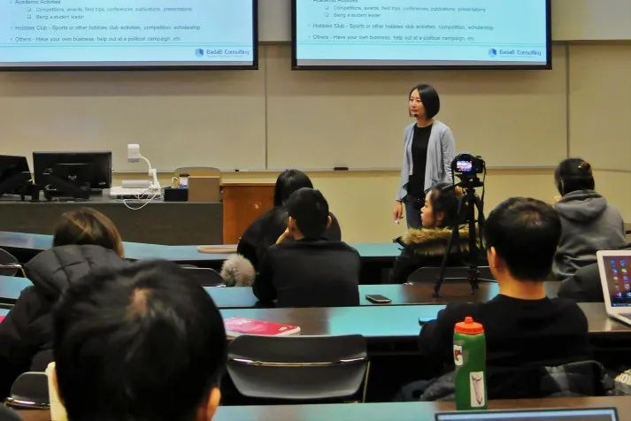 (原始链接: https://mmbiz.qpic.cn/mmbiz_jpg/cY0qSDjdkFdNXa6RWicKLLqy72B9qgnUDETaDNnmXGr02lmicOgueRfRp4vvc9iaBsZGLFwiaK4apRWibT6yVUicUD0g/640?wx_fmt=jpeg)
- 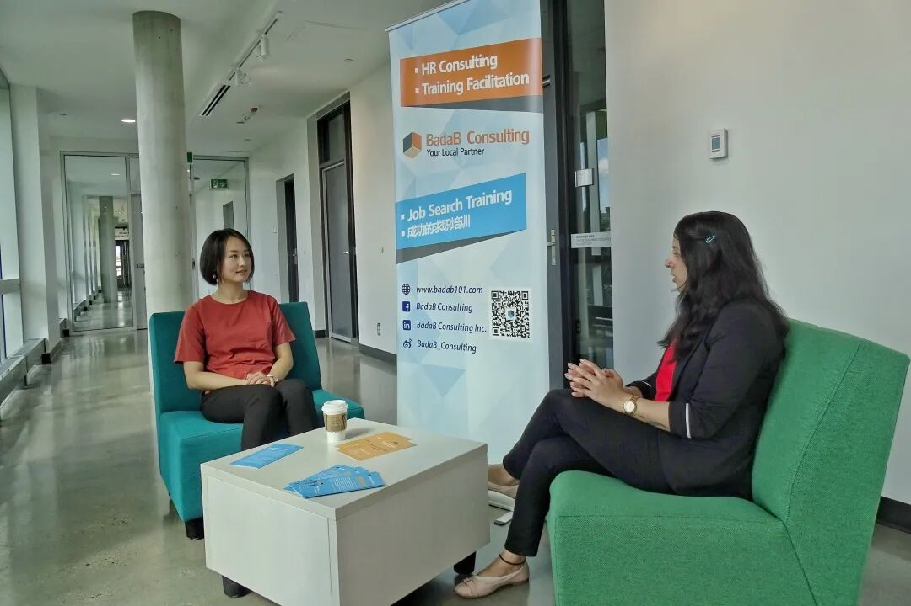 (原始链接: https://mmbiz.qpic.cn/mmbiz_jpg/cY0qSDjdkFdNXa6RWicKLLqy72B9qgnUDhXz7WR3S3rvnrKB7lLiaZE576fYCzVBPhV3ABvVicicg3YxNicDibdWHxEQ/640?wx_fmt=jpeg)
- 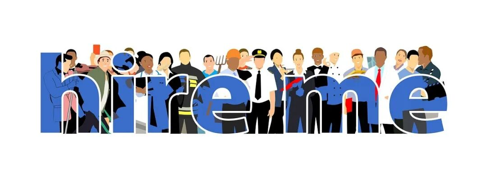 (原始链接: https://mmbiz.qpic.cn/mmbiz_jpg/cY0qSDjdkFdNXa6RWicKLLqy72B9qgnUD88cX3Tibp4H8TzxfE6g9sP7bawWrGnrQu0Bnsiab7ibRmTb3v9F7gHcjA/640?wx_fmt=jpeg)
- 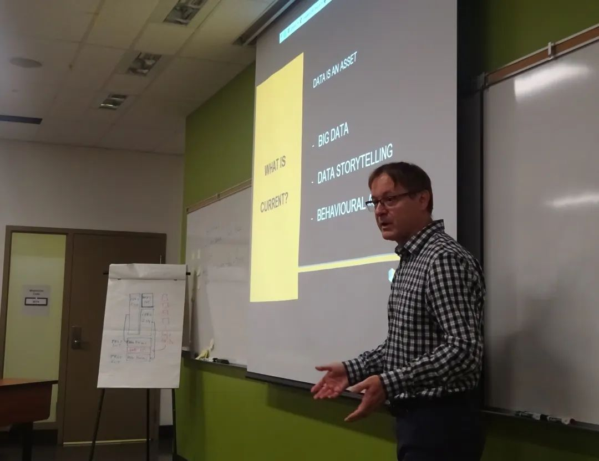 (原始链接: https://mmbiz.qpic.cn/mmbiz_jpg/cY0qSDjdkFdNXa6RWicKLLqy72B9qgnUDiaEdOV58CP3ibibgWvhodWGFByEjp3gcxFfW3S7XOLVDoHvO7xIqz57EQ/640?wx_fmt=jpeg)
- 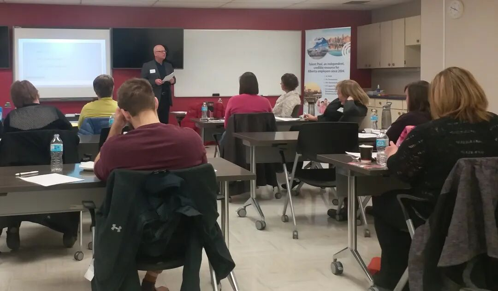 (原始链接: https://mmbiz.qpic.cn/mmbiz_jpg/cY0qSDjdkFdNXa6RWicKLLqy72B9qgnUDFOxebbNxDPzWicWquvdaDkfKR2T1OPPGXUF5xZ3TftLmvtHia8M0J7kA/640?wx_fmt=jpeg)
- 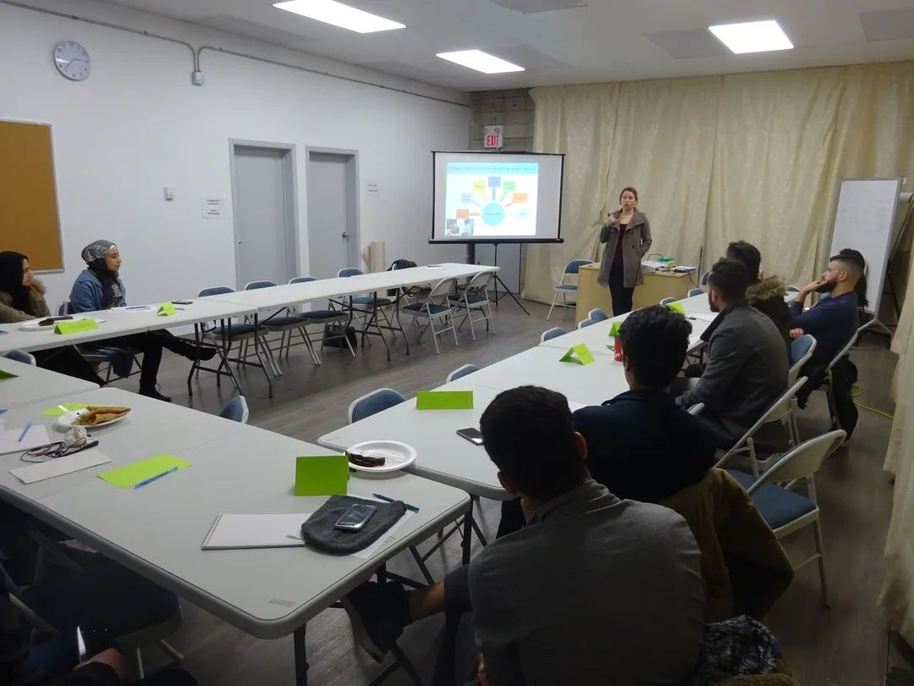 (原始链接: https://mmbiz.qpic.cn/mmbiz_jpg/cY0qSDjdkFdNXa6RWicKLLqy72B9qgnUDsYJ1dBBxOJwR9GEbTrPd6DvEnyCCuvJ82mj0fI5bPR4qJHTlCJicibXg/640?wx_fmt=jpeg)
-  (原始链接: https://mmbiz.qpic.cn/mmbiz_jpg/cY0qSDjdkFdNXa6RWicKLLqy72B9qgnUDyyJDertb87EBzEeoX87OuoRy0d5o7dsS6E0dh9KhlpFhNwApuO6tIQ/640?wx_fmt=jpeg)
-  (原始链接: https://mmbiz.qpic.cn/mmbiz_svg/JiavaWZxX4YvwmImEN6ZZL9VIUKpaysn4NeY7icuJLnZFibFnyvkxcqcJeWOD76ASYZqeEv0Hveo8NQ4xtwXGbrjLdammRx2gnd/640?wx_fmt=svg)
-  (原始链接: https://mmbiz.qpic.cn/mmbiz_jpg/cY0qSDjdkFdNXa6RWicKLLqy72B9qgnUDg22mibw06HnDGT2Mc97x74FFHxbiakjWmQ51d8bsacGRckGssCxE8k0g/640?wx_fmt=jpeg)
-  (原始链接: https://mmbiz.qpic.cn/mmbiz_jpg/cY0qSDjdkFdNXa6RWicKLLqy72B9qgnUD6SEecic7l0TOacM5obOzZib94ZaziaDadQEicwstM76Ad7bfHTst89skdQ/640?wx_fmt=jpeg)
-  (原始链接: https://mmbiz.qpic.cn/mmbiz_svg/JiavaWZxX4YvwmImEN6ZZL9VIUKpaysn4NeY7icuJLnZFibFnyvkxcqcJeWOD76ASYZqeEv0Hveo8NQ4xtwXGbrjLdammRx2gnd/640?wx_fmt=svg)
-  (原始链接: https://mmbiz.qpic.cn/mmbiz_svg/JiavaWZxX4YvwmImEN6ZZL9VIUKpaysn4NeY7icuJLnZFibFnyvkxcqcJeWOD76ASYZqeEv0Hveo8NQ4xtwXGbrjLdammRx2gnd/640?wx_fmt=svg)
-  (原始链接: https://mmbiz.qpic.cn/mmbiz_jpg/cY0qSDjdkFdNXa6RWicKLLqy72B9qgnUDlE9HrED13E6D0roYTicuzqwy63EvyyPwHeSplELTbJGYj0Yqib9SLEKg/640?wx_fmt=jpeg)
-  (原始链接: https://mmbiz.qpic.cn/mmbiz_jpg/cY0qSDjdkFdNXa6RWicKLLqy72B9qgnUDiccRL9icm9kWCTAnnicMm7uuEtoTsAOJyQql18icSuHJyvFBArYH4JJfBg/640?wx_fmt=jpeg)
-  (原始链接: https://mmbiz.qpic.cn/mmbiz_svg/JiavaWZxX4YvwmImEN6ZZL9VIUKpaysn4NeY7icuJLnZFibFnyvkxcqcJeWOD76ASYZqeEv0Hveo8NQ4xtwXGbrjLdammRx2gnd/640?wx_fmt=svg)
- 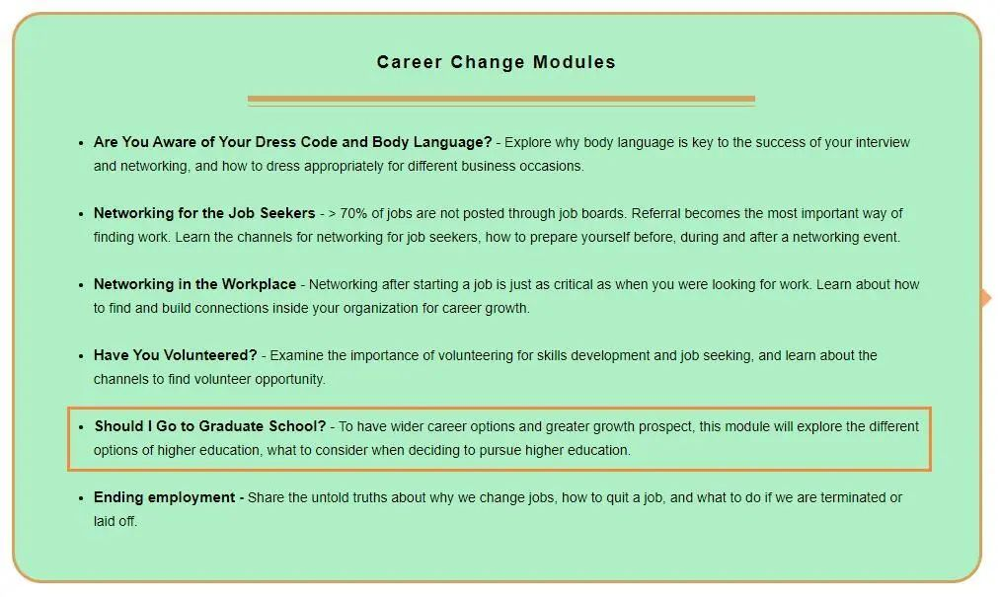 (原始链接: https://mmbiz.qpic.cn/mmbiz_jpg/cY0qSDjdkFdNXa6RWicKLLqy72B9qgnUDVkgp52T2dJO8LmicagaDMQibo2ia8D7v5QdwOGVogcf4nqaEqeJIytBYw/640?wx_fmt=jpeg)
-  (原始链接: https://mmbiz.qpic.cn/mmbiz_png/cY0qSDjdkFdNXa6RWicKLLqy72B9qgnUDGuibDZZUvKicBnH2Xib4KEQnVHQxXpU9a7WVaj6GarIONpDlJgzNibSCtw/640?wx_fmt=png)
-  (原始链接: https://mmbiz.qpic.cn/mmbiz_jpg/cY0qSDjdkFdNXa6RWicKLLqy72B9qgnUDag2alWbknwuvOCJZ8CoZYOJaKdLUiaviasenfRAeaIUX14l29jdw7Ticw/640?wx_fmt=jpeg)
